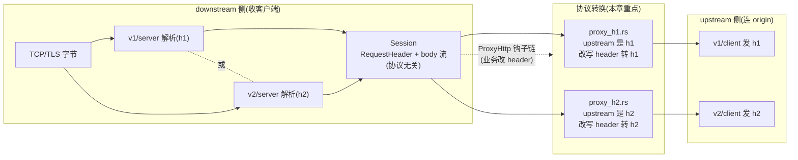
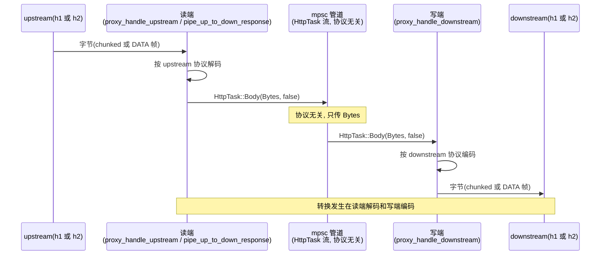

# 第 14 章 HTTP/1↔HTTP/2 协议转换

> **第 4 篇 · 转发设施 · HTTP 协议解析(协议招牌)**
>
> 核心问题:**downstream 是 HTTP/1、upstream 是 HTTP/2(或反过来), Pingora 怎么在两个协议之间转换, 既不丢信息又不引入 smuggling?**

读完这一章, 你会明白:

1. 为什么"协议转换"是反向代理的**本职工作之一**, 而不是边缘特性: 现代部署里客户端是 HTTP/2(浏览器、curl)、origin 是 HTTP/1.1(老 Nginx、Tomcat), 或反过来客户端是 HTTP/1.1、origin 是 HTTP/2(gRPC、HTTP/2 服务), 代理夹在中间必须两头都伺候。Envoy HCM 的"HTTP/1 downstream ↔ HTTP/2 upstream"是工业级反向代理最常见的配置, Pingora 同样如此。
2. 协议转换的**三个改写点**: header 改写(hop-by-hop header 增删、Host↔`:authority` 互换)、body 框架改写(chunked ↔ DATA 帧)、trailer 改写(h1 无显式 trailer ↔ h2 有 trailer)。每个改写点都对应 RFC 9110/9112/9113 的一条硬规则, 错一步要么协议错要么 smuggling。
3. 为什么 hop-by-hop header 的剥离**不在解析层**(P4-12 已点 v1/server.rs 只读 `Connection`/`Keep-Alive`/`Transfer-Encoding` 做 keepalive 判断, 不剥离), 而在**代理转发层**(本章 `proxy_h1.rs`/`proxy_h2.rs` 才真删)——这是"解析和转发职责分离"的体现。
4. `Host`↔`:authority` 转换为什么发生在 `upstream_request_filter` **之后**(P1-04 已点): 因为业务在 filter 里可能改 Host header, 转换必须在 filter 跑完之后, 用最终的 Host 值填 `:authority`。
5. `HttpTask::UpgradedBody` 这个六变体之一(P2-08 已点)是怎么用上的: websocket 等 `Connection: Upgrade` 在 h1 路径里如何被识别、如何把 body 写模式从"定长/chunked"切换成"读到连接关闭", 以及为什么 h2 downstream **不支持**升级(收到 `UpgradedBody` 直接 panic)。

如果只读一节, 读**第三节"三个改写点: header / body / trailer"**——那是协议转换最核心、也最能体现"代理在两个协议之间做归一化"的一节。

---

## 一句话点破

> **HTTP/1 和 HTTP/2 是两套语法不同的协议: h1 的 body 边界靠 Content-Length 或 chunked, h2 靠 DATA 帧的 END_STREAM 位; h1 的目标主机靠 Host header, h2 靠 `:authority` 伪头; h1 有 hop-by-hop header(Connection/Transfer-Encoding/Keep-Alive/Upgrade/Proxy-Connection)管单连接的事, h2 把这些事交给单连接多 stream 的协议本身, 所以这些头在 h2 里**禁止存在**。代理夹在两种协议之间, 不能简单转发字节, 必须**改写**: 从一边读进来按那边的语法解, 发出去按这边的语法重新装。Pingora 把这套改写拆成两份对称的代码——`proxy_h1.rs`(upstream 是 h1)和 `proxy_h2.rs`(upstream 是 h2), 各自在 `upstream_request_filter` 之后、真正发请求之前做协议归一化, body 和 trailer 则通过 `HttpTask` 枚举在两条 mpsc 管道间透传时顺手转格式。两份代码对称而不重复, 改写点都贴着 RFC 的硬规则, 是"代理本职"最集中的体现。**

回扣二分法: 这一章仍在主线的**转发设施**那一面——协议转换是框架自管的字节级机制, 业务在 `ProxyHttp` 钩子里改 header 时根本不用关心下游是 h1 还是 h2, 转换由框架兜底。但和前两章(P4-12 的"自研 h1 解析"、P4-13 的"委托 h2")不同: 前两章讲的是**单侧**的协议处理(downstream 怎么解 h1、upstream 怎么用 h2), 这一章讲的是**两侧之间的翻译**。一台代理只要 downstream 和 upstream 协议不同, 就绕不开这一章的内容——这正是 Cloudflare 这种"接入任意客户端、回源任意 origin"的反向代理每天每秒千万次在做的事。

---

## 14.1 为什么代理要做协议转换

### 14.1.1 提问: 两个协议, 不能直接转发字节吗

很多人对 HTTP/2 的第一印象是"HTTP/1 的二进制升级版, 语义相同", 于是直觉地认为: 代理嘛, 把 downstream 发来的字节原样转给 upstream 不就行了? 反正都是 HTTP。

这个直觉撞上的第一堵墙是**语法不兼容**。HTTP/1 和 HTTP/2 在**语义层**确实基本一致(都是 method/path/status/header/body 的组合), 但在**语法层**(字节怎么排)完全不同:

- HTTP/1 的请求是一段文本: `GET /path HTTP/1.1\r\nHost: a.com\r\n\r\n`, body 跟在后面, 边界靠 Content-Length 或 chunked。
- HTTP/2 的请求是一串二进制帧: 一个 HEADERS 帧(HPACK 编码的 header, 包括 `:method`/`:path`/`:scheme`/`:authority` 伪头)+ 若干 DATA 帧, body 边界靠最后一个 DATA 帧的 END_STREAM 位。

这两段字节**不能互通**。一个 HTTP/1 客户端发出来的字节, 直接灌给 HTTP/2 upstream, upstream 的 h2 解析器会报协议错误(因为它期待的是 connection preface 魔术串, 不是 `GET /...`)。反过来也一样。所以代理必须**先把字节解成语义**(method/path/header/body), **再按目标协议的语法重新装**——这就是协议转换。

第二堵墙是**协议特有概念的丢失和补回**。即使语义相同, 两个协议各有自己的"特产":

- HTTP/1 有 hop-by-hop header(`Connection`/`Transfer-Encoding`/`Keep-Alive`/`Upgrade`/`Proxy-Connection`), 这些头管的是**单条连接**的事(连接要不要保活、body 用什么框架、要不要切换协议)。HTTP/2 把这些事全交给了协议本身(单连接多 stream、DATA 帧定界、没有"切换协议"的概念), 所以 RFC 9113 §8.2 明确**禁止**这些头出现在 HTTP/2 里——h2 库收到带这些头的请求会报 PROTOCOL_ERROR。代理从 h1 读到这些头, 转给 h2 时必须**删掉**; 反过来从 h2 读到响应(理论上 h2 不会有这些头, 但实现可能不规范), 转给 h1 时可能要**补上**合适的值(比如 `Connection: keep-alive`)。
- HTTP/1 的目标主机靠 `Host` header, HTTP/2 靠 `:authority` 伪头(HPACK 静态表索引 1)。两者**不是同一个字段**——`:authority` 是伪头(以冒号开头, HPACK 编码), `Host` 是普通头。代理从 h1 读到 Host, 转给 h2 时必须把它"翻译"成 `:authority`(塞进 URI 的 authority 部分, h2 库据此生成 `:authority` 伪头); 反过来从 h2 读到 `:authority`, 转给 h1 时要补一个 `Host` header(因为老 h1 服务器认 Host 不认 `:authority`)。
- HTTP/1 没有显式的 trailer 概念(chunked encoding 的 trailer 是 RFC 7230 的可选扩展, 实际很少用), HTTP/2 有明确的 trailer(HEADERS 帧带 END_STREAM 位, 在 DATA 之后发送)。gRPC 等 RPC 协议严重依赖 trailer(Status 编码在 trailer 里), 所以 h2→h1 时 trailer 怎么表达、h1→h2 时 trailer 怎么补, 都是代理要处理的。

**关键认知**: 协议转换不是"可选的优化", 是**代理的本职**。只要 downstream 和 upstream 协议不同, 转换就不可避免。而且转换不是"对齐语义就行", 还要对齐**语法**(header 增删、body 重新定界、trailer 补全), 错一步要么协议错(直接报错), 要么 smuggling(前后端对 body 边界的理解不一致, 攻击面)。

> **callout · 为什么协议转换是个安全话题**: 协议转换做错, 不只是功能不对, 还可能变成 smuggling 的温床。考虑这个场景: downstream 是 HTTP/1, 发了个带 `Transfer-Encoding: chunked` 的请求; 代理转给 HTTP/2 upstream 时, 如果**没删** `Transfer-Encoding`(h2 不允许), upstream 的 h2 库可能报错; 但如果代理实现得马虎, 在转 h2 时只把 `Transfer-Encoding` 删了却没正确设 END_STREAM 位, upstream 和 downstream 对 body 边界的理解就可能不一致——这就是 smuggling 的根源。RFC 9112 §6.3 反复强调"代理必须移除 hop-by-hop header 并重新定界 body", 就是为了堵这条路。Pingora 把转换逻辑贴着 RFC 写, 而且**剥离在转发层不在解析层**(下一节讲为什么), 正是为了让转换的正确性可审计。

### 14.1.2 承接方怎么做: Envoy HCM / Nginx / hyper

先看三个承接方各自怎么做协议转换:

**Envoy(C++ 反向代理, 工业级标杆)怎么做**: Envoy 的 HCM(HTTP Connection Manager, 《Envoy》P3-10 拆透)是个**协议终止 + 重新发起**的架构。downstream 的 HTTP/1 或 HTTP/2 字节进 HCM, HCM 把它**解成内部的 `HeaderMap` + body 流**(协议无关的中间表示), 然后路由到 upstream 时**按 upstream 配置的协议重新编码**。如果 downstream 是 HTTP/1、upstream 是 HTTP/2(Envoy 最常见的配置), HCM 在 downstream 侧用 HTTP/1 codec 解码、在 upstream 侧用 HTTP/2 codec 编码, hop-by-hop header 的剥离和补全、Host↔`:authority` 转换都在 codec 层做。Envoy 的设计哲学是**协议终止**: 字节进了 HCM 就不再是 h1 或 h2, 是 Envoy 内部的 `HeaderMap`, 出去时重新装。这套设计清晰但重——codec 是独立的模块, 转换逻辑分散在编码/解码两端。

**Nginx(C 反向代理, 配置驱动)怎么做**: Nginx 的 `proxy_pass` 配合 `proxy_http_version 2.0;`(1.9.5+)可以让 upstream 走 HTTP/2。Nginx 同样是协议终止架构: downstream 字节进 `ngx_http_recv_request` 解析, 存进 `ngx_http_request_t`(协议无关结构), upstream 用 `ngx_http_v2_module` 编码发出。Nginx 的 hop-by-hop header 处理在 `ngx_http_proxy_handler` 里, 有个 `proxy_pass_request_headers` 列表显式列出哪些头要转、哪些不转(`Connection`/`Keep-Alive` 等默认不转)。Nginx 的特点是**配置驱动**: 哪些头转、哪些不转, 用户可以在配置里改(`proxy_set_header`/`proxy_pass_header`/`proxy_hide_header`)。

**hyper(Tokio 之上同级库, 通用 HTTP 库)怎么做**: hyper 不强调"协议转换", 因为 hyper 的定位是**通用 HTTP 库**, 不是代理。hyper 同时支持 HTTP/1 和 HTTP/2, 上层(`Service` trait)看到的是统一的 `Request`/`Response`对象(协议无关), hyper 内部按连接的协议版本决定用 h1 还是 h2 codec。但 hyper 自己不做"代理", 它把字节收进来交给 `Service`, `Service` 返回响应——如果业务要写代理, 得自己拿 hyper 的 client 和 server 拼起来, 转换逻辑业务自己写。所以 hyper 提供了"协议归一化到 `Request`/`Response`"的能力, 但**不提供"在两个协议间翻译"的现成逻辑**——那是代理框架的活。

**如果 Pingora 朴素地"原样转发字节"会怎样**? 会立刻撞墙:

1. **协议直接不通**: HTTP/1 字节灌给 h2 upstream, h2 库握手就失败(期待 connection preface); h2 字节灌给 h1 upstream, h1 解析器报"非法请求行"。
2. **hop-by-hop header 引发协议错误**: h1 的 `Connection: keep-alive` 转给 h2 upstream, h2 库报 PROTOCOL_ERROR(h2 禁止这些头)。
3. **smuggling 风险**: body 边界在两个协议间不对齐, 下游和上游对"body 何时结束"理解不一致。
4. **功能丢失**: gRPC 的 trailer(Status 编码)从 h2 转给 h1 时如果没有正确处理, 客户端拿不到 RPC 状态。

所以 Pingora 必须做协议转换。它选择的方式是**两份对称的转发代码**(`proxy_h1.rs` 和 `proxy_h2.rs`), 各自负责"upstream 是 h1/h2 时的转换", 转换逻辑贴着 RFC 的硬规则, 改写点清晰可审计。下面先看这两份代码的整体分工。

### 14.1.3 所以 Pingora 这么设计: 两份对称的转发代码

Pingora 的代理入口在 [`pingora-proxy/src/lib.rs`](../pingora/pingora-proxy/src/lib.rs#L293-L312)。`proxy_request` 拿到 upstream 连接后, 根据连接是 h1 还是 h2 分发:

```rust
// pingora-proxy/src/lib.rs: 根据 upstream 协议分发(简化示意)
let client_session = self.client_upstream.get_http_session(&*peer).await?;
match client_session {
    Ok((client_session, client_reused)) => {
        let (server_reused, error) = match client_session {
            ClientSession::H1(mut h1) => {
                // upstream 是 HTTP/1: 走 proxy_h1.rs
                self.proxy_to_h1_upstream(session, &mut h1, client_reused, &peer, ctx).await
            }
            ClientSession::H2(mut h2) => {
                // upstream 是 HTTP/2: 走 proxy_h2.rs
                self.proxy_to_h2_upstream(session, &mut h2, client_reused, &peer, ctx).await
            }
        };
        // ...
    }
}
```

见 [`proxy_request` 的 h1/h2 分发](../pingora/pingora-proxy/src/lib.rs#L296-L312)。`ClientSession` 是个枚举, 两个变体 `H1(HttpSessionV1)` / `H2(Http2Session)`(就是 P4-12/P4-13 讲的两个会话类型)。分发是按 upstream 的协议——注意**不按 downstream 的协议**。downstream 是 h1 还是 h2, 由 `Session`(downstream 会话的包装)自己管, `proxy_h1`/`proxy_h2` 都从 `session.req_header()` 拿请求头(协议无关的 `RequestHeader`), 不关心 downstream 到底是 h1 还是 h2。

这就是 Pingora 协议转换设计的**核心分层**: `session`(downstream)把 downstream 的 h1/h2 字节解成统一的 `RequestHeader`/body 流(协议无关); `proxy_h1`/`proxy_h2`(upstream 侧)负责把这个统一的 `RequestHeader`/body 流按 upstream 的协议(h1 或 h2)重新装成字节发出去。所以**协议转换的真正发生点, 是 `proxy_h1`/`proxy_h2` 在发请求之前对 `RequestHeader` 的改写**, 以及 body 在 mpsc 管道里以 `HttpTask` 形式透传时的格式转换。



注意这张图的关键: **downstream 协议和 upstream 协议是独立决定的**。downstream 是 h1(h1 客户端连进来)或 h2(h2 客户端连进来), upstream 是 h1(origin 只支持 h1)或 h2(origin 支持 h2)。所以理论上**四种组合**都可能出现: h1→h1、h1→h2、h2→h1、h2→h2。每种组合的转换逻辑由 downstream 侧的 `Session`(把字节解成 `RequestHeader`)和 upstream 侧的 `proxy_h1`/`proxy_h2`(把 `RequestHeader` 装回字节)共同决定。这就是为什么 Pingora 把转换拆成"downstream 解析"和"upstream 重装"两层——两层各自独立, 组合自然支持。

> **callout · Envoy HCM 的"协议终止"和 Pingora 的"两层独立"是同一个思路的两种说法**: Envoy HCM 把 downstream 字节解成 `HeaderMap`(协议无关), upstream 用 codec 重新装——这叫"协议终止"。Pingora 把 downstream 字节解成 `RequestHeader`(协议无关), upstream 用 `proxy_h1`/`proxy_h2` 重新装——这也是"协议终止", 只不过 Pingora 不用"codec"这个词, 而是分两个文件管 h1/h2 的重装。两者本质相同: 都是"downstream 解析 → 协议无关中间表示 → upstream 重装"的三段式。Envoy 把重装逻辑叫 codec, Pingora 把重装逻辑叫 `proxy_h1`/`proxy_h2`——同一件事, 不同命名。

下面三节分别拆三个改写点: header(14.2)、body(14.3)、trailer(14.4)。每个改写点都会对照 RFC 的硬规则、承接方的做法、Pingora 的实现。

---

## 14.2 改写点一: header 归一化

### 14.2.1 hop-by-hop header 是什么, 为什么 h2 禁止它们

要理解 header 归一化, 先得讲清"hop-by-hop header"这个概念。

HTTP 的 header 分两类:

- **end-to-end header**(端到端头): 这些头要从 sender 一路传到最终 receiver, 中间的代理不能删(除非显式替换)。比如 `Content-Type`、`Content-Length`、`Cache-Control`——这些是描述**消息本身**的, 整条链路都要看到。
- **hop-by-hop header**(逐跳头): 这些头只管**单条连接**的事, 不能跨连接转发。RFC 9110 §7.6.1 明确列了几个: `Connection`、`Keep-Alive`、`Proxy-Authenticate`、`Proxy-Authorization`、`TE`、`Trailer`、`Transfer-Encoding`、`Upgrade`。此外, `Connection` header 里列出的任何 header 名, 也被视为 hop-by-hop(比如 `Connection: foo` 意味着 `foo` 也是 hop-by-hop)。

为什么要分这两类? 因为 HTTP 是个**多跳**协议: 客户端 → 代理 A → 代理 B → origin。每条连接(`客户端↔代理A`、`代理A↔代理B`、`代理B↔origin`)的属性可能不同——代理 A 到代理 B 可能 keep-alive, 代理 B 到 origin 可能不支持; 代理 A 到代理 B 可能用 chunked, 代理 B 到 origin 可能用 Content-Length。这些"管单条连接"的属性, 不能从一条连接传到另一条——必须每条连接自己决定。

`Connection` 这个头就是用来声明"哪些头是 hop-by-hop"的: `Connection: keep-alive` 既说明 `keep-alive` 这个头是 hop-by-hop, 又说明这条连接希望保活; `Connection: Upgrade` 说明 `Upgrade` 这个头是 hop-by-hop, 而且这条连接想切换协议。代理在转发请求时, **必须删掉所有 hop-by-hop header**, 因为它们管的是上一条连接, 对下一条连接没意义(下一条连接要自己重新生成自己的 hop-by-hop)。

HTTP/1 这个设计有个**安全漏洞**——如果代理忘了删 hop-by-hop header(或者删错了), 就可能导致前后端对连接状态的理解不一致, 这就是 smuggling 的一个根源。RFC 9112 §6.3 反复强调代理要"正确移除 Transfer-Encoding", 就是为了堵这条路。

HTTP/2 的设计者一拍大腿: 既然 hop-by-hop header 这么容易出事, **干脆从协议里消灭它们**。HTTP/2 把 hop-by-hop 关心的事全交给了协议本身:

- **keep-alive**: HTTP/2 是长连接多路复用, 默认就是 keep-alive, 不需要 `Connection: keep-alive` 这个头。
- **body 框架**: HTTP/2 的 body 是 DATA 帧序列, 长度靠帧头定, 不需要 `Transfer-Encoding: chunked`。
- **协议切换**: HTTP/2 不支持在连接中切换协议(它本身就是"切换"后的结果), 不需要 `Upgrade`。
- **连接特有参数**: HTTP/2 用 SETTINGS 帧协商连接参数, 不需要 `Keep-Alive`/`Proxy-Connection` 这些非标准头。

所以 RFC 9113 §8.2 明确规定: **HTTP/2 不允许 `Connection`/`Transfer-Encoding`/`Upgrade`/`Keep-Alive`/`Proxy-Connection` 这些头出现**——不是"建议不出现", 是"必须不出现, 出现就是 PROTOCOL_ERROR"。h2 crate 严格执行这条规则, 收到带这些头的请求/响应会报错。

这就给代理提出了硬要求: **从 HTTP/1 读到的请求, 转给 HTTP/2 upstream 之前, 必须删掉这些 hop-by-hop header**; **从 HTTP/2 读到的响应, 转给 HTTP/1 downstream 之前, 也要确保 downstream 不会收到 h2 不该有但实现可能给的头**(这部分主要在 h2 响应侧, 见 P4-13 v2/server.rs 的 `write_response_header`)。

### 14.2.2 承接方怎么做: Nginx 的白名单 vs Pingora 的黑名单

hop-by-hop header 的剥离, 不同代理实现策略不同:

**Nginx**: 用**白名单 + 配置**。Nginx 的 `proxy_pass` 有个内置的"不转发"列表, 默认不转 `Connection`/`Keep-Alive`/`Transfer-Encoding`/`Upgrade` 等。用户可以用 `proxy_pass_header` 显式放行某个头, 用 `proxy_hide_header` 显式隐藏某个头。这种策略灵活, 但依赖用户配置正确——配错了就 smuggling。

**Envoy HCM**: 在 codec 层做。HCM 的 HTTP/1 codec 解码时会自动剥离 hop-by-hop header, HTTP/2 codec 编码时也会确保不带这些头。剥离逻辑在 `CodecHelper::stripHopByHopHeaders` 之类的工具函数里, 是硬编码的(不开放给用户配)。这种策略安全, 但不灵活。

**Pingora**: 用**黑名单 + 硬编码**。在 `proxy_h2.rs` 里(因为 upstream 是 h2, 必须删 hop-by-hop), 写死要删的几个头:

```rust
// pingora-proxy/src/proxy_h2.rs: 删 hop-by-hop header(简化示意, 见原文 L92-100)
let mut req = session.req_header().clone();

if req.version != Version::HTTP_2 {
    /* remove H1 specific headers */
    req.remove_header(&http::header::TRANSFER_ENCODING);
    req.remove_header(&http::header::CONNECTION);
    req.remove_header(&http::header::UPGRADE);
    req.remove_header("keep-alive");
    req.remove_header("proxy-connection");
}

/* turn it into h2 */
req.set_version(Version::HTTP_2);
```

见 [`proxy_down_to_up` 里删 hop-by-hop header](../pingora/pingora-proxy/src/proxy_h2.rs#L92-L103)。这段代码在 upstream 是 h2 时执行, 删掉五个 hop-by-hop header(对应 RFC 9113 §8.2 的硬规则)。注意一个细节: `if req.version != Version::HTTP_2` 这个判断——只有当 downstream 不是 h2 时才删。为什么? 因为如果 downstream 也是 h2, downstream 解析时(`v2/server.rs`)已经保证不会有这些头(h2 库协议层就拦了), 不需要重复删。只有 downstream 是 h1 时, h1 解析会原样保留这些头(P4-12 讲过 v1/server.rs 不剥离), 这里才要删。

这就是 P4-12 提到的那个事实——**hop-by-hop 剥离不在解析层, 在转发层**——的字面体现。v1/server.rs 只**读**这些头做 keepalive 判断(`is_buf_keepalive` 看 `Connection` header, L692), 不删; 真正删的是 `proxy_h2.rs` 在转发前。这种分层有个好处: 解析层保持简单(只读不写, 状态机干净), 转发层职责清晰(管"转出去时长什么样")。如果解析层就删, 反而会丢失"这条 downstream 连接想 keep-alive"这个信息(它要靠 `Connection` header 判断), 而 keepalive 是 downstream 连接管理的输入(P2-06 连接池要用)。

> **callout · 为什么剥离在转发层不在解析层**: 这是个值得展开的设计决策。如果 v1/server.rs 在解析请求时就删了 `Connection`/`Transfer-Encoding`, 会怎样? 第一, keepalive 判断没输入了——Pingora 要靠 `Connection: keep-alive`(或 HTTP/1.1 默认)判断 downstream 连接能不能复用, 删了就没法判断。第二, body 框架信息丢了——`Transfer-Encoding: chunked` 是 body 定界的依据, 解析层删了就不知道怎么读 body 了。所以解析层必须**保留**这些头, 它们是解析和连接管理的输入。而转发层(upstream 侧)的目标协议(h2)不需要这些头(协议本身管这些事), 所以转发层删。两层职责清晰: 解析层用 hop-by-hop header 干自己的活, 转发层把用完的 hop-by-hop header 扔掉再转给 upstream。这正是"职责分离"的体现, 也是为什么 P4-12 反复强调"v1/server.rs 不剥离"——不是疏忽, 是有意的。

### 14.2.3 Host↔:authority: 两个协议的目标主机表达

除了 hop-by-hop header, 另一个必须改写的头是**目标主机**。HTTP/1 用 `Host` header 表达请求发往哪个主机(`Host: example.com`), HTTP/2 用 `:authority` 伪头(`:authority: example.com`)。这两个不是同一个字段——`Host` 是普通头(在 HPACK 里是静态表索引 35), `:authority` 是伪头(以冒号开头, HPACK 静态表索引 1, 必须出现在所有头之前)。RFC 9113 §8.3.1 规定 HTTP/2 请求**必须**有 `:authority`(或 `Host`, 但 `:authority` 优先), **不应该**两个都有。

代理在两种协议间转换时, 要做 Host↔`:authority` 的翻译。具体规则:

- **h1→h2**(downstream 是 h1, upstream 是 h2): h1 请求带的 `Host` header, 要转成 h2 的 `:authority`。具体做法是: 删掉 `Host` header, 把它的值塞进 URI 的 authority 部分(h2 库据此生成 `:authority` 伪头)。
- **h2→h1**(downstream 是 h2, upstream 是 h1): h2 请求的 `:authority`(在 Pingora 内部已经解成 URI 的 authority), 要补一个 `Host` header(h1 服务器认 Host 不认 `:authority`)。

Pingora 的实现拆在两份代码里, 对应两个方向:

**h2→h1 方向(upstream 是 h1)** 在 `proxy_h1.rs`:

```rust
// pingora-proxy/src/proxy_h1.rs: h2 downstream 的请求转 h1 upstream(简化示意, 见原文 L44-63)
let mut req = session.req_header().clone();

// Convert HTTP2 headers to H1
if req.version == Version::HTTP_2 {
    req.set_version(Version::HTTP_11);
    // 如果有 body 但没 content-length, 加 chunked(h2 body 靠 END_STREAM, h1 靠 chunked)
    if !session.is_body_empty() && session.get_header(header::CONTENT_LENGTH).is_none() {
        req.insert_header(header::TRANSFER_ENCODING, "chunked").unwrap();
    }
    if session.get_header(header::HOST).is_none() {
        // H2 必须有 :authority, 但不一定有 host header
        // 大多数 h1 server 期望 host header, 所以转换
        let host = req.uri.authority().map_or("", |a| a.as_str()).to_owned();
        req.insert_header(header::HOST, host).unwrap();
    }
}
```

见 [`proxy_1to1` 里 h2→h1 的 header 转换](../pingora/pingora-proxy/src/proxy_h1.rs#L44-L63)。这段代码做了三件事: 把版本号从 `HTTP_2` 改成 `HTTP_11`(版本号是 h1 语法的一部分); 如果有 body 但没 Content-Length 就加 chunked(因为 h2 body 靠 END_STREAM 位定界, h1 靠 chunked 或 Content-Length, 转过去得加框架); 如果没有 Host header 就从 URI 的 authority 补一个(因为 h2 不强制有 Host, 但 h1 服务器期望 Host)。

注意这里的判断: `if req.version == Version::HTTP_2`。这一段只在 downstream 是 h2、upstream 是 h1 时执行(downstream 解出来的 `req.version` 是 `HTTP_2`, 因为 downstream 是 h2)。如果 downstream 也是 h1, `req.version` 是 `HTTP_11`, 这段跳过——h1→h1 不需要补 Host(h1 已经有 Host 了)。这就是"按 downstream 协议决定改写"的体现。

**h1→h2 方向(upstream 是 h2)** 在 `proxy_h2.rs`:

```rust
// pingora-proxy/src/proxy_h2.rs: Host → :authority(简化示意, 见原文 L124-144)
// Remove H1 `Host` header, save it in order to add to :authority
// We do this because certain H2 servers expect request not to have a host header.
// The `Host` is removed after the upstream filters above for 2 reasons
// 1. there is no API to change the :authority header
// 2. the filter code needs to be aware of the host vs :authority across http versions otherwise
let host = req.remove_header(&http::header::HOST);

session.upstream_compression.request_filter(&req);
// ...

let mut req: http::request::Parts = req.into();

// H2 requires authority to be set, so copy that from H1 host if that is set
if let Some(host) = host {
    if let Err(e) = update_h2_scheme_authority(&mut req, host.as_bytes(), peer.is_tls()) {
        return (false, Some(e));
    }
}
```

见 [`proxy_down_to_up` 里 Host→`:authority` 转换](../pingora/pingora-proxy/src/proxy_h2.rs#L124-L144)。这段代码的逻辑是: 先把 `Host` header 从请求里**删掉**(保存到 `host` 变量), 然后调 `update_h2_scheme_authority` 把这个 host 值塞进 URI 的 authority 部分。URI 的 authority 会被 h2 库用来生成 `:authority` 伪头(`write_request_header` 时)。

### 14.2.4 Host 转换为什么在 upstream_request_filter 之后

注意上面 `proxy_h2.rs` 那段代码的关键注释: **"The `Host` is removed after the upstream filters above for 2 reasons"**。`Host` header 的删除(转换)发生在 `upstream_request_filter` 调用**之后**。这是个有意的顺序, P1-04 已经点过, 这里展开讲透。

`upstream_request_filter` 是 `ProxyHttp` trait 的一个钩子, 业务在这里改要发往 upstream 的请求头(比如加鉴权头、改 Host 路由)。如果 Pingora 在 filter **之前**就把 `Host` 转成 `:authority`(URI authority), 业务在 filter 里就看不到 `Host` header 了——业务习惯了改 `Host`(h1 风格), 让它改 URI authority 不直观(而且 `RequestHeader` 的 API 改 URI authority 不如改 header 方便)。所以 Pingora 的选择是: **filter 阶段保留 `Host` header**(业务照常改), filter 跑完后再把最终的 `Host` 转成 `:authority`。

注释里的两个理由值得逐个拆:

1. **"there is no API to change the :authority header"**: Pingora 的 `RequestHeader` 是基于 `http::request::Parts` 的, 改 `:authority`(URI authority)需要构造新的 URI(`http::uri::Builder`), 不像改 header 那样有 `insert_header`/`remove_header` 的直接 API。如果让业务在 filter 里改 `:authority`, API 会很别扭。所以保留 `Host` header 让业务改, 转换在 filter 之后统一做。
2. **"the filter code needs to be aware of the host vs :authority across http versions otherwise"**: 如果 Pingora 在 filter 之前就转换, 业务的 filter 代码就得知道"现在 downstream 是 h1 还是 h2", 因为 h1 时改 `Host`、h2 时改 `:authority`。这违背了 ProxyHttp 的设计哲学——业务钩子应该协议无关, 不用关心 downstream/upstream 是 h1 还是 h2。保留 `Host` 让 filter 协议无关, 转换由框架兜底。

这就是为什么转换顺序是: **`upstream_request_filter`(业务改 Host) → 删 Host 转 `:authority`(框架兜底) → 发请求**。这个顺序让业务钩子保持协议无关, 同时保证发往 h2 upstream 的请求最终有正确的 `:authority`。

> **callout · 这是个"业务友好"的取舍, 不是"协议正确"的必须**: 严格说, RFC 没规定 `Host`→`:authority` 转换必须在业务 filter 之后。理论上 Pingora 也可以在 filter 之前转换, 让业务改 `:authority`。但那样业务代码就要关心协议版本, 不符合 ProxyHttp 的"钩子链协议无关"哲学。Pingora 选择牺牲一点点灵活性(业务改 Host 而非 `:authority`)换取钩子链的协议无关性——这是个典型的"框架兜底复杂度, 业务保持简单"的取舍。Envoy 的做法不同: Envoy 的 filter 看到的是协议无关的 `HeaderMap`, `:authority` 和 `Host` 都在 `HeaderMap` 里, filter 改哪个都行, codec 层负责转换。两种做法各有道理, Pingora 的更 Rust 化(类型驱动, `RequestHeader` 区分 header 和 URI)。

### 14.2.5 update_h2_scheme_authority: 把 Host 塞进 URI

Host 转换的具体实现在 [`update_h2_scheme_authority`](../pingora/pingora-proxy/src/proxy_h2.rs#L27-L72):

```rust
// pingora-proxy/src/proxy_h2.rs: update_h2_scheme_authority(简化示意, 非源码原文)
fn update_h2_scheme_authority(
    header: &mut http::request::Parts,
    raw_host: &[u8],
    tls: bool,
) -> Result<()> {
    // 1. 从 raw_host 解析出 authority, 处理 IPv6 和多余端口的边界情况
    let authority = /* 解析 raw_host, 处理 [::1] 和 example.com:123:345 的情况 */;

    // 2. scheme 根据 tls 决定
    let scheme = if tls { "https" } else { "http" };

    // 3. 用 authority + scheme + 原 path_and_query 构造新 URI
    let uri = http::uri::Builder::new()
        .scheme(scheme)
        .authority(authority)
        .path_and_query(header.uri.path_and_query().as_ref().unwrap().as_str())
        .build()?;
    header.uri = uri;
    Ok(())
}
```

见 [`update_h2_scheme_authority` 实现](../pingora/pingora-proxy/src/proxy_h2.rs#L27-L72)。这段代码有几个细节值得注意:

- **authority 的解析**: `raw_host` 来自 h1 的 `Host` header, 可能是 `example.com`、`example.com:443`、`[::1]:443` 等格式。函数处理了 IPv6(以 `[` 开头)和多余端口(`example.com:123:345` 截到 `example.com:123`)的边界。这些边界看着琐碎, 但每个都对应真实部署里的 host 格式。
- **scheme 根据 tls 决定**: HTTP/2 的请求必须有 `:scheme` 伪头(`http` 或 `https`)。Pingora 根据 upstream 连接是不是 TLS 决定 scheme——TLS 用 `https`, 明文用 `http`。这对应 RFC 9113 §8.3.1 的规定: `:scheme` 是必填伪头。
- **path_and_query 保留**: 新 URI 复用原 URI 的 path_and_query(`/path?query`), 不改。

构造好的 URI(authority + scheme + path_and_query)会被 h2 库的 `send_request` 用来生成完整的伪头集(`:method` 来自 method, `:scheme`/`:authority`/`:path` 来自 URI)。这就是 h1 的 `Host` → h2 的 `:authority` 的完整翻译过程。

测试 [`test_update_authority`](../pingora/pingora-proxy/src/proxy_h2.rs#L881-L903) 验证了各种 host 格式的解析, 包括 IPv6、多余端口等边界, 是这段代码正确性的回归保障。

### 14.2.6 响应侧的 header 归一化

讲完请求侧, 再看响应侧。响应是从 upstream 读、转给 downstream。两种方向的归一化:

**h2 upstream → h1 downstream**(upstream 是 h2, downstream 是 h1): h2 的响应头一般不会有 hop-by-hop header(h2 库协议层拦了), 但可能有 h2 特有的伪头(`:status`)。Pingora 在 [`pipe_up_to_down_response`](../pingora/pingora-proxy/src/proxy_h2.rs#L757-L878) 读响应头时, h2 库已经把 `:status` 转成 `ResponseHeader.status` 了(伪头不进 `headers` map), 所以转给 h1 时不需要额外删伪头。但响应头里如果有 h2 不该有但实现给了的 hop-by-hop header, downstream 是 h1 时 h1 解析器能接受(h1 允许这些头), 所以不用删。

**h1 upstream → h2 downstream**(upstream 是 h1, downstream 是 h2): h1 的响应头可能有 hop-by-hop header(`Connection`/`Transfer-Encoding` 等)。downstream 是 h2 时, 转给 h2 客户端之前必须删掉这些头(h2 禁止)。这部分在 P4-13 讲过——`v2/server.rs` 的 [`write_response_header`](../pingora/pingora-core/src/protocols/http/v2/server.rs#L287-L331) 在写响应之前, 显式删掉 `Transfer-Encoding`/`Connection`/`Upgrade`/`Keep-Alive`/`Proxy-Connection` 五个头。这是个对称的设计: 请求侧 `proxy_h2.rs` 删 hop-by-hop(转给 h2 upstream), 响应侧 `v2/server.rs` 也删(转给 h2 downstream)。

> **callout · hop-by-hop 剥离在四个地方**: 把本章和前两章串起来, hop-by-hop header 的剥离在 Pingora 里发生在四个地方, 对应"请求/响应 × h1/h2"四种组合:
>
> | 方向 | upstream 协议 | 剥离位置 | 剥离的头 |
> |------|-------------|---------|---------|
> | 请求(upstream h2) | h2 | `proxy_h2.rs` `proxy_down_to_up` L95-99 | 5 个 hop-by-hop |
> | 请求(upstream h1) | h1 | 不剥离(h1 允许这些头) | - |
> | 响应(downstream h2) | - | `v2/server.rs` `write_response_header` L323-328 | 5 个 hop-by-hop |
> | 响应(downstream h1) | - | 不剥离(h1 允许这些头) | - |
>
> 规律: **只在目标协议是 h2 时剥离**(请求转给 h2 upstream、响应转给 h2 downstream)。h1 允许这些头, 所以转给 h1 不剥离。这印证了"剥离是为了满足目标协议的硬规则"——h2 禁止这些头是 RFC 9113 的硬规定, h1 允许是 RFC 9110 的设计。代理只在"目标协议不允许"时剥离, 不在"源协议有"时剥离(源协议有是正常的)。

### 14.2.7 响应侧的版本和 chunked 补全

响应方向还有一个细节: HTTP/1.0 风格的响应(没有 Content-Length 也没有 chunked, body 靠连接关闭定界)转给 downstream 时, 如果 downstream 想复用连接(keepalive), 必须转成 chunked, 否则 downstream 不知道 body 何时结束、不敢复用连接。

这个逻辑在 [`h1_response_filter`](../pingora/pingora-proxy/src/proxy_h1.rs#L680-L697):

```rust
// pingora-proxy/src/proxy_h1.rs: h1 响应侧补 chunked(简化示意, 见原文 L680-L697)
/* Convert HTTP 1.0 style response to chunked encoding so that we don't
 * have to close the downstream connection */
let no_body = session.req_header().method == http::method::Method::HEAD
    || matches!(header.status.as_u16(), 204 | 304);
if !no_body
    && !header.status.is_informational()
    && header.headers.get(http::header::TRANSFER_ENCODING).is_none()
    && header.headers.get(http::header::CONTENT_LENGTH).is_none()
    && !end
{
    // 把版本升到 1.1(1.0 不支持 chunked)
    header.set_version(Version::HTTP_11);
    header.insert_header(http::header::TRANSFER_ENCODING, "chunked")?;
}
```

见 [`h1_response_filter` 补 chunked 的逻辑](../pingora/pingora-proxy/src/proxy_h1.rs#L680-L697)。这段代码在响应头既没 Content-Length 又没 Transfer-Encoding、而且不是 HEAD/204/304(这些没有 body)、且 body 没结束(`!end`)时, 主动加 `Transfer-Encoding: chunked`, 同时把版本升到 1.1(1.0 不支持 chunked)。这是个**为了让 downstream 能 keepalive**的归一化: HTTP/1.0 的 close-delimited body 必须关连接才能结束, downstream 复用不了; 转成 chunked 后, downstream 知道 body 边界, 可以复用连接。

类似地, h2 upstream → h1 downstream 时(响应侧), [`h2_response_filter`](../pingora/pingora-proxy/src/proxy_h2.rs#L631-L638) 也补 chunked: h2 响应没有 Content-Length(body 靠 END_STREAM 定界), 转给 h1 downstream 时如果没有 Content-Length 就加 chunked(`Transfer-Encoding`), 让 downstream 能正确解析 body。

```rust
// pingora-proxy/src/proxy_h2.rs: h2 响应侧补 chunked(见原文 L625-L638)
/* Downgrade the version so that write_response_header won't panic */
header.set_version(Version::HTTP_11);

let no_body = session.req_header().method == "HEAD"
    || matches!(header.status.as_u16(), 204 | 304);

/* Add chunked header to tell downstream to use chunked encoding
 * during the absent of content-length in h2 */
if !no_body
    && !header.status.is_informational()
    && header.headers.get(http::header::CONTENT_LENGTH).is_none()
{
    header.insert_header(http::header::TRANSFER_ENCODING, "chunked")?;
}
```

注意一个微妙差异: h2→h1 这段(`h2_response_filter`)**总是**加 chunked(只要没 Content-Length 且不是 no_body 状态码), 因为 h2 响应一律靠 END_STREAM 定界, 没有"靠连接关闭定界"的概念, 转给 h1 时必须给个框架。而 h1→h1 那段(`h1_response_filter`)加了 `&& !end` 条件, 因为 h1 upstream 可能用 close-delimited(HTTP/1.0 风格), 如果响应已经结束(`end == true`, 比如 304/204 之类没 body 的), 不需要加 chunked。这种细微差异体现了两个方向的不同语义: h2 响应永远有明确边界(END_STREAM), h1 响应可能没有(close-delimited)。

---

## 14.3 改写点二: body 的映射

讲完 header, 看 body。HTTP/1 和 HTTP/2 的 body 表达完全不同, 代理在转发时要做格式映射。

### 14.3.1 两边的 body 框架对比

先对比两个协议的 body 框架:

| 维度 | HTTP/1 | HTTP/2 |
|------|--------|--------|
| **body 边界** | Content-Length(定长)或 Transfer-Encoding: chunked(分块)或连接关闭(HTTP/1.0) | DATA 帧序列, 最后一个 DATA 帧的 END_STREAM 位 |
| **空 body** | Content-Length: 0, 或 chunked 的 0-size 终止块 | 一个带 END_STREAM 的空 DATA 帧, 或 HEADERS 帧直接带 END_STREAM |
| **分块语义** | chunked: 每个 chunk 有 size + 数据, 终止 chunk size=0 | DATA 帧自然分块, 每帧有 24 位长度字段 |
| **trailer** | chunked 的 trailer(RFC 7230 可选扩展, 少用) | HEADERS 帧带 END_STREAM, 在 DATA 之后 |
| **流控** | 无(TCP 自己管) | 双层 window(stream + connection) |

代理在两种框架间转换, 核心问题是: **怎么把一边的 body 流, 重新装成另一边的框架**。

Pingora 的做法是用 `HttpTask` 枚举作为**协议无关的中间表示**。`HttpTask` 在 P2-08 已经讲过, 这里复习一下定义(见 [`pingora-core/src/protocols/http/mod.rs#L37-L50`](../pingora/pingora-core/src/protocols/http/mod.rs#L37-L50)):

```rust
pub enum HttpTask {
    Header(Box<ResponseHeader>, bool),        // 响应头 + 是否结束
    Body(Option<Bytes>, bool),                 // 一块 body + 是否结束
    UpgradedBody(Option<Bytes>, bool),         // 升级后的 body(websocket 等)
    Trailer(Option<Box<HeaderMap>>),           // trailer
    Done,                                      // 响应正常结束
    Failed(BError),                            // 响应出错
}
```

`HttpTask` 是个枚举, 六个变体覆盖了 HTTP 响应的所有可能事件(头/体/trailer/结束/失败/升级体)。注意它**协议无关**——`Body(Option<Bytes>, bool)` 既不关心 body 来自 h1 还是 h2, 也不关心它要发往 h1 还是 h2。这是个"中性的 body 事件"。

Pingora 的转发流程是:

1. **从 upstream 读 body**, 按 upstream 协议(h1 或 h2)解成 `HttpTask::Body(...)`, 放进 mpsc 管道(`tx_upstream → rx_upstream`)。
2. **从 mpsc 管道读 `HttpTask`**, 按 downstream 协议(h1 或 h2)装成字节发给 downstream。

中间的 mpsc 管道是协议无关的——它只传 `HttpTask`, 不关心两边的协议。协议转换发生在"读"和"写"两端:

- **读端**(从 upstream 读): `proxy_h1.rs` 的 [`proxy_handle_upstream`](../pingora/pingora-proxy/src/proxy_h1.rs#L185-L268) 调 `client_session.read_response_task()`, 这个方法在 h1 的 `HttpSession`(v1/client.rs)里把 h1 的 chunked/Content-Length 解码, 返回 `HttpTask::Body(...)`; `proxy_h2.rs` 的 [`pipe_up_to_down_response`](../pingora/pingora-proxy/src/proxy_h2.rs#L757-L878) 调 `client.read_response_body()`, 这个方法在 h2 的 `Http2Session`(v2/client.rs)里把 h2 的 DATA 帧解码, 也返回 `HttpTask::Body(...)`。两种协议殊途同归, 都产出协议无关的 `HttpTask`。
- **写端**(写往 downstream): `proxy_h1.rs` 的 [`proxy_handle_downstream`](../pingora/pingora-proxy/src/proxy_h1.rs#L272-L601) 调 `session.write_response_tasks(filtered_tasks)`, 这个方法按 downstream 协议(h1 或 h2)把 `HttpTask` 装成字节。downstream 是 h1 时, `Body` 被装成 chunked 或按 Content-Length 发; downstream 是 h2 时, `Body` 被装成 DATA 帧。



这种"协议无关中间表示 + 两端各自编解码"的设计, 和 Envoy HCM 的"协议终止 + HeaderMap 中间表示"是同一个思路。区别是 Pingora 用的是 `HttpTask` 枚举(Rust 的代数数据类型, 模式匹配驱动), Envoy 用的是 `HeaderMap` + body 流(C++ 的对象, 虚函数驱动)。

### 14.3.2 h1 chunked ↔ h2 DATA 帧的映射

具体看 body 怎么映射。

**h1 downstream → h2 upstream**(downstream 是 h1, upstream 是 h2): downstream 是 h1, 客户端发的是 chunked 或 Content-Length 的 body。Pingora 在 [`send_body_to2`](../pingora/pingora-proxy/src/proxy_h2.rs#L710-L753) 把 body 发给 h2 upstream:

```rust
// pingora-proxy/src/proxy_h2.rs: send_body_to2(简化示意, 见原文 L710-L753)
async fn send_body_to2(
    &self,
    session: &mut Session,
    mut data: Option<Bytes>,
    end_of_body: bool,
    client_body: &mut h2::SendStream<bytes::Bytes>,
    ctx: &mut SV::CTX,
    write_timeout: Option<Duration>,
) -> Result<bool> {
    // 跑 request_body_filter(业务钩子, 协议无关)
    session.downstream_modules_ctx.request_body_filter(&mut data, end_of_body).await?;
    self.inner.request_body_filter(session, &mut data, end_of_body, ctx).await?;

    // 空 body 且非结束, 跳过(h2 不需要写空帧)
    if !end_of_body && data.as_ref().is_some_and(|d| d.is_empty()) {
        return Ok(false);
    }

    if let Some(data) = data {
        // 有数据: 写 DATA 帧
        write_body(client_body, data, end_of_body, write_timeout).await.map_err(|e| e.into_up())?;
    } else {
        // 无数据(None 表示 body 结束): 发空 DATA 帧 + END_STREAM
        write_body(client_body, Bytes::new(), true, write_timeout).await.map_err(|e| e.into_up())?;
    }

    Ok(end_of_body)
}
```

见 [`send_body_to2` 实现](../pingora/pingora-proxy/src/proxy_h2.rs#L710-L753)。这段代码的关键是: 不管 downstream 的 h1 body 是 chunked 还是 Content-Length, 进到 `send_body_to2` 时都已经是一块块 `Bytes`(由 downstream 侧的 v1/server.rs 解码 chunked 或按 Content-Length 切块)。`send_body_to2` 拿到这些 `Bytes`, 调 h2 的 `write_body`(就是 h2 crate 的 `SendStream::send_data`), 把它装成 DATA 帧发出去。**chunked → DATA 帧的转换, 发生在 downstream 侧解码 chunked 和 upstream 侧编码 DATA 帧之间, 中间的 `Bytes` 是协议无关的**。

注意 `end_of_body` 的处理: h1 的 body 结束靠 chunked 的终止块(size=0)或 Content-Length 到达; h2 的 body 结束靠最后一个 DATA 帧的 END_STREAM 位。`send_body_to2` 在 `end_of_body == true` 时, 把 END_STREAM 位带在最后一个 DATA 帧上(`write_body(client_body, data, true, ...)`); 如果 body 是空的(None), 单独发一个带 END_STREAM 的空 DATA 帧。这就是 h1 的 body 结束信号 → h2 的 END_STREAM 位的映射。

**h2 downstream → h1 upstream**(downstream 是 h2, upstream 是 h1): downstream 是 h2, 客户端发的是 DATA 帧序列。Pingora 在 [`send_body_to_pipe`](../pingora/pingora-proxy/src/proxy_h1.rs#L759-L811) 把 body 转给 h1 upstream:

```rust
// pingora-proxy/src/proxy_h1.rs: send_body_to_pipe(简化示意, 见原文 L759-L811)
async fn send_body_to_pipe(
    &self,
    session: &mut Session,
    mut data: Option<Bytes>,
    end_of_body: bool,
    tx: mpsc::Permit<'_, HttpTask>,
    ctx: &mut SV::CTX,
) -> Result<bool> {
    let end_of_body = end_of_body || data.is_none();

    // 跑 request_body_filter
    session.downstream_modules_ctx.request_body_filter(&mut data, end_of_body).await?;
    self.inner.request_body_filter(session, &mut data, end_of_body, ctx).await?;

    let upstream_end_of_body = end_of_body || data.is_none();

    // 空 body 且非结束, 跳过(h1 chunked 不能写 0 字节, 会被当终止块)
    if !upstream_end_of_body && data.as_ref().is_some_and(|d| d.is_empty()) {
        return Ok(false);
    }

    // 放进管道(协议无关的 HttpTask)
    if session.was_upgraded() {
        tx.send(HttpTask::UpgradedBody(data, upstream_end_of_body));
    } else {
        tx.send(HttpTask::Body(data, upstream_end_of_body));
    }

    Ok(end_of_body)
}
```

见 [`send_body_to_pipe` 实现](../pingora/pingora-proxy/src/proxy_h1.rs#L759-L811)。这段代码把 downstream(h2)的 DATA 帧 data 放进 `HttpTask::Body`, 送到管道。管道另一端是 [`send_body_to1`](../pingora/pingora-proxy/src/proxy_h1.rs#L814-L897), 它从管道读 `HttpTask::Body`, 调 `client_session.write_body`(v1/client.rs 的方法)把 body 写给 h1 upstream。h1 的 `write_body` 会按 upstream 请求的框架(chunked 或 Content-Length)编码——如果请求头里加了 chunked(因为 h2 转过来没 Content-Length, 14.2.3 那段加的), 这里就发 chunked 块。

注意一个关键细节: **空 body 的处理在 h1 和 h2 不同**。h1 chunked 不能写 0 字节的块(0-size 块是终止信号, 写了就等于"body 结束"), 所以代码里 `if !upstream_end_of_body && data.is_ref().is_some_and(|d| d.is_empty()) { return Ok(false); }` 跳过空 body。h2 没这个限制(DATA 帧可以是任意大小, 包括 0, END_STREAM 才是结束信号), 所以 h2 侧的 `send_body_to2` 在 `end_of_body` 时可以发空 DATA 帧(带 END_STREAM)。这种细微差异体现了两个协议的不同语义, 转换代码必须各自处理。

### 14.3.3 h2 END_STREAM 与 HEADERS 帧: send_end_stream 优化

h2 → h2 的转换有个特殊优化值得一提。当 downstream 是 h2、upstream 也是 h2、而且请求没有 body(比如 GET 请求)时, Pingora 可以把 END_STREAM 位直接带在 HEADERS 帧上, 不需要单独发空 DATA 帧。这是 h2 协议允许的优化(RFC 9113 §8.1): 如果没有 body, HEADERS 帧带 END_STREAM 表示请求结束。

这个优化在 [`proxy_down_to_up`](../pingora/pingora-proxy/src/proxy_h2.rs#L132-L165):

```rust
// pingora-proxy/src/proxy_h2.rs: send_end_stream 优化(简化示意, 见原文 L132-L165)
let body_empty = session.as_mut().is_body_empty();

// 是否能在 HEADERS 帧上带 END_STREAM(要求是 h2 请求)
let send_end_stream = req.send_end_stream().expect("req must be h2");

let mut req: http::request::Parts = req.into();

// ... Host→:authority 转换 ...

let req = Box::new(RequestHeader::from(req));
// 发请求头, 如果 body 空且能 END_STREAM, 带上 END_STREAM
if let Err(e) = client_session.write_request_header(req, send_header_eos) {
    return (false, Some(e.into_up()));
}

if !send_end_stream && body_empty {
    // 不能在 HEADERS 上带 END_STREAM, 但 body 空: 发空 DATA + END_STREAM
    match client_session.write_request_body(Bytes::new(), true).await {
        Ok(()) => debug!("sent empty DATA frame to h2"),
        Err(e) => { return (false, Some(e.into_up())); }
    }
}
```

`send_end_stream()` 是 `RequestHeader` 的方法, 它判断"这个请求是否允许在 HEADERS 帧上带 END_STREAM"(基本就是 h2 + 有 path + 有 scheme 等)。如果能, `send_header_eos = send_end_stream && body_empty`(body 空才在 HEADERS 带 END_STREAM), 发请求头时直接带 END_STREAM, 省一个 DATA 帧。如果不能(比如请求头本身不带 END_STREAM 条件), 但 body 是空的, 就单独发一个空 DATA 帧带 END_STREAM。

这个优化看着小, 但在高 QPS 场景下意义不小——每个 GET 请求省一个帧 = 省一次 h2 内部状态转换 + 省一次 socket 写。Cloudflare 每秒千万请求, 这种小优化累加起来很可观。

### 14.3.4 响应 body 的 EOS 校验: 防 content-length 不一致

h2 upstream → h1 downstream 方向, 还有个**安全校验**值得注意。在 [`pipe_up_to_down_response`](../pingora/pingora-proxy/src/proxy_h2.rs#L768-L794) 读到响应头时, Pingora 检查"如果响应头带 END_STREAM(eos)、方法不是 HEAD、状态码不是 204/304、但有非零 Content-Length", 就报错:

```rust
// pingora-proxy/src/proxy_h2.rs: EOS 校验(简化示意, 见原文 L768-L794)
match client.check_response_end_or_error() {
    Ok(eos) => {
        // h2 crate 不会检查 content-length 不足
        // 如果 HEADERS 帧带 END_STREAM 但有非零 content-length, 这是不一致的
        let req_header = client.request_header().expect("must have sent req");
        if eos
            && req_header.method != Method::HEAD
            && resp_header.status != StatusCode::NO_CONTENT
            && resp_header.status != StatusCode::NOT_MODIFIED
            && resp_header.headers.get(CONTENT_LENGTH)
                .is_some_and(|cl| cl.as_bytes().iter().any(|b| *b != b'0'))
        {
            // 不一致: 头说有 body(非零 CL), 但 END_STREAM 说没 body
            let _ = tx.send(HttpTask::Failed(
                Error::explain(H2Error, "non-zero content-length on EOS headers frame").into_up(),
            )).await;
            return Ok(());
        }
        tx.send(HttpTask::Header(resp_header, eos)).await?;
    }
    // ...
}
```

见 [`pipe_up_to_down_response` 的 EOS 校验](../pingora/pingora-proxy/src/proxy_h2.rs#L768-L794)。这段代码防的是: upstream h2 server 不规范, 发了个带 END_STREAM 的 HEADERS 帧(表示响应结束, 没 body), 但响应头里又带了 `Content-Length: 1000`(说有 1000 字节 body)。这俩是矛盾的——END_STREAM 表示没 body, Content-Length 非 0 表示有 body。h2 crate 自己不检查这个(注释说"the h2 crate won't check for content-length underflow"), Pingora 自己加了一层校验, 把这种情况当错误处理。

为什么要校验? 因为这是 smuggling 的另一个变种。如果代理把这种矛盾的响应转给 downstream, downstream 可能按 Content-Length 等待 1000 字节 body(永远不会来), 或者按 END_STREAM 认为响应结束(但 Content-Length 误导后续), 都可能引发安全问题。Pingora 主动检测并报错, 是"代理做协议归一化时的防御性校验"——这和 P4-12 讲的 smuggling 防护是一脉相承的思路。

---

## 14.4 改写点三: trailer 的映射

trailer 是 HTTP 的一个相对小众但重要的特性, 它在 h1 和 h2 里的表达完全不同。

### 14.4.1 trailer 是什么, 谁用

trailer 是 body **之后**的一组 header。普通 header 在 body 之前, trailer 在 body 之后。它的用途是: 发送方在发送 body 时还不知道的一些元信息, 等 body 发完了才能填上。典型场景:

- **gRPC**: gRPC 的 Status(grpc-status / grpc-message)编码在 trailer 里。RPC 调用先发 body(响应数据), 最后用 trailer 告诉客户端"这次调用是成功还是失败, 失败的话错误码和消息"。gRPC 严重依赖 trailer, 这是 h2 的常见用例。
- **Content-MD5 校验**: 发送方边发 body 边算 MD5, 发完 body 后在 trailer 里填 MD5, 接收方校验。
- **Server-Timing**: 服务器在响应结束时记录处理耗时, 填在 trailer 里。

两个协议的 trailer 表达:

- **HTTP/1**: trailer 是 chunked encoding 的可选扩展。RFC 7230 §4.1.2 规定, chunked body 的终止块(0-size)之后, 可以跟一组 trailer header, 用一个空行结束。比如:
  ```
  HTTP/1.1 200 OK\r\n
  Transfer-Encoding: chunked\r\n
  \r\n
  5\r\nhello\r\n
  0\r\n
  grpc-status: 0\r\n
  \r\n
  ```
  这里 `grpc-status: 0` 就是 trailer。但实践中 h1 trailer 很少用(很多客户端/服务器不支持), 所以 h1 一般没有 trailer。
- **HTTP/2**: trailer 是个带 END_STREAM 的 HEADERS 帧, 在 DATA 帧之后发送。HEADERS 帧可以出现在 stream 的任何阶段(开头是请求/响应头, 结尾是 trailer), 靠帧的位置区分。h2 的 trailer 是协议原生支持的, gRPC 等协议重度使用。

### 14.4.2 h2 trailer → h1: trailer 怎么表达

代理从 h2 upstream 读到 trailer(在 DATA 帧之后的 HEADERS 帧), 转给 h1 downstream 时, 怎么表达? 有两种选择:

1. **转成 h1 chunked 的 trailer**: 如果 downstream 是 h1 且用了 chunked, 可以把 h2 trailer 转成 chunked trailer(0-size 块之后的 header)。但很多 h1 客户端不支持解析 chunked trailer, 转过去也没用。
2. **转成 body 的一部分**: 把 trailer 序列化成字节, 当成 body 的最后一块发给 downstream。downstream 自己解析。

Pingora 在 h2→h1 方向([`h1_response_filter` 的 Trailer 分支](../pingora/pingora-proxy/src/proxy_h1.rs#L741))选了个保守的做法:

```rust
// pingora-proxy/src/proxy_h1.rs: Trailer 在 h1 路径的处理(见原文 L741)
HttpTask::Trailer(h) => Ok(HttpTask::Trailer(h)), // TODO: support trailers for h1
```

见 [`h1_response_filter` 的 Trailer 分支](../pingora/pingora-proxy/src/proxy_h1.rs#L741)。注意那个 `// TODO: support trailers for h1` 注释——h1 路径目前**直接透传 `HttpTask::Trailer`, 不做转换**。这意味着如果 downstream 是 h1, trailer 会被原样传给 `session.write_response_tasks`, 而后者在 h1 downstream 时可能不发送 trailer(h1 的 body_writer 不一定支持写 trailer)。所以 h2→h1 时 trailer **实际上可能丢失**——这是个已知的功能缺口, Pingora 用 TODO 标注了, 等后续完善。

这是个**诚实的取舍**: h1 trailer 实践中很少用(浏览器支持差), gRPC-web 等 RPC over h1 的场景会用专门的 module 处理(见 14.5 的 grpc_web bridge), 不依赖 h1 trailer。所以 Pingora 当前不实现 h1 trailer 的转换, 把精力放在更常见的场景。

### 14.4.3 h2 trailer → h2: 透传 + response_trailer_filter

h2 → h2 方向(downstream 是 h2, upstream 也是 h2), trailer 的处理就完整了。在 [`h2_response_filter` 的 Trailer 分支](../pingora/pingora-proxy/src/proxy_h2.rs#L663-L693):

```rust
// pingora-proxy/src/proxy_h2.rs: Trailer 在 h2 路径的处理(简化示意, 见原文 L663-L693)
HttpTask::Trailer(mut trailers) => {
    let trailer_buffer = match trailers.as_mut() {
        Some(trailers) => {
            // 跑 response_trailer_filter(业务钩子, 可以改 trailer)
            match self.inner.response_trailer_filter(session, trailers, ctx).await {
                Ok(buf) => buf,
                Err(e) => { /* log, 返回 None */ None }
            }
        }
        _ => None,
    };
    if let Some(buffer) = trailer_buffer {
        // 如果 filter 把 trailer 改成了 body buffer(比如 grpc-web 转 h1),
        // 当成 body 发送
        // write_body will not write additional bytes after reaching the content-length
        // for gRPC H2 -> H1 this is not a problem but may be a problem for non gRPC code
        Ok(HttpTask::Body(Some(buffer), true))
    } else {
        Ok(HttpTask::Trailer(trailers))
    }
}
```

见 [`h2_response_filter` 的 Trailer 分支](../pingora/pingora-proxy/src/proxy_h2.rs#L663-L693)。这里有个有意思的设计: `response_trailer_filter` 是业务钩子, 业务可以改 trailer。如果业务的 filter 把 trailer "消耗"了(返回一个 body buffer 而不是改 trailer), Pingora 就把这个 buffer 当成 body 的最后一块发出去(`HttpTask::Body(Some(buffer), true)`)。这是为 **grpc_web module** 准备的——grpc-web 把 gRPC 的 trailer(grpc-status)编码进 body 的最后一个块, 而不是用真正的 trailer。所以 grpc_web module 在 `response_trailer_filter` 里把 trailer 转成 body buffer, Pingora 据此把它当成 body 发(见 14.5)。

注释里的那句 **"for gRPC H2 -> H1 this is not a problem but may be a problem for non gRPC code"** 点出了这个设计的局限: 把 trailer 当 body 发, 在 gRPC(有明确的 content-length 之外的结束语义)场景没问题, 但在非 gRPC 场景, downstream 可能因为 content-length 限制而截断这个"假 body"。这是个已知边界, Pingora 用注释诚实标注了。

### 14.4.4 h2 读取 trailer: read_trailers

upstream h2 侧读 trailer 的入口在 `pipe_up_to_down_response` 的末尾([L855-L875](../pingora/pingora-proxy/src/proxy_h2.rs#L855-L875)):

```rust
// pingora-proxy/src/proxy_h2.rs: 读 trailer(简化示意, 见原文 L855-L875)
// body 读完后, 尝试读 trailer
let trailers = match client.read_trailers().await {
    Ok(t) => t,
    Err(e) => {
        let _ = tx.send(HttpTask::Failed(e.into_up())).await;
        return Ok(());
    }
};

let trailers = trailers.map(Box::new);

if trailers.is_some() {
    tx.send(HttpTask::Trailer(trailers)).await?;
}

tx.send(HttpTask::Done).await?;
```

`client.read_trailers()` 是 h2 `Http2Session` 的方法, 它从 h2 库的 `RecvStream` 读 trailer(h2 库把 HEADERS 帧区分成"开头 header"和"结尾 trailer", 应用层用不同 API 读)。如果有 trailer, 封装成 `HttpTask::Trailer` 送进管道; 最后发 `HttpTask::Done` 表示整个响应结束。

这套 trailer 处理的完整性, 是 h2 多 stream 协议带来的——h2 把 trailer 作为协议原生部分, 所以 Pingora 能完整读取和透传。而 h1 trailer 因为是 chunked 的可选扩展且实践少用, Pingora 当前不完整支持(那个 TODO)。

---

## 14.5 HttpTask::UpgradedBody: websocket 等升级路径

`HttpTask` 枚举的第三个变体 `UpgradedBody`(P2-08 已点是六变体之一), 是为 **HTTP/1.1 的 `Connection: Upgrade`** 准备的。这一节讲它在协议转换里的角色。

### 14.5.1 Connection: Upgrade 是什么

HTTP/1.1 有个 `Upgrade` 机制(RFC 9110 §7.2.8): 客户端在请求头里带 `Upgrade: websocket`(或别的协议), 服务器如果同意切换, 回 `101 Switching Protocols`, 之后这条 TCP 连接就不再是 HTTP, 而是新协议(websocket、HTTP/2 的明文升级等)。这个机制最著名的应用是 **websocket**: websocket 握手就是 HTTP/1.1 的 Upgrade, 握手成功后连接变成双向的原始字节流。

`Upgrade` 是个典型的 hop-by-hop header——它管的是"这条连接要不要切换协议", 切换后这条连接就不是 HTTP 了。RFC 9110 §7.2.8 明确: `Upgrade` 不能跨代理转发(除非代理自己也参与升级)。

代理遇到 `Upgrade` 请求怎么处理? 有两种选择:

1. **拒绝**: 代理看到 `Upgrade`, 直接回 426 Upgrade Required 或 501 Not Implemented, 告诉客户端"我不支持升级"。
2. **透明代理升级**: 代理把 `Upgrade` 请求转发给 upstream, upstream 回 101, 代理再把 101 转给 downstream, 然后**这条连接就变成双向透传的原始字节流**(代理不再解析 HTTP)。

Pingora 选了第二种——透明代理升级, 这是为了支持 websocket(很多现代应用用 websocket, 比如实时聊天、推送)。实现这个的机制就是 `HttpTask::UpgradedBody`。

### 14.5.2 101 响应的识别: is_upgrade_req / is_upgrade_resp

Pingora 怎么知道一个请求是升级请求、一个响应是升级成功? 在 [`v1/common.rs`](../pingora/pingora-core/src/protocols/http/v1/common.rs#L178-L196) 有两个函数:

```rust
// pingora-core/src/protocols/http/v1/common.rs: 升级判断(见原文 L178-L196)
pub fn is_upgrade_req(req: &RequestHeader) -> bool {
    req.version == http::Version::HTTP_11 && req.headers.get(header::UPGRADE).is_some()
}

// Unlike the upgrade check on request, this function doesn't check the Upgrade or Connection header
// because when seeing 101, we assume the server accepts to switch protocol.
// In reality it is not common that some servers don't send all the required headers to establish
// websocket connections.
pub fn is_upgrade_resp(header: &ResponseHeader) -> bool {
    header.status == 101 && header.version == http::Version::HTTP_11
}
```

见 [`is_upgrade_req` / `is_upgrade_resp`](../pingora/pingora-core/src/protocols/http/v1/common.rs#L178-L196)。`is_upgrade_req` 看请求有没有 `Upgrade` header(且是 HTTP/1.1); `is_upgrade_resp` 看响应是不是 101。注意注释里的细节: `is_upgrade_resp` **不检查** `Upgrade`/`Connection` header, 只看 101——因为有些服务器实现不规范, 101 响应不带完整的 `Connection: Upgrade` 头, 但 101 已经表明服务器同意升级了, Pingora 宽容地认为"101 就是升级成功"。这是"server 严、client 宽"不对称(P4-12 已点)的又一个体现: 收 origin 的响应(作为 client)宽容, 不让不规范的 origin 卡住。

### 14.5.3 升级发生时: body 写模式切换

当 upstream h1 返回 101 时, `v1/client.rs` 的 [`read_response_task`](../pingora/pingora-core/src/protocols/http/v1/client.rs#L370-L381) 把 `self.upgraded` 标志设为 true:

```rust
// pingora-core/src/protocols/http/v1/client.rs: 101 时设 upgraded(简化示意, 见原文 L370-L381)
// convert to upgrade body type
self.upgraded = self
    .is_upgrade(self.response_header.as_deref().expect("init above"))
    .unwrap_or(false);
// init body reader if upgrade status has changed body mode
self.init_body_reader();
```

`upgraded` 为 true 后, 后续读到的 body 不再按 chunked/Content-Length 解析, 而是按"读到连接关闭"读——因为升级后的协议(websocket)是原始字节流, 没有 HTTP 框架, 边界靠连接关闭。这就是 `maybe_upgrade_body_writer` 和 `convert_to_close_delimited` 干的事(见 [`v1/client.rs#L695-L702`](../pingora/pingora-core/src/protocols/http/v1/client.rs#L695-L702)):

```rust
// pingora-core/src/protocols/http/v1/client.rs: maybe_upgrade_body_writer(见原文 L695-L702)
/// If upgraded but not yet converted, then body writer will be
/// converted to http1.0 mode (pass through bytes as-is).
pub fn maybe_upgrade_body_writer(&mut self) {
    if self.was_upgraded() {
        self.received_upgrade_req_body = true;
        self.body_writer.convert_to_close_delimited();
    }
}
```

`convert_to_close_delimited`(`v1/body.rs#L222-L236`)把 body writer 的状态从"按 chunked/Content-Length 编码"切换到"按连接关闭定界"(就是 HTTP/1.0 风格, 直接写原始字节, 直到连接关闭)。这就是升级后 body 模式的切换: 不再是 HTTP 框架, 是原始字节流。

### 14.5.4 UpgradedBody 在管道里: 标记升级体

回到代理转发层。`proxy_h1.rs` 的 [`send_body_to_pipe`](../pingora/pingora-proxy/src/proxy_h1.rs#L803-L808) 在升级后, 把 body 标记成 `HttpTask::UpgradedBody` 而不是 `HttpTask::Body`:

```rust
// pingora-proxy/src/proxy_h1.rs: send_body_to_pipe 标记升级体(见原文 L803-L808)
// upgraded body needs to be marked
if session.was_upgraded() {
    tx.send(HttpTask::UpgradedBody(data, upstream_end_of_body));
} else {
    tx.send(HttpTask::Body(data, upstream_end_of_body));
}
```

为什么要把升级体单独标记? 因为升级体不是 HTTP body, 是原始协议字节(websocket frame 等)。downstream 侧写出去时, 不能按 chunked/Content-Length 编码(那样会破坏 websocket frame), 要直接写原始字节。`HttpTask::UpgradedBody` 就是这个"原始字节, 别加 HTTP 框架"的信号。

`send_body_to1`([L841-L863](../pingora/pingora-proxy/src/proxy_h1.rs#L841-L863)) 在收到 `UpgradedBody` 时, 调 `client_session.maybe_upgrade_body_writer()` 把 upstream 侧的 body writer 也切到 close-delimited 模式, 然后写原始字节:

```rust
// pingora-proxy/src/proxy_h1.rs: send_body_to1 处理 UpgradedBody(见原文 L841-L863)
HttpTask::UpgradedBody(data, end) => {
    client_session.maybe_upgrade_body_writer();   // 切换 upstream body writer 模式
    body_done = end;
    if let Some(d) = data {
        let m = client_session.write_body(&d).await;   // 写原始字节
        // ...
    }
}
```

`maybe_upgrade_body_writer` 是幂等的——只在第一次调用时切换模式(`if self.was_upgraded()` 且没转过), 后续调用是 no-op。这保证升级体只切一次模式, 不会重复切换破坏状态。

### 14.5.5 h2 不支持升级: UpgradedBody 在 h2 路径直接 panic

这一节最关键的"不对称"来了: **HTTP/2 不支持 `Connection: Upgrade`**(P2-08 已点)。RFC 9113 §8.2.1 明确: HTTP/2 删除了 HTTP/1.1 的 Upgrade 机制, 因为 HTTP/2 本身就是"升级后的协议", 不需要在连接中再切换。所以 h2 downstream 收到带 `Upgrade` 的请求, 应该拒绝; h2 upstream 也不会有 101 响应。

Pingora 在 [`h2_response_filter`](../pingora/pingora-proxy/src/proxy_h2.rs#L658-L662) 对这个做了硬约束:

```rust
// pingora-proxy/src/proxy_h2.rs: h2 路径收到 UpgradedBody 直接 panic(见原文 L658-L662)
HttpTask::UpgradedBody(..) => {
    // An h2 session should not be able to send an h2 upgraded response body,
    // and logically that is impossible unless there is a bug in the client v2 session
    panic!("Unexpected UpgradedBody task while proxy h2");
}
```

见 [`h2_response_filter` 的 UpgradedBody 分支](../pingora/pingora-proxy/src/proxy_h2.rs#L658-L662)。注释说得很清楚: "h2 session 不应该能发送 h2 升级响应体, 逻辑上不可能, 除非 client v2 session 有 bug"。所以一旦在 h2 路径收到 `UpgradedBody`, 直接 panic——这是"不可能发生的事发生了", 程序状态已经损坏, panic 比静默错误更安全。

类似地, 在 [`bidirection_down_to_up`](../pingora/pingora-proxy/src/proxy_h2.rs#L439-L443), 如果 downstream session 在 h2 upstream 转发过程中升级了:

```rust
// pingora-proxy/src/proxy_h2.rs: downstream 升级 + h2 upstream 报错(见原文 L439-L443)
if session.was_upgraded() {
    // it is very weird if the downstream session decides to upgrade
    // since the client h2 session cannot, return an error on this case
    return Error::e_explain(H2Error, "upgraded while proxying to h2 session");
}
```

这里不 panic 而是 return Error, 因为 downstream 升级(downstream 是 h1, 收到了 101)是可能的, 只是和 h2 upstream 搭配不合理(h2 upstream 不会发 101)。这种情况返回错误而不是 panic——因为状态还没损坏, 只是配置不合理(downstream 想升级, 但 upstream 是 h2 不能配合)。

> **callout · 升级只走 h1↔h1**: 把这些约束串起来, Pingora 的升级(websocket)只能走 **h1 downstream ↔ h1 upstream** 路径。downstream 必须是 h1(h2 不支持 Upgrade), upstream 必须是 h1(h2 不会发 101)。h1→h2(downstream h1, upstream h2)时, downstream 想 upgrade, 但 upstream h2 不会配合, 报错; h2→h1(downstream h2)时, downstream 根本不会发 Upgrade 请求(h2 协议层就没了); h2→h2 两边都不支持。所以**升级是 h1↔h1 独有的功能**, 这不是 Pingora 的限制, 是协议本身的限制——HTTP/2 用扩展的 CONNECT 方法(RFC 8441)或 websocket-over-h2 替代 Upgrade, 但 Pingora 当前不实现那些(那是更复杂的扩展)。

### 14.5.6 grpc_web bridge: 协议转换的另一种形态

除了 websocket 的 `Upgrade`, 还有一种"协议转换"在 Pingora 里通过 module 实现: **gRPC ↔ gRPC-web**。gRPC-web 是 gRPC over HTTP/1.1 的变体(浏览器不能直接发 h2, 所以有 gRPC-web 适配层)。它和真正的 gRPC(h2)的差异在于: gRPC-web 把 body 编码成 base64/二进制混合, 把 trailer(grpc-status)编码进 body 的最后一块。

Pingora 的 [`bridge/grpc_web.rs`](../pingora/pingora-core/src/protocols/http/bridge/grpc_web.rs) 是个 module, 注册到 downstream modules 里(P1-03 的 `init_downstream_modules`), 在 request/response 的 filter 链里转换 gRPC-web 和 gRPC 的格式。它的核心是 [`GrpcWebCtx`](../pingora/pingora-core/src/protocols/http/bridge/grpc_web.rs#L26-L34) 状态机:

```rust
// pingora-core/src/protocols/http/bridge/grpc_web.rs: GrpcWebCtx 状态(见原文 L26-L34)
pub enum GrpcWebCtx {
    Disabled,
    Init,
    Upgrade,
    Trailers,
    Done,
}
```

这个状态机跟踪 gRPC-web 转换的各个阶段。`request_header_filter` 把 gRPC-web 的 Content-Type 从 `application/grpc-web` 改成 `application/grpc`(转给 h2 upstream 时让 origin 以为是真正的 gRPC); 响应侧把 gRPC 的 trailer(grpc-status)转成 gRPC-web 的 body 最后一块(因为 gRPC-web 客户端期待 trailer 在 body 里)。这就是为什么 14.4.3 里 `h2_response_filter` 的 Trailer 分支会把 trailer 转成 body buffer——那是 grpc_web module 在 `response_trailer_filter` 里把 trailer 消耗掉、转成 body 了。

grpc_web bridge 是"协议转换"的另一种形态——不是 h1↔h2 的语法翻译, 而是同协议内不同变体(gRPC vs gRPC-web)的内容翻译。它通过 module(钩子链)实现, 而不是通过 `proxy_h1`/`proxy_h2` 的转发层代码。这种分层也是 Pingora 的设计: 通用协议转换(h1↔h2)在转发层(硬编码), 特定应用层转换(gRPC-web)在 module 层(可挂载)。

---

## 14.6 对照: Pingora vs Envoy HCM vs Nginx

把三家放一起, 看协议转换在不同实现里怎么做:

| 维度 | Pingora | Envoy HCM | Nginx |
|------|---------|-----------|-------|
| **架构** | 协议终止 + 两份转发代码(proxy_h1/proxy_h2) | 协议终止 + codec(HeaderMap 中间表示) | 协议终止 + upstream/downstream 模块 |
| **hop-by-hop 剥离** | 黑名单硬编码(5 个头) | codec 层硬编码(stripHopByHopHeaders) | 白名单 + 配置(proxy_pass_header/hide_header) |
| **剥离位置** | 转发层(proxy_h1/proxy_h2) | codec 层 | upstream 模块(ngx_http_proxy_handler) |
| **Host↔:authority** | filter 后转换(update_h2_scheme_authority) | codec 层转换 | upstream 模块(ngx_http_v2) |
| **body 中间表示** | HttpTask 枚举(Bytes) | HeaderMap + body 流(Buffer::Instance) | ngx_http_request_t + buf |
| **trailer 处理** | h2 完整, h1 TODO | 两边都支持 | h1 弱, h2 完整 |
| **升级(websocket)** | h1↔h1 透明代理 | h1↔h1 透明代理 + websocket 专门处理 | h1↔h1 透明代理 |
| **配置灵活性** | 低(硬编码为主) | 中(部分可配) | 高(proxy_set_header 等) |

这张表最值得记的是**前两行**。架构上, 三家都是"协议终止 + 中间表示 + 重新发起"的三段式, 区别在中间表示的形态和转换发生的位置。Pingora 用 `HttpTask` 枚举(Rust ADT, 模式匹配驱动), Envoy 用 `HeaderMap` + body 流(C++ 对象), Nginx 用 `ngx_http_request_t`(C 结构体)。这反映了三种语言的设计哲学: Rust 用代数数据类型表达"事件流", C++ 用对象表达"消息", C 用结构体表达"请求"。

### 14.6.1 hop-by-hop 剥离位置: 为什么 Pingora 在转发层

Pingora 把 hop-by-hop 剥离放在转发层(`proxy_h1`/`proxy_h2`)而不是解析层(`v1/server.rs`/`v2/server.rs`), 这个决策的动机(14.2.2 讲过)和 Envoy/Nginx 不同:

- **Envoy**: 剥离在 codec 层(介于解析和转发之间的抽象层)。Envoy 的 HTTP/1 codec 解码时就剥离, 业务 filter 看到的是已经剥离的 `HeaderMap`。这种做法的好处是 filter 不用关心 hop-by-hop, 坏处是如果 filter 需要看 `Connection` 头(比如判断 keepalive), 看不到(已经被剥离)。
- **Nginx**: 剥离在 upstream 模块(`ngx_http_proxy_handler`), 解析层保留。这和 Pingora 类似——解析层(v1/server)保留 hop-by-hop, 转发层(upstream 模块)剥离。Nginx 这么做的原因也类似: keepalive 判断要靠 `Connection` 头, 所以解析层不能删。
- **Pingora**: 剥离在转发层, 和 Nginx 同路。这印证了"keepalive 判断需要 hop-by-hop header"是个普遍需求, Envoy 那种 codec 层剥离的做法反而要额外补 keepalive 信息。

Pingora 的选择(转发层剥离)的额外好处是**职责清晰**: 解析层只读不写(状态机干净, 不破坏输入), 转发层管"转出去时长什么样"(写)。这种分层让代码可审计——看 `proxy_h2.rs` L95-99 就知道转给 h2 upstream 时删了哪些头, 看 `v2/server.rs` `write_response_header` L323-328 就知道转给 h2 downstream 时删了哪些头, 改写点集中、可见。

### 14.6.2 trailer 支持: Pingora 当前的不对称

trailer 支持, Pingora 当前是**不对称**的(h2 完整, h1 TODO), 这和 Envoy/Nginx 的差距:

- **Envoy**: h1 和 h2 trailer 都支持(Envoy 的 codec 层完整处理 trailer)。Envoy 甚至支持 h2→h1 时把 trailer 转成 chunked trailer(虽然少见, 但 codec 层支持)。
- **Nginx**: h2 trailer 完整, h1 trailer 弱(默认不解析 chunked trailer, 需要模块支持)。
- **Pingora**: h2 trailer 完整(`pipe_up_to_down_response` 读 trailer, `h2_response_filter` 处理), h1 trailer 是 TODO(`h1_response_filter` 直接透传)。

Pingora 的不对称是**务实的取舍**: h1 trailer 实践中几乎不用(浏览器支持差), gRPC-web 走 module 处理(不依赖 h1 trailer), 所以当前不实现 h1 trailer 不影响主流场景。Envoy 作为工业级全能代理, 必须支持所有 RFC 场景, 所以 trailer 完整; Pingora 作为 Cloudflare 内部优先的反向代理, 关注主流场景, 边缘特性(h1 trailer)可以延后。这是"够用就好"vs"全功能"的取舍。

### 14.6.3 配置灵活性: Pingora 的"硬编码为主"

Nginx 的协议转换高度可配(`proxy_set_header`/`proxy_pass_header`/`proxy_hide_header`/`proxy_http_version`), 用户可以在配置里精细控制转发哪些头、用什么协议。Pingora 相反, 转换逻辑**硬编码在源码里**(proxy_h1/proxy_h2), 用户只能通过 `ProxyHttp` 钩子在 filter 里改 header(但改不了"哪些 hop-by-hop 被剥离"这种框架级行为)。

这反映了三种代理的设计哲学:

- **Nginx**: 配置驱动, 万物可配。灵活, 但配置复杂、易错(smuggling 风险), 而且配置在运行时解析有开销。
- **Envoy**: 部分可配(xDS 下发配置), 部分硬编码(codec 层行为)。平衡灵活和安全。
- **Pingora**: 硬编码为主, 钩子扩展。框架兜底协议转换的正确性(RFC 合规), 业务在钩子里改业务相关的 header(鉴权、路由), 不碰协议级的改写。这符合 Pingora 的"Rust 内存安全 + 钩子可编程"哲学——把容易出错的协议转换锁在框架里, 业务只管业务逻辑。

Pingora 的硬编码有个好处: **协议转换的正确性是框架保证的, 业务不会配错**。Nginx 的 `proxy_set_header` 配错可能 smuggling, Pingora 的转换由框架写死、经 RFC 核对, 业务改不了也错不了。这对 Cloudflare 这种"接入任意客户端"的场景更安全——不让业务的钩子有引入 smuggling 的机会。

---

## 14.7 技巧精解: 协议转换里的两个精妙设计

这一节挑两个最硬核的技巧拆透: **"解析层不剥离、转发层剥离"的职责分层**和**`HttpTask` 枚举作为协议无关中间表示**。这两个都是 Pingora 在协议转换上的精巧设计, 体现了"用 Rust 类型系统驱动正确性"。

### 14.7.1 朴素实现会怎样: 解析层就剥离

hop-by-hop 剥离的朴素实现是这样: 在 HTTP/1 解析器里(v1/server.rs), 解析到 `Connection`/`Transfer-Encoding` 等 header 时, 直接删掉, 不存进 `request_header`。

```rust
// 朴素实现(有问题)
fn parse_request_header(buf: &[u8]) -> RequestHeader {
    let mut header = RequestHeader::new();
    for (name, value) in httparse(buf) {
        match name {
            "connection" | "keep-alive" | "transfer-encoding" | "upgrade" | "proxy-connection" => {
                // 朴素: 直接跳过, 不存
                continue;
            }
            _ => { header.insert_header(name, value); }
        }
    }
    header
}
```

这个实现看起来更"干净"——解析完的 `RequestHeader` 就没有 hop-by-hop header 了, 后续代码不用关心。但它有三个致命问题:

1. **keepalive 判断没输入**。Pingora 要判断 downstream 连接能不能复用(keepalive), 靠的是 `Connection` header(`is_buf_keepalive` 看 `Connection: keep-alive` 或 HTTP/1.1 默认, 见 [v1/server.rs#L692](../pingora/pingora-core/src/protocols/http/v1/server.rs#L692))。解析时就删了, 后面 `is_buf_keepalive` 拿什么判断? keepalive 是连接池(P2-06)的核心输入, 没法判断就乱套了。
2. **body 框架信息丢失**。`Transfer-Encoding: chunked` 是 body 定界的依据(决定用 chunked 解码还是 Content-Length 解码)。解析时删了, body_reader 不知道怎么读 body。`v1/server.rs` 的 [`init_body_reader`](../pingora/pingora-core/src/protocols/http/v1/server.rs#L334) 要靠 `req_header.headers.contains_key(TRANSFER_ENCODING)` 判断是不是 chunked, 删了就没法判断。
3. **职责混乱**。解析层本来是"把字节切成结构化数据", 现在变成了"切数据 + 决定哪些数据该保留"。一个函数干两件事, 状态机变复杂, 难审计。

所以 Pingora 的设计是: **解析层只读不写, 保留所有 header**; **转发层(`proxy_h1`/`proxy_h2`)在发出去之前删 hop-by-hop**。这样解析层保持简单(单职责), keepalive 和 body 框架的输入都在, 转发层的改写集中可见。

```rust
// Pingora 的设计: 解析层保留
fn parse_request_header(buf: &[u8]) -> RequestHeader {
    let mut header = RequestHeader::new();
    for (name, value) in httparse(buf) {
        header.insert_header(name, value);   // 全保留, 包括 hop-by-hop
    }
    header
}

// 转发层在发之前删(proxy_h2.rs)
fn proxy_down_to_up(req: &mut RequestHeader) {
    if req.version != Version::HTTP_2 {
        req.remove_header(&TRANSFER_ENCODING);
        req.remove_header(&CONNECTION);
        // ...
    }
}
```

这个设计的妙处在于**职责分离让每层都可审计**: 看 `v1/server.rs` 知道解析逻辑, 看 `proxy_h2.rs` 知道转发时改了什么, 两者不耦合。如果解析层就删, 改 keepalive 逻辑时要小心别破坏剥离逻辑, 反之亦然; 分开后, 改 keepalive 只动解析层, 改剥离只动转发层, 互不干扰。

> **callout · 这和 Envoy 的 codec 层剥离是不同取舍**: Envoy 的 codec 层介于解析和转发之间, 剥离在 codec 层做, 业务 filter 看到的是已剥离的 HeaderMap。Envoy 这么做是因为它有专门的 codec 抽象(分层更细), 而且 Envoy 的 keepalive 信息不靠 `Connection` 头(靠 cluster 配置)。Pingora 没有 codec 抽象(解析层直接产出 RequestHeader), 而且 keepalive 靠 `Connection` 头判断, 所以 Pingora 选择解析层保留、转发层删。两种取舍各有道理, 反映了两个代理的不同架构: Envoy 多一层 codec(更解耦但更重), Pingora 少一层(更直接但解析层要保留 hop-by-hop)。

### 14.7.2 HttpTask 枚举: 协议无关中间表示的 Rust 式表达

`HttpTask` 枚举作为协议无关的 body 中间表示, 是 Pingora 用 Rust 类型系统驱动正确性的典范。先看定义:

```rust
// pingora-core/src/protocols/http/mod.rs: HttpTask(见原文 L37-L50)
pub enum HttpTask {
    Header(Box<ResponseHeader>, bool),
    Body(Option<Bytes>, bool),
    UpgradedBody(Option<Bytes>, bool),
    Trailer(Option<Box<HeaderMap>>),
    Done,
    Failed(BError),
}
```

这个枚举的精妙之处在于**穷举了 HTTP 响应的所有可能事件**, 而且每个变体的数据结构精确对应那种事件的语义:

- `Header(ResponseHeader, bool)`: 响应头 + 是否结束(有些响应头自带 END_STREAM, 比如 304)。
- `Body(Option<Bytes>, bool)`: 一块 body(`Option<Bytes>` 表示"有数据/无数据", `None` 是 body 结束信号之一) + 是否结束。
- `UpgradedBody(Option<Bytes>, bool)`: 升级后的 body, 语义同 Body 但标记"这是原始字节, 别加框架"。
- `Trailer(Option<Box<HeaderMap>>)`: trailer(`Option` 表示"有 trailer/无 trailer")。
- `Done`: 响应正常结束(无 trailer)。
- `Failed(BError)`: 响应出错。

这六个变体**穷尽**了 HTTP 响应的所有可能——任何一次响应都是 Header(必须) + 若干 Body + (Trailer 或 Done)的组合, 或者中途 Failed。Rust 的枚举要求 match 必须**穷举**所有变体, 所以处理 `HttpTask` 的代码(比如 `h1_response_filter` 的 match)必须显式处理每个变体, 漏一个编译器报警。这就是"类型系统驱动正确性"——你不可能忘了处理 Trailer(编译器不让), 不可能把 Body 和 UpgradedBody 混(它们是不同变体)。

对比 Envoy 的 C++ 做法: Envoy 用 `HeaderMap` + body 流, body 是个抽象的 `Stream` 对象, filter 靠虚函数(`decodeHeaders`/`decodeData`/`decodeTrailers`)处理不同事件。这种做法灵活(可以加新事件类型而不改接口), 但不强制穷举——filter 可以只实现 `decodeHeaders`, 不实现 `decodeTrailers`, 编译器不报警, 但运行时 trailer 来了 filter 没处理, 就静默丢失。Pingora 的枚举 + match 穷举, 编译时就堵住了这种漏处理。

具体看 `h1_response_filter` 的 match 怎么处理六个变体(见 [`proxy_h1.rs#L659-L744`](../pingora/pingora-proxy/src/proxy_h1.rs#L659-L744)):

```rust
// pingora-proxy/src/proxy_h1.rs: h1_response_filter 的 match(简化示意)
let res = match task {
    HttpTask::Header(mut header, end) => {
        // 处理响应头: 跑 response_filter, 补 chunked 等
        // ...
        Ok(HttpTask::Header(header, end))
    }
    HttpTask::Body(data, end) => {
        // 处理 body: 跑 response_body_filter, range 过滤等
        // ...
        Ok(HttpTask::Body(data, end))
    }
    HttpTask::UpgradedBody(mut data, end) => {
        // 处理升级体: 跑 response_body_filter(同 body, 但不加框架)
        // ...
        Ok(HttpTask::UpgradedBody(data, end))
    }
    HttpTask::Trailer(h) => Ok(HttpTask::Trailer(h)),  // TODO: h1 trailer
    HttpTask::Done => Ok(task),
    HttpTask::Failed(_) => Ok(task),   // 错误透传
};
```

每个变体都有自己的处理逻辑, 不能漏。h2 路径的 `h2_response_filter`([`proxy_h2.rs#L604-L696`](../pingora/pingora-proxy/src/proxy_h2.rs#L604-L696))同样穷举六个变体, 其中 `UpgradedBody` 直接 panic(14.5.5 讲过), `Trailer` 完整处理(14.4.3 讲过)。两份 match 对照看, 就知道 h1 和 h2 路径对每个事件的处理差异——这正是协议转换的"对照表", 由类型系统保证完整性。

> **callout · 为什么不用 trait object(Box<dyn BodyEvent>)**: 一个替代设计是用 trait object——定义个 `BodyEvent` trait, Header/Body/Trailer 都实现它, 用 `Box<dyn BodyEvent>` 传递。这种做法更"OOP", 但失去了穷举性: 处理 `Box<dyn BodyEvent>` 的代码不知道具体是哪种事件, 得靠 `downcast` 或虚函数分发, 编译器没法保证穷举所有类型。Pingora 用枚举, 是 Rust 风格的代数数据类型(ADT), 配合 match 穷举, 把"必须处理所有事件"提到编译时——这是 Rust 相对 C++/Java 的类型系统优势, Pingora 充分利用了。

---

## 14.8 章末小结

### 回扣二分法

这一章服务主线的**转发设施**那一面——协议转换是框架自管的字节级机制, 业务在 `ProxyHttp` 钩子里改 header 时不用关心 downstream/upstream 是 h1 还是 h2, 转换由框架兜底。和第 4 篇前两章(P4-12 自研 h1 解析、P4-13 委托 h2)不同: 前两章讲**单侧**的协议处理(downstream 怎么解、upstream 怎么发), 这一章讲**两侧之间的翻译**。一台代理只要 downstream 和 upstream 协议不同, 就绕不开这一章——这正是"接入任意客户端、回源任意 origin"的反向代理每天每秒千万次在做的事。

第 4 篇(协议)到这里收尾。回头看这三章: P4-12 讲 Pingora 为什么自研 HTTP/1(防 smuggling, 基于 httparse), P4-13 讲 Pingora 为什么委托 h2(协议无歧义, 用成熟库), P4-14 讲两个协议之间怎么翻译(header/body/trailer 三个改写点 + UpgradedBody 升级路径)。三章合起来, 回答了"字节怎么在 Pingora 里被切成 HTTP, 又怎么在两种 HTTP 之间转换"这个完整问题。协议这一层是反向代理的"咽喉"——每个请求都要被解析、被转换、被重新装, 这三章把这道咽喉的每个软骨都拆透了。

衔接下一章: 第 4 篇讲完协议解析与转换, 第 5 篇进入"转发设施·运行时与 TLS"。下一章 P5-15 讲 `NoStealRuntime`——Pingora 为什么不直接用 Tokio 多线程 runtime, 而要自研一个"多个 current-thread 池、不做 work stealing"的运行时。运行时是协议解析、连接池、钩子链底下托底的东西, NoStealRuntime 是 Pingora 在 Tokio 之上做的最大取舍, 也是本书的招牌章之一。

### 承接与对照

- **承《Tokio》**: 协议转换的并发模型靠 Tokio task(每个请求一个 task, `tokio::select!` 双向 pump body), Tokio 讲透的(select/budget/task)一句带过指路 [[tokio-source-facts]]。重点是转换逻辑贴 RFC 写, 不在 Tokio 机制。
- **同级对照《hyper》**: hyper 同时支持 h1/h2 但不强调"转换"(它是 HTTP 库不是代理), 转换逻辑业务自己写。Pingora 提供现成的转换(proxy_h1/proxy_h2), 这是代理框架相对通用 HTTP 库的增量价值。
- **强对照《Envoy》**: Envoy HCM 的"协议终止 + codec 重装"和 Pingora 的"协议终止 + 两份转发代码"是同一个思路的两种实现, 本章多处对照。Envoy 用 `HeaderMap` 中间表示, Pingora 用 `HttpTask` 枚举——Rust ADT vs C++ 对象的设计哲学差异。
- **对照 Nginx**: Nginx 的 `proxy_http_version 2.0` + `proxy_set_header` 配置驱动, vs Pingora 的硬编码 + 钩子扩展。Nginx 灵活但易 smuggling, Pingora 安全但不灵活。

### 五个为什么清单

1. **为什么 hop-by-hop header 的剥离不在解析层(v1/server.rs), 而在转发层(proxy_h1/proxy_h2)?**
   因为解析层需要保留这些头做 keepalive 判断(`Connection` header)和 body 框架判断(`Transfer-Encoding`), 删了就没输入了。转发层的目标协议(h2)不需要这些头(RFC 9113 禁止), 所以转发层删。职责分离: 解析层只读不写, 转发层管"转出去时长什么样"。

2. **为什么 Host→:authority 转换发生在 upstream_request_filter 之后?**
   因为业务在 filter 里可能改 Host header(加鉴权、改路由), 转换必须在 filter 跑完后用最终的 Host 值填 :authority。如果 filter 之前就转换, 业务就要直接改 :authority(API 别扭, 且要关心协议版本), 违背 ProxyHttp"钩子协议无关"的哲学。

3. **为什么 HTTP/2 禁止 Connection/Transfer-Encoding/Upgrade 等 hop-by-hop header?**
   因为 HTTP/2 用单连接多 stream + DATA 帧定界 + SETTINGS 协商, 把这些 hop-by-hop 关心的事全交给了协议本身, 不需要这些头来表达。RFC 9113 §8.2 明确禁止, h2 库严格执行(收到报 PROTOCOL_ERROR)。

4. **为什么 h2 downstream 收到 UpgradedBody 直接 panic, 而 h2 upstream 路径里 downstream 升级只 return Error?**
   h2 downstream 收到 UpgradedBody 是"逻辑上不可能"(h2 不支持 Upgrade), 一旦发生说明 client v2 session 有 bug, 程序状态损坏, panic 比静默错误安全。h2 upstream 路径里 downstream 升级是"配置不合理"(downstream h1 想升级, upstream h2 不配合), 状态没损坏, return Error 让请求正常失败即可。

5. **为什么 h1 trailer 的转换是 TODO(不完整), 而 h2 trailer 完整支持?**
   h1 trailer(chunked 的 trailer 扩展)实践中几乎不用(浏览器支持差), gRPC-web 走 module 处理(不依赖 h1 trailer), 所以当前不实现 h1 trailer 不影响主流场景。h2 trailer 是协议原生、gRPC 重度使用, 必须完整支持。这是"够用就好"vs"全功能"的务实取舍, Pingora 关注主流场景, 边缘特性延后。

### 想深入往哪钻

- **RFC 9110 §7.6.1(hop-by-hop header 定义)** + **RFC 9113 §8.2(HTTP/2 禁止的头)**: 协议转换的硬规则源头, Pingora 的剥离逻辑贴着这两节写。
- **Envoy HCM 的 `stripHopByHopHeaders`**(source/common/http/header_utility.cc): 工业级代理的剥离实现, 对照 Pingora 的黑名单。
- **gRPC-web 协议规范**(grpc/grpc PROTOCOL-WEB.md): grpc_web bridge module 转换的依据, 看 module 怎么在钩子里做应用层协议转换。
- **`pingora-proxy/src/proxy_h1.rs` + `proxy_h2.rs`**: 两份对称的转发代码, 把它们对照看, 每个改写点(hop-by-hop、Host、chunked、trailer、UpgradedBody)的差异一目了然。
- **`HttpTask` 枚举的所有 match 处理点**(`h1_response_filter`/`h2_response_filter`/`send_body_to_pipe`/`send_body_to1`): 看六个变体在不同路径怎么处理, 是理解协议转换完整性的钥匙。

---

> 第 4 篇(协议)收尾。下一章 P5-15 进入第 5 篇, 讲 `NoStealRuntime`——Pingora 自研的 Tokio 运行时, 为什么不用 Tokio 多线程 runtime 而要自研一个"不做 work stealing"的版本。这是 Pingora 在 Tokio 之上做的最大取舍, 也是运行时的核心招牌。
