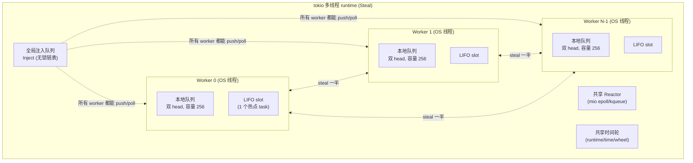
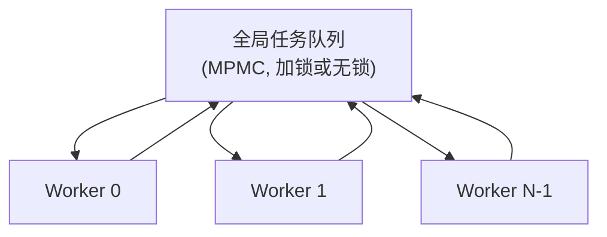
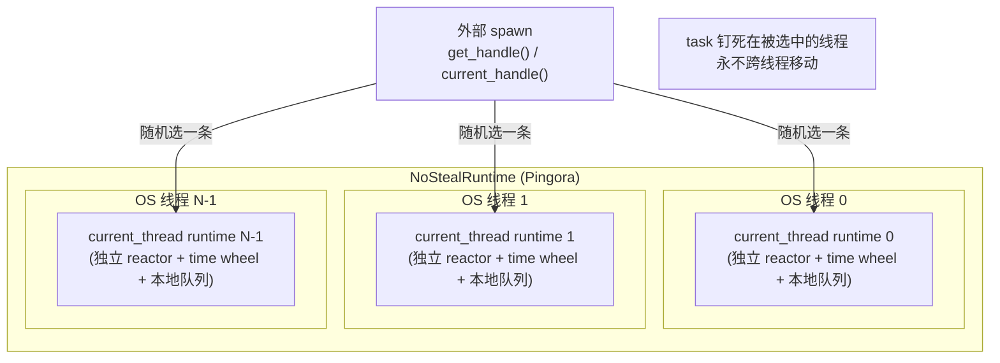
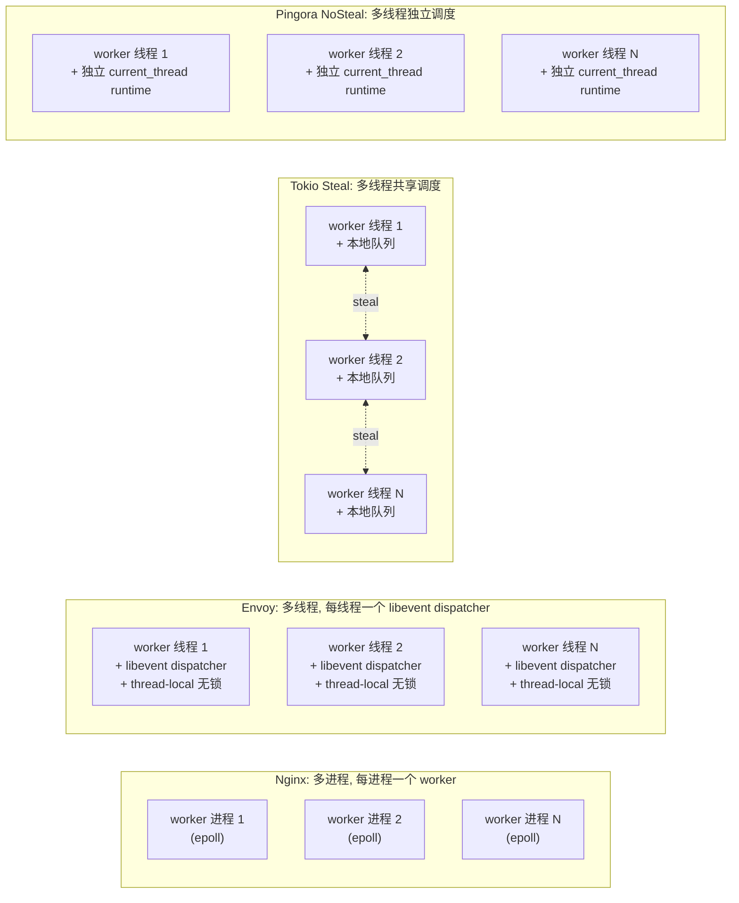
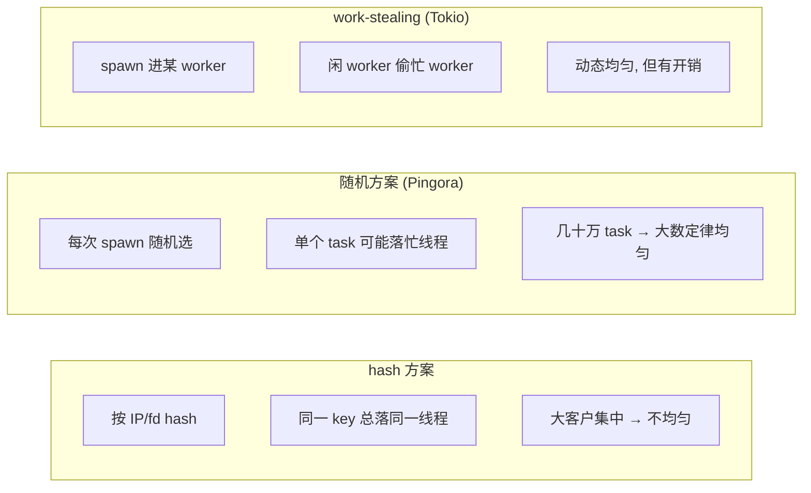

# 第 5 篇 · 第 15 章 · NoStealRuntime:Pingora 自研的 Tokio 运行时

> **核心问题**:Pingora 全程跑在 Tokio 上(承接《Tokio》[[tokio-source-facts]]),那为什么它不直接用 `tokio::runtime::Builder::new_multi_thread()` 那个标准的多线程 work-stealing runtime?Cloudflare 在 `pingora-runtime` crate 里另外搞了一个 `NoStealRuntime`——它内部是"**一堆单线程 runtime 拼起来的多线程 runtime,线程之间不互相偷任务**"。这个"不偷任务"的多线程运行时,凭什么在 Cloudflare 自己的 benchmark 里比 Tokio 标准多线程 runtime 快 30%、p99 延迟低一个数量级?它省下的那笔 work-stealing 开销到底是什么、为什么 Pingora 的负载特征(每连接一个独立 task、task 短、task 之间无依赖)恰好让 work-stealing 从"红利"变成"纯开销"?以及那个看起来怪异的设计——`get_handle` 每次返回**池里随机一个线程**的 Handle、`current_handle()` 也是随机挑一个线程 spawn——凭什么能做到负载均衡,而不是有的线程被撑爆、有的闲死?
>
> **读完本章你会明白**:
>
> 1. Tokio 标准多线程 runtime 是怎么调度的(work-stealing 的机制:每 worker 一个本地双 head 队列、空闲时偷别人的一半、偷取要走原子 CAS 和跨线程同步),以及这套机制在什么负载下是红利、在什么负载下是纯开销。这条承接《Tokio》[[tokio-source-facts]](双 head 队列、半数搬迁、overflow 走全局),本章只补到"对照 NoSteal 够用"为止,不重复 Tokio 那本的内部拆解。
> 2. ★**`NoStealRuntime` 的真实结构**:它不是"重新写一个运行时",而是"用 N 个独立的 `current_thread` runtime,各自跑在一条 OS 线程上,线程之间不共享调度器、不偷任务"。每个 task 从被 spawn 那一刻起就钉死在某一条线程上,一辈子不跨线程移动。`get_handle`/`current_handle` 每次返回池里**随机**一个线程的 Handle,用"随机投掷"代替"动态偷取"做负载均衡。源码就一个文件 [`pingora-runtime/src/lib.rs`](../pingora/pingora-runtime/src/lib.rs),整个 crate 不到 270 行,但它背后的取舍是 Pingora 性能命脉之一。
> 3. ★**源码印象修正**:很多二手资料把 `NoStealRuntime` 说成"为了避开 Tokio 的 work-stealing 而完全自研的运行时",**这个表述不准**。真实情况是:NoSteal **没有重新实现 reactor / time wheel / task 调度核心 / mio**,它用的全是 Tokio 的 `current_thread` runtime——Tokio 的 reactor(epoll/kqueue,mio edge-triggered,[[tokio-source-facts]])、时间轮([[tokio-source-facts]] runtime/time/wheel)、task 状态位([[tokio-source-facts]] 一个 AtomicUsize)、budget=128 让出([[tokio-source-facts]])——这些一个没换,原封不动。NoSteal 只换了**调度策略那一层**:把"多 worker 共享一个调度器、互相偷任务"换成"每 worker 一个独立调度器、互不偷"。所以本章真正讲的是"**调度策略**"这一层的取舍,不是"重写运行时"。
> 4. **`OffloadRuntime`**:Pingora 还有一套**专门**的 NoSteal 风格线程池(`pingora-core/src/connectors/offload.rs`),用于 offload 建连(TLS handshake)这种 CPU 密集活。它的源码注释白纸黑字写着:"multithread tokio runtime 的调度开销可以占到 runtime on CPU time 的 50%"——这是 Pingora 团队实测出来的数字,也是 NoSteal 设计的**直接动机证据**。本章会把它和 `NoStealRuntime` 放在一起讲,因为它们是同一个设计哲学的两处落地。
> 5. **daemonize 与 fork 的陷阱**:为什么 `NoStealRuntime` 的线程池是**懒构造**的(`OnceCell`),直到第一次 `get_handle` 才真正建?因为 Pingora 在 Linux 上是个 daemon,会先 `fork()` 出后台进程再开始服务。而 POSIX `fork()` 只复制**调用线程**,其他线程不会被复制——如果你在 `fork()` 之前就建好了线程池,`fork()` 之后那些线程就"丢了",只留下调用 fork 的那条线程。所以 NoSteal 的线程池必须**等到 daemonize 完成之后**才构造。这个细节藏在 [`pingora-runtime/src/lib.rs`](../pingora/pingora-runtime/src/lib.rs) 第 111-113 行的注释里,是阅读源码最容易忽略、但出 bug 时最致命的一处。
>
> **逃生阀**:如果你只读一节,读**第 3 节**(NoStealRuntime 的源码结构)和紧跟着的**技巧精解**(为什么随机选 Handle 能做负载均衡)。运行时的取舍是"性能 vs 灵活性"的经典权衡,本章不假设你熟 Tokio 内部——Tokio 的 reactor/scheduler/time wheel/budget 我一句带过指路 `[[tokio-source-facts]]`,只把篇幅留给 NoSteal 独有的部分(work-stealing 机制讲到"对照 NoSteal 够用"为止,然后全留 NoSteal 的取舍)。如果你忘了"每连接一个 task"这个 Pingora 的基本模型,先回去翻 [P1-02](P1-02-ProxyHttp-trait-一串async-filter钩子.md) 的"每连接 spawn 一个 task"那一节。

---

## 章首 · 一句话点破

> **`NoStealRuntime` 做的事,一句话讲完:它把"N 个 `tokio::runtime::Builder::new_current_thread()` 单线程 runtime"装在一个盒子里,每个 runtime 跑在一条 OS 线程上,线程之间**不共享调度器、不偷任务**;当外部代码要 spawn 一个 task 时,`get_handle`/`current_handle` 从盒子里**随机**挑一个线程的 Handle 给你,task 就被 spawn 到那条线程上,从此钉死在那里。它的全部理由是:在 Pingora 这种"每连接一个独立 task、task 短、task 之间几乎无依赖、连接数远多于线程数"的负载下,work-stealing 带来的跨线程同步开销**赚不回来**——你偷一个任务省下的时间,还不如偷这个动作本身花的同步开销多。所以 NoSteal 干脆不偷,把 work-stealing 那套跨线程队列/原子 CAS 全部省掉,换来"单线程 runtime 的效率 + 多核的并发量"。**

这是结论,不是理由。本章倒过来拆:先讲 Tokio 标准多线程 runtime 是怎么调度的、work-stealing 这套机制到底要花什么钱(第 1 节);再讲为什么"不偷"在 Pingora 的负载下反而更划算,在别的负载(比如少量 CPU 密集 task、task 之间有依赖)下会更糟(第 2 节);然后进 `NoStealRuntime` 的源码,看它怎么用一个 `enum Runtime` 把 Steal 和 NoSteal 两种 flavor 统一起来、`get_handle` 怎么随机选、`init_pools` 怎么懒构造、`shutdown_timeout` 怎么收尾(第 3 节);接着讲 `current_handle` 这个全局函数凭什么能"在不知道自己是 NoSteal 还是 Steal 的情况下都 work",以及它的 thread-local 实现(第 4 节);最后是 daemonize + fork 那个最容易翻车的细节(技巧精解),以及 `OffloadRuntime` 这个 NoSteal 哲学的另一处落地。

本章服务**转发设施**这一面。`NoStealRuntime` 不在钩子链上(业务不直接碰它),但它是整条钩子链跑起来的**底座**——你实现的 `ProxyHttp` 的每一个 async filter 钩子、每一个连接的 task、每一个 upstream 连接的建立,最终都跑在某一条 NoSteal 线程的 `current_thread` runtime 上。它是第 5 篇"运行时与 TLS"的开篇,承上启下:承第 4 篇(HTTP 协议解析,task 在这个 runtime 上跑 HTTP/1 自研状态机、HTTP/2 的 h2 协程),启 [P5-16 TLS 多后端](P5-16-TLS多后端-opensslboringsslrustlss2n.md)(TLS handshake 也是 CPU 密集活,要么在 NoSteal 线程上跑、要么 offload 到 `OffloadRuntime`)。

---

## 正文

### 第 1 节 · 先把靶子立起来:Tokio 多线程 runtime 怎么调度,work-stealing 花什么钱

要讲清 NoSteal 省了什么,得先把 Tokio 标准多线程 runtime 的调度模型摆出来,看清楚 work-stealing 这套机制**到底要付多少钱**。这是承接《Tokio》[[tokio-source-facts]] 的部分——Tokio 那本书把 reactor / mio / time wheel / task 状态位 / Cell 内存布局拆透了,这里一句带过指路,只补到"对照 NoSteal 够用"为止。

#### 1.1 Tokio 多线程 runtime 的骨架

`tokio::runtime::Builder::new_multi_thread().worker_threads(N).build()` 出来的 runtime,内部结构(承接《Tokio》[[tokio-source-facts]],这里只勾勒骨架):



几个要点(承接 [[tokio-source-facts]],这里只点到 NoSteal 对照需要的那一层):

- **每个 worker 线程有一个本地队列**,容量 `LOCAL_QUEUE_CAPACITY=256`(`runtime/scheduler/multi_thread/queue.rs`)。task 被 spawn 时,要么进全局 Inject 队列(外部线程 spawn 的、或 overflow 的),要么进某个 worker 的本地队列(`runtime.handle().spawn()` 在 worker 线程上调用时)。
- **本地队列是双 head 打包进一个 `AtomicU64`**(`steal head` + `real head`)+ 独立 `tail: AtomicU16`([[tokio-source-facts]] 事实 #2)。这个"双 head 打包"是为了让 steal 操作(读 steal head)和 owner 操作(读 real head)能尽量少打架。
- **worker 调度 task 时优先级**:LIFO slot(一个最近刚被唤醒的 task,跑 ping-pong 场景)→ 本地队列 → 全局 Inject 队列 → **偷别的 worker**。
- **偷的策略**:随机挑一个 victim worker,把它本地队列里**一半**的 task 搬到自己的本地队列里。这个"偷一半"是为了摊销 steal 的固定开销——偷一个也是花一趟同步,偷一半也是花一趟同步,不如多偷点。
- **reactor 是共享的**(mio epoll/kqueue,edge-triggered,[[tokio-source-facts]] 事实 #5),time wheel 也是共享的([[tokio-source-facts]] 事实 #4,在 `runtime/time/wheel`)。这两样是所有 worker 共用的,但它们用的是无锁同步(reactor 用 `Registration` 注册,io 事件通过 waker 派发),不是 work-stealing 的一部分。

> **承接《Tokio》[[tokio-source-facts]]**:reactor/mio 怎么 edge-triggered、time wheel 怎么分层(`level_for`/`process_expiration`)、task 状态位那个 AtomicUsize 的低位布局(RUNNING/COMPLETE/NOTIFIED/...)、Cell 内存布局(Header+Core+Trailer 一次堆分配)、budget=128 怎么让出——这些《Tokio》拆透了,本章一句带过指路。**我们这里关心的只有一件事:work-stealing 这个动作本身要花什么钱。**

#### 1.2 work-stealing 这套机制花什么钱

work-stealing 不是免费的。一个 worker 想偷另一个 worker 的 task,至少要走这些步:

1. **读 victim 的 steal head**(原子 load,`AtomicU64::load`)。这是一个跨线程读——victim 线程可能正在写 real head/push 任务,所以 steal head 和 real head 打包在一个 AtomicU64 里,就是为了减少 false sharing,但读本身还是跨 CPU core 的。
2. **CAS 推进 steal head**(`compare_exchange`)。steal head 推进表示"我拿走你队列前面这一段",这是个原子 CAS,victim 如果同时在 push(real head 变了),CAS 失败要重试。
3. **搬"一半" task 到自己队列**。被偷的 task 们要从 victim 的队列里拷出来,塞进自己的本地队列。这涉及内存读写、可能的 cache miss(victim 队列里的 task 数据可能在 victim 线程的 cache 里,不在自己 cache 里)。
4. **可能的内存序屏障**。双 head 那个 AtomicU64 的读写要配内存序(Acquire/Release),保证 task 的数据可见性。

这套机制的**设计意图**是:在"task 之间有依赖、有的 task 长有的短、负载不均"的场景下,让闲的 worker 去帮忙忙的 worker,把活儿摊平,**避免某个 worker 被一串长 task 卡死、其他 worker 闲着**。这是 Go 的 GMP、Java的 ForkJoinPool、Cilk、TBB 这些 work-stealing 调度器共有的设计哲学——它们针对的负载是**计算密集的并行任务图**(parallel computation with task dependencies),比如并行排序、矩阵乘法、图像处理。在这种负载下,task 数量有限、每个 task 较重、task 之间有 spawn-join 依赖,work-stealing 能把并行度榨干。

**但 Pingora 的负载完全不是这样。** Pingora 是个反向代理,它的 task 模型是:

- **每来一个 TCP 连接,spawn 一个 task**(准确说是 spawn 一个 task 跑 `handle_event`,见 [`pingora-core/src/services/listening.rs#L214`](../pingora/pingora-core/src/services/listening.rs#L214):`current_handle().spawn(async move { ... })`)。这条 task 里跑的是这个连接的整个生命周期:HTTP handshake → 解析请求 → 跑 `ProxyHttp` 钩子链 → 经连接池取/建 upstream 连接 → 双向 pump 字节 → 响应回来 → keepalive 循环等下一个请求。
- **task 数量 = 在线连接数**。Cloudflare 的代理单机几十万并发连接是常态,意味着几十万个 task 同时存在。
- **每个 task 是 IO 密集的**(读 socket、等 upstream、写 socket),CPU 占用低,大部分时间挂在 `Poll::Pending` 上等 IO。
- **task 之间几乎无依赖**。连接 A 的 task 和连接 B 的 task 互不相干,它们不会互相 spawn、不会互相 await。
- **每个连接的"工作"是均匀的**(都是处理 HTTP 请求),不存在"某个 task 是个巨长的计算、其他 task 是小计算"的极端不均——不均来自连接级别的随机性(有的连接传大文件、有的传小),而不是 task 结构本身。

在这种负载下,work-stealing 的**红利**几乎吃不到——因为:

- task 之间无依赖,不存在"我 spawn 了一堆子 task,得有别的 worker 来帮忙跑"的场景。每个连接的 task 是独立的一条线。
- 每个 task 的工作量本来就小(IO 等 + 一点点 CPU),worker 之间不存在"某条线卡死了整条线程"的失衡——失衡最多是"这条线程碰巧多接了几个慢连接",而 work-stealing 偷一个慢连接过来,等于自己也变慢,没有摊平效果。

而 work-stealing 的**开销**却照付不误:

- 几十万个 task 在几十条 worker 线程的本地队列(每条 256 容量)之间流转,频繁被偷。
- 每次 steal 都要走原子 CAS + 跨 CPU core 的 cache 同步。
- task 被偷到另一条线程后,它的数据(cache line)在新线程上是冷的,要重新加载——cache 局部性被破坏。
- 双 head 那个 AtomicU64 的跨线程读写,虽然有 false sharing 优化,但仍然是跨核同步。

> **钉死这件事**:work-stealing 的开销和它的红利是**负载相关**的。在并行计算(task 重、有依赖、不均)负载下红利大于开销,work-stealing 是赚的;在 Pingora 这种"海量独立短 task、IO 密集、task 之间无依赖"负载下,红利几乎为零而开销照付,work-stealing 是亏的。`NoStealRuntime` 的全部动机就是:**既然在这个负载下偷不到红利,那干脆别偷,把 work-stealing 的开销也省掉**。

#### 1.3 一个数字:50% 的 on CPU time

Pingora 团队在源码注释里留下了一个关键的实测数字。这不是 PR 稿、不是博客,是写在 [`pingora-core/src/connectors/offload.rs`](../pingora/pingora-core/src/connectors/offload.rs) 第 46-48 行注释里的原话:

> // We use single thread runtimes to reduce the scheduling overhead of multithread
> // tokio runtime, which can be 50% of the on CPU time of the runtimes

翻译:**"我们用单线程 runtime,是为了减少多线程 tokio runtime 的调度开销,这个开销可以占到 runtime on CPU time 的 50%。"**

50%。不是 5%,不是 10%,是一半。这是 Pingora 团队在他们的负载(每秒千万级请求的反向代理)上实测出来的——多线程 tokio runtime 的调度开销,占了 runtime 在 CPU 上花的时间的一半。剩下那一半才是真正处理请求逻辑的。换句话说,如果能把调度开销那 50% 砍掉,runtime 的 CPU 效率能翻倍。

这正是 `NoStealRuntime` 和 `OffloadRuntime` 存在的直接动机。`NoStealRuntime` 是把这个发现应用到了**主服务 runtime**(跑 listener、跑连接 task、跑钩子链);`OffloadRuntime` 是把它应用到了**offload 线程池**(跑 TLS handshake 这种 CPU 密集活)。两处是同一个哲学。

### 第 2 节 · 所以 Pingora 这么设计:多单线程 runtime 拼起来,不偷

既然在 Pingora 负载下 work-stealing 是净开销,那设计一个"多线程但不偷"的运行时就是顺理成章的。但"多线程不偷"具体长什么样?它有几种可能的实现,我们先看哪些是错的、为什么 Pingora 没那么选,最后看真实的设计。

#### 2.1 朴素思路一:把所有 task 都塞进一个全局队列

最朴素的"多线程不偷"是:建一个全局任务队列,所有 worker 线程都从这一个队列里 pop task。这其实是个"多生产者多消费者"(MPMC)队列。



这个方案在 Pingora 负载下会撞墙:**全局队列成了热点**。几十万 task、几十条 worker,所有 worker 都在抢这一个队列的锁(或原子操作), contention 极高。这正是 work-stealing 设计要避免的——work-stealing 给每个 worker 一个本地队列,正是为了让 task 在无 contention 的本地队列里流转,只在必要时才偷。

所以"单全局队列"被否了。它把 work-stealing 的"偷的开销"换成了"全局队列的锁开销",没省下来,反而把好情况(本地队列无 contention)也丢了。

#### 2.2 朴素思路二:把 task hash 到固定线程

第二种思路是:保留每 worker 一个本地队列(无 contention),但 task 一进来就按某种 hash(比如连接 fd、客户端 IP)固定分到某条 worker 上,从此那条 task 就在那条 worker 跑。这其实是 NoSteal 的雏形。

这个方案的隐患是:**怎么保证 hash 均匀**?如果按客户端 IP hash,某个大客户(NAT 后面几万个连接)全堆到一条线程上,其他线程闲死——这比 work-stealing 还糟,因为不均匀了还没法偷回来。按 fd hash 也有类似问题(fd 分配不一定均匀)。

Pingora 的真实选择是:**不做 hash,改成随机**。task 来了,从 N 条 worker 线程里**随机**挑一条,task 进那条线程的本地队列。在大数定律下,几十万个 task 随机投到几十条线程上,每条线程分到的 task 数会非常均匀(方差是 O(√N),相对误差随 task 数增长趋近于零)。这是 `NoStealRuntime` 的核心负载均衡机制——用**随机投掷**代替 work-stealing 的**动态调度**,既省了 work-stealing 的开销,又保证了负载均衡。

> **钉死这件事**:`NoStealRuntime` 的负载均衡不靠"偷",靠"**spawn 时随机选线程**"。这个选择有个隐含前提:**task 数量远大于线程数**(几十万 vs 几十),大数定律才成立。如果 task 数和线程数差不多(比如 8 个 CPU 密集 task 跑在 8 条线程上),随机投掷的方差就大了,可能有的线程分到 2 个、有的分到 0 个,这时 work-stealing 反而能补救。NoSteal 是**为海量独立 task 优化的**,不是普适最优。

#### 2.3 真实设计:每条线程一个独立 current_thread runtime

Pingora 的真实设计在 [`pingora-runtime/src/lib.rs`](../pingora/pingora-runtime/src/lib.rs),核心思路:每个 worker 线程跑一个**独立的** `tokio::runtime::Builder::new_current_thread().enable_all().build()` 出来的 runtime,这些 runtime 之间**不共享任何调度状态**(没有共享的全局队列、没有共享的 worker 池、没有 work-stealing 机制)。task 被 spawn 时,调用方拿到某一条线程的 `Handle`,task 进那条线程 runtime 的本地队列(其实就是那个单线程 runtime 的任务队列),从此钉死在那里。



关键差异对比(这是本章的核心对照,务必钉死):

| 维度 | Tokio 多线程 runtime(Steal) | Pingora NoStealRuntime |
|------|------------------------|----------------------|
| **runtime 数量** | 1 个多线程 runtime | N 个 current_thread runtime |
| **OS 线程数** | N 个 worker(可配) | N 个(可配,每 runtime 一个) |
| **调度器** | 共享,worker 之间能互相偷 | 每线程独立,互不偷 |
| **task 落点** | 动态:spawn 进某 worker,之后可被偷到别的 worker | 静态:spawn 进随机选中的线程,永不再动 |
| **本地队列** | 每 worker 一个,容量 256,双 head 打包 AtomicU64 | 每 runtime 一个(current_thread 的内部队列) |
| **全局 Inject 队列** | 有,外部线程 spawn 进这里 | 无(每 runtime 独立,外部 spawn 走它选中的 runtime 的 Handle) |
| **steal 操作** | 有,随机 victim,偷一半 | **无** |
| **steal 开销** | 原子 CAS + 跨核 cache 同步 + task 数据 cache miss | **零** |
| **reactor(epoll/kqueue)** | 共享一个 mio reactor | 每 runtime 一个独立 reactor(见下文) |
| **time wheel** | 共享 | 每 runtime 一个独立 time wheel |
| **负载均衡** | 动态:忙的 worker 被偷,自动摊平 | 静态:spawn 时随机选,靠大数定律 |
| **cache 局部性** | task 被偷后数据 cache 变冷 | task 永在同一线程,数据 cache 持续热 |
| **task 跨线程移动** | 允许(task 是 Send) | 允许(task 是 Send),但不发生 |
| **block_on** | 支持(任意线程) | **只在 worker 线程上**(current_thread runtime 限制) |
| **适合负载** | 通用,task 有依赖/不均时红利大 | 海量独立短 task,IO 密集 |

这张表里有一行特别要解释:**"reactor 每 runtime 一个独立"**。这是 `current_thread` runtime 的固有行为——每个 `current_thread` runtime 自带一个 mio reactor(因为 `.enable_all()` 开了 io 驱动)。NoStealRuntime 里 N 个 current_thread runtime,意味着 N 个独立的 mio reactor,各自在各自的线程上跑 epoll_wait。这和多线程 runtime 的"所有 worker 共享一个 reactor"不同。

那 N 个 reactor 监听同一批 fd(同一批连接的 socket)会冲突吗?**不会**,因为每个 fd 只会被注册到**一个** reactor 上——task 钉死在某条线程上,这个 task 持有的 socket 的 waker 注册到这条线程的 reactor,fd 只在这个 reactor 上被 epoll_ctl 加入。其他线程的 reactor 永远不会见到这个 fd。所以 N 个 reactor 是**完全独立**的,各管各的 fd 子集。这其实是个隐藏的好处——N 个 reactor 各自的 epoll 实例更小(各自的 interest list 更短),epoll_wait 的开销和 interest list 大小相关,分裂后每个 reactor 的 epoll_wait 更快。

> **钉死这件事**:NoStealRuntime 不是"自研运行时",它是"**用 N 个 Tokio current_thread runtime 拼起来的多线程运行时**"。reactor / time wheel / task 调度核心 / mio——全是 Tokio 的,一个没换。它只换了**调度策略**那一层:把"共享调度器 + work-stealing"换成"独立调度器 + 不偷"。承接《Tokio》[[tokio-source-facts]] 的部分(reactor/mio/time wheel/task 状态位/Cell/budget)一个字都不变,本章不重复。NoSteal 的差异全在"调度策略"这一层。

#### 2.4 一个真实 benchmark:30% 吞吐 + 一个数量级的 p99

光说设计不够,看数字。Pingora 在 [`pingora-runtime/benches/hello.rs`](../pingora/pingora-runtime/benches/hello.rs) 里留了一个对照 benchmark——同一个最简单的 echo-ish HTTP server(收到请求回 `Hello world!`),分别用 `Runtime::new_steal(2, "")`(2 线程 work-stealing)和 `Runtime::new_no_steal(2, "")`(2 线程 NoSteal)跑,然后用 `wrk -t40 -c1000 -d10` 压测。源码注释里贴了 M1 MacBook Pro 上的结果(注释在 [`benches/hello.rs#L65-L95`](../pingora/pingora-runtime/benches/hello.rs#L65-L95)):

**Steal(标准多线程 runtime,3000 端口)**:

```
wrk -t40 -c1000 -d10 http://127.0.0.1:3000 --latency
  Latency    12.16ms  16.29ms  112.29ms   83.40%
  Latency Distribution
     50%    2.09ms
     75%   20.23ms
     90%   37.11ms
     99%   65.16ms
  Requests/sec:  216918.71
```

**NoSteal(本书主角,3001 端口)**:

```
wrk -t40 -c1000 -d10 http://127.0.0.1:3001 --latency
  Latency     3.53ms   0.87ms  17.12ms   84.99%
  Latency Distribution
     50%    3.56ms
     75%    3.95ms
     90%    4.37ms
     99%    5.38ms
  Requests/sec: 281689.27
```

逐条比:

- **吞吐**:NoSteal 281689 req/s,Steal 216918 req/s。NoSteal 高 **29.9%**。
- **p50 延迟**:NoSteal 3.56ms,Steal 2.09ms。Steal 略低(它的 LIFO slot 让 ping-pong 场景的 p50 很好看),但这个优势在 p75 就被翻转了。
- **p75 延迟**:NoSteal 3.95ms,Steal 20.23ms。NoSteal 低 **80%**。
- **p99 延迟**:NoSteal 5.38ms,Steal 65.16ms。NoSteal 低 **91.7%**,差了一个数量级。
- **延迟方差**:NoSteal stdev 0.87ms,Steal stdev 16.29ms。NoSteal 的延迟分布**窄得多**——绝大多数请求都在 3-5ms,几乎没有长尾;Steal 的延迟分布宽得吓人,p99 是 p50 的 30 倍。

这个 benchmark 的核心价值不是那个绝对数字(M1 上的 28 万 req/s 在服务器 CPU 上能再翻几倍),而是**两种 runtime 在完全相同的负载、完全相同的硬件、完全相同的代码下的相对差异**。NoSteal 在吞吐上赢 30%,在 p99 上赢一个数量级,在延迟方差上赢一个数量级——这就是"省掉 work-stealing 开销"的实测收益。

> **钉死这件事**:这个 benchmark 是 NoSteal 设计动机的**实测证据**,不是理论推测。它的结论是:在最简单的 echo HTTP server(每个请求的工作量极小)负载下,NoSteal 比 Steal 快 30%、p99 低一个数量级。这个收益会随着"每个请求的工作量"增大而缩小——如果每个请求要跑 100ms 的 CPU,work-stealing 那 50% 调度开销占比就微乎其微了。NoSteal 是**为"每请求工作量小、请求量大"的代理负载优化的**。这也解释了为什么 Cloudflare 在他们自己的反向代理场景(每秒千万请求、每请求就转发几个 KB)选 NoSteal——那个场景恰好是 NoSteal 的甜区。

### 第 3 节 · 源码佐证:`NoStealRuntime` 的真实结构

现在进源码。整个 crate 就一个文件 [`pingora-runtime/src/lib.rs`](../pingora/pingora-runtime/src/lib.rs),不到 270 行,但它背后是上面那一整段取舍。我们逐段拆。

#### 3.1 两种 flavor 统一在一个 enum 里:`Runtime`

Pingora 把"标准多线程 work-stealing"和"自研多线程不偷"统一在一个 `Runtime` enum 里。先看 crate 顶部的模块文档和 enum 定义([`pingora-runtime/src/lib.rs#L15-L43`](../pingora/pingora-runtime/src/lib.rs#L15-L43)):

```rust
// pingora-runtime/src/lib.rs#L15-L43
//! Pingora tokio runtime.
//!
//! Tokio runtime comes in two flavors: a single-threaded runtime
//! and a multi-threaded one which provides work stealing.
//! Benchmark shows that, compared to the single-threaded runtime, the multi-threaded one
//! has some overhead due to its more sophisticated work steal scheduling.
//!
//! This crate provides a third flavor: a multi-threaded runtime without work stealing.
//! This flavor is as efficient as the single-threaded runtime while allows the async
//! program to use multiple cores.

pub enum Runtime {
    Steal(tokio::runtime::Runtime),
    NoSteal(NoStealRuntime),
}
```

逐段拆:

**模块文档那 6 行是整个 crate 的设计宣言。** 它开门见山把 Tokio 的两种 flavor(单线程、多线程 work-stealing)摆出来,然后说"Benchmark shows that 多线程的 work-stealing 调度有开销",最后给出本书主角——"a multi-threaded runtime **without** work stealing",并点明它的定位:"as efficient as the single-threaded runtime while allows the async program to use multiple cores"。这句话翻译过来就是"单线程 runtime 的效率,多核的并发量"——鱼和熊掌都要。这是 NoSteal 的全部承诺。

**`Runtime` enum 是个 tagged union,两个 variant。** `Steal(tokio::runtime::Runtime)` 直接包一个标准 Tokio 多线程 runtime(就是 `Builder::new_multi_thread().build()` 出来的那个);`NoSteal(NoStealRuntime)` 包一个自研的 NoStealRuntime。用 enum 而不是两个独立类型的好处是:上层代码(`pingora-core/src/server/mod.rs`)可以对着 `Runtime` 这一个类型编程,通过配置 `work_stealing: bool` 切换两种 flavor,不用改业务代码。这是经典的策略模式。

> **钉死一件事(配置默认值)**:很多人以为 NoSteal 是 Pingora 的默认 runtime,**不是**。`ServerConf::work_stealing` 默认是 `true`([`pingora-core/src/server/configuration/mod.rs#L67`](../pingora/pingora-core/src/server/configuration/mod.rs#L67) 的注释明说 "Default `true`",默认值在 [`configuration/mod.rs#L139`](../pingora/pingora-core/src/server/configuration/mod.rs#L139) 的 `work_stealing: true`)。也就是说,开箱即用时 Pingora 用的是 Tokio 标准 work-stealing runtime。要启用 NoSteal,得在配置文件里显式写 `work_stealing: false`。Cloudflare 自己生产环境是关掉 work_stealing 的(他们的负载在 NoSteal 甜区),但开源默认值给的是 Steal——这是个对"通用 Web 服务"更安全的默认(通用 Web 服务的负载可能不全是海量独立短 task,Steal 的兜底更稳)。这个默认值细节是二手资料最容易翻车的地方,务必钉死。

#### 3.2 构造两种 flavor:`new_steal` / `new_no_steal`

两种 flavor 的构造函数([`pingora-runtime/src/lib.rs#L45-L62`](../pingora/pingora-runtime/src/lib.rs#L45-L62)):

```rust
// pingora-runtime/src/lib.rs#L45-L62
impl Runtime {
    /// Create a `Steal` flavor runtime. This just a regular tokio runtime
    pub fn new_steal(threads: usize, name: &str) -> Self {
        Self::Steal(
            Builder::new_multi_thread()
                .enable_all()
                .worker_threads(threads)
                .thread_name(name)
                .build()
                .unwrap(),
        )
    }

    /// Create a `NoSteal` flavor runtime. This is backed by multiple tokio current-thread runtime
    pub fn new_no_steal(threads: usize, name: &str) -> Self {
        Self::NoSteal(NoStealRuntime::new(threads, name))
    }
```

逐段拆:

**`new_steal` 就是 `tokio::runtime::Builder::new_multi_thread()` 的薄包装。** `.enable_all()`(开 io/time 驱动)、`.worker_threads(threads)`(配 worker 数)、`.thread_name(name)`(给线程起名,方便调试/监控)、`.build().unwrap()`。没有任何魔法——它就是构造一个标准 Tokio 多线程 runtime 包进 `Runtime::Steal`。Pingora 对 Tokio 的 Steal runtime 没有任何定制,完全用 Tokio 默认。

**`new_no_steal` 把活儿委托给 `NoStealRuntime::new(threads, name)`。** 真正的构造逻辑在 `NoStealRuntime`(下一节拆)。这里只注意一点:`new_no_steal` **不会立即创建线程**——`NoStealRuntime::new` 只是存下 `threads` 和 `name`,真正的线程池是懒构造的(见第 4 节技巧精解的 daemonize 部分)。这和 `new_steal` 形成对比——`new_steal` 调 `Builder::build()` 时**立即**就建好了 worker 线程(虽然 worker 会 block 在等任务上,但线程已经存在了)。

#### 3.3 `NoStealRuntime` 的字段结构

现在看本章的主角 `NoStealRuntime` 的 struct 定义([`pingora-runtime/src/lib.rs#L108-L116`](../pingora/pingora-runtime/src/lib.rs#L108-L116)):

```rust
// pingora-runtime/src/lib.rs#L108-L116
/// Multi-threaded runtime backed by a pool of single threaded tokio runtime
pub struct NoStealRuntime {
    threads: usize,
    name: String,
    // Lazily init the runtimes so that they are created after pingora
    // daemonize itself. Otherwise the runtime threads are lost.
    pools: Pools,
    controls: OnceCell<Vec<Control>>,
}
```

四个字段,逐个拆:

- **`threads: usize`** —— 这个 NoStealRuntime 用多少条线程(=多少个 current_thread runtime)。注意它**只是个数字**,真正的线程在 `pools` 里。`new_no_steal(8, "svc")` 时 `threads = 8`。
- **`name: String`** —— 线程名前缀,给每条线程起名(调试/监控用)。和 `new_steal` 的 `thread_name` 一样。
- **`pools: Pools`** —— 这是真正的线程池,但它是**懒构造**的。`Pools` 的类型是 `Arc<OnceCell<Box<[Handle]>>>`([`pingora-runtime/src/lib.rs#L106`](../pingora/pingora-runtime/src/lib.rs#L106):`type Pools = Arc<OnceCell<Box<[Handle]>>>;`)。`OnceCell` 表示"要么空,要么填一次,填了就不变";`Box<[Handle]>` 是一个堆分配的 Handle 数组(Handle 是 Tokio runtime 的 handle,可以 spawn task);外面包 `Arc` 是为了让多条线程能共享这个 OnceCell(线程本地存储里要持有它的 clone)。注释那句"Lazily init the runtimes so that they are created after pingora daemonize itself. Otherwise the runtime threads are lost."是**整个设计最关键的一句注释**,它点明了为什么要懒构造——daemonize。这个细节在第 4 节技巧精解里专门拆,这里先记住:**线程池不在 `new_no_steal` 时建,在第一次 `get_handle` 时建**。
- **`controls: OnceCell<Vec<Control>>`** —— 关停用的控制信道。`Control` 的类型是 `(Sender<Duration>, JoinHandle<()>)`([`pingora-runtime/src/lib.rs#L105`](../pingora/pingora-runtime/src/lib.rs#L105))。每个线程一个 `(Sender, JoinHandle)`:`Sender<Duration>` 用来给那条线程发"请你在 Duration 后 shutdown"的消息;`JoinHandle` 用来 join 那条线程(等它退出)。`OnceCell` 同样是懒构造——`controls` 和 `pools` 是在同一个 `init_pools()` 调用里一起建的(要么都没建,要么都建了)。

注意 `pools` 和 `controls` 之间的一致性保证:它们用两个独立的 `OnceCell`,但 `init_pools()` 一次同时填两个(下面 3.5 节会看到)。这是个微妙的设计——为什么不用一个结构体把 pools 和 controls 包起来塞进一个 OnceCell?因为 `pools` 要被 `current_handle()` 那个 thread-local 机制共享(`Arc<OnceCell<...>>`),而 `controls` 只在 shutdown 时用、不需要 thread-local。把它们分开,让 `pools` 能被 `current_handle` 的 thread-local 持有,而 `controls` 留在 NoStealRuntime 主结构里。这是为了满足不同的访问模式。

#### 3.4 `get_handle` / `get_runtime`:随机选一条线程

这是 NoSteal 负载均衡的核心。先看 `Runtime::get_handle`([`pingora-runtime/src/lib.rs#L63-L73`](../pingora/pingora-runtime/src/lib.rs#L63-L73)):

```rust
// pingora-runtime/src/lib.rs#L63-L73
    /// Return the &[Handle] of the [Runtime].
    /// For `Steal` flavor, it will just return the &[Handle].
    /// For `NoSteal` flavor, it will return the &[Handle] of a random thread in its pool.
    /// So if we want tasks to spawn on all the threads, call this function to get a fresh [Handle]
    /// for each async task.
    pub fn get_handle(&self) -> &Handle {
        match self {
            Self::Steal(r) => r.handle(),
            Self::NoSteal(r) => r.get_runtime(),
        }
    }
```

逐段拆:

**两种 flavor 的语义完全不同,但签名一样。** 这是策略模式的精髓——上层代码对着 `&Handle` 编程,不用关心背后是 Steal 还是 NoSteal。

- **Steal 分支**:`r.handle()` 返回那个多线程 runtime 的唯一一个 Handle。Tokio 多线程 runtime 的 Handle 是个共享对象——所有 worker 共用一个 Handle,`handle.spawn(task)` 把 task 投进 runtime 的调度器(可能进某 worker 的本地队列、可能进全局 Inject 队列),之后由 runtime 的 work-stealing 调度器决定 task 最终跑在哪条 worker 上。所以 Steal 下"每次 get_handle 返回同一个 Handle"是合理的——反正 Handle 是共享的,spawn 进去之后调度器自己会摊。
- **NoSteal 分支**:`r.get_runtime()` 返回**池里随机一条线程**的 Handle。这是关键差异——NoSteal 下每次 `get_handle` 都可能返回不同线程的 Handle,调用方拿这个 Handle 去 spawn,task 就进了那条线程的 current_thread runtime,从此钉死。

**注释那句"So if we want tasks to spawn on all the threads, call this function to get a fresh Handle for each async task"是使用契约。** 翻译:"如果你想 task 均匀分布到所有线程上,**每 spawn 一个 task 就重新调一次 `get_handle`** 拿一个(可能不同的)Handle,别缓存 Handle 复用。"这是因为如果缓存了 Handle,你 spawn 的所有 task 都会进同一条线程,失去了随机分布的效果。这个契约在 [`pingora-core/src/services/listening.rs#L214`](../pingora/pingora-core/src/services/listening.rs#L214) 得到遵守——每来一个连接,就调一次 `current_handle()`(内部走 NoSteal 的随机逻辑)拿一个新 Handle,然后 spawn:

```rust
// pingora-core/src/services/listening.rs#L210-L234 (节选)
            match new_io {
                Ok(io) => {
                    let app = app_logic.clone();
                    let shutdown = shutdown.clone();
                    current_handle().spawn(async move {
                        // ... 处理这个连接的整个生命周期
                        match timeout(Duration::from_secs(60), io.handshake()).await {
                            // ...
                        }
                    });
                }
```

注意是 `current_handle().spawn(...)`,不是 `self.cached_handle.spawn(...)`。每来一个连接调一次 `current_handle()`,每次拿(可能)不同的 Handle,task 随机落到不同线程。这就是 NoSteal 的负载均衡在代码里的落地。

现在看 `NoStealRuntime::get_runtime`([`pingora-runtime/src/lib.rs#L154-L160`](../pingora/pingora-runtime/src/lib.rs#L154-L160)):

```rust
// pingora-runtime/src/lib.rs#L154-L160
    /// Return the &[Handle] of a random thread of this runtime
    pub fn get_runtime(&self) -> &Handle {
        let mut rng = rand::thread_rng();

        let index = rng.gen_range(0..self.threads);
        self.get_runtime_at(index)
    }
```

三行,但每一行都是负载均衡的支柱:

**第 1 行 `let mut rng = rand::thread_rng();`。** 拿一个线程局部的随机数生成器。`rand::thread_rng()` 返回一个 thread-local 的、快速(通常基于 ChaCha8 或 Xorshift)的 RNG。用 thread-local 的好处是 RNG 状态不跨线程共享,无锁——每条线程有自己的 RNG,各自生成随机数。

**第 2 行 `let index = rng.gen_range(0..self.threads);`。** 生成一个 `[0, threads)` 范围内的均匀随机整数。这就是"随机挑一条线程"的核心——均匀分布,每条线程被选中的概率相等。

**第 3 行 `self.get_runtime_at(index)`。** 返回第 `index` 条线程的 Handle(`get_runtime_at` 内部调 `get_pools` 拿 Handle 数组,取第 index 个,见下面)。

这套"随机选线程"的负载均衡有几个特点:

1. **无锁**。RNG 是 thread-local,Handle 数组是只读的(`OnceCell` 填了之后不变),读数组不用加锁。
2. **O(1) 开销**。一次 thread-local RNG 调用 + 一次数组索引,没有 work-stealing 那套原子 CAS。
3. **概率均匀**。每个 task 被分配到任一线程的概率严格相等(1/threads),不存在 hash 那种"大客户集中"问题。
4. **大数定律均匀**。几十万个 task 随机投到几十条线程,每条线程分到的 task 数趋近于 `total_tasks / threads`,方差相对误差随 task 数增长趋近于零。

但要注意它的局限:**单个 task 不能太大**。如果某个 task 是个 100ms 的 CPU 密集计算,它无论落在哪条线程上都会霸占那条线程 100ms(NoSteal 不会把它偷走),那段时间那条线程上的其他 task 都得排队。这就是为什么 NoSteal 要配合 `OffloadRuntime`(下面 3.8 节)把 CPU 密集活单独 offload——主 runtime 上尽量只放 IO 密集的短 task。

#### 3.5 `init_pools`:懒构造 N 个 current_thread runtime

这是 NoStealRuntime 最复杂的一个函数,也是 daemonize 那个关键细节所在。看 [`pingora-runtime/src/lib.rs#L130-L152`](../pingora/pingora-runtime/src/lib.rs#L130-L152):

```rust
// pingora-runtime/src/lib.rs#L130-L152
    fn init_pools(&self) -> (Box<[Handle]>, Vec<Control>) {
        let mut pools = Vec::with_capacity(self.threads);
        let mut controls = Vec::with_capacity(self.threads);
        for _ in 0..self.threads {
            let rt = Builder::new_current_thread().enable_all().build().unwrap();
            let handler = rt.handle().clone();
            let (tx, rx) = channel::<Duration>();
            let pools_ref = self.pools.clone();
            let join = std::thread::Builder::new()
                .name(self.name.clone())
                .spawn(move || {
                    CURRENT_HANDLE.get_or(|| pools_ref);
                    if let Ok(timeout) = rt.block_on(rx) {
                        rt.shutdown_timeout(timeout);
                    } // else Err(_): tx is dropped, just exit
                })
                .unwrap();
            pools.push(handler);
            controls.push((tx, join));
        }

        (pools.into_boxed_slice(), controls)
    }
```

逐段拆:

**循环 `for _ in 0..self.threads`,每轮建一条线程。** 每轮做的事:

1. **`Builder::new_current_thread().enable_all().build().unwrap()`** —— 建一个 Tokio current_thread runtime。`.enable_all()` 开 io 驱动(mio reactor)、time 驱动(time wheel)、signal 处理。这和 `new_steal` 用的 `new_multi_thread().enable_all()` 是同一套驱动,只是调度核心从"多线程 work-stealing"换成"单线程"。所以 reactor / time wheel / mio 全是 Tokio 的,承接 [[tokio-source-facts]],一个没换。

2. **`let handler = rt.handle().clone();`** —— 拿这个 runtime 的 Handle(Handle 是 `Clone` 的,clone 出来的 Handle 和原 Handle 指向同一个 runtime)。这个 handler 会被存进 `pools` 数组,`get_runtime` 返回的就是它。注意 Handle 是 `Send + Sync + Clone` 的,可以跨线程用——所以外部线程拿这个 Handle 调 `handle.spawn(task)`,能把 task 投进这条线程的 runtime,即使 task 不在 runtime 自己的线程上发起。

3. **`let (tx, rx) = channel::<Duration>();`** —— 建一个 oneshot channel,用来给这条线程发 shutdown 超时。`tx` 存进 controls(将来 shutdown 时用),`rx` 留给这条线程的 block_on 等。

4. **`let pools_ref = self.pools.clone();`** —— clone 一份 `Arc<OnceCell<Box<[Handle]>>>`。这个 clone 后面会塞进这条线程的 thread-local(下一步),用来让 `current_handle()` 能从 thread-local 反查到整个 Handle 池。这是 `current_handle` 能"随机选线程"的关键——每条线程的 thread-local 里都存着指向整个池的 Arc,`current_handle` 从里面随机挑一个。

5. **`std::thread::Builder::new().name(self.name.clone()).spawn(move || { ... })`** —— spawn 一条 OS 线程,线程名是 `self.name`(调试/监控用)。闭包里干两件事:
   - **`CURRENT_HANDLE.get_or(|| pools_ref);`** —— 在这条线程的 thread-local `CURRENT_HANDLE` 里塞进 `pools_ref`(指向整个 Handle 池的 Arc)。这是为了让这条线程上将来调 `current_handle()` 时,能从 thread-local 拿到池,随机挑一个 Handle 返回。注意 `get_or` 的语义:thread-local 已有就返回已有的,没有就调闭包建一个并返回——这里第一次访问,会建一个存 `pools_ref` 的 thread-local entry。
   - **`if let Ok(timeout) = rt.block_on(rx) { rt.shutdown_timeout(timeout); }`** —— `rt.block_on(rx)` 是这条线程的主循环。`block_on` 会驱动这个 current_thread runtime(跑 reactor、跑 time wheel、跑调度器),同时 `await` 这个 `rx`(oneshot receiver)。`rx` 在两种情况下返回:`Ok(timeout)` 表示收到了 shutdown 信号(tx 发来了 Duration),这时调 `rt.shutdown_timeout(timeout)` 优雅关停;`Err(_)` 表示 tx 被 drop 了(发送方没了),注释说"just exit"——直接退出 block_on,线程结束。

6. **`pools.push(handler); controls.push((tx, join));`** —— 把这条线程的 Handle 塞进 pools 数组,把 (tx, JoinHandle) 塞进 controls 数组。

**循环结束后,`pools.into_boxed_seq()` 和 `controls` 一起返回。** 注意 `init_pools` 是个私有函数,它只负责"建池子",不负责"填 OnceCell"。填 OnceCell 是在 `get_pools` 里做的(下面),那里处理并发初始化的竞态。

这个函数的设计要点:

- **每条线程一个独立 current_thread runtime,各自 `block_on` 驱动。** 这就是 NoSteal 的核心——N 个独立 runtime,不共享调度器。
- **`block_on(rx)` 这个 trick。** current_thread runtime 必须在它自己的线程上被 `block_on` 驱动(它没有多线程 runtime 那种"worker 自己跑调度循环"的机制,得靠 `block_on` 把控制权交给 runtime)。但 `block_on` 需要一个 Future 来 await——这里 await 的是 `rx`(oneshot receiver)。`rx` 平时永远不 ready(没人发 tx),所以 `block_on` 永远挂在 await 上,但在挂的同时 runtime 在驱动它的 reactor/time wheel/调度器(这是 `block_on` 的副作用)。一旦 tx 发来 Duration(shutdown),`rx` ready,`block_on` 返回,接着 `rt.shutdown_timeout(timeout)`。这是个把"驱动 runtime"和"等 shutdown 信号"两件事用 block_on 焊在一起的设计。
- **thread-local 塞 pools_ref。** 这是让 `current_handle()` 能反查池的关键。每条线程的 thread-local 里都存着同一个 `Arc<OnceCell<Box<[Handle]>>>`(指向整个池),`current_handle()` 从 thread-local 拿到这个 Arc,unwrap 出 Handle 数组,随机挑一个返回。下一节专门拆 `current_handle`。

#### 3.6 `get_pools`:懒构造的入口,带并发竞态处理

`get_pools` 是"懒构造"的入口,它处理"第一次访问时建池,之后直接读"的逻辑,以及多个线程同时第一次访问的竞态。看 [`pingora-runtime/src/lib.rs#L167-L184`](../pingora/pingora-runtime/src/lib.rs#L167-L184):

```rust
// pingora-runtime/src/lib.rs#L167-L184
    fn get_pools(&self) -> &[Handle] {
        if let Some(p) = self.pools.get() {
            p
        } else {
            // TODO: use a mutex to avoid creating a lot threads only to drop them
            let (pools, controls) = self.init_pools();
            // there could be another thread racing with this one to init the pools
            match self.pools.try_insert(pools) {
                Ok(p) => {
                    // unwrap to make sure that this is the one that init both pools and controls
                    self.controls.set(controls).unwrap();
                    p
                }
                // another thread already set it, just return it
                Err((p, _my_pools)) => p,
            }
        }
    }
```

逐段拆:

**`if let Some(p) = self.pools.get()` —— 快路径。** 如果 OnceCell 已经填了(池建过了),直接返回里面的 Handle 数组。OnceCell 的 `get` 是无锁的(OnceCell 内部用原子操作保证 once 语义),所以热路径上没有任何开销。

**`else` 分支 —— 慢路径,第一次访问建池。** 这里有个**并发竞态**要处理:`OnceCell` 还是空,但可能有多个线程同时发现它是空,都进到 `else` 分支,都调 `init_pools()`。如果不管,每个线程都会建一套完整的 N 条线程的池子,然后只有一套能塞进 OnceCell,其他的池子白建了(那些线程会被建出来又丢掉,造成短暂的线程爆炸)。

源码用 `try_insert` 处理这个竞态:

- **`self.init_pools()`** —— 这个线程本地建一套池子(pools + controls)。
- **`self.pools.try_insert(pools)`** —— 尝试塞进 OnceCell。`try_insert` 是 `OnceCell` 的方法:如果 OnceCell 是空,塞进去成功,返回 `Ok(&Handle 数组)`;如果 OnceCell 已经被别人填了(竞态的另一方先塞了),返回 `Err((已经存在的 &Handle 数组, 我没塞进去的 pools))`。
- **`Ok(p)` 分支** —— 我是赢家,我建的 pools 塞进去了。接着 `self.controls.set(controls).unwrap()` 把 controls 也塞进对应的 OnceCell。注意这里 `unwrap`——注释说"unwrap to make sure that this is the one that init both pools and controls",意思是:如果我是 pools 的赢家,我也必须是 controls 的赢家(因为两个 OnceCell 是在同一次 init_pools 里一起填的,不存在"我赢了 pools 但输了 controls"的情况,除非有 bug)。所以这里 unwrap 是个不变量断言。
- **`Err((p, _my_pools))` 分支** —— 我是输家,别人先塞了。我建的 pools(`_my_pools`)被丢弃(下划线表示不用),函数返回别人塞的 `p`。我建的那套池子(以及它建出来的 OS 线程)会发生什么?`_my_pools` 是个 `Box<[Handle]>`,函数返回时它 drop,Handle drop 不会关停 runtime(只是减少引用计数),但我那套池子的 `controls` 没有被存进任何 OnceCell,它随函数结束 drop,controls 里的 `Sender<Duration>` 被 drop……这会触发对应的 `rx` 返回 `Err`(发送方没了),那些线程会走"just exit"路径退出。所以输家建的线程会被清理,但有个**短暂的资源浪费**——建了 N 条线程又让它们退出。这正是注释那句 TODO 说的:`// TODO: use a mutex to avoid creating a lot threads only to drop them`。当前实现没有用 mutex 序列化初始化,可能有短暂的线程浪费,但在实践中不是大问题(初始化只发生一次,之后的访问都走 `if let Some(p)` 快路径)。

> **钉死这件事**:`get_pools` 的并发竞态处理是"乐观"的——不锁,直接建,用 `try_insert` 决出赢家,输家建的池子丢弃。这是个**已知的小瑕疵**(源码 TODO 标注),但只在初始化时发生一次,热路径无影响。读源码时看到 TODO 不要以为是 bug,这是有意识的取舍(用一次性的资源浪费换热路径的无锁)。

#### 3.7 `shutdown_timeout`:用 oneshot channel 优雅关停

最后看关停逻辑 [`pingora-runtime/src/lib.rs#L192-L204`](../pingora/pingora-runtime/src/lib.rs#L192-L204):

```rust
// pingora-runtime/src/lib.rs#L192-L204
    /// Call tokio's `shutdown_timeout` of all the runtimes. This function is blocking until
    /// all runtimes exit.
    pub fn shutdown_timeout(mut self, timeout: Duration) {
        if let Some(controls) = self.controls.take() {
            let (txs, joins): (Vec<Sender<_>>, Vec<JoinHandle<()>>) = controls.into_iter().unzip();
            for tx in txs {
                let _ = tx.send(timeout); // Err() when rx is dropped
            }
            for join in joins {
                let _ = join.join(); // ignore thread error
            }
        } // else, the controls and the runtimes are not even init yet, just return;
    }
```

逐段拆:

**`if let Some(controls) = self.controls.take()`** —— `take` 把 OnceCell 里的 controls 取出来(OnceCell 变空)。如果 controls 是 None(池子从没建过,比如配置了 NoSteal 但服务还没启动就关了),直接 return——没建过的池子不用关。

**`controls.into_iter().unzip()`** —— 把 `Vec<(Sender, JoinHandle)>` 拆成两个 Vec:一个 `Vec<Sender>`,一个 `Vec<JoinHandle>`。

**`for tx in txs { let _ = tx.send(timeout); }`** —— 给每条线程的 Sender 发 shutdown 超时。这会让对应的 `rx` 在那条线程的 `block_on(rx)` 里 ready(返回 `Ok(timeout)`),然后那条线程调 `rt.shutdown_timeout(timeout)` 优雅关停自己的 current_thread runtime。`rt.shutdown_timeout` 是 Tokio runtime 的标准关停——给 runtime `timeout` 时间,让它把在跑的 task 跑完(或超时强制停)。`let _ = tx.send(...)` 忽略发送结果:如果那条线程的 rx 已经 drop(线程已经挂了),send 返 `Err`,这里忽略。

**`for join in joins { let _ = join.join(); }`** —— join 每条线程,等它们都退出。`join.join()` 阻塞调用线程直到那条线程退出,`let _ =` 忽略线程 panic 之类的错误。注释说"This function is blocking until all runtimes exit"——整个 `shutdown_timeout` 是阻塞的,调用方要等所有线程都退出才返回。

这个设计和 Steal 的 `shutdown_timeout` 形成有意思的对比。Steal 的 `Runtime::shutdown_timeout`(就是 Tokio 多线程 runtime 的)是 Tokio 内部实现的——它知道怎么通知所有 worker 停下。NoSteal 的 shutdown 是**手动**用 oneshot channel 实现的——因为 NoSteal 有 N 个独立的 current_thread runtime,Tokio 不知道它们的存在,得自己协调。这个 oneshot channel + JoinHandle 的组合,就是"自己写一个多 runtime 的 shutdown 协调器"。

上层 `pingora-core/src/server/mod.rs` 怎么用它?看 [`server/mod.rs#L796-L813`](../pingora/pingora-core/src/server/mod.rs#L796-L813):

```rust
// pingora-core/src/server/mod.rs#L796-L813 (节选)
        let shutdowns: Vec<_> = runtimes
            .into_iter()
            .map(|(rt, name)| {
                info!("Waiting for runtimes to exit!");
                let join = thread::spawn(move || {
                    rt.shutdown_timeout(shutdown_timeout);
                    thread::sleep(shutdown_timeout)
                });
                (join, name)
            })
            .collect();
        for (shutdown, name) in shutdowns {
            info!("Waiting for service runtime {} to exit", name);
            if let Err(e) = shutdown.join() {
                error!("Failed to shutdown service runtime {}: {:?}", name, e);
            }
            debug!("Service runtime {} has exited", name);
        }
```

注意:**每个 service runtime 的 shutdown 在自己的线程里跑**(`thread::spawn(move || rt.shutdown_timeout(...))`)。因为 `shutdown_timeout` 是阻塞的,如果有多个 service(每个 service 一个 runtime),得并行 shutdown 才不会串行拖慢。这里每个 runtime 一个 shutdown 线程,然后主线程 join 所有 shutdown 线程。这是 Pingora 在 server 层对 NoSteal shutdown 的并行化包装。

#### 3.8 `OffloadRuntime`:NoSteal 哲学的另一处落地

讲完 `NoStealRuntime`,有一处不能漏——`OffloadRuntime`(`pingora-core/src/connectors/offload.rs`)。它是 NoSteal 哲学在 **upstream 建连 offload** 场景的落地,而且它带着那个"50% on CPU time"的实测注释,是 NoSteal 设计动机的直接证据。

为什么需要 offload?TCP/TLS 建连是 CPU 密集活(TLS handshake 要做非对称加密、证书校验)。如果这种活跑在主 runtime 的线程上,会霸占那条线程几十毫秒(一个 TLS handshake 可能要 10-50ms),期间那条线程上的其他几十个连接的 task 都得排队等(NoSteal 不偷,没人来救)。所以 Pingora 提供了一个选项:把建连这种 CPU 密集活**offload 到专门的线程池**,隔离它对主 runtime 的冲击。

看 `OffloadRuntime` 的结构 [`pingora-core/src/connectors/offload.rs#L21-L40`](../pingora/pingora-core/src/connectors/offload.rs#L21-L40):

```rust
// pingora-core/src/connectors/offload.rs#L21-L40
// TODO: use pingora_runtime
// a shared runtime (thread pools)
pub(crate) struct OffloadRuntime {
    shards: usize,
    thread_per_shard: usize,
    // Lazily init the runtimes so that they are created after pingora
    // daemonize itself. Otherwise the runtime threads are lost.
    pools: OnceCell<Box<[(Handle, Sender<()>)]>>,
}

impl OffloadRuntime {
    pub fn new(shards: usize, thread_per_shard: usize) -> Self {
        assert!(shards != 0);
        assert!(thread_per_shard != 0);
        OffloadRuntime {
            shards,
            thread_per_shard,
            pools: OnceCell::new(),
        }
    }
```

结构和 `NoStealRuntime` 几乎一模一样:

- **`shards` + `thread_per_shard`** —— 两个维度:`shards` 个分片,每分片 `thread_per_shard` 条线程,总线程数 = `shards * thread_per_shard`。为什么要分片?下面 `get_runtime` 讲。
- **`pools: OnceCell<Box<[(Handle, Sender<()>)]>>`** —— 懒构造的池,每条线程一个 `(Handle, Sender<()>)`(Handle 用来 spawn,Sender 用来 shutdown——这里 shutdown 发的是 `()` 不是 Duration,简化版)。注释一模一样:"Lazily init the runtimes so that they are created after pingora daemonize itself. Otherwise the runtime threads are lost." —— offload 线程池也有同样的 daemonize 顾虑。
- **顶部那句 `// TODO: use pingora_runtime`** —— 作者留的 TODO,说"这套 offload runtime 以后应该用 pingora_runtime 那个统一实现",目前是独立的重复实现。读源码看到这句,知道这是技术债,不是设计上的"两套并存"。

看 `init_pools` 和那个 50% 注释 [`pingora-core/src/connectors/offload.rs#L42-L64`](../pingora/pingora-core/src/connectors/offload.rs#L42-L64):

```rust
// pingora-core/src/connectors/offload.rs#L42-L64
    fn init_pools(&self) -> Box<[(Handle, Sender<()>)]> {
        let threads = self.shards * self.thread_per_shard;
        let mut pools = Vec::with_capacity(threads);
        for _ in 0..threads {
            // We use single thread runtimes to reduce the scheduling overhead of multithread
            // tokio runtime, which can be 50% of the on CPU time of the runtimes
            let rt = Builder::new_current_thread().enable_all().build().unwrap();
            let handler = rt.handle().clone();
            let (tx, rx) = channel::<()>();
            std::thread::Builder::new()
                .name("Offload thread".to_string())
                .spawn(move || {
                    debug!("Offload thread started");
                    // the thread that calls block_on() will drive the runtime
                    // rx will return when tx is dropped so this runtime and thread will exit
                    rt.block_on(rx)
                })
                .unwrap();
            pools.push((handler, tx));
        }

        pools.into_boxed_slice()
    }
```

**那个 50% 注释在第 46-48 行**(本章反复引用的那句):

> // We use single thread runtimes to reduce the scheduling overhead of multithread
> // tokio runtime, which can be 50% of the on CPU time of the runtimes

这是 Pingora 团队**实测出来的数字**,白纸黑字写在源码注释里。它直接回答了"为什么不用 Tokio 多线程 runtime"——因为多线程 runtime 的调度开销在他们的负载下占 on CPU time 的 50%。offload 线程池跑的是 TLS handshake(纯 CPU 活,没有 IO 等待摊薄),这个 50% 开销占比会被放大体现,所以 offload 线程池尤其需要 NoSteal。

`init_pools` 的逻辑和 `NoStealRuntime::init_pools` 几乎一样,区别只是:

- **shutdown 用 `()` 而不是 `Duration`**。offload 线程池关停时不给超时,直接 drop tx,rx 返回 `Err`,线程退出。简化版,没有优雅关停。
- **没有 thread-local CURRENT_HANDLE**。offload 线程不需要反查池(它的 `get_runtime` 是带 hash 的,不是随机),所以不塞 thread-local。

看 `get_runtime` 的 hash 选择 [`pingora-core/src/connectors/offload.rs#L66-L77`](../pingora/pingora-core/src/connectors/offload.rs#L66-L77):

```rust
// pingora-core/src/connectors/offload.rs#L66-L77
    pub fn get_runtime(&self, hash: u64) -> &Handle {
        let mut rng = rand::thread_rng();

        // choose a shard based on hash and a random thread with in that shard
        // e.g., say thread_per_shard=2, shard 1 thread 1 is 1 * 2 + 1 = 3
        // [[th0, th1], [th2, th3], ...]
        let shard = hash as usize % self.shards;
        let thread_in_shard = rng.gen_range(0..self.thread_per_shard);
        let pools = self.pools.get_or_init(|| self.init_pools());
        &pools[shard * self.thread_per_shard + thread_in_shard].0
    }
```

这套选择策略和 `NoStealRuntime::get_runtime` 不同——它**混合了 hash 和随机**:

- **shard 由 hash 决定**:`hash % self.shards`。hash 来自 peer 的 `reuse_hash()`(见 [`connectors/mod.rs#L185`](../pingora/pingora-core/src/connectors/mod.rs#L185):`o.get_runtime(peer.reuse_hash())`)。同一个 upstream peer 的建连请求总是落在同一个 shard——这让连接池的元数据(哪些连接在用、哪些空闲)按 shard 分片,减少跨 shard 的锁竞争。
- **shard 内的线程随机选**:`rng.gen_range(0..self.thread_per_shard)`。同一 shard 内的多条线程是等价的(共享同一份连接池分片),随机选一条做负载均衡。

这个"hash 分 shard + shard 内随机"是 offload 线程池特有的——它既要负载均衡(随机),又要让同一个 peer 的建连集中在同一个分片(为了连接池的局部性)。这是 offload 场景和主 runtime 场景的差异:主 runtime 的 task 之间无依赖(每个连接独立),纯随机就行;offload 的 task 之间有"同 peer 的连接共享池"的隐含关联,得 hash 分片。

上层怎么用 offload?看 [`connectors/mod.rs#L181-L196`](../pingora/pingora-core/src/connectors/mod.rs#L181-L196):

```rust
// pingora-core/src/connectors/mod.rs#L181-L196 (节选)
    pub async fn new_stream<P: Peer + Send + Sync + 'static>(&self, peer: &P) -> Result<Stream> {
        let rt = self
            .offload
            .as_ref()
            .map(|o| o.get_runtime(peer.reuse_hash()));
        // ...
        let stream = if let Some(rt) = rt {
            let peer = peer.clone();
            let tls_ctx = self.tls_ctx.clone();
            rt.spawn(async move { do_connect(&peer, bind_to, alpn_override, &tls_ctx.ctx).await })
                .await
                .or_err(InternalError, "offload runtime failure")??
        } else {
            do_connect(peer, bind_to, alpn_override, &self.tls_ctx.ctx).await?
        };
```

逻辑清楚:如果配了 offload(`self.offload` 是 Some),建连(`do_connect`,含 TCP connect + TLS handshake)被 spawn 到 offload 线程池的某条线程上,主 runtime 的 task `await` 这个 spawn 的 JoinHandle;如果没配 offload,建连直接在主 runtime 的当前线程上跑(同步 await)。配置项是 `ConnectorOptions::offload_threadpool: Option<(usize, usize)>`([`connectors/mod.rs#L77`](../pingora/pingora-core/src/connectors/mod.rs#L77)),对应 ServerConf 的 `upstream_connect_offload_threadpools` + `upstream_connect_offload_thread_per_pool`([`configuration/mod.rs#L98-L102`](../pingora/pingora-core/src/server/configuration/mod.rs#L98-L102))。

`offload.rs` 顶部那段配置说明(在 connectors/mod.rs 第 69-77 行)值得一读,它解释了为什么需要 offload:

> /// Optionally offload the connection establishment to dedicated thread pools
> ///
> /// TCP and TLS connection establishment can be CPU intensive. Sometimes such tasks can slow
> /// down the entire service, which causes timeouts which leads to more connections which
> /// snowballs the issue. Use this option to isolate these CPU intensive tasks from impacting
> /// other traffic.

翻译:建连是 CPU 密集活,如果不隔离,会拖慢整个服务(主 runtime 的线程被 handshake 霸占,其他连接的 task 等待,超时,触发更多重连,snowball)。offload 把这种活隔离到专门的线程池,保护主 runtime 上的其他流量。这是 NoSteal 哲学的延伸——**NoSteal 主 runtime 上只放 IO 密集短 task,CPU 密集活单独 offload 到另一套 NoSteal 风格的池**。

### 第 4 节 · `current_handle`:全局函数凭什么两种 flavor 都 work

前面看到 `listening.rs` accept 一个连接就调 `current_handle().spawn(...)`([`listening.rs#L214`](../pingora/pingora-core/src/services/listening.rs#L214))。这个 `current_handle` 是个全局函数,它要同时支持 Steal 和 NoSteal 两种 flavor——但 Steal 下"当前 runtime 的 Handle"和多 NoSteal 下"随机选一条线程的 Handle"语义完全不同。它怎么做到的?看 [`pingora-runtime/src/lib.rs#L85-L103`](../pingora/pingora-runtime/src/lib.rs#L85-L103):

```rust
// pingora-runtime/src/lib.rs#L85-L103
// only NoStealRuntime set the pools in thread threads
static CURRENT_HANDLE: Lazy<ThreadLocal<Pools>> = Lazy::new(ThreadLocal::new);

/// Return the [Handle] of current runtime.
/// If the current thread is under a `Steal` runtime, the current [Handle] is returned.
/// If the current thread is under a `NoSteal` runtime, the [Handle] of a random thread
/// under this runtime is returned. This function will panic if called outside any runtime.
pub fn current_handle() -> Handle {
    if let Some(pools) = CURRENT_HANDLE.get() {
        // safety: the CURRENT_HANDLE is set when the pool is being initialized in init_pools()
        let pools = pools.get().unwrap();
        let mut rng = rand::thread_rng();
        let index = rng.gen_range(0..pools.len());
        pools[index].clone()
    } else {
        // not NoStealRuntime, just check the current tokio runtime
        Handle::current()
    }
}
```

逐段拆:

**`CURRENT_HANDLE: Lazy<ThreadLocal<Pools>>`** —— 这是个全局静态的 thread-local 容器。`ThreadLocal<Pools>` 表示"每条线程有自己的一个 `Pools` 值"(`Pools = Arc<OnceCell<Box<[Handle]>>>`)。`Lazy` 是 once_cell 的延迟初始化(第一次访问时才构造 `ThreadLocal::new()`)。注释那句"only NoStealRuntime set the pools in thread threads"是关键——只有 NoSteal 的 worker 线程会在自己的 thread-local 里塞 pools(在 `init_pools` 里 `CURRENT_HANDLE.get_or(|| pools_ref)`),Steal 的线程不塞。

**`current_handle` 的两条路径:**

- **`if let Some(pools) = CURRENT_HANDLE.get()`** —— 当前线程的 thread-local 里有 pools,说明当前线程是 NoSteal 的 worker 线程(在 `init_pools` 里塞过)。走 NoSteal 路径:`pools.get().unwrap()` 拿出 Handle 数组,随机挑一个返回。注意这里 `pools` 是 `Arc<OnceCell<Box<[Handle]>>>`,`.get()` 返回 `Option<&Box<[Handle]>>`,unwrap 出来后随机选 index,clone 一个 Handle 返回。**这就是 NoSteal 下 `current_handle` 返回随机线程 Handle 的实现**——每条 NoSteal worker 线程的 thread-local 里都存着**整个池**的 Arc,从里面随机挑一个。
- **`else`** —— 当前线程的 thread-local 里没有 pools,说明当前线程不是 NoSteal worker(要么是 Steal worker,要么是 main 线程等)。走 `Handle::current()`——Tokio 的标准函数,返回"当前线程正在驱动的 runtime 的 Handle"。如果是 Steal worker,这就是那个多线程 runtime 的共享 Handle;如果是 NoSteal 的 main 线程(没塞 thread-local 但恰好 block_on 在某个 current_thread runtime 上),也能拿到;如果不在任何 runtime 里(比如普通同步线程),`Handle::current()` panic——注释明说"This function will panic if called outside any runtime"。

这个设计的精妙在于:**上层代码(`listening.rs` 等)对 `current_handle()` 的调用是 flavor 无关的**。同一行代码 `current_handle().spawn(...)`,在 Steal 配置下 spawn 进共享 runtime(由 Steal 调度器决定落哪条 worker),在 NoSteal 配置下 spawn 进随机选中的一条 NoSteal 线程。业务代码不用改,靠 thread-local 的有无自动切换。这是策略模式在运行时层的落地。

但这里有个**微妙之处**要钉死。`CURRENT_HANDLE` 是 thread-local,意味着:**只有 NoSteal worker 线程自己**调 `current_handle()` 时,才走 NoSteal 路径(随机选)。如果是从**别的线程**(比如外部线程、main 线程)调 `current_handle()`,那条线程的 thread-local 里没有 pools,会走 `else` 分支(`Handle::current()`)。这可能导致意外:如果 main 线程不在任何 runtime 里,调 `current_handle()` 会 panic。

实际上 `current_handle` 主要被两类地方调用:

1. **NoSteal worker 线程上的 task 内部**——比如 `listening.rs` 的 accept 循环跑在某条 NoSteal worker 上,它 accept 到一个连接后调 `current_handle()` spawn 这个连接的 task。这时走 NoSteal 路径(随机选),task 被随机分到某条 worker。
2. **HTTP/2 client 的连接驱动**——见 [`connectors/http/v2.rs#L394-L398`](../pingora/pingora-core/src/connectors/http/v2.rs#L394-L398) 和 [`connectors/http/v2.rs#L475`](../pingora/pingora-core/src/connectors/http/v2.rs#L475),h2 连接的 `drive_connection` 和 `idle_timeout` 都用 `current_handle().spawn(...)` 把后台 task 挂到当前 runtime。这些调用都在 NoSteal worker 线程上(它们是被某条 worker 上的 task 触发的),走 NoSteal 路径。

> **钉死这件事**:`current_handle` 用 thread-local 区分两种 flavor——NoSteal worker 线程的 thread-local 里有 pools(随机选),其他线程没有(走 `Handle::current()`)。这个设计的隐含契约是:**`current_handle()` 必须在某个 runtime 的线程上调用**(否则 `Handle::current()` panic)。Pingora 的代码遵守这个契约——所有 `current_handle()` 调用都在 task 内部(必然在 worker 线程上)或在 main 线程的 `block_on` 上下文里。

### 第 5 节 · 三向对照:Pingora NoSteal vs Tokio Steal vs Envoy worker vs Nginx worker

讲完 NoSteal 的设计和源码,把它放到"少量线程扛海量连接"这个更大的图景里对照。这是个经典的设计问题——高并发网络服务怎么用线程模型扛住海量连接。业界有四种主流答案,Pingora NoSteal 是其中最新的一种。



对照表:

| 维度 | Nginx worker(多进程) | Envoy worker(多线程 + thread-local) | Tokio Steal(共享调度) | Pingora NoSteal(独立调度) |
|------|------------------|--------------------------------|------------------|------------------------|
| **隔离单位** | 进程 | 线程 | 线程 | 线程 |
| **每单位一个 IO loop?** | 是(epoll) | 是(libevent dispatcher) | 否(共享 reactor) | 是(每 runtime 独立 reactor) |
| **task 跨单位移动?** | 否(进程隔离) | 否(thread-local 设计) | 是(work-stealing) | 否(钉死) |
| **负载均衡机制** | 内核 accept 分配(SO_REUSEPORT)或锁竞争 | listener 分片 + thread-local | work-stealing 动态 | spawn 时随机选 |
| **内存安全** | C,人工 | C++,RAII 但仍有 UB 风险 | Rust,编译期 | Rust,编译期 |
| **状态共享** | 共享内存(shm) | thread-local 为主,少量原子 | 共享 + 原子 | 独立,少量原子 |
| **死一条单位的影响** | 一进程挂,其他不受影响(master 重启) | 一线程挂可能拖垮进程 | 一线程挂可能拖垮 runtime | 一线程挂可能拖垮进程 |
| **升级** | -HUP reload | hot restart(SCM_RIGHTS 传 fd) | 重启 | graceful upgrade(传 fd,承 [P6-18](P6-18-listener-graceful-upgrade与连接管理.md)) |

几个要点:

**Nginx 是进程隔离的极端**。每个 worker 是独立的进程,有自己的 epoll,连接 accept 后钉死在这个进程里(进程间不共享 task)。负载均衡靠内核(SO_REUSEPORT 让内核把连接分到各 worker)或 accept 锁竞争。进程隔离的好处是健壮性(一个 worker crash 不影响其他,master 进程会重启它),坏处是进程比线程重、进程间通信(IPC)比线程间通信贵。Nginx 用 C 写,内存安全靠人工。

**Envoy 是 thread-local 设计的典范**。每 worker 一个线程,每个线程有自己的 libevent dispatcher(IO loop)。Envoy 的精髓是 **thread-local**——大量状态做成 thread-local,每条 worker 线程有自己的副本,worker 之间几乎不用锁。负载均衡靠 listener 分片(每个 listener fd 被某条 worker 独占 accept)。Envoy 用 C++ 写,有 RAII 但仍有 UB 风险。Envoy 的 hot restart 用 SCM_RIGHTS(socket 传递)在老新进程间传 fd,实现零停机升级。

**Tokio Steal 是通用异步运行时**。多 worker 共享一个调度器,task 可被偷。reactor 共享。负载均衡靠 work-stealing 动态。它是为通用异步编程设计的(不只针对网络服务),所以选了最通用的调度策略。Rust 内存安全。

**Pingora NoSteal 是 Tokio 之上的针对性优化**。它继承了 Tokio 的 reactor/time wheel/task 机制(承接《Tokio》[[tokio-source-facts]]),但把调度策略从"共享 + work-stealing"换成"独立 + 不偷",专门针对"海量独立短 task、IO 密集"的代理负载优化。负载均衡靠 spawn 时随机。Rust 内存安全。

> **钉死这件事**:这四种方案不是"哪个最好"的关系,而是**针对不同负载和约束的取舍**。Nginx 进程隔离换健壮性(适合 C 的内存不安全);Envoy thread-local 换无锁性能(C++ 的复杂度妥协);Tokio Steal 换通用性(适合各种异步负载);Pingora NoSteal 换代理负载的极致效率(针对 Cloudflare 的具体场景)。Pingora NoSteal 和 Envoy worker 在"task 钉死在线程、thread-local 友好"这点上**最像**——差别是 Pingora 用 Rust 异步(Tokio current_thread runtime),Envoy 用 C++ 同步 + libevent callback。读完这一节,你应该能在脑子里把这四种方案的位置钉死。

横连 Go runtime(GMP):Go 也有 work-stealing(M 驱动 G,空闲 M 偷别的 P 的 G)。但 Go 的 work-stealing 和 Tokio 的语义不同——Go 的 G 是 goroutine(栈可增长,初始 2KB),Tokio 的 task 是 Future(状态机,无栈);Go 的调度是抢占式的(runtime 在函数序言插检查点),Tokio 的调度是协作式的(靠 budget 让出,[[tokio-source-facts]] budget=128)。Go 的 work-stealing 在它的负载(微服务,每个请求一个 goroutine,gotoutine 之间有 channel 依赖)下是赚的;Pingora 的负载(每连接一个 task,task 之间无依赖)用 work-stealing 是亏的。这是两种运行时针对不同负载的取舍。

---

## 技巧精解 · 为什么 NoSteal 这么设计:两个最硬核的取舍

这一节挑本章最硬核的两个技巧,单独拆透。

### 技巧一 · 随机选 Handle 做负载均衡,而不是 work-stealing 也不是 hash

`NoStealRuntime::get_runtime`([`pingora-runtime/src/lib.rs#L154-L160`](../pingora/pingora-runtime/src/lib.rs#L154-L160))用**随机**选线程,而不是 work-stealing 或 hash。这个选择背后是三个候选方案的对照:

**候选一:work-stealing(Tokio Steal 的方案)。** 优点是动态自适应(忙的线程被偷,自动摊平);缺点是开销(原子 CAS + 跨核 cache 同步),在 Pingora 负载下这开销占 on CPU time 的 50%(那个源码注释)。**否决理由:开销超过红利。**

**候选二:hash 到固定线程。** 优点是无锁(O(1),无 RNG,无原子)、确定性(同一 peer 总是同一线程,连接池局部性好);缺点是**容易不均匀**。如果按客户端 IP hash,某个 NAT 后面几万个连接全堆到一条线程;如果按 fd hash,fd 分配不一定均匀。**否决理由:不均匀风险,且没法补救(NoSteal 不偷,不均匀就僵在那里)。**

**候选三:随机(Pingora 的选择)。** 优点是无锁(thread-local RNG)、O(1)、概率均匀;缺点是**单次投掷不保证均匀**(某次 spawn 可能落到已经很忙的线程)。但这个缺点在大数定律下消失——几十万个 task 随机投到几十条线程,每条线程分到的 task 数趋近均匀。



为什么随机比 hash 好?关键在 Pingora 的负载特征:**task 数量远大于线程数**(几十万 vs 几十)。在这个比例下,随机投掷的方差(相对误差)随 task 数增长趋近于零——具体地,每条线程分到的 task 数的标准差是 O(√(N/k))(N 是总 task 数,k 是线程数),相对误差是 O(√(k/N)),当 N/k 很大(每条线程平均分到上万 task)时,相对误差小于 1%。这就是随机的均匀性保证。

但随机不是没风险。**单个 task 太大**时,随机会失效——如果某个 task 是 100ms 的 CPU 计算,它落在哪条线程就霸占那条线程 100ms,那期间那条线程上的其他 task 排队,而其他线程可能闲着。这时 work-stealing 能补救(把排队 task 偷走),NoSteal 不能。所以 NoSteal 要配合**"task 都是小 task"**这个隐含约束——CPU 密集活必须 offload 到 `OffloadRuntime`,不能直接跑在主 runtime 上。这就是为什么 Pingora 同时有 NoStealRuntime(主,IO 密集短 task)+ OffloadRuntime(offload,CPU 密集活)两套池——它们是同一个设计哲学(task 钉死、不偷)在不同负载特征下的分工。

> **钉死这件事**:随机选 Handle 是 NoSteal 负载均衡的核心。它的有效性依赖两个前提:① task 数远大于线程数(大数定律);② 每个 task 都是小 task(无 CPU 密集霸占)。前者在代理负载下天然满足(几十万连接),后者靠 offload 保证(CPU 密集活隔离)。这两个前提是 NoSteal 能 work 的隐含契约,违反任一都会退化(不均匀或被霸占)。

### 技巧二 · daemonize 后才 init pools:fork 与线程的不兼容

这是阅读 NoStealRuntime 源码最容易忽略、但出 bug 时最致命的细节。看 [`pingora-runtime/src/lib.rs#L109-L116`](../pingora/pingora-runtime/src/lib.rs#L109-L116) 的 NoStealRuntime 定义:

```rust
// pingora-runtime/src/lib.rs#L108-L116
/// Multi-threaded runtime backed by a pool of single threaded tokio runtime
pub struct NoStealRuntime {
    threads: usize,
    name: String,
    // Lazily init the runtimes so that they are created after pingora
    // daemonize itself. Otherwise the runtime threads are lost.
    pools: Pools,
    controls: OnceCell<Vec<Control>>,
}
```

那个注释——"Lazily init the runtimes so that they are created after pingora daemonize itself. Otherwise the runtime threads are lost."——是整套懒构造设计的全部理由。逐字翻译:"懒构造 runtimes,让它们在 Pingora daemonize 自己之后才被创建。否则 runtime 线程会丢失。"

为什么 daemonize 会让线程丢失?这要回到 POSIX `fork()` 的语义。

#### fork() 只复制调用线程

Pingora 在 Linux 上是个 daemon(后台服务)。daemonize 的标准做法是 `fork()` 出子进程,父进程退出,子进程 setsid 脱离控制台、重定向标准 IO、第二次 fork(经典的 double-fork)保证不再获取终端。Pingora 用的 `daemonize` crate(`daemonize-rs`)走的就是这套。看 [`pingora-core/src/server/daemon.rs#L56-L115`](../pingora/pingora-core/src/server/daemon.rs#L56-L115):

```rust
// pingora-core/src/server/daemon.rs#L56-L115 (节选)
/// Start a server instance as a daemon.
#[cfg(unix)]
pub fn daemonize(conf: &ServerConf) {
    // TODO: customize working dir
    let daemonize = Daemonize::new()
        .umask(0o007)
        .pid_file(&conf.pid_file);
    // ... 配置 stderr/user/group ...
    move_old_pid(&conf.pid_file);
    daemonize.start().unwrap(); // hard crash when fail
}
```

`daemonize.start()` 内部会 fork。关键问题是:**`fork()` 之后,子进程里有哪些线程?**

POSIX `fork()` 的语义是:**只复制调用 fork 的那条线程**。子进程从 fork 调用点继续执行,内存空间是父进程的 copy-on-write 副本,**但只有调用 fork 的那条线程存在,父进程的其他线程不会被复制**。这是 POSIX 标准,不是某个实现的怪癖。

#### fork 前建线程池的灾难

假设 NoStealRuntime 在 `new_no_steal` 时就**立即**建好了 N 条线程(不懒构造)。那么 Pingora 启动流程会是:

1. `main()` → 建 NoStealRuntime → N 条 worker 线程已经存在,各自 block_on 在 rx 上等。
2. `daemonize` → fork。**子进程只继承了 main 线程**,那 N 条 worker 线程**全部丢失**(fork 不复制它们)。
3. 子进程继续跑,主线程去 spawn task 到 NoStealRuntime 的 Handle 上。task 进了某条线程的 current_thread runtime 的队列……**但那条线程不存在了**(它在父进程里,没被复制到子进程)。task 永远不会被任何线程 poll,永远 Pending。

更糟的是,子进程里的 NoStealRuntime 的 `pools` OnceCell 可能还存着那些"丢失线程"的 Handle(Handle 是个引用计数对象,被 OnceCell 持有,引用计数在 fork 时被复制)。Handle 上的 spawn 把 task 投进 runtime 的队列,但驱动那个 runtime 的线程已经没了——runtime 变成"僵尸",永远不会推进。

这是个**静默故障**——没有 panic,没有错误日志,task 就是永远不跑,服务挂死但进程还活着。最难调试的那种 bug。

#### 懒构造怎么救场

懒构造的解法:**在 `new_no_steal` 时不建线程,只存 `threads` 和 `name`**。线程池(`pools` 和 `controls`)用 `OnceCell`,第一次 `get_handle` 时才真正建。

启动流程变成:

1. `main()` → `Server::create_runtime` 调 `Runtime::new_no_steal` → NoStealRuntime 的 `pools` 是空 OnceCell,**没有任何线程被建**。
2. `daemonize` → fork。子进程只继承 main 线程,**但没有 worker 线程可丢**(还没建呢)。
3. 子进程继续跑,`Server::run_service` 调 `service_runtime.get_handle()` → 这是子进程第一次访问 NoStealRuntime 的池 → `get_pools` 发现 OnceCell 是空 → `init_pools()` **在子进程里**建 N 条 worker 线程 → 线程池填进 OnceCell → 之后所有 spawn 都走这些**子进程建的**线程。

懒构造把"建线程"这个动作推迟到 daemonize 之后,完美避开 fork 的陷阱。这就是注释那句"created after pingora daemonize itself"的精确含义。

#### 验证:server/mod.rs 里的调用顺序

来验证这个调用顺序在源码里确实是这样。看 [`server/mod.rs#L653-L748`](../pingora/pingora-core/src/server/mod.rs#L653-L748) 的 `Server::run`:

```rust
// pingora-core/src/server/mod.rs#L653-L748 (节选)
    pub fn run(mut self, run_args: RunArgs) {
        self.apply_init_service_dependencies();
        info!("Server starting");
        let conf = self.configuration.as_ref();

        #[cfg(unix)]
        if conf.daemon {
            info!("Daemonizing the server");
            fast_timeout::pause_for_fork();
            daemonize(&self.configuration);
            fast_timeout::unpause();
        }
        // ... 注意:daemonize 在前,建 runtime 在后 ...

        // Holds tuples of runtimes and their service name.
        let mut runtimes: Vec<(Runtime, String)> = Vec::new();
        // ... 拓扑排序 services ...
        for (service_id, service) in startup_order {
            // ...
            let runtime = Server::run_service(
                wrapper.service,
                // ...
                threads,
                conf.work_stealing,
                // ...
            );
            runtimes.push((runtime, name));
        }
```

调用顺序清清楚楚:

1. **`daemonize(&self.configuration)`** 在 [`server/mod.rs#L664`](../pingora/pingora-core/src/server/mod.rs#L664)——先 daemonize。
2. **`Server::run_service`** 在 [`server/mod.rs#L736`](../pingora/pingora-core/src/server/mod.rs#L736)——之后才跑 service。`run_service` 内部调 `Server::create_runtime`(在 [`server/mod.rs#L385`](../pingora/pingora-core/src/server/mod.rs#L385)),create_runtime 调 `Runtime::new_no_steal`(在 [`server/mod.rs#L821-L827`](../pingora/pingora-core/src/server/mod.rs#L821-L827)),new_no_steal 调 NoStealRuntime::new——**只存参数,不建线程**。
3. **`service_runtime.get_handle().spawn(...)`** 在 [`server/mod.rs#L387`](../pingora/pingora-core/src/server/mod.rs#L387)——run_service 里拿到 runtime 后立即调 get_handle。**这是第一次访问 NoStealRuntime 的池,触发 init_pools,在子进程里建线程。**

完美印证懒构造的时序:daemonize(L664)→ new_no_steal(L825,不建线程)→ get_handle(L387,触发建线程)。线程一定在 daemonize 之后建。

#### pause_for_fork:配合 fork 的 timer 暂停

注意上面那段代码里还有个细节:`daemonize` 前后包了 `fast_timeout::pause_for_fork()` 和 `fast_timeout::unpause()`(在 [`server/mod.rs#L663-L665`](../pingora/pingora-core/src/server/mod.rs#L663-L665))。这是另一处 fork 相关的精心设计——pingora-timeout 的 timer 在 fork 期间要暂停。看 [`pingora-timeout/src/timer.rs#L228-L245`](../pingora/pingora-timeout/src/timer.rs#L228-L245):

```rust
// pingora-timeout/src/timer.rs#L228-L245 (节选)
    /// holds any locks.
    ///
    /// This function should be called right before fork().
    pub fn pause_for_fork(&self) {
        self.paused.store(true, Ordering::SeqCst);
        // wait for everything to get out of their locks
        std::thread::sleep(RESOLUTION_DURATION * 2);
    }

    /// Unpause the timer after fork()
    ///
    /// This function should be called right after fork().
    pub fn unpause(&self) {
        self.paused.store(false, Ordering::SeqCst)
    }
```

`pause_for_fork` 把 timer 的 `paused` 标志设成 true,然后 sleep 两倍的 resolution,等所有正在锁里的操作出来。暂停期间,任何 `register_timer` 返回一个 dummy 的会立即触发的 TimerStub([`timer.rs#L194-L205`](../pingora/pingora-timeout/src/timer.rs#L194-L205) 的注释:"This is fine assuming pause_for_fork() is called right before fork(). The only possible register_timer() is from another thread which will be entirely lost after fork()")。fork 之后 `unpause` 恢复。

这个机制和 NoStealRuntime 的懒构造是**同一类问题**的两个方面——fork 会丢线程,所以任何依赖"特定线程存在"的机制(NoSteal 的 worker 线程、timer 的后台线程)都得在 fork 上下文里特殊处理。NoSteal 用懒构造(等 fork 后再建),timer 用 pause(暂停期间 fork,新进程 unpause 重新起)。两处都是 fork 多线程进程的经典陷阱。

> **钉死这件事**:NoStealRuntime 的懒构造不是为了"延迟初始化省启动时间",是为了**正确性**——daemonize 的 fork 会丢线程,worker 线程必须在 fork 之后建。这是阅读源码最容易忽略的细节:看 `pools: Pools` 字段是个 `OnceCell`,以为只是普通的延迟初始化,其实是 fork 安全的关键。这个设计在 OffloadRuntime([`offload.rs#L25-L28`](../pingora/pingora-core/src/connectors/offload.rs#L25-L28) 同样的注释)、pingora-timeout 的 timer(pause_for_fork)里都有体现——是 Pingora 处理 fork 多线程进程的一套组合拳。读源码看到"懒构造 + fork 相关注释",要立刻意识到这是 fork 安全设计,不是性能优化。

---

## 章末小结

### 回扣二分法

本章服务**转发设施**这一面。`NoStealRuntime` 不在钩子链上(业务不直接碰它),但它是整条钩子链跑起来的**底座**——你实现的 `ProxyHttp` 的每一个 async filter 钩子、每一个连接 task、每一个 upstream 连接的 drive_connection,最终都跑在某一条 NoSteal worker 线程的 current_thread runtime 上。它是"框架自管的转发设施"里最底层的一层:再往下就是 Tokio 本身(承接《Tokio》[[tokio-source-facts]])。

在主线上,本章是第 5 篇"运行时与 TLS"的开篇。它承第 4 篇(HTTP 协议解析):HTTP/1 自研状态机、HTTP/2 的 h2 协程,这些 task 都跑在 NoStealRuntime 上;启 [P5-16 TLS 多后端](P5-16-TLS多后端-opensslboringsslrustlss2n.md):TLS handshake 是 CPU 密集活,要么直接跑在 NoSteal worker 上(短 handshake),要么 offload 到 OffloadRuntime(避免霸占 worker),本章讲的 NoStealRuntime + OffloadRuntime 双池模型,正是 TLS 后端运行的基础。

### 五个为什么清单

读者自测,能不能用自己的话回答:

1. **为什么 Pingora 不直接用 `tokio::runtime::Builder::new_multi_thread()`?** 因为多线程 runtime 的 work-stealing 调度开销在 Pingora 负载(海量独立短 task、IO 密集、task 之间无依赖)下占 on CPU time 的 50%(源码注释实测),红利却几乎吃不到(task 之间无依赖,没有"忙线程需要被帮忙"的场景)。NoSteal 把这笔开销省掉,换来 30% 吞吐提升 + 一个数量级的 p99 改善(那 hello benchmark)。

2. **为什么 `get_handle` 每次返回随机线程的 Handle,而不是固定一个或 hash?** 固定一个会让所有 task 堆在一条线程,失去多核;hash 容易不均匀(大客户集中);随机在大数定律下(task 数远大于线程数)均匀且无锁。随机的代价是单个大 task 会霸占被选中的线程,所以 NoSteal 要配合"task 都是小 task"(CPU 密集活 offload 到 OffloadRuntime)这个隐含约束。

3. **为什么 NoStealRuntime 的线程池是懒构造的(OnceCell),不在 `new_no_steal` 时立即建?** 因为 Pingora daemonize 时会 fork,POSIX fork 只复制调用线程,其他线程会丢失。如果在 fork 前建好线程池,fork 后 worker 线程全丢,task 投进"僵尸 runtime"永远不跑,静默故障。懒构造把建线程推迟到 fork 之后(daemonize 在 server/mod.rs L664,get_handle 触发建池在 L387),保证线程在子进程里建。

4. **NoStealRuntime 是不是"自研运行时"?** 不是,它没有重新实现 reactor / time wheel / task 调度核心 / mio,这些全是 Tokio 的(承接《Tokio》[[tokio-source-facts]])。它只是把"N 个 current_thread runtime 拼起来,不偷任务",换的是**调度策略**那一层。准确表述是"基于 Tokio current_thread runtime 的多线程封装,不做 work stealing"。

5. **NoStealRuntime 和 OffloadRuntime 是什么关系?** 同一个设计哲学(task 钉死、不偷、current_thread runtime 拼起来)的两处落地。NoStealRuntime 是主服务 runtime(跑 listener、连接 task、钩子链,IO 密集短 task);OffloadRuntime 是 offload 线程池(跑 TLS handshake 这种 CPU 密集活,避免霸占主 runtime)。两处都有那个 50% on CPU time 的实测注释和 daemonize 懒构造。offload.rs 顶部那句 `// TODO: use pingora_runtime` 表示这套 offload 实现以后想和 pingora_runtime 统一。

### 想深入往哪钻

- **Tokio 多线程 runtime 的 work-stealing 内部**:[[tokio-source-facts]] 事实 #2(双 head 队列、半数搬迁、overflow 走全局 Inject)——这是 NoSteal 对照的靶子,要理解 NoSteal 省了什么,得先理解 Steal 花了什么。
- **Tokio 的 reactor / mio / time wheel / task 状态位**:[[tokio-source-facts]] 事实 #1/4/5/8——NoStealRuntime 用的全是这些(每 current_thread runtime 自带一套),本章一句带过指路。
- **Pingora 的服务启动流程**:[`pingora-core/src/server/mod.rs`](../pingora/pingora-core/src/server/mod.rs) 的 `Server::run`(L653)、`run_service`(L372)、`create_runtime`(L821)——本章引用了 daemonize + create_runtime + get_handle 的调用顺序,看完整启动流程能更理解 NoSteal 在哪一步被构造。
- **OffloadRuntime 的完整实现**:[`pingora-core/src/connectors/offload.rs`](../pingora/pingora-core/src/connectors/offload.rs)——本章拆了它的结构,完整 78 行值得自己读一遍,对照 NoStealRuntime 看设计哲学的一致性。
- **benchmark 复现**:[`pingora-runtime/benches/hello.rs`](../pingora/pingora-runtime/benches/hello.rs)——在自己的机器上跑一遍,验证 NoSteal vs Steal 的差异。注释里的数字是 M1,不同机器绝对数字不同,但相对差异(NoSteal 吞吐高、p99 低、方差小)应该能复现。
- **fork 与多线程的经典陷阱**:POSIX fork 只复制调用线程——这是 Linux 编程的老话题,《Linux 内核机制》系列讲 fork 的章节(承接)有详细拆解。pingora-timeout 的 pause_for_fork([`pingora-timeout/src/timer.rs#L228-L245`](../pingora/pingora-timeout/src/timer.rs#L228-L245))是另一处 fork 相关的精心设计,和 NoStealRuntime 的懒构造是同一类问题的两种解法。

### 引出下一章

本章讲完 NoStealRuntime——Pingora 的运行时底座。每一条 worker 线程上跑着一个 current_thread runtime,reactor 监听这线程上的 socket,time wheel 跑这线程上的定时器,task 钉死在这线程上永不迁移。

但这些 task 里,有一类特别吃 CPU——**TLS handshake**。一个 TLS 握手要做非对称加密(ECDHE 密钥交换、证书签名校验),一次 handshake 可能要 10-50ms 的 CPU。如果这种活直接跑在 NoSteal worker 上,会霸占那条线程几十毫秒,期间那线程上的其他几十个连接的 task 排队等(NoSteal 不偷,救不了)。这就是 [P5-16 TLS 多后端](P5-16-TLS多后端-opensslboringsslrustlss2n.md) 要讲的两件事的一半:① TLS 为什么有 openssl/boringssl/rustls/s2n 四套可插换后端(Cloudflare 选 BoringSSL 的动机:FIPS、性能、QUIC 支持);② TLS handshake 的 CPU 密集特征怎么和 NoStealRuntime 共存——要么直接在 worker 上跑(短 handshake,可接受),要么 offload 到本章讲的 OffloadRuntime(隔离冲击)。NoStealRuntime 的"task 钉死"哲学,直接决定了 TLS 后端必须考虑"CPU 密集活会不会霸占 worker"这个问题。下一章见。
