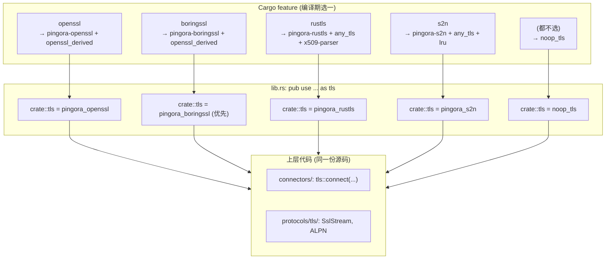
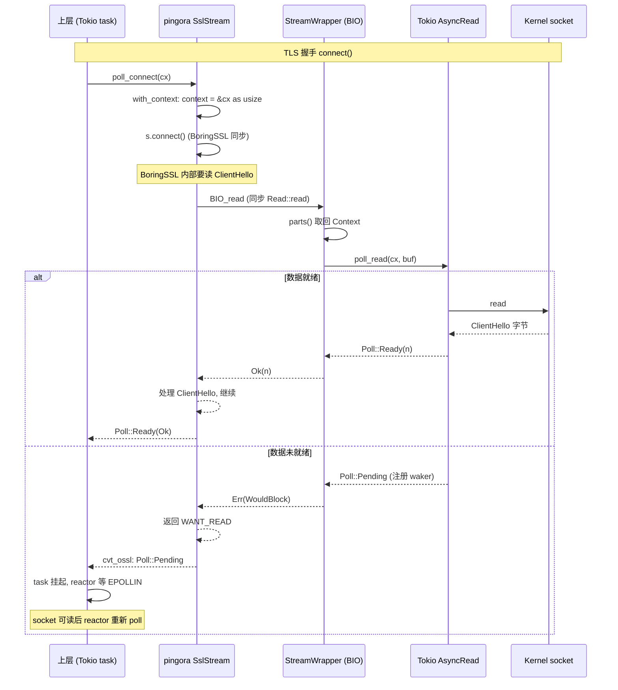
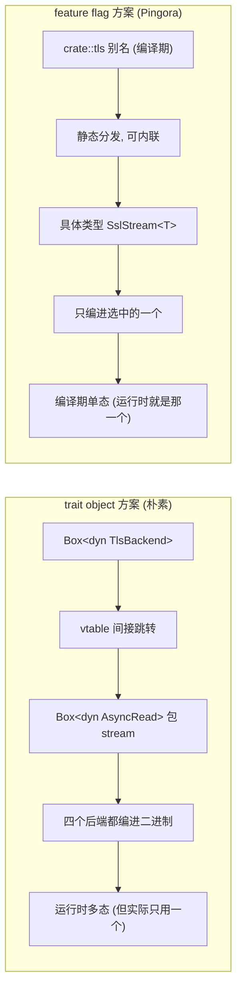
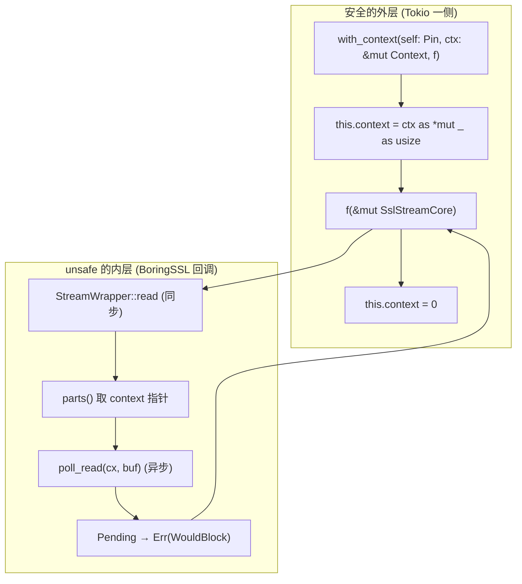

# 第 5 篇 · 第 16 章 · TLS 多后端:openssl/boringssl/rustls/s2n

> **核心问题**:Pingora 在 TLS 这一层做了件看起来很奢侈的事——它同时维护着 **四套** 可插换的 TLS 实现:`openssl`、`boringssl`、`rustls`、`s2n`,通过 Cargo feature flag 在编译期选一套。为什么不一选定终身?Cloudflare 自己生产环境跑的是 BoringSSL(为了性能 + FIPS 合规),但开源版为什么要保留另外三个?更深的疑问是:TLS 握手是**同步阻塞**的(BoringSSL/OpenSSL 的 C 实现),而 Pingora 全程跑在 Tokio 异步上,这个根本性的阻抗不匹配是怎么解决的?为什么 BoringSSL 那一套需要 Pingora **自己重写**一个 `boring_tokio.rs` 把同步握手异步化,而 OpenSSL 那一套却直接复用官方的 `tokio-openssl`?以及那个最容易被一句话带过、其实藏着整个设计灵魂的问题——为什么用 Cargo feature flag(编译期单态化)而不是 trait object(运行期动态分发)?这一章要把"四套可插换"背后的每一层动机和技巧拆透。
>
> **读完本章你会明白**:
>
> 1. **为什么 TLS 要做四套**:OpenSSL(最普及,系统库)、BoringSSL(Cloudflare 自家用,性能 + FIPS)、rustls(纯 Rust,内存安全,hyper/reqwest 默认)、s2n(AWS 出品,Cloudflare 用于 QUIC/HTTP3 探索)。每一套都有它存在的具体理由,不是"多多益善"。feature flag 让用户**按需编译**,只把要的那一套编进二进制。
> 2. ★**feature flag 可插换的真实机制**:不是 trait object 运行期切,是 `cfg(feature = "...")` 编译期单态化。`pingora-core/src/lib.rs` 里那五行 `#[cfg] pub use ... as tls;` 是整个机制的枢纽——`crate::tls` 这个名字在不同 feature 下指向**完全不同的 crate**。承接《Tower》的零成本抽象思想(编译期单态化 vs 运行期 trait object 的取舍)。
> 3. ★**`boring_tokio.rs` 的 unsafe 异步化包装**:BoringSSL 的 `SslStream::connect()` 是同步阻塞的,直接在 Tokio task 里调会阻塞整条 reactor 线程。Pingora 在 [`pingora-boringssl/src/boring_tokio.rs`](../pingora/pingora-boringssl/src/boring_tokio.rs) 里手写了一个 `SslStream<S>`,用 `StreamWrapper`(一个把 `&mut Context` 转成 `usize` 指针塞进字段的 unsafe trick)把同步的 `poll_read`/`poll_write` 桥接到 Tokio 的 `AsyncRead`/`AsyncWrite`。这一节会拆这个 unsafe 的精妙和它的边界。
> 4. **TLS 终止(termination)与 mTLS**:`HttpPeer` 持的 `sni`/`alpn`/`ca`/`client_cert_key` 这些 TLS 字段是怎么在 [`connectors/tls/boringssl_openssl/mod.rs`](../pingora/pingora-core/src/connectors/tls/boringssl_openssl/mod.rs) 的 `connect` 函数里被消费的——SNI 设置、证书校验开关、客户端证书(mTLS 双向认证)、ALPN 协商。ALPN 承接 [P2-07](P2-07-HTTP-connector-L7连接与h1h2会话.md)(h1/h2 协商),这里讲它在 TLS 层怎么落地。
> 5. **TLS 握手与 NoStealRuntime/OffloadRuntime 的协同**:TLS 握手是非对称加密计算(CPU 密集),承 [P5-15](P5-15-NoStealRuntime-Pingora自研运行时.md) 讲过的——这种活要么 offload 到 `OffloadRuntime`(避免霸占主 runtime 线程),要么依赖 `boring_tokio` 那套把握手做成可被 reactor 中断的 async。这是运行时与 TLS 的接合点。
>
> **逃生阀**:如果你只读一节,读**第 2 节**(feature flag 可插换机制)和紧跟的**技巧精解**(`boring_tokio` 的 unsafe 异步化)。TLS 的协议细节(握手流程、cipher suite 协商、证书链)不是本章重点——那是 TLS 本身的范畴,本章只讲"Pingora 怎么把四套 TLS 实现做成可插换、怎么把同步的 BoringSSL 塞进 Tokio 异步"。如果你忘了 ALPN 是什么,先回去翻 [P2-07](P2-07-HTTP-connector-L7连接与h1h2会话.md) 的 ALPN 协商那一节;如果你忘了 OffloadRuntime,先回去翻 [P5-15](P5-15-NoStealRuntime-Pingora自研运行时.md) 的第 3.8 节。

---

## 章首 · 一句话点破

> **Pingora 的 TLS 多后端,一句话讲完:它用 Cargo feature flag(`openssl`/`boringssl`/`rustls`/`s2n`)在编译期选一套 TLS 实现,通过 `crate::tls` 这个根据 feature 指向不同 crate 的别名,让上层代码(`connectors/`、`protocols/tls/`)用同一份源码编译出四种二进制;每套 TLS 实现都被包成一个暴露相同 API 的薄 crate(`pingora-{openssl,boringssl,rustls,s2n}`),其中 boringssl 因为官方 `tokio-boring` 还没跟上 `tokio-openssl` 的新异步接口,Pingora 自己手写了一个 `boring_tokio.rs`(用一个 unsafe 的 context 指针 trick 把同步握手桥接到 AsyncRead/AsyncWrite)。选 feature flag 而不是 trait object,是因为 TLS 实现是编译期决策(你不会在运行时换 TLS 库),trait object 的虚函数表开销和动态分发的 cache 不友好,在每条连接、每个字节读写都要走 TLS 解密的热路径上,是纯亏。**

这是结论,不是理由。本章倒过来拆:先讲 TLS 这一层为什么天然需要"多实现可选"(第 1 节,业界怎么做的),再讲 Pingora 的 feature flag 可插换机制到底怎么 work(第 2 节,源码佐证),然后进 `boring_tokio.rs` 看 BoringSSL 的同步握手怎么被异步化(第 3 节,本章最硬核的 unsafe 拆解),接着讲 TLS connect 怎么消费 `HttpPeer` 的 TLS 字段、ALPN 怎么协商、mTLS 怎么做(第 4 节),最后讲 TLS 握手怎么和 NoStealRuntime/OffloadRuntime 协同(第 5 节,承 [P5-15](P5-15-NoStealRuntime-Pingora自研运行时.md))。

本章服务**转发设施**这一面。TLS 不在钩子链上(业务不直接碰 TLS connect 的细节,但 `HttpPeer` 的 `sni`/`alpn`/`client_cert_key` 字段是业务在 `upstream_peer` 钩子里设的,承 [P1-04](P1-04-upstream选择与请求改写钩子.md)),但它是连接建立的必经之路——`TransportConnector`(承 [P2-06](P2-06-TransportConnector-L4TLS连接与复用.md))拿到 L4 TCP stream 后,如果 peer 要 TLS,就调 `tls::connect` 把裸 TCP 包成 TLS stream。它是第 5 篇"运行时与 TLS"的下半章,承 [P5-15](P5-15-NoStealRuntime-Pingora自研运行时.md) 的运行时(讲完运行时,自然讲运行时上跑的 CPU 密集活——TLS 握手),启 [P6-17 缓存](P6-17-pingoracache-HTTP缓存.md)(讲完转发设施的运行时与 TLS,第 5 篇收束,第 6 篇进入缓存与生产特性)。

---

## 正文

### 第 1 节 · 先把靶子立起来:TLS 这一层为什么天然需要"多实现可选"

TLS 这一层和 HTTP/1 解析(承 [P4-12](P4-12-HTTP1-自研解析-基于httparse.md))、HTTP/2(承 [P4-13](P4-13-HTTP2-委托h2.md))有一个根本不同:HTTP 协议本身是**一份规范 + 多个实现**,但实现之间的差异主要是性能和边界条件处理,选哪个实现通常不影响协议合规性;而 TLS 这一层,不同的 TLS 实现(OpenSSL、BoringSSL、rustls、s2n)之间不只是"同一个东西的不同实现",它们还带着**不同的生态定位、不同的安全审计背景、不同的性能特征、甚至不同的合规资格**(FIPS)。所以一个成熟的网络框架,往往要给用户留"选哪个 TLS 实现"的口子。先看业界怎么做的。

#### 1.1 Nginx:OpenSSL 模块,编译时选

Nginx 的 TLS 支持是历史最久的方案。它的 TLS 调用直接写在源码里,默认用 OpenSSL(`--with-http_ssl_module`),也有第三方 patch 让它支持 BoringSSL 或 LibreSSL。这个选型是**编译时**的——你 `./configure` 时选哪个 SSL 库,编出来的 Nginx 二进制就只能用那一个。运行时不能换。

Nginx 这么做的背景是:它是 C 写的,C 的 TLS 调用是直接 `#include <openssl/ssl.h>` 然后 `SSL_CTX_new` / `SSL_connect` / `SSL_read` / `SSL_write`。换一个 TLS 库意味着换头文件、换函数签名、换错误码——这是一次**源码级**的改动,不是配置能解决的。所以 Nginx 的多 TLS 后端支持很弱,实际上绝大多数部署就是 OpenSSL 一个。

> **钉死这件事**:Nginx 的 TLS 后端选型是"编译时硬编码",换库要改源码 + 重新编译。这和它的 C 语言根基有关——C 没有泛型、没有 trait,要做"运行时多态"得手动写函数指针虚函数表,代价高。所以 C 框架倾向于"一选定终身"。

#### 1.2 Envoy:TLS inspector + 多种证书 provider

Envoy(C++)的 TLS 设计更现代。它有一个 **TLS inspector** listener filter,用 BoringSSL 做 SNI 解析(peek ClientHello 不解密),根据 SNI 路由到不同的证书。证书来源可以是静态文件、可以是动态下发的(通过 SDS,Secret Discovery Service,xDS 的一种)。Envoy 自己链接的是 BoringSSL(Google 系),但也支持插件式的 TLS provider。

Envoy 的多 TLS 后端能力比 Nginx 强,但本质上还是"Envoy 二进制链接了哪个 SSL 库就用哪个",运行时不能动态换。它的灵活性主要体现在**证书管理**(SDS 动态下发、多证书轮转)和**SNI 路由**(TLS inspector),而不是"同一个二进制支持多个 SSL 库"。

#### 1.3 hyper:rustls 默认,可选 native-tls

hyper(同级对照,Pingora 和 hyper 都建在 Tokio 上)的 TLS 策略是另一套。hyper 核心不强制 TLS——TLS 是上层(`hyper-util` 或独立的 `hyper-rustls`/`hyper-tls`)的事。Rust 生态里有两个主流 TLS 拼装方式:

- **rustls**:纯 Rust 实现,内存安全,是 reqwest、hyper-rustls 的默认。不需要系统 OpenSSL,跨平台编译方便。
- **native-tls**:一个抽象层,背后根据平台选 OpenSSL(Linux)/ Secure Transport(macOS)/ SChannel(Windows),通过 `tokio-tls` 桥接到 async。

hyper 本身不操心 TLS 实现,它只要求传入的连接是 `AsyncRead + AsyncWrite`(TLS 解密后的字节流)。把哪套 TLS 实现包进来,是 `hyper-rustls` 或 `hyper-tls` 那个 adapter crate 的事。这是个**组合优于配置**的 Rust 哲学——核心库不管 TLS,adapter crate 管。

#### 1.4 那 Pingora 凭什么要四套可插换

把上面三家摆出来,Pingora 的选择就清晰了。Pingora 既不是 Nginx 那种"一选定终身"(它的 Rust 泛型 + feature flag 能做到编译期多选),也不是 hyper 那种"核心不管 TLS,丢给 adapter"(它的 TLS 是连接建立的必经之路,`connectors/` 直接调 `tls::connect`,TLS 实现是 Pingora 自己的代码路径的一部分)。

Pingora 选的是**中间路线**:TLS 是 Pingora 自己管的(不像 hyper 丢出去),但通过 feature flag 让用户在编译期选哪一套。四套各有各的存在理由:

| TLS 后端 | crate 依赖 | 谁在用 | 为什么存在 |
|---------|----------|--------|----------|
| **openssl** | `openssl`(系统 OpenSSL) | 通用部署,Debian/Ubuntu 默认 | 最普及,系统库,几乎每个 Linux 都有 |
| **boringssl** | `boring`(Google BoringSSL) | **Cloudflare 生产环境** | 性能(QUIC/0-RTT/优化的 cipher)+ FIPS 合规可选 + Cloudflare 自己 fork 维护 |
| **rustls** | `rustls`(纯 Rust) | 偏好内存安全 + 简化部署的用户 | 纯 Rust 无 unsafe C,内存安全,跨平台编译方便(承 hyper 生态) |
| **s2n** | `s2n-tls`(AWS) | AWS 环境 + HTTP/3 探索 | AWS 出品,Cloudflare 用 s2n 做 QUIC/HTTP3 的 TLS 栈 |

这里有个**关键的承接点**:Cloudflare 自己生产用 BoringSSL,但开源版默认 feature 是空的(`pingora-core/Cargo.toml` 的 `[features] default = []`)——也就是说,如果你什么都不配,编出来的 Pingora **没有 TLS 能力**(走 `noop_tls`,下面第 2 节讲)。用户必须显式选一个 feature(`--features openssl` 或 `boringssl`/`rustls`/`s2n`)才编进 TLS。这是个"显式优于隐式"的设计:TLS 后端是个重要决策,不能默默替你选。

> **钉死这件事(承接关系)**:Pingora 和 hyper 在 TLS 上的对照不是"一个管一个不管",而是**集成的深度不同**。hyper 把 TLS 完全丢给 adapter(`hyper-rustls`),核心只接受 `AsyncRead + AsyncWrite`;Pingora 把 TLS 集成进 `connectors/`,自己管 TLS connect/handshake/mTLS/ALPN,但通过 feature flag 让你选底层库。这是两个不同的设计哲学:hyper 更"组合"(core 不管,adapter 拼),Pingora 更"集成"(core 管,但底层可换)。两种哲学没有绝对优劣,hyper 的方式更灵活(任何 TLS 库都能适配),Pingora 的方式更可控(TLS 代码路径是 Pingora 自己优化过的,比如 mTLS、异步证书加载这些特性 Pingora 自己实现)。

### 第 2 节 · Pingora 的 feature flag 可插换机制:`crate::tls` 别名

讲清了"为什么四套",现在看"怎么四套"。这是本章的核心机制,也是承接《Tower》零成本抽象思想的关键一节。

#### 2.1 朴素思路:trait object 运行期切

如果让一个不熟 Rust 的人设计"多 TLS 后端可插换",最直觉的方案是:定义一个 `TlsBackend` trait,把 `connect`/`handshake`/`read`/`write` 做成 trait method,然后四个实现(`OpenSslBackend`/`BoringSslBackend`/`RustlsBackend`/`S2nBackend`),运行时用一个 `Box<dyn TlsBackend>` 持有当前选的那个。伪代码:

```rust
// 朴素思路(非源码,示意)
trait TlsBackend {
    async fn connect(&self, stream: Stream, peer: &Peer) -> Result<TlsStream>;
}

struct OpenSslBackend { /* ... */ }
impl TlsBackend for OpenSslBackend { /* ... */ }
// ... 其他三个

// 运行时持有
let backend: Box<dyn TlsBackend> = match config.tls_impl {
    "openssl" => Box::new(OpenSslBackend::new()),
    "boringssl" => Box::new(BoringSslBackend::new()),
    // ...
};
```

这个方案在 Rust 里能写,但有几个问题:

1. **`Box<dyn TlsBackend>` 的每次方法调用都是动态分发**——经虚函数表(vtable)间接跳转,不能内联。在 TLS 这个**热路径**上(每条连接的每次 `read`/`write` 都要走 TLS 解密),虚函数表跳转的开销会累积。更糟的是,vtable 跳转是数据相关的分支,CPU 分支预测器不容易预测准,pipeline 容易被打断。
2. **`dyn TlsBackend` 限制了泛型展开**。TLS stream 的类型(OpenSSL 的 `SslStream<T>` vs rustls 的 `TlsStream<T>`)是不同的具体类型,如果用 trait object,就得把它们藏在 `Box<dyn AsyncRead + AsyncWrite>` 后面,又多一层动态分发。
3. **运行时多选一浪费二进制体积**。如果用 trait object,四个后端都被编进二进制,运行时只用一个——另外三个的代码白占了二进制体积(对 Cloudflare 这种把代理部署到几万台机器的场景,二进制体积是有意义的)。
4. **TLS 后端是编译期决策**。你不会在运行时换 TLS 库——一个部署用的二进制,要么用 OpenSSL,要么用 BoringSSL,不会"早上用 OpenSSL 下午换 BoringSSL"。这种编译期就定死的决策,用 trait object 是杀鸡用牛刀。

承接《Tower》那本书讲的**零成本抽象**:Rust 的泛型 + 单态化,能在编译期把"用哪个具体类型"决出来,生成针对那个具体类型的专用代码(可内联、无虚函数表)。Tower 的 `Service` trait 用泛型(`Service<Request>` + `type Response`),而不是 `dyn Service`,正是这个道理。Pingora 的 TLS 多后端用的是同一套思路——只不过它用的是 feature flag + crate 别名,比泛型更彻底(连源码路径都不一样)。

#### 2.2 Pingora 的真实选择:feature flag + crate 别名,编译期单态化到底

Pingora 的方案在 [`pingora-core/src/lib.rs#L106-L122`](../pingora/pingora-core/src/lib.rs#L106-L122):

```rust
// pingora-core/src/lib.rs#L106-L122
// If both openssl and boringssl are enabled, prefer boringssl.
// This is to make sure that boringssl can override the default openssl feature
// when this crate is used indirectly by other crates.
#[cfg(feature = "boringssl")]
pub use pingora_boringssl as tls;

#[cfg(feature = "openssl")]
pub use pingora_openssl as tls;

#[cfg(feature = "rustls")]
pub use pingora_rustls as tls;

#[cfg(feature = "s2n")]
pub use pingora_s2n as tls;

#[cfg(not(feature = "any_tls"))]
pub use protocols::tls::noop_tls as tls;
```

这五行是整个多后端机制的枢纽。逐段拆:

**`#[cfg(feature = "boringssl")] pub use pingora_boringssl as tls;`** —— 如果编译时启用了 `boringssl` feature,就把 `pingora_boringssl` 这个 crate 重新导出(re-export)为 `tls`。从此,`pingora-core` 内部所有写 `crate::tls::xxx` 的地方,实际指向的就是 `pingora_boringssl::xxx`。

**`#[cfg(feature = "openssl")] pub use pingora_openssl as tls;`** —— 同理,openssl feature 下,`crate::tls` = `pingora_openssl`。

**rustls / s2n 同理。**

**最后那行 `#[cfg(not(feature = "any_tls"))] pub use protocols::tls::noop_tls as tls;`** —— 这是个**兜底**。如果用户**一个 TLS feature 都没启用**,`crate::tls` 指向 `protocols::tls::noop_tls`——一个空的占位实现(下面专门讲)。这保证"不编 TLS 也能编译通过"。

**关键点:这些 `#[cfg]` 是互斥的(在正常配置下)。** Cargo 的 feature 可以同时启用(比如 `--features "openssl boringssl"`),但 Pingora 的 feature 设计里,boringssl 和 openssl 都启用了的话,`boringssl` 那行在源码里**写在 openssl 前面**,加上开头那段注释"If both openssl and boringssl are enabled, prefer boringssl"——Rust 的 `pub use ... as tls` 如果重复会冲突,实际上靠 cfg 的顺序和 `prefer boringssl` 的设计,boringssl 优先。这就是注释说的"让 boringssl 能覆盖 openssl,即使 openssl 是被某个间接依赖默认带进来的"。这是个很贴心的设计——Cloudflare 自己用 boringssl,但有些依赖(比如某个 reqwest)可能默认带 openssl feature 进来,Pingora 确保 boringssl 永远赢。

> **钉死这件事**:`crate::tls` 是个**编译期别名**,不是运行时变量。编出来的二进制里,`crate::tls` 永远是某一个具体 crate(由 feature 决定),不存在"运行时切换"。这和 trait object 的根本差异——trait object 是运行时多态(一个变量可以是多种类型),feature flag 是编译期单态(编出来就是一种类型)。承接《Tower》零成本抽象:单态化的代码可以被编译器充分优化(内联、向量化、死代码消除),而 trait object 不行。

#### 2.3 feature 之间的依赖关系:`openssl_derived` 和 `any_tls`

光看 lib.rs 那五行还不够,要看 Cargo.toml 的 `[features]` 才能理解 feature 之间的关系。[`pingora-core/Cargo.toml#L102-L112`](../pingora/pingora-core/Cargo.toml#L102-L112):

```toml
# pingora-core/Cargo.toml#L102-L112
[features]
default = []
openssl = ["pingora-openssl", "openssl_derived"]
boringssl = ["pingora-boringssl", "openssl_derived"]
rustls = ["pingora-rustls", "any_tls", "dep:x509-parser", "ouroboros"]
s2n = ["pingora-s2n", "any_tls", "dep:x509-parser", "ouroboros", "lru"]
patched_http1 = ["pingora-http/patched_http1"]
openssl_derived = ["any_tls"]
any_tls = []
sentry = ["dep:sentry"]
connection_filter = []
```

逐个拆:

- **`openssl = ["pingora-openssl", "openssl_derived"]`** —— 启用 openssl feature 会做两件事:① 拉入 `pingora-openssl` 这个 optional dependency;② 启用 `openssl_derived` 这个 feature。
- **`boringssl = ["pingora-boringssl", "openssl_derived"]`** —— 同理,拉入 `pingora-boringssl`,启用 `openssl_derived`。
- **`openssl_derived = ["any_tls"]`** —— 这是个**共享 feature**。openssl 和 boringssl 都启用它。它的意思是"底层是 OpenSSL 系的(OpenSSL 或 BoringSSL,它们 API 兼容)",启用它就同时启用 `any_tls`。
- **`any_tls = []`** —— 这是个**标志 feature**(不带额外依赖,纯标记)。它的作用是"表示启用了某种 TLS 后端"。前面 lib.rs 那行 `#[cfg(not(feature = "any_tls"))]` 用它判断"是否启用了任何 TLS"——只要 openssl/boringssl/rustls/s2n 任一启用,`any_tls` 就是 true。
- **`rustls = ["pingora-rustls", "any_tls", "dep:x509-parser", "ouroboros"]`** —— rustls 注意:**不**启用 `openssl_derived`(它不是 OpenSSL 系),但启用 `any_tls`,还拉入 `x509-parser` 和 `ouroboros`(rustls 需要这两个做证书解析和自引用类型)。
- **`s2n = [...]`** —— 类似 rustls,额外拉入 `lru`(s2n 的会话缓存用)。

这套 feature 关系有几个精妙处:

**1. `openssl_derived` 把 OpenSSL/BoringSSL 共性抽出来。** 因为 OpenSSL 和 BoringSSL 的 API 几乎完全兼容(BoringSSL 是 OpenSSL 的 Google fork,故意保持 API 兼容),所以很多代码可以共享——这部分代码用 `#[cfg(feature = "openssl_derived")]` 守卫,openssl 和 boringssl 都编进去。例如前面看到的 ALPN 的 `to_wire_preference`([`protocols/tls/mod.rs#L156`](../pingora/pingora-core/src/protocols/tls/mod.rs#L156))就是 `#[cfg(feature = "openssl_derived")]`,因为 OpenSSL 系的 ALPN 编码格式一样(都是 length-prefixed 连续字节串)。rustls 和 s2n 各有自己的 `to_wire_protocols`(返回 `Vec<Vec<u8>>`,因为 rustls/s2n 的 API 接受分离的 Vec)。

**2. `any_tls` 是"启用任何 TLS"的标志。** 它让"无 TLS 时的占位实现"(`noop_tls`)只在 `not(any_tls)` 下编译。这样,只要你启用了任一 TLS feature,`noop_tls` 就不编进去;只有啥都不启用的兜底场景才用 `noop_tls`。

**3. rustls/s2n 额外依赖不同。** rustls 要 `x509-parser`(证书解析)+ `ouroboros`(自引用类型,用于证书查找的 LRU cache);s2n 要 `lru`(会话缓存)。这些依赖只在对应 feature 下编入,不污染其他 feature 的二进制。这正是 feature flag 的好处——按需付费。



> **钉死这件事**:feature flag 不是"运行时配置",是**编译期单态化**。同一个 `tls::connect` 调用,在 `--features openssl` 下编译时,`tls` 是 `pingora_openssl`,编出来调的是 OpenSSL 的 `SSL_connect`;在 `--features boringssl` 下,`tls` 是 `pingora_boringssl`,编出来调的是 BoringSSL 的 `SSL_connect`(底层是不同的 C 代码,但 Rust 这一层的函数签名一致,所以同一份上层源码能编)。这是 Rust feature flag 比 C `#ifdef` 优雅的地方——feature flag 是 Cargo 级别的、模块化的(按 crate 依赖切),而 C 的 `#ifdef` 是源文件级别的、容易失控(一堆 `#ifdef OPENSSL`/`#ifdef BORINGSSL` 散落各处)。

#### 2.4 四个 crate 怎么暴露一致的 API

`crate::tls` 别名指向不同 crate,那这四个 crate 必须暴露**形态一致的 API**,上层代码才能对着 `crate::tls::xxx` 编程。看这四个 crate 的 `lib.rs` 怎么写的。

[`pingora-openssl/src/lib.rs#L15-L34`](../pingora/pingora-openssl/src/lib.rs#L15-L34):

```rust
// pingora-openssl/src/lib.rs#L15-L34
//! The OpenSSL API compatibility layer.
//!
//! This crate aims at making [openssl] APIs interchangeable with [boring](https://docs.rs/boring/latest/boring/).
//! In other words, this crate and [`pingora-boringssl`] expose identical rust APIs.

use openssl as ssl_lib;
pub use openssl_sys as ssl_sys;
pub use tokio_openssl as tokio_ssl;
pub mod ext;

// export commonly used libs
pub use ssl_lib::dh;
pub use ssl_lib::error;
pub use ssl_lib::hash;
pub use ssl_lib::nid;
pub use ssl_lib::pkey;
pub use ssl_lib::ssl;
pub use ssl_lib::x509;
```

注意三个关键别名:

- **`use openssl as ssl_lib;`** —— 把底层的 `openssl` crate 重命名为 `ssl_lib`。这个名字在 boringssl 那边是 `use boring as ssl_lib;`——所以上层写 `ssl_lib::ssl::SslRef` 时,openssl 下是 `openssl::ssl::SslRef`,boringssl 下是 `boring::ssl::SslRef`,而这两个类型因为 API 兼容,上层代码不用改。
- **`pub use openssl_sys as ssl_sys;`** —— 底层的 FFI 常量库(openssl 是 `openssl_sys`,boring 是 `boring_sys`)。统一叫 `ssl_sys`,上层写 `ssl_sys::X509_V_OK` 时两边都 work(虽然常量值可能不同,但符号都在)。
- **`pub use tokio_openssl as tokio_ssl;`** —— 异步桥接层。openssl 直接复用官方的 `tokio_openssl` crate。

再看 boringssl 的 [`pingora-boringssl/src/lib.rs#L15-L34`](../pingora/pingora-boringssl/src/lib.rs#L15-L34):

```rust
// pingora-boringssl/src/lib.rs#L15-L34
//! The BoringSSL API compatibility layer.
//!
//! This crate aims at making [boring] APIs exchangeable with [openssl-rs](https://docs.rs/openssl/latest/openssl/).
//! In other words, this crate and [`pingora-openssl`] expose identical rust APIs.

use boring as ssl_lib;
pub use boring_sys as ssl_sys;
pub mod boring_tokio;
pub use boring_tokio as tokio_ssl;
pub mod ext;
```

和 openssl 版**几乎一样**,只有一处关键差异:

- **`use boring as ssl_lib;`** —— 底层换成 `boring` crate。
- **`pub use boring_sys as ssl_sys;`** —— FFI 换成 `boring_sys`。
- **`pub mod boring_tokio; pub use boring_tokio as tokio_ssl;`** —— ★**这里不一样**:boringssl 没有直接复用某个官方的 `tokio_boring` crate,而是**自己写了一个 `boring_tokio` 模块**。为什么?`boring_tokio.rs` 顶部的注释([L15-L16](../pingora/pingora-boringssl/src/boring_tokio.rs#L15-L16))说得很清楚:

> This file reimplements tokio-boring with the overhauled tokio-openssl interface while the tokio APIs from official [boring] crate is not yet caught up to it.

翻译:"这个文件用新的(overhauled)`tokio-openssl` 接口重实现了 `tokio-boring`,因为官方 `boring` crate 的 tokio 接口还没跟上。" 也就是说,`tokio-openssl`(OpenSSL 的 Tokio 桥接)经历了一次接口大改(overhauled,变成基于 `poll_read`/`poll_write` 的新接口),但 `tokio-boring`(BoringSSL 的 Tokio 桥接)还没同步这次改动。Pingora 等不及,自己在 `boring_tokio.rs` 里照着 `tokio-openssl` 的新接口手写了一份 BoringSSL 版本。这是本章第 3 节要详讲的硬核技巧。

这两个 crate(plus rustls、s2n)暴露的 API 形态一致到这种程度——上层 `protocols/tls/boringssl_openssl/mod.rs` 里写:

```rust
// protocols/tls/boringssl_openssl/mod.rs#L19-L29
#[cfg(feature = "boringssl")]
use pingora_boringssl as ssl_lib;

#[cfg(feature = "openssl")]
use pingora_openssl as ssl_lib;

use ssl_lib::{ssl::SslRef, x509::X509};
```

注意这里又是 feature flag 二选一——boringssl feature 下 `ssl_lib = pingora_boringssl`,openssl feature 下 `ssl_lib = pingora_openssl`。因为这两个 crate 都 re-export 了 `ssl::SslRef` 和 `x509::X509`(类型名字一样),所以同一行 `use ssl_lib::{ssl::SslRef, x509::X509}` 两边都编得过。这就是"API 形态一致"的含义——不是 trait object 的运行时多态,是**编译期名字对齐**:只要两个 crate 暴露的同名符号类型签名一致,上层就能用同一个 `use` 语句把它们都 cover。

> **钉死这件事(承 Tower)**:这种"编译期把不同 crate 起成同一个别名,靠它们 API 形态一致来共享上层代码"的手法,和 Tower 的 `Service` trait 泛型单态化是**同一种零成本抽象思想的不同落地**。Tower 用 trait + 关联类型让泛型代码在编译期展开成针对具体 `Service` 实现的专用代码;Pingora 用 feature flag + crate 别名让同一份上层源码在编译期指向不同的 TLS crate。两者都避免了 trait object 的虚函数表开销,都把"用哪个具体实现"的决策推到编译期。差别是 Tower 在**同一份二进制**里支持多种 Service(泛型实例化),Pingora 在**不同二进制**(feature flag 不同的 build)里只支持一种 TLS。这是因为 Service 是用户业务代码(一个应用里可能有几十种 Service),而 TLS 后端是基础设施(一个二进制里只要一个)。

#### 2.5 `noop_tls`:无 TLS 时的占位实现

最后看那个兜底的 `noop_tls`。当用户没启用任何 TLS feature 时,`crate::tls = noop_tls`。看 [`protocols/tls/noop_tls/mod.rs`](../pingora/pingora-core/src/protocols/tls/noop_tls/mod.rs)(节选):

```rust
// protocols/tls/noop_tls/mod.rs (节选)
//! This is a set of stubs that provides the minimum types to let pingora work
//! without any tls providers configured

pub struct TlsRef;
pub type CaType = [CertWrapper];

#[derive(Debug)]
pub struct CertWrapper;

pub mod connectors {
    // ...
    #[derive(Clone)]
    pub struct Connector {
        pub ctx: TlsConnector,
    }
    #[derive(Clone)]
    pub struct TlsConnector;

    impl Connector {
        pub fn new(_: Option<ConnectorOptions>) -> Self {
            Self { ctx: TlsConnector }
        }
    }

    pub async fn connect<T, P>(
        _: T, _: &P, _: Option<ALPN>, _: &TlsConnector,
    ) -> Result<SslStream<T>>
    where T: IO, P: Peer + Send + Sync,
    {
        Ok(SslStream::default())
    }
}

pub mod stream {
    // SslStream<S> 是个 PhantomData 占位, 所有 AsyncRead/AsyncWrite 都是 no-op
    pub struct SslStream<S> { marker: std::marker::PhantomData<S> }
    // poll_read 直接返回 Ok(()) (读到 0 字节, 即 EOF)
    // poll_write 返回 Ok(buf.len()) (假装写成功了)
    // ...
}
```

这是个**纯占位**实现。`TlsRef` 是空 struct,`CaType` 是空数组类型,`Connector::new` 忽略所有参数返回个空壳,`connect` 直接返回个默认的 `SslStream`(它的 `poll_read` 返回 EOF,`poll_write` 假装写成功)。所有这些 stub 的目的只有一个:**让 pingora-core 在没有任何 TLS 后端时也能编译通过**。

为什么要这个?因为 `pingora-core` 的 `[features] default = []`——默认不启用任何 TLS。如果用户只是想用 Pingora 做纯 HTTP(不接 TLS 流量,比如内部 HTTP 转发),他可以不选任何 TLS feature,编出来的二进制更小(不链 OpenSSL/BoringSSL/rustls/s2n 任何一个)。但这要求 pingora-core 的源码里所有 `crate::tls::xxx` 的引用都能解析——`noop_tls` 就是那个能解析但不干活的占位。

但要注意 `noop_tls` 的 `connect` 是个**陷阱**:它返回的 `SslStream` 是个空壳,后续的 HTTP 解析会因为 `poll_read` 立刻返回 EOF 而失败。所以 `noop_tls` 的真实用途是"让代码能编译,运行时如果真走到 TLS 路径会出问题"。它对应的语义是"这个二进制不应该处理 TLS 流量"——如果你要用 TLS,就启用一个 TLS feature。注释那句"This is a set of stubs that provides the minimum types to let pingora work without any tls providers configured"说得很清楚:它的目的是"让 pingora work(编译过)",不是"让 TLS 真的工作"。

> **钉死这件事**:`noop_tls` 是 feature flag 设计的**完整性补丁**。feature flag 让你"按需选一个",但 Rust 的类型系统要求所有 cfg 分支都能编译——如果"什么都不选"这个分支没有对应的类型,代码就编不过。`noop_tls` 就是那个"什么都不选"分支的类型提供者。这是个很 Rust 的设计:用类型系统保证所有配置组合都能编译,哪怕某些组合(无 TLS)在运行时是没意义的。对照 Nginx——Nginx 没有"无 SSL 模块"的编译选项,SSL 是强制的(虽然可以 `--without-http_ssl_module` 但那样就不能处理 HTTPS)。Pingora 更灵活,可以纯 HTTP 编译。

### 第 3 节 · `boring_tokio.rs`:把同步 BoringSSL 握手异步化

讲完了 feature flag 的可插换机制,这一节进本章最硬核的技巧——`boring_tokio.rs` 怎么把同步的 BoringSSL 握手包装成 Tokio 的 `AsyncRead`/`AsyncWrite`。这是承接《Tokio》[[tokio-source-facts]] 的部分(Tokio 的 `AsyncRead`/`AsyncWrite` 模型一句带过指路),但重点在 Pingora 自己写的那个 unsafe 桥接 trick。

#### 3.1 问题:BoringSSL 握手是同步阻塞的

BoringSSL(和 OpenSSL)是 C 写的,它的握手 API 是同步的:

```c
// C 伪代码
SSL_connect(ssl);  // 阻塞直到握手完成或出错
SSL_read(ssl, buf, len);  // 阻塞直到有数据
SSL_write(ssl, buf, len);  // 阻塞直到写完
```

在阻塞 IO 模型里,这些函数直接调底层 socket 的 `connect`/`read`/`write`,socket 是阻塞的,函数就阻塞。在非阻塞 IO 模型里(libevent、epoll),这些函数的返回值可能是 `SSL_ERROR_WANT_READ`/`SSL_ERROR_WANT_WRITE`——意思是"我还差一次 IO 操作,但现在 socket 不能立刻完成,你先去等 IO 就绪再回来叫我"。这是 OpenSSL/BoringSSL 的标准非阻塞用法。

而 Tokio 是异步的,它的 IO 是 `AsyncRead`/`AsyncWrite`(承《Tokio》[[tokio-source-facts]]),基于 `poll_read`/`poll_write` 返回 `Poll::Ready` 或 `Poll::Pending`。这两套模型怎么对接?

核心难点是:**BoringSSL 的 `SSL_read`/`SSL_write` 内部会回调底层的 `BIO_read`/`BIO_write`(底层的 socket read/write),但这些回调是同步的**。BoringSSL 不知道"IO 现在不能立刻完成,得挂起等 epoll",它只会"调 BIO_read → 拿到结果 → 继续"。所以在 Tokio 异步里用 BoringSSL,得想办法让 BoringSSL 的同步 BIO 回调能"表达 Pending"——即告诉 BoringSSL"这次 read 暂时没数据",同时把"我在等 IO"这个状态传递回 Tokio 的 `poll` 循环。

#### 3.2 OpenSSL 的解法:`tokio-openssl` 的 overhauled 接口

`tokio-openssl`(OpenSSL 的 Tokio 桥接)经历过一次接口重构(overhaul)。新接口的核心思路是:**把 BoringSSL/OpenSSL 的同步 BIO 替换成一个自定义的 BIO,这个 BIO 的 read/write 内部调用 Tokio 的 `poll_read`/`poll_write`**。具体来说:

1. 包装一个 `SslStream<S>`,内部是 `openssl::ssl::SslStream<StreamWrapper<S>>`,其中 `StreamWrapper<S>` 是个自定义的 BIO。
2. `StreamWrapper` 实现标准库的 `std::io::Read`/`Write`(因为 OpenSSL 的 BIO 要的是同步 read/write)。
3. 但 `StreamWrapper` 内部的 `read`/`write` 实际上调的是底层 `S`(Tokio 的 `AsyncRead`/`AsyncWrite`)的 `poll_read`/`poll_write`——这就需要一个 `Context` 来传递 waker。
4. 关键 trick:`StreamWrapper` 持有一个 `context: usize` 字段,在每次 `poll_*` 调用前,把当前的 `&mut Context` 的指针塞进去,这样 `StreamWrapper` 的 `read`/`write`(被 OpenSSL 同步调用时)能从 `context` 里取回 `Context`,调 `poll_read`/`poll_write`。

这套机制,OpenSSL 官方的 `tokio-openssl` 实现了。Pingora 的 `pingora-openssl` 直接 `pub use tokio_openssl as tokio_ssl` 复用它。

#### 3.3 BoringSSL 的困境:官方 `tokio-boring` 没跟上

问题来了:BoringSSL 的官方 Tokio 桥接 `tokio-boring`,**还没跟上 `tokio-openssl` 的那次 overhaul**。`tokio-boring` 还在用旧接口(可能是 `futures::Poll` 时代的,或者基于 `current_thread` runtime 的特殊 hack)。Pingora 想用 `tokio-openssl` 的新接口,但 BoringSSL 那边没有对应实现。

Pingora 的解法:在 `pingora-boringssl/src/boring_tokio.rs` 里**自己照着 `tokio-openssl` 的新接口,用 BoringSSL 重写一遍**。这就是文件顶部那句注释"This file reimplements tokio-boring with the overhauled tokio-openssl interface"的意思。

`boring_tokio.rs` 整个文件就是在做这件事:把 `tokio-openssl` 的实现照搬到 BoringSSL 上(因为两者 API 兼容,搬起来不难,但要处理 BoringSSL 特有的东西)。核心就是那个 `StreamWrapper` + `context` 指针 trick。

#### 3.4 拆 `StreamWrapper`:context 指针 trick

看 [`pingora-boringssl/src/boring_tokio.rs#L27-L52`](../pingora/pingora-boringssl/src/boring_tokio.rs#L27-L52):

```rust
// pingora-boringssl/src/boring_tokio.rs#L27-L52
struct StreamWrapper<S> {
    stream: S,
    context: usize,
}

impl<S> fmt::Debug for StreamWrapper<S>
where S: fmt::Debug,
{
    fn fmt(&self, fmt: &mut fmt::Formatter<'_>) -> fmt::Result {
        fmt::Debug::fmt(&self.stream, fmt)
    }
}

impl<S> StreamWrapper<S> {
    /// # Safety
    ///
    /// Must be called with `context` set to a valid pointer to a live `Context` object, and the
    /// wrapper must be pinned in memory.
    unsafe fn parts(&mut self) -> (Pin<&mut S>, &mut Context<'_>) {
        debug_assert_ne!(self.context, 0);
        let stream = Pin::new_unchecked(&mut self.stream);
        let context = &mut *(self.context as *mut _);
        (stream, context)
    }
}
```

逐段拆:

**`StreamWrapper<S>` 有两个字段:**
- **`stream: S`** —— 底层的 Tokio IO(通常是 `tokio::net::TcpStream`),实现 `AsyncRead` + `AsyncWrite`。
- **`context: usize`** —— ★这是那个 trick。它存的是一个 `&mut Context<'_>` 的**指针**,用 `usize` 表示(指针转 usize)。`usize` 而不是 `Option<NonNull<Context>>` 是为了简单(且 `StreamWrapper` 要被传进 BoringSSL 的 C FFI,C 那边不认 Rust 的 `Option`)。

**为什么需要这个 `context` 字段?** 因为 `StreamWrapper` 要同时满足两套接口:

- **对 BoringSSL(C FFI 那边)**:它得实现 `std::io::Read`/`Write`(标准库的同步 IO trait),因为 BoringSSL 的 `SslStream` 内部用 `BIO_read`/`BIO_write`,期望底层的 BIO 是同步的(返回 `Ok(n)` 或 `Err(WouldBlock)`)。
- **对底层 Tokio IO(`S`)**:它得调 `S::poll_read`/`poll_write`,这两个是 `poll` 风格的(需要 `&mut Context`)。

问题是:`std::io::Read::read(&mut self, buf)` 的签名**没有 `Context` 参数**,但 `poll_read(cx, buf)` 需要 `Context`。`StreamWrapper::read`(被 BoringSSL 调用时)从哪弄 `Context`?

答案就是 `context: usize` 这个字段。在**外层**(Tokio 那一侧)调 `poll_read` 之前,先把 `Context` 的指针塞进 `context` 字段;然后 `StreamWrapper::read`(被 BoringSSL 同步调用)从 `context` 字段把指针取出来,还原成 `&mut Context`,用它调底层的 `poll_read`。

**`unsafe fn parts(&mut self)`** 就是干这件事的:
- **`debug_assert_ne!(self.context, 0);`** —— debug 模式下断言 context 不是 0(0 表示没初始化,会段错误)。
- **`let stream = Pin::new_unchecked(&mut self.stream);`** —— 把 `&mut self.stream` 包成 `Pin`(unsafe,因为调用方得保证 `StreamWrapper` 本身是 Pin 住的)。
- **`let context = &mut *(self.context as *mut _);`** —— ★核心 unsafe 操作:把 `usize` 转回 `*mut`,再解引用成 `&mut Context<'_>`。这个 `as *mut _` 的 `_` 让编译器推断类型(从函数返回类型 `&mut Context<'_>` 反推)。这是个**裸指针解引用**,安全性完全靠调用方保证——`context` 必须指向一个**存活的** `Context` 对象。

这就是那个 unsafe trick 的全部。它的安全性契约(`# Safety` 注释)是:"Must be called with `context` set to a valid pointer to a live `Context` object, and the wrapper must be pinned in memory." 翻译:调用 `parts()` 前,`context` 必须被设成一个指向存活 `Context` 的指针,且 `StreamWrapper` 必须被 Pin 住(不能在内存里移动,否则指针失效)。

#### 3.5 拆 `Read`/`Write` 实现:把同步调用翻译成 Pending

看 `StreamWrapper` 怎么实现 `std::io::Read`/`Write`,这是 BoringSSL 那一侧看到的接口。[`boring_tokio.rs#L54-L87`](../pingora/pingora-boringssl/src/boring_tokio.rs#L54-L87):

```rust
// pingora-boringssl/src/boring_tokio.rs#L54-L87
impl<S> Read for StreamWrapper<S>
where S: AsyncRead,
{
    fn read(&mut self, buf: &mut [u8]) -> io::Result<usize> {
        let (stream, cx) = unsafe { self.parts() };
        let mut buf = ReadBuf::new(buf);
        match stream.poll_read(cx, &mut buf)? {
            Poll::Ready(()) => Ok(buf.filled().len()),
            Poll::Pending => Err(io::Error::from(io::ErrorKind::WouldBlock)),
        }
    }
}

impl<S> Write for StreamWrapper<S>
where S: AsyncWrite,
{
    fn write(&mut self, buf: &[u8]) -> io::Result<usize> {
        let (stream, cx) = unsafe { self.parts() };
        match stream.poll_write(cx, buf) {
            Poll::Ready(r) => r,
            Poll::Pending => Err(io::Error::from(io::ErrorKind::WouldBlock)),
        }
    }

    fn flush(&mut self) -> io::Result<()> {
        let (stream, cx) = unsafe { self.parts() };
        match stream.poll_flush(cx) {
            Poll::Ready(r) => r,
            Poll::Pending => Err(io::Error::from(io::ErrorKind::WouldBlock)),
        }
    }
}
```

逐段拆:

**`Read::read` 的实现:**
1. **`let (stream, cx) = unsafe { self.parts() };`** —— 用 `parts()` 拿到底层 stream 的 `Pin<&mut S>` 和 `&mut Context`。
2. **`let mut buf = ReadBuf::new(buf);`** —— 把 `&mut [u8]` 包成 Tokio 的 `ReadBuf`(Tokio 的 `poll_read` 要的是 `ReadBuf`)。
3. **`match stream.poll_read(cx, &mut buf)?`** —— 调底层 `AsyncRead` 的 `poll_read`。返回 `Poll<io::Result<()>>`。
4. **`Poll::Ready(()) => Ok(buf.filled().len())`** —— Ready:读完了,返回实际读到的字节数(`buf.filled().len()`)。
5. **`Poll::Pending => Err(io::Error::from(io::ErrorKind::WouldBlock))`** —— ★关键:Pending 时,返回一个 `WouldBlock` 错误。这是给 BoringSSL 看的——BoringSSL 的 `SSL_read` 内部调 BIO_read(也就是这个 `read`),看到 `WouldBlock` 就知道"暂时没数据",返回 `SSL_ERROR_WANT_READ` 给上层。

**`Write::write`/`flush` 同理**——Pending 翻译成 `WouldBlock`。

这就是同步 BoringSSL 和异步 Tokio 的**翻译层**:BoringSSL 同步调 `read`/`write`,这个同步调用内部偷偷调了 Tokio 的 `poll_read`/`poll_write`,如果 Pending,就用 `WouldBlock` 这个标准库错误码告诉 BoringSSL"暂时不行"。BoringSSL 看到 `WouldBlock`,返回 `SSL_ERROR_WANT_READ`/`WANT_WRITE`,这个返回值在外层被翻译成 `Poll::Pending`(下面 `cvt_ossl` 那个函数),Tokio 的 reactor 就知道"这个 task 暂时跑不动,挂起等 IO"。

#### 3.6 拆 `SslStream` 的 `with_context`:塞指针的入口

现在看外层(Tokio 一侧)怎么把 `Context` 指针塞进 `context` 字段。这是 [`boring_tokio.rs#L177-L186`](../pingora/pingora-boringssl/src/boring_tokio.rs#L177-L186) 的 `with_context`:

```rust
// pingora-boringssl/src/boring_tokio.rs#L177-L186
fn with_context<F, R>(self: Pin<&mut Self>, ctx: &mut Context<'_>, f: F) -> R
where
    F: FnOnce(&mut SslStreamCore<StreamWrapper<S>>) -> R,
{
    let this = unsafe { self.get_unchecked_mut() };
    this.0.get_mut().context = ctx as *mut _ as usize;
    let r = f(&mut this.0);
    this.0.get_mut().context = 0;
    r
}
```

逐段拆:

**`fn with_context(self: Pin<&mut Self>, ctx: &mut Context<'_>, f: F)`** —— 接受一个 `Pin<&mut Self>`(自己被 Pin 住)、一个 `&mut Context`、一个闭包 `f`。闭包接受 `&mut SslStreamCore<StreamWrapper<S>>`(内部的 BoringSSL stream)。

**`let this = unsafe { self.get_unchecked_mut(); };`** —— 把 `Pin<&mut Self>` 转成 `&mut Self`。这是 unsafe 的——调用方得保证 `Self` 是 `Unpin` 或者不会被 move。这里 `SslStream<S>` 内部有自引用(BoringSSL 的 `SslStreamCore` 内部状态是自引用的),所以必须 Pin。

**`this.0.get_mut().context = ctx as *mut _ as usize;`** —— ★核心操作:把 `ctx`(`&mut Context`)的指针转成 `usize`,塞进 `StreamWrapper` 的 `context` 字段。`this.0` 是 `SslStreamCore<StreamWrapper<S>>`,`.get_mut()` 拿到内部的 `StreamWrapper`,设它的 `context` 字段。**从这一刻起,`context` 字段指向那个存活的 `Context`。**

**`let r = f(&mut this.0);`** —— 调闭包 `f`,把内部的 BoringSSL stream 传进去。`f` 通常是 `|s| s.connect()` 或 `|s| s.read(buf)`——这些 BoringSSL 的同步操作,内部会调 `StreamWrapper` 的 `read`/`write`,而 `read`/`write` 通过 `parts()` 从 `context` 取回 `Context`,调 Tokio 的 `poll_read`/`poll_write`。**整个链路就通了。**

**`this.0.get_mut().context = 0;`** —— ★用完置 0。这是个安全性措施——`context` 不再用时清零,避免悬垂指针(dangling pointer)。如果之后不小心又调了 `parts()`,`debug_assert_ne!(self.context, 0)` 会捕获(debug 模式)。

这个 `with_context` 是整个异步化的**胶水**:每次要驱动 BoringSSL 做一次操作(connect/read/write),就调 `with_context`,它负责"塞指针 → 调 BoringSSL → 清指针"。BoringSSL 在这个闭包里跑的时候,它的同步 BIO 回调(`StreamWrapper::read`/`write`)能通过 `parts()` 拿到 `Context`,完成异步翻译。

#### 3.7 拆 `poll_connect`:握手的状态机

最后看握手本身怎么被包成 `poll`。[`boring_tokio.rs#L118-L128`](../pingora/pingora-boringssl/src/boring_tokio.rs#L118-L128):

```rust
// pingora-boringssl/src/boring_tokio.rs#L118-L128
/// Like [`SslStream::connect`](ssl::SslStream::connect).
pub fn poll_connect(
    self: Pin<&mut Self>,
    cx: &mut Context<'_>,
) -> Poll<Result<(), ssl::Error>> {
    self.with_context(cx, |s| cvt_ossl(s.connect()))
}

/// A convenience method wrapping [`poll_connect`](Self::poll_connect).
pub async fn connect(mut self: Pin<&mut Self>) -> Result<(), ssl::Error> {
    future::poll_fn(|cx| self.as_mut().poll_connect(cx)).await
}
```

逐段拆:

**`poll_connect`**:
- **`self.with_context(cx, |s| cvt_ossl(s.connect()))`** —— 用 `with_context` 塞 `Context` 指针,然后调 BoringSSL 的 `s.connect()`(同步握手)。`cvt_ossl` 把 BoringSSL 的 `Result` 翻译成 `Poll`——成功 `Ready(Ok)`,`SSL_ERROR_WANT_READ`/`WANT_WRITE` 翻译成 `Pending`,其他错误 `Ready(Err)`。

**`cvt_ossl`** 在 [`boring_tokio.rs#L97-L105`](../pingora/pingora-boringssl/src/boring_tokio.rs#L97-L105):

```rust
// pingora-boringssl/src/boring_tokio.rs#L97-L105
fn cvt_ossl<T>(r: Result<T, ssl::Error>) -> Poll<Result<T, ssl::Error>> {
    match r {
        Ok(v) => Poll::Ready(Ok(v)),
        Err(e) => match e.code() {
            ErrorCode::WANT_READ | ErrorCode::WANT_WRITE => Poll::Pending,
            _ => Poll::Ready(Err(e)),
        },
    }
}
```

这就是 `WANT_READ`/`WANT_WRITE` → `Pending` 的翻译。BoringSSL 握手需要读 ClientHello/ServerHello 等网络数据,如果底层 socket 暂时没数据(`poll_read` 返回 Pending → `read` 返回 WouldBlock → BoringSSL 返回 WANT_READ),整个 `poll_connect` 就返回 `Pending`,Tokio 的 reactor 把这个 task 挂起,等 socket 可读再唤醒,重新调 `poll_connect`,BoringSSL 从上次中断的地方继续。这就是异步握手的全部机制。

**`async fn connect`**:
- **`future::poll_fn(|cx| self.as_mut().poll_connect(cx)).await`** —— 用 `futures::poll_fn` 把 `poll_connect` 包成 `async fn`。`poll_fn` 接受一个闭包(每次被 poll 时调),返回一个 Future。`.await` 它就是反复 poll 直到 Ready。

这套机制下,`SslStream::connect()` 在 Tokio 里就是个标准的 async 函数——它返回一个 Future,Future 的 `poll` 内部驱动 BoringSSL 的同步握手,遇到 IO 等待就 Pending。对上层来说,它和 rustls 的原生 async 握手看起来一模一样(都是 `.await`),但底下是同步 BoringSSL 经过 unsafe 桥接模拟出来的 async。



> **钉死这件事(承 Tokio)**:`boring_tokio` 的整套机制,本质上是把"BoringSSL 同步 + WouldBlock 错误码"翻译成"Tokio Poll::Pending + waker 注册"。这是同步 IO 库接入异步运行时的**标准手法**——`tokio-openssl`、`tokio-boring`(Pingora 重写版)、甚至 Rust 早期的 `mio` 都是这个套路。承接《Tokio》[[tokio-source-facts]]:Tokio 的 `AsyncRead::poll_read` 返回 `Poll::Pending` 时会自动注册 waker(通过 `Reaction`),reactor 在 socket 可读时唤醒 task。这套机制 Tokio 那本书拆透了,这里一句带过。本章重点在 Pingora 那个 `context` 指针 trick——它是因为 BoringSSL 的 BIO 回调签名(同步 `Read::read`)和 Tokio 的 `poll_read` 签名(`&mut Context`)不兼容,才不得不 unsafe 地把 Context 指针塞进字段。这是个**类型签名阻抗**导致的 unsafe,不是设计缺陷。

#### 3.8 对照 rustls:原生 async,不需要这套 unsafe

讲完 BoringSSL 的复杂,看 rustls 的简单——这就是为什么有人偏爱 rustls。rustls 是纯 Rust 写的,它的 IO 接口直接就是 `std::io::Read`/`Write`(同步),但配合 `tokio-rustls` 这个桥接 crate,握手和读写都直接是 `async`。看 [`pingora-core/src/protocols/tls/rustls/client.rs`](../pingora/pingora-core/src/protocols/tls/rustls/client.rs):

```rust
// pingora-core/src/protocols/tls/rustls/client.rs#L23-L41
pub async fn handshake<S: IO>(
    connector: &TlsConnector,
    domain: &str,
    io: S,
) -> Result<TlsStream<S>> {
    let mut stream = TlsStream::from_connector(connector, domain, io)
        .await
        .or_err(TLSHandshakeFailure, "tls stream error")?;

    let handshake_result = stream.connect().await;
    match handshake_result {
        Ok(()) => Ok(stream),
        Err(e) => {
            let context = format!("TLS connect() failed: {e}, SNI: {domain}");
            Error::e_explain(TLSHandshakeFailure, context)
        }
    }
}
```

注意对比 BoringSSL 的 `handshake`([`protocols/tls/boringssl_openssl/client.rs#L30-L86`](../pingora/pingora-core/src/protocols/tls/boringssl_openssl/client.rs#L30-L86)):BoringSSL 版本有一大段错误处理(`ErrorCode::SSL` 分支、`verify_result`、`X509_V_ERR_INVALID_CALL`),因为 BoringSSL 的握手错误码体系复杂(C 遗留);rustls 版本就一句 `stream.connect().await`,错误直接 `e_explain` 包一下。rustls 的 `TlsStream::connect` 是 `tokio-rustls` 提供的原生 async,内部就是标准的 `poll_fn` + rustls 的状态机,**不需要 context 指针 trick**,因为 rustls 的状态机是为 async 设计的(它的 `Connection::read_io`/`write_io` 接受 `&mut dyn Read`,但 `tokio-rustls` 用一个 `poll` 风格的 wrapper 直接对接 `AsyncRead`,中间没有 BIO 回调的阻抗)。

这就是 rustls 的核心优势:**零 unsafe,原生 async,内存安全**。它的代价是性能(BoringSSL 经过 Google 多年优化,某些场景更快,尤其是 Cloudflare 这种极端吞吐场景)和审计资格(BoringSSL 有 FIPS 模式,rustls 没有)。这是个典型的工程取舍——安全和简洁 vs 性能和合规。

> **钉死这件事(承 hyper)**:hyper 默认用 rustls(`hyper-rustls`),正是因为 rustls 的原生 async + 零 unsafe 让集成极其干净。Pingora 把 rustls 作为四个可选后端之一,但 Cloudflare 自己生产用 boringssl(性能 + FIPS)。这是个"开源默认 vs 生产现实"的分裂——开源社区偏 rustls(简洁安全),大厂生产偏 boringssl(性能合规)。Pingora 通过 feature flag 同时支持两边,不强加选择。

### 第 4 节 · TLS connect:怎么消费 HttpPeer 的 TLS 字段

讲完底层(TLS 后端可插换 + 异步化),这一节看上层——`connectors/tls/boringssl_openssl/mod.rs` 的 `connect` 函数怎么把一个 `HttpPeer` 的 TLS 字段(sni/alpn/ca/client_cert_key)消费掉,真正建起一条 TLS 连接。这一节承接 [P1-04](P1-04-upstream选择与请求改写钩子.md)(HttpPeer 是 upstream_peer 钩子返回的)和 [P2-06](P2-06-TransportConnector-L4TLS连接与复用.md)(TransportConnector 调 TLS connect)。

#### 4.1 connect 函数的签名和职责

[`connectors/tls/boringssl_openssl/mod.rs#L153-L160`](../pingora/pingora-core/src/connectors/tls/boringssl_openssl/mod.rs#L153-L160):

```rust
// pingora-core/src/connectors/tls/boringssl_openssl/mod.rs#L153-L165
pub(crate) async fn connect<T, P>(
    stream: T,
    peer: &P,
    alpn_override: Option<ALPN>,
    tls_ctx: &SslConnector,
) -> Result<SslStream<T>>
where
    T: IO,
    P: Peer + Send + Sync,
{
    let mut ssl_conf = tls_ctx.configure().unwrap();

    ssl_set_renegotiate_mode_freely(&mut ssl_conf);
    // ... (后续配置 SNI/证书/ALPN 等)
```

逐段拆:

**签名**:
- **`stream: T`** —— 已经建好的 L4 TCP 连接(承 [P2-06](P2-06-TransportConnector-L4TLS连接与复用.md),TransportConnector 先建 TCP)。
- **`peer: &P`** —— 要连的对端,实现 `Peer` trait(通常是 `HttpPeer`,承 [P1-04](P1-04-upstream选择与请求改写钩子.md))。peer 持有 sni/alpn/ca/client_cert_key 等 TLS 字段。
- **`alpn_override: Option<ALPN>`** —— ★ALPN 覆盖。如果传了 `Some(alpn)`,它的优先级**高于** peer 自己的 `get_alpn()`。这是 [P2-06](P2-06-TransportConnector-L4TLS连接与复用.md) 提到的 `PreferredHttpVersion` 机制——如果之前连过这个 peer 且协商出了某个 HTTP 版本,这次重连就强制用那个版本(避免每次都走 ALPN 协商)。
- **`tls_ctx: &SslConnector`** —— TLS 上下文(全局共享的 SslConnector,在 `Connector::new` 时建好,包含 CA、客户端证书、cipher list 等)。

**返回 `Result<SslStream<T>>`** —— 包装后的 TLS stream(底层是 `boring_tokio::SslStream<T>`,经过 `protocols/tls/boringssl_openssl/stream.rs` 再包一层加 digest/timing)。

**第一行 `let mut ssl_conf = tls_ctx.configure().unwrap();`** —— 从全局 SslConnector 拿一个 `ConnectConfiguration`(单次连接的配置,可以 per-connection 改)。这个 ssl_conf 之后会被各种 `ssl_*` ext 函数改(设 SNI、证书、ALPN)。

**`ssl_set_renegotiate_mode_freely(&mut ssl_conf);`** —— 设重协商模式为"freely"。这是个 BoringSSL 特有的 ext 函数([`pingora-boringssl/src/ext.rs#L105-L112`](../pingora/pingora-boringssl/src/ext.rs#L105-L112)),注释说"This function is specific to BoringSSL"。它的作用是允许服务器发起的 renegotiation(某些老旧服务器会在握手后要求重协商,默认 BoringSSL 禁止,这里放开)。这是 Cloudflare 在生产环境遇到过的兼容性问题——某些 upstream 会重协商,放开才能兼容。

#### 4.2 SNI 设置与证书校验开关

接着看 SNI 和证书校验,这是 TLS 客户端的核心配置。[`mod.rs#L206-L242`](../pingora/pingora-core/src/connectors/tls/boringssl_openssl/mod.rs#L206-L242):

```rust
// pingora-core/src/connectors/tls/boringssl_openssl/mod.rs#L206-L242
    // disable verification if sni does not exist
    // XXX: verify on empty string cause null string seg fault
    if peer.sni().is_empty() {
        ssl_conf.set_use_server_name_indication(false);
        /* NOTE: technically we can still verify who signs the cert but turn it off to be
        consistent with nginx's behavior */
        ssl_conf.set_verify(SslVerifyMode::NONE);
    } else if peer.verify_cert() {
        if peer.verify_hostname() {
            let verify_param = ssl_conf.param_mut();
            add_host(verify_param, peer.sni()).or_err(InternalError, "failed to add host")?;
            // if sni had underscores in leftmost label replace and add
            if let Some(sni_s) = replace_leftmost_underscore(peer.sni()) {
                add_host(verify_param, sni_s.as_ref()).unwrap();
            }
            if let Some(alt_cn) = peer.alternative_cn() {
                if !alt_cn.is_empty() {
                    add_host(verify_param, alt_cn).unwrap();
                    // if alt_cn had underscores in leftmost label replace and add
                    if let Some(alt_cn_s) = replace_leftmost_underscore(alt_cn) {
                        add_host(verify_param, alt_cn_s.as_ref()).unwrap();
                    }
                }
            }
        }
        ssl_conf.set_verify(SslVerifyMode::PEER);
    } else {
        ssl_conf.set_verify(SslVerifyMode::NONE);
    }

    /*
       We always set set_verify_hostname(false) here because:
        - verify case.)  otherwise ssl.connect calls X509_VERIFY_PARAM_set1_host
                         which overrides the names added by add_host. Verify is
                         essentially on as long as the names are added.
        - off case.)    the non verify hostname case should have it disabled
    */
    ssl_conf.set_verify_hostname(false);
```

这段是 TLS 客户端的证书校验逻辑,有几个值得拆的点:

**1. SNI 为空时关闭校验。** `peer.sni().is_empty()` 表示这个 peer 没设 SNI(可能是 IP 地址直连,或者业务故意不设)。这时 `set_use_server_name_indication(false)`(不发 SNI 扩展)+ `set_verify(SslVerifyMode::NONE)`(不校验证书)。注释解释:"technically we can still verify who signs the cert but turn it off to be consistent with nginx's behavior"——技术上可以只校验 CA 不校验 hostname,但为了和 Nginx 行为一致(无 SNI 时不校验),干脆全关。这是承接 Nginx 的兼容性决策。

**2. `verify_cert` 为 true 时,根据 `verify_hostname` 决定是否校验 hostname。**
- **`verify_hostname` 为 true**:`add_host` 把 SNI 加进 verify_param(X509 验证参数),让 BoringSSL 校验证书的 hostname 和 SNI 匹配。
- **`add_host` 的 `replace_leftmost_underscore`**:承接前面 [`connectors/tls/mod.rs#L33-L57`](../pingora/pingora-core/src/connectors/tls/mod.rs#L33-L57) 的 `replace_leftmost_underscore` 函数——OpenSSL 认为 hostname 里的下划线不合规(见 OpenSSL issue #12566),但现实中很多 DNS 名字带下划线(尤其 wildcard)。Pingora 把最左 label 的下划线替换成 `-`,作为额外校验名。这是个 workaround,注释引用了 RFC 1034 的 hostname 规则。
- **`alternative_cn`**:`add_host` 也加上 `alt_cn`——某些场景下业务想"除了 SNI,还接受证书 CN 是某个备用名"(比如 SNI 是 IP 但证书 CN 是域名)。

**3. 最后那句 `ssl_conf.set_verify_hostname(false)` 看起来矛盾——明明要校验 hostname,为什么关掉?** 注释解释得很精妙:"We always set set_verify_hostname(false) here because: otherwise ssl.connect calls X509_VERIFY_PARAM_set1_host which overrides the names added by add_host." 翻译:BoringSSL 的 `set_verify_hostname(true)` 会让 `ssl.connect` 内部调 `X509_VERIFY_PARAM_set1_host(sni)`,这个调用会**覆盖**我们用 `add_host` 加进去的那些名字(包括 underscore 替换、alt_cn)。所以 Pingora 反过来:`set_verify_hostname(false)` 关掉自动覆盖,然后手动 `add_host` 加所有想校验的名字。这样校验还是开的(只要名字加进去了),但用的是 Pingora 自己控制的完整名字列表,而不是 BoringSSL 自动覆盖的单一 SNI。

这是个很细节的 BoringSSL 行为 workaround,体现了 Pingora 团队对 BoringSSL 内部机制的深度理解。这种 trick 只能在 OpenSSL/BoringSSL 系(`openssl_derived` feature)实现——rustls/s2n 的证书校验 API 完全不同,所以这段代码在 `boringssl_openssl/mod.rs`,不会编进 rustls/s2n 的二进制。

#### 4.3 ALPN 协商:h1/h2 怎么定

接着是 ALPN——这一节承接 [P2-07](P2-07-HTTP-connector-L7连接与h1h2会话.md)(ALPN 在 HTTP connector 里的角色)。[`mod.rs#L244-L246`](../pingora/pingora-core/src/connectors/tls/boringssl_openssl/mod.rs#L244-L246):

```rust
// pingora-core/src/connectors/tls/boringssl_openssl/mod.rs#L244-L246
    if let Some(alpn) = alpn_override.as_ref().or(peer.get_alpn()) {
        ssl_conf.set_alpn_protos(alpn.to_wire_preference()).unwrap();
    }
```

就这三行,但每一行都有讲头:

**`alpn_override.as_ref().or(peer.get_alpn())`** —— ★优先级。`alpn_override` 是从 `PreferredHttpVersion` 来的(承 [P2-06](P2-06-TransportConnector-L4TLS连接与复用.md)),如果之前连过这个 peer 且协商出了 h2,这次重连就 `alpn_override = Some(H2)`,直接告诉服务器"我要 h2",不走协商。`peer.get_alpn()` 是 peer 自己声明的 ALPN 偏好(`PeerOptions::alpn`,默认 `ALPN::H1`)。`or` 表示前者优先——`PreferredHttpVersion` 覆盖 peer 的默认。

**`alpn.to_wire_preference()`** —— ALPN 转成 wire 格式。看 [`protocols/tls/mod.rs#L156-L166`](../pingora/pingora-core/src/protocols/tls/mod.rs#L156-L166)(承 [P2-07](P2-07-HTTP-connector-L7连接与h1h2会话.md) 已核实):

```rust
// pingora-core/src/protocols/tls/mod.rs#L156-L166
#[cfg(feature = "openssl_derived")]
pub(crate) fn to_wire_preference(&self) -> &[u8] {
    // "vector of nonempty, 8-bit length-prefixed, byte strings"
    match self {
        Self::H1 => b"\x08http/1.1",
        Self::H2 => b"\x02h2",
        Self::H2H1 => b"\x02h2\x08http/1.1",
        Self::Custom(custom) => custom.as_wire(),
    }
}
```

这是 OpenSSL/BoringSSL 的 ALPN wire 格式——RFC 7301 规定 ALPN 协议列表是"length-prefixed 字节串":每个协议名前一个字节是长度。`H1` → `\x08http/1.1`(8 字节的 "http/1.1"),`H2` → `\x02h2`(2 字节的 "h2"),`H2H1` → `\x02h2\x08http/1.1`(两个,按优先级排,h2 在前)。这个格式是给 OpenSSL 的 `SSL_CTX_set_alpn_protos` 用的,它接受一个扁平的 `&[u8]`。

**对照 rustls/s2n 的 ALPN 格式**——它们用 `to_wire_protocols`(返回 `Vec<Vec<u8>>`,分离的 Vec),因为 rustls/s2n 的 API 接受 `Vec<Vec<u8>>` 而不是扁平字节。这就是为什么 `protocols/tls/mod.rs` 里有两份 `to_wire_protocols`(`#[cfg(feature = "rustls")]` 和 `#[cfg(feature = "s2n")]` 各一份,虽然实现一样)和一份 `to_wire_preference`(`#[cfg(feature = "openssl_derived")]`)——**不同 TLS 后端的 API 形态不同,所以 ALPN 编码方式不同**,但都是同一个 `ALPN` enum 的方法。

握手完成后,服务器会选定一个协议(h1 或 h2),这个选定值可以通过 `ssl.selected_alpn_protocol()` 读出来。看 [`protocols/tls/boringssl_openssl/stream.rs#L188-L192`](../pingora/pingora-core/src/protocols/tls/boringssl_openssl/stream.rs#L188-L192):

```rust
// pingora-core/src/protocols/tls/boringssl_openssl/stream.rs#L188-L192
impl<T> Ssl for SslStream<T> {
    /// Return selected ALPN if any
    fn selected_alpn_proto(&self) -> Option<ALPN> {
        let ssl = self.get_ssl()?;
        ALPN::from_wire_selected(ssl.selected_alpn_protocol()?)
    }
}
```

`from_wire_selected`([`mod.rs#L168-L175`](../pingora/pingora-core/src/protocols/tls/mod.rs#L168-L175))把服务器选定的协议名(`b"http/1.1"` 或 `b"h2"`)翻译回 `ALPN::H1`/`H2`。这个值被 HTTP connector(承 [P2-07](P2-07-HTTP-connector-L7连接与h1h2会话.md))用来决定在 TLS stream 之上建 h1 还是 h2 会话。这就是 ALPN 协商在 TLS 层的完整闭环。

#### 4.4 mTLS:客户端证书(双向 TLS)

mTLS(mutual TLS,双向 TLS)是 TLS 客户端证书认证——不光客户端校验服务器证书(默认),服务器也校验客户端证书。这在内部服务间通信(零信任网络)很常见。Pingora 怎么做?看 [`mod.rs#L179-L194`](../pingora/pingora-core/src/connectors/tls/boringssl_openssl/mod.rs#L179-L194):

```rust
// pingora-core/src/connectors/tls/boringssl_openssl/mod.rs#L179-L194
    // Set up client cert/key
    if let Some(key_pair) = peer.get_client_cert_key() {
        debug!("setting client cert and key");
        ssl_use_certificate(&mut ssl_conf, key_pair.leaf())
            .or_err(InternalError, "invalid client cert")?;
        ssl_use_private_key(&mut ssl_conf, key_pair.key())
            .or_err(InternalError, "invalid client key")?;

        let intermediates = key_pair.intermediates();
        if !intermediates.is_empty() {
            debug!("adding intermediate certificates for mTLS chain");
            for int in intermediates {
                ssl_add_chain_cert(&mut ssl_conf, int)
                    .or_err(InternalError, "invalid intermediate client cert")?;
            }
        }
    }
```

这段在 `peer.get_client_cert_key()` 返回 `Some` 时生效(业务在 `PeerOptions` 里设了 `client_cert_key`,承 [P1-04](P1-04-upstream选择与请求改写钩子.md) 的 `HttpPeer` 字段)。它做的事:

1. **`ssl_use_certificate`** —— 设客户端证书(leaf cert)。这是 `pingora-boringssl/src/ext.rs` 的 ext 函数(调 BoringSSL 的 `SSL_use_certificate`)。
2. **`ssl_use_private_key`** —— 设客户端私钥(对应 leaf cert 的 key)。
3. **`ssl_add_chain_cert`**(循环)—— 设中间证书(intermediate certs),组成完整的证书链。这样服务器能从 leaf → intermediate → root 验证客户端身份。

这套 mTLS 设置是 per-connection 的(每个 peer 可以有不同的客户端证书),而不是全局的(全局的客户端证书在 `Connector::new` 时设,见 [`mod.rs#L122-L126`](../pingora/pingora-core/src/connectors/tls/boringssl_openssl/mod.rs#L122-L126) 的 `cert_key_file`)。per-connection 的灵活性让 Pingora 能对不同 upstream 用不同身份(比如连内部 A 服务用 cert-A,连 B 服务用 cert-B)。

> **钉死这件事**:mTLS 的客户端证书设置,代码路径上完全靠 `peer.get_client_cert_key()` 驱动——业务在 `upstream_peer` 钩子里给 `HttpPeer` 设 `client_cert_key`,TLS connect 时自动消费。这是个钩子链(承 [P1-02](P1-02-ProxyHttp-trait-一串async-filter钩子.md))与转发设施(本章)的接合点:钩子链决定"连谁、用什么身份",转发设施(TLS connect)负责"把身份落实到 TLS 握手里"。

### 第 5 节 · TLS 握手与 NoStealRuntime/OffloadRuntime 的协同

最后一节,讲 TLS 握手(CPU 密集)和运行时的协同。这一节承 [P5-15](P5-15-NoStealRuntime-Pingora自研运行时.md)(NoStealRuntime + OffloadRuntime),把第 5 篇的两章串起来。

#### 5.1 TLS 握手是 CPU 密集活

TLS 握手涉及非对称加密(RSA/ECDHE 密钥交换、证书签名验证)——这是典型的 CPU 密集操作。一个 TLS 1.3 握手(1-RTT)大概要做:① ECDHE 密钥交换(椭圆曲线点乘,几百微秒到几毫秒,取决于曲线);② 证书签名验证(RSA 或 ECDSA 验签,几百微秒);③ 主密钥派生(HKDF,几十微秒)。一个完整的 TLS 握手在服务器 CPU 上大概 1-10ms(CPU 密集那部分)。

这个耗时看起来不长,但放在 NoStealRuntime 的语境下(承 [P5-15](P5-15-NoStealRuntime-Pingora自研运行时.md)):NoSteal 的每条 worker 线程跑一个 `current_thread` runtime,task 钉死,不偷。如果一个 TLS 握手 task 跑在某条 worker 上,握手期间(1-10ms)那条 worker 上的其他几十个连接的 task 都得排队等(NoSteal 不偷,没人来救)。而 `boring_tokio` 那套异步化包装(本章第 3 节)只解决了"IO 等待时不阻塞"——握手期间等网络数据(ClientHello/ServerHello 往返)时,task 会 Pending,让出 reactor。但**握手期间真正做非对称加密计算那 1-10ms,task 是 Ready 状态在跑 CPU 的,reactor 不会抢占它**(Tokio 是协作式调度,承 [[tokio-source-facts]] budget=128,但 budget 让出是针对大量小操作的累积,单个长计算不会被 budget 中断)。

这就是矛盾:**TLS 握手的 CPU 密集部分,会霸占 NoSteal worker 线程**,影响其他连接。Pingora 怎么解决?两条路:

#### 5.2 路径一:offload 到 OffloadRuntime

承 [P5-15](P5-15-NoStealRuntime-Pingora自研运行时.md) 第 3.8 节的 `OffloadRuntime`——把建连(含 TLS 握手)整个 offload 到专门的线程池。看 [`connectors/mod.rs#L181-L196`](../pingora/pingora-core/src/connectors/mod.rs#L181-L196):

```rust
// pingora-core/src/connectors/mod.rs#L181-L196 (节选)
    pub async fn new_stream<P: Peer + Send + Sync + 'static>(&self, peer: &P) -> Result<Stream> {
        let rt = self
            .offload
            .as_ref()
            .map(|o| o.get_runtime(peer.reuse_hash()));
        // ...
        let stream = if let Some(rt) = rt {
            let peer = peer.clone();
            let tls_ctx = self.tls_ctx.clone();
            rt.spawn(async move { do_connect(&peer, bind_to, alpn_override, &tls_ctx.ctx).await })
                .await
                .or_err(InternalError, "offload runtime failure")??
        } else {
            do_connect(peer, bind_to, alpn_override, &self.tls_ctx.ctx).await?
        };
```

逻辑清楚:如果配了 offload(`self.offload` 是 Some),整个 `do_connect`(含 TCP connect + TLS handshake)被 spawn 到 offload 线程池的某条线程上,主 runtime 的 task `await` 这个 spawn 的 JoinHandle。offload 线程池(承 [P5-15](P5-15-NoStealRuntime-Pingora自研运行时.md))是另一套 NoSteal 风格的池——专门跑 CPU 密集活,不污染主 runtime。

**关键点**:offload 后,TLS 握手的 CPU 密集部分跑在 offload 线程上,主 runtime 的 worker 线程完全不受影响。主 runtime 的 task 只是 `await` JoinHandle,这个 await 期间 task 是 Pending(等 offload 线程完成),让出主 worker,其他连接的 task 照常跑。这就是 offload 的价值——**把 CPU 密集活从 IO 密集的主 runtime 隔离出去**。

`offload.rs` 顶部那段配置说明(承 [P5-15](P5-15-NoStealRuntime-Pingora自研运行时.md) 引用过)值得再读:

> /// TCP and TLS connection establishment can be CPU intensive. Sometimes such tasks can slow
> /// down the entire service, which causes timeouts which leads to more connections which
> /// snowballs the issue. Use this option to isolate these CPU intensive tasks from impacting
> /// other traffic.

翻译:建连(TCP + TLS)是 CPU 密集活,不隔离会拖慢整个服务(主 runtime 被霸占 → 其他连接超时 → 重连雪崩)。offload 把这种活隔离。这是 NoStealRuntime + OffloadRuntime 设计在 TLS 场景的直接落地。

#### 5.3 路径二:依赖 boring_tokio 的 async 化(无 offload 时)

如果没配 offload(`self.offload` 是 None),TLS 握手直接跑在主 runtime 的当前 worker 上(`do_connect(peer, ...).await`)。这时靠 `boring_tokio` 的异步化包装(本章第 3 节)来"部分缓解"霸占:

- **握手期间等网络数据时**(ClientHello 发出去等 ServerHello,或反过来),`boring_tokio` 的 `poll_connect` 会 Pending(底层 `poll_read` 返回 Pending),task 让出 worker,其他连接能跑。
- **握手期间真正做非对称加密时**(BoringSSL 内部算 ECDHE/验签),`boring_tokio` 没法 Pending——这些计算是同步的、CPU bound 的,一旦开始就跑到底。这段时间 task 是 Ready 在霸占 worker。

所以无 offload 时,TLS 握手对主 runtime 的影响是"网络等待部分让出,CPU 计算部分霸占"。对于 Cloudflare 这种极端吞吐场景,即使是几毫秒的霸占也可能影响 p99——所以他们生产配 offload。对于中小流量场景,无 offload 也能用(默认配置就是无 offload,见 [P5-15](P5-15-NoStealRuntime-Pingora自研运行时.md) 引用的 `ConnectorOptions::offload_threadpool: Option<(usize, usize)>`,默认 None)。

> **钉死这件事**:TLS 握手的 CPU 密集性和 NoStealRuntime 的"不偷"特性,共同决定了"是否配 offload"是个重要的生产决策。Cloudflare 生产配 offload(隔离 CPU 密集活),开源默认不配(简化部署)。这个决策点在 [`pingora-core/src/server/configuration/mod.rs`](../pingora/pingora-core/src/server/configuration/mod.rs) 的 `upstream_connect_offload_threadpools` + `upstream_connect_offload_thread_per_pool` 配置项(承 [P5-15](P5-15-NoStealRuntime-Pingora自研运行时.md))。这是第 5 篇两章的交汇点:NoStealRuntime(主 runtime)+ OffloadRuntime(offload 池)+ TLS 握手(CPU 密集活)三者构成了 Pingora 运行时与 TLS 的完整图景。

#### 5.4 异步证书加载:`suspend_when_need_ssl_cert`

TLS 服务端(termination,下游解 TLS)有个特殊场景:证书不是预先加载的,而是握手时根据 SNI 动态加载(多 SNI 场景,每个域名不同证书)。这时握手过程中,服务器要"暂停"等证书加载完再继续。Pingora 的实现承 [`protocols/tls/boringssl_openssl/server.rs`](../pingora/pingora-core/src/protocols/tls/boringssl_openssl/server.rs) 的 `ResumableAccept` trait([L94-L137](../pingora/pingora-core/src/protocols/tls/boringssl_openssl/server.rs#L94-L137)):

```rust
// pingora-core/src/protocols/tls/boringssl_openssl/server.rs#L94-L137 (节选)
/// Resumable TLS server side handshake.
#[async_trait]
pub trait ResumableAccept {
    /// Start a resumable TLS accept handshake.
    /// * `Ok(true)` when the handshake is finished
    /// * `Ok(false)` when the handshake is paused midway
    async fn start_accept(self: Pin<&mut Self>) -> Result<bool, ssl::Error>;
    /// Continue the TLS handshake. This function should be called after the certificate is provided.
    async fn resume_accept(self: Pin<&mut Self>) -> Result<(), ssl::Error>;
}

#[async_trait]
impl<S: AsyncRead + AsyncWrite + Send + Unpin> ResumableAccept for SslStream<S> {
    async fn start_accept(mut self: Pin<&mut Self>) -> Result<bool, ssl::Error> {
        let ssl_mut = unsafe { ext::ssl_mut(self.ssl()) };
        ext::suspend_when_need_ssl_cert(ssl_mut);
        let res = self.accept().await;
        match res {
            Ok(()) => Ok(true),
            Err(e) => {
                if ext::is_suspended_for_cert(&e) {
                    Ok(false)
                } else {
                    Err(e)
                }
            }
        }
    }
    async fn resume_accept(mut self: Pin<&mut Self>) -> Result<(), ssl::Error> {
        let ssl_mut = unsafe { ext::ssl_mut(self.ssl()) };
        ext::unblock_ssl_cert(ssl_mut);
        self.accept().await
    }
}
```

这套机制基于 BoringSSL 的 `SSL_set_cert_cb`——可以设一个 callback,BoringSSL 在需要证书时调它。Pingora 的 `suspend_when_need_ssl_cert`([`ext.rs#L156-L165`](../pingora/pingora-boringssl/src/ext.rs#L156-L165))设了个永远返回 -1 的 callback(表示"暂停"),BoringSSL 就返回 `SSL_ERROR_WANT_X509_LOOKUP`。`is_suspended_for_cert` 检测这个错误码,把它翻译成 `Ok(false)`(握手暂停,不是出错)。

上层(listener 的 TLS handshake)看到 `Ok(false)`,就知道"要加载证书了",去异步加载证书(可能从文件、从 SDS、从远程),加载完调 `resume_accept` 继续。这是个**协程风格的握手暂停/恢复**——握手不是原子的,中间可以暂停干别的。Cloudflare 用这个做大规模多证书的按需加载(不预先把几万个证书都加载到内存,而是握手时按 SNI 加载需要的那个)。

注意这套机制**只在 OpenSSL/BoringSSL 系**(`openssl_derived` feature)实现,因为 `SSL_set_cert_cb` 是 OpenSSL/BoringSSL 的特性。rustls/s2n 的证书加载模型不同(通常预先加载所有证书,rustls 的 `ServerConfig::with_cert_resolver`),所以这个 trait 在 rustls/s2n 下没有对应实现。这也是 feature gate 渗透到能力差异的一个例子——不同 TLS 后端不只是"同一个 API 的不同实现",它们各有独特能力(`suspend_when_need_ssl_cert` 是 BoringSSL 独有)。

---

## 技巧精解 · TLS 多后端可插换的两个最硬核取舍

这一节挑本章最硬核的两个技巧,单独拆透。

### 技巧一 · feature flag 编译期单态化,而不是 trait object 运行期分发

第一个技巧是整个 TLS 多后端机制的基础——为什么用 feature flag(`#[cfg(feature = "...")]`),而不是 trait object(`Box<dyn TlsBackend>`)。这个选择背后是 Rust 零成本抽象的核心思想(承《Tower》)。

**候选一:trait object(朴素思路)。** 定义 `TlsBackend` trait,四个实现,运行时 `Box<dyn TlsBackend>`。优点是"一个二进制支持多种 TLS 后端"(虽然实际没人这么用);缺点是:

1. **虚函数表开销**。每次 `read`/`write`(TLS stream 的热路径)都走 vtable 间接跳转,不能内联。在每条连接、每次 IO 都要走 TLS 解密的高频路径上,vtable 跳转的累积开销可观。
2. **类型擦除**。`Box<dyn TlsBackend>` 要求所有后端返回同一种 stream 类型——但 OpenSSL 的 `SslStream<T>` 和 rustls 的 `TlsStream<T>` 是不同的具体类型。要 trait object,就得把它们藏在 `Box<dyn AsyncRead + AsyncWrite>` 后面,又多一层动态分发。
3. **二进制体积**。四个后端都编进去,运行时只用一个,浪费体积。
4. **错误类型不统一**。OpenSSL 的 `ssl::Error` 和 rustls 的 `RusTlsError` 是不同类型,trait object 要统一错误类型就得设计个 `TlsError` enum 包住所有可能,又一层转换。

**候选二:feature flag(Pingora 的选择)。** `#[cfg(feature = "openssl")] pub use pingora_openssl as tls;`。优点是:

1. **零开销**。编译期单态化,`crate::tls` 就是某个具体 crate,所有调用直接静态分发,可内联。BoringSSL 的 `SslStream::poll_read` 在编译产物里就是个具体函数,调用点直接跳进去,无 vtable。
2. **类型具体**。`SslStream<T>` 是具体类型(在 boringssl feature 下是 `boring_tokio::SslStream<T>`,在 rustls feature 下是 `tokio_rustls::TlsStream<T>`),不需要 trait object 包一层。上层代码针对具体类型编程,编译器能充分优化。
3. **二进制精简**。只编进选中的那一个,其他三个的代码完全不进二进制。
4. **错误类型自然**。每个后端用自己的错误类型(boringssl 是 `ssl::Error`,rustls 是 `RusTlsError`),上层用 `cfg` 区分处理,或统一包成 Pingora 的 `Error<ErrorType::TLSHandshakeFailure>`。



**为什么 feature flag 在 TLS 这个场景完胜?** 关键在于 **TLS 后端是编译期决策**——一个二进制要么用 OpenSSL 要么用 BoringSSL,不会运行时换。这种"编译期就定死、运行时不变"的决策,正是 feature flag + 单态化的甜区。trait object 的优势(运行时多态)在这个场景下完全用不上,而它的劣势(虚函数表开销、类型擦除、二进制膨胀)全是实打实的代价。

承接《Tower》:《Tower》讲 trait + 泛型单态化(`Service<R>::Response` 关联类型,编译期展开),本书讲 feature flag + crate 别名(更彻底,连源码路径都不一样)。两者是同一种思想(零成本抽象,把决策推到编译期)的不同落地。差别是:

- **Tower 的泛型**:一个二进制支持多种 Service(泛型实例化),适合"用户业务代码有多种 Service 共存"。
- **Pingora 的 feature flag**:一个二进制只支持一种 TLS(不同 feature 编不同二进制),适合"基础设施只选一种"。

两者都是 Rust 零成本抽象的典范,只是适用场景不同。

> **钉死这件事**:feature flag 不是"运行时配置",是**编译期单态化**。它的有效性依赖一个前提:**TLS 后端是编译期决策**。如果有一天出现"运行时动态切换 TLS 库"的需求(目前看 unlikely),feature flag 就不够了,得回退到 trait object。但 Pingora 没有 这个需求,所以 feature flag 是最优解。这是"根据实际约束选抽象层次"的工程智慧——不是 trait object 不好,是这个场景不需要它。

### 技巧二 · `boring_tokio` 的 context 指针 trick:同步 BIO 接异步 reactor

第二个技巧是本章第 3 节的硬核——`boring_tokio.rs` 怎么把同步 BoringSSL 的 BIO 回调桥接到 Tokio 的 `poll_read`/`poll_write`。核心是那个 `context: usize` 字段 + `with_context` 的塞/取指针操作。

**问题本质**:`StreamWrapper` 要同时满足两套接口——对 BoringSSL 是 `std::io::Read::read(&mut self, buf)`(无 Context 参数),对底层 Tokio IO 是 `AsyncRead::poll_read(self, cx, buf)`(需要 Context)。`read` 怎么弄到 `Context` 给 `poll_read`?

**朴素思路一:把 Context 存成字段。** `StreamWrapper { stream: S, cx: Option<Context> }`,每次 `poll_*` 前存进去,`read` 时取出来。问题:`Context<'_>` 是个带生命周期的引用类型,不能直接存成字段(生命周期绕不过去——`'a` 不能是 struct 的生命周期参数同时又在外部被借用)。

**朴素思路二:thread-local。** `thread_local! { static CURRENT_CX: RefCell<Option<&'static Context>>; }`,`poll_*` 前塞,`read` 时取。问题:`Context` 不是 `'static` 的,塞不进 thread-local(thread-local 要求 `'static`,因为它跨 await point 存活)。而且 thread-local 有运行时开销(每条线程一份)。

**Pingora 的解法:裸指针 + usize。** `context: usize` 字段存 `Context` 的指针(usize 表示,绕过生命周期检查),`with_context` 在调 BoringSSL 操作前把 `&mut Context` 的指针塞进去(`ctx as *mut _ as usize`),BoringSSL 操作完成后清零(`context = 0`)。`StreamWrapper::read` 通过 `parts()` 把指针还原成 `&mut Context`(`&mut *(self.context as *mut _)`)。

这个解法的精妙之处:

1. **绕过生命周期检查**。`usize` 不是引用类型,没有生命周期,可以安全地存成 struct 字段。安全性靠**使用契约**保证——`with_context` 保证塞指针到清指针之间,`Context` 是存活的(因为 `with_context` 自己持有 `&mut Context<'_>`,借用检查器保证它在 `with_context` 期间存活)。
2. **零运行时开销**。塞/取指针就是一次写/读 `usize`,没有 thread-local 的 RefCell 借用检查,没有锁。
3. **Pin 保证安全**。`with_context` 要求 `self: Pin<&mut Self>`,保证 `StreamWrapper` 不会在内存里被 move(否则指针失效)。这是因为内部的 BoringSSL `SslStreamCore` 是自引用的,本来就得 Pin。Pin 的契约天然满足了这个 unsafe 的前提。



**这套 unsafe 的边界在哪?** 关键在 `with_context` 的实现:

```rust
// boring_tokio.rs#L177-L186
fn with_context<F, R>(self: Pin<&mut Self>, ctx: &mut Context<'_>, f: F) -> R
where F: FnOnce(&mut SslStreamCore<StreamWrapper<S>>) -> R,
{
    let this = unsafe { self.get_unchecked_mut() };
    this.0.get_mut().context = ctx as *mut _ as usize;  // 塞指针
    let r = f(&mut this.0);                              // 调 BoringSSL
    this.0.get_mut().context = 0;                        // 清零
    r
}
```

安全性分析:

1. **`self.get_unchecked_mut()`** —— 把 `Pin<&mut Self>` 转 `&mut Self`。这要求 `Self` 不会被 move。`SslStream<S>` 不是 `Unpin`(内部 `SslStreamCore` 自引用),所以这个 unsafe 成立的前提是 `self` 已经被 Pin 住(由调用方保证——`poll_read`/`poll_connect` 的签名都是 `self: Pin<&mut Self>`,天然 Pin)。
2. **`ctx as *mut _ as usize`** —— `&mut Context` 转裸指针转 usize。这本身是安全的(指针转 usize 不 unsafe)。但**用这个 usize 还原指针时**,要求 `ctx` 还存活——`with_context` 的签名 `ctx: &mut Context<'_>` 保证 `ctx` 在整个函数体内存活(借用检查器),所以 `f(&mut this.0)` 执行期间 `ctx` 一定在。
3. **`f(&mut this.0)` 内部,BoringSSL 同步操作会回调 `StreamWrapper::read`/`write`,它们调 `parts()` 取指针**。`parts()` 里 `&mut *(self.context as *mut _)` 是真正的 unsafe 解引用——但此时 `context` 一定非零(刚塞进去),且指向的 `Context` 一定存活(还在 `with_context` 函数体内)。所以安全。
4. **`this.0.get_mut().context = 0;`** —— 清零。之后如果有任何代码误调 `parts()`,`debug_assert_ne!(self.context, 0)` 在 debug 模式会 panic(release 模式不会,但那时解引用 0 指针会段错误——所以这是个"release 模式下静默错误"的风险,依赖调用方契约保证不再调 `parts()`)。

**这套 unsafe 为什么值得?** 因为它解决了"同步 BIO 接异步 reactor"这个根本性阻抗,且零运行时开销。替代方案(thread-local、`Arc<Mutex<Option<Context>>>` 之类)要么绕不过生命周期,要么有运行时开销。`boring_tokio` 的这套 trick 是 `tokio-openssl` 经过实战验证的(overhauled 接口),Pingora 把它照搬到 BoringSSL——因为 BoringSSL/OpenSSL API 兼容,照搬几乎零风险。

> **钉死这件事**:`context: usize` 这个 trick 看起来"很 hacky",但它是**类型系统阻抗**下的最优解。Rust 的 `Context<'_>` 生命周期不能存字段,thread-local 要求 `'static`,而 BoringSSL 的 BIO 回调签名(同步 `read`)和 Tokio 的 `poll_read`(异步 + Context)根本不兼容——这个不兼容是 C 库(同步 BIO)和 Rust 异步(reactor + Context)的根本差异,不是 Pingora 的设计缺陷。`tokio-openssl` 用同样的 trick,Pingora 照搬,都是因为这个 trick 是这个阻抗下的标准解法。学这个 trick 的价值在于:理解"什么时候 unsafe 是必要的、它的安全性契约怎么写、怎么验证"——这是 Rust 异步集成 C 库的核心技能。

---

## 章末小结

### 回扣二分法

本章服务**转发设施**这一面。TLS 不在钩子链上(业务不直接调 `tls::connect`),但它是连接建立的必经之路——`TransportConnector`(承 [P2-06](P2-06-TransportConnector-L4TLS连接与复用.md))拿到 L4 TCP stream 后,如果 `peer.tls()` 为 true,就调 `tls::connect` 把裸 TCP 包成 TLS stream。业务在 `upstream_peer` 钩子(承 [P1-04](P1-04-upstream选择与请求改写钩子.md))里设 `HttpPeer` 的 sni/alpn/client_cert_key,这些字段在本章的 `connect` 函数里被消费——这是钩子链(业务介入点)与转发设施(框架自管)在 TLS 这一层的接合。

本章在第 5 篇"运行时与 TLS"里承上启下:承 [P5-15](P5-15-NoStealRuntime-Pingora自研运行时.md) 的运行时(TLS 握手是 CPU 密集活,要么 offload 到 OffloadRuntime,要么依赖 boring_tokio 的 async 化让出 reactor),收束第 5 篇(讲完运行时和 TLS,转发设施的核心就齐了),启第 6 篇 [P6-17 缓存](P6-17-pingoracache-HTTP缓存.md)(从"怎么把请求转发出去"进入"怎么把响应缓存起来")。

### 承接与对照

- **承 Tokio**:`boring_tokio` 把同步 BoringSSL 桥接到 Tokio `AsyncRead`/`AsyncWrite`,核心是 Pending + waker 机制——Tokio 那本拆透了([[tokio-source-facts]]),一句带过指路。本章重点在 Pingora 那个 context 指针 trick。
- **承 Tower**:feature flag 编译期单态化 vs trait object 运行期分发,是 Tower 零成本抽象思想在 TLS 后端选型的落地。
- **同级对照 hyper**:hyper 把 TLS 丢给 adapter(`hyper-rustls`),核心只接受 `AsyncRead + AsyncWrite`;Pingora 把 TLS 集成进 `connectors/`,通过 feature flag 选底层库。两种哲学(组合 vs 集成)各有取舍。
- **对照 Envoy**:Envoy 链接 BoringSSL,用 TLS inspector 做 SNI 路由;Pingora 也用 BoringSSL(生产),但多后端可插换(feature flag),且用 `boring_tokio` 自己桥接 async。
- **对照 Nginx**:Nginx 编译时选 OpenSSL(硬编码),Pingora 用 feature flag(可选四个),更灵活。Nginx 的 SSL 是 C 直接调,没有 async 桥接问题(它是同步 + 多进程);Pingora 是 Rust 异步,必须桥接。

### 四后端对照总表

| 维度 | pingora-openssl | pingora-boringssl | pingora-rustls | pingora-s2n |
|------|----------------|------------------|---------------|-------------|
| **底层库** | OpenSSL(系统) | BoringSSL(Google) | rustls(纯 Rust) | s2n-tls(AWS) |
| **Tokio 桥接** | `tokio_openssl`(官方,直接复用) | `boring_tokio`(Pingora 自写) | `tokio_rustls`(官方) | `s2n_tls_tokio`(官方) |
| **异步化方式** | tokio-openssl overhauled 接口 | 照搬 tokio-openssl(自写,因官方没跟上) | 原生 async(无 unsafe trick) | 原生 async |
| **feature gate** | `openssl` → `openssl_derived` | `boringssl` → `openssl_derived`(优先) | `rustls` → `any_tls` + x509-parser | `s2n` → `any_tls` + lru |
| **unsafe 量** | 中(在 tokio-openssl 里) | 中(Pingora 自写的 context trick) | 零(rustls 纯 Rust) | 低(s2n-tls C 但桥接干净) |
| **FIPS 合规** | 可选(OpenSSL FIPS 模块) | 是(BoringSSL FIPS 分支) | 否 | 是(s2n 有 FIPS 模式) |
| **Cloudflare 生产** | 否 | ★是 | 否 | 用于 QUIC/HTTP3 探索 |
| **ALPN wire 格式** | `to_wire_preference`(扁平 &[u8]) | 同 openssl | `to_wire_protocols`(Vec<Vec<u8>>) | `to_wire_protocols`(Vec<Vec<u8>>) |
| **异步证书加载** | 是(`suspend_when_need_ssl_cert`) | 是(同 openssl) | 否(rustls 模型不同) | 否 |
| **mTLS** | 是(`ssl_use_certificate`) | 是(同 openssl) | 是(rustls ClientConfig) | 是(s2n config) |

### 五个为什么清单

读者自测,看能不能脱口而出:

1. **为什么 TLS 要四套可插换,不一选定终身?** 因为不同用户有不同的约束:Cloudflare 要 BoringSSL(性能 + FIPS),通用部署要 OpenSSL(系统库),偏好内存安全的要 rustls(纯 Rust),AWS 环境要 s2n。四套覆盖不同生态定位。feature flag 让用户按需编译,只编进要的那一套。

2. **为什么用 feature flag 编译期单态化,而不是 trait object 运行期分发?** 因为 TLS 后端是编译期决策(一个二进制只用一个),trait object 的虚函数表开销和类型擦除在 TLS 热路径上是纯亏;feature flag 编译期单态化零开销、类型具体、二进制精简。承 Tower 零成本抽象。

3. **为什么 `pingora-boringssl` 要自己写 `boring_tokio.rs`,而 `pingora-openssl` 直接复用 `tokio_openssl`?** 因为 `tokio-openssl` 经历了一次接口 overhaul(变成基于 poll 的新接口),但官方 `tokio-boring` 还没跟上。Pingora 等不及,照着 tokio-openssl 的新接口用 BoringSSL 重写了一份。

4. **为什么 `boring_tokio` 要用 `context: usize` 这个 unsafe trick?** 因为 BoringSSL 的 BIO 回调是同步 `Read::read`(无 Context 参数),而底层 Tokio IO 是 `poll_read`(需要 Context)。`Context<'_>` 有生命周期不能存字段,thread-local 要求 `'static`。把 Context 指针转 usize 存字段,用 Pin 保证安全,是这个类型阻抗下的最优解。

5. **为什么 TLS 握手要 offload 到 OffloadRuntime?** 因为 TLS 握手是非对称加密计算(CPU 密集,1-10ms),在 NoStealRuntime(不偷任务)的主 worker 上跑会霸占线程,影响其他连接。offload 到专门的 OffloadRuntime 隔离 CPU 密集活,保护主 runtime 的 IO 密集 task。承 [P5-15](P5-15-NoStealRuntime-Pingora自研运行时.md)。

### 想深入往哪钻

- **`tokio-openssl` 的 overhauled 接口**:看 `tokio-openssl` crate 的 [commit 56f6618](https://github.com/sfackler/tokio-openssl/commit/56f6618ab619f3e431fa8feec2d20913bf1473aa)(Pingora 的 `boring_tokio.rs` 注释里引用的),理解那个 overhaul 改了什么、为什么旧接口不行。
- **BoringSSL 的 `SSL_set_cert_cb`**:看 BoringSSL 文档的 [SSL_set_cert_cb](https://commondatastorage.googleapis.com/chromium-boringssl-docs/ssl.h.html#SSL_set_cert_cb),理解异步证书加载(callback 返回 -1 表示暂停)的 C API。
- **rustls 的 `ServerConfig::with_cert_resolver`**:看 rustls 文档,理解 rustls 怎么做多 SNI 证书(和 BoringSSL 的 suspend/resume 模型不同,rustls 是预先加载 + cert resolver 查找)。
- **ALPN 的 RFC 7301**:看 [RFC 7301](https://datatracker.ietf.org/doc/html/rfc7301),理解 ALPN 协议在 ClientHello/ServerHello 里怎么编码(length-prefixed 列表),对照 Pingora 的 `to_wire_preference` 实现。
- **Pingora 的 OffloadRuntime 配置**:看 [`pingora-core/src/server/configuration/mod.rs`](../pingora/pingora-core/src/server/configuration/mod.rs) 的 `upstream_connect_offload_threadpools` + `upstream_connect_offload_thread_per_pool`,理解生产环境怎么配 offload(承 [P5-15](P5-15-NoStealRuntime-Pingora自研运行时.md))。

### 引出下一章

本章讲完 TLS 多后端——第 5 篇"运行时与 TLS"就收束了。回顾第 5 篇的两章:[P5-15](P5-15-NoStealRuntime-Pingora自研运行时.md) 讲 NoStealRuntime(主 runtime + OffloadRuntime,承 Tokio 多线程 runtime 的取舍),本章讲 TLS 多后端(feature flag 可插换 + boring_tokio 异步化 + ALPN/mTLS + 握手与 offload 协同)。两章合起来,覆盖了 Pingora 转发设施里"运行时怎么跑、TLS 怎么建"这两个基础设施层。

接下来,第 6 篇"缓存与生产特性"。第一站 [P6-17 pingora-cache:HTTP 缓存](P6-17-pingoracache-HTTP缓存.md)——讲完"怎么把请求转发出去"(第 2~5 篇),自然进入"怎么把响应缓存起来"。`pingora-cache` 是独立 crate,做 HTTP 语义缓存(cache key 必须 user 实现——曾因此出 RUSTSEC 漏洞)、stale-while-revalidate、tinyufo 新 LRU 淘汰。缓存是 Pingora 转发设施之上的一层加速器,它依赖本章讲的 TLS 连接(缓存 miss 时要建 TLS 连到 upstream 取)和第 1 篇讲的钩子链(`response_cache_filter`/`cache_hit_filter` 是 ProxyHttp 的钩子)。从运行时与 TLS,转入缓存,是 Pingora 从"转发引擎"长成"CDN 内核"的关键一步。

---

> 第 5 篇完。运行时(P5-15 NoStealRuntime)与 TLS(本章 P5-16 多后端)构成了 Pingora 转发设施的底座——前者管 task 怎么调度,后者管加密连接怎么建。接下来第 6 篇,讲这个底座之上的生产特性:缓存(P6-17)、listener 与 graceful upgrade(P6-18)、可观测与限流(P6-19)。从"能转发"到"能生产",Pingora 的旅程继续。
