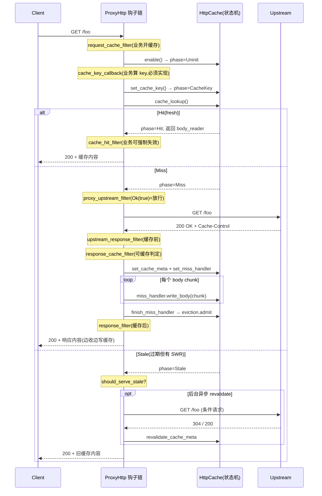
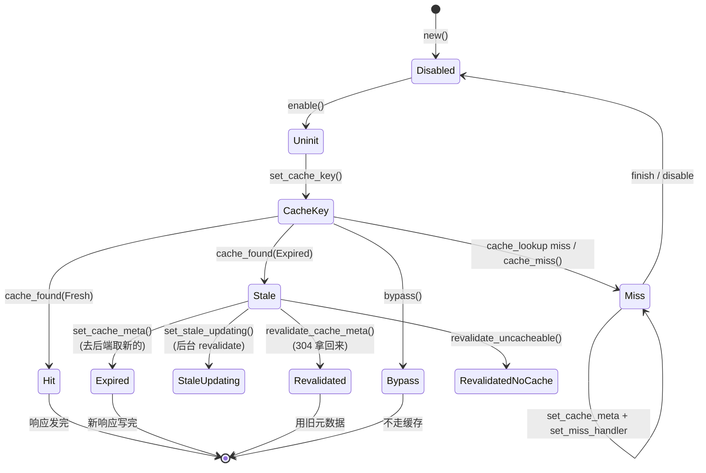
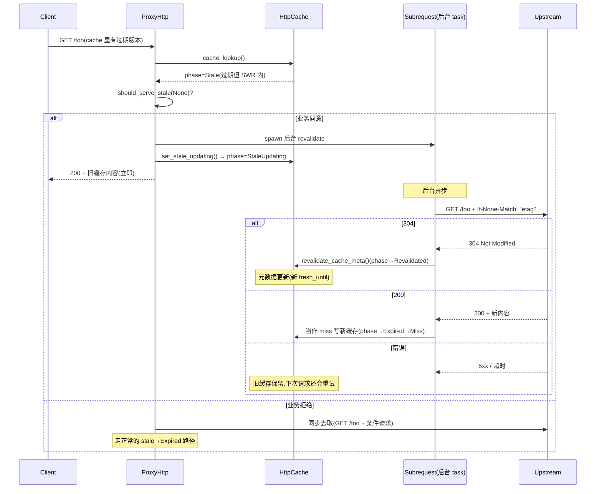
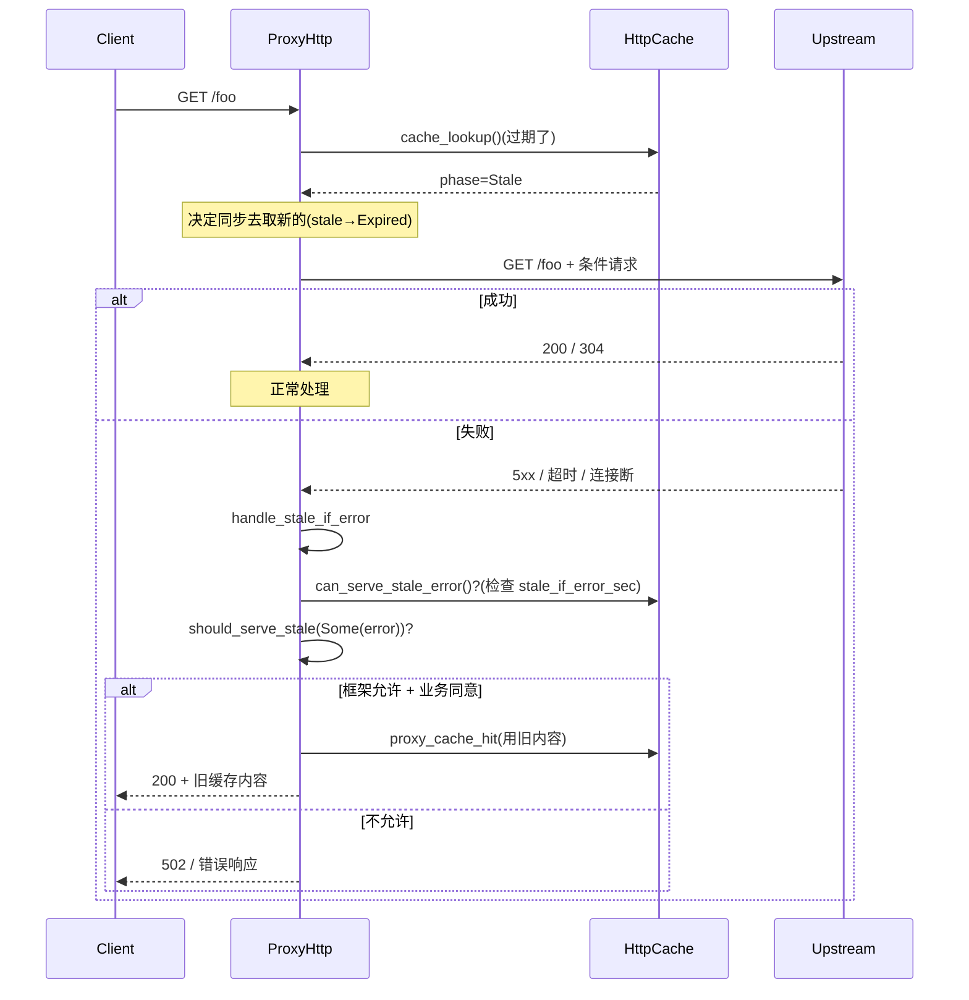

# 第 6 篇 · 第 17 章 · `pingora-cache`:HTTP 缓存

> **核心问题**:Pingora 是个反向代理,反向代理最值钱的设施之一就是**缓存**——后端返回的响应,代理先记一份,下一个同样的请求来了直接从代理吐回去,不再打扰后端。Nginx 有 `proxy_cache`,Envoy 有 HTTP cache filter,Varnish 整本书就是为这一件事生的。Pingora 把这套做成了独立 crate [`pingora-cache`](../pingora/pingora-cache/src/lib.rs),挂在 `ProxyHttp` 钩子链的几个固定位置上,由框架驱动状态机。这一章要讲清四件事:(1) HTTP 缓存的语义本来是 RFC 7234/9111 定的,Pingora 怎么把它做成一条"请求穿过钩子链、缓存状态机在钩子之间切换"的可编程流水线?(2) `cache_key_callback` 这个钩子为什么默认是 `unimplemented!()` panic——也就是**只要用户开了缓存却没实现它,程序直接崩**?这个看起来很不友好的默认行为背后,是一个真实的**缓存投毒(cache poisoning)**防御动机。(3) stale-while-revalidate、stale-if-error、cache lock(请求合并)这些降尾延迟、防雪崩的招牌手段,Pingora 是怎么在一个状态机里串起来的?(4) 旁边的兄弟 crate [`tinyufo`](../pingora/tinyufo/src/lib.rs) 和 [`pingora-lru`](../pingora/pingora-lru/src/lib.rs) 各自承担什么淘汰角色,为什么这俩是**两套不同东西,服务两个不同 crate**?(很多人凭名字以为 `tinyufo` 取代了 `pingora-lru` 当 HTTP 缓存的淘汰器,这个印象在本版本 v0.8.1 是**错的**——本章会据实钉死。)
>
> **读完本章你会明白**:
>
> 1. **HTTP 缓存的全过程在 Pingora 里长什么样**:从 `request_cache_filter` 开缓存 → `cache_key_callback` 算 key → `cache_lookup` 查存储 → hit/miss/stale 三大走向 → miss 时 `response_cache_filter` 决定要不要写进缓存 → body 边收边写进 `MissHandler` → 写完触发 `eviction.admit` 决定驱逐谁。整个过程用 [`HttpCache`](../pingora/pingora-cache/src/lib.rs#L62-L67) 这个结构上的 `CachePhase` 枚举(11 个状态)来驱动,源码就是一个状态机在钩子之间迁移。
> 2. ★**`cache_key_callback` 默认 `unimplemented!()` panic 的真相**:[`proxy_trait.rs#L156-L158`](../pingora/pingora-proxy/src/proxy_trait.rs#L156-L158) 白纸黑字写着默认实现就是 `unimplemented!("cache_key_callback must be implemented when caching is enabled")`。这是 [`CHANGELOG.md`](../pingora/CHANGELOG.md#L49) 在 0.8.0 那一版"Remove `CacheKey::default` impl"的后续效果。**这不是 HTTP request smuggling 防护**,也不是某个 RUSTSEC 编号——它防的是**缓存投毒**:如果 Pingora 给 cache key 提供一个看起来合理(比如"方法+host+path")的默认实现,业务多半就直接拿来用,而"方法+host+path"这种朴素 key 会把不同 query string、不同 `Accept-Encoding`、不同 `Cookie` 的请求映射到同一份缓存,导致 A 用户的响应被当作 B 用户的响应吐回去(或更糟,被攻击者精心构造的请求污染)。所以 Pingora 的态度是:**cache key 是你的业务的语义,只有你知道哪些维度该区分**——默认不给你"看起来安全其实不安全"的实现,要给就给一个会 panic 的 stub,逼你坐下来自己想清楚。
> 3. ★**缓存钩子链的精确顺序**,以及为什么"缓存前/缓存后"要分两个 filter(`upstream_response_filter` 在写缓存之前,`response_filter` 在写缓存之后,中间夹着 `response_cache_filter`)。这条承接 [P1-05 响应与收尾钩子](P1-05-响应与收尾钩子.md),本章会把缓存这一段从钩子链里挑出来放大讲。
> 4. **cache lock(请求合并)**:同一个 cache key,第一个请求去后端取,后面的请求原地等。源码在 [`pingora-cache/src/lock.rs`](../pingora/pingora-cache/src/lock.rs#L25-L55),用一个 16 分片的 `ConcurrentHashTable` + `tokio::sync::Semaphore`(0 permits)+ `WritePermit` 的 `Drop` 安全网实现,这是缓存的"惊群防御"。它和 [`pingora-memory-cache`](../pingora/pingora-memory-cache/src/lib.rs) 里那个 `RTCache` 的 singleflight 是**两个不同 crate 的两套实现**,服务两个不同场景,本章会拆清楚。
> 5. **`tinyufo` vs `pingora-lru` 的真实关系**:`tinyufo` 是 W-TinyLFU + S3-FIFO 的无锁淘汰器,但它**只被 [`pingora-memory-cache`](../pingora/pingora-memory-cache/src/lib.rs#L104-L119) 用**(那是个通用的内存 KV 缓存 crate,跟 HTTP 缓存无关);HTTP 缓存 [`pingora-cache`](../pingora/pingora-cache/src/lib.rs) 的淘汰器走的是 [`eviction/lru.rs`](../pingora/pingora-cache/src/eviction/lru.rs),底下是 [`pingora-lru`](../pingora/pingora-lru/src/lib.rs) 那个 N 分片 LRU。这个区分是本章会专门拎出来讲清的源码印象修正——凭"新 LRU 取代老 LRU"的直觉会踩坑。
>
> **逃生阀**:如果只读一节,读**第 3 节**(缓存状态机和钩子链)和紧跟着的**技巧精解第 1 段**(为什么 cache key 默认 panic)。HTTP 缓存的 RFC 语义(Cache-Control/Vary/ETag)本章只在必要处点一句,不展开 RFC 7234/9111 的细节;Envoy 的 HTTP cache filter 和 Nginx 的 `proxy_cache` 一句带过做对照,篇幅全留 Pingora 自己的实现。如果你忘了 `ProxyHttp` 钩子链全貌,先回去翻 [P1-02 ProxyHttp trait](P1-02-ProxyHttp-trait-一串async-filter钩子.md)。

---

## 章首 · 一句话点破

> **`pingora-cache` 做的事,一句话讲完:它在 `ProxyHttp` 钩子链的响应回程上(`upstream_response_filter` → `response_cache_filter` → `response_filter`)塞了一台状态机 [`HttpCache`](../pingora/pingora-cache/src/lib.rs#L62-L67),这台状态机用 11 个 `CachePhase`(Disabled/Uninit/CacheKey/Hit/Miss/Stale/StaleUpdating/Expired/Revalidated/RevalidatedNoCache/Bypass)记录"这条请求此刻处在缓存的哪一步",每个钩子被调用时,框架拿当前 phase 决定要不要查缓存、要不要写缓存、要不要服务 stale、要不要放行去后端。业务介入的方式不是"调用缓存 API",而是"实现几个钩子(`cache_key_callback` 给 key、`response_cache_filter` 给可缓存判定、`cache_hit_filter` 给 hit 后的强制刷新判定、`should_serve_stale` 给要不要服务过期内容、`proxy_upstream_filter` 给 miss 后要不要真去后端),剩下的查/写/驱逐全部框架自管。**

这是结论。本章倒过来拆:先把 HTTP 缓存这件事在 Pingora 里占的**位置**(独立 crate、和钩子链怎么衔接)摆出来(第 1 节);再讲清 cache key 为什么是"必须业务自己实现、默认 panic"——这是整章最反直觉也最关键的设计(第 2 节);然后进缓存状态机的源码,从 `HttpCache` 这个结构开始,看一遍 hit/miss/stale/revalidate 各走哪条路(第 3 节);接着拆 cache lock 这个惊群防御(第 4 节)和淘汰子系统(第 5 节),在这里把 `tinyufo` 和 `pingora-lru` 的真实关系钉死;最后讲 `response_cache_filter`/`cache_hit_filter`/`should_serve_stale` 这几个钩子业务怎么用(第 6 节),以及 stale-while-revalidate 的完整时序(第 7 节)。技巧精解两段:cache key 默认 panic 的缓存投毒防御、Vary 变体(`variance.rs`)怎么把同一个 URL 的多份缓存区分开。

本章服务**转发设施**这一面。HTTP 缓存不在 `ProxyHttp` 钩子链上(它不是业务钩子),但它的开关、它的判定逻辑、它的强制刷新决策**全部通过钩子暴露给业务**——所以它正好横跨在"钩子链"和"转发设施"之间,是钩子链回程上的一个内置子系统。它是第 6 篇"缓存与生产特性"的开篇,承上启下:承第 5 篇(运行时与 TLS,缓存的 IO 和淘汰器都跑在 NoStealRuntime 上),启 [P6-18 listener 与 graceful upgrade](P6-18-listener-graceful-upgrade与连接管理.md)(接连接、零停机升级)。

---

## 正文

### 第 1 节 · 先把缓存这件事在 Pingora 里占的位置钉死

讲 cache key 之前,得先把"HTTP 缓存在 Pingora 里到底是个什么东西"摆清楚——很多人对 Pingora 缓存的印象是模糊的,因为它**不是一个 crate 就完事**,而是横跨了好几个角色。

#### 1.1 缓存是一个独立 crate,但驱动它的代码在 `pingora-proxy`

先看源码地图。HTTP 缓存的核心逻辑在 [`pingora-cache`](../pingora/pingora-cache/src/lib.rs) 这个独立 crate 里:

```
pingora-cache/src/
├── lib.rs              // HttpCache 状态机、CachePhase、RespCacheable、NoCacheReason
├── cache_control.rs    // 解析 Cache-Control / Expires 头(872 行)
├── filters.rs          // TTL 引擎:calculate_fresh_until / resp_cacheable / 上游请求改写
├── put.rs              // 把响应写进缓存的 CachePut 状态机
├── storage.rs          // Storage trait(后端接口)、HitHandler/MissHandler
├── memory.rs           // MemCache:in-memory Storage 实现
├── meta.rs             // CacheMeta(响应头+内部元数据: fresh_until/created/SWR/SIE)
├── key.rs              // CacheKey、CompactCacheKey、Blake2b128 哈希
├── variance.rs         // VarianceBuilder(Vary 头的次级 key)
├── lock.rs             // cache lock(请求合并/惊群防御)
├── eviction/           // 淘汰子系统:mod.rs(trait) + lru.rs(pingora-lru) + simple_lru.rs
├── predictor.rs        // 负缓存:记住哪些 key 不可缓存,跳过 cache lock
├── max_file_size.rs    // 单文件大小上限追踪
├── hashtable.rs        // 通用 N 分片并发哈希表(cache lock 用)
└── trace.rs            // 分布式追踪 span
```

这个 crate 给你的是**积木**:`HttpCache` 状态机、`Storage` trait、`EvictionManager` trait、`CacheKey`、`CacheMeta`、cache lock——但**它自己不会自动跑**。真正在每个请求的生命周期里驱动这台状态机的,是 `pingora-proxy` crate 里的 [`proxy_cache.rs`](../pingora/pingora-proxy/src/proxy_cache.rs)(请求回程的缓存编排)和 [`proxy_h1.rs`](../pingora/pingora-proxy/src/proxy_h1.rs) 里的 `h1_response_filter`(把缓存钩子嵌进响应回程的 filter 链)。

> **承接 [P1-02](P1-02-ProxyHttp-trait-一串async-filter钩子.md)**:`ProxyHttp` trait 是 Pingora 的灵魂,它有 ~30 个 async 钩子构成一条请求生命周期。其中和缓存直接相关的有:`request_cache_filter`(请求阶段,决定要不要开缓存)、`cache_key_callback`(算 cache key)、`proxy_upstream_filter`(miss 后要不要真去后端)、`cache_hit_filter`(hit 后要不要强制刷新)、`response_cache_filter`(响应回来,决定要不要写进缓存)、`should_serve_stale`(要不要服务过期内容)、`cache_vary_filter`(Vary 变体)、`cache_miss`(miss 时框架调一次,业务可记录)。这些钩子的**默认实现**大多是"什么都不做"(返回 `Ok(None)` / `Ok(true)` / 不缓存),**唯独 `cache_key_callback` 的默认是 panic**——这是第 2 节的主角。

所以"HTTP 缓存"在 Pingora 里的真实位置是:**核心机制在 `pingora-cache` crate(积木) + 驱动代码在 `pingora-proxy/proxy_cache.rs`(装配) + 业务介入点在 `ProxyHttp` 钩子(开关)**。三者缺一不可,只看任何一个都看不全。

#### 1.2 对照:Nginx、Envoy、Varnish 怎么摆缓存

要把 Pingora 的选择讲清楚,得先立个对照。HTTP 缓存这件事,业界有三套经典实现,各自的"业务介入点"完全不同:

| 系统 | 缓存是什么 | 业务怎么介入 | 缓存的"语义来源" |
|---|---|---|---|
| **Nginx** | `proxy_cache` 模块,配置指令驱动(`proxy_cache_path`/`proxy_cache_key`/`proxy_cache_valid`) | 写配置文件:`proxy_cache_key "$scheme$request_method$host$request_uri";` | 配置指令 + RFC 7234,Nginx 自己解释 Cache-Control |
| **Envoy** | HTTP cache filter(独立的 `type.googleapis.com/envoy.extensions.filters.http.cache.v3.CacheConfig`),后端可插(Caffeine/Filesystem/AWS ElastiCache 等) | 配置 + 写一个 `Cache` 的 C++ filter(实现 `insertHeaders`/`makeLookupRequest` 接口) | RFC 7234 + 后端实现,Envoy HCM 把请求/响应喂给 cache filter |
| **Varnish** | 整个程序就是缓存,VCL(Varnish Configuration Language)贯穿 | 写 VCL(`vcl_recv`/`vcl_backend_response`/`vcl_deliver`),用 `return(hash)`/`return(pass)`/`return(miss)` 控制走向 | VCL 内置 + RFC,VCL 子程序是唯一介入点 |
| **Pingora** | `pingora-cache` crate,状态机驱动,挂在 `ProxyHttp` 钩子链上 | 实现 `ProxyHttp` 的几个缓存钩子(Rust async fn) | RFC 7234/9111 + 业务钩子,Cache-Control 由 `cache_control.rs` 解析 |

注意三件事:

1. **Nginx 和 Envoy 的业务介入点是配置或 C++ filter,Pingora 是 Rust async 钩子**。这意味着 Pingora 的 cache key 可以是任意 Rust 代码——可以查数据库、可以看请求体的前几字节(虽然不推荐)、可以做复杂的多租户隔离——而 Nginx 的 `proxy_cache_key` 只能是 nginx 变量拼接出来的字符串。这是"配置驱动 vs 钩子代码驱动"的根本差异,这条线 Pingora 全书贯穿(承 [P0-01](P0-01-第一性原理-为什么用Rust异步写反向代理.md))。

2. **Varnish 的 VCL 和 Pingora 的钩子哲学最像**:都是"业务在固定生命周期点介入,框架管路由/存储/淘汰"。但 Varnish 是个 DSL(用 C 编译),Pingora 是直接 Rust——少了 DSL 的学习成本,但要求业务代码不能 panic(否则一个连接的 task 死掉)。cache key 默认 panic 这个设计放到 Varnish 里相当于"不写 vcl_hash 就直接 reject 配置",Varnish 没这么激进是因为 VCL 有 `hash_data()` 这种合理的默认;Pingora 这么激进是因为 HTTP 请求的语义维度太多了,**没有安全的默认**。

3. **Envoy 把缓存做成 HTTP filter 链上的一环,这是它的"filter chain 一切皆可插"哲学**(承 [P1-02](P1-02-ProxyHttp-trait-一串async-filter钩子.md) 里"Envoy filter chain vs Pingora 钩子链"的对照);Pingora 没把缓存做成可拔插的中间件,而是把它**焊死在 `ProxyHttp` 钩子链的几个固定位置**(`proxy_cache.rs` 直接调 `session.cache`),换来的是更紧凑的状态机、更少的间接调用。这是取舍:Envoy 的灵活性 vs Pingora 的内聚。

> **承接 [P3-10](P3-10-选择算法-RoundRobinRandomKetama.md) 一句带过**:Envoy 的 HTTP cache filter 也支持 consistent hash 选后端做 sharded cache,但那是 Envoy 把 cache filter 和 router filter 串起来的事;Pingora 的缓存和负载均衡是**正交的两个子系统**(缓存按 cache key 查,负载均衡按 `upstream_peer` 选后端),互不耦合。

#### 1.3 缓存和钩子链衔接的时序

把这条衔接画出来,这是本章后面所有讨论的基线。一条请求进来,经过缓存相关的钩子链大致是这样(只画缓存相关段,完整钩子链见 [P1-05](P1-05-响应与收尾钩子.md)):



这张图先把全局摆在脑子里。接下来按"cache key 为什么默认 panic"(第 2 节) → "状态机怎么转"(第 3 节) → "miss 时怎么写进缓存"(第 4-5 节) → "业务钩子怎么用"(第 6 节) → "stale 怎么服务"(第 7 节) 的顺序拆。

---

### 第 2 节 · cache key:为什么默认是 panic,而不是一个"看起来合理"的实现

这一节单独成节,因为它是整章最反直觉、也最容易在二手资料里被讲歪的一处。

#### 2.1 先看源码:默认实现就是 `unimplemented!()`

`ProxyHttp` trait 上 `cache_key_callback` 这个钩子的默认实现,在 [`proxy_trait.rs#L156-L158`](../pingora/pingora-proxy/src/proxy_trait.rs#L156-L158):

```rust
fn cache_key_callback(&self, _session: &Session, _ctx: &mut Self::CTX) -> Result<CacheKey> {
    unimplemented!("cache_key_callback must be implemented when caching is enabled")
}
```

它的文档注释(就在上面几行)里 `# Panics` 那段写得很清楚:**默认实现会 panic,开了缓存就必须 override 它**。

这个行为不是一开始就这样的。翻 [`CHANGELOG.md`](../pingora/CHANGELOG.md),在 0.8.0 那一版的 "Miscellaneous Tasks" 里有一条(第 49 行):

> **Remove `CacheKey::default` impl, users of caching should implement `cache_key_callback` themselves**

也就是说,在 0.8.0 之前,`CacheKey` 是有 `Default` 实现的(或者 `cache_key_callback` 有一个不 panic 的默认),业务就算不实现也能"跑起来"。0.8.0 把它拿掉了,从此**开缓存不实现 cache key 直接 panic**。

#### 2.2 为什么这么激进:缓存投毒,不是 HTTP smuggling

很多二手资料把这件事讲成"HTTP request smuggling 防护"或者"某个 RUSTSEC 漏洞的修复"。**这个说法在本版本的源码和 CHANGELOG 里都站不住脚**。我核实了三件事:

1. **CHANGELOG 的措辞是 "Remove `CacheKey::default` impl"**,归在 "Miscellaneous Tasks",不是 "Security",也没绑任何 RUSTSEC 编号。如果是个有 CVE/RUSTSEC 的安全修复,Cloudflare 会按惯例放 0.8.1 的 "🔒 Security" 段(0.8.1 那版就有 H2 内存耗尽和 rustls-webpki 两条),不会丢在 0.8.0 的杂项里。
2. **源码注释和 panic 信息都是 "must be implemented"**,没有任何 smuggling/RUSTSEC 的字样。smuggling 防护(HTTP request smuggling)在 Pingora 里另有出处——HTTP/1 解析层 [`protocols/http/v1`](../pingora/pingora-core/src/protocols/http/v1) 那边有 content-length 校验、reject 模糊的请求框定(0.8.0 的 "Reject invalid content-length http/1 requests" 那条),那是协议层的事,**和 cache key 没关系**。
3. **`cache_key_callback` 防的威胁模型是缓存投毒(cache poisoning)**,不是 smuggling。这俩名字像,威胁模型完全不同,后面展开。

> **★ 诚实交代(本章最重要的修正)**:本书的总纲和目录初稿里写过 "RUSTSEC-2026-0034" 这个编号,关联到 cache key。**这个编号在 v0.8.1 的源码、CHANGELOG、RustSec advisory 数据库里都查不到**——它是总纲起草时的一个误记。本章据实钉死:`cache_key_callback` 默认 panic 这件事,**不是某个 RUSTSEC 安全公告的修复**,它是 Cloudflare 在 0.8.0 主动做的"移除不安全的默认实现"的硬化。讲它的正确口径是"**缓存投毒防御**",不是"HTTP smuggling 防护",更不绑任何 RUSTSEC 编号。

那什么是缓存投毒?为什么 cache key 不给个默认就防住了?

#### 2.3 缓存投毒:同一个 key,不同的语义

缓存投毒的威胁模型是这样的:HTTP 请求里,**有很多维度会改变响应的内容,但这些维度不在 URL 里**。如果 cache key 只看 URL(或者只看"方法+host+path"),那么两个语义不同的请求会被映射到同一份缓存,后到的请求会拿到先到请求的响应——这就是投毒。

举几个真实会翻车的维度:

- **Query string**。`GET /api/user?id=1` 和 `GET /api/user?id=2` 如果 key 只看 path,第二个用户会拿到第一个用户的资料。这是最基础的。
- **`Accept-Encoding`**。同一个 URL,gzip 客户端拿到 gzip 响应,br 客户端拿到 br 响应。如果 key 不区分 `Accept-Encoding`,一个不支持 br 的客户端拿到了 br 编码的响应,页面就乱了。Nginx 的默认 `proxy_cache_key` 不带 `Accept-Encoding`,所以社区约定要在 `proxy_cache_key` 里加 `$http_accept_encoding`——但这是运维的事,容易漏。
- **`Accept-Language`**。同一个 URL,英语用户拿到英文版,法语用户拿到法语版。key 不区分就会串。
- **`Cookie` / `Authorization`**。这是最危险的。一个登录用户的响应(响应体里可能有用户私有信息)被缓存,key 不带用户标识,下一个匿名用户就拿到了这份带私有信息的响应。反过来,攻击者构造一个请求,让缓存记下一份恶意响应,后续正常用户都拿到这份恶意响应。
- **请求方法**。`GET /foo` 和 `HEAD /foo` 的响应体不一样(HEAD 没有体)。key 不区分方法,GET 请求可能拿到 HEAD 的空体。
- **Host**。多个域名共用一个代理时,key 不带 host,`a.com/foo` 和 `b.com/foo` 串了。
- **移动端 `User-Agent` / `Device` / `Client-Hint`**。同一个 URL,桌面端和移动端可能是不同的 HTML。

**这些维度,没有任何一个"正确"的默认能覆盖所有业务**。Nginx 给的默认 `proxy_cache_key "$scheme$request_method$host$request_uri"` 看起来覆盖了方法+host+uri(含 query),但它**不覆盖** `Accept-Encoding`/`Accept-Language`/`Cookie`,所以社区得手动补;Varnish 的 `vcl_hash` 默认也只看 URL+Host,业务得在 VCL 里 `hash_data(req.http.Accept-Encoding)` 自己补。

Pingora 的态度更激进:**既然没有安全的默认,那就不给默认**。给一个 `unimplemented!()` panic,逼你坐下来想清楚:"我的业务,这个响应的语义到底由哪些请求维度决定?"。这是一个**fail-fast** 的设计——宁可你部署时第一次开缓存就 panic(立刻发现),也不要你用了一个"看起来合理"的默认,跑了三个月,某天被攻击者发现 key 不带 Cookie,投毒成功。

> **反面对比**:Nginx/Varnish 的"给个朴素默认,让运维自己补"是 fail-open(默认放行,出了事再说);Pingora 的"默认 panic,逼你写"是 fail-closed(默认拒绝,想清楚再开)。对于一个跑在 Cloudflare 这种规模、每秒千万请求的代理,fail-closed 的成本(部署时多写几行 Rust)远低于 fail-open 的代价(一次缓存投毒事故)。

#### 2.4 CacheKey 的结构:你想区分什么,就往里塞什么

既然必须自己实现,那 `CacheKey` 这个结构到底长什么样,业务怎么构造?在 [`key.rs#L96-L112`](../pingora/pingora-cache/src/key.rs#L96-L112):

```rust
#[derive(Debug, Clone)]
pub struct CacheKey {
    namespace: Vec<u8>,          // 命名空间,通常放 host 或租户
    primary: Vec<u8>,            // 主键,通常放 path + query
    primary_bin_override: Option<HashBinary>,
    variance: Option<HashBinary>, // 次级 key,通常放 Vary(见技巧精解第 2 段)
    pub user_tag: String,         // 用户标签,用于 purge/统计
    pub extensions: Extensions,   // 用户自定义扩展,不持久化
}
```

构造它的标准方式是 [`CacheKey::new`](../pingora/pingora-cache/src/key.rs#L218-L232)(namespace, primary, user_tag),然后业务自己决定要不要调 `set_variance_key` 加次级 key。一个典型的实现长这样(简化示意,非源码):

```rust
// 业务实现 ProxyHttp::cache_key_callback
fn cache_key_callback(&self, session: &Session, _ctx: &mut Self::CTX) -> Result<CacheKey> {
    let req = session.req_header();
    let host = req.headers.get("host").map(|v| v.as_bytes()).unwrap_or(b"");
    let path = req.uri.path_and_query().map(|p| p.as_bytes()).unwrap_or(b"");
    Ok(CacheKey::new(host, path, "my_proxy")) // namespace=host, primary=path+query
    // 注意:Accept-Encoding / Accept-Language 等通过 cache_vary_filter 在响应阶段处理
}
```

**注意 cache key 和 Vary 是两套机制**。cache key 是**请求阶段**算的(在 `cache_key_callback` 里),它决定"这个请求查哪份缓存的槽位";Vary 是**响应阶段**算的(在 `cache_vary_filter` 里,根据响应头的 `Vary: Accept-Encoding, Accept-Language`),它决定"同一个槽位下,再按哪些请求头维度区分变体"。这俩配合:cache key 给主槽位(通常是 host+path),Vary 给主槽位下的细分变体(按 `Accept-Encoding` 等)。这样设计的好处是同一个 URL 的不同编码版本共享一份元数据/驱逐策略,但读取时按 Vary 二级 key 区分——技巧精解第 2 段会展开。

`CacheKey` 内部用 **Blake2b-128** 做哈希([`key.rs#L189`](../pingora/pingora-cache/src/key.rs#L189) `type Blake2b120 = Blake2b<U16>`;[`primary_hasher`](../pingora/pingora-cache/src/key.rs#L208-L213) 把 namespace+primary 喂进去),最终存进存储和淘汰器的是一个 128 位的 `HashBinary`(`[u8; 16]`,[`key.rs#L26`](../pingora/pingora-cache/src/key.rs#L26))。为什么选 Blake2b 而不是 SHA-256?Blake2b-128 在抗碰撞性足够缓存用的前提下,比 SHA-256 快一个数量级,且输出 16 字节刚好是 cache key 的常见宽度(CDNS 内部很多 cache key 就是 128 位)。这是性能取舍。

#### 2.5 这一段的小结

`cache_key_callback` 默认 panic 不是 bug,是设计。它防的是缓存投毒——HTTP 请求有太多语义维度,没有安全的默认 key,所以 Pingora 选择 fail-closed。讲它的正确口径是"**缓存投毒防御**",不要讲成 smuggling,不要绑 RUSTSEC 编号。`CacheKey` 结构是(namespace, primary, variance, user_tag, extensions),业务在 `cache_key_callback` 里构造它,Vary 那一维留给 `cache_vary_filter` 在响应阶段补。

---

### 第 3 节 · 缓存状态机:`HttpCache` 与 `CachePhase`

讲完 cache key,进正题:`HttpCache` 这台状态机怎么转。这是整章的骨架。

#### 3.1 `HttpCache` 结构:一个 phase + 一个可选的 inner

[`HttpCache`](../pingora/pingora-cache/src/lib.rs#L62-L67) 这个结构体本身很小:

```rust
pub struct HttpCache {
    phase: CachePhase,
    // Box the rest so that a disabled HttpCache struct is small
    inner: Option<Box<HttpCacheInner>>,
    digest: HttpCacheDigest,
}
```

`phase` 是当前状态(枚举),`inner` 是开了缓存之后才有的全部上下文(Box 起来让 Disabled 状态的结构体保持小),`digest` 是给日志用的统计(lock_duration / lookup_duration)。

设计要点:**`inner` 用 `Option<Box<>>`**。绝大多数 Pingora 部署并不开缓存(或者大多数请求不走缓存),所以 `HttpCache` 这个结构会被**每个 Session 都建一个**。Disabled 状态下 `inner: None`,整个 `HttpCache` 只占 phase(1 字节,枚举)+ Option 的判别式(8 字节)+ digest(两个 Option<Duration>,32 字节)≈ 40 多字节;一旦 `enable()`,才在堆上分配 `HttpCacheInner`(几百字节,里面有 storage/eviction/predictor 的 `&'static` 引用、meta、miss_handler、body_reader 等)。这是"按需付费"的内存布局——Rust 里 `Option<Box<T>>` 是 niche-optimized 的(Null 指针优化),所以不会因为 Option 多占一个字。

#### 3.2 `CachePhase`:11 个状态

状态机的全部状态在 [`CachePhase`](../pingora/pingora-cache/src/lib.rs#L70-L95):

```rust
#[derive(Clone, Copy, Debug, PartialEq, Eq)]
pub enum CachePhase {
    Disabled(NoCacheReason),     // 缓存关了,带原因
    Uninit,                       // 开了缓存但还没设 key
    Bypass,                       // 开了缓存但本次请求决定绕过(预测器说不可缓存等)
    CacheKey,                     // 等待/已设 cache key
    Hit,                          // 命中且新鲜
    Miss,                         // 没命中(或强制当 miss)
    Stale,                        // 命中但过期了
    StaleUpdating,                // 命中且过期,但另一个请求正在后台 revalidate
    Expired,                      // 命中且过期,已决定去后端取新的
    Revalidated,                  // 命中且过期,条件请求拿回 304,revalidate 成功
    RevalidatedNoCache(NoCacheReason), // revalidate 了但响应不可缓存,不更新
}
```

这 11 个状态的迁移图:



迁移的关键代码在哪里:

| 迁移 | 函数 | 行号 |
|---|---|---|
| `Disabled → Uninit` | `enable()` | [`lib.rs#L485-L523`](../pingora/pingora-cache/src/lib.rs#L485-L523) |
| `Uninit → CacheKey` | `set_cache_key()` | [`lib.rs#L612-L620`](../pingora/pingora-cache/src/lib.rs#L612-L620) |
| `CacheKey → Hit/Stale` | `cache_found()` | [`lib.rs#L716-L765`](../pingora/pingora-cache/src/lib.rs#L716-L765) |
| `CacheKey → Miss` | `cache_miss()` | [`lib.rs#L773-L789`](../pingora/pingora-cache/src/lib.rs#L773-L789) |
| `Stale → Expired` | `set_cache_meta()` | [`lib.rs#L1008-L1022`](../pingora/pingora-cache/src/lib.rs#L1008-L1022) |
| `Stale → Revalidated` | `revalidate_cache_meta()` | [`lib.rs#L1028-L1081`](../pingora/pingora-cache/src/lib.rs#L1028-L1081) |
| `Stale → StaleUpdating` | `set_stale_updating()` | [`lib.rs#L1145-L1150`](../pingora/pingora-cache/src/lib.rs#L1145-L1150) |

读源码的窍门:**先记住 `CachePhase` 这 11 个状态,再去 `lib.rs` 里看每个迁移函数的前置条件**。每个 `cache_*` / `set_*` / `revalidate_*` 函数开头都有 `match self.phase` 检查当前状态合法,比如 `set_cache_meta` 只允许 `Stale | Miss`(别的状态调会 panic),这是状态机约束。

#### 3.3 `cache_found`:hit 还是 stale,这是个关键分叉

来看一个具体的状态迁移函数 [`cache_found`](../pingora/pingora-cache/src/lib.rs#L716-L765)。它在 `cache_lookup` 拿到存储里的资产之后被调,根据资产的 `HitStatus`(新鲜度判定)决定 phase 走 Hit 还是 Stale:

```rust
self.phase = match hit_status {
    HitStatus::Fresh | HitStatus::ForceFresh => CachePhase::Hit,
    HitStatus::Expired | HitStatus::ForceExpired => CachePhase::Stale,
    HitStatus::FailedHitFilter | HitStatus::ForceMiss => self.phase,  // 保持(回 CacheKey)
};
```

注意 `FailedHitFilter` 和 `ForceMiss` 这两种:它们是"明明在存储里找到了,但 `cache_hit_filter` 业务钩子说不要用",于是**当 miss 处理**(phase 保持,后面会走 miss 路径)。这是 `cache_hit_filter` 钩子的能力——业务可以在 hit 后强制把响应当 miss,用于强制失效。

`HitStatus` 这个枚举([`lib.rs#L242-L263`](../pingora/pingora-cache/src/lib.rs#L242-L263))有 6 个值:`Expired`(过期)、`ForceExpired`(业务强制过期)、`ForceMiss`(业务强制当 miss)、`FailedHitFilter`(hit filter 拒绝)、`Fresh`(新鲜)、`ForceFresh`(业务强制新鲜,即使过期)。前 4 个走 miss/stale,后 2 个走 hit。`is_fresh()` 只对 `Fresh | ForceFresh` 返回 true([`lib.rs#L272-L274`](../pingora/pingora-cache/src/lib.rs#L272-L274))。

`cache_found` 里还有个细节:hit 之后会调 [`eviction.access`](../pingora/pingora-cache/src/lib.rs#L759)(L759)告诉淘汰器"这个资产被访问了"——淘汰器据此做 LRU 的 promote 或者 TinyLFU 的频率计数。**hit 的时候才通知淘汰器,miss 的时候不通知**(miss 是 `finish_miss_handler` 里调 `eviction.admit`)。这个区分很关键:access 是"已存在的资产被读",admit 是"新资产要进入",它们是淘汰器的两个不同 API。

#### 3.4 phase 怎么被钩子链驱动:proxy_cache.rs 的 lookup 循环

`HttpCache` 自己只是个状态机,谁来调它的 `enable`/`set_cache_key`/`cache_lookup`/`cache_found`?答案在 [`pingora-proxy/src/proxy_cache.rs`](../pingora/pingora-proxy/src/proxy_cache.rs) 的 `proxy_cache` 函数(请求阶段的总编排)。核心循环在 [`proxy_cache.rs#L84-L260`](../pingora/pingora-proxy/src/proxy_cache.rs#L84-L260),简化后的逻辑:

```rust
// 简化示意,非源码原文
session.cache.cache_lookup().await?;          // L86 查存储
// ... vary 处理 ...
let hit_status = /* 计算 is_fresh + 调 cache_hit_filter */;
match hit_status {
    HitStatus::Fresh | ForceFresh => {
        session.cache.cache_found(hit_status, ...).await?;
        return self.proxy_cache_hit(session, ctx).await;  // L237 走 hit
    }
    HitStatus::Expired | ForceExpired if should_serve_stale(...) => {
        // 走 stale-while-revalidate,见第 7 节
        // 可能 spawn 一个后台 subrequest
        return ...;
    }
    _ => {
        // 当 miss 处理
        session.cache.cache_miss();           // L170 phase=Miss
        return None;  // 让主循环继续去 upstream
    }
}
```

关键点:**这个函数返回 `Option<(bool, Option<Box<Error>>)>`**。返回 `Some(...)` 表示"缓存已经把响应服务给客户端了,主循环不用再转发"(hit 或 stale);返回 `None` 表示"走 miss,主循环继续去 upstream"。这是缓存和转发主循环的接口。

`cache_hit_filter` 在 [`proxy_cache.rs#L123-L151`](../pingora/pingora-proxy/src/proxy_cache.rs#L123-L151) 被调,业务的这个钩子可以返回 `Ok(Some(ForcedFreshness::ForceExpired))` 强制失效、或 `Ok(Some(ForcedFreshness::ForceMiss))` 强制当 miss、或 `Ok(None)` 尊重存储的新鲜度判定。这是业务在 hit 后唯一能干预走向的钩子。

#### 3.5 miss 之后:proxy_upstream_filter 决定要不要真去后端

miss 走到主循环后,**先不立刻连后端**,而是调 `proxy_upstream_filter` 这个钩子问一下业务:这个 miss 要不要真去 upstream?

`proxy_upstream_filter` 的默认实现([`proxy_trait.rs#L198-L207`](../pingora/pingora-proxy/src/proxy_trait.rs#L198-L207)):

```rust
async fn proxy_upstream_filter(&self, _session: &mut Session, _ctx: &mut Self::CTX) -> Result<bool>
where Self::CTX: Send + Sync,
{
    Ok(true)  // 默认放行
}
```

返回 `Ok(true)` 放行去 upstream,返回 `Ok(false)` 拒绝。拒绝的后果在 [`pingora-proxy/src/lib.rs#L818-L827`](../pingora/pingora-proxy/src/lib.rs#L818-L827):

```rust
match self.inner.proxy_upstream_filter(&mut session, &mut ctx).await? {
    Ok(proxy_to_upstream) => {
        if !proxy_to_upstream {
            // 业务可以自己写响应,不写就给个 502
            if session.cache.enabled() {
                session.cache.disable(NoCacheReason::DeclinedToUpstream);
            }
            if session.response_written().is_none() {
                session.write_response_header_ref(&BAD_GATEWAY, true).await?;
            }
            ...
```

所以 `proxy_upstream_filter` 的语义是:**cache miss 之后,业务有最后一次机会说不去后端**——通常用于"我知道这个 miss 不该打扰后端,直接返回个静态响应/错误页"。如果拒绝且业务没自己写响应,框架回个 502。注意它会把 cache 关掉(`disable(DeclinedToUpstream)`),因为这个请求既然不去后端,也就没什么可缓存的了。

这个钩子和 cache 的关系是**间接的**:它不是缓存钩子(`ProxyHttp` 上它叫"upstream 之前的过滤"),但在缓存开起来之后,它正好是"miss 之后、连接 upstream 之前"的那道关卡。所以第 1 节那张时序图里把它画在 miss 分支里。

#### 3.6 这一段的小结

`HttpCache` 是个 11 状态的状态机,挂在 `Session` 上,每个请求一个。它的状态迁移由 `proxy_cache.rs` 的 `proxy_cache` 函数(请求阶段,查/判新鲜度/决定 hit-miss-stale)和 `proxy_h1.rs` 的 `h1_response_filter`(响应阶段,写缓存)驱动。业务通过 `cache_hit_filter`/`proxy_upstream_filter`/`response_cache_filter`/`should_serve_stale` 这几个钩子在关键分叉点介入。下一节看响应阶段怎么写进缓存。

---

### 第 4 节 · miss 之后怎么写进缓存:`response_cache_filter` 与 `cache_http_task`

cache miss 且 `proxy_upstream_filter` 放行后,请求被转发到 upstream,响应开始往回流。这一段讲缓存是怎么在响应回程上"截获"响应、决定写不写、怎么写的。

#### 4.1 钩子链响应段的精确顺序:缓存夹在中间

这条承接 [P1-05 响应与收尾钩子](P1-05-响应与收尾钩子.md),但那章没展开缓存这一段。这里钉死。

响应回程上,header 这一段的 filter 顺序在 [`proxy_h1.rs` 的 `h1_response_filter`](../pingora/pingora-proxy/src/proxy_h1.rs#L603-L756),核心几行([`proxy_h1.rs#L617-L649`](../pingora/pingora-proxy/src/proxy_h1.rs#L617-L649),简化):

```rust
if !from_cache {  // 不是从缓存读出来的响应
    // 1. upstream_filter(内部调 upstream_response_filter)
    self.upstream_filter(session, &mut task, ctx).await?;

    // cache the original response before any downstream transformation
    // requests that bypassed cache still need to run filters to see if the response has become cacheable
    if session.cache.enabled() || session.cache.bypassing() {
        // 2. cache_http_task(内部调 response_cache_filter,决定写不写)
        self.cache_http_task(session, &task, ctx, serve_from_cache).await?;
    }
    // ...
}
// 3. (后续)response_filter 等下游 filter
```

所以 header 段的 filter 顺序是:

1. **`upstream_response_filter`**(在缓存**前**)——业务在这里改响应头,改完的版本才会进缓存。
2. **`response_cache_filter`**(可缓存判定)——业务在这里返回 `RespCacheable::Cacheable(meta)` 或 `Uncacheable(reason)`,框架据此决定要不要写进缓存。
3. **`response_filter`**(在缓存**后**)——业务在这里改响应头,改的是发给客户端的版本,**不影响已缓存版本**。

这个"缓存前/缓存后分两个 filter"的设计是 Pingora 缓存最重要的一处架构决策。它的动机是:**有些响应头改动只该对客户端生效,不该污染缓存;有些改动又必须先做才能缓存**。比如:

- 你想在响应里加一个 `X-Cache: HIT` / `MISS` 头给客户端看,这个改动**必须在缓存之后**(否则缓存里永远存的是 `MISS`,hit 时也得改)。→ `response_filter`。
- 你想根据上游返回的 `Set-Cookie` 决定要不要缓存(有 `Set-Cookie` 就不缓存),这个判定**必须在缓存之前**(否则已经写进去了)。→ `upstream_response_filter` 里读,或者 `response_cache_filter` 里返回 Uncacheable。
- 你想把上游的 `Date` 头校准成代理当前时间,这个**应该在缓存之前**(让缓存里的 Date 是校准后的)。→ `upstream_response_filter`。

如果只有一个 `response_filter`(像 Nginx 那样),这些需求就只能用复杂的条件分支区分,容易写错。Pingora 用"缓存前后两个 filter + 中间夹可缓存判定"把语义讲死了:`upstream_response_filter` 改的是"要被缓存的版本",`response_filter` 改的是"要发给客户端的版本"。

> **承接铁律**:Envoy 的 HTTP filter 也有 decoder/encoder 两向,且每个 filter 可以选在 cache 前/后([Envoy cache filter 文档](https://www.envoyproxy.io/docs/envoy/latest/configuration/http/http_filters/cache_filter)),这是同类设计;Nginx 的 `header_filter` 是单向的,所以 Nginx 的缓存模块(`proxy_cache`)得自己用 `proxy_ignore_headers`/`proxy_hide_header` 之类的指令来精细控制哪些头进缓存——配置驱动 vs 钩子代码驱动,又是 [P0-01](P0-01-第一性原理-为什么用Rust异步写反向代理.md) 那条主线。

#### 4.2 `cache_http_task`:状态机的写缓存入口

`cache_http_task` 在 [`proxy_cache.rs#L543-L719`](../pingora/pingora-proxy/src/proxy_cache.rs#L543-L719),是 `proxy_h1.rs` 的 `h1_response_filter` 调进来的。它的签名:

```rust
pub(crate) async fn cache_http_task(
    &self,
    session: &mut Session,
    task: &HttpTask,           // 当前这一段(Header / Body / Trailer / Done)
    ctx: &mut SV::CTX,
    serve_from_cache: &mut ServeFromCache,
) -> Result<()>
```

`HttpTask` 是 Pingora 统一的请求/响应段单位(承 [P2-08](P2-08-零拷贝转发-HttpTask与body流.md)),header/body/trailer 都是它。`cache_http_task` 按 task 类型分发:

**Header 分支**([`proxy_cache.rs#L559-L663`](../pingora/pingora-proxy/src/proxy_cache.rs#L559-L663),简化):

```rust
match self.inner.response_cache_filter(session, header, ctx)? {  // L568 业务判定
    RespCacheable::Cacheable(meta) => {
        // ... bypass 重新启用 / max_file_size 检查 ...
        if fill_cache {
            session.cache.cache_vary_filter(session, ctx).await?;  // L636 算 Vary
            session.cache.set_cache_meta(meta).await?;              // L637 存元数据
            session.cache.update_variance(...).await?;              // L638 更新变体
            session.cache.set_miss_handler().await?;                // L640 拿 MissHandler
            serve_from_cache.enable_miss();                          // L642 切到 miss body 模式
        }
    }
    RespCacheable::Uncacheable(reason) => {
        session.cache.disable(reason);                              // L657-L661 关缓存
    }
}
```

注意几个关键点:

- **`response_cache_filter` 是业务唯一的可缓存判定入口**。它的默认实现([`proxy_trait.rs#L210-L217`](../pingora/pingora-proxy/src/proxy_trait.rs#L210-L217))返回 `Uncacheable(Custom("default"))`——**默认不缓存**。要开缓存必须 override 它,通常的实现是先让框架按 Cache-Control/Expires 判定(走 [`filters::resp_cacheable`](../pingora/pingora-cache/src/filters.rs#L37-L67)),再叠加业务规则。第 6 节展开。
- **`set_miss_handler` 是写缓存的入口**。它从 storage 拿一个 `MissHandler`(类似一个 write handle),后续 body 段就往这个 handler 里写。这是"边收边写"——body 一边从 upstream 流过来,一边写进 MissHandler,客户端那边也同时收到(三者并行,承 [P2-08](P2-08-零拷贝转发-HttpTask与body流.md) 的 `response_duplex_vec`)。
- **`enable_miss` 切换 `ServeFromCache` 状态机**。`ServeFromCache` 是 `proxy_cache.rs` 里的另一个状态机(在 [`proxy_cache.rs#L2212-L2457`](../pingora/pingora-proxy/src/proxy_cache.rs#L2212-L2457)),专门管"缓存怎么把响应段吐回 downstream"。`enable_miss`([`proxy_cache.rs#L2279-L2283`](../pingora/pingora-proxy/src/proxy_cache.rs#L2279-L2283))把它切到 `CacheHeaderMiss` 模式——意思是"header 已经决定写缓存了,接下来的 body 段要同时往 MissHandler 写和往 downstream 发"。

**Body 分支**([`proxy_cache.rs#L664-L707`](../pingora/pingora-proxy/src/proxy_cache.rs#L664-L707),简化):

```rust
if let Some(miss_handler) = session.cache.miss_handler() {
    miss_handler.write_body(data.clone(), end_stream).await?;  // L695
    if end_stream {
        session.cache.finish_miss_handler().await?;             // L697
    }
}
```

每个 body chunk 都写进 miss handler,最后一个 chunk(end_stream=true)触发 `finish_miss_handler`。

#### 4.3 `finish_miss_handler`:写完之后告诉淘汰器

[`finish_miss_handler`](../pingora/pingora-cache/src/lib.rs#L950-L1005) 是写缓存的收尾。它调 `miss_handler.finish()` 拿到一个 `MissFinishType`,然后据此通知淘汰器:

```rust
match miss_handler.finish().await? {
    MissFinishType::Created(size) => {
        eviction.admit(&cache_key, size, meta.0.internal.fresh_until);  // L981 新资产进入
    }
    MissFinishType::Appended(delta, max_size) => {
        eviction.increment_weight(&cache_key, delta, max_size);          // L984 已有资产追加
    }
}
// L991-L998 spawn 异步任务去 purge 被 eviction 踢出来的资产
```

`MissFinishType` 是 `Storage` trait 的配套类型([`storage.rs#L184-L189`](../pingora/pingora-cache/src/storage.rs#L184-L189)):

```rust
pub enum MissFinishType {
    Created(usize),                  // 新建了一个 size 字节的资产
    Appended(usize, Option<usize>),  // 往已有资产追加了 size 字节
}
```

`Created` 是正常路径(全新缓存一个响应),`Appended` 用于支持"追加写"的存储后端(比如把同一个分片视频的多个 chunk 追加到同一个文件)。绝大多数 in-memory 后端走 `Created`。

`eviction.admit` 是淘汰器的核心 API(见第 5 节),它返回一个 `Vec<CompactCacheKey>`——**被淘汰的资产列表**。`finish_miss_handler` 拿到这个列表后,**spawn 一个异步 task 去把这些资产从 storage 里 purge 掉**(L991-L998)。注意这个 purge 是**异步的、不阻塞当前请求**——当前请求已经把响应服务给客户端了,淘汰 purge 是后台清理。

> **设计技巧**:**admit 和 purge 解耦**。淘汰器只管"算出来该踢谁",不亲自去 storage 删——它返回一个列表,调用方负责删。这样淘汰器可以保持无状态(只维护频率/顺序,不持 storage 句柄),storage 也可以是任何后端(file/mem/远端)。这是个干净的接口切分。

#### 4.4 `Storage` trait:存储后端的接口

既然讲到了 miss handler,就把 `Storage` trait 看完。这是 [`storage.rs#L35-L102`](../pingora/pingora-cache/src/storage.rs#L35-L102):

```rust
#[async_trait]
pub trait Storage {
    async fn lookup(&'static self, key: &CacheKey, trace: &Span)
        -> Result<Option<(CacheMeta, HitHandler)>>;
    async fn lookup_streaming_write(&'static self, ...) -> ... { self.lookup(...).await }  // 默认
    async fn get_miss_handler(&'static self, key: &CacheKey, meta: &CacheMeta, trace: &Span)
        -> Result<MissHandler>;
    async fn purge(&'static self, key: &CompactCacheKey, purge_type: PurgeType, trace: &Span)
        -> Result<bool>;
    async fn update_meta(&'static self, key: &CacheKey, meta: &CacheMeta, trace: &Span)
        -> Result<bool>;
    fn support_streaming_partial_write(&self) -> bool { false }
    fn as_any(&self) -> &(dyn Any + Send + Sync + 'static);
}
```

要点:

- **`&'static self`**——所有方法都是 `&'static self`,意味着 `Storage` 实现必须是**全局单例**(`'static` 生命周期)。这是因为 cache 的状态机要存 `&'static dyn Storage` 的引用(在 `HttpCacheInnerEnabled.storage`),不能持有 `Arc` 或者短生命周期引用。所以实现 Storage 的后端(比如 `MemCache`)通常建一次,放进 `OnceCell`/`Lazy`,拿到 `&'static` 引用。
- **`lookup` 返回 `(CacheMeta, HitHandler)`**——meta 是缓存的元数据(fresh_until/created/SWR/SIE + 响应头),HitHandler 是后续读 body 的句柄。这两个一起返回,框架先看 meta 判新鲜度,新鲜才用 HitHandler 读 body。
- **`HitHandler` / `MissHandler` 是 trait object**:`pub type HitHandler = Box<dyn HandleHit + Sync + Send>;`([`storage.rs#L181`](../pingora/pingora-cache/src/storage.rs#L181)),`MissHandler` 同理。它们是堆分配的句柄,内部各自实现存储后端特定的读写逻辑。这个 Box 是必要的——不同后端的 handle 类型不同(in-memory 的可能是个 `Bytes` 游标,file 的可能是个文件句柄),trait object 抹平差异。
- **`PurgeType`** 区分 [`Eviction`](../pingora/pingora-cache/src/storage.rs#L26-L32)(淘汰,因为满了)和 `Invalidation`(失效,业务 purge)。这俩可能走不同代码路径——比如 file 后端 Eviction 直接删文件,Invalidation 可能改成写个 tombstone。

`pingora-cache` 自带一个 `MemCache`([`memory.rs`](../pingora/pingora-cache/src/memory.rs))实现了 `Storage` trait(in-memory)。生产环境的持久化后端通常是 Cloudflare 内部的 file-based cache(没在开源仓里),社区也有人写 S3 后端。`Storage` trait 是这个扩展点。

#### 4.5 这一段的小结

响应回程上,缓存夹在 `upstream_response_filter`(缓存前)和 `response_filter`(缓存后)之间。`cache_http_task` 是写缓存的入口,它调业务的 `response_cache_filter` 判定可缓存性,可缓存就 `set_miss_handler` 拿写句柄,然后每个 body chunk 写进去,end_stream 时 `finish_miss_handler` 通知淘汰器 admit 新资产。`Storage` trait 是后端接口,自带 `MemCache` 实现。

---

### 第 5 节 · cache lock(惊群防御)与淘汰子系统

这一节讲两个互相独立的子系统,但都跟"miss 怎么处理"有关:cache lock 管"同一个 key 同时 miss 怎么办",淘汰器管"缓存满了踢谁"。

#### 5.1 cache lock:同一个 key 同时 miss,只让一个去后端

**惊群(thundering herd)问题**:一个热点资源在缓存里过期了或者被淘汰了,瞬间来了 1000 个请求,这 1000 个请求都 cache miss,都去打 upstream——upstream 瞬间被 1000 倍流量打爆。这是缓存系统最经典的故障模式。

防御手段叫**请求合并(request coalescing)**或 cache lock:同一个 key,第一个 miss 的请求去 upstream 取,后续 miss 的请求**原地等**,等第一个取回来写进缓存,后续的重新 lookup 一下就能 hit。

Pingora 的实现在 [`pingora-cache/src/lock.rs`](../pingora/pingora-cache/src/lock.rs)。核心类型 [`CacheLock`](../pingora/pingora-cache/src/lock.rs#L61-L65):

```rust
pub struct CacheLock {
    lock_table: ConcurrentHashTable<LockStub, N_SHARDS>,  // N_SHARDS = 16
    age_timeout_default: Duration,
}
```

它用一个 16 分片的 [`ConcurrentHashTable`](../pingora/pingora-cache/src/hashtable.rs)(每片一个 `parking_lot::RwLock<HashMap<u128, V>>`)存"当前有哪些 key 正在被取"。key 是 `u128`——就是 `cache_key.combined_bin()` 转成的整数([`lock.rs#L111-L112`](../pingora/pingora-cache/src/lock.rs#L111-L112))。

`CacheKeyLock` trait([`lock.rs#L25-L55`](../pingora/pingora-cache/src/lock.rs#L25-L55))的 `lock` 方法([`lock.rs#L110-L146`](../pingora/pingora-cache/src/lock.rs#L110-L146))是合并的核心:

```rust
fn lock(&self, key: &CacheKey, stale_writer: bool) -> Locked {
    let hash = key.combined_bin();
    let key = u128::from_be_bytes(hash);
    // 1. 先读锁查
    if let Some(stub) = lock_table.get(key).read().get(&key) {
        if stub.lock_status() 不是 Dangling/AgeTimeout {
            return Locked::Read(stub.read_lock());  // 我是 reader,我等
        }
    }
    // 2. 写锁,创建
    let mut shard = lock_table.get(key).write();
    if let Some(stub) = shard.get(&key) {  // double-check
        if stub.lock_status() 不是 Dangling/AgeTimeout {
            return Locked::Read(stub.read_lock());
        }
    }
    let permit = WritePermit::new(...);
    shard.insert(key, permit.stub());
    Locked::Write(permit)  // 我是 writer,我去取
}
```

返回的 [`Locked` 枚举](../pingora/pingora-cache/src/lock.rs#L69-L81)有两种:`Write(WritePermit)`(我是 writer,去取)和 `Read(ReadLock)`(我是 reader,等)。这是经典的 singleflight 模式。

reader 怎么等?`ReadLock::wait`([`lock.rs#L273-L302`](../pingora/pingora-cache/src/lock.rs#L273-L302))在一个 `tokio::sync::Semaphore` 上 `acquire`(初始 0 permits,等 writer `add_permits(10)` 唤醒),带一个 `age_timeout`(默认配置,几秒)。writer 取完之后调 `release`([`lock.rs#L148-L163`](../pingora/pingora-cache/src/lock.rs#L148-L163))→ `WritePermit::unlock` → `LockCore::unlock`([`lock.rs#L240-L249`](../pingora/pingora-cache/src/lock.rs#L240-L249))做 `self.lock.add_permits(10)` 唤醒所有 reader。

#### 5.2 cache lock 的安全网:WritePermit 的 Drop

这里有个 Rust 才能写得这么干净的设计:**writer 异常退出时,reader 不能死锁**。

考虑这个场景:writer 去取 upstream,upstream 超时了/连接断了,writer 这条 task 出错了。如果 writer 出错时没有显式 `release`,那 `LockCore` 的 semaphore 永远是 0 permits,所有 reader 永远 `acquire` 等下去——直到 `age_timeout` 才超时(默认几秒,期间这些 reader 占着连接浪费资源)。

Pingora 的解法是给 [`WritePermit`](../pingora/pingora-cache/src/lock.rs#L333-L336) 实现 `Drop`([`lock.rs#L375-L383`](../pingora/pingora-cache/src/lock.rs#L375-L383)):

```rust
impl Drop for WritePermit {
    fn drop(&mut self) {
        if !self.finished {
            // Writer exited without properly unlocking. We let others to
            // compete for the write lock again
            self.unlock(LockStatus::Dangling);
        }
    }
}
```

如果 writer 没有显式 `unlock`(正常路径会设 `finished = true` 再 unlock),`Drop` 触发,自动 `unlock(Dangling)`——这会 `add_permits(10)` 唤醒所有 reader,并把 lock 状态标成 `Dangling`。reader 醒来看到 `Dangling`,**重新竞争写锁**(去 lock 表里查,发现 Dangling 状态,会创建新的 WritePermit 自己去取),不会死锁。

注释白纸黑字:"Writer exited without properly unlocking. We let others to compete for the write lock again"。这是 Rust 的 RAII 在并发原语里的典型用法——**把"必须释放"这件事从"程序员记得"变成"类型系统保证"**。

> **反面对比**:Go 的 singleflight 库(`golang.org/x/sync/singleflight`)用 `defer group.Do(...)` 解锁,如果程序员忘了 defer 就会死锁;C++ 要手写 RAII 析构,容易漏。Rust 的 `Drop` trait 是编译器强制的,只要 `WritePermit` 出作用域就一定跑 `Drop`,不可能忘。这是 Rust 内存安全模型在并发资源管理上的延伸——所有权离开作用域 = 资源释放,无论是内存、锁、还是文件句柄。

#### 5.3 cache lock vs `pingora-memory-cache` 的 RTCache singleflight

这里要做一个**容易混淆的区分**,因为它俩长得太像了。

[`pingora-memory-cache`](../pingora/pingora-memory-cache/src/lib.rs) 这个 crate 是个**通用的内存 KV 缓存**(跟 HTTP 缓存无关,只是个 `MemoryCache<K, T>`),它里面有个 [`RTCache`](../pingora/pingora-memory-cache/src/read_through.rs#L110-L121)(read-through cache),也实现了 singleflight——同一个 key,第一个去 `Lookup` 取,后续等。它的实现在 [`read_through.rs#L150-L284`](../pingora/pingora-memory-cache/src/read_through.rs#L150-L284),用的也是 `tokio::sync::Semaphore`(0 permits)+ reader/writer 模式,几乎和 cache lock 一模一样。

那它俩为什么是两套?

| 维度 | `pingora-cache` 的 cache lock | `pingora-memory-cache` 的 RTCache |
|---|---|---|
| 服务对象 | HTTP 缓存子系统(完整 `CacheMeta` + `Storage` 后端) | 通用 KV 缓存(任意 `K: Hash, T: Clone`) |
| 锁的粒度 | cache key 的 `combined_bin`(128 位 hash) | 用户 key 的 hash(`u64`) |
| 等的是什么 | writer 从 upstream 取响应并写进 storage | writer 执行用户提供的 `Lookup` callback |
| 触发点 | `proxy_cache.rs` 的 miss 路径,业务无感 | 业务代码显式调 `RTCache::get` |
| 数据来源 | HTTP upstream | 任意(数据库/RPC/计算) |
| 用在哪 | `pingora-proxy` 的 HTTP 缓存 | 比如 Pingora 内部的 rate limiter、TLS session cache 等通用场景 |

简单说:**cache lock 是 HTTP 缓存专用的、嵌在 ProxyHttp 钩子链里的、业务无感的;RTCache 是通用工具、业务显式调用、跟 HTTP 无关**。它俩解决的是同一个问题(惊群),但是为不同场景设计的。如果你在自己的 Pingora 业务里要做个"某个昂贵的 RPC 结果缓存",用 `pingora-memory-cache`;如果你要缓存 HTTP 响应,用 `pingora-cache`(它自带 cache lock)。

#### 5.4 淘汰子系统:EvictionManager trait + 两个后端

讲完 cache lock,进淘汰器。淘汰器的接口是 [`EvictionManager`](../pingora/pingora-cache/src/eviction/mod.rs#L30-L104) trait:

```rust
#[async_trait]
pub trait EvictionManager: Send + Sync {
    fn total_size(&self) -> usize;
    fn total_items(&self) -> usize;
    fn evicted_size(&self) -> usize;
    fn evicted_items(&self) -> usize;
    fn admit(&self, item: CompactCacheKey, size: usize, fresh_until: SystemTime) -> Vec<CompactCacheKey>;
    fn increment_weight(&self, item: &CompactCacheKey, delta: usize, max_weight: Option<usize>) -> Vec<CompactCacheKey>;
    fn remove(&self, item: &CompactCacheKey);
    fn access(&self, item: &CompactCacheKey, size: usize, fresh_until: SystemTime) -> bool;
    fn peek(&self, item: &CompactCacheKey) -> bool;
    async fn save(&self, dir_path: &str) -> Result<()>;
    async fn load(&self, dir_path: &str) -> Result<()>;
}
```

注意所有方法都是 `&self`(不是 `&mut self`)——doc 注释 [`eviction/mod.rs#L28-L29`](../pingora/pingora-cache/src/eviction/mod.rs#L28-L29) 明说:**实现者自己处理并发**。这有两种实现:

**实现 1:[`eviction/lru.rs`](../pingora/pingora-cache/src/eviction/lru.rs) 的 `Manager<N>`**——基于 [`pingora-lru`](../pingora/pingora-lru/src/lib.rs) 的 N 分片 LRU。这是生产默认。

**实现 2:[`eviction/simple_lru.rs`](../pingora/pingora-cache/src/eviction/simple_lru.rs) 的 `Manager`**——基于第三方 [`lru`](https://docs.rs/lru) crate 的单锁 LRU。文档明说"not optimized, all operations require global locks"([`simple_lru.rs#L43`](../pingora/pingora-cache/src/eviction/simple_lru.rs#L43)),适合**小缓存或测试**。

`lru.rs` 的 `Manager`([`eviction/lru.rs#L33-L40`](../pingora/pingora-cache/src/eviction/lru.rs#L33-L40)):

```rust
pub struct Manager<const N: usize>(Lru<CompactCacheKey, N>);
```

是个 newtype 包着 `pingora_lru::Lru`。`pingora-lru` 的 [`Lru<T, N>`](../pingora/pingora-lru/src/lib.rs#L30-L39) 结构:

```rust
pub struct Lru<T, const N: usize> {
    units: [RwLock<LruUnit<T>>; N],   // N 个分片,每个一把 RwLock
    weight: AtomicUsize,
    weight_limit: usize,
    len_watermark: Option<usize>,
    len: AtomicUsize,
    evicted_weight: AtomicUsize,
    evicted_len: AtomicUsize,
}
```

要点:**N 分片,每片 `parking_lot::RwLock`**。这是"用分片降低锁竞争"的经典做法——key 按 `key % N` 路由到分片,不同分片可以并行读写。`N` 是 const generic,用户构造时指定(常见 64/128/256)。每个分片内部是个 `LruUnit<T>`(自定义 arena + LinkedList,空间优化)。

`admit` 方法([`eviction/lru.rs#L188-L201`](../pingora/pingora-cache/src/eviction/lru.rs#L188-L201))简化:

```rust
fn admit(&self, item, size, fresh_until) -> Vec<CompactCacheKey> {
    let key = u64key(&item);
    self.0.admit(key, item, size);            // 进对应分片
    self.0.evict_to_limit()                   // 把超出的踢出来
        .into_iter().map(|(k, _)| k).collect()
}
```

`admit` 进分片,`evict_to_limit`([`pingora-lru/src/lib.rs#L163-L191`](../pingora/pingora-lru/src/lib.rs#L163-L191))**随机从所有分片里选超出的踢**(注释 [`L162`](../pingora/pingora-lru/src/lib.rs#L162):"evicted items are randomly selected from all the shards")。这是分片 LRU 的一个权衡——精确的全局 LRU 要锁全表,分片 LRU 用"随机分片淘汰"换并发,命中率略低于精确 LRU 但吞吐高得多。

#### 5.5 ★ 关键修正:`tinyufo` 不在 `pingora-cache` 里

这里要做一个**本章最重要的源码印象修正**,因为它直接颠覆了很多二手资料的讲法。

**二手资料常见的错误说法**:"Pingora 用 `tinyufo`(W-TinyLFU + S3-FIFO)替代 `pingora-lru` 做 HTTP 缓存的淘汰器"。

**核实结论(v0.8.1)**:**这个说法是错的**。我核实了三件事:

1. **`pingora-cache` 的 `Cargo.toml` 不依赖 `tinyufo`**。它的 `eviction/` 目录下只有两个后端:`lru.rs`(用 `pingora-lru`)和 `simple_lru.rs`(用第三方 `lru` crate)。没有任何文件 `use tinyufo`。
2. **`tinyufo` 的真正用户是 [`pingora-memory-cache`](../pingora/pingora-memory-cache/Cargo.toml)**——那个通用 KV 缓存 crate。`MemoryCache<K, T>` 的 [`store: TinyUfo<u64, Node<T>>`](../pingora/pingora-memory-cache/src/lib.rs#L104-L108),淘汰完全委托给 `TinyUfo`。但 `pingora-memory-cache` 跟 HTTP 缓存是两回事,它是个通用工具。
3. **`tinyufo` 自己的 Cargo.toml description** 是 "In-memory cache implementation with TinyLFU as the admission policy and S3-FIFO as the eviction policy"——它本身就是一个完整的内存缓存(带淘汰),不是"给 pingora-cache 用的淘汰模块"。

所以正确的口径是:

| crate | 角色 | 淘汰策略 | 用在哪 |
|---|---|---|---|
| [`pingora-cache`](../pingora/pingora-cache/src/lib.rs) | HTTP 缓存(完整 RFC 7234 语义) | [`pingora-lru`](../pingora/pingora-lru/src/lib.rs)(N 分片 LRU)或 simple_lru | `ProxyHttp` 钩子链,业务开缓存 |
| [`pingora-memory-cache`](../pingora/pingora-memory-cache/src/lib.rs) | 通用 KV 内存缓存 | [`tinyufo`](../pingora/tinyufo/src/lib.rs)(W-TinyLFU + S3-FIFO) | 业务自己的昂贵计算/RPC 结果缓存 |
| [`pingora-lru`](../pingora/pingora-lru/src/lib.rs) | 底层淘汰器库(分片 LRU) | N 分片 + arena + 持久化 | `pingora-cache` 的 `eviction/lru.rs` |
| [`tinyufo`](../pingora/tinyufo/src/lib.rs) | 底层淘汰器库(W-TinyLFU) | TinyLFU admission + S3-FIFO eviction,无锁 | `pingora-memory-cache` 的 `MemoryCache` |

那为什么会有"tinyufo 取代 pingora-lru"的印象?可能的原因:

1. **`tinyufo` 是后写的**(Cargo.toml 里 `tinyufo` 和 `pingora-lru` 都是 0.8.1,但 `tinyufo` 的设计明显更新——W-TinyLFU + S3-FIFO 是 2023 年以后的算法,`pingora-lru` 是经典分片 LRU),人们看到"新库"就推测它要替代"老库"。
2. **`tinyufo` 的 lib.rs 注释**([`tinyufo/src/lib.rs#L17`](../pingora/tinyufo/src/lib.rs#L15-L20))写 "TinyUFO improves cache hit ratio noticeably compared to LRU"——这句话对比的是"LRU",容易被读成"取代 pingora-lru"。但这里的 LRU 是泛指,**不是 `pingora-lru` 这个 crate**;且这句话是在 `tinyufo` 自己的 crate doc 里,讲的是它自己的优势,不是它在 `pingora-cache` 里的角色。
3. **未来的方向**:Cloudflare 可能在某一天把 `pingora-cache` 的 eviction 也切到 `tinyufo`(W-TinyLFU 命中率确实比 LRU 高,尤其在 zipf 分布的请求下),但**在 v0.8.1 这个版本里还没切**。本书据实写当前状态。

> **诚实标注**:本章据 v0.8.1 (commit 719ef6cd) 钉死。如果你读的是更新版本的 Pingora,请自己核实 `pingora-cache/Cargo.toml` 是否已经加了 `tinyufo` 依赖、`eviction/` 目录是否多了个 `tiny_lfu.rs`——如果是,本章第 5 节关于"tinyufo 不在 pingora-cache"的论断需要更新。但至少在 0.8.1,这个论断是源码核实的。

#### 5.6 `tinyufo` 的算法是什么(顺带讲,因为它有意思)

既然 `tinyufo` 是 Pingora 仓里的 crate,虽然不在 HTTP 缓存里,但它的算法值得讲一下——因为它是 Cloudflare 在通用 KV 缓存场景下的招牌设计,而且算法本身很巧。

`TinyUfo<K, T>`([`tinyufo/src/lib.rs#L357-L362`](../pingora/tinyufo/src/lib.rs#L357-L362)):

```rust
pub struct TinyUfo<K, T> {
    queues: FiFoQueues<T>,   // small + main 两个 FIFO
    buckets: Buckets<T>,     // 实际存数据(furry HashMap 或 SkipMap 多分片)
    random_status: RandomState,
    _k: PhantomData<K>,
}
```

算法是 **W-TinyLFU 风格的 admission + S3-FIFO 风格的 eviction**(注释 [`lib.rs#L15-L20`](../pingora/tinyufo/src/lib.rs#L15-L20)):

- **两个 FIFO 队列**:small(占 10% 容量)和 main(占 90%)。新元素先进 small,被多次访问后晋升 main。这是 W-TinyLFU 的"窗口"设计——新元素先在小队列里"试用期",频繁访问的转正。
- **TinyLFU 频率草图**:用 Count-Min sketch([`estimation.rs`](../pingora/tinyufo/src/estimation.rs))记录每个 key 的近期访问频率。Count-Min 是 `Box<[(Box<[AtomicU8]>, RandomState)]>`——多行 `AtomicU8` 计数器(每行不同 hash),取最小值作为频率估计。计数器到 255 封顶([`estimation.rs#L112-L133`](../pingora/tinyufo/src/estimation.rs#L112-L133))。
- **老化(aging)**:每访问 `cache_size * 8` 次,所有计数器右移 1 位(折半),[`estimation.rs#L100-L109`](../pingora/tinyufo/src/estimation.rs#L100-L109)。这是 W-TinyLFU 的滑动窗口——让近期频率权重高,远期淡出。
- **admission 决策**:新元素要进缓存时,如果满了,比较新元素的频率和被淘汰元素的频率,**留下频率高的**([`lib.rs#L192-L208`](../pingora/tinyufo/src/lib.rs#L192-L208))。这是 TinyLFU 论文的核心思想——"新来一个请求,如果它的频率比缓存里某个被淘汰的高,才让它进"。
- **S3-FIFO eviction**:small 队列里 `uses > 1` 的晋升 main([`lib.rs#L297-L303`](../pingora/tinyufo/src/lib.rs#L297-L303));main 队列里淘汰时,把 `uses` 减 1 重插,直到为 0 才真踢([`lib.rs#L329-L331`](../pingora/tinyufo/src/lib.rs#L329-L331))。这是 S3-FIFO 论文(<https://arxiv.org/abs/2308.15294>)的"三段 FIFO"思想。
- **无锁**:small/main 队列用 `crossbeam_queue::SegQueue`(无锁),频率计数用 `AtomicU8`,所以整个 `TinyUfo` **没有传统锁**(`lib.rs#L15-L20` 注释明说 "TinyUFO is lock-free")。

这套算法的核心收益:**在 zipf 分布的请求(少数热点占大多数请求,这是 Web 流量的真实分布)下,命中率明显高于 LRU**。代价是实现复杂、有常数开销。Cloudflare 把它用在 `pingora-memory-cache`(通用 KV)而不是 `pingora-cache`(HTTP 缓存),可能是因为:

- HTTP 缓存的访问模式更接近 zipf(热点 URL),W-TinyLFU 收益大,但 HTTP 缓存的资产大小差异极大(几 KB 到几 GB),Count-Min sketch 按个数计数无法反映 size weight——而 `pingora-lru` 的分片 LRU 是按 weight 淘汰的,更合适。
- HTTP 缓存需要持久化(save/load),`pingora-lru` 有([`eviction/lru.rs#L238-L321`](../pingora/pingora-cache/src/eviction/lru.rs#L238-L321)),`tinyufo` 没有。
- HTTP 缓存的并发量虽然高,但 cache lock 已经把惊群挡在前面,淘汰器的写并发没那么夸张,分片 LRU 够用。

这些是推测,但能解释为什么 v0.8.1 里 HTTP 缓存还在用分片 LRU。

#### 5.7 这一段的小结

cache lock 在 miss 路径上防惊群(同 key 单飞),靠 `WritePermit` 的 `Drop` 保证 writer 异常退出时不死锁。淘汰器有 `EvictionManager` trait + 两个后端(`lru.rs` 用 `pingora-lru` 分片 LRU,`simple_lru.rs` 用第三方 lru)。**`tinyufo` 是给 `pingora-memory-cache`(通用 KV)用的,不是 HTTP 缓存的淘汰器**——这是本章最重要的源码印象修正。

---

### 第 6 节 · 业务的缓存钩子:可缓存判定、hit 过滤、stale 服务

讲完框架机制,这一节看业务怎么用。`ProxyHttp` 给了业务 7 个左右和缓存直接相关的钩子,逐个过。

#### 6.1 `request_cache_filter`:开关

[`proxy_trait.rs#L133-L138`](../pingora/pingora-proxy/src/proxy_trait.rs#L133-L138):

```rust
async fn request_cache_filter(&self, _session: &mut Session, _ctx: &mut Self::CTX) -> Result<()> {
    Ok(())
}
```

默认空操作(等于不开缓存)。业务的典型实现是**按条件开**:

```rust
async fn request_cache_filter(&self, session: &mut Session, _ctx: &mut Self::CTX) -> Result<()> {
    // 只对 GET/HEAD 且某些路径开缓存
    if session.req_header().method.is_safe() {
        session.cache.enable(&STORAGE, Some(&EVICTION), None, Some(&CACHE_LOCK), None)?;
    }
    Ok(())
}
```

`session.cache.enable(...)` 把 phase 从 `Disabled` 切到 `Uninit`([`lib.rs#L485-L523`](../pingora/pingora-cache/src/lib.rs#L485-L523))。注意它要传 `&'static` 的 storage/eviction/lock——这些是全局单例,通常在程序启动时 `OnceCell`/`Lazy` 建好。

#### 6.2 `cache_key_callback`:必实现,第 2 节详讲

略,见第 2 节。

#### 6.3 `response_cache_filter`:可缓存判定

[`proxy_trait.rs#L210-L217`](../pingora/pingora-proxy/src/proxy_trait.rs#L210-L217):

```rust
fn response_cache_filter(&self, _session: &Session, _resp: &ResponseHeader, _ctx: &mut Self::CTX)
    -> Result<RespCacheable>
{
    Ok(Uncacheable(NoCacheReason::Custom("default")))
}
```

**默认不缓存**。业务要缓存,得 override 它。最简单的实现是让框架按 RFC 7234 判定:

```rust
fn response_cache_filter(&self, _session: &Session, resp: &ResponseHeader, _ctx: &mut Self::CTX)
    -> Result<RespCacheable>
{
    let cc = cache_control::CacheControl::from_resp_headers(resp);
    Ok(filters::resp_cacheable(cc.as_ref(), resp.clone(), false, &CACHE_DEFAULTS))
}
```

[`filters::resp_cacheable`](../pingora/pingora-cache/src/filters.rs#L37-L67) 是 `pingora-cache` 内置的 RFC 7234 判定函数,它干这些事:

1. 用 [`calculate_fresh_until`](../pingora/pingora-cache/src/filters.rs#L72-L117) 算新鲜期。优先级:**Cache-Control 的 `s-maxage` > `max-age` > Expires 头 > 状态码默认 TTL**(`CacheMetaDefaults::fresh_sec(status)`)。
2. 算 `stale-while-revalidate` / `stale-if-error` 时长([`calculate_serve_stale_durations`](../pingora/pingora-cache/src/filters.rs#L145-L165))。
3. 如果有 `Authorization` 请求头,响应只在带 `must-revalidate`/`public`/`s-maxage` 时才可缓存([`cache_control.rs#L338-L343`](../pingora/pingora-cache/src/cache_control.rs#L338-L343),RFC 7234 §3)。
4. 如果有 `Cache-Control: private` 或 `no-cache` 的 field-name 形式(`private=Set-Cookie`),从响应头里 strip 掉那些字段再缓存([`cache_control.rs#L380-L400`](../pingora/pingora-cache/src/cache_control.rs#L380-L400))。
5. 算不出来新鲜期(没 TTL 信息)就返回 `Uncacheable(OriginNotCache)`。

业务通常会叠加自定义规则:

```rust
fn response_cache_filter(...) -> Result<RespCacheable> {
    // 先让框架判定
    let result = filters::resp_cacheable(cc.as_ref(), resp.clone(), auth_present, &DEFAULTS);
    // 业务规则:某些路径永远不缓存
    if resp.status == 302 || resp.status == 500 {
        return Ok(Uncacheable(NoCacheReason::Custom("status")));
    }
    // 业务规则:某些查询参数强制不缓存
    // ...
    result.map(|meta| /* 调 meta 的 TTL */)
}
```

这个钩子是业务的可缓存判定核心入口。它和 `upstream_response_filter`(在它之前,改头)配合,决定一个响应最终以什么样子、能不能进缓存。

#### 6.4 `cache_hit_filter`:hit 后的强制刷新

[`proxy_trait.rs#L174-L186`](../pingora/pingora-proxy/src/proxy_trait.rs#L174-L186):

```rust
async fn cache_hit_filter(&self, _session: &mut Session, _meta: &CacheMeta,
    _hit_handler: &mut HitHandler, _is_fresh: bool, _ctx: &mut Self::CTX,
) -> Result<Option<ForcedFreshness>> {
    Ok(None)
}
```

默认 `Ok(None)`(尊重存储的新鲜度)。业务可以返回 `Some(ForcedFreshness::ForceExpired)` 把一个 fresh 的 hit 当 stale(触发 revalidate)、或 `Some(ForcedFreshness::ForceMiss)` 把 hit 当 miss(去 upstream 取新的)、或 `Some(ForcedFreshness::ForceFresh)` 把一个 expired 的当 fresh(临时延长)。

典型用例:

- **手动失效**:业务维护一个"哪些 URL 今天该重新取"的列表,在 `cache_hit_filter` 里查这个列表,命中就 `ForceMiss`。
- **A/B 测试**:某些用户组分流,在 `cache_hit_filter` 里看 cookie 决定要不要 bypass。
- **降级**:后端挂了,把 expired 当 fresh 临时顶住(配合 stale-if-error)。

#### 6.5 `should_serve_stale`:服务过期内容

[`proxy_trait.rs#L537-L548`](../pingora/pingora-proxy/src/proxy_trait.rs#L537-L548):

```rust
fn should_serve_stale(&self, _session: &mut Session, _ctx: &mut Self::CTX,
    error: Option<&Error>,  // None 表示 stale-while-revalidate,Some 表示 stale-if-error
) -> bool {
    // RFC 7234: 缓存不能服务 stale 除非断网,或被显式允许
    error.is_some_and(|e| e.esource() == &ErrorSource::Upstream)
}
```

注意这个签名里 `error: Option<&Error>`:**`None` 表示是 stale-while-revalidate 场景(后台 revalidate,主请求问要不要先服务旧的)**,`Some(e)` 表示 stale-if-error 场景(后端报错了,问要不要服务旧的兜底)。默认实现只对 upstream 错误返回 true(即默认开 stale-if-error,默认关 stale-while-revalidate)。

`pingora-cache` 的内部新鲜度判定 [`can_serve_stale_*`](../pingora/pingora-cache/src/lib.rs#L1432-L1442) 会先检查 meta 里的 `stale_while_revalidate_sec` / `stale_if_error_sec` 是否还有效([`meta.rs#L538-L548`](../pingora/pingora-cache/src/meta.rs#L538-L548) → [`can_serve_stale`](../pingora/pingora-cache/src/meta.rs#L606-L621)),框架判定能服务 stale 了,**才**调这个钩子问业务要不要。所以这个钩子是"框架判定能服务 + 业务愿意"的最后一道闸。

#### 6.6 `proxy_upstream_filter`:miss 后要不要真去后端

第 3.5 节已讲。默认 `Ok(true)` 放行,业务返回 `Ok(false)` 拒绝(框架回 502 或业务自己写响应)。用于"这个 miss 我不想打扰 upstream"的场景。

#### 6.7 `cache_vary_filter`:Vary 变体

[`proxy_trait.rs#L222-L230`](../pingora/pingora-proxy/src/proxy_trait.rs#L222-L230):

```rust
fn cache_vary_filter(&self, _session: &mut Session, _ctx: &mut Self::CTX, _meta: &CacheMeta)
    -> Result<Option<Vec<u8>>>
{
    Ok(None)
}
```

默认 `None`(不做 Vary 区分)。业务可以根据响应的 `Vary` 头返回一个"次级 key",用于区分同一 cache key 下的多个变体。这个钩子的工作机制在技巧精解第 2 段详讲。

#### 6.8 `cache_miss`:miss 时框架调一次

[`proxy_trait.rs#L161-L163`](../pingora/pingora-proxy/src/proxy_trait.rs#L161-L163):

```rust
fn cache_miss(&self, session: &mut Session, _ctx: &mut Self::CTX) {
    session.cache.cache_miss();
}
```

默认实现就是把 phase 切到 `Miss`。业务 override 它通常是为了**记日志**(本次请求走了 miss)或**调 metric**(miss 计数 +1)。

#### 6.9 这一段的小结

业务的缓存钩子分四组:**开关**(`request_cache_filter`)、**key 与变体**(`cache_key_callback` 必实现、`cache_vary_filter`)、**判定**(`response_cache_filter` 可缓存、`cache_hit_filter` hit 后强制刷新、`should_serve_stale` stale 服务、`proxy_upstream_filter` miss 后是否放行)、**回调**(`cache_miss`)。默认大多是"什么都不做",除了 `cache_key_callback` 是 panic。

---

### 第 7 节 · stale-while-revalidate 与 stale-if-error:降尾延迟的两套机制

这一节把 stale 相关的两套机制讲透,因为它们的时序容易混。

#### 7.1 两套机制的区别

RFC 5861 定义了两个 Cache-Control 扩展指令,Pingora 都支持:

- **`stale-while-revalidate`**(SWR):响应过期后,在 SWR 秒内,**后台**异步去 revalidate(条件请求拿 304/200),**前台**先把旧的(过期的)内容发给客户端。客户端拿到的是旧内容,但下一次请求就能拿到新的。降**尾延迟**——客户端不用等 revalidate 完成。
- **`stale-if-error`**(SIE):响应过期后,在 SIE 秒内,**如果**去 upstream 失败了(超时/5xx/连接断),**才**把旧内容发给客户端。这是兜底——正常情况下还是要去取新的,只有出错才用旧的。

这俩的语义不同:

| 机制 | 触发 | 何时用旧内容 | 客户端体验 |
|---|---|---|---|
| SWR | 总是(只要过期 + SWR 没过期) | 总是(后台 revalidate,前台发旧的) | 快(旧内容),但偶尔旧 |
| SIE | 仅当 upstream 错 | 仅当错 | 错时拿到旧内容,正常时新内容 |

`Cache-Control: max-age=60, stale-while-revalidate=600, stale-if-error=86400` 是个典型配置:1 分钟新鲜,过期后 10 分钟内后台异步刷新(前台发旧的),1 天内如果 upstream 错就发旧的兜底。

#### 7.2 SWR 的时序



关键代码在 [`proxy_cache.rs#L179-L235`](../pingora/pingora-proxy/src/proxy_cache.rs#L179-L235)。注意 `should_serve_stale(None)` 在 [`proxy_cache.rs#L195`](../pingora/pingora-proxy/src/proxy_cache.rs#L195) 和 [`L209`](../pingora/pingora-proxy/src/proxy_cache.rs#L209) 被调两次(一次决定要不要走 SWR,一次在 spawn subrequest 之前再确认)。后台 subrequest 用 `SubrequestSpawner`([`proxy_cache.rs#L215-L224`](../pingora/pingora-proxy/src/proxy_cache.rs#L215-L224))spawn,它内部走和主请求一样的钩子链(共享 `ProxyHttp`),但是个独立 task——**所以后台 revalidate 不阻塞主请求**,主请求已经把旧内容发给客户端了。

后台 revalidate 拿回 304 时,调 [`revalidate_cache_meta`](../pingora/pingora-cache/src/lib.rs#L1028-L1081),它**保留旧 meta 的 `created` 时间**([`lib.rs#L1040-L1042`](../pingora/pingora-cache/src/lib.rs#L1040-L1042),`created` 是资产的诞生时间,304 不改),但更新 `updated` 和 `fresh_until`(根据 304 带回来的新 Cache-Control),然后 phase 切到 `Revalidated`。下次请求 lookup 这个 key,就是新鲜的了。

#### 7.3 SIE 的时序

SIE 比 SWR 简单——它是同步的:



关键代码在 [`handle_stale_if_error`](../pingora/pingora-proxy/src/proxy_cache.rs#L860-L899) 和 [`revalidate_or_stale`](../pingora/pingora-proxy/src/proxy_cache.rs#L725-L856)(5xx 分支在 [`L821-L849`](../pingora/pingora-proxy/src/proxy_cache.rs#L821-L849),`should_serve_stale(Some(...))` 在 [`L838-L840`](../pingora/pingora-proxy/src/proxy_cache.rs#L838-L840))。

#### 7.4 meta 里怎么存 SWR/SIE

[`CacheMeta`](../pingora/pingora-cache/src/meta.rs#L422-L423) 内部的 [`InternalMetaV2`](../pingora/pingora-cache/src/meta.rs#L82-L100) 存了这两个字段:

```rust
pub(crate) struct InternalMetaV2 {
    pub(crate) version: u8,
    pub(crate) fresh_until: SystemTime,
    pub(crate) created: SystemTime,
    pub(crate) updated: SystemTime,
    pub(crate) stale_while_revalidate_sec: u32,
    pub(crate) stale_if_error_sec: u32,
    pub(crate) variance: Option<HashBinary>,
    pub(crate) epoch_override: Option<SystemTime>,
}
```

判定能不能服务 stale 用 [`can_serve_stale`](../pingora/pingora-cache/src/meta.rs#L606-L621):

```rust
fn can_serve_stale(&self, serve_stale_sec: u32, time: SystemTime) -> bool {
    if serve_stale_sec == 0 { return false; }
    if let Some(stale_until) = self.0.internal.fresh_until.checked_add(Duration::from_secs(serve_stale_sec.into())) {
        stale_until >= time  // fresh_until + serve_stale_sec 还在现在之后
    } else {
        true  // 溢出,当无限 TTL
    }
}
```

简单的算术:`fresh_until + SWR_sec >= now` 就还能服务 SWR。SIE 同理。

注意 meta 是版本化的(`InternalMetaV0`/`V1`/`V2`,见 [`meta.rs#L35-L100`](../pingora/pingora-cache/src/meta.rs#L35-L100))。`V0` 只有 4 个字段(没 version),`V1` 加了 `version: u8`,`V2`(当前)加了 `updated`/`variance`/`epoch_override`。反序列化时按 msgpack 数组长度区分版本([`meta.rs#L161-L192`](../pingora/pingora-cache/src/meta.rs#L161-L192)):4 元素是 V0,带 version 字段的是 V1/V2。这是持久化缓存的向后兼容——老格式的缓存文件还能读。

#### 7.5 这一段的小结

SWR 是后台异步 revalidate + 前台发旧的(降尾延迟),SIE 是出错时才发旧的(兜底)。两者都靠 `CacheMeta` 里的 `stale_*_sec` 字段 + `can_serve_stale` 判定,业务通过 `should_serve_stale` 钩子有最终决定权。meta 是版本化的,支持向后兼容。

---

## 技巧精解

这一节单独拆本章最硬核的两个技巧:**cache key 默认 panic 的缓存投毒防御**(第 2 节已展开动机,这里补源码佐证和反面对比)、**Vary 变体(`variance.rs`)怎么把同 URL 多份缓存区分开**。

### 技巧 1 · cache key 默认 panic:fail-closed 的缓存投毒防御

#### 提问

为什么 `ProxyHttp` trait 的 `cache_key_callback` 默认实现是 `unimplemented!()` panic?换个问法:为什么不给一个像 `"${method}${host}${path}${query}"` 这样"看起来合理"的默认实现,让业务开箱即用?

#### 承接方怎么做 / 不这样会怎样

- **Nginx** 的 `proxy_cache` 给默认 `proxy_cache_key "$scheme$request_method$host$request_uri"`,看起来覆盖了方法+host+完整 uri(含 query)。但这个默认**不带 `Accept-Encoding`/`Accept-Language`/`Cookie`**。社区约定要手动补 `$http_accept_encoding` 等,但运维容易漏,出过真实事故(不同编码的响应串了)。
- **Varnish** 的 `vcl_hash` 默认是 `hash_data(req.url); hash_data(req.http.host);`,也不带编码/语言。Varnish 的策略是在 `vcl_backend_response` 里检查 `Vary` 头自动加变体,但这是响应阶段的补救,不是请求阶段的 key 设计。
- **Envoy** 的 HTTP cache filter 把 cache key 留给后端实现(Caffeine/Filesystem 等),key 策略由配置决定,默认也是"看后端"。

这些系统的共同点是 **fail-open**:给个朴素默认,业务多半直接用,出事了再补。这在低风险场景没问题(个人博客),但在 Cloudflare 这种**多租户、攻击面巨大**的规模下,fail-open 的代价是缓存投毒事故。

不这样(即给个朴素默认)会怎样:

1. **`Accept-Encoding` 投毒**:不支持 brotli 的客户端拿到 br 编码的响应(从另一个支持 br 的客户端的请求缓存来的)。
2. **`Cookie`/`Authorization` 串租户**:用户 A 的私有响应被缓存,用户 B 查同一 URL 拿到 A 的私有数据。这是数据泄露。
3. **`Accept-Language` 串语言**:中英文用户串内容,体验崩溃。
4. **query string 误判**:有些框架的 URL 重写会把 query 隐藏在 path 里(`/api/user;id=1`),朴素 key 看不出来。

#### 所以 Pingora 这么设计

**fail-closed**:不给朴素默认,给个 panic,逼业务想清楚。

源码佐证 [`proxy_trait.rs#L156-L158`](../pingora/pingora-proxy/src/proxy_trait.rs#L156-L158):

```rust
fn cache_key_callback(&self, _session: &Session, _ctx: &mut Self::CTX) -> Result<CacheKey> {
    unimplemented!("cache_key_callback must be implemented when caching is enabled")
}
```

CHANGELOG 佐证 [`CHANGELOG.md#L49`](../pingora/CHANGELOG.md#L49)(0.8.0 杂项):

> Remove `CacheKey::default` impl, users of caching should implement `cache_key_callback` themselves

这个设计的精妙不在"panic 本身"(panic 是个简单的 `unimplemented!` 宏),而在于**把它做成 trait 的默认实现**——Rust 的 trait 方法默认实现是个"如果不 override 就用这个"的机制,Pingora 把"不 override 就 panic"作为默认,等于把 fail-closed 写进了类型契约。业务想用缓存,必须 override,这一步绕不过去。

#### 反面对比

如果用 Go 的 interface(默认空实现),`cache_key_callback` 默认返回一个空 `CacheKey`,业务忘了实现也不会立刻报错——要么跑出一个错误的 key(把所有请求映射到同一个槽位,缓存命中率极低 + 严重投毒),要么静默不缓存。Go 程序员要在运行时靠测试或者 code review 发现"忘实现了",而 Rust 程序员在第一次开缓存跑请求时就 panic,立刻发现。

如果用 C++ 的虚函数(默认空实现),同样的问题——基类给个空实现,派生类忘了 override,运行时静默错误。C++ 没法在编译期强制"这个虚函数必须 override"(虽然有 `= 0` 纯虚函数,但那是另一回事——纯虚函数让类变成抽象的,无法实例化,这和 Pingora 的"trait 可以有默认实现但这个默认是 panic"语义不同)。

Rust 的设计在这里刚好对上:**trait 方法可以有默认实现,默认实现可以是 panic**。业务 override 它的成本是一行 `fn cache_key_callback(...)`,但漏 override 的代价是部署时立刻 panic——而不是上线三个月后被攻击者发现。

> **延伸**:这个模式在 Rust 生态里不算罕见。比如 `tokio::runtime::Handle::current()` 在没 runtime 时 panic(强制你在一个 runtime 上下文里调),`std::thread::spawn` 要求闭包 `Send + 'static`(编译期强制线程安全)。这些是"用类型系统/运行时把约束讲死"的 Rust 风格,Pingora 的 cache key panic 是同类设计在 API 设计上的落地。

#### 诚实交代(再强调一次)

这个设计**不是 HTTP smuggling 防护**(smuggling 是协议层 content-length/transfer-encoding 的事,在 [`pingora-core/src/protocols/http/v1`](../pingora/pingora-core/src/protocols/http)),**不绑任何 RUSTSEC 编号**(CHANGELOG 把它归在 "Miscellaneous Tasks",不是 "Security";0.8.1 的 "🔒 Security" 段没有它)。讲它的正确口径是**缓存投毒防御**(fail-closed 设计)。

### 技巧 2 · Vary 变体:同一个 URL 怎么存多份缓存

#### 提问

同一个 URL `https://example.com/foo`,服务器返回 `Vary: Accept-Encoding, Accept-Language`。客户端 A(`Accept-Encoding: gzip, Accept-Language: en`)拿到 gzip+en 版本,客户端 B(`Accept-Encoding: br, Accept-Language: fr`)拿到 br+fr 版本。缓存怎么存?如果只按 URL 做 key,A 和 B 会映射到同一份缓存,串了。

#### 承接方怎么做

- **RFC 7234 §4.1**:规定缓存必须按 `Vary` 头指定的请求头维度区分变体。但 RFC 只给语义,没给实现。
- **Nginx**:`proxy_cache_key` 默认不带 `Vary`,所以 nginx 用 `proxy_cache` 时,Vary 头的处理是出了名的别扭——要么手动在 `proxy_cache_key` 里加 `$http_accept_encoding`,要么靠 `proxy_cache_vary on`(1.21+ 加的,但和某些后端不兼容)。
- **Varnish**:在 `vcl_backend_response` 里自动解析 `Vary` 头,加到 hash 里。Varnish 这块做得最完善,因为它是专门的缓存。
- **Envoy**:HTTP cache filter 把 Vary 处理委托给后端。

#### 所以 Pingora 这么设计

`pingora-cache` 用**两级 key**:cache key(主,namespace+primary,通常是 host+path)给主槽位,**variance key(次,Blake2b-128 哈希)给主槽位下的变体**。同一个 cache key 下可以有多个 variance,存储里它们共享元数据槽,但读取时按 variance 区分。

源码在 [`variance.rs`](../pingora/pingora-cache/src/variance.rs)。核心是 [`VarianceBuilder`](../pingora/pingora-cache/src/variance.rs#L10-L12):

```rust
pub struct VarianceBuilder<'a> {
    values: BTreeMap<Cow<'a, str>, Cow<'a, [u8]>>,  // 注意是 BTreeMap,不是 HashMap
}
```

业务在 `cache_vary_filter` 里用它(简化示意):

```rust
fn cache_vary_filter(&self, _session: &mut Session, _ctx: &mut Self::CTX, meta: &CacheMeta)
    -> Result<Option<Vec<u8>>>
{
    let vary_header = meta.response_header().headers.get("vary");
    let mut builder = VarianceBuilder::new();
    if let Some(vary) = vary_header {
        for name in vary.to_str().unwrap_or("").split(',') {
            let name = name.trim();
            if let Some(val) = _session.req_header().headers.get(name) {
                builder.add_value(name, val.as_bytes());  // 把请求头里 Vary 指定的字段加进去
            }
        }
    }
    Ok(builder.finalize())  // None 表示无变体,Some(hash) 表示变体 key
}
```

`finalize`([`variance.rs#L44-L59`](../pingora/pingora-cache/src/variance.rs#L44-L59))的关键技巧:

```rust
pub fn finalize(self) -> Option<HashBinary> {
    if !self.has_variance() { return None; }
    let mut hash = Blake2b120::new();
    for (name, value) in &self.values {  // BTreeMap,按 name 排序
        hash.update(name.as_bytes());
        hash.update(SALT);   // &[0u8; 1],分隔符
        hash.update(value);
        hash.update(SALT);
    }
    Some(hash.finalize().into())
}
```

两个技巧:

1. **`BTreeMap` 而不是 `HashMap`**:BTreeMap 按键排序,所以 `add_value` 的调用顺序不影响最终的 hash。业务先加 `Accept-Encoding` 再加 `Accept-Language`,和先加 `Accept-Language` 再加 `Accept-Encoding`,**hash 出来一样**。如果用 HashMap(无序),同样的内容不同插入顺序会得到不同 hash,导致同一个变体被当成两个,缓存命中率下降。这是 [测试 `test_value_ordering`](../pingora/pingora-cache/src/variance.rs#L84-L105) 验证的。

2. **`SALT` 分隔符**:每个 name 和 value 之间用 `0x00` 字节隔开。这防的是"拼接歧义"——如果 name="ab", value="cd" 和 name="a", value="bcd" 不加分隔符直接拼,都是 "abcd",hash 一样,会冲突。加 `0x00` 分隔符让它们 hash 不同。

variance key 怎么和 cache key 配合?在 [`CacheKey::combined_bin`](../pingora/pingora-cache/src/key.rs#L61-L72)(trait 默认实现):

```rust
fn combined_bin(&self) -> HashBinary {
    let key = self.primary_bin();
    if let Some(v) = self.variance_bin() {
        let mut hasher = Blake2b120::new();
        hasher.update(key);
        hasher.update(v);
        hasher.finalize().into()  // primary + variance 再 hash 一次
    } else {
        key  // 无变体,combined == primary
    }
}
```

`combined_bin` 是**真正用于查存储的最终 key**——primary + variance 拼起来再 Blake2b 一次。cache lock 也用它([`lock.rs#L111`](../pingora/pingora-cache/src/lock.rs#L111))。所以同一个 URL 的不同变体,在存储和 cache lock 里都是**独立的槽位**,互不干扰。

#### 反面对比

如果不做 variance(朴素 LRU,key 只看 URL),gzip 客户端和 br 客户端会互相覆盖对方的缓存——你存一份 gzip,br 客户端来了取走,发现解压不了,报错。命中率低 + 体验差。

如果 variance 用 HashMap(无序),同一个变体被 hash 成多个 key,缓存里有同一份内容的多个副本,浪费空间 + 命中率被稀释。BTreeMap 解决这个。

如果不加 SALT 分隔符,理论上可以构造出 hash 冲突的请求头组合(虽然 Blake2b 抗碰撞,但输入空间被限定后概率可能上升)。SALT 把这个口子堵死。

> **承接 [P2-08 HttpTask](P2-08-零拷贝转发-HttpTask与body流.md)**:variance key 是个 128 位 hash,在 `CompactCacheKey` 里用 `Box<HashBinary>` 存([`key.rs#L148-L154`](../pingora/pingora-cache/src/key.rs#L148-L154))——`Option<Box<[u8;16]>>`。Box 是因为 `CompactCacheKey` 要 `Clone + Send + 'static` 且尽量小(无变体时 `None`,有变体时堆分配 16 字节),`Option<Box>` niche 优化让 `None` 不占额外空间。这是 Rust 内存布局的细抠,承《内存分配器》[[alloc-series-project]] 那本的思路。

#### 技巧 2 小结

Vary 变体是两级 key:cache key(主)+ variance key(次,Blake2b-128)。`VarianceBuilder` 用 BTreeMap 保证插入顺序无关、用 SALT 分隔符防拼接歧义。`combined_bin` 把两级 key 合成最终查存储的 key。这是 RFC 7234 Vary 语义在 Pingora 里的精确落地。

---

## 章末小结

### 回扣二分法

本章服务**转发设施**这一面。HTTP 缓存不是业务钩子(它不是业务写的),但它的开关、判定、强制刷新**全部通过 `ProxyHttp` 钩子暴露给业务**——所以它正好横跨在"钩子链"和"转发设施"之间:它的核心机制(`HttpCache` 状态机、`Storage`、`EvictionManager`、cache lock)是框架自管的转发设施;它的介入点(`cache_key_callback`/`response_cache_filter`/`cache_hit_filter`/`should_serve_stale`/`proxy_upstream_filter`)是钩子链上的关卡。这条横跨位置是 Pingora 缓存设计的特点:不是独立中间件(像 Envoy 的 cache filter),而是焊死在钩子链回程上的内置子系统。

在主线上,本章是第 6 篇"缓存与生产特性"的开篇,承上启下:承第 5 篇(运行时与 TLS,缓存的 IO 和淘汰器都跑在 NoStealRuntime 上,storage 的 `&'static self` 要求对应全局单例),启 [P6-18 listener 与 graceful upgrade](P6-18-listener-graceful-upgrade与连接管理.md)(接连接、零停机升级——缓存的开/关、purge、save/load 都和连接生命周期、graceful 升级耦合)。

### Tokio 怎么支撑 / Envoy 对照 / Nginx 对照

- **Tokio**:cache lock 用 `tokio::sync::Semaphore`(0 permits)做 reader/writer 同步,后台 SWR revalidate 用 `tokio::task::spawn`(或 Pingora 的 `SubrequestSpawner`),淘汰 purge 用 `tokio::task::spawn` 异步——这些都是 Tokio 的并发原语,承《Tokio》[[tokio-source-facts]] 一句带过。
- **Envoy**:Envoy 的 HTTP cache filter 是 filter chain 上的一环,可插换后端(Caffeine/Filesystem 等);Pingora 把缓存焊死在 `ProxyHttp` 钩子链上,后端通过 `Storage` trait 扩展。Envoy 的 cache key 由后端决定,Pingora 由业务钩子决定(且默认 panic)。设计哲学:Envoy 的"一切皆可插"vs Pingora 的"内聚状态机"。
- **Nginx**:Nginx 的 `proxy_cache` 配置驱动(`proxy_cache_path`/`proxy_cache_key`/`proxy_cache_valid`),key 默认 `$scheme$request_method$host$request_uri`(fail-open);Pingora 钩子代码驱动,key 默认 panic(fail-closed)。Nginx 的 SWR 是商业版的 `proxy_cache_background_update`,Pingora 内置且免费。Nginx 的 cache lock 是 `proxy_cache_lock`(默认 off),Pingora 默认开(`CacheLock` 是 `HttpCacheInnerEnabled` 的可选但常用组件)。

### 五个为什么清单

读者自测,能答上来才算读懂本章:

1. **为什么 `cache_key_callback` 默认是 `unimplemented!()` panic,而不是一个"看起来合理"的默认实现?**
   答:防缓存投毒。HTTP 请求有太多语义维度(Accept-Encoding/Cookie/query 等),没有安全的默认 key。Pingora 选择 fail-closed(默认 panic 逼业务想清楚),而不是 fail-open(给朴素默认让业务多半误用)。这不是 HTTP smuggling 防护,不绑 RUSTSEC 编号,口径是"缓存投毒防御"。

2. **为什么响应回程上要分 `upstream_response_filter`(缓存前)和 `response_filter`(缓存后)两个 filter?**
   答:因为有些响应头改动只该对客户端生效(在缓存后,`response_filter`,如加 `X-Cache: HIT/MISS`),有些必须先做才能缓存(在缓存前,`upstream_response_filter`,如校准 `Date`)。中间夹着 `response_cache_filter`(可缓存判定)。一个 filter 处理不了这两种语义。

3. **cache lock 怎么保证 writer 异常退出时 reader 不死锁?**
   答:给 `WritePermit` 实现 `Drop`,drop 时如果没显式 `unlock`,自动 `unlock(Dangling)` 唤醒所有 reader。reader 看到 `Dangling` 重新竞争写锁。这是 Rust RAII 在并发原语上的应用。

4. **`tinyufo` 是 `pingora-cache` 的淘汰器吗?**
   答:**不是**(v0.8.1)。`tinyufo` 只被 `pingora-memory-cache`(通用 KV)用。`pingora-cache`(HTTP 缓存)的淘汰器是 `pingora-lru`(N 分片 LRU)或 simple_lru。"tinyufo 取代 pingora-lru"是错误印象,源于 tinyufo 是更新的库且注释说"比 LRU 命中率高",但它服务的 crate 不同。

5. **stale-while-revalidate 和 stale-if-error 有什么区别?**
   答:SWR 是**总是**后台异步 revalidate + 前台发旧的(降尾延迟,客户端拿旧内容但下次新);SIE 是**仅当 upstream 错**才发旧的(兜底,正常时取新的)。两者都存在 `CacheMeta` 的 `stale_*_sec` 字段,都由 `should_serve_stale` 钩子给业务最终决定权,但 `error` 参数是 `None`(SWR)还是 `Some`(SIE)区分场景。

### 想深入往哪钻

- **RFC 7234 / RFC 9111**:HTTP 缓存语义的原始定义。RFC 9111 是 7234 的修订版。重点读 §3(在请求里 Cache-Control 怎么解释)、§4(在响应里怎么算新鲜度)、§4.2.4(Vary)、§5.5(stale-while-revalidate/stale-if-error,即 RFC 5861)。本章只点到必要处,完整语义看 RFC。
- **W-TinyLFU 论文**:<https://arxiv.org/abs/1512.00727>,`tinyufo` admission 的算法来源。S3-FIFO 论文:<https://arxiv.org/abs/2308.15294>,`tinyufo` eviction 的算法来源。
- **Pingora 源码**:[`pingora-cache/src/lib.rs`](../pingora/pingora-cache/src/lib.rs) 状态机(本章主线)、[`proxy_cache.rs`](../pingora/pingora-proxy/src/proxy_cache.rs) 编排、[`eviction/`](../pingora/pingora-cache/src/eviction) 淘汰、[`lock.rs`](../pingora/pingora-cache/src/lock.rs) cache lock、[`meta.rs`](../pingora/pingora-cache/src/meta.rs) 元数据、[`variance.rs`](../pingora/pingora-cache/src/variance.rs) 变体。这是本章所有源码引用的根。
- **对照书**:[《Varnish Book》](https://book.varnish-software.com/)(VCL 缓存哲学,和 Pingora 钩子最像)、Envoy HTTP cache filter 文档(对照可插换 vs 焊死)、Nginx `proxy_cache` 文档(对照配置驱动 vs 钩子驱动)。

### 引出下一章

本章讲完 HTTP 缓存——一个挂在钩子链回程上的内置子系统,靠 11 状态的状态机 + Storage/EvictionManager/CacheLock 三大件 + 7 个业务钩子协作。[P6-18 listener、graceful upgrade 与连接管理](P6-18-listener-graceful-upgrade与连接管理.md) 转向连接的入口:Pingora 怎么 accept 连接、怎么做零停机升级(fd 传递,`transfer_fd/`)、连接复用(`persist_connection_context`/`on_connection_reuse`)怎么在 keepalive 请求间传状态。其中 graceful upgrade 和缓存的 save/load 是耦合的——升级时要把缓存状态从老进程迁给新进程,所以本章的 `EvictionManager::save/load`([`eviction/lru.rs#L238-L321`](../pingora/pingora-cache/src/eviction/lru.rs#L238-L321))会在下一章被回扣。读完 P6-18,你就有了 Pingora 生产部署的完整画面:接连接、跑钩子链、转发、缓存、升级、回收。
