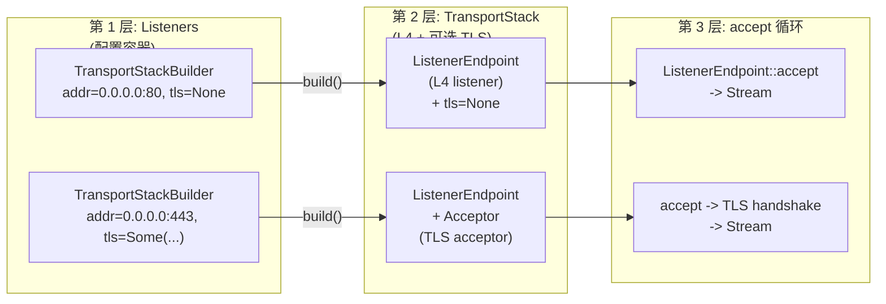
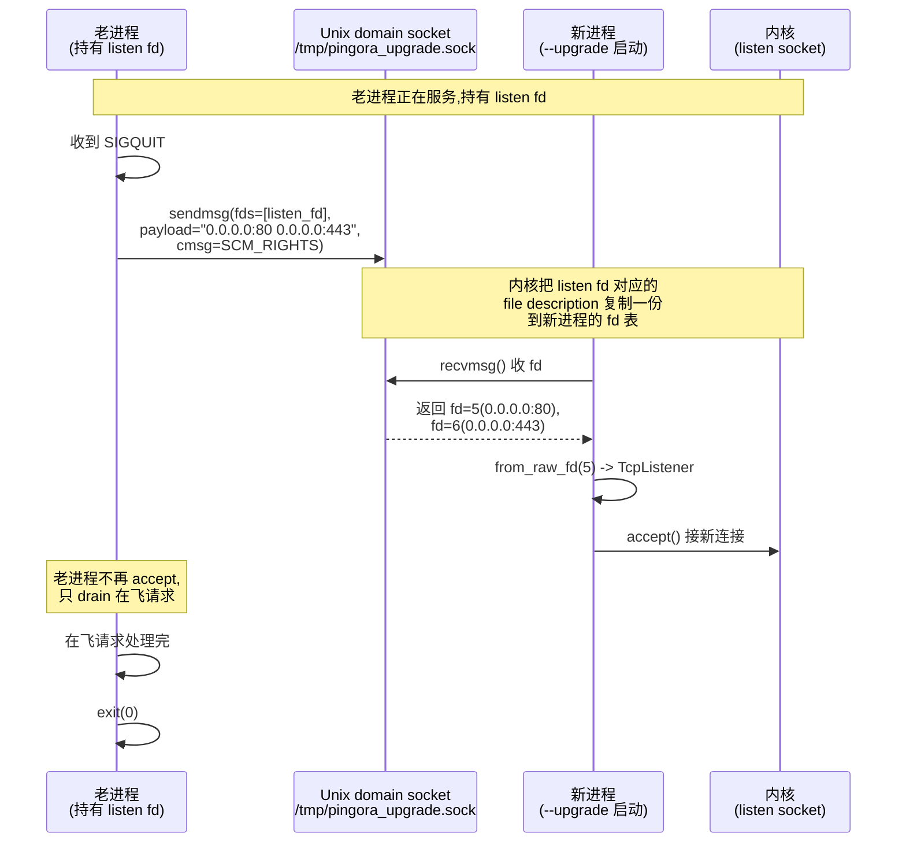
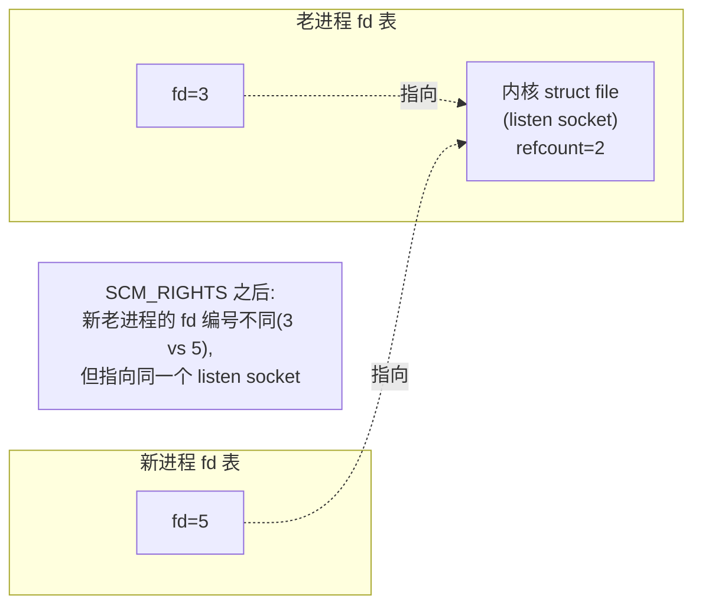

# 第 6 篇 · 第 18 章 · listener、graceful upgrade 与连接管理

> **核心问题**:前面 17 章讲的都是"一条 HTTP 请求进到 Pingora 之后怎么被钩子链处理、怎么被转发设施送到 upstream"。但有一个更前置、更基础、却在二手资料里最容易被一笔带过的问题:**一条 TCP 连接是怎么被 Pingora 接进来的?** 以及——更关键的、Cloudflare 把它当生产招牌的那个能力——**怎么在不丢一个请求、不让任何一个客户端断开重连的前提下,把一个正在跑着几十万并发连接的 Pingora 进程换成新版本?** 这件事在 Nginx 里叫 `nginx -s reload`(实际是 `SIGHUP` 重载配置)或 `SIGUSR2` binary upgrade,在 Envoy 里叫 hot restart(走 `SCM_RIGHTS` 传 fd,见《Envoy》第 7 章 hot restart 那一节),在 Pingora 里叫 **graceful upgrade**——老进程收到 `SIGQUIT`,把自己手里那些**监听 socket 的 fd** 通过一条 Unix domain socket 用 `SCM_RIGHTS` 发给新进程,新进程拿着这些 fd 直接 `accept`,从此老进程不再接新连接、只把在飞的请求处理完就退。整套机制是 Rust 写的,跑在 Tokio 之上,但它的核心(fork、Unix socket、`SCM_RIGHTS`、信号)全是 POSIX 的老朋友。
>
> **读完本章你会明白**:
>
> 1. **listener 这一层的真实结构**:`Listeners`(一堆 `TransportStackBuilder`)→ `TransportStack`(`ListenerEndpoint` + 可选 TLS `Acceptor`)→ `ListenerEndpoint::accept` → `UninitializedStream::handshake`(TLS 时跑 handshake)→ `current_handle().spawn` 出每连接一个 task。这套结构和 [P5-15](P5-15-NoStealRuntime-Pingora自研运行时.md) 讲的 NoStealRuntime 是怎么接上的——为什么是 `current_handle()`(随机选一个 NoSteal 线程)而不是固定线程。
> 2. ★ **graceful upgrade 的完整生命周期**:老进程跑着 → `SIGQUIT` → 老进程把 listen fd 通过 Unix socket + `SCM_RIGHTS` 发出去 → 新进程(用 `-u`/`--upgrade` 启动)在 `bootstrap` 阶段从同一条 Unix socket 收 fd → 新进程用 `from_raw_fd` 把这些 fd 重建 listener、直接 accept → 老进程 `CLOSE_TIMEOUT=5s` 后停止 accept、转入 graceful shutdown → 在飞请求处理完(默认 `grace_period_seconds` 最长 5 分钟)→ 老进程退。整个交接**零丢请求**,客户端无感知。
> 3. ★ **为什么 Pingora 用 `SIGQUIT` 触发 upgrade,而不是 Nginx 的 `SIGHUP`**:Nginx 的 `SIGHUP` reload 是"**同一个进程**重新读配置、重新 fork worker"——master 不换,worker 换。这套设计的前提是"Nginx 是配置驱动的,配置变了重新读就行"。但 Pingora 是**代码驱动**的(你写的是 Rust 代码实现 `ProxyHttp`,不是 `nginx.conf`)——配置 reload 救不了你换代码的需求,你只能换二进制。所以 Pingora 走的是"换整个进程"的路子(对应 Nginx 的 `SIGUSR2` binary upgrade),用 `SIGQUIT` 当信号。这是个**设计哲学差异**,不是随便选的信号。
> 4. **`transfer_fd` 这一层的源码**:fd 怎么序列化(`Fds` 这个 `HashMap<String, RawFd>`,key 是 bind 地址字符串如 `0.0.0.0:80`,value 是 fd 数字)、怎么通过 `sendmsg`/`recvmsg` 的辅助消息(`ScmRights`)传、老进程和新进程怎么用重试 + 超时(`MAX_RETRY=5`、`RETRY_INTERVAL=1s`)协调"谁先就绪"的竞态。
> 5. **keepalive 连接在请求之间的复用与状态传递**:Pingora 0.8.1 的真实机制是 `ServerApp::process_new` 返回 `Option<Stream>`(连接可复用就 `Some` 回吐给 service,下个请求接着用)+ `HttpPersistentSettings`(把 `keepalive_timeout` 和 `keepalive_reuses_remaining` 这两个跨请求要保留的设置打包,在 `ReusedHttpStream` 里跟着连接一起走)。**修正一个常见误区**:很多二手资料(包括部分博客和早期文档)提到的 `persist_connection_context` / `on_connection_reuse` 这两个钩子,在 0.8.1 源码里**根本不存在**——`ProxyHttp` 的 `type CTX` 是 **per-request** 的(每来一个请求 `new_ctx` 新建一个),**不是** per-connection 的,keepalive 复用同一个连接的第二个请求拿到的是一个全新的 CTX。本章会据实钉死这一点。
> 6. **`connection_filter` 这个 feature**:listener accept 到一个连接之后、TLS handshake 之前,插一道基于 peer IP 的过滤(`should_accept`),把黑名单/限流的连接在 TCP 层直接 drop 掉,省掉 TLS handshake 的 CPU。这是 0.8.x 加进来的 feature flag(默认关),对照 Envoy 的 listener filter / Nginx 的 `deny`/`allow` 指令。
>
> **逃生阀**:如果你只读一节,读**第 2 节**(graceful upgrade 的完整时序与 fd 传递)和紧跟着的**技巧精解**(`SCM_RIGHTS` 怎么传 fd、为什么用 Unix socket 而不是 fork 继承)。graceful upgrade 是 Cloudflare 的生产招牌,也是本章的魂。如果你忘了 NoStealRuntime / daemonize / `fork` 丢线程那些细节,先回去翻 [P5-15](P5-15-NoStealRuntime-Pingora自研运行时.md) 的技巧精解和"daemonize 与 fork 的陷阱"那一节——本章的 `pause_for_fork` 正是建立在那套机制之上。

---

## 章首 · 一句话点破

> **Pingora 的 listener + graceful upgrade,一句话讲完:listener 是"绑地址 → accept → 每连接 spawn 一个 task"的标准三段式,但 spawn 用的 Handle 是 NoStealRuntime 随机给的,所以连接被均匀撒到 N 条线程上;graceful upgrade 是"老进程收到 `SIGQUIT` → 把 listen fd 通过 Unix socket + `SCM_RIGHTS` 发给新进程 → 新进程 `from_raw_fd` 重建 listener、直接 accept → 老进程 drain 完在飞请求再退"的交接仪式,整套跑在 POSIX 信号 + Unix domain socket 之上,既不是 Nginx 那种"master 不换 reload worker",也不是简单的"kill 旧进程、systemd 拉新进程"——它是一个有交接、有重叠期、零丢请求的协议。**

这是结论。本章倒过来拆:先讲 listener 这一层怎么把一个 TCP 字节流接进来、和 NoStealRuntime 怎么接上(第 1 节);再讲 graceful upgrade 的完整时序——为什么需要它、Nginx/Envoy 各自怎么做、Pingora 怎么用 `SIGQUIT` + Unix socket + `SCM_RIGHTS` 实现一套 Rust 版的零停机交接(第 2 节);然后进信号处理与进程生命周期的源码,看 `ExecutionPhase` 这个状态机怎么把"运行中 → 传 fd → 关 listener → 等 grace period → 关 runtime → 退出"串起来(第 3 节);接着讲 `connection_filter` 这道 TCP 层防线(第 4 节)和 keepalive 连接的跨请求复用与状态传递——以及为什么 0.8.1 里没有 `persist_connection_context`(第 5 节);最后是技巧精解(`SCM_RIGHTS` 传 fd 的精妙 + `from_raw_fd` 接管的窍门)和章末小结。

本章服务**转发设施**这一面。listener 和 graceful upgrade 都不在钩子链上(业务实现 `ProxyHttp` 时根本不直接碰 listener),但 listener 是**整条钩子链的入口**——没有 listener accept 连接、spawn task,你写的 `early_request_filter` / `upstream_peer` / `response_filter` 一个都跑不起来;graceful upgrade 则是这条入口能在生产环境**长期可维护**的命脉——没有它,你每次发版都得让几十万并发连接断一次。它是第 6 篇"缓存与生产特性"的中段,承上启下:承 [P6-17 pingora-cache](P6-17-pingoracache-HTTP缓存.md)(cache 的命中/写回也跑在这些 listener 接进来的连接上),启 [P6-19 可观测与限流](P6-19-可观测-限流与module.md)(下一章讲的 `connection_filter` 是限流的一道关卡、`pingora-limits` 也在这一层接入)。

---

## 正文

### 第 1 节 · listener 这一层:从 TCP 字节到一条 task

要讲清 graceful upgrade,得先讲清"一个 listener 在正常情况下是怎么工作的"——因为 upgrade 的本质就是"把 listener 手里那个 listen socket 的 fd 换个进程持有",你得先知道这个 fd 在一个进程里是怎么被绑、被 accept、被 spawn 成 task 的。

#### 1.1 listener 的三层结构:Listeners → TransportStack → ListenerEndpoint

Pingora 的 listener 不是 Tokio 的 `TcpListener::bind(addr).accept()` 那么简单,它是一个**三层结构**,层次分明地切开了"配置 / 协议栈 / 单点监听"三件事。这三层都住在 [`pingora-core/src/listeners/mod.rs`](../pingora/pingora-core/src/listeners/mod.rs) 和 [`pingora-core/src/listeners/l4.rs`](../pingora/pingora-core/src/listeners/l4.rs):



**第 1 层 `Listeners`**(`listeners/mod.rs` 的 `pub struct Listeners`)是个**配置容器**,里面装着一堆 `TransportStackBuilder`——每个 builder 描述"我要在哪个地址监听、要不要 TLS、要不要 connection_filter"。这是用户在写 main 函数时直接打交道的东西,通过 `service.add_tcp("0.0.0.0:80")` / `service.add_tls("0.0.0.0:443", cert, key)` 往里塞端点。`Listeners` 在这个阶段还没绑端口、没建 socket——它只是记下来"我要监听这些地址"。

**第 2 层 `TransportStack`**(`listeners/mod.rs` 的 `pub(crate) struct TransportStack`)是 `Listeners::build()` 之后产出的**实际协议栈**:一个 `ListenerEndpoint`(L4 监听器,纯 TCP 或 UDS)+ 一个可选的 `Acceptor`(TLS 接受器)。`TransportStack::accept()` 返回一个 `UninitializedStream`——这是个**还没 handshake 的半成品流**,L4 层已经 accept 完了(TCP 三次握手完成),但 TLS handshake(如果配了 TLS)还没跑。

**第 3 层 `ListenerEndpoint::accept`**(`listeners/l4.rs`)是真正调 `TcpListener::accept` 的地方。它返回一个 `Stream`(`Box<dyn AsyncRead + AsyncWrite + Send>`,承接《Tokio》[[tokio-source-facts]] 的 AsyncRead/AsyncWrite),交给上层去 handshake + spawn。

为什么要切三层?因为这三件事的**时机不同**:配置(第 1 层)在 main 函数里写死、可以反复修改;协议栈(第 2 层)在 `start_service` 时 `build()` 出来,这时候可能要用老进程传来的 fd(见第 2 节);accept 循环(第 3 层)是每条 service 线程上跑一个的常驻循环,每个循环 spawn 出无数个 per-connection task。把它们揉在一个 struct 里会让"配置阶段 / 启动阶段 / 运行阶段"三个时机的逻辑搅在一起,切开之后每一层的职责单一:`Listeners` 只管"我要监听什么",`TransportStack` 只管"L4 + TLS 的握手流水线",`ListenerEndpoint` 只管"accept 一个连接、套上 socket 选项"。

> **承接《Tokio》[[tokio-source-facts]]**:这一层底下是 `tokio::net::TcpListener`(epoll/kqueue edge-triggered,mio 1.2.1),`accept().await` 在没有连接时挂起、有连接时被 reactor 唤醒——这套机制《Tokio》拆透了,本章一句带过指路。我们这里关心的只有一件事:**Pingora 在 `accept` 拿到一个 `TcpStream` 之后,怎么把它变成一条 task**。

#### 1.2 accept 循环与每连接一个 task

每条 service 线程上跑一个 `run_endpoint` 常驻 task,里面是个 `loop {}` 不停 accept。这是 [`pingora-core/src/services/listening.rs`](../pingora/pingora-core/src/services/listening.rs) 的核心,我们贴关键几行(简化示意,非源码原文):

```rust
// pingora-core/src/services/listening.rs  (Service::run_endpoint, 简化)
async fn run_endpoint(app_logic: Arc<A>, mut stack: TransportStack, mut shutdown: ShutdownWatch) {
    loop {
        // 用 tokio::select! 同时盯 accept 和 shutdown 信号
        let new_io = tokio::select! {
            new_io = stack.accept() => new_io,
            shutdown_signal = shutdown.changed() => {
                if *shutdown.borrow() { break; }  // shutdown 信号来了,退出 accept 循环
                continue;
            }
        };
        match new_io {
            Ok(io) => {
                let app = app_logic.clone();
                let shutdown = shutdown.clone();
                current_handle().spawn(async move {           // ★ 每连接 spawn 一个 task
                    let peer_addr = io.peer_addr();
                    // 先跑 handshake(60s 超时),再 handle_event
                    match timeout(Duration::from_secs(60), io.handshake()).await {
                        Ok(Ok(io)) => Self::handle_event(io, app, shutdown).await,
                        Ok(Err(e)) => error!("Downstream handshake error: {e}"),
                        Err(_) => error!("Downstream handshake timeout"),
                    }
                });
            }
            Err(e) => {
                error!("Accept() failed {e}");
                // EMFILE (24, too many open files) 时 sleep 1s,否则 accept 会空转烧 CPU
                if e.root_cause().raw_os_error() == Some(24) {
                    tokio::time::sleep(Duration::from_secs(1)).await;
                }
            }
        }
    }
}
```

完整源码见 [`pingora-core/src/services/listening.rs#L184-L256`](../pingora/pingora-core/src/services/listening.rs#L184-L256)(`run_endpoint`)和 [`#L210-L234`](../pingora/pingora-core/src/services/listening.rs#L210-L234)(`current_handle().spawn` 那一段)。这里有几个值得拆的点:

**1. `current_handle().spawn`——这是和 NoStealRuntime 的接口。** `current_handle()`(在 `pingora-runtime` 里)返回"当前线程所在的那个 runtime 的 Handle"——在 NoSteal 模式下,它返回的是池里**随机一条**线程的 Handle(见 [P5-15](P5-15-NoStealRuntime-Pingora自研运行时.md) 第 4 节"current_handle 凭什么 work")。所以每次 accept 一个连接、spawn 一个 task,这个 task 被随机撒到 N 条 NoSteal 线程里的一条上,从此钉死在那里。这就是 NoSteal 的"随机投掷代替 work-stealing"在 listener 这一层落地的方式——你不需要做什么负载均衡,`current_handle` 帮你撒。

> ★ **一个反直觉的细节**:`run_endpoint` 这个 accept 循环本身是被 `start_service` 用 `runtime.spawn` 拉起来的(见 [`listening.rs#L291-L293`](../pingora/pingora-core/src/services/listening.rs#L291-L293)),它跑在 service 自己那条 runtime 上。但它内部 `current_handle().spawn(...)` 拉起 per-connection task 时,用的 `current_handle()` 是 **`run_endpoint` 这个 task 当前所在线程**的 Handle。在 NoSteal 模式下,因为 `run_endpoint` 跑在某条具体的线程上,`current_handle()` 返回的就是那条线程的 Handle——这看起来会让所有连接都堆在 accept 循环所在的那条线程上!其实不然:配置 `listener_tasks_per_fd > 1` 时,同一个 listener 会被 spawn 出多份 `run_endpoint`(见 [`listening.rs#L285-L297`](../pingora/pingora-core/src/services/listening.rs#L285-L297)),每份跑在不同的线程上,这样连接就分散开了。源码注释里那句 `// TODO: with no steal runtime, consider spawn() the next event on another thread`([`listening.rs#L177-L178`](../pingora/pingora-core/src/services/listening.rs#L177-L178))正是 Cloudflare 自己注意到的 NoSteal 在这里的小短板——keepalive 复用连接(第 5 节)会在同一条线程上反复处理,未来可能把复用连接也丢到别的线程。

**2. `tokio::select!` 同时盯 accept 和 shutdown。** 这是 graceful shutdown 的入口:当 `shutdown` 这个 `watch::Receiver<bool>` 从 false 变成 true 时,`shutdown.changed().await` 返回,accept 循环 break,这条线程不再接新连接。`shutdown` 信号是怎么从 false 变 true 的?是 `Server` 收到 `SIGTERM` / `SIGQUIT` 后,调 `shutdown_watch.send(true)` 广播给所有 service(见第 3 节)。

**3. `timeout(Duration::from_secs(60), io.handshake())`——handshake 60 秒超时。** 这道超时是为了防"慢速攻击"(slowloris):攻击者建连但不发数据,占着连接池资源。Pingora 给 handshake(纯 TCP 时是空操作,TLS 时是 TLS 握手)60 秒,超了直接 drop。这个 timeout 用的是 `pingora_timeout::timeout`(承《Tokio》[[tokio-source-facts]] 时间轮,但 `pingora-timeout` 有个更轻的 `fast_timeout`,见第 3 节技巧)。

**4. EMFILE(fd 耗尽)时 sleep 1s。** 这是个经典陷阱:fd 耗尽时 `accept` 会**立刻**返回 `EMFILE`(errno 24),不阻塞——如果不 sleep,accept 循环会变成 busy loop 烧满一条 CPU。Pingora 在 [`listening.rs#L243-L249`](../pingora/pingora-core/src/services/listening.rs#L243-L249) 显式判断 `io_error == 24` 然后 sleep 1s,给系统喘口气等别的连接释放 fd。这是个朴素但必要的防御。

#### 1.3 accept 完之后:handshake 与 handle_event

accept 拿到的是 `UninitializedStream`(`listeners/mod.rs`),它的 `handshake()` 方法决定要不要跑 TLS:

```rust
// pingora-core/src/listeners/mod.rs (UninitializedStream::handshake, 简化)
pub async fn handshake(mut self) -> Result<Stream> {
    self.l4.set_buffer();
    if let Some(tls) = self.tls {
        let tls_stream = tls.tls_handshake(self.l4).await?;   // TLS: 跑 handshake
        Ok(Box::new(tls_stream))
    } else {
        Ok(Box::new(self.l4))                                  // 纯 TCP: 直接装箱
    }
}
```

完整源码见 [`pingora-core/src/listeners/mod.rs#L184-L201`](../pingora/pingora-core/src/listeners/mod.rs#L184-L201)。`Stream` 是 `Box<dyn AsyncRead + AsyncWrite + Send>`(承接《Tokio》[[tokio-source-facts]] 的 AsyncRead/AsyncWrite),从此往后,HTTP 解析、钩子链、upstream 连接,都用这个 `Stream` 当 IO 接口。

handshake 完之后,流进 `handle_event`([`listening.rs#L173-L182`](../pingora/pingora-core/src/services/listening.rs#L173-L182)):

```rust
// pingora-core/src/services/listening.rs (Service::handle_event, 简化)
pub async fn handle_event(event: Stream, app_logic: Arc<A>, shutdown: ShutdownWatch) {
    let mut reuse_event = app_logic.process_new(event, &shutdown).await;
    while let Some(event) = reuse_event {
        // keepalive 复用:同一个连接,处理下一个请求
        reuse_event = app_logic.process_new(event, &shutdown).await;
    }
}
```

这里就是 keepalive 的入口——`process_new` 处理完一个请求后,如果连接可复用,就返回 `Some(stream)`,这个 `while let Some` 循环把它喂回 `process_new` 处理下一个请求。这套机制的细节(以及为什么 0.8.1 没有 `persist_connection_context`)留到第 5 节细讲。

**到这一步,一条 TCP 字节流就走完了"被 accept → handshake → 变成一条 task 跑 handle_event"的全程。** 整个 listener 这一层,做的事可以总结成一句:

> **绑地址 → 循环 accept → 每个连接 spawn 一个 task → task 里跑 handshake + process_new + keepalive 循环。**

朴素、直接、和 Tokio 标准的 `TcpListener::accept().await` 用法几乎一样——除了两个 Pingora 独有的细节:(1) spawn 用的 Handle 是 NoStealRuntime 随机给的;(2) accept 循环要听 shutdown 信号做 graceful shutdown。前者是 [P5-15](P5-15-NoStealRuntime-Pingora自研运行时.md) 的内容,后者是本章第 2、3 节的内容。

---

### 第 2 节 · graceful upgrade:零停机换进程的交接仪式

现在进本章的魂:graceful upgrade。Cloudflare 在博客里反复强调"我们用 Pingora 重写代理后,每天能做几百次 upgrade 而不掉一个连接、不重启一个客户端"——这套能力正是这一节要拆的东西。

#### 2.1 为什么需要 graceful upgrade(以及它和"reload"的区别)

先把这个最容易被混淆的概念讲清楚:**"reload" 和 "upgrade" 是两件不同的事**。

**Nginx 的 `nginx -s reload`(`SIGHUP`)做的是 reload**:同一个 master 进程,重新读一遍 `nginx.conf`,然后**优雅地换掉 worker**——老 worker stop accepting new connections、处理完在飞请求就退,新 worker 用新配置 fork 出来接活。这套机制的前提是:**配置变了,代码没变**。master 进程从头到尾是同一个,它只是把 worker 换了一茬。这对 Nginx 来说够用,因为 Nginx 是**配置驱动**的——你能调的所有东西都在 `nginx.conf` 里,改完 reload 就行。

**但 Pingora 是代码驱动的。** 你写的不是 `pingora.conf`,是 Rust 代码实现 `ProxyHttp` trait——你想改个钩子的逻辑、加个新 filter、升个依赖版本,这些都得**重新编译二进制**。reload 配置救不了你,你必须换二进制。所以 Pingora 需要的是 **upgrade**——把整个进程换成新的二进制,而不是同一个进程 reload 配置。

> ★ **设计哲学差异(承接铁律)**:Nginx 的 `SIGHUP` reload 配置、`SIGUSR2` 做 binary upgrade(老资料里也叫热升级);Envoy 的 hot restart 走 `SCM_RIGHTS` 把 fd 传给新进程(见《Envoy》第 7 章 hot restart 一节,一句带过指路);**Pingora 只有 upgrade,没有 reload**——因为配置驱动的 reload 对代码驱动的 Pingora 无意义。Pingora 的 upgrade 用 `SIGQUIT` 触发(对应 Nginx 的 `SIGUSR2`,但信号不同——`SIGQUIT` 在 Nginx 里是"graceful quit",Pingora 借来当"graceful upgrade",这是个容易混淆的点,见表 2.1)。这个差异不是随便选的信号,是"配置驱动 vs 代码驱动"两种代理哲学在信号语义上的投射。

| 信号 | Nginx 语义 | Pingora 0.8.1 语义 | 对照说明 |
|------|-----------|------------------|---------|
| `SIGHUP` | reload 配置(master 不换、重 fork worker) | (未使用) | Pingora 无 reload——代码驱动不需要 |
| `SIGQUIT` | graceful quit(老 worker 处理完在飞请求就退) | **graceful upgrade**(把 listen fd 发给新进程、再 graceful 退) | Pingora 借 `SIGQUIT` 表"graceful"语义,但加了 fd 传递 |
| `SIGTERM` | fast shutdown | graceful terminate(广播 shutdown 信号给 service、等 grace period) | 都表"终止",但 Pingora 的 terminate 也是 graceful 的 |
| `SIGINT` | fast shutdown(等同 `^C`) | fast shutdown(不等 grace period,直接关 runtime) | 两者一致 |
| `SIGUSR2` | binary upgrade(新二进制接管) | (未使用) | Pingora 用 `SIGQUIT` + `-u` 参数代替 |

> 表 2.1:Nginx 与 Pingora 0.8.1 信号语义对照。**关键差异**:Nginx 的 reload(`SIGHUP`)在 Pingora 里不存在;Pingora 的 graceful upgrade(`SIGQUIT`)在 Nginx 里对应的是 `SIGUSR2` binary upgrade,但 Pingora 把它绑到了 `SIGQUIT` 上(借用 `SIGQUIT` 的"graceful"语义)。

**那 graceful upgrade 解决的本质问题是什么?** 是"**怎么在换二进制的同时,让正在进行的连接不中断**"。一个朴素的做法是:启动新进程 → 新进程 bind 同样的端口(失败,老进程还占着)→ kill 老进程 → 新进程接管。这套走不通,因为 (1) bind 会冲突(老进程还没退、还占着端口),(2) kill 老进程会让它手里所有连接立刻断。graceful upgrade 的解法是:**让新老进程在一段重叠期里同时存在,新进程接管"接新连接"的职责,老进程只管"把在飞的请求处理完",处理完自己退**。重叠期里,两个进程都在,但职责不冲突——新进程 accept 新连接,老进程 drain 在飞请求。

这就引出一个技术问题:**新老进程怎么共享同一个 listen socket?** 因为只能有一个进程持有"bind 这个端口"的权限——确切说,是只能有一个 bind 动作发生,之后这个 listen socket 的 fd 可以被多个进程共享。

#### 2.2 三种共享 listen socket 的办法:Nginx / Envoy / Pingora 各走哪条

让两个进程共享同一个 listen socket,POSIX 给了三条路:

**路 A:fork 继承。** 老进程 `fork()` 出子进程,子进程自动继承父进程所有打开的 fd(包括 listen socket)。这是最朴素的办法——Nginx 的 master-worker 模型就是这套:master bind + listen,fork 出 worker,worker 继承 listen fd,多个 worker 共享同一个 listen socket(`accept` 由内核决定哪个 worker 拿到连接,这就是所谓的 "thundering herd" 问题,Nginx 用 `accept_mutex` 解)。但 fork 继承有个根本限制:**子进程是父进程 fork 出来的**,它跑的是**同一个二进制**——你想换二进制(升级版本)走不通,fork 出来的还是老代码。

**路 B:`SIGUSR2` + fork exec(Nginx binary upgrade)。** Nginx 的 binary upgrade 是:master 收到 `SIGUSR2` → fork 出一个子进程 → 子进程 `execve` 新二进制(替换自己的进程映像)→ 新二进制通过环境变量 `NGINX_VARS` 拿到老 master 的 listen fd。这套能用,但实现复杂(要靠环境变量传 fd 编号、新老 master 要协调 pid 文件),而且只能 Nginx 自己用。

**路 C:Unix domain socket + `SCM_RIGHTS`(Envoy / Pingora)。** 老进程和新进程是**完全独立启动的两个进程**(新进程不一定是老进程 fork 出来的,可以是 systemd 拉起来的、可以是手动启动的)。老进程通过一条**Unix domain socket** 把 listen fd **发送**给新进程——发送机制是 `sendmsg` 系统调用带上 `SCM_RIGHTS` 辅助消息,内核会**把 fd 对应的 file description 复制一份到接收进程的 fd 表里**。新进程用 `recvmsg` 收到这个 fd,用 `from_raw_fd` 把它重建为一个 `TcpListener`,从此新进程和老进程**共享同一个 listen socket**(内核里是同一个 file description,只是两个进程各自的 fd 编号不同)。



> 图 2.1:graceful upgrade 的 fd 传递时序。关键点是 `SCM_RIGHTS`:它不是"传一个整数(fd 编号)",而是"**内核复制 file description**"——老进程的 fd=3 和新进程的 fd=5 编号不同,但它们在内核里指向**同一个**打开的 file description(listen socket)。这就是为什么新老进程能共享同一个 listen socket 而不冲突。

**Pingora 走的是路 C。** 这条路的好处是:

1. **新进程和老进程完全解耦**:新进程不一定是老进程 fork 出来的(虽然 daemonize 时也 fork,但 upgrade 时新进程通常是手动 `pingora -u` 或 systemd 拉起来的独立进程),它和老进程唯一的耦合就是那条 Unix socket + fd。
2. **fd 编号可以不同**:老进程 fd=3、新进程 fd=5 没关系,`SCM_RIGHTS` 复制的是内核里的 file description,不是 fd 编号。
3. **可以传多个 fd**:一次 `sendmsg` 可以把多个 listen fd(比如同时监听 80 和 443)一起发过去,Pingora 的 `Fds` 结构就是这么设计的(见第 3 节)。
4. **和 Envoy 同源**:Envoy 的 hot restart 也是 `SCM_RIGHTS`(《Envoy》第 7 章一句带过指路),所以 Pingora 这套机制在"用 Rust 重写一个 Envoy 式代理"的语境下是最自然的选择。

但路 C 也有它的复杂之处:**新老进程的时序协调**。新进程启动时,老进程的 Unix socket 可能还没准备好(`ENOENT` / `ECONNREFUSED`);老进程发 fd 时,新进程可能还没开始监听 Unix socket(`ECONNREFUSED`)。Pingora 用重试 + 超时解这个竞态(见第 3 节技巧精解)。

> **承接《Envoy》**:Envoy 的 hot restart 和 Pingora 的 graceful upgrade 在机制上同源(`SCM_RIGHTS` 传 fd),但 Envoy 还传了更多东西(stats 共享内存、 drained 连接计数 等,《Envoy》第 7 章拆透了),Pingora 只传了 listen fd——更轻、更聚焦。本章只讲 Pingora,Envoy 的细节一句带过指路《Envoy》。

#### 2.3 Pingora graceful upgrade 的完整时序

把上面的内容串起来,Pingora 0.8.1 的 graceful upgrade 完整时序是这样的(对应源码:server 收信号见 [`server/mod.rs#L154-L170`](../pingora/pingora-core/src/server/mod.rs#L154-L170) 的 `UnixShutdownSignalWatch`、传 fd 见 [`#L270-L316`](../pingora/pingora-core/src/server/mod.rs#L270-L316) 的 `main_loop`、新进程收 fd 见 [`server/bootstrap_services.rs#L127-L184`](../pingora/pingora-core/src/server/bootstrap_services.rs#L127-L184) 的 `Bootstrap::bootstrap`、实际 IO 见 [`server/transfer_fd/mod.rs`](../pingora/pingora-core/src/server/transfer_fd/mod.rs)):

```mermaid
sequenceDiagram
    autonum
    participant U as 运维/systemd
    participant Old as 老进程(运行中)
    participant USock as Unix socket<br/>/tmp/pingora_upgrade.sock
    participant New as 新进程
    participant Client as 客户端连接

    Note over Old: 老进程持有 listen fd,<br/>正在服务 N 个并发连接

    U->>New: 启动新进程: pingora -u (upgrade=true)
    Note over New: bootstrap 阶段:<br/>get_from_sock(upgrade_sock)
    New->>USock: bind() + listen() Unix socket<br/>(chmod 666)
    New->>USock: accept_with_retry_timeout()<br/>最多重试 MAX_RETRY=5 次,每次 1s

    U->>Old: kill -QUIT $(cat /tmp/pingora.pid)
    Note over Old: SIGQUIT 收到,<br/>ExecutionPhase::GracefulUpgradeTransferringFds
    Old->>USock: connect() Unix socket
    Old->>USock: sendmsg(fds, "0.0.0.0:80 ...",<br/>cmsg=SCM_RIGHTS)
    Note over USock: 内核复制 file description<br/>到新进程 fd 表
    USock-->>New: recvmsg() 返回 fds
    New->>New: from_raw_fd -> ListenerEndpoint<br/>直接 accept 新连接
    Note over New: ExecutionPhase::BootstrapComplete<br/>新进程开始接活

    Note over Old: ExecutionPhase::GracefulUpgradeCloseTimeout
    Old->>Old: sleep(CLOSE_TIMEOUT=5s)<br/>(给新进程接管的时间)
    Old->>Old: shutdown_watch.send(true)<br/>广播:停止 accept
    Note over Old: 各 service 的 run_endpoint<br/>break accept 循环

    Note over Old,Client: 老进程继续处理<br/>已建立的在飞连接
    Client->>Old: 已有连接的剩余请求
    Old->>Client: 处理完响应
    Note over Old: ExecutionPhase::ShutdownGracePeriod<br/>sleep(grace_period_seconds, 默认 5min)
    Old->>Old: 关 runtime,等 task 退出
    Old->>Old: exit(0)

    Note over New,Client: 新连接全部由新进程接管
    Client->>New: 新连接
```

> 图 2.2:Pingora 0.8.1 graceful upgrade 完整时序。几个关键时间点:**CLOSE_TIMEOUT=5s**(老进程传完 fd 后等新进程接管的时间,见 [`server/mod.rs#L59`](../pingora/pingora-core/src/server/mod.rs#L59))、**grace_period_seconds**(老进程等在飞请求处理完的宽限期,默认 `EXIT_TIMEOUT=5min`,见 [`server/mod.rs#L56`](../pingora/pingora-core/src/server/mod.rs#L56))。这两个时间分开是因为它们等的是不同的事:CLOSE_TIMEOUT 等"新进程接管 accept 职责"(短),grace period 等"老进程的在飞连接全部处理完"(长)。

这个时序里有几个值得拆的点:

**1. 新进程是被动等老进程发 fd 的。** 注意时序图第 2-4 步:新进程启动后,**先** bind + listen 那条 Unix socket(`get_from_sock` 在 [`transfer_fd/mod.rs#L111-L141`](../pingora/pingora-core/src/server/transfer_fd/mod.rs#L111-L141)),然后**阻塞**等老进程连进来(`accept_with_retry_timeout`,最多等 `MAX_RETRY=5` 次 × `RETRY_INTERVAL=1s` = 5 秒)。这意味着运维**必须先启动新进程、再给老进程发 `SIGQUIT`**——顺序反了老进程发 fd 时没人收,会超时失败。

> **承接方对照**:Envoy 的 hot restart 是反过来的——老进程主动启动新进程(通过 `--restart-epoch` 协调,《Envoy》第 7 章),新进程启动时老进程已经在等。Pingora 走"运维手动启动新进程 + 手动发信号"的路子,更简单但需要运维按顺序操作。

**2. fd 传递是阻塞 IO,不在 tokio runtime 里。** 见 [`server/mod.rs#L282`](../pingora/pingora-core/src/server/mod.rs#L282) 的注释 `// XXX: this is blocking IO`——老进程的 `send_to_sock` 用的是 nix 的同步 `sendmsg`(不是 tokio 的异步 IO),它跑在 `Server` 的主 runtime 上(`server_runtime`,只有 1 个线程,见 [`server/mod.rs#L752`](../pingora/pingora-core/src/server/mod.rs#L752))。这是个有意识的取舍:fd 传递是个一次性的短操作(发完就完了),用同步 IO 简单可靠,不必为它单开一套异步路径。代价是主 runtime 的那条线程在 `sendmsg` 期间被阻塞——但 server runtime 本来就只跑 `main_loop` 这一个 task,不接连接,阻塞它没影响。

**3. `CLOSE_TIMEOUT=5s` 的作用。** 老进程发完 fd 后,**不立刻**停止 accept,而是 sleep 5 秒。为什么?因为新进程从"收到 fd"到"真正 `from_raw_fd` + accept"有一段启动时间(TLS 设置、service 启动、runtime 初始化)。如果老进程立刻停止 accept,这 5 秒里来的新连接就没人接了——客户端会得到 `connection refused`。这 5 秒是给新进程的"接管缓冲期",确保新老进程在 accept 职责上**无重叠地无缝交接**(严格说有重叠——5 秒里新老进程都能 accept,但因为它们共享同一个 listen socket,内核会把连接分给先 `accept` 的那个,不会丢)。

> **细节**:`CLOSE_TIMEOUT` 这个常量名容易误导——它不是"关闭 listener 的超时",而是"传完 fd 后、关 listener 之前的等待时间",作用是给新进程接管留缓冲。源码注释 `/* Time to wait before shutting down listening sockets. This is the graceful period for the new service to get ready */`([`server/mod.rs#L57-L59`](../pingora/pingora-core/src/server/mod.rs#L57-L59))说得很清楚。

**4. grace period 是给在飞请求的,不是给新连接的。** 老进程 sleep 完 `CLOSE_TIMEOUT` 后,广播 `shutdown_watch.send(true)`,各 service 的 `run_endpoint` 收到信号后 break accept 循环——从此老进程不再接新连接。但**已经建立的连接**还活着,它们的 task 还在跑(`handle_event` 里的 `process_new` 循环),还要把当前请求处理完。grace period(`grace_period_seconds`,默认 5 分钟)就是给这些在飞连接的——老进程 sleep 这么久,等所有在飞 task 自然结束。5 分钟够不够?对大多数 HTTP 请求够了(正常请求秒级),但如果有长连接(WebSocket、gRPC streaming),5 分钟可能不够,需要业务自己调大 `grace_period_seconds`。grace period 结束后,老进程进入 `ShutdownRuntimes` 阶段——给每个 service runtime 发 `shutdown_timeout`(默认 5s),强制关掉还没退的 task,然后 exit。

这就是 graceful upgrade 的完整生命周期。它的核心思想一句话:**新老进程通过 Unix socket 传递 listen fd,在一段重叠期内新老进程共存(新接活、老 drain),最终老进程自然退出,实现零丢请求的版本切换**。

---

### 第 3 节 · 信号、状态机与 fd 传递的源码

第 2 节讲了时序,这一节进源码,看时序里的每一步具体怎么实现。重点是两个东西:**`ExecutionPhase` 状态机**(把整个生命周期建模成一串状态)和 **`transfer_fd` 这一层**(fd 序列化 + `SCM_RIGHTS` 传递)。

#### 3.1 `ExecutionPhase`:把生命周期建模成状态机

Pingora 0.8.1 用一个 `ExecutionPhase` enum 把整个 server 的生命周期建模成状态机(见 [`server/mod.rs#L74-L114`](../pingora/pingora-core/src/server/mod.rs#L74-L114)):

```rust
// pingora-core/src/server/mod.rs (简化)
pub enum ExecutionPhase {
    Setup,                          // Server 创建,还没启动
    Bootstrap,                      // 准备阶段(upgrade 时从老进程拿 fd)
    BootstrapComplete,              // 准备完,fd 已拿到
    Running,                        // 正在服务,听 shutdown 信号
    GracefulUpgradeTransferringFds, // 收到 SIGQUIT,正在往新进程发 fd
    GracefulUpgradeCloseTimeout,    // fd 发完,等 CLOSE_TIMEOUT
    GracefulTerminate,              // 收到 SIGTERM,广播 shutdown
    ShutdownStarted,                // 开始关
    ShutdownGracePeriod,            // 等 grace period
    ShutdownRuntimes,               // 关 runtime
    Terminated,                     // 已停
}
```

这个状态机通过一个 `broadcast::Sender<ExecutionPhase>` 广播(见 [`server/mod.rs#L212`](../pingora/pingora-core/src/server/mod.rs#L212)),业务代码可以通过 `server.watch_execution_phase()` 订阅,在自己关心的状态转换时做事情(比如在 `GracefulUpgradeTransferringFds` 时停止接新订阅)。这是个很好的设计——它把"server 现在在什么阶段"这个全局状态显式建模出来,而不是靠一堆零散的 bool/flag 隐式表达。

状态转换的核心在 `main_loop`([`server/mod.rs#L237-L318`](../pingora/pingora-core/src/server/mod.rs#L237-L318)),它是个 async 函数,先 `send(Running)`,然后 `shutdown_signal.recv().await` 等信号,根据信号类型走不同的关停路径:

```rust
// pingora-core/src/server/mod.rs (main_loop 简化, 只展示 SIGQUIT 路径)
match run_args.shutdown_signal.recv().await {
    ShutdownSignal::GracefulUpgrade => {
        // SIGQUIT: graceful upgrade
        self.execution_phase_watch.send(GracefulUpgradeTransferringFds)?;
        if let Some(fds) = self.listen_fds() {
            let fds = fds.lock().await;
            fds.send_to_sock(self.configuration.upgrade_sock.as_str())?;  // ★ 发 fd
            self.execution_phase_watch.send(GracefulUpgradeCloseTimeout)?;
            sleep(Duration::from_secs(CLOSE_TIMEOUT)).await;              // 等 5s
            self.shutdown_watch.send(true)?;                              // 广播关停
        }
        ShutdownType::Graceful
    }
    ShutdownSignal::GracefulTerminate => { /* SIGTERM 路径, 直接 send(true) */ }
    ShutdownSignal::FastShutdown => { /* SIGINT, 不等 grace */ ShutdownType::Quick }
}
```

信号本身的监听在 `UnixShutdownSignalWatch::recv`([`server/mod.rs#L153-L170`](../pingora/pingora-core/src/server/mod.rs#L153-L170)),它用 `tokio::signal::unix::signal` 注册三个信号处理器,然后用 `tokio::select!` 等哪个先到:

```rust
// pingora-core/src/server/mod.rs (UnixShutdownSignalWatch::recv, 简化)
async fn recv(&self) -> ShutdownSignal {
    let mut graceful_upgrade_signal = unix::signal(unix::SignalKind::quit()).unwrap();    // SIGQUIT
    let mut graceful_terminate_signal = unix::signal(unix::SignalKind::terminate()).unwrap(); // SIGTERM
    let mut fast_shutdown_signal = unix::signal(unix::SignalKind::interrupt()).unwrap();  // SIGINT
    tokio::select! {
        _ = graceful_upgrade_signal.recv() => ShutdownSignal::GracefulUpgrade,
        _ = graceful_terminate_signal.recv() => ShutdownSignal::GracefulTerminate,
        _ = fast_shutdown_signal.recv() => ShutdownSignal::FastShutdown,
    }
}
```

> **承接《Tokio》[[tokio-source-facts]]**:`tokio::signal::unix::signal` 底层是 `signal_hook` + self-pipe trick(或 Linux 的 `signalfd`),把异步信号转成 IO 事件喂给 reactor,这样能在 async 上下文里 `await` 信号。《Tokio》拆透了 reactor/mio,这里一句带过指路。Pingora 只是用 tokio 提供的这个能力,自己没做信号处理的任何特殊事情。

`main_loop` 返回 `ShutdownType::{Graceful, Quick}` 之后,`Server::run` 根据类型走不同的收尾路径([`server/mod.rs#L653-L819`](../pingora/pingora-core/src/server/mod.rs#L653-L819)):Graceful 走 grace period + runtime shutdown timeout,Quick 直接关 runtime。这段是 `Server::run` 的后半部分,涉及把每个 service runtime 用 `thread::spawn` + `shutdown_timeout` 关掉(见 [`#L796-L813`](../pingora/pingora-core/src/server/mod.rs#L796-L813)),逻辑直白,不细拆。

#### 3.2 `transfer_fd`:fd 序列化与 `SCM_RIGHTS`

fd 传递的核心在 [`pingora-core/src/server/transfer_fd/mod.rs`](../pingora/pingora-core/src/server/transfer_fd/mod.rs),整个文件 530 行(含测试)。它的核心是两个东西:**`Fds` 容器**和 **`send_to_sock` / `get_from_sock` 这对收发函数**。

**`Fds` 容器**是个 `HashMap<String, RawFd>`(见 [`transfer_fd/mod.rs#L34-L84`](../pingora/pingora-core/src/server/transfer_fd/mod.rs#L34-L84)):key 是 listen 地址字符串(比如 `"0.0.0.0:80"`、`"0.0.0.0:443"`),value 是 fd 编号(`RawFd = i32`)。用地址字符串当 key 是因为新进程拿到 fd 后,要知道这个 fd 对应哪个监听地址——这样才能在 `from_raw_fd` 时决定它是 TCP 还是 UDS、要不要套 socket 选项。`Fds::serialize` 把 HashMap 拆成 `(Vec<String>, Vec<RawFd>)` 两个并行数组,`deserialize` 反过来。

**`send_to_sock`**([`transfer_fd/mod.rs#L228-L332`](../pingora/pingora-core/src/server/transfer_fd/mod.rs#L228-L332))是老进程发 fd 的函数。它的核心步骤:

```rust
// pingora-core/src/server/transfer_fd/mod.rs (send_fds_to 简化, 省略重试逻辑)
pub fn send_fds_to<P>(fds: Vec<RawFd>, payload: &[u8], path: &P, max_retry: Option<usize>) -> Result<usize, Error> {
    let send_fd = socket::socket(AddressFamily::Unix, SockType::Stream, SockFlag::SOCK_NONBLOCK, None)?;
    let unix_addr = UnixAddr::new(path)?;
    // 重试 connect(新进程可能还没 listen)
    loop {
        match socket::connect(send_fd, &unix_addr) {
            Ok(_) => break,
            Err(ENOENT | ECONNREFUSED | EACCES) => { sleep(RETRY_INTERVAL); retried += 1; }
            Err(EINPROGRESS) => { /* 非阻塞 connect, 轮询 */ }
        }
    }
    // 用 sendmsg + SCM_RIGHTS 发 fd
    let io_vec = [IoSlice::new(payload)];                          // payload 是序列化后的地址字符串
    let scm = socket::ControlMessage::ScmRights(fds.as_slice());   // ★ 辅助消息: 要传的 fd
    let cmsg = [scm];
    socket::sendmsg(send_fd, &io_vec, &cmsg, MsgFlags::empty(), None::<&UnixAddr>)?;
    nix::unistd::close(send_fd)?;
}
```

几个关键点:

**1. `ScmRights` 是 `SCM_RIGHTS` 的 Rust 封装。** `socket::ControlMessage::ScmRights(fds.as_slice())` 这一行是整个 fd 传递的灵魂——它告诉内核"这次 `sendmsg` 除了普通数据(payload),还要把这几个 fd 对应的 file description 复制到接收进程"。内核收到这个请求后,会在接收进程的 fd 表里**分配新的 fd 编号**,把发送方 fds 对应的 file description 引用过去。接收方 `recvmsg` 时,通过 `msg.cmsgs()` 拿到 `ScmRights(vec_fds)`,`vec_fds` 里的就是**新分配的** fd 编号(和发送方的编号无关)。

> **技巧精解预告**:`SCM_RIGHTS` 是 POSIX 的"传递 file description 引用"机制,不是"传 fd 编号"——这两者的区别是 fd 传递能 work 的根本,见本章技巧精解。

**2. payload 里放的是序列化后的地址字符串。** `Fds::send_to_sock` 先把 `HashMap` serialize 成 `"0.0.0.0:80 0.0.0.0:443"` 这样的空格分隔字符串(见 [`transfer_fd/mod.rs#L86-L92`](../pingora/pingora-core/src/server/transfer_fd/mod.rs#L86-L92) 的 `serialize_vec_string`),作为 `sendmsg` 的普通数据(payload)发出去;fd 们则通过 `SCM_RIGHTS` 辅助消息发出去。接收方 `recvmsg` 一次性拿到:payload(地址字符串) + cmsgs(fd 数组)。然后 `Fds::get_from_sock` 把这两者重新组装成 HashMap。这是个朴素但有效的序列化——注释里写 `// There are many ways to do this. Serde is probably the way to go. But let's start with something simple: space separated strings`([`transfer_fd/mod.rs#L87-L88`](../pingora/pingora-core/src/server/transfer_fd/mod.rs#L87-L88))。

**3. 三类错误的重试逻辑。** `connect` 可能失败的三种情况(`ENOENT` socket 文件不存在 / `ECONNREFUSED` socket 在但没人 listen / `EACCES` 权限不够)都重试——因为新进程可能还没准备好。这是新老进程时序竞态的解法。重试次数 `MAX_RETRY=5`,每次间隔 `RETRY_INTERVAL=1s`,总共最多等 5 秒。这个参数在 0.8.x 里还加了一个配置项 `upgrade_sock_connect_accept_max_retries`(见 [`configuration/mod.rs#L113-L118`](../pingora/pingora-core/src/server/configuration/mod.rs#L113-L118)),允许业务自己调。

**`get_from_sock`**([`transfer_fd/mod.rs#L100-L180`](../pingora/pingora-core/src/server/transfer_fd/mod.rs#L100-L180))是新进程收 fd 的函数,对称地:bind + listen Unix socket(chmod 666 给权限)→ `accept_with_retry_timeout` 等老进程连进来 → `recvmsg` 收 fd + payload → 组装成 `Fds`。它的重试逻辑也是 `MAX_RETRY=5`。

> **承接方对照**:Envoy 的 hot restart 用了类似的 `SCM_RIGHTS` 机制,但 Envoy 还传了共享内存 fd(stats)、SSL context fd 等(《Envoy》第 7 章)。Pingora 只传了 listen fd,更轻。这也意味着 Pingora 的 upgrade 不保留任何运行时状态(stats、连接池、缓存全部重建),是个"干净"的交接——好处是简单、无状态依赖,坏处是新进程要重新预热(连接池空、缓存冷)。

#### 3.3 新进程怎么用收到的 fd:`from_raw_fd` 与 `ListenerEndpointBuilder::listen`

新进程在 `Bootstrap::bootstrap`([`bootstrap_services.rs#L127-L167`](../pingora/pingora-core/src/server/bootstrap_services.rs#L127-L167))里调 `load_fds`([`#L169-L178`](../pingora/pingora-core/src/server/bootstrap_services.rs#L169-L178))把 fd 从 Unix socket 收回来,存进 `listen_fds: Option<ListenFds>`(`Arc<TokioMutex<Fds>>`)。之后每个 service 的 `start_service` 把这个 `ListenFds` 传给 `Listeners::build` → `TransportStackBuilder::build` → `ListenerEndpointBuilder::listen`([`listeners/l4.rs#L314-L350`](../pingora/pingora-core/src/listeners/l4.rs#L314-L350)):

```rust
// pingora-core/src/listeners/l4.rs (ListenerEndpointBuilder::listen 简化)
pub async fn listen(self, fds: Option<ListenFds>) -> Result<ListenerEndpoint> {
    let listen_addr = self.listen_addr.expect("...");
    let listener = if let Some(fds_table) = fds {
        let addr_str = listen_addr.as_ref();           // "0.0.0.0:80"
        let mut table = fds_table.lock().await;
        if let Some(fd) = table.get(addr_str) {
            from_raw_fd(&listen_addr, *fd)?            // ★ 用老进程传来的 fd 重建 listener
        } else {
            // fds 表里没这个地址(首次启动 / 地址对不上): 自己 bind
            let listener = bind(&listen_addr).await?;
            table.add(addr_str.to_string(), listener.as_raw_fd());  // 把自己的 fd 加进表
            listener
        }
    } else {
        bind(&listen_addr).await?                       // 没有 fds 表(非 upgrade): 自己 bind
    };
    Ok(ListenerEndpoint { listen_addr, listener: Arc::new(listener), ... })
}
```

这段是 upgrade 在 listener 这一层的落地:**如果 fds 表里有这个地址对应的 fd(说明是 upgrade,老进程传过来的),就用 `from_raw_fd` 重建 listener,不 bind**——因为 bind 会冲突(老进程还占着端口),而 `from_raw_fd` 直接复用老进程传来的 listen socket,绕过 bind。如果 fds 表里没有(首次启动,或地址对不上),就正常 `bind`。

> **关键区别**:`bind` 是"向内核申请这个端口",会冲突(端口被占就失败);`from_raw_fd` 是"拿一个已经 bind+listen 好的 socket fd 直接用",不冲突(因为不是重新 bind,是复用)。这就是 upgrade 能在新老进程重叠期共存的关键——新进程不 bind,只接管老进程已经 bind 好的 socket。

`from_raw_fd` 的实现见 [`listeners/l4.rs#L198-L221`](../pingora/pingora-core/src/listeners/l4.rs#L198-L221),它根据地址类型(TCP / UDS)用 `unsafe { StdUnixListener::from_raw_fd(fd) }` 或 `unsafe { std::net::TcpStream::from_raw_fd(fd) }` 把 raw fd 重建为标准库的 listener,然后调 `listen(LISTENER_BACKLOG)`——注释里说 `// Note that we call listen on an already listening socket // POSIX undefined but on Linux it will update the backlog size`([`l4.rs#L213-L214`](../pingora/pingora-core/src/listeners/l4.rs#L213-L214)),即重复 `listen` 在 Linux 上会更新 backlog,这里把它显式设为 `LISTENER_BACKLOG=65535`(见 [`l4.rs#L51`](../pingora/pingora-core/src/listeners/l4.rs#L51))。

`fds_table` 这个 `TokioMutex<Fds>` 还有个副作用:**首次 bind 的 listener 会把自己的 fd 加进表里**([`l4.rs#L331`](../pingora/pingora-core/src/listeners/l4.rs#L331))。这是为多 service 共享 fd 表准备的——同一个 Pingora 进程里,如果 service A 和 service B 都监听同一个地址(不太常见但合法),A 先 bind 拿到 fd、加进表,B 来的时候从表里拿到 A 的 fd,复用。这避免了"A bind 了 B 再 bind 失败"的问题。

#### 3.4 daemonize 与 upgrade 的关系:为什么 `pause_for_fork`

这一节最后讲一个容易忽略的细节:daemonize(后台化)和 upgrade 的关系。

Pingora 在 Linux 上默认是个 daemon(配置 `daemon: true`)。daemonize 的实现在 [`server/daemon.rs#L56-L115`](../pingora/pingora-core/src/server/daemon.rs#L56-L115),它用 `daemonize` crate(底层 `fork` + `setsid` + `fork`),把进程脱离 controlling terminal、变成后台进程。这个 fork 和 upgrade 没关系——daemonize 的 fork 是"让自己变成 daemon",upgrade 的 fd 传递是"换二进制",两件事。

但 daemonize 的 fork 有个副作用,和 P5-15 讲的 NoStealRuntime 联动:**`fork()` 只复制调用线程,其他线程不会被复制**。所以 Pingora 的 runtime 线程池必须是**懒构造**的(等 daemonize 完才建池),否则 fork 会让线程丢。这个细节 P5-15 拆透了,本章一句带过指路。

本章关心的是 daemonize 的另一个 fork 副作用:**`pingora-timeout` 的 timer 用了 `RwLock`,`RwLock` 跨 `fork()` 是未定义行为**(子进程可能拿到一个被锁住的锁、但持有锁的线程没被 fork 过来,死锁)。所以 Pingora 在 daemonize 的 fork **前后**包了一对 `pause_for_fork()` / `unpause()`(见 [`server/mod.rs#L663-L665`](../pingora/pingora-core/src/server/mod.rs#L663-L665)):

```rust
// pingora-core/src/server/mod.rs (run, daemonize 部分)
if conf.daemon {
    fast_timeout::pause_for_fork();   // ★ fork 前: 暂停 timer, 确保没人持锁
    daemonize(&self.configuration);   // 内部 fork
    fast_timeout::unpause();          // ★ fork 后: 恢复 timer
}
```

`pause_for_fork` 的实现在 [`pingora-timeout/src/timer.rs#L228-L243`](../pingora/pingora-timeout/src/timer.rs#L228-L243),它设一个 `AtomicBool paused`,timer 线程看到这个 flag 就停止获取锁(等 fork 完成);`unpause` 清 flag。源码注释([`timer.rs#L195-L199`](../pingora/pingora-timeout/src/timer.rs#L195-L199))说得很清楚:`// This is fine assuming pause_for_fork() is called right before fork().` 这是个有意识的"在 fork 前冻结全局状态"的操作,和 `posix_spawn` / `fork-safety` 是一类问题。

> **承接 [P5-15](P5-15-NoStealRuntime-Pingora自研运行时.md)**:daemonize 后才 init pools 的细节(NoStealRuntime 的 OnceCell 懒构造),P5-15 的技巧精解拆透了,本章只补 `pause_for_fork` 这个 timer 的 fork-safety 细节——两者是同一类问题(fork 不复制线程/不复制锁状态),解法也都是"在 fork 前冻结、fork 后恢复"。

到这里,graceful upgrade 的源码就拆完了。整个机制的代码量并不大(transfer_fd 530 行、daemon 115 行、configuration 352 行、bootstrap_services 208 行),但它的设计是 Cloudflare 生产招牌的核心——零停机换进程,靠的就是这套 `SIGQUIT` + Unix socket + `SCM_RIGHTS` + `from_raw_fd` 的组合。

---

### 第 4 节 · `connection_filter`:TLS handshake 之前的一道防线

讲完 listener 和 upgrade,这一节补一个 0.8.x 加进来的、和 listener 紧密相关的 feature:**`connection_filter`**。

#### 4.1 为什么需要在 TLS handshake 之前过滤

考虑这个场景:你的代理被一个恶意 IP 大量建连(DDoS / 慢速攻击)。如果不做任何过滤,每个连接进来都要走完 TLS handshake(CPU 密集,RSA 解密)+ HTTP 解析 + 钩子链,等你的 `request_filter` 钩子判断出"这是黑名单 IP、拒绝"时,CPU 已经被 handshake 烧掉了。攻击者用很少的带宽(只建连、不发数据)就能耗光你的 CPU。

解法是在 **TLS handshake 之前**就根据 peer IP 做过滤——黑名单里的 IP,连完 TCP 三次握手就直接 drop,不跑 handshake、不进 HTTP 解析。这就是 `connection_filter` 的作用。

> **承接方对照**:Envoy 的 listener filter(在 network filter 之前、《Envoy》第 3 篇 HCM 之前的一道链)能做类似的事;Nginx 用 `deny` / `allow` 指令(在 `access` phase)。Pingora 的 `connection_filter` 是个单点的过滤(不是链),更轻——它就一个 `should_accept(addr) -> bool`,业务实现这个 trait 决定要不要 accept。

#### 4.2 `ConnectionFilter` trait 与 `ListenerEndpoint::accept` 的循环

`ConnectionFilter` trait 在 [`listeners/connection_filter.rs#L65-L95`](../pingora/pingora-core/src/listeners/connection_filter.rs#L65-L95)(feature flag `connection_filter` 启用时):

```rust
// pingora-core/src/listeners/connection_filter.rs (简化)
#[async_trait]
pub trait ConnectionFilter: Debug + Send + Sync {
    /// 决定要不要接受这个连接。返回 false 立即 drop(不跑 TLS handshake)。
    async fn should_accept(&self, _addr: Option<&SocketAddr>) -> bool { true }
}

pub struct AcceptAllFilter;  // 默认实现: 全部接受
impl ConnectionFilter for AcceptAllFilter {}
```

它的接入点在 `ListenerEndpoint::accept`([`listeners/l4.rs#L401-L446`](../pingora/pingora-core/src/listeners/l4.rs#L401-L446)),这里有个值得拆的循环:

```rust
// pingora-core/src/listeners/l4.rs (ListenerEndpoint::accept, 启用 connection_filter 时, 简化)
pub async fn accept(&self) -> Result<Stream> {
    loop {
        let mut stream = self.listener.accept().await.or_err(AcceptError, "Fail to accept()")?;
        // 拿 peer addr
        let should_accept = if let Some(digest) = stream.get_socket_digest() {
            if let Some(peer_addr) = digest.peer_addr() {
                self.connection_filter.should_accept(peer_addr.as_inet()).await  // ★ 问 filter
            } else { true }   // 拿不到 peer addr, 默认接受
        } else { true };

        if !should_accept {
            debug!("Connection rejected by filter");
            drop(stream);     // ★ drop: 连接被关掉, 不进 handshake
            continue;         // ★ continue: 回去等下一个连接(关键!)
        }

        self.apply_stream_settings(&mut stream)?;
        return Ok(stream);    // 通过过滤, 返回给上层去 handshake
    }
}
```

这里的 **`loop` + `continue`** 是关键:被拒绝的连接 drop 之后,**accept 循环继续**,回去等下一个连接。这看起来理所当然,但有一个微妙的正确性考虑:如果被拒绝时直接 `return Err(...)`,会让上层的 `run_endpoint` 走到错误处理分支(可能 sleep 或 break)——而黑名单拒绝不是"系统错误",是"业务过滤",不应该影响 accept 循环的健康度。所以用 `loop` + `continue` 把拒绝"吞"掉,对上层完全透明:上层只看到正常的 `Ok(stream)`,不知道底下过滤了多少连接。

> **技巧**:`should_accept` 是 `async fn`,这意味着 filter 可以做异步操作(比如查一个远程的黑名单服务、查 Redis)。但注释([`connection_filter.rs#L60-L64`](../pingora/pingora-core/src/listeners/connection_filter.rs#L60-L64))警告 `// This filter is called for every incoming connection, so implementations should be efficient. Consider caching or pre-computing data structures for IP filtering rather than doing expensive operations per connection.`——因为 filter 在 accept 的热路径上,每个连接都要调一次,慢了会拖垮整个 accept 循环。生产实践里,黑名单通常预先加载到一个 `HashSet<IpAddr>` 里,`should_accept` 就是 `O(1)` 的 set 查询。

#### 4.3 feature flag 的双签名陷阱

读 `connection_filter.rs` 源码时,你会注意到一个**反直觉的设计**:同一个 `ConnectionFilter` trait,在文件里出现了**两个不同签名**——

- feature 启用时([`connection_filter.rs#L92`](../pingora/pingora-core/src/listeners/connection_filter.rs#L92)):`async fn should_accept(&self, _addr: Option<&SocketAddr>) -> bool`
- feature 禁用时([`listeners/mod.rs#L59-L63`](../pingora/pingora-core/src/listeners/mod.rs#L59-L63)):`fn should_accept(&self, _addr: &std::net::SocketAddr) -> bool`(同步、非 Option)

这两个签名不一样(一个 async 一个 sync、一个 `Option<&SocketAddr>` 一个 `&SocketAddr`)。为什么?这是 feature flag 的"API 兼容性"取舍:feature 禁用时,Pingora 提供一个空的 `ConnectionFilter` trait(只是为了 API 兼容,业务代码写的 `impl ConnectionFilter` 在 feature 禁用时也能编译通过,但不会被调用)。两个签名不一致是个**已知的瑕疵**(测试代码 [`connection_filter.rs#L121`](../pingora/pingora-core/src/listeners/connection_filter.rs#L121) 和 [`listeners/mod.rs` 的 test](../pingora/pingora-core/src/listeners/mod.rs#L425) 用的签名就不一样),业务用的时候要注意——如果你的 filter 要同时支持 feature 开和关,得分别 impl 两套签名。0.8.x 这个 feature 还在演进,签名可能后续统一。

`connection_filter` 这一层就这些。它是个简单但实用的 feature,在 listener accept 之后、TLS handshake 之前插一道 IP 过滤,把恶意连接挡在 CPU 密集操作之前。下一章 [P6-19](P6-19-可观测-限流与module.md) 讲的 `pingora-limits`(令牌桶 / 滑动窗口)可以在这一层接入,做更精细的限流。

---

### 第 5 节 · keepalive 连接的复用与状态传递(以及为什么 0.8.1 没有 `persist_connection_context`)

这一节讲一个和 listener 紧密相关、但容易混淆的话题:**keepalive 连接在请求之间是怎么复用的,跨请求的状态怎么传**。这里要做一个重要的源码印象修正。

#### 5.1 一个常见的误区:`persist_connection_context` / `on_connection_reuse` 不存在

很多二手资料(包括部分博客、早期文档、甚至本书的总纲草稿)提到 Pingora 有两个钩子:`persist_connection_context`(在连接复用时保存 per-connection 上下文)和 `on_connection_reuse`(在连接被复用时恢复上下文)。这两个钩子的设计意图是:让业务能在 keepalive 连接的多个请求之间共享一些状态(比如这个连接的认证信息、这个客户端的会话 token),避免每个请求重新算一遍。

**但据实钉死:在 pingora@0.8.1(commit `719ef6cd`)的源码里,这两个钩子根本不存在。** 全仓 Grep `persist_connection_context` / `on_connection_reuse` / `connection_context` / `new_reused_session` 都是零命中。`ProxyHttp` trait(见 [`pingora-proxy/src/proxy_trait.rs`](../pingora/pingora-proxy/src/proxy_trait.rs))里的 `type CTX` 是 **per-request** 的——每来一个请求,`new_ctx()` 被调一次,新建一个 CTX;keepalive 复用同一个连接的第二个请求,拿到的是一个**全新的** CTX,第一个请求存进 CTX 的东西全丢了。

> ★ **源码印象修正(本章最重要的修正之一)**:`persist_connection_context` / `on_connection_reuse` 在 0.8.1 不存在。`ProxyHttp::CTX` 是 per-request 的,不是 per-connection 的。如果你看到有资料提到这两个钩子,那是基于更早或更晚版本的印象,不要照搬到 0.8.1。如果你需要在 keepalive 连接的多个请求之间共享状态,0.8.1 的办法是:把状态存在业务自己的结构里(比如 `Arc<Mutex<...>>`),通过 `Session` 的 digest 或 peer addr 做 key 关联——框架不帮你做这件事。

这是个有意识的设计取舍:**保持 `ProxyHttp` 的 CTX 简单(per-request),把跨请求状态的负担留给业务**。这样框架不需要处理"CTX 的生命周期和连接的生命周期不一致"的复杂情况(比如连接被 upgrade 接管了,CTX 怎么迁移?),业务用自己熟悉的并发原语(Arc/Mutex/HashMap)管理跨请求状态,反而更可控。代价是业务代码多一点(要自己存状态),但换来的是钩子链的简洁和可预测性。

#### 5.2 真实的 keepalive 复用:`process_new` 返回 `Option<Stream>`

那 0.8.1 的 keepalive 复用机制是什么?答案是 `ServerApp::process_new` 的返回值。见 [`pingora-core/src/apps/mod.rs#L37-L59`](../pingora/pingora-core/src/apps/mod.rs#L37-L59):

```rust
// pingora-core/src/apps/mod.rs (ServerApp trait, 简化)
#[async_trait]
pub trait ServerApp {
    /// 处理一个连接。处理完如果连接可复用, 返回 Some(stream) 回吐给 service;
    /// 不可复用返回 None。
    async fn process_new(
        self: &Arc<Self>,
        mut session: Stream,
        shutdown: &ShutdownWatch,
    ) -> Option<Stream>;
}
```

`process_new` 处理完一个请求后,**如果连接还能复用**(HTTP/1 的 keepalive、HTTP/2 的多 stream),就返回 `Some(stream)`——这个 stream 被回吐给 service。service 在 `handle_event`([`listening.rs#L173-L182`](../pingora/pingora-core/src/services/listening.rs#L173-L182))里用一个 `while let Some` 循环把它喂回 `process_new`,处理下一个请求:

```rust
// pingora-core/src/services/listening.rs (handle_event, 简化)
pub async fn handle_event(event: Stream, app_logic: Arc<A>, shutdown: ShutdownWatch) {
    let mut reuse_event = app_logic.process_new(event, &shutdown).await;
    while let Some(event) = reuse_event {
        // 同一个连接, 下一个请求
        reuse_event = app_logic.process_new(event, &shutdown).await;
    }
}
```

这就是 keepalive 的核心:**连接不被 drop,task 不退出,在同一个 task 里循环处理多个请求**。这个循环什么时候结束?当 `process_new` 返回 `None`(连接不可复用了:客户端发了 `Connection: close`、或读 EOF、或出错、或 reuse 次数到上限),循环结束,task 退出,连接 drop。

#### 5.3 HTTP/1 的 keepalive 循环:`ReusedHttpStream` 与 `HttpPersistentSettings`

具体到 HTTP/1,`HttpServerApp` 这个 trait(`ServerApp` 的 HTTP 特化,见 [`apps/mod.rs#L138-L178`](../pingora/pingora-core/src/apps/mod.rs#L138-L178))的 `process_new_http` 返回 `Option<ReusedHttpStream>`。`ReusedHttpStream`([`apps/mod.rs#L118-L135`](../pingora/pingora-core/src/apps/mod.rs#L118-L135))是个包装:stream + `Option<HttpPersistentSettings>`。`HttpPersistentSettings`([`apps/mod.rs#L87-L116`](../pingora/pingora-core/src/apps/mod.rs#L87-L116))打包了**两个跨请求要保留的设置**:

```rust
// pingora-core/src/apps/mod.rs (HttpPersistentSettings, 简化)
pub struct HttpPersistentSettings {
    keepalive_timeout: Option<u64>,           // keepalive 超时(下次请求等多久)
    keepalive_reuses_remaining: Option<u32>,  // 还能复用几次
}

impl HttpPersistentSettings {
    pub fn for_session(session: &ServerSession) -> Self { /* 从 session 读 */ }
    pub fn apply_to_session(self, session: &mut ServerSession) {
        // 复用次数减一: A session with reuse count of zero won't be reused
        if let Some(reuses) = keepalive_reuses_remaining.as_mut() {
            *reuses = reuses.saturating_sub(1);
        }
        session.set_keepalive(keepalive_timeout);
        session.set_keepalive_reuses_remaining(keepalive_reuses_remaining);
    }
}
```

这两个设置是 0.8.1 里**唯一**的"跨请求保留的 per-connection 状态"——业务自己的状态不在其中。整个 keepalive 循环(对 HTTP/1)在 `impl<T> ServerApp for T where T: HttpServerApp`([`apps/mod.rs#L180-L297`](../pingora/pingora-core/src/apps/mod.rs#L180-L297))里:

```rust
// pingora-core/src/apps/mod.rs (HttpServerApp 的 process_new 实现, HTTP/1 分支, 简化)
// (省略 h2c 和 ALPN 协商分支, 只看 HTTP/1 keepalive)
let mut session = ServerSession::new_http1(stream);
session.set_keepalive(Some(60));   // 默认 60s
session.set_keepalive_reuses_remaining(self.server_options().and_then(|o| o.keepalive_request_limit));

let mut result = self.process_new_http(session, shutdown).await;
while let Some((stream, persistent_settings)) = result.map(|r| r.consume()) {
    // 上一个请求处理完, 连接可复用, 处理下一个
    let mut session = ServerSession::new_http1(stream);
    if let Some(persistent_settings) = persistent_settings {
        persistent_settings.apply_to_session(&mut session);   // 把 timeout / reuse count 套回去
    }
    result = self.process_new_http(session, shutdown).await;
}
```

这就是 HTTP/1 keepalive 的完整循环:第一个请求 → 如果可复用,把 stream + persistent settings 包成 `ReusedHttpStream` 返回 → service 用 `consume` 拆开,新 session 套上 persistent settings → 处理第二个请求 → ... 直到 `process_new_http` 返回 `None`(不可复用)。

**`keepalive_request_limit` 是 Nginx `keepalive_requests` 的对照**——源码注释([`apps/mod.rs#L75-L84`](../pingora/pingora-core/src/apps/mod.rs#L75-L84))白纸黑字:`// Maximum number of requests that this connection will handle. This is equivalent to [Nginx's keepalive requests] which says: // Closing connections periodically is necessary to free per-connection memory allocations.`。区别是 Nginx 默认 1000,Pingora 默认无限制(`None`)。这个限制的目的是**定期关连接释放内存**——长时间 keepalive 的连接会积累 per-connection 分配(HTTP 解析缓冲、TLS 状态),不定期关会内存泄漏。

#### 5.4 HTTP/2 的多 stream:每个 stream 一个 task,连接级状态在 h2 crate 里

HTTP/2 的 keepalive 和 HTTP/1 不一样。HTTP/2 是多路复用——一个连接上可以并发跑多个 stream(每个 stream 一个请求),不需要"处理完一个再处理下一个"。所以 HTTP/2 的 `process_new` 实现([`apps/mod.rs#L214-L263`](../pingora/pingora-core/src/apps/mod.rs#L214-L263))是:

```rust
// pingora-core/src/apps/mod.rs (HttpServerApp 的 process_new, HTTP/2 分支, 简化)
if h2 || matches!(stream.selected_alpn_proto(), Some(ALPN::H2)) {
    let h2_conn = server::handshake(stream, h2_options).await?;   // HTTP/2 handshake
    loop {
        let h2_stream = tokio::select! {
            _ = shutdown.changed() => { h2_conn.graceful_shutdown(); return None; }
            h2_stream = HttpSession::from_h2_conn(&mut h2_conn, digest) => h2_stream
        };
        let h2_stream = h2_stream??;
        let app = self.clone();
        pingora_runtime::current_handle().spawn(async move {       // ★ 每 stream 一个 task
            app.process_new_http(ServerSession::new_http2(h2_stream), &shutdown).await;
        });
    }
}
```

注意这里的关键:**HTTP/2 的每个 stream 是 `current_handle().spawn` 出去的独立 task**(见 [`apps/mod.rs#L258-L262`](../pingora/pingora-core/src/apps/mod.rs#L258-L262)),不是在同一个 task 里循环。这是因为 HTTP/2 的多个 stream 是并发的(不是顺序的),需要各自独立的 task。注释([`#L259`](../pingora/pingora-core/src/apps/mod.rs#L259))说 `// Note, PersistentSettings not currently relevant for h2`——HTTP/2 不需要 `HttpPersistentSettings`,因为它的多路复用模型没有"顺序处理多个请求"的概念,每个 stream 独立。

> **承接《gRPC》**:HTTP/2 的帧 / 流 / HPACK / 流控在《gRPC》第 2 篇拆透了,这里一句带过指路。Pingora 的 HTTP/2 委托给 `h2` crate(见 [P4-13](P4-13-HTTP2-委托h2.md)),`handshake` 之后拿到的是一个 `h2::server::Connection`,`from_h2_conn` 从这个连接上 accept 一个 stream。这部分和 hyper 用 h2 是同源的(同级对照《hyper》P3-09~11 一句带过)。

到这里,keepalive 和连接复用就讲完了。一句话总结:**0.8.1 的 keepalive 复用机制是 `process_new` 返回 `Option<Stream>` + `HttpPersistentSettings` 保留 timeout/reuse count,业务自己的跨请求状态框架不管,自己用并发原语存**。`persist_connection_context` / `on_connection_reuse` 不存在,不要被旧资料误导。

---

## 技巧精解

本章最硬核的两个技巧,一个是 fd 传递的 `SCM_RIGHTS` 机制(为什么不是"传 fd 编号"),一个是 `from_raw_fd` 接管 listener 的窍门(为什么能绕过 bind 冲突)。把它们单独拆透。

### 技巧 1:`SCM_RIGHTS` 传的不是 fd 编号,是 file description 的引用

这是 fd 传递机制最容易误解的一点。很多人第一次看 `SCM_RIGHTS` 会以为它是"把 fd 编号(一个整数)通过 socket 发过去"——就像发一个普通的整数。**完全不是**。

**fd 是什么**:在 Unix 里,每个进程有一个 fd 表(fd table),fd 编号(0、1、2、3...)是这个表的索引。fd 表的每一项指向内核里的一个 `struct file`(叫 file description)。两个不同的 fd(在不同进程里)可以指向**同一个** file description——比如 `fork` 之后父子进程的 fd=3 指向同一个 file description,或者 `dup` 之后同一个进程的两个 fd 指向同一个 file description。

**`SCM_RIGHTS` 做的事**:它让内核**在接收进程的 fd 表里新建一项**,这一项指向**发送进程那个 fd 对应的 file description**(就是 listen socket 的那个 `struct file`)。内核会**增加这个 file description 的引用计数**,确保它不会被提前回收。接收进程拿到的 fd 编号是**内核分配的新编号**(可能和发送方的编号不同),但它指向同一个 file description。



> 图:技巧 1。`SCM_RIGHTS` 让两个进程的 fd 指向内核里同一个 listen socket(file description)。这就是为什么新老进程能共享同一个 listen socket——它们共享的是 file description,不是 fd 编号。

**为什么不直接发 fd 编号?** 因为 fd 编号是**进程局部的**——老进程的 fd=3 在新进程的 fd 表里可能是别的文件(比如 stdin),直接发编号 "3" 给新进程,新进程拿 fd=3 会拿到错的东西。fd 编号只是一个索引,跨进程没有意义。`SCM_RIGHTS` 通过内核介入(复制 file description 引用),保证了跨进程的正确性。

**源码佐证**:看 [`transfer_fd/mod.rs#L293-L295`](../pingora/pingora-core/src/server/transfer_fd/mod.rs#L293-L295) 的发送端:

```rust
let io_vec = [IoSlice::new(payload)];                          // payload: 地址字符串
let scm = socket::ControlMessage::ScmRights(fds.as_slice());   // cmsg: 要传的 fd(发送方的编号)
let cmsg = [scm];
socket::sendmsg(send_fd, &io_vec, &cmsg, MsgFlags::empty(), None::<&UnixAddr>)?;
```

`ScmRights(fds.as_slice())` 里的 `fds` 是**发送方的 fd 编号**(`Vec<RawFd>`),但 `sendmsg` 在内核里会把这些 fd 编号**翻译成 file description 引用**复制到接收方。接收方 [`transfer_fd/mod.rs#L165-L172`](../pingora/pingora-core/src/server/transfer_fd/mod.rs#L165-L172):

```rust
let mut fds: Vec<RawFd> = Vec::new();
for cmsg in msg.cmsgs() {
    if let socket::ControlMessageOwned::ScmRights(mut vec_fds) = cmsg {
        fds.append(&mut vec_fds)   // vec_fds 是接收方 fd 表里的新编号
    }
}
```

接收方拿到的 `vec_fds` 是**接收方 fd 表里的新编号**(由内核分配),和发送方的编号无关。之后 `from_raw_fd` 用这些新编号重建 listener。

**反面对比**:如果朴素地"发 fd 编号"(像发一个 i32),接收方拿到编号 3,在自己 fd 表里查 fd=3——可能查到 stdin、可能查到别的连接,完全错乱。这就是为什么必须用 `SCM_RIGHTS`——它是内核提供的唯一安全的跨进程 fd 传递机制。

### 技巧 2:`from_raw_fd` 绕过 bind 冲突的窍门

upgrade 时,新进程要监听和老进程同样的端口(比如 80)。但老进程还占着 80(还没退),新进程如果 `bind(80)` 会失败(`EADDRINUSE`)。`from_raw_fd` 是这个问题的解。

**`bind` 做的事**:`bind(sock_fd, addr)` 告诉内核"把这个 socket 绑到这个地址",内核会检查地址是否被占用(占用就 `EADDRINUSE`),然后把这个地址注册到 socket 的 file description 上。bind 之后,这个 socket 就"拥有"了这个地址。

**`from_raw_fd` 做的事**:`unsafe { TcpListener::from_raw_fd(fd) }` 把一个**已经 bind + listen 好的** socket fd 包装成 `TcpListener`——它不 bind、不 listen,只是把已有的 fd 包一层 Rust 类型。因为这个 fd 指向的 file description(老进程传来的)已经 bind 过了(在老进程启动时 bind 的),新进程不需要再 bind。

**为什么不会 `EADDRINUSE`**:因为新进程根本没有调 `bind`!它只是 `from_raw_fd` 拿到了一个已经 bind 好的 socket。内核看到的是:同一个 listen socket file description,被两个进程的 fd 表引用(refcount=2),没有第二个 bind 动作,没有冲突。

**源码佐证**:看 [`listeners/l4.rs#L198-L221`](../pingora/pingora-core/src/listeners/l4.rs#L198-L221) 的 `from_raw_fd`:

```rust
fn from_raw_fd(address: &ServerAddress, fd: i32) -> Result<Listener> {
    match address {
        ServerAddress::Tcp(_, _) => {
            let std_listener_socket = unsafe { std::net::TcpStream::from_raw_fd(fd) };
            // 注意: 这里 from_raw_fd 拿到的是已 bind+listen 的 socket
            let listener_socket = TcpSocket::from_std_stream(std_listener_socket);
            // 重复 listen(POSIX undefined, Linux 上更新 backlog)
            Ok(listener_socket.listen(LISTENER_BACKLOG)?.into())
        }
        ServerAddress::Uds(addr, perm) => { /* 类似, UDS */ }
    }
}
```

注意它**没有 `bind` 调用**——只有 `from_raw_fd`(拿现成的 socket)+ `listen`(更新 backlog)。对比首次启动时的 `bind_tcp`([`l4.rs#L223-L269`](../pingora/pingora-core/src/listeners/l4.rs#L223-L269)),那里有完整的 `TcpSocket::new_v4()` + `set_reuseaddr(true)` + `bind(sock_addr)` + `listen(BACKLOG)`。

**`ListenerEndpointBuilder::listen` 里的 if/else 就是 upgrade 的开关**:见 [`l4.rs#L320-L337`](../pingora/pingora-core/src/listeners/l4.rs#L320-L337):

```rust
let listener = if let Some(fds_table) = fds {
    // upgrade 路径: 有 fd 表
    if let Some(fd) = table.get(addr_str) {
        from_raw_fd(&listen_addr, *fd)?            // ★ 用老进程的 fd, 不 bind
    } else {
        let listener = bind(&listen_addr).await?;   // fd 表里没有: 自己 bind
        table.add(addr_str.to_string(), listener.as_raw_fd());
        listener
    }
} else {
    bind(&listen_addr).await?                       // 非 upgrade: 自己 bind
};
```

`if let Some(fd) = table.get(addr_str)` 这一行就是 upgrade 的判定——fd 表里有这个地址对应的 fd(老进程传来的),走 `from_raw_fd`(不 bind);没有就走 `bind`(首次启动)。

> **反面对比**:如果新进程傻乎乎地 `bind(80)`,会立刻 `EADDRINUSE`(老进程占着)。解法要么 (1) 用 `SO_REUSEPORT`(允许多个 socket bind 同一地址,但需要 listener 都开这个选项,Pingora 的 `TcpSocketOptions::so_reuseport` 支持这个,见 [`l4.rs#L98-L101`](../pingora/pingora-core/src/listeners/l4.rs#L98-L101)),要么 (2) 等老进程退了再 bind(有间隙,丢连接),要么 (3) 用 `from_raw_fd` 直接复用老进程的 fd(零间隙,零冲突)。Pingora 选 (3),因为它最干净——不依赖 `SO_REUSEPORT` 的内核支持,新老进程在内核里共享同一个 listen socket,内核自然地把新连接分给谁先 `accept`。

这两个技巧合起来,就是 graceful upgrade 能工作的底层原因:`SCM_RIGHTS` 让 fd 跨进程共享,`from_raw_fd` 让新进程复用老进程的 listen socket 而不 bind 冲突。整套机制建立在 POSIX 的"fd 是 file description 的引用"这个语义之上,Rust 只是把它包装成类型安全的 API。

---

## 章末小结

### 回扣二分法

本章服务**转发设施**这一面。listener 是整条钩子链的入口(没有它接连接,钩子链跑不起来),graceful upgrade 是这条入口能在生产环境长期可维护的命脉(没有它,每次发版都断连)。它们都不在 `ProxyHttp` 的钩子链上(业务实现 `ProxyHttp` 时不直接碰 listener),但它们是钩子链的**地基**——地基不稳,上面的钩子再精巧也白搭。

在主线上,本章处在"第 6 篇 缓存与生产特性"的中段:承 [P6-17 pingora-cache](P6-17-pingoracache-HTTP缓存.md)(cache 的命中/写回跑在 listener 接进来的连接上),启 [P6-19 可观测与限流](P6-19-可观测-限流与module.md)(下一章的 `pingora-limits` 在 `connection_filter` 这一层接入,`HttpModules` 的 compression 在 `process_new_http` 里初始化)。listener + upgrade 是"接连接"的基础设施,后面的可观测、限流、module 都挂在这个基础之上。

### 承接与对照

- **承接《Tokio》[[tokio-source-facts]]**:`TcpListener::accept`、`tokio::signal::unix::signal`、`tokio::select!`、`current_handle().spawn`——这些都是 Tokio 提供的能力,本章一句带过指路。Pingora 只是用它们,没做特殊事情。
- **承接 [P5-15](P5-15-NoStealRuntime-Pingora自研运行时.md)**:NoStealRuntime / daemonize / fork 丢线程 / `pause_for_fork` 的 timer fork-safety——这些 P5-15 拆透了,本章只补 `pause_for_fork` 这个细节(它和 NoSteal 的懒构造是同一类 fork-safety 问题)。
- **同级对照《hyper》**:hyper 也有 listener(`hyper::server::conn::AddrIncoming`),但 hyper 是个 HTTP 库不是代理,没有 graceful upgrade(那是上层 axum / reverse proxy 的事)。Pingora 的 listener 和 hyper 的 listener 在"accept + 每连接一个 task"这一层是同构的,但 graceful upgrade 是 Pingora 作为生产代理的独有能力。
- **强对照《Envoy》**:Envoy 的 hot restart 走同样的 `SCM_RIGHTS` 传 fd 机制(《Envoy》第 7 章一句带过指路),但 Envoy 还传了共享内存(stats)、drained 连接计数等更多东西,Pingora 只传 listen fd——更轻、更聚焦,代价是新进程要重新预热。
- **对照 Nginx**:Nginx 的 `SIGHUP` reload(配置驱动、master 不换)在 Pingora 里不存在(代码驱动不需要);Pingora 的 `SIGQUIT` upgrade 对应 Nginx 的 `SIGUSR2` binary upgrade(换二进制),但信号选择和实现细节不同。

### 五个为什么清单

读者自测,看能不能答上来:

1. **为什么 Pingora 用 `SIGQUIT` 触发 graceful upgrade,而不是 Nginx 的 `SIGHUP`?**
   答:Nginx 的 `SIGHUP` 是 reload 配置(master 不换),适合配置驱动的代理;Pingora 是代码驱动的(业务写 Rust 代码实现 `ProxyHttp`),配置 reload 救不了换代码的需求,必须换二进制,所以走 upgrade(对应 Nginx 的 `SIGUSR2`)。Pingora 选 `SIGQUIT` 是借用它的"graceful"语义。

2. **`SCM_RIGHTS` 传的是 fd 编号还是 file description 引用?为什么不能直接发 fd 编号?**
   答:传的是 file description 引用(内核复制 file description 到接收进程的 fd 表,分配新的 fd 编号)。不能直接发 fd 编号,因为 fd 编号是进程局部的,跨进程没有意义(老进程的 fd=3 在新进程可能是 stdin)。

3. **新进程拿到老进程传来的 fd 后,为什么用 `from_raw_fd` 而不是 `bind`?**
   答:`bind` 会 `EADDRINUSE`(老进程还占着端口);`from_raw_fd` 直接复用老进程已经 bind+listen 好的 socket(指向同一个 file description),不调 bind,绕过冲突。

4. **`persist_connection_context` / `on_connection_reuse` 这两个钩子在 0.8.1 里存在吗?`ProxyHttp::CTX` 是 per-request 还是 per-connection 的?**
   答:不存在(全仓 Grep 零命中)。`ProxyHttp::CTX` 是 per-request 的——每来一个请求 `new_ctx` 新建一个,keepalive 复用同一连接的第二个请求拿到的是全新 CTX。跨请求状态业务自己用并发原语存。

5. **`CLOSE_TIMEOUT=5s` 和 `grace_period_seconds`(默认 5min)分别等的是什么?**
   答:`CLOSE_TIMEOUT` 等"新进程接管 accept 职责"(老进程传完 fd 后 sleep 5s,给新进程 `from_raw_fd` + 开始 accept 的缓冲时间);`grace_period_seconds` 等"老进程的在飞请求全部处理完"(老进程停止 accept 后,已建立的连接还要把当前请求处理完,最多等 5 分钟)。

### 想深入往哪钻

- **`SCM_RIGHTS` 的内核实现**:Linux 内核里 `scm_send` / `scm_recv` / `__scm_send_fd` 怎么复制 file description,见 `net/core/scm.c`。承接《Linux 内核机制》系列(如果有的话)。
- **Nginx 的 `SIGUSR2` binary upgrade**:Nginx 怎么用环境变量 `NGINX_VARS` 传 fd,见 Nginx 源码 `src/os/unix/ngx_process_cycle.c`。
- **Envoy 的 hot restart**:`SCM_RIGHTS` 之外还传了什么(共享内存、drained 计数),见《Envoy》第 7 章 hot restart 那一节。
- **Tokio 的 signal 实现**:`signal_hook` + self-pipe / signalfd,承接《Tokio》[[tokio-source-facts]]。
- **`socket2` crate**:Pingora 用 `socket2` 设置 `SO_REUSEPORT` / `IPV6_V6ONLY` 等 socket 选项,见 [`listeners/l4.rs#L163-L196`](../pingora/pingora-core/src/listeners/l4.rs#L163-L196) 的 `apply_tcp_socket_options`。

### 引出下一章

本章讲完了 listener 怎么接连接、graceful upgrade 怎么零停机换进程、keepalive 怎么复用连接。这些都是"接连接"的基础设施。下一章 [P6-19 可观测、限流与 module](P6-19-可观测-限流与module.md) 讲的是挂在这些基础设施之上的**生产工具**:`pingora-limits`(令牌桶 / 滑动窗口,可以在本章的 `connection_filter` 这一层接入做限流)、`pingora-prometheus`(metrics 指标)、`HttpModules`(compression / grpc_web 等下游 module,在 `process_new_http` 里初始化)、`pingora-header-serde`(header 压缩)。这些是让 Pingora 在生产环境"看得见、控得住、压得省"的工具集。读完那一章,你就把第 6 篇"缓存与生产特性"补全了,可以进第 7 篇的全书收束。
