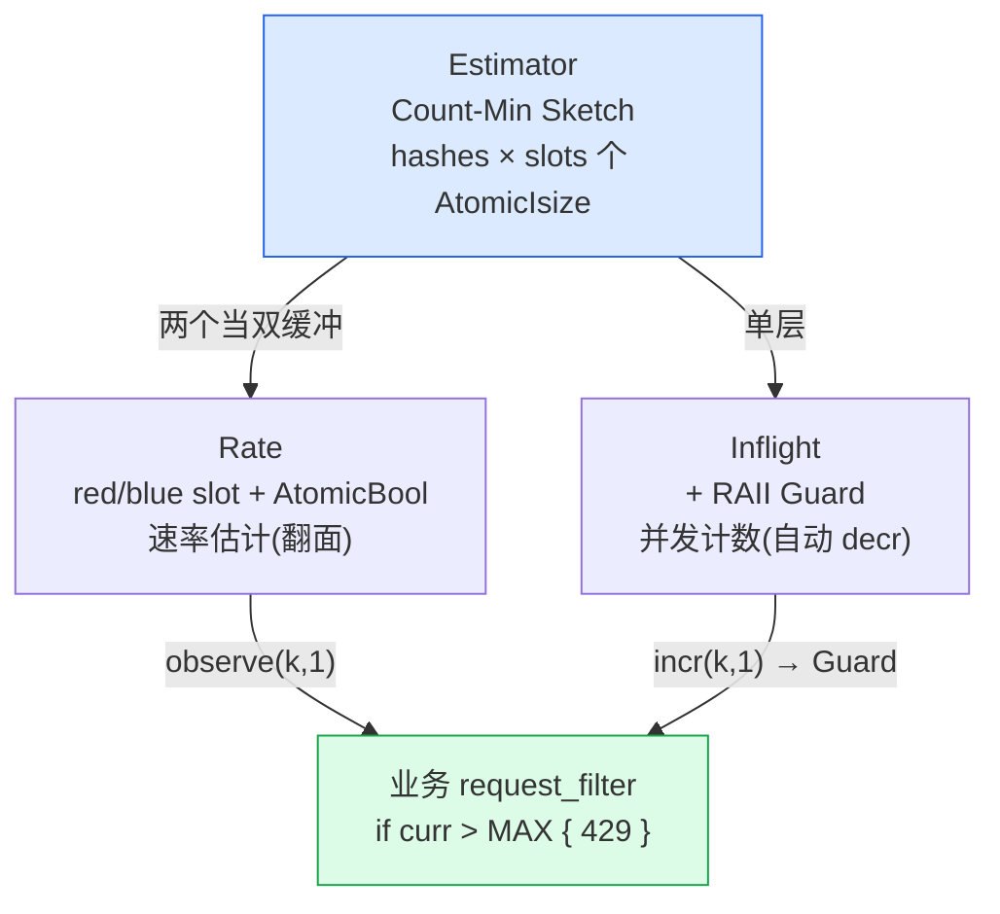
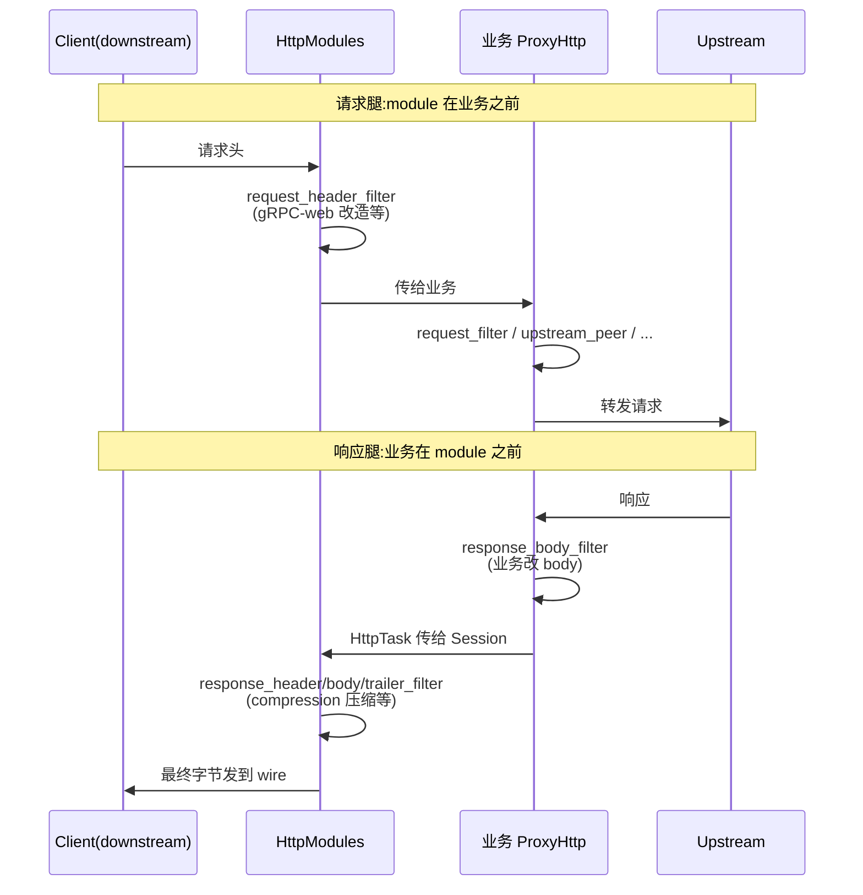

# 第 19 章 可观测、限流与 module:生产横切的四件套

> **核心问题**:一个跑在线上的 Pingora 代理,怎么知道它每秒处理了多少请求、哪些客户端被刷爆了、响应头要不要压缩发出去?更根本的——这些"和生产业务逻辑无关、却必须每条请求都过一遍"的横切关注点(cross-cutting concerns),Pingora 把它们放在哪里?

读完这一章,你会明白:

- `pingora-limits` 的三个原语(`Estimator`/`Rate`/`Inflight`)到底用了什么算法,为什么它们**只计数、不做决定**,以及这套"估计器 + 调用方拍板"的分工为什么是 Cloudflare 量级(每秒千万请求)下的必然选择。
- 为什么没有一个叫 `pingora-prometheus` 的独立 crate,Prometheus 指标端点是怎么用一个 `ServeHttp` app + 全局 registry 拼出来的,它和 module 系统(`ResponseCompression`)是怎么协作的。
- `HttpModules`(`compression`/`grpc_web`)这条"框架自带的二级钩子链"和 `ProxyHttp` 这条"业务钩子链"在请求生命周期里的相对位置——为什么请求侧 module 在业务之前、响应侧 module 在业务之后。
- `pingora-header-serde` 为什么要在 CDN/缓存场景里把响应头用 zstd + 训练字典压到原来的三分之一,它和 HTTP/2 HPACK 的静态表是同一种思路的两种落地。
- 这些机制共同回答了一个线上系统的终极问题:**怎么在不拖慢数据面的前提下,给一条请求加一圈"看得见、控得住、压得小"的生产外壳。**

> **逃生阀**:如果只读一节,读第三节(限流的算法与分工)。那是本章最反直觉、也最能体现 Pingora 设计哲学的一节——"限流库不限流,只估计"。

---

## 一句话点破

> 生产横切 = **估计器(数数,不拍板)+ 指标端点(暴露,不存档)+ module(框架级钩子,业务之前/之后)+ header 压缩(存得小,省带宽)**。这四样东西的共同特点是:它们都**挂在钩子链上、横切每一条请求**,但都不属于"把请求从 downstream 转到 upstream"的转发设施——它们是钩子链那一面的生产武器。

回扣全书二分法:前四章(P6-17 缓存、P6-18 listener/upgrade)讲的都是**转发设施**(框架自管的字节流),本章则回到**钩子链**这一面——但这些钩子不是业务写的 `ProxyHttp` 钩子,而是框架自带的、生产环境必备的横切钩子。它是钩子链这一面的"生产补完"。

---

## 19.1 为什么生产代理需要一套"横切设施"

### 19.1.1 一个朴素代理的痛点

假设你照着 P1-02~P1-05 写了一个最小 `ProxyHttp` 实现: `upstream_peer` 选后端、`upstream_request_filter` 改请求头、`response_filter` 改响应头、`logging` 打一行访问日志。它跑起来了,转发也正确。然后把它部署到线上,你立刻被三件事撞墙:

1. **看不见**。每秒来了多少请求?429 拒了多少?P99 延迟多少?upstream 连接池命中率多少?你一行数据都拿不到。SRE 问你要 Grafana 面板,你只能交一个空 JSON。
2. **控不住**。某个客户端(appid=evil_bot)突然每秒打 10 万请求,把你后端打挂了。你想"每秒每个客户端最多 100 请求,超了直接 429",但你翻遍 `ProxyHttp` trait 的 30 个钩子,没有任何一个钩子叫 `rate_limit`——限流不是框架的事,是你得自己写的事。
3. **压不大**。你的代理是 CDN 边缘节点,每天转发几百亿次响应,每个响应头 800 字节(一堆 `Set-Cookie`/`Cache-Control`/`Content-Security-Policy`)。这些头要在缓存里存一份(`pingora-cache`)、在节点间转发一份、在日志里记一份。800 字节 × 几百亿 = PB 级的纯粹开销。你想"能不能把头压小再存/再传",但 HTTP/1.1 的头是文本,你总不能每条响应都现压现解。

这三个痛点——看不见、控不住、压不大——是所有生产代理的共同功课。Nginx 用一坨配置指令(`limit_req`/`limit_conn`/`stub_status`/`gzip`)解决;Envoy 用 filter chain 里的 stats filter + rate limit filter + compressor filter(全是 HTTP filter,《Envoy》第 3 篇拆过)解决;Pingora 怎么解决?

### 19.1.2 Pingora 的回答:四个 crate,一种哲学

Pingora 的回答分散在四个地方,但它们共享一种哲学:**横切设施挂在钩子链上,但框架只提供原语,决策留给业务**。

| 痛点 | Pingora 的载体 | 哲学 |
|------|--------------|------|
| 看不见 | `pingora-core` 内置的 Prometheus app(复用上游 `prometheus` crate) | 业务在钩子里 `counter.inc()`,框架只管把全局 registry 暴露成 HTTP 端点 |
| 控不住(限流) | `pingora-limits` crate(`Estimator`/`Rate`/`Inflight`) | **库只估计,不限流**;业务在 `request_filter` 里 `observe()` 然后**自己**和阈值比、自己决定 429 |
| 压不大(响应体) | `pingora-core` 的 `HttpModules` 系统(`compression.rs`) | 框架自带 gzip/deflate/zstd 响应压缩 module,业务 `ctx.compression_enabled = true` 一行开启 |
| 压不大(响应头) | `pingora-header-serde` crate(zstd + 训练字典) | 把 `ResponseHeader` 序列化成 HTTP/1.1 文本再 zstd 压到 1/3,主要给缓存层存头用 |

> 注意一个关键反差:Nginx/Envoy 把限流、压缩做成**配置驱动的开关**(`limit_req zone=foo burst=10` / `compressor_filter_config {}`),你打开它就生效。Pingora 把它们做成**库原语**(`Rate::observe()` / `ResponseCompression` module),业务代码得**主动调用/主动注册**。这不是 Pingora 偷懒——这是它"把动态性留给业务代码(P1-02 已点)"的哲学在横切场景的延续:Envoy 的动态性在 xDS 协议里,Pingora 的动态性在你的 `ProxyHttp` 实现里。

本章按"限流 → 指标 → module → header 压缩"的顺序拆这四件套。其中**限流(`pingora-limits`)最深、最反直觉**(它根本不是令牌桶),也是本章篇幅的重头。

---

## 19.2 限流:`pingora-limits` 的"只估计,不限流"哲学

### 19.2.1 提问:限流到底要解决什么问题?

限流(rate limiting)在分布式系统里是一个被讲烂的词,但把它拆到最细,它其实要做两件事:

1. **数数**:知道某个 key(客户端 IP / appid / 用户 ID / API 路径)在过去一段时间窗口里,发生了多少次事件(请求数 / 字节数 / 错误数)。
2. **拍板**:把"数出来的数"和一个阈值比,决定这条请求是放行、拒绝、还是降级。

这两件事的难度天差地别。**数数**在千万 QPS 下极难——你不能给每个 key 一把 `Mutex<HashMap>`(锁竞争直接把性能打到地板),也不能给每个 key 一个精确的计数器(几亿个 key 的内存爆炸)。**拍板**则极简单——一个 `if count > max { 429 }`,任何业务都能写。

`pingora-limits` 的设计就建立在这个不对称上:**它只做难的(数数),把简单的(拍板)交还给业务**。这就是为什么这个 crate 里你找不到任何叫 `acquire`/`allow`/`check` 的方法(全文 grep 零命中),只有 `observe()`/`rate()`/`get()`——它在"估计",不在"限流"。

> 命名深意:`pingora-limits` 而非 `pingora-rate-limiter`,因为它是"用来支撑限流(以及其他需要计数估计的场景)的原语集",不是"一个限流器"。

### 19.2.2 承接方怎么做:Tower 的令牌桶、Envoy 的限流服务、Nginx 的漏桶

在拆 Pingora 之前,先看三个承接方怎么做"数数 + 拍板",才能显出 Pingora 的取舍。

**Tower 的 `RateLimit` layer(《Tower》P3-10 拆过,一句带过)**:经典的**令牌桶(token bucket)**。`tower::limit::rate::RateLimit` 持有一个桶,桶里有 `capacity` 个令牌,每 `period` 补一个,请求来了一次消耗一个令牌,令牌不够就返回 `Service::poll_ready` 中的 `Pending`(让调用方等)。它把"数数"(桶里剩几个令牌)和"拍板"(令牌不够就让 Future pending,即"等待"而非"拒绝")焊死在一起。优点是 API 干净(`service.ready().await` 自然背压),缺点是**桶的状态是 per-service 的 `Mutex`**——一个 `RateLimit` layer 包住的 service,所有请求共享一把锁,千万 QPS 下 `Mutex::lock` 直接成为瓶颈。它适合"一个 service 实例扛几千 QPS"的业务侧限流,不适合"边缘节点扛千万 QPS"的基础设施侧限流。

**Envoy 的限流(《Envoy》第 3 篇拆过,一句带过)**:走**外置限流服务**的路子。Envoy 的 `envoy.filters.http.ratelimit` filter 把每个请求的 key 发给一个 gRPC 的 Rate Limit Service(RLS),RLS 返回 OK/OVER_LIMIT,Envoy 据此放行或返回 429。RLS 后端(比如 Cloudflare 的或自建的)再自己实现令牌桶/滑动窗口。优点是限流策略集中可配(xDS 下发)、多副本共享状态(分布式限流),缺点是**每条请求多一次 gRPC 往返**——这个延迟在边缘场景不可接受,所以 Envoy 又得加一层"本地缓存 RLS 决策"的优化。这是"重而全"的代价。

**Nginx 的 `limit_req`(漏桶,leaky bucket)**:配置驱动,`limit_req_zone $binary_remote_addr zone=one:10m rate=100r/s;` + `limit_req zone=one burst=10;`。Nginx 用一个共享内存(`zone=one:10m`)里的红黑树存每个 key 的状态,请求来了一次查红黑树、按漏桶算法算(以 `rate` 恒定漏出,`burst` 是桶容量,超了就拒绝或排队)。多 worker 之间靠共享内存 + 自旋锁同步。优点是配置简单、生态成熟,缺点是**红黑树 + 锁的 per-key 开销**在千万 QPS 下被放大——Nginx 文档自己都警告 `limit_req_zone` 的内存按 key 数线性涨,且高并发下锁竞争明显。

三者的共同点是:**它们都把"数数"和"拍板"焊在一起,且"数数"用的是精确的 per-key 状态(令牌桶里的剩余令牌数、红黑树里的最后访问时间)**。这在百万 QPS 以下没问题,但 Cloudflare 的量级是**每秒 4000 万请求、几十亿个 key**——精确 per-key 状态的内存和锁开销是天文数字。

### 19.2.3 不这样会怎样:精确 per-key 的灾难

如果 Pingora 朴素地照搬令牌桶,会撞上什么?

- **内存灾难**:一个令牌桶至少要存"上次补充时间 + 当前令牌数"两个字段,假设 16 字节。一亿个客户端 key × 16 字节 = 1.6 GB,而且这还只是一个限流维度(IP 维度),你要再按 appid、按 API 路径各限一份,内存乘以 N。
- **锁灾难**:令牌桶要么是 `Mutex`(千万 QPS 下锁竞争爆炸),要么是 per-shard(分片数量和 key 分布强耦合,不均匀就退化)。
- **过期灾难**:key 来了又走,精确计数器得有 GC,否则一亿个历史 key 永远占着内存。GC 本身又是锁。

Cloudflare 的工程博客有一篇经典文章《Counting Things, A Lot of Different Things》(这个 URL 就写在 `pingora-limits` 的源码注释里,稍后我们会看到),讲的就是这个问题。结论是:**在千万 QPS 下,你必须放弃"精确 per-key 计数",改用"概率估计"**——用一个固定大小、和 key 数无关的数据结构,去估计每个 key 的频率/速率/并发数。估计会有误差,但误差可控(且有上界),换来的是**内存常数化、无锁化、O(1) 查询**。

这就是 `pingora-limits` 的三个原语背后的统一思想。它们用的算法都来自流式算法(streaming algorithms)的经典武器库:**Count-Min Sketch**(频率估计)、**双缓冲分桶**(速率估计)、**RAII 自减**(并发估计)。下面逐个拆。

---

## 19.3 源码拆解:`pingora-limits` 的三个估计器

> 源码锚点:`pingora-limits/src/{lib.rs, estimator.rs, rate.rs, inflight.rs}`。

先看这个 crate 的入口 [`pingora-limits/src/lib.rs`](../pingora/pingora-limits/src/lib.rs#L22-L24),只有三个模块,一个共享哈希函数:

```rust
//! The pingora_limits crate contains modules that can help introduce things
//! like rate limiting or thread-safe event count estimation.

pub mod estimator;   // Count-Min Sketch(频率估计)
pub mod inflight;    // 并发计数(RAII 自减)
pub mod rate;        // 速率估计(双缓冲分桶)

use ahash::RandomState;
use std::hash::Hash;

#[inline]
fn hash<T: Hash>(key: T, hasher: &RandomState) -> u64 {
    hasher.hash_one(key)
}
```

整个 crate 只依赖 `ahash`(一个非加密的高速哈希)。注意它**不依赖 tokio、不依赖 std::sync::Mutex**——它是一个纯算法库,可以在任何同步/异步上下文里用。这是它能被 Pingora 在请求热路径上无负担调用的前提。

### 19.3.1 `Estimator`:Count-Min Sketch,频率估计的地基

[`Estimator`](../pingora/pingora-limits/src/estimator.rs#L26-L28) 是另外两个原语(`Rate`/`Inflight`)的共同地基。它实现的是经典的 **Count-Min Sketch(CMS)**——一个用多个哈希函数 + 固定大小桶数组来估计元素频率的概率数据结构。

```rust
// pingora-limits/src/estimator.rs
/// An implementation of a lock-free count–min sketch estimator.
pub struct Estimator {
    estimator: Box<[(Box<[AtomicIsize]>, RandomState)]>,
}
```

这个结构体只有一个字段:一个 boxed 数组,每个元素是一行 `(计数器数组, 该行专用的 RandomState)`。换句话说,它是一个 `hashes` 行 × `slots` 列的二维 `AtomicIsize` 矩阵,**每一行有自己的独立哈希种子**。这是 CMS 的标准形态。

**为什么用 `AtomicIsize` 而不是 `AtomicU64`?** 因为 `isize` 在 64 位平台上就是 64 位有符号,既能装大数,又能让"溢出变负"成为可检测的信号——源码注释明确说"overflow can happen. When some of the internal counters overflow, a negative number will be returned"([estimator.rs#L42-L44](../pingora/pingora-limits/src/estimator.rs#L42-L44)),溢出时返回负数让调用方知道估计已不可信,这是一种诚实降级。

**核心算法 `incr(key, value) -> isize`**([estimator.rs#L45-L55](../pingora/pingora-limits/src/estimator.rs#L45-L55)):

```rust
pub fn incr<T: Hash>(&self, key: T, value: isize) -> isize {
    let mut min = isize::MAX;                       // 取所有行里的最小值
    for (slot, hasher) in self.estimator.iter() {
        let hash = hash(&key, hasher);              // 每行用独立的种子哈希
        let counter = hash as usize % slot.len();
        let current = slot[counter].fetch_add(value, Ordering::Relaxed); // 无锁
        // 该行的新估计 = current + value,取所有行的最小作为最终估计
        min = std::cmp::min(min, current + value);
    }
    min
}
```

读这段代码要抓三个点:

1. **多哈希取最小**:CMS 的精髓。单个哈希函数会因冲突高估(两个 key 撞到同一个桶,计数叠在一起);用 `h` 个独立哈希,每个 key 在每行都有一个估计,取最小,就把"最不幸的冲突"过滤掉。CMS **只会高估,不会低估**(冲突只会让计数变大,不会变小),所以最小值是最接近真值的。这是 CMS 的核心不变量。
2. **`fetch_add` + `Ordering::Relaxed`**:真正的无锁。没有任何 `Mutex`/`RwLock`,全是原子操作,且是最弱的 `Relaxed` 序(只保证原子性,不保证跨线程的读写顺序)。为什么 `Relaxed` 够?因为频率估计本就是"近似"的,某个线程短暂地读到旧值无所谓——下一个请求的 `fetch_add` 就会把计数推上去。**用最弱的内存序换最大的吞吐**,这是热路径上的标准取舍。
3. **返回最小估计**:调用方拿到的是一个 `isize` 估计值,不是"是否超限"的 bool。再次强调——它只数数。

`get(key)`([estimator.rs#L67-L76](../pingora/pingora-limits/src/estimator.rs#L67-L76))同理,只是把 `fetch_add` 换成 `load`,同样取所有行的最小。`decr`([estimator.rs#L58-L64](../pingora/pingora-limits/src/estimator.rs#L58-L64))用于减计数(给 `Inflight` 的 RAII 用),`reset()`([estimator.rs#L79-L84](../pingora/pingora-limits/src/estimator.rs#L79-L84))清零整个矩阵。

**误差与代价**:`Estimator::new(hashes, slots)` 的两个参数直接决定精度。CMS 的标准误差界是 `O(slots)` 级别——冲突概率约 `1/slots`(单行),`hashes` 行独立冲突的概率是 `1/slots^hashes`(指数下降)。所以"小 hashes + 大 slots"是常见配置(后面会看到 `Rate` 用 4×1024,`Inflight` 用 4×8192)。空间是 `hashes × slots × 8` 字节(`AtomicIsize` = 8 字节),4×8192 = 32K 个计数器 × 8 = **256 KB**,就能估计**任意多 key** 的频率——这是一笔惊人的交易。

> 对比:如果要精确存一亿个 key 的频率,`HashMap<Key, u64>` 至少 5 GB(每 entry ~50 字节)。CMS 用 256 KB 估计一亿 key,内存省了 2 万倍,代价是"可能高估一点"。在限流场景,高估意味着"可能误杀几个正常请求",这是可接受的——而"内存爆炸导致节点 OOM"是不可接受的。

### 19.3.2 `Rate`:双缓冲分桶,速率估计

`Rate` 在 `Estimator` 之上加了时间维度,用来估计"某个 key 在过去一个时间窗口内,每秒发生了多少次事件"。这是限流最常用的原语。

先看它的结构([rate.rs#L63-L73](../pingora/pingora-limits/src/rate.rs#L63-L73)):

```rust
pub struct Rate {
    // 2 slots so that we use one to collect the current events
    // and the other to report rate
    red_slot: Estimator,
    blue_slot: Estimator,
    red_or_blue: AtomicBool, // true: the current slot is red
    start: Instant,
    // Use u64 below instead of Instant because we want atomic operation
    reset_interval_ms: u64,
    last_reset_time: AtomicU64, // the timestamp in ms since `start`
    interval: Duration,
}
```

关键设计:**两个 `Estimator` 当双缓冲(red/blue)**。一个slot 在"收集当前事件",另一个 slot 是"上一个已完成窗口的数据",用来报告速率。`red_or_blue` 这个 `AtomicBool` 标记当前哪个是收集槽。`reset_interval_ms` 是窗口长度(比如 1 秒),`last_reset_time` 是上次翻面的时间戳(存成 `u64` 毫秒,而不是 `Instant`,因为 `Instant` 不能原子操作——源码注释专门解释了这个取舍)。

**默认配置**([rate.rs#L76-L77](../pingora/pingora-limits/src/rate.rs#L76-L77)):

```rust
const HASHES: usize = 4;
const SLOTS: usize = 1024; // 注释:This value can be lower if interval is short
```

4×1024 = 4096 个计数器 × 8 字节 × 2(slot)= **64 KB** 一个 `Rate` 实例。它就能给**任意多 key** 做每秒速率估计。

**`observe(key, events) -> isize`**——这是限流场景的入口([rate.rs#L137-L140](../pingora/pingora-limits/src/rate.rs#L137-L140)):

```rust
pub fn observe<T: Hash>(&self, key: &T, events: isize) -> isize {
    self.maybe_reset();                              // 先检查要不要翻面
    self.current(self.red_or_blue()).incr(key, events) // 在当前收集槽里累加
}
```

它先调 `maybe_reset()`(检查窗口是否到期、要不要翻面),然后在**当前收集槽**里 `incr` 这个 key,返回当前窗口内该 key 的累计估计值。**调用方拿这个返回值和阈值比,自己决定放不放行**——这就是"只估计,不限流"的精髓。

**`rate(key) -> f64`**——查"上一窗口的每秒速率"([rate.rs#L126-L134](../pingora/pingora-limits/src/rate.rs#L126-L134)):

```rust
pub fn rate<T: Hash>(&self, key: &T) -> f64 {
    let past_ms = self.maybe_reset();
    if past_ms >= self.reset_interval_ms * 2 {
        // already missed 2 intervals, no data, just report 0
        return 0f64;
    }
    self.previous(self.red_or_blue()).get(key) as f64 * 1000.0 / self.reset_interval_ms as f64
}
```

注意它读的是 **previous(上一个已完成窗口)**,不是当前正在收集的窗口——因为当前窗口还没结束,读出来的速率是"半截"的、不准的。如果离上次翻面已经过了两个窗口以上(说明这段时间没请求来,数据都过期了),直接返回 0。这是 `Rate` 的诚实降级。

**`maybe_reset()`——双缓冲翻面的无锁引擎**([rate.rs#L143-L179](../pingora/pingora-limits/src/rate.rs#L143-L179)):这是 `Rate` 最精巧的部分。每次 `observe`/`rate` 都会调它,它要判断"现在离上次翻面够一个窗口了吗?够就翻"。难点在于:这是被千万 QPS 的多线程并发调用的,翻面这个动作**只能做一次**。

```rust
fn maybe_reset(&self) -> u64 {
    let now = Instant::now().duration_since(self.start).as_millis();
    let last_reset = self.last_reset_time.load(Ordering::SeqCst);
    let past_ms = now - last_reset;

    if past_ms < self.reset_interval_ms {
        return past_ms; // 窗口还没到期,不翻
    }

    // 窗口到期,尝试抢"翻面权"
    match self.last_reset_time.compare_exchange(
        last_reset, now, Ordering::SeqCst, Ordering::Acquire,
    ) {
        Ok(_) => {
            // 抢到了,只有这一个线程执行翻面:
            // 1. 清空"即将变成收集槽"的那个旧 previous
            self.previous(self.red_or_blue).reset();
            // 2. 翻 red_or_blue,从此刻起新事件进新收集槽
            self.red_or_blue.store(!self.red_or_blue, Ordering::SeqCst);
            // 3. 如果错过了 2 个以上窗口,新收集槽(刚翻过来的那个)也得清
            if now - last_reset >= self.reset_interval_ms * 2 {
                self.current(self.red_or_blue).reset();
            }
        }
        Err(_) => { /* 别的线程已经翻了,我啥也不做 */ }
    }
    past_ms
}
```

这段是 `Rate` 的核心技巧,值得细看:

- **`compare_exchange` 当锁**:用一次 CAS 决定"谁是翻面的赢家"。千万 QPS 下,每个窗口边界只有一个线程赢、其他全走 `Err` 分支空转。这比 `Mutex` 轻几个数量级——CAS 失败不挂起线程,直接往下走(反正别的线程已经把活干了)。
- **为什么用 `SeqCst` 而不是 `Relaxed`**:`maybe_reset` 涉及"翻面"这个全局可见的状态变更,必须保证"翻面完成"之前的所有写操作(清 previous slot)对"翻面之后"的读操作(current slot)可见。这是 CMS 的 `Relaxed` 不够的地方——`Relaxed` 只保证单变量原子性,不保证跨变量的 happens-before。这里用 `SeqCst` 建立全局总序,确保清零和翻面不会被其他线程乱序看到。这是"该强则强、该弱则弱"的精确取舍。
- **双窗口过期的特殊处理**:如果某个 key 流量很低,两个窗口都没人翻面(比如窗口是 1 秒,但 3 秒没请求),那翻面时两个 slot 都是过期数据,要都清零,否则会报一个虚假的"上一窗口速率"。源码用 `now - last_reset >= reset_interval_ms * 2` 判断这种情况。

> 一个常见误解:有人以为 `Rate` 是滑动窗口(sliding window)。**它不是**。它是**固定窗口分桶 + 双缓冲**(fixed-window bucketing with double buffering)。当前事件只进当前桶,窗口边界一到就翻面,旧桶整个变成"上一窗口"。"滑动"的成分只体现在可选的自定义速率计算函数里(`PROPORTIONAL_RATE_ESTIMATE_CALC_FN`,把当前窗口已收集的部分和上一窗口按时间比例插值),但默认的 `rate()` 读的就是纯上一窗口,不做插值。这点和 Nginx `limit_req` 的漏桶(连续漏出)、Tower 的令牌桶(连续补充)都不同——Pingora 选了最简单的离散分桶,精度换取实现简单和无锁。

### 19.3.3 `Inflight`:并发计数 + RAII 自减

第三个原语 `Inflight` 估计的是"某个 key **当前**有多少个事件正在进行(已开始未结束)"。这是并发限流(比如"每个后端最多 100 个并发连接")要用的。

结构([inflight.rs#L25-L28](../pingora/pingora-limits/src/inflight.rs#L25-L28)):

```rust
pub struct Inflight {
    estimator: Arc<Estimator>,
    hasher: RandomState,
}
```

它就是一个 `Estimator` + 一个哈希函数,挂在 `Arc` 上(因为返回的 `Guard` 要持有 `Estimator` 的引用)。注意它用的槽位比 `Rate` 多得多([inflight.rs#L30-L35](../pingora/pingora-limits/src/inflight.rs#L30-L35)):

```rust
// fixed parameters for simplicity: hashes: h, slots: n
// Time complexity for a lookup operation is O(h). Space complexity is O(h*n)
// False positive ratio is 1/(n^h)
// We choose a small h and a large n to keep lookup cheap and FP ratio low
const HASHES: usize = 4;
const SLOTS: usize = 8192;
```

4×8192 = 32K 槽,误判率 `1/(8192^4)` ≈ `2e-16`——这个误判率低到几乎可以当精确值用。注释说"inflight 用更大的 n 是因为并发数通常比速率小,需要更精确"。

`Inflight` 的核心是 **RAII `Guard`**。`incr` 返回一个 `Guard`,这个 `Guard` 在 `drop` 时自动 `decr`([inflight.rs#L60-L83](../pingora/pingora-limits/src/inflight.rs#L60-L83)):

```rust
pub struct Guard {
    estimator: Arc<Estimator>,
    // store the hash instead of the actual key to save space
    id: u64,
    value: isize,
}

impl Drop for Guard {
    fn drop(&mut self) {
        self.estimator.decr(self.id, self.value) // 自动减回去
    }
}
```

用法极其优雅——业务代码长这样:

```rust
let (guard, curr_inflight) = inflight.incr(&client_id, 1);
if curr_inflight > MAX_CONCURRENT {
    return Err(too_many_requests()); // guard 在这里 drop,自动 decr
}
// 正常处理请求...
do_work().await?;
// guard 在函数结尾 drop,自动 decr
Ok(())
```

`Guard` 持有 `Arc<Estimator>` 和 key 的哈希值(注意是 `u64` 哈希,不是原始 key——源码注释说"store the hash instead of the actual key to save space",省内存)。无论请求是成功、报错、还是被超时取消,`Guard` 离开作用域就 `drop`,计数自动回退。这是 Rust 的所有权模型在并发计数上的完美应用——**你不可能忘记 decr**,编译器替你保证。

> 对比:在 GC 语言(Java/Go)里做并发计数,要么 `try-finally` 手动 decr(容易忘),要么靠 finalizer(不确定何时执行)。Rust 的 `Drop` trait + 所有权,让"开计数必然有配对的关计数"成为编译期不变量。这是 Pingora 选 Rust 的红利之一。

### 19.3.4 "只估计,不限流"的完整用法

把三个原语串起来,看一个真实的限流 `ProxyHttp` 实现——这就是 Pingora 仓自带的例子 [`pingora-proxy/examples/rate_limiter.rs`](../pingora/pingora-proxy/examples/rate_limiter.rs#L52-L116):

```rust
// Rate limiter(全局单例,所有线程共享)
static RATE_LIMITER: Lazy<Rate> = Lazy::new(|| Rate::new(Duration::from_secs(1)));

// max request per second per client
static MAX_REQ_PER_SEC: isize = 1;

#[async_trait]
impl ProxyHttp for LB {
    type CTX = ();

    async fn request_filter(&self, session: &mut Session, _ctx: &mut Self::CTX) -> Result<bool> {
        let appid = match self.get_request_appid(session) {
            None => return Ok(false), // 没带 appid,不限流,放行
            Some(addr) => addr,
        };

        // 关键一行:observe 数数,返回当前窗口的累计估计
        let curr_window_requests = RATE_LIMITER.observe(&appid, 1);
        if curr_window_requests > MAX_REQ_PER_SEC {
            // 业务自己拍板:超了,短路返回 429
            let mut header = ResponseHeader::build(429, None).unwrap();
            header.insert_header("X-Rate-Limit-Limit", MAX_REQ_PER_SEC.to_string())?;
            header.insert_header("X-Rate-Limit-Remaining", "0")?;
            header.insert_header("X-Rate-Limit-Reset", "1")?;
            session.set_keepalive(None);
            session.write_response_header(Box::new(header), true).await?;
            return Ok(true); // Ok(true) = 已短路响应,P1-03 拆过这个语义
        }
        Ok(false) // 没超,放行,继续走钩子链
    }
    // ... upstream_peer 等其他钩子
}
```

这段代码浓缩了"只估计,不限流"的全部用法:

1. `RATE_LIMITER` 是一个全局 `Lazy<Rate>`(`once_cell`),所有工作线程共享。`Rate` 内部是无锁的,共享无负担。
2. 在 `request_filter`(P1-03 拆过,这是"可短路响应"的钩子)里,先 `observe(&appid, 1)`——这一行既"数了数"(把 appid 在当前窗口的计数 +1)又"取了当前估计"(返回值)。
3. **业务自己**把返回值和 `MAX_REQ_PER_SEC` 比,自己构造 429 响应,自己 `write_response_header` + `Ok(true)` 短路。

这就是 Pingora 限流的完整闭环。没有任何 `RateLimit::acquire()` / `RateLimit::check()` 的魔法——**框架给你数数,你拍板**。这种分工的好处是:

- **灵活性**:阈值可以是常量(`MAX_REQ_PER_SEC`),也可以是从配置中心读的动态值,也可以是按用户等级算的复杂公式——全在你 `request_filter` 里写。Nginx 的 `limit_req` 做不到"VIP 用户阈值翻倍",Pingora 一行 `if` 就行。
- **可组合**:你可以同时按 IP 限(`observe(&ip, 1)`)+ 按 appid 限(`observe(&appid, 1)`)+ 按全局限(`observe(&"global", 1)`),三个维度互相独立,都是无锁的。Envoy 要做到这个得多配三个 filter。
- **降级优雅**:`observe` 返回的是估计值,可能高估(误杀几个),但**绝不会低估**(不会放过超限请求)。在限流场景,这是正确的失败方向——宁可误杀,不可放过。

### 19.3.5 三个原语的一张总表

| 原语 | 估计什么 | 算法 | 时间维度 | 典型配置 | 内存 | 用法 |
|------|---------|------|---------|---------|------|------|
| `Estimator` | key 的累计频率 | Count-Min Sketch(多哈希取最小) | 无 | `hashes, slots` 自定 | `h×s×8` B | 底层原语,一般不直接用 |
| `Rate` | key 的每秒速率 | 双缓冲 + CMS,固定窗口分桶 | 有(`interval`) | 4×1024 × 2 slot | 64 KB | `observe(&k,1)` 数数,`rate(&k)` 查速率 |
| `Inflight` | key 的当前并发数 | CMS + RAII Guard 自减 | 无 | 4×8192 | 256 KB | `incr(&k,1)` 返回 Guard,drop 自动 decr |

> 一张图概括三个原语的关系(`Inflight` 直接用 `Estimator`,`Rate` 用两个 `Estimator` 当双缓冲):



---

## 19.4 对照表:Pingora limits vs Tower vs Envoy vs Nginx

把四个方案并排放,差异一目了然:

| 维度 | Pingora `pingora-limits` | Tower `RateLimit` | Envoy rate limit filter | Nginx `limit_req` |
|------|--------------------------|-------------------|-------------------------|-------------------|
| **算法** | CMS 估计(概率) | 令牌桶(精确) | 委托给外部 RLS | 漏桶(精确) |
| **数数 vs 拍板** | 分离(库只数,业务拍) | 焊死(layer 里 `poll_ready`) | 焊死(filter 调 RLS) | 焊死(配置 `burst`) |
| **状态存储** | 固定大小数组(和 key 数无关) | per-service `Mutex<桶>` | 外部 RLS 的存储 | 共享内存红黑树(per-key) |
| **内存 vs key 数** | 常数(64 KB~256 KB) | 一个桶几十字节 | 取决于 RLS 实现 | 线性涨(`zone=10m` 装 ~16 万 key) |
| **锁** | 无锁(原子 + CAS) | `Mutex` | gRPC 往返 | 共享内存自旋锁 |
| **多维度限流** | 三个 `observe` 一行搞定 | 要包多层 layer | 要配多个 filter | 要多个 `limit_req_zone` |
| **失败方向** | 只高估(误杀,不放过) | 精确 | 取决于 RLS | 精确 |
| **延迟开销** | O(hashes)≈4 次原子加 | 一次 `Mutex::lock` | 一次 gRPC RTT(除非缓存) | 一次红黑树查 + 锁 |
| **适用量级** | 千万 QPS | 千~万 QPS | 百万 QPS(加缓存) | 百万 QPS |
| **配置 vs 代码** | 代码(`request_filter`) | 代码(layer 包) | 配置(xDS) | 配置(`nginx.conf`) |

这张表最值得品的一行是**"数数 vs 拍板"**。Tower/Envoy/Nginx 都把这两件事焊死,理由是"用户省心"。Pingora 拆开,理由是"千万 QPS 下数数必须用概率估计(否则内存/锁爆炸),而拍板逻辑千变万化(VIP/普通用户/灰度),焊死反而限制了业务"。这不是谁对谁错——**是不同的目标量级逼出的不同取舍**。Tower 服务于应用侧(一个 service 实例几千 QPS),Envoy/Nginx 服务于百万 QPS 的网关,Pingora 服务于千万 QPS 的 CDN 边缘。量级差一两个数量级,最优解就不同。

---

## 19.5 指标:为什么没有 `pingora-prometheus` crate

### 19.5.1 提问:指标端点要解决什么?

限流解决"控得住",指标解决"看得见"。一个生产代理至少要暴露:

- **计数器(counter)**:总请求数、429 数、5xx 数、upstream 连接建立数、缓存命中数。
- **仪表(gauge)**:当前活跃连接数、当前 inflight 请求数、连接池大小。
- **直方图(histogram)**:请求延迟分布(P50/P90/P99)、upstream 响应时间。

这些得能被 Prometheus scrape 走,进 Grafana 画面板。SRE 的命脉。

### 19.5.2 承接方怎么做:Envoy 的 stats、Nginx 的 stub_status

Envoy 内置一套庞大的 stats 系统(《Envoy》拆过,一句带过):每个 filter、每个 cluster、每个 listener 都自动产出几十个指标,靠 `statsd`/`prometheus` sink 暴露。指标名是规范化的(`envoy.http.downstream_rq_total` 等),用户基本不用写代码就有海量指标。代价是 stats 系统本身复杂、命名空间巨大。

Nginx 走另一条路:核心指标靠 `stub_status` 模块(就几个:active connections、reading、writing、waiting),细粒度指标要装第三方模块(如 `nginx-prometheus-exporter`)或写 lua。轻但不全。

两者都把"指标收集"做成框架内置的事。

### 19.5.3 Pingora 的取舍:复用上游 crate,业务自己埋点

这里有一个**核实后必须修正的旧认知**:本书早期的规划稿和很多博客都提到一个叫 `pingora-prometheus` 的 crate。**核实结论:这个 crate 不存在**。在 Pingora 0.8.1 的 workspace `Cargo.toml` 里,19 个 workspace member 没有 `pingora-prometheus`。

那 Prometheus 指标端点从哪来?答案出乎意料地简单:**Pingora 直接复用 crates.io 上的 `prometheus = "0.13"` crate**,把这个 crate 的全局 registry 暴露成一个 HTTP app。整个"pingora 的 prometheus 集成"只有两个文件、加起来不到 100 行。

**核心 app**:[`pingora-core/src/apps/prometheus_http_app.rs`](../pingora/pingora-core/src/apps/prometheus_http_app.rs#L30-L46):

```rust
pub struct PrometheusHttpApp; // 单元结构体,无字段

impl ServeHttp for PrometheusHttpApp {
    async fn response(&self, _http_session: &mut ServerSession) -> Response<Vec<u8>> {
        let mut buffer = vec![];
        let encoder = TextEncoder::new();
        let metric_families = prometheus::gather(); // 拉全局 registry 的所有指标
        encoder.encode(&metric_families, &mut buffer).unwrap(); // 编码成文本格式
        Response::builder()
            .status(200)
            .header(CONTENT_TYPE, encoder.format_type()) // Prometheus 文本格式
            .header(CONTENT_LENGTH, buffer.len())
            .body(buffer)
            .unwrap()
    }
}
```

就这么几行。它实现了 `ServeHttp` trait(P1-02 拆过,这是"请求→响应"的简单映射 trait,和 `ProxyHttp` 的钩子链是两种抽象)。任何打到这个 app 的 HTTP 请求,都会拿到全局 registry 里所有指标的文本快照。

**带压缩的服务器封装**:[`prometheus_http_app.rs#L48-L60`](../pingora/pingora-core/src/apps/prometheus_http_app.rs#L48-L60):

```rust
pub type PrometheusServer = HttpServer<PrometheusHttpApp>;

impl PrometheusServer {
    pub fn new() -> Self {
        let mut app = Self::new_app(PrometheusHttpApp);
        // 顺手注册一个 ResponseCompression module,gzip level 7
        app.add_module(ResponseCompressionBuilder::enable(7));
        app
    }
}
```

注意这里——`PrometheusServer` 创建时**顺手注册了 `ResponseCompression` module**(gzip level 7)。为什么?因为一个生产节点的指标快照可能几十 MB(几百个 metric family × 几千个 label 组合),gzip 7 能压到 1/10。这个细节把"指标端点"和"module 系统"两件事巧妙地焊在一起——稍后讲 module 时会回扣。

**注册成 Pingora service**:[`pingora-core/src/services/listening.rs#L313-L325`](../pingora/pingora-core/src/services/listening.rs#L313-L325):

```rust
impl Service<PrometheusServer> {
    /// The Prometheus HTTP server
    ///
    /// The HTTP server endpoint that reports Prometheus metrics
    /// collected in the entire service
    pub fn prometheus_http_service() -> Self {
        Service::new("Prometheus metric HTTP".to_string(), PrometheusServer::new())
    }
}
```

业务侧的用法([`docs/user_guide/prom.md`](../pingora/docs/user_guide/prom.md) 和 [`pingora-proxy/examples/gateway.rs`](../pingora/pingora-proxy/examples/gateway.rs) 都有完整例子):

```rust
// 1. 定义一个全局 counter(用 once_cell::Lazy)
static REQ_COUNTER: Lazy<IntCounter> = Lazy::new(|| {
    register_int_counter!("req_counter", "Number of requests").unwrap()
});

// 2. 在 ProxyHttp 钩子里埋点
impl ProxyHttp for MyProxy {
    async fn request_filter(&self, session: &mut Session, _ctx: &mut ()) -> Result<bool> {
        REQ_COUNTER.inc(); // 埋点
        Ok(false)
    }
}

// 3. 注册 prometheus 指标 service
let mut prom_service = Service::prometheus_http_service();
prom_service.add_tcp("127.0.0.1:6192");
my_server.add_service(prom_service);
my_server.run_forever();
```

`curl 127.0.0.1:6192/` 就能 scrape 到所有指标(包括 `req_counter`)。

### 19.5.4 为什么不做独立 crate

Pingora 没有把 Prometheus 做成独立 crate,而是塞进 `pingora-core`,理由有三:

1. **复用大于造轮子**:crates.io 的 `prometheus` crate 已经提供了 Counter/Gauge/Histogram/Registry 全套,且是事实标准。再造一套没有收益,反而增加学习成本。Pingora 只需要"把它的 registry 暴露成 HTTP 端点"这一层薄封装。
2. **全局 registry 够用**:`prometheus` crate 的全局 registry(`prometheus::gather()` 拉的就是它)用 `thread_local` + 全局 `OnceCell` 实现,埋点(`counter.inc()`)是无锁的。Pingora 的多 worker(NoStealRuntime,P5-15 拆过)各自 `inc`,scrape 时统一 `gather`,天然契合。
3. **`ServeHttp` 复用 HTTP server 设施**:把指标端点做成一个 `ServeHttp` app,它就自动复用了 Pingora 的 HTTP/1 自研解析(P4-12)、HTTP/2 委托 h2(P4-13)、TLS 多后端(P5-16)、graceful upgrade(P6-18)——一行不用重写。如果做成独立 crate 用 `tiny_http` 之类的轻量 server,反而得重新解决这些事。

> 对照 Envoy:Envoy 的 stats 系统是它自己用 C++ 写的一套(`Stats::Scope`/`Counter`/`Gauge`/`Histogram`),因为 C++ 生态没有事实标准的 Prometheus 库,且 Envoy 要支持 statsd/dogstatsd/prometheus 多种 sink,值得自造。Rust 生态有现成的,就不必。这是语言生态差异逼出的取舍。

### 19.5.5 一个反直觉点:指标端点不挑路径

注意 `PrometheusHttpApp::response` 完全忽略请求的 path 和 method——**任何路径、任何 method 打到这个端口,都返回完整的指标快照**。这不是 bug,是有意为之:

- Prometheus scraper 通常配 `metrics_path: /metrics`,但 Pingora 不强求。
- 这个端口应该**只暴露给 Prometheus scrape**,不对外。业务部署时把它绑在内网 IP 或 UDS 上(`add_uds`),靠网络隔离保证只有 scraper 能访问。

这和 Envoy(默认 `/stats/prometheus`)、Nginx(`stub_status` 走特定 location)的"按路径过滤"思路不同。Pingora 选了"整个端口都是指标端点",更简单——少一个配置项,少一个出错面。

---

## 19.6 HttpModules:框架自带的二级钩子链

### 19.6.1 提问:为什么需要"二级钩子链"

到这一节,我们进入本章最精巧的部分。`ProxyHttp` 是业务挂载的钩子链(P1-02~05 拆透),但有些横切逻辑不是业务该写的——比如:

- **响应压缩**:gzip/deflate/zstd 压缩响应体。这是任何生产代理都该有的,但让每个业务自己在 `response_body_filter` 里写一遍 gzip 调用?荒唐。
- **gRPC-web 桥接**:把 HTTP/1.1 的 gRPC-web 请求转成 HTTP/2 的 gRPC 请求。这是协议层的事,业务不该操心。

这些"框架该自带、但要能开关"的逻辑,Pingora 把它们做成 **`HttpModule`**——一条挂在 `ProxyHttp` 钩子链**旁边**的二级钩子链。业务通过 `init_downstream_modules`(P1-03 拆过这个钩子)注册需要的 module,框架在请求生命周期的固定位置自动调它们。

> P1-03 已点:`init_downstream_modules` 是 `ProxyHttp` trait 的一个钩子,签名是 `fn init_downstream_modules(&self, modules: &mut HttpModules)`,默认实现会注册一个**禁用状态**的 `ResponseCompression`。业务重写这个钩子来添加/启用 module。本章把这条二级链拆透。

### 19.6.2 承接方怎么做:Envoy 的 HTTP filter、Nginx 的 module

Envoy 的 HTTP filter(《Envoy》第 3 篇拆过,一句带过):`compressor`/`grpc_web`/`ratelimit`/`router` 都是 HTTP filter,挂在 HCM 的 filter chain 里,有 `decodeHeaders`/`encodeData` 两向回调,靠 C++ 虚函数驱动。filter 之间靠 `FilterHeadersStatus::Continue`/`StopIteration` 协调。

Nginx 的模块体系:headers/filter/gzip/ngx_http_grpc_module 都是 nginx module,挂在请求处理的 phase 里(`NGX_HTTP_CONTENT_PHASE` 等),靠 C 函数指针链表驱动。

两者都是"框架级钩子",但都是 C/C++ 的命令式注册(配置或代码里 `add_filter`)。Pingora 用 Rust 的 trait + 泛型把这件事做得更类型安全。

### 19.6.3 `HttpModule` trait:六个 filter 方法

[`pingora-core/src/modules/http/mod.rs#L38-L81`](../pingora/pingora-core/src/modules/http/mod.rs#L38-L81) 定义了 `HttpModule` trait——这是 module 实现者要实现的接口:

```rust
/// The trait an HTTP traffic module needs to implement
#[async_trait]
pub trait HttpModule {
    async fn request_header_filter(&mut self, _req: &mut RequestHeader) -> Result<()> {
        Ok(())
    }
    async fn request_body_filter(&mut self, _body: &mut Option<Bytes>, _end_of_stream: bool)
        -> Result<()> {
        Ok(())
    }
    async fn response_header_filter(&mut self, _resp: &mut ResponseHeader, _end_of_stream: bool)
        -> Result<()> {
        Ok(())
    }
    fn response_body_filter(&mut self, _body: &mut Option<Bytes>, _end_of_stream: bool)
        -> Result<()> {
        Ok(())
    }
    fn response_trailer_filter(&mut self, _trailers: &mut Option<Box<HeaderMap>>)
        -> Result<Option<Bytes>> {
        Ok(None)
    }
    fn response_done_filter(&mut self) -> Result<Option<Bytes>> {
        Ok(None)
    }

    fn as_any(&self) -> &dyn Any;
    fn as_any_mut(&mut self) -> &mut dyn Any;
}
```

对比 `ProxyHttp` 的 30 个钩子,`HttpModule` 只有 6 个 filter 方法,覆盖请求/响应的 header/body/trailer/done。注意几个细节:

- **请求侧三个是 `async`,响应侧三个是同步**(`response_body_filter`/`trailer_filter`/`done_filter` 不是 async)。为什么?因为请求侧可能要做异步 IO(比如 gRPC-web 要读请求体才能转),响应侧的压缩等操作是纯 CPU(同步调用 zstd/brotli)。这是把 async 的开销(状态机分配)只加在必要的地方。
- **每个方法都有默认空实现**(`Ok(())`/`Ok(None)`),module 实现者只重写关心的方法。比如 `ResponseCompression` 只重写 `request_header_filter`(探测 `Accept-Encoding`)/`response_header_filter`(决定压不压)/`response_body_filter`(压)/`response_done_filter`(flush 尾巴)四个。
- **`as_any`/`as_any_mut`**:trait 对象向下转型用。业务可以通过 `ctx.module::<ResponseCompression>()` 拿到具体 module 的可变引用,改它的状态(比如启用压缩)。这是 Rust trait object 的标准向下转型套路。

### 19.6.4 注册与排序:`order()` 决定执行先后

module 不是直接挂在 trait 上的,而是通过一个 builder 注册。[`HttpModules` 结构体](../pingora/pingora-core/src/modules/http/mod.rs#L102-L105)持有 builder 列表:

```rust
pub struct HttpModules {
    modules: Vec<ModuleBuilder>,
    module_index: OnceCell<Arc<HashMap<TypeId, usize>>>,
}
```

`add_module` 把一个 builder 加进去,然后**按 `order()` 排序**([mod.rs#L121-L131](../pingora/pingora-core/src/modules/http/mod.rs#L121-L131)):

```rust
pub fn add_module<B: HttpModuleBuilder>(&mut self, builder: B) {
    self.modules.push(ModuleBuilder::new(builder));
    // 关键:按 order 的"负值"排序,即 order 越大越靠前执行
    self.modules.sort_by_key(|m| -m.order());
}
```

注释([mod.rs#L87-L93](../pingora/pingora-core/src/modules/http/mod.rs#L87-L93))说:**"The lower the value, the later it runs relative to other filters"**。默认 order 是 0。`sort_by_key(|m| -m.order())` 是按 order 降序排——order 大的排前面、先执行。

举两个具体的:

- `ResponseCompressionBuilder::order()` 返回 **`i16::MIN / 2` = -16384**([compression.rs#L105-L108](../pingora/pingora-core/src/modules/http/compression.rs#L105-L108)):
  ```rust
  fn order(&self) -> i16 {
      // run the response filter later than most others filters
      i16::MIN / 2
  }
  ```
  注释直说"要比绝大多数 filter 晚跑"。因为压缩必须看到**最终**的响应字节(别的 module 可能改过头/body),所以它在响应链上排最后。
- `GrpcWeb` builder 用**默认 order 0**([grpc_web.rs#L73-L80](../pingora/pingora-core/src/modules/http/grpc_web.rs#L73-L80)),比 compression(order=-16384)大,所以 gRPC-web 桥接在压缩之前跑——合理,因为 gRPC-web 要先把 trailer 编码进 body,然后才能让压缩压这个 body。

> 这个 `order()` 机制和 Envoy 的 HTTP filter 顺序(配置文件里 filter 的先后就是执行顺序)思路相通,但 Pingora 用 `i16` 数值表达,范围 `[-32768, 32767]`,够分层。压缩占了 `i16::MIN/2` 这个"几乎最末"的位置,业务自定义 module 用 0 或正值排在它前面。

### 19.6.5 module filter 的调用位置:请求侧在前,响应侧在后

这是本章最值得画图的部分。P1-03 已点过调用顺序,这里把全貌拆透。

**请求侧(module 在业务之前)**。在 [`pingora-proxy/src/lib.rs#L766-L770`](../pingora/pingora-proxy/src/lib.rs#L766-L770),module 的 `request_header_filter` **先于**业务的 `request_filter` 执行:

```rust
// Built-in downstream request filters go first
if let Err(e) = session.downstream_modules_ctx.request_header_filter(req).await {
    return self.handle_error(/* ... */).await;
}
// 然后才轮到业务的 request_filter
match self.inner.request_filter(&mut session, &mut ctx).await { /* ... */ }
```

请求体同理,在 `proxy_h1.rs` 的 `send_body_to_pipe` 里([proxy_h1.rs#L776-L785](../pingora/pingora-proxy/src/proxy_h1.rs#L776-L785),P1-03 已点过这两个行号):

```rust
// 先调 module 的 request_body_filter
session.downstream_modules_ctx.request_body_filter(&mut data, end_of_body).await?;
// 后调业务的 request_body_filter
self.inner.request_body_filter(session, &mut data, end_of_body, ctx).await?;
```

`proxy_h2.rs#L723-L730` 是 H2 版的同样模式。所以**请求腿(downstream→upstream)上,module 总在业务之前**。

**响应侧(module 在业务之后)**。这是和请求侧**不对称**的地方。业务的 `response_body_filter` 先在从 upstream 到 downstream 的管道里执行([proxy_h1.rs#L715](../pingora/pingora-proxy/src/proxy_h1.rs#L715)、[proxy_h2.rs#L651](../pingora/pingora-proxy/src/proxy_h2.rs#L651)),产生的 `HttpTask` 再交给 `Session::write_response_tasks`,后者在里面调 module 的 response filter([lib.rs#L587-L640](../pingora/pingora-proxy/src/lib.rs#L587-L640)):

```rust
// Session::write_response_tasks 里(简化)
match task {
    HttpTask::Header(h, eos) => {
        session.downstream_modules_ctx.response_header_filter(&mut h, eos).await?;
        // 写到下游
    }
    HttpTask::Body(data, end) => {
        session.downstream_modules_ctx.response_body_filter(&mut data, end)?;
        // 写到下游
    }
    HttpTask::Trailer(t) => {
        let extra = session.downstream_modules_ctx.response_trailer_filter(&mut t)?;
        // 写到下游
    }
    // ...
}
```

所以**响应腿(upstream→downstream)上,业务先于 module**。

**为什么不对称?** 因为 module 的角色是"贴近 wire"。请求腿上,module 是"框架给业务的第一道预处理"(比如 gRPC-web 先把请求改造成标准 gRPC,业务再处理);响应腿上,module 是"框架给业务的最后一道后处理"(业务生成完响应,module 再压缩/转码,然后才发到 wire)。两边都是 module 离 wire 最近、业务离 wire 最远。这种对称的"贴近 wire"才是设计的统一逻辑。



### 19.6.6 两个内置 module:ResponseCompression 与 GrpcWebBridge

**`ResponseCompression`**([compression.rs#L22-L84](../pingora/pingora-core/src/modules/http/compression.rs#L22-L84)):对响应体做 gzip/deflate/zstd 压缩。它的 `HttpModule` 实现覆盖四个钩子:

- `request_header_filter`([compression.rs#L47](../pingora/pingora-core/src/modules/http/compression.rs#L47)):看请求头里的 `Accept-Encoding`,记下客户端支持哪种压缩。
- `response_header_filter`([compression.rs#L52](../pingora/pingora-core/src/modules/http/compression.rs#L52)):看响应头的 `Content-Type`/`Content-Encoding`,决定要不要压、压成哪种。如果响应已经被编码过(`Content-Encoding: gzip` 已存在),不重复压。
- `response_body_filter`([compression.rs#L61](../pingora/pingora-core/src/modules/http/compression.rs#L61)):实际压缩,替换 `*body`。开头有个 `if !self.0.is_enabled() { return Ok(()) }`——module 默认是禁用的,业务要在钩子里启用(稍后看怎么启用)。
- `response_done_filter`([compression.rs#L76](../pingora/pingora-core/src/modules/http/compression.rs#L76)):flush 压缩器里残留的字节(gzip 流末尾的 footer)。

为什么 `order() = i16::MIN / 2`?因为压缩必须在响应链最末——它要看到所有别的 module 改完的最终 body,才能压。如果 gRPC-web 先把 trailer 编进 body,再压缩,顺序才对。

**`GrpcWebBridge`**([grpc_web.rs#L19-L71](../pingora/pingora-core/src/modules/http/grpc_web.rs#L19-L71)):把 HTTP/1.1 的 gRPC-web 请求桥接成 HTTP/2 的标准 gRPC。gRPC-web 是给浏览器用的(浏览器不能直接发 HTTP/2 的 gRPC),它把 gRPC 消息塞进 HTTP/1.1 的 body,用 base64 编码,trailer 也塞进 body。`GrpcWebBridge` 在请求侧把这种请求改造成标准 gRPC(改 `Content-Type`、改 HTTP 版本),在响应侧把 gRPC 的 trailer 编码成 gRPC-web 的 body 尾巴([grpc_web.rs#L62-L69](../pingora/pingora-core/src/modules/http/grpc_web.rs#L62-L69))。这个 module 让 Pingora 能直接当浏览器后端的 gRPC-web 网关。

### 19.6.7 业务怎么启用 module

module 默认注册但禁用。业务要重写 `init_downstream_modules` 来添加/启用([proxy_trait.rs#L54-L57](../pingora/pingora-proxy/src/proxy_trait.rs#L54-L57) 是默认实现):

```rust
fn init_downstream_modules(&self, modules: &mut HttpModules) {
    // Add disabled downstream compression module by default
    modules.add_module(ResponseCompressionBuilder::enable(0));
}
```

默认注册一个 **level 0(禁用)** 的 `ResponseCompression`。业务想开启,重写这个钩子:

```rust
impl ProxyHttp for MyProxy {
    fn init_downstream_modules(&self, modules: &mut HttpModules) {
        modules.add_module(ResponseCompressionBuilder::enable(4)); // gzip level 4
        modules.add_module(GrpcWeb); // gRPC-web 桥接
    }
    // 然后在某个钩子里按条件启用压缩
    async fn upstream_response_filter(&self, session, resp, _ctx) {
        // 通过 as_any_mut 拿到 module 的可变引用,改状态
        let compression = session
            .downstream_modules_ctx
            .module_mut::<ResponseCompression>()
            .unwrap();
        compression.set_level(4); // 动态调级别
    }
}
```

这种"注册即对象、状态可改"的设计,让 module 既能像 Nginx 的 `gzip on/off` 那样全局开关,又能像代码那样按请求动态调(比如"视频流不压,文本压")。这是 Pingora"动态性靠代码"哲学的又一个体现。

---

## 19.7 header 压缩:`pingora-header-serde` 与字典 zstd

### 19.7.1 提问:为什么要单独压响应头

到这一节,我们看本章最后一块——也是最容易被人忽略、但在 CDN 场景最值钱的一块。

一个 CDN 边缘节点,每天转发几百亿次响应。每个响应头平均 600~1000 字节(`Server`/`Date`/`Content-Type`/`Cache-Control`/`Content-Security-Policy`/`Set-Cookie`/`ETag`/`Vary`/...)。这些头有三处要"存或传":

1. **缓存层存一份**:`pingora-cache`(P6-17)要把响应头和响应体一起缓存,缓存命中时原样返回。头占的空间纯是开销。
2. **节点间转发一份**:CDN 的多级缓存(parent/child)之间转发响应,头要跟着走。
3. **访问日志记一份**:有些节点会把响应头的部分字段记进日志。

600 字节 × 几百亿 = 几十 PB 量级的纯粹头开销。如果能压到 1/3(200 字节),省下的就是 EB 级的带宽和存储。这就是 `pingora-header-serde` 的存在意义。

### 19.7.2 承接方怎么做:HTTP/2 HPACK

HTTP/2 用 **HPACK**(《gRPC》第 2 篇拆透,一句带过)压缩头:静态表(61 个常见头名/值)+ 动态表(运行时学到的头)+ Huffman 编码。HPACK 把重复的头(`:method: GET` 这种)压到 1 字节索引。

但 HPACK 是**在线协议压缩**——它在 HTTP/2 连接的生命周期内,靠两端共享的动态表增量压缩。它解决的是"同一条连接上的多个请求/响应的头重复"问题。

`pingora-header-serde` 解决的是另一个问题:**离线把头的"形状"压掉**。它面向的是缓存存储场景(存一个响应头快照)和节点间转发场景(一次性压一个完整头),不是在线协议压缩。它用的武器是 **zstd + 训练字典**——和 HPACK 是同一种思路(用先验知识压掉冗余)的两种落地。

### 19.7.3 `pingora-header-serde` 的设计:序列化 + zstd 字典

整个 crate 的入口 [`pingora-header-serde/src/lib.rs#L39-L72`](../pingora/pingora-header-serde/src/lib.rs#L39-L72):

```rust
pub struct HeaderSerde {
    compression: ZstdCompression,
    // 线程局部复用 buffer,避免每次序列化都分配
    buf: ThreadLocal<RefCell<Vec<u8>>>,
}

const MAX_HEADER_BUF_SIZE: usize = 128 * 1024; // 单个头的 buffer 上限 128 KB
const COMPRESS_LEVEL: i32 = 3;                  // 默认压缩级别 3

impl HeaderSerde {
    pub fn new(dict: Option<Vec<u8>>) -> Self {
        let compression = match dict {
            Some(d) => ZstdCompression::WithDict(/* 带 CDict/DDict */),
            None => ZstdCompression::Default(/* 纯 zstd level 3 */),
        };
        HeaderSerde { compression, buf: ThreadLocal::new() }
    }
}
```

序列化的两步走([lib.rs#L75-L98](../pingora/pingora-header-serde/src/lib.rs#L75-L98)):

1. **`resp_header_to_buf`**([lib.rs#L169-L192](../pingora/pingora-header-serde/src/lib.rs#L169-L192)):把 `ResponseHeader` 渲染成 HTTP/1.1 文本格式(`HTTP/1.1 200 OK\r\n` + 一堆头 + `\r\n`)。注意 HTTP/2 的响应头会被强制转成 `HTTP/1.1` 版本号渲染——因为序列化是为了存储/转发,存储格式统一成 HTTP/1.1 文本最简单。
2. **zstd 压缩**:把上一步的 buffer 喂给 zstd。如果有字典,用 `CompressionWithDict`(预编译的 `CDict`);没有就用纯 zstd level 3。

反序列化对称:`zstd decompress` → 拿到 HTTP/1.1 文本 → 用 `httparse` 解析回 `ResponseHeader`([lib.rs#L198-L231](../pingora/pingora-header-serde/src/lib.rs#L198-L231),最多 256 个头)。

### 19.7.4 字典训练:zstd 的 `from_files`

字典不是手写的,是**训练**出来的。[dict.rs#L23-L29](../pingora/pingora-header-serde/src/dict.rs#L23-L29):

```rust
pub fn train<P: AsRef<Path>>(dir_path: P) -> Vec<u8> {
    // 读目录下所有文件作为样本语料
    let files: Vec<_> = std::fs::read_dir(dir_path).unwrap()
        .filter_map(Result::ok).map(|e| e.path()).collect();
    // 用 zstd 的字典训练算法,生成 64 MB 容量的字典
    zstd::dict::from_files(files, 64 * 1024 * 1024)
}
```

仓库里有一个 `trainer` 二进制([trainer.rs](../pingora/pingora-header-serde/src/trainer.rs#L19-L23)),用法是给它一个装满真实响应头样本的目录,它训练出字典写到 stdout。这个字典在编译时/部署时生成,运行时加载到 `HeaderSerde::new(Some(dict))`。

**为什么字典这么有效?** 因为 HTTP 响应头高度同质化——`Server: cloudflare`/`Content-Type: application/json`/`Cache-Control: max-age=3600` 这些字符串在不同响应里反复出现。zstd 的字典把这些高频子串预先编进字典,实际响应头里再出现时只需引用字典里的一个偏移,压到几个字节。Cloudflare 实测能把响应头压到原来的 **1/3**([lib.rs#L15-L18](../pingora/pingora-header-serde/src/lib.rs#L15-L18) 的 crate doc 注明)。

### 19.7.5 线程局部 zstd context:复用的技巧

[`thread_zstd.rs`](../pingora/pingora-header-serde/src/thread_zstd.rs#L102-L172) 有一个值得拎出来的技巧:zstd 的 `CCtx`(压缩上下文)/`DCtx`(解压上下文)是**重对象**,每次序列化都 new 一个会有性能开销。但它们**不是线程安全**的(不能 `&self` 共享)。

解法是 `ThreadLocal<RefCell<CompressionInner>>`——每个线程一个独立的 `CCtx`/`DCtx`,在线程内复用:

```rust
struct CompressionInner {
    // 每线程一个 CCtx/DCtx,线程内复用,无锁
    cctx: ThreadLocal<RefCell<CCtx<'static>>>,
    dctx: ThreadLocal<RefCell<DCtx<'static>>>,
}
```

注释([thread_zstd.rs#L20](../pingora/pingora-header-serde/src/thread_zstd.rs#L20))专门引用了 zstd 手册的建议:"reuse contexts per thread"。这是 C 库 FFI 在 Rust 异步里的标准优化——重对象 thread-local 化,既复用又避锁。Pingora 的 NoStealRuntime(P5-15)是固定线程池,thread-local 的复用率最高,这个技巧和 NoStealRuntime 是绝配。

> 对照 HPACK:HPACK 的动态表是**连接级**的(一条 HTTP/2 连接一个表),因为 HPACK 服务于在线协议。`pingora-header-serde` 的字典是**进程级**的(整个进程共享一个训练好的字典),因为它服务于离线存储。两个粒度,两种共享。HTTP/2 的 HPACK 承《gRPC》一句带过,这里只对照思路。

---

## 19.8 技巧精解:CMS 估计 + CAS 翻面,千万 QPS 限流的两个原子

这一节把本章最硬的两个技巧单独拆透。它们是 `pingora-limits` 能扛千万 QPS 的根。

### 19.8.1 技巧一:Count-Min Sketch 的"多哈希取最小"

**朴素做法的灾难**:如果要精确计数"每个 appid 来了多少次请求",最直觉的数据结构是 `HashMap<String, AtomicU64>`。但在千万 QPS 下:

- `HashMap` 的桶要扩容,rehash 期间全表锁。
- 几亿个 appid 的 entry,每个几十字节,内存几十 GB。
- 每个 appid 的 `AtomicU64` 单独分配,缓存局部性差。

CMS 用一个**和 key 数无关的固定矩阵**替代。核心是 [`Estimator::incr`](../pingora/pingora-limits/src/estimator.rs#L45-L55) 的"多哈希取最小":

```rust
pub fn incr<T: Hash>(&self, key: T, value: isize) -> isize {
    let mut min = isize::MAX;
    for (slot, hasher) in self.estimator.iter() {
        let hash = hash(&key, hasher);            // 每行独立哈希
        let counter = hash as usize % slot.len();
        let current = slot[counter].fetch_add(value, Ordering::Relaxed);
        min = std::cmp::min(min, current + value); // 取最小
    }
    min
}
```

三个精妙点:

1. **`hashes` 行独立种子**:每行用不同的 `RandomState`,保证 `h` 个哈希函数统计独立。这是 CMS 误差界 `1/slots^hashes` 成立的前提。如果所有行用同一个哈希,冲突完全相关,误差不收敛。
2. **`fetch_add` 而非 `load` + `store`**:这是真正的无锁(read-modify-write 用一条原子指令完成)。如果写成 `let v = slot[i].load(); slot[i].store(v + value);`,两个线程的 load/store 会交错丢更新。`fetch_add` 用底层 `LOCK XADD` 指令,硬件保证原子。
3. **取最小过滤冲突**:两个 key 在某一行撞桶,那行的计数是两者之和(高估);但它们在另一行大概率不撞,那行计数接近真值。取所有行的最小,就把最严重的冲突高估过滤掉了。CMS 只高估不低估,最小值是最接近真值的估计。

**反面:如果不用 CMS**。假设用单哈希 + 大数组(`slots = 1M`),冲突概率 `1/1M`,看似很低——但千万 QPS 下每秒有千万次 `fetch_add`,每秒约 10 次冲突,几小时后某些热点 key 的估计偏差就不可接受了。CMS 的 `hashes=4` 把冲突概率降到 `(1/1M)^4 = 1e-24`, practically zero。多花 3 倍内存换指数级误差下降,值得。

### 19.8.2 技巧二:`maybe_reset` 的 CAS 翻面

第二个技巧是 `Rate` 的窗口翻面。难点:千万 QPS 下,每个窗口边界(比如每秒整秒)有千万个线程同时发现"窗口到期了",但**翻面这个动作只能做一次**(否则重复清零、重复翻)。

朴素做法是 `Mutex`:

```rust
// 朴素(有锁,糟糕)
let mut guard = self.reset_lock.lock(); // 千万 QPS 下锁竞争爆炸
if now - self.last_reset >= self.interval {
    self.previous.reset();
    self.red_or_blue = !self.red_or_blue;
    self.last_reset = now;
}
drop(guard);
```

这把锁会成为单点瓶颈——千万个线程在窗口边界排队抢一把锁,吞吐塌方。

Pingora 用 [`compare_exchange`](../pingora/pingora-limits/src/rate.rs#L143-L179) 当无锁锁:

```rust
match self.last_reset_time.compare_exchange(
    last_reset, now, Ordering::SeqCst, Ordering::Acquire,
) {
    Ok(_) => {
        // 我是赢家,执行翻面(清 previous + 翻 red_or_blue)
        self.previous(self.red_or_blue).reset();
        self.red_or_blue.store(!self.red_or_blue, Ordering::SeqCst);
    }
    Err(_) => {
        // 我是输家,别的线程已经翻了,我啥也不做,直接用新状态
    }
}
```

CAS(`compare_exchange`)的语义:如果 `last_reset_time` **此刻仍然等于** `last_reset`(我之前读到的值),就把它更新成 `now`,返回 `Ok`;否则(说明别的线程已经改过它了)返回 `Err`,我不动。这个"检查并设置"是单条硬件指令(`LOCK CMPXCHG`),无锁、无等待。

千万 QPS 下,窗口边界只有一个线程赢(`Ok`),执行翻面;其他全走 `Err` 空转——但"空转"不是阻塞,它们立刻往下走 `observe`/`rate` 的剩余逻辑,用新状态。这是 CAS 当锁的标准模式:**失败不重试、不等待,直接接受别人已经做完的事实**。

> 这是 lock-free 编程的经典套路,和 Pingora 连接池的 `ArcSwap`(P3-09)、负载均衡 selector 的无锁更新同根。Tokio 的 reactor 内部也大量用 CAS(《Tokio》拆过,一句带过指路 [[tokio-source-facts]])。在 Rust 异步里,CAS 是热路径上替代 `Mutex` 的首选。

**内存序的精确选择**:注意这里用 `SeqCst`(最强序),不是 `Relaxed`。为什么 `Estimator::incr` 能用 `Relaxed` 而 `maybe_reset` 必须 `SeqCst`?

- `Estimator::incr` 只改一个计数器,单变量原子性 `Relaxed` 够。
- `maybe_reset` 改三个东西(`last_reset_time`、`previous` slot 清零、`red_or_blue` 翻转),必须保证"清零发生在翻转之前,且都对后续读者可见"。`SeqCst` 建立全局总序,保证清零和翻转的 happens-before。如果用 `Relaxed`,可能出现"别的线程看到 `red_or_blue` 已翻转,但 previous slot 还没清零"的乱序,读到脏数据。

这是"该强则强、该弱则弱"的精确内存序设计——热路径(`incr`)用最弱的 `Relaxed` 拿吞吐,关键同步点(`maybe_reset`)用最强的 `SeqCst` 拿正确性。这是 `pingora-limits` 能"既快又对"的根。

---

## 19.9 旁支:`pingora-memory-cache` 不是 HTTP 缓存

在收束之前,澄清一个容易混淆的点。本书规划稿提到 `pingora-memory-cache`,很多人会以为它是 P6-17 讲的那个 `pingora-cache`(HTTP 响应缓存)。**核实结论:它们是两个完全不同的东西**。

- `pingora-cache`(P6-17):HTTP 响应缓存。缓存的是完整的 HTTP 响应(头 + 体),带 cache key、cache-control、stale-while-revalidate、eviction 等一整套 HTTP 缓存语义。它是 CDN 的核心。
- `pingora-memory-cache`:**通用的内存 KV 缓存**,和 HTTP 无关。它缓存的是任意 `Clone` 的值(`T: Clone`),用任意 `Hash` 的 key(`K: Hash`)。源码注释直说它是"S3-FIFO + TinyLFU"淘汰算法的 `MemoryCache<K, T>`,典型用途是缓存 **DNS 查询结果、数据库查询结果**这种"外部系统查询"(见 [`read_through.rs#L106-L107`](../pingora/pingora-memory-cache/src/read_through.rs#L106-L107) 的 doc)。

它的招牌是 **read-through + cache stampede 保护**:缓存 miss 时,只有一个调用方真正去查外部系统,其他并发调用方在 `Semaphore` 上等(`CacheLock`),拿到结果后大家一起缓存。这避免了"缓存冷启动时 N 个请求同时打穿到外部系统"的惊群。还有一个 `get_stale_while_update`([read_through.rs#L322-L339](../pingora/pingora-memory-cache/src/read_through.rs#L322-L339)):返回过期但还可用的旧值,同时 `tokio::spawn` 一个后台刷新任务——这是 stale-while-revalidate 在通用 KV 缓存层的实现。

它和本章的关系是:它常被用来**缓存限流相关的中间状态**(比如"这个 appid 是不是已知的恶意客户端"的查询结果),或者缓存服务发现(P3-11)的 DNS 解析。它是生产横切的辅助工具,不是本章主线,这里点一下澄清,不展开。

---

## 19.10 章末小结

### 回扣二分法

本章讲的四样东西——限流(`pingora-limits`)、指标(Prometheus app)、module(`HttpModules`)、header 压缩(`pingora-header-serde`)——都属于**钩子链**这一面,而不是转发设施。理由:

- 限流的 `observe()` 在 `request_filter`(业务钩子)里调,不在转发路径里。
- 指标的 `counter.inc()` 在各个钩子里埋点,`PrometheusHttpApp` 是一个独立的 `ServeHttp` app,根本不在代理数据面。
- module 是挂在 `ProxyHttp` 钩子链旁边的二级钩子链,它的 filter 在钩子的固定位置被调。
- header 压缩服务于缓存(P6-17)和转发,但它本身是个序列化库,不在请求热路径上。

但它们和 P1-02~05 讲的业务钩子链又不同——业务钩子链是**业务写的**,这四样是**框架自带或框架推荐的生产横切**。它们共同构成"钩子链这一面的生产补完":业务钩子解决"我要在请求里干什么",本章的横切钩子解决"生产环境必须有的看不见/控得住/压不大"。

主线位置:本章是第 6 篇(缓存与生产特性)的最后一章,P6-17(缓存)、P6-18(listener/upgrade)讲的都是转发设施,本章回到钩子链这一面收束第 6 篇,然后交给 P7-20 做全书总收束。

### 承接与对照

- **承接《Tokio》**:`pingora-limits` 的无锁原子操作(`Relaxed`/`SeqCst`/CAS)和 Tokio 内部用同一套原语(《Tokio》拆过,一句带过指路 [[tokio-source-facts]])。本章把这些原语用在"数数"这个具体场景,是 Rust 异步生态共用武器的体现。
- **同级对照《hyper》**:hyper 是 HTTP 库(请求→响应),不涉及限流/指标/module 这些代理级横切——这些是 Pingora 作为**代理**比 hyper 作为**库**多出来的生产层。本章基本不对照 hyper。
- **强对照《Envoy》**:Envoy 把限流做成 filter + 外置 RLS,把指标做成 stats 系统,把压缩做成 compressor filter——全是 filter chain 上的 HTTP filter(《Envoy》第 3 篇,一句带过)。Pingora 把限流做成独立 crate(库原语)、把指标做成 `ServeHttp` app、把压缩做成 `HttpModule`——载体不同,但都是"框架级横切"。Envoy 用 xDS 配置驱动,Pingora 用代码驱动,这是根本差异。
- **对照 Nginx**:Nginx 的 `limit_req`(漏桶)/`stub_status`/`gzip` 模块是配置驱动的等价物。Pingora 的版本更可编程,但需要更多业务代码。

### 五个为什么清单

读者自测,能答上这五个,本章就吃透了:

1. **为什么 `pingora-limits` 没有 `acquire`/`allow`/`check` 方法,只有 `observe`/`rate`/`get`?**
   答:因为它只做"数数"(难的部分,千万 QPS 下要用概率估计),把"拍板"(简单部分,和阈值比)交还给业务。这种分离让限流策略千变万化(VIP/普通用户/灰度)都能用同一套无锁原语。

2. **为什么 `Estimator` 用多哈希取最小,而不是单哈希大数组?**
   答:单哈希的冲突概率随 key 数线性涨;多哈希(`hashes` 行独立种子)把冲突概率降到 `1/slots^hashes`(指数下降),用 3 倍内存换指数级误差下降。CMS 只高估不低估,取最小过滤最严重的冲突。

3. **为什么 `Rate` 用双缓冲(red/blue slot)+ CAS 翻面,而不是滑动窗口?**
   答:滑动窗口需要 per-key 存历史样本(内存爆炸)。双缓冲只需两个 `Estimator`(固定 64 KB),用"当前槽收集 + 上一槽报告"的固定窗口分桶。CAS(`compare_exchange`)保证千万 QPS 下翻面只做一次,失败线程不阻塞、直接用新状态。

4. **为什么 module 的请求侧 filter 在业务之前、响应侧 filter 在业务之后?**
   答:module 的角色是"贴近 wire"。请求腿上,module 给业务做预处理(gRPC-web 先改造,业务再处理);响应腿上,业务生成完响应,module 做最终后处理(compression 压缩完才发 wire)。两边都是 module 离 wire 最近。

5. **为什么没有 `pingora-prometheus` 独立 crate?**
   答:crates.io 的 `prometheus` crate 已经是事实标准(Counter/Gauge/Histogram/Registry 全套),Pingora 直接复用,只加一层"把全局 registry 暴露成 HTTP app"的薄封装(几十行)。做成独立 crate 没有收益,反而增加学习成本。

### 想深入往哪钻

- **流式算法**:Count-Min Sketch、HyperLogLog、Top-K——`pingora-limits` 用的是 CMS,Cloudflare 博客《Counting Things, A Lot of Different Things》(源码注释里有 URL)讲了为什么 CDN 需要这些概率数据结构。
- **无锁编程**:`AtomicIsize`/`Ordering`/`compare_exchange`——《Tokio》[[tokio-source-facts]] 拆过 Tokio 内部的用法,Rust atomics crate 文档是入门。
- **zstd 字典**:zstd 官方文档的"dictionary training"一节,讲 `from_files` 算法(FastCover)的原理。
- **Envoy 的对应实现**:《Envoy》第 3 篇的 rate limit filter / compressor filter / stats 系统——对照 Pingora 看两种设计哲学。

### 引出下一章

本章是第 6 篇(缓存与生产特性)的收束。至此,我们已经把 Pingora 的两面都拆完了:

- **钩子链这一面**(第 1 篇 P1-02~05 + 本章):业务的 `ProxyHttp` 钩子 + 框架的 module/限流/指标横切。
- **转发设施这一面**(第 2~5 篇 + P6-17/18):连接池、负载均衡、HTTP 协议解析、运行时、TLS、缓存、listener。

下一章——P7-20 全书收束——把这两面合起来,钉死 Pingora 在 Rust 异步网络栈的位置(Tokio 之上,与 hyper 同级,是"应用层·反向代理"代表),给出 Pingora vs Nginx vs Envoy 的三向对照总表,并展望 Pingora 的演进(cache 已成 Cloudflare 主力、HTTP/3/quiche 集成、s2n 等)。读完 P7-20,你该能在脑子里放映出一次 HTTP 请求在 Pingora 里的全过程——从 TCP 字节到钩子链到转发设施再到响应原路返回——以及每一步本章讲的横切设施是怎么悄悄地"看得见、控得住、压不大"地陪跑的。
