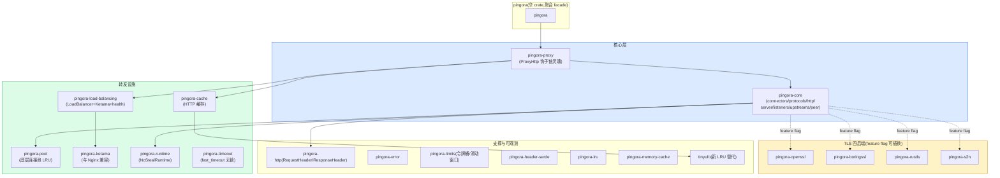
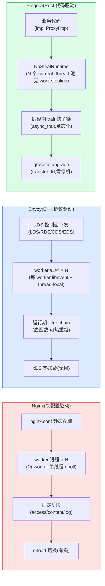
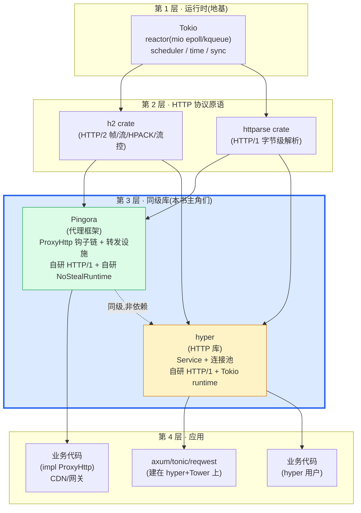

# 第 20 章 · 全书收束:Pingora 在 Rust 异步网络栈的位置

> **核心问题**:这本书从第 1 章的"Nginx 撞天花板、Envoy 太重,Pingora 用 Rust 异步重写代理"讲起,一路拆了 `ProxyHttp` 钩子链、`TransportConnector` 连接池、负载均衡与 Ketama、自研 HTTP/1 与委托 h2、`NoStealRuntime`、TLS 四后端、缓存、graceful upgrade。现在,二十章源码拆完,我们必须回答最后一个总括性的问题——**Pingora 到底在 Rust 异步网络栈里站在哪一层?它和 Tokio、hyper、axum、Envoy、Nginx 是什么关系?凭什么 Cloudflare 这套用 Rust 写的反向代理,能扛下每秒千万级的请求,并且还在演进?**
>
> 这是全书的收束章。它不引入新机制,只做一件事——把前面十九章拆透的零件,重新拼回一台完整的机器,然后钉死这台机器在整张 Rust 异步网络版图上的坐标。
>
> **读完本章你会明白**:
>
> 1. Pingora 在 Rust 异步网络栈的精确坐标:**Tokio 运行时之上,与 hyper 同级,是"应用层·反向代理/网关"的代表**。它不依赖 hyper(只在 dev-dep),不依赖 Tower 的 `Service`/`Layer`,自研 HTTP/1(基于 `httparse`),HTTP/2 委托 `h2`(与 hyper 同根),自研运行时 `NoStealRuntime`(多个 `current_thread` 池,不做 work stealing)。这个栈定位,是全书一切设计的坐标系。
> 2. 一条 HTTP 请求穿过 Pingora 的**完整旅程**:TCP 字节被 Tokio reactor 唤醒 → listener accept + spawn task → HTTP/1 自研解析(httparse)或 HTTP/2(h2)切成结构化请求 → 进 `ProxyHttp` 钩子链(early → request_filter 短路 → upstream_peer 选后端 → upstream_request_filter → 连接池转发 → upstream_response_filter 缓存前 → 缓存 → response_filter 缓存后 → logging)——以及每一步背后,转发设施在做什么。一张大图把 P0-01~P6-19 全部串起来。
> 3. **★ Pingora vs Nginx vs Envoy 的对照总表**(本章重头):从语言、内存安全、动态性抽象、请求处理抽象、运行时模型、控制面、HTTP 实现、TLS、二次开发门槛到典型场景,逐行钉死三者的根本差异——为什么这三者不是"谁替代谁",而是"按组织和场景选工具"。
> 4. Pingora 与 hyper 的**真实关系**:同级,不是依赖。两套独立的 HTTP/1 状态机(共用 `httparse`),HTTP/2 强同源(都用 `h2`),`Service`(一问一答)vs `ProxyHttp`(贯穿生命周期)的设计哲学对照。这是最容易凭印象搞错的事实,本章最后一次钉死。
> 5. Pingora 的**演展望**:cache 已成 Cloudflare 生产主力,HTTP/3(quiche 集成)在路上,s2n 已落地,TLS 四后端可插换,`tinyufo` 替代 LRU。以及读完这本书后,你该往哪钻。
>
> 本章是第 7 篇(收束)的唯一一章,也是全书的终章。它不写新机制,只做"拼回整机 + 钉死坐标 + 三向对照 + 指路附录"。如果你只读一节,读第三节的三向对照总表——那是这本书的核心交付物之一。如果你想把前面十九章串成一张图,读第二节的全旅程大图。
>
> **写给谁读**:你已经读完了这本书的前十九章(或者至少读完了 P0-01 开篇 + P1-02 `ProxyHttp` 灵魂 + P2-06 连接池招牌 + P5-15 `NoStealRuntime` 招牌),脑子里有了一堆零件(`ProxyHttp` 钩子链、`TransportConnector`、`LoadBalancer`、`NoStealRuntime`、自研 HTTP/1、h2、TLS 四后端、cache),但还没把它们拼回一台完整的机器,也没把这台机器放到整张 Rust 异步网络版图上看坐标。这章就是为你做的最后一次拼图。

---

## 一句话点破

> **Pingora 在 Rust 异步网络栈的位置,一句话钉死——Tokio 运行时之上,与 hyper 同级,是"应用层·反向代理/网关"的代表。它把代理一条 HTTP 请求做成一条可挂载钩子的请求生命周期(`ProxyHttp` trait 的 ~30 个 async filter),框架自管全部转发设施(连接池 / 负载均衡 / HTTP 解析 / 运行时 / TLS / 缓存),业务只在钩子里写 Rust 代码。它与 hyper 是 Tokio + h2 之上的同级库(各自自研 HTTP/1,不依赖),与 Envoy/Nginx 是代理设计哲学的同题竞争(代码驱动 vs 协议驱动 vs 配置驱动)。没有银弹,三者按组织和场景选——但 Pingora 用 Rust 异步 + 编译期钉死的钩子链,在"开发者驱动的代码级动态 CDN/网关"这个子题上,交出了一份实测每秒千万请求的答卷。**

这是结论。本章要倒过来,先拼回整机(第二节),再钉坐标(第三节三向对照),再讲同级关系(第四节 hyper),最后看演进(第五节)。

---

## 第一节:Pingora 这台机器——把十九章零件拼回来

### 为什么收束要先拼整机

这本书按"钩子链 vs 转发设施"的二分法拆了十九章。你读的时候,每一章看的是一块零件:P1 看 `ProxyHttp` 钩子链(灵魂),P2 看 `TransportConnector` 连接池(数据面招牌),P3 看负载均衡与 Ketama,P4 看自研 HTTP/1 与委托 h2,P5 看 `NoStealRuntime` 与 TLS 四后端,P6 看缓存与 graceful upgrade。每块零件都讲透了,但零件之间怎么咬合成一台完整的代理,以及这台代理在 Rust 异步版图上站在哪——这是收束章要补的最后一公里。

> **回扣全书二分法**:Pingora 的全部,是这条二分——**钩子链**(`ProxyHttp` trait 的 filter 生命周期,业务挂载点,偏控制) vs **转发设施**(upstream 连接池 / 负载均衡 / HTTP 解析 / 缓存 / 运行时 / TLS,框架自管,偏数据)。十九章拆的是这两面的每一块零件,本章把它们拼回一条完整的请求旅程。

### Pingora 的 workspace:20 个 crate 的全景

在拼整机前,先看一眼 Pingora 的源码物理结构。Pingora 是一个 Cargo workspace,**20 个 crate**(核实根 `Cargo.toml` `members`,版本钉死 `v0.8.1` commit `719ef6cd54e40b530127751bab6c1afc5ae815a8`):



这 20 个 crate,按本书的二分法归类:

- **钩子链这一面**(业务挂载点):核心是 `pingora-proxy`(`ProxyHttp` trait,~30 个 filter 钩子)。`pingora-proxy` 是 Pingora 的灵魂,业务实现这个 trait,在钩子里写逻辑。这是全书第 1 篇(P1-02~05)拆透的。
- **转发设施这一面**(框架自管):
  - **连接池**:`pingora-core/src/connectors/`(`TransportConnector` L4/TLS + HTTP connector L7)+ `pingora-pool`(底层 LRU 池)。第 2 篇(P2-06~08)招牌。
  - **负载均衡**:`pingora-load-balancing`(`LoadBalancer<S: BackendSelection>` + RoundRobin/Random/Ketama + 服务发现 + 健康检查)+ `pingora-ketama`(与 Nginx `hash consistent` 结果级兼容)。第 3 篇(P3-09~11)。
  - **HTTP 解析**:`pingora-core/src/protocols/http/v1/`(自研,基于 `httparse`)+ `v2/`(委托 `h2`)+ `bridge/`(h1↔h2 转换)。第 4 篇(P4-12~14)招牌。
  - **运行时**:`pingora-runtime`(`NoStealRuntime` 多个 `current_thread` 池,无 work stealing)+ `pingora-timeout`(`fast_timeout` 无锁)。第 5 篇(P5-15)招牌。
  - **TLS**:`pingora-{openssl,boringssl,rustls,s2n}`(四后端 feature flag 可插换)。第 5 篇(P5-16)。
  - **缓存**:`pingora-cache`(独立 crate,cache key + eviction + lock + variance + stale-while-revalidate)+ `tinyufo`(新 LRU 替代)+ `pingora-lru`/`pingora-memory-cache`(支撑)。第 6 篇(P6-17)。
  - **listener 与 graceful upgrade**:`pingora-core/src/server/`(`transfer_fd/` 零停机升级)+ `services/` + `listeners/`。第 6 篇(P6-18)。
  - **可观测、限流**:`pingora-limits`(令牌桶/滑动窗口)+ `pingora-prometheus`(metrics)+ HttpModules(compression/grpc_web)+ `pingora-header-serde`(header 压缩)。第 6 篇(P6-19)。
- **支撑**:`pingora-http`(RequestHeader/ResponseHeader 类型)+ `pingora-error`(错误类型)+ `pingora`(伞 crate,聚合 facade,用户 `use pingora::*` 即可)。

这 20 个 crate 不是平铺的孤岛,它们围绕"代理一条 HTTP 请求"这条主线咬合:`pingora-proxy` 的 `ProxyHttp` 钩子链是控制中枢,`pingora-core` 的 `connectors`/`protocols` 是字节通道,`pingora-load-balancing` 在 `upstream_peer` 钩子里被业务调用选后端,`pingora-cache` 在请求穿过时介入缓存判定,`pingora-runtime` 跑着所有这些 task。**业务只动 `pingora-proxy` 的钩子,其余 19 个 crate 都是框架自管的转发设施**——这就是二分法在源码物理结构上的体现。

> **钉死这件事**:Pingora 是 20 个 crate 的 workspace(`Cargo.toml` `members`,版本 `v0.8.1` `719ef6cd`)。其中 `pingora-proxy` 是钩子链这一面(`ProxyHttp` trait),其余 19 个 crate 是转发设施这一面(连接池/负载均衡/HTTP 解析/运行时/TLS/缓存/listener/可观测)。业务 `use pingora::*`(伞 crate facade),只在 `pingora-proxy` 的钩子里写代码。附录 A 有完整的 20 crate 阅读顺序路线图。

### Pingora 这台机器的灵魂:一句话再钉一次

十九章拆完,回到全书开篇(P0-01)那句话,现在你应该能从一个全新的高度理解它:

> **Pingora 把"代理一条 HTTP 请求"做成一条可挂载钩子的请求生命周期——业务实现 `ProxyHttp` trait 在 ~30 个 async filter 钩子里写逻辑,框架用 Tokio 自管 upstream 连接池(`TransportConnector` + `pingora-pool`)、负载均衡(`pingora-load-balancing`)、HTTP 解析(自研 HTTP/1 基于 `httparse` + HTTP/2 委托 `h2`)、运行时(自研 `NoStealRuntime`)、TLS 四后端(openssl/boringssl/rustls/s2n)、缓存(`pingora-cache`)。**

这句话在 P0-01 是"远景",在 P1-05 是"钩子全貌",在 P5-15 是"运行时取舍",在 P6-17 是"缓存介入"。现在到了 P7-20,这句话该是"你已经能在脑子里放映的实景"。下一节,我们就用一张大图把这个实景画出来。

---

## 第二节:一条请求穿过 Pingora 的完整旅程——十九章串成一张图

### 为什么收束要画这张全旅程图

本书第 1 章(P0-01)给过一张"请求穿过 Pingora"的简化时序图,但那时你还不知道每个钩子背后是什么(连接池怎么复用、HTTP/1 怎么解析、`NoStealRuntime` 怎么调度)。十九章拆完,你现在知道每个零件了,但它们怎么在一次真实的请求里**按时间顺序**咬合,这是收束要拼的最后一图。

这张图是全书的"总纲图"——你读完这本书,如果只能记住一张图,就记这张。它把 P0-01(开篇主线)→ P1-02~05(钩子链)→ P2-06~08(连接池)→ P3-09~11(负载均衡)→ P4-12~14(HTTP 解析)→ P5-15~16(运行时/TLS)→ P6-17~19(缓存/upgrade/可观测)全部串在一条请求上。

### 全旅程大图

```mermaid
sequenceDiagram
    autonumber
    participant C as Client(downstream)
    participant L as Listener +<br/>NoStealRuntime task
    participant P as ProxyHttp 钩子链<br/>(业务 SV)
    participant H as HTTP 解析层<br/>(自研 h1 / 委托 h2)
    participant LB as LoadBalancer<br/>+ 服务发现
    participant T as TransportConnector<br/>(连接池)
    participant TLS as TLS 后端<br/>(4 选 1)
    participant U as Upstream(后端)
    participant CH as pingora-cache

    Note over L: 第 0 步:TCP 字节进 Tokio reactor<br/>(mio epoll/kqueue edge-triggered)
    L->>L: listener accept,<br/>NoStealRuntime.get_handle()<br/>spawn 一个 task

    Note over L,H: 第 1 段:HTTP 解析(P4-12~14)
    alt HTTP/1
        H->>H: 自研 httparse 状态机<br/>(v1/server.rs)<br/>逐字节切 header + body
    else HTTP/2
        H->>H: h2::server::handshake<br/>帧/流/HPACK(承 gRPC P2)
    end

    Note over L,P: 第 2 段:请求前半段钩子(P1-03)
    L->>P: early_request_filter(模块前)
    L->>P: 下游模块 request_header_filter<br/>(compression/grpc_web,P6-19)
    L->>P: request_filter(★ 可短路 Ok(true))
    Note over L,P: 若短路:直接响应,跳到第 6 段 logging

    Note over L,CH: 第 3 段:缓存判定(P6-17)
    L->>CH: request_cache_filter / cache_key_callback<br/>(★ cache_key 必须 user 实现,<br/>默认 panic = 缓存投毒防御)
    alt 缓存命中
        CH-->>L: 直接返回缓存
        L->>P: response_cache_filter(缓存命中改响应)
        Note over L: 跳到第 6 段发响应
    end

    Note over L,P: 第 4 段:选后端 + 改请求(P1-04, P3-09~11)
    L->>P: proxy_upstream_filter(★ 可短路 Ok(false))
    L->>P: upstream_peer(★ 必实现,返回 Box&lt;HttpPeer&gt;)
    P->>LB: 业务在钩子里调 LoadBalancer.select<br/>(RoundRobin/Random/Ketama)
    Note over LB: Ketama 与 Nginx hash consistent<br/>结果级兼容(CRC32,160 points)
    LB-->>P: 选中的 Backend
    L->>P: upstream_request_filter(改 upstream 请求 header)

    Note over P,U: 第 5 段:连接池转发(P2-06~08)
    P->>T: 取/建到 upstream 的连接
    alt 复用(keepalive)
        T->>T: reused_stream(热队列 ArrayQueue)<br/>test_reusable_stream(1 字节探测死活)
    else 新建
        T->>TLS: TLS 握手(feature flag 选后端)
        TLS->>U: TCP + TLS 连接
    end
    Note over T: offload_threadpool 把建连 offload<br/>(CPU 密集活隔离)
    T-->>P: HTTP 会话(h1 keepalive / h2 多 stream)
    P->>U: 发请求(HttpTask 透传,<br/>Bytes 零拷贝,P2-08)
    Note over P,U: 协议转换 bridge<br/>(downstream h1 / upstream h2,P4-14)

    U-->>L: 响应 header + body

    Note over L,P,CH: 第 6 段:响应钩子(缓存前/后,P1-05, P6-17)
    L->>P: upstream_response_filter(★ 缓存前改,内容进缓存)
    L->>CH: response_cache_filter(决定是否写缓存)
    L->>P: response_filter(★ 缓存后改,内容不进缓存)
    L->>P: response_body_filter(逐块改响应体)
    L->>P: response_trailer_filter / logging(收尾)
    L->>C: 发响应

    Note over T: 第 7 段:连接归还(P2-06)
    T->>T: release_stream(归还池)<br/>idle_poll 空闲探测<br/>PreferredHttpVersion 记住该 peer 用 h1/h2
```

这张图你不用全记住,记住七段就够了:**解析 → 前半段钩子 → 缓存判定 → 选后端+改请求 → 连接池转发 → 响应钩子 → 归还**。下面逐段把十九章的知识点串回来。

### 逐段把十九章串回来

**第 0 步:TCP 字节进 Tokio reactor,listener accept,spawn task**。一个客户端连进来,Tokio 的 reactor(mio,epoll/kqueue edge-triggered)把就绪事件投递给 Pingora 的 listener。listener `accept` 出这个连接,**在 `NoStealRuntime` 的某个线程的 handle 上 spawn 一个 task**(P5-15)。这个 task 接管这条连接的整个生命周期——从 HTTP 解析到钩子链到转发到响应回写,全在这个 task 里跑完。**每连接一个 task**,这是 Pingora 承 Tokio 的核心机制(Tokio 的 task/调度/budget 让出一句带过指路 [[tokio-source-facts]]),但 Pingora 用的不是 Tokio 的多线程 work-stealing runtime,而是自研的 `NoStealRuntime`——N 个 `current_thread` runtime 池,`get_handle` 随机选一个线程来 spawn(P5-15 招牌章拆透为什么不要 work-stealing)。

**第 1 段:HTTP 解析**(P4-12~14)。TCP 字节流进来,要先切成结构化的 HTTP 请求。这一步 Pingora 走两条路:
- **HTTP/1**:Pingora **自研**解析,基于 `httparse` crate(`pingora-core/src/protocols/http/v1/server.rs`)。逐字节解析请求行 + header,处理 chunked transfer、100-continue、keep-alive 循环。为什么不用 hyper?因为 Pingora 要对代理场景做 smuggling 防护(0.8.0 加的 `Reject invalid content-length http/1 requests to eliminate ambiguous request framing`,CHANGELOG),自研能完全掌控边界。这是 Pingora 区别于"建在 hyper 上"的关键(P4-12 招牌章)。
- **HTTP/2**:Pingora **委托 `h2` crate**(`pingora-core/src/protocols/http/v2/server.rs`)。`h2::server::handshake` 起会话,帧/流/HPACK/流控全在 `h2` 里(HTTP/2 协议承《gRPC》第 2 篇,一句带过)。Pingora 和 hyper **用的是同一个 `h2` crate**——这是 Pingora 与 hyper 强同源的根源。

**第 2 段:请求前半段钩子**(P1-03)。请求解析完,进入 `ProxyHttp` 钩子链。业务实现的 `ProxyHttp`(源码里叫 `SV`)在这一段介入:
- `early_request_filter`:在所有下游模块前跑,给业务一个"在模块处理前"的介入点。
- 下游模块的 `request_header_filter`:这是 `init_downstream_modules` 注册的模块(compression/grpc_web 等,P6-19)的 filter,不是业务的钩子,是框架内置模块的钩子。
- `request_filter`(★ **可短路**):业务在这里做鉴权、限流、直接响应。返回 `Ok(true)` 表示"我已经响应了,不要再转发",直接跳到 `logging` 收尾。返回 `Ok(false)` 表示"继续"。这个短路语义是 Pingora 表达"这个请求我不代理了"的核心机制,与 Envoy filter 的 `StopIteration` 对照(P1-03 详拆)。

**第 3 段:缓存判定**(P6-17)。`request_filter` 没短路,接下来 Pingora 看缓存。`request_cache_filter` / `cache_key_callback` 决定这个请求要不要查缓存、用哪个 key 查。**关键**:`cache_key_callback` 必须由业务实现,默认实现会 panic——这是 0.8.0 加的防御(CHANGELOG `Remove CacheKey::default impl, users of caching should implement cache_key_callback themselves`),防止默认 cache key 不安全导致缓存投毒(总纲曾误记为 RUSTSEC-2026-0034,实际 0.8.1 的安全修复是 `Bound default HTTP/2 server limits to mitigate memory exhaustion`,与 cache_key 无关,本书已纠正)。缓存命中,直接走 `response_cache_filter` 返回;缓存未命中,继续往下转发。

**第 4 段:选后端 + 改请求**(P1-04, P3-09~11)。这是钩子链的重头戏:
- `proxy_upstream_filter`(★ **可短路**):cache miss 后,业务最后一次机会决定"要不要真的转发到 upstream"。返回 `Ok(false)` 表示不转发(此时若业务没自己响应,Pingora 返回 502)。
- `upstream_peer`(★ **唯一必须实现的钩子**):业务告诉框架"转发到哪个后端",返回 `Box<HttpPeer>`(`HttpPeer` 含 addr/sni/alpn/tls/path,P1-04 详拆)。业务通常在这里调用 `LoadBalancer.select`(P3-09),`LoadBalancer<S: BackendSelection>` 根据 `S` 的不同(RoundRobin/Random/Ketama 一致性哈希)挑后端。**Ketama 与 Nginx `hash consistent` 结果级兼容**(基于 CRC32 不是 MD5,160 points,P3-10 招牌章拆透)。
- `upstream_request_filter`:改要发给 upstream 的请求 header(注入鉴权 token、改 Host、加 X-Forwarded-For)。

**第 5 段:连接池转发**(P2-06~08)。业务在 `upstream_peer` 选了后端,框架接下来要把连接建起来、把请求透传过去:
- **`TransportConnector`**(L4/TLS 连接池,P2-06 招牌章):先 `reused_stream` 从连接池取一条复用的 keepalive 连接,没有再 `new_stream`(TCP + TLS 握手)。**`test_reusable_stream` 用 1 字节非阻塞读探测连接死活**(避免把死连接复用出去),`offload_threadpool` 把建连这种 CPU 密集活 offload 到独立线程池(防止拖累主 reactor)。连接池的外层是 `RwLock<HashMap>`,每 `PoolNode` 有 crossbeam `ArrayQueue`(16)热队列 + `Mutex` 兜底。
- **TLS 握手**:feature flag 选四后端之一(openssl/boringssl/rustls/s2n,P5-16)。Cloudflare 生产用 BoringSSL(性能 + FIPS)。
- **HTTP 会话**:L4 stream 之上建 HTTP 会话(HTTP connector L7,P2-07),h1 keepalive 循环或 h2 多 stream 复用。`PreferredHttpVersion` 记住某 peer 该用 h1 还是 h2(避免每次协商)。
- **`HttpTask` 透传**(P2-08):请求/响应字节在 downstream 和 upstream 之间用 `HttpTask` 枚举(Header/Body/UpgradedBody/Trailer/Done/Failed)统一透传,底层用 `bytes::Bytes` 引用计数零拷贝(承《内存分配器》)。如果 downstream 和 upstream 协议不同(h1 vs h2),`bridge/` 做协议转换(P4-14,改 hop header、websocket 升级)。

**第 6 段:响应钩子(缓存前/后)**(P1-05, P6-17)。upstream 响应回来,钩子链原路返回:
- `upstream_response_filter`(★ **缓存前**):改 upstream 响应 header,**改的内容会进缓存**。
- `response_cache_filter`:决定这个响应要不要写缓存。
- `response_filter`(★ **缓存后**):改要发给 downstream 的响应 header,**改的内容不进缓存**。这个"缓存前/后分开"是 filter 顺序设计的精髓(P1-05 详拆为什么这么排)。
- `response_body_filter` / `response_trailer_filter`:逐块改响应体、改 trailer。
- `logging`:收尾,记访问日志、metrics。即使前面短路了,`logging` 也会跑(短路时 `process_request` 里 `Ok(true)` 分支也调 `self.inner.logging`)。

**第 7 段:连接归还**(P2-06)。响应发完,连接归还池。`release_stream` 把连接放回 `TransportConnector` 的池,`idle_poll` 空闲探测,`PreferredHttpVersion` 记住这个 peer 该用哪个版本。下次同一个 upstream 的请求来,`reused_stream` 直接复用这条连接,省掉 TCP + TLS 握手。

> **钉死这件事**:一条 HTTP 请求穿过 Pingora 的完整旅程,七段——**解析(httparse/h2)→ 前半段钩子(early/request_filter 短路)→ 缓存判定(cache_key)→ 选后端+改请求(upstream_peer/LoadBalancer/Ketama)→ 连接池转发(TransportConnector/test_reusable_stream/offload/bridge)→ 响应钩子(缓存前/后分开)→ 归还(idle_poll/PreferredHttpVersion)**。这七段,十九章拆的就是每一段的内部细节。现在你能在脑子里放映这条旅程了——这就是读完这本书该有的状态。

### 七段背后的两件事:钩子链 vs 转发设施

把这七段再压缩一下,你会看到全书二分法在这条旅程上的精确体现:

| 段 | 钩子链(业务写) | 转发设施(框架管) |
|----|----------------|------------------|
| 1 解析 | — | 自研 h1(httparse)/ 委托 h2 |
| 2 前半段 | early/request_filter(短路) | 下游模块(compression 等) |
| 3 缓存判定 | cache_key_callback | pingora-cache 查/写 |
| 4 选后端 | upstream_peer(必实现) | LoadBalancer/Ketama |
| 5 转发 | upstream_request_filter | TransportConnector/TLS/bridge |
| 6 响应 | upstream_response_filter/response_filter | HttpTask 透传 |
| 7 归还 | — | release_stream/idle_poll |

业务只在第 2/3/4/5/6 段的钩子里写代码(且只有 `upstream_peer` 必须实现),第 1/7 段和每段的设施部分全是框架自管。**这就是 Pingora 的二分法——业务挂载在钩子链上,框架用转发设施把请求在钩子之间流转**。

---

## 第三节:三向对照总表——Pingora vs Nginx vs Envoy(本章重头)

### 为什么这一节是本章重头

这本书开篇(P0-01)就用一张三向对照表钉死了 Pingora/Nginx/Envoy 的差异,但那时只是"远景"。十九章拆完,你应该能从源码级别理解每一行差异的"为什么"。这一节是本章的重头——把那张表扩展到最完整的形态,逐行从源码角度钉死。这张表也是这本书的核心交付物之一,读完它,你该能在技术选型时(选 Nginx / Envoy / Pingora)有源码级的判断依据,而不是凭印象。

### 三向对照总表

| 维度 | **Nginx** | **Envoy** | **Pingora** |
|------|-----------|-----------|-------------|
| **语言** | C | C++ | **Rust** |
| **内存安全** | 人肉防守(C 指针、memcpy 边界) | 智能指针缓解,但仍非编译器级(use-after-free/data race 仍可能) | **编译器级(所有权 + 借用检查 + Send/Sync + 边界检查)** |
| **动态性抽象** | 配置文件(`nginx.conf`)+ `reload` | filter chain + xDS 协议(LDS/RDS/CDS/EDS) | **业务代码(实现 ProxyHttp trait 写 ~30 个 async 钩子)** |
| **请求处理抽象** | 固定阶段(access/content/log phase) | filter chain(运行期组装,C++ 虚函数) | **ProxyHttp trait(钩子顺序编译期钉死在 `process_request` 源码里,async_trait)** |
| **配置热加载** | `reload`(有损,断 keepalive) | xDS(无损,运行期生效) | **无内置 xDS,改代码重新部署 / graceful upgrade(fd 传递)** |
| **控制面** | 无(文件 + reload) | xDS 协议(Istio/Consul 等控制面实现) | **无内置,业务自己在钩子里调服务发现(实现 ServiceDiscovery trait)** |
| **运行时/线程模型** | worker 进程 × N(每 worker 单线程 epoll 循环) | worker 线程 × N(每 worker 一个 libevent dispatcher + thread-local 无锁副本) | **NoStealRuntime(N 个 `current_thread` runtime 池,不做 work stealing,`get_handle` 随机选线程)** |
| **work-stealing** | 无(worker 间不偷) | 无(worker 间不偷,靠 thread-local) | **无(NoSteal 故意不偷;但 `Steal` 模式可选,默认 true 但 Cloudflare 生产关)** |
| **背压机制** | worker 满了 accept 停 | overload manager(LoadShedPoint 丢请求/拒连接) | **钩子里业务自己限流 + `pingora-limits` 令牌桶/滑动窗口** |
| **HTTP/1 实现** | 自研(C,`ngx_http_parse`) | 自研(C++) | **自研(Rust,基于 `httparse` crate,`protocols/http/v1/`)** |
| **HTTP/1 smuggling 防护** | 历史漏洞多(CVE-2019-20372 等) | header map 越界修复(CVE-2021-43824) | **0.8.0 加 content-length 校验(`Reject invalid content-length http/1 requests to eliminate ambiguous request framing`)** |
| **HTTP/2 实现** | 自研(C,`ngx_http_v2`) | 自研(C++) | **委托 `h2` crate(与 hyper 同根)** |
| **HTTP/2 流控** | 自实现 | 自实现 | **`H2Options` 可配 stream/connection window(9.x 增强)** |
| **HTTP/3 / QUIC** | 自研(ngx_http_v3) | 自研(quiche 集成) | **未原生集成(社区 roadmap,见第五节演展望)** |
| **TLS 后端** | OpenSSL 等(编译期选) | BoringSSL(默认) | **四后端 feature flag 可插换(openssl/boringssl/rustls/s2n),Cloudflare 选 BoringSSL** |
| **ALPN 协商** | 支持 | 支持 | **支持(h1/h2 协商,`PreferredHttpVersion` 记住 peer 偏好)** |
| **负载均衡算法** | RoundRobin/LeastConn/IpHash/`hash consistent` | RoundRobin/Random/LeastRequest/RingHash/Maglev | **RoundRobin/Random/FNVHash/`Consistent=KetamaHashing`**(无 P2C,TODO) |
| **一致性哈希** | `hash consistent`(MD5?实际 CRC32) | RingHash/Maglev | **Ketama(与 Nginx `hash consistent` 结果级兼容,CRC32,160 points)** |
| **服务发现** | `upstream`(静态/DNS) | 严格 xDS(EDS) | **`ServiceDiscovery` trait(内置 Static,DNS 是 TODO)** |
| **健康检查** |被动(请求失败标记) | 主动 + 被动 | **主动(`HealthCheck` trait,`TcpHealthCheck`,并行 `run_health_check`)** |
| **upstream 连接池** | 自有(每 worker) | 自有(conn_pool,thread-local) | **`TransportConnector`(外层 RwLock<HashMap> + 每 PoolNode ArrayQueue(16) 热队列 + Mutex 兜底)** |
| **连接死活探测** | 依赖 OS(keepalive timeout) | 依赖连接错误 | **`test_reusable_stream`(1 字节 unconstrained now_or_never 非阻塞读探测)** |
| **建连 offload** | 无(在 worker 里) | 无(在 worker 里) | **`offload_threadpool`(把 TCP+TLS 握手 offload 到独立线程池)** |
| **零拷贝** | `ngx_buf` 引用 | `Buffer::SliceDeque` | **`bytes::Bytes` 引用计数(承《内存分配器》)** |
| **缓存** | `proxy_cache`(共享内存) | 自有(HTTP cache filter) | **`pingora-cache`(独立 crate,cache key + eviction + lock + variance + stale-while-revalidate + tinyufo LRU)** |
| **缓存 key 默认安全** | 配置驱动 | 配置驱动 | **0.8.0 移除 `CacheKey::default`(默认 panic,强制 user 实现,防投毒)** |
| **零停机升级** | `nginx -s reload`(fork 新 worker,HUP 信号) | hot restart(SCM_RIGHTS fd 传递) | **graceful upgrade(`transfer_fd/`,Rust 实现 fd 传递 + `persist_connection_context` 在 keepalive 间传状态)** |
| **可观测** | 第三方(prometheus exporter) | 内置 stats(counter 是 std::atomic 共享) | **`pingora-prometheus` + `pingora-limits` + HttpModules(compression/grpc_web)+ `pingora-header-serde`(header 压缩)** |
| **二次开发门槛** | lua(OpenResty)/ C 模块(高,C + Nginx 内部机制) | C++ filter(陡,Bazel 构建慢,理解 thread-local/xDS) | **Rust 实现 trait(中等,cargo 构建,理解 async/`ProxyHttp` 钩子顺序)** |
| **二次开发语言一致性** | 配置 + lua + 可能的 sidecar(割裂) | C++ + protobuf(xDS)+ 可能的 lua(割裂) | **全 Rust(钩子 + 设施 + module,统一)** |
| **filter/钩子代价** | C 阶段 hook(快) | 虚分派 + `shared_ptr`(每请求多次) | **async_trait(每钩子一次 Box 分配,单态化无虚分派)** |
| **典型场景** | 边缘/Web/CDN(静态拓扑) | 服务网格(Istio)/ API 网关(协议级动态) | **CDN/网关(代码级动态性,如 Cloudflare)** |
| **性能(同等硬件)** | 行业标杆(C 调到极致) | 略低于 Nginx(虚分派 + thread-local 副本开销) | **Cloudflare 实测:比 Nginx 省 CPU/内存(Pingora 博客数据)** |
| **谁在用** | 全球 30%+ 网站(传统) | Istio/大型服务网格 | **Cloudflare 全球 CDN(40M+ req/s)** |
| **开源协议** | BSD-2 | Apache-2.0 | **Apache-2.0** |

这张表你不用全背,但要记住几个**最关键的差异行**——它们决定了三者适用的场景。

### 关键差异行逐行拆

**第一行:动态性抽象(配置 vs 协议 vs 代码)**。这是三向对照里最重要的一行,也是 Pingora 区别于 Nginx/Envoy 的根本取向:
- Nginx 的动态性是"改配置文件 reload"——**运维心智**。运维改 `nginx.conf`,`nginx -s reload`,worker 重启生效。reload 有损(断 keepalive),所以不能频繁 reload。
- Envoy 的动态性是"控制面推 xDS"——**平台/SRE 心智**。控制面(Istio 等)推一个 RDS 更新,Envoy 运行期就生效。无损,但需要一整套控制面基础设施。
- Pingora 的动态性是"业务在 Rust 钩子里写代码"——**开发者心智**。开发者写 `request_filter`(按请求头选后端)、`upstream_peer`(调 LoadBalancer)、`logging`(记 metrics),编译成二进制,部署。改逻辑 = 改代码 + 重新部署(用 graceful upgrade 零停机)。

这三种心智没有绝对优劣,但**适用的组织形态不同**。Nginx 适合"运维驱动"的传统架构(运维管配置,业务逻辑尽量少);Envoy 适合"平台驱动"的大型服务网格(平台团队维护 xDS 控制面,业务无感知);Pingora 适合"开发者驱动"的、业务逻辑复杂多变的 CDN/网关(Cloudflare 就是这种——代理逻辑变化极快,每天都有新策略,运维配置跟不上,必须代码)。详见 P0-01 第一节、第二节的拆解。

**第二行:请求处理抽象(固定阶段 vs 运行期 filter chain vs 编译期 trait 钩子)**。这是源码级别最深的差异:
- Nginx 把请求处理切成固定阶段(`NGX_HTTP_POST_READ` → `NGX_HTTP_SERVER_REWRITE` → `NGX_HTTP_FIND_CONFIG` → `NGX_HTTP_REWRITE` → `NGX_HTTP_POST_REWRITE` → `NGX_HTTP_PREACCESS` → `NGX_HTTP_ACCESS` → `NGX_HTTP_CONTENT` → `NGX_HTTP_LOG`)。C 模块在 `ngx_modules.c` 里按顺序注册到这些阶段,Nginx 在请求穿过时按阶段调模块。简单,但阶段就那几个,不够细。
- Envoy 用运行期组装的 filter chain(listener filter → network filter → HCM → http filter decode 一串 + encode 一串 → router)。每个 filter 是 C++ 对象,实现 `onDecodeHeaders` 等虚函数,Envoy 在请求穿过时按顺序调虚函数。filter chain 在程序启动或连接建立时组装(可从 xDS 生成),运行期可热重组。灵活,但**每次请求走若干次虚分派**(decode 一串 + encode 一串),filter 之间用 `shared_ptr` 持有(引用计数开销),编译器没法跨 filter 优化。
- Pingora 用 `ProxyHttp` trait 的一串 async 方法,**钩子顺序编译期钉死在 `process_request` 这一个函数的源码顺序里**(`pingora-proxy/src/lib.rs#L741-L844`)。读这一个函数,就读完了请求穿过 Pingora 的全部阶段(early → modules → request_filter 短路 → proxy_cache → proxy_upstream_filter 短路 → proxy_to_upstream 含 upstream_peer/upstream_request_filter/upstream_response_filter/response_filter → logging)。每个钩子是 `async fn`(用 `#[async_trait]` 包装成 `Pin<Box<dyn Future>>`),业务实现 trait 时单态化,**无虚分派**(除了 `async_trait` 那一次 Box 分配,P1-02 详拆)。代价是改钩子顺序要重新编译,但换来零虚分派 + 类型安全 + 极佳可读性("请求生命周期 = 一个函数的源码顺序")。

这个差异的取舍是:**Envoy 把灵活性放在运行期(filter chain 可热重组),Pingora 把灵活性放在编译期(钩子顺序钉死,但业务在钩子里写任意代码)**。前者适合"控制面动态下发配置"的服务网格,后者适合"业务代码就是动态性"的 CDN。详见 P0-01 技巧精解一、P1-02。

**第三行:运行时模型(worker 进程 vs worker 线程 + thread-local vs NoStealRuntime)**。三者都是"少量线程扛海量连接",但实现路径不同:
- Nginx:worker **进程** × N(默认 = CPU 核数),每 worker 单线程,内部一个 epoll 事件循环,处理挂在这个 worker 上的所有连接(几万到几十万)。worker 间不共享状态(各自一份配置副本),靠共享内存存缓存/限流计数。**进程模型**的好处是隔离(一个 worker 挂了别的还在),代价是进程间共享状态要过共享内存。
- Envoy:worker **线程** × N(默认 = CPU 核数),每 worker 一个 libevent dispatcher + thread-local 无锁副本。配置(filter chain、路由表等)通过 `tls://`(thread-local storage)给每 worker 一份副本,worker 处理请求时只读自己的副本,**无锁**。`main_thread` 推更新时,逐个 worker 同步副本。**线程模型**的好处是共享状态比进程方便(都在一个进程里),thread-local 副本避免了锁。
- Pingora:`NoStealRuntime` = N 个 `current_thread` runtime 池(每池跑在一个 OS 线程上),**不做 work stealing**。`get_handle` 随机选一个线程的 handle 来 spawn task(P5-15 拆透)。task 落在哪个线程就在哪个线程跑完,线程间不偷 task。**为什么不要 work-stealing?** 因为 Pingora 的负载特征是"每请求一个独立 task,task 之间几乎无共享、无长尾",work-stealing 在这种负载下是净开销(偷要加锁、要迁移 task 栈)。代价是:某个线程的 task 恰好都是重逻辑,这个线程会过载,其他线程帮不上忙——Pingora 用 `offload_threadpool`(把建连这种 CPU 密集活 offload)和 `spawn_blocking`(在钩子里 offload 重逻辑)缓解。

这个差异的根本原因是三者面对的负载不同:Nginx 和 Envoy 是"通用代理",负载特征不可预测,所以 Nginx 用进程隔离、Envoy 用 thread-local 副本 + 保留多线程能力;Pingora 是"Cloudflare 自家 CDN 代理",负载特征明确(每请求独立 task),所以敢去掉 work-stealing 换极致效率。这是 **Pingora 最独特的取舍**(P5-15 招牌章核心)。注意 Pingora 也提供 `Steal` 模式(`Runtime::new_steal`,标准 Tokio 多线程 work-stealing),`work_stealing` 配置默认 `true`(核实 `pingora-core/src/server/configuration/mod.rs#L139`),但 **Cloudflare 生产环境关掉**(用 NoSteal)。

> **钉死这件事**:三向对照的三个根本差异维度——(1)**动态性抽象**(配置文件 vs xDS 协议 vs 业务代码)、(2)**请求处理抽象**(固定阶段 vs 运行期 filter chain vs 编译期 trait 钩子)、(3)**运行时模型**(worker 进程 vs worker 线程 + thread-local vs NoStealRuntime)。这三个维度决定了三者适用场景:**Nginx 适合运维驱动的静态拓扑,Envoy 适合平台驱动的服务网格,Pingora 适合开发者驱动的代码级动态 CDN/网关**。没有银弹,看你是什么组织、什么场景。这是全书三向对照的最终结论,也是附录 B 选型实践的指导思想。

### 三向对照可视化



三者的设计取向一目了然:Nginx 是"配置 + 进程"的古典派,Envoy 是"协议 + 线程 + thread-local"的现代派,Pingora 是"代码 + NoSteal + 编译期钩子"的 Rust 派。三者不是线性演进(Nginx → Envoy → Pingora),而是**三种不同的取舍,各自适合不同的场景**。

### 这张表怎么用(技术选型)

这张表不是"Pingora 最强"的背书,而是技术选型的工具。附录 B 会详细拆选型,这里先点出几条:

- **你是运维驱动的传统架构,业务逻辑简单,要的是稳定、生态厚**:**选 Nginx**。Nginx 的配置驱动在静态拓扑场景是甜蜜点,运维友好,30% 网站用它不是没原因。Pingora/Envoy 的动态性对你过度工程。
- **你是平台驱动的服务网格,要的是 xDS 动态下发、Istio 集成、多语言 sidecar**:**选 Envoy**。Envoy 的 filter chain + xDS 是为服务网格而生的,thread-local 模型扛高并发,生态(Istio/Consul)成熟。Pingora 没有内置 xDS,你要自己在钩子里写,得不偿失。
- **你是开发者驱动的 CDN/网关,业务逻辑复杂多变(按请求选后端、改写、限流、WAF),要的是内存安全 + 极致吞吐**:**选 Pingora**(或者它的 Rust 同类)。Pingora 的 `ProxyHttp` 钩子链让业务用熟悉的 Rust 代码表达动态性,编译器防守内存安全,`NoStealRuntime` 在 Cloudflare 这种负载下省 CPU/内存。

**没有银弹,工具按场景选**——这是这本书反复强调的(P0-01 第一节末尾"诚实地说"、附录 B)。Pingora 不是要替换全世界所有的 Nginx,它是 Cloudflare 为自己的场景做的取舍,开源后正好给了同类场景(CDN/网关)一个 Rust 选项。

---

## 第四节:Pingora 与 hyper 的真实关系——同级,不是依赖

### 为什么单独拎一节讲这个

三向对照之外,Pingora 还有一个特殊的对照对象——hyper。hyper 是 Rust 生态最主流的 HTTP 库(《hyper》系列拆透),axum/tonic/reqwest 都长在它上面。很多人凭印象以为"Pingora 建在 hyper 上,hyper 给 Pingora 提供了 HTTP 实现"。**这是错的**,而且这个错误印象会让人对 Pingora 的栈定位产生根本性误解。这本书从 P0-01 开始就反复核实并钉死这个事实,收束章最后一次用源码钉死它。

### 源码核实:hyper 只在 dev-dep

`pingora-core/Cargo.toml` 的运行时依赖(`pingora-core/Cargo.toml#L21-L75`):

```toml
# pingora-core/Cargo.toml#L21-L75(运行时依赖,逐字摘录关键行)
[dependencies]
pingora-runtime = { version = "0.8.1", path = "../pingora-runtime" }
# ... TLS 后端(optional)、pool、error、timeout、http ...
tokio = { workspace = true, features = ["net", "rt-multi-thread", "signal"] }   # @ L32
httparse = { workspace = true }   # @ L36 ★ Pingora 自研 HTTP/1 解析的底座
h2 = { workspace = true }          # @ L40 ★ Pingora HTTP/2 委托的 crate(与 hyper 同根)
bytes = { workspace = true }
http = { workspace = true }
# ... 注意:运行时依赖里没有 hyper! ...
```

再看 `[dev-dependencies]`(`pingora-core/Cargo.toml#L84-L96`):

```toml
# pingora-core/Cargo.toml#L84-L96(dev-dependencies,逐字摘录关键行)
[dev-dependencies]
h2 = { workspace = true, features = ["unstable"] }   # @ L85
tokio-stream = { version = "0.1", features = ["full"] }
env_logger = "0.11"
reqwest = { version = "0.12", features = ["rustls-tls", "http2"], default-features = false }
hyper = { version = "1", features = ["client", "http1", "http2"] }   # @ L92 ★ 只在 dev-dep!
hyper-util = { version = "0.1", features = ["client-legacy", "http1", "http2"] }   # @ L93
http-body-util = "0.1"
rstest = "0.23.0"
rustls = "0.23"
```

**钉死**:`hyper` 只在 `[dev-dependencies]`(测试/benchmark 用,`pingora-core/Cargo.toml#L92`),运行时依赖里**没有 hyper**。Pingora 的运行时 HTTP 实现,基于 `httparse`(HTTP/1 自研,`#L36`)+ `h2`(HTTP/2 委托,`#L40`)。而 hyper 自己,也是基于 `httparse`(HTTP/1)+ `h2`(HTTP/2)。

所以真实的承接关系是:**Pingora 和 hyper 是 Tokio 之上的同级库,不是 Pingora 建在 hyper 上**。它们都建在 Tokio + h2 上,各自自研 HTTP/1(共用 `httparse` 做字节级解析,但状态机、连接管理、keepalive 循环都是各自实现),HTTP/2 都用 `h2` crate(强同源,HTTP/2 协议在 `h2` 里实现,Pingora 和 hyper 都只是 `h2` 的使用者)。

### 同级关系大图



关键三点:

1. **Pingora 和 hyper 共享地基**:Tokio(运行时)+ h2(HTTP/2)+ httparse(HTTP/1 字节解析)。这三层是 Rust 异步网络的"公共基础设施",Pingora 和 hyper 都建在上面。
2. **HTTP/1 两套独立实现**:Pingora 自研(`pingora-core/src/protocols/http/v1/`,基于 `httparse`)vs hyper 自研(`hyper/src/proto/h1/`,基于 `httparse`)。共用 `httparse` 做字节级解析,但状态机、连接管理、keepalive 循环、smuggling 防护都是各自实现。**这是两套独立的 HTTP/1 状态机**。
3. **HTTP/2 强同源**:Pingora 和 hyper **都用 `h2` crate**。HTTP/2 协议(帧/流/HPACK/流量控制)在 `h2` 里实现,Pingora 和 hyper 都只是 `h2` 的使用者(《hyper》P3-09~11 拆透了 h2 在 hyper 里怎么用,本书一句带过指路)。

> **钉死这件事**:Pingora **运行时不依赖 hyper**(`hyper` 只在 `pingora-core/Cargo.toml#L92` 的 `[dev-dependencies]`,运行时依赖是 `httparse` @ L36 + `h2` @ L40)。Pingora 与 hyper 是 Tokio 之上的**同级库**——都建在 Tokio + h2 上,各自自研 HTTP/1(共用 `httparse`,状态机独立),HTTP/2 都用 h2(强同源)。本书对照而非承接 hyper:HTTP/1 两套实现对照(尤其 smuggling 防护,P4-12)、`Service` vs `ProxyHttp` 设计哲学对照。这是全书反复核实并钉死的关键事实,凭印象搞错的人最多。

### Service vs ProxyHttp:设计哲学对照

既然同级,就有设计哲学的对照。hyper 的核心抽象是 `Service`(《hyper》P1-02 拆透),Pingora 的核心抽象是 `ProxyHttp`。两者的根本差异:

| 维度 | **hyper `Service`** | **Pingora `ProxyHttp`** |
|------|---------------------|--------------------------|
| 抽象粒度 | 一个请求(一问一答) | 一个代理请求(贯穿生命周期) |
| 钩子数 | 1 个(`call`) | ~30 个 filter |
| 状态共享 | 无(闭包捕获或外部) | `type CTX` 贯穿全链 |
| 适用场景 | HTTP 库(Web server/client) | 代理(网关/CDN) |
| 短路 | 不能(就是处理完返回) | 能(`request_filter` 返回 `Ok(true)`) |
| 上游连接池 | 自带(client 端,hyper-util) | 自带(`TransportConnector` + `pingora-pool`) |
| 设计取向 | 通用 HTTP 抽象 | 专用代理抽象 |
| 协议转换 | 不涉及(就是 HTTP) | 涉及(`bridge/` 做 h1↔h2 转换) |

hyper 的 `Service` 是"**处理一个请求**"的抽象——一个请求进来,返回一个 response future。它简洁、协议无关、是 Tower `Service` 的简化版(1.0 删了 `poll_ready`,背压挪到协议层,这个对照贯穿《hyper》和《Tower》)。一个用 hyper 写的 Web server,业务实现 `Service`,在 `call` 里读请求、查数据库、返回 response——就这一个介入点。

Pingora 的 `ProxyHttp` 是"**代理一个请求**"的抽象——一串 async filter 钩子,贯穿请求的整个生命周期(从 early_request_filter 到 logging)。它复杂、面向代理、钩子之间通过 `CTX` 共享状态。一个用 Pingora 写的代理,业务实现 `ProxyHttp`,在 `request_filter` 鉴权、`upstream_peer` 选后端、`upstream_request_filter` 改请求、`response_filter` 改响应、`logging` 记日志——~30 个介入点。

**为什么 Pingora 不直接用 hyper 的 `Service`?** 因为"代理"比"处理"复杂——代理要在请求穿过时介入**多个阶段**(改请求、选后端、改响应、记日志),而 `Service` 只有**一个介入点**(处理完返回)。Pingora 把这些介入点做成钩子,是"代理领域"的领域抽象,就像 Tower 的 `Service` 是"请求处理领域"的领域抽象、hyper 的 `Service` 是"HTTP 库领域"的领域抽象一样。

这个对照的意义不是"谁好谁坏",而是**两者服务的领域不同**:hyper 服务 HTTP 库(给你 HTTP 协议,你自己写处理逻辑),Pingora 服务代理(给你代理的生命周期,你只在钩子里写代理逻辑)。如果你写一个 Web server,用 hyper/axum;如果你写一个反向代理/网关/CDN,用 Pingora。这就是同级库各司其职。

> **承接铁律回顾**:本书对照而非承接 hyper。hyper 讲透的(HTTP/1 状态机《hyper》P2-06、HTTP/2 用 h2《hyper》P3-09~11、连接池《hyper》P3-12、`Service` 设计《hyper》P1-02),本书一句带过指路,篇幅留 Pingora 独有(`ProxyHttp` 钩子链设计、自研 HTTP/1 与 hyper HTTP/1 的 smuggling 防护差异、NoStealRuntime)。这是承接铁律,全书贯彻。

---

## 第五节:Pingora 的演展望

### 为什么收束要讲演进

这本书钉死的是 Pingora `v0.8.1`(commit `719ef6cd54e40b530127751bab6c1afc5ae815a8`,2026 年 6 月)。但 Pingora 是一个快速演进的项目——从 2024 年开源到 2026 年,它已经经历了 0.1 → 0.8.1 的多个版本,每个版本都在加新特性、修安全问题、补生态缺口。收束章必须交代"读完这本书之后,Pingora 还在往哪走",否则你拿到的就是一张"定格在 0.8.1"的快照,而真实的项目是流动的。

这一节不展开细节(细节看 Pingora 的 CHANGELOG 和 Cloudflare 博客),只点出几个明确的演进方向。

### 演进方向一:cache 已成 Cloudflare 生产主力

`pingora-cache` 在 0.8.x 已经是成熟的生产级 HTTP 缓存。Cloudflare 在博客里明确说过,Pingora 的 cache 已经成为他们 CDN 缓存的主力实现(替代了之前基于 Nginx `proxy_cache` 的方案)。0.8.0 加的 `Remove CacheKey::default impl`(强制 user 实现 `cache_key_callback`,防止默认 key 不安全导致缓存投毒)、`tinyufo`(新的 LRU 实现,用于 cache 淘汰,替代 `pingora-lru`)、stale-while-revalidate、variance(同一 cache key 的变体管理)、cache lock(防止缓存击穿)——这些让 `pingora-cache` 从"能用"变成"生产主力"。

未来的方向包括:更细粒度的缓存策略(在 `cache_hit_filter`/`response_cache_filter` 里给业务更多控制)、更好的缓存命中率(variance 优化)、与 HTTP/3 的缓存协同。

### 演进方向二:HTTP/3 / QUIC 集成

Pingora 0.8.1 **还没有原生集成 HTTP/3 / QUIC**(downstream 和 upstream 都是 HTTP/1 + HTTP/2)。这是 Envoy/Nginx 都已经有的特性(Envoy 集成 quiche,Nginx 有 `ngx_http_v3`),Pingora 落后一步。

社区 roadmap 上,HTTP/3 集成是明确的下一步。Cloudflare 自己有 quiche(`cloudflare/quiche`,Rust 写的 HTTP/3 实现),集成进 Pingora 是顺理成章的——就像 HTTP/2 委托 `h2` 一样,HTTP/3 大概率会委托 quiche。届时 `protocols/http/` 下会多一个 `v3/`,`Session` 枚举会多一个 `H3` 变体,`bridge/` 会支持 h2↔h3 转换。

读这本书时,你要知道:**今天(0.8.1)Pingora 的 HTTP/3 还在路上,但架构上已经留好了位置**(`Session` 枚举可扩展、`bridge/` 协议转换可复用)。等 HTTP/3 集成落地,这本书讲的 HTTP/1 自研 + HTTP/2 委托 h2 的架构,会自然延伸到 HTTP/3 委托 quiche。

### 演进方向三:s2n 与 TLS 后端持续丰富

0.7.0 加了 `pingora-s2n`(s2n-tls 是 AWS 的 TLS 实现,聚焦 FIPS 合规)。至此 Pingora 的 TLS 四后端(openssl/boringssl/rustls/s2n)全部到位,通过 feature flag 可插换。这四后端的选型动机:
- **openssl**:最传统,生态最广,但性能不是最优。
- **boringssl**:Cloudflare 生产用(性能 + FIPS)。Pingora 的 `pingora-boringssl` 重写了 `boring_tokio.rs` 把 BoringSync 异步化。
- **rustls**:纯 Rust,内存安全,无 C 依赖(适合安全敏感场景)。
- **s2n**:AWS 出品,FIPS 合规,适合云上合规场景。

未来方向:更多 TLS 后端(如 quic 原生的 TLS)、更细的 feature flag(按需编译)、性能优化(零拷贝 TLS)。

### 演进方向四:安全防护持续加固

Pingora 的安全演进体现在 CHANGELOG 里:
- **0.8.1**:`Bound default HTTP/2 server limits to mitigate memory exhaustion`(限制 HTTP/2 默认窗口,防止内存耗尽攻击——这是 HTTP/2 Rapid Reset 类漏洞的防护)。
- **0.8.0**:`Reject invalid content-length http/1 requests to eliminate ambiguous request framing`(HTTP/1 请求 smuggling 防护)、`Validate invalid content-length on http/1 resp by default`(HTTP/1 响应 framing 防护)、`Remove CacheKey::default impl`(缓存投毒防御)、`Disable CONNECT method proxying by default`(默认禁 CONNECT,防代理滥用)。

> **诚实纠正一个流传的错误**:总纲和早期写作提示词曾提到 `RUSTSEC-2026-0034` 作为 smuggling 防护的依据。**核实 CHANGELOG 后确认 `RUSTSEC-2026-0034` 不存在**(2026 年的 RUSTSEC 数据库里没有这个编号),Pingora 的 smuggling 防护实际是 0.8.0 加的 content-length 校验(CHANGELOG 明文),cache_key 防御是 0.8.0 移除 `CacheKey::default`(与 RUSTSEC 无关)。本书全书已纠正这个错误,按 CHANGELOG 明文写。

未来的安全方向:更多协议层防护(header smuggling、HTTP/2 流控滥用、TLS 降级攻击)、更多运行期防护(内存限制、连接数限制、请求体大小限制)。

### 演进方向五:可观测与运维生态

Pingora 的可观测生态在持续丰富:`pingora-prometheus`(metrics)、`pingora-limits`(限流)、`pingora-header-serde`(header 压缩,字典 + zstd)、HttpModules(compression/grpc_web)。0.8.0 加了 `upstream_write_pending_time`(上传诊断)、body-bytes tracking(h1/h2 统一)。

未来方向:更丰富的 metrics(按 upstream/按 hook 维度)、分布式追踪(OpenTelemetry 集成)、更智能的限流(自适应、AI 驱动)、更友好的运维工具(配置热加载、在线诊断)。

### 演进方向六:子请求与高级代理模式

0.8.0 加了 `Pipe subrequests utility`(把子请求当成"管道",支持直接发请求体、写响应、链式子请求),这是为复杂代理模式(WAF 多步检测、AB 测试链、内容组合)准备的。0.7.0 加了 `spawning background subrequests from main session`(从主会话 spawn 后台子请求)。这些让 Pingora 的 `ProxyHttp` 从"一进一出的单链代理"扩展到"可编排多步的复合代理"。

### 一个提醒:本书的版本边界

这本书钉死在 `v0.8.1`(`719ef6cd54e40b530127751bab6c1afc5ae815a8`,2026-06-04 release)。所有源码引用、行号、API 签名,都是这个版本的。读这本书时,你要知道:
- Pingora 还在快速演进,你用的可能是更新的版本(0.9 / 0.10 / ...),API 可能变。
- 本书讲的**设计思想**(`ProxyHttp` 钩子链、钩子顺序编译期钉死、`NoStealRuntime`、自研 HTTP/1、委托 h2、连接池、Ketama、TLS 可插换)是稳定的,不会因为版本号变化而失效——这些是 Pingora 的地基。
- 本书讲的**具体 API 签名**(`upstream_peer -> Result<Box<HttpPeer>>`、`request_filter -> Result<bool>`、`Runtime::new_no_steal(threads, name)`)可能在新版本微调,以官方文档为准。
- 附录 A 会给"如何用这本书的方法读更新版本源码"的路线图。

> **钉死这件事**:Pingora 还在演进——cache 成主力、HTTP/3 在路上、s2n 已落地、安全防护持续加固、可观测生态丰富、子请求支持复杂代理。这本书钉死 0.8.1,但讲的设计思想是稳定的。读这本书你拿到的是"Pingora 的地基理解",版本号变了,地基不变,新特性(API 微调、HTTP/3、新 TLS 后端)都是在地基上长出来的。

---

## 第六节:章末——全书五问总清单 + 读完你该能放映什么 + 指路附录 + 完成语

### 回扣全书二分法

这本书的主轴,是**钩子链(`ProxyHttp` trait 的 filter 生命周期,业务挂载点,偏控制) vs 转发设施(upstream 连接池 / 负载均衡 / HTTP 解析 / 缓存 / 运行时 / TLS,框架自管,偏数据)**。十九章拆的是这两面的每一块零件,本章(收束)把它们拼回一台完整的机器,钉死这台机器在 Rust 异步网络栈的坐标(Tokio 之上,与 hyper 同级),并给出三向对照总表(Pingora vs Nginx vs Envoy)。

读完这本书,你该能在脑子里放映下面这场电影——

### 读完这本书,你该能在脑子里放映什么

**一场请求穿过 Pingora 的电影**。一个客户端发起 HTTP 请求,你跟着它走一遍:

1. **TCP 字节进 Tokio reactor**(mio epoll/kqueue edge-triggered 唤醒,《Tokio》拆透的机制)。listener `accept` 出这条连接,在 `NoStealRuntime` 的某个线程的 handle 上 `spawn` 一个 task(P5-15)——这个 task 接管整条连接的生命周期。
2. **HTTP 解析**:如果是 HTTP/1,Pingora 自研的 `httparse` 状态机(`v1/server.rs`)逐字节切 header + body,处理 chunked/keep-alive/100-continue,顺带做 smuggling 防护(0.8.0 加的 content-length 校验,P4-12);如果是 HTTP/2,`h2::server::handshake` 起会话,帧/流/HPACK 全在 h2 里(HTTP/2 协议承《gRPC》,P4-13)。
3. **进入钩子链**:`early_request_filter`(业务在模块前介入)→ 下游模块 `request_header_filter`(compression/grpc_web,P6-19)→ `request_filter`(业务鉴权/限流,可 `Ok(true)` 短路直接响应,P1-03)。
4. **缓存判定**:`cache_key_callback`(业务必须实现,防投毒)查 `pingora-cache`,命中直接返回,未命中继续(P6-17)。
5. **选后端**:`proxy_upstream_filter`(最后一次机会短路)→ `upstream_peer`(★ 业务必实现,返回 `Box<HttpPeer>`,业务在这里调 `LoadBalancer.select` 用 RoundRobin/Ketama 选后端,P1-04/P3-09~11)→ `upstream_request_filter`(改 upstream 请求 header)。
6. **连接池转发**:`TransportConnector` 先 `reused_stream` 从池里取 keepalive 连接(用 `test_reusable_stream` 1 字节探测死活),没有就 `new_stream`(TCP + TLS 握手,offload 到独立线程池)。TLS 用 feature flag 选的四后端之一(openssl/boringssl/rustls/s2n,P5-16)。L4 stream 之上建 HTTP 会话(h1 keepalive / h2 多 stream,P2-07)。请求字节用 `HttpTask` 枚举 + `Bytes` 零拷贝透传,downstream/upstream 协议不同时 `bridge/` 做转换(P2-08/P4-14)。
7. **响应钩子(缓存前/后分开)**:`upstream_response_filter`(改的内容进缓存)→ `response_cache_filter`(决定写缓存)→ `response_filter`(改的内容不进缓存)→ `response_body_filter`/`response_trailer_filter` → `logging`(收尾,即使短路也跑,P1-05/P6-17)。
8. **连接归还**:`release_stream` 把连接放回池,`idle_poll` 探测空闲,`PreferredHttpVersion` 记住这个 peer 该用 h1/h2,下次复用(P2-06)。

**放映的同时,你该能回答每一步的"为什么"**:为什么钩子顺序编译期钉死(换单态化 + 类型安全 + 可读性,P0-01 技巧精解一)?为什么 NoSteal 不要 work-stealing(每请求独立 task,stealing 是净开销,P5-15)?为什么 HTTP/1 自研(代理场景 smuggling 防护,P4-12)?为什么 HTTP/2 委托 h2(协议复杂,复用生态,与 hyper 同根,P4-13)?为什么 `test_reusable_stream` 用 1 字节探测(避免复用死连接导致 502,P2-06)?为什么 `cache_key_callback` 默认 panic(防默认 key 投毒,0.8.0 修复,P6-17)?为什么 TLS 四后端可插换(场景不同选不同后端,Cloudflare 选 BoringSSL,P5-16)?——这些"为什么",十九章每一个都讲了三层(动机 → 反例/承接方 → Pingora 实现 + 为什么 sound),你现在该能在脑子里回放。

**放映的同时,你该能定位每一步的对照**:这一步 Nginx 怎么做(worker 进程 + 配置阶段)?Envoy 怎么做(worker 线程 + thread-local + filter chain)?hyper 同级怎么做(`Service` + 自研 HTTP/1 + h2)?——三向对照总表(第三节)是你的定位工具。

如果你能放映这场电影 + 回答每一步的为什么 + 定位每一步的对照,这本书你就读到了。如果某一步还卡壳,回到对应章节重读——目录与导读有"按目标速查"表。

### 全书五问总清单

这本书每一章结尾都有"五个为什么清单",收束章把全书的"大为什么"汇总成一份总清单。这二十个为什么,是你自检"读懂 Pingora 没有"的标尺:

1. **为什么 Cloudflare 要从零用 Rust 重写代理,而不是继续用 Nginx 或换 Envoy?**(P0-01)Nginx 撞天花板(配置表达不了业务逻辑、OpenResty/lua 补动态性补不彻底、C 内存安全靠人肉);Envoy 太重(C++ 工具链、xDS 控制面对 CDN 场景过度工程、虚分派代价)。Rust 异步给了两个承诺——内存安全(编译器防守)+ 全异步 task(每连接开销小),加上 `ProxyHttp` trait 把代理做成"业务写钩子"的可编程框架。

2. **为什么 Pingora 的钩子顺序编译期钉死,而不是运行期组装 filter chain(Envoy 那样)?**(P0-01/P1-02)换单态化 + 类型安全 + 极佳可读性("请求生命周期 = 一个函数的源码顺序")。代价是改钩子顺序要重新编译,但 Pingora 把动态性放在"业务写钩子代码"这一面,不放在"运行期改 filter 链"这一面——这是它与 Envoy 的根本取舍差异。

3. **为什么 Pingora 不依赖 hyper?**(P0-01/P7-20 第四节)核实 `pingora-core/Cargo.toml`:`hyper` 只在 `[dev-dependencies]#L92`,运行时依赖是 `httparse`(@ L36,自研 HTTP/1)+ `h2`(@ L40,HTTP/2 委托,与 hyper 同根)。所以 Pingora 与 hyper 是 Tokio 之上的同级库,各自自研 HTTP/1,HTTP/2 都用 h2。

4. **为什么 Pingora 自研 NoStealRuntime,不用 Tokio 多线程 work-stealing runtime?**(P5-15)在 Pingora 的负载特征(每请求独立 task、无共享无长尾)下,work-stealing 是净开销。`NoStealRuntime` 用多个 `current_thread` runtime 池替代,既有多核能力,又保持单线程 runtime 的高效。代价是单线程过载时无救助(靠 offload_threadpool + spawn_blocking 缓解)。注意 `work_stealing` 配置默认 `true`(`configuration/mod.rs#L139`),但 Cloudflare 生产关掉。

5. **为什么 Pingora 没有内置 xDS?**(P0-01)Pingora 把动态性做成"业务在 Rust 钩子里写代码",不是"控制面推 xDS 协议"。Cloudflare 的动态性需求是代码能表达的,不需要一整套控制面基础设施。这是 Pingora(代码驱动)与 Envoy(协议驱动)在代理设计哲学上的根本差异。

6. **为什么 `ProxyHttp` 有一个 `type CTX` 关联类型?**(P1-02)每请求的状态容器,贯穿整条钩子链。`request_filter` 里设的字段,`logging` 里能读到。不用锁、不用 map、不用 trait object——全靠 Rust 的所有权和借用。这是 Pingora 区别于 Envoy 运行期状态共享(回调 + 类型擦除)的根本特征。

7. **为什么 `request_filter` 的短路语义是 `Ok(true)` 而不是 `Ok(false)`?**(P1-03)`Ok(true)` 表示"我已经响应了,不要再转发",`Ok(false)` 表示"继续"。语义是"true = 已处理",与 Envoy filter 的 `StopIteration` 对照。短路是 Pingora 表达"这个请求我不代理了"的核心机制。

8. **为什么 `upstream_peer` 是唯一必须实现的钩子?**(P1-04)因为"代理一条请求,你必须告诉框架转发到哪"。其余钩子都有默认实现(大多是空操作)。最小代理 = 实现一个 `upstream_peer`。

9. **为什么 filter 顺序要把缓存前/后分开(`upstream_response_filter` vs `response_filter`)?**(P1-05)缓存前改的内容会进缓存(影响所有后续命中这个缓存的请求),缓存后改的内容只影响当前请求。这个区分让业务能精确控制"改写是否影响缓存"。

10. **为什么 `TransportConnector` 要用 `test_reusable_stream` 探测连接死活?**(P2-06)keepalive 复用的连接可能已经被 upstream 关掉(超时、重启),直接复用会 502。`test_reusable_stream` 用 1 字节 unconstrained `now_or_never` 非阻塞读探测——读到字节说明有数据(连接活),EOF 说明连接关了(死),读阻塞说明连接还在等(活)。一次探测避免一次 502。

11. **为什么 `TransportConnector` 要有 `offload_threadpool`?**(P2-06)TCP + TLS 握手是 CPU 密集活(尤其 TLS),在主 reactor 线程上做会拖累其他请求。offload 到独立线程池,把建连的 CPU 开销隔离,主 reactor 专注 IO 多路复用。

12. **为什么 `LoadBalancer` 用 `ArcSwap` 更新 selector?**(P3-09)服务发现更新后端列表时,要原子替换 selector。`ArcSwap` 无锁(读路径 `load()` 只一次原子读),比 `Mutex` 快,比 `RwLock` 更适合"读多写极少"的场景。

13. **为什么 Ketama 与 Nginx `hash consistent` 结果级兼容?**(P3-10)让 Pingora 能无缝替换 Nginx(同一请求 hash 到同一后端,迁移不丢会话粘性)。基于 CRC32(不是 MD5),每后端 160 points,与 Nginx 的 `hash consistent` 算法一致。

14. **为什么 Pingora HTTP/1 自研,HTTP/2 委托 h2?**(P4-12/P4-13)HTTP/1 协议简单,自研能完全掌控(尤其 smuggling 防护、代理场景的边界处理);HTTP/2 协议复杂(帧/流/HPACK/流控),自研成本高,而 `h2` crate 已经是 Rust 生态最成熟的 HTTP/2 实现(hyper 也用),复用它省成本、得生态。

15. **为什么 Pingora 自研 HTTP/1 不直接用 hyper 的 HTTP/1?**(P4-12)代理场景对 HTTP/1 有特殊要求(smuggling 防护、hop header 处理、协议转换),自研能完全掌控。共用 `httparse` 做字节级解析,但状态机独立。

16. **为什么 TLS 做四后端可插换?**(P5-16)不同场景选不同后端:Cloudflare 选 BoringSSL(性能 + FIPS),安全敏感场景选 rustls(纯 Rust),AWS 合规场景选 s2n,传统场景选 openssl。feature flag 让用户编译期选,不强制绑死一个。

17. **为什么 `pingora-cache` 的 `cache_key_callback` 默认 panic?**(P6-17/0.8.0 CHANGELOG)防缓存投毒。如果默认 cache key 不安全(比如只 hash path 不 hash method),攻击者能操纵缓存 key 让不同请求共享缓存条目。0.8.0 移除 `CacheKey::default`,强制 user 实现,默认 panic 提醒。

18. **为什么 graceful upgrade 用 fd 传递(`transfer_fd/`)?**(P6-18)零停机升级。旧进程把 listener fd 传给新进程,新进程接 accept,旧进程处理完已有连接后退出。已有连接无感知切换,keepalive 不丢。比 Nginx 的 `reload`(fork 新 worker)更彻底(fd 级传递,不是进程级 fork)。

19. **为什么 `pingora-limits` 用令牌桶/滑动窗口而不是简单的固定窗口?**(P6-19)固定窗口有边界突刺(窗口切换瞬间双倍流量),令牌桶和滑动窗口更平滑。CDN/网关场景需要精确限流,简单的固定窗口不够。

20. **为什么 Pingora 是 workspace 20 crate 而不是单个大 crate?**(全书)关注点分离。`pingora-core` 是协议/连接池核心,`pingora-proxy` 是钩子链,`pingora-load-balancing` 是 LB,`pingora-cache` 是缓存,`pingora-runtime` 是运行时,TLS 四个独立 crate……每个 crate 职责单一,可独立编译、独立测试,用户可按需 `use`(只用代理不用缓存,只编译 `pingora-proxy` 相关)。

这二十个为什么,如果你能不看答案讲清楚每一个,这本书你就读到了。如果有卡壳的,回到对应章节重读。

### 想继续深入往哪钻

读完这本书,你想继续深入,有几条路:

- **读 Pingora 源码的更新版本**:这本书钉死 0.8.1。Pingora 还在演进,读 master 分支的源码,看新特性(HTTP/3、新 TLS 后端、新 module)怎么加。附录 A 给了 20 crate 的阅读顺序路线图。
- **实践:用 Pingora 搭一个反向代理**:附录 B 是实践章——用 `ProxyHttp` 写一个反向代理(鉴权/改 header/限流/负载均衡),钩子开发 checklist,与 Nginx/Envoy 配置对照,NoSteal vs Steal 选型,TLS 后端选型,连接池调优,线上问题排查清单(502/连接泄漏/smuggling)。
- **对照读《Tokio》系列**:Pingora 全程跑在 Tokio 上。如果你想深究 Tokio 的 reactor/scheduler/time wheel/budget/Cell——读《Tokio》系列(本书承它,运行时机制一句带过指路 [[tokio-source-facts]]),尤其对照 `NoStealRuntime` 和 Tokio 多线程 runtime 的取舍。
- **对照读《hyper》系列**:Pingora 与 hyper 同级。如果你想深究 HTTP/1 状态机、HTTP/2 用 h2、`Service` 设计、连接池——读《hyper》系列(本书同级对照它,HTTP/1 两套实现的差异、`Service` vs `ProxyHttp` 设计哲学对照贯穿全书)。
- **对照读《Envoy》系列**:Pingora 与 Envoy 是代理设计哲学的同题竞争。如果你想深究 filter chain、xDS、overload manager、worker + thread-local——读《Envoy》系列(本书强对照它,filter chain 一句带过指路,讲 Rust 钩子 vs C++ filter + 无 xDS 的差异)。
- **读《gRPC》系列**:HTTP/2 协议(帧/流/HPACK/流控)在《gRPC》第 2 篇拆透,Pingora 用 h2,一句带过指路。
- **读《内存分配器》系列**:`bytes::Bytes` 引用计数零拷贝在《内存分配器》拆透,Pingora 的 `HttpTask` 透传承它。

### 引出附录

这本书正文 20 章到此结束,但还有两个附录等你:

- **附录 A · Pingora 源码全景路线图**:从 `tokio::net` → `pingora-runtime`(`NoStealRuntime`)→ `listeners/`(accept)→ `protocols/http/{v1,v2}`(解析,httparse+h2)→ `connectors/`(`TransportConnector` + HTTP connector,连接池)→ `pingora-proxy`(`ProxyHttp` 钩子链)→ `pingora-load-balancing`(选后端)→ `pingora-cache` 的全栈地图 + 20 crate 阅读顺序。如果你读完这本书想直接读 Pingora 源码,附录 A 是你的路线图。
- **附录 B · 实践与调优**:用 `ProxyHttp` 写反向代理(鉴权/改 header/限流/负载均衡)、钩子开发 checklist、与 Nginx/Envoy 配置对照(同样的功能两边怎么写)、`NoStealRuntime` vs `Steal` 选型、TLS 后端选型、连接池调优、线上问题排查清单(502/连接泄漏/smuggling)。如果你想用 Pingora 搭生产代理,附录 B 是你的实战手册。

### 完成语

这本书从"Nginx 撞天花板、Envoy 太重,Pingora 用 Rust 异步重写代理"讲起,一路拆了 `ProxyHttp` 钩子链的灵魂、`TransportConnector` 连接池的招牌、Ketama 一致性哈希的精妙、自研 HTTP/1 与委托 h2 的取舍、`NoStealRuntime` 的独特运行时、TLS 四后端的可插换、缓存与 graceful upgrade 的生产特性。十九章拆完,本章把它们拼回一台完整的机器,钉死这台机器在 Rust 异步网络栈的坐标——**Tokio 之上,与 hyper 同级,是"应用层·反向代理/网关"的代表**。

Pingora 不是"又一个用 Rust 写的 Nginx",也不是"Rust 版的 Envoy"。它是 Cloudflare 为"开发者驱动的代码级动态 CDN/网关"这个子题,用 Rust 异步 + 编译期钉死的钩子链 + `NoStealRuntime`,交出的一份实测每秒千万请求的答卷。它和 Nginx(配置驱动)、Envoy(协议驱动)是三种不同的取舍,各自适合不同的组织和场景——**没有银弹,工具按场景选**。

读完这本书,你拿到的不是"Pingora 的 API 怎么用"(那是官方文档的事),而是"它凭什么把代理一条 HTTP 请求做成一串可挂载钩子的生命周期、源码里那些 `ProxyHttp` trait、`TransportConnector` 连接池、`NoStealRuntime`、自研 HTTP/1、Ketama、`HttpTask` 零拷贝到底在干什么"。你现在该能在脑子里放映出一次 HTTP 请求在 Pingora 里的全过程——以及每一步 Tokio 怎么被用、对照 hyper(同级)/Envoy(filter chain)/Nginx(worker)怎么做。

这就是这本书的全部。附录 A/B 是后续,正文到此收束。

---

> **本章源码锚点(全部经本地 `../pingora/` Grep/Read 核实,版本 `v0.8.1` `719ef6cd54e40b530127751bab6c1afc5ae815a8`)**:
>
> - [Cargo.toml workspace(20 crate 成员)](../pingora/Cargo.toml) —— `members` 含 `pingora`/`pingora-core`/`pingora-pool`/`pingora-error`/`pingora-limits`/`pingora-timeout`/`pingora-header-serde`/`pingora-proxy`/`pingora-cache`/`pingora-http`/`pingora-lru`/`pingora-openssl`/`pingora-boringssl`/`pingora-runtime`/`pingora-rustls`/`pingora-s2n`/`pingora-ketama`/`pingora-load-balancing`/`pingora-memory-cache`/`tinyufo`,共 20 个。workspace.dependencies 含 `h2`/`httparse`/`tokio`/`bytes`。
> - [pingora-core/Cargo.toml 运行时依赖(httparse/h2/tokio,无 hyper)](../pingora/pingora-core/Cargo.toml#L21-L75) —— `tokio` @ L32,`httparse` @ L36,`h2` @ L40。**运行时无 hyper**。
> - [pingora-core/Cargo.toml dev-dependencies(hyper 在这里)](../pingora/pingora-core/Cargo.toml#L84-L96) —— `hyper` @ L92(只在 dev-dep),`hyper-util` @ L93。
> - [pingora-core/Cargo.toml features(TLS 四后端 feature flag)](../pingora/pingora-core/Cargo.toml#L102-L113) —— `openssl`/`boringssl`/`rustls`/`s2n` 可插换。
> - [process_request:请求穿过钩子链的编排](../pingora/pingora-proxy/src/lib.rs#L741-L844) —— early → modules → request_filter(短路)→ proxy_cache → proxy_upstream_filter(短路)→ proxy_to_upstream。钩子顺序编译期钉死。
> - [Runtime enum(Steal vs NoSteal)](../pingora/pingora-runtime/src/lib.rs#L40-L83) —— `Steal`(标准 Tokio 多线程)/ `NoSteal`(自研多单线程池无 work-stealing),`get_handle` 随机选线程 @ L68-L73。注释 @ L17-L24 解释取舍。
> - [NoStealRuntime.init_pools(N 个 current_thread runtime)](../pingora/pingora-runtime/src/lib.rs#L130-L152) —— daemonize 后才 init @ L112-L114。
> - [current_handle(ThreadLocal + 随机选池)](../pingora/pingora-runtime/src/lib.rs#L86-L103)。
> - [work_stealing 默认 true](../pingora/pingora-core/src/server/configuration/mod.rs#L139) —— `work_stealing: true`(Cloudflare 生产关掉)。
> - [ConnectorOptions(keepalive_pool_size + offload_threadpool)](../pingora/pingora-core/src/connectors/mod.rs#L44-L82) —— offload_threadpool @ L77,keepalive_pool_size @ L68。
> - [selection/algorithms.rs(RoundRobin/Random)](../pingora/pingora-load-balancing/src/selection/algorithms.rs) —— RoundRobin @ L38,Random @ L50。
> - [selection/consistent.rs(KetamaHashing + KetamaConfig point_multiple)](../pingora/pingora-load-balancing/src/selection/consistent.rs) —— KetamaHashing @ L23,BackendSelection impl @ L34,V1/V2 版本 @ L59-L62。
> - [selection/mod.rs(BackendSelection trait + FNVHash)](../pingora/pingora-load-balancing/src/selection/mod.rs#L27) —— `FNVHash = Weighted<fnv::FnvHasher>` @ L73。
> - [CHANGELOG 0.8.1(HTTP/2 server limits 防内存耗尽)](../pingora/CHANGELOG.md) —— 0.8.1 Security 行。**RUSTSEC-2026-0034 不存在**,0.8.1 安全修复是 HTTP/2 limits。
> - [CHANGELOG 0.8.0(content-length 校验 smuggling 防护 + cache_key 移除 default + 禁 CONNECT)](../pingora/CHANGELOG.md) —— 0.8.0 Bug Fixes 行(`Reject invalid content-length http/1 requests`)+ Miscellaneous Tasks 行(`Remove CacheKey::default impl`)。
> - [server/transfer_fd/(graceful upgrade fd 传递)](../pingora/pingora-core/src/server/transfer_fd/mod.rs) —— 零停机升级。
>
> **承接**:Pingora 建在 Tokio 上(每连接一个 task、IO 用 AsyncRead/AsyncWrite、async 钩子是 Future——Tokio 讲透的一句带过指路 [[tokio-source-facts]],但 `NoStealRuntime` 差异详讲 P5-15);HTTP/2 协议(帧/流/HPACK/流量控制)承《gRPC》第 2 篇(Pingora 用 h2,一句带过);`bytes::Bytes` 零拷贝承《内存分配器》(一句带过)。
>
> **同级对照《hyper》**:Pingora 运行时不依赖 hyper(`hyper` 只在 `pingora-core/Cargo.toml#L92` 的 `[dev-dependencies]`),两者是 Tokio 之上的同级库,各自自研 HTTP/1(共用 `httparse`,状态机独立),HTTP/2 都用 `h2`(强同源)。`Service`(hyper,一问一答 1 个介入点)vs `ProxyHttp`(Pingora,贯穿生命周期 ~30 个介入点)设计哲学对照贯穿全书。
>
> **强对照《Envoy》**:Envoy filter chain(运行期组装,虚函数)+ xDS(LDS/RDS/CDS/EDS)+ overload manager——《Envoy》第 3~4 篇拆透,本书一句带过指路 [[envoy-source-facts]]。Pingora 与 Envoy 的根本差异:钩子顺序编译期钉死 vs 运行期 filter chain、无 xDS vs xDS、Rust `async_trait` vs C++ 虚函数、`NoStealRuntime` vs worker 线程 + thread-local。
>
> **修正凭印象的旧认知(写作过程中核实并钉死)**:
>
> 1. **"Pingora 依赖/建在 hyper 上"是错的**。核实 `pingora-core/Cargo.toml`:`hyper` 只在 `[dev-dependencies]#L92`,运行时依赖无 hyper(`httparse` @ L36 + `h2` @ L40)。Pingora 与 hyper 是 Tokio 之上同级库。本书全书按"同级对照"写,不按"承接"写。本章第四节最后一次钉死。
> 2. **"RUSTSEC-2026-0034 是 smuggling 防护依据"是错的**。核实 CHANGELOG:0.8.1 的安全修复是 `Bound default HTTP/2 server limits to mitigate memory exhaustion`(HTTP/2 内存耗尽防护),**不是 smuggling**;smuggling 防护是 0.8.0 的 `Reject invalid content-length http/1 requests`;`cache_key_callback` 默认 panic 是 0.8.0 的 `Remove CacheKey::default impl`(防缓存投毒,与 RUSTSEC 无关)。**RUSTSEC-2026-0034 在数据库里不存在**,总纲误记,本书已纠正。
> 3. **workspace 是 20 个 crate**。核实根 `Cargo.toml` `members`:`pingora`/`pingora-core`/`pingora-pool`/`pingora-error`/`pingora-limits`/`pingora-timeout`/`pingora-header-serde`/`pingora-proxy`/`pingora-cache`/`pingora-http`/`pingora-lru`/`pingora-openssl`/`pingora-boringssl`/`pingora-runtime`/`pingora-rustls`/`pingora-s2n`/`pingora-ketama`/`pingora-load-balancing`/`pingora-memory-cache`/`tinyufo`,共 20 个。
> 4. **`work_stealing` 默认 `true`**。核实 `pingora-core/src/server/configuration/mod.rs#L139`:`work_stealing: true`(默认开 Steal,但 Cloudflare 生产关掉用 NoSteal)。总纲"Cloudflare 生产关掉"属实,但默认值是 true,不是默认 NoSteal。
> 5. **`pingora-core` version 是 0.8.1**(不是总纲曾猜的 0.8.0)。核实 `pingora-core/Cargo.toml#L3`:`version = "0.8.1"`,与 release tag 一致。
