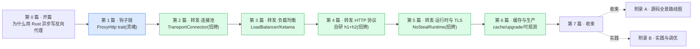

# 《Pingora 设计与实现深入浅出:用 Rust 异步写一个每秒千万请求的反向代理》—— 目录与导读

> 一本写给"用 Rust 写过 Web 服务、知道 Cloudflare 用 Rust 重写了代理、翻过 cloudflare/pingora 源码,却一知半解"的人的小书。
>
> **一句话主旨**:把"代理一条 HTTP 请求"做成一条可挂载钩子的请求生命周期——业务实现 `ProxyHttp` trait 在一串 filter 钩子里写逻辑(early_request_filter/request_filter/upstream_peer/upstream_request_filter/response_filter/…),框架管 upstream 连接池(`TransportConnector`)与负载均衡(`pingora-load-balancing`),全程跑在 Tokio 异步上(自研 `NoStealRuntime`)。Pingora 是 Rust 异步网络栈"应用层·反向代理"的代表。
>
> **二分法**(迷路时回到它):**钩子链**(`ProxyHttp` trait 的 filter 生命周期,业务挂载点,偏控制) vs **转发设施**(upstream 连接池 / 负载均衡 / HTTP 解析 / 缓存 / 运行时 / TLS,框架自管,偏数据)。
>
> **承接**:★强承接《Tokio》(每连接一个 task、IO 用 AsyncRead/AsyncWrite、async 钩子是 Future——Tokio 讲透的一句带过指路 [[tokio-source-facts]],但 NoStealRuntime 差异要详讲)+ 承接《gRPC》(HTTP/2 协议对照,Pingora 也用 h2)+ 横连《内存分配器》(bytes 零拷贝)。
>
> **★ 对照(同级 + 强对照)**:★**同级对照《hyper》**——Pingora 与 hyper 是 Tokio 之上的同级库(都建在 Tokio + h2 上),Pingora 运行时**不依赖 hyper**(只在 dev-dep),HTTP/1 自研(基于 httparse)、HTTP/2 也用 h2;★**强对照《Envoy》**——Pingora 是 Rust 代理(`ProxyHttp` 钩子链 + 无 xDS),Envoy 是 C++ 代理(filter chain + xDS 控制面);对照 Nginx(C,配置驱动,无钩子)。
>
> **主比喻**:直球为主、比喻点睛。开篇用"**关卡/收费站**"做一次性点位睛——一条 HTTP 请求像一辆车开过 Pingora 这条公路,沿途是一串关卡(`ProxyHttp` 的 filter 钩子),业务在关卡上设岗:有的关卡直接放行、有的改车牌(改 header)、有的指路(选 upstream);公路本身(连接池/负载均衡/协议/运行时)是框架修好的。

每章一行:**一句话钩子** —— 技巧标签 —— 二分法归属(`钩子链` / `转发设施` / `总览`)。

---

## 全书结构总览

旅程:从"一个 `ProxyHttp` 实现",一路走到"一个每秒千万请求的反向代理怎么把请求在钩子之间流转"。读完你能在脑子里放映出:TCP 字节被 Tokio reactor 唤醒 → listener accept + spawn task → HTTP/1 自研解析(httparse)/ HTTP/2(h2)切成请求 → 进 `ProxyHttp` 钩子链(early→request→upstream_peer→…→logging)→ `TransportConnector` 经连接池取/建到 upstream 的连接 → `HttpTask` 零拷贝透传 → 响应原路经钩子回 downstream——以及每一步 Tokio 怎么被用、对照 hyper(同级)/Envoy(filter chain)/Nginx(worker)怎么做。

---

## 第 0 篇 · 开篇:为什么需要 Pingora

- [P0-01 · 第一性原理:为什么用 Rust 异步写反向代理](P0-01-第一性原理-为什么用Rust异步写反向代理.md) —— Nginx 配置写死、Envoy 重 + xDS 复杂;Pingora 用 Rust 内存安全 + Tokio 全异步,把代理做成"实现 ProxyHttp 在钩子里写逻辑"。承 Tokio、★同级对照 hyper(自研 HTTP/1)、★强对照 Envoy/Nginx。 —— Rust 异步代理动机 + 三向对照 —— `总览`

## 第 1 篇 · 钩子链:`ProxyHttp` trait 的请求生命周期(Pingora 灵魂)

> `ProxyHttp` trait 是 Pingora 区别于"写死的代理"的根本。**建议顺序读**。

- [P1-02 · ProxyHttp trait:一串 async filter 钩子](P1-02-ProxyHttp-trait-一串async-filter钩子.md) —— Pingora 怎么把代理抽象成一个 trait 的 ~30 个 async 方法 + type CTX 贯穿状态。 —— ProxyHttp 全貌 + CTX 泛型 + async_trait —— `钩子链`
- [P1-03 · 请求前半段钩子:early/request_filter 与短路](P1-03-请求前半段钩子-early-requestfilter与短路.md) —— 鉴权/限流/直接响应:early_request_filter/request_filter(Ok(true) 短路)/request_body_filter/init_downstream_modules。 —— 短路语义 + module 注册 —— `钩子链`
- [P1-04 · upstream 选择与请求改写钩子](P1-04-upstream选择与请求改写钩子.md) —— 选后端 + 改请求:upstream_peer(返回 HttpPeer)/proxy_upstream_filter/upstream_request_filter。 —— upstream_peer 核心 + HttpPeer —— `钩子链`
- [P1-05 · 响应与收尾钩子](P1-05-响应与收尾钩子.md) —— 改响应 + 收尾:upstream_response_filter(缓存前)/response_filter(缓存后)/body_filter/trailer_filter/logging/connected_to_upstream。 —— filter 顺序为何这么排 —— `钩子链`

## 第 2 篇 · 转发设施·upstream 连接池(数据面招牌)

> 选好后端,怎么把连接建起来、怎么复用。

- [P2-06 · TransportConnector:L4/TLS 连接与复用](P2-06-TransportConnector-L4TLS连接与复用.md) —— 到 upstream 的 TCP/TLS 连接怎么建/复用:TransportConnector + pingora-pool + test_reusable_stream 1 字节探测 + offload_threadpool。 —— 连接池 + 1 字节探测 + offload —— `转发设施(招牌)`
- [P2-07 · HTTP connector:L7 连接与 h1/h2 会话](P2-07-HTTP-connector-L7连接与h1h2会话.md) —— L4 stream 之上建 HTTP 会话:connectors/http + ALPN 协商 + h1 keepalive + h2 多 stream。 —— L7 connector + ALPN —— `转发设施`
- [P2-08 · 零拷贝转发:HttpTask 与 body 流](P2-08-零拷贝转发-HttpTask与body流.md) —— 字节怎么在 downstream/upstream 间透传:HttpTask 枚举 + response_duplex_vec + Bytes 零拷贝 + retry buffer(64KB)。 —— HttpTask + 零拷贝 + retry buffer —— `转发设施`

## 第 3 篇 · 转发设施·负载均衡与服务发现

- [P3-09 · LoadBalancer 与 Backend 选择](P3-09-LoadBalancer与Backend选择.md) —— 怎么从一堆后端挑一个:LoadBalancer<S> + select/select_with + UniqueIterator + ArcSwap 无锁更新。 —— LoadBalancer + 无锁更新 —— `转发设施(招牌)`
- [P3-10 · 选择算法:RoundRobin/Random/Ketama](P3-10-选择算法-RoundRobinRandomKetama.md) —— 具体怎么挑:BackendSelection trait + Weighted 包装 + Consistent=KetamaHashing(与 Nginx 字节兼容)。 —— Ketama 一致性哈希 —— `转发设施(招牌)`
- [P3-11 · 服务发现与健康检查](P3-11-服务发现与健康检查.md) —— 后端列表哪来 + 怎么知道活:ServiceDiscovery/HealthCheck + do_update + run_health_check 并行 + BackgroundService。 —— discovery + health —— `转发设施`

## 第 4 篇 · 转发设施·HTTP 协议解析(协议招牌)

> Pingora 的 HTTP/1 自研(httparse)、HTTP/2 委托 h2。这一篇讲字节怎么切成 HTTP。

- [P4-12 · HTTP/1 自研解析(基于 httparse)](P4-12-HTTP1-自研解析-基于httparse.md) —— 为什么 Pingora 自己写 HTTP/1 不用 hyper:protocols/http/v1 + httparse + keep-alive + smuggling 防护(RUSTSEC-2026-0034)。 —— 自研 h1 + smuggling 防护 —— `转发设施(招牌)`
- [P4-13 · HTTP/2 委托 h2](P4-13-HTTP2-委托h2.md) —— HTTP/2 用 h2 + Pingora 怎么用:handshake + HttpSession::from_h2_conn + 多路复用(承 gRPC)+ H2 流控可配置(9.x 新增)。 —— h2 适配 + 流控可配 —— `转发设施`
- [P4-14 · HTTP/1↔HTTP/2 协议转换](P4-14-HTTP1-HTTP2协议转换.md) —— downstream h1 / upstream h2 怎么转:bridge/ + proxy_h1/proxy_h2 + hop header 改写 + UpgradedBody(websocket)。 —— 协议转换 + hop header —— `转发设施`

## 第 5 篇 · 转发设施·运行时与 TLS

- [P5-15 · NoStealRuntime:Pingora 自研运行时](P5-15-NoStealRuntime-Pingora自研运行时.md) —— 为什么不用 Tokio 多线程 runtime:pingora-runtime 多个 current_thread 池不做 work stealing + get_handle 随机选 + BlockingPoolOpts + daemonize 后 init。 —— NoSteal vs Steal 取舍 —— `转发设施(招牌)`
- [P5-16 · TLS 多后端:openssl/boringssl/rustls/s2n](P5-16-TLS多后端-opensslboringsslrustlss2n.md) —— TLS 为什么四套可插换:feature flag + 四 crate + boring_tokio 异步化 + ALPN + 为什么选 BoringSSL。 —— TLS 可插换 + ALPN —— `转发设施`

## 第 6 篇 · 缓存与生产特性

- [P6-17 · pingora-cache:HTTP 缓存](P6-17-pingoracache-HTTP缓存.md) —— 怎么做 HTTP 缓存:pingora-cache(cache_control/eviction/lock/variance)+ cache_key 必须 user 实现(曾出 RUSTSEC)+ stale-while-revalidate + tinyufo。 —— cache key + stale + tinyufo —— `转发设施/缓存`
- [P6-18 · listener、graceful upgrade 与连接管理](P6-18-listener-graceful-upgrade与连接管理.md) —— 接连接 + 零停机升级:ListeningService/listeners + graceful upgrade(fd 传递 transfer_fd/)+ persist_connection_context/on_connection_reuse。 —— graceful upgrade + fd 传递 —— `转发设施`
- [P6-19 · 可观测、限流与 module](P6-19-可观测-限流与module.md) —— 观测 + 限流:pingora-limits(令牌桶/滑动窗口)+ pingora-prometheus + HttpModules(compression/grpc_web)+ header-serde。 —— 限流 + module + metrics —— `钩子链/可观测`

## 第 7 篇 · 收束

- [P7-20 · 全书收束:Pingora 在 Rust 异步栈的位置](P7-20-全书收束-Pingora在Rust异步栈的位置.md) —— Pingora 栈定位(Tokio 之上,与 hyper 同级)+ ★三向对照总表(Pingora vs Nginx vs Envoy)+ ★与 hyper 真实关系(同级)+ 演展望(cache 成主力/HTTP3/s2n)。 —— 栈定位 + 三向对照 —— `总览`

## 附录

- [附录 A · Pingora 源码全景路线图](附录A-源码全景路线图.md) —— tokio::net → pingora-runtime(NoSteal) → listeners → protocols/http/{v1,v2} → connectors → pingora-proxy(ProxyHttp) → pingora-load-balancing → pingora-cache 全栈地图 + 16 crate 阅读顺序。
- [附录 B · 实践:搭代理、钩子开发、与 Nginx/Envoy 对照、调优](附录B-实践与调优.md) —— 用 ProxyHttp 写反向代理(鉴权/改 header/限流/LB)、钩子 checklist、Nginx/Envoy 配置对照、NoSteal vs Steal 选型、TLS 选型、连接池调优、排查清单(502/泄漏/smuggling)。

---

## 推荐阅读路线

**主线(推荐)**:P0-01 → 第 1 篇全(P1-02~05,钩子链灵魂)→ 第 2 篇全(P2-06~08,连接池招牌)→ 第 3 篇 → 第 4 篇 → 第 5 篇 → 第 6 篇 → 第 7 篇 → 附录 A。这是"一次 HTTP 请求在 Pingora 里跑完钩子链 + 转发设施两面"的完整旅程。

按目标速查:

| 你的目标 | 读这几章 |
|------|------|
| 只想懂 Pingora 整体 | P0-01 → P1-02 → P7-20 |
| 只想懂 ProxyHttp 钩子链(灵魂) | P1-02~05 |
| 只想懂 upstream 连接池 | P2-06~08 |
| 只想懂 HTTP/1 自研(招牌) | P4-12(对照 hyper P2-06) |
| 只想懂负载均衡与 Ketama | P3-09~11 |
| 读过 Tokio 想看运行时取舍 | P5-15(NoStealRuntime)+ P2-06(连接池的 task) |
| 读过 hyper 想看同级对照 | P4-12~14(h1 自研 vs hyper h1)+ P7-20 |
| 读过 Envoy 想看 Rust 代理对照 | P1-02(钩子 vs filter chain)+ P5-15(NoSteal vs worker)+ P7-20 |
| 想用 Pingora 搭代理 | P1-02~05 → P3-09 → 附录 B |
| 想读 Pingora 源码 | 附录 A + 跟本书章节逐个啃 |

> 一个提醒:第 1 篇(钩子链)有紧密顺序,**别跳**;本书处处承 Tokio、同级对照 hyper、强对照 Envoy,读过那几本收获翻倍。

---

## 配套文件

- [全书规划-总纲](全书规划-总纲.md) —— 主线、二分法、承接 Tokio/对照 hyper+Envoy、比喻、分篇分章、源码策略。
- [_章节写作提示词](_章节写作提示词.md) —— 写作执行手册(铁律、四段式、技巧精解、承接铁律、标点、深度)。
- 源码(已 clone(0.8.1 tag)):`../pingora/`(cloudflare/pingora,release `v0.8.1`,commit `719ef6cd54e40b530127751bab6c1afc5ae815a8`)。引用经 Grep/Read 核实行号,钉死在该 commit。
- 承接:[[tokio-series-project]]/[[tokio-source-facts]](运行时)、[[grpc-series-project]](HTTP/2 协议)、[[alloc-series-project]](bytes)、[[hyper-series-project]](同级对照)、[[envoy-series-project]](代理对照)。

---

> 这本书讲的不是"Pingora 的 API 怎么用",而是"它凭什么把代理一条 HTTP 请求做成一串可挂载钩子的生命周期、源码里那些 `ProxyHttp` trait、`TransportConnector` 连接池、NoStealRuntime、自研 HTTP/1、Ketama、`HttpTask` 零拷贝到底在干什么"。读完,你该能在脑子里放映出一次 HTTP 请求在 Pingora 里的全过程——以及每一步 Tokio 怎么被用、对照 hyper(同级)/Envoy(filter chain)/Nginx(worker)怎么做。
