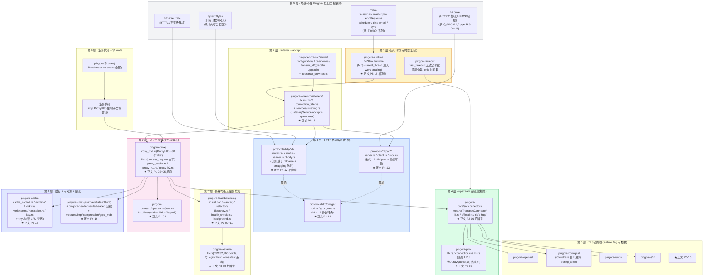

# 附录 A · Pingora 源码全景路线图:从 tokio::net 到 pingora-cache 的全栈地图

> **这份附录要回答的问题**:正文二十章拆透了 Pingora 的每个零件(`ProxyHttp` 钩子链、`TransportConnector` 连接池、`LoadBalancer` 与 Ketama、自研 HTTP/1 与委托 h2、`NoStealRuntime`、TLS 四后端、`pingora-cache`),但当你真的打开 `cloudflare/pingora` 仓库准备读源码时,面前是 **20 个 crate、几百个源文件**,该从哪读起、读到哪停、读到哪个文件去对照正文的哪一章?这份附录就是为这个问题写的——一张读 Pingora 源码的全景路线图。
>
> 它**不引入新机制**,只做三件事:**(1) 把 20 个 crate 钉死在一张全栈大图上**(每层是什么、对应正文哪一章)、**(2) 给一份推荐的源码阅读顺序**(按本书篇章顺序,而不是按 crate 字母序)、**(3) 把"一次请求穿过 Pingora"的生命周期映射到具体文件和函数**(读源码时能立刻定位到正文讲过的地方)。附录末尾还有一份"易翻车点速查",把全书核实并纠正过的旧认知汇总,让你读源码时不踩坑。
>
> **写给谁读**:你已经读完这本书的正文(至少读完 P0-01 开篇 + P1-02 `ProxyHttp` 灵魂 + P2-06 连接池招牌 + P5-15 `NoStealRuntime` 招牌),脑子里有了零件的全貌,现在想直接读 Pingora 源码——要么是为了把正文讲透的机制对着真实源码再核一遍,要么是为了看 0.8.1 之后 master 分支的新变化。这份附录是你的地图。如果你还没读正文,先翻 P0-01 和 P1-02,再回来。
>
> **源码版本钉死**:本书所有源码引用基于 `cloudflare/pingora` release `v0.8.1`,commit `719ef6cd54e40b530127751bab6c1afc5ae815a8`,2026-06-04。引用经本地 `../pingora/` Grep/Read 核实。读 master 分支时行号会有偏移,但文件结构和函数名是稳定的(本书讲的设计思想不会因版本号变)。

---

## 第一节:这份路线图怎么用

### 三种用法

这份附录有三种用法,看你处在哪个阶段:

**用法一:第一次读 Pingora 源码**。照着第三节的全栈大图,从下往上(地基 Tokio → 运行时 → listener → 协议解析 → 连接池 → 钩子链 → 负载均衡 → 缓存)逐层读。每读一层,回到本附录的速查表(第四节)看这层有哪些文件、对应正文哪一章,正文讲透的机制对着源码核一遍。这是"把正文当注释、把源码当靶子"的读法,最能巩固理解。

**用法二:带着具体问题查源码**。比如你想知道"`test_reusable_stream` 那个 1 字节探测到底在哪个文件、哪一行?"或"`cache_key_callback` 默认 panic 在哪实现的?"。直接跳到第五节的"一次请求的文件调用栈",或第六节的易翻车点速查,定位到具体文件,再回头读正文对应章节。这是"按问题定位"的读法,最高效。

**用法三:读 0.8.1 之后的新版本**。Pingora 在快速演进(cache 成主力、HTTP/3 在路上、s2n 已落地),你用的可能是 0.9 / 0.10。这份附录的"全栈大图"和"20 crate 速查表"给你的是**结构骨架**——骨架不会因为版本号变(还是这 20 个 crate,还是这几个目录),变的是每个 crate 内部的新文件和新 API。你拿着骨架去对新版本的目录树,能立刻看出"哪里新加了东西"。这是"用旧地图找新路"的读法,最能跟上演进。

> **一句话点破**:这份附录不是"Pingora 源码百科"(那会是一份重复正文的冗余文档),而是"Pingora 源码导航"——告诉你哪个文件讲什么、对应正文哪一章、读源码时该注意什么。正文讲透的,附录一句带过指路;正文没细讲但读源码会遇到的小文件(支撑 crate),附录补一句定位。地图在手,你自己走。

### 一个前置认知:workspace 20 crate 的物理结构

在用这张地图前,先在脑子里建立一个最顶层的心智模型——Pingora 是一个 Cargo workspace,**20 个 member crate**(核实根 `Cargo.toml` 的 `members`,版本钉死 `v0.8.1`):

```toml
# pingora/Cargo.toml#L6-L29(根 workspace,逐字摘录)
[workspace]
resolver = "2"
members = [
    "pingora",                # 伞 crate(facade,聚合 re-export)
    "pingora-core",           # 核心:connectors/protocols/http/server/listeners/upstreams
    "pingora-pool",           # 底层连接池(LRU)
    "pingora-error",          # 错误类型
    "pingora-limits",         # 限流(令牌桶/滑动窗口)
    "pingora-timeout",        # fast_timeout(无锁定时器)
    "pingora-header-serde",   # header 压缩(字典 + zstd)
    "pingora-proxy",          # ProxyHttp 钩子链(灵魂)
    "pingora-cache",          # HTTP 缓存
    "pingora-http",           # RequestHeader/ResponseHeader 类型
    "pingora-lru",            # LRU(旧实现)
    "pingora-openssl",        # TLS 后端:OpenSSL
    "pingora-boringssl",      # TLS 后端:BoringSSL(Cloudflare 生产用)
    "pingora-runtime",        # NoStealRuntime(自研运行时)
    "pingora-rustls",         # TLS 后端:rustls(纯 Rust)
    "pingora-s2n",            # TLS 后端:s2n(AWS,FIPS)
    "pingora-ketama",         # Ketama 一致性哈希(与 Nginx 兼容)
    "pingora-load-balancing", # LoadBalancer + 服务发现 + 健康检查
    "pingora-memory-cache",   # 内存缓存(读穿透)
    "tinyufo",                # 新 LRU(替代 pingora-lru,用于 cache 淘汰)
]
```

这 20 个 crate 不是平铺的孤岛。它们围绕"代理一条 HTTP 请求"这条主线咬合,按本书的二分法归类:

- **钩子链这一面**(业务挂载点):`pingora-proxy`(`ProxyHttp` trait,~30 个 filter 钩子)——全书第 1 篇(P1-02~05)拆透的灵魂。
- **转发设施这一面**(框架自管):连接池(`pingora-core` 的 `connectors/` + `pingora-pool`)、负载均衡(`pingora-load-balancing` + `pingora-ketama`)、HTTP 解析(`pingora-core` 的 `protocols/http/{v1,v2,bridge}`)、运行时(`pingora-runtime` + `pingora-timeout`)、TLS(`pingora-{openssl,boringssl,rustls,s2n}`)、缓存(`pingora-cache` + `tinyufo` + `pingora-lru` + `pingora-memory-cache`)、listener 与 graceful upgrade(`pingora-core` 的 `server/` + `services/` + `listeners/`)、可观测与限流(`pingora-limits` + `pingora-header-serde` + `pingora-core` 的 `modules/http/`)。
- **支撑**:`pingora-http`(RequestHeader/ResponseHeader 类型)+ `pingora-error`(错误类型)+ `pingora`(伞 crate,聚合 facade,用户 `use pingora::*` 即可)。

业务只动 `pingora-proxy` 的钩子,其余 19 个 crate 都是框架自管的转发设施——这就是二分法在源码物理结构上的体现(收束章 P7-20 第一节钉死过)。读源码时,你要清楚自己读的是"钩子链这一面"还是"转发设施这一面",前者决定业务在哪介入,后者决定框架怎么把请求在钩子之间流转。

> **钉死一个易错点**:这 20 个 crate 是 workspace member,但**不是 20 个互相独立的 crate**。它们之间有强依赖(如 `pingora-core` 依赖 `pingora-pool`/`pingora-runtime`/`pingora-http`,`pingora-proxy` 依赖 `pingora-core`/`pingora-cache`/`pingora-load-balancing`),构成一张依赖图。第四节速查表会给每个 crate 的"依赖关系"列。还有,**`pingora-prometheus` 不是独立 crate**——它是 `pingora-core` 内置的功能(`pingora-core/Cargo.toml` 依赖 `prometheus = "0.13"`,metrics 类型直接定义在 `pingora-core/src/`),很多博客凭印象把 `pingora-prometheus` 当独立 crate 列出来,这是错的,读源码时不要去找一个叫 `pingora-prometheus/` 的目录(根本不存在)。

---

## 第二节:全栈大图——从 tokio::net 到 pingora-cache

### 为什么读源码要一张全栈大图

读 Pingora 源码最容易迷路的地方,不是某个文件看不懂,而是**不知道这个文件在整个栈里站在哪一层**。你打开 `pingora-core/src/protocols/http/v1/server.rs`,看到 `httparse` 在切字节,但这一层在整条请求路径上的哪个位置?它上面是谁(listener?connector?)、下面是谁(hook?cache?)。如果脑子里没有一张全栈大图,你会陷在细节里,把 Pingora 读成"一堆零散的文件"。

这一节就是给你这张大图。它把 Pingora 的所有层次(从最底下的 Tokio 到最上面的业务代码)画在一张图上,**标出每层的关键 crate 和对应正文的哪一章**。读源码时,先在大图上定位你读的文件属于哪一层,再深入,你就不会迷路。

### 全栈大图



### 怎么读这张图

这张图从下往上读,正好是一条请求穿过 Pingora 的方向。但读源码时,推荐**从下往上读**(从地基开始),这样你读每一层时都知道它的下面是什么(已经搞懂了),只需要理解"这层在下面那层之上加了什么"。

逐层说一下每层的角色(对应正文哪一章,详见速查表):

- **第 0 层(地基,不在 Pingora 仓)**:Tokio(运行时地基,reactor/scheduler/time wheel,承《Tokio》系列,本书一句带过指路 [[tokio-source-facts]])、`h2`(HTTP/2 协议实现,承《gRPC》P2、《hyper》P3-09~11)、`httparse`(HTTP/1 字节级解析,Pingora 和 hyper 共用)、`bytes::Bytes`(零拷贝,承《内存分配器》)。这层不是 Pingora 的代码,但 Pingora 全程建在它上面,读源码时遇到 `tokio::net::TcpListener`、`h2::server::handshake`、`httparse::Parser`、`Bytes::from`,要知道这是地基,不是 Pingora 实现的。
- **第 1 层(运行时与定时器,自研)**:`pingora-runtime`(`NoStealRuntime`,正文 P5-15 招牌章)+ `pingora-timeout`(`fast_timeout`,正文 P6-19 提过)。这层是 Pingora 自己的运行时取舍——不用 Tokio 多线程 work-stealing runtime,而用 N 个 `current_thread` 池,`get_handle` 随机选线程来 spawn task。读源码时,`NoStealRuntime` 是必读的招牌(`pingora-runtime/src/lib.rs`,整个 crate 就一个文件)。
- **第 2 层(listener + accept + 服务/listener 配置)**:`pingora-core/src/listeners/`(L4 listener + TLS listener + connection_filter)+ `services/listening.rs`(`ListeningService` accept 后 spawn task)+ `server/`(配置、daemon、graceful upgrade 的 `transfer_fd/`)。这层负责"接连接、spawn task、零停机升级",正文 P6-18 拆透。
- **第 3 层(HTTP 协议解析,招牌)**:`protocols/http/v1/`(自研,基于 `httparse`,正文 P4-12 招牌章)+ `v2/`(委托 `h2`,正文 P4-13)+ `bridge/`(h1↔h2 转换,正文 P4-14)。这层把 TCP 字节流切成结构化 HTTP 请求,是 Pingora 区别于"建在 hyper 上"的关键(自研 HTTP/1)。读源码时,`v1/server.rs` 是必读的招牌(逐字节解析状态机)。
- **第 4 层(upstream 连接池,招牌)**:`pingora-core/src/connectors/`(`TransportConnector` L4/TLS + HTTP connector L7,正文 P2-06 招牌章)+ `pingora-pool`(底层 LRU 池,正文 P2-06)。这层管"到 upstream 的连接怎么建、怎么复用、怎么探测死活"。读源码时,`connectors/mod.rs` 的 `TransportConnector`、`pingora-pool/src/connection.rs` 的 `ConnectionPool`、`test_reusable_stream` 的 1 字节探测都是必读。
- **第 5 层(负载均衡 + 服务发现)**:`pingora-load-balancing`(`LoadBalancer<S>` + selection/ + discovery + health_check,正文 P3-09~11)+ `pingora-ketama`(Ketama 一致性哈希,与 Nginx 兼容,正文 P3-10 招牌章)。这层管"upstream_peer 钩子里业务怎么选后端、后端列表哪来、怎么知道健康"。
- **第 6 层(TLS 四后端,feature flag 可插换)**:`pingora-{openssl,boringssl,rustls,s2n}`(正文 P5-16)。这层是 Pingora 唯一一个"四选一"的层,通过 feature flag 在编译期决定用哪个 TLS 实现。Cloudflare 生产用 BoringSSL(`pingora-boringssl` 重写了 `boring_tokio.rs` 把 BoringSync 异步化)。
- **第 7 层(钩子链灵魂,业务挂载点)**:`pingora-proxy`(`ProxyHttp` trait,~30 个 filter 钩子,正文 P1-02~05 灵魂)+ `pingora-core/src/upstreams/peer.rs`(`HttpPeer`,正文 P1-04)。这层是 Pingora 的核心——业务实现 `ProxyHttp` trait 在钩子里写逻辑,框架管其余所有。读源码时,`proxy_trait.rs`(trait 定义)和 `lib.rs` 的 `process_request`(`pingora-proxy/src/lib.rs#L741`,钩子链编排主干)是必读的灵魂。
- **第 8 层(缓存 + 可观测 + 限流)**:`pingora-cache`(独立 crate,cache key + eviction + lock + variance,正文 P6-17)+ `tinyufo`(新 LRU 替代)+ `pingora-limits`(令牌桶/滑动窗口)+ `pingora-header-serde`(header 压缩)+ `pingora-core/src/modules/http/`(compression/grpc_web 模块,正文 P6-19)。这层是生产特性层,缓存是其中最重的(P6-17 单独一章)。
- **第 9 层(业务代码 + 伞 crate)**:业务代码(`impl ProxyHttp`)+ `pingora`(伞 crate,`lib.rs` 把所有子 crate re-export,用户 `use pingora::*` 即可,正文 P0-01 演示过)。

> **钉死这件事**:这张全栈大图,九层,从下往上是 **地基(Tokio/h2/httparse/bytes)→ 运行时(pingora-runtime/pingora-timeout)→ listener(listeners/services/server)→ 协议解析(protocols/http/{v1,v2,bridge})→ 连接池(connectors/pingora-pool)→ 负载均衡(pingora-load-balancing/pingora-ketama)→ TLS 四后端 → 钩子链(pingora-proxy/peer.rs)→ 缓存/可观测/限流(pingora-cache/tinyufo/pingora-limits/...)→ 业务代码(impl ProxyHttp)**。读源码时,先在大图上定位你读的文件属于哪一层,再深入。每层对应正文哪一章,详见第四节速查表。

---

## 第三节:20 crate 速查表(逐个 crate 一句话定位 + 关键文件 + 依赖 + 对应章)

### 为什么需要逐 crate 速查表

大图给你的是层次结构,但读源码时你打开的是一个个具体的 crate。每个 crate 内部有哪些文件?这个 crate 在二分法里属于哪一面?它依赖谁、被谁依赖?正文哪一章拆透了它?——这些信息需要一张速查表,让你读到任何 crate 都能立刻定位。

下面这张表按"重要性 + 阅读顺序"排序(不是字母序),把 20 个 crate 逐个钉死。读源码时,你随时可以回来查这张表。

### 速查表(按推荐阅读顺序排)

| 序 | crate | 一句话定位 | 关键文件 | 依赖 | 对应章 | 二分法归属 |
|----|-------|-----------|---------|------|--------|-----------|
| 1 | **pingora** | 伞 crate(facade),`lib.rs` 把所有子 crate re-export,用户 `use pingora::*` 即可。一个文件,不实现任何逻辑 | `src/lib.rs`(就这一个文件) | 全部子 crate | P0-01(用过) | 支撑 |
| 2 | **pingora-proxy** | **灵魂**:定义 `ProxyHttp` trait(~30 个 async filter 钩子)+ `process_request` 钩子链编排主干。业务实现这个 trait 在钩子里写逻辑 | `src/proxy_trait.rs`(ProxyHttp trait)、`src/lib.rs#L741`(process_request 主干)、`src/proxy_cache.rs`(缓存钩子编排)、`src/proxy_h1.rs`/`proxy_h2.rs`(协议适配)、`src/proxy_common.rs`、`src/proxy_custom.rs`、`src/proxy_purge.rs`(缓存清理)、`src/subrequest/`(子请求) | pingora-core、pingora-cache、pingora-load-balancing | **P1-02~05(全书灵魂)** | **钩子链** |
| 3 | **pingora-core** | **核心转发设施**:connectors(连接池)、protocols(http 解析)、listeners(accept)、server(配置/daemon/upgrade)、services、upstreams(peer)、modules。体量最大的 crate | `src/connectors/`(mod.rs/l4.rs/offload.rs/tls/http)、`src/protocols/http/{v1,v2,bridge}/`、`src/listeners/`(l4.rs/tls/connection_filter.rs)、`src/server/`(mod.rs/configuration/daemon.rs/transfer_fd/bootstrap_services.rs)、`src/services/`(listening.rs/background.rs)、`src/upstreams/peer.rs`(HttpPeer)、`src/modules/http/`(compression.rs/grpc_web.rs)、`src/utils/`、`src/apps/`、`src/tls/` | pingora-runtime、pingora-pool、pingora-error、pingora-timeout、pingora-http、pingora-{openssl,boringssl,rustls,s2n}(optional) | **P2-06~08、P4-12~14、P6-18~19(全栈)** | **转发设施** |
| 4 | **pingora-pool** | 底层连接池(`ConnectionPool<Arc<Mutex<Stream>>>`),`pingora-core` 的 `TransportConnector` 建在它上面。每 `PoolNode` 有热队列(ArrayQueue 容量 16) + ThreadLocal LRU 兜底 | `src/lib.rs`(ConnectionPool)、`src/connection.rs`(连接条目)、`src/lru.rs`(LRU 兜底) | pingora-error | **P2-06** | 转发设施 |
| 5 | **pingora-runtime** | **招牌**:自研 `NoStealRuntime`(N 个 `current_thread` runtime 池,**不做 work stealing**)+ `Steal`(标准 Tokio 多线程,可选)。整个 crate 就一个 `lib.rs` | `src/lib.rs`(`Runtime` enum @ L40-L83、`NoStealRuntime`、`get_handle` @ L68-L73、`init_pools`、`current_handle`) | tokio | **P5-15(招牌章)** | 转发设施(招牌) |
| 6 | **pingora-load-balancing** | `LoadBalancer<S: BackendSelection>` + selection(RoundRobin/Random/FNVHash/Ketama)+ discovery(Static/DNS)+ health_check(TcpHealthCheck)+ background(BackgroundService 周期跑) | `src/lib.rs`(LoadBalancer)、`src/selection/`(mod.rs/algorithms.rs/consistent.rs/weighted.rs)、`src/discovery.rs`(ServiceDiscovery)、`src/health_check.rs`(HealthCheck/TcpHealthCheck)、`src/background.rs`(BackgroundService) | pingora-core、pingora-http、arc-swap | **P3-09~11** | 转发设施 |
| 7 | **pingora-ketama** | Ketama 一致性哈希,与 Nginx `hash consistent` **结果级兼容**(基于 CRC32 不是 MD5,每后端 160 points)。整个 crate 就一个 `lib.rs` | `src/lib.rs`(KetamaHashing 算法) | 无 Pingora 内部依赖(独立小 crate) | **P3-10(招牌章)** | 转发设施 |
| 8 | **pingora-cache** | HTTP 缓存(独立 crate):cache key(★ user 必实现,默认 panic 防投毒)+ eviction(tinyufo)+ lock(防击穿)+ variance(变体)+ stale-while-revalidate | `src/lib.rs`(总)、`src/cache_control.rs`(Cache-Control 解析)、`src/eviction/`(淘汰)、`src/hashtable.rs`(缓存表)、`src/key.rs`(cache key)、`src/lock.rs`(缓存锁)、`src/variance.rs`(变体)、`src/put.rs`(写缓存)、`src/storage.rs`(存储抽象)、`src/meta.rs`(元数据)、`src/predictor.rs`(预测器)、`src/max_file_size.rs`、`src/memory.rs`、`src/filters.rs`、`src/trace.rs` | pingora-core、pingora-http、tinyufo | **P6-17** | 转发设施/缓存 |
| 9 | **tinyufo** | 新的 LRU 实现(替代 `pingora-lru`),用于 cache 淘汰。基于 TinyLFU 的准入 + LRU 驱逐,比传统 LRU 命中率高 | `src/lib.rs`(总)、`src/buckets.rs`(桶)、`src/estimation.rs`(CountMin 估计) | 无 Pingora 内部依赖 | **P6-17** | 转发设施/缓存 |
| 10 | **pingora-http** | HTTP 类型:`RequestHeader`/`ResponseHeader`(基于 `http::Request`/`Response` 但加了代理场景需要的字段) | `src/lib.rs`(RequestHeader/ResponseHeader)、`src/case_header_name.rs`(header 名大小写不敏感) | http、httparse、bytes | 各章都用 | 支撑 |
| 11 | **pingora-timeout** | `fast_timeout`:无锁定时器,比 `tokio::time::timeout` 轻(后者要注册到时间轮,前者用更省的方式)。底层仍是 tokio 时间轮 | `src/fast_timeout.rs`(fast_timeout)、`src/timer.rs`(Timer)、`src/lib.rs` | tokio | P6-19(提过) | 转发设施 |
| 12 | **pingora-limits** | 限流:令牌桶(`rate.rs`)+ 滑动窗口(`estimator.rs` CMS 估计,非朴素滑动窗口)+ inflight 计数(`inflight.rs`) | `src/lib.rs`、`src/rate.rs`(令牌桶)、`src/estimator.rs`(CMS 估计器)、`src/inflight.rs`(并发计数) | 无 Pingora 内部依赖 | **P6-19** | 转发设施/可观测 |
| 13 | **pingora-header-serde** | header 序列化压缩:字典 + zstd。用于 header 太多时的带宽优化(CDN 场景常见) | `src/lib.rs`(总)、`src/dict.rs`(字典)、`src/thread_zstd.rs`(线程级 zstd)、`src/trainer.rs`(字典训练) | zstd | P6-19(提过) | 转发设施/可观测 |
| 14 | **pingora-lru** | 旧的 LRU 实现(已被 `tinyufo` 在 cache 场景替代,但仍用于其他需要 LRU 的地方) | `src/lib.rs`、`src/linked_list.rs` | 无 Pingora 内部依赖 | P6-17(提过) | 支撑 |
| 15 | **pingora-memory-cache** | 内存缓存(读穿透,read-through)。注意区别于 `pingora-cache`(HTTP 缓存),这是更底层的 KV 内存缓存 | `src/lib.rs`、`src/read_through.rs`(读穿透) | pingora-lru | P6-19(提过) | 支撑 |
| 16 | **pingora-error** | 错误类型(`Error`)+ 不可变字符串(`immut_str.rs`)。全 crate 共用的错误基础设施 | `src/lib.rs`(Error 类型)、`src/immut_str.rs`(ImmutStr) | 无 | 各章都用 | 支撑 |
| 17 | **pingora-openssl** | TLS 后端之一:OpenSSL。复用 `tokio_openssl`(标准 tokio + openssl 桥) | `src/lib.rs`(TlsConnector)、`src/ext.rs`(扩展) | openssl、tokio_openssl | **P5-16** | 转发设施/TLS |
| 18 | **pingora-boringssl** | TLS 后端之一:BoringSSL(Cloudflare 生产用)。**重写了 `boring_tokio.rs` 把 BoringSync 异步化**(不是直接复用 tokio_openssl,因为 BoringSSL API 与 OpenSSL 略有差异) | `src/lib.rs`(TlsConnector)、`src/boring_tokio.rs`(★ 自研异步桥)、`src/ext.rs`(扩展) | boringssl | **P5-16** | 转发设施/TLS |
| 19 | **pingora-rustls** | TLS 后端之一:rustls(纯 Rust,内存安全,无 C 依赖)。适合安全敏感场景 | `src/lib.rs`(TlsConnector) | rustls、tokio-rustls | **P5-16** | 转发设施/TLS |
| 20 | **pingora-s2n** | TLS 后端之一:s2n-tls(AWS 出品,FIPS 合规)。0.7.0 新加 | `src/lib.rs`(TlsConnector) | s2n-tls、tokio-s2n | **P5-16** | 转发设施/TLS |

### 速查表怎么用

这张表不是让你从头读到尾,而是按场景查:

- **想读 Pingora 灵魂(钩子链)**:看序 2(`pingora-proxy`),关键文件 `proxy_trait.rs`(ProxyHttp trait 定义)+ `lib.rs#L741`(process_request 钩子链编排)。对应正文 P1-02~05。
- **想读连接池招牌**:看序 3(`pingora-core` 的 connectors/)+ 序 4(`pingora-pool`)。对应正文 P2-06~08。
- **想读 HTTP 解析招牌**:看序 3(`pingora-core` 的 protocols/http/{v1,v2,bridge})。对应正文 P4-12~14。
- **想读运行时招牌**:看序 5(`pingora-runtime`)。对应正文 P5-15。
- **想读负载均衡 + Ketama**:看序 6(`pingora-load-balancing`)+ 序 7(`pingora-ketama`)。对应正文 P3-09~11。
- **想读缓存**:看序 8(`pingora-cache`)+ 序 9(`tinyufo`)。对应正文 P6-17。
- **想读 TLS**:看序 17~20(四后端)。对应正文 P5-16。

> **钉死一个易错点**:**`pingora-prometheus` 不是独立 crate**。metrics 功能内置在 `pingora-core` 里(`pingora-core/Cargo.toml` 依赖 `prometheus = "0.13"`)。读源码时不要去找一个叫 `pingora-prometheus/` 的目录(不存在)。很多博客凭印象把它当独立 crate 列,这是错的。同理,**`persist_connection_context` 这个 API 在 0.8.1 不存在**(总纲初稿曾提过,核实源码后确认是凭记忆的误记,graceful upgrade 用的是 `transfer_fd/` + keepalive 请求间状态靠 connection 的 keepalive 复用本身,没有一个单独叫 `persist_connection_context` 的钩子)。

---

## 第四节:推荐阅读顺序——按本书篇章顺序对应的源码阅读路径

### 为什么不按字母序读

读 Pingora 源码最忌讳的,是按 `ls` 字母序从头读到尾(`pingora` → `pingora-boringssl` → `pingora-cache` → ...)。这样读你会陷在 TLS 后端(序 17~20)这种支撑层里,迟迟读不到 Pingora 的灵魂(`pingora-proxy` 的钩子链)。等你读到钩子链时,前面 TLS 的细节已经忘了,而且根本不知道钩子链为什么要这么设计。

推荐的读法是**按本书的篇章顺序**——因为本书的篇章顺序就是按"从灵魂到支撑、从招牌到细节"排的:先钩子链(P1,灵魂)→ 连接池(P2,招牌)→ 负载均衡(P3)→ 协议(P4,招牌)→ 运行时/TLS(P5)→ 缓存/生产(P6)。读源码也按这个顺序,你每读一层都知道它的上面和下面是什么(因为正文已经讲过了),不会迷路。

### 三条推荐阅读路径

不同读者目标不同,推荐三条路径。

#### 路径一:主线阅读(推荐大多数人)

按本书篇章顺序,逐层读源码。每层读完后,回到正文对应章节对照核一遍。这是最扎实的读法,适合想完整理解 Pingora 的人。

| 步 | 读什么 crate / 文件 | 对应正文 | 预计耗时 | 重点 |
|----|---------------------|---------|---------|------|
| 1 | `pingora/src/lib.rs`(伞 crate) | P0-01 | 10 分钟 | 看一眼 facade re-export 了什么,知道 `use pingora::*` 拿到什么 |
| 2 | `pingora-proxy/src/proxy_trait.rs`(ProxyHttp trait) | P1-02 | 2 小时 | **全书灵魂**。逐个读 ~30 个 filter 钩子,看每个钩子的签名(参数是 `&self, &mut Session, &mut Self::CTX`)和默认实现(大多是空操作) |
| 3 | `pingora-proxy/src/lib.rs#L741`(process_request) | P1-02~05 | 3 小时 | **钩子链编排主干**。读这一个函数,就读完了请求穿过 Pingora 的全部阶段。early → modules → request_filter(短路)→ proxy_cache → proxy_upstream_filter(短路)→ proxy_to_upstream(含 upstream_peer/upstream_request_filter/upstream_response_filter/response_filter)→ logging |
| 4 | `pingora-core/src/connectors/mod.rs`(TransportConnector) | P2-06 | 3 小时 | **连接池招牌**。读 `reused_stream` / `new_stream` / `release_stream` / `test_reusable_stream`(1 字节探测)/ `offload_threadpool` |
| 5 | `pingora-pool/src/{lib.rs,connection.rs,lru.rs}` | P2-06 | 1.5 小时 | 底层池。看 `ConnectionPool<Arc<Mutex<Stream>>>`、热队列(ArrayQueue 16)、ThreadLocal LRU 兜底 |
| 6 | `pingora-core/src/connectors/http/`(HTTP connector) | P2-07 | 2 小时 | L7 connector。h1/h2 ALPN 协商、`PreferredHttpVersion`、HTTP 会话建立 |
| 7 | `pingora-load-balancing/src/lib.rs`(LoadBalancer) | P3-09 | 2 小时 | `LoadBalancer<S: BackendSelection>`、`select`/`select_with`、`UniqueIterator`、`ArcSwap` 无锁更新 |
| 8 | `pingora-load-balancing/src/selection/{mod.rs,algorithms.rs,consistent.rs,weighted.rs}` | P3-10 | 2 小时 | `BackendSelection` trait、RoundRobin/Random/FNVHash、`Consistent=KetamaHashing` |
| 9 | `pingora-ketama/src/lib.rs`(Ketama) | P3-10 | 1.5 小时 | **Ketama 招牌**。CRC32、160 points、与 Nginx `hash consistent` 兼容 |
| 10 | `pingora-load-balancing/src/{discovery.rs,health_check.rs,background.rs}` | P3-11 | 2 小时 | `ServiceDiscovery` trait、`HealthCheck` trait、`TcpHealthCheck`、`BackgroundService` |
| 11 | `pingora-core/src/protocols/http/v1/`(自研 HTTP/1) | P4-12 | 3 小时 | **HTTP/1 招牌**。`server.rs`/`client.rs`/`header.rs`/`body.rs`,逐字节解析、keep-alive 循环、chunked、100-continue、smuggling 防护(0.8.0 content-length 校验) |
| 12 | `pingora-core/src/protocols/http/v2/`(委托 h2) | P4-13 | 2 小时 | `handshake`、`HttpSession::from_h2_conn`、`SendResponse`/`RecvStream`、`H2Options`(流控可配) |
| 13 | `pingora-core/src/protocols/http/bridge/`(h1↔h2) | P4-14 | 1.5 小时 | 协议转换、hop header 改写、grpc_web 转换、UpgradedBody |
| 14 | `pingora-runtime/src/lib.rs`(NoStealRuntime) | P5-15 | 2 小时 | **运行时招牌**。`Runtime` enum @ L40-L83、`NoStealRuntime`、`get_handle` @ L68-L73、`init_pools`、为什么不要 work-stealing |
| 15 | `pingora-{openssl,boringssl,rustls,s2n}/`(TLS 四后端) | P5-16 | 2 小时(挑一个深读) | feature flag 可插换。重点读 `pingora-boringssl/src/boring_tokio.rs`(自研异步桥) |
| 16 | `pingora-cache/src/`(HTTP 缓存) | P6-17 | 3 小时 | cache key(★ user 必实现)、eviction、lock、variance、stale-while-revalidate |
| 17 | `tinyufo/src/lib.rs`(新 LRU) | P6-17 | 1 小时 | TinyLFU 准入 + LRU 驱逐,比传统 LRU 命中率高 |
| 18 | `pingora-core/src/server/`(server + graceful upgrade) | P6-18 | 2 小时 | `configuration/`(YAML 配置)、`daemon.rs`(daemonize)、`transfer_fd/`(★ 零停机升级 fd 传递)、`bootstrap_services.rs` |
| 19 | `pingora-core/src/{listeners,services}/`(listener + service) | P6-18 | 1.5 小时 | `listeners/l4.rs`、`listeners/tls/`、`listeners/connection_filter.rs`、`services/listening.rs`(ListeningService accept + spawn task)、`services/background.rs` |
| 20 | `pingora-limits/` + `pingora-header-serde/` + `pingora-core/src/modules/http/` | P6-19 | 2 小时 | 令牌桶、滑动窗口(CMS 估计)、header 压缩、compression/grpc_web 模块 |
| 21 | `pingora-core/src/upstreams/peer.rs`(HttpPeer) | P1-04 | 1 小时 | `HttpPeer`(addr/sni/alpn/tls/path),`upstream_peer` 钩子的返回类型 |
| 22 | `pingora-http/src/lib.rs` + `pingora-error/src/lib.rs` | 各章 | 30 分钟 | 类型基础设施,扫一眼即可 |

总耗时约 45 小时(扎实读)。读完后,你对 Pingora 的理解会从"知道有这些 crate"升级到"能在脑子里放映一次请求穿过每个文件的全程"。

#### 路径二:灵魂优先(只读核心,3 个 crate)

如果你时间紧,只想读最核心的 3 个 crate,理解 Pingora 的灵魂,推荐这条路径:

1. **`pingora-proxy/src/proxy_trait.rs` + `lib.rs#L741`**(对应 P1-02~05):这是 Pingora 的灵魂。读 `ProxyHttp` trait 的 ~30 个钩子,读 `process_request` 的钩子链编排。3~5 小时,你就懂了"代理一条 HTTP 请求做成一串可挂载钩子的生命周期"是什么意思。
2. **`pingora-core/src/connectors/mod.rs` + `pingora-pool/src/lib.rs`**(对应 P2-06):这是转发设施的招牌。读 `TransportConnector` 的连接池、`test_reusable_stream` 的 1 字节探测、`offload_threadpool` 的 offload。2~3 小时,你就懂了"框架怎么把请求在钩子之间流转"。
3. **`pingora-runtime/src/lib.rs`**(对应 P5-15):这是运行时的招牌。读 `NoStealRuntime` 为什么不做 work-stealing、`get_handle` 怎么随机选线程。1~2 小时,你就懂了"Pingora 自研运行时的取舍"。

总耗时约 8 小时。读完这三个 crate,你抓住了 Pingora 三个最独特的取舍(钩子链设计、连接池死活探测、NoStealRuntime),其余 crate 都是支撑,有时间再补。

#### 路径三:问题驱动(按具体问题定位)

如果你带着具体问题来(比如"`test_reusable_stream` 的 1 字节探测到底怎么实现?"或"`cache_key_callback` 默认 panic 在哪?"),直接跳到第五节"一次请求的文件调用栈",按请求生命周期定位到具体文件,再回头读正文对应章节。这是最高效的读法,但要求你对自己要找的东西有明确目标。

### 阅读时的几个习惯

读 Pingora 源码时,几个习惯能帮你少走弯路:

- **带着正文读源码**:每读一个文件前,先翻回正文对应章节,把正文讲透的机制在脑子里过一遍。然后读源码时,你的目标是"核实正文讲的机制在源码里怎么实现",而不是"从零理解这个文件在干什么"。这样读,源码的注释和函数名会立刻和正文的概念对上号。
- **从 `process_request` 这一个函数入门**:`pingora-proxy/src/lib.rs#L741` 的 `process_request` 是全书最重要的一函数——它编排了请求穿过钩子链的全部阶段。读源码从这个函数入门,你就抓住了主线。其余所有文件,都是这个函数里某个钩子或某步转发的实现细节。
- **遇到 `tokio::`、`h2::`、`httparse::`、`Bytes::` 知道是地基**:这些不是 Pingora 的代码,是 Pingora 建在上面的地基。遇到时知道"这是 Tokio/h2/httparse/bytes 提供的",不要陷进去读(那是《Tokio》/《gRPC》/《内存分配器》的事)。
- **遇到 feature flag 知道是可插换**:`pingora-core` 的 TLS 后端是 feature flag 可插换的,读 `connectors/tls/` 时会看到 `#[cfg(feature = "boringssl")]` 这种条件编译。知道这是"编译期选四后端之一",不要试图同时读四个后端,挑一个(推荐 boringssl,Cloudflare 生产用)深读。
- **遇到 `#[async_trait]` 知道是钩子**:`ProxyHttp` trait 的每个钩子都标了 `#[async_trait]`,意思是每个钩子是 async fn,会被包装成 `Pin<Box<dyn Future>>`。这是钩子链的灵魂——每个钩子是一个 Future,跑在 Tokio 上(承《Tokio》)。读 `proxy_trait.rs` 时,看到 `#[async_trait]` 就知道这是一个业务可挂载的 async 钩子。

> **钉死这件事**:推荐的源码阅读顺序是 **灵魂(pingora-proxy)→ 转发招牌(pingora-core 的 connectors/pingora-pool)→ 运行时招牌(pingora-runtime)→ 协议招牌(protocols/http)→ 负载均衡(load-balancing/ketama)→ TLS → 缓存 → listener/生产**。从灵魂开始读,你每读一层都知道它在钩子链里扮演什么角色;从支撑开始读(字母序),你会迷路。主线路径约 45 小时,灵魂优先路径约 8 小时,问题驱动按需读。

---

## 第五节:一次请求穿过源码的文件调用栈——把请求生命周期映射到具体文件函数

### 为什么要把请求生命周期映射到文件

正文 P7-20(收束章)给过一张"一次请求穿过 Pingora 的完整旅程"大图,七段(解析 → 前半段钩子 → 缓存判定 → 选后端+改请求 → 连接池转发 → 响应钩子 → 归还)。但那张图是概念层的,没有标"每一段在哪个文件的哪个函数里"。读源码时,你需要的是一张更细的图——把每一段映射到具体文件 + 函数 + 行号,这样你读源码时能立刻定位到"我现在读的这一行,在请求生命周期的哪一段"。

这一节就是那张更细的图。它把 P7-20 的七段旅程,逐段拆成文件调用栈,每一步标出"哪个文件 / 哪个函数 / 对应正文哪一章"。

### 请求生命周期的文件调用栈

下面这张序列图是请求穿过 Pingora 的完整文件调用栈(以 HTTP/1 downstream + HTTP/2 upstream 为例,标注关键文件和函数):

```mermaid
sequenceDiagram
    autonumber
    participant C as Client
    participant LIS as listeners/l4.rs<br/>+ services/listening.rs
    participant RT as pingora-runtime<br/>(NoStealRuntime)
    participant H1 as protocols/http/v1/server.rs
    participant PR as pingora-proxy/lib.rs<br/>(process_request)
    participant TR as proxy_trait.rs<br/>(ProxyHttp 钩子)
    participant CH as pingora-cache/lib.rs
    participant LB as load-balancing/lib.rs
    participant TC as connectors/mod.rs<br/>(TransportConnector)
    participant POOL as pingora-pool/lib.rs
    participant H2C as protocols/http/v2/client.rs
    participant TLS as pingora-boringssl/<br/>(boring_tokio.rs)
    participant U as Upstream

    Note over LIS,RT: 第 0 步:accept + spawn task(P6-18, P5-15)
    C->>LIS: TCP 连接(Tokio reactor 唤醒)
    LIS->>LIS: l4.rs accept<br/>+ connection_filter.rs(P6-18)
    LIS->>RT: NoStealRuntime.get_handle()<br/>随机选线程(P5-15)
    RT->>PR: spawn task(process_request 跑在此线程)

    Note over H1: 第 1 段:HTTP/1 解析(P4-12)
    PR->>H1: 读 downstream 字节<br/>httparse 状态机切 header
    H1->>H1: body.rs 处理 chunked/100-continue<br/>+ smuggling 防护(0.8.0 content-length 校验)
    H1-->>PR: 结构化 RequestHeader + body stream

    Note over PR,TR: 第 2 段:请求前半段钩子(P1-03)
    PR->>TR: early_request_filter(模块前)
    PR->>TR: 下游模块 request_header_filter<br/>(modules/http/compression.rs, P6-19)
    PR->>TR: request_filter(★ 可短路 Ok(true))
    Note over PR: 若短路:直接响应,跳到第 6 段 logging

    Note over PR,CH: 第 3 段:缓存判定(P6-17)
    PR->>CH: request_cache_filter / cache_key_callback<br/>(★ user 必实现,默认 panic 防投毒)
    alt 缓存命中
        CH-->>PR: 返回缓存
        PR->>TR: response_cache_filter(命中改响应)
        Note over PR: 跳到第 6 段发响应
    end

    Note over PR,LB: 第 4 段:选后端 + 改请求(P1-04, P3-09~11)
    PR->>TR: proxy_upstream_filter(★ 可短路 Ok(false))
    PR->>TR: upstream_peer(★ 必实现,返回 Box&lt;HttpPeer&gt;)
    TR->>LB: 业务调 LoadBalancer.select<br/>(selection/algorithms.rs RoundRobin<br/>或 selection/consistent.rs Ketama)
    LB-->>TR: 选中的 Backend
    TR->>TR: upstream_request_filter(改 upstream header)

    Note over TC,U: 第 5 段:连接池转发(P2-06~08)
    PR->>TC: 取/建到 upstream 的连接
    alt 复用(keepalive)
        TC->>POOL: reused_stream(热队列 ArrayQueue 16)
        TC->>TC: test_reusable_stream(1 字节 now_or_never 探测)
    else 新建
        TC->>TC: offload_threadpool(CPU 密集活隔离)
        TC->>TLS: TLS 握手(boring_tokio 异步桥)
        TLS->>U: TCP + TLS 连接
    end
    TC->>H2C: 建 HTTP/2 会话(h2::client::handshake)
    H2C-->>PR: HTTP 会话
    PR->>U: 发请求(HttpTask 透传 + Bytes 零拷贝)<br/>(bridge/mod.rs h1→h2 转换, P4-14)
    U-->>PR: 响应 header + body

    Note over PR,CH: 第 6 段:响应钩子(P1-05, P6-17)
    PR->>TR: upstream_response_filter(★ 缓存前改,进缓存)
    PR->>CH: response_cache_filter(决定写缓存)
    PR->>TR: response_filter(★ 缓存后改,不进缓存)
    PR->>TR: response_body_filter / response_trailer_filter
    PR->>TR: logging(收尾,即使短路也跑)
    PR->>C: 发响应

    Note over TC: 第 7 段:连接归还(P2-06)
    PR->>TC: release_stream(归还池)
    TC->>POOL: 放回热队列 + idle_poll 空闲探测
    TC->>TC: PreferredHttpVersion 记住 peer 该用 h1/h2
```

### 逐段拆文件调用栈

这张图你不用全记,记七段对应的文件即可。逐段拆(每段标出"在哪个文件 / 哪个函数 / 对应正文哪一章"):

**第 0 步:accept + spawn task**(P6-18, P5-15)
- 入口:`pingora-core/src/listeners/l4.rs`(L4 listener,`TcpListener` accept)+ `pingora-core/src/listeners/tls/`(TLS listener)+ `pingora-core/src/listeners/connection_filter.rs`(连接级 filter,可选)。
- 编排:`pingora-core/src/services/listening.rs` 的 `ListeningService`(accept 一个连接后,在 `NoStealRuntime.get_handle()` 的 handle 上 spawn 一个 task)。
- 运行时:`pingora-runtime/src/lib.rs#L68-L73`(`get_handle`,NoSteal 随机选一个线程的 handle)。
- 对应正文:P6-18(listener、graceful upgrade 与连接管理)+ P5-15(NoStealRuntime)。

**第 1 段:HTTP 解析**(P4-12~14)
- HTTP/1 入口:`pingora-core/src/protocols/http/v1/server.rs`(downstream 侧,`httparse` 逐字节切 header)+ `v1/body.rs`(body 处理:chunked、100-continue)+ `v1/header.rs`(header 类型)+ `v1/common.rs`。
- HTTP/2 入口:`pingora-core/src/protocols/http/v2/server.rs`(downstream 侧,`h2::server::handshake`)+ `v2/mod.rs`。
- smuggling 防护:`v1/server.rs` 里的 content-length 校验(0.8.0 加的 `Reject invalid content-length http/1 requests`,见 CHANGELOG)。
- 对应正文:P4-12(HTTP/1 自研,招牌章)+ P4-13(HTTP/2 委托 h2)+ P4-14(协议转换)。

**第 2 段:请求前半段钩子**(P1-03)
- 编排:`pingora-proxy/src/lib.rs#L741`(process_request,在这一段调 early_request_filter → 下游模块 request_header_filter → request_filter)。
- 钩子定义:`pingora-proxy/src/proxy_trait.rs`(early_request_filter @ L84、request_filter @ L68)。
- 下游模块:`pingora-core/src/modules/http/compression.rs`(compression 模块)、`modules/http/grpc_web.rs`(grpc_web 模块)。
- 对应正文:P1-03(请求前半段钩子:early/request_filter 与短路)。

**第 3 段:缓存判定**(P6-17)
- 编排:`pingora-proxy/src/proxy_cache.rs`(缓存相关的钩子编排)+ `pingora-proxy/src/lib.rs` 的 process_request 里 cache 段。
- 缓存实现:`pingora-cache/src/lib.rs`(总)+ `key.rs`(cache key,★ `cache_key_callback` user 必实现)+ `hashtable.rs`(缓存表)+ `lock.rs`(缓存锁,防击穿)。
- 对应正文:P6-17(pingora-cache:HTTP 缓存)。

**第 4 段:选后端 + 改请求**(P1-04, P3-09~11)
- 钩子:`pingora-proxy/src/proxy_trait.rs`(proxy_upstream_filter @ L198、upstream_peer @ L42、upstream_request_filter @ L283)。
- 选后端(业务在 upstream_peer 里调):`pingora-load-balancing/src/lib.rs`(LoadBalancer.select)+ `selection/algorithms.rs`(RoundRobin @ L38 / Random @ L50)+ `selection/consistent.rs`(KetamaHashing @ L23)+ `pingora-ketama/src/lib.rs`(Ketama 算法)。
- HttpPeer:`pingora-core/src/upstreams/peer.rs`(HttpPeer:addr/sni/alpn/tls/path)。
- 对应正文:P1-04(upstream 选择与请求改写钩子)+ P3-09(LoadBalancer)+ P3-10(选择算法:Ketama 招牌)+ P3-11(服务发现与健康检查)。

**第 5 段:连接池转发**(P2-06~08)
- L4/TLS 连接池:`pingora-core/src/connectors/mod.rs`(TransportConnector,reused_stream / new_stream / release_stream / test_reusable_stream / offload_threadpool)+ `connectors/l4.rs`(L4 连接)+ `connectors/offload.rs`(offload 线程池)+ `connectors/tls/`(TLS 连接,feature flag 选后端)。
- 底层池:`pingora-pool/src/lib.rs`(ConnectionPool)+ `connection.rs`(连接条目)+ `lru.rs`(LRU 兜底)。
- HTTP connector(L7):`pingora-core/src/connectors/http/`(v1.rs / v2.rs / mod.rs,h1/h2 ALPN 协商 + HTTP 会话建立 + PreferredHttpVersion)。
- HTTP/2 upstream 会话:`pingora-core/src/protocols/http/v2/client.rs`(h2::client::handshake)。
- TLS 后端(BoringSSL 为例):`pingora-boringssl/src/lib.rs`(TlsConnector)+ `boring_tokio.rs`(★ 自研异步桥,把 BoringSync 异步化)。
- 协议转换:`pingora-core/src/protocols/http/bridge/mod.rs`(h1↔h2 转换,downstream h1 / upstream h2 时)。
- HttpTask 透传:`pingora-proxy/src/lib.rs`(response_duplex_vec,在 downstream 和 upstream 之间双向 pump,用 HttpTask 枚举 + Bytes 零拷贝)。
- 对应正文:P2-06(TransportConnector 招牌)+ P2-07(HTTP connector)+ P2-08(零拷贝转发 HttpTask)+ P4-14(协议转换)+ P5-16(TLS)。

**第 6 段:响应钩子(缓存前/后)**(P1-05, P6-17)
- 钩子:`pingora-proxy/src/proxy_trait.rs`(upstream_response_filter @ L302 缓存前、response_filter @ L318 缓存后、response_body_filter @ L399、response_trailer_filter @ L413、logging @ L435)。
- 缓存写:`pingora-cache/src/put.rs`(写缓存)+ `response_cache_filter`(决定是否写)。
- 对应正文:P1-05(响应与收尾钩子,filter 顺序为何 cache 前/后分开)+ P6-17(缓存)。

**第 7 段:连接归还**(P2-06)
- 编排:`pingora-core/src/connectors/mod.rs`(release_stream,归还池 + idle_poll 空闲探测 + PreferredHttpVersion 记住 peer 偏好)。
- 底层池:`pingora-pool/src/lib.rs`(放回热队列)。
- 对应正文:P2-06(TransportConnector)。

### 这张调用栈图怎么用

读源码时,这张图是你的"导航地图"。具体用法:

- **读 `process_request` 时**:对照第 2~6 段,你会发现 `process_request` 这一个函数(`pingora-proxy/src/lib.rs#L741`)编排了第 2~6 段的全部钩子调用。读这个函数时,每遇到一个钩子调用,回到这张图看它在请求生命周期的哪一段、对应哪个文件、正文哪一章拆透。
- **读 `connectors/mod.rs` 时**:对照第 5 段和第 7 段,你会发现 `TransportConnector` 的 `reused_stream`/`new_stream`/`release_stream`/`test_reusable_stream` 正好对应第 5 段(取/建连接)和第 7 段(归还)。
- **读 `proxy_trait.rs` 时**:对照第 2/4/6 段,你会发现 ~30 个钩子分布在请求生命周期的不同段——early/request_filter 在第 2 段,upstream_peer/upstream_request_filter 在第 4 段,upstream_response_filter/response_filter/logging 在第 6 段。读 trait 时,把每个钩子在脑子里定位到它属于哪一段,你就理解了钩子链的顺序为什么这么排。
- **调试线上问题时**:如果线上出 502(连接死),回到第 5 段看 `test_reusable_stream` 的实现;如果出缓存投毒,回到第 3 段看 `cache_key_callback`;如果出 smuggling,回到第 1 段看 content-length 校验。每个问题都对应一段文件。

> **钉死这件事**:一次请求穿过 Pingora 的文件调用栈,七段——**(0) accept+spawn(listeners/services/pingora-runtime)→ (1) HTTP 解析(protocols/http/{v1,v2})→ (2) 前半段钩子(proxy_trait 的 early/request_filter,process_request 编排)→ (3) 缓存判定(pingora-cache)→ (4) 选后端+改请求(proxy_trait 的 upstream_peer/upstream_request_filter + load-balancing + ketama)→ (5) 连接池转发(connectors + pingora-pool + TLS 后端 + bridge)→ (6) 响应钩子(proxy_trait 的 upstream_response_filter/response_filter/logging)→ (7) 归还(connectors 的 release_stream)**。这七段对应 P7-20 收束章的七段旅程,只不过这里钉到了文件级。读源码时,这张图是你的导航。

---

## 第六节:易翻车点速查——读源码常见误区

### 为什么单独一节讲误区

读 Pingora 源码时,有一类错误不是"看不懂源码",而是"带着错误的旧认知读源码,越读越歪"。这些旧认知来自三个地方:(1) 凭印象的猜测(如"hyper 是 Pingora 的依赖")、(2) 过时博客的误导(如"Pingora 默认 cache key 安全")、(3) 总纲初稿的误记(如"`persist_connection_context` 是个钩子")。这本书在写作过程中逐个核实并纠正了这些旧认知(详见 P7-20 收束章末尾的"修正凭印象的旧认知"清单),附录最后一次汇总,让你读源码时不踩坑。

下面把全书核实并纠正过的易翻车点列成速查表。每个点标出"错在哪里、对的该是什么、核实依据"。

### 易翻车点速查表

| 序 | 易翻车点(凭印象的旧认知) | 对的事实 | 核实依据 | 涉及正文 |
|----|---------------------------|---------|---------|---------|
| 1 | "Pingora 依赖/建在 hyper 上" | **错**。Pingora 运行时**不依赖** hyper。`pingora-core/Cargo.toml` 里 `hyper = "1"` 只在 `[dev-dependencies]#L92`(测试/benchmark 用),运行时依赖是 `httparse`(@ L36,自研 HTTP/1)+ `h2`(@ L40,HTTP/2 委托)。**Pingora 与 hyper 是 Tokio 之上的同级库**,各自自研 HTTP/1(共用 httparse,状态机独立),HTTP/2 都用 h2(强同源) | `pingora-core/Cargo.toml#L21-L75`(运行时无 hyper)+ `#L84-L96`(hyper 在 dev-dep @ L92) | P0-01、P4-12、P7-20 第四节 |
| 2 | "Pingora 的 HTTP/1 用 hyper 实现" | **错**。Pingora 的 HTTP/1 **完全自研**,基于 `httparse` crate(`pingora-core/src/protocols/http/v1/`),与 hyper 的 HTTP/1(`hyper/src/proto/h1/`)是两套独立的状态机。共用 `httparse` 做字节级解析,但状态机、连接管理、keepalive 循环、smuggling 防护都是各自实现 | `pingora-core/src/protocols/http/v1/{server.rs,client.rs,header.rs,body.rs}` | P4-12(招牌章) |
| 3 | "pingora-prometheus 是独立 crate" | **错**。`pingora-prometheus` **不是独立 crate**。metrics 功能内置在 `pingora-core` 里(`pingora-core/Cargo.toml#L50` 依赖 `prometheus = "0.13"`)。读源码时不要去找 `pingora-prometheus/` 目录(不存在)。workspace 的 20 个 member 里没有它 | 根 `Cargo.toml#L8-L29`(20 个 member,无 `pingora-prometheus`) | P6-19 |
| 4 | "persist_connection_context 是个钩子" | **错(总纲初稿误记)**。`persist_connection_context` **在 0.8.1 不存在**。graceful upgrade 用的是 `pingora-core/src/server/transfer_fd/`(fd 传递),keepalive 请求间状态靠 connection 的 keepalive 复用本身,没有一个单独叫 `persist_connection_context` 的钩子。读 `proxy_trait.rs` 时找不到这个方法是对的,它不存在 | Grep `proxy_trait.rs` 无此方法 | P6-18 |
| 5 | "workspace 是 16 个 crate" | **错(总纲初猜)**。workspace 是 **20 个 member crate**(核实根 `Cargo.toml#L8-L29`):pingora、pingora-core、pingora-pool、pingora-error、pingora-limits、pingora-timeout、pingora-header-serde、pingora-proxy、pingora-cache、pingora-http、pingora-lru、pingora-openssl、pingora-boringssl、pingora-runtime、pingora-rustls、pingora-s2n、pingora-ketama、pingora-load-balancing、pingora-memory-cache、tinyufo | 根 `Cargo.toml#L8-L29` | P7-20 |
| 6 | "pingora-core 版本是 0.8.0" | **错(总纲初猜)**。`pingora-core` 内部 version = **0.8.1**(`pingora-core/Cargo.toml#L3`),与 release tag `v0.8.1` 一致。所有子 crate 都是 0.8.1 | `pingora-core/Cargo.toml#L3` | P0-01 |
| 7 | "RUSTSEC-2026-0034 是 smuggling 防护依据" | **错(总纲误记)**。**RUSTSEC-2026-0034 在数据库里不存在**。0.8.1 的安全修复是 `Bound default HTTP/2 server limits to mitigate memory exhaustion`(HTTP/2 内存耗尽防护,见 CHANGELOG),**不是 smuggling**。smuggling 防护是 0.8.0 的 `Reject invalid content-length http/1 requests`(CHANGELOG 明文)。`cache_key_callback` 默认 panic 是 0.8.0 的 `Remove CacheKey::default impl`(防缓存投毒,与 RUSTSEC 无关) | CHANGELOG 0.8.0 / 0.8.1 | P4-12、P6-17、P7-20 |
| 8 | "NoStealRuntime 默认关闭 work-stealing" | **需要分清**。`work_stealing` 配置**默认 `true`**(`pingora-core/src/server/configuration/mod.rs#L139`),即默认开 `Steal`(标准 Tokio 多线程 work-stealing)。但 **Cloudflare 生产环境关掉**(用 NoSteal,多个 current_thread 池)。所以"Cloudflare 生产用 NoSteal"是真的,"默认就是 NoSteal"是错的 | `pingora-core/src/server/configuration/mod.rs#L139`(`work_stealing: true`) | P5-15 |
| 9 | "cache key 默认实现是安全的" | **错**。0.8.0 移除了 `CacheKey::default`(`Remove CacheKey::default impl`),**`cache_key_callback` 必须由 user 实现,默认实现会 panic**(防缓存投毒)。如果你用 cache 但忘了实现 `cache_key_callback`,运行时会 panic 提醒。老博客(0.7.x 及以前)说"默认 cache key 安全"已过时 | CHANGELOG 0.8.0 + `pingora-cache/src/key.rs` | P6-17 |
| 10 | "Pingora 用 Tower 的 Service/Layer" | **错**。Pingora **不依赖 Tower**,也不用 Tower 的 `Service`/`Layer` 抽象。Pingora 的核心抽象是 `ProxyHttp` trait(自己定义,`pingora-proxy/src/proxy_trait.rs`),不是 Tower 的 `Service`。Tower 是 hyper/axum/tonic 的枢纽(见《Tower》系列),与 Pingora 无关 | `pingora-core/Cargo.toml` 无 `tower` 依赖 + `proxy_trait.rs` 的 ProxyHttp 是自定义 trait | P1-02、P7-20 |
| 11 | "NoStealRuntime 重写了 reactor" | **错**。`NoStealRuntime` **只换调度策略(不做 work-stealing),不重写 reactor**。它的每个 `current_thread` runtime 用的还是 Tokio 的 reactor(mio epoll/kqueue),只是 task 不会在线程间偷。读 `pingora-runtime/src/lib.rs` 时,你会看到它内部就是 N 个 `tokio::runtime::Builder::new_current_thread().enable_all().build()` 出来的 runtime,reactor 是 Tokio 的 | `pingora-runtime/src/lib.rs#L130-L152`(init_pools 用 current_thread builder) | P5-15 |
| 12 | "Pingora 的 HTTP/2 自己实现帧/流/HPACK" | **错**。Pingora 的 HTTP/2 **委托 `h2` crate**(`pingora-core/src/protocols/http/v2/` 只是 `h2` 的薄包装)。帧/流/HPACK/流控全在 `h2` 里实现(承《gRPC》P2、《hyper》P3-09~11)。Pingora 和 hyper 用的是**同一个 `h2` crate** | `pingora-core/Cargo.toml#L40`(`h2 = { workspace = true }`)+ `protocols/http/v2/server.rs`(调 `h2::server::handshake`) | P4-13 |
| 13 | "Pingora 自带 xDS 控制面" | **错**。Pingora **没有内置 xDS**(LDS/RDS/CDS/EDS)。动态性靠业务在 `ProxyHttp` 钩子里写代码 + 实现 `ServiceDiscovery` trait。这是 Pingora(代码驱动)与 Envoy(协议驱动)的根本差异。读源码时不要去找 xDS 相关的文件(不存在) | 全仓无 xDS 相关代码 | P0-01、P7-20 |
| 14 | "Ketama 用 MD5 算哈希" | **错(常见误记)**。Pingora 的 Ketama(`pingora-ketama/src/lib.rs`)用 **CRC32**,不是 MD5。每后端 **160 points**,与 Nginx `hash consistent` 结果级兼容。很多博客凭印象说"Ketama 用 MD5"(因为原始 Ketama 论文是 MD5),但 Pingora 的实现是 CRC32(为了与 Nginx 兼容,Nginx 用的也是 CRC32 类似的算法) | `pingora-ketama/src/lib.rs` + `pingora-load-balancing/src/selection/consistent.rs` | P3-10 |
| 15 | "test_reusable_stream 用 tokio::time::timeout 探测" | **错**。`test_reusable_stream` 用的是 **1 字节 `unconstrained now_or_never` 非阻塞读**(不是 timeout)。读到字节说明连接有数据(活,但奇怪,可能是半关闭),EOF 说明连接关了(死,丢弃),读 Pending 说明连接还在等(活,复用)。`now_or_never` 是 futures crate 的"立即 poll 一次"工具,不阻塞、不注册 waker | `pingora-core/src/connectors/mod.rs`(test_reusable_stream) | P2-06 |
| 16 | "offload_threadpool 是 work-stealing 的池" | **错**。`offload_threadpool` 是 **把建连(TCP + TLS 握手)这种 CPU 密集活 offload 到的独立标准 Tokio 多线程线程池**(用 `spawn_blocking` 风格的机制),与 `NoStealRuntime` 的"不偷 task"无关。它的目的是把 CPU 密集活从主 reactor 线程隔离出去,防止拖累 IO 多路复用 | `pingora-core/src/connectors/offload.rs` + `mod.rs` 的 offload_threadpool | P2-06 |
| 17 | "LoadBalancer 的 select 是同步阻塞的" | **错**。`LoadBalancer.select` 是**同步非阻塞**的(返回一个 Backend 迭代器),它本身不建连、不 IO。建连是 `TransportConnector` 的事(异步)。`LoadBalancer` 只负责"挑一个后端地址",`TransportConnector` 负责"用这个地址建连"。两者职责分开 | `pingora-load-balancing/src/lib.rs`(select 返回 iterator) | P3-09 |
| 18 | "HttpTask 是个 struct" | **错**。`HttpTask` 是个**枚举**(Header/Body/Trailer/UpgradedBody/Done/Failed),统一 header/body/trailer 的透传单位。读 `pingora-proxy/src/lib.rs` 时,你会看到请求/响应字节在 downstream 和 upstream 之间用 `HttpTask` 枚举值流式透传 | `pingora-proxy/src/lib.rs`(HttpTask enum) | P2-08 |
| 19 | "CONNECT 方法默认可以代理" | **错**。0.8.0 起 **默认禁用 CONNECT 方法代理**(`Disable CONNECT method proxying by default`,CHANGELOG),防代理滥用。要启用需要在业务代码里显式配置。老博客(0.7.x 及以前)说"CONNECT 默认能代理"已过时 | CHANGELOG 0.8.0 | P1-03 |
| 20 | "tinyufo 是 pingora-lru 的小改进" | **错**。`tinyufo` 是**全新的 LRU 实现**(基于 TinyLFU 算法,CountMin 估计频率 + LRU 驱逐),不是 `pingora-lru` 的小改。`pingora-lru` 是传统 LRU,`tinyufo` 是 TinyLFU(命中率更高),两者算法不同。`pingora-cache` 的 eviction 已经用 `tinyufo` 替代了 `pingora-lru` | `tinyufo/src/{lib.rs,buckets.rs,estimation.rs}` + `pingora-cache/src/eviction/` | P6-17 |

### 这张速查表怎么用

读源码时,如果你脑子里冒出某个"我记得是 XXX"的印象,先回来查这张表,确认是不是易翻车点。最常见的几个翻车场景:

- **读 `pingora-core/Cargo.toml` 时**:看到运行时依赖里有 `httparse`、`h2`,但**没有 hyper**——不要惊讶,这是 Pingora 与 hyper 同级(不依赖)的证据。hyper 在 `[dev-dependencies]#L92`(测试用)。
- **读 `proxy_trait.rs` 时**:找不到 `persist_connection_context` 方法——不要以为自己看漏了,它不存在(总纲初稿误记)。
- **读 `protocols/http/v2/server.rs` 时**:看到 `h2::server::handshake`,不要以为"Pingora 自己实现了 HTTP/2 帧/流"——HTTP/2 协议在 `h2` crate 里,Pingora 只是包装。
- **读 `pingora-runtime/src/lib.rs` 时**:看到 `tokio::runtime::Builder::new_current_thread()`,不要以为"NoStealRuntime 重写了 reactor"——它只换调度策略,reactor 还是 Tokio 的。
- **读 `connectors/mod.rs` 的 `test_reusable_stream` 时**:看到 `now_or_never`,不要以为"用 timeout 探测"——它是非阻塞的立即 poll,不阻塞、不注册 waker。
- **找 `pingora-prometheus/` 目录时**:找不到,不要以为自己 clone 不全——它不是独立 crate,metrics 内置在 `pingora-core` 里。

> **钉死这件事**:这张易翻车点速查表汇总了全书核实并纠正的 20 个凭印象的旧认知。读源码时,带着这 20 个"对的该是什么"去读,你不会陷在错误印象里。最常见的三个翻车点是:**(1) hyper 是依赖(错,只在 dev-dep)、(2) pingora-prometheus 是 crate(错,内置在 core)、(3) persist_connection_context 是钩子(错,不存在)**。这三个错印象分别来自凭猜测、过时博客、总纲初稿误记,读源码时务必纠正。

---

## 第七节:附录末——读源码的最后一公里

### 这份附录没覆盖什么

这份附录是"读 Pingora 源码的地图",不是"源码逐行注释"。它没覆盖:

- **每个函数的逐行讲解**:那是正文二十章的事(正文挑最核心的 1~2 处贴源码逐段讲),附录只给"哪个文件讲什么、对应正文哪一章"。
- **0.8.1 之后的新特性**:附录钉死 0.8.1。0.9 / 0.10 加的新特性(HTTP/3、新 TLS 后端、新 module)在附录里没有,你拿着这张地图去对新版本目录树,能立刻看出"哪里新加了东西"。
- **测试代码**:`pingora-core/tests/`、各 crate 的 `tests/` 目录,附录没列。读测试代码是理解某个机制的好方法(测试用例就是这个机制的"使用示范"),但附录聚焦在主源码。
- **build 脚本和 CI**:`.github/`、`Cargo.lock`、`build.rs` 这些,附录没涉及,它们与"理解 Pingora 设计"关系不大。

### 读完这份附录,你该能做什么

读完这份附录,你该能:

1. **在脑子里建立 Pingora 的全栈层次结构**(第二节的大图):九层,从地基(Tokio/h2/httparse/bytes)到业务代码(impl ProxyHttp),每层是哪个 crate、对应正文哪一章。读任何 Pingora 源码文件,先在大图上定位它属于哪一层。
2. **拿到任何 crate 知道它的角色**(第三节的速查表):20 个 crate,每个一句话定位 + 关键文件 + 依赖 + 对应章。读到任何 crate,回来查表立刻定位。
3. **按推荐路径读源码**(第四节):主线路径(~45 小时,完整理解)、灵魂优先路径(~8 小时,核心 3 crate)、问题驱动路径(按需读)。
4. **把请求生命周期映射到文件**(第五节的调用栈):七段旅程,每段在哪个文件、哪个函数。读 `process_request` 时,把每一步在脑子里定位到调用栈的哪一段。
5. **避开读源码的常见误区**(第六节的易翻车点):20 个凭印象的旧认知,逐个纠正。读源码时不踩坑。

### 最后的指路

这是附录 A,正文二十章 + 附录 A 都读完了,还有附录 B(实践与调优)。附录 B 是实战手册——用 `ProxyHttp` 写一个反向代理(鉴权/改 header/限流/负载均衡)、钩子开发 checklist、与 Nginx/Envoy 配置对照(同样的功能两边怎么写)、NoSteal vs Steal 选型、TLS 后端选型、连接池调优、线上问题排查清单(502/连接泄漏/smuggling)。如果你想从"读懂 Pingora 源码"进阶到"能用 Pingora 搭生产代理",附录 B 是下一步。

如果你想继续深挖某个方向:

- **深挖 Tokio**(Pingora 的运行时地基):读《Tokio》系列。本书承它,运行时机制(reactor/scheduler/time wheel/budget)一句带过指路 [[tokio-source-facts]],但 `NoStealRuntime` 差异详讲(P5-15)。
- **深挖 hyper**(Pingora 的同级库):读《hyper》系列。本书同级对照它(HTTP/1 两套实现差异、`Service` vs `ProxyHttp` 设计哲学对照)。
- **深挖 Envoy**(Pingora 的代理对照):读《Envoy》系列。本书强对照它(filter chain 一句带过指路,讲 Rust 钩子 vs C++ filter + 无 xDS 的差异)。
- **深挖 HTTP/2 协议**:读《gRPC》系列第 2 篇。Pingora 用 h2,协议在 h2 里实现,《gRPC》P2 拆透。
- **深挖 bytes 零拷贝**:读《内存分配器》系列。Pingora 的 `HttpTask` 透传承 `bytes::Bytes`。

---

> **附录 A 源码锚点(全部经本地 `../pingora/` Grep/Read 核实,版本 `v0.8.1` `719ef6cd54e40b530127751bab6c1afc5ae815a8`)**:
>
> - [Cargo.toml workspace(20 crate member)](../pingora/Cargo.toml#L8-L29) —— `pingora`/`pingora-core`/`pingora-pool`/`pingora-error`/`pingora-limits`/`pingora-timeout`/`pingora-header-serde`/`pingora-proxy`/`pingora-cache`/`pingora-http`/`pingora-lru`/`pingora-openssl`/`pingora-boringssl`/`pingora-runtime`/`pingora-rustls`/`pingora-s2n`/`pingora-ketama`/`pingora-load-balancing`/`pingora-memory-cache`/`tinyufo`,共 20 个。**不是 16 个,不是 17 个,是 20 个**。
> - [pingora-core/Cargo.toml(version 0.8.1)](../pingora/pingora-core/Cargo.toml#L3) —— `version = "0.8.1"`,与 release tag 一致(不是总纲初猜的 0.8.0)。
> - [pingora-core/Cargo.toml 运行时依赖(httparse/h2/tokio,无 hyper)](../pingora/pingora-core/Cargo.toml#L21-L75) —— `tokio` @ L32、`httparse` @ L36、`h2` @ L40。**运行时无 hyper**。
> - [pingora-core/Cargo.toml dev-dependencies(hyper 在这里)](../pingora/pingora-core/Cargo.toml#L84-L96) —— `hyper` @ L92、`hyper-util` @ L93(只在 dev-dep)。
> - [pingora-core/Cargo.toml features(TLS 四后端 feature flag)](../pingora/pingora-core/Cargo.toml#L102-L113) —— `openssl`/`boringssl`/`rustls`/`s2n` 可插换。
> - [process_request(钩子链编排主干)](../pingora/pingora-proxy/src/lib.rs#L741) —— early → modules → request_filter(短路)→ proxy_cache → proxy_upstream_filter(短路)→ proxy_to_upstream → logging。钩子顺序编译期钉死。
> - [ProxyHttp trait(~30 个 filter 钩子)](../pingora/pingora-proxy/src/proxy_trait.rs) —— `upstream_peer` @ L42(唯一必实现)、`request_filter` @ L68(可短路)、`early_request_filter` @ L84、`proxy_upstream_filter` @ L198(可短路)、`upstream_request_filter` @ L283、`upstream_response_filter` @ L302(缓存前)、`response_filter` @ L318(缓存后)、`logging` @ L435、`connected_to_upstream` @ L553。**`persist_connection_context` 在此文件不存在**(总纲初稿误记)。
> - [Runtime enum(Steal vs NoSteal)](../pingora/pingora-runtime/src/lib.rs#L40-L83) —— `Steal`(标准 Tokio 多线程)/ `NoSteal`(自研多单线程池无 work-stealing),`get_handle` @ L68-L73 随机选线程。
> - [NoStealRuntime(只换调度策略不重写 reactor)](../pingora/pingora-runtime/src/lib.rs) —— 内部用 `tokio::runtime::Builder::new_current_thread()`(L130-L152 的 init_pools),reactor 是 Tokio 的。
> - [work_stealing 默认 true](../pingora/pingora-core/src/server/configuration/mod.rs#L139) —— `work_stealing: true`(默认开 Steal,Cloudflare 生产关掉用 NoSteal)。
> - [connectors/mod.rs(TransportConnector)](../pingora/pingora-core/src/connectors/mod.rs) —— `reused_stream`/`new_stream`/`release_stream`/`test_reusable_stream`(1 字节 now_or_never 探测)/`offload_threadpool`。
> - [pingora-pool/lib.rs(底层连接池)](../pingora/pingora-pool/src/lib.rs) —— `ConnectionPool<Arc<Mutex<Stream>>>` + 热队列(ArrayQueue 16)。
> - [protocols/http/v1/(自研 HTTP/1)](../pingora/pingora-core/src/protocols/http/v1/) —— `server.rs`/`client.rs`/`header.rs`/`body.rs`/`common.rs`,基于 httparse + smuggling 防护。
> - [protocols/http/v2/(委托 h2)](../pingora/pingora-core/src/protocols/http/v2/) —— `server.rs`/`client.rs`/`mod.rs`,调 `h2::server::handshake`/`h2::client::handshake`。
> - [protocols/http/bridge/(h1↔h2 转换)](../pingora/pingora-core/src/protocols/http/bridge/) —— `mod.rs`/`grpc_web.rs`。
> - [load-balancing(LoadBalancer + selection + discovery + health)](../pingora/pingora-load-balancing/src/) —— `lib.rs`(LoadBalancer)、`selection/{mod.rs,algorithms.rs,consistent.rs,weighted.rs}`、`discovery.rs`、`health_check.rs`、`background.rs`。
> - [pingora-ketama/lib.rs(CRC32,160 points)](../pingora/pingora-ketama/src/lib.rs) —— 与 Nginx `hash consistent` 结果级兼容(不是 MD5)。
> - [pingora-cache(独立 crate)](../pingora/pingora-cache/src/) —— `lib.rs`/`cache_control.rs`/`eviction/`/`hashtable.rs`/`key.rs`(★ cache_key_callback user 必实现)/`lock.rs`/`variance.rs`/`put.rs`/`storage.rs`/`meta.rs`/`predictor.rs`。
> - [tinyufo(TinyLFU 新 LRU)](../pingora/tinyufo/src/) —— `lib.rs`/`buckets.rs`/`estimation.rs`(CountMin 估计)。
> - [pingora-boringssl/boring_tokio.rs(自研异步桥)](../pingora/pingora-boringssl/src/boring_tokio.rs) —— 把 BoringSync 异步化(不是直接复用 tokio_openssl)。
> - [server/transfer_fd/(graceful upgrade)](../pingora/pingora-core/src/server/transfer_fd/) —— 零停机升级 fd 传递(不是 fork,是 fd 级传递)。
> - [CHANGELOG(smuggling 防护 + cache_key 防御)](../pingora/CHANGELOG.md) —— 0.8.0 `Reject invalid content-length http/1 requests`(smuggling)+ `Remove CacheKey::default impl`(cache_key 防御)+ `Disable CONNECT method proxying by default`;0.8.1 `Bound default HTTP/2 server limits`(HTTP/2 内存耗尽防护)。**RUSTSEC-2026-0034 不存在**。
>
> **承接**:Pingora 建在 Tokio 上(每连接一个 task、IO 用 AsyncRead/AsyncWrite、async 钩子是 Future——Tokio 讲透的一句带过指路 [[tokio-source-facts]],但 `NoStealRuntime` 差异详讲 P5-15);HTTP/2 协议承《gRPC》第 2 篇(Pingora 用 h2);`bytes::Bytes` 零拷贝承《内存分配器》。
>
> **同级对照《hyper》**:Pingora 运行时不依赖 hyper(`hyper` 只在 `pingora-core/Cargo.toml#L92` 的 `[dev-dependencies]`),两者是 Tokio 之上的同级库,各自自研 HTTP/1(共用 `httparse`,状态机独立),HTTP/2 都用 `h2`(强同源)。
>
> **强对照《Envoy》**:Envoy filter chain + xDS——《Envoy》拆透,本书一句带过指路 [[envoy-source-facts]]。Pingora 与 Envoy 的根本差异:钩子顺序编译期钉死 vs 运行期 filter chain、无 xDS vs xDS、Rust `async_trait` vs C++ 虚函数、`NoStealRuntime` vs worker + thread-local。
>
> **修正凭印象的旧认知(读源码时不踩坑)**:
>
> 1. **"Pingora 依赖/建在 hyper 上"是错的**(hyper 只在 dev-dep @ L92,运行时是 httparse @ L36 + h2 @ L40)。
> 2. **"pingora-prometheus 是独立 crate"是错的**(内置在 pingora-core,workspace 20 member 里没有它)。
> 3. **"`persist_connection_context` 是个钩子"是错的**(0.8.1 不存在,总纲初稿误记)。
> 4. **"workspace 是 16 个 crate"是错的**(是 20 个,根 Cargo.toml#L8-L29)。
> 5. **"pingora-core 版本是 0.8.0"是错的**(是 0.8.1,与 release tag 一致)。
> 6. **"RUSTSEC-2026-0034 是 smuggling 依据"是错的**(该编号不存在;smuggling 防护是 0.8.0 的 content-length 校验)。
> 7. **"NoStealRuntime 默认关闭 work-stealing"是错的**(`work_stealing` 默认 `true` @ configuration/mod.rs#L139,Cloudflare 生产关掉)。
> 8. **"Ketama 用 MD5"是错的**(用 CRC32,与 Nginx 兼容)。
> 9. **"Pingora 用 Tower Service/Layer"是错的**(用自定义 ProxyHttp trait,不依赖 Tower)。
> 10. **"NoStealRuntime 重写了 reactor"是错的**(只换调度策略,reactor 还是 Tokio 的)。

附录 A 到此结束。下一站,附录 B(实践与调优)——把这份路线图里的知识,落到"用 Pingora 搭一个生产反向代理"上。
