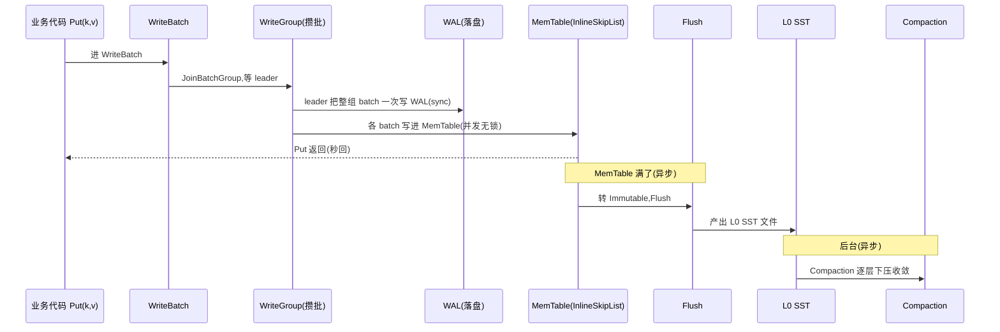
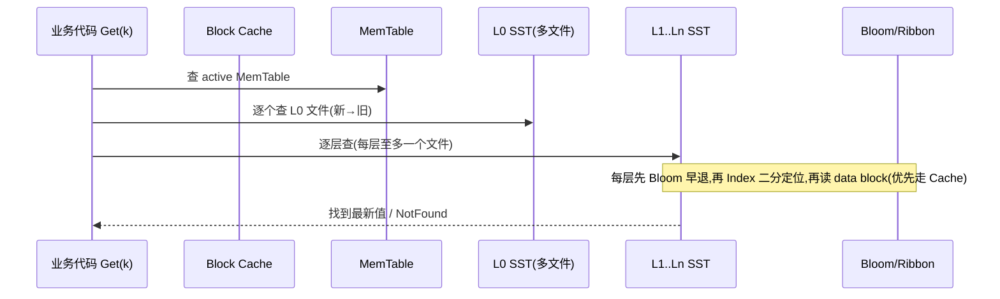

# 第 0 篇 · 第 1 章 · 第一性原理:为什么 LevelDB 不够用

> **核心问题**:你已经读过《LevelDB 设计与实现》,知道 LevelDB 用"只追加 + SST + Compaction"做到了写入极致吞吐。可现实里,TiKV、MySQL(RocksDB 引擎)、Kafka Streams、Cassandra 这些工业级系统,没一个用 LevelDB,全用了它的后辈 RocksDB。那么,LevelDB 到底"不够用"在哪?RocksDB 又凭什么用了 10 年还在演进?它是不是只是"LevelDB 的加料版"?——答案不是加料,而是**它把 LevelDB 写死的每一个设计决策,都做成了一个可调旋钮**,让你在"写快 / 读快 / 省空间"这个不可能三角里,精确定位到你的 workload 想要的那个点。

> **读完本章你会明白**:
> 1. LevelDB 的"够用就好"到底把读写放大钉死在了**哪个固定点**,以及为什么这个固定点在工业场景会撞墙。
> 2. 什么是**读写放大三角**(LSM-tree 的根本矛盾),为什么这三件事不可兼得。
> 3. RocksDB 的回答不是"重写一个更好的 LevelDB",而是**把固定点变成一条可调曲线**——这句话是全书一切设计的总开关。
> 4. 全书为什么用"**写路径 vs 读路径**"二分法当骨架,23 章都是这两条路径上"打开成旋钮"的驿站。
> 5. 可调性不是免费的——它的代价是**组合爆炸和调参难**,这也是为什么需要这本书。
> 6. 本书和《LevelDB》《TiKV》怎么衔接(承接前者、反哺后者)。

> **如果一读觉得太难**:先只记住三件事——① LSM 的根本矛盾是读写放大三角:写快就要读慢、读快就要写慢、还要省空间,三者不可兼得;② LevelDB 把这个三角上的点焊死了一个,RocksDB 把它做成了可调旋钮;③ 全书一句话主线:**把 LevelDB 写死的每个决策做成旋钮,在读写放大三角里精确定位**。

---

## 〇、一句话点破

> **LevelDB 是一台旋钮焊死的收音机——音质(读写放大的平衡点)出厂就固定了,你拧不动;RocksDB 是把每个旋钮都接出来的调音台——MemTable 多大、Compaction 用哪种、Cache 分几档、写太快怎么反压……每个旋钮你都能拧,自己在写快 / 读快 / 省空间三档里找平衡。**

这是结论,不是理由。本章倒过来拆:先讲 LevelDB 把读写放大焊死在了哪个固定点,再讲工业场景为什么这个固定点不够用,然后讲 RocksDB 怎么把固定点变成可调曲线,最后讲这条曲线的代价。

---

## 一、LevelDB 够用就好:它把读写放大焊死在了哪个点

### 一个朴素的事实:LSM 的本质矛盾是读写放大

要讲清 LevelDB 不够用,先得讲清 LSM-tree 到底在跟什么矛盾较劲。这个矛盾只有三个字:**放大**。

LSM-tree(日志结构合并树)的核心思想,《LevelDB》那本已经讲透:**只追加、不原地改**。一次 `Put(key, value)` 不去磁盘上找到旧值改掉,而是把新值追加到内存的 MemTable,同时追加一条日志(WAL)防丢。内存 MemTable 攒够了,整体刷成一个不可变的 SST 文件落盘(L0)。磁盘上的 SST 越积越多,后台的 Compaction 把它们一层层合并(L0→L1→…→Ln),把同一个 key 的新旧版本收敛,丢掉旧版本和墓碑。

这套设计的甜头是**写极快**:写只是追加(顺序写,磁盘友好),不用找旧值(随机读)。代价是**读和空间都要"放大"**:

- **读放大**:一次 `Get(key)` 不知道最新值在 MemTable 还是哪一层 SST,得从 MemTable 一路查到 Ln,每一层都可能要读一个 SST 文件(的 index + data block)。读一次逻辑 key,实际读了好几个 block——这叫读放大。
- **写放大**:一次逻辑 `Put`,实际落盘好几次——WAL 一次、MemTable Flush 成 L0 一次、然后 Compaction 把它从 L0 合到 L1 一次、L1 合到 L2 又一次……每合一次就重写一遍。写一次逻辑 key,实际写了好多遍——这叫写放大。
- **空间放大**:同一个 key 的多个旧版本(或墓碑)在没被 Compaction 收敛前,都占着空间。存一个逻辑 key,实际占了多份——这叫空间放大。

> **钉死这件事**:LSM-tree 的根本矛盾,就是**读写空间三笔放大此消彼长**。任何 LSM 实现,都是在"写放大 / 读放大 / 空间放大"这个三角里,挑一个平衡点。

### LevelDB 挑的平衡点:固定,而且焊死

LevelDB 也挑了一个平衡点。它的选择是(《LevelDB》已拆透):

- **MemTable 固定 4MB 左右**就 Flush(`write_buffer_size` 默认 4MB),不可调大。
- **SST 分 7 层**(L0~L6),每层大小**写死**是上一层的 10 倍(`MaxBytesForLevel`:L0/L1 共享 10MB 基数,L2 起每层 ×10)。
- **Compaction 只有一种**:就是这种"逐层下压"的 Level 风格。
- **单 MemTable、单写者 SkipList**:SkipList 一次只让一个线程写(无锁读但单写)。
- **没有 Column Family**:一个 DB 就一个"逻辑库"。
- **没有事务、没有 BlobDB、没有 TTL、没有手动 Compaction 的细粒度控制**。

这是一个**深思熟虑的、对中等负载单机场景足够好的**平衡点:写不算极致但够用、读放大靠多层 + Bloom 压得住、空间放大靠 Compaction 收敛。Google 内部用它做了不少事,外面也广为流传。

> **不这样会怎样**:LevelDB 不是"不会调",而是它**根本没把调的能力给你**。上面那些数字(4MB、7 层、10 倍)是**焊死在代码和默认 Options 里的常数**。你想要更大的 MemTable(攒更多写再 Flush)?想要更少层(减少读放大但增加单层大小)?想要写优化的 Compaction?想要多个逻辑库共享一个引擎?——LevelDB 都做不到,除非改源码重新编译。

这就是"够用就好":**它替你做了一个决定,然后把这个决定焊死**。

---

## 二、工业场景撞墙:LevelDB 的固定点在哪里不够用

LevelDB 焊死的那个固定点,在哪些场景会让人难受?这是 RocksDB 存在的理由。举几个真实的:

### 场景一:SSD 海量写——LevelDB 的 Compaction 拖不住

LevelDB 只有一种"逐层下压"的 Compaction(Level 风格)。它的好处是读放大小(每层有序、层数固定),代价是**写放大大**:一个 key 从 L0 一路合到 L6,可能被重写七八遍。在机械硬盘时代这没问题(反正随机写也慢,顺序写多写几遍可以接受)。但在 **SSD 时代、写入量巨大的场景**(比如 TiKV 存海量 KV、或者时序数据库狂写),写放大七八倍意味着 SSD 的寿命(写入次数有限)被吃掉七八倍,而且 Compaction 的 IO 把前台写拖慢。

工业界要的是:**能不能用多一点空间放大,换小一点的写放大?**——LevelDB 没给这个选项。

### 场景二:低延迟读——LevelDB 的多层归并太慢

反过来,有些场景**读延迟极度敏感**(比如在线服务的点查)。LevelDB 一次 Get 要穿透 MemTable + L0(多个文件)+ L1..L6,每层都可能读一个 block,就算有 Bloom 早退,读放大还是摆在那。工业界要的是:**能不能把层数压少、把热数据全放内存、把 index 和 filter 分开缓存?**——LevelDB 的层数、Cache、index/filter 都是写死的。

### 场景三:多 workload 混跑——一个实例扛不住

LevelDB 一个 DB 实例就是一个"逻辑库"。可真实系统里(比如 TiKV),一个 Region 里既有写极多的数据 CF,又有要快速查的 lock CF,还有元数据 write CF。如果每个都开一个 LevelDB 实例,WAL、Compaction、内存各管各的,资源浪费、调度打架。工业界要的是:**多个逻辑库共享一个引擎实例(WAL、Compaction 统一调度),又互相隔离(MemTable、SST、Options 各自独立)**——这就是 Column Family。LevelDB 没有。

### 场景四:TTL、大 value、事务——LevelDB 全缺

- 时序数据有 TTL(过期就删),LevelDB 没有原生 TTL(得自己扫)。
- 大 value(比如存图片、文档)进 LSM 会撑爆 Compaction(每次合并都重写大 value),LevelDB 没有 value 分离(BlobDB)。
- 跨 key 的原子写(转账:扣 A 加 B 要原子),LevelDB 没有事务。

> **钉死这件事**:这些场景不是 LevelDB"做不好",而是它**根本没做**。它的设计假设是"单机、中等负载、简单 KV"。一旦你的 workload 越出这个假设,LevelDB 就不是"调一调"能救的——它没给你调的旋钮,也没给你那些功能。

---

## 三、RocksDB 的回答:不重写,把固定点变成可调曲线

那么 RocksDB 怎么解决?这里有个反直觉的点:**RocksDB 没有"推翻"LevelDB 的设计,它是 LevelDB 的 fork(2012 年从 LevelDB 分叉),核心 LSM 结构(MemTable/SST/WAL/Compaction)和 LevelDB 一脉相承。**它的革命不在于"换了一套更好的机制",而在于——

> **它把 LevelDB 焊死的每一个决策,都做成了一个可调旋钮。**

- LevelDB 焊死 MemTable 4MB → RocksDB:`write_buffer_size`、`max_write_buffer_number`、`min_write_buffer_number_to_merge` 全可调,还能用 `WriteBufferManager` 跨 CF 算全局内存预算。
- LevelDB 焊死"逐层下压"一种 Compaction → RocksDB:**三种 Compaction 策略**(Level / Universal / FIFO),外加 `CompactionFilter` 让你在合并时改 KV。
- LevelDB 焊死 7 层 10 倍 → RocksDB:`max_bytes_for_level_base`、`max_bytes_for_level_multiplier` 可调,Universal 策略下层数和大小规则完全不同。
- LevelDB 焊死单写者 SkipList → RocksDB:`InlineSkipList` 支持并发无锁插入,还能换成 hash skiplist / vector 等可插拔 MemTableRep。
- LevelDB 没有 CF → RocksDB:**Column Family** 是核心架构(共享 WAL/MANIFEST,独立 MemTable/SST/Options)。
- LevelDB 没有 TTL/大 value/事务 → RocksDB:**BlobDB**(value 分离)、**Transaction**(乐观/悲观)、**CompactionFilter**(打 TTL)。
- LevelDB 没有"写太快怎么办" → RocksDB:**Write Stall / Write Delay** 反压 + **Rate Limiter** 限速后台 IO。

> **不这样会怎样**:如果 RocksDB 选"重写一个更好的 LSM"(比如换一种全新的数据结构),它就得重新趟过 LevelDB 踩过的所有正确性坑(无锁读的 sound、Manifest 恢复、Compaction 边界),而且会失去和 LevelDB 生态的兼容。RocksDB 的明智在于:**LSM 的机制本身没问题,有问题的是"焊死"——那就把焊点都拆成旋钮**。这让它既继承了 LevelDB 十年验证过的正确性,又获得了工业级的灵活性。

> **钉死这件事**:理解 RocksDB 的起点,不是"它有哪些功能",而是**它把"固定点"变成了"可调曲线"**。后面所有的机制——三种 Compaction、Column Family、Write Stall、BlobDB——都是这条曲线上"打开成旋钮"的产物。

---

## 四、读写放大三角:为什么三件事不可兼得

要真正理解"可调曲线"调的是什么,得把读写放大三角讲透。这是全书最核心的第一性。

### 三角的三条边

```
              写放大(write amplification)
              ╱╲
             ╱  ╲
            ╱    ╲
           ╱  LSM ╲
          ╱  在这  ╲
         ╱  个三角 ╲
        ╱   里选点 ╲
       ╱____________╲
   读放大            空间放大
(read amp)        (space amp)
```

LSM 的三个放大,是**此消彼长**的:

- **想让写放大小**(写快、SSD 寿命长):Compaction 少做、层数少、每层大。代价:同一 key 旧版本堆积 → **空间放大大**;读要扫更多没收敛的文件 → **读放大大**。(这正是 Universal Compaction 的取舍。)
- **想让读放大小**(读快、点查低延迟):层数多、每层小、Bloom 密、热数据全进 Cache。代价:Compaction 要把数据层层下压重写很多遍 → **写放大大**。(这正是 Level Compaction 的取舍。)
- **想让空间放大小**(省盘):Compaction 勤做、尽快丢旧版本。代价:Compaction 勤做 → **写放大大**。

> **钉死这件事**:你不可能同时让三个放大都小。LSM 的设计,就是在这三角里**挑一个点**。LevelDB 挑了一个点(偏读放大小、写放大中等),然后焊死。RocksDB 让你**按 workload 自己挑点**。

### 同一个 RocksDB,同一个 workload,旋钮怎么动这个点

这就是为什么 RocksDB 有那么多 Options——每个旋钮都在动这个三角上的点:

| 你想优化 | 拧哪个旋钮 | 点往哪移 | 代价 |
|---|---|---|---|
| 写吞吐、SSD 寿命 | Compaction 换 Universal、放大 MemTable | 写放大↓ | 读放大↑、空间放大↑ |
| 点查延迟 | 压层数、加大 Block Cache、Bloom 密 | 读放大↓ | 写放大↑ |
| 省盘 | 勤 Compaction、尽早丢旧版本 | 空间放大↓ | 写放大↑ |
| 大 value 不拖累 | 开 BlobDB(value 分离) | 写/空间↓ | 多一套 blob 文件管理 |

> **不这样会怎样**:如果没有这个三角的视角,你看 RocksDB 的几百个 Options 会觉得"为什么要这么多参数,设计得真复杂"。有了这个视角,每个 Option 都是在三角上挪点的一个动作——**复杂不是为了复杂,是因为三角上的点有无数个,每个点都需要一组参数**。

---

## 五、读写两条路径:全书骨架

三角讲了"为什么可调",但还没讲"调的是哪些机制"。这就要回到全书的骨架——**读写两条路径**。

RocksDB 的一切机制,要么在**写路径**上(数据写进去到落盘),要么在**读路径**上(数据读出来),要么**横切**两条路径(Column Family / Snapshot / 事务 / BlobDB)。

### 写路径:一次 Put 的旅程



写路径产生**写放大**(WAL + Flush + 每层 Compaction 都重写)。第 1 篇(WriteBatch/WAL/MemTable/Flush)讲写路径的前半段,第 4 篇(Compaction)讲写路径的后半段(收敛写放大),第 5 篇(Write Stall/Rate Limiter)讲写路径的**反压**(写太快怎么办)。

### 读路径:一次 Get 的旅程



读路径产生**读放大**(多层 + 每层多个 block)。第 2 篇(SST 格式:index/filter/data block 布局)是读路径的地基,第 3 篇(Block Cache/Get/Iterator)讲读路径本身。

> **钉死这件事**:**全书一句话主线——把 LevelDB 写死的每个决策做成旋钮,在读写放大三角里精确定位。** 任何一处看不懂 RocksDB 的某个机制,回到这两条路径问:"这是写路径上的、读路径上的、还是横切的?它在 LevelDB 里是写死的,RocksDB 打开成了什么旋钮?"这就是本书的**二分法**。

---

## 六、可调性的代价:为什么旋钮多反而是负担

讲完了可调的好处,必须诚实讲它的代价——这是理解"为什么需要这本书"的关键。

### 代价一:组合爆炸

RocksDB 有**几百个 Options**。MemTable 几个、Compaction 十几个、Cache 十几个、Write Stall 十几个……它们不是独立的,而是**互相影响**的:你加大 MemTable 会影响 Flush 频率,Flush 频率影响 L0 文件数,L0 文件数触发 Write Stall……一个旋钮动,一片旋钮跟着动。

> **不这样会怎样**:这种组合爆炸的直接后果是——**没人能凭直觉调好 RocksDB**。官方文档自己都说"调参是一门艺术"。这也是为什么 RocksDB 有 `Options::IncreaseParallelism`、`OptimizeForSSD` 这种"一键预设"——因为面对几百个旋钮,绝大多数用户只想说"我是个普通 SSD 单机 KV",让 RocksDB 替你把旋钮拧到一组合理的默认值。

### 代价二:每个旋钮都假设你懂底层

更要命的是,每个旋钮的文档说明,都假设你懂它背后的 LSM 机制。`level0_slowdown_writes_trigger` 是什么?你得懂"L0 文件数过多会拖慢读、所以要反压"才能调它。`max_bytes_for_level_multiplier` 是什么?你得懂 Level Compaction 的层大小规则才能调它。

> **钉死这件事**:RocksDB 把"调的能力"给了你,代价是**它要求你懂 LSM 的每一个机制**。这正是本书存在的理由——不是教你调哪个参数(那是手册的事),而是**把每个旋钮背后的机制讲到源码级**,让你知道拧它会发生什么、为什么。

---

## 七、承接与反哺:本书在系列里的位置

这本书不是孤立的,它在《深入浅出系列》里有明确的坐标:

### 承接《LevelDB》

本书是《LevelDB 设计与实现深入浅出》的**工业级续篇**。承接铁律:**LevelDB 那本讲透的概念,本书一句话带过 + 指路**,篇幅全留 RocksDB 独有。具体说:

- LevelDB 的 SkipList 无锁读、WAL 7 字节 header、SST footer 48 字节、MergingIterator 线性扫、Bloom DoubleHashing、Manifest 重放、Snapshot 链表 MVCC、leader-follower 写组——这些《LevelDB》已拆到源码级,本书只在用到时一句带过(详见《LevelDB》对应章)。
- 本书的篇幅,全留给 RocksDB 相对 LevelDB 的**演进**:InlineSkipList(并发)、WriteGroup(更精细的批写)、三种 Compaction、Column Family、BlobDB、Write Stall、Ribbon Filter……

如果你没读过《LevelDB》那本,本书仍可读(会简述基线),但读过再来,收获翻倍——你会处处看到"LevelDB 这里写死、RocksDB 打开成了什么"。

### 反哺《TiKV》

TiKV 的单机引擎就是 RocksDB(在 TiKV 里叫 `engine_rocks`)。写《TiKV》那本时,按承接铁律只能"一句话带过 RocksDB"。本书讲透后,**反哺 TiKV**:你回看 TiKV 的存储层(default/lock/write 三个 Column Family 怎么划分、TiKV 怎么调 RocksDB、RocksDB 的 snapshot 怎么支撑 TiKV 的 MVCC),会有"原来如此"。本书 P7 收束专设"RocksDB 在 TiKV/MySQL/Kafka 里怎么落地"。

### 横连《内存分配器》《数据库内核》

RocksDB 的 Block Cache、Arena、WriteBufferManager 是内存管理在存储引擎里的落地,对照《内存分配器》;RocksDB 的事务/MVCC/Compaction 和关系数据库(B+树 + WAL + MVCC)是两种存储范式的对照,对照《数据库内核》(PG)那本。

---

## 八、技巧精解:两个第一性洞察

本章是概念定调章。有两个最硬核的第一性洞察值得单独钉死。

### 洞察一:写放大到底怎么算,为什么 Level Compaction 写放大大

这是理解"为什么要三种 Compaction"的根。Level Compaction(默认,类 LevelDB)下,一个 key 从写入到最终落稳,理论上要被重写的次数 ≈ 层数。LevelDB 7 层、每层 10 倍,一个 key 可能被重写 7~8 遍——这就是 LevelDB/Level Compaction 的写放大(理论值约等于层数 × 某常数,实测 SSD 上常达 10~30 倍)。

Universal Compaction 的写意:不逐层下压,而是把大小相近的 SST 直接合并(类似 L0 的合并规则一路推广),一个 key 被重写的次数 ≈ `log(总数据量 / MemTable 大小)`,远少于 Level 的层数。代价是层数不规整、空间放大大(旧版本留得久)。**所以 Universal 用空间放大换写放大**——这对 SSD 海量写场景(写放大直接吃 SSD 寿命)是划算的。

> **不这么设计会怎样**:如果只有 LevelDB 那一种 Level Compaction,SSD 海量写场景(RocksDB 的主战场之一)会因为写放大吃掉 SSD 寿命、Compaction IO 拖慢前台写,根本扛不住。RocksDB 加 Universal,就是给"写放大敏感"的 workload 一个旋钮。这是"可调曲线"最典型的体现。

### 洞察二:LevelDB 的固定点 vs RocksDB 的可调曲线

把"读写放大三角"和"LevelDB 焊死 / RocksDB 可调"合起来看,有一张全书最关键的图:

```
   读写放大三角上的"点":
   
   LevelDB:一个焊死的点(偏读放大小、写放大中等)
              ★(固定,你拧不动)
   
   RocksDB:一整条可调的曲线,你的 workload 在哪个点,
            就拧旋钮把引擎挪到那个点:
              ·········Universal·········  (写放大小,左下)
              ·····Level(默认)·····      (折中)
              ···压层数+大Cache···         (读放大小,右上)
              空间放大维度同理可调
```

> **钉死这件事**:RocksDB 不是一个"更好的 LevelDB",它是**"LevelDB 去掉焊点"**。这句话是全书一切设计的总开关:第 1 篇打开写路径的旋钮(MemTable 多大/怎么攒批)、第 4 篇打开 Compaction 的旋钮(三种策略)、第 5 篇打开反压的旋钮(Write Stall/Rate Limiter)、第 6 篇打开功能的旋钮(BlobDB/事务)……每一章都是"拆一个焊点、接一个旋钮"。

---

## 九、章末小结

### 回扣主线

本章是全书唯一的"纯概念章"。它立起了全书最重要的三个东西:

1. **根本矛盾**:LSM 的读写空间三笔放大此消彼长(读写放大三角)。
2. **总开关**:LevelDB 把三角上的点焊死,RocksDB 把它做成可调曲线——**把 LevelDB 写死的每个决策做成旋钮**。
3. **骨架**:全书用"**写路径 vs 读路径**"二分法,23 章都是这两条路径上"打开成旋钮"的驿站。

后续 22 章,都是这三个东西的展开。

### 五个为什么

1. **为什么 LevelDB 在工业场景不够用?**——因为它把读写放大的平衡点焊死了(4MB MemTable、7 层 10 倍、一种 Compaction、单 CF),工业场景(SSD 海量写、低延迟读、多 workload、TTL/事务/大 value)需要的平衡点它给不了。
2. **为什么读写放大三角不可兼得?**——写放大小(少 Compaction)就空间/读放大大(旧版本堆积);读放大小(多层密 Bloom)就写放大大(层层重写);空间放大小(勤 Compaction)就写放大大。LSM 的机制决定了三者此消彼长。
3. **为什么 RocksDB 不重写一个更好的 LSM?**——因为 LSM 机制本身没问题,问题在"焊死";fork LevelDB、拆焊点接旋钮,既继承十年验证的正确性,又获得灵活性。
4. **为什么 RocksDB 有几百个 Options?**——因为读写放大三角上的点有无数个,每个点对应一组参数;旋钮多是"可调"的必然代价。
5. **为什么需要这本书?**——因为每个旋钮都假设你懂背后的 LSM 机制;本书不讲"调哪个参数",讲"每个旋钮背后的机制,拧它会发生什么、为什么"。

### 想继续深入往哪钻

- 想看 LSM 读写放大的经典分析:读 Google 的 LevelDB 设计文档 + RocksDB 官方的 "RocksDB Tuning Guide" 和 "Basic Operations"。
- 想理解三种 Compaction 各自的取舍:本书第 4 篇(P4-13~16)逐个拆到源码级。
- 想看 LevelDB 的基线(承接锚点):读《LevelDB 设计与实现深入浅出》,或 [[leveldb-source-facts]]。
- 想看 RocksDB 在 TiKV 里怎么用:本书 P7-23 反哺《TiKV》。
- 想动手感受旋钮:用 `db_bench`(附录 B)跑同一个 workload,切 Level/Universal Compaction,看写放大和读延迟怎么变。

### 引出下一章

我们搞清楚了"为什么 LevelDB 不够用"和"RocksDB 把固定点做成可调曲线",也明白了全书用读写两条路径当骨架。那么,这条可调曲线上**写路径的第一个旋钮**是什么?一次 `Put` 怎么进 WriteBatch、怎么被 WriteGroup 攒成一批一次写 WAL、怎么做到"写 WAL 是顺序的但多个并发 Put 还能各写各的 MemTable"?下一章 P1-02,我们从写路径的第一站——**WriteBatch 与写组**——开始,拆 RocksDB 怎么把 LevelDB 的 leader-follower 写组,演进成支持高并发攒批的 WriteGroup。

> **下一章**:[P1-02 · WriteBatch 与写组](P1-02-WriteBatch与写组.md)
