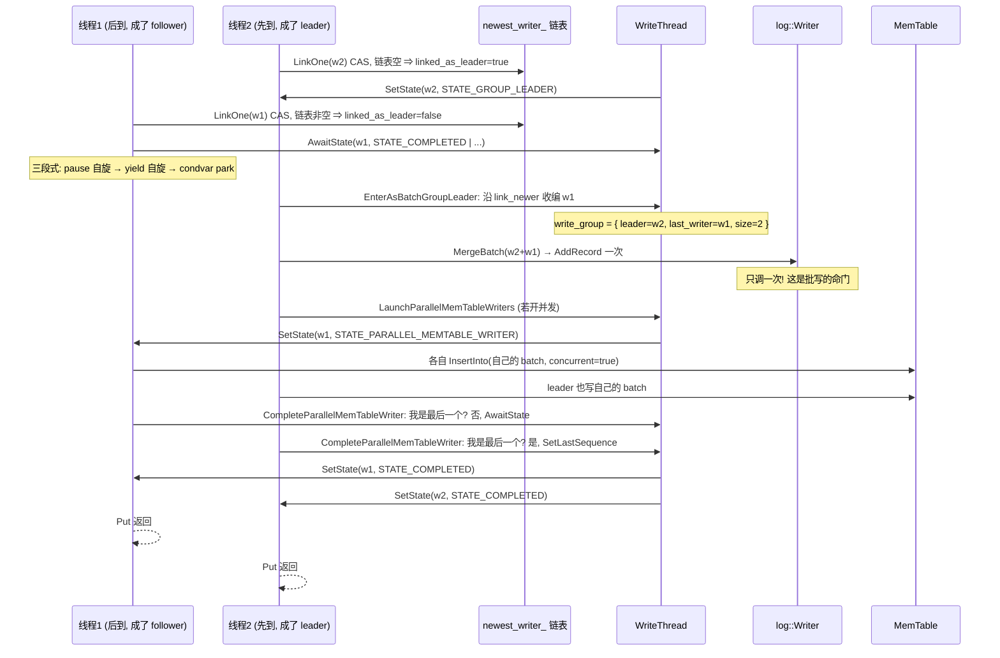
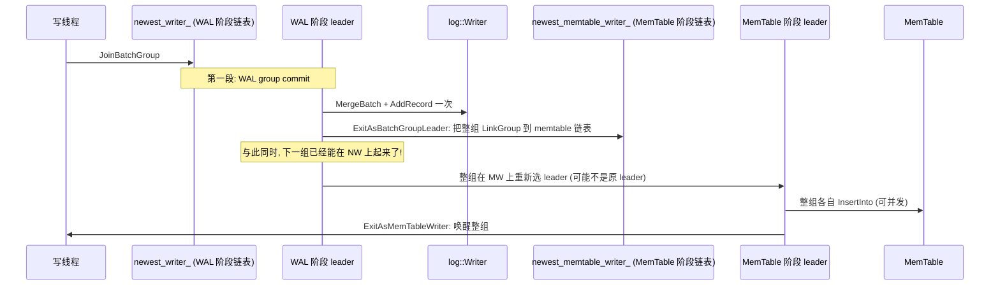

# 第 1 篇 · 第 2 章 · WriteBatch 与写组

> **核心问题**:P0-01 立起了"读写放大三角"的总开关,讲清 LevelDB 把读写放大的平衡点焊死、RocksDB 把每个写死的决策都打开成旋钮。可这条可调曲线上,**写路径的第一个驿站**到底是什么?一次最朴素的 `db->Put(key, value)`,在 RocksDB 内部是怎么从一条用户调用,变成"进 WriteBatch、被 WriteThread 攒成一批、由 leader 一次性写 WAL、再由整组各自写进 MemTable"的?为什么 RocksDB 在几十万 QPS 的并发写下,能把"写 WAL 是顺序的"和"多个线程能并发各写各的 MemTable"这两件看似矛盾的事同时做到?这一章就是把写路径的第一站,从 `Put` 一路拆到 `WriteImpl` 里的 leader / follower 状态机。

> **读完本章你会明白**:
> 1. **WriteBatch 的二进制长什么样**:为什么是 `12 字节 header(seq8 + count4)+ 一串 record`,为什么每条 record 是 `tag + varint32 len + key + varint32 len + value`,以及这个格式和 LevelDB 完全一致、本书一句带过。
> 2. **WriteThread 的 leader / follower 状态机**:一个 Writer 怎么无锁 `LinkOne` 接到 `newest_writer_` 链表尾、谁抢到队头谁就是 leader、follower 怎么用三段式 `AwaitState`(pause 自旋 → yield 自旋 → condvar 阻塞)等 leader 摆平一切。
> 3. **写组批写合并**(招牌技巧):leader 怎么用 `EnterAsBatchGroupLeader` 把链表上一串 follower 的 batch 全收进自己的 `WriteGroup`,然后 `MergeBatch` 把它们拼成一个临时大 batch、**只调一次** `log_writer->AddRecord` 写 WAL;followers 不各写各的 WAL,而是零拷贝 piggyback 到 leader 这次 WAL 写上。
> 4. **并发 MemTable 写**与 **pipelined write**(两阶段 group commit):`allow_concurrent_memtable_write` 这个旋钮开 / 关时 MemTable 写这一步怎么从"leader 串行写整组"变成"followers 各写各的、靠 InlineSkipList 保证并发 sound";以及 `enable_pipelined_write` 把"写 WAL + 写 MemTable"拆成两段独立 group commit 流水线。

> **如果一读觉得太难**:先只记住三件事——① 写路径入口是一个**全局无锁链表** `newest_writer_`,谁接到链表头谁就是 leader,后面全是 follower;② leader 把所有 follower 的 batch **拼成一个大 batch**,**只写一次 WAL**(这是 RocksDB 高吞吐写的命门),然后才各自写 MemTable;③ follower 的等待不是死睡,而是"先 pause 自旋、再 yield 自旋、最后才 condvar park"的三段式,自旋成本被自适应信用 (`yield_credit`) 调教。

---

## 〇、一句话点破

> **一次 `Put` 不是真的"写一次":它先把自己塞进一个 WriteBatch,再把 WriteBatch 挂到一条无锁链表上——挂到队尾的就成了 follower,挂成队头的就成了 leader;leader 把链表上后面所有 follower 的 batch 全收走、拼成一个大 batch,只对 WAL 调一次 `AddRecord`,再把写 MemTable 这一步发回给每个 follower 各写各的,最后整组一起返回。**

这是结论,不是理由。本章倒过来拆:先看一个 WriteBatch 在内存里长什么样(它和 LevelDB 一模一样,所以一笔带过),再看 RocksDB 怎么用一条无锁链表和一组状态机,把"几十个线程并发 Put"收敛成"一次 WAL 写"——这是 LevelDB 已经有 leader-follower 写组雏形的影子,但 RocksDB 把它做到了工业级并发和流水线。

---

## 一、WriteBatch:写路径的"集装箱",格式承 LevelDB 一句带过

### 提问:为什么 Put 不直接写 MemTable,要先攒进一个 batch?

LSM-tree 的本质是"只追加"。一次 `Put(key, value)` 如果直接冲进 MemTable,有两个问题:第一,如果你想原子地写多个 key(比如"扣 A 加 B"的转账),分散的两次 Put 没法保证原子;第二,一次 Put 就对应一次 WAL `AddRecord` 和一次 MemTable 插入,在几十万 QPS 下,WAL 的 `AddRecord` 系统调用与 fsync 成本会被无限放大。

所以 RocksDB(和 LevelDB 一样)把"写"先变成一个**逻辑集装箱**:你把要写的若干 `(key, value)` 操作一条条 `Put` / `Delete` 进一个 `WriteBatch` 对象,然后一次性 `db->Write(&batch)` 提交。这个 batch 里的所有操作共享一个**起始 SequenceNumber**,要么全部对读可见,要么全部不可见——原子性由此而来。一个 batch 里 N 个 key,在 WAL 里就是**一条 record**(一次 `AddRecord`),而不是 N 条。

### LevelDB 怎么写死的(一句带过,指路)

WriteBatch 的二进制格式,LevelDB 已经定死了,RocksDB **一字节没改**。所以本书直接指路《LevelDB》写路径章 + [[leveldb-source-facts]]:

```
WriteBatch::rep_ :=
    sequence: fixed64       // 起始 SequenceNumber, little-endian 8 字节
    count:   fixed32        // batch 里 record 的条数, little-endian 4 字节
    data:    record[count]  // 一串 record, 每条 record 是 tag + varstring...
```

12 字节的头部,源码定义就一行([`db/write_batch_internal.h#L80-L81`](../rocksdb/db/write_batch_internal.h#L80-L81)):

```cpp
// WriteBatch header has an 8-byte sequence number followed by a 4-byte count.
static constexpr size_t kHeader = 12;
```

构造函数把这 12 字节 `resize` 出来填零([`db/write_batch.cc#L186-L196`](../rocksdb/db/write_batch.cc#L186-L196),`rep_.resize(WriteBatchInternal::kHeader)`),`SetSequence` 用 `EncodeFixed64` 把 seq 写进前 8 字节([`db/write_batch.cc#L790-L796`](../rocksdb/db/write_batch.cc#L790-L796)),`SetCount` 用 `EncodeFixed32` 把 count 写进 `rep_[8..12]`([`db/write_batch.cc#L782-L788`](../rocksdb/db/write_batch.cc#L782-L788))。每条 record 的写入也很直白——以默认 CF 的 Put 为例([`db/write_batch.cc#L867-L876`](../rocksdb/db/write_batch.cc#L867-L876)):

```cpp
WriteBatchInternal::SetCount(b, WriteBatchInternal::Count(b) + 1);
if (column_family_id == 0) {
  b->rep_.push_back(static_cast<char>(kTypeValue));           // tag, 1 字节
} else {
  b->rep_.push_back(static_cast<char>(kTypeColumnFamilyValue));
  PutVarint32(&b->rep_, column_family_id);                    // 非默认 CF 多一个 cf_id
}
PutLengthPrefixedSlice(&b->rep_, key);    // varint32(key_len) + key
PutLengthPrefixedSlice(&b->rep_, value);  // varint32(val_len) + value
```

> **钉死这件事**:WriteBatch 的二进制格式,LevelDB 那本已经拆到字节级。本书不重复,只记两个**真值**——头部 12 字节(8 seq + 4 count),record 是 `tag(1) + [varint cf_id] + varstring(key) + varstring(value)`;`varstring = varint32(len) + data`。`kMaxSequenceNumber = (1 << 56) - 1`([`db/dbformat.h#L129`](../rocksdb/db/dbformat.h#L129)),留 8 位给 type 一起打包成 64 位 internal key,这也是承 LevelDB 的。

> **LevelDB 是写死的,RocksDB 打开成了旋钮**:格式没动,但 RocksDB 给 WriteBatch 加了两个 LevelDB 没有的东西——`SavePoint`(事务回滚用,见 [`include/rocksdb/write_batch.h#L45-L59`](../rocksdb/include/rocksdb/write_batch.h#L45-L59),存的是 rep_ 的 `size / count / content_flags`,回滚时 `rep_.resize(savepoint.size)` + `SetCount(savepoint.count)`([`db/write_batch.cc#L1876-L1903`](../rocksdb/db/write_batch.cc#L1876-L1903)))和**每 key 8 字节 KVOC64 校验**(`protection_bytes_per_key`,捕捉 key / value / op_type / cf_id 任意一项 bit-flip,见 [`db/kv_checksum.h#L55`](../rocksdb/db/kv_checksum.h#L55))。这两个都是横切功能(事务 / 端到端校验),不影响写组主干,本书 P6-21 事务章会回来讲 SavePoint。本章后面只关心:**这个 batch 怎么被 WriteThread 攒成一批一次写 WAL**。

---

## 二、写组(WriteGroup):把"N 个并发 Put"压成"一次 WAL 写"

### 提问:几十个线程并发 Put,WAL 怎么不被打成筛子?

想象一个最朴素的实现:每个 Put 线程自己拿一把全局锁,自己写自己的 WAL record,自己写自己的 MemTable,然后释放锁。这相当于把 WAL 变成了一把大锁——N 个线程的 Put 完全串行,每次 Put 都要付一次 `AddRecord`(还要算上可能的 fsync)。这在单机百万 QPS 的 SSD 场景下根本撑不住。

那能不能让多个 Put 共用一次 WAL 写?答案就是**写组**(WriteGroup):把同一时刻在排队的多个 Put **攒成一批**,挑一个线程当 leader,由 leader **一次性**把这批 batch 拼起来写进 WAL,其他线程当 follower 等着——leader 写完 WAL,把结果广播给所有 follower,大家一起返回。这样 N 个 Put 只付一次 `AddRecord`,WAL 的吞吐被线性放大。

### LevelDB 怎么写的(基线,一句带过)

LevelDB 也有这个雏形(`db/db_impl.cc` 的 `Write` 里,leader 拿队头 batch,只有当链表上出现第二个 follower 时才把 `tmp_batch_` 切出来合并)。承《LevelDB》写路径章 + [[leveldb-source-facts]]:LevelDB 的 leader 用队头 batch,纳入第二个 follower 才切 `tmp_batch_`;状态机很简单(`STATE_INIT → done`),没有自旋等待,没有并行 MemTable 写。

> **不这样会怎样**:LevelDB 这套在单核或低并发下够用,但有两面墙:**第一**,它的 follower 等待是直接 park 在条件变量上,在短临界区 + 高并发下,`futex_wake → futex_wait` 的 round-trip(几微秒)会反复触发,leader 一叫醒 follower 立刻又被打断;**第二**,它不支持 followers 并发写 MemTable——MemTable 写也是 leader 串行做。这两面墙在 RocksDB 的工业场景(多核 + 海量写)下是直接卡吞吐的。

### RocksDB 怎么设计:无锁链表 + 精细状态机 + 三段式等待

RocksDB 的答案是 `WriteThread`。核心数据结构有四样([`db/write_thread.h#L32-L121`](../rocksdb/db/write_thread.h#L32-L121)):

1. **一条全局无锁链表** `newest_writer_`(`std::atomic<Writer*>`,[`db/write_thread.h#L439`](../rocksdb/db/write_thread.h#L439)):所有正在排队的 Put,都会用 CAS 把自己的 `Writer` 挂到这条链表的尾部(最新端)。挂的方法是 `LinkOne`,**完全无锁**(下面技巧精解会拆)。
2. **每个 Put 一个 `Writer` 结构**([`db/write_thread.h#L124-L294`](../rocksdb/db/write_thread.h#L124-L294)):里面装着这个 Put 的 batch 指针、options(sync / disable_wal / ...)、`state`(状态机的当前状态)、`link_older` / `link_newer`(双向链表指针,但只在特定时刻填充)、懒构造的 `state_mutex_` 和 `state_cv_`。
3. **一组状态**(`enum State`,[`db/write_thread.h#L34-L82`](../rocksdb/db/write_thread.h#L34-L82)):`STATE_INIT` → `STATE_GROUP_LEADER`(你成了 leader) / `STATE_PARALLEL_MEMTABLE_WRITER`(你被 leader 派去自己写 MemTable) / `STATE_LOCKED_WAITING`(你 park 在 condvar 上了) / `STATE_COMPLETED`(你的写已完成)等。
4. **一个 `WriteGroup` 临时结构**([`db/write_thread.h#L86-L121`](../rocksdb/db/write_thread.h#L86-L121)):leader 用它装"这一批收编的 followers",有 `leader`、`last_writer`、`size`、`status`,还有个迭代器从 leader 沿 `link_newer` 走到 last_writer。

整个流程是这样的(`db/db_impl/db_impl_write.cc#L867-L1156` 的 `WriteImpl` + `db/write_thread.cc#L401-L438` 的 `JoinBatchGroup`):



我们一步步拆。

#### 步骤一:`JoinBatchGroup`——挂到无锁链表上,等结果

每个 Put 线程进入 `WriteImpl` 后,第一件事就是构造一个栈上的 `Writer w`,然后调用 `write_thread_.JoinBatchGroup(&w)`([`db/db_impl/db_impl_write.cc#L1099`](../rocksdb/db/db_impl/db_impl_write.cc#L1099))。`JoinBatchGroup` 干两件事([`db/write_thread.cc#L401-L438`](../rocksdb/db/write_thread.cc#L401-L438)):

```cpp
void WriteThread::JoinBatchGroup(Writer* w) {
  bool linked_as_leader = LinkOne(w, &newest_writer_);   // CAS 挂到链表尾
  w->CheckWriteEnqueuedCallback();
  if (linked_as_leader) {
    SetState(w, STATE_GROUP_LEADER);                     // 链表原本空 ⇒ 我就是 leader
  }
  if (!linked_as_leader) {
    // 我是 follower, 等 leader 把我收编 / 把我写完
    AwaitState(w,
               STATE_GROUP_LEADER | STATE_MEMTABLE_WRITER_LEADER |
                   STATE_PARALLEL_MEMTABLE_CALLER |
                   STATE_PARALLEL_MEMTABLE_WRITER | STATE_COMPLETED,
               &jbg_ctx);
  }
}
```

`LinkOne` 的精髓在 CAS 自循环([`db/write_thread.cc#L226-L260`](../rocksdb/db/write_thread.cc#L226-L260)):

```cpp
bool WriteThread::LinkOne(Writer* w, std::atomic<Writer*>* newest_writer) {
  Writer* writers = newest_writer->load(std::memory_order_relaxed);
  while (true) {
    // ... (write stall 处理, 后面 P5-17 讲)
    w->link_older = writers;                              // 我指向原队头(老端)
    if (newest_writer->compare_exchange_weak(writers, w)) {// CAS: 把我设成新队头
      return (writers == nullptr);                        // 原本空 ⇒ 我是 leader
    }
    // CAS 失败: 有人抢先挂上去了, 重读 writers 再试
  }
}
```

链表是**从新到老**排:`newest_writer_` 指向最新挂上来的 Writer,每个 Writer 的 `link_older` 指向比自己更早到的。CAS 成功的那一个,如果原本链表是空的(`writers == nullptr`),就是 leader——只有它能继续往下走,进入 `EnterAsBatchGroupLeader`;其他人全部进入 `AwaitState`,等 leader 把他们收编 / 完成。

> **钉死这件事**:`LinkOne` 是**完全无锁**的,没有 `std::mutex`,只靠一个 `atomic<Writer*>` 的 CAS。这意味着在几十个线程并发 Put 时,挂链表这一步**不产生任何系统调用**,纯用户态 CAS 自旋。这是 RocksDB 写路径高吞吐的第一根支柱。

#### 步骤二:leader 收编整组——`EnterAsBatchGroupLeader`

leader 接下来调 `EnterAsBatchGroupLeader(&w, &write_group)`([`db/db_impl/db_impl_write.cc#L1195-L1196`](../rocksdb/db/db_impl/db_impl_write.cc#L1195-L1196)),源码在 [`db/write_thread.cc#L440-L569`](../rocksdb/db/write_thread.cc#L440-L569)。这个函数干三件事:

**(1) 计算这一批允许长到多大。** 默认 `max_write_batch_group_size_bytes = 1 << 20`(1 MiB,默认值见 [`include/rocksdb/options.h#L1444`](../rocksdb/include/rocksdb/options.h#L1444))。但有个细节:如果 leader 自己很小(`size <= max/8`),上限放宽到 `size + max/8`——避免一个小 Put 一直被卡着等不到一个凑够大的组([`db/write_thread.cc#L451-L455`](../rocksdb/db/write_thread.cc#L451-L455)):

```cpp
size_t max_size = max_write_batch_group_size_bytes;
const uint64_t min_batch_size_bytes = max_write_batch_group_size_bytes / 8;
if (size <= min_batch_size_bytes) {
  max_size = size + min_batch_size_bytes;     // 小 leader 放宽上限, 别让它干等
}
```

**(2) 沿 `link_newer` 一路走,把能合并的 follower 全收编。** 这一步从 leader(最老)走到 `newest_writer_`(最新),只要 follower 的 options 跟 leader **兼容**,就把它 `write_group->size++`,记 `last_writer = w`。哪些算"不兼容"必须剔除出去单独成组?源码列得很清楚([`db/write_thread.cc#L506-L553`](../rocksdb/db/write_thread.cc#L506-L553)):

```cpp
while (w != newest_writer) {
  w = w->link_newer;
  if ((w->sync && !leader->sync) ||                  // sync 写不能进 non-sync 组
      (w->no_slowdown != leader->no_slowdown) ||      // 反压容忍度不能混
      (w->disable_wal != leader->disable_wal) ||      // WAL 开关不能混
      (w->protection_bytes_per_key != leader->protection_bytes_per_key) ||
      (w->rate_limiter_priority != leader->rate_limiter_priority) ||
      (w->batch == nullptr) ||                        // nullptr batch 是 EnterUnbatched 的特殊写
      (w->callback != nullptr && !w->callback->AllowWriteBatching()) ||
      (size + WriteBatchInternal::ByteSize(w->batch) > max_size) ||
      (leader->ingest_wbwi || w->ingest_wbwi)) {
    // 剔除: 临时摘出来放到 r_list, 最后接回 write_group 尾巴后面
  } else {
    we = w;
    w->write_group = write_group;                     // 收编!
    size += WriteBatchInternal::ByteSize(w->batch);
    write_group->last_writer = w;
    write_group->size++;
  }
}
```

> **不这样会怎样**:如果不挑兼容性、硬把 sync 写和非 sync 写合并,那 leader 这一次要么 fsync(违背非 sync 写的低延迟语义)、要么不 fsync(违背 sync 写的持久化语义),两头不讨好。WAL 开关也是一样——把 `disableWAL=true` 的写合并进去,等于偷偷给它写了 WAL,违背用户"我不写 WAL"的明确请求。这一串 if 条件,本质上是**写路径的契约边界**:一组里所有 Put 必须对"WAL / sync / 反压 / 限速 / 校验"达成共识,否则拆开。

**(3) `link_newer` 是懒填充的,这里第一次真正填全。** 注意 `LinkOne` 时只填了 `link_older`,`link_newer` 是 `nullptr`。直到 leader 在 `EnterAsBatchGroupLeader` 里调用 `CreateMissingNewerLinks(newest_writer)`([`db/write_thread.cc#L287-L297`](../rocksdb/db/write_thread.cc#L287-L297),在 `EnterAsBatchGroupLeader:468` 调用),才把这一串的反向指针补全。为什么这么懒?因为 `link_newer` 只有 leader 用得上——follower 自己不会去遍历链表,只有收编的 leader 需要"从老到新"走过去。

#### 步骤三:leader 写 WAL——`MergeBatch` + 一次 `AddRecord`

收编好 `write_group` 之后,leader 回到 `WriteImpl`,关键的一段在 [`db/db_impl/db_impl_write.cc#L1362-L1371`](../rocksdb/db/db_impl/db_impl_write.cc#L1362-L1371):

```cpp
if (!two_write_queues_) {
  if (status.ok() && !write_options.disableWAL) {
    // ...
    io_s = WriteGroupToWAL(write_group, wal_context.writer, wal_used,
                           wal_context.need_wal_sync,
                           wal_context.need_wal_dir_sync, last_sequence + 1,
                           *wal_context.wal_file_number_size);
  }
}
```

`WriteGroupToWAL` 干两件事([`db/db_impl/db_impl_write.cc#L2309-L2424`](../rocksdb/db/db_impl/db_impl_write.cc#L2309-L2424)):先 `MergeBatch` 把整组 batch 拼成一个临时大 batch,再调一次 `WriteToWAL` 写一条 record。

`MergeBatch` 的逻辑([`db/db_impl/db_impl_write.cc#L2215-L2258`](../rocksdb/db/db_impl/db_impl_write.cc#L2215-L2258)):

```cpp
if (write_group.size == 1 && !leader->CallbackFailed() && ...) {
  *merged_batch = leader->batch;                   // 只有一个, 直接用 leader 的
} else {
  *merged_batch = tmp_batch;                        // 多个, 拼到 tmp_batch
  for (auto writer : write_group) {
    if (!writer->CallbackFailed()) {
      WriteBatchInternal::Append(*merged_batch, writer->batch, /*WAL_only*/ true);
    }
  }
}
```

`WriteBatchInternal::Append` 把 `src` 的 records 段(`rep_` 跳过 12 字节 header 的部分)追加到 `dst` 末尾,并把 `dst->count` 累加([`db/write_batch.cc#L3459-L3507`](../rocksdb/db/write_batch.cc#L3459-L3507),关键是 `dst->rep_.append(src->rep_.data() + kHeader, src_len)`)——**只追加 records,不再追加 header**,因为整组共享一个起始 seq(下面步骤四讲怎么分配)。

然后 `WriteToWAL` 做的事非常简单([`db/db_impl/db_impl_write.cc#L2262-L2307`](../rocksdb/db/db_impl/db_impl_write.cc#L2262-L2307)):

```cpp
Slice log_entry = WriteBatchInternal::Contents(&merged_batch);   // 就是 rep_
io_s = merged_batch.VerifyChecksum();                             // 先校验
*log_size = log_entry.size();
io_s = log_writer->AddRecord(write_options, log_entry, sequence);// 一次 AddRecord!
```

> **钉死这件事**:整组 N 个 batch,**只调一次** `log_writer->AddRecord`。这一次 `AddRecord` 把拼好的大 batch 作为一个完整的 record 写进 WAL——followers 的 batch 是**零拷贝 piggyback**进 leader 这次 WAL 写的(它们各自的 `rep_` 内存被 `Append` 拷到 `tmp_batch_`,但 WAL 那一层只调一次)。这是写组批写合并的命门:在百万 QPS 下,WAL 的 `AddRecord` 调用次数从"N 次 / 组"摊到"1 次 / 组",WAL 不再是写路径的吞吐瓶颈。

#### 步骤四:SequenceNumber 怎么分配——整组共享一段连续 seq

写完 WAL,leader 给组里每个 batch 分配一个**连续的** SequenceNumber 区间。这一段在 [`db/db_impl/db_impl_write.cc#L1386-L1448`](../rocksdb/db/db_impl/db_impl_write.cc#L1386-L1448):

```cpp
const SequenceNumber current_sequence = last_sequence + 1;
last_sequence += seq_inc;
// Seqno assigned to this write are [current_sequence, last_sequence]
// ...
for (auto* writer : write_group) {
  if (writer->CallbackFailed()) continue;
  writer->sequence = next_sequence;                       // 每个 writer 的起始 seq
  // ...
  if (seq_per_batch_) {
    next_sequence += writer->batch_cnt;
  } else if (writer->ShouldWriteToMemtable()) {
    next_sequence += WriteBatchInternal::Count(writer->batch); // 每个 key 占一个 seq
  }
}
```

也就是说:整组按入链表的顺序(从老到新),每个 writer 的 batch 拿到一段连续 seq,batch 里第 i 个 key 的 seq = `writer->sequence + i`。**关键**:这段 seq 在 `versions_->SetLastSequence(last_sequence)`(后面 [`db_impl_write.cc#L1554`](../rocksdb/db/db_impl/db_impl_write.cc#L1554))之后才对读可见,这就保证了整组的原子可见性——要么整组全可见,要么全不可见,不存在"组里一半可见一半不可见"的中间态。

> **钉死这件事**:整组的 seq 是**连续单调**的,而且**发布是原子的**(`SetLastSequence` 一次性推到 `last_sequence`)。这是 LSM MVCC 的命根子——读路径(后面 P3-11 Get 章)靠 seq 判断"这个 key 在我这个读时刻可见不可见",seq 不连续或非原子发布,会让并发读看到写组撕裂的中间态。这部分承 LevelDB 的 SnapshotList MVCC(指路 [[leveldb-source-facts]]),RocksDB 没动其本质,只是把单 leader 改成"整组连续 + 原子发布"。

#### 步骤五:写 MemTable——两种模式

seq 分配完,leader 写 MemTable 这一步有两种模式,由 `allow_concurrent_memtable_write` 决定([`db/db_impl/db_impl_write.cc#L1269-L1289`](../rocksdb/db/db_impl/db_impl_write.cc#L1269-L1289)):

```cpp
bool parallel = immutable_db_options_.allow_concurrent_memtable_write &&
                write_group.size > 1;
for (auto* writer : write_group) {
  // ...
  parallel = parallel && !writer->batch->HasMerge();    // 有 Merge 就不能并发
}
```

- **`parallel == false`(默认开并发,但 size==1 或含 Merge 时退化)**:leader 调 `WriteBatchInternal::InsertInto(write_group, current_sequence, ...)`([`db_impl_write.cc#L1455-L1459`](../rocksdb/db/db_impl/db_impl_write.cc#L1455-L1459)),这个重载会**串行**遍历整组,每个 writer 的 batch 顺序插进 MemTable([`db/write_batch.cc#L3264-L3296`](../rocksdb/db/write_batch.cc#L3264-L3296),`concurrent_memtable_writes=false`)。MemTable 写这步是 leader 一手包办,followers 啥都不干。
- **`parallel == true`**:leader 调 `write_thread_.LaunchParallelMemTableWriters(&write_group)`([`db_impl_write.cc#L1462`](../rocksdb/db/db_impl/db_impl_write.cc#L1462)),把每个 follower 的状态置为 `STATE_PARALLEL_MEMTABLE_WRITER`,followers 从 `AwaitState` 醒来,各自调 `WriteBatchInternal::InsertInto(&w, w.sequence, ..., concurrent_memtable_writes=true)`([`db_impl_write.cc#L1112-L1117`](../rocksdb/db/db_impl/db_impl_write.cc#L1112-L1117) 和 [`db_impl_write.cc#L1471-L1478`](../rocksdb/db/db_impl/db_impl_write.cc#L1471-L1478)),**并发**插进 MemTable。leader 自己也写自己的 batch。

为什么并发写 MemTable sound?因为 MemTable 是 `InlineSkipList`,它支持多写者无锁并发插入(承 LevelDB SkipList 的单写者,RocksDB 演进到多写者)。这部分是 P1-04 的招牌,本章只点一句:**整组每个 writer 写的是不同的 key(或同 key 不同 seq),`InlineSkipList` 的无锁插入保证不丢不重,seq 单调保证读路径正确**。注意一个**边界**:含 `Merge` 操作的 batch 不能并发(因为 Merge 要读旧值再累加,并发会 race),所以源码里有 `parallel = parallel && !writer->batch->HasMerge()` 这一行把关。

> **LevelDB 是写死的,RocksDB 打开成了旋钮**:LevelDB 永远是"leader 串行写整组 MemTable",没有并发这一档。RocksDB 加了 `allow_concurrent_memtable_write`(默认 `true`,见 [`include/rocksdb/options.h#L1429`](../rocksdb/include/rocksdb/options.h#L1429))这个旋钮——开了之后,大组(几十个 follower)的 MemTable 写可以铺满多核,这是 RocksDB 在多核 SSD 上写吞吐能撑到百万 QPS 的关键。

#### 步骤六:`ExitAsBatchGroupLeader`——唤醒 followers,交班下一任 leader

MemTable 写完(并发模式下还要等所有 follower 通过 `CompleteParallelMemTableWriter` 汇合,见 [`db/write_thread.cc#L720-L737`](../rocksdb/db/write_thread.cc#L720-L737),最后一个回来的负责收尾),leader 调 `ExitAsBatchGroupLeader`([`db_impl_write.cc#L1566`](../rocksdb/db/db_impl/db_impl_write.cc#L1566))。这一步干两件事([`db/write_thread.cc#L751-L890`](../rocksdb/db/write_thread.cc#L751-L890)):

**(1) 把每个 follower 的状态置为 `STATE_COMPLETED`**——这一刻 follower 从 `AwaitState` 醒来,它们的 Put 调用就返回了([`db/write_thread.cc#L878-L888`](../rocksdb/db/write_thread.cc#L878-L888)):

```cpp
while (last_writer != leader) {
  last_writer->status = status;
  auto next = last_writer->link_older;
  SetState(last_writer, STATE_COMPLETED);   // follower 醒来
  last_writer = next;
}
```

**(2) 把链表交班给下一任 leader**。leader 把 `newest_writer_` 从自己 CAS 回 `nullptr`(如果没人接),或者把接在 last_writer 后面的下一个 writer 置为 `STATE_GROUP_LEADER`([`db/write_thread.cc#L845-L874`](../rocksdb/db/write_thread.cc#L845-L874)):

```cpp
Writer* head = newest_writer_.load(std::memory_order_acquire);
if (head != last_writer ||
    !newest_writer_.compare_exchange_strong(head, nullptr)) {
  CreateMissingNewerLinks(head);
  // ...
  last_writer->link_newer->link_older = nullptr;
  SetState(last_writer->link_newer, STATE_GROUP_LEADER);  // 交班!
}
```

> **钉死这件事**:leader / follower 状态机是**单 leader 串行交接**的——同一时刻永远只有一个 leader 在写 WAL。这是 WAL 顺序性的保证:WAL 里的 record 顺序 = 写组入链表的顺序,绝不错乱。哪怕开了 `allow_concurrent_memtable_write`(并发写 MemTable),WAL 这一层依然是严格单 leader——并发只发生在"WAL 写完之后"的 MemTable 插入阶段。这个区分是 RocksDB 设计的妙处:**把"WAL 写"这个必须串行的瓶颈点,和"MemTable 写"这个可以并发的工作量,在时间轴上解耦**。

---

## 三、AwaitState:三段式等待,自旋的精打细算

### 提问:follower 等 leader,该怎么等?

follower 在 `JoinBatchGroup` 里要等 leader 把自己写完,这个等待怎么做?最朴素的两种极端:**(a) 死循环 `while(state != COMPLETED)`,**(b) 直接 park 到 condvar `wait` 上。

`(a)` 在多核 + 短临界区下其实挺好——leader 可能几微秒就写完了,死循环省了 condvar 的 wake/wait round-trip(实测一次 `futex_wake → futex_wait` 的最低延迟 2.7μs,平均 10μs,见 [`db/write_thread.cc#L88-L96`](../rocksdb/db/write_thread.cc#L88-L96) 的注释)。但它的代价是**白白烧 CPU**:如果 leader 实际要等 fsync 几十毫秒,follower 死循环会把 CPU 烧爆。

`(b)` 反过来:省 CPU,但每次 wake/wait 几微秒的开销在高并发短写里会被反复付。

### LevelDB 怎么写的(基线)

LevelDB 直接 park 在条件变量上(`DBImpl::BGWork` / `Write` 里的 `wait`)——简单,但在高并发短写场景下吞吐被 condvar 开销吃掉。

### RocksDB 怎么设计:三段式自适应等待

RocksDB 的 `AwaitState`([`db/write_thread.cc#L64-L210`](../rocksdb/db/write_thread.cc#L64-L210))把等待拆成三段:

```mermaid
flowchart TD
    A[follower 进入 AwaitState] --> B{第一段: pause 自旋 200 次}
    B -->|state 命中 goal_mask| R[返回]
    B -->|200 次未命中| C{第二段: yield 自旋, 上限 max_yield_usec_}
    C -->|state 命中| R
    C -->|超 max_yield_usec_ 或慢 yield >= 3 次| D{第三段: BlockingAwaitState}
    D --> E[CreateMutex, CAS 装 STATE_LOCKED_WAITING]
    E --> F[unique_lock + StateCV().wait 直到 state 变]
    F --> R
```

**第一段(`db/write_thread.cc#L76-L82`):200 次 pause 自旋。**

```cpp
for (uint32_t tries = 0; tries < 200; ++tries) {
  state = w->state.load(std::memory_order_acquire);
  if ((state & goal_mask) != 0) {
    return state;                                  // 命中, 立刻返回
  }
  port::AsmVolatilePause();                        // x86: pause; arm: isb
}
```

注释里算过一笔账:在现代 Xeon 上一次循环约 7ns,200 次略多于 1μs。这一段对付的是"leader 几乎瞬间搞定"的常见情况——follower 还没来得及 park,leader 就已经把 state 改了。`port::AsmVolatilePause` 在 x86 上是 `pause` 指令(`port/port_posix.h:170`),它告诉 CPU"我这是自旋等待",避免流水线乱序浪费执行资源,也避免其他核心的内存总线被反复踩。

**第二段(`db/write_thread.cc#L144-L185`):yield 自旋,上限 `max_yield_usec_`(默认 100μs)。**

如果第一段 200 次还没命中,说明 leader 这次写得有点久(比如 batch 大、要 fsync)。这时候继续纯 pause 自旋不划算,改成 `std::this_thread::yield()`——主动让出 CPU 给别的线程跑(可能是 leader 自己!)。但这一段有时长上限 `max_yield_usec_`,默认 100μs(见 [`include/rocksdb/options.h#L1453`](../rocksdb/include/rocksdb/options.h#L1453)):

```cpp
auto spin_begin = std::chrono::steady_clock::now();
auto iter_begin = spin_begin;
while ((iter_begin - spin_begin) <= std::chrono::microseconds(max_yield_usec_)) {
  std::this_thread::yield();
  state = w->state.load(std::memory_order_acquire);
  if ((state & goal_mask) != 0) {
    would_spin_again = true;
    break;
  }
  auto now = std::chrono::steady_clock::now();
  if (now - iter_begin >= std::chrono::microseconds(slow_yield_usec_)) {
    ++slow_yield_count;
    if (slow_yield_count >= kMaxSlowYieldsWhileSpinning) {  // 3 次慢 yield 立刻撤
      update_ctx = true;
      break;
    }
  }
  iter_begin = now;
}
```

这里有个精打细算:**如果 `yield()` 自己花了很长时间(`>= slow_yield_usec_`,默认 3μs),说明系统里有别的线程在抢 CPU,这时候再 yield 就不划算了**。连续 3 次慢 yield(`kMaxSlowYieldsWhileSpinning = 3`)就立刻退出第二段,进第三段真睡。这是一种"自适应"——`yield` 顺利就多用,`yield` 慢就放弃。

**自适应信用 `yield_credit`(`db/write_thread.cc#L131-L137`、`L192-L206`):** 还有一层"信用"机制。每个等待场景有个 `AdaptationContext`(比如 `jbg_ctx`、`cpmtw_ctx`),里面存一个 `yield_credit`。如果某次采样发现第二段自旋成功了(`would_spin_again = true`),信用加 `131072`;失败则减 `131072`,再加上指数衰减(`/ 1024`,注释 `L194-L204` 解释:正信用不会超过 `2^27`,负信用同理)。下次进入 `AwaitState` 时,只有"信用够(`yield_credit >= 0`)"或"采样命中(`OneIn(256)`)"才会真去走第二段;否则直接跳到第三段 park。

> **钉死这件事**:这套机制叫 **adaptive yield**(`enable_write_thread_adaptive_yield` 默认 `true`,见 [`include/rocksdb/options.h#L1437`](../rocksdb/include/rocksdb/options.h#L1437))。它的精髓是:**短等就忙等(省 condvar 开销),长等就真睡(省 CPU),怎么判断短还是长?用历史信用 + 实时 yield 延迟来猜**。这不是一刀切,是按运行时反馈自适应的。`max_yield_usec_` / `slow_yield_usec_` 这两个旋钮,就是让你调"等多久以内值得忙等"和"yield 多慢算慢"——默认值(100 / 3)是 RocksDB 在多种 workload 上压测的经验值。

**第三段(`db/write_thread.cc#L36-L62` 的 `BlockingAwaitState`):condvar park。**

如果前两段都没命中,follower 真的去睡:

```cpp
uint8_t WriteThread::BlockingAwaitState(Writer* w, uint8_t goal_mask) {
  w->CreateMutex();                                         // 懒构造 mutex + cv
  auto state = w->state.load(std::memory_order_acquire);
  if ((state & goal_mask) == 0 &&
      w->state.compare_exchange_strong(state, STATE_LOCKED_WAITING)) {
    // 我装了 STATE_LOCKED_WAITING, leader 看到 this state 就知道要用 mutex 唤醒我
    std::unique_lock<std::mutex> guard(w->StateMutex());
    w->StateCV().wait(guard, [w] {
      return w->state.load(std::memory_order_relaxed) != STATE_LOCKED_WAITING;
    });
    state = w->state.load(std::memory_order_relaxed);
  }
  return state;
}
```

注意一个**关键设计**:`state_mutex_` 和 `state_cv_` 是**懒构造**的(`Writer` 构造时不创建,只在需要 park 时才 `CreateMutex()` 真的 placement-new 出来,见 [`db/write_thread.h#L239-L248`](../rocksdb/db/write_thread.h#L239-L248))。为什么懒?因为大多数 follower 在第一段或第二段就醒了,根本不需要 mutex / condvar——快路径零开销。而 leader 唤醒 follower 的 `SetState`([`db/write_thread.cc#L212-L224`](../rocksdb/db/write_thread.cc#L212-L224))会发现 follower 处于 `STATE_LOCKED_WAITING`,这时才去拿 mutex 改 state 并 `notify_one`:

```cpp
void WriteThread::SetState(Writer* w, uint8_t new_state) {
  auto state = w->state.load(std::memory_order_acquire);
  if (state == STATE_LOCKED_WAITING ||
      !w->state.compare_exchange_strong(state, new_state)) {
    // follower 已经 park 了, 走慢路径: 锁它的 mutex, 改 state, notify
    std::lock_guard<std::mutex> guard(w->StateMutex());
    w->state.store(new_state, std::memory_order_relaxed);
    w->StateCV().notify_one();
  }
}
```

> **不这样会怎样**:如果每个 Writer 都在构造时直接 `new std::mutex + new std::condition_variable`,在百万 QPS 下,光 mutex / cv 的内存分配和析构就是一笔可观开销(每个 Put 都要构造一个栈上 Writer)。懒构造 + placement new 让**快路径(pause / yield 醒来)零分配**,只有真睡的 follower 才付 mutex 的钱。这是一种"为快路径优化"的典型设计——和后面 P1-04 要讲的 InlineSkipList 的"无锁快路径"、P3-10 Block Cache 的"分片 LRU"是同一种思路。

---

## 四、Pipelined Write:把"WAL 写"和"MemTable 写"也拆成两段 group commit

### 提问:WAL 和 MemTable 必须在一个写组里串行做吗?

前面讲的是默认模式:一个 leader 把整组从头管到尾——先写 WAL,再写 MemTable,最后交班。这有个潜在问题:如果 WAL 写很慢(比如 fsync 几十毫秒),那么在这几十毫秒里,leader 卡在 WAL,**整条 `newest_writer_` 链表被这一组占着**,下一个写组得等这组完全结束才能起来。

能不能让"WAL 写完"和"MemTable 写"之间流水线化?即:**第一批刚写完 WAL,在它写 MemTable 的同时,第二批就可以开始写 WAL 了**——两条阶段各有一个 leader,互不阻塞。这就是 `enable_pipelined_write`。

### LevelDB 怎么写的(基线)

LevelDB 没有 pipelined write,只有单一的 leader-follower 写组。RocksDB 这是完全的工业级演进。

### RocksDB 怎么设计:两条独立的链表 + 两段 group commit

开了 `enable_pipelined_write` 之后(默认 `false`,见 [`include/rocksdb/options.h#L1393`](../rocksdb/include/rocksdb/options.h#L1393)),`WriteImpl` 直接走另一条路 `PipelinedWriteImpl`([`db/db_impl/db_impl_write.cc#L1086-L1090`](../rocksdb/db/db_impl/db_impl_write.cc#L1086-L1090) 分发,实现在 [`db_impl_write.cc#L1575-L1773`](../rocksdb/db/db_impl/db_impl_write.cc#L1575-L1773))。WriteThread 内部多了一条链表 `newest_memtable_writer_`([`db/write_thread.h#L443`](../rocksdb/db/write_thread.h#L443))。整个流程变成两段:



关键的代码在 `ExitAsBatchGroupLeader` 里 pipelined 分支([`db/write_thread.cc#L771-L843`](../rocksdb/db/write_thread.cc#L771-L843)):

```cpp
if (enable_pipelined_write_) {
  // ... (dummy writer 防止下一组越过我们进 memtable 链表)
  // 把整组作为一个整体 LinkGroup 到 newest_memtable_writer_ 链表
  if (write_group.size > 0) {
    if (LinkGroup(write_group, &newest_memtable_writer_)) {
      SetState(write_group.leader, STATE_MEMTABLE_WRITER_LEADER);  // 原 leader 可能成新 leader
    }
  }
  // ... 摘掉 dummy, 唤醒下一组 leader (下一组可以开始写 WAL 了!)
  // ...
  AwaitState(leader, STATE_MEMTABLE_WRITER_LEADER | STATE_PARALLEL_MEMTABLE_CALLER |
                         STATE_PARALLEL_MEMTABLE_WRITER | STATE_COMPLETED, &eabgl_ctx);
}
```

注意几个 sound 的关键设计:

1. **dummy writer**(`db/write_thread.cc#L781-L799`):WAL leader 在交班下一组 WAL leader 之前,先插一个栈上的 `dummy` 占位,确保"在整组被 LinkGroup 到 memtable 链表之前,下一组 WAL leader 不会冲到 memtable 链表前面去"。这是为了**保证两个链表上的顺序一致**——WAL 顺序和 MemTable 写入顺序必须一致,否则 seq 单调性会乱。
2. **整组作为一个单元 link 到 memtable 链表**:`LinkGroup`([`db/write_thread.cc#L262-L285`](../rocksdb/db/write_thread.cc#L262-L285))把整组(leader 到 last_writer 这一段)用 last_writer 作为代表 CAS 挂到 `newest_memtable_writer_` 上,保证组内顺序不变。
3. **MemTable 阶段也可能换 leader**:WAL 阶段的 leader,在 MemTable 阶段不一定是 leader(谁先到 memtable 链表头谁才是)。但 RocksDB 用 `AwaitState` 让原 leader 等待自己被分配到 `STATE_MEMTABLE_WRITER_LEADER` / `STATE_PARALLEL_MEMTABLE_WRITER` 之一,无论成什么角色都能继续。

MemTable 阶段的 leader 走 `EnterAsMemTableWriter`([`db/write_thread.cc#L571-L629`](../rocksdb/db/write_thread.cc#L571-L629))再攒一次组(可以再多收编一些后到 memtable 阶段的 writer),然后写 MemTable,最后 `ExitAsMemTableWriter`([`db/write_thread.cc#L631-L662`](../rocksdb/db/write_thread.cc#L631-L662))唤醒整组并交班。

> **不这样会怎样**:不开 pipelined write 时,WAL 慢(尤其 sync 模式 fsync 几十毫秒)会直接卡住下一个写组起来。开了之后,前后两组的 WAL 写和 MemTable 写可以**时间重叠**——第一组在写 MemTable 时,第二组已经在写 WAL 了。这在 sync 写 + 大 batch 的 workload 下能显著提升吞吐。
>
> **LevelDB 是写死的,RocksDB 打开成了旋钮**:这是 RocksDB 独有的(默认 `false`,需要时打开)。代价是:状态机更复杂(两条链表、两个 leader、dummy 占位)、错误处理更麻烦、`post_memtable_callback` 等回调不兼容(见 `db_impl_write.cc:958-966` 的 NotSupported 检查)。所以它是一个**特定 workload 才打开的旋钮**,不是默认。

> **钉死一件事(别和 P1-05 Pipelined Flush 搞混)**:`enable_pipelined_write` 是写路径内部的"WAL 写"和"MemTable 写"两段 group commit 流水线,不是 P1-05 要讲的"Pipelined Flush"(Flush 阶段把"写 WAL"和"Flush Immutable 到 SST"流水线化)。两者都叫 pipelined,但是**两个不同阶段**的流水线。本章只讲前者,后者留到 P1-05。

---

## 五、技巧精解:批写合并与无锁链表的 sound

本章最硬核的两个技巧,值得单独钉死。

### 技巧一:无锁 `LinkOne`,CAS 拼出的并发入队

**它是什么**:`LinkOne`([`db/write_thread.cc#L226-L260`](../rocksdb/db/write_thread.cc#L226-L260))让几十个线程并发的 Put 都把自己的 Writer 挂到 `newest_writer_` 链表尾,**完全无锁**——没有 `std::mutex`,只有一个 `std::atomic<Writer*>` 的 CAS 自循环。

```cpp
bool WriteThread::LinkOne(Writer* w, std::atomic<Writer*>* newest_writer) {
  Writer* writers = newest_writer->load(std::memory_order_relaxed);
  while (true) {
    // ... (write stall 处理)
    w->link_older = writers;                                  // (A) 先填自己的 link_older
    if (newest_writer->compare_exchange_weak(writers, w)) {   // (B) CAS 把我设成队头
      return (writers == nullptr);
    }
    // CAS 失败: writers 被更新成最新值, 重试
  }
}
```

**它妙在哪**:这是无锁链表入队的经典写法——先填 `link_older` 指向当前队头(A),再 CAS 把自己换成新队头(B)。CAS 成功的瞬间,我这个 Writer 就对其他线程可见了(它们 load `newest_writer_` 会看到我)。CAS 失败说明有人抢先了,重读 `writers`(CAS 函数会把期望值更新成实际值)再试。

**反面对比——朴素地用 `std::mutex` 保护入队会撞什么墙**:如果用一把全局 mutex,每个 Put 进来要先 lock、改链表、unlock。锁本身在无竞争时是原子操作(快),但一旦有几个线程并发,锁竞争会触发内核态 futex 阻塞——这和后面 `AwaitState` 第三段的 condvar park 是同一笔开销。在百万 QPS 下,几十个线程抢一把锁,锁本身就是吞吐天花板。RocksDB 把"入队"这一步从锁里解放出来,变成纯 CAS,**快路径零系统调用**。

**为什么 sound**:

- **不丢 Writer**:CAS 失败必重试,直到成功才返回。每个 Put 的 Writer 一定会被挂到链表上。
- **链表不撕裂**:`w->link_older = writers` 在 CAS 之前完成。其他线程读到 `newest_writer_ == w` 时,`w->link_older` 一定已经指向了"上一个队头",绝不会是悬空指针。这是 release 顺序保证的——CAS 是 `memory_order_seq_cst`(默认),前面的 `link_older = writers` 不会被重排到 CAS 之后。
- **不破坏 leader / follower 划分**:谁挂成功时发现"原本链表是空"(`writers == nullptr`),谁就是 leader。这个判断在 CAS 成功之后做,保证同一时刻只有一个线程拿到 `linked_as_leader = true`。

> **钉死这件事**:写路径的高并发入队,**靠的就是这一个 CAS**。这是把"几十个线程并发 Put"变成"一条按到达顺序排好的链表"的根。后面 leader / follower 的所有协作,都建立在这条链表是**正确的、按到达顺序排好的**这个前提上。

### 技巧二:leader 一笔写整组的 WAL——批写合并

**它是什么**:`MergeBatch`([`db/db_impl/db_impl_write.cc#L2215-L2258`](../rocksdb/db/db_impl/db_impl_write.cc#L2215-L2258))把整组 N 个 batch 用 `WriteBatchInternal::Append` 拼成一个临时大 batch,然后 `WriteToWAL` 只调**一次** `log_writer->AddRecord`。

**它妙在哪**:`Append` 是**只追加 records 不再追加 header**——因为整组共享一个起始 seq(leader 在 `WriteToWAL` 里 `WriteBatchInternal::SetSequence(merged_batch, sequence)`([`db_impl_write.cc:2335`](../rocksdb/db/db_impl/db_impl_write.cc#L2335))统一写头),N 个 batch 的 records 在 `tmp_batch_` 里首尾相接,对外看就像一个超大的 batch。这一次 `AddRecord` 就把整组都写进了 WAL 的同一条 record。

**反面对比——朴素地"各写各的 WAL"会撞什么墙**:如果每个 follower 自己 `AddRecord`,那么 N 个 follower = N 次 WAL 写。WAL 的 `AddRecord` 本身要算 CRC、要写文件(可能触发 fsync),N 次的固定开销会被乘 N 倍。在 sync 模式下更惨——每次 `AddRecord` 后都可能 fsync,N 次 fsync = N × 几毫秒,直接把写延迟推到秒级。批写合并让 N 个 Put 共享一次 `AddRecord`、一次 fsync,WAL 吞吐被线性放大。

**为什么 sound**:

- **不丢 follower 的写**:`MergeBatch` 遍历 `write_group` 整个迭代器,从 leader 到 last_writer 一个不漏。任何一个 follower 没被合并进 `merged_batch`,`MergeBatch` 后 `write_with_wal` 计数就不对,后续校验会查出来。`CallbackFailed()` 的 follower 跳过(`db_impl_write.cc:2418`),这是它的 callback 显式失败的语义,不算丢失。
- **WAL 顺序 = 入链表顺序**:`Append` 按 `write_group` 迭代器顺序追加,而 `write_group` 是按 `link_newer`(从老到新)顺序遍历的(`WriteGroup::Iterator::operator++` 走的是 `writer->link_newer`,见 [`db/write_thread.h#L104-L112`](../rocksdb/db/write_thread.h#L104-L112))。所以 WAL 里 records 的顺序 = 写组入链表的顺序 = seq 单调的顺序。这是 LSM MVCC 正确性的基石。
- **回放能重建整组 seq**:crash 后从 WAL 回放时,一条 record = 一个大 batch,共享一个起始 seq,batch 内第 i 个 key 的 seq = seq + i。回放进 MemTable 的 seq 分配,和写入时**完全一致**——这就是为什么 RocksDB 的 recovery 能精确重建写组时的 seq(详见 P1-03 WAL 章 + P6-20 Snapshot/MVCC 章)。
- **错误传播 sound**:如果 `AddRecord` 失败,`io_s` 非 OK,`status` 被 `ExitAsBatchGroupLeader` 广播给整组([`db/write_thread.cc#L762-L769`](../rocksdb/db/write_thread.cc#L762-L769))——**整组一起失败,绝不会出现"leader 写成功了但某个 follower 没被告知失败"的不一致**。

> **钉死这件事**:批写合并不是"省一点 IO"的微优化,它是 RocksDB 在百万 QPS 写下能把 WAL 从瓶颈变成"几乎免费"的根本手段。它依赖三件事一起 sound:无锁链表正确入队(`LinkOne`)、leader 串行单点写 WAL(`EnterAsBatchGroupLeader` + `ExitAsBatchGroupLeader`)、整组 seq 连续单调原子发布。这三件一起,才换来"N 个 Put 一次 WAL 写"的正确性。任何一件不 sound(链表撕裂、并发写 WAL、seq 不连续),写组合并就是错的。

---

## 六、把这些旋钮摆在一起:写路径入口的调参面

本章涉及的旋钮,列出来是一张小表(注意:不是让你背参数,是让你看到"LevelDB 在这里全写死,RocksDB 把每个点都打开成了旋钮"的对照):

| 旋钮 | 默认 | 调它的代价 / 收益 | LevelDB |
|---|---|---|---|
| `allow_concurrent_memtable_write` | `true` | 关了→MemTable 写串行(退化到 LevelDB 模式);开了→要 InlineSkipList 支持并发(默认开) | 写死,无并发 |
| `enable_pipelined_write` | `false` | 开了→WAL 和 MemTable 两段流水线,大 sync batch 提升吞吐;代价是状态机复杂、回调不兼容 | 没有 |
| `enable_write_thread_adaptive_yield` | `true` | 关了→直接 condvar park(退化为 LevelDB 等待);开了→三段式自适应,但要调 `max_yield_usec_` / `slow_yield_usec_` | 没有,直接 park |
| `write_thread_max_yield_usec` | `100` | 大→更倾向忙等(高并发短写快);小→更早 park(省 CPU) | — |
| `write_thread_slow_yield_usec` | `3` | yield 慢于这个值就算"慢 yield",连续 3 次就放弃第二段 | — |
| `max_write_batch_group_size_bytes` | `1MiB` | 大→单组更大,WAL 调用更少(吞吐↑);小→延迟更低(单 Put 不被大组拖) | 写死,无此旋钮 |

> **钉死这件事**:这一堆旋钮,每个都在调"写路径入口"的一个权衡——吞吐 vs 延迟、CPU vs syscall、并发 vs 串行。RocksDB 把这些权衡全部**外化成 Options**,让你按 workload 拧。这就是全书总开关("把 LevelDB 写死的每个决策做成旋钮")在写路径第一站的具体落地。

---

## 七、章末小结

### 回扣主线

本章是**写路径的第一站**。它回答了:一次 `Put` 怎么进 WriteBatch(承 LevelDB 二进制格式,一句带过)、WriteBatch 怎么被 WriteThread 攒成一批一次写 WAL(招牌技巧:批写合并)、follower 怎么用三段式 `AwaitState` 等待、MemTable 写怎么并发(`allow_concurrent_memtable_write`)、pipelined write 怎么把 WAL 和 MemTable 写流水线化。

主线回扣:**写路径产生写放大**(WAL + Flush + Compaction 都重写),本章是写放大的起点(WAL 这一笔)。从这里开始,数据要走上"WriteBatch → WAL → MemTable → Flush → Compaction"这条写路径,本章拆完了第一段(WriteBatch → WriteGroup → WAL)。

二分法回扣:**LevelDB 在这里有 leader-follower 写组雏形,但是写死的(简单状态机、condvar park、串行 MemTable 写);RocksDB 把它打开成了旋钮**(无锁链表 + 三段式自适应等待 + 并发 MemTable 写 + 可选 pipelined write)。这是"把固定点变成可调曲线"在写路径入口的体现。

### 五个为什么

1. **为什么 Put 不直接写 MemTable,要先攒进 WriteBatch?**——为了原子性(batch 内多 key 共享一个 seq,要么全可见要么全不可见)和 WAL 摊销(N 个 key 共享一次 `AddRecord`)。格式承 LevelDB,本章一句带过。
2. **为什么几十个线程并发 Put,WAL 不会被锁成筛子?**——因为入队靠 `LinkOne` 的 CAS 无锁链表(技巧一),整组共享 leader 的一次 `AddRecord`(技巧二,批写合并)。N 个 Put 只付一次 WAL 写。
3. **为什么 follower 等 leader 不直接 condvar park?**——因为 leader 可能几微秒就搞定,condvar 的 wake/wait round-trip(几微秒)反而比忙等还贵。三段式 `AwaitState`(pause 自旋 → yield 自旋 → condvar park)按等待时长自适应,自适应信用 `yield_credit` 按历史反馈调教。
4. **为什么 MemTable 写可以并发,而 WAL 写必须串行?**——WAL 必须顺序(回放正确性要求 record 顺序 = seq 单调顺序),所以永远只有一个 leader;MemTable 是 InlineSkipList(承 LevelDB SkipList 的多写者演进),支持无锁并发插入,所以可以并发。RocksDB 把"必须串行的 WAL"和"可以并发的 MemTable"在时间轴上解耦。
5. **为什么有 pipelined write?它和默认模式有什么区别?**——默认模式一个 leader 把整组从头管到尾(WAL 写完才写 MemTable,然后才交班);pipelined 把 WAL 写和 MemTable 写拆成两段独立的 group commit,两条链表(`newest_writer_` 和 `newest_memtable_writer_`),前后组可以时间重叠。代价是状态机复杂,适合 sync + 大 batch 的 workload。

### 想继续深入往哪钻

- **想看 WriteBatch 二进制格式的字节级拆解**:读《LevelDB 设计与实现深入浅出》写路径章,或 [[leveldb-source-facts]](WAL 7 字节 header、record 格式、`kHeader=12`)。
- **想看 InlineSkipList 怎么支持多写者并发插(下一站)**:本书 P1-04,源码 `memtable/inlineskiplist.h`。承 LevelDB SkipList 单写者,RocksDB 加了多写者无锁插入。
- **想动手感受写组合并**:用 `db_bench`(附录 B)跑 `fillrandom`,开 / 关 `allow_concurrent_memtable_write`、`enable_pipelined_write`,看吞吐和延迟怎么变。Stats 里的 `WRITE_DONE_BY_OTHER`(被 leader 带着完成的 Put 数)直接反映写组平均大小。
- **想看 WAL 的下一站**:本书 P1-03,讲 `log_writer->AddRecord` 的 record 格式(7 字节 header + CRC,承 LevelDB)、log file 复用(recycled log)、sync 策略。
- **想看写路径反压**:本章提到的 `LinkOne` 里对 `write_stall_dummy_` 的判断、`PreprocessWrite` 里的 `write_controller_.NeedsDelay()`,都留到 P5-17 Write Stall / Write Delay 章拆。

### 引出下一章

我们拆清了:一次 Put 进 WriteBatch、被 WriteThread 攒成一批、由 leader 一次写 WAL、整组各自写 MemTable。但是——leader 那一次 `log_writer->AddRecord`,数据是怎么真正落盘的?WAL 文件写满了怎么办?log file 怎么被复用 / 回收?sync 策略(`kSkip` / `kNoSync` / `kAllSync`)到底什么区别?这些是 P1-03 要拆的:**WAL 的落盘与回收**。下一章我们跟着 leader 写出去的那一笔,钻进 `log::Writer` 和 `DBImpl::PreprocessWrite` 里的 `SwitchWAL`,把 WAL 这一站也拆透。

> **下一章**:[P1-03 · WAL:落盘与回收](P1-03-WAL-落盘与回收.md)
