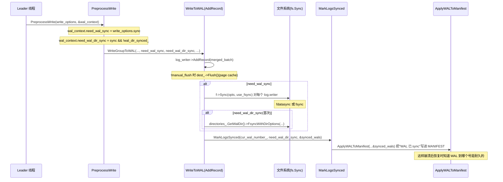
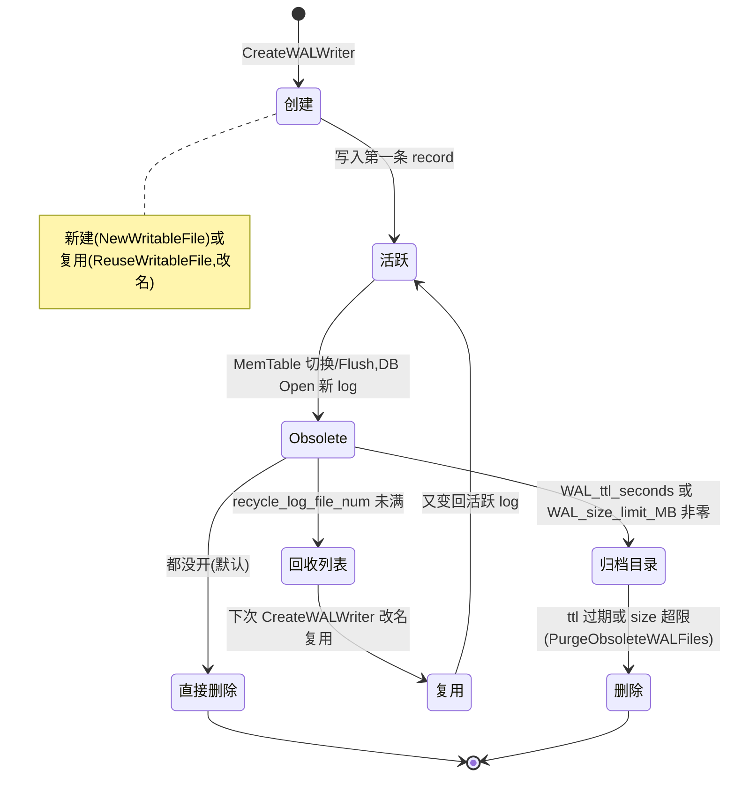

# 第 1 篇 · 第 3 章 · WAL:落盘与回收

> **核心问题**:上一章 P1-02 讲到,写组的 leader 把整组 WriteBatch 攒成一批,一次写进 WAL。可这只是"写进了 log::Writer 这层"——这条 WAL 数据是怎么变成磁盘上的字节的?log 文件怎么创建、怎么轮转、怎么复用、怎么回收?sync 到底在什么时候发生,几种 sync 策略各自换来什么保证?WAL 文件什么时候删、什么时候"先归档再删"(archive)?崩溃之后重启,RocksDB 怎么靠 WAL 把没落盘成 SST 的数据捞回来,而且捞多捞少还能让你自己定档?——本章把这条 WAL 落盘与回收的链条,从 `log::Writer::AddRecord` 一路拆到 `WalManager::ArchiveWALFile`,再拆到 `DBImpl::Recover` 的重放语义。

> **读完本章你会明白**:
> 1. WAL 的 record 在磁盘上到底长什么样,为什么 RocksDB 比 LevelDB 多了一套"可回收 record 格式"(kRecyclableHeader,11 字节,带 log_number),以及这套格式凭什么 sound(防混淆)。
> 2. 写组 leader 写完 WAL 之后,sync 是怎么发生的:`WriteOptions::sync` 这个布尔,加上 `manual_wal_flush`、`use_fsync`,组合出几档语义不同的落盘保证;为什么 sync 不只是"fsync 一下"那么简单。
> 3. log 文件的"复用"(recycle)是什么——旧 log 不删而改名复用,为什么能省新建文件和 fallocate 的抖动,又为什么复用必须把 log_number 写进每个 record 的 header。
> 4. archive 不是"马上删",而是"先改名搬到 archive 目录,过期再删",这一招凭什么撑起了 replication 和 Checkpoint 追历史;`WAL_ttl_seconds` / `WAL_size_limit_MB` 两个旋钮(注意大写)各自怎么裁剪。
> 5. 崩溃恢复时,RocksDB 怎么按 WAL 文件号顺序重放,而且 `wal_recovery_mode` 的四档(kTolerateCorruptedTailRecords / kAbsoluteConsistency / kPointInTimeRecovery / kSkipAnyCorruptedRecords)各自捞多少、丢多少——以及**默认档不是你以为是的那一档**。
> 6. 这一章的每一步,LevelDB 是写死的、RocksDB 把它打开成了什么旋钮。

> **如果一读觉得太难**:先只记住三件事——① WAL 在磁盘上是一串 32KB 的 block,每个 record 带 7 字节(或 11 字节,可回收格式)header,header 里有 CRC + 长度 + 类型;② sync 是 WriteOptions::sync 一个布尔,但"flush"(把 page cache 写出去)和"sync"(fsync 落盘)是两件事,RocksDB 把它们分开;③ log 文件能复用(改名不新建)、能归档(改名搬到 archive 目录),全是为了省 IO 抖动和给 replication 留后路。

---

## 〇、一句话点破

> **WAL 的本质是一条"追加 + 分块 + 校验"的字节流。LevelDB 把这条流的格式、sync 时机、文件回收策略都焊死了;RocksDB 把"可回收 header(带 log_number 防混淆)"、"sync 三档语义(由 sync × manual_wal_flush × use_fsync 组合)"、"log 文件复用"、"WAL 归档裁剪"、"四档恢复语义"全部打开了旋钮——你要的是吞吐还是耐久,自己挑。**

这是结论,不是理由。本章倒过来拆:先讲一条 record 在磁盘上长什么样(承接 LevelDB 一句带过),再讲它怎么从内存落成字节(AddRecord / EmitPhysicalRecord),接着讲 sync 的几档语义,然后讲 log 文件怎么复用、怎么归档裁剪,最后讲崩溃恢复时这条流怎么被读回来。

---

## 一、WAL 在磁盘上长什么样:一条分块的字节流

### 1.1 承 LevelDB:7 字节 header、CRC Mask、32KB 分块、4 种 BlockType

WAL(Write-Ahead Log,预写日志)的物理格式,LevelDB 已经拆到源码级,本书承接铁律,一句话带过:

> 一条 WAL 文件是一串**固定 32KB 的 block**(`kBlockSize = 32768`)。每个 block 里塞着若干条 record,每条 record 由 **7 字节 header(crc4 + len2 + type1) + payload** 组成。一条逻辑 batch 如果放不进当前 block 剩余空间,就被拆成 kFirstType / kMiddleType / kLastType 多个物理 record(放得下就是 kFullType);header 里的 CRC 用了 Mask(避免和操作系统内联的 CRC 校验冲突),CRC 覆盖 type 字节 + payload。详见《LevelDB》WAL 章。

到这里,LevelDB 讲过的不重复。RocksDB 在这条基线上做了**三处实质演进**,下面逐个拆。

### 1.2 RocksDB 演进一:可回收 record 格式(kRecyclableHeader,11 字节)

RocksDB 的 `log_format.h` 里,header 大小有两个常量:

```cpp
// db/log_format.h:56-61
// Header is checksum (4 bytes), length (2 bytes), type (1 byte)
constexpr int kHeaderSize = 4 + 2 + 1;

// Recyclable header is checksum (4 bytes), length (2 bytes), type (1 byte),
// log number (4 bytes).
constexpr int kRecyclableHeaderSize = 4 + 2 + 1 + 4;
```

`kHeaderSize = 7` 是 legacy 格式,和 LevelDB 完全一样(兼容老数据库)。`kRecyclableHeaderSize = 11` 是 RocksDB 独有的**可回收 record 格式**——比 legacy 多了 4 字节的 **log_number**(即这条 record 所属的 WAL 文件的编号)。

为什么多这 4 字节?这就引出 RocksDB 第二处演进——log 文件复用。

> **LevelDB 是写死的,RocksDB 打开成了旋钮**:LevelDB 的 log 文件用完就删,下一个 log 文件**新建**,从头写。RocksDB 加了一个选项 `recycle_log_file_num`,让你**保留 N 个旧 log 文件,新 log 直接改名复用**(后面 1.3 节详拆)。可一旦"复用旧文件",就冒出一个 LevelDB 没有的正确性问题:旧 log 文件可能预先分配(preallocate)了一大片空间,复用时只 truncate 到对齐块就开写,如果某个块碰巧没被新数据完全覆盖,旧 incarnation 残留的 record 就可能被恢复期的 reader 读到,误以为是自己这个 incarnation 的数据。

那怎么办?**把 log_number 写进每个 record 的 header**。Reader 读 record 时,如果 header 里的 log_number 跟"当前正在重放的 WAL 文件号"对不上,就知道这是上一个 incarnation 残留的脏数据,丢掉它。看 log::Writer 的 EmitPhysicalRecord 是怎么做的:

```cpp
// db/log_writer.cc:313-339(简化,非源码原文逐行)
char buf[kRecyclableHeaderSize];
buf[4] = static_cast<char>(n & 0xff);        // length 低字节
buf[5] = static_cast<char>(n >> 8);           // length 高字节
buf[6] = static_cast<char>(t);                // type

uint32_t crc = type_crc_[t];                  // 预算好的 type 的 CRC
if (t < kRecyclableFullType || ...) {
  // Legacy record format —— 7 字节 header,不带 log_number
  header_size = kHeaderSize;
} else {
  // Recyclable record format —— 11 字节 header,带 log_number
  header_size = kRecyclableHeaderSize;
  // 只编码 64 位 log_number 的低 32 位。注释原文:
  // "This means we will fail to detect an old record if we recycled a log
  //  from ~4 billion logs ago, but that is effectively impossible"
  EncodeFixed32(buf + 7, static_cast<uint32_t>(log_number_));
  crc = crc32c::Extend(crc, buf + 7, 4);      // log_number 也进 CRC
}
// ... 计算 payload CRC,Mask,写 header + payload
```

注意两个细节:① log_number 只编码低 32 位(注释明说"40 亿次回收才可能撞",CRC 32 位也兜底);② log_number 字段**也进 CRC**,所以 reader 不仅校验 payload,还能确认 log_number 没被篡改。

> **钉死这件事**:可回收 record 格式的 4 字节 log_number,不是装饰,是 **"log 文件复用"这个特性的正确性前提**。没有它,恢复期 reader 会把上个 incarnation 的脏 record 当成自己的数据重放,数据错乱。LevelDB 不复用 log,所以不需要这个字段;RocksDB 一旦打开复用旋钮,就必须配套这套 kRecyclableHeader。这就是"打开一个旋钮,必须配套打开正确性机制"的典型——可调性不是白给的。

#### Reader 端怎么用 log_number 防混淆(走一遍恢复场景)

光说"reader 比对 log_number"还不够具体,我们走一遍真实的恢复场景,看 reader 是怎么靠这个字段挡住脏数据的。

假设你有两个 incarnation:第一个 incarnation 写了 log 文件号 100,preallocate 了 1MB 空间,实际只写了 200KB(record 1..N),剩下 800KB 是 preallocation 的空洞(填 0)。崩溃。重启后这个 log 100 被回收(recycle),改名复用成 log 105——但只 truncate 到 200KB 对齐块,然后从头开始写新数据(record A..M,占了 150KB)。这时 log 105 文件实际是:前 150KB 是新数据(record A..M,header 里 log_number=105),后面残留的是 log 100 的旧数据(record N 之后那些,header 里 log_number=100)和 preallocation 空洞。

现在又崩溃,重启恢复。reader 打开 log 105,从头读 record。读到 record A..M,header 里 log_number=105,跟"当前重放的文件号 105"一致,正常重放。读到 record N(log 100 残留的),header 里 log_number=100,跟 105 对不上——reader 知道这是上个 incarnation 的脏数据,丢掉(报一个"old record"或跳过)。

> **不这样会怎样**:如果 header 没有 log_number 字段(像 legacy 7 字节格式),reader 读到 record N 时,只能靠 CRC 判断——可 record N 当时是写成功的,CRC 是对的,reader 会把它当成 log 105 的合法 record 重放!后果是:log 100 的旧数据(record N 描述的某次 Put)被错误地重新应用到当前 MemTable,数据错乱(可能把已经被覆盖删除的旧值又写回去)。这就是为什么"复用 log 文件"这个特性必须配套 kRecyclableHeader——log_number 字段是防混淆的唯一可靠手段(CRC 只能防"字节损坏",防不了"字节完好但属于上个 incarnation")。

注意一个边界:`kZeroType = 0` 是专门给 preallocation 空洞用的。preallocate 出来的空间填的是 0,reader 读到 type=0 的 record 知道这是空洞,直接跳过(`db/log_format.h:23` 注释:"Zero is reserved for preallocated files")。这和 log_number 防混淆是两层独立机制——`kZeroType` 防"全 0 空洞",log_number 防"非全 0 但属于旧 incarnation 的脏 record"。两层加起来,复用 log 文件才 sound。

### 1.3 RocksDB 演进二:更多 record type(压缩、UDT、predecessor WAL)

打开 `db/log_format.h` 看 RecordType 枚举,你会发现 RocksDB 的 record type 远不止 LevelDB 的 4 种(kFullType/kFirstType/kMiddleType/kLastType),而是 **14 种**:

```cpp
// db/log_format.h:22-52
enum RecordType : uint8_t {
  kZeroType = 0,                    // preallocation 留的空洞
  kFullType = 1,                    // —— 上面 5 种是 LevelDB 原有
  kFirstType = 2, kMiddleType = 3, kLastType = 4,

  kRecyclableFullType = 5,          // —— 可回收版本的 4 种
  kRecyclableFirstType = 6, kRecyclableMiddleType = 7, kRecyclableLastType = 8,

  kSetCompressionType = 9,          // —— 声明 WAL 用了什么压缩

  kUserDefinedTimestampSizeType = 10,         // —— 用户自定义时间戳长度
  kRecyclableUserDefinedTimestampSizeType = 11,

  kPredecessorWALInfoType = 130,              // —— WAL 链完整性校验
  kRecyclePredecessorWALInfoType = 131,
};
constexpr uint8_t kRecordTypeSafeIgnoreMask = 1 << 7;  // 高位的 type 老版本忽略
```

这些多出来的 type,各自对应 RocksDB 后来加的特性:

- **kSetCompressionType(9)**:11.x 引入了 `wal_compression` 选项(默认 `kNoCompression`)。一旦开启,WAL 文件的**第一个 record** 就是这个类型,声明后面所有 record 用什么压缩算法。Reader 读到它就初始化解压器。如果没有这个声明 record,reader 就按未压缩处理(向后兼容)。
- **kUserDefinedTimestampSizeType(10)**:用户自定义时间戳(user-defined timestamp)特性。一个 WAL 文件可能同时承载多个 CF 的写,各 CF 的时间戳长度可能不同,这个 record 把"当前已知的各 CF 时间戳长度"记下来,reader 据此正确解码后续 record。
- **kPredecessorWALInfoType(130)**:配合 `track_and_verify_wals` 选项,在 WAL 文件开头记一条"我的前驱 WAL 是谁",恢复时据此检测"WAL 链有没有洞"(防止某个 WAL 文件丢了却没发现)。

> **不这样会怎样**:LevelDB 的 WAL 是"纯字节流 + 4 种分片 type",够用是因为它**没有压缩、没有多 CF、没有 WAL 链校验**。RocksDB 每加一个特性,如果靠"往 payload 里塞元数据"来传信息,reader 就得在每条 record 都解码一次元数据,慢;把元数据提到 header 之外的**独立 record type**,reader 一次性读到就记住,后续 record 直接用,既快又向后兼容(老 reader 看不懂的新 type,靠 `kRecordTypeSafeIgnoreMask` 高位 bit 安全跳过)。这是"用 record type 当带外信令"的设计模式。

WAL 的物理格式就讲到这里。下面看一条 record 是怎么从内存落成磁盘字节的——这是写路径上 leader 的核心动作。

---

## 二、一条 record 怎么落盘:AddRecord 与 EmitPhysicalRecord

### 2.1 写组 leader 的核心动作:把整组 batch 一次写进 WAL

上一章 P1-02 讲到,写组(WriteGroup)的 leader 把所有 follower 的 batch 链接成一个 merged_batch,然后调 `WriteToWAL` 把它写进 log::Writer。看 `WriteToWAL` 的核心(只留关键行):

```cpp
// db/db_impl/db_impl_write.cc:2262-2306(简化)
IOStatus DBImpl::WriteToWAL(const WriteBatch& merged_batch,
                            const WriteOptions& write_options,
                            log::Writer* log_writer, ...) {
  Slice log_entry = WriteBatchInternal::Contents(&merged_batch);
  auto s = merged_batch.VerifyChecksum();          // 先校验 batch 自己的 checksum
  ...
  io_s = log_writer->MaybeAddUserDefinedTimestampSizeRecord(...);  // 视情况插 UDT record
  io_s = log_writer->AddRecord(write_options, log_entry, sequence); // 真正写 WAL
  ...
  wals_total_size_.FetchAddRelaxed(log_entry.size());  // 累计 WAL 总字节
  wal_file_number_size.AddSize(*log_size);
  wal_empty_ = false;
  return io_s;
}
```

注意三个细节:① 写之前先 `VerifyChecksum`,防止内存损坏的 batch 落盘(空间换正确性);② `MaybeAddUserDefinedTimestampSizeRecord` 在真正写数据之前,可能先插一条 UDT 长度 record(上一节讲的带外信令);③ 真正写 WAL 的动作就是 `log_writer->AddRecord`。那 AddRecord 内部干了什么?

### 2.2 AddRecord:逻辑 batch 切成物理 record,逐片 EmitPhysicalRecord

`log::Writer::AddRecord` 干的事,和 LevelDB 一脉相承(本节承接一句带过 + 指出 RocksDB 多的料):把这条逻辑 batch(`slice`),按当前 block 剩余空间切成一片一片的物理 record,每片调 `EmitPhysicalRecord` 落盘。看核心循环:

```cpp
// db/log_writer.cc:87-189(简化,非源码原文逐行)
IOStatus Writer::AddRecord(const WriteOptions& write_options,
                           const Slice& slice, const SequenceNumber& seqno) {
  const char* ptr = slice.data();
  size_t left = slice.size();
  bool begin = true;
  do {
    const int64_t leftover = kBlockSize - block_offset_;
    if (leftover < header_size_) {
      // 当前 block 剩的空间连 header 都放不下 → 填 \x00 padding,开新 block
      if (leftover > 0) {
        s = dest_->Append(opts,
            Slice("\x00\x00\x00\x00\x00\x00\x00\x00\x00\x00", leftover), 0);
      }
      block_offset_ = 0;
    }
    const size_t avail = kBlockSize - block_offset_ - header_size_;
    const size_t fragment_length = (left < avail) ? left : avail;

    RecordType type;
    const bool end = (left == fragment_length);
    if (begin && end) {
      type = recycle_log_files_ ? kRecyclableFullType : kFullType;     // 一片放得下
    } else if (begin) {
      type = recycle_log_files_ ? kRecyclableFirstType : kFirstType;   // 头片
    } else if (end) {
      type = recycle_log_files_ ? kRecyclableLastType : kLastType;     // 尾片
    } else {
      type = recycle_log_files_ ? kRecyclableMiddleType : kMiddleType; // 中间片
    }

    s = EmitPhysicalRecord(write_options, type, ptr, fragment_length);
    ptr += fragment_length;
    left -= fragment_length;
    begin = false;
  } while (s.ok() && left > 0);

  if (s.ok() && !manual_flush_) {
    s = dest_->Flush(opts);   // 自动 flush(除非 manual_wal_flush)
  }
  if (s.ok()) {
    last_seqno_recorded_ = std::max(last_seqno_recorded_, seqno);
  }
  return s;
}
```

这段循环的逻辑,《LevelDB》拆过,这里点 RocksDB 多的几处:

- **block 边界处理**:当前 block 剩余空间 `< header_size_` 时,用 `\x00` padding 填满,再开新 block。注意 `header_size_` 是 7 还是 11,取决于 `recycle_log_files_`——也就是说,**同一个 Writer 实例**要么全用 legacy header 要么全用 recyclable header,不会混。这保证了 reader 读一个文件时,只要根据第一条 record 判断出格式,后续就都一致。
- **type 选择**:四选一(kFull/kFirst/kMiddle/kLast)或对应的 recyclable 版本,跟 LevelDB 完全一样的分片逻辑。
- **末尾自动 flush**:`!manual_flush_` 时,AddRecord 结束会调 `dest_->Flush(opts)`。注意这个 Flush 是 `WritableFileWriter::Flush`,**它只是把 writer 内部缓冲区推给底层文件系统,不一定 fsync 落盘**——这点至关重要,下一节 sync 策略会展开。
- **last_seqno_recorded_**:写成功后,记录这条 record 携带的最大 seqno。这个值后面恢复和 `GetUpdatesSince` 都会用到(知道某个 WAL 文件覆盖了哪些 seq)。

### 2.3 EmitPhysicalRecord:真正拼 header、算 CRC、Append

切片定下来之后,`EmitPhysicalRecord` 干"拼 7/11 字节 header + 算 CRC + 两次 Append(header 一次,payload 一次)"的事:

```cpp
// db/log_writer.cc:309-360(简化)
IOStatus Writer::EmitPhysicalRecord(const WriteOptions& write_options,
                                    RecordType t, const char* ptr, size_t n) {
  assert(n <= 0xffff);  // payload 长度必须放得进 2 字节
  size_t header_size;
  char buf[kRecyclableHeaderSize];

  buf[4] = static_cast<char>(n & 0xff);
  buf[5] = static_cast<char>(n >> 8);
  buf[6] = static_cast<char>(t);
  uint32_t crc = type_crc_[t];

  if (/* legacy type */) {
    header_size = kHeaderSize;          // 7
  } else {
    header_size = kRecyclableHeaderSize; // 11
    EncodeFixed32(buf + 7, static_cast<uint32_t>(log_number_));
    crc = crc32c::Extend(crc, buf + 7, 4);
  }
  uint32_t payload_crc = crc32c::Value(ptr, n);
  crc = crc32c::Crc32cCombine(crc, payload_crc, n);
  crc = crc32c::Mask(crc);              // Mask,跟 LevelDB 一样
  EncodeFixed32(buf, crc);

  s = dest_->Append(opts, Slice(buf, header_size), 0 /* checksum */);
  if (s.ok()) {
    s = dest_->Append(opts, Slice(ptr, n), payload_crc);  // payload 带 checksum
  }
  block_offset_ += header_size + n;
  return s;
}
```

两处值得细看(都是性能技巧):

- **type_crc_ 预算表**:`type_crc_[i]` 在 Writer 构造时就预算好了每种 type 字节的 CRC(`crc32c::Value(&t, 1)`),`EmitPhysicalRecord` 直接查表,省掉每次算 type 的 CRC。WAL 是写路径热路径,这种"预算 + 查表"的微优化 RocksDB 一点不放过。
- **payload_crc 单独算再 Combine**:CRC 不是"算整段(type + log_number + payload)一次",而是"type_crc (含 log_number) + payload_crc"分段算再 `Crc32cCombine`。这样做的好处是可以**流式增量算 payload CRC**(payload 可能很大),而 header 部分固定短。Combine 是 CRC32C 的数学性质,等价于一次算完。

> **钉死这件事**:WAL 落盘的 CPU 热点就两件事——CRC 算 + Append 写。RocksDB 的 `util/crc32c.h` 有 SIMD 加速(SSE/ARM 都有),Append 走 `WritableFileWriter` 的带 IO trace 和 checksum handoff 的封装。一个细节:`dest_->Append(opts, Slice(ptr, n), payload_crc)` 把 payload_crc 顺手传给底层,某些文件系统(支持 checksum handoff)能直接用这个 CRC 校验,不用再算一遍。

一条 record 落盘讲完了。可"落盘"分两层——page cache 里的 flush 和真正的 fsync。下一节拆 sync。

---

## 三、sync 的几档语义:不是"fsync 一下"那么简单

### 3.1 问题:flush 和 sync 是两件事

很多人以为"WAL sync 就是 fsync",这是最常见的误解。其实文件系统层面,"把数据落到磁盘"分两步:

1. **flush(用户态 → page cache)**:`write()` 系统调用把数据从用户态缓冲区推到内核 page cache。这之后**进程崩溃不丢,机器掉电丢**。
2. **sync(fsync/fdatasync,page cache → 磁盘)**:把 page cache 里"脏页"真正刷到磁盘设备。这之后**机器掉电也不丢**(假设磁盘不撒谎)。

RocksDB 的 `log::Writer::AddRecord` 末尾那个 `dest_->Flush(opts)` 只做了第 1 步——把 writer 内部缓冲区推到 page cache。**要真正耐久,还必须 fsync**。这一节就讲 RocksDB 怎么把"何时 fsync"做成旋钮。

### 3.2 旋钮一:WriteOptions::sync(单次写的布尔开关)

最直接的旋钮在每次写请求上:

```cpp
// include/rocksdb/options.h:2492-2517
struct WriteOptions {
  // If true, the write will be flushed from the operating system buffer cache
  // (by calling WritableFile::Sync()) before the write is considered complete.
  bool sync = false;
  // If true, writes will not first go to the write ahead log, and the write
  // may get lost after a crash.
  bool disableWAL = false;
  ...
};
```

`WriteOptions::sync` 是个布尔,默认 **false**。三档语义:

- **`sync = false`(默认)**:写完只 flush(到 page cache),**不 fsync**。Put 立刻返回,延迟最低。代价:机器掉电可能丢最近的写(进程崩溃不丢)。
- **`sync = true`**:写完不仅 flush 还 **fsync**(或 fdatasync,看 `use_fsync`),等数据真正落盘才返回。耐久性最高,延迟也最高(fsyc 是几十到几百微秒级)。
- **`disableWAL = true`**:连 WAL 都不写,直接进 MemTable。最快但崩溃丢数据(只能用于可重建的缓存类数据)。

> **不这样会怎样**:LevelDB 这里其实也有 `WriteOptions::sync`,但它和 RocksDB 的区别在于——LevelDB 的写组每次 sync 都是"卡住等 fsync 返回",fsync 的延迟直接拖累整组写吞吐。RocksDB 在 sync 的实现上做了若干优化(后面 3.4 节讲),让"开 sync 的写"也能扛得住高吞吐。但更重要的是,RocksDB 把"sync 之外"还拆出了两个旋钮(`manual_wal_flush`、`use_fsync`),让你能在 sync 的"时机"和"手段"上各自调。

### 3.3 旋钮二:manual_wal_flush(把 flush 的时机交给你)

`DBOptions::manual_wal_flush`(默认 false)控制 **flush 的时机**:

```cpp
// include/rocksdb/options.h:1558(节选)
bool manual_wal_flush = false;
```

- **`manual_wal_flush = false`(默认)**:每次 `AddRecord` 末尾自动 flush(推到 page cache)。你不用管。
- **`manual_wal_flush = true`**:**不自动 flush**,你必须显式调 `DB::FlushWAL(false)` 或 `DB::SyncWAL()` 才推到 page cache / fsync。

为什么要把 flush 的时机交给用户?因为自动 flush 每次 AddRecord 都触发一次系统调用(`write()`),在某些极高吞吐场景(批写极频繁),每次 flush 都是 syscall 开销。如果你能攒一段时间再一次性 flush(比如攒 1000 条 Put 一起),syscall 次数能降两个数量级。代价是:flush 之前的写,进程崩溃都丢(因为还在 writer 内部缓冲区,连 page cache 都没进)。

> **钉死这件事**:`manual_wal_flush` 是用"进程崩溃丢更多数据"换"syscall 次数少、吞吐高"。它只影响 flush 时机,**不影响 sync 语义**——sync 该 fsync 还是 fsync,只是 flush 这一步被你手动控制了。两者正交,可以独立调。

### 3.4 旋钮三:use_fsync(fsync 还是 fdatasync)

`DBOptions::use_fsync`(默认 false)控制 **sync 的手段**:

```cpp
// include/rocksdb/options.h:836(节选)
bool use_fsync = false;
```

- **`use_fsync = false`(默认)**:用 `fdatasync`。fdatasync 只刷数据,不刷文件元数据(如 mtime、inode 大小),比 fsync 快。
- **`use_fsync = true`**:用 `fsync`。fsync 数据和元数据都刷,更保守但更慢。

> **不这样会怎样**:在大多数 Linux 文件系统(ext4/xfs)上,WAL 文件 append-only 且不重命名,fdatasync 就够(元数据变动的只有"文件大小",而文件大小变动会随数据一起落盘)。但某些文件系统(尤其网络文件系统 NFS,或者文件刚被 rename 过元数据还没落)上,fdatasync 可能不够,需要 fsync 保文件元数据也持久。`use_fsync` 这个旋钮就是给这类场景留的口子。看 sync 路径的源码确认:

```cpp
// db/db_impl/db_impl_write.cc:2381-2386
if (auto* f = log.writer->file()) {
  io_s = f->Sync(opts, immutable_db_options_.use_fsync);   // ← use_fsync 传进去
  if (!io_s.ok()) {
    break;
  }
}
```

`f->Sync(opts, use_fsync)` 这一行,`use_fsync` 决定底层是调 `fdatasync()` 还是 `fsync()`。

### 3.5 三档语义的组合:sync × manual_wal_flush × use_fsync

把三个旋钮组合起来,WAL 落盘的语义空间就清楚了:

| sync | manual_wal_flush | use_fsync | 行为 | 耐久性 | 吞吐 |
|---|---|---|---|---|---|
| false | × | × | 只 page cache,不 fsync | 进程崩不丢,掉电丢 | 最高 |
| true | false | false | 每次 AddRecord 自动 flush + fdatasync | 掉电不丢 | 中(fsyc 开销) |
| true | false | true | 自动 flush + fsync(连元数据) | 掉电 + 文件系统元数据都不丢 | 低 |
| true | true | × | 手动攒批 flush,显式 sync 时 fsync | 掉电不丢,但攒批期间进程崩丢 | 高(syscall 少) |

> **LevelDB 是写死的,RocksDB 打开成了旋钮**:LevelDB 只有 `WriteOptions::sync` 一个布尔,flush 时机写死(自动)、sync 手段写死(fdatasync 默认)。RocksDB 把"flush 时机"(`manual_wal_flush`)和"sync 手段"(`use_fsync`)各自打开成旋钮,让你针对自己文件系统和 workload 的特性精调。这是"可调性"在 sync 这一层最直接的体现。

### 3.6 sync 路径全景:WalContext → WriteGroupToWAL → MarkLogsSynced

光有旋钮不够,得讲清"开 sync 的写"在写组里是怎么真正 fsync 的。整个链条是:



看 `WriteGroupToWAL` 里真正 sync 的核心代码:

```cpp
// db/db_impl/db_impl_write.cc:2350-2401(简化)
if (io_s.ok() && need_wal_sync) {
  // wal_write_mutex_ 已持有,因为 manual_wal_flush 时别的线程可能 FlushWAL
  const bool needs_locking = manual_wal_flush_ && !two_write_queues_;
  if (UNLIKELY(needs_locking)) {
    wal_write_mutex_.Lock();
  }
  if (io_s.ok()) {
    for (auto& log : logs_) {     // 遍历所有未 sync 的 log 文件
      IOOptions opts;
      io_s = WritableFileWriter::PrepareIOOptions(write_options, opts);
      if (!io_s.ok()) break;
      if (auto* f = log.writer->file()) {
        io_s = f->Sync(opts, immutable_db_options_.use_fsync);   // 真正 fsync
        if (!io_s.ok()) break;
      }
    }
  }
  if (UNLIKELY(needs_locking)) {
    wal_write_mutex_.Unlock();
  }
  if (io_s.ok() && need_wal_dir_sync) {
    // 首次 sync 时 sync WAL 目录(为了把"新建文件"这个元数据也持久化)
    io_s = directories_.GetWalDir()->FsyncWithDirOptions(
        IOOptions(), nullptr,
        DirFsyncOptions(DirFsyncOptions::FsyncReason::kNewFileSynced));
  }
}
```

三个细节钉死:

1. **遍历所有 log.writer**:不是只 sync 当前 log,而是 `for (auto& log : logs_)` 把所有未 sync 的 log 都 sync 一遍。因为可能发生"log 已切换但旧 log 还没 sync 完"的情况(比如 MemTable 满了切了新 log,旧 log 末尾几条还没 sync)。一次 sync 把所有欠账都清掉。
2. **need_wal_dir_sync 只在首次**:`wal_dir_synced_` 这个标志保证"WAL 目录的 fsync"只做一次——第一次 sync 时,要保证"新建的 log 文件这个元数据"也持久化(否则崩溃后可能文件还在但目录项没了)。之后 log 文件都是 append,目录项不变,就不用再 sync 目录了。这是个很精妙的"一次性开销"优化。
3. **sync 完后 MarkLogsSynced + 写 MANIFEST**:`MarkLogsSynced` 把"哪些 log 号已经 sync 了"记下来,然后 `ApplyWALToManifest` 把这条信息写进 MANIFEST。这样崩溃恢复时,RocksDB 知道哪些 WAL 是"已 sync 耐久"的,可以放心重放;哪些是"没 sync,可能不完整"的,按 `wal_recovery_mode` 处理。

> **钉死这件事**:sync 不是孤立的一次 fsync,而是"fsync 文件(可能多个)+ 首次 sync 目录 + 把 sync 状态写进 MANIFEST"的一组动作。把 sync 状态写进 MANIFEST 这步尤其关键——它让"耐久"这个属性从"内存里的 flag"变成了"持久化的元数据",崩溃后能恢复出来。这就是为什么 RocksDB 的 sync 比 LevelDB 看起来"啰嗦"——它在为崩溃恢复的正确性铺路。

### 3.7 并发 sync 的微妙之处:PrepareForSync 与 IsSyncing

上面讲 sync 时,默认是"写组 leader 一个人在 sync"。但 RocksDB 还有一条 `DB::SyncWAL()` API,允许别的线程**异步触发 sync**(典型场景:用户开 `manual_wal_flush`,然后后台线程定期 `SyncWAL()`)。这就引出一个并发问题:**leader 正在写 WAL(AddRecord + Append),另一个线程正在 SyncWAL(fsyc),两者怎么不踩对方?**

RocksDB 的解法是 `PrepareForSync` / `IsSyncing` 这对状态标志。看 `PreprocessWrite` 里这一段:

```cpp
// db/db_impl/db_impl_write.cc:2185-2206(简化)
if (status.ok() && wal_context->need_wal_sync) {
  // 等之前的并行 sync 完成(检查队头 log 是否正在被 sync)
  while (logs_.front().IsSyncing()) {
    wal_sync_cv_.Wait();
  }
  // 把所有 log 标记为"正在被 sync",防止别的 SyncWAL 并发干扰
  for (auto& log : logs_) {
    log.PrepareForSync();
  }
} else {
  wal_context->need_wal_sync = false;
}
```

机制是这样:

1. **leader 想要 sync 前**,先检查队头 log 是不是正在被别人 sync(`logs_.front().IsSyncing()`)。如果是,在条件变量 `wal_sync_cv_` 上等——因为任何 sync 操作都会 sync 队头 log,等别人 sync 完自己就省事了。
2. **没人 sync 时**,leader 把所有 log 标记 `PrepareForSync()`,相当于"占座"——告诉别的 SyncWAL 线程"这批 log 我要 sync 了,你别插队"。别的 SyncWAL 看到 `IsSyncing()` 就会等。

这套机制保证了:**同一时刻只有一个线程在真正 fsync**(`wal_write_mutex_` 互斥 + `IsSyncing` 标志双重保险),避免多个 fsync 并发导致 IO 抖动或状态混乱。

> **不这样会怎样**:如果没有这套 `PrepareForSync` / `IsSyncing` 协调,两个线程同时 fsync 同一个 log 文件,轻则重复 fsync(IO 浪费),重则一个线程 fsync 时另一个线程 Append 改了文件,导致 fsync 的语义不可预期(可能 fsync 了一半新数据一半旧数据)。RocksDB 这套"占座 + 条件变量等待"的协调,是 manual_wal_flush + 后台 SyncWAL 这种异步 sync 模式能 sound 运行的前提。

注意 `two_write_queues_` 这个标志——它是 RocksDB 为高并发场景引入的"双写队列"模式(两个写线程同时驱动写组,提高写并行度)。在双写队列模式下,`WriteToWAL` 必须用 `wal_write_mutex_` 保护 `log_writer->AddRecord`,防止两个写队列并发写同一个 log(`db/db_impl/db_impl_write.cc:2277-2287` 的注释明说:"When two_write_queues_ WriteToWAL has to be protected from concurrent calls from the two queues")。双写队列是更高级的话题,本章只点到——它进一步把"sync 这件事"的并发协调复杂化了,但核心机制(`wal_write_mutex_` + `IsSyncing`)还是这套。

sync 讲完了。但 WAL 文件不能无限涨——满了要切新的,旧的要处理(复用、归档、删)。下一节拆 log 文件的生命周期。

---

## 四、log 文件的生命周期:创建、轮转、复用、归档、删除

### 4.1 创建:CreateWALWriter,新建还是复用

WAL 文件的创建发生在 MemTable 切换(Flush 触发)或 DB Open 时——旧 MemTable 满了要 Flush,就要开一个新 log 文件给新 MemTable 用。看 `CreateWALWriter`:

```cpp
// db/db_impl/db_impl_open.cc:2423-2481(简化)
IOStatus DBImpl::CreateWALWriter(const DBOptions& db_options,
                                 uint64_t log_file_num,
                                 uint64_t recycle_log_number,
                                 size_t preallocate_block_size,
                                 UnpublishedWAL* new_wal) {
  std::string log_fname = LogFileName(wal_dir, log_file_num);
  if (recycle_log_number) {
    // 复用旧 log 文件:改名,不新建
    ROCKS_LOG_INFO(immutable_db_options_.info_log,
                   "reusing log %" PRIu64 " from recycle list\n",
                   recycle_log_number);
    std::string old_log_fname = LogFileName(wal_dir, recycle_log_number);
    io_s = fs_->ReuseWritableFile(log_fname, old_log_fname, opt_file_options,
                                  &lfile, /*dbg=*/nullptr);
  } else {
    // 新建 log 文件
    io_s = NewWritableFile(fs_.get(), log_fname, &lfile, opt_file_options);
  }
  if (io_s.ok()) {
    lfile->SetPreallocationBlockSize(preallocate_block_size);  // 预分配块
    ...
    new_wal->writer = std::make_unique<log::Writer>(
        std::move(file_writer), log_file_num,
        immutable_db_options_.recycle_log_file_num > 0,   // ← 决定用 7 还是 11 字节 header
        immutable_db_options_.manual_wal_flush,
        immutable_db_options_.wal_compression,
        immutable_db_options_.track_and_verify_wals);
  }
  return io_s;
}
```

两个分支的差别,就是 RocksDB 相对 LevelDB 的核心演进之一:

- **recycle_log_number 为 0**:走 `NewWritableFile`,新建文件。这一步在文件系统里要分配 inode、初始化元数据,在某些文件系统(尤其远程文件系统)上是几十毫秒级的延迟。**这就是 LevelDB 的做法**(它没有 recycle)。
- **recycle_log_number 非 0**:走 `fs_->ReuseWritableFile(new, old)`,**把旧文件改名复用**。文件系统层面 `rename` 比 `create + allocate` 快得多(inode、空间已分配好,只改个目录项)。`log::Writer` 构造时 `recycle_log_files` 参数为 true,后续就用 11 字节 recyclable header(带 log_number)。

> **不这样会怎样**:在高频 Flush 的 workload(比如 MemTable 设得小、写极频繁),每隔几秒就要切一个新 log 文件。如果每次都 `NewWritableFile` 新建,文件系统创建/分配的延迟会变成写路径的卡顿点——尤其在 NVMe SSD 上,创建文件的延迟可能比写数据本身还长。RocksDB 的 `recycle_log_file_num` 让你保留 N 个旧 log 文件循环改名复用,把"创建"这一步的开销摊薄到几乎为零。代价是多占 N 个文件的磁盘空间(每个文件 preallocate 的大小),和必须配套 recyclable header(多 4 字节/record)。

### 4.2 轮转:什么时候切新 log

WAL 文件的轮转(MemTable 满了切新 log)由 `PreprocessWrite` 触发,逻辑在写路径上:

```cpp
// db/db_impl/db_impl_write.cc:2101-2213(PreprocessWrite,简化)
Status DBImpl::PreprocessWrite(const WriteOptions& write_options,
                               WalContext* wal_context, ...) {
  ...
  // (1) 检查是否需要 SwitchMemtable / SwitchWAL(很多触发条件)
  // (2) 检查是否需要 ScheduleFlushOrCompaction
  ...
  InstrumentedMutexLock l(&wal_write_mutex_);
  if (status.ok() && wal_context->need_wal_sync) {
    // 等之前的并行 sync 完成,把所有 log 标记 PrepareForSync
    while (logs_.front().IsSyncing()) {
      wal_sync_cv_.Wait();
    }
    for (auto& log : logs_) {
      log.PrepareForSync();    // 防止 SyncWAL 并发干扰
    }
  } else {
    wal_context->need_wal_sync = false;
  }
  wal_context->writer = logs_.back().writer;
  wal_context->need_wal_dir_sync =
      wal_context->need_wal_dir_sync && !wal_dir_synced_;
  ...
}
```

`PreprocessWrite` 是写组 leader 在真正写之前要做的预处理:检查要不要切 MemTable / WAL、要不要调度 Flush / Compaction、要不要等之前的 sync。它构造 `WalContext`——这个结构体决定了本次写要不要 sync:

```cpp
// db/db_impl/db_impl.h:2078-2086
struct WalContext {
  explicit WalContext(bool need_sync = false)
      : need_wal_sync(need_sync), need_wal_dir_sync(need_sync) {}
  bool need_wal_sync = false;
  bool need_wal_dir_sync = false;
  log::Writer* writer = nullptr;
  WalFileNumberSize* wal_file_number_size = nullptr;
  uint64_t prev_size = SIZE_MAX;
};
```

`WalContext` 由 `WriteOptions::sync` 构造(`WalContext wal_context(write_options.sync)`),把 sync 这个布尔的语义分解成两个:`need_wal_sync`(要不要 fsync 文件)和 `need_wal_dir_sync`(要不要 fsync 目录,首次才需要)。

### 4.3 处理旧文件:FindObsoleteFiles 三路分发

旧 log 文件怎么处理?这发生在 `FindObsoleteFiles`(写路径或后台调度时调):

```cpp
// db/db_impl/db_impl_files.cc:388-415(简化)
uint64_t min_log_number = job_context->log_number;
while (alive_wal_files_.begin()->number < min_log_number) {
  auto& earliest = *alive_wal_files_.begin();
  if (immutable_db_options_.recycle_log_file_num >
          wal_recycle_files_.size() &&
      earliest.number >= MinLogNumberToRecycle()) {
    // 路径 A:回收列表还没满 → 加入回收列表,留待复用
    wal_recycle_files_.push_back(earliest.number);
  } else {
    // 路径 B:回收列表满了 → 加入删除列表
    job_context->log_delete_files.push_back(earliest.number);
  }
  ...
  alive_wal_files_.pop_front();
}
```

`FindObsoleteFiles` 把每个 obsolete WAL 分成三路:

- **路径 A(回收)**:`recycle_log_file_num > wal_recycle_files_.size()` 且文件号够新 → push 到 `wal_recycle_files_`,等下次 `CreateWALWriter` 复用。
- **路径 B(直接删)**:回收列表满了,或文件号太老(防回收一个早被删的文件)→ push 到 `log_delete_files`,后面 `PurgeObsoleteFiles` 真正删。
- **路径 C(归档)**:如果 `WAL_ttl_seconds > 0` 或 `WAL_size_limit_MB > 0`(归档启用),删之前先改名搬到 archive 目录——这是下一节的内容。

> **LevelDB 是写死的,RocksDB 打开成了旋钮**:LevelDB 的旧 log 文件只有一条路——直接删(相当于 `recycle_log_file_num = 0` 且不归档)。RocksDB 加了 `recycle_log_file_num`(复用)和归档(`WAL_ttl_seconds` / `WAL_size_limit_MB`),把"旧 log 怎么处理"从一条路打开成了三条路,各自服务不同场景(性能 / replication / Checkpoint)。

### 4.4 归档与裁剪:WAL_ttl_seconds / WAL_size_limit_MB

归档(archive)是 RocksDB 给 replication(主从复制)和 Checkpoint(在线备份)留的后路。逻辑在 `WalManager`:

```cpp
// db/wal_manager.cc:287-301
void WalManager::ArchiveWALFile(const std::string& fname, uint64_t number) {
  auto archived_log_name = ArchivedLogFileName(wal_dir_, number);
  Status s = env_->RenameFile(fname, archived_log_name);   // 改名搬到 archive 目录
  ...
  ROCKS_LOG_INFO(db_options_.info_log, "Move log file %s to %s -- %s\n",
                 fname.c_str(), archived_log_name.c_str(), s.ToString().c_str());
}
```

`ArchiveWALFile` 干的事就是 `RenameFile`(改名),把文件从 `wal_dir/` 搬到 `wal_dir/archive/`(默认归档目录)。这一步是 **O(1) 的元数据操作**(同分区改名不拷数据),所以归档本身几乎零开销。

> **重要纠正**:本书提示词和总纲里把归档相关的选项写成 `wal_ttl_seconds` / `wal_ttl_mb`,**实际源码里是大写**: `WAL_ttl_seconds` 和 `WAL_size_limit_MB`(`include/rocksdb/options.h:1111-1112`)。这是 RocksDB 命名上的一个小坑(其他选项都是小写加下划线,就这俩大写),文档和博客里经常写错,但 C++ 代码里必须按大写写。读者调的时候注意。

归档的开关逻辑在 `PurgeObsoleteWALFiles`:

```cpp
// db/wal_manager.cc:140-145
void WalManager::PurgeObsoleteWALFiles() {
  bool const ttl_enabled = db_options_.WAL_ttl_seconds > 0;
  bool const size_limit_enabled = db_options_.WAL_size_limit_MB > 0;
  if (!ttl_enabled && !size_limit_enabled) {
    return;   // 都没开 → 不归档,obsolete WAL 直接删
  }
  ...
}
```

`WAL_ttl_seconds` 和 `WAL_size_limit_MB` **都为 0(默认)时,obsolete WAL 直接删,不归档**。一旦任一非 0,obsolete WAL 先归档(改名到 archive 目录),再由 `PurgeObsoleteWALFiles` 按 ttl 或 size 裁剪:

- **`WAL_ttl_seconds` 非零**:archive 目录里 mtime 超过 `WAL_ttl_seconds` 的 WAL 删掉。
- **`WAL_size_limit_MB` 非零**:archive 目录总大小超限时,从最老的开始删,直到降到限制以下。

两个都非零时,删除频率取两者算出来的较短间隔(`min(WAL_ttl_seconds/2, 10min)`)。看裁剪 ttl 的核心:

```cpp
// db/wal_manager.cc:186-213(简化)
if (ttl_enabled) {
  uint64_t file_m_time;
  s = env_->GetFileModificationTime(file_path, &file_m_time);
  if (file_m_time <= now_seconds &&
      now_seconds - file_m_time > db_options_.WAL_ttl_seconds) {
    s = DeleteDBFile(&db_options_, file_path, archival_dir, false, ...);
    ...
  }
}
```

### 4.5 为什么归档而不是直接删:replication / Checkpoint 要追历史

为什么要"先归档再过期删"这一步,不直接删?这是 RocksDB 给两类场景留的后路:

1. **replication(主从复制)**:RocksDB 提供 `GetUpdatesSince(seq)` API,返回从某个 seq 开始的所有写(供从库追主库)。从库可能滞后,如果主库的 WAL 被直接删了,从库追不上就永久丢同步。归档让 WAL 在 archive 目录里多留一段时间(直到 ttl 过期),给慢从库追上的机会。
2. **Checkpoint(在线备份)**:做 Checkpoint 时,可能需要某些已 obsolete(对主库不再需要)但备份点之前的 WAL。归档让这些 WAL 多留一段时间。

> **不这样会怎样**:如果像 LevelDB 那样 obsolete WAL 直接删,这两类场景都做不了——从库一旦网络抖动滞后几秒,主库的 WAL 已经被删,从库永远追不上;Checkpoint 在备份过程中,某些 WAL 被删,备份不一致。RocksDB 的归档机制,本质是"延迟删除"——为复制和备份留追历史的窗口。代价是多占磁盘空间(所以才有 ttl/size 裁剪,防止归档目录无限涨)。

### 4.6 log 文件生命周期全景

把上面的几步串起来,一个 log 文件的完整生命周期:



### 4.7 还有一个旋钮:max_total_wal_size(什么时候主动切 WAL)

除了"MemTable 满了切 WAL",RocksDB 还有一个主动控制 WAL 总大小的旋钮:

```cpp
// include/rocksdb/options.h:811-823(节选注释)
// max_total_wal_size will be calculated to be [15 * 128MB * 6] * 4 = 45GB
// (注释里给了一个多 CF 自动计算的例子)
uint64_t max_total_wal_size = 0;
```

`max_total_wal_size = 0`(默认)时,RocksDB **自动**算一个值——基于所有 CF 的 `write_buffer_size` 和 `max_write_buffer_number` 推算(注释给的例子是 15 个 CF、每个 128MB、最多 6 个 MemTable,算出 45GB)。设非零值时,**WAL 总大小超过这个阈值,就主动触发 MemTable Flush(从而切 WAL)**。

> **不这样会怎样**:如果不限制 WAL 总大小,在"写极多但 Flush 不及时"的 workload(比如多个 CF 同时在攒大 MemTable),WAL 文件可能堆到几十上百 GB。崩溃后恢复时要重放这么大的 WAL,恢复时间分钟级,不可接受。`max_total_wal_size` 让你主动控制 WAL 总量——超过就强制 Flush 落 SST(落 SST 后对应的 WAL 就 obsolete 可以删),把 WAL 量压住。这又是一个 LevelDB 没有(它单 CF、WAL 自然受限)、RocksDB 给多 CF 场景加的旋钮。

注意这个旋钮和 `recycle_log_file_num` 的关系:`max_total_wal_size` 控制"什么时候切 WAL"(触发点),`recycle_log_file_num` 控制"切下来的旧 WAL 怎么处理"(回收复用)。两者正交,组合起来既能控制 WAL 总量,又能复用省创建开销。

---

## 五、崩溃恢复:WAL 怎么被读回来,捞多捞少你定档

### 5.1 恢复的主流程:列 WAL → 排序 → 顺序重放

崩溃重启后,RocksDB 的 `DBImpl::Recover` 要把没落盘成 SST 的数据(还在 WAL 里)捞回 MemTable。看核心:

```cpp
// db/db_impl/db_impl_open.cc:754-864(Recover,简化)
auto wal_dir = immutable_db_options_.GetWalDir();
s = immutable_db_options_.fs->GetChildren(
    wal_dir, io_opts, &files_in_wal_dir, nullptr);

std::unordered_map<uint64_t, std::string> wal_files;
for (const auto& file : files_in_wal_dir) {
  uint64_t number;
  FileType type;
  if (ParseFileName(file, &number, &type) && type == kWalFile) {
    wal_files[number] = LogFileName(wal_dir, number);
  }
}
...
if (!wal_files.empty()) {
  // 按文件号排序,顺序重放
  std::vector<uint64_t> wals;
  for (const auto& wal_file : wal_files) {
    wals.push_back(wal_file.first);
  }
  std::sort(wals.begin(), wals.end());   // ← 按文件号排序

  bool corrupted_wal_found = false;
  s = RecoverLogFiles(wals, &next_sequence, read_only, is_retry,
                      &corrupted_wal_found, recovery_ctx);
  ...
}
```

恢复流程三步:① `GetChildren(wal_dir)` 列出 WAL 目录所有文件;② `ParseFileName` 筛出类型是 `kWalFile` 的,按文件号排好序;③ `RecoverLogFiles` 按**文件号升序**逐个重放(因为文件号就是写入顺序)。

> **钉死这件事**:重放必须严格按文件号升序,因为 WAL 的语义是"按写入顺序重放才能恢复正确状态"。文件号是单调递增的(每次切新 log 加 1),排序后就是写入顺序。这一步和 LevelDB 完全一样(承接一句带过),RocksDB 多的是 `wal_filter`(用户可插入一个过滤器,跳过某些 record)和 `track_and_verify_wals`(校验 WAL 链完整性,防 WAL 文件丢失)。

### 5.2 四档恢复语义:wal_recovery_mode

恢复时如果遇到 WAL 损坏(CRC 不匹配、record 不完整、文件被截断),怎么办?捞多少丢多少?这就是 `wal_recovery_mode` 四档旋钮。先看枚举定义(注意各档语义的精确边界):

```cpp
// include/rocksdb/options.h:411-448
enum class WALRecoveryMode : char {
  // 容忍任何 log 最后一条 record 不完整(崩溃时正在写的)。
  // preallocation 留的 0 字节尾部也容忍。
  // 用例:崩溃后绝不能回滚已应用的更新的应用。
  kTolerateCorruptedTailRecords = 0x00,

  // 期望干净关闭,WAL 里不该有任何损坏。
  // 用例:单元测试,极少的高一致性要求应用。
  kAbsoluteConsistency = 0x01,

  // 恢复到点一致性(默认)。
  // 遇到 WAL 不一致就停止重放,这之前的状态是一致的点。
  // 用例:有磁盘控制器缓存的硬盘、无超级电容的 SSD。
  kPointInTimeRecovery = 0x02,

  // 灾后恢复:忽略任何损坏,尽可能多救回数据。
  // 用例:最后挣扎的数据抢救,或低质量数据系统。
  kSkipAnyCorruptedRecords = 0x03,
};
```

四档从"最宽松"到"最严格"——不,其实是从"对损坏容忍度从高到低"排列。重新理一下,**按"遇到损坏时丢多少"排**:

| 档位 | 遇到损坏的行为 | 丢的数据 | 用例 |
|---|---|---|---|
| kAbsoluteConsistency | 直接拒绝打开 DB | 0(要求 WAL 必须完好) | 单测、极高一致性 |
| kTolerateCorruptedTailRecords | 容忍最后一条不完整,前面照常重放;其他损坏拒绝打开 | 至多最后一条 | 绝不回滚已应用更新 |
| **kPointInTimeRecovery(默认)** | 遇到损坏就停,这之前重放的算数 | 损坏点之后的 | 磁盘控制器缓存、无电容 SSD |
| kSkipAnyCorruptedRecords | 跳过损坏的 record 继续重放 | 只有损坏的 record | 灾后抢救 |

> **重要纠正**:本书提示词和很多博客把 `kTolerateCorruptedTailRecords` 当默认档,**实际源码里默认是 `kPointInTimeRecovery`**(`include/rocksdb/options.h:1474-1475`:`WALRecoveryMode wal_recovery_mode = WALRecoveryMode::kPointInTimeRecovery;`)。这个偏差很常见——`kTolerateCorruptedTailRecords` 是 LevelDB 的原始行为(它的值 0x00 也暗示是"原始模式"),所以很多人以为它还是默认。RocksDB 把默认改成了更严格的 `kPointInTimeRecovery`,这是个值得注意的演进。

#### 四档语义的源码级证据:log_reader.cc 的 switch 分发

光说四档语义还不够,看 `log::Reader::ReadRecord` 里遇到各种坏 record 时,怎么按 `wal_recovery_mode` 分发。reader 读物理 record 时会返回几种内部状态(`kBadRecord`/`kBadHeader`/`kEof`/`kOldRecord` 等),每种状态的处理都按 `wal_recovery_mode` 分支:

```cpp
// db/log_reader.cc:238-304(简化,展示分发逻辑)
case kBadHeader:
  if (wal_recovery_mode == WALRecoveryMode::kAbsoluteConsistency ||
      wal_recovery_mode == WALRecoveryMode::kPointInTimeRecovery) {
    // 严格要求 / 点一致性:header 坏了算 corruption,报错
    ReportCorruption(drop_size, "truncated header");
  }
  // 否则(kTolerateCorruptedTailRecords / kSkipAnyCorruptedRecords):默默跳过
  FALLTHROUGH_INTENDED;

case kEof:
  if (in_fragmented_record) {
    if (wal_recovery_mode == WALRecoveryMode::kAbsoluteConsistency ||
        wal_recovery_mode == WALRecoveryMode::kPointInTimeRecovery) {
      ReportCorruption(scratch->size(),
          "error reading trailing data due to encountering EOF");
    }
    scratch->clear();   // 丢弃这条没拼完的逻辑 record
  }
  return false;         // 停止读这个文件

case kOldRecord:        // 读到上个 incarnation 的脏 record(就是 1.2 节讲的 log_number 防混淆)
  if (wal_recovery_mode != WALRecoveryMode::kSkipAnyCorruptedRecords) {
    // 非"灾后抢救"档:把 old record 当 EOF,停止重放这个文件
    return false;
  }
  // kSkipAnyCorruptedRecords:继续往下读(FALLTHROUGH)
  FALLTHROUGH_INTENDED;

case kBadRecord:        // 中间某条 record 坏了
  if (in_fragmented_record) {
    ReportCorruption(scratch->size(), "error in middle of record");
    in_fragmented_record = false;
    scratch->clear();
  }
  break;                // 继续读下一条
```

这段 switch 把四档语义讲得清清楚楚:

- **kAbsoluteConsistency / kPointInTimeRecovery**:几乎所有坏情况(`kBadHeader`/`kEof` in fragmented/`kOldRecord`)都报 corruption 并停止。区别在于上层处理——kAbsoluteConsistency 直接拒绝打开 DB,kPointInTimeRecovery 把"停止点"当一致性点接受。注释反复出现同一句话:"In clean shutdown we don't expect any error...an incomplete record at the end could produce a hole in the recovered data"——核心是怕"中间有洞"导致数据不完整。
- **kTolerateCorruptedTailRecords**:容忍尾部不完整(最后一条 record 没写完),所以 `kBadHeader`/`kEof` 不报 corruption(默默丢弃尾部)。但遇到 `kOldRecord`(上个 incarnation 脏数据)还是停——因为它知道这不是"尾部不完整",是"真的有脏数据"。
- **kSkipAnyCorruptedRecords**:`kOldRecord` 和 `kBadRecord` 都继续读(`FALLTHROUGH_INTENDED` + `break` 继续循环),只有真正 EOF 才停。这就是"尽可能多救回"的语义。

> **钉死这件事**:`kOldRecord` 这个分支(`db/log_reader.cc:270-296`)是 1.2 节讲的"log_number 防混淆"在 reader 端的落地。reader 读到一条 record,如果它的 log_number 跟当前文件号对不上,就返回 `kOldRecord` 状态——然后除了 `kSkipAnyCorruptedRecords` 档,其他三档都会把它当 EOF 停止重放。这就是为什么"复用 log 文件"必须配套 kRecyclableHeader:没有 log_number 字段,reader 根本识别不出 old record,只能当合法 record 重放,数据错乱。源码里这段 switch,是这条正确性链路的最终闭环。

### 5.3 为什么四档:耐久 vs 可用性的权衡

四档背后是一个根本权衡:**遇到 WAL 损坏,是要"保证不丢不错"(丢一些算了的干脆别开)还是"尽可能多救回数据"(哪怕可能重放出脏状态)**?

- **kAbsoluteConsistency / kTolerateCorruptedTailRecords**:偏"宁可不开也别错"。前者干脆拒绝打开,后者只容忍最后一条不完整(崩溃时正在写,这条本来就是没写完的)。这两档适合"数据一旦错就比丢更糟"的场景(金融账务、配置库)。
- **kPointInTimeRecovery(默认)**:折中。遇到损坏就停在损坏点之前——这之前的数据是一致的(因为 WAL 是按顺序追加的,前面完好意味着这之前的状态完整)。损坏点之后的数据丢,但不影响一致性。这是大多数 OLTP 工作负载的合理选择,所以是默认。
- **kSkipAnyCorruptedRecords**:偏"多救回一点算一点"。跳过损坏 record 继续重放,可能重放出一些"中间状态不一致"的数据(比如 batch 的一半 record 损坏丢掉,另一半重放,导致跨 key 原子性破坏)。只能用于"数据价值低、丢比错更糟"的场景。

> **不这样会怎样**:如果只有 LevelDB 的 `kTolerateCorruptedTailRecords` 一档,工业场景里两个极端都满足不了——金融场景要"绝不容忍任何损坏"(kAbsoluteConsistency),灾后抢救要"尽可能多救"(kSkipAnyCorruptedRecords)。RocksDB 把"遇到损坏怎么办"这个决策打开成四档旋钮,让你按自己业务对"丢 vs 错"的容忍度挑。这是"可调性"在恢复语义这层最直接的体现。

---

## 六、技巧精解

本章最硬核的两个技巧,单独拆透。

### 技巧一:log 文件复用(recycle)——为什么必须配套 kRecyclableHeader

**问题**:RocksDB 允许 `recycle_log_file_num` 复用旧 log 文件(改名不新建)。但旧 log 文件可能 preallocate 过(预留了一大块空间),复用时只 truncate 到对齐块就开写。如果某个块碰巧没被新数据完全覆盖,旧 incarnation 残留的 record 还在文件里。

**朴素做法(会撞墙)**:不复用,每次新建。后果——在高频 Flush 的 workload,每秒切几十次 log 文件,每次 `NewWritableFile` 都要分配 inode、初始化元数据,延迟抖动严重(尤其远程文件系统)。

**RocksDB 的巧妙做法**:复用(省创建开销),但配套引入 **kRecyclableHeader(11 字节,带 log_number)**。每个 record 的 header 里带它所属的 WAL 文件号(log_number 的低 32 位)。Reader 读 record 时,如果 header 里的 log_number 跟"当前正在重放的 WAL 文件号"对不上,就知道这是旧 incarnation 的脏数据,丢掉。

**为什么 sound(正确性保证)**:

1. **log_number 单调递增**:每次切新 log 文件,log_number 加 1。所以旧 incarnation 的 log_number 一定小于当前。Reader 拿当前 log_number 一比对,就能识别脏 record。
2. **log_number 进 CRC**:`EmitPhysicalRecord` 里 `crc = crc32c::Extend(crc, buf + 7, 4)` 把 log_number 字段也算进 CRC。所以 reader 不仅靠 log_number 区分 incarnation,还能靠 CRC 确认 log_number 没被篡改。即使旧 record 的 log_number 字段碰巧被新数据覆盖了一部分,CRC 不匹配也能发现。
3. **32 位够用**:log_number 只编码低 32 位。注释明说"40 亿次回收才可能撞"(每次切 log 加 1,40 亿次回收要切 40 亿个 log,实际不可能)。即使撞了,CRC 32 位也兜底(双重保险)。
4. **MinLogNumberToRecycle 防回收过老的文件**:`FindObsoleteFiles` 里 `earliest.number >= MinLogNumberToRecycle()` 这一条,防止回收一个文件号太老(可能逻辑上早被删了)的文件,避免复用时引发混乱。

> **对比 LevelDB**:LevelDB 不复用 log(每次新建),所以 header 不需要 log_number,7 字节够用。代价是高频 Flush 时的创建延迟。RocksDB 的复用 + kRecyclableHeader,用 4 字节/record 的额外开销 + 一套 sound 的混淆检测机制,换来创建延迟的消除。这是典型的"用一点空间 + 一点复杂度,换吞吐"——可调性的精髓。

### 技巧二:sync 状态写进 MANIFEST——让"耐久"变成可恢复的元数据

**问题**:sync 完 WAL 文件后,怎么让"这些 WAL 已 sync 耐久"这个事实在崩溃后还能恢复?

**朴素做法(会撞墙)**:只在内存里记一个 flag(哪些 log 已 sync)。后果——崩溃后内存全丢,恢复时不知道哪些 WAL 是耐久的,只能要么全当耐久(可能重放未 sync 的不完整 record,数据错)、要么全当不耐久(丢失已 sync 的数据)。

**RocksDB 的巧妙做法**:sync 完后,**把"sync 到哪个 log 号"写进 MANIFEST**。看 `WriteGroupToWAL` sync 之后的动作:

```cpp
// db/db_impl/db_impl_write.cc:1390-1414(简化,非 WriteGroupToWAL 而是 WriteImpl 主路径,逻辑相同)
if (wal_context.need_wal_sync) {
  VersionEdit synced_wals;
  ...
  MarkLogsSynced(cur_wal_number_, wal_context.need_wal_dir_sync, &synced_wals);
  if (status.ok() && synced_wals.IsWalAddition()) {
    ...
    status = ApplyWALToManifest(read_options, write_options, &synced_wals);
  }
  // two_write_queues_ 时还要 FlushWAL(true) 或 SyncWAL()
}
```

`MarkLogsSynced` 把"sync 到哪个 log 号"记进一个 VersionEdit,然后 `ApplyWALToManifest` 把这个 VersionEdit 写进 MANIFEST 文件。这样:

- **崩溃前**:MANIFEST 里有"sync 到 log N"这条记录。
- **崩溃后恢复**:读 MANIFEST,知道 log 1..N 都是已 sync 耐久的,可以放心重放;log N+1 可能没 sync 完,按 `wal_recovery_mode` 处理。

**为什么 sound**:

1. **MANIFEST 写入也 sync**:MANIFEST 本身的写入是 sync 的(它自己的 WAL 机制),所以"写进 MANIFEST"这件事本身是耐久的。
2. **顺序保证**:先 sync WAL 文件,再写 MANIFEST。这样即使 MANIFEST 写入失败崩溃,WAL 已经 sync 了,下次恢复重放 WAL 也不会丢(只是 MANIFEST 里没记,但重放是幂等的——已落 SST 的数据重放会被 seq 去重)。
3. **幂等性**:WAL 重放是按 seq 号的,已经 Apply 到 MemTable 并 Flush 成 SST 的 seq,重放时会跳过(MemTable 按 seq 去重)。所以"MANIFEST 没记但 WAL 已 sync"这种情况,重放只是多做了点无用功,不会出错。

> **钉死这件事**:这个技巧的本质是——**把"内存里的状态(哪些 WAL 已 sync)"提升为"持久化的元数据(写进 MANIFEST)"**。这样"耐久"这个属性不再依赖内存,崩溃后能恢复出来。这是分布式/存储系统里"状态外化"的典型模式——凡是要在崩溃后还能恢复的决策,都不能只放在内存,必须落盘(通常是某种 log/metadata 文件)。RocksDB 在 sync 这一步就实践了这个模式。

---

## 七、章末小结

### 回扣主线

本章服务**写路径**:WAL 是写路径上"耐久性"的承担者。从写组 leader 调 `WriteToWAL` → `log::Writer::AddRecord` → `EmitPhysicalRecord` 把 record 切片落盘,到 sync 策略(`WriteOptions::sync` × `manual_wal_flush` × `use_fsync`),到 log 文件生命周期(创建/复用/归档/删除),再到崩溃恢复(四档 `wal_recovery_mode`)——整条链条都在回答一个问题:**怎么让"写进 MemTable 但还没 Flush 成 SST"的数据,在崩溃后能捞回来,而且捞多捞少、丢多少你自己定档**。

本章每一处 LevelDB 是写死的、RocksDB 打开成了什么旋钮:

- record 格式:LevelDB 只有 7 字节 legacy header;RocksDB 多了 11 字节 recyclable header(配套 log 复用)。
- record type:LevelDB 4 种;RocksDB 14 种(压缩、UDT、predecessor WAL 等带外信令)。
- sync:LevelDB 只有 `WriteOptions::sync` 一个布尔;RocksDB 多了 `manual_wal_flush`(flush 时机)、`use_fsync`(sync 手段)。
- log 文件处理:LevelDB obsolete 直接删;RocksDB 三路(复用 / 归档 / 删),由 `recycle_log_file_num`、`WAL_ttl_seconds`、`WAL_size_limit_MB` 控制。
- 恢复语义:LevelDB 只有 `kTolerateCorruptedTailRecords` 一档(且是默认);RocksDB 四档,**默认 `kPointInTimeRecovery`**。
- sync 状态:LevelDB 只在内存记;RocksDB 写进 MANIFEST(让耐久状态可恢复)。

### 五个为什么

1. **为什么 WAL record 要分 32KB 的 block?**——为了让单条 record 的 CRC 校验范围可控(一个 block 一个 block 校验),也为了 reader 能流式读(每次读一个 block)。如果整条 WAL 一大块,reader 要么一次读完(内存炸)、要么随机读(慢)。
2. **为什么 kRecyclableHeader 要带 log_number?**——因为 RocksDB 支持复用旧 log 文件(改名不新建),旧文件里可能残留上个 incarnation 的 record。log_number(进 CRC)让 reader 能识别并丢弃这些脏 record。LevelDB 不复用,所以不需要。
3. **为什么 sync 要分 flush 和 fsync 两步,还要拆 `manual_wal_flush`?**——flush(page cache)和 fsync(磁盘)延迟差几个数量级。把 flush 时机交给用户(`manual_wal_flush`),让高频批写场景能攒批 flush 省 syscall;sync 手段(`use_fsync`)则让特殊文件系统能用更保守的 fsync。两个旋钮正交,各自调。
4. **为什么 obsolete WAL 不直接删,要先归档?**——给 replication(`GetUpdatesSince`)和 Checkpoint 留追历史的窗口。如果直接删,慢从库追不上、在线备份不一致。归档是"延迟删除",代价是多占磁盘(由 `WAL_ttl_seconds` / `WAL_size_limit_MB` 裁剪)。
5. **为什么默认恢复档是 `kPointInTimeRecovery` 而不是 `kTolerateCorruptedTailRecords`?**——因为大多数工业 OLTP workload,"遇到损坏停在损坏点之前"(保证一致性)比"容忍尾部损坏继续重放"(可能丢更多)更合理。RocksDB 把这个选择权给了用户,默认挑了更严格的折中档。

### 想继续深入往哪钻

- **WAL 物理格式细节**:读 `db/log_format.h`(全部 65 行,极短)+ `db/log_writer.cc` 的 `AddRecord` / `EmitPhysicalRecord`,自己追一遍分片和 CRC 算法。
- **CRC32C 实现**:读 `util/crc32c.h` 和 `util/crc32c.cc`,看 SIMD 加速(SSE/ARM)和 `Crc32cCombine` 的数学原理(基于 CRC 的线性性质)。
- **LevelDB WAL 基线**:读《LevelDB 设计与实现深入浅出》WAL 章,或 [[leveldb-source-facts]],看 7 字节 header、CRC Mask、4 种 BlockType 的原始设计。
- **wal_compression**:11.x 的新特性。读 `db/log_writer.cc` 的 `AddCompressionTypeRecord` 和 `StreamingCompress`,看 WAL 的流式压缩(每 fragment 独立压缩,reader 流式解压)。
- **track_and_verify_wals**:读 `db/log_writer.cc` 的 `MaybeAddPredecessorWALInfo` 和 `db/log_reader.cc` 的 `MaybeVerifyPredecessorWALInfo`,看 WAL 链完整性校验怎么防"WAL 文件丢失"。
- **动手感受**:用 `db_bench` 跑同一个 workload,分别设 `sync=true/false`、`manual_wal_flush=true/false`、`wal_recovery_mode` 四档,观察写吞吐和崩溃恢复行为的差异(附录 B 有 db_bench 用法)。

### 引出下一章

WAL 落盘了,数据同时进了 MemTable。可 MemTable 长什么样?它怎么扛高并发写(多个 follower 同时往里插)?为什么 LevelDB 的单写者 SkipList 不够用,RocksDB 要换成 InlineSkipList 支持并发无锁插入?还能换成 hash skiplist / vector 等可插拔 MemTableRep 又是为啥?下一章 P1-04,我们从 WAL 的下一站——**MemTable:并发跳表**——拆 RocksDB 怎么把 LevelDB 单写者的 SkipList,演进成支持多写者无锁并发插入的 InlineSkipList,并打开成可插拔的 MemTableRep 旋钮。

> **下一章**:[P1-04 · MemTable:并发跳表](P1-04-MemTable-并发跳表.md)
