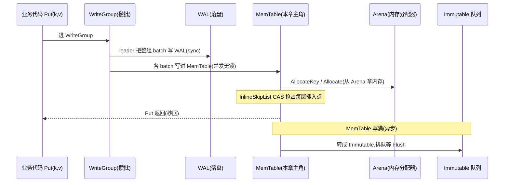
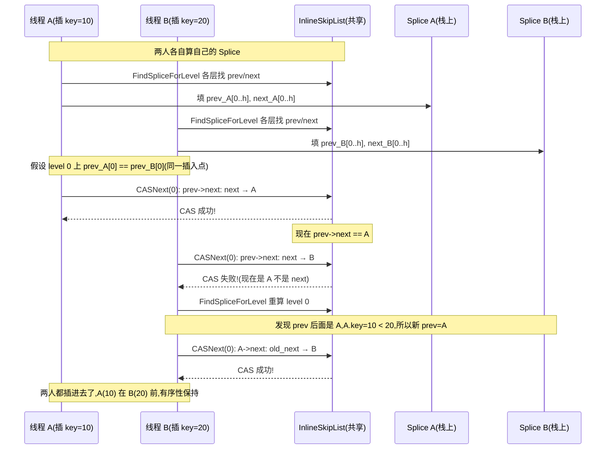
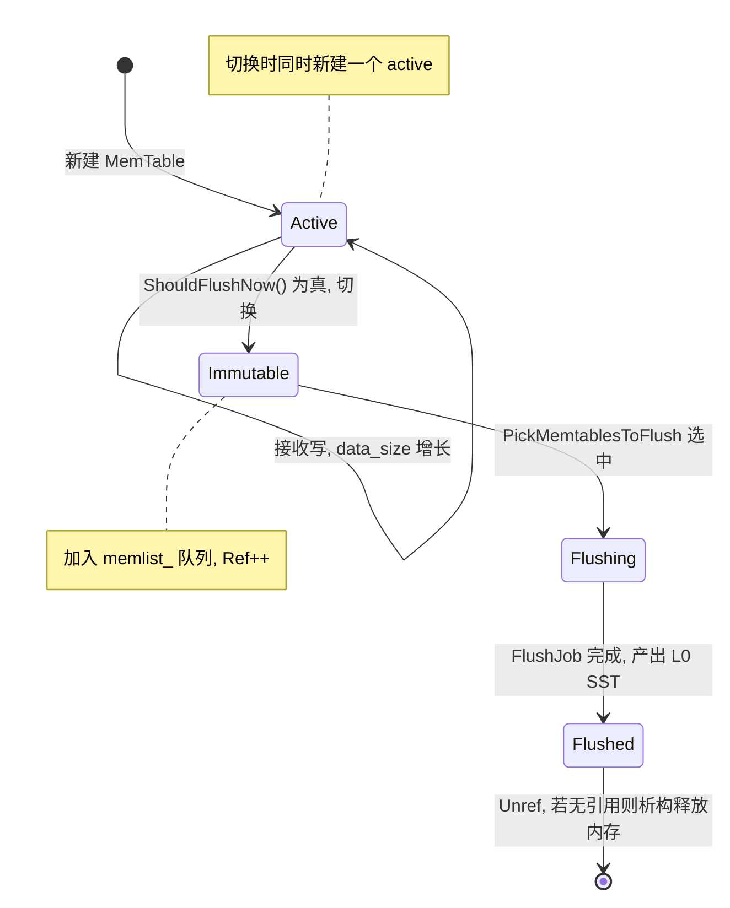

# 第 1 篇 · 第 4 章 · MemTable:并发跳表

> **核心问题**:上一章我们看着一条 `Put` 的数据被 WriteGroup 攒成一批、由 leader 写进 WAL 落了盘。可 WAL 落盘的同一时刻,这批数据还要进 MemTable——否则进程崩了 WAL 能恢复,可"还没刷成 SST 的热数据"在内存里就没了着落。那么 MemTable 长什么样,才能扛住"一群写者线程并发往里塞数据、一群读者线程同时来读、还不能加一把把所有线程卡住的大锁"?LevelDB 那个"一次只让一个线程写 SkipList"的设计,在高并发写场景下撞了什么墙,RocksDB 又是怎么用 InlineSkipList 把这堵墙拆掉的?写满了的 MemTable 怎么排队成 Immutable 等着 Flush,多个 Column Family 的 MemTable 又怎么共用一份全局内存预算?

> **读完本章你会明白**:
> 1. MemTable 在内存里到底长什么样:为什么是 SkipList(而不是 B 树/红黑树/哈希表),key 在节点里怎么编码(internal key = user_key + seq + type),为什么这套编码天然支持 MVCC 和"同 key 多版本共存"。
> 2. ★**InlineSkipList 怎么做到多写者无锁并发插入**:每个写者怎么算自己的 Splice(prev/next 在每层),怎么用 atomic CAS 抢占每层的插入点、失败就重试这一层,为什么这套机制 sound(不丢写、不死锁、读到的一定是合法快照),以及它和 LevelDB"外部串行单写"的根本差别。
> 3. 可插拔 MemTableRep(SkipList / HashLinkList / HashSkipList / Vector)是怎么回事,PrefixExtractor 分桶为什么对"点查 + 前缀扫"的 workload 能省一大半比较。
> 4. 多个 MemTable(active + 一队 immutable)怎么组织,写满了一个怎么切到下一个,WriteBufferManager 怎么跨 Column Family 算一笔全局内存账,到 soft/hard limit 各自触发什么。

> **如果一读觉得太难**:先只记住三件事——① MemTable 内部是一棵支持并发无锁写的跳表(InlineSkipList),读完全不加锁,写用 CAS 抢占每层插入点;② key 在 MemTable 里编码成 `user_key + seq + type`,所以同一个 user_key 的多个版本能天然按 (seq 降序) 排好序共存;③ 写满了的 MemTable 变成 Immutable 排队等 Flush,多个 CF 的 MemTable 内存可以共用一个 WriteBufferManager 算总账。InlineSkipList 的 CAS 细节看不懂没关系,先抓住"并发写、无锁读"这两个结论。

---

## 〇、一句话点破

> **MemTable 是一棵"写用 CAS 抢占、读完全无锁"的并发跳表——LevelDB 那个 SkipList 一次只让一个线程写(靠外部 mutex 串行),RocksDB 的 InlineSkipList 把"一次只让一个写者"这堵墙拆了:每个写者算自己的插入位置,用 atomic CAS 把自己挂进跳表,失败了就重算重试这一层。代价是写得稍微复杂一点(每层都要 CAS + 重试),换回来的是高并发写下吞吐线性扩展,以及读路径完全零开销。**

这是结论,不是理由。本章倒过来拆:先看 MemTable 在 LSM 里扮演什么角色、LevelDB 的单写跳表为什么在高并发下撞墙,再看 InlineSkipList 怎么用 CAS 把这堵墙拆掉,然后看 MemTable 的 key 编码怎么天然支持 MVCC,最后看可插拔的 MemTableRep 和跨 CF 的 WriteBufferManager。

---

## 一、MemTable 在 LSM 里扮演什么角色

先把 MemTable 在整个写路径上的位置摆清楚。一次 `Put(key, value)` 走到这一步(承接 P1-02 的 WriteGroup、P1-03 的 WAL):



MemTable 是 LSM-tree 的"内存中的第一层"。它的职责很纯粹:

1. **接收写**:每条 `Put`/`Delete`(在 LSM 里都叫"追加一条 entry")都进 MemTable,在内存里维护一个"按 key 有序、同 key 多版本按 seq 降序排"的结构。
2. **服务读**:`Get(key)` 在去磁盘 SST 之前,先查 MemTable——因为最新写入的值一定还在内存里(还没 Flush 成 SST)。
3. **写满就 Flush**:MemTable 撑到 `write_buffer_size` 就转成 Immutable(不可变),后台 Flush 成 L0 SST 落盘(下一章 P1-05 详讲)。

> **钉死这件事**:MemTable 是"写进去就秒回、读出来先查它、写满了就刷"的内存缓冲层。它必须同时满足三个互相打架的要求——**写要快**(不能每条 Put 都加重锁)、**读要快**(不能查一次就遍历全表)、**有序**(支持范围扫描 Get/Iterator)、**多版本共存**(同一个 user_key 的多次更新要都能查到最新版)。能在内存里同时满足这四样的数据结构,SkipList(跳表)是几乎唯一的选择。

### 为什么是 SkipList,而不是 B 树/红黑树/哈希表

这是个值得花一页讲清楚的"为什么"。先看候选:

| 候选数据结构 | 写 | 读(点查) | 范围扫 | 并发无锁 | 多版本 |
|---|---|---|---|---|---|
| 哈希表 | O(1) | O(1) | ✗ 不支持 | 难(分桶锁) | 需额外链 |
| 红黑树/AVL | O(log N) | O(log N) | 支持 | 极难(旋转改多处指针) | 需额外处理 |
| B 树/B+树 | O(log N) | O(log N) | 支持 | 难(节点分裂) | 需额外处理 |
| **SkipList** | **O(log N)** | **O(log N)** | **天然支持** | **容易(每层一个 CAS)** | **天然(版本就是 key 的一部分)** |

SkipList 在这场竞争里赢在两点:

1. **范围扫描是免费的**。SkipList 的最底层(level 0)就是一条按 key 有序的链表,迭代器只要顺着 next 指针走即可。LSM 的读路径里,范围扫(MultiGet、Iterator)是高频操作,SkipList 这点对 B 树是降维打击(B 树范围扫要中序遍历,跨节点跳转)。
2. **并发无锁写容易做到 sound**。这是关键中的关键。SkipList 的插入只改"每层的一个 prev 指针",每个改动都是局部的——这天然适合 CAS(Compare-And-Swap)。红黑树/AVL 插入要旋转,一次旋转改好几个指针、还要保持平衡不变量,用 CAS 做无锁并发几乎不可能写对。B 树节点分裂要锁住父节点,并发也极复杂。SkipList 是"为了并发无锁而生的有序结构"。

> **不这样会怎样**:如果 MemTable 用红黑树,想做到多写者并发无锁插入,几乎写不出 sound 的实现(红黑树旋转要原子地改 5~6 个指针,任何一个中间状态都可能让树结构破坏)。哈希表不支持范围扫,直接出局。B 树并发控制(节点分裂时锁父节点)在内存数据结构里代价过高。SkipList 凭"每层一个局部 CAS 就能完成插入"的特性,成了 LSM 内存层的标配——LevelDB 选它,RocksDB 也选它,只是 RocksDB 把"单写"演进成了"并发写"。

---

## 二、LevelDB 的基线:SkipList 无锁读,但单写

接下来这一节是承接 LevelDB 的铺垫(详见《LevelDB》MemTable 章和 [[leveldb-source-facts]]),讲完一句带过,篇幅全留 RocksDB 独有。

LevelDB 的 `SkipList`(`memtable/skiplist.h`)做到的是:

- **读完全无锁**。读者用 `std::atomic<Node*>` 的 acquire load 读 next 指针,写者用 release store 发布。这套"release 写 + acquire 读"的内存序保证:读者一旦看到一个新节点的指针,就一定能看到这个新节点的完整内容(包括 key)。这是 LevelDB 已经讲透的"无锁读 sound"——基于 C++ 内存模型的 release/acquire 配对。
- **但写要外部串行**。LevelDB 的 SkipList 的 `Insert` 不做任何并发控制,它的 REQUIRES 写得很明白:"Writes require external synchronization, most likely a mutex"。也就是说,LevelDB 靠**外部的一把大 mutex** 保证同一时刻只有一个线程在写 SkipList。读可以和写并发(无锁读的甜头),但写和写之间是串行的。

> **LevelDB 是写死的,RocksDB 打开成了旋钮**:LevelDB 这把"外部 mutex"不是 SkipList 自己的缺陷,而是 LevelDB 写路径的设计选择——LevelDB 的写路径本来就是"WriteGroup 串行化"(P1-02 讲过 leader-follower 写组),leader 拿着 mutex 写,所以 SkipList 单写刚好够用。问题是,RocksDB 把写路径演进成**允许并发写 MemTable**(多个写者线程同时往各自的 batch 写完 WAL 后,并发地往 MemTable 里塞),这时候 LevelDB 那个"外部 mutex 串行写 SkipList"就成了瓶颈——一群写者排着队等一把锁,锁里就是一次 SkipList 插入。

### LevelDB 单写跳表在高并发下撞什么墙

把这堵墙具体化。假设你有个 32 核的机器,跑一个写入密集的 workload,32 个线程都在 `Put`。LevelDB 的写路径是:

```
32 个线程 ──┐
            ├──►  WriteGroup mutex(串行)  ──► leader 写 WAL ──► leader 写 SkipList(单写)
            └──►  followers 等
```

写 WAL 这一步,RocksDB 已经用 WriteGroup 攒批优化了(一批 batch 一次 fsync,见 P1-02)。但"写 MemTable"这一步,LevelDB 是 leader 一个人串行写完所有 batch 的 entry。如果一批有 1000 个 entry,leader 就要往 SkipList 里插 1000 次,这段时间所有 followers 都在等。

RocksDB 的改进思路很直接:**WAL 必须串行写(因为 fsync 是顺序的),但写 MemTable 可以并发**——每个 follower 写完自己的 batch 进 WAL 后,可以并发地把自己的 batch 的 entry 往 MemTable 里塞,不用等 leader。这样写 MemTable 的吞吐就能随线程数线性扩展。

但这就要求 MemTable 内部的 SkipList **支持多写者并发无锁插入**。LevelDB 的 SkipList 做不到(它假设单写),RocksDB 必须重写一个。这就是 InlineSkipList 的来历。

> **不这样会怎样**:如果 RocksDB 沿用 LevelDB 的单写 SkipList,那么即使 WriteGroup 把 WAL 攒批了,写 MemTable 这一步仍然是 leader 一个人串行——32 核机器上,31 个核在写 MemTable 时是空转的,写吞吐被"单线程插 SkipList"卡死。这在 SSD 时代(单机写入动辄百万 QPS)是不可接受的。InlineSkipList 就是把这堵"单写"的墙拆掉。

---

## 三、InlineSkipList:多写者无锁并发插入

这是本章的招牌技巧,也是 RocksDB 相对 LevelDB 在 MemTable 层最核心的突破。本节先讲它"长什么样"(节点内存布局),再讲"怎么并发插入"(CAS + Splice + 重试),最后讲"为什么 sound"(不丢写、不死锁、读到合法快照)。

### 3.1 节点内存布局:把 next 数组"内联"进节点

先看 InlineSkipList 的节点长什么样。这是理解后续 CAS 的前提,因为 RocksDB 在节点布局上做了一个很巧的内存优化(这也是它叫 "Inline"SkipList 的原因)。

RocksDB 的 InlineSkipList 节点(`memtable/inlineskiplist.h` 第 358-421 行):

```cpp
// (摘自 memtable/inlineskiplist.h, 简化注释)
template <class Comparator>
struct InlineSkipList<Comparator>::Node {
  // 把 height 暂存到 next_[0] 里(AllocateKey 到 Insert 之间传递用)
  void StashHeight(const int height) {
    static_assert(sizeof(int) <= sizeof(next_[0]));
    memcpy(static_cast<void*>(&next_[0]), &height, sizeof(int));
  }
  int UnstashHeight() const { /* 反向操作 */ }

  // key 紧跟在 next_[1] 之后
  const char* Key() const { return reinterpret_cast<const char*>(&next_[1]); }

  // 第 n 层的 next 指针。注意:层次越高,地址越靠前!
  // next_[0] 是 level 0, next_[-1] 是 level 1, ...
  Node* Next(int n) {
    assert(n >= 0);
    return ((&next_[0] - n)->Load());   // acquire load
  }
  void SetNext(int n, Node* x) {
    assert(n >= 0);
    (&next_[0] - n)->Store(x);          // release store
  }
  bool CASNext(int n, Node* expected, Node* x) {
    assert(n >= 0);
    return (&next_[0] - n)->CasStrong(expected, x);  // 强 CAS
  }
  // ... NoBarrier 变体 ...
 private:
  Atomic<Node*> next_[1];   // 柔性数组,只占 1 个指针的位置
};
```

这套布局的精妙之处在于(对照下图):

```
   一个 height=3 的 Node 在内存里的样子(地址从低到高):
   
   ┌──────────────┬──────────────┬──────────────┬──────────────┬──────────────┬──────────┐
   │ next_[−2]    │ next_[−1]    │ next_[0]     │  (Node 结构体 │     key      │  value   │
   │ level 2 next │ level 1 next │ level 0 next │   本体开始)   │ (紧跟 next_[1])│ ...      │
   │              │              │ /StashHeight │              │              │          │
   └──────────────┴──────────────┴──────────────┴──────────────┴──────────────┴──────────┘
                   ◄─── 高层指针存在 Node 之前      Node 本体 ───►  ◄── key/value 内联 ──►
```

关键观察:

1. **高层 next 指针存在 Node 结构体之前**(地址更低)。`next_[0]` 是 level 0(最底层),`next_[-1]` 是 level 1,以此类推。`Next(n) = *(next_[0] - n)`。这个"反向寻址"让一个柔性数组 `next_[1]` 能服务任意高度。
2. **key 紧跟在 `next_[1]` 之后**。`Key()` 返回 `&next_[1]`。这就是 "Inline" 的含义——key 和 next 数组是**同一次 AllocateAligned 分配**出来的连续内存,省掉了一次间接寻址(LevelDB 的 SkipList 节点里存的是 `Key key`,key 是单独的指针指向另一块内存)。RocksDB 这样做的好处是 cache locality 更好(一次 cache line 就能读到 next 和 key),代价是 key 分配要用 `AllocateAligned`(有少量 padding 浪费,但总内存仍比 LevelDB 省)。
3. **height 在分配时暂存在 `next_[0]` 里**。`AllocateKey` 分配节点时还不知道 height(是 `RandomHeight()` 随机给的),但 `Insert` 时需要知道。RocksDB 的做法:`AllocateKey` 先调 `RandomHeight()` 决定高度,把 height `memcpy` 进 `next_[0]`(此时 next_[0] 还没用来存指针,因为节点还没链入),`Insert` 时 `UnstashHeight()` 取出来,之后 `next_[0]` 才被真正用来存 level 0 的 next 指针。**一次内存位置,两个阶段复用**,省掉了在节点里单独存 height 字段的开销。

> **技巧点睛**:这套"高层指针存在 Node 之前 + key 内联在 next 之后 + height 暂存 next_[0]"的布局,让一个 MemTable entry 的开销几乎只有"key + value + height 个指针"。对比 LevelDB 的 SkipList(每个节点额外存 height 字段 + key 是独立指针),RocksDB 的 InlineSkipList 每 entry 省一个指针(sizeof(void*) = 8 字节)外加一次间接寻址。MemTable 里动辄几百万 entry,这点省法累积起来很可观。这是"Inline"名字的由来——把能内联的都内联进一次分配。

### 3.2 Splice:每个写者缓存自己的"插入位置"

现在看并发插入的核心。InlineSkipList 的并发插入用了一个叫 **Splice** 的结构(`memtable/inlineskiplist.h` 第 340-350 行):

```cpp
template <class Comparator>
struct InlineSkipList<Comparator>::Splice {
  // Splice 的不变量:prev_[i+1].key <= prev_[i].key < next_[i].key <= next_[i+1].key
  // 也就是说,如果 key 被 prev_[i]/next_[i] 夹住,那它也被所有更高层夹住。
  int height_ = 0;
  Node** prev_;   // 每层的"前驱"(key 比 target 小的最近节点)
  Node** next_;   // 每层的"后继"(key 比 target 大的最近节点)
};
```

Splice 是什么?它是**一个写者线程私有的、缓存了"我这次插入位置在每层的 prev/next"的结构**。注意是"私有"——每个并发写者有自己的 Splice(栈上分配或 thread-local),互不干扰。

为什么要 Splice?因为并发插入的核心流程是:

```
1. 找插入位置:从最高层往下,在每层找到 prev (key 比 target 小) 和 next (key 比 target 大),填进 Splice
2. 抢占插入:从 level 0 往上,每一层用 CAS 把 prev->next 从 next 改成自己 (CASNext)
3. CAS 失败:说明有人抢先插进来了,重算这一层的 prev/next,再 CAS
```

Splice 缓存的就是第 1 步的结果。第 2 步每层 CAS 时,直接拿 Splice 里的 prev/next 用。

看 `InsertConcurrently` 的入口(`memtable/inlineskiplist.h` 第 913-920 行):

```cpp
template <class Comparator>
bool InlineSkipList<Comparator>::InsertConcurrently(const char* key) {
  Node* prev[kMaxPossibleHeight];   // 栈上数组,每层的 prev
  Node* next[kMaxPossibleHeight];   // 栈上数组,每层的 next
  Splice splice;
  splice.prev_ = prev;
  splice.next_ = next;
  return Insert<true>(key, &splice, false);   // UseCAS = true
}
```

注意:**每个调用 `InsertConcurrently` 的线程都在自己的栈上分配 prev/next 数组**——这就是"每个写者有自己的 Splice"。32 个线程并发写,就有 32 套栈上的 Splice,互不干扰。

> **钉死这件事**:Splice 是 InlineSkipList 并发的关键设计——它把"找插入位置"和"抢占插入"这两步解耦,每个写者用自己的 Splice,不共享任何状态。共享的只有跳表本身的节点指针,而对这些指针的修改全用 CAS 做原子抢占。这就是"无锁并发"的本质:**没有 mutex,共享状态只有原子指针,竞争点收敛到每个 prev 节点的 next 指针的 CAS 上**。

### 3.3 CAS 抢占:逐层 CAS,失败重算重试

现在看最核心的 CAS 抢占逻辑(`memtable/inlineskiplist.h` 第 1133-1172 行,`UseCAS=true` 分支):

```cpp
  bool splice_is_valid = true;
  if (UseCAS) {
    for (int i = 0; i < height; ++i) {           // 从 level 0 往上,逐层 CAS
      while (true) {                              // 每层一个重试循环
        // level 0 上检查重复 key(查 next 和 prev 是否已经是同一个 key)
        if (UNLIKELY(i == 0 && splice->next_[i] != nullptr &&
                     compare_(splice->next_[i]->Key(), key_decoded) <= 0)) {
          return false;                           // 重复 key,插入失败
        }
        if (UNLIKELY(i == 0 && splice->prev_[i] != head_ &&
                     compare_(splice->prev_[i]->Key(), key_decoded) >= 0)) {
          return false;                           // 重复 key
        }
        // 先把自己的 next_[i] 设成 splice 里的 next(NoBarrier,因为下面 CAS 会带屏障)
        x->NoBarrier_SetNext(i, splice->next_[i]);
        // 核心一步:CAS 把 prev->next 从 next 改成 x
        if (splice->prev_[i]->CASNext(i, splice->next_[i], x)) {
          break;                                  // CAS 成功,这一层插进去了
        }
        // CAS 失败:说明 prev->next 已经不是 next 了(有人抢先插进来)
        // 重算这一层的 prev/next,再试
        FindSpliceForLevel<false>(key_decoded, splice->prev_[i], nullptr, i,
                                  &splice->prev_[i], &splice->next_[i]);
        // 由于这层 splice 变了,和上一层的不变量可能被破坏,标记 splice 整体失效
        if (i > 0) {
          splice_is_valid = false;
        }
      }
    }
  }
```

逐句拆这段 CAS:

1. **从 level 0 往上逐层 CAS**。为什么从 level 0 开始?因为 level 0 是"全量层"(所有节点都在 level 0),一个节点只有在 level 0 被链入,才对读者可见。从 level 0 开始 CAS,能尽早检测重复 key(第 1138-1147 行,只在 `i == 0` 时查重复)。
2. **每层一个 `while(true)` 重试循环**。CAS 可能失败(别人抢先改了 `prev->next`),失败就重算这一层的 prev/next(`FindSpliceForLevel`),再 CAS,直到成功。
3. **`NoBarrier_SetNext` 先设自己的 next,再 CAS 把自己挂进去**。`NoBarrier_SetNext` 用的是 relaxed store,不带内存屏障——为什么这里不需要屏障?因为下面紧接着的 `CASNext` 是一个完整的 read-modify-write 原子操作(强 CAS),它本身就带了 release 语义。读者只有通过 `prev->next` 的 CAS 才能看到 `x`,而那次 CAS 的 release 保证了读者看到 `x` 时也能看到 `x->next_[i]` 已经设好。这就是注释里说的 "NoBarrier_SetNext() suffices since we will add a barrier when we publish a pointer to this in prev"。
4. **CAS 成功就 break,这一层搞定**。CAS 成功意味着:在"我读到 prev->next == next"和"我把它 CAS 成 x"之间,没有别人改过 prev->next,所以我这次插入是合法的(prev->next 仍然是 next,我把它变成 x,x 的 next 是 next,有序性保持)。
5. **CAS 失败就重算 splice**。重算用 `FindSpliceForLevel`,从更新后的 `prev_[i]`(注意 prev_[i] 可能已经不是原来的了,但 CAS 失败时 `splice->prev_[i]` 没变,我们用它做起点重新找)出发,在这一层重新找正确的 prev/next。重算后,如果这不是 level 0,就把 `splice_is_valid` 标成 false——因为splice 的不变量(`prev_[i+1].key <= prev_[i].key < next_[i].key`)可能在重算后被破坏,下次 Insert 时会从头重算 splice。

### 3.4 为什么 sound:不丢写、不死锁、读到合法快照

这一节是 InlineSkipList 最关键的"为什么对"。讲不清这个,等于没讲 InlineSkipList。我们从三个角度证明它 sound:

**① 为什么不丢写?**

假设线程 A 和线程 B 同时想插一个 key,A 插在位置 P1,B 插在位置 P2(假设 P1 < P2,key 不同,否则有重复 key 检测)。A 和 B 都在自己算 Splice。在 level 0:

- A 算到 `prev=A_p, next=A_n`(A_p < P1 < A_n)
- B 算到 `prev=B_p, next=B_n`(B_p < P2 < B_n)

如果 P1 和 P2 不在同一层重叠(即 A_n != B_p 且 B_n != A_p),两人各自 CAS 自己的 prev,互不干扰,都成功。

如果重叠(比如 A_p == B_p,两人都想插到同一个 prev 后面),那么谁先 CAS 谁成功。假设 A 先成功,把 `A_p->next` 从 A_n 改成 A。这时 B 的 CAS `A_p->next: A_n -> B` 失败(因为现在 `A_p->next` 是 A 不是 A_n 了)。B 进入重试,重算 splice,发现 prev 后面已经有了 A,B 重新找到正确的 prev(可能是 A,如果 B 的 key 比 A 大)再 CAS。**B 的插入不会丢,只是重试一次**。

> **不这样会怎样**:如果用"先读 prev->next,再普通 store"而不是 CAS,那么 A 和 B 可能都读到 `prev->next == old_next`,然后 A store 把它改成 A,B store 把它改成 B——后写的覆盖先写的,**A 的插入丢了**。CAS 的本质就是"检测到有人抢先了就放弃重来",从而保证不覆盖。

**② 为什么不死锁?**

死锁需要"循环等待"。InlineSkipList 的并发插入**没有任何锁**——没有 mutex,没有 spinlock,只有 CAS。CAS 是非阻塞的(要么成功要么失败,失败就重试,不会"等"别人释放锁)。所以不可能死锁。

唯一的"等待"是 CAS 失败后的重试循环(`while(true)`)。但这个重试是主动的(线程自己重算 splice 再 CAS),不是被动的(等别人唤醒)。理论上,如果极端高竞争(大量线程同时插同一位置),某个线程可能"无限重试"(活锁, livelock),但实践中 SkipList 的 level 0 节点数远多于线程数,碰撞概率极低,RocksDB 的 bench 显示并发插入吞吐线性扩展。

**③ 为什么读者读到的总是合法快照?**

读者(`FindGreaterOrEqual`,`memtable/inlineskiplist.h` 第 592-642 行)完全不加锁,直接 acquire load 读 next 指针。关键在于:

- 写者用 release store 发布节点(`SetNext` 是 release store,第 386-391 行)。
- 读者用 acquire load 读 next(`Next` 是 acquire load,第 379-384 行)。
- release-acquire 配对保证:读者一旦读到新节点 x 的指针,就一定能看到 x 的完整内容(key、value、x 自己的 next 指针)——因为写者在 release store x 的指针之前,对 x 的所有初始化(NoBarrier_SetNext x 的 next、写 key)都对读者可见。

那读者会不会读到"半个插入"的节点?比如一个节点正在被插入,level 0 链好了但 level 1 还没链好?**不会出问题**。因为:

- 读者从最高层往下找(`FindGreaterOrEqual` 从 `GetMaxHeight()-1` 开始)。如果一个节点只在 level 0 链入(还没在 level 1 链入),那么读者在 level 1 及以上根本看不到它,只有下到 level 0 才可能看到。
- 但 level 0 是全量层,一个节点只要在 level 0 被 release store 链入,读者在 level 0 走到它时就能 acquire load 看到它的完整内容。
- 至于"这个节点还没在 level 1 链好",对读者无害——读者只是少了一条"快速通道"跳过它,最坏情况是在 level 0 多走几步,结果仍然正确(因为 level 0 是有序的全量链表)。

> **钉死这件事**:InlineSkipList 的 sound 性建立在三道防线上——① **CAS 保证不覆盖**(失败的 CAS 必然重试,不会丢写);② **无锁保证不死锁**(没有任何阻塞锁,只有非阻塞 CAS);③ **release-acquire 配对保证读者看到合法快照**(读者读到的每个节点都是完整初始化的,半插入的节点最多让读者多走几步,不会读到错误结果)。这三条加起来,就是 InlineSkipList "并发无锁插入"为什么 sound 的全部理由。LevelDB 的 SkipList 靠"外部 mutex 串行写"来 sound,RocksDB 靠"CAS + release-acquire"来 sound,代价是写得复杂,收益是高并发下吞吐线性扩展。

### 3.5 max_height 怎么在并发下增长

还有一个细节值得讲:SkipList 有个 `max_height`(当前所有节点的最高高度),新节点如果高度超过当前 max_height,要把 max_height 涨上去。在并发下,多个线程可能同时想涨 max_height,怎么处理?

看 `Insert` 的开头(`memtable/inlineskiplist.h` 第 1035-1045 行):

```cpp
  int max_height = max_height_.LoadRelaxed();
  while (height > max_height) {
    if (max_height_.CasWeakRelaxed(max_height, height)) {
      max_height = height;
      break;
    }
    // else retry, possibly exiting the loop because somebody else increased it
  }
```

注意两点:

1. **`max_height_` 是 `RelaxedAtomic<int>`**(第 242 行),读写都用 relaxed 序。注释说得很清楚:"Relaxed reads are always OK because starting from higher levels only helps efficiency, not correctness"——max_height 只是"读者从哪一层开始找"的优化提示,从更高层开始只是少走几步,不影响正确性。所以 max_height 用 relaxed 完全 sound。
2. **涨 max_height 用 `CasWeakRelaxed`**(weak CAS,允许伪失败)。多个线程同时涨,谁先成功谁说了算,失败的线程重试时发现 max_height 已经被别人涨上去了(height <= 新的 max_height),就退出循环。这里 weak CAS 够用,因为伪失败只是多试一次,不影响正确性。

> **技巧点睛**:这是无锁编程的一个典型范式——**区分"影响正确性的状态"和"只影响效率的状态"**。next 指针影响正确性(链错了就乱序),必须用强 CAS + release-acquire;max_height 只影响效率(从哪层开始找),用 relaxed + weak CAS 就够,省掉了不必要的内存屏障开销。RocksDB 在这里把"内存序的强度"精确匹配到"状态的语义",是该用强用强、能用弱用弱的典范。

### 3.6 一个并发插入的完整时序

用一张 mermaid 时序图把两个线程并发插一个跳表的过程画清楚:



这张图就是"无锁并发插入"的精髓:**共享的只有跳表节点指针,竞争点收敛到每个 prev 的 next 指针的 CAS,CAS 失败就重算重试,从不阻塞,从不丢写**。

---

## 四、key 在 MemTable 里怎么编码:internal key 与 MVCC

讲完了 InlineSkipList 的并发机制,这一节看"MemTable 里存的到底是什么 key"。这关系到 MemTable 怎么天然支持 MVCC(多版本共存)。

### 4.1 entry 的完整编码

MemTable 里一个 entry(SkipList 的一个节点存的 key)的编码格式,在 `db/memtable.cc` 的 `Add` 函数开头写得很明白(第 1137-1148 行):

```
// Format of an entry is concatenation of:
//   key_size     : varint32 of internal_key.size()
//   key bytes    : char[internal_key.size()]
//   value_size   : varint32 of value.size()
//   value bytes  : char[value.size()]
//   checksum     : char[protection_bytes_per_key]
```

其中 `internal_key = user_key + packed(seq, type)`,`packed(seq, type)` 是 8 字节(高 56 位是 seq,低 8 位是 type)。看 `Add` 的实际编码代码(`db/memtable.cc` 第 1159-1167 行):

```cpp
  char* p = EncodeVarint32(buf, internal_key_size);   // internal_key_size = key_size + 8
  memcpy(p, key.data(), key_size);                     // 写 user_key
  Slice key_slice(p, key_size);
  p += key_size;
  uint64_t packed = PackSequenceAndType(s, type);      // 把 seq 和 type 打包成 8 字节
  EncodeFixed64(p, packed);                            // 写 packed(seq, type)
  p += 8;
  p = EncodeVarint32(p, val_size);                     // 写 value_size
  memcpy(p, value.data(), val_size);                   // 写 value
```

所以一个 MemTable entry 在内存里长这样:

```
┌─────────────┬───────────────────┬───────────────────────┬─────────────┬───────────────┬──────────┐
│ key_size    │ user_key          │ packed(seq, type)     │ value_size  │ value         │ checksum │
│ (varint32)  │ (变长)            │ (8 字节, 定长)        │ (varint32)  │ (变长)        │ (可选)   │
└─────────────┴───────────────────┴───────────────────────┴─────────────┴───────────────┴──────────┘
              ◄────── internal_key (key_size = user_key_size + 8) ──────►
```

注意几点:

1. **`internal_key_size = user_key_size + 8`**。这 8 字节就是 packed(seq, type)。所以 SkipList 排序时,排的是整个 internal_key,即"user_key 字典序 + 同 user_key 内 seq 降序"。
2. **packed(seq, type) 高 56 位 seq,低 8 位 type**。`PackSequenceAndType` 把 seq 左移 8 位,或上 type。这样同一个 user_key 的多次更新(seq 不同),在内存里按 packed 值排序,自然是 seq 大的(新的)排前面。这是 MVCC 的基础——读的时候带上一个 snapshot seq,就能读到"<= snapshot seq 的最大 seq"那个版本。
3. **type 是 ValueType**(kTypeValue=1, kTypeDeletion 等,见《LevelDB》)。Delete 在 LSM 里不是真删,而是写一条 type=kTypeDeletion 的 entry(墓碑)。

> **钉死这件事**:MemTable 的 key 编码 = `user_key + 8字节(seq+type)`。这套编码让"同一个 user_key 的多个版本"在 SkipList 里天然按 seq 降序排好(因为 seq 在高位),读的时候只要找到第一个 `<= snapshot_seq` 的版本即可。这是 LSM 实现 MVCC 的标准手法,LevelDB 已经讲透(详见《LevelDB》MemTable 章),RocksDB 完全继承,只是 type 多了几种(kTypeBlobIndex、kTypeWideColumnEntity 等新类型)。

### 4.2 同 key 多版本怎么共存

举个具体例子。假设对 user_key = "alice" 做了三次操作:

- seq=100, Put("alice", "v1")  → packed = (100<<8 | kTypeValue)
- seq=200, Put("alice", "v2")  → packed = (200<<8 | kTypeValue)
- seq=300, Delete("alice")     → packed = (300<<8 | kTypeDeletion)

这三个 entry 在 MemTable 的 SkipList 里,按 internal_key 排序(user_key 相同,比 packed):

```
... | "alice"+(300<<8|Deletion) | "alice"+(200<<8|Value:"v2") | "alice"+(100<<8|Value:"v1") | ...
                  ↑ seq 最大,排最前                     ↑                                ↑
```

读的时候:

- `Get("alice")` 不带 snapshot(用当前 seq),从头找到第一个 `<= 当前 seq` 的——就是 seq=300 的 Delete,返回 NotFound。
- `Get("alice")` 带 snapshot seq=250,找到第一个 `<= 250` 的——是 seq=200 的 "v2"。
- `Get("alice")` 带 snapshot seq=150,找到第一个 `<= 150` 的——是 seq=100 的 "v1"。

这就是 MVCC:同一 key 的所有版本都留着,读时按 snapshot seq 选版本。Compaction 时才把旧版本回收(见第 4 篇)。

> **LevelDB 是写死的,RocksDB 打开成了旋钮**:key 编码这套 LevelDB 已经定型,RocksDB 没动核心(user_key + 8字节 seq+type),只是在 type 上加了新类型(kTypeBlobIndex 给 BlobDB、kTypeWideColumnEntity 给宽列、kTypeValuePreferredSeqno 给某些场景)。还有 `protection_bytes_per_key`(checksum)是 RocksDB 加的防静默损坏机制(LevelDB 没有)。这些都是增量演进,核心编码不变。

---

## 五、可插拔 MemTableRep:SkipList 不是唯一选择

到目前为止我们讲的 InlineSkipList,是 RocksDB MemTable 的**默认**实现。但 RocksDB 把"MemTable 内部用什么数据结构"也做成了一个可插拔的旋钮——这就是 MemTableRep。

### 5.1 MemTableRep 抽象

MemTable 内部持有一个 `MemTableRep* table_`(`db/memtable.h`),它是一个抽象类,定义了 `Insert`/`InsertKey`/`InsertKeyConcurrently`/`Get`/`Iterator` 等接口。RocksDB 提供了四种内置实现:

| MemTableRep | 文件 | 内部结构 | 适用场景 |
|---|---|---|---|
| **SkipListRep**(默认) | `memtable/skiplistrep.cc` | 一棵 InlineSkipList | 通用,范围扫友好,并发写 |
| **HashLinkListRep** | `memtable/hash_linklist_rep.cc` | 哈希分桶,每桶一个链表 | 点查多 + 有明确前缀 + 桶内数据少 |
| **HashSkipListRep** | `memtable/hash_skiplist_rep.cc` | 哈希分桶,每桶一棵小 SkipList | 点查多 + 有明确前缀 + 桶内数据较多 |
| **VectorRep** | `memtable/vectorrep.cc` | 一个 vector,惰性排序 | 写极快(append),读慢(要排序),特殊场景 |

选哪个由 `Options::memtable_factory` 决定。看 MemTable 构造函数(`db/memtable.cc` 第 228-234 行):

```cpp
      table_(ioptions.memtable_factory->CreateMemTableRep(
          comparator_, &arena_, mutable_cf_options.prefix_extractor.get(),
          ioptions.logger, column_family_id)),
      // range del table must support concurrent inserts
      range_del_table_(SkipListFactory().CreateMemTableRep(
          comparator_, &arena_, nullptr /* transform */, ioptions.logger,
          column_family_id)),
```

注意:**MemTable 有两个 table**。`table_` 是主表(存普通 KV),用用户配置的 `memtable_factory`;`range_del_table_` 是范围删除表(存 range tombstone),**强制用 SkipListFactory**(注释写明 "range del table must support concurrent inserts")。这是因为范围删除必须支持并发插入(`AddLogicallyRedundantRangeTombstone` 可能在读路径上触发插入)。

> **不这样会怎样**:如果 MemTable 内部写死只能用 SkipList(像 LevelDB 那样),那么"点查极多、几乎不范围扫、且有明确 key 前缀"的 workload(比如按 user_id 前缀分片的 KV)就享受不到哈希分桶的好处(点查从 O(log N) 降到接近 O(1))。RocksDB 把 MemTableRep 做成可插拔,让用户按 workload 选数据结构——这正是"把 LevelDB 写死的决策打开成旋钮"的又一个例子。

### 5.2 HashSkipListRep / HashLinkListRep:PrefixExtractor 分桶

最有意思的是 Hash 系列的 MemTableRep。它们的核心思想是:**先用 key 的前缀算一个哈希,把 key 分到某个桶里,桶内再用小 SkipList 或链表存**。这样点查时,先算前缀哈希定位到桶,只在桶内查,跳过了绝大部分无关 key。

这需要一个 `PrefixExtractor`(一个 `SliceTransform`,定义怎么从 key 抽前缀)。比如 key 是 "user:12345:name",前缀可以是 "user:12345:"(按 user_id 分桶)。

看 `HashLinkListRep`(`memtable/hash_linklist_rep.cc`)的核心思路(第 97-157 行的注释把分桶布局画得很清楚):

```
哈希表(数组),每个桶指向:
   Case 1: NULL              (空桶)
   Case 2: 单个 entry         (桶里只有 1 条,直接存 entry 指针)
   Case 3: 链表/SkipList 头    (桶里有多条,存一个 header 指向链表/小 SkipList)
```

分桶的好处:点查 `Get("user:12345:name")` 时,先算 "user:12345:" 的哈希定位到桶,只在桶里查——如果这个 user 只有几条数据,桶内查找是 O(1) 或 O(几),远快于在全表 SkipList 里 O(log N)。

分桶的代价:① **范围扫跨桶很慢**(要遍历所有桶);② **桶分布不均时退化**(如果某个前缀数据极多,那个桶的 SkipList 退化成全表);③ **需要用户能定义有意义的前缀**(无脑用前几个字节可能分桶不均)。

> **技巧点睛**:HashSkipListRep/HashLinkListRep 是"用空间换时间 + 用 workload 特化换吞吐"的典范。它们不是通用最优(范围扫退化),但对"点查为主 + key 有明确前缀"的特定 workload(比如 TiKV 的某些 CF、用户画像系统按 user_id 分片)能带来数倍提速。RocksDB 把它做成可插拔,让用户自己权衡——这正是可调性的精神:没有银弹,只有"你的 workload 适合什么"。

### 5.3 VectorRep:写极致、读慢

VectorRep(`memtable/vectorrep.cc`)是个特殊存在:它内部就是一个 `std::vector<const char*>`,写的时候就是 `push_back`(O(1) 摊还,比 SkipList 的 O(log N) 还快),读的时候才惰性排序(`sorted_` 标志,第一次迭代时 `std::sort`)。

适用场景极窄:写极多、几乎不读、偶尔批量扫一次。比如某些日志收集场景。实际生产很少用,但 RocksDB 还是提供了,作为"极端写优化"的选项。

### 5.4 Prefix Bloom:读路径的早退伏笔

除了 MemTableRep 本身,RocksDB 还在 MemTable 里内置了一个 **Prefix Bloom Filter**(`db/memtable.cc` 第 267-271 行构造):

```cpp
  // use bloom_filter_ for both whole key and prefix bloom filter
  if ((prefix_extractor_ || moptions_.memtable_whole_key_filtering) &&
      moptions_.memtable_prefix_bloom_bits > 0) {
    // ... 构造 DynamicBloom ...
  }
```

这个 Bloom Filter 在 `Add` 时同步更新(memtable.cc 第 1214-1220 行,加 prefix 或 whole key),在 `Get` 时先查 Bloom——如果 Bloom 说"这个 prefix/whole key 不在 MemTable 里",直接返回 NotFound,**跳过对 SkipList 的查找**(省一次 O(log N) 的指针追逐,对 cache 不友好)。

这是读路径的早退伏笔,本章只点出它的存在,读路径怎么用它见 P3-11(Get 路径与读放大)。

---

## 六、多 MemTable 与 Immutable 队列

讲完了单个 MemTable 的内部,现在看"多个 MemTable 怎么组织"。一个 Column Family 在任一时刻,可能同时存在:

- **1 个 active MemTable**:正在接收新写。
- **0~N 个 immutable MemTable**:写满了,转成不可变,排队等 Flush。
- **(已被 Flush 完的 MemTable 会被释放)**

为什么会有多个 immutable?因为 Flush 是后台异步的,如果写入速度超过 Flush 速度,active 写满切成 immutable 后,上一个 immutable 可能还没 Flush 完。这时候 immutable 就会堆积。堆积太多会触发 Write Stall(见 P5-17)。

### 6.1 MemTableListVersion:immutable 队列

immutable 队列由 `MemTableList` / `MemTableListVersion` 管理(`db/memtable_list.cc`、`db/memtable_list.h`)。核心字段是 `memlist_`(`memtable_list.h` 第 175 行):

```cpp
  int NumNotFlushed() const { return static_cast<int>(memlist_.size()); }
  int NumFlushed() const { return static_cast<int>(memlist_history_.size()); }
```

`memlist_` 是一个 `autovector<ReadOnlyMemTable*>`,存所有还没 Flush 的 immutable MemTable。`memlist_history_` 存已经 Flush 完但还没被释放的(给还在用的 Iterator 留着)。

active MemTable 不在这个队列里——它由 DBImpl 单独持有(`DBImpl::cfd_->mem()`)。当 active 写满,流程是:



切换的触发是 `MemTable::ShouldFlushNow`(`db/memtable.cc` 第 319-391 行)。这个函数的逻辑值得一看,因为它体现了"MemTable 内存预算怎么算"的细节:

```cpp
bool MemTable::ShouldFlushNow() {
  if (IsMarkedForFlush()) { return true; }
  // ... range deletions 计数检查 ...
  
  size_t write_buffer_size = write_buffer_size_.LoadRelaxed();
  const double kAllowOverAllocationRatio = 0.6;
  
  auto allocated_memory =
      table_->ApproximateMemoryUsage() + arena_.MemoryAllocatedBytes();
  approximate_memory_usage_.StoreRelaxed(allocated_memory);
  
  // 还能再分配一个 arena block 而不超 60% 余量,就不 flush
  if (allocated_memory + kArenaBlockSize <
      write_buffer_size + kArenaBlockSize * kAllowOverAllocationRatio) {
    return false;
  }
  // 已经超了 60% 余量,flush
  if (allocated_memory >
      write_buffer_size + kArenaBlockSize * kAllowOverAllocationRatio) {
    return true;
  }
  // 边界情况:看 arena 当前 block 还剩多少
  return arena_.AllocatedAndUnused() < kArenaBlockSize / 4;
}
```

这里有个细节:**MemTable 的内存不是精确等于 `write_buffer_size` 就 flush 的**。因为 Arena 按 block 分配(每次分配一个 `kArenaBlockSize`,通常 4KB~几 MB),会有"最后一个 block 没用完"的碎片。RocksDB 用 `kAllowOverAllocationRatio = 0.6` 和 "0.75 full" 的启发式来决定"是再分配一个 block 还是直接 flush",避免频繁 flush 小 MemTable(碎片化)或过度超分配(浪费内存)。注释里把这个权衡讲得很细(第 334-390 行)。

> **不这样会怎样**:如果 ShouldFlushNow 写成 `allocated_memory >= write_buffer_size` 就 flush,那么因为 Arena 按 block 分配,MemTable 实际内存总是在 `write_buffer_size` 附近抖动——刚 flush 完一个,下一条 Put 又触发了。这会导致 Flush 过于频繁,L0 SST 文件碎小,后续 Compaction 压力大。RocksDB 的启发式留出 60% block 余量,让 MemTable 稍微"超一点"再 flush,换来更大的 MemTable(写放大更小、Flush 频率更低)。

### 6.2 atomic flush 与多 CF 一起切

RocksDB 还有个 atomic flush 的特性:多个 CF 的 active MemTable 可以**原子地一起切到 immutable 一起 flush**。这涉及到 `MemTableList::PickMemtablesToFlush`(`db/memtable_list.cc` 第 495 行)和 `atomic_flush_seqno_`(`db/memtable.h` 第 565 行)。这个特性主要用于"跨 CF 的原子可见性"场景(比如一个 CF 存数据、另一个 CF 存索引,要一起 flush 一起可见)。细节留到 P5-19(Column Family)讲,本章点出存在即可。

---

## 七、WriteBufferManager:跨 CF 的全局内存预算

最后一个关键旋钮:**WriteBufferManager**。它解决的是"多个 Column Family 的 MemTable 内存怎么统一管"的问题。

### 7.1 问题:多 CF 各自算内存账会撞什么墙

假设你有 4 个 Column Family,每个都设 `write_buffer_size = 256MB`,`max_write_buffer_number = 4`。如果每个 CF 独立算,最坏情况下 4 个 CF × 4 个 MemTable × 256MB = **4GB 内存**。如果你的机器只有 8GB 内存,这 4GB 可能就把内存吃光了,更别提还有 Block Cache、SST index、操作系统本身。

LevelDB 没有 CF,所以不存在这个问题。RocksDB 有了 CF,如果让每个 CF 各管各的内存,就可能在多 CF 场景下 OOM。

> **不这样会怎样**:如果没有 WriteBufferManager,多 CF 场景下你得手动给每个 CF 设很小的 `write_buffer_size`(比如每个 64MB),但这又限制了单 CF 的写吞吐(MemTable 太小,Flush 太频繁)。本质矛盾是"单 CF 视角的内存账"和"全局内存预算"对不上。WriteBufferManager 就是来对这笔全局账的。

### 7.2 WriteBufferManager 怎么算总账

WriteBufferManager(`memtable/write_buffer_manager.cc`、`include/rocksdb/write_buffer_manager.h`)的核心是:**一个 WriteBufferManager 实例,被多个 DB(或多个 CF)共享,它内部维护一个全局的 `memory_used_` 计数**。

看它的关键字段和接口(`include/rocksdb/write_buffer_manager.h` 第 101-142 行):

```cpp
  // Should only be called from write thread
  bool ShouldFlush() const {
    if (enabled()) {
      // soft limit: 可变(mutable) MemTable 内存超 7/8 buffer_size 就 flush
      if (mutable_memtable_memory_usage() >
          mutable_limit_.load(std::memory_order_relaxed)) {   // mutable_limit_ = buffer_size * 7/8
        return true;
      }
      size_t local_size = buffer_size();
      // hard limit: 总内存超 buffer_size, 且还有超过一半的内存在 mutable(没在 flush),就 flush
      if (memory_usage() >= local_size &&
          mutable_memtable_memory_usage() >= local_size / 2) {
        return true;
      }
    }
    return false;
  }

  bool ShouldStall() const {
    if (!allow_stall_.load(std::memory_order_relaxed) || !enabled()) {
      return false;
    }
    return IsStallActive() || IsStallThresholdExceeded();
  }

  bool IsStallThresholdExceeded() const {
    return memory_usage() >= buffer_size_;   // hard limit: 总内存超 buffer_size 就 stall
  }
```

注意三个阈值(都来自构造函数,`write_buffer_manager.cc` 第 25 行):

- **`mutable_limit_ = buffer_size * 7 / 8`**(soft limit 的触发点):当所有共享这个 WBM 的 CF 的 **mutable MemTable** 总内存超过 `buffer_size` 的 7/8,就触发 flush。用 mutable(还没切 immutable 的)而不是 total,是因为只有 mutable 的内存能通过 flush 释放掉。
- **`buffer_size`**(hard limit):总内存超了,且 mutable 还占一半以上,更激进地 flush。
- **`buffer_size`**(stall 阈值):如果 `allow_stall=true`,总内存超 buffer_size 就让所有写者 stall(等内存降下来)。

`ReserveMem` / `FreeMem`(`write_buffer_manager.cc` 第 56-100 行)在 MemTable 分配/释放内存时被调用,用 `fetch_add`/`fetch_sub` 原子地更新全局计数。注意 `FreeMem` 最后会调 `MaybeEndWriteStall`——一旦内存降到阈值以下,唤醒所有 stall 的写者。

> **钉死这件事**:WriteBufferManager 把"每个 CF 各算各的 `write_buffer_size`"演进成"一个全局的 buffer_size,跨 CF 算总账"。这是 RocksDB 多 CF 架构的必要配套——没有它,多 CF 场景下的内存控制就退化成"每个 CF 设小一点",牺牲单 CF 吞吐。WBM 让你设一个全局预算(比如 2GB),让 RocksDB 自己决定哪个 CF 的 MemTable 先 flush(哪个超预算多 flush 哪个),这是把"内存分配的决策"也从用户手里接过来,做成一个智能旋钮。

### 7.3 WBM 与 Block Cache 的联动:内存复用

WriteBufferManager 还有个高级特性:**它可以和 Block Cache 共享内存预算**(构造函数的 `cache` 参数,`write_buffer_manager.cc` 第 21-39 行)。当你给 WBM 传一个 Block Cache,MemTable 占用的内存会通过 `CacheReservationManager` 在 Block Cache 里"占座"(reserve)——这样 MemTable 内存 + Block Cache 内存的总和受控于 Block Cache 的总容量,不会各自膨胀。

看构造函数:

```cpp
WriteBufferManager::WriteBufferManager(size_t _buffer_size,
                                       std::shared_ptr<Cache> cache,
                                       bool allow_stall)
    : buffer_size_(_buffer_size),
      mutable_limit_(buffer_size_ * 7 / 8),
      // ...
      allow_stall_(allow_stall),
      stall_active_(false) {
  if (cache) {
    // Memtable's memory usage tends to fluctuate frequently
    // therefore we set delayed_decrease = true to save some dummy entry
    // insertion on memory increase right after memory decrease
    cache_res_mgr_ = std::make_shared<
        CacheReservationManagerImpl<CacheEntryRole::kWriteBuffer>>(
        cache, true /* delayed_decrease */);
  }
}
```

注释提到 `delayed_decrease = true`——因为 MemTable 内存波动频繁(写一条增、flush 一批降),如果每次降都立即缩 cache 座位,会频繁插删 dummy entry,所以延迟缩。这是个工程细节,体现 RocksDB 对"高频计数器更新"的性能敏感。

> **技巧点睛**:WBM 与 Block Cache 联动是"内存复用"的高级技巧——传统设计里 MemTable 内存和 Block Cache 内存是两笔独立账(各设各的上限),RocksDB 让它们共用一笔(Block Cache 的容量),通过 cache reservation 协调。这样总的 block cache + memtable 内存受控,不会 OOM。这也是为什么大内存机器上推荐配 WBM + Cache 联动——把内存预算统一管理,而不是让每个组件各自为政。

---

## 八、技巧精解:两个最硬核的旋钮

本章有两个最硬核的技巧,单独拆透。

### 技巧一:InlineSkipList 的并发无锁插入(承 LevelDB 单写 SkipList)

**它解决什么本质问题?**

LevelDB 的 SkipList 做到了无锁读,但写要外部 mutex 串行(一次只让一个线程写)。这在 LevelDB 的写路径(WriteGroup 串行化)下够用。但 RocksDB 把写路径演进成"允许并发写 MemTable"(多个写者线程同时往各自的 batch 写完 WAL 后,并发写 MemTable),LevelDB 的单写 SkipList 就成了瓶颈——一群写者排着队等一把锁,锁里就是一次 SkipList 插入。

**RocksDB 怎么打开成旋钮?**

InlineSkipList 把"一次只让一个写者"这堵墙拆了,核心三招:

1. **Splice 私有化**:每个写者线程有自己的 Splice(栈上分配的 prev/next 数组),缓存"我这次插入在每层的位置"。Splice 不共享,没有竞争。
2. **逐层 CAS 抢占**:从 level 0 往上,每层用 `CASNext(prev, expected_next, x)` 把自己挂进 prev 后面。CAS 成功就这一层搞定,CAS 失败说明有人抢先,重算这层 splice 再试。
3. **release-acquire 保证可见性**:写者用 release store(`SetNext`)发布节点,读者用 acquire load(`Next`)读指针。release-acquire 配对保证读者看到的节点都是完整初始化的。

**反面对比:LevelDB 单写 SkipList 撞什么墙?**

把 32 核机器上 32 个写者线程的场景具体化:

- **LevelDB 单写**:32 个线程排一把 mutex,锁里是 leader 一个人插 SkipList。31 个核在写 MemTable 时空转。吞吐 = 单线程插 SkipList 的吞吐(约几百万 ops/s),不随核数扩展。
- **RocksDB InlineSkipList 并发写**:32 个线程各有 Splice,并发往跳表里 CAS 插入。竞争点收敛到每个 prev 节点的 next 指针 CAS,绝大多数 CAS 成功(因为 SkipList level 0 节点数远多于线程数,碰撞少)。吞吐随核数近线性扩展。

**为什么 sound(不丢写、不死锁、读到合法快照)?**

已在 3.4 节详细证明,这里收束成三句话:

1. **不丢写**:CAS 失败必然重试(while true 循环),从不覆盖。两个线程抢同一插入点,后到的 CAS 失败,重算后插到正确位置(可能在先到的后面)。
2. **不死锁**:全程无锁(只有非阻塞 CAS),不可能循环等待。极端高竞争下可能活锁(某线程一直 CAS 失败),但实践碰撞概率极低。
3. **读到合法快照**:release-acquire 保证读者看到的节点完整初始化。半插入的节点(只链了 level 0 没链 level 1)对读者无害——读者最多多走几步 level 0,结果正确。

**核心源码定位**:

- Splice 结构:`memtable/inlineskiplist.h` 第 340-350 行
- Node 布局(高层指针在 Node 前 + key 内联 + height 暂存):第 358-421 行
- `InsertConcurrently` 入口(栈上分配 splice):第 913-920 行
- CAS 抢占主循环(`UseCAS=true` 分支):第 1133-1172 行
- max_height 并发增长(relaxed + weak CAS):第 1035-1045 行
- `FindGreaterOrEqual`(无锁读):第 592-642 行

> **技巧精解小结**:InlineSkipList 是 RocksDB 在 MemTable 层相对 LevelDB 最核心的突破。它不是"换了一个更好的数据结构"(还是 SkipList),而是"把 SkipList 的并发模型从单写升级到多写者无锁"。用的手段——Splice 私有化 + 逐层 CAS + release-acquire——是无锁编程的经典范式。讲清它的 sound 性(为什么不丢写、不死锁、读到合法快照),是本章的灵魂。

### 技巧二:可插拔 MemTableRep + WriteBufferManager(承 LevelDB 单实例单 MemTable)

**它解决什么本质问题?**

两个相关问题:

1. LevelDB 写死用 SkipList,但"点查为主 + 有明确前缀"的 workload 用哈希分桶能更快(点查 O(1) vs O(log N))。LevelDB 没给换数据结构的选项。
2. LevelDB 没有 CF,单实例就一个 MemTable,内存账好算。RocksDB 有多 CF,如果每个 CF 各算各的 `write_buffer_size`,多 CF 场景下可能 OOM。

**RocksDB 怎么打开成旋钮?**

1. **可插拔 MemTableRep**:把"MemTable 内部用什么数据结构"抽象成 `MemTableRep` 接口,提供 SkipList / HashLinkList / HashSkipList / Vector 四种内置实现,由 `Options::memtable_factory` 选择。用户按 workload 选(通用用 SkipList,点查+前缀用 HashSkipList,极端写用 Vector)。
2. **WriteBufferManager**:一个共享的内存预算管理器,跨 CF 算总账。设一个全局 `buffer_size`,所有共享这个 WBM 的 CF 的 MemTable 内存加起来超 `buffer_size * 7/8` 就 flush,超 `buffer_size` 且 allow_stall 就 stall。还能和 Block Cache 联动,统一管理 MemTable + Cache 内存。

**反面对比:LevelDB 单实例单 MemTable 撞什么墙?**

- **数据结构写死**:LevelDB 只用 SkipList。你的 workload 如果是"按 user_id 前缀点查",在 LevelDB 里只能 O(log N) 查全表,没法哈希分桶加速。RocksDB 的 HashSkipListRep 让这类 workload 点查接近 O(1)。
- **内存各算各的**:假设 4 个 CF 各设 256MB write_buffer_size,最坏 4GB。机器内存不够就 OOM。RocksDB 的 WBM 让你设一个全局 2GB 预算,4 个 CF 共享,哪个超了 flush 哪个,全局受控。

**为什么 sound?**

1. **可插拔 sound**:MemTableRep 是纯抽象接口(`Insert`/`Get`/`Iterator`),换实现不改 MemTable 外部逻辑。Hash 系列只是在"找插入位置"和"查找"时多了哈希分桶一步,有序性仍由桶内 SkipList/链表保证,范围扫跨桶时遍历所有桶(慢但 sound)。
2. **WBM sound**:WBM 的 `memory_used_` 用 `fetch_add/fetch_sub` 原子更新,跨线程跨 CF 安全。`ShouldFlush`/`ShouldStall` 基于这个原子计数判断,阈值设计(7/8 soft、hard、stall)保证了渐进的反压(先 flush,flush 跟不上再 stall),不会突然 OOM。stall 用 `BeginWriteStall`/`MaybeEndWriteStall` 配合 `StallInterface` 回调,内存降下来自动唤醒,不会永久卡死。

**核心源码定位**:

- MemTableRep 抽象与工厂:`memtable/skiplistrep.cc` 第 17-73 行(SkipListRep 转发到 InlineSkipList)
- MemTable 构造时选 factory:`db/memtable.cc` 第 228-234 行
- HashLinkListRep 分桶:`memtable/hash_linklist_rep.cc` 第 97-157 行(布局图解)
- WriteBufferManager 构造与阈值:`memtable/write_buffer_manager.cc` 第 21-39 行,`include/rocksdb/write_buffer_manager.h` 第 101-142 行
- `ShouldFlushNow`(单 MemTable 视角):`db/memtable.cc` 第 319-391 行

> **技巧精解小结**:可插拔 MemTableRep 和 WriteBufferManager 是"把 LevelDB 写死的两个决策(MemTable 数据结构、内存预算)打开成旋钮"的典型。前者让你按 workload 选数据结构,后者让你跨 CF 算全局内存账。两者都是 LevelDB 没有、RocksDB 因多 CF 和工业 workload 而加的演进。

---

## 九、章末小结

### 回扣主线

本章服务**写路径**。MemTable 是写路径上"WAL 之后、Flush 之前"的内存缓冲层——数据写进 WAL 的同时进 MemTable,在内存里维护一个"按 key 有序、多版本按 seq 降序"的结构,等写满了切成 Immutable 排队等 Flush(下一章 P1-05)。

本章拆了 LevelDB 写死、RocksDB 打开成旋钮的四个点:

1. **SkipList 单写 → InlineSkipList 并发无锁写**:RocksDB 用 Splice 私有化 + 逐层 CAS + release-acquire,让多写者并发无锁插入,吞吐随核数扩展。
2. **MemTable 数据结构写死 → 可插拔 MemTableRep**:SkipList / HashLinkList / HashSkipList / Vector,按 workload 选。
3. **单 CF 单 MemTable 内存账 → WriteBufferManager 跨 CF 全局预算**:设一个全局 buffer_size,跨 CF 算总账,到 7/8 flush、到上限 stall。
4. **(LevelDB 已讲透的)key 编码 user_key+seq+type**:RocksDB 继承,只是 type 多了几种,加了一个可选 checksum。

这四个点里,InlineSkipList 的并发无锁插入是本章的招牌——它是 RocksDB 在 MemTable 层相对 LevelDB 最核心的突破,也是"无锁数据结构 + 内存序"在工业级存储引擎里的典范应用。

### 五个为什么

1. **为什么 MemTable 用 SkipList 而不是 B 树/红黑树?**——因为 SkipList 天然支持范围扫(level 0 是有序链表),且并发无锁写容易做到 sound(每层一个局部 CAS 就能完成插入)。红黑树旋转要原子改多个指针,无锁几乎写不对;B 树节点分裂要锁父节点,并发代价高。
2. **为什么 LevelDB 的 SkipList 单写,而 RocksDB 的 InlineSkipList 能并发写?**——LevelDB 靠外部 mutex 串行写(WAL 写组本来就是串行),单写够用。RocksDB 允许并发写 MemTable(多个写者线程同时塞),必须把 SkipList 升级成支持多写者,这就是 InlineSkipList(Splice 私有化 + 逐层 CAS)。
3. **为什么 InlineSkipList 的 CAS 插入不会丢写?**——CAS 失败必然重试(while true 循环),从不覆盖。两个线程抢同一插入点,后到的 CAS 失败,重算 splice 后插到正确位置(可能在先到的后面)。CAS 的本质就是"检测到冲突就放弃重来"。
4. **为什么 MemTable 的 key 编码成 user_key+seq+type?**——这样同一个 user_key 的多个版本在 SkipList 里天然按 seq 降序排好(seq 在高位),读时带 snapshot seq 找第一个 <= snapshot 的版本即可,这就是 MVCC。LevelDB 已定型,RocksDB 继承。
5. **为什么需要 WriteBufferManager?**——多 CF 场景下,如果每个 CF 各算各的 write_buffer_size,内存总量不可控,可能 OOM。WBM 跨 CF 算全局账,设一个 buffer_size,超 7/8 flush、超上限 stall,把内存预算统一管起来。

### 想继续深入往哪钻

- **InlineSkipList 的并发正确性证明**:读 InlineSkipList 的源码注释(`memtable/inlineskiplist.h` 文件头第 20-41 行的 Thread safety 和 Invariants 段),以及 Hans-J. Boehm 的论文 "A SkipList for Concurrent Updates"(InlineSkipList 的设计基础)。
- **Splice 的部分重算优化**:`Insert` 的 `allow_partial_splice_fix` 参数(inlineskiplist.h 第 126-138 行注释),它让顺序插入变成 O(log D) 而不是 O(log N),D 是离上次插入的距离。这对批量顺序写有数倍加速。
- **可插拔 MemTableRep 的实测对比**:用 `memtable/memtablerep_bench.cc` 跑 SkipList vs HashSkipList vs Vector,看不同 workload 下的吞吐差。
- **WriteBufferManager 与 Block Cache 联动**:读 `cache/cache_reservation_manager.h`,理解 cache reservation 怎么在 Block Cache 里占座。
- **LevelDB 的 SkipList 基线**:读《LevelDB 设计与实现深入浅出》MemTable 章,或 [[leveldb-source-facts]],对照 LevelDB 单写 SkipList 和 RocksDB InlineSkipList 的差别。

### 引出下一章

我们讲清了 MemTable 怎么并发无锁写、key 怎么编码、可插拔 rep 怎么换、多 MemTable 怎么排队、WriteBufferManager 怎么算全局内存账。那么,**写满了的 MemTable 怎么变成不可变的 Immutable,Immutable 怎么被 Flush 成 L0 SST 文件落盘?Flush 是同步还是异步?多个 Immutable 怎么调度 Flush?Flush 触发的各种阈值(`write_buffer_size`、`max_write_buffer_number`、`level0_file_num_compaction_trigger`)之间是什么关系?** 下一章 P1-05,我们从 MemTable 写满开始,拆 RocksDB 的 Flush 机制——MemTable 怎么变成 SST。

> **下一章**:[P1-05 · Flush:MemTable 变 SST](P1-05-Flush-MemTable变SST.md)

---

> **本章源码核实清单**(写前 Grep/Read 过的实际文件与行号):
> - `memtable/inlineskiplist.h`:`kMaxPossibleHeight=32`(L70),Node 布局(L358-421),Splice(L340-350),`InsertConcurrently`(L913-920),CAS 主循环(L1133-1172),非 CAS 分支(L1173-1199),max_height 并发增长(L1035-1045),`FindGreaterOrEqual`(L592-642),`RandomHeight`(L559-573)
> - `memtable/skiplist.h`:LevelDB 基线单写 SkipList(L10-16 注释 "Writes require external synchronization")
> - `db/memtable.cc`:`Add` 的 entry 编码(L1137-1167),并发分支调 InsertKeyConcurrently(L1224-1230),ShouldFlushNow(L319-391),table_/range_del_table_ 构造(L228-234),Prefix Bloom 构造(L267-271)
> - `memtable/write_buffer_manager.cc`:构造函数 mutable_limit_=buffer_size*7/8(L25),ReserveMem/FreeMem(L56-100),BeginWriteStall/MaybeEndWriteStall(L118-164)
> - `include/rocksdb/write_buffer_manager.h`:`ShouldFlush`(L101-117),`ShouldStall`/`IsStallThresholdExceeded`(L126-142)
> - `memtable/skiplistrep.cc`:SkipListRep 内部就是 InlineSkipList(L18),转发 Insert(L42-73)
> - `memtable/hash_linklist_rep.cc`:分桶布局注释(L97-157)
> - `db/memtable_list.cc` / `db/memtable_list.h`:memlist_ 队列(memtable_list.h L175),PickMemtablesToFlush(L495),Add(L751)
