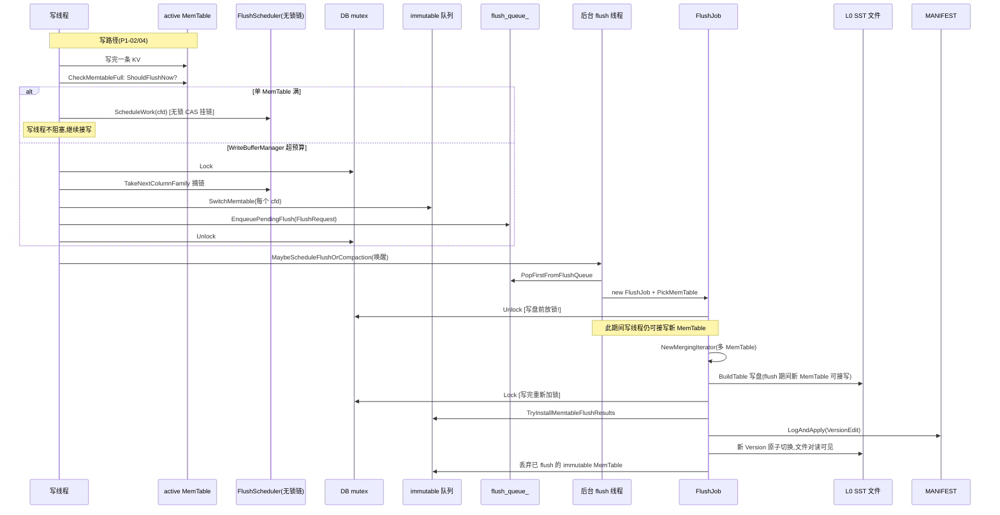

# 第 1 篇 · 第 5 章 · Flush:MemTable 变 SST

> **核心问题**:上一章 MemTable(InlineSkipList)写满了会转成 immutable,塞进 `imm` 队列等后台处理。那么,这个不可变的内存跳表,是怎么变成磁盘上一个不可变的 L0 SST 文件的?谁来挑这个时机、谁来调度、谁来真正动手写盘?为什么 RocksDB 要专门搞一个 `FlushScheduler`,而不是像 LevelDB 那样在写路径里直接拉起一个后台任务?触发 flush 的三个旋钮(`write_buffer_size` / `max_write_buffer_number` / `level0_file_num_compaction_trigger`)到底各自管哪一段、为什么那么多人把它们讲混?还有那个到处流传的"pipelined flush",到底流水线了哪两步?——本章把这些一次拆透。

> **读完本章你会明白**:
> 1. MemTable 从"写满"到"落盘成 L0 SST"走了哪几步,每一步在源码里对应哪个函数,为什么 `WriteLevel0Table` 要在写盘前**主动释放 DB mutex**(否则会卡死所有写)。
> 2. `FlushScheduler` 凭什么能"不持大锁"就把"该 flush 了"的 Column Family 收集起来——它用了一个 Treiber 栈(无锁 CAS 的 `head_` 链表),源码注释里直接写明"这个 CAS 连 release 语义都不需要",这句话背后是个精妙的内存序论证。
> 3. 三个触发旋钮是**三个不同层面**的旋钮:`write_buffer_size` 管"单个 MemTable 多满就转 immutable"、`max_write_buffer_number` 管"队列里堆几个 immutable 就要反压"、`level0_file_num_compaction_trigger` 管的是 **compaction 不是 flush**——把它讲成 flush 触发器是 RocksDB 最常见的误解之一。
> 4. 所谓"pipelined flush"是个被滥用的词。`enable_pipelined_write` 流水线的是**写组里的 WAL 写与 MemTable 写**(那是 P1-02 写组的事),**不是** flush 这一步。flush 本身的"流水线"是另一回事(写盘与切换 MemTable 解耦),本章会把这点彻底澄清,避免你拿着错的概念去调参。
> 5. RocksDB 在 LevelDB 的"写满即转、后台归并成一个 L0"之上,加了什么:多 CF 并发 flush、`WriteBufferManager` 全局预算、atomic flush、min_write_buffer_number_to_merge 攒多个再一起 flush、以及 mempurge 这种"flush 不落盘先在内存里归并一遍"的演进。

> **如果一读觉得太难**:先只记住四件事——① Flush 就是把 immutable MemTable 用归并迭代器扫一遍,写成一个 L0 SST 文件;② `FlushScheduler` 是个无锁链表,写线程发现 MemTable 满了就把对应 CF 挂上去,后台 flush 线程摘下来处理,两边不抢同一把锁;③ 三个旋钮各管一段(`write_buffer_size` 管 MemTable 大小、`max_write_buffer_number` 管 immutable 队列长度、`level0_file_num_compaction_trigger` 管的是 compaction 不是 flush);④ `enable_pipelined_write` 不是 flush 的流水线,是写组里 WAL 写和 MemTable 写的两条队列,属下一章。

---

## 〇、一句话点破

> **Flush 是写路径上"内存态"到"磁盘态"的关口:它把一个不可变的 InlineSkipList 用归并迭代器线性扫一遍,边扫边喂给 TableBuilder 写成一个 L0 SST,再把这件事记进 MANIFEST。围绕这个动作,RocksDB 把 LevelDB 写死的"何时触发、谁来调度、一次 flush 几个 MemTable、跨 CF 怎么算内存预算"全做成了旋钮——而那个最常被讲错的"pipelined flush",其实根本不是 flush 的事。**

这是结论,不是理由。本章倒过来拆:先讲 LevelDB 是怎么把这一步做"够用就好"的,再讲它的固定做法在多 CF、高并发、要控全局内存的场景撞什么墙,然后讲 RocksDB 怎么把每个焊点拆成旋钮,最后单开技巧精解拆 `FlushScheduler` 的无锁收集。

---

## 一、LevelDB 的基线:CompactMemTable,写死的一条直路

先把 LevelDB 的做法摆出来当基线(这一段一句带过,详见《LevelDB》P4-15/P4-16)。LevelDB 里 MemTable 写满了,写线程会做三件事:

1. 把 active MemTable 挪到 `immutable_` 槽位,新开一个空 MemTable 接写;
2. 唤醒后台线程,后台线程跑 `DBImpl::CompactMemTable`,它把 `immutable_` 里的 SkipList 用一个迭代器扫一遍,调用 `BuildTable` 写成一个 L0 SST 文件;
3. 把这个新文件登记进 VersionEdit,`LogAndApply` 写 MANIFEST,然后丢弃 immutable MemTable,释放内存。

这就是 LevelDB 的全部。它的特点——也是它的局限——是:

- **单 CF**:一个 DB 就一个 MemTable + 一个 immutable,不存在"多个 CF 各自的 MemTable 同时该 flush"这种事。
- **触发条件写死**:MemTable 大小到 `write_buffer_size`(默认 4MB)就转。没有"全局内存预算"、没有"攒多个 immutable 一起 flush"。
- **调度是"一个后台线程 + 一把 DB 互斥锁"**:写线程发现满了,在持锁状态下安排后台任务;后台任务执行时也要持锁(虽然 `BuildTable` 本身会释放锁)。整个 DB 就一把大锁,简单但并发度低。
- **一次 flush 一个 MemTable**:不会把多个 immutable 合在一起 flush。

> **钉死这件事**:LevelDB 这套对"单 CF、中等负载"够用。它的焊点在于:**触发只有一个维度(MemTable 大小)、调度靠一把大锁、一次只 flush 一个 MemTable、没有跨实例的全局内存视角**。一旦你跑多个 Column Family、或者要把多个 DB 的 MemTable 内存加总算一个总账、或者要让 flush 在多线程下不打架——LevelDB 这条直路就不够用了。

---

## 二、撞墙:多 CF、高并发、全局内存,直路走不通

### 场景一:多个 Column Family 各自的 MemTable 同时该 flush

RocksDB 的核心架构演进是 Column Family(P5-19 专章):多个逻辑库共享一个 DB 实例(WAL、MANIFEST、后台线程池),但各自的 MemTable、SST、Options 是隔离的。设想 TiKV 的场景——一个 Region 对应一个 RocksDB 实例,下面挂 default(数据)/lock(锁)/write(元数据)三个 CF。这三个 CF 的写入速率天差地别(default 狂写,lock/write 少写),它们各自的 MemTable 会在不同时刻写满。

如果沿用 LevelDB 的做法("一个后台线程 + 一把大锁,谁满了处理谁"),会撞两面墙:

- **锁竞争**:写线程发现 default CF 的 MemTable 满了,想安排 flush,得抢 DB 大锁;同时另一个写线程发现 write CF 也满了,也要抢同一把锁安排 flush。大锁成了瓶颈。
- **看不到全局**:三个 CF 的 MemTable 加起来可能已经把内存撑爆了,但 LevelDB 的视角是"单个 MemTable 单个看",没有一个地方能说"总内存超了,挑一个 CF 去 flush"。

> **不这样会怎样**:如果用 LevelDB 那套"一把大锁串行安排",在高并发多 CF 写入下,DB mutex 会成为吞吐天花板——每安排一次 flush 都要持锁、检查、入队,而写线程的 Put 也要持同一把锁,两者互相挡。RocksDB 需要一个**让写线程尽快脱身**的机制:发现 MemTable 满了,挂个牌子说"这个 CF 该 flush 了",立刻继续接写,完全不用等后台。

### 场景二:要把多个 DB 的 MemTable 内存加总算总账

Facebook 内部跑 RocksDB 的服务,一台机器上常常几十个 RocksDB 实例(比如 MyRocks 一个实例一张表)。如果每个实例各自看自己的 `write_buffer_size` 决定何时 flush,加起来可能把整机内存吃爆(每个实例都觉得自己没满,合起来 OOM)。需要的是一个**跨实例的全局内存预算**:总用量超了,挑哪个实例的哪个 CF 去 flush,由一个统一的仲裁者说了算。这就是 `WriteBufferManager`——LevelDB 完全没有的东西。

### 场景三:flush 期间,写不能停

LevelDB 的 `CompactMemTable` 在 `BuildTable` 期间是会释放锁的(否则写路径完全卡死)。但"释放锁写 SST、写完再加锁登记"这套串行节奏,在 RocksDB 的写组(P1-02)场景下不够:写组是流水线化的批写,如果 flush 把锁霸占太久,写组的 leader 没法推进。RocksDB 需要把 flush 设计得**对写路径的干扰最小**——既要在写盘时彻底放锁,又要在切换 MemTable 这个动作上做得足够快、足够并发友好。

---

## 三、RocksDB 的回答:把每个焊点拆成旋钮

针对上面三面墙,RocksDB 的回答不是"重写 flush",而是把 LevelDB 写死的几个点分别打开成旋钮。

### 旋钮一:触发的三个维度,各管一段(别讲混)

这是 RocksDB 最容易被讲混的地方,先把三个旋钮摆正:

| 旋钮 | 默认值 | 管什么 | 触发什么动作 |
|---|---|---|---|
| `write_buffer_size` | 64MB(`options.h:191`) | 单个 active MemTable 多大就转 immutable | 单个 MemTable 写满 → 转 immutable → 入 flush 队列 |
| `max_write_buffer_number` | 6(`options.cc:525`) | 一个 CF 的 MemTable 队列(active + immutable)最多几个 | 队列堆积超阈值 → **Write Stall**(P5-17),不是直接触发 flush |
| `level0_file_num_compaction_trigger` | 4(`options.h:255`) | L0 层堆几个 SST 文件就触发 | **Compaction**(L0→L1),**不是 flush** |

> **钉死这件事(全书最容易讲混的一处)**:`level0_file_num_compaction_trigger` 管的是 **compaction**,不是 flush。Flush 产出 L0 文件,L0 文件数到阈值触发的是**把 L0 往 L1 压的 compaction**。很多人(包括不少博客)把它说成"flush 触发器",这是根本性的概念错误。Flush 的触发只跟 MemTable 的状态有关(写满、被 WriteBufferManager 仲裁、WAL 满、手动调用),跟 L0 文件数无关。L0 文件数影响的是 compaction 调度和 Write Stall,那是 P4/P5 的事。

还有一个第四个旋钮 `min_write_buffer_number_to_merge`(默认 1,`options.cc:526`):它管"至少攒几个 immutable MemTable 才一起 flush"。默认 1 意味着"来一个 flush 一个";调大的话,后台 flush 线程会把多个 immutable攒在一起,一次归并写成一个 L0 SST,减少 L0 文件数(代价是 immutable 在内存里多待一会儿)。

> **LevelDB 是写死的,RocksDB 打开成了旋钮**:LevelDB 的对应值是"4MB MemTable、一个 immutable、一个一个 flush",全是常数。RocksDB 把这四个维度全做成了可调 Options,让你按 workload 调:写入稀疏要小 MemTable 省内存?调小 `write_buffer_size`。写入密集要少 flush 次数?调大 `write_buffer_size` 或 `min_write_buffer_number_to_merge`。L0 文件太多拖慢读?调大 `level0_file_num_compaction_trigger`(让 compaction 勤快点)或者干脆换 Universal Compaction。这些都是三角上的挪点动作。

### 旋钮二:WriteBufferManager——跨实例的全局内存预算

这是 LevelDB 完全没有的。`WriteBufferManager`(头文件 `include/rocksdb/write_buffer_manager.h`)是一个可以**跨多个 DB 实例共享**的对象。你在多个 DB open 时传同一个 `WriteBufferManager` 进去,它就替你盯着所有 DB 的 MemTable 总内存。

核心判断在 `ShouldFlush()`(`write_buffer_manager.h:101-117`):

```cpp
// Should only be called from write thread
bool ShouldFlush() const {
  if (enabled()) {
    if (mutable_memtable_memory_usage() >
        mutable_limit_.load(std::memory_order_relaxed)) {
      return true;
    }
    size_t local_size = buffer_size();
    if (memory_usage() >= local_size &&
        mutable_memtable_memory_usage() >= local_size / 2) {
      // If the memory exceeds the buffer size, we trigger more aggressive
      // flush. But if already more than half memory is being flushed,
      // triggering more flush may not help. We will hold it instead.
      return true;
    }
  }
  return false;
}
```

这段逻辑有两个分支,精妙在第二个:

- **第一个分支**:`mutable_memtable_memory_usage()`(还在接写的 active MemTable 总量)超过 `mutable_limit_`。这个直接触发,因为 active MemTable 还在涨,得赶紧 flush。
- **第二个分支**:总内存超了 `buffer_size`,**而且**已经有至少一半内存在 flush 中了,才再触发更多 flush。注释那句"If already more than half memory is being flushed, triggering more flush may not help. We will hold it instead."是关键——它避免了"内存超了就疯狂 flush,结果 flush 本身也要占内存(immutable 还在),越 flush 越紧张"的反放大。

> **不这样设计会怎样**:如果 `ShouldFlush` 只看"总内存超阈值"就无脑触发 flush,在高并发写入下会出现"所有 CF 同时被触发 flush,immutable 队列瞬间膨胀,内存不降反升"的雪崩。RocksDB 加了"已经在 flush 的内存占比"这第二个条件,等于在反压里又加了一道自适应——这是工程上反复踩坑后的精炼。

### 旋钮三:FlushScheduler——无锁收集"该 flush 了"的 CF

这是本章的招牌技巧,单独在技巧精解里拆。这里先给结论:写线程发现 MemTable 满了(或 WriteBufferManager 说该 flush 了),要做的动作是"把这个 CF 挂到一个待 flush 链上"。这个动作**不能持 DB 大锁**(否则就和写路径互相挡)。RocksDB 用了一个 Treiber 栈(无锁 CAS 链表)来做这件事——这就是 `FlushScheduler`。

### 旋钮四:atomic flush——多 CF 要么一起 flush 要么都不 flush

`atomic_flush`(默认 false)是一个一致性选项:多个 CF 的 flush 要么原子地一起完成,要么都不完成。这对"多个 CF 之间有外键/参照关系、要一起可见"的场景很重要。开启后,`ScheduleFlushes` 会用 `SelectColumnFamiliesForAtomicFlush` 把所有 CF 一起选中,分配同一个 atomic flush seq,一起进 flush 队列(`db_impl_write.cc:3032-3036`)。LevelDB 没有(它没有 CF)。

### 旋钮五:mempurge——flush 不落盘,先在内存里归并一遍

`experimental_mempurge_threshold`(在 `FlushJob::Run` 里读,`flush_job.cc:259-287`)是个较新的演进:如果被 flush 的 MemTable 里大部分是覆盖写(同一个 key 反复改),那直接落盘会浪费 IO(写出去的大部分马上又会被下一次 compaction 重写)。Mempurge 的思路是:flush 之前,先在内存里把这个 immutable MemTable 和现有的 L0 做一次"预归并",如果归并后有效数据很少,就 abort 这次 flush,把存活的数据塞回一个新 MemTable 继续接写。这本质上是把"flush + 一次 L0 compaction"合并成"内存里的一步",省了一次落盘 IO。这是个实验性旋钮(名字带 `experimental_`),体现 RocksDB 持续在演进 flush 这一步。

---

## 四、Flush 的全流程:从"挂上链"到"L0 落盘"

把旋钮讲完,现在跟着源码走一遍完整流程。这是本章的主干。

### 第 0 步:写线程发现 MemTable 该 flush 了

发生在写路径里(详见 P1-02/P1-04)。每次 WriteBatch 写完 MemTable,会有一个 `CheckMemtableFull` 的调用,在 `db/write_batch.cc:2986-2996`:

```cpp
void CheckMemtableFull() {
  if (flush_scheduler_ != nullptr) {
    auto* cfd = cf_mems_->current();
    assert(cfd != nullptr);
    if (cfd->mem()->ShouldScheduleFlush() &&
        cfd->mem()->MarkFlushScheduled()) {
      // MarkFlushScheduled only returns true if we are the one that
      // should take action, so no need to dedup further
      flush_scheduler_->ScheduleWork(cfd);
    }
  }
  // ... (trim_history_scheduler 部分,与本节无关,略)
}
```

注意几个点:

- **`ShouldScheduleFlush`**:这是 `MemTable` 的方法,内部读 `MemTable::ShouldFlushNow()`(见 `memtable.cc:319-391`)的真值,用一个 atomic 的 `flush_state_` 缓存(`memtable.cc:393-399` 的 `UpdateFlushState`),避免每次写都重算。
- **`MarkFlushScheduled`**:这是个 CAS,保证"同一个 MemTable 只有一个写线程会去 ScheduleWork"。多个写线程同时发现它满了,只有一个能 CAS 成功,其余的失败退出。这避免了重复挂链。
- **`flush_scheduler_->ScheduleWork(cfd)`**:这就是无锁挂链的动作(技巧精解里拆)。

> **钉死这件事**:`CheckMemtableFull` 这个调用是**写线程在写完 MemTable 之后顺手做的**,它不持 DB mutex(它只碰 CFD 和 MemTable 的 atomic 状态)。这就是 RocksDB 把"发现满了"和"安排 flush"解耦的关键——写线程绝不为了安排 flush 而阻塞。

另外还有一条触发路径:写完之后检查 `WriteBufferManager`(`db_impl_write.cc:2129`):

```cpp
if (UNLIKELY(status.ok() && write_buffer_manager_->ShouldFlush())) {
  // ...
  InstrumentedMutexLock l(&mutex_);
  WaitForPendingWrites();
  status = ScheduleFlushes(write_context);
}
```

注意这条路径**要持 DB mutex**(`ScheduleFlushes` 要切换 MemTable,那一步必须持锁,见 `db_impl_write.cc:3030`)。这条路径处理的是"全局内存超预算"的情况——和"单个 MemTable 满"是两个不同的触发源,但最终都把 CF 送进 flush 队列。

### 第 1 步:ScheduleFlushes——切换 MemTable,生成 flush 请求

`DBImpl::ScheduleFlushes`(`db_impl_write.cc:3030-3083`)是承上启下的一步。它做两件事:

1. **从 flush_scheduler 里把所有待 flush 的 CF 摘出来**(`db_impl_write.cc:3039-3042`):

```cpp
ColumnFamilyData* tmp_cfd;
while ((tmp_cfd = flush_scheduler_.TakeNextColumnFamily()) != nullptr) {
  cfds.push_back(tmp_cfd);
}
```

这就是 Treiber 栈的"摘"端(技巧精解里拆)。注意这一步是在持 DB mutex 的情况下做的(因为接下来要切换 MemTable)——但 `TakeNextColumnFamily` 本身仍然是 atomic 操作,持锁只是为了保护后面的 `SwitchMemtable`。

2. **对每个 CF 调用 `SwitchMemtable`**(`db_impl_write.cc:3053-3060`):把 active MemTable 挪到 immutable 队列(`cfd->imm()`),新开一个空 MemTable 接写。这一步必须持锁,因为 MemTable 的切换是写路径的核心状态变更,绝不能和别的写并发。

3. **生成 FlushRequest 入队**(`db_impl_write.cc:3066-3081`):每个(或一组,atomic flush)CF 包装成一个 `FlushRequest`,带 `FlushReason::kWriteBufferFull`(`:3071`/`:3076`),`EnqueuePendingFlush` 进 flush 队列,然后 `MaybeScheduleFlushOrCompaction`(`:3080`)唤醒后台线程。

> **钉死这件事**:Flush 的"切换 MemTable"和"写 SST 落盘"是**两个分开的动作**,中间隔着一个 flush 队列和后台线程调度。切换 MemTable 很快(就是指针挪一下 + 新建一个空 MemTable),它一完成,写路径立刻就能往新 MemTable 接着写,完全不用等 SST 落盘。这个解耦是 flush 不阻塞写的关键——LevelDB 也是这么解耦的(`BuildTable` 释放锁),RocksDB 把它做到了多 CF、可调度、可全局仲裁的规模。

### 第 2 步:后台 flush 线程被唤醒,BackgroundFlush 取任务

后台 flush 线程的入口是 `DBImpl::BackgroundFlush`(`db_impl_compaction_flush.cc:3665`起)。它在一个循环里从 `flush_queue_` 里取 `FlushRequest`(`:3691-3693`),构造 `BGFlushArg`,然后调用 `FlushMemTableToOutputFile` 真正动手。

> **为什么是单独的 flush 队列,不和 compaction 混在一起?**因为 flush 的优先级高于 compaction——flush 不做,写路径就会因为 MemTable 队列堆积而 stall(P5-17);compaction 慢一点顶多读放大变大。所以 RocksDB 的后台线程池给 flush 和 compaction 分别维护队列和计数(`unscheduled_flushes_` / `unscheduled_compactions_`),`MaybeScheduleFlushOrCompaction`(`:3245`)会优先调度 flush。这是"写路径优先于读路径优化"在调度层面的体现。

### 第 3 步:FlushMemTableToOutputFile——构造 FlushJob 并跑

`FlushMemTableToOutputFile`(`db_impl_compaction_flush.cc:147`起)是薄包装:它 new 一个 `FlushJob`,调 `FlushJob::PickMemTable` 挑出要 flush 的 MemTable,然后调 `FlushJob::Run` 真正写盘。

### 第 4 步:FlushJob::PickMemTable——挑 MemTable

`FlushJob::PickMemTable`(`flush_job.cc:172-218`)在持 DB mutex 下做:

```cpp
ReadOnlyMemTable* m = mems_[0];
edit_ = m->GetEdits();
edit_->SetPrevLogNumber(0);
// SetLogNumber(log_num) indicates logs with number smaller than log_num
// will no longer be picked up for recovery.
edit_->SetLogNumber(max_next_log_number);
edit_->SetColumnFamily(cfd_->GetID());

// path 0 for level 0 file.
meta_.fd = FileDescriptor(versions_->NewFileNumber(), 0, 0);
meta_.epoch_number = cfd_->NewEpochNumber();

base_ = cfd_->current();
base_->Ref();  // it is likely that we do not need this reference
```

核心是 `cfd_->imm()->PickMemtablesToFlush(max_memtable_id_, &mems_, ...)`(`:188`):immutable 队列里挑出 `max_memtable_id` 以下的所有待 flush MemTable(这就是 `min_write_buffer_number_to_merge` 的作用点——如果它大于 1,这里会一次挑出多个)。然后分配一个新的文件号(`NewFileNumber()`)给即将产出的 L0 SST,引用当前的 Version(`base_->Ref()`)作为归并的基线。

### 第 5 步:FlushJob::Run → WriteLevel0Table——归并写盘

`FlushJob::Run`(`flush_job.cc:220-399`)是主流程,核心是调 `WriteLevel0Table`(`:294`)。`WriteLevel0Table`(`flush_job.cc:874-1112`)是最重的一步,把它拆开:

**(a) 释放 DB mutex**(`flush_job.cc:906`):

```cpp
db_mutex_->Unlock();
```

这是**至关重要**的一行。归并写盘是个慢操作(要扫整个 MemTable、可能几百 MB、要落盘 sync),如果在持有 DB mutex 的情况下做,**整个 DB 的所有写都会卡死**。所以 RocksDB 在这里主动放锁。注意放锁前已经 `base_->Ref()` 引用了当前 Version,保证归并期间用到的数据不会被别的 compaction 释放。

> **不这样会怎样**:如果不在 `WriteLevel0Table` 里放锁(像 LevelDB 早期某些路径那样粗放地持锁),flush 一次就要几百毫秒到秒级,期间所有 Put 全部阻塞——这在 RocksDB 的延迟敏感场景(在线服务点查)下完全不可接受。放锁是 RocksDB 把"flush 慢"和"写路径快"解耦的关键动作。代价是增加了复杂度:放锁期间,别的写可能进来,MemTable 可能又被写满、又入队一个新的 flush——所以一个 CF 可能同时有多个 flush 在跑(RocksDB 用 `max_memtable_id` 来保证它们有序安装,见下一步)。

**(b) 给每个 MemTable 建迭代器,合并成 MergingIterator**(`flush_job.cc:931-978`):

```cpp
for (ReadOnlyMemTable* m : mems_) {
  // ...
  memtables.push_back(
      m->NewIterator(ro, /*seqno_to_time_mapping=*/nullptr, &arena,
                     /*prefix_extractor=*/nullptr, /*for_flush=*/true));
  // ...
}

{
  ScopedArenaPtr<InternalIterator> iter(
      NewMergingIterator(&cfd_->internal_comparator(), memtables.data(),
                         static_cast<int>(memtables.size()), &arena));
```

这里就是承 LevelDB 的 MergingIterator(线性扫,非优先队列,详见《LevelDB》对应章)。多个 MemTable 各出一个迭代器,合并成一个 MergingIterator,对外呈现"按 internal key 有序"的单一流。

**(c) 调 BuildTable 写盘**(`flush_job.cc:1031-1043`):

```cpp
s = BuildTable(
    dbname_, versions_, db_options_, tboptions, file_options_,
    cfd_->table_cache(), iter.get(), std::move(range_del_iters), &meta_,
    &blob_file_additions, job_context_->snapshot_seqs, earliest_snapshot_,
    /* ... 一长串参数,简化展示,详见源码 ... */);
```

`BuildTable`(`db/builder.cc`)是 flush 和 compaction 共用的"把迭代器扫出来的 KV 流写成 SST 文件"的函数。它构造一个 `TableBuilder`,迭代器每吐一个 KV,TableBuilder 就追加进当前的 data block,满了就切 block、写 index/filter,最后写 footer。这一步的产物就是一个完整的 L0 SST 文件——它内部长什么样,是下一章(P2-06 Block-based Table 格式)的事,这里只关心它产出了 `meta_`(文件的 FileMetaData,含大小、文件号、key 范围)。

> **钉死这件事**:Flush 产出的 L0 SST 文件**内部 key 是按 internal key 有序的**(因为是归并迭代器扫出来的),但**L0 层的多个文件之间 key 范围是重叠的**(不像 L1+ 每层文件之间 key 不重叠)。这是 LSM-tree L0 的根本特征,也是 L0 读放大大的原因(一次 Get 要查多个 L0 文件)。这个"重叠"是 flush 的产物结构决定的,也是为什么有 `level0_file_num_compaction_trigger`——L0 文件一多就要赶紧 compaction 成 L1(那层 key 不重叠)。

**(d) 重新获取 DB mutex,准备安装**(`flush_job.cc:1110`):

```cpp
db_mutex_->Lock();
```

写盘完成后,要安装结果(把新文件加进 Version、丢弃 immutable MemTable、写 MANIFEST),这些都要持锁。

### 第 6 步:TryInstallMemtableFlushResults——原子安装

回到 `FlushJob::Run`,写盘成功后调 `cfd_->imm()->TryInstallMemtableFlushResults`(`flush_job.cc:330-336`):

```cpp
// Replace immutable memtable with the generated Table
s = cfd_->imm()->TryInstallMemtableFlushResults(
        cfd_, mems_, prep_tracker, versions_, db_mutex_,
        meta_.fd.GetNumber(), &job_context_->memtables_to_delete, db_directory_,
        log_buffer_, &committed_flush_jobs_info_,
        /*write_edit=*/true /* 简化,实际取决于是否 mempurge */);
```

这一步在持锁下做三件事:

1. **把新 L0 文件登记进 VersionEdit**(文件的 level=0、文件号、key 范围、大小)。
2. **把已 flush 的 immutable MemTable 从 `imm` 队列移除**,加进 `memtables_to_delete`(等当前 Version 没 superVersion 引用了再真删)。
3. **`LogAndApply`** 把 VersionEdit 写进 MANIFEST,然后构造一个新 Version,原子切换 `cfd_->current()`。

> **为什么 sound(不会丢数据、不会读到半成品)**:安装这一步是**原子的**——VersionEdit 写进 MANIFEST 成功之前,新文件已经在磁盘上但还没"可见"(没进任何 Version),读路径看不到它;MANIFEST 写成功、新 Version 切换的瞬间,它才对读可见,同时对应的 immutable MemTable 才被丢弃。如果中途 crash:MANIFEST 没写成功,重启时重放 MANIFEST 不会看到这个文件,immutable MemTable 的数据还在 WAL 里(因为 MemTable 切换前 WAL 已经写过),重放 WAL 会重建 immutable MemTable 再 flush 一次。这就是 WAL + MANIFEST + 原子安装三件套保证的 flush 不丢数据。

---

## 五、配图:Flush 全流程时序与 FlushScheduler 链表

把上面的步骤画成时序图,把 `FlushScheduler` 的链表结构画成框图。

### 时序图:一次 flush 的完整旅程



### 框图:FlushScheduler 的 Treiber 栈结构

```
   FlushScheduler 的内部状态(无锁):
   
       head_  (std::atomic<Node*>)
         │
         ▼
   ┌──────────────┐     next     ┌──────────────┐     next     ┌──────────────┐
   │ Node         │ ───────────► │ Node         │ ───────────► │ Node         │ ──► nullptr
   │ ──────────── │              │ ──────────── │              │ ──────────── │
   │ cfd: default │              │ cfd: write   │              │ cfd: lock    │
   └──────────────┘              └──────────────┘              └──────────────┘
   
   写入端(ScheduleWork, 多线程并发):       摘取端(TakeNextColumnFamily, 持 DB mutex):
   ┌─────────────────────────────┐         ┌─────────────────────────────────┐
   │ new Node{cfd, head}         │         │ node = head                     │
   │ while !CAS(head, node.next, │         │ head = node.next                │
   │            node):           │         │ if !cfd.IsDropped(): return cfd │
   │   // CAS 失败自动重试       │         │ else: Unref, 重试               │
   └─────────────────────────────┘         └─────────────────────────────────┘
```

### ASCII:L0 文件产出与 key 范围重叠

```
   Flush 产出的 L0 SST(单个文件内部有序,文件之间 key 范围重叠):
   
      L0 层(flush 产物):
      ┌─────────────────────────────┐  文件 #10(最近一次 flush)
      │ key: [a .. z]  有序         │  ┐
      └─────────────────────────────┘  │ key 范围
      ┌─────────────────────────────┐  │ 重叠!
      │ key: [c .. x]  有序         │  │ 一次 Get 要
      └─────────────────────────────┘  │ 查多个 L0
      ┌─────────────────────────────┐  │ 文件
      │ key: [b .. y]  有序         │  ┘
      └─────────────────────────────┘
                         │
                         ▼  到 level0_file_num_compaction_trigger(默认4)
                        
      L1 层(compaction 产物,key 不重叠):
      ┌──────┐  ┌──────┐  ┌──────┐  ┌──────┐
      │[a..e]│  │[f..j]│  │[k..p]│  │[q..z]│   一次 Get 每层至多查一个
      └──────┘  └──────┘  └──────┘  └──────┘
```

---

## 六、一个必须澄清的误区:所谓"Pipelined Flush"到底是什么

这一节单独拎出来,因为它是最容易被讲错的点,而讲错会直接误导调参。

### 误区:很多人以为"pipelined flush"是 flush 这一步的流水线

网上不少资料(包括一些老博客)把 `enable_pipelined_write` 说成"flush 的流水线优化",甚至讲成"写 WAL 和 flush SST 并行"。**这是错的。**翻开 RocksDB 的 `options.h:1380-1393`,注释白纸黑字:

> // By default, a single write thread queue is maintained. The thread gets
> // to the head of the queue becomes write batch group leader and responsible
> // for writing to WAL and memtable for the batch group.
> //
> // If enable_pipelined_write is true, separate write thread queue is
> // maintained for WAL write and memtable write. A write thread first enter WAL
> // writer queue and then memtable writer queue. Pending thread on the WAL
> // writer queue thus only have to wait for previous writers to finish their
> // WAL writing but not the memtable writing.

读完这段就清楚了:`enable_pipelined_write` 流水线的是**写组里的两步——WAL 写和 MemTable 写**,跟 flush(immutable MemTable → L0 SST)**完全无关**。它属于 P1-02(WriteBatch 与写组)的内容,本章一笔带过,深度留给 P1-02。

### 那为什么会有这个误区

误区的根源在于"pipelined"这个词被滥用。RocksDB 里确实有好几个"流水线":

- **写组的 pipelined write**(`enable_pipelined_write`):WAL 写队列 + MemTable 写队列,两条队列。属 P1-02。
- **写组的 concurrent prepare / two_write_queues**:两条写队列(为 2PC 和 unordered_write 服务),`concurrent_prepare` 已被 `two_write_queues` 取代(`options/db_options.cc:416` 注释明确写"Deprecated by two_write_queues")。属 P1-02。
- **flush 本身的"解耦"**:本章讲的——切换 MemTable 和写 SST 解耦(中间隔着 flush 队列),写路径不等 flush 落盘。这不是"流水线"这个词的标准用法,是"异步解耦"。

老博客把这几个混在一起,笼统叫"pipelined flush",读者就拿着错的概念去调 `enable_pipelined_write` 以为能加速 flush,结果完全没作用。

> **钉死这件事**:`enable_pipelined_write` 是写组(P1-02)的旋钮,不是 flush 的旋钮。Flush 这一章真正要讲的"不让 flush 挡住写"的手段,是**异步解耦**(切换 MemTable 立刻返回 + flush 队列 + 后台线程 + `WriteLevel0Table` 放锁),不是"流水线"。如果你看到资料把 `enable_pipelined_write` 讲成 flush 的事,可以判断那份资料在这一点上不可信。

### Flush 真正的"流水线"在哪(如果有)

如果你硬要找一个"flush 这一步的流水线优化",更接近事实的是 `min_write_buffer_number_to_merge`:它让多个 immutable MemTable 攒在一起,一次 flush 归并成一个 L0 SST(而不是一个一个 flush)。这减少了 L0 文件数(每个文件内部都是多 MemTable 归并的结果),算是"输入端的批处理"。但这同样不是"流水线",是"批合并"。

还有个相关的演进是**mempurge**(本章旋钮五):它把"flush 落盘 + L0 compaction"合成"内存里的一步"。这更像"合并两个阶段",也不是经典意义的流水线。

所以本章给读者的结论:**别用"pipelined flush"这个词,它是个会误导人的笼统说法**。要讲 flush 的优化,讲异步解耦、讲 `min_write_buffer_number_to_merge` 的批合并、讲 mempurge;要讲 `enable_pipelined_write`,去 P1-02 讲写组的两阶段。

---

## 七、技巧精解:FlushScheduler 的无锁收集

这一节拆本章最硬核的技巧——`FlushScheduler` 怎么做到"写线程发现 MemTable 满了,把它挂上待 flush 链,完全不用持 DB 大锁"。源码很短(`db/flush_scheduler.cc` 一共不到 90 行),但里面的并发设计极精妙。

### 反面对比:如果朴素地用一把锁会怎样

设想最朴素的实现:写线程发现 MemTable 满了,要通知后台 flush,用一个普通的 `std::vector<ColumnFamilyData*> pending_flush_` 加一把 `std::mutex` 保护。每次挂一个 CF,lock → push_back → unlock。

这在低并发下没问题。但在 RocksDB 的写组场景下(几十个写线程并发 Put,见 P1-02),问题来了:

- **每次 CheckMemtableFull 都要抢这把锁**。如果锁被某个写线程持着(比如正在 push_back 一个大 vector),其他几十个写线程全得等。
- **这把锁和写路径的关键路径重叠**。`CheckMemtableFull` 是写完 MemTable 之后顺手调的,它慢了,整个 Put 就慢。RocksDB 的 Put 延迟目标是微秒级,任何一把额外的锁都可能把这个目标打穿。

> **不这样会怎样(更深的坑)**:如果这把"待 flush 链"的锁和 DB mutex 有任何嵌套关系(比如挂链时恰好持着 DB mutex,或者摘链时恰好持着 DB mutex),就会出现锁顺序问题——某个写线程持 DB mutex 等待 flush 链锁,另一个线程持 flush 链锁等待 DB mutex,经典死锁。RocksDB 必须把"挂链"这个动作做成**完全无锁、和任何其它锁无关**,才能彻底避坑。

### RocksDB 的解法:Treiber 栈 + atomic head

`FlushScheduler` 的全部状态就是一个原子指针 `head_`(`flush_scheduler.h:48`):

```cpp
struct Node {
  ColumnFamilyData* column_family;
  Node* next;
};

std::atomic<Node*> head_;
```

挂链(`ScheduleWork`,`flush_scheduler.cc:14-34`):

```cpp
void FlushScheduler::ScheduleWork(ColumnFamilyData* cfd) {
  // ... (debug 断言略)
  cfd->Ref();
  Node* node = new Node{cfd, head_.load(std::memory_order_relaxed)};
  while (!head_.compare_exchange_strong(
      node->next, node, std::memory_order_relaxed, std::memory_order_relaxed)) {
    // failing CAS updates the first param, so we are already set for
    // retry.  TakeNextColumnFamily won't happen until after another
    // inter-thread synchronization, so we don't even need release
    // semantics for this CAS
  }
}
```

摘链(`TakeNextColumnFamily`,`flush_scheduler.cc:36-65`):

```cpp
ColumnFamilyData* FlushScheduler::TakeNextColumnFamily() {
  while (true) {
    if (head_.load(std::memory_order_relaxed) == nullptr) {
      return nullptr;
    }

    // dequeue the head
    Node* node = head_.load(std::memory_order_relaxed);
    head_.store(node->next, std::memory_order_relaxed);
    ColumnFamilyData* cfd = node->column_family;
    delete node;

    // ... (debug 断言略)

    if (!cfd->IsDropped()) {
      // success
      return cfd;
    }

    // no longer relevant, retry
    cfd->UnrefAndTryDelete();
  }
}
```

这是教科书级的 **Treiber 栈**:`head_` 是栈顶,CAS 抢着挂/摘。它的精妙在两个地方。

### 精妙一:全部用 relaxed 内存序,连 release 都不要

注意 ScheduleWork 和 TakeNextColumnFamily 里**所有的 atomic 操作都是 `std::memory_order_relaxed`**。这在一般的无锁代码里是危险的——通常 push 要 release,pop 要 acquire,才能保证"挂上去的 Node 的内容(cfd 指针)对摘取线程可见"。

但 RocksDB 的注释(`flush_scheduler.cc:29-31`)给出了一段精妙的论证:

> // failing CAS updates the first param, so we are already set for retry. TakeNextColumnFamily won't happen until after another inter-thread synchronization, so we don't even need release semantics for this CAS

这段论证的链条是:

1. **挂链(ScheduleWork)的写线程,在调 ScheduleWork 之前,一定已经通过别的同步机制把 cfd 的状态暴露过了**——具体说,`CheckMemtableFull` 里调 `MarkFlushScheduled` 那个 CAS,或者 WriteBufferManager 路径上持 DB mutex 调 `ScheduleFlushes` → `TakeNextColumnFamily`。这些都构成了"inter-thread synchronization"(DB mutex 的 lock/unlock 自带 acquire/release 语义,MarkFlushScheduled 的 CAS 也是)。
2. **摘链(TakeNextColumnFamily)的线程,一定是在持 DB mutex 的情况下调的**(`ScheduleFlushes` 在持锁下循环 TakeNextColumnFamily)。所以摘链线程拿到的 cfd 指针,是通过 DB mutex 的 acquire/release 配对保证可见的,**不需要靠 head_ 的 CAS 来保证**。
3. **所以 head_ 这个 atomic 只需要保证"原子地读改写"**(避免两个线程同时挂/摘踩到同一个 next 指针),不需要承担"传递 cfd 可见性"的职责——这职责已经被 DB mutex 接管了。于是 relaxed 就够了。

> **不这样设计会怎样**:如果 ScheduleWork 用 release、TakeNextColumnFamily 用 acquire,功能上没错,但在 x86 上其实没区别(x86 的 CAS 本来就是 full fence),在 ARM 上会多几条屏障指令。RocksDB 的工程师意识到"head_ 不需要传递 cfd 的可见性,可见性靠 DB mutex 保证",于是省掉了屏障。这是一个对内存模型理解到家的优化——不是省一个屏障那么简单,是论证清楚"哪个原子操作承担哪部分同步职责"之后,把不需要的屏障全砍掉。

> **钉死这件事(soundness 论证)**:这套设计为什么不会出问题?关键在 `ScheduleWork` 的调用上下文。两条调用路径(写线程 CheckMemtableFull、WriteBufferManager 触发的 ScheduleFlushes)都不是孤立发生的——它们都在某个更大的同步上下文里(前者在写线程的写路径里,cfd 的状态已经通过写组的同步暴露过;后者直接持 DB mutex)。所以"relaxed + 依赖外部同步"是 sound 的,因为外部同步确实存在。如果有人未来新增一条"完全无外部同步"的 ScheduleWork 调用路径,这套 relaxed 论证就可能失效——这就是为什么这段代码的注释要写那么长一段,把 soundness 的前提钉死。

### 精妙二:摘链时处理 dropped CF

注意 TakeNextColumnFamily 里(`flush_scheduler.cc:57-64`):

```cpp
if (!cfd->IsDropped()) {
  // success
  return cfd;
}

// no longer relevant, retry
cfd->UnrefAndTryDelete();
```

一个 CF 可能被挂上 flush 链之后,用户调用了 `DropColumnFamily`——这时它不应该再被 flush。摘链时遇到这种 CF,直接 `UnrefAndTryDelete` 释放掉,循环重试下一个。这是个细节但很重要:它保证了"挂链是便宜的(不管 CF 后续会不会被 drop 都先挂上),摘链时才做有效性检查",避免挂链端为每次都要检查 CF 是否还活着而加锁。

> **LevelDB 是写死的,RocksDB 打开成了旋钮**:LevelDB 根本没有 FlushScheduler——它没有多 CF,一个 DB 一个 MemTable,满了直接在写线程里(持锁)安排后台任务。RocksDB 因为要支持多 CF、高并发写,必须把"挂链"这个动作从大锁里解放出来,于是有了这个 Treiber 栈。这是一个典型的"工业场景倒逼出来的并发技巧"——动机是并发,技巧是无锁,为什么 sound 靠外部同步论证。

---

## 八、章末小结

### 回扣主线

本章服务**写路径**。它是写路径"内存态 → 磁盘态"的关口:把 immutable MemTable 归并写成一个 L0 SST,完成一次"写放大"的累积(WAL 写一次 + flush 写一次,之后每次 compaction 还要再写)。读完本章,你应该能在脑子里放映出:一次 Put 写进 MemTable,MemTable 满了被 `CheckMemtableFull` 发现,挂上 `FlushScheduler` 的无锁链,`ScheduleFlushes` 切换 MemTable 生成 FlushRequest 入队,后台 flush 线程 `BackgroundFlush` 取出,`FlushJob::Run` → `WriteLevel0Table` 在放锁状态下归并写盘,`TryInstallMemtableFlushResults` 持锁原子安装,新 L0 文件对读可见、immutable MemTable 被丢弃。

> **LevelDB 是写死的,RocksDB 打开成了旋钮**:LevelDB 把 flush 写成了一条直路——一个 MemTable、4MB 触发、一把大锁、一个一个 flush。RocksDB 把这条直路上每个焊点都拆开了:触发维度变成四个旋钮(`write_buffer_size` / `max_write_buffer_number` / `min_write_buffer_number_to_merge` / `level0_file_num_compaction_trigger`,且最后一个管的是 compaction 不是 flush)、调度变成无锁 Treiber 栈、内存视角变成跨实例的 WriteBufferManager、并发支持多 CF 和 atomic flush、还加了 mempurge 这种"省一次落盘"的演进。每个旋钮都是读写放大三角上的一个挪点动作。

### 五个为什么

1. **为什么 flush 不能在持 DB mutex 的情况下写盘?**——因为写盘是慢操作(几百 MB 归并 + sync),持锁期间所有 Put 都会阻塞,RocksDB 的微秒级延迟目标会打穿。所以 `WriteLevel0Table` 在写盘前主动 `db_mutex_->Unlock()`(`flush_job.cc:906`),写完再 `Lock`(`:1110`)。这是"flush 慢"和"写路径快"解耦的关键。

2. **为什么 `FlushScheduler` 用无锁 Treiber 栈而不是一把 mutex?**——因为挂链动作发生在写线程的 `CheckMemtableFull`(`write_batch.cc:2986`),那是 Put 的关键路径,几十个写线程并发抢一把 mutex 会成为吞吐瓶颈;而且任何额外的锁都有和 DB mutex 嵌套死锁的风险。Treiber 栈把挂链做成纯 atomic CAS,完全脱离锁世界。

3. **为什么 `FlushScheduler` 的 CAS 全用 relaxed 内存序?**——因为 cfd 指针的可见性不是靠 `head_` 的 CAS 保证的,而是靠外部同步(DB mutex 的 acquire/release 配对,或 `MarkFlushScheduled` 的 CAS)。`head_` 只承担"原子读改写避免踩 next 指针"的职责,不承担可见性传递,所以 relaxed 就够了。这是个对内存模型到家之后省屏障的优化,前提是外部同步确实存在(soundness 靠调用上下文保证)。

4. **为什么 `level0_file_num_compaction_trigger` 不是 flush 的触发器?**——因为它管的是"L0 层堆几个 SST 文件就触发 compaction",触发的是 **L0→L1 的 compaction**,不是 flush。Flush 的触发只跟 MemTable 状态有关(写满、WriteBufferManager 仲裁、WAL 满、手动调用)。L0 文件数是 flush 的**产物计数**,它影响的是 compaction 调度和 Write Stall(P4/P5)。把它讲成 flush 触发器是 RocksDB 最常见的概念错误。

5. **为什么 `enable_pipelined_write` 不是 flush 的旋钮?**——因为它流水线的是**写组里的 WAL 写和 MemTable 写两条队列**,跟 immutable MemTable → L0 SST 的 flush 完全无关(见 `options.h:1384-1390` 注释)。它是 P1-02 写组的内容。老博客把它说成"pipelined flush"是误导,拿着这个错概念去调参完全没用。

### 想继续深入往哪钻

- **想看 flush 的完整源码**:从 `db/write_batch.cc:2986` 的 `CheckMemtableFull` 进来,顺着 `ScheduleWork` → `ScheduleFlushes`(`db_impl_write.cc:3030`)→ `BackgroundFlush`(`db_impl_compaction_flush.cc:3665`)→ `FlushMemTableToOutputFile`(`:147`)→ `FlushJob::Run`(`flush_job.cc:220`)→ `WriteLevel0Table`(`:874`)→ `BuildTable`(`db/builder.cc`)走一遍,这条链就是 flush 的全部。
- **想理解 FlushScheduler 的并发设计**:读 `db/flush_scheduler.cc` 全文(不到 90 行)+ `db/flush_scheduler.h`,重点看注释里那段"为什么 CAS 不需要 release 语义"的论证。
- **想看 LevelDB 的基线**:读《LevelDB》P4-15(Compaction 的触发与选取)、P4-16(Compaction 的执行——归并生成新文件),LevelDB 的 `CompactMemTable` 就是 RocksDB flush 的单 CF 简化版。
- **想动手感受旋钮**:用 `db_bench`(附录 B)跑同一个写入 workload,分别调 `write_buffer_size=16M/64M/256M`,观察 flush 次数、L0 文件数、写延迟的变化;再调 `min_write_buffer_number_to_merge=1/2/3`,观察 L0 文件数的减少。
- **想看 WriteBufferManager 的全局视角**:读 `include/rocksdb/write_buffer_manager.h` 的 `ShouldFlush`(`:101`)和 `ShouldStall`(`:126`),它是跨 DB 实例的内存仲裁者,后面 P5-17 Write Stall 会接着讲它的 stall 部分。

### 引出下一章

Flush 把 immutable MemTable 写成了一个 L0 SST 文件。那么这个文件**内部长什么样**?它的 data block、index block、filter block 是怎么布局的?footer 怎么找到这些 block?为什么 RocksDB 的 SST 比 LevelDB 的多了 partitioned index、properties block、多 filter 这些东西?——下一章 P2-06,我们从 flush 的产物出发,拆开 Block-based Table 的文件格式,开始全书的**静态格式篇**。在那里你会看到,flush 产出的这个文件,内部每一处都是 RocksDB 把 LevelDB 写死的格式打开成旋钮的痕迹。

> **下一章**:[P2-06 · Block-based Table 格式](P2-06-Block-based-Table格式.md)
