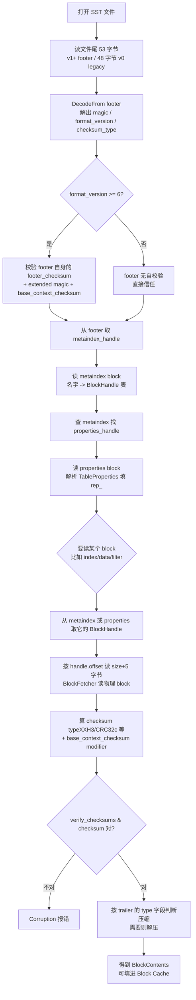

# 第 2 篇 · 第 6 章 · Block-based Table 格式

> **核心问题**:上一章(P1-05)我们讲到 MemTable 满了就 Flush 成一个 L0 SST 文件落盘。可这个 SST 文件内部到底长什么样?为什么不是把一堆 key-value 一股脑顺序铺开,而是要切成 data block、index block、filter block、properties block、footer 这一堆"块"?更让人困惑的是,RocksDB 的 SST 比你印象里的 LevelDB SST 丰富得多——LevelDB 一个 footer 加几类 block 就完事,RocksDB 居然搞出了 properties block(还塞了几十个字段)、好几套 index 类型(binary / hash / partitioned / binary-with-first-key)、好几套 filter(block-based / full / partitioned)、footer 还分 format_version 2~7 六个版本。这每一项,LevelDB 写死了什么、RocksDB 把它打开成了什么旋钮?一个"不分 block 的大文件"到底会撞什么墙?

> **读完本章你会明白**:
> 1. 为什么 SST 一定要"分块"——一个不分 block 的扁平大文件,会同时撞上"改一字重读全文件""无法局部缓存""无法按需载入 index"三堵墙,分块是把读路径做起来的**地基**。
> 2. data block 的前缀压缩 + restart point(承 LevelDB,一句带过)以及 RocksDB 在它上面加的料:**DataBlockFooter 的 packed 字段**(bit31 hash index / bit29 uniform keys / bit28 separated KV)、**插值查找**(`is_uniform=true` 时用)、**块内 hash 索引**。
> 3. SST 文件的真实物理布局:data block 流式写在前,filter → index → compression dict → range del → properties → metaindex → footer 顺序追加在尾(这是 `BlockBasedTableBuilder::Finish` 的实测顺序,不是你印象里的 "footer→index→data")。
> 4. metaindex block 是个"block 名字 → BlockHandle"的二级索引表,让 footer 只需要记一个 metaindex handle 就能找到所有 meta block;**format_version ≥ 6 起,连 index handle 都从 footer 挪进了 metaindex**。
> 5. properties block 是 RocksDB 相对 LevelDB 最大的一笔独有资产——存 SST 的元信息(num_entries / num_data_blocks / key range / filter_policy_name / compression_name / data_block_restart_interval / seqno_to_time_mapping ……),供 compaction 决策、SST dump 工具、ldb 读。
> 6. footer 版本演进(format_version 2~7)不是"版本号换了个数字",而是一路在补正确性坑(块校验和撕裂、cache key 漂移、压缩字典命名)。

> **如果一读觉得太难**:先只记住三件事——① SST 是分块的,每个块独立压缩、独立校验、独立缓存、可独立按需载入,这是读路径的地基;② 文件尾有一串"meta block"(filter/index/properties/metaindex)+ footer,footer 只记 metaindex handle(v6 起连 index handle 也挪进 metaindex);③ properties block 是 RocksDB 独有,存 SST 的体检报告,几乎每个字段都在服务某个读路径优化或运维工具。

---

## 〇、一句话点破

> **SST 文件分块,不是因为"分块好看",而是因为"不分块,读路径根本做不起来"——一个扁平的大文件,你改不动一个字节、缓存不了一个局部、更没法只在需要时才载入索引。RocksDB 在 LevelDB 的"分块 + 前缀压缩 + restart"地基上,又加了一整套料:metaindex 做 meta block 的二级索引、properties 做 SST 的体检报告、index/filter 分多种类型、footer 分版本演进——每一个都是为了把读路径的某一面做透。**

这是结论,不是理由。本章倒过来拆:先讲"不分块会撞什么墙",再拆 LevelDB 的最小分块(data/index/filter/footer)是怎么搭起来的,最后拆 RocksDB 在这套地基上加的每一笔料,以及它打开成了什么旋钮。

---

## 一、从 Flush 的产出说起:这个 SST 文件长什么样

### 写路径的衔接

我们刚刚走过第 1 篇的写路径。一次 `Put` 进了 WriteBatch、被 WriteGroup 攒批、写进 WAL、进了 MemTable(InlineSkipList);MemTable 攒到 `write_buffer_size` 转 Immutable,后台的 Flush Job 把它**整体**刷成一个 L0 SST 文件落盘(P1-05)。

Flush 落盘那一刻,问出一个最自然的问题:**这个产出的 SST 文件,内部到底长什么样?**

> **钉死这件事**:写路径走到这里产出了一个"磁盘上的文件",而读路径(第 3 篇 Block Cache、Get、Iterator)的一切,都要从这个文件的**格式**说起。看不懂 SST 格式,第 3 篇的"一次 Get 怎么穿透多层 SST"无从讲起。所以这一篇(第 2 篇)是读路径的地基,这一章是这一篇的地基。

### 先问个最朴素的问题:为什么不把 KV 一股脑顺序铺开

假设我们没学过任何 LSM,只想最简单地存一批有序 KV。最朴素的方案:

```
[ key1 ][ val1 ][ key2 ][ val2 ][ key3 ][ val3 ] ... [ keyN ][ valN ]
```

整个文件就是一串定长或不定长的 KV 平铺。要查 `key_k`,顺序扫一遍,或者建一个外部索引。这有什么问题?

> **不这样会怎样**:这个朴素方案会**同时撞三堵墙**:

**第一堵墙:改不动一个字节。** 如果你想给某个 block 加校验和(防磁盘静默损坏),你想给热数据加压缩(省空间),你想在写入时复用一个已经攒好的 buffer——你都做不到,因为"所有 KV 一股脑铺开"意味着任何一个 KV 的修改都可能引起后面所有 KV 的偏移变化。LSM 是只追加不原地改没错,但 Flush 产出一个 SST 时,内部组织方式是你能选的。

**第二堵墙:无法局部缓存。** 一次 `Get(key_k)` 只需要读 key_k 附近的数据,可文件是平铺的,你不知道 key_k 在文件的哪个偏移。要么整个文件读进内存(几个 GB 的 SST 这么干?),要么每次都走磁盘(那读放大爆炸)。

**第三堵墙:无法按需载入索引。** 你想在文件尾放一个索引(每个 key 在文件的哪个偏移)。可索引本身可能就几十 MB(几千万个 key),每次 Get 都把整个索引载入内存?那 cache 全被索引占了。

> **所以这样设计**:把文件**切成块(block)**。每块是一个自包含的小单元(有自己的校验和、自己的压缩、自己的内部索引),块之间靠一个轻量的"块索引"串起来。读一个 key:先查块索引(块索引小,可缓存),定位到 key 在哪个块,再只读那一个块。

这就是 LevelDB / RocksDB SST 的根本组织原则:**分块**。

---

## 二、LevelDB 的最小分块:地基(一句带过 + 指路)

在我们拆 RocksDB 的料之前,先快速过一遍 LevelDB 的最小分块方案,因为它是 RocksDB 的地基。这一节只做"承 LevelDB"的回顾,具体细节《LevelDB》那本已拆透。

### LevelDB 的 SST 由四类东西组成

LevelDB 的一个 SST 文件,内部就是这几样东西按顺序铺开:

```
[ data block 0 ][ data block 1 ] ... [ data block N ]
[ meta block 0 ] ... [ meta block M ]   (filter 等)
[ index block ]                          (每个 data block 的索引)
[ footer ]                               (固定 48 字节)
```

- **data block**:真正存 KV 的地方。每个 data block 内部用**前缀压缩 + restart point**:`block_restart_interval = 16`(默认每 16 个 key 做一次 restart,全量存 key 不压缩),restart point 之间用"和上一个 key 共享前缀的长度"做 delta 编码。这是 LevelDB 的招牌空间优化,详见 [[leveldb-source-facts]] 第 11 条和《LevelDB》SST 章。
- **meta block**:filter(Bloom Filter)放这里。LevelDB 一开始就一种 filter。
- **index block**:每个 data block 一条索引项,`separator_key → BlockHandle(offset, size)`。一次 Get 先在 index block 二分定位 key 在哪个 data block。
- **footer**:固定 **48 字节**,存 metaindex_handle 和 index_handle 两个 BlockHandle(各最多 20 字节,因为 BlockHandle = 2 个 varint64,各最多 10 字节),加 8 字节 magic number。`kBlockTrailerSize = 5`(1 字节 type + 4 字节 masked CRC32c),每个 block 尾都带这个 5 字节 trailer。

> **钉死这件事(承 LevelDB 一句带过)**:LevelDB 这套"data block 前缀压缩 + restart + index block + filter block + 48 字节 footer + 5 字节 trailer",是 SST 分块的**最小可行实现**,RocksDB 完全继承。后面 RocksDB 加的料(properties、多 index 类型、多 filter、footer 版本演进),都是在这套地基上**加东西**,不是替换。如果这地基你不熟,先回《LevelDB》那本看 SST 章;如果熟,本章篇幅全留 RocksDB 独有。

### LevelDB 写死了什么,RocksDB 要打开什么

地基有了,问题也跟着来了。LevelDB 在这套地基上,写死了一堆东西:

- 写死 footer 固定 48 字节、固定 magic、CRC32c——**版本演进没出口**(以后想加字段、换校验和,都改不动了)。
- 写死 index block 就一种(binary search)——**大 SST 的索引载入慢、挤 cache** 没办法。
- 写死 filter 就一种(block-based,每个 data block 一个小 filter)——大 SST 的 filter 也挤 cache。
- 写死 SST 没有体检报告——`num_entries`、key range、压缩了没、用了哪个 comparator,全都得现扫一遍文件才知道,**compaction 决策和运维工具瞎了眼**。
- 写死 data block 只有 binary search 一种内部索引——key 分布均匀时二分不优。

这就是 RocksDB 要"打开成旋钮"的清单。本章下面五节,逐个拆 RocksDB 在 LevelDB 地基上加的料。

---

## 三、SST 文件的真实物理布局:不要相信你的印象

在拆每一类 block 之前,先把 SST 文件**从头到尾**的真实物理布局钉死。很多人的印象是"footer 在最尾、index 在 footer 前、data 在最前",这没错,但**meta 区的内部顺序**很多人记错了。

### 实测:BlockBasedTableBuilder::Finish 的写入顺序

我们不看文档、不看博客,直接看源码。`BlockBasedTableBuilder::Finish` 是 Flush/Compaction 产出 SST 时的收尾函数,它决定了 meta 区的写入顺序。源码注释把顺序写得很清楚([block_based_table_builder.cc:2901-2908](../rocksdb/table/block_based/block_based_table_builder.cc#L2901-L2908)):

```cpp
  // Write meta blocks, metaindex block and footer in the following order.
  //    1. [meta block: filter]
  //    2. [meta block: index]
  //    3. [meta block: compression dictionary]
  //    4. [meta block: range deletion tombstone]
  //    5. [meta block: properties]
  //    6. [metaindex block]
  //    7. Footer
  BlockHandle metaindex_block_handle, index_block_handle;
  MetaIndexBuilder meta_index_builder;
  WriteFilterBlock(&meta_index_builder);
  WriteIndexBlock(&meta_index_builder, &index_block_handle);
  WriteCompressionDictBlock(&meta_index_builder);
  WriteRangeDelBlock(&meta_index_builder);
  WritePropertiesBlock(&meta_index_builder);
```

注意几个反印象的点:

1. **filter 在 index 前面**写,不是你印象里的 "index 在 filter 前"。
2. **compression dictionary 和 range deletion** 也是 meta block,很多人忘了这俩也是独立的块。
3. **properties 在 metaindex 前**写。
4. **metaindex 在 footer 前**,metaindex 自己也是个 block(有自己的 BlockHandle,记在 footer 里)。

data block 不在这个 `Finish` 里——它是在 `Add` 时**流式**写在前面的([block_based_table_builder.cc:1558](../rocksdb/table/block_based/block_based_table_builder.cc#L1558) 的 `BlockBasedTableBuilder::Add`)。所以一个完整的 SST 文件物理布局是:

```
+----------------------------------------------------------+
|  data block 0   (data + 5B trailer)                      |
+----------------------------------------------------------+
|  data block 1   (data + 5B trailer)                      |
+----------------------------------------------------------+
|  ...                                                      |
+----------------------------------------------------------+
|  data block N-1 (data + 5B trailer)                      |  ← tail_start_offset
+----------------------------------------------------------+    (properties 里记这个偏移)
|  filter block(s)        (full / partitioned / 老 block)   |
+----------------------------------------------------------+
|  index block(s)         (binary / hash / partitioned /    |
|                          binary-with-first-key)            |
+----------------------------------------------------------+
|  compression dictionary block (可选)                       |
+----------------------------------------------------------+
|  range deletion block    (可选)                            |
+----------------------------------------------------------+
|  properties block        (RocksDB 独有,体检报告)            |
+----------------------------------------------------------+
|  metaindex block         (名字 → BlockHandle 二级索引)       |
+----------------------------------------------------------+
|  footer                 (v1+: 53 字节;v0 legacy: 48 字节)   |
+----------------------------------------------------------+
```

> **钉死这件事**:这个布局图是本章最重要的一张图。读路径(下一章 P2-07 起,Block Cache / Get / Iterator)的所有讨论,都会回到这张图问"我要读哪个 block、它在文件的哪个位置、走不走 cache"。Footer 在最尾是**唯一的固定锚点**——读 SST 必须先读 footer,因为只有 footer 的位置是确定的(文件末尾固定长度)。

### tail_start_offset:为什么 properties 要记这个

注意上面的布局图里我标了一个 `tail_start_offset`。这是 RocksDB 的一个工程优化:`BlockBasedTableBuilder::Finish` 里写了这么一句([block_based_table_builder.cc:2897](../rocksdb/table/block_based/block_based_table_builder.cc#L2897)):

```cpp
  r->props.tail_start_offset = r->offset.LoadRelaxed();
```

在写 meta 区之前,先记下当前文件偏移到 `props.tail_start_offset`。读 SST 时(`BlockBasedTable::Open`),可以**一次性预读**从 `tail_start_offset` 到文件末尾这一整段(meta 区 + footer),而不是分多次小读。这一个预读,把"读 SST 元信息"的 N 次小 IO,合并成 1 次大 IO。这就是 `PrefetchTail`([block_based_table_reader.cc:1120](../rocksdb/table/block_based/block_based_table_reader.cc#L1120))在做的事。

> **不这样会怎样**:如果不预读 tail,每打开一个 SST 文件,要分多次读(读 footer、读 metaindex、读 properties、读 index、读 filter……),每次一个 IO。SST 文件多的时候(L0 几十个、L1~Ln 几百上千个),光打开文件就够受的。`tail_start_offset` 让"打开 SST"这个动作从 N 次小读变成 1 次大读,对延迟敏感的点查是实打实的优化。

---

## 四、data block:前缀压缩的继承与升级

data block 是 SST 里**数量最多、最常被读**的块——一次 Get 最终都要落到某个 data block 上。它内部长什么样?

### LevelDB 的方案(承 LevelDB 一句带过)

LevelDB 的 data block 内部,是"前缀压缩 + restart point"这套,在 [[leveldb-source-facts]] 第 11 条和《LevelDB》SST 章已拆透。一句话回顾:

- 每个 KV entry 编码为 `shared(varint32) | unshared(varint32) | value_length(varint32) | key_delta[unshared] | value[value_length]`。
- 每 `block_restart_interval`(默认 16)个 key 做一次 **restart point**:restart point 处 `shared=0`,全量存 key(不压缩);restart point 之间的 key 用"和前一个 key 共享前缀的长度"做 delta。
- block 尾是 `restarts[num_restarts]` 数组(每个 uint32 是一个 restart point 在 block 内的偏移),再加一个 `num_restarts` 的 uint32。
- 二分查找时,先在 restart 数组里二分定位 restart point,再从那个 restart point 线性往后扫。

RocksDB 完全继承这套。但它在 block 尾做了**两笔升级**。

### 升级一:DataBlockFooter 的 packed 字段(取代裸 num_restarts)

LevelDB 的 block 尾就是一个裸的 `num_restarts`(uint32)。RocksDB 把它升级成了一个 **packed uint32**,把好几个标志位塞进去。看源码([data_block_footer.cc:16-45](../rocksdb/table/block_based/data_block_footer.cc#L16-L45)):

```cpp
// Hash index bit (bit 31)
constexpr uint32_t kHashIndexBit = 1u << 31;
// Uniform keys bit (bit 29) - indicates keys are uniformly distributed
constexpr uint32_t kUniformKeysBit = 1u << 29;
// Separated KV storage bit (bit 28)
constexpr uint32_t kSeparatedKVBit = 1u << 28;

void DataBlockFooter::EncodeTo(std::string* dst) const {
  // ...
  uint32_t packed = num_restarts;
  if (index_type == BlockBasedTableOptions::kDataBlockBinaryAndHash) {
    packed |= kHashIndexBit;
  }
  // ...
  if (separated_kv) { packed |= kSeparatedKVBit; }
  if (is_uniform) { packed |= kSeparatedKVBit; }  // 实为 is_uniform,示意
  PutFixed32(dst, packed);
}
```

低 28 位是 `num_restarts`(足够表示 2^28 个 restart,远超任何实际 block),高 4 位是标志:

| bit | 含义 | 为什么需要 |
|-----|------|-----------|
| 31 (`kHashIndexBit`) | 这个 data block 有没有内嵌 hash 索引 | 同一个格式支持两种块内索引(binary / binary+hash),读的时候一眼分辨 |
| 29 (`kUniformKeysBit`) | 这个 data block 的 restart key 是不是均匀分布 | 均匀就启用**插值查找**(下面讲),不均匀就退回二分 |
| 28 (`kSeparatedKVBit`) | 这个 data block 是不是 KV 分离存储 | value 太大时,把 value 单独存一个 section,key section 更紧凑 |

> **LevelDB 是写死的,RocksDB 打开成了旋钮**:LevelDB 的 data block 只有一种(binary search),没有 hash 索引、没有插值查找、没有 KV 分离。RocksDB 把这些做成了 `BlockBasedTableOptions::data_block_index_type`(kDataBlockBinarySearch / kDataBlockBinaryAndHash)、`uniform_cv_threshold`、`separate_key_value_in_data_block` 等选项,写在 properties block 里(每个 SST 自己挑),读的时候从 DataBlockFooter 的标志位一眼分辨。这是"把固定点变成可调曲线"在 data block 这一层的具体落地。

### 升级二:块内 hash 索引(kDataBlockBinaryAndHash)

这是 LevelDB 完全没有的。当 `data_block_index_type = kDataBlockBinaryAndHash` 时,BlockBuilder 在写 block 时,额外维护一个 hash 表,把每个 user key 映射到它所在的 restart point。读的时候([block.cc:240-250](../rocksdb/table/block_based/block.cc#L240-L250)):

```cpp
bool DataBlockIter::SeekForGetImpl(const Slice& target) {
  Slice target_user_key = ExtractUserKey(target);
  uint32_t map_offset = restarts_ + num_restarts_ * sizeof(uint32_t);
  uint8_t entry =
      data_block_hash_index_->Lookup(data_, map_offset, target_user_key);

  if (entry == kCollision) {
    // HashSeek not effective, falling back
    SeekImpl(target);   // hash 冲突就退回二分
    return true;
  }
  // ...
}
```

hash 冲突了就退回二分(`SeekImpl`),不冲突就 O(1) 直达。这是为点查(`Get`)优化的:点查频繁、block 内 entry 多时,hash 索引比二分快一截。

> **不这样会怎样**:朴素地用二分,block 大(比如 32KB)、entry 多(几千个),每次 Get 都要在 block 内做 log(N) 次比较。换成 hash 索引,大部分情况 O(1) 直达。代价是 hash 表本身占空间(所以有 `data_block_hash_table_util_ratio = 0.75` 控制负载因子),以及 hash 冲突时退化。这是个典型的"用一点空间换一点延迟"的旋钮。

### 升级三:is_uniform + 插值查找

这是 11.x 比较新的一个优化。BlockBuilder 在写 block 时,用 **Welford 在线算法**算 restart key 之间间隔的**变异系数(CV)**([block_builder.cc:55-88](../rocksdb/table/block_based/block_builder.cc#L55-L88) 的 `UniformDataTracker`),如果 CV 小于阈值(`uniform_cv_threshold`,默认负数即关闭),就把这个 block 标 `is_uniform=true`,写进 DataBlockFooter 的 bit 29。

读的时候,如果 `BlockSearchType = kAuto`,看到 `is_uniform=true` 就走**插值查找**(`InterpolationSeekRestartPointIndex`,[block.cc:859](../rocksdb/table/block_based/block.cc#L859)),否则走二分。插值查找对均匀分布的 key(比如自增整数 ID)特别快——它直接根据 target key 在 key 空间的位置,线性估算出大概在哪个 restart point。

> **钉死这件事**:这是"自适应"思想在 data block 内部的落地——写入时算一把 key 分布,均匀就用插值、不均匀就用二分,自动选。`uniform_cv_threshold` 是这个旋钮的阈值,默认负数(关闭,全部用二分),需要时打开。这种"写入时多算一点,读取时少算很多"的设计,是 LSM 读优化的常见套路。

---

## 五、index block:不止一种(为下一章铺路)

index block 是 SST 的"目录":每个 data block 在 index 里有一条 `separator_key → BlockHandle(offset, size)` 的索引项。一次 Get 先在 index block 二分定位 key 落在哪个 data block,再去读那个 data block。

### LevelDB 的方案(承 LevelDB 一句带过)

LevelDB 的 index block 就一种:**binary search**。每个 data block 一条索引项,索引项的 key 是"上一个 data block 的最后一个 key"和"下一个 data block 的第一个 key"之间的一个分隔键(separator),value 是 BlockHandle。RocksDB 默认也是这种(`kBinarySearch`,[table.h:301](../rocksdb/include/rocksdb/table.h#L301))。

### RocksDB 打开了四种 index 类型

但 RocksDB 在 `BlockBasedTableOptions::IndexType` 里给了**四种**([table.h:298-324](../rocksdb/include/rocksdb/table.h#L298-L324)):

```cpp
enum IndexType : char {
  kBinarySearch = 0x00,            // 默认,空间高效,二分
  kHashSearch = 0x01,              // 配合 prefix_extractor,hash 加速 prefix seek
  kTwoLevelIndexSearch = 0x02,     // 两级索引(partitioned),大 SST 索引自己分页
  kBinarySearchWithFirstKey = 0x03,// 索引里带每个 data block 的第一个 key
};
```

| IndexType | 解决什么 | 代价 | 适用场景 |
|-----------|---------|------|---------|
| `kBinarySearch` | 默认,空间高效 | 大 SST 索引载入慢、挤 cache | 中小 SST |
| `kHashSearch` | prefix seek 快(配 prefix_extractor) | 索引变大,且要配 prefix_extractor | prefix seek 多 |
| `kTwoLevelIndexSearch` | 大 SST 的索引自己分页,不全载入 | 多一次间接寻址 | 大 SST(Ln 层那些 GB 级文件) |
| `kBinarySearchWithFirstKey` | iterator 延迟读 data block(直到真的需要) | 索引变大 2x+ | 短范围扫描多 |

这四种是**下一章(P2-07 Index/Filter 分离与分区)的主菜**,本章只点出"RocksDB 把 LevelDB 写死的一种 index,打开成了四种"这个事实,具体怎么分区、怎么分离、cache 角色怎么分,下一章拆。

> **LevelDB 是写死的,RocksDB 打开成了旋钮**:LevelDB 只有一种 index(binary)。RocksDB 的 `index_type` 让你按 SST 大小、查询模式挑:小 SST 用 binary、大 SST 用 partitioned、prefix seek 多用 hash、短扫描多用 binary-with-first-key。这是"读写放大三角"在索引层的具体旋钮。

### IndexValue 的 delta 编码(承 LevelDB 的升级)

顺带一个细节:index block 里每条索引项的 value 是 `IndexValue { BlockHandle handle; Slice first_internal_key; }`([format.h:116-119](../rocksdb/include/../rocksdb/table/format.h#L116-L119))。当索引项是**连续的 data block**时,RocksDB 对 BlockHandle 做 **delta 编码**——不存绝对 offset/size,只存"和上一个 block 的 size 差值"([format.cc:102-118](../rocksdb/table/format.cc#L102-L118)):

```cpp
void IndexValue::EncodeTo(std::string* dst, bool have_first_key,
                          const BlockHandle* previous_handle) const {
  if (previous_handle) {
    // 连续 block:只存 size 差值,offset 可推算
    assert(handle.offset() == previous_handle->offset() +
                                  previous_handle->size() +
                                  BlockBasedTable::kBlockTrailerSize);
    PutVarsignedint64(dst, handle.size() - previous_handle->size());
  } else {
    handle.EncodeTo(dst);
  }
  // ...
}
```

连续 data block 的 offset 就是"上一个 offset + 上一个 size + 5(trailer)",可推算,不用存。这是 LevelDB 没有的空间优化。LevelDB 的 index value 永远是完整的 BlockHandle。

---

## 六、filter block:也不止一种(为下一章铺路)

filter block 存 Bloom / Ribbon Filter,作用是**点查早退**——一次 `Get(key)` 在读 data block 之前,先问 filter:"这个 key 可能在这一层吗?"filter 说"不在"就跳过这个 SST,省一次 data block 读。

### LevelDB 的方案(承 LevelDB 一句带过)

LevelDB 的 filter 是 **block-based**:每个 data block 配一个小 filter。读哪个 data block 就查哪个小 filter。filter block 的名字在 metaindex 里是 `filter.`(老前缀,[block_based_table_builder.cc:3068](../rocksdb/table/block_based/block_based_table_builder.cc#L3068) 的 `kObsoleteFilterBlockPrefix`)。

### RocksDB 打开了三种 filter

RocksDB 在 metaindex 里用**三种前缀**区分 filter 类型([block_based_table_builder.cc:3068-3071](../rocksdb/table/block_based/block_based_table_builder.cc#L3068-L3071)):

```cpp
const std::string BlockBasedTable::kObsoleteFilterBlockPrefix = "filter.";          // 老 block-based
const std::string BlockBasedTable::kFullFilterBlockPrefix = "fullfilter.";          // 全文件一个大 filter
const std::string BlockBasedTable::kPartitionedFilterBlockPrefix = "partitionedfilter."; // 分区 filter
```

- `filter.`(老):每个 data block 一个小 filter(LevelDB 风格,11.x 仍读但不再写)。
- `fullfilter.`(默认):整个 SST 一个大 filter。读一次 filter 就知道 key 在不在这个 SST。
- `partitionedfilter.`:大 SST 的 filter 自己分页,不全载入。

这同样是**下一章(P2-07)的主菜**,本章只点出"RocksDB 把 LevelDB 写死的一种 filter,打开成了三种"。filter 内部用什么算法(Bloom 还是 Ribbon)是 P2-08 的事。

> **钉死这件事**:index 和 filter 都从"LevelDB 的一种"变成了"RocksDB 的多种",这是因为 SST 的**大小范围**变了——LevelDB 的 SST 顶天几十 MB,LevelDB 的方案够用;RocksDB 的 SST 可以到 GB 级(Ln 层),一个 GB 文件配一个几十 MB 的 index / filter,一次性载入会挤爆 cache。所以大 SST 要分区。这就是下一章的全部动机。

---

## 七、metaindex block:meta block 的二级索引

到这里我们已经有 filter / index / compression dict / range del / properties 一堆 meta block 了。**footer 怎么找到它们?**

### 朴素方案的墙

最朴素的方案:footer 里把每个 meta block 的 BlockHandle 都存一份。这撞墙:

- meta block 种类会演进(今天 5 种,明天加个 hash index prefixes block),footer 格式就改一次,版本兼容噩梦。
- footer 要尽量短(它在文件尾,每次打开都要读),塞一堆 handle 会让它变长。

### RocksDB 的方案:metaindex 做"名字 → BlockHandle"的二级索引

RocksDB(以及 LevelDB)的做法是:**在 footer 和 meta block 之间,加一层 metaindex block**。metaindex 本身也是个 block,内容就是一个有序的 `block_name → BlockHandle` 表。footer 只存**一个** metaindex_handle。

打开 SST 的顺序([block_based_table_reader.cc:912-919](../rocksdb/table/block_based/block_based_table_reader.cc#L912-L919) 的注释):

```
1. Footer          (固定位置:文件尾)
2. metaindex block (footer 里的 metaindex_handle 指向它)
3. properties block(metaindex 里查 "rocksdb.properties")
4. range del block (metaindex 里查 "rocksdb.range_del" 可选)
5. compression dict(metaindex 里查 "rocksdb.compression_dict" 可选)
6. index block     (v5-:footer 里直接给 index_handle;v6+:metaindex 里查 "rocksdb.index")
7. filter block    (metaindex 里查 "fullfilter.xxx" / "partitionedfilter.xxx")
```

metaindex 里的 key 是 block 的名字常量([meta_blocks.h:35-38](../rocksdb/table/meta_blocks.h#L35-L38)):

```cpp
extern const std::string kPropertiesBlockName;      // "rocksdb.properties"
extern const std::string kIndexBlockName;           // "rocksdb.index"  (v6+)
extern const std::string kCompressionDictBlockName; // "rocksdb.compression_dict"
extern const std::string kRangeDelBlockName;        // "rocksdb.range_del"
```

> **不这样会怎样**:如果没有 metaindex,footer 就得记 N 个 handle,每加一种 meta block 就改 footer 格式。有了 metaindex,footer 只记 1 个 metaindex_handle,以后加多少种 meta block,都只是往 metaindex 里加一个 `name → handle` 条目,**footer 格式永远不动**。这是经典的"加一层间接"——用一次额外的 block 读(读 metaindex),换 footer 的稳定和可扩展。

### format_version ≥ 6 的关键演进:index handle 挪进 metaindex

注意上面打开顺序的第 6 步:**v5 及以下,index_handle 直接在 footer 里;v6 起,index_handle 挪进了 metaindex**。看 footer 解码([format.cc:444-445](../rocksdb/table/format.cc#L444-L445)):

```cpp
    // format_version >= 6
    metaindex_handle_ = BlockHandle(metaindex_end - metaindex_size, metaindex_size);
    // Mark unpopulated
    index_handle_ = BlockHandle::NullBlockHandle();   // v6+ footer 不存 index handle 了
```

为什么挪?因为 footer 里直接存 index_handle 有个正确性隐患——如果 footer 的 format_version 字段被静默损坏了,你可能会用错误的 checksum 类型去读 index block,而 v6 的 footer 引入了 **base context checksum** 和 **footer 自校验和**,把这种隐患堵上了。这个下面 footer 一节细讲。

---

## 八、properties block:RocksDB 独有的 SST 体检报告

终于到了本章相对 LevelDB **最独有**的一笔资产:properties block。

### 它解决什么问题

LevelDB 的 SST 是"哑"的——你拿到一个 SST 文件,想知道它有多少 entry、key 范围是什么、用了什么压缩、Bloom 用的什么 policy,**全得现扫一遍文件**。这在 LevelDB 的场景(单机、中等负载)不算大问题,因为 SST 不多、运维需求不强。

但 RocksDB 不一样:

- **compaction 要做决策**:选哪些 SST 合并,要看它们的 key 范围、大小、entry 数。每次现扫一遍太慢。
- **运维工具要读**:`ldb`、SST dump 工具要展示 SST 的体检信息(num_entries、压缩比、creation_time),不可能每次全文件扫。
- **读路径要自适应**:有些优化(`whole_key_filtering`、`index_value_is_delta_encoded`)要看这个 SST 写入时用了什么 option,option 信息必须持久化。

### RocksDB 的方案:properties block

RocksDB 在 SST 里加了一个 **properties block**(metaindex 里查 `kPropertiesBlockName = "rocksdb.properties"`),存这个 SST 的体检报告。字段非常多,看 `TableProperties` 结构([table_properties.h:229-416](../rocksdb/include/rocksdb/table_properties.h#L229-L416)),摘关键的:

| 字段 | 类型 | 含义 | 谁用 |
|------|------|------|------|
| `num_entries` | uint64 | 这个 SST 有多少 KV entry | compaction 决策、运维展示 |
| `num_data_blocks` | uint64 | 有多少个 data block | compaction、运维 |
| `num_deletions` | uint64 | 有多少墓碑 | compaction(墓碑多了要优先合) |
| `num_merge_operands` | uint64 | 有多少 merge operand | compaction |
| `num_range_deletions` | uint64 | 有多少范围删除 | 读路径(range tombstone) |
| `raw_key_size` / `raw_value_size` | uint64 | 所有 key/value 的总字节数 | 算平均 KV 大小 |
| `data_size` / `index_size` / `filter_size` | uint64 | data/index/filter 各占多少 | 算空间占比 |
| `index_partitions` / `top_level_index_size` | uint64 | partitioned index 的分页信息 | 读 partitioned index |
| `num_filter_entries` | uint64 | filter 里有多少 entry | 算 filter 假阳性率 |
| `index_key_is_user_key` / `index_value_is_delta_encoded` | uint64 | index 的编码方式 | 读 index block |
| `data_block_restart_interval` / `index_block_restart_interval` | uint64 | 这个 SST 实际用的 restart 间隔 | 读 data/index block |
| `separate_key_value_in_data_block` | uint64 | 这个 SST 用没用 KV 分离 | 读 data block |
| `format_version` | uint64 | footer 的 format 版本 | 读 footer |
| `column_family_id` / `column_family_name` | uint64 / string | 这个 SST 属于哪个 CF | 多 CF |
| `filter_policy_name` | string | 用的 filter policy 名 | 读 filter |
| `comparator_name` | string | 用的 comparator 名 | 校验兼容性 |
| `merge_operator_name` | string | merge operator 名 | 读 merge |
| `prefix_extractor_name` | string | prefix extractor 名 | prefix seek |
| `compression_name` | string | 压缩算法名 | 解压 |
| `creation_time` / `oldest_key_time` / `file_creation_time` | uint64 | 时间戳 | TTL、运维 |
| `db_id` / `db_session_id` / `db_host_id` | string | DB 标识 | cache key、trace |
| `orig_file_number` | uint64 | 文件号 | 运维 |
| `seqno_to_time_mapping` | string | seqno 到时间的映射 | TTL compaction |
| `key_smallest_seqno` / `key_largest_seqno` | uint64 | key 的 seqno 范围 | compaction |
| `tail_start_offset` | uint64 | meta 区起始偏移 | PrefetchTail |
| `user_defined_timestamps_persisted` | uint64 | 用户定义时间戳是否持久化 | 多版本 |

读 SST 时,`BlockBasedTable::ReadPropertiesBlock`([block_based_table_reader.cc:1205](../rocksdb/table/block_based/block_based_table_reader.cc#L1205))把这个 block 读进来,解析后填进 `rep_->table_properties`,后续**几乎所有读路径优化都要查它**:

```cpp
  rep_->table_properties = std::move(table_properties);
  rep_->data_block_restart_interval = static_cast<uint32_t>(
      rep_->table_properties->data_block_restart_interval);
  rep_->index_block_restart_interval = static_cast<uint32_t>(
      rep_->table_properties->index_block_restart_interval);
  rep_->separate_key_value_in_data_block =
      rep_->table_properties->separate_key_value_in_data_block > 0;
  // ...
  // 读 index_type(properties 里也存了一份,见下文)
  auto& props = rep_->table_properties->user_collected_properties;
  auto index_type_pos = props.find(BlockBasedTablePropertyNames::kIndexType);
  rep_->index_type = static_cast<BlockBasedTableOptions::IndexType>(
      DecodeFixed32(index_type_pos->second.c_str()));
```

注意一个反直觉的点:**`index_type` 居然也写在 properties block 里**(在 `user_collected_properties` 这个 map 里,key 是 `kIndexType`)。为什么?因为 index block 自己不会标"我是哪种 index",读 index block 之前,必须先从 properties 知道这个 SST 用的是 binary / hash / partitioned 哪种,才能用对应的 reader 去解析。所以 properties block **必须在 index block 之前读**,这也是 Open 顺序里 properties 在 index 前的原因。

> **钉死这件事**:properties block 是 RocksDB 相对 LevelDB 最大的一笔独有资产。它把"SST 的体检报告"持久化进了文件本身,让 compaction 决策、运维工具、读路径优化**都有数据可查**,不用现扫文件。这一笔资产,让 RocksDB 从"一个能存的 LSM"变成了"一个可观测、可决策的工业级 LSM"。

---

## 九、footer:版本演进的活化石

footer 在文件最尾,固定长度,是**读 SST 的唯一入口**(因为只有它的位置是确定的)。它存:checksum 类型、metaindex_handle、(v5-)index_handle、format_version、magic number。footer 的演化是 RocksDB 在 LevelDB 地基上"补正确性坑"的活化石。

### LevelDB 的 footer(承 LevelDB 一句带过)

LevelDB 的 footer 固定 48 字节 = 2 × BlockHandle::kMaxEncodedLength(2×20=40) + 8(magic)。这 48 字节里塞两个 handle(metaindex + index)+ padding + magic。校验和固定 CRC32c,且**不在 footer 里存**(footer 自己没有 checksum 保护)。

### RocksDB 的 footer:format_version 2~7 六个版本

RocksDB 的 footer 不止 48 字节了。它分三段(part1 / part2 / part3),核心常量([format.h:296-306](../rocksdb/table/format.h#L296-L306)):

```cpp
// v0 (legacy, plain table 用):48 字节
static constexpr uint32_t kVersion0EncodedLength =
    2 * BlockHandle::kMaxEncodedLength + kMagicNumberLengthByte;   // = 40 + 8 = 48
// v1+ :53 字节
static constexpr uint32_t kNewVersionsEncodedLength =
    1 + 2 * BlockHandle::kMaxEncodedLength + 4 + kMagicNumberLengthByte;  // = 1 + 40 + 4 + 8 = 53
```

注意:**LevelDB 的 48 字节 footer,正好等于 RocksDB 的 v0(legacy)长度**。这不是巧合——RocksDB 的 v0 就是 LevelDB 的 footer 格式,RocksDB fork 自 LevelDB,所以能读老的 LevelDB 文件(但 v0/v1 的 block-based format 在 RocksDB 11.0 起已不支持读,format_version ≥ 2 才支持)。

format_version 的支持范围([format.h:172-187](../rocksdb/table/format.h#L172-L187)):

```cpp
constexpr uint32_t kLatestBbtFormatVersion = 7;                    // 11.6.0 最新
constexpr uint32_t kMinSupportedBbtFormatVersionForRead = 2;       // 读支持 2~7
constexpr uint32_t kMinSupportedBbtFormatVersionForWrite = 2;     // 写支持 2~7
```

`BlockBasedTableOptions::format_version` 默认就是 **7**(11.6.0,[table.h:739](../rocksdb/include/rocksdb/table.h#L739))。每个版本加了什么:

| format_version | 加入的关键能力 | 为什么需要 |
|----------------|--------------|-----------|
| 0 | (legacy)LevelDB footer 48 字节 | 兼容 LevelDB 老文件 |
| 1 | checksum 类型字段进 footer | 支持多种校验和(CRC32c / xxHash / xxHash64 / XXH3) |
| 2 | 最低支持版本(block-based) | format_version 体系正式化 |
| 3 | (历史) | — |
| 4 | index block value 省略 value_length(自描述) | 省 index 空间 |
| 5 | ZSTD 压缩字典、cache key 稳定化 | ZSTD + cache key 跨重启稳定 |
| **6** | **context checksum + extended magic + footer 自校验 + index handle 挪进 metaindex** | **堵 cache key 漂移和 footer 损坏的正确性坑** |
| **7** | **compression manager name** | 支持多套压缩 manager(比如可插拔的) |

### format_version 6:为什么是分水岭

v6 是最重要的演进。源码注释把 footer 三段格式讲得很透([format.cc:190-222](../rocksdb/table/format.cc#L190-L222)):

```
Footer format, in three parts:
* Part1
  -> format_version == 0: <empty>
  -> format_version >= 1:  checksum type (char, 1 byte)
* Part2
  -> format_version <= 5:  metaindex_handle + index_handle + padding (40B)
  -> format_version >= 6:  extended magic (4B) + footer_checksum (4B)
                           + base_context_checksum (4B)
                           + metaindex_size (4B) + 24B padding (40B)
* Part3
  -> format_version == 0:  legacy magic (8B)
  -> format_version >= 1:  format_version (4B) + magic (8B)
```

v6 引入了三个关键东西:

1. **extended magic number**(`0x3e 0x00 0x7a 0x00`,4 字节,[format.cc:223](../rocksdb/table/format.cc#L223)):part2 开头多 4 字节"扩展魔数",配合 part3 末尾的 8 字节主魔数,双重确认这是 RocksDB SST。
2. **footer 自校验和**:footer 自己也带 CRC 了(v5 及以下 footer 没校验,损坏检测不到)。算 checksum 时,把 footer 整体算一遍,存进 part2 的 `footer_checksum` 字段。读的时候重算比对。
3. **base context checksum**([format.h:138-170](../rocksdb/table/format.h#L138-L170) 的 `ChecksumModifierForContext`):每个 block 的 checksum 不再是"裸"的,而是叠加了一个"和文件 offset 相关"的 modifier。这堵的是**物理块错位**的坑——注释直说([table.h:113-116](../rocksdb/include/rocksdb/table.h#L113-L116)):"data (e.g. physical blocks out of order in a file, or from another file), which is fixed in format_version=6"。

> **不这样会怎样**(v6 之前的问题):v5 及以下,block 的 checksum 是不带 context 的。如果你读文件时,某个 block 的 offset 算错了,可能读到另一个 block 的数据,而 checksum 仍然校验通过(因为那个 block 自己的 checksum 是对的)。这叫"物理块错位"——一个静默损坏,checksum 抓不住。v6 给每个 block 的 checksum 叠加一个 offset 相关的 modifier,offset 错了 checksum 就对不上,堵住这个坑。这是用 format_version 升级换正确性的典型例子。

### magic number 的真实数值

钉死一下 magic number 的实际值,这是容易记错的:

- `kBlockBasedTableMagicNumber = 0x88e241b785f4cff7`([block_based_table_builder.cc:136](../rocksdb/table/block_based/block_based_table_builder.cc#L136))——这是 v1+ 的新 block-based magic,11.6.0 写 SST 用的就是这个。
- `kPlainTableMagicNumber = 0x8242229663bf9564`([plain_table_builder.cc:55](../rocksdb/table/plain/plain_table_builder.cc#L55))——plain table 的。
- `kLegacyPlainTableMagicNumber = 0x4f3418eb7a8f13b8`([plain_table_builder.cc:56](../rocksdb/table/plain/plain_table_builder.cc#L56))——plain table 的 v0(legacy)magic。
- `0xdb4775248b80fb57`([format.cc:344](../rocksdb/table/format.cc#L344))——**LevelDB 老 block-based magic**(很多人以为 RocksDB 还在用这个,其实 11.0 起读都不支持了,源码里专门报错让你用 4.6~11.0 之间版本升级):

```cpp
  if (magic == 0xdb4775248b80fb57ull) {
    return Status::NotSupported(
        "Unsupported legacy magic number for block-based SST format. Load with "
        "RocksDB >= 4.6.0 and < 11.0.0 and run full compaction to upgrade.");
  }
```

> **钉死这件事(纠正印象)**:很多人(包括很多博客)以为 RocksDB 用的还是 LevelDB 的 magic number `0xdb4775248b80fb57`。**错了**。那个是 LevelDB 老 block-based magic,RocksDB 11.0 起连读都不支持了。RocksDB 11.6.0 实际用的是 `0x88e241b785f4cff7`(新 block-based magic)。这个坑,不看源码必踩。

### 默认 checksum:kXXH3

顺带钉一下 checksum 类型。`BlockBasedTableOptions::checksum` 默认是 **`kXXH3`**([table.h:374](../rocksdb/include/rocksdb/table.h#L374),[table.h:122](../rocksdb/include/rocksdb/table.h#L122)),不是 LevelDB 的 CRC32c。XXH3 比 CRC32c 快得多(尤其是 SIMD 加速),RocksDB 6.27 起支持。这是另一个"RocksDB 把 LevelDB 写死的 CRC32c,打开成了可选的 5 种 checksum(默认换更快的 XXH3)"。

---

## 十、读一个 block 的完整流程(mermaid)

把上面讲的串起来,看一次"读 SST 的某个 block"完整流程。这是读路径的原子操作,第 3 篇所有讨论都建立在这个流程上。



注意几个关键点:

- **footer 是唯一固定位置的锚点**,一切从它开始。
- **metaindex 是必经的中转**,读完 footer 必读 metaindex。
- **properties 在 index/filter 之前读**,因为 index_type 等信息要靠 properties 给。
- **每个 block 读出来都要算 checksum**(叠加 context modifier),校验通过才解压。
- **解压后的 BlockContents 可填进 Block Cache**,下次读同一个 block 走 cache。

---

## 十一、技巧精解:多 block 布局与 properties block

本章最硬核的两个技巧:① 为什么 SST 要这样"多 block 布局"(而不是扁平);② properties block 凭什么这么值。配真实源码 + 反面对比,单独拆透。

### 技巧一:多 block 布局——把"一个大文件"拆成"一堆自包含的块"

我们已经知道 SST 是多 block 布局:data / index / filter / compression dict / range del / properties / metaindex / footer。但"为什么要拆这么多种、每个还独立"?这里值得用反面对比把妙处讲显形。

#### 反面:一个不分块的扁平大文件会撞什么墙

假设 SST 就是一个扁平文件,所有 KV 顺序铺开,没有 block 概念。我们看读路径的每一个动作,会怎么撞墙:

**墙一:无法独立压缩。** 压缩是按 block 做的。如果整个文件是一个大块,要么整个压缩(压缩比好,但读一个 key 要解压整个文件),要么不压缩(读快但费盘)。分块后,每个 data block 独立压缩——热 block 解压进 cache,冷 block 压缩着存盘,各得其所。看 `BlockFetcher` 怎么按 block 处理压缩([block_fetcher.cc:62-74](../rocksdb/table/block_fetcher.cc#L62-L74)):

```cpp
if (read_options_.verify_checksums) {
  io_status_ = status_to_io_status(VerifyBlockChecksum(/* ... */));
  // ...
  BlockBasedTable::GetBlockCompressionType(slice_.data(), block_size_);
  // 从 trailer 取这个 block 的压缩类型,逐 block 决定解不解压
}
```

每个 block 自己的 trailer 里有 1 字节 type,标这个 block 用没用压缩、用了哪种。**这是按 block 粒度的独立压缩**,扁平文件做不到。

**墙二:无法独立校验。** 磁盘有静默损坏(bit rot)。如果整个文件一个 checksum,损坏任何一个字节,整个文件作废。分块后,每个 block 自己 5 字节 trailer(1 type + 4 checksum),损坏只影响那一个 block,读其他 block 不受影响。更妙的是 v6 的 **context checksum**——checksum 叠加 offset modifier,连"block 读到错误 offset"都能抓。

**墙三:无法局部缓存。** 一次 Get 只需要读一个 data block,扁平文件没法"只缓存这一小块"。分块后,Block Cache 按 block 粒度缓存——热 data block 进 cache,冷的不进,精确到 4KB~32KB 粒度。

**墙四:无法按需载入 index。** 扁平文件的索引要么整个载入(挤 cache),要么每次现算(慢)。分块后,index 自己也是 block,可以分区(partitioned index,P2-07),按需载入某一页。

**墙五:无法按需读 filter。** 同理,filter 也分块,point lookup 时只查需要的那个 filter block。

**墙六:无法独立演进。** SST 格式要演进(加新 block 类型、换 checksum)。扁平文件改格式 = 整个文件格式变,版本兼容噩梦。分块后,加新 block 只是"在 metaindex 加一个 name → handle",**footer 格式不动**(footer 只记 metaindex_handle)。

#### 所以多 block 布局 sound 在哪

把上面六堵墙合起来,你就明白了:**分块 = 把"一个不可分割的大文件"变成"一堆自包含、独立压缩、独立校验、独立缓存、独立演进、可按需载入的小单元"**。这个抽象,是 LSM 读路径一切优化的前提——Block Cache、Bloom 早退、partitioned index、PrefetchTail,全都建立在"block 是独立单元"这个基础上。

> **钉死这件事**:SST 分块不是为了"好看",是读路径做起来的**地基**。LevelDB 已经分了(data/index/filter/footer),RocksDB 在它基础上又分出了 properties、compression dict、metaindex,以及把 index / filter 自己再分区。每一笔"多分一类 block",都是在为读路径的某一面开路。

### 技巧二:properties block——SST 的体检报告凭什么这么值

很多人觉得 properties block 就是个"存元信息的副产物",不值一提。这是大误解。properties block 是 RocksDB 相对 LevelDB **最独有的一笔资产**,它的价值在于让 SST 从"哑文件"变成"可观测、可决策的体检报告"。

#### 反面:LevelDB 没有 properties block 会怎样

假设 SST 没有 properties block(就是 LevelDB 的样子)。你想:

- **compaction 选哪些 SST 合并**:得现扫每个 SST,数 entry、算 key range、看墓碑比例。SST 几十个到几百个的时候,光这个就够慢。
- **运维工具展示 SST 信息**:`ldb` 想说"这个 SST 有多少 entry、压缩比多少",得全文件扫一遍。
- **读路径自适应**:你想知道这个 SST 写入时 `index_value_is_delta_encoded` 是不是开了(index 解码要靠它),这个信息没存,你只能假设默认值,踩坑。
- **多 CF 场景**:你想知道这个 SST 属于哪个 CF(`column_family_id`),信息没存,你只能从文件名推断,文件改名就丢信息。

#### 所以 properties block sound 在哪

properties block 把这些信息**在写入时就持久化进文件**。读 SST 时,读一个 properties block(几十到几百字节),所有元信息一次到手:

- **compaction 决策有数据**:`num_entries` / `num_deletions` / `num_range_deletions` / key range 都在 properties,compaction picker 不用扫文件。
- **运维工具有信息**:`ldb` / SST dump 读 properties 就能展示完整体检报告。
- **读路径自适应**:读 index 前先从 properties 读 `index_type` 和 `index_value_is_delta_encoded`([block_based_table_reader.cc:1265-1271](../rocksdb/table/block_based/block_based_table_reader.cc#L1265-L1271)),用对的 reader 解析;读 data block 前从 properties 读 `data_block_restart_interval`([block_based_table_reader.cc:1233-1234](../rocksdb/table/block_based/block_based_table_reader.cc#L1233-L1234)),用对的 restart 间隔。
- **多 CF 可追溯**:`column_family_id` / `column_family_name` 写在 properties,文件改名或迁移都不丢归属。

> **不这样会怎样**:如果像 LevelDB 那样没有 properties block,RocksDB 的 compaction 决策、运维可观测性、读路径自适应,**全都得现扫文件**。SST 一多,这些"现扫"会拖垮整个系统。properties block 用一个几十字节的块,把这些信息前置,让 SST 自己"会说话"。这是 LevelDB → RocksDB 最值得讲的一笔资产升级。

#### 一个易被忽略的点:properties 里有 user_collected_properties

`TableProperties` 除了那些固定字段,还有一个 `user_collected_properties`(map<string, string>),用户可以通过 `TablePropertiesCollector` 在 SST 写入时塞自定义信息进去(比如业务层的统计)。`index_type` 就是用这个机制存的(写在 `user_collected_properties["rocksdb.index.type"]` 里)。这是个可扩展口子,让 properties block 不局限于 RocksDB 内部字段,业务也能往里塞体检信息。

---

## 十二、章末小结

### 回扣主线

本章是**第 2 篇(静态格式)的第一章,也是读路径的地基**。我们拆了 SST 文件内部的多 block 布局:data block(前缀压缩 + restart,承 LevelDB,加 hash index / uniform / separated KV 三个料)、index block(四种类型,为 P2-07 铺路)、filter block(三种类型,为 P2-07/08 铺路)、compression dict / range del、properties block(RocksDB 独有体检报告)、metaindex block(名字 → handle 二级索引)、footer(版本演进活化石,format_version 2~7,v6 引入 context checksum)。

> **LevelDB 是写死的,RocksDB 打开成了旋钮**:LevelDB 一种 index、一种 filter、一个 48 字节 footer、一个 5 字节 trailer、一个 CRC32c、没有 properties——这是"够用就好"的最小分块。RocksDB 把 index 打开成四种、filter 打开成三种、footer 演进到 v7(引入 context checksum 堵正确性坑)、properties block 给 SST 加了体检报告、data block 加了 hash index / uniform / separated KV。每一笔,都是在读路径的某一面上做透。

### 五个为什么

1. **为什么 SST 一定要分块?**——不分块的扁平大文件会同时撞六堵墙:无法独立压缩、独立校验、局部缓存、按需载入 index/filter、独立演进。分块是把读路径做起来的地基。
2. **为什么 RocksDB 的 SST 比 LevelDB 丰富这么多?**——因为 SST 的**大小范围**变了(GB 级)、**读路径的优化深度**变了(partitioned / hash /插值)、**运维可观测需求**变了(properties / ldb)。LevelDB 的最小分块撑不住工业场景。
3. **为什么 footer 要分 format_version 2~7?**——不是"换版本号",是逐个补正确性坑。尤其 v6 引入 context checksum,堵的是"物理块错位 checksum 抓不住"这个静默损坏坑。
4. **为什么 metaindex 这一层是必要的?**——它让 footer 只记一个 metaindex_handle,以后加多少种 meta block 都只是往 metaindex 加条目,**footer 格式永远不动**。经典的"加一层间接换可扩展性"。
5. **为什么 properties block 是 RocksDB 最值得讲的独有资产?**——它让 SST 从"哑文件"变成"可观测、可决策的体检报告",compaction 决策、运维工具、读路径自适应全靠它,不用现扫文件。

### 想继续深入往哪钻

- **想看 LevelDB 的 SST 地基**:读《LevelDB 设计与实现深入浅出》SST 章,或 [[leveldb-source-facts]] 第 11 条(footer 48 字节 / kBlockTrailerSize=5 / block_restart_interval=16 / IndexBuilder restart=1)。
- **想看 footer 版本演进的权威说明**:读源码注释 [format.cc:185-225](../rocksdb/table/format.cc#L185-L225),讲清了 part1/2/3 三段、v0/v1+/v6+ 三档。
- **想看 properties block 都有哪些字段**:读 [table_properties.h:229-416](../rocksdb/include/rocksdb/table_properties.h#L229-L416),字段最多最全的地方。
- **想动手感受 SST 格式**:用 `ldb dump_sst` 或 SST dump 工具(附录 B),dump 一个真实 SST 的 footer / properties / 各 block 布局,对照本章的图看。
- **想看 Flush 产出 SST 的写侧**:`BlockBasedTableBuilder::Add` / `Finish`([block_based_table_builder.cc:1558](../rocksdb/table/block_based/block_based_table_builder.cc#L1558) / [:2869](../rocksdb/table/block_based/block_based_table_builder.cc#L2869)),看 data block 怎么流式写、meta 区怎么收尾。

### 引出下一章

我们搞清楚了 SST 文件的多 block 布局:data / index / filter / properties / metaindex / footer 各是什么、怎么按需载入。但有一个问题悬而未决:**index 和 filter 都在一个 SST 文件里,为什么还要"分离"和"分区"?**——一个 GB 级的 Ln SST,它的 index 可能几十 MB,filter 可能上百 MB,一次性载入会挤爆 Block Cache。这就是下一章 P2-07《Index / Filter 分离与分区》要拆的:**partitioned index**(大索引自己分页)、**partitioned filter**(大 filter 自己分页)、**data block hash index**(块内 hash)、**cache 角色**(block cache 按 data/index/filter 分 lot,`cache_entry_roles`)。下一章是这一章的招牌深化——把"index/filter 怎么从 data block 分离、怎么自己分区"拆到源码级。

> **下一章**:[P2-07 · Index / Filter 分离与分区](P2-07-Index-Filter分离与分区.md)
