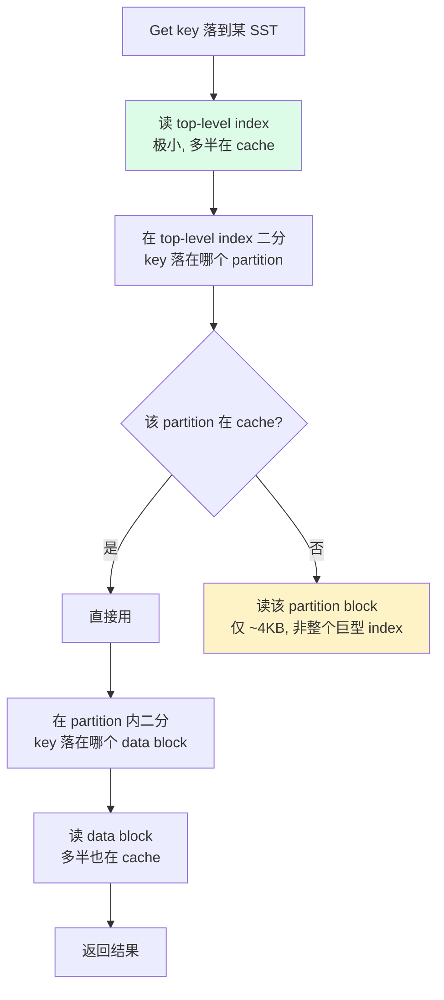

# 第 2 篇 · 第 7 章 · Index/Filter 分离与分区

> **核心问题**:上一章我们把一个 SST 文件内部拆成了 data block / index block / filter block / metaindex / footer 一堆块。可紧接着一个更尖锐的问题冒出来——LevelDB 那种"整个 SST 一个 index block、filter 按 data block 一一对应"的写死做法,在 RocksDB 要面对的几十 GB 甚至几百 GB 单 SST、几十亿 key 的工业级场景下,会撞一堵什么样的墙?为什么 index 和 filter 必须能从 data block 里"分离"出来、甚至自己再"分区"?一次点查凭什么不用把整个巨型 index 全部载入内存?block cache 又凭什么能分角色统计、分优先级?这一章就把"LevelDB 写死的索引组织方式"这个焊点彻底拆开,看 RocksDB 怎么把它做成一整套可调旋钮。

> **读完本章你会明白**:
> 1. 为什么 LevelDB 那种"一个 SST 单一 index block"的写死做法,在几十 GB 的大 SST 上会撞上"index 巨型化、cache 抖动、点查放大"这堵墙。
> 2. **Partitioned index**(kTwoLevelIndexSearch)凭什么让一次点查只读一个 index partition 而不是整个巨型 index,顶层那一级"2-level index"长什么样、怎么按 key range 切 partition。
> 3. **Partitioned filter**(partition_filters)凭什么要跟 index partition 同步分区,`decouple_partitioned_filters` 又是干什么的。
> 4. **data block hash index**(kDataBlockBinaryAndHash)凭什么把块内二分换成 O(1) hash 命中,它的代价是什么,什么时候回退到二分。
> 5. **CacheEntryRole** 凭什么让 block cache 能按 DataBlock/IndexBlock/FilterBlock/DescriptorBlock 各自统计命中率、分优先级,这背后 cache key 是怎么拼出来的。
> 6. LevelDB 的 index/filter 组织是怎么写死的(一句带过),RocksDB 在这之上加了哪些旋钮。

> **如果一读觉得太难**:先只记住三件事——① LevelDB 一个 SST 一个 index block,几十 GB 大 SST 上这个 index 可能上百 MB,一次点查全载入会挤爆 cache;② RocksDB 的 Partitioned index 把这个巨型 index 切成一段段 key range 的 partition,顶层一个小 index 指向各 partition,点查只需读命中的那一个 partition;③ block cache 按"角色"(data/index/filter/...)分类统计和淘汰,你可以让 index/filter 比普通 data block 留得更久。其余细节是这三件事的展开。

---

## 〇、一句话点破

> **LevelDB 把 index 和 filter 的组织方式焊死成"一个 index block + 每 data block 一个 filter"的固定形态;RocksDB 把这副固定形态拆成了四种 index 类型、partitioned filter、data block hash index、cache 按角色分桶一整套旋钮——让"巨型 index 不再拖慢点查"这件事,从"做不到"变成"按 workload 自己拧"。**

这是结论,不是理由。本章倒过来拆:先讲 LevelDB 那副写死形态在大 SST 上撞什么墙,再逐个拆 RocksDB 怎么用 partitioned index/filter、data block hash index、cache 角色分桶把墙破掉,最后把这套旋钮的代价和适用场景摆清楚。

---

## 一、基线:LevelDB 把 index/filter 的组织焊死成什么样

要讲清 RocksDB 在 index/filter 组织上动了哪些刀,先得看清 LevelDB 在这里是怎么写死的。LevelDB 的 SST 格式,《LevelDB》那本已经拆到源码级,这里一句话带过(详见《LevelDB》SST 章及 [[leveldb-source-facts]]):**一个 SST 文件,只有一块 index block**。这块 index block 是个标准的、带 restart point 的 key-value 块,restart_interval=1(每个 entry 都是一个 restart point),里面存的是"每个 data block 的最后一个 key(shortest separator)→ 该 data block 的 BlockHandle"。一次点查 `Get(key)`,先在这块 index block 上二分找到 `key` 落在哪个 data block,拿到 BlockHandle,再去读那个 data block。

filter 这边,LevelDB 同样写死:**block-based filter**,每个 data block 配一个 2KB 左右的小 filter block(用 Bloom DoubleHashing),所有这些小 filter 拼成一个 filter block 段,SST 里再存一个 filter index 指向每个 data block 对应的那段 filter。一次点查先按 data block 的 BlockHandle 在 filter index 里定位,读出对应的那段 Bloom,判一下 key "可能存在"还是"肯定不存在",再决定要不要真去读 data block。

> **钉死这件事**:LevelDB 的 index/filter 组织有两个焊点——① **一个 SST 一个 index block**(不管这个 SST 多大,index 只有一块);② **filter 跟 data block 一一对应**(每个 data block 一个小 filter,filter 的粒度 = data block 的粒度)。这两个焊点在"小 SST、中等 key 数"的 LevelDB 假设下完全够用,因为 index block 本来就不大(一个 2MB 的 SST,index 可能就几十 KB),filter 拼起来也不大。

> **不这样会怎样**:可这两个焊点,一旦 SST 大到几十 GB、key 多到几十亿,就立刻露馅。下面三节,逐个拆这两副写死形态撞的三堵墙。

---

## 二、撞墙之一:一个巨型 index block,凭什么拖垮点查

这是 LevelDB 那副"一个 SST 一个 index block"焊点在现代场景撞的第一堵墙,也是 partitioned index 存在的根本理由。

### 提问:一个几十 GB 的 SST,index block 多大

先把账算清楚。RocksDB 在工业场景里(TiKV、MySQL RocksDB 引擎、时序数据库),单 SST 文件很容易做到几十 MB 到几百 MB,某些 Universal Compaction 配置下甚至上 GB。一个 data block 默认 4KB(table.h:400,`block_size = 4 * 1024`),一个 64MB 的 SST 大约有 16000 个 data block,那 index block 里就得有约 16000 个 entry。每个 entry 存一个 shortest separator key(几十到上百字节)+ 一个 BlockHandle(offset + size,各 varint64,约 10 字节),粗算 index block 在几 MB 量级。

把 SST 推到 GB 级(Universal Compaction 下 L0 的几个大文件合并成的大 SST),index block 轻松冲到几十 MB。**整个 SST 的所有 data block 的索引,全挤在一个 index block 里**——这就是 LevelDB 那副焊死形态的代价。

### 不这样会怎样:这个巨型 index 怎么拖垮点查

现在跟着一次点查走一遍。`Get(key)` 落到这个 SST 上,要做的事是:先读 index block,在 index block 里二分定位 key 在哪个 data block,再读那个 data block。

> **不这样会怎样**:问题出在"先读 index block"这一步。这个 index block 几十 MB,你这次点查只在里面找一个 data block 的 BlockHandle(也就几十字节),却要把整个几十 MB 的 index block 全读进来——因为一次 IO 最少读一个 block,index block 在 LevelDB 那副写死形态里就是一整块。更糟的是,你还得把它放进 block cache。如果 cache 装得下还好,装不下呢?几十 MB 的 index block 进 cache,会把一堆热 data block 挤出去;等下次点查命中别的 SST,又一个几十 MB 的 index block 进来,再挤一轮——cache 在巨型 index 之间来回抖动,热的 data block 反而留不住。

这就是"巨型单一 index 撞 cache"的典型症状:**一次只读几十字节的索引信息,却要付出几十 MB 的 IO 和 cache 代价**。SST 越大、index 越大,这个症状越重。极端情况下,一次点查的延迟主要不是花在找 data 上,而是花在"把这个巨型 index 塞进内存"上。

> **钉死这件事**:LevelDB 的"一个 SST 一个 index block"在 SST 小时是优点(只读一次 IO 就拿到全部索引),在 SST 大时是致命伤(一次点查被迫载入整个巨型 index,挤爆 cache)。RocksDB 必须把这个焊点拆开——让"读索引信息"这件事,能精细到"只读命中的那一段索引",而不是"非全读不可"。

### 所以这样设计:Partitioned index——让 index 自己分页

RocksDB 的回答是 **Partitioned index**,对应选项 `BlockBasedTableOptions::index_type = kTwoLevelIndexSearch`(见 [table.h:310](../rocksdb/include/rocksdb/table.h#L310))。核心思想一句话:**把那个巨型 index block,按 key range 切成一段段 partition,每段 partition 是一个独立的、自带 restart point 的小 index block;顶层再放一个小 index,指向每一段 partition**。

这么一来,index 本身变成了两级(two-level):

- **第一级(top-level index)**:一个非常小的 index block,每个 entry 是"某段 partition 的最后一个 key → 该 partition 的 BlockHandle"。它小到可以常驻 cache。
- **第二级(index partitions)**:若干个 partition block,每个 partition 覆盖一段连续的 key range,内部就是普通的带 restart point 的二分 index block。每段 partition 的大小由 `metadata_block_size` 控制,默认 4096 字节(见 [table.h:423](../rocksdb/include/rocksdb/table.h#L423))。

一次点查的流程就变成了:读 top-level index(小,大概率已经在 cache)→ 二分定位 key 落在哪个 partition → 只读那个 partition block → 在 partition 内二分定位 key 落在哪个 data block → 读 data block。**巨型 index 被拆成了按需加载的小块,点查只为命中的那一段 partition 付 IO 代价,不再被迫载入整个巨型 index**。

> **钉死这件事**:Partitioned index 的本质,是把 LevelDB 那"一整块 index"的读放大,从"全读"降到"按命中的 partition 读"。这一招让大 SST 的点查不再被巨型 index 拖累,是 RocksDB 在工业级 SST 上跑低延迟点查的前提。

---

## 三、技巧精解(一):Partitioned index 的两级结构与构建

这是本章第一个硬核技巧。把它拆透,你才能理解 partitioned index 凭什么 sound、凭什么在大 SST 上跑得快。

### 两级 index 的物理布局

先看一个开了 partitioned index 的 SST,内部 index 部分长什么样:

```
   Partitioned index 的物理布局(一个 SST 文件内部,index 部分):

   ┌─────────────────────────────────────────────────────────────┐
   │  index partition 0   (覆盖 key range [aaa, ggg))            │
   │  [sep_key_g0 → data_block_handle] [sep_key_g0' → handle] ...│   ← 每段是独立的小 index block
   │  restart points | trailer                                   │     (二分索引, restart_interval=1)
   └─────────────────────────────────────────────────────────────┘
   ┌─────────────────────────────────────────────────────────────┐
   │  index partition 1   (覆盖 key range [ggg, mmm))            │
   │  [sep_key_g1 → data_block_handle] ...                       │
   └─────────────────────────────────────────────────────────────┘
   ┌─────────────────────────────────────────────────────────────┐
   │  index partition 2   (覆盖 key range [mmm, zzz))            │
   │  [sep_key_g2 → data_block_handle] ...                       │
   └─────────────────────────────────────────────────────────────┘
                              ...
   ┌─────────────────────────────────────────────────────────────┐
   │  TOP-LEVEL INDEX   (非常小, 常驻 cache)                     │
   │  [partition0_last_key → partition0_handle]                  │   ← 这是 footer 指向的那块 index
   │  [partition1_last_key → partition1_handle]                  │
   │  [partition2_last_key → partition2_handle]                  │
   └─────────────────────────────────────────────────────────────┘

   SST footer 指向 top-level index; top-level index 指向各 partition。
   LevelDB: footer → 一整块 index(没有这层 partition)。
```

注意一个反直觉的点:**footer 里那个 `index_handle`,在 partitioned index 模式下指向的是 top-level index,而不是 LevelDB 那种"一整块 index"**。top-level index 本质上也是一个普通的 key-value block(每个 entry 是 partition 的 separator key → partition 的 BlockHandle),只不过它指向的不是 data block 而是 index partition。这就是 `kTwoLevelIndexSearch` 名字里"two-level"的由来——第一级是 top-level index,第二级是 index partition。

### 构建:PartitionedIndexBuilder::MaybeFlush 怎么切 partition

那这些 partition 是在什么时候、按什么规则切出来的?答案是**在写 SST 的过程中,每攒够一个 `metadata_block_size`(默认 4KB)的 index entry,就 flush 出一个 partition**。这跟 data block 按 `block_size` 切是同一套思路,只不过切的是 index 自己。

看真实的构建代码,[PartitionedIndexBuilder::MaybeFlush](../rocksdb/table/block_based/index_builder.cc#L236-L252)(简化示意,保留关键逻辑):

```cpp
void PartitionedIndexBuilder::MaybeFlush(const Slice& index_key,
                                         const BlockHandle& index_value) {
  bool do_flush =
      !sub_index_builder_->index_block_builder_.empty() &&
      (partition_cut_requested_ ||
       flush_policy_->Update(
           index_key, EncodedBlockHandle(index_value).AsSlice()));
  if (do_flush) {
    assert(entries_.back().value.get() == sub_index_builder_);
    // Update estimate of completed partitions when a partition is flushed
    estimated_completed_partitions_size_.FetchAddRelaxed(
        sub_index_builder_->CurrentIndexSizeEstimate());
    cut_filter_block = true;
    MakeNewSubIndexBuilder();   // 开启下一段 partition 的 builder
  }
}
```

逻辑很直白:`sub_index_builder_` 是当前正在攒的那段 partition 的 builder,`flush_policy_`(由 `NewFlushBlockBySizePolicy` 构造,按 `metadata_block_size` 控制切点)判断"这段 partition 攒够 4KB 没有"。攒够了,就把当前这段 partition 收尾(`cut_filter_block = true` 顺带通知 filter 一起切,见下一节),然后 `MakeNewSubIndexBuilder()` 开启下一段 partition。

> **钉死这件事**:partition 的切点不是按"每 N 个 data block"切的(那样 partition 大小不可控),而是按"index 自己攒到 `metadata_block_size`"切的。这意味着每段 partition 的大小是稳定的(约 4KB),点查读一个 partition 的 IO 代价是稳定的、可预测的。这跟 data block 按 `block_size` 切是同一套哲学:**按字节大小切,而不是按 entry 数切**。

### 读:PartitionedIndexIterator 怎么只读一个 partition

读路径这边,关键在 [PartitionedIndexIterator](../rocksdb/table/block_based/partitioned_index_iterator.cc)。它内部维护两个迭代器:`index_iter_`(在 top-level index 上走)和 `block_iter_`(在当前 partition 上走)。一次 `Seek(target)` 的真实逻辑在 `SeekImpl`(见 [partitioned_index_iterator.cc:16-48](../rocksdb/table/block_based/partitioned_index_iterator.cc#L16-L48)):

```cpp
void PartitionedIndexIterator::SeekImpl(const Slice* target) {
  SavePrevIndexValue();
  if (target) {
    index_iter_->Seek(*target);          // ① 在 top-level index 上二分,定位 target 落在哪个 partition
  } else {
    index_iter_->SeekToFirst();
  }
  if (!index_iter_->Valid()) {
    ResetPartitionedIndexIter();
    return;
  }
  InitPartitionedIndexBlock();            // ② 只读 index_iter_ 指向的那一个 partition
  if (target) {
    block_iter_.Seek(*target);           // ③ 在该 partition 内二分,定位 target 落在哪个 data block
  } else {
    block_iter_.SeekToFirst();
  }
  FindKeyForward();
  // ...
}
```

关键的"只读一个 partition"动作发生在 `InitPartitionedIndexBlock`(见 [partitioned_index_iterator.cc:75-110](../rocksdb/table/block_based/partitioned_index_iterator.cc#L75-L110))。它从 `index_iter_->value().handle` 拿到当前 partition 的 BlockHandle,然后只在"当前没读过这个 partition、或者上次读失败了"的情况下,才发起一次读取(`NewDataBlockIterator<IndexBlockIter>`):

```cpp
void PartitionedIndexIterator::InitPartitionedIndexBlock() {
  BlockHandle partitioned_index_handle = index_iter_->value().handle;
  if (!block_iter_points_to_real_block_ ||
      partitioned_index_handle.offset() != prev_block_offset_ ||
      // if previous attempt of reading the block missed cache, try again
      block_iter_.status().IsIncomplete()) {
    if (block_iter_points_to_real_block_) {
      ResetPartitionedIndexIter();
    }
    // ... (prefetch 逻辑省略)
    table_->NewDataBlockIterator<IndexBlockIter>(
        read_options_, partitioned_index_handle, &block_iter_,
        BlockType::kIndex, /*get_context=*/nullptr, &lookup_context_,
        block_prefetcher_.prefetch_buffer(), /*for_compaction=*/...,
        /*async_read=*/false, s, /*use_block_cache_for_lookup=*/true);
    block_iter_points_to_real_block_ = true;
  }
}
```

注意那个 `if` 条件——只有"换 partition 了"才重读。如果连续多次点查命中同一个 partition(比如范围扫描里相邻的 key 都落在这段 partition 内),partition block 只读一次,后续都走 cache。这是 partitioned index 在扫描场景下也高效的关键。

> **不这样会怎样**:对比一下 LevelDB 那"一整块 index"——每次点查(哪怕 cache 没命中)都得读这一整块;而 partitioned index 把这块切小,点查只为命中的那一段 partition 付 IO。在大 SST 上,这一段的 IO 代价从"几十 MB"降到"几 KB",cache 命中率也从"几十 MB 的 index 挤掉一堆热数据"变成"几 KB 的 partition 安静地待在 cache 里"。

### 配图:point lookup 走 partitioned index 的流程



黄色那一步(读 partition)就是 partitioned index 相对 LevelDB 省下的钱:LevelDB 在这里读的是整个巨型 index,partitioned index 只读命中的那一段。

### 为什么 sound:partition 边界靠 separator key 保证不漏

这里要讲清一件容易踩坑的事:**partitioned index 凭什么 sound——凭什么不会漏掉该读的 data block?**

答案藏在 separator key 的语义里。每段 partition 在 top-level index 里的 entry 存的是"这段 partition 覆盖的最大 key",也就是 separator。在 top-level index 上做 `Seek(target)`,二分会把 `target` 定位到"separator ≥ target 的第一个 partition"——而这个 partition 覆盖的 key range,正好包含 `target`(因为前一个 partition 的 separator < target,说明 target 不在前面的 partition 里)。

> **钉死这件事**:partitioned index 的 soundness 不靠什么复杂的协调机制,靠的就是 separator key 这套《LevelDB》已经讲透的"最短分隔键"机制——只不过 LevelDB 用它来从 index 定位 data block,RocksDB 把它复用了一层,从 top-level index 定位 index partition。同一套机制嵌套两层,边界天然正确。

### 反面对比:如果朴素地"按固定 entry 数切 partition"会撞什么墙

讲清 soundness 之后,值得做一个反面对比,让 partition 的"按字节大小切"这个设计选择显形。

设想一个朴素方案:不按 `metadata_block_size` 切,而是"每攒满 N 个 index entry 就切一个 partition"(N 是固定 entry 数)。听起来也对,撞的墙在哪?

**墙一:partition 大小不可控**。index entry 的 separator key 长度是变的(短 key 几字节,长 key 上百字节)。按 entry 数切,遇到一批长 key 的 partition 就膨胀,遇到一批短 key 的 partition 就干瘪。膨胀的 partition 又变成"一次读好几十 KB",点查的 IO 代价又不可预测了;干瘪的 partition 则让 top-level index 的 entry 数虚高,top-level index 自己变大。

**墙二:跟 data block 的 `block_size` 哲学不一致**。data block 是按 `block_size`(字节)切的,不是按 entry 数。如果 index partition 按另一套规则(entry 数)切,整个 SST 的块大小管理就有两套逻辑,维护和调优都别扭。

RocksDB 选的是跟 data block 完全一致的哲学——**按字节大小切,切点由 `metadata_block_size`(默认 4KB)控制**。回看 [MaybeFlush](../rocksdb/table/block_based/index_builder.cc#L236-L252) 里那个 `flush_policy_->Update(...)`,`flush_policy_` 是 `NewFlushBlockBySizePolicy` 构造的,跟 data block 的切分策略是同一个家族。这套一致性让 partition 大小稳定、IO 代价可预测、调优心智统一。

> **不这样会怎样**:这个反例告诉我们,partitioned index 的"按字节切"不是随便选的——它保证了 partition 大小稳定(点查读一个 partition 的 IO 代价稳定)、top-level index 大小可控(entry 数 = 总 index 大小 / partition 大小)。朴素地按 entry 数切,看似省事,实际把不可预测的 partition 大小塞进了点查热路径,是典型的"省了实现,赔了性能"。

### 一个容易踩的坑:top-level index 自己会不会变大成新的巨型 index

读者可能会担心:partition 越多,top-level index 的 entry 越多,top-level index 自己会不会变成新的巨型 index?

答案是不会,因为 top-level index 的 entry 远比 partition 内部的 entry 稀疏。partition 内部是"每个 data block 一个 entry"(一个 4KB 的 partition 大概覆盖 1-2 个 data block,因为一个 index entry 约 30-50 字节),而 top-level index 是"每个 partition 一个 entry"。也就是说,**top-level index 的 entry 数 = partition 数 = 总 index 大小 / metadata_block_size**。

举个数:一个 64MB 的 SST,index 总大小约 2-4MB(约 16000 个 data block 的索引),按 4KB 一个 partition 切,大约 500-1000 个 partition,top-level index 也就 500-1000 个 entry,每个 entry 几十字节,top-level index 总共几十 KB——常驻 cache 完全没问题。而且 RocksDB 默认 `pin_top_level_index_and_filter = true`([table.h:289](../rocksdb/include/rocksdb/table.h#L289)),top-level index 进 cache 后被 pin 住不参与淘汰,进一步保证它永远在。

> **钉死这件事**:partitioned index 是一个"分而治之"的递归设计——把一个巨型 index 拆成 top-level(小)+ partitions(小),两层都很小。这正是"two-level"名字的精髓:不是把一层做大,而是把一层拆成两层,每层都小到 cache 友好。如果 partition 数多到 top-level index 自己也变大(极端 SST 几百 GB),RocksDB 还有进一步的三级 index 思路,但那是更前沿的话题,本书不展开。

---

## 四、撞墙之二:filter 跟 data block 一一对应,凭什么也撞墙

讲完 index,filter 这边也有类似的墙。LevelDB 的 filter 是"block-based filter"——每个 data block 配一个小 filter。这副写死形态在两种场景下出问题。

### 提问:filter 的粒度为什么是个问题

**问题一:粒度太细,filter 元数据太多**。一个 64MB 的 SST、4KB 一个 data block,有 16000 个 data block,也就有 16000 个小 filter。每个小 filter 还要一个 BlockHandle 在 filter index 里索引——filter index 自己就不小了。SST 越大,这堆零碎 filter 的管理开销越大。

**问题二:跟 partitioned index 配不上**。一旦你开了 partitioned index,一次点查读的是一个 partition(可能覆盖多个 data block)。如果 filter 还是"一个 data block 一个",那点查时为了判断 key 在不在这个 partition 里,得把这个 partition 覆盖的所有 data block 的小 filter 全读一遍——partitioned index 省下的 IO,又被 filter 这边零碎地读回来了。

> **不这样会怎样**:如果 LevelDB 那种"filter 跟 data block 一一对应"不拆开,partitioned index 的红利就被 filter 的细粒度吃掉了。你这边按 partition 读,那边 filter 还是按 data block 读,等于白忙。

### 所以这样设计:Partitioned filter,跟 index partition 同步

RocksDB 的回答有两招。

**第一招:Full filter**。默认情况下,整个 SST **一个 filter block**(不是每个 data block 一个)。这叫 full filter,它把整个 SST 的所有 key 都塞进一个 Bloom/Ribbon(下一章细讲),一次点查先查这个 full filter,判"可能存在"或"肯定不存在",再决定要不要动 index 和 data block。full filter 的好处是简单、查询快(一次 Bloom 查询),代价是这个 filter 可能比较大(整个 SST 的 key 都在里面)。

**第二招:Partitioned filter**(`partition_filters = true`,见 [table.h:519](../rocksdb/include/rocksdb/table.h#L519))。如果 full filter 太大(大 SST 上 full filter 可能几十 MB),RocksDB 可以把 filter 也按 key range 分区。但这里有个强约束——**partitioned filter 必须跟 partitioned index 配套使用**。看官方注释(table.h:513-515):

> Note: currently this option requires kTwoLevelIndexSearch to be set as well.

源码里这个约束是硬 sanitize,见 [block_based_table_factory.cc:495-499](../rocksdb/table/block_based/block_based_table_factory.cc#L495-L499):

```cpp
if (table_options_.partition_filters &&
    table_options_.index_type !=
        BlockBasedTableOptions::kTwoLevelIndexSearch) {
  // 强制关掉 partition_filters, 因为它依赖 partitioned index
  table_options_.partition_filters = false;
}
```

为什么必须配套?因为 partitioned filter 的切分边界,默认就是复用 partitioned index 的 partition 边界。回到上一节 [MaybeFlush](../rocksdb/table/block_based/index_builder.cc#L236-L252) 里那句 `cut_filter_block = true;`——index 切 partition 的时候,顺手通知 filter 也切一段。这样每段 partition 都有"自己的 filter",覆盖的 key range 跟 index partition 完全一致。一次点查:top-level index 二分定位 partition → 读该 partition 的 filter(跟 partition 同 key range)→ filter 判"可能存在"才读 partition 本身和 data block。**filter 跟 index partition 同步分区,省下的 IO 才不会被零碎 filter 读回来吃掉**。

> **钉死这件事**:partitioned filter 的设计动机,是"让 filter 的粒度跟 partitioned index 的粒度对齐"。这是 RocksDB 一个典型的"两个旋钮必须配套用"——partition_filters 离了 kTwoLevelIndexSearch 就失去意义,所以源码直接 sanitize 掉。

### 新演进:decouple_partitioned_filters——让 filter 自己定边界

这里有个反直觉的演进,值得单独提一句。前面说"partitioned filter 默认复用 index 的 partition 边界",但 RocksDB 后来发现一个问题:**index partition 的字节大小和 filter partition 的字节大小,差异可能很大**。index entry 是 separator key(几十字节)+ BlockHandle(约 10 字节),filter entry 是 Bloom/Ribbon 的位数(每 key 几位)。同样一段 key range,index 攒到 4KB 的时候,filter 可能才几百字节——硬要让它们共用边界,filter 这边的 partition 就普遍偏小,cache 里会有一堆零碎的小 filter block,碎片化严重。

于是 RocksDB 加了 `decouple_partitioned_filters`(见 [table.h:539](../rocksdb/include/rocksdb/table.h#L539)),**默认 true**——让 filter 用自己的字节大小目标来切 partition,不再硬绑 index 的边界。官方注释(table.h:521-539)说得很明白:decouple 之后"filter 和 index 各自更准确地命中自己的目标大小,减少 block cache 里的碎片,也让 cache 淘汰对这两类 block 更公平"。

> **钉死这件事**:这是一个典型的"先耦合、后解耦"的演进——partitioned filter 一开始为了简单复用 index 边界,跑起来发现碎片化问题,又把边界解耦。理解这个演进,比死记"decouple_partitioned_filters 默认 true"重要——它告诉你 RocksDB 的旋钮不是一开始就长这样,是踩了坑才长出来的。

---

## 五、撞墙之三:块内二分,在点查热路径上凭什么不够快

讲完了 index 和 filter 在"块之间"的组织,还有一堵墙在"块内"——这就是 data block hash index 要解决的问题。

### 提问:块内二分的代价

《LevelDB》讲过,data block 内部是带 restart point 的 delta-encoded key-value 数组(`block_restart_interval` 默认 16)。一次块内查找 `key`,标准做法是二分:先在 restart point 数组上二分定位 key 落在哪个 restart interval,然后在该 interval 内线性扫。

这套做法在范围扫描里没问题(扫描本来就要顺序读)。但在**点查**里,它有个 CPU 代价——二分要比较 `log2(restart_count)` 次,每次比较是字符串比较(可能要扫几十字节),restart interval 内还要线性扫。对于"只要判断这一个 key 在不在块里"的点查,这套二分显得过重。

> **不这样会怎样**:点查是 RocksDB 的头号热路径(在线服务的延迟敏感点查)。如果块内查找每次都走二分,那每个 data block 的点查都要付出 O(log N) 的字符串比较代价。在几十亿 key、QPS 几十万的场景下,这个 CPU 代价会显著拉高点查延迟。

### 所以这样设计:data block hash index,块内 O(1) 命中

RocksDB 的回答是 **data block hash index**,对应选项 `data_block_index_type = kDataBlockBinaryAndHash`(见 [table.h:359](../rocksdb/include/rocksdb/table.h#L359))。核心思想:**在每个 data block 末尾,除了原有的 restart point 数组,再追加一个小的 hash 表**。点查时先查这个 hash 表,O(1) 直接定位到 key 在哪个 restart interval,省掉二分。

看真实的格式,官方注释([data_block_hash_index.h:24-41](../rocksdb/table/block_based/data_block_hash_index.h#L24-L41))讲得很清楚:

```
DATA_BLOCK: [RI RI RI ... RI RI_IDX HASH_IDX FOOTER]

RI:       Restart Interval(同默认 data block 格式)
RI_IDX:   Restart Interval index(同默认 data block 格式)
HASH_IDX: 新增的 data block hash index
FOOTER:   32-bit block footer, NUM_RESTARTS, MSB 当 hash index 是否启用的标志位
          (data block < 32KB 时 MSB 本来就是 0, 借来做标志, 兼容老格式)

HASH_IDX: [B B B ... B NUM_BUCK]

B:        bucket, uint8_t, 存 restart index
NUM_BUCK: bucket 数量
```

这里有几个精巧的设计:

**第一,bucket 存的是 restart index,不是 key**。每个 bucket 是 1 字节(uint8_t),存"这个 hash 桶对应的 restart interval 编号"。key 哈希到某个 bucket,从 bucket 拿到 restart index,直接跳到那个 restart interval 开始扫——省掉了二分。

**第二,两个特殊标志位**([data_block_hash_index.h:66-67](../rocksdb/table/block_based/data_block_hash_index.h#L66-L67)):`kNoEntry = 255`(桶空)、`kCollision = 254`(桶冲突)。为什么需要这俩?因为 bucket 只有 1 字节,如果两个不同 restart index 的 key 哈希到同一个 bucket,这个 bucket 没法同时存两个——标记成 `kCollision`,查询时遇到 `kCollision` 就回退到二分。这也是为什么最大 restart index 是 253([data_block_hash_index.h:68](../rocksdb/table/block_based/data_block_hash_index.h#L68))——255 和 254 被特殊值占了。

**第三,bucket 数取奇数**([data_block_hash_index.cc:42](../rocksdb/table/block_based/data_block_hash_index.cc#L42),`num_buckets |= 1`)。源码注释说得很直白:内置 hash 在 bucket 数是 2 的幂时分布不好、冲突高,所以强制取奇数避免。这是一个踩过坑才加的细节。

### 读路径:命中怎么走,不命中怎么回退

看真实的读路径,在 [DataBlockIter::SeekForGetImpl](../rocksdb/table/block_based/block.cc#L240-L289)(点查专用,简化示意):

```cpp
bool DataBlockIter::SeekForGetImpl(const Slice& target) {
  Slice target_user_key = ExtractUserKey(target);
  uint32_t map_offset = restarts_ + num_restarts_ * sizeof(uint32_t);
  uint8_t entry =
      data_block_hash_index_->Lookup(data_, map_offset, target_user_key);

  if (entry == kCollision) {
    // HashSeek not effective, falling back
    SeekImpl(target);              // ← 冲突, 回退到标准二分
    return true;
  }

  if (entry == kNoEntry) {
    // 这个 user_key 不在这个块里, 但可能在下一个块(边界 key 情况)
    // 假装它在最后一个 restart interval, 让下面的循环把它判出去
    entry = static_cast<uint8_t>(num_restarts_ - 1);
  }

  uint32_t restart_index = entry;
  SeekToRestartPoint(restart_index);
  // ... 在该 restart interval 内线性扫, 找到 target 或第一个大于 target 的 key
}
```

三条路径讲得很清楚:

1. **命中(entry 是有效 restart index)**:直接跳到那个 restart interval 线性扫,O(1) 定位起点,省掉二分。
2. **冲突(kCollision)**:hash 表帮不上忙,回退到标准 `SeekImpl`(二分)。注意这里是**优雅回退**,不是错误——hash index 失效时点查照样能跑,只是不加速。
3. **空(kNoEntry)**:这个 user_key 不在块里,但要小心处理跨块边界 key 的情况,所以假装它在最后一个 restart interval,让线性扫自然走到块尾。

> **钉死这件事**:data block hash index 的 soundness 不靠"hash 表一定对",靠的是"hash 表对就加速,不对就回退二分"。这是一个典型的"乐观优化"——多花点存储(每个 data block 多一个几字节的 hash 表),换点查的 O(1) 命中;命中不了就退回老办法,绝不出错。

### 代价与限制

这个旋钮不是免费的。它的代价和限制有四条:

1. **多花存储**:每个 data block 多一个 hash 表(大小 = bucket 数 × 1 字节,bucket 数 ≈ entry 数 / util_ratio,util_ratio 默认 0.75,见 [table.h:366](../rocksdb/include/rocksdb/table.h#L366))。一个 4KB 的 data block 可能多几十字节的 hash 表,空间放大几个百分点。
2. **只对点查有效**:`kDataBlockBinaryAndHash` 的 hash index 只在 `BlockBasedTable::Get()` 路径用,范围扫描(Iterator)还是走二分。源码注释明说([data_block_hash_index.h:17-19](../rocksdb/table/block_based/data_block_hash_index.h#L17-L19)):"It is only used in data blocks, and not in meta-data blocks or per-table index blocks. It only used to support BlockBasedTable::Get()."
3. **块大小上限 64KB**:因为用 uint16_t 索引,bucket 表最多 64KB([data_block_hash_index.h:71](../rocksdb/table/block_based/data_block_hash_index.h#L71),`kMaxBlockSizeSupportedByHashIndex = 1u << 16`)。块大于这个就没法加 hash index。
4. **restart interval 上限 253**:restart index 是 uint8_t,255/254 被特殊值占,所以最多 253 个 restart interval([data_block_hash_index.h:68](../rocksdb/table/block_based/data_block_hash_index.h#L68))。超过这个 restart 数的块不加 hash index。

> **所以这样设计**:这套限制说明 data block hash index 是一个"针对点查密集、key 不太大、block 不太大"workload 的精细优化。它不像 partitioned index 那样是"大 SST 必开"的旋钮,而是一个"你的 workload 是点查为主、想要榨干 CPU 最后一点延迟"才开的旋钮。

---

## 六、撞墙之四:cache 不分角色,凭什么调不动

前面三节都在讲"index/filter/data 怎么组织成块",这一节讲它们**进了 cache 之后怎么被区别对待**。这是 RocksDB 相对 LevelDB 的又一个重要演进:cache 按角色分桶。

### 提问:为什么 cache 要知道一个 block 是 data 还是 index

先想 LevelDB 的 cache 是怎么做的。LevelDB 的 block cache(ShardedLRUCache,见 [[leveldb-source-facts]])是一个统一的 LRU,所有 block(data/index/filter)一视同仁地进同一个 cache,统一 LRU 淘汰。这在 LevelDB 的小 SST、少量 block 场景下没问题——反正 cache 也不大,淘汰谁都差不多。

> **不这样会怎样**:可一旦 block 数量上来,这种"一视同仁"就成了问题。想想看:data block 和 index/filter block 的"价值"是不一样的——index/filter block 是元数据,你读了它一次,马上还要用它来定位后续一堆 data block(同一个 SST 的多次点查都会用到这个 index/filter);data block 是数据,读完这次点查就过去了。如果 cache 一视同仁 LRU 淘汰,完全可能出现"热 index block 被一堆一次性 data block 挤出去"的悲剧——刚把一个 partitioned index 的 partition 读进 cache,马上被后面涌入的 data block 挤掉,下次点查同一个 partition 又得重读。

更要命的是:**你根本看不见这个悲剧**。LevelDB 的 cache 统计只有"hit/miss 总数",你不知道是 index 的 miss 多还是 data 的 miss 多,无从调优。

### 所以这样设计:CacheEntryRole——让 cache 认得每个 block 的角色

RocksDB 的回答是 `CacheEntryRole` 枚举(见 [cache.h:55-88](../rocksdb/include/rocksdb/cache.h#L55-L88))。每个进 block cache 的 entry,都带一个"角色"标签。完整的角色列表(从源码逐字核实):

```cpp
enum class CacheEntryRole {
  kDataBlock,                              // data block
  kFilterBlock,                            // filter block (full 或 partitioned)
  kFilterMetaBlock,                        // partitioned filter 的 top-level meta
  kDeprecatedFilterBlock,                  // 已废弃的老 block-based filter
  kIndexBlock,                             // index block (含 partitioned index 的各 partition)
  kOtherBlock,                             // 其他 block-based table block
  kWriteBuffer,                            // WriteBufferManager 的 memtable 内存计费
  kCompressionDictionaryBuildingBuffer,    // 压缩字典构建缓冲
  kFilterConstruction,                     // Bloom/Ribbon 构建时的内存
  kBlockBasedTableReader,                  // BlockBasedTableReader 对象本身
  kFileMetadata,                           // 文件元数据
  kBlobValue,                              // blob value (BlobDB, 跟 block cache 共用时)
  kBlobCache,                              // blob cache (独立于 block cache 时)
  kMisc,                                   // 杂项兜底
};
```

这套角色标签有两个用途:

**用途一:按角色统计**。RocksDB 暴露 `rocksdb.block-cache-entry-stats` 属性,把 cache 的使用量、命中率按角色拆开,你能看到"data-block 用了多少、命中率多少,index-block 用了多少、命中率多少,filter-block 呢"。这是调优的眼睛——如果 index-block 的命中率掉得厉害,你就知道该给 index 多留 cache(或者干脆 pin 住)。

**用途二:按角色分优先级**。block cache 的 LRU 是分档的(高优先级档 vs 普通档,详见下一章 P3-10 Block Cache)。一个 block 进 cache 时,可以根据它的角色决定进哪一档。比如 `cache_index_and_filter_blocks_with_high_priority` 这个选项([reader.cc:1658](../rocksdb/table/block_based/block_based_table_reader.cc#L1658) 提到),就是让 index/filter block 进高优先级档,在 cache 里留得更久。这一档的语义在 [table.h](../rocksdb/include/rocksdb/table.h) 多处注释里都强调:"index and filter blocks are typically high priority because they are referenced frequently"。

### 配图:cache 按角色分桶

```
   Block Cache 内部(分档 LRU + 按角色统计):

                    ┌─────────────────────────────────────────┐
                    │           Block Cache (分档 LRU)         │
                    ├─────────────────────────────────────────┤
   高优先级档       │  [IndexBlock partition] [FilterBlock]    │  ← cache_index_and_filter_blocks_with
   (high_pri)       │  [IndexBlock partition] ...              │     _high_priority=true 时进这档, 留得久
   (不容易被淘汰)   └─────────────────────────────────────────┘
                    ┌─────────────────────────────────────────┐
   普通档           │  [DataBlock] [DataBlock] [DataBlock] ... │  ← data block 默认进这档
   (LRU 淘汰)       │  [DataBlock] [DataBlock] ...             │
                    └─────────────────────────────────────────┘

   统计层 (rocksdb.block-cache-entry-stats, 按角色拆):
   ┌──────────────────┬──────────┬───────────┬──────────┐
   │      角色        │ 占用字节 │  命中率   │ entry 数 │
   ├──────────────────┼──────────┼───────────┼──────────┤
   │ data-block       │   X MB   │   92%     │   N      │
   │ index-block      │   Y MB   │   98%     │   M      │  ← index 命中率掉 = 该 pin 或调大 cache
   │ filter-block     │   Z MB   │   95%     │   K      │
   │ filter-meta-block│   ...    │   ...     │   ...    │
   │ ...              │   ...    │   ...     │   ...    │
   └──────────────────┴──────────┴───────────┴──────────┘
```

> **钉死这件事**:CacheEntryRole 的本质,是把"cache 里塞的是什么"这件事从黑盒变成白盒。LevelDB 那个统一 LRU 是黑盒——你不知道谁挤了谁、谁的命中率高;RocksDB 按角色分桶,既给了你"看清"的眼睛(按角色统计),又给了你"区别对待"的手(按角色分优先级)。这是 cache 调优能落到角色粒度的前提。

### 技巧精解(二):cache key 怎么保证全局唯一且定位快

这一节是本章第二个硬核技巧。讲它,是为了回答一个读者一定会问的问题:**cache 按角色分桶没问题,可每个 block 进 cache 时,它那个 cache key 是怎么拼出来的?凭什么不会撞?凭什么跨 SST、跨 DB 不撞?**

这件事看起来琐碎,实际是 cache 正确性的地基——cache key 一旦撞,就是数据错乱(A SST 的 data block 被当成 B SST 的 data block 读出来)。RocksDB 在这里下了一番硬功夫,核心在 [cache/cache_key.cc](../rocksdb/cache/cache_key.cc)。

设计思路(源码注释讲得很详细):一个 cache key 是 128 位,拆成两个 64 位——`file_num_etc64_` 和 `offset_etc64_`。整体方案是把三类信息打包进这 128 位:

1. **结构化信息**:`db_session_id`(标识这是哪个 DB 的哪次打开 session,克隆 DB 会共享但很罕见)、`orig_file_number`(SST 文件编号,通常很小)、`offset_in_file`(block 在文件里的偏移,通常 < 2^32)。
2. **非结构化信息**(随机性):`db_id`、`base_session_id`,让不同 RocksDB 进程在 128 位空间里选一个随机点,保证跨进程几乎不撞。
3. **打包方式**:把三个结构化值(各最多 64 位)无损塞进 128 位,XOR 上非结构化的随机值。

最终 `OffsetableCacheKey::WithOffset(offset)` 生成一个具体 block 的 cache key——同一个 SST 里不同 block(不同 offset)的 key 不同,不同 SST(不同 file_number)的 key 不同,不同 DB(不同 session_id)的 key 也不同。这套设计的目标是:**cache key 的生成是 O(1)、无锁、且全局几乎不可能撞**。

> **不这样会怎样**:对比一下 LevelDB 的 cache key——LevelDB 用的是 `(file_number, offset, block_size)` 三元组编码成字符串当 key(见 [[leveldb-source-facts]] 的 cache 部分)。这套做法在"一个进程、文件号单调递增"时没问题,但跨进程(同一批文件被两个进程打开)、或者 file_number 复用(极端情况)就有撞 key 风险。RocksDB 引入 db_session_id 这个每次打开 DB 都变的随机标识,把撞 key 概率压到几乎为零——这是 cache 正确性从"工程上够用"升级到"理论上 sound"的一步。

### cache key 跟 CacheEntryRole 是正交的两件事

这里要澄清一个容易混的点,因为它关系到对 cache 的整体理解。

**cache key 决定"这是哪一个 block"**(身份);**CacheEntryRole 决定"这个 block 是什么角色"**(分类)。一个 cache entry 进去,既有唯一的 key(定位用),又带一个 role 标签(统计和优先级用)。两者是正交的——同一个 cache key 永远对应同一个 block(身份不变),但这个 block 的 role 是固定的(data block 永远是 kDataBlock,index partition 永远是 kIndexBlock)。

为什么要分开?因为"身份"和"分类"是两件事:

- **身份(key)** 用于查找、去重、淘汰判定。它必须全局唯一、稳定(同一个 block 第二次进 cache 还是同一个 key,才能命中)。
- **分类(role)** 用于统计、优先级。它跟着 block 的"出生"走——这个 block 从 SST 里读出来时,读它的代码知道它是 index 还是 data,就给它打上对应的 role。

> **钉死这件事**:这套"key + role"的双维度设计,是 RocksDB cache 比 LevelDB 灵活的根。LevelDB 只有 key(身份),没有 role(分类),所以它做不到"按角色统计""按角色分优先级"。RocksDB 加上 role 这个维度,把 cache 从"一个统一的池"变成"一个有标签的池",调优的颗粒度一下子细到角色级。

---

## 七、Cache 按角色分桶,跟 partitioned index 怎么配合

讲完了角色分桶和 cache key,自然要问:**这套机制跟 partitioned index 配合起来,在 cache 里是什么效果?**

回想 LevelDB 的困境:一个几十 MB 的巨型 index block 进 cache,挤掉一堆热 data block,下次点查别的 SST 又来一个巨型 index,再挤——cache 在巨型 index 之间抖动。

开了 partitioned index + cache 按角色分桶后,景象完全不同:

- 那个几十 MB 的巨型 index,被切成几十段几 KB 的 partition。每段 partition 进 cache 时,带的标签是 `kIndexBlock`(见 [cache.h:65](../rocksdb/include/rocksdb/cache.h#L65))。
- 因为是 `kIndexBlock`,它进 cache 时可以走高优先级档(`cache_index_and_filter_blocks_with_high_priority = true`),比普通 data block 留得久。
- 而且因为它小(几 KB),不会一次挤掉一堆热 data block。多段 partition 慢慢进 cache,cache 的淘汰曲线是平滑的,不是巨型 index 那种"一进来挤一片"的尖刺。

**这是 partitioned index 和 cache 角色分桶的合力**:partitioned index 解决"读放大"(只读命中的 partition),cache 角色分桶解决"留多久"(index/filter 比普通 data 留得久)。两者一起,把大 SST 的点查延迟从"被巨型 index 拖垮"拉回到"低延迟、高命中率"。

> **钉死这件事**:partitioned index 和 cache 角色分桶不是两个孤立的旋钮,它们是配合的——partitioned index 让 index block 变小、变多,cache 角色分桶让这些变小变多的 index block 能被区别对待。理解了这层配合,你才理解为什么 RocksDB 在大 SST 场景推荐"开 partitioned index + cache index/filter with high priority"这一套组合拳。

---

## 八、还有两个 index 类型:kHashSearch 和 kBinarySearchWithFirstKey

到这里,四种 index 类型里讲透了两种(kBinarySearch 是默认/基线、kTwoLevelIndexSearch 是 partitioned)。还有两种,这一节快速过一下,补全 index_type 这张旋钮表。

### kHashSearch:top-level index 加一层 hash

`kHashSearch`(见 [table.h:305](../rocksdb/include/rocksdb/table.h#L305))是给"带 prefix 的点查"优化的。它需要你配 `prefix_extractor`(比如固定前缀 4 字节),RocksDB 在 SST 里额外存一个 metaindex block,里面是个 prefix→block 的 hash 表([BlockPrefixIndex](../rocksdb/table/block_based/block_prefix_index.cc))。点查时先用 key 的 prefix 在这个 hash 表里 O(1) 定位,跳过 top-level index 的二分。

看真实的 bucket 结构([block_prefix_index.cc:27-42](../rocksdb/table/block_based/block_prefix_index.cc#L27-L42)):"每个 bucket 指向覆盖该 prefix 的 block;如果只有一个 block,bucket 直接存 block id;如果多个(冲突或 prefix 跨块),bucket 指向一个 block id 数组;高比特位区分两种情况"。`kNoneBlock = 0x7FFFFFFF`(空桶)、`kBlockArrayMask = 0x80000000`(数组指针标志)。

> **不这样会怎样**:kHashSearch 的 trade-off 是——你要多存一个 metaindex(prefix hash 表),换 prefix 点查的 O(1) 定位。它**只对 prefix 点查有效**,全序扫描不受益。源码里有个 sanitize([factory.cc:489-491](../rocksdb/table/block_based/block_based_table_factory.cc#L489-L491)):kHashSearch 跟某些 format_version 不兼容。所以这个旋钮的适用面比 partitioned index 窄,适合"固定 prefix 查询模式明确"的 workload。

注意一个反直觉的细节:看 [CreateIndexReader](../rocksdb/table/block_based/block_based_table_reader.cc#L3172-L3184),如果你选了 kHashSearch 但没配 `prefix_extractor`,RocksDB 不会报错,而是**悄悄回退到 BinarySearchIndexReader**——日志里打一条 warning。这是 RocksDB 一个常见的"宽松降级"风格:选了某个旋钮但前置条件不满足,不报错,降级到能跑的最接近的形态。

### kBinarySearchWithFirstKey:index 带上每个 block 的首 key

`kBinarySearchWithFirstKey`(见 [table.h:323](../rocksdb/include/rocksdb/table.h#L323))是给"短范围扫描"优化的。它的思路:index block 的每个 entry,除了存 separator key 和 BlockHandle,**还额外存这个 data block 的第一个 key**。好处是 Iterator 在 seek 时,可以先不读 data block,光看 index 里的"首 key"就能判断"这个 block 我要不要读"——把 data block 的读取推迟到真的需要它的时候。

官方注释(table.h:312-323)说得很直白:"allows iterators to defer reading the block until it's actually needed. May significantly reduce read amplification of short range scans."代价是 index 显著变大(2 倍或更多,尤其 key 长)。

> **钉死这件事**:把四种 index 类型摆一起看,你会发现它们各自针对不同的访问模式——kBinarySearch(默认,通用)、kHashSearch(prefix 点查)、kTwoLevelIndexSearch(大 SST 点查,partitioned)、kBinarySearchWithFirstKey(短范围扫描)。**index_type 这个旋钮,本质是让你按"你的 workload 主导的访问模式"挑 index 组织方式**。这正是 RocksDB 可调性的体现:LevelDB 只给你一种(类 kBinarySearch),RocksDB 给你四种。

---

## 八补、演进史:这些旋钮是哪年长出来的

总纲要求"涉及后加的特性,诚实讲清 LevelDB 没有、RocksDB 哪个版本加的、为什么加"。这一节补这个交代,让你理解这套 index/filter 旋钮不是一天建成的,是 RocksDB 在 Facebook 内部跑了十年、踩了无数大 SST 的坑才长出来的。

**LevelDB 时代(2011)**:只有"一个 index block + block-based filter"这一副写死形态。Google 内部用它做中等负载场景,没遇到巨型 SST 的问题——因为 LevelDB 的 MemTable 才 4MB,Flush 出来的 SST 本来就不大,index block 自然也不大。

**RocksDB 早期(2013-2015,Facebook 内部)**:Facebook 把 LevelDB fork 成 RocksDB 后,第一个撞墙的就是"大 SST"。为了扛 SSD 海量写,RocksDB 把 MemTable 放大(write_buffer_size 默认 64MB,是 LevelDB 的 16 倍)、Compaction 产出的大 SST 也跟着放大。这时候 LevelDB 那副"一个 index block"就开始露馅。于是 RocksDB 加了 **kTwoLevelIndexSearch(partitioned index)**——这是应对大 SST 的第一刀。

**full filter(2015 前后)**:RocksDB 早期沿用了 LevelDB 的 block-based filter(每个 data block 一个小 filter)。但跑起来发现 block-based filter 的元数据开销大、且跟 partitioned index 配不上。于是加了 **full filter**(整个 SST 一个 filter),作为默认形态。block-based filter 被标成 `kDeprecatedFilterBlock`(见 [cache.h:63](../rocksdb/include/rocksdb/cache.h#L63)),留着兼容但不再推荐。

**partitioned filter(2016-2017)**:full filter 在大 SST 上自己又变几十 MB,于是加了 **partition_filters**,让 filter 跟 partitioned index 同步分区。一开始 filter 复用 index 的 partition 边界(`decouple_partitioned_filters = false`),跑几年发现 cache 碎片化问题,2020 年前后加了 `decouple_partitioned_filters = true` 让 filter 自己定边界——这就是前面讲的"先耦合后解耦"的演进。

**data block hash index(2017-2018)**:这是为"点查 CPU 敏感"场景加的。Facebook 内部一些在线服务(InnoDB RocksDB 引擎)的点查 QPS 极高,二分的 CPU 代价成为瓶颈,于是加了 `kDataBlockBinaryAndHash`。源码注释([data_block_hash_index.h:15](../rocksdb/table/block_based/data_block_hash_index.h#L15))至今还写着"This is an experimental feature"——说明它定位是精细优化,不是通用默认。

**CacheEntryRole(2017-2018)**:RocksDB 早期的 block cache 跟 LevelDB 一样是统一 LRU。跑起来发现"热 index 被冷 data 挤掉"的问题后,加了 CacheEntryRole 枚举,让 cache 能按角色统计、分优先级。这是 cache 从"统一池"升级到"有标签池"的关键一步。

**cache key 重构(2020-2021)**:RocksDB 早期的 cache key 也是 `(file_number, offset)` 类似 LevelDB 的做法。后来 pdillinger 做了一轮系统性的 cache key 重构(见 [cache_key.cc](../rocksdb/cache/cache_key.cc) 那段长注释里引用的 unique_id 设计),引入 db_session_id + 结构化打包 + XOR 随机化,把撞 key 概率压到几乎为零。这是 cache 正确性升级的一步,也是为 persistent cache、跨进程共享 cache 等场景铺路。

> **钉死这件事**:这套 index/filter 旋钮不是某个天才一次设计出来的,是 RocksDB 在 Facebook 内部跑了十年、每一刀都是"撞墙→加旋钮→又撞墙→再调旋钮"长出来的。理解这个演进史,你才理解为什么这些旋钮长得有点零碎(比如 decouple_partitioned_filters 这种"修补性"的选项)——它们是真实 workload 踩出来的补丁,不是教科书式的顶层设计。这也是 RocksDB 区别于 LevelDB 的本质:LevelDB 是一个"够用就好"的静态设计,RocksDB 是一个"被 workload 推着演化"的动态系统。

---

## 九、把这些旋钮拧在一起:一份选型清单

讲了这么多旋钮,实际用的时候怎么选?这一节给一份直球的选型清单(不是参数表罗列,是按 workload 给决策路径)。

### 先算一笔账:你的 SST 该不该开 partitioned index

在给选型清单之前,先用一个具体数字让你感受"该不该开"。假设你有一个 256MB 的 SST(中等偏大,Compaction 产出常见大小):

- 默认 `block_size = 4KB`,data block 数 ≈ 256MB / 4KB = 65536 个。
- index entry 数 ≈ 65536(每个 data block 一个 index entry),每个 entry 约 40 字节(separator key 30 字节 + BlockHandle 10 字节)。
- 单一 index block 大小 ≈ 65536 × 40B ≈ 2.6MB。

2.6MB 的 index block,在 LevelDB 那套"一个 SST 一个 index block"下,意味着每次点查 cache miss 时要读 2.6MB 进来——这对一个只查几十字节索引信息的点查来说,是巨大的浪费。换成 partitioned index(`metadata_block_size = 4KB`):

- partition 数 ≈ 2.6MB / 4KB ≈ 660 个。
- 每次点查只需读 1 个 partition(4KB),而不是 2.6MB。
- IO 放大降低 660 倍。

这就是 partitioned index 在"256MB SST"这个不算极端的尺寸下,带来的收益量级。如果你的 SST 是 2GB(Universal Compaction 大文件),收益再放大一个数量级。**SST 越大,partitioned index 越值**——这是判断"该不该开"的直觉法则。

反过来,如果你的 SST 只有 4MB(index block 也就几十 KB),开 partitioned index 收益微乎其微,反而多了 top-level index 这一层开销。这种场景保持默认 kBinarySearch 就好。

### 选型清单(按 workload 给决策路径)

**场景一:通用点查 + 中等 SST**(单 SST 几 MB 到几十 MB)。

- 默认 `index_type = kBinarySearch` 够用。index 不大,一次性载入也才几十 KB,不构成瓶颈。
- `cache_index_and_filter_blocks = false`(默认)——让 index/filter 常驻在 table reader 里(不进 block cache),不占 cache 配额,反正不大。这是 LevelDB 的做法,RocksDB 沿用。
- full filter 默认开(`filter_policy` 配了就有),不要 partitioned filter。

**场景二:大 SST 点查**(单 SST 几十 MB 到 GB 级,TiKV、MySQL RocksDB 引擎常见)。

- **开 `index_type = kTwoLevelIndexSearch`**。这是 partitioned index,把巨型 index 切小,点查只读命中的 partition。这是大 SST 的标配。
- **开 `cache_index_and_filter_blocks = true` + `cache_index_and_filter_blocks_with_high_priority = true`**。让 index/filter partition 进 block cache 的高优先级档,留得久。注意:一旦开了 cache_index_and_filter_blocks,partitioned index 的 top-level index 会被 pin 住(`pin_top_level_index_and_filter = true` 默认,见 [table.h:289](../rocksdb/include/rocksdb/table.h#L289)),不参与淘汰——它极小,常驻划算。
- 可选 `partition_filters = true`。如果 full filter 太大(大 SST 上 full filter 几十 MB),让 filter 跟 index partition 同步分区。注意它要求 kTwoLevelIndexSearch(前面讲过)。
- `decouple_partitioned_filters = true`(默认)保持默认就行,让 filter 自己定边界,减少 cache 碎片。

**场景三:点查密集、CPU 敏感、key 不大**(在线服务,点查 QPS 几十万,latency p99 要压到毫秒级)。

- 在场景二基础上,**加 `data_block_index_type = kDataBlockBinaryAndHash`**。让点查块内 O(1) 命中,省 CPU。
- 前提:data block 不要超过 64KB(hash index 上限)、key 不要太长(否则 hash 表存不下 restart index)。
- 这个旋钮对范围扫描无效,只对 Get 加速。如果 workload 混了扫描,扫那部分走二分,不影响。

**场景四:固定 prefix 点查**(key 有明确前缀,查询都是按前缀)。

- `index_type = kHashSearch` + 配 `prefix_extractor`。top-level index 上一层 prefix hash,O(1) 定位。
- 注意全序扫描不受益,且跟某些 format_version 不兼容。无 prefix_extractor 会静默降级到 binary search。

> **钉死这件事**:这份选型清单的核心逻辑是——**先看 SST 大小(决定要不要 partitioned index),再看访问模式(点查/扫描/prefix,决定 index_type 和 data block hash index),最后看 cache 策略(决定 index/filter 进不进 cache、进哪一档)**。每个旋钮都不是孤立的,它们是一套配合。理解了这套配合,你才理解为什么 RocksDB 在大 SST 场景的推荐配置总是"partitioned index + cache index/filter + high priority + partitioned filter"这一套组合拳,而不是单独拧某一个。

---

## 十、章末小结

### 回扣主线

本章是**格式篇的招牌章**,服务的是**读路径的地基**。回到全书的读写两条路径二分法:这一章讲的所有旋钮(index/filter 的组织、partition、hash index、cache 角色),都是**读路径上为了压低读放大**而存在的。具体说:

- partitioned index 压低的是**index 这一段的读放大**(从"读整个巨型 index"降到"读命中的 partition")。
- partitioned filter 压低的是**filter 这一段的读放大**(让 filter 粒度跟 index partition 对齐,避免零碎 filter 读回)。
- data block hash index 压低的是**块内查找的 CPU 放大**(从二分降到 O(1))。
- cache 按角色分桶压低的是**cache 抖动的放大**(让 index/filter 留得久,不被 data 挤掉)。

> **LevelDB 是写死的,RocksDB 打开成了旋钮**:LevelDB 把 index/filter 的组织焊死成"一个 index block + 每 data block 一个 filter + cache 统一 LRU";RocksDB 把这副焊死形态拆成了 index_type 四选一、partitioned filter、data block hash index、cache 角色分桶一整套旋钮。每打开一个焊点,都是为了让大 SST、高 QPS 的点查不被焊死形态拖垮。

### 五个为什么

1. **为什么 LevelDB 的"一个 SST 一个 index block"在大 SST 上撞墙?**——因为大 SST 的 index block 可能几十 MB,一次点查要把它整个读进来(一次 IO 最少读一个 block),放进 cache 还会挤掉一堆热 data block,造成 cache 抖动。SST 越大,index 越大,症状越重。
2. **为什么 partitioned index 凭 sound?**——partition 的边界靠 separator key 保证(《LevelDB》已讲透的最短分隔键机制),top-level index 二分把 target 定位到"separator ≥ target 的第一个 partition",这个 partition 覆盖的 key range 必然包含 target。同一套机制嵌套两层,边界天然正确。
3. **为什么 partitioned filter 必须跟 partitioned index 配套?**——partitioned filter 默认复用 index partition 的边界,让 filter 粒度跟 index partition 对齐。如果不配套(开了 partition_filters 却不开 kTwoLevelIndexSearch),filter 没有边界可复用,源码直接 sanitize 掉(强制关 partition_filters)。
4. **为什么 data block hash index 命中不了不出错?**——因为它是"乐观优化":bucket 冲突(kCollision)就回退到标准二分,桶空(kNoEntry)就假装 key 在最后一个 restart interval 让线性扫判出去。hash 表对就加速,不对就退回老办法,绝不出错。
5. **为什么 cache 要按 CacheEntryRole 分桶?**——因为 index/filter block(元数据,一次读了反复用)和 data block(数据,读完就过去)的"价值"不同,统一 LRU 会让热 index 被一堆一次性 data 挤掉。按角色分桶既给统计眼睛(按角色看命中率),又给区别对待的手(按角色分优先级档)。

### 想继续深入往哪钻

- 想看 partitioned index 的完整构建流程:读 [index_builder.cc](../rocksdb/table/block_based/index_builder.cc) 的 `PartitionedIndexBuilder` 全部(尤其 `MaybeFlush`、`MakeNewSubIndexBuilder`、`Finish`)。
- 想看 partitioned index 的完整读流程:读 [partitioned_index_iterator.cc](../rocksdb/table/block_based/partitioned_index_iterator.cc) 全部(SeekImpl/InitPartitionedIndexBlock/FindKeyForward/FindKeyBackward)。
- 想看 cache key 的完整生成算法:读 [cache_key.cc](../rocksdb/cache/cache_key.cc) 全部,尤其 `OffsetableCacheKey::WithOffset` 和那段讲"三个结构化值打包进 128 位"的注释。
- 想看 data block hash index 的边界 case:读 [data_block_hash_index_test.cc](../rocksdb/table/block_based/data_block_hash_index_test.cc) 的测试用例。
- 想动手感受旋钮:用 `db_bench` 跑点查 workload,切 kBinarySearch vs kTwoLevelIndexSearch,对比 index-block 的 cache 命中率和点查 p99 延迟(附录 B 有 db_bench 用法)。

### 引出下一章

我们讲完了 index/filter 怎么分离、怎么分区,但一直把"filter 凭什么避免无谓读 data block"当成黑盒——只说"Bloom/Ribbon 判可能存在或肯定不存在",没讲这个判断凭什么 sound、凭什么省内存。具体说:LevelDB 的 Bloom 用 DoubleHashing(一句带过,RocksDB 沿用);RocksDB 还多了一个 **Ribbon Filter**,号称比 Bloom 省 ~30% 内存。Ribbon 凭什么省?它的"可重建"特性是什么?sound 在哪?下一章 P2-08,我们拆 filter 本体的算法——**Bloom 与 Ribbon Filter**。

> **下一章**:[P2-08 · Bloom 与 Ribbon Filter](P2-08-Bloom与Ribbon-Filter.md)
