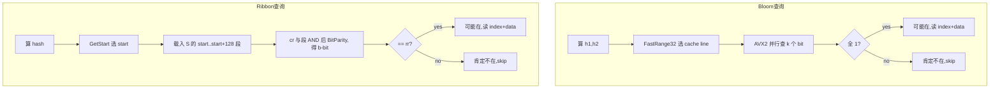
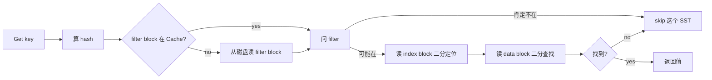

# 第 2 篇 · 第 8 章 · Bloom 与 Ribbon Filter

> **核心问题**:point lookup(点查,一次 `Get`)怎么避免无谓地读那些**根本不含目标 key**的 data block?LSM 把写做成了"只追加",代价是同一个 key 的新旧版本散落在 MemTable、L0 多个文件、L1..Ln 多层,一次 Get 不知道要穿透多少层、读多少个 block。如果没有 filter,你每查一个 key,每一层的每一个候选 SST 都得老老实实把 index block 和 data block 读出来二分——这就是**读放大爆炸**。Bloom filter 是这道墙的解药,但 LevelDB 时代的 DoubleHashing Bloom 在大 SST 下要花 ~10 bits/key 才能压到 1% 假阳率,内存吃紧。RocksDB 在 6.15.0(2021)引入了 **Ribbon Filter**,凭"在 GF(2) 上解一个带状线性方程组"的新思路,用 ~7 bits/key 就做到同样的 1% 假阳率——**省 ~30% 内存**,代价是构造期贵 3~4 倍 CPU。这一章讲清 Bloom 为什么省不动了、Ribbon 凭什么能省、它 sound 在哪,以及 RocksDB 怎么把"用 Bloom 还是 Ribbon"做成一个按 SST 层级动态选择的旋钮。

> **读完本章你会明白**:
> 1. 没有 filter 时 point lookup 的读放大到底有多爆炸,filter 在读路径上卡在哪一关(早退在 index/data 之前)。
> 2. LevelDB 的 Bloom DoubleHashing(`delta=(h>>17)|(h<<15)` 旋转右移 17 位)是怎么用一次哈希派生多个探针位置的,RocksDB 为什么又把它演进成 **FastLocalBloom**(cache-line local + AVX2 向量化)。
> 3. **Ribbon Filter 的数学本质**:它不是"另一种哈希过滤器",而是把"n 个 key 各自产生若干指纹,映射到 ~n 个 solution 位,通过在 GF(2) 上解一个稀疏带状方程组得到 solution 向量"——为什么这套线性代数能把内存逼近信息论下限 **1.44× vs Bloom 的 ~2.12× bytes/key @ 1% FPR**(实测省 ~30%)。
> 4. Ribbon 的 FPR 怎么控(solution 列数 b,每多一列 FPR 减半),构造期为什么比 Bloom 贵(要解方程),查询为什么又回到 O(1)(只做指纹与 solution 段的点积)。
> 5. RocksDB 怎么用 `bloom_before_level` 这个旋钮,让 **flush/L0 用 Bloom、深层 SST 用 Ribbon**——把"构造快"留给频繁重写的浅层,把"省内存"留给长期驻留的深层。

> **如果一读觉得太难**:先只记住三件事——① 没有 filter,point lookup 每层都要老实读 block,读放大爆炸;filter 是"这个 key 大概率不在这"的廉价早退闸。② Bloom 用"多个哈希位置都置 1,查询时都为 1 才算可能在",要 ~10 bits/key @ 1%;Ribbon 用"解一个线性方程组得到 solution 位",只要 ~7 bits/key @ 1%,省 30%,但构造期贵。③ RocksDB 默认让浅层(flush)用 Bloom、深层用 Ribbon,因为深层 SST 大且长寿,省内存最划算。

---

## 〇、一句话点破

> **Filter 的本质是"这个 key 大概率不在这"的廉价早退闸——Bloom 用 k 次哈希投票(都命中才算可能在),Ribbon 用一次指纹和 solution 段的点积(对得上才算可能在);Bloom 的投票机制天生浪费(每个 key 占多个独立位),Ribbon 让每个 key 的指纹在 GF(2) 上"共享" solution 位,从而把内存压到信息论下限附近,省下那 30%。**

这是结论,不是理由。本章倒过来拆:先讲没有 filter 时读放大怎么爆炸,再讲 Bloom 怎么用 k 次哈希投票解题但为什么省不动了,然后讲 Ribbon 怎么用线性代数把内存压下去、sound 在哪,最后讲 RocksDB 怎么把这两者编排成一个按层级选择的旋钮。

---

## 一、没有 filter 时读放大爆炸:为什么必须早退

要理解 filter 解决什么,先看 LSM 里一次 `Get(key)` 不带 filter 是什么光景。

### LevelDB 的基线:一次 Get 穿透多层(承 LevelDB,一句带过)

LSM-tree 的结构《LevelDB》已拆透:MemTable(内存)→ Immutable MemTable(内存)→ L0(多个 SST,区间重叠)→ L1..Ln(每层至多一个文件覆盖某 key,区间有序)。一次 `Get(key)` 的逻辑顺序是:查 active MemTable → 查 Immutable 队列 → 查 L0 各文件(新→旧)→ 查 L1..Ln(每层至多一个候选文件)。

在每个候选 SST 里,要确认 key 在不在,得做两步:① 读 **index block**,二分定位 key 大概在哪个 data block;② 读那个 **data block**,在 block 里二分(或 hash)找 key。问题是,大多数 Get 的 key **根本不在某个候选 SST 里**(一个 64MB 的 SST 可能只有几万个 key,而 LSM 里同一个区间被多层覆盖,key 在每一层的命中率都很低)。

### 没有早退闸的代价:每个候选 SST 都得读 block


每 miss 一次,就读了一对 index + data block。算一笔具体的账:假设 LSM 配 7 层,L0 有 4 个文件,一次 `Get` 命中率最差的链路是 MemTable miss → Immutable miss → L0 的 4 个文件全 miss → L1..L6 各 miss 一个候选 SST。每个候选 SST miss 要读 2 个 block(index + data),最坏 `2 × (4 + 6) = 20` 个 block IO。如果 Block Cache 没命中(大 SST、冷数据常态),这就是 20 次随机磁盘 IO——在 NVMe 上每次 ~100μs,p99 直奔 2ms;在 SATA SSD 上更糟。在线点查场景(QPS 几万到几十万),这个读放大直接把磁盘带宽和 p99 延迟打爆,而且**全是无用功**——绝大多数被读的 block 里根本就没有目标 key。

> **反面对比**:想象一下数据库的 B+ 树点查。B+ 树虽然写慢(随机写),但点查只要从根走到叶,3~4 层就是 3~4 次 IO,而且每次 IO 都"有意义"(沿搜索路径)。LSM 不带 filter 时,点查要扫多层且每层都是"盲目读 block 看在不在",读放大远超 B+ 树。filter 就是把这个"盲目读"变成"先廉价地问一下,大概率不用读"——它是 LSM 在读路径上对抗 B+ 树的关键武器。

> **不这样会怎样**:如果没有 filter,LSM 的 point lookup 读放大基本等于"层数 + L0 文件数",一次 Get 几十个 block IO 是常态。这正是 LevelDB 也必须上 Bloom filter 的根本原因——**filter 不是优化,是 LSM 的必需品**。LevelDB 用 Bloom DoubleHashing 在每个 SST 末尾存一个 filter block,查询时先问 filter:"这个 key 大概率在不在这?"filter 说"不在这",就直接 skip 这个 SST,不读 index、不读 data。

### filter 卡在读路径的哪一关

filter block 在 SST 里的位置(P2-06 讲过):footer → metaindex → filter block。查询顺序是:① 算 key 的 hash;② 在 filter block 里问一下;③ filter 说"可能在"才去读 index → data;④ filter 说"不在这"直接返回这一层 miss。

> **钉死这件事**:filter 的全部价值就是**廉价早退**——它必须比"读 index + 读 data"便宜得多,否则没意义;它允许假阳(filter 说"可能在"但其实不在,白读一次 block),但**绝不允许假阴**(filter 说"不在"就真的不在,否则会丢数据)。所以 filter 的设计目标是:在"零假阴"前提下,把假阳率(FPR)压到可接受(默认 1%),同时把每个 key 占的内存(bits/key)压到最小。

这章剩下的话,全在回答一个问题:**怎么把 bits/key 压下去,同时零假阴**。

---

## 二、Bloom 的投票机制:为什么省不动了

Bloom filter 是 1970 年的老古董,思路极其朴素:**用 k 次哈希投票**。

### LevelDB 的 DoubleHashing:一次哈希派生 k 个位置(承 LevelDB)

朴素 Bloom 要算 k 个独立的哈希,贵。LevelDB(以及绝大多数工业 Bloom)用 **DoubleHashing** 技巧:只算一次哈希 h,然后做一个固定的旋转得到增量 delta,第 i 个探针位置就是 `h + i*delta`。LevelDB 的实现([`util/bloom_impl.h:366`](../rocksdb/util/bloom_impl.h#L366),`LegacyNoLocalityBloomImpl::AddHash`):

```cpp
// (源码原文,util/bloom_impl.h:364-372)
static inline void AddHash(uint32_t h, uint32_t total_bits, int num_probes,
                           char* data) {
  const uint32_t delta = (h >> 17) | (h << 15);  // Rotate right 17 bits
  for (int i = 0; i < num_probes; i++) {
    const uint32_t bitpos = h % total_bits;
    data[bitpos / 8] |= (1 << (bitpos % 8));
    h += delta;
  }
}
```

`delta = (h >> 17) | (h << 15)` 就是把 32 位哈希**循环右移 17 位**——这样 delta 和 h 在位级别上相关性低,接近"第二个独立哈希"的效果。探针数 `num_probes = bits_per_key * 0.69`(`0.69 ≈ ln(2)`,见 [`util/bloom_impl.h:358`](../rocksdb/util/bloom_impl.h#L358))。这一套 DoubleHashing 在 LevelDB 那本已拆到源码级,本书一句带过,详见《LevelDB》Bloom 章 / [[leveldb-source-facts]]。

> **LevelDB 是写死的,RocksDB 打开成了旋钮**:LevelDB 只有一种 Bloom(DoubleHashing,无 locality)。RocksDB 把它演进成三档——① `LegacyBloom`(format_version<5 时用,兼容老 SST);② `FastLocalBloom`(format_version>=5 默认,cache-line local + AVX2);③ ★`Ribbon`(6.15.0 引入,省 30%)。LevelDB 那种"一种 Bloom 焊死",RocksDB 给了三个旋钮 + 一个按层级混合的策略。

### FastLocalBloom:RocksDB 的向量化 Bloom

朴素 DoubleHashing 的探针位置散布在整个位数组里,查询时每个探针都是一次随机内存访问——cache 不友好。RocksDB 的 **FastLocalBloom**(format_version>=5 默认 Bloom,见 [`util/bloom_impl.h:144`](../rocksdb/util/bloom_impl.h#L144) `FastLocalBloomImpl`)的关键改进是:**所有 k 个探针都落在同一个 512-bit(64 字节,一条 cache line)的"桶"里**。

```cpp
// (源码原文,util/bloom_impl.h:200-214)
static inline void AddHash(uint32_t h1, uint32_t h2, uint32_t len_bytes,
                           int num_probes, char* data) {
  uint32_t bytes_to_cache_line = FastRange32(h1, len_bytes >> 6) << 6;
  AddHashPrepared(h2, num_probes, data + bytes_to_cache_line);
}
static inline void AddHashPrepared(uint32_t h2, int num_probes,
                                   char* data_at_cache_line) {
  uint32_t h = h2;
  for (int i = 0; i < num_probes; ++i, h *= uint32_t{0x9e3779b9}) {
    // 9-bit address within 512 bit cache line
    int bitpos = h >> (32 - 9);
    data_at_cache_line[bitpos >> 3] |= (uint8_t{1} << (bitpos & 7));
  }
}
```

- `h1` 用 `FastRange32` 选哪条 cache line(`len_bytes >> 6` 是总 cache line 数,因为每条 64 字节),`<< 6` 还原成字节偏移。
- `h2` 在选中的 cache line **内部**生成 k 个 9-bit 位置(512 = 2^9),每次乘以黄金比例 `0x9e3779b9` 做再混合。
- 查询时(`HashMayMatchPrepared`,[`util/bloom_impl.h:231`](../rocksdb/util/bloom_impl.h#L231))在 AVX2 平台上用 256-bit SIMD 寄存器**一次并行检查最多 8 个探针**(见 [`util/bloom_impl.h:234-333`](../rocksdb/util/bloom_impl.h#L234) 的 `#ifdef __AVX2__` 分支)——k≤8 时一次 SIMD 就判完,没有分支预测惩罚。

> **不这样会怎样**:如果像 LevelDB 那样让探针散布在整个位数组,每次查询 k 次随机 cache line 访问,k=7 时就是 7 次 cache miss,点查延迟被 cache 拖垮。FastLocalBloom 把 k 个探针**压进同一条 cache line**,k 次访问变成 1 次 cache line 载入 + SIMD 内部并行——查询快了一个数量级。代价是 FPR 公式从标准 Bloom 变成"cache-local Bloom"(`BloomMath::CacheLocalFpRate`,[`util/bloom_impl.h:42`](../rocksdb/util/bloom_impl.h#L42)),在桶内挤进太多 key 时 FPR 会比标准 Bloom 略高(论文有建模,实测 10 bits/key、k=6、512-bit 桶时理论最优 0.9535%,FastLocalBloom 做到 0.957%,几乎无损)。

### Bloom 为什么省不动了:投票机制的天花板

Bloom 的 FPR 公式(标准版,见 [`util/bloom_impl.h:32`](../rocksdb/util/bloom_impl.h#L32) `StandardFpRate`):

```
FPR ≈ (1 - e^(-k/bits_per_key))^k
```

这个公式的来历:位数组共 `bits = n × bits_per_key` 位,n 个 key 各打 k 次,共打 `nk` 次。某一位被置 1 的概率是 `1 - (1 - 1/bits)^(nk) ≈ 1 - e^(-k/bits_per_key)`。一个不在集合里的 key 查询时,k 个位置**都**是 1 的概率,就是 FPR 的 `k` 次方。对 bits_per_key 求最优 k(令 `k = bits_per_key × ln2 ≈ 0.693 × bits_per_key`),代入得到不同 FPR 下的 bits/key 下限:

| 目标 FPR | 最优 k | Bloom bits/key(最优) | 信息论下限 bits/key | Bloom 浪费 |
|---|---|---|---|---|
| 10% | 2.8 | 4.92 | 3.32 | 48% |
| 1% | 6.64 | **9.585** | **6.64** | **44%** |
| 0.1% | 9.97 | 14.4 | 9.97 | 44% |
| 0.01% | 13.3 | 19.2 | 13.3 | 44% |

注意两个规律:① **Bloom 的最优 k 等于信息论下限 bits/key**——这不是巧合,是 `k = bits_per_key × ln2` 的直接结果;② Bloom 实际占用永远比下限多 **~44%**(数学常数 `1/ln2 ≈ 1.443`,即 Bloom 的"信息效率"固定是 `ln2 ≈ 69.3%`)。这个 44% 是机制上限,任你怎么优化 Bloom 实现都跨不过。Cache-local Bloom(如 FastLocalBloom)因为把 k 个位置挤进一条 cache line,桶内 key 撞位更严重,实际还要再略多一点(`BloomMath::CacheLocalFpRate` 模型,见 [`util/bloom_impl.h:42`](../rocksdb/util/bloom_impl.h#L42)),所以工业 Bloom 在 1% FPR 下普遍要 **~10 bits/key**(约 1.25 字节)。

为什么多?因为 Bloom 的"投票"机制是 **AND**:一个 key 要 k 个独立位置都为 1 才算"可能在"。这 k 个位置是**为这个 key 专门设的**,别的 key 大概率会撞上其中一些位置,造成假阳。为了让假阳低,每个 key 占的位要足够多(bits/key 要够大),而且 k 个位置之间没有"共享"——每个 key 在位数组里**留下一组独立的痕迹**。这套机制天生浪费:你存的是"痕迹的并集",不是"集合的紧凑编码"。

> **钉死这件事**:Bloom 的 ~1.44× (相对信息论下限的倍数)开销,不是实现问题,是**机制上限**——只要你还用"k 个独立位置投票",就省不下那 44%。要突破,得换一种**不靠独立位置投票**的机制。这就是 Ribbon 的出发点。

---

## 三、Ribbon Filter:用线性代数把内存压下去

Ribbon(Rapid Incremental Boolean Banding ON-the-fly)是 2020 年前后由 Stefan Walzer/Martin Dietzfelbinger 的论文("Efficient Gauss Elimination for Near-Quadratic Matrices with One Short Random Block per Row")启发的过滤器思路,RocksDB 的实现主要出自 Peter C. Dillinger。它不是"另一种 Bloom",而是**从根上换了一套数学**。

### 先建立直觉:Ribbon 是"共享指纹"的过滤器

Bloom 的浪费在于每个 key 的 k 个位置是"独立的、为它专设的"。Ribbon 的思路是:**让所有 key 的指纹在一个共享的 solution 向量里"线性组合"起来**——每个 key 不再独占一组位,而是参与到一个线性方程里,solution 向量的每一位都被多个 key 共享。

类比一下(只这一次,帮助建立直觉):Bloom 像给每个 key 发 k 张独立的"会员卡"(位 1),查询时检查 k 张卡都在不在;Ribbon 像把所有 key 的会员信息**编码进一个共享的密码本**(solution 向量),查询时拿这个 key 的"查询码"和密码本里某一段做一次"解码"(点积),解出来对得上才算会员。密码本的每一位都被很多 key 共享,所以**同样多的位能编码更多 key**。

### Ribbon 的数学:GF(2) 上的带状线性方程组

这是本章最硬的部分,慢慢来。Ribbon 的核心是把"过滤器构造"变成"**在 GF(2) 上解一个线性方程组**"。GF(2) 就是只有 0/1 两个元素、加法是 XOR、乘法是 AND 的域——所有运算都在 bit 上做。

设我们要给 n 个 key 建过滤器。每个 key 经过哈希,产生:

1. 一个**起始列** `start ∈ [0, m-r]`(m 是 solution 向量的位数,r 是一个固定宽度,叫 `kCoeffBits`,RocksDB 用 r=128)。
2. 一个 **r 位的系数行** `cr`(一个 r-bit 的 0/1 串,最低位强制为 1,见后)。
3. 一个 **b 位的结果行** `rr`(b 是 solution 的"列数",也就是结果位数;在过滤器里 `rr` 也是从哈希派生的)。

把所有 key 的方程堆起来,得到一个线性系统(摘自 [`util/ribbon_alg.h:114-119`](../rocksdb/util/ribbon_alg.h#L114) 的注释):

```
   C    *    S    =    R
(n x m)   (m x b)   (n x b)
```

- **C**(coefficient):n 行 m 列,每行是一个 key 的系数行(只有 r 位非零,散布在 `[start, start+r)` 这一段)。
- **S**(solution):m 行 b 列,**这是要解的未知数**,也就是最终存到磁盘的过滤器数据。
- **R**(result):n 行 b 列,每行是对应 key 的结果行 `rr`。

构造过滤器 = 已知 C 和 R,解出 S。查询时,对 key 算它的 `cr` 和 `start`,然后算 `cr` 和 S 的 `[start, start+r)` 这一段的**点积**(GF(2) 上就是 AND 后数 1 的奇偶,即 `BitParity`),得到一个 b-bit 值,再和 key 的 `rr` 比——相等就"可能在",不等就"肯定不在"。

为什么零假阴?因为构造时我们**保证**了:对每个被加入的 key,`cr · S[start..start+r] == rr`(方程被满足)。所以加入的 key 查询必返回 true。假阳只发生在没加入的 key 上:它的 `rr` 是哈希派的,和点积结果碰巧相等的概率是 `1/2^b`——这就是 FPR 的来源。

> **钉死这件事**:Ribbon 的 FPR = `1/2^b`,每多一个 solution 列(b 加 1),FPR 减半。这和 Bloom "多一位/k 加一" 的 FPR 控制完全不同的数学结构——**Ribbon 的 FPR 由 solution 列数 b 直接决定,和 key 数 n 无关**(理论上)。1% FPR 只要 b≈6.64,加上 m/n≈1.05 的 overhead,总 bits/key ≈ 7,比 Bloom 的 9.585 省 30%。

### GF(2) 与 XOR:为什么过滤器能"共享" solution 位

这里需要停一下,把"GF(2)"和"XOR 构造"的关系讲透,因为它是 Ribbon 省 30% 的真正根。

GF(2) 是只有 {0,1} 两个元素的有限域,加法是 XOR(`1+1=0`),乘法是 AND。在 GF(2) 上解线性方程组,和普通线性代数几乎一样,只是把"减法"也换成 XOR——高斯消元的每一步"行变换"(`row_i = row_i XOR row_j`)都是可逆的(XOR 两次回到原值),所以消元过程不丢信息。

现在看 Ribbon 怎么"共享" solution 位。设 solution 向量 S 是 m 位(每位是一个未知数)。每个 key 提供一个方程:这个 key 的系数行 cr(r 位非零)和 S 的某一段 `[start, start+r)` 做"加权求和"(GF(2) 上就是 AND 后 XOR),等于这个 key 的结果 rr。换句话说,**每个 key 的方程约束的是 S 里 r 个位的 XOR 等于 rr 这一位**。

关键洞察:同一个 solution 位 `S[j]` 会被**很多 key 的方程**同时涉及(任何 `start ≤ j < start+r` 的 key 都把 `S[j]` 写进自己的方程)。这就是"共享"——S 的每一位都不是某个 key 的私有数据,而是被一组 key 共同"投票"决定的。只要这组方程线性无关(m/n 略大于 1 时大概率线性无关),就能解出一组 S,同时满足所有 key 的方程。

对比 Bloom:Bloom 的每个 key 独占 k 个位(置 1),这些位虽然也可能被别的 key 置 1,但语义上没有"线性组合",只有"OR 并集"——这就是 Bloom 浪费 44% 的根。Ribbon 把"OR 并集"换成"XOR 线性组合",让每个位承载更多信息(一位参与了多个方程),从而逼近信息论下限。

> **钉死这件事**:Ribbon 不是"更聪明的 Bloom",而是**线性代数对集合编码的胜利**。它把"过滤器构造"问题转化成"GF(2) 上的稀疏线性方程组求解"问题,后者有几百年的数学积累可借用。省 30% 是数学结构的红利,不是工程 hack。

### 为什么是"带状"(band):让方程可解又快

如果让 C 的每一行都是 m 位随机(密),解这个方程组是 O(n^3) 的高斯消元,构造爆炸。Ribbon 的关键设计(来自 Walzer/Dietzfelbinger 论文)是:**每个 key 的系数行只有 r 位非零,而且这 r 位是连续的一段**(`[start, start+r)`)。这样 C 矩阵长得像一条条"带"(见 [`util/ribbon_alg.h:166-177`](../rocksdb/util/ribbon_alg.h#L166) 的 ASCII 图):

```
[####00000000000000000000]   ← key1: start=0, r=4 位非零
[000####00000000000000000]   ← key2: start=3
[0000####0000000000000000]   ← key3: start=4
[0000000####0000000000000]   ← key4: start=7
...
```

(实际 r=128,这里 r=4 仅为示意。每个 `#` 是一个 0/1 系数,由哈希决定。)

这种"每个 key 只在一段 r 位宽的范围里有系数"的结构,叫**带状矩阵**(band matrix)。它的好处是:① 方程组高度稀疏,可以用特殊的"on-the-fly 高斯消元"快速求解;② 求解后能化成**上三角带状**形式,回代(back-substitution)极快且是顺序内存访问。

### on-the-fly 高斯消元:像往哈希表里插一样

RocksDB 的 banding 算法([`util/ribbon_alg.h:546-596`](../rocksdb/util/ribbon_alg.h#L546),`BandingAdd`)有个绝妙的性质——它把高斯消元做成了**类似线性探查哈希表插入**的过程:

```cpp
// (源码原文,util/ribbon_alg.h:546-596,核心 banding 算法)
template <bool kFirstCoeffAlwaysOne, typename BandingStorage,
          typename BacktrackStorage>
bool BandingAdd(BandingStorage* bs, typename BandingStorage::Index start,
                typename BandingStorage::ResultRow rr,
                typename BandingStorage::CoeffRow cr, BacktrackStorage* bts,
                typename BandingStorage::Index* backtrack_pos) {
  using CoeffRow = typename BandingStorage::CoeffRow;
  using Index = typename BandingStorage::Index;
  using ResultRow = typename BandingStorage::ResultRow;

  Index i = start;
  if (!kFirstCoeffAlwaysOne) {
    int tz = CountTrailingZeroBits(cr);
    i += static_cast<Index>(tz);
    cr >>= tz;
  }

  for (;;) {
    assert((cr & 1) == 1);
    CoeffRow cr_at_i;
    ResultRow rr_at_i;
    bs->LoadRow(i, &cr_at_i, &rr_at_i, /* for_back_subst */ false);
    if (cr_at_i == 0) {
      bs->StoreRow(i, cr, rr);                    // 这个位置空,放进去
      bts->BacktrackPut(*backtrack_pos, i);
      ++*backtrack_pos;
      return true;
    }
    assert((cr_at_i & 1) == 1);
    // Gaussian row reduction: 把当前行和已存在的行 XOR 掉首 1
    cr ^= cr_at_i;
    rr ^= rr_at_i;
    if (cr == 0) {
      break;                                      // 线性相关,失败
    }
    int tz = CountTrailingZeroBits(cr);
    i += static_cast<Index>(tz);                  // 往后找下一个非零位
    cr >>= tz;
  }
  return rr == 0;  // rr==0 算冗余(可接受),否则真失败
}
```

逐行讲这个算法(它是 Ribbon 的灵魂):

1. **进入时**,key 的系数行 `cr` 的最低位是 1(`kFirstCoeffAlwaysOne=true`,见 [`table/block_based/filter_policy.cc:642`](../rocksdb/table/block_based/filter_policy.cc#L642) `Standard128Ribbon... kFirstCoeffAlwaysOne = true`),起始位置是 `i = start`。
2. **看位置 i 有没有别的 key 占着**(`LoadRow`)。
   - **空**(`cr_at_i == 0`):直接把 `(cr, rr)` 存进去,这个 key 处理完。这就像哈希表插入遇到空槽。
   - **占着**:把当前行和占着的行做**高斯行变换**——`cr ^= cr_at_i`,`rr ^= rr_at_i`。因为两行的最低位都是 1,XOR 之后最低位的 1 被消掉,`cr` 的首个非零位往后移(可能移 0 位也可能移多位,用 `CountTrailingZeroBits` 找)。然后把 `i` 跳到新的首个非零位,继续尝试插入。
3. **如果 XOR 之后 `cr == 0`**:说明这个 key 的方程和已有方程**线性相关**(没法消出独立行),本次 seed 下构造失败——返回 false,调用方换 seed 重试。

这个过程之所以叫 "on-the-fly" 和 "incremental":**每处理完一个 key,banding 状态都是一个合法的上三角带状矩阵**(对所有已处理 key 的方程组而言)。不需要等所有 key 到齐再消元,边插边消。这让它可以**流式构造**,也支持 backtracking(回滚一批 key,见 [`util/ribbon_alg.h:681-692`](../rocksdb/util/ribbon_alg.h#L681))。

> **不这样会怎样**:如果用朴素高斯消元(对整个 n×m 矩阵),构造一个 10 万 key 的过滤器要 O(n^2 r) 时间和 O(nm) 内存,根本没法用。Ribbon 的 on-the-fly banding 把每行插入做到均摊 O(r)(类似线性探查哈希表,占用率 <95% 时冲突可控),构造整体 O(nr),和 Bloom 的 O(nk) 一个量级——虽然常数大 3~4 倍(因为每行要做 128 位 XOR 和 LoadRow),但能接受。

### 回代(back-substitution):从 banding 到 solution

banding 完成后,得到一个上三角带状矩阵(存系数行和结果行)。接下来是**回代**生成最终的 solution 向量 S(存到磁盘)。RocksDB 的 `InterleavedBackSubst`([`util/ribbon_alg.h:1006-1082`](../rocksdb/util/ribbon_alg.h#L1006))从后往前扫,用已解出的 solution 位去解下一个位。

回代的核心公式(见 [`util/ribbon_alg.h:791-807`](../rocksdb/util/ribbon_alg.h#L791) 的注释和代码):对每一行 i、每一列 j,solution 位 `S[i][j]` 满足"`S[i][j]` 和系数行的点积 == 结果位 `R[i][j]`"。因为 banding 已经把矩阵化成上三角,`S[i][j]` 只依赖比它"靠后"的 solution 位,所以从后往前一行行解出来就行。这里有个漂亮的优化——**用列主存(column-major)的状态缓冲**(`std::array<CoeffRow, kResultBits> state`,见 [`util/ribbon_alg.h:777`](../rocksdb/util/ribbon_alg.h#L777)):因为 r(128)远大于 b(几),按列遍历比按行遍历少很多次状态更新。

### 查询:一次指纹与 solution 段的点积

构造完的过滤器,磁盘上存的是 solution 向量 S(以 InterleavedSolutionStorage 布局,见后)。查询 key 时([`util/ribbon_alg.h:1167-1217`](../rocksdb/util/ribbon_alg.h#L1167),`InterleavedFilterQuery`):

```cpp
// (简化示意,基于 util/ribbon_alg.h:1167-1217)
const CoeffRow cr = hasher.GetCoeffRow(hash);              // key 的 r 位系数
const ResultRow expected = hasher.GetResultRowFromHash(hash); // key 的 b 位期望结果
// 从 solution 里取 [start, start+r) 这一段,和 cr 做点积(AND + BitParity)
// 得到一个 b 位值,和 expected 比,全相等才返回 true
for (Index i = 0; i < num_columns; ++i) {
  CoeffRow soln_data = (LoadSegment(...) & cr_left) ^ (LoadSegment(...) & cr_right);
  if (BitParity(soln_data) != (expected >> i) & 1) {
    return false;  // 任一列对不上,肯定不在
  }
}
return true;
```

查询复杂度:**O(b) 次 segment 载入 + 点积**,b 通常 ≤ 8。和 Bloom 的 O(k) 次探针一个量级,实际测下来查询速度和 FastLocalBloom 相当(都是 cache line 级别的几次内存访问)。

### 走通一个例子:从 key 到"可能在"

用一个具体的(简化)例子把构造和查询串起来,帮助建立直觉。假设 r=8(实际 128,这里缩小)、b=2(即 FPR=1/4=25%,实际几 bit)、m=16 位 solution。要加入 3 个 key:

1. **key_A**:哈希得 `start=0`、`cr=10110001`(r=8 位,最低位强制 1)、`rr=01`(b=2 位)。
2. **key_B**:哈希得 `start=4`、`cr=11001011`、`rr=10`。
3. **key_C**:哈希得 `start=8`、`cr=00101011`、`rr=11`。

**构造(banding)**:
- key_A 插入位置 0,banding 在 `[0]` 存 `(cr=10110001, rr=01)`。
- key_B 插入位置 4,banding 在 `[4]` 存 `(cr=11001011, rr=10)`。
- key_C 插入位置 8,banding 在 `[8]` 存 `(cr=00101011, rr=11)`。
(这三个没冲突,直接落位。实际有冲突时会 XOR 行变换往后找空位。)

**回代**:从位置 15 往前解 solution S(16 位 × 2 列)。位置 8 的方程 `cr=00101011` 约束 `S[8..15]` 的 XOR(按 cr 的 1 位)等于 `rr=11`,解出 S[8..15] 的两列;位置 4 的方程约束 `S[4..11]`,已经知道 S[8..11],解出 S[4..7];位置 0 同理解出 S[0..3]。最终 S 是 16 个 2-bit 值。

**查询 key_X(不在集合里)**:哈希得 `start=2`、`cr=01010101`、`rr=10`(期望)。查询时取 S[2..9] 这 8 位,和 cr 做 AND 后数 1 的奇偶(BitParity),得到一个 2-bit 值。如果这个值碰巧 == 10,假阳(返回"可能在",白读一次 block);否则正确返回"不在"。3 个 key 的方程只约束了 S 的部分位,S 的其它位是"自由"的(回代时填伪随机值,见 `StandardBanding::LoadRow` 的 homogeneous 分支 [ribbon_impl.h:534-539]),所以 key_X 的点积结果基本是随机的——和 `rr=10` 相等的概率就是 1/4,这正是 FPR=1/2^b。

> **钉死这件事**:这个例子虽然 r=8 是缩小的,但每一步都对应当前 RocksDB 的真实代码路径。理解了这个小例子,你就能读懂 `BandingAdd`、`InterleavedBackSubst`、`InterleavedFilterQuery` 这三个核心函数——Ribbon 没有黑魔法,只有"GF(2) 上解带状方程组"这一件干净的事。

> **钉死这件事**:Ribbon 在**查询**上和 Bloom 一样快(O(1)、几次 cache line 访问),贵只在**构造**(要解方程,比 Bloom 慢 3~4 倍 CPU)。而 LSM 里 SST 的构造(Flush/Compaction)是**后台**的,不影响前台查询延迟;构造出的 SST 在磁盘和 Block Cache 里**长期驻留**,省内存的收益是持续的。这就是 Ribbon 的经济账:**用后台多花点 CPU,换前台长期省 30% 内存**——对深层、长寿、巨大的 SST 尤其划算。

---

## 四、Ribbon 凭什么省 30%:信息论与工程的双重账

这一节把"为什么 Ribbon 省 30%"算清楚,这是本章的命脉。

### 信息论账:1.44× vs Bloom 的 ~2.12×(实测 ~30%)

ribbon_alg.h 开头的注释([`util/ribbon_alg.h:44-70`](../rocksdb/util/ribbon_alg.h#L44))把这笔账讲得非常清楚:

- **信息论下限**:表示"n 个 key 的集合,允许 1/2^b 假阳",每个 key 至少需要 `b` bit。也就是说,任何过滤器在 FPR=1/2^b 时,bits/key 的理论下限就是 b 本身(1% FPR 时 b≈6.64)。
- **Bloom 的开销**:标准 Bloom 在 FPR=1% 时需要 ~9.585 bits/key,是下限的 **~1.44 倍**。Cache-local Bloom(如 FastLocalBloom)因为桶内挤占,要 ~1.5 倍。
- **Ribbon 的开销**:Ribbon 让 m/n(solution 位数 / key 数)≈ 1.05(只 5% overhead),每个 key 占 `m/n × b ≈ 1.05 × 6.64 ≈ 7` bits/key——**逼近信息论下限**。相对 Bloom 的 9.585,Ribbon 省 (9.585-7)/9.585 ≈ **27%**,工程实测 **~30%**(因为 Bloom 在小过滤器上还有 rounding 浪费)。

> **不这样会怎样**:这 30% 不是小数目。一个存 1 亿 key 的 SST,Bloom @ 1% 要 ~120MB filter,Ribbon 只要 ~84MB。在线服务里 filter 通常全驻 Block Cache(为了早退快),这 30% 直接是 Block Cache 的 30%——意味着同样的内存能缓存更多 filter、更高命中率、更低 p99。

### 为什么 Ribbon 能逼近下限,而 Bloom 不能

根因在 [`util/ribbon_alg.h:79-106`](../rocksdb/util/ribbon_alg.h#L79) 那段精彩的对比注释,我把它直球讲:

- **Bloom 是 "AND" 构造**:一个 key 要 k 个位置都为 1 才算"可能在"。这 k 个位置是这个 key 的**私有痕迹**,不同 key 的痕迹在位数组里是"并集"。这种结构没有"共享",每个 key 必须占够多独立位才能把假阳压下去——这就是 1.44× 的来源。
- **哈希表/Cuckoo 是 "OR" 构造**:一个 key 关联若干 slot,只要某个 slot 存了它的指纹就算命中。这种结构为了解决碰撞,要额外存"哪个 slot 是我的"——引入 **+1.44 bit/key 的固定开销**(为了隐式构造一个 near-minimal perfect hash)。所以 Cuckoo filter 是 `1.05b + 2` bits/key,那个 +2 就是这个开销。
- **Ribbon 是 "XOR" 构造**:一个 key 的"指纹"不在单个 slot 里,而在**若干 slot 的线性组合(XOR)里**。solution 向量的每一位都被很多 key 共享(每个 key 的方程涉及 r=128 个 solution 位,这些位也被别的 key 的方程涉及)。这种"线性组合共享"既避开了 Bloom 的"私有痕迹"浪费,也避开了 Cuckoo 的"碰撞解决"固定开销——**所以能逼近信息论下限**。

> **钉死这件事**:Ribbon 省 30% 不是工程优化,是**数学结构的胜利**——从 "AND"(Bloom)换到 "XOR"(Ribbon),让每个 key 的指纹在共享的 solution 向量里线性组合,从而不浪费任何一位在"私有痕迹"或"碰撞元数据"上。这是 2020 年前后过滤器理论的实质进步,RocksDB 是最早把它工业级落地的 LSM 引擎之一。

### 工程账:为什么深层 SST 用 Ribbon 最划算

但 Ribbon 不是免费的午餐,它有代价:

1. **构造 CPU 贵 3~4 倍**:要解方程组,每行做 128 位 XOR 和 LoadRow,比 Bloom 的"置 k 个位"贵。filter_policy.h 的官方注释([`include/rocksdb/filter_policy.h:170-173`](../rocksdb/include/rocksdb/filter_policy.h#L170))原话:"roughly 3-4x CPU time and 3x temporary space usage during construction"。
2. **构造临时内存 3x**:banding 期间要存 n 个系数行(每行 r=128 bit = 16 字节)和 n 个结果行,是 Bloom 构造内存的 ~3 倍。官方注释([`include/rocksdb/filter_policy.h:201-205`](../rocksdb/include/rocksdb/filter_policy.h#L201)):"for 100 million keys in a single filter, 3GB of temporary, untracked memory is used, vs. 1GB for Bloom"。
3. **小规模收益小**:n 很小(几百 key)时,Ribbon 的 overhead 因子(m/n)比大 n 时高(见后 ribbon_config 数据),省的比例没那么大。

这三个代价决定了 Ribbon 的**最佳应用场景**:① SST 大(key 多,m/n overhead 低);② SST 长寿(构造 CPU 是一次性的,省内存是长期的);③ 构造在后台(不影响前台延迟)。这三个条件**完美描述 LSM 的深层 SST**(L5/L6 那种几十 GB、长期不变的大文件)。

反过来,**浅层 SST**(L0、刚 Flush 的 L1)的特点是:① 小(刚 Flush,几 MB 到几十 MB);② 短命(很快被 Compaction 合掉重写);③ 频繁构造。这三个条件让 Bloom 的"构造快"优势压过 Ribbon 的"省内存"优势。

> **所以这样设计**:RocksDB 的 `RibbonFilterPolicy` 提供了一个旋钮 `bloom_before_level`,默认 0——意思是 **flush(被视为 level -1)和 L0 用 Bloom,深层用 Ribbon**。这是 LSM 经济学的精确体现:把"构造快"留给频繁重写的浅层,把"省内存"留给长期驻留的深层。

---

## 五、RocksDB 怎么编排:Bloom/Ribbon 按层级混合

讲完了 Bloom 和 Ribbon 各自的数学,现在看 RocksDB 怎么把它们组装成一个可调旋钮。源码在 [`table/block_based/filter_policy.cc`](../rocksdb/table/block_based/filter_policy.cc)。

### FilterPolicy 工厂:NewBloomFilterPolicy vs NewRibbonFilterPolicy

用户接口([`include/rocksdb/filter_policy.h`](../rocksdb/include/rocksdb/filter_policy.h)):

- `NewBloomFilterPolicy(bits_per_key)`:只建 Bloom filter(具体用 Legacy 还是 FastLocalBloom 取决于 format_version,见 [`table/block_based/filter_policy.cc:1481-1491`](../rocksdb/table/block_based/filter_policy.cc#L1481) `BloomFilterPolicy::GetBuilderWithContext`)。format_version<5 用 LegacyBloom(兼容老格式),format_version>=5 用 FastLocalBloom。
- `NewRibbonFilterPolicy(bloom_equivalent_bits_per_key, bloom_before_level=0)`:这是混合策略。`bloom_equivalent_bits_per_key` 是"等效 Bloom bits/key"——传 10 表示"想要 Bloom 10 bits/key 那种 0.95% FPR",Ribbon 内部会换算成自己需要的 ~7 bits/key。`bloom_before_level` 控制哪一层以下用 Bloom。

### bloom_before_level 旋钮:按层级选择

核心选择逻辑在 [`table/block_based/filter_policy.cc:1840-1882`](../rocksdb/table/block_based/filter_policy.cc#L1840),`RibbonFilterPolicy::GetBuilderWithContext`:

```cpp
// (源码原文,table/block_based/filter_policy.cc:1840-1882)
FilterBitsBuilder* RibbonFilterPolicy::GetBuilderWithContext(
    const FilterBuildingContext& context) const {
  if (GetMillibitsPerKey() == 0) {
    return nullptr;                          // "不要 filter" 特例
  }
  int levelish = INT_MAX - 1;                // 未知层级当 bottommost 处理
  int bloom_before_level = bloom_before_level_.load(std::memory_order_relaxed);
  if (bloom_before_level < INT_MAX) {
    switch (context.compaction_style) {
      case kCompactionStyleLevel:
      case kCompactionStyleUniversal: {
        if (context.reason == TableFileCreationReason::kFlush) {
          assert(context.level_at_creation == 0);
          levelish = -1;                     // flush 当作 level -1
        } else if (context.level_at_creation == -1) {
          assert(levelish == INT_MAX - 1);   // 未知层级
        } else {
          levelish = context.level_at_creation;
        }
        break;
      }
      case kCompactionStyleFIFO:
      case kCompactionStyleNone:
        assert(levelish == INT_MAX - 1);     // 当 bottommost
        break;
    }
  } else {
    assert(levelish < bloom_before_level);   // INT_MAX == 永远 Bloom
  }
  if (levelish < bloom_before_level) {
    return GetFastLocalBloomBuilderWithContext(context);   // 浅层用 Bloom
  } else {
    return GetStandard128RibbonBuilderWithContext(context); // 深层用 Ribbon
  }
}
```

逐句讲:

1. **flush 当作 level -1**(`levelish = -1`)。这是关键设计——Flush 产出的 L0 文件是最"浅"的,默认 `bloom_before_level=0`,所以 `-1 < 0` 成立,**Flush 一定用 Bloom**。
2. **Compaction 产出的 SST**,`levelish = context.level_at_creation`(0、1、2、……)。默认 `bloom_before_level=0`,所以 `0 < 0` 不成立、`1 < 0` 不成立……**所有 Compaction 产出的 SST 都用 Ribbon**。
3. **FIFO/None 风格**:没有清晰的"深层"概念,默认当 bottommost 处理,用 Ribbon。
4. **用户可调**:把 `bloom_before_level` 调成 `INT_MAX`,所有层都 Bloom(适合写极多、浅层主导、不想付 Ribbon 构造 CPU 的场景);调成 `-1`,所有层都 Ribbon(适合读多、深层主导、内存敏感场景);调成 `2`,L0/L1 用 Bloom,L2+ 用 Ribbon(折中)。

> **LevelDB 是写死的,RocksDB 打开成了旋钮**:LevelDB 只有一种 Bloom,所有 SST 都用它。RocksDB 不仅给了 Bloom(两档)+ Ribbon(一档)三种实现,还给了一个**按 SST 层级动态选择**的策略——这是"把固定点变成可调曲线"的教科书级体现:LevelDB 焊死"Bloom for all",RocksDB 让你按 workload 在"Bloom for shallow, Ribbon for deep"这条曲线上找点。

### Ribbon 失败时的 Bloom 兜底

Ribbon 构造不是 100% 成功的——方程组可能线性相关(尤其 key 数接近 slot 数时)。RocksDB 的处理([`table/block_based/filter_policy.cc:751-763`](../rocksdb/table/block_based/filter_policy.cc#L751)):先尝试最多 256 个 seed(`ResetAndFindSeedToSolve` 的 `seed mask = 255`,见 [`table/block_based/filter_policy.cc:754`](../rocksdb/table/block_based/filter_policy.cc#L754));如果 256 个 seed 都失败(极罕见),**退化到 Bloom**(`bloom_fallback_`,见 [`table/block_based/filter_policy.cc:760-762`](../rocksdb/table/block_based/filter_policy.cc#L760))。这个兜底保证了 Ribbon 永远不会"构造不出过滤器"。

> **钉死这件事(sound)**:Ribbon 的 sound 体现在三道防线:① 数学上,只要 m/n 足够大(默认配置 ~1.05),方程组有解的概率随 seed 数指数上升,256 个 seed 失败概率是天文数字分之一;② 工程上,即使 256 seed 都失败,退化到 Bloom,保证过滤器一定存在;③ 零假阴由构造保证(加入的 key 方程必满足),假阳由 b 控制(FPR=1/2^b)。这三道防线让 Ribbon 在生产中和 Bloom 一样可靠。

---

## 五·补、Ribbon 构造的工程细节:seed、布局、磁盘格式

数学讲完了,这一节补上构造侧的工程细节——这些细节决定了 Ribbon 在生产里稳不稳、快不快。

### seed 重试:256 个候选 seed,失败退 Bloom

Ribbon 构造不是确定性成功的——同一批 key,seed A 可能线性相关(无解),seed B 就可能有解。RocksDB 的策略([`util/ribbon_impl.h:654-678`](../rocksdb/util/ribbon_impl.h#L654),`ResetAndFindSeedToSolve`)是:**最多试 256 个 seed**,每个 seed 重新 banding,谁先成功用谁。

```cpp
// (简化示意,基于 util/ribbon_impl.h:654-678)
bool ResetAndFindSeedToSolve(Index num_slots, InputIterator begin,
                             InputIterator end,
                             Seed starting_ordinal_seed = 0U,
                             Seed ordinal_seed_mask = 63U) {
  Seed cur = starting_ordinal_seed;
  do {
    SetOrdinalSeed(cur);
    Reset(num_slots);
    if (AddRange(begin, end)) return true;        // 这个 seed 解出来了
    cur = (cur + 1) & ordinal_seed_mask;
  } while (cur != starting_ordinal_seed);
  return false;                                    // 256 个 seed 全失败
}
```

实际 RocksDB 调用时传的 mask 是 255(见 [`table/block_based/filter_policy.cc:754`](../rocksdb/table/block_based/filter_policy.cc#L754)),也就是 256 个 seed。配合 m/n≈1.05 和 r=128,单 seed 成功率 >95%(kOneIn20),256 个 seed 综合失败概率 < 10^-12——天文数字分之一。万一真的全失败(配置错误或极端坏运气),`Standard128RibbonBitsBuilder::Finish` 把这批 key 转交给内置的 `bloom_fallback_`(一个 FastLocalBloom builder,见 [`table/block_based/filter_policy.cc:669`](../rocksdb/table/block_based/filter_policy.cc#L669) 和 761 行的退化逻辑),保证过滤器一定能造出来。

**seed 的存储**:成功的 seed(0~255)写进 filter block 的 metadata(见下),查询时读出来重新初始化 StandardHasher,保证查询和构造用同一组哈希。这里有个精巧的细节——StandardHasher 内部存的是 **raw_seed**(64 位),但对外暴露的是 **ordinal_seed**(6~8 位,顺序枚举),两者用一个轻量可逆的位混合互相转换([`util/ribbon_impl.h:340-369`](../rocksdb/util/ribbon_impl.h#L340),`SetOrdinalSeed`/`GetOrdinalSeed`)。这样 metadata 只存 1 字节 ordinal seed,查询时还原成 64 位 raw seed,省空间又不丢哈希质量。

### InterleavedSolutionStorage:大尺度行存、小尺度列存的混合布局

solution 矩阵 S(m 行 b 列)怎么存到磁盘?朴素有两种:① **行主存**(一行 b 位连续),查询要读 r 个不同行,跨 cache line;② **列主存**(一列 m 位连续),查询要读 b 个不同位置,也跨 cache line。Ribbon 的 r(128)远大于 b(几),两种朴素布局都不理想。

RocksDB 的 **InterleavedSolutionStorage**([`util/ribbon_alg.h:875-931`](../rocksdb/util/ribbon_alg.h#L875) 注释 + [`util/ribbon_impl.h:818-1118`](../rocksdb/util/ribbon_impl.h#L818) 实现)是混合:**大尺度按"块"(block = r 行)排列,块内按列主存**。一个 block 是 r 行 × b 列,存成 b 个连续的 r-bit(CoeffRow)segment。查询时,一个 key 的 start 落在某个 block 的中间,涉及 `[start, start+r)` 跨**至多两个相邻 block**——这两个 block 在磁盘上相邻,通常跨 1~3 条 cache line。

```
InterleavedSolutionStorage 布局(b=4,每个 Segment = 1 个 CoeffRow = 128 bit = 16 字节)

 ┌──────────────────────┐
 │   Segment  col=0     │  ← block N 的第 0 列(128 位)
 ├──────────────────────┤
 │   Segment  col=1     │  ← block N 的第 1 列
 ├──────────────────────┤
 │   Segment  col=2     │
 ├══════════════════════┤  ← block 边界
 │   Segment  col=0     │  ← block N+1 的第 0 列
 ├──────────────────────┤
 │   Segment  col=1     │
 ├──────────────────────┤
 │   ...                │
 └──────────────────────┘
 查询:start 落在 block N 中间,cr 要和 [start, start+128) 段做点积
       → 跨 block N 的尾部 + block N+1 的头部(相邻,1~3 cache line)
```

查询时([`util/ribbon_alg.h:1167-1217`](../rocksdb/util/ribbon_alg.h#L1167) `InterleavedFilterQuery`):把 cr 左移 start_bit 位,和当前 block 的 segment AND+BitParity;再把 cr 右移,和下一个 block 的 segment AND+BitParity;两部分 XOR 起来就是这个列的 solution 位贡献。b 个列各算一次,和 expected 比,全等才算"可能在"。

**负查询(不在集合里)的早退**:Ribbon 的 negative query 不必算完所有 b 列——任一列的 BitParity 和 expected 对不上就立即返回 false(见 [`util/ribbon_alg.h:1196`](../rocksdb/util/ribbon_alg.h#L1196))。大多数负查询在前 1~2 列就早退,平均开销远小于 b 次。这是 InterleavedSolutionStorage 列主存带来的红利——行主存做不到这种"按列早退"。

### 磁盘格式:5 字节 metadata 尾 + marker 分发

构造完的 filter block 在磁盘上的格式(filter_policy.cc 里 `kMetadataLen = 5`):

| 实现 | 尾 5 字节布局 | marker 值 |
|---|---|---|
| LegacyBloom(format_version<5) | 4 字节 num_lines + 1 字节 num_probes(正数) | num_probes(1~30) |
| FastLocalBloom(format_version>=5) | marker + 1 字节 0 + 2 字节 len + 1 字节 num_probes | **-1**([`table/block_based/filter_policy.cc:448`](../rocksdb/table/block_based/filter_policy.cc#L448)) |
| Standard128Ribbon | marker + 1 字节 seed + 3 字节 num_blocks | **-2**([`table/block_based/filter_policy.cc:809`](../rocksdb/table/block_based/filter_policy.cc#L809)) |

读取时([`table/block_based/filter_policy.cc:1662-1698`](../rocksdb/table/block_based/filter_policy.cc#L1662)),`GetFilterBitsReader` 先读最后一字节(强转 `int8_t raw_num_probes`):正数是 LegacyBloom 的 num_probes,`-1` 走 FastLocalBloom reader,`-2` 走 Standard128Ribbon reader。这个 marker 设计让**任何内置 FilterPolicy 都能读任何内置 filter 格式**——filter_policy.h 第 95 行明说:"All built-in FilterPolicies (Bloom or Ribbon) are able to read other kinds of built-in filters."。这就是为什么 Ribbon 从 6.15.0 上线后能平滑替换 Bloom:老 SST 还是 Bloom 格式,新 SST 写 Ribbon,同一个 reader 都能读,过渡零摩擦。

> **钉死这件事**:Ribbon 的工程化不只"解个方程",而是 seed 重试机制(保成功)、Interleaved 布局(保查询快)、marker 分发(保跨格式兼容)三件套配套上——这才是它能进生产 LSM 的原因。数学给的是上限,工程给的是可达性,RocksDB 把两者都做扎实了。

---

## 六、演进史:Ribbon 怎么从实验特性变成大 SST 默认推荐

理解一个特性"为什么这么设计",离不开它的演进史。Ribbon 在 RocksDB 的落地经过了好几个版本(以下节点来自 RocksDB 的 HISTORY.md 实测):

- **6.6.0(2019 末)**:FastLocalBloom 上线(format_version=5),把 cache-line local + AVX2 的向量化 Bloom 做成默认。这是 Bloom 在 RocksDB 里的"最后一次自我进化"——已经逼近 Bloom 的信息上限(~10 bits/key @ 1%),再省不动了。
- **6.9.0(2020 中)**:★**实验性 Ribbon**(`NewExperimentalRibbonFilterPolicy`)首次引入(HISTORY 原文:"An EXPERIMENTAL new Bloom alternative that saves about 30% space compared to Bloom filters, with about 3-4x construction time and similar query times")。当时 API 还带 Experimental 前缀,只敢给早期用户试用。
- **6.13.0**:`optimize_filters_for_memory` 开始兼容 Ribbon(fractional bits/key 那套)。
- **6.14.0**:**hybrid 配置上线**——`bloom_before_level` 选项加入,默认行为改成"flush/L0 用 Bloom,深层用 Ribbon"(HISTORY 第 1715 行)。这是 Ribbon 真正大规模铺开的关键——用户不用做选择题,RocksDB 按层级自动选最优。
- **6.15.0**:**Ribbon filter 的 SST schema 长期稳定**(HISTORY 第 1848 行:"Made the Ribbon filter a long-term supported feature in terms of the SST schema, compatible with version >= 6.15.0")。这是它从"实验"变"正式"的里程碑——磁盘格式固化,以后版本保证能读。
- **6.17.0**:**production-ready**(HISTORY 第 1764 行:"Marked the Ribbon filter and optimize_filters_for_memory features as production-ready"),`NewExperimentalRibbonFilterPolicy` 改名 `NewRibbonFilterPolicy`。
- **6.18.0+**:MultiGet 批量查询的内存预取优化、detect_filter_construct_corruption(构造期损坏检测)、cache reservation(构造内存算进 block cache 预算)陆续加入。

这条演进路径透露了几个工程智慧:① **新过滤器先"实验"几个版本**——Ribbon 的数学虽然漂亮,但工程稳定性(seed 失败率、跨平台表现、和 partitioned filter 的配合)要靠真实用户跑出来;② **schema 兼容是底线**——6.15.0 之前不保证磁盘格式稳定,6.15.0 才钉死,这是 LSM 引擎对"数据持久化"的敬畏;③ **hybrid 比纯替换更聪明**——RocksDB 没有粗暴地用 Ribbon 全替 Bloom,而是用 `bloom_before_level` 让两者各司其职(浅层 Bloom 快、深层 Ribbon 省),这是对 LSM 经济学的深刻理解。

> **反哺 TiKV**:TiKV 的单机引擎是 RocksDB,它的 SST filter 策略直接继承 RocksDB。理解了本章,你回看 TiKV 的 RocksDB 调优文档里"为什么大 Region 的读延迟靠 Ribbon 省 30% 内存"会有"原来如此"。P7-23 收束会专门讲 RocksDB 在 TiKV/MySQL/Kafka 里的落地。

---

## 七、技巧精解:Ribbon 的线性系统直觉与配置参数

这一节把 Ribbon 最硬的两个技巧单独拆透:① 线性系统的"为什么 sound"直觉;② RocksDB 怎么用查表 + 公式推导 m/n overhead,以及 fractional bits/key 的精妙。

### 技巧一:为什么 GF(2) 带状方程组"刚好够用"——线性系统的 sound 直觉

要真正理解 Ribbon 凭什么 sound(不丢数据、FPR 可控、能构造出来),得建立三个直觉。

**直觉 1:n 个方程 n 个未知数,大概率有解。** Ribbon 设 m(未知数=solution 位数)略大于 n(key 数),m/n ≈ 1.05。在 GF(2) 上,n 个随机方程配 m 个未知数,方程组满秩(有解)的概率随 m/n 增大而上升。Walzer/Dietzfelbinger 论文证明:当每个方程只在一段 r 位宽的范围里非零(带状),且 r 足够大(r=128),m/n=1.05 时单 seed 成功率在 n=1万~1千万区间都很高(>95%)。这就是 Ribbon 敢用 m/n≈1.05 的数学依据。

**直觉 2:r 越大,可扩展性越好。** ribbon_alg.h 的注释([`util/ribbon_alg.h:226-236`](../rocksdb/util/ribbon_alg.h#L226))讲:r=64 只能扩到 ~1 万 key(同 overhead 下),r=128 能扩到 ~1 千万 key。RocksDB 选 r=128(`Standard128Ribbon` 用 `CoeffRow = Unsigned128`,见 [`table/block_based/filter_policy.cc:644`](../rocksdb/table/block_based/filter_policy.cc#L644)),正好覆盖 SST Bloom 的典型规模(1 万~10 万 key/文件)。超过 1 千万 key 的超大过滤器,RocksDB 用 partitioned filter(把过滤器自己分页,P2-07 讲过)拆成多个小 Ribbon 系统。

**直觉 3:on-the-fly banding 的"不覆盖"性质保证可回溯。** 看 `BandingAdd` 的代码:它**从不覆盖**已占用的行——遇到占用就 XOR 后往后找空行(`if (cr_at_i == 0) { StoreRow; return true; }`)。这意味着任何一行一旦写入,它的内容就是最终 banding 矩阵的一部分(不会被改写)。这个性质让 backtracking 极其廉价——只要记下"这批 key 写了哪些行",回滚时把那些行清零即可([`util/ribbon_alg.h:681-692`](../rocksdb/util/ribbon_alg.h#L681))。

> **反面对比**:如果像朴素高斯消元那样允许覆盖行(行变换改写已有行),回溯就要保存整个矩阵快照,O(nm) 内存。Ribbon 的"不覆盖"设计让回溯 O(batch size),这才是 `AddRangeOrRollBack` 能用在大规模 filter 构造的原因。

**直觉 4:m/n 必须略大于 1,但只要略大于 1 就够。** 这是 Ribbon 最反直觉的地方。直觉上,n 个方程 n 个未知数"刚好够",但 GF(2) 上随机方程组在 m=n 时有解概率只有 ~30%(矩阵奇异概率随 n 趋向某个常数);m/n 涨到 1.05,配合 r=128,单 seed 成功率就 >95%;涨到 1.2,构造时间反而最优(因为 collision 少,banding 快,见 [`util/ribbon_alg.h:283-287`](../rocksdb/util/ribbon_alg.h#L283) "At m/n ~= 1.2, which still saves memory substantially vs. Bloom filter's 1.5, construction speed is not far from sorting speed")。RocksDB 选 m/n≈1.05 是内存和成功率的折中——再多花内存不如直接 1.2 换构造速度。这个"1.05"不是拍脑袋,是 ribbon_config.cc 那张查表 + 公式外推算出来的最优工作点。

> **为什么不直接 m=n**:因为 GF(2) 上的 n×n 随机矩阵奇异概率 ≈ 28.9%(随着 n 增大趋于 1 - ∏(1 - 2^-i) ≈ 0.711),也就是近三成概率无解。多 5% 的 slot(m/n=1.05)把这概率压到 < 5%,再配合 256 个 seed,工程上等于"总有解"。这是 Ribbon 在"内存逼近下限"和"构造一定能成"之间的精确平衡点。

### 技巧二:配置参数——查表 + 公式推导 m/n overhead

Ribbon 构造前要先算"给定 n 个 key,要多少 slot(m)才能让成功率达标"。这个问题没有闭式解,RocksDB 的做法是**实测查表 + 大规模公式外推**,在 [`util/ribbon_config.cc`](../rocksdb/util/ribbon_config.cc)。

**查表部分**:`BandingConfigHelperData`([`util/ribbon_config.cc:15-76`](../rocksdb/util/ribbon_config.cc#L15))为每个配置(CFC × r × smash)存了 2^0 到 2^17 个 slot 能装下多少 key 的实测数据(从 `ribbon_test` 的 `FindOccupancy` 跑出来的,见注释)。比如 r=128、kOneIn2(50% 成功率)、不开 smash 的数据([`util/ribbon_config.cc:81-100`](../rocksdb/util/ribbon_config.cc#L81)):2^17 个 slot 装 128274 个 key——overhead = 131072/128274 ≈ 1.022,只 2.2%。

**公式外推部分**:slot 数超过 2^17 后,用对数线性公式([`util/ribbon_config.cc:34-41`](../rocksdb/util/ribbon_config.cc#L34)):

```cpp
static inline double GetFactorPerPow2() {
  if (kCoeffBits == 128U) {
    return 0.0038;        // r=128: 每翻倍 overhead 涨 0.38%
  } else {
    assert(kCoeffBits == 64U);
    return 0.0083;        // r=64: 每翻倍 overhead 涨 0.83%
  }
}
```

这告诉我们:r=128 时,slot 数每翻一倍,overhead(m/n)只涨 0.38%——所以**规模越大,Ribbon 越省**(overhead 越逼近 1.0)。这也是 Ribbon 适合大 SST 的数学依据。r=64 涨得快(0.83%/翻倍),所以 r=64 只能扩到 1 万 key,r=128 能扩到 1 千万 key。

**SuccessFailureChance 三档**:`ConstructionFailureChance` 枚举([`util/ribbon_config.h:42-50`](../rocksdb/util/ribbon_config.h#L42)):`kOneIn2`(50% 单 seed 成功,最省内存但要更多 seed 重试)、`kOneIn20`(5% 失败,折中)、`kOneIn1000`(0.1% 失败,最稳但 overhead 大)。RocksDB 的 `Standard128Ribbon` 用 `kHomogeneous=false`,默认 `kOneIn20`(见 [`util/ribbon_config.h:132-133`](../rocksdb/util/ribbon_config.h#L132))——配合 256 个 seed 重试,综合成功率接近 100%。

### 技巧三:fractional bits/key——任意字节数都能塞

这是 Ribbon 区别于 Bloom 的一个隐藏优势。Bloom 的 bits/key 必须是"整数 bit 级别"调整(改 k),粒度粗。Ribbon 的 InterleavedSolutionStorage 布局([`util/ribbon_alg.h:875-931`](../rocksdb/util/ribbon_alg.h#L875))支持**前半部分用 b-1 列、后半部分用 b 列**的混合——这样任意字节数(只要 是 16 字节的倍数)都能精确利用,不浪费。代价是 FPR 比理论最优略高 ~1.5%(见 [`util/ribbon_alg.h:352-357`](../rocksdb/util/ribbon_alg.h#L352) 注释),但能省下 jemalloc 分配 rounding 的 ~10% 内存(配合 `optimize_filters_for_memory` 选项)。

这个技巧的查询实现([`util/ribbon_alg.h:1167-1217`](../rocksdb/util/ribbon_alg.h#L1167) `InterleavedFilterQuery`):根据 key 的 start 落在"b-1 列区"还是"b 列区",查不同数量的 segment。`InterleavedPrepareQuery`([`util/ribbon_alg.h:1085-1124`](../rocksdb/util/ribbon_alg.h#L1085))预先算好这个分支(用 `(start_block_num < upper_start_block) ? 1 : 0` 做无分支选择,见 [`util/ribbon_alg.h:1112`](../rocksdb/util/ribbon_alg.h#L1112)),避免查询时有条件分支。

> **钉死这件事**:Ribbon 不是"在 Bloom 上做小优化",它是**换了一套数学底层**(GF(2) 带状线性系统)。这套底层带来三个 Bloom 做不到的能力:① 内存逼近信息论下限(省 30%);② 规模越大 overhead 越低(适合大 SST);③ fractional bits/key(任意字节数精确利用)。代价是构造 CPU 贵 3~4 倍——这个代价在 LSM 的"后台构造、前台查询"模型下完全可接受。

---

## 八、配图:Bloom vs Ribbon 的数据结构与查询流程

### Bloom 的位数组(投票机制)

```
Bloom filter(FastLocalBloom,k=6, cache line = 512 bit = 64 字节)

选 cache line:h1 --FastRange32--> 第 i 条 cache line
   ┌──────────────────────────────────────────────────────────────┐
   │ cache line i  (512 bit)                                       │
   │  h2*1   h2*φ  h2*φ²  h2*φ³  h2*φ⁴  h2*φ⁵   ...空闲...         │
   │   ↓      ↓     ↓      ↓      ↓      ↓                          │
   │ [bit]=1 [bit]=1 [bit]=1 [bit]=1 [bit]=1 [bit]=1  ...0...       │
   └──────────────────────────────────────────────────────────────┘
查询:6 个位置都为 1 才"可能在"(AND);AVX2 一次 SIMD 查 8 个
```

### Ribbon 的方程组与 solution(线性系统)

```
Ribbon filter(r=128, b=7, m/n≈1.05)

构造:解 GF(2) 带状方程组  C · S = R
   C(n×m)            S(m×b)           R(n×b)
  [####00000000...]  [s0  ]           [r0 ]   ← key1: start=0,cr 的 4 位非零
  [000####00000...]  [s1  ]           [r1 ]   ← key2: start=3
  [0000####0000...]  [..  ] =         [r2 ]   ← key3: start=4
  [0000000####0...]  [s127]           [.. ]   ← key4: start=7
  [.............]    [...]            [rn-1]
   每行只 r=128 位非零(带状),稀疏,on-the-fly 高斯消元 O(nr)

查询:key 的 cr(128 bit)与 S 的 [start, start+128) 段做点积(AND+BitParity)
      得到 b-bit 值,与 key 的 rr 比,相等才"可能在"
      FPR = 1/2^b  (b=7 时约 0.78%)
```

### 查询流程对比(mermaid)



两者查询都是 O(1)、几次 cache line 访问,实测延迟相当。差别在内存(bits/key)和构造 CPU。

### filter 在读路径全链路的位置(衔接 P3-11)

把 filter 放回一次 `Get` 的完整读路径里看它的位置(详见 P3-11):



注意 filter 的位置在 **index block 之前**——filter 说"不在",连 index 都不读,直接 skip 这个 SST。这是 filter 价值的最大化:用一次 cache line 级的 filter 查询,省下"index + data"两次 block IO。filter block 本身通常全驻 Block Cache(P2-07 讲过 cache_entry_roles 把 filter 列为高优先级 pin),所以 filter 查询本身基本不 miss cache。

> **钉死这件事**:filter 的存在让 LSM 的 point lookup 读放大从"层数 × 2 个 block"降到"层数 × 1 次 cache line 查询 + 命中层 × 2 个 block"。前者是几十次 IO,后者是几次 cache 访问 + 少量真实 IO——这就是 filter 让 LSM 在点查上能和 B+ 树掰手腕的根本原因。

---

## 九、源码地图(11.6.0 实测)

把本章引用的源码点汇总,方便对照:

| 文件 | 关键符号 | 行号 | 作用 |
|---|---|---|---|
| [`util/bloom_impl.h`](../rocksdb/util/bloom_impl.h) | `LegacyNoLocalityBloomImpl::AddHash` | 364-372 | LevelDB DoubleHashing(`delta=(h>>17)\|(h<<15)`),承 LevelDB |
| 同上 | `FastLocalBloomImpl` | 144-345 | cache-line local + AVX2 向量化 Bloom |
| 同上 | `BloomMath::StandardFpRate` | 32-36 | Bloom FPR 公式 |
| 同上 | `BloomMath::CacheLocalFpRate` | 42-58 | cache-local Bloom FPR 公式 |
| [`util/ribbon_alg.h`](../rocksdb/util/ribbon_alg.h) | 开头注释(PHSF/Bloom 对比) | 18-371 | Ribbon 数学原理教科书级注释 |
| 同上 | `BandingAdd` | 546-596 | on-the-fly 高斯消元核心 |
| 同上 | `BandingAddRange`(带 backtrack) | 609-693 | 批量插入 + 失败回滚 |
| 同上 | `SimpleBackSubst` | 756-810 | 回代生成 solution(列主存) |
| 同上 | `InterleavedBackSubst` | 1006-1082 | Interleaved 布局回代 |
| 同上 | `InterleavedFilterQuery` | 1167-1217 | Ribbon 查询(点积) |
| [`util/ribbon_impl.h`](../rocksdb/util/ribbon_impl.h) | `StandardHasher::GetStart/GetCoeffRow/GetResultRowFromHash` | 176-324 | 哈希派生 start/cr/rr |
| 同上 | `StandardBanding::ResetAndFindSeedToSolve` | 654-678 | 多 seed 重试构造 |
| 同上 | `SerializableInterleavedSolution::GetBytesForFpRate` | 1000-1083 | fractional bits/key 字节计算 |
| [`util/ribbon_config.h`](../rocksdb/util/ribbon_config.h) | `ConstructionFailureChance` 枚举 | 42-50 | kOneIn2/kOneIn20/kOneIn1000 |
| 同上 | `BandingConfigHelper` | 129-178 | m/n overhead 配置入口 |
| [`util/ribbon_config.cc`](../rocksdb/util/ribbon_config.cc) | `BandingConfigHelperData::kKnownToAddByPow2` | 79-354 | 实测查表数据 |
| 同上 | `GetFactorPerPow2` | 34-41 | r=128:0.0038,r=64:0.0083 |
| 同上 | `GetNumSlots` | 399-441 | n→m 的反推(插值 + 公式) |
| [`table/block_based/filter_policy.cc`](../rocksdb/table/block_based/filter_policy.cc) | `Standard128Ribbon...TypesAndSettings` | 637-653 | r=128、kHomogeneous=false、kFirstCoeffAlwaysOne=true |
| 同上 | `Standard128RibbonBitsBuilder::Finish` | 686-833 | Ribbon 构造主流程(banding→back-subst→写盘) |
| 同上 | Ribbon metadata 写入(marker -2) | 808-818 | 5 字节尾:marker/seed/num_blocks×3 |
| 同上 | `BloomFilterPolicy::GetBuilderWithContext` | 1481-1491 | format_version 选 Legacy vs FastLocal |
| 同上 | `RibbonFilterPolicy::GetBuilderWithContext` | 1840-1882 | bloom_before_level 按层级选 Bloom/Ribbon |
| [`include/rocksdb/filter_policy.h`](../rocksdb/include/rocksdb/filter_policy.h) | `NewRibbonFilterPolicy` 注释 | 169-210 | 官方"省 30%、构造贵 3-4x"说明 |

---

## 十、章末小结

### 回扣主线

本章服务**读路径**(point lookup 早退)。filter 是读路径上"这个 key 大概率不在这"的廉价早退闸——它把 LSM 多层归并带来的读放大,从"每层都读 block"压到"每层先问 filter,大概率 skip"。LevelDB 用 Bloom DoubleHashing 焊死一种实现,RocksDB 打开成了三个旋钮:① LegacyBloom(兼容老格式);② FastLocalBloom(cache-line local + AVX2,format_version>=5 默认);③ ★Ribbon(GF(2) 带状线性系统,省 30%,6.15.0 引入)。再加一个 `bloom_before_level` 旋钮,让 flush/L0 用 Bloom、深层用 Ribbon——把"构造快"留给频繁重写的浅层,把"省内存"留给长期驻留的深层。这是"把 LevelDB 写死的固定点,打开成按 workload 可调的曲线"的又一个范例。

回顾本章的关键认知链:① LSM 多层归并天然读放大爆炸,filter 是必需品不是优化;② Bloom 用"k 次哈希投票"解题,但 AND 机制天生浪费 44% 内存,任你怎么优化都跨不过这道上限;③ Ribbon 换了套数学——把"过滤器构造"变成"GF(2) 上稀疏带状线性方程组求解",用 XOR 共享 solution 位,把内存压到信息论下限附近;④ on-the-fly 高斯消元让构造回到 O(nr),回代和查询都是 O(b) cache line 访问;⑤ RocksDB 用 `bloom_before_level` 让浅层 Bloom、深层 Ribbon,精确匹配 LSM 经济学。这条链每一步都对应源码里实打实的代码,不是文档口号。

### 五个为什么

1. **为什么 LSM 必须有 filter?**——因为没有 filter,point lookup 每个候选 SST 都得读 index + data block,读放大 ≈ 层数 + L0 文件数,一次 Get 几十个 block IO。filter 是"大概率不在"的廉价早退,把绝大多数 miss 拦在 index/data 之前。
2. **为什么 Bloom 的 bits/key 省不动 1.44×?**——因为 Bloom 是 "AND" 投票,每个 key 占 k 个独立位置(私有痕迹),不同 key 的痕迹是位数组的并集,没有共享。这套机制天生浪费 44%,是上限不是实现问题。要突破得换数学。
3. **为什么 Ribbon 能省 30%?**——因为它换成了 "XOR" 构造:每个 key 的指纹是若干 solution 位的线性组合(GF(2) 上的方程),solution 位被所有 key 共享。这避开了 Bloom 的"私有痕迹"和 Cuckoo 的"碰撞元数据"开销,m/n≈1.05 逼近信息论下限。
4. **为什么 Ribbon 构造贵但仍然划算?**——构造 CPU 贵 3~4 倍(要解方程),但构造在后台(Flush/Compaction),不影响前台查询;构造出的 SST 长期驻留,省的 30% 内存是持续收益。深层 SST(大、长寿)用 Ribbon 经济账最划算,浅层(flush、小、短命)用 Bloom。
5. **为什么 RocksDB 默认 bloom_before_level=0?**——把 flush(当 level -1)和 L0 归到 Bloom 侧(构造快、频繁重写),把所有 Compaction 产出的深层 SST 归到 Ribbon 侧(省内存、长寿)。这是 LSM 经济学的精确落地:浅层要快、深层要省。

### 想继续深入往哪钻

- **Ribbon 的论文**:Stefan Walzer & Martin Dietzfelbinger, "Efficient Gauss Elimination for Near-Quadratic Matrices with One Short Random Block per Row, with Applications"(DW paper,ribbon_alg.h 第 30 行引用)。还有 Graf & Lemire 的 "Xor Filters"(对比阅读,理解 "XOR" 构造家族)。
- **Ribbon 在 RocksDB 的演进**:读 `git log -- util/ribbon_impl.h util/ribbon_alg.h`,看 Peter C. Dillinger 从 2020 年到 6.15.0 正式可用的演进;RocksDB wiki 的 "Ribbon Filter" 页有官方取舍说明。
- **filter 在读路径全链路的位置**:本章只讲了 filter 本身,P2-07 讲了 filter 的分区(partitioned filter),P3-11 会讲一次 Get 怎么把 filter/index/data 串起来早退。
- **动手感受**:用 `db_bench`(附录 B)跑同一个 workload,分别用 `--bloom_bits=10`(纯 Bloom)和 `--ribbon=10`(纯 Ribbon),对比 filter 内存占用和 point lookup 延迟;再用 `--bloom_before_level=2` 看混合策略的效果。
- **LevelDB 基线对照**:读《LevelDB》Bloom 章或 [[leveldb-source-facts]],看 LevelDB 的 DoubleHashing(`delta=(h>>17)|(h<<15)`、`k_=bits_per_key*0.69`)是怎么写死的,RocksDB 把它打开成了哪几个旋钮。

### 引出下一章

filter 讲完了,但 filter 只是 SST 文件里的一块(filter block)。一个 LSM 实例有成百上千个 SST 文件,它们的花名册(哪些 SST 属于哪一层、每个 SST 的 key 范围、文件大小)怎么维护?进程重启后怎么恢复这份花名册?新增/删除一个 SST 文件时,怎么保证花名册和磁盘一致?下一章 P2-09,我们讲 **Version Set 与 Manifest**——所有 SST 文件的元数据中枢,RocksDB 在 LevelDB Manifest 基础上为 Column Family 做的演进。

> **下一章**:[P2-09 · Version Set 与 Manifest](P2-09-Version-Set与Manifest.md)
