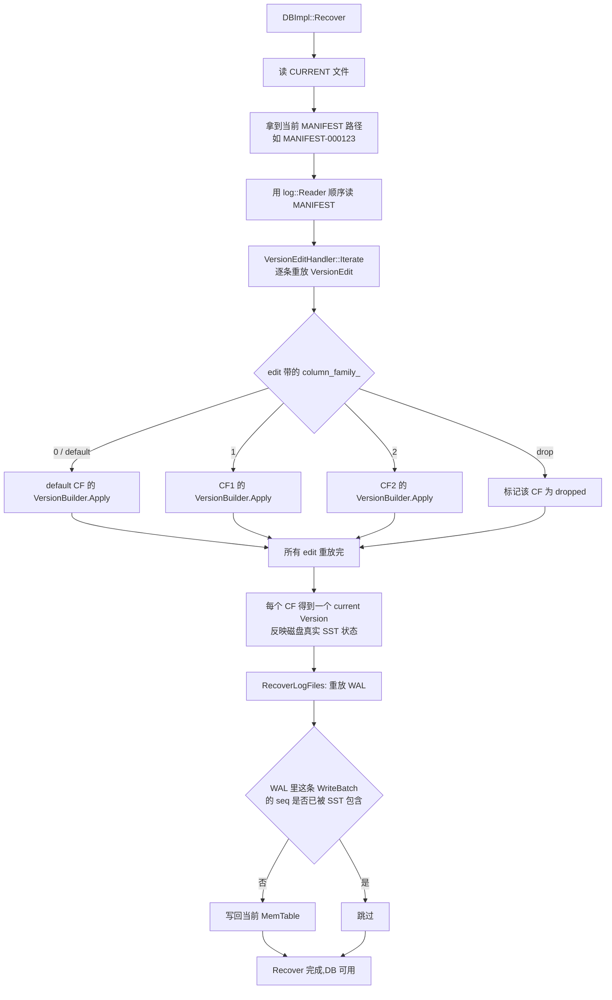

# 第 2 篇 · 第 9 章 · Version Set 与 Manifest

> **核心问题**:前面三章把单个 SST 的内部(data block / index block / filter block / Bloom / Ribbon)拆透了。但一个 RocksDB 实例跑起来,磁盘上同时躺着几百上千个 SST 文件,分散在 L0~L6 七层、还分属若干 Column Family。那么一个根本问题来了:**这些 SST 文件的"花名册"——哪些文件在哪一层、属于哪个 CF、各自的 key 范围、当前的 log_number / next_file_number / last_sequence 是多少——到底记在哪?怎么持久化?crash 之后怎么一条不差地恢复?** 这一章讲的就是这件事:VersionSet / VersionEdit / MANIFEST,以及 RocksDB 相对 LevelDB 单 CF 最重要的架构演进——**多个 Column Family 共享一份 MANIFEST**。

> **读完本章你会明白**:
> 1. 一个 Version 在内存里到底是什么(`files_[num_levels]` + 引用计数),为什么读和 Compaction 进行中的 SST 文件绝对不能被删——这一条"为什么 sound"靠的是 `refs_` 引用计数。
> 2. VersionEdit 这个增量记录长什么样,它怎么被序列化进 MANIFEST(`EncodeTo` 一长串 tag),tag 编号 1~9 和 LevelDB 兼容、200+ 是 RocksDB 给 Column Family 加的。
> 3. LogAndApply 的完整链路:`EncodeTo → AddRecord → SyncManifest → SetCurrentFile`,以及 crash 语义为什么是 sound 的(追加日志 + 原子 rename CURRENT)。
> 4. **多个 Column Family 怎么共享一份 MANIFEST**(每条 edit 带 `column_family_` id,CF 的 add/drop 各写一条 edit),以及"朴素地每个 CF 一份 MANIFEST"会撞什么墙(跨 CF 不一致、协调崩溃)。
> 5. Recover 为什么是"先重放 MANIFEST,再重放 WAL"这个固定顺序,以及多 CF 在重放时怎么保证整库一致。

> **如果一读觉得太难**:先只记住三件事——① MANIFEST 是一个全局共享的追加日志,记录所有 SST 文件的加/删和元信息变更,每条记录叫一个 VersionEdit;② 每个 Column Family 在内存里有一个当前 Version,Version 被 Iterator/Compaction 引用时 `refs_++`,归零才析构,这样进行中的 SST 永远不会被删;③ crash 恢复时先重放 MANIFEST 还原"磁盘上有哪些 SST",再重放 WAL 把没落盘的写补回来。

---

## 〇、一句话点破

> **MANIFEST 是整个 LSM 族的"户口本":每一个 SST 文件的生(Flush/Compaction 产出)、老(被新版本覆盖)、病(被 Compaction 标记)、死(被新 Version 移出花名册)都作为一条 VersionEdit 追加进去;crash 后从头重放这份追加日志,就能把"磁盘上此刻该有哪些 SST、它们各在哪层、属于哪个 CF"一字不差地重建出来。而 RocksDB 相对 LevelDB 最关键的一步演进,是把这份户口本从"一个 CF 一本"变成了"所有 CF 共享一本,每条记录贴个 CF 标签"。**

这是结论,不是理由。本章倒过来拆:先讲一个 Version 在内存里到底是什么,再讲 VersionEdit 怎么描述增量、怎么序列化进 MANIFEST,接着讲 LogAndApply 这条写链路怎么保证 crash 安全,然后讲多 CF 共享 MANIFEST 的架构演进,最后讲 Recover 怎么把这一切还原。

---

## 一、一个 Version 在内存里到底是什么

### 提出问题:读和 Compaction 同时进行时,SST 凭什么不被删

讲 Manifest 之前,得先讲清它要持久化的对象——Version——到底是什么。

一个 RocksDB 实例在任意时刻,都有一个"当前版本视图",叫 `current_` Version。这个 Version 持有的核心数据,就是一张**"每一层有哪些 SST 文件"的花名册**:

```cpp
// db/version_set.h#L348-L356(VersionStorageInfo 的核心字段,简化示意)
int NumLevelFiles(int level) const {
  return static_cast<int>(files_[level].size());
}
const std::vector<FileMetaData*>& LevelFiles(int level) const {
  return files_[level];
}
```

`files_[level]` 是一个数组,下标是层号(0~`num_levels_-1`),每个元素是该层所有 `FileMetaData*` 的 vector。一个 `FileMetaData` 长这样(简化):

```cpp
// db/version_edit.h#L246-L274(节选)
struct FileMetaData {
  FileDescriptor fd;            // 文件号、大小、path_id
  InternalKey smallest;         // 本文件最小的 internal key
  InternalKey largest;          // 本文件最大的 internal key
  uint64_t compensated_file_size = 0;
  uint64_t num_entries = 0;
  uint64_t num_deletions = 0;
  uint64_t raw_key_size = 0;
  uint64_t raw_value_size = 0;
  int refs = 0;                 // Reference count,文件级引用计数
  bool being_compacted = false;
  Temperature temperature = Temperature::kUnknown;
  uint64_t oldest_blob_file_number = kInvalidBlobFileNumber;
  // ... 还有 oldest_ancester_time / file_creation_time / epoch_number /
  //     file_checksum / unique_id / min_timestamp / max_timestamp 等
};
```

注意 `int refs = 0;` 这一行的注释 `// Reference count`。这是个**文件级**的引用计数,跟 Version 自身的 `refs_` 是两套计数,但思想一脉相承。

> **不这样会怎样**:设想现在有一个后台 Compaction 正在合并 L2 的某几个 SST,前台同时有一个长 Iterator(比如一个范围扫描)正读着 L1 的某几个文件。这时候 Compaction 完成产出新文件、要把被合并的旧文件从花名册里删掉——**如果没有任何保护机制,旧文件对应的 FileMetaData 就可能被立即析构、底层 SST 被关闭删除,而 Iterator 还指着它的内存结构(index block、cache entry)**,直接 use-after-free,读出垃圾甚至段错误。这就是为什么需要引用计数:进行中的 SST 绝不能删。

### LevelDB 是怎么写死的:Version 持有 files_ + 简单引用计数

LevelDB 那本已经把这套讲透了(详见《LevelDB》Manifest 章 / [[leveldb-source-facts]]),这里一句带过:LevelDB 的 `Version` 也持有 `std::vector<FileMetaData*> files_[config::kNumLevels]`,`Version::Ref()/Unref()` 做引用计数,归零析构时对每个文件的 `FileMetaData::refs--`。Iterator 持有 Version 就 `Ref()`,释放就 `Unref()`。`kNumLevels = 7` 写死,单 Column Family。

RocksDB 在这套基本机制上**完全沿用 LevelDB 的设计**(引用计数 sound 的本质没变),但做了若干工业级扩展:

- 层数 `num_levels_` 可配(默认仍是 7,但你可以调),`files_` 是动态数组。
- Version 不直接持有 `files_`,而是通过内嵌的 `VersionStorageInfo storage_info_;`(见 `db/version_set.h#L1184`)间接持有——把"文件列表"和"由文件列表派生出的索引/统计"(level_files_brief、files_by_compaction_pri、files_marked_for_compaction 等)组织在一起,因为 RocksDB 的 Compaction 选文件逻辑远比 LevelDB 复杂(三种策略),需要大量预计算的派生结构。
- 一个 Version **只属于一个 Column Family**(字段 `ColumnFamilyData* cfd_;` @ version_set.h#L1177),不再像 LevelDB 那样"一个 DB 一个 Version 链"。每个 CF 有自己的一条 Version 双向链表(下面讲)。
- Version 之间用**循环双向链表**串起来,链表头是 `ColumnFamilyData::dummy_versions_`,当前版本 `current_ = dummy_versions_->prev_`(见 `db/column_family.h#L644-L645`)。

### 所以 RocksDB 这么设计:Version 是不可变快照 + 引用计数

关键要建立的认知:**一个 Version 一旦构建出来,就是不可变的(immutable)**。它的 `files_` 数组不会再变。所谓"Flush 产出一个新 SST 文件",并不是去修改当前 Version 的 `files_`,而是:

1. 在当前 Version 基础上,用 `VersionBuilder` 增量应用一条 VersionEdit(加一个新文件),构建出一个**新的 Version 对象**;
2. 把新 Version 挂到 CF 的 Version 链表上,`current_` 指针挪过去;
3. 旧的 `current_` 不再被新请求引用,等它身上的 `refs_` 归零,自然析构。

这个"不可变快照 + 引用计数 + 构建新版本"的模型,是 LSM 能在并发读写的同时安全维护元数据的根本。源码里 `Version::Ref()` 和 `Version::Unref()` 简单到不能再简单:

```cpp
// db/version_set.cc#L4932-L4942
void Version::Ref() { ++refs_; }

bool Version::Unref() {
  assert(refs_ >= 1);
  --refs_;
  if (refs_ == 0) {
    delete this;
    return true;
  }
  return false;
}
```

而析构函数 `Version::~Version()`(db/version_set.cc#L1025)干的事,正好印证了"引用归零才回收底层文件":

```cpp
// db/version_set.cc#L1025-L1049(节选)
Version::~Version() {
  assert(refs_ == 0);

  // Remove from linked list
  prev_->next_ = next_;
  next_->prev_ = prev_;

  // Drop references to files
  for (int level = 0; level < storage_info_.num_levels_; level++) {
    for (size_t i = 0; i < storage_info_.files_[level].size(); i++) {
      FileMetaData* f = storage_info_.files_[level][i];
      assert(f->refs > 0);
      f->refs--;
      if (f->refs <= 0) {
        // ... 进 obsolete_files_,等后台 purge
        vset_->obsolete_files_.emplace_back(
            f, cfd_->ioptions().cf_paths[path_id].path,
            sv ? sv->mutable_cf_options.uncache_aggressiveness : 0,
            cfd_->GetFileMetadataCacheReservationManager());
      }
    }
  }
  // ...
}
```

> **钉死这件事**:一个 Version `refs_` 归零才 `delete this`,析构时才对它持有的每个 `FileMetaData` 做 `f->refs--`,文件的 `refs` 也归零才推进 `obsolete_files_` 等后台清理。这就从源码层面保证了:**只要还有任何 Iterator / Compaction 引用着某个 Version,它身上的文件就绝对不会被回收**。这是 LSM 在并发下读写的 soundness 根基,LevelDB 如此,RocksDB 也如此——只是 RocksDB 多了一层"每个 CF 一条 Version 链"。

### 为什么 Version 链是循环双向链表,不是 vector

一个细节值得停下来想:Version 之间用循环双向链表串起来(`next_`/`prev_` 指针,version_set.h#L1186-L1187),链表头是 `ColumnFamilyData::dummy_versions_`(一个哨兵节点),`current_ = dummy_versions_->prev_`。为什么是循环双向链表,而不是简单地把所有 Version 存进一个 `std::vector<Version*>`?

答案是 **O(1) 的任意位置插入和删除**。Version 的生命周期里,关键操作有三个:

- **新建一个 Version 并挂到链表尾**:`dummy->prev_->next_ = new_v; new_v->prev_ = dummy->prev_; new_v->next_ = dummy; dummy->prev_ = new_v;`——O(1) 几条指针赋值。新 Version 总是挂在 dummy 前面(链表尾),成为新的 `current_`。
- **析构一个 Version(从链表摘除)**:`prev_->next_ = next_; next_->prev_ = prev_;`(见 db/version_set.cc#L1029-L1030)——O(1)。一个 Version `refs_` 归零时析构,把自己从链表摘掉。
- **遍历链表找 current**:`dummy->prev_`——O(1)。

如果用 vector,中间摘除要 O(n) 移动元素(或者用 swap-with-last 假装 O(1) 但破坏顺序);遍历找 current 也要 O(n) 或者额外维护一个 current 索引(索引失效问题)。循环双向链表 + 哨兵节点是这套场景的经典解,LevelDB 这么做,RocksDB 沿用。

> **LevelDB 是写死的,RocksDB 打开成了旋钮**:这套链表结构 LevelDB 和 RocksDB 一样(都是循环双向 + dummy 哨兵)。区别在于:LevelDB 一个 DB 只有一条链(`VersionSet::dummy_versions_`),RocksDB 每个 CF 一条链(`ColumnFamilyData::dummy_versions_`)。多 CF 的代价是多了 N 条链,但每条链的机制完全相同——这正是 RocksDB 把"单 CF 机制"扩展成"多 CF 机制"时的一贯做法:**不重新发明机制,而是把同一套机制复制到每个 CF**。

---

## 二、VersionEdit:描述"花名册的一次变更"

### 提出问题:Flush 产出新文件、Compaction 合并旧文件,这些变更怎么记下来

上一节说"构建一个新 Version"靠的是 `VersionBuilder` 增量应用一条 VersionEdit。那 VersionEdit 本身是什么?

它就是一个**变更记录**:相对于某个旧 Version,我这次要做哪些改动——加哪些文件、删哪些文件、改了哪个 level 的元信息、log_number 推进到几号、last_sequence 推进到几号、是不是新建/删除了一个 Column Family。一个 Flush 产出一个 L0 文件,对应一条 `AddFile(level=0, ...)` 的 edit;一次 Compaction 删掉 L1 的 3 个旧文件、产出 L2 的 2 个新文件,对应一条同时带 3 个 `DeleteFile` + 2 个 `AddFile` 的 edit。

VersionEdit 的字段定义在 `db/version_edit.h`,关键的几个:

```cpp
// db/version_edit.h#L790-L792
void DeleteFile(int level, uint64_t file) {
  deleted_files_.emplace(level, file);
}

// db/version_edit.h#L802-L829(节选,签名很长)
void AddFile(int level, uint64_t file, uint32_t file_path_id,
             uint64_t file_size, const InternalKey& smallest,
             const InternalKey& largest, const SequenceNumber& smallest_seqno,
             const SequenceNumber& largest_seqno, bool marked_for_compaction,
             Temperature temperature, uint64_t oldest_blob_file_number,
             uint64_t oldest_ancester_time, uint64_t file_creation_time,
             uint64_t epoch_number, const std::string& file_checksum,
             const std::string& file_checksum_func_name,
             const UniqueId64x2& unique_id,
             const uint64_t compensated_range_deletion_size,
             uint64_t tail_size, bool user_defined_timestamps_persisted,
             const std::string& min_timestamp = "",
             const std::string& max_timestamp = "") {
  // ... 构造 FileMetaData push 进 new_files_
  new_files_.emplace_back(level, FileMetaData(...));
  files_to_quarantine_.push_back(file);
  if (!HasLastSequence() || largest_seqno > GetLastSequence()) {
    SetLastSequence(largest_seqno);   // 顺带推进 last_sequence
  }
}
```

> **LevelDB 是写死的,RocksDB 打开成了旋钮**:这个 `AddFile` 的参数列表,正是 RocksDB 相对 LevelDB 的演进的活化石。LevelDB 的 `AddFile` 只要 `(level, file, file_size, smallest, largest)` 五个参数——文件号、大小、key 范围,够了。RocksDB 这里的参数列表膨胀到二十多个:`file_path_id`(多磁盘路径)、`temperature`(冷热分层)、`oldest_blob_file_number`(BlobDB)、`oldest_ancester_time`/`file_creation_time`/`epoch_number`(Compaction 的时间与代际信息,Universal/FIFO 策略要用)、`file_checksum`/`file_checksum_func_name`(文件级校验和)、`unique_id`(全局唯一标识)、`compensated_range_deletion_size`(range tombstone 的补偿大小)、`tail_size`、`user_defined_timestamps_persisted`、`min_timestamp`/`max_timestamp`(用户定义时间戳)。每一个参数都对应 RocksDB 一个 LevelDB 没有的特性。看这个函数签名,等于看了一眼镜子里 RocksDB 这十年加了什么。

### LevelDB 的 tag 编号兼容:VersionEdit 怎么序列化

VersionEdit 要写进 MANIFEST 文件,得先序列化。序列化用的是 tag-length-value 的变长编码,每个字段前一个 `PutVarint32(tag)`。tag 枚举定义在 `db/version_edit.h#L37-L65`:

```cpp
// db/version_edit.h#L37-L65(节选)
enum Tag : uint32_t {
  kComparator = 1,
  kLogNumber = 2,
  kNextFileNumber = 3,
  kLastSequence = 4,
  kCompactCursor = 5,
  kDeletedFile = 6,
  kNewFile = 7,
  // 8 was used for large value refs
  kPrevLogNumber = 9,
  kMinLogNumberToKeep = 10,

  // these are new formats divergent from open source leveldb
  kNewFile2 = 100,
  kNewFile3 = 102,
  kNewFile4 = 103,      // 4th (the latest) format version of adding files
  kColumnFamily = 200,  // specify column family for version edit
  kColumnFamilyAdd = 201,
  kColumnFamilyDrop = 202,
  kMaxColumnFamily = 203,

  kInAtomicGroup = 300,

  kBlobFileAddition = 400,
  kBlobFileGarbage,
  // ...
};
```

> **钉死这件事**:tag 1~10 跟 LevelDB 完全兼容(`kComparator=1`、`kLogNumber=2`、`kNextFileNumber=3`、`kLastSequence=4`、`kDeletedFile=6`、`kNewFile=7`、`kPrevLogNumber=9`)。这是 RocksDB 作为 LevelDB fork 留下的"血缘证明"——同一段 MANIFEST 二进制,LevelDB 和 RocksDB 都能读前 10 个 tag。但 RocksDB 在 100、200、300、400 段塞进了自己的演进:`kNewFile2/3/4`(文件格式迭代到第 4 版,支持越来越多的 FileMetaData 字段)、`kColumnFamily/Add/Drop/Max`(Column Family 的元信息)、`kInAtomicGroup`(原子组,多个 edit 要么全应用要么全不应用)、`kBlobFileAddition/Garbage`(BlobDB)。看这段枚举,等于看了一眼镜子里 RocksDB MANIFEST 格式的演进史。

真正的序列化函数是 `VersionEdit::EncodeTo`(db/version_edit.cc#L123-L251),它按顺序把所有 `has_xxx_` 为真的字段写进去:

```cpp
// db/version_edit.cc#L123-L251(大幅简化,只保留主干)
bool VersionEdit::EncodeTo(std::string* dst, std::optional<size_t> ts_sz) const {
  if (has_db_id_)            { PutVarint32(dst, kDbId);                  PutLengthPrefixedSlice(dst, db_id_); }
  if (has_comparator_)       { PutVarint32(dst, kComparator);            PutLengthPrefixedSlice(dst, comparator_); }
  if (has_log_number_)       { PutVarint32Varint64(dst, kLogNumber, log_number_); }
  if (has_prev_log_number_)  { PutVarint32Varint64(dst, kPrevLogNumber, prev_log_number_); }
  if (has_next_file_number_) { PutVarint32Varint64(dst, kNextFileNumber, next_file_number_); }
  if (has_max_column_family_){ PutVarint32(dst, kMaxColumnFamily, max_column_family_); }
  if (has_min_log_number_to_keep_) { PutVarint32Varint64(dst, kMinLogNumberToKeep, min_log_number_to_keep_); }
  if (has_last_sequence_)    { PutVarint32Varint64(dst, kLastSequence, last_sequence_); }

  // 删文件:kDeletedFile + level + file_number
  for (const auto& deleted : deleted_files_) {
    PutVarint32Varint32Varint64(dst, kDeletedFile, deleted.first, deleted.second);
  }

  // 加文件:kNewFile4 + 一长串定制字段
  for (size_t i = 0; i < new_files_.size(); i++) {
    const FileMetaData& f = new_files_[i].second;
    EncodeToNewFile4(f, new_files_[i].first, ts_sz.value(),
                     has_min_log_number_to_keep_, min_log_number_to_keep_,
                     min_log_num_written, dst);
  }

  // blob 文件 / wal 增删 ...

  // 0 是 default,不用显式写
  if (column_family_ != 0) { PutVarint32(dst, kColumnFamily, column_family_); }
  if (is_column_family_add_)  { PutVarint32(dst, kColumnFamilyAdd);  PutLengthPrefixedSlice(dst, column_family_name_); }
  if (is_column_family_drop_) { PutVarint32(dst, kColumnFamilyDrop); }

  // ... 其他可选字段
  return true;
}
```

注意几个细节:

1. **每个字段都按 `has_xxx_` 条件写入**——只写变更过的字段,没变的省掉,MANIFEST 才紧凑。
2. **`column_family_ != 0` 才写 `kColumnFamily` tag**——default CF 的 id 是 0,省一个 tag。这是多 CF 共享 MANIFEST 的关键(下一节详讲):每条 edit 顶多带一个 CF 标签,标识它属于哪个 CF。
3. **删文件用 `kDeletedFile`(tag 6)跟 LevelDB 完全一样**;加文件已经演进到 `kNewFile4`(tag 103),因为它要带的定制字段太多。
4. 加文件的定制字段(`EncodeToNewFile4`,db/version_edit.cc#L253-L400)用了一套"tag + length + value + 终止 tag"的嵌套结构,允许 RocksDB 在不破坏旧 reader 的前提下持续加新字段(`kOldestAncesterTime`、`kFileCreationTime`、`kEpochNumber`、`kFileChecksum`、`kPathId`、`kTemperature`、`kNeedCompaction`、`kOldestBlobFileNumber`、`kUniqueId`、`kCompensatedRangeDeletionSize`、`kTailSize`、`kUserDefinedTimestampsPersisted`、`kMinTimestamp`、`kMaxTimestamp`...)。读的时候遇到不认识的 tag,有 `kTagSafeIgnoreMask`(version_edit.h#L64)机制可以安全跳过——这是 RocksDB 做**前向兼容**的关键技巧。

> **不这样会怎样**:如果像 LevelDB 那样把每个字段写死位置、写死含义,那 RocksDB 想加一个新字段(比如温度 `temperature`),就得换一个新 tag、并且老版本 RocksDB 一读就报错——升级就成噩梦。RocksDB 的"嵌套 tag + 安全忽略掩码"让新旧版本能互相读 MANIFEST,这是工业级 LSM 必须的前向/后向兼容能力。

### 一条 VersionEdit 的完整生命周期

把前面几节串起来,一条 VersionEdit 从生到死经历这些阶段,值得在这里完整走一遍,作为本节的收束:

**阶段一:构造(写路径某处)。** Flush 完成一个 MemTable 产出 L0 SST 文件后,`FlushJob` 构造一条 VersionEdit,调用 `edit.AddFile(0, file_number, ...)` 把新文件加进去,同时 `edit.SetLogNumber(...)` 推进 log_number。Compaction 完成后,`CompactionJob` 构造一条 edit,带若干 `DeleteFile`(被合并的旧文件)+ `AddFile`(产出的新文件)。CreateColumnFamily 构造一条带 `AddColumnFamily` 的 edit,DropColumnFamily 构造一条带 `DropColumnFamily` 的 edit。这个阶段 edit 还是个内存对象。

**阶段二:排队(LogAndApply 入口)。** 调用 `VersionSet::LogAndApply(cfd, ..., &edit, ...)`,把自己包成 `ManifestWriter` 推进 `manifest_writers_` 队列,等成为队头。

**阶段三:批合并(队头干)。** 队头 writer 被唤醒后,`ProcessManifestWrites` 把队列里连续若干个 writer 的 edit 攒成 `batch_edits`,用各自的 `VersionBuilder` 增量应用,构建出新 Version 对象。这一步 edit 还没落盘,但新 Version 已经在内存里构建好了(等着 edit 落盘成功后才安装为 `current_`)。

**阶段四:序列化 + 追加 + fsync。** 对 `batch_edits` 里每条 edit 调 `EncodeTo` 序列化成字节串,`log::Writer::AddRecord` 追加进 MANIFEST 文件,然后 `SyncManifest` fsync。这一步完成后,这条 edit 持久化了,crash 也不丢。

**阶段五:切 CURRENT(如果开了新 MANIFEST)。** 如果这次写触发了 MANIFEST 滚动,`SetCurrentFile` 原子 rename CURRENT 指向新 MANIFEST。

**阶段六:安装新 Version。** 加锁,把新 Version 挂到对应 CF 的 Version 链上,`current_` 指向它。旧 Version 等引用归零析构。处理 edit 里的 WAL 增删(`kWalAddition`/`kWalDeletion`)。

**阶段七:唤醒跟随者。** 把队列里这次批合并覆盖到的其他 writer 标记 `done=true`,signal 它们的 cv,它们醒来直接拿 `first_writer.status` 返回。

**阶段八(未来某次开 DB):重放。** 这条 edit 已经在 MANIFEST 文件里了。下次开 DB 时,`VersionSet::Recover` → `VersionEditHandler::Iterate` 顺序读 MANIFEST,`DecodeFrom` 把这条 edit 反序列化回来,路由到对应 CF 的 VersionBuilder,`Apply` 重建状态。这条 edit 在重放时"重获新生",它描述的变更被重新应用一遍。

> **钉死这件事**:这条生命周期里最关键的 soundness 保证在阶段四和阶段五——**edit 先 fsync 进 MANIFEST,然后才安装新 Version**。也就是说,任何被新 Version 反映出来的状态(比如一个新产出的 SST 文件已经"存在于当前花名册"),都已经在 MANIFEST 里持久化了。如果反过来——先安装新 Version 再 fsync MANIFEST——那 crash 在两者之间,新 Version 说"有文件 F9"但 MANIFEST 里没记,重启后 F9 成了孤儿(磁盘上有但花名册里没有),要么泄漏要么错乱。RocksDB 严格遵循"先持久化元数据,后暴露新状态"这个不变式,这是 LSM crash safety 的金科玉律。LevelDB 如此,RocksDB 如此,etcd 的 bbolt、PG 的 WAL、任何带 crash safety 的存储系统都如此。

---

## 三、LogAndApply:把 VersionEdit 落进 MANIFEST 的链路

### 提出问题:这条变更记录怎么安全地落盘,crash 了不丢

上一节讲的是一条 VersionEdit 怎么编码成字节串。这一节讲:这个字节串怎么写进 MANIFEST 文件,以及为什么 crash 之后这份记录是完整可信的。

写 MANIFEST 的总入口是 `VersionSet::LogAndApply`(db/version_set.cc#L6769)。它有多个重载,最完整的一个接收一组 `ColumnFamilyData*` 加各自的一组 `VersionEdit*`(因为多 CF 可能同时要写,比如一次原子地创建多个 CF)。LogAndApply 自己主要做"排队 + 协调",真正的写盘逻辑在 `ProcessManifestWrites`(db/version_set.cc#L6102)。

完整的写盘链路(简化版,去掉大量错误处理和测试钩子):

```cpp
// db/version_set.cc#L6102 起的 ProcessManifestWrites,关键路径简化示意
// (非源码原文,为讲清流程做的精简)
Status VersionSet::ProcessManifestWrites(...) {
  // ... 准备阶段:为每个 CF 用 VersionBuilder 应用 batch_edits,
  //     构建出新 Version 对象,挂到链表上

  // ---- 第 1 步:决定是否要滚动一个新 MANIFEST 文件 ----
  // MANIFEST 超过 tuned_max_manifest_file_size_ 就滚动,避免单文件无限增长
  if (!descriptor_log_ || prev_manifest_file_size >= enforced_limit) {
    new_descriptor_log = true;
    pending_manifest_file_number_ = NewFileNumber();
  }

  // ---- 第 2 步:如果开了新 MANIFEST,先写一份"当前全量快照"进去 ----
  // 这是为了让新 MANIFEST 自包含,不依赖老 MANIFEST
  if (new_descriptor_log) {
    std::string descriptor_fname =
        DescriptorFileName(dbname_, pending_manifest_file_number_);
    // 新建 MANIFEST 文件,WriteCurrentStateToManifest 把所有 CF 的当前状态
    // (log_number 等)写一份快照
  }

  // ---- 第 3 步:把每条 VersionEdit 编码后追加进 MANIFEST log ----
  for (auto& e : batch_edits) {
    std::string record;
    e->EncodeTo(&record, ...);                       // 序列化
    raw_desc_log_ptr->AddRecord(write_options, record);  // 追加一条记录
  }

  // ---- 第 4 步:fsync MANIFEST 文件 ----
  SyncManifest(db_options_, write_options, raw_desc_log_ptr->file());

  // ---- 第 5 步:如果开了新 MANIFEST,原子切换 CURRENT 指向它 ----
  if (new_descriptor_log) {
    SetCurrentFile(write_options, fs_.get(), dbname_,
                   pending_manifest_file_number_, ...);
  }

  // ---- 第 6 步:加锁,把新 Version 安装为 current_,处理 WAL 增删 ----
}
```

这六步里,前三步是"写",后三步是"持久化保证 + 切换"。重点讲第 4、5 步的 crash 语义。

### 第 5 步:SetCurrentFile 的原子切换是 crash 安全的关键

为什么 MANIFEST 的切换是 sound 的?核心在第 5 步的 `SetCurrentFile`(file/filename.cc#L429-L467):

```cpp
// file/filename.cc#L429-L467(简化)
IOStatus SetCurrentFile(const WriteOptions& write_options, FileSystem* fs,
                        const std::string& dbname, uint64_t descriptor_number,
                        Temperature temp, FSDirectory* dir_contains_current_file) {
  // 拼出 "MANIFEST-000123" 这种名字
  std::string manifest = DescriptorFileName(dbname, descriptor_number);
  Slice contents = manifest;
  contents.remove_prefix(dbname.size() + 1);           // 去掉 "dbname/" 前缀
  std::string tmp = TempFileName(dbname, descriptor_number);

  // 1. 先把 "MANIFEST-000123\n" 写进一个临时文件 tmp,并 fsync
  s = WriteStringToFile(fs, contents.ToString() + "\n", tmp, true, opts, file_opts);

  // 2. 原子 rename:tmp -> CURRENT
  if (s.ok()) {
    s = fs->RenameFile(tmp, CurrentFileName(dbname), opts, nullptr);
  }

  // 3. fsync 目录(保证 rename 这个目录项变更也落盘)
  if (s.ok() && dir_contains_current_file != nullptr) {
    s = dir_contains_current_file->FsyncWithDirOptions(
        opts, nullptr, DirFsyncOptions(CurrentFileName(dbname)));
  }
  return s;
}
```

`CURRENT` 文件的名字是固定的(常量 `kCurrentFileName = "CURRENT"`,见 file/filename.h#L91),里面就一行内容:当前生效的 MANIFEST 文件名(比如 `MANIFEST-000123\n`)。切换 MANIFEST 就是改这一行——但**不能直接改**(直接改可能改到一半 crash,文件就坏了),而是经典的"写临时文件 + rename"原子切换套路。

> **钉死这件事**:rename 在 POSIX 文件系统语义里是原子的——要么看到旧名字,要么看到新名字,绝不会看到"改了一半"。所以 crash 在 SetCurrentFile 任何一刻:

> - crash 在写 tmp 之前:CURRENT 还指向老 MANIFEST,老 MANIFEST 完整,恢复时重放老 MANIFEST,没问题。
> - crash 在写 tmp 之后、rename 之前:tmp 是个孤儿文件(下次开 DB 会清掉),CURRENT 还指向老 MANIFEST,没问题。
> - crash 在 rename 之后、fsync 目录之前:目录项可能没落盘,但**很多文件系统 rename 本身已经把目录项改了**,重启后大概率看到新 CURRENT;就算看到老的,也只是"少应用了最后一条 edit",下一节讲 Recover 时会发现这条 edit 没生效,重放 WAL 能补回来。
> - crash 在 fsync 目录之后:新 CURRENT 已稳固落盘,完全 OK。

> 这套"追加日志 + 原子 rename CURRENT"的 crash 安全套路,LevelDB 那本讲透了(详见《LevelDB》Manifest 章),RocksDB 完全继承。MANIFEST 自己是个追加日志(`log::Writer`),每条记录有 CRC 校验,即使写到一半 crash,坏的那条会被 log::Reader 检测出来当尾巴截掉,前面完整的记录照样能重放。

### LevelDB 是写死的,RocksDB 打开成了旋钮

LevelDB 的 MANIFEST 切换逻辑跟 RocksDB 几乎一样(都是追加日志 + CURRENT rename),RocksDB 这里的演进不在 crash 语义,而在规模和并发:

- **MANIFEST 文件大小可调**:LevelDB 不滚动 MANIFEST(一个 DB 生命周期可能就一个 MANIFEST 越长越大)。RocksDB 加了 `tuned_max_manifest_file_size_` 阈值(db/version_set.cc#L6344),超过就滚动一个新 MANIFEST 写全量快照,避免单文件无限增长导致 Recover 越来越慢。
- **批量写**:RocksDB 的 `ProcessManifestWrites` 支持把多个 CF 的多条 edit **攒成一批**一次写 MANIFEST(`batch_edits`),减少 fsync 次数。这是多 CF 并发 Flush/Compaction 时的关键优化。
- **前台 vs 后台的差异化**:有注释说(db/version_set.cc#L6333-L6349)——纯后台操作(flush/compaction)按正常阈值滚动 MANIFEST;但带前台的批次(ingestion、DeleteFilesInRange、CF 增删)会把阈值放宽 25%,降低前台操作被 MANIFEST 滚动阻塞的概率。这种"区分前后台 IO 重要性"的微调,是 LevelDB 不会做的。

### ManifestWriter 排队:多线程写 MANIFEST 怎么串行化

一个细节值得单独讲:MANIFEST 是一份追加日志,**追加必须是串行的**(两个线程同时往同一个文件 offset 追加会互相覆盖)。但 RocksDB 是高并发的——多个 CF 的 Flush / 多个 Compaction job / 前台的 CreateColumnFamily / DropColumnFamily 可能同时要写 MANIFEST。怎么串行化?

RocksDB 用一个经典的"写线程排队"模式,跟第 1 篇要讲的 WriteGroup 是同一套思想。每个想写 MANIFEST 的调用,先把自己包装成一个 `ManifestWriter` 对象(db/version_set.cc#L5718-L5750),推进全局队列 `manifest_writers_`(version_set.h#L1830):

```cpp
// db/version_set.cc#L5718-L5750(简化)
struct VersionSet::ManifestWriter {
  Status status;
  bool done;
  InstrumentedCondVar cv;       // 等待自己被处理完
  ColumnFamilyData* cfd;        // 这个 writer 属于哪个 CF
  const autovector<VersionEdit*>& edit_list;  // 要写的一组 edit
  // ...
};
```

然后在 `LogAndApply` 里(db/version_set.cc#L6801-L6832):

```cpp
// db/version_set.cc#L6801-L6832(简化)
for (int i = 0; i < num_cfds; ++i) {
  writers.emplace_back(mu, column_family_datas[i], edit_lists[i], wcb, ...);
  manifest_writers_.push_back(&writers[i]);   // 入队
}
ManifestWriter& first_writer = writers.front();

// 队头不是自己就等(经典 leader-follower)
while (!first_writer.done && &first_writer != manifest_writers_.front()) {
  first_writer.cv.Wait();
}
if (first_writer.done) {
  // 队头的 writer 已经把我的活也干了(批合并),直接拿结果
  return first_writer.status;
}
// 我是队头,我来干(ProcessManifestWrites)
```

> **钉死这件事**:这套"排队 + 队头干 + 跟随者等结果"的模式,跟 LevelDB 的 leader-follower 写组(详见《LevelDB》写组章)是同一类思想。但 LevelDB 用它来攒 WAL 写,RocksDB 在这里用它来攒 MANIFEST 写。妙处在于:**队头 writer 在被唤醒后,可以把队列后面排着的若干 writer 的 edit 一起攒成一批**(`ProcessManifestWrites` 里的 `batch_edits` 就是这样攒出来的),一次 fsync 写完所有。这对高并发场景(多个 CF 同时 Flush)是巨大的吞吐提升——N 个并发写,从 N 次 fsync 降到 1 次。

> **不这样会怎样**:如果每个写 MANIFEST 的调用都自己拿锁、自己 fsync,那并发越高,fsync 越多,MANIFEST 写会成为全局瓶颈。RocksDB 的排队 + 批合并,把"高并发"变成了"高吞吐"——这正是工业级 LSM 区别于 LevelDB 单线程写 MANIFEST 的关键。

### 全局计数器:next_file_number / log_number / last_sequence

讲 LogAndApply 不能不讲它管的那几个全局计数器。MANIFEST 里持久化的核心元信息,除了文件增删,就是这三个:

- **`next_file_number_`(version_set.h#L1415)**:下一个要分配的文件号。SST、WAL、MANIFEST、blob 文件都从这个号池里分配(`NewFileNumber()` 用 `fetch_add` 原子递增,version_set.h#L1424)。每个文件号全局唯一,递增不复用。MANIFEST 里通过 `kNextFileNumber` tag 持久化当前的 `next_file_number_`,Recover 后从这个号继续分配,保证不冲突。
- **`log_number_`(每个 CF 一个,`ColumnFamilyData::GetLogNumber()`)**:当前 CF 正在用的 WAL 文件号。Flush 完一个 MemTable 后,旧 WAL 可以删了,这个 CF 的 `log_number` 就推进到新的。MANIFEST 里通过 `kLogNumber` tag 持久化。Recover 后,RocksDB 知道哪些 WAL 还活着(`>=` 当前 CF 的 log_number)、哪些可以删。
- **`last_sequence_`(version_set.h#L1433,全局)**:最后分配的 SequenceNumber。每个写操作递增。MANIFEST 里通过 `kLastSequence` tag 持久化。Recover 后从持久化的值继续递增,保证不回退。

这三个计数器为什么必须持久化在 MANIFEST 里?因为它们决定了 crash 后"从哪里继续":

> **不这样会怎样**:假设 crash 前 `next_file_number_` 已经分配到 100(分配了文件号 100 给某个 SST,但 MANIFEST 还没写完就 crash 了)。如果 Recover 后 `next_file_number_` 还停在 99,那 Recover 过程中可能再次把 100 这个号分配给别的新文件——同一个文件号对应两个不同的文件,数据错乱。把 `next_file_number_` 持久化在 MANIFEST 的 `kNextFileNumber` 字段(每次 LogAndApply 都推进),Recover 后从持久化的值继续,就避开了这个坑。`log_number` 和 `last_sequence` 同理——它们都是"crash 后不能回退"的单调递增计数器,必须靠 MANIFEST 持久化来保证单调性。

这三个计数器在 LevelDB 里也有(同名同语义),RocksDB 的演进是把 `log_number` 从全局变成了"每个 CF 一个"(因为多 CF 各自管自己的 WAL 切换),但 `next_file_number` 和 `last_sequence` 仍是全局的——一个 DB 实例只有一个文件号池、一个 seq 池。这是多 CF"逻辑隔离、物理共享"原则的又一体现:文件号和 seq 是物理资源,全局共享;log_number 跟 CF 的 MemTable 生命周期绑定,各 CF 独立。

### 两个关键的时序细节:obsolete_files_ 的延迟 purge + 原子组

讲完 LogAndApply 主链路,有两个时序细节值得单独钉死,因为它们直接关系到"为什么这套机制是 sound 的"。

**细节一:文件什么时候真从磁盘删掉。** 前面讲 Version 析构时把 `refs` 归零的文件推进 `obsolete_files_`(version_set.cc#L1045)。但 `obsolete_files_` 只是一个"待删列表",**文件并没有立即从磁盘删掉**。真正的物理删除发生在后台:`FindObsoleteFiles`(db_impl_compaction_flush.cc#L1562)定期扫描,把 `obsolete_files_` 里的文件 swap 出来(version_set.cc#L8269),`PurgeObsoleteFiles`(db_impl_compaction_flush.cc#L1576)才真正调 `DeleteFile` 删磁盘文件。

为什么要延迟?两个原因:

1. **减少 IO 抖动**:LogAndApply 是写路径的关键路径(Flush/Compaction 完成都要调它),如果在这里同步删一堆大 SST 文件,会阻塞后续的 Flush/Compaction。延迟到后台 purge,把删除 IO 和前台写 IO 解耦。
2. **避免删除正在进行中的文件**:即使一个文件进了 `obsolete_files_`,也可能还有别的线程(比如一个没结束的 Iterator)打开着它的文件描述符。延迟 purge 给这些线程留出释放的时间。实际上 `FindObsoleteFiles` 还有_full-scan backstop_兜底机制——定期全盘扫描,把任何"MANIFEST 里不存在但磁盘上还在"的孤儿文件清掉,防止前面任何路径漏删。

> **钉死这件事**:这套"标记待删 → 后台批量 purge"的模式,跟内存管理里的"标记-清扫 GC"、跟 Linux 内核里的 RCU 延迟回收,是同一类思想:**先把要删的东西从活跃数据结构里摘掉(逻辑删除),等所有引用都消失了再物理删除**。Version 引用计数负责"判断引用是否都消失",obsolete_files_ + 后台 purge 负责"批量执行物理删除"。两者配合,既 sound(不会删到正在用的文件)又高效(不阻塞关键路径)。

**细节二:原子组(Atomic Group)。** 有些场景,一条 VersionEdit 不够,需要**多条 edit 原子地应用**——要么全成功要么全失败,中间状态不可见。比如一次大的 SST 文件 ingestion 可能拆成多条 edit 写进 MANIFEST,它们必须作为一个原子组重放。RocksDB 用 `kInAtomicGroup` tag(version_edit.h)和 `AtomicGroupReadBuffer`(version_set.cc#L5752)实现:重放时,带 `kInAtomicGroup` 且 `remaining_entries > 0` 的 edit 先进缓冲区,等凑齐 `remaining_entries` 条后才一起应用;中途 crash 导致没凑齐,这一组全丢弃(因为旧 MANIFEST 的 CURRENT 没切,这部分没应用的 edit 不会被发现)。

> **不这样会怎样**:如果没有原子组,一个 ingestion 拆成 5 条 edit 写到第 3 条时 crash,重启重放会看到 3 条"半截"状态——文件加了但元信息不全,数据错乱。原子组保证这种"多 edit 操作"要么全重放要么全不重放,是 MANIFEST 在复杂场景下的 soundness 补强。LevelDB 没有这个机制(它没有 ingestion 这种拆多 edit 的操作),这是 RocksDB 为支持文件 ingestion、SST 导入这些工业级功能加的。

---

## 四、Recover:crash 之后怎么把花名册还原

### 提出问题:开 DB 时怎么从 MANIFEST 重建出当前 Version

讲了怎么写,现在讲怎么读。开 DB 的入口是 `DBImpl::Recover`(db/db_impl/db_impl_open.cc#L436),它的核心两步:

```cpp
// db/db_impl/db_impl_open.cc#L559(Recover 里的关键调用,简化)
s = versions_->Recover(column_families, read_only, &db_id_,
                       /*no_error_if_files_missing=*/false, is_retry,
                       &desc_status);
// ... 中间处理 ...
s = RecoverLogFiles(wals, &next_sequence, read_only, is_retry, ...);  // db_impl_open.cc#L863
```

**先重放 MANIFEST,再重放 WAL**——这个顺序是固定的,LevelDB 如此,RocksDB 如此。原因很直接:

> **不这样会怎样**:重放 WAL 的前提是"我知道磁盘上此刻有哪些 SST、它们的文件号是多少",因为 WAL 重放时碰到一个写,得判断它是不是已经被某个 SST 包含了(已被包含就不用重放)。这个"磁盘上有哪些 SST"的认知,只能靠先重放 MANIFEST 来建立。如果反过来先重放 WAL,你都不知道哪些写对应的 MemTable 已经 Flush 成 SST 了,会把已经落盘的写再写一遍,污染数据。

### VersionSet::Recover 的链路

`VersionSet::Recover`(db/version_set.cc#L7015-L7108)的链路:

```cpp
// db/version_set.cc#L7015-L7108(简化)
Status VersionSet::Recover(const std::vector<ColumnFamilyDescriptor>& column_families,
                           bool read_only, std::string* db_id, ...) {
  // 1. 读 CURRENT 文件,拿到当前 MANIFEST 文件路径
  Status s = GetCurrentManifestPath(dbname_, fs_.get(), is_retry,
                                    &manifest_path, &manifest_file_number_);

  // 2. 打开 MANIFEST 文件,用 log::Reader 顺序读
  log::Reader reader(nullptr, std::move(manifest_file_reader), &reporter,
                     true /* checksum */, 0 /* log_number */);

  // 3. 用 VersionEditHandler 逐条重放 edit
  VersionEditHandler handler(read_only, column_families, this, ...);
  handler.Iterate(reader, &log_read_status);

  // 4. handler 内部为每个 CF 维护一个 VersionBuilder,
  //    每读到一条 edit,按 column_family_ 字段路由到对应 CF 的 builder,
  //    builder.Apply(edit) 增量构建该 CF 的 Version
  // ...
  return s;
}
```

第 3 步的 `VersionEditHandler::Iterate` 是关键。它读 MANIFEST 文件里的每一条记录,反序列化(`VersionEdit::DecodeFrom`,db/version_edit.cc#L566)成一个 VersionEdit 对象,然后根据 edit 里的 `column_family_` 字段,路由到对应 ColumnFamilyData 的 `VersionBuilder`,调用 `VersionBuilder::Apply(edit)` 把这个增量应用上去。

`VersionBuilder::Apply`(db/version_builder.cc#L1048-L1121)干的事,正好对应 `EncodeTo` 的逆过程:

```cpp
// db/version_builder.cc#L1048-L1121(简化)
Status Apply(const VersionEdit* edit) {
  // 1. 先处理 blob 文件增删(因为 table 文件的增删依赖 blob 文件先在)
  for (const auto& blob_file_addition : edit->GetBlobFileAdditions()) {
    ApplyBlobFileAddition(blob_file_addition);
  }
  for (const auto& blob_file_garbage : edit->GetBlobFileGarbages()) {
    ApplyBlobFileGarbage(blob_file_garbage);
  }

  // 2. 处理 table 文件删除
  for (const auto& deleted_file : edit->GetDeletedFiles()) {
    ApplyFileDeletion(deleted_file.first /*level*/, deleted_file.second /*file*/);
  }

  // 3. 处理 table 文件新增
  for (const auto& new_file : edit->GetNewFiles()) {
    ApplyFileAddition(new_file.first /*level*/, new_file.second /*meta*/);
  }

  // 4. 处理 compact cursor(round-robin compaction 用)
  for (const auto& cursor : edit->GetCompactCursors()) {
    ApplyCompactCursors(cursor.first, cursor.second);
  }
  return Status::OK();
}
```

> **钉死这件事**:Recover 的本质就是"把 MANIFEST 这份追加日志从头到尾重放一遍,每条 edit 喂给对应 CF 的 VersionBuilder,最后每个 CF 得到一个反映当前磁盘状态的 Version"。这套"追加日志 + 重放重建状态机"的套路,跟 WAL 的恢复、跟 etcd 里 bbolt 的事务日志恢复、跟 Kafka 的 commit log 重放,是同一套思想——**用只追加的日志描述状态变迁,crash 后从头重放重建状态**。LevelDB 这么做,RocksDB 沿用,只是把"单 CF 的状态机"扩展成"多 CF 的状态机共享一份日志"。

### Recover 之后还要重放 WAL

MANIFEST 重放完,`versions_->Recover` 返回,这时每个 CF 的 Version 已经反映了"上次 crash 前最后一次成功 LogAndApply 之后"的磁盘 SST 状态。但 WAL 里可能还有没来得及 Flush 成 SST 的写(那些写已经进 WAL 了,但 MemTable 还没 Flush 就 crash 了)。这些写要靠 `RecoverLogFiles`(db/db_impl/db_impl_open.cc#L1180)重放回 MemTable。重放时,每读到一条 WriteBatch,如果它的 seq 已经被某个 SST 包含(`last_sequence` 检查),就跳过;否则写进当前 MemTable。

这就是为什么顺序必须是"先 MANIFEST 后 WAL":MANIFEST 重放建立了"磁盘上有哪些 SST、last_sequence 是多少"的认知,WAL 重放才能判断哪些写是新的、哪些是已落盘的。整个 Recover 流程画成 mermaid:



### 一个具体的重放例子:三步看清 MANIFEST 重放

抽象讲完,给一个具体的例子。假设一个 DB 有 default 和 "meta" 两个 CF,跑了一段后 crash 了。磁盘上的 MANIFEST 文件(简化,只列 edit 的语义)长这样:

```
edit 1: AddColumnFamily "meta"          (cf=1, name="meta")
edit 2: SetLogNumber(2)                  (cf=0, 全局 log_number 推进)
edit 3: SetNextFile(10)                  (全局 next_file_number 推进)
edit 4: AddFile level=0 file=5 size=2KB smallest="k1" largest="k3"  (cf=0)
edit 5: AddFile level=0 file=7 size=1KB smallest="k2" largest="k5"  (cf=0)
edit 6: SetLastSequence(100)             (全局 last_sequence)
edit 7: AddFile level=0 file=8 size=3KB smallest="m1" largest="m4"  (cf=1)
edit 8: DeleteFile level=0 file=5        (cf=0,一次 compaction 删了旧文件)
edit 9: AddFile level=1 file=9 size=4KB smallest="k1" largest="k3"  (cf=0,产出新文件)
edit 10: SetLogNumber(3)                 (cf=0,Flush 完推进 log_number)
```

Recover 时,`VersionEditHandler::Iterate` 顺序读这 10 条 edit,每读一条按 `column_family_` 路由:

- edit 1 读到 `kColumnFamilyAdd`:在 `ColumnFamilySet` 里新建 id=1 的 CF,名字 "meta"。
- edit 2/3 是全局字段,应用到 VersionSet 自己(`log_number_`、`next_file_number_`)。
- edit 4/5 路由到 cf=0(default)的 VersionBuilder,各自 `ApplyFileAddition(0, FileMetaData(5,...))` 和 `ApplyFileAddition(0, FileMetaData(7,...))`。default 的 L0 现在有 [F5, F7]。
- edit 6 全局 `last_sequence_ = 100`。
- edit 7 路由到 cf=1(meta)的 VersionBuilder,meta 的 L0 现在有 [F8]。
- edit 8 路由到 cf=0,`ApplyFileDeletion(0, 5)`。default 的 L0 变成 [F7]。
- edit 9 路由到 cf=0,`ApplyFileAddition(1, FileMetaData(9,...))`。default 的 L1 现在有 [F9]。
- edit 10 全局,`log_number_` 推进到 3。

10 条 edit 重放完,内存里的状态:

- `ColumnFamilySet` 有两个 CF:default(id=0) 和 meta(id=1)。
- default 的 current Version:`files_[0] = [F7]`,`files_[1] = [F9]`。
- meta 的 current Version:`files_[0] = [F8]`。
- 全局:`log_number_=3`、`next_file_number_=10`、`last_sequence_=100`。

这就是磁盘此刻的真实状态。然后 `RecoverLogFiles` 重放 WAL——此时它知道 `log_number_=3`,所以 log_number `< 3` 的 WAL 文件可以删掉(已经 Flush 过了),只重放 log_number `>= 3` 的 WAL,把没落盘的写补回 MemTable。

> **钉死这件事**:这个例子把"多 CF 共享 MANIFEST 的全局有序重放"具体化了。注意 edit 8 和 edit 9 是一次 Compaction 的产物(删旧文件 F5、产新文件 F9),它们在同一条 edit 里(这里为讲清拆成两条,实际是一条 edit 同时带 DeleteFile 和 AddFile),要么全应用要么全不应用——MANIFEST 的追加原子性(一条 edit 是 log::Writer 的一个 record,有 CRC)保证了这一点。这也是为什么跨 CF 的状态变更一定 sound:所有 CF 的 edit 在同一份日志里全局有序,重放就是按这个顺序逐条应用,任何中间状态都不会被看到。

---

## 五、技巧精解:多 CF 共享一份 MANIFEST + Version 引用计数的 sound 性

这一节是本章最硬核的两个技巧,单独拆透。

在展开之前,先讲清一个容易混淆的点:**MANIFEST 和 WAL 都是用追加日志 + 重放恢复,为什么 MANIFEST 这套更难做、更值得单独讲?** 答案在于它们的"丢失代价"不同。

- **WAL 是 per-CF 可丢的**:一个 CF 的 WAL 丢了,最多丢这个 CF 最近没 Flush 的写。而且 WAL 的内容会被 Flush 成 SST 后就失效,生命周期短。
- **MANIFEST 是全局不可丢的**:整个 DB 只有一份 MANIFEST,它丢了,所有 SST 文件的归属关系全没了——磁盘上几千个 SST 文件成了无名无姓的孤儿,根本不知道谁该在哪层、属于哪个 CF,整个库就废了。而且 MANIFEST 要记录从 DB 创建到现在的全部文件变迁,生命周期跟 DB 一样长。

这个"全局唯一 + 不可丢 + 跨 CF"的约束,正是 RocksDB 在 MANIFEST 上花的功夫远比 WAL 多的原因。下面两个技巧,都是在这个约束下求 sound。

### 技巧一:多个 Column Family 共享一份 MANIFEST

这是 RocksDB 相对 LevelDB 单 CF 最重要的架构演进,值得单独钉死。

#### 朴素方案会撞什么墙:每个 CF 一份 MANIFEST

如果一个 DB 有 N 个 Column Family,朴素地给每个 CF 配一份独立的 MANIFEST 文件,会撞三堵墙:

**第一堵墙:跨 CF 的一致性保证不了。** 考虑这个场景:一次原子写跨了两个 CF(用 WriteBatch 跨 CF 写),对应的 WAL 记录是一条。这条 WAL 落盘成功后 crash。重启时,如果两个 CF 各自的 MANIFEST 重放进度不一致(比如 CF1 的 MANIFEST 已经记了"log_number 推进到 5",CF2 的 MANIFEST 还停在"log_number 推进到 3"),那 WAL 重放时,CF2 会把 log_number=4、5 里的写当新的写重放一遍——但这些写其实已经通过 CF1 的某次 Flush 落盘了,跨 CF 的原子性被破坏。

**第二堵墙:多文件协调崩溃。** N 份 MANIFEST 就要 N 次 SetCurrentFile 切换,任何一个崩溃了都得回滚,事务语义复杂到不可实现。而且 Recover 时要按某个全局顺序重放 N 份日志,这个顺序本身就难以定义。

**第三堵墙:元信息冗余。** next_file_number、last_sequence、db_id 这些是全局的,每个 CF 各存一份既冗余又可能不一致。

#### RocksDB 的解法:一份 MANIFEST,每条 edit 贴个 CF 标签

RocksDB 的选择是:**整个 DB 只有一份 MANIFEST,所有 CF 的 VersionEdit 都追加进这一份日志,每条 edit 带一个 `column_family_` 字段标识它属于哪个 CF**。

回到 `EncodeTo` 的源码(db/version_edit.cc#L204-L215):

```cpp
// 0 是 default,不用显式写
if (column_family_ != 0) {
  PutVarint32(dst, kColumnFamily, column_family_);
}
if (is_column_family_add_) {
  PutVarint32(dst, kColumnFamilyAdd);
  PutLengthPrefixedSlice(dst, column_family_name_);
}
if (is_column_family_drop_) {
  PutVarint32(dst, kColumnFamilyDrop);
}
```

每条 edit 顶多带一个 `kColumnFamily` tag(值为 CF id)。default CF 的 id 是 0,省略不写——这是个小优化,因为绝大多数早期 edit 都属于 default CF。

CF 的创建和删除各写一条特殊的 edit:`AddColumnFamily`(写 `kColumnFamilyAdd` + CF 名字)和 `DropColumnFamily`(写 `kColumnFamilyDrop`)。看 `DropColumnFamily` 的调用链:

```cpp
// db/db_impl/db_impl.cc#L4657-L4674(简化)
Status DBImpl::DropColumnFamilyImpl(ColumnFamilyHandle* column_family) {
  auto cfd = cfh->cfd();
  if (cfd->GetID() == 0) {
    return Status::InvalidArgument("Can't drop default column family");
  }

  VersionEdit edit;
  edit.DropColumnFamily();             // 标记 is_column_family_drop_ = true
  edit.SetColumnFamily(cfd->GetID());  // 这条 edit 属于哪个 CF

  // ... 加锁 ...
  s = versions_->LogAndApply(cfd, read_options, write_options, &edit,
                             &mutex_, directories_.GetDbDir());
  // 成功后 cfd->SetDropped()
}
```

而 `DropColumnFamily()` 和 `AddColumnFamily()` 本身(version_edit.h#L962-L976)就是设两个标志位:

```cpp
// db/version_edit.h#L962-L976
void AddColumnFamily(const std::string& name) {
  assert(!is_column_family_drop_);
  assert(!is_column_family_add_);
  assert(NumEntries() == 0);
  is_column_family_add_ = true;
  column_family_name_ = name;
}

void DropColumnFamily() {
  assert(!is_column_family_drop_);
  assert(!is_column_family_add_);
  assert(NumEntries() == 0);
  is_column_family_drop_ = true;
}
```

注意 `assert(NumEntries() == 0)`——CF 增删这种 edit 不带任何文件增删,是纯粹的"元信息 edit"。它们和普通的文件增删 edit 混在同一份 MANIFEST 里,按追加顺序排。

#### 为什么 sound:重放时按 CF 路由,整库一致

Recover 时(`VersionSet::Recover` → `VersionEditHandler::Iterate`),handler 读到每条 edit,按它的 `column_family_` 字段路由到对应 CF 的 VersionBuilder。如果读到一条 `kColumnFamilyAdd`,就在 `ColumnFamilySet` 里新建一个 ColumnFamilyData;如果读到一条 `kColumnFamilyDrop`,就把对应 CF 标记为 dropped(`ColumnFamilyData::SetDropped()`,db/column_family.cc#L830)。

```cpp
// db/column_family.cc#L830-L838
void ColumnFamilyData::SetDropped() {
  // can't drop default CF
  assert(id_ != 0);
  dropped_ = true;
  write_controller_token_.reset();
  column_family_set_->RemoveColumnFamily(this);
}
```

> **钉死这件事**:因为所有 CF 的 edit 在同一份 MANIFEST 里**按全局顺序追加**,重放时按这个顺序逐条应用,天然保证了跨 CF 的因果一致。比如"先创建 CF2、再写 CF2 的某个文件、再 drop CF2"这个序列,在 MANIFEST 里是三条连续的 edit,重放时按顺序应用:建 CF2 → 给 CF2 加文件 → 标记 CF2 dropped。绝不会出现"CF2 的文件还没加进去就先 drop 了"这种乱序。这就是单 MANIFEST 的 sound 性来源:**全局有序的追加日志 = 全局一致的状态机重放**。

#### 一个细节:CF drop 后文件什么时候真删

注意 `DropColumnFamily` 写进 MANIFEST 的只是"逻辑删除"标记。CF 对应的 SST 文件物理删除是异步的——要等这个 CF 的所有 Version 的 `refs_` 归零(所有进行中的 Iterator/Compaction 都结束),文件才进 `obsolete_files_` 被后台 purge。这跟下面讲的 Version 引用计数是同一套机制。

多 CF 共享 MANIFEST 的整体结构画成 ASCII 框图:

```
                    一个 RocksDB 实例(dbname/)
                    ┌─────────────────────────────────────────────┐
                    │  CURRENT  ──→  MANIFEST-000045              │
                    │                (全局唯一,所有 CF 共享)       │
                    │                                             │
                    │  内容是 VersionEdit 的追加日志:             │
                    │  ┌────────────────────────────────────────┐ │
                    │  │ [edit] AddColumnFamily "lock"          │ │
                    │  │ [edit] AddFile (cf=0, level=0, ...)    │ │
                    │  │ [edit] AddFile (cf=0, level=0, ...)    │ │
                    │  │ [edit] DeleteFile (cf=0, level=0, ...) │ │
                    │  │ [edit] AddColumnFamily "write"         │ │
                    │  │ [edit] AddFile (cf=1, level=0, ...)    │ │
                    │  │ [edit] SetLogNumber(5)                 │ │
                    │  │ [edit] DropColumnFamily (cf=2)         │ │
                    │  │ ... (一条接一条追加)                    │ │
                    │  └────────────────────────────────────────┘ │
                    └─────────────────────────────────────────────┘
                                        │
                                        │ 重放
                                        ▼
              ┌─────────────────────────────────────────────────┐
              │            内存里的 ColumnFamilySet              │
              │                                                 │
              │  CF0 (default) ── CF1 (lock) ── CF2 (write)     │
              │   │                │              │              │
              │   ▼                ▼              ▼              │
              │  Version链       Version链      Version链        │
              │  (dummy→...      (dummy→...    (dummy→...       │
              │   →current)       →current)     →current)        │
              │   │                │              │              │
              │   ▼                ▼              ▼              │
              │  files_[7]       files_[7]      files_[7]        │
              │  (每层一个       (每层一个     (每层一个         │
              │   FileMetaData*   FileMetaData*  FileMetaData*   │
              │   的 vector)      的 vector)     的 vector)      │
              └─────────────────────────────────────────────────┘
```

每个 CF 有自己独立的 Version 链(由 `ColumnFamilyData::dummy_versions_` 串成循环双向链表,`current_ = dummy_versions_->prev_`),但所有 CF 共享同一份 MANIFEST。这是 RocksDB 多 CF 架构的核心:**逻辑隔离(MemTable/SST/Options/Version 链各 CF 独立),物理共享(WAL/MANIFEST/Compaction 调度全局统一)**。

> **反面对比:每个 CF 一份 MANIFEST 的跨 CF 不一致**。如果回到朴素方案,N 份 MANIFEST 各自追加、各自 SetCurrentFile 切换。考虑一次跨 CF 的原子写:CF1 和 CF2 各自的 MANIFEST 都要追加一条 edit。这两个追加是两次独立的 fsync,中间 crash 的话,CF1 的 edit 落盘了、CF2 的没落盘——重启后 CF1 看到了这次写、CF2 没看到,原子性被破坏。要修这个,就得引入跨 MANIFEST 的两阶段提交,复杂度和性能代价都不可接受。RocksDB 用一份 MANIFEST 把所有 CF 的 edit 串成一条全局有序日志,从根上避开了这个问题。

### 技巧二:Version 引用计数,保证进行中的 SST 不被删

第二个技巧是上一节提过的,这里单独钉死"为什么 sound"。

#### 问题:Compaction 产出新文件,旧文件能不能立刻删

一次 Compaction 把 L1 的 3 个旧文件合并成 L2 的 2 个新文件。完成后,LogAndApply 写一条 edit(3 个 DeleteFile + 2 个 AddFile),构建新 Version,`current_` 指向新 Version。这时旧 Version 的 3 个旧文件已经不在新 Version 的 `files_[1]` 里了——它们能不能立刻从磁盘删掉?

不能。因为可能有一个长 Iterator(比如一个几分钟的范围扫描)正读着旧 Version 的某个旧文件。这个 Iterator 持有旧 Version 的引用(`Version::Ref()`),旧 Version 持有那些旧文件的 `FileMetaData*`。如果立刻删文件,Iterator 就 use-after-free 了。

#### RocksDB 的解法:两层引用计数

RocksDB 用两层引用计数解决这个问题:

**第一层:Version 级引用计数 `refs_`。** 任何要"固定"一个 Version 的代码(Iterator、Compaction、Snapshot 关联的 Version),都先 `Version::Ref()` 让 `refs_++`;用完了 `Version::Unref()` 让 `refs_--`。`Unref` 到 0 才 `delete this`(db/version_set.cc#L4934-L4942)。

**第二层:FileMetaData 级引用计数 `refs`。** 一个 Version 析构时,会对它持有的每个 `FileMetaData` 做 `f->refs--`(db/version_set.cc#L1037);归零的文件才进 `obsolete_files_` 等后台清理。

> **钉死这件事**:这两层引用计数配合,保证了"只要还有任何活引用,文件就绝不物理删除"。具体场景:

> - **长 Iterator 场景**:Iterator 构造时 Ref 了它启动那一刻的 `current_` Version。即使 Compaction 完成切换了 `current_`,这个 Iterator 持有的旧 Version 的 `refs_` 还是 ≥1,旧 Version 不析构,旧 Version 持有的旧文件 `refs` 也不减,旧文件不进 `obsolete_files_`,物理文件还在。Iterator 用完 Unref,旧 Version `refs_` 归零析构,旧文件 `refs` 减,如果别的 Version 也不引用这些文件了,才进 `obsolete_files_` 被后台 purge。
> - **Compaction 进行中场景**:Compaction 任务启动时,Ref 它选定的输入文件对应的 Version(防止输入文件在 Compaction 进行中被删)。Compaction 产出的新文件,在 LogAndApply 把它们加进新 Version 之前,它们的 `FileMetaData` 由 Compaction 自己持有引用。

Version 的引用关系画成 ASCII:

```
   ColumnFamilyData (CF1)
   ┌────────────────────────────────────────────────────┐
   │  dummy_versions_  ──→  V_old  ←──→  V_new  ←──→ dummy   │
   │  (循环双向链表头)        ↑                ↑             │
   │                          │ refs_=2         │ refs_=1    │
   │  current_ ───────────────┘─────────────────┘             │
   │  (指向 V_new = dummy->prev_)                             │
   └────────────────────────────────────────────────────┘
                                │
                ┌───────────────┴────────────────┐
                ▼                                ▼
   V_new 持有                              V_old 持有
   files_[0]: [F5, F6]                     files_[0]: [F1, F2, F3]   ← 旧文件
   files_[1]: [F7, F8]                     files_[1]: [F4]           ← 旧文件
   ...                                     ...
                │
                │ 谁引用 V_new?
                │  - current_ (1)
                │  - 一个刚启动的 Get (1)
                │  → refs_ = 2
                │
                │ 谁引用 V_old?
                │  - 一个长 Iterator 还没结束 (1)
                │  → refs_ = 1 (没归零,不析构)
                │
                ▼
   V_old 不析构 → 它的 F1/F2/F3/F4 的 refs 不减 → 物理文件保留
   Iterator 结束 → V_old Unref → refs_=0 → 析构 → F1..F4 refs--
   → 若无其他 Version 引用 → 进 obsolete_files_ → 后台 purge
```

> **反面对比:没有引用计数会怎样**。如果 Version 切换后旧 Version 立刻析构、旧文件立刻删,那任何一个比 Compaction 慢的读操作都会撞上 use-after-free:Iterator 正读着 F1 的某个 data block,F1 突然被删了(文件描述符关闭、内存里的 table cache entry 释放),Iterator 接下来读到的就是无效内存。这就是为什么引用计数是 LSM 并发读写的 soundness 根基——它把"Version 不可变快照"这个抽象,落到了"底层文件生命周期的精确管理"上。LevelDB 这么做,RocksDB 沿用并把"单 CF 一条 Version 链"扩展成"每个 CF 一条 Version 链",但每条链上的引用计数机制完全一样。

### 技巧三:MANIFEST 的前向兼容——kTagSafeIgnoreMask 让新旧版本互相能读

第三个技巧是 RocksDB MANIFEST 能跨越版本演进的根基,值得单独钉死,因为它直接决定了"能不能平滑升级"。

#### 问题:加一个新字段,老版本会不会崩

RocksDB 这十几年从 LevelDB fork 出来,VersionEdit 加了海量新字段(温度、blob 文件号、unique_id、时间戳、epoch_number、tail_size...),`kNewFile4` 的定制字段表(db/version_edit.cc#L290-L383)列了十几个。每加一个字段,就面临一个问题:**如果用户用一个旧版本 RocksDB 去读一个新版本写出来的 MANIFEST,会怎样?**

朴素方案是"遇到不认识的 tag 就报错"——但这样一来,RocksDB 每发一个新版本,用户就没法用旧版本打开新版本写的库了,升级成了单向不可逆。这对工业级存储是致命的(线上升级失败要能回滚)。

#### RocksDB 的解法:tag 分两类,可安全忽略的带掩码

RocksDB 把 tag 分成两类,用一个掩码 `kTagSafeIgnoreMask = 1 << 13`(version_edit.h#L64)区分:

- **不带掩码的 tag(低 13 位)**:核心字段,旧版本必须认识,不认识就报错(`msg = "unknown tag"`)。比如 `kComparator`、`kLogNumber`、`kNewFile4` 这些。
- **带掩码的 tag(`tag & kTagSafeIgnoreMask` 为真)**:"未来字段",旧版本不认识也没关系,按 length 跳过就行。

看 `DecodeFrom` 的 default 分支(db/version_edit.cc#L911-L927):

```cpp
// db/version_edit.cc#L911-L927
default:
  if (tag & kTagSafeIgnoreMask) {
    // Tag from future which can be safely ignored.
    // The next field must be the length of the entry.
    uint32_t field_len;
    if (!GetVarint32(&input, &field_len) ||
        static_cast<size_t>(field_len) > input.size()) {
      if (!msg) {
        msg = "safely ignoreable tag length error";
      }
    } else {
      input.remove_prefix(static_cast<size_t>(field_len));
    }
  } else {
    msg = "unknown tag";
  }
  break;
```

> **钉死这件事**:这套"带掩码的 tag 一律 length-prefixed,旧版本按 length 跳过"的机制,让 RocksDB 的 MANIFEST 格式具备**前向兼容**(旧版本读新版本写的)和**后向兼容**(新版本读旧版本写的,通过 `has_xxx_` 判断字段是否存在)。`kNewFile4` 的所有定制字段(`kOldestAncesterTime`、`kTemperature`、`kUniqueId`、`kMinTimestamp` 等)都走这套机制——它们都是"加了不带掩码的 `kNewFile4` 之后,在文件记录内部用带掩码的定制 tag 补充"。这样, RocksDB 11.6 写出来的 MANIFEST,RocksDB 6.x 也能读(只是会跳过它不认识的新字段,语义上少几个特性但不崩)。这是 RocksDB 能在 Facebook 内部、在 TiKV/MySQL 这些下游平滑升级十年的根基。

> **反面对比:LevelDB 没有 kTagSafeIgnoreMask**。LevelDB 的 MANIFEST tag 是固定枚举(version_edit.h 里的 kComparator~kPrevLogNumber),遇到不认识的 tag 直接 `msg = "unknown tag"` 报错。这意味着 LevelDB 想加一个新字段,就得换一个不兼容的格式——这也是 LevelDB 设计上"够用就好、不追求演进"的体现。RocksDB 在继承 LevelDB 的 tag 编号(kComparator=1 等保持兼容)的同时,加了这套掩码机制,把"固定枚举"扩展成"可扩展枚举",这是工业级 LSM 必备的演进能力。

---

## 六、实战:用 ldb 摸一摸真实的 MANIFEST

讲了这么多源码,给一个能立刻上手的实战,把抽象落到具体。RocksDB 自带一个命令行工具 `ldb`(附录 B 详细讲),其中 `manifest_dump` 子命令能把 MANIFEST 文件的人类可读形式打出来。

假设你有一个 RocksDB 库在 `/data/mydb`,执行:

```
ldb manifest_dump --path=/data/mydb/MANIFEST-000045
```

输出大概长这样(简化):

```
--------------- Column Family "default" (id 0) ---------------
Log number: 3
Comparer: leveldb.BytewiseComparator
--- level 0 --- # files: 2
  file 7 size 1024 smallest seq=98 type=1 ... largest seq=100 type=1
  file 9 size 2048 smallest seq=95 type=1 ... largest seq=97 type=1
--- level 1 --- # files: 1
  file 11 size 8192 ...

--------------- Column Family "meta" (id 1) ---------------
Log number: 3
--- level 0 --- # files: 1
  file 8 size 512 ...

last_sequence: 100
next_file_number: 12
max_column_family: 1
```

对照前面讲的源码,这个输出里的每一段都能对上:

- `Column Family "default" (id 0)` / `Column Family "meta" (id 1)`:对应 MANIFEST 里 `kColumnFamilyAdd` edit 创建的两个 CF。
- `Log number: 3`:对应每个 CF 持久化的 `kLogNumber`。
- `file 7`/`file 9`/`file 8`/`file 11`:对应一条条 `kNewFile4` edit 加进来的文件,带文件号、大小、key 范围、seq 范围。
- `last_sequence: 100` / `next_file_number: 12` / `max_column_family: 1`:对应全局的 `kLastSequence`、`kNextFileNumber`、`kMaxColumnFamily`。

> **钉死这件事**:`manifest_dump` 是验证"我对 MANIFEST 的理解对不对"的最快工具。当你调 RocksDB 调到怀疑人生(某个文件为什么不被 compaction、某个 CF 为什么状态怪异),先 `manifest_dump` 看一眼磁盘真实状态,比读源码猜快得多。这也是为什么本系列反复强调"源码 + 工具双修"——源码告诉你机制,工具告诉你现状,两边对上才是真懂。

如果想看 MANIFEST 里的每一条 edit(不只是最终状态),用 `--verbose` 选项,会把重放过程中的每条 VersionEdit 都列出来,你能看到"先加了哪个文件、再删了哪个文件、什么时候推进了 log_number"的完整变迁史——这正是 `VersionEditHandler::Iterate` 重放时看到的那条流。

---

## 七、本章涉及的 LevelDB 基线(一句带过 + 指路)

按承接铁律,本章 LevelDB 已讲透的,这里集中交代:

- **VersionSet / VersionEdit / MANIFEST 的基本三件套**:LevelDB 那本已拆到源码级(详见《LevelDB》Manifest 章 / [[leveldb-source-facts]])。RocksDB 完全继承这套设计,本章只在它演进出新东西的地方展开。
- **追加日志 + 原子 rename CURRENT 的 crash 安全套路**:LevelDB 已讲透,RocksDB 一字未改地继承,本章第 3 节讲的 SetCurrentFile 就是 LevelDB 那套。
- **先重放 MANIFEST 再重放 WAL 的固定顺序**:LevelDB 已讲透,RocksDB 沿用。
- **Version 引用计数 + 文件级 refs**:LevelDB 已讲透(`refs_` 归零才析构、析构里 `f->refs--`),RocksDB 的机制本质相同,本章技巧精解只强调"多 CF 下每 CF 一条链"这个扩展。
- **MANIFEST 的 log::Writer / log::Reader + CRC 校验**:LevelDB 已讲透(7 字节 header 那套,RocksDB 的 db/log_reader.cc/log_writer.cc 沿用),本章不重复。

RocksDB 相对 LevelDB 的**独有演进**(本章篇幅所在):

1. **多 CF 共享一份 MANIFEST**:每条 edit 带 `column_family_` 字段;CF 的 add/drop 各写一条特殊 edit;恢复时按 CF 路由。这是 LevelDB(单 CF)完全没有的。
2. **VersionEdit 的 tag 体系扩展**:1~10 跟 LevelDB 兼容,100+ 是 RocksDB 新增(NewFile2/3/4 文件格式迭代),200+ 是 CF 相关,300+ 是原子组,400+ 是 BlobDB。
3. **MANIFEST 滚动 + 批量写**:`tuned_max_manifest_file_size_` 超过就滚动新 MANIFEST 写全量快照;多 CF 的多条 edit 攒批一次写。
4. **VersionBuilder 增量构建**:RocksDB 用专门的 `VersionBuilder` 类(db/version_builder.cc)把一串 VersionEdit 增量应用到一个 base Version 上,构建新 Version。LevelDB 的对应逻辑散在 VersionSet::Builder 里,没这么独立。
5. **每个 CF 一条 Version 链**:`ColumnFamilyData::dummy_versions_` 循环双向链表,`current_ = dummy_versions_->prev_`。

---

## 八、章末小结

### 回扣主线

本章属于**格式篇**(第 2 篇)的收尾。前 3 章(P2-06~08)讲的是单个 SST 内部的格式——data block / index block / filter block / Bloom / Ribbon 怎么布局。本章讲的是**所有 SST 文件集合的格式**——它们怎么被一个全局的 MANIFEST 文件登记、怎么用 VersionEdit 描述变更、怎么用 Version 引用计数保证并发安全、crash 后怎么重放恢复。这是写路径(Flush/Compaction 产出文件要写 MANIFEST)和读路径(Get/Iterator 要读 Version 找文件)的共同地基,横切两面。

从"LevelDB 写死 / RocksDB 打开成旋钮"的视角:LevelDB 的 MANIFEST 机制(追加日志 + CURRENT 切换 + 引用计数)本身没问题,RocksDB 完全继承;RocksDB 的演进集中在**多 CF 共享 MANIFEST**这个架构升级上——这是 LevelDB 单 CF 设计里不存在的维度,也是 RocksDB 能支撑 TiKV(default/lock/write 三 CF)、MySQL RocksDB 引擎这种"一个实例多逻辑库"场景的根基。

### 五个为什么

1. **为什么需要 MANIFEST 这个东西?**——因为 SST 文件是只追加的不可变文件,它的"生老病死"(Flush 产出、Compaction 合并删除)需要一个外部记录来追踪;MANIFEST 就是这份追加式的户口本,crash 后重放它就能还原磁盘真实状态。
2. **为什么多 CF 要共享一份 MANIFEST,而不是每个 CF 一份?**——因为每 CF 一份会出现跨 CF 不一致(一次原子跨 CF 写,两份 MANIFEST 各自 fsync,中间 crash 就破坏原子性)、多文件协调崩溃、全局元信息冗余三个问题。共享一份 + 每条 edit 带 CF 标签,把所有 CF 的变更串成全局有序日志,从根上保证一致。
3. **为什么 Version 要不可变 + 引用计数?**——因为读(Get/Iterator)和写(Compaction 切换 Version)是并发的,如果 Version 可变或者切换后立刻删旧的,正在读旧 Version 的 Iterator 会 use-after-free。不可变 + 引用计数让"切换 Version"和"回收旧 Version"解耦:切换是即时的(指针挪一下),回收是延迟的(等引用归零)。
4. **为什么 Recover 必须先重放 MANIFEST 再重放 WAL?**——因为重放 WAL 要判断"这条写是不是已经落盘成 SST 了",这个判断依赖"磁盘上有哪些 SST"的认知,而后者只能靠先重放 MANIFEST 建立。反过来会重复写已落盘的数据。
5. **为什么 RocksDB 的 VersionEdit tag 1~10 跟 LevelDB 一样,100+ 才是新的?**——因为 RocksDB 是 LevelDB 的 fork,MANIFEST 格式做了**前向/后向兼容**:tag 1~10 完全兼容 LevelDB,保证同一段 MANIFEST 二进制两边都能读核心字段;100+ 是 RocksDB 自己加的特性(NewFile4 带 20 多个新字段、CF 相关、BlobDB、原子组),靠"嵌套 tag + 安全忽略掩码"让旧版本能跳过不认识的字段。

### 想继续深入往哪钻

- **想看 MANIFEST 二进制长什么样**:用 `ldb manifest_dump --path=<dbname>/MANIFEST-xxxxxx`(附录 B)dump 一份 MANIFEST,看每条 VersionEdit 的字段。
- **想看 Version 引用计数的实战**:在 `Version::Ref()` / `Unref()`(db/version_set.cc#L4932-L4942)打断点或加日志,跑一个长 Iterator,观察 refs_ 怎么变化。
- **想看多 CF 共享 MANIFEST 的真实例子**:TiKV 的 default/lock/write 三个 CF 共享一份 MANIFEST,可以读 TiKV 源码里 `engine_rocks` 怎么建这三个 CF。
- **想看 LevelDB 的基线**:读《LevelDB 设计与实现深入浅出》的 Manifest 章,或 [[leveldb-source-facts]],对照看 RocksDB 在哪些地方做了演进。
- **想动手感受**:用 `ldb` 创建一个多 CF 的 DB,写点数据触发 Flush,然后 `manifest_dump` 看 MANIFEST 里 CF add / AddFile / DeleteFile 的 edit 长什么样。

### 引出下一章

格式篇(P2-06~09)到此讲完了:单个 SST 内部怎么分块(06)、index/filter 怎么分离分区(07)、Bloom/Ribbon 怎么过滤(08)、所有 SST 怎么被 MANIFEST 登记(09)。地基立稳,该进入读路径了。一次 `Get(key)` 怎么不每次都碰磁盘?读 block 怎么走 Cache?下一章 P3-10,我们从读路径的第一站——**Block Cache**——开始,拆 RocksDB 怎么把 LevelDB 的 ShardedLRUCache 演进成支持多档 pin、row_cache、persistent_cache 的工业级缓存。

### 附:常见误区澄清

读完这一章,有几个读者最容易搞混的点,集中澄清:

**误区一:"MANIFEST 记录的是数据,不是元信息"。** 错。MANIFEST 只记元信息(哪些文件在哪层、属于哪个 CF、log_number/next_file_number/last_sequence 是多少),**不记任何 KV 数据**。KV 数据在 SST 文件里(格式篇前三章讲的),在 WAL 里(写路径篇讲的)。MANIFEST 是 SST 文件的"户口本",不是数据的副本。这一点搞混会导致对"为什么恢复要重放 WAL"理解错位——重放 WAL 是补数据,重放 MANIFEST 是补户口本,两件事。

**误区二:"Version 就是某一个 SST 文件的视图"。** 错。一个 Version 是**某一时刻整个 CF 所有层所有文件的快照**,不是单个文件。一个 Version 的 `files_[7]` 数组里挂的是该 CF 此刻 L0~L6 每一层的全部文件。Version 切换(Compaction/Flush 完成)是整个快照的切换,不是某个文件的切换。

**误区三:"引用计数是为了防止内存泄漏"。** 不准确。引用计数在这里的首要目的不是防内存泄漏,而是**保证并发读写的正确性(防止 use-after-free)**。内存泄漏是次要的——就算忘了 Unref,顶多是旧 Version 不析构、占点内存;但要是没有引用计数,Compaction 切换 Version 时旧文件被立刻删,正在读的 Iterator 直接段错误,这是数据正确性问题,严重得多。

**误区四:"每个 CF 一份 MANIFEST 更简单"。** 错,而且是大错。前面技巧精解讲透了:每 CF 一份 MANIFEST 会撞跨 CF 不一致、协调崩溃、元信息冗余三堵墙。RocksDB 选"共享一份 + 每条 edit 贴 CF 标签"恰恰是为了**更简单且更 sound**——全局一份日志,全局一个状态机重放,跨 CF 因果天然一致。

**误区五:"MANIFEST 滚动是为了省磁盘空间"。** 部分对,但不主要。MANIFEST 滚动(超过 `tuned_max_manifest_file_size_` 就开新文件)的首要目的是**控制 Recover 时间**——MANIFEST 越长,Recover 重放越久,开 DB 越慢。滚动后新 MANIFEST 写一份全量快照,老 MANIFEST 可以归档/删除,Recover 只需重放最新的(加少量未滚动完的尾巴)。省磁盘空间是副产品。

> **下一章**:[P3-10 · Block Cache](P3-10-Block-Cache.md)
