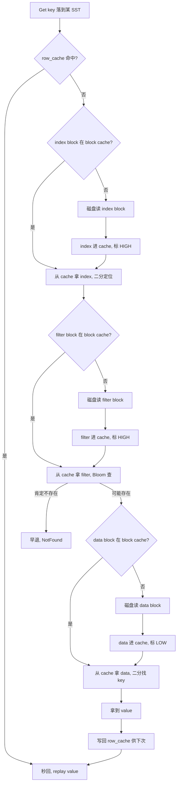

# 第 3 篇 · 第 10 章 · Block Cache

> **核心问题**:格式篇(P2-06~09)把单个 SST 的分块布局、index/filter 分离、Bloom/Ribbon、所有 SST 的花名册 MANIFEST 全讲透了,地基立稳。读路径正式开始。可第一站就撞上一个朴素到容易被忽视的问题——一次 `Get(key)` 要穿透 MemTable 加多层 SST,每一层都可能要读 index block、filter block、data block,如果一个 block 每次都去磁盘读,那一次点查的延迟会被反复磁盘 IO 吃光。读 block 怎么不每次都碰磁盘?LevelDB 用一个 16 分片的 ShardedLRUCache 已经做了这件事,RocksDB 在读路径上为什么还要把它演进?这套演进到底把"读放大"压到了什么程度?这一章,我们把读路径的第一站——Block Cache——拆到源码级,看 RocksDB 怎么把 LevelDB 那个"无差别单一 LRU"焊死的形态,演进成支持分片、多档优先级、行级缓存、二级压缩缓存的工业级缓存系统。

> **读完本章你会明白**:
> 1. 一次 Get 为什么要反复读 block,这些 block 从哪儿来,block cache 在读路径里到底挡了哪一刀。
> 2. LevelDB 的 ShardedLRUCache(16 分片降低锁竞争)是怎么做的,RocksDB 继承了这个分片骨架(承 LevelDB,一句带过),又在它上面加了哪些 LevelDB 根本没有的档。
> 3. ★**多档优先级 pin** 凭什么让 index/filter block 比 data block 留得更久,LRU 链表是怎么用三个指针(`lru_`/`lru_low_pri_`/`lru_bottom_pri_`)把一条环形双向链表切成 high-pri/low-pri/bottom-pri 三段的,为什么"命中过的项会晋升"。
> 4. ★**row_cache** 凭什么对热点 key 点查做二次加速(缓存 Get 的最终结果而非 block),它和 block cache 是什么层级关系,什么 workload 该用、什么 workload 别用。
> 5. **secondary_cache / compressed_secondary_cache** 凭什么用"压缩后数据 + dummy block 双向流转"把缓存容量从主内存扩展到远端或压缩形态。
> 6. cache key 是怎么从 db_session_id + file_number + offset 拼出 128 位全局唯一键的,为什么这套键在百万机器上跑 110 亿天都不指望撞车。

> **如果一读觉得太难**:先只记住三件事——① block cache 分片(LRU 16~64 分片),每个分片一把锁,降低并发读写时的锁竞争,这是 LevelDB 就有的骨架,RocksDB 没动它;② RocksDB 在 LRU 内部加了三档优先级,让 index/filter 这种"读了就被反复用"的元数据 block 比普通 data block 难被驱逐,默认 data block 落在低优先级段;③ row_cache 是另一层缓存,缓存的是 Get 的最终结果(key+seq→value),对热点 key 点查二次加速,但和 DeleteRange 不兼容。其余细节是这三件事的展开。

---

## 〇、一句话点破

> **LevelDB 把 block cache 焊死成一个"16 分片、无差别 LRU",所有进来的 block 一视同仁,先来先走;RocksDB 把它演进成"分片 LRU 骨架不变,但内部切成 high-pri/low-pri/bottom-pri 三档优先级,再外挂 row_cache 行级缓存和 secondary/compressed 二级压缩缓存"——让"index/filter 被数据挤掉导致读放大反弹"这件事,从"必然发生"变成"按 workload 自己拧"。**

这是结论,不是理由。本章倒过来拆:先讲一次 Get 凭什么要反复读 block、block cache 在读路径上挡了哪一刀;再讲 LevelDB 的 ShardedLRUCache 骨架(一句带过);然后逐个拆 RocksDB 在它上面加的三档优先级 pin、row_cache、secondary/compressed cache;最后把这套缓存的代价、适用场景、常见误区摆清楚。

---

## 一、读路径第一站:block cache 到底挡了哪一刀

### 提问:一次 Get 凭什么要反复读 block

先把读路径的"读放大"账算清楚(详见下一章 P3-11 的全链路拆解,这里先点一下)。一次 `Get(key)`,RocksDB 要从新到旧依次查:active MemTable → Immutable MemTable 队列 → L0 的多个 SST 文件(每个都可能命中)→ L1..Ln 每层至多一个 SST 文件。

落到一个具体 SST 上(假设 Bloom 没早退),要做这几件事:

1. **读 index block**:在这个 SST 的 index block 里二分(或走 partitioned index 的两級),定位 `key` 落在哪个 data block,拿到该 data block 的 BlockHandle(offset + size)。
2. **读 filter block**(如果配了 Bloom/Ribbon):用 `key` 在 filter block 里查一下"可能存在 / 肯定不存在"。肯定不存在就直接早退,省掉下一步的 data block 读。
3. **读 data block**:按 BlockHandle 把那个 data block 从文件里读出来,在里面二分(或 hash index)找到 `key` 对应的 entry。

注意,这三个 block 是**分开存的**(格式篇 P2-06/07 讲透了):index 是 index、filter 是 filter、data 是 data,它们各自是一个独立的 block,各自的 offset 不同。一次 Get 命中一个 SST,至少要读 index block + data block 两个 block;如果走 filter,还要读 filter block。

> **不这样会怎样**:假设没有缓存,这次 Get 要把这个 SST 的 index block 从磁盘读进来(一次 pread),再读 filter block(再一次 pread),再读 data block(第三次 pread)。下一次 Get 命中同一个 SST,又得重新读一遍 index、filter——因为这些 block 是从磁盘临时读进来的,函数返回就释放了,下次再来又得重新碰磁盘。在一个被高频点查的 workload 下(比如在线服务的 KV 查询),index/filter 这些**几乎每次查询都要用、且内容相对稳定**的元数据 block,会被反反复复从磁盘读进来,每次只为了用几十字节,却付出整块(几 KB 到几 MB)的 IO 代价。读延迟会被这堆重复 IO 彻底吃掉。

这就是读路径上 block cache 要挡的那一刀:**把读过的 block 留在内存里,下次再用就不用碰磁盘**。

### LevelDB 的基线:ShardedLRUCache 一句带过

LevelDB 早就意识到这件事,它的解法是 `ShardedLRUCCache`——一个分片的 LRU 缓存。《LevelDB》那本已经拆到源码级,这里一句话带过(详见《LevelDB》Cache 章及 [[leveldb-source-facts]]):

> LevelDB 把缓存切成 **16 个分片**(2^4),每个分片是一个独立的 LRU,自带一把 `port::Mutex`。一次 block lookup,先对 cache key 做哈希,取低 4 位决定落在哪个分片,然后只锁那一个分片。这样并发查询打到不同分片时,各锁各的,互不阻塞。每个分片内部是一条**单一的双向链表**当 LRU,所有 block 一视同仁,链尾的先淘汰。

这套骨架非常 sound,所以 RocksDB 完全继承。RocksDB 的 `LRUCache` 也是分片的(`ShardedCache<LRUCacheShard>` 模板),分片数由 `num_shard_bits` 控制(默认按 capacity 自动算,最多 2^6=64 分片,见 `cache/sharded_cache.cc` 的 `GetDefaultCacheShardBits`)。每个分片也是一条环形双向链表 + 一把锁(`DMutex`,比 LevelDB 的 `port::Mutex` 更激进的分布式锁实现)。

> **LevelDB 是写死的,RocksDB 打开成了旋钮**:分片数 LevelDB 焊死 16(2^4),RocksDB 做成 `LRUCacheOptions::num_shard_bits`(可配,默认 -1 表示按 capacity 自动算,上限 64);分片内部 LevelDB 是无差别单一 LRU,RocksDB 在这条链表上切了三段优先级。**本章剩下的篇幅,全留给 RocksDB 在 LevelDB 这副骨架上加的档。**

### 钉死这件事:block cache 服务的本质是"读放大"

读放大(下一章 P3-11 详拆)的定义是:**一次逻辑 Get,实际读了多少个 block**。一次 Get 命中一个 SST,逻辑上只读一个 key,实际读了 index + filter + data 至少两三个 block。如果再乘上多层 SST(穿透 MemTable + L0 多文件 + L1..Ln),一次 Get 可能要碰十几个 block。

block cache 的作用,就是把"这十几个 block 里能复用的那部分"留在内存。index/filter block 几乎每个查询都要复用(同一个 SST 的 index 一次查完,下次查同 SST 还要用),data block 在热点 key 上也高度复用。cache 命中率高,实际磁盘 IO 就少;cache 命中率低(或缓存被错误淘汰),读放大就全部砸到磁盘上。

> **钉死这件事**:block cache 是读路径上的"复用层"。它不改变读放大的**逻辑次数**(一次 Get 该读几个 block 还是几个),但它通过把热 block 留在内存,让这些读**物理上不再碰磁盘**。cache 设计得好不好,直接决定一次 Get 的延迟是微秒级(全命中)还是毫秒级(全 miss 砸磁盘)。RocksDB 在 LevelDB 骨架上加的所有档(三档优先级、row_cache、secondary cache),都是为了一个目标:**让该留的留得住,不该留的别占地方**。

---

## 二、撞墙:无差别单一 LRU 在工业场景会撞什么

要看清 RocksDB 为什么要在 LRU 上加优先级档,先得看清 LevelDB 那副"无差别单一 LRU"焊死形态会撞什么墙。

### 提问:同一份 cache,装的是 index/filter 还是 data

先问一个朴素的问题:同一个 block cache(假设 1GB),里面装的是什么?答案是——**什么 block 进来,就装什么**。一次 Get 读了一个 data block,它进 cache;下次 Compaction 或别的查询读了一个 index block,它也进 cache;Bloom 查询读了一个 filter block,它也进 cache。所有 block,无论 data、index、filter、properties,都进同一个 cache,共享同一份 capacity。

这在 LevelDB 的假设下(单机、中等负载、SST 不大)没问题——SST 一共就那么几个,index/filter 加起来没多少,大部分 cache 自然被 data block 占着,也算合理。

> **不这样会怎样**:可一旦数据量大起来,工业场景撞墙了。举个具体的:你的 RocksDB 存了 1TB 数据,分了 7 层,光 L6 这一层的 index block 加起来可能就几 GB(每层每个 SST 都有自己的 index)。你的 block cache 才 1GB。这下会发生什么?

答案:**index/filter 和 data block 在 cache 里抢位置**。一次大范围扫描(比如 Iterator 全表扫)或者一次冷的批量加载,会读进来海量的 data block,这些 data block 涌进 cache,把原来好不容易攒下的 index/filter block 全部挤出去(LRU 是先来先走,data block 后进,反而把先进的 index/filter 挤掉了)。

等扫描结束,cache 里全是这次扫描读过的、可能再也不会被用的 data block;而那些 index/filter block(下一次点查马上就要用的)已经被挤到磁盘上了。下一次点查命中同一个 SST,又要重新从磁盘读 index、filter——**读放大瞬间反弹**。

这就是"无差别单一 LRU"撞的第一堵墙:**data block 的访问模式(大批量、一次性)会淹没 index/filter 的访问模式(高频复用、读放大影响大),LRU 把该留的挤掉了**。

### 不这样会怎样:index/filter 被挤掉,读放大怎么反弹

把这堵墙拆细一点,看一次点查在"index 被挤掉"之后付出什么代价。

假设 cache 满了,你的热点 SST 的 index block 被一批扫描的 data block 挤出去了。现在来一次点查 `Get(k)`:

1. 落到这个 SST,要读 index block 二分定位 `k` 在哪个 data block。
2. **cache miss**(index 被挤了)→ 磁盘 pread,把几 MB 的 index block 读进来 → 进 cache(又挤掉别的)。
3. 二分拿到 data block 的 BlockHandle。
4. 读 data block。如果这个 data block 也在 cache 里,好;不在,又是一次磁盘 pread。

这一次点查,光 index miss 就付出了一次几 MB 的磁盘 IO。而如果 index 没被挤掉,这一步是 0 IO。差距就是这么大。

更阴险的是**级联效应**:index 被挤掉 → 读 index → 读进来的 index 又挤掉 filter → 下次 filter 又要重新读 → 读 filter 又挤掉 data → ...cache 在三种 block 之间来回抖动,谁也留不住,磁盘 IO 飙升。这在生产环境是个非常常见的故障——"明明 cache 设得够大,命中率就是上不去",根因往往就是 data 把 index/filter 淹了。

> **钉死这件事**:index/filter block 和 data block 的访问模式本质不同——index/filter 是"每个 SST 一份,该 SST 的所有查询都要用"(读放大的放大器),data block 是"每个 key 一份,只对该 key 的查询有用"(读放大的直接产物)。把它们一视同仁地丢进同一个 LRU,在大数据量 + 混合 workload 下,必然是"高频复用的元数据被低频但大批量的数据淹没"。RocksDB 必须把这个焊点拆开——让 index/filter 能比 data 留得更久。

### 所以这样设计:三档优先级 + 命中晋升

RocksDB 的回答是**在 LRU 链表内部切优先级档**。具体看 `LRUCacheShard` 的字段(`cache/lru_cache.h:404-413`):

```cpp
// Dummy head of LRU list.
// lru_.prev is newest entry, lru_.next is oldest entry.
// LRU contains items which can be evicted, ie reference only by cache
LRUHandle lru_;

// Pointer to head of low-pri pool in LRU list.
LRUHandle* lru_low_pri_;

// Pointer to head of bottom-pri pool in LRU list.
LRUHandle* lru_bottom_pri_;
```

这是核心。一条环形双向链表(`lru_` 是哨兵节点,`lru_.next` 是最老的、`lru_.prev` 是最新的),但**它被两个指针 `lru_low_pri_` 和 `lru_bottom_pri_` 切成了三段**:

```
   环形双向链表 lru_(只画可驱逐的项,refs==0 的):

        最老(下次先淘汰)              最新(最后才淘汰)
   lru_.next ──> ... ──> ... ──> ... ──> ... ──> ... ──> lru_.prev
                 ▲                              ▲
                 │                              │
            lru_bottom_pri_                 lru_low_pri_
            (bottom-pri 段头)               (low-pri 段头)
                 
   ┌──────────────────────────────────────────────────────────────┐
   │  [bottom-pri 段]   <──  [low-pri 段]  <──  [high-pri 段]     │
   │   普通 data block       命中过的项         index/filter      │
   │   (默认 LOW 但没命中)   (从 bottom 晋升)   (IsHighPri)        │
   │   最先被淘汰            中间被淘汰          最后被淘汰         │
   └──────────────────────────────────────────────────────────────┘
   
   淘汰方向:从 lru_.next(bottom-pri 段尾)开始往右吃
```

三段的含义(`LRU_Insert` 的逻辑,`cache/lru_cache.cc:256-296`):

- **high-pri 段**(`lru_low_pri_` 到 `lru_.prev` 之间):放"标记为 HIGH 优先级"的项(index/filter block,当 `cache_index_and_filter_blocks_with_high_priority=true` 时),以及**被命中过(`HasHit`)的项**(不管它原来是什么优先级)。这一段最后才被淘汰。
- **low-pri 段**(`lru_bottom_pri_` 到 `lru_low_pri_` 之间):放"标记为 LOW 优先级且命中过"的项,以及从 high-pri 段溢出的项(MaintainPoolSize 把 high-pri 段超容量的项降级到这里)。这一段中间被淘汰。
- **bottom-pri 段**(`lru_.next` 到 `lru_bottom_pri_` 之间):放"既不是 HIGH 也不是 LOW、且从未被命中过"的项——也就是默认的、刚插进来还没人查过的普通 data block。这一段最先被淘汰。

> **钉死这件事**:这里有一个极其精妙的设计——**命中过的项会晋升**。看 `LRU_Insert` 的判断条件(`cache/lru_cache.cc:259`):`if (high_pri_pool_ratio_ > 0 && (e->IsHighPri() || e->HasHit()))`。一个项,不管它原本是 HIGH 还是 LOW,只要它被 Lookup 命中过一次(在 `Lookup` 里调用了 `e->SetHit()`,见 `lru_cache.cc:445`),下次它从 LRU 链重新插入时(`Release` 触发),就会插到 high-pri 段去——**因为它被命中过,说明它是热的,该留久一点**。反之,一个从来没被命中过的项,就只能待在 bottom-pri 段,先被淘汰。

这就是 RocksDB 给"无差别 LRU"开的第一个旋钮:**让热的、被复用的 block 自动晋升,让冷的、一次性的 block 自动下沉**。index/filter block 因为标了 HIGH 优先级,一进来就在 high-pri 段;data block 虽然默认 LOW,但如果某个 data block 被反复查(热点 key),它命中过也会晋升。反过来,一批扫描读进来的冷 data block,因为从未命中,全部沉在 bottom-pri 段,先被淘汰——**它们不会去挤 index/filter,也不会去挤热点 data**。

---

## 三、源码精读:三档优先级是怎么落到链表上的

光看字段和分段图还不够,要把 `LRU_Insert`、`LRU_Remove`、`MaintainPoolSize`、`EvictFromLRU` 这几个函数逐行拆开,才能看清三档优先级是怎么在链表操作里精确实现的。这是本章技巧精解的核心备料。

### LRUHandle 的状态机:三态决定在不在链里

先看一个比优先级更基础的问题:**一个 block 进了 cache,它一定在 LRU 链里吗?** 答案是——**不一定**。这取决于它的"被引用"状态。看 `LRUHandle` 的注释(`cache/lru_cache.h:32-47`):

```
LRUHandle 三态:
1. refs >= 1 && in_cache == true   → 被外部引用且在 hash 表里
   此时 NOT in LRU list(正在被用,不能淘汰)
2. refs == 0 && in_cache == true   → 不被外部引用但在 hash 表里
   此时 IN LRU list(可以被淘汰)
3. refs >= 1 && in_cache == false  → 被外部引用但已从 hash 表移除
   此时 NOT in LRU list, NOT in hash(必须等 refs 归零才能释放)
```

> **钉死这件事**:LRU 链里放的,是且仅是**状态 2**(在 cache 里、但当前没人引用)的项。状态 1(正在被读)的项**不在 LRU 链里**——它被"pin"住了,绝不会被淘汰。这就是本章标题里"多档 pin"的"pin"的第一层含义:**被引用即 pin,被 pin 即不淘汰**。

这个设计非常 sound:如果一个 block 正在被某个查询用(比如刚 Lookup 出来,正在读它的内容),它绝对不能被淘汰——否则查询读到一半,block 被另一个线程淘汰释放了,就是 use-after-free。所以只要 `refs >= 1`,就把它从 LRU 链里摘出来(在 `Lookup` 里 `LRU_Remove(e)` 然后给 `e->Ref()`,见 `lru_cache.cc:439-446`),等引用全部 Release 了(`Unref` 到 0),再 `LRU_Insert` 回去(`lru_cache.cc:493`)。

这跟"优先级档"是两套正交的机制:**pin(refs>=1 不淘汰)管的是"能不能淘汰",优先级档管的是"能淘汰时,先淘汰谁"**。一个项如果被 pin 住,它根本不在链里,优先级档对它无效;只有当它回到链里(refs==0),优先级档才决定它排在 high/low/bottom 哪一段。

### LRU_Insert:新项按优先级和命中历史选段

看 `LRU_Insert`(`cache/lru_cache.cc:256-296`)的核心逻辑:

```cpp
void LRUCacheShard::LRU_Insert(LRUHandle* e) {
  assert(e->next == nullptr);
  assert(e->prev == nullptr);
  if (high_pri_pool_ratio_ > 0 && (e->IsHighPri() || e->HasHit())) {
    // 插到链表头(lru_.prev 那端,即最新端),进 high-pri 段
    e->next = &lru_;
    e->prev = lru_.prev;
    e->prev->next = e;
    e->next->prev = e;
    e->SetInHighPriPool(true);
    e->SetInLowPriPool(false);
    high_pri_pool_usage_ += e->total_charge;
    MaintainPoolSize();           // high-pri 段超容量就溢出到 low-pri 段
  } else if (low_pri_pool_ratio_ > 0 &&
             (e->IsHighPri() || e->IsLowPri() || e->HasHit())) {
    // 插到 lru_low_pri_ 后面,进 low-pri 段
    e->next = lru_low_pri_->next;
    e->prev = lru_low_pri_;
    e->prev->next = e;
    e->next->prev = e;
    e->SetInHighPriPool(false);
    e->SetInLowPriPool(true);
    low_pri_pool_usage_ += e->total_charge;
    lru_low_pri_ = e;             // 更新 low-pri 段头指针
    MaintainPoolSize();
  } else {
    // 插到 lru_bottom_pri_ 后面,进 bottom-pri 段
    e->next = lru_bottom_pri_->next;
    e->prev = lru_bottom_pri_;
    e->prev->next = e;
    e->next->prev = e;
    e->SetInHighPriPool(false);
    e->SetInLowPriPool(false);
    if (lru_bottom_pri_ == lru_low_pri_) {
      lru_low_pri_ = e;           // low-pri 段空时,lru_low_pri_ 也要跟着挪
    }
    lru_bottom_pri_ = e;          // 更新 bottom-pri 段头指针
  }
  lru_usage_ += e->total_charge;
}
```

逐段拆:

- **第一个分支**(`IsHighPri() || HasHit()`):进 high-pri 段。两种情况会走到这里——① 这个 block 插入时被标了 HIGH 优先级(`IsHighPri()`,index/filter block 默认这样,见 `GetCachePriority`);② 这个 block 之前被命中过(`HasHit()`,即使是 data block,只要被 Lookup 过一次)。插的位置是 `lru_.prev` 那端(最新端),所以 high-pri 段的项总是排在最不容易被淘汰的位置。
- **第二个分支**(`IsHighPri() || IsLowPri() || HasHit()`,但第一个分支没命中,说明不是 high-pri pool 模式):进 low-pri 段。主要是"被标了 LOW 优先级且命中过"的项。
- **第三个分支**(else):进 bottom-pri 段。这是"既不是 HIGH 也不是 LOW、且从未被命中过"的项——典型就是刚插进来、还没人查过的普通 data block。它们排在 `lru_.next` 那端(最老端),最先被淘汰。

注意三个分支都更新了对应的段头指针(`lru_low_pri_`、`lru_bottom_pri_`),并在 high/low 段超容量时调 `MaintainPoolSize()` 把溢出的项降级。这就是"一条物理链表,三个逻辑段"的精确实现。

### MaintainPoolSize:容量溢出就降级

`MaintainPoolSize`(`cache/lru_cache.cc:298-321`)干两件事:

```cpp
void LRUCacheShard::MaintainPoolSize() {
  while (high_pri_pool_usage_ > high_pri_pool_capacity_) {
    // high-pri 段超容量:把段尾(lru_low_pri_->next)的项降级到 low-pri 段
    lru_low_pri_ = lru_low_pri_->next;
    assert(lru_low_pri_ != &lru_);
    assert(lru_low_pri_->InHighPriPool());
    lru_low_pri_->SetInHighPriPool(false);
    lru_low_pri_->SetInLowPriPool(true);
    high_pri_pool_usage_ -= lru_low_pri_->total_charge;
    low_pri_pool_usage_ += lru_low_pri_->total_charge;
  }
  while (low_pri_pool_usage_ > low_pri_pool_capacity_) {
    // low-pri 段超容量:把段尾(lru_bottom_pri_->next)的项降级到 bottom-pri 段
    lru_bottom_pri_ = lru_bottom_pri_->next;
    assert(lru_bottom_pri_ != &lru_);
    assert(lru_bottom_pri_->InLowPriPool());
    lru_bottom_pri_->SetInHighPriPool(false);
    lru_bottom_pri_->SetInLowPriPool(false);
    low_pri_pool_usage_ -= lru_bottom_pri_->total_charge;
  }
}
```

注意它**没有真的移动节点**——节点在物理链表里的位置不变,它只是**改了段的边界指针**(`lru_low_pri_`、`lru_bottom_pri_` 往"更新"的方向挪),并改了节点上的 `InHighPriPool`/`InLowPriPool` 标志位。这非常巧妙:一条链表的逻辑分段,靠移动两个"分界指针"就能动态调整,无需搬运数据。

`high_pri_pool_capacity_` 和 `low_pri_pool_capacity_` 在 `SetCapacity` 里算(`lru_cache.cc:359-360`):`capacity * high_pri_pool_ratio` 和 `capacity * low_pri_pool_ratio`。这两个 ratio 是用户配的(`LRUCacheOptions::high_pri_pool_ratio`/`low_pri_pool_ratio`),默认 high_pri_pool_ratio=0(不启用 high-pri 段保护,但 index/filter 仍因 `HasHit` 晋升机制受益)。

> **钉死这件事**:三档优先级不是"三段固定容量",而是"两段有容量上限、第三段吃剩下的"。high-pri 段超容量就溢出到 low-pri,low-pri 超容量就溢出到 bottom-pri,bottom-pri 没有下限保护,它就是"被 high/low 挤剩下来的"。所以 index/filter 的保护力度,取决于 `high_pri_pool_ratio` 设多大——设 0.5,意味着 cache 一半的容量被预留出来给 high-pri 段,index/filter 再怎么被 data 涌入也挤不出去这一半。

### EvictFromLRU:从最老的 bottom-pri 尾开始吃

淘汰时,`EvictFromLRU`(`cache/lru_cache.cc:323-336`)从 `lru_.next`(链表最老端,也就是 bottom-pri 段的尾部)开始吃:

```cpp
void LRUCacheShard::EvictFromLRU(size_t charge,
                                 autovector<LRUHandle*>* deleted) {
  while ((usage_ + charge) > capacity_ && lru_.next != &lru_) {
    LRUHandle* old = lru_.next;     // 最老的,一定在 bottom-pri 段尾
    assert(old->InCache() && !old->HasRefs());
    LRU_Remove(old);
    table_.Remove(old->key(), old->hash);
    old->SetInCache(false);
    usage_ -= old->data->total_charge;
    deleted->push_back(old);
  }
}
```

因为 `lru_.next` 永远是 bottom-pri 段的尾部(最老的、从未命中的项),所以淘汰总是**先吃最冷、最没用的 data block**。只有当 bottom-pri 段被吃光了,才会吃 low-pri 段(那时 `lru_.next` 已经指向 low-pri 段的尾部了,因为 `lru_bottom_pri_` 已经和 `lru_.next` 重合)。再吃光才吃 high-pri 段。

> **不这样会怎样**:回想 LevelDB 那副无差别 LRU——淘汰也是从 `lru_.next` 开始吃,但它的 `lru_.next` 可能是任何 block(包括刚进来、马上要被复用的 index)。RocksDB 的三档分段,保证 `lru_.next` 永远是"最该被淘汰的"——bottom-pri 段的、从未命中的冷 data block。这就是"该留的留得住,不该留的先走"的精确含义。

---

## 四、旋钮对齐:GetCachePriority 把 index/filter 标成 HIGH

光有 LRU 内部的三档分段还不够,还得让 index/filter block 在插入时被标成 HIGH 优先级。这件事由 `BlockBasedTable::GetCachePriority`(`table/block_based/block_based_table_reader.cc:1647-1663`)决定:

```cpp
template <typename TBlocklike>
Cache::Priority BlockBasedTable::GetCachePriority() const {
  // data block 和 properties block 返回 LOW
  if constexpr (TBlocklike::kBlockType == BlockType::kData ||
                TBlocklike::kBlockType == BlockType::kProperties) {
    return Cache::Priority::LOW;
  } else if (rep_->table_options
                 .cache_index_and_filter_blocks_with_high_priority) {
    // index/filter(及除 data/properties 外的其他元数据 block)默认 HIGH
    return Cache::Priority::HIGH;
  } else {
    return Cache::Priority::LOW;
  }
}
```

逻辑很清楚:

- **data block 和 properties block** 永远是 LOW 优先级。data block 是查询的直接产物,复用频率取决于 key 热度;properties block 是 SST 的元信息(只在打开 TableReader 时用一次),不需要高优先级。
- **index block、filter block 等其他元数据 block**,当 `cache_index_and_filter_blocks_with_high_priority = true`(这是默认值)时,返回 HIGH。这两个 block 是"每个 SST 一份、该 SST 的所有查询都要用"的读放大放大器,优先级必须高于 data。
- 用户可以关掉 `cache_index_and_filter_blocks_with_high_priority`,让 index/filter 也走 LOW——但几乎没人这么做,因为那就退化成 LevelDB 那副无差别 LRU 了。

> **钉死这件事**:这里有一个前置条件——**index/filter 必须先进 cache 才谈得上优先级**。这由另一个选项 `cache_index_and_filter_blocks`(P2-07 讲过)控制。如果它关了,index/filter 根本不进 cache(而是挂在 TableReader 自己的内存里),那 `GetCachePriority` 返回什么都不影响 cache。所以完整的"index/filter 留得住"链路是:`cache_index_and_filter_blocks = true`(让它们进 cache)+ `cache_index_and_filter_blocks_with_high_priority = true`(让它们标 HIGH)+ LRU 的 high-pri 段(MaintainPoolSize 保护它们不被挤出)。三者缺一不可。

### L0 的特殊优待:pin_l0_filter_and_index_blocks_in_cache

L0 的 SST 文件因为是 Flush 直接产出的、key range 重叠、点查要逐个查的,其 index/filter 被复用的频率比 L1+ 还高(一次点查 L0 有 N 个文件可能全要查一遍 index)。RocksDB 给了 L0 一个额外旋钮:`pin_l0_filter_and_index_blocks_in_cache`。

这个选项的效果是:在 L0 文件的 index/filter block 插入 cache 后,**额外 Ref 一下**,让它们的 refs >= 1,从而进入 LRUHandle 的"状态 1"(被引用、不在 LRU 链、绝不被淘汰)。这就是"多档 pin"的"pin"的第二层含义:**用户显式 pin,不让淘汰**。

> **不这样会怎样**:如果不 pin,L0 的 index/filter 在 cache 满时照样可能被 high-pri 段溢出机制降级,然后被淘汰。而 L0 的点查是读放大的重灾区(多个文件 key range 重叠,每个都要查 index),L0 的 index/filter 一旦被淘汰,读放大立刻反弹。所以对 L0 查询密集的 workload(比如刚 Flush 完、L0 文件还没合并下去),开 `pin_l0_filter_and_index_blocks_in_cache` 收益非常明显。

注意这个选项只在 L0 生效,L1+ 的 index/filter 靠 `cache_index_and_filter_blocks_with_high_priority` 的 HIGH 优先级保护就够了(L1+ 每层只有一个文件命中,index 复用频率比 L0 低,不需要硬 pin)。

---

## 五、row_cache:行级缓存的二次加速

block cache 缓存的是"block"(一段 KV 数据),一次 Get 命中一个 SST,要读 index + data 至少两个 block。但很多点查 workload(比如 KV 服务的热点 key 查询),同一个 key 会被反复查——查 100 次同一个 key,每次都要走 index 二分 + data 二分这一整套流程,即使 index/data 都在 cache 里,CPU 开销也不小。

RocksDB 给这种场景开了第二个缓存层:**row_cache**,缓存的是 Get 的**最终结果**(key + sequence → value),不是中间的 block。

### 提问:为什么不只用 block cache,还要 row_cache

先把 block cache 在热点 key 上的极限算清楚。假设 key `k` 是热点,被反复 Get。第一次 Get,读 index block(可能 miss 一次,然后进 cache)+ 读 data block(miss 一次,然后进 cache)。第二次及以后 Get,index/data 都在 cache 里了,命中,不再碰磁盘。

那 CPU 上还要做什么?还是要:在 index block 里二分定位 `k` 在哪个 data block(一次二分查找,几微秒),拿到 BlockHandle,再去 data block 里二分找到 `k` 的 entry(又一次二分),解析 entry 拿到 value。这套流程,即使全 cache 命中,每次 Get 也要付出两次 block 内二分的 CPU 开销,大约几微秒。

> **不这样会怎样**:对于"同一个 key 被狂查几万次"的极端热点 workload(比如配置中心、计数器、热点商品库存),这几微秒的 CPU 开销 × 查询次数,就是可观的延迟和 CPU 占用。block cache 帮不了这件事——它只能让 block 不碰磁盘,不能让 Get 跳过"在 block 里找 key"这一步。row_cache 就是来跳这一步的。

### 所以这样设计:row_cache 缓存最终结果

row_cache 是另一个独立的 `Cache` 实例(类型是 `std::shared_ptr<RowCache>`,RowCache 是 Cache 的别名,见 `include/rocksdb/options.h:1485` 的 `DBOptions::row_cache` 字段)。它的 key 是 **user_key + 文件号 + sequence 号**,value 是 **Get 的最终结果**(序列化后的 GetContext log,可以被 replay 还原成 value + 状态)。

看一次 Get 在开了 row_cache 后的流程(`db/table_cache.cc` 的 `CreateRowCacheKey` + `GetFromRowCache`,`table_cache.cc:521-580`):

```cpp
// 1. 构造 row cache key(每个 TableReader 有唯一的 row_cache_id_,
//    再拼 fd_number + seq_no + user_key)
row_cache_key.TrimAppend(row_cache_key.Size(), row_cache_id_.data(),
                         row_cache_id_.size());  // TableReader 的唯一 id
AppendVarint64(&row_cache_key, fd_number);       // 文件号
AppendVarint64(&row_cache_key, cache_entry_seq_no);  // 快照 seq

// 2. 查 row cache
if (auto row_handle = row_cache.Lookup(row_cache_key.GetUserKey())) {
  // 命中!直接 replay 出 value,跳过 index/data block 的读取
  replayGetContextLog(*row_cache.Value(row_handle), user_key, ...);
  ...
}
```

row cache key 的构造非常讲究(`table_cache.cc:526-560`):

- **`row_cache_id_`**:每个 TableReader 在打开时由 `ioptions_.row_cache->NewId()` 生成一个全局唯一 id(`table_cache.cc:84-87`)。这保证不同 SST 文件、不同 DB 实例的 row cache key 不会冲突。
- **`fd_number`**:文件号,区分同一个 DB 里不同 SST。
- **`cache_entry_seq_no`**:快照的 sequence 号。这是关键——**同一个 key 在不同快照下可能对应不同的 value**(MVCC),所以 row cache key 必须带上 seq 号区分。如果没指定快照(读最新值),seq_no = 0,表示"读最大 seq"。
- **user_key**:用户 key 本身。

这套 key 拼出来,row cache 命中就直接拿到 value,跳过整个 block 读取流程。

> **钉死这件事**:row_cache 和 block cache 是**正交的两层**。block cache 缓存中间产物(block),row_cache 缓存最终产物(key→value)。一次 Get 先查 row_cache(命中就秒回),miss 再走 block cache(读 index/data block),block cache 命中后在 data block 里找到 value,顺便把结果写回 row_cache 供下次用。两层各管各的容量,各自独立淘汰。

### row_cache 的代价和适用场景

row_cache 不是万能药,它有明确的代价和适用边界。

**适用场景**:热点 key 点查,且 key 的 value 相对稳定(不频繁更新)。比如配置中心(配置变更少,查询多)、商品基础信息(更新少,查询多)。这种场景下,row_cache 命中率极高,收益巨大。

**不适用场景**:

- **写多读少**:row_cache 的 entry 在 key 被更新后就失效了(下次 Get 会重新走 block 流程并刷新 row_cache),写多的话 row_cache 老是 miss,白白占内存。
- **范围扫描(Iterator)**:row_cache 只缓存点查结果,Iterator 扫描根本不走 row_cache。开了也是浪费内存。
- **DeleteRange**:**row_cache 和 DeleteRange 不兼容**!见 `db/db_impl/db_impl_write.cc:967-969`,如果 WriteBatch 里有 DeleteRange 且配了 row_cache,直接返回 `Status::NotSupported`。这是因为 row_cache 缓存的是单个 key 的结果,而 DeleteRange 是范围删除,无法精确失效 row cache 里的所有受影响 key。

> **不这样会怎样**:如果你在"写多读少 + 范围扫描"的 workload 上开了 row_cache,你会发现 row_cache 命中率极低(写一个失效一个,扫描还不走它),白白占了一块内存,本来这块内存给 block cache 收益更高。row_cache 是个**专为热点点查设计的旋钮**,不是通用优化。

### row_cache vs block cache 的层级关系

用一个表把两者的差异列清楚:

| 维度 | block cache | row_cache |
|---|---|---|
| 缓存什么 | block(SST 里的一段 KV 数据) | Get 的最终结果(key→value) |
| key 构成 | db_session_id + file_number + offset | row_cache_id + fd_number + seq_no + user_key |
| 命中后跳过 | 磁盘 IO | 整个 block 读取 + 二分流程 |
| 服务查询类型 | 点查 + 范围扫描 | 仅点查 |
| 容量来源 | 独立的 `block_cache` 容量 | 独立的 `row_cache` 容量 |
| 与 DeleteRange | 兼容 | **不兼容** |
| 默认状态 | 默认开启(有默认容量) | 默认关闭(nullptr) |

> **LevelDB 是写死的,RocksDB 打开成了旋钮**:LevelDB 根本没有 row_cache(只有 block cache),RocksDB 把"要不要再加一层行级缓存"做成了 `DBOptions::row_cache` 这个旋钮。这是个典型的"按 workload 自己拧"——绝大多数 workload 不需要它(默认关闭),但热点点查 workload 开了收益巨大。

---

## 六、secondary_cache 与 compressed_secondary_cache

block cache 受限于主内存容量。如果你的数据集远大于内存,cache 装不下,index/data block 的 miss 率就会很高。RocksDB 给了一个扩展机制:**secondary_cache**(二级缓存),可以把缓存数据放到主内存之外——比如远端内存(NVM、分布式缓存)、压缩后的内存区域。

### 提问:主内存装不下,怎么办

工业场景下,数据集动辄几百 GB 到几 TB,而一台机器的主内存通常几十 GB 到几百 GB,block cache 只能分到其中一部分(还要跟 MemTable、应用本身抢内存)。这意味着大部分 block 是 cache 不到的,miss 就得碰磁盘。

磁盘(哪怕是 NVMe SSD)的延迟是微秒到毫秒级,而内存是纳秒级,差了三个数量级。如果能多缓存一些 block,哪怕是用"压缩后"或"远端"的形态,延迟收益都很大。

> **不这样会怎样**:如果只有主内存 block cache 这一层,大数据集的 cache 命中率永远上不去,读延迟永远被磁盘 IO 主导。这对低延迟 workload(比如在线服务的 SLA 要求 P99 < 1ms)是致命的——一次 cache miss 直接破 SLA。

### 所以这样设计:二级缓存 + 压缩形态

RocksDB 的 `SecondaryCache`(`include/rocksdb/secondary_cache.h`)是一个抽象接口,允许用户插入自定义的二级缓存实现。官方自带一个具体实现:`CompressedSecondaryCache`(`cache/compressed_secondary_cache.h`),它把 block 以**压缩后的形态**存在(另一份)内存里。

`CompressedSecondaryCache` 的核心设计(`compressed_secondary_cache.h:46-61` 的类注释):

> When a block is found from CompressedSecondaryCache::Lookup, we check whether there is a dummy block with the same key in the primary cache.
> 1. If the dummy block exits, we erase the block from CompressedSecondaryCache and insert it into the primary cache.
> 2. If not, we just insert a dummy block into the primary cache (charging the actual size of the block) and do not erase the block from CompressedSecondaryCache. A standalone handle is returned to the caller.
>
> When a block is evicted from the primary cache, we check whether there is a dummy block with the same key in CompressedSecondaryCache.
> 1. If the dummy block exits, the block is inserted into CompressedSecondaryCache.
> 2. If not, we just insert a dummy block (size 0) in CompressedSecondaryCache.

这套机制非常巧妙,核心是 **primary cache 和 secondary cache 之间的"双向流转 + dummy block 占位"**:

- **primary miss → secondary 查**:block 在主 cache miss 时,去 secondary cache 查。如果在 secondary 找到,把它解压、提升到 primary(同时在 secondary 里删掉),返回给调用者。
- **primary 命中,secondary 也有(dummy 占位)**:primary 里命中了,但发现 secondary 里有个同 key 的 dummy block(占位用)。这种情况下,这次查询不走 secondary,但会在 primary 里插一个 dummy block(占位,记下真实大小),secondary 里的数据不动。下次这个 block 从 primary 被淘汰时,因为有 dummy 占位,知道该把它 demote 到 secondary 去。
- **primary 淘汰 → secondary 接管**:block 从 primary cache 被淘汰时,如果在 primary 里有 dummy(说明 secondary 里有它的压缩副本),就把它写到 secondary;否则在 secondary 里插一个 dummy(size 0),记下"这个 block 曾经存在过,下次 miss 可以来 secondary 找"。

这套 dummy 机制的本质是:**用零成本(几字节的 dummy)记录"哪些 block 曾经在 primary 待过",这样淘汰时知道该不该 demote 到 secondary,而不是无脑全部 demote(那会淹没 secondary)或全部丢弃(那 secondary 就没用了)**。

> **钉死这件事**:CompressedSecondaryCache 的精妙在于它**不是简单的"primary 装不下的挪到 secondary"**。如果那样,secondary 会被 primary 不断淘汰的垃圾淹没。它用 dummy block 占位,精确地只 demote 那些"曾经在 primary 被用过(有过 dummy)的 block"——这些才是有复用价值的。这是一种**Lazy + 精准 demote** 的策略,让 secondary 的容量用在真正有复用价值的 block 上。

### CompressedSecondaryCache 的同步语义

注意 `CompressedSecondaryCache` 的 `IsReady()` 直接返回 `true`,`Wait()` 是空操作(`compressed_secondary_cache.h:33-35`):

```cpp
bool IsReady() override { return true; }
void Wait() override {}
```

这意味着 CompressedSecondaryCache 的 Lookup 是**同步**的(查询线程会阻塞等结果)。这跟一些远端二级缓存(比如 NVM 上的实现,可能是异步的)不同。同步语义的好处是简单 sound(查完就有结果),代价是如果 secondary 比 primary 慢(比如压缩解压耗时,或远端网络延迟),查询线程会被阻塞。所以 CompressedSecondaryCache 适合"解压快、本地内存"的场景,不适合"高延迟远端"。

### 二级缓存的代价

- **CPU 开销**:CompressedSecondaryCache 要压缩/解压,额外消耗 CPU。压缩率高(比如 LZ4 压到 50%),意味着同样内存能多存一倍 block,但每次 Lookup 要解压。
- **延迟**:即使同步,解压也要时间。对极端低延迟 workload,这个开销可能抵消 cache 命中的收益。
- **复杂度**:dummy block 双向流转机制增加了实现复杂度,调试和观测都比单层 cache 难。

> **LevelDB 是写死的,RocksDB 打开成了旋钮**:LevelDB 只有单层 ShardedLRUCache,没有二级缓存概念。RocksDB 把"要不要加一层压缩/远端缓存"做成了 `LRUCacheOptions::secondary_cache` 这个旋钮(主 cache 构造时挂上 secondary)。默认关闭,大数据集 + 内存吃紧的 workload 才值得开。

---

## 七、cache key:128 位全局唯一键怎么拼

讲了这么多 cache 的档,还有一个基础问题没拆——**cache 的 key 是怎么拼的**?一次 block 读取,cache key 必须能唯一标识"这个 DB 的这个 SST 的这个 block",而且要够稳定(crash 重启后还能对上)、够唯一(多 DB 共享一个 cache 时不冲突)。

RocksDB 的 cache key 是 **128 位**(16 字节),由 `OffsetableCacheKey` + offset 拼出来。看 `BlockBasedTable::GetCacheKey`(`table/block_based/block_based_table_reader.cc:847-851`):

```cpp
CacheKey BlockBasedTable::GetCacheKey(const OffsetableCacheKey& base_cache_key,
                                      const BlockHandle& handle) {
  // ...
  return base_cache_key.WithOffset(handle.offset() >> 2);
}
```

`base_cache_key` 是每个 SST 文件一个的"基础键",在 `SetupBaseCacheKey`(`block_based_table_reader.cc:798-844`)里由 `db_id` + `db_session_id` + `file_number` 构造:

```cpp
*out_base_cache_key = OffsetableCacheKey(db_id, db_session_id, file_num);
```

然后每个 block 用 `base_cache_key.WithOffset(handle.offset() >> 2)` 拼出最终的 128 位 cache key。`handle.offset() >> 2` 是 block 在 SST 文件里的字节偏移右移 2 位(因为 block 是 4 字节对齐的,低 2 位总是 0,右移省两位空间)。

### 128 位键的碰撞分析:为什么 sound

这套 cache key 的设计(sound 在哪)在 `cache/cache_key.cc` 里有详尽的注释和分析(`cache_key.cc:18-299`)。核心思路是:

- **结构化字段**(session_id_counter、file_number、offset_in_file)和**非结构化字段**(db_id、base_session_id 的随机部分)用 XOR 混合。结构化字段保证"同一个进程里生成的 key 有规律",非结构化字段保证"不同进程、不同机器的 key 随机分散"。
- 用 `DownwardInvolution` 和 `ReverseBits` 两个位运算,把三个结构化字段(各最多 64 位)无损压缩进 128 位,且**不需要预先知道各字段的实际位宽**——只要三者位宽之和不超过 128,就保证唯一。
- 非结构化字段(db_id ~122 位熵、base_session_id)用 XOR 混进去,让不同 DB、不同进程的 key 以极高概率不同。

碰撞概率分析(`cache_key.cc:179-208`):假设一台机器 180 天生成 2^55 字节数据(2GB/s 写入,31TB/天),2^16 个全新 session ID,128 位 cache key 里留给 session 区分的位约 73 位,碰撞概率小于 1/2^41(约一万亿分之一)。一百万台机器的集群,集群级碰撞概率小于百万分之一。作者的原话(`cache_key.cc:291-296`):

> Even in extreme cases, rapidly burning through "all new" IDs that only arise when a new process is started, the chance of any cache key collisions in a giant fleet of machines is negligible. Especially when processes live for hours or days, the chance of a cache key collision is likely more plausibly due to bad hardware than to bad luck in random session ID data.

> **钉死这件事**:cache key 的设计不是随便 hash 一下,而是一套**结构化 + 非结构化混合、可逆、碰撞概率可证明忽略**的精密方案。它的 sound 在于:即使最坏情况(进程频繁重启、每次生成全新 session ID),碰撞概率也比硬件故障概率低。这就是为什么 RocksDB 敢用 128 位 key 而不担心冲突——它在数学上把冲突概率压到了"可以忽略"的程度。

### 为什么不用"DB 名 + 文件名 + offset"这种朴素 key

朴素地想,cache key 完全可以用字符串 `"dbname_sstfilenum_offset"`。为什么 RocksDB 要搞这么复杂的 128 位方案?

> **不这样会怎样**:字符串 key 有三个问题——① **长**:一个 cache key 可能几十字节,cache 里有几百万 entry,key 本身的内存开销就很大;② **不稳定**:DB 名可能被 rename,文件可能被复制(clone 出来的 DB 有相同的文件内容但不同 DB 名),字符串 key 对不上;③ **跨 DB 共享 cache 困难**:如果两个 DB 共享一个 cache(为了省内存),字符串 key 必须保证不冲突,靠 DB 名前缀,但 DB 名可能重复。

128 位方案解决了全部三个问题:16 字节固定长度(短),由 db_session_id(进程级唯一)+ file_number + offset 拼出(跟 DB 名无关,clone 也不怕),跨 DB 共享 cache 时 db_session_id 的 ~103 位熵保证不冲突。

---

## 八、cache 按角色统计:命中率分桶可观测

最后一档,承 P2-07 讲过的"cache 按角色分桶",这里补完整。

RocksDB 的 cache 不只是个黑盒,它**按 block 的角色(DataBlock/FilterBlock/IndexBlock/...)分别统计命中率和内存占用**。这套角色定义在 `cache/cache_entry_roles.cc:14-29`:

```cpp
std::array<std::string, kNumCacheEntryRoles> kCacheEntryRoleToCamelString{{
    "DataBlock",
    "FilterBlock",
    "FilterMetaBlock",
    "DeprecatedFilterBlock",
    "IndexBlock",
    "OtherBlock",
    "WriteBuffer",
    "CompressionDictionaryBuildingBuffer",
    "FilterConstruction",
    "BlockBasedTableReader",
    "FileMetadata",
    "BlobValue",
    "BlobCache",
    "Misc",
}};
```

每个 cache entry 在插入时带上自己的角色(`CacheItemHelper` 里存),cache 内部按角色聚合统计。这样你能在 stats 里看到:

```
rocksdb.block-cache-usage-by-type=data-block: 512MB
rocksdb.block-cache-usage-by-type=index-block: 128MB
rocksdb.block-cache-usage-by-type=filter-block: 64MB
rocksdb.block-cache-hit.data-block: 98%
rocksdb.block-cache-hit.index-block: 99.5%
rocksdb.block-cache-hit.filter-block: 99.8%
```

> **不这样会怎样**:如果只有一个总的 cache 命中率,你根本看不出"是 index miss 严重还是 data miss 严重"。按角色分桶后,如果发现 index-block 命中率掉到 80%,而 data-block 还是 95%,你就知道是 index 被挤了(该调 `high_pri_pool_ratio` 或开 `cache_index_and_filter_blocks_with_high_priority`);如果 data-block 命中率掉,那是 data 被挤了(该加 cache 容量)。这种可观测性是调优的前提,LevelDB 的 cache 是个黑盒,根本不给这种细粒度统计。

这一档 P2-07 已经讲过 cache key 怎么拼出角色、`CacheEntryRole` 枚举怎么用,这里不重复,只强调它在 block cache 调优里的作用——**没有按角色分桶的命中率统计,三档优先级这种精细设计根本无从调起**。

---

## 九、技巧精解:三档优先级 pin 与 row_cache

本章最硬核的两个技巧,单独拆透。

### 技巧一:三档优先级——一条链表三个段,命中晋升

这是 RocksDB 相对 LevelDB 在 cache 淘汰上最关键的演进。核心实现前面三、四节已经逐行拆过,这里聚焦"为什么 sound"和"朴素写法会撞什么墙"。

**朴素写法(LevelDB)**:一条链表,所有 block 一视同仁,链尾先淘汰。撞的墙前面讲过——大批量 data 涌入会淹没 index/filter,读放大反弹。

**RocksDB 的技巧**:

1. **一条物理链表,三个逻辑段**:不维护三条链表(那样碎片化、指针维护复杂),而是用两个游标指针 `lru_low_pri_`、`lru_bottom_pri_` 把一条环形双向链表动态切成三段。段的边界随 `MaintainPoolSize` 动态移动,节点物理位置不变。
2. **命中晋升**:`LRU_Insert` 的判断条件里,`HasHit()` 和 `IsHighPri()` 同等对待——一个 block 只要被 Lookup 命中过一次,下次回链就进 high-pri 段。这让"热的 data block"自动晋升,无需用户手动标优先级。
3. **容量溢出降级**:`MaintainPoolSize` 用"只移动边界指针、不改节点位置"的方式,把超容量的段尾项降级到下一段。零数据搬运,纯指针操作。

**为什么 sound**:

- **不丢数据**:三档分段只影响淘汰顺序,不影响数据完整性。一个 block 在哪一段,它都在 hash 表里,Lookup 都能找到。淘汰时也是先从 hash 表 Remove 再释放,不会出现"找不到但占内存"的泄漏。
- **不死锁**:所有链表操作都在 `DMutex` 保护下(`Insert`、`Lookup`、`Release`、`LRU_Insert`、`LRU_Remove` 都先拿锁),分段逻辑是纯指针操作,无嵌套锁,无死锁风险。
- **读放大可控**:high-pri 段有容量保护(`high_pri_pool_capacity_`),index/filter 再怎么被 data 涌入也挤不出这一段,读放大不会因 cache 抖动而反弹。

**反面对比**:假设不用三档,还是 LevelDB 那副无差别 LRU,在一个 1TB 数据 + 1GB cache 的场景下:一次全表扫描读进来几百 GB 的 data block(轮流进 cache),把所有 index/filter 挤光。扫描结束后,cache 里全是这次扫描的 data block(大部分再也不会被用),所有 index/filter 都在磁盘上。下一次点查,每个 SST 的 index 都要重新磁盘读,读放大瞬间从"基本全 cache 命中"退化成"几乎全 miss"。这就是为什么工业场景必须有三档优先级——**没有它,cache 在混合 workload 下根本稳不住**。

### 技巧二:row_cache——行级缓存的正交加速

row_cache 是 block cache 之上的第二层缓存,核心技巧在于它**缓存的是查询结果而非中间数据**,且**与 block cache 正交**。

**技巧精妙处**:

1. **正交分层**:row_cache 和 block cache 是两个独立的 Cache 实例,各自容量、各自淘汰、互不干扰。row_cache 命中直接秒回(跳过 block 读取),miss 才走 block cache。block cache 命中后在 data block 里找到 value,顺便写回 row_cache。
2. **key 带 seq 号**:row cache key = `row_cache_id + fd_number + seq_no + user_key`。带 seq 号是为了支持快照读——同一个 key 在不同快照下可能对应不同 value(MVCC),seq 号区分开。如果没指定快照(读最新),seq_no = 0。
3. **value 是可 replay 的序列化 log**:row cache 的 value 不是裸 value,而是序列化后的 GetContext log,replay 时能还原出 value + 状态(Found/NotFound/Deleted/Merge)。这样 row cache 能处理 Merge 操作的复杂情况。

**反面对比**:假设不用 row_cache,热点 key `k` 被查 1 万次。每次都要:index 二分(几微秒)+ data 二分(几微秒)= 几微秒 × 1 万 = 几十毫秒 CPU 开销,即使 block 全 cache 命中。开了 row_cache 后,第 2~10000 次全部 row cache 命中,每次只付 hash 查找的开销(纳秒级),CPU 开销降三个数量级。

**为什么 sound**:

- **不返回过期数据**:row cache key 带 seq 号,key 更新后(新 seq),旧 seq 的 row cache entry 自然失效(下次 Get 用新 seq 查,miss 走 block,然后写新 entry)。MVCC 正确性靠 seq 号区分保证。
- **与 DeleteRange 的不兼容是诚实的**:DeleteRange 是范围删除,无法精确失效 row cache 里所有受影响 key,所以 RocksDB 直接 `Status::NotSupported` 拒绝,而不是"假装支持但返回错误数据"。这是 sound 的体现——宁可不做,也不做错。

**适用边界**:row_cache 只对"热点 key 点查" workload 收益巨大,对"写多读少 / 范围扫描 / 用 DeleteRange"的 workload 是负担(占内存、命中率低、或不兼容)。这是个**典型的按 workload 拧的旋钮**,默认关闭,需要时才开。

---

## 十、配图:block 读取与缓存的完整流程

把一次 block 读取(读路径上 block cache 介入的全过程)画成流程图,看清 cache 在哪几站介入:



这个流程图把本章所有机制在读路径上的位置标清楚了:row_cache 在最前(秒回层)、block cache 在中间(复用层)、三档优先级在 cache 内部(淘汰策略层)、HIGH/LOW 标记在 block 进 cache 时打上。

---

## 十一、clock_cache:LRU 的替代实现(现状澄清)

最后澄清一个常见的印象偏差。很多老资料会提到 RocksDB 有 `ClockCache`,是 LRU 的替代实现(用 clock 算法代替 LRU,理论上锁竞争更低)。在 11.6.0 这个版本:

- `cache/clock_cache.cc` 和 `clock_cache.h` 文件确实存在(clock_cache.cc 有 14 万字符,是个完整的实现)。
- 但 **`NewClockCache` 并不是默认 cache**。默认的 block cache 创建走 `NewLRUCache`(`cache/cache.cc:134`、`options.cc` 里 `Options` 默认用 `NewLRUCache`),用户要显式调 `NewClockCache` 才用 clock 实现。
- ClockCache 的设计目标是用 atomic 操作代替部分 mutex(clock 算法天然适合无锁化),在高并发下比 LRU 锁竞争低。但它的实现复杂度更高,且历史上经历过几次重写(stable 性能不如 LRU 经过充分验证)。

> **钉死这件事**:11.6.0 默认还是 LRU。ClockCache 是个可选实现,不是默认。如果你看到资料说"RocksDB 默认用 clock cache",那是过时或不准确的印象。绝大多数生产部署用的还是 `NewLRUCache` + 三档优先级这一套(本章讲的内容)。ClockCache 留作"想进一步降锁竞争时"的备选,不在默认路径上。

---

## 十二、章末小结

### 回扣主线

本章是**读路径**(第 3 篇)的第一站。读路径的核心矛盾是读放大——一次 Get 要穿透多层 SST,每层可能读 index/filter/data 多个 block。block cache 的作用,是把这些 block 留在内存,让读放大**逻辑上不变,但物理上不再碰磁盘**。

从"LevelDB 写死 / RocksDB 打开成旋钮"的视角,LevelDB 的 ShardedLRUCache 骨架(分片降低锁竞争)RocksDB 完全继承;RocksDB 的演进集中在 cache 内部的精细化和外层的扩展:

- **三档优先级 pin**:把 LevelDB 的"无差别单一 LRU"演进成"high-pri/low-pri/bottom-pri 三段 + 命中晋升",让 index/filter 和热点 data 留得住,冷 data 先走。对应旋钮 `high_pri_pool_ratio`、`cache_index_and_filter_blocks_with_high_priority`、`pin_l0_filter_and_index_blocks_in_cache`。
- **row_cache**:在 block cache 之上加一层行级缓存(缓存 Get 最终结果),对热点点查二次加速。对应旋钮 `DBOptions::row_cache`(默认关闭,与 DeleteRange 不兼容)。
- **secondary_cache / CompressedSecondaryCache**:把缓存扩展到主内存之外(压缩形态/远端),用 dummy block 双向流转机制精准 demote。对应旋钮 `LRUCacheOptions::secondary_cache`(默认关闭)。
- **cache key**:128 位全局唯一键,由 db_session_id + file_number + offset 拼出,碰撞概率可证明忽略。
- **按角色统计**:cache 按 DataBlock/IndexBlock/FilterBlock 等角色分别统计命中率,给三档优先级的调优提供可观测性。

这些旋钮共同服务于一个目标:**让读放大的物理代价(磁盘 IO)压到最小**。

### 五个为什么

1. **为什么 block cache 要分片?**——降低并发读写时的锁竞争。一次 block lookup 只锁一个分片,不同分片各锁各的,互不阻塞。这是 LevelDB 就有的骨架,RocksDB 继承并允许配置分片数(`num_shard_bits`,默认按 capacity 自动算,上限 64)。
2. **为什么要有三档优先级,不能像 LevelDB 那样无差别 LRU?**——因为 index/filter block 和 data block 的访问模式不同:前者是"每个 SST 一份、该 SST 所有查询都用"的读放大放大器,后者是"每个 key 一份"的直接产物。无差别 LRU 在大数据量 + 混合 workload 下,会让大批量 data 涌入淹没 index/filter,读放大反弹。三档优先级让 index/filter(标 HIGH)和命中过的 data(HasHit 晋升)留得住,冷 data 先走。
3. **为什么命中过的 block 会晋升?**——因为一个 block 被 Lookup 命中过,说明它是热的、有复用价值的。`LRU_Insert` 里 `HasHit()` 和 `IsHighPri()` 同等对待,命中过的项进 high-pri 段。这让热点 data block 无需用户手动标优先级就自动晋升。
4. **为什么 row_cache 和 block cache 是正交的两层?**——block cache 缓存中间产物(block),命中后跳过磁盘 IO;row_cache 缓存最终产物(key→value),命中后跳过整个 block 读取和二分流程。两层服务不同的加速目标,各自独立容量、独立淘汰,互不干扰。row_cache 只对热点点查收益大,范围扫描和写多读少不该开。
5. **为什么 cache key 要搞 128 位这么复杂,不能直接用字符串?**——因为字符串 key 长(内存开销大)、不稳定(DB rename/clone 对不上)、跨 DB 共享 cache 易冲突。128 位方案用结构化(file_number/offset)+ 非结构化(db_session_id 随机)字段混合,固定 16 字节,跨 DB 共享不冲突,碰撞概率比硬件故障还低(可证明忽略)。

### 想继续深入往哪钻

- **想看三档优先级的真实链表状态**:在 `LRUCacheShard::TEST_GetLRUList`(`lru_cache.cc:203-209`)打断点,跑一个混合 workload(扫描 + 点查),观察 high-pri/low-pri/bottom-pri 三段的项数变化。
- **想看 row_cache 的命中率收益**:用 `db_bench`(附录 B)跑 `readrandom` workload,对比开/关 row_cache 的 QPS 和 P99 延迟,特别是热点 key 集中的场景。
- **想看 cache 按角色统计**:用 `rocksdb.block-cache-usage-by-type` 和 `rocksdb.block-cache-hit` 系列 stats,观察 data-block / index-block / filter-block 各自的命中率和内存占用,验证三档优先级的效果。
- **想看 LevelDB 的基线**:读《LevelDB 设计与实现深入浅出》的 Cache 章,或 [[leveldb-source-facts]],对照看 RocksDB 在 ShardedLRUCache 骨架上加了哪些档。
- **想看 cache 在 TiKV 里怎么用**:TiKV 的单机引擎就是 RocksDB,TiKV 给 block cache 配了专门的容量(通常几个 GB),并按 CF(default/lock/write)共享同一个 block cache。可以读 TiKV 源码里 `engine_rocks` 怎么配 cache。

### 引出下一章

block cache 把读过的 block 留在内存,挡掉了读路径上的"反复磁盘 IO"这一刀。但 cache 只是复用层,它不改变读放大的逻辑次数——一次 Get 还是要穿透 MemTable + L0 多文件 + L1..Ln,每一层该读几个 block 还是几个。那么,一次 Get 到底怎么在这多层之间穿梭?Bloom/Ribbon 怎么在每一层早退?index 怎么二分定位?`max_sequential_skip_in_iterations` 又是什么?读放大的账到底怎么算、怎么压?下一章 P3-11,我们从读路径的主体——**Get 路径与读放大**——开始,拆一次 Get 怎么穿透多层 SST,把读放大压到最小。

### 附:常见误区澄清

读完这一章,有几个读者最容易搞混的点,集中澄清:

**误区一:"block cache 命中率高,读放大就没了"。** 不准确。block cache 把读放大从"物理磁盘 IO"降到了"内存访问",但读放大的**逻辑次数**没变——一次 Get 还是要查多层 SST、读多个 block。cache 只是让这些读不再碰磁盘。如果 cache 命中率掉,读放大立刻全部砸到磁盘上。所以"读放大小"和"cache 命中率高"是两件事:前者是逻辑结构决定的(层数、文件数),后者是缓存效果决定的。

**误区二:"index/filter 标了 HIGH 就永远不会被淘汰"。** 错。HIGH 优先级只是让 index/filter 进 high-pri 段,这一段有容量保护(`high_pri_pool_capacity_ = capacity * high_pri_pool_ratio`)。但保护是相对的——如果 high-pri 段塞满了(很多 index/filter),还是会溢出到 low-pri 段,再到 bottom-pri 段,最终被淘汰。要让 index/filter 真正"永不淘汰",得用 pin(`pin_l0_filter_and_index_blocks_in_cache` 让 refs>=1,根本不在 LRU 链里)。HIGH 优先级是"留得久",pin 是"绝不淘汰",两回事。

**误区三:"row_cache 命中了就不用 block cache 了,可以关掉 block cache 省内存"。** 错得离谱。row_cache 的 entry 是在 block cache 命中后(或磁盘读后)写回去的——没有 block cache,row_cache 的填充源就没了,而且 row_cache miss 时还要走 block 流程。关掉 block cache,row_cache 命中率会断崖式下跌(因为没有 block cache 兜底,miss 全砸磁盘),且 row_cache 容量有限,装不下所有 key。两层是配合关系,不是替代。

**误区四:"compressed_secondary_cache 就是把 block 压缩存,等于变相扩大 block cache"。** 部分对,但不准确。CompressedSecondaryCache 是**独立于 primary block cache 的第二层**,有自己的容量、自己的淘汰。它和 primary 之间通过 dummy block 双向流转:primary 淘汰时 demote 到 secondary,secondary 命中时提升到 primary。它不是"primary 的压缩模式",而是"primary 之外的补充层"。把它当 primary 用(直接查它)是查不到的,必须走 primary miss → secondary 这条路。

**误区五:"clock_cache 是 RocksDB 的默认 cache"。** 错。11.6.0 默认是 `NewLRUCache`(分片 LRU + 三档优先级)。ClockCache 是可选实现,要显式调 `NewClockCache` 才用,且不是默认。看到资料说"默认 clock cache"是过时印象。

---

> **下一章**:[P3-11 · Get 路径与读放大](P3-11-Get路径与读放大.md)
