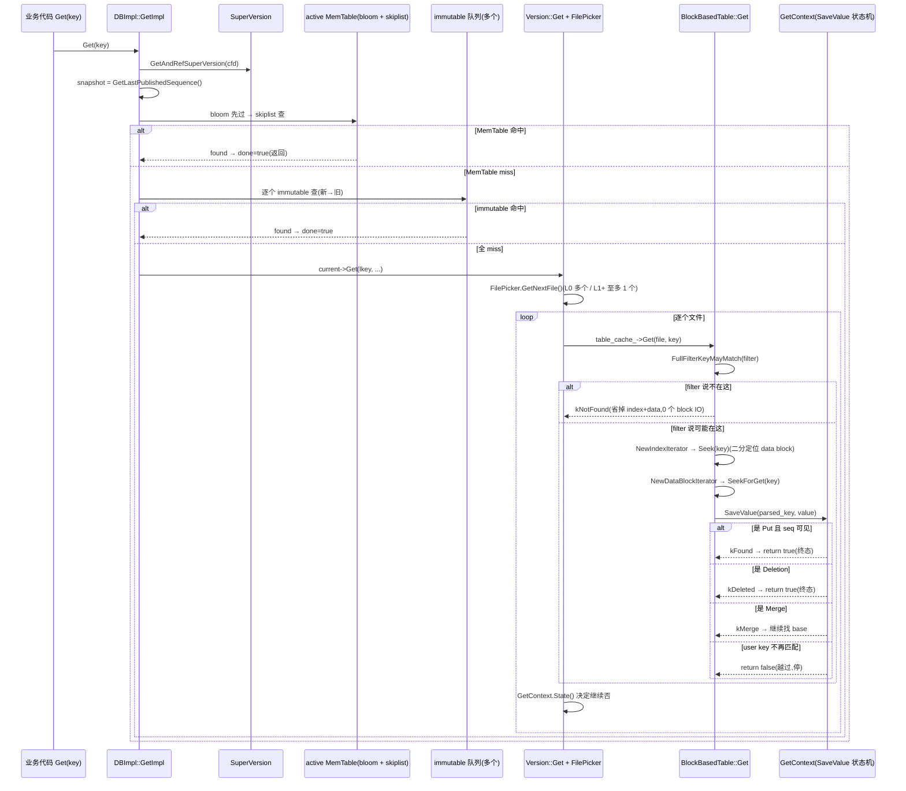

# 第 3 篇 · 第 11 章 · Get 路径与读放大

> **核心问题**:你已经知道 RocksDB 的数据躺在 MemTable 加多层 SST 里——可一次 `Get(key)` 到底怎么找到最新值?它得穿透 active MemTable、immutable MemTable 队列、L0 的一堆文件、再到 L1..Ln 每层一个文件,这条路是怎么走的?每走一层要读几个 block、读放大到底多大、又是怎么靠 Bloom/Ribbon 早退和 Index 二分把读放大压到最小的?这章把 point lookup 的全链路拆到源码级,读完你能闭着眼睛在脑子里放映一次 Get 的旅程。

> **读完本章你会明白**:
>
> 1. 一次 `Get(key)` 在 RocksDB 里走的完整路径:`DBImpl::GetImpl` 拿 SuperVersion 与 snapshot、先查 MemTable(active + immutable 队列)再交给 `Version::Get` 穿透多层 SST,每一层怎么挑文件、每个文件怎么过 filter、怎么 index 二分、怎么 data block 内定位。
> 2. 读放大到底怎么算:平均每命中一层要读几个 block(filter 判定 + index block + data block),cache 命中省哪些,Bloom/Ribbon 早退把"每层一个文件"压成"每层一次 filter 判定"。
> 3. RocksDB 相对 LevelDB 在读路径上加了哪些旋钮:多 MemTable、L0 多文件按新→旧查、`optimize_filters_for_hits` 在最底层跳过 filter、`row_cache` 把整行结果缓存、`max_sequential_skip_in_iterations`(本章点到,P3-12 详讲)。
> 4. 为什么 filter 早退能把读放大从"每层一次完整 block IO"压到"每层一次内存里的位运算",以及 LevelDB 那种朴素做法不加 filter 会撞上什么墙。
> 5. GetContext 这个"读请求随身背包"的状态机,凭什么让多层穿透既正确(MVCC 读一致性)又能短路(找到即停)。

> **如果一读觉得太难**:先只记住三件事——① Get 的穿透顺序是 MemTable → L0(多文件,新→旧)→ L1..Ln(每层至多一个文件),找到第一个可见的版本就停;② 每查一个 SST 先过 Bloom/Ribbon,filter 说不在这就跳过整个文件,省掉 index + data 两次 block 读;③ 读放大 = 平均读多少个 block,filter 早退 + block cache + row cache + 压层数是压读放大的四把刀。

---

## 〇、一句话点破

> **RocksDB 一次 Get 是"层层穿透、找到即停":MemTable 命中就回,没命中下到 SST 层,每个 SST 先用 Bloom/Ribbon 在内存里判一下"在不在这",不在就立刻跳过省掉两次 block 读,在才走 index 二分定位到 data block,再在 block 里(可选 hash)查到 key。读放大的本质是"平均穿透多少层、每层读多少 block",而 filter 早退是把"每层一次完整 IO"压成"每层一次位运算"的那一刀。**

这是结论,不是理由。本章倒过来拆:先看 Get 在源码里从哪个入口进、怎么拿 snapshot,再看 MemTable 怎么查,再看 Version::Get 怎么逐层穿透,然后拆单个 SST 内部 filter→index→data 的三段式,接着用一个具体的"20 个 block 爆炸"反例说清读放大是怎么来的,再讲 RocksDB 把哪些点打开了旋钮,最后把读放大这个数字算清楚,讲怎么压。

---

## 一、入口:DBImpl::GetImpl 拿 snapshot、查 MemTable、再交给 Version

### 提问:一次 Get 在源码里从哪开始

用户调用的 `DB::Get` 看起来一个函数,内部真身是 `DBImpl::GetImpl`。这一层要做的不是"找值",而是先把"在哪个时刻找"这件事钉死——也就是 snapshot。

为什么要先钉 snapshot?因为 LSM 是个多版本结构:同一个 user key 在不同时刻写进去的版本,带着不同的 sequence number(seq)。一次 Get 要读到"我调用这一刻能看见的最新值",就必须先确定一个 seq 上限——所有 seq ≤ 这个上限的版本才可见,大于的(还没提交的、或我之后才写的)都看不见。这个上限就是 snapshot。如果没有 snapshot,Get 就会读到未提交的数据,正确性就崩了。

### LevelDB 怎么做,RocksDB 在这层加了什么

LevelDB 的 Get 也是先拿 snapshot 再查 MemTable 再查 SST(骨架一样,详见《LevelDB》读路径章,一句带过)。RocksDB 多出来的东西在这一层主要有三件,每件都是把 LevelDB 写死的某个决策打开成旋钮:

1. **多 Column Family**:每个 CF 有自己的 MemTable/SST/Version,GetImpl 第一步就是从 `ColumnFamilyHandle` 拿到对应的 `ColumnFamilyData`(cfd),后续全在这个 cfd 的视图里走。LevelDB 一个 DB 就一个"逻辑库",没有这层分发。
2. **多 MemTable(active + 一队 immutable)**:Flush 期间会有多个 immutable 排队等落盘,Get 要查的是一个列表,不是一个。LevelDB 一辈子只有一个 active + 一个 immutable(Flush 完才能切下一个),Get 查 MemTable 就是查两个。
3. **SuperVersion 这个"读视图快照"**:RocksDB 把某一时刻的 active memtable 指针、immutable 队列指针、当前 Version 指针三个东西打包成一个不可变的 SuperVersion 对象。Get 拿到 SuperVersion 的引用(自增引用计数),整个穿透过程就不用一路加 DB 大锁——别的线程就算正在切 MemTable、正在 Flush、正在 Compaction,只要我的 SuperVersion 还没 unref,我看到的数据结构就不会变。

> **LevelDB 是写死的,RocksDB 打开成了旋钮**:LevelDB 写死"一个 active MemTable + 一个 immutable",`max_write_buffer_number` 等于 2 不可调。RocksDB 允许 `max_write_buffer_number` 很大(默认 2,可调到几十),Flush 慢的时候能排一队 immutable,所以 Get 要查的 MemTable 是一个列表。这是为高并发写做的让步——多 MemTable 让写不被 Flush 阻塞,代价是读路径要多查几个 MemTable。

### 源码佐证:GetImpl 的前半段

入口签名在 [`db/db_impl/db_impl.cc:3174`](../rocksdb/db/db_impl/db_impl.cc#L3174),关键动作是拿 SuperVersion 和 snapshot,然后先查 MemTable,没命中才下到 Version。摘核心几行(简化示意,非源码原文,逐字以源码为准):

```cpp
// db/db_impl/db_impl.cc:3174
Status DBImpl::GetImpl(const ReadOptions& read_options, const Slice& key,
                       GetImplOptions& get_impl_options) {
  ...
  // 1. 拿 SuperVersion——某一时刻 active memtable + immutable 队列 + Version 的不可变快照
  SuperVersion* sv = GetAndRefSuperVersion(cfd);                          // L3230
  ...
  // 2. 定 snapshot:用户给了用用户的,没给用 GetLastPublishedSequence()    // L3259
  SequenceNumber snapshot = ...;
  LookupKey lkey(key, snapshot, read_options.timestamp);                  // L3304
  ...
  // 3. 先查 active memtable
  if (sv->mem->Get(lkey, ..., &s, &merge_context, ..., is_blob_ptr, ...)) { // L3353
    done = true;  RecordTick(stats_, MEMTABLE_HIT);
  } else if (s.ok() || s.IsMergeInProgress()) {
    // active 没命中,查 immutable 队列(MemTableList 管理的那一队)
    if (sv->imm->Get(lkey, ..., &s, &merge_context, ...)) {                 // L3367
      done = true;  RecordTick(stats_, MEMTABLE_HIT);
    }
  }
  ...
  // 4. MemTable 全没命中,下到 Version(磁盘 SST 层)
  if (!done) {
    sv->current->Get(read_options, lkey, value, ..., &merge_context,
                     &max_covering_tombstone_seq, &pinned_iters_mgr, ...);   // L3409
    RecordTick(stats_, MEMTABLE_MISS);
  }
  ...
}
```

> **钉死这件事**:Get 的总骨架是 **MemTable(active + immutable 队列)→ Version(SST 层)**。`done` 这个 bool 是早退开关:只要 MemTable 命中或遇到删除/merge 终态,就不再下到磁盘。SuperVersion 的存在让整个穿透过程**全程不加 DB 大锁**,这是读路径高并发的根基(详见《LevelDB》的 SuperVersion,一句带过,RocksDB 这里只是把"一个 immutable"扩成"一队 immutable")。

注意一个容易忽略的细节:`snapshot = GetLastPublishedSequence()`(L3259)——RocksDB 默认用"已发布的最后一个 seq"当 snapshot,而不是"写进去的绝对最后一个 seq"。这两个值在两阶段提交下是不一样的:一个写线程把 batch 写进 MemTable 了(last written seq 推进),但还没 publish(其他线程的 Get 还看不见)。用 last published 能保证 Get 读不到未提交事务的写。这是 LevelDB 没有的细节,承 [[grpc-series-project]] P2-09 那种"已发布 vs 已写入"的二分,不在本章展开。

还有一个 `skip_memtable` 分支(L3307):如果 `read_options.read_tier == kPersistedTier` 且有未持久化数据,就跳过 MemTable 直接查 SST。这是"只读已落盘数据"的语义,用于某些只读副本场景——一个 RocksDB 独有的旋钮。

---

## 二、MemTable::Get:带 prefix bloom 的查表

### 提问:MemTable 是个 SkipList,Get 怎么查

MemTable 里是 InlineSkipList(承 LevelDB SkipList,RocksDB 版本支持多写者无锁插,详见《LevelDB》P1-04 一句带过 + 本书 P1-04 详讲)。Get 要做的是:用 internal key(带 seq 的)在 SkipList 里定位,从大到小扫,遇到第一个 user key 匹配且 seq ≤ snapshot 的就停。

SkipList 的内部 key 排序规则是 `(user_key 升序, seq 降序)`——同一个 user key,seq 大的(新的)排在前面。所以 Get 在 SkipList 里 Seek 到 user key 对应的位置后,顺着 Next() 扫,前几个一定是这个 user key 的各个版本(seq 从大到小),取第一个 seq ≤ snapshot 的就是答案;一旦扫到 user key 不再相等(到了下一个 user key),就可以停了。

### LevelDB 怎么做,RocksDB 加了什么

LevelDB 的 MemTable 查表就是 SkipList 查 + 一个简单的"跳过 seq 太大的"。RocksDB 在这层加了**两个**优化,都是 LevelDB 没有的旋钮:

1. **MemTable 的 prefix bloom**(`memtable_prefix_bloom_size_ratio` / `memtable_whole_key_filtering`):MemTable 本身也挂了一个 bloom filter,Get 进来先过 bloom,bloom 说不在这个 user key/prefix 在,就**直接返回 false,跳过整个 SkipList 扫描**。这对"写极多、点查大多 miss"的 workload(写多读少的时序场景)是巨大节省——本来每次 Get 都要在 SkipList 里做一次 O(log n) 查找 + 沿链扫一遍,现在变成一次内存位运算。

   为什么 MemTable 也需要 bloom?想一个场景:TiKV 存了上亿个 key,某个 Region 的 MemTable 攒了几百万条目。一次 Get 一个不存在的 key(或者刚被 Compaction 收掉、MemTable 里没有的 key),没有 bloom 就得在 SkipList 里做一次完整查找才发现"不在"。在百万级条目的 SkipList 里,一次查找是 ~20 次指针跳转 + 比较,每个跳转都可能是一次 cache miss。高频 NotFound 查询下,这个开销会吃掉可观的 CPU。bloom 把"不在"判到 O(1),直接砍掉这次 SkipList 查找。

2. **range tombstone 的早退**:`max_covering_tombstone_seq`。如果 MemTable 里有 range delete(范围删除,比如 `DeleteRange("a", "z")`)覆盖了这个 key,且 range tombstone 的 seq 比后面找到的任何版本都大,那后面所有层都不用看了,直接判定被删。这个 seq 会在 MemTable::Get 里算出来,一路传到 Version::Get。LevelDB 没有 range delete,RocksDB 这是为了支持高效范围删除加的。

### 源码佐证

[`db/memtable.cc:1570`](../rocksdb/db/memtable.cc#L1570) 是 `MemTable::Get`:

```cpp
// db/memtable.cc:1570(简化示意)
bool MemTable::Get(const LookupKey& key, ..., SequenceNumber* max_covering_tombstone_seq, ...) {
  if (IsEmpty()) return false;                                            // L1579
  // 1. range tombstone:算出覆盖本 key 的最高 seq
  std::unique_ptr<FragmentedRangeTombstoneIterator> range_del_iter(
      NewRangeTombstoneIterator(...));                                     // L1586
  if (range_del_iter != nullptr) {
    SequenceNumber covering_seq =
        range_del_iter->MaxCoveringTombstoneSeqnum(key.user_key());
    if (covering_seq > *max_covering_tombstone_seq)
      *max_covering_tombstone_seq = covering_seq;                         // L1594
  }
  // 2. memtable bloom:先过 bloom
  bool may_contain = true;
  bool bloom_checked = false;
  if (bloom_filter_) {
    if (moptions_.memtable_whole_key_filtering) {
      may_contain = bloom_filter_->MayContain(user_key_without_ts);       // L1613
      bloom_checked = true;
    } else {
      assert(prefix_extractor_);
      if (prefix_extractor_->InDomain(user_key_without_ts)) {
        may_contain = bloom_filter_->MayContain(
            prefix_extractor_->Transform(user_key_without_ts));           // L1618
        bloom_checked = true;
      }
    }
  }
  if (bloom_filter_ && !may_contain) {
    // bloom 说不在这——直接跳过 SkipList!
    PERF_COUNTER_ADD(bloom_memtable_miss_count, 1);
    *seq = kMaxSequenceNumber;                                            // L1628
  } else {
    if (bloom_checked) {
      PERF_COUNTER_ADD(bloom_memtable_hit_count, 1);
    }
    GetFromTable(key, ...);  // 真正下到 SkipList 查                         // L1633
  }
  return found_final_value;
}
```

> **不这样会怎样**:如果 MemTable 不带 bloom,每次 Get(哪怕 key 根本没写进这个 MemTable)都得在 SkipList 里做一次 O(log n) 定位 + 沿链扫一遍。在海量 key + 高 QPS 的点查场景,这个 SkipList 查找开销会吃掉可观的 CPU。Ribbon/Bloom 在 MemTable 这层把"key 不在"判到 O(1),这是 RocksDB 把"MemTable 也加个 filter"做成了旋钮(`memtable_prefix_bloom_size_ratio` 默认 0 即关,可调大,典型值 0.1 表示用 MemTable 内存的 10% 做 bloom)。

注意一个细节:MemTable bloom 有两种模式——`memtable_whole_key_filtering`(对整个 user key 做 bloom)和 prefix bloom(对 prefix_extractor 变换后的前缀做 bloom)。前者适合点查,后者适合 prefix seek。两者互斥(代码 L1612 的 if/else)。这是 RocksDB 把"MemTable bloom 怎么用"也做成了旋钮。

### 多 MemTable 的穿透顺序

GetImpl 先查 `sv->mem`(active),只有 active 返回 false **且** status 是 ok/merge-in-progress 时,才查 `sv->imm`(immutable 队列)。immutable 是个列表,RocksDB 的 `MemTableList::Get` 会逐个查,**新→旧**:最新切下来的 immutable 排第一个,因为它包含的数据最新(Flush 是按时间顺序切的,后切的 immutable 数据更新)。

Flush 排队的时候这一队可能有好几个(取决于 `max_write_buffer_number` 和 Flush 速度),每个都要查——这是为什么 Flush 跟不上会拖慢读(读路径要穿透的 MemTable 变多,读放大上升)。这也是 Write Stall(P5-17)要在 immutable 数过多时触发反压的根因:不只是内存吃紧,更是读路径要查太多 MemTable 了。

---

## 三、Version::Get:多层 SST 的穿透,FilePicker 挑文件

### 提问:MemTable 没命中,磁盘上一层一层 SST 怎么挑文件

到了 Version 这层,数据在 L0(多个文件,key range 可能重叠)到 L1..Ln(每层文件 key range 不重叠、按序排)。Get 要做的是:按层从新到旧(L0→L1→…→Ln)逐层找,每层挑出可能含这个 key 的文件,在每个文件里查,找到第一个可见版本就停。

这层的关键数据结构是 `FilePicker`——它是个迭代器,每次 `GetNextFile()` 吐出"下一个该查的文件",按 LSM 的规则排好顺序。

### LevelDB 怎么做,RocksDB 加了什么

LevelDB 也有同样的逐层挑文件逻辑(详见《LevelDB》读路径章)。RocksDB 的增强主要在两点,都是为"工业级规模"(海量文件、大 L0)做的:

1. **FileIndexer(级联索引/fractional cascading)**:L1+ 的每层文件是有序的,LevelDB 是逐层二分找文件。RocksDB 多了个 `FileIndexer`,根据上一层比较的结果(当前文件 largest_key 与 user key 的大小关系)缩小下一层的搜索范围(`search_left_bound_` / `search_right_bound_`),避免每层都从头二分。这是把"每层一次二分"压成"每层一次接近 O(1) 的范围收敛",层数多时收益明显。

   什么是 fractional cascading?用一个具体例子:在 L1 你比较出 user key 在第 3 个文件的 largest_key 之后,那 L2 的搜索就不用从第 0 个文件开始,可以从 L1 第 3 个文件对应到 L2 的某个位置开始(FileIndexer 的 `GetNextLevelIndex` 算出来的就是这个映射)。每层都从上一层收敛到的位置附近开始找,而不是从头二分。这是算法工程上一个经典优化,RocksDB 把它用到了 LSM 的文件定位上。

2. **L0 文件多时的特殊处理**:LevelDB 的 L0 文件少(4 个就 compaction),逐个线性扫没问题。RocksDB 允许 L0 文件很多(`level0_slowdown_writes_trigger` 默认 20、`level0_stop_writes_trigger` 默认 36),所以 FilePicker 对 L0 有特殊处理:如果 L0 文件 ≤ 3 个,跳过 key range 检查直接逐个查(省掉每次的比较开销);超过 3 个才做 key range 过滤(用 FileIndexer 加速)。

### 源码佐证:FilePicker 的 GetNextFile

[`db/version_set.cc:359`](../rocksdb/db/version_set.cc#L359) 是 `FilePicker::GetNextFile`:

```cpp
// db/version_set.cc:359(简化示意)
FdWithKeyRange* GetNextFile() {
  while (!search_ended_) {            // 外层循环:逐层
    while (curr_index_in_curr_level_ < curr_file_level_->num_files) {
      FdWithKeyRange* f = &curr_file_level_->files[curr_index_in_curr_level_];
      hit_file_level_ = curr_level_;
      is_hit_file_last_in_level_ =
          curr_index_in_curr_level_ == curr_file_level_->num_files - 1;
      // 文件数 ≤ 3 且只有 L0:跳过 key range 检查(优化小 L0)
      if (num_levels_ > 1 || curr_file_level_->num_files > 3) {            // L377
        int cmp_smallest = user_comparator_->CompareWithoutTimestamp(
            user_key_, ExtractUserKey(f->smallest_key));
        int cmp_largest = -1;
        if (cmp_smallest >= 0) {
          cmp_largest = user_comparator_->CompareWithoutTimestamp(
              user_key_, ExtractUserKey(f->largest_key));
        }
        // 级联索引:为下一层缩小搜索边界
        if (curr_level_ > 0) {
          file_indexer_->GetNextLevelIndex(
              curr_level_, curr_index_in_curr_level_, cmp_smallest,
              cmp_largest, &search_left_bound_, &search_right_bound_);    // L396
        }
        // key 不在文件 range 内:L0 试下一个文件,L1+ 跳到下一层
        if (cmp_smallest < 0 || cmp_largest > 0) {
          if (curr_level_ == 0) { ++curr_index_in_curr_level_; continue; }
          else { break; }                                                   // L407
        }
      }
      returned_file_level_ = curr_level_;
      return f;  // 吐出这个文件,交给上层去 BlockBasedTable::Get 查
    }
    // 当前层找完,PrepareNextLevel() 进下一层
    search_ended_ = !PrepareNextLevel();
  }
  return nullptr;  // 所有层都找完
}
```

> **钉死这件事**:L0 是特殊的——它的文件 key range 可能重叠,所以 **L0 要逐个文件查**(按新→旧),不能像 L1+ 那样二分定位一个。L1+ 每层 key range 不重叠,FilePicker 用级联索引快速收敛到**至多一个**候选文件。这就是为什么"L0 文件多了会拖慢读"——读放大直接和 L0 文件数挂钩。也是为什么 `level0_file_num_compaction_trigger`(默认 4)这个旋钮重要:它决定 L0 攒到几个文件就触发 Compaction 把它们合到 L1,L0 文件数是这个值的上界附近。

### Version::Get 的主循环:每查一个文件更新 GetContext 状态

[`db/version_set.cc:2918`](../rocksdb/db/version_set.cc#L2918) 是 `Version::Get`。它构造一个 `GetContext`(承载查表状态:NotFound/Merge/Found/Deleted/Corrupt 等),然后用 FilePicker 逐个文件查,每个文件调 `table_cache_->Get`,根据 GetContext 的状态决定是否继续:

```cpp
// db/version_set.cc:2918(简化示意)
void Version::Get(..., Status* status, MergeContext* merge_context,
                  SequenceNumber* max_covering_tombstone_seq, ...) {
  ...
  GetContext get_context(user_comparator(), merge_operator_, ...,
                         status->ok() ? kNotFound : kMerge, user_key,
                         ..., merge_context, ..., &max_covering_tombstone_seq,
                         ..., callback, is_blob_to_use, ...);             // L2950
  FilePicker fp(user_key, ikey, &storage_info_.level_files_brief_, ...);  // L2964
  FdWithKeyRange* f = fp.GetNextFile();
  while (f != nullptr) {
    if (*max_covering_tombstone_seq > 0) break;  // 被范围删覆盖,后面都不用看
    *status = table_cache_->Get(read_options, ..., ikey, &get_context, ...,
                                IsFilterSkipped(fp.GetHitFileLevel(),
                                                fp.IsHitFileLastInLevel()),
                                fp.GetHitFileLevel(), ...);                // L2984
    switch (get_context.State()) {
      case kNotFound: break;                       // 这文件没有,继续下一个
      case kMerge:   break;                        // 是 merge operand,继续找 base
      case kFound:
        RecordTick(db_statistics_, GET_HIT_L0/L1/L2_AND_UP);
        return;                                    // 找到,停
      case kDeleted:
        *status = Status::NotFound();
        return;                                    // 被删,停
      ...
    }
    f = fp.GetNextFile();
  }
  // 全部找完还没 Found:NotFound 或做最终 merge
  ...
}
```

> **钉死这件事**:Version::Get 是个**短路**循环——`GetContext` 的状态机决定停不停。`kFound`(找到 Put)和 `kDeleted`(遇到墓碑)是终态,立刻返回。`kNotFound`(这文件没有)和 `kMerge`(这文件有 merge operand,但还没找到 base value)是**继续**态,继续查下一个文件。这就是 LSM 读放大的根因:**你不知道值在哪一层,得一层层问,直到撞见一个终态**。

注意 `IsFilterSkipped` 这个参数(下一节详讲):它决定这个文件要不要跳过 filter 查询。这是 RocksDB 的 `optimize_filters_for_hits` 旋钮落地的位置。

---

## 四、单个 SST 内部:filter 早退 → index 二分 → data block 定位

### 提问:Version::Get 给了一个文件,这个文件内部怎么查到 key

`table_cache_->Get` 最终调到 `BlockBasedTable::Get`。一个 SST 文件内部有 data block、index block、filter block 三种块(详见 P2-06/P2-07/P2-08)。一次 Get 在单个文件里走的是**三段式**:

1. **filter 段**:先问 filter block(Bloom 或 Ribbon),"这个 key 可能在这吗?"。filter 说"不在这",**整个文件跳过**——不读 index,不读 data。这是读放大最关键的一刀。
2. **index 段**:filter 说"可能在这",才读 index block(或分区 index 的某一页),二分定位到 key 可能在的 data block 的 handle(block 在文件里的偏移 + 大小)。
3. **data 段**:按 handle 读 data block,在 block 内(可选地先过 data block hash index)二分/线性扫到 key,交给 `GetContext::SaveValue` 判定。

### LevelDB 怎么做,RocksDB 加了什么

LevelDB 的 SST Get 也是 filter→index→data 三段(详见《LevelDB》读路径章 + Bloom DoubleHashing,一句带过)。但 LevelDB 的 filter 是 **per-data-block** 的——每个 data block 配一个小 filter,Get 流程是"index 定位 block → 查这个 block 的 filter → filter 通过才读这个 block"。这意味着 filter 只省了 data block 的读,**没省 index 的读**——你得先读 index 定位到 block,才能查这个 block 的 filter。

RocksDB 相对 LevelDB 在这一层的演进(全做成旋钮):

- **full filter block(默认)**:整个 SST 一个大 filter,而不是 per-block。filter 查询独立于 block 定位,所以能在**不读任何 block** 的情况下就判定"在不在"。这是把 filter 从"data block 的附属"提升到"SST 的入口看门人",是读放大从"每层 1 次 IO"压到"每层 0 次 IO"的关键。
- **partitioned index/filter**:大 SST 的 index 自己分页,不一次性载入(详见 P2-07)。这让单个大 SST 的 index 不会撑爆 cache。
- **data block hash index**:`data_block_index_type=kDataBlockBinaryAndHash`,block 内除了二分还能 hash,点查更快(详见 P2-07)。这是 block 内部的微优化,二分本身已经够快,hash 在某些 workload 下再省一点 CPU。
- **Ribbon filter**:比 Bloom 省 ~30% 内存(详见 P2-08)。同样 1% 假阳性率,Bloom 每 key ~9.6 bit,Ribbon ~7 bit。在百万级 key 的 SST 上,这是实打实的内存节省。
- **`optimize_filters_for_hits`**:在最底层(数据最终落稳的那层)跳过 filter 查询——因为最底层几乎都是命中,filter 帮不上忙还浪费 CPU。这是 RocksDB 把"要不要在每层都查 filter"做成了旋钮。

### 源码佐证:BlockBasedTable::Get 的三段式

[`table/block_based/block_based_table_reader.cc:2636`](../rocksdb/table/block_based/block_based_table_reader.cc#L2636) 是核心:

```cpp
// table/block_based/block_based_table_reader.cc:2636(简化示意)
Status BlockBasedTable::Get(const ReadOptions& read_options, const Slice& key,
                            GetContext* get_context,
                            const SliceTransform* prefix_extractor,
                            bool skip_filters) {
  Status s;
  FilterBlockReader* const filter = !skip_filters ? rep_->filter.get() : nullptr; // L2649

  // === 第 1 段:full filter 早退 ===
  const bool may_match = FullFilterKeyMayMatch(
      filter, key, prefix_extractor, get_context, &lookup_context, read_options); // L2666
  if (may_match) {
    // filter 说"可能在这",才进第 2、3 段
    auto iiter = NewIndexIterator(...);                                    // L2677

    // === 第 2 段:index 二分定位 data block ===
    for (iiter->Seek(key); iiter->Valid() && !done; iiter->Next()) {
      IndexValue v = iiter->value();
      // 优化:key 比这个 block 第一个 key 还小,直接 break
      if (!v.first_internal_key.empty() && !skip_filters &&
          user_cmp.CompareWithoutTimestamp(ExtractUserKey(key),
              ExtractUserKey(v.first_internal_key)) < 0) {
        break;                                                             // L2697
      }
      // === 第 3 段:读 data block,块内查 ===
      DataBlockIter biter;
      NewDataBlockIterator(read_options, v.handle, &biter, BlockType::kData,
                           get_context, ..., /*use_block_cache_for_lookup=*/true); // L2710
      bool may_exist = biter.SeekForGet(key);                              // L2730
      if (!may_exist && ts_sz == 0) {
        done = true;  // block hash 说不在,跳
      } else {
        for (; biter.Valid(); biter.Next()) {
          ParsedInternalKey parsed_key;
          ParseInternalKey(biter.key(), &parsed_key, false);
          bool ret = get_context->SaveValue(parsed_key, biter.value(),
                                            &matched, &read_status, ...);  // L2751
          if (!ret) { done = true; break; }  // SaveValue 返回 false:找到或越过 user key
        }
      }
      if (done) break;
    }
  }
  // may_match == false:filter 说不在这,直接返回 OK,get_context 仍是 kNotFound
  return s;
}
```

> **钉死这件事**:`if (may_match)` 是整章最关键的一个分支。filter 说不在这(`may_match == false`),整个 if 块跳过——**不读 index block,不读 data block,不调 SaveValue**。GetContext 状态停在 kNotFound,Version::Get 的循环继续找下一个文件。这一次 filter 查询是纯内存的一次位运算(Bloom 是 k 次哈希 + 位查,Ribbon 是一次矩阵乘),代价是纳秒级。对比之下,不跳过的话要读 index block(可能不在 cache → 一次磁盘 IO,4KB)+ 读 data block(又一次 IO,4KB),代价是微秒到毫秒级。**filter 早退把读放大从"每层两次 IO"压到"每层一次纳秒级位运算"**。

注意 `FullFilterKeyMayMatch` 内部的细节([`block_based_table_reader.cc:2472`](../rocksdb/table/block_based/block_based_table_reader.cc#L2472)):第一个判断就是 `if (filter == nullptr) return true;`(L2477)——这就是 `skip_filters` 怎么生效的:把 filter 置空,FullFilterKeyMayMatch 直接返回 true(假装"可能在这"),跳过 filter 查询。这是 `optimize_filters_for_hits` 在最底层省 CPU 的实现路径。

---

## 五、filter 早退的反面:没有 filter 读放大怎么爆炸

这一节是本章的"为什么 sound"——光说 filter 省事不够,得讲清楚不省会撞什么墙。

### 反面假设:假设 RocksDB 没有 filter

假设我们朴素地实现 Get,每个 SST 文件都老老实实读 index + data 来判断 key 在不在。考虑一个典型配置:7 层 LSM,L0 假设 4 个文件,L1..L6 每层 1 个文件,共 4 + 6 = 10 个文件。

一次 Get(假设 key 不在,NotFound),cache 全 miss 的情况:

| 层 | 文件数 | 每个文件读什么 | block 读次数(无 cache) |
| --- | --- | --- | --- |
| MemTable | 1 active + N immutable | SkipList 查 | 0(内存) |
| L0 | 4 | index block + data block | 4 × 2 = 8 |
| L1 | 1 | index + data | 2 |
| L2 | 1 | index + data | 2 |
| L3 | 1 | index + data | 2 |
| L4 | 1 | index + data | 2 |
| L5 | 1 | index + data | 2 |
| L6 | 1 | index + data | 2 |
| **合计** | | | **20 个 block 读** |

20 个 block,假设每个 4KB,就是 80KB 的 IO,为了一次"这个 key 不存在"的查询。这就是**读放大爆炸**:逻辑上读一个 key,物理上读 20 个 block。如果磁盘是 SSD,一次 4KB 读大约 50~100 微秒,20 次就是 1~2 毫秒——一个本该亚毫秒级的 NotFound 查询被拖到毫秒级,完全不可接受。

### 有 filter 之后

| 层 | 文件数 | filter 说不在 | 实际读 |
| --- | --- | --- | --- |
| L0 | 4 | 4 个 filter 判定(全 miss) | 4 次位运算 |
| L1..L6 | 6 | 6 个 filter 判定(全 miss) | 6 次位运算 |
| **合计** | | | **10 次内存位运算,0 个 block IO** |

读放大从 20 个 block 压到 0 个 block IO(filter 全 miss 的情况)。就算 filter 误判(假阳性,概率 1%),也才多读 1 个文件的 index+data,平均读放大还是接近 0。

> **钉死这件事**:这就是 filter 的价值——它把"key 不在"这个判定从"必须读 block 才知道"压到"内存里一次位运算就知道"。LSM 读放大之所以能扛得住多层,根本原因就是 filter 早退。LevelDB 也有 Bloom(承 LevelDB DoubleHashing,一句带过),RocksDB 把它做成了旋钮(filter 类型 Bloom/Ribbon 可换、`optimize_filters_for_hits` 可调、partitioned filter 可选),并加了更省内存的 Ribbon。

### 反面对比:LevelDB 的 per-block filter 为什么不如 full filter

LevelDB 的 filter 是每个 data block 配一个。Get 流程是:

1. 读 index block,二分定位到 key 可能在的 data block。
2. 读这个 data block 对应的 filter(per-block)。
3. filter 说不在,跳过这个 data block;filter 说可能在,读这个 data block。

问题在第 1 步:**index block 这一次 IO 是省不掉的**——你得先定位 block 才能查这个 block 的 filter。所以 LevelDB 的 per-block filter 只省了"data block 的读",没省"index block 的读"。对于 NotFound 查询,读放大仍然是"每层 1 个 index block IO"(filter 全 miss 的话)。

RocksDB 的 full filter 把 filter 提到 index 之前:整个 SST 一个大 filter,filter 查询独立于 block 定位。filter 不通过,连 index 都不读。这才是把读放大压到"每层 0 个 block IO"的关键。这是 RocksDB 相对 LevelDB 在读路径上的一个实打实的演进——虽然 LevelDB 后期也支持了 full filter 的雏形,但 RocksDB 把它做成了默认和旋钮,并在 filter 的实现上(Bloom→Ribbon)持续演进。

> **不这样会怎样**:如果像 LevelDB 那样坚持 per-block filter,大 SST(几百 MB)的 index block 可能不在 cache,每次 NotFound 都得读一次 index block 才能查 filter——读放大回到"每层至少 1 次 IO"。RocksDB 的 full filter 把这一刀也省了。这是"工业级规模"(大 SST、海量 NotFound 查询)逼出来的演进。

---

## 六、读放大到底怎么算、怎么压

### 读放大的定义

**读放大 = 一次逻辑 Get,平均物理读了多少个 block(或多少次 IO)**。这是个统计量,跟 workload(命中率)、配置(层数、filter、cache)都有关。讨论读放大必须说清前提——是"平均"还是"最坏",是"逻辑 IO"还是"物理 IO"。

### 分情况算

**情况 A:cache 全 miss,key 不在(filter 全 miss)**

如上节,filter 把读放大压到接近 0(纯 filter 判定,0 个 block IO)。

**情况 B:cache 全 miss,key 在某层**

假设 key 在 L3。Get 要穿透 MemTable(0)+ L0(4 个文件,filter 全 miss)+ L1(filter miss)+ L2(filter miss)+ L3(filter 通过 → index → data)。L0..L2 是 filter 早退(0 个 block),L3 是 1×index block + 1×data block = 2 个 block(filter 通常在 cache 里,因为 filter block 被频繁访问)。读放大 ≈ 2 个 block。

**情况 C:cache 全 hit**

如果 index block 和 filter block 都在 block cache 里(它们被频繁访问,很容易进 cache),那每次 Get 的实际 IO 只有"data block 是否在 cache"。热 key 的 data block 也在 cache,读放大 = 0 个 IO,纯内存操作。

这是为什么"调大 block cache"是压读放大最直接的手段——把热数据的 index/filter/data block 全留在内存,Get 命中 cache 就是 0 IO。

### 压读放大的四把刀

| 刀 | 怎么压读放大 | 旋钮 | 代价 |
| --- | --- | --- | --- |
| **filter 早退** | 把"每层一次 IO"压成"每层一次位运算" | `filter_policy`(Bloom/Ribbon)、`optimize_filters_for_hits` | filter 占内存(每 key ~10 bit)、假阳性 |
| **block cache** | index/filter/data block 缓存在内存,命中就省 IO | `block_cache`、`cache_index_and_filter_blocks` | 吃内存 |
| **row_cache** | 把整个 Get 的结果(key→value)缓存,命中就跳过全部穿透 | `row_cache` | 吃内存、写更新要失效 |
| **压层数** | 层数少,穿透层数少 | `max_bytes_for_level_multiplier`、Universal Compaction | 层数少则每层大,Compaction 写放大大、空间放大大 |

> **不这样会怎样**:如果你不开 block cache(默认是开的,但有些人为了省内存关了),每次 Get 都得读 index + data 两个 block 从磁盘——读放大回到"每命中层 2 个 block"。如果你不开 filter(把 `filter_policy` 设成 null),读放大回到上节的 20 个 block 爆炸。RocksDB 的默认配置(filter 开 + block cache 开)是经过工业验证的合理起点,但每个旋钮你都能拧——这就是"可调性"在读路径上的体现。

### 一个真实的调优例子

TiKV 在生产里调 RocksDB 读路径的典型做法(承 [[tikv-series-project]]):写极多的 default CF 用 Universal Compaction(压写放大,代价是层数不规整、读放大上升),配大 block cache 补偿读放大;读敏感的 write CF 用 Level Compaction(读放大小),配密集 Bloom。两个 CF 同一个 RocksDB 实例,各自调各自的旋钮——这就是 Column Family + 可调旋钮组合的威力。具体调优方法论见附录 B。

---

## 七、两个 RocksDB 独有的旋钮:`optimize_filters_for_hits` 与 `row_cache`

### optimize_filters_for_hits:最底层跳过 filter

这是个容易被忽略但很巧的旋钮。看 [`db/version_set.cc:3614`](../rocksdb/db/version_set.cc#L3614) 的 `IsFilterSkipped`:

```cpp
// db/version_set.cc:3614
bool Version::IsFilterSkipped(int level, bool is_file_last_in_level) {
  // Reaching the bottom level implies misses at all upper levels, so we'll
  // skip checking the filters when we predict a hit.
  return cfd_->ioptions().optimize_filters_for_hits &&
         (level > 0 || is_file_last_in_level) &&
         level == storage_info_.num_non_empty_levels() - 1;
}
```

逻辑是:**只有开了 `optimize_filters_for_hits`,且这个文件在最底层(数据最终落稳的那层),才跳过 filter**。`IsFilterSkipped` 的返回值传给 `BlockBasedTable::Get` 的 `skip_filters` 参数,L2649 那行 `FilterBlockReader* const filter = !skip_filters ? rep_->filter.get() : nullptr;`——`skip_filters` 为 true 时 filter 直接置空,`FullFilterKeyMayMatch` 第一个 `if (filter == nullptr) return true;`(L2477)直接返回"可能在这",跳过 filter 查询。

> **不这样会怎样**:最底层是数据最终归宿,绝大多数 Get 命中都在这层,filter 几乎全是 true positive,做 filter 查询纯属浪费 CPU(假阳性几乎为 0,filter 帮不上忙)。但代价是:**如果 key 真不在最底层(被上层删了,或根本没写过),最底层会老老实实读 index + data 才发现不在**。所以这个旋钮适合"绝大多数 Get 都命中"的 workload(比如点查热数据),不适合"大量 NotFound 查询"的 workload。默认 false,需要你按 workload 拧开。

注意一个细节:`optimize_filters_for_hits` 为 false 时(默认),`IsFilterSkipped` 永远返回 false——**每一层都查 filter**,包括最底层。这是保守的默认,牺牲一点 CPU 换"最底层 NotFound 也能早退"。

这个旋钮的妙处在于它**只在"预测会命中"时才跳过 filter**(注释 L3615-3616 说得很清楚:能走到最底层说明上面全 miss 了,这次大概率是命中)。这是一个"基于 LSM 语义的预测优化"——利用了"最底层是数据归宿"这个 LSM 不变量。不是无脑跳,而是有依据地跳。

### row_cache:把整行结果缓存

block cache 缓存的是 block(index/filter/data),row_cache 缓存的是**整个 Get 的结果**——`(file_number, user_key, snapshot_seq) → value`。看 [`db/table_cache.cc:563`](../rocksdb/db/table_cache.cc#L563) 的 `GetFromRowCache`:

```cpp
// db/table_cache.cc:563(简化示意)
bool TableCache::GetFromRowCache(const Slice& user_key, IterKey& row_cache_key,
                                 ..., SequenceNumber seq_no) {
  bool found = false;
  row_cache_key.TrimAppend(prefix_size, user_key.data(), user_key.size());
  RowCacheInterface row_cache{ioptions_.row_cache.get()};
  if (auto row_handle = row_cache.Lookup(row_cache_key.GetUserKey())) {     // L570
    // 命中:replay 缓存里记录的 GetContext 操作日志,直接得到 value
    *read_status = replayGetContextLog(*row_cache.Value(row_handle), user_key,
                                       get_context, &value_pinner, seq_no); // L584
    RecordTick(ioptions_.stats, ROW_CACHE_HIT);
    found = true;
  } else {
    RecordTick(ioptions_.stats, ROW_CACHE_MISS);
  }
  return found;
}
```

row_cache 的 cache key 由 `CreateRowCacheKey`([`table_cache.cc:521`](../rocksdb/db/table_cache.cc#L521))构造:`row_cache_id + file_number + user_key + cache_entry_seq_no`。注意它用的是 user key 而不是 internal key——注释 L527-531 解释了原因:如果用 internal key(带 seq),每次 seq 变化都会让 cache 失效,缓存基本没用。用 user key + 一个"可见性 seq"(支持 snapshot 读)才能让缓存跨 seq 复用。

> **钉死这件事**:row_cache 命中,Get 直接跳过 filter + index + data 全套穿透。这对"同一批 key 反复读"的 workload(比如配置表、字典表、热点商品信息)是降维打击——读放大直接归零。代价是:写更新时这条 row cache entry 会失效(row_cache 用 LRU 淘汰,但同一个 key 的新写入会让旧 entry 的 seq 不再匹配,自然冷掉),且吃一份独立内存。row_cache 默认是关的(`row_cache` 为 nullptr),要显式开。

row_cache 和 block cache 是互补的:block cache 缓存"块"(粒度粗、命中率高、但还要穿透 filter+index),row_cache 缓存"行"(粒度细、命中率取决于访问模式、但命中就跳过一切)。两者可以同时开,针对不同访问模式各管一段。

一个使用建议:如果你的 workload 是"少量热 key 被狂读"(比如秒杀场景的库存 key),row_cache 性价比极高;如果是"大量 key 各读一次"(比如全表扫描导数),row_cache 基本不命中,白白吃内存,不如不开。

---

## 八、`max_sequential_skip_in_iterations`:点到为止

这个旋钮属于 Iterator(P3-12 详讲),这里只点到,因为它和"读放大"的广义定义有关。

在范围扫描(Iterator::Next)时,会遇到同一个 user key 的多个版本(不同 seq)。朴素做法是逐个跳过(Next 一次跳一个版本)。但如果某个 user key 有海量版本(比如疯狂 Merge 同一个计数器,或者某个 key 被反复 Put 上万次),逐个跳会很慢——这就是一种**隐性读放大**:逻辑上扫描一个 key range,实际上被一个热点 key 的版本洪流拖住。

`max_sequential_skip_in_iterations`([`advanced_options.h:749`](../rocksdb/include/rocksdb/advanced_options.h#L749),默认 8)规定:**连续跳过 8 个同 user key 的版本后,改成 Seek 重新定位**(直接跳到下一个 user key 的位置),避免被一个热点 key 的版本洪流拖死。

它影响的是 Iterator 的内部策略,不影响 point Get(一次 Get 只取第一个可见版本就停)。但它和读放大有关——它防止了"范围扫描时被一个 key 的版本海拖慢"这种隐性读放大。详细机制见 P3-12。

---

## 九、读路径的并发根基:SuperVersion 与无锁穿透

在讲技巧精解之前,这一节补一个容易被忽略但极其关键的点:为什么 Get 的整个多层穿透过程**不需要加 DB 大锁**?这是读路径高并发的根基,也是 RocksDB 相对 LevelDB 在"多 CF + 多 MemTable + 大 L0"这种复杂场景下仍能扛住高 QPS 的原因。

### 提问:Flush 和 Compaction 在后台改数据结构,Get 怎么不被它们干扰

Get 要穿透 active memtable、immutable 队列、Version(SST 集合)。可这些数据结构在后台一直被改:Flush 把 immutable 变成 L0 SST(新增文件、改 Version),Compaction 把多层 SST 合并(删旧文件、加新文件、切 Version)。如果 Get 一边读、后台一边改,Get 看到的就是"半新半旧"的不一致视图——可能读到已经被 Compaction 删掉的旧文件,也可能漏读刚 Flush 进来的新文件。

### LevelDB 怎么做,RocksDB 怎么做

LevelDB 用一个 `port::Mutex` 大锁保护 VersionSet 切换,Get 持锁期间后台不能切 Version(详见《LevelDB》,一句带过)。这个大锁在单 CF、中等负载下没问题,但在 RocksDB 的"多 CF + 高并发 Get"场景下会成为瓶颈——所有 Get 抢一把锁。

RocksDB 的解法是 **SuperVersion + 引用计数**。SuperVersion 是某一时刻的"读视图快照",它把三个指针打包成不可变对象:

- `mem`:当时的 active MemTable 指针。
- `imm`:当时的 immutable MemTable 队列指针。
- `current`:当时的 Version 指针(指向某一组 SST 文件)。

GetImpl 第一步 `GetAndRefSuperVersion(cfd)`([db_impl.cc:3230](../rocksdb/db/db_impl/db_impl.cc#L3230))拿到 SuperVersion 并自增它的引用计数。只要 Get 还持有这个 SuperVersion,它引用的 mem/imm/current 三个对象就**不会被回收**——即使后台正在 Flush/Compaction,那些操作会创建**新的** SuperVersion(指向新的 mem/imm/current),而 Get 拿着的旧 SuperVersion 仍然指向旧的对象,旧对象在最后一个引用释放前不会被销毁。

> **钉死这件事**:这是**写时复制 + 引用计数**在读路径上的应用。后台改数据结构不是"原地改",而是"造一份新的"——造新的 SuperVersion、新的 Version、新的 MemTable 链表。改完后原子地切换 cfd 里的 SuperVersion 指针。正在进行的 Get 还拿着旧的,看到的是旧的一致视图;新的 Get 拿到新的,看到新的。两者互不干扰。这就是为什么 Get 全程不加 DB 大锁——它不需要锁来保护自己看到的数据,因为数据是 immutable 的(被引用就不会被改)。

这个机制承 LevelDB 的 Version 引用计数(一句带过),RocksDB 把它扩展到了"MemTable 也参与引用计数 + SuperVersion 把三者打包"的形态。代价是:SuperVersion 切换有开销(造新对象、原子切指针),但这个开销是 O(1) 的、不在 Get 热路径上。收益是:Get 热路径完全无锁,高并发读不被锁拖慢。

一个细节:GetImpl 末尾要 `ReturnAndCleanupSuperVersion(cfd, sv)`——递减引用计数,归零时清理。但注意 `ShouldReferenceSuperVersion`(L3468)的判断:如果 Get 返回的 merge operand 依赖某些被 SuperVersion 持有的资源(比如 SST 的 block),Get 会额外 `sv->Ref()` 一次,把 SuperVersion 的生命周期延长到 value 被消费完。这是"value 引用 SST block"场景下的精细处理,承 LevelDB 的 pinned block 思想(一句带过)。

---

## 十、技巧精解:point lookup 全链路 + filter 早退凭什么这么省

这一节把本章最硬的两个技巧单独拆透,配真实源码 + 反面对比。

### 技巧一:point lookup 全链路——为什么是"层层穿透、找到即停"

一次 Get 的全链路用一张时序图说清楚(这是本章最该画的图):



> **为什么 sound(不会读错版本)**:每个 internal key 是 `(user_key, seq, type)` 三元组,user key 相同时 seq 大的(新)排在 SST 内部更前。GetContext::SaveValue([`table/get_context.cc:377`](../rocksdb/table/get_context.cc#L377))在 L383 先判 `ucmp_->EqualWithoutTimestamp(parsed_key.user_key, user_key_)`——一旦 user key 不再相等(因为 SST 内 key 有序,扫到更小的 user key 了),直接返回 false 终止扫描。配合 snapshot(`CheckCallback(parsed_key.sequence)` L386 跳过 seq > snapshot 的),保证读到的是 **≤ snapshot 的、user key 匹配的、seq 最大的那一个版本**。这就是 MVCC 的读一致性,承 [[leveldb-source-facts]] 的 Snapshot 链表,一句带过。

看 SaveValue 的核心逻辑摘录(简化示意):

```cpp
// table/get_context.cc:377(简化示意)
bool GetContext::SaveValue(const ParsedInternalKey& parsed_key, const Slice& value,
                           bool* matched, Status* read_status, ...) {
  if (ucmp_->EqualWithoutTimestamp(parsed_key.user_key, user_key_)) {      // L383 user key 匹配
    *matched = true;
    if (!CheckCallback(parsed_key.sequence)) {
      return true;  // seq > snapshot,跳过这个版本,继续扫下一个                 // L387
    }
    // 处理 range tombstone:若被范围删覆盖(seq 更大),改成 kTypeRangeDeletion
    ...
    switch (type) {                                                        // L447
      case kTypeValue:  /* Put */
        state_ = kFound;  /* 记录 value */ return false;  // 终态,停
      case kTypeDeletion:
        state_ = kDeleted; return false;  // 终态,停
      case kTypeMerge:
        push_operand(value, ...);  state_ = kMerge; return true;  // 继续找 base
      ...
    }
  }
  return false;  // user key 不再匹配,停
}
```

> **为什么"找到即停"是正确的**:LSM 的不变量是——同一 user key 的新版本只会出现在更靠前的层(更新的 MemTable / 更新的 L0 文件 / 更新的层)。所以**一旦在某层找到一个可见的 Put 或 Deletion,它一定是最新可见版本**,后面更旧的层里即使有同 key 也是 stale 版本(会被 Compaction 清掉)。这就是 Get 能短路的基础。唯一例外是 Merge:遇到 Merge operand 不能停,得继续往下找 base value(Put 或 Deletion)做合并——这就是 `kMerge` 状态要继续的原因,Version::Get 找完所有文件后会在最后做一次 `MergeHelper::TimedFullMerge`(version_set.cc L3106)。

### 技巧二:filter 早退凭什么把读放大从"每层 IO"压到"每层位运算"

filter 早退的 sound 性有两个层面,缺一不可:

**第一层 sound:filter 的假阴性为 0**。Bloom/Ribbon 的数学性质保证:filter 说"不在这",**就一定不在这**(没有假阴性)。所以 `may_match == false` 时直接跳过整个文件是安全的——不会漏掉值。代价是假阳性(filter 说"可能在这"但其实不在),假阳性才需要老老实实读 index + data 来确认"真不在"。假阳性率由 filter 的位数决定(Bloom ~10 bit/key 给 1% 假阳性,Ribbon 更省)。

为什么假阴性必然为 0?以 Bloom 为例:key 入 filter 时,经 k 个 hash 函数算出 k 个位,把这 k 个位置 1。查询时,同样算 k 个 hash,检查这 k 个位——只要有一位是 0,这个 key 肯定没被插入过(因为插入时一定把它置 1 了)。只有 k 位全是 1,才"可能"在(可能是别的 key 把这些位置 1 了,这就是假阳性)。这个"全 1 才可能,有 0 就一定不在"的性质,就是假阴性为 0 的数学保证。Ribbon 用矩阵方程做,原理不同但同样保证假阴性为 0。详见 P2-08。

**第二层 sound:full filter 的 O(1) 查询**。RocksDB 默认用 full filter(整个 SST 一个大 filter),`FullFilterKeyMayMatch`([`block_based_table_reader.cc:2472`](../rocksdb/table/block_based/block_based_table_reader.cc#L2472))一次 `filter->KeyMayMatch(user_key, ...)` 就是 k 次 hash + k 次位查(Bloom)或一次矩阵运算(Ribbon),纯内存,纳秒级。对比 LevelDB 的 per-block filter(每个 data block 一个小 filter,得先定位到 block 才能查 filter),full filter 把"filter 查询"独立于"block 定位",所以能在不读任何 block 的情况下就判定"在不在"。

> **反面对比:如果像 LevelDB 那样用 per-block filter,或者干脆没 filter**。LevelDB 的 filter 是每个 data block 配一个,Get 流程是"index 定位 block → 查这个 block 的 filter → filter 通过才读这个 block"。问题是:**index 定位这一步本身就可能要读 index block(一次 IO)**,filter 只省了 data block 的读,没省 index 的读。RocksDB 的 full filter 把 filter 提到 index 之前,filter 不通过连 index 都不读——这才是把读放大压到"每层 0 个 block IO"的关键。这是 RocksDB 相对 LevelDB 在读路径上的一个实打实的演进(虽然 LevelDB 后期也支持了 full filter 的雏形,但 RocksDB 把它做成了默认和旋钮)。

> **钉死这件事**:filter 早退的 sound = 假阴性为 0(数学保证)+ O(1) 查询(工程保证)。这两点合起来,让它能安全地把"每层一次完整 IO"替换成"每层一次内存位运算"。这是 LSM 读放大能扛住多层(7 层、甚至 Universal 下的更多层)的根本——没有 filter,层数一多读放大立刻爆炸,LSM 根本没法用于低延迟点查。

### 假阳性率怎么选:CPU 还是内存

filter 有一个必须拧的旋钮:**假阳性率**。Bloom/Ribbon 的假阳性率由"每 key 分配的 bit 数"决定:bit 越多,假阳性越低,但 filter 占内存越多。

RocksDB 的默认是 `bits_per_key` 约 10(给 Bloom 大约 1% 假阳性)。这个值怎么选?做一个权衡分析:

- **假阳性高(比如 10%,~5 bit/key)**:filter 占内存少,但每 10 次"filter 说在"里有 1 次是误报,得多读一次 index+data(浪费 IO)。适合"命中率本来就高"的 workload(反正大多真在,误报率高点也无所谓)。
- **假阳性低(比如 0.1%,~15 bit/key)**:filter 准,但占内存多。适合"NotFound 查询多、且对延迟敏感"的 workload(每次误报都是一次浪费的 IO,要尽量压低)。
- **默认 1%(~10 bit/key)**:折中,覆盖大多数场景。

Ribbon 在同样的假阳性率下比 Bloom 省 ~30% 内存,所以 RocksDB 在新版本里把 Ribbon 作为推荐选项(`filter_policy = NewRibbonFilterPolicy(...)`)。这是"可调性"的又一个体现——连 filter 的内存精度都是旋钮。详见 P2-08。

### 一个完整的数字演练

把所有概念串起来,做一个完整演练。假设:

- 配置:7 层 LSM,L0 有 4 个文件,L1..L6 各 1 个文件,共 10 个 SST。
- 开 Bloom filter,假阳性 1%,每 key ~10 bit。
- block cache 大小适中,index/filter block 大部分在 cache,data block 部分在 cache。
- 一次 `Get(key)`,key 不存在(NotFound)。

读放大计算:

1. **MemTable**:active + 2 个 immutable。每个先过 memtable bloom(全 miss,因为 key 没写过),O(1) 跳过。0 个 block IO。
2. **L0 4 个文件**:每个过 full filter,4 次全 miss(key 真不在),filter block 在 cache。0 个 block IO,4 次位运算。
3. **L1 1 个文件**:filter miss。0 个 block IO。
4. **L2..L6 各 1 个文件**:filter 全 miss。0 个 block IO。

**总计:0 个 block IO,10 次纳秒级位运算 + 几次 SkipList 查找(被 memtable bloom 也挡掉了)**。这就是 filter 的威力——一次 NotFound 查询,物理上几乎零成本。

再算一次 `Get(key)`,key 在 L3(被命中):

1. **MemTable**:全 miss,0 IO。
2. **L0 4 个文件**:filter 全 miss,0 IO。
3. **L1**:filter miss,0 IO。
4. **L2**:filter miss,0 IO。
5. **L3**:filter 通过(真在这),读 index block(假设在 cache)+ 读 data block(假设不在 cache,1 次 IO),block 内二分找到 key,SaveValue 返回 kFound。

**总计:1 个 data block IO(~50 微秒 SSD)+ 一些内存操作**。读放大 = 1 个 block。

这就是 RocksDB 读路径的目标:**把读放大从"层数 × 2 个 block"压到"命中层 1 个 data block"**。filter 早退 + block cache 是实现这个目标的两个支柱。

> **不这样会怎样**:回到本章第五节的反面——没 filter,这次 NotFound 查询要读 20 个 block(80KB IO),延迟从亚毫秒飙到毫秒级。这就是为什么"关掉 filter"在绝大多数生产场景是个灾难性的决定,也是为什么 RocksDB 默认开 Bloom 并推荐 Ribbon——读放大的可控性,是 LSM 能用于生产低延迟点查的命门。

---

## 十一、GetContext:承载查表状态的小状态机

最后单独说一下 GetContext,它是贯穿整个穿透链的"状态承载者",容易被忽略但其实很关键。

[`table/get_context.h:69`](../rocksdb/table/get_context.h#L69) 定义了 GetContext,核心是一个状态机(`enum GetState`,L73):

```
kNotFound  → 初始态(还没找到),继续找
kFound     → 找到 Put,终态,返回
kDeleted   → 遇到 Deletion,终态,返回 NotFound
kMerge     → 遇到 Merge operand,非终态,继续找 base
kCorrupt   → 数据损坏,终态
kUnexpectedBlobIndex → 遇到 blob index 但没开 BlobDB,终态
kMergeOperatorFailed → merge 失败,终态
```

GetContext 由 Version::Get 构造(L2950),传给每个 BlockBasedTable::Get,BlockBasedTable 内部每扫到一个 key 就调 `get_context->SaveValue(...)`(L2751),SaveValue 根据这个 key 的 type 更新状态机。Version::Get 的主循环根据 `get_context.State()` 决定继续还是返回(L3009 的 switch)。

> **为什么这么设计**:把"查表状态"从"查表流程"里剥离出来,让 BlockBasedTable(底层、不知道 LSM 多层)只负责"在单个文件里扫 key,每扫到一个就回调 SaveValue",而 Version(上层、知道多层逻辑)负责"根据状态决定继续查下一个文件"。这是**关注点分离**——底层是通用的 key 扫描 + 回调,上层是 LSM 的多层短路逻辑。承 LevelDB 的 saver 回调(一句带过),RocksDB 把它扩成了带 Merge/RangeTombstone/Blob/Timestamp 的完整状态机。

GetContext 还承载了这些"随身物品":

- `max_covering_tombstone_seq`(范围删除的最高 seq):一旦发现某层有个 range delete 覆盖这个 key 且 seq 更大,这个值会被更新。后续所有层都不用看了——Version::Get 主循环 L2971 检查这个值,大于 0 就 break。这是 range delete 的早退机制。
- `merge_context`(merge operand 列表):遇到 Merge operand 时,operand 压进这个列表。所有层找完后,如果状态还是 kMerge,用 `MergeHelper::TimedFullMerge` 把这些 operand 合并出最终值。
- `callback`(事务可见性检查):事务场景下,用 callback 检查某个 seq 是否对当前事务可见(承 [[tikv-series-project]] 的 Percolator 事务)。

一次 Get 从头到尾,这个背包跟着穿透所有层,最终状态就是 Get 的结果。这个设计的优雅之处在于:读路径的复杂逻辑(MVCC、Merge、RangeDelete、Blob、Transaction)**全部集中在 GetContext 这一个对象里**,底层的 BlockBasedTable 和 FilePicker 完全不用知道这些上层语义——它们只管机械地扫 key、回调。这是 RocksDB 读路径能保持可维护性的关键架构决策。

---

## 十二、章末小结

### 回扣主线

本章服务**读路径**。读路径的根本矛盾是读放大:数据散在 MemTable + 多层 SST,Get 不知道最新值在哪,得层层穿透。RocksDB 在这条路径上相对 LevelDB 打开的旋钮是:

- **多 MemTable**(active + immutable 队列):LevelDB 写死 1+1,RocksDB 可排队(`max_write_buffer_number`)。
- **MemTable 也带 bloom**:LevelDB 的 MemTable 没 bloom,RocksDB 加了(`memtable_prefix_bloom_size_ratio`),把"key 不在 MemTable"判到 O(1)。
- **L0 多文件按新→旧逐个查 + FileIndexer 级联索引**:LevelDB 写死小 L0 线性扫,RocksDB 支持 L0 文件多 + 级联索引加速 L1+ 定位。
- **full filter / partitioned filter / Ribbon / data block hash index**:LevelDB 是 per-block Bloom + DoubleHashing,RocksDB 全做成可换的旋钮,默认 full filter 把 filter 提到 index 之前。
- **`optimize_filters_for_hits` + `row_cache`**:LevelDB 都没有,RocksDB 独有的读路径旋钮,针对"高命中率"和"热点 key 反复读"两种 workload。

读放大的四把刀(filter 早退 + block cache + row_cache + 压层数)是本章的实操结论,也是后续调优章节(P5、附录 B)的基础。每一把刀都是"把 LevelDB 写死的某个点打开成旋钮"——filter 类型可换、cache 大小可调、层数可压,让你在自己的 workload 上把读放大压到最小。

### 五个为什么

1. **为什么 Get 要穿透这么多层?**——因为 LSM 只追加不原地改,同一 key 的新旧版本散落在 MemTable 和多层 SST,Get 不知道最新值在哪,只能按"新→旧"的顺序层层问,直到撞见一个终态(Put 或 Deletion)。这是"只追加换写吞吐"的读侧代价。
2. **为什么 filter 早退能省这么多?**——因为 Bloom/Ribbon 的假阴性为 0(filter 说不在这就真不在),且 full filter 的查询是 O(1) 纯内存位运算,能把"每层一次完整 IO"替换成"每层一次纳秒级位运算"。没有假阴性为 0 的数学保证,filter 就不敢跳;没有 full filter 把 filter 提到 index 之前,就省不掉 index 的 IO。
3. **为什么 L0 文件多了会拖慢读?**——因为 L0 文件 key range 可能重叠,Get 要**逐个**查(不像 L1+ 能二分定位至多一个),L0 文件数直接加在读放大上。这也是 Write Stall 要在 L0 文件过多时反压的根因。
4. **为什么 `optimize_filters_for_hits` 默认关?**——因为它在最底层跳过 filter,牺牲"最底层 NotFound 早退"换"最底层命中省 CPU",只适合"绝大多数 Get 命中"的 workload;默认保守(全层查 filter)是为兼容大量 NotFound 的场景。这是基于 LSM 语义的预测优化,但预测有风险,默认不冒险。
5. **为什么有 block cache 还要 row_cache?**——block cache 粒度粗(缓存块,命中还要穿透 filter+index),row_cache 粒度细(缓存整行结果,命中跳过一切);对"同一批 key 反复读"的 workload,row_cache 是降维打击。两者互补,针对不同访问模式。

### 想继续深入往哪钻

- 想看 filter 的数学(Bloom 凭什么假阴性为 0、Ribbon 凭什么省 30%):本书 P2-08《Bloom 与 Ribbon Filter》。
- 想看 index/filter 分区怎么把大 SST 的索引载入变快:本书 P2-07《Index/Filter 分离与分区》。
- 想看 block cache 的多档 pin 怎么保热块不被踢:本书 P3-10《Block Cache》。
- 想看 LevelDB 的读路径基线(承 LevelDB 的 saver 回调、per-block Bloom):《LevelDB》读路径章,或 [[leveldb-source-facts]]。
- 想动手感受读放大:用 `db_bench`(附录 B)跑 `readrandom`,开/关 `filter_policy`、调 `max_bytes_for_level_multiplier` 压层数、调 `block_cache_size`,看 `rocksdb.read.block.cache.miss`、`bloom.filter.useful`、`bloom.filter.full.true_positive` 这些 stats 怎么变。

### 引出下一章

point lookup 讲完了——一次 Get 怎么穿透多层、filter 怎么早退、读放大怎么压。可真实业务里,大量场景不是点查一个 key,而是**范围扫描**:`Scan(start_key, end_key)`、`PrefixSeek(prefix)`。范围扫描不能"找到即停",得把多层的多个文件**归并**成一个有序流,边归并边跳过旧版本和墓碑。这就要用到 Iterator 和 MergingIterator。下一章 P3-12,我们拆 RocksDB 怎么把 LevelDB 的 MergingIterator 线性扫,演进成带 heap 优化、prefix seek、iterator pinning 的高性能范围扫描引擎。

> **下一章**:[P3-12 · Iterator 与多路归并](P3-12-Iterator与多路归并.md)
