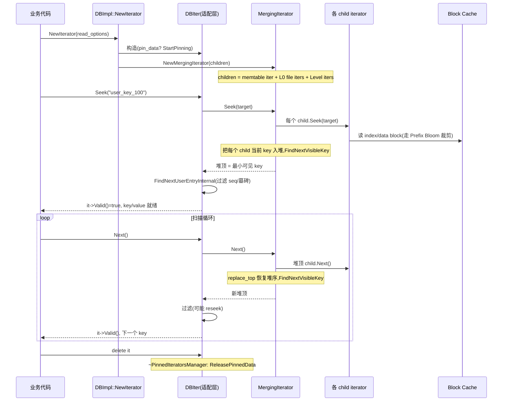

# 第 3 篇 · 第 12 章 · Iterator 与多路归并

> **核心问题**:第 11 章讲完了一次 `Get(key)` 怎么穿透 MemTable + 多层 SST 找到最新值。可现实里,业务不只要点查,还要范围扫描——`Scan(prefix)`、`Seek(start); while(Valid){ Next(); }` 这种迭代,要的是一段连续的 key。LSM 的数据散落在 active memtable、若干 immutable memtable、L0 的多个文件、L1..Ln 的每一层一个文件里,每个数据源自己内部是有序的,但合在一起是 N 路无序的。一次范围扫描,怎么把这 N 路有序的流,**合并成一条全局有序的流**,而且每吐一个 key 都要保证是最新版本(旧版本和墓碑要过滤掉)?这就要靠 **MergingIterator**——LSM 读路径上最精妙的组件之一。再进一步,RocksDB 还给了你两个旋钮把范围扫描调到极致:**Prefix seek**(只在前缀桶里扫,极快但只能前缀扫)和 **Iterator pinning**(扫描期间 pin 住刚读的 block,不被 Block Cache 驱逐)。这三个东西,就是本章的全部。

> **读完本章你会明白**:
> 1. **MergingIterator 怎么把 N 路有序流合并成一路**:它用一个小顶堆(BinaryHeap)维护每个 child iterator 的当前 key,每次 `Next()` 把堆顶那个 child 往前推一格、恢复堆序。讲清它为什么不跳墓碑(墓碑过滤在 DBIter 这一层做,MergingIterator 只管有序合并),以及 forward↔backward 方向翻转的正确性保证。
> 2. **IteratorWrapper 凭什么省虚函数调用**:为什么 MergingIterator 不直接用 child iterator 的 `key()`/`Valid()`,而要套一层 IteratorWrapper 把这两个结果缓存下来——这在 hot path 上一次扫描成百万次 Next 省下的虚函数 + cache miss 是实打实的。
> 3. **Prefix seek 怎么用 prefix_extractor 把扫描裁到前缀桶里**:`total_order_seek=true` 关掉前缀优化换全序扫但慢、`auto_prefix_mode` 自动判断能不能安全地用前缀优化——讲清三者各自适用什么场景、为什么 prefix seek 快但"只能前缀扫"。
> 4. **Iterator pinning 怎么让一次长扫描不抖掉 Block Cache 里的热数据**:为什么朴素地"扫一遍就把 cache 里的热块全冲掉"会拖垮并发的前台点查,RocksDB 用 `PinnedIteratorsManager` 怎么把扫描期间用到的块钉住、扫描结束统一释放。

> **如果一读觉得太难**:先只记住三件事——① 范围扫描靠 MergingIterator 把多层 SST 的迭代器合并成一路有序流,它用小顶堆找当前最小的 child 推进(承 LevelDB 的合并思路,但 LevelDB 是线性扫、RocksDB 演进成了堆);② Prefix seek 是"只在前缀桶里扫"的加速旋钮,快但牺牲全序扫描能力,`total_order_seek` 用来关掉它;③ Iterator pinning 让长扫描不污染 Block Cache,用 `pin_data=true` 开启。MergingIterator 内部的 range tombstone 处理逻辑极其复杂(几百行不变量证明),那是给写 RocksDB 内核的人看的,应用层读者知道"它额外跳过了被范围删除盖住的 key"即可。

---

## 〇、一句话点破

> **范围扫描的本质是 N 路归并——每个数据源(memtable、每个 SST 文件)自己有序,合在一起无序,MergingIterator 用一个小顶堆把它们归并成一条全局有序的流;Prefix seek 和 Iterator pinning 是 RocksDB 在这条归并路径上额外接出来的两个旋钮,一个裁扫描范围,一个保 cache 不被扫脏。**

这是结论,不是理由。本章倒过来拆:先讲 N 路归并到底在归并什么、LevelDB 是怎么写的、RocksDB 为什么改成了堆;再讲 IteratorWrapper 这层缓存凭什么关键;然后讲 Prefix seek 这个旋钮怎么把扫描裁到前缀桶里;最后讲 Iterator pinning 怎么让长扫描不抖掉热数据。

---

## 一、N 路归并到底在归并什么

要讲清 MergingIterator,先得讲清"为什么要归并"。这是 LSM 读路径的根。

### 数据散落在 N 个有序源里

回到第 2 篇讲的 LSM 结构。一次 `Put(key, value)` 落地后,这个 key 的某个版本可能存在于:

- **active memtable**(还在内存里没 Flush)。
- **若干 immutable memtable**(等 Flush 的,内存里)。
- **L0 的多个 SST 文件**(L0 文件之间**允许 key 范围重叠**,同一个 key 可能在 L0 的好几个文件里都有版本)。
- **L1..Ln 的每一层至多一个 SST 文件**(同一层内文件之间不重叠,但跨层会重叠)。

每个数据源自己内部是有序的(memtable 是 SkipList 有序、SST 文件内部按 key 排序)。但把这 N 个数据源合在一起看,同一个 key 可能在多个源里都有(多个版本),顺序也是乱的。

> **钉死这件事**:LSM 的数据不是放在一个有序结构里,是**散落在 N 个各自有序的数据源里**。点查(Get)是"找最新版本"(第 11 章讲过),范围扫描(Scan)是"按 key 顺序遍历一段区间,每吐一个 key 给最新的可见版本"。两种操作都要面对"N 路归并"这个事实。

### 范围扫描要的是一条全局有序的流

范围扫描的 API 长这样(用户视角):

```cpp
Iterator* it = db->NewIterator(read_options);
it->Seek("user_key_100");      // 定位到起点
while (it->Valid()) {
  Process(it->key(), it->value());
  it->Next();                   // 往后走一个
}
```

用户要的是:从 `"user_key_100"` 开始,按 user key 升序,一个一个吐出 (key, value),而且每个 user key 只吐一次、吐的是最新可见版本(旧版本和被墓碑删掉的要过滤)。

可底层的数据散在 N 个源里。要实现"全局有序",就得把 N 路有序流**归并(merge)**成一路。这正是 MergingIterator 的活。

```
   active memtable       immutable memtable     L0 file 1     L0 file 2    L1 file
   (SkipList,有序)        (SkipList,有序)       (SST,有序)    (SST,有序)   (SST,有序)
        │                      │                    │             │            │
        │ 各自是一个 InternalIterator,吐出 (internal_key, value)
        ▼                      ▼                    ▼             ▼            ▼
   ┌──────────────────────────────────────────────────────────────────────────────┐
   │                         MergingIterator                                       │
   │           (把 N 路归并成一路全局有序的 InternalIterator)                       │
   └──────────────────────────────────────────────────────────────────────────────┘
                                   │ 吐出 (internal_key, value) 全局有序
                                   ▼
                          [还要经过 DBIter 过滤,见第三节]
```

> **所以这样设计**:范围扫描的归并,就是把 N 个 `InternalIterator`(每个数据源一个)交给 MergingIterator,它对外暴露一个**看起来全局有序**的 `InternalIterator`。用户每调一次 `Next()`,它在内部找出 N 路里最小的那个 key,吐出来,然后把那个 child 往前推一格。

这是 N 路归并的最朴素形态。下一节拆它具体怎么做。

---

## 二、MergingIterator:从 LevelDB 的线性扫到 RocksDB 的堆

这是本章的招牌技巧之一。理解它的关键,是先看清 LevelDB 是怎么写的,再看 RocksDB 为什么改了。

### LevelDB 怎么写死:O(N) 线性扫描找最小

LevelDB 的 MergingIterator([leveldb/table/merger.cc](../leveldb/table/merger.cc))极其简洁。它的核心是两个函数,`FindSmallest()` 和 `FindLargest()`:

```cpp
//  leveldb/table/merger.cc:148-161  (LevelDB 源码)
void MergingIterator::FindSmallest() {
  IteratorWrapper* smallest = nullptr;
  for (int i = 0; i < n_; i++) {
    IteratorWrapper* child = &children_[i];
    if (child->Valid()) {
      if (smallest == nullptr) {
        smallest = child;
      } else if (comparator_->Compare(child->key(), smallest->key()) < 0) {
        smallest = child;
      }
    }
  }
  current_ = smallest;
}
```

每次 `Next()`,LevelDB 的做法是:`current_->Next()`(把当前最小的 child 往前推一格),然后 `FindSmallest()`(在所有 child 里**线性扫一遍**找新的最小)。`FindLargest()` 同理,反向扫描找最大。

LevelDB 源码里有一句关键的注释,直接预告了 RocksDB 会怎么演进([leveldb/table/merger.cc:138-140](../leveldb/table/merger.cc#L138-L140)):

```cpp
  // We might want to use a heap in case there are lots of children.
  // For now we use a simple array since we expect a very small number
  // of children in leveldb.
```

翻译过来就是:**"如果 child 很多,我们也许该用堆。但现在先用数组线性扫,因为 LevelDB 的 child 数量预期很小。"**

> **LevelDB 是写死的**:它假设 child 数量很小(单 memtable + 几层 SST,通常不到 10 个),所以线性扫 O(N) 够用。这个假设在 LevelDB 的设计场景(单机、中等负载、单 CF)成立。但 RocksDB 的场景打破了这个假设——见下文。

### 不线性扫会怎样:RocksDB 的 child 数量可能很多

RocksDB 打开了 LevelDB 写死的几个旋钮,导致 MergingIterator 的 child 数量可能远超 LevelDB:

- **多 memtable**:`max_write_buffer_number` 默认可到好几个,active + immutable 队列里可能堆好几个 memtable,每个都是一个 child。
- **L0 文件数多**:`level0_file_num_compaction_trigger` 之前,L0 可能堆积几十个文件,每个文件一个 child。
- **Column Family**:虽然每个 CF 独立 iterator,但单 CF 的 child 数量本身就可能上到几十。

如果 child 数量是 30 个,一次 `Next()` 线性扫 30 次 key 比较,一次范围扫描 100 万次 Next 就是 3000 万次比较——而且这还是在 hot path 上,每次比较还可能触发 cache miss(child 的 key 在不同 cache line)。

> **不这样会怎样**:如果 RocksDB 沿用 LevelDB 的线性扫,在海量 child(几十个 memtable + L0 文件)的场景下,`Next()` 的代价会从 O(1) 退化成 O(N),范围扫描的吞吐会被 child 数量拖垮。这正是 LevelDB 那句注释预警的"lots of children"场景。

### RocksDB 怎么打开成旋钮:用二叉堆

RocksDB 的 MergingIterator([table/merging_iterator.cc](../rocksdb/table/merging_iterator.cc))把 LevelDB 那个 TODO 兑现了:用一个小顶堆维护所有 child 的当前 key。核心数据结构(行 573-574):

```cpp
  using MergerMinIterHeap = BinaryHeap<HeapItem*, MinHeapItemComparator>;
  using MergerMaxIterHeap = BinaryHeap<HeapItem*, MaxHeapItemComparator>;
```

`BinaryHeap` 是 RocksDB 自己实现的二叉堆([util/heap.h](../rocksdb/util/heap.h)),关键操作是 `push`、`pop` 和 `replace_top`([util/heap.h:42-68](../rocksdb/util/heap.h#L42-L68))。`replace_top` 是堆优化里的招牌:换掉堆顶元素后,只需要 `[1, 2logN]` 次比较就能恢复堆序(注释原话,行 26),比"先 pop 再 push"省一次 sift。

每个 child 在堆里是一个 `HeapItem`(行 497-521),里面包着一个 `IteratorWrapper`(就是 child iterator)和一个 `level` 编号。堆的比较器 `MinHeapItemComparator`(行 523-546)按 internal key 比较:

```cpp
    bool operator()(HeapItem* a, HeapItem* b) const {
      if (LIKELY(a->type == HeapItem::Type::ITERATOR)) {
        if (LIKELY(b->type == HeapItem::Type::ITERATOR)) {
          return comparator_->Compare(a->iter.key(), b->iter.key()) > 0;
        }
        // ... (处理 range tombstone 的 start/end key,见第六节)
      }
      // ...
    }
```

`> 0` 是因为小顶堆的比较器返回 `true` 表示 "a 应该排在 b 后面"(即 a 比 b 大),所以 `Compare(a,b) > 0` 意味着 a 的 key 更大、应该沉下去,堆顶是最小的。

`Next()` 的核心逻辑(行 349-385)极其紧凑:

```cpp
void MergingIterator::Next() override {
  assert(Valid());
  // 如果当前是反向扫描,要先翻成正向(见第五节)
  if (direction_ != kForward) {
    SwitchToForward();
  }
  assert(current_ == CurrentForward());
  // 把当前最小的 child 往前推一格
  current_->Next();
  if (current_->Valid()) {
    // child 还有效,用 replace_top 恢复堆序(招牌优化)
    assert(current_->status().ok());
    minHeap_.replace_top(minHeap_.top());
  } else {
    // child 走到头了,从堆里删掉
    considerStatus(current_->status());
    minHeap_.pop();
  }
  FindNextVisibleKey();
  current_ = CurrentForward();
}
```

> **钉死这件事**:RocksDB 的 `Next()` 做三件事——① 把堆顶(当前最小)那个 child 往前推一格 `current_->Next()`;② 如果 child 还有效,`replace_top` 恢复堆序(O(logN)),否则 `pop` 删掉;③ 跳过被 range tombstone 盖住的 key(第六节)。堆顶永远是所有 child 里 internal key 最小的那个。

`replace_top(minHeap_.top())` 这一行是堆实现的精髓。`minHeap_.top()` 返回堆顶指针(就是刚 Next 完的那个 child 的 HeapItem*),`replace_top` 把它"重新放回堆里"——因为它 Next 完后 key 变大了,可能不再是最小,需要 sift down 恢复堆序。这比"先 pop 再 push"省一次 sift 操作,在 hot path 上累积起来很可观。

### 复杂度对比:为什么堆赢

| 操作 | LevelDB(线性扫) | RocksDB(二叉堆) |
|---|---|---|
| 一次 `Next()` 找最小 | O(N) 全扫 N 个 child | O(logN) sift down 堆顶 |
| 一次 `Next()` child 失效 | O(N) 重新找 | O(logN) pop + sift |
| 空间 | O(N) children 数组 | O(N) 堆(相同) |
| 适合 N 小(<10) | 够用,常数因子小 | 堆的常数因子反而更大 |
| 适合 N 大(几十+) | 退化,每次 Next 全扫 | logN 增长平缓 |

> **不这样会怎样**:堆不是免费午餐——它有常数因子( sift 时的交换、cache miss)。当 N 很小(LevelDB 的场景,N<10),线性扫的常数因子更小,反而更快。RocksDB 选择堆,是因为它押注"工业场景 N 可能很大"(多 memtable + L0 堆积 + 多 CF 的拼接),logN 的增长曲线在大 N 下完胜。这是一个**典型的"为可扩展性付常数代价"的设计决策**——和 LevelDB 的"小 N 用线性"是同一个权衡的两个端点。

### replace_top:堆实现的招牌优化

堆操作里有个细节值得单独拆,因为它直接决定了 `Next()` 的常数因子。朴素地"把堆顶 Next 完后恢复堆序"有两种写法:

```cpp
//  写法 A:先 pop 再 push(朴素)
minHeap_.pop();              // 删堆顶,O(logN) sift
if (current_->Valid()) {
  minHeap_.push(current_);   // 重新插入,O(logN) sift
}

//  写法 B:replace_top(RocksDB 实际用的)
if (current_->Valid()) {
  minHeap_.replace_top(minHeap_.top());  // 原地换堆顶,O(logN) sift,但只 sift 一次
} else {
  minHeap_.pop();
}
```

写法 A 是两次 sift(pop 一次、push 一次),写法 B 只 sift 一次。RocksDB 的 `BinaryHeap::replace_top` 注释([util/heap.h:26](../rocksdb/util/heap.h#L26))原话:"This heap provides a replace_top() operation which requires [1, 2logN] comparisons"——意思是 replace_top 只要 1 到 2logN 次比较(平均比两次独立 sift 的 2logN 到 4logN 次省一半)。

> **钉死这件事**:`Next()` 是 hot path 里的 hot path——一次范围扫描 Next 几百万次,每次都走堆恢复。把"两次 sift"压成"一次 sift",等于把归并的常数因子砍一半。这种"在最高频的路径上抠常数"是 RocksDB 性能工程的招牌——和 InlineSkipList 的 NoBarrier_SetNext 再 release(承 LevelDB)、WriteGroup 的零拷贝 piggyback 是同一种工程美学。

### 方向翻转的正确性:SwitchToForward / SwitchToBackward

MergingIterator 支持双向扫描——`Next()` 往前、`Prev()` 往后。但堆是单向的(小顶堆只能往前找最小),反向扫描要换一个大顶堆。问题来了:用户可能在正向扫描中间突然调 `Prev()`(反向),这时候所有 child 的位置都是"正向扫描时的位置",要怎么安全地翻到反向?

RocksDB 的解法是 `SwitchToBackward()`([table/merging_iterator.cc:1389](../rocksdb/table/merging_iterator.cc#L1389))和 `SwitchToForward()`([table/merging_iterator.cc:1321](../rocksdb/table/merging_iterator.cc#L1321))。核心思路:**方向翻转时,把所有非当前的 child 重新 Seek 到当前位置,然后跨过当前位置**。

```cpp
//  table/merging_iterator.cc:1389-1403  (SwitchToBackward 节选)
void MergingIterator::SwitchToBackward() {
  ClearHeaps();
  InitMaxHeap();                    // ★ 懒加载大顶堆(反向扫描才创建)
  Slice target = key();
  for (auto& child : children_) {
    if (&child.iter != current_) {
      child.iter.SeekForPrev(target);   // ★ 所有非当前 child SeekForPrev 到当前位置
      if (child.iter.Valid() && comparator_->Equal(target, child.iter.key())) {
        child.iter.Prev();               // ★ 跨过当前位置(反向,Prev)
      }
    }
    AddToMaxHeapOrCheckStatus(&child);
  }
  // ...
  direction_ = kReverse;
}
```

这里有两个 sound 要点:

1. **为什么只 Seek 非当前的 child**:当前 child(current_)已经在正确位置(key() 那个 key),不用动。其他 child 可能停在任意位置(正向扫描时只保证它们的 key ≥ current),要重新 SeekForPrev 回到当前位置,再 Prev 跨过去——保证反向扫描时所有 child 都在 current 的**严格左侧**。
2. **懒加载大顶堆**:`maxHeap_` 是 `std::unique_ptr`,反向扫描才 `InitMaxHeap()` 创建(行 1454)。注释明说(行 662-664):"Max heap is used for reverse iteration, which is way less common than forward. Lazily initialize it to save memory."——正向扫描(绝大多数场景)根本不分配大顶堆的内存。

> **不这样会怎样**:如果方向翻转时不重新 Seek 所有 child,反向扫描会漏数据——某个 child 可能停在远大于 current 的位置,反向 Prev 时永远到不了它真正的"current 左侧第一个 key"。SwitchToBackward 的代价是 O(N) 次 SeekForPrev(翻转一次性付清),之后反向 Prev 就是 O(logN) 稳态。这是典型的"翻转贵一次,稳态便宜"的设计。

`prefix_seek_mode_` 下还有个特殊处理(行 1434):prefix seek 模式不 assert `current_ == CurrentReverse()`,因为 prefix seek 可能有比 seek-key 大的 key 被插进来,使得翻转后 current 不在堆顶。这是 prefix seek 语义和全序扫描语义的差异,源码注释(行 1435-1438)诚实标注了。

### MergingIterator 不跳墓碑:过滤在上一层做

这里有个极其容易搞混的点,必须钉死:**MergingIterator 本身不跳普通墓碑(kTypeDeletion),它只跳 range tombstone(kTypeRangeDeletion)**。

- **普通墓碑**(一次 `Delete(key)` 产生的 type=kTypeDeletion 记录):MergingIterator 把它当普通 key 一样吐出去。墓碑的过滤发生在**更上一层**的 DBIter(见第三节)——DBIter 看到 `kTypeDeletion` 就知道这个 user key 被删了,跳过不吐给用户。
- **范围墓碑**(一次 `DeleteRange(start, end)` 产生的 type=kTypeRangeDeletion 记录):这个 MergingIterator **要**跳——因为它覆盖一段区间,不跳的话会把成片被删的 key 吐给 DBIter,DBIter 还得逐个判断,低效。MergingIterator 在内部用一个 `active_` set 跟踪哪些层的 range tombstone 当前生效,被盖住的 key 直接 SeekImpl 跳过。这套逻辑极其复杂(几百行不变量证明,见第六节),是 RocksDB 独有的——**LevelDB 根本没有 range tombstone**。

> **LevelDB 是写死的,RocksDB 打开成了旋钮**:LevelDB 的 MergingIterator 纯粹做 N 路归并,不碰任何 tombstone(因为它只有普通墓碑,全交给上层);RocksDB 的 MergingIterator 额外承担了 range tombstone 的过滤——这是 LevelDB 不存在的功能,RocksDB 为了支持 `DeleteRange` 不得不在归并层引入的复杂度。

---

## 三、DBIter:序列号可见性与墓碑过滤

MergingIterator 吐出来的是**全局有序的 internal key 流**(包含所有版本、所有墓碑)。但用户不能直接看这个——用户要的是"每个 user key 的最新可见版本"。这层过滤由 **DBIter** 做。

DBIter(`db/db_iter.cc`)是用户迭代器和底层 internal iterator 之间的**适配层**。它做三件事:

1. **序列号可见性过滤**:internal key 带着序列号(seq),DBIter 只吐 seq ≤ 读快照的版本(读快照由 snapshot 或 ReadOptions 决定)。比快照新的版本(别人刚写的、自己事务里还没提交的)要跳过。
2. **普通墓碑过滤**:看到 `kTypeDeletion`,这个 user key 被删了,跳过(不吐给用户,而且要把这个 user key 的更老版本一起跳掉)。
3. **旧版本跳过**:同一个 user key 的多个版本(internal key 按_user key 升序、seq 降序排列),DBIter 只吐第一个可见的,其余跳掉。

### FindNextUserEntryInternal:跳过不可见版本的循环

DBIter 的核心是 `FindNextUserEntryInternal()`([db/db_iter.cc:517](../rocksdb/db/db_iter.cc#L517)),这是一个循环:不断从底层 internal iterator(就是 MergingIterator)拉 internal key,判断类型,直到拉到一个能吐给用户的。简化逻辑:

```cpp
//  db/db_iter.cc:517 起  (简化示意,非源码原文)
bool DBIter::FindNextUserEntryInternal(bool skipping_saved_key) {
  uint64_t num_skipped = 0;
  do {
    ParsedInternalKey ikey = Parse(iter_.key());
    // 1. 序列号判断:比快照新的跳过
    if (ikey.sequence > sequence_) { iter_.Next(); continue; }
    // 2. user key 变了:更新 saved_key_,重置计数
    if (ikey.user_key != saved_key_) {
      saved_key_ = ikey.user_key;
      num_skipped = 0;
    }
    // 3. 按类型判断
    switch (ikey.type) {
      case kTypeDeletion:
        // 这个 user key 被删了,跳过它所有的更老版本
        skipping_saved_key = true;
        iter_.Next();
        break;
      case kTypeValue:
        // 找到一个可见的值,吐给用户
        return true;  // current_ 指向这个 key
      // ... (Merge、Blob 等其他类型)
    }
    // 4. 连续跳了太多同 user key 的旧版本?reseek 加速
    if (num_skipped > max_skip_) {
      iter_.Seek(...);  // 见下一节 reseek
    }
  } while (iter_.Valid());
  return false;
}
```

> **钉死这件事**:DBIter 是**用户可见性的守门人**。MergingIterator 吐出"所有 internal key 全局有序",DBIter 在上面过滤出"每个 user key 的最新可见版本"。两层分工明确:MergingIterator 管有序合并(顺带跳 range tombstone),DBIter 管可见性和普通墓碑。这是 RocksDB 读路径的核心分层——也是 LevelDB 的同款分层(见《LevelDB》读路径章)。

### max_sequential_skip_in_iterations:跳太多就 reseek

这里有个 RocksDB 独有的旋钮,极易翻车。考虑这个场景:某个 user key 被疯狂覆盖了 10000 次(比如计数器),它的 10000 个版本按 internal key 排序挤在一起(seq 从高到低)。DBIter 要找最新可见版本,可能要连续 Next 跳过前面几千个比快照新的版本——每次 Next 都是一次堆操作 + 比较,几千次下来很慢。

RocksDB 的解法是 **reseek**。`FindNextUserEntryInternal` 里有个计数器 `num_skipped`,记录连续跳了多少个同 user key 的 internal key。一旦超过 `max_sequential_skip_in_iterations`,不再 Next,而是直接 `Seek` 到这个 user key 的更小 seq 位置,一步跳过那一大片([db/db_iter.cc:728-769](../rocksdb/db/db_iter.cc#L728-L769)):

```cpp
//  db/db_iter.cc:728-769  (简化示意)
if (num_skipped > max_skip_ && !reseek_done) {
  num_skipped = 0;
  reseek_done = true;  // 避免无限 reseek 循环
  std::string last_key;
  if (skipping_saved_key) {
    // 在找下一个 user key,但满眼都是同一个 user key 的旧版本
    // 直接 Seek 到 (saved_key_, seq=0, kTypeDeletion)——比所有版本都小的位置
    AppendInternalKey(&last_key,
        ParsedInternalKey(saved_key_, 0, kTypeDeletion));
  } else {
    // 在找当前 user key 的可见版本,但比快照新的版本太多
    // 直接 Seek 到 (saved_key_, sequence_, kValueTypeForSeek)
    AppendInternalKey(&last_key,
        ParsedInternalKey(saved_key_, sequence_, kValueTypeForSeek));
  }
  iter_.Seek(last_key);  // 一次 Seek 跳过一大片,代替无数次 Next
  RecordTick(statistics_, NUMBER_OF_RESEEKS_IN_ITERATION);
} else {
  iter_.Next();
}
```

这个旋钮的默认值是 **8**([include/rocksdb/advanced_options.h:749](../rocksdb/include/rocksdb/advanced_options.h#L749)):

```cpp
  // An iteration->Next() sequentially skips over keys with the same
  // user-key unless this option is set. This number specifies the number
  // of keys (with the same userkey) that will be sequentially
  // skipped before a reseek is issued.
  // Default: 8
  uint64_t max_sequential_skip_in_iterations = 8;
```

> **LevelDB 是写死的,RocksDB 打开成了旋钮**:LevelDB 也有这个机制(`max_sequential_skip_in_iterations`),但默认值是 **1000** 且不可调;RocksDB 把默认值降到 **8**(更激进地 reseek),而且做成可动态调整的 option(`SetOptions` API)。为什么 RocksDB 默认更激进?因为 RocksDB 的 child 数量多、堆操作相对贵,尽早 reseek 更划算;LevelDB 的线性扫 Next 很便宜,容忍更多次 Next 才 reseek。这是同一个机制在不同参数空间的调优——典型的"LevelDB 写死一个值,RocksDB 让你拧"。

`reseek_done = true` 那行极其关键——它防止无限循环。注释写得很直白([db/db_iter.cc:537-541](../rocksdb/db/db_iter.cc#L537-L541)):"For write unprepared, the target sequence number in reseek could be larger than the snapshot, and thus needs to be skipped again. This could result in an infinite loop of reseeks. To avoid that, we limit the number of reseeks to one."这是 sound 的保证:一次 FindNextUserEntryInternal 最多 reseek 一次,之后无论再跳多少个都老老实实 Next。

---

## 四、技巧精解之一:IteratorWrapper——在 hot path 省虚函数

这一节单独拆 MergingIterator 的另一个招牌技巧:为什么 child iterator 不直接用,而要套一层 IteratorWrapper。

### 问题:虚函数 + cache miss 在 hot path 的代价

MergingIterator 每次 `Next()` 都要比较 child 的 key——而且不是比一次,是堆的每次 sift 都要比。一次 sift 是 O(logN) 次比较,N 是 child 数。一次范围扫描 100 万次 Next,假设 N=30,就是 100 万 × log30 ≈ 500 万次 key 比较,每次比较都要读 child 的 `key()`。

`InternalIterator` 是个抽象基类([table/internal_iterator.h](../rocksdb/table/internal_iterator.h)),`key()` 是虚函数:

```cpp
class InternalIteratorBase {
 public:
  virtual Slice key() const = 0;
  virtual bool Valid() const = 0;
  virtual void Next() = 0;
  // ...
};
```

虚函数调用要做两件事:① 查 vtable(一次间接寻址,可能 cache miss);② 真正的函数调用(可能破坏分支预测)。在 hot path 上,每次 key 比较都走一次虚函数,代价不小。

更糟的是,`key()` 内部往往要解析 block、读缓存——但**在一次 Next 里,堆的多次 sift 比较的是同一个 child 的同一个 key**(child 还没 Next,key 没变),重复读虚函数完全是浪费。

### 解法:IteratorWrapper 缓存 key() 和 Valid()

RocksDB 的解法是 IteratorWrapper([table/iterator_wrapper.h](../rocksdb/table/iterator_wrapper.h))。它在 child iterator 外面套一层,把 `Valid()` 和 `key()` 的结果缓存下来:

```cpp
//  table/iterator_wrapper.h:24-37  (节选)
template <class TValue = Slice>
class IteratorWrapperBase {
 public:
  IteratorWrapperBase() : iter_(nullptr), valid_(false) {}
  // ...
 private:
  void Update() {
    valid_ = iter_->Valid();
    if (valid_) {
      assert(iter_->status().ok());
      result_.key = iter_->key();        // ★ 把 key() 结果存下来
      result_.bound_check_result = IterBoundCheck::kUnknown;
      result_.value_prepared = false;
    }
  }

  InternalIteratorBase<TValue>* iter_;
  IterateResult result_;                  // ★ 缓存的 key 和边界检查结果
  bool valid_;                            // ★ 缓存的 Valid() 结果
};
```

`key()` 变成了直接读缓存(行 81-84):

```cpp
  Slice key() const {
    assert(Valid());
    return result_.key;   // ★ 直接读缓存,不走虚函数
  }
```

什么时候更新缓存?只在 `Seek`/`SeekToFirst`/`Next`/`Prev` 之后调一次 `Update()`(行 207-215),把底层 iterator 的 `Valid()` 和 `key()` 读一次,存下来。之后所有的比较都用缓存值。

### 收益:堆的 sift 不再触发虚函数

回到 MergingIterator 的堆比较器(第二节贴过):

```cpp
    bool operator()(HeapItem* a, HeapItem* b) const {
      if (LIKELY(a->type == HeapItem::Type::ITERATOR)) {
        if (LIKELY(b->type == HeapItem::Type::ITERATOR)) {
          return comparator_->Compare(a->iter.key(), b->iter.key()) > 0;
        }
      }
```

`a->iter.key()` 这里的 `iter` 是 `IteratorWrapper`,`key()` 是**内联的非虚函数**,直接返回 `result_.key`。一次 sift 做 logN 次比较,每次比较就是两次内联函数调用 + 一次 Slice 比较——没有 vtable 查找,没有 cache miss(因为 `result_` 紧挨着 `iter_` 在同一个 cache line)。

> **不这样会怎样**:如果堆比较器直接调底层 `InternalIterator::key()`(虚函数),一次 sift 的 logN 次比较就是 logN 次虚函数调用。N=30、一次扫描 100 万次 Next,就是 500 万次虚函数 + 潜在的 vtable cache miss。IteratorWrapper 把这 500 万次虚函数全省了,代价只是每次 Seek/Next 多存一个 Slice(几十字节)。这是典型的"用空间换时间 + 用缓存换虚函数"——在 hot path 上的回报是实打实的。

注意 IteratorWrapper 不是 RocksDB 独有的——**LevelDB 也有 IteratorWrapper**([leveldb/table/iterator_wrapper.h](../leveldb/table/iterator_wrapper.h)),一模一样的思路(缓存 key 和 valid)。这是 LevelDB 讲透的技巧,本书一句带过:承 LevelDB IteratorWrapper 缓存 key/Valid(详见《LevelDB》读路径章)。RocksDB 的演进只是把它扩展到了 `IterateResult`(多缓存了 `bound_check_result` 和 `value_prepared`),服务于 RocksDB 新增的边界检查和延迟 value 准备特性。

### 为什么不用 std::priority_queue:BinaryHeap 自己实现的理由

读完前面的堆优化,有人会问:C++ 标准库不是有 `std::priority_queue` 吗?RocksDB 为什么还要自己实现一个 `BinaryHeap`?这背后的取舍值得拆。

`std::priority_queue` 的设计有两个痛点,让它不适合 MergingIterator 的 hot path:

1. **没有 `replace_top`**:`std::priority_queue` 只暴露 `top()`、`push()`、`pop()`。要做"换堆顶",只能 `pop()` 再 `push()`——两次 sift。前面讲过,RocksDB 的 `BinaryHeap::replace_top` 一次 sift 就够,省一半。在 Next 这个最高频路径上,这个差异是实打实的。
2. **底层容器不可控**:`std::priority_queue` 默认用 `std::vector`,但它的内部细节是标准库实现细节,RocksDB 想做的优化(比如预留容量、避免重新分配、自定义 sift 时的分支提示)都插不进去。

RocksDB 的 `BinaryHeap`([util/heap.h](../rocksdb/util/heap.h))是一个朴素的数组实现二叉堆,核心就是 `replace_top` 这个标准库不给的 API。注释(行 24-30)直接说明了动机:

```cpp
// - This heap provides a replace_top() operation which requires [1, 2logN]
//   comparisons, which is faster than separate pop() + push().
// - Uses contiguously allocated array, so it is cache friendly.
```

两个理由:① `replace_top` 快;② 连续数组 cache 友好。这是"在 hot path 上为了一两个常数因子自己造轮子"的典型——和 InlineSkipList 不用 std::atomic 的默认 memory_order、WriteGroup 自己管链接批是同一种工程美学。RocksDB 的内核充满了这种"标准库够用但不够快,自己写一个特化的"选择。

> **不这样会怎样**:如果用 `std::priority_queue`,MergingIterator 每次 Next 都要 pop+push 两次 sift,扫描吞吐降一半(在 child 数多、sift 深的场景更明显)。这个差异在 micro-benchmark 里能直接测出来——RocksDB 的 `db_bench seekrandom` 对堆实现的敏感度很高。所以 RocksDB 宁可维护一个自己的 BinaryHeap,也不吃标准库的常数损失。

---

## 五、技巧精解之二:Prefix seek——把扫描裁到前缀桶里

这是 RocksDB 在范围扫描上接出的最重要的旋钮之一。理解它要先理解 LSM 范围扫描的一个根本痛点。

### 痛点:范围扫描要扫所有层,读放大巨大

考虑一次 `Seek("user_key_100"); while(Valid) Next()`,扫 1000 个连续 key。朴素地,MergingIterator 要:

- Seek 时,**每个 child iterator 都要 Seek 一次**(到 `user_key_100` 的位置)。N 个 child,N 次 Seek,每次 Seek 在 SST 上要读 index block + data block(走 Block Cache)。
- Next 时,堆操作 + 偶尔的 child Next(每个 child 顺序读自己的 block)。

如果这 1000 个 key 全都集中在某个前缀桶里(比如都是 `prefix_` 开头),那么:

- **没有 prefix 优化**:所有 child 都要从 `user_key_100` 开始扫,包括那些**根本不含这个前缀**的 child(它们 Seek 完立刻 Valid=false,但 Seek 本身的 index/data block 读已经发生了)。
- **有 prefix 优化**:利用 prefix extractor 知道目标前缀是 `prefix_`,只在前缀桶里扫——MemTable 的 Prefix Bloom 直接判断这个前缀在不在(不在就跳过整个 memtable)、SST 的 Prefix Bloom(见第 8 章)直接判断这个前缀在不在某个文件(不在就跳过整个 SST 文件)。**整个 child 直接跳过,Seek 都不用做**。

> **钉死这件事**:Prefix seek 的本质是**用前缀布隆过滤器(Prefix Bloom Filter)在 Seek 阶段就裁掉不含目标前缀的 child**。裁掉的不是一个 key,是整个 memtable / 整个 SST 文件。这把范围扫描的读放大从"扫所有层"压到"只扫含目标前缀的那几层"。

### prefix_extractor:把 key 切出前缀

旋钮的载体是 `prefix_extractor`([include/rocksdb/options.h:289](../rocksdb/include/rocksdb/options.h#L289)):

```cpp
  // Default: nullptr
  std::shared_ptr<const SliceTransform> prefix_extractor = nullptr;
```

`SliceTransform` 是个抽象接口,实现一个 `Transform(key)` 把 key 切出前缀。RocksDB 自带几个常用的(见 `include/rocksdb/slice_transform.h`):

- `NewFixedPrefixTransform(n)`:取 key 的前 n 个字节当前缀。最常用。
- `NewCappedPrefixTransform(n)`:取前 min(n, key.size()) 字节。
- `NewNoop`:整个 key 当前缀(基本没用)。

设了 `prefix_extractor` 后,SST 文件在 Flush/Compaction 时会额外建一个 **Prefix Bloom Filter**(基于 key 的前缀,见第 8 章),MemTable 也会建一个 Prefix Bloom(基于 InlineSkipList 的 key)。Seek 时,如果目标 key 在 prefix_extractor 的 domain 内,RocksDB 就用这个 Prefix Bloom 裁 child。

### 三个 seek 模式:prefix / total_order / auto_prefix

关键来了:`prefix_extractor` 设了之后,**默认的 Seek 行为是 prefix seek**——只保证返回前缀相同的 key。这意味着如果你想扫两个不同前缀之间的 key,prefix seek 会漏数据!RocksDB 用三个 option 控制这个行为。

**`total_order_seek`**([include/rocksdb/options.h:2290](../rocksdb/include/rocksdb/options.h#L2290)):

```cpp
  // Default: false
  bool total_order_seek = false;
```

设成 `true`,关掉所有前缀优化,Seek 走全序扫描——保证不漏任何 key,但慢(没有 Prefix Bloom 裁剪,所有 child 都要 Seek)。当你需要扫跨前缀的区间(比如全表扫描、或者范围不局限于单个前缀),必须开 `total_order_seek`。

**`prefix_same_as_start`**(在 ReadOptions 里,默认 `true` 当 `prefix_extractor != null`):只返回和 Seek 起点相同前缀的 key。这是 prefix seek 的语义保证。

**`auto_prefix_mode`**([include/rocksdb/options.h:2306](../rocksdb/include/rocksdb/options.h#L2306)):

```cpp
  // Default: false
  bool auto_prefix_mode = false;
```

这是个聪明的折中。设成 `true`,RocksDB **自动判断**这次 Seek 能不能安全地用前缀优化(即"用前缀 Bloom 裁剪"和"全序扫描"结果相同)。判断依据是:Seek 的 key 和 iterate_upper_bound 是否共享同一个前缀、Comparator 是否满足 `IsSameLengthImmediateSuccessor` 等。如果能安全用,就用前缀优化(快);不能,就退回全序扫(慢但正确)。

三者的取舍:

| 场景 | 推荐 | 代价 |
|---|---|---|
| 只扫单个前缀内的 key(如某个用户的全部订单) | `prefix_same_as_start=true`(默认),不开 auto_prefix | 最快,Prefix Bloom 全程裁剪 |
| 扫跨前缀的区间(如全表扫、范围不限于单前缀) | `total_order_seek=true` | 慢,无前缀裁剪 |
| 不确定,想"安全的时候快、不安全的时候对" | `auto_prefix_mode=true` | 自动判断,有少量判断开销;有已知 bug(见 options.h 注释,短 key 可能漏) |

> **不这样会怎样**:如果默认 prefix seek 却去扫跨前缀的区间,你会**漏数据**——Iterator 会在前缀变化时停止(因为 `prefix_same_as_start`)。这是最常见的 prefix seek 翻车点。如果你看到一次范围扫描"扫着扫着突然 Valid() 变 false 了,但明明还有更多 key",第一反应应该是检查 `total_order_seek` 是不是没开。

### 为什么 prefix seek 快:sound 在哪

Prefix seek 的正确性保证是:**如果 Prefix Bloom 说"这个前缀不在某个 SST/memtable 里",那就真的没有这个前缀的任何 key 在里面**(Bloom 的"假阳性"特性:说"可能在"可能错,说"一定不在"一定对)。所以裁掉这个 child 不会漏数据。这是 Bloom Filter 的单向 soundness,第 8 章拆过。

而 prefix seek 的快,正是因为裁掉的是**整个 child**(整个 SST 文件、整个 memtable),省下的是 Seek 这个 child 的全部 IO(index block + data block 读)。在 L0 文件多、MemTable 多的场景,裁剪比例可能从"扫 30 个 child"降到"扫 2-3 个 child",10 倍加速不夸张。

### auto_prefix_mode 的 bug:诚实交代

`auto_prefix_mode` 听起来很美(自动判断能不能安全用前缀优化),但 RocksDB 源码注释诚实标注了一个已知 bug([include/rocksdb/options.h:2298-2306](../rocksdb/include/rocksdb/options.h#L2298-L2306)):

```cpp
// BUG: Using Comparator::IsSameLengthImmediateSuccessor and
// ...
// If present in the DB, "short keys" (shorter than "full length" prefix)
// can be omitted from auto_prefix_mode iteration when they would be present
// in total_order_seek iteration, regardless of whether the short keys are
// "in domain" of the prefix extractor. This is not an issue if no short
// keys...
// A bug example is in DBTest2::AutoPrefixMode1, search for "BUG".
```

翻译过来:auto_prefix_mode 在判断"能不能安全用前缀优化"时,用了一个启发式(`IsSameLengthImmediateSuccessor`),但这个启发式在某些 key 长度不一致的场景("short keys"——比 prefix 短的 key)会误判,导致 auto_prefix_mode 漏掉一些 total_order_seek 本应返回的 key。

> **钉死这件事**:这是 RocksDB 文档里少见的、直接标 "BUG" 的 option。它提醒我们:auto_prefix_mode 不是银弹——如果你的 key 长度不统一(有些 key 比前缀还短),开 auto_prefix_mode 可能漏数据。这种场景要么用纯 prefix seek(明确只扫单前缀),要么老老实实 total_order_seek。RocksDB 选择把这个 bug 写在公共头文件注释里而不是悄悄修,是工程诚实——读者看到注释自己判断要不要用。

### prefix seek 的演进:为什么默认这么别扭

读 RocksDB 的 prefix seek option 注释,会发现一个"别扭"的设计([include/rocksdb/options.h:1617-1625](../rocksdb/include/rocksdb/options.h#L1617-L1625)):

```cpp
// Historically, when prefix_extractor != nullptr, iterators have an
// unfortunate default semantics of *possibly* only returning data
// ...
// When set to true, it is as if every iterator is created with
// total_order_seek=true and only auto_prefix_mode=true and
// prefix_same_as_start=true can take advantage of prefix seek optimizations.
```

这段话揭示了一个历史包袱:**早期 RocksDB 设了 prefix_extractor 后,iterator 默认就是 prefix seek**(可能只返回同前缀数据),这导致很多用户在不知情的情况下漏数据。后来 RocksDB 引入了 `prefix_seek_opt_in_only`(在 DBOptions 里),让用户显式 opt-in 才走老的 prefix seek 默认行为,否则强制 total_order_seek。

DBIter 构造时有一行 assert 直接反映这个演进([db/db_iter.cc:145-147](../rocksdb/db/db_iter.cc#L145-L147)):

```cpp
  // prefix_seek_opt_in_only should force total_order_seek whereever the caller
  // is duplicating the original ReadOptions
  assert(!ioptions.prefix_seek_opt_in_only || read_options.total_order_seek);
```

> **LevelDB 是写死的,RocksDB 打开成了旋钮——还要擦自己历史的屁股**:这个演进史说明,"打开成旋钮"不是一劳永逸的——早期 RocksDB 把 prefix seek 做成默认行为,后来发现坑用户,又引入新 option 去强制 total_order。这是可调性设计的一个教训:一个改变默认语义的旋钮,一旦发布就很难收回(向后兼容),所以 RocksDB 后来倾向于"默认安全(total_order),显式 opt-in 才用前缀优化"。

---

## 六、Range Tombstone:归并层最复杂的部分(可选深读)

这一节是给"想看懂 RocksDB 内核"的读者。应用层读者可以跳过——你只需要知道"MergingIterator 额外跳过了被 DeleteRange 盖住的 key"。

Range tombstone 是 `DeleteRange(start, end)` 产生的,类型 `kTypeRangeDeletion`。它表示"删除 `[start, end)` 这个区间内的所有 key"。这是 LevelDB 没有的功能——LevelDB 只能 `Delete(key)` 一个个删。

### 为什么 range tombstone 必须在归并层处理

普通墓碑(kTypeDeletion)可以全交给 DBIter 处理——DBIter 看到一个 `kTypeDeletion` 的 internal key,跳过这个 user key 的所有版本即可,因为普通墓碑只影响一个 user key。

但 range tombstone 影响的是**一段区间**——`DeleteRange("a", "z")` 删掉了 a 到 z 之间的所有 user key。如果全交给 DBIter,DBIter 要对每个吐出来的 key 都去查"有没有 range tombstone 盖住我",而且 range tombstone 可能在更老的层(要一路翻到底层查)。这极其低效。

所以 RocksDB 把 range tombstone 的过滤**下沉到 MergingIterator**。MergingIterator 在归并时,把 range tombstone 的 start 和 end key **也当作 key 塞进同一个堆**,用一个 `active_` set 跟踪哪些层的 range tombstone 当前生效。被生效的 range tombstone 盖住的 point key,在归并层就直接 SeekImpl 跳过,不吐给上层。

### active_ set 与不变量

MergingIterator 的类注释([table/merging_iterator.cc:17-53](../rocksdb/table/merging_iterator.cc#L17-L53))详细描述了这套机制和它的不变量。核心思路(forward 扫描为例):

- Level j 的 range tombstone `[start, end)` 把 start 和 end 都放进 minHeap。start 被弹出时,这个 tombstone "激活"(加入 `active_` set);end 被弹出时,"失效"(从 `active_` 移除)。
- 当堆顶是一个 point key(来自 level L),检查 `active_` 里有没有 level ≤ L 的 tombstone。如果有,这个 point key 被盖住了,跳过(用 SeekImpl 跳到 tombstone 的 end key)。
- 如果 level == L(同一层),还要额外比 sequence number——同层的 tombstone seq 比 point key seq 大才盖得住。

这套逻辑维持着 4 条不变量(见源码注释 (1)-(4)),其中第 (1)(2) 条保证了"每次 InternalIterator API 返回时,堆顶一定是一个 point iterator、且不被任何 range tombstone 覆盖"。源码里 `FindNextVisibleKey()`(行 1627)和 `SkipNextDeleted()`(行 943)是这套逻辑的实现,后面的几百行注释是不变量的证明草图——这是 RocksDB 内核里最硬核的正确性论证之一。

> **LevelDB 是写死的,RocksDB 打开成了旋钮**:LevelDB 没有 range tombstone,MergingIterator 纯粹做归并,几百行代码搞定;RocksDB 加了 `DeleteRange`,MergingIterator 不得不膨胀到 1700 多行(其中大半是 range tombstone 处理)。这是"打开一个功能旋钮"的直接代价——复杂性。也是为什么这节标了"可选深读":应用层读者知道结论即可,内核读者才会去啃那几百行不变量。

---

## 七、技巧精解之三:Iterator pinning——长扫描不抖掉热数据

最后一个旋钮,解决一个生产环境常踩的坑:长扫描污染 Block Cache。

### 痛点:长扫描把 Block Cache 冲烂

考虑这个场景:前台有大量点查(Get),热数据都缓存在 Block Cache 里(第 10 章讲过)。这时跑一个后台任务,要扫描一段大区间(比如做一致性检查、导出、Compaction 的预处理)。扫描会顺序读大量 block——每个 block 读进来,占 Block Cache 的一个槽。Block Cache 是 LRU(加多档 pin),容量有限,新读进来的扫描 block 会把原来缓存的热点查 block **挤出去**(LRU 驱逐最久没用的)。

扫描完之后,Block Cache 里全是扫描刚读的(可能再也不读的)block,热数据全被驱逐了。前台点查命中率暴跌,延迟飙升——这就是**缓存污染**。

> **不这样会怎样**:朴素地让扫描走普通 Block Cache,一次大扫描能把前台点查的 P99 延迟打高一个数量级。这是生产环境最常见的"后台任务拖垮前台"的坑之一。TiKV、MySQL RocksDB 引擎都踩过。

### 解法:PinnedIteratorsManager 把扫描用到的块钉住

RocksDB 的解法分两层。

**第一层:Block Cache 自身的多档 pin**(第 10 章详讲)。Block Cache 有 high_pri 档(高频块,加 pin 不容易被驱逐)、in-use 档(正在被引用的块,根本驱逐不了)。但这层是 Block Cache 内部的,扫描读的 block 默认进低优先级档,该被驱逐还是被驱逐。

**第二层:Iterator pinning**。这是给"一次完整的迭代生命周期"用的。用户在 ReadOptions 里设 `pin_data=true`([include/rocksdb/options.h:2320](../rocksdb/include/rocksdb/options.h#L2320)):

```cpp
  bool pin_data = false;
```

开了之后,DBIter 构造时会启动 pinning([db/db_iter.cc:116, 136-140](../rocksdb/db/db_iter.cc#L136-L140)):

```cpp
      pin_thru_lifetime_(read_options.pin_data),
      // ...
  if (pin_thru_lifetime_) {
    pinned_iters_mgr_.StartPinning();
  }
```

`PinnedIteratorsManager`([db/pinned_iterators_manager.h](../rocksdb/db/pinned_iterators_manager.h))是 pinning 的管理器。核心 API 极简:

```cpp
//  db/pinned_iterators_manager.h:34-49  (节选)
  void StartPinning() {
    assert(pinning_enabled == false);
    pinning_enabled = true;
  }
  bool PinningEnabled() { return pinning_enabled; }
  void PinIterator(InternalIterator* iter, bool arena = false) {
    // ... 注册一个 iterator,等 ReleasePinnedData() 时统一释放
  }
```

机制是这样的:`pin_data=true` 时,迭代期间用到的 key/value 的内存(底层 block 的 Slice)会被**钉住**,不被 Block Cache 驱逐——因为 Slice 的底层内存由 PinnedIteratorsManager 持有引用。迭代器销毁时,`~PinnedIteratorsManager()` 调 `ReleasePinnedData()`([db/pinned_iterators_manager.h:61-77](../rocksdb/db/pinned_iterators_manager.h#L61-L77)),把所有钉住的块统一释放:

```cpp
  inline void ReleasePinnedData() {
    assert(pinning_enabled == true);
    pinning_enabled = false;
    std::sort(pinned_ptrs_.begin(), pinned_ptrs_.end());
    auto unique_end = std::unique(pinned_ptrs_.begin(), pinned_ptrs_.end());
    for (auto i = pinned_ptrs_.begin(); i != unique_end; ++i) {
      void* ptr = i->first;
      ReleaseFunction release_func = i->second;
      release_func(ptr);
    }
    pinned_ptrs_.clear();
    Cleanable::Reset();
  }
```

`std::sort + std::unique` 是去重——同一个 block 可能被引用多次(多个 key 在同一个 block 里),释放时去重避免 double free。

### pinning 的两个收益

1. **cache 不被污染**:这是最大的收益。pinning 期间用到的块**不进 Block Cache 的常规 LRU**(或者说进了但被 pin 保护不被驱逐),扫描结束统一释放后,这些块按 LRU 正常参与驱逐——但此时扫描已经结束,前台的热数据块在 cache 里安然无恙。
2. **Slice 安全**:迭代器吐出的 key/value Slice,底层内存在 pinning 期间不会失效。用户可以拿到 Slice 后慢慢处理,不用担心下一次 Next 把底层 block 覆盖了。不开 pin_data 时,用户必须 Next 后立即拷贝 Slice 内容,否则失效。

> **不这样会怎样**:不开 pin_data,一次大扫描会把 Block Cache 的热数据冲掉(因为扫描读的 block 进了 LRU,挤走了热数据);而且用户拿到的 Slice 在下一次 Next 后可能失效(底层 block 被 cache 回收),必须立即拷贝——这在大 value 场景(比如 BlobDB)拷贝代价巨大。pin_data 解决这两个问题,代价是扫描期间这些块占内存(不进 LRU 回收),所以默认 false,只在长扫描 + 需要安全 Slice 的场景开。

### pinning 和 IsKeyPinned / IsValuePinned

底层 iterator 通过 `IsKeyPinned()` / `IsValuePinned()` 告诉上层"我这个 key/value 的内存是不是被钉住了"。MergingIterator 的实现([table/merging_iterator.cc:475-485](../rocksdb/table/merging_iterator.cc#L475-L485)):

```cpp
  bool IsKeyPinned() const override {
    assert(Valid());
    return pinned_iters_mgr_ && pinned_iters_mgr_->PinningEnabled() &&
           current_->IsKeyPinned();
  }
  bool IsValuePinned() const override {
    assert(Valid());
    return pinned_iters_mgr_ && pinned_iters_mgr_->PinningEnabled() &&
           current_->IsValuePinned();
  }
```

这是递归判断:MergingIterator 自己 pinning 启用,**且**当前 child 也 pinning,整个链路的 key/value 才算 pinned。只要有一层没 pin,就不安全。这就是为什么 pin_data 要从 DBIter 顶层一路传到底层 SetPinnedItersMgr(行 468-473):

```cpp
  void SetPinnedItersMgr(PinnedIteratorsManager* pinned_iters_mgr) override {
    pinned_iters_mgr_ = pinned_iters_mgr;
    for (auto& child : children_) {
      child.iter.SetPinnedItersMgr(pinned_iters_mgr);
    }
  }
```

整条迭代器链(MergingIterator → 每个 child → BlockBasedTableIterator → ...)都拿到同一个 PinnedIteratorsManager 指针,统一管理 pinning。

### pinning 的实战账:什么时候开,什么时候别开

`pin_data` 默认 false,是有道理的——pinning 不是免费午餐。这一节给一份实战的"开/不开"判断清单。

**应该开 `pin_data=true` 的场景**:

1. **长扫描 + 大 value**:扫描要吐出大量 value,如果不开 pinning,每次 Next 后 Slice 失效,用户必须立即拷贝 value——大 value 拷贝代价巨大(可能是 KB 级甚至 MB 级)。开 pinning 让 Slice 在整个扫描期间有效,省掉所有拷贝。这是 BlobDB 场景的关键(大 value 存 blob 文件,LSM 只存指针,pinning 让指针 Slice 有效)。
2. **长扫描 + 并发点查**:这是 cache 污染的经典场景。后台扫描不开 pinning 会把前台点查的热数据冲掉,开 pinning 让扫描用到的块走单独的引用计数通道,不进 LRU 驱逐池。
3. **需要延迟处理 value**:有些业务拿到 key 后,要异步处理 value(比如反序列化、远程调用)。不开 pinning,Slice 在下一次 Next 就失效,异步处理读到的是脏数据。开 pinning,Slice 在整个迭代器生命周期都有效。

**不该开 `pin_data` 的场景**:

1. **短扫描**:扫几十个 key 就结束,Block Cache 本来就装得下,pinning 的内存管理开销(注册、去重、释放)反而是负担。
2. **内存敏感场景**:pinning 期间用到的块不参与 LRU 驱逐,等于这些内存"被锁住"。如果内存预算紧(比如容器化部署),长扫描 pinning 可能撑爆内存。`write_buffer_size` 已经占了不少内存,再加 pinning 的扫描块,要小心 OOM。
3. **流式处理**:业务拿到一个 key 立即处理完再 Next,不需要 Slice 跨 Next 有效。这时 pinning 没收益,徒增内存占用。

> **钉死这件事**:`pin_data` 是一个"为长扫描 + 大 value + cache 保护"设计的旋钮,不是默认开就有益的。判断口诀:扫描会不会读到很大或很多的 value?扫描期间有没有并发的热数据点查?如果都是 yes,开 pinning;如果都是 no,默认 false 更省内存。这是典型的"按 workload 拧旋钮"——全书主线的又一个落地。

---

## 八、归并的完整流程:从 NewIterator 到 Next

把前面几节串起来,看一次完整的范围扫描从 API 到 Next 的全流程。



几个关键点回扣:

- **Seek 时每个 child 都要 Seek**:这是范围扫描的"启动成本"。Prefix seek 通过 Prefix Bloom 裁掉不含目标前缀的 child,把启动成本压下来。
- **Next 时只动堆顶 child**:这是范围扫描的"稳态成本",O(logN) 的堆操作。
- **DBIter 在上层做可见性过滤**:MergingIterator 吐 internal key(含所有版本),DBIter 过滤出可见的最新版本。
- **pinning 贯穿整条链**:从 DBIter 到底层 block,统一由 PinnedIteratorsManager 管理。

---

## 八点五、扫描性能的全景账:LevelDB 到 RocksDB 演进了什么

把全章的 RocksDB 独有演进做成一张总账,这是"可调性"在范围扫描上的完整落地。

| 维度 | LevelDB(写死) | RocksDB(旋钮) | 解决了什么 |
|---|---|---|---|
| 找最小算法 | O(N) 线性扫 `FindSmallest` | BinaryHeap O(logN),`replace_top` 一次 sift | 大 N(child 多)场景下 Next 不退化 |
| Seek 模式 | total_order(隐含) | prefix_seek / auto_prefix / total_order 三档 | 前缀桶内扫描裁剪 child,启动成本骤降 |
| reseek 阈值 | 1000 写死 | `max_sequential_skip_in_iterations` 默认 8 可调 | 多版本 key 场景尽早 reseek,不浪费 Next |
| 内存生命周期 | Slice 可能随时失效 | `pin_data` 旋钮 + PinnedIteratorsManager | 长扫描不污染 cache + Slice 安全 |
| range tombstone | 没有 | 归并层 active_ set + cascading seek | 支持 DeleteRange,成片删除高效 |
| child 来源 | 单 memtable + 几层 SST | 多 memtable + L0 多文件 + 多 CF 聚合 | 工业场景的 child 多样性 |
| 方向翻转 | 双向线性扫,翻转 O(N) | 双堆(懒加载大顶堆),翻转 O(N) 一次性 | 正向扫描零大顶堆内存开销 |

这张表是本章的"账本"。每一行都是 LevelDB 写死一个值、RocksDB 打开成一个旋钮,在"扫描的快(找最小 + prefix)/ 扫描的全(total_order)/ 扫描的不污染(pinning)"之间精确定位。

> **钉死这件事**:范围扫描看似简单(就是个多路归并),但工业级 LSM 的扫描性能是被这些旋钮一点点抠出来的。LevelDB 的扫描是"够用就好"——单 memtable、少 child、线性扫;RocksDB 的扫描是"按 workload 精调"——堆适应多 child、prefix seek 裁范围、pinning 保护 cache、reseek 加速多版本。这就是全书主线"把 LevelDB 写死的每个决策做成旋钮"在读路径末端的完整体现。

---

## 九、LevelDB 基线:一句带过

本章大量承 LevelDB,具体承接口:

- **MergingIterator 的 N 路归并思路**:承 LevelDB([leveldb/table/merger.cc](../leveldb/table/merger.cc)),LevelDB 是 O(N) 线性扫描 `FindSmallest()`,RocksDB 演进成了二叉堆。详见《LevelDB》读路径章。
- **IteratorWrapper 缓存 key/Valid**:承 LevelDB([leveldb/table/iterator_wrapper.h](../leveldb/table/iterator_wrapper.h)),一模一样的思路,RocksDB 只是扩展缓存了更多字段。详见《LevelDB》读路径章。
- **DBIter 的序列号可见性过滤**:承 LevelDB 的 DBIter,LevelDB 也有 FindNextUserEntry 做同样的过滤。RocksDB 加了 reseek 优化和 range tombstone 处理。详见《LevelDB》读路径章。
- **max_sequential_skip_in_iterations**:LevelDB 也有这个机制(默认 1000),RocksDB 改成可调(默认 8)。

RocksDB 独有的演进(本书篇幅所在):

- **线性扫 → 二叉堆**:LevelDB 那句 "We might want to use a heap" 的 TODO,RocksDB 兑现了。
- **多 memtable 合并**:LevelDB 单 memtable,RocksDB 的 active + immutable 队列每个都是一个 child。
- **range tombstone 处理**:LevelDB 没有 DeleteRange,RocksDB 的 MergingIterator 为此膨胀了大半代码。
- **prefix seek / auto_prefix_mode**:LevelDB 只有 total_order,RocksDB 加了前缀优化这整套旋钮。
- **Iterator pinning**:LevelDB 没有,RocksDB 的 PinnedIteratorsManager 是工业级演进的产物。

---

## 十、章末小结

### 回扣主线

本章服务**读路径**。范围扫描(Scan)是读路径的另一面(第 11 章是点查 Get),同样要面对"N 路归并"这个 LSM 的根本事实。MergingIterator 是归并的核心,Prefix seek 和 Iterator pinning 是这条归并路径上 RocksDB 接出的两个旋钮。

一句话总结全章:**范围扫描 = N 路归并(MergingIterator 用堆把多层有序流合并)+ 可见性过滤(DBIter 过滤序列号和墓碑)+ 范围裁剪(prefix seek 用前缀 Bloom 裁 child)+ cache 保护(pinning 钉住扫描块不污染热数据)**。这四件事每一件,RocksDB 都把 LevelDB 写死的部分打开成了可调旋钮——这是读路径末端的"可调性账本"。

回到全书主线——**把 LevelDB 写死的每个决策做成旋钮**:

- LevelDB 把"找最小"的算法焊死成线性扫(因为它假设 child 少),RocksDB 打开成了堆(适应 child 多的工业场景)。
- LevelDB 把 seek 模式焊死成 total_order(没有 prefix 概念),RocksDB 打开成了 prefix_seek / auto_prefix_mode / total_order_seek 三档旋钮。
- LevelDB 把迭代器的内存生命周期焊死(Slice 可能随时失效,用户必须立即拷贝),RocksDB 打开成了 pin_data 旋钮。
- LevelDB 把 reseek 阈值焊死成 1000,RocksDB 打开成了 max_sequential_skip_in_iterations 可调(默认 8)。

每一个旋钮,都是在"扫描的快 / 扫描的全 / 扫描的不污染"之间精确定位。

### 五个为什么

1. **为什么 MergingIterator 用堆而不是线性扫?**——因为 RocksDB 的 child 数量(多 memtable + L0 多文件)可能上到几十,线性扫的 O(N) 退化,堆的 O(logN) 增长平缓。LevelDB 押注 child 少用线性,RocksDB 押注 child 多用堆,是同一个权衡的两个端点。
2. **为什么 MergingIterator 不跳普通墓碑?**——因为普通墓碑只影响一个 user key,过滤逻辑简单,放上层 DBIter 做更合适(MergingIterator 吐 internal key,DBIter 判断可见性)。MergingIterator 只跳 range tombstone(因为 range tombstone 影响一段区间,不下沉到归并层就要 DBIter 对每个 key 都查一次,极低效)。这是分层职责的 sound 设计。
3. **为什么 IteratorWrapper 要缓存 key()?**——因为堆的 sift 操作在一次 Next 里要比 logN 次 key,每次都走虚函数会有 vtable cache miss。IteratorWrapper 把 key() 结果缓存成内联变量,把 logN 次虚函数调用变成 logN 次内联读取,在 hot path 上省实打实的开销。
4. **为什么 prefix seek 快但容易翻车?**——快,是因为用 Prefix Bloom 裁掉整个不含目标前缀的 child(整个 SST/memtable),省下 Seek 的全部 IO。翻车,是因为默认语义是 prefix_same_as_start(只返回同前缀 key),跨前缀扫描会漏数据——必须开 total_order_seek。auto_prefix_mode 是自动折中,但有已知 bug。
5. **为什么需要 Iterator pinning?**——因为朴素地让长扫描走 Block Cache,会把前台点查的热数据冲掉(cache 污染)。pinning 把扫描用到的块钉住,不进 LRU 驱逐池,扫描结束统一释放,前台热数据安然无恙。代价是扫描期间占内存,所以默认关。

### 想继续深入往哪钻

- **想看 LevelDB 的基线**:读《LevelDB 设计与实现深入浅出》读路径章,看 LevelDB 的 MergingIterator 线性扫和 IteratorWrapper 缓存,RocksDB 是它的堆化演进。
- **想啃 range tombstone 的不变量证明**:读 [table/merging_iterator.cc](../rocksdb/table/merging_iterator.cc) 的类注释(行 17-53)和 SeekImpl 的证明草图(行 700-770),这是 RocksDB 内核最硬核的正确性论证之一。
- **想看 BinaryHeap 的实现**:读 [util/heap.h](../rocksdb/util/heap.h),重点看 `replace_top` 的 sift 优化(注释行 26:"1, 2logN" 次比较)。
- **想动手感受 prefix seek vs total_order**:用 `db_bench`(附录 B)跑 `seekrandomwhilewriting` 或 `seekrandom`,切 `prefix_size` 和 `total_order_seek`,看吞吐和延迟差。
- **想看 pinning 的效果**:用 `db_bench` 跑一个长 `seqread` + 并发 `readrandom`,开/关 `pin_data`,观察 Block Cache hit rate 和前台点查 P99。

### 引出下一章

读路径全部讲完了——第 10 章 Block Cache 怎么压读放大、第 11 章 Get 怎么穿透多层、第 12 章 Iterator 怎么归并多层扫描。读路径的核心矛盾是"多层 SST 带来的读放大",这三个旋钮族(cache、index/filter、归并优化)都在把这个读放大压到最小。

但 LSM 还有另一面——**写放大**。数据只追加,旧版本和墓碑堆积,空间放大和读放大都会涨。靠什么收敛?靠 **Compaction**——把多层 SST 合并、丢掉旧版本和墓碑、把数据逐层下压。LevelDB 只有一种 Compaction(类 Level),RocksDB 把它打开成了三种(Level / Universal / FIFO),适配不同 workload。这是 RocksDB 灵魂中的灵魂,全书篇幅最重的第 4 篇。下一章 P4-13,我们从 Compaction 的框架讲起——**Compaction 三件套(compaction_job / compaction_picker / compaction_iterator)怎么调度、怎么执行、subcompaction 怎么并发**。

> **下一章**:[P4-13 · Compaction 框架](P4-13-Compaction框架.md)
