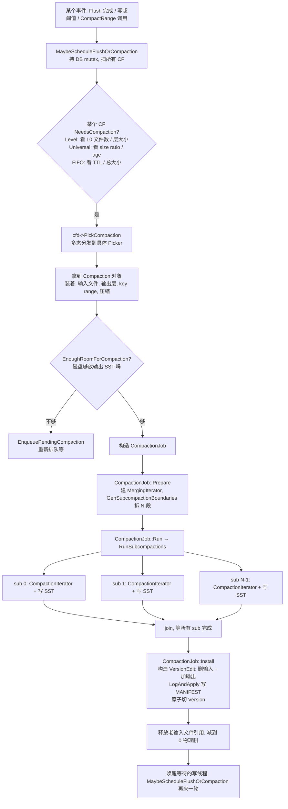

# 第 4 篇 · 第 13 章 · Compaction 框架

> **核心问题**:前面三章把读路径讲完了——一次 `Get` 怎么穿透 MemTable、L0、L1…Ln,怎么靠 Bloom 早退、怎么靠 Index 二分定位、怎么在 MergingIterator 里多路归并。可读路径的全部代价——多层归并、旧版本堆积、墓碑占位、读放大——**只有靠后台的 Compaction 才能收敛**。没有 Compaction,LSM 就是一只会无限膨胀的怪兽,读放大会随数据堆积线性恶化,空间放大会让磁盘很快撑爆。那么,Compaction 这件事到底由**谁决策、谁执行、谁在合并的流水线里做"去旧留新"的脏活**?为什么 RocksDB 把它拆成了三件套(Picker / Job / Iterator)?一个大数据量的 compaction 跑半天跑不完、把前台写拖死怎么办——subcompaction 并发凭什么能把一个 compaction 拆成 N 路并行、又凭什么保证并行后写出的 SST 依然正确?触发 Compaction 的时机到底由谁定、Compaction 跟不上写入时又怎么反压?——本章把这些一次拆透。

> **读完本章你会明白**:
> 1. Compaction 的"决策—执行—合并"三层是怎么解耦成**三件套**的:`CompactionPicker`(选这次合并哪些文件、用哪种策略)、`CompactionJob`(执行"读输入→归并→写输出→Install")、`CompactionIterator`(在归并流里"去旧版本/丢墓碑/调 CompactionFilter/尊重快照")。讲清这三件解耦的妙处:**策略可插拔、执行统一、合并逻辑复用**——为什么这是 RocksDB 区别于 LevelDB 单体 `DoCompactionWork` 的最大架构进化。
> 2. 一个大 compaction 凭什么能拆成 N 个 **subcompaction** 并行执行,每个 subcompaction 独立归并写自己的输出 SST。讲清**为什么 sound**(key range 互不重叠,所以并行不会丢不会乱)、**为什么快**(CPU + IO 多核并行)、`max_subcompactions` / `subcompaction_max_bytes` 怎么定——以及**不并发会撞什么墙**(单线程合并一个大 compaction 跑很久,期间 L0 堆积、Write Stall,写放大失控)。
> 3. Compaction 的触发时机到底由谁掌握:`MaybeScheduleFlushOrCompaction` 是总调度、`BackgroundCompaction` 是后台入口、`NeedsCompaction` / `PickCompaction` 是 picker 的两段式。讲清"手动 compaction"(CompactRange)和"自动 compaction"是怎么在同一套调度里排队的。
> 4. RocksDB 相对 LevelDB 的 Compaction 演进到底在哪:不是"一种 Compaction 升级成三种"那么简单,而是**把 LevelDB 那一坨写死的 `DoCompactionWork + CompactionState` 单体,拆成了一个可插拔的策略层(Picker)+ 一个统一的执行层(Job)+ 一个复用的合并逻辑(Iterator)+ 一个并发拆分(subcompaction)+ 一个远程化能力(compaction_service)**。后面三章(Level/Universal/FIFO)都是给 Picker 这一层的具体策略填血肉。
> 5. 全书最重要的二分法落地:Compaction 是**写路径的收尾**——它不直接服务读请求,但它**收敛读放大和空间放大**,把写路径产生的"堆"清理掉。理解了这层定位,你就明白为什么 Compaction 慢会直接拖垮写(Write Stall)——它是写路径的扫尾,扫尾跟不上,前面就得等。

> **如果一读觉得太难**:先只记住五件事——① Compaction 三件套:Picker 选哪些文件、Job 执行合并、Iterator 在合并流里做去重(策略/执行/逻辑三层解耦);② subcompaction 把一个大 compaction 按 key range 拆 N 份并行,因为 key range 不重叠所以并行 sound;③ LevelDB 只有一种 Compaction 写死在 DoCompactionWork 一个函数里,RocksDB 把它拆成三层 + 三种策略;④ Compaction 跟不上写入会触发 Write Stall(下一篇的 WriteController),所以 subcompaction 并发不是为了快是为了不拖前台写;⑤ 触发入口是 `MaybeScheduleFlushOrCompaction`,picker 的接口是 `NeedsCompaction` + `PickCompaction` 两段式。

---

## 〇、一句话点破

> **Compaction 是写路径的收尾——它不读不写服务请求,但它把 MemTable Flush 产生的"堆"清理掉:把同一个 key 的新旧版本收敛、丢掉墓碑、把数据逐层下压,从而压住读放大和空间放大。RocksDB 把 LevelDB 写死成一坨的 `DoCompactionWork` 拆成了三件套——Picker(策略层:这次合并哪些文件、按什么规则) + Job(执行层:读输入、归并、写输出、Install) + Iterator(逻辑层:在归并流里去旧留新、尊重快照、调 CompactionFilter)——再把一个大 Job 用 subcompaction 按 key range 拆成 N 份并行执行。这个"三层解耦 + 并发拆分"的架构,是 RocksDB 在 Compaction 上对 LevelDB 做的最大手术,也是为什么后面三种策略(Level/Universal/FIFO)能共用同一套执行和合并逻辑。**

这是结论,不是理由。本章倒过来拆:先把 LevelDB 的 Compaction 单体摆出来当基线,再讲它在工业场景(大数据量、多核、高并发写)撞的四面墙,然后讲 RocksDB 怎么把这一坨拆成三件套 + subcompaction,最后单开技巧精解拆"三件套解耦的妙处"和"subcompaction 并行为什么 sound"。

---

## 一、LevelDB 的基线:DoCompactionWork,一坨写死的直路

先把 LevelDB 的做法摆出来当基线(这一段一句带过,详见《LevelDB》Compaction 章)。LevelDB 的 Compaction 主干是 `DBImpl::DoCompactionWork`,它把整件事在一个函数里串起来:

1. **挑文件**:`PickCompaction()` 按"哪一层超量了"(L0 看文件数,其他层看 `MaxBytesForLevel` 阈值)挑出一层 + 一组输入文件。这是**唯一一种策略**——逐层下压的 Level 风格。
2. **建 CompactionState**:一个临时的 struct 装这次 compaction 的输入、输出、迭代器、统计——`CompactionState` 既是工作筐也是工作台。
3. **单线程归并**:开一个 `MergingIterator`(把所有输入文件的 iterator 多路归并,线性扫不跳墓碑),边扫边处理:遇到当前 key 的多个版本,只保留最新的;遇到 DELETE 墓碑且没被快照引用,丢掉。这套"去旧留新 + 尊重快照"的逻辑直接写在 `DoCompactionWork` 的主循环里。
4. **写输出 SST**:把保留下来的 KV 喂给 `BuildTable` 写成新的 L+1 SST。
5. **Install**:把"删旧输入文件 + 加新输出文件"做成一个 VersionEdit,`LogAndApply` 写 MANIFEST,原子切换 Version。

这就是 LevelDB 的全部。它的特点——也是它的局限——是:

- **单线程**:`DoCompactionWork` 的归并循环跑在一个后台线程上,一个 compaction 一次只跑一个,无法拆分。
- **单策略**:只有"逐层下压"这一种 Compaction,写死在 `PickCompaction` 里。
- **单体函数**:"挑文件、建状态、归并、写输出、Install"这五步全挤在 `DoCompactionWork` 一个函数里,每一步的细节都和这个函数深度耦合,想改一处会牵动全文。
- **CompactionState 既当工作筐又当工作台**:状态、临时变量、统计全混在一个 struct 里,没有清晰的职责边界。

> **钉死这件事**:LevelDB 这套对"单机、中等负载、写入不算极端"够用。它的焊点在于:**Compaction 是一坨写死的单体、单线程、单策略、状态混在一起**。一旦你跑大数据量(单个 compaction 输入几十 GB)、想多核并行(单线程归并跑半天)、或者想要写优化的策略(Universal)、或者想把 Compaction 卸到远端(compaction_service)——LevelDB 这条直路全做不到,除非推倒重写。

---

## 二、撞墙:大数据量、多核、高并发,单体 Compaction 跟不上

### 墙一:单个 compaction 输入几十 GB,单线程归并跑半天

这是工业场景最直接的痛。设想 RocksDB 在 TiKV 里——一个 Region 默认 256MB,Region 内的数据写久了,L1 单个 SST 可能几 GB,L2 几十 GB。一次把 L1 的一个大 SST 合到 L2,输入几十 GB、几亿条 KV。单线程 `MergingIterator` 线性扫 + 归并 + 写盘,**几十 GB 的 compaction 单线程跑可能要十几分钟到半小时**。

给个粗算:假设单线程归并能跑到 100 MB/s(归并比较 key + 写盘,受 IO 和 CPU 双重限制),一个 30 GB 的 compaction 输入,光归并就要 300 秒 = 5 分钟。如果还要算上输出 SST 的压缩(默认 L2 起开 Snappy/ZSTD)、还要算上 Bloom/Index 的重建,实际更慢。TiKV 生产环境里观测到单次大 compaction 跑 10~20 分钟是常事。

更糟的是,**这段时间里 compaction 占着这几十 GB 的"坑"**:它的输入文件还没被删,新的 L0 还在堆,L1/L2 的大小阈值还在被触发——下一个 compaction 想跑只能排队。这就引出墙二。

> **不这样会怎样**:如果沿用 LevelDB 的单线程单体,大数据量下**一个 compaction 跑很久**,期间新的写还在源源不断 Flush 成 L0,L0 文件数疯涨,很快触发 Write Stall(下一篇 P5-17 专讲),写延迟雪崩。这就是为什么工业级 LSM **必须**让 compaction 多核并行——不是为了快,是为了**不被一个慢 compaction 拖死整条写路径**。

### 墙二:Compaction 跟不上,Write Stall 把写打停

Compaction 跑得慢的直接后果是 **L0 文件堆积**。L0 文件数到 `level0_slowdown_writes_trigger`(默认 20)触发 Write Delay(写延迟拉长),到 `level0_stop_writes_trigger`(默认 36)触发 Write Stall(写完全停住)。也就是说,**Compaction 慢 → L0 堆 → 写被打停**。这套反压链路是 P5-17 的主课,这里只点破它:Compaction 不是可有可无的后台清理,它是写路径的扫尾,扫尾跟不上,前面就得等。所以 Compaction 必须又快又稳。

### 墙三:三种 workload,一种策略压不住

LevelDB 那一种"逐层下压"的 Level 风格,在它的假设(机械硬盘、中等负载、读延迟不极端敏感)下是合理的。但工业场景至少有三种截然不同的 workload:

- **读多写少、要读放大小**:在线点查服务。它要的是层数规整、每层小、Bloom 密——这正是 Level Compaction 的甜点。
- **写多读少、能接受空间放大**:时序数据狂写、SSD 海量写。它要的是写放大小(少做几次合并),哪怕旧版本留得久——这是 Universal Compaction 的甜点。
- **时序数据、只要最新的**:日志、监控,旧数据过期就删。它要的是 TTL 语义,不需要复杂合并——这是 FIFO Compaction 的甜点。

> **不这样会怎样**:如果只有 LevelDB 那一种 Level Compaction,后两种 workload 会被硬套到不合适的策略上:写多的吃写放大(吃 SSD 寿命)、时序的做无谓的合并(白白浪费 IO)。RocksDB 需要的不是"调一调 Level Compaction 的参数",而是**换一套完全不同的合并规则**——这就是为什么必须把"策略"从"执行"里抽出来,做成可插拔。

### 墙四:Compaction 的脏活(去旧/丢墓碑/调 Filter/尊重快照)每种策略都要做一遍

注意一个细节:不管用 Level/Universal/FIFO 哪种策略,**"在归并流里去旧留新、丢墓碑、调 CompactionFilter、尊重快照"**这套逻辑都是一样的。如果像 LevelDB 那样把它写死在 `DoCompactionWork` 里,那每加一种策略就得把这套逻辑抄一遍——三套代码三套 bug。RocksDB 需要把这套**合并逻辑独立出来,让三种策略共用**。

---

## 三、RocksDB 的回答:三件套解耦 + subcompaction 并发

针对上面四面墙,RocksDB 的回答不是"把 LevelDB 的 Compaction 调快",而是**把这一坨拆成三层 + 并发拆分**。

### 第一刀:策略层抽出来——CompactionPicker

把"这次合并哪些文件、按什么规则"从执行里抽出来,做成一个**抽象基类 `CompactionPicker`**,三种策略各一个派生类:

```
CompactionPicker (抽象基类, db/compaction/compaction_picker.h:48)
   ├── CompactionPickerLevel      (db/compaction/compaction_picker_level.cc)
   ├── CompactionPickerUniversal  (db/compaction/compaction_picker_universal.cc)
   └── CompactionPickerFIFO       (db/compaction/compaction_picker_fifo.cc)
   └── NullCompactionPicker       (禁用 compaction,只读场景)
```

Picker 暴露两个核心纯虚函数(compaction_picker.h):

```cpp
// (db/compaction/compaction_picker.h:48-92, 简化示意)
class CompactionPicker {
 public:
  // 纯虚:这次挑哪些文件合并,返回一个 Compaction 对象(装着输入文件、输出层、key range)
  virtual Compaction* PickCompaction(
      const std::string& cf_name,
      const MutableCFOptions& mutable_cf_options,
      const MutableDBOptions& mutable_db_options,
      const std::vector<SequenceNumber>& existing_snapshots,
      const SnapshotChecker* snapshot_checker,
      VersionStorageInfo* vstorage, LogBuffer* log_buffer,
      const std::string& full_history_ts_low,
      bool require_max_output_level = false) = 0;

  // 纯虚:现在需不需要 compaction?(L0 文件数超了吗?某层超量了吗?)
  virtual bool NeedsCompaction(const VersionStorageInfo* vstorage) const = 0;
  ...
};
```

`NeedsCompaction` 回答"要不要",`PickCompaction` 回答"挑哪些"。两个函数分开是有讲究的——调度器(MaybeScheduleFlushOrCompaction)先调 `NeedsCompaction` 快速判断"这个 CF 要不要 compaction",要的话再调 `PickCompaction` 真正挑文件。两段式避免了"每次调度都挑一遍文件"的浪费。

> **不这样会怎样**:如果合并成一个 `PickCompaction`(要么返回 nullptr 要么返回 Compaction),调度器每次唤醒都得真的去挑文件——而挑文件这个操作在 Level 策略下要算每层的 score、在 Universal 下要算文件大小比例,是个 O(文件数) 的活。一个繁忙的 DB 有几十个 CF、每个 CF 几百个 SST,调度器每秒被唤醒很多次(每次 flush/compaction 完成都唤醒),如果每次都全挑一遍,光是 picker 就吃掉不少 CPU。两段式让 `NeedsCompaction`(只看几个阈值,极快)当门卫,把"真挑文件"这个重活挡在门内,只在确实要做 compaction 时才付一次代价。这是 LSM 调度里一个不起眼但很重要的性能优化。

注意 picker 是**每个 CF 一个**(`cfd->compaction_picker()`),不是全局一个。这是因为不同 CF 可以配不同策略(TiKV 的 default CF 用 Level、某个时序 CF 用 Universal),它们的"要不要 compaction"判定和"挑哪些文件"规则完全不同,各自独立。调度器(MaybeScheduleFlushOrCompaction)只是个无脑的"扫所有 CF、问各自的 picker、谁要就安排谁"的分发器,它自己不带任何策略知识——策略全在 picker 里。这种"调度器 dumb、picker smart"的分工,是三件套解耦在调度层的延伸。

> **钉死这件事**:这一刀解决了**墙三**——三种策略各一个 Picker 派生类,通过 `cfd->compaction_picker()` 多态分发。调度器和执行层**完全不知道**当前是 Level 还是 Universal,它们只看到一个 `Compaction*`。这就是为什么 P4-14/15/16 三章可以共用同一套执行和合并逻辑——**策略层的差异被 Picker 封住了**。

### 第二刀:执行层统一——CompactionJob

Picker 选完文件,生成一个 `Compaction` 对象(它是个"配方":输入是哪些文件、输出到第几层、key range 是什么、用哪种压缩),剩下的执行交给 `CompactionJob`。`CompactionJob` 的三段式是全策略统一的(compaction_job.cc):

```
CompactionJob::Prepare()   (compaction_job.cc:271)  -- 准备:建迭代器、拆 subcompaction
CompactionJob::Run()       (compaction_job.cc:1130)  -- 执行:归并 + 写输出 SST
CompactionJob::Install()   (compaction_job.cc:1184)  -- 安装:VersionEdit 写 MANIFEST,切换 Version
```

不管你是 Level 还是 Universal 还是 FIFO,执行都是这三段。这是 LevelDB 那一坨 `DoCompactionWork` 被拆开后,**"挑文件"留给 Picker、"执行"统一在 Job** 的结果。Job 内部细节(建迭代器、归并、写盘、统计、错误处理)和 Picker 完全解耦——Picker 换一种策略,Job 的代码一行不用改。

### 第三刀:合并逻辑独立——CompactionIterator

Job 在 Run 阶段要"读输入文件 → 归并 → 写输出"。其中"归并"这一步里藏着最脏的活:遇到同一个 key 的多个版本,留最新的;遇到墓碑,看有没有快照引用,没有就丢;调用户的 CompactionFilter 让用户改 KV;处理 Merge 操作符……这套逻辑**和策略无关**——Level/Universal/FIFO 在归并流里都要做一模一样的事。

RocksDB 把这套逻辑独立成 `CompactionIterator`(db/compaction/compaction_iterator.cc)。它是个"装饰过的迭代器":包着一个 `MergingIterator`(多路归并),对外暴露 `Next()`,每次 `Next()` 内部就把"去旧留新/丢墓碑/调 Filter/尊重快照"全做了,吐出来的就是**可以直接写进输出 SST 的、干净的 KV 流**。

```cpp
// (db/compaction/compaction_iterator.cc:274, 简化示意)
void CompactionIterator::Next() {
  // 1. 如果有 merge 输出没吐完,先吐 merge 结果(MergeOperator 的处理)
  if (merge_out_iter_.Valid()) {
    merge_out_iter_.Next();
    if (merge_out_iter_.Valid()) {
      // 更新 key_/value_/ikey_,返回合并后的值
      ...
      PrepareOutput();   // 调 CompactionFilter、检查快照
      return;
    }
    ...
  }
  // 2. 推进底层 MergingIterator,进 NextFromInput 做去旧留新/丢墓碑
  if (!at_next_) {
    AdvanceInputIter();
  }
  NextFromInput();        // 这里是"当前 key 多个版本,挑最新;墓碑看快照;调 Filter"的主战场
  ...
  PrepareOutput();        // 最后过一遍 CompactionFilter、blob GC 等
}
```

`NextFromInput()`(compaction_iterator.cc:699)是脏活的核心。它的主循环长这样(简化):

```cpp
// (db/compaction/compaction_iterator.cc:699-788, 简化示意)
void CompactionIterator::NextFromInput() {
  while (!Valid() && input_.Valid() && !IsPausingManualCompaction() &&
         !IsShuttingDown()) {
    key_ = input_.key();
    value_ = input_.value();
    ParseInternalKey(key_, &ikey_, allow_data_in_errors_);
    ...
    bool user_key_equal_without_ts = false;
    if (has_current_user_key_) {
      user_key_equal_without_ts =
          cmp_->EqualWithoutTimestamp(ikey_.user_key, current_user_key_);
    }

    if (!has_current_user_key_ || !user_key_equal_without_ts ...) {
      // 第一种情况:遇到一个新 user_key 的第一个版本 → 这是它"最新的版本",留
      ...
    } else {
      // 第二种情况:还是上一个 user_key,但更老的版本 → 看 snapshot stripe 决定丢不丢
      //   这个版本所在的 snapshot stripe 没有任何活跃快照引用它 → 丢(去旧)
      //   有快照引用 → 留(MVCC 不能丢被快照看到的版本)
      ...
    }
    // 还有:DELETE 墓碑,如果这个 user_key 的所有更老版本都没人引用 → 墓碑也能丢
    //       SINGLEDELETE 的特殊处理(只删一个版本,见 P6-20)
    //       MergeOperator:遇到 MERGE 类型,触发 MergeHelper 把连续 merge operand 合并
    ...
  }
}
```

这套逻辑维护着一组状态:`has_current_user_key_`(当前 user_key 是不是和上一条一样)、`current_user_key_`、当前所处的 snapshot stripe、`has_outputted_key_`(这个 user_key 在当前 stripe 输出过没)。逐条判定**这个版本该留、该丢、还是该合并**。它的复杂度来自三个方向的交叉:

- **快照交互**:一个 key 可能有 5 个版本,中间被两个快照卡住。CompactionIterator 必须保留每个快照能看到的最新版本,只丢"两个相邻快照之间、且都不是最新的"那些版本。这套"snapshot stripe"逻辑是 LSM MVCC 的精髓,P6-20 专章拆。
- **Merge 操作符**:遇到 MERGE 类型的 key,要触发 MergeHelper 把连续的同 key merge operand 合并成一个值(避免读时再合并)。MergeOperator 是 P6-21 的内容。
- **SingleDelete / BlobDB / Timestamp**:这些 RocksDB 后加的特性,每一个都给 NextFromInput 加了一层判定(SINGLEDELETE 只删一个版本不是全删、BlobDB 的 value 在 blob 文件里要做 GC、Timestamp 影响"同一个 user_key"的判定)。这套逻辑足以撑起 P6-20/P6-21 几章,本章只点它的**定位**:它是三件套里"逻辑层"的那个角色,**和策略无关、和执行无关、只管"在归并流里做去重"**。

> **钉死这件事(三件套解耦的最深妙处)**:CompactionIterator 把"去旧留新"这套**正确性最敏感、最容易出 bug**的逻辑(快照交互尤其微妙)集中在一处。三种策略(P4-14/15/16)共用同一个 CompactionIterator,意味着**这套正确性只需论证一次**。如果像 LevelDB 那样把去旧逻辑写进每个策略的执行函数,那论证"Universal 的去重正确"和"Level 的去重正确"是两件独立的事,改一处不能保证另一处也对。三件套解耦后,Iterator 的正确性 = 三种策略的正确性,这是个巨大的工程收益。

> **钉死这件事**:三件套的分工是这样的:
> - **Picker(策略层)**:这次合并哪些文件、按什么规则——**因策略而异**。
> - **Job(执行层)**:怎么把输入文件读进来、归并、写输出、Install——**全策略统一**。
> - **Iterator(逻辑层)**:在归并流里去旧留新、丢墓碑、调 Filter、尊重快照——**全策略共用**。
>
> 这个解耦的妙处:**加一种策略,只写一个新的 Picker;执行和合并逻辑零改动**。这就是为什么 RocksDB 能轻松支持三种(其实还有 Tiered、per-key-placement 等更多变体)策略,而 LevelDB 只能有一种——它没有 Picker 抽象,策略写死在 `PickCompaction` 里。

### 第四刀:并发拆分——subcompaction

前三刀解决"策略可插拔 + 执行统一 + 逻辑复用",但**墙一(单线程归并跑半天)还没解决**。这就是 subcompaction。

`CompactionJob::Run()` 内部,如果这个 compaction 的输入足够大、`max_subcompactions` 配置允许,会把整个 compaction 的 key range **均匀拆成 N 段**,每段一个 `SubcompactionState`,N 段并行归并、并行写输出 SST,最后合并 Install。

```cpp
// (db/compaction/compaction_job.cc:725, 简化示意)
void CompactionJob::RunSubcompactions() {
  const size_t num_threads = compact_->sub_compact_states.size();
  assert(num_threads > 0);

  // 给 1..N-1 号 subcompaction 各起一个线程
  std::vector<port::Thread> thread_pool;
  thread_pool.reserve(num_threads - 1);
  for (size_t i = 1; i < compact_->sub_compact_states.size(); i++) {
    thread_pool.emplace_back(&CompactionJob::ProcessKeyValueCompaction, this,
                             &compact_->sub_compact_states[i]);
  }
  // 0 号 subcompaction 在当前线程跑(省一个线程,资源高效)
  ProcessKeyValueCompaction(compact_->sub_compact_states.data());
  // 等所有 subcompaction 完成
  for (auto& thread : thread_pool) {
    thread.join();
  }
  ...
}
```

每个 `SubcompactionState` 装着自己那段 key range 的 [start, end)、自己的 CompactionIterator、自己的输出 SST builder。它的注释直接写明了 sound 的关键(subcompaction_state.h:54-57):

```cpp
// (db/compaction/subcompaction_state.h:50-57, 逐字)
class SubcompactionState {
 public:
  const Compaction* compaction;

  // The boundaries of the key-range this compaction is interested in. No two
  // sub-compactions may have overlapping key-ranges.
  // 'start' is inclusive, 'end' is exclusive, and nullptr means unbounded
  const std::optional<Slice> start, end;
  ...
};
```

"No two sub-compactions may have overlapping key-ranges"——**这一句话就是 subcompaction 并发 sound 的全部**。subcompaction 的拆分见 `CompactionJob::GenSubcompactionBoundaries()`(compaction_job.cc:542),它用每个输入 SST 的 index block 估算 128 个 anchor 点,把所有输入文件的 anchor 合并、按 size 均匀切 N 段,保证每段数据量大致相等(避免某个 subcompaction 拖后腿)且 **key range 严格不相交**。

> **钉死这件事**:subcompaction 并发的 sound,根子在 **key range 不相交**:
> - **不会丢**:每个 key 落在且仅落在一个 subcompaction 的 [start, end) 里,所有 subcompaction 的输出并起来 = 全部 key 的并集。
> - **不会乱**:每个 subcompaction 内部用独立的 CompactionIterator 维护顺序,写出的 SST 内部有序;不同 subcompaction 的 key range 不相交,所以输出 SST 之间也天然有序(按 [start, end) 链起来)。
> - **不会重复处理**:没有 key 被两个 subcompaction 同时归并。
>
> 这三点合起来,就是"为什么 N 路并行写出的 SST 等价于单线程一路写出的 SST"。如果 key range 重叠了(比如拆分算法有 bug),就会出现同一个 key 被两个 subcompaction 各处理一遍、或者落到缝里没人管——那就丢数据了。所以 `GenSubcompactionBoundaries` 的正确性是整套并发的命脉。

subcompaction 的拆分点(`GenSubcompactionBoundaries`)的算法注释把思路讲得很清楚(compaction_job.cc:542-567):对每个输入文件,问 TableReader 要 128 个"均匀划分 anchor"(扫 index block 就能估出来,不读 data),把所有 anchor 按 key 全局排序,按累计 size 切 N 段。注意它诚实承认了 L0 多文件场景下 range 会重叠(导致 size 估算偏小),但因为要了 128 个 anchor 这种"足够多",误差可控——这是个工程上"近似均匀但保证不相交"的精妙取舍。

---

## 四、Compaction 调度:谁触发、谁排队、谁干活

三件套讲完了,还有一个上层问题:**谁来启动一个 Compaction**?这是 Compaction 的调度链路。

### 总调度:MaybeScheduleFlushOrCompaction

`DBImpl::MaybeScheduleFlushOrCompaction()`(db/db_impl/db_impl_compaction_flush.cc:3245)是总调度入口。它会被很多事件触发——Flush 完成后、compaction 完成后、写操作发现 L0 文件数超了、Options 改了、手动 CompactRange 调用……每次被调,它就在持 DB mutex 的状态下扫一遍所有 CF,看哪些需要 flush、哪些需要 compaction,然后往后台线程池丢任务(`Env::Schedule`)。

> **钉死这件事**:Flush 和 Compaction 共用同一个调度入口、同一个后台线程池(但分两个优先级队列——flush 是 HIGH,compaction 是 LOW/BOTTOM)。这个设计是有讲究的:**flush 比 compaction 优先**,因为 flush 跟不上会直接 Write Stall(flush 是写路径的前半段,compaction 是后半段),而 compaction 跟不上虽然也会 Write Stall(L0 堆),但路径更长、有缓冲。所以调度器把 flush 放在更紧迫的位置。

进一步,RocksDB 还给 compaction 分了两档优先级——LOW 和 BOTTOM(db_impl_compaction_flush.cc:2518-2528)。**BOTTOM 队列是 RocksDB 独有的"绝对不抢前台"的档次**:被丢到 BOTTOM 的 compaction 线程,只在系统真的闲的时候才跑,CPU 有任何前台压力它都让路。这个设计解决的是一个很现实的痛点:**compaction 是 CPU 密集 + IO 密集的后台活,如果它和前台 user read/write 抢同一个 CPU 核和 IO 带道,前台延迟会被 compaction 周期性拖差**(P99 延迟毛刺的常见来源)。把 compaction 丢到 BOTTOM 队列,等于告诉 OS 调度器"这个活能拖就拖,前台优先"。TiKV、MyRocks 这些延迟敏感的系统都会开 BOTTOM 队列(`max_background_compactions` 配几个 LOW、几个 BOTTOM)。这套多档优先级是 P5-18 Rate Limiter 的姊妹篇——Rate Limiter 管 IO 带宽分配,优先级队列管 CPU 调度,合起来就是"后台活怎么不挤前台"的完整答案。

### 后台入口:BackgroundCompaction

后台线程从队列里取到一个 compaction 任务,跑 `DBImpl::BackgroundCompaction()`(db/db_impl/db_impl_compaction_flush.cc:4049)。这个函数是 Compaction 调度的"主控大脑",它做几件事:

1. **挑 CF、查 picker**:遍历 cfd 队列,对每个需要 compaction 的 CF,调 `cfd->PickCompaction(...)`(db_impl_compaction_flush.cc:4246),它内部多态分发到当前 CF 配置的 picker(Level/Universal/FIFO):
   ```cpp
   // (db/db_impl/db_impl_compaction_flush.cc:4246, 简化示意)
   c.reset(cfd->PickCompaction(
       mutable_cf_options, mutable_db_options_, job_context->snapshot_seqs,
       job_context->snapshot_checker, log_buffer,
       thread_pri == Env::Priority::BOTTOM /* require_max_output_level */));
   ```
   注意 Universal 策略会先 `InitSnapshotContext` 查快照(它选合并文件时要参考快照分布,db_impl_compaction_flush.cc:4241-4245)。
2. **检查空间**:`EnoughRoomForCompaction` 看 disk 有没有空间放下输出 SST。不够就把这个 compaction 重新入队等(`EnqueuePendingCompaction`),不跑。
3. **交给 CompactionJob 执行**:拿到 `Compaction*` 后,构造 `CompactionJob`,依次 `Prepare() → Run() → Install()`。

### 触发时机:什么时候 NeedsCompaction 返回 true

不同策略的"需要 compaction"判定不同(具体在 P4-14/15/16),这里先给个总览:

| 策略 | NeedsCompaction 主要看 |
|---|---|
| Level | L0 文件数 ≥ `level0_file_num_compaction_trigger`(默认 4);某层大小超 `MaxBytesForLevel`;`compaction_pri` 算的 score 排序 |
| Universal | L0 文件数 ≥ `level0_file_num_compaction_trigger`;或一组 SST 的大小比例/年龄触发 |
| FIFO | L0 文件数 ≥ `level0_file_num_compaction_trigger`;或总大小超 `max_table_files_size` 按 TTL 删 |

注意 **三种策略都看 L0 文件数**——这就是为什么 Flush 章(P1-05)反复强调"`level0_file_num_compaction_trigger` 管的是 compaction 不是 flush"。它是 Compaction 的核心触发器之一,不是 flush 的。

### 手动 vs 自动:同一套调度

RocksDB 还支持 `CompactRange(options, begin, end)` 手动触发 compaction。手动 compaction 走的是 `CompactionPicker::PickCompactionForCompactRange`(compaction_picker.cc:668,基类非虚实现),它不调 `NeedsCompaction`(用户明确要做了,不需要判定),直接按用户给的 [begin, end] 挑重叠的文件构造 `Compaction`。手动和自动 compaction 在 `BackgroundCompaction` 里通过一个 `manual_compaction_` 标志区分,但**执行的 Job 是同一套**——这又体现了三件套解耦的好处:**手动/自动只是 Picker 的两种调用方式,执行层无感**。

---

## 五、Install:Compaction 的结果怎么原子生效

Compaction 跑完,产出一批新 SST 文件(在 L+1 层),但**这些文件此时还没被任何 Version 引用,对读请求不可见**。要让它们生效,得做一次**原子的 Version 切换**——这就是 `CompactionJob::Install()`(compaction_job.cc:1184)。

Install 的步骤(简化):

1. 持 DB mutex。
2. 构造一个 VersionEdit:删掉这次 compaction 的所有输入文件、加上所有输出文件。
3. `LogAndApply` 把 VersionEdit 追加到 MANIFEST(先 fsync 落盘),然后构造一个新的 Version,原子替换 `current_`。
4. 老的输入文件引用计数减一,减到 0 的物理删除。
5. 释放 mutex,唤醒等着的写线程(可能有的写线程在等 Compaction 完成腾出 L0 空间)。

Install 在 RocksDB 里相对 LevelDB 多了两个细节值得点一下(不算演进,只是 CF 引入的复杂度):

- **Column Family 的 MANIFEST**:RocksDB 多 CF 共用一份 MANIFEST(不是每个 CF 一份),所以一个 compaction 的 VersionEdit 里要带 `column_family_id`,标识这是哪个 CF 的变动。Install 时 VersionSet 拿到这个 edit,只更新对应 CF 的 Version 树,别的 CF 不受影响。这是 P5-19 Column Family 章的内容,这里只点它对 Install 的影响:VersionEdit 多了个 CF id 字段,LogAndApply 的逻辑没变。
- **Install 期间的并发安全**:Install 持 DB mutex 构造新 Version、写 MANIFEST、切换 `current_`。这套"持大锁切换"和 LevelDB 一致。但 RocksDB 的写组(P1-02)、读请求(P3-11/12)都在并发跑,它们怎么不被 Install 卡住?答案是:**读请求拿的是 Version 的引用计数(无锁拿引用),Install 切换 `current_` 后老 Version 引用计数没归零就不删,读请求持有的是老 Version 的引用,读完释放**。这套"不可变 Version + 引用计数"是 LSM 并发的基石,LevelDB 已讲透,RocksDB 沿用。

> **钉死这件事**:Install 的原子性靠的是 **MANIFEST + Version 引用计数**——这套机制 LevelDB 已讲透(MANIFEST 是 WAL 之于 VersionEdit,Version 是不可变 + 引用计数),一句带过(详见《LevelDB》Manifest 章 + [[leveldb-source-facts]])。RocksDB 在这层的演进不多(主要是 Column Family 的多 CF 共享 MANIFEST、`VersionEdit` 加了 CF id),核心机制和 LevelDB 一致。所以本章不展开 Install 的细节,把它留给 Version Set 章(P2-09)和 Snapshot 章(P6-20)的交叉引用。

但有一点要在这里钉死:**Compaction 的可见性是"瞬间切换"的**。在 Install 完成前,读请求看到的是旧 Version(旧输入文件还在,没有新输出文件);Install 完成的瞬间,读请求看到新 Version(新输出文件上线,旧输入文件准备删)。中间没有"一半新一半旧"的状态——这就是 LSM 的 MVCC 的一致性保证。这也是为什么 subcompaction 并发写出的多个 SST **必须在同一个 VersionEdit 里一起 Install**——不能一个一个上,否则会出现"key range 一半是旧数据一半是新数据"的不一致窗口。

### Install 之前:Compaction 失败或被中止怎么办

Compaction 不是一定跑得完。它会因为几种原因失败或中止:

- **IO 错误**:写输出 SST 时磁盘满、写失败。CompactionJob 把错误收集起来(`CollectSubcompactionErrors`,compaction_job.cc:846),Run 返回非 OK。
- **DB 被关闭**:`IsShuttingDown` 检测到 DB 在 delete,compaction 中止(CompactionIterator 的主循环里有 `!IsShuttingDown()` 检查,compaction_iterator.cc:704)。
- **手动 compaction 被暂停**:用户调 `PauseManualCompaction`,compaction 走到一半停下。
- **空间不够**:`EnoughRoomForCompaction` 在跑之前就拦住了(compaction 不进 Run)。

失败/中止后的清理逻辑在 `CompactionJob::Run`(compaction_job.cc:1147-1150)和 `CleanupAbortedSubcompactions`(:772):

```cpp
// (db/compaction/compaction_job.cc:1147, 简化示意)
if ((status.IsCompactionAborted() || status.IsManualCompactionPaused()) &&
    compaction_progress_writer_ == nullptr) {
  CleanupAbortedSubcompactions();   // 把已经写出的输出 SST 物理删掉
}
```

关键点:**失败的 compaction 不会 Install**。它的输出 SST 文件被物理删掉,输入文件原封不动留在原层,Version 不切换——对读请求完全无感,数据一点没动。下一个调度周期 `MaybeScheduleFlushOrCompaction` 会重新挑这个 compaction 再跑(或者等磁盘空间够了再跑)。这就是 LSM 的健壮性:**compaction 是个幂等的"重写"操作,失败了就当没发生,重跑即可**——因为输入文件没动,重新挑同样的文件再归并一遍,结果一样。

> **钉死这件事(为什么 sound)**:Compaction 失败 sound 的根,在于**它的输入文件在 Install 成功之前绝对不删**。只要输入还在,compaction 就可以随便失败、随便重跑,数据不会丢。这是个简单但关键的 invariant:**Install 是原子的点,Install 之前一切可回滚,Install 之后输入才能删**。这套"先写新文件、确认成功、再原子切换、最后删旧文件"的模式,在数据库内核里到处都是(PG 的 WAL + commit、LevelDB 的 Manifest 切换都是同构思想,见《数据库内核》系列),RocksDB 的 Compaction 是这个模式在 LSM 后台任务上的落地。

有个例外是 resumable compaction(`compaction_progress_writer_ != nullptr` 的情况,compaction_job.cc:1148):如果开了 compaction 进度持久化,中止时不删输出文件,因为下次能从断点恢复接着跑——这是大数据量 compaction 的一个演进(避免每次失败都从头再来)。这是个高级特性,本章只点它的存在,讲清"普通 compaction 失败就回滚、resumable 失败留断点"的区别。

---

## 六、LevelDB 是写死的,RocksDB 打开成了旋钮

把本章的演进和 LevelDB 的焊点对照,这就是这一章的"旋钮账":

| 这一层 | LevelDB(写死) | RocksDB(打开成旋钮) |
|---|---|---|
| 策略 | 只有 Level 一种,写死在 `PickCompaction` | 三种策略 + Picker 抽象基类,`compaction_style` 可配 |
| 执行 | `DoCompactionWork` 一坨单体函数 | `CompactionJob::Prepare/Run/Install` 三段式,职责清晰 |
| 合并逻辑 | 去旧/丢墓碑/调 Filter 写死在主循环 | `CompactionIterator` 独立,可配 `CompactionFilter`、`MergeOperator` |
| 并发 | 单线程一次一个 compaction | subcompaction 按 key range 拆 N 路并行,`max_subcompactions` 可配 |
| 调度 | 一个后台线程,一把大锁 | `MaybeScheduleFlushOrCompaction` 多线程池,flush/compaction 分优先级 |
| 远程 | 不可能 | `compaction_service` 把 compaction 卸到远端机器执行(compaction_service_job.cc) |
| 手动 | `CompactRange` 但很粗糙 | `CompactRange` 细粒度(可指定层、key range、并行度) |

这就是本章的核心:**RocksDB 把 LevelDB 写死成一坨的 Compaction,拆成了一个可插拔、可并发、可远程化的现代框架**。后面三章(P4-14/15/16)是给"策略层"这个旋钮填三种具体的血肉,P5-17/P5-18 是给"反压"这个旋钮(Compaction 跟不上怎么反压写)填血肉。

### 附:三件套解耦的红利——Compaction 可远程化(compaction_service)

三件套解耦除了"策略可插拔",还有一个 LevelDB 完全做不到的红利值得点一下(它是总纲列的 RocksDB 独有演进之一,虽然本章不深入,但招牌总起应该让读者看见这扇门):**Compaction 可以卸到远端机器执行**。

这就是 `compaction_service`(db/compaction/compaction_service_job.cc)。它的思路建立在一个观察上:**Compaction 对象是个"自包含的配方"**——它装着输入文件列表、输出层、key range、压缩算法、CF 选项,这些信息是可序列化的。三件套解耦后,Picker 选完文件生成 Compaction 对象,这个对象可以:

1. **序列化**:`CompactionServiceInput::Write`(compaction_service_job.cc:1037)把 Compaction 的"配方" + 输入文件的元数据序列化成字符串。
2. **传到远端**:通过网络把这个字符串发给另一台机器(或者另一组专做 compaction 的 worker)。
3. **远端执行**:远端机器上跑 `CompactionServiceCompactionJob::Run`(:363),它反序列化出 Compaction,用同一套 CompactionJob/CompactionIterator 逻辑执行,产出输出 SST 文件。
4. **结果回传 + 本地 Install**:`CompactionServiceResult::Write`(:1066)把远端产出的 SST 文件位置 + 统计序列化回传,本地 DB 拿到后做 Install(VersionEdit + LogAndApply)。

这件事在 LevelDB 的单体下**根本不可能**——因为 LevelDB 的 `DoCompactionWork` 把"挑文件、执行、Install"焊在一个函数里,CompactionState 里混着临时变量、迭代器、统计,没法序列化。RocksDB 三件套解耦后,**Compaction 是个数据对象、Job 是个无状态执行器、Install 是个独立步骤**,这三件事天然可拆开跨进程跨机器。

> **钉死这件事(为什么点这个)**:compaction_service 不是本书的主课(它是个高级特性,大多数用户不用),但它是**三件套解耦架构威力的最佳证据**。如果一个架构能让"执行"从"决策"和"安装"里彻底独立出来,那它就能把执行卸到任何地方——本地多线程(subcompaction)、远端机器(compaction_service)、甚至未来的分布式 compaction。这是"好架构的红利"的典型例子:**解耦当时是为了策略可插拔,但意外收获了可远程化**。读者回看 P4-14/15/16 三章时,记住这套执行/合并逻辑的"可移植性"——它们能在本地多线程跑、也能在远端单线程跑,行为一致。

---

## 七、技巧精解:三件套解耦 + subcompaction 并发 sound

本章最硬核的两个技巧,单开一节拆透。

### 技巧一:三件套解耦——为什么这是架构上的妙手

先看 LevelDB 的反面。LevelDB 的 `DoCompactionWork` 是这样一个函数(伪代码):

```
Status DBImpl::DoCompactionWork(CompactionState* compact) {
  // 1. 挑文件已经在 PickCompaction 做了,这里只是用结果
  // 2. 建 MergingIterator
  // 3. 主循环:边归并边去旧留新边丢墓碑边调 Filter(全混在这里)
  //    -- 每加一种策略,这段循环得抄一遍
  // 4. 写输出 SST
  // 5. Install
}
```

这个函数的问题不是"它错了",而是**它把"策略、执行、合并逻辑"三件事焊在了一起**。假设你想加 Universal 策略:

- "挑文件"那一段(`PickCompaction`)得重写——Universal 的挑文件规则(LevelDB 看层大小,Universal 看文件大小比例)完全不同。
- "去旧留新"那一段——**Level 和 Universal 在归并流里做的事是一样的**!但你不得不在 Universal 的 `DoCompactionWork` 里**再抄一遍** Level 那套去旧逻辑,因为它们在 LevelDB 里是耦合的。
- "Install"那一段——也得分两份代码。

结果是:**每加一种策略,整套代码 ×2**。三套策略三套 bug,三套去重逻辑要同步维护。这就是 LevelDB 单体的根本病。

RocksDB 的三件套解耦,妙在**把"变化的"和"不变的"分开**:

- **变化的(策略)**——Picker。Level/Universal/FIFO 各一个派生类,只实现 `PickCompaction` 和 `NeedsCompaction`。
- **不变的(执行 + 合并)**——Job 和 Iterator。Job 的 `Prepare/Run/Install` 三段式对所有策略一样,Iterator 的"去旧/丢墓碑/调 Filter"对所有策略一样。

加 Universal 策略,只需要写一个 `CompactionPickerUniversal`——Job 和 Iterator **一行代码不用改**。这就是为什么 RocksDB 能轻松支持三种、甚至更多策略(Tiered、per-key-placement 都是加 Picker),而 LevelDB 永远只能有一种。

> **不这么设计会怎样**:如果 RocksDB 沿用 LevelDB 的单体(把策略写进执行),那 P4-14/15/16 三章会变成三套几乎一样的代码讲三遍——同样的去旧逻辑、同样的 Install 流程,只是挑文件不同。读者会疯,维护者会疯,加新策略要改三处。三件套解耦把"挑文件"这个**唯一的变量**隔离出来,让其余部分成为**稳定的公共底座**。这是软件工程里"识别变化点、封装变化点"的教科书级案例,在 LSM 这种正确性敏感的系统里尤其难得——因为它保证了"不管策略怎么变,合并逻辑和 Install 的正确性都不用重新论证"。

进一步,这个解耦还带来了**可远程化**的能力:`compaction_service`(compaction_service_job.cc)能把一个 Compaction 对象序列化、发到远端机器、远端跑 Job、再把结果传回来 Install。这件事在 LevelDB 的单体下根本不可能——因为单体里状态和执行缠在一起,没法序列化。三件套解耦后,Compaction 对象是个"自包含的配方",天然可序列化、可远程执行。

### 技巧二:subcompaction 并发——为什么 key range 不相交就 sound

这是本章第二个招牌技巧,也是 subcompaction 能并发的全部合法性来源。

先看 LevelDB 的反面。LevelDB 的 `DoCompactionWork` 是**单线程**的——一个 compaction 从头到尾一个线程跑。在大数据量下,一个 compaction 输入几十 GB,单线程归并 + 写盘可能跑十几分钟。这十几分钟里:

- **L0 在堆**:新的写源源不断 Flush,L0 文件数疯涨。
- **下一个 compaction 排队**:这个 compaction 占着这些输入文件,下一个想合同样这些文件的 compaction 没法跑。
- **Write Stall 触发**:L0 到 `level0_slowdown_writes_trigger`(20)开始 delay,到 `level0_stop_writes_trigger`(36)直接停写。**写延迟雪崩**。

这就是"单线程 compaction 撞的墙"。RocksDB 的 subcompaction 并发,把一个 compaction 拆成 N 路并行,正是为了破这堵墙。

**并行为什么 sound**——回到 `SubcompactionState` 的那段注释(subcompaction_state.h:54-57):

> "No two sub-compactions may have overlapping key-ranges. 'start' is inclusive, 'end' is exclusive, and nullptr means unbounded"

这句话保证了三件事:

1. **完整性(不丢)**:所有 subcompaction 的 [start, end) 区间**首尾相接、覆盖整个 compaction 的 key range**。设整个 compaction 的 key range 是 [K_min, K_max),拆成 N 段:
   ```
   sub 0: [K_min,   B1)
   sub 1: [B1,      B2)
   sub 2: [B2,      B3)
   ...
   sub N-1: [B_{N-1}, K_max)
   ```
   每个 key 落在且仅落在一段里。所有 sub 的输出并起来 = 整个 compaction 的输出,**没有任何 key 被漏掉**。

2. **无冲突(不重复处理)**:任意两段的 [start, end) **不相交**。所以没有 key 被两个 sub 同时归并——否则同一个 key 可能被两个 sub 各写一遍,输出 SST 里就有重复(且归并去旧逻辑会因为"两边都觉得自己是最新"而出乱子)。不相交 = 不会重复。

3. **有序性(不乱)**:每个 sub 内部,CompactionIterator 维护严格升序(底层 MergingIterator 多路归并保证),写出的 SST 内部有序。sub 之间,因为 [start, end) 链起来是连续的,所以**输出 SST 按 sub 的顺序排起来天然有序**。Install 时把这些 SST 按顺序塞进 L+1 层,L+1 层的全局有序性保持。

这三点合起来:**N 路并行写出的 SST 集合,等价于单线程一路写出的 SST 集合**。这就是 sound。

**并行为什么快**——这是个简单的多核并行收益:

```
单线程:  [归并 + 写盘 30 分钟]
                              ↑ 这 30 分钟 L0 在堆、写可能 Stall

4 路 subcompaction:
   sub0: [归并 + 写盘 8 分钟] ┐
   sub1: [归并 + 写盘 7 分钟] ├─ join → 全部完成 ~8 分钟
   sub2: [归并 + 写盘 8 分钟] │
   sub3: [归并 + 写盘 7 分钟] ┘
                                  ↑ 只堵 8 分钟,L0 来不及堆太高
```

CPU 多核并行做归并(CPU bound 的部分,比较 key、做去重),IO 多通道并行写盘(现代 SSD 多 queue),整体时间近似线性下降(直到 IO 带宽打满或 CPU 核数用完)。

**拆分点怎么选**——`GenSubcompactionBoundaries`(compaction_job.cc:542)的算法很值得看。它的目标:**把整个 key range 按数据量均匀切 N 段**(不是按 key 数量均匀——大 value 和小 value 的 key 数据量差很多)。怎么估每个 key range 的数据量?它问每个输入 SST 的 TableReader 要 128 个"均匀 anchor"(扫 index block 就能估,不读 data block),每个 anchor 带一个 `range_size`。把所有文件的 anchor 合并、按 key 排序、按累计 size 切 N 段——这就得到了 N 个近似均匀的拆分点。

注释诚实承认了一个近似(compaction_job.cc:561-567):L0 多文件场景下,不同文件的 key range 会重叠,所以"到某个 key 的累计 size"是低估的。但因为要了 128 个 anchor(足够密),即使 N 路重叠误差也可控。这是个"近似均匀但保证不相交"的工程取舍——**均匀是性能优化(避免某路拖后腿),不相交是正确性硬约束(GenSubcompactionBoundaries 必须保证)**。

**`max_subcompactions` 怎么定**——这是个旋钮(默认 1,即不拆;TiKV 这类生产场景常设 4~8)。定的原则:

- **CPU 核数**:subcompaction 是 CPU 密集(归并比较 key),所以 `max_subcompactions` 一般不超过 CPU 核数。设太大反而抢前台 IO/CPU。
- **compaction 大小**:太小的 compaction 拆了没意义(归并 100MB 拆 8 路,每路 12MB,启动线程的开销都比归并大)。所以实际拆分时 `GenSubcompactionBoundaries` 会判断输入够不够大,不够就不拆。
- **写放大敏感度**:subcompaction 拆得越细,每个 sub 写出的 SST 越小(L+1 层文件数变多),后续读可能多读几个文件。这是个微妙的 trade-off,生产上通常靠压测定。

还有个相关旋钮 `subcompaction_max_bytes`(在 compaction_options 里),控制单个 subcompaction 处理的最大字节数,用来在超大 compaction 里进一步细拆。

> **不这么设计会怎样**:如果 RocksDB 沿用 LevelDB 的单线程 compaction,在大数据量高并发写场景下,**一个慢 compaction 会把整条写路径拖死**——L0 堆、Write Stall、写延迟雪崩。这就是为什么 TiKV、MyRocks 这些工业级系统都把 `max_subcompactions` 开到 4 甚至更高。subcompaction 不是"锦上添花"的优化,是工业级 LSM **扛大数据量**的硬需求——这也是 LevelDB 在工业场景不够用的又一个证据(承接 P0-01 的总纲)。

---

## 八、Compaction 的状态机:一次完整 Compaction 的全流程

把前面讲的串起来,看一次完整的 Compaction 从触发到完成的全流程。这张图建议读者反复对照——它是第 4 篇剩下三章(P4-14/15/16)的总骨架,后面三章都是给"PickCompaction"这一步填具体的策略血肉。



这张图里,每个方框对应前面讲过的一个组件。三件套(Picker / Job / Iterator)和 subcompaction 并发的关系一目了然:**Picker 负责 D 这一步(策略)、Job 负责 I/J/L/M(执行 + Install)、Iterator 在 K1..KN 里(合并逻辑)、subcompaction 是 J 拆出 K1..KN 的并发**。后面 P4-14/15/16 三章,讲的都是 **D 这一步(PickCompaction)在不同策略下的具体规则**——其余流程(I/J/K/L/M)完全一样,因为三件套解耦了。

> **钉死这件事(为什么这套架构扛得住演进)**:回看这张图,你会发现它最了不起的地方不是某个方框多精巧,而是**它的边界划得很对**。"挑哪些文件"是会变的(workload 变、策略变),所以它被隔离在 D(Picker)里;"怎么归并、怎么去旧、怎么 Install"是不变的(LSM 的本质),所以它们是稳定的公共底座。这种"把变化点封成一个可替换的接口"的架构,让 RocksDB 在过去十年里能持续加新策略(Tiered、per-key-placement、compaction_service)而不动执行和合并逻辑。这是软件工程里"对变化建模"的范本——它当时是为了支持三种策略而拆的,但拆完之后,任何新的 compaction 想法都能塞进 Picker 这个口子,系统其他部分无感。读者读完第 4 篇剩下三章,会反复体会到这个"Picker 是唯一变量"的架构红利。

---

## 九、章末小结

### 回扣主线

本章是第 4 篇(Compaction)的总起,它服务的二分法是**写路径**。具体说,Compaction 是**写路径的收尾**——它不直接服务读请求(那是第 3 篇读路径的事),但它**收敛写路径产生的"堆"**:把 MemTable Flush 出来的 L0 一层层合并下压、把同一个 key 的新旧版本收敛、把墓碑清掉、把空间放大和读放大压住。没有 Compaction,LSM 就是一只无限膨胀的怪兽。

本章立起了第 4 篇的**骨架**:三件套(Picker / Job / Iterator)+ subcompaction 并发。后面三章(P4-14 Level / P4-15 Universal / P4-16 FIFO + CompactionFilter)都是给"Picker"这个旋钮填具体的策略血肉——执行(Job)和合并逻辑(Iterator)这三章共用,本章已拆透。P5-17/P5-18 则接着讲"Compaction 跟不上时怎么反压写"。

LevelDB 在这一层的焊点是:**Compaction 是一坨写死的、单线程、单策略的单体函数**(`DoCompactionWork + CompactionState`)。RocksDB 把它打开成了旋钮:**三层解耦(策略/执行/合并)+ 三种策略 + subcompaction 并发 + 可远程化**。这是 RocksDB 在 Compaction 上对 LevelDB 做的最大手术,也是为什么 RocksDB 能扛工业级大数据量、多 workload 的根。

### 五个为什么

1. **为什么要把 Compaction 拆成三件套,而不是像 LevelDB 那样一坨?**——因为"挑哪些文件"(策略)是随 workload 变化的,而"怎么执行合并"和"在归并流里怎么去旧留新"是稳定的。把变化的(Picker)和不变的(Job/Iterator)分开,加新策略只改 Picker,执行和合并逻辑零改动——避免三套代码三套 bug。这是"识别变化点、封装变化点"的教科书级解耦。

2. **为什么 subcompaction 并发是 sound 的?**——因为 `GenSubcompactionBoundaries` 保证 N 个 subcompaction 的 key range 严格不相交、首尾相接覆盖整个 compaction range。不相交 → 不会重复处理(同一个 key 不会被两个 sub 各写一遍);相接覆盖 → 不会丢(每个 key 落在且仅落在一个 sub 里);每个 sub 内部 CompactionIterator 维护有序 → 输出 SST 链起来全局有序。三点合起来 = N 路并行等价于单线程一路。

3. **为什么需要 subcompaction 并发,单线程不行吗?**——单线程在大数据量下,一个 compaction 输入几十 GB 跑十几分钟,期间 L0 堆积、Write Stall 触发、写延迟雪崩。subcompaction 把它拆 N 路并行,时间近似线性下降,让 compaction 跟得上写入。这是工业级 LSM 扛大数据量的硬需求,不是锦上添花。

4. **为什么 Flush 和 Compaction 共用同一个调度入口(`MaybeScheduleFlushOrCompaction`)?**——因为它们是写路径的前后半段,触发时机相关(Flush 完成后常要触发 Compaction、Compaction 完成后腾出空间又要 Flush)、共用后台线程池。共用入口便于统一调度,但分两个优先级(flush HIGH,compaction LOW/BOTTOM)——flush 更紧迫(跟不上直接 Stall),compaction 稍可缓。

5. **为什么 Compaction 跟不上会拖垮写?**——因为 Compaction 是写路径的扫尾,它不收敛 L0,L0 文件数就涨,L0 涨到阈值触发 Write Delay / Write Stall(下一篇 P5-17 主课)。所以 Compaction 不是后台可选的清理工,它是写路径的一环,慢了写就得等。这也是为什么 subcompaction 并发这么重要——它让 Compaction 跑得够快,跟得上写入。

### 想继续深入往哪钻

- **想看三件套的源码全景**:读 `db/compaction/compaction_picker.h`(基类)、`compaction_picker_level.cc` / `compaction_picker_universal.cc` / `compaction_picker_fifo.cc`(三个派生)、`compaction_job.cc`(执行)、`compaction_iterator.cc`(合并逻辑)、`subcompaction_state.h`(并发拆分)。这是第 4 篇剩下三章的源码底座。
- **想看 LevelDB 的基线对照**:读《LevelDB》Compaction 章,或 [[leveldb-source-facts]]——重点看 LevelDB 的 `DoCompactionWork` 怎么把策略/执行/合并焊在一起,体会 RocksDB 三件套解耦的妙处。
- **想动手感受 subcompaction 的收益**:用 `db_bench` 跑同一个大数据量写入,`max_subcompactions=1` vs `=8`,观察 compaction 时间、L0 文件数峰值、Write Stall 次数怎么变(附录 B 有 db_bench 用法)。
- **想理解 Picker 的具体策略**:本章只讲框架,具体策略在 P4-14(Level)/ P4-15(Universal)/ P4-16(FIFO)。
- **想看反压链路**:Compaction 跟不上怎么 Write Stall,是 P5-17 的主课;后台 IO 怎么不挤占前台,是 P5-18 的 Rate Limiter。

### 引出下一章

Compaction 的框架(三件套 + subcompaction)讲清了。那么,**默认的 Level Compaction 到底怎么挑文件、怎么逐层下压、写放大到底怎么算**?`max_bytes_for_level_base` 和 `max_bytes_for_level_multiplier` 这两个最常被调的旋钮,背后是什么数学规则?为什么 LevelDB 的 L0/L1 共享 10MB 基数、L2 起每层 ×10,RocksDB 把这个规则也做成了旋钮?下一章 P4-14,我们钻进 `CompactionPickerLevel`,拆 Level Compaction 的"挑文件 + 算 score + 下压"全过程。

> **下一章**:[P4-14 · Level Compaction](P4-14-Level-Compaction.md)
