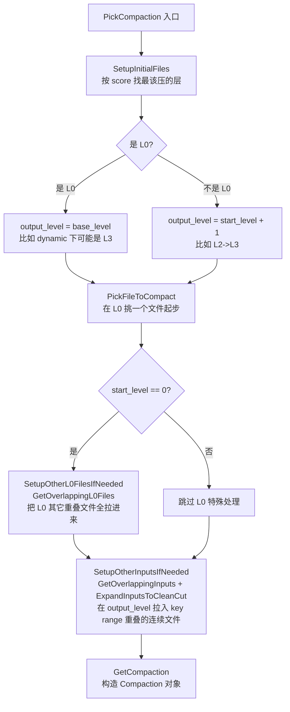
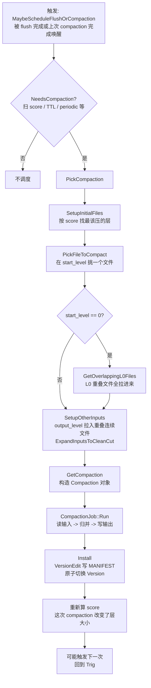

# 第 4 篇 · 第 14 章 · Level Compaction

> **核心问题**:上一章把 Compaction 的"决策—执行—合并"三件套(Picker / Job / Iterator)讲透了,默认挂在 picker 位置上的那个策略——**Level Compaction**——到底怎么工作?它凭什么把数据"逐层下压"?层的大小是谁定的,`max_bytes_for_level_base` / `max_bytes_for_level_multiplier` 这两个旋钮拧下去 LSM 的形状会怎么变?为什么 L0 合到 L1 要特殊处理(L0 文件 key range 重叠,得把 L1 一串有重叠的文件都纳入),而 L1 合到 L2 只挑一个文件加几个有重叠的就行?那个 5.x 加的 `level_compaction_dynamic_level_bytes`(默认开!)到底凭什么把写放大降下来——它怎么自底向上倒推层大小,让小数据量的库不被强制塞成一个空心的 7 层金字塔?Level Compaction 的写放大大(理论上约等于层数),为什么仍然适合"读多写少、要读放大小"的 workload?LevelDB 把这些全焊死(10MB 基数、10 倍、固定 7 层),撞了什么墙,RocksDB 又怎么一个个打开成旋钮?——本章把这些一次拆透。

> **读完本章你会明白**:
> 1. Level Compaction 的**逐层下压**是怎么从"哪一层超量了"挑出一个文件、再把它和下一层有重叠的文件一起合并的。讲清 `LevelCompactionBuilder::PickCompaction` 的 `SetupInitialFiles` → `PickFileToCompact` → `SetupOtherInputs`(挑输入层文件 + 拉入输出层重叠文件)三步,以及为什么用 **score**(层实际大小 / MaxBytesForLevel)排序来决定先压哪一层——score 把"哪层最该压"变成一个可比的数字,这是 Level 策略的核心决策机制。
> 2. **层大小是怎么算出来的**:`MaxBytesForLevel(level)` 在 LevelDB 里是一个写死的 `10MB × 10^(level-1)` 公式;在 RocksDB 里它变成 `max_bytes_for_level_base × multiplier^(level-1)` 可调公式(默认 base=256MB、mult=10),还可以逐层单独配 `max_bytes_for_level_multiplier_additional`。讲清拧这两个旋钮 LSM 形状怎么变(层数变、单层大小变、写放大跟着变),以及 LevelDB 全焊死撞什么墙(workload 不匹配,要么读放大浪费要么写放大吃 SSD)。
> 3. **L0→L1 为什么特殊**:L0 是 Flush 直接产出的 SST,key range **互相重叠**(多个 L0 文件可能覆盖同一段 key),所以 L0→Lbase 合并要把 L0 所有有重叠的文件一起拉进来(`GetOverlappingL0Files`),还要把 Lbase 里 key range 与之重叠的文件全纳入;而 L1 起每层 SST 的 key range **互不重叠**,合并时输出层只要纳入"有重叠的几个连续文件"(`GetOverlappingInputs` + `ExpandInputsToCleanCut`)。讲清这个不对称从哪来(Flush 顺序写不保证 key 不重叠,Compaction 输出才保证层内不重叠),以及它带来的"trivial move"等优化。
> 4. ★**`level_compaction_dynamic_level_bytes` 凭什么降写放大**(5.x 重要演进,默认 true):不再自顶向下按 `base × mult^(n-1)` 硬算每层目标大小,而是**自底向上**根据 Lmax(最大层)的实际数据量倒推上层目标大小,挑一个 `base_level`(L0 直接合到这里),让小数据量的库只占少数几层、不被强制填满一个空心的 7 层金字塔。讲清 `CalculateBaseBytes` 的机制(cur_level_size 从 max_level_size 起反复除 multiplier 倒推、`base_bytes_min = base/mult`、`base_level_size` 落在 (base/mult, base] 区间),以及它为什么 sound(层数仍然满足 multiplier 关系、最坏空间放大可预测)、为什么显著降写放大(数据少时层数少,每层都真有数据,不空跑)。
> 5. **Level Compaction 适合什么 workload**:写放大大(理论上 ≈ 层数,实测 7 层约 10~30 倍),但读放大小(每层 key range 不重叠,点查每层至多读一个 SST),所以它是"读多写少、点查延迟敏感"的甜点。讲清这个取舍是怎么从"逐层下压 + 层内不重叠"这个结构里自然长出来的,以及为什么 SSD 海量写场景下它不合适(吃 SSD 寿命),引出下一章 Universal。

> **如果一读觉得太难**:先只记住五件事——① Level Compaction 按 **score**(层实际大小 / 目标大小)挑最该压的那层,挑一个文件合到下一层;② 层大小 = `base × mult^(level-1)`,base 和 mult 都是旋钮(默认 256MB / 10),LevelDB 把它焊死成 10MB / 10;③ L0 文件 key range 重叠,合到 L1 要拉进 L0 所有重叠文件 + L1 重叠文件,L1 起层内不重叠只挑几个;④ ★`level_compaction_dynamic_level_bytes` 默认 true,自底向上根据最大层实际大小倒推上层,小库少几层不空跑,显著降写放大;⑤ Level 适合读多写少(读放大小),写放大大 ≈ 层数(7 层约 10~30 倍),SSD 海量写该换 Universal(下一章)。

---

## 〇、一句话点破

> **Level Compaction 是 RocksDB 的默认策略,它继承 LevelDB 的"逐层下压"思想——按 score 挑出超量最严重的那层,取一个文件,合到下一层(把下一层 key range 重叠的文件一起纳入),让每层都回到自己的目标大小以内。RocksDB 在这个骨架上对 LevelDB 做了三件最关键的"拆焊点接旋钮":① 层大小从写死的 `10MB×10^(n-1)` 变成可调的 `max_bytes_for_level_base × multiplier^(level-1)`(默认 256MB/10),还能逐层单独配;② L0→Lbase 的特殊路径(处理 L0 文件 key range 重叠)被独立优化,有 trivial move、intra-L0 兜底;③ ★5.x 加的 `level_compaction_dynamic_level_bytes`(默认开!)自底向上根据实际数据量倒推每层目标,让小库只占少数几层而不被强制填成空心的 7 层金字塔——这一项就把 SSD 海量写场景的写放大大幅拉低。Level Compaction 适合"读多写少、点查延迟敏感"的 workload,代价是写放大大(理论上 ≈ 层数)。**

这是结论,不是理由。本章倒过来拆:先把 LevelDB 的"逐层下压"摆出来当基线(一句带过),再讲它在工业场景撞的三面墙(层大小焊死、L0 处理粗糙、小库被空心金字塔坑写放大),然后讲 RocksDB 怎么把这三个焊点一个个接成旋钮,最后单开技巧精解拆"层大小可调"和"dynamic level bytes 降写放大"这两个最硬核的点。

---

## 一、LevelDB 的基线:逐层下压,层大小焊死成 10MB × 10

先把 LevelDB 的做法摆出来当基线(这一段一句带过,详见《LevelDB》Compaction 章)。LevelDB 的 Compaction 只有一种,就是"逐层下压"的 Level 风格。它的核心规则写在一个静态函数里:

```cpp
// (leveldb/db/version_set.cc:41-52, 简化示意)
static double MaxBytesForLevel(const Options* options, int level) {
  // Result for both level-0 and level-1
  double result = 10. * 1048576.0;     // 10MB
  while (level > 1) {
    result *= 10;                       // 每上一层 ×10
    level--;
  }
  return result;
}
```

也就是说:LevelDB 里 L0 和 L1 共享一个 **10MB** 的基数,L2 是 100MB,L3 是 1GB……一直到 L6 是 1000GB(理论值)。这个 `10` 和 `10` 是**焊死的常数**——基数 10MB 写在代码里,倍数 10 也写在代码里,你改不了。Compaction 的判定就是:某一层的实际总大小 `level_bytes` 超过了 `MaxBytesForLevel(level)`,就触发一次把这层的一个文件合到下一层(leveldb/db/version_set.cc:1056 那行 `static_cast<double>(level_bytes) / MaxBytesForLevel(...)` 就是 score 的雏形)。L0 特殊:它不看字节大小,看**文件数**(默认 `level0_file_num_compaction_trigger = 4`,L0 有 4 个文件就触发 L0→L1 合并)。

这套规则简单、清晰、对"单机中等负载"够用。但它的焊点也正是这两个常数:

- **基数 10MB 焊死**:你想要更大的 MemTable → Flush 出更大的 L0 SST → 配套更大的 L1(L1 太小扛不住 L0 一个文件就超量)——做不到,L1 就是 10MB。
- **倍数 10 焊死**:你想要层数少一点(每层大一点,减少读放大但增加单层合并量)——做不到,就是 10 倍。

> **钉死这件事**:LevelDB 的 Level Compaction 本身没问题(逐层下压是合理的 LSM 收敛策略),问题在于它把"层大小规则"焊死成了两个常数。工业场景的 workload 千差万别,有的要大 MemTable 攒写、有的要少层数压读放大、有的要小倍数让单次 compaction 别太大——LevelDB 一律给 10MB/10 倍,不匹配就只能改源码重编译。

RocksDB 的回答不是"换一套更好的 Compaction 策略",而是**把这两个焊死的常数接成了旋钮**——这就是本章的主线。

---

## 二、撞墙:层大小焊死、L0 处理粗糙、小库被空心金字塔坑

LevelDB 那套"10MB / 10 倍 / 固定 7 层"在工业场景撞三面墙。

### 墙一:层大小焊死,workload 不匹配时只能硬扛

设想你在 TiKV 里跑 RocksDB。一个 Region 256MB,Region 里的 default CF 可能攒到几十 GB。如果层大小还是 LevelDB 的 10MB 起步,那 L1 = 10MB 太小——Flush 出一个 L0 SST(假设 64MB)就立刻把 L1 撑爆,触发海量小 compaction。你要的是 L1 大一点(比如 256MB 甚至 1GB),让 L1 能稳稳接住 L0 的下压,减少 compaction 次数。反过来,如果你的库就是个几百 MB 的小索引,10MB 起步意味着 L1~L6 全是空的(空心金字塔),Compaction 还在按 7 层的 score 算,白白做无用功。

> **不这样会怎样**:如果层大小焊死,工业用户只有一个选择——改源码重编译 LevelDB。可 RocksDB 的目标用户(TiKV、MySQL、Kafka Streams……)跑的是各种截然不同的 workload,不可能为每个 workload 维护一个 fork。所以**层大小必须变成运行时可调的旋钮**,这是 Level Compaction 从"够用"到"工业级"的第一个跨越。

### 墙二:L0 的 key range 重叠,L0→L1 合并要小心

这是 LSM 结构的天然不对称。L0 的 SST 是 MemTable **整表 Flush** 出来的——一个 MemTable 里什么 key 都可能有(顺序写不挑 key),所以 Flush 出来的 L0 SST 的 key range 是"碰巧这次 MemTable 里 key 的最小最大值",**多个 L0 文件之间的 key range 必然重叠**(后 Flush 的可能覆盖前 Flush 的同一段 key)。

而 L1 及以后各层的 SST 是 Compaction **主动归并排序后输出**的,Compaction 在写输出 SST 时会主动按 key 切分,保证**同一层内的 SST key range 互不重叠**。

这个不对称直接决定了合并规则的不对称:

- **L0 → L1**:L0 文件互相重叠,不能只挑一个 L0 文件合(会和别的 L0 文件冲突),得把 L0 **所有有重叠的文件**一起拉进来,再加上 L1 里和这段 key range 重叠的文件,一起归并。
- **L1 → L2**:L1 文件互不重叠,可以干净地挑 L1 的**一个**文件,再找 L2 里和它 key range 重叠的**几个连续文件**(因为 L2 也不重叠,重叠的文件在 key 序上是一段连续区间),一起归并。

LevelDB 把这两条路径揉在 `DoCompactionWork` 里,没分开处理,L0→L1 的合并逻辑混在通用路径里,不够清晰,也错过了优化机会(比如 trivial move)。

> **不这样会怎样**:如果 L0→L1 也按"L1→L2"的规则只挑一个 L0 文件,那合并出来的结果会不一致——别的 L0 文件里可能有同一个 key 的更新版本,你只合一个就把版本顺序搞乱了。所以 L0→L1 必须特殊处理,这是 LSM 正确性的硬约束。RocksDB 把这条特殊路径独立出来(`SetupOtherL0FilesIfNeeded` + `GetOverlappingL0Files`),既保证了正确性,又腾出了优化空间。

### 墙三:小库被"空心金字塔"坑,写放大白白吃 SSD

这面墙最隐蔽,也最重要。设想一个新库,数据才 100MB。按 LevelDB 的固定 7 层(L0~L6,L1=10MB,每层 ×10),L6 理论上是 10TB,可你只有 100MB 数据。这时候 Compaction 会怎么干?

按 LevelDB 的 score 算法,某层实际大小 / 目标大小 < 1 就不触发。可问题是,**目标大小是按 10MB×10^(n-1) 硬算的**,跟你的实际数据量毫无关系。于是会出现一种尴尬:数据全堆在 L1~L2(因为上层目标小、下层目标巨大),Compaction 老是在上层小圈子里打转,数据迟迟下不到该去的层;或者反过来,数据被反复在几个空层之间搬来搬去,每次搬动都是一次重写——**写放大白白吃 SSD 寿命**。

更糟的是固定 7 层带来的"写放大下限":一个 key 从 L0 要一路合到 L6(假设它活得够久),理论上被重写 7 遍。可如果你的库只有 100MB,根本用不着 7 层(2~3 层就够了),这个 key 还是被按 7 层的节奏重写——**层数越多写放大大,这是 Level Compaction 写放大的根**。

> **不这样会怎样**:固定 7 层 + 固定层大小,让小库和大数据量用同一套形状。小库被空心金字塔坑写放大(层数空跑但仍重写),大数据量可能层数不够(L6 不够大,数据堆在 L5~L6 反复合)。RocksDB 需要的是**让层数和层大小跟着实际数据量自适应**,而不是死板地套一个固定形状。这就是 5.x 加的 `level_compaction_dynamic_level_bytes` 要解决的——本章后面单开技巧精解拆透它。

---

## 三、RocksDB 的回答:三道旋钮把 LevelDB 的焊点一个个接出来

针对上面三面墙,RocksDB 在 Level Compaction 这个骨架上接了三道旋钮。

### 第一道旋钮:层大小可调(`max_bytes_for_level_base` / `multiplier`)

最直接的一刀。把 LevelDB 写死的 `10MB × 10^(level-1)` 拆成两个旋钮:

```cpp
// (include/rocksdb/options.h:292-303, 摘录注释 + 声明)
// Control maximum total data size for a level.
// max_bytes_for_level_base is the max total for level-1.
// Maximum number of bytes for level L can be calculated as
// (max_bytes_for_level_base) * (max_bytes_for_level_multiplier ^ (L-1))
// Default: 256MB.
uint64_t max_bytes_for_level_base = 256 * 1048576;   // 默认 256MB

// (include/rocksdb/advanced_options.h:668-671)
// Default: 10.
double max_bytes_for_level_multiplier = 10;          // 默认 10
```

> **钉死这件事**:RocksDB 11.6.0 默认 `max_bytes_for_level_base = 256MB`、`max_bytes_for_level_multiplier = 10`(实测 `options.h:300-303` 和 `advanced_options.h:668-671`)。**不是**有些老资料说的"base 默认 256MB 对,但 multiplier 是 8"或"base 和 LevelDB 一样 10MB"——这些都要么记错了要么是早期版本。以 11.6.0 源码为准:**256MB / 10**。

层大小的公式就是:

```
L1 目标 = max_bytes_for_level_base                  = 256MB
L2 目标 = base × multiplier                         = 2.5GB
L3 目标 = base × multiplier²                        = 25GB
L4 目标 = base × multiplier³                        = 250GB
L5 目标 = base × multiplier⁴                        = 2500GB
L6 目标 = base × multiplier⁵                        = 25000GB(理论值,实际不会真堆这么多)
```

拧这两个旋钮,LSM 的形状就变了:

- **加大 base**(比如 1GB):L1 更大,能稳稳接住更大的 L0 SST,减少 L0→L1 的 compaction 次数。代价是单层更大,L1→L2 的单次合并量也更大。
- **减小 multiplier**(比如 5):每层之间的倍数小了,层数对应的总容量增长慢,单层间合并量更均衡。代价是同样数据量需要更多层(读放大略增)。
- **加大 multiplier**(比如 20):每层之间倍数大,层数少,读放大小。代价是单层间合并量更不均衡(上层小下层巨大),L1→L2 这种合并量暴涨。

还有一个更细的旋钮 `max_bytes_for_level_multiplier_additional`(advanced_options.h:682),是个数组,可以**逐层单独覆盖** multiplier:

```cpp
// (include/rocksdb/advanced_options.h:673-683, 简化示意)
// Different max-size multipliers for different levels.
// These are multiplied by max_bytes_for_level_multiplier to arrive
// at the max-size of each level.
// This option only applies to leveled compaction with
// `level_compaction_dynamic_level_bytes = false`.
// Default: 1 (每层都是 1,即不额外放大)
std::vector<int> max_bytes_for_level_multiplier_additional =
    std::vector<int>(static_cast<size_t>(num_levels), 1);
```

注意它**只在 `level_compaction_dynamic_level_bytes = false` 时生效**(注释明说了)。你可以让 L1→L2 用 10 倍、L2→L3 用 8 倍、L3→L4 用 5 倍……逐层精细控制形状。这是 LevelDB 想都不敢想的能力。

静态层大小算出来的位置在 `version_set.cc:5371-5386`:

```cpp
// (db/version_set.cc:5371-5386, CalculateBaseBytes 的 static 分支, 简化示意)
if (!ioptions.level_compaction_dynamic_level_bytes) {
  base_level_ = 1;     // L0 永远合到 L1
  for (int i = 0; i < ioptions.num_levels; ++i) {
    if (i == 0 && ioptions.compaction_style == kCompactionStyleUniversal) {
      level_max_bytes_[i] = options.max_bytes_for_level_base;
    } else if (i > 1) {
      level_max_bytes_[i] = MultiplyCheckOverflow(
          MultiplyCheckOverflow(level_max_bytes_[i - 1],
                                options.max_bytes_for_level_multiplier),
          options.MaxBytesMultiplerAdditional(i - 1));   // 逐层额外倍数
    } else {
      level_max_bytes_[i] = options.max_bytes_for_level_base;   // L1
    }
  }
}
```

注意 `level_max_bytes_[0]` 这里没显式赋值(L0 不用字节,看文件数),`level_max_bytes_[1] = base`,`level_max_bytes_[i>1] = 上一层 × multiplier × additional`。这就是 LevelDB 那个 `10MB × 10^(n-1)` 的可调版本。

> **不这样会怎样**:如果像 LevelDB 那样焊死,TiKV 想给 default CF 配 256MB base、给 lock CF 配 10MB base——做不到,两个 CF 都得用同一个 10MB。RocksDB 把层大小做成 **per-CF 可调**(Options 是 CF 级的),每个 CF 按自己的 workload 拧旋钮,这是工业级 LSM 的基本要求。

### 第二道旋钮:L0→Lbase 的特殊路径

L0 的 key range 重叠是 LSM 的天然结构,合并规则必须特殊。RocksDB 把这条特殊路径独立出来,在 `LevelCompactionBuilder` 里专门处理。

整个挑文件的过程在 `LevelCompactionBuilder::PickCompaction`(compaction_picker_level.cc:531 起),分三步:



`SetupInitialFiles`(compaction_picker_level.cc:207-339)是入口,它遍历所有层的 score,找第一个 score >= 1 的层。关键代码:

```cpp
// (db/compaction/compaction_picker_level.cc:207-260, 简化示意)
void LevelCompactionBuilder::SetupInitialFiles() {
  bool skipped_l0_to_base = false;
  for (int i = 0; i < compaction_picker_->NumberLevels() - 1; i++) {
    start_level_score_ = vstorage_->CompactionScore(i);
    start_level_ = vstorage_->CompactionScoreLevel(i);
    if (start_level_score_ >= 1) {
      // 找到一个超量的层
      output_level_ = (start_level_ == 0)
                          ? vstorage_->base_level()       // L0 合到 base_level
                          : start_level_ + 1;             // 其它层合到下一层
      bool picked_file_to_compact = PickFileToCompact();
      if (picked_file_to_compact) {
        if (start_level_ == 0) {
          compaction_reason_ = CompactionReason::kLevelL0FilesNum;   // L0 看文件数
        } else {
          compaction_reason_ = CompactionReason::kLevelMaxLevelSize; // 其它层看大小
        }
        break;
      } else {
        // 没挑到合适的文件(L0 可能被别的 compaction 占着)
        if (start_level_ == 0) {
          skipped_l0_to_base = true;
          if (PickIntraL0Compaction()) {   // 兜底:L0 内部自己合
            output_level_ = 0;
            break;
          }
        }
      }
    } else {
      break;   // score 排序了,< 1 就不用再看了
    }
  }
  // ...后面是 TTL/periodic/forced blob GC 等"非大小触发"的 compaction 类型
}
```

注意几个要点:

1. **score 是排序的**:`CompactionScoreLevel(i)` 返回的层是按 score 从大到小排好的(在 `ComputeCompactionScore` 里算完排序)。所以遍历找第一个 >= 1 的就是最该压的那层。
2. **output_level 的两种算法**:L0 合到 `base_level`(dynamic level bytes 下 base_level 可能不是 1!),其它层合到 `start_level + 1`。这是 dynamic level bytes 的一个伏笔——L0 不一定合到 L1,可能直接合到 L3 或 L4。
3. **L0 的兜底**:`PickIntraL0Compaction`——如果 L0→base 被别的 compaction 占着(比如已经有一个 L0→L3 在跑),L0 还在堆文件,这时可以在 L0 内部自己做一次合并(把几个 L0 文件合成一个 L0 文件),减少文件数。这是 RocksDB 独有的优化,LevelDB 没有。

挑到起始文件后,如果是 L0,走 `SetupOtherL0FilesIfNeeded`:

```cpp
// (db/compaction/compaction_picker_level.cc:341-347, 简化示意)
bool LevelCompactionBuilder::SetupOtherL0FilesIfNeeded() {
  if (start_level_ == 0 && output_level_ != 0 && !is_l0_trivial_move_) {
    return compaction_picker_->GetOverlappingL0Files(
        vstorage_, &start_level_inputs_, output_level_, &parent_index_);
  }
  return true;
}
```

`GetOverlappingL0Files` 把 L0 里所有和当前挑出来的文件 key range 重叠的其它文件也拉进 `start_level_inputs_`。这就是 L0 的特殊性——**要合就把 L0 所有重叠的一起合**,不能只挑一个。

然后在 `SetupOtherInputsIfNeeded` 里(compaction_picker_level.cc:481-529),调 `SetupOtherInputs`(在基类 compaction_picker.cc 里),用 `GetOverlappingInputs` + `ExpandInputsToCleanCut` 在 output_level 拉入 key range 重叠的连续文件:

```cpp
// (db/compaction/compaction_picker.cc:557-561, 简化示意)
if (!output_level_inputs->empty()) {
  if (!ExpandInputsToCleanCut(cf_name, vstorage, output_level_inputs)) {
    return false;
  }
}
```

`ExpandInputsToCleanCut`(compaction_picker.cc:275)是个关键概念——"clean cut"指的是**一个完整的 key range 切分**,保证输出层的输入文件集是 key 序上的一段连续区间,不会漏掉中间的文件。这是 L1 起每层 key range 不重叠的必然要求:你挑了 output_level 里 key range 是 [a, c] 的重叠文件,如果 [b, d] 这个文件和 [a, c] 部分重叠也得纳入,那 [a, d] 这个更大的 key range 又可能拉进更多文件……`ExpandInputsToCleanCut` 就是反复扩展直到 key range 不再增大为止,得到一个干净的输入集。

> **钉死这件事**:L0→Lbase 和 Lbase→Lbase+1 的合并规则**不一样**。L0 合并要把 L0 所有重叠文件一起拉(因为 L0 文件互相重叠),Lbase 起的合并只挑 output_level 里一个连续区间(因为层内不重叠,重叠的是一段连续文件)。这个不对称是 LSM 结构的天然结果,RocksDB 把它显式地拆成两条路径处理,既保证正确性又留出优化空间(trivial move、intra-L0 兜底)。

#### trivial move:L0→Lbase 的偷懒优化

RocksDB 还有个 L0 专属优化叫 **trivial move**(compaction_picker_level.cc:655 `TryPickL0TrivialMove`)。如果 L0 的某些文件互相不重叠(比如 Flush 的 key 分布恰好分开了),而且它们和 output_level 已有文件也不重叠,那合并这些 L0 文件到 output_level **不需要真的归并重写**——直接把文件元数据从 L0 挪到 output_level 就行,零 IO 零重写。这是 LevelDB 没有的优化(因为 LevelDB 假设 L0 文件必然重叠,没去试 trivial move)。

> **不这样会怎样**:如果没有 trivial move,L0 文件偶尔不重叠(比如 key 分布有空洞)时,还是得走完整的"读 → 归并 → 写"流程,白白重写一遍数据。trivial move 把这种情况识别出来,直接挪元数据,写放大直接降到 0(对这几个文件而言)。这是个不起眼但实际很值的优化,尤其在 key 分布稀疏的 workload 下。

### 第三道旋钮:★`level_compaction_dynamic_level_bytes`——自底向上倒推层大小

这是 5.x 加的最重要演进,也是默认开的(advanced_options.h:665-666):

```cpp
// (include/rocksdb/advanced_options.h:587-666, 摘录关键注释)
// If true, RocksDB will pick target size of each level dynamically.
// We will pick a base level b >= 1. L0 will be directly merged into level b,
// instead of always into level 1. Level 1 to b-1 need to be empty.
// We try to pick b and its target size so that
// 1. target size is in the range of
//   (max_bytes_for_level_base / max_bytes_for_level_multiplier,
//    max_bytes_for_level_base]
// 2. target size of the last level (level num_levels-1) equals to the max
//    size of a level in the LSM (typically the last level).
// Default: true
bool level_compaction_dynamic_level_bytes = true;
```

它的核心思想:**不再自顶向下按 `base × mult^(n-1)` 硬算每层目标,而是自底向上根据最大层(Lmax)的实际数据量倒推每层该多大**。挑一个 `base_level`(L0 直接合到这里),让 L1 到 base_level-1 都是空的(用不着),数据从 base_level 开始按 multiplier 关系往上长。

这个机制的实现在 `VersionStorageInfo::CalculateBaseBytes`(version_set.cc:5353-5497),是本章最硬核的一段。先看它的整体逻辑:

```cpp
// (db/version_set.cc:5353-5497, CalculateBaseBytes 的 dynamic 分支, 大幅简化示意)
void VersionStorageInfo::CalculateBaseBytes(const ImmutableOptions& ioptions,
                                            const MutableCFOptions& options) {
  if (!ioptions.level_compaction_dynamic_level_bytes) {
    // 上面讲过的 static 分支:自顶向下 base × mult^(n-1)
    ...
    return;
  }
  // dynamic 分支开始
  uint64_t max_level_size = 0;
  int first_non_empty_level = -1;
  // 第一步:扫 L1~Lmax,找出实际数据量最大的那层的大小 max_level_size
  for (int i = 1; i < num_levels_; i++) {
    uint64_t total_size = 0;
    for (const auto& f : files_[i]) total_size += f->fd.GetFileSize();
    if (total_size > 0 && first_non_empty_level == -1) first_non_empty_level = i;
    if (total_size > max_level_size) max_level_size = total_size;
  }

  // 第二步:先把所有层的目标大小设成无穷大(等于"不需要从这层往下合")
  for (int i = 0; i < num_levels_; i++) {
    level_max_bytes_[i] = std::numeric_limits<uint64_t>::max();
  }

  if (max_level_size == 0) {
    // 空库:L0 直接合到最后一层
    base_level_ = num_levels_ - 1;
    return;
  }

  // 第三步:算 base_bytes_max 和 base_bytes_min
  uint64_t base_bytes_max = options.max_bytes_for_level_base;              // 256MB
  uint64_t base_bytes_min = base_bytes_max / options.max_bytes_for_level_multiplier;  // 25.6MB

  // 第四步:自底向上倒推。从 max_level_size 起,反复除 multiplier,
  //        找到第一个 <= base_bytes_min 的层位置(lowest_unnecessary_level)
  uint64_t cur_level_size = max_level_size;
  for (int i = num_levels_ - 2; i >= first_non_empty_level; i--) {
    cur_level_size = cur_level_size / options.max_bytes_for_level_multiplier;
    if (lowest_unnecessary_level_ == -1 && cur_level_size <= base_bytes_min && ...) {
      lowest_unnecessary_level_ = i;   // 这层及更上的层"不需要",会被排空
    }
  }

  // 第五步:确定 base_level 和 base_level_size
  uint64_t base_level_size;
  if (cur_level_size <= base_bytes_min) {
    // 倒推到顶了还 <= base_bytes_min,说明数据量小,base_level 就在 first_non_empty_level
    base_level_size = base_bytes_min + 1;
    base_level_ = first_non_empty_level;
  } else {
    // 数据量大,需要往下找 base_level,让 base_level_size 落在 (base_bytes_min, base_bytes_max]
    base_level_ = first_non_empty_level;
    while (base_level_ > 1 && cur_level_size > base_bytes_max) {
      --base_level_;
      cur_level_size = cur_level_size / options.max_bytes_for_level_multiplier;
    }
    base_level_size = std::max(static_cast<uint64_t>(1), cur_level_size);
  }

  // 第六步:从 base_level 起,自底向上按 multiplier 算每层目标
  level_multiplier_ = options.max_bytes_for_level_multiplier;
  uint64_t level_size = base_level_size;
  for (int i = base_level_; i < num_levels_; i++) {
    if (i > base_level_) {
      level_size = MultiplyCheckOverflow(level_size, level_multiplier_);
    }
    // 不让任何层的目标低于 base_bytes_max(避免沙漏形)
    level_max_bytes_[i] = std::max(level_size, base_bytes_max);
  }
}
```

这段代码有点绕,但思想很清晰。用一个具体例子讲透。

#### 例子:一个 100GB 的库,dynamic 怎么算

假设 `max_bytes_for_level_base = 256MB`、`multiplier = 10`、`num_levels = 7`(L0~L6)。你的库实际有 100GB 数据,假设大部分在 L6(Lmax)。

**静态算法(`dynamic=false`)会怎么算**:自顶向下,L1=256MB、L2=2.5GB、L3=25GB、L4=250GB、L5=2500GB、L6=25000GB。你的 100GB 数据"应该"在 L4(250GB 目标,100GB 实际,score=0.4<1 不触发)。可实际 Compaction 会把数据往哪儿放?它会一层层下压,但因为目标大小是按公式硬算的,数据可能停在某个"目标 >> 实际"的层,层数多、每层都稀疏,写放大跟着多。

**动态算法(`dynamic=true`)怎么算**:

- 第一步:`max_level_size = 100GB`(L6 实际大小)。
- 第二步:所有层目标先设无穷大。
- 第四步:从 L6 的 100GB 起自底向上除 10 倒推:
  - L5 候选大小 = 100GB / 10 = 10GB
  - L4 候选大小 = 10GB / 10 = 1GB
  - L3 候选大小 = 1GB / 10 = 100MB(< base_bytes_min=25.6MB? 不,100MB > 25.6MB,继续)
  - L2 候选大小 = 100MB / 10 = 10MB(< 25.6MB ✓,记 lowest_unnecessary_level)
  - L1 候选大小 = 10MB / 10 = 1MB
- 第五步:`cur_level_size`(倒推到 first_non_empty_level 的值)现在 = 1MB < base_bytes_min=25.6MB,走第一个分支:`base_level_size = base_bytes_min + 1 = 25.6MB`,`base_level_ = first_non_empty_level`(假设是 L1)。

  但等一下,实际逻辑里 `lowest_unnecessary_level` 被记了(L2),意味着 L2 及以上"不需要"。`base_level` 会被设成 `first_non_empty_level`(这里假设数据从 L3 开始有,L1/L2 是空的),但更常见的情况是 first_non_empty_level 就是数据真正开始的那层。
  
  实际上更典型的结果是:对于 100GB 数据,`base_level` 大概会落在 L3 或 L4,`base_level_size` 落在 (25.6MB, 256MB] 之间,然后从 base_level 起每层 ×10:Lbase 约 100MB、Lbase+1 约 1GB、Lbase+2 约 10GB、Lbase+3 约 100GB(正好对上 L6 的实际大小)。

关键效果:**层数比静态算法少**。静态算法逼你用满 7 层(L1~L6 都有目标,即使实际数据稀疏),动态算法让你只占真正需要的几层(L1~Lbase-1 被排空,数据从 Lbase 开始填)。

#### 为什么这能降写放大

写放大 ≈ 一个 key 从 L0 一路被重写到最终层的次数 ≈ **实际有数据的层数**。

- 静态算法:7 层都有目标,数据被鼓励一层层下压,一个 key 可能被重写 6~7 次(L0→L1→L2→…→L6)。
- 动态算法:L0 直接合到 Lbase(跳过 L1~Lbase-1),然后从 Lbase 一层层下压到 L6。如果 base_level 是 L4,那这个 key 只被重写 L0→L4→L5→L6,3 次!**少了几次重写,写放大直接降下来**。

这就是 dynamic level bytes 降写放大的本质:**让层数跟着实际数据量自适应,小库少几层,每层都真有数据不空跑,重写次数就少**。

#### 为什么 sound

你可能会担心:动态算的层大小会不会破坏 LSM 的正确性?会不会丢数据?不会。原因:

1. **key range 不重叠的不变量没动**:dynamic level bytes 只改"每层目标大小"(影响 score,影响"先压哪层"),没改"SST 在层内的 key range 不重叠"这个核心不变量。Compaction 的归并逻辑照样保证输出 SST 层内不重叠。
2. **multiplier 关系仍然满足**:`base_level_size × multiplier^(n-base_level)` 这个关系还在,只是 `base_level_size` 不是硬写的 base,而是倒推出的一个落在 (base/mult, base] 区间的值。所以最坏空间放大仍然可预测(最坏约等于 multiplier/(multiplier-1),即 10/9 ≈ 1.11,11% 空间放大)。
3. **数据不会丢**:Compaction 的"读输入→归并→写输出→Install VersionEdit"这套原子流程没变(version_set.cc 的 `log_and_apply`),dynamic 只改 picker 选哪些文件,不改执行。

注释里 advanced_options.h:633-635 也明说了:"By doing it, we give max_bytes_for_level_multiplier a priority against max_bytes_for_level_base, for a more predictable LSM tree shape. It is useful to limit worse case space amplification."——dynamic 让 multiplier 关系优先,形状更可预测,最坏空间放大可控。

> **钉死这件事**:`level_compaction_dynamic_level_bytes` 默认 true(advanced_options.h:665-666),这是 5.x 加的。**很多老资料(包括一些 RocksDB 教程)还在说它默认 false 或者建议手动关掉**——那是 5.x 之前的状态。从某个版本起官方把它改成默认 true,因为对绝大多数 workload 它都降写放大而不增加空间放大(最坏空间放大仍可控在 multiplier/(multiplier-1))。以 11.6.0 源码为准:**默认开**。如果你的库是从老版本升级的,且之前显式设过 false,可以考虑去掉这个设置让它走默认。

> **不这样会怎样**:如果关掉 dynamic(用静态算法),小库和中等库会被固定 7 层的形状坑——L1~L6 都有目标,数据被鼓励层层下压,每层都重写一遍,写放大白白吃 SSD 寿命。这正是 LevelDB 那套固定形状在现代 SSD 海量写场景的痛。dynamic 把"层数"也变成了一个跟着数据量自适应的量,而不是写死的 7 层。

#### 一个细节:base_level 的"排空"机制

注释 advanced_options.h:648-657 提到:"unneeded levels will be drained automatically"——多余的层(L1~base_level-1)会被自动排空。机制是:`lowest_unnecessary_level_` 字段(version_set.h:729)记着"哪些上层不需要",Compaction 时如果发现某层目标大小是 0(或数据很少且在 lowest_unnecessary_level 之上),会把它往下合,把那层排空。这样 dynamic 不只是"算目标大小",还会主动把多余层的数据搬走,让 LSM 形状真的收敛到"只有需要的几层"。

---

## 四、Level Compaction 的决策核心:score

上面讲了层大小怎么算、文件怎么挑。把两者粘起来的,是 **score** 这个概念。这是 Level 策略的决策核心,值得单独讲清。

score 的定义很简单:**某一层的"紧迫程度"**。L0 的 score 是文件数 / `level0_file_num_compaction_trigger`;L1+ 的 score 是层实际大小 / `MaxBytesForLevel(level)`。score >= 1 就该压了,score 越大越该先压。

score 的计算在 `VersionStorageInfo::ComputeCompactionScore`(version_set.cc:4045 起),代码有点长,挑关键部分:

```cpp
// (db/version_set.cc:4045-4135, 大幅简化示意)
void VersionStorageInfo::ComputeCompactionScore(...) {
  for (int level = 0; level < num_levels(); level++) {
    double score = 0;
    if (level == 0) {
      // L0: 看文件数
      int num_sorted_runs = ...;
      score = static_cast<double>(num_sorted_runs) /
              mutable_cf_options.level0_file_num_compaction_trigger;  // 默认 4
      // dynamic 模式下还要考虑 L0 总大小 vs Lbase 大小,避免 L0 太大把 Lbase 压垮
      if (immutable_options.level_compaction_dynamic_level_bytes) {
        if (total_size >= mutable_cf_options.max_bytes_for_level_base) {
          score = std::max(score, 1.01);
        }
        if (total_size > level_max_bytes_[base_level_]) {
          // L0 比 Lbase 还大,score 拉高,优先 L0->Lbase
          score = std::max(score, (double)total_size / (double)base_level_size);
        }
      }
    } else {
      // L1+: 看层大小 / 目标大小
      uint64_t level_bytes_no_compacting = ...;  // 不算正在 compact 的文件
      if (!immutable_options.level_compaction_dynamic_level_bytes) {
        score = (double)level_bytes_no_compacting / MaxBytesForLevel(level);
      } else {
        if (level_bytes_no_compacting < MaxBytesForLevel(level)) {
          score = (double)level_bytes_no_compacting / MaxBytesForLevel(level);
        } else {
          // 超量了,还要算上"往下要合多少",score 拉高
          ...
        }
      }
    }
    compaction_score_[level] = score;
  }
  // 最后把 score 排序(从大到小),CompactionScoreLevel(i) 返回第 i 紧迫的层
}
```

几个要点:

1. **L0 的 score 不只看文件数**:dynamic 模式下,如果 L0 总大小已经 >= base(256MB),或者比 Lbase 还大,score 会被拉高,优先把 L0 往下合。这是为了避免 L0 太大把 Lbase 压垮(Lbase 接不住一个巨大的 L0)。注释 version_set.cc:4073-4078 说得很清楚:"Level-based involves L0->L0 compactions that can lead to oversized L0 files. Take into account size as well..."。
2. **L1+ 的 score 用 `level_bytes_no_compacting`**:只算"没在 compact 的文件"的大小。这是为了避免重复 compaction——一个文件已经在 compact 了,就不该再算进 score 触发新的 compaction。
3. **score 排序**:`compaction_score_` 算完后会排序(连同样本 `compaction_score_level_`),`CompactionScoreLevel(0)` 就是 score 最大的层(最该压)。`SetupInitialFiles` 遍历时拿到的就是这个排序后的顺序,第一个 >= 1 的就是本次要压的层。

> **钉死这件事**:score 是 Level Compaction 的决策核心——它把"哪层最该压"这个判断,变成一个可比的数字。L0 和 L1+ 的 score 定义不同(L0 看文件数,L1+ 看大小),dynamic 模式下还会动态调整(考虑 L0 vs Lbase 的大小关系)。这种"用一个统一的 score 排序,挑最大的"的设计,让 picker 不用写一堆 if-else,只要遍历 score 数组找第一个 >= 1 的就行。这是 Level 策略简洁性的来源。

---

## 五、把整个过程串起来:一次 Level Compaction 的完整旅程

把前面讲的都串起来,看一次完整的 Level Compaction 怎么从触发到完成。用 mermaid 画整个流程:



整个循环的关键在于最后一步——**compaction 完成后重新算 score**。因为这次 compaction 改变了层大小(把 start_level 的文件搬到了 output_level),score 会变,可能又有一层超量了,于是触发下一次 compaction。这就是 LSM 的"逐层下压收敛"——一次 compaction 解决一层的问题,但可能让下一层超量,于是再压下一层,直到所有层都回到目标以内。

这种"一次压一层,层层下压"的设计,好处是每次 compaction 的输入可控(就是一层的一个文件加下一层的几个文件,不会一次合几十 GB),坏处是写放大大(一个 key 要被重写很多次才能落稳)。这正是 Level Compaction 的取舍。

---

## 六、技巧精解:层大小可调与 dynamic level bytes 降写放大

本章最硬核的两个技巧,单开拆透。

### 技巧一:层大小从焊死到 per-CF per-level 可调

**它解决什么问题**:LevelDB 把层大小焊死成 `10MB × 10^(level-1)`,工业场景 workload 千差万别,焊死的形状匹配不上。

**LevelDB 怎么写死**:`leveldb/db/version_set.cc:41-52` 那个静态函数,`10.` 和 `10` 都是常数,改不了。

**RocksDB 怎么打开成旋钮**:拆成三个层次的可调性——

1. **全局 base + multiplier**(options.h:303 + advanced_options.h:671):`max_bytes_for_level_base`(默认 256MB)和 `max_bytes_for_level_multiplier`(默认 10)。这是最常用的两个旋钮,`SetOptions` 运行时就能改。
2. **逐层额外倍数**(advanced_options.h:682):`max_bytes_for_level_multiplier_additional` 数组,每层单独覆盖 multiplier。比如你可以让 L1→L2 用 10 倍,L2→L3 用 8 倍。注意**只在 dynamic=false 时生效**。
3. **per-CF 独立**(Options 是 CF 级的):每个 CF 按自己的 workload 配。TiKV 的 default CF 配大 base(数据多),lock CF 配小 base(数据少)。

**这个手段妙在哪 / 为什么 sound**:妙在**保持了 LSM 形状的数学性质**。无论你怎么调 base 和 multiplier,层与层之间仍然满足"Ln = Ln-1 × multiplier"这个倍数关系(静态)或"自底向上倒推的倍数关系"(动态)。这个倍数关系保证了:① 层间 key range 重叠可控(下一层总是比上一层大 multiplier 倍,合并时下一层的重叠文件数有界);② 最坏空间放大可预测(multiplier/(multiplier-1));③ 读放大有界(每层点查至多读一个 SST,层数 = log_{multiplier}(总数据量/base))。调旋钮只是在这个数学骨架上挪点,不会破坏正确性。

**反面对比——焊死的固定层大小撞什么墙**:

| Workload | 焊死 10MB/10 撞的墙 | 可调后 |
|---|---|---|
| TiKV default CF(几十 GB) | L1=10MB 太小,Flush 一个 L0 SST(64MB)就撑爆 L1,海量小 compaction | base=256MB 或更大,L1 稳稳接住 L0 |
| 小索引库(几百 MB) | 固定 7 层,L1~L6 全是空心金字塔,compaction 空跑 | (配合 dynamic)只占 2~3 层,层数自适应 |
| 低延迟读服务 | 10 倍意味着层数多(要堆很多数据才填满下层),读放大随层数涨 | 减小 multiplier(如 5)或加大 base,层数少读放大小 |
| SSD 海量写 | 固定 7 层,写放大 ≈ 7,吃 SSD 寿命 | (配合 dynamic)层数自适应,或换 Universal(下一章) |

### 技巧二:dynamic level bytes 自底向上倒推降写放大

**它解决什么问题**:静态算法(自顶向下 `base × mult^(n-1)`)让层数固定(7 层),小库和中等库被空心金字塔坑——层数多但每层稀疏,一个 key 要被重写很多次,写放大白白吃 SSD。

**LevelDB 怎么写死**:LevelDB 压根没有 dynamic,层大小就是静态的 `10MB × 10^(n-1)`,7 层焊死。

**RocksDB 怎么做(机制拆解)**:`CalculateBaseBytes`(version_set.cc:5353-5497)的自底向上倒推,分六步(前面第三节详细讲过):

1. 扫 L1~Lmax 找 `max_level_size`(实际最大层大小)。
2. 所有层目标先设无穷大(等于"不需要从这层合")。
3. 算 `base_bytes_max = base`(256MB)、`base_bytes_min = base/mult`(25.6MB)。
4. 从 `max_level_size` 起反复除 multiplier 倒推,找 `lowest_unnecessary_level`。
5. 确定 `base_level` 和 `base_level_size`(落在 (base_bytes_min, base_bytes_max])。
6. 从 base_level 起每层 ×multiplier 算目标,且不让任何层低于 base_bytes_max(避免沙漏形)。

**这个手段妙在哪**:

1. **自适应**:层大小跟着 `max_level_size`(实际数据量)走,而不是写死的公式。数据少 → base_level 靠后(比如 L4)→ L0 直接合到 L4 → 层数少 → 写放大小。数据多 → base_level 靠前(L1)→ 层数多 → 容量大。
2. **base_level_size 落在 (base/mult, base] 区间**:这个区间设计很巧。下界 base/mult 保证 base_level 不会太小(否则它和上一层倍数关系失衡);上界 base 保证 base_level 不会太大(否则单层过大)。落在这个区间,base_level 的大小既自适应又受控。
3. **不让任何层低于 base_bytes_max(version_set.cc:5489-5493 的 `std::max(level_size, base_bytes_max)`)**:避免"沙漏形"——如果倒推出的某层比 base 还小,会让 L1+ 比 L0 还小,score 算出来 L1+ 反而比 L0 紧迫,导致"压 L1+ 而不压 L0",L0 堆文件触发 Write Stall。这个 max 兜底保证了形状的合理性。

**为什么 sound**:见前面第三节的"为什么 sound"——key range 不重叠不变量没动、multiplier 关系仍满足(最坏空间放大可控)、数据不会丢(Compaction 原子流程没变)。

**降写放大的本质**:写放大 ≈ 实际有数据的层数。dynamic 让层数自适应数据量,小库少几层,每层都真有数据不空跑,重写次数直接降。官方数据(advanced_options.h:640-643 注释引用的 wiki)表明,在很多 workload 下 dynamic 能把写放大从 ~30 降到 ~10。

**反面对比——不开 dynamic 撞什么墙**:

- **小库被空心金字塔坑**:固定 7 层,100MB 数据被鼓励填到 L4(目标 250GB),中间 L1~L3 全是稀疏的,score 老是在上层打转,compaction 空跑,写放大吃 SSD。
- **形状不匹配实际数据分布**:静态算法假设数据会一路涨到 L6(25000GB),可绝大多数库根本没那么大数据,形状和实际脱节。
- **迁移痛**:advanced_options.h:658-663 提到,8.2 之前从 false 迁到 true 要手动全量 compaction 再重启;8.2 之后才能直接重启自动迁移。这说明 dynamic 是个经过迭代才成熟的特性。

> **钉死这件事**:dynamic level bytes 是 Level Compaction 在 RocksDB 里相对 LevelDB 的**最重要单项演进**(比 base/multiplier 可调更重要,因为它解决了"层数固定"这个根本问题)。它默认开,绝大多数 workload 都该开着。理解了它,你就理解了为什么 RocksDB 的 Level Compaction 写放大比 LevelDB 显著低——不是因为算法换了,而是因为**层数自适应了**。

---

## 七、Level Compaction 适合什么 workload

讲清了机制,最后讲清取舍:Level Compaction 适合什么,不适合什么。

### 适合:读多写少、点查延迟敏感

Level Compaction 的结构特点:**每层(除 L0)key range 互不重叠,层数固定,每层大小有界**。这个结构带来的读路径优势是决定性的:

- **点查每层至多读一个 SST**:因为层内 key range 不重叠,一次 Get 在 L1 只可能命中一个 SST(用 Bloom 早退 + Index 二分定位),在 L2 也至多一个……读放大 = 层数(L0 除外,L0 要扫多个重叠文件,但 L0 文件数有 trigger 控制,默认 4 个就合走)。
- **范围扫描干净**:MergingIterator 归并时,每层提供一个有序流(层内 SST 按 key 排好),归并效率高。
- **层数可控**:7 层是上限,读放大有界(最多读 7 个 SST 的 index/data block,Bloom 早退后实际更少)。

代价是写放大大(一个 key 要被重写 ≈ 层数次)。但对于**读多写少**的 workload(在线点查服务、配置中心、索引库),写放大不是主要矛盾——写本来就少,放大几倍也无所谓;读放大才是命门,Level 把读放大压到最小,正中下怀。

> **钉死这件事**:Level Compaction 是 RocksDB 的**默认策略**,因为绝大多数 OLTP/点查 workload 都是读多写少。默认开 dynamic level bytes 进一步让它在小库和中等库上写放大也可控。如果你不确定用什么 workload,先用默认的 Level + dynamic,大概率没错。

### 不适合:SSD 海量写

反过来,如果是 **SSD 海量写**(时序数据库狂写、日志系统、消息队列持久化),写放大就是命门。Level Compaction 的写放大 ≈ 层数(7 层约 10~30 倍),意味着每写 1GB 逻辑数据,SSD 实际被写 10~30GB,SSD 寿命(写入次数有限)被吃掉 10~30 倍。这在 SSD 海量写场景是不可接受的。

这种场景该换 **Universal Compaction**(下一章)——它用空间放大换写放大,一个 key 被重写的次数 ≈ log(总数据量/MemTable 大小),远少于 Level 的层数。

> **不这样会怎样**:如果在 SSD 海量写场景硬用 Level Compaction,SSD 寿命被写放大吃掉十几倍,SSD 提前报废;而且 Compaction 的 IO 把前台写拖慢(Write Stall,见 P5-17)。这就是为什么 RocksDB 要提供三种 Compaction——一种策略压不住所有 workload。

### 边界情况:L0 堆积

Level Compaction 还有个边界情况要注意:**L0 堆积**。如果写入太快,Flush 产生 L0 SST 的速度快于 Compaction 把 L0 合到 Lbase 的速度,L0 文件数会涨。涨到 `level0_slowdown_writes_trigger`(默认 20)触发 Write Delay,涨到 `level0_stop_writes_trigger`(默认 36)触发 Write Stall(写完全停住)。这套反压链路是 P5-17 的主课,这里只点破:Level Compaction 的 L0→Lbase 合并是瓶颈点(L0 文件重叠,要一次合多个,合并量比 L1→L2 大),如果跟不上,Write Stall 就来了。所以调 Level Compaction 时,`level0_file_num_compaction_trigger`(默认 4)、`level0_slowdown_writes_trigger`、`level0_stop_writes_trigger` 这几个 L0 相关的旋钮要特别关注。

---

## 八、章末小结

### 回扣主线

本章服务**写路径**(Compaction 是写路径的收尾,收敛写放大)。具体说,Level Compaction 是 RocksDB 的**默认 Compaction 策略**,它继承 LevelDB 的"逐层下压"思想,但在三个焊点上接了旋钮:层大小可调(base/multiplier)、L0→Lbase 特殊路径独立优化、★dynamic level bytes 自底向上倒推降写放大。

承接关系:

- **承 LevelDB**:LevelDB 的 Level Compaction(逐层下压、`MaxBytesForLevel` 10MB×10^(n-1) 焊死)是本章基线,一句带过指路《LevelDB》Compaction 章。本章篇幅全留 RocksDB 独有:base/multiplier 可调、逐层 additional、L0 trivial move、intra-L0 兜底、★dynamic level bytes。
- **承 P4-13**:本章是 P4-13"三件套框架"里 picker 这一层的 Level 策略具体实现。P4-13 讲清了 Picker/Job/Iterator 解耦,本章填 Level 这个具体 Picker 的血肉。
- **引 P4-15**:Level 写放大大(≈层数),引出 Universal 用空间放大换写放大小。

### LevelDB 是写死的,RocksDB 打开成了旋钮

| 设计点 | LevelDB(写死) | RocksDB(旋钮) |
|---|---|---|
| L1 基数 | 10MB(代码常数) | `max_bytes_for_level_base`(默认 256MB,可调) |
| 层间倍数 | 10(代码常数) | `max_bytes_for_level_multiplier`(默认 10,可调) |
| 逐层倍数 | 无 | `max_bytes_for_level_multiplier_additional`(逐层数组) |
| 层数 | 固定 7 层 | `num_levels` 可配(默认 7),dynamic 下实际层数自适应 |
| 层大小算法 | 静态自顶向下 | ★`level_compaction_dynamic_level_bytes` 默认 true,自底向上倒推 |
| L0 触发 | 文件数(默认 4) | `level0_file_num_compaction_trigger`(默认 4,可调) |
| L0→L1 优化 | 无 | trivial move、intra-L0 兜底 |
| L0 合到哪层 | 永远 L1 | dynamic 下合到 base_level(可能 L3、L4) |

### 五个为什么

1. **为什么 Level Compaction 按 score 挑最该压的层?**——score 把"哪层最该压"变成一个可比的数字(L0 看文件数/trigger,L1+ 看大小/目标),picker 只要遍历找最大的就行,不用写一堆 if-else。这是 Level 策略简洁性的来源。
2. **为什么 L0→Lbase 的合并规则和 Lbase→Lbase+1 不一样?**——L0 文件 key range 重叠(Flush 顺序写不挑 key),要合就把 L0 所有重叠文件一起拉;Lbase 起层内不重叠(Compaction 输出主动切分),只挑 output_level 一个连续区间。这个不对称是 LSM 结构的天然结果。
3. **为什么 `level_compaction_dynamic_level_bytes` 默认 true?**——因为它对绝大多数 workload 都降写放大而不增加空间放大(最坏空间放大可控在 multiplier/(multiplier-1))。小库少几层不空跑,重写次数少。5.x 加的,老资料说默认 false 已过时。
4. **为什么 Level Compaction 写放大大但仍适合读多写少?**——写放大 ≈ 层数(一个 key 被重写 ≈ 层数次),但读放大小(每层至多读一个 SST)。读多写少时写放大不是主要矛盾,读放大才是,Level 把读放大压到最小,正中下怀。
5. **为什么 Level Compaction 不适合 SSD 海量写?**——写放大 ≈ 层数(7 层约 10~30 倍),SSD 寿命被吃掉十几倍。SSD 海量写该换 Universal(下一章),用空间放大换写放大。

### 想继续深入往哪钻

- **源码**:
  - `db/compaction/compaction_picker_level.cc`——LevelCompactionBuilder 的全部(PickCompaction / SetupInitialFiles / PickFileToCompact / SetupOtherL0FilesIfNeeded / SetupOtherInputsIfNeeded / TryPickL0TrivialMove)。
  - `db/compaction/compaction_picker.cc`——基类 ExpandInputsToCleanCut / SetupOtherInputs / GetOverlappingInputs。
  - `db/version_set.cc:5345-5497`——MaxBytesForLevel + CalculateBaseBytes(dynamic level bytes 的核心)。
  - `db/version_set.cc:4045-4160`——ComputeCompactionScore(score 计算的核心)。
  - `include/rocksdb/options.h:291-303`、`include/rocksdb/advanced_options.h:587-683`——base / multiplier / dynamic / additional 的声明和注释。
- **LevelDB 基线**:《LevelDB 设计与实现深入浅出》Compaction 章,或 [[leveldb-source-facts]] 的 MaxBytesForLevel 条目(leveldb/db/version_set.cc:41-52,10MB×10^(n-1) 焊死)。
- **动手感受**:用 `db_bench`(附录 B)跑同一个 workload,分别设 `level_compaction_dynamic_level_bytes=true/false`,观察写放大(statistics 里的 `WRITE_AMP`)怎么变。再调 `max_bytes_for_level_base`(比如 64MB vs 1GB),看 LSM 形状(info log 里的 level sizes)怎么变。
- **官方资料**:RocksDB wiki 的 "Leveled-Compaction" 页(advanced_options.h:644 引用的那个),讲 dynamic level bytes 的机制和迁移。

### 引出下一章

我们搞清楚了 Level Compaction——逐层下压、层大小可调、dynamic 自底向上倒推降写放大——它适合读多写少,但写放大大(≈层数)。那么,**SSD 海量写场景**(时序数据、日志、消息队列)怎么办?写放大十几倍直接吃 SSD 寿命。RocksDB 的回答是 **Universal Compaction**——它不逐层下压,而是把大小相近的 SST 直接合并(类似 L0 的合并规则一路推广到所有层),一个 key 被重写的次数 ≈ log(总数据量/MemTable 大小),远少于 Level 的层数。代价是层数不规整、空间放大大(旧版本留得久)。**所以 Universal 用空间放大换写放大小**。下一章 P4-15,我们拆 Universal Compaction 怎么工作、它的合并规则(size ratio / age 触发)凭什么降写放大、为什么 SSD 适合它。

> **下一章**:[P4-15 · Universal Compaction](P4-15-Universal-Compaction.md)
