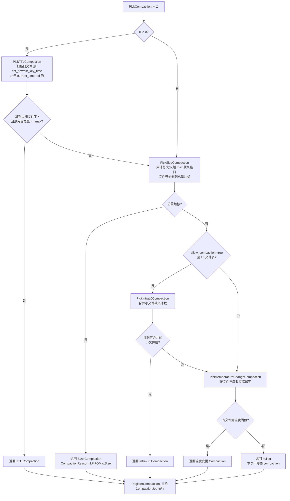
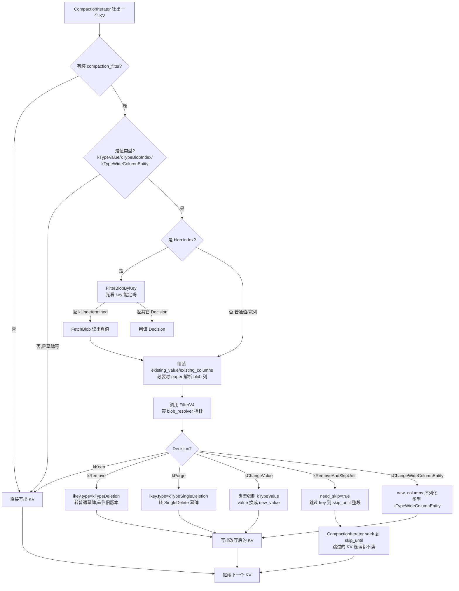

# 第 4 篇 · 第 16 章 · FIFO Compaction 与 CompactionFilter

> **核心问题**:前两章讲的 Level 和 Universal Compaction,不管策略怎么变,都在干同一件事——**把多个 SST 合并成新的 SST,收敛旧版本**。可是有一类数据天生不需要"收敛":时序监控、指标、日志,旧数据本来就要按时间淘汰,留着旧版本纯粹浪费空间。能不能干脆**不合并、只删旧**?这就是 FIFO Compaction。再问一步:就算用了普通 Compaction,用户常常想在合并的当口顺手做点事——删掉过期 key、给老数据打 TTL、裁掉大 value 里的冗余字段、做格式迁移——能不能在合并流里给用户一个回调,让他对每个 KV 拍板 keep / remove / change?这就是 CompactionFilter。这一章把这两件事一起讲:一个是"Compaction 的第三种姿态"(不收敛只淘汰),一个是"Compaction 收敛时给用户的口子"。

> **读完本章你会明白**:
> 1. FIFO Compaction 凭什么叫"不合并只删旧",它跟 Level/Universal 在 picker 阶段到底差在哪(答案:`MaxOutputLevel()` 直接返回 0,数据永远只待在 L0)。
> 2. FIFO 的两种删旧触发——按总大小(`max_table_files_size`)和按时间(`ttl`)——源码里是两个独立的 Pick 函数,先 TTL 再 Size,谁先命中谁上。
> 3. 为什么 FIFO 的空间放大≈1(不存多版本),读放大却随数据量线性增长(L0 全是文件,无层级归并)——它适合"时序数据、只要最新的、按时间过期"。
> 4. CompactionFilter 怎么把"合并时改 KV"这件事做成一个干净的回调接口,以及 11.6.0 源码里这个接口已经从 FilterV2 演进到了 FilterV4(带 wide-column 和 blob lazy loading),决策也从 keep/remove 两态扩到了 kKeep/kRemove/kChangeValue/kRemoveAndSkipUntil/kPurge/kChangeWideColumnEntity 七态。
> 5. 为什么 `IgnoreSnapshots()` 在 11.6.0 里被**强制锁死返回 true**——CompactionFilter 本质上会破坏快照隔离,RocksDB 诚实地告诉你"别指望快照在 filter 面前还成立"。

> **如果一读觉得太难**:先只记住三件事——① FIFO = 不合并只删旧 SST 文件,空间放大≈1、读放大大,适合时序;② CompactionFilter = 用户在 compaction 合并流里对每个 KV 决定 keep/remove/change 的回调;③ 两者都是"写路径"上的旋钮——FIFO 是 Compaction 策略旋钮,CompactionFilter 是合并内容旋钮,LevelDB 都没有。

---

## 〇、一句话点破

> **Level 和 Universal 是在"合并收敛"这件事上挑平衡点——Level 偏读放大、Universal 偏写放大;FIFO 干脆不收敛,把旧文件按时间或大小直接删掉,换来空间放大≈1、但读放大随数据量涨;CompactionFilter 则是给"合并"这个动作开了一个用户口子,让你在合并的当口顺手删旧版本、打 TTL、裁字段、迁移格式——它和 FIFO 互补: FIFO 解决"整文件级"的过期,CompactionFilter 解决"KV 级"的改写。**

这是结论,不是理由。本章倒过来拆:先讲 FIFO 为什么敢"不合并",它怎么删旧,删错了怎么办;再讲 CompactionFilter 的回调是怎么挂进合并流的,它的接口为什么从 FilterV2 一路长到 FilterV4;最后把两者放回"写路径收尾"的位置,交代它们各自撞什么墙。

---

## 一、FIFO Compaction:为什么不合并也是一种 Compaction

### 1.1 提出问题:时序数据为什么不需要"收敛"

先回忆前两章讲的 Compaction 在干什么。Level Compaction(P4-14)把 L0 的多个文件一层层下压到 L1、L2……Ln,每压一层就把同一 key 的新旧版本归并一次,丢掉旧版本和墓碑。Universal Compaction(P4-15)不逐层下压,而是把大小相近的 SST 直接合并,但**核心动作还是"合并"**——把 N 个输入 SST 读出来归并,写出 M 个新 SST。

两种策略的差别只在"怎么挑文件合并、合到哪一层",但都默认了一件事:**旧版本是有价值的,得通过合并把它跟新版本归并掉,否则空间会爆**。这个假设对绝大多数 KV workload 成立——你 `Put("user:1", v1)` 后又 `Put("user:1", v2)`,v1 是旧版本,迟早得通过 Compaction 清掉,否则同一个 key 的多版本会越堆越多,空间放大失控。

可是有一类数据,这个假设不成立:**时序数据**。监控指标(CPU 利用率每秒一条)、日志事件、传感器读数,这种数据的特征是——

- **每个 key 几乎只写一次**:比如 `metric:cpu:host1:1700000000`,这个 key 写过一次就再也不更新了,不存在"旧版本"。
- **旧数据按时间淘汰**:你只关心最近 7 天 / 30 天的指标,7 天前的数据不要了,不是"收敛"能解决的,是**整体删掉**。
- **只要最新的**:查询模式是"给我这台机器最近 1 小时的 CPU 曲线",老数据查都不会查。

对这种数据,Level/Universal 的"合并收敛"是**白干活**:本来就没有多版本要归并,合并一遍只是把数据重写一遍,白白吃写放大和 SSD 寿命。理想的做法是——**别合并,旧文件整个删掉就行**。

> **不这样会怎样**:如果对时序数据用 Level Compaction,你会看到:写放大居高不下(同一份指标数据从 L0 一路合到 L6,被重写七八遍,可它根本没有"多版本"需要归并),空间也没什么省(因为本来就没多版本),读放大也没收益(时序查询是范围扫最近的数据,层级归并帮不上忙)。换句话说,Level/Universal 的两个好处(读放大小、空间放大小)时序场景都吃不到,坏处(写放大大)倒是全占了。

### 1.2 LevelDB 怎么写死:只有一种 Compaction

LevelDB 压根没有 FIFO 这个选项。它的 Compaction(详见《LevelDB》P4 那一章)就是 LevelDB 风格的"逐层下压"——L0 文件数到 4 个就触发 L0→L1 合并,L1 大小超标就触发 L1→L2 合并,层层往下。你想要"不合并只删旧"的行为,LevelDB 给不了,除非自己改源码:在 Compaction picker 里加一个分支,命中条件时不归并、直接把旧文件标成 deleted 写进 VersionEdit。

这就是"焊死"。RocksDB 的回答是把它做成第三种 Compaction 策略旋钮。

> **LevelDB 是写死的,RocksDB 打开成了旋钮**:LevelDB 只有一种 Compaction(类 Level);RocksDB 在 `CompactionStyle` 枚举里给了三档——`kCompactionStyleLevel`(默认)、`kCompactionStyleUniversal`(P4-15)、`kCompactionStyleFIFO`(本章)。三档共用同一套 Compaction 框架(job / picker / iterator,P4-13 讲过),只是 picker 的"挑文件"逻辑不一样。

### 1.3 所以 FIFO 这么设计:MaxOutputLevel 永远是 0

FIFO Compaction 最反直觉的一点,是它的"输出层"永远是 0。来看源码:

```cpp
// db/compaction/compaction_picker_fifo.h:40-41
// The maximum allowed output level.  Always returns 0.
int MaxOutputLevel() const override { return 0; }
```

这一行是 FIFO 的灵魂。回想 Level Compaction:`MaxOutputLevel()` 返回的是 `num_levels - 1`(比如 7 层就是 6),意味着 Compaction 可以把数据从 L0 一路写到 L6。而 FIFO 返回 0——**Compaction 永远不会往更深层写,数据一辈子待在 L0**。

这带来的直接后果:FIFO 模式下,**磁盘上只有 L0 一层**,所有 SST 文件都在 L0 平铺。L0 文件之间不像 L1..Ln 那样有"每层 key range 不重叠"的约束——L0 文件本来就允许 key range 互相重叠(因为是 Flush 直接产出的,没经过归并)。所以 FIFO 模式下的磁盘状态是这样:

```
FIFO 模式下的磁盘(只有 L0,文件按生成时间从新到旧排列):

  L0:  [SST_9] [SST_8] [SST_7] [SST_6] [SST_5] [SST_4] [SST_3] [SST_2] [SST_1]
        ↑最新                                                          ↑最旧
        └── 新写入在这里 Flush 出来
                                       删旧从这里开始(按时间或大小) ──┘
```

> **钉死这件事**:FIFO 的核心机制就一句话——**所有数据都在 L0,Compaction 不合并文件,只按某种策略(大小 / 时间)把最旧的文件整个删掉**。这是"先进先出"(FIFO = First In First Out)的字面含义:先进来的(最旧的 SST)先被淘汰出去。

那"删旧"的触发条件是什么?FIFO 给了两个独立的策略,源码里是两个 Pick 函数。来看入口 `PickCompaction`:

```cpp
// db/compaction/compaction_picker_fifo.cc:730-764(简化,保留逻辑结构)
Compaction* FIFOCompactionPicker::PickCompaction(...) {
  Compaction* c = nullptr;
  if (mutable_cf_options.ttl > 0) {
    c = PickTTLCompaction(...);      // ① 按 ttl 删旧
  }
  if (c == nullptr) {
    c = PickSizeCompaction(...);     // ② 按 max_table_files_size 删旧
  }
  if (c == nullptr) {
    c = PickIntraL0Compaction(...);  // ③ (可选)合并小文件减文件数
  }
  if (c == nullptr) {
    c = PickTemperatureChangeCompaction(...); // ④ (可选)按文件年龄改存储温度
  }
  ...
  RegisterCompaction(c);
  return c;
}
```

四个 Pick 按优先级顺序试,**谁先返回非空谁赢**。本章重点拆 ① 和 ②(TTL 和 Size),它们是 FIFO 的"删旧"主路径;③ 是 `allow_compaction=true` 时的可选优化(后面单独讲);④ 是存储分层温度(冷热数据分级,跟主线关系不大,一句带过)。

这个"按优先级链式 fallback"的决策流程,用 mermaid 画出来是这样:



这张图值得盯着看一会。它揭示了 FIFO 的一个重要特性——**FIFO 的"删旧"不是无条件触发的,而是有严格的优先级和回退逻辑**。TTL 删不动(没过期文件,或删完还超标)才轮到 Size;Size 不需要(总量没超标)才看要不要做 Intra-L0 合并;都不需要才看温度。这个链条保证了 FIFO 总是优先做"最该做的事":先清过期数据,再控总量,再优化文件数,最后才管存储分层。任何一个环节命中,后面的环节就不再执行——这是"按需触发、避免无谓 IO"的设计。

读者可能会问:为什么把 TTL 放在 Size 前面?因为 TTL 删的是"真过期"的数据(年龄超过 ttl),Size 删的是"最旧但未必过期"的数据(只要总量超标就删)。**TTL 删除是"该删的",Size 删除是"不得不删的"**——前者优先,后者兜底。如果反过来(Size 先删),可能把还没过期的数据删掉,而真正过期的数据反而留着,违反了时序数据的淘汰语义。这个顺序不是随便排的,是 TTL 语义正确性的要求。

### 1.4 技巧佐证:PickSizeCompaction 怎么"按大小删旧"

最直观的删旧策略是按总大小。来看 `PickSizeCompaction`:

```cpp
// db/compaction/compaction_picker_fifo.cc:208-340(简化,保留主路径)
Compaction* FIFOCompactionPicker::PickSizeCompaction(
    const std::string& cf_name, const MutableCFOptions& mutable_cf_options,
    const MutableDBOptions& mutable_db_options, VersionStorageInfo* vstorage,
    LogBuffer* log_buffer) {
  const auto& fifo_opts = mutable_cf_options.compaction_options_fifo;

  // 计算所有层的总大小,顺便找到最后一个非空层
  int last_level = 0;
  uint64_t total_size = 0;
  for (int level = 0; level < vstorage->num_levels(); ++level) {
    auto level_size = GetTotalFilesSize(vstorage->LevelFiles(level));
    total_size += level_size;
    if (level_size > 0) {
      last_level = level;
    }
  }
  ...
  uint64_t effective_size, effective_max;
  GetEffectiveSizeAndLimit(fifo_opts, total_size,
                           vstorage->GetBlobStats().total_file_size,
                           &effective_size, &effective_max);

  // 没超标就不用删
  if (last_level == 0 && effective_size <= effective_max) {
    return nullptr;
  }
  ...

  std::vector<CompactionInputFiles> inputs;
  inputs.emplace_back();
  inputs[0].level = last_level;

  if (last_level == 0) {
    uint64_t remaining_size = effective_size;
    // 关键:L0 里右端的文件是最旧的,rbegin() 从最旧开始删
    for (auto ritr = last_level_files.rbegin(); ritr != last_level_files.rend();
         ++ritr) {
      auto f = *ritr;
      remaining_size -= std::min(remaining_size, f->fd.file_size);
      inputs[0].files.push_back(f);
      ...
      if (remaining_size <= effective_max) {
        break;   // 删够了,降到阈值以下就停
      }
    }
  }
  ...
  Compaction* c = new Compaction(
      vstorage, ioptions_, mutable_cf_options, mutable_db_options,
      std::move(inputs), last_level,
      /* target_file_size */ 0,
      ...
      CompactionReason::kFIFOMaxSize, ...);
  return c;
}
```

这段源码有三个细节值得钉死:

**第一,L0 文件按"新→旧"排列,删旧从右端(`rbegin()`)开始**。RocksDB 的 L0 文件向量是按生成顺序存的(新的在前),`rbegin()` 就是逆序遍历——从最旧的文件开始往 inputs 里塞。这是 FIFO"先进先出"在代码里的字面体现。

**第二,删够就停(`if (remaining_size <= effective_max) break;`)**。不是无脑删一半,而是删到总大小刚好低于 `max_table_files_size` 就 break。这是"省"的体现——能少删就少删,毕竟删了就真没了(时序数据可能要保留尽可能多的历史)。

**第三,`CompactionReason::kFIFOMaxSize`**。注意这个 Compaction 拿到的 inputs 里的文件,**最终不是被"合并输出成新文件",而是被"整个标记删除"**。怎么删的?后面会讲,Compaction 框架拿到一个 input 文件列表,如果输出层和输入层都是 0、且没有输出文件,框架就走"删除"路径——把这些文件从 Version 里移除,manifest 记一条 delete file。这就是 FIFO"不合并只删"的实现机制。

> **钉死这件事**:FIFO 的"删旧"不是另一套机制,它复用了 Compaction 框架的 input/output 模型——picker 挑出一批旧文件作为 input,output level 也是 0 但实际不产生输出文件,框架就把这批 input 文件当"过期文件"删掉。这是"用 Compaction 的壳,干淘汰的活"。

### 1.5 技巧佐证:PickTTLCompaction 怎么"按时间删旧"

第二个删旧策略是按 TTL。这个稍微复杂一点,因为它要判断"文件的年龄"。

先澄清一个容易混的点:**`ttl` 不是 `CompactionOptionsFIFO` 的字段,而是 ColumnFamilyOptions 的通用字段**。来看它的真实定义:

```cpp
// include/rocksdb/advanced_options.h:862-894(注释摘录)
// This option has different meanings for different compaction styles:
//
// Leveled: Non-bottom-level files with all keys older than TTL will go
//    through the compaction process...
//
// FIFO: Files with all keys older than TTL will be deleted. TTL is only
//    supported if option max_open_files is set to -1.
//
// Universal: users should only set the option `periodic_compaction_seconds`
//    below instead...
//
// unit: seconds. Ex: 1 day = 1 * 24 * 60 * 60
// 0 means disabling.
// UINT64_MAX - 1 (0xfffffffffffffffe) is special flag to allow RocksDB to
// pick default.
//
// Default: 30 days if using block based table. 0 (disable) otherwise.
uint64_t ttl = 0xfffffffffffffffe;
```

`ttl` 是个跨策略的旋钮:**对 Level 它触发"过期的非底层文件重新 compact";对 FIFO 它触发"整文件删除";对 Universal 它没意义(用 `periodic_compaction_seconds` 代替)**。这又是 RocksDB"一个旋钮,多策略下不同语义"的典型——同一个 `ttl` 字段,在三种 Compaction 下的行为完全不同,但都服务于"过期数据处理"这个主题。

FIFO 下 `ttl` 的语义最干脆:**文件里所有 key 的最新时间 < (current_time - ttl),就把整个文件删了**。来看 `PickTTLCompaction`:

```cpp
// db/compaction/compaction_picker_fifo.cc:66-191(简化,保留主路径)
Compaction* FIFOCompactionPicker::PickTTLCompaction(
    const std::string& cf_name, const MutableCFOptions& mutable_cf_options,
    const MutableDBOptions& mutable_db_options, VersionStorageInfo* vstorage,
    LogBuffer* log_buffer) {
  assert(mutable_cf_options.ttl > 0);

  const int kLevel0 = 0;
  const std::vector<FileMetaData*>& level_files = vstorage->LevelFiles(kLevel0);
  ...
  int64_t _current_time;
  auto status = ioptions_.clock->GetCurrentTime(&_current_time);
  ...
  const uint64_t current_time = static_cast<uint64_t>(_current_time);

  ...

  std::vector<CompactionInputFiles> inputs;
  inputs.emplace_back();
  inputs[0].level = 0;

  // avoid underflow(避免 current_time < ttl 时下溢)
  if (current_time > mutable_cf_options.ttl) {
    for (auto ritr = level_files.rbegin(); ritr != level_files.rend(); ++ritr) {
      FileMetaData* f = *ritr;
      ...
      uint64_t newest_key_time = f->TryGetNewestKeyTime();
      uint64_t creation_time = reader->GetTableProperties()->creation_time;
      uint64_t est_newest_key_time = newest_key_time == kUnknownNewestKeyTime
                                         ? creation_time
                                         : newest_key_time;
      // 注意这个判断:如果文件"最新 key 的时间"还在 ttl 窗口内,break
      if (est_newest_key_time == kUnknownNewestKeyTime ||
          est_newest_key_time >= (current_time - mutable_cf_options.ttl)) {
        break;
      }
      ...
      total_size -= f->fd.file_size;
      inputs[0].files.push_back(f);
    }
  }
  ...
  if (inputs[0].files.empty() || effective_remaining > effective_max) {
    return nullptr;
  }
  ...
  Compaction* c = new Compaction(
      ...,
      CompactionReason::kFIFOTtl, ...);
  return c;
}
```

这段有几个细节特别值得讲:

**第一,"文件年龄"用的是 `TryGetNewestKeyTime()`,不是文件创建时间**。这是个微妙的点。文件创建时间(`creation_time`)是 SST 落盘那一刻的时间,可这个文件里的数据可能是 Compaction 时从更老的文件搬过来的——文件是新的,数据是老的。FIFO 要的是"数据有多老",所以优先用 `newest_key_time`(文件里最新那个 key 的时间戳);拿不到才退回 `creation_time`。这是"按数据年龄淘汰,不是按文件年龄淘汰"的精确实现。

**第二,`break` 的位置很关键**。L0 文件按新→旧排列,`rbegin()` 从最旧开始扫。一旦碰到一个"还没过期"的文件(`est_newest_key_time >= current_time - ttl`),立刻 break——因为比它更新的文件肯定也没过期,继续扫没意义。这是把"删过期文件"做成 O(过期文件数) 而不是 O(总文件数) 的优化。

**第三,`if (inputs[0].files.empty() || effective_remaining > effective_max) return nullptr;` 这一行藏着一个回退**。意思是:即使有文件过期了,但如果你把这些过期文件都删掉,**剩余的总大小还是超过 `max_table_files_size`**,那这次 TTL compaction 就**不执行**——回退给 `PickSizeCompaction` 去"按大小删"。为什么?因为光删过期文件解决不了"总量超标"的问题,得让 Size 策略来挑更近的文件删。这是 TTL 和 Size 两个策略的协同:TTL 先试试能不能只删过期数据,删不够就让 Size 上。

> **钉死这件事**:FIFO 的两个删旧策略不是"二选一",而是**优先级链**——先 TTL(只删真过期),删不动回退 Size(按大小强行删最旧)。这种链式 fallback 让 FIFO 在"既要按时间淘汰,又要总量受控"的时序场景里能同时满足两个约束。

### 1.6 FIFO 撞什么墙:读放大随数据量线性增长

讲完了 FIFO 怎么删旧,得诚实地讲它撞什么墙——这是理解"FIFO 适合什么场景"的关键。

FIFO 的甜头很明显:**空间放大≈1**。因为不合并,同一 key 的多版本不会堆积(假设时序数据每个 key 只写一次,根本没多版本);旧文件到了阈值就整个删掉,空间占用被 `max_table_files_size` 死死卡住。这一点 Level/Universal 都做不到——Level 的 L1..Ln 层在 Compaction 过程中会临时有 input + output 双份数据,Universal 的宽 L0 更是允许成倍的空间放大。

但 FIFO 的代价更狠:**读放大随数据量线性增长**。回想读路径(P3-11 讲过),一次 `Get(key)` 在 Level 模式下是"MemTable → L0(多个文件)→ L1(至多一个文件)→ L2(至多一个文件)→ ……",L1 之后每层最多读一个 SST,读放大 ≈ L0 文件数 + 层数。可 FIFO 模式下**只有 L0**,所有文件都在 L0 平铺,一次 Get 要把所有 L0 文件都查一遍(每个文件先 Bloom 早退,过了 Bloom 再 Index 二分定位,再读 data block)。L0 文件数 = 总数据量 / 单文件大小,数据量越大,文件数越多,读放大线性涨。

```
读放大对比(同等数据量,假设 100 个 SST 文件大小):

Level Compaction:           FIFO Compaction:
                             (MaxOutputLevel=0,只有 L0)
  L0: 4 个文件                L0: 100 个文件平铺
  L1: 1 个(10 倍 L0)
  L2: 1 个                    一次 Get 要查:
  L3: 1 个                     100 个文件 × (Bloom + Index + DataBlock)
  ...                         读放大 ≈ 100(且 Bloom 误判会真读)
  L6: 1 个

  一次 Get 最多查:
  4(L0) + 6(L1-L6 各一个) = 10 个文件
  读放大 ≈ 10
```

这张图把 FIFO 的命门画清楚了:**它用读放大的线性增长,换了空间放大≈1 和写放大≈1(不合并就不重写)**。这个交易什么时候划算?**当时序数据"只写不更新、按时间淘汰、查询主要扫最近数据"时**——这种场景下读放大其实没那么糟(因为热数据是新写入的,集中在 L0 左端少数文件,配合 Block Cache 命中率不低;冷数据老文件本来就不查)。可一旦你的 workload 是"随机点查老数据"或"频繁更新同一 key",FIFO 就会把你读死。

> **不这样会怎样**:如果你把 FIFO 用在"频繁更新的 KV"场景(比如用户资料,同一个 user 经常改),FIFO 不合并,同一个 key 的多版本会在不同 L0 文件里堆着(因为没 Compaction 收敛),Get 一次要把所有版本都读出来归并,读放大爆炸,而且空间放大也失控(多版本堆积)。FIFO 的"空间放大≈1"前提是"每个 key 只写一次",一旦违反这个前提,FIFO 的所有甜头全没了。**FIFO 是为时序数据量身定做的,乱用会反过来咬你。**

### 1.7 可选优化:allow_compaction 与 Intra-L0 合并

到这里 FIFO 的主线就讲完了。但 11.6.0 的源码里还有个可选旋钮值得提一下:`allow_compaction`。

```cpp
// include/rocksdb/advanced_options.h:77-83
// If true, try to do compaction to compact smaller files into larger ones.
// Minimum files to compact follows options.level0_file_num_compaction_trigger
// and compaction won't trigger if average compact bytes per del file is
// larger than options.write_buffer_size. This is to protect large files
// from being compacted again.
// Default: false;
bool allow_compaction = false;
```

这个开关打开后,FIFO 会在"删旧"之外,多做一件事——**把 L0 的小文件合并成大文件**,目的是控制 L0 文件数(进而控制读放大)。这就是 `PickIntraL0Compaction` 干的事(fifo.cc:461-533)。它有两种子策略(由 `use_kv_ratio_compaction` 切换,后者是 BlobDB 专用的容量推导算法),核心都是"挑几个连续的小文件,合并成一个大小不超过 `write_buffer_size * 1.1` 的大文件"。

这个优化有个微妙的约束(注释里点明了):**"保护大文件不被反复合并"**——`compaction won't trigger if average compact bytes per del file is larger than options.write_buffer_size`。意思是,如果一个文件已经接近 `write_buffer_size`(也就是已经"毕业"成大文件了),就不要再让它参与 intra-L0 合并,否则同一个数据会被 compact 一遍又一遍,白吃写放大。这个保护让 intra-L0 合并只发生在"真的还很小"的文件之间,是个写放大 vs 文件数的精细权衡。

> **钉死这件事**:`allow_compaction=true` 是 FIFO 给"读放大随文件数增长"这个命门的一个补救——它允许 FIFO 在删旧之外,顺手把小文件归并成大文件,压一压文件数。但它不是免费的:打开它意味着 FIFO 不再是"纯删",开始有合并的写放大成本。时序场景下默认 `false`,只有当文件数真的多到读放大不可接受时才打开。

---

## 二、CompactionFilter:在合并流里给用户一个口子

FIFO 讲完了,它是"整文件级"的过期。可很多场景用户需要更细的控制——**在合并的当口,对每个 KV 单独拍板**。这就是 CompactionFilter。

### 2.1 提出问题:合并时为什么需要一个用户回调

先想一个具体场景:你用 RocksDB 存用户会话(session),每个 session 有 TTL(30 分钟不活跃就过期)。你怎么实现"过期 session 自动清掉"?

- **方案一,应用层扫**:起一个后台线程,定期 `Scan` 全库,删掉过期 key。问题:Scan 全库本身就是全表 IO,跟 Compaction 的 IO 叠加,把磁盘打爆;而且 scan 期间要 hold iterator,跟前台读写抢资源。
- **方案二,靠 ttl 选项**:前面讲过 `ttl` 选项,但它对 Level Compaction 的语义是"把过期文件重新 compact 一遍"——粒度是**文件级**(整个文件所有 key 都过期才算),不是 KV 级。一个文件里只要有几个 key 没过期,整个文件都不能按 ttl 删,过期 key 还是赖着不走。
- **方案三,CompactionFilter**:让 Compaction 在合并每个 KV 时,回调用户代码,用户代码看一眼"这个 key 的 value 里编码的过期时间 < now 吗",是就 return kRemove,否就 return kKeep。这样过期 key 在合并的当口就被清掉,不占用一次专门 scan,而且粒度精确到 KV。

方案三就是 CompactionFilter 的核心价值。它把"清理过期数据"这件事**搭便车**到 Compaction 上——反正 Compaction 本来就要遍历所有 KV 重写,在这一遍里顺手做用户判定,不增加额外 IO。

> **不这样会怎样**:如果没有 CompactionFilter,所有"按业务逻辑清理数据"的需求(TTL、字段裁剪、格式迁移、删旧版本)都得应用层自己实现,要么定期全表 scan(代价巨大),要么写到 value 里靠读时判定(读放大),要么干脆不做(空间膨胀)。CompactionFilter 把这类需求收口到"Compaction 时一次性处理",是最经济的时机。

### 2.2 LevelDB 怎么写死:没有这个回调

LevelDB 没有 CompactionFilter 这个东西。LevelDB 的 Compaction(详见《LevelDB》)就是个纯粹的"归并 + 丢旧版本",用户没有插手的口子。你想在合并时删特定 key,只能改 LevelDB 源码,在 `DoCompactionWork` 那个循环里加自己的判断——那是改内核,不是用 API。

RocksDB 把它做成了公开 API(`include/rocksdb/compaction_filter.h`),这是 RocksDB 独有的演进。从接口版本演进也能看出它被越来越重视:最早只有 `Filter()`(只返 bool),后来加了 `FilterV2()`(返 Decision),再后来 `FilterV3()`(支持 wide column),到 11.6.0 已经是 `FilterV4()`(带 blob lazy loading)。每一版都是为了"让 filter 能处理更复杂的数据形态"。

> **LevelDB 是写死的,RocksDB 打开成了旋钮**:LevelDB 合并时不可插手;RocksDB 的 `CompactionFilter` 是一个虚基类(继承自 `Customizable`),用户继承它、重写过滤方法、通过 `Options::compaction_filter` 或 `Options::compaction_filter_factory` 注册,RocksDB 在 Compaction 遍历每个 KV 时回调它。

### 2.3 所以 CompactionFilter 这么设计:一个虚基类,四级接口

来看 `CompactionFilter` 的真实接口(11.6.0):

```cpp
// include/rocksdb/compaction_filter.h:126-471(摘录,接口演进)
class CompactionFilter : public Customizable {
 public:
  // KV 的值类型(传给 filter 判定用)
  enum ValueType {
    kValue,            // 普通 Put
    kMergeOperand,     // Merge 操作数
    kBlobIndex,        // (老 stacked BlobDB 内部用)
    kWideColumnEntity, // 宽列实体
  };

  // filter 的决策(从早期的 keep/remove 两态扩到了七态)
  enum class Decision {
    kKeep,                   // 保留
    kRemove,                 // 删除(转成 tombstone)
    kChangeValue,            // 改 value
    kRemoveAndSkipUntil,     // 删 [key, skip_until) 整段
    kChangeBlobIndex,        // (BlobDB 内部)
    kIOError,                // (BlobDB 内部)
    kPurge,                  // 删(转成 SingleDelete 型 tombstone)
    kChangeWideColumnEntity, // 改成宽列实体
    kUndetermined,           // (FilterBlobByKey 专用,表示"光看 key 决定不了")
  };

  // 上下文:告诉 filter 这次 table file 是什么场景
  struct Context {
    bool is_full_compaction;       // 是不是全量 compaction
    bool is_manual_compaction;     // 是不是用户手动触发的
    int input_start_level;         // 输入文件最低层
    uint32_t column_family_id;     // 哪个 CF
    TableFileCreationReason reason;// 为什么创建(flush/compaction/recovery)
    TablePropertiesCollection input_table_properties;
  };

  // 最早期的接口(只返 bool):true=删,false=留
  virtual bool Filter(int level, const Slice& key, const Slice& existing_value,
                      std::string* new_value, bool* value_changed) const {
    return false;
  }

  // 统一接口(plain value + merge operand,返 Decision)
  virtual Decision FilterV2(const Slice& existing_value, std::string* new_value,
                            std::string* skip_until) const {
    // 默认实现委托给 Filter() / FilterMergeOperand()
    ...
  }

  // 宽列感知接口(支持 wide-column entity)
  virtual Decision FilterV3(const Slice* existing_value,
                            const WideColumns* existing_columns, ...) const {
    // 默认实现:宽列直接 kKeep,普通值委托 FilterV2
    ...
  }

  // 11.6.0 最新接口:加上 blob 列的 lazy loading
  virtual Decision FilterV4(..., WideColumnBlobResolver* blob_resolver) const {
    // 默认实现委托 FilterV3
    ...
  }

  // ⚠️ 已废弃,11.6.0 强制返回 true(详见后文)
  virtual bool IgnoreSnapshots() const { return true; }
  ...
};
```

这个接口有几个设计点值得拆:

**第一,四级接口是层层委托的链**。`FilterV4` 默认委托 `FilterV3`,`FilterV3` 默认委托 `FilterV2`,`FilterV2` 默认委托 `Filter`(老接口)。这意味着——**用户只需要重写最关心的那一级**,老代码(只重写了 `Filter()`)在新版 RocksDB 上照样跑,因为 V4→V3→V2→Filter 的委托链会最终走到你的 `Filter()`。这是接口演进的经典手法:**新接口加参数,老接口默认实现,保证向后兼容**。

**第二,`Context` 把"这次 compaction 是什么场景"告诉 filter**。`is_full_compaction`(是不是全量)、`is_manual_compaction`(是不是 `CompactRange` 手动触发的)、`reason`(flush / compaction / recovery)。这让 filter 能"看场景下菜碟"——比如只想在全量 compaction 时做格式迁移(`if (context.is_full_compaction) 迁移;else kKeep`)。

**第三,`Decision` 从两态扩到七态,反映真实需求**。最早的 `Filter()` 只能返 keep/remove,可用户经常想"改 value"(比如裁字段)、"删一段连续 key"(比如删掉某个 range)、"改宽列实体"(比如给宽列加个新列)。RocksDB 把这些需求都做成了 Decision 枚举,filter 返哪个,CompactionIterator 就执行对应的改写。

### 2.4 技巧佐证:CompactionIterator 怎么调用 FilterV4

接口讲完了,来看它怎么挂进合并流。`CompactionIterator`(P4-13 讲过)是 Compaction 在归并多个输入 SST 时的"游标",每吐出一个 KV 之前,它会先问一句"filter 要不要这个 KV"。来看核心方法 `InvokeFilterIfNeeded`:

```cpp
// db/compaction/compaction_iterator.cc:345-354(入口判断)
bool CompactionIterator::InvokeFilterIfNeeded(bool* need_skip,
                                              Slice* skip_until) {
  if (!compaction_filter_) {
    return true;   // 没装 filter,直接放过
  }

  // 只对 kTypeValue / kTypeBlobIndex / kTypeWideColumnEntity 调 filter
  // (墓碑、SingleDelete 这些不调)
  if (ikey_.type != kTypeValue && ikey_.type != kTypeBlobIndex &&
      ikey_.type != kTypeWideColumnEntity) {
    return true;
  }
  ...
```

第一道判断很关键:**只有"值类型"的 KV 才会调 filter,墓碑(kTypeDeletion)和 SingleDelete(kTypeSingleDeletion)不调**。为什么?因为 filter 的语义是"用户决定这个值要不要 / 怎么改",而墓碑本身已经是"删除标记"了,没什么可过滤的。这是 filter 的边界——它处理"有值的数据",不处理"删除操作"。

继续看 filter 实际调用:

```cpp
// db/compaction/compaction_iterator.cc:433-563(简化,保留主路径)
if (decision == CompactionFilter::Decision::kUndetermined) {
  const Slice* existing_val = nullptr;
  const WideColumns* existing_col = nullptr;
  ...
  // 走到这一步,existing_val / existing_col 已经指向当前 KV 的值
  // (如果是 blob,前面 FetchBlob 已经把真值读出来了)

  decision = compaction_filter_->FilterV4(
      level_, filter_key, value_type, existing_val, existing_col,
      &compaction_filter_value_, &new_columns,
      compaction_filter_skip_until_.rep(), blob_resolver_ptr);
  ...
}
```

注意 `FilterV4` 是 `const` 方法——这意味着 filter 内部不能有可变状态(从设计上鼓励无副作用)。但 `CompactionIterator` 是 per-thread 的(compaction_job.cc 给每个 subcompaction 线程建一个 iterator),所以 filter 即使有"线程局部"的状态也安全。这个线程模型在头文件注释里说得很清楚:

```cpp
// include/rocksdb/compaction_filter.h:111-118
// * If multithreaded compaction is being used *and* a single CompactionFilter
// instance was supplied via Options::compaction_filter, CompactionFilter
// methods may be called from different threads concurrently.  The application
// must ensure that such calls are thread-safe. If the CompactionFilter was
// created by a factory, then it will only ever be used by a single thread that
// is doing the table file creation, and this call does not need to be
// thread-safe.
```

两种用法两种要求:
- **用 `Options::compaction_filter`(裸指针,全局单实例)**:多线程 compaction 下可能并发调用,**用户必须保证线程安全**。
- **用 `Options::compaction_filter_factory`(工厂,每个 compaction 线程建一个新实例)**:每个实例只被一个线程用,**不用做线程同步**。

工厂模式的另一个好处是**它能在每次 compaction 开始时拿到 `Context`**(`CreateCompactionFilter(const Context&)`)。这意味着 filter 可以"看场景下菜碟"——比如只想在全量 compaction 时做格式迁移:

```cpp
class MigrationFilterFactory : public CompactionFilterFactory {
 public:
  std::unique_ptr<CompactionFilter> CreateCompactionFilter(
      const CompactionFilter::Context& context) override {
    if (!context.is_full_compaction) {
      // 非全量 compaction 不做迁移,返回一个 no-op filter
      return std::make_unique<NoOpFilter>();
    }
    return std::make_unique<MigrationFilter>(schema_version_);
  }
  ...
};
```

这种"看 Context 决定要不要干活"的模式,让 filter 的代价可控——格式迁移这种重操作只在全量 compaction(通常用户手动触发 `CompactRange`)时跑,平时的增量 compaction 不受影响。裸指针 `Options::compaction_filter` 拿不到 Context(它是全局单例,没有 per-compaction 的信息),所以做不了这种场景化决策。这是工厂模式相对裸指针的另一个优势。

> **钉死这件事**:RocksDB 推荐用 `compaction_filter_factory`——每个 compaction 线程拿一个独立的 filter 实例,filter 内部可以放任意状态(计数器、缓存、统计数据),不用加锁。这是"用对象隔离换无锁并发"的经典手法,跟 InlineSkipList(P1-04)的无锁插入、WriteGroup(P1-02)的批写合并是同一套设计哲学:**别用锁串行化,用数据隔离让并发天然安全**。

### 2.5 决策落地:七态 Decision 各自怎么改 KV

filter 返一个 Decision 后,CompactionIterator 怎么落地?来看 `InvokeFilterIfNeeded` 的后半段:

```cpp
// db/compaction/compaction_iterator.cc:600-686(简化,按 Decision 分支)
if (decision == CompactionFilter::Decision::kRemove) {
  // 把当前 key 转成 tombstone(普通 Delete)
  ikey_.type = kTypeDeletion;
  current_key_.UpdateInternalKey(ikey_.sequence, kTypeDeletion);
  value_.clear();
  iter_stats_.num_record_drop_user++;
} else if (decision == CompactionFilter::Decision::kPurge) {
  // 转成 SingleDelete 型 tombstone
  ikey_.type = kTypeSingleDeletion;
  current_key_.UpdateInternalKey(ikey_.sequence, kTypeSingleDeletion);
  value_.clear();
  iter_stats_.num_record_drop_user++;
} else if (decision == CompactionFilter::Decision::kChangeValue) {
  // 改 value:类型强制成 kTypeValue,值换成 filter 给的 new_value
  if (ikey_.type != kTypeValue) {
    ikey_.type = kTypeValue;
    current_key_.UpdateInternalKey(ikey_.sequence, kTypeValue);
  }
  value_ = compaction_filter_value_;
} else if (decision == CompactionFilter::Decision::kRemoveAndSkipUntil) {
  // 跳过 [key, skip_until) 整段
  *need_skip = true;
  compaction_filter_skip_until_.ConvertFromUserKey(kMaxSequenceNumber,
                                                   kValueTypeForSeek);
  *skip_until = compaction_filter_skip_until_.Encode();
} else if (decision == CompactionFilter::Decision::kChangeWideColumnEntity) {
  // 改成宽列实体:把 new_columns 序列化成宽列编码
  WideColumns sorted_columns;
  ...
  WideColumnSerialization::Serialize(sorted_columns, compaction_filter_value_);
  if (ikey_.type != kTypeWideColumnEntity) {
    ikey_.type = kTypeWideColumnEntity;
    current_key_.UpdateInternalKey(ikey_.sequence, kTypeWideColumnEntity);
  }
  value_ = compaction_filter_value_;
  entity_deserialized_ = false;
}
```

每个 Decision 对应一种 KV 改写,值得逐个理解。先把整个决策落地流程用 mermaid 画出来,再逐个拆:



这张图把 filter 的完整生命周期画清楚了——从"吐出一个 KV"到"写出改写后的 KV",中间经过类型判断、blob 处理、filter 调用、Decision 落地四个阶段。几个关键分支值得留意:

- **"是值类型吗"这一道门**把墓碑和 SingleDelete 挡在了 filter 之外——filter 只处理"有值的数据",不处理"删除操作"。这避免了对已经存在的删除标记做二次判定(没意义,墓碑本来就是要被清理的)。
- **blob 的双路径**——先试 `FilterBlobByKey`(只看 key 能不能决定),决定不了再 `FetchBlob` 读真值。这是 BlobDB 场景下避免无谓 IO 的优化(如果光看 key 就能判定过期,根本不用读 blob)。
- **`kRemoveAndSkipUntil` 是唯一一个不走"写出"路径的 Decision**——它直接让 CompactionIterator seek 跳过整段,被跳过的 KV 连读都不读。这是"批量删除"的优化,代价是破坏快照隔离(前面讲过)。

现在逐个理解每个 Decision:

- **`kRemove`**:转成 `kTypeDeletion`(普通 Delete 型 tombstone)。注意是"转 tombstone"不是"直接丢掉"——为什么?因为这个 key 可能在更旧的 SST 里有更老的版本,转成 tombstone 才能在归并时把老版本一起盖掉。如果直接丢掉,老版本反而会"露出来",造成数据错误(删了新的,老的反而可见)。这是 LSM 正确性的细节:**filter 删一个 key,本质是"写一个墓碑盖住它和它的所有旧版本"**。
- **`kPurge`**:转成 `kTypeSingleDeletion`(SingleDelete 型 tombstone)。SingleDelete 的语义是"只删与之配对的最近一次 Put",比普通 Delete 更精准(不会盖到更老的版本)。filter 用 kPurge 通常是在"确定这个 key 没有多版本堆积"时,享受 SingleDelete 的清理效率。但 SingleDelete 有它自己的坑(详见《LevelDB》/RocksDB SingleDelete 章节),filter 文档也警告"all caveats related to SingleDeletes apply"。
- **`kChangeValue`**:把 value 换成 filter 给的 `new_value`,类型强制成 `kTypeValue`。典型应用:字段裁剪——value 原本是 JSON,filter 解析后裁掉冗余字段,只留必要部分,新 value 写回。这能显著减小 value 大小,降低后续读放大和空间放大。
- **`kRemoveAndSkipUntil`**:告诉 CompactionIterator "从当前 key 一直到 `skip_until` 这个 key,整段都跳过"。这是个优化——如果你知道一个连续 range 全要删,与其一个个 KV 都回调 filter,不如一句"这整段都不要了",CompactionIterator 直接 seek 到 `skip_until` 之后,跳过的 KV 连读都不读。代价是注释里点明的:**跳过的 key 即使有 snapshot 引用也会被删**(破坏快照隔离),还有"多版本情况下可能只删了新值暴露老值"的陷阱。所以这个 Decision 用起来要特别小心。
- **`kChangeWideColumnEntity`**:把 KV 改成宽列实体(Wide Columns,RocksDB 后加的特性)。应用:给数据加上"列"结构(比如把扁平 value 拆成 `name`/`age`/`email` 几列),或者迁移老格式到宽列格式。

> **钉死这件事**:filter 的七态 Decision 不是随便设计的,每一态都对应一种真实的"合并时改写需求"——删(普通 / SingleDelete)、改值、跳段、改宽列。CompactionIterator 拿到 Decision 后,直接在内存里改 `ikey_.type` 和 `value_`,改完的 KV 才被写到输出 SST。这是"在合并流里对每个 KV 做用户定义的改写"的完整闭环。

### 2.6 一个微妙点:blob 值的 lazy 加载(FilterV4)

11.6.0 的 `FilterV4` 相比 `FilterV3` 多了一个 `WideColumnBlobResolver* blob_resolver` 参数。这个参数是为了 BlobDB(P6-22 讲)的场景——当 value 是大对象,被分离存到 blob 文件里时,filter 判定时要不要把 blob 读出来?

朴素做法是"凡是大 value 都先读出来再给 filter 判"。可这违背了 BlobDB 的初衷——大 value 分离就是为了避免在 Compaction 时反复重写大 value,如果 filter 每次都把 blob 读出来,等于又把大 value 拉回了合并流,白搭。

`FilterV4` 的解法是 **lazy loading**:`blob_resolver` 是个延迟解析器,filter 想看哪一列的 blob 值,主动调 `blob_resolver->ResolveColumn(idx, &value)` 才真去读;不调就不读。来看 resolver 的接口:

```cpp
// include/rocksdb/compaction_filter.h:46-98(摘录)
class WideColumnBlobResolver {
 public:
  // 解析指定列的 blob 值(按需,不调就不读 IO)
  virtual Status ResolveColumn(size_t column_index, Slice* resolved_value) = 0;

  // 批量解析多列
  virtual Status ResolveColumns(const std::vector<size_t>& column_indices,
                                std::vector<Slice>* resolved_values) {
    // 默认实现是循环调 ResolveColumn(允许未来 batch 优化)
    ...
  }

  // 这一列是不是 blob 引用(而非 inline 值)
  virtual bool IsBlobColumn(size_t column_index) const = 0;

  // 实体的总列数
  virtual size_t NumColumns() const = 0;
};
```

这个设计精妙在哪?它把"读 blob 的 IO 代价"完全交给了 filter 的判断——filter 自己知道"我要不要看这一列",要看才解析,不看就跳过。比如一个"按 key 前缀删旧数据"的 filter,根本不关心 value 内容,它就一句 `return Decision::kKeep`(或 kRemove),`blob_resolver` 压根不调,blob 文件零 IO。这跟没有 resolver 时(老 `FilterV3` 路径会 eager 把所有 blob 读出来)形成鲜明对比。

CompactionIterator 里对这个有兼容处理(compaction_iterator.cc:494-540):如果 filter 的 `SupportsFilterV4()` 返 false(老 filter),iterator 会**主动 eager 解析所有 blob 列**,把真值塞给 `FilterV3`;如果返 true(新 filter),iterator 只传一个 `blob_resolver` 指针,让 filter 自己决定读不读。这是"新接口高效、老接口兼容"的双轨设计。

> **钉死这件事**:`FilterV4` 的 `blob_resolver` 是个"按需付费"的设计——filter 不调就不读 IO。这跟 BlobDB 的"value 分离"理念是一脉相承的(大 value 不该被合并流反复搬运),`FilterV4` 让这个理念在 filter 层面也成立。RocksDB 推荐新代码优先重写 `FilterV4`,享受 lazy loading 的收益。

### 2.7 实战:用 CompactionFilter 实现 KV 级 TTL

把前面讲的合起来,看一个真实场景:用 CompactionFilter 实现 KV 级 TTL。这是 filter 最经典的应用,值得把完整代码写出来。

假设 value 的编码是 `[8 字节过期时间戳][业务数据]`,我们要在 compaction 时把"过期时间 < now"的 KV 删掉。完整实现:

```cpp
class TtlCompactionFilter : public CompactionFilter {
 public:
  const char* Name() const override { return "TtlCompactionFilter"; }

  // 重写 FilterV2(够用,不涉及宽列和 blob)
  Decision FilterV2(int /*level*/, const Slice& key, ValueType /*value_type*/,
                    const Slice& existing_value, std::string* /*new_value*/,
                    std::string* /*skip_until*/) const override {
    // value 至少要 8 字节才装得下时间戳
    if (existing_value.size() < 8) {
      return Decision::kKeep;   // 格式不对,保留(别误删)
    }
    // 读出前 8 字节的过期时间戳(大端)
    uint64_t expire_ts = DecodeFixed64(existing_value.data());
    // 拿当前时间(秒)
    int64_t now = 0;
    Status s = env_->GetCurrentTime(&now);
    if (!s.ok()) {
      return Decision::kKeep;   // 拿不到时间,保守保留
    }
    if (expire_ts < static_cast<uint64_t>(now)) {
      return Decision::kRemove; // 过期了,删
    }
    return Decision::kKeep;      // 没过期,留
  }

  explicit TtlCompactionFilter(Env* env) : env_(env) {}
 private:
  Env* env_;
};

// 工厂:每个 compaction 线程一个独立实例(不用加锁)
class TtlCompactionFilterFactory : public CompactionFilterFactory {
 public:
  std::unique_ptr<CompactionFilter> CreateCompactionFilter(
      const CompactionFilter::Context& /*context*/) override {
    return std::make_unique<TtlCompactionFilter>(env_);
  }
  const char* Name() const override { return "TtlCompactionFilterFactory"; }
  explicit TtlCompactionFilterFactory(Env* env) : env_(env) {}
 private:
  Env* env_;
};

// 注册
Options opts;
opts.compaction_filter_factory =
    std::make_shared<TtlCompactionFilterFactory>(opts.env);
```

这段代码有几个工程细节值得钉死:

**第一,`FilterV2` 不重写 `FilterV4`,靠委托链工作**。我们只重写了 V2,RocksDB 调 V4 时,V4 默认实现委托 V3,V3 默认委托 V2,最终走到我们的代码。这是接口演进链的价值——**老代码不用改,新版 RocksDB 照样兼容**。

**第二,出错时保守保留(`kKeep`)**。value 格式不对、拿不到时间,都返 kKeep 而不是 kRemove。这是 filter 的安全哲学——**判定不了就别删,误删比漏删危险**。LSM 里删一个 key 要写墓碑盖住所有旧版本,一旦误删,数据可能彻底找不回来(除非有备份)。

**第三,用工厂而非裸指针**。工厂让每个 compaction 线程拿独立 filter 实例,filter 内部即使有状态(比如缓存当前时间,避免每个 KV 都调一次 `GetCurrentTime`)也不用加锁。如果用裸指针 `Options::compaction_filter`,filter 内部状态就得用 `std::atomic` 或 mutex 保护,白白增加热路径开销。

**第四,filter 里不存时间快照**。注意 filter 每次调用都现取 `env_->GetCurrentTime(&now)`,不在 filter 构造时存一个 `start_time`。为什么?因为一次 compaction 可能跑很久(大 compaction 几分钟到几小时),期间有新数据过期。如果用构造时的时间快照,跑到后半段时已经偏乐观(把该过期的判成没过期)。每次现取时间慢一点,但语义正确。这是 filter 实现"看似低效实则正确"的细节。

> **钉死这件事**:这个 TtlCompactionFilter 实现了 RocksDB 官方推荐的"TTL via CompactionFilter"模式——RocksDB 自带的 `CompactOnDeletionCollector`、`PrefixExpiringFilter` 等都是这套思路的变体。核心套路是固定的:读 value 里的时间/标记 → 跟当前状态比 → 决定 keep/remove。理解了这个例子,90% 的 CompactionFilter 应用都是它的变体(字段裁剪就是把 kRemove 换成 kChangeValue + 新 value,格式迁移就是看 value 里的版本号决定怎么转)。

---

## 三、技巧精解:两个最硬核的点

本章有两个最值得单独钉死的点,配真实源码和反面对比。

### 技巧一:FIFO 的"复用 Compaction 框架干淘汰"——为什么不另起一套机制

第一个硬核点是 FIFO 的实现策略:**它没有另起一套"文件淘汰"机制,而是复用了 Compaction 框架的 input/output 模型**。

回头看 `PickSizeCompaction` 的返回值:

```cpp
// db/compaction/compaction_picker_fifo.cc:328-339
Compaction* c = new Compaction(
    vstorage, ioptions_, mutable_cf_options, mutable_db_options,
    std::move(inputs), last_level,
    /* target_file_size */ 0,
    /* max_compaction_bytes */ 0,
    /* output_path_id */ 0, kNoCompression,
    mutable_cf_options.compression_opts, Temperature::kUnknown,
    /* max_subcompactions */ 0, {}, /* earliest_snapshot */ std::nullopt,
    /* snapshot_checker */ nullptr, CompactionReason::kFIFOMaxSize,
    /* trim_ts */ "", vstorage->CompactionScore(0),
    /* l0_files_might_overlap */ true);
return c;
```

注意 `inputs[0].level = last_level`(对纯 FIFO 是 0),输出层参数 `target_file_size = 0`,`max_compaction_bytes = 0`。这个 Compaction 对象被传给 `CompactionJob`(P4-13 讲过),CompactionJob 走标准的"遍历输入 → 写输出"流程。可对 FIFO 来说,**输入文件就是被淘汰的旧文件,输出层是 0 但实际不产生输出**——这些 input 文件在 Compaction 完成后,被当作"已经处理过的过期文件"从 Version 里移除。

为什么不另起一套"删除旧文件"的机制?这是 RocksDB 设计上的克制——

> **不这么设计会怎样**:如果 FIFO 另起一套"文件淘汰"机制(比如单独的 `FIFOEvictionJob`),它就得自己处理:Version 引用计数、manifest 写 delete file edit、文件实际从磁盘删除的时机、与正在进行的其他 Compaction 的并发冲突、crash recovery 时 half-done 淘汰的回滚……这些 Compaction 框架都已经解决了。复用 Compaction 框架,FIFO 拿到这一切**免费**——picker 挑文件、job 执行、version edit 写 manifest、crash recovery 一致,全是现成的。

这个复用的代价是:**FIFO 的"删除"看起来像个 Compaction**,在 stats 里会被记成 compaction 次数、占用 compaction 线程、走 compaction 的限速(Rate Limiter,P5-18)。这对 FIFO 是合适的(它本来就该被限速,否则一次性删一大批旧文件会把磁盘 IO 打爆),但也意味着 FIFO 不是"零成本"——它仍然占用后台资源。

> **钉死这件事**:FIFO 的精髓不在"删旧逻辑"(那个逻辑很简单——从最旧开始删到总量达标),而在**它把"删旧"复用了 Compaction 框架来实现**。这是"用已有抽象表达新行为"的好例子—— picker 决定"做什么"(删哪些文件),框架负责"怎么做"(Version/manifest/并发/crash safety 全包)。这也是为什么 FIFO 能跟 Level/Universal 共存于同一套代码——它们共享框架,只是 picker 策略不同。

### 技巧二:CompactionFilter 的 IgnoreSnapshots 锁死——为什么快照在 filter 面前不成立

第二个硬核点是一个容易被忽略、但极其重要的语义:**`IgnoreSnapshots()` 在 11.6.0 里被强制锁死返回 true,用户重写返 false 会直接报 NotSupported**。

来看源码:

```cpp
// include/rocksdb/compaction_filter.h:438-443
// This function is deprecated. Snapshots will always be ignored for
// `CompactionFilter`s, because we realized that not ignoring snapshots
// doesn't provide the guarantee we initially thought it would provide.
// Repeatable reads will not be guaranteed anyway. If you override the
// function and returns false, we will fail the table file creation.
virtual bool IgnoreSnapshots() const { return true; }
```

再看 CompactionJob 里实际检查的地方:

```cpp
// db/compaction/compaction_job.cc:1458-1462(在 SetupAndValidateCompactionFilter 里)
if (compaction_filter != nullptr && !compaction_filter->IgnoreSnapshots()) {
  return Status::NotSupported(
      "CompactionFilter::IgnoreSnapshots() = false is not supported "
      "anymore.");
}
```

这是个"诚实设计"的典范。早期 RocksDB 的 `IgnoreSnapshots()` 是可调的——用户可以让 filter"尊重快照"(快照引用的 KV 即使 filter 想删也不删)。可后来 RocksDB 团队发现:**就算 `IgnoreSnapshots()=false`,也保证不了快照的 repeatable read**。为什么?

想一个场景:
1. 时刻 T1,用户开了个 snapshot S1(seq=100)。
2. T2,用户 Put 了 `("k", v2)`(seq=200)。
3. T3,Compaction 启动,filter 看到 `("k", v2)`,决定 kRemove。如果 `IgnoreSnapshots()=false`,filter 会跳过这个 KV(因为 S1 还在)。可旧版本 `("k", v1)`(seq=50,在 S1 视野里)也会被这次 compaction 处理——filter 看到 v1,可能也 kRemove(因为 v1 同样符合删除条件)。
4. 结果:Compaction 输出的新 SST 里,`k` 整个没了(新版本被快照保护、老版本被 filter 删了)。等 S1 后续读 `k`,**读不到了**——快照隔离破了。

问题出在哪?出在"filter 是按 KV 判定的,可快照保护的是 key 的某个版本,filter 看到旧版本时不知道它被快照引用"。即使 RocksDB 告诉 filter "有快照存在",filter 也无法判断"我看到的这个旧版本是不是某个快照要的"——因为这取决于 filter 自己的逻辑(它可能根本不关心版本,只关心 key)。

RocksDB 团队想明白这件事后,诚实地把 `IgnoreSnapshots()` 锁死成 true,并在文档里写明:**"snapshots do not guarantee to preserve the state of the DB in the presence of CompactionFilter"**(compaction_filter.h:104-109)。意思是:**一旦你用了 CompactionFilter,就别指望快照还能保证 repeatable read**——filter 可能把快照能看到的数据删掉。

> **不这样会怎样**:如果 RocksDB 不锁死这个,允许 `IgnoreSnapshots()=false`,用户会误以为"开了这个选项,快照就安全了"。但实际上如上面分析,即使开了也保证不了——这是个"虚假的安全感",比诚实地说"不保证"更危险。RocksDB 选择锁死 + 文档警告,把责任明确交给用户:**用 filter 就接受快照可能被破坏,要么不用 filter,要么不用快照,别想着两个都要**。这是个"诚实的局限性比虚假的保证更值钱"的设计教训。

这个点也解释了为什么 `kRemoveAndSkipUntil` 的文档(compaction_filter.h:179-183)特别强调"keys are skipped even if there are snapshots containing them"——`kRemoveAndSkipUntil` 是"整段跳过",更不可能照顾快照,文档直接说破。

> **钉死这件事**:`IgnoreSnapshots()=true` 不是 RocksDB 偷懒,而是它想清楚后的诚实选择——CompactionFilter 的本质就是"在合并时改写数据",这跟"快照冻结历史某一时刻"在哲学上冲突。RocksDB 不掩盖这个冲突,而是把它写进 API 契约,让用户自己权衡。这是 LSM 设计里一个常被忽略的正确性陷阱:**任何"在后台改写数据"的机制(CompactionFilter、BlobDB GC、TTL 删除),都要想清楚它跟快照/MVCC 的关系**。

---

## 四、FIFO 与 CompactionFilter 的配合,以及它们各自的位置

讲了两个机制,得把它们放回全局看清楚。

### 4.1 两者是互补,不是替代

一个常见的误解是"有了 FIFO 就不需要 CompactionFilter,反之亦然"。其实它们解决的是不同粒度的问题:

| 机制 | 粒度 | 触发 | 何时删/改 | 典型场景 |
|---|---|---|---|---|
| FIFO size | 文件级 | 总大小超 `max_table_files_size` | 整个最旧 SST 文件删 | 时序数据总量控制 |
| FIFO ttl | 文件级 | 文件所有 key 年龄 > ttl | 整个过期 SST 文件删 | 时序数据按时间淘汰 |
| CompactionFilter | KV 级 | 每次 compaction 遍历 KV 时 | 单个 KV keep/remove/change | 业务级 TTL/字段裁剪/格式迁移 |

它们常常**配合使用**:用 FIFO 控总量(整文件删),用 CompactionFilter 做 KV 级清理(在 Level/Universal compaction 合并时删过期 key)。一个典型配置是——主 CF 用 Level Compaction + CompactionFilter(做 KV 级 TTL),监控指标 CF 用 FIFO(做文件级时序淘汰)。这正是 Column Family(P5-19)的价值——同一个 DB 实例,不同 CF 用不同 Compaction 策略,各取所需。

### 4.2 回扣二分法:两者都在写路径

FIFO 和 CompactionFilter 都属于**写路径**。

- FIFO 是写路径的"收敛段"——数据写进 L0 后,FIFO 决定"什么时候把旧文件删掉",这是写放大收敛的一部分(只不过 FIFO 的"收敛"方式是删除而非合并)。
- CompactionFilter 是写路径的"改写段"——在 Compaction(写路径的后半段)遍历 KV 时,filter 决定"每个 KV 怎么写出去",这是对写路径产出的干预。

两者都不在读路径上——读路径(P3)从来不调 filter,也不关心 FIFO 还是 Level(读只看 SST 文件布局)。理解这一点有助于排查问题:"为什么我设了 CompactionFilter,读延迟还是高?"——因为 filter 只在后台 compaction 时跑,跟读路径无关,读延迟高得从读路径(Block Cache、Bloom、层数)找原因。

### 4.3 LevelDB 基线:一句带过

本章涉及的 LevelDB 基线只有一条:**LevelDB 既没有 FIFO Compaction,也没有 CompactionFilter**。LevelDB 只有一种"逐层下压"的 Compaction(类 Level),合并时用户不可插手。这两个机制都是 RocksDB 独有的演进:FIFO 是 Compaction 策略旋钮的第三档,CompactionFilter 是合并内容旋钮。详见《LevelDB》Compaction 章节对照。

---

## 五、章末小结

### 回扣主线

本章是第 4 篇(Compaction)的收尾。前三章讲了 Compaction 框架(P4-13)、Level 策略(P4-14)、Universal 策略(P4-15),这一章补上第三种策略 FIFO 和一个横切的改写机制 CompactionFilter。把第 4 篇合起来看:**RocksDB 把 LevelDB 那一种"逐层下压"的 Compaction,打开成了三种策略(Level 偏读、Universal 偏写、FIFO 偏时序)+ 一个改写口子(CompactionFilter)**。这正是"把 LevelDB 写死的每个决策做成旋钮"在 Compaction 这一块的完整体现。

FIFO 的核心是"不合并只删旧",它用读放大的线性增长换了空间放大≈1 和写放大≈1,适合时序数据;CompactionFilter 的核心是"在合并流里给用户一个 KV 级口子",它把删旧版本、打 TTL、字段裁剪、格式迁移这些需求收口到 Compaction 时机,是最经济的清理时机。两者互补,都服务写路径,都属"写路径收敛段"的旋钮。

### 五个为什么

1. **为什么 FIFO 的 `MaxOutputLevel()` 返回 0?**——因为 FIFO 不往更深层写,所有数据一辈子待在 L0,Compaction 只挑旧文件删除,不产生新层。这一行代码定义了 FIFO 的本质。
2. **为什么 FIFO 的空间放大≈1?**——因为不合并就不存多版本(假设每个 key 只写一次),旧文件到阈值整个删掉,空间被 `max_table_files_size` 卡死。前提是"时序数据每个 key 只写一次",违反这个前提空间放大也会失控。
3. **为什么 FIFO 的 TTL 和 Size 是链式 fallback 而非二选一?**——因为时序场景常同时有"按时间淘汰"和"总量受控"两个约束。TTL 先试(只删真过期),删不够回退 Size(按大小强行删最旧),两个约束都能满足。
4. **为什么 CompactionFilter 的 `IgnoreSnapshots()` 被锁死返回 true?**——因为就算不忽略快照,也保证不了 repeatable read(filter 看到旧版本时不知道它被快照引用)。RocksDB 诚实地说"用了 filter 就别指望快照",把责任交给用户,比虚假的保证更安全。
5. **为什么 `kRemove` 转成 tombstone 而不是直接丢掉?**——因为这个 key 可能在更旧的 SST 里有老版本,转 tombstone 才能在归并时盖掉老版本。直接丢掉会让老版本"露出来",造成数据错误。这是 LSM 正确性的细节:**filter 删一个 key = 写一个墓碑盖住它和它的旧版本**。

### 想继续深入往哪钻

- 想看 FIFO 的完整源码:读 [`db/compaction/compaction_picker_fifo.cc`](../rocksdb/db/compaction/compaction_picker_fifo.cc),重点看 `PickCompaction`(入口)、`PickSizeCompaction`(按大小删)、`PickTTLCompaction`(按时间删)。
- 想看 CompactionFilter 接口定义:读 [`include/rocksdb/compaction_filter.h`](../rocksdb/include/rocksdb/compaction_filter.h),重点看 `Decision` 枚举、`FilterV4` 签名、`Context` 结构、`IgnoreSnapshots` 的废弃注释。
- 想看 filter 怎么挂进合并流:读 [`db/compaction/compaction_iterator.cc`](../rocksdb/db/compaction/compaction_iterator.cc) 的 `InvokeFilterIfNeeded`(345 行起),看七态 Decision 各自怎么改 KV。
- 想看 FIFO 跟 BlobDB 的配合:读 `CompactionOptionsFIFO::max_data_files_size` 和 `use_kv_ratio_compaction`(advanced_options.h:132-175),这是 11.6.0 新加的、让 FIFO 感知 blob 文件大小的适配。
- 想动手感受:用 `db_bench`(附录 B)跑 FIFO 模式(`--compaction_style=2`),设不同的 `max_table_files_size` 和 `ttl`,观察文件数、空间占用、读延迟怎么变;再写个简单 CompactionFilter(继承 `CompactionFilter`,重写 `FilterV2`),跑全量 compaction,看 filter 怎么改 KV。
- 想对照 LevelDB 基线:读《LevelDB》Compaction 章节,确认 LevelDB 只有"逐层下压"一种策略、合并时不可插手,体会 RocksDB 在这里的演进。

### 引出下一章

第 4 篇(Compaction 三策略 + CompactionFilter)讲完了,写路径的"收敛段"收尾。可写路径还有最后一道关卡没讲——**写太快怎么办**?MemTable 攒满的速度超过 Flush 速度、L0 文件数超过 Compaction 处理能力、pending compaction bytes 堆成山,任何一处堆积都会把系统"淹死":要么 OOM(MemTable 占满内存),要么写延迟雪崩(L0 文件太多拖慢读、进而拖慢整个写路径)。RocksDB 怎么反压?答案是 **WriteController 的 stall / delay 两档**——先 delay(拖慢写速率)给后台 Compaction 喘息,再 stall(直接拒绝写)硬性刹车。各档阈值怎么定、为什么不能不反压、stall 和 delay 怎么切换,这是第 5 篇(可调控面)的第一章——P5-17 Write Stall 与 Write Delay。

> **下一章**:[P5-17 · Write Stall 与 Write Delay](P5-17-Write-Stall与Write-Delay.md)
