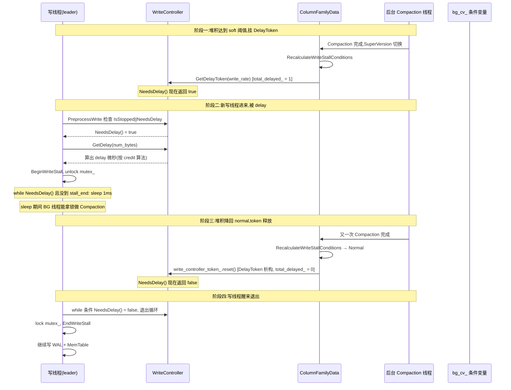

# 第 5 篇 · 第 17 章 · Write Stall 与 Write Delay

> **核心问题**:第 4 篇把三种 Compaction 策略拆完,写路径的"收敛段"收了尾。可写路径还有最后一道关卡没讲——**写得太快怎么办**?MemTable 攒满的速度超过 Flush 速度、L0 文件数超过 Compaction 的处理能力、pending compaction bytes 堆成山,这三处任何一处堆积都会把系统"淹死":要么 OOM(MemTable 把内存吃光),要么写延迟雪崩(L0 文件太多拖慢读、进而把整个写路径拖死),要么 Compaction 永远追不上 L0 越堆越多。RocksDB 怎么反压?答案是 **WriteController 的 stall / delay 两档**——先 delay(把写速率拖慢)给后台 Compaction 喘息,再 stall(直接阻塞写)硬性刹车。各档阈值怎么定?为什么是两档而不是直接 stall?那个把写速率压到目标的 token 算法凭什么能平滑限速而不是抖动?这章把 WriteController 拆到源码级。

> **读完本章你会明白**:
> 1. 为什么"不反压"会撞墙——MemTable 吃光内存 OOM、L0 越堆越多 Compaction 永远追不上、pending bytes 拖死前台写延迟,这三处任何一处失控都是灾难。
> 2. RocksDB 的 WriteController 用的是**三档 token 反压**(Stop / Delay / CompactionPressure),不是一档:六个 trigger(L0 文件数、memtable 数、pending compaction bytes,各分 soft/hard)分别决定进哪一档。
> 3. ★**delay 和 stall 的真实区别**:delay 是写线程**主动 sleep 摊薄速率**(还能写,只是慢),stall 是写线程**阻塞在条件变量上等 Compaction 追上**(一个都不让写)。讲清为什么必须两档而不是一档——直接 stall 会让所有写线程同时阻塞,恢复后写洪峰雪崩。
> 4. ★**credit token 算法**凭什么把写速率平滑压到目标值(而不是抖动),以及 `SetupDelay` 的自适应速率调整(Compaction debt 在涨就再压 0.8 倍、在降就放 1.25 倍、临近 stop 就猛压到 0.6 倍)为什么 sound。

> **如果一读觉得太难**:先只记住三件事——① 三个堆积维度(L0 文件数、memtable 数、pending compaction bytes)各分 soft/hard 两档阈值,soft 触发 delay(拖慢但还写),hard 触发 stall(直接阻塞等 Compaction);② delay 靠的是"先攒字节信用再花,花超了就算出要 sleep 多少微秒",这个 token 算法把写速率平滑压到 `delayed_write_rate`;③ 为什么不直接 stall?因为直接 stall 会让积压的写线程在恢复瞬间一起涌入,延迟雪崩——delay 先温和拖慢、尽量不进 stall。

---

## 〇、一句话点破

> **LSM 的根本症结是"写在前台飞,归并(MemTable Flush + Compaction)在后台追"——一旦前台飞得比后台追得快,系统就被自己的积压淹死。RocksDB 的 WriteController 用三档 token 给前台写装了三重刹车:第一重 CompactionPressure(没到阈值但快了,加派后台线程),第二重 Delay(到 soft 阈值,把写速率拖到 `delayed_write_rate`),第三重 Stop(到 hard 阈值,直接阻塞写直到后台追上)。三档从松到紧层层设防,核心是"宁愿温和拖慢也别让前台写停摆,因为停摆后的恢复就是下一场雪崩"。**

这是结论,不是理由。本章倒过来拆:先讲不反压撞什么墙,再讲三档 token 各自管什么,然后讲 delay 和 stall 在源码里怎么实现,接着拆最硬核的 credit token 算法和自适应速率调整,最后讲 LevelDB 在这里是怎么写死的、RocksDB 打开成了什么旋钮。

---

## 一、不反压会撞什么墙:LSM 的"自我淹死"病

讲 WriteController 之前,先把"它要解决什么问题"讲到骨头里。这个问题只有一句话:**LSM 的写在前台飞,归并在后台追,前台飞得比后台追得快,系统就把自己淹死。**

### 三处堆积,三处淹死

回忆第 1 篇(写路径)和第 4 篇(Compaction)讲过的:一次 `Put` 进了 WriteBatch,被 WriteGroup 攒批,写进 WAL,同时写进 active MemTable(InlineSkipList)。MemTable 攒够了(`write_buffer_size` 默认 64MB),转成 Immutable MemTable,后台 Flush 线程把它落盘成 L0 SST 文件。L0 文件攒够了(`level0_file_num_compaction_trigger` 默认 4 个),后台 Compaction 把 L0 合并到 L1,层层下压。

这条链路上**有三处堆积**,每一处失控都是灾难:

**堆积一:MemTable 吃光内存(OOM)**。写速率太高、`write_buffer_size` 又设得大,几个 MemTable 同时在内存里(active + immutable + 还没 Flush 完的 immutable 队列)。如果 `max_write_buffer_number` 没卡住,或者开了 `WriteBufferManager` 全局内存预算但没开 stall,内存吃光 → OOM → 进程被 kill。这是最直接的死法。

**堆积二:L0 文件越堆越多,Compaction 永远追不上**。Flush 速度 > L0→L1 Compaction 速度时,L0 文件越积越多。L0 文件之间是无序的(每个文件内部有序,但 L0 多个文件之间 key range 重叠),所以一次 `Get` 在 L0 要**逐个查每个文件**。L0 文件一多,读放大爆炸,Get 延迟从亚毫秒飙到几十毫秒,前台服务 SLO 报废。更糟的是,L0→L1 的 Compaction 要把所有 L0 文件和 L1 的重叠部分一起合并,L0 文件越多这个 Compaction 越重、越慢,**越慢 L0 就堆得越多,正反馈死循环**。

**堆积三:pending compaction bytes 堆成山**。Compaction 跟不上不止 L0 一处。L1→L2、L2→L3……任何一层 Compaction 速度 < 写入产生的新数据速度,这层的"待合并字节数"(RocksDB 叫 `estimated_compaction_needed_bytes`)就一路涨。这个数越大,意味着越多数据还停在旧版本没收敛,空间放大爆炸(磁盘被旧版本吃光),而且每拖一天,catch-up Compaction 越重、越不可能在合理时间内追上。

> **钉死这件事**:LSM 的写路径是一条"前台生产 + 后台消费"的流水线。前台 `Put` 是 O(1) 追加(MemTable 插一个 SkipList 节点),后台 Flush/Compaction 是 O(N) 重写(整个文件重做)。前台的 O(1) 永远比后台的 O(N) 快,所以**没有反压的 LSM 一定会把自己淹死**,区别只在什么时候淹、淹在哪个堆积维度。

### L0 堆积的"死亡螺旋":为什么这一处最危险

三个堆积维度里,**L0 文件堆积是最阴险的**,因为它会进入正反馈死循环。把这条链条单独拆透:

L0 文件越多 → 一次 Get 在 L0 要扫越多文件(读放大变大)→ Get 延迟变高。这还是读路径的代价。更要命的是 L0→L1 Compaction:**L0 文件之间 key range 重叠,所以 L0→L1 的 Compaction 必须把所有 L0 文件 + L1 的重叠部分一次性合并**。L0 文件越多,这次 Compaction 的输入越大、耗时越长。Compaction 越慢 → L0 文件继续堆积得越多 → 下一次 Compaction 更重 → 更慢……这是典型的正反馈:问题本身让问题恶化。

举个数字:假设 `level0_file_num_compaction_trigger=4`,L0→L1 一次 Compaction 输入 4 个文件共 256MB,耗时 5 秒。如果写速率让 L0 以每 2 秒一个文件的速度增长,那 Compaction 追不上(5 秒合 4 个,平均 1.25 秒一个的消化速度 < 2 秒一个的增长速度)。L0 文件数会一路涨:4 → 8 → 12 → 20(到 slowdown trigger)→ 36(到 stop trigger)。到 stop 时,一次 L0→L1 Compaction 要合并 36 个文件共 ~2.3GB,耗时可能 30 秒以上,这 30 秒里所有写阻塞。而即便 Compaction 完,L0 文件数也只是从 36 降到 ~32(因为前台还在堆),下一次 stop 几小时后又来。

> **钉死这件事**:L0 堆积的死亡螺旋是 RocksDB 调优最常见的痛点,几乎所有"RocksDB 写延迟突增"的线上事故,根因都是 L0 文件数失控。反压的价值就是**在死亡螺旋启动前把它截断**:L0 文件到 20 就 delay,把前台写拖慢到 Compaction 能消化的速度,让 L0 稳定在 20 附近不涨到 36。这是"宁可前台慢一点(进 delay),也别让 L0 进死亡螺旋(进 stop)"的权衡——delay 的代价(ms 级延迟)远小于 stop 的代价(秒级阻塞 + 恢复雪崩)。

### 一个朴素的反例:如果完全不反压会怎样

假设我们写一个"朴素 LSM"——只管往前台 Put,后台 Flush/Compaction 该追追,前台绝不等。跑一个 100MB/s 的写入 workload,Flush 速度只有 50MB/s。会发生什么?

- 前 1.3 秒:第一个 MemTable 攒到 64MB,转 Immutable,Flush 开始。但前台写不停,第二个 MemTable 同时涨。
- 第 2.6 秒:第二个 MemTable 也满了,转 Immutable 排队等 Flush。第一个 Immutable 还没 Flush 完。第三个 MemTable 开始涨。
- 第 4 秒:第一个 Immutable Flush 完,L0 出现 1 个文件。Compaction 发现 L0 文件数到了 `level0_file_num_compaction_trigger`(4),但此时 L0 只有 1 个,不触发。前台还在狂写,第四、五个 MemTable 排队……
- 第 30 秒:内存里积了十几个 Immutable MemTable(每个 64MB,共 ~1GB),`max_write_buffer_number` 如果不卡 → OOM。如果卡了(比如 `max_write_buffer_number=2`),那从第 2 个 Immutable 开始,新 Put 就得等 Flush,可 Flush 速度跟不上,前台 Put 全部阻塞 → 写延迟从 10μs 飙到秒级。
- 第 60 秒:L0 文件堆了 50 个,一次 Get 要扫 50 个文件,读延迟雪崩,前台 Put 因为要走 WriteGroup(也要读)被拖死。

这就是"不反压"的结局:**不是会不会淹死的问题,是多久淹死、淹死在哪个维度的问题**。所以任何生产级 LSM 都必须有反压,区别只在反压做得粗还是细。

> **不这样会怎样**:有人说"那我把后台 Compaction 线程开到很多、`max_background_jobs` 拉满,不就不堵了?"——可后台 Compaction 本身要吃磁盘带宽和 CPU,开太多会挤占前台 user 的 Get/Put 延迟(这正是下一章 P5-18 Rate Limiter 要解决的);而且即便后台开满,磁盘带宽是硬上限,前台写超过磁盘带宽 × 写放大系数,照样堵。**反压不是可选的,是 LSM 的必备保险**——RocksDB 的精妙在于把这个保险做得又细又平滑。

---

## 二、WriteController 的三档 token:从松到紧层层设防

RocksDB 的反压中枢是一个叫 `WriteController` 的对象(每个 DB 实例一个,见 [`db/write_controller.h`](../rocksdb/db/write_controller.h))。它本身不直接判断"现在该不该反压",那是 Column Family 的事(下一节讲);它只提供**三档反压动作**,由 Column Family 按堆积情况决定挂哪一档。

### 三档 token 的真实区别

这三档在源码里是三个 RAII token 类,都继承自 `WriteControllerToken`:

| Token | 计数器 | 反压动作 | 写线程感受 |
|---|---|---|---|
| `CompactionPressureToken` | `total_compaction_pressure_` | 把后台 Compaction 线程上限从 1 个放开到 `max_background_jobs` 算出来的值 | 写线程**完全无感**,只是后台变快了 |
| `DelayWriteToken` | `total_delayed_` | 写线程每个写要调 `GetDelay(bytes)`,返回要 sleep 多少微秒 | 写线程**变慢但还写**,延迟从 μs 飙到 ms 级 |
| `StopWriteToken` | `total_stopped_` | 写线程阻塞在 `bg_cv_` 条件变量上,直到 token 释放 | 写线程**完全停摆**,Put 延迟飙到秒级 |

这三档是**累加**的(三个独立的 `std::atomic<int>` 计数器),不是互斥的。`WriteController` 的三个查询函数把它们组合起来([`db/write_controller.h:53-57`](../rocksdb/db/write_controller.h#L53-L57)):

```cpp
bool IsStopped() const;
bool NeedsDelay() const { return total_delayed_.load() > 0; }
bool NeedSpeedupCompaction() const {
  return IsStopped() || NeedsDelay() || total_compaction_pressure_.load() > 0;
}
```

注意 `NeedSpeedupCompaction()` —— **只要任何一档 token 在,后台 Compaction 就该加速**。这句话在下一节 `GetBGJobLimits` 里会用到,是"前后台联动"的关键。

### 第一档:CompactionPressure —— 加派后台,前台无感

最轻的一档。当某个 CF 的 L0 文件数到了一个"还没到 delay 阈值、但快了"的中间点,或 pending compaction bytes 到了一个中间阈值,ColumnFamilyData 会给它挂一个 `CompactionPressureToken`([`db/column_family.cc:1163-1189`](../rocksdb/db/column_family.cc#L1163-L1189))。

这个 token 不让前台写慢哪怕一微秒,它只让 `NeedSpeedupCompaction()` 返回 true。这个返回值在 `MaybeScheduleFlushOrCompaction` 里被 `GetBGJobLimits` 用([`db/db_impl/db_impl_compaction_flush.cc:3345-3368`](../rocksdb/db/db_impl/db_impl_compaction_flush.cc#L3345-L3368)):

```cpp
BGJobLimits DBImpl::GetBGJobLimits(int max_background_flushes,
                                   int max_background_compactions,
                                   int max_background_jobs,
                                   bool parallelize_compactions) {
  BGJobLimits res;
  // ... 算出 res.max_compactions = max(1, max_background_jobs - max_flushes) ...
  if (!parallelize_compactions) {
    // throttle background compactions until we deem necessary
    res.max_compactions = 1;
  }
  return res;
}
```

读这段源码的关键在最后一行 `if (!parallelize_compactions)`:**只要没有 CompactionPressure(也没 delay/stop),后台并行 Compaction 上限就是 1**;一旦 `NeedSpeedupCompaction()` 返回 true,`parallelize_compactions` 变 true,后台 Compaction 并行度立刻放开到 `max_background_jobs - max_flushes`(默认 `max_background_jobs=2`,所以默认仍是 1,但用户把 `max_background_jobs` 调到 8 时,这里能放到 6)。

> **钉死这件事**:CompactionPressure 这一档的设计哲学是——**反压不一定要让前台慢,可以先让后台快**。在堆积还没到伤筋动骨的程度时,先给后台加派人手(放开并行 Compaction 上限),让后台更快地追上前台。这是最便宜的反压,因为前台用户完全感知不到。只有当加派人手还不够、堆积继续涨,才进 delay 让前台也慢下来。

### 第二档:Delay —— 拖慢写速率,credit token 平滑限速

堆积到了 soft 阈值(`level0_slowdown_writes_trigger` 默认 20 个 L0 文件,或 `soft_pending_compaction_bytes_limit` 默认 64GB,或 memtable 接近上限),CF 挂 `DelayWriteToken`。

这一档开始让前台写慢。但**不是粗暴地 sleep 一个固定时间**,而是用一套 credit(字节信用)token 算法把写速率**平滑压到 `delayed_write_rate`**(默认 16MB/s,见 [`include/rocksdb/options.h:1378`](../rocksdb/include/rocksdb/options.h#L1378) 的 `delayed_write_rate` 默认 0,0 时由 WriteController 构造函数用 `1024u * 1024u * 32u` = 32MB/s,见 [`db/write_controller.h:26`](../rocksdb/db/write_controller.h#L26))。这个算法是本章的硬核之一,下一节"技巧精解"专门拆。这里先记住结论:**delay 档让写线程每个写都调 `GetDelay(num_bytes)`,算出"按当前限速,这 num_bytes 字节该 sleep 多少微秒",然后 sleep**。

### 第三档:Stop —— 直接阻塞,等 Compaction 追上

堆积到了 hard 阈值(`level0_stop_writes_trigger` 默认 36 个 L0 文件,或 `hard_pending_compaction_bytes_limit` 默认 256GB,或 `max_write_buffer_number` 默认 2 个 memtable 全满),CF 挂 `StopWriteToken`。

这一档最狠:**写线程直接阻塞在 `bg_cv_` 条件变量上**,一个字节都不让写,直到 Compaction 把堆积压回阈值以下、token 被释放、`bg_cv_` 被唤醒。`DelayWrite` 函数里这段 while 循环就是 stop 的真身([`db/db_impl/db_impl_write.cc:2865-2885`](../rocksdb/db/db_impl/db_impl_write.cc#L2865-L2885)):

```cpp
while ((error_handler_.GetBGError().ok() ||
        error_handler_.IsRecoveryInProgress()) &&
       write_controller_.IsStopped() &&
       !shutting_down_.load(std::memory_order_relaxed)) {
  if (write_options.no_slowdown) {
    return Status::Incomplete("Write stall");
  }
  delayed = true;
  write_thread_.BeginWriteStall();
  bg_cv_.Wait();   // <--- 阻塞在这,直到 token 释放唤醒
  write_thread_.EndWriteStall();
}
```

注意中间那个 `no_slowdown` 检查——如果用户写时带了 `WriteOptions::no_slowdown = true`(比如某些内部任务不想被反压拖死),RocksDB 不会让它阻塞,而是**立刻返回 `Status::Incomplete("Write stall")`**,让调用方自己决定怎么办。这是 RocksDB 给特定场景留的逃生口。

> **钉死这件事**:三档从松到紧是 **CompactionPressure(让后台快) → Delay(让前台慢) → Stop(让前台停)**。这个顺序本身就是设计——**能用便宜的反压就别用贵的**:加派后台线程最便宜(前台无感),拖慢写速率次之(前台慢但还动),直接停写最贵(前台死)。RocksDB 宁愿让系统在 delay 档稳态运行很久,也不愿轻易进 stop——因为 stop 后的恢复是一场雪崩(下一节讲为什么)。

---

## 三、六个 trigger 怎么决策:ColumnFamilyData 的反压大脑

WriteController 只提供三档动作,真正决定"现在挂哪一档"的是每个 Column Family 自己——因为不同 CF 的堆积情况不同(`default` CF 可能 L0 堆满,`lock` CF 可能很闲),反压必须 per-CF 判断。这个判断的入口是 `ColumnFamilyData::RecalculateWriteStallConditions`,它每次 Compaction/Flush 完、SuperVersion 切换时都会被调用([`db/column_family.cc:717`](../rocksdb/db/column_family.cc#L717)、[1453](../rocksdb/db/column_family.cc#L1453))。

### 六个 trigger 的决策表

核心是 `GetWriteStallConditionAndCause` 这个纯函数([`db/column_family.cc:1007-1043`](../rocksdb/db/column_family.cc#L1007-L1043)),它按**优先级顺序**检查六个条件,先命中哪个就返回哪个:

```cpp
std::pair<WriteStallCondition, WriteStallCause>
ColumnFamilyData::GetWriteStallConditionAndCause(
    int num_unflushed_memtables, int num_l0_files,
    uint64_t num_compaction_needed_bytes,
    const MutableCFOptions& mutable_cf_options,
    const ImmutableCFOptions& immutable_cf_options) {
  if (num_unflushed_memtables >= mutable_cf_options.max_write_buffer_number) {
    return {WriteStallCondition::kStopped, WriteStallCause::kMemtableLimit};
  } else if (!mutable_cf_options.disable_auto_compactions &&
             num_l0_files >= mutable_cf_options.level0_stop_writes_trigger) {
    return {WriteStallCondition::kStopped, WriteStallCause::kL0FileCountLimit};
  } else if (!mutable_cf_options.disable_auto_compactions &&
             mutable_cf_options.hard_pending_compaction_bytes_limit > 0 &&
             num_compaction_needed_bytes >=
                 mutable_cf_options.hard_pending_compaction_bytes_limit) {
    return {WriteStallCondition::kStopped,
            WriteStallCause::kPendingCompactionBytes};
  } else if (mutable_cf_options.max_write_buffer_number > 3 &&
             num_unflushed_memtables >=
                 mutable_cf_options.max_write_buffer_number - 1 &&
             num_unflushed_memtables - 1 >=
                 immutable_cf_options.min_write_buffer_number_to_merge) {
    return {WriteStallCondition::kDelayed, WriteStallCause::kMemtableLimit};
  } else if (!mutable_cf_options.disable_auto_compactions &&
             mutable_cf_options.level0_slowdown_writes_trigger >= 0 &&
             num_l0_files >=
                 mutable_cf_options.level0_slowdown_writes_trigger) {
    return {WriteStallCondition::kDelayed, WriteStallCause::kL0FileCountLimit};
  } else if (!mutable_cf_options.disable_auto_compactions &&
             mutable_cf_options.soft_pending_compaction_bytes_limit > 0 &&
             num_compaction_needed_bytes >=
                 mutable_cf_options.soft_pending_compaction_bytes_limit) {
    return {WriteStallCondition::kDelayed,
            WriteStallCause::kPendingCompactionBytes};
  }
  return {WriteStallCondition::kNormal, WriteStallCause::kNone};
}
```

把这个函数的六个分支整理成一张表,就是 WriteController 的核心决策表:

| 优先级 | 堆积维度 | 阈值选项 | 默认值 | 触发档位 | Cause |
|---|---|---|---|---|---|
| 1(最高) | 未 Flush 的 memtable 数 | `max_write_buffer_number` | 2 | **Stop** | `kMemtableLimit` |
| 2 | L0 文件数 | `level0_stop_writes_trigger` | 36 | **Stop** | `kL0FileCountLimit` |
| 3 | pending compaction bytes | `hard_pending_compaction_bytes_limit` | 256GB | **Stop** | `kPendingCompactionBytes` |
| 4 | 接近上限的 memtable | `max_write_buffer_number > 3` 且 ≥ `max-1` | (需 >3) | **Delay** | `kMemtableLimit` |
| 5 | L0 文件数 | `level0_slowdown_writes_trigger` | 20 | **Delay** | `kL0FileCountLimit` |
| 6 | pending compaction bytes | `soft_pending_compaction_bytes_limit` | 64GB | **Delay** | `kPendingCompactionBytes` |

> **钉死这件事**:这张表有四个细节必须看清——① **Stop 优先级高于 Delay**:同一个维度(比如 L0 文件数)同时满足 stop 和 delay 条件时,因为 stop 分支在前,先命中 stop。② **memtable 的 delay 条件要求 `max_write_buffer_number > 3`**:默认 `max_write_buffer_number=2`,根本走不进 delay 分支,直接从 normal 跳到 stop——这是 RocksDB 的默认值不期望 memtable 堆积的体现,真要 memtable 走 delay,得把 `max_write_buffer_number` 调到 ≥4。③ **L0 和 pending bytes 的 stop/delay 分支都要求 `!disable_auto_compactions`**:如果用户手动关了 auto compaction,RocksDB 认为你自己管,这两个反压都不触发(但 memtable 的反压不受影响,因为 memtable 满了会 OOM,必须反压)。④ **soft/hard pending bytes 限 0 表示禁用**:`soft_pending_compaction_bytes_limit = 0` 时这个维度完全不工作。

### `RecalculateWriteStallConditions` 怎么把决策变成 token

`GetWriteStallConditionAndCause` 只返回"应该是什么状态",真正发 token 的是 `RecalculateWriteStallConditions`([`db/column_family.cc:1045-1217`](../rocksdb/db/column_family.cc#L1045-L1217))。它拿这个返回值,结合上一次的状态(`was_stopped`、`needed_delay`),决定 token 的**生命周期**:

- 进 Stop 状态 → `write_controller_token_ = write_controller->GetStopToken()`(token 是 `unique_ptr`,赋新值时旧的自动析构,计数器自动减)。
- 进 Delay 状态 → `write_controller_token_ = SetupDelay(...)`(SetupDelay 内部算出本次的 `write_rate`,再 `GetDelayToken(write_rate)`)。
- 进 Normal 状态 → 看是否需要挂 CompactionPressureToken(L0 文件数到了 `GetL0FileCountForCompactionSpeedup` 的阈值,或 pending bytes 到了 speedup 阈值);都不满足就 `write_controller_token_.reset()` 彻底释放。

token 用 RAII 管理是这套反压能"自动收尾"的关键——Compaction 把 L0 文件数压到阈值以下,下一次 `RecalculateWriteStallConditions` 被调用,状态变 Normal,旧的 StopWriteToken 的 `unique_ptr` 被赋新值(或 reset),析构函数里 `--controller_->total_stopped_`,计数器归 0,`IsStopped()` 返回 false,阻塞在 `bg_cv_` 的写线程被唤醒(下一节讲怎么唤醒)。**整套反压的"开"和"关"都是自动的,不需要显式 cancel**。

> **不这样会怎样**:如果不用 RAII token,而是用一个布尔标志位"现在该不该 stall",那忘记清零就是死锁、忘记置位就是 OOM。RAII token + 原子计数器让"谁触发谁负责释放"这件事在编译期就被管住——CF 重新计算状态时,旧 token 析构、新 token 构造,中间没有任何窗口能让计数器错乱。这是 C++ RAII 在并发控制里的经典用法。

### `bg_cv_` 唤醒链:Stop token 释放后写线程怎么醒来

Stop 状态下写线程阻塞在 `bg_cv_.Wait()`(见上一节那段 while 循环)。谁来唤醒它?答案是后台 Compaction/Flush 线程——它们完成一个任务后,会调用 `MaybeScheduleFlushOrCompaction`,这个函数的末尾会 `bg_cv_.signal_all()`(具体在 `BGWorkCompaction` 完成回调里)。但在那之前,更重要的是:后台任务完成 → SuperVersion 切换 → `RecalculateWriteStallConditions` 被调用 → 若堆积已降回 normal → Stop token 释放(`total_stopped_` 减到 0)→ `IsStopped()` 返回 false → 下一次 `bg_cv_` 被 signal 时,阻塞的写线程从 `Wait()` 醒来,重新检查 `while` 条件,条件不满足,退出循环,继续写。

所以整个唤醒链是:**后台 Compaction 追上 → 状态重算 → token 释放 → bg_cv signal → 写线程醒来**。这是一条靠条件变量串起来的异步链,任何一环出错(比如忘了 signal)就是死锁。RocksDB 在每个 BGWork 完成处都确保 `bg_cv_.signal()`,保证这条链不断。

---

## 四、Delay 的真身:PreprocessWrite → DelayWrite 的调用链

前面讲了三档 token 的决策,但还有个问题没回答:**写线程是在哪一行代码碰到 token、决定要 sleep 或阻塞的?** 答案在写路径的入口 `WriteImpl` → `PreprocessWrite`。

### PreprocessWrite:写前的反压检查站

每一次 WriteGroup 形成之前(leader 还没真正写 WAL),都会调 `PreprocessWrite`([`db/db_impl/db_impl_write.cc:2101`](../rocksdb/db/db_impl/db_impl_write.cc#L2101))。这个函数是写路径的"安检站",按顺序检查一堆"写之前要先处理的事":背景错误、WAL 太大要 switch、`WriteBufferManager::ShouldFlush`、flush scheduler 非空、trim history……最后两步是和反压直接相关的([`db/db_impl/db_impl_write.cc:2154-2183`](../rocksdb/db/db_impl/db_impl_write.cc#L2154-L2183)):

```cpp
if (UNLIKELY(status.ok() && (write_controller_.IsStopped() ||
                             write_controller_.NeedsDelay()))) {
  PERF_TIMER_STOP(write_pre_and_post_process_time);
  PERF_TIMER_FOR_WAIT_GUARD(write_delay_time);
  InstrumentedMutexLock l(&mutex_);
  status = DelayWrite(last_batch_group_size_, write_thread_, write_options);
  PERF_TIMER_START(write_pre_and_post_process_time);
}

// WriteBufferManager 的 stall(hard limit)
if (UNLIKELY(status.ok() && write_buffer_manager_->ShouldStall())) {
  default_cf_internal_stats_->AddDBStats(
      InternalStats::kIntStatsWriteBufferManagerLimitStopsCounts, 1, true);
  if (write_options.no_slowdown) {
    status = Status::Incomplete("Write stall");
  } else {
    InstrumentedMutexLock l(&mutex_);
    WriteBufferManagerStallWrites();
  }
}
```

注意 `IsStopped() || NeedsDelay()` 都进 `DelayWrite` —— **delay 和 stop 在入口处是合并的**,都由 `DelayWrite` 处理,区别在 `DelayWrite` 内部走哪个分支。

### DelayWrite:delay 走 sleep 循环,stop 走条件变量

`DelayWrite`([`db/db_impl/db_impl_write.cc:2813-2913`](../rocksdb/db/db_impl/db_impl_write.cc#L2813-L2913))分两段,正好对应 delay 和 stop 两档。先看 delay 段:

```cpp
Status DBImpl::DelayWrite(uint64_t num_bytes, WriteThread& write_thread,
                          const WriteOptions& write_options) {
  mutex_.AssertHeld();
  uint64_t start_time = 0;
  bool delayed = false;
  {
    uint64_t delay;
    if (&write_thread == &write_thread_) {
      delay =
          write_controller_.GetDelay(immutable_db_options_.clock, num_bytes);
    } else {
      assert(num_bytes == 0);
      delay = 0;
    }
    TEST_SYNC_POINT("DBImpl::DelayWrite:Start");
    start_time = immutable_db_options_.clock->NowMicros();

    if (delay > 0) {
      if (write_options.no_slowdown) {
        return Status::Incomplete("Write stall");
      }
      TEST_SYNC_POINT("DBImpl::DelayWrite:Sleep");

      write_thread.BeginWriteStall();
      mutex_.Unlock();
      const uint64_t kDelayInterval = 1001;
      uint64_t stall_end = start_time + delay;
      while (write_controller_.NeedsDelay()) {
        if (immutable_db_options_.clock->NowMicros() >= stall_end) {
          break;
        }
        delayed = true;
        immutable_db_options_.clock->SleepForMicroseconds(kDelayInterval);
      }
      mutex_.Lock();
      write_thread.EndWriteStall();
    }
    // ... 接 stop 段 ...
```

这段代码有几个精妙之处,逐个拆:

**① `GetDelay` 只在主写队列上算**。`if (&write_thread == &write_thread_)` 这个判断——只有默认的 `write_thread_`(写 MemTable 的主队列)才真正算 delay 并 sleep;另一个 `nonmem_write_thread_`(写 WAL 但不写 MemTable 的队列,用于 two_write_queues 模式)直接 `delay = 0`。理由是:delay 反压的是"写进 MemTable 的速率",不写 MemTable 的队列不该被反压。注释里那句 `// To avoid parallel timed delays (bad throttling), only support them on the primary write queue.` 说的就是这个。

**② sleep 是分段的,每 1ms 检查一次**。不是一次性 `SleepForMicroseconds(delay)`,而是 `while (NeedsDelay()) { if (NowMicros() >= stall_end) break; SleepForMicroseconds(1001); }`。为什么?两个理由:① 如果中途 token 被释放(`NeedsDelay()` 变 false),能立刻退出,不白睡;② `kDelayInterval = 1001` 而不是 1000,注释说"slightly longer because WriteController minimum delay is 1ms, in case of sleep imprecision, rounding, etc."——避开 sleep 精度抖动。

**③ `BeginWriteStall` / `EndWriteStall` 的作用**。sleep 期间要释放 `mutex_`(否则后台线程拿不到锁,没法做 Compaction 追上),但释放 mutex 期间如果有新的写线程进来,不能让它们以为现在可以写了。`BeginWriteStall` 是给 WriteThread 设个 barrier,把后续想 join 写组的写线程挡住;`EndWriteStall` 解除 barrier。这样 sleep 期间既不持锁,也不会有新写漏网。

**④ `no_slowdown` 又一次出现**。delay 档如果用户标了 `no_slowdown`,也是立刻返回 `Incomplete`,不 sleep。和 stop 档一致。

再看 stop 段(紧接在 delay 段后面):

```cpp
    while ((error_handler_.GetBGError().ok() ||
            error_handler_.IsRecoveryInProgress()) &&
           write_controller_.IsStopped() &&
           !shutting_down_.load(std::memory_order_relaxed)) {
      if (write_options.no_slowdown) {
        return Status::Incomplete("Write stall");
      }
      delayed = true;
      write_thread_.BeginWriteStall();
      bg_cv_.Wait();
      write_thread_.EndWriteStall();
    }
```

这就是真正的 stop:阻塞在 `bg_cv_.Wait()`,直到 `IsStopped()` 变 false(token 释放)或后台出错或关库。注意 `bg_cv_` 是后台线程完成时会 signal 的条件变量,所以一旦 Compaction 追上、token 释放、signal 到来,这里就醒来重新检查 while 条件,退出后继续写。

### 时序图:一次 delay 的完整生命周期

把上面这些串起来,一次 delay 触发到解除的完整时序:



> **钉死这件事**:delay 和 stop 在**入口(PreprocessWrite)合并、在 DelayWrite 内部分流**——delay 走分段 sleep 循环(stop watch 是时间),stop 走条件变量阻塞(stop watch 是 token 释放)。这个分流是必须的:delay 是"我还能写,只是慢一点",所以用时间控制;stop 是"我一个都不能写",所以用条件变量等事件。两者不能混——delay 如果用条件变量,那 sleep 期间 token 释放了还得等 signal,平白多一次上下文切换;stop 如果用 sleep,那得反复轮询 `IsStopped()`,白费 CPU。

---

## 五、技巧精解:credit token 平滑限速 + 自适应速率调整

这一节是本章的硬核。前面讲了 delay 用 `GetDelay` 算 sleep 时间,但 `GetDelay` 内部到底怎么把写速率平滑压到 `delayed_write_rate`?为什么这套算法不会抖动?`SetupDelay` 的四个比例常数(0.6/0.8/1.25/1.4)各自在什么时候用、为什么这么设?这两个问题不讲透,等于没讲 WriteController。

### 技巧一:credit token 算法 —— 凭什么平滑限速

`GetDelay` 的完整源码([`db/write_controller.cc:51-100`](../rocksdb/db/write_controller.cc#L51-L100)):

```cpp
uint64_t WriteController::GetDelay(SystemClock* clock, uint64_t num_bytes) {
  if (total_stopped_.load(std::memory_order_relaxed) > 0) {
    return 0;
  }
  if (total_delayed_.load(std::memory_order_relaxed) == 0) {
    return 0;
  }

  if (credit_in_bytes_ >= num_bytes) {
    credit_in_bytes_ -= num_bytes;
    return 0;
  }
  auto time_now = NowMicrosMonotonic(clock);

  const uint64_t kMicrosPerSecond = 1000000;
  const uint64_t kMicrosPerRefill = 1000;   // 每 1ms 补一次信用

  if (next_refill_time_ == 0) {
    next_refill_time_ = time_now;
  }
  if (next_refill_time_ <= time_now) {
    uint64_t elapsed = time_now - next_refill_time_ + kMicrosPerRefill;
    credit_in_bytes_ += static_cast<uint64_t>(
        1.0 * elapsed / kMicrosPerSecond * delayed_write_rate_ + 0.999999);
    next_refill_time_ = time_now + kMicrosPerRefill;

    if (credit_in_bytes_ >= num_bytes) {
      credit_in_bytes_ -= num_bytes;
      return 0;
    }
  }

  assert(num_bytes > credit_in_bytes_);
  uint64_t bytes_over_budget = num_bytes - credit_in_bytes_;
  uint64_t needed_delay = static_cast<uint64_t>(
      1.0 * bytes_over_budget / delayed_write_rate_ * kMicrosPerSecond);

  credit_in_bytes_ = 0;
  next_refill_time_ += needed_delay;

  return std::max(next_refill_time_ - time_now, kMicrosPerRefill);
}
```

这套算法的核心思想是**信用(token bucket 的变体)**:

- 系统维护一个"字节信用"`credit_in_bytes_`,每 1ms 按速率补一次(`credit += elapsed_seconds * delayed_write_rate_`)。
- 每次写进来要花 `num_bytes` 字节:① 信用够 → 扣掉,不 sleep,立刻写;② 信用不够 → 算出"超预算的字节 = num_bytes - credit",再算"这些字节按速率需要多少微秒 = bytes_over_budget / delayed_write_rate_ * 1e6",sleep 这么久。

这听起来简单,但有四个细节决定了它能**平滑**限速而不是抖动:

**细节一:信用可以攒**。如果一段时间没写(`credit_in_bytes_` 攒着),下次写大 batch 时可以一次性花掉攒的信用,不 sleep。这模拟了"令牌桶"的 burst 特性——短期突发可以超过平均速率,但长期平均被压在 `delayed_write_rate`。这正是我们想要的:不要每个小写都 sleep(那会抖动),让写自己攒批、攒够信用一次性放行。

**细节二:补信用时那个 `+ 0.999999`**。看这行 `credit_in_bytes_ += static_cast<uint64_t>(1.0 * elapsed / kMicrosPerSecond * delayed_write_rate_ + 0.999999);`——`+ 0.999999` 再转 uint64_t 等于向上取整。为什么?因为 1ms 补的信用可能不到 1 字节(比如 `delayed_write_rate = 16KB/s`,1ms 补 16 字节,但如果速率更低、或 elapsed 算下来很小,可能补 0 字节),向上取整保证至少补 1 字节,避免信用永远涨不起来、每个写都 sleep 的死循环。

**细节三:`next_refill_time_ += needed_delay`(不是 `= time_now + needed_delay`)**。sleep 之后,下次补信用的时间点是"原计划的下次补信用时间 + 这次 sleep 的时长",而不是"当前时间 + sleep 时长"。这保证了速率计算的基准连贯——不会因为一次 sleep 把后续的补信用节奏打乱。

**细节四:`return std::max(next_refill_time_ - time_now, kMicrosPerRefill)`**。最少 sleep 1ms。为什么?注释写得很清楚:`// Minimum delay of refill interval, to reduce DB mutex contention.`——如果算出来只要 sleep 0.1ms,那写线程会高频地 unlock/lock mutex(因为 sleep 期间要释放锁),mutex 争用爆炸。强制最少 1ms,把 mutex 争用频率压到 1kHz 以下。

> **不这样会怎样**:对比一个"朴素限速"——每个写都 `sleep(num_bytes / rate)`,不管信用。这套朴素算法的问题是**抖动**:小写 sleep 很短(频繁 unlock/lock mutex)、大写 sleep 很长(单个写延迟爆炸),而且没有 burst 容量,稳态速率也压不准(因为 sleep 本身有精度误差,累积起来偏差大)。RocksDB 的信用算法用"攒-花"模型解决了抖动,用"最少 1ms"解决了 mutex 争用,用"`+= needed_delay`"保证了速率基准连贯——**这三招合起来,才能在持有 DB mutex 的前提下做到平滑限速**。注释里那句 `// This is inside DB mutex, so we can't sleep and need to minimize frequency to get time.` 提醒了这套算法的硬约束:它在 mutex 内运行,必须极度克制时间查询和 sleep 频率。

### 走一遍数字:credit 算法到底怎么把速率压到 16MB/s

光讲算法不直观,走一遍真实数字。设 `delayed_write_rate = 16MB/s = 16777216 B/s`,一个写 batch 大小 `num_bytes = 4KB = 4096 B`。每 1ms 理论补信用 `16777216 / 1000 ≈ 16777 B`。

**第 1 次写(刚进 delay,`credit_in_bytes_ = 0`,`next_refill_time_ = 0`)**:

1. 进 `GetDelay`:`total_stopped_=0`、`total_delayed_>0`,继续。
2. `credit_in_bytes_(0) < num_bytes(4096)`,不直接放行。
3. `next_refill_time_(0) == 0` → 设 `next_refill_time_ = time_now`。
4. `next_refill_time_(time_now) <= time_now` → 进 refill 分支:`elapsed = time_now - time_now + 1000 = 1000` 微秒;`credit += 1000/1e6 * 16777216 + 0.999999 ≈ 16777 + 1 = 16778`。`next_refill_time_ = time_now + 1000`。
5. 检查 `credit(16778) >= num_bytes(4096)`?是 → 扣 `credit_in_bytes_ = 16778 - 4096 = 12682`,**return 0,不 sleep**。

第 1 次写不 sleep,因为刚 refill 了 1ms 的信用(16778 B)够花。

**第 2 次写(假设紧跟着,`time_now` 几乎没变,`credit_in_bytes_ = 12682`)**:

1. `credit(12682) >= num_bytes(4096)`?是 → 扣 `credit_in_bytes_ = 12682 - 4096 = 8586`,**return 0,不 sleep**。

第 2 次写也不 sleep,因为攒的信用还够。

**第 3 次写(`credit_in_bytes_ = 8586`)**:

1. `credit(8586) >= num_bytes(4096)`?是 → 扣 `credit_in_bytes_ = 8586 - 4096 = 4490`,**return 0**。

**第 4 次写(`credit_in_bytes_ = 4490`,`time_now` 还是几乎没变,因为前面几次写都在 μs 级)**:

1. `credit(4490) >= num_bytes(4096)`?是 → 扣 `credit_in_bytes_ = 4490 - 4096 = 394`,**return 0**。

第 4 次写勉强够,信用花到只剩 394 B。

**第 5 次写(`credit_in_bytes_ = 394`,`time_now` 假设前进了 0.5ms,还没到 `next_refill_time_ = time_now0 + 1000`)**:

1. `credit(394) < num_bytes(4096)`,不直接放行。
2. `next_refill_time_(time_now0+1000) > time_now(time_now0+500)` → **不进 refill 分支**(还没到补信用时间)。
3. `bytes_over_budget = 4096 - 394 = 3702`;`needed_delay = 3702 / 16777216 * 1e6 ≈ 220` 微秒。
4. `credit_in_bytes_ = 0`;`next_refill_time_ += 220` → `= time_now0 + 1220`。
5. `return max(next_refill_time_ - time_now, 1000) = max(720, 1000) = 1000` 微秒。**sleep 1ms**。

第 5 次写 sleep 1ms(虽然算出来只要 220μs,但最少 1ms)。这 1ms 后,`time_now` 前进到 `time_now0+1500`,`next_refill_time_` 是 `time_now0+1220`,下一次写进来时 refill 分支会补信用。

把前 5 次写合起来看:**4 次写花了 ~16KB(4×4096),第 5 次被卡了 1ms**。这就是"攒 4 次 burst,第 5 次卡一下"的节奏。长期看,每 ms 写 ~16KB(正好是 16MB/s ÷ 1000),写速率被平滑压到了目标值。而且每次 sleep 至少 1ms,mutex 争用频率被压在 1kHz 以下。

> **钉死这件事**:这套算法的精髓是**"允许短期 burst,长期平均被压住"**——前 4 次写连着放行(攒的信用够),第 5 次卡 1ms。这模拟了令牌桶的 burst 特性,比"每个写都 sleep 一点点"平滑得多。如果换成纯速率限速(每个写 sleep num_bytes/rate),前 4 次每个 sleep 244μs(4096/16777216×1e6),4 次 mutex unlock/lock 共 ~1ms 的争用开销,加上 sleep 精度抖动,实际速率会显著偏离 16MB/s。RocksDB 用信用 + 最少 1ms 把这个偏离压到最小。

### 技巧二:自适应速率调整 —— `SetupDelay` 的四个比例常数

`delayed_write_rate` 不是定死的,它在 delay 状态下会被 `SetupDelay`([`db/column_family.cc:870-931`](../rocksdb/db/column_family.cc#L870-L931))动态调整。四个比例常数([`db/column_family.cc:863-866`](../rocksdb/db/column_family.cc#L863-L866)):

```cpp
const double kIncSlowdownRatio = 0.8;          // Compaction debt 没降,再压到 0.8
const double kDecSlowdownRatio = 1 / kIncSlowdownRatio;  // = 1.25, debt 降了,放到 1.25
const double kNearStopSlowdownRatio = 0.6;     // 临近 stop 或刚出 stop,猛压到 0.6
const double kDelayRecoverSlowdownRatio = 1.4; // 从 delay 恢复到 normal,奖励放到 1.4
```

这四个常数在 `SetupDelay` 里的用法是**一套反馈控制**——每次 `RecalculateWriteStallConditions` 进 delay 分支,都根据"Compaction debt(待合并字节)比上次是涨了还是降了",调整下一次的 `write_rate`:

```cpp
std::unique_ptr<WriteControllerToken> SetupDelay(
    WriteController* write_controller, uint64_t compaction_needed_bytes,
    uint64_t prev_compaction_need_bytes, bool penalize_stop,
    bool auto_compactions_disabled) {
  const uint64_t kMinWriteRate = 16 * 1024u;  // 最低 16KB/s

  uint64_t max_write_rate = write_controller->max_delayed_write_rate();
  uint64_t write_rate = write_controller->delayed_write_rate();

  if (auto_compactions_disabled) {
    write_rate = max_write_rate;   // 用户关了 auto compaction,用用户给的最大值
  } else if (write_controller->NeedsDelay() && max_write_rate > kMinWriteRate) {
    if (penalize_stop) {
      // 临近 stop 或刚出 stop:猛压
      write_rate = static_cast<uint64_t>(static_cast<double>(write_rate) *
                                         kNearStopSlowdownRatio);
      if (write_rate < kMinWriteRate) write_rate = kMinWriteRate;
    } else if (prev_compaction_need_bytes > 0 &&
               prev_compaction_need_bytes <= compaction_needed_bytes) {
      // debt 没降(甚至涨了):继续压
      write_rate = static_cast<uint64_t>(static_cast<double>(write_rate) *
                                         kIncSlowdownRatio);
      if (write_rate < kMinWriteRate) write_rate = kMinWriteRate;
    } else if (prev_compaction_need_bytes > compaction_needed_bytes) {
      // debt 降了:放一点速
      write_rate = static_cast<uint64_t>(static_cast<double>(write_rate) *
                                         kDecSlowdownRatio);
      if (write_rate > max_write_rate) write_rate = max_write_rate;
    }
  }
  return write_controller->GetDelayToken(write_rate);
}
```

这套调整的逻辑是**"看后台追得怎么样,动态调前台刹车力度"**:

- **debt 没降**(Compaction 追不上)→ 前台再压 0.8 倍,让前台更慢,给后台更多喘息。
- **debt 降了**(Compaction 追上了)→ 前台放 1.25 倍,允许前台写快一点,因为后台处理得过来。
- **临近 stop 或刚出 stop**(`penalize_stop = true`)→ 猛压 0.6 倍。这个最关键:① 临近 stop(L0 文件数离 `level0_stop_writes_trigger` 只差 2 个,或 pending bytes 离 hard limit 只差 1/4)时,再不猛压就要进 stop,而 stop 是灾难(下一节讲),所以宁可把 delay 速率压到很低也要避免进 stop;② 刚出 stop(`was_stopped = true`,上一次是 stop 状态,这次降到 delay)时,也用 0.6,因为"刚从 stop 出来"说明系统还在临界状态,不能立刻放太快,否则马上又进 stop 反复横跳。
- **从 delay 恢复到 normal**(在 `RecalculateWriteStallConditions` 的 normal 分支,[`db/column_family.cc:1202-1205`](../rocksdb/db/column_family.cc#L1202-L1205))→ 奖励 1.4 倍。注释解释:`// If the DB recovers from delay conditions, we reward with reducing double the slowdown ratio. This is to balance the long term slowdown increase signal.`——意思是 delay 期间每次最多压 0.8(压得慢),恢复时奖励 1.4(放得快),是为了**平衡长期信号**:别让系统在 delay 边界反复横跳(进 delay 压一点、出 delay 又被立刻压回,这种振荡对稳定吞吐不利)。

> **钉死这件事**:这套自适应速率调整的本质是**一个闭环反馈控制器**:前台写速率是控制变量,后台 Compaction debt 是被控变量,目标是让 debt 稳定下降而不进 stop。四个比例常数(0.6/0.8/1.25/1.4)不是随便拍的——**压制比(0.8)× 恢复比(1.25)≈ 1**(互为倒数,保证稳态不偏),**猛压比(0.6)× 恢复比(1.4)≈ 0.84**(猛压后恢复要慢一点,避免立刻反弹)。这套比例让系统在 delay 边界能稳定运行,而不是振荡。

> **不这样会怎样**:如果 delay 速率定死不变(比如永远是 16MB/s),会发生两种坏情况:① Compaction 严重跟不上时,16MB/s 还是太快,L0 继续堆,一路堆到 stop 阈值,进 stop,写线程全阻塞——这是"定太松";② Compaction 本来能跟上时,16MB/s 又太慢,前台无谓地被拖,吞吐损失——这是"定太紧"。定死的速率无法适应动态变化的 workload(写速率波动、Compaction 速度因磁盘负载波动),只有闭环反馈才能稳态跟踪。RocksDB 这套自适应,是把控制论里最经典的"看误差调控制量"用在了 LSM 反压上。

### 为什么是两档(delay + stop)而不是一档直接 stall

这是本章标题里就埋的问题,这里正式回答。把上面所有内容合起来,答案是:**直接 stall 会让系统在"阻塞-恢复"边界剧烈振荡,延迟雪崩**。

想象一个"只有 stop 一档"的朴素方案:L0 文件到 36 就 stop,所有写线程阻塞;Compaction 把 L0 压到 35,stop 释放,所有积压的写线程**瞬间涌入**,L0 文件数秒级回到 36,又 stop……系统在 stop / not-stop 之间高频振荡,前台 Put 延迟在"秒级(阻塞)"和"瞬间涌入的毛刺"之间来回跳,SLO 报废。

两档方案怎么避免这个振荡?**delay 档是"缓冲带"**:L0 到 20(soft)就进 delay,前台被拖慢,但还在写;Compaction 在 delay 给的喘息时间里慢慢追;如果追上了(debt 降),delay 速率自适应放快,系统稳态运行在 delay 边界,不进 stop;如果追不上(L0 继续涨到 36 hard),才进 stop 硬刹车。绝大多数反压场景都在 delay 档稳态解决,stop 是兜底保险,极少触发。

> **钉死这件事**:**delay 档存在的意义,就是给系统一个"温和减速带",让反压尽量不进 stop**。stop 是 binary 的(要么全写要么全停),延迟特性极差(全停时 Put 延迟秒级,恢复时又瞬间涌入毛刺);delay 是连续的(速率从 16MB/s 到 32MB/s 连续可调),延迟特性平滑(每个写 sleep 几毫秒,稳态吞吐稳定)。**两档反压的本质,是把"binary 的硬刹车"换成"连续的可调减速带",让反压这件事从"灾难性停摆"变成"可管理的降速"**。这是 RocksDB WriteController 最核心的设计洞察。

### stop 恢复雪崩:为什么"刚出 stop"要用 0.6 猛压

上一节讲了"刚出 stop 要猛压到 0.6",这里把"为什么"讲透。stop 的恢复是一场潜在的雪崩,链条是:

stop 期间,前台所有写线程阻塞在 `bg_cv_`,但**应用层(调用 RocksDB 的服务)通常不会因为 RocksDB 阻塞就停止接收请求**——它会继续把 Put 请求堆进自己的队列(或线程池)。stop 持续越久,应用层积压的 Put 请求越多。当 Compaction 终于把 L0 压回阈值以下,stop token 释放,`bg_cv_` 被 signal,所有阻塞的写线程**同时醒来**,加上应用层队列里积压的请求**瞬间涌入** RocksDB。这一瞬间的写洪峰可能数倍于稳态写速率,L0 文件数秒级飙升回 stop 阈值,又触发 stop……系统在"stop → 恢复 → 洪峰 → stop"之间振荡,每次振荡中间的"正常写"窗口很短,实际有效吞吐极低。

这就是为什么"刚出 stop"时 `SetupDelay` 用 `kNearStopSlowdownRatio = 0.6` 猛压:① 把 delay 速率压到很低(比如从 16MB/s 压到 9.6MB/s),让洪峰被 delay 档兜住,不至于立刻冲回 stop;② 给应用层的积压请求一个"慢慢放"的泄洪道,而不是"瞬间开闸"。等积压消化的差不多、debt 持续下降,`SetupDelay` 才会切到 1.25 一档一档放速率,最终恢复到 normal。

> **钉死这件事**:**stop 不可怕,stop 后的恢复雪崩才可怕**。RocksDB 的整套两档设计,核心目标不是"避免 stop"(有些极端 workload 必然进 stop),而是"让进 stop 的频率最低、让每次 stop 后的恢复可控"。`kNearStopSlowdownRatio = 0.6` 就是恢复可控的关键一手——它在"刚出 stop"的临界时刻主动减速,把潜在的雪崩化解在 delay 档。这是控制论里"反振荡"的经典手法:在系统最容易振荡的边界(这里是 stop→delay 的过渡)主动加大阻尼。

---

## 六、WriteBufferManager 的反压:跨 DB 的内存总闸

前面讲的六 trigger 都是 per-CF、per-DB 的。但工业场景常有一个进程开多个 DB 实例(TiKV 一个 store 里多个 RocksDB,或一个 RocksDB 多个 CF),每个 DB 各管各的 MemTable 内存,加起来可能 OOM。这时候需要一个**跨 DB 的总内存闸**——这就是 `WriteBufferManager`(承 P1-04 的全局内存预算,这里只讲它的 stall 部分)。

### ShouldFlush vs ShouldStall:soft vs hard

`WriteBufferManager` 有两个触发函数([`include/rocksdb/write_buffer_manager.h:101-142`](../rocksdb/include/rocksdb/write_buffer_manager.h#L101-L142)):

```cpp
bool ShouldFlush() const {
  if (enabled()) {
    if (mutable_memtable_memory_usage() >
        mutable_limit_.load(std::memory_order_relaxed)) {   // mutable_limit = buffer_size * 7/8
      return true;
    }
    size_t local_size = buffer_size();
    if (memory_usage() >= local_size &&
        mutable_memtable_memory_usage() >= local_size / 2) {
      return true;
    }
  }
  return false;
}

bool ShouldStall() const {
  if (!allow_stall_.load(std::memory_order_relaxed) || !enabled()) {
    return false;
  }
  return IsStallActive() || IsStallThresholdExceeded();
}

bool IsStallThresholdExceeded() const {
  return memory_usage() >= buffer_size_;
}
```

这两个函数的分工:

- **`ShouldFlush`(soft)**:总 MemTable 内存用了超过 `buffer_size * 7/8`,或超过 `buffer_size` 且 active 部分超过一半 → 触发一次**额外的 Flush**(在 `PreprocessWrite` 里调 `HandleWriteBufferManagerFlush`,挑最老的 CF 的 MemTable 转 Immutable)。这是"用 Flush 释放内存"的反压,不让写停。
- **`ShouldStall`(hard)**:总内存超过 `buffer_size` → **所有写线程阻塞**,直到内存降下来。但有个前提:`allow_stall_` 必须为 true(构造 WriteBufferManager 时显式开,默认 false!)。默认不开 stall,只 Flush。

> **不这样会怎样**:为什么 stall 默认关?因为 stall 是"全停",代价大。RocksDB 默认策略是"先用 Flush 兜底"——内存超了就多 Flush 一个 MemTable(把 active 转 Immutable,Immutable 在 Flush 完前还占内存,但至少 active 那份可以被新 MemTable 替代,稳态下内存能降)。只有用户显式 `allow_stall = true`(说明他宁可写停也要保内存不 OOM),才启用 stall。这个默认值的设计哲学是:**反压优先选便宜的(Flush),贵的(Stall)让用户显式 opt-in**。和 WriteController 的"delay 优先于 stop"一脉相承。

### stall 的阻塞链:跨 DB 协调

WriteBufferManager 的 stall 比单 DB 的 stop 复杂——因为它要**跨多个 DB 实例协调**:内存超限时,所有共享这个 WBM 的 DB 的写线程都要阻塞;内存降下来,所有 DB 的写线程都要唤醒。这套协调靠 `StallInterface` 接口 + 一个队列([`include/rocksdb/write_buffer_manager.h:154-160`](../rocksdb/include/rocksdb/write_buffer_manager.h#L154-L160)):

`WriteBufferManagerStallWrites`([`db/db_impl/db_impl_write.cc:2917-`](../rocksdb/db/db_impl/db_impl_write.cc#L2917))的真身是:① 调 `write_thread_.BeginWriteStall()` 挡住后续写线程;② 把自己这个 DB 注册到 WBM 的 stall 队列;③ 阻塞在 `WBMStallInterface::Block()` 上。Flush 完成后 `FreeMem` 被调,内存降下来,`MaybeEndWriteStall` 把队列里所有 DB 的 stall 接口 `Signal()` 一遍,所有 DB 的写线程醒来。

这条链让"一个 WBM 管 N 个 DB 的总内存"成为可能——TiKV 就是这么用的(default/lock/write 三个 CF 共享 WBM,或一个 TiKV store 里多个 Region 的 RocksDB 共享 WBM)。这是 P1-04 讲 WriteBufferManager 全局预算时埋的伏笔,这里正式收尾:**WBM 不光是个 内存计数器,它还能在超限时跨 DB 反压写线程**。

---

## 七、五个容易看错的细节

讲完主干,有几个细节读者翻源码时常踩坑,这里单独点透。

### 细节一:`WriteOptions::no_slowdown` 是逃生口,不是默认

前面多处出现 `no_slowdown`,这里集中讲。`WriteOptions::no_slowdown`(默认 false)是**调用方告诉 RocksDB "我这个写不能被反压阻塞,你反压了就直接给我返回错误"**。当它为 true 时,`DelayWrite` 在 delay 段和 stop 段都会立刻 `return Status::Incomplete("Write stall")`,不 sleep 也不 `bg_cv_.Wait()`。

谁会用 `no_slowdown = true`? RocksDB 内部的一些任务(比如某些元数据写、checkpoint 时的元数据更新)宁可拿到 `Incomplete` 自己重试,也不能被前台反压无限阻塞;以及一些低优先级的后台写。绝大多数用户写应该用默认 false——你的业务 Put 被反压 sleep 几毫秒是正常的,不该绕过反压(绕过了就是让堆积更严重)。**`no_slowdown` 是给"宁可错也不可慢"的特殊场景留的逃生口,不是性能优化开关**。

### 细节二:`l0_delay_trigger_count` 不是简单的"L0 文件数"

决策表里写 `num_l0_files >= level0_stop_writes_trigger`,但源码里真正传给 `GetWriteStallConditionAndCause` 的不是 `NumLevelFiles(0)`,而是 `vstorage->l0_delay_trigger_count()`([`db/column_family.cc:1055`](../rocksdb/db/column_family.cc#L1055))。这两个数在 **Level Compaction 下相等**,但在 **Universal / FIFO Compaction 下不等**。

为什么?因为 Universal 和 FIFO 的"层"概念和 Level 不同——Universal 把多个 L0 文件当成"sorted run"合并,数据可能散在多个非空的 L1+ 层;FIFO 则所有数据都在 L0。`l0_delay_trigger_count()` 在这些模式下统计的是"sorted run 数"(Level 下 = L0 文件数,Universal 下 = L0 文件数 + 非空 L1+ 层数)。所以同一个 `level0_slowdown_writes_trigger = 20`,在 Level 和 Universal 下触发的实际堆积程度不同。这是"反压 trigger 适配三种 Compaction 策略"的细节,翻源码时不能把 `l0_delay_trigger_count` 当成 `NumLevelFiles(0)`。

### 细节三:`lock_wal_write_token_` —— 另一个 stop 来源

`WriteController::GetStopToken` 除了被 CF 的反压逻辑调,还有一个调用点:[`db/db_impl/db_impl.cc:2197`](../rocksdb/db/db_impl/db_impl.cc#L2197) 的 `lock_wal_write_token_ = write_controller_.GetStopToken()`。这是 `LockWAL()` API(用户显式锁 WAL,做某些原子操作)的实现:LockWAL 期间要保证没有新写进 WAL,所以拿一个 StopWriteToken,把所有写线程挡住。LockWAL 解锁时 token 析构,`total_stopped_` 减回。

这意味着 `IsStopped()` 返回 true 不一定是堆积反压,也可能是用户在 LockWAL。两种"stop"共用同一个 `total_stopped_` 计数器和同一套写线程阻塞逻辑——这是 WriteController 设计的通用性体现:**任何"需要停写"的场景都通过同一个 StopWriteToken 机制**。

### 细节四:delay 期间 `last_batch_group_size_` 当 num_bytes

`PreprocessWrite` 里调 `DelayWrite(last_batch_group_size_, ...)`([`db/db_impl/db_impl_write.cc:2163`](../rocksdb/db/db_impl/db_impl_write.cc#L2163))——注意传的不是当前 batch 的大小,而是 `last_batch_group_size_`(上一个 WriteGroup 的总大小)。为什么?注释写得很清楚:`// We don't know size of curent batch so that we always use the size for previous one.`——因为 delay 检查发生在 WriteGroup 形成之前(此时还没法知道这个 group 多大),只能用上一次的大小估算。这是个**保守估算**:用历史均值预测下一次的写量,虽然不精确(会有 fairness 问题——小写可能因为前一个大写被多 sleep),但实现简单,实际效果可接受。

### 细节五:`delayed_write_rate = 0` 的默认值到底意味着什么

`DBOptions::delayed_write_rate` 默认 0([`include/rocksdb/options.h:1378`](../rocksdb/include/rocksdb/options.h#L1378))。0 不是"不限速",而是"让 RocksDB 自己推断":① 如果设了 `rate_limiter`,从 `rate_limiter` 的 bytes_per_second 推断;② 如果没设 `rate_limiter`,用 16MB/s。但 WriteController 构造函数([`db/write_controller.h:26`](../rocksdb/db/write_controller.h#L26))的默认参数是 `1024u * 1024u * 32u`(32MB/s),这个数在 `set_max_delayed_write_rate` 时成为 `max_delayed_write_rate_`(速率上限)。实际进 delay 时,`SetupDelay` 第一次会从 `max_write_rate`(32MB/s)开始,然后根据 debt 自适应下调。**所以"默认 0"在实践中意味着"delay 速率从 32MB/s 起步、自适应下调到 16KB/s 下限"**,不是"不限速"。

> **钉死这五件事**:这五个细节都是翻源码容易看错的地方——`no_slowdown` 是逃生口不是优化、`l0_delay_trigger_count` 跨 Compaction 策略语义不同、stop 不止堆积一个来源、delay 的 num_bytes 是估算、`delayed_write_rate=0` 不是不限速。把这些看错,调参就会南辕北辙。

---

## 八、LevelDB 基线:写死的两个常数和一次 1ms sleep

讲完 RocksDB 这套精密反压,回头对比 LevelDB。LevelDB 也有反压,但简陋得多,全在 `MakeRoomForWrite` 一个函数里([`leveldb/db/db_impl.cc:1331-1404`](../leveldb/db/db_impl.cc#L1331-L1404)):

```cpp
Status DBImpl::MakeRoomForWrite(bool force) {
  mutex_.AssertHeld();
  assert(!writers_.empty());
  bool allow_delay = !force;
  Status s;
  while (true) {
    // ...
    } else if (allow_delay && versions_->NumLevelFiles(0) >=
                                  config::kL0_SlowdownWritesTrigger) {
      // ... start delaying each individual write by 1ms ...
      mutex_.Unlock();
      env_->SleepForMicroseconds(1000);
      allow_delay = false;   // 一次写最多 delay 一次
      mutex_.Lock();
    } else if (!force &&
               (mem_->ApproximateMemoryUsage() <= options_.write_buffer_size)) {
      break;
    } else if (imm_ != nullptr) {
      // 上一个 Immutable 还在 compact,等
      background_work_finished_signal_.Wait();
    } else if (versions_->NumLevelFiles(0) >= config::kL0_StopWritesTrigger) {
      // L0 文件太多,等
      background_work_finished_signal_.Wait();
    } else {
      // switch memtable,触发 compaction
      // ...
    }
  }
  return s;
}
```

两个触发常数,写死在 [`leveldb/db/dbformat.h:31,34`](../leveldb/db/dbformat.h#L31):

```cpp
static const int kL0_SlowdownWritesTrigger = 8;
static const int kL0_StopWritesTrigger = 12;
```

LevelDB 的反压和 RocksDB 的差距,一张表说清:

| 维度 | LevelDB | RocksDB |
|---|---|---|
| 触发维度 | 只有 L0 文件数(2 个常数) | L0 文件数 + memtable 数 + pending compaction bytes,各分 soft/hard(6 个,全可调) |
| delay 实现 | 固定 sleep 1ms,`allow_delay = false` 保证一次写只 delay 一次 | credit token 算法,按字节算 sleep,平滑限速到 `delayed_write_rate` |
| delay 速率 | 无速率概念(就是 1ms) | 可调(16KB/s ~ 32MB/s),且自适应(0.6/0.8/1.25/1.4 四档调整) |
| 阈值可调 | 写死(`kL0_SlowdownWritesTrigger=8`、`kL0_StopWritesTrigger=12`) | 全可调(`level0_slowdown_writes_trigger` 默认 20、`level0_stop_writes_trigger` 默认 36,等等) |
| CompactionPressure 档 | 无 | 有(加派后台线程,前台无感) |
| 跨 DB 内存反压 | 无 | WriteBufferManager 的 ShouldFlush/ShouldStall |
| `no_slowdown` 逃生口 | 无 | 有(`WriteOptions::no_slowdown`) |

> **LevelDB 是写死的,RocksDB 打开成了旋钮**:LevelDB 的 `kL0_SlowdownWritesTrigger=8`、`kL0_StopWritesTrigger=12` 是焊在 `dbformat.h` 里的常数,你想改成 20、36?改源码重新编译。delay 就是粗暴的 1ms sleep,没有速率概念,没有自适应,没有平滑。RocksDB 把这两个常数打开成了 `level0_slowdown_writes_trigger`、`level0_stop_writes_trigger`(以及 memtable、pending bytes 一整套),全部运行时可调;把粗暴的 1ms sleep 换成了 credit token 平滑限速;把"只有 L0 一个维度"扩展成"三个堆积维度各分 soft/hard";还加了 CompactionPressure 这一档(加派后台,前台无感)和 WriteBufferManager 的跨 DB 反压。**LevelDB 的反压是"够用的最低配",RocksDB 的反压是"工业级精密可调控面"**——这就是"把写死的决策打开成旋钮"在反压这件事上的完整体现。(LevelDB 的 `MakeRoomForWrite` 和这两个常数,详见《LevelDB》写路径章节。)

---

## 九、调优实战:三个堆积维度各自的"堵了该怎么救"

讲完机制,落到"线上 Write Stall 报警了怎么救"。三个堆积维度,各自的症状和解药:

**症状一:`MEMTABLE_LIMIT_STOPS` / `MEMTABLE_LIMIT_DELAYS` 涨**。说明 memtable 堆积,Flush 跟不上。解药:① 加大 `max_write_buffer_number`(允许更多 memtable 排队,但吃内存);② 加大 `write_buffer_size`(每个 memtable 更大,Flush 频率降低,但单次 Flush 更久);③ 加 `max_background_flushes`(更多 Flush 线程);④ 如果是跨 CF/DB 内存超,开 `WriteBufferManager` 设全局 `db_write_buffer_size`,必要时 `allow_stall=true`。

**症状二:`L0_FILE_COUNT_LIMIT_STOPS` / `L0_FILE_COUNT_LIMIT_DELAYS` 涨**。说明 L0 文件堆积,L0→L1 Compaction 跟不上(这是最常见的 RocksDB 调优痛点)。解药:① 调高 `level0_slowdown_writes_trigger`/`level0_stop_writes_trigger`(容忍更多 L0 文件,但读放大变大);② 加 `max_background_jobs`(放开 L0→L1 并行 Compaction);③ 调小 `write_buffer_size`(Flush 出的 L0 文件更小,Compaction 更快,但 Flush 更频繁);④ 检查 L1 的 `max_bytes_for_level_base` 是否太小(L1 太小,L0→L1 频繁但每次合很少,效率低)。

**症状三:`PENDING_COMPACTION_BYTES_LIMIT_STOPS` / `PENDING_COMPACTION_BYTES_LIMIT_DELAYS` 涨**。说明深层 Compaction 跟不上,某层堆积。解药:① 加 `max_background_jobs`;② 调大 `soft_pending_compaction_bytes_limit`/`hard_pending_compaction_bytes_limit`(容忍更多 pending,但空间放大变大);③ 检查 `max_bytes_for_level_multiplier`(层间放大比太大会让深层 Compaction 重);④ 考虑切 Universal Compaction(写优化,见 P4-15)。

观测这些指标的入口:`DB::GetProperty("rocksdb.cfstats")` 或 `GetMapProperty("rocksdb.cfstats-no-file-histogram")`,看 `L0_FILE_COUNT_LIMIT_STOPS`、`MEMTABLE_LIMIT_STOPS`、`PENDING_COMPACTION_BYTES_LIMIT_STOPS` 这些计数器,以及 `STALL_MICROS` ticker 和 `WRITE_STALL` 直方图(记录了 stall 总微秒数和分布)。这套观测是"反压调优"的眼睛,没有它就是盲调。

---

## 十、章末小结

### 回扣主线

本章是第 5 篇(可调控面)的第一章,服务**写路径的反压**。回到全书二分法:写路径(产生写放大)的最后一道关卡不是"怎么写",而是"写太快怎么办"——WriteController 就是这个"怎么办"的答案。它把 LevelDB 写死的两个常数(8/12)打开成六个可调 trigger(三个维度各分 soft/hard),把粗暴的 1ms sleep 换成 credit token 平滑限速 + 自适应速率调整,还加了 CompactionPressure 这一档(加派后台,前台无感)和 WriteBufferManager 的跨 DB 反压。**这是"把 LevelDB 写死的决策打开成旋钮"在反压这件事上的完整体现**。

### 五个为什么

1. **为什么 LSM 必须有反压?**——因为 LSM 的写是前台 O(1) 追加,归并(MemTable Flush + Compaction)是后台 O(N) 重写,前台的 O(1) 永远比后台的 O(N) 快。没有反压的 LSM 一定会把自己淹死——MemTable 吃光内存 OOM、L0 越堆越多 Compaction 永远追不上、pending bytes 拖死前台写延迟。
2. **为什么是两档(delay + stop)而不是一档直接 stall?**——因为直接 stall 是 binary 的(要么全写要么全停),会让系统在"阻塞-恢复"边界剧烈振荡:恢复瞬间积压的写线程涌入,延迟雪崩。delay 档是连续可调的减速带,让反压尽量稳态在 delay 边界,不进 stop;stop 是兜底保险,极少触发。
3. **credit token 算法凭什么平滑限速?**——因为它用"攒字节信用,花信用,花超了算 sleep"的令牌桶模型,允许短期 burst(攒信用一次性放行)、避免每个小写都 sleep(抖动);用"最少 1ms sleep"控制 mutex 争用频率;用"`next_refill_time_ += needed_delay`"保证速率基准连贯。这三招让它在持有 DB mutex 的硬约束下仍能平滑限速。
4. **`SetupDelay` 的四个比例常数(0.6/0.8/1.25/1.4)为什么这么设?**——它们组成一个闭环反馈控制器:压制比 0.8 × 恢复比 1.25 ≈ 1(互为倒数,稳态不偏);猛压比 0.6 × 恢复比 1.4 ≈ 0.84(猛压后恢复慢,避免反弹)。这套比例让 delay 速率能跟踪动态变化的 workload,而不是定死。
5. **为什么 LevelDB 的反压不够用?**——LevelDB 只有 L0 文件数一个维度(两个常数 8/12 写死),delay 就是粗暴的 1ms sleep,没有速率概念、没有自适应、没有 pending bytes 维度、没有跨 DB 反压。工业场景(SSD 海量写、多 workload、跨 CF 内存预算)需要更精细的反压,RocksDB 把这些全做成了可调旋钮。

### 想继续深入往哪钻

- 想看 WriteController 完整源码:读 [`db/write_controller.h`](../rocksdb/db/write_controller.h) + [`db/write_controller.cc`](../rocksdb/db/write_controller.cc),重点看 `GetDelay`(credit 算法)、三个 token 的析构(RAII 计数)。
- 想看反压决策真身:读 [`db/column_family.cc`](../rocksdb/db/column_family.cc) 的 `GetWriteStallConditionAndCause`(1007 行,六 trigger 决策)、`RecalculateWriteStallConditions`(1045 行,token 发放)、`SetupDelay`(870 行,自适应速率)。
- 想看 delay/stall 在写路径的入口:读 [`db/db_impl/db_impl_write.cc`](../rocksdb/db/db_impl/db_impl_write.cc) 的 `PreprocessWrite`(2101 行,反压检查站)、`DelayWrite`(2813 行,delay sleep + stop 阻塞)。
- 想看官方的 flow control 文档:读 [`docs/components/write_flow/07_flow_control.md`](../rocksdb/docs/components/write_flow/07_flow_control.md)(11.6.0 自带的组件文档,和我这里讲的完全一致)。
- 想动手感受:用 `db_bench`(附录 B)跑 `--benchmark=fillrandom --threads=16`,故意把 `level0_slowdown_writes_trigger` 调到 4、`level0_stop_writes_trigger` 调到 6,观察 `WRITE_STALL` 直方图和 `STALL_MICROS` ticker 怎么涨;再调大触发阈值或加 `max_background_jobs`,看 stall 怎么消失。
- 想对照 LevelDB 基线:读《LevelDB》写路径章节,确认 `MakeRoomForWrite` 的 1ms slowdown 和 stop 写死常数,体会 RocksDB 在这里的演进。

### 引出下一章

Write Stall / Delay 解决了"前台写得太快,MemTable 和 L0 要被淹死"——它反压的是**写速率**(每秒能写进多少字节)。可 LSM 还有一类 IO 根本不经过 WriteController,那就是**后台 Compaction 和 Flush 的磁盘读写**:它们狂刷盘,把前台 user 的 Get / Put 撞飞的延迟打爆,SSD 带宽被后台吃满。WriteController 只管"写得多快",管不了"刷得多猛"。那后台 IO 怎么不挤占前台?RocksDB 凭什么让你给 Compaction 和 Flush 套一个令牌桶,又凭什么让前台读写比后台先拿到磁盘带宽?这是第 5 篇的第二章——P5-18 Rate Limiter 与 IO 调度。

> **下一章**:[P5-18 · Rate Limiter 与 IO 调度](P5-18-Rate-Limiter与IO调度.md)
