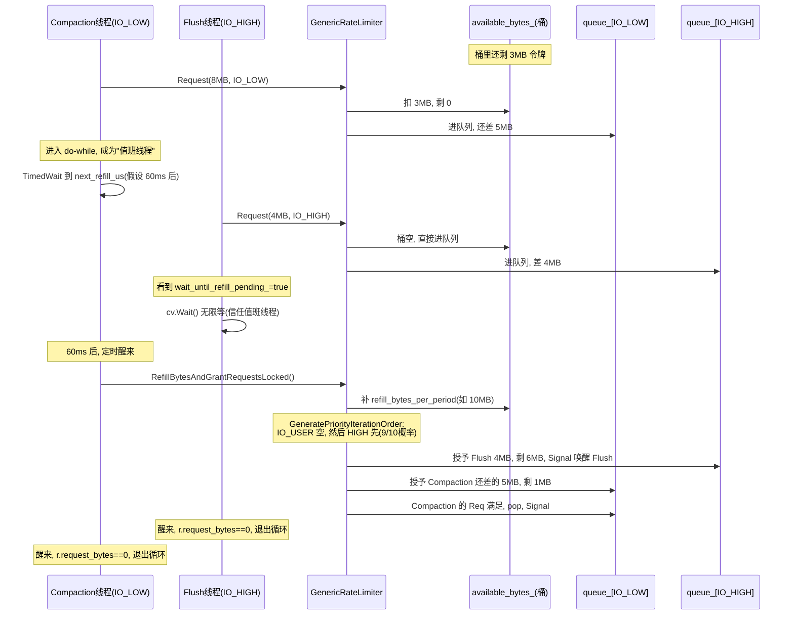

# 第 5 篇 · 第 18 章 · Rate Limiter 与 IO 调度

> **核心问题**:第 17 章的 Write Stall / Write Delay 解决的是"前台写得太快,MemTable 和 L0 要被淹死"——它反压的是**写速率**(每秒能写进多少个 Put)。可 LSM 还有一类 IO 根本不经过 WriteController,那就是**后台 Compaction 和 Flush 的磁盘读写**:它们狂刷盘,把前台 user 的 Get / Put 撞飞的延迟打爆,SSD 带宽被后台吃满,前台读写延迟雪崩。这章问的就是——**后台 IO 怎么不挤占前台?RocksDB 凭什么让你给 Compaction 和 Flush 套一个令牌桶,又凭什么让前台读写比后台先拿到磁盘带宽?**

> **读完本章你会明白**:
> 1. 为什么"不限速"会撞墙——后台 Compaction 一次能写出几 GB 数据,SSD 带宽被它吃满,前台 user 的一次 Get 延迟从 100μs 飙到几十 ms。
> 2. RocksDB 的 `GenericRateLimiter` 是一个**令牌桶**:每 `refill_period`(默认 100ms)补一次令牌(`bytes_per_second × period`),每个写/读请求先 `Request(n bytes)`,不够则排队 sleep。讲清"burst 可短期超限"和"平滑限速"是怎么同时做到的。
> 3. RocksDB 的** IO 优先级**不是两档(前台 HIGH / 后台 LOW),而是**四档**(`IO_LOW`/`IO_MID`/`IO_HIGH`/`IO_USER`),`IO_USER` 永远第一个被满足。讲清为什么这么设计 sound——以及一个反直觉的精妙之处:**当 WriteController 触发 stall/delay 时,Flush 和 Compaction 会主动把自己降到 `IO_USER`(最低),把磁盘带宽让给被反压的前台写**。
> 4. RateLimiter 的三种 Mode(`kWritesOnly` / `kReadsOnly` / `kAllIo`)和 `auto_tuned`(根据后台 IO 需求在 `[rate/20, rate]` 区间自动调)分别解决什么问题,什么时候该开。

> **如果一读觉得太难**:先只记住三件事——① 令牌桶 = 每 100ms 往桶里补一次"字节配额",后台写/读要消费配额,配额不够就排队 sleep,这就是限速;② 优先级队列 = 桶里的配额先给 `IO_USER` 再给其它三档,`IO_USER` 永远不饿,这就是"前台优先";③ Write Stall 一触发,后台 Flush/Compaction 主动降到 `IO_USER` 让路——这是第 17 章和第 18 章联手保护前台的关键一招。

---

## 〇、一句话点破

> **Write Stall 控的是"写得多快"(每秒多少 Put),Rate Limiter 控的是"刷得多猛"(每秒多少字节落盘)——两者一前一后,把前台 user 的读写延迟,从后台 Compaction 的磁盘狂欢里保护出来。Rate Limiter 的全部精妙,落在两件事上:令牌桶把"总量"卡死,IO 优先级把"先给谁"排清。**

这是结论,不是理由。本章倒过来拆:先讲不限速撞什么墙,再讲令牌桶怎么卡总量,然后讲优先级怎么排先后,最后讲两者怎么和 Write Stall 联手。

---

## 一、不限速撞什么墙:后台 Compaction 的磁盘狂欢

讲 Rate Limiter 之前,先讲清楚它要解决的本质问题。这个问题只有一句话:**SSD 的带宽是有限的,后台 Compaction 是个无底洞。**

### 一次 Compaction 能写出多少字节

回忆第 4 篇(Compaction)讲过的:Compaction 把若干层 SST 读进来,归并去重,再写成新的 SST 落盘。一次 L4→L5 的 Compaction,输入可能是几个 GB,输出也是几个 GB。这意味着:

- **读**几个 GB 的 SST(从磁盘读进内存,归并)。
- **写**几个 GB 的新 SST(从内存写到磁盘)。

一次 Compaction 的磁盘 IO 量 = 输入大小 + 输出大小 ≈ 2 × 输入大小。如果输入是 4GB,这一次 Compaction 就要产生约 8GB 的磁盘 IO。而 SSD 的顺序写带宽,消费级大约 500MB/s~3GB/s,企业级也不过 3~7GB/s。一个 8GB 的 Compaction,**若不限速,可以独占一块 SSD 的全部写带宽长达几秒**。

### 这几秒里,前台发生了什么

这几秒里,前台 user 的请求可不会等。一个在线服务,每秒几万次 Get,每次 Get 要穿透多层 SST,每一层都可能要读一个 data block。如果磁盘带宽被 Compaction 吃满,这些 Get 的 block 读取请求就排在磁盘队列后面,延迟从正常的 100μs 飙到 10ms 甚至几十 ms。

> **钉死这件事**:这就是 LSM 在生产环境最让人头疼的病——**写延迟抖动**。表面看是"偶尔慢一下",根因常常是后台 Compaction 一启动,SSD 带宽瞬间被吃满,前台读延迟被打飞。TiKV、MySQL(RocksDB 引擎)这些工业系统,线上 P99 / P999 延迟抖动,十有八九能在 Compaction 触发的时刻对上号。

### 朴素方案的两种死法

面对这个问题,最朴素的两个想法,各有死法:

**朴素方案一:不并发 Compaction,后台慢慢来。**
死法:写入一旦上来,L0 文件堆积(Compaction 跟不上),读放大爆炸(第 17 章的 Write Stall 就是这个的反压)。这条路等于放弃 LSM 的写入能力。

**朴素方案二:让 Compaction 全速跑,靠 OS 自己调度。**
死法:OS 的磁盘调度器(IO scheduler,CPU 调度那一层)根本不知道哪个 IO 是前台 user 的、哪个是后台 Compaction 的——在它眼里都是一堆 bio 请求。它顶多按 deadline / cfq 做点公平调度,但**前台那一次 Get 的 4KB 读,和后台 Compaction 那一批 1MB 写,在 OS 眼里是平等的两个请求**。结果就是前台 Get 被后台 Compaction 的洪流冲到队列尾巴上。

> **不这样会怎样**:这正是 LevelDB 的处境。LevelDB **没有限速器**——后台 Compaction 与前台写各写各的,完全靠 OS 自身的磁盘调度(详见《LevelDB》Compaction 那章)。在 LevelDB 的设计假设下(单机、中等负载、机械硬盘)这够用:机械硬盘本身吞吐有限,Compaction 也不会太猛;而且 LevelDB 没有 RocksDB 这么激进的并发 Compaction(subcompaction)和这么大的 MemTable(`write_buffer_size` 默认才 4MB)。一旦搬到 SSD 海量写场景(Compaction 可以非常猛)+ 低延迟在线服务(前台对延迟抖动零容忍),LevelDB 的"不限速"就立刻撞墙。

> **LevelDB 是写死的,RocksDB 打开成了旋钮**:LevelDB 把"后台 IO 多猛"焊死在"随它去,OS 管不了";RocksDB 把它打开成了一个可调旋钮——`rate_limiter`(`DBOptions::rate_limiter`,一个 `std::shared_ptr<RateLimiter>`)。你给这个旋钮一个 `bytes_per_second`,后台 Compaction 和 Flush 的磁盘写总量就被卡在这个数以内,前台读写延迟就有了保障。这就是本章要拆的旋钮。

---

## 二、令牌桶:把"每秒字节总量"卡死

Rate Limiter 的核心数学结构是一个**令牌桶(token bucket)**。这是网络流量整形里几十年的经典模型,RocksDB 把它搬到了磁盘 IO 上。这一节,我们从最朴素的"每秒检查一次"开始,一步步推出 GenericRateLimiter 的真实实现。

### 朴素方案:每秒一个计数器

最朴素的限速想法是:维护一个"本秒已写字节"计数器,每写 n 字节就加到计数器上,一旦超过 `bytes_per_second` 就 sleep 到下一秒。这能用吗?能,但有两个致命问题:

**问题一:粒度太粗,流量呈脉冲。**
一秒的预算可能在头 100ms 就被吃光,然后剩下 900ms 全在 sleep。后台 IO 的流量图是一排尖刺——每秒一个 100ms 的洪峰,接着 900ms 的死寂。这对 SSD 不友好(SSD 控制器更喜欢平稳的写流),对前台也不友好(那 100ms 洪峰里前台照样被打飞)。

**问题二:burst 全无,平滑过度。**
反过来,如果每来一个字节就检查,那就要每个 IO 请求都去抢一把全局锁,锁竞争开销巨大。而且没有任何"攒一波再放"的能力,小请求被频繁打断。

### 经典令牌桶:周期性补令牌

令牌桶的标准做法是:**把"每秒 N 字节"换算成"每 refill_period 补一批令牌"**。RocksDB 的 `refill_period` 默认是 100ms(见 `NewGenericRateLimiter` 的默认参数,[rate_limiter.h#L166-L170](../rocksdb/include/rocksdb/rate_limiter.h#L166-L170))。如果 `bytes_per_second = 100MB/s`、`refill_period = 100ms`,那么**每 100ms 补一次令牌,每次补 100MB × 0.1s = 10MB**。

请求来了,要写 n 字节:

- 桶里(`available_bytes_`)有足够的令牌 → 扣掉 n,放行。
- 桶里不够 → 这个请求**进队列等**,等到下一次 refill。

这个结构同时解决了上面两个问题:

- **粒度细**:每 100ms 一次小洪峰(10MB),而不是每秒一次大洪峰(100MB),流量被摊平。
- **burst 能力**:桶里的令牌可以累积(短期攒一波),所以一个突发的大请求可以一次性吃掉多个周期的令牌——这就是 burst。
- **锁开销可控**:请求只在"桶不够"时才进队列并 sleep,够的时候只是 atomic 扣减。

这就是 GenericRateLimiter 的核心。我们把它的状态画出来:

```
              GenericRateLimiter 的令牌桶(ASCII)

   时间轴 ──>
              ↑ refill              ↑ refill              ↑ refill
              补 10MB                补 10MB                补 10MB
              │                      │                      │
   桶状态:   ┌──────────┐           ┌──────────┐           ┌──────────┐
   available │ 10MB     │  被吃光   │ 10MB     │  吃剩3MB  │ 13MB     │ ...
   _bytes    │          │ ───────> │          │ ───────> │ (攒一波) │
              └──────────┘           └──────────┘           └──────────┘
                  │                      │                      │
   请求队列:    [ ]空                 [ ]空                [ IO_LOW 等7MB ]
                                       (一个请求吃了7MB)      (不够,排队)
```

### 源码佐证:refill 怎么补,怎么算每周期补多少

每周期补多少令牌,是一个简单的换算。源码在 [`CalculateRefillBytesPerPeriodLocked`](../rocksdb/util/rate_limiter.cc#L315-L325):

```cpp
int64_t GenericRateLimiter::CalculateRefillBytesPerPeriodLocked(
    int64_t rate_bytes_per_sec) {
  if (std::numeric_limits<int64_t>::max() / rate_bytes_per_sec <
      refill_period_us_) {
    // 溢出保护:返回一个足够大的数
    return std::numeric_limits<int64_t>::max() / kMicrosecondsPerSecond;
  } else {
    return rate_bytes_per_sec * refill_period_us_ / kMicrosecondsPerSecond;
  }
}
```

公式就是 `rate_bytes_per_sec × refill_period_us / 1000000`。注意 `kMicrosecondsPerSecond = 1000000`(`rate_limiter_impl.h#L112`)。100MB/s、100ms → 10MB,对上了。

每次 refill 怎么执行?在 [`RefillBytesAndGrantRequestsLocked`](../rocksdb/util/rate_limiter.cc#L273-L313):

```cpp
void GenericRateLimiter::RefillBytesAndGrantRequestsLocked() {
  next_refill_us_ = NowMicrosMonotonicLocked() + refill_period_us_;
  // Carry over the left over quota from the last period
  auto refill_bytes_per_period =
      refill_bytes_per_period_.load(std::memory_order_relaxed);
  assert(available_bytes_ == 0);
  available_bytes_ = refill_bytes_per_period;
  // ... 接下来按优先级遍历队列,授予等待的请求 ...
}
```

注意这里的 `assert(available_bytes_ == 0)`——这是个关键不变量:**refill 发生时,桶一定是空的**。为什么?因为 refill 只在"上一个周期的令牌被吃光、有请求在排队等"的时候才触发(下面 Request 那节会讲触发条件)。所以 refill 就是"桶空了,补一整批新的"——而不是"桶里还有剩,再加一批"。这保证了 burst 的上限就是 `refill_bytes_per_period`(单周期量),不会无限累积。

> **钉死这件事**:这就是 GenericRateLimiter 的"平滑"和"burst"的平衡点——burst 上限 = 单周期补的量(`rate × refill_period / 1s`)。`refill_period` 越小,补得越频繁,单次 burst 越小,流量越平滑,但 refill 的 CPU 开销越大;`refill_period` 越大,单次 burst 越大(可短期超限越多),流量越呈脉冲,CPU 开销越小。**默认 100ms 是 RocksDB 在"平滑度"和"CPU 开销"之间挑的折中点**。这就是令牌桶那个 `refill_period_us` 旋钮的意义。

### GetSingleBurstBytes:一次 Request 最多能要多少

还有一个配套概念:`GetSingleBurstBytes()`——一次 `Request()` 最多能要多少字节。源码在 [`rate_limiter_impl.h#L49-L56`](../rocksdb/util/rate_limiter_impl.h#L49-L56):

```cpp
int64_t GetSingleBurstBytes() const override {
  int64_t raw_single_burst_bytes =
      raw_single_burst_bytes_.load(std::memory_order_relaxed);
  if (raw_single_burst_bytes == 0) {
    return refill_bytes_per_period_.load(std::memory_order_relaxed);
  }
  return raw_single_burst_bytes;
}
```

默认 `single_burst_bytes = 0`,表示"等于每周期补的量"。也就是说,**一个 Request 最多要一个周期的令牌(默认 10MB)**——再多就得拆成多个 Request。这个限制是为了避免一个巨型 Compaction 请求一次性把好几个周期的令牌全吃光、把别的请求饿死。

`RateLimiter::RequestToken`(`rate_limiter.cc#L20-L35`)就是干这个拆分的:它先把请求大小 `std::min(bytes, GetSingleBurstBytes())` 截断到 burst 上限,再去 `Request`。Direct IO 场景下还要考虑对齐(`std::max(alignment, ...)`),不能比对齐粒度还小。

> **所以这样设计**:burst 上限 = 单周期量,既给了"短期超限"的能力(一个突发请求能一次吃掉一整周期的令牌,而不必等它慢慢攒),又限制了"单个请求不能独占多个周期"——这就是令牌桶的 sound:不会饿死别的请求,又允许合理的突发。

---

## 三、Request:不够则排队 sleep

讲完了桶,来看请求怎么走。`GenericRateLimiter::Request` 是整个限速器的热路径,源码在 [`rate_limiter.cc#L122-L232`](../rocksdb/util/rate_limiter.cc#L122-L232)。我们拆成三段看。

### 第一段:能直接满足就直接扣,立刻返回

```cpp
void GenericRateLimiter::Request(int64_t bytes, const Env::IOPriority pri,
                                 Statistics* stats) {
  ...
  MutexLock g(&request_mutex_);
  ...
  ++total_requests_[pri];

  if (available_bytes_ > 0) {
    int64_t bytes_through = std::min(available_bytes_, bytes);
    total_bytes_through_[pri] += bytes_through;
    available_bytes_ -= bytes_through;
    bytes -= bytes_through;
  }

  if (bytes == 0) {
    return;   // 桶里够,扣完直接走,不进队列
  }
  ...
}
```

这一段是**快路径**:桶里还有令牌,扣掉,返回。绝大多数后台 IO 走的是这条路径——只在 `request_mutex_` 保护下做一次 `available_bytes_ -= bytes`,没有 sleep,没有进队列。这就是为什么令牌桶在"不饱和"时几乎没有开销:热路径只是一次 atomic 风格的扣减(虽然是 mutex 保护的,但临界区极短)。

> **钉死这件事**:这一点很重要——**Rate Limiter 不是"每个 IO 都 sleep 一下"**。它是"令牌够的时候零等待,不够的时候才排队"。如果你的 `bytes_per_second` 设得比实际后台 IO 还大,Rate Limiter 几乎是个 no-op,不会拖慢任何东西。这也是为什么 RocksDB 官方建议"宁可设大一点,也别设得太小"——设太小会把后台 Compaction 拖死,反而触发 Write Stall。

### 第二段:不够则进队列,等 refill

```cpp
  // Request cannot be satisfied at this moment, enqueue
  Req r(bytes, &request_mutex_);
  queue_[pri].push_back(&r);    // 进自己优先级的队列
  ...
  do {
    int64_t time_until_refill_us = next_refill_us_ - NowMicrosMonotonicLocked();
    if (time_until_refill_us > 0) {
      if (wait_until_refill_pending_) {
        // 已经有人在等下一次 refill 了,我跟着睡就行
        r.cv.Wait();
      } else {
        // 我是第一个发现需要 refill 的,我来负责等 + 触发 refill
        int64_t wait_until = clock_->NowMicros() + time_until_refill_us;
        ++num_drains_;
        wait_until_refill_pending_ = true;
        clock_->TimedWait(&r.cv, std::chrono::microseconds(wait_until));
        ...
        wait_until_refill_pending_ = false;
      }
    } else {
      // 到了 refill 时间,我来执行 refill + 授予队列里的请求
      RefillBytesAndGrantRequestsLocked();
    }
    ...
  } while (!stop_ && r.request_bytes > 0);
```

这一段是**慢路径**:桶不够,本请求进 `queue_[pri]` 队列(注意,每个优先级一个队列,`std::deque<Req*> queue_[Env::IO_TOTAL]`,见 `rate_limiter_impl.h#L147`),然后进入一个 `do...while` 循环,直到自己的 `request_bytes` 被填满(`r.request_bytes == 0` 表示已被授予)。

这里有一个**精妙的"职责分担"设计**:队列里可能有好几个请求在等,但**不需要每个请求都去定时唤醒检查 refill**。源码用一个 `wait_until_refill_pending_` 标志:

- 第一个发现"桶空了、需要等 refill"的请求,负责设置这个标志,然后 `TimedWait` 一个精确的时间(到 `next_refill_us_`),定时醒来后触发 refill。
- 后续进来的请求,看到这个标志已设置,就直接 `cv.Wait()` 无限等——它们信任"那个负责的线程 refill 完会唤醒我"。

这就是注释里说的"duty (1) waiting for refill"和"duty (2) refilling bytes"。**职责不重叠,避免惊群**:不是所有等待者都定时醒来抢 refill,而是只有一个"值班线程"负责 refill,refill 完按优先级唤醒该唤醒的。

> **技巧点(为什么 sound)**:这个设计避免了"所有等待线程都 SetWaitableTimer、都醒来竞争 refill"的惊群。只有一个线程做 refill,做完用 `next_req->cv.Signal()`(在 `RefillBytesAndGrantRequestsLocked` 里)精确唤醒被授予的请求。未授予的继续睡。这是令牌桶在高并发下仍然高效的关键。

### 第三段:refill 时按优先级授予

refill 时(`RefillBytesAndGrantRequestsLocked`),新一批令牌到了,要决定**先给谁**。这一段是 IO 调度的核心,下一节单独拆。这里先看授予逻辑:

```cpp
  for (int i = Env::IO_LOW; i < Env::IO_TOTAL; ++i) {
    Env::IOPriority current_pri = pri_iteration_order[i];   // 优先级遍历顺序
    auto* queue = &queue_[current_pri];
    while (!queue->empty()) {
      auto* next_req = queue->front();
      if (available_bytes_ < next_req->request_bytes) {
        // 令牌不够这个请求的全部,授予部分,剩下的继续等
        next_req->request_bytes -= available_bytes_;
        available_bytes_ = 0;
        break;
      }
      available_bytes_ -= next_req->request_bytes;
      next_req->request_bytes = 0;
      total_bytes_through_[current_pri] += next_req->bytes;
      queue->pop_front();
      next_req->cv.Signal();   // 授予了,唤醒这个线程
    }
  }
```

注意两点:

1. **部分授予(partial grant)**:如果令牌不够一个请求的全部,会把现有的令牌全给它(`next_req->request_bytes -= available_bytes_`),剩下的下次 refill 再补。这避免了"大请求卡住所有令牌"——大请求可以分多次 refill 慢慢凑齐,小请求不会被它堵死。注释里专门提了这个设计(`rate_limiter.cc#L292-L300`),它处理三种情况:令牌被别的请求部分消耗、速率动态调低、burst 显式设大于 refill。
2. **逐队列授予**:遍历顺序 `pri_iteration_order` 决定先给哪个优先级,然后在该优先级队列里从头到尾授予,直到令牌用完。剩下的优先级队列就只能在下一个 refill 周期再抢。

这两点合起来,就是"令牌总量卡死 + 优先级排先后"。总量由 `refill_bytes_per_period` 卡死,先后由下一节的优先级调度决定。

---

## 四、IO 优先级:先给谁,凭什么

讲完了令牌桶(控总量),来看 IO 调度的另一半——**优先级**(控先后)。这是 Rate Limiter 比 LevelDB 进化的精髓:不止限速,还分谁能先用。

### 四档优先级,不是两档

很多人(包括不少 RocksDB 的老资料)对 Rate Limiter 的印象是"两档:前台 HIGH、后台 LOW"。这个印象**不准确**。真实的 `Env::IOPriority` 是**四档**,源码在 [`env.h#L446-L452`](../rocksdb/include/rocksdb/env.h#L446-L452):

```cpp
enum IOPriority {
  IO_LOW = 0,
  IO_MID = 1,
  IO_HIGH = 2,
  IO_USER = 3,
  IO_TOTAL = 4
};
```

四档分别给谁用?`DBOptions::rate_limiter` 的注释讲得很清楚([`options.h#L718-L728`](../rocksdb/include/rocksdb/options.h#L718-L728)):

- **`IO_LOW`(0)**:Compaction 的读写带宽请求走这档。
- **`IO_HIGH`(2)**:Flush 的写带宽请求走这档。
- **`IO_USER`(3)**:一个"超级优先级",代码里写死永远第一。下面专门讲。
- **`IO_MID`(1)**:中间档,目前内部用得不多(主要是给未来扩展和某些用户读预留)。

> **纠正一个常见印象偏差**:不是"前台 user reads/writes = IO_HIGH,后台 = IO_LOW"。真实是 **Flush = IO_HIGH,Compaction = IO_LOW**,而且 `IO_USER` 才是那个"前台专用"的超级档。为什么 Flush 比 Compaction 高?因为 Flush 拖久了 MemTable 撑爆会触发 Write Stall(第 17 章),而 Compaction 慢一点只是 L0 文件多堆积、读放大变大——前者是写路径的"快饿死",后者是读路径的"慢饿死",先救更急的。这就是优先级排序的内在逻辑。

### 调度算法:IO_USER 永远第一,其余三档概率轮换

refill 的时候,要决定先授予哪个优先级队列。这个决定由 [`GeneratePriorityIterationOrderLocked`](../rocksdb/util/rate_limiter.cc#L234-L271) 做:

```cpp
std::vector<Env::IOPriority>
GenericRateLimiter::GeneratePriorityIterationOrderLocked() {
  std::vector<Env::IOPriority> pri_iteration_order(Env::IO_TOTAL /* 4 */);
  // IO_USER 永远第一个遍历
  pri_iteration_order[0] = Env::IO_USER;

  bool high_pri_iterated_after_mid_low_pri = rnd_.OneIn(fairness_);
  bool mid_pri_itereated_after_low_pri = rnd_.OneIn(fairness_);
  // 根据 two OneIn 的结果,把 IO_HIGH / IO_MID / IO_LOW 排到位置 1/2/3
  ...
  return pri_iteration_order;
}
```

这里有一个**极其重要的设计决策**,源码注释专门强调了(`rate_limiter.cc#L237`):

> `// We make Env::IO_USER a superior priority by always iterating its queue first`

**`IO_USER` 永远第一个被遍历**——它没有概率,没有公平性,绝对优先。只要 `IO_USER` 队列里有请求,refill 的令牌先尽着它用。

而 `IO_HIGH` / `IO_MID` / `IO_LOW` 这三档,则用 `rnd_.OneIn(fairness_)` 做概率轮换。`fairness` 默认是 10(见 `NewGenericRateLimiter` 默认参数),意思是:**每 1/10 的概率,LOW 会排到 HIGH 前面**。这是防饿死——如果 IO_HIGH 一直有请求(Flush 一直来),IO_LOW(Compaction)有 1/10 的机会先拿到令牌,不会永远饿死。

> **为什么这样设计 sound**:这是经典的"严格优先级 + 概率反饿死"折中。如果纯严格优先级(LOW 永远等 HIGH 空),那只要 Flush 不断,Compaction 就永远拿不到令牌,L0 文件无限堆积,最后 Write Stall。如果纯公平(轮询),那前台用户读的延迟就被后台拖累。RocksDB 的选择是:**IO_USER 给"绝对不能等"的前台路径(下一节讲),其余三档给"重要程度有别但不该饿死"的后台路径**,用 `fairness` 概率兜底。这就是 `fairness` 那个旋钮(`NewGenericRateLimiter` 第三个参数,默认 10)的全部意义。

### IO_USER 是什么,为什么有它

`IO_USER` 是四档里最反直觉的一档。它不是一个"用户可以设置某次 IO 走这档"的通用档,而是 RocksDB 内部**专门为"反压联动"留的一档**。它的两种触发场景:

**场景 A:WriteController 处于 stall/delay 时,后台主动降级。**

这是最精妙的一处,源码在 [`FlushJob::GetRateLimiterPriority`](../rocksdb/db/flush_job.cc#L1181-L1192) 和 [`CompactionJob::GetRateLimiterPriority`](../rocksdb/db/compaction/compaction_job.cc#L2902-L2913):

```cpp
// FlushJob
Env::IOPriority FlushJob::GetRateLimiterPriority() {
  if (versions_ && ... write_controller()) {
    WriteController* write_controller = ...;
    if (write_controller->IsStopped() || write_controller->NeedsDelay()) {
      return Env::IO_USER;   // stall/delay 时,Flush 降到 IO_USER
    }
  }
  return Env::IO_HIGH;       // 正常时是 IO_HIGH
}

// CompactionJob
Env::IOPriority CompactionJob::GetRateLimiterPriority() {
  if (... write_controller->NeedsDelay() || write_controller->IsStopped()) {
    return Env::IO_USER;   // stall/delay 时,Compaction 也降到 IO_USER
  }
  return Env::IO_LOW;       // 正常时是 IO_LOW
}
```

> **等一下,这里有个反直觉的点**:Write Stall / Delay 触发(前台写被反压、最危急的时刻),Flush 和 Compaction 反而把自己**降**到 `IO_USER`?

`IO_USER` 不是"最低优先级",而是"**最高优先级里的特殊档**"——它在 `GeneratePriorityIterationOrderLocked` 里**永远第一个被遍历**。但这里的关键是:**`IO_USER` 这个队列,正常情况下是空的**。

想清楚这个:正常情况下,谁会用 `IO_USER`?——没有任何后台 IO 会主动用 `IO_USER`(它们都用 IO_LOW / IO_HIGH)。`IO_USER` 队列平时是空的。那它什么时候有请求?——**当 WriteController stall/delay 时,Flush/Compaction 进了 IO_USER 队列**。

但这里的关键不是"IO_USER 队列里现在有 Flush 请求",而是**这背后暴露了 Rate Limiter 在 Mode=kWritesOnly 时的一个事实**:**前台 user 的 Get / Put 默认根本不经过 Rate Limiter**(`ReadOptions::rate_limiter_priority` 和 `WriteOptions::rate_limiter_priority` 默认是 `Env::IO_TOTAL`,意思是"不计费",见 [`options.h#L2179`](../rocksdb/include/rocksdb/options.h#L2179) 和 [`options.h#L2561`](../rocksdb/include/rocksdb/options.h#L2561))。所以 Rate Limiter 的桶,**正常情况下只服务后台**(Flush + Compaction)。

那么 Write Stall 时,Flush/Compaction 降到 IO_USER 的真实意图是什么?——**让它们在 refill 时第一个被授予,从而尽快完成、尽快让出磁盘**。这是个"加速止血"的逻辑:Write Stall 意味着系统已经过载(L0 淹了 / MemTable 满了),此刻最该做的是**让 Flush 赶紧做完**(把 Immutable 落盘、腾出 MemTable)、**让 Compaction 赶紧做完**(把 L0 合下去、腾出 L0 槽位)。降到 IO_USER = refill 时令牌先尽着它们 = 它们跑得更快 = 止血更快。

> **钉死这件事**:这是一个反直觉但极 sound 的设计。直觉上"Write Stall 时该让后台让路给前台",但实际是"Write Stall 时该让后台赶紧干完"。因为 Write Stall 的根因就是**后台跟不上**(L0 堆了、MemTable 满了),此刻压制后台只会让 stall 更久。让后台(尤其 Flush)升到最高优先级赶紧干完,才是真正的止血。`IO_USER` 这个档,就是为这个"危急时刻加速后台止血"留的口子。

**场景 B:用户读 / 写显式计费。**

用户可以让自己的某次读 / 写也走 Rate Limiter 计费。这里有个**容易踩坑的不对称限制**:

- **`ReadOptions::rate_limiter_priority`** 可设任意非 `IO_TOTAL` 的优先级(包括 `IO_USER`、`IO_HIGH` 等)。默认 `IO_TOTAL` 表示"不计费"([`options.h#L2179`](../rocksdb/include/rocksdb/options.h#L2179))。某些关键路径的 Get,可设 `IO_USER` 优先级,保证它在 Rate Limiter 眼里永远第一——这是给"用户读"留的提速口子。
- **`WriteOptions::rate_limiter_priority`** 则有硬约束:**只允许 `IO_TOTAL`(不计费)或 `IO_USER`(计费且最高)**,设成 `IO_LOW` / `IO_MID` / `IO_HIGH` 会被拒。源码在 [`db_impl_write.cc#L897-L901`](../rocksdb/db/db_impl/db_impl_write.cc#L897-L901):

```cpp
} else if (write_options.rate_limiter_priority != Env::IO_TOTAL &&
           write_options.rate_limiter_priority != Env::IO_USER) {
  return Status::InvalidArgument(
      "WriteOptions::rate_limiter_priority only allows "
      "Env::IO_TOTAL and Env::IO_USER due to implementation constraints");
}
```

为什么写有这个约束而读没有?因为写的链路要复用后台 Flush / Compaction 的 WritableFileWriter 优先级逻辑,混入 IO_LOW / IO_HIGH 会让"用户写"和"后台写"在优先级上纠缠不清,实现复杂;只允许 IO_USER(最高)是"要么不计费,要么就享受最高优先级"的简化。读走的是独立的 RandomAccessFileReader 路径,没这个纠缠,所以全开。这个不对称,是 RocksDB 在"灵活性"和"实现复杂度"之间的一个折中。

> **不这样会怎样**:如果没有 `IO_USER` 这档,Write Stall 时的"加速止血"就没了抓手——Flush 和 Compaction 还是按 IO_HIGH / IO_LOW 排队,该等多久还是等。或者如果用"直接调高 bytes_per_second"来加速止血,那又破坏了限速的初衷(前台又被冲飞)。`IO_USER` 是一个**不改速率、只改先后**的精巧阀门:总量还是那么多,但危急时刻先发给最该干完的活。

### 优先级队列的运行时图

把四档队列和 refill 授予过程画出来:

```
          GenericRateLimiter 的优先级队列(ASCII)

   refill 时,按 pri_iteration_order 遍历这 4 个队列:
   ┌─────────────────────────────────────────────────────────────┐
   │  queue_[IO_USER]  →  永远第 1 个遍历(超级优先)             │
   │     [ Req(flush, stall时降级来的) ] [ Req(用户关键Get) ]   │
   ├─────────────────────────────────────────────────────────────┤
   │  queue_[IO_HIGH] / [IO_MID] / [IO_LOW]                       │
   │     这三档的遍历顺序由 rnd_.OneIn(fairness_) 概率决定:      │
   │     - 9/10 概率: HIGH 先, 然后 MID/LOW                     │
   │     - 1/10 概率: LOW 先(防饿死)                            │
   ├─────────────────────────────────────────────────────────────┤
   │  queue_[IO_HIGH]  →  [ Req(flush正常) ] [ Req(flush正常) ] │
   │  queue_[IO_MID]   →  (一般空,预留)                          │
   │  queue_[IO_LOW]   →  [ Req(compaction) ] [ Req(compaction) ]│
   └─────────────────────────────────────────────────────────────┘

   refill 到了 10MB 令牌:
     1. 先尽 queue_[IO_USER] 用 → 用剩的给后面
     2. 按概率顺序遍历 HIGH/MID/LOW → 直到令牌用光
     3. 没被满足的请求留在队列里,下个 refill 周期再抢
```

---

## 五、Request 排队 sleep 的时序

把一次"令牌不够、排队 sleep、被 refill 唤醒"的完整时序画出来,这是理解 Rate Limiter 动态行为的关键:



这张图里有几个细节值得注意:

1. **值班线程的精确等待**:Compaction 是第一个发现"桶空了"的,它成为值班线程,精确 `TimedWait` 到 `next_refill_us`。后面来的 Flush 看到已有值班线程,直接无限 `Wait`。
2. **refill 后的精确唤醒**:`RefillBytesAndGrantRequestsLocked` 按 `pri_iteration_order` 顺序,授予到哪个 Req 就 `next_req->cv.Signal()` 唤醒那个线程。没被授予的继续睡。
3. **公平性是概率的**:图里画的是 9/10 概率 HIGH 先,所以 Flush 先被授予。如果是 1/10 概率 LOW 先,顺序就反过来——但 Compaction 总能拿到令牌,不会饿死。

---

## 六、Mode 和 auto_tuned:限速的另两个旋钮

令牌桶和优先级是 Rate Limiter 的两条主干。此外还有两个旋钮,解决的是"限速谁"和"速率定多少"的问题。

### Mode:限写、限读、还是全限

`RateLimiter::Mode` 有三档([`rate_limiter.h#L28-L32`](../rocksdb/include/rocksdb/rate_limiter.h#L28-L32)):

```cpp
enum class Mode {
  kReadsOnly = 0,
  kWritesOnly = 1,
  kAllIo = 2,
};
```

默认是 ` kWritesOnly`(见 `RateLimiter` 构造函数默认参数,`rate_limiter.h#L35`)。这个 Mode 决定 **`IsRateLimited(op_type)`** 的行为([`rate_limiter.h#L124-L132`](../rocksdb/include/rocksdb/rate_limiter.h#L124-L132)):

```cpp
virtual bool IsRateLimited(OpType op_type) {
  if ((mode_ == RateLimiter::Mode::kWritesOnly &&
       op_type == RateLimiter::OpType::kRead) ||
      (mode_ == RateLimiter::Mode::kReadsOnly &&
       op_type == RateLimiter::OpType::kWrite)) {
    return false;
  }
  return true;
}
```

意思是:

- **`kWritesOnly`(默认)**:只限写 IO,读 IO 不计费。这是最常见的——后台 Compaction 的写、Flush 的写被限速,但 user 的 Get 触发的读不受限。
- **`kReadsOnly`**:反过来,只限读 IO。
- **`kAllIo`**:读写都限。

> **为什么默认 kWritesOnly**:因为写是 LSM 的"源动力"——MemTable Flush、Compaction 都是写密集。后台写的总量决定 SSD 寿命消耗和写延迟抖动,这是最该限的。读 IO 主要来自前台 user 的 Get,限它反而会拖慢前台。所以默认只卡写。如果你的 workload 是"读密集 + 后台 Compaction 的读 IO 也很猛",才考虑 `kAllIo`。

注意一个细节:这里说的"读写"是 **OpType**,和前面的 `IOPriority` 是两个正交的维度。`Request(bytes, pri, stats, op_type)` 同时带了优先级和操作类型——Mode 决定要不要计费,优先级决定计费时排第几。这两者组合,才是 Rate Limiter 完整的调度语义。

### auto_tuned:速率自适应

`NewGenericRateLimiter` 还有一个 `auto_tuned` 参数(默认 false)。开了之后,Rate Limiter 会根据**后台 IO 的实际需求**,在 `[rate_bytes_per_sec / 20, rate_bytes_per_sec]` 区间内动态调整速率。源码在 [`TuneLocked`](../rocksdb/util/rate_limiter.cc#L327-L375):

```cpp
Status GenericRateLimiter::TuneLocked() {
  const int kLowWatermarkPct = 50;
  const int kHighWatermarkPct = 90;
  const int kAdjustFactorPct = 5;
  const int kAllowedRangeFactor = 20;   // 区间是 [max/20, max]

  ...
  int64_t drained_pct = num_drains_ * 100 / elapsed_intervals;
  ...
  if (drained_pct == 0) {
    new_bytes_per_sec = max_bytes_per_sec_ / kAllowedRangeFactor;   // 没人用,降到 1/20
  } else if (drained_pct < kLowWatermarkPct) {
    new_bytes_per_sec = std::max(max_bytes_per_sec_ / kAllowedRangeFactor,
                                 prev * 100 / (100 + kAdjustFactorPct));  // 低于 50%, 降 5%
  } else if (drained_pct > kHighWatermarkPct) {
    new_bytes_per_sec = std::min(max_bytes_per_sec_,
                                 prev * (100 + kAdjustFactorPct) / 100);  // 高于 90%, 升 5%
  } else {
    new_bytes_per_sec = prev;   // 50%~90% 之间, 不动
  }
  ...
}
```

逻辑核心是一个指标 `drained_pct`——**有多少比例的 refill 周期里,桶被彻底耗尽过(`num_drains_`)**。这是个"需求强度"的信号:

- `drained_pct == 0`(从来没人把桶喝干过):需求疲软,降到下限 `max/20`,把带宽还给前台。
- `drained_pct < 50%`(偶尔喝干):需求偏低,每次微调降 5%。
- `drained_pct > 90%`(几乎每个周期都被喝干):需求旺盛,每次微调升 5%,上限是 `max`。
- 中间区(50%~90%):需求匹配,不动。

注意 `GenericRateLimiter` 构造函数里(`rate_limiter.cc#L52-L53`),如果 `auto_tuned = true`,**初始速率是 `rate_bytes_per_sec / 2`**(中点),而不是上限——给自适应留出上下调整的空间。

> **为什么这样设计 sound**:固定速率有个老问题——设小了把后台拖死(触发 Write Stall),设大了等于没限。`auto_tuned` 用"桶被喝干的频率"作为需求信号,让速率自适应:后台忙就自动提速(但不超过上限),后台闲就自动降速(把带宽还给前台)。这是个简单但有效的负反馈控制。代价是调参变难(速率在动),所以默认关——只有你确实不知道后台 IO 需求多大、又不想 Write Stall 时,才开。

> **纠正总纲一处印象偏差**:总纲和章节提示词里提到的 `rate_limit_bg` / `tuned_for` 这两个"模式选择"参数,**在 11.6.0 源码里并不存在**。真实的"模式选择"旋钮是 `RateLimiter::Mode`(kReadsOnly / kWritesOnly / kAllIo)和 `auto_tuned`(bool)。这是 RocksDB 演进中参数被重命名 / 合并过的痕迹——老资料里的 `rate_limit_bg`,对应现在的 `Mode` 字段(控制是否限后台 vs 限全部),而 `tuned_for` 对应 `auto_tuned`。本书以 11.6.0 源码为准。

---

## 七、谁在调用 Request:Rate Limiter 的接入点

讲完了 Rate Limiter 内部,来看它怎么接入 RocksDB 的 IO 路径。调用点集中在 `file/` 目录下三个 file_reader / file_writer:

- **`WritableFileWriter`**(写文件,Flush / Compaction 落盘都走它):[`file/writable_file_writer.cc#L590-L597`](../rocksdb/file/writable_file_writer.cc#L590-L597)、`#L814-L822`、`#L919-L929`,每次写之前 `rate_limiter_->RequestToken(left, ...)`。
- **`RandomAccessFileReader`**(随机读,Get 读 SST block 走它):[`file/random_access_file_reader.cc#L196`](../rocksdb/file/random_access_file_reader.cc#L196)、`#L261`、`#L472`。
- **`SequenceFileReader`**(顺序读,Compaction 读输入 SST 走它):[`file/sequence_file_reader.cc#L66`](../rocksdb/file/sequence_file_reader.cc#L66)、`#L115`。

这些调用点统一的模式是:**每次实际 IO 之前,先问 Rate Limiter 要配额(`RequestToken`),要到了才发实际的 read/write 系统调用**。`RequestToken` 内部会把请求大小截断到 `GetSingleBurstBytes()`,再调 `Request()` 进令牌桶逻辑。

优先级怎么传进来?写文件时,`WritableFileWriter` 持有一个 `rate_limiter_priority_used`(来自 `IOOptions::rate_limiter_priority`),而这个值在 `FlushJob` / `CompactionJob` 创建文件时由 `GetRateLimiterPriority()` 决定(就是上一节那个返回 IO_HIGH / IO_LOW / IO_USER 的函数)。

还有一个特殊调用点:**WriteController 自己也有一个 `low_pri_rate_limiter()`**,在 [`db_impl_write.cc#L2962`](../rocksdb/db/db_impl/db_impl_write.cc#L2962) 用到。这是 Write Stall 和 Rate Limiter 联动的另一个接口——延迟写时用 `write_controller_.low_pri_rate_limiter()->RequestToken(...)` 给被 delay 的写也上个限速。这是第 17 章和第 18 章联手的另一个细节。

> **钉死这件事**:Rate Limiter 不是一个独立的"磁盘调速器",它**寄生在 RocksDB 自己的 IO 抽象层(`Env` / `FileSystem` / file reader-writer)上**。RocksDB 每次读写文件都经过自己的 `WritableFileWriter` / `RandomAccessFileReader`,在这些封装层里插一次 `RequestToken` ——这就是为什么 RocksDB 能精确地把限速作用在"它自己发的 IO"上,而不影响别的进程的 IO。LevelDB 没有这层封装,所以它做不到。

---

## 八、技巧精解:令牌桶与 IO 优先级调度的 sound

这一节把本章两个最硬核的技巧单独拆透,配反面对比,讲清"凭什么这么设计"。

### 技巧一:令牌桶的"周期补 + 部分授予 + 单值班线程"

令牌桶本身是经典模型,但 RocksDB 的 `GenericRateLimiter` 实现有三个**非显然的工程精妙**:

**精妙 1:refill 只在桶空时触发(`assert(available_bytes_ == 0)`)。**
朴素令牌桶是"每 refill_period 无脑补一批",不管桶里有没有剩。RocksDB 的实现是**桶没空就不补**——只要还有令牌,请求走快路径扣减,根本不进 `RefillBytesAndGrantRequestsLocked`。这把 refill 的开销从"每 100ms 一次"降到"只在真正饱和时才发生"。如果后台 IO 一直没吃满速率,refill 几乎不触发,Rate Limiter 接近零开销。

**精妙 2:部分授予(`partial grant`)。**
refill 时,如果一个请求要的比当前令牌多,不是"全部不给、等下次",而是"给一部分,剩下的下次补"(`next_req->request_bytes -= available_bytes_`)。这避免了大请求(比如一次 8MB 的 Compaction 写)卡住所有令牌——它每次 refill 拿一点,小请求可以插队拿完。这是"大请求不饿死小请求"的关键。

**精妙 3:单值班线程(`wait_until_refill_pending_`)。**
队列里多个请求在等,不需要每个都定时醒来抢 refill。第一个发现要等的线程做值班(精确 `TimedWait` 到 `next_refill_us`),后来的直接 `cv.Wait()`。refill 完按优先级精确 `Signal` 该醒的。这把"等待 + refill"的开销从 O(等待者数) 降到 O(1),避免了惊群。

> **不这样会怎样(反面对比一):朴素每秒检查计数器**。如本章二节开头分析的,粒度太粗(100ms 洪峰 + 900ms 死寂)、无 burst 能力、锁开销大。RocksDB 的周期补令牌把流量摊到 100ms 粒度,burst 上限 = 单周期量,既平滑又允许合理突发。

> **不这样会怎样(反面对比二):纯严格优先级,不给部分授予**。一个大 Compaction 请求要 8MB,但本次 refill 只有 10MB、前面已经有 3 个 Flush 请求各要 4MB——纯严格优先级会让 Flush 们先拿走 12MB(超了,要么等要么抢),Compaction 永远等。部分授予让 Compaction 每次拿一点,保证它有进展。

> **不这样会怎样(反面对比三):所有等待者都定时醒来抢 refill**。N 个等待线程都 `TimedWait` 到 `next_refill_us`,同时醒来,抢 `request_mutex_`,只有一个能 refill,其余 N-1 个白醒。这是经典的惊群(thundering herd),在高并发后台 IO 下会严重放大锁开销。RocksDB 的单值班线程 + 精确 Signal 把这个开销消掉了。

### 技巧二:IO_USER 联动 Write Stall,危急时刻反向提速

这个技巧上一节提过,这里单独拆透它的"为什么 sound"。

**直觉**:Write Stall 触发(前台写被反压、系统过载),应该让后台让路给前台——压低后台优先级。

**RocksDB 的反直觉做法**:Write Stall 触发时,Flush 和 Compaction **升到** `IO_USER`(refill 时第一个被授予),等于危急时刻提速后台。

**为什么 sound**:因为 Write Stall 的根因是"后台跟不上"——L0 文件堆积说明 Compaction 没合下去,MemTable 满说明 Flush 没刷完。此刻**压制后台只会让 stall 持续更久**,L0 继续涨,甚至触发更严重的 stop_writes。正确的止血是**让后台赶紧干完**:Flush 赶紧把 Immutable 落盘腾出 MemTable,Compaction 赶紧把 L0 合下去腾出 L0 槽位。`IO_USER` 就是给它们一个"refill 时先拿令牌"的特权,加速止血。

而且这个设计**不动 `bytes_per_second`**(总量没变,前台不会被冲得更狠),只动"先后"(危急时刻先后台拿)。这是个零成本加速——总量卡死保证前台保护不破,先后调整保证后台止血。

> **不这样会怎样(反面对比)**:如果 Write Stall 时反过来"把后台压到最低",会发生什么?——Flush 更慢 → MemTable 队列更长 → 更多写被 stall → 触发 stop_writes → 写完全停 → 雪崩。这就是"直觉上让路、实际上自杀"的陷阱。RocksDB 的 `IO_USER` 升级,恰恰避免了这种直觉陷阱。这是第 17 章(Write Stall)和第 18 章(Rate Limiter)联手的精髓——两章不是各管各的,而是**协同保护前台**:Write Stall 反压前台写速率(别再淹),Rate Limiter 升级后台优先级(赶紧抽水),一压一抽,把过载的系统拉回来。

---

## 九、调一调:几个实战经验

讲完了机制,给几个实战调参的经验。注意,这不是参数手册(那是附录 B 的事),而是把"每个旋钮背后的机制"映射到"你该往哪拧"。

**经验一:`bytes_per_second` 宁可设大,别设小。**
小了会把后台 Compaction / Flush 拖死,L0 文件堆积,触发 Write Stall(第 17 章),反而更糟。经验值:设到 SSD 顺序写带宽的 50%~70%,留出余量给前台。如果你不确定,开 `auto_tuned` 让它自己找。

**经验二:`refill_period` 默认 100ms 一般不用动。**
只有在两种极端下才动:① 你的 workload 对延迟抖动极其敏感(要求 P999 < 1ms),可以把 `refill_period` 调小(比如 10ms),流量更平滑,但 CPU 开销升 10 倍;② 你的 workload 是大块顺序写(比如离线批量导入),可以调大(比如 500ms),burst 更大,吞吐更高。绝大多数在线服务,100ms 是甜点。

**经验三:Mode 默认 ` kWritesOnly` 别乱改。**
除非你的 workload 是"读密集 + Compaction 读 IO 也很猛"(比如大量 range scan 触发多层归并读),否则别改成 `kAllIo`——限前台读会直接拖慢 user Get。

**经验四:开 `auto_tuned` 前先观测。**
`auto_tuned` 适合"不知道后台 IO 需求多大"的场景。但开了之后速率在动,排查问题变难(你得先搞清楚当前速率是多少)。建议:先用固定速率跑一段,看 Statistics 里的 `NUMBER_RATE_LIMITER_DRAINS`(桶被喝干的次数),如果频繁喝干说明速率太小,如果几乎不喝干说明速率太大——调到"偶尔喝干"的点,再决定要不要开 `auto_tuned`。

**经验五:Write Stall 抖动严重时,别光调 Rate Limiter。**
线上写延迟抖动,很多人第一反应是"调 Rate Limiter"。但如本章八节技巧二所示,Write Stall 触发时 Rate Limiter 会主动升级后台——所以抖动的根因常常是 **Compaction 跟不上**(L0 涨太快),要调的是 Compaction 相关参数(`level0_slowdown_writes_trigger`、`max_bytes_for_level_multiplier`、subcompaction 并发),而不是 Rate Limiter 的 `bytes_per_second`。Rate Limiter 是"限速阀",不是"加速泵"。

---

## 十、章末小结

### 回扣主线

本章服务的是**调控面**(第 5 篇),横切读写两条路径。它和第 17 章(Write Stall)联手,构成 RocksDB 的"反压双壁":

- **Write Stall / Delay**(第 17 章)反压**写速率**——每秒能写进多少 Put,控的是"别淹死 MemTable / L0"。
- **Rate Limiter**(本章)限速**磁盘 IO 字节量**——每秒后台能刷多少字节,控的是"别让后台 IO 冲飞前台延迟"。

两者正交:Write Stall 管"逻辑写",Rate Limiter 管"物理 IO"。一个 Put 进来,Write Stall 决定它要不要被 delay / stall;这个 Put 触发的 Flush / Compaction 落盘,Rate Limiter 决定这些落盘 IO 要不要排队等令牌。两者协同:Write Stall 触发时,Rate Limiter 升级后台优先级加速止血(本章技巧二)。

> **LevelDB 是写死的,RocksDB 打开成了旋钮**:LevelDB 把"后台 IO 多猛"焊死在"随它去,OS 管不了"(详见《LevelDB》Compaction 章);RocksDB 把它打开成了一个完整的令牌桶限速器(`rate_limiter`),还配上四档 IO 优先级、三种 Mode、自适应速率(`auto_tuned`)。这就是本章拆的旋钮——它把"后台 IO 带宽"这个 LevelDB 完全不管的维度,变成了可精确调控的工程参数。

### 五个为什么

1. **为什么需要 Rate Limiter,LevelDB 不需要?**——LevelDB 假设单机中等负载,后台 Compaction 不猛、机械硬盘吞吐有限,不限速够用。RocksDB 主战场是 SSD 海量写 + 低延迟在线服务,后台 Compaction 一次几 GB 能吃满 SSD 带宽,把前台延迟打飞,必须限速。
2. **为什么是令牌桶,不是每秒计数器?**——令牌桶周期补令牌(默认 100ms 一次),流量被摊到细粒度,既平滑又允许 burst(单周期量);每秒计数器粒度太粗(100ms 洪峰 + 900ms 死寂)、无 burst 能力、锁开销大。
3. **为什么 IO 优先级是四档不是两档?**——`IO_LOW`(Compaction)/ `IO_HIGH`(Flush)/ `IO_USER`(超级优先,危急时刻止血)/ `IO_MID`(预留)。两档的印象是老资料简化,真实是四档,`IO_USER` 是为"Write Stall 联动反向提速"专门留的口子。
4. **为什么 Write Stall 时后台降到 IO_USER(最高),而不是最低?**——Write Stall 根因是后台跟不上,此刻压制后台只会让 stall 更久。升到 IO_USER = refill 时先拿令牌 = 加速止血。这是反直觉但 sound 的设计:危急时刻让后台赶紧干完,而不是让路。
5. **为什么有 `auto_tuned`,默认还关着?**——`auto_tuned` 用"桶被喝干的频率"作需求信号,在 `[rate/20, rate]` 区间自适应。开了能避免"设小拖死、设大没限",但速率在动让排查变难。所以默认关——适合"不知道后台需求、又不想 Write Stall"的场景开。

### 想继续深入往哪钻

- 想看令牌桶的完整实现:读 [`util/rate_limiter.cc`](../rocksdb/util/rate_limiter.cc)(整个文件 391 行,不长,本章引用的所有源码都在这里)和 [`util/rate_limiter_impl.h`](../rocksdb/util/rate_limiter_impl.h)。
- 想看 IO 优先级的接入点:读 [`file/writable_file_writer.cc`](../rocksdb/file/writable_file_writer.cc)(`RequestToken` 调用)和 [`db/flush_job.cc`](../rocksdb/db/flush_job.cc#L1181) / [`db/compaction/compaction_job.cc`](../rocksdb/db/compaction/compaction_job.cc#L2902) 的 `GetRateLimiterPriority`。
- 想看 Write Stall 和 Rate Limiter 联动:读 [`db/db_impl/db_impl_write.cc`](../rocksdb/db/db_impl/db_impl_write.cc#L2962)(`write_controller_.low_pri_rate_limiter()`),回看本书第 17 章(Write Stall 与 Write Delay)。
- 想看 LevelDB 的基线(承接锚点):读《LevelDB 设计与实现深入浅出》Compaction 章,对照"LevelDB 没有限速器,靠 OS 调度"。
- 想动手感受旋钮:用 `db_bench`(附录 B)跑同一个 workload,设不同的 `rate_limiter_bytes_per_sec`,观察 `NUMBER_RATE_LIMITER_DRAINS` 统计和前台 Get 的 P99 延迟怎么变。

### 引出下一章

我们讲完了 RocksDB 的"反压双壁":第 17 章的 Write Stall 反压前台写速率,第 18 章的 Rate Limiter 限速后台磁盘 IO。这两个旋钮,都是为了让一个 DB 实例在"写得太快"和"后台刷得太猛"之间稳住。可真实系统里(TiKV、MySQL),一个进程往往要装好几个"逻辑库":有的写极多,有的要快速查,有的存元数据——如果每个都开一个独立的 RocksDB 实例,WAL、Compaction、内存各管各的,资源浪费、调度打架。RocksDB 怎么让多个"逻辑库"**共享一个物理引擎实例**(统一的 WAL / Compaction / Rate Limiter / 内存预算),又**互相隔离**(各自的 MemTable / SST / Options)?这就是下一章 P5-19 的核心——**Column Family,RocksDB 核心架构里最重要的演进之一**。

> **下一章**:[P5-19 · Column Family](P5-19-Column-Family.md)
