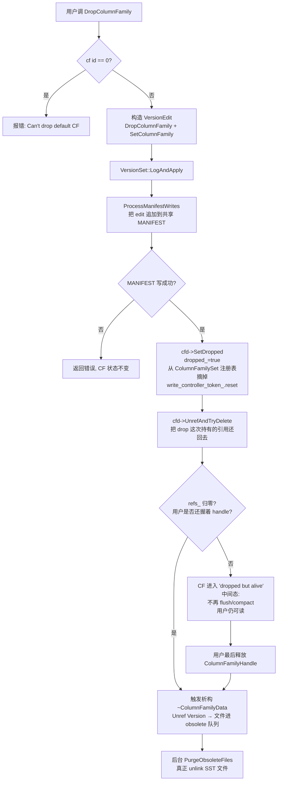

# 第 5 篇 · 第 19 章 · Column Family

> **核心问题**:你已经知道 LSM 的"写路径/读路径/反压限速"这套机制。可真实系统里(TiKV、MySQL RocksDB 引擎、Cassandra),一个引擎实例往往要同时扛好几种完全不同脾气的数据——有的写极多、有的要快速点查、有的是元数据、有的是大 value。朴素地"一种数据开一个 DB 实例",每个实例各一份 WAL、各一套后台线程、各一份缓存,资源浪费、调度各自为政。RocksDB 的回答是 **Column Family(下面简称 CF)**:一个 DB 实例 = 多个 CF,共享一份 WAL、一份 MANIFEST、一套后台线程池,但每个 CF 有自己的 MemTable、自己的 SST 文件、自己的 Options、自己的 Compaction 策略。CF 怎么把"共享省资源"和"独立给隔离"这两件看似矛盾的事同时做到?CF 又怎么 drop 才能不影响别人?——这是 RocksDB 相对 LevelDB 最重要的一次架构演进(LevelDB 没有 CF)。

> **读完本章你会明白**:
> 1. CF 到底"共享"了什么(WAL / MANIFEST / 后台线程池 / RateLimiter / WriteBufferManager)、又"独立"了什么(MemTable / SST / Options / Compaction picker / current Version),以及**这套划分为什么 sound**——为什么这么切既能省资源又不会让 CF 之间互相踩脚。
> 2. 一个 WriteBatch 怎么同时携带多个 CF 的修改,源码里那条 record 的 tag 长什么样(`kTypeColumnFamilyValue` vs `kTypeValue`),recovery 时怎么按 cf id 把 record 分发到对应 CF 的 MemTable。
> 3. 为什么"创建一个 CF"要先写一条带 `AddColumnFamily` 标记的 VersionEdit 到 MANIFEST,为什么"删除一个 CF"是**逻辑的 + 异步的**——drop 时一行 SST 都不删,真正的物理删除要等用户放掉 handle、引用计数归零。
> 4. 朴素地"开多个 DB 实例"会撞什么墙(每个实例各一份 WAL/线程池/缓存,资源放大 N 倍、连接和打开文件数爆炸、各实例 Compaction 调度不能协调),以及为什么 CF 是这个问题的解。
> 5. 多 CF 共享后台线程池和 RateLimiter 时,为什么会出现"多 CF 争后台资源"的现象——这是 TiKV 这类系统调优时绕不开的坑。

> **如果一读觉得太难**:先只记住三件事——① **一个 DB 实例 = 多个 CF;CF 共享 WAL/MANIFEST/线程池,独立 MemTable/SST/Options**;② **drop 一个 CF 不立刻删 SST,只是打个 dropped 标记**,真正的删除是异步的、要等引用归零;③ **多 CF 在后台资源(线程池/RateLimiter)上是竞争关系**,不是"开了 N 个 CF 就有 N 倍后台能力"。这三句话够你跟同事讲清 CF 是什么。

---

## 〇、一句话点破

> **Column Family 是 RocksDB 在"一个物理引擎实例"之上画出的一条逻辑边界——边界以内共享(WAL/MANIFEST/线程池/限速器),边界以外隔离(MemTable/SST/Options/Compaction)。共享是为了省资源,隔离是为了让每个 CF 按自己的脾气调参。这是 LevelDB 没有、RocksDB 2014 年补上的核心架构演进。**

这是结论,不是理由。本章倒过来拆:先讲 LevelDB 没有 CF 时撞了什么墙,再讲"开多个 DB 实例"这个朴素解法为什么不行,然后讲 CF 怎么把"共享"和"隔离"切在一根精妙的线上,最后讲 drop 的逻辑删除语义和它与 Compaction 的关系。

---

## 一、LevelDB 没有 CF:多 workload 一个实例扛不住

要讲清 CF 解决什么,先得讲清 LevelDB 没有 CF 时,真实业务撞了什么墙。

### LevelDB 的世界:一个 DB 就一个"逻辑库"

LevelDB 的模型很简单(《LevelDB》那本拆过):一个 `DB::Open` 打开一个实例,这个实例就是**一个逻辑库**——只有一份 MemTable(及 immutable)、一组 SST 文件、一份 Options、一份 WAL、一份 MANIFEST。没有"在同一个实例里再开一个逻辑库"的概念。

如果一个业务里有**好几种不同脾气的数据**,在 LevelDB 的世界里只有两条路:

1. **全部塞进一个实例**:写极多的热点数据和读极敏感的元数据混在一起,共用同一份 MemTable、同一套 Compaction 参数、同一份 WAL。结果是谁都调不好——给热点数据调大 MemTable,元数据就被拖累;给元数据压层数加密 Bloom,热点数据的写放大又爆了。
2. **每种数据开一个独立的 LevelDB 实例**:实例 A 存热点写、实例 B 存元数据、实例 C 存大 value……每个实例有自己的 MemTable/SST/Options,互不干扰。这看起来解了隔离问题,但马上撞另一堵墙(下一节细讲)。

> **不这样会怎样**:Facebook 2014 年的工程博客(Siying Dong 等)说得很直白:他们内部很多业务(Hyperbase、TaoAuth、ZippyDB 的前身)一个 DB 要存好几种 workload,例如存用户数据 + 索引 + 计数器,这些 workload 的 Compaction 策略、MemTable 大小、压缩算法全不该一样。LevelDB 没给"一个实例内多逻辑库"的能力,只能开多个实例,然后就被多实例的资源开销和运维复杂度吃掉。这正是 CF 诞生的直接动机。

### 为什么 LevelDB 没做 CF

不是 LevelDB 的作者没想到,而是 LevelDB 的定位是"**够用就好的单机小 KV**"——《LevelDB》那本反复讲,LevelDB 的设计假设是"单机、中等负载、简单 KV"。在这种假设下,一个实例一个逻辑库完全够用。CF 是个**工业级特性**:它要解决的是"一个实例扛多 workload"这个只有工业场景才会撞上的问题,LevelDB 不在那个场景里,自然不做。

> **钉死这件事**:CF 不是"LevelDB 的功能补丁",而是 RocksDB 走向工业级时**必须补上的一层架构**。它把"逻辑库"这个概念从"等于一个 DB 实例"解耦成"多个逻辑库共享一个 DB 实例"——这一个解耦,让 RocksDB 从"嵌入式小 KV"升级成"能扛真实业务的存储引擎"。这是后续 TiKV(MySQL 之下的存储)、MySQL 的 RocksDB 引擎、Cassandra 选中 RocksDB 的前提——没有 CF,这些系统得多开好几套引擎。

---

## 二、朴素解法撞墙:开多个 DB 实例为什么不行

那"每种数据开一个独立 LevelDB 实例"这个朴素解法,到底撞什么墙?这是理解 CF 设计的关键——CF 的每一个"共享"决策,都是在堵这堵墙上的某个洞。

### 墙一:WAL 文件数爆炸,顺序写变随机写

每个独立 DB 实例各有一份 WAL。你开 10 个实例,磁盘上就同时有 10 个活跃 WAL 文件在追加写。磁盘(尤其是机械盘,SSD 也好不到哪)对"10 个文件交替追加"的友好度,远远不如"1 个文件连续追加"——10 个文件的写指针散布在盘上不同位置,交替写实际上变成了**某种程度的随机写**,fsync 的开销也叠加。

更糟的是 **WAL 复用**(P1-03 讲过):RocksDB 的 recycled log 是把同一个文件反复重写省分配,多实例时每个实例要管理自己的一套 recycled log,文件句柄、目录项、inode 都乘以 N。

### 墙二:后台线程池 ×N,IO 抢占失控

每个 DB 实例都自己起一套后台线程做 flush/compaction(默认几个到十几个线程)。10 个实例就是 100 多个后台线程,它们各自往磁盘塞 IO,**没有全局的 IO 限速和优先级协调**——一个实例的 compaction 抢占另一个实例的 flush,前台写延迟立刻抖。

> **钉死这件事**:这正是 P5-18 Rate Limiter 要解决的问题,但 Rate Limiter 是**一个 DB 实例内**的限速器。多实例时,每个实例各一个 RateLimiter,各自不知道对方的吞吐,**全局 IO 仍然失控**。所以多实例本质上是放弃了"全局 IO 协调"这个能力。

### 墙三:Block Cache 各管各,缓存复用率为零

每个实例各一个 Block Cache(各自默认 32MB 或用户配置的几 GB)。但业务里往往**多个逻辑库访问的数据有重叠**(比如索引 CF 引用主数据 CF 的 key),或者**热点集中在某几个 CF**——多实例时,热点数据在每个实例的 cache 里各存一份,内存浪费,命中率反而低。

理想情况是:**所有逻辑库共享一个大 Block Cache,LRU 自然把冷数据淘汰、热数据留下**,命中率最高。多实例做不到。

### 墙四:打开文件数、连接数、运维成本 ×N

每个 DB 实例打开自己的 SST 文件、自己的 MANIFEST、自己的 CURRENT。Linux 默认每个进程文件描述符上限是 1024(生产环境改大到几十万),多实例会让 fd 消耗急剧上升。同时每个实例独立的 `DB::Open`、独立的 Options 校验、独立的 stats 收集、独立的备份/Checkpoint 接口——运维心智成本随实例数线性增长。

### 墙五:跨逻辑库的原子写做不到

转账场景:扣 A 账户(key 在 CF_A)、加 B 账户(key 在 CF_B)要原子。多实例时,A 和 B 在不同 DB 实例里,**没有跨实例的原子提交**(除非上 2PC,代价巨大)。而 CF 的设计里,一个 WriteBatch 可以同时携带多个 CF 的修改,一次 WAL 写就原子了——这是 CF 在功能层面的红利(后文细讲)。

> **不这样会怎样**:朴素多实例这条路,**每一个"墙"都对应一项资源或能力的 ×N 放大**:WAL ×N、线程池 ×N、缓存各管各、fd ×N、跨实例原子写做不到。Facebook 内部业务真实撞过这些墙,才有了 CF。下一节拆 CF 怎么把"共享"和"隔离"切在一根线上,逐一堵掉这五堵墙。

---

## 三、CF 的共享/独立边界:这是本章最该记住的一张图

讲清楚墙之后,CF 的设计就呼之欲出了。CF 的核心架构,**就是一张"共享什么 vs 独立什么"的边界图**。这张图请记一辈子,后续所有 CF 相关的源码都在解释这张图为什么这么切。

### ASCII 框图:一个 DB 实例 = 多个 CF

```
 ┌─────────────────────────────────────────────────────────────────┐
 │                      一个 DB 实例 (DBImpl)                       │
 │                                                                  │
 │   ┌─────────────── 共享层(一个实例只有一份)────────────────┐  │
 │   │  WAL(logs_ deque,活跃 = back)                         │  │
 │   │  MANIFEST(descriptor_log_ + CURRENT)                    │  │
 │   │  后台线程池(Env HIGH=flush / LOW=compaction / BOTTOM)│  │
 │   │  RateLimiter(令牌桶,DBOptions::rate_limiter)        │  │
 │   │  WriteBufferManager(跨 CF 算总 memtable 内存)         │  │
 │   │  WriteController(stall/delay 反压,跨 CF)             │  │
 │   │  VersionSet(统一管所有 CF 的 Version/MANIFEST)        │  │
 │   │  ColumnFamilySet(CF 注册表,max_column_family_)         │  │
 │   │  Env / FileSystem / IOTracer                              │  │
 │   │  Block Cache(默认共享,用户可选独立——见技巧精解)      │  │
 │   └──────────────────────────────────────────────────────────┘  │
 │                            │                                     │
 │            ┌───────────────┼───────────────┐                     │
 │            ▼               ▼               ▼                     │
 │   ┌──────────────┐ ┌──────────────┐ ┌──────────────┐             │
 │   │  CF "default"│ │  CF "lock"   │ │  CF "write"  │  ... N 个   │
 │   │  id=0        │ │  id=1        │ │  id=2        │             │
 │   │ ─────────── │ │ ─────────── │ │ ─────────── │             │
 │   │ MemTable mem_│ │ MemTable mem_│ │ MemTable mem_│ ◄── 独立   │
 │   │ MemTableList │ │ MemTableList │ │ MemTableList │             │
 │   │   imm_       │ │   imm_       │ │   imm_       │             │
 │   │ Version链    │ │ Version链    │ │ Version链    │ ◄── 独立   │
 │   │ (current_/   │ │ (current_/   │ │ (current_/   │   (各自SST)│
 │   │  dummy_)     │ │  dummy_)     │ │  dummy_)     │             │
 │   │ ioptions_ +  │ │ ioptions_ +  │ │ ioptions_ +  │ ◄── 独立   │
 │   │ mutable_cf_  │ │ mutable_cf_  │ │ mutable_cf_  │   Options  │
 │   │   options_   │ │   options_   │ │   options_   │             │
 │   │ compaction_  │ │ compaction_  │ │ compaction_  │ ◄── 独立   │
 │   │   picker_    │ │   picker_    │ │   picker_    │   (Level/   │
 │   │ (Level/Univ/ │ │ (Level/Univ/ │ │ (FIFO/...)   │    Univ/    │
 │   │  FIFO)       │ │  ...)        │ │              │    FIFO)   │
 │   │ internal_    │ │ internal_    │ │ internal_    │ ◄── 独立   │
 │   │   stats_     │ │   stats_     │ │   stats_     │   统计     │
 │   │ table_cache_ │ │ table_cache_ │ │ table_cache_ │ ◄── 独立   │
 │   │  (但底层     │ │  (但底层     │ │  (但底层     │   外壳,共享 │
 │   │   Cache*     │ │   Cache*     │ │   Cache*     │   块缓存)  │
 │   │   共享)      │ │   共享)      │ │   共享)      │             │
 │   │ dropped_     │ │ dropped_     │ │ dropped_     │ ◄── 独立   │
 │   │ refs_        │ │ refs_        │ │ refs_        │   状态     │
 │   └──────────────┘ └──────────────┘ └──────────────┘             │
 └─────────────────────────────────────────────────────────────────┘
```

这张图把 CF 的全部架构一次说清:**上面一条共享层,下面挂 N 个独立 CF**。每个 CF 是一个 `ColumnFamilyData` 对象(`db/column_family.h`),持有自己的 MemTable、Version 链、Options、Compaction picker;而 WAL、MANIFEST、线程池这些 DB 级资源在 DBImpl / VersionSet / ColumnFamilySet 里,CFD 只通过指针回指。

### 共享了什么(为什么共享)

| 共享组件 | 源码位置 | 共享的好处(堵了哪堵墙) |
|---|---|---|
| **WAL** | `DBImpl::logs_`(`db/db_impl/db_impl.h:3285`)是 DB 级 deque,活跃 WAL = `logs_.back().writer` | 一个文件连续追加,顺序写吞吐最佳;多 CF 的写攒在 WriteGroup 里一次写 WAL(墙一) |
| **MANIFEST** | `VersionSet::descriptor_log_` + `CURRENT`,所有 CF 的 VersionEdit 串行追加到同一份 | 一份元数据,原子性好,recovery 一次重放全恢复(墙一) |
| **后台线程池** | `Env::Priority::HIGH/LOW/BOTTOM`,`db_impl_compaction_flush.cc:3281/3336/2518` 调度 | 多 CF 共享一套后台线程,可全局限速、优先级协调(墙二) |
| **RateLimiter** | `DBOptions::rate_limiter`(`include/rocksdb/options.h:734`),DB 级 shared_ptr | 所有 CF 的后台 IO 进同一个令牌桶,全局 IO 限速成立(墙二) |
| **WriteBufferManager** | `DBOptions::write_buffer_manager`(`options.h:1267`),DB 级 shared_ptr | 跨 CF 算总 MemTable 内存,达到全局阈值触发 flush,内存预算可控 |
| **WriteController** | `ColumnFamilySet::write_controller_`(`column_family.h:871`),DB 级 | stall/delay 反压是跨 CF 全局的,不会因为一个 CF 没压力就让另一个 CF 把系统淹了 |
| **Block Cache** | 默认每个 CF 的 `BlockBasedTableFactory` 自动建 32MB cache,但 `shared_ptr<Cache>` 可由用户传同一个对象实现跨 CF 共享 | 热点数据跨 CF 共享,命中率最高(墙三) |
| **VersionSet / ColumnFamilySet** | `version_set.h` / `column_family.h:761` | 统一管所有 CF 的 Version 和元数据,跨 CF 操作(如 backup)一致 |

### 独立了什么(为什么独立)

| 独立组件 | 源码位置(ColumnFamilyData 字段) | 独立的好处 |
|---|---|---|
| **MemTable(active)** | `mem_`(`column_family.h:679`) | 每 CF 独立写缓冲,大小、跳表 rep 各自可配 |
| **Immutable MemTable 队列** | `imm_`(MemTableList,`:680`) | 每 CF 独立 flush 进度 |
| **Version 链(指向 SST 文件集)** | `current_`(`:645`)/ `dummy_versions_`(`:644`) | 每 CF 有自己的 SST 文件、自己的读放大 |
| **Options 三件套** | `initial_cf_options_`(`:663`)/ `ioptions_`(`:664`)/ `mutable_cf_options_`(`:665`) | 每 CF 独立调参(write_buffer_size/compaction_style/max_bytes_for_level_base...),按 workload 各调各的 |
| **Compaction picker** | `compaction_picker_`(`:705`) | 每 CF 可选不同策略(Level/Universal/FIFO),写多的 CF 用 Universal、读多的 CF 用 Level |
| **InternalStats** | `internal_stats_`(`:675`) | 每 CF 独立统计,调优时可分别看 |
| **dropped / refs 状态** | `dropped_`(`:649`)/ `refs_`(`:647`) | drop 一个 CF 不影响别的 CF(逻辑删除语义,见第五节) |

> **所以这样设计**:这套"共享/独立"划分 sound 在哪?**共享的都是"全局资源"(IO、内存、线程、磁盘文件),独立的全是"per-CF 配置和 per-CF 数据"**。共享全局资源是为了省(WAL 一个文件够用何必开 N 个、线程池一套够调度何必起 N 套、缓存一份命中率最高何必各存一份);独立 per-CF 配置是为了隔离(每种 workload 按自己脾气调参、互不干扰,谁也不拖累谁)。**这两个目标在朴素多实例里是冲突的(独立 = 多实例 = 资源放大),CF 用"在同一个实例里画逻辑边界"把它们同时拿到**——这是 CF 的全部精妙。

### 这套划分的两个微妙点

有两个地方容易看走眼,这里先点破,后面技巧精解再展开:

1. **Block Cache 既"共享"又"独立"**:默认每个 CF 的 `BlockBasedTableFactory` 自己建一个 32MB cache(独立),但用户把同一个 `shared_ptr<Cache>` 传给多个 CF 的 TableFactory,就变成共享。这是 RocksDB 给用户的**旋钮**——共享省内存提命中率,独立避免一个 CF 把另一个 CF 的热数据挤出去(比如大 value CF 不该挤掉索引 CF 的热点)。这是"共享 vs 独立"在缓存这一层留给了用户决定。

2. **WAL/MANIFEST 共享,但每条 record 带 cf id**:WAL 是一份,但里面的每条 WriteBatch record 都用 ValueType tag 标了它属于哪个 CF——共享是物理上一份,recovery 时按 cf id 拆开分发到各 CF 的 MemTable。这是"共享"和"隔离"在同一份文件里共存的技巧(第四节细讲)。

---

## 四、共享一份 WAL:WriteBatch 的 record 怎么带 cf id

这一节拆 CF 怎么在"共享一份 WAL"的同时还能"区分各 CF 的数据"。这是 CF 设计里最巧的一段。

### LevelDB 怎么写死:WAL record 只有一种格式

LevelDB 的 WAL record 格式很简单(《LevelDB》那本拆透):一条 record 就是 `tag(1字节) + key(varstring) + value(varstring)`,tag 是 `kTypeValue` 或 `kTypeDeletion`。因为 LevelDB 一个实例只有一个逻辑库,record 不需要带"属于哪个逻辑库"的信息——全都是这一个库的。

RocksDB 要支持多 CF,record 就必须能携带"我属于哪个 CF"的信息。怎么做?**最朴素的做法是给 tag 扩展一套 CF 版本**——普通 put 用 `kTypeValue`,CF 的 put 用 `kTypeColumnFamilyValue` 并在 tag 后面塞一个 varint32 的 cf id。这正是 RocksDB 的做法。

### RocksDB 的做法:ValueType 枚举一套 CF 版本

`db/dbformat.h:41-78` 定义了完整的 `ValueType` 枚举(逐字摘录):

```cpp
// db/dbformat.h:41-78
enum ValueType : unsigned char {
  kTypeDeletion = 0x0,
  kTypeValue = 0x1,
  kTypeMerge = 0x2,
  kTypeLogData = 0x3,               // WAL only.
  kTypeColumnFamilyDeletion = 0x4,  // WAL only.
  kTypeColumnFamilyValue = 0x5,     // WAL only.
  kTypeColumnFamilyMerge = 0x6,     // WAL only.
  kTypeSingleDeletion = 0x7,
  kTypeColumnFamilySingleDeletion = 0x8,  // WAL only.
  kTypeBeginPrepareXID = 0x9,             // WAL only.
  kTypeEndPrepareXID = 0xA,               // WAL only.
  kTypeCommitXID = 0xB,                   // WAL only.
  kTypeRollbackXID = 0xC,                 // WAL only.
  kTypeNoop = 0xD,                        // WAL only.
  kTypeColumnFamilyRangeDeletion = 0xE,   // WAL only.
  kTypeRangeDeletion = 0xF,               // meta block
  kTypeColumnFamilyBlobIndex = 0x10,      // Blob DB only
  kTypeBlobIndex = 0x11,                  // Blob DB only
  kTypeBeginPersistedPrepareXID = 0x12,  // WAL only.
  kTypeBeginUnprepareXID = 0x13,  // WAL only.
  kTypeDeletionWithTimestamp = 0x14,
  kTypeCommitXIDAndTimestamp = 0x15,  // WAL only
  kTypeWideColumnEntity = 0x16,
  kTypeColumnFamilyWideColumnEntity = 0x17,     // WAL only
  kTypeValuePreferredSeqno = 0x18,              // Value with a unix write time
  kTypeColumnFamilyValuePreferredSeqno = 0x19,  // WAL only
  kTypeMaxValid,
  kMaxValue = 0x7F
};
```

注意几个关键点:

- **`kTypeValue = 0x1`(普通 put)对应 `kTypeColumnFamilyValue = 0x5`(带 CF 的 put)**,删除、Merge、SingleDeletion、RangeDeletion、BlobIndex、WideColumnEntity、ValuePreferredSeqno 各有自己的一套 CF 版本(`0x4`/`0x6`/`0x8`/`0xE`/`0x10`/`0x17`/`0x19`)。注释里写 `// WAL only.` 的意思是这个 tag 只出现在 WriteBatch/WAL 里,**不会落到 SST**——SST 里的 internal key 不带 cf id(SST 本身就属于某个 CF,没必要再带)。
- **`kTypeLogData = 0x3`** 是给 WriteBatch 的 `PutLogData` 用的,这种 record 只写 WAL 不进 MemTable(比如 2PC 的元数据、自定义的 marker)。
- **2PC 标记**(`kTypeBeginPrepareXID` 到 `kTypeRollbackXID`)也是 WAL only,这套是 Transaction 用的(P6-21 讲)。
- `kMaxValue = 0x7F`——注释说"最高位保留给 SST 灵活编码",所以 ValueType 实际只用低 7 位。

> **LevelDB 是写死的,RocksDB 打开成了旋钮**:LevelDB 的 record 只有 `kTypeValue`/`kTypeDeletion` 两种 tag,因为单逻辑库不需要带 cf id;RocksDB 给每类操作扩展了 `kTypeColumnFamily*` 版本,带 varint32 cf id,一份 WAL 就能装下所有 CF 的 record。这是"支持多 CF"在 WAL 格式上的最小改动——不破坏向后兼容(单 CF 时只用 `kTypeValue`,和 LevelDB 一样),多 CF 时切到 `kTypeColumnFamilyValue` 加 5 字节 tag + varint cf id。

### WriteBatch 的物理编码:12 字节 header + 一串 record

整个 WriteBatch 的物理编码(写入 WAL 的就是这一坨):

- **Header:12 字节**(`db/write_batch_internal.h:80-81`,`kHeader = 12`):前 8 字节是 starting sequence number,后 4 字节是 record count。
- **然后是一串 record**,每条 record 一个 tag(+ 可选 cf id)+ 内容。

一条 `kTypeColumnFamilyValue` record 的具体编码,看 `db/write_batch.cc:858-876` 的 `WriteBatchInternal::Put`:

```cpp
// db/write_batch.cc:858-876(简化示意,保留关键逻辑)
Status WriteBatchInternal::Put(WriteBatch* b, uint32_t column_family_id,
                               const Slice& key, const Slice& value) {
  ...
  WriteBatchInternal::SetCount(b, WriteBatchInternal::Count(b) + 1);
  if (column_family_id == 0) {
    b->rep_.push_back(static_cast<char>(kTypeValue));        // default CF 用普通 tag
  } else {
    b->rep_.push_back(static_cast<char>(kTypeColumnFamilyValue));
    PutVarint32(&b->rep_, column_family_id);                  // 非 default CF:tag 后塞 varint cf id
  }
  PutLengthPrefixedSlice(&b->rep_, key);                      // varint32 len + key bytes
  PutLengthPrefixedSlice(&b->rep_, value);                    // varint32 len + value bytes
  ...
}
```

注意一个**优化**:default CF(cf id == 0)用 `kTypeValue`,省掉 varint cf id 那 1 字节——绝大多数业务 default CF 最忙,这个省法对吞吐有意义。非 default CF 用 `kTypeColumnFamilyValue` + varint cf id(cf id 小时只占 1 字节)。这是"零开销 default CF"的设计——单 CF 用法(只有 default)的 WAL 和 LevelDB 完全一致。

一条 CF put record 的物理形态:

```
┌──────┬───────────┬─────────────────────┬───────────────────────┐
│ tag  │ cf_id     │ key                  │ value                  │
│ 1B   │ varint32  │ varint32 len + bytes │ varint32 len + bytes   │
│ 0x05 │ 通常是 1B │                      │                        │
└──────┴───────────┴─────────────────────┴───────────────────────┘
```

### WriteGroup:多 CF 的 batch 攒成一份写 WAL

光有 record 格式还不够。CF 共享 WAL 的真正甜头在于:**多个 CF 的并发写攒在 WriteGroup 里,由 leader 一次性把整组 batch 合并写进一份 WAL**——这是 P1-02 讲过的 WriteGroup 批写在 CF 场景的威力。

`db/db_impl/db_impl_write.cc:2215-2258` 的 `MergeBatch` 做这件事:

```cpp
// db/db_impl/db_impl_write.cc:2215-2258(简化示意)
Status DBImpl::MergeBatch(const WriteThread::WriteGroup& write_group,
                          WriteBatch* tmp_batch, WriteBatch** merged_batch,
                          size_t* write_with_wal,
                          WriteBatch** to_be_cached_state) {
  ...
  if (write_group.size == 1 && !leader->CallbackFailed() &&
      leader->batch->GetWalTerminationPoint().is_cleared()) {
    // 只有一个 batch,直接用它
    *merged_batch = leader->batch;
  } else {
    // 多个 batch:全部 Append 到 tmp_batch,拍平
    *merged_batch = tmp_batch;
    for (auto writer : write_group) {
      if (!writer->CallbackFailed()) {
        Status s = WriteBatchInternal::Append(*merged_batch, writer->batch,
                                              /*WAL_only*/ true);
        ...
      }
    }
  }
  return Status::OK();
}
```

`db/db_impl/db_impl_write.cc:2321-2344` 里 leader 拿到 merged_batch 后一次 `WriteToWAL`:

```cpp
// db/db_impl/db_impl_write.cc:2321-2344(简化示意)
io_s = status_to_io_status(MergeBatch(write_group, &tmp_batch_, &merged_batch,
                                      &write_with_wal, &to_be_cached_state));
WriteBatchInternal::SetSequence(merged_batch, sequence);
...
io_s = WriteToWAL(*merged_batch, write_options, log_writer, wal_used,
                  &log_size, wal_file_number_size, sequence);
```

`WriteToWAL`(`db_impl_write.cc:2262-2274`)就是把 merged_batch 的内容(`WriteBatchInternal::Contents`)作为一个 log entry 写到 `log_writer`(就是 `logs_.back().writer`,DB 级唯一活跃 WAL)。

> **钉死这件事**:这一段是 CF 共享 WAL 的精髓——**整组 WriteBatch(可能来自 N 个不同 CF、N 个不同客户端)被 leader 合并成一份,一次 sync 写进同一份 WAL**。followers 全部 piggyback 在 leader 这一次写上,零额外 IO。这是 CF 共享 WAL 不止"物理上一份",而是"批写合并还把多 CF 的写攒成一次落盘"——共享 + 批写的双重红利。这也解了墙五(跨逻辑库原子写):一个 WriteBatch 可以同时携带 CF_A 和 CF_B 的修改,这一次 WAL 写原子了。

### Recovery:按 cf id 把 record 分发回各 CF 的 MemTable

WAL 共享完了,recovery 时怎么拆?——`WriteBatch::Iterate` 按 tag 解 record,遇到 `kTypeColumnFamily*` 就读出 cf id,从 `ColumnFamilyMemTables` 表里查到该 CF 的 MemTable,把 record 插进去。

`db/write_batch.cc:3327-3347` 是 recovery 用的 `InsertInto` 重载:

```cpp
// db/write_batch.cc:3327-3347(简化示意)
Status WriteBatchInternal::InsertInto(
    const WriteBatch* batch, ColumnFamilyMemTables* memtables,
    FlushScheduler* flush_scheduler,
    TrimHistoryScheduler* trim_history_scheduler,
    bool ignore_missing_column_families, uint64_t log_number, DB* db,
    bool concurrent_memtable_writes, SequenceNumber* next_seq,
    bool* has_valid_writes, bool seq_per_batch, bool batch_per_txn) {
  MemTableInserter inserter(Sequence(batch), memtables, flush_scheduler,
                            trim_history_scheduler, ...);
  Status s = batch->Iterate(&inserter);   // 逐 record 遍历,按 tag 分发
  ...
}
```

`MemTableInserter` 在 `db/write_batch.cc:2228-2248` 按 cf id 找 MemTable:

```cpp
// db/write_batch.cc:2228-2248(简化示意)
bool SeekToColumnFamily(uint32_t column_family_id, Status* s) {
  ...
  bool found = cf_mems_->Seek(column_family_id);   // 按 cf_id 定位 CF
  ...
  auto* current = cf_mems_->current();
}
```

`PutCFImpl` 在 `:2305` 拿到 MemTable 插入:`MemTable* mem = cf_mems_->GetMemTable();`。

> **不这样会怎样**:如果 WAL 不带 cf id(每条 record 不标 CF),recovery 时就不知道这条 record 该塞给哪个 CF 的 MemTable——共享 WAL 就破产了。RocksDB 的做法是**让 record 自带 cf id**,共享是物理上一份、逻辑上按 cf id 切开。这是"共享 + 隔离"在同一份 WAL 文件里共存的全部技巧。

---

## 五、CF 的 Create 与 Drop:逻辑删除与异步回收

讲完了 CF 怎么"共享 + 隔离"运行,这一节拆 CF 的生命周期——创建一个 CF、删除一个 CF 在源码里到底做了什么。这里有个反直觉的点:**drop 一个 CF 不立刻删 SST**,这是个逻辑的 + 异步的操作。

### Create CF:先写一条 VersionEdit 到 MANIFEST

创建一个 CF 的入口是 `DBImpl::CreateColumnFamily`,`db/db_impl/db_impl.cc:4446` 是公开重载,内部调 `CreateColumnFamilyImpl`(`:4518`):

```cpp
// db/db_impl/db_impl.cc:4518-4606(简化示意,保留关键步骤)
Status DBImpl::CreateColumnFamilyImpl(const ReadOptions& read_options,
                                      const WriteOptions& write_options,
                                      const ColumnFamilyOptions& cf_options,
                                      const std::string& column_family_name,
                                      ColumnFamilyHandle** handle) {
  ...
  // 1. 加锁查重
  InstrumentedMutexLock l(&mutex_);
  if (GetColumnFamily(column_family_name) != nullptr) {
    return Status::InvalidArgument("Column family already exists");
  }

  // 2. 构造 VersionEdit
  VersionEdit edit;
  edit.AddColumnFamily(column_family_name);                  // 置 is_column_family_add_ = true
  edit.SetColumnFamily(
      GetColumnFamilySet()->GetNextColumnFamilyID());         // 分配新 cf id
  edit.SetLogNumber(cur_wal_number_);                         // 记下创建时的 WAL 号
  edit.SetComparatorName(BytewiseComparator()->Name());
  ...

  // 3. LogAndApply 写入 MANIFEST
  // 注释原文:LogAndApply will both write the creation in MANIFEST and
  //          create ColumnFamilyData object
  s = versions_->LogAndApply(nullptr, read_options, write_options,
                             {&edit}, &mutex_, directories_.GetDbDir(),
                             /*new_descriptor_log=*/false, &cf_options);
  ...
}
```

关键三步:**① 查重 → ② 构造带 `AddColumnFamily` 标记的 VersionEdit(带新分配的 cf id)→ ③ `LogAndApply` 把这条 edit 写到 MANIFEST**。注意注释那句:`LogAndApply will both write the creation in MANIFEST and create ColumnFamilyData object`——**真正 new ColumnFamilyData 是在 LogAndApply 内部、MANIFEST 写成功之后**。

`db/version_set.cc:8294` 的 `VersionSet::CreateColumnFamily` 是真正 new CFD 的地方:

```cpp
// db/version_set.cc:8294(简化示意)
ColumnFamilyData* VersionSet::CreateColumnFamily(
    const ColumnFamilyOptions& cf_options, const ReadOptions& read_options,
    const VersionEdit* edit, bool read_only) {
  assert(edit->IsColumnFamilyAdd());
  ...
  auto new_cfd = column_family_set_->CreateColumnFamily(
      edit->GetColumnFamilyName(), edit->GetColumnFamily(), dummy_versions,
      cf_options, read_only);
  Version* v = new Version(new_cfd, this, ...);
  AppendVersion(new_cfd, v);
  new_cfd->CreateNewMemtable(LastSequence());     // 给新 CF 建 MemTable
  new_cfd->SetLogNumber(edit->GetLogNumber());
  return new_cfd;
}
```

> **钉死这件事**:Create CF 的顺序是 **"先持久化 MANIFEST,再 new CFD 对象"**——这是 LSM 引擎的通用模式:任何影响数据布局的元数据变更,必须先落盘 MANIFEST(WAL 的精神),内存里的 CFD 对象才能动。这样哪怕在 `new CFD` 之前崩溃,recovery 时 MANIFEST 重放就能把 CF 重新建出来,不会"内存里有但磁盘上没有"的不一致。**先写 MANIFEST 后改内存**这个顺序是 LSM 元数据变更的铁律,CF 的 create/drop 都守这条。

### MANIFEST 怎么记录 CF:VersionEdit 带 cf id

`db/version_edit.h` 里,VersionEdit 有专门的 CF 字段(`:1118`/`:1122`/`:1123`):

```cpp
// db/version_edit.h:1118-1125
// Each version edit record should have column_family_ set
// If it's not set, it is default (0)
uint32_t column_family_ = 0;
bool is_column_family_drop_ = false;
bool is_column_family_add_ = false;
std::string column_family_name_;
```

注释那句很关键:**"Each version edit record should have column_family_ set"**——MANIFEST 里**每一条** VersionEdit(不管是 CF add/drop 这种元数据 edit,还是普通的"新增了 SST 文件 X"这种文件 edit)都带 cf id。这是多 CF 共享 MANIFEST 的方式:一份 MANIFEST 文件,里面每条 edit 都标了"我属于哪个 CF"。

CF 操控型 edit 的相关方法(`version_edit.h:954-984`):

```cpp
// db/version_edit.h:954-984(简化示意)
void SetColumnFamily(uint32_t column_family_id) { column_family_ = column_family_id; }
uint32_t GetColumnFamily() const { return column_family_; }
void AddColumnFamily(const std::string& name) {
  assert(!is_column_family_drop_);
  assert(NumEntries() == 0);
  is_column_family_add_ = true;
  column_family_name_ = name;
}
void DropColumnFamily() {
  assert(!is_column_family_add_);
  assert(NumEntries() == 0);
  is_column_family_drop_ = true;
}
bool IsColumnFamilyManipulation() const {
  return is_column_family_add_ || is_column_family_drop_;
}
```

注意几个 assert:`is_column_family_add_` 和 `is_column_family_drop_` 互斥,且都要求 `NumEntries() == 0`——**CF 增删 edit 必须是"纯元数据"记录,不能夹带文件改动**。这意味着一次 CF add/drop 独占一次 MANIFEST 写(后文讲 LogAndApply 时会再印证)。

### Drop CF:逻辑删除,不立刻删 SST

这是 CF 最反直觉的一点。drop 一个 CF 时,RocksDB **一行 SST 都不删**。看 `DropColumnFamilyImpl`,`db/db_impl/db_impl.cc:4657`:

```cpp
// db/db_impl/db_impl.cc:4657-4727(简化示意,保留关键步骤)
Status DBImpl::DropColumnFamilyImpl(ColumnFamilyHandle* column_family) {
  ...
  // 1. 不能 drop default CF
  if (cfd->GetID() == 0) {
    return Status::InvalidArgument("Can't drop default column family");
  }

  // 2. 构造带 dropped 标记的 VersionEdit
  VersionEdit edit;
  edit.DropColumnFamily();            // 置 is_column_family_drop_ = true
  edit.SetColumnFamily(cfd->GetID());  // 带 cf id

  // 3. LogAndApply 写入 MANIFEST
  WriteThread::Writer w;
  write_thread_.EnterUnbatched(&w, &mutex_);
  s = versions_->LogAndApply(cfd, read_options, write_options, &edit,
                             &mutex_, directories_.GetDbDir());
  write_thread_.ExitUnbatched(&w);
  ...
  assert(cfd->IsDropped());   // 此刻 CF 已标记为 dropped
  return s;
}
```

注意:**`DropColumnFamilyImpl` 自己不调 `cfd->SetDropped()`**。真正置 dropped 标志是在 LogAndApply 内部的 `ProcessManifestWrites`,`db/version_set.cc:6605-6609`:

```cpp
// db/version_set.cc:6605-6609(简化示意)
} else if (first_writer.edit_list.front()->IsColumnFamilyDrop()) {
  assert(batch_edits.size() == 1);
  assert(max_last_sequence == descriptor_last_sequence_);
  first_writer.cfd->SetDropped();            // 6608:置 dropped 标志
  first_writer.cfd->UnrefAndTryDelete();     // 6609:把 drop 这次持有的引用还回去
}
```

`SetDropped()` 的实现,`db/column_family.cc:830-838`:

```cpp
// db/column_family.cc:830-838
void ColumnFamilyData::SetDropped() {
  // can't drop default CF
  assert(id_ != 0);
  dropped_ = true;
  write_controller_token_.reset();
  // remove from column_family_set
  column_family_set_->RemoveColumnFamily(this);
}
```

**注意 `SetDropped` 里没有任何文件操作**——只是:① 把 `dropped_` 原子标志置 true;② 把 WriteController 的 token 退掉(不再参与反压计算);③ 从 `ColumnFamilySet` 的注册表(map)里摘掉。**SST 文件一行没删,MemTable 内存一字没释放。**

### 真正的删除:引用计数归零 + 后台 PurgeObsoleteFiles

那 SST 什么时候删?——**等用户释放所有 `ColumnFamilyHandle`,CFD 的引用计数(`refs_`)归零,触发析构;析构里通过 Version 的引用计数机制,让该 CF 的 SST 进入 obsolete 队列,由后台的 `PurgeObsoleteFiles` 物理删除**。

`db/column_family.h:318-333` 的注释把这个契约说得很清楚:

```
// SetDropped() ... After dropping column family no other operation on that
// column family will be executed. All the files and memory will be, however,
// kept around until client drops the column family handle.
// *) Compaction and flush is not executed on the dropped column family.
// *) Client can continue reading from column family.
// When the dropped column family is unreferenced, then we:
// *) Remove column family from the linked list
// *) delete all memory ...
// *) delete all the files ...
```

翻译过来:

- **drop 后**:这个 CF 不再被 flush / compaction(`compaction_flush.cc` 里有 14+ 处 `IsDropped()` 守卫,见第六节)。
- **drop 后但用户还握着 handle**:用户**仍可以读**这个 CF(用现有的 SST,数据还在)。
- **用户放掉 handle 后**:CFD 引用计数归零,析构触发——从链表移除、删内存、删 SST(通过 Version Unref 让文件进 obsolete 队列)。

CFD 的析构函数,`db/column_family.cc:741-794`,关键步骤:

```cpp
// db/column_family.cc:741-794(简化示意)
ColumnFamilyData::~ColumnFamilyData() {
  // 1. 断链
  prev_->next_ = next_;
  next_->prev_ = prev_;

  // 2. 从 ColumnFamilySet 移除(若没在 SetDropped 移除过)
  if (!dropped_ && ... ) {
    column_family_set_->RemoveColumnFamily(this);
  }

  // 3. Unref current_ Version(Version 引用计数归零才真释放)
  if (current_ != nullptr) {
    current_->Unref();
  }

  // 4. 释放 dummy_versions_ 链上的历史 Version(应该已空)
  assert(dummy_versions_->Next() == dummy_versions_);
  dummy_versions_->Unref();

  // 5. 释放 MemTable
  delete mem_->Unref();
  autovector<MemTable*> to_delete;
  imm_.current()->Unref(&to_delete);
  for (MemTable* m : to_delete) delete m;

  // 6. 注销 db paths
  ...
}
```

注意:**析构函数本身也不直接删 SST 文件**——SST 的生命周期由 `TableCache` + Version 的引用计数管理。Version 的 Unref 让文件元数据释放,文件本身进入 `obsolete_files_` 队列,由 `PurgeObsoleteFiles`(`db/db_impl_files.cc`)在后台真正 unlink。

> **不这样会怎样**:如果 drop 时立刻物理删 SST,会撞两个问题——① **正在进行的读**(用户手里还握着 handle、正在 Iterator 扫这个 CF)会被截断,文件没了读就崩;② **正在进行的 Compaction**(可能正在把这个 CF 的某个 SST 合并掉)会因为源文件被删而出错。RocksDB 用"逻辑删除 + 引用计数 + 异步回收"这套机制,让"正在用的人"安全地把数据用完,最后一个用完的人关灯走人时才真删——这是 LSM 引擎处理"删除一个数据集合"的通用 sound 模式(LevelDB 的 Snapshot 也是类似精神,P6-20 讲)。

### Drop 流程图



这张图把 drop 的全生命周期一次说清:**drop 调用只是写 MANIFEST + 打标记**,真正的物理删除在右下角那个"用户放掉 handle → 引用归零 → 析构 → PurgeObsoleteFiles"的异步链路上。中间那个 "dropped but alive" 的状态可能持续很久(只要用户还握着 handle)——这是 CF 设计的精髓,也是初学者最容易看走眼的地方。

---

## 六、CF 与 Compaction:独立 picker + 共享线程池的微妙平衡

讲完了 CF 数据结构的共享/独立和 create/drop 生命周期,这一节拆 CF 与 Compaction 的关系——这是 TiKV 调优时最常踩的坑。

### 每 CF 独立 picker:按自己策略选文件

CFD 有一个 `compaction_picker_` 字段(`column_family.h:705`),每个 CF 在构造时按自己的 `compaction_style` 实例化不同的 picker:

```cpp
// db/column_family.h:705
std::unique_ptr<CompactionPicker> compaction_picker_;
```

`db/column_family.cc:682-705` 的构造函数里(简化):

```cpp
// db/column_family.cc:682-705(简化示意)
switch (ioptions_.compaction_style) {
  case kCompactionStyleLevel:
    compaction_picker_.reset(new LevelCompactionPicker(ioptions_, &ioptions_));
    break;
  case kCompactionStyleUniversal:
    compaction_picker_.reset(new UniversalCompactionPicker(ioptions_, ...));
    break;
  case kCompactionStyleFIFO:
    compaction_picker_.reset(new FIFOCompactionPicker(ioptions_, ...));
    break;
  case kCompactionStyleNone:
    compaction_picker_.reset(new NullCompactionPicker(ioptions_, ...));
    break;
}
```

**每个 CF 可以选不同的 Compaction 策略**——这是 CF 隔离的极致体现:写极多的 CF 用 Universal(写放大小),读敏感的 CF 用 Level(读放大小),时序 CF 用 FIFO(TTL)。同一个 DB 实例里,这三种策略并跑,互不干扰。`NeedsCompaction` 和 `PickCompaction` 都走 per-CF picker:

```cpp
// db/column_family.cc:1259-1262
bool ColumnFamilyData::NeedsCompaction() const {
  return !mutable_cf_options_.disable_auto_compactions &&
         compaction_picker_->NeedsCompaction(current_->storage_info());
}
// db/column_family.cc:1270
auto* result = compaction_picker_->PickCompaction(...);
```

### 但线程池和队列是 DB 级共享:多 CF 争后台资源

picker 是 per-CF 独立的,但"实际启动一个 compaction"是 DB 级调度的。RocksDB 的后台 flush/compaction 走 Env 的全局线程池(`Env::Priority::HIGH/LOW/BOTTOM`),`db/db_impl/db_impl_compaction_flush.cc`:

```cpp
// db/db_impl/db_impl_compaction_flush.cc:3281-3282(flush 进 HIGH 池)
fta->thread_pri_ = Env::Priority::HIGH;
env_->Schedule(&DBImpl::BGWorkFlush, fta, Env::Priority::HIGH, ...);

// db/db_impl/db_impl_compaction_flush.cc:3336(自动 compaction 进 LOW 池)
env_->Schedule(&DBImpl::BGWorkCompaction, ca, Env::Priority::LOW, ...);

// db/db_impl/db_impl_compaction_flush.cc:2518-2524(底层 compaction 进 BOTTOM 池)
if (compaction->bottommost_level() &&
    env_->GetBackgroundThreads(Env::Priority::BOTTOM) > 0) {
  ...
  env_->Schedule(&DBImpl::BGWorkBottomCompaction, ca, Env::Priority::BOTTOM, ...);
}
```

线程上限来自 `mutable_db_options_.max_background_flushes` / `max_background_compactions`(`:3343-3344`)——这是**DBOptions** 字段,DB 级共享,不是 per-CF。

flush 和 compaction 各有一个 **DB 级** 队列(`DBImpl::flush_queue_` / `compaction_queue_`),选 CF 的循环(`BackgroundFlush` / `PickCompactionFromQueue`)从队列头部取一个 CF,过滤掉 dropped / 不再 pending 的,剩下的就是这次要做的。`PickCompactionFromQueue`(`db_impl_compaction_flush.cc:3494-3518`):

```cpp
// db/db_impl/db_impl_compaction_flush.cc:3494-3518(简化示意)
ColumnFamilyData* DBImpl::PickCompactionFromQueue(...) {
  ...
  while (!compaction_queue_.empty()) {
    auto first_cfd = *compaction_queue_.begin();
    compaction_queue_.pop_front();
    ...
    if (!RequestCompactionToken(first_cfd, false, token, log_buffer)) {
      throttled_candidates.push_back(first_cfd);   // 被限流,放回去
      continue;
    }
    cfd = first_cfd;
    cfd->set_queued_for_compaction(false);
    break;
  }
  ...
}
```

`BackgroundFlush`(`db_impl_compaction_flush.cc:3665-3774`)从 `flush_queue_` 取 FlushRequest,过滤掉 dropped CF(`:3755`):

```cpp
// db/db_impl/db_impl_compaction_flush.cc:3755(简化)
if (cfd->IsDropped() || !cfd->imm()->IsFlushPending()) {
  column_families_not_to_flush.push_back(cfd);
  continue;
}
```

> **钉死这件事**:**picker 是 per-CF 独立(决定"做哪种 Compaction、合并哪些文件"),调度是 DB 级共享(决定"现在用哪个后台线程、做哪个 CF 的 Compaction")**。这两层分开是 CF 设计的关键——策略隔离让每个 CF 按自己脾气合并,资源调度共享让全局 IO 受控。但也正因为调度共享,**多 CF 会在后台资源上竞争**:一个 CF 的大 Compaction 把 LOW 池占满,别的 CF 的 Compaction 就得排队,前台写延迟随之抖。

### dropped 的 CF 不参与 flush/compaction:14+ 处守卫

drop 之后的 CF 不会被 flush/compaction 推进。`db/db_impl/db_impl_compaction_flush.cc` 里有 14+ 处 `IsDropped()` 守卫,覆盖调度、安装、压力评估各环节。举几例:

| 行号 | 代码片段 | 含义 |
|---|---|---|
| `:769-771` | `if (cfds[i]->IsDropped()) { continue; }` | flush 等待循环里不再等 dropped CF |
| `:861` | `if (!cfds[i]->IsDropped() && !mems.empty()) { tmp_cfds.emplace_back(...); }` | atomic flush 不纳入 dropped CF |
| `:925-927` | `if (cfds[i]->IsDropped()) { continue; }` | 不为 dropped CF 安装 SuperVersion |
| `:2247-2249` | `if (cfd->IsDropped()) { continue; }` | `FlushAllColumnFamilies` 跳过 dropped CF |
| `:3409` | `if (cfd->IsDropped() || !cfd->initialized()) { continue; }` | dropped CF 不计入写停顿压力估算 |
| `:4234` | `if (!disable_auto_compactions && !cfd->IsDropped())` | dropped CF 不被自动 compaction |

注意:`SwitchMemtable` 本身(`db/db_impl/db_impl_write.cc:3101`)不检查 `IsDropped()`——它只负责把当前 memtable 切成 imm。真正阻断 dropped CF 走完 flush 流程的是调度层(上述守卫),dropped CF 根本不会被 `ScheduleFlushes` 选中,所以它的 imm 即使存在也不会被推进成 SST。这与 `column_family.h:327` 的契约一致:`Compaction and flush is not executed on the dropped column family.`

### 共享 RateLimiter:多 CF 的后台 IO 进同一个令牌桶

`DBOptions::rate_limiter`(`include/rocksdb/options.h:718-734`)是 DB 级 shared_ptr:

```cpp
// include/rocksdb/options.h:718-734(简化)
// Limits internal file read/write bandwidth:
// - Flush requests write bandwidth at Env::IOPriority::IO_HIGH
// - Compaction requests read and write bandwidth at Env::IOPriority::IO_LOW
// Rate limiting is disabled if nullptr.
// Default: nullptr
std::shared_ptr<RateLimiter> rate_limiter = nullptr;
```

**所有 CF 的 flush(走 IO_HIGH)+ compaction(走 IO_LOW)的 IO,进同一个令牌桶**——这是 P5-18 讲过的令牌桶限速在 CF 场景的威力:多 CF 共享一个全局 IO 预算,可以保证后台 IO 不挤占前台(前台读写不走 rate_limiter)。这也是 CF 调优时的一个重要旋钮:把 `rate_limiter` 设到能扛的吞吐,避免一个 CF 的 compaction 把别的 CF 的 flush 拖死。

---

## 七、CF 与 Block Cache / WriteBufferManager:共享是默认还是可选

这一节拆两个特别容易看走眼的共享组件——Block Cache 和 WriteBufferManager。它们的"共享"程度不一样,理解这个区别是 CF 调优的关键。

### Block Cache:默认独立,但可以共享(用户选)

`block_cache` 字段**不在 CFOptions 里**,而在 `BlockBasedTableOptions` 里(通过 TableFactory 配给每个 CF),`include/rocksdb/table.h:380-390`:

```cpp
// include/rocksdb/table.h:380-390
bool no_block_cache = false;
// If non-nullptr and no_block_cache == false, use the specified cache for
// blocks. If nullptr and no_block_cache == false, a 32MB internal cache
// will be created and used.
std::shared_ptr<Cache> block_cache = nullptr;
```

`table/block_based/block_based_table_factory.cc:466-478` 的默认行为:

```cpp
// table/block_based/block_based_table_factory.cc:466-478(简化)
void BlockBasedTableFactory::InitializeOptions() {
  ...
  if (table_options_.no_block_cache) {
    table_options_.block_cache.reset();                  // 禁用
  } else if (table_options_.block_cache == nullptr) {    // 用户没传
    // Now using AutoHCC by default, with existing default size of 32MB
    HyperClockCacheOptions hcc_opts{size_t{32} << 20};   // 32MB
    table_options_.block_cache = hcc_opts.MakeSharedCache();  // 自动建一个
  }
}
```

所以默认行为是:**每个 CF 的 TableFactory 自己建一个 32MB 的 HyperClockCache(独立)**。但因为 `block_cache` 是 `shared_ptr<Cache>`,用户可以把**同一个 Cache 对象**传给多个 CF 的 `BlockBasedTableOptions`,实现跨 CF 共享。

> **LevelDB 是写死的,RocksDB 打开成了旋钮**:LevelDB 一个实例就一个 LRU cache,没有"共享还是独立"的选择(因为只有一个逻辑库)。RocksDB 给了用户这个旋钮——共享的好处是热点跨 CF 复用、命中率最高、内存利用率最高;独立的好处是避免一个 CF 的冷数据把另一个 CF 的热数据挤出去。这是个**业务决策**:TiKV 这种热点跨 CF(key 经常被多个 CF 引用)的场景,共享更划算;某些"一个 CF 是大 value 冷数据、另一个 CF 是热索引"的场景,独立更划算。RocksDB 不替你决定,把选择权给你。

### WriteBufferManager:默认 DB 共享(跨 CF 算总 MemTable 内存)

`DBOptions::write_buffer_manager`(`include/rocksdb/options.h:1267`)是 DB 级 shared_ptr,跨所有 CF 算 MemTable 总内存:

```cpp
// include/rocksdb/options.h:1267(简化)
// `write_buffer_manager` ... If the object is only passed to one DB, the
// behavior is the same as db_write_buffer_size. When write_buffer_manager is
// set, the value set will override db_write_buffer_size.
// Default: null
std::shared_ptr<WriteBufferManager> write_buffer_manager = nullptr;
```

**默认是 nullptr**——但 `DBImpl::Open`(`db/db_impl/db_impl_open.cc:76-79`)会自动建一个:

```cpp
// db/db_impl/db_impl_open.cc:76-79(简化)
if (!result.write_buffer_manager) {
  result.write_buffer_manager.reset(
      new WriteBufferManager(result.db_write_buffer_size));
}
```

所以**实际默认是 DB 共享一个 WriteBufferManager**(用 `db_write_buffer_size` 作上限)。CFD 通过 `write_buffer_manager_` 裸指针(`column_family.h:677`)引用它——这个指针来自 DBOptions,跨所有 CF 共享。

WriteBufferManager 的作用是:**把所有 CF 的 active + immutable MemTable 内存加起来,达到 `db_write_buffer_size` 阈值就触发 flush**(选内存最大的那个 CF flush)。这是跨 CF 的全局内存预算,避免一个 CF 的 MemTable 失控把整个进程内存吃光。注意它和每 CF 的 `write_buffer_size`(`include/rocksdb/options.h:191`,默认 64MB)是**协同**关系:每个 CF 单独看自己的 `write_buffer_size`(per-CF 阈值),WriteBufferManager 看全局总内存(跨 CF 阈值),两个条件任一触发就 flush。

> **钉死这件事**:**Block Cache 默认独立(用户主动选共享),WriteBufferManager 默认共享(Open 自动建)**——这两个相反的默认值,反映了设计哲学的差异:Block Cache 的"共享 vs 独立"是业务权衡(命中率 vs 隔离),RocksDB 保守地默认独立;WriteBufferManager 的"跨 CF 算总内存"是**防 OOM 的安全网**,默认必须开,所以 Open 自动建。这两个默认值的对比,是理解 RocksDB"哪些给旋钮、哪些替你决定"的一个好例子。

---

## 八、技巧精解:CF 的"共享 + 隔离"为什么 sound

这是本章最该单独拆透的一节。CF 的设计核心是一句看似矛盾的话——**共享是为了省资源、隔离是为了按 workload 调参,这两件事在同一根线上怎么同时做到不出事?** 我们拆三层 sound。

### Sound 一:共享 WAL 不会让一个 CF 的写阻塞另一个 CF

朴素担心:多 CF 共享一份 WAL,如果一个 CF 的写很大(比如大 value),会不会阻塞别的 CF 的小写?

拆解:不会,因为 **WriteGroup 的批写合并机制**(P1-02 讲透)在这里发挥关键作用。所有 CF 的并发写进同一个 WriteGroup,leader 把整组 batch merge 成一份一次写 WAL。这意味着:

- **多个 CF 的写在同一次 WAL fsync 里 piggyback**——没有"一个 CF 独占 WAL、别的 CF 等"的问题。
- **写 WAL 的延迟由整组 batch 中最大的那个决定**,但因为是批写,平均每条 record 的延迟反而**降低**(P1-02 的批写收益)。
- **跨 CF 的原子写**(一个 WriteBatch 同时改 CF_A 和 CF_B)在共享 WAL 下天然成立——一次 WAL 写就是原子的。

> **不这样设计会怎样**:如果每个 CF 各一份 WAL(朴素多实例),fsync 次数 ×N(每个实例各 sync 一次),IO 开销 ×N,跨 CF 原子写做不到。共享 WAL + WriteGroup 的设计,**不仅没让一个 CF 阻塞另一个 CF,反而把多 CF 的写攒成更高效的批写**——这是"共享"反而比"独立"更快的典型例子。

### Sound 二:共享 MANIFEST 不会让 CF 之间互相覆盖

朴素担心:多 CF 共享一份 MANIFEST,一个 CF 的 VersionEdit 会不会把另一个 CF 的元数据覆盖?

拆解:不会,因为 **每条 VersionEdit 都带 cf id**(`version_edit.h:1118`),MANIFEST 重放时按 cf id 分发给对应的 VersionBuilder。CF 的元数据(它有哪些 SST 文件、每层大小)是**按 cf id 分桶存储**的,一个 CF 的 edit 只影响它自己的 Version,不会动别的 CF 的 Version。

更微妙的是 **LogAndApply 的批量化**:`ProcessManifestWrites`(`version_set.cc:6119-6248`)把 `manifest_writers_` 队列里多个 CF 的 edit 拍平成 `batch_edits`,**一次写入 MANIFEST**。这样多个 CF 的元数据变更可以合并成一次 MANIFEST 写,效率最高。但有个约束——CF add/drop 因为是"纯元数据" edit(`NumEntries()==0`),必须**独占一次 LogAndApply**(version_set.cc:6788 的断言:`num_edits > 1` 时禁止任何 edit 是 CF manipulation)。这保证了 CF 增删不会被别的 edit 干扰。

`version_set.cc:6466-6471` 的写 MANIFEST 循环,所有 CF 的 edit 都追加到同一个 `descriptor_log_`:

```cpp
// db/version_set.cc:6466-6471(简化)
// Write new records to MANIFEST log
for (size_t bidx = 0; bidx < batch_edits.size(); bidx++) {
  auto& e = batch_edits[bidx];
  std::string record;
  if (!e->EncodeTo(&record, batch_edits_ts_sz[bidx])) { ... }
  // 把 record 追加写到同一个 descriptor_log_(MANIFEST 文件)
}
```

> **不这样设计会怎样**:如果每个 CF 各一份 MANIFEST,就失去了"全局一致的元数据快照"——recovery 时要重放 N 份 MANIFEST 且要处理它们之间的时序一致性(CF_A 的 edit 1 在 CF_B 的 edit 2 之前还是之后?),复杂度爆炸。共享一份 MANIFEST + 每 edit 带 cf id,是一份文件 + 简单分发的优雅解。

### Sound 三:drop 一个 CF 不会损坏别的 CF 的数据

朴素担心:drop 一个 CF 时,如果它正在和别的 CF 共享某些资源(WAL、MANIFEST、线程池),会不会把别人也带坏?

拆解:不会,因为 **drop 是"逻辑的 + 引用计数的 + 异步回收的"三重保护**:

1. **逻辑的**:drop 只写一条带 cf id 的 drop edit 到 MANIFEST + 置 `dropped_` 标志,**不动任何 SST 文件,不动 MemTable 内存**。别的 CF 的 SST 和 MemTable 完全不受影响。
2. **引用计数的**:CFD 有 `refs_` 字段(`column_family.h:647`),任何"正在用这个 CF"的对象(handle、Iterator、正在跑的 Compaction)都持一个引用。drop 只把 drop 调用自己那个引用还回去(`UnrefAndTryDelete`),**只要还有别的引用,CFD 就不析构**。
3. **异步回收的**:真正的 SST 物理删除在 `PurgeObsoleteFiles` 后台 unlink,与 drop 调用异步。这个 unlink 只删该 CF 的 SST(通过 cf id 在 MANIFEST 里能查出这个 CF 有哪些文件),不会删到别的 CF 头上。

> **不这样设计会怎样**:如果 drop 时立刻物理删 SST(朴素实现),正在进行的 Iterator / Compaction / 读请求会崩(文件没了);更糟的是,**共享 WAL 里可能还有这个 CF 未 flush 的 record**,立刻删 SST 会让 WAL 重放时找不到对应文件。RocksDB 的"逻辑 + 引用计数 + 异步"三段式,让"正在用的人"安全地把数据用完,最后走的人关灯——这套机制和 LevelDB 的 Snapshot 引用计数是同一种精神(P6-20 讲),是 LSM 引擎处理"删一个数据集合"的通用 sound 模式。

### 反面对比:朴素多实例撞什么墙

把上面三层 sound 拿来对照朴素多实例(每种 workload 开一个 DB):

| 维度 | 朴素多实例 | CF(共享 + 隔离) |
|---|---|---|
| WAL | N 份,fsync ×N,跨实例原子写做不到 | 1 份,WriteGroup 批写,跨 CF 原子写天然成立 |
| MANIFEST | N 份,recovery 重放 N 份要处理时序 | 1 份,每 edit 带 cf id,一份文件分发 |
| 后台线程池 | N 套,全局 IO 失控 | 1 套,RateLimiter 全局限速 |
| Block Cache | N 份,命中率低 | 默认每 CF 32MB(可共享),用户选 |
| WriteBufferManager | N 份,跨实例内存预算做不到 | 1 份,跨 CF 算总 MemTable 内存 |
| Options 隔离 | 天然隔离(各实例各 Options) | 每 CF 独立 Options(CF 也有隔离) |
| Compaction 策略 | 各实例独立(也是隔离的) | 每 CF 独立 picker(CF 也有隔离) |
| 文件描述符 | ×N,容易爆 fd 上限 | 共享,fd 消耗低 |
| 跨逻辑库原子写 | 做不到(除非 2PC) | 一个 WriteBatch 跨 CF 原子 |

右列每一行,都是 CF 相对朴素多实例的胜利。注意右列"Options 隔离"和"Compaction 策略"这两行——这是 CF **保留了朴素多实例的隔离优势**,同时把资源浪费(WAL/MANIFEST/线程池/缓存)合并掉。这就是"共享省资源 + 隔离给调参"在同一根线上同时做到的全部 sound。

> **钉死这件事**:**CF 不是"多实例的优化",而是"多实例的替代"**。朴素多实例用"独立到极致"换隔离,代价是资源 ×N;CF 用"在同一个实例里画逻辑边界"同时拿到隔离和资源共享,这是质的飞跃。TiKV、MySQL RocksDB 引擎、Cassandra 选中 RocksDB 而不是 LevelDB 的核心理由之一,就是这个 CF 架构——它们都需要"一个引擎实例扛多种 workload",而 CF 把这件事做得既省又隔离。

---

## 九、CF 在真实系统里的落地:TiKV 的 default/lock/write

讲完了机制,看一下 CF 在真实系统里怎么用,这是把抽象落到具体。最典型的例子是 TiKV。

TiKV 的每个 Region(数据分片)用一个 RocksDB 实例存储,这个实例分**三个 CF**:

- **`default` CF**:存真正的 KV 数据(大 value 也在这一层)。
- **`lock` CF**:存事务的锁信息(Percolator 模型,见《TiKV》那本)。
- **`write` CF**:存事务的 commit 记录和 MVCC 版本指针。

这三个 CF 的脾气温差极大:

- **`default` CF**:写极多(每条用户写都产生一条 data record)、value 可能很大。
- **`lock` CF**:写极频繁但每个 key 小、生命周期短(commit 后就清),读敏感(事务冲突检测要快速查锁)。
- **`write` CF**:写极多(每条 commit 一条 record)、读极敏感(每个 Get 都要先查 write CF 定位版本)。

如果用朴素多实例(三个 LevelDB),三份 WAL、三套后台线程、三份缓存,资源浪费严重,而且 TiKV 一个 Region 上的三个逻辑库本来就该共享一份 Region 副本的 Raft 日志(Raft log 不在这三个 CF 里,单独一个 RocksDB 引擎存,这里不展开)。用 CF 后,三个 CF 共享一个 RocksDB 实例的 WAL/线程池/缓存,又各自调参:

- `write` CF 调成读优化(更密的 Bloom、更大的 block cache、Level Compaction)。
- `lock` CF 数据量小,可以压层数、紧凑 MemTable。
- `default` CF 按 value 大小决定要不要开 BlobDB。

这种"共享引擎 + 各 CF 独立调"的模式,正是 CF 设计的甜区。MySQL 的 RocksDB 引擎、Cassandra 的 RocksDB backend 也是类似思路——一个引擎实例扛多种 workload,CF 划分逻辑边界。

> **反哺 TiKV**:这里讲完 CF 在 TiKV 里的落地,《TiKV》那本讲到 default/lock/write 三个 CF 时就可以"一句话带过 RocksDB CF 机制,详见本书 P5-19",篇幅全留 TiKV 自己的事务/Raft。这是本书反哺 TiKV 的一个具体支点。

---

## 十、CF 的边界:CF 不是万能的

诚实讲,CF 也有它的边界,不是任何"多逻辑库"场景都该用 CF。这一节拆两个 CF 不适用的场景。

### 不适用一:不同 CF 需要完全不同的 DBOptions

CF 共享的是 **DBOptions**(WAL、线程池、RateLimiter、WriteBufferManager 这些 DB 级配置)。如果你的几种数据需要**完全不同的 DBOptions**(比如一种要 `wal_recovery_mode = kAbsoluteConsistency`、另一种要 `kSkipAnyCorruptedRecords`),CF 做不到——这些是 DB 级旋钮,一个实例只有一份。这时候只能开多个 DB 实例。

### 不适用二:完全独立的可用性域

如果两种数据要**完全独立的可用性**(一个挂了不影响另一个),CF 不合适——因为它们共享同一个 DBImpl,一次进程崩溃或文件损坏会同时影响所有 CF。多实例之间是独立的(一个实例的损坏不直接影响另一个),CF 之间不是。

> **钉死这件事**:**CF 适合"同一种部署、不同脾气的数据"**(像 TiKV 的 default/lock/write,都是同一个 Region 的数据),不适合"完全不同的部署域或可用性域"**。CF 是逻辑隔离,不是物理隔离。理解这条边界,才能避免把 CF 用在错误的场景。

---

## 十一、章末小结

### 回扣主线

本章是**调控篇**的架构招牌章。回到全书的"写路径 vs 读路径"二分法:CF **横切读写两条路径**——它不专属任何一条,而是给"一个引擎实例同时服务多种 workload"提供架构支撑。CF 的每一个"共享"决策(WAL/MANIFEST/线程池/限速器),都在让"调控全局资源"这件事成立(P5-17 Write Stall、P5-18 Rate Limiter 都建立在 DB 级共享之上);CF 的每一个"独立"决策(MemTable/SST/Options/picker),都在让"每个 CF 按自己 workload 调参"这件事成立(承 P4 的三种 Compaction、P1 的 MemTable 可配)。

> **LevelDB 是写死的,RocksDB 打开成了旋钮**:LevelDB 一个实例只有一个逻辑库(焊死);RocksDB 用 CF 把"逻辑库"和"实例"解耦,共享物理资源(WAL/MANIFEST/线程池)省开销,独立 per-CF 配置(MemTable/SST/Options)给隔离。这是 RocksDB 相对 LevelDB 最重要的一次架构演进,2014 年补上,之后所有工业级采用(TiKV/MySQL/Cassandra)都建在这层之上。

### 五个为什么

1. **为什么 LevelDB 没有 CF?**——LevelDB 的定位是"单机中等负载小 KV",一个实例一个逻辑库够用;CF 是工业级特性(一个实例扛多 workload),LevelDB 不在那个场景。
2. **为什么朴素多实例(每种数据开一个 DB)不行?**——WAL ×N、线程池 ×N、缓存各管各、fd ×N、跨实例原子写做不到、全局 IO 失控。CF 用"同一实例画逻辑边界"逐一堵掉这些墙。
3. **为什么共享 WAL 不会让一个 CF 阻塞另一个 CF?**——WriteGroup 的批写合并把多 CF 的写攒成一次 WAL 写,跨 CF 的写 piggyback 反而比独立 WAL 更快,跨 CF 原子写天然成立。
4. **为什么 drop 一个 CF 不立刻删 SST?**——逻辑删除 + 引用计数 + 异步回收三重保护:drop 只写 MANIFEST + 置标志,正在用的对象(handle/Iterator/Compaction)还持引用,CFD 不析构;最后引用归零才触发析构 + `PurgeObsoleteFiles` 物理删。这样正在读的人不会崩。
5. **为什么 Block Cache 默认独立而 WriteBufferManager 默认共享?**——Block Cache 的"共享 vs 独立"是业务权衡(命中率 vs 隔离),RocksDB 保守地默认独立(每 CF 32MB);WriteBufferManager 是防 OOM 的安全网,必须开,所以 Open 自动建一个 DB 共享实例。

### 想继续深入往哪钻

- **想看 CF 数据结构全貌**:读 `db/column_family.h`(ColumnFamilyData 在 299-743 行,ColumnFamilySet 在 761-877 行),对照本章第三节的共享/独立边界图。
- **想看 Create/Drop 全流程**:`db/db_impl/db_impl.cc:4446`(CreateColumnFamily)/`:4657`(DropColumnFamilyImpl),跟到 `db/version_set.cc:8294`(CreateColumnFamily)/`:6605`(drop 分支)。
- **想看 recovery 怎么按 cf id 重建**:`db/version_edit_handler.cc`(OnColumnFamilyAdd 在 :242,OnColumnFamilyDrop 在 :280,CreateCfAndInit 在 :493),跟到 `db/version_set.cc:7015` 的 `VersionSet::Recover`。
- **想看 WriteBatch 多 CF record 格式**:`db/dbformat.h:41-78`(ValueType 枚举)+ `db/write_batch.cc:858-876`(Put 的 CF 分支)+ `db/write_batch_internal.h:80-81`(kHeader=12)。
- **想动手感受 CF**:`db_bench` 跑多 CF workload,实测不同 CF 各自调参(compaction_style 各不同)对吞吐和延迟的影响;试一次 DropColumnFamily,观察 SST 文件什么时候才真正消失(用 `ldb list_live_files_metadata` 看各 CF 文件)。
- **想看 CF 在 TiKV 里怎么落地**:本书 P7-23 反哺《TiKV》,讲 default/lock/write 三 CF 的设计与调优;《TiKV》那本的事务章节有更细的 Percolator 模型。

### 引出下一章

调控篇三章到此收束:P5-17 Write Stall 写太快怎么反压、P5-18 Rate Limiter 后台 IO 怎么限速、P5-19 CF 多逻辑库怎么共享又隔离。这三章一起回答了"引擎在压力下怎么调控自己"。接下来进入**横切篇**——横切读写两条路径的机制。下一章 P6-20:**Snapshot 与 MVCC**——怎么读一个历史时刻的数据?Snapshot 怎么靠 SequenceNumber 实现 zero-copy 的 MVCC?Compaction 怎么避免丢掉被 Snapshot 引用的旧版本?(承 LevelDB SnapshotList 一句话带过,RocksDB 的演进在跨 CF snapshot、与 Transaction 的交互。)

> **下一章**:[P6-20 · Snapshot 与 MVCC](P6-20-Snapshot与MVCC.md)
