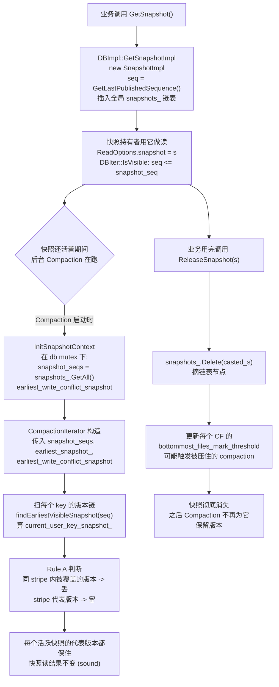

# 第 6 篇 · 第 20 章 · Snapshot 与 MVCC

> **核心问题**:调控篇三章(P5-17 Write Stall、P5-18 Rate Limiter、P5-19 Column Family)讲完,引擎在压力下怎么自保、怎么隔离,都清楚了。可还有一个横切读写两条路径的根本问题没回答:**怎么读一个历史时刻的数据?** —— 一条 `Get` 正在跑,同一时刻另一个线程 `Put` 改了这个 key,你怎么保证这次 `Get` 不读到半新半旧、不被正在发生的写打扰?更进一步:后台 Compaction 一直在合并旧版本、丢墓碑,如果一个长 Iterator(或一个显式快照)还指着某个历史时刻的旧值,Compaction 把它合并没了怎么办?——这一章讲的就是这件事:`SequenceNumber` 怎么给每次写盖章、`Snapshot` 怎么零开销地钉住一个时刻、Compaction 怎么在"尽量丢旧版本省空间"和"绝不能丢被快照引用的版本"这根钢丝上保持 sound。

> **读完本章你会明白**:
> 1. `SequenceNumber` 是怎么分配的(单写组一次性 `FetchAddLastAllocatedSequence` 给整批写盖章,每条 record 一个递增 seq),为什么"key 降序排、seq 大的新"这个 internal key 排序是 MVCC 的地基。
> 2. 一个 `Snapshot` 在内存里就是链表上一个带 seq 的节点(`SnapshotList` 循环双向链表,承 LevelDB 一句带过),`GetSnapshot` 只是把"当前最新 seq"记下来,真正的读走"`seq <= snapshot_seq` 即可见"这条规矩——这就是 RocksDB 的 **zero-copy MVCC**。
> 3. 多 Column Family **共享一份**全局 `SnapshotList`(本章对总纲"多 CF snapshot"印象的修正:不是每个 CF 一份,而是 DBImpl 级一份),RocksDB 的演进在 **`earliest_write_conflict_snapshot`**(给事务冲突检测用)和 **user-defined timestamp**(9.x 给 key 加第二维时间戳,与 seq 并存)。
> 4. **本章最硬核的技巧:Compaction 怎么不丢被快照引用的旧版本**——`findEarliestVisibleSnapshot` 找到一个 key 的版本链里"最早被某个快照看见"的边界,边界以内的旧版本能丢(已被更新的同 stripe 版本覆盖),边界以外的必须留。这就是为什么"快照存在期间,Compaction 丢旧版本不会让正在读历史时刻的查询读到错数据"。
> 5. 为什么这套设计 **sound**:seq 单调 + internal key 降序排序 + 快照只看 `<=` 的版本 + Compaction 保守地保留每个快照 stripe 的最新值,四件合起来保证任意快照的任意 `Get` 都能稳定读到那一刻正确的值。

> **如果一读觉得太难**:先只记住三件事——① **快照就是一个 seq 号**,`GetSnapshot()` 把当前最新 seq 记下来,读的时候"只看 seq ≤ 快照 seq 的版本"就是这个时刻的视图;② **key 的多个版本在 SST 里按 seq 降序排**(同样的 user key,seq 大的在前),MVCC 的"读历史时刻"全靠这条排序;③ **Compaction 合并时,只要某个 key 的某个版本被任意活跃快照"看见"(是该快照时刻的最新版),这个版本就绝不能丢**——`findEarliestVisibleSnapshot` 就是干这个的。这三句话够你跟同事讲清 Snapshot 与 MVCC。

---

## 〇、一句话点破

> **Snapshot 在 RocksDB 里是"零开销 MVCC"——它不拷贝数据、不改 SST,只是把"当前最新的 SequenceNumber"记进一个链表节点;读的时候拿这个 seq 当筛子,只看 seq ≤ 快照 seq 的版本,就还原出那一刻的数据视图。真正的难点不在读,而在后台 Compaction:它要合并旧版本省空间,又绝不能丢掉被某个活跃快照引用着的旧版本——这套"在省空间和不丢版本之间走钢丝"的机制,就是 `findEarliestVisibleSnapshot` + Rule A,本章技巧精解的主角。**

这是结论,不是理由。本章倒过来拆:先讲 SequenceNumber 怎么给每次写盖章、Snapshot 怎么零开销钉住一个时刻,再讲"为什么后台 Compaction 会威胁快照"(不带快照保护,Compaction 丢旧版本会让历史时刻的读读到错数据),然后拆 `findEarliestVisibleSnapshot` 这个核心机制,最后讲多 CF 共享快照链、user-defined timestamp 这些 RocksDB 独有的演进。

---

## 一、SequenceNumber:给每一次写盖的章

要讲清快照,先得讲清它要"钉住"的东西——SequenceNumber(下文简称 seq)。这是整个 LSM-tree MVCC 的地基,LevelDB 那本已经讲过基本盘(详见《LevelDB》Snapshot 章 / [[leveldb-source-facts]]),这里快速过一遍再进 RocksDB 的演进。

### seq 是什么:internal key 排序的另一半

一个 RocksDB 的 internal key(实际存在 MemTable 和 SST 里的 key)不是裸的 user key,它是 `user_key + sequence_number + value_type` 三段拼起来的 8 字节对齐结构。`db/dbformat.h` 把它讲得很清楚:

```cpp
// db/dbformat.h#L42-L43(原文)
kTypeDeletion = 0x0,
kTypeValue = 0x1,
// ... 还有 kTypeMerge / kTypeSingleDeletion / kTypeBlobIndex /
//     kTypeWideColumnEntity / kTypeValuePreferredSeqno 等
```

`value_type` 占 1 字节(低 8 位),`sequence_number` 占 56 位。这两者打包成 8 字节的 footer(`PackSequenceAndType`),internal key = `user_key || footer`。比较两个 internal key 时,**先比 user key(升序),user key 相同再比 footer**——而 footer 的比较是 seq 大的排**前**面(因为 `kValueTypeForSeek = 0xFF` 配 `kMaxSequenceNumber` 做 Seek,本质上是降序)。

> **钉死这件事**:同一个 user key 的多个版本,在 MemTable 和 SST 里**按 seq 降序排**(seq 大的、也就是新的,排在前面)。这条排序是 MVCC 的地基——它让你一次顺序扫描就能从新到旧遍历同一个 key 的所有历史版本,`Get` 拿到第一个 `seq ≤ snapshot_seq` 的就是那一刻的最新值。

seq 是 56 位无符号整数,理论上限是 `kMaxSequenceNumber = (1 << 56) - 1`(`db/dbformat.h#L129`),约 7.2e16。RocksDB 文档里常说"按每秒一亿次写能写 22 年才耗尽",工业上完全够用。

### seq 怎么分配:写组一次性领走一段

seq 不是每条 `Put` 单独去原子自增的——那样并发写时争抢严重。RocksDB 的做法承 LevelDB 的写组思路(P1-02 拆过 WriteGroup),但用了**原子 FetchAdd**来支持多写队列:

```cpp
// db/db_impl/db_impl_write.cc#L1381-L1388(简化,保留关键行)
last_sequence = versions_->FetchAddLastAllocatedSequence(seq_inc);
// seq_inc = 这一整组 write_group 所有 batch 的 record 数之和
...
const SequenceNumber current_sequence = last_sequence + 1;
last_sequence += seq_inc;
// Seqno assigned to this write are [current_sequence, last_sequence]
```

`FetchAddLastAllocatedSequence(seq_inc)` 是一个原子操作(`std::atomic<uint64_t>::fetch_add`),一次性把这一整组 write_group 要用的所有 seq 都领走。然后 leader 在组内按 writer 顺序分发:

```cpp
// db/db_impl/db_impl_write.cc#L1421-L1446(简化)
SequenceNumber next_sequence = current_sequence;
for (auto* writer : write_group) {
  ...
  writer->sequence = next_sequence;
  ...
  if (seq_per_batch_) {
    next_sequence += writer->batch_cnt;        // 2PC: 每个 batch 占 seq
  } else if (writer->ShouldWriteToMemtable()) {
    next_sequence += WriteBatchInternal::Count(writer->batch);  // 普通写:每条 record 占 seq
  }
}
```

一个 WriteBatch 里有 N 条 record(Put/Delete/Merge),这个 batch 就领走连续的 N 个 seq,每条 record 一个。MemTable 写入时(`MemTableInserter`),每插一条就 `sequence_++`(`db/write_batch.cc#L2205`),所以同一个 batch 里的多条 record 各自盖着递增的 seq。

> **不这样会怎样**:如果像朴素实现那样,每条 record 写 MemTable 时单独去 `last_sequence_.fetch_add(1)`,那一个 1000 条 record 的 WriteBatch 会和别的 batch 的 seq **交错**(batch A 的第 5 条 seq 可能比 batch B 的第 3 条小),破坏"一个 batch 内 seq 连续单调"——而这条单调是**原子写**的保证(下一章 P6-21 Transaction 要用)。RocksDB 的做法是整组一次性领走连续段,保证 batch 内 seq 连续、batch 间按 write_group 顺序单调。

### published vs allocated:两阶段写的需要

注意上面那段代码里,seq 是从 `FetchAddLastAllocatedSequence` 领的(叫 **allocated**),但 `GetSnapshot()` 拿的是 **`GetLastPublishedSequence()`**(叫 **published**):

```cpp
// db/db_impl/db_impl.cc#L5148-L5150(简化)
auto snapshot_seq = GetLastPublishedSequence();
SnapshotImpl* snapshot =
    snapshots_.New(s, snapshot_seq, unix_time, is_write_conflict_boundary);
```

这两个值在普通单写队列模式下相等(`SetLastSequence` 在写组完成后同步推进,`db_impl_write.cc#L1137`);但在**两阶段写**(two-phase commit,`two_write_queues_` 模式,WritePrepared/WriteUnprepared Transaction 用)下,seq 是先 PreAllocate 给 WAL 写的,等真正 Commit 之后才 Publish——快照只能看到已 published 的 seq。这是事务正确性的需要(没 commit 的写不能被快照看见),P6-21 会展开。本章你只要记住:**快照钉的是 published seq,普通模式下就是"当前最新已提交的 seq"**。

> **LevelDB 是写死的,RocksDB 打开成了旋钮**:LevelDB 用 `last_sequence_++`(单线程写,无并发,一个计数器搞定);RocksDB 用 `atomic<SequenceNumber>` 的 FetchAdd + 区分 allocated/published,既支持多写队列并发,又支持 2PC 的两阶段语义。这是"把 LevelDB 写死的单计数器,拆成支持并发和事务的两个旋钮"。

---

## 二、Snapshot:零开销地钉住一个时刻

seq 讲清了,快照就好讲了。

### Snapshot 在内存里就是个链表节点

```cpp
// db/snapshot_impl.h#L23-L52(节选,SnapshotImpl)
class SnapshotImpl : public Snapshot {
 public:
  SequenceNumber number_;  // const after creation —— 就是它钉住的那个 seq
  SequenceNumber min_uncommitted_ = kMinUnCommittedSeq;  // 给 WritePrepared 事务用
  SequenceNumber GetSequenceNumber() const override { return number_; }
  int64_t GetUnixTime() const override { return unix_time_; }
  uint64_t GetTimestamp() const override { return timestamp_; }
 private:
  friend class SnapshotList;
  SnapshotImpl* prev_;     // 循环双向链表
  SnapshotImpl* next_;
  SnapshotList* list_;     // sanity check 用
  int64_t unix_time_;
  uint64_t timestamp_;
  bool is_write_conflict_boundary_;  // 给事务冲突检测用(下面讲)
};
```

一个 `SnapshotImpl` 就这么几个字段——核心就一个 `number_`(seq)。它被组织进 `SnapshotList`:

```cpp
// db/snapshot_impl.h#L54-L98(SnapshotList,节选)
class SnapshotList {
 public:
  SnapshotList() {
    list_.prev_ = &list_;
    list_.next_ = &list_;          // dummy head 自指,空链表
    list_.number_ = 0xFFFFFFFFL;   // 调试用占位标记
    ...
  }
  bool empty() const { return list_.next_ == &list_; }
  SnapshotImpl* oldest() const { assert(!empty()); return list_.next_; }  // 最老 = 链表头后第一个
  SnapshotImpl* newest() const { assert(!empty()); return list_.prev_; }  // 最新 = dummy 前

  SnapshotImpl* New(SnapshotImpl* s, SequenceNumber seq, uint64_t unix_time,
                    bool is_write_conflict_boundary, uint64_t ts = ...) {
    s->number_ = seq;
    ...
    s->next_ = &list_;
    s->prev_ = list_.prev_;        // 插到链表尾部(dummy 前)
    s->prev_->next_ = s;
    s->next_->prev_ = s;
    count_++;
    return s;
  }
  void Delete(const SnapshotImpl* s) {
    s->prev_->next_ = s->next_;    // 标准 doubly-linked 删除
    s->next_->prev_ = s->prev_;
    count_--;
  }
  ...
};
```

这就是 LevelDB 那套循环双向链表(《LevelDB》Snapshot 章拆过,**无 `GetSortedSnapshots` 函数**,取最老快照用 `snapshots_.oldest()->number_`,见 [[leveldb-source-facts]]),RocksDB 一字不改地继承下来。`GetSnapshot` 的实现薄到不能再薄:

```cpp
// db/db_impl/db_impl.cc#L5080(原文)
const Snapshot* DBImpl::GetSnapshot() { return GetSnapshotImpl(false); }

// db/db_impl/db_impl.cc#L5128-L5155(简化,GetSnapshotImpl)
SnapshotImpl* DBImpl::GetSnapshotImpl(bool is_write_conflict_boundary, bool lock) {
  int64_t unix_time = 0;
  immutable_db_options_.clock->GetCurrentTime(&unix_time).PermitUncheckedError();
  SnapshotImpl* s = new SnapshotImpl;
  if (lock) { mutex_.Lock(); } else { mutex_.AssertHeld(); }
  if (!is_snapshot_supported_) {            // inplace_update_support 模式不支持快照
    if (lock) { mutex_.Unlock(); }
    delete s;
    return nullptr;
  }
  auto snapshot_seq = GetLastPublishedSequence();   // 就是它!钉住当前 published seq
  SnapshotImpl* snapshot =
      snapshots_.New(s, snapshot_seq, unix_time, is_write_conflict_boundary);
  if (lock) { mutex_.Unlock(); }
  return snapshot;
}
```

整个 `GetSnapshot` 就这么几步:`new` 一个 SnapshotImpl → 拿当前 published seq → 插进链表尾部 → 返回。**不拷数据、不改 SST、不锁任何 MemTable**——这就是"零开销 MVCC"的全部魔法。

> **钉死这件事**:RocksDB 的快照是 **logical snapshot**(逻辑快照),不是 physical snapshot(物理快照)。它不复制任何数据,只是把"这一刻的 seq"记下来。读的时候靠"只看 seq ≤ snapshot_seq 的版本"这个规则还原视图。这种实现的好处是**创建快照几乎零成本**(一次原子读 + 链表插入),坏处是**只要快照不释放,所有 seq 大于它的旧版本都不能被 Compaction 丢**——这正是下一节要讲的矛盾。

### 读的时候怎么用快照:一条 `IsVisible` 规则

一个带快照的 `Get` 或 Iterator,核心就是 `DBIter::IsVisible` 这条规则:

```cpp
// db/db_iter.cc#L1849-L1867(原文,简化)
bool DBIter::IsVisible(SequenceNumber sequence, const Slice& ts, bool* more_recent) {
  bool visible_by_seq = (read_callback_ == nullptr)
                            ? sequence <= sequence_                 // sequence_ 就是快照 seq
                            : read_callback_->IsVisible(sequence);
  bool visible_by_ts =
      (timestamp_ub_ == nullptr ||
       user_comparator_.CompareTimestamp(ts, *timestamp_ub_) <= 0) &&
      (timestamp_lb_ == nullptr ||
       user_comparator_.CompareTimestamp(ts, *timestamp_lb_) >= 0);
  if (more_recent) { *more_recent = !visible_by_seq; }
  return visible_by_seq && visible_by_ts;
}
```

一句话:**一个 internal key 的 seq ≤ 快照 seq,它对这次读就是可见的**(`visible_by_ts` 是 user-defined timestamp 维度,下面单讲)。Iterator 顺序扫一个 user key 的多个版本(按 seq 降序),第一个过 `IsVisible` 这一关的就是这次读应该返回的值——因为 seq 降序排,第一个可见的就是"快照时刻那一刻的最新版"。

> **不这样会怎样**:如果快照在创建时拷一份数据(物理快照),那快照的数量、寿命、内存占用都得仔细管,大 DB 一次快照几个 GB,根本玩不转。零开销 MVCC 让你可以随手开快照(TiKV 这种系统一个事务一个快照,长事务几小时不释放也不在乎),代价转嫁给了 Compaction——它得小心翼翼地不丢被快照引用的版本。下一节就讲这个矛盾。

### 释放快照:链表摘节点 + 触发可能被压住的 Compaction

`ReleaseSnapshot` 干两件事:从链表摘掉这个节点,然后检查"最老活跃快照往前推了,是不是有 bottommost 文件之前被它压着不能做 seq-zero 优化、现在可以重新标 compaction 了":

```cpp
// db/db_impl/db_impl.cc#L5278-L5329(简化,ReleaseSnapshot)
void DBImpl::ReleaseSnapshot(const Snapshot* s) {
  if (s == nullptr) return;          // inplace_update 模式 GetSnapshot 返回 nullptr
  const SnapshotImpl* casted_s = static_cast<const SnapshotImpl*>(s);
  {
    InstrumentedMutexLock l(&mutex_);
    snapshots_.Delete(casted_s);     // 1. 摘链表节点
    uint64_t oldest_snapshot;
    if (snapshots_.empty()) {
      oldest_snapshot = GetLastPublishedSequence();
    } else {
      oldest_snapshot = snapshots_.oldest()->number_;
    }
    // 2. 最老快照往前推了,重新算每个 CF 的 bottommost_files_mark_threshold
    CfdList cf_scheduled;
    if (oldest_snapshot > bottommost_files_mark_threshold_) {
      for (auto* cfd : *versions_->GetColumnFamilySet()) {  // 注意!遍历所有 CF
        if (!cfd->AllowIngestBehind()) {
          cfd->current()->storage_info()->UpdateOldestSnapshot(
              oldest_snapshot, /*allow_ingest_behind=*/false,
              cfd->ioptions().user_comparator, cfd->GetFullHistoryTsLow());
          if (!cfd->current()->storage_info()
                    ->BottommostFilesMarkedForCompaction().empty()) {
            EnqueuePendingCompaction(cfd);
            MaybeScheduleFlushOrCompaction();
            cf_scheduled.push_back(cfd);
          }
        }
      }
      // 重新算全局阈值(跳过已调度的 CF)
      ...
    }
    ...
  }
}
```

注意 `for (auto* cfd : *versions_->GetColumnFamilySet())` 这行——**释放一个快照,所有 CF 都要更新它们的 oldest_snapshot 视图**。这直接揭示了下一个事实。

---

## 三、多 CF 共享一份 SnapshotList(对总纲印象的修正)

总纲里把"多 CF snapshot"列为 RocksDB 相对 LevelDB 的演进之一。但源码上,这里有个容易看错的点——**RocksDB 不是给每个 CF 一份 SnapshotList,而是一份全局 `SnapshotList` 横跨所有 CF**。

```cpp
// db/db_impl/db_impl.h#L3333-L3335(原文)
SnapshotList snapshots_;
TimestampedSnapshotList timestamped_snapshots_;
```

`snapshots_` 是 `DBImpl` 的成员(不是 `ColumnFamilyData` 的成员),整个 DB 实例只有一份。`GetSnapshot` 把当前 published seq 塞进这一份链表,`ReleaseSnapshot` 从这一份链表摘——**所有 CF 共享同一个快照链**。

> **LevelDB 是写死的,RocksDB 打开成了旋钮**:这里的"打开成旋钮"不是"把单 CF 链表变成多 CF 链表",而是反过来——**因为有了 CF 这个架构(P5-19),快照链必须从 LevelDB 的"一个 DB 一条链"演进成"多 CF 共享一条链"**。LevelDB 一个 DB 只有一个逻辑库,快照天然只覆盖它;RocksDB 一个 DB 有 N 个 CF,如果每个 CF 一条快照链,那"跨 CF 原子读"做不到(你给 CF-A 拍快照的时刻和 CF-B 不同步);全局共享一条链,保证了所有 CF 在同一个 seq 时刻被一致地快照下来。

但这带来一个后果:**Compaction 是 per-CF 做的**(每个 CF 有自己的 compaction picker、自己的 SST 文件),而快照链是全局的。所以一个 CF 的 Compaction 在算"哪些旧版本能丢"时,看到的是**全局所有活跃快照**——哪怕有些快照是别的 CF 的读操作开的,只要它的 seq 比某个版本新,这个版本就不能丢(为了 sound 起见,因为快照 seq 是全局 published seq,理论上能看见所有 CF 的写)。这是把"快照全局"和"compaction 局部"这对张力焊死在一起的代价。

### snapshot 给 Compaction 的两份"名单"

Compaction 启动时(在 db mutex 下),会调用 `InitSnapshotContext` 把当前快照链**冻结**成一个 vector,之后整次 Compaction 都用这个冻结的列表(不再受中途 `GetSnapshot`/`ReleaseSnapshot` 影响):

```cpp
// db/db_impl/db_impl_compaction_flush.cc#L5266-L5284(原文,简化)
SequenceNumber earliest_write_conflict_snapshot = kMaxSequenceNumber;
std::vector<SequenceNumber> snapshot_seqs =
    snapshots_.GetAll(&earliest_write_conflict_snapshot);   // 拍快照时刻的所有快照 seq

// 2PC 模式下,可能还要把 published_seq 边界也塞进去,防止
// "一个还没 publish 的 seq 被当成不可见、然后 compaction 把它对应的旧版本丢了"
if (track_published_seq_in_snapshot_context_ && !snapshot_checker) {
  const SequenceNumber published_seq = GetLastPublishedSequence();
  if (snapshot_seqs.empty() || snapshot_seqs.back() < published_seq) {
    snapshot_seqs.push_back(published_seq);
  }
}
job_context->InitSnapshotContext(
    snapshot_checker, std::move(managed_snapshot),
    earliest_write_conflict_snapshot, std::move(snapshot_seqs));
```

这里 `snapshots_.GetAll()` 的实现在 `snapshot_impl.h#L110-L153`,它一边收集所有快照 seq 进 `snapshot_seqs`(升序、去重),一边顺手算出 `earliest_write_conflict_snapshot`——这是**第一个 `is_write_conflict_boundary_=true` 的快照**(给事务冲突检测用,下面 Rule 2 会用到)。Compaction 拿到这两份名单后,把它传给 `CompactionIterator`:

```cpp
// db/compaction/compaction_job.cc#L1621-L1632(简化)
return std::make_unique<CompactionIterator>(
    input, cfd->user_comparator(), &merge, versions_->LastSequence(),
    &(job_context_->snapshot_seqs),         // ← 全局快照 seq 列表(冻结)
    earliest_snapshot_,                      // ← snapshot_seqs[0] 或 kMaxSequenceNumber
    job_context_->earliest_write_conflict_snapshot,  // ← 事务冲突检测边界
    ...);
```

注意 `earliest_snapshot_` 是 `snapshot_seqs` 里最小的那个(也就是最老的活跃快照),没有快照时是 `kMaxSequenceNumber`。这两个值是技巧精解里 `findEarliestVisibleSnapshot` 和 Rule A 的关键输入。

---

## 四、user-defined timestamp:给 key 加第二维时间戳

讲技巧精解之前,先把 user-defined timestamp(UDT,RocksDB 5.x 开始有、6.x/7.x 完善、8.x/9.x 加入持久化)这个 RocksDB 独有的演进提一下。它是 seq 之外的第二维时间戳——你给每个 key 附一个用户自定义的时间戳(通常是 `uint64_t` 的毫秒/微秒),internal key 的排序变成"先按 user key 排,user key 相同按 timestamp 降序(新的在前),timestamp 相同再按 seq 降序"。

为什么要有 UDT?seq 是 RocksDB 内部的、单调的、跟物理时间无关的"逻辑时刻"。但有些业务(比如 TiKV 的 MVCC)需要**业务层的时间戳**——TiKV 用 TSO(Time Stamp Oracle,从 PD 拿的全局唯一时间戳)做事务的 start_ts / commit_ts,这个 ts 是业务语义的、跨节点一致的。RocksDB 的 UDT 让这种业务能把 ts 直接编进 key,不用在 user key 里手工拼 ts 字符串(那样 Comparator 也不对)。

UDT 和 seq 的关系是**正交并存**:

- **seq** 仍是 RocksDB 内部的版本号,WriteBatch 照样分配、Snapshot 照样钉 seq、Compaction 照样按 seq 算可见性。
- **timestamp** 是用户给的业务时间戳,跟 seq 一起决定 internal key 排序,也参与可见性判断(上面 `IsVisible` 里的 `visible_by_ts`)。

> **钉死这件事**:UDT **不替代** seq,它是 seq 之外的**第二维**。一个 internal key 的可见性 = `visible_by_seq && visible_by_ts` 两个条件都满足。Snapshot 钉的还是 seq;timestamp 那维由读请求的 `timestamp_ub_`/`timestamp_lb_` 控制。这层正交设计让 UDT 能在不动 seq/Snapshot 这套 MVCC 基础设施的前提下加进来——是 RocksDB "在已有旋钮上加新维度,不推翻重来"的典型演进。

UDT 还有一个和 Compaction 的交互:**`full_history_ts_low`**(`include/rocksdb/options.h#L2733`)。Compaction 默认会丢同一个 user key 旧 timestamp 的版本(在 seq 可见性允许的前提下);但如果你设了 `full_history_ts_low`,那 timestamp 比 `full_history_ts_low` **新**的版本都要保留(用户想保住这段时间的历史)。Compaction iterator 里那堆 `cmp_with_history_ts_low_` 判断就是干这个的。本章不展开 UDT 的全貌(那够再写一章),你只要记住:UDT 是给 key 加第二维时间戳、和 seq 正交、参与可见性和 Compaction 决策。

---

## 五、为什么快照需要保护:不带保护,Compaction 会丢历史版本

到这快照的基础全讲清了。现在进入本章最关键的矛盾——**后台 Compaction 一直在合并旧版本、丢墓碑,它怎么不把被快照引用着的旧版本也丢了?**

### 这个矛盾是怎么产生的

回顾一下 Compaction 在做什么(承 P4-13/P4-14):它把若干个 SST 合并成新 SST,合并过程中,对同一个 user key 的多个版本,它会**丢掉被覆盖的旧版本**(只留最新的),丢掉不再被任何版本引用的墓碑。这是为了**省空间**——不然同一个 key 的新旧版本越积越多,空间放大失控。

但快照恰恰需要**旧版本**——一个 `seq=100` 的快照,要读 `key=A` 在那个时刻的最新值,可能是 `A` 的某个旧版本(比如 `A@seq=80`),而当前最新版是 `A@seq=200`(一次 Put 改过)。如果 Compaction 在快照还活着的时候把 `A@seq=80` 丢了(因为它是"被覆盖的旧版本"),那快照读 `A` 时,扫到第一个 `seq ≤ 100` 的版本可能就跑到了 `A@seq=50`(更老的、甚至可能是删除标记),**读到错误的数据**。

> **不这样会怎样**:设想一个朴素实现——Compaction 不管快照,无脑丢旧版本。那么一个长事务开了快照(seq=100),期间另一个写把 key A 改了多次(seq=150、200、250),后台 Compaction 把 A 的所有旧版本全丢了,只留 `A@seq=250`。现在这个长事务来读 A,IsVisible 说"`A@seq=250` 的 seq 250 > 快照 seq 100,不可见",继续扫——但旧版本都被 Compaction 丢了,扫不到任何 `seq ≤ 100` 的 A,返回 NotFound。**这就是"快照读读到错数据"——一个 LSM 最严重的不 sound**。

所以 Compaction **必须**知道当前有哪些活跃快照,丢旧版本时要让着它们。这套"让着快照"的机制,就是下一节的技巧精解。

---

## 六、技巧精解:`findEarliestVisibleSnapshot` 与快照 stripe

这是本章最硬核的技巧,也是 Compaction 正确性的核心。我们一步步拆。

### 核心数据结构:快照把版本链切成"stripe"

想象一个 user key `A` 的所有版本,按 seq 降序排(新→旧):

```
版本链(key=A 的新→旧,seq 降序):
  A@seq=250 (Put, v=新值)
  A@seq=200 (Put, v=较新)
  A@seq=150 (Put, v=旧)
  A@seq=100 (Put, v=更旧)
  A@seq=50  (Put, v=最旧)

当前活跃快照(seq 升序):
  snap_S1 @ seq=80
  snap_S2 @ seq=180
  snap_S3 @ seq=220
```

每个快照 seq 把版本链"切开"——一个快照能看见的就是"它的 seq 那一刻及之前的最新版本"。具体:

- `snap_S1@80` 看见的 A 的版本是 `A@seq=50`(扫到第一个 seq ≤ 80 的)。
- `snap_S2@180` 看见 `A@seq=150`。
- `snap_S3@220` 看见 `A@seq=200`。

这些"被某个快照看见的版本"就叫 **snapshot stripe 的代表**。RocksDB 的规则是:**每个活跃快照 stripe,至少要保留一个代表版本**(就是它看见的那个)。具体到这个例子,要保留 `A@seq=50`(S1 的代表)、`A@seq=150`(S2 的代表)、`A@seq=200`(S3 的代表)、还有 `A@seq=250`(无快照,是 tip 的最新值)。能丢的是 `A@seq=100`——它前后都没有快照切在它和它的邻居之间。

### 这个判断怎么做:`findEarliestVisibleSnapshot`

CompactionIterator 顺序扫一个 user key 的多个版本(降序,新→旧)。对每一个版本,它要回答:**"最早能看到这个版本的快照是哪个?"** 这就是 `findEarliestVisibleSnapshot(seq)`:

```cpp
// db/compaction/compaction_iterator.cc#L1960-L2009(原文)
inline SequenceNumber CompactionIterator::findEarliestVisibleSnapshot(
    SequenceNumber in, SequenceNumber* prev_snapshot) {
  assert(snapshots_->size());
  if (snapshots_->size() == 0) {
    ROCKS_LOG_FATAL(info_log_, "No snapshot left in findEarliestVisibleSnapshot");
  }
  // lower_bound: 找第一个 seq >= in 的快照(因为快照 seq 升序)
  auto snapshots_iter =
      std::lower_bound(snapshots_->begin(), snapshots_->end(), in);
  assert(prev_snapshot != nullptr);
  if (snapshots_iter == snapshots_->begin()) {
    *prev_snapshot = 0;                       // in 比所有快照都新,没有"前一个"快照
  } else {
    *prev_snapshot = *std::prev(snapshots_iter);  // in 落在哪两个快照之间(记录前一个)
    if (*prev_snapshot >= in) {
      ROCKS_LOG_FATAL(info_log_, ...); assert(false);
    }
  }
  if (snapshot_checker_ == nullptr) {
    return snapshots_iter != snapshots_->end() ? *snapshots_iter
                                               : kMaxSequenceNumber;
  }
  // WritePrepared 事务的特殊路径:snapshot_checker 可能说某快照已释放
  bool has_released_snapshot = !released_snapshots_.empty();
  for (; snapshots_iter != snapshots_->end(); ++snapshots_iter) {
    auto cur = *snapshots_iter;
    if (in > cur) { ROCKS_LOG_FATAL(info_log_, ...); assert(false); }
    if (has_released_snapshot && released_snapshots_.count(cur) > 0) {
      continue;                                // 这个快照已释放,跳过
    }
    auto res = snapshot_checker_->CheckInSnapshot(in, cur);
    if (res == SnapshotCheckerResult::kInSnapshot) {
      return cur;                              // 找到第一个"in 对 cur 可见"的快照
    } else if (res == SnapshotCheckerResult::kSnapshotReleased) {
      released_snapshots_.insert(cur);
    }
    *prev_snapshot = cur;
  }
  return kMaxSequenceNumber;
}
```

这个函数干两件事:

1. **主路径(`snapshot_checker_ == nullptr`,绝大多数场景)**:用 `lower_bound` 在升序的 snapshot_seqs 里找第一个 `seq >= in` 的快照——这就是"最早能看到 `in` 这个版本的快照"。因为快照 seq 升序,这个快照之后(更新)的所有快照也能看到 `in`(它们的 seq 比 `in` 大,`in <= snap_seq` 成立),但"最早"的就是它。同时 `prev_snapshot` 记下 `in` 落在哪两个快照之间(给 Rule A 用)。

2. **WritePrepared 路径**:对于 2PC 事务,`snapshot_checker_` 不为空(`WritePreparedSnapshotChecker`),它要查 commit_cache 判断一个 seq 是不是真的对某快照可见(因为 2PC 下 seq 先 allocate 后 publish,可能出现 seq ≤ snapshot_seq 但还没 commit 的情况)。这条路径复杂,本章只点一下。

### Rule A:同 stripe 内被覆盖的版本能丢

拿到 `current_user_key_snapshot_`(这个版本最早被哪个快照看见)和 `last_snapshot`(上一个版本最早被哪个快照看见),CompactionIterator 用 **Rule A** 判断"这个版本能不能丢":

```cpp
// db/compaction/compaction_iterator.cc#L1120-L1151(原文,关键段)
} else if (last_sequence != kMaxSequenceNumber &&
           (last_snapshot == current_user_key_snapshot_ ||
            last_snapshot < current_user_key_snapshot_)) {
  // rule (A):
  // If the earliest snapshot is which this key is visible in
  // is the same as the visibility of a previous instance of the
  // same key, then this kv is not visible in any snapshot.
  // Hidden by an newer entry for same user key
  //
  // Note: Dropping this key will not affect TransactionDB write-conflict
  // checking since there has already been a record returned for this key
  // in this snapshot.
  ...
  ++iter_stats_.num_record_drop_hidden;
  AdvanceInputIter();
}
```

Rule A 的逻辑:`last_snapshot == current_user_key_snapshot_`(当前版本和上一个更新的版本落在同一个 stripe 里),或 `last_snapshot < current_user_key_snapshot_`(当前版本比上一个更新的版本所在的 stripe 还要老)——这两种情况下,**当前这个旧版本可以被丢掉**,因为"在这个版本可见的快照里,一定也能看见那个更新的版本"(更新版本 seq 大、在同 stripe 内优先被读到),所以这个旧版本"对任何快照都不贡献可见性"。

回到上面那个例子:

```
版本(新→旧):      A@250  A@200  A@150  A@100  A@50
当前版本(扫到这):               ↑ A@150
上一版本(snapshot):              snap_S2@180(snap_S2 看见 A@150)
当前版本(snapshot):              ... 等下个迭代看 A@100
```

我们逐版本走一遍(从新到旧):

| 扫到版本 | last_seq | last_snapshot(上一版本所在 stripe) | current_snapshot(本版本所在 stripe) | 决策 |
|---|---|---|---|---|
| A@250 | (首版本) | — | kMaxSeq(tip,无快照看见) | 输出(当前最新值) |
| A@200 | 250 | kMaxSeq | snap_S3@220(S3 看见它) | **输出**(新 stripe,是 S3 的代表) |
| A@150 | 200 | snap_S3@220 | snap_S2@180(S2 看见它) | **输出**(新 stripe,是 S2 的代表) |
| A@100 | 150 | snap_S2@180 | snap_S2@180(还在 S2 的 stripe 里) | **Rule A 丢**(同 stripe,被 A@150 覆盖) |
| A@50 | 100 | snap_S2@180 | snap_S1@80(S1 看见它) | **输出**(新 stripe,是 S1 的代表) |

结果:丢掉 `A@100`(它对任何快照都不可见——S2 看见 A@150,不会读 A@100),保留 A@250/200/150/50。每个活跃快照的代表版本都保住了。

### 为什么这套机制 sound:四个不变量合起来

这套机制为什么不会让任何快照读到错数据?靠四个不变量合起来:

1. **seq 单调**:`FetchAddLastAllocatedSequence` 保证 seq 严格递增,后写的 seq 大。
2. **internal key 降序排**:同 user key,seq 大的(新的)排前面。Iterator 顺序扫就是新→旧。
3. **快照只看 `seq ≤ snapshot_seq` 的版本**:`IsVisible` 这条规则。
4. **Compaction 保守保留每个 stripe 的代表**:Rule A 只丢"同 stripe 内被覆盖的版本",绝不丢"stripe 边界的代表版本"(`last_snapshot != current_user_key_snapshot_` 时不能丢)。

这四个合起来,保证:任意快照 S(seq=seq_S),它读 user key A 时,扫到的第一个 `seq_A ≤ seq_S` 的 A,在 Compaction 之后**仍然是同一个版本**(因为 Compaction 只丢同 stripe 内被覆盖的版本,不丢 stripe 代表)。所以快照读的结果不变——这就是 sound。

> **钉死这件事**:这套机制不是"快照标记哪些版本要留",而是"Compaction 算哪些版本对任何快照都不贡献可见性、能丢"——前者要给每个版本贴标签(O(N×快照数)),后者只要扫一遍版本链、维护"上一个版本所在 stripe"一个变量(O(N))。RocksDB 选的是后者,这是把 O(N×M) 降到 O(N) 的关键优化。

### 反面对比:朴素实现撞的墙

如果像 LevelDB 那样,Compaction 只看 `smallest_snapshot`(最老快照 seq),凡是 seq < smallest_snapshot 的版本一律丢——这能 work(LevelDB 的 Snapshot 机制就是这么简单),但**它丢得过头**。考虑:

```
版本(新→旧):A@250, A@200, A@150, A@100, A@50
活跃快照:    snap_S1@80
最老快照:    80
```

朴素实现:丢掉所有 seq < 80 的——这里没有 seq < 80 的,所以一个都不丢,但 A@100/A@150/A@200 都是被 A@250 覆盖的、对唯一快照 S1@80 不可见的版本,本可以丢。朴素实现丢不掉它们,**空间放大**。

RocksDB 的 `findEarliestVisibleSnapshot` + Rule A:丢掉 A@100、A@150、A@200(它们对 S1@80 不可见,因为 S1 看见 A@50,这三个 seq 都 > 80 对 S1 不可见,且没有更新的快照把它们切成 stripe),只留 A@250(tip 最新值)+ A@50(S1 的代表)。**省空间得多**。

> **不这样会怎样**:朴素地"只看最老快照 seq"会要么丢过头(误丢 stripe 代表,快照读错)要么留过头(同 stripe 内被覆盖的版本也留,空间浪费)。RocksDB 的 stripe 机制是**精确切**——既不丢任何 stripe 的代表(sound),又丢掉所有 stripe 内被覆盖的版本(省空间)。这是把 LevelDB 那个"只看最老快照"的粗粒度旋钮,精细化成了"每个快照切一刀"的多 stripe 旋钮。

### 极端情况:无快照(visible_at_tip_)

如果当前没有任何活跃快照(`snapshots_->empty()`),CompactionIterator 的构造里有个快速路径:

```cpp
// db/compaction/compaction_iterator.cc#L194(原文)
visible_at_tip_(snapshots_ ? snapshots_->empty() : false),
```

`visible_at_tip_ = true` 时,所有版本的 `current_user_key_snapshot_` 都设成 `earliest_snapshot_`(此时是 `kMaxSequenceNumber`)。这意味着:**无快照时,同一个 user key 只留最新的一个版本**(seq 最大的那个),其他全被 Rule A 丢掉——因为没有快照,谁都不需要旧版本。这是最常见的场景(无活跃 Iterator/事务时),Compaction 此时压得最狠,空间放大最小。

### seq-zero 优化:无快照时连 seq 都能压成 0

更进一步,如果 Compaction 是写到 bottommost level(最后一层,没有更低的层了),而且这个 key 的 seq 比所有快照都老(`DefinitelyInSnapshot(ikey_.sequence, earliest_snapshot_)`),那 CompactionIterator 会把这个 key 的 seq 直接改成 0:

```cpp
// db/compaction/compaction_iterator.cc#L1909-L1956(简化,PrepareOutput 的 seq-zero 段)
if (Valid() && bottommost_level_ &&
    DefinitelyInSnapshot(ikey_.sequence, earliest_snapshot_) &&
    ikey_.type != kTypeMerge && current_key_committed_ &&
    ikey_.sequence <= preserve_seqno_after_ && !is_range_del_) {
  ...
  bool zeroed_seqno = false;
  if (!timestamp_size_) {
    current_key_.UpdateInternalKey(0, ikey_.type);   // seq 压成 0
    zeroed_seqno = true;
  } else if (full_history_ts_low_ && cmp_with_history_ts_low_ < 0) {
    // UDT 模式下,timestamp 也压成 min
    ...
  }
  if (zeroed_seqno) {
    ikey_.sequence = 0;
    last_key_seq_zeroed_ = true;
  }
}
```

为什么能这么做?bottommost level 没有更低层,这个 key 的所有版本都在这次 Compaction 的输入里(或者被丢掉了);seq ≤ earliest_snapshot 意味着所有快照都能看见它;既然没有任何快照需要"区分这个 key 的不同版本",那把 seq 压成 0 既能省 8 字节的存储(seq=0 在 SST 压缩里很友好,很多 key 共享同一个 footer),又不影响任何读。这是个很实在的压缩优化,TiKV 这种业务在 bottommost compaction 上能省可观空间。

---

## 七、snapshot_checker:2PC 事务的特殊可见性

普通模式下 `snapshot_checker_ == nullptr`,seq ≤ snapshot_seq 就一定可见。但 **WritePrepared/WriteUnprepared Transaction**(2PC 事务,P6-21 展开)下,seq 先 allocate 后 publish——可能出现 seq ≤ snapshot_seq 但事务还没 commit 的情况。这时不能简单按 seq 判断可见性,得查 commit_cache。

RocksDB 抽象出一个 `SnapshotChecker` 接口(`db/snapshot_checker.h`):

```cpp
// db/snapshot_checker.h(原文,关键部分)
enum class SnapshotCheckerResult : int {
  kInSnapshot = 0,           // seq 对这个快照可见
  kNotInSnapshot = 1,         // seq 对这个快照不可见
  kSnapshotReleased = 2,      // 快照已释放,无法判断
};

class SnapshotChecker {
 public:
  virtual SnapshotCheckerResult CheckInSnapshot(
      SequenceNumber sequence, SequenceNumber snapshot_sequence) const = 0;
};

class DisableGCSnapshotChecker : public SnapshotChecker {  // 禁止 GC 的兜底
  SnapshotCheckerResult CheckInSnapshot(SequenceNumber, SequenceNumber) const override {
    return SnapshotCheckerResult::kNotInSnapshot;  // 返回"不可见",阻止所有 GC
  }
};

class WritePreparedSnapshotChecker : public SnapshotChecker {  // 2PC 事务用
  explicit WritePreparedSnapshotChecker(WritePreparedTxnDB* txn_db);
  SnapshotCheckerResult CheckInSnapshot(
      SequenceNumber sequence, SequenceNumber snapshot_sequence) const override;
};
```

两种实现:

- **`DisableGCSnapshotChecker`**:返回 `kNotInSnapshot`(即"seq 对快照不可见"),这会让 `findEarliestVisibleSnapshot` 一直往后找,最终返回 `kMaxSequenceNumber`——意味着"所有版本都不在任何快照里",Rule A 会保留所有版本。**这是"宁可不压也不丢"的兜底**,用在不确定的场景(比如备份、某些 recovery 阶段)。
- **`WritePreparedSnapshotChecker`**:查 WritePreparedTxnDB 的 commit_cache,判断一个 seq 是不是真的 commit 了、对某快照可见。

本章只点一下这个抽象的存在,具体 WritePrepared 的 commit_cache 机制是 P6-21 Transaction 的重头戏。你只要记住:**普通 KV 模式 snapshot_checker 是空,2PC 模式才走特殊路径**。

---

## 八、TimestampedSnapshot:带业务时间戳的快照

RocksDB 还有一个 `TimestampedSnapshotList`(`db/snapshot_impl.h#L188-L237`),它存的是**带 timestamp 的快照**——这种快照除了 seq,还带一个用户指定的 `uint64_t ts`(通常对应业务时间戳)。可以用 `GetSnapshot(ts)` 按 ts 查快照:

```cpp
// db/snapshot_impl.h#L192-L203(原文)
std::shared_ptr<const SnapshotImpl> GetSnapshot(uint64_t ts) const {
  if (ts == std::numeric_limits<uint64_t>::max() && !snapshots_.empty()) {
    auto it = snapshots_.rbegin();
    assert(it != snapshots_.rend());
    return it->second;              // 拿最新的
  }
  auto it = snapshots_.find(ts);
  if (it == snapshots_.end()) {
    return std::shared_ptr<const SnapshotImpl>();
  }
  return it->second;
}
```

这是给"我想精确读某个业务时间点的数据"这种场景用的(配合 UDT)。它的释放也是按 ts 阈值批量:`ReleaseSnapshotsOlderThan(ts)` 把所有 ts < 阈值的快照释放掉(`db/snapshot_impl.cc` 没有 cc 实现,这个类全在 header 里 inline)。这是 UDT 那条线的配套设施,本章点到为止。

---

## 九、本章脉络图:snapshot 的生命周期

把上面几节串起来,一个 snapshot 从创建到释放,走过这条路:



这张图把 snapshot 的整个生命周期——创建(钉 seq)、读(IsVisible)、和 Compaction 的交互(findEarliestVisibleSnapshot + Rule A)、释放(摘链表 + 重新阈值)——全画在一张图上。本章核心就是这条链上 Compaction 那一段(图里的 D→I),它是 sound 的关键。

---

## 十、用一张图钉死"earliest snapshot 边界"

技巧精解的核心是"一个 key 的版本链,快照切在哪些边界,哪些能丢哪些要留"。再用一张 ASCII 图钉死它:

```
key = A 的版本链(seq 降序,新→旧),活跃快照已冻结:

          seq    type   value
   A@250  Put    新值      ┐
                         │  tip(无快照看见,当前最新值)── 必留
   ─ ─ ─ ─ ─ ─ ─ ─ ─ ─ ─ ┼ ─ ─ ─  snap_S3 @ 220  ← S3 切在这,看见 A@200
   A@200  Put    较新      │
                         │  S3 stripe 的代表(A@200)── 必留(新 stripe 边界)
   ─ ─ ─ ─ ─ ─ ─ ─ ─ ─ ─ ┼ ─ ─ ─  snap_S2 @ 180  ← S2 切在这,看见 A@150
   A@150  Put    旧        │
                         │  S2 stripe 的代表(A@150)── 必留(新 stripe 边界)
   A@100  Put    更旧      │
                         │  S2 stripe 内,被 A@150 覆盖 ── 可丢!(Rule A)
   ─ ─ ─ ─ ─ ─ ─ ─ ─ ─ ─ ┼ ─ ─ ─  snap_S1 @ 80   ← S1 切在这,看见 A@50
   A@50   Put    最旧      │
                         │  S1 stripe 的代表(A@50)── 必留(新 stripe 边界)

Compaction 后保留:A@250, A@200, A@150, A@50
Compaction 丢掉:  A@100(同 stripe 内被覆盖,对任何快照不可见)

为什么 sound:
  snap_S1@80 读 A  -> 第一个 seq<=80 的是 A@50   -> 不变 ✓
  snap_S2@180 读 A -> 第一个 seq<=180 的是 A@150 -> 不变 ✓
  snap_S3@220 读 A -> 第一个 seq<=220 的是 A@200 -> 不变 ✓
  tip(无快照)读 A -> 第一个就是 A@250          -> 不变 ✓
```

这张图就是 `findEarliestVisibleSnapshot` + Rule A 的全部精髓。每个快照切一刀,刀之间的"代表版本"必留,刀内被覆盖的多余版本能丢。RocksDB 的快照保护,本质上就是这条规则。

---

## 十一、章末小结

### 回扣主线

本章是**横切篇**的开篇章。回到全书的"写路径 vs 读路径"二分法:Snapshot 与 MVCC **横切读写两条路径**——它不属于任何一条,而是给两条路径都提供一个"时刻"的概念。写路径上,每次 WriteBatch 盖一段连续 seq(`FetchAddLastAllocatedSequence`),让"这一刻发生了什么"可追溯;读路径上,`DBIter::IsVisible` 用 `seq <= snapshot_seq` 这条规则,从版本链里筛出"这一刻看到的"视图。Compaction(写路径的后台收敛)和 Snapshot(读路径的时刻视图)这对张力的调和,靠的就是 `findEarliestVisibleSnapshot` + Rule A。

> **LevelDB 是写死的,RocksDB 打开成了旋钮**:LevelDB 的 Snapshot 是循环双向链表 + 零开销 MVCC + 只看 `smallest_snapshot` 的粗粒度丢版本(《LevelDB》Snapshot 章拆过,见 [[leveldb-source-facts]]),RocksDB **一字不动地继承**了链表和零开销这两件(LevelDB 已经做得对);RocksDB 的演进在:**(1) 多 CF 共享一份全局 SnapshotList**(配合 CF 架构,保证跨 CF 一致快照);**(2) `findEarliestVisibleSnapshot` 的多 stripe 精确切**(把 LevelDB"只看最老快照"的粗粒度,精细化成"每个快照切一刀"的多 stripe,既 sound 又省空间);**(3) `earliest_write_conflict_snapshot` + `SnapshotChecker`**(给 2PC 事务的冲突检测用);**(4) user-defined timestamp**(给 key 加第二维业务时间戳,和 seq 正交);**(5) seq-zero 优化**(bottommost level 无快照时把 seq 压成 0 省空间)。这五件都是 LevelDB 没有、RocksDB 走向工业级时补上的。

### 五个为什么

1. **为什么 Snapshot 创建几乎零开销?**——因为它不拷数据、不改 SST,只在循环双向链表上插一个带 seq 的节点。真正的"还原历史视图"靠读时的 `seq <= snapshot_seq` 规则,代价转嫁给了 Compaction(它要为活跃快照保留旧版本)。

2. **为什么 seq 要 batch 内连续、batch 间单调?**——因为一个 WriteBatch 是原子的(要么全可见要么全不可见),这要求 batch 内的 record 共享一个"可见性边界",连续 seq 是最自然的实现。`FetchAddLastAllocatedSequence(seq_inc)` 一次性领走连续段就是为了这个——也是下一章 Transaction 实现原子写的基础。

3. **为什么多 CF 共享一份 SnapshotList 而不是每 CF 一份?**——保证跨 CF 一致快照(同一个 seq 时刻所有 CF 同时被快照)。代价是一个 CF 的 Compaction 看到的是全局所有活跃快照(哪怕别的 CF 的),保守一些但 sound。

4. **为什么 Compaction 不能简单地"丢所有 seq < smallest_snapshot 的版本"?**——那会要么丢过头(把某个快照的代表版本丢了,快照读错)、要么留过头(同 stripe 内被覆盖的版本也留,空间浪费)。`findEarliestVisibleSnapshot` + Rule A 是精确切:每个快照切一刀,刀之间的代表必留,刀内被覆盖的多余版本能丢。

5. **为什么 user-defined timestamp 不替代 seq?**——因为 seq 是 RocksDB 内部的版本号(WriteBatch 分配、Snapshot 钉、Compaction 算可见性),和物理时间无关;timestamp 是业务层时间戳(如 TiKV 的 TSO),跨节点一致。两者正交,UDT 是在已有 seq/Snapshot 基础设施上**加第二维**,不是推翻重来——这是 RocksDB "在已有旋钮上加新维度"的典型演进风格。

### 想继续深入往哪钻

- **想看 Snapshot 链表全貌**:读 `db/snapshot_impl.h`(SnapshotImpl 在 23-52 行,SnapshotList 在 54-185 行,TimestampedSnapshotList 在 188-237 行),对照本章第二节的零开销 MVCC。
- **想看 GetSnapshot/ReleaseSnapshot 实现**:`db/db_impl/db_impl.cc:5080`(GetSnapshot)、`:5128`(GetSnapshotImpl)、`:5278`(ReleaseSnapshot),跟一遍"new 节点 → 插链表 → 释放时摘链表 + 更新 CF 阈值"全流程。
- **想看 seq 怎么分配**:`db/db_impl/db_impl_write.cc:1381`(`FetchAddLastAllocatedSequence`)、`:1421-1446`(组内分发),对照 `db/version_set.h:1432`(LastSequence/SetLastSequence 的原子语义)。
- **想看 Compaction 怎么用快照**:这是本章最硬核的部分。读 `db/compaction/compaction_iterator.cc:194`(visible_at_tip_)、`:850-853`(current_user_key_snapshot_ 赋值)、`:1120-1151`(Rule A)、`:1960-2009`(findEarliestVisibleSnapshot),对照 `db/db_impl/db_impl_compaction_flush.cc:5266-5284`(InitSnapshotContext,快照冻结)。
- **想看 SnapshotChecker 抽象**:`db/snapshot_checker.h`(SnapshotChecker 接口、DisableGCSnapshotChecker、WritePreparedSnapshotChecker),具体 WritePrepared 的 commit_cache 机制见 P6-21。
- **想看 user-defined timestamp**:从 `include/rocksdb/options.h:2733`(full_history_ts_low)和 `db/dbformat.h` 里 timestamp 相关的函数(ExtractTimestampFromUserKey 等)入手,官方 `user-defined-timestamp.md` 文档有特性总览。
- **想动手感受快照**:`db_bench` 用 `--use_existing_db --reads=1000000 --snapshot` 跑,开一个长事务持有快照,观察期间 Compaction 的 `num_record_drop_hidden` 计数器(`rocksdb.compaction.times.full` 等 stats)是不是变少(被快照压着丢不掉);再释放快照,观察 `bottommost_files_mark_threshold` 更新触发的 compaction。
- **想看快照在 TiKV 里怎么用**:本书 P7-23 反哺《TiKV》,讲 TiKV 的每个事务一个 RocksDB snapshot、长事务撑爆快照链的运维坑;《TiKV》那本的事务章节有 Percolator 模型与 snapshot 的关系。

### 引出下一章

本章讲清了"怎么读一个历史时刻的数据、Compaction 怎么不丢被快照引用的旧版本"。但快照**只读不写**——它给你一个历史时刻的视图,但你不能在这个视图上做"跨多个 key 的原子写"。比如转账场景:从账户 A 扣 100、给账户 B 加 100,这两条 `Put` 必须原子(要么都成功要么都失败),而且并发转账不能互相覆盖。快照做不到这件事(它只保证读的一致性,不保证写的原子性)。怎么做跨 key 的原子写、怎么做读改写、怎么处理写冲突?下一章 P6-21:**Transaction 与 MergeOperator**——讲 RocksDB 的 optimistic/pessimistic 两套事务模型(它们正好建立在 Snapshot 之上,用 `earliest_write_conflict_snapshot` 做冲突检测),以及 MergeOperator 这个"读时合并、避免读改写放大"的利器。

> **下一章**:[P6-21 · Transaction 与 MergeOperator](P6-21-Transaction与MergeOperator.md)
