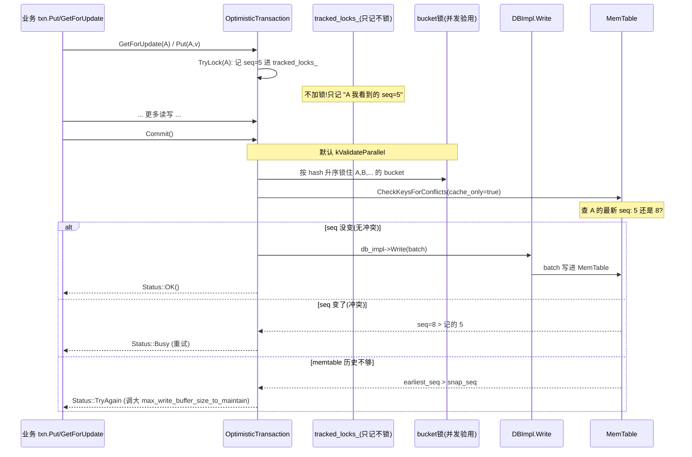
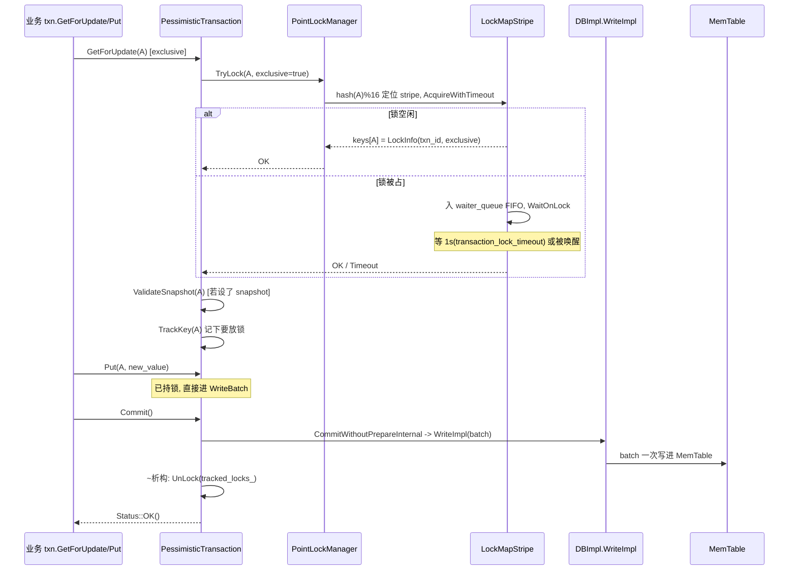
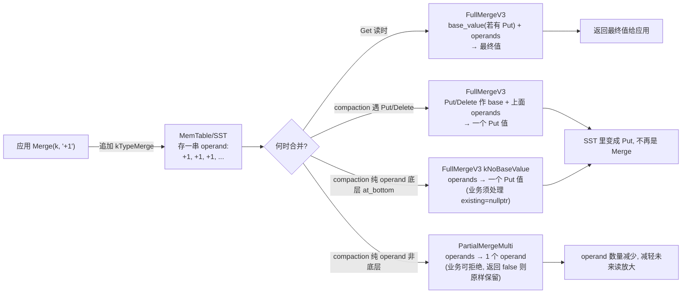

# 第 6 篇 · 第 21 章 · Transaction 与 MergeOperator

> **核心问题**:上一章讲了 Snapshot——一个读请求怎么冻结一个历史时刻。可现实业务里,真正折磨人的不是"只读历史",而是"跨 key 原子写":转账要扣 A 加 B,两个 key 要么一起改、要么都不改;一个计数器每秒被并发加一万次,你读出来再加一写回去会丢更新。RocksDB 的 WriteBatch 本身只保证一个 batch 内原子,跨 batch 怎么隔离?读-改-写三步怎么放大?本章拆 RocksDB 的两个横切工具:**Transaction**(乐观锁/悲观锁两套,把"跨 key 原子"从应用层两阶段里解放出来)和 **MergeOperator**(把读-改-写的"读"和"写"都省掉,直接把"加这个操作"追加进 LSM)。

> **读完本章你会明白**:
> 1. 为什么 LevelDB 的 WriteBatch 只够"单 batch 原子",跨 batch 的隔离要靠应用层两阶段(易错),RocksDB 的 Transaction 怎么把这件事变成引擎内置。
> 2. **OptimisticTransaction**(乐观事务)和 **PessimisticTransaction**(悲观事务)各自的工作流:乐观在事务期间只记"读/写过哪些 key 的哪个 seq",提交时一次性验冲突;悲观在写前就对 key 加锁,持锁到提交/回滚。
> 3. **TransactionLockManager**(PointLockManager)的三级结构 LockMap/LockMapStripe/LockInfo,默认 16 个 stripe 的分桶锁为什么不死锁、为什么有 FIFO waiter_queue。
> 4. **2PC**(WriteCommitted/WritePrepared/WriteUnprepared 三种 write_policy)怎么给分布式事务(TiKV 的 Percolator)留接口,P1-02 提过的 `two_write_queues` 伏笔在这里收。
> 5. **MergeOperator** 的两个接口 `FullMergeV3`(读时把一串 operand 合到 base value 上)和 `PartialMergeMulti`(compaction 时把纯 operand 提前合并)各干什么,为什么不是所有 Merge 都能 PartialMerge(业务可决定是否满足结合律)。
> 6. 没有这两件工具时,跨 key 原子和读-改-写各会撞什么墙。

> **如果一读觉得太难**:先只记住三件事——① 乐观事务"先干后验,提交时一次性查冲突",低冲突场景吞吐高,冲突了重试;② 悲观事务"先锁后写,写前对 key 加锁",高冲突场景不重试,但要扛锁等待;③ MergeOperator 把"加这个值"变成一条独立记录追加进 LSM,读时和 compaction 时才合并,省掉读-改-写的读放大和写放大。

---

## 〇、一句话点破

> **WriteBatch 给你"一个 batch 内的原子",Transaction 把它撑到"一个事务跨任意多次读写";MergeOperator 把"读出来、改、再写回去"三步,压成"直接追加一条操作"一步——前者解决跨 key 原子的隔离,后者解决读-改-写的放大。**

这是结论,不是理由。本章倒过来拆:先讲没有 Transaction 时跨 key 原子为什么只能靠应用层两阶段、为什么易错;再讲乐观和悲观两套怎么把这件事收到引擎里;接着讲 MergeOperator 怎么把读-改-写的放大拆掉;最后讲 2PC 怎么给分布式事务留接口。

---

## 一、跨 key 原子:WriteBatch 够不够,差在哪

### 提出问题:转账不是一次 Put

业务里最常见的强一致需求就是"跨 key 原子":A 给 B 转 100 块,引擎里要做的两步——`Put(A, balanceA-100)` 和 `Put(B, balanceB+100)`——必须**要么都生效,要么都不生效**。中间任何状态(扣了 A 没加 B,或加了 B 没扣 A)都是钱。

LevelDB 和 RocksDB 都给了 `WriteBatch`:你把多条 `Put`/`Delete` 塞进一个 batch,引擎保证这批要么一起进 MemTable、一起落 WAL,要么都不进。这一层 LevelDB 已经讲透了(见《LevelDB》P1-02),RocksDB 的 WriteGroup/WriteBatch 在本书 P1-02 也拆过。一句话带过:**一个 WriteBatch 内的原子性,LevelDB/RocksDB 早就给你了**。

### LevelDB 怎么写死/不这样会怎样:跨 batch 没有隔离

问题出在"一个 batch 之后"。真实业务里,转账通常长这样:

1. 先 `Get(A)` 读出 A 的余额(要在读的基础上算新余额);
2. 先 `Get(B)` 读出 B 的余额;
3. 算好新值,把两条 Put 塞进一个 WriteBatch 提交。

这三步里,第 1、2 步的 Get 和第 3 步的提交之间,**可能有别的事务也在改 A 或 B**。你读出来的 A=1000、B=500,等你提交时,另一个事务已经把 A 改成 900 了——你基于 1000 算的 A=900 会把对方的更新覆盖掉,丢更新。

> **不这样会怎样**:LevelDB 没有任何跨 batch 的隔离机制。WriteBatch 保证"一批内原子",但跨 batch 的 read-modify-write 全靠**应用层自己加锁**或**两阶段提交**。应用层加锁意味着每个业务自己实现一把分布式/进程内的锁管理器,加锁顺序、死锁检测、超时、宕机恢复全得自己写——这是出了名易错的代码。举几个真实会踩的坑:

- **加锁顺序不一致导致死锁**:事务 T1 要转 A→B,先锁 A 再锁 B;事务 T2 要转 B→A,先锁 B 再锁 A。T1 持 A 等 B,T2 持 B 等 A,经典死锁。解法是约定"所有事务按 key 字典序加锁"(A 在 B 前),但这要每个业务自己保证,漏一处就死锁。
- **锁超时与脏读**:T1 锁了 A,改了一半,进程崩了,锁没释放。T2 等锁超时后强占,但 T1 改了一半的数据怎么办?要么 T1 的写根本没提交(靠 WriteBatch 还能保证),要么 T2 拿到的是 T1 读出来的旧值(应用层 read-modify-write 的"读"和"写"之间,T1 的锁可能已经过期被别人抢走,基于旧值算的新值就覆盖了别人的更新)。
- **宕机恢复**:应用层加的锁是进程内/内存里的,进程重启锁全丢。还没提交的事务的中间状态要是已经写进 LevelDB 了(应用层没做好回滚),重启后就留下脏数据。
- **跨进程/跨机器**:单进程内 `std::mutex` 还行,一旦业务变成多进程或多机器(比如一个 KV 服务多个副本),进程内锁就不够,得上 Redis/ZooKeeper/etcd 做分布式锁——那是另一整套复杂系统(见《etcd》那本)。

所以"WriteBatch 原子"和"事务隔离"是两件事:前者管一次写内部的原子,后者管一次 read-modify-write 周期对外部并发写的隔离。LevelDB 给了前者,没给后者。RocksDB 的 Transaction 就是把后者收进引擎——锁管理、加锁顺序、超时、死锁检测、宕机恢复全由引擎统一管,业务代码退化成"GetForUpdate → Put → Commit"三行,不再操心锁。

### 所以 RocksDB 这么设计:把事务隔离收进引擎(Transaction)

RocksDB 的回答是 `utilities/transactions/` 这一整套:把"跨 batch 的隔离"做成引擎内置能力,业务代码不用自己加锁。它给两条路:

- **OptimisticTransaction**(乐观事务):事务期间不加锁,该读该写照常,只是把"碰过哪些 key、当时的 seq 是多少"记下来;提交时一次性验"这些 key 在我事务期间有没有被别的事务改过",没改过才提交,改过就返回 `Status::Busy` 让你重试。适合**低冲突**场景(大多数事务各改各的 key,很少撞)。
- **PessimisticTransaction**(悲观事务):每次 `GetForUpdate`/`Put` 前先对 key 加锁,锁持到提交或回滚才放。别的并发事务想动同一个 key 就阻塞等。适合**高冲突**场景(热点 key 被频繁改,重试代价大)。

> **钉死这件事**:RocksDB 的 Transaction 不是"新发明了一套并发控制",而是把数据库教科书里的乐观锁(OCC)和悲观锁(2PL)两种经典模型,**用引擎内置的锁管理器和 seq 验证机制实现出来**,让你不用在应用层重造。这一层 LevelDB 完全没有——它连 GetForUpdate 这个 API 都没有。

下面两节分别拆这两种事务的真实工作流,配源码。

---

## 二、OptimisticTransaction:先干后验,提交时查冲突

### 提出问题:乐观锁凭什么不丢更新

乐观事务的直觉很反常:**事务跑的时候不加任何锁**。那它怎么保证不丢更新?答案是 OCC(乐观并发控制)的核心——**每个 key 在被碰到的瞬间记下当时的 seq,提交时一次性比对"我记的 seq 还是不是当前最新"**。如果有人在我事务期间改了某个 key,这个 key 当前的 seq 就比我记的大,提交时发现冲突,整个事务失败重来。

这条路在低冲突场景吞吐很高(全程不加锁、不阻塞),代价是高冲突时大量重试。RocksDB 把它做成了 `OptimisticTransactionDB`。

### LevelDB 怎么写死/不这样会怎样:跨 batch read-modify-write 没保护

LevelDB 里,你写一个 read-modify-write 的转账:`Get(A)` 拿到 seq=10 的 A=1000;同时另一个事务也 `Get(A)` 拿到 seq=10 的 A=1000;两个都算成 A=900,两个都 Put——后写的覆盖先写的,丢更新。LevelDB 没有任何机制告诉你"你 Get 之后、Put 之前,A 被别人改了"。你只能应用层加全局锁,但那不是引擎能力。

### 所以 RocksDB 这么设计:事务期间只记 seq,提交时统一验

看 `OptimisticTransaction::TryLock`([optimistic_transaction.cc#L158-L184](../rocksdb/utilities/transactions/optimistic_transaction.cc#L158-L184))的真实实现——它**名字叫 TryLock,但其实不锁**,只是把 key 和当时 seq 记进 `tracked_locks_`:

```cpp
// utilities/transactions/optimistic_transaction.cc:158
Status OptimisticTransaction::TryLock(ColumnFamilyHandle* column_family,
                                      const Slice& key, bool read_only,
                                      bool exclusive, const bool do_validate,
                                      const bool assume_tracked) {
  ...
  SetSnapshotIfNeeded();   // 如果设了 set_snapshot 选项, 拿一个 snapshot

  SequenceNumber seq;
  if (snapshot_) {
    seq = snapshot_->GetSequenceNumber();   // 用快照的 seq
  } else {
    seq = db_->GetLatestSequenceNumber();   // 否则用当前最新 seq
  }

  std::string key_str = key.ToString();
  TrackKey(cfh_id, key_str, seq, read_only, exclusive);   // 只记, 不锁

  // Always return OK. Conflict checking will happen at commit time.
  return Status::OK();
}
```

注意最后那行注释 `Conflict checking will happen at commit time`——这就是乐观锁的全部:碰 key 的瞬间,记下"我看到这个 key 时的 seq";真要锁,推迟到提交。

提交时的真活在 `OptimisticTransaction::Commit`([optimistic_transaction.cc#L60-L74](../rocksdb/utilities/transactions/optimistic_transaction.cc#L60-L74))。这里有个**纠正印象偏差**的关键点:很多人(包括我动笔前的印象)以为乐观事务是"串行验冲突"(一个个事务排队验),但 11.6.0 实测默认走的是 `kValidateParallel`(并发验冲突):

```cpp
// utilities/transactions/optimistic_transaction.cc:60
Status OptimisticTransaction::Commit() {
  auto txn_db_impl = static_cast_with_check<OptimisticTransactionDBImpl,
                                            OptimisticTransactionDB>(txn_db_);
  switch (txn_db_impl->GetValidatePolicy()) {
    case OccValidationPolicy::kValidateParallel:
      return CommitWithParallelValidate();   // 默认走这条
    case OccValidationPolicy::kValidateSerial:
      return CommitWithSerialValidate();
    ...
  }
}
```

`OccValidationPolicy` 的默认值在 `OptimisticTransactionOptions` 里写死是 `kValidateParallel`([include/rocksdb/utilities/optimistic_transaction_db.h#L69](../rocksdb/include/rocksdb/utilities/optimistic_transaction_db.h#L69))。两条路差别在验冲突的并发度:

- **kValidateSerial**(串行验):用 `WriteWithCallback` 提交给 DB 的 writer 线程,在 writer 线程上调 `CheckTransactionForConflicts` 验完再写——验和写都在写队列里串行,正确性最直观但吞吐被写队列卡死。
- **kValidateParallel**(并发验,默认):提交事务自己先**按 hash 升序锁住所有相关 bucket 的锁**,验冲突,再调 `db_impl->Write()` 写入。多个事务并发提交时,只要它们锁的 bucket 集合不重叠就能并行验;重叠时按 bucket 升序加锁避免死锁。

并发验的实现 `CommitWithParallelValidate`([optimistic_transaction.cc#L93-L148](../rocksdb/utilities/transactions/optimistic_transaction.cc#L93-L148))里有这段死锁预防的精髓:

```cpp
// utilities/transactions/optimistic_transaction.cc:99
std::set<port::Mutex*> lk_ptrs;
...
while (key_it->HasNext()) {
  auto lock_bucket_ptr = &txn_db_impl->GetLockBucket(key_it->Next(), seed);
  lk_ptrs.insert(lock_bucket_ptr);
}
// NOTE: in a single txn, all bucket-locks are taken in ascending order.
// In this way, txns from different threads all obey this rule so that
// deadlock can be avoided.
for (auto v : lk_ptrs) {
  v->Lock();
}
```

`std::set` 按 mutex 地址升序去重排序,所有事务都按同一顺序锁 bucket,经典的"全局加锁顺序防死锁"。验冲突用的是 `TransactionUtil::CheckKeysForConflicts`:

```cpp
// utilities/transactions/transaction_util.cc:154
Status TransactionUtil::CheckKeysForConflicts(DBImpl* db_impl,
                                              const LockTracker& tracker,
                                              bool cache_only) {
  ...
  while (key_it->HasNext()) {
    const std::string& key = key_it->Next();
    PointLockStatus status = tracker.GetPointLockStatus(cf, key);
    const SequenceNumber key_seq = status.seq;   // 当初记下的 seq
    ...
    result = CheckKey(db_impl, sv, earliest_seq, key_seq, key,
                      /*read_ts=*/nullptr, cache_only);
    ...
  }
}
```

`CheckKey` 的核心一行([transaction_util.cc#L131-L147](../rocksdb/utilities/transaction_util.cc#L131-L147))是经典的 OCC 冲突判定:

```cpp
// utilities/transactions/transaction_util.cc:109
SequenceNumber seq = kMaxSequenceNumber;
...
Status s = db_impl->GetLatestSequenceForKey(sv, key, !need_to_read_sst,
                                            lower_bound_seq, &seq, ...);
...
if (found_record_for_key) {
  bool write_conflict = snap_checker == nullptr
                            ? snap_seq < seq           // 关键: 当前 seq 比记的大 = 被改过
                            : !snap_checker->IsVisible(seq);
  ...
  if (write_conflict) {
    result = Status::Busy();    // 返回 Busy, 应用层重试
  }
}
```

逻辑一句话:**我记的 seq 是 5,现在这个 key 的最新 seq 已经是 8 了——说明我事务期间有人改过它,冲突,返回 Busy**。

### 源码/技巧佐证:cache_only 与 max_write_buffer_size_to_maintain 的伏笔

乐观事务验冲突有个隐藏的性能/正确性权衡:它**默认只查 memtable,不查 SST**(`cache_only=true`)。原因是查 SST 太慢,提交时阻塞写线程不划算。但这带来一个风险——如果 memtable 的历史太短(已经 Flush 成 SST 了),记的 seq 早于 memtable 里最早的 seq,就没法判断冲突了。

`CheckKey` 对这种情况的处理([transaction_util.cc#L72-L106](../rocksdb/utilities/transaction_util.cc#L72-L106)):

```cpp
if (earliest_seq == kMaxSequenceNumber) {
  need_to_read_sst = true;
  if (cache_only) {
    result = Status::TryAgain(
        "Transaction could not check for conflicts as the MemTable does not "
        "contain a long enough history...");
  }
} else if (snap_seq < earliest_seq || ...) {
  need_to_read_sst = true;
  if (cache_only) {
    // ... 提示: Increasing the value of the
    // max_write_buffer_size_to_maintain option could reduce the frequency
    // of this error.
    result = Status::TryAgain(msg);
  }
}
```

返回 `Status::TryAgain`(不是 Busy),提示应用层"我验不了,增大 `max_write_buffer_size_to_maintain` 再试"。这个 option 就是 P1-04/05 讲过的"保留多少已 Flush 的 memtable 历史"——这里回扣:乐观事务要工作,得让 memtable 历史撑得住事务的存活时间,否则验不了冲突只能 TryAgain。

> **不这样会怎样**:如果乐观事务每次提交都真去扫 SST 验冲突,那 OCC"低冲突高吞吐"的卖点全毁——一次提交要扫多层 SST,延迟比悲观锁还高。RocksDB 的选择是"宁可 TryAgain 让你调参,也不阻塞扫盘",把"留够 memtable 历史"的代价转嫁给 Options(典型可调性)。

### 乐观锁的适用边界:什么时候不该用

乐观事务不是银弹,它有自己的适用边界,选错了场景会很难看。讲清楚什么时候该用、什么时候不该用:

**适合乐观锁的场景**:
- **低冲突**:大多数事务各改各的 key,很少撞。比如用户 profile 更新,每个用户改自己的数据,几乎不冲突。乐观锁全程不加锁,提交时大概率验过,吞吐接近无事务的裸 WriteBatch。
- **短事务**:事务存活时间短(毫秒级),期间被别人改的概率低。长事务(秒级以上)用乐观锁,期间 key 被改的概率随时间上升,提交时大概率 Busy。
- **能容忍重试**:业务逻辑能重试(幂等),Busy 了重跑一遍没问题。比如计数器可以用 Merge(下一节)避免重试,转账这种幂等性差的不适合乐观(重试可能转两次)。

**不适合乐观锁的场景**:
- **热点 key 高冲突**:10 个事务同时改同一个 counter,只有 1 个提交成功,9 个 Busy 重试,重试又大概率撞,雪崩。这种场景必须悲观锁。
- **长事务**:存活几秒以上的事务,提交时几乎必然冲突。比如批量导入数据,期间别的写早就改了同样的 key。
- **不能重试的业务**:转账如果重试可能转两次(除非业务层做幂等 token),这种要悲观锁"一次成功"。
- **memtable 历史不够**:如果你的 workload 频繁 Flush(写量大、memtable 小),memtable 历史短,乐观事务会频繁 TryAgain(验不了冲突)。要么调大 `max_write_buffer_size_to_maintain`,要么换悲观锁。

> **钉死这件事**:乐观和悲观不是"哪个更好",而是"哪个适合你的 workload"。低冲突短事务选乐观(高吞吐),高冲突热点 key 或长事务选悲观(不重试)。RocksDB 把这两种模型都实现出来,让你按 workload 选——这本身就是"把固定点变成可调曲线"的体现(读写放大三角之外的另一个可调维度:并发控制策略)。

下面是乐观事务一次提交的全流程时序:



---

## 三、PessimisticTransaction:先锁后写,持锁到提交

### 提出问题:高冲突场景乐观锁的痛

乐观事务在低冲突场景很美,但热点 key 高冲突时会很难看:10 个事务同时改同一个 counter,只有 1 个能 commit 成功,其余 9 个 Busy 重试,重试又大概率撞,雪崩。这种场景要的是"先到先得、排队等"——这就是悲观锁(2PL,两阶段锁)。

悲观事务的直觉:**写一个 key 之前,先把它锁住**。锁持有到事务提交或回滚才放。别的并发事务想动同一个 key,就在锁上排队等,不重试。代价是锁等待的延迟和死锁风险,但高冲突下吞吐比乐观高得多(不浪费已做的工作)。

### LevelDB 怎么写死/不这样会怎样:完全没有锁机制

LevelDB 既没有锁管理器,也没有 GetForUpdate。你想做"先锁 A 再改 A",LevelDB 给不了你任何引擎级帮助——你只能在应用层用 `std::mutex` 或 redis 之类的外部锁,自己管锁的生命周期、加锁顺序、超时。一个进程内还行,跨进程/跨机器就成了分布式锁的地狱(参见《etcd》那本为什么需要 Raft)。

### 所以 RocksDB 这么设计:TransactionLockManager 内置,锁结构和 DB 解耦

RocksDB 的悲观事务由 `PessimisticTransactionDB` + `PointLockManager` 组成。每次 `Put`/`GetForUpdate`/`Delete` 前,先走 `PessimisticTransaction::TryLock`([pessimistic_transaction.cc#L1151-L1268](../rocksdb/utilities/transactions/pessimistic_transaction.cc#L1151-L1268)):

```cpp
// utilities/transactions/pessimistic_transaction.cc:1151
Status PessimisticTransaction::TryLock(ColumnFamilyHandle* column_family,
                                       const Slice& key, bool read_only,
                                       bool exclusive, const bool do_validate,
                                       const bool assume_tracked) {
  ...
  PointLockStatus status;
  bool lock_upgrade;
  bool previously_locked;
  if (tracked_locks_->IsPointLockSupported()) {
    status = tracked_locks_->GetPointLockStatus(cfh_id, key_str);
    previously_locked = status.locked;
    lock_upgrade = previously_locked && exclusive && !status.exclusive;
  }

  // Lock this key if this transactions hasn't already locked it or we require
  // an upgrade.
  if (!previously_locked || lock_upgrade) {
    s = txn_db_impl_->TryLock(this, cfh_id, key_str, exclusive);   // 真锁!
  }
  ...
  // 设了 snapshot 还要验: 这个 key 在 snapshot 之后是否已被别人改过
  if (s.ok()) {
    if (snapshot_) {
      s = ValidateSnapshot(column_family, key, &tracked_at_seq);   // 即时验
      ...
    }
  }
  ...
  TrackKey(cfh_id, key_str, tracked_at_seq, read_only, exclusive);   // 记下要 unlock 的
  return s;
}
```

注意三件事:
1. `txn_db_impl_->TryLock(this, cfh_id, key_str, exclusive)`——**这次是真锁**(委托给 PointLockManager),不是乐观那种"只记"。
2. 同一个 key 第二次 TryLock(`previously_locked` 走过)不重复加锁,但支持**锁升级**(shared→exclusive)。
3. 如果事务设了 snapshot,加完锁还要 `ValidateSnapshot`——即时查一次"snapshot 之后这个 key 有没有被改",改了直接失败。这是悲观+MVCC 的混合:锁防未来的并发,snapshot 验证防过去的脏读。

锁管理的真身在 `PointLockManager`(`utilities/transactions/lock/point/point_lock_manager.cc`),三级结构:

```
                  PointLockManager
                  ┌─────────────────────────────────────────────┐
                  │  lock_map_mutex_ (保护 lock_maps_ 这个 map)  │
                  │  lock_maps_: { CF_id -> shared_ptr<LockMap> }│   每个 CF 一个 LockMap
                  └─────────────────────────────────────────────┘
                                       │
                                       ▼
        LockMap (per CF, 默认 16 个 stripe, num_stripes=16)
        ┌──────────────────────────────────────────────────────┐
        │  lock_map_stripes_: vector<LockMapStripe>            │
        │  num_stripes_=16   (TransactionDBOptions.num_stripes)│
        └──────────────────────────────────────────────────────┘
              │         │         │  ...  (16 个分桶)
              ▼
        LockMapStripe  (每个桶一把 stripe_mutex_)
        ┌───────────────────────────────────────────────────┐
        │  stripe_mutex_  (改本桶 keys 时持有)              │
        │  stripe_cv_     (锁等待的条件变量)               │
        │  keys: UnorderedMap<string, LockInfo>             │   本桶所有被锁的 key
        └───────────────────────────────────────────────────┘
                              │
                              ▼
        LockInfo  (一个 key 的锁状态)
        ┌───────────────────────────────────────────────────┐
        │  exclusive: bool          (独占/共享)             │
        │  txn_ids: autovector      (持锁的 txn, 共享时多个)│
        │  expiration_time: uint64  (锁超时, 默认 1s)       │
        │  waiter_queue: list<KeyLockWaiter*>  (FIFO 等待)  │
        └───────────────────────────────────────────────────┘
```

为什么要 16 个 stripe(分桶锁)?如果整个 CF 只有一把全局锁,所有事务抢一把锁,串行化了;如果一个 key 一把锁,锁管理本身的开销(LockInfo 对象、map 插入)反而比业务还重。分桶锁是经典折中:同一桶的 key 才互相竞争,不同桶的 key 完全并行。`num_stripes=16` 是 `TransactionDBOptions` 默认值([include/rocksdb/utilities/transaction_db.h#L171](../rocksdb/include/rocksdb/utilities/transaction_db.h#L171))。

定位 stripe 用 hash:`FastRange64(GetSliceNPHash64(key), num_stripes_)`([point_lock_manager.cc#L442-L443](../rocksdb/utilities/transactions/lock/point/point_lock_manager.cc#L442-L443))——key 算个 hash,取模桶数。同一桶里多个 key 共享一把 `stripe_mutex`,改 `keys` map 时持有。

锁等待不是死等,有 FIFO `waiter_queue`([point_lock_manager.cc#L107-L124](../rocksdb/utilities/transactions/lock/point/point_lock_manager.cc#L107-L124)):

```cpp
// utilities/transactions/lock/point/point_lock_manager.cc:107
struct LockInfo {
  LockInfo(TransactionID id, uint64_t time, bool ex)
      : exclusive(ex), expiration_time(time) {
    txn_ids.push_back(id);
  }
  bool exclusive;
  autovector<TransactionID> txn_ids;
  uint64_t expiration_time;
  // waiter queue for this key
  std::unique_ptr<std::list<KeyLockWaiter*>> waiter_queue;
};
```

`waiter_queue` 是 FIFO,但**锁升级(共享→独占)的事务会被插队到第一个独占等待者之前**([point_lock_manager.cc#L229-L263](../rocksdb/utilities/transactions/lock/point/point_lock_manager.cc#L229-L263))——这是为了减少死锁(升级的事务已经持着 shared,卡死会拖死所有 shared holder)。看插队逻辑:

```cpp
// utilities/transactions/lock/point/point_lock_manager.cc:229
if (isUpgrade) {
  // If transaction is upgrading a shared lock to exclusive lock, prioritize
  // it by moving its lock waiter before the first exclusive lock in the
  // queue if there is one, or end of the queue if not exist. It will be
  // able to acquire the lock after the other shared locks waiters at the
  // front of queue acquired and released locks. This reduces the chance of
  // deadlock, which makes transaction run more efficiently.
  ...
  insert_point = waiter_queue->begin();
  while ((insert_point != waiter_queue->end()) &&
         (!(*insert_point)->exclusive)) {
    insert_point++;   // 插到第一个 exclusive waiter 之前
  }
}
```

为什么这么设计?考虑这个场景:T1 持 shared 锁 on key K,T2 也持 shared 锁 on K。现在 T1 想升级到 exclusive(GetForUpdate exclusive=true)。如果按普通 FIFO 排队,T1 排到队尾,但 T1 还持着 shared 不放(升级期间不能先放再抢,中间有窗口丢更新),T2 也在等 T1 释放 shared——T1 等 T2,T2 等 T1,死锁。插队到队首附近,T1 在 T2 释放 shared 后立刻拿到 exclusive,避免死锁。

死锁检测靠 `IncrementWaiters` 构造**等待图**(wait-for graph):每个事务阻塞时,记录"我在等谁"(waitee),构建 `wait_txn_map_`(waiter→waitee)和 `rev_wait_txn_map_`(waitee→waiter 数)。如果沿着等待图走能形成环(T1 等 T2,T2 等 T1,或更长的环),就是死锁,`DecrementWaiters` 把自己摘出等待图,返回 `Status::Busy`(死锁码)给应用层。死锁检测的深度由 `TransactionOptions::deadlock_detect_depth` 控制(默认 50,即等待链超过 50 层就不查了,防止检测本身开销过大)。

锁过期是另一条放锁路径。`LockInfo` 里记了 `expiration_time`,默认 1s(`transaction_lock_timeout=1000`)。一个事务如果卡住超过 1s(比如 GC 暂停、IO 慢),它的锁会被 `IsLockExpired` 判定过期,等待者可以通过 `TryStealingLocks` 抢走——这就是 `PessimisticTransaction` 里那些 `LOCKS_STOLEN` 状态的由来。锁窃取是悲观事务防止"一个慢事务拖死所有人"的保险,代价是被窃取的事务 commit 时会失败(`LOCKS_STOLEN` 状态返回 `Status::Expired`)。

锁超时默认 1s(`transaction_lock_timeout=1000`,[include/rocksdb/utilities/transaction_db.h#L181](../rocksdb/include/rocksdb/utilities/transaction_db.h#L181)),过期了别的等待者可以通过 `IsLockExpired` 抢走锁——这就是 `PessimisticTransaction` 里那些 `LOCKS_STOLEN`、`TryStealingLocks` 状态的由来。

提交时,悲观事务因为已经持着所有锁,**直接写就行**,不用像乐观那样再验一遍。`PessimisticTransaction::Commit`([pessimistic_transaction.cc#L681-L766](../rocksdb/utilities/transactions/pessimistic_transaction.cc#L681-L766))的核心路径:

```cpp
// utilities/transactions/pessimistic_transaction.cc:712
if (commit_without_prepare) {
  ...
  s = CommitWithoutPrepareInternal();   // 整批 WriteImpl 一次写
  ...
  Clear();                              // 析构时 UnLock 所有 tracked_locks_
}
```

析构函数 `~PessimisticTransaction`([pessimistic_transaction.cc#L123-L131](../rocksdb/utilities/transactions/pessimistic_transaction.cc#L123-L131))负责放锁:

```cpp
PessimisticTransaction::~PessimisticTransaction() {
  txn_db_impl_->UnLock(this, *tracked_locks_);   // 提交/回滚后放锁
  ...
}
```

> **不这样会怎样**:如果悲观事务也像乐观那样"提交时才验",高冲突场景下事务跑了一大半才发现冲突要回滚,前面 CPU 全白烧。悲观锁"先锁后写"的代价是锁等待延迟,收益是"拿到锁就保证能提交成功",高冲突下不浪费工作。这就是 OCC 和 2PL 的本质取舍。

下面是悲观事务一次提交的时序,对照乐观版看区别:



---

## 四、2PC:给分布式事务留接口(WritePrepared/WriteUnprepared)

### 提出问题:TiKV 的 Percolator 怎么用 RocksDB 做两阶段

乐观和悲观都是"单机事务"——一个事务的所有读写在一个 RocksDB 实例上。但分布式存储(TiKV)用 Raft 把数据复制到多机,事务要跨多个 Region(多个 RocksDB 实例),这就需要**两阶段提交(2PC)**:第一阶段所有节点 Prepare(写 WAL 持久化但不对外可见),第二阶段所有节点 Commit(对外可见)。

RocksDB 本身是单机引擎,它怎么支持 2PC?答案是 `TxnDBWritePolicy` 三种 write_policy([include/rocksdb/utilities/transaction_db.h#L28-L36](../rocksdb/include/rocksdb/utilities/transaction_db.h#L28-L36)):

```cpp
enum class TxnDBWritePolicy : char {
  WRITE_COMMITTED = 0,    // 默认: 整批 commit 时才写 memtable
  WRITE_PREPARED,         // prepare 时写 WAL(不写 memtable), commit 时写 memtable
  WRITE_UNPREPARED        // 直接写 WAL+memtable(prepare 阶段就写)
};
```

`write_policy = WRITE_COMMITTED` 是默认(就是前两节讲的),事务把所有写攒在 WriteBatch,Commit 时整批一次 `WriteImpl` 写进 WAL+MemTable。简单,但不支持 2PC——因为 Prepare 阶段什么都没落盘,崩溃就全丢。

`WRITE_PREPARED` 是为 2PC 设计的:`Prepare` 阶段把 batch 写进 WAL(带 `BeginPrepare`/`EndPrepare` marker)但**不写 MemTable**(`disable_memtable=true`),`Commit` 阶段再写一条 `Commit` marker 并把数据写进 MemTable。这样 Prepare 后崩溃,恢复时能从 WAL 看到这个事务"已 prepare 未 commit",由协调者决定 commit 还是 rollback。

看 `WriteCommittedTxn::PrepareInternal`([pessimistic_transaction.cc#L640-L679](../rocksdb/utilities/transactions/pessimistic_transaction.cc#L640-L679))写 WAL 不写 memtable 的关键:

```cpp
// utilities/transactions/pessimistic_transaction.cc:640
Status WriteCommittedTxn::PrepareInternal() {
  WriteOptions write_options = write_options_;
  write_options.disableWAL = false;
  auto s = WriteBatchInternal::MarkEndPrepare(GetWriteBatch()->GetWriteBatch(), name_);
  ...
  const bool kDisableMemtable = true;   // 关键: prepare 不写 memtable
  s = db_impl_->WriteImpl(write_options, GetWriteBatch()->GetWriteBatch(),
                          kNoWriteCallback, /*user_write_cb=*/nullptr,
                          &log_number_, kRefNoLog, kDisableMemtable,   // ←
                          KIgnoreSeqUsed, kNoBatchCount, &mark_log_callback);
  return s;
}
```

注意 `kDisableMemtable = true`——prepare 只落 WAL,MemTable 不知道这个事务的存在。`log_number_` 记下这条 WAL 的编号,commit 时引用它。

### LevelDB 怎么写死/不这样会怎样:完全不支持 2PC

LevelDB 的 WAL 只有一种记录格式(Put/Delete/Noop),没有 Prepare/Commit marker 的概念,也没有"写 WAL 不写 memtable"的能力。LevelDB 的 WriteBatch 一写就同时进 WAL 和 MemTable,想分两阶段根本做不到——除非应用层自己在外面搞一套 prepare 文件,那又是重造轮子。

### 所以 RocksDB 这么设计:WriteBatch 加 marker + two_write_queues 伏笔收线

RocksDB 给 WriteBatch 加了 4 个 2PC marker:`BeginPrepare`、`EndPrepare`、`Commit`、`Rollback`。Prepare 阶段写 `BeginPrepare...EndPrepare` 包住的 batch(只 WAL),Commit 阶段写 `Commit` marker 引用之前的 prepare。

这里要**收一个 P1-02 埋的伏笔**:`two_write_queues`。`WRITE_PREPARED` 模式下,DBImpl 开两个写队列——主队列写 WAL,第二个队列写 MemTable。为什么?因为 prepare 和 commit 可能并发:事务 A 在 prepare(写 WAL),事务 B 在 commit(写 memtable),如果都挤一个写队列就串行化了,2PC 的吞吐上不去。两个队列让 WAL 写和 MemTable 写并行。

看 `WritePreparedTxnDB` 怎么用 `two_write_queues`([write_prepared_txn_db.h#L889-L933](../rocksdb/utilities/transactions/write_prepared_txn_db.h#L889-L933)):

```cpp
// utilities/transactions/write_prepared_txn_db.h:889 (PreReleaseCallback 内联类)
size_t sub_batch_cnt, bool two_write_queues,
    ...
    two_write_queues_(two_write_queues),
...
const bool do_lock = !two_write_queues_ || index == 0;   // 主队列才加锁
const bool do_unlock = !two_write_queues_ || index + 1 == total;
```

主队列(index==0)负责加锁和写 WAL,第二队列负责写 memtable,锁只在主队列加——这就是 P1-02 说"two_write_queues 是为 2PC 留的"的真实含义。

`WRITE_UNPREPARED` 是第三种(更激进):prepare 阶段就直接写 WAL+MemTable,事务进行中的中间状态都对外可见(但有 seq 隔离)。它省了 commit 时再写 memtable 的开销,代价是回滚要写补偿记录。这条路径用得少,知道有这回事即可。

### 三种 write_policy 的取舍

把三种 write_policy 摆一起对比,看清各自适用场景:

- **WRITE_COMMITTED**(默认):整批在 commit 时一次写 WAL+MemTable。最简单,事务进行中 MemTable 看不到未提交的数据(天然隔离)。但不支持 2PC(prepare 阶段什么都不落盘,崩溃全丢)。适合**单机事务、不需要分布式协调**的场景,绝大多数应用用这个就够了。
- **WRITE_PREPARED**:prepare 写 WAL 不写 MemTable,commit 写 MemTable。支持 2PC(prepare 持久化),commit 时数据才对外可见。读未提交事务的数据要靠 commit write back(把已提交事务的 seq 标记对外可见)。适合**分布式事务**(TiKV Percolator、MySQL XA),需要 prepare 持久化保证 crash recovery。代价是实现复杂(要管 commit map、prepared seq 的可见性),且 `two_write_queues` 增加了 DBImpl 的并发复杂度。
- **WRITE_UNPREPARED**:prepare 直接写 WAL+MemTable,中间状态在 MemTable 里(靠 seq 隔离)。省了 commit 时的 memtable 写,但回滚要写补偿 batch。事务进行中 MemTable 里有"未提交"的数据,读要靠 seq 过滤。用得最少,某些长事务(写很多 key)场景下比 WritePrepared 省 commit 开销。

> **钉死这件事**:RocksDB 的 2PC 不是"另起一套事务系统",而是给现有 WriteBatch + WAL 加 4 个 marker,加一个 `two_write_queues` 选项让 WAL 写和 memtable 写并行。这套机制是给上层(TiKV 的 Percolator、MySQL 的 XA)用的——单机 RocksDB 实例自己不协调分布式事务,只提供"prepare 持久化 + commit/rollback 引用"的原语。本书 P7-23 会讲 TiKV 怎么在这套原语上叠 Percolator。

### Transaction 与 Snapshot 的关系:锁防并发,snapshot 防脏读

讲完三种事务,要厘清一个容易混淆的点:Transaction 和 P6-20 讲的 Snapshot 是什么关系?

- **Snapshot**(P6-20)解决"读一个历史时刻"——给一个 seq,Get 时只看 seq 之前的版本。但 Snapshot **只读**,它不阻止别的事务写,也不保证你后续的 Put 不丢更新。
- **Transaction** 在 Snapshot 之上加了两层:**锁**(悲观)防止别人改你正在改的 key,**seq 验证**(乐观)防止你基于过期的读写新值。

一个悲观事务如果调了 `SetSnapshot()`,它的 `GetForUpdate` 会:① 加锁防并发写;② `ValidateSnapshot` 检查 snapshot 之后这个 key 有没有被改(改了直接失败,因为基于过期 snapshot 算的新值会覆盖)。这是悲观+MVCC 的混合:**锁防未来的并发,snapshot 验证防过去的脏读**。

乐观事务默认不 SetSnapshot(用 `GetLatestSequenceNumber`),但也可以 SetSnapshot 让所有 TryLock 记的是 snapshot seq 而非 latest seq——这样验冲突的窗口从事务提交瞬间推回到事务开始的 snapshot,更严格(隔离级别从 READ COMMITTED 提到 SNAPSHOT ISOLATION)。

> **不这样会怎样**:如果 Transaction 不集成 Snapshot,事务内的 Get 读的是"当前最新",但这个"当前最新"在事务跑的过程中会变(别的事务提交了新值),基于它算的新值会覆盖别人——这就是脏读/不可重复读。集成 Snapshot 后,事务内所有读都基于一个固定的 seq,保证可重复读,提交时再验这个 seq 没被改过。这是 RocksDB 把 P6-20 的 Snapshot 用作 Transaction 隔离级别基础的设计。

### 应用视角:悲观事务和 Merge 怎么写

讲了这么多内部机制,落到应用代码长什么样?看一个悲观事务做转账、外加 Merge 做日志计数的典型用法(简化伪代码,非源码原文):

```cpp
// 悲观事务做转账 (PessimisticTransactionDB)
Transaction* txn = txn_db->BeginTransaction(write_options);
txn->SetSnapshot();                              // 设快照, 提到 SNAPSHOT ISOLATION

Status s1 = txn->GetForUpdate(read_options, "A", &balanceA);  // 加锁 + 读
Status s2 = txn->GetForUpdate(read_options, "B", &balanceB);  // 加锁 + 读
if (balanceA < 100) { txn->Rollback(); return; }              // 余额不足回滚

txn->Put("A", balanceA - 100);                   // 已持锁, 直接进 WriteBatch
txn->Put("B", balanceB + 100);

Status s = txn->Commit();                        // 提交: 整批 WriteImpl, 析构放锁
delete txn;                                       // ~PessimisticTransaction 调 UnLock

// Merge 做计数 (无需事务, 原子追加)
db->Merge(merge_options, "video:42:views", "+1");  // 追加一条 operand
// 读时才合并:
std::string views;
db->Get(read_options, "video:42:views", &views);   // FullMerge 算出最终值
```

几处要点对照前面的机制:

- `GetForUpdate` 触发 `TryLock`——悲观版会真锁 A 和 B([pessimistic_transaction.cc#L1151](../rocksdb/utilities/transactions/pessimistic_transaction.cc#L1151)),并因 `SetSnapshot` 调 `ValidateSnapshot` 即时验快照。
- `Put` 进的是 Transaction 内部的 `WriteBatchWithIndex`(`transaction_base.h` 里的 `write_batch_` 字段),不是直接写 DB。Commit 时才整批 `WriteImpl` 一次落 WAL+MemTable。
- 析构 `delete txn` 触发 `~PessimisticTransaction` 的 `UnLock(tracked_locks_)`([pessimistic_transaction.cc#L123](../rocksdb/utilities/transactions/pessimistic_transaction.cc#L123))放锁。忘了 delete 会锁泄漏直到 expiration_time 过期。
- `Merge` 完全不走事务路径——它是 DB::Merge 直接追加一条 `kTypeMerge` 进 LSM,和 Put/Delete 平级。并发 +1 不会丢更新(各追加各的),读时 FullMerge 统一算。

这个对照让"Transaction 解决跨 key 原子,Merge 解决读-改-写放大"这句话落到具体 API 上:转账用 Transaction(GetForUpdate+Put+Commit),计数器用 Merge(Merge+Get)。

### 常见踩坑

讲完正确用法,列几个线上真实会踩的坑,帮读者绕开:

**坑一:悲观事务忘了 delete,锁泄漏**。`PessimisticTransaction` 的锁是在析构时才放的([pessimistic_transaction.cc#L123](../rocksdb/utilities/transactions/pessimistic_transaction.cc#L123))。如果业务代码 `BeginTransaction` 后因为异常没 `delete txn`(比如 early return 忘了清理),锁会一直持有直到 `expiration_time`(默认 1s)过期。期间所有动这几个 key 的事务都阻塞 1s。养成习惯:用 `std::unique_ptr<Transaction>` 或 RAII 包裹,或者确保所有 return 路径都 delete。

**坑二:乐观事务 memtable 历史不够,频繁 TryAgain**。线上报 `Status::TryAgain("MemTable does not contain a long enough history")`,原因是 memtable 太小、Flush 太快,事务存活期间 memtable 已经轮换。解法是调大 `max_write_buffer_size_to_maintain`(P1-04/05 讲过这个 option),让已 Flush 的 memtable 历史多留一些。乐观事务的存活时间 × 写入速率,要小于 memtable 维护的历史窗口。

**坑三:GetForUpdate vs Get 混淆**。`Get` 不加锁,即使事务里调了 Get,这个 key 也不在 tracked_locks_ 里,提交时不会验冲突。`GetForUpdate` 才加锁(悲观)或记 seq(乐观)。有些业务写成"`Get` 读出来 → `Put` 写回",以为事务保护了,其实没有——读出来的值可能在 Put 前被别人改了,Put 覆盖别人。正确写法是读用 `GetForUpdate`。

**坑四:Merge 没设 merge_operator,直接报错**。`DB::Merge` 要求 Options 里配了 `merge_operator`,否则报 `Status::NotSupported`。新手常忘配。配的方法:`options.merge_operator = std::make_shared<UInt64AddOperator>();`(或自己实现的 MergeOperator)。

**坑五:2PC 的 name 漏了,Prepare 失败**。`PessimisticTransaction::Prepare` 要求事务有 name([pessimistic_transaction.cc#L590](../rocksdb/utilities/transactions/pessimistic_transaction.cc#L590) "Cannot prepare a transaction that has not been named")。`SetName` 还会把事务注册到 `txn_db_impl_` 的 transaction map(用于 crash recovery 时找回 prepared 事务)。漏 SetName 直接 Prepare 报 InvalidArgument。

**坑六:悲观事务和 WriteBatch 直接 Put 混用**。事务里应该用 `txn->Put`(走 tracked_locks_ 加锁),而不是绕过事务直接 `db->Put`(不加锁)。混用会导致事务的锁形同虚设,直接 Put 的写不被锁保护,可能丢更新。

---

## 五、MergeOperator:把读-改-写三步压成一步

### 提出问题:计数器场景的读-改-写放大

讲完事务,另一个折磨人的场景是**计数器/累加**。比如一个视频的播放数 counter,每秒被并发加一万次。朴素的 read-modify-write:

1. `Get(view_count)` 读出来 = 1000;
2. 在应用层 +1 = 1001;
3. `Put(view_count, 1001)` 写回去。

这三步有两个致命问题:

- **并发丢更新**:两个请求同时读到 1000,各自算 1001,各自 Put,最终是 1001 而不是 1002——丢了一次加。要解决就得加锁(回到上一节的事务),但 counter 场景锁冲突极高。
- **读放大+写放大**:每次加 1,要先读出完整值(可能穿透多层 SST),再写回完整值(1001 这个完整数字)。值越大,读和写都越重。而且 LSM 是只追加,1000 和 1001 两个版本都会留在 SST 里直到 compaction,空间放大也大。

能不能不读出来、不写完整值,直接追加一条"+1"的操作?这就是 **MergeOperator**。

### LevelDB 怎么写死/不这样会怎样:没有 Merge,只能读-改-写

LevelDB 完全没有 Merge 操作。它的 WriteBatch 只有 Put/Delete 两种记录类型,你想做 counter 只能 read-modify-write,上面两个问题一个都逃不掉。这也是为什么 LevelDB 不适合做计数器类的应用——它的 API 假设就是"我知道完整值,直接写"。

### 所以 RocksDB 这么设计:Merge 是独立操作,读时和 compaction 时才合并

RocksDB 给 WriteBatch 加了第三种记录类型 `kTypeMerge`,API 上是 `DB::Merge(key, operand)`。一次 `Merge(view_count, "+1")` 只追加一条 "+1" 的 operand 进 LSM,不读旧值、不写完整值。真正的合并推迟到两个时机:**读时(Get)**和**compaction 时**。

MergeOperator 的接口在 `include/rocksdb/merge_operator.h`,核心是两个方法:

```cpp
// include/rocksdb/merge_operator.h:161 (FullMergeV2, V3 是新版默认落回 V2)
virtual bool FullMergeV2(const MergeOperationInput& merge_in,
                         MergeOperationOutput* merge_out) const;
// V3 是新版支持 wide columns, 默认实现调 V2:
// include/rocksdb/merge_operator.h:209
virtual bool FullMergeV3(const MergeOperationInputV3& merge_in,
                         MergeOperationOutputV3* merge_out) const;

// include/rocksdb/merge_operator.h:271 (compaction 时合并纯 operand)
virtual bool PartialMergeMulti(const Slice& key,
                               const std::deque<Slice>& operand_list,
                               std::string* new_value, Logger* logger) const;
```

两个方法的分工:

- **FullMergeV3**(读时合并):输入是 **base value(一个 Put 的值或 nullptr)+ 一串 merge operand**,输出合并后的最终值。Get 时,引擎先找到这个 key 的最新 Put(或没 Put),然后把后面的所有 Merge operand 按顺序交给 `FullMergeV3` 合并。这是"读时才算最终值"。
- **PartialMergeMulti**(compaction 时合并):输入是**一串纯 merge operand**(没有 base),输出一个合并后的 operand。compaction 时,如果一堆 operand 都是 merge 类型且没有夹着 Put,引擎尝试用 PartialMergeMulti 把它们提前合并成一个 operand,减少未来读时的合并负担。

关键差别:**FullMerge 一定有 base value(或明确知道没有 base),PartialMerge 只看 operand**。这导致一个重要约束:

> **不是所有 MergeOperator 都能 PartialMerge**。

为什么?PartialMerge 要求**结合律**(associative):`merge(merge(a,b), c) == merge(a, merge(b,c))`。比如加法:`+(+(1,2),3) == +(1,+(2,3)) == 6`,满足,可以 PartialMerge。但比如"列表追加":`append(append([1],[2]),[3]) == [1,2,3]`,也满足。但有些操作不满足,比如"取最大值后再加修饰"之类带状态的——`PartialMerge` 默认实现直接返回 `false`([merge_operator.h#L243-L248](../rocksdb/include/rocksdb/merge_operator.h#L243-L248)):

```cpp
// include/rocksdb/merge_operator.h:243
virtual bool PartialMerge(const Slice& /*key*/, const Slice& /*left_operand*/,
                          const Slice& /*right_operand*/,
                          std::string* /*new_value*/,
                          Logger* /*logger*/) const {
  return false;   // 默认不合并, 攒着等 FullMerge
}
```

返回 false 时,引擎**不强制合并**,operand 原样保留,等读时或 compaction 到底层时再 FullMerge。这是 RocksDB 的设计哲学:**Merge 的语义只有业务知道**(加法?追加?取最大?),所以合不合并、怎么合并,交给业务实现的 MergeOperator 决定,引擎只负责"在正确的时机调用"。

### 源码/技巧佐证:MergeHelper::MergeUntil 的两条路径

compaction 时合并的真身在 `db/merge_helper.cc` 的 `MergeHelper::MergeUntil`([merge_helper.cc#L276-L684](../rocksdb/db/merge_helper.cc#L276-L684))。这个函数扫描一个 key 的所有版本,决定怎么合并。两条核心路径:

**路径一:遇到 Put/Delete(有 base value)——做 FullMerge**([merge_helper.cc#L380-L509](../rocksdb/db/merge_helper.cc#L380-L509)):

```cpp
// db/merge_helper.cc:380
if (ikey.type != kTypeMerge) {
  // hit a put/delete/single delete
  //   => merge the put value or a nullptr with operands_
  ...
  if (ikey.type == kTypeValue) {
    s = TimedFullMerge(user_merge_operator_, ikey.user_key, kPlainBaseValue,
                       iter->value(), merge_context_.GetOperands(), ...);   // ← FullMerge
  } else {
    s = TimedFullMerge(user_merge_operator_, ikey.user_key, kNoBaseValue,
                       merge_context_.GetOperands(), ...);   // delete = 无 base
  }
  ...
}
```

`TimedFullMerge` 最终调到 `merge_operator->FullMergeV3`([merge_helper.cc#L86](../rocksdb/db/merge_helper.cc#L86)),业务实现的合并逻辑在这里跑。

**路径二:纯 operand 在底层(at_bottom)——也做 FullMerge(无 base)**([merge_helper.cc#L610-L647](../rocksdb/db/merge_helper.cc#L610-L647)):

```cpp
// db/merge_helper.cc:610
bool surely_seen_the_beginning =
    (hit_the_next_user_key || !iter->Valid()) && at_bottom && ...;
if (surely_seen_the_beginning) {
  // do a final merge with nullptr as the existing value
  s = TimedFullMerge(user_merge_operator_, orig_ikey.user_key, kNoBaseValue,
                     merge_context_.GetOperands(), ...);   // ← 底层无 base 也 FullMerge
  ...
}
```

`at_bottom` 表示这是最底层(没有更低的 SST 了),可以确定没遗漏的 base,所以敢用 `kNoBaseValue` 做 FullMerge(业务要在 FullMerge 里处理 existing_value=nullptr 的情况,比如 counter 起始值是 0)。

**路径三:非底层、纯 operand——尝试 PartialMerge**([merge_helper.cc#L648-L681](../rocksdb/db/merge_helper.cc#L648-L681)):

```cpp
// db/merge_helper.cc:648
} else {
  // We haven't seen the beginning of the key nor a Put/Delete.
  // Attempt to use the user's associative merge function to
  // merge the stacked merge operands into a single operand.
  s = Status::MergeInProgress();
  if (merge_context_.GetNumOperands() >= 2 || ...) {
    bool merge_success = false;
    merge_success = user_merge_operator_->PartialMergeMulti(
        orig_ikey.user_key, ..., &merge_result, logger_);   // ← PartialMerge
    if (merge_success) {
      merge_context_.Clear();
      merge_context_.PushOperand(merge_result);   // 多个 operand 压成 1 个
    }
  }
}
```

非底层不敢用 FullMerge(怕底下还有 base value 没看到),只能尝试 PartialMerge 把 operand 数量减少;PartialMerge 返回 false 就原样保留,operand 下沉到下一层再试。

> **不这样会怎样**:如果 compaction 时无脑 FullMerge(不管有没有 base),会得到错误结果——比如这个 key 在更下层有个 Put=0,compaction 时只看到上层的 merge operand,FullMerge(nullptr, [+1,+1]) 算成 2,但正确答案是 FullMerge(0, [+1,+1])=2 碰巧对,要是 Put=5 就错了(应该是 7,FullMerge(nullptr)=2 错)。所以**非底层绝不 FullMerge,要么 PartialMerge 要么原样下沉**。这是 Merge 正确性的关键 sound 点。

下面是 Merge 从写入到读出/compaction 的完整流转:



---

## 六、技巧精解:两个最硬核的点

本章挑两个最值得单独钉死的技巧:① 乐观 vs 悲观的并发验冲突策略(以及为什么默认是并发验);② MergeOperator 的 FullMerge / PartialMerge 分工为什么 sound。

### 技巧一:乐观事务的并发验冲突 + bucket 升序锁防死锁

**反面对比(无事务跨 key 原子易错)**:没有 Transaction 时,跨 key 原子只能应用层两阶段——加锁顺序不一致就死锁,锁释放时机不对就丢更新,宕机恢复全靠自己。这是分布式系统里最易错的代码。

**RocksDB 的手段 + 为什么 sound**:

乐观事务默认 `kValidateParallel`,多个事务并发提交时,怎么保证验冲突的原子性(验完到 Write 之间不能有人插队改 key)?答案是 bucket 锁——但 bucket 锁的获取顺序有讲究。看 [optimistic_transaction.cc#L99-L134](../rocksdb/utilities/transactions/optimistic_transaction.cc#L99-L134) 的精髓:

```cpp
std::set<port::Mutex*> lk_ptrs;   // set 自动按地址升序去重
while (key_it->HasNext()) {
  auto lock_bucket_ptr = &txn_db_impl->GetLockBucket(key_it->Next(), seed);
  lk_ptrs.insert(lock_bucket_ptr);
}
// NOTE: in a single txn, all bucket-locks are taken in ascending order.
// In this way, txns from different threads all obey this rule so that
// deadlock can be avoided.
for (auto v : lk_ptrs) {
  v->Lock();
}
```

为什么 sound(不死锁)?经典加锁顺序防死锁:**所有事务都按 mutex 地址升序加锁,不可能形成等待环**。事务 A 要锁 bucket{1,3,5},事务 B 要锁 bucket{3,5,7},两者都先抢 3,A 拿到后 B 等,A 再抢 5、7(如果 B 还没拿)、1,拿完验完释放,B 才继续。不会有 A 持 3 等 5、B 持 5 等 3 的环。

为什么 sound(验冲突正确)?验冲突用的是 `CheckKeysForConflicts(cache_only=true)`,只查 memtable 的最新 seq。bucket 锁期间,别的事务的 Write 进不来(因为 Write 也要走写队列,而提交事务持有 bucket 锁后会先验再 Write)——更准确说,bucket 锁保证的是"我验的这些 key,在我 Write 之前不会有别的事务的 Write 改它们的 seq"。验完(seq 没变)立刻 Write,Write 是原子的(seq 一次分配),所以验和 Write 之间无隙可乘。

但有个角落:`kValidateParallel` 用的是 `db_impl->Write()`(不是 `WriteWithCallback`),Write 内部还会走写队列,验完到真正 Write 之间理论上可能有别的事务的 Write 插入。这里靠的是 RocksDB 写队列本身的串行化——一次 Write 内部分配 seq 是原子的,验时拿到的 seq 和 Write 时分配的 seq 之间,如果有别的事务插入,那个事务的 Write 会先分配 seq,本事务验时就会看到(因为验的是最新 seq)。这就是为什么验要用 `GetLatestSequenceForKey` 拿当前最新,而不是依赖固定 seq——**验的是"提交瞬间"的最新状态,不是事务开始时的快照**。

> **对比 kValidateSerial**:串行验(`WriteWithCallback`)在 writer 线程上验,正确性更直观(writer 线程串行,验和 Write 之间绝对没人插队),但所有事务的验都挤一个 writer 线程,吞吐被卡死。并发验用 bucket 锁把验冲突分散到多线程,是性能优化,代价是实现复杂度上升(死锁预防、bucket 锁管理)。默认选并发,是因为 RocksDB 的主战场(高并发写)吞吐比绝对正确性的简洁更重要——只要 sound,选快的。

### 技巧二:MergeOperator 的 FullMerge / PartialMerge 分工 + 为什么 sound

**反面对比(无 Merge 读改写放大)**:没有 Merge 时,counter 每次加 1 要 `Get` 读出完整值(读放大:穿透多层 SST 读 base value)+ `Put` 写回完整值(写放大:1001 这个完整数字被 Compaction 重写好多遍)+ 并发丢更新(两个加 1 撞一起)。值越大越惨。

**RocksDB 的手段 + 为什么 sound**:

Merge 把"+1"这条操作独立追加进 LSM,不读不写完整值。但合并的时机有讲究,核心是 **FullMerge 和 PartialMerge 的分工**。看 `MergeHelper::MergeUntil` 三条路径的判定:

1. **遇 Put/Delete**(有 base):一定 FullMerge。因为 base value 是业务语义的一部分(比如 counter 的起始值),必须让业务的 `FullMergeV3(existing, operands)` 看到它。
2. **底层 at_bottom + 纯 operand**:FullMerge with `kNoBaseValue`。因为最底层了,确定没有更低的 base,业务的 FullMergeV3 要处理 `existing_value=nullptr`(counter 起始 0)。
3. **非底层 + 纯 operand**:只能 PartialMergeMulti。不敢 FullMerge,因为更下层可能有 base——如果现在用 nullptr 做 FullMerge 算出结果写成 Put,会和更下层的 base 冲突。

为什么 sound(结果正确)?关键是**绝不基于不完整的信息做 FullMerge**。FullMerge 要么看到了 base(Put/Delete),要么确定没有 base(at_bottom),否则绝不调用。PartialMerge 是"安全的局部优化"——它只合并 operand 之间的相对关系,不碰 base,所以即使下面还有 base,合并后的 operand 配上 base 做 FullMerge,结果和把所有 operand 一个个配 base 做的结果一致(只要业务保证 PartialMerge 的语义确实是"等价于把这些 operand 顺序合并")。

> **业务的责任**:RocksDB 把"PartialMerge 满不满足结合律"的决定权交给业务。`PartialMerge` 默认返回 false(不合并,operand 原样下沉),业务实现结合律满足的 MergeOperator(比如 UInt64AddOperator、StringAppendOperator)才重写 PartialMergeMulti 返回 true。这样引擎不会因为"自作主张"地合并导致语义错误——**Merge 的 sound 一半在引擎(调用时机对),一半在业务(合并逻辑对)**。

`AssociativeMergeOperator` 是简化版([merge_operator.h#L306-L335](../rocksdb/include/rocksdb/merge_operator.h#L306-L335)):业务只实现两参数的 `Merge(key, existing, value)`,RocksDB 自动把它转成 FullMergeV2(把 operand 一个个套上去)和 PartialMerge(两个 operand 合并)。适合加法、字符串拼接这种"两个值合一个"的简单语义。复杂语义(比如 list 操作、带状态的合并)用完整 MergeOperator,自己控制 FullMergeV3 和 PartialMergeMulti。

### 一个具体例子:counter 用 Merge 怎么省放大

把抽象的"读-改-写放大"用具体数字说清楚。假设一个视频播放数 counter,每秒被加 100 次,每个值 8 字节(uint64):

**朴素 Put(read-modify-write)**:
- 每次 +1:`Get` 读出当前值(读一次,可能穿透多层 SST),应用层 +1,`Put` 写回完整 8 字节。
- 写放大:这 8 字节从 L0 一路 Compaction 到 L6,被重写 7-8 遍 = 56-64 字节的实际写入。
- 并发:两个 +1 撞一起,丢一次更新。要加锁(回到事务那节),但锁冲突极高(100 QPS 同一个 key)。
- 1 秒内:100 次 +1,产生 100 个版本的 8 字节,空间放大 100×8=800 字节(直到 Compaction 收敛)。

**用 Merge(UInt64AddOperator)**:
- 每次 +1:`Merge(key, "+1")`,只追加一条 8 字节的 operand。**不 Get,不写完整值**。
- 写放大:operand 同样从 L0 到 L6 被重写 7-8 遍,但 PartialMerge 会把多个 operand 合并(比如 100 个 "+1" 合并成 1 个 "+100"),重写的是合并后的 8 字节,不是 100 个独立的 8 字节。读时 FullMerge 把 base + 一串 operand 一次算出最终值。
- 并发:Merge 是原子追加,不读不改,两个 +1 各自追加,不会丢更新。**不需要事务加锁**。
- 1 秒内:100 次 +1,产生 100 条 operand,但 compaction 时 PartialMerge 把它们压成 1 条,空间放大收敛到 8 字节(加 base 的 8 字节)。

> **不这样会怎样**:如果 counter 场景没有 Merge,要么用 Put(读-改-写,放大+丢更新),要么用悲观事务(锁冲突极高,100 QPS 同 key 串行化,吞吐 10 QPS 都到不了)。Merge 把"+1"这种**增量操作**独立化,让它能并发追加、能延迟合并、能在 compaction 时收敛——这是 LSM 引擎对增量更新场景的专门优化,LevelDB 完全没有。

### MergeOperator 的几个内置实现

RocksDB 在 `utilities/merge_operators/` 提供了几个现成的 MergeOperator,可以对照本节讲的 FullMerge/PartialMerge 看实现:

- **`UInt64AddOperator`**:counter 经典实现。`FullMergeV2` 把 base(若非 nullptr)解析成 uint64,加上所有 operand(uint64)的和;`PartialMerge` 把两个 operand 相加。满足结合律,所以 PartialMerge 返回 true。
- **`StringAppendOperator`**:字符串拼接。`PartialMerge` 把两个字符串拼起来,满足结合律。可配置分隔符。
- **`SortListOperator`**:维护一个排序列表,operand 是新元素。`FullMerge` 把 base 列表和 operand 元素合并排序;`PartialMerge` 两个列表合并——也满足结合律。
- **`MaxOperator`**:取最大值。operand 是候选值,合并结果取 max。完全结合律,PartialMerge 简单。

这些例子的共性:**都满足结合律**,所以 PartialMerge 都返回 true,operand 能在 compaction 时被积极合并。如果你的业务操作不满足结合律(比如"追加日志但带时间戳去重"),就只实现 FullMerge,让 PartialMerge 返回 false,operand 原样下沉到 at_bottom 层再合并——慢一点但 sound。

---

## 七、ApplyTransaction 的横切位置:它在读写路径上站哪

回扣全书二分法:Transaction 和 MergeOperator 都是**横切**两条路径的工具,不在写路径或读路径的主线上,而是叠在它们之上。

- **Transaction** 横切写路径:在 WriteBatch 之上加一层"锁/seq 验证",让跨 batch 的读写有隔离。它不改写路径(MemTable/WAL/Compaction 照旧),只在"读写进 WriteBatch 之前"和"WriteBatch 提交时"加拦截。
- **MergeOperator** 同时横切写路径和读路径:写路径上,`Merge` 是和 Put/Delete 并列的 WriteBatch 记录类型,走同样的 WAL→MemTable→Flush→Compaction;读路径上,Get 遇到 Merge 要做 FullMerge,compaction 遇到 Merge 要做 PartialMerge/FullMerge。它是唯一一个**同时出现在读写两条路径上的记录类型**。

> **LevelDB 是写死的,RocksDB 打开成了旋钮**:LevelDB 既没有 Transaction(只有单 batch 原子的 WriteBatch)也没有 MergeOperator(只有 Put/Delete)。RocksDB 把"跨 key 原子隔离"做成 Transaction(乐观/悲观两种 write_policy + 2PC),把"读-改-写语义"做成可插拔的 MergeOperator(业务自定义 FullMerge/PartialMerge)。两者都是 LevelDB 完全没有的工业级演进。

---

## 八、章末小结

### 回扣主线

本章是第 6 篇(生产可用)的第二章,接 P6-20 的 Snapshot。Snapshot 解决"只读一个历史时刻",Transaction 解决"跨 key 原子写",MergeOperator 解决"读-改-写放大"。三者都是横切读写两条路径的工具,不在主线写路径(WriteBatch→WAL→MemTable→Flush→Compaction)或读路径(Cache→Index→Filter→归并)上,而是叠在它们之上提供更强的语义保证。

Transaction 的核心是两种并发控制模型:**乐观锁(OCC,先干后验,提交时查冲突)**和**悲观锁(2PL,先锁后写,持锁到提交)**。RocksDB 用 `tracked_locks_`(记碰过的 key+seq)和 `PointLockManager`(三级 LockMap/LockMapStripe/LockInfo 分桶锁)把这两种模型实现成引擎内置能力,业务不用再在应用层加锁。2PC(WritePrepared/WriteUnprepared)在 WriteBatch 加 marker + `two_write_queues`,给分布式事务(TiKV Percolator)留接口。

MergeOperator 的核心是把"+1"这种操作变成独立记录追加进 LSM,省掉读-改-写的读放大和写放大。`FullMergeV3`(读时/有 base 时合并)和 `PartialMergeMulti`(compaction 时/纯 operand 合并)的分工保证 sound:绝不基于不完整信息做 FullMerge,PartialMerge 是可选优化(业务决定是否满足结合律)。

### 五个为什么

1. **为什么 WriteBatch 不够,要 Transaction?**——WriteBatch 只保证一个 batch 内原子(一起进 MemTable/WAL),跨 batch 的 read-modify-write 没有隔离(读出来后到写回去之间,别人可能改了)。Transaction 给跨任意多次读写的周期加隔离(乐观靠 seq 验证,悲观靠锁)。
2. **为什么乐观事务默认并发验冲突(kValidateParallel)?**——串行验(kValidateSerial)所有事务挤一个 writer 线程,吞吐卡死。并发验用 bucket 锁(按地址升序加锁防死锁)分散到多线程,只要 sound 就选快的——RocksDB 主战场是高并发写,吞吐优先。
3. **为什么悲观锁要分 16 个 stripe?**——一把全局锁所有事务串行;一个 key 一把锁锁管理开销比业务还重。分桶(默认 16)是折中:同桶 key 才竞争,不同桶完全并行,锁管理的开销可控。
4. **为什么 MergeOperator 要分 FullMerge 和 PartialMerge?**——FullMerge 有 base value(业务语义的一部分),PartialMerge 只合并纯 operand。compaction 时非底层不敢 FullMerge(怕更下层有 base 没看到),只能尝试 PartialMerge(可选优化,业务可拒绝)。这个分工保证合并结果正确(sound)。
5. **为什么 2PC 要 two_write_queues?**——WRITE_PREPARED 模式下,事务 A 在 prepare(写 WAL)时,事务 B 可能正在 commit(写 memtable)。一个写队列会让两者串行,2PC 吞吐上不去。两个队列(WAL 一个、memtable 一个)让它们并行,锁只在主队列加。

### 想继续深入往哪钻

- 想看乐观/悲观事务的完整 API 和选项:`include/rocksdb/utilities/transaction.h`、`transaction_db.h`、`optimistic_transaction_db.h`。`TransactionOptions` 的 `lock_timeout`/`expiration`/`deadlock_detect`/`set_snapshot` 各自的含义。
- 想看锁管理器的死锁检测和锁升级:`utilities/transactions/lock/point/point_lock_manager.cc` 的 `IncrementWaiters`/`DecrementWaiters`(等待图找环)、`LockMapStripe::JoinWaitQueue`(锁升级插队)。
- 想看 MergeOperator 的官方实现例子:`utilities/merge_operators/`(UInt64Add、StringAppend、SortList、MaxOperator 等),对照本节讲的 FullMerge/PartialMerge 实现。
- 想看 2PC 的完整流程:`utilities/transactions/write_prepared_txn.cc`/`write_prepared_txn_db.cc`(prepare 写 WAL 不写 memtable、commit 时引用 log_number 写 memtable)、`write_unprepared_txn.cc`(prepare 直接写 memtable)。
- 想动手感受:用 `transaction_test.cc` 的测试用例跑乐观/悲观事务的冲突场景,或用 `db_bench` 的 `merge` benchmark 看 Merge 的读写放大。

### 引出下一章

事务和 Merge 讲完了。可还有一个折磨人的场景:大 value(图片、文档、JSON 大对象)。一个 1MB 的 value 进 LSM,每次 Compaction 都要把它重写一遍——写放大爆炸、空间放大爆炸、Compaction 拖死。LevelDB 完全没招(它的 SST 假设 value 不大)。RocksDB 怎么把大 value 从 LSM 的 Compaction 里解放出来?下一章 P6-22,**BlobDB 与运维**——大 value 分离存到 blob 文件,LSM 只存指针,以及生产可用的 Checkpoint/Backup/Stats/PerfContext。

> **下一章**:[P6-22 · BlobDB 与运维](P6-22-BlobDB与运维.md)
