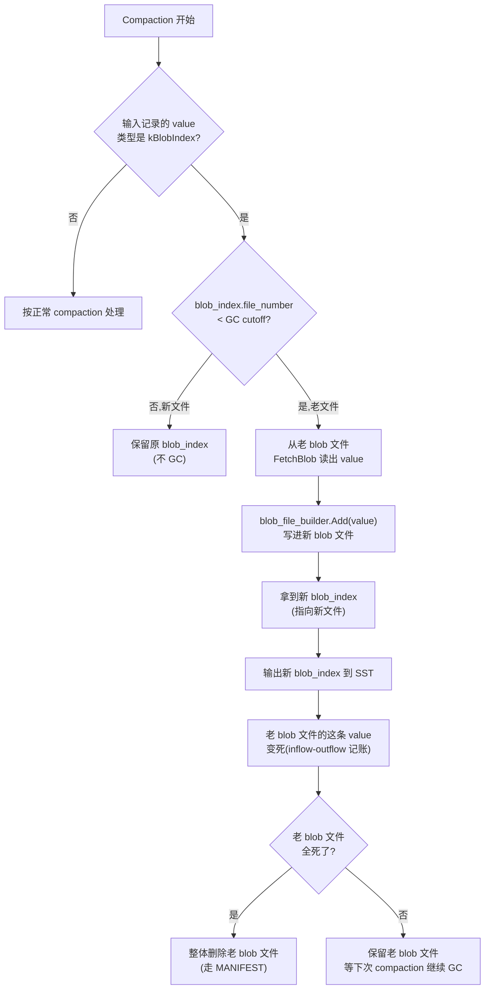

# 第 6 篇 · 第 22 章 · BlobDB 与运维

> **核心问题**:前面二十一章讲的 LSM,有一个被默认假设藏起来了——**value 不大**。一次 `Put(k, v)`,v 就算几 KB,Flush 成 SST、Compaction 一层层下压,重写几遍也能忍。可如果你的 workload 是"小 key + 大 value"(存图片、文档、消息体、机器学习特征,单 value 几十 KB 到几 MB),LSM 的写放大就**爆炸**了:每次 Compaction 把这个大 value 原样重写一遍,一个 key 从 L0 合到 L6 被重写七八遍,等于一份大 value 在盘上被写了七八份,SSD 寿命被吃光、Compaction IO 把前台写拖死。RocksDB 怎么办?——**BlobDB**:**把大 value 分离出 LSM,存进独立的 blob 文件,LSM 里只留一个几十字节的指针**。Compaction 重写的只是指针,大 value 不再被层层搬运。然后,生产可用还差最后一块:**线上怎么备份(Checkpoint/Backup)、怎么观测(Statistics/PerfContext/Trace)、怎么手动 compaction 回收空间(CompactRange)、怎么做只读副本(Secondary instance)**——这一章把横切篇收尾,把 RocksDB 从"能跑"推向"能运维"。

> **读完本章你会明白**:
> 1. 大 value 进 LSM 撞的是什么墙(写放大/空间放大爆炸,SSD 寿命吃光),以及 BlobDB 怎么用"value 分离 + LSM 只存指针"把它救回来。
> 2. BlobDB 的写流程(value 怎么进 blob 文件、blob_index 指针长什么样)、读流程(为什么多一次 blob 文件读、blob_cache 怎么补)、GC 流程(死 value 怎么回收,blob_garbage_meter 怎么计量)。
> 3. 为什么 BlobDB 是"sound"的——指针指向有效 blob,value 永远不会丢,以及 GC 的 age_cutoff + force_threshold 两个旋钮在调什么。
> 4. 线上三件套:Checkpoint 凭什么秒级(用 hard link 而非 copy)、CompactRange 什么时候该手动调、Statistics/PerfContext/Trace 各看什么。
> 5. Integrated BlobDB 和老版 BlobDB(独立 wrapper)的区别——为什么 11.x 之后老资料大片过时。

> **如果一读觉得太难**:先只记住三件事——① BlobDB = 大 value 存到 LSM 外的 blob 文件,LSM 里只留一个指针(file_number + offset + size),compaction 只搬指针不搬 value,写放大骤降;② GC = blob 文件里的 value 被删/覆盖后变"死",compaction 时把老 blob 文件里还活的 value 搬到新 blob 文件,老的就能整体删了;③ Checkpoint 用 hard link 秒级出物理快照,CompactRange 手动触发某 key range 的 compaction。

---

## 〇、一句话点破

> **BlobDB 不是另一种存储引擎,它是给 LSM 打的一个补丁:value 太大就别让它进 LSM 受 compaction 那份罪,把它另存到 blob 文件,LSM 里只留一个指路牌;compaction 只搬指路牌,value 原地不动。读的时候多走一步,顺着指路牌去 blob 文件把 value 取回来。**

这是结论,不是理由。本章倒过来拆:先讲大 value 进 LSM 撞什么墙,再讲 BlobDB 怎么把 value 分离出去、指针长什么样,然后讲 GC 怎么回收死了的 value,最后讲运维三件套(备份/观测/手动 compaction)怎么把这套东西在生产里跑起来。

---

## 一、大 value 进 LSM 撞什么墙:写放大的爆炸

### 一个被默认假设藏起来的问题

前面二十一章,我们一直隐含一个假设:**value 不大**。一次 `Put(k, v)`,v 是几十字节到几 KB。在这种假设下,LSM 的所有机制都工作得很好:

- MemTable 攒一批 KV,Flush 成 L0 SST。
- Compaction 把 L0 合到 L1、L1 合到 L2……一层层下压,把同一个 key 的新旧版本收敛,丢掉旧版本和墓碑。
- 一个 key 从写入到最终落稳,被重写约等于"层数"遍(第 4 篇讲过,Level Compaction 写放大约 10~30 倍)。

value 几 KB 的时候,重写 10 遍也就重写几十 KB,无所谓。可现在把 value 换成 **1 MB**(比如一张缩略图、一段消息体、一个机器学习特征向量),这套机制就崩了:

```
传统 LSM 处理 1 MB value(7 层 Level Compaction):
  写入:WAL 1MB + MemTable 1MB → Flush L0 1MB
  L0→L1 compaction:重写 1MB
  L1→L2 compaction:重写 1MB
  ... 每层都重写一遍
  L5→L6 compaction:重写 1MB
  
  一个 1MB value 落稳,实际写了 ~8-10 MB 到盘上。
  写放大 ≈ 8-10 倍。
```

这就是大 value workload 的**写放大爆炸**。它带来的后果有三条,条条致命:

**后果一:SSD 寿命被吃光。** SSD 的写入次数有限(TBW,Total Bytes Written)。一个本来设计寿命 5 年的 SSD,如果每份逻辑数据被写 8 遍,寿命缩到 5/8 年。更糟的是,大 value workload 往往写入量本身就大(存图片、存特征),写放大 8 倍意味着你 1 TB 的有效数据要写 8 TB 到盘上,SSD 可能一两年就磨穿了。

**后果二:Compaction IO 把前台写拖死。** Compaction 是后台 IO,它要重写这些大 value,就得读老 SST + 写新 SST,大量占用磁盘带宽。前台用户的 `Put` 还在等 WAL sync,磁盘被 Compaction 占满,WAL sync 变慢,写延迟飙升。这就是第 5 篇讲的"后台 IO 挤占前台"在大 value 场景被放大——大 value 让 Compaction 的 IO 量翻了 value_size / typical_key_size 倍。

**后果三:空间放大也爆炸。** 同一个 key 的新旧版本(每个 1 MB)在被 Compaction 收敛前,都占着空间。L0 里 10 个 SST 都有这个 key 的某个版本,就是 10 MB。空间放大在大 value 场景被放大同样的倍数。

> **钉死这件事**:LSM 的写放大和空间放大,是**按 value 大小线性放大的**。value 大一个数量级,写放大/空间放大就大一个数量级。大 value workload 用传统 LSM,等于把 LSM 的两个根本代价(写放大、空间放大)同时乘以 value_size。

### LevelDB 没有 BlobDB,只能硬扛

LevelDB 是"够用就好"的 LSM,value 大小它假设就是"普通 KV"。它没有 value 分离机制——大 value 进来就是进 MemTable、进 SST、进 Compaction 层层重写。如果你在 LevelDB 里存 1 MB value,上面那三种后果一样不少地吃。

> **LevelDB 是写死的**:value 必须和 key 一起进 LSM,没有"另存"的选项。RocksDB 打开成了旋钮——**BlobDB**。

### BlobDB 的回答:value 分离

BlobDB 的核心想法极其朴素:**value 太大,就别让它跟着 key 一起进 LSM 受 compaction 那份罪**。

```
传统 LSM:
  SST 里存: [key | value]   ← value 跟着 compaction 层层重写

BlobDB:
  blob 文件存: value         ← value 写一次就不再动
  SST 里存:   [key | blob_index]   ← LSM 里只留一个指针
                                       blob_index = (file_number, offset, size, compression)
```

这个"指针"叫 **blob_index**,它在 LSM 里以 `ValueType::kTypeBlobIndex` 的形式存在(和普通的 `kTypeValue`、`kTypeDeletion` 平级,见《LevelDB》的 internal key 格式那章,这里一句带过)。

写流程变成:

1. `Put(k, big_value)`:发现 value >= `min_blob_size`,**把 value 写进一个独立的 blob 文件**,拿到 `(blob_file_number, offset, size, compression)`。
2. 把这个指针编码成 blob_index,**作为一个"值"写进 LSM**(WAL + MemTable)。
3. MemTable Flush 成 SST,SST 里存的是 `[key | blob_index]`,blob_index 只有几十字节。
4. Compaction 层层下压,搬的只是这个几十字节的 blob_index——**大 value 在 blob 文件里原地不动**。

读流程变成:

1. `Get(k)`:穿透 MemTable + 多层 SST,找到这个 key,发现 value 类型是 `kTypeBlobIndex`。
2. 解码 blob_index,拿到 `(file_number, offset, size)`。
3. 顺着指针去 blob 文件,把 value 读出来(走 blob_cache 缓存)。

写放大骤降(大 value 只写一遍),空间放大骤降(blob 文件不重复)。代价是读放大**多了一次 blob 文件读**——这就是"value 分离的 indirection 代价"。

> **钉死这件事**:BlobDB 的本质是**用读放大换写放大/空间放大**。大 value workload 里,写放大/空间放大的爆炸远比多一次读更致命(因为大 value 本来就要从盘读,多一次 blob 文件定位的代价远小于重写 8 遍),所以这笔交易在大 value 场景是赚的。小 value 场景别开 BlobDB——多那一次 indirection 纯亏。

---

## 二、Integrated BlobDB:为什么老资料大片过时

讲 BlobDB 之前,必须先讲一个**坑死无数老资料的演进**:BlobDB 有**两代**实现,差别大到完全是两个东西。

### 老版 BlobDB(独立 wrapper,已废弃)

RocksDB 早期(5.x 时代)的 BlobDB,是一个**独立的 wrapper**:你在普通的 `DB` 外面包一层 `blob_db::BlobDB`,它拦截你的 `Put`,自己管理 blob 文件,LSM 里只存指针。这套东西的问题:

- 它是一个**并行的子系统**,有自己的 options(`blob_db_options`)、自己的 blob 文件管理、自己的 GC。
- 它和 RocksDB 主线(Column Family、Compaction、Backup、Checkpoint)的集成是**别扭**的——很多主线功能在 BlobDB wrapper 下不能用或者有坑。
- 它的 blob 文件是**堆在一个目录里**的,不进 MANIFEST,崩溃恢复、备份、复制都得 BlobDB 自己处理,容易出问题。

这套东西叫 **Stacked BlobDB**(因为它"叠"在普通 DB 上)。**它已经被废弃**。

### Integrated BlobDB(主线,11.x 的正解)

RocksDB 后来(6.18 起)把 BlobDB **集成进了主线**,叫 **Integrated BlobDB**。这套东西的差别:

- **它不是一个 wrapper,而是 Options 上的几个开关**:`enable_blob_files`、`min_blob_size`、`blob_file_size`、`enable_blob_garbage_collection` 等。你 `DB::Open` 一个普通的 RocksDB,把 `enable_blob_files = true` 一开,它就是 BlobDB 了。同一个 `DB` 实例,可以这个 Column Family 开 BlobDB、那个不开。
- **blob 文件进 MANIFEST**:blob 文件的创建/删除和 SST 一样,记录在 MANIFEST 里,崩溃恢复、备份(Checkpoint/BackupEngine)、复制(Secondary instance)全走主线的标准路径,不用 BlobDB 自己处理。这是 Integrated BlobDB 相对 Stacked 的**根本性胜利**。
- **GC 走 Compaction**:blob 文件的垃圾回收,不是单独的 GC 线程,而是**搭在 Compaction 的车上**——Compaction 遇到 blob_index,如果它指向的老 blob 文件该回收了,就把 value 读出来重新写到新 blob 文件,更新 blob_index。这样 GC 不需要单独的并发控制,复用 Compaction 的全套机制。

> **钉死这件事**:本书讲的、11.6.0 用的、生产该用的,都是 **Integrated BlobDB**。网上那些讲 `blob_db_options`、讲 `BlobDB::Open`、讲独立 wrapper 的资料,**基本都是老版 Stacked BlobDB,过时了**。你看 RocksDB 源码里 `db/blob/` 这一大片(BlobFileBuilder/BlobFileCache/BlobGarbageMeter/BlobSource/...),全是 Integrated BlobDB 的实现;Stacked BlobDB 的代码在 `utilities/blob_db/`(老路径),已经是历史包袱,别去读。本章所有源码引用,都是 Integrated BlobDB(`db/blob/`)。

11.6.0 还有一个更新的实验特性 `enable_blob_direct_write`(在写路径直接写 blob 文件,WAL/MemTable 里只存 blob_index 引用),它进一步降低写放大,但目前有诸多限制(只支持单 memtable writer、不支持 pipelined/two_write_queues,crash recovery 还不全)。本章正文聚焦**稳定的 Integrated BlobDB**(`enable_blob_files`),direct write 只在末尾点一下方向。

---

## 三、BlobDB 的写流程:value 怎么进 blob 文件,blob_index 长什么样

现在拆 Integrated BlobDB 的写流程。核心问题是:**一次 `Put(k, big_value)`,value 怎么从用户手里走到 blob 文件、blob_index 指针怎么生成、怎么进 LSM**。

### blob_index 的格式(先把指针长什么样钉死)

BlobDB 把大 value 分离后,LSM 里存的"值"是一个叫 blob_index 的小结构。它的格式在 `db/blob/blob_index.h` 里写得清清楚楚,有三种类型:

```
// db/blob/blob_index.h:28-40

kInlinedTTL (内联 + TTL,value 没分离):
  +------+------------+---------------+
  | type | expiration | value         |
  | char | varint64   | variable size |
  +------+------------+---------------+

kBlob (分离,无 TTL):
  +------+-------------+----------+----------+-------------+
  | type | file number | offset   | size     | compression |
  | char | varint64    | varint64 | varint64 | char        |
  +------+-------------+----------+----------+-------------+

kBlobTTL (分离 + TTL):
  +------+------------+-------------+----------+----------+-------------+
  | type | expiration | file number | offset   | size     | compression |
  | char | varint64   | varint64    | varint64 | varint64 | char        |
  +------+------------+-------------+----------+----------+-------------+
```

绝大多数场景用的是 **kBlob**(分离、无 TTL):type 一个字节(=1),后面跟着 file_number / offset / size 三个 varint64,再加一个字节的 compression type。整个 blob_index 通常就十几个字节——**用它替换掉 1 MB 的 value,LSM 里这个 key 的占用从 1 MB 缩到十几字节**。

> **钉死这件事**:blob_index 是个**定结构的指针**,核心字段就是 `(file_number, offset, size, compression)`。LSM 层层 compaction 搬运的、MemTable 里存的、WAL 里落盘的,都是这个小指针。大 value 本体在 blob 文件里,一次写入,永不(被 compaction)重写。

### blob 文件的格式

blob 文件本身(后缀 `.blob`)是一个简单的追加日志格式,和 SST 的复杂 block 结构完全不一样——它就是为了"顺序写、按 offset 读"优化的。格式在 `db/blob/blob_log_format.h`:

```
// db/blob/blob_log_format.h:27-115(简化示意,非源码原文)

blob 文件整体:
  +------------------+------------------+------------------+--->+-----------------+
  | header (30 字节) | record 0         | record 1         |...| footer (32 字节)|
  +------------------+------------------+------------------+--->+-----------------+

header (30 字节):
  magic(4) + version(4) + cf_id(4) + flags(1) + compression(1) + expiration_range(16)

每条 record (32 字节 header + key + value):
  key_len(8) + value_len(8) + expiration(8) + header_crc(4) + blob_crc(4) + key + value

footer (32 字节,文件正常关闭时才有):
  magic(4) + blob_count(8) + expiration_range(16) + footer_crc(4)
```

关键观察:**每条 record 的 offset 就是它在文件里的字节偏移**。blob_index 里的 `offset` 字段,就是这条 record 在 blob 文件里的起点。读的时候,`pread(fd, offset, record_header_size + key_len + value_len)` 就能把这条 record 读出来——一次定位、一次读,没有 SST 那种 index block → data block 的两级跳。

> **不这样设计会怎样**:如果 blob 文件像 SST 那样搞 block + index,读一个 value 要先读 index block 定位、再读 data block 取 value,多一次 IO。blob 文件故意做成**扁平追加日志**,record 直接按 offset 寻址,读就是一次 pread——这是为大 value 读取做的专门优化(大 value 本来一个 record 就可能几十 KB 到几 MB,index 那点开销可以忽略,省一次 IO 才是关键)。

### 写流程:BlobFileBuilder::Add

真正干活的代码在 `db/blob/blob_file_builder.cc` 的 `BlobFileBuilder::Add`。这个函数在 Flush/Compaction 产出 SST 的时候被调用(每写一个 KV 都调一次),它的职责是:**如果这个 value 够大,就把它写进 blob 文件,返回 blob_index;如果不够大,什么都不做(让调用方把 value 原样写进 SST)**。

```cpp
// db/blob/blob_file_builder.cc:108-166(简化,保留关键逻辑)

Status BlobFileBuilder::Add(const Slice& key, const Slice& value,
                            std::string* blob_index) {
  // 1. value 太小?直接返回,blob_index 留空 → 调用方把 value 原样进 SST
  if (value.empty() || value.size() < min_blob_size_) {
    return Status::OK();
  }

  // 2. 还没有打开的 blob 文件?开一个新的(写 header)
  const Status s1 = OpenBlobFileIfNeeded();
  if (!s1.ok()) return s1;

  // 3. 按需压缩 value
  Slice blob = value;
  GrowableBuffer compressed_blob;
  const Status s2 = CompressBlobIfNeeded(&blob, &compressed_blob);
  if (!s2.ok()) return s2;

  // 4. 把 blob 写进文件,拿到 (file_number, offset)
  uint64_t blob_file_number = 0, blob_offset = 0;
  const Status s3 = WriteBlobToFile(key, blob, &blob_file_number, &blob_offset);
  if (!s3.ok()) return s3;

  // 5. 文件够大了?关掉它(写 footer),下次 Add 再开新的
  const Status s4 = CloseBlobFileIfNeeded();
  if (!s4.ok()) return s4;

  // 6. (可选)把刚写的 blob 预热进 blob_cache
  const Status s5 = PutBlobIntoCacheIfNeeded(value, blob_file_number, blob_offset);

  // 7. 编码 blob_index 指针,返回给调用方
  BlobIndex::EncodeBlob(blob_index, blob_file_number, blob_offset, blob.size(),
                        blob_compression_type_);
  return Status::OK();
}
```

读完这段,整个 BlobDB 写流程就通了:

- **门槛在第 1 步**:`min_blob_size` 是旋钮(默认 0,即所有 value 都分离;实际用的时候一般设成几百字节到几 KB)。比它小的 value 走老路(原样进 SST),比它大的才分离。这个旋钮调的是"什么大小的 value 值得分离"——太小的不值得(多一次 indirection 的代价 > 省下的写放大)。
- **第 4 步 `WriteBlobToFile`** 调的是 `BlobLogWriter::AddRecord`,它把 record 追加进 blob 文件,返回这条 record 的起始字节偏移(`blob_offset`)。这个 offset 就是 blob_index 里的 offset。
- **第 5 步 `CloseBlobFileIfNeeded`**:如果当前 blob 文件累计写到 `blob_file_size`(默认 256 MB,`1ULL << 28`)了,就关掉它(写 footer),下次 Add 开新文件。这个旋钮调的是"单个 blob 文件多大"——太大(GC 要重写整个文件时慢)、太小(文件数爆炸,metadata 开销大)。
- **第 7 步 `EncodeBlob`** 就是上面那个 kBlob 格式:`type(1) + file_number(varint) + offset(varint) + size(varint) + compression(1)`。

`Add` 返回后,调用方(`BuildTable` 在 Flush/Compaction 里)拿到 blob_index,把它**当作 value** 写进 SST(类型标记为 `kTypeBlobIndex`)。从这一刻起,LSM 里这个 key 的"值"就是 blob_index 指针,大 value 本体已经在 blob 文件里了。

> **LevelDB 是写死的**:LevelDB 根本没有 BlobFileBuilder,value 必须原样进 SST。RocksDB 打开成了旋钮——`enable_blob_files`(开不开)、`min_blob_size`(多大才分离)、`blob_file_size`(单文件多大)、`blob_compression_type`(压缩不压缩),四个旋钮控制 value 分离的全套行为。

---

## 四、BlobDB 的读流程:多一次 blob 文件读,blob_cache 怎么补

写流程让大 value 逃出了 compaction 的层层重写,但天下没有免费的午餐——读的时候要多走一步。

### 读路径多了一次 indirection

一次 `Get(k)`,穿透 MemTable + L0 + L1..Ln(这部分和第 3 篇讲的一模一样,这里不重复),最终在某个 SST 里找到这个 key。解出 internal value,一看 type 是 `kTypeBlobIndex`——哦,这不是真 value,是个指针。

接下来:

1. **解码 blob_index**:`BlobIndex::DecodeFrom(value)`,拿到 `(file_number, offset, size, compression)`。
2. **打开/复用 blob 文件的 reader**:按 file_number 找 BlobFileReader(走 BlobFileCache,见下)。
3. **按 offset 读 record**:`pread(fd, offset, ...)`,读出 record header + key + (压缩的) value。
4. **校验 + 解压**:header_crc 校验头部、blob_crc 校验 key+value,按 compression type 解压,得到原始 value。

这相比普通 Get 多了什么?**一次 blob 文件的 pread**(加上可能的解压)。这就是"value 分离的读放大代价"。

```
普通 Get(无 BlobDB):
  MemTable → L0 → ... → Ln,某 SST data block 命中 → 拿到 value
  读放大 = 多层 SST 穿透(已被 Bloom/Index/Cache 压过)

BlobDB Get:
  MemTable → L0 → ... → Ln,某 SST data block 命中 → 拿到 blob_index
  → 按 blob_index 去 blob 文件 pread → 解压 → 拿到 value
  读放大 = 多层 SST 穿透 + 一次 blob 文件读
```

> **不这样设计会怎样**:这次额外的 blob 文件读躲不掉——value 在那边,你总得去取。但它有一个隐藏的好处:**blob 文件的读是按 offset 直接 pread 的,不需要读 index block**。SST 读一个 block 要先读 index block 二分定位、再读 data block(两次 IO,除非 cache 命中);blob 文件读就是一次 pread(offset 已知)。所以这次"额外的读"其实很便宜,尤其对大 value(一个 record 几十 KB 到几 MB,pread 一次就齐了)。

### blob_cache:把热 value 钉在内存

多一次 blob 文件读,对冷数据无所谓(反正要读盘),对热数据就不行了——如果同一个大 value 被反复 Get,每次都 pread 一次 blob 文件,IO 受不了。RocksDB 给 BlobDB 配了独立的 **blob_cache**(就像 SST 有 block_cache 一样)。

blob_cache 是一个 `std::shared_ptr<Cache>`,通过 `AdvancedOptions::blob_cache` 配(默认 nullptr,即不开)。它的 key 是 `(db_id, db_session_id, file_number, offset, size)` 算出来的 cache key,value 是解压后的 blob 内容。

读 blob 的真身是 `BlobSource::GetBlob`(`db/blob/blob_source.cc`),它的逻辑和 BlockCache 那一套如出一辙(第 3 篇讲过,这里不重复机制,只说差别):

1. 算 cache key,先查 blob_cache。
2. 命中?直接返回(零 IO)。
3. 没命中?走 BlobFileCache 拿 BlobFileReader(打开的 blob 文件 reader 也缓存),pread + 解压,结果插进 blob_cache,返回。

```cpp
// db/blob/blob_source.h:56-60(接口签名)

Status GetBlob(const ReadOptions& read_options, const Slice& user_key,
               uint64_t file_number, uint64_t offset, uint64_t file_size,
               uint64_t value_size, CompressionType compression_type,
               FilePrefetchBuffer* prefetch_buffer, PinnableSlice* value,
               uint64_t* bytes_read);
```

BlobSource 的设计哲学和 BlockSources 完全一致:**多级查找(cache → secondary cache → storage),对调用方透明**。它甚至还有 `MultiGetBlob` / `MultiGetBlobFromOneFile`——批量读多个 blob 时,把同一个 blob 文件里的多个 record 一次性读出来,摊薄 IO。

> **LevelDB 是写死的**:LevelDB 没有 blob_cache(因为它压根没有 BlobDB)。RocksDB 打开成了旋钮——`blob_cache`(用哪个 Cache 对象)、`prepopulate_blob_cache`(kFlushOnly 时,Flush 产出 blob 的同时塞进 cache,对 direct IO / 远程存储 / 高时间局部性 workload 有用)。官方还特意提醒:**blob 和 SST block 共用一个 cache 时,blob 的缓存价值更低**(一个大 blob 占的 cache 空间能换好几百个小 block),用 `Cache::Priority` 把 blob 优先级调低。

---

## 五、BlobDB 的 GC:死 value 怎么回收

写流程把 value 分离出去了,读流程能取回来。但这套机制有一个**根本性的垃圾问题**:**blob 文件里的 value 被删/覆盖后,谁来回收?**

### 垃圾是怎么产生的

想象这个过程:

1. `Put(k, v1)`:v1 写进 blob 文件 #1 的 offset 100,LSM 里存 `[k | blob_index → #1@100]`。
2. `Put(k, v2)`:v2 写进 blob 文件 #1 的 offset 200,LSM 里存 `[k | blob_index → #1@200]`(新版本,seq 更大)。
3. Compaction 把这两条收敛,丢掉旧版本 `[k | blob_index → #1@100]`,只留 `[k | blob_index → #1@200]`。

收敛之后,blob 文件 #1 的 offset 100 那个 v1,**就成了死 value**(没有任何 LSM 里的 blob_index 指向它了),但它在 blob 文件里还占着空间。这就是 blob 文件的**垃圾**(garbage)。

```
blob 文件 #1:
  offset 0:    record (key=k0, v)   ← 活(假设 k0 没被覆盖)
  offset 100:  record (key=k, v1)   ← 死!(k 被 v2 覆盖,旧 blob_index 在 compaction 里丢了)
  offset 200:  record (key=k, v2)   ← 活(当前 LSM 指向它)
  offset 300:  record (key=k1, v)   ← 活
```

这个"死 value"问题,是所有 value 分离存储的通病(WiscKey、TiKV 的 GC、甚至 MySQL InnoDB 的 purge 都要解决它)。BlobDB 的解法是:**搭 Compaction 的车**。

### GC 旋钮:age_cutoff 和 force_threshold

BlobDB 的 GC 不另起线程,而是**在 Compaction 里顺手做**。它由两个旋钮控制(都在 `AdvancedOptions` 里):

**旋钮一:`enable_blob_garbage_collection`(默认 false)**——开不开 GC 的总开关。

**旋钮二:`blob_garbage_collection_age_cutoff`(默认 0.25)**——这是个比例。BlobDB 把所有 blob 文件按 file_number 排序(老→新),取最老的 `cutoff × 总文件数` 个文件,**标记为"GC 候选"**。Compaction 遇到指向这些老 blob 文件的 blob_index 时,就把 value 读出来,重新写到新 blob 文件,更新 blob_index 指向新文件。

```
假设有 100 个 blob 文件,age_cutoff = 0.25:
  最老的 25 个 blob 文件(编号 #1 ~ #25)是 GC 候选。
  Compaction 时,凡是 blob_index.file_number ∈ [#1, #25] 的:
    → 把 value 从老 blob 文件读出来
    → 写进当前 compaction 产出的新 blob 文件
    → 更新 blob_index 指向新 blob 文件
  老的 #1~#25 一旦没有任何活 blob_index 指向,就可以整体删了。
```

这个 cutoff 的计算在 `db/compaction/compaction_iterator.cc:2011-2031`:

```cpp
// db/compaction/compaction_iterator.cc:2011-2031(简化)

uint64_t CompactionIterator::ComputeBlobGarbageCollectionCutoffFileNumber(
    const CompactionProxy* compaction) {
  if (!compaction->enable_blob_garbage_collection()) {
    return 0;  // 没开 GC,返回 0 → 任何 file_number >= 0 都不满足 "< cutoff"
               // (下面会讲为什么这样就不 GC)
  }
  const auto& blob_files = version->storage_info()->GetBlobFiles();
  // blob_files 按 file_number 升序排
  const size_t cutoff_index =
      static_cast<size_t>(compaction->blob_garbage_collection_age_cutoff()
                          * blob_files.size());
  return blob_files[cutoff_index].GetBlobFileNumber();
  // 返回第 cutoff_index 个文件的 number
  // → file_number < 这个值的,都是"老文件",该 GC
}
```

Compaction 在处理每条记录时,判断 blob_index 指向的文件**老不老**(`db/compaction/compaction_iterator.cc:1450-1453`):

```cpp
// 遇到 blob_index 类型的 value:
if (blob_index.file_number() >=
    blob_garbage_collection_cutoff_file_number_) {
  return;  // 指向新文件,不 GC,保留原 blob_index
}
// 否则:指向老文件,要 GC → 读出 value,准备重写
```

注意那个判断:**`file_number >= cutoff` 的不 GC**。所以 `enable_blob_garbage_collection = false` 时 cutoff = 0,所有 file_number 都 >= 0,一个都不 GC——这就是"总开关关掉"的实现。

**旋钮三:`blob_garbage_collection_force_threshold`(默认 1.0)**——这个是"主动触发"的阈值。上面讲的 GC 是**被动的**(compaction 本来就要做,顺手 GC)。但如果某个老 blob 文件的死 value 比例超高,而我们又没恰好在做 compaction,怎么办?这个旋钮说:**如果 GC 候选 blob 文件的平均死 value 比例超过这个阈值,就主动 schedule 一个 targeted compaction,强行把老 blob 文件里的活 value 搬走**。默认 1.0(即 100% 都是死 value 才强制),比较保守;调小(比如 0.5)会更积极地回收。注意:**这个 force threshold 目前只在 Level Compaction 下支持**(源码注释明说,见 advanced_options.h:1147-1157)。

### GC 的实现:RelocateBlobValues

GC 真正干活的地方,在 `CompactionIterator::RelocateBlobValues`(`db/compaction/compaction_iterator.cc:1687-1726`)。它的逻辑极其直白:

```cpp
// db/compaction/compaction_iterator.cc:1687-1726(简化)

std::vector<std::pair<size_t, BlobIndex>>
CompactionIterator::RelocateBlobValues(
    const std::vector<std::pair<size_t, PinnableSlice>>& fetched_blob_values) {
  std::vector<std::pair<size_t, BlobIndex>> new_blob_columns;

  if (blob_file_builder_) {  // 当前 compaction 在产出 blob 文件
    for (const auto& fv : fetched_blob_values) {
      const Slice col_value(fv.second);  // 从老 blob 文件读出来的 value

      std::string temp_blob_index;
      // 把 value 写进"当前 compaction 产出的新 blob 文件"
      Status status =
          blob_file_builder_->Add(user_key(), col_value, &temp_blob_index);
      if (!status.ok()) { /* 错误处理 */ break; }

      if (!temp_blob_index.empty()) {
        BlobIndex blob_idx;
        blob_idx.DecodeFrom(temp_blob_index);  // 新 blob_index(指向新文件)
        new_blob_columns.emplace_back(col_idx, blob_idx);
        ++iter_stats_.num_blobs_relocated;
        iter_stats_.total_blob_bytes_relocated += col_value.size();
      }
    }
  }
  return new_blob_columns;
}
```

注意这个**精妙之处**:GC 搬 value,用的就是写流程那个 `BlobFileBuilder::Add`——**把老 blob 文件里的活 value,当作新写入的 value,写进当前 compaction 正在产出的新 blob 文件**。这样:

- 新 blob 文件本来就是当前 compaction 在写的,加几条 record 进去,几乎零额外开销(就是几次 pread + 几次追加写)。
- 写完后拿到新的 blob_index(指向新文件),更新到 SST 的输出里。
- 老的 blob 文件,等这个 compaction 完事、老 SST 删掉之后,如果没有任何活 blob_index 指向它了,就被 blob file deletion 逻辑整体删掉(和 SST 删除走同一套机制,因为它进 MANIFEST)。

> **钉死这件事**:BlobDB 的 GC **不丢 value**。它的工作原理是:每个活 value 都有一个 blob_index 指着它(在 LSM 里);GC 遇到一个活 value 的 blob_index 指向老文件,就**先**把这个 value 搬到新文件、**更新** blob_index 指向新文件,**然后**老文件才允许被删。任何时候,任何一个活 blob_index 都指向一个有效的 blob record——这就是 GC 为什么 sound:指针永远指向有效数据,value 永远不丢。这和"先删老的再写新的"这种会丢数据的垃圾回收是两回事。

### GC 的计量:BlobGarbageMeter

GC 要知道某个 blob 文件的死 value 比例(决定 force_threshold 触不触发),得有人**记账**。这个账房先生是 `BlobGarbageMeter`(`db/blob/blob_garbage_meter.h`)。

它的思路非常干净:**对每个 blob 文件,记 inflow(进来多少)和 outflow(出去多少),差就是 garbage**。

```cpp
// db/blob/blob_garbage_meter.h:52-88(简化)

class BlobInOutFlow {
  void AddInFlow(uint64_t bytes)  { in_flow_.Add(bytes); }
  void AddOutFlow(uint64_t bytes) { out_flow_.Add(bytes); }

  uint64_t GetGarbageCount() const {
    return in_flow_.GetCount() - out_flow_.GetCount();
  }
  uint64_t GetGarbageBytes() const {
    return in_flow_.GetBytes() - out_flow_.GetBytes();
  }
  // inflow >= outflow 永远成立(出去的必定是进来的子集)
};
```

在一次 compaction 里:

- **inflow**:输入 SST 里的 blob_index 指向哪些 blob 文件、各多少字节。用 `BlobCountingIterator`(`db/blob/blob_counting_iterator.h`)包一层输入 iterator,扫一遍输入,把每个 blob_index 解出来,记进对应 blob 文件的 inflow。
- **outflow**:输出 SST 里的 blob_index 指向哪些 blob 文件、各多少字节。在 `BuildTable` 里(`db/builder.cc:304-305`),每写出一条带 blob_index 的记录,调 `blob_garbage_meter->ProcessOutFlow(...)` 记一笔。

inflow - outflow = 这次 compaction 给这些 blob 文件**新增**了多少 garbage。compaction 结束后,这些数字汇总到 VersionStorageInfo 里,更新每个 BlobFileMetaData 的 `garbage_blob_count_` / `garbage_blob_bytes_`(`db/blob/blob_file_meta.h:145-166`),供 force_threshold 判断用。

```
一次 compaction 的 blob 流向:
  
  输入 SST:
    [k1 | blob_index → #5@100]  ──┐
    [k2 | blob_index → #5@200]  ──┼─→ inflow: blob 文件 #5 +2 条,+bytes
    [k3 | value](非 blob)         │
                                  │
  (GC 后,假设 k1 被覆盖丢弃,k2 搬到新文件 #20) 
                                  │
  输出 SST:                       │
    [k2 | blob_index → #20@50] ←──┴─→ outflow: blob 文件 #5 +1 条(只剩 k2 还指 #5?不,k2 搬走了)
                                  │      blob 文件 #20 +1 条
  结论:
    blob #5: inflow=2, outflow=1 → 新增 garbage 1 条(k1 死了)
    blob #20: inflow=0, outflow=1 → 新增 -1? 不,这是新文件,正常
```

(上面这个例子简化了,outflow 记的是"compaction 后仍指向该文件的活引用数",inflow 是"compaction 输入里指向该文件的引用数",差就是这次 compaction 让该文件多了几条死引用。)

> **不这样设计会怎样**:如果不算 inflow/outflow,GC 就不知道哪个 blob 文件该优先回收(死 value 比例高的该先回收)。BlobGarbageMeter 用"流"的视角精确记账,让 force_threshold 有据可依。这是 Integrated BlobDB 把 GC 完全搭在 Compaction 车上的关键一环——不用单独扫 blob 文件,compaction 本来就要扫输入 SST,blob_index 的流向顺手就记下来了。

---

## 六、BlobDB 布局图与 GC 流程图

把前面几节合起来,看两张图。

### 图一:BlobDB 的 value 分离布局

```
                    ┌──────────────────────────────────────────────┐
   LSM (SST 文件):  │  data block:                                 │
                    │    [key1 | blob_index1]   ← 几十字节指针     │
                    │    [key2 | blob_index2]                       │
                    │    [key3 | value3]        ← 小 value 原样存   │
                    │    [key4 | blob_index4]                      │
                    └──────────────┬───────────────────────────────┘
                                   │ compaction 层层搬运的只是指针
                                   │ (大 value 不被搬运)
                                   │
                                   │ 读时按指针去取:
                                   ▼
   blob 文件 #5:    ┌──────────────────────────────────────────────┐
   (扁平追加日志)   │  header(30B)                                 │
                    │  record@0:   (key1, big_value1)  ← offset=0  │
                    │  record@300: (key2, big_value2)  ← offset=300│
                    │  record@900: (key4, big_value4)  ← offset=900│
                    │  ...                                          │
                    │  footer(32B)                                  │
                    └──────────────────────────────────────────────┘
                    blob_index1 = (file=#5, offset=0,   size=300, ...)
                    blob_index2 = (file=#5, offset=300, size=600, ...)
                    blob_index4 = (file=#5, offset=900, size=...,  )
```

注意:**key3 的 value 小,没分离,原样在 SST 里**。这就是 `min_blob_size` 门槛的作用——只分离够大的 value。

### 图二:GC 怎么回收死 value



这张图的核心是那个**分叉**:`file_number < cutoff` 才 GC,否则不动。这个 cutoff 把 GC 限制在最老的 N 个 blob 文件,避免每次 compaction 都把所有 blob 全搬一遍(那等于把 value 分离的好处全抵消了)。

---

## 七、技巧精解:三个为什么 sound

这一节把本章最硬核的三个"为什么这套机制是 sound 的"单独拆透。

### 技巧一:为什么"value 分离 + 指针"不会丢 value(正确性的根)

这是 BlobDB 最容易被怀疑的地方:**value 不在 LSM 里了,compaction 改来改去,会不会把 value 搞丢?** 答案是**不会**,而且 sound 的根在一个极其朴素的事实:

> **每一个"活着的" value,都有且仅有一个 blob_index 在 LSM 里指着它。blob_index 在 LSM 里享受 LSM 的全部正确性保证(snapshot、MVCC、compaction 不丢被引用版本);blob 文件里的 value 是 blob_index 的"终态数据",只要 blob_index 还活着,value 就必须活着。**

把这句话拆开:

1. **blob_index 进了 LSM**:它和普通 value 一样,有 sequence number、受 snapshot 保护、compaction 收敛时不会丢(只要它被某个快照或当前版本引用)。这部分正确性,**完全是 LSM 本身的正确性**,BlobDB 一行代码都不用额外写。
2. **blob 文件的 lifecycle 挂在 blob_index 上**:blob 文件的创建、删除,进 MANIFEST(和 SST 一样)。一个 blob 文件**只有在它里面所有 record 都没有活 blob_index 指向时,才会被删**。这个判断由 VersionSet 在 compaction 后做——扫所有活 SST 里的 blob_index,凡是被指着的 blob 文件保留,没人指的才能删。
3. **GC 搬 value,是"先写新,后删老"**:RelocateBlobValues 把 value 写进新 blob 文件、更新 blob_index 指向新文件,**这整套都在 compaction 的事务边界内**(compaction 原子产出新 SST + 新 blob 文件 + 新 MANIFEST 记录)。新 SST 没安装之前,老 SST 还在,老 blob_index 还在,老 blob 文件还在;新 SST 安装(Version 切换)之后,老 SST 进入待删,老 blob 文件等引用清零再删。**任何时刻,value 都有处可寻**。

> **反面对比**:如果朴素地实现 BlobDB——先删老 blob 文件再写新的,或者 GC 时不更新 blob_index 直接清 blob record——那一次崩溃就可能让某个 blob_index 指向一个已经无效的 offset,value 就丢了。RocksDB 的做法是**把 blob 文件的 lifecycle 完全挂在 MANIFEST 上、把 GC 的"搬"做成 compaction 内的原子操作**,让 BlobDB 的正确性**完全复用 LSM + MANIFEST 已经验证过十年的正确性**。这是"为什么 sound"的根:不是 BlobDB 自己保证不丢,是它**借**了 LSM 的正确性。

### 技巧二:为什么 GC 的 age_cutoff 设计成"按文件号排序取老的"

GC 为什么不直接"哪个 blob 文件死 value 比例高就回收哪个",而是"无脑取最老的 N 个文件"?这个设计初看有点傻(最老的不一定死 value 最多),其实是个**精妙的工程权衡**:

- **死 value 和文件年龄强相关**。blob 文件是按 file_number 顺序创建的(老的 number 小)。一个 blob 文件越老,它里面的 value 被覆盖/删除的概率越高(经过的写入越多)——所以"老的文件死 value 多"在统计上**近似成立**。用 age_cutoff 当代理变量,不用精确算每个文件的死 value 比例就能大致回收对的文件,**省掉了持续精确计量的开销**。
- **和 compaction 的"数据下沉"语义对齐**。compaction 是把数据从浅层往深层搬,浅层(L0/L1)的数据新、深层(L5/L6)的数据老。GC 跟着 compaction 走,优先回收老 blob 文件,**和老数据下沉到深层的方向一致**——深层 SST 里的 blob_index 一旦被 GC 更新,就指向新 blob 文件,这些新 blob 文件以后也不太会被频繁 compaction(数据已经沉到底了),value 分离的收益最大化。
- **age_cutoff 是个连续可调的旋钮**。0.25 表示"每次 compaction 最多碰最老 25% 的 blob 文件",这是个保守的开始;如果你的 workload 死 value 产生很快,调到 0.5 更积极;如果很慢,0.1 就够。这个旋钮调的是"GC 的侵略性"——和 Write Stall 的 trigger 一样,是个"反压强度"旋钮。

> **反面对比**:如果 GC 用"死 value 比例最高的优先",那每次 compaction 都得先扫一遍所有 blob 文件的 garbage 计量、排序、挑最该回收的——这是 O(blob 文件数) 的额外开销,而且和 compaction 当前碰到的 key range 可能完全对不上(compaction 在搬 L2 的某个 key range,结果挑出来要 GC 的 blob 文件关联的是 L5 的 key,根本碰不到)。age_cutoff 按文件号排序,O(1) 判断(就一个 file_number 比较),而且天然和 compaction 碰到的数据对齐。这是工程上的克制:**用足够好的近似,换掉精确但昂贵的最优解**。

### 技巧三:为什么 Checkpoint 用 hard link 能秒级出物理快照

这一节属于运维三件套(下一节展开),但它的"为什么 sound"和 BlobDB 一脉相承,放这里一起讲。

`Checkpoint::CreateCheckpoint`(`utilities/checkpoint/checkpoint_impl.cc:92-217`)能在**不停止读写**的前提下,秒级产出一个物理上一致的数据库快照(可用于备份、复制、起只读副本)。它的核心技巧是 **hard link 而非 copy**:

```cpp
// utilities/checkpoint/checkpoint_impl.cc:92-180(简化)

Status CheckpointImpl::CreateCheckpoint(const std::string& checkpoint_dir,
                                        uint64_t log_size_for_flush, ...) {
  // 1. 目标目录不能已存在
  if (db_->GetEnv()->FileExists(checkpoint_dir).ok()) {
    return Status::InvalidArgument("Directory exists");
  }
  std::string tmp_dir = checkpoint_dir + ".tmp";

  // 2. 禁止文件删除(防止 compaction 删掉我们要 link 的 SST)
  Status s = db_->DisableFileDeletions();

  // 3. 核心:CreateCustomCheckpoint
  //    对每个 live SST/Blob 文件:先试 hard link,link 不支持才 copy
  s = CreateCustomCheckpoint(
    /* link_file_cb = */ [&](src_dir, fname, type) {
      return db_->GetFileSystem()->LinkFile(src_dir + "/" + fname,
                                            tmp_dir + "/" + fname);
    },
    /* copy_file_cb = */ [&](src_dir, fname, ...) {
      return CopyFile(...);
    },
    /* create_file_cb = */ ...,
    &sequence_number, log_size_for_flush);

  // 4. 恢复文件删除
  if (disabled_file_deletions) db_->EnableFileDeletions();

  // 5. 原子安装:rename tmp_dir → checkpoint_dir
  s = db_->GetEnv()->RenameFile(tmp_dir, checkpoint_dir);
  return s;
}
```

为什么这套能秒级 + sound?

**秒级**:hard link 是文件系统级别的操作,它不复制数据,只在一个新的目录项里加一个指向同一份 inode 的指针。一个几 GB 的 SST,hard link 是毫秒级的(就改个目录项),copy 是分钟级的(真要读几 GB 写几 GB)。`checkpoint_impl.cc:461-485` 里 `auto hardlink_file = true;`,先试 link,link 返回 NotSupported(比如跨文件系统)才 fallback 到 copy——**能 link 就绝不 copy**。

**sound(一致性)**:这是更微妙的。SST 和 blob 文件是**不可变**的(一旦写完关闭,再也不改)。所以:

1. `DisableFileDeletions` 阻止 compaction 删掉当前 live 的 SST/blob(它们可能正在被新 version 替代,但文件不能真删)。
2. `GetLiveFilesStorageInfo` 拿到当前 Version 的所有 live SST + blob + WAL 文件列表——这个列表描述的是一个**一致的数据库状态**(某个 sequence number 的快照)。
3. 对这些文件做 hard link——link 出来的目录项,指向和源文件**同一份 inode**,内容完全一样。
4. `RenameFile` 原子安装 tmp_dir → checkpoint_dir。
5. `EnableFileDeletions`。

整个过程中,源 DB 可以照常读写(新写入进新 MemTable/WAL,新 compaction 产出新 SST),但 checkpoint 拿到的是 `DisableFileDeletions` 那一刻的一致快照——因为 SST/blob 不可变,link 出来的就是那一刻的精确副本。新写入不会影响 checkpoint(它们写的是新文件,不是 link 的那些),旧 compaction 删文件被 DisableFileDeletions 挡住了,不会删掉 link 还在引用的文件。

> **钉死这件事**:Checkpoint 的 sound 建立在两个事实上——① SST/blob 文件**不可变**,link 就是真复制(共享 inode);② `DisableFileDeletions` 保证 link 引用的文件在安装完成前不会被删。这两条合起来,让 hard link 出来的目录就是一个一致快照。BlobDB 的 blob 文件**也享受这套**(它是不可变的、进 MANIFEST 的),所以 Checkpoint 对 BlobDB 一样 work——这是 Integrated BlobDB 把 blob 文件挂进 MANIFEST 的另一大红利(Stacked BlobDB 的 blob 文件不进 MANIFEST,checkpoint 得特殊处理,又脏又慢)。

> **反面对比**:如果朴素地"停写 → copy 整个数据库 → 恢复写",那备份期间数据库不可写(对在线服务不可接受),而且 copy 几十 GB 要几分钟到几十分钟。Checkpoint 用 hard link + DisableFileDeletions,**对在线服务零打扰、毫秒到秒级出快照**。这是 LSM 不可变文件 + 文件系统 hard link 的天作之合——B+ 树那种原地更新的存储引擎做不到(B+ 树的页在变,你 link 了也会被后续更新改掉)。

---

## 八、运维三件套:备份、观测、手动 compaction

BlobDB 讲完,本章剩下的一半是**生产可用的最后一公里**:线上怎么备份、怎么观测、怎么手动干预。

### 三件套之一:备份——Checkpoint 与 BackupEngine

线上 RocksDB 怎么备份?有两种官方姿势,适用场景不同。

**Checkpoint(物理快照,秒级,适合热备/复制)**:

`Checkpoint::CreateCheckpoint`(上节拆过)产出一个**完整的、可直接打开的**数据库目录(SST + blob + WAL + CURRENT + MANIFEST 齐全)。你可以:

- 把这个目录 `tar` 起来扔到对象存储(冷备)。
- 用 `rsync` 增量同步到另一台机器(热备/异地容灾)。
- 在同机直接 `DB::Open` 这个目录,起一个只读副本调试。

它的语义是"某一时刻的物理一致快照",用 hard link 秒级出,对源 DB 零打扰。**生产里几乎所有的"RocksDB 备份"都是 Checkpoint 起步**(TiKV 的 snapshot、MySQL RocksDB 引擎的备份,底层都是 Checkpoint 或其变体)。

```cpp
// 用法(极简)
Checkpoint* checkpoint;
Checkpoint::Create(db, &checkpoint);
checkpoint->CreateCheckpoint("/backup/rocksdb_20260626");
// 几秒后,/backup/rocksdb_20260626 就是一个可打开的完整 DB 副本
```

**BackupEngine(增量备份,带压缩/加密,适合定期备份)**:

`BackupEngine`(在 `include/rocksdb/utilities/backup_engine.h`)是更高层的备份工具。它不是单次快照,而是**管理一系列 backup**(每次 `CreateBackup` 加一个),后台做**增量**(只备份和上次比新出现的 SST,用 hard link 共享未变文件)、支持压缩、支持加密、支持 `RestoreDBFromBackup` 恢复到指定 backup。它的底层和 Checkpoint 一样用 hard link(共享未变文件),但多了 backup metadata、校验、过期清理这套管理逻辑。

> **LevelDB 是写死的**:LevelDB 没有 Checkpoint,也没有 BackupEngine。你想要 LevelDB 的备份?只能停写、手动 copy 文件、祈祷中间没 compaction 改文件——又慢又脏。RocksDB 打开成了旋钮——Checkpoint(秒级物理快照)和 BackupEngine(增量备份管理)是生产可用的标配,这是 LevelDB 到 RocksDB 的工业级跃迁里很实在的一块。

### 三件套之二:观测——Statistics、PerfContext、Trace

线上 RocksDB 跑着,怎么知道它健康?RocksDB 给了三套观测工具,粒度从粗到细:

**Statistics(全局计数器 + 分布)**:

`Options.statistics`(一个 `std::shared_ptr<Statistics>`)开了之后,RocksDB 把各种事件计数。两类指标:

- **Ticker**(计数器,单调递增):比如 `NUMBER_KEYS_WRITTEN`(总 Put 数)、`NUMBER_KEYS_READ`(总 Get 数)、`BLOCK_CACHE_HIT`(block cache 命中数)、`BLOB_DB_BLOB_FILE_WRITE_MICROS`(写 blob 文件耗时,这个是 Integrated BlobDB 的)。
- **Histogram**(分布,有 p50/p99 等):比如 `DB_GET`(Get 耗时分布)、`BLOB_DB_BLOB_FILE_WRITE_MICROS`(blob 文件写耗时分布)、`COMPACTION_TIME`(compaction 耗时分布)。

这里有个**坑**:11.6.0 的 `include/rocksdb/statistics.h` 里有一堆 `BLOB_DB_*` 的 ticker(`BLOB_DB_NUM_PUT`、`BLOB_DB_NUM_GET` 等),但源码注释明说**"Only applicable to legacy BlobDB"**——它们是老版 Stacked BlobDB 的统计,**Integrated BlobDB 不报这些**。Integrated BlobDB 的统计走 `BLOB_DB_BLOB_FILE_*`、`BLOB_DB_COMPRESSION_MICROS` 这类新的 ticker,以及 PerfContext 的 blob 字段(见下)。看监控的时候别看错了指标。

**PerfContext(每线程/每操作耗时分解)**:

` PerfContext`(在 `include/rocksdb/perf_context.h`)比 Statistics 细一个量级——它记录**单个操作**的耗时分解。通过 `SetPerfLevel(kEnableTime)` 打开后,每个线程有一个 `PerfContext`,记录这次 Get/Put 各阶段花了多少纳秒:

```cpp
// include/rocksdb/perf_context.h:74-123(字段节选)

struct PerfContext {
  uint64_t user_key_comparison_count;  // key 比较次数
  uint64_t block_cache_hit_count;      // block cache 命中
  uint64_t block_read_count;           // block 读盘次数
  uint64_t block_read_time;            // block 读盘耗时(nanos)

  // Integrated BlobDB 专用的观测字段(11.x 加的):
  uint64_t blob_cache_hit_count;   // blob cache 命中
  uint64_t blob_cache_read_byte;   // blob cache 读字节数
  uint64_t blob_read_count;        // blob 读盘次数
  uint64_t blob_read_byte;         // blob 读盘字节数
  uint64_t blob_read_time;         // blob 读盘耗时
  uint64_t blob_checksum_time;     // blob 校验耗时
  uint64_t blob_decompress_time;   // blob 解压耗时
  // ...
};
```

这几个 `blob_*` 字段是 **Integrated BlobDB 专用的**(perf_context.h:116-122),它们的提出就是为了**取代**那些 legacy 的 `BLOB_DB_*` ticker。生产里排查 BlobDB 性能,PerfContext 的这几个字段是金标准——你能精确看到一个 Get 的耗时里,blob 读占多少、校验占多少、解压占多少,一眼定位瓶颈。

**Trace(操作录制回放)**:

`StartTrace`/`StopTrace`(在 trace_replay/)把所有操作(Get/Put/Seek 的 key、耗时、返回值)录到一个 trace 文件,之后可以 `TraceReplay` 回放。这是排查"某个时间窗口发生了什么"的终极武器——线上出问题,开几秒钟 trace,回测试室回放复现。

> **LevelDB 是写死的**:LevelDB 只有最简陋的统计(几个 counter),没有 PerfContext 的耗时分解,没有 Trace 回放。RocksDB 这三套观测工具是工业级的标配——你在线上跑 RocksDB,不开 Statistics 和 PerfContext 等于盲飞,出问题连哪个环节慢都不知道。

### 三件套之三:手动 compaction——CompactRange

有时你需要**手动**触发 compaction,不等 RocksDB 自己的调度。两个典型场景:

**场景一:删了一批数据,想立刻回收空间**。比如 GDPR 要删某用户所有数据,你 `DeleteRange` 了,但老 SST 还在(等 compaction 收敛),空间没释放。这时手动 `CompactRange` 那个 key range,逼 RocksDB 立刻合并、丢掉老版本,空间马上回收。

**场景二:改了 Options,想让已有的 SST 按新 Options 重写**。比如你把 `compression` 从 kNone 改成 kZSTD,但老 SST 是 kNone 压的(改 Options 只影响新产出的 SST)。这时手动 `CompactRange` 全库,逼 RocksDB 用新 Options 重写所有 SST。

```cpp
// include/rocksdb/db.h:1568-1574

virtual Status CompactRange(const CompactRangeOptions& options,
                            ColumnFamilyHandle* column_family,
                            const Slice* begin, const Slice* end) = 0;
// begin/end 传 nullptr 表示全库
// db->CompactRange(opts, nullptr, nullptr);  // 全库手动 compaction
```

CompactRange 是同步的(等 compaction 完成才返回),生产里慎用——它会占用大量 IO(可能几百 GB 的重写),最好在低峰跑。`CompactRangeOptions` 里有 `target_path_id`(指定压到哪层)、`bottommost_level_compaction`(最深层要不要动)等旋钮,精细控制。

> **LevelDB 是写死的**:LevelDB 只有一个粗糙的 `CompactRange`(而且没有 CompactRangeOptions),功能弱很多。RocksDB 把它做成了旋钮——`target_level`、`bottommost_level_compaction`、`allow_write_stall` 等,让手动 compaction 可控、可调。

### 三件套之四(补充):Secondary instance(只读副本)

还有一个运维相关但不算"三件套"的特性:**`DB::OpenAsSecondary`**(`include/rocksdb/db.h:255`)。它打开一个**只读的 secondary 实例**,跟着 primary 的 WAL 走,自动追上 primary 的最新状态。

```cpp
// include/rocksdb/db.h:255

static Status OpenAsSecondary(const Options& options, const std::string& name,
                              const std::string& secondary_path, DB** dbptr);
```

primary 写、secondary 读,两者共享同一份数据文件(secondary 通过 primary 的 WAL 追)。适用场景:读多写少的分析查询、跨可用区的读副本、不阻塞 primary 的大查询。和 Checkpoint 的区别:Checkpoint 是**静态快照**(某一时刻),Secondary 是**持续跟随**(不断追上 primary)。

> **LevelDB 是写死的**:LevelDB 没有 Secondary instance 的概念,一个 DB 只能一个进程打开写。RocksDB 打开成了旋钮——Secondary instance 让"一份存储、多个读副本"成为可能,这是分布式系统(比如 TiKV 的 learner、读副本)在单机引擎层面的支撑。

---

## 九、BlobDB 调优实战与坑

讲完机制,给几条实战调优经验(不是参数清单,是"为什么这么调")。

### 坑一:min_blob_size 设多大

`min_blob_size` 调的是"value 多大才值得分离"。太小(比如 0,所有都分离):小 value 也走 blob,多一次 indirection,读放大白白增加,而且 blob 文件数爆炸。太大(比如 1 MB):只有超大 value 才分离,大部分 value 还是走 LSM,写放大没降下来。

经验值:**看你的 value 分布**。如果你的 value 是双峰(要么几十字节,要么几十 KB),把 min_blob_size 设在双峰之间的谷底(比如 4 KB),让大 value 分离、小 value 不动。如果 value 是连续分布,设成"让前 80% 的小 value 不分离,后 20% 的大 value 分离"那个分位点。官方默认 0(全分离)是给"几乎所有 value 都大"的极端 workload 用的,大多数场景要调大。

### 坑二:blob_cache 要开,而且要单独开

开了 BlobDB,不开 blob_cache 是灾难——每次读大 value 都 pread,IO 爆炸。**blob_cache 必须开**。

而且,官方建议**不要和 block_cache 共用一个 Cache 对象**(advanced_options.h:1181-1189 的注释)。原因:一个大 blob 占的 cache 空间,能换几十上百个 SST block。共用一个 cache,blob 可能把 block 挤出去(block cache 命中率下降,影响所有读)。建议**单独建一个 blob_cache**,容量单独算,优先级(`Cache::Priority`)调低。

### 坑三:GC 的 force_threshold 默认 1.0 太保守

`blob_garbage_collection_force_threshold` 默认 1.0(死 value 100% 才强制 GC)。这个值对"大 value 写多读少、删除频繁"的 workload 太保守——blob 文件里 80% 都是死 value 了还不强制 GC,空间放大下不来。如果你看到监控里 blob 文件的死 value 比例持续很高,把这个值调到 0.5~0.7,让 GC 更积极。但注意:**这只在 Level Compaction 下有效**(Universal/FIFO 不支持)。

### 坑四:开 BlobDB 后,checkpoint/backup 立刻可用(但注意 direct write)

Integrated BlobDB 因为 blob 文件进 MANIFEST,Checkpoint/BackupEngine **自动**支持 blob 文件,不用任何特殊配置——这是相对 Stacked BlobDB 的巨大优势。

但如果你开了实验的 `enable_blob_direct_write`,要小心:advanced_options.h:1216-1218 明说,**checkpoint/backup/live-files enumeration 必须先 flush 掉 pending 的 direct-write 状态,某些故意跳过 flush 的 API 会返回 NotSupported**。这个特性还很新(11.x),生产慎用。

---

## 十、章末小结

### 回扣主线

本章是横切篇的收尾,也是全书"生产可用"这条线的句号。回到二分法:

- **BlobDB 是横切两面的**:它的写流程(大 value 进 blob 文件)减轻**写路径**的写放大,它的读流程(按 blob_index 取 value)增加**读路径**的一次 indirection。它是"用读放大换写放大/空间放大"的旋钮,只对大 value workload 划算。LevelDB 没有 BlobDB(value 必须进 LSM),RocksDB 打开成了旋钮(`enable_blob_files` 一开就是 BlobDB)。
- **运维三件套是横切的**:Checkpoint/Backup 服务"备份"(横切读写)、CompactRange 服务"手动干预写路径"(强制 compaction)、Statistics/PerfContext/Trace 服务"观测读写两面"、Secondary instance 服务"读副本"。LevelDB 这些要么没有、要么极简陋;RocksDB 把它们做成了生产级工具。

BlobDB + 运维三件套,加上前面讲的 Snapshot(P6-20)、Transaction(P6-21),构成了 RocksDB"生产可用"的全部拼图。一个 LSM 引擎光有读写路径不够,得能扛大 value、能备份、能观测、能手动干预、能起只读副本,才算工业级。

### 五个为什么

1. **为什么大 value 进传统 LSM 会爆炸?**——因为 LSM 的写放大和空间放大是按 value 大小线性放大的。1 MB value 被 compaction 重写 8 遍就是 8 MB 写入,SSD 寿命吃光、空间占用翻倍。BlobDB 把大 value 分离出 LSM,只让几十字节的 blob_index 进 LSM 受 compaction 那份罪,大 value 写一次不再动。

2. **为什么 Integrated BlobDB 取代了 Stacked BlobDB?**——Stacked 是独立 wrapper,blob 文件不进 MANIFEST,崩溃恢复/备份/复制都得自己处理,和主线集成别扭;Integrated 把 blob 文件挂进 MANIFEST、GC 搭在 compaction 车上,复用主线全部正确性和工具链(Checkpoint/Backup 自动支持 blob)。这是"把特性融进主线"的工程胜利。

3. **为什么 BlobDB 的 GC 不会丢 value?**——因为每个活 value 都有且仅有一个 blob_index 在 LSM 里指着它,blob_index 享受 LSM 全部正确性(snapshot/MVCC/compaction 不丢引用);GC 搬 value 是"先写新 blob 文件、更新 blob_index、再删老 blob 文件",任何时刻 value 都有处可寻。BlobDB 的正确性是**借** LSM + MANIFEST 的正确性,不是自己另搞一套。

4. **为什么 GC 用 age_cutoff 而不是"死 value 比例最高优先"?**——age_cutoff 按文件号排序 O(1) 判断,且和 compaction 碰到的数据天然对齐(老 blob 文件关联老数据,正往深层沉);"死 value 比例最高优先"要持续精确计量、排序,且可能和当前 compaction 的 key range 对不上。这是用足够好的近似换掉精确但昂贵的最优解的工程克制。

5. **为什么 Checkpoint 能秒级出物理快照?**——因为 SST/blob 文件不可变,hard link 就是真复制(共享 inode,毫秒级);DisableFileDeletions 保证 link 引用的文件安装前不被删;rename 原子安装。LSM 不可变文件 + 文件系统 hard link 的天作之合,B+ 树这种原地更新的引擎做不到。

### 想继续深入往哪钻

- 想看 BlobDB 的完整设计文档:读 RocksDB 官方博客 "BlobDB: Where we are and where we're heading"(注意区分 Integrated vs Stacked)。
- 想看 GC 的全部细节:本书引用的 `db/compaction/compaction_iterator.cc:1440-1520`(single-value GC)、`db/compaction/compaction_iterator.cc:1687-1726`(RelocateBlobValues)、`db/builder.cc:111-119`(BlobGarbageMeter 装配)。
- 想看 BlobDB 的宽列(wide-column)扩展:`db/wide/` 和 `db/compaction/compaction_iterator.cc` 的 `SerializeEntityAfterGC`(PutEntity 的大 value 分离)。
- 想动手感受:用 `db_bench`(附录 B)跑同一个大 value workload,开/关 BlobDB,对比写放大(看 Statistics 的 `BLOB_DB_BLOB_FILE_WRITE_MICROS` 和 WAL 写入量)。
- 想看 BlobDB 在真实系统落地:本书 P7-23 反哺 TiKV/MySQL,讲它们怎么用 BlobDB 存大 value。

### 引出下一章

到此,全书 22 章主体写完。从 P0-01"为什么 LevelDB 不够用"起,到本章"BlobDB 与运维"止,我们拆完了 RocksDB 的读写两条路径、三种 Compaction、可调控面、生产可用的全部横切特性。最后一章 P7-23,我们做总账:把 LevelDB→RocksDB **每个旋钮的演进**列成一张表(每个旋钮解决什么、代价什么),讲 RocksDB 在 **TiKV/MySQL/Kafka** 里怎么落地(反哺),并诚实交代可调性的代价(调参难、组合爆炸)和 RocksDB 的演进展望。

> **下一章**:[P7-23 · 全书收束:可调性的账](P7-23-全书收束-可调性的账.md)
