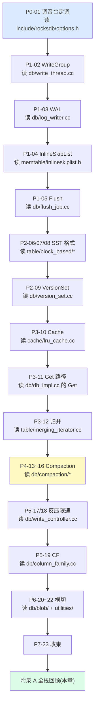

# 附录 A · RocksDB C++ 源码全景路线图

> **核心问题**:读完前 22 章,你已经能讲清 WriteGroup、InlineSkipList、三种 Compaction、Write Stall、Column Family、BlobDB 每一个的设计动机和技巧。可一旦真把 `facebook/rocksdb` clone 下来,几百个 `.cc`/`.h` 文件摊在面前——从哪读起?按什么顺序读?每块对应哪一章?和《LevelDB》那张源码地图差在哪?这张全景图就给你导航。
>
> **本章不是重讲机制**:前 22 章已把"为什么这么设计"拆透了,这里只回答"源码该怎么读"。它是一张**全栈导航地图**:从 surface API 一路到 Cache,标清每块的真实路径、对应章节、推荐阅读顺序,并对照 LevelDB 源码地图讲清结构演进。
>
> **读完本章你会明白**:
> 1. RocksDB 源码的整体分层(surface API → DBImpl → 写路径 → 静态格式 → 读路径 → Compaction → Cache),以及每层对应哪些文件、哪些章节。
> 2. 为什么 `db/db_impl.cc` 在 11.6.0 被拆成了 `db/db_impl/` 子目录(15 个文件),为什么 compaction 被迁进 `db/compaction/` 子目录,为什么 `merger.cc` 改名成了 `merging_iterator.cc`。
> 3. 三条可操作的源码阅读路线(跟章节读 / 先写后读 / 速查式读),以及它们的依赖关系(为什么必须先读 DBImpl 再读 WriteThread)。
> 4. 对照《LevelDB》源码地图,LevelDB 一个 `db/db_impl.cc` 一锅烩 vs RocksDB 拆成子目录,以及这套结构演进背后的"文件膨胀 → 分层"逻辑。

> **前置衔接**:从 P7-23"全书收束"接——"读完全书,想亲自下源码?这张全景图给你导航。"如果只想理解整体设计、不打算下源码,本章可跳过;但如果你要给 RocksDB 提 PR、做深度调优、或者拿它当自家存储引擎的参考实现,这张地图是你下源码的第一站。

> **版本钉死**:本章所有路径以 `rocksdb @ commit 8ba4204b(版本 11.6.0)` 为准,行号统一。RocksDB 源码演进极快(11.x 一年里 `db_impl.cc` 就被拆分了一次),凭记忆或老博客写的路径常常已经过时——本章每条路径都经 `ls`/`grep` 实测核实。若你用的版本更新,先 `git log db/db_impl/` 看结构有没有再变。

---

## 〇、一句话点破

> **RocksDB 的源码地图是一棵"surface API 当树皮、DBImpl 当树干、读写两条路径当两根主枝"的树:你从 `include/rocksdb/db.h` 钻进去,落到 `DBImpl`(树干),然后顺着写路径(WriteThread→WriteBatch→WAL→MemTable→Flush)或读路径(VersionSet→Block-based Table→Cache)爬到叶子。和 LevelDB 那张地图比,最大的区别是——LevelDB 把树干塞在一个 `db_impl.cc` 里,RocksDB 把它拆成了 `db/db_impl/` 一整个子目录。**

这是结论,不是理由。本章倒过来拆:先把整棵树画出来,再讲怎么爬,最后对照 LevelDB 那棵"小树"看清演进的逻辑。

---

## 一、全栈分层地图:源码这棵树长什么样

先把 RocksDB 整个源码结构画成一张分层图。这张图是本章的核心,后面所有的阅读路线都基于它。每一层都标了**真实路径** + **对应章节** + **该层的职责**(它解决什么问题)。

### 1.1 一张图看懂全栈

```
                        rocksdb/  (源码根, commit 8ba4204b / 11.6.0)
                        │
    ┌───────────────────┼───────────────────────────────────────────────┐
    │                   │                                               │
    ▼                   ▼                                               ▼
[第 0 层 · surface API]  [第 1 层 · DBImpl 主类]                 [工具/观测]
include/rocksdb/*.h      db/db_impl/db_impl.{cc,h}              tools/
  db.h                   db/db_impl/db_impl_write.cc              db_bench.cc / db_bench_tool.cc
  options.h              db/db_impl/db_impl_open.cc               ldb.cc / ldb_cmd.cc / ldb_tool.cc
  table.h                db/db_impl/db_impl_compaction_flush.cc    sst_dump_tool.cc
  env.h                  db/db_impl/db_impl_files.cc               trace_analyzer_tool.cc
  cache.h                db/db_impl/db_impl_secondary.cc          monitoring/
  filter_policy.h        db/db_impl/db_impl_follower.cc            statistics.cc / perf_context.cc
  compaction_filter.h    db/db_impl/db_impl_readonly.cc            histogram.cc
  merge_operator.h       db/db_impl/db_impl_debug.cc             trace_replay/
  rate_limiter.h         db/db_impl/db_impl_experimental.cc        trace_replay.cc / io_tracer.cc
  statistics.h           db/db_impl/compacted_db_impl.cc
  perf_context.h         db/db_impl/db_impl_follower.h
  version.h              db/db_impl/db_impl_secondary.h
  (db.h:165 Open)        db/db_impl/db_impl_readonly.h            (db_impl.h:198 class DBImpl : public DB)
    │                     │
    └─────────┬───────────┘
              │  DBImpl 内部按职责再分两条主枝(读写两条路径)
              │
    ┌─────────┴─────────────────────────────────────────────────────────┐
    │                                                                    │
    ▼ [写路径主枝]                                          ▼ [读路径主枝]
    db/write_thread.{cc,h}        (P1-02 WriteGroup)          db/db_iter.{cc,h}          (P3-12)
    db/write_batch.{cc,h}         (P1-02)                     db/arena_wrapped_db_iter.cc (P3-12)
    db/db_impl/db_impl_write.cc   (P1-02/03/05/17)            table/block_based/
    db/log_writer.{cc,h}          (P1-03 WAL)                   block_based_table_reader.cc   (P2-06/P3-11)
    db/log_reader.{cc,h}          (P1-03 WAL 恢复)              block_based_table_iterator.cc  (P3-12)
    db/memtable.{cc,h}            (P1-04)                       block.cc / block_builder.cc    (P2-06)
    db/memtable_list.{cc,h}       (P1-04/05)                    binary_search_index_reader.cc (P2-07)
    memtable/                                                   partitioned_index_iterator.cc  (P2-07)
      inlineskiplist.h           (P1-04 InlineSkipList)        partitioned_filter_block.cc    (P2-07/08)
      skiplist.h                  (P1-04)                       full_filter_block.cc           (P2-08)
      skiplistrep.cc              (P1-04 可插拔 rep)             parsed_full_filter_block.cc    (P2-08)
      hash_linklist_rep.cc        (P1-04)                       data_block_hash_index.cc       (P2-07)
      hash_skiplist_rep.cc        (P1-04)                       block_prefix_index.cc          (P2-07)
      vectorrep.cc                (P1-04)                     table/format.{cc,h}         (P2-06 footer)
      write_buffer_manager.cc     (P1-04 全局内存)            table/merging_iterator.{cc,h} (P3-12 ★重命名)
    db/flush_job.{cc,h}           (P1-05 Flush)                table/meta_blocks.{cc,h}    (P2-06)
    db/flush_scheduler.{cc,h}     (P1-05 调度)                table/block_fetcher.{cc,h}  (P3-11 载入)
    db/write_controller.{cc,h}    (P5-17 反压)                db/table_cache.{cc,h}       (P3-10/11)
    util/rate_limiter.cc          (P5-18 限速)                cache/
    util/rate_limiter_impl.h      (P5-18)                       lru_cache.cc / sharded_cache.cc (P3-10)
                                                              clock_cache.cc / cache.cc          (P3-10)
    [写路径收尾 · Compaction 主枝]                              cache_key.cc / cache_entry_roles.cc(P3-10)
    db/compaction/                                               secondary_cache.cc                  (P3-10)
      compaction.{cc,h}           (P4-13 框架)                 compressed_secondary_cache.cc      (P3-10)
      compaction_job.{cc,h}       (P4-13)                      tiered_secondary_cache.cc          (P3-10)
      compaction_picker.{cc,h}    (P4-13/14)                  db/version_set.{cc,h}       (P2-09)
      compaction_picker_level.cc  (P4-14)                     db/version_edit.{cc,h}      (P2-09)
      compaction_picker_universal.cc (P4-15)                  db/version_builder.{cc,h}   (P2-09)
      compaction_picker_fifo.cc   (P4-16)                     db/version_edit_handler.cc  (P2-09)
      compaction_iterator.{cc,h}  (P4-13)                     db/manifest_ops.{cc,h}      (P2-09)
      compaction_outputs.{cc,h}   (P4-13)                     db/wal_edit.{cc,h}          (P2-09)
      compaction_state.{cc,h}     (P4-13)                     db/column_family.{cc,h}     (P5-19)
      subcompaction_state.{cc,h}  (P4-13 subcompaction)      db/snapshot_impl.{cc,h}     (P6-20)
      compaction_service_job.cc   (P4-13 远程 compaction)
                                                              [横切 · 生产可用]
    [横切 · BlobDB]                                            utilities/transactions/     (P6-21)
    db/blob/                                                     optimistic_transaction.cc / pessimistic_transaction.cc
      blob_file_builder.cc        (P6-22 写)                  utilities/write_batch_with_index/ (P6-21)
      blob_file_reader.cc         (P6-22 读)                  utilities/checkpoint/checkpoint_impl.cc (P6-22)
      blob_file_cache.cc          (P6-22 缓存)                utilities/backup/backup_engine.cc       (P6-22)
      blob_file_meta.cc           (P6-22 元数据)             db/merge_helper.{cc,h}      (P6-21 Merge)
      blob_source.cc              (P6-22)
      blob_log_writer.cc          (P6-22)
      (共 16 个 .cc,集成版 BlobDB)
    utilities/blob_db/            (P6-22 旧版 BlobDB,过渡)
```

> **钉死这件事**:这张图里**每一条路径都经 `ls` 实测**,在 `commit 8ba4204b(11.6.0)` 上真实存在。如果你在某篇博客上看到 `db/db_impl.cc` 这种单文件路径,那是**老版本**(11.6.0 之前)的结构——现在它已经被拆成 `db/db_impl/` 子目录了(详见第三节"11.6.0 结构变化诚实标注")。

### 1.2 这棵树的五条阅读主干

把上面那张大图压扁,源码其实是**五条阅读主干**。读者任何时候迷路,回到这五条主干上定位:

| 主干 | 路径 | 对应章节 | 这一层在解决什么 |
|------|------|---------|----------------|
| ① surface API | `include/rocksdb/*.h` | 全书入口 | 用户能调到的接口(`DB::Open`/`Put`/`Get`/`NewIterator`),所有可调旋钮的声明都在这 |
| ② DBImpl 主类 | `db/db_impl/db_impl*.{cc,h}` | 横贯全书 | RocksDB 引擎实例的本体,所有请求的汇合点 |
| ③ 写路径 | `db/write_thread.cc` → `db/write_batch.cc` → `db/log_writer.cc` → `db/memtable.cc` → `memtable/inlineskiplist.h` → `db/flush_job.cc` → `db/compaction/*` | P1 + P4 | 一次 `Put` 从 WriteGroup 攒批到 WAL 到 MemTable 到 Flush 到 Compaction 的完整链 |
| ④ 静态格式 + 读路径 | `db/version_set.cc` → `table/block_based/*` → `table/merging_iterator.cc` → `cache/*` | P2 + P3 | 数据在磁盘上长什么样(SST/Manifest),一次 `Get`/`Iterator` 怎么穿透多层找到值 |
| ⑤ 横切 | `db/blob/*`、`utilities/transactions/`、`db/column_family.cc`、`db/snapshot_impl.cc`、`monitoring/*` | P5 + P6 | 在读写路径之外的功能(BlobDB/Transaction/CF/Snapshot/可观测) |

> **不这样画会怎样**:如果按"字母序"或"目录序"平铺读源码(`cache/` → `db/` → `memtable/` → `table/`),你会读得云里雾里——因为 RocksDB 的模块**强耦合**(WriteThread 依赖 DBImpl、DBImpl 依赖 VersionSet、VersionSet 依赖 table/block_based),没有主线串起来就是一盘散沙。本书"写路径 vs 读路径"的二分法,正好给了这条串起来的主线。

### 1.3 量化感受:每个目录多大

读源码前,先对"每个目录有多大、文件密度多少"有个量化感受,免得你打开一个目录被几百个文件吓退,或低估了某个巨怪文件的复杂度。下面这张表是 `commit 8ba4204b(11.6.0)` 上**实测**的关键目录文件数与代表文件的行数(`ls | wc -l` + `wc -l` 实测):

| 目录 | 文件数(`.cc`+`.h`,含测试) | 代表文件 | 行数 | 阅读体感 |
|------|--------------------------|---------|------|---------|
| `include/rocksdb/` | ~90 header | `options.h`、`db.h` | 几百~千行/个 | 接口,易读,先扫一遍 |
| `db/db_impl/` | 15 | `db_impl.cc` | 8236 | **巨怪**,主干,放共用方法 |
| `db/db_impl/` | — | `db_impl_compaction_flush.cc` | 5363 | **巨怪**,Compaction/Flush 调度 |
| `db/db_impl/` | — | `db_impl_write.cc` | 3614 | 写路径主战场 |
| `db/db_impl/` | — | `db_impl_open.cc` | 3101 | Open 全流程 |
| `db/db_impl/` | — | `db_impl_files.cc` | 1252 | 文件管理 |
| `db/version_set.cc` | 单文件 | `version_set.cc` | **8579** | **最大单文件**,花名册 |
| `db/compaction/` | ~30 | `compaction_job.cc` | 3325 | Compaction 执行 |
| `db/compaction/` | — | `compaction_picker.cc` | 1328 | 抽象基类 |
| `db/blob/` | ~40(含测试) | `blob_file_builder.cc` | 中等 | 集成 BlobDB |
| `db/` 顶层 | ~100 | `write_thread.cc` | 933 | 中等,WriteGroup |
| `memtable/` | ~14 | `inlineskiplist.h` | 1422 | header-only,**模板重** |
| `table/block_based/` | ~50 | `block_based_table_reader.cc` | 3758 | SST 读取,巨怪 |
| `table/block_based/` | — | `block_based_table_iterator.cc` | 1214 | SST 迭代 |
| `table/` 顶层 | ~45 | `merging_iterator.cc` | 中等 | 多路归并 |
| `cache/` | ~25 | `lru_cache.cc` | 736 | LRU 实现 |
| `util/` | ~150 | `rate_limiter.cc` | 中等 | 工具杂烩 |
| `tools/` | ~20 | `db_bench_tool.cc` | 大 | 压测工具 |
| `monitoring/` | ~25 | `statistics.cc` | 中等 | 指标 |
| `utilities/` | ~20 个子目录 | 按子目录 | 各异 | 可选功能,按需读 |

> **钉死这件事**:`db_impl.cc`(8236 行)和 `version_set.cc`(8579 行)是全仓库**最大的两个单文件**,也是阅读难度最高的两个——它们都是"十年累积的中央调度室",任何特性改动都会落到这俩上面。第一次读,**不要从头读到尾**,用 `grep` 定位到你要看的方法,只读那一段。`include/rocksdb/` 和 `memtable/` 这种小目录可以相对快地扫一遍,建立全局印象。

> **为什么文件会这么大**:RocksDB 从 LevelDB fork 至今 10 余年,每个特性(Concurrency、CF、Universal Compaction、BlobDB、Transaction、Secondary、Follower……)都往 `DBImpl` 和 `VersionSet` 里塞东西。这两 个类是"全仓库都知道的上帝类"——它们持有几乎所有子系统(WAL、VersionSet、ColumnFamilySet、WriteThread、WriteController、FlushScheduler、table_cache……)的指针。这是历史包袱,也是为什么 11.x 在努力拆分(把 `db_impl.cc` 拆成子目录就是第一步)。

---

## 二、分层细读:每一层该怎么进

下面把五条主干一层层展开,讲清每层的关键文件、关键类、阅读时的"锚点"(你最该先 `grep` 的那个符号)。

### 2.1 第 0 层 · surface API:`include/rocksdb/`

这是用户唯一应该 `#include` 的目录(除了 utilities)。RocksDB 把所有"用户能碰到的接口"都放在 `include/rocksdb/` 下,**实现细节一律不暴露**——这是它和 LevelDB 的重要区别(LevelDB 的 `include/leveldb/` 简陋得多,很多内部结构暴露在外)。

关键文件(全部 `ls` 实测存在):

| 文件 | 关键符号 | 对应章节 | 读它解决什么 |
|------|---------|---------|------------|
| `include/rocksdb/db.h` | `class DB`(`db.h` 抽象基类)、`DB::Open`(`db.h:165`)、`DB::OpenForReadOnly`(`db.h:205`)、`DB::OpenAsSecondary`(`db.h:255`) | 全书入口 | 引擎实例怎么开,Put/Get/Write/NewIterator 的签名 |
| `include/rocksdb/options.h` | `struct Options`、`DBOptions`、`ColumnFamilyOptions`、`ReadOptions`、`WriteOptions` | 全书旋钮 | 所有可调旋钮的声明(write_buffer_size、max_write_buffer_number、level0_file_num_compaction_trigger……) |
| `include/rocksdb/table.h` | `class TableFactory`、`BlockBasedTableOptions` | P2-06/07 | SST 格式可插拔的入口(默认 BlockBasedTable) |
| `include/rocksdb/env.h` + `file_system.h` + `system_clock.h` | `class Env`、`class FileSystem`、`class SystemClock` | 横切 | 环境抽象(文件 IO + 时钟可插拔,11.x 把 Env 拆成了 FileSystem + SystemClock) |
| `include/rocksdb/cache.h` + `advanced_cache.h` | `class Cache`(抽象) | P3-10 | Cache 接口,LRU/Clock 都实现它 |
| `include/rocksdb/filter_policy.h` | `class FilterPolicy` | P2-08 | Bloom/Ribbon 的可插拔入口 |
| `include/rocksdb/compaction_filter.h` | `class CompactionFilter` | P4-16 | compaction 时改 KV 的可插拔入口 |
| `include/rocksdb/merge_operator.h` | `class MergeOperator` | P6-21 | 读时合并的可插拔入口 |
| `include/rocksdb/rate_limiter.h` | `class RateLimiter` | P5-18 | 后台 IO 限速的接口 |
| `include/rocksdb/statistics.h` | `class Statistics` | P6-22 | 指标统计的接口 |
| `include/rocksdb/perf_context.h` | `struct PerfContext` | P6-22 | 每次请求的细粒度性能上下文 |
| `include/rocksdb/memtablerep.h` | `class MemTableRep` | P1-04 | 可插拔 MemTableRep 的入口 |
| `include/rocksdb/snapshot.h` | `class Snapshot` | P6-20 | 快照接口 |
| `include/rocksdb/version.h` | `ROCKSDB_MAJOR/MINOR/PATCH` | 钉死版本 | `11.6.0` 就是从这里读出来的 |

> **阅读锚点**:`grep -n "class DB " include/rocksdb/db.h` 先看 `DB` 抽象基类有哪些纯虚函数——那是所有实现必须履行的契约。然后 `grep -n "static Status Open" include/rocksdb/db.h` 看三种 Open(普通 / ReadOnly / Secondary),这三种模式分别对应 `db_impl.cc` / `db_impl_readonly.cc` / `db_impl_secondary.cc` 三套实现。

### 2.2 第 1 层 · DBImpl 主类:`db/db_impl/` 子目录(★11.6.0 拆分)

这是整棵树的树干。`DBImpl` 是 RocksDB 引擎实例的本体——`include/rocksdb/db.h` 里的 `DB::Open` 最终 `new` 出来的就是这个类(`db/db_impl/db_impl.h:198` `class DBImpl : public DB`)。

**11.6.0 的关键结构变化**:LevelDB 把整个引擎塞在一个 `db/db_impl.cc` 里(约 1600 行),RocksDB 早期也这么干,但 `DBImpl` 越长越大(写路径、读路径、Compaction、Flush、文件管理、Secondary 模式、Follower 模式……全挤在一个类里),单文件膨胀到上万行。**11.x 把 `db_impl.cc` 拆成了 `db/db_impl/` 子目录**,按职责分文件:

| 文件 | 行数(11.6.0 实测) | 职责 | 对应章节 |
|------|------|------|---------|
| `db/db_impl/db_impl.cc` | 8236 | DBImpl 主类的"主干"(构造、析构、共用工具、很多跨职责的方法) | 横贯全书 |
| `db/db_impl/db_impl.h` | — | DBImpl 类声明(`:198 class DBImpl`) | 横贯全书 |
| `db/db_impl/db_impl_write.cc` | 3614 | **写路径主战场**:WriteImpl、JoinBatchGroup、PreprocessWrite、SwitchMemtable、Flush(触发) | P1-02/03/05、P5-17 |
| `db/db_impl/db_impl_open.cc` | 3101 | Open 全流程(建实例、恢复 MANIFEST、重放 WAL、建 ColumnFamily) | P1-03、P2-09 |
| `db/db_impl/db_impl_compaction_flush.cc` | 5363 | Compaction 与 Flush 的调度后台(BackgroundCompaction、BackgroundFlush、ScheduleFlushes) | P1-05、P4-13 |
| `db/db_impl/db_impl_files.cc` | 1252 | SST 文件管理(找文件、删文件、RenameFile、ArchiveFile) | P2-09、P4-13 |
| `db/db_impl/db_impl_secondary.cc` | — | Secondary 模式(只读副本,定期 poll 主节点的新 SST) | 横切 |
| `db/db_impl/db_impl_follower.cc` | — | Follower 模式(11.x 新增,类似 Secondary 但更紧耦合) | 横切 |
| `db/db_impl/db_impl_readonly.cc` | — | ReadOnly 模式(整个 DB 只读打开) | 横切 |
| `db/db_impl/db_impl_debug.cc` | — | 调试用方法(断言、状态 dump) | 调试 |
| `db/db_impl/db_impl_experimental.cc` | — | 实验性 API | 实验 |
| `db/db_impl/compacted_db_impl.cc` | — | CompactedDBImpl(一种特殊优化模式,只读且只查固定 key) | 实验 |

> **阅读锚点**:先 `grep -n "class DBImpl" db/db_impl/db_impl.h` 看类声明——你会看到一长串成员(WAL、VersionSet、ColumnFamilyData、WriteController、FlushScheduler……),那就是整棵树的"零部件清单"。然后 `grep -n "Status DBImpl::Open\|Status DBImpl::Write\|Status DBImpl::Get" db/db_impl/db_impl*.cc` 定位三大入口方法分别落在哪个文件(Open 在 `db_impl_open.cc`、Write 在 `db_impl_write.cc`、Get 实际在 `db_impl.cc` 主文件里)。

> **为什么先读 DBImpl**:它是所有请求的汇合点。一次 `Put` 进来,`DBImpl::Write` 先调度 WriteThread,再写 WAL,再插 MemTable,再可能触发 Flush/Compaction——这条链上的每个环节都要 `DBImpl::` 的成员。不先建立"DBImpl 是中央调度室"的心智,后面读 WriteThread/VersionSet 都不知道它们被谁调用、调用的上下文是什么。

### 2.3 第 2 层 · 写路径主枝:`db/write_*` + `memtable/` + `db/flush_*` + `db/compaction/`

这是本书第 1 篇 + 第 4 篇的源码落地。一次 `Put` 从进引擎到落盘成 SST、再到 Compaction 收敛,全在这条枝上。

**写路径的执行链**(对应 P1-02 一张时序图的源码版):

```
Put(key, value)
  └─ DBImpl::Write(db_impl_write.cc)
       ├─ WriteThread::JoinBatchGroup(write_thread.cc)     ← P1-02 WriteGroup 攒批
       │    (leader/follower, leader 写 WAL, follower piggyback)
       ├─ WriteBatchInternal::SetSequence(write_batch.cc)  ← P1-02 分配 seq
       ├─ PreprocessWrite(db_impl_write.cc)                ← P1-03 WAL 复用判断 / P1-05 MemTable 切换 / P5-17 Write Stall 检查
       ├─ log_writer.cc: AddRecord → PhysicalAppend        ← P1-03 WAL 落盘
       ├─ MemTable::Add(memtable.cc)                       ← P1-04 插 InlineSkipList
       │    └─ InlineSkipList::Insert(inlineskiplist.h)    ← P1-04 无锁并发插
       └─ (MemTable 满了触发)FlushScheduler::ScheduleWork  ← P1-05
            └─ BackgroundFlush(db_impl_compaction_flush.cc)
                 └─ FlushJob::Run(flush_job.cc)            ← P1-05 MemTable → L0 SST
```

写路径主枝的关键文件:

| 文件 | 关键类/函数 | 对应章节 | 读它解决什么 |
|------|-----------|---------|------------|
| `db/write_thread.{cc,h}` | `class WriteThread`(`write_thread.h:32`)、`WriteGroup`、`JoinBatchGroup`、`LaunchParallelMemTableWriters`、`AwaitState` | P1-02 | WriteGroup 批写合并:leader 怎么选、followers 怎么 piggyback、状态怎么同步 |
| `db/write_batch.{cc,h}` + `write_batch_internal.h` + `write_batch_base.cc` | `class WriteBatch`、`WriteBatchInternal` | P1-02 | 一次写请求的载体,批怎么编码、seq 怎么分配 |
| `db/log_writer.{cc,h}` + `db/log_reader.{cc,h}` + `db/log_format.h` | `class log::Writer`、`class log::Reader`、`kHeaderSize` | P1-03 | WAL 的写/读、7 字节 header、CRC(承 LevelDB,RocksDB 加了 recycled log) |
| `db/db_impl/db_impl_write.cc` | `DBImpl::Write`、`DBImpl::PreprocessWrite`、`DBImpl::SwitchMemtable` | P1-02/03/05、P5-17 | 写路径在 DBImpl 里的编排 |
| `db/memtable.{cc,h}` + `db/memtable_list.{cc,h}` | `class MemTable`、`class MemTableListVersion` | P1-04/05 | MemTable 的封装(包 InlineSkipList)、active/immutable 队列 |
| `memtable/inlineskiplist.h` | `class InlineSkipList`(`inlineskiplist.h:61`) | P1-04(招牌) | **承 LevelDB SkipList 的并发突破**:多写者无锁插入 |
| `memtable/skiplist.h` | `class SkipList` | P1-04 | 单写者 SkipList(内部用,和 LevelDB 同构) |
| `memtable/skiplistrep.cc` + `hash_linklist_rep.cc` + `hash_skiplist_rep.cc` + `vectorrep.cc` | `SkipListRep`、`HashLinkListRep`、`HashSkipListRep`、`VectorRep` | P1-04 | 可插拔 MemTableRep 的四种实现 |
| `memtable/write_buffer_manager.cc` | `class WriteBufferManager` | P1-04 | 跨 CF 的全局 MemTable 内存预算 |
| `db/flush_job.{cc,h}` | `class FlushJob`(`flush_job.h:57`) | P1-05 | MemTable → L0 SST 的具体产出 |
| `db/flush_scheduler.{cc,h}` | `class FlushScheduler` | P1-05 | 哪个 CF 该 flush 的调度 |
| `db/write_controller.{cc,h}` | `class WriteController`(`write_controller.h:24`)、`WriteControllerToken` | P5-17(招牌) | stall/delay 两档反压 |
| `util/rate_limiter.cc` + `util/rate_limiter_impl.h` | `class GenericRateLimiter` | P5-18 | 令牌桶后台 IO 限速 |

**写路径收尾 · Compaction 主枝**(`db/compaction/` 子目录,★11.6.0 从 db 顶层迁出):

| 文件 | 关键类/函数 | 对应章节 | 读它解决什么 |
|------|-----------|---------|------------|
| `db/compaction/compaction.{cc,h}` | `class Compaction` | P4-13 | 一次 compaction 的描述(输入文件、输出层、边界) |
| `db/compaction/compaction_job.{cc,h}` | `class CompactionJob`(`compaction_job.h:143`) | P4-13 | compaction 的执行体(读输入、归并、写输出) |
| `db/compaction/compaction_picker.{cc,h}` | `class CompactionPicker`(`compaction_picker.h:48`,抽象基类) | P4-13 | 选哪些文件做 compaction 的抽象基类 |
| `db/compaction/compaction_picker_level.cc` | `class LevelCompactionPicker` | P4-14(招牌) | Level 策略的文件选择(默认,承 LevelDB) |
| `db/compaction/compaction_picker_universal.cc` | `class UniversalCompactionPicker` | P4-15(招牌) | Universal 策略的文件选择(写优化) |
| `db/compaction/compaction_picker_fifo.cc` | `class FIFOCompactionPicker` | P4-16 | FIFO 策略的文件选择(TTL) |
| `db/compaction/compaction_iterator.{cc,h}` | `class CompactionIterator` | P4-13 | compaction 时的迭代器(归并 + 去旧版本 + 打墓碑 + CompactionFilter 回调) |
| `db/compaction/compaction_outputs.{cc,h}` | `class CompactionOutputs` | P4-13 | compaction 的输出管理(写新 SST) |
| `db/compaction/compaction_state.{cc,h}` | `class CompactionState` | P4-13 | 一次 compaction 的运行时状态 |
| `db/compaction/subcompaction_state.{cc,h}` | `class SubcompactionState` | P4-13(招牌) | **subcompaction**:一个大 compaction 拆多个子任务并行 |
| `db/compaction/compaction_service_job.cc` | `class CompactionServiceJob` | P4-13 | 远程 compaction(把 compaction 卸载到别的机器) |
| `db/compaction/sst_partitioner.cc` | `class SstPartitioner` | P4-13 | compaction 输出 SST 的切分策略(可插拔) |

> **阅读锚点**:`grep -n "class CompactionPicker" db/compaction/compaction_picker.h` 看抽象基类,再分别打开 `compaction_picker_level.cc` / `_universal.cc` / `_fifo.cc` 看三个子类怎么 override `PickCompaction`。这是"三种 Compaction"在源码里最直观的对照。

### 2.4 第 3 层 · 静态格式主枝:`db/version_*` + `table/block_based/` + `table/format.cc`

这是本书第 2 篇的源码落地。数据在磁盘上长什么样——SST 文件的内部布局、所有 SST 的"花名册"Manifest。

**VersionSet 是静态格式的中枢**:所有 SST 文件都登记在 `VersionSet` 里,一次 Get/Iterator 先问 VersionSet "这个 key 可能在哪些 SST",再去 `table/block_based/` 读具体文件。

| 文件 | 关键类 | 对应章节 | 读它解决什么 |
|------|-------|---------|------------|
| `db/version_set.{cc,h}` | `class VersionSet`(`version_set.h:80` 前向声明,实现在 `.cc`)、`class Version` | P2-09 | 所有 SST 的花名册,每层有哪些文件、key 范围 |
| `db/version_edit.{cc,h}` | `class VersionEdit` | P2-09 | 一次元数据变更(加文件/删文件/改 seq) |
| `db/version_edit_handler.{cc,h}` | `class VersionEditHandler` | P2-09 | Manifest 重放处理器 |
| `db/version_builder.{cc,h}` | `class VersionBuilder` | P2-09 | 从 VersionEdit 增量构造新 Version |
| `db/version_util.{cc,h}` | — | P2-09 | Version 上的工具方法 |
| `db/manifest_ops.{cc,h}` | — | P2-09 | Manifest 文件级操作 |
| `db/wal_edit.{cc,h}` | — | P2-09 | WAL 元数据的编辑记录 |
| `db/column_family.{cc,h}` | `class ColumnFamilyData`、`class ColumnFamilySet` | P5-19 | Column Family 的元数据(每个 CF 独立 VersionSet 视图) |
| `db/file_indexer.{cc,h}` | `class FileIndexer` | P3-11 | 跨层加速查 key 的索引(避免每层二分) |
| `db/table_cache.{cc,h}` + `table_cache_sync_and_async.h` | `class TableCache` | P3-10/11 | SST 文件的缓存(TableReader 对象的 cache) |

**Block-based Table 格式**(`table/block_based/`,SST 的内部布局):

| 文件 | 关键类 | 对应章节 | 读它解决什么 |
|------|-------|---------|------------|
| `table/block_based/block_based_table_reader.cc` | `class BlockBasedTable`(`block_based_table_reader.h`) | P2-06、P3-11 | 一个 SST 的读取器(Get/Iterator 入口,3758 行,块结构全在这) |
| `table/block_based/block_based_table_builder.cc` | `class BlockBasedTableBuilder` | P2-06 | 一个 SST 的构建器(Flush/Compaction 写 SST 用) |
| `table/block_based/block_based_table_iterator.cc` | `class BlockBasedTableIterator` | P3-12 | 在一个 SST 内部迭代的迭代器 |
| `table/block_based/block.{cc,h}` + `block_builder.{cc,h}` | `class Block`、`class BlockBuilder` | P2-06 | 一个 data/index block 的读写(重启点、二分) |
| `table/block_based/binary_search_index_reader.cc` | `class BinarySearchIndexReader` | P2-07 | 最朴素的 index(一个 block,二分查) |
| `table/block_based/partitioned_index_reader.cc` + `partitioned_index_iterator.cc` | `class PartitionedIndexReader` | P2-07(招牌) | **Partitioned index**:大索引自己分页 |
| `table/block_based/partitioned_filter_block.cc` | — | P2-07/08 | Partitioned filter |
| `table/block_based/full_filter_block.cc` + `parsed_full_filter_block.cc` | `class FullFilterBlockReader` | P2-08 | 一个 SST 一个完整 filter(现代默认) |
| `table/block_based/data_block_hash_index.{cc,h}` | — | P2-07 | data block 内的 hash index(块内加速) |
| `table/block_based/block_prefix_index.{cc,h}` | — | P2-07 | prefix index(Prefix seek 用) |
| `table/block_based/hash_index_reader.cc` | — | P2-07 | hash-based index reader |
| `table/block_based/index_builder.{cc,h}` | — | P2-06 | index block 的构建器 |
| `table/block_based/block_based_table_factory.cc` | `class BlockBasedTableFactory`(`block_based_table_factory.h:50`) | P2-06 | TableFactory 的实现(可插拔入口) |
| `table/block_based/block_cache.{cc,h}` | — | P3-10 | block cache 在 table 层的接入 |
| `table/block_based/block_prefetcher.{cc,h}` | — | P3-11 | 预取 |
| `table/block_based/uncompression_dict_reader.{cc,h}` | — | P2-06 | 压缩字典的读取(压缩 SST 用) |
| `table/block_based/flush_block_policy.cc` + `flush_block_policy_impl.h` | — | P2-06 | 多久切一个 data block |
| `table/format.{cc,h}` | `struct Footer`、`struct BlockHandle` | P2-06 | SST footer(承 LevelDB 48 字节,RocksDB 扩展了)、block handle |
| `table/meta_blocks.{cc,h}` | — | P2-06 | metaindex block、properties block |
| `table/block_fetcher.{cc,h}` | `class BlockFetcher` | P3-11 | 从文件载入一个 block(走 cache、解压) |
| `table/persistent_cache_helper.{cc,h}` | — | P3-10 | persistent cache 接入 |
| `table/sst_file_dumper.cc` | — | 附录 B | SST dump 工具(sst_dump 的实现核心) |
| `table/sst_file_reader.cc` + `sst_file_writer.cc` | — | P6-22 | 外部 SST 读写(ingest 用) |

> **阅读锚点**:读 SST 格式,先打开 `table/format.h` 看 `Footer`/`BlockHandle` 的结构(那是 SST 文件的总目录),再打开 `table/block_based/block_based_table_reader.cc` 的 `Open` 方法——它会按 footer 找 metaindex、找 index、找 filter,把整个 SST 的块结构读出来。这是 P2-06 那张 SST 布局图在源码里的对应。

### 2.5 第 4 层 · 读路径主枝:`cache/` + `table/merging_iterator.cc` + `db/db_iter.cc`

这是本书第 3 篇的源码落地。一次 `Get` 怎么穿透多层 SST、一次范围扫描怎么多路归并。

| 文件 | 关键类 | 对应章节 | 读它解决什么 |
|------|-------|---------|------------|
| `cache/cache.cc` | `class Cache`(实现) | P3-10 | Cache 抽象的实现底座 |
| `cache/lru_cache.{cc,h}` | `class LRUCache`(`lru_cache.h:443`)、`class LRUHandle`(双指针环形) | P3-10(招牌) | LRU 实现,**多档 pin** 的核心(in-use/high_pri) |
| `cache/sharded_cache.{cc,h}` | `class ShardedCacheBase` | P3-10 | 分片 LRU(承 LevelDB ShardedLRUCache) |
| `cache/clock_cache.{cc,h}` | `class ClockCache` | P3-10 | Clock 算法(并发更友好的替代) |
| `cache/cache_key.{cc,h}` | `class CacheKey` | P3-10 | cache key 的生成(db_id + cf_id + file_number + offset) |
| `cache/cache_entry_roles.{cc,h}` | `enum CacheEntryRole` | P3-10/07 | cache 角色(data/index/filter/other,统计与配额) |
| `cache/cache_reservation_manager.{cc,h}` | — | P3-10 | 给某些角色预留 cache 配额 |
| `cache/secondary_cache.{cc,h}` | `class SecondaryCache` | P3-10 | 二级 cache(可远程) |
| `cache/compressed_secondary_cache.{cc,h}` | — | P3-10 | 压缩态二级 cache |
| `cache/tiered_secondary_cache.{cc,h}` | — | P3-10 | 分层二级 cache |
| `cache/charged_cache.{cc,h}` | — | P3-10 | 带 charge 追踪的 cache |
| `cache/typed_cache.h` + `cache_helpers.{cc,h}` | — | P3-10 | 类型安全的 cache 包装 |
| `table/merging_iterator.{cc,h}` | `class MergingIterator`(`merging_iterator.h:43`) | P3-12(★重命名) | **多路归并**(承 LevelDB,但 11.6.0 改名了,见第三节) |
| `table/compaction_merging_iterator.{cc,h}` | — | P4-13 | compaction 专用的归并迭代器 |
| `table/two_level_iterator.{cc,h}` | `class TwoLevelIterator` | P3-12 | 两级索引迭代(index block → data block) |
| `table/iterator_wrapper.h` | `class IteratorWrapper` | P3-12 | 缓存 iterator 的 key/value,减少虚函数调用 |
| `table/iter_heap.h` | — | P3-12 | 归并用的堆 |
| `db/db_iter.{cc,h}` | `class DBIter` | P3-12 | 用户看到的 iterator(包内部 iterator,加 seq 过滤、合并) |
| `db/arena_wrapped_db_iter.{cc,h}` | — | P3-12 | arena 分配的 DBIter(避免碎片) |
| `db/forward_iterator.{cc,h}` | `class ForwardIterator` | P3-12 | 前向专用迭代器(优化) |
| `db/coalescing_iterator.{cc,h}` | — | P6-22 | blob 合并迭代 |
| `db/multi_cf_iterator_impl.h` + `multi_scan.cc` | — | P3-12 | 跨 CF 迭代 |
| `db/attribute_group_iterator_impl.{cc,h}` | — | P3-12 | attribute group 迭代 |
| `db/pinned_iterators_manager.h` | `class PinnedIteratorsManager` | P3-12 | iterator pinning(防止底层 block 被淘汰) |
| `db/get_context.{cc,h}`(在 `table/`) | `class GetContext` | P3-11 | 一次 Get 的上下文(贯穿多层,记录是否命中、是否打墓碑) |

> **阅读锚点**:读 Get 路径,`grep -n "Status.*Get\|GetImpl" db/db_impl/db_impl.cc` 找 `DBImpl::Get`,跟着它走 `MemTable::Get` → `MemTableListVersion::Get` → `Version::Get`(在 version_set) → `TableCache::Get` → `BlockBasedTable::Get` → `BlockBasedTable::Get_Entry`,整条读路径就串起来了。

### 2.6 第 5 层 · 横切:BlobDB、Transaction、Snapshot、可观测

这一层是"读写两条路径之外的功能",对应本书第 5、6 篇。

**BlobDB**(`db/blob/`,★11.6.0 集成版,16 个 `.cc`):

| 文件 | 对应章节 | 读它解决什么 |
|------|---------|------------|
| `db/blob/blob_file_builder.cc` | P6-22 | blob 文件的构建器(写大 value 进 blob) |
| `db/blob/blob_file_reader.cc` | P6-22 | blob 文件的读取器 |
| `db/blob/blob_file_cache.cc` | P6-22 | blob 文件的 cache |
| `db/blob/blob_file_meta.cc` + `blob_file_addition.cc` + `blob_file_garbage.cc` | P6-22 | blob 文件元数据(加文件、GC 统计) |
| `db/blob/blob_source.cc` | P6-22 | blob 的统一入口(Get/读) |
| `db/blob/blob_log_writer.cc` + `blob_log_sequential_reader.cc` + `blob_log_format.cc` | P6-22 | blob 文件格式(类似 WAL 的日志式布局) |
| `db/blob/blob_garbage_meter.cc` | P6-22 | blob GC 的计量 |
| `db/blob/blob_file_partition_manager.cc` | P6-22 | blob 文件分区(新特性) |
| `db/blob/blob_write_batch_transformer.cc` | P6-22 | 写 batch 时把大 value 改写成 blob index |
| `db/blob/blob_counting_iterator.h` + `blob_fetcher.cc` | P6-22 | blob 计数迭代、blob 抓取 |
| `db/blob/prefetch_buffer_collection.cc` | P6-22 | blob 预取缓冲 |
| `utilities/blob_db/` | P6-22 | **旧版 BlobDB**(过渡期,仍在仓库,新代码用 `db/blob/`) |

> **演进点**:`utilities/blob_db/` 是早期 BlobDB(作为一个独立的 wrapper 层),`db/blob/` 是 6.18+ 引入的**集成版 BlobDB**(Integrated BlobDB,`blob_garbage_age`、`enable_blob_files` 等选项直接挂在 ColumnFamilyOptions 上)。读源码时**优先读 `db/blob/`**——那是现在的主路径,`utilities/blob_db/` 是历史遗留。这是本书 P6-22 要诚实讲清的演进。

**Transaction**(`utilities/transactions/`,对应 P6-21):

| 文件 | 对应章节 | 读它解决什么 |
|------|---------|------------|
| `utilities/transactions/optimistic_transaction.cc` + `optimistic_transaction_db_impl.cc` | P6-21 | 乐观事务(写时验冲突) |
| `utilities/transactions/pessimistic_transaction.cc` + `pessimistic_transaction_db.cc` | P6-21 | 悲观事务(写前加锁) |
| `utilities/transactions/transaction_base.cc` | P6-21 | 事务基类 |
| `utilities/transactions/write_prepared_txn.cc` | P6-21 | WritePrepared 模式(2PC 优化) |
| `utilities/transactions/transaction_util.cc` + `snapshot_checker.cc` | P6-21 | 事务工具、快照检查 |
| `utilities/write_batch_with_index/` | P6-21 | 带索引的 WriteBatch(事务查自己未提交的修改用) |
| `db/merge_helper.{cc,h}` + `db/merge_operator.cc` | P6-21 | MergeOperator 的合并执行 |

**运维与可观测**(对应 P6-22 + 附录 B):

| 文件/目录 | 对应章节 | 读它解决什么 |
|----------|---------|------------|
| `utilities/checkpoint/checkpoint_impl.cc` | P6-22 | Checkpoint(在线物理快照) |
| `utilities/backup/backup_engine.cc` | P6-22 | Backup(逻辑备份) |
| `monitoring/statistics.cc` + `statistics_impl.h` | P6-22 | 指标统计实现 |
| `monitoring/perf_context.cc` + `perf_context_imp.h` | P6-22 | PerfContext(每次请求的细粒度计数) |
| `monitoring/histogram.cc` + `histogram_windowing.cc` | P6-22 | 直方图(延迟分布) |
| `monitoring/thread_status_updater.cc` + `thread_status_util.cc` | P6-22 | 线程状态(线程池可视化) |
| `monitoring/in_memory_stats_history.cc` + `persistent_stats_history.cc` | P6-22 | 历史指标 |
| `trace_replay/trace_replay.cc` + `io_tracer.cc` + `block_cache_tracer.cc` | P6-22 | Trace 录制与回放 |
| `db/snapshot_impl.{cc,h}` | P6-20 | Snapshot 链表 MVCC |
| `db/error_handler.{cc,h}` | 横切 | 错误处理(后台 IO 失败怎么隔离) |
| `db/internal_stats.{cc,h}` | P6-22 | 引擎内部统计 |
| `db/seqno_to_time_mapping.{cc,h}` | P6-20 | seq → 时间戳映射(11.x 混合 TTL) |
| `tools/db_bench.cc` + `db_bench_tool.cc` | 附录 B | 压测工具 |
| `tools/ldb.cc` + `ldb_cmd.cc` + `ldb_tool.cc` | 附录 B | 命令行工具 |
| `tools/sst_dump_tool.cc` | 附录 B | SST dump |
| `tools/trace_analyzer_tool.cc` | 附录 B | trace 分析 |
| `tools/io_tracer_parser_tool.cc` | 附录 B | IO trace 解析 |

> **横切层的阅读建议**:这一层不阻塞读写主路径的理解。先把读写两条主枝读完,再按需读横切——比如要做事务才读 `utilities/transactions/`,要调优才读 `monitoring/`,要备份才读 `utilities/backup/`。

---

## 三、11.6.0 结构变化:诚实标注,给读者避坑

RocksDB 源码演进极快,11.6.0 相比老版本(以及相比很多老博客、老书)有几个**结构性变化**。如果你拿老资料对照读源码,会撞上"路径对不上"的坑。这一节把这些变化逐条标清。

### 3.1 ★ `db_impl.cc` 拆成 `db/db_impl/` 子目录

**老结构**(11.x 早期及之前):整个 `DBImpl` 类塞在一个 `db/db_impl.cc` + `db/db_impl.h` 里,单文件上万行。

**新结构**(11.6.0 实测):`db/db_impl.cc` 还在(8236 行,放主干),但很多职责被拆到 `db/db_impl/` 子目录的独立文件:

```
db/db_impl/
  db_impl.cc                  8236 行  主干
  db_impl.h                            类声明
  db_impl_write.cc           3614 行  写路径
  db_impl_open.cc            3101 行  Open 流程
  db_impl_compaction_flush.cc 5363 行  Compaction/Flush 调度
  db_impl_files.cc           1252 行  SST 文件管理
  db_impl_secondary.cc                Secondary 模式
  db_impl_follower.cc                 Follower 模式(11.x 新增)
  db_impl_readonly.cc                 ReadOnly 模式
  db_impl_debug.cc                    调试
  db_impl_experimental.cc             实验 API
  compacted_db_impl.cc                CompactedDB 模式
  (+ 对应的 .h)
```

> **为什么拆**:这是经典的"单文件膨胀 → 按职责拆分"。`DBImpl` 一个类要管写、读、Open、Compaction、Flush、文件、Secondary、Follower……每加一个特性就往里塞,单文件到上万行后,编译慢、改一处怕动别处、`git blame` 难追。拆成子目录后,写路径的改动主要落在 `db_impl_write.cc`,Compaction 调度的改动主要落在 `db_impl_compaction_flush.cc`,职责清晰。
>
> **给你的避坑**:`grep` 一个方法时,**不要只 grep `db/db_impl.cc`**,要 grep 整个 `db/db_impl/` 目录(`grep -rn "方法名" db/db_impl/`)。比如 `DBImpl::Write` 在 `db_impl_write.cc`,`DBImpl::Open` 在 `db_impl_open.cc`,`DBImpl::BackgroundCompaction` 在 `db_impl_compaction_flush.cc`,都不在主文件 `db_impl.cc` 里。

### 3.2 ★ compaction 迁进 `db/compaction/` 子目录

**老结构**:compaction 相关文件散落在 `db/` 顶层(`db/compaction_job.cc`、`db/compaction_picker.cc`、`db/compaction_iterator.cc`……)。

**新结构**(11.6.0 实测):全部迁进 `db/compaction/` 子目录:

```
db/compaction/
  compaction.cc              Compaction 描述
  compaction_job.cc   3325 行 执行体
  compaction_picker.cc 1328 行 抽象基类
  compaction_picker_level.cc    Level 策略
  compaction_picker_universal.cc Universal 策略
  compaction_picker_fifo.cc     FIFO 策略
  compaction_iterator.cc        归并迭代
  compaction_outputs.cc         输出管理
  compaction_state.cc           运行时状态
  subcompaction_state.cc        subcompaction 状态
  compaction_service_job.cc     远程 compaction
  sst_partitioner.cc            输出切分
  clipping_iterator.h           裁剪迭代
  (+ 对应 .h / compaction_iteration_stats.h / file_pri.h)
```

> **给你的避坑**:老博客和《LevelDB》对照里写的 `db/compaction_job.cc`,在 11.6.0 要改成 `db/compaction/compaction_job.cc`。读三种 Compaction 策略,直接进 `db/compaction/` 目录,三个 picker 文件并排读,对照最清晰。

### 3.3 ★ `merger.cc` 重命名为 `merging_iterator.cc`

**老结构**(LevelDB 及 RocksDB 早期):多路归并迭代器在 `table/merger.cc` + `table/merger.h`(类名 `class Merger` 或 `class MergingIterator`)。

**新结构**(11.6.0 实测):文件名正式改为 `table/merging_iterator.cc` + `table/merging_iterator.h`,类名 `class MergingIterator`(`merging_iterator.h:43`)。同时还多了 `table/compaction_merging_iterator.cc`(compaction 专用)。

> **为什么改名**:文件名和类名对齐(类一直叫 `MergingIterator`,文件却叫 `merger`,不对称)。这种"文件名跟着类名走"的清理,是 RocksDB 近年来代码治理的一部分。
>
> **给你的避坑**:`grep "MergingIterator" table/` 时,记得文件是 `merging_iterator.cc` 不是 `merger.cc`。承接《LevelDB》时,LevelDB 的 `table/merger.cc` 对应 RocksDB 的 `table/merging_iterator.cc`。

### 3.4 ★ Bloom 是 `bloom_impl.h`(header-only),没有 `bloom.cc`

**澄清一个常见误解**:很多资料(包括本书总纲早期的草稿)写 Bloom 在 `util/bloom.cc`——**这个文件在 11.6.0 不存在**。实测核实,RocksDB 的 Bloom 实现是**纯 header-only**:

```
util/
  bloom_impl.h          LegacyBloom / FastLocalBloom 等 Bloom 实现(全在 header)
  dynamic_bloom.h       + dynamic_bloom.cc   DynamicBloom(并发友好的 Bloom,ThreadLocal)
  dynamic_bloom.cc      DynamicBloom 的非 inline 部分
  ribbon_impl.h         Ribbon Filter 实现(header-only)
  ribbon_alg.h          Ribbon 算法核心(header-only)
  ribbon_config.cc      + ribbon_config.h    Ribbon 参数计算
```

> **给你的避坑**:读 Bloom,打开 `util/bloom_impl.h`(不是 `bloom.cc`)。读 Ribbon,打开 `util/ribbon_impl.h` + `ribbon_alg.h`。这俩 filter 都是模板-heavy 的 header-only,`grep` 时要 grep `.h` 不只是 `.cc`。本书 P2-08 引用源码时,以 `util/bloom_impl.h` 和 `util/ribbon_impl.h` 为准。

### 3.5 其他值得注意的演进点

- **`db/version_edit_handler.cc`**:Manifest 重放的处理器。早期 RocksDB 的 Manifest 重放逻辑嵌在 `version_set.cc` 里,后来抽成独立的 `version_edit_handler`,这是"重放逻辑可复用"(Secondary 模式、Follower 模式、Repair 都要用)的演进。读 P2-09 时注意它。
- **`db/wal_edit.cc`**:WAL 的元数据编辑记录(Manifest 里记 WAL 的增删),11.x 抽出来独立。早期嵌在 version_edit 里。
- **`db/seqno_to_time_mapping.cc`**:seq → 时间戳的映射,这是 RocksDB 为**混合 TTL / 时间点查询**加的新基础设施(11.x 重头)。老资料没有。
- **`db/blob/blob_file_partition_manager.cc`**:blob 文件分区管理,11.x 新特性(大 blob 库的分区)。
- **`include/rocksdb/file_system.h` + `system_clock.h`**:11.x 把老的 `Env` 拆成了 `FileSystem`(管文件 IO)+ `SystemClock`(管时钟)两个独立接口。老的 `env.h` 还在(向后兼容),但新代码用 `FileSystem`/`SystemClock`。
- **`include/rocksdb/advanced_*.h`**(`advanced_cache.h`/`advanced_compression.h`/`advanced_iterator.h`/`advanced_options.h`):11.x 把"高级用户才碰"的 API 从主 header 拆出来,降低主 header 的认知负担。这是 API 治理。
- **`include/rocksdb/secondary_cache.h` + `cache/secondary_cache.cc`**:二级 cache(可远程、可压缩),11.x 引入,P3-10 要讲到。
- **`db/db_impl/db_impl_follower.cc`**:Follower 模式,11.x 新增(比 Secondary 更紧耦合的只读副本,主打低延迟)。

> **钉死这件事**:RocksDB 源码演进极快,**任何老资料(包括 2~3 年前的博客)的路径都可能过时**。最可靠的办法是你自己 `ls`/`grep` 实测。本附录所有路径都在 `commit 8ba4204b(11.6.0)` 上 `ls` 核实过,但如果你用更新版本,务必重新核实——尤其是 `db/db_impl/` 和 `db/compaction/` 这两个变化最频繁的子目录。

---

## 四、对照 LevelDB 源码地图:结构演进的逻辑

本书是《LevelDB》的工业级续篇,读者多半已经看过 LevelDB 源码。这一节对照两张地图,讲清"LevelDB 一个 `db_impl.cc` 一锅烩,RocksDB 拆成子目录"背后的演进逻辑。

### 4.1 LevelDB 源码地图(粗粒度)

先回顾 LevelDB 的源码结构(本书承接的对象)。LevelDB 仓库扁平得多,核心代码加起来不到 1 万行:

```
leveldb/
  include/leveldb/        用户 API(8 个 header:db.h/options.h/cache.h/
                          table.h/env.h/comparator.h/filter_policy.h/write_batch.h 等)
  db/                     引擎本体(一锅烩)
    db_impl.cc + db_impl.h       ★ 整个引擎一个类,单文件 ~1600 行
    db_iter.cc                    用户 iterator
    dbformat.cc                   InternalKey 格式
    builder.cc                    建 SST
    log_writer.cc + log_reader.cc WAL
    memtable.cc + skiplist.h      MemTable(SkipList 在 db/ 不在 memtable/)
    version_set.cc + version_edit.cc  花名册
    write_batch.cc                批写
    table_cache.cc                SST cache
    filename.cc                   文件命名
    repair.cc                     修复
    dumpfile.cc                   dump
    snapshot.h                    快照(只在 header)
    c.cc                          C 接口
  table/                 SST 格式(扁平)
    block.cc + block_builder.cc   data block
    format.cc                     footer
    filter_block.cc               filter block
    merger.cc                     ★ 多路归并(叫 merger 不叫 merging_iterator)
    table.cc + table_builder.cc   Table 抽象与构建
    two_level_iterator.cc         两级索引
    iterator.cc                   Iterator 基类
  util/                  工具
  port/                  平台抽象
```

### 4.2 LevelDB → RocksDB 的结构演进点

把 LevelDB 那张图和 RocksDB 全栈图对照,能看到几个清晰的演进:

**演进点 1:`db/db_impl.cc` 一锅烩 → `db/db_impl/` 子目录**

- **LevelDB**:`db/db_impl.cc` 一个文件(~1600 行)装下整个引擎。`DBImpl` 类管 Open、Write、Get、Compaction、Flush、Recover、DeleteFile……全在一个文件里。
- **RocksDB**:`DBImpl` 膨胀到 8236 行(主文件)+ 一堆子文件(`db_impl_write.cc` 3614 行、`db_impl_compaction_flush.cc` 5363 行……),按职责拆成 `db/db_impl/` 子目录。
- **演进逻辑**:LevelDB 的"够用就好"假设(单机、中等负载、单 CF、一种 Compaction)决定了 `DBImpl` 不会太复杂。RocksDB 加了 Column Family、三种 Compaction、Secondary/Follower、BlobDB、Transaction……每加一个特性 `DBImpl` 就胖一圈,到上万行就必须拆。**这是"特性膨胀 → 结构分层"的必然**。

> **对照读法**:读 RocksDB 的写路径,先打开 `db/db_impl/db_impl_write.cc` 找 `DBImpl::Write`——它的角色,和 LevelDB `db/db_impl.cc` 里的 `DBImpl::Write` 完全对应,只是被拆到了独立文件。这种"文件名变了、方法签名没变"的对照,是读 RocksDB 源码最快上手的方式。

**演进点 2:`table/merger.cc` → `table/merging_iterator.cc`(改名)**

- **LevelDB**:`table/merger.cc` + `table/merger.h`,多路归并迭代器。
- **RocksDB**:`table/merging_iterator.cc` + `table/merging_iterator.h`,类名 `MergingIterator` 不变,文件名对齐了类名。还多了 `compaction_merging_iterator.cc`。
- **演进逻辑**:文件名跟着类名走,代码治理。RocksDB 还把归并迭代器细分(普通归并 vs compaction 归并),因为 compaction 归并要处理墓碑、CompactionFilter、subcompaction,逻辑更重。

**演进点 3:compaction 散落 → `db/compaction/` 子目录**

- **LevelDB**:Compaction 逻辑嵌在 `db/db_impl.cc` 里(`DBImpl::CompactRange`、`BackgroundCompaction`、`DoCompactionWork`),没有独立的 compaction 文件。只有一种 Compaction,不需要拆。
- **RocksDB**:`db/compaction/` 一整个子目录,十几个文件(compaction_job/picker_level/picker_universal/picker_fifo/iterator/outputs/state/subcompaction_state/service_job)。
- **演进逻辑**:LevelDB 一种 Compaction,嵌在 `DBImpl` 里够了。RocksDB **三种 Compaction**(Level/Universal/FIFO),每种一个 picker,加上 subcompaction 并发、远程 compaction 服务,逻辑量级是 LevelDB 的十倍,必须独立子目录。**这是"策略可插拔 → 结构分层"的必然**。

**演进点 4:`db/skiplist.h` → `memtable/inlineskiplist.h`(并发突破 + 独立目录)**

- **LevelDB**:`db/skiplist.h`,`SkipList` 单写者(一次只让一个线程 Insert,无锁读但单写)。
- **RocksDB**:`memtable/inlineskiplist.h`,`InlineSkipList` 支持**多写者无锁并发插入**(P1-04 招牌)。还多了 `memtable/skiplist.h`(单写者版,内部用)。
- **演进逻辑**:LevelDB 的 SkipList 是"够用就好"——单写者简单、正确性容易证。RocksDB 要扛多线程并发写(WriteGroup 里多个 follower 同时插 MemTable),必须做并发突破,这就是 `InlineSkipList`。同时 MemTable 从 `db/` 独立到 `memtable/` 目录,因为多了可插拔 rep(skiplistrep/hash_linklist/hash_skiplist/vector)。

**演进点 5:没有 BlobDB → `db/blob/` 子目录**

- **LevelDB**:没有 BlobDB(大 value 直接进 LSM,撑爆 Compaction)。
- **RocksDB**:`db/blob/` 子目录 16 个 `.cc`(集成版 BlobDB),还有 `utilities/blob_db/`(旧版过渡)。
- **演进逻辑**:工业场景(存图片、文档、大 JSON)要 value 分离,LevelDB 不做,RocksDB 做了两代(旧 wrapper 版 → 新集成版)。

**演进点 6:扁平 `include/leveldb/` → 分层 `include/rocksdb/`(API 治理)**

- **LevelDB**:`include/leveldb/` 8 个核心 header,简陋。
- **RocksDB**:`include/rocksdb/` 几十个 header,还分出 `advanced_*.h`(高级 API)、`secondary_cache.h`、`file_system.h`/`system_clock.h`(Env 拆分)。
- **演进逻辑**:RocksDB 的可调旋钮是 LevelDB 的几十倍,API 表面积大,必须治理(主 header 只放常用,高级的进 `advanced_*`)。

**演进点 7:没有 utilities → `utilities/` 一整个目录**

- **LevelDB**:没有 `utilities/`(Transaction/Checkpoint/Backup 全没有)。
- **RocksDB**:`utilities/` 下 20 多个子目录(transactions/backup/checkpoint/blob_db/ttl/persistent_cache/merge_operators/write_batch_with_index……)。
- **演进逻辑**:RocksDB 把"非核心引擎但生产需要"的功能都做成了可选模块,放 `utilities/`,你不 `#include` 就不链接。

### 4.3 一张对照表:LevelDB 文件 → RocksDB 文件

把上面的演进压成一张速查表,读者读 RocksDB 某个文件时,能立刻知道它对应 LevelDB 的哪个:

| 功能 | LevelDB 文件 | RocksDB 文件 | 演进 |
|------|-------------|-------------|------|
| 引擎本体 | `db/db_impl.cc`(单文件) | `db/db_impl/db_impl*.cc`(15 个文件) | ★ 拆子目录 |
| 用户 iterator | `db/db_iter.cc` | `db/db_iter.cc` + `arena_wrapped_db_iter.cc` + `forward_iterator.cc` | 拆出前向/arena 版 |
| MemTable | `db/memtable.cc` | `db/memtable.cc` + `db/memtable_list.cc` | 多 MemTable 队列 |
| SkipList | `db/skiplist.h`(单写) | `memtable/inlineskiplist.h`(并发)+ `memtable/skiplist.h`(单写) | ★ 并发突破 + 独立目录 |
| WAL 写 | `db/log_writer.cc` | `db/log_writer.cc` | 同名(加 recycled log) |
| WAL 读 | `db/log_reader.cc` | `db/log_reader.cc` | 同名 |
| 花名册 | `db/version_set.cc` + `version_edit.cc` | `db/version_set.cc` + `version_edit.cc` + `version_edit_handler.cc` + `version_builder.cc` + `version_util.cc` + `manifest_ops.cc` + `wal_edit.cc` | 拆出多个 |
| SST cache | `db/table_cache.cc` | `db/table_cache.cc` + `table_cache_sync_and_async.h` | 同名(加 sync/async 模板) |
| Column Family | (没有) | `db/column_family.cc` + `column_family.h` | ★ 新增 |
| 批写 | `db/write_batch.cc` | `db/write_batch.cc` + `write_batch_base.cc` + `write_batch_internal.h` | 拆出基类/内部接口 |
| WriteGroup | (嵌在 db_impl) | `db/write_thread.cc` + `write_thread.h` | ★ 独立文件 |
| 快照 | `db/snapshot.h` | `db/snapshot_impl.cc` + `snapshot_impl.h` + `snapshot_checker.h` | 拆出实现/检查器 |
| Compaction | (嵌在 db_impl) | `db/compaction/`(子目录十几个文件) | ★ 独立子目录 + 三策略 |
| Flush | (嵌在 db_impl) | `db/flush_job.cc` + `flush_scheduler.cc` | ★ 独立文件 |
| 写反压 | (没有) | `db/write_controller.cc` + `write_stall_stats.cc` | ★ 新增 |
| SST 格式 footer | `table/format.cc` | `table/format.cc` | 同名(RocksDB 扩展了 footer) |
| data block | `table/block.cc` + `block_builder.cc` | `table/block_based/block.cc` + `block_builder.cc` | 迁进 block_based/ |
| Table 构建 | `table/table_builder.cc` | `table/block_based/block_based_table_builder.cc` | 迁进 block_based/ |
| Table 读取 | `table/table.cc` | `table/block_based/block_based_table_reader.cc` | 迁进 block_based/ |
| index block | (嵌在 table) | `table/block_based/binary_search_index_reader.cc` + `partitioned_index_reader.cc` + `index_builder.cc` 等 | ★ 拆出多种 index |
| filter block | `table/filter_block.cc` | `table/block_based/full_filter_block.cc` + `parsed_full_filter_block.cc` + `partitioned_filter_block.cc` | ★ 拆出多种 filter |
| Bloom | `util/bloom.cc`(LevelDB 实测有) | `util/bloom_impl.h` + `dynamic_bloom.cc`(header-only) | ★ 改 header-only |
| Ribbon | (没有) | `util/ribbon_impl.h` + `ribbon_alg.h` + `ribbon_config.cc` | ★ 新增 |
| 多路归并 | `table/merger.cc` | `table/merging_iterator.cc` | ★ 改名 |
| 两级索引 | `table/two_level_iterator.cc` | `table/two_level_iterator.cc` | 同名 |
| Iterator 基类 | `table/iterator.cc` | `table/iterator.cc` + `iterator_wrapper.h` + `internal_iterator.h` | 拆出 wrapper/internal |
| 大 value | (没有) | `db/blob/`(16 个 cc)+ `utilities/blob_db/`(旧版) | ★ 新增(两代) |
| 事务 | (没有) | `utilities/transactions/` | ★ 新增 |
| Checkpoint | (没有) | `utilities/checkpoint/checkpoint_impl.cc` | ★ 新增 |
| Backup | (没有) | `utilities/backup/backup_engine.cc` | ★ 新增 |
| Merge | (没有) | `db/merge_helper.cc` + `utilities/merge_operators/` | ★ 新增 |
| 指标 | (简陋) | `monitoring/statistics.cc` + `perf_context.cc` + `histogram.cc` | ★ 新增子目录 |
| 工具 | `db/leveldbutil.cc` | `tools/db_bench.cc` + `ldb.cc` + `sst_dump_tool.cc` + `trace_analyzer_tool.cc` | ★ 新增子目录 |
| Env | `include/leveldb/env.h` | `include/rocksdb/env.h` + `file_system.h` + `system_clock.h` | ★ 拆成 FS + Clock |

> **钉死这件事**:这张表是读 RocksDB 源码的"翻译官"——你看到一个 RocksDB 文件,先在这张表里找它的 LevelDB 对应,LevelDB 那本讲透的部分就"一句带过"(承 LevelDB 铁律),RocksDB 的演进(★ 标的)才是你要重点读的。这正是本书"强承接 LevelDB"在源码层面的体现。

### 4.4 结构演进的深层逻辑

把上面七个演进点拢在一起看,能提炼出一条**贯穿 RocksDB 十年重构的主线**:

> **LevelDB 的"够用就好"假设被工业场景逐个击穿后,RocksDB 每打一个补丁(加一个旋钮、一种策略、一个并发模式),就要在源码结构上对应地"开一个口子"——开多了,文件膨胀,就分层;策略开多了,就独立子目录;并发要求高了,就单列文件。**

这条主线具体表现为三个递进的"结构动作":

1. **旋钮打开 → 主文件膨胀**。LevelDB 把 `max_bytes_for_level` 写死成 10 倍,RocksDB 做成 `max_bytes_for_level_multiplier` 可调;LevelDB 一种 Compaction,RocksDB 三种。每打开一个旋钮,`DBImpl` 和 `VersionSet` 就要加一段分支判断、加一组字段。日积月累,`db_impl.cc` 从 LevelDB 的 1600 行膨胀到 RocksDB 早期的上万行,`version_set.cc` 膨胀到 8579 行。
2. **主文件膨胀 → 按职责拆子目录**。单文件到万行后,编译慢、改动怕牵连、`git blame` 难追,只能按职责拆。`db_impl.cc` 拆成 `db_impl_write.cc`/`db_impl_open.cc`/`db_impl_compaction_flush.cc`/`db_impl_files.cc`/`db_impl_secondary.cc` 等,Compaction 从 db 顶层迁进 `db/compaction/` 子目录。这是"大单体 → 模块化"的常规软件工程动作,只是 RocksDB 做得晚(因为拆 `DBImpl` 这种上帝类风险高,要慢慢来)。
3. **策略/模式开多了 → 独立子目录 + 抽象基类**。三种 Compaction 对应 `CompactionPicker` 抽象基类 + 三个子类(`LevelCompactionPicker`/`UniversalCompactionPicker`/`FIFOCompactionPicker`),这是典型的"策略模式落地到目录结构"。MemTableRep 四种实现(SkipListRep/HashLinkListRep/HashSkipListRep/VectorRep)对应 `memtable/` 下四个独立文件 + `MemTableRep` 抽象基类。可插拔(TableFactory/Cache/FilterPolicy/CompactionFilter/MergeOperator)都是这套思路。

> **不这样看会怎样**:如果你只看到"RocksDB 文件比 LevelDB 多"这个表面,你会以为 RocksDB 就是"加了料的 LevelDB"。但真正理解了这条主线,你会明白——**RocksDB 的每一个目录、每一个抽象基类,都是"LevelDB 某个写死的假设被工业场景击穿"后留下的疤痕**。读源码时,每看到一个大目录(`db/compaction/`、`db/blob/`、`utilities/transactions/`),就问一句:"LevelDB 这里是什么?(多半是嵌在 db_impl 或根本没有)为什么 RocksDB 要把它独立出来?"——这一问,就读懂了那块代码存在的理由。

这也是本书为什么坚持"强承接 LevelDB"——不对照 LevelDB 那张"小地图",你根本看不出 RocksDB 这张"大地图"上每个新增结构的意义。承接不是为了省篇幅,而是为了**让演进的逻辑显形**。

---

## 五、三条推荐阅读路线

有了地图,具体怎么走?下面给三条路线,按你的目的选。

### 5.1 路线一:跟全书章节顺序(P0→P7,推荐)

最稳妥的路线是**跟本书章节顺序逐章读源码**。本书的章节顺序就是"一次 Put/Get 在工业级 LSM 里走完读写两条路径"的旅程,每章结尾都指了对应的源码文件。跟着读,源码和机制同步建立心智。



**依赖关系**(为什么这个顺序):必须先读 `DBImpl`(`db/db_impl/db_impl.h` 的类声明)再读 `WriteThread`,因为 `WriteThread` 是 `DBImpl` 的成员,不知道 `DBImpl` 长什么样就读不懂 `WriteThread` 被谁调用。同理必须先读 `VersionSet` 再读 `Block-based Table`,因为 Get 路径是 `Version::Get` 调 `TableCache::Get` 调 `BlockBasedTable::Get`——`VersionSet` 是上层的调度。本书的章节顺序天然满足这些依赖,跟着读不会撞"前面没读后面看不懂"的墙。

**适合谁**:第一次读 RocksDB 源码、想系统建立全栈心智的人。慢但扎实。

### 5.2 路线二:先写路径后读路径(两条线)

如果你更想快速建立"一条链"的完整心智(而不是按章节铺开),可以**先把写路径一条链读到尾,再把读路径一条链读到尾**。这正好对应本书的二分法。

**写路径线**(P1 + P4,一次 Put 到落盘):

```
include/rocksdb/db.h (DB::Put/Write 签名)
  → db/db_impl/db_impl.h (DBImpl 类声明,看 write_thread_ / versions_ / memtables_ 成员)
  → db/db_impl/db_impl_write.cc (DBImpl::Write,写路径编排)
  → db/write_thread.cc (WriteGroup 攒批)
  → db/write_batch.cc (批的编码)
  → db/log_writer.cc (WAL 落盘)
  → db/memtable.cc → memtable/inlineskiplist.h (插 SkipList)
  → db/db_impl/db_impl_write.cc 的 SwitchMemtable (MemTable 切换)
  → db/db_impl/db_impl_compaction_flush.cc 的 BackgroundFlush
  → db/flush_job.cc (Flush 成 L0 SST)
  → db/compaction/compaction_picker.cc (选哪些文件 compact)
  → db/compaction/compaction_picker_level.cc (Level 策略,默认)
  → db/compaction/compaction_job.cc (执行 compaction)
  → db/compaction/compaction_iterator.cc (归并 + 去旧版本)
  → db/compaction/subcompaction_state.cc (subcompaction 并发)
  → db/write_controller.cc (Write Stall 反压,横切写路径)
  → util/rate_limiter.cc (后台 IO 限速,横切写路径)
```

**读路径线**(P2 + P3,一次 Get 到取值):

```
include/rocksdb/db.h (DB::Get 签名)
  → db/db_impl/db_impl.h (DBImpl 类,看 versions_ / table_cache_ 成员)
  → db/db_impl/db_impl.cc 的 DBImpl::Get
  → db/version_set.cc 的 Version::Get (问花名册:key 可能在哪些 SST)
  → db/memtable.cc 的 MemTable::Get (先查 active memtable)
  → db/memtable_list.cc 的 MemTableListVersion::Get (再查 immutable)
  → db/table_cache.cc 的 TableCache::Get (查某个 SST)
  → table/block_based/block_based_table_reader.cc 的 BlockBasedTable::Get
  → table/block_based/full_filter_block.cc (Bloom/Ribbon 早退)
  → table/block_based/binary_search_index_reader.cc 或 partitioned_index_reader.cc (Index 定位)
  → table/block_based/block.cc (data block 内二分)
  → cache/lru_cache.cc (block 走 cache)
  → table/merging_iterator.cc (范围扫描时多路归并)
  → db/db_iter.cc (用户看到的 iterator,加 seq 过滤)
```

**适合谁**:已经读过《LevelDB》源码、想快速验证"RocksDB 在每个环节比 LevelDB 多了什么"的人。每读一个文件,对照第四章的 LevelDB→RocksDB 表,看演进点。

### 5.3 路线三:速查式("想调 X 该读哪些文件")

如果你有明确目标(比如"我想调 Write Stall 阈值"、"我想加一个 CompactionFilter"、"我想看 SST 内部布局"),不需要通读,直接按功能速查:

| 你的目标 | 读这几个文件 | 对应章节 |
|---------|------------|---------|
| 想懂/调 WriteGroup 批写 | `db/write_thread.cc`、`db/db_impl/db_impl_write.cc` | P1-02 |
| 想调 WAL 的 sync / 复用 | `db/log_writer.cc`、`db/db_impl/db_impl_write.cc`(`PreprocessWrite`)、`include/rocksdb/options.h`(`wal_ttl_seconds`/`wal_ttl_mb`) | P1-03 |
| 想懂 InlineSkipList 并发 | `memtable/inlineskiplist.h` | P1-04 |
| 想换 MemTableRep | `memtable/skiplistrep.cc`、`hash_linklist_rep.cc`、`hash_skiplist_rep.cc`、`vectorrep.cc`、`include/rocksdb/memtablerep.h` | P1-04 |
| 想调 MemTable 大小/数量 | `include/rocksdb/options.h`(`write_buffer_size`/`max_write_buffer_number`)、`memtable/write_buffer_manager.cc`、`db/db_impl/db_impl_write.cc`(`SwitchMemtable`) | P1-04/05 |
| 想懂 Flush 触发 | `db/flush_scheduler.cc`、`db/flush_job.cc`、`db/db_impl/db_impl_compaction_flush.cc` | P1-05 |
| 想看 SST 内部布局 | `table/format.cc`(footer)、`table/block_based/block_based_table_reader.cc`(`Open`)、`table/meta_blocks.cc` | P2-06 |
| 想调 Index 类型(分区/二分) | `table/block_based/binary_search_index_reader.cc`、`partitioned_index_reader.cc`、`include/rocksdb/table.h`(`index_type`) | P2-07 |
| 想换 Bloom / Ribbon | `util/bloom_impl.h`、`util/ribbon_impl.h`、`include/rocksdb/filter_policy.h` | P2-08 |
| 想懂 Manifest 重放 | `db/version_set.cc`、`db/version_edit_handler.cc`、`db/manifest_ops.cc` | P2-09 |
| 想懂 Block Cache 多档 pin | `cache/lru_cache.cc`、`cache/sharded_cache.cc`、`cache/cache_entry_roles.cc` | P3-10 |
| 想调 row_cache / persistent_cache | `include/rocksdb/cache.h`、`include/rocksdb/persistent_cache.h`、`utilities/persistent_cache/`、`table/persistent_cache_helper.cc` | P3-10 |
| 想懂一次 Get 全链路 | `db/db_impl/db_impl.cc`(`Get`)、`db/version_set.cc`(`Version::Get`)、`table/block_based/block_based_table_reader.cc`(`Get`) | P3-11 |
| 想懂范围扫描归并 | `table/merging_iterator.cc`、`table/block_based/block_based_table_iterator.cc`、`db/db_iter.cc` | P3-12 |
| 想懂/调 Level Compaction | `db/compaction/compaction_picker_level.cc`、`db/compaction/compaction_job.cc`、`include/rocksdb/options.h`(`max_bytes_for_level_base`/`max_bytes_for_level_multiplier`) | P4-14 |
| 想换 Universal Compaction | `db/compaction/compaction_picker_universal.cc`、`include/rocksdb/universal_compaction.h` | P4-15 |
| 想用 FIFO / TTL | `db/compaction/compaction_picker_fifo.cc`、`include/rocksdb/options.h`(`ttl`) | P4-16 |
| 想加 CompactionFilter | `include/rocksdb/compaction_filter.h`、`utilities/compaction_filters/` | P4-16 |
| 想调 subcompaction 并发 | `db/compaction/subcompaction_state.cc`、`include/rocksdb/options.h`(`max_subcompactions`) | P4-13 |
| 想调 Write Stall / Delay 阈值 | `db/write_controller.cc`、`include/rocksdb/options.h`(`level0_slowdown_writes_trigger`/`level0_stop_writes_trigger`/`soft_pending_compaction_bytes_limit`) | P5-17 |
| 想调后台 IO 限速 | `util/rate_limiter.cc`、`include/rocksdb/rate_limiter.h` | P5-18 |
| 想懂/用 Column Family | `db/column_family.cc`、`db/db_impl/db_impl_open.cc`(`CreateColumnFamily`) | P5-19 |
| 想懂 Snapshot | `db/snapshot_impl.cc`、`include/rocksdb/snapshot.h` | P6-20 |
| 想用 Transaction | `utilities/transactions/optimistic_transaction.cc`、`pessimistic_transaction.cc`、`utilities/write_batch_with_index/` | P6-21 |
| 想用 MergeOperator | `db/merge_helper.cc`、`include/rocksdb/merge_operator.h`、`utilities/merge_operators/` | P6-21 |
| 想懂/用 BlobDB | `db/blob/`(集成版,优先)、`utilities/blob_db/`(旧版)、`include/rocksdb/advanced_options.h`(`enable_blob_files`) | P6-22 |
| 想做 Checkpoint | `utilities/checkpoint/checkpoint_impl.cc`、`include/rocksdb/utilities/checkpoint.h` | P6-22 |
| 想做 Backup | `utilities/backup/backup_engine.cc` | P6-22 |
| 想看统计指标 | `monitoring/statistics.cc`、`monitoring/perf_context.cc`、`include/rocksdb/statistics.h`、`include/rocksdb/perf_context.h` | P6-22 |
| 想用 ldb 命令行 | `tools/ldb.cc`、`tools/ldb_cmd.cc` | 附录 B |
| 想用 db_bench 压测 | `tools/db_bench.cc`、`tools/db_bench_tool.cc` | 附录 B |
| 想看 SST dump | `tools/sst_dump_tool.cc`、`table/sst_file_dumper.cc` | 附录 B |
| 想做 Secondary 只读副本 | `db/db_impl/db_impl_secondary.cc`、`include/rocksdb/db.h`(`OpenAsSecondary`) | 横切 |
| 想做 Follower 副本 | `db/db_impl/db_impl_follower.cc` | 横切 |
| 想换文件系统 / 时钟 | `include/rocksdb/file_system.h`、`include/rocksdb/system_clock.h`、`include/rocksdb/env.h` | 横切 |
| 想远程 compaction | `db/compaction/compaction_service_job.cc` | P4-13 |

**适合谁**:有具体问题、不想通读的人。这张表就是"症状 → 文件"的索引。

### 5.4 端到端走查:一次 Put 和一次 Get 在源码里怎么走

光有路线还不够具体,这一节把一次 `Put` 和一次 `Get` 的**源码调用链**完整列出来,让你拿着这张表就能一行行 `grep` 着读。这是把前面的地图"激活"成可操作清单的关键一步。

#### 一次 Put 的源码调用链

从用户调 `db->Put(write_options, key, value)` 开始,到数据落盘成 L0 SST(乃至被 Compaction 下压),源码调用链如下(每一步都标了文件 + 函数 + 对应章节):

```
用户代码: db->Put(WriteOptions(), "k", "v")
  │
  ▼ [surface API 层]
include/rocksdb/db.h: DB::Put(默认实现,转发到 Write)         全书入口
  │
  ▼ [DBImpl 主类]
db/db_impl/db_impl_write.cc: DBImpl::Write                    P1-02
  ├─ 构造 WriteBatch(把单个 Put 包成 batch)                  P1-02
  ├─ WriteThread::JoinBatchGroup(write_thread.cc)             P1-02 WriteGroup 攒批
  │    ├─ 第一个线程当 leader,后来的当 follower              P1-02
  │    └─ follower 的 batch 链到 leader 的 batch 后          P1-02 零拷贝 piggyback
  ├─ (leader 才走下面;follower 在 AwaitState 等待)            P1-02
  ├─ WriteBatchInternal::SetSequence(write_batch.cc)          P1-02 分配 seq
  ├─ DBImpl::PreprocessWrite(db_impl_write.cc)                P1-03 / P1-05 / P5-17
  │    ├─ 检查是否要切 MemTable(SwitchMemtable)              P1-05 Flush 触发
  │    ├─ 检查 WriteController 是否要 stall/delay             P5-17 反压
  │    └─ WAL 相关:是否复用 log file、是否要 sync            P1-03
  ├─ log::Writer::AddRecord(log_writer.cc)                    P1-03 WAL 追加
  │    └─ (kSkip/kNoSync/kAllSync 决定是否 fdatasync)         P1-03 sync 策略
  ├─ WriteBatchInternal::InsertInto(write_batch.cc)           P1-04 进 MemTable
  │    └─ MemTable::Add(memtable.cc)                          P1-04
  │         └─ InlineSkipList::Insert(inlineskiplist.h)       P1-04 无锁并发插
  ├─ (如果 MemTable 满了,在 PreprocessWrite 或这里)
  │    FlushScheduler::ScheduleWork(flush_scheduler.cc)       P1-05 标记该 CF 要 flush
  │         └─ (后台线程)BackgroundFlush                     P1-05
  │              └─ FlushJob::Run(flush_job.cc)               P1-05 MemTable → L0 SST
  │                   ├─ MemTable 的迭代器遍历                P1-05
  │                   ├─ BlockBasedTableBuilder 建 SST        P2-06
  │                   └─ VersionEdit 记录新文件              P2-09 写 MANIFEST
  └─ WriteThread::ExitAsBatchGroupLeader(write_thread.cc)     P1-02 唤醒 followers
  │
  ▼ (写返回后,后台异步)
db/db_impl/db_impl_compaction_flush.cc: BackgroundCompaction   P4-13
  ├─ CompactionPicker::PickCompaction(compaction_picker.cc)   P4-13 选文件
  │    └─ LevelCompactionPicker / Universal / FIFO            P4-14/15/16 三策略
  ├─ CompactionJob::Run(compaction_job.cc)                    P4-13 执行
  │    ├─ (可选)拆 subcompaction 并发                        P4-13 subcompaction_state.cc
  │    ├─ CompactionIterator 归并 + 去旧版本 + 打墓碑         P4-13 compaction_iterator.cc
  │    ├─ (可选)CompactionFilter 回调(用户改 KV)            P4-16
  │    └─ CompactionOutputs 写新 SST                          P4-13 compaction_outputs.cc
  └─ VersionEdit 记录文件增删 → 写 MANIFEST                   P2-09
```

> **跟着这条链读**:你可以从 `db/db_impl/db_impl_write.cc` 的 `DBImpl::Write` 开始,`grep -n "Status DBImpl::Write" db/db_impl/db_impl_write.cc` 定位到函数,然后逐行看它调用了什么。每遇到一个跨文件的调用(如 `JoinBatchGroup`、`PreprocessWrite`、`AddRecord`),就跳到对应文件 `grep` 那个方法,只读它。这条链走完,你就把本书第 1 篇 + 第 4 篇的源码全串起来了。

#### 一次 Get 的源码调用链

从用户调 `db->Get(read_options, "k", &value)` 开始,到从某层 SST(或 MemTable)取到值:

```
用户代码: db->Get(ReadOptions(), "k", &value)
  │
  ▼ [surface API 层]
include/rocksdb/db.h: DB::Get(纯虚,由 DBImpl 实现)            全书入口
  │
  ▼ [DBImpl 主类]
db/db_impl/db_impl.cc: DBImpl::GetImpl                        P3-11
  ├─ 获取当前 Version(VersionSet::current)                   P2-09
  ├─ 获取 Snapshot 对应的 seq(P6-20)
  ├─ 构造 LookupKey(lookup_key.h)                            P3-11
  ├─ 构造 MergeContext(merge_context.h,为 Merge 准备)        P6-21
  │
  ▼ [先查 active MemTable]
db/memtable.cc: MemTable::Get                                 P3-11
  └─ InlineSkipList 查找(承 LevelDB SkipList 无锁读)        P1-04
  │  (命中则返回;未命中继续)
  │
  ▼ [再查 immutable MemTable 队列]
db/memtable_list.cc: MemTableListVersion::Get                 P3-11
  │  (从新到旧逐个 immutable 查;命中则返回)
  │
  ▼ [再查 L0 → L1 → ... → Ln 的 SST]
db/version_set.cc: Version::Get                               P3-11
  ├─ 遍历每一层:
  │    ├─ L0(多个文件,从新到旧逐个查)                       P3-11
  │    └─ L1..Ln(用 FileIndexer 二分定位可能含 key 的文件)  P3-11 file_indexer.cc
  │         │
  │         ▼ 对每个候选 SST 文件:
  │    db/table_cache.cc: TableCache::Get                     P3-10 / P3-11
  │         ├─ 先查 table_cache(TableReader 对象的 cache)    P3-10
  │         │    (未命中则 Open BlockBasedTable)
  │         │
  │         ▼ [进入 Block-based Table]
  │    table/block_based/block_based_table_reader.cc:
  │         BlockBasedTable::Get                              P3-11
  │         ├─ 先查 filter(full_filter_block.cc /            P2-08 Bloom/Ribbon 早退
  │         │    parsed_full_filter_block.cc)
  │         │    └─ filter 说 "不在" → 直接跳过这个 SST      P3-11 关键优化
  │         ├─ filter 说 "可能在" → 查 index 定位 data block
  │         │    ├─ binary_search_index_reader.cc(二分 index)P2-07
  │         │    └─ partitioned_index_reader.cc(分区 index) P2-07
  │         ├─ 通过 BlockFetcher 取 data block               P3-11
  │         │    └─ 先查 block cache(cache/lru_cache.cc)     P3-10 走 cache
  │         │         (未命中则从文件读 + 解压 + 入 cache)    P3-10
  │         └─ 在 data block 内二分(或 data_block_hash_index)P2-07
  │              └─ 命中 → 填 GetContext(可能多次:多次版本) P3-11
  │
  ▼ [Version::Get 返回,汇总 GetContext]
db/db_impl/db_impl.cc: 处理结果
  ├─ 如果是 Merge 类型,触发 MergeOperator 合并              P6-21 merge_helper.cc
  ├─ 如果是墓碑,返回 NotFound                                P3-11
  └─ 更新 PerfContext / Statistics                            P6-22
  │
  ▼ 返回 Status::OK() 或 NotFound
```

> **跟着这条链读**:从 `db/db_impl/db_impl.cc` 的 `DBImpl::GetImpl` 开始(`grep -n "GetImpl\|Status DBImpl::Get" db/db_impl/db_impl.cc`),顺着它走到 `Version::Get`(`db/version_set.cc`),再走到 `BlockBasedTable::Get`(`table/block_based/block_based_table_reader.cc`)。这条链贯穿了第 2、3 篇的几乎所有核心文件,走完它你就能在脑子里放映一次 Get 的全过程。

> **钉死这件事**:这两条端到端走查,是本书"写路径 vs 读路径"二分法在源码层面的最终落地。每一步旁标了对应章节——你读到任何一步想深入机制,翻到那章;反过来,读完某章想看它在源码里的位置,回到这两张链找。地图章的价值,就是把"章节"和"源码"双向打通。

### 5.5 按角色看源码:不同岗位的读者该重点读什么

不同读者下源码的目的不同。这一小节按"你是谁"给出个性化的重点清单,避免你在全栈地图里漫无目的地走。

**如果你是应用开发者**(用 RocksDB 存数据,想搞懂调优):
- **重点读**:`include/rocksdb/` 全部 header(尤其 `options.h`、`db.h`、`table.h`),这是你唯一应该依赖的接口层。读 header 的注释,搞清每个 Options 是什么、默认值、取值范围。
- **按需读**:`db/db_impl/db_impl_write.cc` 的 `PreprocessWrite`(看 MemTable 切换和 Write Stall 检查)、`db/write_controller.cc`(看反压怎么触发)、`util/rate_limiter.cc`(看限速)——这些是你调写性能时最该懂的内部机制。
- **可以跳过**:`memtable/inlineskiplist.h`(并发跳表的精妙,你不写 MemTable 不用深读)、`table/block_based/` 的 builder 系列(写 SST 的细节,调优不需要)。

**如果你是存储引擎内核工程师**(做自研存储、改 RocksDB 当底座):
- **重点读**:全栈地图的核心主干都要读,尤其是 `db/db_impl/db_impl.h`(DBImpl 类声明,看清所有成员)、`db/version_set.cc`(VersionSet 是元数据中枢)、`db/compaction/`(Compaction 是 LSM 的灵魂)。
- **精读**:`memtable/inlineskiplist.h`(无锁并发插是工程瑰宝,可借鉴到你自己的系统)、`cache/lru_cache.cc`(多档 pin 的双指针环形 LRU)、`db/write_thread.cc`(WriteGroup 批写合并的状态机)——这三个是 RocksDB 最值得偷的设计。
- **务必读**:`db/error_handler.cc`(后台 IO 失败怎么隔离,这是生产可用的关键)、`db/transaction_log_impl.cc`(WAL 的恢复逻辑)。

**如果你是数据库集成方**(像 TiKV/MySQL/Kafka 那样把 RocksDB 当单机引擎):
- **重点读**:`db/column_family.cc`(CF 是多 workload 隔离的核心,TiKV 就是按 CF 切 default/lock/write)、`include/rocksdb/utilities/transaction.h` + `utilities/transactions/`(如果你的上层需要跨 key 原子,就要用到)、`db/snapshot_impl.cc`(快照支撑上层的 MVCC)。
- **精读**:`db/db_impl/db_impl_secondary.cc`(只读副本,做读写分离用)、`db/blob/`(集成 BlobDB 扛大 value)。
- **结合本书 P7-23**:那一章专讲 RocksDB 在 TiKV/MySQL/Kafka 里的落地,读完再回源码对照。

**如果你是性能调优工程师**(线上 RocksDB 性能问题排查):
- **重点读**:`monitoring/` 全部(`statistics.cc`、`perf_context.cc`、`histogram.cc`——这是你的"仪表盘")、`tools/db_bench.cc`(压测工具)、`tools/ldb_cmd.cc`(排查工具)。
- **精读**:`db/write_controller.cc` + `util/rate_limiter.cc`(反压和限速,写延迟问题的根因常在这)、`cache/lru_cache.cc`(cache 配置,读延迟问题的根因常在这)、`db/compaction/compaction_picker_level.cc`(Compaction 跟不上时看这个)。
- **结合附录 B**:排查清单(写延迟突增/读放大变大/空间不回收/Compaction 跟不上)是这一岗位的实战手册。

**如果你是研究 LSM 的学生/学者**(想发 paper、做对比研究):
- **重点读**:`db/compaction/`(三种策略是 RocksDB 的学术贡献集中地)、`util/ribbon_impl.h` + `ribbon_alg.h`(Ribbon Filter 是近年 filter 的突破)、`db/blob/`(value 分离是 LSM 扩展性的新方向)。
- **精读**:`memtable/inlineskiplist.h`(无锁数据结构的好样本)、`table/block_based/partitioned_index_reader.cc`(分区索引是大数据量 SST 的关键设计)。
- **对照读**:LevelDB 那本 + 本书的对照表(第四章),看清"从学术原型到工业级"每一步演进。

> **钉死这件事**:这张"按角色看源码"的清单,是为了避免你"想读 RocksDB 源码,结果从头到尾啃了一年还没读到自己真正需要的部分"。先想清楚你的目的,在地图上标好你的"目的地",再选路线直达。地图的价值是让你**少走弯路**,不是逼你把整张地图都走一遍。

---

## 六、源码阅读的几个实操建议

读完地图,给你几个下源码的实操建议(都是踩过坑的经验):

### 6.1 先读 header,再读 cc

RocksDB 的 header 是"接口契约",cc 是"实现细节"。读一个模块,先打开它的 `.h` 看类声明——成员变量、公开方法、注释。建立"这个类有什么、提供什么"的心智后,再读 `.cc` 看具体怎么做。

**例外**:`util/bloom_impl.h`/`ribbon_impl.h` 这种 header-only 实现,直接读 header。`memtable/inlineskiplist.h` 也是(header-only 模板),`Insert`/`FindGreaterOrEqual` 全在 header 里。

### 6.2 用 grep 定位,不要顺序读

RocksDB 单文件动辄几千行(`db_impl.cc` 8236、`version_set.cc` 8579、`compaction_job.cc` 3325),顺序读会迷路。**用 `grep -n` 定位关键方法**,只读那个方法的几十上百行。

常用 grep 模式:
- 找类定义:`grep -n "class X" path/to/header.h`
- 找方法实现:`grep -n "RetType ClassName::MethodName" path/to/source.cc`
- 找成员:`grep -n "成员名_" path/to/header.h`
- 找常量:`grep -n "kConstantName" path/`

### 6.3 跟着调用链读,不要横跳

读一次 Get,从 `DBImpl::Get` 开始,跟着它调用的下一个方法(`Version::Get` → `TableCache::Get` → `BlockBasedTable::Get` …)一路读下去。每跳一层,在新文件里 `grep` 那个方法,只读它。**不要在读 Get 的时候横跳去读 Compaction**——那是另一条链,横跳会打乱心智。

### 6.4 对照 db_bench 验证理解

读完一条路径,用 `tools/db_bench.cc` 跑一下相关 workload,打开 PerfContext(`include/rocksdb/perf_context.h`)和 Statistics,看计数对不对得上你的理解。比如读完 Get 路径,跑 `db_bench --benchmarks=fillrandom,readrandom`,看 `rocksdb.block.cache.hit.count` 和 `rocksdb.bloom.filter.useful.count`,验证你对"Get 走 cache、走 Bloom"的理解。这是附录 B 的内容。

### 6.5 诚实面对"看不懂"

RocksDB 有些代码是**深度优化的产物**(InlineSkipList 的无锁插、LRU 的双指针环形、WriteGroup 的状态机),第一次读看不懂很正常。两个办法:
- 回到本书对应章节(P1-04 讲 InlineSkipList、P3-10 讲 LRU、P1-02 讲 WriteGroup),看技巧精解。
- 看 `*_test.cc`(`inlineskiplist_test.cc`、`write_test.cc`),测试用例是"这个类被怎么用"的最小例子,比直接啃实现容易懂。

### 6.6 钉死版本,定期核对

RocksDB 演进快,你今天读的 `db_impl_write.cc`,半年后可能又被拆。本书钉死在 `commit 8ba4204b(11.6.0)`,你读的时候也用这个 commit(`git checkout 8ba4204b`),保证行号和路径对得上。若用更新版本,先 `git log --oneline db/db_impl/ | head -20` 看这个子目录最近变了什么。

### 6.7 善用 `*_test.cc` 当最小文档

RocksDB 每个核心类都有对应的 `*_test.cc`(`inlineskiplist_test.cc`、`write_thread_test.cc`、`db_compaction_test.cc`、`block_test.cc`、`merger_test.cc`……)。这些测试文件是"这个类被怎么用"的最小可运行例子,而且测试名往往就是用例描述(比如 `TEST_F(WriteThreadTest, BatchGroupLeaderFollower)`),读起来比直接啃实现清晰得多。

**用法**:读一个类卡住时,先 `grep -rn "TEST.*类名\|TEST.*功能词" db/ table/ memtable/` 找它的测试,看测试怎么构造场景、怎么断言。测试是"作者亲笔写的用法说明",比任何博客都准。比如想懂 WriteGroup 的 leader/follower 切换,`grep -rn "BatchGroup" db/write_test.cc db/db_write_test.cc`,你会看到一堆精心设计的并发场景。

### 6.8 用 db_bench 当"可断点的活例子"

`tools/db_bench.cc` 是 RocksDB 最大的"可运行例子"——它把所有公开 API 都用了一遍(fillrandom/readrandom/seekrandom/compactrange/backup/checkpoint……)。比读单测更进一步,你可以在 db_bench 里**加断点、加日志、改参数重跑**,实时看源码怎么动。

**操作**:在 `db_bench.cc` 里找到 `Benchmark::WriteSeq` 或 `Benchmark::ReadRandom`,在调 `db->Put`/`db->Get` 前后加 `fprintf(stderr, ...)` 打 key/seq/cache_hit,然后 `make db_bench && ./db_bench --benchmarks=fillrandom,readrandom`,你能直观看到一次 Put/Get 触发了哪些内部行为。这是把"静态源码"变成"动态行为"最直接的办法。

---

## 七、调试与排查:源码层面的几把扳手

读源码之外,真正上手调优和排查问题时,你还需要几把"源码层面"的扳手——它们都藏在源码里,但本书正文没展开,这里补上。

### 7.1 PerfContext:一次请求的细粒度计数

`include/rocksdb/perf_context.h` 的 `struct PerfContext` 记录了**一次请求(线程局部)的内部计数**:读了几个 block、Bloom 否决了几次、key 比较了几次、user_key 返回了几次……。源码里这些计数器散落在 Get/Iterator 路径的各处(`table/block_based/block_based_table_reader.cc` 的 Get、`table/get_context.cc` 等),每一步都 `perf_context->xxx_count++`。

**怎么用**:在调 `Get` 前 `SetPerfLevel(kEnableCountExceptWriteMutex)`,调完读 `get_perf_context()->block_read_count` 等。这是排查"读放大变大"的最直接证据——对比正常态和异常态的 block_read_count,立刻知道是哪一层多读了 block。

### 7.2 Statistics:全局累计指标

`include/rocksdb/statistics.h` 的 `class Statistics` 记录**全局累计**的 ticker(如 `BLOCK_CACHE_HIT`、`BLOOM_FILTER_USEFUL`、`COMPACTION_TIME_MICROS`、`WAL_FILE_SYNCED`)和 histogram(延迟分布)。实现核心在 `monitoring/statistics.cc` + `statistics_impl.h`,每个 ticker 的 `recordTick` 调用散落在源码各处。

**怎么用**:`db->GetStatistics()->getTickerCount(BLOCK_CACHE_HIT)`,或用 `db->GetProperty("rocksdb.stats", &stats_string)` 拿一段格式化的汇总。这是线上排查的"仪表盘",附录 B 会详细讲怎么读这些指标。

### 7.3 SST dump:看一个文件长什么样

`tools/sst_dump_tool.cc` + `table/sst_file_dumper.cc` 能把一个 SST 文件的内容**完整 dump 出来**(data block 的 key/value、index 布局、filter 状态、properties)。这是排查"为什么这个 key 读不到 / 为什么这个文件这么大"的终极工具。

**怎么用**:`./sst_dump --file=xxx.sst --command=scan` 扫所有 KV,或 `--command=show-properties` 看元数据。读 `sst_file_dumper.cc` 的 `DumpTable` 你能看清 SST 各 block 的读取顺序,正好对应 P2-06 讲的格式。

### 7.4 ldb:命令行直连引擎

`tools/ldb.cc` + `tools/ldb_cmd.cc` 是 RocksDB 的"瑞士军刀"——`ldb get/put/scan` 直接读写数据、`ldb dump_wal` 看 WAL 内容、`ldb dump_manifest` 看 MANIFEST、`ldb compact` 手动触发 compaction。读 `ldb_cmd.cc` 你能看到每个子命令是怎么调 RocksDB 内部 API 的,它本身就是一个完整的 RocksDB 使用范例。

**怎么用**:线上数据异常时,`ldb --db=/path get key` 直接看某个 key 的当前值(不经应用层),`ldb dump_manifest --path=MANIFEST-xxx` 看 SST 花名册。附录 B 会列全命令清单。

### 7.5 IO tracer:block cache tracer:录制重放

`trace_replay/io_tracer.cc` + `block_cache_tracer.cc` 能把 RocksDB 的**每一次 IO 操作、每一次 block cache 访问**录制成 trace,事后用 `tools/io_tracer_parser_tool.cc` + `tools/trace_analyzer_tool.cc` 分析。这是排查"IO 为什么这么慢 / cache 为什么不命中"的科研级工具。

**怎么用**:在 Options 里开 `block_cache_tracer_options`,跑一段 workload,然后用 trace_analyzer 离线分析(画 cache 命中率随时间、key 访问分布)。这套工具是 RocksDB 调优前沿的招牌,适合做深度性能分析。

> **这几把扳手的源码归属**:PerfContext 在 `monitoring/perf_context.cc` + `perf_context_imp.h`,Statistics 在 `monitoring/statistics.cc`,SST dump 在 `tools/sst_dump_tool.cc` + `table/sst_file_dumper.cc`,ldb 在 `tools/ldb_cmd.cc`,tracer 在 `trace_replay/`。对应本书 P6-22(可观测)和附录 B(排查清单)。读源码卡住时,这几个工具的源码本身就是"RocksDB 内部怎么运转"的最佳示例——它们调用了所有关键 API。

---

## 八、章末小结:地图在手,怎么走看你自己

回到全书主线:**RocksDB 把 LevelDB 写死的每个决策都做成了可调旋钮**。这张源码全景地图,就是"这些旋钮在 C++ 源码里分别住在哪"的索引。

- **surface API**(`include/rocksdb/`)是旋钮的"面板"——你拧的所有 Options,声明都在这。
- **DBImpl**(`db/db_impl/`)是"机箱"——所有请求的汇合点。
- **写路径主枝**(`write_thread`→`log_writer`→`memtable`→`flush_job`→`compaction/`)是"写进去怎么落盘收敛"的全链。
- **读路径主枝**(`version_set`→`block_based/`→`merging_iterator`→`cache/`)是"读出来怎么穿透"的全链。
- **横切**(`db/blob/`、`utilities/transactions/`、`column_family`、`snapshot_impl`、`monitoring/`)是"读写路径之外的功能"。

对照 LevelDB 那张地图,RocksDB 的结构演进逻辑清晰可见:**特性膨胀(三策略 Compaction、CF、BlobDB、Transaction)→ 结构分层(子目录拆分)、策略可插拔(MemTableRep/TableFactory/Cache/CompactionFilter)→ 模块独立、并发突破(InlineSkipList/WriteGroup)→ 独立文件**。LevelDB 一个 `db_impl.cc` 一锅烩的"够用就好",在 RocksDB 演进成了几十个子目录、几百个文件的"工业级可调"——这正是全书"把固定点变成可调曲线"在源码结构上的回响。

### 五个为什么清单

1. **为什么先读 `DBImpl` 再读 `WriteThread`?** —— `WriteThread` 是 `DBImpl` 的成员,不知道 `DBImpl` 长什么样就读不懂 `WriteThread` 被谁调用、调用的上下文是什么。`DBImpl` 是中央调度室,先建立它的心智。
2. **为什么 `db_impl.cc` 在 11.6.0 被拆成子目录?** —— `DBImpl` 一个类要管写、读、Open、Compaction、Flush、文件、Secondary、Follower,每加一个特性就胖一圈,到上万行就必须拆。这是"特性膨胀 → 结构分层"的必然。
3. **为什么 compaction 有独立子目录?** —— LevelDB 一种 Compaction 嵌在 `DBImpl` 里够了;RocksDB 三种策略(各一个 picker)+ subcompaction + 远程 compaction,逻辑量级是 LevelDB 的十倍,必须独立。
4. **为什么 Bloom 没有 `bloom.cc`?** —— 11.6.0 的 Bloom 是 header-only(`bloom_impl.h` + `dynamic_bloom.h`),没有独立的 `bloom.cc`。很多老资料写的 `bloom.cc` 是过时路径。
5. **为什么 `merger.cc` 改名成 `merging_iterator.cc`?** —— 文件名跟着类名走(类一直叫 `MergingIterator`),是代码治理。RocksDB 还把归并细分(普通归并 vs compaction 归并)。

### 想继续深入往哪钻

- **想系统性读源码**:走路线一(跟章节),P1-02 的 `write_thread.cc` 是最好的起点(单文件 933 行,逻辑自洽,技巧密集)。
- **想快速验证一条链**:走路线二,先读"写路径一条链"到 Compaction,你能在脑子里放映一次 Put 的全过程。
- **想调某个旋钮**:走路线三,查"想调 X 该读哪些文件"表,直奔目标。
- **想对照 LevelDB 读**:用第四章的 LevelDB→RocksDB 文件对照表,每读一个 RocksDB 文件,先找它的 LevelDB 对应,承 LevelDB 的部分一句带过,重点读演进点。
- **想看真实 workload**:读 `tools/db_bench.cc`,它是"RocksDB 怎么被用"的最大例子,各种 fillrandom/readrandom/seekrandom 的实现都在这。

### 引出附录 B

有了源码地图,下一步是**上手调优和排查**。附录 B《工具链与调优实践》接这张地图——讲 `db_bench` 怎么压测、`ldb` 命令行怎么用、Options 怎么按 workload 调(选哪种 Compaction、MemTable 多大、Cache 分几档)、SST 怎么 dump 调试、线上写延迟突增 / 读放大变大 / 空间不回收 / Compaction 跟不上怎么排查。源码地图告诉你"旋钮在哪",附录 B 告诉你"旋钮怎么拧"。

---

> 一句话收束:**RocksDB 的源码不是一座迷宫,是一棵树——surface API 当树皮、DBImpl 当树干、读写两条路径当两根主枝、横切功能当枝桠。有了这张地图,你知道每个旋钮住在哪根枝上;剩下的,就是顺着枝爬,一片叶子一片叶子地看清"LevelDB 写死的那个点,是怎么被 RocksDB 打开成旋钮的"。**
