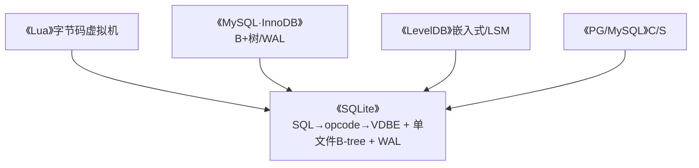
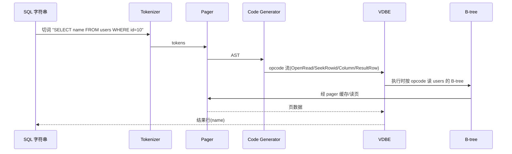

# 第 0 篇 · 第 1 章 · 第一性原理:为什么需要 SQLite

> **核心问题**:你天天用 SQLite——或在手机 App、浏览器、Python/Node 里不知不觉用了它(它内置在无数软件里,号称"全球部署量最大的数据库")。它小、单文件、不用装服务。可"它内部到底怎么跑的——一条 SELECT 怎么变成执行结果",你能讲清吗?SQLite 最独特的招牌是:它**不直接执行 SQL,而是把 SQL 编译成字节码(opcode),用一个叫 VDBE 的虚拟机执行**(这和 Lua 把源码编译成字节码、用虚拟机执行是同一个思想)。它凭什么这么设计?

> **读完本章你会明白**:
> 1. 嵌入式场景(手机/浏览器/App/航电)为什么需要 SQLite,而不是 MySQL/PG——serverless、单文件、零配置、零管理的根本价值。
> 2. MySQL/PG 是 **C/S**(客户端-服务器),SQLite 是**嵌入式**——这个根本差异决定了它们各自适合什么场景。
> 3. SQLite 的本质一:**把 SQL 编译成字节码、用 VDBE 虚拟机执行**(承《Lua》虚拟机,这是 SQLite 灵魂)。
> 4. SQLite 的本质二、三:**单文件 B-tree 存储** + **WAL/journal 保 ACID**(承《MySQL·InnoDB》)。
> 5. **四重承接**——VDBE↔《Lua》VM、B-tree/WAL↔《MySQL·InnoDB》、嵌入式↔《LevelDB》、C/S↔《PG/MySQL》。
> 6. 一条 SELECT 在 SQLite 里的完整旅程、为什么用 C、amalgamation 的来由。

> **如果一读觉得太难**:先只记住三件事——① SQLite 不直接执行 SQL,而是**编译成 opcode、用 VDBE 虚拟机执行**(和 Lua 一样);② 数据存在**单文件 B-tree**里(注意 B-tree 不是 B+树);③ 写靠 **WAL/journal** 保证 ACID。全书一句话主线:**SQL 编译成字节码 → VDBE 虚拟机执行 → 从单文件 B-tree 读数据、WAL/journal 保 ACID**。

---

## 〇、一句话点破

> **SQLite 把 SQL 编译成 VDBE 字节码(opcode)、用虚拟机执行,执行时从单文件 B-tree 读数据、经 pager + WAL/journal 保证 ACID——"编译成字节码 + 虚拟机执行 + 单文件 B-tree",是它小而美、能塞进每个 App 的根本。**

这是结论,不是理由。本章倒过来拆:先讲嵌入式场景为什么需要 SQLite、它和 MySQL/PG 的根本差异,然后**把它的三个本质逐个拆透**(VDBE 字节码虚拟机是重点,承《Lua》),接着讲四重承接、完整旅程、选型与演进。

---

## 一、嵌入式场景:为什么需要 SQLite,而不是 MySQL/PG

要理解 SQLite,先看清它要解决的场景。你已经很熟悉 MySQL/PG——《MySQL·InnoDB》和《PG 数据库内核》那两本讲的都是 **C/S 数据库**:一个独立的服务器进程,客户端通过网络连上去发 SQL。这套 C/S 架构适合"多个应用共享一个数据库、有 DBA 运维"的服务端场景。

但有一大类场景,C/S 根本不合适:

- **手机 App**:你的通讯录、备忘录、离线缓存——总不能让每个 App 去连一个远端 MySQL 服务器(没网怎么办?延迟怎么办?运维谁管?)。App 需要的是**本地、随 App 一起、不用联网**的数据库。
- **浏览器**:浏览器要存书签、历史、缓存索引——同样需要一个嵌在浏览器进程里的数据库(Chrome/Firefox 都用 SQLite 存大量本地数据)。
- **Python/Node 内置**:脚本要存点结构化数据,`import sqlite3` 就能用,不用先装个 MySQL 服务。
- **工业/航电**:飞机航电、舰艇系统——不可能跑个 MySQL 服务,需要一个能编译进固件的数据库。

这些场景的共同需求是:**和 App 同进程、随 App 生灭、单文件、零配置、零运维**。MySQL/PG 的 C/S 架构一条都满足不了——你要装服务、配端口、管账号、跑守护进程。**SQLite 就是为这些"嵌入式"场景生的**。

> **钉死这件事**:理解 SQLite 的起点,不是"它有哪些 SQL 功能",而是**它是嵌入式的——一个库链接进你的程序,数据库就是一个文件,没有独立服务进程**。这个定位决定了它后面所有设计:单文件存储、零配置、可裁剪、能塞进任何设备。

---

## 二、MySQL/PG 是 C/S,SQLite 是嵌入式——根本差异

这个差异是理解 SQLite 一切设计的总开关,值得讲透。

### C/S vs 嵌入式:一张图说清

```
   MySQL/PG(C/S):
   ┌────────┐         ┌──────────────┐
   │ 客户端  │ ──网络──▶│ 数据库服务器  │ ──▶ 磁盘
   │ (你的App)│         │ (独立进程)    │
   └────────┘         └──────────────┘
   要装服务、配端口、管账号、有 DBA;多 App 共享一个 DB。

   SQLite(嵌入式):
   ┌─────────────────────────┐
   │ 你的 App 进程             │
   │  ┌────────────────────┐ │
   │  │ SQLite 库(链接进来)│ │ ──▶ 一个 .db 文件
   │  └────────────────────┘ │
   └─────────────────────────┘
   没有独立服务;库直接读写 .db 文件;零配置、零运维。
```

### 各自适合什么

- **C/S(MySQL/PG)**:适合"服务端、多应用共享、高并发写、有 DBA、需要分布式"的场景。代价是要运维一个服务。
- **嵌入式(SQLite)**:适合"端侧、单应用独占、读多写少或中等写、零运维、随 App 部署"的场景。代价是并发写能力弱(单文件锁)。

**注意:不是 SQLite 比 MySQL 简陋,而是它们解决不同问题。** SQLite 在"嵌入式"这个赛道上做到了极致——稳定、快、小、零依赖。这就是为什么它是全球部署量最大的数据库(几十亿设备都有它),而 MySQL/PG 是"服务端数据库"的王者。

> 一段历史:SQLite 由 **D. Richard Hipp 在 2000 年开发**(最初为通用动力公司开发,用于军舰系统——因为军舰上没有 DBA、跑不了 MySQL)。**Public Domain(完全免费,连版权都不留)**,几十年由 Hipp 一人主导演进。这种"一个人、几十年、Public Domain"的开发模式,造就了 SQLite 极致的稳定和代码质量——它可能是世界上测试最充分的软件(TH3 测试套件,100% 分支覆盖,工业级)。

---

## 三、本质一:SQL 编译成字节码 + VDBE 虚拟机(SQLite 灵魂,承《Lua》)

这是 SQLite 最独特、最值得讲透的地方——也是它和《Lua》那本最强的承接点。

### SQLite 不直接执行 SQL,而是先编译成 opcode

你可能会想:SQLite 收到一条 `SELECT * FROM users WHERE id=10`,内部肯定是"解析 → 直接执行"嘛。**不是。** SQLite 的真实流程是:

```
   SQL 字符串
     │
     ▼
   Tokenizer(切词)→ Parser(建 AST)→ Code Generator(产出 opcode 流)
     │
     ▼
   VDBE 虚拟机:逐条执行 opcode(OpenRead → Column → ... → ResultRow)
     │
     ▼
   执行时,从 B-tree 读数据 → 返回结果
```

也就是说,SQLite **先把 SQL 编译成一串 opcode(字节码),再交给 VDBE 虚拟机去逐条执行**。一条 `SELECT name FROM users WHERE id=10`,会被编译成类似这样的 opcode 流(用 `EXPLAIN` 能看到):

```
   addr  opcode      p1    p2    p3
   ----  ----------  ----  ----  -----------
   0     OpenRead    0     2     0      # 打开表 users(根页 2)读
   1     Integer     10    1     0      # 把常量 10 放进寄存器 1
   2     SeekRowid   0     3     1      # 在表 0 里按 rowid(=寄存器1的10)定位
   3     Column      0     1     2      # 取第 1 列(name)放进寄存器 2
   4     ResultRow   2     1     0      # 把寄存器 2 作为结果行返回
   5     Close       0     0     0      # 关闭表
   ...
```

VDBE 虚拟机拿着这串 opcode,一条一条地执行(`OpenRead` 打开表、`SeekRowid` 定位、`Column` 取列、`ResultRow` 返回行)——就像一个 CPU 执行机器指令,只不过这里的"指令"是 SQLite 自己定义的 opcode。

### 为什么是"编译成字节码",而不是直接解释 AST?

这是 SQLite 最核心的设计决策。朴素的做法是:解析出 AST 后,直接写个递归函数遍历 AST 执行(很多教学型数据库就这么干)。SQLite 为什么非要绕一道"编译成 opcode"?

- **可重复执行(prepared statement)**:SQL 编译成 opcode 后,可以缓存(opcode 不变),反复 bind 不同参数执行——一次编译、多次执行,极快。这是 SQLite 高性能的关键之一。
- **执行统一、可优化**:opcode 是一个扁平的、可分析的指令流,优化器可以在上面做优化(重排、选索引)。AST 是树状、嵌套的,优化起来更难。
- **虚拟机统一执行模型**:不管 SELECT/INSERT/UPDATE/DELETE,最后都变成 opcode,由同一个 VDBE 执行——执行逻辑高度统一,代码更简洁。

> **承接《Lua》**:这套"源码 → 字节码 → 虚拟机执行"的思想,和《Lua》那本讲的**一模一样**——Lua 把源码编译成字节码(指令)、用 Lua VM 执行;SQLite 把 SQL 编译成 opcode、用 VDBE 执行。**两者都是"编译器 + 字节码虚拟机"架构**,只是 Lua 的输入是程序源码、SQLite 的输入是 SQL。本书讲 VDBE 时,承接《Lua》的 VM 章节(寄存器/栈/opcode 循环),不重复 VM 基础。这是 SQLite 和 Lua 在设计哲学上的深刻共鸣。

### VDBE 虚拟机:opcode 怎么执行

VDBE(`src/vdbe.c`,SQLite 最核心的文件)的核心,是一个**巨大的 switch-case 循环**:读一条 opcode、根据 opcode 类型执行对应逻辑、更新 program counter、读下一条。它用**寄存器**存中间值、用**游标(cursor)**遍历 B-tree。这套"opcode 循环 + 寄存器"的执行模型,和 Lua VM 高度同构(本书 P2-05 会拆到 `vdbe.c` 的主循环)。

> **钉死这件事**:SQLite 的灵魂是 VDBE——它把 SQL 执行,做成了"编译成字节码 + 虚拟机执行"。这套架构让 SQLite 既能 prepared statement 复用(快)、又能统一优化(灵活)、还和 Lua VM 同构(优雅)。**这是理解 SQLite 一切的钥匙**,也是本书最强的承接(《Lua》)。

---

## 四、本质二:单文件 B-tree 存储(承《MySQL·InnoDB》)

VDBE 执行 opcode 时,要读写数据。数据存在哪?**单文件的 B-tree 里**。

### 一个 .db 文件,装着多棵 B-tree

SQLite 的整个数据库,就是**一个文件**(默认 `.db` 后缀)。这个文件里,**每张表是一棵 B-tree,每个索引也是一棵 B-tree**——它们通过"根页号"区分(文件按页分,每页 4KB 默认,根页号指向某棵 B-tree 的根节点所在的页)。

```
   SQLite 单文件(多棵 B-tree,用根页号区分):
   ┌────────────────────────────────────┐
   │ 页 1: schema(sqlite_master 表)     │
   │ 页 2: 表 users 的 B-tree 根        │
   │ 页 5: 表 orders 的 B-tree 根       │
   │ 页 8: 索引 idx_name 的 B-tree 根   │
   │ ...其他页(各 B-tree 的内部/叶子页) │
   └────────────────────────────────────┘
```

### 关键:SQLite 用 B-tree,不是 B+树

这是个**极易讲错**的点(SQLite 官方文档都反复强调):SQLite 的表和索引都是 **B-tree**,不是 MySQL 那样的 **B+树**。区别在哪?

- **B+树(MySQL/InnoDB)**:内部节点只存 key(导航用)、**只有叶子页存数据**;叶子页之间有链表。
- **B-tree(SQLite)**:**内部节点和叶子页都存数据**(key 和数据放一起)。

> **不这样会怎样**:为什么 SQLite 选 B-tree 不是 B+树?因为 SQLite 的"行"是通过 **rowid**(行的整数 ID)组织的,表 B-tree 的 key 就是 rowid,数据(整行)和 rowid 放一起,查找时不用再跳到叶子页——这比 B+树少一次定位(对 SQLite 这种嵌入式、读为主的场景,这个取舍更划算)。这是 SQLite 区别于《MySQL·InnoDB》B+树的根本存储决策(本书 P3-08 对照拆透)。

> **承接《MySQL·InnoDB》《LevelDB》**:SQLite 的 B-tree(就地更新)对照 InnoDB 的 B+树、LevelDB 的 LSM——三种存储数据结构的写放大/读放大/空间放大三角对照,本书 P3-08 会画清。

---

## 五、本质三:WAL / rollback journal 保 ACID(承《MySQL·InnoDB》)

数据存在 B-tree 页里(在磁盘文件)。如果改一半 crash 了,数据就坏了。SQLite 怎么保证 ACID?和 MySQL 类似——**先记日志,再改数据**,但 SQLite 有两种模式:

- **rollback journal(默认,原子提交)**:改页**之前**,先把页的**原内容**写进一个 journal 文件;crash 后,用 journal 把页**改回去**(回滚)。简单,但**写时整个数据库独占**(写的时候别人不能读)。
- **WAL(Write-Ahead Logging,3.7+)**:改**先写进 WAL 文件、不动数据文件**;读时读数据文件 + WAL;定期 checkpoint 把 WAL 合并回数据文件。**读不阻塞写、写不阻塞读**,并发好得多。

> **承接《MySQL·InnoDB》**:WAL 的思想,和 InnoDB 的 redo log 同源(都是"改前先记日志")。但实现不同——SQLite 的 WAL 更简单(嵌入式、单文件),InnoDB 的 redo 更复杂(C/S、多事务)。本书 P4-12/P4-13 对照拆。注意:SQLite **没有 InnoDB 那样的 undo log**(它靠 rollback journal 做"回滚",journal 记的是原内容而非"怎么改回去"——和 InnoDB undo 的逻辑日志不同),这是嵌入式简化。

---

## 六、四重承接:这本书站在四本书之上

读到这里你会发现:SQLite 里的概念,你大多在前面的书里见过类似的东西。**本书是"集大成者"**:

| 维度 | **SQLite** | 承接前作 |
|------|-----------|----------|
| SQL 执行 | 编译成 opcode + VDBE 虚拟机 | ↔ 《Lua》**源码→字节码→VM**(同构) |
| 存储 | 单文件 B-tree(非 B+树) | ↔ 《MySQL·InnoDB》**B+树》、对照 LSM |
| ACID | rollback journal / WAL | ↔ 《MySQL·InnoDB》**redo/WAL》 |
| 部署 | 嵌入式(链接进 App) | ↔ 《LevelDB》**嵌入式》、对照 C/S |
| 内存 | mem0-5 多种可切换 | ↔ 《内存分配器》 |



> **钉死这件事**:读这本书,等于把《Lua》《MySQL·InnoDB》《LevelDB》**复习并深化一遍**——SQLite 把这几者的思想,用"嵌入式、单文件"的极简方式重做了一遍。本书篇幅全留给 **SQLite 独有部分**:VDBE opcode、B-tree 非 B+树、rollback journal、单文件多 B-tree、type affinity 等。

---

## 七、一条 SELECT 的完整旅程(全书地图)

把三个本质拼起来,一条 `SELECT name FROM users WHERE id=10` 在 SQLite 里的完整旅程(每个箭头都是后面某一章的主角):



对应章节:Tokenizer/Parser(`tokenize.c`/`parse.y`)→ P1-03;Code Generator(`select.c`/`where.c`/`vdbeaux.c`)→ P1-04;VDBE(`vdbe.c`)→ P2-05/06;B-tree(`btree.c`)→ P3-08;Pager(`pager.c`)+ WAL(`wal.c`)→ P4。

> **钉死这件事**:读这本书,就是跟着这条旅程一站站走完。合上书你就能在脑子里放映出这条 SELECT 的全过程——以及每一步底下用了什么巧妙的手段。

---

## 八、为什么是 C,以及 amalgamation 的来由

**为什么是 C**:SQLite 要**嵌入任何设备**(手机/浏览器/航电/固件),必须**零依赖、极致可移植、极小**——C 是唯一选择(没有运行时、到处能编译)。几十年下来,SQLite 的 C 代码以紧凑、高密度、技巧密集著称(opcode 循环、页二进制布局、自定义 printf)。

**amalgamation 的来由**:SQLite 发布时,会把 `src/` 开发树的所有 .c **合并成一个超大文件 `sqlite3.c`**(几十万行,叫 amalgamation),再配上 `sqlite3.h`。为什么?因为**单文件方便嵌入**(你只需要把 sqlite3.c 编译进项目,不用管几十个源文件的依赖),且合并后编译器能做跨函数优化(更快)。本书读 `src/` 开发树(更清晰),涉及 amalgamation 处讲清对应关系。

> 这也意味着:读 SQLite 源码,你会看到大量 C 的"硬核"技巧——opcode 的 switch-case、页的二进制布局、可裁剪的 mem0-5/mutex、自定义 printf。本书在涉及处会拆"它怎么做到的、为什么 sound"(承接《Linux内核》/《Lua》的 C 技巧那套)。

---

## 九、一个绕不开的背景:SQLite 的演进

最后,诚实交代——SQLite 演进温和(几十年 Hipp 主导,没有 MySQL 那种大重构),但仍要注意几处:

1. **WAL(3.7+,2010)**:老资料讲 rollback journal 是默认(仍对),但 WAL 是现代高并发首选,讲清两者。
2. **JSON(3.9+)**、**窗口函数(3.25+)**、**UPSERT(3.24+)**:较新的 SQL 特性,老资料可能没有。
3. **os_kv(KV VFS,新)**:把 SQLite 存到 KV 存储后端(如 Redis)的新特性,体现 VFS 的可扩展。
4. **memdb(内存 db)**、**mem0-5 多种内存分配可切换**:体现 SQLite 的可裁剪/可替换(承《内存分配器》)。
5. SQLite 没有版本大重构——但 amalgamation vs `src/` 的对应关系要讲清。
6. **本书以 master(3.5x dev,@ 07607c6)源码为准**,最近 stable 3.53.2(2026-06)。

> **本书的态度**:以新版源码为准;SQLite 演进温和,老资料大部分仍有效(不像 MySQL/redo 那样大片过时),但新特性(WAL/JSON/os_kv)要讲清版本。

---

## 十、技巧精解:两个第一性洞察

本章是概念定调章。有两个最硬核的第一性洞察值得单独钉死。

### 洞察一:为什么 SQLite 选"编译成字节码 + VDBE",而不是直接解释 AST

很多教学型数据库,解析出 AST 后直接递归遍历执行。SQLite 为什么非要绕一道"编译成 opcode"?

- **prepared statement**:SQL 编译成 opcode 后可缓存,反复 bind 参数执行——**一次编译、多次执行**,这是 SQLite 高性能的关键。直接解释 AST 做不到这点(每次都得重新遍历 AST)。
- **统一优化**:opcode 是扁平指令流,优化器在上面做分析(选索引、重排)比在 AST 树上容易。
- **统一执行模型**:SELECT/INSERT/UPDATE/DELETE 最后都是 opcode,一个 VDBE 执行——代码极简。

> **不这么设计会怎样**:直接解释 AST 的话,每次执行 SQL 都得重新遍历 AST(慢)、优化难、执行逻辑分散(每种语句一套)。编译成 opcode + 虚拟机,是"用编译器的复杂性,换执行时的统一和高效"——和 Lua 选字节码 VM 而非直接解释 AST,是同一个道理。**这是 SQLite 和 Lua 在设计哲学上的共鸣**。

### 洞察二:为什么 SQLite 用 B-tree,不是 B+树

B+树(MySQL)和 B-tree(SQLite)都叫"B 树家族",但结构不同:B+树只有叶子页存数据、内部页只导航;B-tree 内部页和叶子页都存数据。SQLite 为什么选 B-tree?

- SQLite 的表 B-tree,key 是 **rowid**(整数行 ID),数据(整行)和 rowid 放一起。查找时定位到对应节点就直接拿到数据,**不用再跳到叶子页**(B+树要多一跳)。
- 对 SQLite 这种**嵌入式、读为主、单文件**的场景,B-tree 的"少一跳"更划算;MySQL 是 C/S、高并发、大数据量,B+树的"内部页更小、树更矮、范围扫顺序"更优。

> **不这么设计会怎样**:如果 SQLite 用 B+树,每次点查要多一跳到叶子页,嵌入式读为主场景会慢;而 MySQL 用 B-tree,大数据量范围扫和缓存命中率会差。**两者是不同场景下的最优选择,不是谁更先进**。这是 SQLite 区别于 MySQL 的根本存储决策(本书 P3-08 对照拆透)。

---

## 十一、章末小结

### 回扣主线

本章是全书唯一的"纯概念章"。它立起了全书最重要的三个东西:

1. **主线**:**SQL 编译成字节码 → VDBE 虚拟机执行 → 从单文件 B-tree 读数据、WAL/journal 保 ACID。**
2. **二分法**:**编译与执行**(Tokenizer/Parser/Code Generator/VDBE)vs **存储与事务**(B-tree/Pager/WAL/VFS)。
3. **四重承接**:VDBE↔《Lua》、B-tree/WAL↔《MySQL·InnoDB》、嵌入式↔《LevelDB》、C/S↔《PG/MySQL》。

后续 20 章,都是这三个东西的展开。

### 五个为什么

1. **为什么嵌入式场景需要 SQLite,不要 MySQL/PG?**——serverless、单文件、零配置、随 App 部署;C/S 要装服务、配端口、有 DBA,端侧用不了。
2. **为什么 SQLite 把 SQL 编译成字节码?**——prepared statement 复用(一次编译多次执行)、统一优化、统一执行模型;和 Lua 选字节码 VM 同理。
3. **为什么 SQLite 用 B-tree 不是 B+树?**——rowid 和数据同节点、点查少一跳,嵌入式读为主场景更优;MySQL 大数据量范围扫则 B+树更优。
4. **为什么 SQLite 有 rollback journal 和 WAL 两种?**——rollback journal 简单但写时独占;WAL 读写并发,现代高并发首选。
5. **为什么 SQLite 没有 undo log(像 InnoDB)?**——它靠 rollback journal(记原内容)做回滚,嵌入式简化;InnoDB 的 undo(逻辑日志 + MVCC 版本链)为 C/S 高并发设计,SQLite 用不上那么复杂。

### 想继续深入往哪钻

- 想看官方架构:读 SQLite 官方文档 "Architecture of SQLite"(八层图)、"How SQLite Works"(VDBE opcode)。
- 想理解 VDBE:本书第 2 篇;或 SQLite 官方 "Virtual Machine That Executes SQL"(列了所有 opcode)。
- 想动手感受:`sqlite3` CLI 起一个库,`EXPLAIN SELECT ...` 看它编译出的 opcode 流。

### 引出下一章

我们搞清楚了"为什么需要 SQLite"和它的三个本质(VDBE 字节码 + 单文件 B-tree + WAL/journal)。那么,SQLite 的八层架构具体怎么切、一条 SQL 怎么从顶层 API 流到 VDBE?下一章 P1-02,我们从最基础的 **架构全景:八层流水线** 开始,拆 SQLite 架构的根。

> **下一章**:[P1-02 · 架构全景:八层流水线](P1-02-架构全景-八层流水线.md)
