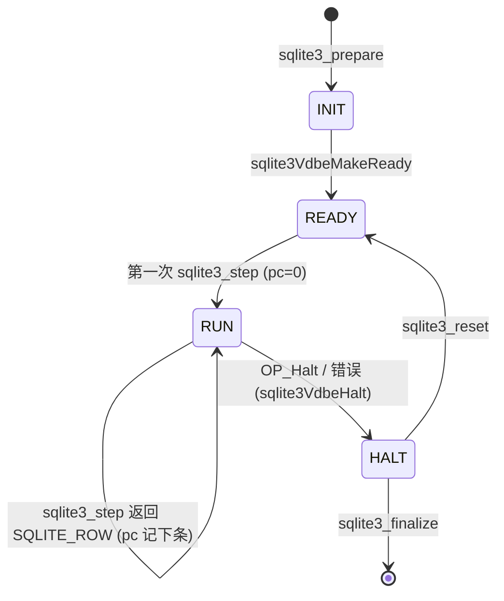
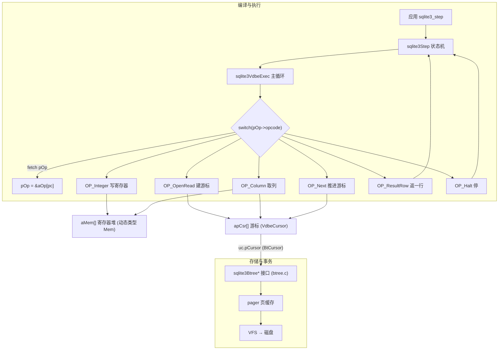

# 第 2 篇 · 第 5 章 · VDBE 虚拟机:执行字节码

> **核心问题**:上一章我们看到,Code Generator 把一棵 SELECT 的 AST,翻译成了一串扁平的 VDBE opcode——`OpenRead`、`SeekRowid`、`Column`、`ResultRow`、`Next`、`Close`……但这串 opcode **怎么被执行**?谁在一条条地取、译码、执行?它用什么存中间值(那一行 `name` 取出来先放哪)?又用什么遍历那棵存了 `users` 表的 B-tree?更根本的:为什么 SQLite 要写一个巨大的 `switch(pOp->opcode)` 来分发 opcode,而不是像很多教科书 VM 那样用一张函数指针表?这一章拆 SQLite 的心脏——`vdbe.c` 里那个 9400 多行的 `sqlite3VdbeExec`,以及它周围的 `Mem` 寄存器、`VdbeCursor` 游标。

> **读完本章你会明白**:
> 1. VDBE 的主循环长什么样——`for(pOp=&aOp[pc]; 1; pOp++){ switch(pOp->opcode){…} }` 这个 fetch-decode-execute 三拍,和《Lua》那本讲透的 `luaV_execute` 是同一个根。
> 2. 为什么 SQLite 用**寄存器**(`Mem` 数组)存中间值,这个 `Mem` 是**动态类型**的(一个 `Mem` 能存 INTEGER/REAL/TEXT/BLOB/NULL 任意一种),和 Lua 的 `TValue` 同构但比它多了 affinity/类型转换那套。
> 3. 为什么遍历 B-tree 要靠**游标**(`VdbeCursor`),游标是怎么把"VDBE 在执行"和"B-tree 在存"这两件本来不相干的事接起来的——这是 VDBE 区别于 Lua VM 最关键的地方(Lua 没有存储后端,SQLite 有)。
> 4. 为什么用 `switch-case` 而不是函数指针表:编译器能把密集 switch 优化成 jump table、opcode 分支体还能 fallthrough 共享代码、少一次间接调用——这是 C 虚拟机的一个经典技巧,SQLite 把它用到了极致。

> **逃生阀(这章很难,一读觉得晕,先记住这四件事)**:
> ① VDBE 就是个 `fetch 一条 opcode → switch 分发 → 执行 → pc 前进`的循环,和 Lua VM 同构,你已经在《Lua》那本里见过它的祖宗;② 中间值存在一个大数组 `aMem[]` 里,每个槽 `Mem` 能装任意类型值(动态类型);③ 遍历 B-tree 靠 `apCsr[]` 里的游标,游标里握着一个 `BtCursor` 指针,调 `sqlite3BtreeNext/Prev` 就能走下一条;④ 跳转用 `pOp = &aOp[p2 - 1]` 这个写法(为什么减 1?因为循环末尾会再 `pOp++`,减 1 是为了让自增正好落到目标)。记住这四点,后面每一节都是在展开它们。

---

## 〇、一句话点破

> **VDBE 是一个 fetch-decode-execute 的字节码解释器:它把 code generator 产出的 opcode 流当成"程序",用一个 `switch(pOp->opcode)` 的大循环逐条解释;用 `Mem` 寄存器堆存中间值、用 `VdbeCursor` 游标连上 B-tree。它和《Lua》的 `luaV_execute` 同构(同一个根),但比 Lua VM 多了一件最重要的事——它会经由游标去驱动底下的 B-tree,所以它不只是个"计算器",它是"编译执行通往存储"的那座桥。**

这是结论,不是理由。本章倒过来拆:先讲 VDBE 主循环的真实写法(贴 `vdbe.c` 的源码),再拆 `Mem` 寄存器(为什么是动态类型、和 Lua `TValue` 比怎么样),然后拆 `VdbeCursor` 游标(它怎么连 B-tree),接着讲那些"跳转/子程序/中断"的真实控制流,最后用一个最硬核的技巧精解——为什么 `switch-case` 能比函数指针表快、SQLite 怎么用 `OPFLG` 属性位图让编译器把 switch 优化到极致。

---

## 一、承接《Lua》:VDBE 是个字节码 VM,VM 的第一性原理那边讲过

这一章是全书和《Lua》那本**最强承接**的一章。所以开篇先把承接关系钉死,免得你以为是两件事。

你在《Lua 虚拟机:统一与精简换小而快》里已经见过一个字节码虚拟机的标准样子:Lua 把源码编译成一串指令(操作码 + 操作数),然后 `luaV_execute` 是一个循环,每轮 `fetch` 一条指令、根据 opcode 走不同的分支、读写寄存器、推进 `pc`。那套 fetch-decode-execute 的通则、寄存器怎么当临时变量用、为什么用 switch 分发——**这些 VM 基础,《Lua》那本已经讲透了,本书不重复**。

SQLite 的 VDBE 是同一个根思想,只换了输入和后端:

- Lua VM 的输入是**程序源码编译出的指令**,后端是**没有存储**(纯计算,顶多有个堆);
- VDBE 的输入是 **SQL 编译出的 opcode**,后端是**一个单文件 B-tree 数据库**。

所以本章只讲 SQLite 独有的三件大事:

1. **VDBE 的 `Mem` 寄存器是动态类型**——和 Lua `TValue` 同构(都用 tagged union 存"一个槽装任意类型值"),但 SQLite 的 `Mem` 多了 affinity(类型亲和性)、多种字符串编码(UTF-8/16)、`MEM_Dyn/Ephem/Static` 三种所有权模式(这是 Lua 没有的)。
2. **VDBE 的 `VdbeCursor` 游标模型**——Lua 完全没有对应物。Lua 是纯计算 VM,没有"遍历一个外部存储"这种事;SQLite 的 opcode 一边算,一边要不停地去 B-tree 取下一行,这个"取"就是靠游标。**游标是 VDBE 区别于一切纯计算 VM 的关键。**
3. **opcode 直接驱动 B-tree**——`OP_OpenRead` 调 `sqlite3BtreeCursor`、`OP_Column` 经游标的 `aRow`/`aType` 解析记录、`OP_Next` 调 `sqlite3BtreeNext`。这是"编译执行通往存储"的枢纽,VDBE 是那座桥。

这三件事讲完,VDBE 就透了。后面 P2-06(具体每个 opcode 干什么)、P2-07(一条 SELECT 全流程)都是这一章的展开。

> **钉死这件事**:如果你读过《Lua》的 VM 章节,那 VDBE 主循环的"骨架"你已经会了——`fetch(pOp = &aOp[pc])` → `decode(switch)` → `execute(case 体)` → `pc 前进`。**本章不重讲这个骨架的通则**,只讲 VDBE 在这个骨架上加了什么(SQLite 独有的 `Mem`/游标/连 B-tree)。如果你没读过《Lua》那本,本章逃生阀里那四件事够你先建立直觉。

---

## 二、主循环:`for(pOp=&aOp[pc]; 1; pOp++)` 这一行就是 VDBE 的心脏

### 它长什么样

VDBE 的全部执行逻辑,都收在一个函数 `sqlite3VdbeExec` 里([`vdbe.c:881`](../sqlite/src/vdbe.c#L881))。这个函数有多大?**九千四百多行**,因为 SQLite 一百多个 opcode 的 case 体全塞在这一个函数的 `switch` 里。它的入口和主循环骨架是这样的(简化展示,省略调试与中断代码,保留真实变量名和循环结构):

```c
/* vdbe.c:881 */
int sqlite3VdbeExec(
  Vdbe *p                    /* The VDBE */
){
  Op *aOp = p->aOp;          /* 程序(opcode 数组)的本地副本 */
  Op *pOp = aOp;             /* 当前指令指针 */
  int rc = SQLITE_OK;        /* 返回码 */
  sqlite3 *db = p->db;       /* 数据库连接 */
  Mem *aMem = p->aMem;       /* 寄存器堆的本地副本 */
  Mem *pIn1 = 0, *pIn2 = 0, *pIn3 = 0, *pOut = 0;  /* 操作数/输出指针 */
  u64 nVmStep = 0;           /* VM 步数计数器 */
  ... /* 一堆初始化、debug 检查、progress callback 设置 */

  for(pOp=&aOp[p->pc]; 1; pOp++){        /* ★ VDBE 心脏:fetch + 自增 */
    assert( rc==SQLITE_OK );
    assert( pOp>=aOp && pOp<&aOp[p->nOp]);
    nVmStep++;

    ... /* trace、progress、debug 时检查 OPFLG_IN1/IN2/IN3/OUT2/OUT3 */

    switch( pOp->opcode ){                /* ★ decode */
      case OP_Goto:      ...              /* 一百多个 case,每个是一条指令 */
      case OP_Integer:   ...
      case OP_OpenRead:  ...
      case OP_Column:    ...
      case OP_SeekRowid: ...
      case OP_Next:      ...
      case OP_ResultRow: ...
      case OP_Halt:      ...
      ...
    }
  }

vdbe_return:               /* OP_ResultRow / OP_Halt 都跳到这里 */
  ...
  return rc;

abort_due_to_error:        /* 任何 opcode 报错都跳到这里 */
  ...
  goto vdbe_return;
}
```

这就是 VDBE 的心脏。每一轮循环干三件事:

1. **Fetch**:`pOp` 指针当前指向的那条 `Op` 结构(8 字节 opcode + p1/p2/p3 + p4union + p5)就是"当前指令"。循环开头已经把它取到本地(`pOp` 在循环条件里被初始化为 `&aOp[p->pc]`)。
2. **Decode**:`switch(pOp->opcode)` 根据 opcode 字段(一个 `u8`,最多 256 种)跳到对应 `case`。
3. **Execute**:对应 `case` 体的代码读写 `aMem[]` 寄存器、读写 `apCsr[]` 游标、可能调底层 B-tree 接口,然后要么 `break`(走默认的 `pOp++` 推进到下一条)、要么显式改 `pOp`(跳转)。

循环末尾那个 `pOp++` 就是隐式的 `pc++`——SQLite 没有单独维护一个 `pc` 整型变量在循环里递增,而是直接让 `pOp` 指针自增(指针算术比整数索引 + 数组下标快一点,少一次 `aOp + pc` 的加法)。这是 SQLite 的小心思:**用指针代替 pc 整数,省一次加法**。

> **钉死这件事**:VDBE 主循环只有一行——`for(pOp=&aOp[p->pc]; 1; pOp++)`。这一行同时完成了"从 `p->pc` 处恢复执行"和"每轮自动前进一条"两件事。`p->pc` 这个字段只在**跨 `sqlite3_step` 调用**时用(每返回一行 `SQLITE_ROW`,下次 `sqlite3_step` 要从 `p->pc` 续上);在循环内部,pc 不是用 `p->pc` 跟踪的,而是用 `pOp` 指针本身——跳转就直接改 `pOp`,顺序执行就靠末尾 `pOp++`。

### 为什么程序计数器藏在 `pOp` 指针里(而不是一个 `pc` 整数)

很多教科书 VM 会写 `while(1){ opcode = program[pc]; switch(opcode){...} pc++; }`——`pc` 是一个独立整数。SQLite 不这么干,它把"当前指令"直接做成指针 `pOp`,`pc` 只在跨 `step` 时存回 `p->pc`。好处是什么?

- **少一次加法**:执行体里读操作数是 `pOp->p1`,而不是 `program[pc].p1`(后者要先 `program + pc` 算地址)。每次访问操作数都省一次加法,一百多个 opcode 一天访问几亿次,这个省得很实在。
- **跳转更直接**:`pOp = &aOp[p2 - 1]` 一句话就跳了,不用 `pc = p2 - 1; continue`。

代价是代码不那么"教科书"——`pOp` 是个游走的指针,你得时刻记住它指向哪。但 SQLite 选择性能优先,这点不直白换来了真实的快。

> **不这样会怎样**:如果用一个独立的 `pc` 整数,每次访问操作数都得 `aOp[pc].p1`,编译器虽然能优化(把 `aOp + pc*sizeof(Op)` 提到循环顶),但优化不总是彻底;直接用 `pOp->p1` 把这件事写死,编译器毫无悬念地生成一条 `mov` 指令就拿到了。SQLite 这种"把性能要求写进代码结构"的风格,贯穿整个 `vdbe.c`。

### `Op` 结构:一条 opcode 的样子

在拆 case 之前,先看清一条 opcode 长什么样。VDBE 的"指令"是 `struct VdbeOp`([`vdbe.h:55`](../sqlite/src/vdbe.h#L55)):

```c
struct VdbeOp {
  u8 opcode;          /* 操作码,最多 256 种 */
  signed char p4type; /* p4 的类型(P4_INT32/P4_KEYINFO/P4_MEM/...) */
  u16 p5;             /* 第五个参数,16 位无符号(常作标志位) */
  int p1;             /* 第一操作数 */
  int p2;             /* 第二操作数(跳转类 opcode 时是目标地址) */
  int p3;             /* 第三操作数 */
  union p4union {     /* 第四参数,是个 tag 的 union */
    int i;                 /* P4_INT32 */
    void *p;               /* 通用指针 */
    char *z;               /* 字符串 */
    i64 *pI64;             /* P4_INT64 */
    double *pReal;         /* P4_REAL */
    FuncDef *pFunc;        /* P4_FUNCDEF:SQL 函数指针 */
    sqlite3_context *pCtx; /* P4_FUNCCTX */
    CollSeq *pColl;        /* P4_COLLSEQ:排序规则 */
    Mem *pMem;             /* P4_MEM */
    KeyInfo *pKeyInfo;     /* P4_KEYINFO:索引键信息 */
    u32 *ai;               /* P4_INTARRAY */
    SubProgram *pProgram;  /* P4_SUBPROGRAM:子程序(触发器用) */
    Table *pTab;           /* P4_TABLE */
    SubrtnSig *pSubrtnSig; /* P4_SUBRTNSIG */
    Index *pIdx;           /* P4_INDEX */
#ifdef SQLITE_ENABLE_CURSOR_HINTS
    Expr *pExpr;           /* P4_EXPR:游标提示 */
#endif
  } p4;
#ifdef SQLITE_ENABLE_EXPLAIN_COMMENTS
  char *zComment;          /* EXPLAIN 注释 */
#endif
#if defined(SQLITE_ENABLE_STMT_SCANSTATUS) || defined(VDBE_PROFILE)
  u64 nExec;               /* 这条 opcode 被执行了多少次(性能剖析) */
  u64 nCycle;              /* 累计花了多少 CPU 周期 */
#endif
};
```

注意几件事:

- **p1/p2/p3 是定长 `int`**——大多数 opcode 只用到 p1/p2/p3 三个整数操作数就够(比如 `OP_Column p1 p2 p3` 是"游标 p1 的第 p2 列 → 寄存器 p3")。这三个整数操作数足以表达 90% 的 opcode 语义。
- **p4 是个 tagged union**——当三个 int 装不下时(比如要带一个 `KeyInfo` 结构、一个 SQL 函数指针、一个 64 位整数、一个字符串),就用 p4 加 `p4type` 标签来装。`p4type` 决定怎么解释 `p4` 这个 union,这是 C 里实现"动态类型参数"的标准手法。
- **p5 当标志位**——比如 `OP_OpenWrite` 的 p5 里塞了 `OPFLAG_FORDELETE`/`OPFLAG_P2ISREG` 等位标志,用来微调语义。
- **`nExec`/`nCycle` 只在编译时开了 `SQLITE_ENABLE_STMT_SCANSTATUS` 或 `VDBE_PROFILE` 才存在**——它们让 `sqlite3_stmt_scanstatus()` 能告诉你"哪条 opcode 跑了几次、花了多少 CPU 周期",这是 SQLite 自带的 profiler。生产构建里没有这两个字段,省内存。

所以一条 VDBE 指令大概 16~32 字节(SQLite 没有定死,因为条件编译),典型情况下 16 字节(opcode+p4type+p5+p1+p2+p3=1+1+2+4+4+4=16,不含 p4)。一整个 prepared statement 的 opcode 流就是这玩意儿排成数组 `aOp[]`,被主循环逐条消费。

> **对比 Lua 的指令**:Lua 5.5 的指令是定长 32 位(`Instruction`),把 opcode/A/B/C 四个字段塞进 32 位里(6 种指令格式,opcode 7~8 位、操作数各 8~18 位)。SQLite 的 `Op` 反过来——不定长 struct,p1/p2/p3 各 32 位、p4 是个 union。**Lua 走"极致紧凑定长"路线**(指令只有 4 字节,省内存、缓存友好),**SQLite 走"够宽够灵活"路线**(指令 16+ 字节,操作数够大不用挤)。两种取舍都合理:Lua 是嵌入式脚本 VM,内存敏感;SQLite 的 opcode 数量少(一条 SQL 也就几十到几百条 opcode),宽一点不心疼,但操作数能直接存 32 位整数/指针,case 体里少很多位操作。这是两种 VM 在指令格式上的根本差异。

---

## 三、寄存器堆:`Mem` 是动态类型的,一个槽装任意值

### 为什么 VDBE 要用"寄存器"

VDBE 把所有中间值放在一个大数组 `p->aMem[]` 里,这个数组的每个元素是一个 `Mem`(也就是 `sqlite3_value`,SQLite 里这俩是同一个类型)。比如 `SELECT name FROM users WHERE id=10`,会被编译成:

```
0  Integer  10  1  0    # 寄存器 1 ← 10
1  OpenRead 0   2  0    # 游标 0 ← users 表(根页 2)
2  SeekRowid 0  3  1    # 游标 0 按(寄存器1 的 10)定位 rowid
3  Column   0   1  2    # 寄存器 2 ← 游标 0 第 1 列(name)
4  ResultRow 2  1  0    # 寄存器 2..2 作结果行返回
```

寄存器 1 装整数 10,寄存器 2 装字符串 "Alice"。注意:这两个寄存器装的是**不同类型**的值——一个是整数,一个是字符串。这就引出 VDBE 寄存器最关键的性质:**动态类型**。

### `Mem` 结构:一个槽,装任意类型

`Mem` 在 SQLite 内部就是 `struct sqlite3_value`([`vdbeInt.h:232`](../sqlite/src/vdbeInt.h#L232)):

```c
struct sqlite3_value {
  union MemValue {
    double r;           /* MEM_Real 时:浮点数 */
    i64 i;              /* MEM_Int 时:64 位整数 */
    int nZero;          /* MEM_Zero|MEM_Blob 时:末尾补几个 0 */
    const char *zPType; /* 指针类型的类型名 */
    FuncDef *pDef;      /* MEM_Agg 时:聚合函数 */
  } u;
  char *z;            /* 字符串或 BLOB 的数据指针 */
  int n;              /* 字符串/BLOB 长度(不含 '\0') */
  u16 flags;          /* ★ 类型标志位(MEM_Null/MEM_Str/MEM_Int/...) */
  u8  enc;            /* 字符串编码(UTF8/UTF16BE/UTF16LE) */
  u8  eSubtype;       /* 子类型(如 'p' 表示指针值) */
  /* —— 上面是 ShallowCopy 只需复制的部分 —— */
  sqlite3 *db;        /* 关联的数据库连接 */
  int szMalloc;       /* zMalloc 缓冲区大小 */
  u32 uTemp;          /* 临时存储(MakeRecord 用作 serial_type) */
  char *zMalloc;      /* 持有字符串/BLOB 的可写缓冲 */
  void (*xDel)(void*);/* MEM_Dyn 时 z 的析构函数 */
#ifdef SQLITE_DEBUG
  Mem *pScopyFrom;    /* 这个 Mem 是谁的浅拷贝 */
  ...
#endif
};
```

关键看 `flags` 字段——它是一个 `u16`,每一位代表"这个 Mem 当前是哪种表示":

```c
/* vdbeInt.h:309 */
#define MEM_Null      0x0001   /* NULL */
#define MEM_Str       0x0002   /* 字符串(z/n) */
#define MEM_Int       0x0004   /* 整数(u.i) */
#define MEM_Real      0x0008   /* 浮点(u.r) */
#define MEM_Blob      0x0010   /* BLOB(z/n) */
#define MEM_IntReal   0x0020   /* 存成整数但 stringify 当实数看 */
#define MEM_AffMask   0x003f   /* 类型位掩码 */

#define MEM_FromBind  0x0040   /* 值来自 sqlite3_bind() */
#define MEM_Cleared   0x0100   /* OP_Null 设的 NULL,IS 不相等 */
#define MEM_Term      0x0200   /* z 末尾有 '\0' */
#define MEM_Zero      0x0400   /* blob 末尾补 0(zeroblob) */
#define MEM_Subtype   0x0800   /* eSubtype 有效 */
#define MEM_TypeMask  0x0dbf   /* 全部类型位掩码 */

/* 决定 z 的存储所有权 */
#define MEM_Dyn       0x1000   /* z 是动态分配,需调 xDel */
#define MEM_Static    0x2000   /* z 指向静态字符串(不能改/不能释放) */
#define MEM_Ephem     0x4000   /* z 指向临时字符串(可能随时失效) */
#define MEM_Agg       0x8000   /* z 指向聚合函数上下文 */
```

这就是 SQLite 的"动态类型寄存器":**一个 `Mem` 同一时刻可以同时挂多个类型位**。这听起来很怪——一个槽怎么可能既是整数又是字符串?但这是 SQLite 的关键设计:**一个值可以有多种表示共存**。

举个例子,你给一个寄存器塞了整数 42,flags 是 `MEM_Int`。现在要做 `print(寄存器)`(把它当字符串用),SQLite 不会原地把整数抹掉换成字符串,而是**额外**算出字符串 "42",挂在 `z` 上,flags 变成 `MEM_Int | MEM_Str`——这样下次要整数还能用 `u.i`,要字符串能用 `z`,两种表示都在,避免反复转换。这个"多种表示缓存"在 `sqlite3VdbeMemStringify`(`vdbemem.c`)里实现。

> **对比 Lua 的 `TValue`**:Lua 5.5 的栈槽是 `StackValue`(一个 union + 一个 tag),tag 标当前是哪种类型(nil/bool/number/string/table/...),union 装实际值。**同构**——都是 tagged union。但有两点不同:① Lua 的 `TValue` 用一个单独的 `tt` 字段(8 位)存类型 tag,**同一时刻只有一个类型**;SQLite 的 `Mem` 用 `flags` 位图,**同一时刻可以多个类型位共存**(整数和字符串同时挂着),这是为了缓存多种表示避免重转。② SQLite 的 `Mem` 多了一组"所有权位"(`MEM_Dyn/Static/Ephem/Agg`)——因为 SQLite 的字符串/BLOB 可能来自五湖四海(有的从 B-tree 页里指向、有的是 `sqlite3_bind` 来的、有的是计算出来的),要管清楚"这个 `z` 谁负责释放",Lua 没这么复杂(Lua 的字符串统一 GC,没有"这个串是静态的、不能释放"这种说法)。

### 一个寄存器怎么被写入:`OP_Integer` 和 `OP_String8`

光看结构不过瘾,看一条真实 opcode 怎么写寄存器。最简单的 `OP_Integer`([`vdbe.c:1406`](../sqlite/src/vdbe.c#L1406)):

```c
case OP_Integer: {         /* out2 */
  pOut = out2Prerelease(p, pOp);
  pOut->u.i = pOp->p1;
  break;
}
```

就这么短!`out2Prerelease(p, pOp)` 是个辅助函数,它的作用是"准备好 p2 寄存器作为输出"(清掉之前的动态内容、设 flags 等)。然后 `pOut->u.i = pOp->p1`,把指令里的 32 位整数 p1 写进寄存器的 `u.i`,flags 会在 `out2Prerelease` 里被设成 `MEM_Int`。

再看 `OP_String8`([`vdbe.c:1449`](../sqlite/src/vdbe.c#L1449)),它有意思得多,因为它会**自改 opcode**:

```c
case OP_String8: {         /* same as TK_STRING, out2 */
  assert( pOp->p4.z!=0 );
  pOut = out2Prerelease(p, pOp);
  pOp->p1 = sqlite3Strlen30(pOp->p4.z);   /* 算出长度回填 p1 */
#ifndef SQLITE_OMIT_UTF16
  if( encoding!=SQLITE_UTF8 ){
    rc = sqlite3VdbeMemSetStr(pOut, pOp->p4.z, -1, SQLITE_UTF8, SQLITE_STATIC);
    if( rc ) goto too_big;
    if( SQLITE_OK!=sqlite3VdbeChangeEncoding(pOut, encoding) ) goto no_mem;
    ...
    pOp->p4type = P4_DYNAMIC;
    pOp->p4.z = pOut->z;     /* 把转码后的串回填到 p4,下次不用再转 */
  }
#endif
  if( pOp->p1>db->aLimit[SQLITE_LIMIT_LENGTH] ) goto too_big;
  pOp->opcode = OP_String;   /* ★ 自改 opcode!下次直接走 OP_String */
  /* Fall through to OP_String */
  /* no break */ deliberate_fall_through
}
case OP_String: {          /* out2 */
  pOut = out2Prerelease(p, pOp);
  pOut->flags = MEM_Str|MEM_Static|MEM_Term;
  pOut->z = pOp->p4.z;
  pOut->n = pOp->p1;
  pOut->enc = encoding;
  ...
  break;
}
```

这是个**自改性** opcode——它第一次执行时,把字符串长度算出来回填 p1、把 UTF-16 转码后的串回填 p4,然后**把自己的 opcode 从 `OP_String8` 改写成 `OP_String`**,最后 fall-through 进 `OP_String` 完成"写寄存器"。第二次执行同一条指令(比如 prepared statement 复用时),switch 直接命中 `OP_String`,跳过长度计算和转码,直接拷贝。**这是"一次性准备工作用自改 opcode 缓存掉"的经典技巧**——SQLite 在很多 opcode 上用了这个套路(`OP_String8`、`OP_Int64` 等)。

> **钉死这件事**:VDBE 的寄存器(`Mem`)是**动态类型**的——靠 `flags` 位图标"当前是哪种/哪几种类型",靠 union `u` 装实际值,字符串/BLOB 走单独的 `z`/`n`/`zMalloc`。这和 Lua 的 `TValue` 同构,但比 Lua 多了两件事:① 一个 `Mem` 可同时挂多种类型位(缓存多种表示,避免重转);② 有 `MEM_Dyn/Static/Ephem/Agg` 四种所有权模式(管清楚字符串/BLOB 谁负责释放)。`OP_Integer`/`OP_String8` 这些"写寄存器"的 opcode 就是在摆弄这套 flags + union + z。

### `OP_Variable`:参数绑定怎么进寄存器

prepared statement 的灵魂是"编译一次、bind 参数执行多次"。bind 的参数(`sqlite3_bind_int` 等)存在 `p->aVar[]` 里,执行时由 `OP_Variable` 拷进寄存器堆([`vdbe.c:1610`](../sqlite/src/vdbe.c#L1610)):

```c
case OP_Variable: {            /* out2 */
  Mem *pVar;
  assert( pOp->p1>0 && pOp->p1<=p->nVar );
  pVar = &p->aVar[pOp->p1 - 1];           /* 从绑定数组取 */
  if( sqlite3VdbeMemTooBig(pVar) ) goto too_big;
  pOut = &aMem[pOp->p2];
  if( VdbeMemDynamic(pOut) ) sqlite3VdbeMemSetNull(pOut);
  memcpy(pOut, pVar, MEMCELLSIZE);        /* 浅拷贝整个 Mem 头 */
  pOut->flags &= ~(MEM_Dyn|MEM_Ephem);    /* 剥掉动态所有权 */
  pOut->flags |= MEM_Static|MEM_FromBind; /* 改标 Static + FromBind */
  UPDATE_MAX_BLOBSIZE(pOut);
  break;
}
```

注意 `memcpy(pOut, pVar, MEMCELLSIZE)`——`MEMCELLSIZE` 是 `offsetof(Mem, db)`,也就是只拷贝到 `db` 字段之前的部分(那些是"值"的部分),后面的 `db`/`szMalloc`/`zMalloc`/`xDel` 不拷贝(那些是"管理元数据")。这是个**浅拷贝**:`pOut->z` 和 `pVar->z` 指向同一块缓冲。所以紧接着把 flags 改成 `MEM_Static|MEM_FromBind`——告诉 VDBE "这个 z 不是我管的,别释放它"。`MEM_FromBind` 还能让上层 API(`sqlite3_column_value`)知道这个值来自绑定,不能跨 reset 复用。这套精细的所有权管理,是 SQLite 寄存器比 Lua `TValue` 复杂的根源——SQLite 的值要经常在"我从 B-tree 借来的、我从 bind 拿来的、我自己分配的"之间切换,Lua 没有这个问题。

---

## 四、游标:`VdbeCursor` 是 VDBE 连接 B-tree 的桥

寄存器讲完了,接下来是 VDBE 区别于一切纯计算 VM 的关键——游标。Lua VM 没有游标,因为 Lua 没有外部存储;VDBE 必须有,因为 SQL 的全部意义就是"从 B-tree 里读写数据"。

### 为什么需要游标这个抽象

考虑 `SELECT name FROM users` 怎么执行。VDBE 要做的是"遍历 users 表 B-tree 的每一行"。但 B-tree 的遍历接口是什么?是 `sqlite3BtreeFirst`/`sqlite3BtreeNext`/`sqlite3BtreeKey`/`sqlite3BtreeData` 这一堆底层函数,它们要一个 `BtCursor *` 参数(底层 B-tree 游标,在 `btree.c` 里定义)。VDBE 不能直接在每个 opcode 里都操作 `BtCursor`,因为:

1. VDBE 的游标不止 B-tree 一种——还有 Sorter(`ORDER BY` 排序的)、VTab(虚拟表的)、Pseudo(单行伪表)。它们对外都得是同一种"游标",VDBE 才能用同一套 opcode(`OP_Next`/`OP_Column`/...)操作。
2. VDBE 要缓存"当前行的解码结果"——B-tree 给的是二进制 record(变长记录),VDBE 每次都要解析这个 record 的列头(`aType[]`/`aOffset[]`),这个解析结果要挂在游标上缓存,避免每取一列都重解析一遍。

所以 VDBE 自己有一层游标抽象 `VdbeCursor`,它是"VDBE 视角的游标",内部封装了"底层 B-tree 游标 + 缓存 + 元信息"。

### `VdbeCursor` 结构:VDBE 的游标长什么样

```c
/* vdbeInt.h:79 */
typedef struct VdbeCursor VdbeCursor;
struct VdbeCursor {
  u8 eCurType;            /* 游标类型(CURTYPE_BTREE/SORTER/VTAB/PSEUDO) */
  i8 iDb;                 /* 数据库序号(db->aDb[iDb]) */
  u8 nullRow;             /* 指向"空行"(无数据)时为真 */
  u8 deferredMoveto;      /* 有个待执行的 Moveto 没做完 */
  u8 isTable;             /* 表游标(查 rowid)还是索引游标 */
  Bool isEphemeral:1;     /* 是临时表游标 */
  Bool useRandomRowid:1;  /* 用半随机 rowid */
  Bool isOrdered:1;       /* 表是有序的 */
  Bool noReuse:1;
  Bool colCache:1;        /* pCache 已初始化 */
  u16 seekHit;            /* OP_SeekHit/IfNoHope 用 */
  ...
  VdbeCursor *pAltCursor; /* 关联的替代游标(索引回表) */
  union {
    BtCursor *pCursor;          /* CURTYPE_BTREE/PSEUDO:底层 B-tree 游标 */
    sqlite3_vtab_cursor *pVCur; /* CURTYPE_VTAB:虚拟表游标 */
    VdbeSorter *pSorter;        /* CURTYPE_SORTER:排序器 */
  } uc;
  KeyInfo *pKeyInfo;      /* 索引键信息(索引游标用) */
  u32 iHdrOffset;         /* 记录头解析到的偏移 */
  Pgno pgnoRoot;          /* B-tree 根页号 */
  i16 nField;             /* 字段数 */
  u16 nHdrParsed;        /* 已解析了多少个记录头字段 */
  i64 movetoTarget;      /* 待 Moveto 的目标 key */
  u32 *aOffset;          /* 指向 aType[nField](列偏移数组) */
  const u8 *aRow;        /* 当前行数据(若全在一页内) */
  u32 payloadSize;       /* 记录总字节数 */
  u32 szRow;             /* aRow 可用字节数 */
  VdbeTxtBlbCache *pCache;  /* 大 TEXT/BLOB 的缓存 */
  u32 aType[FLEXARRAY];     /* 列的 serial type 数组(柔性数组,放最后) */
};
```

关键看几件事:

- **`union uc` 装底层游标**——这是 `VdbeCursor` 区分四种后端的地方:`BtCursor`(B-tree)、`sqlite3_vtab_cursor`(虚拟表)、`VdbeSorter`(排序)。VDBE 的 `OP_Next`/`OP_Column` 通过判断 `eCurType` 走不同分支,但对外是同一个 `VdbeCursor`。
- **`pgnoRoot` 是 B-tree 根页号**——一个游标绑死一棵 B-tree(一张表或一个索引),根页号是这棵树的"门牌号"。`OP_OpenRead` 时传入。
- **`aRow`/`aType`/`aOffset`/`nHdrParsed` 是"当前行解码缓存"**——这是性能关键。B-tree 给的是二进制 record,VDBE 第一次访问这行的某列时,要把 record 头解析一次,得到每列的 serial type(`aType[]`)和每列数据在记录里的偏移(`aOffset[]`),这俩缓存下来,后续访问同行的其他列就直接用。这个缓存是 `OP_Column` 能快起来的根本。
- **`cacheStatus` 字段(在上面截掉的注释里)**——这是"缓存代际"。VDBE 维护一个全局的 `p->cacheCtr`,每次游标移到新行或外部状态变化,`cacheCtr` 翻新;游标自己的 `cacheStatus` 跟全局对得上,缓存有效,否则重解析。
- **`aType[FLEXARRAY]` 是柔性数组**——为了内存紧凑,`aType[]` 放在结构体最后,实际分配时按 `nField` 大小分配(`SZ_VDBECURSOR(N)` 宏算大小),`aOffset` 复用 `aType` 后面的内存(`aOffset == aType + nField`)。一次 `malloc` 拿下游标 + 它的类型数组,不用两次分配。

> **这是 SQLite 内存紧凑设计的一个缩影**:`VdbeCursor` 用柔性数组把"游标结构 + 列类型数组 + 列偏移数组"打包成一次分配,`aType` 是头,`aOffset` 紧贴其后(`assert(aOffset==pC->aType+pC->nField)`,见 `OP_Column` 实现)。这种"柔性数组尾巴 + 多个数组共享一次分配"的套路,SQLite 在很多结构上用(`UnpackedRecord`、`sqlite3_context` 的 `argv[FLEXARRAY]` 等)。

### `OP_OpenRead`:打开一个游标连上 B-tree

光看结构,看不见游标怎么"连"上 B-tree。看 `OP_OpenRead`([`vdbe.c:4421`](../sqlite/src/vdbe.c#L4421))就懂了:

```c
case OP_OpenRead:            /* ncycle */
case OP_OpenWrite:
  ...
  p2 = (u32)pOp->p2;          /* ★ 根页号 */
  iDb = pOp->p3;              /* ★ 数据库序号(0=main, 1=temp, ...) */
  pDb = &db->aDb[iDb];
  pX = pDb->pBt;              /* 拿到这个 db 的 B-tree 句柄 */
  ...
  if( pOp->opcode==OP_OpenWrite ){
    wrFlag = BTREE_WRCSR | (pOp->p5 & OPFLAG_FORDELETE);
    if( pOp->p5 & OPFLAG_P2ISREG ){
      /* p2 是寄存器号,根页号从那个寄存器取(临时表场景) */
      pIn2 = &aMem[p2];
      sqlite3VdbeMemIntegerify(pIn2);
      p2 = (int)pIn2->u.i;
    }
  }else{
    wrFlag = 0;
  }
  if( pOp->p4type==P4_KEYINFO ){
    pKeyInfo = pOp->p4.pKeyInfo;   /* 索引游标:键信息 */
    nField = pKeyInfo->nAllField;
  }else if( pOp->p4type==P4_INT32 ){
    nField = pOp->p4.i;            /* 表游标:列数 */
  }
  ...
  pCur = allocateCursor(p, pOp->p1, nField, CURTYPE_BTREE);  /* ★ 分配游标存进 apCsr[p1] */
  pCur->iDb = iDb;
  pCur->nullRow = 1;
  pCur->isOrdered = 1;
  pCur->pgnoRoot = p2;
  ...
  rc = sqlite3BtreeCursor(pX, p2, wrFlag, pKeyInfo, pCur->uc.pCursor);  /* ★ 打开底层 BtCursor */
  pCur->pKeyInfo = pKeyInfo;
  ...
  pCur->isTable = pOp->p4type!=P4_KEYINFO;   /* p4 是 KeyInfo → 索引游标;否则表游标 */
  ...
  break;
```

这一条 opcode 干了三件事:

1. **从指令参数取出"开哪棵树"**——`p2` 是根页号(或 `OPFLAG_P2ISREG` 时从寄存器取),`p3` 是数据库序号(0 是主库,1 是 temp),`p4` 是 KeyInfo(索引)或列数(表)。这些就是 code generator 在编译时算好塞进 opcode 的。
2. **`allocateCursor(p, pOp->p1, nField, CURTYPE_BTREE)`**——在 `p->apCsr[p1]` 这个槽位分配一个新的 `VdbeCursor`(柔性数组按 `nField` 分配),`p1` 是"游标编号",后续 `OP_Column`/`OP_Next` 通过这个编号找到游标。
3. **`sqlite3BtreeCursor(pX, p2, wrFlag, pKeyInfo, pCur->uc.pCursor)`**——这一步是"桥"!调 `btree.c` 的接口,真正打开一个底层 `BtCursor`,存进 `pCur->uc.pCursor`。从这一刻起,这个 VDBE 游标就连上了一棵具体的 B-tree,后续的 `OP_SeekRowid`/`OP_Next` 都能通过这个 `BtCursor` 操作 B-tree。

注意 `pCur->isTable = pOp->p4type!=P4_KEYINFO` 这一行——**游标是表游标还是索引游标,由 p4 的类型决定**:`p4` 是 `P4_KEYINFO`(键信息)说明这是索引游标(索引的键要按 KeyInfo 排序),否则是表游标(按 rowid 排序)。这个 `isTable` 标志会影响后续 `OP_SeekRowid`(只能用于表游标,因为它按 rowid 找)。

> **钉死这件事**:`OP_OpenRead` 是"编译执行通往存储"的**真正起点**——它把一个抽象的"游标编号 p1"绑定到一个具体的 B-tree 根页号 p2,通过 `sqlite3BtreeCursor` 在 VDBE 游标里塞进一个 `BtCursor` 指针。**从这一条 opcode 开始,VDBE 不再是个纯计算器,它接上了底下的存储。** 这是 VDBE 区别于 Lua VM 的根本——Lua VM 执行一辈子也不碰磁盘,VDBE 执行到 `OP_OpenRead` 就开始碰了。这条 opcode 是"编译与执行"那一面通往"存储与事务"那一面的桥,P3-08 章(B-tree)会从桥的另一头讲这个 `sqlite3BtreeCursor` 在 B-tree 侧干了什么。

### `OP_Column`:从游标取一列,这才是 VDBE 最复杂的 opcode

`OP_OpenRead` 把游标连上 B-tree 了,但取数据是 `OP_Column` 干的。这是 VDBE 里**最复杂、最长**的 opcode 之一(从 [`vdbe.c:3010`](../sqlite/src/vdbe.c#L3010) 到 3300 多行,近 300 行)。它的复杂在于要做一堆缓存优化。简化看核心(完整逻辑分四步):

```c
case OP_Column: {            /* ncycle */
  u32 p2;
  VdbeCursor *pC;
  ...
  pC = p->apCsr[pOp->p1];    /* 拿游标 */
  p2 = (u32)pOp->p2;         /* 拿列号 */
  ...
  aOffset = pC->aOffset;

  /* ★ 步骤 1:列缓存检查——游标移到新行了吗? */
  if( pC->cacheStatus!=p->cacheCtr ){      /* 缓存失效 */
    if( pC->nullRow ){                     /* 空行:写 NULL 走人 */
      ...
      sqlite3VdbeMemSetNull(pDest);
      goto op_column_out;
    }
    pCrsr = pC->uc.pCursor;
    ...
    /* ★ 步骤 2:从 B-tree 拿到当前行的 record 指针 */
    pC->payloadSize = sqlite3BtreePayloadSize(pCrsr);
    pC->aRow = sqlite3BtreePayloadFetch(pCrsr, &pC->szRow);  /* 零拷贝:直接拿到页内指针 */
    ...
    pC->cacheStatus = p->cacheCtr;         /* 标记缓存有效 */
    /* 解 record 头第一个字节(可能整个头就一字节) */
    if( (aOffset[0] = pC->aRow[0])<0x80 ){
      pC->iHdrOffset = 1;
    }else{
      pC->iHdrOffset = sqlite3GetVarint32(pC->aRow, aOffset);
    }
    pC->nHdrParsed = 0;
  }

  /* ★ 步骤 3:解析 record 头到 p2 列(只解析不够的部分) */
  if( pC->nHdrParsed<=p2 ){
    ...
    do {
      /* 从 iHdrOffset 处逐字节读 varint 的 serial type */
      if( (pC->aType[i] = t = zHdr[0])<0x80 ){
        zHdr++;
        offset64 += sqlite3VdbeOneByteSerialTypeLen(t);
      }else{
        zHdr += sqlite3GetVarint32(zHdr, &t);
        pC->aType[i] = t;
        offset64 += sqlite3VdbeSerialTypeLen(t);
      }
      aOffset[++i] = (u32)(offset64 & 0xffffffff);
    } while( (u32)i<=p2 && zHdr<zEndHdr );
    pC->nHdrParsed = i;
    ...
  } else {
    t = pC->aType[p2];       /* 缓存命中,直接拿 serial type */
  }

  /* ★ 步骤 4:按 serial type 从 aRow+offset 提取列值写进 pDest 寄存器 */
  pDest = &aMem[pOp->p3];
  ...
  if( pC->szRow>=aOffset[p2+1] ){
    zData = pC->aRow + aOffset[p2];    /* 列数据在页内,直接 memcpy */
    if( t<12 ){
      sqlite3VdbeSerialGet(zData, t, pDest);   /* NULL/INT/REAL:小数据 */
    }else{
      /* 字符串/BLOB 快路径 */
      pDest->n = len = (t-12)/2;       /* serial type 算长度 */
      pDest->enc = encoding;
      memcpy(pDest->z, zData, len);    /* 直接拷贝 */
      ...
    }
  }else{
    /* 列数据跨页(溢出页),走 vdbeColumnFromOverflow */
    rc = vdbeColumnFromOverflow(pC, p2, t, aOffset[p2], ...);
  }
op_column_out:
  UPDATE_MAX_BLOBSIZE(pDest);
  REGISTER_TRACE(pOp->p3, pDest);
  break;
}
```

`OP_Column` 的精髓全在**缓存**:

1. **行级缓存(`cacheStatus`)**——游标移到新行后(`OP_Next` 把 `cacheStatus=CACHE_STALE`),第一次访问这行的任何列,都会触发"从 B-tree 拿 record 指针 + 解析 record 头",解析结果(每列的 serial type、每列的偏移)存进 `aType[]`/`aOffset[]`,`cacheStatus` 设成当前 `cacheCtr`。**接下来这行上的其他列访问,直接命中缓存,不用再碰 B-tree、不用再解析 record 头**。这是 `SELECT a, b, c FROM t`(一行取多列)能快起来的根本。
2. **零拷贝拿 record(`sqlite3BtreePayloadFetch`)**——这个函数返回的是 B-tree 页**在内存里的指针**(`aRow`),不拷贝数据。SQLite 的 pager 把页缓存在内存,`PayloadFetch` 直接给你这个缓存页的指针,你拿这个指针读 record。零拷贝。
3. **增量解析(`nHdrParsed`)**——record 头是变长 varint 序列,解析它要逐字节。SQLite 不一次解析完整个头,而是**解析到你要的那一列就停**(`nHdrParsed<=p2`),下次访问更后面的列,从 `nHdrParsed` 续上。`SELECT a FROM t`(只取第一列)根本不会去解析 b、c 的 serial type。
4. **快路径 vs 溢出页**——大多数行列数据全在一个 B-tree 页里(`szRow>=aOffset[p2+1]`),走快路径直接 `memcpy`;只有 TEXT/BLOB 太大跨页了(溢出页),才走慢路径 `vdbeColumnFromOverflow`。

> **不这样会怎样**:朴素写法是每次 `OP_Column` 都"从 B-tree 读整条 record → 解析整个 record 头 → 提取目标列"。这有三个性能黑洞:① 每次都读 B-tree(其实行没变,B-tree 数据没变,白读);② 每次都解析整个头(其实只想要一列);③ 每次都拷贝整条 record(其实列数据就在页里,直接用指针就行)。SQLite 用"行缓存 + 增量解析 + 零拷贝指针"三个手段把这三个黑洞全堵了。**这是 `OP_Column` 写到 300 行的原因——每一行都是性能优化。** SQLite 的"快"不是魔法,是这种把每个常见路径都做成快路径的极致工程。

### `OP_SeekRowid`:按 rowid 直接定位

`OP_Column` 是"取当前行的某列",`OP_SeekRowid` 是"把游标定位到某个 rowid"([`vdbe.c:5530`](../sqlite/src/vdbe.c#L5530)):

```c
case OP_SeekRowid: {        /* jump0, in3, ncycle */
  VdbeCursor *pC;
  BtCursor *pCrsr;
  u64 iKey;

  pIn3 = &aMem[pOp->p3];             /* 从寄存器 p3 拿 rowid */
  if( (pIn3->flags & (MEM_Int|MEM_IntReal))==0 ){
    /* 不是整数:试 NUMERIC affinity 转换,转不出来就跳 p2(无此行) */
    Mem x = pIn3[0];
    applyAffinity(&x, SQLITE_AFF_NUMERIC, encoding);
    if( (x.flags & MEM_Int)==0 ) goto jump_to_p2;
    iKey = x.u.i;
    goto notExistsWithKey;
  }
  /* Fall through into OP_NotExists */
  /* no break */ deliberate_fall_through
case OP_NotExists:          /* jump, in3, ncycle */
  pIn3 = &aMem[pOp->p3];
  iKey = pIn3->u.i;
notExistsWithKey:
  pC = p->apCsr[pOp->p1];
  ...
  pCrsr = pC->uc.pCursor;
  res = 0;
  rc = sqlite3BtreeTableMoveto(pCrsr, iKey, 0, &res);   /* ★ 调 B-tree 定位 */
  pC->movetoTarget = iKey;     /* 留给 OP_Delete 用 */
  pC->nullRow = 0;
  pC->cacheStatus = CACHE_STALE;   /* ★ 行变了,OP_Column 缓存失效 */
  pC->deferredMoveto = 0;
  pC->seekResult = res;
  if( res!=0 ){
    if( pOp->p2==0 ){
      rc = SQLITE_CORRUPT_BKPT;
    }else{
      goto jump_to_p2;          /* 没找到 → 跳 p2 */
    }
  }
  if( rc ) goto abort_due_to_error;
  break;
}
```

几个关键点:

- **`OP_SeekRowid` 和 `OP_NotExists` 是 fall-through 共用代码**——`OP_SeekRowid` 多做了一个"rowid 不是整数时施加 affinity 转换",转成功或本来就是整数,就 fall-through 进 `OP_NotExists` 的公用代码(`sqlite3BtreeTableMoveto` 定位)。这是 SQLite 用 fallthrough 共享 preamble 代码的一个例子(技巧精解会展开)。
- **`sqlite3BtreeTableMoveto(pCrsr, iKey, 0, &res)` 是真正调 B-tree 的那一行**——它让底层 `BtCursor` 在 B-tree 上二分定位到 rowid 等于 `iKey` 的位置。`res` 返回是否找到。这就是 VDBE 经游标驱动 B-tree 的又一个实例。
- **`pC->cacheStatus = CACHE_STALE` 是关键**——游标移到新行了,`OP_Column` 之前缓存的 `aType[]`/`aOffset[]` 失效了,下次 `OP_Column` 必须重新从 B-tree 拿 record 重解析。这个"行变了就废缓存"的约定,是 `OP_Column` 缓存机制正确性的保证。
- **`movetoTarget` 留给 `OP_Delete`**——后续 `OP_Delete` 不用再传一次 key,直接从游标读 `movetoTarget`。这是游标当"上下文"用的体现。

### `OP_Rewind` / `OP_Next`:遍历 B-tree 的循环骨架

`SELECT * FROM users` 要遍历整张表,靠的是 `OP_Rewind`(定位到第一条) + 循环体 + `OP_Next`(下一条)这套模式。`OP_Rewind`([`vdbe.c:6407`](../sqlite/src/vdbe.c#L6407)):

```c
case OP_Rewind: {        /* jump0, ncycle */
  VdbeCursor *pC;
  BtCursor *pCrsr;
  int res;

  pC = p->apCsr[pOp->p1];
  res = 1;
  if( isSorter(pC) ){
    rc = sqlite3VdbeSorterRewind(pC, &res);     /* 排序游标走 sorter */
  }else{
    pCrsr = pC->uc.pCursor;
    rc = sqlite3BtreeFirst(pCrsr, &res);        /* ★ B-tree 游标:第一条 */
    pC->deferredMoveto = 0;
    pC->cacheStatus = CACHE_STALE;              /* 行变了,缓存失效 */
  }
  if( rc ) goto abort_due_to_error;
  pC->nullRow = (u8)res;                        /* 空表:nullRow=1 */
  if( pOp->p2>0 ){
    VdbeBranchTaken(res!=0,2);
    if( res ) goto jump_to_p2;                  /* 空表 → 跳过循环体到 p2 */
  }
  break;
}
```

`OP_Rewind` 干两件事:① 调 `sqlite3BtreeFirst`(或 sorter 的等价物)把游标定位到第一条;② 如果表空(`res!=0`),直接 `jump_to_p2`(p2 是循环外出口,通常跳到 `OP_Close`)。

然后看 `OP_Next`([`vdbe.c:6545`](../sqlite/src/vdbe.c#L6545))——它是循环的"步进器":

```c
case OP_Prev:          /* jump, ncycle */
  ...
  pC = p->apCsr[pOp->p1];
  ...
  rc = sqlite3BtreePrevious(pC->uc.pCursor, pOp->p3);   /* ★ 往前一条 */
  goto next_tail;

case OP_Next:          /* jump, ncycle */
  ...
  pC = p->apCsr[pOp->p1];
  ...
  rc = sqlite3BtreeNext(pC->uc.pCursor, pOp->p3);       /* ★ 往后一条 */

next_tail:
  pC->cacheStatus = CACHE_STALE;                        /* 行变了,缓存失效 */
  VdbeBranchTaken(rc==SQLITE_OK,2);
  if( rc==SQLITE_OK ){
    pC->nullRow = 0;
    p->aCounter[pOp->p5]++;                             /* 累加统计(p5 选 counter) */
    goto jump_to_p2_and_check_for_interrupt;            /* ★ 有数据 → 跳回循环顶 p2 */
  }
  if( rc!=SQLITE_DONE ) goto abort_due_to_error;
  rc = SQLITE_OK;
  pC->nullRow = 1;
  goto check_for_interrupt;                             /* 游标耗尽 → fall through */
}
```

`OP_Next`/`OP_Prev` 共享一个 `next_tail` 尾部(又是一个 fallthrough 共享代码),它干:① 调 `sqlite3BtreeNext`/`Previous` 推进游标;② 推进成功(还有数据),`jump_to_p2_and_check_for_interrupt`——**跳回循环顶 p2**(就是 `OP_Rewind` 那个 p2 的反面,这里 p2 指循环体的开头),并顺带做中断/进度回调检查;③ 游标耗尽(`SQLITE_DONE`),`nullRow=1`,fall-through 走出循环。

注意 `pOp->p5` 当 `aCounter` 下标用——`p5` 可能是 `SQLITE_STMTSTATUS_FULLSCAN_STEP`(全表扫步数)或 `SQLITE_STMTSTATUS_AUTOINDEX`(自动索引步数),`aCounter[p5]++` 累加对应统计,这样 `sqlite3_stmt_status()` 能告诉你这条 SQL 是不是做了全表扫。这是 SQLite 把"性能埋点"塞进 opcode 的方式。

把 `OP_Rewind` + 循环体 + `OP_Next` 拼起来,一个全表扫的 opcode 模式长这样:

```
addr  opcode      p1  p2  p3    注释
----  ----------  --  --  --    ------------------------
0     OpenRead    0   2   0     游标 0 ← users(根页 2)
1     Rewind      0   8   0     游标 0 到第一条;空表跳 8
2     Column      0   0   1     寄存器 1 ← 游标 0 第 0 列(id)        ┐
3     Column      0   1   2     寄存器 2 ← 游标 0 第 1 列(name)      │ 循环体
4     ResultRow   1   2   0     寄存器 1..2 作结果行返回               │
5     ...                                                          ┘
6     Next        0   2   0     游标 0 下一条;有数据跳回 2(循环体)
7     Close       0   0   0     关游标
8     Halt        0   0   0     (空表出口 / 循环结束都到这)
```

`Rewind` 的 p2=8 和 `Next` 的 p2=2,一个是"空表跳到循环后",一个是"有数据跳回循环顶",这是 VDBE 用跳转 opcode 表达循环的标准模式。

> **钉死这件事**:VDBE 的游标(`VdbeCursor`)是它**连接 B-tree 的唯一通道**——`OP_OpenRead` 通过 `sqlite3BtreeCursor` 在游标里塞一个 `BtCursor`,`OP_SeekRowid`/`OP_Rewind`/`OP_Next` 通过这个 `BtCursor` 调 B-tree 接口移动位置,`OP_Column` 通过游标的 `aRow`/`aType`/`aOffset`(缓存的解码结果)读列。**没有游标,VDBE 就是个纯计算器(像 Lua VM);有了游标,VDBE 才是个数据库引擎。** 这是 VDBE 区别于一切纯计算 VM 的根本。

---

## 五、控制流:跳转、子程序、中断,这些怎么在主循环里实现

寄存器和游标讲完了,现在看 VDBE 怎么表达"控制流"——跳转、子程序调用、中断。这些是让 opcode 不只是"线性执行"的关键。

### `OP_Goto` 和那个神秘的 `-1`

最简单的跳转是 `OP_Goto`([`vdbe.c:1098`](../sqlite/src/vdbe.c#L1098)):

```c
case OP_Goto: {             /* jump */
  ...
jump_to_p2_and_check_for_interrupt:
  pOp = &aOp[pOp->p2 - 1];   /* ★ 为什么减 1? */
  ...
check_for_interrupt:
  if( AtomicLoad(&db->u1.isInterrupted) ) goto abort_due_to_interrupt;
#ifndef SQLITE_OMIT_PROGRESS_CALLBACK
  while( nVmStep>=nProgressLimit && db->xProgress!=0 ){
    ...
    if( db->xProgress(db->pProgressArg) ){
      rc = SQLITE_INTERRUPT;
      goto abort_due_to_error;
    }
  }
#endif
  break;
}
```

`pOp = &aOp[pOp->p2 - 1]`——为什么减 1?**因为主循环末尾会再 `pOp++`**。如果直接写 `pOp = &aOp[pOp->p2]`,那循环末尾 `pOp++` 会让你跳到 p2+1,跳过头。所以所有"跳到 p2"的代码都写成 `&aOp[p2-1]`,让随后的自增正好落到 p2。这是 VDBE 控制流的一个**全局约定**,所有跳转 label(`jump_to_p2`、`jump_to_p2_and_check_for_interrupt`)都遵守它。

注意 `OP_Goto` 还兼任"中断/进度回调检查点"的角色——`check_for_interrupt` 这个 label 就在 `OP_Goto` 的 case 内。为什么?因为 `OP_Goto` 是所有循环底部(`OP_Next` 跳回循环顶)都要经过的地方,把中断检查挂在这里,循环每轮都会查一次中断,但非循环代码不用每条 opcode 都查(性能优化)。源码注释明说这一点(`vdbe.c:1116-1125`):

> Opcodes that are used as the bottom of a loop (OP_Next, OP_Prev, OP_VNext, or OP_SorterNext) all jump here upon completion. Check to see if sqlite3_interrupt() has been called... This code uses unstructured "goto" statements and does not look clean. But that is not due to sloppy coding habits. The code is written this way for performance, to avoid having to run the interrupt and progress checks on every opcode. **This helps sqlite3_step() to run about 1.5% faster according to "valgrind --tool=cachegrind"**.

SQLite 为了 1.5% 的性能,宁愿写"不干净"的 `goto`。这是嵌入式数据库对性能极致追求的缩影。

### `OP_Gosub` / `OP_Return`:用寄存器当返回地址栈

子程序调用是 `OP_Gosub` + `OP_Return`([`vdbe.c:1154`](../sqlite/src/vdbe.c#L1154) 和 [`vdbe.c:1165`](../sqlite/src/vdbe.c#L1165)):

```c
case OP_Gosub: {            /* jump */
  pIn1 = &aMem[pOp->p1];
  ...
  pIn1->flags = MEM_Int;
  pIn1->u.i = (int)(pOp-aOp);          /* ★ 把当前指令地址存进 p1 寄存器 */
  goto jump_to_p2_and_check_for_interrupt;   /* 跳到 p2(子程序入口) */
}

case OP_Return: {           /* in1 */
  pIn1 = &aMem[pOp->p1];
  if( pIn1->flags & MEM_Int ){
    pOp = &aOp[pIn1->u.i];             /* ★ 从 p1 寄存器读返回地址跳回去 */
  }
  break;
}
```

**SQLite 用寄存器当返回地址栈**!`OP_Gosub` 把"当前 pOp 的下标"写进 p1 寄存器(当返回地址),跳到 p2(子程序);`OP_Return` 从 p1 寄存器读回这个地址,跳回去。这比"用一个独立的 call stack"简单——返回地址就是一个普通的整数寄存器,能被一切普通寄存器操作处理。

这套 `Gosub`/`Return` 模式,在 SQLite 里大量用于"协程"(yield 风格的子程序,`OP_InitCoroutine`/`OP_Yield`/`OP_EndCoroutine`)和"IN 操作符的右值物化子程序"(`SubrtnSig`/`OP_BeginSubrtn`/`OP_ReleaseReg`)。本质上,VDBE 把"控制流状态"也存进了寄存器堆——这是 SQLite 把寄存器堆用到极致的体现。

> **对比 Lua 的 PC**:Lua VM 也有 `PC`(program counter),但 Lua 的子程序调用走的是函数调用(`OP_CALL` 压栈、`OP_RETURN` 弹栈),返回地址在 Lua 栈帧里。SQLite 没有独立的"调用栈",它把返回地址直接塞普通寄存器(`OP_Gosub` 写 p1 寄存器),这让 VDBE 的"子程序"非常轻——不需要维护栈帧,一个寄存器就够。代价是不能像 Lua 那样自然地递归(VDBE 的子程序是扁平的、用寄存器手动管返回地址),但 SQL 用不到深递归,这套轻量方案够用。

### `OP_Halt`:VDBE 怎么停下来

最后看 VDBE 怎么结束执行。`OP_Halt`([`vdbe.c:1328`](../sqlite/src/vdbe.c#L1328)):

```c
case OP_Halt: {
  ...
  if( p->pFrame && pOp->p1==SQLITE_OK ){
    /* 子程序 halt:弹帧,回父 frame(触发器场景) */
    pFrame = p->pFrame;
    p->pFrame = pFrame->pParent;
    sqlite3VdbeSetChanges(db, p->nChange);
    pcx = sqlite3VdbeFrameRestore(pFrame);
    ...
    break;
  }
  p->rc = pOp->p1;               /* p1 = 返回码(SQLITE_OK/CONSTRAINT/...) */
  p->errorAction = (u8)pOp->p2;  /* p2 = OE_Fail/Rollback/Abort/Ignore */
  if( p->rc ){
    if( pOp->p5 ){
      /* p5=1..4 → NOT NULL / UNIQUE / CHECK / FK 约束失败 */
      static const char * const azType[] = {"NOT NULL","UNIQUE","CHECK","FOREIGN KEY"};
      sqlite3VdbeError(p, "%s constraint failed", azType[pOp->p5-1]);
      ...
    }
    ...
  }
  rc = sqlite3VdbeHalt(p);       /* ★ 关游标/事务,按 errorAction 提交或回滚 */
  ...
  goto vdbe_return;              /* ★ 回主循环尾部,返回 rc */
}
```

`OP_Halt` 是 VDBE 正常结束的唯一出口(`OP_ResultRow` 是"返回一行后暂停",不是结束)。它干:

- **`p1` 是返回码**——`SQLITE_OK`(成功结束,返 `SQLITE_DONE`)或各种错误码。
- **`p2` 是 `errorAction`**——决定事务怎么收尾:`OE_Fail`(失败回滚当前语句)、`OE_Rollback`(回滚整个事务)、`OE_Abort`(像 SavePoint 一样)、`OE_Ignore`(忽略错误继续)。
- **`p5` 标约束类型**——p5=1/2/3/4 分别是 NOT NULL/UNIQUE/CHECK/FOREIGN KEY 约束失败,用来生成对应的错误消息。
- **`sqlite3VdbeHalt(p)` 是收尾的关键**——它由 `vdbeaux.c` 实现,负责关掉所有游标、按 `errorAction` 提交或回滚事务、释放资源。这是 VDBE 和 Pager/WAL 接触的另一个点(P4-11/P4-14 会展开)。

最终所有路径都汇到 `vdbe_return` 这个 label([`vdbe.c:9401`](../sqlite/src/vdbe.c#L9401)),它累加 VM 步数计数器、释放 btree 锁、`return rc`——把控制权还给 `sqlite3_step`。

### `sqlite3_step` 怎么调进 VDBE,又怎么出来

把视角拉到外面,看 `sqlite3_step`(应用的入口)怎么调进 `sqlite3VdbeExec`。这个调用链在 `vdbeapi.c`([`vdbeapi.c:836`](../sqlite/src/vdbeapi.c#L836)):

```c
static int sqlite3Step(Vdbe *p){
  ...
  if( p->eVdbeState!=VDBE_RUN_STATE ){
    if( p->eVdbeState==VDBE_READY_STATE ){
      /* 第一次 step:初始化,pc=0,状态转 RUN */
      ...
      p->pc = 0;
      p->eVdbeState = VDBE_RUN_STATE;
    }else if( p->eVdbeState==VDBE_HALT_STATE ){
      sqlite3_reset((sqlite3_stmt*)p);   /* 自动 reset */
      goto restart_step;
    }
  }
  ...
  rc = sqlite3VdbeExec(p);    /* ★ 调进主循环 */
  if( rc==SQLITE_ROW ){
    return SQLITE_ROW;        /* OP_ResultRow 返回一行 */
  }
  ...
  /* SQLITE_DONE / SQLITE_ERROR 等 */
}
```

VDBE 有四个状态([`vdbeInt.h:534`](../sqlite/src/vdbeInt.h#L534)):`INIT`(还在编译)、`READY`(编译完,待执行)、`RUN`(执行中)、`HALT`(执行完,待 reset)。`sqlite3_step` 第一次调用时把状态从 `READY` 转 `RUN`、`pc=0`,然后调 `sqlite3VdbeExec` 进主循环。主循环里 `OP_ResultRow` 设 `pc = (pOp-aOp)+1`(记下一条指令)、`rc=SQLITE_ROW`、`goto vdbe_return`——返回 `SQLITE_ROW` 给应用。应用拿一行数据,下次再调 `sqlite3_step`,这回状态已经是 `RUN`(不是 `READY`),所以不再设 `pc=0`,直接 `sqlite3VdbeExec(p)` 从 `p->pc` 续上。这就是 prepared statement "一次一行"返回的实现。

`OP_Halt` 时 `sqlite3VdbeHalt` 把状态转成 `HALT`,`sqlite3VdbeExec` 返 `SQLITE_DONE`/`SQLITE_ERROR`,应用知道执行结束了。



> **钉死这件事**:VDBE 的执行模型是"应用调一次 `sqlite3_step` → 进 `sqlite3VdbeExec` 主循环 → 跑到 `OP_ResultRow` 返一行 / 跑到 `OP_Halt` 返 DONE / 出错返 ERROR → 出循环回应用"。**`pc` 是跨 `step` 调用的"书签"**——每返一行,`pc` 记下条指令,下次 `step` 从那续上。这套"一次 step 一行"的协议,是 SQLite 流式返回结果集的基础,也是 prepared statement 能"执行到一半暂停、下次续上"的根基。

---

## 六、把执行模型画出来:一张图说清 VDBE

把前面讲的拼起来,VDBE 的执行模型长这样:

```
                  VDBE 执行模型(sqlite3VdbeExec 内部)
 ┌─────────────────────────────────────────────────────────────────┐
 │ Vdbe *p (一台虚拟机实例 = 一条 prepared statement)               │
 │                                                                   │
 │  ┌───────────────────  程序(pc 在这里前进) ──────────────────┐ │
 │  │ aOp[]: Op 数组                                                │ │
 │  │   [0] OpenRead  p1=0 p2=2 p3=0     ← pOp 起点 (&aOp[p->pc]) │ │
 │  │   [1] Rewind    p1=0 p2=8 ...                                │ │
 │  │   [2] Column    p1=0 p2=0 p3=1                               │ │
 │  │   [3] Column    p1=0 p2=1 p3=2                               │ │
 │  │   [4] ResultRow p1=1 p2=2 ...     ← 命中时返一行,记 pc      │ │
 │  │   [5] Next      p1=0 p2=2 ...     ← 跳回循环体,改 pOp       │ │
 │  │   [6] Close     p1=0 ...                                     │ │
 │  │   [7] Halt      ...                               ↓          │ │
 │  └────────────────────────────────────────────────────│────────┘ │
 │                                                       │          │
 │           for(pOp=&aOp[p->pc]; 1; pOp++) ←────────────┘          │
 │             switch(pOp->opcode){ case OP_xxx: ... }              │
 │                                                                   │
 │  ┌──────────  寄存器堆 aMem[]  ──────────┐  ┌──── 游标 apCsr[] ──┐│
 │  │ [1] Mem{flags=MEM_Int, u.i=10}        │  │ [0] VdbeCursor     ││
 │  │ [2] Mem{flags=MEM_Str, z="Alice",...} │  │   eCurType=BTREE   ││
 │  │ [3] Mem{flags=MEM_Int, u.i=...(ret地址)} OP_Gosub 用 │        ││
 │  │ ...                                   │  │   uc.pCursor ──────┼─→ BtCursor
 │  │ 每个 Mem 动态类型,flags 位图标类型   │  │   aRow/aType[]/    │  (在 btree.c)
 │  └────────────────────────────────────────┘  │   aOffset[](行缓存)│
 │                                              └────────────────────┘
 │  aVar[]: sqlite3_bind 的参数 ←─ OP_Variable 拷到 aMem[]           │
 │  pResultRow: 指向当前结果行的 aMem[p1]                            │
 └───────────────────────────────────────────────────────────────────┘
                                    │
                                    │ sqlite3BtreeCursor/First/Next/TableMoveto/PayloadFetch
                                    ▼
                         ┌────────────────────────┐
                         │  B-tree (btree.c)       │
                         │  pager → WAL/VFS → 磁盘 │
                         └────────────────────────┘
```

这张图记住几件事:

- **程序(`aOp[]`)是线性的指令数组**,`pOp` 指针在数组上前进,跳转就改 `pOp`,顺序就末尾 `pOp++`。
- **寄存器堆(`aMem[]`)是值的临时仓库**,每条 opcode 的 p1/p2/p3 通常是寄存器编号,opcode 读写这些寄存器。
- **游标(`apCsr[]`)是连 B-tree 的桥**,`OP_OpenRead` 在 `apCsr[p1]` 建一个 `VdbeCursor`,里面握着 `BtCursor` 指针,后续 `OP_Column`/`OP_Next` 经这个 `BtCursor` 操作 B-tree。
- **`Mem` 的动态类型 + `VdbeCursor` 的行缓存**是两个关键性能优化——动态类型让一个寄存器能装任意值,行缓存让一行只解析一次 record 头。
- **底层 B-tree 是个独立的模块**,VDBE 不直接碰磁盘页,它只通过 `sqlite3Btree*` 这组接口调 B-tree,B-tree 再调 pager,pager 再调 VFS。**VDBE 是"编译执行"那一面的最底端,经游标接口交棒给"存储与事务"那一面。**



---

## 七、技巧精解:为什么 SQLite 用 `switch-case`,不用函数指针表

讲完 VDBE 的骨架,现在拆这一章最硬核的一个技巧:**为什么 SQLite 把一百多个 opcode 全塞进一个巨大的 `switch`,而不是用一张函数指针表来分发**。这是 C 虚拟机的经典设计选择,SQLite 把它用到了极致。

### 朴素方案:函数指针表长什么样

教科书 VM 的另一种写法是"每个 opcode 一个 C 函数,用一张表索引":

```c
/* 朴素方案(假设):函数指针表 */
typedef int (*OpcodeHandler)(Vdbe *p, Op *pOp);
static OpcodeHandler handler_table[256] = {
  [OP_Goto]      = op_goto,
  [OP_Integer]   = op_integer,
  [OP_OpenRead]  = op_openread,
  [OP_Column]    = op_column,
  ...
};

/* 主循环 */
for(pOp=&aOp[pc]; 1; pOp++){
  rc = handler_table[pOp->opcode](p, pOp);   /* 间接调用 */
  if( rc ) break;
}
```

这种写法看起来更"干净"、更"模块化"(每个 opcode 一个函数,代码不挤在一起)。为什么 SQLite 不这么干?

### 反例:函数指针表的三大性能黑洞

> **不这样会怎样(用函数指针表)**:

1. **每条 opcode 一次间接调用**。`handler_table[pOp->opcode](p, pOp)` 要先从表里读函数指针(一次内存读,可能 miss 缓存),再 `call` 那个指针(间接跳,CPU 的分支预测器对间接跳的预测远不如直接跳准)。间接调用比直接调用慢,这在每个 opcode 都发生的场景下,累积损失巨大。switch-case 的 `case` 是直接跳(编译器还能优化成 jump table,那是直接跳数组里的地址,分支预测器能学会)。
2. **编译器无法跨 opcode 优化**。函数指针表把每个 opcode 隔离成一个独立函数,编译器对每个函数单独编译,看不到跨 opcode 的优化机会。switch-case 把所有 opcode 放在一个函数里,编译器能做:① 把公共的 preamble(比如读 `pOp->p1`/`p2`/`p3` 进寄存器)提到 switch 前面一次执行;② fallthrough 共享代码(下面专门讲);③ 内联小 opcode 进主循环。
3. **无法 fallthrough 共享代码**。switch-case 允许 `case A: ... /* no break */ case B: ...` 让两个 opcode 共享后半段代码;函数指针表做不到(每个函数是独立的,不能"跳到另一个函数的中间")。SQLite 大量用这个 fallthrough 特性(下面有实例)。

### SQLite 的方案:一个大 switch,加 OPFLG 属性位图

SQLite 的写法是:一百多个 opcode 全塞进 `sqlite3VdbeExec` 里的一个 `switch`,每个 case 是一个 opcode 的实现。为了让这个巨型 switch 高效,SQLite 用了三层手段:

**手段一:OPFLG 属性位图,让编译器把 switch 优化成 jump table**

SQLite 在构建时(由 `mkopcodeh.tcl` 脚本扫描 `vdbe.c` 的 `case` 注释)生成一张 `sqlite3OpcodeProperty[]` 数组,每个 opcode 对应一个 `u8` 属性位图。位图里几位是:

```
OPFLG_IN1 / OPFLG_IN2 / OPFLG_IN3   该 opcode 用 p1/p2/p3 作输入寄存器
OPFLG_OUT2 / OPFLG_OUT3             该 opcode 写 p2/p3 输出寄存器
OPFLG_JUMP                          该 opcode 是跳转
OPFLG_NCYCLE                        该 opcode 要计入 nCycle 性能统计
```

这些属性怎么用?看主循环里的 debug 检查([`vdbe.c:1009`](../sqlite/src/vdbe.c#L1009)):

```c
/* Sanity checking on other operands */
#ifdef SQLITE_DEBUG
  {
    u8 opProperty = sqlite3OpcodeProperty[pOp->opcode];
    if( (opProperty & OPFLG_IN1)!=0 ){
      assert( pOp->p1>0 );
      assert( memIsValid(&aMem[pOp->p1]) );
      ...
    }
    if( (opProperty & OPFLG_IN2)!=0 ){ ... }
    if( (opProperty & OPFLG_IN3)!=0 ){ ... }
    if( (opProperty & OPFLG_OUT2)!=0 ){ memAboutToChange(p, &aMem[pOp->p2]); }
    if( (opProperty & OPFLG_OUT3)!=0 ){ memAboutToChange(p, &aMem[pOp->p3]); }
  }
#endif
```

debug 模式下,主循环每条 opcode 都查属性位图,确认"这条 opcode 声称用 p1 作输入,那 p1 寄存器必须有效"。生产构建里这些 assert 没了,但属性位图还在(它还有别的用途,比如 `OPFLG_NCYCLE` 标记要不要计入 nCycle)。

更关键的是:**这张属性位图本身,加上 opcode 值是连续小整数(0~约 180),让编译器能放心地把这个巨型 switch 优化成 jump table**(一个地址数组,索引是 opcode,值是 case 入口地址)。jump table 的运行时开销是"一次数组读 + 一次间接跳",看起来和函数指针表一样,但有本质区别:① jump table 是编译器生成、放在代码段(只读、缓存友好),函数指针表是数据段;② jump table 的目标都在同一个函数内(编译器能做范围分析、分支预测优化),函数指针表的目标是不同函数(编译器看不见);③ jump table 的间接跳,CPU 分支预测器能学会(opcode 序列有局部性),函数指针表的间接调用预测更难。

**手段二:fallthrough 共享代码**

switch-case 允许 fallthrough,SQLite 大量用。看几个真实例子:

- `OP_SeekRowid` → `OP_NotExists`([vdbe.c:5530](../sqlite/src/vdbe.c#L5530)):`OP_SeekRowid` 多做一个 affinity 转换,然后 `/* no break */ deliberate_fall_through` 进 `OP_NotExists` 的公用定位代码。两个 opcode 共享"调 `sqlite3BtreeTableMoveto` 定位"这一段。
- `OP_String8` → `OP_String`([vdbe.c:1449](../sqlite/src/vdbe.c#L1449)):`OP_String8` 多做长度计算和编码转换,然后 fall-through 进 `OP_String` 的"写寄存器"代码。
- `OP_Prev`/`OP_Next` → `next_tail`([vdbe.c:6530](../sqlite/src/vdbe.c#L6530)):两个 opcode 各自调 `sqlite3BtreePrevious`/`Next`,然后都 `goto next_tail` 共享"处理推进结果 + 跳转语义"的尾部。
- `OP_OpenRead`/`OP_OpenWrite`([vdbe.c:4421](../sqlite/src/vdbe.c#L4421)):两个 case 标签紧贴,共享几乎全部代码,只在"是否设 `BTREE_WRCSR` 写标志"那一点分叉。

这种 fallthrough 是函数指针表做不到的——函数指针表里每个 opcode 是独立函数,没法"跳到另一个函数中间"。SQLite 用 fallthrough 把"语义相近的 opcode"的后半段代码合并,既省代码体积,又利于 icache(同一段代码被多个 opcode 复用)。

**手段三:公共 preamble 由编译器提循环顶**

每个 case 体里都要读 `pOp->p1`/`p2`/`p3`,都要算 `&aMem[pOp->pN]`。switch-case 把所有 case 放一个函数,编译器能识别这些重复,把"读 pOp 字段进寄存器"提到 switch 前面一次执行(部分情况下)。函数指针表做不到,因为每个 opcode 函数得自己读 `pOp->pN`。

> **所以这样设计**:VDBE 用"一个大 switch + OPFLG 属性位图 + fallthrough + 公共 preamble"这套组合,把 opcode 分发做成几乎和"直接跳到目标代码"一样快。这是 C 虚拟机的一个经典技巧——Java HotSpot、Lua VM、V8 的字节码解释器(`Ignition`)都用类似的"大 switch 分发"而不是函数指针表。SQLite 把这个技巧用得很纯粹:**整个 `sqlite3VdbeExec` 9400+ 行,就是为了让这个 switch 能尽量紧凑、尽量利于分支预测和 icache**。

### 反面对比:其他 VM 怎么选

| VM | 分发方式 | 备注 |
|----|----------|------|
| **SQLite VDBE** | 巨型 switch(可被编译器优化成 jump table) | 极致追求 C 解释器性能 |
| **Lua 5.5 VM** | switch(或 computed goto,看编译器) | Lua 专门有 `LUAI_USE_C_LOOPS`/直接线程化选项 |
| **LuaJIT 解释器** | computed goto(`&&label` 数组) | 比 switch 还快,GNU 扩展 |
| **CPython 3.11+** | computed goto + 内联缓存 | 3.11 起加了 specialize 的 opcode |
| **Java HotSpot 模板解释器** | 汇编手写的 jump table | 直接生成机器码,不走 C |
| **V8 Ignition** | switch + 内联缓存 | 后面跟 TurboFan JIT |

注意 SQLite 没用 computed goto(`&&label` 数组,GNU 扩展),因为 SQLite 追求极致可移植(Public Domain,要能在任何 C89/C99 编译器上编译,包括 MSVC),而 computed goto 是 GCC 扩展。switch-case 是标准 C,所有编译器都支持,编译器现代版本都会优化成 jump table——这是 SQLite 在"性能"和"可移植"之间的取舍。SQLite 选可移植(它要嵌入任何设备),丢掉 computed goto 那一点性能差。这种取舍贯穿 SQLite 整个设计(它不用 C++、不用 GCC 扩展、不用 pthread 之外的平台 API)。

> **钉死这件事**:VDBE 用巨型 `switch` 分发 opcode,不是因为它"古朴",而是因为这是 C 虚拟机在"性能 + 可移植"双重约束下的最优解。函数指针表每条 opcode 一次间接调用 + 编译器看不见跨 opcode 优化 + 不能 fallthrough,三宗罪让它比 switch 慢。SQLite 用 OPFLG 属性位图让编译器放心优化成 jump table、用 fallthrough 让相近 opcode 共享代码、用"所有 case 在一个函数"让编译器提公共 preamble——这套组合让 VDBE 的解释执行快得惊人。**这是 SQLite 心脏的工程艺术。**

---

## 八、章末小结

### 回扣主线

本章是全书"编译与执行"这一面的核心展开——一条 SQL 被 Code Generator 翻译成 opcode 流之后,VDBE 怎么逐条执行这串 opcode。VDBE 是个 fetch-decode-execute 的字节码解释器,和《Lua》的 `luaV_execute` 同构(VM 基础《Lua》讲过,本书不重复),它独有的三件事是:① `Mem` 动态类型寄存器(比 Lua `TValue` 多了 affinity/所有权管理);② `VdbeCursor` 游标(Lua 没有对应物,这是 VDBE 连 B-tree 的桥);③ opcode 经游标直接驱动 B-tree(`OP_OpenRead`/`Column`/`Next` 调 `sqlite3Btree*`)。

**VDBE 是"编译与执行"通往"存储与事务"的那座桥**——它在执行 opcode 时,经游标调 B-tree 接口,从这一章开始,我们就要从"SQL 怎么变成执行结果"过渡到"数据怎么存、怎么不丢"。下一章 P3-08 会从桥的另一头(B-tree 侧)讲 `sqlite3BtreeCursor`/`First`/`Next` 这些接口在 B-tree 里到底干了什么。

### 五个为什么

1. **为什么 VDBE 用指针 `pOp` 而不是一个 `pc` 整数跟踪当前指令?**——访问操作数 `pOp->p1` 比 `aOp[pc].p1` 少一次加法,跳转 `pOp = &aOp[p2-1]` 比 `pc = p2-1; continue` 直接。SQLite 把性能要求写进代码结构。
2. **为什么 `Mem` 寄存器是动态类型,还允许同时挂多个类型位?**——SQL 值类型不固定(同一列可能存整数也可能存字符串),动态类型让一个槽装任意值;同时挂多个类型位(如 `MEM_Int|MEM_Str`)是为了缓存多种表示,避免反复转换(整 42 转 "42" 一次后两种表示都在)。
3. **为什么 `OP_Column` 写到 300 行?**——全是性能优化:行级缓存(`cacheStatus`)让一行只解析一次 record 头、零拷贝(`sqlite3BtreePayloadFetch` 拿页内指针)省 memcpy、增量解析(`nHdrParsed`)只解析到目标列、快路径/溢出页分流。每行都是堵一个性能黑洞。
4. **为什么 SQLite 用巨型 switch 分发 opcode,不用函数指针表?**——函数指针表每条 opcode 一次间接调用(分支预测差)、编译器看不见跨 opcode 优化、不能 fallthrough 共享代码;switch 能被编译器优化成 jump table(直接跳)、所有 case 在一个函数里能提公共 preamble、fallthrough 让相近 opcode 共享后半段。这是 C VM 在"性能+可移植"下的最优解。
5. **为什么 VDBE 的子程序用寄存器存返回地址(`OP_Gosub` 写 p1 寄存器),不用独立调用栈?**——SQL 用不到深递归,一个寄存器当返回地址足够,不用维护栈帧,代码极简。代价是不能自然递归,但 SQL 不需要(触发器的"子程序"是扁平的)。这是 SQLite 把寄存器堆用到极致的体现。

### 想继续深入往哪钻

- **想看官方怎么讲 VDBE**:读 SQLite 官方文档 "The Virtual Database Engine (VDBE)"——它列了所有 opcode 的语义。但官方文档不讲实现细节,实现细节只能读源码。
- **想感受 VDBE 的真实运行**:起一个 `sqlite3` CLI,`EXPLAIN SELECT * FROM users WHERE id=10`,看它编译出的 opcode 流;然后 `.log on`,开 `SQLITE_VdbeTrace`(debug 构建),看每条 opcode 执行时的寄存器状态。
- **想看 opcode 全集**:本书下一章 P2-06 会拆核心 opcode;或读 `vdbe.c` 里每个 `case OP_xxx` 的注释(SQLite 源码里每个 opcode 都有 `/* Opcode: ... */` 文档注释,由 `mkopcodeh.tcl` 提取生成 opcode.html)。
- **想看主循环的退出/错误处理**:`vdbe.c:9362`(abort_due_to_error)、`vdbe.c:9401`(vdbe_return),所有错误路径都汇到这。
- **想看寄存器的所有权管理**:`vdbemem.c` 整个文件,尤其 `sqlite3VdbeMemSetStr`/`sqlite3VdbeMemGrow`/`sqlite3VdbeMemRelease`,看 `MEM_Dyn/Static/Ephem` 怎么切换、`zMalloc` 缓冲怎么管理。
- **想对照 Lua VM**:重读《Lua 虚拟机深入浅出》的 `luaV_execute` 章节,对比 VDBE 的主循环写法——你会发现两者骨架同构(Lua 用 `Instruction *pc` 指针、VDBE 用 `Op *pOp` 指针),但 Lua 是定长 32 位指令、VDBE 是不定长 struct,Lua 没有游标、VDBE 有游标连 B-tree。

### 引出下一章

本章讲了 VDBE 这个虚拟机**怎么执行** opcode——主循环、寄存器、游标、控制流。但每一百多个 opcode **具体干什么**,我们只挑了最核心的几个(`OpenRead`/`Column`/`SeekRowid`/`Next`/`ResultRow`/`Halt`/`Goto`/`Gosub`)拆了。下一章 P2-06《opcode 详解》,会把 SQLite 的核心 opcode 按功能分类(打开/关闭游标、读写寄存器、跳转、比较、聚合、DML)逐一拆透,你会看到一个 `INSERT` 或 `UPDATE` 的 opcode 流长什么样、触发器怎么用子程序 opcode 实现、聚合怎么用 `OP_AggStep`/`OP_AggFinal`。然后 P2-07 把整条 SELECT 的编译+执行串起来,作为"编译与执行"这一半的收尾。

> **下一章**:[P2-06 · opcode 详解:OpenRead / Column / Next / ResultRow](P2-06-opcode详解.md)

---

> **承接索引**:本章承接《Lua 虚拟机深入浅出》的 VM 章节(`luaV_execute` 主循环、寄存器栈、fetch-decode-execute 通则)——VM 第一性原理那边讲过,本书只讲 SQLite VDBE 独有部分(`Mem` 动态类型 + affinity、`VdbeCursor` 游标、opcode 连 B-tree)。`Mem` 对照 Lua `TValue`(同构 tagged union,但 SQLite 多了所有权管理);VDBE 主循环对照 `luaV_execute`(都用指针当 pc、都用 switch 分发)。后续 P3-08(B-tree)从桥的另一头讲 `sqlite3BtreeCursor`/`First`/`Next`/`PayloadFetch` 在 B-tree 侧的实现;P4-11(Pager)/P4-14(WAL/ACID)讲 `OP_Halt` 调的 `sqlite3VdbeHalt` 怎么收尾事务。
