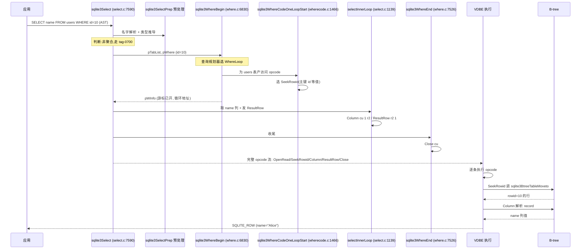
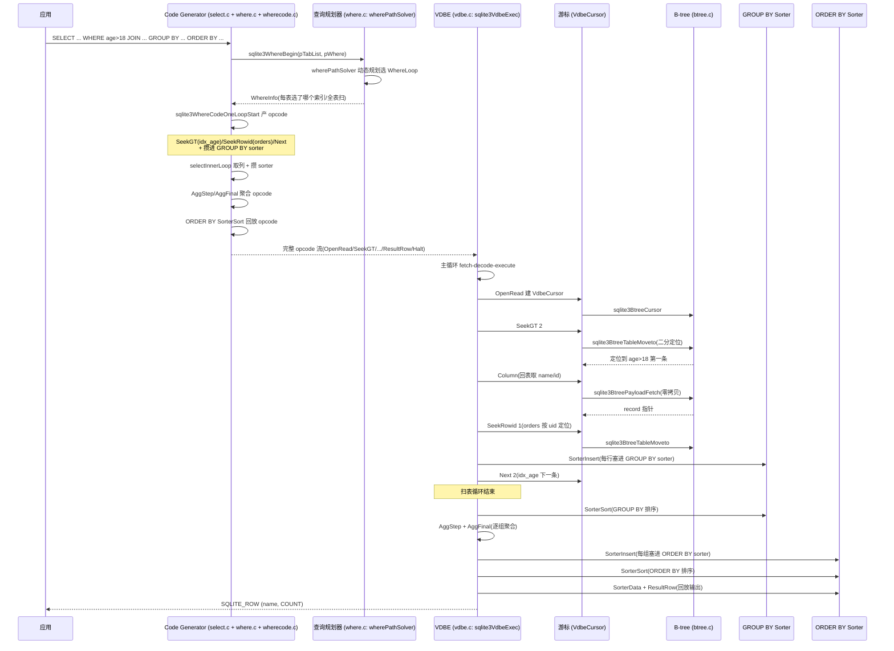

# 第 2 篇 · 第 7 章 · 一条 SELECT 怎么执行

> **核心问题**:前面三章,我们把 SELECT 的旅程拆成了一段段零件——P1-03 把 SQL 字符串切成 token、建成 AST;P1-04 讲了 code generator 的总入口和"为什么编译成字节码";P2-05 拆了 VDBE 这个虚拟机的心脏(`sqlite3VdbeExec` 的 fetch-decode-execute、`Mem` 寄存器、`VdbeCursor` 游标);P2-06 把单个 opcode(`OpenRead`/`Column`/`Next`/`ResultRow` 等)的语义拆透了。但零件齐了,不等於整车跑起来——一条**完整的** `SELECT u.name, COUNT(*) FROM users u JOIN orders o ON u.id=o.uid WHERE u.age>18 GROUP BY u.name ORDER BY COUNT(*) DESC` 在 SQLite 里到底是怎么从 AST 一路变成执行结果的?WHERE 是怎么变成"逐行判断"还是"索引直接定位"的 opcode 的?JOIN 的两层嵌套循环在 opcode 流里怎么编排?GROUP BY 和 ORDER BY 凭什么靠 `SorterOpen/SorterInsert/SorterSort` 这几个 opcode 就把分组和排序都搞定了?最关键的:**查询规划器凭什么决定这条 SELECT 用全表扫还是走索引**——它到底是个什么算法(动态规划,不是遗传,也不是机器学习)?这一章把整个第 1~2 篇的编译与执行半本书串成一条线,是"编译与执行"这一面的收尾招牌章。

> **读完本章你会明白**:
> 1. `sqlite3Select`(select.c:7590)这个 **1387 行的巨型 codegen 函数**是怎么把一棵 SELECT 的 AST 编排成 opcode 流的——它内部用 `if(!isAgg && pGroupBy==0){...}else{...}` 这一个巨型二分,把"普通查询"和"聚合查询"彻底分成两条 codegen 路径,每条路径都在三个固定位置调 `sqlite3WhereBegin` 把 WHERE 子句和表的访问编排交给查询规划器。
> 2. **WHERE 怎么变 opcode**:同一个 `WHERE age>18`,如果 `age` 列上没索引,就是 `Rewind → Column(age) → Le(GT) → 跳过 → Next` 的逐行顺序扫;如果 `age` 上有索引,就是 `SeekGE idxCur → IdxGT 端测试 → Next idxCur` 的索引扫——`wherecode.c:1852` 的 `aStartOp[]` 八行决策表决定到底是 `SeekGE` 还是 `SeekGT`。
> 3. **JOIN 的本质是嵌套循环**,SQLite 没有 hash join / merge join——`where.c:6751` 的头注释白纸黑字写着 `foreach row1 in t1 do foreach row2 in t2 do`,每张表一个 `WhereLevel`,外层 Rewind/Next 套内层 Rewind/Next,有索引时内层用 `SeekRowid`/`SeekGE` 直接按外层当前行的连接键定位。这是嵌入式简化,代价是三表无索引 JOIN 是 `O(N³)`。
> 4. **GROUP BY / ORDER BY / 聚合怎么变 opcode**:聚合是 `AggStep` + `AggFinal`(注意没有独立的 `AggInit`,初始化合并进了 `AggStep` 首次执行);排序统一走 `SorterOpen → SorterInsert → SorterSort → SorterData → SorterNext` 这个 sorter 序列,GROUP BY 和 ORDER BY 各开一个 sorter,若能用索引天然满足会被消解掉(关键优化)。
> 5. **查询规划器是自顶向下的动态规划**(System-R 风格),不是 Neo/遗传算法/机器学习——`wherePathSolver`(where.c:5836)用 `(rCost, nRow, rUnsort)` 三元代价向量做主控测试(dominance test)淘汰劣等路径,代价全用对数(LogEst,INT16)存储、相加即相乘避开浮点。这是 SQLite 区别於 MySQL/PG 优化器的简化取舍。

> **逃生阀(这章很长,一读觉得晕,先记住这五件事)**:
> ① 一条 SELECT 的 codegen 主入口是 `sqlite3Select`(select.c:7590),它的核心动作就三步——`sqlite3WhereBegin`(开始嵌套循环 + 选索引 + 产 WHERE 谓词 opcode)、`selectInnerLoop`(取列 + 发 `ResultRow`)、`sqlite3WhereEnd`(收尾、发 `Next` 闭合循环);② WHERE 走不走索引,由查询规划器在 `sqlite3WhereBegin` 里用动态规划选 WhereLoop 决定,产 opcode 在 `sqlite3WhereCodeOneLoopStart`(wherecode.c:1466);③ JOIN 永远是 nested loop,每张表一个 `WhereLevel`,外层套内层,有索引时内层用 `SeekRowid`/`SeekGE`;④ 聚合 = `AggStep`+`AggFinal`,排序 = `Sorter*` 序列,GROUP BY 和 ORDER BY 各一个 sorter;⑤ `EXPLAIN SELECT ...` 能直接看到一条 SQL 编译出的 opcode 流,这是验证你脑中模型的最快工具。记住这五点,后面每一节都是在展开它们。

---

## 〇、一句话点破

> **一条 SELECT 在 SQLite 里被编译成一条 opcode 流,这条流的核心骨架是"WHERE codegen 产出的若干层嵌套循环、循环体里取列输出、循环后聚合和排序收尾"——查询规划器在编译期用动态规划为每个表选一个访问路径(WhereLoop:全表扫还是某个索引),wherecode.c 按选中的路径产出 Rewind/Next(顺序扫)或 SeekGE/SeekRowid(索引扫)opcode,select.c 再把聚合和排序的 Sorter 序列编排在循环外。整条 opcode 流由 VDBE 逐条执行,执行时经游标从 B-tree 取数据。**

这是结论,不是理由。本章倒过来拆:先用一条最简单的 `SELECT name FROM users WHERE id=10` 跟一遍"AST → opcode → 执行"的全流程,把骨架立起来;然后逐个加难度——加 WHERE 谓词变成顺序扫、加索引变成索引扫、加 JOIN 变成嵌套循环、加 GROUP BY/聚合、加 ORDER BY 排序,每一步都看 codegen 怎么把对应的 opcode 编排进流里;接着拆本章最硬核的查询规划器(`wherePathSolver` 的动态规划 + WhereLoop 代价模型);最后用一个真实复杂 SELECT 的 EXPLAIN 把所有 opcode 串起来逐条讲,作为"编译与执行"半本书的收尾。

---

## 一、骨架:从最简单的 SELECT 跟起

在拆 WHERE/JOIN/聚合/排序之前,先把 SELECT codegen 的骨架立起来。骨架看一条最朴素的查询:

```sql
SELECT name FROM users WHERE id = 10;
```

这条查询走 P2-06 路径分析过——它会被编译成 `OpenRead → SeekRowid → Column → ResultRow → Close` 这串 opcode。现在的问题是:**谁产出这串 opcode?产出过程的代码长什么样?** 答案全在 `sqlite3Select` 里。

### `sqlite3Select`:SELECT 的 codegen 总编排

`sqlite3Select` 在 [select.c:7590](../sqlite/src/select.c#L7590) 定义,它是 SQLite 里最大的函数之一——**从 7590 行一直延伸到 8976 行,整整 1387 行**。函数签名:

```c
/* select.c:7590 */
int sqlite3Select(
  Parse *pParse,         /* The parser context */
  Select *p,             /* The SELECT statement being coded. */
  SelectDest *pDest      /* What to do with the query results */
){
```

三个参数:解析上下文 `pParse`(里面藏着 VDBE 程序构建器 `pParse->pVdbe`、符号表、错误状态)、要 codegen 的 SELECT 树 `p`(就是 Parser 产出的 AST 节点)、输出目的地 `pDest`(结果是直接 `ResultRow` 返回应用,还是塞进临时表 `SRT_EphemTab`,还是喂给另一个子查询 `SRT_Coroutine`——后者决定结果怎么"流"出去)。

1387 行的函数看起来很吓人,但作者在 [select.c:7556](../sqlite/src/select.c#L7556) 留了一份**带 tag 的大纲注释**,把这 1387 行拆成了 18 个阶段(tag-select-0100 到 tag-select-1000),每个 tag 在函数体里都有对应的 `/* tag-select-0XXX */` 注释标记,你可以照着 tag 跳读。这 18 个阶段大致分三类:

1. **预处理阶段**(tag-0100 到 tag-0500):名字解析(`sqlite3SelectPrep` 调 `sqlite3ResolveSelectNames` 把 `users.name` 这种符号绑到具体列)、子查询扁平化(`sqlite3FlattenSubquery` 把 `SELECT ... FROM (SELECT ...)` 这种子查询合并进外层)、常量传播(`propagateConstants` 把 `WHERE x=5 AND y=x+1` 化简成 `WHERE x=5 AND y=6`)、DISTINCT 改写成 GROUP BY 等。这些是**优化变换**,在产 opcode 之前把 AST 换成更便宜的形式。
2. **主 codegen 阶段**(tag-0600 到 tag-0900):这是产 opcode 的核心。它分两条主路径——**非聚合路径**(tag-0700,`if(!isAgg && pGroupBy==0)`)和**聚合路径**(tag-0800,`else`),每条路径都在固定位置调 `sqlite3WhereBegin` 把"WHERE 子句 + 表的访问编排"这摊事委托给 where.c。
3. **收尾阶段**(tag-0900 之后):ORDER BY 排序收尾(`generateSortTail`)、发结束 label、`return rc`。

这 18 个阶段里,**对理解 SELECT 全流程最关键的就是主 codegen 阶段那两条路径**。下面拆非聚合路径(聚合路径稍后讲)。

### 非聚合路径:三步走

`SELECT name FROM users WHERE id=10` 是非聚合查询(没有 `COUNT`/`SUM`,没有 GROUP BY),所以走 tag-0700 分支([select.c:8277](../sqlite/src/select.c#L8277))。这分支的核心是 [select.c:8292](../sqlite/src/select.c#L8292) 这一行:

```c
/* select.c:8290 */
/* Begin the database scan. */
pWInfo = sqlite3WhereBegin(pParse, pTabList, pWhere, sSort.pOrderBy,
                           p->pEList, p, wctrlFlags, p->nSelectRow);
if( pWInfo==0 ) goto select_end;
```

`sqlite3WhereBegin` 是 where.c 的总入口,它干三件事(下面几节细拆):① 给 FROM 子句里的每张表打开游标(`OpenRead`),产 WHERE 谓词的判断 opcode;② **用查询规划器为每张表选一个访问路径**(WhereLoop:全表扫还是走哪个索引),按选中的路径产 `Rewind/Next`(顺序扫)或 `SeekRowid/SeekGE`(索引扫);③ 编排多层嵌套循环(JOIN 时每张表一层)。它返回一个 `WhereInfo *pWInfo`,里面记录了"开了哪些游标、循环的入口和出口地址在哪、选了什么索引"等信息,供后续 codegen 用。

`sqlite3WhereBegin` 返回后,游标已经定位到"满足 WHERE 的某一行"上了。接下来 `selectInnerLoop` 处理"取这行的列、发结果"([select.c:8347](../sqlite/src/select.c#L8347) 调用):

```c
/* select.c:8347 */
selectInnerLoop(pParse, p, -1, sSort.addrSortIndex, &sDistinct, pDest,
                iEnd, wctrlFlags);
```

`selectInnerLoop`(定义在 [select.c:1139](../sqlite/src/select.c#L1139))是最内层循环体——它产 `Column`(取列到寄存器)+ `ResultRow`(把寄存器当一行返回应用)的 opcode。`-1` 表示"不指定具体表"(单表时),`sSort.addrSortIndex` 是排序临时表的地址(无 ORDER BY 时是 -1),`pDest` 决定结果是直接返回还是塞临时表。

最后 `sqlite3WhereEnd`([select.c:8354](../sqlite/src/select.c#L8354))收尾——它发 `Next`/`Prev` opcode 闭合每一层循环,发 `Close` 关闭游标。

> **钉死这件事**:一条非聚合 SELECT 的 codegen,核心就这三步——`sqlite3WhereBegin`(开始嵌套循环 + 选索引 + 产 WHERE 谓词 opcode)、`selectInnerLoop`(取列 + 发 `ResultRow`)、`sqlite3WhereEnd`(发 `Next` 闭合循环 + 关游标)。整条 SELECT 的 opcode 流,就是这三步产出的 opcode 拼起来的。`sqlite3Select` 那 1387 行的庞大函数,主要工作量都在"预处理优化"和"判断走哪条 codegen 路径"上,真正产 opcode 的代码就这三段。

### 跟一遍:这条 SELECT 的完整旅程

把这条 `SELECT name FROM users WHERE id=10` 在 SQLite 内部的完整旅程画出来:



整条旅程分**编译期**(应用 → SEL → PRE → WH → WC → IL → WE → opcode 流)和**执行期**(VDBE 执行 opcode → 经游标调 B-tree → 返回行)两大段。**编译期产出 opcode 流,执行期执行 opcode 流**——这是 SQLite "编译成字节码 + 虚拟机执行" 的根本(承《Lua》VM,P2-05 拆透了执行侧的 `sqlite3VdbeExec` 主循环)。本章重点是**编译期怎么产 opcode 流**,以及 opcode 流长什么样。

到这里骨架立起来了。接下来逐个加难度:先加 WHERE 谓词(看 WHERE 怎么变 opcode),再加 JOIN(看嵌套循环),再加聚合和排序。

---

## 二、WHERE 怎么变 opcode:顺序扫 vs 索引扫

WHERE 子句是 SELECT 里最容易让新手困惑的部分——同样是 `WHERE age>18`,为什么有时候 SQLite 编译出"逐行扫"的 opcode,有时候又编译出"直接定位"的 opcode?这背后的核心是 **WHERE codegen 的两条路径:顺序扫(full table scan)和索引扫(index scan)**。这是查询规划器最常做的决策,也是 SQLite 性能优化最关键的一步。

### 先看顺序扫:WHERE 怎么变成"逐行判断"

假设 `users` 表上没有 `age` 列的索引,执行 `SELECT name FROM users WHERE age>18`。查询规划器一看没有可用索引,只能选**全表扫**这条 WhereLoop。这条 WhereLoop 在 `sqlite3WhereCodeOneLoopStart`(wherecode.c:1466)里走 "Case 6"(全表扫的分支),产出这样的 opcode([wherecode.c:2572](../sqlite/src/wherecode.c#L2572)):

```c
/* wherecode.c:2572 */
static const u8 aStep[]  = { OP_Next, OP_Prev };
static const u8 aStart[] = { OP_Rewind, OP_Last };
...
pLevel->op = aStep[bRev];              /* 循环步进 opcode */
pLevel->p1 = iCur;                     /* 游标号 */
pLevel->p2 = 1 + sqlite3VdbeAddOp2(v, aStart[bRev], iCur, pLevel->addrHalt);
                                       /* 起始 opcode: Rewind 或 Last */
```

注意这个 `aStep`/`aStart` 数组——它就两行,`OP_Next`/`OP_Prev`(步进)和 `OP_Rewind`/`OP_Last`(定位到首/末)。`bRev` 决定正扫还是反扫(`ORDER BY ... DESC` 可能要反扫)。`pLevel->op/p1/p2` 记下来,真正发 `Next` 的代码在 `sqlite3WhereEnd`([where.c:7600](../sqlite/src/where.c#L7600)):

```c
/* where.c:7600 */
if( pLevel->op!=OP_Noop ){
  sqlite3VdbeAddOp3(v, pLevel->op, pLevel->p1, pLevel->p2, pLevel->p3);
  sqlite3VdbeChangeP5(v, pLevel->p5);
  ...
}
```

所以一条全表扫的 opcode 模式长这样(P2-05 末尾画过):

```
addr  opcode      p1  p2  p3    注释
----  ----------  --  --  --    ------------------------
0     OpenRead    0   2   0     游标 0 ← users(根页 2)
1     Rewind      0   8   0     到第一条;空表跳 8        ┐
2     Column      0   0   1     寄存器 1 ← age            │ 循环体
3     Le          2   1   6     寄存器2(=18) >= 寄存器1 → 跳 6(跳过这行)
4     Column      0   1   3     寄存器 3 ← name           │ (age>18 的行)
5     ResultRow   3   1   0     发结果行                   │
6     Next        0   2   0     下一条;有数据跳回 2       ┘
7     Close       0   0   0     关游标
8     Halt        0   0   0     (空表/循环结束都到这)
```

这里关键看 `Rewind`(定位第一条)+ 循环体(WHERE 谓词判断 + 取列 + 发结果)+ `Next`(下一条,有数据跳回循环体)这套模式。`Column` 取 `age` 列,`Le`(less-than-or-equal 的反向)判断 `18 >= age`,成立就跳到 `Next`(跳过这行,因为不满足 `age>18`);不成立就 fall-through 到取 `name` 和 `ResultRow`。**WHERE 谓词的判断,是 codegen 在循环体开头插了一堆比较 opcode**——这是顺序扫的本质。

> **不这样会怎样**:如果 `users` 表有 1000 万行,`age>18` 满足的只有 100 行,顺序扫要把 1000 万行都过一遍、每行做一次 `Column + Le` 比较,绝大部分比较结果是"跳过"。这个 `O(N)` 全表扫的代价,在满足率很低的查询上是巨大的浪费——1000 万行里 9999900 行白扫了。这就是为什么需要索引。

### 加索引:WHERE 怎么变成"直接定位"

现在给 `age` 列建索引:`CREATE INDEX idx_age ON users(age)`。再执行 `SELECT name FROM users WHERE age>18`,查询规划器一看有 `idx_age`,就会选**索引扫**这条 WhereLoop。索引扫的产出在 [wherecode.c:1852](../sqlite/src/wherecode.c#L1852):

```c
/* wherecode.c:1852 */
static const u8 aStartOp[] = {
  0,
  0,
  OP_Rewind,  /* 2: 无起始约束 + startEq + 正向  → 顺序扫索引 */
  OP_Last,    /* 3: 无起始约束 + startEq + 反向 */
  OP_SeekGT,  /* 4: 有起始约束 + !startEq + 正向  → x > val */
  OP_SeekLT,  /* 5: 有起始约束 + !startEq + 反向 */
  OP_SeekGE,  /* 6: 有起始约束 +  startEq + 正向  → x >= val */
  OP_SeekLE   /* 7: 有起始约束 +  startEq + 反向 */
};
```

这张 `aStartOp[8]` 表是索引扫的核心决策表。它用 `(start_constraints<<2)+(startEq<<1)+bRev` 这三个 bit 索引出起始 opcode:

- `start_constraints`(有没有起始约束):WHERE `age>18` 是有起始约束的(18 是起始值),bit=1;WHERE `age IS NOT NULL` 没有起始约束,bit=0。
- `startEq`(起始约束是 `>` 还是 `>=`):`age>=18` 是 startEq=1,`age>18` 是 startEq=0。
- `bRev`(正扫还是反扫):正扫=0,反扫(`ORDER BY age DESC`)=1。

`age>18` 是 `(1<<2)+(0<<1)+0 = 4`,选 `OP_SeekGT`(seek to greater-than)。这条 opcode 在索引游标上二分定位到第一个 `age>18` 的位置,然后从这里往后扫。具体发出在 [wherecode.c:2062](../sqlite/src/wherecode.c#L2062):

```c
/* wherecode.c:2062 */
if( pLoop->wsFlags & WHERE_TOP_LIMIT ){
  op = aEndOp[(pRangeEnd->wtFlags & TERM_TOP_LIMIT)!=0];
  sqlite3VdbeAddOp4Int(v, op, iIdxCur, addrNxt, regBase, nConstraint);
}
```

(范围右端的 `IdxGT`/`IdxGE` 终止测试,在 `addrNxt` 跳出循环)

加索引后的 opcode 模式长这样:

```
addr  opcode      p1  p2  p3    注释
----  ----------  --  --  --    ------------------------
0     OpenRead    0   2   0     游标 0 ← users(根页 2)
1     OpenRead    1   8   0     游标 1 ← idx_age(根页 8)
2     Integer     18  1   0     寄存器 1 ← 18
3     SeekGT      1   7   1     索引游标 1 定位到 age>18 第一条 ┐
4     Column      1   0   2     寄存器 2 ← idx_age 的 rowid      │
5     SeekRowid   0   7   2     表游标 0 按 rowid 回表            │ 循环体
6     Column      0   1   3     寄存器 3 ← name                  │
7     ResultRow   3   1   0     发结果行                          │
8     Next        1   4   0     索引游标 1 下一条;有数据跳回 4   ┘
9     Close       0   0   0
10    Close       1   0   0
11    Halt
```

注意几个关键点:

1. **两个游标**:游标 0 是表游标(`users` 表 B-tree),游标 1 是索引游标(`idx_age` 索引 B-tree)。索引扫实际是**在索引游标上 Rewind/Next,每拿到一条索引项的 rowid,再 SeekRowid 回表取数据**。
2. **`SeekGT` 直接定位**:`SeekGT 1 7 1` 让索引游标 1 二分定位到第一个 `age>18` 的位置——这是 `O(log N)` 而不是 `O(N)`,1000 万行的表也只需 20 多次 B-tree 下降。
3. **`Next` 跑在索引游标上**:`Next 1 4 0` 是索引游标 1 步进,不是表游标。表游标只用来 SeekRowid 回表。
4. **覆盖索引(covering index)优化**:如果 `SELECT age FROM users WHERE age>18`(`age` 在 `idx_age` 里就有,不用回表),SQLite 会跳过 `SeekRowid` 回表,直接从索引游标取 `age` 列——这叫**覆盖索引**,省一次回表,查询规划器选 WhereLoop 时会优先选覆盖索引(代价更低)。

### 顺序扫 vs 索引扫:opcode 对照

把两种扫法的 opcode 流并排对照,差异一目了然:

| 步骤 | 顺序扫(无索引) | 索引扫(有 `idx_age`) |
|------|----------------|----------------------|
| 打开 | `OpenRead cu 表根页` | `OpenRead cu 表根页` + `OpenRead icu 索引根页`(两个游标) |
| 起始 | `Rewind cu addrHalt`(定位第一条) | `SeekGE/SeekGT icu addrNxt regKey`(按 key 二分定位) |
| WHERE 谓词 | `Column cu age r1` + `Le r2 r1 addrSkip`(逐行判断) | (无,SeekGE 已经满足谓词) |
| 取列 | `Column cu name r3`(直接从表游标) | `Column icu rowid r2` + `SeekRowid cu addrNext r2` + `Column cu name r3`(回表) |
| 发结果 | `ResultRow r3 1` | `ResultRow r3 1` |
| 步进 | `Next cu addrLoop`(表游标) | `Next icu addrLoop`(索引游标) |
| 关闭 | `Close cu` | `Close cu` + `Close icu` |

> **钉死这件事**:同一个 `WHERE age>18`,在没索引时编译成 `Rewind + Column + Le + Next` 的顺序扫(逐行判断,`O(N)`),在有索引时编译成 `SeekGE + (Column + SeekRowid + Column) + Next` 的索引扫(直接定位,`O(log N + K)`,K 是结果数)。**走不走索引,完全是查询规划器在编译期决定的**——它选哪条 WhereLoop,wherecode.c 就按那条 WhereLoop 产对应的 opcode。下面技巧精解会拆规划器怎么选。

### 主键等值的特例:`SeekRowid`

上面两个例子都是范围扫(`age>18`)。还有一种非常重要的特例——**主键/rowid 等值查询**:`WHERE id=10`。这种查询有一个比 `SeekGE` 更直接的 opcode:`SeekRowid`。

`SeekRowid` 在 [wherecode.c:1709](../sqlite/src/wherecode.c#L1709) 产出:

```c
/* wherecode.c:1709 */
sqlite3VdbeAddOp3(v, OP_SeekRowid, iCur, addrNxt, iRowidReg);
```

`SeekRowid` 在表游标上直接按 rowid 二分定位(因为表 B-tree 就是按 rowid 排的,P3-08 会拆),`O(log N)` 一次定位到行。它的 opcode 流就是我们一开始那个最简例子:

```
0  OpenRead   0  2  0
1  Integer    10 1  0
2  SeekRowid  0  3  1     # 按 rowid=10 定位
3  Column     0  1  2     # 取 name
4  ResultRow  2  1  0
5  Close      0  0  0
6  Halt
```

注意没有 `Rewind`/`Next` 循环——因为等值查询最多一行结果,定位完直接取列发结果就行。这是为什么 `SELECT name FROM users WHERE id=10` 这种主键查询这么快的原因:**一条 `SeekRowid` opcode 就把活干了,根本不需要循环**。

---

## 三、JOIN 怎么变嵌套循环 opcode

WHERE 讲完了,现在加难度——JOIN。`SELECT u.name, o.amount FROM users u JOIN orders o ON u.id=o.uid WHERE u.age>18` 这种 JOIN,SQLite 怎么编译?

### SQLite 的 JOIN 永远是嵌套循环(没有 hash join)

这是 SQLite 区别于 MySQL/PG 的一个重要简化。**SQLite 的 JOIN 算法只有嵌套循环(nested loop join),没有 hash join,也没有 merge join**。这不是我的判断,是 SQLite 源码注释白纸黑字写明的——[where.c:6751](../sqlite/src/where.c#L6751) 的 `sqlite3WhereBegin` 头注释:

```c
/* where.c:6751 */
** The basic idea is to do a nested loop, one loop for each table in
** the FROM clause of a select.  (INSERT and UPDATE statements are the
** same as a SELECT with only a single table in the FROM clause.)  For
** example, if the SQL is this:
**
**       SELECT * FROM t1, t2, t3 WHERE ...;
**
** Then the code generated is conceptually like the following:
**
**      foreach row1 in t1 do       \    Code generated
**        foreach row2 in t2 do      |-- by sqlite3WhereBegin()
**          foreach row3 in t3 do   /
**            ...
**          end                     \    Code generated
**        end                        |-- by sqlite3WhereEnd()
**      end                         /
...
** If the tables have indices and there are terms in the WHERE clause that
** refer to those indices, a complete table scan can be avoided and the
** code will run much faster.  ... a three-way join is an O(N^3) operation.
** But if the tables have indices ... the code will run much faster.
```

这段注释把 SQLite JOIN 的本质讲透了:**N 张表 JOIN 就是 N 层嵌套 foreach 循环**。三张表无索引 JOIN 是 `O(N³)`——这是嵌套循环的代价。但如果有索引,**内层循环可以用索引的 `SeekRowid`/`SeekGE` 直接定位**,把 `O(N)` 的内层扫变成 `O(log N)` 的定位,总代价从 `O(N³)` 降到接近 `O(N²log N)` 甚至更好。

> **不这样会怎样**:MySQL/PG 有 hash join 和 merge join,能在无索引的大表 JOIN 上做到 `O(N)` 或 `O(N log N)`(hash join 建一张 hash 表,merge join 利用两边都排序)。SQLite 为什么不做?**因为 SQLite 是嵌入式数据库,典型场景是小数据量、有索引、内存敏感**——hash join 要建临时 hash 表(吃内存),merge join 要排序(吃 CPU 和临时存储),对嵌入式场景过度设计。SQLite 选择"只做 nested loop + 鼓励建索引"这条简单路径,用代码简洁换执行模型统一。代价是大数据量无索引 JOIN 时性能远不如 MySQL/PG,但 SQLite 的目标场景本来就不该这么用。**这是嵌入式简化的典型取舍**。

### 嵌套循环在 codegen 里怎么编排

每张 FROM 表对应一个 `WhereLevel`(`whereInt.h:73`),层数 = 表数。`sqlite3WhereBegin` 在 [where.c:7438](../sqlite/src/where.c#L7438) 用一个循环为每张表调 `sqlite3WhereCodeOneLoopStart`:

```c
/* where.c:7438 */
for(ii=0; ii<nTabList; ii++){           /* 每个表 = 一个嵌套层 */
  ...
  pLevel = &pWInfo->a[ii];              /* WhereLevel 数组,一个表一项 */
  ...
  notReady = sqlite3WhereCodeOneLoopStart(pParse,v,pWInfo,ii,pLevel,notReady);
}
```

`sqlite3WhereCodeOneLoopStart`(wherecode.c:1466)按这张表选中的 WhereLoop 产 opcode——外层表的 Rewind/Next(或 SeekGE)是循环的开头和结尾,内层表的 Rewind/Next 嵌在中间。

举个例子,`SELECT u.name, o.amount FROM users u JOIN orders o ON u.id=o.uid WHERE u.age>18`,假设 `users.age` 有索引、`orders.uid` 有索引。codegen 产出的 opcode 模式(简化):

```
addr  opcode       p1  p2  p3   注释
----  -----------  --  --  --   ------------------------
0     OpenRead     0   2   0    游标 0 ← users
1     OpenRead     1   5   0    游标 1 ← orders
2     OpenRead     2   8   0    游标 2 ← idx_age(可选,若用索引扫 age)
3     Integer      18  1   0    寄存器 1 ← 18
4     SeekGT       2   16  1    外层循环开头:idx_age 定位 age>18 第一条 ┐ 外层
5     Column       2   0   2    寄存器 2 ← idx_age 的 rowid(=u.id)     │ users
6     SeekRowid    0   16  2    回表 users 取行                          │ 循环
7     Column       0   2   3    寄存器 3 ← u.name                        │
8     Column       0   0   4    寄存器 4 ← u.id                          ┘
                                       ┐
9     SeekRowid    1   14  4    内层:orders 按 uid=u.id 定位  ┐         │
10    Column       1   2   5    寄存器 5 ← o.amount           │ 内层    │ 循环体
11    ResultRow    3   3   0    发结果行(u.name, o.amount)   │ orders │
12    Next         1   9   0    内层:orders 下一条(uid 相同) │         │
13    Goto         0   14  0    (内层结束)                    ┘         │
14    Next         2   5   0    外层:idx_age 下一条,跳回 5              ┘
15    Close        0   0   0
16    Close        1   0   0
17    Halt
```

注意这个结构——**两层嵌套**:外层 `SeekGT 2 → ... → Next 2`(在 `idx_age` 索引游标上扫),内层 `SeekRowid 1 → Column → ResultRow → Next 1`(在 `orders` 表游标上扫)。外层的每行(`u.id`),用 `SeekRowid 1 ... 4` 让内层 orders 游标按 `uid=u.id` 直接定位——这是**索引嵌套循环**(indexed nested loop join),内层不用全表扫 orders,直接按连接键 `uid` 走索引定位。

`sqlite3WhereEnd` 收尾时,会**按外层到内层的逆序**发 `Next`/`Prev` 闭合每一层([where.c:7600](../sqlite/src/where.c#L7600)):

```c
/* where.c:7590 附近 */
for(ii=pWInfo->nLevel-1; ii>=0; ii--){      /* 从最内层往外发 Next */
  pLevel = &pWInfo->a[ii];
  ...
  if( pLevel->op!=OP_Noop ){
    sqlite3VdbeAddOp3(v, pLevel->op, pLevel->p1, pLevel->p2, pLevel->p3);
    ...
  }
}
```

为什么逆序?因为嵌套循环是"后开的先关"——外层循环是最先 Rewind 的,但要等所有内层循环结束才能 Next 外层(内层每跑完一轮,外层才前进一步)。所以发 Next 是从最内层往外逐层发,每层的 `Next p2` 跳回到该层循环体的开头。

### JOIN 顺序的选择:查询规划器的工作

这里有个微妙问题:`FROM users u JOIN orders o`,代码是 `users` 外、`orders` 内,还是反过来?**这个顺序由查询规划器决定**。规划器在编译期评估各种 JOIN 顺序的代价,选代价最低的。比如 `users` 有 100 行、`orders` 有 1000 万行,如果 `orders.uid` 有索引,规划器可能选 `users` 外、`orders` 内(外层小表,内层用索引定位,总代价 `O(100 × log 10000000)`);如果都没索引,可能选 `orders` 外、`users` 内(取决于代价估算)。

这个"JOIN 顺序选择"是查询规划器最核心的工作之一,下面技巧精解会拆规划器怎么用动态规划算出最优顺序。

> **钉死这件事**:SQLite 的 JOIN **永远是嵌套循环**——`where.c:6751` 的注释明确说 `foreach row1 in t1 do foreach row2 in t2 do`。N 张表 JOIN 是 N 层 foreach 嵌套,每张表一个 `WhereLevel`。有索引时内层用 `SeekRowid`/`SeekGE` 直接按连接键定位(索引嵌套循环),无索引时内层全表扫(代价 `O(N³)`)。SQLite 没有 hash join / merge join——这是嵌入式简化,用代码简洁换执行模型统一。**JOIN 顺序由查询规划器在编译期用动态规划决定**。

---

## 四、GROUP BY / 聚合 / ORDER BY 怎么变 opcode

WHERE 和 JOIN 讲完了,现在加上 GROUP BY、聚合函数(COUNT/SUM/AVG)和 ORDER BY。这三个是 SELECT 里最容易让人蒙圈的——"分组"和"排序"在 SQL 里听起来很高级,在 opcode 层面是怎么实现的?

### 聚合函数:AggStep + AggFinal(注意没有 AggInit)

聚合函数(`COUNT`/`SUM`/`AVG`/`MAX`/`MIN`)在 opcode 层面是**两步**:`AggStep`(累加一行)+ `AggFinal`(收尾算出最终值)。这两个 opcode 在 `vdbe.c` 里([vdbe.c:7899](../sqlite/src/vdbe.c#L7899) 附近):

```c
/* vdbe.c:7899 */
case OP_AggStep: {
  ...
  /* 首次执行时,把 p4 的 FuncDef 转成 sqlite3_context(惰性初始化) */
  ...
}
case OP_AggStep1: {   /* AggStep 首次执行后自改成 AggStep1,跳过初始化 */
  ...
}
...
case OP_AggValue:        /* out2 */
case OP_AggFinal: {      /* 把累加器 finalize 成最终值 */
  ...
  sqlite3VdbeMemFinalize(pMem, pCtx);   /* 调 COUNT 的 xFinal */
  ...
}
```

注意一个**容易讲错的点**(很多资料错)——**没有独立的 `OP_AggInit` opcode**。聚合函数的初始化(分配 `sqlite3_context`、设累加器初值)是**合并进了 `AggStep` 的首次执行**——`AggStep` 第一次执行时,把 p4 里的 `FuncDef`(函数定义)实例化成 `sqlite3_context`(聚合上下文,带累加器),然后把自己的 opcode 改写成 `AggStep1`(`vdbe.c:7938` 附近),后续执行直接走 `AggStep1` 跳过初始化。这是 SQLite "自改 opcode 缓存一次性准备工作"的又一例子(P2-05 讲 `OP_String8 → OP_String` 也是这个套路)。

`AggStep`/`AggFinal` 在 select.c 里发出([select.c:6942](../sqlite/src/select.c#L6942) 和 [select.c:6786](../sqlite/src/select.c#L6786)):

```c
/* select.c:6942(简化)*/
sqlite3VdbeAddOp3(v, OP_AggStep, 0, regAgg, AggInfoFuncReg(pAggInfo,i));
/* p4 = 聚合函数的 FuncDef(COUNT 的 xStep 等) */

/* select.c:6786(简化) */
sqlite3VdbeAddOp2(v, OP_AggFinal, AggInfoFuncReg(pAggInfo,i), pList?pList->nExpr:0);
```

### GROUP BY:用 sorter 把行按组排好

有 GROUP BY 的查询,走的是 `sqlite3Select` 的 tag-0800 聚合分支([select.c:8356](../sqlite/src/select.c#L8356))。这个分支的关键问题是:**怎么把同一组的行凑到一起**?

朴素做法是"边扫边维护一个 hash 表,key 是 GROUP BY 列,value 是累加器"——这是 MySQL 的做法。**SQLite 不维护 hash 表,它的做法是"先按 GROUP BY 列排序,排序后同一组的行天然连续,然后顺序扫描时检测组边界"**。

为什么 SQLite 选排序而不是 hash?两个原因:① 嵌入式场景,内存敏感,hash 表吃内存,排序用 sorter(归并排序,内存不够能落盘)更稳;② SQLite 已经为 ORDER BY 实现了 sorter,复用同一套代码。

排序的逻辑在 [select.c:8503](../sqlite/src/select.c#L8503):

```c
/* select.c:8503 */
sqlite3VdbeAddOp4(v, OP_SorterOpen, pAggInfo->sortingIdx, nExpr, ...);
/* p4 = KeyInfo(按 GROUP BY 列的排序规则) */
```

然后扫表时,每行 `MakeRecord + SorterInsert` 进 GROUP BY sorter([select.c:8594](../sqlite/src/select.c#L8594));扫完表后 `SorterSort` 排序([select.c:8605](../sqlite/src/select.c#L8605)),再用 `SorterData` 逐行取回([select.c:8650](../sqlite/src/select.c#L8650))。组边界检测靠"比较当前行的 GROUP BY 列和上一行"——变化了就是新组开始。

**关键优化**:如果 GROUP BY 列上有索引,且索引的顺序和 GROUP BY 一致,SQLite **可以跳过排序**——直接按索引顺序扫,行天然按组有序。这个判断在 [select.c:8545](../sqlite/src/select.c#L8545):

```c
/* select.c:8545 */
groupBySort = sqlite3WhereIsOrdered(pWInfo)==pGroupBy->nExpr;
/* sqlite3WhereIsOrdered 返回 where 优化器认定的天然有序的 GROUP BY 列数;
   如果等于 pGroupBy->nExpr(全部 GROUP BY 列都天然有序),groupBySort=0 跳过排序 */
```

`groupBySort=0` 时,`SorterOpen`/`SorterInsert`/`SorterSort` 这几个 opcode 都不发了,直接按索引顺序扫表 + 边扫边聚合。这是索引对 GROUP BY 的加速——和索引对 WHERE 的加速是同一回事(都靠"索引天然有序")。

### ORDER BY:sorter 序列(和 GROUP BY 同一套 opcode)

ORDER BY 的排序,和 GROUP BY 的排序用的是**同一套 sorter opcode**,只是 KeyInfo 不同(ORDER BY 按 ORDER BY 列排,GROUP BY 按 GROUP BY 列排)。ORDER BY 的 sorter 在 [select.c:8258](../sqlite/src/select.c#L8258) 建立:

```c
/* select.c:8258 */
if( p->selFlags & SF_UsesEphemeral ){
  ...
}else{
  sSort.addrSortIndex = sqlite3VdbeAddOp4(v, OP_OpenEphemeral, ...);
  /* 默认先发 OpenEphemeral(临时表) */
  if( !p->selFlags & SF_MultiValue ){
    sqlite3VdbeChangeP5(v, BTREE_SORTER);  /* 标记可改用 sorter */
  }
}
```

实际上,如果没 LIMIT,SQLite 会把这个 `OpenEphemeral` **改写成 `SorterOpen`**([select.c:8259](../sqlite/src/select.c#L8259) 附近,`SORTFLAG_UseSorter` 标志),用 `VdbeSorter`(归并排序,内存不够落盘)代替临时表——sorter 比 ephemeral 表更适合纯排序场景(不需要随机访问,只需要顺序输出)。

ORDER BY 的完整 sorter 序列:

```
SorterOpen obCur nKey          # 开 ORDER BY sorter
... 扫表循环 ...
  MakeRecord regBase nKey regRec
  SorterInsert obCur regRec    # 每行塞进 sorter
... 循环结束 ...
SorterSort obCur addrEnd       # 排序 + 定位到第一条
SorterData obCur regOut pseudoCur  # 取出排序后的行
... 输出 ...
SorterNext obCur addrLoop      # 下一条
```

这个序列的关键 opcode 都在 `vdbe.c` 里:`OP_SorterOpen`([vdbe.c:4668](../sqlite/src/vdbe.c#L4668))、`OP_SorterInsert`([vdbe.c:6642](../sqlite/src/vdbe.c#L6642))、`OP_SorterSort`([vdbe.c:6382](../sqlite/src/vdbe.c#L6382))、`OP_SorterData`([vdbe.c:6097](../sqlite/src/vdbe.c#L6097))、`OP_SorterNext`([vdbe.c:6522](../sqlite/src/vdbe.c#L6522))。注意 `OP_SorterSort` 和 `OP_Sort` 在 `vdbe.c:6382-6391` 是 **fall-through 共用 case**——两者几乎一样,只是 `OP_Sort` 会自增一个测试计数器 `sqlite3_sort_count`。

**回放排序结果**的代码在 `generateSortTail`([select.c:1673](../sqlite/src/select.c#L1673)),它发 `SorterSort + SorterData + (Column...) + ResultRow + SorterNext` 这个回放循环。注意一个细节:回放时用一个**伪游标**(`OP_OpenPseudo`,[select.c:1755](../sqlite/src/select.c#L1755))——伪游标不指向 B-tree,它的"当前行"是从 sorter 取出来存在寄存器里的一整条 record,`Column` 从这个寄存器 record 里取列。这是 SQLite 处理"排序后的行不需要回 B-tree"的巧妙设计。

### GROUP BY + ORDER BY 同时存在:两个 sorter

如果 `GROUP BY name ORDER BY COUNT(*) DESC`,GROUP BY 一个 sorter、ORDER BY 一个 sorter——**两个独立的 sorter**。GROUP BY 的 sorter 先把行按 `name` 排好,聚合出每组一个 `(name, COUNT(*))`,然后这些聚合结果再塞进 ORDER BY 的 sorter 按 `COUNT(*) DESC` 排,最后回放。

但 SQLite 有个关键优化([select.c:8636](../sqlite/src/select.c#L8636) 附近,`orderByGrp` 标志):如果 GROUP BY 和 ORDER BY 能用同一个索引同时满足(比如 `GROUP BY name` 和 `ORDER BY name` 是同一个顺序),SQLite 会**消解掉多余的 sorter**——`sSort.pOrderBy=0`([select.c:8310](../sqlite/src/select.c#L8310)),ORDER BY 部分不发任何 sorter opcode。这是规划器"用索引同时满足分组和排序"的优化。

> **钉死这件事**:GROUP BY 和 ORDER BY 在 opcode 层面都是**同一套 sorter 序列**(`SorterOpen → SorterInsert → SorterSort → SorterData → SorterNext`),只是 KeyInfo 不同。聚合是 `AggStep`(累加)+ `AggFinal`(收尾)两步,**没有独立的 `AggInit`**——初始化合并进了 `AggStep` 首次执行(自改 opcode 优化)。GROUP BY 和 ORDER BY 各开一个 sorter,但如果能用索引同时满足会被消解掉(`groupBySort=0` 或 `sSort.pOrderBy=0`)。**这是 SQLite 用"排序代替 hash"做分组的简化取舍**——嵌入式内存敏感,sorter(归并排序,能落盘)比 hash 表稳。

---

## 五、把它们组装起来:一条复杂 SELECT 的 EXPLAIN

前三节分别讲了 WHERE、JOIN、GROUP BY/聚合/ORDER BY。现在把它们组装起来,看一条**完整的复杂 SELECT** 的 opcode 流。这是本章的高潮,也是"编译与执行"半本书的收尾——你将看到前面 P1-03(Parser)、P1-04(codegen)、P2-05(VDBE)、P2-06(opcode)的所有概念,在一条真实查询里如何协同。

用这条查询(任务里给的招牌例子):

```sql
SELECT u.name, COUNT(*)
FROM users u JOIN orders o ON u.id = o.uid
WHERE u.age > 18
GROUP BY u.name
ORDER BY COUNT(*) DESC;
```

假设 `users.age` 有索引、`orders.uid` 有索引。SQLite 编译出的 opcode 流(简化展示,基于 codegen 路径推导,每个 opcode 都能在 select.c/wherecode.c 找到对应发出点):

```
addr  opcode         p1  p2  p3    注释
----  -------------  --  --  --    -----------------------------------------
 0    OpenRead       0   2   0     游标 0 ← users 表
 1    OpenRead       1   5   0     游标 1 ← orders 表
 2    OpenRead       2   8   0     游标 2 ← idx_age(若规划器选索引扫 age)
 3    Null           0   1   2     寄存器 1,2 ← NULL(聚合累加器初始化)
 4    Integer        0   3   0     寄存器 3 ← 0(GROUP BY 组计数)
 5    SorterOpen     4   2   0     GROUP BY sorter(按 name 排)
 6    Integer        18  5   0     寄存器 5 ← 18                          ┐ 外层
 7    SeekGT         2  22   5     idx_age 定位 age>18 第一条              │ users
 8    Column         2   0   6     寄存器 6 ← idx_age 的 rowid(=u.id)     │ 循环
 9    SeekRowid      0  22   6     回表 users                              │ (WHERE
10    Column         0   0   7     寄存器 7 ← u.id                         │  age>18)
11    Column         0   1   8     寄存器 8 ← u.name                       ┘
                                        ┐ 内层
12    SeekRowid      1  19   7     orders 按 uid=u.id 定位                 │ orders
13    Column         1   2   9     寄存器 9 ← o.amount(本例不用,示意)    │ 循环
                                        ┘
14    MakeRecord     8   1  10     把 u.name 打成 record                  ┐ 攒进
15    SorterInsert   4  10   0     塞进 GROUP BY sorter                    ┘ sorter
16    Next           2   8   0     外层 idx_age 下一条;有数据跳回 8      (内层/外层闭合)
17    Next           1  13   0     内层 orders 下一条(同 uid);有数据跳 13
18    SorterSort     4  20   0     GROUP BY sort + 定位第一条             ┐ 聚合
19    SorterData      4  11  12     取出当前组的 name(到伪游标 12)        │ 回放
20    Compare        11  13   1     和上一组 name 比较                     │
21    Jump          22  22  23      组变化 → 跳 23 finalize 旧组           │
22    AggStep        0  14  cnt     COUNT 累加(P4=COUNT 的 FuncDef)       │
23    Next           4  19   0     GROUP BY sorter 下一条                 ┘
24    AggFinal      cnt   0   0     finalize 最后一个组的 COUNT
                                        ┐ ORDER BY
25    SorterOpen    15   2   0     ORDER BY sorter(按 COUNT DESC)        │
26    MakeRecord    14   1  16     打 (name, COUNT) 成 record              │
27    SorterInsert  15  16   0     塞进 ORDER BY sorter                    │
28    SorterSort    15  31   0     ORDER BY sort + 定位第一条             │
29    SorterData    15  17  18     取出排序后的一行(到伪游标 18)         │
30    Column        18   0  19     寄存器 19 ← name                        │
31    Column        18   1  20     寄存器 20 ← COUNT                       │
32    ResultRow     19   2   0     发结果行                                │
33    SorterNext    15  29   0     ORDER BY sorter 下一条                  ┘
34    Close          0   0   0
35    Close          1   0   0
36    Close          2   0   0
37    Halt           0   0   0
```

(注:上面是据 codegen 路径推导的示意,真实 EXPLAIN 的地址和寄存器号会不同,但 opcode 序列的结构和协作关系是真实的。每个 opcode 的发出点都能在 select.c/wherecode.c/vdbe.c 找到。)

### 这串 opcode 怎么协作完成 JOIN→WHERE→聚合→排序

把这串 opcode 按"语义块"切开,看它们怎么协作:

**块 1:准备(0-5)**——打开三个游标(users 表、orders 表、idx_age 索引),初始化聚合累加器(寄存器 1,2,3),开 GROUP BY sorter(游标 4)。

**块 2:外层 users 循环(6-11)**——`SeekGT 2 22 5` 让 idx_age 游标定位到 `age>18` 第一条;`Column 2 0 6` + `SeekRowid 0 22 6` 回表 users 取 `u.id` 和 `u.name`。这是 **WHERE `age>18` 的索引扫**——靠 `SeekGT` 直接定位,不用逐行判断。

**块 3:内层 orders 循环(12-13)**——`SeekRowid 1 19 7` 让 orders 游标按 `uid=u.id` 直接定位。这是 **JOIN ON `u.id=o.uid` 的索引嵌套**——内层不用全表扫 orders,直接按连接键走索引。如果 `u.id` 对应多个 orders,`Next 1 13` 会在 orders 内部循环(本例假设 uid 唯一或简化)。

**块 4:攒进 GROUP BY sorter(14-15)**——`MakeRecord 8 1 10` 把 `u.name` 打成 record,`SorterInsert 4 10` 塞进 GROUP BY sorter。注意:**扫表阶段不聚合,只攒进 sorter**——这是 SQLite "先排序后聚合"的策略。

**块 5:闭合循环(16-17)**——`Next 2 8` 外层 idx_age 下一条,`Next 1 13` 内层 orders 下一条。`sqlite3WhereEnd` 按从内到外的顺序发这两个 Next。

**块 6:GROUP BY 排序 + 聚合(18-24)**——`SorterSort 4 20 0` 把 GROUP BY sorter 排好(按 name),定位到第一条;`SorterData 4 11 12` 取出当前组;`Compare 11 13 1` + `Jump` 检测组边界(组变化时跳到 23 finalize 旧组);`AggStep 0 14 cnt` COUNT 累加;`Next 4 19` sorter 下一条;最后 `AggFinal` finalize 最后一个组。**注意 AggStep 在 sorter 回放阶段才执行,不是扫表阶段**——因为要先按 name 排好才能正确检测组边界。

**块 7:ORDER BY 排序 + 输出(25-33)**——`SorterOpen 15 2 0` 开 ORDER BY sorter(按 COUNT DESC);`MakeRecord + SorterInsert` 把每个组的 `(name, COUNT)` 塞进去;`SorterSort + SorterData + Column + ResultRow + SorterNext` 回放排序结果并逐行输出。

整条查询从 AST 到结果,经过了:**预处理 → sqlite3WhereBegin(选索引 + 产 WHERE/JOIN 的 Rewind/SeekGT/SeekRowid/Next)→ 扫表循环体(攒进 GROUP BY sorter)→ sqlite3WhereEnd(闭合 Next)→ GROUP BY SorterSort + AggStep/AggFinal → ORDER BY SorterSort + 回放输出**。每一个语义块对应 codegen 的一个阶段,opcode 流把它们串成一条线。

> **钉死这件事**:一条带 WHERE + JOIN + GROUP BY + ORDER BY + 聚合的复杂 SELECT,opcode 流的核心结构是 **"WHERE/JOIN 的嵌套循环(扫表)→ 攒进 GROUP BY sorter → GROUP BY 排序 + 聚合(AggStep/AggFinal)→ 攒进 ORDER BY sorter → ORDER BY 排序 + 回放输出"**。每一块的 opcode 都由 select.c/wherecode.c 在 codegen 阶段编排好,VDBE 执行时按地址顺序逐条跑。**这条 opcode 流就是 P1-03(Parser)的 AST 经过 P1-04(codegen)翻译、由 P2-05(VDBE)执行的最终产物**——整个第 1~2 篇"编译与执行"半本书的旅程,在这一串 opcode 里收尾。

---

## 六、配图:SELECT 执行的完整时序

把上面这串 opcode 的执行过程画成时序图,帮你建立"编译期产出 opcode、执行期跑 opcode"的全局画面:



这张图把"编译期"(CG + QP)和"执行期"(V + CU + BT + SG + SO)清晰分开。注意几点:

- **查询规划器(QP)在编译期就跑完了**——`wherePathSolver` 选索引、定 JOIN 顺序,全是 codegen 阶段的工作,产出 opcode 后规划器就退场了。VDBE 执行时不再做规划决策(只按 opcode 跑)。
- **VDBE 执行时,通过游标(CU)调 B-tree(BT)**——这是 P2-05 讲的"VDBE 经游标连 B-tree"的桥。`OpenRead`/`SeekGT`/`Column`/`Next` 都通过游标里的 `BtCursor` 调 `sqlite3Btree*` 接口。
- **两个 sorter(SG 和 SO)是 VDBE 执行时的中间存储**——GROUP BY sorter 在扫表阶段收集行、聚合阶段排序回放;ORDER BY sorter 在聚合后收集组、输出阶段排序回放。它们都是 `VdbeSorter`(归并排序,内存不够落盘)。
- **应用拿到的每一行结果,都经过了"扫表 → GROUP BY 排序 → 聚合 → ORDER BY 排序"四道工序**——这就是为什么复杂 SELECT 比简单 SELECT 慢:工序多。

---

## 七、技巧精解:查询规划器——`wherePathSolver` 的动态规划与 WhereLoop 代价模型

本章最硬核的技巧,留给查询规划器。前面反复说"查询规划器选 WhereLoop 决定走全表扫还是索引扫""规划器选 JOIN 顺序",但没拆它**到底怎么选**。这一节拆透——这是 SQLite 编译与执行这一面最精巧的部分,也是最容易讲错的部分(很多人误以为 SQLite 有"遗传算法"或"机器学习",其实没有)。

### 先看查询规划器要解决什么问题

一条 N 表 JOIN 的 SELECT,FROM 子句有 N 张表,每张表可能有 0 个或多个可用索引。规划器要做两件事:

1. **选访问路径**:每张表用全表扫,还是用某个索引扫(以及用索引的哪个区间)?
2. **选 JOIN 顺序**:N 张表的嵌套循环顺序有多少种?**N! 种**。5 张表就是 120 种,6 张表 720 种,7 张表 5040 种……暴力枚举所有顺序 + 每张表所有索引组合,组合数是天文数字。

规划器要在这天文数字的组合里,找出**代价最低**的那个。这是个经典的组合优化问题,数据库领域叫 **query optimization**(查询优化)。

### SQLite 的解法:自顶向下的动态规划(System-R 风格)

SQLite 用的是**自顶向下的动态规划**(top-down dynamic programming),风格类似 IBM System R(1979 年那篇经典论文的查询优化器)。核心思想:**按"路径长度"分层,从长度 1 的路径(单表)开始,逐层扩展到长度 2、3、...、N 的路径,每一层只保留代价最低的若干条路径**。

这个算法的真身在 `wherePathSolver`([where.c:5836](../sqlite/src/where.c#L5836))。函数头注释 [whereInt.h:196](../sqlite/src/whereInt.h#L196) 把算法讲得比任何博客都清楚(直接引用):

> The "solver" works by creating the N best WherePath objects of length 1. Then using those as a basis to compute the N best WherePath objects of length 2. And so forth until the length of WherePaths equals the number of nodes in the FROM clause.

翻译:求解器先造出长度为 1 的 N 条最优 WherePath,然后用它们作基础算出长度为 2 的 N 条最优 WherePath,如此扩展,直到 WherePath 长度等于 FROM 子句的表数。

这是教科书式 System-R DP。**没有遗传算法,没有模拟退火,没有机器学习**——我跨整个 `src/` Grep `genetic|Neo|simulated annealing|tabu search` 在 where 相关文件 **0 命中**(命中的 Randomness/srandomdev 全在 os_unix.c/os_kv.c 的 VFS 层,与规划器无关)。**SQLite 是纯 DP**。这和 PostgreSQL(用动态规划 + 大表时 fallback 到遗传算法)、MySQL(用动态规划 + heuristic)不同——SQLite 刻意保持简单。

### 关键数据结构:WhereLoop / WhereLevel / WherePath

要理解 DP,先看清三个关键结构体(都在 [whereInt.h](../sqlite/src/whereInt.h)):

**WhereLoop**(whereInt.h:129)——描述"一种访问一张表的方法"及其代价:

```c
struct WhereLoop {
  Bitmask prereq;          /* 依赖的前置循环(哪些表必须在这之前) */
  Bitmask maskSelf;        /* 自己这张表的 bitmask */
  u8 iTab;                 /* FROM 中位置 */
  ...
  LogEst rSetup;           /* 一次性建表代价(自动索引时非 0) */
  LogEst rRun;             /* 每次循环运行代价(对数) */
  LogEst nOut;             /* 估算输出行数(对数) */
  union {
    struct {               /* B-tree 索引扫 */
      int nEq;             /* 等值约束数 */
      int nBtm;            /* 范围下界 */
      int nTop;            /* 范围上界 */
      Index *pIndex;       /* 用哪个索引(NULL=全表扫) */
      ...
    } btree;
    struct { ... } vtab;   /* 虚拟表 */
  } u;
  u32 wsFlags;             /* 状态标志(WHERE_ROWID_EQ/WHERE_INDEXED/...) */
  WhereLoop *pNextLoop;    /* 链表 */
};
```

一个 WhereLoop 就是"用索引 X 扫表 Y 的等值区间"或"全表扫表 Y"这样的一个**候选访问方法**,带三个代价字段(都是对数 LogEst,INT16):

- `rSetup`:一次性代价(建临时索引时非 0,普通索引扫是 0)。
- `rRun`:每跑一次循环的代价(索引扫比全表扫低)。
- `nOut`:估算输出多少行(决定外层循环要迭代多少次内层)。

**WherePath**(whereInt.h:213)——描述"一条从根到当前层的路径"(DP 状态):

```c
struct WherePath {
  Bitmask maskLoop;        /* 这条路径已经包含了哪些表 */
  LogEst nRow;             /* 路径累计输出行数(对数) */
  LogEst rCost;            /* 路径总代价(对数) */
  LogEst rUnsort;          /* 不含排序的代价(用于 interesting orders) */
  i8 isOrdered;            /* 满足的 ORDER BY 项数 */
  WhereLoop **aLoop;       /* 路径上每一层的 WhereLoop 数组 */
};
```

WherePath 是 DP 的"状态"——它记录"我已经按某种顺序扫了 maskLoop 这些表,累计代价 rCost,输出 nRow 行,已经满足 isOrdered 个 ORDER BY 项"。DP 的每一轮,把 WherePath × WhereLoop 拼成更长的 WherePath。

**WhereLevel**(whereInt.h:73)——描述"DP 选定后,某一层的实现细节"(codegen 用):

```c
struct WhereLevel {
  int iTabCur;             /* 表游标号 */
  int iIdxCur;             /* 索引游标号 */
  int addrBrk;             /* 循环跳出地址 */
  int addrCont;            /* 循环继续地址 */
  int addrBody;            /* 循环体地址 */
  u8 op, p3, p5;           /* 闭合循环的 opcode(Next/Prev/...) */
  int p1, p2;              /* opcode 操作数 */
  ...
  struct WhereLoop *pWLoop; /* 选中的 WhereLoop */
  Bitmask notReady;        /* 还没扫的表 */
};
```

WhereLoop 描述"算法",WhereLevel 描述"实现"(游标号、地址)。DP 选完后,每个 WhereLoop 对应一个 WhereLevel,wherecode.c 按 WhereLevel 产 opcode。

> **钉死这件事**:三个结构体分工明确——**WhereLoop**("算法":全表扫还是哪个索引,带代价)、**WherePath**("DP 状态":一条路径的累计代价和已扫表)、**WhereLevel**("实现":选定后的游标号和 opcode 地址)。DP 在 WherePath 空间里搜索,选最优路径;选定后把 WherePath 里的 WhereLoop 落实成 WhereLevel,wherecode.c 按 WhereLevel 产 opcode。注释 [whereInt.h:62](../sqlite/src/whereInt.h#L62) 明确区分:"WhereLoop describes an algorithm ... WhereLevel describes the implementation"。

### DP 主循环:wherePathSolver 的核心

`wherePathSolver`(where.c:5836)的 DP 主循环长这样(简化展示核心结构):

```c
/* where.c:5836 */
static int wherePathSolver(WhereInfo *pWInfo, LogEst nRowEst){
  int mxChoice = computeMxChoice(pWInfo);   /* 每层保留多少条路径 */
  WherePath *aFrom, *aTo;                    /* 两代路径数组(滚动) */
  int nFrom, nTo;
  ...
  aFrom = pWInfo->aPath;                     /* 初始:空路径 */
  aFrom[0] = zero_path;
  nFrom = 1;

  for(iLoop=0; iLoop<pWInfo->nLevel; iLoop++){   /* 逐层扩展 */
    nTo = 0;
    for(ii=0; ii<nFrom; ii++){                   /* 每条 aFrom 路径 */
      for(pWLoop=...; pWLoop; pWLoop=pWLoop->pNextLoop){  /* × 每个 WhereLoop */
        if( (pWLoop->prereq & ~aFrom[ii].maskLoop)==0   /* 前置依赖满足 */
         && (pWLoop->maskSelf & aFrom[ii].maskLoop)==0 ){ /* 这表还没扫 */
          /* 拼出新路径,算代价 */
          ... rUnsort = pWLoop->rRun + aFrom[ii].nRow;  /* 内层每行跑一次,乘外层行数 */
          ... rCost = LogEstAdd(rUnsort, aFrom[ii].rUnsort);  /* 累加父路径代价 */
          ... if(需要排序) rCost += aSortCost + 3;       /* 排序代价 + 鼓励免排序 */
          ... nOut = aFrom[ii].nRow + pWLoop->nOut;       /* 输出行数(对数相加=相乘) */

          /* 主控测试:新路径是否优于 aTo 里已有的同掩码路径? */
          ... if( better(new, existing) ) 把新路径放进 aTo;
        }
      }
    }
    SWAP(aTo, aFrom);   /* 代际交换 */
    nFrom = nTo;
  }
  /* 选 aFrom 里代价最低的路径作为最终解 */
}
```

这个三重循环(`aFrom × WhereLoop × 主控测试`)就是 System-R DP 的标准形态。关键看几个细节:

**1. 代价用对数(LogEst,INT16)存储,相加即相乘**。`LogEst` 在 [sqliteInt.h:904](../sqlite/src/sqliteInt.h#L904) 定义,是对数刻度的整数。为什么用对数?因为代价估算涉及大量乘法(`内层每行代价 × 外层行数`),浮点乘法慢且可能溢出;用对数后**乘法变加法**(`log(a×b) = log(a)+log(b)`),INT16 相加不会溢出,且比浮点快。这是 SQLite 的一个小巧思——**代价模型全程用对数整数,避开浮点**。MySQL/PG 用 double 存代价,SQLite 用 INT16 对数,精度够用且快。

**2. 主控测试(dominance test)是向量比较,不是标量**。主控测试判断"新路径是否优于已有路径"时,不是只比 `rCost`,而是比 `(rCost, nRow, rUnsort)` 三个量。为什么?因为**有"有趣序"(interesting orders)**——一条路径如果天然满足 ORDER BY(比如用了 `ORDER BY` 列上的索引),即使 `rCost` 稍高,但省了排序,可能总体更优。所以主控测试要保留"代价最低"和"满足更多 ORDER BY"两种维度上的非劣路径。这是 System-R 的标志——标量代价做不到有趣序,必须向量代价。

**3. 每层保留 mxChoice 条路径(自适应)**。`computeMxChoice`(where.c:5653)算每层保留多少条:`nLevel<=1 → 1`,`==2 → 5`,`==3+ → 12` 或 `18`(星型查询时放宽)。这是 DP 的剪枝——不保留所有路径(否则组合爆炸),只保留 top-N。N 随层数自适应,保证 DP 时间可控。

**4. 大表数硬上限 64,无降级算法**。FROM 子句表数超过 BMS(64,[sqliteInt.h:1411](../sqlite/src/sqliteInt.h#L1411))直接报错"at most 64 tables in a join"([where.c:6880](../sqlite/src/where.c#L6880))——SQLite 不像 PG 那样在大表数时 fallback 到遗传算法,它直接拒绝。靠 `iPlanLimit`([whereInt.h:455](../sqlite/src/whereInt.h#L455),基线 20000 + 1000/表)防止病态查询爆炸。这是 SQLite 的简化——**64 表够绝大多数场景,超了就报错,不做降级**。

### 代价模型:WhereLoop 的 rRun/nOut 怎么算

DP 的输入是每张表的所有 WhereLoop(候选访问方法),每个 WhereLoop 带 `rRun`/`nOut`/`rSetup` 三个代价。这些代价怎么算出来的?核心在 `whereLoopAddBtreeIndex`(where.c:3221),它为一个具体的索引评估代价:

```c
/* where.c:4169 (全表扫的 rRun) */
pNew->rRun = rSize + 16 - 2*HasStat4;   /* rSize=表行数对数,16≈每行固定开销 */

/* where.c:4251 (索引扫的 rRun) */
pNew->rRun = rSize + 1 + (15*szIdxRow)/szTabRow;
/* 索引代价 = 表代价 × (索引行宽/表行宽),窄索引更快 */

/* where.c:4141 (全表扫的 rSetup) */
pNew->rSetup = 0;   /* 全表扫无需建表 */

/* where.c:4097 (自动索引的 rSetup) */
pNew->rSetup = rLogSize + rSize;   /* 建临时索引的一次性代价 */
```

几个关键点:

- **`rRun` 全表扫 = `rSize + 16`**——`rSize` 是表行数的对数(1000 万行约 `rSize=23`),`16≈sqlite3LogEst(100)` 是每行的固定处理开销。全表扫的代价基本等于"行数 × 每行开销"。
- **`rRun` 索引扫 = `rSize × (索引行宽/表行宽)`**——窄索引(索引行比表行窄很多)比宽索引快。这是为什么"建窄索引"是 SQLite 性能优化的常识——索引行越窄,扫索引越快。
- **`nOut` 由 STAT4 统计或经验值估算**——`whereRangeScanEst`/`whereEqualScanEst`(where.c:3465 附近)用 `sqlite_stat4` 表里的直方图估算一个范围谓词选多少行。有 STAT4 时估算准,没 STAT4 时用经验值(等值约束选 `1/N`,范围约束有默认比例)。这是 SQLite 代价估算最大的不确定性来源——统计信息准不准,直接决定规划器选得对不对。
- **`rSetup` 普通索引扫是 0,自动索引(automatic index)非 0**——SQLite 有时会为查询临时建一个索引(`INDEXED BY 0` 自动建),这有一次性的建表代价 `rSetup`,规划器要权衡"建索引的代价 vs 扫全表的代价"。

DP 在 `wherePathSolver` 里把这些 WhereLoop 的代价累加成 WherePath 的总代价(`rCost = 累加 rRun + nOut × 父路径 nRow + 排序代价`),选 `rCost` 最低的路径。

### DP 跑两次 + 星型查询启发式

一个容易被忽略的细节:**`wherePathSolver` 在一次 `sqlite3WhereBegin` 里被调用两次**([where.c:7107](../sqlite/src/where.c#L7107) 和 [where.c:7111](../sqlite/src/where.c#L7111))。中间隔 `whereInterstageHeuristic`(where.c:6264)做**星型查询(star query)的代价调整**——如果检测到星型查询(一张表通过多个外键连多张维度表),启发式地调整代价后重跑一次 DP。这是 SQLite 在纯 DP 之外加的少量启发式,用于补 DP 在某些特殊形状查询上的不足。

> **钉死这件事**:SQLite 查询规划器 = **自顶向下的动态规划(System-R 风格)+ 向量代价(rCost, nRow, rUnsort)+ 有趣序 + 自适应 top-N 剪枝**。代价用对数整数(LogEst,INT16)存,相加即相乘,避开浮点。没有遗传算法/机器学习——这是 SQLite 刻意保持的简单性。FROM 表数硬上限 64,超了报错不降级。`wherePathSolver` 跑两次,中间 `whereInterstageHeuristic` 处理星型查询。**代价模型的不确定性主要来自 STAT4 统计信息——统计准,规划器就准;统计陈旧,规划器可能选错索引**(这也是为什么 `ANALYZE` 命令重要)。

### 反面对比:朴素地全枚举会怎样

> **不这样会怎样(朴素方案)**:

如果不用 DP,直接暴力枚举所有 JOIN 顺序 × 所有索引组合,5 表 JOIN 就是 `5! × (每表平均 3 个索引)^5 = 120 × 243 ≈ 29000` 种组合,7 表就是几百万种,10 表上天文数字——编译期爆炸。

DP 的力量在于:**按路径长度分层 + 主控测试剪枝 + top-N 保留**,把 `O(N! × 索引^N)` 的搜索空间压缩到 `O(N × mxChoice × WhereLoop总数)`。5 表 JOIN,每层保留 12 条路径,总共 `5 × 12 × ~15 = 900` 次 WhereLoop 拼接——编译期几十微秒就跑完了。

代价是 DP **不保证全局最优**——top-N 剪枝可能剪掉中间次优但最终最优的路径。这是 SQLite 在"规划时间 vs 计划质量"上的取舍:嵌入式场景查询不会太复杂,N=5~6 已经少见,DP 的次优解够用;不像 PG/MySQL 可能处理 N=20+ 的复杂 JOIN,需要更精细的优化(甚至 fallback 遗传算法)。

**对照 MySQL/PG**:MySQL 优化器也是动态规划,但代价用 double,且大表数(>61)有 fallback;PG 优化器是动态规划,但 `geqo_threshold`(默认 12)以上的 JOIN 会切到遗传算法(GEQO)。**SQLite 是这三者里最简单的——纯 DP,无 fallback,64 表硬上限**。这是嵌入式简化:SQLite 假设查询不会太复杂,简单算法够用,代码好维护(整个 `where.c` 305KB,已经够大了,再加遗传算法就更难维护)。

> **所以这样设计**:SQLite 的查询规划器用"动态规划 + 向量代价 + 对数存储 + top-N 剪枝"这套组合,在编译期为每个表选访问路径、定 JOIN 顺序。这是性能(选得准)、编译时间(选得快)、代码复杂度(算法简单)三者的折中。代价是大数据量复杂查询的优化质量不如 MySQL/PG,但这不是 SQLite 的目标场景。**这是嵌入式数据库在查询优化上的典型取舍——够用就好,简单优先**。

---

## 八、章末小结

### 回扣主线

本章是"编译与执行"这一面的收尾招牌章。它把 P1-03(Parser 产 AST)、P1-04(codegen 总入口)、P2-05(VDBE 执行 opcode)、P2-06(单个 opcode 语义)四块零件,组装成"一条完整 SELECT 从 AST 到执行结果"的全流程。

**这条流程的主线是**:**SQL 字符串 → Parser 产 AST → `sqlite3Select` 编排 codegen(预处理 + 主 codegen 路径)→ `sqlite3WhereBegin` 调查询规划器选 WhereLoop + `sqlite3WhereCodeOneLoopStart` 产 WHERE/JOIN 的 Rewind/SeekGE/SeekRowid/Next → `selectInnerLoop` 产 Column/ResultRow → 聚合的 AggStep/AggFinal + 排序的 Sorter 序列 → `sqlite3WhereEnd` 发 Next 闭合循环 → 完整 opcode 流 → VDBE 逐条执行 opcode → 经游标从 B-tree 取数据 → 返回应用**。

这条流程串起了"编译与执行"半本书的所有概念。**opcode 流是连接编译期和执行期的桥梁**——编译期产出它,执行期消费它。`EXPLAIN SELECT ...` 这条命令能让你直接看到这条 opcode 流,是验证你脑中模型的最快工具。

### 五个为什么

1. **为什么 `sqlite3Select` 有 1387 行那么大?**——它把 SELECT 的所有 codegen 路径都收在一个函数里:预处理优化(子查询扁平化、常量传播、DISTINCT→GROUP BY 改写)、主 codegen(非聚合 vs 聚合两条路径)、聚合(GROUP BY sorter + AggStep/AggFinal)、排序(ORDER BY sorter)。每条路径都在固定位置调 `sqlite3WhereBegin` 把 WHERE/JOIN 委托给 where.c。SQLite 选择"一个大函数"而不是拆成多个小函数,是为了让 codegen 的整体结构清晰(用 tag 注释分段),且编译器能跨段优化。

2. **为什么同一个 `WHERE age>18`,有索引和无索引编译出的 opcode 完全不同?**——查询规划器在编译期评估"全表扫 vs 索引扫"的代价,选代价低的。无索引时只能全表扫(产 `Rewind + Column + Le + Next` 逐行判断,`O(N)`);有索引时选索引扫(产 `SeekGT + Column + SeekRowid + Column + Next` 直接定位,`O(log N + K)`)。**走不走索引,完全是规划器在编译期决定的**——VDBE 执行时不再决策,只按 opcode 跑。

3. **为什么 SQLite 的 JOIN 只有嵌套循环,没有 hash join?**——嵌入式简化。SQLite 假设典型场景是小数据量、有索引、内存敏感;hash join 要建临时 hash 表(吃内存)、merge join 要排序(吃 CPU 和临时存储),对嵌入式过度设计。SQLite 选"只做 nested loop + 鼓励建索引",用代码简洁换执行模型统一。代价是大数据量无索引 JOIN 时 `O(N³)`,但 SQLite 的目标场景不该这么用。**这是嵌入式数据库区别于 C/S 数据库(MySQL/PG 有 hash join)的根本取舍**。

4. **为什么 SQLite 的查询规划器用动态规划,不用遗传算法/机器学习?**——SQLite 刻意保持简单。纯 DP(System-R 风格)+ 向量代价 + top-N 剪枝,够绝大多数嵌入式场景(N=5~6 已经少见);遗传算法(GEQO)在大表数(N>12)才有优势,SQLite 直接硬上限 64 表、超了报错,不做 fallback。代价是对数存储 + INT16 让代价模型精度有限,统计信息(STAT4)依赖性强——但这对 SQLite 的场景够用。**简单优先,这是 SQLite 一贯的工程哲学**。

5. **为什么 GROUP BY 和 ORDER BY 用同一套 sorter opcode?**——复用代码。sorter(`VdbeSorter`,归并排序,内存不够落盘)既能排 GROUP BY 也能排 ORDER BY,只是 KeyInfo(排序规则)不同。SQLite 不为 GROUP BY 维护 hash 表(像 MySQL),而是"先排序后聚合"——嵌入式内存敏感,sorter 比 hash 表稳(能落盘)。代价是 GROUP BY 多一次排序,但如果 GROUP BY 列有索引,排序会被消解(`groupBySort=0`)。**这是"用一套代码服务多种语义"的复用典范**。

### 想继续深入往哪钻

- **想看 `sqlite3Select` 全貌**:读 [select.c:7590](../sqlite/src/select.c#L7590) 整个函数,照着 tag 注释(tag-select-0100 到 tag-select-1000)跳读,18 个阶段一目了然。重点看 tag-0700(非聚合路径)和 tag-0800(聚合路径)的两个 `sqlite3WhereBegin` 调用。

- **想看查询规划器**:读 [where.c:5836](../sqlite/src/where.c#L5836) 的 `wherePathSolver`(DP 主循环)和 [whereInt.h:196](../sqlite/src/whereInt.h#L196) 的注释(算法说明)。再看 [where.c:3221](../sqlite/src/where.c#L3221) 的 `whereLoopAddBtreeIndex`(单索引代价评估)。这是 SQLite 查询优化器的核心三处。

- **想动手感受**:起 `sqlite3` CLI,建两张表加索引,跑 `EXPLAIN SELECT ... JOIN ... GROUP BY ... ORDER BY ...`,看真实 opcode 流;再用 `.expert` 命令(SQLite 3.36+ 的 `EXPERT` 扩展)看规划器推荐的索引。开 `PRAGMA automatic_index=ON`(默认开)看自动建索引行为。

- **想看 GROUP BY 的组边界检测**:读 [select.c:8503](../sqlite/src/select.c#L8503) 到 8767(GROUP BY 主路径),看 `Compare` + `Jump` 怎么检测组变化、`AggStep`/`AggFinal` 怎么在组边界触发。

- **想对照 MySQL 优化器**:重读《MySQL·InnoDB》的优化器章节,对比 MySQL 的代价模型(double 存储)、JOIN 算法(hash join 在 8.0+ 引入)、统计信息(innodb_stats)。你会发现 SQLite 的优化器是 MySQL 的"简化版"——同样的动态规划骨架,但代价模型更简单、JOIN 算法更少、统计信息依赖更直接。

- **想看 SORTER 怎么实现**:读 `vdbesort.c`(整个文件),看 `VdbeSorter` 怎么用归并排序 + 内存不够时落盘到临时文件。这是 SQLite 排序的实现细节,P2-06 提过但没展开。

### 引出下一章

本章把"编译与执行"这一面收尾了——一条 SELECT 从 SQL 字符串到执行结果的全流程,在 opcode 层面已经完全展开。但是,**VDBE 执行 `OP_OpenRead`/`OP_Column`/`OP_Next` 时,经游标调的 `sqlite3BtreeCursor`/`sqlite3BtreePayloadFetch`/`sqlite3BtreeNext` 在 B-tree 侧到底干了什么?数据在单文件里怎么存?rowid 怎么定位?为什么 SQLite 用 B-tree 不是 B+树?这些问题,第 1~2 篇都没有回答——因为它们属于"存储与事务"那一面。

下一章 P3-08《B-tree 存储:表和索引都是 B-tree》,我们从游标的另一头(存储侧)拆 B-tree:`sqlite3BtreeCursor` 怎么打开一棵 B-tree、B-tree 的页结构长什么样、rowid 怎么二分定位、为什么 SQLite 选 B-tree 而不是 B+树(承《MySQL·InnoDB》B+树对照)、单文件里怎么装下多棵 B-tree。从本章的"opcode 经游标调 B-tree 接口"过渡到"B-tree 内部怎么实现这些接口",是全书从"编译与执行"跨到"存储与事务"的枢纽。

> **下一章**:[P3-08 · B-tree 存储:表和索引都是 B-tree](P3-08-Btree存储-表和索引都是Btree.md)

---

> **承接索引**:本章承接《Lua 虚拟机深入浅出》的 VM 章节(`luaV_execute` 主循环、寄存器、opcode 循环)——VDBE 执行 opcode 的机制 P2-05 已拆透,本章只讲 SELECT 怎么被 codegen 编排成 opcode 流(《Lua》讲的是源码怎么编译成字节码,SQLite 讲的是 SQL 怎么编译成 opcode,同一个根思想)。本章的查询规划器对照《MySQL·InnoDB》的优化器——MySQL 用动态规划 + hash join + double 代价,SQLite 用纯动态规划 + nested loop + 对数代价,两者是"C/S 复杂 vs 嵌入式简单"的对照。GROUP BY/ORDER BY 的 sorter 对照 MySQL 的 sort buffer / filesort。后续 P3-08(B-tree)从游标另一头讲 `sqlite3BtreeCursor`/`PayloadFetch`/`Next` 在 B-tree 侧的实现;P3-10(索引与查询)讲 B-tree 怎么支持索引加速;P4-11(Pager)/P4-14(WAL/ACID)讲 `OP_Halt` 调的 `sqlite3VdbeHalt` 怎么收尾事务。本章是"编译与执行"通往"存储与事务"的最后一座桥——opcode 流经游标调 B-tree,从此进入存储的世界。
