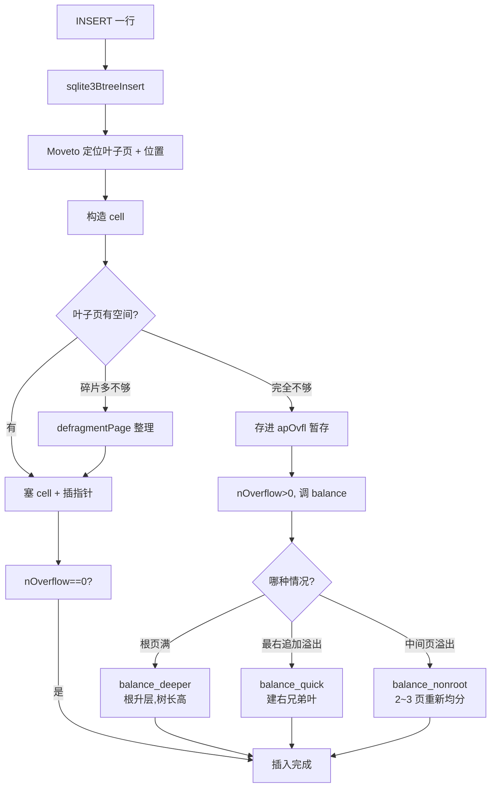

# 第 3 篇 · 第 8 章 · B-tree 存储:表和索引都是 B-tree

> **核心问题**:第 1~2 篇五讲,我们把 SQL 从字符串一路拆到 opcode 流,直到 `OpenRead`/`Column`/`Next`/`ResultRow` 这些 opcode 在 VDBE 里执行,经游标调一个叫 `sqlite3BtreeCursor`/`sqlite3BtreePayloadFetch`/`sqlite3BtreeNext` 的接口。可这些接口的背后是什么?一行用户数据——`INSERT INTO users VALUES(7, 'alice', 30)` 里的那一行——到底是怎么落进 `.db` 文件里的?一个文件怎么装得下一堆表、一堆索引?为什么 SQLite 偏偏选 **B-tree** 而不是《MySQL·InnoDB》那套 **B+树**?为什么说"SQLite 的 B-tree 内部页和叶子页都带数据"——这话到底对不对、精确含义是什么(这是全书最易讲错的硬伤)?页满了怎么分裂?这些问题从第 1 章埋到第 7 章,本章全部兑现。这是全书从"编译与执行"跨到"存储与事务"的枢纽招牌章。

> **读完本章你会明白**:
> 1. **SQLite 的表和索引都是 B-tree**(btree.c,11620 行),但"都是 B-tree"的具体含义是——**table b-tree** 用 rowid 当 key、整行 payload 存叶子页;**index b-tree** 用被索引的列当 key、rowid 当 payload 存叶子页;**WITHOUT ROWID 表**是一棵 index b-tree 把主键当 key、其余列当 payload。三者的页头 flag、cell 布局、parse 函数全不一样(`btreeParseCellPtr`/`btreeParseCellPtrIndex`/`btreeParseCellPtrNoPayload` 三个 parser),对应 4 种合法页类型组合(0x02/0x05/0x0a/0x0d)。
> 2. **SQLite 用的是 Knuth 定义的不平衡 B-tree,不是 B+树**——但有一个极其关键的细节:table b-tree 的**内部页不存 payload**(只存 4 字节子页指针 + rowid 当分割键),只有叶子页存整行 payload;index b-tree 的**内部页和叶子页都存 key**。这和《MySQL·InnoDB》B+树(内部页只导航、所有数据堆叶子页)有微妙差别,SQLite 的选择根子在 rowid 同页设计带来的点查少一跳。
> 3. **一个 `.db` 文件怎么装多棵 B-tree**:文件按 4KB(默认)页划分,每棵 B-tree 有一个**根页号**(root page number),页 1 是 `sqlite_schema` 表(它本身也是一棵 B-tree),记录着每个表/索引的根页号和建表 SQL。游标 `BtCursor.pgnoRoot` 绑定到根页号,就定位到了一棵具体的 B-tree。
> 4. **B-tree 页的二进制布局**(btreeInt.h 详注):页头 8 字节(叶子)/12 字节(内部) + cell pointer 数组(向下长)+ unallocated 空洞 + cell content 区(向上长),cell 在页尾乱序排布但 cell pointer 数组有序——这套"两端向中间长"的设计,让插入只需挪指针不挪 cell,是 B-tree 页的核心技巧。
> 5. **页满了怎么 balance**(balance/balance_quick/balance_deeper/balance_nonroot 四个函数):叶子页满 → `balance_quick` 建右兄弟叶 + 往父页塞一个分割键;根页满 → `balance_deeper` 建子页、根页升一层变内部页;通用情况 → `balance_nonroot` 把 2~3 个相邻页重新均分(2→3 或 3→2)。

> **逃生阀(这章很长,一读觉得晕,先记住这五件事)**:
> ① SQLite 用 **B-tree 不是 B+树**,具体地:table b-tree 内部页只存 rowid 不存 payload、叶子页存整行;index b-tree 内部和叶子都存 key(payload 就是 key);WITHOUT ROWID 表本质是 index b-tree;② 一个 `.db` 文件按 4KB 页切,每棵 B-tree 一个根页号,页 1 是 `sqlite_schema` 表记着"哪棵 B-tree 在哪个根页";③ 页结构 = 页头 + cell pointer 数组(向下长)+ cell content 区(向上长),插入只挪 2 字节指针不挪 cell;④ 页满触发 balance,有 quick(建右兄弟)、deeper(根升层)、nonroot(3↔2 重新均分)三种;⑤ 选 B-tree 不选 B+树的根因:rowid 当 key、payload 和 key 同页,点查少一跳,契合嵌入式"读为主、点查多"的场景。记住这五点,后面每一节都是在展开它们。

---

## 〇、一句话点破

> **SQLite 的存储层是一棵(其实是很多棵)B-tree:一个 `.db` 文件按 4KB 页切分,每棵 B-tree 用一个根页号在文件里圈一块地,表 B-tree 用 rowid 当 key 把整行数据塞在叶子页,索引 B-tree 用被索引的列当 key、rowid 当 payload。SQLite 选 B-tree 而不是《MySQL·InnoDB》的 B+树,根子在"rowid 当 key + payload 同页"——这让点查少一跳,契合嵌入式读为主的场景。页结构用"cell pointer 数组向下长 + cell content 向上长"的对向增长,让插入只挪指针不挪 cell;页满了靠 balance_quick/balance_deeper/balance_nonroot 三种平衡策略分裂。**

这是结论,不是理由。本章倒过来拆:先讲清"为什么表和索引都是 B-tree"——拆 SQLite 的三种 B-tree(table/index/WITHOUT ROWID),把"是不是 B+树"这个最容易讲错的硬伤钉死;然后讲清"单文件怎么装多棵 B-tree"——拆根页号机制、页 1 的 `sqlite_schema` 表;接着拆 B-tree 页的二进制布局(页头/cell pointer/cell content);然后拆一次完整的插入 + 分裂过程;最后用对照《MySQL·InnoDB》B+树和《LevelDB》LSM 的三角表,把"为什么 SQLite 选 B-tree"这个选型彻底钉死。

---

## 一、衔接:游标的那一头是什么

先回到第 2 篇末尾。P2-06 拆 opcode 时,`OpenRead` 这条 opcode 干了这件事([vdbe.c](../sqlite/src/vdbe.c) 的 `OP_OpenRead` 分支)——它调 `sqlite3BtreeCursor` 打开一棵 B-tree 的读游标:

```c
/* btree.c:4792 */
int sqlite3BtreeCursor(
  Btree *p,              /* 这棵 B-tree 归属的 Btree 句柄 */
  Pgno iTable,           /* 根页号——关键!一棵 B-tree 的身份证 */
  int wrFlag,            /* 0=只读, 1=可写 */
  struct KeyInfo *pKeyInfo,  /* NULL=table btree; 非 NULL=index/WITHOUT ROWID btree */
  BtCursor *pCur         /* 把游标写进这个对象 */
);
```

第二个参数 `iTable`(根页号)是关键——它告诉 B-tree 层"打开的是哪棵树"。比如 `users` 表的根页号是 2、`idx_users_age` 索引的根页号是 3,`OpenRead` 把这两个根页号分别传进 `sqlite3BtreeCursor`,就拿到了两棵不同的 B-tree 的游标。

P2-06 还讲了 `Column` 这条 opcode——它调 `sqlite3BtreePayloadFetch`,从当前游标指向的 cell 里取出 payload(整行)的字节指针。`Next` 这条 opcode——它调 `sqlite3BtreeNext`,把游标推进到当前 B-tree 的下一个 cell(下一个 rowid)。

那么这些 B-tree 接口的背后:游标怎么定位到根页?怎么从根页一层层找下去找到要的那一行?一行数据在页里到底是什么字节布局?这些就是本章要拆透的事。

> **钉死这件事**:本章和第 2 篇的衔接点是**游标(BtCursor)**。P2-05/P2-06 从 VDBE 这一侧讲了游标怎么被 opcode 用;本章从 B-tree 这一侧讲游标怎么被实现。`BtCursor.pgnoRoot` 是衔接两章的字段——它把"VDBE 层的逻辑游标"绑定到"B-tree 层的某一棵物理树"。

---

## 二、三种 B-tree:table、index、WITHOUT ROWID

先回答最根本的问题:**为什么说"表和索引都是 B-tree",到底有几种 B-tree,它们各自的 key 和 payload 是什么?**

SQLite 的 B-tree 层有且仅有两种"页类型组合"基础上的语义,但在 SQL 层表现为**三种**用法:

1. **table b-tree**(普通 `CREATE TABLE` 带 rowid 的表):key 是 **rowid**(64 位整数,自增或用户指定),payload 是**整行数据**(序列化后的 Record,见 P3-09)。这是最常见的一种。
2. **index b-tree**(`CREATE INDEX` 建的二级索引):key 是**被索引的列**(可能多列,序列化成字节串),payload 是**rowid**(用来回表)。
3. **WITHOUT ROWID 表**(`CREATE TABLE ... WITHOUT ROWID`):本质是 index b-tree,但 key 是**主键列**,payload 是**除主键外的其余列**。这是一种"用 index b-tree 实现的聚簇表",对应 MySQL InnoDB 的聚簇索引思路。

这三种用法在 B-tree 层只对应两种底层结构(因为 WITHOUT ROWID 和普通索引共用同一套 index b-tree 代码),靠 `pKeyInfo` 是否为 NULL 区分:

```c
/* btree.c:4753 (btreeCursor 里) */
pCur->pgnoRoot = iTable;     /* 根页号 */
pCur->pKeyInfo = pKeyInfo;   /* NULL → table btree;非 NULL → index btree(WITHOUT ROWID 也是 index) */
```

`btreeInt.h` 的 `BtreePayload` 结构注释把三种语义的字段使用讲得最清楚([btree.h:284-316](../sqlite/src/btree.h#L284-L316)):

```
              Table BTrees                   Index Btrees
  pKey        always NULL                    encoded key(索引列或主键)
  nKey        the ROWID                      length of pKey
  pData       data(整行)                    not used
  aMem        not used                       decomposed key value
  nData       length of pData                not used
```

### table b-tree:rowid 当 key、整行当 payload

最常见的表 `CREATE TABLE users(id INTEGER PRIMARY KEY, name TEXT, age INTEGER)`,在 SQLite 里(除非加了 `WITHOUT ROWID`)是一棵 table b-tree:

- **key** = rowid。注意 SQLite 的一个微妙设计:如果有一列声明为 `INTEGER PRIMARY KEY`,这列就成了 rowid 的别名(那列不是单独存的,存的就是 rowid 本身)。这是 SQLite 的"rowid 别名"机制。
- **payload** = 整行数据序列化成的 Record 字节流(name、age 等非主键列拼起来)。Record 格式见 P3-09。
- **页类型**:叶子页是 `0x0d`(`PTF_LEAFDATA | PTF_INTKEY | PTF_LEAF`),内部页是 `0x05`(`PTF_LEAFDATA | PTF_INTKEY`,无 leaf 位)。

### index b-tree:被索引列当 key、rowid 当 payload

`CREATE INDEX idx_users_age ON users(age)` 建的索引,是一棵 index b-tree:

- **key** = `age` 列的值(序列化),如果 `idx_users_age(age, name)` 是复合索引,key 就是 `age` + `name` 拼起来的字节。
- **payload** = rowid(用来回表找到完整行)。
- **页类型**:叶子页 `0x0a`(`PTF_ZERODATA | PTF_LEAF`),内部页 `0x02`(`PTF_ZERODATA`)。

注意 `PTF_ZERODATA` 这个 flag 名字容易误导——它不是说"没数据",而是说"key 和 payload 是一回事"(对索引,key 本身就是 payload)。

### WITHOUT ROWID 表:用 index b-tree 实现聚簇表

`CREATE TABLE kv(k TEXT PRIMARY KEY, v TEXT) WITHOUT ROWID`,这种表没有 rowid,整张表就是一棵 index b-tree,主键 `k` 当 key,其余列 `v` 当 payload。这等价于 MySQL InnoDB 的聚簇索引(主键即整行存储位置)。WITHOUT ROWID 在两种场景下值得用:① 主键本身就是长字符串(用 rowid 要维护一个隐式的 rowid 索引,浪费);② 想让表按主键物理聚簇存储(范围扫主键快)。

三种 B-tree 的差异汇总成一张表:

| 维度 | table b-tree | index b-tree | WITHOUT ROWID 表 |
|------|--------------|--------------|-------------------|
| 页类型(叶子) | 0x0d | 0x0a | 0x0a |
| 页类型(内部) | 0x05 | 0x02 | 0x02 |
| key 是什么 | rowid(整数) | 索引列(字节串) | 主键列(字节串) |
| payload 是什么 | 整行 Record | rowid(回表用) | 除主键外的列 |
| `pKeyInfo` | NULL | 非 NULL | 非 NULL |
| 内部页带 payload? | **否**(只带 rowid 分割键) | 是(key 即 payload) | 是 |
| 对应 MySQL 概念 | 二级索引 + InnoDB 主键的混合 | 二级索引 | InnoDB 聚簇索引(主键即整行) |
| parse 函数 | `btreeParseCellPtr` | `btreeParseCellPtrIndex` | `btreeParseCellPtrIndex` |

> **钉死这件事**:"表和索引都是 B-tree"这话要精确理解——**底层的 B-tree 机制是一样的**(页结构、分裂、平衡、游标遍历),区别只在 key 和 payload 的语义:table b-tree 用 rowid 当 key 把整行塞叶子,索引 b-tree 用列值当 key 把 rowid 塞进去。这种"一种树机制服务多种语义"的复用,是 SQLite 的精简哲学——不像 MySQL 那样把聚簇索引和二级索引做成两套结构。

### ★ 关键澄清:不是 B+树,但 table b-tree 的内部页也不存 payload

这里必须把一个最容易讲错的硬伤钉死。很多资料(和一些讲 SQLite 的书)会说:"SQLite 用 B-tree,B-tree 内部页和叶子页都存数据,这是它和 B+树的区别。"——这话**对 index b-tree 成立**(index b-tree 内部页和叶子页都存 key),但**对 table b-tree 不完全成立**。

真相要从源码看。`btree.c` 对 table b-tree 的内部页,有一个专门的 cell parser 叫 `btreeParseCellPtrNoPayload`([btree.c:1269](../sqlite/src/btree.c#L1269)):

```c
/* btree.c:1269 —— table b-tree 内部页(0x05)的 cell 解析 */
static void btreeParseCellPtrNoPayload(MemPage *pPage, u8 *pCell, CellInfo *pInfo){
  assert( pPage->leaf==0 );            /* 必须是内部页 */
  assert( pPage->childPtrSize==4 );    /* 子页指针 4 字节 */
  pInfo->nSize = 4 + getVarint(&pCell[4], (u64*)&pInfo->nKey);
  pInfo->nPayload = 0;                 /* ← payload 是 0! */
  pInfo->nLocal = 0;
  pInfo->pPayload = 0;
}
```

`pInfo->nPayload = 0` —— table b-tree 的内部页 cell **没有 payload**,只有"4 字节子页指针 + varint(rowid)"。rowid 在这里扮演**分割键**(divider key)的角色:它告诉游标"key ≤ 这个 rowid 的去左子页,key > 这个 rowid 的去右子页"。

所以精确的真相是:

- **table b-tree**:内部页只存 rowid(分割键)+ 子页指针,**不存整行 payload**;只有叶子页存整行。这点像 B+树(数据在叶子)。
- **index b-tree**:内部页和叶子页**都存 key**(索引列字节),内部页的 key 既是分割键也是数据本身。这点是经典 B-tree。

那为什么 SQLite 整体上还说"用 B-tree 不是 B+树"?因为:

1. **index b-tree 内部页存 key**,这是 B-tree 的核心特征(B+树内部页只导航、不存数据);
2. table b-tree 虽然叶子页存数据,但它的**内部页带的 rowid 也是"真 key"**(不是 B+树那种"导航用的 key 副本",rowid 在这里同时是行的真实标识)——这点微妙但重要,后面讲"点查少一跳"时会展开。

> **钉死这件事(本章最重要的一条)**:别把 SQLite 的 B-tree 简单讲成"B-tree 内部页叶子页都存数据"——这话对 index b-tree 对,对 table b-tree 错。精确表述:**SQLite 用 Knuth 定义的不平衡 B-tree,不是 B+树**。table b-tree 内部页只存 rowid 分割键(无 payload),叶子页存整行;index b-tree 内部页和叶子页都存 key(payload 即 key)。这套设计和《MySQL·InnoDB》B+树(内部页只导航、所有数据堆叶子)有根本差异——下一节讲为什么 SQLite 这么选。

---

## 三、为什么选 B-tree 而不是 B+树:rowid 同页 + 点查少一跳

讲清了"是什么",现在讲"为什么"。SQLite 为什么不像 MySQL 那样用 B+树?根子在 SQLite 的核心数据模型:**rowid 当 key**。

### rowid 同页设计:点查少一跳

SQLite 的普通表(table b-tree),每一行都有一个 64 位整数 rowid。B-tree 用 rowid 当 key。当一个查询 `SELECT * FROM users WHERE id=10` 来时(假设 `id` 是 `INTEGER PRIMARY KEY`,即 rowid 别名),B-tree 层要做的是:

1. 从根页开始,把 `id=10` 当 rowid 去二分定位;
2. 一层层往下走,每到一个内部页,看该走哪个子页(`rowid=10` 落在哪个 rowid 分割键区间);
3. 到叶子页,二分找到 `rowid=10` 的 cell,取出整行 payload。

这里的关键是第 3 步:**整行数据就在 rowid=10 这个 cell 里**。因为 table b-tree 的叶子页 cell = `varint(payload size) + varint(rowid) + 整行 payload`,key 和 payload 在同一个 cell。

> **不这样会怎样(B+树的对照)**:如果 SQLite 用《MySQL·InnoDB》那套 B+树:① InnoDB 聚簇索引的叶子页存整行(像 table b-tree),但内部页**只存主键当导航、不存其他列**;② 二级索引的叶子页存"索引列 + 主键",拿到主键后要**回表**(再用主键查一次聚簇索引)才能拿到完整行——这是 B+树的"两次树查找"。

对 SQLite 来说,table b-tree 的叶子页直接存整行,所以 `SELECT *` 一次树查找就够。这和 InnoDB 的聚簇索引其实**一样**(都是一次树查找拿整行)。真正的差异在 index b-tree:

- **InnoDB 二级索引 B+树**:叶子页存"索引列 + 主键",点查要回表(两次树查找)。
- **SQLite index b-tree**:叶子页存"索引列 + rowid",拿 rowid 后,**也要回表**——这点两者一样。

所以严格说,"SQLite 比 B+树少一跳"不是绝对的。SQLite 选 B-tree 的真正理由是另一条:**B-tree 把 key 和 payload 放同一个 cell,内部页 cell 也可以带数据(对 index b-tree),这让"key 即数据"的索引结构更紧凑**——InnoDB 二级索引的内部页只存索引列当导航,叶子页存"索引列+主键",数据有冗余;SQLite index b-tree 的内部页和叶子页 cell 格式基本一致(都是 `childPtr? + varint(keylen) + key`),更紧凑。

### 为什么不用 LSM:《LevelDB》对照

另一个对照是《LevelDB》那套 **LSM-Tree**(Log-Structured Merge-Tree)。LevelDB 是嵌入式 KV,SQLite 是嵌入式 SQL,两者都是"链接进应用、单文件"。但它们选了完全不同的存储引擎:

| 维度 | SQLite B-tree | LevelDB LSM |
|------|---------------|-------------|
| 写路径 | 就地更新(找到 cell,改 payload) | 追加(memtable → SSTable,不就地改) |
| 读路径 | 一次树查找 `O(log N)` 页 | memtable + 多层 SSTable(`O(N)` 最坏,靠 Bloom filter 救) |
| 写放大 | 1(改一个 cell,落一个页) | 高(一次写要经过 memtable → L0 → L1 → ... 多次 compaction) |
| 读放大 | 1(`O(log N)` 页,约 3~4 页) | 中~高(多层查找) |
| 空间放大 | 1(就地质,无冗余版本) | 高(多层 SSTable 存多版本 + tombstone) |
| 适合场景 | 读为主、点查多、写适中 | 写吞吐极高、key 范围有序 |
| 空间回收 | 就地删除/更新,空间立即释放 | 靠 compaction 异步回收 |

**SQLite 选 B-tree 的根因**:它是**读为主**的嵌入式数据库(查询多、点查多),B-tree 的就地质让读 `O(log N)`、写 `O(log N)`,且没有 LSM 的多层写放大和空间放大。代价是**并发写弱**(B-tree 就地质要加锁、不能像 LSM 那样多写者追加)——但 SQLite 本来就是单写者模型(见 P5-17 文件锁),这个代价可接受。

LevelDB 选 LSM 的根因:它是 **KV、写吞吐优先**,追加写让多写者高并发、写放大可控(虽然空间放大高)。两者都是嵌入式,但场景不同(SQL 接口读为主 vs KV 接口写为主)→ 选不同引擎。这是"嵌入式存储"这个大设计空间里的两条分叉,本书承接《LevelDB》那本只做对照不重复拆 LSM。

> **所以这样设计**:SQLite 选 B-tree 不选 B+树/LSM,是因为它的核心场景是"嵌入式、读为主、点查多、SQL 接口":① B-tree 就地质 → 读 `O(log N)` 一次到位,无 LSM 多层放大;② rowid 同页 + B-tree 紧凑 → index 内部页也带数据,空间利用率高;③ 单写者模型下,B-tree 的并发劣势被消化。这是 SQLite 在"读为主 + 嵌入式 + 单文件"约束下的最优选择。

### 三角对照表:B-tree vs B+树 vs LSM

把 SQLite B-tree、《MySQL·InnoDB》B+树、《LevelDB》LSM 三者放一张表,这是理解"为什么 SQLite 选 B-tree"的总图:

| 维度 | SQLite B-tree | MySQL InnoDB B+树 | LevelDB LSM |
|------|---------------|-------------------|-------------|
| **内部页存数据?** | index 存 key;table 不存(payload 在叶子) | 否(纯导航) | N/A(无内部页,顺序扫多层) |
| **叶子页存数据?** | 是(整行或 rowid) | 是(聚簇存整行,二级索引存主键) | 是(多层 SSTable) |
| **点查路径** | `O(log N)` 页(约 3~4) | `O(log N)` 页 + 二级索引回表再 `O(log N)` | memtable + 多层 SSTable,靠 Bloom filter |
| **范围扫** | 中(叶子页间无链表,靠游标 Next 重新走内部页或回退) | 强(叶子页双向链表,顺序扫极快) | 中(SSTable 内有序,跨层合并) |
| **写放大** | 1(改一个 cell) | 中(聚簇+二级索引都要改) | 高(compaction 多次重写) |
| **读放大** | 低 | 低 | 中~高(多层) |
| **空间放大** | 1 | 中(聚簇+二级索引冗余) | 高(多版本) |
| **并发写** | 单写者(文件锁) | 多写者(行锁+MVCC) | 多写者(顺序追加) |
| **适合** | 嵌入式、读为主、点查多 | 大数据量、C/S、范围扫多 | 写吞吐极高、KV |

注意 SQLite 的一个"反直觉"特性:**叶子页之间没有链表指针**(InnoDB B+树叶子页有双向链表)。这意味着 SQLite 做范围扫时,`sqlite3BtreeNext` 不能直接跳到下一个叶子页,要回到父页找下一个子页指针——这是 SQLite 牺牲范围扫换紧凑性的一个取舍。这一点 P2-06 讲 `Next` opcode 时提过,本章讲 `sqlite3BtreeNext` 实现时会再点一次。

> **钉死这件事**:理解"为什么 B-tree"要把三个对照点捏在一起——① vs B+树:rowid 同页、index 内部页带数据,更紧凑,但叶子页无链表(范围扫弱);② vs LSM:就地质、读一次到位、无写放大,但单写者(并发弱);③ 嵌入式场景:读为主、点查多、空间敏感,B-tree 最优。这是 SQLite 存储层所有设计的总根。

---

## 四、单文件多 B-tree:根页号 + sqlite_schema

讲清了"是什么 B-tree、为什么选它",现在讲"一个文件怎么装多棵 B-tree"。

### 一个 `.db` 文件 = 按页切分的存储池

SQLite 的 `.db` 文件是一个**定长页(page)的序列**。默认页大小 4096 字节(`SQLITE_DEFAULT_PAGE_SIZE`,[sqliteLimit.h:214](../sqlite/src/sqliteLimit.h#L214)),可以通过 `PRAGMA page_size` 改(512 ~ 65536,2 的幂)。文件被逻辑上切成:

```
页 1 │ 页 2 │ 页 3 │ 页 4 │ ... │ 页 N
```

每个页有一个全局唯一的**页号**(从 1 开始,页号 0 表示"无此页")。页号是 B-tree 层定位的"地址"。

每棵 B-tree 占用的不是一个连续区间,而是**多个散布的页**:根页(可能就一个,如果表小)、若干层内部页、若干叶子页、若干 overflow 页(大 payload 溢出链)。这些页通过"子页指针"(内部页 cell 里的 4 字节页号)串成一棵树。**B-tree 不关心页在文件里的物理位置,只关心页号**——这让 SQLite 可以随意分配页(从空闲链表取或文件末尾追加),不用像数组那样紧凑排列。

### 根页号:一棵 B-tree 的身份证

每棵 B-tree 有一个**根页号**(root page number)。根页号是"进入这棵 B-tree 的入口"——游标 `sqlite3BtreeCursor(iTable=root_page_no)` 就是从根页开始,一层层往下找。

一个 `.db` 文件里有多棵 B-tree(每个表一棵、每个索引一棵),它们共享同一个文件、共享同一套页分配机制,但各有各的根页号。怎么知道"users 表的根页号是几、idx_users_age 索引的根页号是几"?答案在**页 1**。

### 页 1:sqlite_schema 表(数据库的元数据)

**页 1 永远是一棵特殊的 table b-tree**,叫 `sqlite_schema`(老名叫 `sqlite_master`,两者等价)。它本身也是一棵 B-tree(用 rowid 当 key),存的是这个数据库里所有表/索引/视图/触发器的元数据。每行是一条记录,字段是:

| 列 | 含义 |
|----|------|
| `type` | 'table' / 'index' / 'view' / 'trigger' |
| `name` | 对象名(如 'users') |
| `tbl_name` | 所属表名(索引/触发器要填) |
| `rootpage` | **根页号**(关键!)——这棵 B-tree 在文件里的入口 |
| `sql` | 建对象的 SQL 原文(如 `CREATE TABLE users(...)`) |

当你 `CREATE TABLE users(...)`,SQLite 在页 1 的 sqlite_schema B-tree 里插一行:`('table', 'users', 'users', <新分配的根页号>, 'CREATE TABLE users(...)')`,同时分配一个新页(用 `allocateBtreePage`)作为 users 表的根页,把它初始化成空叶子页。建索引同理(`type='index'`)。

打开数据库时,SQLite 先读页 1,遍历 sqlite_schema B-tree,把每条记录的 `rootpage` 和 `sql` 加载进内存的 schema 缓存(`sqlite3Init` 在 [prepare.c](../sqlite/src/prepare.c) 里做这事)。之后每次 `SELECT`/`INSERT` 执行时,VDBE 的 `OpenRead` 拿到的根页号,就是从这个 schema 缓存里查出来的。

单文件多 B-tree 的结构画成图:

```
   .db 文件(按 4KB 页切)
   ┌──────────────────────────────────────────────────────┐
   │ 页 1: sqlite_schema B-tree(特殊的 table btree)      │
   │   存着:(type, name, tbl_name, rootpage, sql)          │
   │   例如:                                               │
   │     ('table', 'users', 'users', 2, 'CREATE TABLE...') │
   │     ('index', 'idx_age', 'users', 5, 'CREATE INDEX..')│
   │     ('table', 'orders', 'orders', 8, 'CREATE TABLE..')│
   ├──────────────────────────────────────────────────────┤
   │ 页 2: users 表的 B-tree 根页(可能就是叶子页,小表时)  │
   │   └→ 页 12, 页 18: users 表的内部页/叶子页(大表时)   │
   ├──────────────────────────────────────────────────────┤
   │ 页 5: idx_age 索引的 B-tree 根页                      │
   ├──────────────────────────────────────────────────────┤
   │ 页 8: orders 表的 B-tree 根页                          │
   ├──────────────────────────────────────────────────────┤
   │ ... 其他页:freelist、overflow、其他表/索引 ...        │
   └──────────────────────────────────────────────────────┘
```

### 文件头:页 1 前 100 字节

页 1 比较特殊——它的前 100 字节是**整个数据库文件的文件头**(file header),记录文件级元信息。文件头布局在 [btreeInt.h:55-83](../sqlite/src/btreeInt.h#L55-L83) 有完整文档,关键字段:

| 偏移 | 长度 | 含义 |
|------|------|------|
| 0 | 16 | 魔术字符串 `"SQLite format 3\0"` |
| 16 | 2 | 页大小(大端;值为 1 表示 65536) |
| 18 | 1 | 文件格式写版本(1=rollback journal,2=WAL) |
| 19 | 1 | 文件格式读版本 |
| 20 | 1 | 每页末尾保留字节数(`reserved space`,供加密等用) |
| 24 | 4 | 文件变更计数器(每次写事务递增,让其他连接知道要刷缓存) |
| 28 | 4 | 数据库的页数(文件多大) |
| 32 | 4 | 第一个 freelist trunk 页号 |
| 36 | 4 | freelist 页总数 |
| 40 | 60 | 15 个 4 字节 meta 值(schema cookie、编码、user version 等) |

`sqlite3BtreeOpen` 打开数据库时([btree.c:2555](../sqlite/src/btree.c#L2555)),先打开 pager,再读这 100 字节头(`sqlite3PagerReadFileheader`,[btree.c:2709](../sqlite/src/btree.c#L2709)),解析出页大小([btree.c:2730](../sqlite/src/btree.c#L2730),注意页大小字段 `zDbHeader[16]<<8 | zDbHeader[17]<<16` 这个非直觉的位序——高位和低位位置反着,因为字段是 2 字节大端但 65536 用值 1 特殊编码)和保留区大小(`zDbHeader[20]`)。

页 1 既是文件头,又是 sqlite_schema B-tree 的根页——所以页 1 的 B-tree 页头从偏移 100 开始(其他页的页头从偏移 0 开始),这个偏移记录在 `MemPage.hdrOffset`(page 1 的 `hdrOffset=100`,其他页 `hdrOffset=0`)。

> **钉死这件事**:单文件多 B-tree 的核心是**根页号机制 + 页 1 的 sqlite_schema**。每棵 B-tree 用根页号定位,根页号记在页 1 的 sqlite_schema 表里(`rootpage` 列)。打开数据库时遍历 sqlite_schema 建立内存 schema 缓存,执行时 `OpenRead` 从缓存拿根页号传给 `sqlite3BtreeCursor`。这是"一个文件装多棵 B-tree"的全部秘密——没有目录、没有 inode,就一个根页号字段。

---

## 五、B-tree 页的二进制布局

讲清了文件级结构,现在放大到"一个页"——这是 B-tree 实现的核心。

### 页的三段式布局

每个 B-tree 页被分成三段(见 [btreeInt.h:106-124](../sqlite/src/btreeInt.h#L106-L124) 的图):

```
   一个 B-tree 页(以 4KB 为例,usableSize ≈ 4096 - reserved)
   偏移 0                                              偏移 4096
   ┌─────────────────────────────────────────────────────────────┐
   │ 文件头(100 字节,仅页 1 有)                                 │
   ├─────────────────────────────────────────────────────────────┤
   │ 页头(btree page header)                                    │
   │   8 字节(叶子页) 或 12 字节(内部页)                        │
   ├─────────────────────────────────────────────────────────────┤
   │ cell pointer 数组(向下长 ↓)                                │
   │   每个 entry 2 字节,指向下面 cell content 区的一个 cell      │
   │   按 key 顺序有序排列                                       │
   ├─────────────────────────────────────────────────────────────┤
   │                                                             │
   │             unallocated space(空洞,插入时被吃掉)            │
   │                                                             │
   ├─────────────────────────────────────────────────────────────┤
   │ cell content 区(向上长 ↑)                                  │
   │   实际的 cell 数据,乱序排布,中间夹着 freeblock             │
   └─────────────────────────────────────────────────────────────┘
```

**两端向中间长**是这套布局的核心技巧(下面技巧精解会拆透):

- **cell pointer 数组从页头之后向下长**(向高地址),每插入一个 cell 就在数组末尾加一个 2 字节 entry;
- **cell content 从页尾向上长**(向低地址),每插入一个 cell 就在 content 区开头放 cell 数据;
- 中间的 unallocated space 被两端吃掉,直到它们相遇——这时页满了,触发 balance(分裂)。

### 页头:8 字节(叶子)或 12 字节(内部)

页头布局在 [btreeInt.h:126-134](../sqlite/src/btreeInt.h#L126-L134) 文档化:

| 偏移 | 长度 | 字段 | 含义 |
|------|------|------|------|
| 0 | 1 | flags | 页类型(0x02/0x05/0x0a/0x0d 之一) |
| 1 | 2 | first freeblock | 第一个 freeblock 的字节偏移(0 表示无 freeblock) |
| 3 | 2 | ncell | 本页 cell 数 |
| 5 | 2 | cell content start | cell content 区的起始字节偏移(0 表示 65536) |
| 7 | 1 | fragmented free bytes | 碎片字节总数(≤3 字节的零散空闲) |
| 8 | 4 | right-most child | 最右子页号(**仅内部页有**,叶子页无此字段) |

所以叶子页头 8 字节、内部页头 12 字节(多了 right-most child)。这个 4 字节的 right-most child 是因为 SQLite B-tree 的内部页布局是 `Ptr(0) | Key(0) | Ptr(1) | Key(1) | ... | Key(N-1) | Ptr(N)`——`Ptr(N)` 是最右子页,它后面没有 key,所以单独存在页头(见 [btreeInt.h:22-30](../sqlite/src/btreeInt.h#L22-L30) 的 Knuth 经典布局图)。

页头在内存里被解析进 `MemPage` 结构([btreeInt.h:273-304](../sqlite/src/btreeInt.h#L273-L304)):

```c
struct MemPage {
  u8 isInit;           /* 是否已初始化 */
  u8 intKey;           /* true=table btree,false=index btree */
  u8 intKeyLeaf;       /* true=table btree 的叶子 */
  Pgno pgno;           /* 本页页号 */
  u8 leaf;             /* true=叶子页 */
  u8 hdrOffset;        /* 页头在页内的偏移(页 1 是 100,其他是 0) */
  u8 childPtrSize;     /* 0=叶子页,4=内部页 */
  u8 max1bytePayload;  /* min(maxLocal, 127) */
  u8 nOverflow;        /* 溢出到 aCell[] 的 overflow cell 数 */
  u16 maxLocal;        /* 本页 cell 最大本地 payload */
  u16 minLocal;        /* 本页 cell 最小本地 payload */
  u16 cellOffset;      /* cell pointer 数组起始偏移 */
  int nFree;           /* 本页空闲字节数 */
  u16 nCell;           /* cell 总数(含 overflow) */
  u16 maskPage;        /* 页偏移掩码 */
  u16 aiOvfl[4];       /* overflow cell 的插入位置 */
  u8 *apOvfl[4];       /* overflow cell 的 body 指针 */
  BtShared *pBt;       /* 所属 BtShared */
  u8 *aData;           /* 页的磁盘映像指针 */
  u8 *aDataEnd;        /* 页尾(防越界) */
  u8 *aCellIdx;        /* cell pointer 数组指针 */
  u8 *aDataOfst;       /* 叶子=aData,内部=aData+4 */
  DbPage *pDbPage;     /* pager 的页句柄 */
  u16 (*xCellSize)(MemPage*,u8*);        /* cellSizePtr 方法 */
  void (*xParseCell)(MemPage*,u8*,CellInfo*);  /* btreeParseCell 方法 */
};
```

注意 `xCellSize` 和 `xParseCell` 是**函数指针**——它们根据页类型在 `decodeFlags`([btree.c:2055](../sqlite/src/btree.c#L2055)) 里被设置成不同的 parser(下面讲)。

### decodeFlags:4 种页类型的 parser 绑定

`decodeFlags` 函数([btree.c:2055](../sqlite/src/btree.c#L2055))根据页头的 flags 字节,给 `MemPage` 设置正确的 `leaf`/`intKey`/`childPtrSize`/`xParseCell` 等。关键逻辑(简化):

```c
/* btree.c:2055 附近 —— 根据 flags 设置页的解析方法 */
static int decodeFlags(MemPage *pPage, int flagByte){
  ...
  if( flagByte >= (PTF_ZERODATA | PTF_LEAF) ){   /* 叶子页(flag ≥ 0x0a) */
    pPage->leaf = 1;
    pPage->childPtrSize = 0;
    pPage->xCellSize = cellSizePtr;
    if( flagByte==(PTF_ZERODATA | PTF_LEAF) ){   /* 0x0a:leaf index */
      pPage->intKey = 0;
      pPage->maxLocal = pBt->maxLocal;  pPage->minLocal = pBt->minLocal;
      pPage->xParseCell = btreeParseCellPtrIndex;
    }else if( flagByte==(PTF_INTKEY|PTF_LEAFDATA|PTF_LEAF) ){  /* 0x0d:leaf table */
      pPage->intKey = 1;  pPage->intKeyLeaf = 1;
      pPage->maxLocal = pBt->maxLeaf;  pPage->minLocal = pBt->minLeaf;
      pPage->xParseCell = btreeParseCellPtr;
    }else{ return SQLITE_CORRUPT; }
  }else{                                          /* 内部页(flag < 0x0a) */
    pPage->leaf = 0;
    pPage->childPtrSize = 4;
    pPage->xCellSize = cellSizePtrNoPayload;  /* 或 cellSizePtr */
    if( flagByte==PTF_ZERODATA ){                 /* 0x02:interior index */
      pPage->intKey = 0;
      pPage->maxLocal = pBt->maxLocal;  pPage->minLocal = pBt->minLocal;
      pPage->xParseCell = btreeParseCellPtrIndex;
    }else if( flagByte==(PTF_INTKEY|PTF_LEAFDATA) ){ /* 0x05:interior table */
      pPage->intKey = 1;
      pPage->maxLocal = pBt->maxLeaf;  pPage->minLocal = pBt->minLeaf;
      pPage->xParseCell = btreeParseCellPtrNoPayload;  /* ← 关键:table 内部页无 payload */
    }else{ return SQLITE_CORRUPT; }
  }
}
```

这 4 个合法组合(`0x02`/`0x05`/`0x0a`/`0x0d`)和它们绑定的 parser,就是上一节讲"三种 B-tree"的源码基础。任何其他 flags 值都会被判为 `SQLITE_CORRUPT`(数据库损坏)。

### cell 的字节布局

cell 是 B-tree 页里"一条记录"的存储单元。三种 cell 布局(见 [btreeInt.h:189-197](../sqlite/src/btreeInt.h#L189-L197)):

**table b-tree 叶子页 cell(0x0d)**——`btreeParseCellPtr` 解析([btree.c:1286](../sqlite/src/btree.c#L1286)):

```
  ┌──────────────────────────────────────────────────┐
  │ varint: payload 字节数                            │
  ├──────────────────────────────────────────────────┤
  │ varint: rowid(整数 key)                           │
  ├──────────────────────────────────────────────────┤
  │ payload(整行 Record,最多 maxLocal 字节存在本地)   │
  ├──────────────────────────────────────────────────┤
  │ 4 字节:第一个 overflow 页号(仅 payload 溢出时有)  │
  └──────────────────────────────────────────────────┘
```

**table b-tree 内部页 cell(0x05)**——`btreeParseCellPtrNoPayload` 解析([btree.c:1269](../sqlite/src/btree.c#L1269)):

```
  ┌──────────────────────────────────────────────────┐
  │ 4 字节:左子页页号                                  │
  ├──────────────────────────────────────────────────┤
  │ varint: rowid(当分割键用)                         │
  │ (注意:没有 payload!这是 table btree 内部页的特征) │
  └──────────────────────────────────────────────────┘
```

**index b-tree cell(0x02 内部 / 0x0a 叶子)**——`btreeParseCellPtrIndex` 解析([btree.c:1374](../sqlite/src/btree.c#L1374)):

```
  ┌──────────────────────────────────────────────────┐
  │ 4 字节:左子页号(仅内部页有,叶子页无)              │
  ├──────────────────────────────────────────────────┤
  │ varint: payload 字节数(payload 就是 key 本身)      │
  ├──────────────────────────────────────────────────┤
  │ payload(key + 可能的 rowid)                       │
  ├──────────────────────────────────────────────────┤
  │ 4 字节:第一个 overflow 页号(仅 payload 溢出时有)  │
  └──────────────────────────────────────────────────┘
```

注意 index b-tree 的内部页和叶子页 cell 格式几乎一样,差别只是内部页多了 4 字节左子页号——这是 index b-tree"内部页也存 key"的体现(B-tree 特征,非 B+树)。

### varint:1~9 字节的变长整数

cell 里大量用 **varint**(变长整数)。SQLite 的 varint 编码([btreeInt.h:170-187](../sqlite/src/btreeInt.h#L170-L187)):每字节低 7 位是数据,最高位(第 8 位)是"是否继续"标志(1=还有后续字节,0=结束);最多 9 字节,第 9 字节 8 位全用(共 64 位)。例:

- `0x7f` → 127(1 字节)
- `0x81 0x00` → 128(2 字节)
- `0x81 0x91 0xd1 0xac 0x78` → 0x12345678(5 字节)

varint 让小的 rowid(1~127)只占 1 字节,大的才占更多——这是 SQLite 节省空间的细节。

### payload 溢出:maxLocal/minLocal 与 overflow 链

当一行数据(payload)太大,一个 cell 装不下怎么办?SQLite 用 **overflow 链**——payload 的一部分存本地(本地部分),其余存一串 overflow 页(链表)。

本地能存多少,由 `maxLocal`/`minLocal` 控制([btree.c:3464-3467](../sqlite/src/btree.c#L3464-L3467) 初始化):

```c
/* btree.c:3464 —— 根据 usableSize 计算 payload 边界 */
pBt->maxLocal = (u16)((pBt->usableSize-12)*64/255 - 23);   /* 非叶子页 cell 最大本地 payload */
pBt->minLocal = (u16)((pBt->usableSize-12)*32/255 - 23);   /* 非叶子页 cell 最小本地 payload */
pBt->maxLeaf  = (u16)(pBt->usableSize - 35);               /* 叶子页 cell 最大本地 payload */
pBt->minLeaf  = (u16)((pBt->usableSize-12)*32/255 - 23);   /* 叶子页 cell 最小本地 payload */
```

以 4KB 页(`usableSize=4096`)为例:`maxLeaf = 4096 - 35 = 4061`,`maxLocal = (4084)*64/255 - 23 ≈ 1003`,`minLocal = (4084)*32/255 - 23 ≈ 489`。

当一个 cell 的 payload 超过 maxLeaf(或 maxLocal),SQLite 不简单"全存 overflow",而是用一个精巧的公式(见 [btree.c:1219-1231](../sqlite/src/btree.c#L1219-L1231))算出"存多少本地"——目的是**让 overflow 页尽量填满**(不浪费),同时保证 cell 本身不占太多页:

```c
/* btree.c:1225 —— 计算 overflow 时的本地 payload 大小(surplus 公式) */
surplus = minLocal + (nPayload - minLocal) % (usableSize - 4);
if( surplus <= maxLocal ){
  nLocal = surplus;
}else{
  nLocal = minLocal;   /* 本地只存最小值,其余全溢出 */
}
```

`(usableSize - 4)` 是一个 overflow 页能存的净字节数(页大小减 4 字节"下一个 overflow 页号")。这个 `%` 运算算出"本地存多少,能让后面的 overflow 页都正好填满"。这是 SQLite payload 溢出的核心技巧。

overflow 页本身布局简单([btreeInt.h:201-204](../sqlite/src/btreeInt.h#L201-L204)):

```
  ┌────────────────────────────┐
  │ 4 字节:下一个 overflow 页号 │
  ├────────────────────────────┤
  │ (usableSize - 4) 字节:数据  │
  └────────────────────────────┘
```

读溢出 payload 时,`accessPayload`([btree.c:5148](../sqlite/src/btree.c#L5148))先读本地部分,再顺着 overflow 链一页页读,每页去掉前 4 字节页号取数据。它还维护 `pCur->aOverflow[]` 缓存(懒填),避免重复读同一批 overflow 页。

> **钉死这件事**:B-tree 页的二进制布局是 SQLite 存储层的"宪法"——页头(8/12 字节)+ cell pointer 数组(向下长)+ cell content 区(向上长)。三种 cell 布局对应三种 B-tree,table 内部页 cell **无 payload**(只有 rowid 分割键)是它区别于 index b-tree 的关键。payload 太大走 overflow 链,本地大小由 maxLocal/minLocal 的 `%` 公式精算。这套布局是后面所有操作(插入、查找、分裂、删除)的物理基础。

---

## 六、一次完整的插入:从 cell 落位到 balance

页结构讲清了,现在跑一次完整的插入 `INSERT INTO users VALUES(10, 'alice', 30)`,看 B-tree 层到底干了什么。这能把你前面学的所有概念串起来。

### 步骤 1:定位插入点(Moveto)

插入要先找到"这个 rowid=10 应该插在哪个叶子页的哪个位置"。游标 `sqlite3BtreeTableMoveto` 从根页开始,一层层二分定位:

1. 根页进来,二分 cell pointer 数组(按 rowid),找到 rowid=10 应该落在哪个子页区间;
2. 如果是内部页,顺子页指针下一页,重复;
3. 到叶子页,二分找到 rowid=10 应该插的位置(`ix`——cell pointer 数组的下标)。

`BtCursor` 结构([btreeInt.h:531-560](../sqlite/src/btreeInt.h#L531-L560))记录这条路径——`apPage[BTCURSOR_MAX_DEPTH-1]` 是从根到当前叶子的页栈,`aiIdx[BTCURSOR_MAX_DEPTH-1]` 是每一层的 cell 下标。`BTCURSOR_MAX_DEPTH = 20`([btreeInt.h:497](../sqlite/src/btreeInt.h#L497))——一棵 B-tree 最多 20 层,对应 2^31 页的上限。

### 步骤 2:构造 cell,塞进叶子页

定位到叶子页和位置后,`sqlite3BtreeInsert`([btree.c:9434](../sqlite/src/btree.c#L9434))构造 cell:把 payload(整行 Record)序列化、算出本地部分和 overflow 部分、拼成 cell 字节流。然后:

1. 看叶子页有没有足够 unallocated 空间放这个 cell;
2. 有 → 直接在 cell content 区开头(向上长方向)放 cell,在 cell pointer 数组(向下长方向)对应位置插一个 2 字节指针;
3. 空间不够但页里有 freeblock → 调 `defragmentPage`([btree.c:1640](../sqlite/src/btree.c#L1640))整理碎片,把零散 freeblock 合并成连续 unallocated;
4. 整理后还不够 → 这个 cell 暂时存进 `pPage->apOvfl[]` 数组(标记为 overflow cell),页的 `nOverflow++`,等下一步 balance 处理。

### 步骤 3:页满了触发 balance

`sqlite3BtreeInsert` 插完后,检查 `pPage->nOverflow`(本节有更详细的逻辑,见 [btree.c:9708](../sqlite/src/btree.c#L9708)):

```c
/* btree.c:9708 附近 —— 插完后检查是否要 balance */
if( pPage->nOverflow ){
  rc = balance(pCur);   /* ← 触发平衡/分裂 */
}
```

`balance`([btree.c:9155](../sqlite/src/btree.c#L9155))是分裂的入口,它根据情况分发到三个子函数。

### balance 的三种情况

`balance` 函数是一个 `do-while` 循环,从当前叶子页往上走,每一层判断要不要平衡:

```c
/* btree.c:9155 —— balance 入口(简化) */
static int balance(BtCursor *pCur){
  do{
    /* 如果页既没 overflow,空闲空间也小于 2/3,跳过 */
    if( pPage->nOverflow==0 && pPage->nFree*3 <= usableSize*2 ){
      break;   /* 不需要 balance */
    }
    if( pCur->iPage==0 ){
      /* 根页满了 → balance_deeper(根升层) */
      rc = balance_deeper(pPage, &pCur->apPage[1]);
    }else{
      /* 非根页满了 */
      if( /* 是 table 叶子 + overflow cell 是最后一个 + 父页不是页1 + 分割键在最右 */ ){
        rc = balance_quick(pParent, pPage, pSpace);  /* 快速建右兄弟 */
      }else{
        rc = balance_nonroot(pParent, iIdx, aOvflSpace, ...);  /* 通用 2→3 / 3→2 均分 */
      }
    }
    pCur->iPage--;   /* 往上一层,看父页要不要 balance */
  }while( /* 还有上层 且 父页也溢出了 */ );
}
```

#### 情况 A:`balance_quick`——建右兄弟叶(最常见)

当一棵 table b-tree 的最右叶子页因为追加插入(rowid 单调递增,新行总插在最右)而溢出,`balance_quick`([btree.c:8032](../sqlite/src/btree.c#L8032))用最快的方式处理:

1. `allocateBtreePage` 新分配一个页作为右兄弟叶;
2. 把溢出的那个 cell 移进新页;
3. 在父页的 cell 数组最右端插一个分割 cell:`4 字节新页号 + varint(新页最大 rowid)`;
4. 更新父页头的 right-most child 指向新页。

这是"**追加写**"场景的快路径,因为它知道"新行总是最大的 rowid",不用均分旧页,直接开新页。SQLite 的 rowid 自增特性让这条快路径命中率很高。

```
   插入前:                        插入后(balance_quick 建右兄弟):
                                                
   内部页                          内部页
   ┌──────────────┐               ┌──────────────────────┐
   │ ... │ Ptr→L  │               │ ... │ Ptr→L │ Ptr→L' │ ← 新增分割 cell
   └──────┬───────┘               └──────┬───────┬────────┘
          ↓                              ↓       ↓
   叶子页 L(满)                  叶子页 L        叶子页 L'(新)
   ┌──────────────┐               ┌──────────┐  ┌──────────┐
   │ rowid 1..100 │               │ 1..100   │  │ 101      │ ← 溢出的 cell
   └──────────────┘               └──────────┘  └──────────┘
```

#### 情况 B:`balance_deeper`——根页升层(树长高)

当根页自己满了(根页既是根又是叶子,整棵树只有一层时),`balance_deeper`([btree.c:9074](../sqlite/src/btree.c#L9074)):

1. `allocateBtreePage` 新分配一个子页;
2. 把根页的全部内容(所有 cell)复制进子页(`copyNodeContent`);
3. 把根页清空,重置为**内部页**(`zeroPage(pRoot, pChild->aData[0] & ~PTF_LEAF)`——清掉 leaf 位);
4. 根页头的 right-most child 指向新子页。

树从此从 1 层变 2 层。这就是 B-tree"长高"的方式——根页升层,高度 +1。一棵 N 层的 B-tree,要 balance_deeper N 次才能长成。

```
   插入前(根=叶子,1 层):       插入后(balance_deeper,2 层):

   根页(叶子,满)                根页(内部,清空)
   ┌──────────────┐             ┌──────────────────┐
   │ rowid 1..200 │             │ right-child → C  │  ← 只有 right-most child
   └──────────────┘             └────────┬─────────┘
                                         ↓
                                子页 C(叶子,原根内容)
                                ┌──────────────────┐
                                │ rowid 1..200     │
                                └──────────────────┘
```

#### 情况 C:`balance_nonroot`——通用 2↔3 均分

当溢出发生在中间的页(不是最右追加),或父页不是页 1,`balance_nonroot`([btree.c:8270](../sqlite/src/btree.c#L8270))做通用的"相邻几页重新均分":

1. 取出当前页 + 左右最多 2 个兄弟页(共 2~3 个旧页);
2. 把这些页的所有 cell 倒出来,排好序;
3. 重新分配成 2~3 个新页(可能从 2 个变 3 个,或 3 个变 2 个),让每个新页的填充度均衡;
4. 更新父页的分割键(对应每个新页的最大 key)。

这是经典 B-tree 的"分裂/合并"通用算法。`balance_nonroot` 用 `NB`(`btreeInt.h` 里的常量)作为 fan-in,典型是 2(每次处理 2~3 个页)。

用 mermaid 画一次完整的插入触发 balance 的流程:



> **钉死这件事**:一次插入 = Moveto 定位 + 构造 cell + 塞页 + (页满时)balance。balance 有三种:① `balance_quick`——最右追加建右兄弟叶(快路径,rowid 自增场景高频);② `balance_deeper`——根页满升层,树长高;③ `balance_nonroot`——中间页 2~3 个重新均分。这套组合让 SQLite 在"追加写高频"(rowid 自增)场景下走快路径,在随机插入/删除场景下走通用路径,兼顾了常见情况和最坏情况。

---

## 七、删除、freeblock 与 freelist

插入讲完了,删除(`sqlite3BtreeDelete`)是对称的——但删除会留下"空洞",怎么回收?这涉及 freeblock 和 freelist 两层机制。

### 页内:freeblock 链

删除一个 cell 时,SQLite 不立即整理整个页(那样太贵),而是把 cell 占的空间挂进页头的 **freeblock 链**:

- 页头偏移 1~2 字节(`first freeblock`)指向第一个 freeblock;
- 每个 freeblock 至少 4 字节,前 2 字节是"下一个 freeblock 偏移",后 2 字节是"本 freeblock 字节数";
- freeblock 按偏移升序链成链表。

下次插入时,先尝试从 unallocated space 分配;如果碎片太多(`defragmentPage` 触发条件),把 freeblock 链清掉,把所有存活 cell 紧凑到页尾——这就是 `defragmentPage`([btree.c:1640](../sqlite/src/btree.c#L1640))干的事。

碎片(`< 4 字节的零散空闲`,无法进 freeblock 链)记录在页头偏移 7 的 `fragmented free bytes` 字段。

### 文件级:freelist(trunk + leaf 页)

当一个**整页**被空出来(比如某次 balance 把 3 页合并成 2 页,空出 1 页),这个页不能直接还给文件系统(SQLite 是单文件,没有"还给 FS"的概念),而是挂进文件的 **freelist**。

freelist 是文件级的空闲页池,结构是 trunk + leaf 两级([btreeInt.h:206-214](../sqlite/src/btreeInt.h#L206-L214)):

- 文件头偏移 32~33 字节指向第一个 **trunk 页**;
- 每个 trunk 页:`4 字节下一个 trunk 页号 + 4 字节本 trunk 的 leaf 数 + 若干 4 字节 leaf 页号`;
- leaf 页内容无意义(就是空页)。

下次 `allocateBtreePage`([btree.c:6539](../sqlite/src/btree.c#L6539))分配新页时:

1. 先看 freelist 有没有页(`get4byte(&pPage1->aData[36])` 看 freelist 页数);
2. 有 → 优先从 freelist 取(优先取离 `nearby` 页号近的,做物理局部性);
3. 没有 → 文件末尾追加(`pBt->nPage++`,跳过 pending byte 占的页),更新文件头的页数字段。

这套两级 freelist 的设计,让 SQLite 既能快速分配页(从 freelist 取是 O(trunk 大小)),又能批量管理大量空闲页(leaf 页不占 trunk 空间)。

> **不这样会怎样**:如果 SQLite 不维护 freelist,删除表/索引后的空页会永远留在文件里,文件只增不减——这对嵌入式场景(磁盘/flash 空间敏感)不可接受。freelist 让空页可被新表/索引复用,文件不会无限膨胀。`VACUUM` 命令是把 freelist 里的页真正从文件截掉(重建文件),平时靠 freelist 复用就够。

---

## 八、技巧精解:为什么 SQLite 把 cell pointer 数组和 cell content 设计成对向增长

本章最硬核的一个技巧,是 B-tree 页的"**两端向中间长**"布局——cell pointer 数组向下长、cell content 向上长,中间是 unallocated 空洞。这个看似简单的设计,藏着 B-tree 高效插入的秘密。

### 朴素方案会怎样

先想一个朴素的页布局:cell 在页里**按 key 顺序紧凑排列**——

```
   朴素布局:
   ┌───────────────────────────────────────────┐
   │ 页头 │ cell1 │ cell2 │ cell3 │ ... │ 空洞 │
   └───────────────────────────────────────────┘
```

这看起来直观(按顺序排),但有个致命问题:**插入一个 cell 到中间位置,要挪后面所有 cell**。假设页里有 100 个 cell,平均每个 40 字节,在 cell3 和 cell4 之间插一个新 cell,要 `memmove` 移动 cell4~cell100 共 97 个 cell ≈ 3880 字节——每次插入都这么挪,B-tree 的插入性能会被这 4KB 的 memmove 拖垮。

### SQLite 的解法:cell 乱序 + 指针有序

SQLite 的实际布局把"逻辑顺序"和"物理顺序"解耦:

- **cell pointer 数组**按 key 顺序排(逻辑顺序);
- **cell content** 在页尾乱序排(物理顺序可以是任意),每个 cell 用 pointer 数组里的 2 字节指针定位。

插入一个新 cell 时:

1. 在 cell content 区开头(向上长方向)放新 cell 的数据——**只写新 cell,不挪任何旧 cell**;
2. 在 cell pointer 数组对应位置插一个 2 字节指针,这个位置之后的 pointer 要 `memmove` 移动——但移动的只是**2 字节指针**,不是整个 cell。

对比:朴素方案挪 N×40 字节,SQLite 方案挪 N×2 字节,**省了 20 倍**。对一个 4KB 页里 100 个 cell 的插入,从 4KB memmove 降到 200 字节 memmove——这是 B-tree 高频插入能快起来的根本。

### 源码佐证

插入 cell 的核心在 `fillInCell` 和 `btreeInsert` 里。看 `defragmentPage`([btree.c:1640](../sqlite/src/btree.c#L1640))的整理逻辑——它把 cell 重新紧凑排到页尾,但 cell pointer 数组的顺序保持:

```c
/* btree.c:1712-1744(简化)——defragmentPage 的通用路径 */
/* 把整页拷到临时区,再按 pointer 顺序重写到页尾 */
memcpy(temp, data, pPage->pBt->usableSize);   /* 整页拷出 */
cbrk = usableSize;                            /* cell content 起始(页尾) */
for( i=0; i<nCell; i++ ){
  u8 *pAddr = ...;  /* 第 i 个 cell pointer 的地址 */
  int pc = get2byte(pAddr);                   /* 原 cell 在 temp 里的偏移 */
  int size = pPage->xCellSize(pPage, &temp[pc]);
  cbrk -= size;
  memcpy(&data[cbrk], &temp[pc], size);       /* 重写到页尾,紧凑 */
  put2byte(pAddr, cbrk);                      /* 更新 pointer 指向新位置 */
}
data[hdr+7] = 0;                              /* 清碎片计数 */
```

注意 `cbrk -= size; memcpy(&data[cbrk], ...)`——cell 从页尾向页头方向紧凑排列,pointer 数组(`pAddr`)的位置不变,只更新它指向的偏移。这正体现了"物理乱序、逻辑有序"的设计。

### 反面对比:如果用朴素布局会怎样

> **不这样会怎样(朴素方案)**:

假设 SQLite 用"cell 物理有序"布局。一个 4KB 页里平均 50~100 个 cell,每次中间插入要 `memmove` 平均 100 个 cell(约 4KB),**等于把整页重写一遍**。对高写入负载(如日志表、订单表),这会让 B-tree 的写入吞吐掉一个数量级。

更糟的是,删除时同样要挪 cell 填空洞——如果用 freeblock 链(像 SQLite 现在做的),物理有序布局会让 freeblock 和 cell 混在一起,管理复杂;SQLite 的"乱序+pointer"布局让 freeblock 只在 content 区,pointer 区永远是紧凑的 2 字节 entry,freeblock 管理简单。

> **所以这样设计**:对向增长布局把"逻辑顺序"(pointer 数组,2 字节/entry)和"物理顺序"(cell content,任意字节/entry)解耦——插入只挪 2 字节指针,不挪整个 cell。这是 B-tree 高频插入的基石,也是 SQLite 选择"cell 在页尾乱序"而非"按 key 顺序排"的根本原因。代价是 cell 不连续(读时要通过 pointer 间接寻址),但这个代价极小(多一次 2 字节读),换来插入性能的数量级提升,划算。

---

## 九、技巧精解:payload 溢出的 surplus 公式

第二个硬核技巧是 payload 溢出时算"本地存多少"的 surplus 公式。前面提过:

```c
/* btree.c:1225 */
surplus = minLocal + (nPayload - minLocal) % (usableSize - 4);
nLocal = (surplus <= maxLocal) ? surplus : minLocal;
```

这个公式看着神秘,讲清它需要想清楚两个约束。

### 两个约束

当一个 cell 的 payload `P` 太大(`P > maxLocal`),必须溢出。本地存多少(`L`)?有两个约束:

1. **下界**:`L >= minLocal`。本地至少存 minLocal,保证 cell 头 + 本地 payload 能放下基本元信息(让游标不读 overflow 页就能知道 key、判断大小)。`minLocal ≈ (usableSize-12)*32/255 - 23`,4KB 页约 489 字节。
2. **上界**:`L <= maxLocal`。本地最多存 maxLocal,防止一个 cell 霸占整页。`maxLocal ≈ (usableSize-12)*64/255 - 23`,4KB 页约 1003 字节。

`P > maxLocal` 时,`L` 在 `[minLocal, maxLocal]` 区间。具体取哪个值?这里有个精巧的考量:**让后面的 overflow 页尽量填满**。

### surplus 公式的意图

overflow 页每页存 `usableSize - 4` 字节(4 字节是下一页页号)。如果本地存的 `L` 选得不好,最后一个 overflow 页可能只装几个字节,浪费一整页。surplus 公式做的事是:**选 `L`,使得 `P - L`(溢出部分)正好是 `usableSize - 4` 的整数倍**——这样所有 overflow 页都填满,最后一个也不浪费。

`(P - minLocal) % (usableSize - 4)` —— 这个 `%` 算出"溢出部分对 overflow 页大小的余数"。如果本地多存这个余数(`L = minLocal + 余数`),溢出部分就是 `(usableSize - 4)` 的整数倍。

但 `L` 不能超 `maxLocal`——如果算出的 surplus 太大,就退回 `L = minLocal`(本地只存最小,其余全溢出,虽然最后一页可能不满,但这是次优解)。

### 例子:一个 3000 字节的 payload(4KB 页)

`usableSize = 4096`,`maxLocal ≈ 1003`,`minLocal ≈ 489`,`overflow 页净容量 = 4092`。

payload `P = 3000`(> maxLocal 1003,要溢出)。

朴素方案:本地存 `maxLocal = 1003`,溢出 `3000 - 1003 = 1997`。1997 / 4092 = 0 页余 1997 → 需要 1 个 overflow 页(只装 1997 字节,页 4092 容量浪费一半)。

surplus 方案:`surplus = 489 + (3000 - 489) % 4092 = 489 + 2511 = 3000`。但 `3000 > maxLocal(1003)`,所以 `nLocal = minLocal = 489`。本地存 489,溢出 2511 → 1 个 overflow 页装 2511(页 4092 容量,用 61%)。

这个例子里 surplus 退化到 minLocal。换一个大一点的 payload:

payload `P = 10000`。

朴素方案:本地 1003,溢出 8997 → 8997 / 4092 = 2 页余 813 → 3 个 overflow 页(最后一页只装 813)。

surplus 方案:`surplus = 489 + (10000 - 489) % 4092 = 489 + 9511 % 4092 = 489 + 1327 = 1816`。1816 > maxLocal 1003?否(1816 > 1003,退回 minLocal)... 让我重算:`9511 % 4092`:`4092*2 = 8184`,`9511 - 8184 = 1327`,`surplus = 489 + 1327 = 1816`。1816 > 1003,所以 `nLocal = 489`。本地 489,溢出 9511 → `9511 / 4092 = 2` 余 1327 → 3 个 overflow 页(最后一页装 1327)。

咦,这里 surplus 也退化到 minLocal 了。原因是 `maxLocal ≈ 1003` 太小,4KB 页能本地存的 payload 很有限。surplus 公式真正发挥作用的场景是 `P` 使得 `(P - minLocal) % (usableSize-4)` 落在 `[0, maxLocal - minLocal]` 区间——即 `P - minLocal` 接近 `usableSize - 4` 的整数倍。这种情况下,本地多存一点,溢出页正好填满。

### 为什么 sound:正确性 + 空间效率

这个公式的 sound 性体现在:

1. **正确性**:无论 `nLocal` 取 minLocal 还是 surplus,overflow 链都能正确重组 payload——`accessPayload`([btree.c:5148](../sqlite/src/btree.c#L5148))先读本地 `nLocal` 字节,再顺 overflow 链读其余。读的时候不需要知道当初怎么算的 `nLocal`,只要 cell 里存了 `nLocal` 个本地字节 + overflow 链头就行。
2. **空间效率**:优先让 overflow 页填满,减少 overflow 页数(每个 overflow 页是一次磁盘 IO,少一页就少一次 IO)。
3. **健壮性**:退化到 minLocal 时,虽然最后一页可能不满,但保证 cell 本身不超过 `maxLocal` 的页占用上限。

> **钉死这件事**:payload 溢出的 surplus 公式 `surplus = minLocal + (P - minLocal) % (usableSize - 4)`,意图是"本地多存一点余数,让 overflow 页正好填满",退化时回退 minLocal 保下界。这是 SQLite 在"页空间利用率 vs 算法简单"间的精巧折中——一个 `%` 运算就把 overflow 页数最小化,没有复杂的迭代或预估。

---

## 十、和游标遍历的衔接:sqlite3BtreeNext 怎么走

P2-06 讲 `Next` opcode 时提过,SQLite B-tree 的叶子页之间**没有链表指针**(InnoDB 有)。那 `sqlite3BtreeNext`([btree.c](../sqlite/src/btree.c) 的 `btreeNext` 内部函数)怎么从当前 cell 推进到下一个?

答案是:**回到父页,找下一个子页**。游标的 `apPage[]` 页栈记录了从根到当前叶子的路径,`aiIdx[]` 记录了每层的 cell 下标。`btreeNext` 的逻辑(简化):

1. 当前叶子页的 `ix++`;如果 `ix < nCell`,直接返回当前页的下一个 cell;
2. 如果 `ix == nCell`(当前叶子页扫完),`iPage--` 回到父页,父页的 `ix++`;
3. 如果父页 `ix < nCell`,顺父页第 ix 个 cell 的子页指针下一页(进入新的叶子页),`ix=0`,返回新页第一个 cell;
4. 如果父页也扫完(`ix == nCell`),看父页头的 right-most child,进入最右子页;
5. 如果连根页都扫完,游标 EOF。

这个"回父页找兄弟"的逻辑,比 InnoDB 的"叶子页直接链表跳"多一次内部页访问——这就是前面说"SQLite 范围扫弱于 InnoDB"的源码体现。但 SQLite 选这个设计,换来了页结构的紧凑(不用每页存 4 字节前驱 + 4 字节后继指针),在"点查为主"的嵌入式场景值得。

> **钉死这件事**:`sqlite3BtreeNext` 不靠叶子页链表,靠"回父页找兄弟"——这是 SQLite 牺牲范围扫速度换页结构紧凑的取舍。理解这一点,就理解了为什么 SQLite 的 `SELECT ... WHERE id BETWEEN 100 AND 200`(范围扫)虽然也用 B-tree,但不如 InnoDB B+树那么"丝滑"——每跨一个叶子页都要回父页一次。

---

## 十一、章末小结

### 回扣主线

本章是全书从"编译与执行"跨到"存储与事务"的枢纽。前 7 章讲的都是 SQL 怎么编译成 opcode、VDBE 怎么执行 opcode——执行时经游标调 `sqlite3BtreeCursor`/`sqlite3BtreePayloadFetch`/`sqlite3BtreeNext` 这些接口,这些接口背后是什么,本章给出了完整答案:**单文件里多棵 B-tree,每棵用根页号定位,页结构是页头 + cell pointer 数组 + cell content 三段式,表和索引都是 B-tree(但 table 内部页无 payload、index 内外部都存 key),页满了靠 balance_quick/balance_deeper/balance_nonroot 三种策略分裂**。

本章服务的二分法那一面是 **存储与事务**——B-tree 是数据"怎么存"的核心。但它和"编译与执行"的衔接点是游标:`BtCursor` 把 VDBE 的逻辑游标绑定到 B-tree 的物理树。从下一章 P3-09(记录格式)开始,我们会更深入存储这一面——一行数据在 cell 的 payload 里到底长什么样、type affinity 怎么工作;再往后 P3-10(索引与查询)讲 B-tree 怎么支持索引加速,P4-11~P4-14 讲 pager/WAL/journal 怎么保 B-tree 的页在 crash 时不丢。

### 五个为什么

1. **为什么 SQLite 用 B-tree 不是 B+树?**——根子在 rowid 同页设计:table b-tree 用 rowid 当 key,叶子页 cell 把 rowid 和整行 payload 放一起,点查一次树查找拿整行;index b-tree 内部页和叶子页都存 key(payload 即 key),比 InnoDB 二级索引(内部页只导航)更紧凑。代价是叶子页无链表,范围扫要回父页找兄弟,弱于 InnoDB。这是"嵌入式、读为主、点查多"场景下的最优选择。**这是全书最易讲错的硬伤——精确表述是:table 内部页无 payload(像 B+树),但 index 内部页存 key(经典 B-tree);整体是 Knuth 不平衡 B-tree,非 B+树**。

2. **为什么页结构是"cell pointer 向下长 + cell content 向上长"的对向增长?**——把逻辑顺序(pointer 数组,2 字节/entry)和物理顺序(cell content,任意字节/entry)解耦。插入只挪 2 字节指针,不挪整个 cell,从朴素方案的 4KB memmove 降到 200 字节——B-tree 高频插入的基石。代价是 cell 不连续,读时多一次间接寻址,极小代价换数量级插入性能提升。

3. **为什么一个 `.db` 文件能装多棵 B-tree?**——文件按 4KB 页切,每棵 B-tree 用根页号定位,根页号记在页 1 的 sqlite_schema 表的 `rootpage` 列。打开数据库时遍历 sqlite_schema 建内存 schema 缓存,执行时 `OpenRead` 从缓存拿根页号传给 `sqlite3BtreeCursor`。没有目录/inode,就一个根页号字段——这是"单文件多树"的全部秘密。

4. **为什么 table b-tree 的内部页不存 payload,但 index b-tree 的内部页存 key?**——table b-tree 的 payload 是整行(可能很大),放内部页会让内部页 cell 巨大、扇出极低(每页只能放几个 cell),树会很高、IO 多;所以 table 内部页只存 rowid 分割键(小),扇出高、树矮、IO 少。index b-tree 的 payload 就是 key 本身(索引列,通常不大),内部页存 key 不影响扇出太多,且让 key 即数据、结构紧凑。这是两种 B-tree 在"扇出 vs 紧凑"间的不同取舍。

5. **为什么 payload 溢出走 surplus 公式而非固定本地大小?**——固定本地大小会让 overflow 页经常半满(浪费一页 = 一次额外 IO)。surplus 公式 `surplus = minLocal + (P - minLocal) % (usableSize-4)` 让本地多存一点余数,使溢出部分正好是 overflow 页容量的整数倍,所有 overflow 页填满。一个 `%` 运算就把 overflow 页数最小化,退化时回退 minLocal 保下界——精巧的"页空间利用率 vs 算法简单"折中。

### 想继续深入往哪钻

- **想看 B-tree 页的真实字节**:`sqlite3` CLI 里 `.dbinfo` 命令(或第三方工具 `sqlitebrowser`/`DB Browser for SQLite`)能看到页大小、页数、freelist 等文件级信息。想看页内字节,可以用 `xxd`/`hexdump` 直接 dump `.db` 文件,对照本章的页头/cell 布局解析。页 1 前 16 字节一定是 `"SQLite format 3\0"`。

- **想看插入/分裂的源码**:读 [btree.c:9434](../sqlite/src/btree.c#L9434) 的 `sqlite3BtreeInsert`(插入主入口)、[btree.c:9155](../sqlite/src/btree.c#L9155) 的 `balance`(分裂分发)、[btree.c:8032](../sqlite/src/btree.c#L8032) 的 `balance_quick`(追加写快路径)、[btree.c:9074](../sqlite/src/btree.c#L9074) 的 `balance_deeper`(根升层)、[btree.c:8270](../sqlite/src/btree.c#L8270) 的 `balance_nonroot`(通用均分)。这五个函数是 B-tree 写路径的核心。

- **想看页解析**:读 [btree.c:2055](../sqlite/src/btree.c#L2055) 的 `decodeFlags`(4 种页类型)、[btree.c:1269](../sqlite/src/btree.c#L1269)/[1286](../sqlite/src/btree.c#L1286)/[1374](../sqlite/src/btree.c#L1374) 的三个 cell parser。配合 [btreeInt.h:106-215](../sqlite/src/btreeInt.h#L106-L215) 的格式文档(那是 SQLite 作者写的最权威的页格式说明)。

- **想做实验感受分裂**:写个脚本连续 `INSERT` 几万行(单调 rowid),用 `PRAGMA page_size=4096`;然后 `SELECT count(*) FROM dbstat WHERE name='users'` 看表占多少页;再 `EXPLAIN SELECT * FROM users WHERE rowid=1` 看opcode。把页大小改成 512 重复,对比页数变化——直观感受 B-tree 的扇出和层数。

- **想对照 InnoDB B+树**:重读《MySQL·InnoDB》那本的 B+树章节。重点对比:① InnoDB 聚簇索引叶子页存整行、内部页只导航;SQLite table b-tree 类似但 rowid 同页;② InnoDB 二级索引叶子页存"索引列+主键"要回表;SQLite index b-tree 存"索引列+rowid"也要回表;③ InnoDB 叶子页双向链表(范围扫快);SQLite 无链表(范围扫回父页);④ InnoDB 行锁+MVCC 多写者;SQLite 文件锁单写者。这些差异都源于"InnoDB 是 C/S 大数据量服务器引擎,SQLite 是嵌入式读为主引擎"。

- **想对照 LevelDB LSM**:重读《LevelDB》那本的 SSTable 章节。对比:① B-tree 就地质(改 cell)vs LSM 追加(SSTable 不可变);② B-tree 读一次到位 vs LSM 多层查找+Bloom filter;③ B-tree 空间 1 倍 vs LSM 多版本空间放大;④ B-tree 单写者 vs LSM 多写者追加。两者都是嵌入式,但场景(SQL 读为主 vs KV 写为主)不同,选不同引擎。

- **想看 freeblock/freelist**:读 [btree.c:1640](../sqlite/src/btree.c#L1640) 的 `defragmentPage`(页内碎片整理)、[btree.c:6539](../sqlite/src/btree.c#L6539) 的 `allocateBtreePage`(页分配,freelist 优先)。再用 `PRAGMA freelist_count` 看当前文件的空闲页数,`VACUUM` 后再看(应该归零)。

### 引出下一章

本章把"数据在 B-tree 页里怎么存"的骨架立起来了——页结构、cell 布局、根页号、分裂机制。但有一个关键细节本章只点到没展开:**cell 里的 payload(整行 Record)到底是什么字节布局?**`INSERT INTO users VALUES(10, 'alice', 30)` 里的 `'alice'`(TEXT)和 `30`(INTEGER)是怎么拼成一个字节流的?SQLite 为什么允许同一列有时存整数、有时存字符串(动态类型)?这些问题属于 **Record 格式与动态类型(type affinity)**,是下一章 P3-09 的主题。

P3-09 会拆:`Record` 的变长格式(header + body,header 用 varint 编码列类型)、type affinity(`TEXT`/`NUMERIC`/`INTEGER`/`REAL`/`BLOB` 五种亲和性,值存什么类型由值本身决定而非列声明)、为什么 SQLite 选动态类型而非 MySQL 的强类型(灵活性 vs 严格性的取舍)。这些是 B-tree 的 payload 内部的细节,承接本章的"cell = key + payload",深入到 payload 内部。

> **下一章**:[P3-09 · 记录格式与动态类型(type affinity)](P3-09-记录格式与动态类型.md)

---

> **承接索引**:本章承接《MySQL·InnoDB》的 B+树章节——重点对照"为什么 SQLite 选 B-tree 不是 B+树"(rowid 同页 + index 内部页存 key + 叶子页无链表)、"聚簇 vs 非聚簇"(WITHOUT ROWID 表对应 InnoDB 聚簇索引)。本章承接《LevelDB》的 LSM 章节——对照"B-tree 就地质 vs LSM 追加"(写/读/空间三放大三角)。承接《PG》那本的 C/S 对照——SQLite 单文件多 B-tree vs PG 的 tablespace/multiple file。本章不重复 B+树/LSM 的基础(前作已拆透),只讲 SQLite B-tree 的独有部分(三种 B-tree、对向增长页布局、surplus 溢出公式、balance 三策略)。后续 P3-09(Record 格式)拆 payload 内部;P3-10(索引与查询)拆 index b-tree 怎么加速查询;P4-11(Pager)拆 B-tree 页怎么缓存进内存;P4-12/P4-13(rollback journal/WAL)拆 B-tree 页修改怎么保证 crash 不丢——这四章一起把"存储与事务"这一面立起来。
