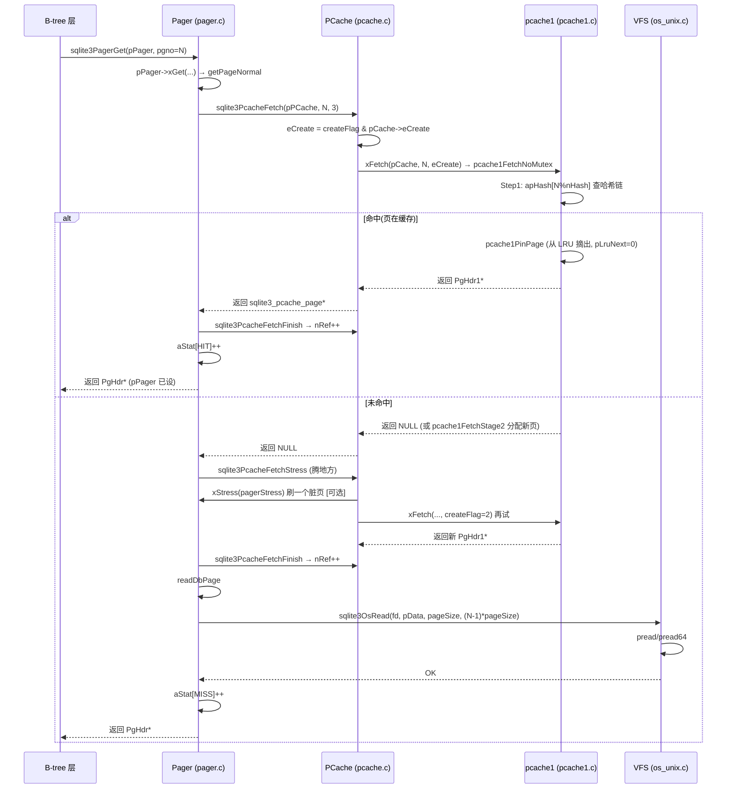
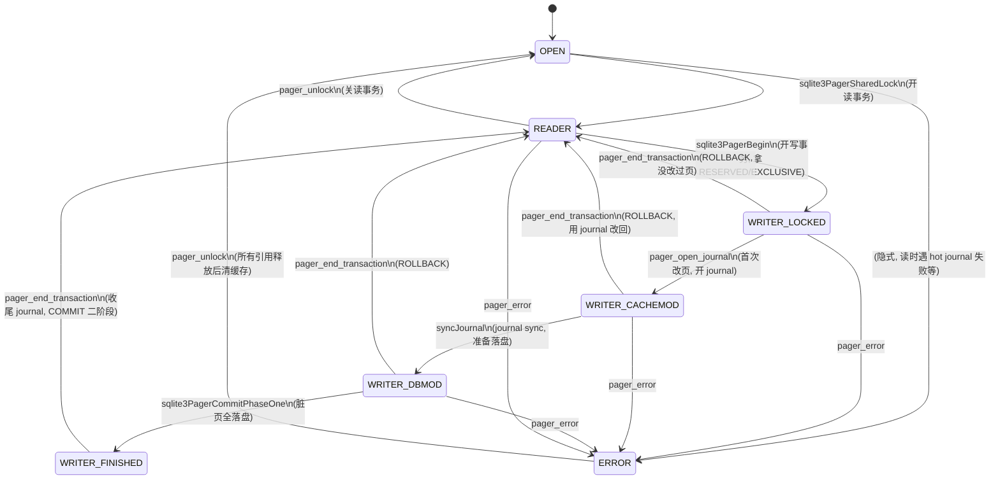

# 第 4 篇 · 第 11 章 · Pager:页缓存

> **核心问题**:前面三章(P3-08/09/10),我们把 SQLite 的存储数据结构拆透了——表和索引都是 B-tree(不是 B+树),行以 Record 变长格式存在 4KB 页里,索引用另一棵 B-tree 加速查找。但所有这些都建立在一个前提上:**页是常驻内存的**。你写 `SELECT * FROM users WHERE id=10`,B-tree 层调一句 `sqlite3BtreeTableMoveto` 去 rowid=10 那一行,可那一行所在的页此刻很可能根本不在内存里——它在磁盘的 .db 文件上。那么问题来了:谁负责把页从磁盘搬进内存?搬进来之后放在哪?如果内存装不下这么多页,谁决定淘汰哪一页?更微妙的是——B-tree 层拿到一个页指针正在改它,这时候缓存层能把这页淘汰掉吗?改完的脏页什么时候写回磁盘?写一半 crash 了怎么办?这一摊"页在内存和磁盘之间搬来搬去、还要保证不丢不乱"的事,就是 **pager** 的职责。本章拆 SQLite 页管理的全部内幕:pager 和 pcache 是怎么分层的、pcache1 用什么数据结构做 LRU + 哈希、读一个页的完整流程、脏页怎么跟踪、引用计数怎么保证不淘汰正在用的页,以及那个驱动整个事务生命周期的 **7 态状态机**。

> **读完本章你会明白**:
> 1. SQLite 的页管理是**严格两层**:`pager`(页管理层,`src/pager.c`,7880 行)在上,管事务、脏页、journal/WAL 协作;`pcache`(缓存层,`src/pcache.c` + `src/pcache1.c`)在下,只管 LRU 淘汰和哈希查找。两层通过一个 **`xStress` 回调**(注册点在 [pager.c:5072](../sqlite/src/pager.c#L5072) 的 `sqlite3PcacheOpen(... pagerStress ...)`)耦合——pcache 缓存满了要腾地方,就回调 `pagerStress`([pager.c:4655](../sqlite/src/pager.c#L4655)) 让 pager 先把脏页刷盘。这个分层是 SQLite 区别于 MySQL buffer pool 的根本(MySQL 把缓存和事务管理揉在一个 buffer pool 里,SQLite 拆开了)。
> 2. **pcache1 的三件套**:`PgHdr1`([pcache1.c:117](../sqlite/src/pcache1.c#L117))每个页一个,带 `iKey`(页号)+ `pNext`(哈希链)+ `pLruNext/pLruPrev`(LRU 双向链表);`PCache1`([pcache1.c:175](../sqlite/src/pcache1.c#L175))持有一个 `apHash` 哈希表(页号→PgHdr1,取模哈希 `iKey % nHash`,链地址法);`PGroup`([pcache1.c:158](../sqlite/src/pcache1.c#L158))管一组 PCache 的总页数上限和全局 LRU 链,有两种模式(mode1 每 PCache 独立无锁,mode2 全局共享一把 `SQLITE_MUTEX_STATIC_LRU`)。pin 机制**不是计数**,而是"是否挂在 LRU 链上"——`PAGE_IS_PINNED(p) = (p->pLruNext==0)`([pcache1.c:133](../sqlite/src/pcache1.c#L133)),这是极易讲错的一点。
> 3. **读一个页的完整流程**:`getPageNormal`([pager.c:5581](../sqlite/src/pager.c#L5581))→ `sqlite3PcacheFetch`(createFlag=3,尽力分配)→ 命中(`pPg->pPager!=0`,HIT++,直接返回,`nRef++`);未命中走 `sqlite3PcacheFetchStress`([pcache.c:445](../sqlite/src/pcache.c#L445),可能触发 spill 回调 pager)→ `sqlite3PcacheFetchFinish`([pcache.c:528](../sqlite/src/pcache.c#L528),`nRef++`)→ `readDbPage`([pager.c:3067](../sqlite/src/pager.c#L3067))调 `sqlite3OsRead(fd, pData, pageSize, (pgno-1)*pageSize)` 从 VFS 真正读文件。
> 4. **两层 pin,各管一摊**:上层 `PgHdr.nRef`([pcache.h:43](../sqlite/src/pcache.h#L43))是 **B-tree 层的引用计数**——`FetchFinish` 做 `nRef++`,`Release` 做 `--nRef`,降到 0 且页是 clean 才通知底层 unpin;下层 pcache1 的 `PAGE_IS_PINNED` 是**缓存层是否在 LRU 链上**——unpin 把页挂回 LRU 链头,pin 把页从 LRU 摘出。两层 pin 配合,保证"正在被 B-tree 用的页(nRef>0)绝不会被淘汰"。反例:没有 nRef,B-tree 正拿着页指针改数据,缓存层一个 LRU 淘汰把页回收了,就是经典的 **use-after-free**。
> 5. **7 态状态机驱动整个事务**:`PAGER_OPEN → READER → WRITER_LOCKED → WRITER_CACHEMOD → WRITER_DBMOD → WRITER_FINISHED`(外加 `PAGER_ERROR`),定义在 [pager.c:351](../sqlite/src/pager.c#L351)。每个状态对应事务的一个阶段:OPEN 是刚打开啥也不能干,READER 能读不能写,WRITER_LOCKED 拿了写锁还没改,WRITER_CACHEMOD 开始改页了(journal 已开),WRITER_DBMOD 数据文件开始落盘了,WRITER_FINISHED 全部落盘只等收尾 journal。pager 在每个操作前都用 `assert(eState>=...)` 卡状态——**状态机是事务正确性的骨架**,一旦状态错乱,ACID 立刻崩。

> **逃生阀(这章源码密度很高,一读觉得晕,先记住这五件事)**:
> ① pager 在上(管事务/脏页/journal)、pcache 在下(管 LRU/哈希淘汰),两层用 `xStress` 回调耦合;② pcache1 的核心是"哈希表(页号→页) + LRU 双向链表(淘汰用) + pin(是否在 LRU 上)";③ 读页 = 查哈希 → 命中返回 / 未命中从 VFS 读文件 offset=(pgno-1)×pageSize;④ 脏页改之前先写 rollback journal 存原内容(下一章 P4-12 详讲),提交时统一刷盘;⑤ pager 用 7 态状态机驱动事务,每步操作都 assert 状态合法。记住这五点,后面每一节都是在展开它们。

---

## 〇、一句话点破

> **SQLite 把页管理拆成两层:pager 在上层负责"页的事务语义"(什么时候能读、什么时候能写、脏页什么时候刷、journal 怎么协作),pcache 在下层只负责"缓存的力学"(哈希查找、LRU 淘汰、pin 计数)。两层用一个 `xStress` 回调耦合——pcache 满了要淘汰脏页,就回调 pager 先把脏页刷盘再回收。读一个页就是"查哈希,命中返回,未命中从文件读";脏页靠"改前先存原内容进 journal"保证可回滚;整个事务的生命周期由一个 7 态状态机驱动,每个操作都卡死状态合法性。**

这是结论,不是理由。本章倒过来拆:先把 pager/pcache 的分层立起来(为什么要拆两层?不拆会怎样?),再钻进 pcache1 看它的哈希表+LRU+pin 三件套长什么样(真实结构体逐字段拆),然后跟一遍"读一个页"的完整代码流程(从 B-tree 发起到 VFS `sqlite3OsRead` 落地),接着讲脏页怎么跟踪、引用计数 pin 怎么防 use-after-free,最后拆那个驱动事务的 7 态状态机(每个状态对应事务的哪个阶段、状态迁移由哪个函数触发)。结尾用对照 MySQL buffer pool 和 Linux page cache 一句话收束。

---

## 一、为什么要分 pager 和 pcache 两层

理解 SQLite 的页管理,第一个要打通的关卡是:**它为什么拆成 pager 和 pcache 两层,而不是像 MySQL 那样揉在一个 buffer pool 里?**

### 先看分层全貌

SQLite 的页管理,从上到下是三层:

```
   ┌─────────────────────────────────────────────────────────────┐
   │  B-tree 层 (btree.c)                                         │
   │  "我要读页 N" / "我要改页 N"                                 │
   │   ↓ 调                                          ↑ 返回 PgHdr │
   ├─────────────────────────────────────────────────────────────┤
   │  Pager 层 (pager.c, 7880 行) ← 本章上半的主角                │
   │  · 事务语义:页什么时候能读/能写(eState 7 态状态机)          │
   │  · 脏页管理:改页前先写 rollback journal 存原内容            │
   │  · 提交/回滚:CommitPhaseOne 刷脏页、Rollback 用 journal 改回│
   │  · 协作:把 pagerStress 回调注册给 pcache                    │
   │   ↓ sqlite3PcacheFetch/Release/MakeDirty        ↑ PgHdr      │
   ├─────────────────────────────────────────────────────────────┤
   │  Pcache 层 (pcache.c 通用框架 + pcache1.c 默认实现)          │
   │  · 哈希查找:页号 → PgHdr1 (apHash 取模哈希)                  │
   │  · LRU 淘汰:pGroup.lru 双向链表,缓存满时回收最久未用        │
   │  · pin 机制:页在用就不挂 LRU(PAGE_IS_PINNED = pLruNext==0)  │
   │  · 引用计数:PgHdr.nRef(B-tree 层引用)                       │
   │   ↓ sqlite3OsRead/Write                          ↑ pData      │
   ├─────────────────────────────────────────────────────────────┤
   │  VFS 层 (os_unix.c / os_win.c / os_kv.c)                     │
   │  真正读写 .db 文件 (pread/pwrite, offset=(pgno-1)×pageSize)  │
   └─────────────────────────────────────────────────────────────┘
```

注意一个关键细节:**B-tree 层拿到的指针是 `PgHdr`**(页头,定义在 [pcache.h:25](../sqlite/src/pcache.h#L25)),它通过 `pData` 字段指向真正的页数据缓冲区。B-tree 不直接碰 `PgHdr1`(那是 pcache1 的私有结构),也不直接碰 VFS——它只跟 pager 的接口(`sqlite3PagerGet`/`sqlite3PagerWrite`)打交道。这个"指针类型逐层不同"的设计,是分层的关键。

### pager 这层管什么:事务语义 + journal 协作

pager 的核心职责,是给 B-tree 提供一个"看起来页常驻内存"的抽象,同时在底下偷偷管事务。具体四件事:

1. **读页**:`sqlite3PagerGet`([pager.c:5772](../sqlite/src/pager.c#L5772))——B-tree 要页 N,pager 去查 pcache,命中返回,未命中从 VFS 读文件。
2. **写页**:`sqlite3PagerWrite`([pager.c:6280](../sqlite/src/pager.c#L6280))——B-tree 要改页 N,pager 先确保 journal 里有这页的原内容(改前存),再标记脏页,才允许 B-tree 改。
3. **提交/回滚**:`sqlite3PagerCommitPhaseOne/Two`、`sqlite3PagerRollback`——提交时把脏页刷盘、收尾 journal;回滚时用 journal 把页改回原样。
4. **状态机守卫**:用 `eState` 字段(7 态)卡住"什么阶段能干什么",每个操作开头 `assert(eState>=PAGER_READER)` 之类。

这四件事里,**只有第 1 件(读页)的缓存查找部分委托给了 pcache**,其余三件全是 pager 自己的事务逻辑。这就是分层的边界:pcache 只懂"缓存",不懂"事务"。

### pcache 这层管什么:纯缓存的力学

pcache 的职责边界非常窄——**它完全不知道"事务"为何物**。它只管三件事:

1. **哈希查找**:给个页号,告诉你这页在不在缓存里(`sqlite3PcacheFetch`)。
2. **LRU 淘汰**:缓存满了,挑一个最久没用的页回收(`pcache1EnforceMaxPage`、`pcache1FetchStage2` 的 Step4)。
3. **pin 计数**:页正在被上层用,就不让淘汰(`nRef` 和 `PAGE_IS_PINNED`)。

pcache 不知道这页是脏的还是干净的(脏页标记在 `PgHdr.flags` 里,但 pcache 不基于它做决策)、不知道现在是不是在事务里、不知道 journal 开没开。这些"事务上下文"全是 pager 在管。pcache 只在被回收脏页时,通过那个 `xStress` 回调问一句 pager:"这页是脏的,你帮我先刷盘,我再回收。"

### 不这样分层会怎样

> **不这样会怎样**:如果像 MySQL 那样把缓存和事务揉在一个 buffer pool 里(MySQL 的 `buf_pool_t` 既管 LRU 又管脏页 flush list 又管锁),好处是"一个对象搞定一切",但代价是**耦合极重**——MySQL 的 buffer pool 代码是 InnoDB 里最复杂的部分之一(冷热链、flush 邻居、自适应哈希、doublewrite 全揉进去)。SQLite 走了相反的路:**缓存归缓存(pcache),事务归事务(pager)**,中间用一个回调解耦。结果是 pcache 可以整个替换掉(`sqlite3_config(SQLITE_CONFIG_PCACHE2, &myMethods)` 注册自定义缓存实现,见 [pcache1.c:1210](../sqlite/src/pcache1.c#L1210) 的 `sqlite3PCacheSetDefault`),pager 一行不用改。这种可插拔,是 SQLite "可裁剪、可移植"哲学的体现——嵌入式场景下,你可能想用自己的缓存(比如固定大小的环形缓冲),SQLite 允许你换。

> **所以这样设计**:pager 和 pcache 分两层,是因为"事务语义"和"缓存力学"是两个正交的关注点。分开后,pcache 可以独立替换、独立测试、独立调优;pager 可以专注事务正确性不被缓存细节干扰。两层用 `xStress` 回调解耦,这是教科书式的"依赖反转"——上层(pager)定义"脏页怎么刷"的策略,下层(pcache)在需要时调用,但下层不知道策略细节。

> **钉死这件事**:理解 SQLite 页管理的第一把钥匙,是认清"pager 在上、pcache 在下、两层用 `xStress` 回调耦合"。`sqlite3PagerOpen`([pager.c:4781](../sqlite/src/pager.c#L4781))里有一行 `sqlite3PcacheOpen(szPageDflt, nExtra, !memDb, !memDb?pagerStress:0, (void*)pPager, pPager->pPCache)`,这行就是两层耦合的注册点——pager 把自己的 `pagerStress` 函数指针交给 pcache,pcache 此后每当要淘汰脏页就回调它。注意内存库(`memDb`)时不注册 stress(因为内存库压根不回写文件,淘汰即丢弃,不需要刷盘)。这一行代码,定义了整个分层的契约。

### 一句话对照 MySQL / Linux mm

你如果读过《MySQL·InnoDB》的 buffer pool 那章,或者《Linux内存管理》的 page cache 那章,会发现它们和 SQLite 的 pager 解决的是**同一个问题**:把热点页缓存进内存、跟踪脏页、LRU 淘汰、回写磁盘。差别只在工程形态:

- **MySQL buffer pool**:C/S 引擎,buffer pool 是独立的大块共享内存,冷热链 + flush list + 自适应哈希全揉进去,为高并发设计。
- **Linux page cache**:内核态,所有进程共享,通过 address_space 关联文件,脏页由 writeback 线程异步回写。
- **SQLite pager**:嵌入式单进程,每个连接一个 Pager + 一个 PCache,简单到极致——没有冷热链(就一个 LRU)、没有异步 writeback 线程(提交时同步刷)、没有共享内存(连接间不共享缓存)。

> **承接**:页缓存这件事的根本逻辑(热点页进内存 + LRU + 脏页回写),《MySQL·InnoDB》buffer pool 那章和《Linux内存管理》page cache 那章已经讲透了,本书不重复。本章只讲 SQLite 独有的部分:两层拆分、pcache1 的哈希+LRU+pin 三件套、7 态状态机、嵌入式简化。

---

## 二、钻进 pcache1:哈希表 + LRU + pin 三件套

分层讲完了,现在钻进 pcache1 这个默认缓存实现,看它的核心数据结构长什么样。这是本章源码最密集的部分,但也是理解"缓存怎么工作"的根。

### 一页在内存里的样子:四层头叠在一起

先搞清楚一个物理页在内存里是怎么布局的。pcache1.c 开头的注释([pcache1.c:19](../sqlite/src/pcache1.c#L19))画得很清楚:

```
   一个 pcache 缓存行(cache line)的内存布局:
   ┌──────────────────────────────────────────────────────────┐
   │  database page content (pageSize 字节, 真正的页数据)      │
   │  ── 越界读会无害地流进下面的 PgHdr1 ──                      │
   ├──────────────────────────────────────────────────────────┤
   │  PgHdr1   (pcache1.c 私有头: iKey 页号, pNext 哈希链,      │
   │            pLruNext/pLruPrev LRU 链)                       │
   ├──────────────────────────────────────────────────────────┤
   │  MemPage  (btree.c 加的头: 页号、页类型、cell 数等)        │
   ├──────────────────────────────────────────────────────────┤
   │  PgHdr    (pcache.c 的头: nRef 引用计数, flags 脏/净标记, │
   │            pDirty 脏页链)                                  │
   └──────────────────────────────────────────────────────────┘
```

这是一个**单块连续内存**,一次 `malloc` 分配,里面叠了四个"头":先是 pageSize 字节的页数据(最前面,这样越界读会流进 PgHdr1 而不是踩别的对象),然后是 pcache1 的 `PgHdr1`、btree 的 `MemPage`、pcache 的 `PgHdr`。三个模块各拿自己那一段头,互不干扰。注释里特意说明:把页数据放最前面是有意为之——读损坏的数据库文件时,b-tree 层可能多读几个字节(最多 16 字节)越过页缓冲边界,这些字节会落进紧随其后的 PgHdr1,作为"越界缓冲区"避免 valgrind 误报。

这种"一次分配、多头叠放"是 C 里常见的技巧(对比 Linux 内核的 `struct page` 也类似),好处是:**一次 malloc 拿到页数据 + 所有关联元数据,缓存局部性好,分配/释放也快**(不用四次 malloc)。代价是各层得用指针运算互相找——`PgHdr.pData` 指向最前面的页数据,`PgHdr1.page.pBuf` 也指向那里;`PgHdr` 是 `PgHdr1.page.pExtra` 指向的那块。

### PgHdr:pcache 层的页头(管引用计数和脏净)

从上往下看,最靠近 B-tree 的是 `PgHdr`([pcache.h:25](../sqlite/src/pcache.h#L25)):

```c
/* pcache.h:25 */
struct PgHdr {
  sqlite3_pcache_page *pPage;    /* Pcache 对象的页句柄(指向 PgHdr1) */
  void *pData;                   /* 页数据(pageSize 字节) */
  void *pExtra;                  /* 额外内容(指向 MemPage) */
  PCache *pCache;                /* 拥有这页的 PCache */
  PgHdr *pDirty;                 /* 按 pgno 排序的脏页临时链表 */
  Pager *pPager;                 /* 这页所属的 Pager */
  Pgno pgno;                     /* 页号 */
  u16 flags;                     /* PGHDR_* 标志 */
  /* ---- 以下是 pcache.c 私有 ---- */
  i64 nRef;                      /* 这页的引用计数(B-tree 层引用) */
  PgHdr *pDirtyNext;             /* 脏页链表后继 */
  PgHdr *pDirtyPrev;             /* 脏页链表前驱 */
};
```

最关键的两个字段:

- **`nRef`**(引用计数):B-tree 层每调一次 `sqlite3PagerGet` 拿到这页,`nRef++`;每调一次 `sqlite3PagerUnref` 放手,`nRef--`。**只要 `nRef>0`,这页就绝不能被淘汰**——这是上层 pin。`nRef` 降到 0 且页是 clean,才通知底层 pcache1 把页挂回 LRU 链(可被淘汰)。
- **`flags`**:几位标志,定义在 [pcache.h:51](../sqlite/src/pcache.h#L51):

```c
/* pcache.h:51 */
#define PGHDR_CLEAN           0x001  /* 干净页,不在脏页链上 */
#define PGHDR_DIRTY           0x002  /* 脏页,在 PCache.pDirty 链上 */
#define PGHDR_WRITEABLE       0x004  /* 已 journal,可以改了 */
#define PGHDR_NEED_SYNC       0x008  /* 写这页进 db 文件前要先 fsync journal */
#define PGHDR_DONT_WRITE      0x010  /* 不要把这页写进 db 文件 */
#define PGHDR_MMAP            0x020  /* 这是 mmap 的页 */
#define PGHDR_WAL_APPEND      0x040  /* 追加到 wal 文件的页 */
```

这几个 flag 的组合,精确描述了一页在事务里的状态。注意 `PGHDR_DIRTY` 和 `PGHDR_WRITEABLE` 是**两个不同的标志**——一页可以是 dirty(改过、需要回写)但还没 writeable(还没 journal、还不能让 B-tree 改)。这个区分是"改前先 journal"的关键(下一节详讲)。

### PgHdr1:pcache1 层的页头(管哈希链和 LRU)

往下一层,pcache1 私有的是 `PgHdr1`([pcache1.c:117](../sqlite/src/pcache1.c#L117)):

```c
/* pcache1.c:117 */
struct PgHdr1 {
  sqlite3_pcache_page page; /* 基类,必须第一个(pBuf & pExtra) */
  unsigned int iKey;        /* 键值(页号) */
  u16 isBulkLocal;          /* 这页来自批量本地分配 */
  u16 isAnchor;             /* 这是 PGroup.lru 的锚点 */
  PgHdr1 *pNext;            /* 哈希表链的后继 */
  PCache1 *pCache;          /* 当前拥有这页的 PCache1 */
  PgHdr1 *pLruNext;         /* LRU 链后继(只在 unpinned 时有效) */
  PgHdr1 *pLruPrev;         /* LRU 链前驱(只在 pLruNext!=0 时有效) */
};
```

三个字段是 pcache1 的命脉:

- **`iKey`**:页号(就是 `PgHdr.pgno`,在 pcache1 这层叫 `iKey`,因为 pcache1 是通用的键值缓存,不假设键是页号)。
- **`pNext`**:哈希表链的后继。pcache1 用链地址法解决哈希冲突——所有哈希到同一桶的页,用 `pNext` 串成单链表。
- **`pLruNext`/`pLruPrev`**:LRU 双向链表的前后指针。**这俩字段是否有效,决定了页是否 pin**——这是 pcache1 最巧妙的设计,值得单独拎出来讲(见下文 pin 机制)。

注意 `page` 字段是基类(`sqlite3_pcache_page`,含 `pBuf` 和 `pExtra`),`PgHdr1` 继承它且 `page` 必须是第一个字段——这样 pcache.c 拿到的是 `sqlite3_pcache_page *`,pcache1.c 内部强转成 `PgHdr1 *`,零开销。这是 C 里"面向对象"的惯用法(对比 Linux 内核的 `container_of`)。

### PCache1:哈希表 + 配置

一个数据库连接对应一个 `PCache1`([pcache1.c:175](../sqlite/src/pcache1.c#L175)):

```c
/* pcache1.c:175 */
struct PCache1 {
  PGroup *pGroup;              /* 这缓存所属的 PGroup */
  unsigned int *pnPurgeable;   /* 指向 pGroup->nPurgeable */
  int szPage;                  /* 页数据大小 */
  int szExtra;                 /* MemPage+PgHdr 的大小 */
  int szAlloc;                 /* 一个缓存行总大小 */
  int bPurgeable;              /* True 表示这缓存的页可回收(普通 db) */
  unsigned int nMin;           /* 保留的最小页数(默认 10) */
  unsigned int nMax;           /* 配置的 cache_size */
  unsigned int n90pct;         /* nMax*9/10 */
  unsigned int iMaxKey;        /* xTruncate 以来见过的最大键 */
  /* ---- 哈希表(PGroup mutex 保护)---- */
  unsigned int nRecyclable;    /* LRU 链上的页数 */
  unsigned int nPage;          /* apHash 里的总页数 */
  unsigned int nHash;          /* apHash 的桶数 */
  PgHdr1 **apHash;             /* 哈希表(键→PgHdr1) */
  PgHdr1 *pFree;               /* pcache 本地空闲页链 */
  void *pBulk;                 /* pcache 本地的批量内存 */
};
```

核心是 **`apHash`**——一个指针数组,`apHash[iKey % nHash]` 指向该桶的页链头,顺着 `pNext` 找具体页。这就是 pcache1 的查找结构。`nMax` 是配置的缓存页上限(`PRAGMA cache_size`),超过这个数就开始考虑淘汰。`pFree`/`pBulk` 是"批量本地分配"——pcache1 会一次性 malloc 100 页的内存块([pcache1.c:81](../sqlite/src/pcache1.c#L81) 注释说这样能给常见负载带来约 5% 的性能提升),前 100 页从这里切,减少 malloc 次数。

### PGroup:一组 PCache 共享的 LRU 和配额

最外层是 `PGroup`([pcache1.c:158](../sqlite/src/pcache1.c#L158)):

```c
/* pcache1.c:158 */
struct PGroup {
  sqlite3_mutex *mutex;     /* MUTEX_STATIC_LRU 或 NULL */
  unsigned int nMaxPage;    /* 所有可回收缓存的 nMax 之和 */
  unsigned int nMinPage;    /* 所有可回收缓存的 nMin 之和 */
  unsigned int mxPinned;    /* nMaxPage + 10 - nMinPage */
  unsigned int nPurgeable;  /* 已分配的可回收页数 */
  PgHdr1 lru;               /* LRU 链的头尾锚点 */
};
```

一个 PGroup 管一组 PCache 的**总配额**和**共享 LRU 链**。pcache1 有两种运行模式([pcache1.c:141](../sqlite/src/pcache1.c#L141) 注释):

- **mode1(默认)**:每个 PCache 自己一个 PGroup,`PGroup.mutex = NULL`。好处是**无锁快**(单连接自己用,不需要同步);代价是连接之间不能互相回收页(你缓存满了,不能抢别人的空闲页)。
- **mode2**:所有 PCache 共享一个全局 PGroup(`pcache1.grp`,`mutex = SQLITE_MUTEX_STATIC_LRU`)。好处是**页回收更高效**(多个连接的缓存可以互相调剂);代价是每次操作都要加全局锁。

SQLite 默认走 mode1(嵌入式通常单连接,无锁更快);只有编译时配置或某些场景才用 mode2。这个选择体现了 SQLite "默认快、可配置"的风格。

`lru` 字段是 LRU 链的**锚点**——它本身是个 `PgHdr1`,但 `isAnchor=1`,作为链表的头尾哨兵。所有 unpinned 的页都挂在这个锚点形成的双向循环链表上。这个"用哨兵节点做循环链表头尾"是经典手法(对比 Linux 内核 `list_head`),好处是插入/删除不用判空,代码统一。

### pin 机制:不是计数,是"在不在 LRU 链上"

这是 pcache1 最容易讲错、也最巧妙的一点。先看定义([pcache1.c:133](../sqlite/src/pcache1.c#L133)):

```c
/* pcache1.c:129 */
/* 一页若不在 LRU 链上就是 pinned。pinned 意味着页正在被用,
** 绝不能释放。 */
#define PAGE_IS_PINNED(p)    ((p)->pLruNext==0)
#define PAGE_IS_UNPINNED(p)  ((p)->pLruNext!=0)
```

注意:**pcache1 层的 pin,不是用一个单独的计数器,而是复用 `pLruNext` 是否为 0 来判断**。一页如果挂在 LRU 链上(`pLruNext != 0`),就是 unpinned(可淘汰);如果不在 LRU 链上(`pLruNext == 0`),就是 pinned(在用,不能淘汰)。

这个设计的精妙之处在于:**它把"是否可淘汰"和"数据结构成员资格"绑定**——一页要么在 LRU 链上(可淘汰),要么不在(不可淘汰),没有中间态。淘汰时只要从 LRU 链头摘一个就行,根本不用检查任何标志位。

pin 一个页(把它从 LRU 链摘出),就是 `pcache1PinPage`([pcache1.c:578](../sqlite/src/pcache1.c#L578)):

```c
/* pcache1.c:580 (简化示意,非源码原文) */
static PgHdr1 *pcache1PinPage(PgHdr1 *pPage){
  assert( pPage->pLruNext!=0 );          /* 必须是 unpinned */
  pPage->pLruNext->pLruPrev = pPage->pLruPrev;  /* 后驱的前驱 = 我的后驱 */
  pPage->pLruPrev->pLruNext = pPage->pLruNext;  /* 前驱的后驱 = 我的后驱 */
  pPage->pLruNext = 0;                    /* 置空 = pinned */
  pPage->pCache->nRecyclable--;
  return pPage;
}
```

标准双向链表删除 + 置 `pLruNext=0`。unpin 一个页(把它挂回 LRU 链头),在 `pcache1Unpin`([pcache1.c:1078](../sqlite/src/pcache1.c#L1078))里:

```c
/* pcache1.c:1096 (核心部分) */
if( reuseUnlikely || pGroup->nPurgeable>pGroup->nMaxPage ){
  pcache1RemoveFromHash(pPage, 1);   /* 直接丢弃 */
}else{
  /* 挂到 LRU 链头 */
  PgHdr1 **ppFirst = &pGroup->lru.pLruNext;
  pPage->pLruPrev = &pGroup->lru;
  (pPage->pLruNext = *ppFirst)->pLruPrev = pPage;
  *ppFirst = pPage;
  pCache->nRecyclable++;
}
```

注意 `reuseUnlikely` 参数——如果调用者明确表示这页"不太可能再用了",或者总页数已经超 `nMaxPage`,就直接丢弃(从哈希表移除 + 释放内存),不挂 LRU。这是"激进回收"的开关。

> **钉死这件事**:pcache1 的 pin 机制是"页是否在 LRU 链上"——`PAGE_IS_PINNED = (pLruNext==0)`。这不是一个独立的计数,而是**数据结构成员资格的副产品**。一页挂在 LRU 链上就可淘汰,摘下来就在用。这种设计省了一个字段、省了一次判断,代码极简。但要和上层的 `PgHdr.nRef` 区分清楚——`nRef` 是 B-tree 层的引用计数(上层 pin),`PAGE_IS_PINNED` 是缓存层的淘汰资格(下层 pin),两层 pin 配合才保证"正在用的页不被淘汰"。

### 一张图收束:pcache1 的全貌

把上面几个结构体拼起来,pcache1 的全貌长这样:

```
   PGroup (一个或全局共享)
   ┌───────────────────────────────────────────────────────────┐
   │ mutex / nMaxPage / nMinPage / mxPinned / nPurgeable       │
   │                                                            │
   │   lru 锚点(isAnchor=1)                                    │
   │     ↕                                                      │
   │   ┌──L RU 双向循环链表(unpinned 的页挂这里)──────────┐    │
   │   │  PgHdr1(C) ↔ PgHdr1(A) ↔ PgHdr1(B) ↔ ... ↔ lru │    │
   │   └──────────────────────────────────────────────────┘    │
   └───────────────────────────────────────────────────────────┘
            ▲ 每个页同时也在某个 PCache1 的 apHash 里
            │
   PCache1 (每个连接一个)
   ┌───────────────────────────────────────────────────────────┐
   │ apHash[0] → PgHdr1(X) → PgHdr1(Y) → NULL  (哈希链)         │
   │ apHash[1] → NULL                                          │
   │ apHash[2] → PgHdr1(Z) → NULL                              │
   │ ...                                                       │
   │ apHash[nHash-1] → ...                                     │
   │                                                            │
   │ nMax (cache_size 上限) / nPage / nRecyclable / pFree       │
   └───────────────────────────────────────────────────────────┘
            │
            │ 每个 PgHdr1 内部:
            ▼
   ┌──────────────────────────────────────────┐
   │ PgHdr1                                    │
   │  · iKey (页号)                             │
   │  · pNext (哈希链后继)                      │
   │  · pLruNext/pLruPrev (LRU 链,只在 unpinned)│
   │  · page.pBuf → 页数据 (pageSize 字节)      │
   │  · page.pExtra → PgHdr (上层头)            │
   │       └─ PgHdr.nRef (B-tree 引用计数)      │
   │       └─ PgHdr.flags (DIRTY/CLEAN/...)     │
   └──────────────────────────────────────────┘
```

记住这张图,后面的读页流程、淘汰流程,全是在这张图上做操作。

---

## 三、读一个页的完整流程:从 B-tree 到 VFS

数据结构讲完了,现在跟一遍真实代码:当 B-tree 层说"我要读页 N",SQLite 内部到底发生了什么。这是把前面所有结构体串起来的关键一节。

### 入口:sqlite3PagerGet → getPageNormal

B-tree 层(比如 `btree.c` 里的 `sqlite3BtreeGetPage`)调 `sqlite3PagerGet`([pager.c:5772](../sqlite/src/pager.c#L5772))要一个页:

```c
/* pager.c:5772 */
int sqlite3PagerGet(
  Pager *pPager,      /* 打开在数据库文件上的 pager */
  Pgno pgno,          /* 要取的页号 */
  DbPage **ppPage,    /* 把页指针写到这里 */
  int flags           /* PAGER_GET_XXX 标志 */
){
  return pPager->xGet(pPager, pgno, ppPage, flags);
}
```

注意这里是个**函数指针分发**——`pPager->xGet` 在 pager 创建时([pager.c:1047-1053](../sqlite/src/pager.c#L1047))根据模式设成三个实现之一:

- `getPageNormal`:普通文件读写(默认)。
- `getPageMMap`:mmap 模式(大文件用内存映射,少一次拷贝)。
- `getPageError`:出错后所有读都直接报错。

这种"创建时绑定一个函数指针"是 C 里常见的多态手法(对比 Linux VFS 的 `file_operations`)。我们跟默认的 `getPageNormal`([pager.c:5581](../sqlite/src/pager.c#L5581))。

### getPageNormal 的三段式

`getPageNormal` 的核心是三段:查缓存 → (未命中)触发 spill → 读盘初始化。

```c
/* pager.c:5598 (核心部分,简化示意) */
pBase = sqlite3PcacheFetch(pPager->pPCache, pgno, 3);   /* ① 查缓存 */
if( pBase==0 ){
  rc = sqlite3PcacheFetchStress(pPager->pPCache, pgno, &pBase);  /* ② 满了,腾地方 */
  if( rc!=SQLITE_OK ) goto pager_acquire_err;
}
pPg = *ppPage = sqlite3PcacheFetchFinish(pPager->pPCache, pgno, pBase);  /* ③ nRef++ */

if( pPg->pPager && !noContent ){
  /* 命中:pcache 里已有初始化好的页,直接返回 */
  pPager->aStat[PAGER_STAT_HIT]++;
  return SQLITE_OK;
}else{
  /* 未命中:新页,从文件读 */
  pPager->aStat[PAGER_STAT_MISS]++;
  rc = readDbPage(pPg);   /* ④ 真正读盘 */
}
```

逐段拆:

**① `sqlite3PcacheFetch`([pcache.c:403](../sqlite/src/pcache.c#L403))**:这是 pcache 层的查找入口。它计算一个 `eCreate` 值(0=不分配,1=便宜就分配,2=尽力分配),然后调底层 `sqlite3GlobalConfig.pcache2.xFetch`(就是 pcache1 的 `pcache1Fetch`)。

```c
/* pcache.c:423 */
eCreate = createFlag & pCache->eCreate;
pRes = sqlite3GlobalConfig.pcache2.xFetch(pCache->pCache, pgno, eCreate);
```

`pCache->eCreate` 是个缓存起来的"当前该用哪种分配策略"的值([pcache.c:414](../sqlite/src/pcache.c#L414)):`(bPurgeable && pDirty) ? 1 : 2`——意思是"如果这缓存可回收且有脏页,分配要便宜(免得触发刷盘);否则可以尽力分配"。这是个微优化,避免每次都重新算。

**② `sqlite3PcacheFetchStress`([pcache.c:445](../sqlite/src/pcache.c#L445))**:如果第一步返回 NULL(没空间了),就调这个"再努力一次"的函数。它干的事是:**找一个 unreferenced 的脏页,调 `xStress` 回调让 pager 把它刷盘,腾出空间**。这是缓存层和事务层的协作点,下面单拆。

**③ `sqlite3PcacheFetchFinish`([pcache.c:528](../sqlite/src/pcache.c#L528))**:拿到页后,做引用计数 `nRef++`:

```c
/* pcache.c:541 */
pCache->nRefSum++;
pPgHdr->nRef++;
```

`nRefSum` 是所有页的 `nRef` 之和(一个汇总计数,用于快速判断"这缓存还有没有页在被用")。`nRef++` 是上层 pin——从此这页的 `nRef>0`,pcache 层不会淘汰它。

**④ `readDbPage`([pager.c:3067](../sqlite/src/pager.c#L3067))**:真正读盘。核心两行:

```c
/* pager.c:3086 (rollback 模式) */
i64 iOffset = (pPg->pgno-1)*(i64)pPager->pageSize;
rc = sqlite3OsRead(pPager->fd, pPg->pData, pPager->pageSize, iOffset);
```

**页号到文件偏移的换算**:`offset = (pgno-1) × pageSize`。页号从 1 开始(页 1 是 schema),所以减 1。这是个 O(1) 的换算——B-tree 知道要页 N,pager 立刻算出文件偏移,一次 `pread` 拿到。`sqlite3OsRead` 是 VFS 的读接口,最终落到 `os_unix.c` 的 `pread` 或 `os_win.c` 的 `ReadFile`。

注意 WAL 模式下读盘路径不同——会先 `sqlite3WalFindFrame`([pager.c:3074](../sqlite/src/pager.c#L3074))查这页在 WAL 的哪一帧,如果 WAL 里有更新的版本,就从 WAL 读而不是数据文件。这是 WAL 读不阻塞写的根本(P4-13 详讲)。

### 命中 vs 未命中:缓存的意义

把上面流程里的命中/未命中分支再强调一下,这是缓存存在的全部意义:

- **命中(HIT)**:`pPg->pPager != 0`(这页之前被读过、初始化过,还在缓存里)。直接返回,**不碰磁盘**。这是缓存快的根本——热点页反复读,只读一次盘。
- **未命中(MISS)**:缓存里没这页(或第一次读)。从 VFS 读盘,**一次 `pread`**。读完后页进缓存,下次就命中了。

`pPager->aStat[PAGER_STAT_HIT]` 和 `[PAGER_STAT_MISS]`([pager.c:691](../sqlite/src/pager.c#L691))记录这两个计数,`sqlite3_db_status(SQLITE_DBSTATUS_CACHE_HIT)` 能查到——这是调优缓存命中率的依据。

> **不这样会怎样**:如果没有缓存,B-tree 每次访问一页都要 `pread` 一次磁盘。一次 `SELECT * FROM users`(假设 1 万行,每页 100 行,就是 100 次页访问),就要 100 次磁盘 IO——哪怕很多页是连续重复访问的(比如反复读同一个内部节点导航)。有了缓存,热点页(根节点、热点叶子)常驻内存,100 次访问可能只有头几次 miss,后面全 hit。这就是页缓存存在的根本理由,和 MySQL buffer pool、Linux page cache 完全同源。

### 时序图:一次完整读页

把上面流程画成时序图:



注意那条 `[可选]` 的 `xStress` 回调——它只在缓存满了且要淘汰的是脏页时才触发。下一节专门拆它。

---

## 四、缓存满了怎么办:pagerStress 回调

前面读页流程里,如果 `sqlite3PcacheFetch` 返回 NULL(缓存满),会调 `sqlite3PcacheFetchStress`。这个函数是两层协作的核心,值得单独拆透。

### sqlite3PcacheFetchStress:挑一个脏页刷掉

[pcache.c:445](../sqlite/src/pcache.c#L445):

```c
/* pcache.c:453 (核心部分,简化示意) */
if( sqlite3PcachePagecount(pCache) > pCache->szSpill ){
  /* 找一个 unreferenced 脏页刷掉。
  ** 先找一个不需要 journal-sync 的(pGHDR_NEED_SYNC 清掉),
  ** 找不到再用任意 unreferenced 脏页。 */
  for(pPg=pCache->pSynced;
      pPg && (pPg->nRef || (pPg->flags&PGHDR_NEED_SYNC));
      pPg=pPg->pDirtyPrev);
  pCache->pSynced = pPg;
  if( !pPg ){
    for(pPg=pCache->pDirtyTail; pPg && pPg->nRef; pPg=pPg->pDirtyPrev);
  }
  if( pPg ){
    rc = pCache->xStress(pCache->pStress, pPg);  /* 回调 pagerStress */
  }
}
*ppPage = sqlite3GlobalConfig.pcache2.xFetch(pCache->pCache, pgno, 2);
```

这里有几个精妙点:

1. **`pSynced` 优化**:`pCache->pSynced`([pcache.c:44](../sqlite/src/pcache.c#L44))记录"上次刷到哪个脏页了"。每次 spill 从这里往后找,避免每次都从头扫脏页链。这是 `O(1)` 摊还的优化。
2. **优先刷不需要 sync 的页**:先找 `PGHDR_NEED_SYNC` 清掉的页(这类页刷盘不用先 fsync journal,快);找不到再用别的。这是"挑软柿子捏"——先做最便宜的 spill。
3. **跳过 `nRef>0` 的页**:正在被 B-tree 用的页(`nRef>0`)**绝不刷**。这是上层 pin 的保护——`for(... && pPg->nRef ...)` 这个条件保证了这点。
4. **回调 `xStress`**:找到候选脏页后,调 `pCache->xStress(pCache->pStress, pPg)`——这就是注册进来的 `pagerStress`。

### pagerStress:刷盘 + 标记 clean

`pagerStress`([pager.c:4655](../sqlite/src/pager.c#L4655))是 pager 这层对"脏页刷盘"的实现:

```c
/* pager.c:4689 (核心部分,简化示意) */
static int pagerStress(void *p, PgHdr *pPg){
  Pager *pPager = (Pager *)p;
  /* 错误状态下绝不能 spill(会破坏数据库) */
  if( NEVER(pPager->errCode) ) return SQLITE_OK;
  /* 某些时机禁止 spill(rollback 中、用户禁止、需要 sync 但不允许) */
  if( pPager->doNotSpill && ... ) return SQLITE_OK;

  pPager->aStat[PAGER_STAT_SPILL]++;
  if( pagerUseWal(pPager) ){
    /* WAL 模式:写一帧进 WAL */
    rc = subjournalPageIfRequired(pPg);
    if( rc==SQLITE_OK ) rc = pagerWalFrames(pPager, pPg, 0, 0);
  }else{
    /* rollback 模式:需要的话先 sync journal,再写页进 db 文件 */
    if( pPg->flags&PGHDR_NEED_SYNC || pPager->eState==PAGER_WRITER_CACHEMOD ){
      rc = syncJournal(pPager, 1);
    }
    if( rc==SQLITE_OK ){
      rc = pager_write_pagelist(pPager, pPg);  /* 把页写进 .db 文件 */
    }
  }
  /* 刷成功,标记 clean */
  if( rc==SQLITE_OK ) sqlite3PcacheMakeClean(pPg);
  return rc;
}
```

这是两层契约的实现:**pcache 说"这页我不要了,你帮我善后",pager 回答"好,我把它刷盘,然后告诉你它干净了"**。刷盘的细节(sync journal、write pagelist)是下一章 rollback journal 和 P4-14 ACID 的内容,这里只要记住:`pagerStress` 把脏页落盘后调 `sqlite3PcacheMakeClean` 把页标记成 clean,此后这页就可以被 pcache 安全回收了(因为磁盘上已有最新副本)。

> **钉死这件事**:`pagerStress` 是 pager 和 pcache 两层协作的唯一接口。它的存在,让 pcache 可以完全不懂"脏页怎么刷"——pcache 只说"这页不要了",pager 负责具体怎么刷(sync journal? write pagelist? WAL 帧?)。这种"策略在上、机制在下"的分层,是 SQLite 代码组织的一个缩影。如果你在调优 SQLite 的 spill 行为(比如 `PRAGMA cache_spill`),改的就是这个回路的触发条件。

---

## 五、脏页与引用计数 pin:防 use-after-free 的两道闸

读页和 spill 讲完了,现在讲两个保证正确性的关键机制:**脏页跟踪**和**引用计数 pin**。这俩是"缓存层不能搞破坏"的两道闸。

### 脏页怎么标记:pager_write 的核心

B-tree 要改一页,先调 `sqlite3PagerWrite`([pager.c:6280](../sqlite/src/pager.c#L6280)),它最终调 `pager_write`([pager.c:6094](../sqlite/src/pager.c#L6094))。这是脏页+journal 协作的核心:

```c
/* pager.c:6120 (核心部分,简化示意) */
static int pager_write(PgHdr *pPg){
  Pager *pPager = pPg->pPager;
  /* ① 如果还没开 journal,先开(状态 LOCKED → CACHEMOD) */
  if( pPager->eState==PAGER_WRITER_LOCKED ){
    rc = pager_open_journal(pPager);
    if( rc!=SQLITE_OK ) return rc;
  }
  /* ② 标记脏页(挂进 PCache.pDirty 链) */
  sqlite3PcacheMakeDirty(pPg);
  /* ③ 如果这页还没进 journal,且不是新页,把原内容写进 journal */
  if( pPager->pInJournal!=0
   && sqlite3BitvecTestNotNull(pPager->pInJournal, pPg->pgno)==0 ){
    if( pPg->pgno <= pPager->dbOrigSize ){
      rc = pagerAddPageToRollbackJournal(pPg);  /* 原内容进 journal */
    }else{
      pPg->flags |= PGHDR_NEED_SYNC;  /* 新页,标记需 sync */
    }
  }
  /* ④ 标记可写(B-tree 此后才能改 pData) */
  pPg->flags |= PGHDR_WRITEABLE;
  return rc;
}
```

这四步的顺序至关重要:**先存原内容(进 journal),再标记可写**。为什么?因为如果先让 B-tree 改了数据,再写 journal,journal 里存的就是改后的内容,crash 后没法回滚到改前。所以必须"改前先存"。这就是 rollback journal 的根本思想(下一章 P4-12 详讲)。

`sqlite3PcacheMakeDirty`([pcache.c:593](../sqlite/src/pcache.c#L593))做两件事:设 `PGHDR_DIRTY` 标志、把这页挂进 `PCache.pDirty` 脏页链(按 pgno 排序)。脏页链是提交时批量刷盘的依据。

### 引用计数 pin:正在用的页不能淘汰

现在讲保证正确性的第二道闸——**引用计数 pin**。这分两层,前面提过,这里系统讲:

**上层 pin(`PgHdr.nRef`)**:`sqlite3PcacheFetchFinish` 做 `nRef++`,`sqlite3PcacheRelease`([pcache.c:551](../sqlite/src/pcache.c#L551))做 `--nRef`:

```c
/* pcache.c:551 */
void SQLITE_NOINLINE sqlite3PcacheRelease(PgHdr *p){
  assert( p->nRef>0 );
  p->pCache->nRefSum--;
  if( (--p->nRef)==0 ){
    if( p->flags & PGHDR_CLEAN ){
      pcacheUnpin(p);   /* 干净页:通知底层挂 LRU,可淘汰 */
    }else{
      pcacheManageDirtyList(p, PCACHE_DIRTYLIST_FRONT);  /* 脏页:留在脏页链 */
    }
  }
}
```

关键逻辑:**`nRef` 降到 0 时,如果页是 clean,才通知底层 pcache1 把页挂回 LRU(可淘汰);如果页是 dirty,留在脏页链等提交时刷盘**。这是上层 pin 的语义——"我(B-tree)不用这页了,你看着办"。

**下层 pin(`PAGE_IS_PINNED`)**:pcache1 层的 pin。前面讲过,一页不在 LRU 链上就是 pinned。注意:`pcacheUnpin`(上层 Release 调的)会调到 pcache1 的 `pcache1Unpin`,把页挂回 LRU 链头(变成 unpinned,可淘汰)。但**只要上层 `nRef>0`,这页就根本不会走到 Release**,自然不会被 unpin——两层 pin 是接力保护。

### 反例:没有 pin 会怎样

> **不这样会怎样**:假设没有引用计数 pin,会发生什么?考虑这个场景:B-tree 层调 `sqlite3PagerGet` 拿到页 N 的指针 `pPg`,正在 `pPg->pData` 上改数据(比如分裂一个 cell)。这时候缓存满了,pcache 层要淘汰一页——如果它选了页 N(因为 N 是最久没被 unpin 的),就会把页 N 的内存回收(`free`)或覆盖(读别的页进来)。B-tree 层手里的 `pPg` 指针瞬间变成**悬空指针**——继续写就是经典的 **use-after-free**,轻则数据错乱,重则段错误崩溃。这就是为什么必须有 pin:**pin 是"这页有人正在用,你别动"的契约**。两层 pin(上层 `nRef` + 下层 LRU 成员资格)双重保险,确保任何在用的页(nRef>0)绝不会被淘汰。

> **所以这样设计**:引用计数 pin 的本质,是**让"使用方"和"缓存方"解耦**。B-tree 层只管"我要用这页"(`Get` 时 nRef++)和"我用完了"(`Unref` 时 nRef--),完全不关心缓存满没满、淘汰谁。缓存层只管"nRef==0 的 clean 页才能淘汰",完全不关心这页被谁用、改没改。这个解耦让两层可以独立演化——你可以换掉缓存实现(pcache1 换成自定义),只要遵守 pin 契约,pager 和 B-tree 一行不用改。

> **钉死这件事**:脏页标记(改前先 journal)和引用计数 pin(nRef>0 不淘汰)是页缓存正确性的两道闸。第一道闸保证 crash 不丢数据(回滚有原内容),第二道闸保证运行时不崩(use-after-free 不发生)。这两道闸的代码,分散在 `pager_write` 和 `sqlite3PcacheRelease` 里,看似不起眼,但是 SQLite 稳定性的基石。

---

## 六、7 态状态机:事务生命周期的骨架

前面五节讲的都是"页级别的操作"(读、写、淘汰)。现在升高一层,讲 pager 怎么用**状态机**管整个事务的生命周期。这是本章最宏观、也最关键的一节。

### 为什么要有状态机

先想清楚:一次写事务,从 BEGIN 到 COMMIT,pager 要经历哪些阶段?

1. **开始前**:啥也没干,可能只读了点数据(READER 状态)。
2. **BEGIN(写)**:拿写锁,但还没改任何页(WRITER_LOCKED)。
3. **第一次改页**:开 journal、把第一个要改的页的原内容写进 journal(WRITER_CACHEMOD)。
4. **提交第一阶段**:sync journal、把所有脏页写进 .db 文件(WRITER_DBMOD)。
5. **全部写完**:数据都落盘了,只等收尾 journal(WRITER_FINISHED)。
6. **提交第二阶段**:删 journal、释放锁,回到 READER。
7. **出错了**:进入 ERROR 态,任何操作都报错,直到所有引用释放后回 OPEN。

这七个阶段,就是 pager 的七个状态。**状态机的本质,是把这些阶段显式化,然后在每个操作开头 assert 当前状态合法**——一旦状态错乱(比如还没拿写锁就改页),立刻 assert fail 暴露 bug,而不是让错误悄悄发生导致数据损坏。

### 七个状态的精确定义

[pager.c:351](../sqlite/src/pager.c#L351) 定义,注释在 [pager.c:172-350](../sqlite/src/pager.c#L172)(这段注释是 SQLite 源码里最详尽的状态机文档,值得通读):

```c
/* pager.c:351 */
#define PAGER_OPEN                  0
#define PAGER_READER                1
#define PAGER_WRITER_LOCKED         2
#define PAGER_WRITER_CACHEMOD       3
#define PAGER_WRITER_DBMOD          4
#define PAGER_WRITER_FINISHED       5
#define PAGER_ERROR                 6
```

逐个拆(摘自源码注释的要点):

- **PAGER_OPEN**:刚打开,啥也不能干。文件锁状态未知,数据库大小未知。任何读/写都先要迁移到 READER。
- **PAGER_READER**:拿到了 SHARED 锁,可以读(rollback 模式下)。不能写。数据库大小已知(`dbSize` 可信)。
- **PAGER_WRITER_LOCKED**:写事务刚开始,拿了 RESERVED(或 EXCLUSIVE)锁,**但还没改任何页**。journal 可能开了但啥也没写。这是"准备阶段"——锁拿到了,弹药上膛了,但没开枪。
- **PAGER_WRITER_CACHEMOD**:**第一次改页触发**。journal 开了、header 写进去了(但还没 sync),缓存里的页被改了。磁盘上的 .db 文件还没动。这是"改内存阶段"——脏页在缓存里,journal 在攒。
- **PAGER_WRITER_DBMOD**:**第一次往 .db 文件写触发**(通常是提交时)。journal 已经 sync 了,脏页开始落盘。EXCLUSIVE 锁拿到了。
- **PAGER_WRITER_FINISHED**:**所有脏页都写进 .db 文件了**。只等收尾 journal(删/截断)就完成提交。此后不能再改数据库。
- **PAGER_ERROR**:出错了(IO 错、磁盘满、rollback 失败)。任何操作都报错,直到所有页引用释放后回 OPEN(清空缓存、重新加载)。

### 状态迁移图

源码注释画的状态图([pager.c:139](../sqlite/src/pager.c#L139)),转成 mermaid:



注意几条关键边:

- **OPEN ↔ READER**:每次读事务进出。`sqlite3PagerSharedLock`([pager.c:5300](../sqlite/src/pager.c#L5300))进,`pager_unlock`([pager.c:2052](../sqlite/src/pager.c#L2052) 附近)出。
- **READER → WRITER_LOCKED**:`sqlite3PagerBegin`([pager.c:5968](../sqlite/src/pager.c#L5968))触发——这是 `BEGIN` 写事务的入口。
- **WRITER_LOCKED → WRITER_CACHEMOD**:`pager_open_journal`([pager.c:5877](../sqlite/src/pager.c#L5877))——首次改页时开 journal。
- **WRITER_CACHEMOD → WRITER_DBMOD**:`syncJournal`([pager.c:4332](../sqlite/src/pager.c#L4332))——提交第一阶段,sync journal 后准备写 .db。
- **WRITER_DBMOD → WRITER_FINISHED**:`sqlite3PagerCommitPhaseOne`([pager.c:6511](../sqlite/src/pager.c#L6511))——所有脏页写完。
- **任何 WRITER_* → READER**:`pager_end_transaction`([pager.c:2052](../sqlite/src/pager.c#L2052))——COMMIT 二阶段或 ROLLBACK 收尾。
- **任何 → ERROR**:`pager_error`——IO 错、磁盘满、rollback 失败。
- **ERROR → OPEN**:`pager_unlock`——所有页引用释放后,清空缓存重新加载。

### 状态机是怎么"卡"住正确性的

状态机不只是文档,它是**强制执行的不变量**。每个操作开头都有 `assert(eState >= ...)`:

- `pager_write` 开头([pager.c:6102](../sqlite/src/pager.c#L6102)):`assert(eState==WRITER_LOCKED || WRITER_CACHEMOD || WRITER_DBMOD)`——只有写事务里才能改页。
- `getPageNormal` 开头([pager.c:5593](../sqlite/src/pager.c#L5593)):`assert(eState>=PAGER_READER)`——只有 READER 以上才能读。
- `sqlite3PagerCommitPhaseOne` 开头([pager.c:6519](../sqlite/src/pager.c#L6519)):`assert(eState==WRITER_LOCKED || ... || ERROR)`——只有写事务里才能提交。

这些 assert 在 debug 构建里生效,一旦状态错乱立刻 abort。这是"用断言锁死不变量"的典范——状态机不是建议,是强制契约。

> **不这样会怎样**:如果没有状态机,pager 的每个函数都得自己检查"现在能不能干这件事"——代码里到处散落 `if` 判断,容易漏。更糟的是,某些组合(比如"还没开 journal 就改页")可能悄悄发生而不报错,导致 journal 里没存原内容,crash 后无法回滚——数据损坏。状态机把这些检查集中化、强制化,**用编译期(#define)和运行期(assert)双重锁死**,把一整类 bug 杜绝在摇篮里。这是 SQLite 几十年零缺陷的关键工程实践之一。

> **钉死这件事**:7 态状态机是 pager 事务正确性的骨架。它把"事务进行到哪一步了"显式编码进 `eState`,每个操作用 assert 卡死合法状态。一旦你理解了这个状态机,SQLite 的事务流程(BEGIN/COMMIT/ROLLBACK)就不再是黑盒——每个动作对应一次状态迁移,迁移由哪个函数触发、迁移前后哪些不变量成立,全在源码里白纸黑字。这是本章最高层的抽象,也是后面 P4-12(rollback journal)、P4-13(WAL)、P4-14(ACID)三章的总框架——那三章讲的都是这个状态机里某几条边的细节。

---

## 七、技巧精解:pcache1 三件套 + 7 态状态机

本章有两个最硬核的技巧值得单独钉死:① pcache1 的"哈希表 + LRU + pin 三件套"为什么这么设计;② 7 态状态机为什么这么切分。各拆透。

### 技巧一:pcache1 的三件套——为什么 pin 用"链表成员资格"而不是计数

前面讲过,pcache1 的 pin 不是计数,而是"是否在 LRU 链上"(`PAGE_IS_PINNED = pLruNext==0`)。这个设计值得单独拆透,因为它和大多数人直觉的"pin 计数"不一样。

**朴素做法(反例)**:给每个页一个 `pin_count` 字段,`Fetch` 时 `pin_count++`,`Unpin` 时 `pin_count--`,淘汰时跳过 `pin_count>0` 的页。这是 Linux page cache、MySQL buffer pool 的做法(它们各有自己的 pin/ref 计数)。

**pcache1 的做法**:没有单独的 pin_count,**复用 `pLruNext` 是否为 0**。一页挂在 LRU 链上就 unpinned(可淘汰),摘下来就 pinned。

**为什么这么妙**:

1. **省一个字段**:`PgHdr1` 已经有 `pLruNext/pLruPrev`(LRU 链必需),pin 状态是它们的副产品,不用单独存。在 64 位系统上,这省了 4~8 字节/页——pcache1 注释([pcache1.c:103](../sqlite/src/pcache1.c#L103))特意提到,这些字段曾经是 `u8` 类型会导致 2 字节空洞,改成 `u16` 消除空洞——可见 SQLite 对每个字节的抠门。
2. **淘汰 O(1)**:淘汰时直接从 LRU 链尾摘一个(就是 `lru.pLruPrev`,最新的哨兵设计保证非空时它就是最久未用的页),根本不用遍历检查每个页的 pin 状态。如果是 pin_count 方案,淘汰得遍历找第一个 `pin_count==0` 的页,最坏 O(N)。
3. **语义统一**:一页要么"在用"(不在 LRU 链,pinned),要么"可淘汰"(在 LRU 链,unpinned),没有第三态。这个二分让代码极简——`pcache1PinPage` 就是链表删除,`pcache1Unpin` 就是链表插入,没有条件分支。

**但要注意**:pcache1 的 pin 只管"缓存层是否可淘汰",不管"上层是否在用"。上层(B-tree)的引用计数是 `PgHdr.nRef`(在 pcache.c 层)。两层 pin 配合:`nRef>0` 时上层根本不会 Release,自然不会 unpin;只有 `nRef==0` 且 clean 时才 unpin(挂回 LRU)。这个分工是关键——**pcache1 不需要知道"谁在用这页",它只知道"上层告诉我可以淘汰了"(通过 unpin 回调)**。

> **反面对比**:如果 pcache1 也用 pin_count,会发生什么?首先多 4 字节/页(百万页就是 4MB);其次淘汰时得扫描找 `pin_count==0` 的页(虽然有优化但本质是搜索);再次,pin_count 的增减得加锁保护(多线程 mode2 下),而链表操作天然在 mutex 内。pcache1 的设计把"pin 状态"和"数据结构操作"合一,**一次链表操作同时完成了状态变更和结构调整**——这是 C 代码里"用数据结构编码状态"的高级技巧,和 Linux 内核 `list_empty` 用 `next==head` 判空是同一种思路。

### 技巧二:7 态状态机为什么这么切——每态对应一个"不变量集"

状态机的精髓不在状态本身,在**每个状态对应一组成立的不变量**。pcache1.c 的注释([pager.c:172-336](../sqlite/src/pager.c#L172))对每个状态都列了"哪些变量可信、哪些锁持有、哪些操作允许"。摘关键的:

| 状态 | 持有的锁 | journal 状态 | 可信的变量 | 允许的操作 |
|------|---------|-------------|-----------|-----------|
| OPEN | 任意/无 | 无 | 无(dbSize 不可信) | 开读事务 |
| READER | SHARED+ | 无 | dbSize | 读页 |
| WRITER_LOCKED | RESERVED+(rollback) / WAL 写锁 | 可能开,无内容 | dbSize,dbOrigSize,dbFileSize | 准备改页 |
| WRITER_CACHEMOD | RESERVED+ | 开了,header 写未 sync | 同上 | 改缓存页 |
| WRITER_DBMOD | EXCLUSIVE+ | 开了,sync 完 | 同上 | 写 .db 文件 |
| WRITER_FINISHED | EXCLUSIVE+ | 全部落盘 | 同上 | 收尾 journal |
| ERROR | errCode!=0 | 不一致 | 无 | 释放引用后回 OPEN |

**为什么这么切**:每个状态迁移,对应**一组不变量的强化**(锁更严、journal 更完整、变量更可信)。比如 LOCKED→CACHEMOD,journal 从"可能没开"变成"开了且 header 写了";CACHEMOD→DBMOD,journal 从"未 sync"变成"sync 完",锁从 RESERVED 升到 EXCLUSIVE。**状态前进 = 不变量强化 = 离"可提交"更近**。

这种"状态 = 不变量集"的设计,让正确性论证变得机械:**要证明某操作安全,只要证明它触发时所在状态的不变量足够强**。比如"往 .db 文件写页"这个操作,在 DBMOD 状态下安全(因为 journal 已 sync、EXCLUSIVE 锁已持),在 CACHEMOD 状态下不安全(journal 没 sync,写了 crash 就丢)——状态机用 assert 把"只能在 DBMOD 写 .db"锁死,根本不给你在 CACHEMOD 写的机会。

> **反面对比**:如果状态机切得太粗(比如只有"读/写/提交"三态),会怎样?不变量论证会模糊——"写"态里既包含"改缓存"又包含"写文件",但这两步需要的锁和 journal 状态不同,混在一起 assert 没法精确卡。切得太细(比如 20 态),又会让迁移图复杂到没人看得懂。SQLite 的 7 态是个**精心的折中**:每个状态对应事务里一个语义清晰的阶段(准备/改内存/改文件/收尾),不多不少。这种切分粒度,是几十年事务代码演进沉淀下来的,值得品味。

> **钉死这件事**:pcache1 的"pin = LRU 链成员资格"和 pager 的"7 态状态机 = 不变量集",是本章两个最值得带走的设计技巧。前者示范了"用数据结构编码状态"的 C 语言高级用法(省字段、O(1) 淘汰、语义统一),后者示范了"用状态机锁死不变量"的工程实践(每态一组不变量、assert 强制、正确性可机械论证)。这两个技巧不只在 SQLite 里——你在 Linux 内核(`list_empty`、task 状态机)、MySQL(buf_pool 状态)、任何高性能 C 系统里都能看到类似思路。理解了它们,你看任何缓存/事务代码都会快很多。

---

## 八、一句话对照 MySQL buffer pool 与 Linux page cache

本章开头说过,页缓存的根本逻辑(热点页进内存 + LRU + 脏页回写)是通用的。这里用一句话收束 SQLite pager 和这两个"亲戚"的关系,不重复展开(那是前作的事):

- **对照 MySQL·InnoDB buffer pool**:InnoDB 的 `buf_pool_t` 把缓存(LRU + unzip LRU)、脏页管理(flush list + flush 邻居)、锁(buf_block_t::lock)、自适应哈希全揉在一个对象里,为 C/S 高并发设计(多线程共享、冷热链抗扫描污染)。SQLite 拆成 pager + pcache 两层、连接间不共享缓存、单写者——**简单是嵌入式的取舍**。详见《MySQL·InnoDB》buffer pool 章。
- **对照 Linux page cache**:Linux 的 page cache 是内核态、所有进程共享、通过 address_space 关联文件、脏页由 writeback 内核线程异步回写(`wb_workfn`)。SQLite pager 是用户态、每连接独占、提交时同步刷(没有后台 writeback 线程)——**嵌入式单进程的取舍**。详见《Linux内存管理》page cache / writeback 章。

三者解决同一个问题(缓存热点页 + 跟踪脏页 + 回写),但工程形态天差地别,因为部署形态不同(C/S 引擎 vs 内核 vs 嵌入式库)。理解了 SQLite 的取舍,你就能举一反三看懂另两者为什么那么设计。

---

## 九、章末小结

### 回扣主线

本章服务二分法的**"存储与事务"**那一面。具体说,它是"存储"半本书里**承上启下**的一章:承上(B-tree 层要读写页,谁给它提供页?)启下(页要保证不丢不乱,怎么做到原子?——下一章 rollback journal)。

把本章放进全书旅程:一条 `SELECT` 经 VDBE 执行,调 B-tree 接口,B-tree 要读页——**本章讲的 pager + pcache 就是"页怎么从磁盘搬进内存、怎么管理"的那一站**。B-tree 完全不用操心磁盘 IO,它只跟 pager 的 `sqlite3PagerGet`/`sqlite3PagerWrite` 打交道,拿到的就是常驻内存的 `PgHdr` 指针。这个"页常驻内存"的抽象,是 B-tree 能高效工作的前提。

本章的核心,可以浓缩成三句话:

1. **两层拆分**:pager(事务语义)在上,pcache(缓存力学)在下,用 `xStress` 回调耦合。
2. **pcache1 三件套**:哈希表(页号→页)+ LRU 双向链表(淘汰)+ pin(链表成员资格)。
3. **7 态状态机**:OPEN/READER/WRITER_LOCKED/CACHEMOD/DBMOD/FINISHED/ERROR,每态一组不变量,assert 锁死。

### 五个为什么

1. **为什么 SQLite 拆 pager 和 pcache 两层,不像 MySQL 揉在 buffer pool?**——事务语义和缓存力学是正交关注点,拆开后 pcache 可独立替换(`SQLITE_CONFIG_PCACHE2`)、独立测试;pager 专注事务正确性。两层用 `xStress` 回调解耦。嵌入式追求简单和可裁剪,C/S 追求性能和功能,取舍不同。
2. **为什么 pcache1 的 pin 不用计数,用"是否在 LRU 链上"?**——省字段、淘汰 O(1)(直接摘链尾)、语义统一(一页要么在用要么可淘汰,无第三态)。这是"用数据结构编码状态"的 C 语言高级技巧,`PAGE_IS_PINNED = (pLruNext==0)`。
3. **为什么读页要分 Fetch + FetchStress + FetchFinish 三步?**——Fetch 查缓存(命中直接回),FetchStress 是"缓存满了再努力一次"(挑脏页刷掉腾地方,回调 pager 的 `pagerStress`),FetchFinish 做引用计数 `nRef++`。三步对应"查/腾/pin"三个语义,分开让代码清晰、让 stress 这个慢路径(SQLITE_NOINLINE)不污染快路径的指令缓存。
4. **为什么 pager 要 7 态状态机?**——把事务的每个阶段(准备/改内存/改文件/收尾)显式化,每态对应一组不变量(锁、journal、可信变量),用 assert 强制。一旦状态错乱立刻 abort,杜绝"在错误阶段做错误操作"导致的数据损坏。这是 SQLite 几十年零缺陷的工程基石。
5. **为什么脏页改之前要先写 rollback journal?**——保证 crash 后能回滚。journal 里存的是页的**原内容**,crash 后用 journal 把页改回去。这是原子提交的根本,下一章 P4-12 详讲。注意 SQLite 没有 InnoDB 那样的 undo log(journal 记原内容而非逻辑日志),这是嵌入式简化。

### 想继续深入往哪钻

- **想看 pcache1 全貌**:通读 [pcache1.c](../sqlite/src/pcache1.c)(1280 行,自包含),重点是 `pcache1FetchNoMutex`([pcache1.c:1002](../sqlite/src/pcache1.c#L1002))的五步、`pcache1Unpin`([pcache1.c:1078](../sqlite/src/pcache1.c#L1078))、`pcache1EnforceMaxPage`([pcache1.c:621](../sqlite/src/pcache1.c#L621))。
- **想看状态机权威文档**:通读 [pager.c:112-350](../sqlite/src/pager.c#L112) 那段注释,SQLite 作者把每个状态、每条迁移、每个不变量都写清楚了,是源码里最详尽的设计文档之一。
- **想看可插拔缓存怎么换**:读 `sqlite3_config(SQLITE_CONFIG_PCACHE2, ...)` 的文档,以及 [pcache1.c:1194](../sqlite/src/pcache1.c#L1194) 的 `sqlite3PCacheSetDefault` 看默认实现怎么注册的 `sqlite3_pcache_methods2`(12 个回调:xInit/xShutdown/xCreate/xFetch/xUnpin/xRekey/xTruncate/xDestroy/xShrink 等)。
- **想动手感受**:`PRAGMA cache_size` 改缓存大小、`sqlite3_db_status(SQLITE_DBSTATUS_CACHE_MISS)` 看命中率、`PRAGMA cache_spill` 控制是否允许 spill。
- **想看对照**:重温《MySQL·InnoDB》buffer pool 章(LRU + flush list + 自适应哈希)、《Linux内存管理》page cache + writeback 章,对比三者取舍。

### 引出下一章

我们搞清楚了 pager 怎么缓存页、怎么管事务状态。但状态机里有个关键动作还没拆透:**WRITER_CACHEMOD 状态下,pager 改页之前往 journal 里写了什么?为什么是"原内容"而不是"操作日志"?crash 后怎么用 journal 把页改回去?** 这就是 rollback journal 的全部内幕——下一章 P4-12,我们拆 SQLite 默认的原子提交机制:**改页前先把原内容写进 journal,crash 后用 journal 回滚**。它是 7 态状态机里 LOCKED→CACHEMOD→...→FINISHED 这条主线的灵魂,也是 SQLite "默认 ACID" 的根基。

> **下一章**:[P4-12 · rollback journal:默认原子提交](P4-12-rollback-journal-默认原子提交.md)
