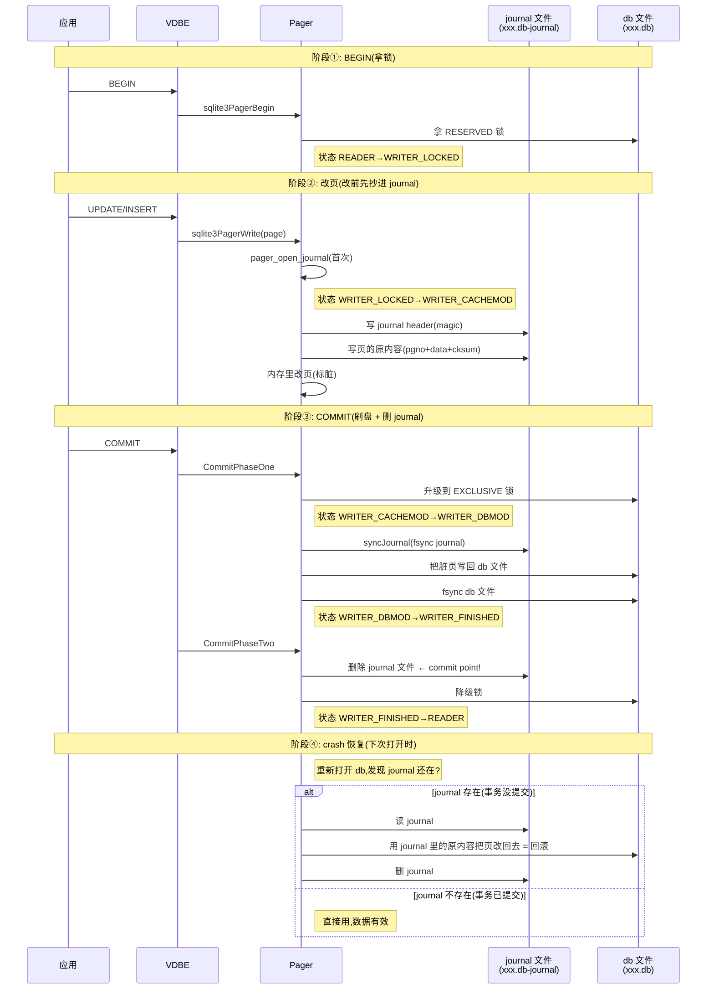

# 第 4 篇 · 第 12 章 · rollback journal:默认原子提交

> **核心问题**:上一章我们讲透了 pager 怎么把磁盘上的 B-tree 页缓存进内存、怎么标记脏页。但这里藏着一个致命问题——**写事务改的是内存里的脏页,真正落盘时,要先把脏页的新内容写回 `xxx.db` 文件**。如果写到一半机器断电了怎么办?数据库文件就会出现"页 5 已经是新内容、页 8 还是旧内容"的撕裂状态,数据彻底损坏。SQLite 默认(DELETE 日志模式)是怎么解决这个问题的?它的答案是:**改页之前,先把该页的原内容写进一个叫 `xxx.db-journal` 的 journal 文件;crash 之后重新打开数据库时,如果发现 journal 文件还在,就用 journal 里的原内容把页改回去——这就把那个没写完的事务"撤销"掉了**。为什么这么简单的招就能保证原子?journal 文件长什么样?为什么写的时候整个数据库要被独占、别人连读都不行?这一章把这套机制彻底拆透。

> **读完本章你会明白**:
> 1. SQLite 默认怎么保证**原子性**(atomicity)——改页前先写 journal、commit 时删 journal、crash 后用 journal 回滚,这一整套流程的每一步在干什么、为什么 sound。
> 2. **核心洞察**:`journal 文件存在 = 事务没写完 = 要回滚;journal 文件不存在 = 事务已提交 = 数据有效`——靠"删 journal"这一个原子动作当 commit point。
> 3. journal 文件的二进制格式(journal header 的 magic `0xd9d505f9...`、checksum、页记录 = 页号 + 原内容 + checksum、sector 对齐),以及每种字段为什么这么设计。
> 4. 五种 journal 模式(DELETE/TRUNCATE/PERSIST/MEMORY/OFF)各自怎么"删除" journal、为什么 DELETE 是默认、MEMORY 模式什么时候会把内存 journal 溢出到磁盘。
> 5. 为什么 rollback journal 模式下**写时必须独占**(写事务持 EXCLUSIVE 锁、期间其他连接不能读)——这是它最大的并发短板,正是下一章 WAL 要解决的。

> **如果一读觉得太难**:先死记三件事——① 改页前,**先把页的原内容(旧值)写进 journal**;② commit = 把脏页刷盘 + fsync + **删 journal**(删 journal 是 commit point);③ crash 后重新打开 db,**发现 journal 还在就回滚、不在就当事务已提交**。剩下的格式细节、五种模式、为什么独占,都是这三件事的展开。

---

## 〇、一句话点破

> **rollback journal 的全部精髓:改一个页之前,先把它原来的样子抄一份到 journal 文件里;真要出事了,拿着 journal 把页改回原样,世界就回到了改之前。事务提交的标志不是"脏页写完了",而是"journal 删掉了"——journal 在就是没提交,journal 没了就是已提交,这个二值状态成了不可分割的 commit point。**

这是结论,不是理由。本章倒过来拆:先讲"不写 journal 会撞什么墙",再讲 SQLite 怎么用"改前抄一份 + 提交时删掉 + crash 时还原"这套组合拳把原子性钉死,然后逐层拆 journal 的文件格式、五种 journal 模式、为什么写时独占,最后落到源码。

承接上一章:上一章讲 pager 怎么缓存页、怎么标脏页([sqlite3PagerWrite](../sqlite/src/pager.c#L6094)),但只讲到"内存里改"为止。这一章回答那个被故意悬置的问题——**内存里的脏页往磁盘上落盘时,怎么保证不把数据库写坏**。

---

## 一、不写 journal 会撞什么墙:撕裂与半写

要理解 rollback journal 为什么必须存在,先看没有它会怎样。

### 朴素做法:直接把脏页写回 db 文件

假设 SQLite 没有任何 journal,事务的流程是:BEGIN → 在内存 pager 里改几个页(标脏)→ COMMIT 时把脏页的新内容直接 `write()` 回 `xxx.db` 文件 → `fsync()` 落盘。看起来天经地义,但这里有两个致命陷阱。

**陷阱一:写一半断电,页撕裂。** 假设事务要把页 5 和页 8 两个页写回磁盘。`write()` 页 5 成功了,正要写页 8,机器断电了。结果磁盘上的 `xxx.db` 里:页 5 是**新内容**(已落盘),页 8 是**旧内容**(还没写)。B-tree 的结构完整性要求页 5 和页 8 必须是同一个事务的产物——比如页 5 是一个新分配的内部页、指向页 8 这个新的叶子页,但页 8 还没更新,于是 B-tree 里出现一个指向"旧数据/空数据"的指针,**整棵树就坏了**。这叫**撕裂写(torn write)**。

更细一层:哪怕只写一个页,也可能撕裂。磁盘扇区(sector)通常是 512 字节或 4096 字节,SQLite 的页一般是 4096 字节。操作系统写一个 4096 字节的页,底层可能分成多个扇区写;如果断电发生在"前 4 个扇区写完、后 4 个扇区没写"之间,这一个页本身就是半新半旧的。SQLite 把这个考虑进了 sector 概念(后面讲 `JOURNAL_HDR_SZ` 时会看到)。

**陷阱二:你根本不知道哪个事务"算数"。** 朴素做法下,"事务提交"的标志是什么?如果说是"脏页都写完了",那写在脏页落盘的过程中断电,你怎么区分"这个事务是提交成功了、只是巧合没断电在那几秒"和"这个事务根本没写完"?你没法区分。数据库重新打开后,看到的是"页 5 新、页 8 旧"这个状态——这到底是上一次正常运行的最终状态,还是某次崩溃留下的残骸?**没有可靠的 commit 标志,就没有可靠的原子性。**

> **不这样会怎样**:不写 journal,直接改 db 文件,断电后数据库可能处在任意一个中间状态——某几个页是事务 A 的产物、某几个页是事务 B 的产物、某个页自己就半新半旧。B-tree 的结构不变量被破坏,索引可能指向不存在的行,整库可能彻底打不开。这就是为什么几乎所有严肃的数据库(InnoDB 的 redo/undo、LevelDB 的 WAL、PostgreSQL 的 WAL)都有自己的"改之前先记一笔"机制——SQLite 在默认模式下用的就是 rollback journal。

> **所以这样设计**:SQLite 的思路极其朴素——**既然直接改 db 文件不安全,那就先把要改的页的原内容备份出来,放在一边;真改出事了,拿备份把页改回去**。这个"备份"就是 rollback journal 文件(`xxx.db-journal`)。它记的是**页的原内容(旧值)**,目的就是**撤销(undo)**。这一点要和《MySQL·InnoDB》的 redo log 区分清楚:InnoDB 的 redo 记的是"新操作"(逻辑日志,用于重做 redo),SQLite 的 rollback journal 记的是"原内容"(物理旧值,用于撤销 undo)。一句话对照:**redo 是"再做一遍新操作",rollback journal 是"改回原样"**。两者方向相反,但都为了在 crash 后把数据库弄到一个一致的状态。

---

## 二、rollback journal 的完整工作流:改前抄一份,提交时删掉,出事就还原

现在把整套流程一步步拆开。这是本章的核心,务必看透。

### 四个阶段

一个 rollback journal 模式下的写事务,生命周期分四个阶段:



### 逐阶段拆解

**阶段① BEGIN:拿锁。** `BEGIN`(或隐式写事务)会调用 [sqlite3PagerBegin](../sqlite/src/pager.c#L5980),在 rollback 模式下先拿一个 RESERVED 锁([pagerLockDb(pPager, RESERVED_LOCK)](../sqlite/src/pager.c#L6002))。注意这时**还没动 journal 文件**——pager 进入 `WRITER_LOCKED` 状态(状态图见 [pager.c 注释](../sqlite/src/pager.c#L140))。锁的作用后面"为什么写时独占"那一节细讲。这里先记住:BEGIN 只拿锁、不动 journal。

**阶段② 改页:改之前先把原内容抄进 journal。** 这是 rollback journal 的灵魂。当上层(VDBE 执行 UPDATE/INSERT 的 opcode)第一次要把某个页标成可写时,调用 [sqlite3PagerWrite → pager_write](../sqlite/src/pager.c#L6094)。`pager_write` 干三件事:

1. **如果是本事务第一次改页**(状态还是 `WRITER_LOCKED`),调用 [pager_open_journal](../sqlite/src/pager.c#L5877) 打开 journal 文件、写第一个 journal header(magic + 页大小 + checksum 初值等),状态转成 `WRITER_CACHEMOD`。
2. **如果这个页还没被抄进 journal**(用一个 bitvec `pInJournal` 记录哪些页已经抄过了),调用 [pagerAddPageToRollbackJournal](../sqlite/src/pager.c#L6037),把这个页的**原内容**(还没改的样子)写进 journal 文件。
3. **然后**才在内存里把这个页标脏,允许上层修改它的内容。

注意顺序:**先写 journal,后改内存**。这个顺序至关重要——如果先改内存、再写 journal,那 journal 里抄的就是新内容了,失去 undo 的意义;如果中间出错,内存已经改了但 journal 没写全,回滚就缺数据。SQLite 选择"先把原内容稳妥地写进 journal,再动内存里的页",保证了任何时候内存里的页要么没改、要么已经有一份原内容备份在 journal 里。

**阶段③ COMMIT:刷盘 + 删 journal。** 上层发 `COMMIT`,触发两阶段提交([sqlite3PagerCommitPhaseOne](../sqlite/src/pager.c#L6511) + [sqlite3PagerCommitPhaseTwo](../sqlite/src/pager.c#L6748)):

- **Phase One**:先升级到 EXCLUSIVE 锁(后面讲为什么)→ `syncJournal`(把 journal 文件 fsync 到磁盘,确保 undo 数据真的落盘了)→ 把所有脏页的新内容写回 `xxx.db` → fsync db 文件。到这一步,**db 文件已经被改成了新内容、且已落盘**;journal 文件里的原内容也早已落盘。状态进入 `WRITER_FINISHED`。
- **Phase Two**:调用 [pager_end_transaction](../sqlite/src/pager.c#L2052),在 DELETE 模式下**关闭并删除 journal 文件**([sqlite3OsDelete(pPager->pVfs, pPager->zJournal, ...)](../sqlite/src/pager.c#L2120)),然后降级锁,状态回到 `READER`。

**这个"删 journal"就是 commit point。** 注意 Phase One 完成后,db 文件已经是新内容了——但事务**还没算提交**,因为 journal 还在。只有 Phase Two 把 journal 删掉,事务才算真正提交。为什么?看下一阶段。

**阶段④ crash 恢复:journal 在就回滚,不在就当已提交。** 假设机器在 Phase One 写 db 文件的过程中断电了。下次重新打开这个数据库时(任何连接打开都会触发),pager 在 [sqlite3PagerSharedLock](../sqlite/src/pager.c#L5380) 附近会检查:**`xxx.db-journal` 这个文件还在吗?**

- **journal 还在 → 事务没提交完 → 回滚**。pager 调用 [pager_playback](../sqlite/src/pager.c#L2864),读 journal 里的每一条页记录,用记录里的**原内容**把 db 文件里对应的页**改回去**。改完之后,db 文件就回到了事务开始之前的样子,仿佛这个事务从没发生过。然后删掉 journal。
- **journal 不在 → 事务已提交 → 数据有效**。直接用 db 文件,数据是上一个已提交事务的最终状态。

> **钉死这件事**:**"journal 文件存不存在"这个二值状态,就是事务提交与否的唯一判据**。journal 在 = 事务进行中(crash 了)= 回滚;journal 不在 = 事务已完成 = 提交有效。SQLite 把"事务提交"这个本质上很模糊的概念(什么时候算提交?脏页写完算吗?fsync 完算吗?)压缩成了一个**原子的、可观察的动作——删除 journal 文件**。文件要么删了、要么没删,没有"删了一半"这种中间态(文件删除在文件系统层面是原子的:要么在目录项里看得见、要么看不见)。这就是 rollback journal 模式的 commit point。

### 反例:如果没有"删 journal 当 commit point"这个设计

想象一个错误的设计:把"脏页全部写完并 fsync"当作 commit 标志。问题来了——你怎么知道"全部写完并 fsync"这件事到底发生了没有?crash 后你看到 db 文件是某个状态,你无法倒推"这是写完了的最终态,还是写到一半的中间态"。

而 SQLite 的设计把这个判据外化成了一个**独立的、可观察的文件**。journal 文件本身就是"事务还没提交"的物证——只要它还在,就说明那个创建它的事务没走到"删 journal"那一步,必须回滚。这个判据是**crash-safe 的**:不管 crash 发生在哪个时刻,journal 的存在性都明确地告诉你该回滚还是该提交。

| crash 发生时刻 | journal 状态 | db 文件状态 | 恢复动作 |
|---|---|---|---|
| BEGIN 后、改页前 | 不存在 | 旧内容(未改) | 无需恢复 |
| 改页中(journal 写一半) | 存在(可能不完整) | 旧内容(内存改了但 db 文件没动) | 回滚(用 journal 完整部分还原) |
| 改完页、COMMIT 的 syncJournal 前 | 存在(完整) | 旧内容 | 回滚(用 journal 还原) |
| 写 db 文件中 | 存在 | 半新半旧 | 回滚(用 journal 把改过的页还原) |
| 写完 db、删 journal 前 | 存在 | 新内容(已落盘) | 回滚(把页改回旧内容,事务撤销) |
| 删 journal 后 | **不存在** | 新内容(已落盘) | **不回滚,事务已提交** |

这张表最关键的两行是最后两行:**写完 db 文件到删 journal 之间** crash,和**删 journal 之后** crash。前者 db 文件已经是新内容了,但 journal 还在,pager 会"多此一举"地把页改回旧内容——这一步看似浪费,但正是它保证了"只要 journal 在就回滚"的规则不被打破,从而在任何 crash 场景下都 sound。后者 journal 已经删了,pager 直接用新内容,事务提交成立。**两者的分界线就是 journal 的存在性,干净利落。**

---

## 三、journal 文件长什么样:二进制格式拆解

知道了工作流,现在拆 journal 文件本身的格式。理解格式,才能理解恢复为什么可靠。

### 整体布局

一个 journal 文件由一个或多个**journal segment**组成(大事务可能写多个 segment,每个 segment 开头一个 header),最后可能跟一个 super-journal 指针。单个 segment 的布局:

```
 ┌────────────────────────────────────────────────────────────────┐
 │  journal header(sector 对齐,通常 512 或 4096 字节)            │
 │  ┌──────────────────────────────────────────────────────────┐  │
 │  │ 8 字节: magic = d9 d5 05 f9 20 a1 63 d7                   │  │
 │  │ 4 字节: nRec(本 segment 里页记录条数,或 0xFFFFFFFF)      │  │
 │  │ 4 字节: cksumInit(checksum 随机初值)                     │  │
 │  │ 4 字节: dbOrigSize(事务开始时 db 的页数)                │  │
 │  │ 4 字节: sectorSize(本进程假设的扇区大小)                 │  │
 │  │ 4 字节: pageSize(db 的页大小,如 4096)                   │  │
 │  │ (剩余填 0,凑齐一个 sector)                              │  │
 │  └──────────────────────────────────────────────────────────┘  │
 ├────────────────────────────────────────────────────────────────┤
 │  页记录 0(8 + pageSize 字节)                                  │
 │  ┌──────────────────────────────────────────────────────────┐  │
 │  │ 4 字节: pgno(页号,这是哪一页的原内容)                   │  │
 │  │ pageSize 字节: 原内容(这一页被改之前的完整内容)         │  │
 │  │ 4 字节: checksum(这页内容的校验和)                      │  │
 │  └──────────────────────────────────────────────────────────┘  │
 ├────────────────────────────────────────────────────────────────┤
 │  页记录 1(同上)                                               │
 │  ...                                                            │
 ├────────────────────────────────────────────────────────────────┤
 │  页记录 nRec-1                                                  │
 ├────────────────────────────────────────────────────────────────┤
 │  (可能下一个 segment header,大事务循环)                       │
 ├────────────────────────────────────────────────────────────────┤
 │  super-journal 指针(多数据库 ATTACH 事务才有,见后)           │
 │  ┌──────────────────────────────────────────────────────────┐  │
 │  │ 4 字节: PAGER_SJ_PGNO(哨兵页号,表示"后面是 super 名")   │  │
 │  │ N 字节: super-journal 文件名(UTF-8)                      │  │
 │  │ 4 字节: N(文件名长度)                                   │  │
 │  │ 4 字节: 文件名 checksum                                  │  │
 │  │ 8 字节: magic(同 header)                                │  │
 │  └──────────────────────────────────────────────────────────┘  │
 └────────────────────────────────────────────────────────────────┘
```

### journal header:每个字段为什么这么设计

header 的字段定义在 [writeJournalHdr](../sqlite/src/pager.c#L1490) 和 [readJournalHdr](../sqlite/src/pager.c#L1590),magic 常量在 [aJournalMagic](../sqlite/src/pager.c#L757):

```c
/* pager.c#L757 */
static const unsigned char aJournalMagic[] = {
  0xd9, 0xd5, 0x05, 0xf9, 0x20, 0xa1, 0x63, 0xd7,
};
```

逐字段拆:

**magic(8 字节,`0xd9d505f920a163d7`)**:这是 journal 文件的"身份证"。恢复时,parser 读 journal 第一件事就是拿这 8 字节和 `aJournalMagic` 比([readJournalHdr 里的 memcmp(aMagic, aJournalMagic, ...)](../sqlite/src/pager.c#L1623)),对不上就认为这个 journal 无效(`SQLITE_DONE`)。为什么需要 magic?因为恢复时 pager 要从磁盘上读一段数据判断"这到底是不是一个有效的 journal header"——磁盘上可能有上次崩溃留下的残骸、可能扇区对齐处正好是别的文件内容,magic 就是那个一眼可辨的标记。8 字节而非 4 字节,是为了**降低误判概率**(随机数据恰好等于这 8 字节的概率是 2^-64,可忽略)。

**nRec(4 字节)**:本 segment 里有几条页记录。这个字段有个巧妙的处理——写 header 时**先写 0(或 0xFFFFFFFF),等页记录都写完、要 sync 之前,再回填真实的 nRec**(见 [syncJournal 里 put32bits(&zHeader[sizeof(aJournalMagic)], pPager->nRec)](../sqlite/src/pager.c#L4378))。为什么?因为写 header 时还不知道后面要写几条页记录(事务还在进行)。如果先写一个错的数、crash 在 sync 之前,恢复时读到的是 0,就知道"这个 segment 没有有效的页记录要回滚"。而 0xFFFFFFFF 这个特殊值表示"假设后面全是有效记录"(用于 no-sync 模式或 `SQLITE_IOCAP_SAFE_APPEND` 设备,见 [pager.c#L1481 注释](../sqlite/src/pager.c#L1481))。

> **不这样会怎样**:如果 nRec 写在 header 里、且 header 先 sync,那 crash 在"写了 nRec=10 但实际只写了 3 条页记录"之后,恢复时会试图读 10 条记录——后 7 条是磁盘垃圾,checksum 校验失败,可能误回滚。SQLite 的处理是**先写 0 占位,sync journal 之前才回填真实 nRec**,这样"nRec 已更新但 journal 没 sync"和"journal sync 了但 nRec 还是 0"这两种 crash 场景,恢复时都能正确处理(要么回填没生效当成 0 条、要么 nRec 已是真实值且记录都 sync 了)。

**cksumInit(4 字节)**:checksum 的随机初值。每次开 journal 都调 [sqlite3_randomness](../sqlite/src/pager.c#L1508) 生成一个随机数当初值。为什么随机?注释在 [pager.c#L750](../sqlite/src/pager.c#L750) 说得很清楚:journal 文件结尾可能出现"曾经属于别的已删除文件"的垃圾数据,如果这些垃圾数据恰好是另一个老 journal 的内容,**它的 checksum 可能恰好是对的**——用随机初值,让每个 journal 的 checksum 互不相同,极大降低"把垃圾数据误认为有效页记录"的风险。这是一个典型的**防御性随机化**。

**dbOrigSize(4 字节)**:事务开始时 db 文件有多少页。恢复时用这个把 db 文件**截断**回事务开始时的大小([pager_truncate(pPager, mxPg)](../sqlite/src/pager.c#L2952))——如果事务里新增了页(INSERT 让 db 变大),回滚时要把这些多出来的页砍掉。

**sectorSize(4 字节)和 pageSize(4 字节)**:恢复时 parser 要按正确的页大小和扇区大小来解析 journal。把这两个值也存进 header,是为了让 journal **自描述**——换一台机器、换一种页大小配置,只要 magic 对得上,就能正确解析。注意 [readJournalHdr](../sqlite/src/pager.c#L1663) 还会校验 pageSize 和 sectorSize 必须是 2 的幂、在合法范围内,不合法就当成"header 写到一半 crash 了",停止解析。

### 页记录:页号 + 原内容 + checksum

每条页记录的写入在 [pagerAddPageToRollbackJournal](../sqlite/src/pager.c#L6037):

```c
/* pager.c#L6062-L6067 (简化,保留关键写入) */
rc = write32bits(pPager->jfd, iOff, pPg->pgno);              /* 4 字节页号 */
if( rc!=SQLITE_OK ) return rc;
rc = sqlite3OsWrite(pPager->jfd, pData2, pPager->pageSize, iOff+4); /* 原内容 */
if( rc!=SQLITE_OK ) return rc;
rc = write32bits(pPager->jfd, iOff+pPager->pageSize+4, cksum);  /* 4 字节 checksum */
```

一条记录 = `4(页号) + pageSize(原内容) + 4(checksum)` 字节,正是宏 [JOURNAL_PG_SZ(pPager) = pageSize + 8](../sqlite/src/pager.c#L765)。

**checksum 的算法很特别**,在 [pager_cksum](../sqlite/src/pager.c#L2251):

```c
/* pager.c#L2251 */
static u32 pager_cksum(Pager *pPager, const u8 *aData){
  u32 cksum = pPager->cksumInit;         /* 随机初值 */
  int i = pPager->pageSize-200;          /* 从末尾附近开始 */
  while( i>0 ){
    cksum += aData[i];
    i -= 200;                            /* 每隔 200 字节采样一个字节 */
  }
  return cksum;
}
```

注意这不是对整页做 CRC32 之类的强校验,而是**每隔 200 字节取一个字节、累加**。为什么这么"弱"?

- **快**:checksum 在每次写 journal(改每个页)时都要算一次,事务大、页多,性能敏感。整页 CRC 太慢。
- **够用**:checksum 的目的不是检测蓄意篡改(那是密码学的事),而是检测"这条记录是不是磁盘垃圾/写了一半"。采样累加对"整页随机垃圾"有足够区分度(随机字节之和落在一个特定 32 位值的概率极低),对"页内容只改了几字节"的细小改动区分度弱——但后者根本不是 rollback journal 要防的(journal 记的是事务自己写的真实原内容,不是别人篡改的)。
- **配合随机 cksumInit**:因为初值随机,即使磁盘上残留的是另一个老 journal 的页记录(它的 checksum 是按另一个初值算的),用本事务的初值重算也对不上,不会被误当成有效记录回滚。

> **钉死这件事**:rollback journal 的 checksum 是**采样累加 + 随机初值**,这是一个在"速度"和"足够区分垃圾"之间刻意做的折中。它不追求密码学强度,只追求"能认出磁盘垃圾",同时配合每个事务不同的随机初值,把"误把别的文件的残留当成有效 journal 记录"的概率压到可忽略。

### sector 对齐:为什么 header 要占满一个 sector

注意 [JOURNAL_HDR_SZ(pPager) = pPager->sectorSize](../sqlite/src/pager.c#L771)——journal header 实际有效内容只有 28 字节(magic+nRec+cksumInit+dbOrigSize+sectorSize+pageSize),但它要占满一整个 sector(通常 512 字节,有时 4096 字节)。writeJournalHdr 用一个循环把 28 字节的 header 重复写满整个 sector([pager.c#L1563](../sqlite/src/pager.c#L1563))。为什么?

因为**磁盘以 sector 为单位写**。如果 header 只写 28 字节,剩下的 sector 空间里可能是上次别的文件的内容(垃圾)。当 nRec 字段写下去后、还没 sync 时 crash,磁盘上这个 sector 可能是"28 字节新 header + 后面旧垃圾"的混合——但无论如何,只要 magic 那 8 字节写进去了(且 sector 是原子写的),恢复时就能认出这是个 header 开头。把 header 撑满一个 sector,是为了和"sector 是磁盘最小写入单位"这个硬件事实对齐,避免 header 跨 sector 导致的撕裂。这也是为什么 `JOURNAL_HDR_SZ` 直接等于 `sectorSize` 而不是 28。

### super-journal 指针(多数据库 ATTACH 事务)

journal 文件最后可能跟一个 super-journal 指针(也叫 master journal)。它只在**一个事务同时改多个 ATTACH 的数据库**时出现。格式见 [writeSuperJournal](../sqlite/src/pager.c#L1715) 注释:4 字节 `PAGER_SJ_PGNO`(哨兵页号,表示"从这里开始不是页记录、是 super-journal 名字")+ N 字节文件名 + 4 字节长度 + 4 字节 checksum + 8 字节 magic。

`PAGER_SJ_PGNO` 是一个特殊的页号([pager.h#L53](../sqlite/src/pager.h#L53)),它指向 db 文件里**锁字节所在的那个页**——这个页号在 db 文件里永远不会存真实数据(它被文件锁占用),所以拿它当哨兵,恢复时 parser 读到这个页号就知道"后面不是页记录了,是 super-journal 名"(见 [pager_playback_one_page 里 pgno==PAGER_SJ_PGNO 的判断](../sqlite/src/pager.c#L2348))。super-journal 的作用后面单独一节讲。

---

## 四、五种 journal 模式:DELETE / TRUNCATE / PERSIST / MEMORY / OFF

journal 文件的"提交时怎么处理"有五种模式,对应枚举 [PAGER_JOURNALMODE_*](../sqlite/src/pager.h#L79)。核心区别只有一个——**commit 时怎么"让 journal 失效",从而让恢复时不再回滚它**。

### 五种模式对照表

| 模式 | 枚举值 | commit 时对 journal 做什么 | 恢复时怎么判断"已提交" | journal 在哪 | 典型场景 |
|---|---|---|---|---|---|
| **DELETE**(默认) | 0 | **删除整个 journal 文件** | journal 文件不存在 | 磁盘文件 | 默认,最稳 |
| **TRUNCATE** | 3 | **把 journal 文件截断到 0 字节** | journal 文件大小为 0 | 磁盘文件(复用 inode) | 想省"删文件"开销 |
| **PERSIST** | 1 | **把 journal header 的 magic 清零**(文件保留) | journal 开头 magic 不对 | 磁盘文件(保留) | 频繁小事务,省创建/删除开销 |
| **MEMORY** | 4 | **关闭内存 journal**(数据丢弃) | 内存 journal 不存在(进程死了就没了) | 内存 | 只关心进程内一致性、不怕断电 |
| **OFF** | 2 | **不建 journal** | 没有东西可判断 | 无 | 极端追求速度、接受断电损坏 |

(`WAL` 模式是第 5 个枚举值,但它走完全不同的代码路径,是下一章的主题,这里不展开。)

### 为什么 DELETE 是默认

DELETE 模式最直观、最安全:**commit 就是把 journal 文件从文件系统里删掉**。文件系统层面,删除一个文件就是把它从目录项里移除——这个操作是原子的(要么在目录里看得见、要么看不见),所以"journal 存不存在"是一个 crash-safe 的二值判据。代码在 [pager_end_transaction 的 DELETE 分支](../sqlite/src/pager.c#L2114):

```c
/* pager.c#L2114-L2121 (DELETE 模式:删文件) */
assert( pPager->journalMode==PAGER_JOURNALMODE_DELETE
     || pPager->journalMode==PAGER_JOURNALMODE_MEMORY
     || pPager->journalMode==PAGER_JOURNALMODE_WAL
);
sqlite3OsClose(pPager->jfd);
if( bDelete ){
  rc = sqlite3OsDelete(pPager->pVfs, pPager->zJournal, pPager->extraSync);
}
```

注意 `extraSync` 参数:DELETE 模式下删完 journal 还可能要 fsync 一下目录(取决于配置),确保"删除"这个动作本身也落盘了——否则 crash 后 journal 可能"复活",导致把已提交的事务误回滚。这是 [pager.c#L2091 注释](../sqlite/src/pager.c#L2091) 提到的 mozilla 那个 bug 的教训。

### TRUNCATE 和 PERSIST:省"创建/删除文件"的开销

DELETE 模式每次事务都要**创建 journal 文件、写完、删掉**——创建和删除文件涉及目录项修改,开销不小(尤其频繁小事务)。TRUNCATE 和 PERSIST 是两种优化:

**TRUNCATE**([pager.c#L2086](../sqlite/src/pager.c#L2086)):commit 时不删文件,而是 `sqlite3OsTruncate(pPager->jfd, 0)` 把它截断到 0 字节。下次事务直接复用这个已存在的(空)文件,省掉了"创建文件"的开销。恢复时判断"journal 大小为 0 就当已提交"。注意它 fullSync 模式下截断后还要 fsync([pager.c#L2091](../sqlite/src/pager.c#L2091)),同样是为了防止 crash 后 journal "复活"。

**PERSIST**([pager.c#L2101](../sqlite/src/pager.c#L2101)):commit 时调用 [zeroJournalHdr](../sqlite/src/pager.c) 把 journal header 的 magic 清成 0,文件本身保留(大小不变)。下次事务直接在原文件上覆盖写新 header。恢复时读 header,magic 对不上就认为这个 journal 无效(已提交),不回滚。这个模式省掉了创建、删除、截断的所有元数据开销,适合**频繁的小事务**——文件一直在,只是 header 被反复清零再写。

### MEMORY 模式:journal 放内存,断电就丢

MEMORY 模式([PAGER_JOURNALMODE_MEMORY](../sqlite/src/pager.h#L83))把 journal 完全放在内存里(用 `memjournal.c` 的链表实现,下一节细讲)。它的语义是:**只保证进程内的原子性(比如 savepoint 回滚、事务 ROLLBACK),不保证断电不丢**。因为进程一 crash,内存 journal 就没了,恢复时找不到 journal,只能当事务已提交——但 db 文件可能写了一半,于是数据损坏。所以 MEMORY 模式**只适合不在乎断电损坏、或者 db 本身就是临时数据的场景**。

有意思的是,MEMORY 模式(以及 sub-journal)的"内存 journal"在**超过阈值 nSpill 时会自动溢出到磁盘**。这个机制在 `memjournal.c` 里,单独拆一节。

### OFF 模式:裸奔

OFF 模式([PAGER_JOURNALMODE_OFF](../sqlite/src/pager.h#L81))完全不建 journal,直接改 db 文件。断电就损坏,没有任何恢复手段。代码里 [pager_open_journal 的判断](../sqlite/src/pager.c#L5890) 直接跳过建 journal。只有极端追求速度、且能接受数据丢失的场景才用(比如某些临时计算中间结果)。

> **所以这样设计**:五种模式的本质是**同一个 commit point 思想的不同实现**——都要找一个"可观察的二值状态"来表示事务是否已提交。DELETE 用"文件存不存在"、TRUNCATE 用"文件大小是否为 0"、PERSIST 用"header magic 是否有效"、MEMORY 用"进程内存是否还在"(进程级)、OFF 干脆没有 commit point(所以不安全)。选哪个,是在"安全性"和"创建/删除 journal 的开销"之间权衡。DELETE 最安全也最朴素,是默认;其余是特定场景的优化。

---

## 五、MEMORY 模式与 memjournal.c:内存 journal 怎么实现,什么时候溢出

`memjournal.c` 实现了一个**内存中的 journal 文件**,它实现了和磁盘 journal 一样的 `sqlite3_file` 接口(xRead/xWrite/xSync/xTruncate/xFileSize),但数据存在堆内存的链表里。它服务于两个场景:① `journal_mode=MEMORY` 的主 journal;② **所有 sub-journal**(savepoint/语句级回滚用,默认就放内存)。

### 数据结构:FileChunk 链表

journal 内容被切成固定大小的 `FileChunk` 串成链表([memjournal.c#L39](../sqlite/src/memjournal.c#L39)):

```c
/* memjournal.c#L39 */
struct FileChunk {
  FileChunk *pNext;     /* 下一个 chunk */
  u8 zChunk[8];         /* 实际更大,按 nChunkSize 分配 */
};
```

每个 chunk 默认 1024 字节([MEMJOURNAL_DFLT_FILECHUNKSIZE](../sqlite/src/memjournal.c#L47)),读写在链表上游走([memjrnlRead](../sqlite/src/memjournal.c#L86))。这是个朴素的"内存文件"实现,关键是它**和磁盘 journal 接口一致**,所以 pager 根本不用区分"journal 在内存还是磁盘"——同一个 `pPager->jfd` 指针,调用同样的 `sqlite3OsWrite`/`sqlite3OsRead`,底层自动分发。

### nSpill:内存 journal 什么时候溢出到磁盘

这是 memjournal 最有意思的设计。看 [sqlite3JournalOpen](../sqlite/src/memjournal.c#L353) 的注释和实现:

```c
/* memjournal.c#L353-L386 (核心逻辑) */
int sqlite3JournalOpen(sqlite3_vfs *pVfs, const char *zName,
                       sqlite3_file *pJfd, int flags, int nSpill){
  MemJournal *p = (MemJournal*)pJfd;
  memset(p, 0, sizeof(MemJournal));
  if( nSpill==0 ){
    return sqlite3OsOpen(pVfs, zName, pJfd, flags, 0);  /* 直接开磁盘文件 */
  }
  /* nSpill>0 或 nSpill<0 都走内存实现 */
  ...
  p->nSpill = nSpill;
}
```

`nSpill` 参数决定行为:

- **nSpill == 0**:从一开始就用磁盘文件(主 journal 在 DELETE/TRUNCATE/PERSIST 模式下走这条,[pager_open_journal](../sqlite/src/pager.c#L5917) 传的 `jrnlBufferSize(pPager)`,但配置成 0 时直接落盘)。
- **nSpill < 0**:永远是纯内存 journal(`sqlite3MemJournalOpen` 传 -1,[memjournal.c#L391](../sqlite/src/memjournal.c#L391))。
- **nSpill > 0**:**先放内存,journal 大小一旦超过 nSpill 字节,就把内存里的内容 flush 到磁盘文件,之后变成磁盘 journal**。判断在 [memjrnlWrite](../sqlite/src/memjournal.c#L187):`if( p->nSpill>0 && (iAmt+iOfst)>p->nSpill )`,触发 [memjrnlCreateFile](../sqlite/src/memjournal.c#L145) 把链表内容逐 chunk 写进真实文件。

这个机制主要用于 **sub-journal**(savepoint 回滚用):sub-journal 一般很小,放内存省 IO;但如果某个大事务的 savepoint 涉及大量页,内存 journal 会自动"升级"成磁盘文件,不至于撑爆内存。这是一个**自适应**设计——常见情况下走快的内存路径,极端情况下退化到安全的磁盘路径。

> **不这样会怎样**:如果 sub-journal 强制永远在内存,一个大事务的 savepoint 可能吃光内存;如果强制永远在磁盘,小事务的 savepoint 平白多出一堆文件 IO(创建临时文件、写、删)。nSpill 阈值让两种情况各得其所:小就走内存、大就溢出。主 journal 则根据 journal_mode 决定走内存(MEMORY)还是磁盘(DELETE/TRUNCATE/PERSIST)。

---

## 六、为什么 rollback journal 模式写时必须独占(并发短板)

这一节解释 rollback journal 模式最大的代价——**写事务期间,其他连接连读都不行**。这是它被 WAL 模式取代(在高并发场景)的根本原因,也是下一章的引子。

### 锁升级路径:RESERVED → EXCLUSIVE

回看前面的工作流:BEGIN 拿 RESERVED 锁,改页时还只是 RESERVED,但 **COMMIT 时(Phase One 的 syncJournal)要升级到 EXCLUSIVE 锁**。代码在 [syncJournal 开头](../sqlite/src/pager.c#L4341):

```c
/* pager.c#L4332 */
static int syncJournal(Pager *pPager, int newHdr){
  ...
  rc = sqlite3PagerExclusiveLock(pPager);   /* 升级到 EXCLUSIVE */
  if( rc!=SQLITE_OK ) return rc;
  ...
```

而 [sqlite3PagerExclusiveLock](../sqlite/src/pager.c#L6469) 实际调用 `pager_wait_on_lock(pPager, EXCLUSIVE_LOCK)`,把锁升到最高级。更关键的是,[pager_write_pagelist](../sqlite/src/pager.c#L4475) 里有一个硬断言:

```c
/* pager.c#L4481 */
assert( pPager->eLock==EXCLUSIVE_LOCK );
```

**脏页往 db 文件里写,必须已经持有 EXCLUSIVE 锁**。这是死规矩,代码用 assert 钉死。

### 为什么必须 EXCLUSIVE:不能让别人读到半新半旧的 db

为什么写 db 文件时必须独占,连 SHARED(读)锁都不让别人持?想象不独占会怎样:

- 写事务正在往 db 文件写页 5(新内容已落盘)、页 8(还没写,还是旧内容)。
- 此时另一个连接持 SHARED 锁来读,它读到的是"页 5 新、页 8 旧"这个**中间状态**。
- 这个中间状态在 B-tree 层面可能是不一致的(页 5 指向页 8,但内容不匹配),读到的数据是错的,甚至可能让读连接 crash。

rollback journal 模式下,**db 文件在事务提交过程中就是处于这种"半新半旧"的中间态**——因为新内容是直接覆盖写进 db 文件的(不像 WAL 那样写到独立的 log 文件)。要防止别的连接读到这个中间态,唯一的办法就是**在写 db 文件期间把所有其他连接挡在外面**,也就是 EXCLUSIVE 锁。

> **钉死这件事**:rollback journal 模式的并发短板根源于一个设计选择——**新内容直接覆盖写进 db 文件**,而不是先写到别处。这导致 db 文件在提交过程中是不一致的中间态,必须用 EXCLUSIVE 锁把所有人挡住。WAL(下一章)反其道而行:**新内容先写到独立的 WAL 文件,db 文件在 checkpoint 之前始终是上一个已提交的一致状态**——这样读连接读 db 文件(一致)、写连接写 WAL(不影响读),读写就并发了。这就是为什么"写时独占"是 rollback journal 的固有代价,而 WAL 是它的解药。

### 锁的五种状态(简述,详情见 P5-17 并发模型章)

为完整性,这里简述 SQLite 的五种锁状态(详情留给第 17 章):UNLOCKED → SHARED(读)→ RESERVED(准备写)→ PENDING(写即将完成,挡新读)→ EXCLUSIVE(独占写)。写事务从 RESERVED 开始(允许别人同时 SHARED 读),到 COMMIT 写 db 文件时升到 EXCLUSIVE(挡住所有人)。这段"EXCLUSIVE 期间"就是 rollback journal 模式的并发黑箱——**任何其他连接的读请求都会被阻塞或返回 SQLITE_BUSY**。

---

## 七、技巧精解:commit point 与 checksum/sector 对齐

这一节把本章两个最硬核的技巧单独拆透。

### 技巧一:用"删 journal"这一个原子动作当 commit point

这是 rollback journal 全部设计的支点。前面已经讲了"journal 在就回滚、不在就提交",这里拆**为什么这个判据是 sound 的(在任意 crash 场景下都正确)**。

**朴素方案的困境**:如果用"脏页都写完并 fsync"当 commit 标志,问题在于这个事件**不可观察**——crash 后你看到 db 是某个状态,你无法倒推它是不是"写完了的最终态"。更糟的是,"写完"这个动作本身没有原子性:写页 5、写页 8 是两个独立的 write,中间任意时刻都可能 crash。

**SQLite 的解法**:把"事务提交"这个语义事件,绑定到一个**外部的、原子的、可观察的文件系统动作——删除 journal 文件**。文件删除在文件系统层面是原子的:一个文件要么在目录项里看得见(没删)、要么看不见(删了),不存在"删了一半"这种状态(crash 在删除过程中,要么目录项还没改、要么已经改了)。于是:

- **crash 发生在删 journal 之前** → journal 还在 → 恢复时回滚。哪怕 db 文件已经被写成了新内容,pager 也老老实实用 journal 把页改回去——事务撤销。这一步"多此一举"的回滚,正是为了维持"journal 在就回滚"这条铁律。
- **crash 发生在删 journal 之后** → journal 没了 → 恢复时不回滚,事务提交成立。db 文件已经是新内容,直接用。

**为什么 sound**:关键在于"删 journal"这个动作的**原子性**和**可观察性**。它把一个原本连续的、无界的、不可观察的过程("事务一点点提交")压缩成了一个离散的、有界的、可观察的事件("journal 被删了")。在任意 crash 时刻,journal 的存在性都明确告诉你事务的状态,没有歧义。这是把**原子性难题转化为文件系统的原子删除原语**的精彩一招。

**反面对比**:假设不用这个技巧,而是用"在 db 文件某个固定位置写一个 commit 标志位"。问题:写这个标志位本身也可能 crash 在"写了一半",标志位变成半新半旧——又回到了撕裂写的老问题。而且读标志位要额外一次 IO。删 journal 复用了文件系统已有的原子删除原语,无需自己实现原子性,优雅得多。

### 技巧二:checksum + sector 对齐 + 随机初值,让 journal 本身可识别

journal 文件可能残留在磁盘上、可能和别的文件的残留混在一起,恢复时 parser 怎么知道"这段数据是一条有效的页记录,还是磁盘垃圾"?SQLite 用三重手段:

**① magic 8 字节**:journal header 开头固定的 `0xd9d505f920a163d7`,parser 一眼可辨"这是个 header"。8 字节而非 4 字节,误判概率 2^-64。

**② 随机 cksumInit + 采样 checksum**:每条页记录尾部有 checksum,用本事务的随机 cksumInit 当初值算。磁盘上别的文件的残留,即便恰好结构像一条页记录,它的字节用本事务的初值算 checksum 也对不上——被识别为垃圾。随机初值是关键:它让"本事务的 journal"和"磁盘上任何其他数据"在 checksum 空间里隔离开。

**③ sector 对齐**:header 和页记录都按 sector 对齐(JOURNAL_HDR_SZ = sectorSize),和"磁盘以 sector 为单位原子写"对齐,避免 header/记录跨 sector 导致的撕裂。parser 按 sector 边界读,读到的要么是完整的 header、要么是 garbage,不会是"半个 header"。

**三者合力**:magic 解决"这看起来像个 header 吗",checksum 解决"这条记录的内容对不对得上",sector 对齐解决"我读的边界对不对"。在任意 crash 场景下(哪怕 journal 写到一半、哪怕磁盘上全是别的文件的残留),parser 都能正确识别哪些是有效数据、哪些该忽略,从而**只回滚那些确实被本事务改过、且原内容确实安全记在 journal 里的页**。这就是 [pager_playback](../sqlite/src/pager.c#L2864) 能可靠工作的底层保证。

**反面对比**:假设只用一个固定的 magic,没有随机 checksum。那么磁盘上某个已删除的老 journal 的页记录,它的 checksum 是按固定初值(比如 0)算的——恢复时用同样的固定初值重算,对得上!于是 parser 会把老 journal 的记录误当成当前 journal 的记录,把 db 文件里那些页改成老 journal 里的(可能完全不相干的)内容——数据损坏。随机 cksumInit 正是为了堵这个洞。

---

## 八、super-journal:多数据库 ATTACH 事务怎么保证原子

最后讲一个进阶话题:一个事务同时改多个 ATTACH 的数据库时,怎么保证**要么所有数据库都提交、要么都回滚**?答案是 super-journal(代码里叫 super-journal,老资料叫 master journal)。

### 问题:多个 db 文件,多个 journal

ATTACH 允许一个连接挂多个数据库(`ATTACH 'aux.db' AS aux`),一个事务可能同时改主库 `main.db` 和附加库 `aux.db`。每个库有自己的 pager、自己的 journal(`main.db-journal`、`aux.db-journal`)。原子提交要求:**main 和 aux 要么都提交、要么都回滚**,不能一个提交了一个没提交。

朴素做法是逐个提交:先 commit main、再 commit aux。但这里有窗口——main 提交完(删了 main 的 journal)、aux 还没提交时 crash,结果 main 是新数据、aux 是旧数据,原子性被破坏。

### 解法:一个 super-journal 协调所有子 journal

SQLite 的做法([writeSuperJournal](../sqlite/src/pager.c#L1715)):在多库事务的 commit 阶段,**先创建一个 super-journal 文件**(比如 `main.db-mjABCDEFG`),里面记录所有参与本次事务的子 journal 文件名;然后**把 super-journal 的名字写进每个子 journal 的末尾**(就是前面格式图里的 super-journal 指针);**sync 所有子 journal 和 db 文件**;最后**删掉 super-journal 文件**。

恢复时的逻辑([pager_playback](../sqlite/src/pager.c#L2891) 里读 super-journal 名字、检查它存不存在):

- 打开某个 db,发现它的 journal 还在 → 读 journal 末尾的 super-journal 指针。
- **如果 super-journal 指针为空**(单库事务)→ 直接用这个 journal 回滚本库。
- **如果 super-journal 指针非空**(多库事务)→ 检查 super-journal 文件**还存在吗**?
  - **super-journal 还在** → 说明事务没提交完(提交的最后一步是删 super-journal)→ 回滚本库。
  - **super-journal 不在了** → 说明事务已提交 → **不回滚**。

这里 commit point 从"删子 journal"升级成了"删 super-journal"。为什么?因为多库事务里,删各个子 journal 的动作是分散的、有先后的——删了 main 的子 journal、还没删 aux 的子 journal 时 crash,就会导致 main 提交、aux 没提交。而 super-journal 是**唯一的一个协调文件**:只要它还在,所有子 journal 都要回滚;只要它没了,所有子 journal 都算提交。把 commit point 集中到 super-journal 的删除上,保证了多库原子性。

> **钉死这件事**:super-journal 是 rollback journal 思想的**升级版**——单库事务用"删 journal"当 commit point,多库事务用"删 super-journal"当 commit point。思想完全一样:找一个外部的、原子的、可观察的动作当 commit 判据。super-journal 存在 = 多库事务没提交 = 所有子库都回滚;super-journal 不存在 = 多库事务已提交 = 所有子库都保留。这就是为什么 [pager_playback](../sqlite/src/pager.c#L2891) 要先读 super-journal 名字、再用 `sqlite3OsAccess` 检查它存不存在。

---

## 九、章末小结

### 回扣主线

本章属于"存储与事务"这一面——具体说,是**事务的原子性(atomicity)**这一根支柱。它回答了"内存里的脏页往磁盘落盘时,怎么保证不把数据库写坏"这个被上一章(pager 页缓存)故意悬置的问题。和编译与执行那一面(VDBE 把 SQL 编译成 opcode 执行)无关,这里是纯粹的事务引擎机制。

一句话回扣全书主线:**SQLite 把 SQL 编译成 VDBE 字节码执行,执行时从单文件 B-tree 读数据、改数据;改的数据经 pager 缓存,落盘时靠 rollback journal(默认)或 WAL 保证 ACID**。这一章拆的就是"rollback journal 保证原子性"这一环。

### 五个为什么

1. **为什么改页之前要先把原内容写进 journal?** 因为直接改 db 文件,断电会撕裂(页半新半旧、几个页属于不同事务);先把原内容备份,出事就能改回去。journal 记的是**原内容(旧值)**用于 undo,这和 InnoDB redo 记**新操作**用于 redo 方向相反。
2. **为什么"删 journal"能当 commit point?** 因为文件删除是文件系统的原子原语(要么在目录里、要么不在),把"事务提交"这个连续过程压缩成一个离散可观察事件;journal 在就回滚、不在就提交,任意 crash 场景都无歧义。
3. **journal header 的 magic、随机 cksumInit、sector 对齐各防什么?** magic 防"这不像 journal header";随机 cksumInit 防"别的文件的残留恰好 checksum 对得上被误回滚";sector 对齐防"header/记录跨 sector 撕裂"。三者合力让 parser 能可靠区分有效记录和磁盘垃圾。
4. **五种 journal 模式差在哪?** 本质都是"找一个可观察的二值状态当 commit point":DELETE 用文件存不存在、TRUNCATE 用文件大小是否 0、PERSIST 用 header magic 是否有效、MEMORY 用进程内存是否在(只防进程内不防断电)、OFF 干脆没有 commit point(不安全)。DELETE 默认最稳。
5. **为什么 rollback journal 模式写时必须独占?** 因为新内容**直接覆盖写进 db 文件**,db 文件在提交过程中是"半新半旧"的中间态,必须用 EXCLUSIVE 锁挡住所有其他连接防止读到不一致状态。这是它的并发短板,正是 WAL 要解决的——WAL 把新内容写到独立的 WAL 文件,db 文件始终保持一致,读写就并发了。

### 想继续深入往哪钻

- **源码**:[pager.c](../sqlite/src/pager.c) 是核心(7880 行),journal 相关函数:`pager_open_journal`(L5877)、`pagerAddPageToRollbackJournal`(L6037)、`pager_write`(L6094)、`syncJournal`(L4332)、`pager_write_pagelist`(L4475)、`sqlite3PagerCommitPhaseOne`(L6511)、`sqlite3PagerCommitPhaseTwo`(L6748)、`pager_end_transaction`(L2052,五种模式的 commit 处理)、`pager_playback`(L2864,恢复)、`readJournalHdr`(L1590)、`writeSuperJournal`(L1715)。状态机注释在文件顶部(L140-L307),值得通读。内存 journal 在 [memjournal.c](../sqlite/src/memjournal.c)(440 行),重点看 `sqlite3JournalOpen`(L353,nSpill 逻辑)、`memjrnlCreateFile`(L145,溢出到磁盘)。
- **官方文档**:SQLite 官方 wiki 的 "Atomic Commit In SQLite"(https://www.sqlite.org/atomiccommit.html)是 Hipp 本人写的原子提交原理,本章很多思想的权威出处;"Write-Ahead Logging"(https://www.sqlite.org/wal.html)是 WAL 模式的官方说明(下一章);"Rollback Journal"(https://www.sqlite.org/fileformat2.html#journal)是 journal 文件格式的权威定义。
- **对照阅读**:《MySQL·InnoDB》那本的 redo/undo 章节——redo 记新操作用于重做、undo 记旧值用于回滚,InnoDB 两者都有;SQLite 的 rollback journal 只对应"undo"这一面(记旧值),没有 redo(crash 后要么回滚、要么已落盘,不需要重做)。这个对照能加深对"为什么数据库要记日志"的理解。

### 引出下一章

rollback journal 模式最大的代价是**写时独占**——COMMIT 写 db 文件期间持 EXCLUSIVE 锁,所有其他连接的读都被挡住。这在"读多写少"的嵌入式场景还能接受,但在并发稍高的场景就是瓶颈。下一章 **P4-13《WAL 模式:读写并发》** 拆 SQLite 怎么用 Write-Ahead Log 解决这个问题:**新内容先写到独立的 WAL 文件、db 文件在 checkpoint 之前始终是上一个已提交的一致状态、读连接读 db 文件(一致)、写连接写 WAL(不影响读)**——从而实现"读不阻塞写、写不阻塞读"。WAL 和 rollback journal 是 SQLite 事务引擎的两套方案,理解了 rollback journal 的"写时独占"这个短板,才能真正理解 WAL 为什么是高并发的解药。

---

> **承接说明**:本章承接《MySQL·InnoDB》的 redo/undo 思想(一句话对照:SQLite rollback journal 记原内容用于 undo,InnoDB redo 记新操作用于 redo,方向相反),承接上一章 P4-11 pager(脏页怎么落盘)。下一章 P4-13 WAL 是 rollback journal 并发短板的直接解药,会反复对照本章的"写时独占"。
