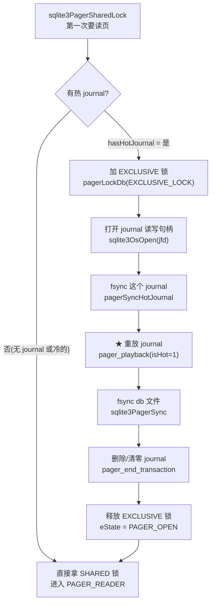
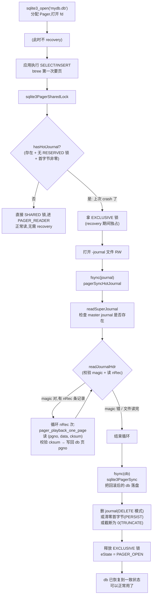
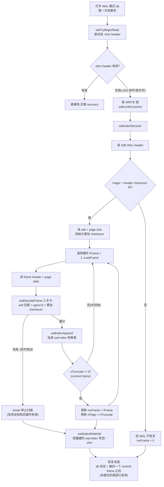

# 第 4 篇 · 第 14 章 · crash recovery 与 ACID

> **核心问题**:前面三章我们把"页怎么缓存"(P4-11 pager)、"默认怎么保证原子提交"(P4-12 rollback journal)、"怎么让读写并发"(P4-13 WAL)都拆完了。但还有两个问题悬着没回答:**进程在 `INSERT` 写到一半、或 `COMMIT` 刷盘刷到一半 crash 了,下次重新打开这个 .db 文件,SQLite 凭什么还能把它恢复成一个干净的、可以继续用的库**?以及那句口号 "**ACID**"——Atomicity(原子)、Consistency(一致)、Isolation(隔离)、Durability(持久)——这四性,在 SQLite 里**到底分别由哪个机制保证**?rollback journal 模式和 WAL 模式各自的 recovery 流程是什么?为什么 `COMMIT` 里那几次 `fsync` 一次都不能省,顺序也不能乱?

> **读完本章你会明白**:
> 1. **rollback journal recovery** 的完整流程:打开 db → 检测 `-journal` 文件是不是"热"的(`hasHotJournal`)→ 重放 journal 把改过的页改回原内容 → fsync db → 删 journal;以及"journal 不存在就等于上次正常提交、无需恢复"这个简单而关键的事实。
> 2. **WAL recovery** 的完整流程:打开 WAL → 校验 32 字节 WAL header → 逐 frame 用 salt + 累加 checksum 验证 → 用 commit frame(末尾字段非零)确定提交边界 → 丢弃未提交的损坏尾部 → 重建 wal-index(`walIndexRecover`)。
> 3. **ACID 四性分别由谁保证**:Atomicity = journal/WAL 的 commit point;Consistency = 约束检查(NOT NULL/UNIQUE/CHECK/外键)在 opcode 层(`OP_HaltIfNull`/`OP_NoConflict`)且**在提交前**;Isolation = 文件锁(rollback 模式)+ WAL read-mark 快照(WAL 模式),默认 SERIALIZABLE;Durability = `fsync` 把 journal/WAL/db 真正落盘。这一张映射表,是本章最值得钉死的。
> 4. **fsync 为什么不能省、commit 刷盘顺序为什么不能乱**:跳过 journal 的 `fsync` 直接写 db,crash 在中间就会把"新内容写了一半 + 老内容已覆盖"的脏页留在 db 文件里,且没有任何原内容可回滚——**永久数据损坏**。所以 commit 必须严格按"写 journal → fsync journal → 写 db → fsync db → 删 journal"的顺序。还会讲 SQLite 用"两段式 sync journal + nRec 回写"防 nRec 撒谎的反例技巧。
> 5. **salt + 累加 checksum 怎么识别写到一半的损坏 frame**(WAL):每 frame 头里抄一份当前 WAL 的 salt-1+salt-2,checksum 逐 frame 累加(上一 frame 的结果是下一 frame 的初值)——这两招合起来,既能识别"上一轮 checkpoint 后留下的旧 frame"(salt 对不上),又能识别"这一轮写到一半被断电劈坏的 frame"(checksum 链断在那一帧)。

> **逃生阀(这章机制密集,一读觉得晕,先记住这五件事)**:
> ① recovery 的本质就是一句话——**"用 journal/WAL 里记的旧内容,把 db 文件里写到一半的脏页改回去"**,rollback 模式记的是"页的原内容",WAL 模式记的是"页的新内容",方向相反但目的相同(让 db 落在一个一致的状态);② "journal 不存在" = "上次提交正常" = 无需 recovery,这是 rollback 模式最巧妙的地方——**删除 journal 文件本身就是"提交成功的证据"**,crash 在删之前一定会被 recovery 抓到;③ ACID 里 **A 和 D 是 journal/WAL + fsync 的功劳,C 是约束检查的功劳(在提交前),I 是锁/WAL 快照的功劳**——没有一样是免费的;④ fsync 不是"刷新缓冲区",是"**逼 OS 把 page cache 真的写回磁盘、并等磁盘答应**",省掉它 = crash 后 OS page cache 里的脏页全丢 = 你的"已提交"数据并不在盘上;⑤ 本章是第 4 篇(存储与事务)的收口,小结会把这一篇(B-tree → pager → journal/WAL → recovery)整条线串一遍。

---

## 〇、一句话点破

> **crash recovery 的本质,是"用一份在 crash 之前就完整落盘的、可校验的副本,把 db 文件恢复到一个一致状态"。rollback journal 模式,这份副本是"页的原内容",恢复时把它改回去(回滚到事务开始前);WAL 模式,这份副本是"页的新内容",恢复时挑出最后一个 commit frame 之前的所有页重放(前滚到事务提交后)。两种模式的 recovery 都靠"删除/失效 journal 或 WAL 尾部"来标记"提交已完成"——所以 ACID 里的原子性和持久性,本质上是"先安全地留一份可回退的副本 + 严格 fsync + 用一个不可撤回的动作确认提交"这三件套;一致性和隔离则分别由"提交前的约束检查"和"锁/WAL 快照"另外保证。**

这是结论,不是理由。本章倒过来拆:先用一个"crash 了到底会发生什么"的恐惧场景把问题立起来,然后分别拆 rollback journal recovery(打开 db 时怎么发现要恢复、怎么重放、怎么收尾)、WAL recovery(怎么逐 frame 验 checksum、怎么定 commit 边界、怎么重建 wal-index),接着把 ACID 四性逐一映射到具体机制并讲清"为什么这样保证 sound",再用一整节讲透 fsync 的必要性和 commit 的严格刷盘顺序(含 SQLite 防 nRec 撒谎的反例),最后用 MySQL redo recovery 做一句话对照收口。

---

## 一、先把恐惧场景立起来:crash 到底会坏什么

在讲 recovery 之前,先看清楚"不 recover 会怎样"。这是整个机制的动机所在。

### 1.1 写到一半 crash:db 文件里是"半新半老"的脏页

假设你执行一条 `UPDATE users SET name='新名字'`,它要改 3 个 B-tree 页(叶子页、可能还有内部页、还有 schema 上的 sqlite_stat 之类)。SQLite 的写法是:把这 3 个页**直接在 db 文件里就地覆盖**(rollback journal 模式下,pager 把脏页从 page cache 刷回 db 文件)。

现在想象 `COMMIT` 正在刷盘,刚把第 1 个页写进 db 文件,**第 2 个页还没写、第 3 个也没写**,这时候**断电了**。重启之后,你打开这个 db 文件,会看到:

```
   db 文件(写到一半 crash):
   ┌─────────────────────────────────────────┐
   │ 页 5(被改过):name='新名字'              │  ← 新内容已落盘
   │ 页 8(没改完):  半个新页 + 半个老页混着  │  ← 损坏!可能 B-tree 指针断了
   │ 页 12(还没写):name='老名字'             │  ← 还是老内容
   └─────────────────────────────────────────┘
```

这就是**永久数据损坏**:页 8 可能内部指针指错地方,B-tree 遍历会读到乱码,甚至 `sqlite3_master` 表都读不出来,整个库"打开就报 `database disk image is malformed`"。这还不算完——就算页 8 没坏,这条 `UPDATE` 改了一半(name 列有的行新、有的行老),从应用语义上也是不一致的。

> **钉死这件事**:**就地覆盖写** + **crash 可能劈在中间** = db 文件随时可能处于"半新半老、甚至损坏"的中间态。这就是为什么所有正经数据库都不敢直接改数据文件,必须先在旁边留一份"可回退的副本"——SQLite 留副本的方式,rollback 模式叫 journal(记原内容),WAL 模式叫 WAL(记新内容)。**recovery 的全部工作,就是用这份副本把 db 恢复到一个一致状态。**

### 1.2 "一致状态"是什么意思:要么全做了,要么全没做

recovery 的目标不是"把数据救回来",而是"**让 db 落在一个一致状态**"。具体到一笔事务 T:

- **如果 T 已经提交**(commit 的最后一步——删 journal 或写 commit frame——已经落盘):recovery 后,db 里应该**完整地**反映 T 的全部修改(不能多、不能少)。
- **如果 T 还没提交**(commit 还没做完就 crash):recovery 后,db 里应该**完全看不到** T 的任何修改(就像 T 从来没发生过)。

这就是 **Atomicity(原子性)**的字面意思:**一笔事务要么整个生效、要么整个不生效,没有"改了一半"这种中间态**。recovery 的职责就是把 crash 后那个"中间态"硬掰成上述两个干净状态之一。怎么掰?关键就在于**怎么判断"这笔事务到底算提交了没有"**——这个判断依据,两种模式不一样,是接下来两节的核心。

### 1.3 为什么不能靠"应用层重做一遍"

你可能会想:crash 了,我应用层把刚才那条 `UPDATE` 重发一遍不就行了?**不行**,原因有三:

1. **应用不知道发到哪了**:断电时,那条 `UPDATE` 到底执行到哪一步?应用层无从得知(SQLite 是嵌入式的,没有独立的事务日志给应用看)。
2. **重做可能重复/冲突**:那条 `UPDATE` 可能已经改了一部分页,重发会再改一遍,可能撞上 UNIQUE 约束、或者把自增 ID 推得不对。
3. **db 文件本身可能已经损坏**(页 8 那种),应用层重发连"打开库"都做不到,根本无从下手。

所以 recovery **必须由 SQLite 自己、在打开库的第一时间、用一份专门的、可校验的副本来做**——这份副本就是 journal/WAL。应用层只管"重新打开 db",剩下的 SQLite 全包。

> **承接《MySQL·InnoDB》**:这个"用一份专门的副本做 recovery"的思想,和《MySQL·InnoDB》那本讲的 **InnoDB crash recovery(redo log recovery)**是同一个根。但 InnoDB 是 C/S 引擎,有独立的 redo log、undo log、binlog,要做两阶段扫描(redo 正向恢复已提交、undo 反向回滚未提交),还要刷一遍 undo 的 purge,MVCC 版本链也要重建——复杂得多。SQLite 是嵌入式、单文件,**没有独立的 undo log**(它靠 rollback journal 记"原内容"做回滚,journal 是物理日志记整页,不是 InnoDB undo 那种逻辑日志),MVCC 也只在 WAL 模式下用 read-mark 做快照、简单得多。本章结尾会用一句话对照,这里先记住:**SQLite 的 recovery 是 InnoDB redo recovery 的"极简嵌入式版"——思想同源(用日志做 recovery),实现天差地别(SQLite 简单到几百行就讲完)。**

---

## 二、rollback journal recovery:打开 db 时怎么发现要恢复

现在拆第一种模式:rollback journal 模式(SQLite 的**默认**模式,见 P4-12)。它的 recovery 流程是:打开 db 时,**如果发现有一个"热的"journal 文件**,就重放它(用 journal 里记的原内容把 db 改回去)。关键在于"**怎么判断 journal 是热的**"。

### 2.1 第一个关键问题:journal 文件存在,就一定是要恢复吗

你打开一个 db,旁边躺着一个 `mydb.db-journal` 文件。这一定意味着上次 crash 了吗?**不一定。** journal 文件可能在三种情况下存在:

1. **上次正常提交了,但用的 journal mode 是 PERSIST**(`PRAGMA journal_mode=PERSIST`):这种模式下,提交后**不删 journal 文件**,而是把 journal 头部的 magic 字段清零,标记"这个 journal 已过期、不要用它恢复"。所以 journal 文件还在,但它是"冷的"。
2. **上次 crash 了,journal 里有未提交的修改**:这才是"热的",需要 recovery。
3. **上次某个进程打开 db 但还没开始写事务就退出了**:可能留下一个空的或半空的 journal。

SQLite 必须把"热的"挑出来,只对热的做 recovery,否则会把一个已经提交的事务错误地回滚掉。**怎么挑?靠"journal 文件第一个字节非零"这个简单而巧妙的标志。**

### 2.2 `hasHotJournal`:用第一个字节非零 + 没有 RESERVED 锁来判断

这个判断逻辑在 `pager.c` 的 `hasHotJournal` 函数里([`pager.c:5180`](../sqlite/src/pager.c#L5180))。一个 journal 是"热的",要同时满足:

1. **journal 文件存在**(`sqlite3OsAccess(...SQLITE_ACCESS_EXISTS...)`,line 5196)。
2. **当前没有别的进程持有 RESERVED 锁**(line 5209-5210,`sqlite3OsCheckReservedLock`):如果有人持有 RESERVED 锁,说明它正在写事务中,这个 journal 是它"活的" journal,不该被我们 recovery。
3. **db 文件页数 > 0**(line 5214):空库不算。
4. **journal 文件第一个字节非零**(line 5251,`*pExists = (first!=0)`):这是 PERSIST 模式清零 magic 留下的判据——清零过的是冷的,没清零的是热的。

```c
/* pager.c:5180 (简化,保留真实判断逻辑) */
static int hasHotJournal(Pager *pPager, int *pExists){
  ...
  rc = sqlite3OsAccess(pVfs, pPager->zJournal, SQLITE_ACCESS_EXISTS, &exists);
  ...
  rc = sqlite3OsCheckReservedLock(pPager->fd, &locked);  /* 谁在写? */
  if( rc==SQLITE_OK && !locked ){
    ...
    rc = sqlite3OsRead(pPager->jfd, (void *)&first, 1, 0); /* 读 journal 首字节 */
    ...
    *pExists = (first!=0);   /* ★ 非零 = 热 = 要 recovery */
  }
  ...
}
```

> **钉死这件事**:**"journal 首字节非零"就是热的标志**。这个设计把 PERSIST 模式和 DELETE 模式统一了:PERSIST 提交时不清零就等于"假装 journal 还在用",但其实它已经过期了,清零 magic 字段(`zeroJournalHdr`)就把它变成"冷的";DELETE 模式更干脆,提交直接删 journal 文件,连这个判断都不用走(文件不存在直接跳过)。**这个"用首字节当提交标志"的技巧,是 rollback 模式 recovery 的第一块基石。**

### 2.3 触发 recovery 的入口:`sqlite3PagerSharedLock`

那么,这个 `hasHotJournal` 是什么时候被调用的?**不是在 `sqlite3_open` 的时候**,而是在**第一次真正要读页的时候**(btree 第一次来要页,pager 走 `sqlite3PagerSharedLock` 拿 shared 锁)。这个延迟设计很关键:

> **不这样会怎样**:如果在 `sqlite3_open` 就立刻 recovery,那即使你只想 `SELECT` 一下、根本没碰那个可能损坏的 db,也得先做一遍昂贵的 recovery——对"打开很多 db 但只读其中一个"的场景是浪费。SQLite 选择**懒恢复**:打开时只分配 Pager 结构、打开文件句柄(`sqlite3PagerOpen` at [`pager.c:4781`](../sqlite/src/pager.c#L4781)),真正要读页时才检查热 journal、必要时 recovery。

完整的 recovery 触发链是这样的(`sqlite3PagerSharedLock` at [`pager.c:5300`](../sqlite/src/pager.c#L5300)):



注意其中一步 `pagerSyncHotJournal`(`pager.c:4094`):**重放之前,要先把 journal 自己 fsync 一遍**。这看起来很怪——journal 不是 crash 的那个进程写的吗,内容不是已经在盘上了吗?注释解释了:crash 的那个进程"**大概率没有 sync 这个 journal**"(它可能 crash 在 sync 之前),所以 journal 里某些页可能还在 OS page cache 里没落盘,现在我们读出来的是"不完整的"。先 fsync 一下(虽然是别的进程写的,但同一个 OS、同一个文件,fsync 会把它冲下去)——这是为了**保证我们即将重放的 journal 内容是完整的**。

> **不这样会怎样**:如果跳过 `pagerSyncHotJournal` 直接重放,而 journal 第 N 页其实还没落盘(还在 crash 进程的 page cache 里,进程死了 cache 也丢了),那 `pager_playback_one_page` 读第 N 页会读到 0 或者读到磁盘上残留的旧数据,重放就会把错的页写回 db——**recovery 自己制造损坏**。先 fsync 一遍,是把"别的进程的脏页"也冲干净,确保读到的是 journal 文件的真实物理内容。

### 2.4 完整的 recovery 流程图(rollback journal 模式)

把上面串起来,rollback journal 模式在"打开一个曾经 crash 的 db"时的完整 recovery 流程:



这条流程里,最核心的两个函数是 `pager_playback`(编排,`pager.c:2864`)和 `pager_playback_one_page`(干每一页的活,`pager.c:2298`)。下一节拆它们。

---

## 三、rollback journal recovery:怎么重放、怎么校验、怎么收尾

### 3.1 journal 文件的二进制布局:header + 若干页记录

要理解重放,先看清 journal 文件长什么样。journal 文件的格式在 `pager.c` 里有权威注释([`pager.c:2811`](../sqlite/src/pager.c#L2811)):

```
   journal 文件布局:
   ┌────────────────────────────────────────────────────────────┐
   │ (1) 8 字节 magic: 0xd9,0xd5,0x05,0xf9,0x20,0xa1,0x63,0xd7   │  aJournalMagic
   │ (2) 4 字节 big-endian: nRec(journal 里有效页记录数)         │
   │     (或 0xffffffff 表示"从文件大小推算 nRec")                │
   │ (3) 4 字节: cksumInit(本事务的 checksum 初值,随机生成)     │
   │ (4) 4 字节: dbSize(回滚时要 truncate db 到多少页)          │
   │ (5) 4 字节: sectorSize                                       │
   │ (6) 4 字节: pageSize                                         │
   │ (7) 填充到 sectorSize 对齐                                    │
   ├────────────────────────────────────────────────────────────┤
   │ (8) 若干页记录,每条:                                         │
   │     + 4 字节 pgno                                            │
   │     + pageSize 字节数据(页的原内容)                         │
   │     + 4 字节 checksum                                        │
   └────────────────────────────────────────────────────────────┘
```

magic 常量定义在 [`pager.c:757`](../sqlite/src/pager.c#L757):

```c
/* pager.c:757 */
static const unsigned char aJournalMagic[] = {
  0xd9, 0xd5, 0x05, 0xf9, 0x20, 0xa1, 0x63, 0xd7,
};
```

注意 **`aJournalMagic` 这 8 个字节就是 magic,没有单独的 `SQLITE_JOURNAL_HEADER_MAGIC` 宏**——这是一个容易翻车的细节,有些老资料会提到那个不存在的宏名,以源码为准。

页记录的尺寸由宏定义([`pager.c:765`](../sqlite/src/pager.c#L765)):`JOURNAL_PG_SZ(pPager) = pageSize + 8`(pgno 4 字节 + 数据 + checksum 4 字节);header 尺寸 `JOURNAL_HDR_SZ = sectorSize`。

### 3.2 `pager_playback`:编排重放

重放的主函数是 `pager_playback`([`pager.c:2864`](../sqlite/src/pager.c#L2864)),它干这几件事:

```c
/* pager.c:2864 (骨架,省略错误处理) */
static int pager_playback(Pager *pPager, int isHot){
  ...
  rc = sqlite3OsFileSize(pPager->jfd, &szJ);            /* journal 多大 */
  ...
  rc = readSuperJournal(pPager->jfd, ..., &zSuper);     /* 读 master/super journal 名 */
  if( rc==SQLITE_OK && zSuper ){
    rc = sqlite3OsAccess(pVfs, zSuper, SQLITE_ACCESS_EXISTS, &res);
  }
  if( rc!=SQLITE_OK || !res ){
    goto end_playback;          /* super-journal 不存在 → 这笔事务不算数 → 跳过 */
  }
  ...
  while( 1 ){
    rc = readJournalHdr(pPager, isHot, szJ, &nRec, &mxPg);  /* 校验 header,拿 nRec */
    if( rc!=SQLITE_OK ){
      if( rc==SQLITE_DONE ) rc = SQLITE_OK;                  /* header 没了 = 读完了 */
      goto end_playback;
    }
    if( nRec==0xffffffff ){
      nRec = (int)((szJ - JOURNAL_HDR_SZ(pPager))/JOURNAL_PG_SZ(pPager)); /* no-sync 模式推算 */
    }
    ...
    for(u=0; u<nRec; u++){
      rc = pager_playback_one_page(pPager, &pPager->journalOff, 0, 1, 0);  /* ★ 重放一页 */
      ...
    }
  }
end_playback:
  ...
  if( rc==SQLITE_OK && (pPager->eState>=PAGER_WRITER_DBMOD || pPager->eState==PAGER_OPEN) ){
    rc = sqlite3PagerSync(pPager, 0);                  /* ★ fsync db,把回滚结果落盘 */
  }
  if( rc==SQLITE_OK ){
    rc = pager_end_transaction(pPager, zSuper!=0, 0);  /* 删/清零/截断 journal */
  }
  ...
  if( isHot && nPlayback ){
    sqlite3_log(SQLITE_NOTICE_RECOVER_ROLLBACK, "recovered %d pages from %s",
                nPlayback, pPager->zJournal);          /* 经典日志:recovered N pages */
  }
  ...
}
```

几个值得注意的点:

- **super-journal(老资料叫 master journal)检查**(`readSuperJournal`,`pager.c:1303`):当一个事务修改了**多个数据库文件**(`ATTACH` 多个 db),SQLite 会用一个 super-journal 协调原子性——只有 super-journal 还存在,才认为这笔跨库事务算数,才重放。super-journal 不在 = 这笔事务已经被回滚过/不算数 = 跳过。这是多库原子性的关键,单库场景 super-journal 字段是空,直接通过。
- **`nRec==0xffffffff`** 是 no-sync 模式(`PRAGMA synchronous=OFF`)的特殊编码:这种模式下不严格跟踪记录数,直接用文件大小除以单条记录大小算出来。
- **重放完 fsync db**(`sqlite3PagerSync`):回滚后的 db 也要落盘,不然下次 crash 又得重放一遍(虽然重放是幂等的,但每次开库都重放太慢)。
- **重放完删 journal**(`pager_end_transaction`):这一步是关键,见 3.4。
- **日志 `SQLITE_NOTICE_RECOVER_ROLLBACK`**:如果你在 SQLite 的 log 里看到 `recovered N pages from .../mydb.db-journal`,就是这条路径打的——说明上次确实 crash 了,刚才做了一轮 recovery。

### 3.3 `pager_playback_one_page`:逐页校验 + 写回

每一页的重放在 `pager_playback_one_page`([`pager.c:2298`](../sqlite/src/pager.c#L2298))。它干三件事:**读 (pgno, data, cksum)→ 校验 checksum → 把 data 写回 db 的第 pgno 页**。

```c
/* pager.c:2298 (核心逻辑) */
static int pager_playback_one_page(
  Pager *pPager, i64 *pOffset, Bitvec *pDone,
  int isMainJrnl, int isSavepnt
){
  ...
  rc = read32bits(jfd, *pOffset, &pgno);                       /* 读页号 */
  rc = sqlite3OsRead(jfd, (u8*)aData, pPager->pageSize, (*pOffset)+4);  /* 读页数据 */
  ...
  if( isMainJrnl ){
    rc = read32bits(jfd, (*pOffset)-4, &cksum);                /* 读 checksum */
    ...
    if( !isSavepnt && pager_cksum(pPager, (u8*)aData)!=cksum ){
      return SQLITE_DONE;            /* ★ checksum 对不上 → 停止重放 */
    }
  }
  ...
  /* 把 aData 写回 db 的第 pgno 页 */
  if( pgno<=pPager->dbSize ){
    rc = sqlite3OsWrite(pPager->fd, aData, pPager->pageSize, (pgno-1)*pPager->pageSize);
  }
  ...
}
```

注意 **checksum 对不上时返回 `SQLITE_DONE`(不是 ERROR)**,意思是"停止重放,但不报错"。这个语义很关键:它把"journal 读到一个 checksum 对不上的记录"解释成"journal 到这里就结束了,后面的是垃圾"——这处理了 **journal 写到一半 crash**(最后一页可能只写了半页)的情况。如果当 ERROR 处理,recovery 就会失败、库就打不开了;当 DONE 处理,则优雅地把已成功写入的部分重放完,把残缺的尾部丢弃。

### 3.4 checksum 函数:`pager_cksum` 故意做得很弱,但够用

journal 的页 checksum 函数是 `pager_cksum`([`pager.c:2251`](../sqlite/src/pager.c#L2251))。它故意做得非常便宜——**不是加密哈希,就是一个采样求和**:

```c
/* pager.c:2251 */
static u32 pager_cksum(Pager *pPager, const u8 *aData){
  u32 cksum = pPager->cksumInit;        /* 每个事务随机生成的初值 */
  int i = pPager->pageSize-200;
  while( i>0 ){
    cksum += aData[i];                  /* 每 200 字节采样一个字节 */
    i -= 200;
  }
  return cksum;
}
```

这个 checksum 弱得令人发指——4KB 的页只采样 20 个字节、加起来。它能检测什么?

1. **写到一半的损坏页**(crash 时最后一页可能只写了前半部分):采样点很可能落在没写到的区域,读到的是磁盘残留的旧数据,checksum 对不上。
2. **journal 文件被外部损坏**(磁盘坏块):大概率采样点会读到坏数据。

它**不能**检测什么?

- **精心构造的碰撞**:攻击者完全可以构造一个页,让这 20 个采样字节加起来等于目标值。但 SQLite 不防攻击者篡改 journal(那是文件系统权限的事),只防"crash 把页劈坏"这种意外,这个弱 checksum 已经够用。

> **不这样会怎样(为什么不用强 checksum)**:如果每页都用 SHA-256,recovery 时每页要算一次哈希,4KB 数据算一次 SHA 大概几百纳秒,一个有 1000 页的 journal 要算几十万纳秒——开库变慢。SQLite 选了这个"每 200 字节采样一个字节求和"的极弱方案,每页几纳秒就完事,recovery 几乎无感。**这是"够用就好"的典型——checksum 的目的是检测 crash 损坏,不是防篡改,所以选了最便宜的方案。**

还有一个关键细节:`cksumInit` 这个初值是**每个事务开始时随机生成的**([`pager.c:1508`](../sqlite/src/pager.c#L1508),`sqlite3_randomness(sizeof(pPager->cksumInit), ...)`)。为什么要随机?注释讲得清楚([`pager.c:1512`](../sqlite/src/pager.c#L1512)):

```c
/* pager.c:1505-1530 (注释节选) */
/* The random check-hash initializer */
if( pPager->journalMode!=PAGER_JOURNALMODE_MEMORY ){
  sqlite3_randomness(sizeof(pPager->cksumInit), &pPager->cksumInit);
}
#ifdef SQLITE_DEBUG
else{
  /* The Pager.cksumInit variable is usually randomized above to protect
  ** against there being existing records in the journal file. This is
  ** dangerous, as following a crash they may be mistaken for records
  ** written by the current transaction and rolled back into the database
  ** file, causing corruption. ... */
```

> **钉死这件事(为什么 cksumInit 要随机)**:想象 journal 文件没被清空(PERSIST 模式、或者 TRUNCATE 模式 truncate 失败、或者文件系统 reuse 了 inode),里面**残留着上一笔事务的页记录**。新事务开始写 journal,写到一半 crash。recovery 时,如果用固定的 cksumInit(比如 0),那么"上一笔残留的页记录"用 0 算 checksum 也对得上,会被错误地当成"本笔事务的页"重放——**把上一笔已经提交的修改也回滚掉,造成数据丢失**。随机化 cksumInit 后,残留记录用的是旧的 cksumInit,checksum 算出来对不上,自动被丢弃。**这个随机化是防"journal 残留记录作弊"的关键一招。** 这是 SQLite 一个非常容易忽视、但极其重要的正确性细节——同类型的"用随机数防陈旧数据作弊"思想,在 WAL 的 salt 上又出现了一次(下一节讲)。

### 3.5 收尾:删 journal 就是"提交完成的证据"

重放完、fsync db 完,最后一步是 `pager_end_transaction`([`pager.c:2052`](../sqlite/src/pager.c#L2052)),它根据 journal mode 决定怎么处理 journal 文件:

```c
/* pager.c:2079-2120 (journal 收尾的四种模式) */
if( isOpen(pPager->jfd) ){
  if( sqlite3JournalIsInMemory(pPager->jfd) ){
    sqlite3OsClose(pPager->jfd);                       /* MEMORY: 关闭即可(在内存里) */
  }else if( pPager->journalMode==PAGER_JOURNALMODE_TRUNCATE ){
    rc = sqlite3OsTruncate(pPager->jfd, 0);            /* TRUNCATE: 截断为 0 字节 */
    if( rc==SQLITE_OK && pPager->fullSync ){
      rc = sqlite3OsSync(pPager->jfd, pPager->syncFlags);  /* 重新 fsync 这个 truncate */
    }
  }else if( pPager->journalMode==PAGER_JOURNALMODE_PERSIST
        || (pPager->exclusiveMode && pPager->journalMode<PAGER_JOURNALMODE_WAL) ){
    rc = zeroJournalHdr(pPager, hasSuper||pPager->tempFile);  /* PERSIST: 把首字节清零 */
  }else{                                                  /* DELETE (默认): */
    sqlite3OsClose(pPager->jfd);
    rc = sqlite3OsDelete(pPager->pVfs, pPager->zJournal, pPager->extraSync);  /* 删 journal 文件 */
  }
}
```

四种模式的差异就是"**怎么把 journal 变成冷的**",让下次开库时 `hasHotJournal` 判定为否:

| journal mode | 收尾动作 | journal 首字节状态 | 下次开库时 `hasHotJournal` |
|---|---|---|---|
| DELETE(默认) | `sqlite3OsDelete` 删文件 | 文件不存在 | 直接 false(文件不存在) |
| TRUNCATE | `sqlite3OsTruncate(jfd, 0)` 截到 0 字节 | 文件为空 | false(读到 EOF) |
| PERSIST | `zeroJournalHdr` 把首字节清零 | 0 | false(首字节为 0) |
| MEMORY | `sqlite3OsClose`(内存 journal) | 无文件 | false |

> **钉死这件事**:**"journal 变冷"这个动作,在 recovery 的视角下,等同于"这笔事务已经处理完毕(无论提交还是回滚),不要再 recovery 它了"**。换句话说,**journal 的存在状态本身就是事务状态的标记**——这是 rollback 模式区别于 WAL 模式的核心(下面会看到,WAL 用的是"commit frame"做标记,而不是删文件)。DELETE 模式最干脆:删文件这一步一旦落盘,事务就彻底板上钉钉了,即使之后再 crash,这个 journal 永远不会被判为"热"的。这也是为什么 DELETE 是默认模式——它把"提交完成"和"删除 journal"绑成原子的一步,语义最干净。

> **承接 P4-12**:这一节其实就是 P4-12 讲的 rollback journal 机制"在 crash 之后被触发"的那一面。P4-12 讲的是"正常提交路径下,journal 怎么写、怎么用、怎么删";本章讲的是"crash 之后,journal 怎么被发现、被重放"。两边对照,你能看到 rollback journal 这一整套机制的设计精髓——**它是一个"幂等的、可校验的、用文件存在性标记提交状态"的原子提交协议**。

---

## 四、WAL recovery:逐 frame 验 checksum、定 commit 边界、重建 wal-index

现在拆第二种模式:WAL 模式(`PRAGMA journal_mode=WAL`,3.7+,P4-13 讲过它的并发优势)。WAL 的 recovery 思路和 rollback journal **方向相反**:

- rollback journal:db 文件直接被改(脏),recovery 用 journal 里的**原内容**把 db **改回去**(回滚到事务前);
- WAL:db 文件**没被改**(改先写进 WAL),recovery 是把 WAL 里的**新内容**重放到 db(或者更准确地说,重建 wal-index,让后续读操作能从 WAL 里读到正确版本)。

所以 WAL 的 recovery 不真的"改 db 文件"(那是 checkpoint 干的事),而是**校验 WAL 文件、确定哪些 frame 是有效的、重建 wal-index**——wal-index 是个共享内存结构(`-shm` 文件),记录"db 的第 N 页在 WAL 的第几 frame 有版本"。

### 4.1 WAL 文件的二进制布局:header + 若干 frame

WAL 文件格式比 journal 稍复杂,因为它要支持"逐 frame 累加 checksum"和"salt 防陈旧 frame"。先看清布局:

```
   WAL 文件布局:
   ┌────────────────────────────────────────────────────────────────┐
   │ WAL Header (32 字节, WAL_HDRSIZE):                              │
   │   +0   magic (4B): WAL_MAGIC (0x377f0682, 大端, LSB 选 checksum  │
   │                    字节序)                                       │
   │   +4   format version (4B): WAL_MAX_VERSION = 3007000            │
   │   +8   page size (4B)                                            │
   │   +12 checkpoint seq (4B): nCkpt                                 │
   │   +16 salt-1 (4B) + salt-2 (4B): 本轮 WAL 的 salt(随机生成)     │
   │   +24 checksum-1 (4B) + checksum-2 (4B): header 自己的 checksum │
   ├────────────────────────────────────────────────────────────────┤
   │ Frame 1 (WAL_FRAME_HDRSIZE=24B + pageSize B):                    │
   │   +0   page number (4B): 这帧是 db 的第几页                      │
   │   +4   nTruncate (4B): 提交后 db 的页数;非零 = 这是 commit frame │
   │   +8   salt-1 (4B) + salt-2 (4B): 抄自 WAL header                │
   │   +16  checksum-1 (4B) + checksum-2 (4B): 本帧累加 checksum      │
   │   +24  pageSize 字节:页数据                                       │
   ├────────────────────────────────────────────────────────────────┤
   │ Frame 2 ... Frame N                                               │
   └────────────────────────────────────────────────────────────────┘
```

关键常量([`wal.c:476`](../sqlite/src/wal.c#L476) 起):

```c
/* wal.c:477 */
#define WAL_FRAME_HDRSIZE 24
/* wal.c:480 */
#define WAL_HDRSIZE 32
/* wal.c:491 */
#define WAL_MAGIC 0x377f0682
```

WAL header 写入的代码在 `walFrames`([`wal.c:4087`](../sqlite/src/wal.c#L4087)),把 magic、version、pageSize、nCkpt、salt、checksum 依次塞进 32 字节:

```c
/* wal.c:4089-4100 */
u8 aWalHdr[WAL_HDRSIZE];
u32 aCksum[2];
sqlite3Put4byte(&aWalHdr[0], (WAL_MAGIC | SQLITE_BIGENDIAN));   /* magic, LSB 选字节序 */
sqlite3Put4byte(&aWalHdr[4], WAL_MAX_VERSION);
sqlite3Put4byte(&aWalHdr[8], szPage);
sqlite3Put4byte(&aWalHdr[12], pWal->nCkpt);
if( pWal->nCkpt==0 ) sqlite3_randomness(8, pWal->hdr.aSalt);     /* ★ 首次写:随机生成 salt */
memcpy(&aWalHdr[16], pWal->hdr.aSalt, 8);
walChecksumBytes(1, aWalHdr, WAL_HDRSIZE-2*4, 0, aCksum);        /* header 自己的 checksum */
sqlite3Put4byte(&aWalHdr[24], aCksum[0]);
sqlite3Put4byte(&aWalHdr[28], aCksum[1]);
```

### 4.2 salt:WAL 防陈旧 frame 的关键

注意上面 line 4096:`if( pWal->nCkpt==0 ) sqlite3_randomness(8, pWal->hdr.aSalt);`——**第一次创建 WAL 文件(或 checkpoint 之后重启 WAL)时,用 `sqlite3_randomness` 生成 8 字节的 salt-1 + salt-2**。

这两个 salt 之后会被**抄进每一帧的 frame header**(`walEncodeFrame`,见 4.4),recovery 时逐帧验证。为什么需要它?这和 rollback journal 的 `cksumInit` 随机化是**同一个思想、换了个地方**:

> **不这样会怎样**:WAL 文件在某些情况下不会 truncate——比如 checkpoint 用 PASSIVE 模式,只把 WAL 的前半部分合并回 db,然后**重置 WAL 头部、改 salt**,但 WAL 文件里的旧 frame 物理上还在(只是 mxFrame=0,逻辑上"作废")。如果新事务又开始往 WAL 后面追加 frame,文件里就是"新 frame + 旧 frame 混在一起"。recovery 时如果不验证 salt,就会把"上一轮的旧 frame"当成"这一轮的有效 frame"重放——**用旧版本的页覆盖新版本,数据错乱**。salt 检查完美解决:旧 frame 的 salt 是上一轮的,memcmp 对不上当前 WAL header 的 salt,recovery 自动把它们当垃圾丢掉(`walDecodeFrame` line 1015)。

salt 的更新逻辑在 `walRestartHdr`([`wal.c:2152`](../sqlite/src/wal.c#L2152)):

```c
/* wal.c:2155-2160 */
u32 *aSalt = pWal->hdr.aSalt;
pWal->nCkpt++;
pWal->hdr.mxFrame = 0;
sqlite3Put4byte((u8*)&aSalt[0], 1 + sqlite3Get4byte((u8*)&aSalt[0]));  /* salt-1: 自增(计数器) */
memcpy(&pWal->hdr.aSalt[1], &salt1, 4);                                 /* salt-2: 新随机 */
walIndexWriteHdr(pWal);
```

注意 salt-1 是**确定性自增**(每次 restart 加 1,像个计数器),salt-2 是**新随机**。两个合起来,既保证了"每次 restart 后 salt 一定和上一轮不同"(salt-1 自增就够),又增加了一些随机性(salt-2)。这是个很朴素的设计,但够用。

### 4.3 累加 checksum:`walChecksumBytes` 是个 Fletcher 风格的累加

WAL 的 checksum 算法在 `walChecksumBytes`([`wal.c:856`](../sqlite/src/wal.c#L856)),比 rollback journal 的 `pager_cksum` 强一些,但仍然**不是加密哈希**,是个 Fletcher 风格的 32 位累加:

```c
/* wal.c:856-911 (核心循环) */
static void walChecksumBytes(
  int nativeCksum, /* True for native byte-order */
  u8 *a,           /* Content to checksum */
  int nByte,       /* Bytes of content, multiple of 8 */
  const u32 *aIn,  /* Initial checksum input */
  u32 *aOut        /* OUT: Final checksum */
){
  ...
  if( aIn ){
    s1 = aIn[0];   /* ★ 接上一帧的 checksum 当初值 */
    s2 = aIn[1];
  }else{
    s1 = s2 = 0;
  }
  ...
  do {
    s1 += *aData++ + s2;   /* s1 累加当前字 + s2 */
    s2 += *aData++ + s1;   /* s2 累加下一字 + 新的 s1 */
  }while( aData<aEnd );
  ...
  aOut[0] = s1;
  aOut[1] = s2;
}
```

关键点:**两个累加器 s1/s2 互相喂**——每轮 s1 加上新字和 s2,s2 加上新字和(更新后的)s1。这让 checksum 对**字的位置敏感**(换两个字顺序会得到不同结果),比单纯求和强。更重要的是 **`aIn` 参数**:它把"上一帧的 checksum"作为"这一帧的初值",形成一条**累加链**。

这条累加链是检测"中间某一帧被劈坏"的关键。设想 WAL 有 frame 1/2/3,frame 2 写到一半 crash:

- frame 1 的 checksum 正确(基于 header checksum 累加);
- frame 2 的实际内容是残缺的,用 frame 1 的 checksum 当初值算出来的 checksum **和 frame 2 header 里记的对不上** → `walDecodeFrame` 返回 0 → recovery 停在 frame 2;
- frame 3 虽然物理上完整,但因为累加链断了(它的 checksum 是基于"正确的 frame 2"算的),就算能算也轮不到它——recovery 已经 break 了。

> **钉死这件事**:**WAL 的累加 checksum 把所有 frame 串成一条链——任何一帧损坏,链就在那一帧断,recovery 自然停在那里,后面的帧全部丢弃**。这比"每帧独立 checksum"优雅得多——独立 checksum 的话,损坏帧后面的帧仍然能通过验证,recovery 不好决定该不该信它们;累加链则强制"要么前面的都对、要么就别信后面的"。这是个用"链式依赖"换"严格正确性"的设计,和区块链的链式哈希思想相通(只不过这里是累加不是哈希)。

### 4.4 `walDecodeFrame`:逐 frame 校验的三个关卡

每一帧的校验在 `walDecodeFrame`([`wal.c:1000`](../sqlite/src/wal.c#L1000))。它有三道关卡,任何一道不过都返回 0(无效):

```c
/* wal.c:1012-1045 (核心校验) */
/* A frame is only valid if the salt values in the frame-header
** match the salt values in the wal-header. */
if( memcmp(&pWal->hdr.aSalt, &aFrame[8], 8)!=0 ){
  return 0;                              /* 关卡 1: salt 必须匹配当前 WAL 的 salt */
}
...
/* 关卡 2: page number 必须 > 0 (内部检查) */
...
nativeCksum = (pWal->hdr.bigEndCksum==SQLITE_BIGENDIAN);
walChecksumBytes(nativeCksum, aFrame, 8, aCksum, aCksum);       /* 先算 frame header 前 8 字节 */
walChecksumBytes(nativeCksum, aData, pWal->szPage, aCksum, aCksum);  /* 再算页数据,接上一段结果 */
if( aCksum[0]!=sqlite3Get4byte(&aFrame[16])
 || aCksum[1]!=sqlite3Get4byte(&aFrame[20]) ){
  /* 关卡 3: 累加 checksum 必须匹配 frame header 里记的 */
  return 0;
}
```

注意 `aCksum` 这个变量(line 1008)其实就是 `pWal->hdr.aFrameCksum`——**当前累积的 checksum 状态**。每验证成功一帧,这个状态就被更新成那一帧算出的 checksum,作为下一帧的初值(这就是累加链)。`walDecodeFrame` 的输出除了"有效/无效",还通过 `pgno` 和 `nTruncate` 两个出参告诉调用方"这帧是哪一页、是不是 commit frame"。

### 4.5 commit frame:用 `nTruncate` 非零标记事务边界

WAL 模式判断"一笔事务提交了没",不靠删文件(rollback journal 那样),而是靠**最后一个 frame 的 `nTruncate` 字段非零**。这个字段在 frame header 的 +4 偏移(`walEncodeFrame` 写入,见 [`wal.c:956`](../sqlite/src/wal.c#L956) 的注释):

```
**     0: Page number.
**     4: For commit records, the size of the database image in pages
**        after the commit. For all other records, zero.
**     8: Salt-1 (copied from the wal-header)
**    12: Salt-2 (copied from the wal-header)
**    16: Checksum-1.
**    20: Checksum-2.
```

写入端(`walFrames`)有个 invariant(`wal.c:4062`):`(isCommit!=0)==(nTruncate!=0)`——**只有 commit 那一帧的 nTruncate 才非零**(它存的是提交后 db 的总页数,顺便还能让 checkpoint 知道 truncate db 到多少页)。中间帧的 nTruncate 都是 0。

recovery 端(`walIndexRecover`)就靠这个判 commit 边界([`wal.c:1515`](../sqlite/src/wal.c#L1515)):

```c
/* wal.c:1515-1524 */
/* If nTruncate is non-zero, this is a commit record. */
if( nTruncate ){
  pWal->hdr.mxFrame = iFrame;      /* ★ 更新"最后一个有效 commit frame" */
  pWal->hdr.nPage = nTruncate;
  pWal->hdr.szPage = (u16)((szPage&0xff00) | (szPage>>16));
  ...
  aFrameCksum[0] = pWal->hdr.aFrameCksum[0];
  aFrameCksum[1] = pWal->hdr.aFrameCksum[1];
}
```

注意这里**只有遇到 commit frame 才更新 `mxFrame`**。这处理了"最后一笔事务没提交就 crash"的情况——那笔事务的 frame 虽然 checksum 都对,但没有 commit frame,recovery 走完它们都不会更新 mxFrame,所以这些 frame 不会被纳入 wal-index,**等于自动丢弃未提交的事务**。

### 4.6 `walIndexRecover`:完整的 recovery 主流程

把上面拼起来,WAL recovery 的主函数 `walIndexRecover`([`wal.c:1390`](../sqlite/src/wal.c#L1390))做这几步:

```c
/* wal.c:1390-1614 (骨架) */
static int walIndexRecover(Wal *pWal){
  ...
  rc = walLockExclusive(pWal, iLock, WAL_READ_LOCK(0)-iLock);  /* 拿写锁,独占 recovery */
  ...
  memset(&pWal->hdr, 0, sizeof(WalIndexHdr));                   /* 清空 wal-index 状态 */
  ...
  rc = sqlite3OsFileSize(pWal->pWalFd, &nSize);                 /* WAL 多大 */
  ...
  /* 1. 读 32 字节 WAL header,校验 magic + version + header checksum */
  rc = sqlite3OsRead(pWal->pWalFd, aBuf, WAL_HDRSIZE, 0);
  magic = sqlite3Get4byte(&aBuf[0]);
  if( (magic&0xFFFFFFFE)!=WAL_MAGIC ) goto finished;            /* magic 错 → 空 WAL,不恢复 */
  ...
  /* 校验 header 自己的 checksum */
  walChecksumBytes(pWal->hdr.bigEndCksum==SQLITE_BIGENDIAN,
      aBuf, WAL_HDRSIZE-2*4, 0, pWal->hdr.aFrameCksum);
  if( pWal->hdr.aFrameCksum[0]!=sqlite3Get4byte(&aBuf[24])
   || pWal->hdr.aFrameCksum[1]!=sqlite3Get4byte(&aBuf[28]) ){
    goto finished;                                               /* header checksum 错 → 不恢复 */
  }
  ...
  /* 2. 逐帧扫描,验证 salt + 累加 checksum,遇到 commit frame 更新 mxFrame */
  iLastFrame = (nSize - WAL_HDRSIZE) / szFrame;
  for(...){
    for(iFrame=iFirst; iFrame<=iLast; iFrame++){
      rc = sqlite3OsRead(pWal->pWalFd, aFrame, szFrame, iOffset);
      isValid = walDecodeFrame(pWal, &pgno, &nTruncate, aData, aFrame);
      if( !isValid ) break;                                      /* ★ 损坏 → 停止扫描 */
      rc = walIndexAppend(pWal, iFrame, pgno);                   /* 把这帧加进 wal-index */
      if( nTruncate ){                                           /* commit frame */
        pWal->hdr.mxFrame = iFrame;
        ...
      }
    }
  }
  /* 3. 把重建的 wal-index header 写回 -shm */
  walIndexWriteHdr(pWal);
  ...
}
```

完整的 recovery 流程图:



注意几个细节:

- **`-shm` 损坏也会触发 recovery**:`walTryBeginRead`(`wal.c:2700`)先无锁试读 `-shm` header(`walIndexTryHdr`),发现坏了就加锁、再读一次,还坏就跑 `walIndexRecover`(`wal.c:2730`)。所以 WAL recovery 不只是"打开一个 crash 过的 db",还包括"`-shm` 文件损坏了重建"——`-shm` 永远可以从 WAL 重建,这是它"派生数据"的本质。
- **recovery 用私有堆内存重建 wal-index**,再拷回共享内存(`wal.c:1486` 的 `aPrivate`),避免重建过程中别的连接看到半成品。
- **recovery 完不 fsync `-shm`**(它是派生数据,丢了能重建),但会更新内存里的 header。

### 4.7 rollback recovery vs WAL recovery:一张表说清异同

| 维度 | rollback journal recovery | WAL recovery |
|---|---|---|
| journal/WAL 记的内容 | 页的**原内容**(改前) | 页的**新内容**(改后) |
| recovery 方向 | 回滚(把 db 改回去) | 前滚(把 WAL 新内容算作有效) |
| 是否改 db 文件 | 是(重放页到 db) | **否**(只重建 wal-index,db 文件不动) |
| 提交标记 | 删/清零 journal 文件 | WAL 里最后一个 commit frame(`nTruncate!=0`) |
| 损坏检测 | 每页弱 checksum(`pager_cksum`) | salt + 累加 checksum(`walChecksumBytes`) |
| 防陈旧记录 | 随机 `cksumInit` | salt-1 自增 + salt-2 随机 |
| recovery 触发 | 第一次读页时检测热 journal | 第一次读事务时 `-shm` 无效 |
| 何时算"提交已完成" | journal 文件被删/truncate/清零 | mxFrame 落在最后一个 commit frame |

> **钉死这件事**:两种 recovery **目的相同(让 db 落在一致状态)、手段不同**——rollback 是"撤销未完成的修改"(因为 db 已经被改了),WAL 是"接受已完成的修改、丢弃未完成的"(因为 db 没被改,只看 WAL 算到哪)。**WAL recovery 更轻**——它不碰 db 文件,只重建一个内存索引,所以开库快(尤其 WAL 很大时)。这也是 WAL 模式 crash 后开库更快的一个原因。

---

## 五、ACID 四性分别由谁保证

recovery 讲完,现在把那句口号 **ACID** 拆开,讲清楚 SQLite 里这四性**分别由哪个机制保证**。这是本章最值得钉死的一张映射表——很多人能背 ACID,但讲不清"在 SQLite 里,Atomicity 具体靠什么、Consistency 具体靠什么"。

### 5.1 Atomicity(原子):一笔事务要么全做要么全不做

**保证机制**:**rollback journal / WAL 的 commit point**。

- rollback 模式:一笔事务开始时,先把要改的页**原内容**写进 journal;只有到 `COMMIT` 的最后一步——**journal fsync 落盘 + db 改完 + db fsync 落盘 + 删 journal**——全部完成后,这笔事务才算"提交"。任何中间步骤 crash,journal 都还在(没删),recovery 会用 journal 把 db 改回去,**等于这笔事务没发生**。
- WAL 模式:一笔事务的修改先写进 WAL,只有写**最后一个 commit frame**(nTruncate 非零)并 fsync 后,才算"提交"。crash 在写 commit frame 之前,recovery 会发现没有 commit frame,**自动丢弃这笔事务的所有 frame**。

> **不这样会怎样**:如果没有 journal/WAL,一笔改 3 个页的事务,crash 在改完第 1 个页之后、第 2 个页之前,db 里就是"改了一半"的中间态——既不是事务前的状态,也不是事务后的状态,**违反原子性**。journal/WAL 的作用就是"留一份可回退(rollback)或可前滚(WAL)的副本",让 recovery 能把中间态掰回两个干净状态之一。

### 5.2 Consistency(一致):事务前后,db 满足所有约束

**保证机制**:**约束检查(NOT NULL / UNIQUE / CHECK / 外键)在 opcode 层执行,且在 COMMIT 之前**。

这一性经常被误解为"由 journal 保证"——**不是**。journal 保证的是"crash 后能回到一致状态",但**事务执行过程中的"一致"**是靠**约束检查**保证的:如果一笔事务违反了 UNIQUE 约束、或 NOT NULL、或 CHECK、或外键,SQLite 会在**事务执行过程中**(写 opcode 时)就检测到,并 abort 这笔事务——**根本走不到 COMMIT**。

具体在哪?在 code generator 给 INSERT/UPDATE/DELETE 生成 opcode 时(`insert.c`/`update.c`/`delete.c`),会插入约束检查 opcode。看几处实证:

```c
/* insert.c:2032 (NOT NULL 检查生成 OP_HaltIfNull) */
sqlite3VdbeAddOp3(v, OP_HaltIfNull, SQLITE_CONSTRAINT_NOTNULL, ...);

/* update.c:1349, delete.c:645 (约束冲突默认 OE_Abort) */
sqlite3VdbeChangeP5(v, onError==OE_Default ? OE_Abort : onError);
```

`OP_HaltIfNull` 在 vdbe.c([`vdbe.c:1284`](../sqlite/src/vdbe.c#L1284))执行:寄存器为 NULL 就立刻 halt 整个 VDBE、回滚事务。`OP_NoConflict`(`vdbe.c:5397`)检查 UNIQUE 索引有没有冲突。这些检查**都在写入 opcode 流里、在 `COMMIT` 之前**,所以"不一致的事务"根本进不了 db。

> **钉死这件事**:**Consistency 的保证分成两层**——① **应用层约束**(NOT NULL/UNIQUE/CHECK/外键)由 SQLite 在 opcode 执行时、提交前强制,违反就 abort;② **crash 后的一致**由 journal/WAL + recovery 保证(回到一个事务的提交边界)。这两层合起来,才是完整的 Consistency。**单靠 journal 保证不了 Consistency**(它只保证"回到提交边界",不保证"提交的内容符合约束");单靠约束检查也保证不了(crash 还是会留下中间态)。**两性分工,缺一不可。**

### 5.3 Isolation(隔离):并发事务互不干扰

**保证机制**:**文件锁(rollback 模式)+ WAL read-mark 快照(WAL 模式)**,默认隔离级别是 **SERIALIZABLE**(ish)。

- rollback 模式:**写事务会拿 EXCLUSIVE 锁**(P5-17 会详讲),整个 db 文件在写事务期间被独占——**别的连接既不能读也不能写**。所以"并发事务"在 rollback 模式下其实**不存在**(同时只能有一个写、或者多个读不能写),自然就 SERIALIZABLE 了——以"牺牲并发"换"强隔离"。
- WAL 模式:**写事务拿 WRITE 锁写 WAL,读事务拿各自的 read-mark 锁、读 db + WAL 的某个快照**。多个读可以并发、一个写也可以同时进行,**但每个读事务看到的是它开始那一刻的 WAL 快照**(由 read-mark 锁住的那个 mxFrame 决定),写的并发修改不会影响读。这给到 **snapshot isolation** 级别,实务上接近 SERIALIZABLE(但不是严格的 SERIALIZABLE,WAL 模式下写冲突仍然靠"一个写者"保证)。

> **钉死这件事**:**SQLite 的隔离不是靠 MVCC 多版本链(像 InnoDB 那样),而是靠"文件锁(rollback)/ read-mark 快照(WAL)"**——简单粗暴,代价是并发能力弱(尤其 rollback 模式)。这是嵌入式数据库的取舍——单文件、单机、不需要复杂的并发控制,用文件锁最简单可靠。详细并发模型留到 P5-17,这里只点出"Isolation 由锁/WAL 快照保证,不由 journal 保证"。

### 5.4 Durability(持久):提交了就别想丢

**保证机制**:**`fsync` 把 journal/WAL/db 真正落盘**。

这是最容易翻车的一性。很多人以为"`COMMIT` 返回 SQLITE_OK,数据就持久化了"——**不一定**。`COMMIT` 内部会调 `fsync`,但:

- 如果你设了 `PRAGMA synchronous=OFF`,**fsync 根本不调**,`COMMIT` 返回时数据可能还在 OS page cache 里,断电就丢。
- 即使 `synchronous=FULL`(默认),`fsync` 也只是"告诉 OS 把 page cache 刷到磁盘"——理论上磁盘硬件自己的 write cache 还可能丢(现代 SSD 大多有电池保护,但老硬盘没有)。

SQLite 的 `fsync` 调用最终落到 VFS 的 `xSync` 方法,unix 上是 `unixSync`([`os_unix.c:3911`](../sqlite/src/os_unix.c#L3911)):

```c
/* os_unix.c:3911 (核心) */
static int unixSync(sqlite3_file *id, int flags){
  ...
  int isFullsync = (flags&0x0F)==SQLITE_SYNC_FULL;
  ...
  rc = full_fsync(pFile->h, isFullsync, isDataOnly);   /* ★ 真正的 fsync 在这 */
  ...
}
```

`full_fsync`(`os_unix.c:3778`)根据编译选项和平台,调不同的系统调用:

```c
/* os_unix.c:3778-3849 (核心分支) */
static int full_fsync(int fd, int fullSync, int dataOnly){
  ...
#ifdef SQLITE_NO_SYNC
  ... /* 编译时关掉 sync,啥也不做(测试用) */
#elif HAVE_FULLFSYNC
  if( fullSync ){
    rc = osFcntl(fd, F_FULLFSYNC, 0);     /* macOS:最强的 full barrier */
  }else{
    rc = 1;
  }
  if( rc ) rc = fsync(fd);                /* 失败回退到 fsync */
#elif defined(__APPLE__)
  rc = fsync(fd);                         /* 苹果:fsync */
#else
  rc = fdatasync(fd);                     /* Linux 默认:fdatasync */
  ...
#endif
  ...
}
```

注意一个 SQLite 的"偏执"细节(`os_unix.c:3738`):

```c
/* os_unix.c:3733-3739 (SQLite 不信任 fdatasync) */
#if !defined(fdatasync) && !HAVE_FDATASYNC
# define fdatasync fsync     /* ★ 默认把 fdatasync 重定义成 fsync! */
#endif
```

**SQLite 默认不信任 `fdatasync`,把它重定义成 `fsync`**(除非编译时显式 `-DHAVE_FDATASYNC` 或 `-Dfdatasync=fdatasync`)。为什么?因为历史上某些文件系统的 `fdatasync` 不刷文件大小元数据,可能造成"数据刷了但文件大小没刷"的诡异情况。SQLite 选择了"宁可慢一点也要稳"——一律用 `fsync`(刷数据 + 元数据)。注释里(`os_unix.c:3769`)写得清楚:"as far as SQLite is concerned, an fdatasync() is always adequate"——意思是 SQLite 在逻辑上认为 fdatasync 够用,但实际实现保守地用 fsync。

> **钉死这件事**:**Durability 的物理保证就是 fsync**——没有 fsync,数据就只在日本 OS page cache 里,断电全丢。SQLite 默认 `synchronous=FULL`,每次 `COMMIT` 都会 fsync journal/WAL + fsync db,这是"用性能换 Durability"。`synchronous=NORMAL` 只 fsync WAL 不 fsync db(性能好但 crash 可能丢最后一两个事务);`synchronous=OFF` 完全不 fsync(最快但 crash 必丢)——**这三个级别本质就是"fsync 多少次"的旋钮**。下一节专门讲 fsync 在 commit 里的严格顺序。

### 5.5 ACID × 机制 对照表(钉死这张表)

把四性 × 保证机制整理成一张表,这是本章的核心产出之一:

| 性 | 中文 | SQLite 里的保证机制 | 关键源码 |
|---|---|---|---|
| **A**tomicity | 原子 | rollback journal(改前记原内容)/ WAL(改后记新内容)的 **commit point**(删 journal / 写 commit frame) | `pager.c:pager_playback`、`wal.c:walIndexRecover` |
| **C**onsistency | 一致 | ① 约束检查(NOT NULL/UNIQUE/CHECK/外键)在 opcode 层、提交前执行;② crash 后由 recovery 回到提交边界 | `insert.c:OP_HaltIfNull`、`vdbe.c:OP_NoConflict`、`pager.c:pager_playback` |
| **I**solation | 隔离 | rollback 模式:文件锁(EXCLUSIVE 写,独占);WAL 模式:read-mark 快照(snapshot isolation);默认 SERIALIZABLE-ish | `pager.c:pagerLockDb`、`wal.c:walBeginReadTransaction` |
| **D**urability | 持久 | `fsync` 把 journal/WAL/db 真正落盘;`synchronous` 旋钮控制 fsync 严格程度 | `os_unix.c:unixSync`、`os_unix.c:full_fsync`、`pager.c:sqlite3PagerSync` |

> **钉死这件事**:**ACID 四性在 SQLite 里由四个不同的机制保证——没有一样是"自动"的或"免费"的**。A 靠 journal/WAL + recovery(留副本 + 严格 commit point);C 靠约束检查 + recovery 双层(执行时检查 + crash 时回退);I 靠文件锁 / WAL 快照(简单粗暴);D 靠 fsync(物理落盘)。**理解 ACID 的关键,是理解这四个机制各自负责什么、为什么不能互相替代。**

---

## 六、fsync 为什么不能省、commit 刷盘顺序为什么不能乱

这一节是本章的"反例重灾区"——专门讲"如果省掉某次 fsync、或者颠倒顺序,会出什么事"。这是理解 Durability 和 recovery sound 的关键。

### 6.1 OS page cache:你以为写了,其实没写

首先要建立一个反直觉的认知:**应用调 `write()` 时,数据并没有落到磁盘**——它只是从应用的内存拷到了 **OS kernel 的 page cache**(另一块内存)。OS 会在"它觉得合适的时候"(后台 flush 线程、内存压力、定期 pdflush)才把 page cache 真的写到磁盘。在 `write()` 返回和数据真的落盘之间,有一个**任意长的窗口**——可能几秒、可能几十秒。

如果在这个窗口里**断电**,page cache 里的脏页就全丢了——`write()` 早就返回了、应用以为"写完了",但磁盘上根本没有。

`fsync(fd)` 的作用就是**堵死这个窗口**:它逼 OS 立刻把 `fd` 关联的所有脏页写回磁盘,**并等磁盘硬件答应"写完了"才返回**(对机械盘来说,这意味着等盘片转到对应位置、磁头写完、盘片转完一整圈确保数据固化)。`fsync` 返回后,数据才真的"持久"了。

> **不这样会怎样(为什么 fsync 不能省)**:假设 `COMMIT` 不调 fsync,只调 write:
> 1. 写 journal:`write(jfd, ...)` —— 数据在 OS page cache;
> 2. 写 db:`write(fd, ...)` —— 数据在 OS page cache;
> 3. 删 journal:`unlink(journal)` —— 目录项改了(也在 cache);
> 4. 返回 `SQLITE_OK`;
> 5. **断电**。
> 6. 重启:OS 重启,page cache 全空。磁盘上有什么?**取决于 OS 后台 flush 的随机性**——journal 可能还在(没被 unlink 落盘)、db 可能改了一半(部分 write 落盘了部分没)、甚至 journal 写到了一半(write 不保证顺序落盘)。recovery 时如果 journal 还在且热,会用一个**写到一半的 journal** 去重放——把 db 改成更乱的中间态。**这就是为什么 fsync 一次都不能省**。

### 6.2 commit 的严格刷盘顺序:journal → fsync journal → db → fsync db → 删 journal

现在看 SQLite 的 commit 是怎么严格排序的。rollback journal 模式下,`COMMIT` 分两阶段(`sqlite3PagerCommitPhaseOne` + `PhaseTwo`),关键顺序在 [`pager.c:6511`](../sqlite/src/pager.c#L6511) 起:

```c
/* pager.c: PhaseOne 的关键顺序(简化) */
rc = pager_incr_changecounter(pPager, 0);              /* 1. 更新 db change counter */
...
rc = writeSuperJournal(pPager, zSuper);                /* 2. 把 super-journal 名写进 journal */
...
rc = syncJournal(pPager, 0);                           /* 3. ★ fsync journal(可能两次) */
...
rc = pager_write_pagelist(pPager, pList);              /* 4. 写所有脏页到 db 文件 */
sqlite3PcacheCleanAll(pPager->pPCache);
...
if( pPager->dbSize>pPager->dbFileSize ){
  rc = pager_truncate(pPager, nNew);                   /* 5. 必要时 truncate db */
}
if( !noSync ){
  rc = sqlite3PagerSync(pPager, zSuper);               /* 6. ★ fsync db 文件 */
}
...
pPager->eState = PAGER_WRITER_FINISHED;
/* 然后 PhaseTwo 调 pager_end_transaction → 删 journal */
```

把这个顺序画出来:

```
   rollback journal 模式的 COMMIT 刷盘顺序(严格):
   ┌──────────────────────────────────────────────────────────────────┐
   │ 1. 写 journal(所有页的原内容)                  write(journal)   │
   │ 2. ★ fsync(journal)                              让 journal 落盘  │
   │ 3. 写 db(所有脏页的新内容)                      write(db)        │
   │ 4. ★ fsync(db)                                   让 db 落盘       │
   │ 5. 删 journal(DELETE 模式)/ 清零(PERSIST)/ 截断(TRUNCATE)   │
   │    (这一步标志着"事务提交完成")                                   │
   └──────────────────────────────────────────────────────────────────┘
```

为什么是这个顺序?逐个反例分析:

> **反例 A:把 fsync journal 省掉(步骤 2)**
> journal 还在 OS cache 里,db 已经开始写了。crash 在"db 写了一半"之后。重启:journal 部分内容丢了(没落盘),recovery 用残缺的 journal 重放,**要么把错的页写回 db(因为 journal 残缺),要么校验失败直接报错**——无论哪种,db 都坏了。所以 **fsync journal 必须在写 db 之前**,确保"journal 完整落盘了,才能开始改 db"。

> **反例 B:把 fsync db 省掉(步骤 4)**
> journal 完整落盘了(步骤 2 做了),db 改了一半还在 OS cache。crash。重启:db 半新半老。recovery:**journal 还在(没删),热 journal 触发 recovery,把 db 改回原内容**——所以这个反例下,数据完整性保住了(回滚到事务前),但是**事务的修改丢了**(本该提交的没提交成)。所以 **fsync db 不能省**——省了的话,虽然 recovery 能保住一致性,但 Durability 没了(已提交的事务可能被回滚)。

> **反例 C:在 fsync db 之前删 journal(步骤 5 提前)**
> journal 删了(目录项改了、落盘了),db 还在 OS cache 没 fsync。crash。重启:**journal 不存在 → `hasHotJournal` 返回 false → 不 recovery**。但 db 文件里是"写到一半的脏数据"——**永久损坏,而且没人来救**。这是最严重的反例——**删 journal 必须在 fsync db 之后**,因为"删 journal"这个动作本身就是"事务已提交"的证据,它一旦落盘,recovery 就不会再管这笔事务了,所以必须确保在这之前 db 已经完整落盘。

把这三个反例合起来,就是为什么顺序必须**严格**为:**写 journal → fsync journal → 写 db → fsync db → 删 journal**。任何一步提前或省略,都会留下一个"数据损坏或丢失"的窗口。

### 6.3 WAL 模式的 commit 顺序:更简单,但 fsync 同样关键

WAL 模式的 commit 顺序稍微不同(因为 db 文件不被直接改):

```
   WAL 模式的 COMMIT 刷盘顺序:
   ┌──────────────────────────────────────────────────────────────────┐
   │ 1. 写 WAL frame(所有脏页的新内容)               write(WAL)      │
   │ 2. 写 commit frame(最后一帧,nTruncate 非零)    write(WAL)      │
   │ 3. ★ fsync(WAL)                                  让 WAL 落盘     │
   │    —— 到这里,事务就算"提交"了(Durability 达成)                  │
   │ 4. (后台)checkpoint:把 WAL 合并回 db 文件       write(db)       │
   │ 5. ★ fsync(db)(checkpoint 时)                   让 db 落盘      │
   └──────────────────────────────────────────────────────────────────┘
```

WAL 模式的优势在于:**commit 时只需 fsync WAL,不 fsync db**(db 文件根本没动)。db 的 fsync 推迟到 checkpoint,而 checkpoint 是后台异步的、不阻塞 commit。所以 **WAL 模式的 commit 通常比 rollback 模式快**(少一次 fsync,fsync 是机械操作很慢)。

但 fsync 在 WAL 模式里同样不能省:

> **反例(WAL 模式省 fsync)**:写完 WAL frame(包括 commit frame)但没 fsync,直接返回 SQLITE_OK。crash。重启:WAL 里 commit frame 可能没落盘,recovery 扫到 commit frame 之前 checksum 链就断了(因为 commit frame 半残),**丢弃整笔事务**——已提交的事务丢了,Durability 失效。

### 6.4 SQLite 的"防 nRec 撒谎"技巧:两段式 sync journal

现在讲一个 SQLite 在 rollback journal commit 里的**经典反例防护技巧**——为什么要对 journal 做**两次 fsync**(在 full-sync 模式下),中间夹一个"nRec 字段回写"。

journal header 里有个 `nRec` 字段(记录 journal 里有几页)。recovery 时靠它知道"重放几页"。问题是:**nRec 是在事务开始时写的(那时还不知道最后会有几页),还是事务结束时回写的?**

SQLite 的做法很巧妙——**事务开始时先写一个 placeholder(0 或 0xffffffff),事务结束时回写真实 nRec**。但这个回写有个微妙的正确性问题:`syncJournal` 函数([`pager.c:4332`](../sqlite/src/pager.c#L4332))的注释讲得非常清楚([`pager.c:4389`](../sqlite/src/pager.c#L4389) 起):

> 假设上一笔连接留下了一个 journal header(已经在盘上),当前连接开始写事务,crash 发生在"nRec 被更新了但当前连接还没写别的"之间。这时 recovery 会读到一个"**nRec 是当前连接的值、但 journal 内容是上一笔连接的**"的混乱状态——把上一笔的页当成当前这笔的页重放,造成损坏。

防护手段是**两段式 sync**(`syncJournal` 的核心,line 4401-4419):

```c
/* pager.c:4401-4419 (两段式 journal sync 的精髓) */
if( pPager->fullSync && 0==(iDc&SQLITE_IOCAP_SEQUENTIAL) ){
  ...
  rc = sqlite3OsSync(pPager->jfd, pPager->syncFlags);   /* ★ SYNC #1: fsync journal(回写 nRec 之前) */
  ...
}
rc = sqlite3OsWrite(pPager->jfd, zHeader, sizeof(zHeader), pPager->journalHdr); /* 回写 nRec */
...
if( 0==(iDc&SQLITE_IOCAP_SEQUENTIAL) ){
  rc = sqlite3OsSync(pPager->jfd, pPager->syncFlags|
    (pPager->syncFlags==SQLITE_SYNC_FULL?SQLITE_SYNC_DATAONLY:0));  /* ★ SYNC #2: fsync journal(回写之后) */
}
```

逻辑是:

1. **SYNC #1**(line 4404):在回写 nRec 之前,先把 journal 的所有页内容 fsync 落盘。这一步保证"journal 的页内容已经在盘上"。
2. **回写 nRec**(line 4408):把真实的 nRec 写进 journal header。
3. **SYNC #2**(line 4416):把 nRec 这次写入 fsync 落盘。

为什么这样防"nRec 撒谎"?关键在**文件系统不保证写入顺序**——如果没有 SYNC #1,直接回写 nRec 然后一次 fsync,文件系统可能把"nRec 的写入"先落盘、"页内容的写入"后落盘( reordered);crash 在中间,nRec 已经在盘上但页内容还没,recovery 会按 nRec 读到一堆残缺的页。**SYNC #1 强制"页内容先落盘",SYNC #2 强制"nRec 后落盘"**——这样如果 crash,nRec 要么没落盘(recovery 用 0xffffffff 推算,或者读到旧的 nRec=0 当 journal 空)、要么落盘了且页内容肯定也落盘了(因为 SYNC #1 在前)。**两次 fsync 中间夹一次 nRec 写,堵死了"nRec 撒谎"的窗口。**

> **钉死这件事**:**这个"两段式 sync + 中间夹 nRec 回写"是 SQLite 在 full-sync 模式下的经典反例防护**。它针对的不是"crash 在事务中间"(那是 journal 本来就要防的),而是"crash 在 nRec 这个 4 字节小字段回写的瞬间"——一个极其细微但确实存在的窗口。**注意有个优化**:如果设备支持 `SQLITE_IOCAP_SAFE_APPEND`(安全追加,即写到文件末尾不会被 reorder),SQLite 会用 `nRec=0xffffffff`(sentinel)代替回写,跳过这个两段式 sync(`writeJournalHdr` line 1494-1500),因为这种设备保证"追加写的内容不会和 metadata reorder",不需要防护。

### 6.5 F2FS 批量原子写:把 journal 都省了

最后提一个现代优化——**F2FS 批量原子写**(Linux + `SQLITE_ENABLE_BATCH_ATOMIC_WRITE` 编译选项)。F2FS 文件系统支持一个 ioctl,让一次 `BEGIN_ATOMIC_WRITE ... COMMIT_ATOMIC_WRITE` 之间的所有写**要么全部原子落盘、要么全不落盘**——这是文件系统级别的原子性保证。

SQLite 检测到设备支持(`SQLITE_IOCAP_BATCH_ATOMIC`),就走一条完全不同的 commit 路径——**不用 journal**:

```c
/* os_unix.c:4144-4157 (F2FS atomic write 的三个 ioctl) */
case SQLITE_FCNTL_BEGIN_ATOMIC_WRITE: {
  int rc = osIoctl(pFile->h, F2FS_IOC_START_ATOMIC_WRITE);
  return rc ? SQLITE_IOERR_BEGIN_ATOMIC : SQLITE_OK;
}
case SQLITE_FCNTL_COMMIT_ATOMIC_WRITE: {
  int rc = osIoctl(pFile->h, F2FS_IOC_COMMIT_ATOMIC_WRITE);
  return rc ? SQLITE_IOERR_COMMIT_ATOMIC : SQLITE_OK;
}
case SQLITE_FCNTL_ROLLBACK_ATOMIC_WRITE: {
  int rc = osIoctl(pFile->h, F2FS_IOC_ABORT_VOLATILE_WRITE);
  return rc ? SQLITE_IOERR_ROLLBACK_ATOMIC : SQLITE_OK;
}
```

commit 流程变成:**BEGIN_ATOMIC_WRITE → 直接把新页写进 db 文件 → COMMIT_ATOMIC_WRITE**(F2FS 保证原子)——**没有 journal,没有 journal fsync,只有一次 db 写 + 一次 ioctl**。性能比传统 commit 快得多(省了 journal 的写 + fsync),而且原子性由文件系统保证,比应用层 journal 更可靠。

> **钉死这件事**:**F2FS 批量原子写是 SQLite 在 Durability/Atomicity 上的现代优化**——它把"留 journal 副本"这件事**整个外包给了文件系统**(F2FS 内部用的也是类似 COW + journal 的机制,但比应用层做更高效)。这是个"把责任下推到更底层"的设计——前提是文件系统支持。在不支持的文件系统上(ext4/xfs),SQLite 还是用传统的 journal + 两段式 sync。**这种"有特性就用特性、没有就回退到通用方案"的运行时能力检测,是 SQLite 可移植性的体现(承《LevelDB》那本讲的"嵌入式数据库要适应各种环境")。**

---

## 七、技巧精解:WAL salt + 累加 checksum 怎么识别损坏 frame

本章挑两个最硬核的技巧单独拆透:**① rollback journal 的"两段式 sync + nRec 回写"**(已在 6.4 拆过);**② WAL 的 salt + 累加 checksum 怎么识别损坏 frame**(本节拆)。这两个是 SQLite recovery 正确性的两根支柱,值得单独钉死。

### 7.1 问题:WAL 文件里可能混着"旧 frame"和"写到一半的损坏 frame"

WAL recovery 启动时,它面对的 WAL 文件可能含有三类 frame:

1. **本轮 WAL 的有效 frame**(checkpoint 重置后写的);
2. **上一轮 checkpoint 之前的旧 frame**(PASSIVE checkpoint 不 truncate WAL,只重置 header + 改 salt,旧 frame 物理上还在);
3. **写到一半 crash 留下的损坏 frame**(最后一帧可能只写了半页)。

recovery 必须精确地把"第 1 类"挑出来,把"第 2 类、第 3 类"丢掉。**两道关卡(salt + 累加 checksum)正是分别针对第 2 类和第 3 类**。

### 7.2 关卡一:salt 对比,丢掉上一轮的旧 frame

第一道关卡在 `walDecodeFrame`([`wal.c:1015`](../sqlite/src/wal.c#L1015)):

```c
/* wal.c:1012-1017 */
/* A frame is only valid if the salt values in the frame-header
** match the salt values in the wal-header. */
if( memcmp(&pWal->hdr.aSalt, &aFrame[8], 8)!=0 ){
  return 0;                              /* salt 对不上 = 旧 frame,丢弃 */
}
```

逻辑极简:**当前 WAL header 有自己的 salt(8 字节 = salt-1 + salt-2),每帧的 frame header 在写入时抄一份当时的 salt(`walEncodeFrame`)。recovery 时,如果某帧的 salt 和当前 WAL header 的 salt 不一致,这帧就是"上一轮 checkpoint 之前的旧 frame",直接丢**。

为什么 salt 一定会变?看 `walRestartHdr`([`wal.c:2155`](../sqlite/src/wal.c#L2155))——每次 checkpoint 重置 WAL,都会**自增 salt-1 + 随机生成 salt-2**:

```c
/* wal.c:2155-2159 */
u32 *aSalt = pWal->hdr.aSalt;
pWal->nCkpt++;
pWal->hdr.mxFrame = 0;
sqlite3Put4byte((u8*)&aSalt[0], 1 + sqlite3Get4byte((u8*)&aSalt[0]));  /* salt-1 自增 */
memcpy(&pWal->hdr.aSalt[1], &salt1, 4);                                 /* salt-2 新随机 */
```

所以"上一轮的 frame 的 salt"和"本轮的 salt"一定不同(salt-1 至少差 1)。

> **不这样会怎样(没有 salt 会怎样)**:设想 PASSIVE checkpoint 后,WAL 文件里有 100 个旧 frame(物理还在),新事务开始追加。如果新事务写了 5 个 frame 然后 crash,recovery 时 WAL 文件里有"5 个新 frame + 100 个旧 frame"。没有 salt,recovery 不知道哪些是新 frame,会一路扫描到第 100 个旧 frame——**把上一轮已经 checkpoint 回 db 的旧版本页,又当成"这一轮的新版本"加进 wal-index**,后续读会读到旧数据。**salt 就是"这一轮的身份证",旧 frame 没有这个身份证,自动被拒。**

### 7.3 关卡二:累加 checksum 链,丢掉写到一半的损坏 frame

第二道关卡是 checksum,但**不是每帧独立 checksum,而是累加链**。这个累加性体现在两个地方:

1. **header 也有 checksum**(`wal.c:1460`):recovery 先校验 WAL header 自己的 checksum(header 前 24 字节算 checksum,和 header 末 8 字节对比)。header checksum 是"链条的起点"。
2. **每帧 checksum 把上一帧的 checksum 当初值**(`walDecodeFrame`,`wal.c:1038-1039`):

```c
/* wal.c:1008, 1037-1045 */
aCksum = pWal->hdr.aFrameCksum;                    /* 当前累积 checksum 状态 */
...
nativeCksum = (pWal->hdr.bigEndCksum==SQLITE_BIGENDIAN);
walChecksumBytes(nativeCksum, aFrame, 8, aCksum, aCksum);          /* header 前 8 字节,接上一帧结果 */
walChecksumBytes(nativeCksum, aData, pWal->szPage, aCksum, aCksum); /* 页数据,继续累加 */
if( aCksum[0]!=sqlite3Get4byte(&aFrame[16])
 || aCksum[1]!=sqlite3Get4byte(&aFrame[20]) ){
  return 0;                                                    /* checksum 对不上 = 损坏,丢弃 */
}
```

注意 `walChecksumBytes` 的 `aIn` 参数(`wal.c:859`)就是 `aCksum`,而 `aOut` 也是 `aCksum`——**输入输出同一个数组**,所以每帧验证成功后,`aFrameCksum` 自动更新为这一帧算出的新值,成为下一帧的初值。这就是"链"。

> **钉死这件事(为什么用累加链而不是独立 checksum)**:设想 WAL 有 frame 1/2/3,frame 2 写到一半 crash:
> - **独立 checksum 方案**:frame 1 验证通过、frame 2 验证失败(半页)、frame 3 **可能验证通过**(因为它写的时候是完整的)。recovery 此时面临一个两难——是停在 frame 2,还是跳过 frame 2 继续验 frame 3?跳过的话,frame 3 用的页号可能依赖 frame 2 的存在,逻辑会乱;停下的话,又丢了一个本来完整的 frame 3。**无解**。
> - **累加链方案**:frame 2 的 checksum 是基于 frame 1 的 checksum 算的。frame 2 残缺 → 算出的 checksum 和它 header 里记的对不上 → 返回 0 → recovery break。frame 3 就算物理完整,它的 checksum 是基于"正确的 frame 2"算的,**和"基于残缺 frame 2 推进的状态"算的必然不同**,就算 recovery 能继续也会失败。**链条一断,后面全部作废,recovery 干脆地停在第一个损坏帧**。这是用"链式依赖"换"严格正确性"——和区块链、Merkle 树思想相通(本节不展开,承《LevelDB》那本的 manifest 链式哈希是同源思想)。

### 7.4 commit frame 边界:把"未提交的尾部"自动丢掉

第三道隐性关卡是 **commit frame 检测**——recovery 只在遇到 commit frame 时才更新 `mxFrame`(`wal.c:1515`)。这意味着:**如果最后一笔事务没写完 commit frame 就 crash**(比如它的 frame 都写完了,但 commit frame 那个 nTruncate 字段没写、或写了一半),那么它所有的 frame 都不会被纳入 wal-index——因为 recovery 走完它们都不会遇到"nTruncate 非零"那一帧。

> **钉死这件事**:**WAL recovery 的三个关卡(salt + 累加 checksum + commit frame)各自负责一类问题**——salt 防陈旧 frame、checksum 防损坏 frame、commit frame 防未提交事务。**三者缺一不可**:只有 salt 没有 checksum,损坏的当前轮 frame 会污染 db;只有 checksum 没有 salt,旧轮 frame 会冒充新轮;只有这两个没有 commit frame,未提交事务的 frame 会被当成已提交。**这三个关卡合起来,才让 WAL recovery 能从一个"可能含三类污染"的 WAL 文件里,精确地恢复出"最后一个已提交事务之后的状态"。**

### 7.5 对照 rollback journal 的"防陈旧 + 防损坏"

WAL 的这三道关卡,和 rollback journal 的两道(`cksumInit` 随机 + `pager_cksum`)是**一一对应的同源思想**,只是实现不同:

| 防护对象 | rollback journal | WAL |
|---|---|---|
| 防陈旧记录 | `cksumInit` 随机化(每事务随机) | salt-1 自增 + salt-2 随机(每 checkpoint 重置) |
| 防损坏记录 | `pager_cksum`(每页采样求和) | 累加 checksum(`walChecksumBytes`,Fletcher 风格) |
| 防未提交事务 | 删/清零 journal 文件标志提交 | commit frame(nTruncate 非零)标志提交 |

这个对照表是本章第二个值得钉死的产出——它揭示了 **SQLite 在两种事务模式下,用了同一套"防陈旧 + 防损坏 + 提交边界"的三件套思想,只是实现细节不同**。理解了这个同构,就理解了 recovery 的本质。

---

## 八、章末小结

### 回扣主线

本章是**第 4 篇(存储与事务)的收口**。这一篇四章,完整覆盖了 SQLite "数据怎么存、怎么不丢"的整条线:

- **P3(B-tree 存储)**:数据以 B-tree(非 B+树)存在单文件里,表和索引都是 B-tree,用根页号区分;
- **P4-11(Pager 页缓存)**:B-tree 页在磁盘上,pager 把它们缓存进内存(page cache),处理脏页、读写底层文件;
- **P4-12(rollback journal)**:默认模式下,改页前先把原内容写进 journal,保证 crash 可回滚;
- **P4-13(WAL 模式)**:改先写 WAL 不动 db,读读 db+WAL,读写并发;
- **本章(crash recovery + ACID)**:crash 之后怎么恢复(两种模式各自的 recovery)+ ACID 四性分别由谁保证 + fsync 为什么不能省。

这条线的本质,是回答两个问题:**"数据怎么存"**(B-tree + pager)和 **"怎么不丢"**(journal/WAL + recovery + fsync)。前者是存储,后者是事务——合起来就是全书二分法的"**存储与事务**"那一面。

整本书的进度,到这里**存储与事务这一面就完整了**——从第 3 篇(B-tree)到第 4 篇(Pager/journal/WAL/recovery),你已经在脑子里建起了 SQLite "数据怎么存、怎么不丢"的全图。接下来第 5 篇会讲 VFS(OS 抽象,让这套存储能跨平台),然后回到编译与执行那一面的进阶(隔离/触发器/prepared statement)。

### 五个为什么

1. **为什么 SQLite 需要做 crash recovery?**——因为它就地覆盖写 db 文件,crash 在写到一半会留下"半新半老甚至损坏"的中间态,recovery 用 journal/WAL 副本把 db 恢复到一个一致状态(要么全做要么全不做)。不做 recovery,db 文件可能直接打不开。
2. **为什么 rollback journal 用"删 journal 文件"作为提交标志,而 WAL 用"commit frame"?**——rollback 模式 db 已经被改了,需要"撤销"未提交的修改,删 journal 等于"这笔事务已处理完";WAL 模式 db 没被改,只需"接受"已提交的修改,commit frame 等于"这笔事务的新内容有效"。两种标志各自匹配自己的恢复方向。
3. **为什么 ACID 里的 Consistency 不能只靠 journal 保证?**——journal 只保证"crash 后回到提交边界",不保证"提交的内容符合约束(NOT NULL/UNIQUE/CHECK/外键)"。约束检查由 opcode 层(`OP_HaltIfNull`/`OP_NoConflict`)在提交前强制执行,违反就 abort。两层合起来才是完整的 Consistency。
4. **为什么 fsync 在 commit 里不能省、顺序不能乱?**——`write()` 只把数据写到 OS page cache(内存),断电就丢。`fsync()` 才真的把数据刷到磁盘并等磁盘答应。commit 必须严格按"写 journal → fsync journal → 写 db → fsync db → 删 journal"的顺序,任何一步省略或颠倒,都会留下"数据损坏或已提交事务丢失"的窗口(三个反例 A/B/C 钉死)。
5. **为什么 WAL 的 checksum 用累加链,而不是每帧独立?**——独立 checksum 的话,中间一帧损坏,后面的帧仍然能通过验证,recovery 不好决定该不该信它们;累加链让"任何一帧损坏,链条就在那一帧断,后面全部作废"——用链式依赖换严格正确性。同源思想:区块链、Merkle 树。

### 想继续深入往哪钻

- **官方文档**:SQLite 官方 "Atomic Commit In SQLite"(https://www.sqlite.org/atomiccommit.html)——一篇权威文章,把 rollback journal 的 commit 顺序和 recovery 讲得非常清楚;还配有 "How To Corrupt Your Database File"(https://www.sqlite.org/howtocorrupt.html),从反面讲"什么操作会破坏 SQLite 的 ACID"(很值得读,能加深对 fsync 的理解)。
- **WAL 内部**:官方 "Write-Ahead Logging"(https://www.sqlite.org/wal.html)讲 WAL 模式的设计目标和并发模型;本章侧重 recovery,如果你想看 WAL 的并发 read-mark 机制细节,留到 P4-13 和 P5-17。
- **源码**:
  - rollback recovery:`pager.c` 的 `pager_playback`(L2864)、`pager_playback_one_page`(L2298)、`hasHotJournal`(L5180)、`sqlite3PagerSharedLock`(L5300)——这是 recovery 的完整链路。
  - WAL recovery:`wal.c` 的 `walIndexRecover`(L1390)、`walDecodeFrame`(L1000)、`walChecksumBytes`(L856)、`walRestartHdr`(L2152)——这是 WAL 校验和重建的完整链路。
  - fsync 实现:`os_unix.c` 的 `unixSync`(L3911)、`full_fsync`(L3778);`os_win.c` 的 `winSync`(L2158)——这是 Durability 的物理保证。
- **承接前作**:本章对照《MySQL·InnoDB》的 redo recovery——InnoDB 的 crash recovery 比 SQLite 复杂得多(redo 正向恢复已提交 + undo 反向回滚未提交 + binlog 协调 + MVCC 版本链重建 + purge),SQLite 是它的"极简嵌入式版"。想看复杂版怎么做,翻《MySQL·InnoDB》的 crash recovery 章节。

### 引出下一章

第 4 篇到此完整收口——B-tree(存)→ Pager(缓存)→ rollback journal/WAL(原子提交)→ recovery(崩溃恢复)+ ACID(四性映射),整条"存储与事务"线已经走完。接下来第 5 篇,我们往上抬一层,讲 SQLite 怎么跨平台——**VFS(Virtual File System)**。前面四章里反复出现的 `sqlite3OsRead`/`sqlite3OsWrite`/`sqlite3OsSync`/`sqlite3OsDelete`,其实都不是直接调 POSIX,而是套了一层 VFS 抽象(`os_unix.c`/`os_win.c`/`os_kv.c` 各一个实现)。这一层让 SQLite 能从手机到航电、从 Linux 到 Windows 到嵌入式 KV 存储全覆盖。下一章 P5-15,拆 VFS 这层 OS 抽象。

> **下一章**:[P5-15 · VFS:OS 抽象](P5-15-VFS-OS抽象.md)

---

> **本章承接**:
> - **承《MySQL·InnoDB》crash recovery**:InnoDB redo recovery(两阶段:redo 正向 + undo 反向)——SQLite 是极简嵌入式版,一句话对照(无独立 undo、无 binlog、无 purge)。
> - **承《Lua》**:本章无直接 Lua 承接(recovery 是纯存储与事务层)。
> - **承《LevelDB》**:嵌入式数据库的 recovery 思想同源;F2FS 批量原子写的"运行时能力检测"风格,承《LevelDB》的"适应各种环境"。
> - **承《PG/MySQL》C/S 对照**:本章一句话点出 SQLite recovery 比 C/S 数据库简单(嵌入式、单文件、无网络、无分布式)。
> - **承接 P4-12/P4-13**:本章是 rollback journal(P4-12)和 WAL(P4-13)在 crash 之后的"恢复路径"的合体,把两种模式的 recovery 串讲 + ACID 收口。
