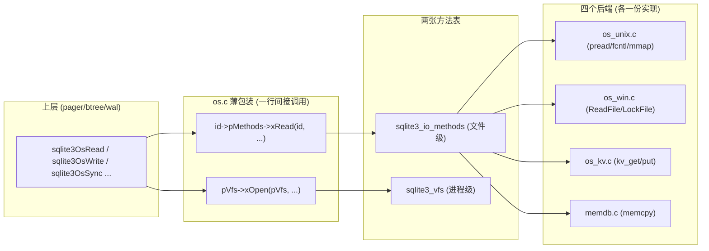
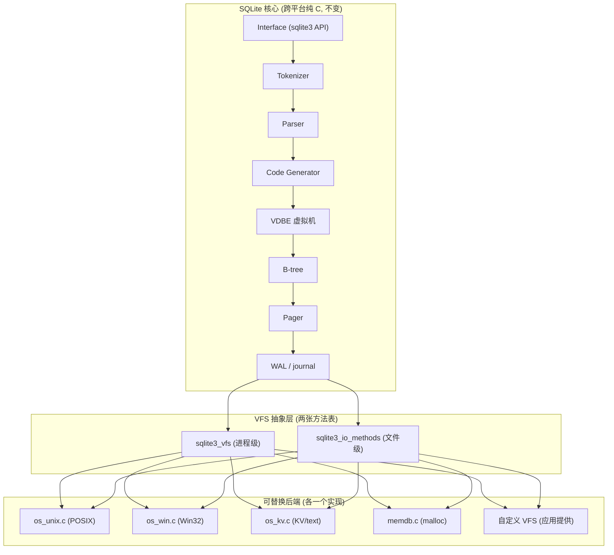

# 第 5 篇 · 第 15 章 · VFS:OS 抽象

> **核心问题**:前面四章里,凡是读写文件、刷盘、加锁,SQLite 调的都不是 `pread`/`pwrite`/`fsync`/`fcntl`,而是 `sqlite3OsRead`/`sqlite3OsWrite`/`sqlite3OsSync`/`sqlite3OsLock`——这一层薄薄的"OS"封装背后,藏着 SQLite 跨平台、甚至"把页存到 KV 存储"的全部秘密:它叫 **VFS(Virtual File System)**。为什么 SQLite 不直接调 POSIX?这一层抽象为什么是"两张方法表"而不是一张?WAL 的共享内存、文件锁、mmap 读优化,又是怎么全部塞进同一套接口里的?

> **读完本章你会明白**:
> 1. 为什么 SQLite 要在 pager 和 OS 之间再套一层 VFS,而不是直接调 `pread`/`pwrite`/`fsync`——答案是"可移植 + 可替换后端",一张表换掉就跨平台。
> 2. VFS 是**两张方法表**:`sqlite3_vfs`(进程级:打开/删除文件、时间、随机数)+ `sqlite3_io_methods`(文件级:读/写/同步/锁/shm/mmap)——为什么分两层、怎么协作。
> 3. 四个内置后端怎么各显神通:`os_unix.c`(POSIX)、`os_win.c`(Windows)、`os_kv.c`(把页存进 KV 存储,新特性)、`memdb.c`(纯内存)——同一套接口,四个世界。
> 4. WAL 需要的**共享内存(shm)**怎么经 VFS:`xShmMap` 在 Unix 上是 `mmap` 一个独立文件、在 Windows 上是 `CreateFileMapping`、在 memdb/kvvfs 上干脆是 NULL(WAL 直接不支持)。
> 5. 为什么"自己造文件接口"是嵌入式数据库的必然选择——和 Linux 内核的 VFS 是同一个思想(承《Linux 文件系统》《Linux 内核机制》)。

> **如果一读觉得太难**:先记住一件事——SQLite 把所有"碰 OS"的活儿,都收口到两张函数指针表里。换平台 = 换一张表;换后端(内存/KV)= 还是换一张表。上层 pager 一行代码都不用动。这一层叫 VFS,本章就是把这句话拆透。

---

## 〇、一句话点破

> **VFS 是 SQLite 把"碰 OS 的所有动作"收口成两张函数指针表(`sqlite3_vfs` + `sqlite3_io_methods`)的抽象层:上层只认这两张表的函数指针,底下是 POSIX、Windows、KV、内存哪个后端,上层不知道也不关心——这就是 SQLite 能从手机到航电、从 Linux 到 Windows 到浏览器 WASM 全覆盖的根本。**

这是结论,不是理由。本章倒过来拆:先讲为什么必须套这一层(不套会怎样),再讲两张方法表怎么分,然后逐个拆四个后端(unix/win/kv/memdb),接着拆 WAL 共享内存和文件锁怎么经 VFS、mmap 读优化怎么实现,最后把"os_kv 把页存 KV"和"两层方法表"这两个最硬核的技巧单独钉死。

---

## 一、为什么不能直接调 POSIX:跨平台的第一道墙

故事得从"为什么要有 VFS"讲起。前面 P4 那几章,你看到 pager 反复调 `sqlite3OsRead`/`sqlite3OsWrite`/`sqlite3OsSync`。你会想:这些不就是 `pread`/`pwrite`/`fsync` 吗,pager 直接调 POSIX 不就完了,干嘛绕一道?

> **不这样会怎样(直接调 POSIX 的三个死法)**:

**死法一:换平台 = 改上层所有代码。** SQLite 要跑在 Linux、macOS、Windows、iOS、Android、各种 RTOS(VxWorks)、甚至浏览器 WASM 上。POSIX 的文件接口(`open`/`read`/`write`/`fsync`/`fcntl`)和 Windows 的文件接口(`CreateFile`/`ReadFile`/`WriteFile`/`FlushFileBuffers`/`LockFile`)是**两套完全不同的 API**——名字不同、参数不同、语义不同。如果 pager 直接调 `pread`,那为了支持 Windows,你得在 pager 的每一处 I/O 调用点都 `#ifdef _WIN32` 包一层。pager 是 SQLite 的核心(几千行),btree 也调文件接口,每一处都 `#ifdef` 会把代码搅成意大利面。这还不算 KV 后端(根本没有"文件"这个概念)和内存后端。

**死法二:换后端 = 改不动。** SQLite 想做一件事:把"页"存到一个 KV 存储里(浏览器 `localStorage`、嵌入式 KVSSD),而不是存到文件系统。如果上层写死了 `pread(fd, buf, off)`,你根本没法把它换成 `kv_get(key, value)`——因为 KV 没有 `fd`、没有 `off`、没有"先 open 再 read"这套流程。要让上层零改动地切后端,中间必须有一层抽象:pager 说"给我读页 N",这层抽象负责把它翻译成 `pread` 或者 `kv_get`,上层无感。

**死法三:可测试性 = 0。** SQLite 是世界上测试最充分的软件之一(TH3 套件,100% 分支覆盖)。它的测试基础设施里有一个关键能力:模拟磁盘 I/O 错误(写到一半返回 EIO、磁盘满、短读)。如果上层直接调 `pread`,你没法注入故障;但通过一层函数指针,测试代码可以包一个"VFS shim"——在每次真正读之前按概率返回错误。`os.c` 开头那一坨 `sqlite3_io_error_pending`(`os.c:24-31`)就是这个机制,它全靠 VFS 这层间接才能成立。

> **所以这样设计**:SQLite 在 pager(以及 btree、wal)和真实 OS 之间,插了一层叫 **VFS** 的抽象。这层抽象对外暴露**两张函数指针表**:

- `sqlite3_vfs`:**进程级**的方法表。回答"怎么打开一个文件、怎么删除一个文件、现在几点、给我点随机数、路径怎么展开"这类问题。每个进程注册一个或多个 VFS(unix 一个、win 一个、kv 一个…),用名字区分(`"unix"`/`"win32"`/`"kvvfs"`/`"memdb"`)。
- `sqlite3_io_methods`:**文件级**的方法表。一个文件被 `xOpen` 打开后,返回的 `sqlite3_file*` 里揣着这张表,回答"这个文件怎么读/写/同步/截断/加锁/查大小/做 shm/做 mmap"。

上层(pager)只调 `sqlite3Os*` 开头的薄包装(`os.c:82-209`),这些薄包装做的事情就是"从 `sqlite3_file` 里取出 `pMethods` 函数指针表,调对应那一项"——也就是**间接调用**。底下这张表是 unix 的还是 win 的还是 kv 的,pager 不知道、也不需要知道。换平台/换后端 = 换一张表,上层零改动。

```
   pager / btree / wal(上层,跨平台纯 C 代码)
        │  只调 sqlite3OsRead / sqlite3OsWrite / sqlite3OsSync ...
        │  (os.c 里的薄包装,本质是 id->pMethods->xRead(id, ...))
        ▼
   ┌─────────────────────────────────────────────────┐
   │  sqlite3_file  (打开的文件,揣着一张方法表)      │
   │    └─ pMethods ──► sqlite3_io_methods            │
   │                    (xRead/xWrite/xSync/xLock/    │
   │                     xShmMap/xFetch ...)          │
   └─────────────────────────────────────────────────┘
        │  xOpen/xDelete 由 sqlite3_vfs 提供
        ▼
   ┌─────────────────────────────────────────────────┐
   │  sqlite3_vfs  (进程级,一张大方法表)             │
   │    iVersion / szOsFile / mxPathname / zName      │
   │    xOpen / xDelete / xAccess / xFullPathname     │
   │    xRandomness / xSleep / xCurrentTime ...       │
   └─────────────────────────────────────────────────┘
        │  具体是哪一张表?
        ▼
   os_unix.c        os_win.c        os_kv.c        memdb.c
   (POSIX)          (Win32)         (KV/text)      (malloc)
   pread/pwrite     ReadFile        kv_get/put     memcpy
   fcntl byte-lock  LockFile        (no lock)      计数器锁
   mmap shm         CreateFileMap   (no shm)       (no shm)
```

> **钉死这件事**:VFS 的本质是**用两层函数指针表,把"碰 OS 的所有动作"和"SQLite 的存储逻辑"彻底解耦**。上层只认接口,底下换哪个后端都行。这是 SQLite 跨平台、可替换后端、可测试的根基。后面所有设计(两张表怎么分、shm 怎么经 VFS、os_kv 怎么把页存 KV)都是这个思想的展开。

> **承接《Linux 文件系统》《Linux 内核机制》**:这个"虚拟文件系统"的思想,和 Linux 内核里的 VFS(`struct file_operations`/`struct inode_operations`)是**完全同源**的——内核 VFS 抽象 ext4/xfs/nfs/proc 各种文件系统,应用程序只调 `read`/`write`/`open`;SQLite VFS 抽象 unix/win/kv/memdb 各种后端,pager 只调 `sqlite3OsRead`/`sqlite3OsWrite`。**两边都叫 VFS,都是"用函数指针表解耦上层与底层"**,只是 Linux 的 VFS 在内核里、SQLite 的 VFS 在用户态库里。想看更复杂的 VFS 实现,翻《Linux 文件系统》那本的 VFS 章节;本章只讲 SQLite 这版。

---

## 二、两张方法表:`sqlite3_vfs` 与 `sqlite3_io_methods`

VFS 的接口分两层。这一节把这两张表的结构、字段、为什么这么分,逐字段讲清。

### 2.1 第一张表:`sqlite3_vfs`(进程级)

`sqlite3_vfs` 定义在 `sqlite.h.in:1513`。它描述"这个 VFS 后端怎么打开文件、怎么删除文件、怎么取随机数"这类**和具体文件无关**的事——也就是 OS 这个"环境"本身提供的能力。

```c
/* sqlite.h.in:1513-1550 */
struct sqlite3_vfs {
  int iVersion;            /* 结构体版本号,当前是 3 */
  int szOsFile;            /* 这个 VFS 的 sqlite3_file 子类有多大 */
  int mxPathname;          /* 最大路径长度 */
  sqlite3_vfs *pNext;      /* 注册链表的下一个(由注册器维护) */
  const char *zName;       /* 这个 VFS 的名字,如 "unix"/"win32"/"kvvfs"/"memdb" */
  void *pAppData;          /* 后端私有数据 */
  int (*xOpen)(sqlite3_vfs*, sqlite3_filename, sqlite3_file*, int, int*);
  int (*xDelete)(sqlite3_vfs*, const char *zName, int syncDir);
  int (*xAccess)(sqlite3_vfs*, const char *zName, int flags, int *pResOut);
  int (*xFullPathname)(sqlite3_vfs*, const char *zName, int nOut, char *zOut);
  void *(*xDlOpen)(sqlite3_vfs*, const char *zFilename);
  void (*xDlError)(sqlite3_vfs*, int nByte, char *zErrMsg);
  void (*(*xDlSym)(sqlite3_vfs*,void*, const char *zSymbol))(void);
  void (*xDlClose)(sqlite3_vfs*, void*);
  int (*xRandomness)(sqlite3_vfs*, int nByte, char *zOut);
  int (*xSleep)(sqlite3_vfs*, int microseconds);
  int (*xCurrentTime)(sqlite3_vfs*, double*);
  int (*xGetLastError)(sqlite3_vfs*, int, char *);
  /* 以上是 v1 字段 */
  int (*xCurrentTimeInt64)(sqlite3_vfs*, sqlite3_int64*);   /* v2 新增 */
  int (*xSetSystemCall)(sqlite3_vfs*, const char *, sqlite3_syscall_ptr);   /* v3 新增 */
  sqlite3_syscall_ptr (*xGetSystemCall)(sqlite3_vfs*, const char *);
  const char *(*xNextSystemCall)(sqlite3_vfs*, const char *);
};
```

几个字段要特别留意:

- **`szOsFile`**:这个 VFS 打开的 `sqlite3_file` **实际有多大**。为什么需要这个?因为每个后端的"文件对象"不一样——unix 用 `unixFile`(`os_unix.c:257`,揣着 fd、锁状态、mmap 指针)、win 用 `winFile`、kv 用 `KVVfsFile`、memdb 用 `MemFile`(`memdb.c:85`)。它们都是 `sqlite3_file` 的"子类"(第一个字段必须是 `pMethods` 指针,保证布局兼容)。上层在 `xOpen` 之前,会按 `szOsFile` 分配这块内存(`os.c:317` 的 `sqlite3MallocZero(pVfs->szOsFile)`),然后把它传给后端的 `xOpen`。后端在 `xOpen` 里把它强转成自己的子类、填上自己的字段。

- **`mxPathname`**:这个 VFS 能接受的最长路径。unix 一般是 `MAX_PATHNAME`(512)、win 是 `SQLITE_WIN32_MAX_PATH_BYTES`、kvvfs/memdb 是 1024。上层据此分配路径缓冲区(`sqlite.h.in:1474-1479`),VFS 必须保证 `xFullPathname` 不会溢出,否则报 `SQLITE_CANTOPEN`。

- **`zName`**:VFS 的名字。`sqlite3_vfs_find("unix")` 就是按这个名字查(`os.c:362-381`)。URI 形式打开 `file:db?vfs=kvvfs` 也是按名字选 VFS。

- **`pNext`**:注册链表。所有 VFS 串成一条链,`sqlite3_vfs_register`(`os.c:408`)按"是否 makeDflt"决定插到链头(默认)还是链头之后(`os.c:421-427`)。

- **`xOpen`**:这张表的核心。它负责"打开(或创建)一个文件",把传进来的空 `sqlite3_file*` 填好——最重要的是**填上 `pMethods` 指针**(指向第二张表 `sqlite3_io_methods`)。`sqlite.h.in:1455-1459` 明确规定:无论 `xOpen` 成功还是失败,都必须把 `pMethods` 设成有效指针或 NULL。

### 2.2 第二张表:`sqlite3_io_methods`(文件级)

一个文件被 `xOpen` 打开之后,返回的 `sqlite3_file` 长这样(`sqlite.h.in:746`):

```c
/* sqlite.h.in:746-749 */
struct sqlite3_file {
  const struct sqlite3_io_methods *pMethods;  /* 指向方法表 */
};
```

就一个字段:`pMethods`。这就是 C 里实现"虚函数表"的标准手法——`sqlite3_file` 是个"基类",只有一个虚表指针;unix/win/kv/memdb 各自定义自己的子类(`unixFile`/`winFile`/`KVVfsFile`/`MemFile`),它们都把 `pMethods` 放在第一个字段,保证指针向上兼容。

`pMethods` 指向的 `sqlite3_io_methods`(`sqlite.h.in:854`),定义了**对一个打开的文件能做的所有事**:

```c
/* sqlite.h.in:853-878 */
struct sqlite3_io_methods {
  int iVersion;
  int (*xClose)(sqlite3_file*);
  int (*xRead)(sqlite3_file*, void*, int iAmt, sqlite3_int64 iOfst);
  int (*xWrite)(sqlite3_file*, const void*, int iAmt, sqlite3_int64 iOfst);
  int (*xTruncate)(sqlite3_file*, sqlite3_int64 size);
  int (*xSync)(sqlite3_file*, int flags);
  int (*xFileSize)(sqlite3_file*, sqlite3_int64 *pSize);
  int (*xLock)(sqlite3_file*, int);
  int (*xUnlock)(sqlite3_file*, int);
  int (*xCheckReservedLock)(sqlite3_file*, int *pResOut);
  int (*xFileControl)(sqlite3_file*, int op, void *pArg);
  int (*xSectorSize)(sqlite3_file*);
  int (*xDeviceCharacteristics)(sqlite3_file*);
  /* 以上是 v1 字段 */
  int (*xShmMap)(sqlite3_file*, int iPg, int pgsz, int, void volatile**);
  int (*xShmLock)(sqlite3_file*, int offset, int n, int flags);
  void (*xShmBarrier)(sqlite3_file*);
  int (*xShmUnmap)(sqlite3_file*, int deleteFlag);
  /* 以上是 v2 新增(WAL 共享内存) */
  int (*xFetch)(sqlite3_file*, sqlite3_int64 iOfst, int iAmt, void **pp);
  int (*xUnfetch)(sqlite3_file*, sqlite3_int64 iOfst, void *p);
  /* 以上是 v3 新增(mmap 读优化) */
};
```

这张表里有几组方法值得专门认一下:

- **读写组**:`xRead`/`xWrite`/`xTruncate`/`xSync`/`xFileSize`——pager 调得最勤的五件事。注意 `xRead` 的返回码规矩:`sqlite.h.in:847-851` 规定,**短读(读到 EOF)必须返回 `SQLITE_IOERR_SHORT_READ` 并把没读到的部分用 0 填满**——这点极其重要,因为 SQLite 的 B-tree 页如果短读后没有 0 填充,后续会读到脏数据导致数据库损坏。后面会看到 unix/kv/memdb 都严格守这条规矩。

- **锁组**:`xLock`/`xUnlock`/`xCheckReservedLock`——文件锁。锁的五个状态(`NO_LOCK`/`SHARED`/`RESERVED`/`PENDING`/`EXCLUSIVE`)定义在 `os.h:98-102`,P5-17 会专门讲。本章只关心"锁这件事怎么经 VFS"。

- **shm 组(v2 新增)**:`xShmMap`/`xShmLock`/`xShmBarrier`/`xShmUnmap`——**WAL 模式才用得上**的共享内存接口。wal-index 就是经这组方法在多进程间共享的。如果这组是 NULL(像 kvvfs/memdb 那样),WAL 模式直接用不了,只能回退到 rollback journal。

- **mmap 组(v3 新增)**:`xFetch`/`xUnfetch`——把文件某段映射进内存,读页时直接 `memcpy` 省一次 `pread` 系统调用。

- **`xFileControl`**:这张表里的"逃生口"——一个泛型 `ioctl`。opcode < 100 是 SQLite 核心保留的(`SQLITE_FCNTL_LOCK_TIMEOUT`、`SQLITE_FCNTL_PERSIST_WAL`、`SQLITE_FCNTL_MMAP_SIZE`…,`sqlite.h.in:1243-1280`),>= 100 给应用自定义 VFS 用。kvvfs 就靠 `SQLITE_FCNTL_SYNC` 这个 opcode 来"在 sync 时把数据库大小持久化到 KV"(`os_kv.c:862-869`)。

### 2.3 为什么是两张表,不是一张

你可能要问:为什么不直接把 `xRead`/`xWrite` 放进 `sqlite3_vfs`?为什么非要分"进程级"和"文件级"两张?

> **不这样会怎样(合并成一张表的麻烦)**:

- **`sqlite3_vfs` 是进程级单例,`sqlite3_io_methods` 是每打开一个文件一份**。如果合并,意味着每个打开的文件都得揣着一份"进程级"的方法(`xRandomness`/`xCurrentTime`/`xFullPathname`)——这是**每个文件都重复存一份完全相同的数据**,纯属浪费。分开之后,`sqlite3_vfs` 全进程只有一份(链表上一个后端一个),每个 `sqlite3_file` 只揣一份小小的 `sqlite3_io_methods`(指针们)。

- **打开文件时,后端要先看一眼环境(VFS),再决定返回哪种文件方法表**。比如 unix 的 `unixOpen` 会根据文件系统类型(NFS/AFP/local)和锁风格,在打开时挑不同的 `sqlite3_io_methods`(POSIX 锁、flock 锁、AFP 锁、dotfile 锁,各自一张表,见 `os_unix.c:5818-5959` 的 `IOMETHODS` 宏)。这个"挑哪张文件方法表"的决策,**必须在 `xOpen` 里完成**,而 `xOpen` 本身是进程级方法表上的——所以两张表天然分层。

- **版本演进可以分别加**。v1 只有基础 I/O;v2 给 `sqlite3_io_methods` 加了 shm(WAL);v3 加了 mmap 优化(`xFetch`)。每次加字段都是给文件级表加,`sqlite3_vfs` 基本没动。如果合并,版本演进会牵一发动全身。

> **钉死这件事**:`sqlite3_vfs`(进程级,一张/后端)负责"打开/删除/查文件存在/路径展开/随机数/时间",`sqlite3_io_methods`(文件级,一张/打开的文件)负责"对已打开的文件读写同步锁 shm mmap"。`xOpen` 是桥梁——它从 VFS 来,产出一个揣着 `sqlite3_io_methods` 的 `sqlite3_file`。这个"两层方法表"是 C 里实现可替换后端的经典手法,和 C++ 的虚函数表、Linux 内核的 `file_operations` 是同一套思想。

### 2.4 薄包装:`sqlite3Os*` 怎么把两层粘起来

上层调的是 `sqlite3OsRead`/`sqlite3OsWrite` 这些函数(`os.h:176-197`),它们是 `os.c:82-209` 里的一组一行薄包装。看一个最典型的:

```c
/* os.c:88-91 */
int sqlite3OsRead(sqlite3_file *id, void *pBuf, int amt, i64 offset){
  DO_OS_MALLOC_TEST(id);
  return id->pMethods->xRead(id, pBuf, amt, offset);
}
```

就一行核心:`id->pMethods->xRead(id, ...)`——从 `sqlite3_file` 取出 `pMethods`(那张文件级方法表),调它的 `xRead` 项。`xRead` 实际指向哪个函数(`unixRead`/`winRead`/`kvvfsReadDb`/`memdbRead`),取决于这个文件是被哪个 VFS 打开的。**这就是间接调用,VFS 抽象的全部魔法就在这一行**。

`sqlite3OsSync`(`os.c:99-102`)更细一点,有个小优化:`flags==0` 时直接返回 OK,不调底层——因为"没要求 sync 类型"等于不需要做任何事:

```c
/* os.c:99-102 */
int sqlite3OsSync(sqlite3_file *id, int flags){
  DO_OS_MALLOC_TEST(id);
  return flags ? id->pMethods->xSync(id, flags) : SQLITE_OK;
}
```

`os.h:176-197` 这一整组 `sqlite3OsClose`/`Read`/`Write`/`Truncate`/`Sync`/`FileSize`/`Lock`/`Unlock`/`ShmMap`/`ShmLock`/`ShmBarrier`/`ShmUnmap`/`Fetch`/`Unfetch`,每一个都是这样的一行间接调用。`os.h:203-216` 那组(`sqlite3OsOpen`/`Delete`/`Access`/`FullPathname`/`DlOpen`/`Randomness`/`Sleep`/`CurrentTimeInt64`)则是调 `sqlite3_vfs` 上的方法(因为它们和具体文件无关,是进程级的)。



---

## 三、注册与查找:多 VFS 是怎么共存的

一个进程里可以有多个 VFS。SQLite 启动时,`sqlite3_os_init`(`os_unix.c:8463` / `os_win.c:5210`)把内置 VFS 注册进一条全局链表 `vfsList`(`os.c:355`)。应用也可以用 `sqlite3_vfs_register`(`os.c:408`)注册自定义 VFS。

### 3.1 注册:`sqlite3_vfs_register`

`os.c:408-431` 的实现很简单——加锁、从链表里先摘掉同名(去重)、再插回去:

```c
/* os.c:408-431 (简化) */
int sqlite3_vfs_register(sqlite3_vfs *pVfs, int makeDflt){
  ...
  sqlite3_mutex_enter(mutex);
  vfsUnlink(pVfs);                         /* 先摘掉,防重复注册 */
  if( makeDflt || vfsList==0 ){
    pVfs->pNext = vfsList;                 /* 插到链头 = 成为默认 */
    vfsList = pVfs;
  }else{
    pVfs->pNext = vfsList->pNext;          /* 插到第二个 = 非默认 */
    vfsList->pNext = pVfs;
  }
  sqlite3_mutex_leave(mutex);
  return SQLITE_OK;
}
```

`makeDflt==1` 就插链头(成为默认 VFS,`sqlite3_vfs_find(0)` 会返回它);`makeDflt==0` 就插到链头之后(只是注册,不当默认)。链表用 `SQLITE_MUTEX_STATIC_MAIN` 这把静态互斥锁保护(`os.c:372`),保证多线程注册/查找不竞争。

### 3.2 unix 注册了哪些 VFS

`os_unix.c:8516-8541` 的 `aVfs[]` 数组,在 `sqlite3_os_init`(`os_unix.c:8463`)里循环注册(`os_unix.c:8548-8556`)。数组里的每一个条目,都是 `UNIXVFS(name, finder)` 宏(`os_unix.c:8484`)展开的 `sqlite3_vfs` 结构字面量——所有条目的方法指针都相同(都指向 `unixOpen`/`unixDelete`/…),**只有 `zName` 和 `pAppData`(决定锁风格的 finder)不同**:

```c
/* os_unix.c:8516-8541 (简化) */
static sqlite3_vfs aVfs[] = {
#if SQLITE_ENABLE_LOCKING_STYLE && defined(__APPLE__)
    UNIXVFS("unix",          autolockIoFinder ),     /* mac: 自动挑锁风格 */
#else
    UNIXVFS("unix",          posixIoFinder ),        /* Linux/其他: POSIX 锁 */
#endif
    UNIXVFS("unix-none",     nolockIoFinder ),       /* 不加锁 */
    UNIXVFS("unix-dotfile",  dotlockIoFinder ),      /* dotfile 锁(老 NFS) */
    UNIXVFS("unix-excl",     posixIoFinder ),        /* 进程内独占,不走 OS 锁 */
#if SQLITE_ENABLE_LOCKING_STYLE
    UNIXVFS("unix-posix",    posixIoFinder ),        /* 显式 POSIX 锁 */
    UNIXVFS("unix-flock",    flockIoFinder ),        /* flock() 锁 */
#endif
#if SQLITE_ENABLE_LOCKING_STYLE && defined(__APPLE__)
    UNIXVFS("unix-afp",      afpIoFinder ),          /* Apple AFP 协议锁 */
    UNIXVFS("unix-nfs",      nfsIoFinder ),
    UNIXVFS("unix-proxy",    proxyIoFinder ),        /* 代理文件锁 */
#endif
};
```

默认注册的是 `aVfs[0]`(即 `"unix"`),`os_unix.c:8553` 里 `i==0` 时 `makeDflt=1`。所以 Linux 上 `sqlite3_open("x.db")` 默认走 `"unix"` VFS,用 POSIX advisory lock(`fcntl F_SETLK`)做文件锁。macOS 上默认也是 `"unix"`,但 `pAppData` 是 `autollockIoFinder`——它会**在 `xOpen` 时根据文件系统类型动态挑锁风格**(`os_unix.c:5970-5983`):本地 hfs/ufs 用 POSIX 锁、AFP/smb 网络盘用 AFP 锁、webdav 用无锁。

> **钉死这件事**:Unix 这么多个 VFS 变体(`"unix"`/`"unix-none"`/`"unix-dotfile"`/`"unix-excl"`/`"unix-posix"`/`"unix-flock"`/`"unix-afp"`/`"unix-nfs"`/`"unix-proxy"`),**共享同一套 `xOpen`/`xDelete`/…,只在锁风格上不同**。这是为了应对 POSIX 锁在不同文件系统(NFS/AFP/AFP-old/SMB)上行为不一致的历史包袱——SQLite 给每种文件系统都准备了一个对应的锁实现,打开文件时挑一个最合适的。锁的细节留到 P5-17,本章只看"VFS 怎么容纳这么多变体"。

### 3.3 Windows 注册的 VFS

`os_win.c:5210-5335` 的 `sqlite3_os_init` 注册四个 Win32 VFS,也都是字面量(`os_win.c:5211-5306`):

- `"win32"`(`os_win.c:5216`,默认,`makeDflt=1`,`os_win.c:5326`)——标准 Win32,用 `LockFileEx` 字节范围锁。
- `"win32-longpath"`(`os_win.c:5240`)——支持长路径(超 `MAX_PATH` 的 `\\?\` 前缀路径),`mxPathname` 是 `SQLITE_WINNT_MAX_PATH_BYTES`。
- `"win32-none"`(`os_win.c:5264`)——不加锁(类似 `unix-none`)。
- `"win32-longpath-none"`(`os_win.c:5288`)——长路径 + 不加锁。

注意这四个的 `xOpen`/`xDelete`/… 也全指向同一组 `winOpen`/`winDelete`/…,差别在 `mxPathname` 和 `pAppData`(决定要不要走锁)。

### 3.4 查找:`sqlite3_vfs_find`

`os.c:362-381` 实现。传名字就按名字在链表里找,传 NULL 就返回链头(默认 VFS):

```c
/* os.c:362-381 (简化) */
sqlite3_vfs *sqlite3_vfs_find(const char *zVfs){
  sqlite3_vfs *pVfs = 0;
  ...
  sqlite3_mutex_enter(mutex);
  for(pVfs = vfsList; pVfs; pVfs=pVfs->pNext){
    if( zVfs==0 ) break;                    /* NULL = 返回默认(链头) */
    if( strcmp(zVfs, pVfs->zName)==0 ) break;
  }
  sqlite3_mutex_leave(mutex);
  return pVfs;
}
```

应用打开数据库时可以指定 VFS:`sqlite3_open_v2("file:x.db?vfs=unix-excl", ...)` 里的 `vfs=unix-excl` 就是按名字查 `sqlite3_vfs_find("unix-excl")`。这就是"运行时切后端"的入口——同一个应用,换一行 URI 就能从 POSIX 锁切到进程内独占、从文件后端切到 KV 后端。

---

## 四、四个后端:同一套接口,四个世界

这一节对照四个内置后端,看它们怎么各自实现同一套接口。这是理解 VFS 抽象价值的核心。

### 4.1 `os_unix.c`:POSIX 后端(主力)

`os_unix.c`(8604 行)是 SQLite 在 Linux/macOS/Unix 上的主力 VFS,直接调 POSIX。它的文件对象是 `unixFile`(`os_unix.c:257-312`):

```c
/* os_unix.c:257 (struct unixFile, 关键字段) */
struct unixFile {
  sqlite3_io_methods const *pMethod;   /* 必须是第一个字段(布局兼容 sqlite3_file) */
  sqlite3_vfs *pVfs;
  unixInodeInfo *pInode;               /* 这个 inode 上的锁信息(多 fd 共享) */
  int h;                               /* 文件描述符 */
  unsigned char eFileLock;             /* 当前持有的锁级别 */
  unsigned short int ctrlFlags;        /* UNIXFILE_* 行为位 */
  int lastErrno;                       /* 最近一次 I/O 错误的 errno */
  void *lockingContext;                /* 锁风格私有数据(AFP/proxy 用) */
  const char *zPath;                   /* 文件名 */
  unixShm *pShm;                       /* WAL 共享内存段 */
#if SQLITE_MAX_MMAP_SIZE>0
  int nFetchOut;                       /* 未还的 xFetch 引用计数 */
  sqlite3_int64 mmapSize;              /* 当前 mmap 的大小 */
  void *pMapRegion;                    /* mmap 出来的内存区 */
#endif
  int sectorSize;
  int deviceCharacteristics;
  ...
};
```

`pMethod` 必须是第一个字段——这保证 `unixFile*` 和 `sqlite3_file*` 在内存布局上兼容,上层把 `sqlite3_file*` 传给 `sqlite3OsRead`,`xRead` 实现里直接 `(unixFile*)id` 强转回来就能拿到 `h`、`pInode` 这些 Unix 私有字段。

`os_unix.c` 用一个宏 `IOMETHODS`(`os_unix.c:5818`)生成多种锁风格各一张的 `sqlite3_io_methods`,但读写核心是同一套:

| 方法 | unix 实现 | POSIX 调用 |
|---|---|---|
| `xRead` | `unixRead` (`os_unix.c:3512`) | `pread` / `pread64` (`seekAndRead`, `os_unix.c:3463`) |
| `xWrite` | `unixWrite` (`os_unix.c:3643`) | `pwrite` / `pwrite64` (`seekAndWriteFd`, `os_unix.c:3588`) |
| `xSync` | `unixSync` (`os_unix.c:3911`) | `fdatasync` / `fsync` / `F_FULLFSYNC`(Mac,`full_fsync`, `os_unix.c:3778`) |
| `xTruncate` | `unixTruncate` | `ftruncate` |
| `xFileSize` | `unixFileSize` | `fstat` |
| `xLock` | `unixLock` (`os_unix.c:1866`) | `fcntl(h, F_SETLK, &flock)` (`unixFileLock`, `os_unix.c:1802`) |
| `xShmMap` | `unixShmMap` (`os_unix.c:5106`) | `mmap(MAP_SHARED, hShm, ...)` (`os_unix.c:5206`) |
| `xShmLock` | `unixShmLock` (`os_unix.c:5284`) | `fcntl(hShm, F_SETLK, ...)` 字节范围锁 (`unixShmSystemLock`, `os_unix.c:4703`) |
| `xFetch` | `unixFetch` (`os_unix.c:5714`) | `mmap(MAP_SHARED, h, ...)` (`unixRemapfile`, `os_unix.c:5600` 附近) |

读写有几个值得专门讲的细节:

**`pread` 处理短读和 EINTR**(`os_unix.c:3463` 的 `seekAndRead`):

```c
/* os_unix.c:3472-3500 (简化) */
do{
#if defined(USE_PREAD)
    got = osPread(id->h, pBuf, cnt, offset);
#elif defined(USE_PREAD64)
    got = osPread64(id->h, pBuf, cnt, offset);
#else
    ... lseek + read ...
#endif
    if( got==cnt ) break;
    if( got<0 ){
      if( errno==EINTR ){ got = 1; continue; }    /* 信号打断,重试 */
      ... break;
    }else if( got>0 ){
      cnt -= got; offset += got; pBuf = (void*)(got + (char*)pBuf);  /* 继续读剩余 */
    }
}while( got>0 );
```

读到 EOF(`got==0`)的话,`unixRead` 自己负责 0 填充并返回 `SQLITE_IOERR_SHORT_READ`(`os_unix.c:3573-3578`)——这是 `sqlite.h.in:847-851` 那条规矩的落实:

```c
/* os_unix.c:3573-3578 */
}else{
    storeLastErrno(pFile, 0);
    /* Unread parts of the buffer must be zero-filled */
    memset(&((char*)pBuf)[got], 0, amt-got);
    return SQLITE_IOERR_SHORT_READ;
}
```

> **钉死这件事(为什么短读必须 0 填充)**:想象 pager 读一个还没分配的页(在文件末尾之外),`pread` 返回 0 字节。如果 unix 不 0 填充,pager 拿到的 buffer 里是**上一次读留下的旧数据**,把它当成新页写入 B-tree 就会污染数据库。短读返回 `SQLITE_IOERR_SHORT_READ` + 0 填充,让 pager 知道"这是新页,内容是 0",才能正确处理(新页本来就是全 0,再按需填内容)。这条规矩 sqlite.h.in 反复强调,unix/kv/memdb 三个后端都严格执行。

**`fsync` 在不同平台的行为不同**(`os_unix.c:3778` 的 `full_fsync`):

```c
/* os_unix.c:3815-3843 (简化) */
#ifdef SQLITE_NO_SYNC
  { struct stat buf; rc = osFstat(fd, &buf); }       /* 完全不 sync(测试用) */
#elif HAVE_FULLFSYNC
  if( fullSync ){
    rc = osFcntl(fd, F_FULLFSYNC, 0);                /* Mac: 强制磁盘刷 */
  }
  if( rc ) rc = fsync(fd);
#elif defined(__APPLE__)
  rc = fsync(fd);
#else
  rc = fdatasync(fd);                                /* Linux: 只刷数据 */
#endif
```

注意 `fdatasync` 和 `fsync` 的区别——`fdatasync` 不刷 metadata(只要 metadata 不影响数据完整性,就跳过),比 `fsync` 快;但在某些老文件系统上不可靠,所以没有 `HAVE_FDATASYNC` 时 SQLite 把它宏替换成 `fsync`(`os_unix.c:3739`)。Mac 上还有更强的 `F_FULLFSYNC`(强制磁盘控制器把缓存刷到盘片),`PRAGMA fullsync=ON` 时启用。这些细节在 P4-14 已经讲过 Durability,这里只看"VFS 怎么把 fsync 这件事的复杂性藏起来":上层 `sqlite3OsSync(id, SQLITE_SYNC_FULL)` 一句,unix VFS 根据平台挑最合适的系统调用。

**`robust_open` 的 EINTR 和低 fd 防护**(`os_unix.c:834`):

`unixOpen` 不直接调 `open`,而是走 `robust_open`(`os_unix.c:834-872`)。这个函数除了 EINTR 重试,还有一个看似奇怪但极重要的防护——**拒绝低 fd**:

```c
/* os_unix.c:834-872 (简化) */
static int robust_open(const char *z, int f, mode_t m){
  int fd; mode_t m2 = m ? m : SQLITE_DEFAULT_FILE_PERMISSIONS;
  while(1){
    fd = osOpen(z, f|O_CLOEXEC, m2);
    if( fd<0 ){ if( errno==EINTR ) continue; break; }    /* EINTR 重试 */
    if( fd>=SQLITE_MINIMUM_FILE_DESCRIPTOR ) break;      /* fd 够大,接受 */
    /* fd 太小(可能是 0/1/2):关掉重开 */
    if( (f & (O_EXCL|O_CREAT))==(O_EXCL|O_CREAT) ) osUnlink(z);
    osClose(fd);
    sqlite3_log(SQLITE_WARNING, "attempt to open \"%s\" as fd %d", z, fd);
    fd = -1;
    if( osOpen("/dev/null", O_RDONLY, m)<0 ) break;
  }
  ...
}
```

为什么拒绝低 fd?因为有些应用(或某些 libc bug)会**关闭 stdin/stdout/stderr(0/1/2)然后 `exec`**——下一次 `open` 返回的可能就是 0、1、2。如果 SQLite 拿到 fd=1 当数据库文件,后续 `printf` 在某些环境会写进这个文件,把数据库搞坏。`robust_open` 检测到 fd < `SQLITE_MINIMUM_FILE_DESCRIPTOR`(通常 3),就**关闭、必要时 `unlink`(防 `O_EXCL|O_CREAT` 留下空文件)、log、再开 `/dev/null` 占位、重试**。这是 SQLite 在嵌入式场景(各种诡异环境)下踩过的坑。

> **钉死这件事**:`os_unix.c` 是"POSIX 直接落盘"后端,但它不是简单地 `pread`/`pwrite`——`robust_open` 防低 fd、`seekAndRead` 处理 EINTR、`unixRead` 0 填充短读、`full_fsync` 在不同平台挑最合适的刷盘系统调用。每一个细节都是 SQLite 在几十年实战中踩坑填坑的成果。这就是"抽象层"的价值:上层一行 `sqlite3OsRead`,底下这些复杂性全包了。

### 4.2 `os_win.c`:Windows 后端

`os_win.c`(5344 行)在 Windows 上用 Win32 API。文件对象是 `winFile`(揣 `HANDLE h`、`locktype`、`sharedLockByte` 等)。核心实现和 unix 对应,只是系统调用换了一套:

| 方法 | win 实现 | Win32 调用 |
|---|---|---|
| `xRead` | `winRead` | `ReadFile` |
| `xWrite` | `winWrite` | `WriteFile` |
| `xSync` | `winSync` | `FlushFileBuffers` |
| `xLock` | `winLock` (`os_win.c:2360`) | `LockFileEx` / `LockFile` 字节范围锁 |
| `xShmMap` | `winShmMap` (`os_win.c:3586`) | `CreateFileMappingW` + `MapViewOfFile` |

最值得对照的是锁和 shm:

**Windows 的字节范围锁**:`winLock`(`os_win.c:2360`)用 `LockFileEx`(`os_win.c:539`)锁住和 Unix **相同的字节范围**(PENDING_BYTE/RESERVED_BYTE/SHARED_FIRST,`os.h:159-166`)。`os.h:104-158` 那一大段注释专门讲这件事——Windows 和 Unix 用同一套字节布局,**理论上一个数据库文件可以同时被 Win 客户端和 Unix 客户端(经 Samba 共享)访问,锁仍然正确**(虽然 SQLite 注释说"Samba 实现这个不太可能")。这是 SQLite 跨平台锁布局的刻意设计:`PENDING_BYTE` 默认 `0x40000000`(1 GiB),`RESERVED_BYTE = PENDING_BYTE+1`,`SHARED_FIRST = PENDING_BYTE+2`,`SHARED_SIZE = 510`——所有平台共用。

**Windows 的 shm 映射**:`winShmMap`(`os_win.c:3586-3696`)用 `CreateFileMappingW`(`os_win.c:3671`)创建一个文件映射对象、`MapViewOfFile`(`os_win.c:3684`)把它映射进进程地址空间。和 unix 的 `mmap(MAP_SHARED, hShm, ...)` 在语义上等价——都是"多进程共享同一段文件内容"。区别是 Windows 用 `HANDLE`+API,Unix 用 `int fd`+syscall。注意 `winShmMap` 还做了**分配粒度对齐**:`iOffsetShift = iOffset % winSysInfo.dwAllocationGranularity`(`os_win.c:3678`),因为 Windows 的 `MapViewOfFile` 要求偏移按 `dwAllocationGranularity`(通常是 64KB)对齐,Unix 的 `mmap` 没这个要求。

### 4.3 `os_kv.c`:KV 后端(新特性,把页存进 KV)

这是本章最有意思的后端——它把 SQLite 的"页"存进一个 **KV 存储**(键值存储),而不是文件系统。是 VFS "可替换后端"思想的极致案例。

但要先讲清楚一个**容易混淆的点**。`os_kv.c` 里实现的这个 VFS 名字叫 **`"kvvfs"`**(`os_kv.c:119`),它在 SQLite 3.54 里的真实形态,是**一个面向 WASM/JS `localStorage` 风格 KV 存储的"纯文本"VFS**——它的硬性约束是**键和值都必须是纯文本**(`os_kv.c:13-15`)。这不是把页直接序列化为二进制 KV 对(那是更晚的、面向 KVSSD 的实验性 `sqlite3-kvfs.h` 接口,不在本书 3.54 src 范围内)。诚实讲清这点很重要——很多讲 SQLite "KV VFS" 的资料会把它讲成"二进制页 KV",但 `src/os_kv.c` 这个文件实际上是文本版,我们以源码为准。

**`kvvfs` 的核心思想**:`kvvfs` 把 SQLite 的每一个**页**,当成一个 **KV 对**:

- **key** = 页号的**十进制文本字符串**(`"1"`/`"2"`/`"3"`/…,`os_kv.c:720` 的 `sqlite3_snprintf(sizeof(zKey), zKey, "%u", pgno)`)。
- **value** = 这一页二进制内容的**文本编码**(因为值必须是文本,二进制要编码,见下)。

页号怎么来?`xRead`/`xWrite` 收到的是 `(offset, amount)`,kvvfs 按页大小换算:`pgno = 1 + offset/amount`(`os_kv.c:639`、`os_kv.c:719`)——**SQLite 的 pager 永远是页对齐地调 I/O**,所以 offset 一定是页大小的整数倍,amount 就是页大小,kvvfs 据此算出页号。

```c
/* os_kv.c:638-644 (kvvfsReadDb, key = 页号十进制) */
pFile->szPage = iAmt;
pgno = 1 + iOfst/iAmt;
...
sqlite3_snprintf(sizeof(zKey), zKey, "%u", pgno);      /* key = "页号" */
got = sqlite3KvvfsMethods.xRcrdRead(pFile->zClass, zKey, aData, SQLITE_KVOS_SZ-1);
```

```c
/* os_kv.c:718-722 (kvvfsWriteDb) */
pFile->szPage = iAmt;
pgno = 1 + iOfst/iAmt;
sqlite3_snprintf(sizeof(zKey), zKey, "%u", pgno);
kvvfsEncode(zBuf, iAmt, aData);                         /* value = 文本编码的页 */
rc = sqlite3KvvfsMethods.xRcrdWrite(pFile->zClass, zKey, aData);
```

**value 的文本编码**(`kvvfsEncode`,`os_kv.c:405-430`):二进制页要编码成纯文本。kvvfs 用了一个巧妙的编码——非 0 字节用**大写十六进制**(`"00"` 不编码为 `"00"`,见下),**连续的 0 字节用小写字母 base-26 编码**(`'a'`=0,`'b'`=1,…,`'z'`=25,`"ab"`=26,小端,`os_kv.c:388-400`)。为什么这样编?因为 SQLite 的页**经常有大段全 0**(未用的部分、B-tree 页的空闲区),base-26 压 0 比十六进制 `"00"` 省一半多空间,而且全是字母、不含特殊字符,在 `localStorage` 这种纯文本环境里安全。

**两个特殊的 metadata key**(不是页,是整库的元信息):

- **`"sz"`**——数据库的字节大小(`kvvfsReadFileSize`/`kvvfsWriteFileSize`,`os_kv.c:546-557`)。因为 KV 里没有"文件大小"这个概念,SQLite 又需要 `xFileSize`,kvvfs 把大小单独存进 `"sz"` 这个 key,值是十进制文本。
- **`"jrnl"`**——整个 rollback journal 的镜像(`os_kv.c:589`/`597`/`738`)。WAL 在 kvvfs 里**不支持**(shm 全是 NULL,见下),只能用 rollback journal;而 rollback journal 也是一个"文件",kvvfs 把它整个文本编码后存进 `"jrnl"` 这一个 key。

**`xOpen` 怎么"打开"一个不存在的文件**(`os_kv.c:893-942`):kvvfs 没有 fd、没有真实文件。`kvvfsOpen` 只是填一下 `KVVfsFile` 结构、按文件名后缀(`"-journal"`)选 db 还是 journal 的方法表、分配一个文本编码用的 scratch 缓冲区(`SQLITE_KVOS_SZ = 133073` 字节,`os_kv.c:77`)。**真正的"打开"动作 = 在 KV 里准备好读写的命名空间**(在原生测试 build 里就是工作目录下一组 `kvvfs-<class>-<key>` 文件,`os_kv.c:213-214`;在 WASM 里是 `localStorage` 或 `sessionStorage`)。

**`xFileSize` 怎么报大小**(`os_kv.c:806-815`):查 `"sz"` key,缓存在 `pFile->szDb`:

```c
/* os_kv.c:806-815 */
static int kvvfsFileSizeDb(sqlite3_file *pProtoFile, sqlite_int64 *pSize){
  KVVfsFile *pFile = (KVVfsFile*)pProtoFile;
  if( pFile->szDb>=0 ){
    *pSize = pFile->szDb;                              /* 用缓存 */
  }else{
    *pSize = kvvfsReadFileSize(pFile);                 /* 查 "sz" key */
  }
  return SQLITE_OK;
}
```

**`xSync` 是 no-op,真正的持久化靠 `xFileControl`**(`os_kv.c:860-872`):kvvfs 的 db `xSync` 直接 `return SQLITE_OK`(`os_kv.c:793-795`)——因为每次 `xWrite` 都已经把页写进 KV 了(对 `localStorage` 来说,每次写就持久化了)。真正的"提交"动作,是 `xFileControl(SQLITE_FCNTL_SYNC)`(`os_kv.c:862-869`)时把缓存的 `szDb` 写进 `"sz"` key——这是 commit 时把"数据库现在这么大"这件事持久化的唯一一步。

**WAL 不支持**:`kvvfs_db_io_methods`(`os_kv.c:138-158`)的 shm 四项全是 0:

```c
/* os_kv.c:138-158 (kvvfs_db_io_methods) */
static sqlite3_io_methods kvvfs_db_io_methods = {
  1,                          /* iVersion = 1(没有 shm/mmap) */
  kvvfsClose,                 /* xClose */
  kvvfsReadDb,                /* xRead */
  kvvfsWriteDb,               /* xWrite */
  kvvfsTruncateDb,            /* xTruncate */
  kvvfsSyncDb,                /* xSync (no-op) */
  kvvfsFileSizeDb,            /* xFileSize */
  kvvfsLock,                  /* xLock (no-op, 只刷新缓存) */
  kvvfsUnlock,                /* xUnlock (no-op) */
  kvvfsCheckReservedLock,     /* xCheckReservedLock (硬编码返回 0) */
  kvvfsFileControlDb,         /* xFileControl */
  kvvfsSectorSize,            /* xSectorSize */
  kvvfsDeviceCharacteristics, /* xDeviceCharacteristics */
  0, 0, 0, 0,                 /* xShmMap/xShmLock/xShmBarrier/xShmUnmap 全 NULL */
  0, 0                        /* xFetch/xUnfetch 全 NULL(无 mmap) */
};
```

shm 全 NULL 意味着 SQLite 想用 WAL 时会发现 `xShmMap` 不可用,自动回退到 rollback journal。这也是为什么 kvvfs 实现了一整套 journal 路径(`kvvfsReadJrnl`/`kvvfsWriteJrnl`/`kvvfsSyncJrnl`,`os_kv.c:578`/`675`/`769`)——把整个 journal 镜像存进 `"jrnl"` 这一个 key,提交时刷、回滚时读。

> **钉死这件事**:`os_kv.c`(`"kvvfs"`)是 VFS "可替换后端"思想的极致——它证明**只要你能把"页读写 + 大小 + 锁 + journal"这几件事映射到某种存储原语上,你就能让 SQLite 跑在上面**,上层 pager 一行不动。代价是 WAL 用不了(shm 没法在 KV 上模拟多进程共享内存)、锁是假锁(`xCheckReservedLock` 永远返回 0)、性能受限于文本编码(每个页要 hex+base-26 编码再存)。但**它能跑**——这就是 VFS 抽象的力量。

### 4.4 `memdb.c`:纯内存后端

`memdb.c`(935 行)把整个数据库放在一块连续的 `malloc` 内存里。它是 `sqlite3_deserialize()`/`sqlite3_serialize()` 的底层支撑——一个反序列化进来的数据库,本质就是一块内存。

它的存储是 `MemStore`(`memdb.c:70-82`):

```c
/* memdb.c:70-82 */
struct MemStore {
  sqlite3_int64 sz;               /* 文件大小(字节) */
  sqlite3_int64 szAlloc;          /* aData 实际分配的大小 */
  sqlite3_int64 szMax;            /* 允许的最大大小 */
  unsigned char *aData;           /* 整个"文件"的内容 */
  sqlite3_mutex *pMutex;          /* 共享 store 用 */
  int nMmap;                      /* 有多少 xFetch 未还引用 */
  unsigned mFlags;
  int nRdLock;                    /* 读者数 */
  int nWrLock;                    /* 写者数(0 或 1) */
  int nRef;
  char *zFName;
};
```

`xRead`/`xWrite` 就是 `memcpy`(`memdb.c:252-269`/`294-322`):

```c
/* memdb.c:308-319 (xWrite 关键:必要时扩容,然后 memcpy) */
if( iOfst+iAmt>p->sz ){
    int rc;
    if( iOfst+iAmt>p->szAlloc
     && (rc = memdbEnlarge(p, iOfst+iAmt))!=SQLITE_OK    /* 扩容(倍增) */
    ){ memdbLeave(p); return rc; }
    if( iOfst>p->sz ) memset(p->aData+p->sz, 0, iOfst-p->sz);   /* 间隙填 0 */
    p->sz = iOfst+iAmt;
}
memcpy(p->aData+iOfst, z, iAmt);                          /* 直接 memcpy */
```

`memdbEnlarge`(`memdb.c:274-289`)倍增式扩容(和 std::vector 一个套路):`newSz *= 2`,夹到 `szMax`,然后 `sqlite3Realloc`。

**`xLock` 是真的多读单写**(`memdb.c:368-421`):别以为内存数据库不用锁——`memdbLock` 实现了完整的锁状态机,用 `nRdLock`/`nWrLock` 计数器模拟。SHARED 时 `nRdLock++`(允许多读者)、EXCLUSIVE 要求 `nRdLock<=1` 且 `nWrLock==0`,否则 `SQLITE_BUSY`(`memdb.c:409-411`)。只读 store(`SQLITE_DESERIALIZE_READONLY`)拒绝任何高于 SHARED 的锁(`memdb.c:379-380`)。

**WAL 不支持**:`memdb_io_methods`(`memdb.c:162-182`)的 shm 四项也是全 0,所以 memdb 是 **rollback-journal only**。`memdbTruncate` 的注释(`memdb.c:326-329`)直接写明:"In rollback mode (which is always the case for memdb, as it does not support WAL mode)"。

**`xFetch` 是直接指针,不走 mmap**(`memdb.c:510-526`):内存数据库本来就在 RAM 里,`xFetch` 直接返回 `p->aData + iOfst` 的指针(`memdb.c:522`),不需要 `mmap` 系统调用。但有个安全门:如果 store 是 RESIZEABLE 的,`xFetch` 返回 NULL(`memdb.c:518-519`)——因为后续 `memdbEnlarge` 可能 `sqlite3Realloc` 搬家,会让手里的指针悬空。

### 4.5 四后端对照表

把四个后端放一起对照,VFS 抽象的价值立刻显形:

| 维度 | `os_unix.c`("unix") | `os_win.c`("win32") | `os_kv.c`("kvvfs") | `memdb.c`("memdb") |
|---|---|---|---|---|
| **存储介质** | 文件(fd) | 文件(HANDLE) | KV(localStorage/文件) | malloc 内存 |
| **`xRead`** | `pread` | `ReadFile` | `kv_get("页号")` | `memcpy` |
| **`xWrite`** | `pwrite` | `WriteFile` | `kv_put("页号", 编码)` | `memcpy` + 倍增扩容 |
| **`xSync`** | `fsync`/`fdatasync`/`F_FULLFSYNC` | `FlushFileBuffers` | no-op(写时即持久) | no-op |
| **`xLock`** | `fcntl F_SETLK` 字节范围 | `LockFileEx` 字节范围 | no-op + 缓存刷新 | 计数器(nRdLock/nWrLock) |
| **`xShmMap`(WAL)** | `mmap(MAP_SHARED, hShm)` | `CreateFileMapping` + `MapViewOfFile` | **NULL(不支持 WAL)** | **NULL(不支持 WAL)** |
| **`xFetch`(mmap)** | `mmap` + 偏移指针 | (Win 有实现) | NULL | 直接 `aData+iOfst` 指针 |
| **iVersion** | 3(全功能) | 3(全功能) | 1(无 shm/mmap) | 3(有 mmap,无 shm) |
| **跨进程共享** | 是(文件锁 + mmap shm) | 是(文件锁 + file mapping) | 否(单进程 KV) | 否(单进程内存) |
| **典型场景** | Linux/macOS 服务端、App | Windows 桌面 | 浏览器 WASM、测试 | 反序列化、内存索引、测试 |

这张表是本章的核心产出之一。它揭示了几件事:

- **`iVersion` 一眼能看出后端能力**。v3 = 全功能(支持 WAL + mmap);v1 = 只支持基础 + rollback journal(kvvfs 故意只做 v1,因为 KV 上没法做多进程 shm);memdb 是 v3 但 shm 仍是 NULL(它在内存里没法跨进程共享,所以干脆不做 WAL,但 `xFetch` 因为内存本来就是直接地址访问,所以有)。
- **WAL 不是想支持就支持**。WAL 需要跨进程共享内存(`xShmMap`),这只在"有真实文件 + OS 支持共享内存"的后端(unix/win)上才行。KV 和内存后端天然单进程,WAL 没意义,直接砍掉。
- **锁的实现因介质而异**。文件后端用 OS 的字节范围锁(`fcntl`/`LockFileEx`)、内存后端用进程内计数器、KV 后端干脆是假锁(单进程 KV,没有锁竞争)。

---

## 五、WAL 共享内存怎么经 VFS:`xShmMap` 全过程

WAL 模式(P4-13)需要多个进程共享一段内存(wal-index),这段内存怎么来?经 `xShmMap`。这一节拆透。

### 5.1 WAL 为什么需要共享内存

回一下 P4-13:WAL 模式下,改页先写 WAL 文件、不动 db 文件;读时读 db + WAL。为了让多个进程快速知道"WAL 里有哪些 frame、谁在读、checkpoint 到哪了",SQLite 维护一个 **wal-index**——一段内存里的哈希表,索引 WAL 里每个 frame 的页号。这段内存要让所有连这个 db 的进程都能看到——这就是**共享内存**。

共享内存在不同 OS 上机制不同:Unix 是 `mmap` 一个独立文件(`xxx.db-shm`)、Windows 是 `CreateFileMapping` + `MapViewOfFile`、其他后端(KV/内存)没法做跨进程共享。VFS 的 `xShmMap` 就是把这层差异藏起来——上层说"给我第 N 段共享内存",VFS 负责用所在 OS 的机制映射出来。

### 5.2 unix 的 `xShmMap`:`mmap` 一个独立的 shm 文件

`unixShmMap`(`os_unix.c:5106`)的实现是 SQLite 共享内存的核心。流程:

1. **第一次调用时,打开(或创建)shm 文件**(`unixOpenSharedMemory`,`os_unix.c:5122`)。shm 文件名是 db 文件名加 `"-shm"` 后缀。多个连接(同进程或跨进程)打开同一个 db,会共享同一个 shm 文件——靠 `unixInodeInfo`(同 inode 共享)和一条进程内 `unixShmNode` 链表保证。

2. **必要时扩展 shm 文件**(`os_unix.c:5159-5189`)。wal-index 是按 region 分的(每 region 32KB 左右),如果 shm 文件还不到需要的大小,`bExtend==1` 时,SQLite **往每页末尾写一个字节**(`os_unix.c:5178-5187`)。为什么不直接 `ftruncate`?注释(`os_unix.c:5167-5172`)说:**写每页最后一个字节,强迫 OS 立即分配物理页**,避免后续 `mmap` 访问时触发 SIGBUS(访问一个 sparse 文件的未分配页会 SIGBUS)。这是 SQLite 在各种文件系统(ext4/xfs/nfs)上踩过的坑:

```c
/* os_unix.c:5167-5187 (简化) */
/* Alternatively, if bExtend is true, extend the file. Do this by
** writing a single byte to the end of each (OS) page being
** allocated or extended. Technically, we need only write to the
** last page in order to extend the file. But writing to all new
** pages forces the OS to allocate them immediately, which reduces
** the chances of SIGBUS while accessing the mapped region later on. */
else{
    static const int pgsz = 4096;
    i64 iPg;
    assert( (nByte % pgsz)==0 );
    for(iPg=(sStat.st_size/pgsz); iPg<(nByte/pgsz); iPg++){
        int x = 0;
        if( seekAndWriteFd(pShmNode->hShm, iPg*pgsz + pgsz-1,"",1,&x)!=1 ){
            ... SQLITE_IOERR_SHMSIZE ...
        }
    }
}
```

3. **`mmap` 这一段**(`os_unix.c:5205-5221`):

```c
/* os_unix.c:5205-5221 (核心 mmap) */
if( pShmNode->hShm>=0 ){
    pMem = osMmap(0, nMap,
        pShmNode->isReadonly ? PROT_READ : PROT_READ|PROT_WRITE,
        MAP_SHARED, pShmNode->hShm, szRegion*(i64)pShmNode->nRegion
    );
    if( pMem==MAP_FAILED ){
        rc = unixLogError(SQLITE_IOERR_SHMMAP, "mmap", pShmNode->zFilename);
        goto shmpage_out;
    }
}else{
    /* bProcessLock 模式:进程内共享,堆上分配 + memset 0 */
    pMem = sqlite3_malloc64(nMap);
    if( pMem==0 ){ rc = SQLITE_NOMEM_BKPT; goto shmpage_out; }
    memset(pMem, 0, nMap);
}
```

注意 `MAP_SHARED`——这是 mmap 的关键 flag,它保证"对这段内存的修改**写回文件**、对其他映射同一文件的进程**立即可见**"。这就是 wal-index 能在多进程间共享的根本。`PROT_READ|PROT_WRITE` 给读写权限。

`bProcessLock` 分支(`os_unix.c:5214-5221`)是另一条路:如果 SQLite 决定用**进程内锁**(`unix-excl` VFS 那种,不跨进程),它就不需要真文件,直接 `sqlite3_malloc64` 一块堆内存当"共享内存"——因为只有一个进程在用,堆内存就够了。

4. **把 mmap 出来的内存切成 region 返回**(`os_unix.c:5223-5226`):`mmap` 一次映射多个 region(为了少调 mmap),然后按 region 大小切,每个 region 存进 `apRegion[]`,上层按 region 号取(`os_unix.c:5231-5235`)。

### 5.3 shm 的锁:`xShmLock`(WAL 的读写锁)

wal-index 是多进程共享的,访问它要加锁——这就是 `xShmLock`(`os_unix.c:5284`)。它锁的不是整个 shm,而是 shm 文件里**特定的几个字节**——和 db 文件的字节范围锁同源思想,只是锁的是 shm 文件。

8 个锁字节,布局在 `os_unix.c:8567-8580` 注释里有:

```
   Locks:
      WRITE       UNIX_SHM_BASE      120
      CKPT        UNIX_SHM_BASE+1    121
      RECOVER     UNIX_SHM_BASE+2    122
      READ-0      UNIX_SHM_BASE+3    123
      READ-1      UNIX_SHM_BASE+4    124
      READ-2      UNIX_SHM_BASE+5    125
      READ-3      UNIX_SHM_BASE+6    126
      READ-4      UNIX_SHM_BASE+7    127
      DMS         UNIX_SHM_BASE+8    128
```

`UNIX_SHM_BASE = (22+SQLITE_SHM_NLOCK)*4 = 120`(`os_unix.c:4602`)——为什么是 120?因为 wal-index 文件开头有 120 字节的 header,锁区从 header 之后开始。`SQLITE_SHM_NLOCK = 8`(8 个锁:1 个 WRITE、1 个 CKPT、1 个 RECOVER、5 个 READ),`DMS`(deadman switch)是第 9 个,用于"检测 shm 是否还有进程在用"。

`unixShmSystemLock`(`os_unix.c:4703`)实际调 `fcntl`(`os_unix.c:4744-4751`):

```c
/* os_unix.c:4744-4751 (简化) */
if( pShmNode->hShm>=0 ){
    int res;
    f.l_type = lockType;          /* F_RDLCK / F_WRLCK / F_UNLCK */
    f.l_whence = SEEK_SET;
    f.l_start = ofst;
    f.l_len = n;
    res = osSetPosixAdvisoryLock(pShmNode->hShm, &f, pFile);
```

`F_RDLCK` 是共享锁(读锁,多个读者可共存)、`F_WRLCK` 是排他锁(写锁,如 WRITE 锁)、`F_UNLCK` 是解锁。`osSetPosixAdvisoryLock`(`os_unix.c:1735`)展开就是 `fcntl(h, F_SETLK, &flock)`——和 db 文件锁是同一个系统调用,只是锁的是 shm 文件、字节范围不同。

> **钉死这件事**:WAL 的共享内存和锁,**全部经 VFS**。`xShmMap` 负责"映射出一段共享内存"(unix 用 `mmap(MAP_SHARED)`,win 用 `CreateFileMapping`),`xShmLock` 负责"对这段内存的访问加锁"(unix/win 都用字节范围锁,只是字节位置和系统调用不同)。**WAL 这套机制完全不知道底下是 `mmap` 还是 `CreateFileMapping`,它只认 `xShmMap`/`xShmLock` 这两个函数指针**。这就是为什么 WAL 在 unix/win 上能用、在 kv/memdb 上不能用——后两者的 `xShmMap` 是 NULL,WAL 一调就发现"没这能力",自动回退。

### 5.4 `xShmBarrier`:为什么共享内存要内存屏障

`unixShmBarrier`(`os_unix.c:5484`)看起来奇怪——它"什么都没做",只是调了个 `sqlite3MemoryBarrier()` + 进出一次全局 mutex:

```c
/* os_unix.c:5484-5494 */
static void unixShmBarrier(sqlite3_file *fd){
  UNUSED_PARAMETER(fd);
  sqlite3MemoryBarrier();         /* 编译器定义的内存屏障 */
  assert( fd->pMethods->xLock==nolockLock
       || unixFileMutexNotheld((unixFile*)fd)
  );
  unixEnterMutex();               /* 也走一次 mutex,冗余 */
  unixLeaveMutex();
}
```

为什么需要这个?因为**多进程共享内存时,CPU 和编译器都可能重排内存读写**。设想:进程 A 写完 wal-index 的某个槽,然后释放读锁;进程 B 拿到读锁去读那个槽。如果 A 的"写槽"和"释放锁"被重排(先释放锁、再写槽),B 会看到"锁释放了但槽还是旧值"——这就是典型的内存序 bug。`sqlite3MemoryBarrier()` 是一个**全内存屏障**,保证屏障前的所有写操作在屏障前对其他 CPU/进程可见。多一道 `unixEnterMutex`/`unixLeaveMutex` 是冗余保险(mutex 进出本身也是屏障)。

这是 WAL 多进程正确性的关键——`xShmBarrier` 是上层 wal.c 在关键点(`wal.c` 里读/写 wal-index 前后)调的。它没有跨进程同步语义(那是锁干的),它只保证"这个进程的内存写,对其他进程可见"。P5-17 讲锁的时候会再提一句,这里只看"VFS 提供了屏障这个原语"。

---

## 六、文件锁怎么经 VFS:`xLock` 和那 5 个状态

P5-17 会专门讲锁,这里只看"锁怎么经 VFS"——锁的 5 个状态定义在 `os.h:98-102`:

```c
/* os.h:98-102 */
#define NO_LOCK         0
#define SHARED_LOCK     1
#define RESERVED_LOCK   2
#define PENDING_LOCK    3
#define EXCLUSIVE_LOCK  4
```

而锁**住的字节范围**在 `os.h:159-166`:

```c
/* os.h:159-166 */
#ifdef SQLITE_OMIT_WSD
# define PENDING_BYTE     (0x40000000)        /* 1 GiB */
#else
# define PENDING_BYTE      sqlite3PendingByte  /* 默认 0x40000000,可配置 */
#endif
#define RESERVED_BYTE     (PENDING_BYTE+1)
#define SHARED_FIRST      (PENDING_BYTE+2)
#define SHARED_SIZE       510
```

这套字节布局是 SQLite 的**精心设计**:

- **`PENDING_BYTE`(0x40000000,1 GiB 处)**:写者要升级到 EXCLUSIVE 前,先占住这个字节,告诉新的读者"我要独占了,别再来"。
- **`RESERVED_BYTE`(PENDING+1)**:写者声明"我要开始写了"(RESERVED 状态)。
- **`SHARED_FIRST` 到 `SHARED_FIRST+SHARED_SIZE-1`(PENDING+2 到 PENDING+511,共 510 字节)**:读者锁。每个读者**随机挑这 510 字节里的一个**锁住(`os.h:111-115` 那段注释解释为什么)——这样多个读者基本不会撞同一个字节,允许并发读。

为什么挑 1 GiB 这个位置?`os.h:147-157` 的注释说:把锁字节放高,是为了**避免锁字节所在页被 pager 当成数据页分配**——除非数据库长到 1 GiB 以上,锁字节永远在文件之外,不影响真实数据。510 个字节刚好放得进一个最小页(512 字节)。

`unixLock`(`os_unix.c:1866`)按状态机升级锁,每一步调 `unixFileLock`(`os_unix.c:1802`),后者调 `fcntl(h, F_SETLK, &flock)`。比如升 SHARED,先锁 PENDING_BYTE(防写者饿死)、再在 SHARED_FIRST 范围里随机锁一个字节、然后释放 PENDING_BYTE(`os_unix.c:1978-2014`)。具体状态机留 P5-17,这里只看一句:**锁的字节范围在 `os.h` 写死,所有后端共用,只是底层系统调用不同**(`fcntl` vs `LockFileEx`)。

> **承接 P5-17**:锁的状态机(unlock→shared→reserved→pending→exclusive)、reader/writer 怎么用这套字节范围锁协调、为什么 SQLite 单写者、`unix-excl` 怎么优化成进程内独占——这些是 P5-17 的主线。本章只立"锁这件事也经 VFS"这一面。

---

## 七、mmap 读优化:`xFetch` 怎么省掉 `pread`

`xFetch`/`xUnfetch`(v3 新增)是 mmap 读优化。pager 读一页,朴素做法是 `pread(fd, buf, pageSize, offset)`——一次系统调用。但系统调用有开销(用户态→内核态切换),对热点页不划算。mmap 优化的思路是:**把整个文件 mmap 进内存**,以后读页直接 `memcpy` 一段地址,完全不走系统调用。

### 7.1 `unixFetch` 的实现

`unixFetch`(`os_unix.c:5714`)不直接 `mmap`,它确保有映射(`unixMapfile`,`os_unix.c:5677`)、然后返回指针:

```c
/* os_unix.c:5728-5734 (unixFetch 核心) */
if( pFd->mmapSize >= (iOff+nAmt+nEofBuffer) ){
    *pp = &((u8 *)pFd->pMapRegion)[iOff];      /* 直接给指针 */
    pFd->nFetchOut++;
}
```

实际的 `mmap` 在 `unixRemapfile`(`os_unix.c:5600` 附近),它处理三种情况:还没映射就新建(`osMmap(0, nNew, flags, MAP_SHARED, h, 0)`,`os_unix.c:5644`)、已映射但太小就在原地扩(`osMmap(pReq, nNew-nReuse, flags, MAP_SHARED, h, nReuse)`,`os_unix.c:5625`)、需要缩就先 `munmap` 再重映。

注意 `nFetchOut` 引用计数——`xUnfetch`(`os_unix.c:5750`)时递减,降到 0 且上层 `p==0` 信号时,才 `munmap` 整个映射。这是为了允许"多次 fetch、一起 unmap"。

### 7.2 为什么不无脑 mmap

mmap 也不是没代价。`os_unix.c:5600` 附近的注释、以及 `unixRead` 里的判断(`os_unix.c:3536-3547`)都体现了 SQLite 对 mmap 的谨慎:

- **32 位地址空间有限**:在 32 位系统上,mmap 一个大数据库会撑爆地址空间。所以 SQLite 用 `SQLITE_MAX_MMAP_SIZE` 配置上限(默认 0 = 禁用,或一个大数),超过就不 mmap。
- **NFS 上的 mmap 不可靠**:网络文件系统的 mmap 可能在缺页时阻塞或失败,SQLite 检测到 NFS 会禁用 mmap。
- **写时 mmap 复杂**:写页时如果该页在 mmap 区里,直接改内存就行;但如果文件大小变了(truncate/extend),mmap 可能失效,需要重新映射。`unixWrite`(`os_unix.c:3643`)在写完后检查是否要调整 mmap。

所以 SQLite 的策略是**保守地用 mmap**:`xFetch` 只在"已映射、且偏移在映射区内"时给指针;否则老老实实走 `pread`。上层 pager 用 `xFetch` 失败就回退到 `xRead`,两条路都通。

### 7.3 memdb 的 `xFetch`:零成本

`memdbFetch`(`memdb.c:510-526`)最简单——内存数据库的"文件"本来就是 `aData` 这块内存,`xFetch` 直接返回 `p->aData + iOfst`(`memdb.c:522`),不需要任何系统调用。这是 memdb 的天然优势——所有"页"已经在 RAM 里,mmap 这个概念在它身上退化成"取地址"。

但有个安全门:如果 store 是 RESIZEABLE(`SQLITE_DESERIALIZE_RESIZEABLE`),`xFetch` 返回 NULL(`memdb.c:518-519`)。为什么?因为 RESIZEABLE 的 store 后续可能 `memdbEnlarge` → `sqlite3Realloc` 搬家,会让手里 `xFetch` 出来的指针悬空。只有不可扩容的 store(固定 buffer),才安全地暴露 `aData` 指针。这是"内存安全 > 性能"的取舍。

> **钉死这件事**:`xFetch` 是 mmap 优化,unix 上是真 `mmap(MAP_SHARED)`、memdb 上是直接 `aData+iOfst` 指针、kvvfs 上是 NULL(没法 mmap 一个 KV)。三个后端三种实现,上层 pager 一套调用代码——**VFS 把"怎么把页变成内存指针"这件事的差异藏得干干净净**。

---

## 八、技巧精解:两个最硬核的 VFS 设计

这一节把本章最硬核的两个技巧单独拆透。每个都配真实源码 + 反面对比。

### 技巧一:两层方法表(sqlite3_vfs + sqlite3_io_methods)的分工

这是 VFS 设计的总纲,值得专门钉死。前面已经讲过结构,这里讲**为什么这么分是 sound 的**。

**朴素方案 A:只有一张表(把 `xRead`/`xWrite` 放进 `sqlite3_vfs`)**。问题:

1. 每个 `sqlite3_file` 都得揣一份完整方法表(含 `xRandomness`/`xCurrentTime`/`xFullPathname` 这些和具体文件无关的)。一个进程打开 100 个文件,这 100 个文件对象里都存了**完全相同的 9 个进程级方法指针**,纯浪费内存。
2. **打开文件时的"挑锁风格"决策无处可放**。`unixOpen` 要在打开时挑 POSIX/flock/AFP 哪种锁——如果只有一张表,这个决策得在每个 `xRead`/`xWrite` 里重做(每读一页都判断一次当前文件该用哪种锁风格),荒谬。

**朴素方案 B:不抽象,直接 `pread`/`pread` 调用散布在上层**。问题就是第一节讲的三死法——换平台改所有代码、换后端改不动、没法测试注入。

**SQLite 的方案:两张表,各管一摊**。

- `sqlite3_vfs`(进程级):一个后端进程内只有一份(链表上一项),存"和环境相关"的方法(`xOpen`/`xDelete`/`xAccess`/`xFullPathname`/`xRandomness`/`xSleep`/`xCurrentTime`)。打开文件时用。
- `sqlite3_io_methods`(文件级):每个打开的文件揣一份(其实大多数后端是静态 const,所有同后端的文件共享一份),存"对单个文件"的方法(`xRead`/`xWrite`/`xSync`/`xLock`/`xShmMap`/`xFetch`)。文件打开后用。
- **`xOpen` 是桥梁**:它在 `sqlite3_vfs` 上,产出一个揣着 `sqlite3_io_methods` 的 `sqlite3_file`。决策(挑哪种锁风格、哪种 finder)在 `xOpen` 里做一次,填进 `pMethods`。后续每个 `xRead` 直接调 `pMethods->xRead`,无判断、无开销。

> **不这样会怎样**:看 unix 的 `aVfs[]`(`os_unix.c:8516`)——同一个 Unix 平台有 9 个 VFS 变体(`unix`/`unix-none`/`unix-dotfile`/`unix-excl`/…),它们的 `xOpen` 都是 `unixOpen`,但 `pAppData` 不同(选不同的 finder)。`unixOpen` 内部根据 finder 挑出**那张对应的 `sqlite3_io_methods`**(`posixIoMethods`/`nolockIoMethods`/`dotlockIoMethods`/…,`os_unix.c:5852-5959`)填进 `sqlite3_file.pMethods`。**如果只有一张表,这种"同一个 VFS、不同锁风格、不同 io_methods"的表达力根本做不到**——你必须给每个变体都复制一份完整的进程级方法表(9 份内容几乎相同),而且没法在打开时动态挑文件级方法。

```c
/* os_unix.c:5852-5871 (两张 io_methods,对应两种锁风格) */
static const sqlite3_io_methods posixIoMethods = {
   3, unixClose, unixRead, unixWrite, unixTruncate, unixSync,
   unixFileSize, unixLock, unixUnlock, unixCheckReservedLock,
   unixFileControl, unixSectorSize, unixDeviceCharacteristics,
   unixShmMap, unixShmLock, unixShmBarrier, unixShmUnmap,    /* v2: WAL */
   unixFetch, unixUnfetch                                    /* v3: mmap */
};
static const sqlite3_io_methods nolockIoMethods = {
   3, nolockClose, unixRead, unixWrite, unixTruncate, unixSync,
   unixFileSize, nolockLock, nolockUnlock, nolockCheckReservedLock,
   unixFileControl, unixSectorSize, unixDeviceCharacteristics,
   0, 0, 0, 0,                                               /* 不支持 WAL */
   unixFetch, unixUnfetch
};
```

注意 `posixIoMethods` 的 `xLock = unixLock`(真 POSIX 锁)、`xShmMap = unixShmMap`(支持 WAL);`nolockIoMethods` 的 `xLock = nolockLock`(假锁)、`xShmMap = 0`(不支持 WAL)。**同一个文件读写,两种完全不同的锁/WAL 能力,靠选哪张 io_methods 决定**。这就是两层表的表达力。

> **钉死这件事(两层表 sound 在哪)**:两层方法表的 sound 性,在于它精确地对应了"环境能力"和"文件能力"这两层正交的概念。**进程级能力**(`xOpen`/`xDelete`/时间/随机数)是后端的属性,和具体文件无关——放 `sqlite3_vfs`,进程内一份。**文件级能力**(读写/锁/shm/mmap)是"这个文件被这样打开"的属性——放 `sqlite3_io_methods`,每个打开的文件一份,且可以在 `xOpen` 时根据文件路径、文件系统类型、用户选项动态挑选。这个"两层 + 在 `xOpen` 决策"的结构,让 SQLite 能用同一套上层代码,表达 unix 9 种锁风格、win 4 种路径策略、kv 文本编码、memdb 内存直指——四种后端 × 多种变体,组合力极强。这是 C 里实现"虚函数表 + 工厂方法"的教科书级案例,和 Linux 内核的 `file_operations` + `inode_operations` 同源。

### 技巧二:os_kv(kvvfs)把页存进 KV 的映射

`os_kv.c` 这个后端,是 VFS "可替换"的极致。它把 SQLite 的页抽象,**完整地映射到 KV 抽象**——上层一行不动,SQLite 跑在 `localStorage` 上。这里把映射拆透。

**映射表**:

| SQLite VFS 概念 | kvvfs 的 KV 实现 |
|---|---|
| 文件大小(`xFileSize`) | 单独一个 key `"sz"`,值是十进制文本 |
| 一页数据(`xRead`/`xWrite`) | key = `"页号"`(十进制文本),value = 页内容的 hex+base-26 编码 |
| rollback journal(`xRead`/`xWrite` on journal) | 单独一个 key `"jrnl"`,值是整个 journal 的文本编码 |
| 文件锁(`xLock`) | no-op(单进程 KV,无锁竞争),只刷新 szDb 缓存 |
| 同步(`xSync`) | no-op(`xWrite` 时即持久),但 `FCNTL_SYNC` 时持久化 `"sz"` key |
| 共享内存(`xShmMap`) | 不支持(NULL),WAL 自动回退到 rollback journal |
| mmap(`xFetch`) | 不支持(NULL) |
| 截断(`xTruncate`) | 遍历页号,逐个 `xRcrdDelete`,再写 `"sz"` |

这个映射的精妙在两点:

**精妙一:页号当 key,把"随机访问"白嫖了**。文件系统的 `pread(offset)` 是"在连续字节流里随机定位";KV 是"按 key 取 value"。kvvfs 用 `pgno = 1 + offset/amount` 把 offset 换算成页号,然后**用页号当 key**——这意味着 SQLite 读第 N 页,kvvfs 直接 `kv_get("N")` 取回那一页,**没有"先 seek 到偏移、再顺序读"这一步**。对 KV 这种 key-寻址友好的存储,这个映射天作之合。代价是 KV 必须能按 key 精确取(不能只支持扫描),但所有合理的 KV(`localStorage`/Redis/LevelDB)都支持。

**精妙二:文件大小单独存,不靠扫描**。kvvfs 不像文件系统那样有"文件 stat 报大小"的能力——KV 里就是一堆 key-value 对,没有"整体大小"这个属性。kvvfs 用一个**额外的 metadata key `"sz"`** 单独存数据库的字节大小(`os_kv.c:546-557`)。每次 commit(`FCNTL_SYNC`,`os_kv.c:862-869`)时刷新;`xFileSize` 直接读它。**这避免了每次问大小都扫描所有页号 key**,O(1) 取大小。

```c
/* os_kv.c:546-557 (文件大小单独存进 "sz" key) */
static sqlite3_int64 kvvfsReadFileSize(KVVfsFile *pFile){
  sqlite3_int64 sz = 0;
  char zBuf[50];
  if( sqlite3KvvfsMethods.xRcrdRead(pFile->zClass, "sz", zBuf, sizeof(zBuf)-1)>0 ){
    sz = strtoll(zBuf, 0, 10);
  }
  return sz;
}
static int kvvfsWriteFileSize(KVVfsFile *pFile, sqlite3_int64 szNew){
  char zBuf[50];
  sqlite3_snprintf(sizeof(zBuf), zBuf, "%lld", szNew);
  return sqlite3KvvfsMethods.xRcrdWrite(pFile->zClass, "sz", zBuf) ? SQLITE_IOERR : SQLITE_OK;
}
```

**反面对比:朴素方案(把整个 db 文件当一个 KV value)**。如果 kvvfs 偷懒,把整个数据库文件当一个 value 存进一个 key,每次读一页都"取出整个文件、memcpy 那一页",每次写都"取整个文件、改一页、写回整个文件"——这样能跑,但**每次 I/O 都 O(文件大小)**,数据库一大就崩溃。kvvfs 用"页号当 key、页内容当 value"的映射,把单页读写压到 O(1)——这是 KV 抽象的天然粒度,正好和 SQLite 的页粒度对齐。

**文本编码的取舍**(kvvfsEncode,`os_kv.c:405-430`):因为 `localStorage` 这种 KV 要求 value 是文本,kvvfs 把二进制页编码成文本。十六进制每字节 2 字符是 2 倍膨胀;但 SQLite 页里常有长串 0(空闲区),kvvfs 用 base-26 编码连续 0 字节(`'a'`=0…),长 0 串能压到很短。这是**针对 SQLite 页特点的编码优化**——通用二进制转 base64 没有这种"0 串友好"。

> **不这样会怎样(如果 os_kv 用二进制 KV)**:其实 SQLite 有更晚的实验性 `sqlite3-kvfs.h` 接口(面向 KVSSD,二进制 KV),但那不在 3.54 的 `src/os_kv.c` 里。**诚实讲清这点**:你看到的很多"SQLite KV VFS"讨论,可能指的是那个二进制版本(把页直接当二进制 KV value,无编码损失);而 `src/os_kv.c` 这个 `"kvvfs"` 是**面向 WASM/localStorage 的文本版**,有编码损失但能在任何纯文本 KV 上跑。两者思想同源(页映射成 KV 对),实现不同。本章以 `src/os_kv.c` 真实代码为准,讲文本版;二进制版留作"想继续深入"的引子。

> **钉死这件事(os_kv 的可扩展意义)**:os_kv 的存在,是 VFS 抽象价值的**最强证据**。它证明——**只要你能把 SQLite 的"页 + 文件大小 + journal + 锁"这几个概念,映射到你的存储原语上,SQLite 就能跑在你的存储上,上层 pager/btree/wal 一行不改**。这就是为什么 SQLite 能从磁盘文件、到内存、到 `localStorage`、到未来的 KVSSD,通吃——VFS 这层抽象把"存储介质"这个变量,从上层代码里彻底剥离了。这是软件工程里"用间接层解决任何问题"的经典胜利,和 Linux VFS、JVM、CUDA driver 同一种思想。

---

## 九、VFS 在八层里的位置

回到 P1-02 的八层流水线,VFS 是**最底下那一层**——所有上层经它碰 OS。但它又和别的层不同:它是**唯一一层可以整个换掉**的(其他层 Tokenizer/Parser/Code Generator/VDBE/B-tree/Pager/WAL 都是 SQLite 核心,VFS 是接口)。



VFS 是 SQLite 的"地基"。地基换了,上面七层照跑。这就是为什么 SQLite 是"嵌入式数据库之王"——它对 OS 的要求降到最低,只要你能写出一个 VFS 后端(实现那两张表),SQLite 就能跑在你的环境里。

---

## 十、章末小结

### 回扣主线

本章是**第 5 篇(VFS 与并发)的第一章**,接在**第 4 篇(存储与事务:Pager/B-tree/WAL/recovery)**之后。第 4 篇讲完了"数据怎么存、怎么不丢"——B-tree(存)→ Pager(缓存)→ rollback journal/WAL(原子)→ recovery(崩溃恢复)。但所有那些机制,落到最底下都要读写文件、刷盘、加锁——**这些"碰 OS"的动作,全经 VFS**。

本章服务二分法的**"存储与事务"那一面**——VFS 是存储与事务的"地基"。它本身不是事务机制(那是 WAL/journal),也不是存储结构(那是 B-tree),但**没有它,上层所有存储与事务逻辑都触不到磁盘**。它是抽象层,不是功能层。学完它你就明白了:为什么 SQLite 能跨平台、为什么换后端不用改上层、WAL 的共享内存在 Linux/Windows/KV 上分别怎么实现、为什么 KV 后端用不了 WAL。

VFS 这层讲完,第 5 篇剩下两章:P5-16 讲动态类型与 type affinity(回到"数据怎么存"的细节)、P5-17 讲并发模型与文件锁(锁的字节范围怎么用、5 个锁状态怎么升级、SQLite 为什么单写者——P5-17 会反复引用本章的 `xLock`/字节范围布局)。

### 五个为什么

1. **为什么 SQLite 不直接调 POSIX,而要套一层 VFS?**——三个理由:① 可移植(一套上层代码 + 多个 VFS 后端跨平台,不用 `#ifdef _WIN32` 散布全代码);② 可替换(换后端如 KV/内存,只换一张方法表,上层零改动);③ 可测试(通过 VFS 间接层能注入 I/O 故障,做 100% 分支覆盖测试)。直接调 POSIX 三条都做不到。
2. **为什么 VFS 是两张方法表(`sqlite3_vfs` + `sqlite3_io_methods`),不是一张?**——`sqlite3_vfs` 是进程级(打开/删除/路径/时间/随机数),一个后端进程内一份;`sqlite3_io_methods` 是文件级(读写/同步/锁/shm/mmap),每个打开的文件揣一份,可在 `xOpen` 时按文件系统/锁风格动态挑。两层正交概念对应两层表,内存不浪费、表达力强(同后端能有多锁风格变体),是 C 实现"虚函数表 + 工厂方法"的教科书案例。
3. **为什么 WAL 在 unix/win 上能用、在 kvvfs/memdb 上不能用?**——WAL 需要跨进程共享内存(wal-index)。`xShmMap` 在 unix 是 `mmap(MAP_SHARED)`,在 win 是 `CreateFileMapping`,都能让多进程共享同一段内存;但 kvvfs 的存储是单进程 KV、memdb 是单进程 malloc,都没法跨进程共享,所以它们的 `xShmMap` 是 NULL,WAL 一调就发现"不支持",自动回退到 rollback journal。WAL 的可用性 = `xShmMap` 是否实现。
4. **为什么 `os_kv.c`(kvvfs)的 value 要文本编码,而不是直接存二进制页?**——因为 `"kvvfs"` 面向的是 WASM/JS `localStorage` 这种**要求 value 是纯文本**的 KV(`os_kv.c:13-15` 明确写)。二进制页要 hex+base-26 编码才能存进去。代价是空间膨胀(非 0 字节 2 倍),但 base-26 对 SQLite 页常见的长 0 串友好。SQLite 有更晚的实验性 KVSSD 二进制 KV 接口(`sqlite3-kvfs.h`,不在 3.54 src 里),那是面向能存二进制的 KVSSD 的,无编码损失。
5. **为什么 SQLite 的文件锁字节(PENDING/RESERVED/SHARED)放在 1 GiB 处,所有平台共用?**——放在 1 GiB 是为了让锁字节在文件之外(数据库长不到 1 GiB 时,锁字节所在页不会被 pager 当数据页分配);510 字节的 SHARED 区刚好放得进最小页(512 字节);所有平台共用字节布局,是为了让 Windows 客户端和 Unix 客户端理论上能共享同一个数据库文件(虽然 SQLite 注释说经 Samba 实现正确锁不太可能,但布局同源是设计意图)。锁的 5 个状态(NO/SHARED/RESERVED/PENDING/EXCLUSIVE)和状态机留 P5-17。

### 想继续深入往哪钻

- **官方文档**:SQLite 官方 "Virtual File System"(https://www.sqlite.org/vfs.html)讲 VFS 的设计和自定义 VFS 怎么写;"Atomic Commit"(https://www.sqlite.org/atomiccommit.html)里有一节专门讲 VFS 在事务里的角色;"Using SQLite Online Backup" 提到 memdb 和 deserialize。
- **源码**:
  - VFS 抽象与注册:`os.c`(`vfsList`、`sqlite3_vfs_register`/`find`,`os.c:355`/`408`/`362`)、`os.h`(所有 `sqlite3Os*` 薄包装声明,`os.h:176-216`)、`sqlite.h.in`(`sqlite3_vfs` 定义 `sqlite.h.in:1513`、`sqlite3_io_methods` 定义 `sqlite.h.in:854`)。
  - Unix 后端:`os_unix.c` 是 SQLite 在 POSIX 上的主力,8604 行。重点看 `aVfs[]`(`os_unix.c:8516`,9 个锁风格变体)、`IOMETHODS` 宏(`os_unix.c:5818`,生成多种 `sqlite3_io_methods`)、`unixRead`/`unixWrite`(`os_unix.c:3512`/`3643`)、`full_fsync`(`os_unix.c:3778`)、`unixShmMap`(`os_unix.c:5106`)、`unixFetch`(`os_unix.c:5714`)、`robust_open`(`os_unix.c:834`,低 fd 防护)。
  - Windows 后端:`os_win.c`,看 `sqlite3_os_init`(`os_win.c:5210`,4 个 VFS 变体)、`winLock`(`os_win.c:2360`,LockFileEx 字节范围)、`winShmMap`(`os_win.c:3586`,CreateFileMapping)。
  - KV 后端:`os_kv.c`(1097 行),实验性、面向 WASM。看 `kvvfs_db_io_methods`(`os_kv.c:138`,shm 全 NULL)、`kvvfsReadDb`/`kvvfsWriteDb`(`os_kv.c:617`/`703`,页号当 key)、`kvvfsEncode`(`os_kv.c:405`,hex+base-26)、`sqlite3OsKvvfsObject`(`os_kv.c:114`,vfs 表)。
  - 内存后端:`memdb.c`(935 行),`sqlite3_deserialize` 的底层。看 `MemStore`(`memdb.c:70`)、`memdb_io_methods`(`memdb.c:162`,shm NULL,有 Fetch)、`memdbLock`(`memdb.c:368`,计数器多读单写)、`memdbFetch`(`memdb.c:510`,直接指针)。
- **承接前作**:本章对照《Linux 文件系统》《Linux 内核机制》的 VFS——内核 VFS(`struct file_operations`)抽象 ext4/xfs/nfs,SQLite VFS 抽象 unix/win/kv/memdb,同源"函数指针表解耦"。锁的字节范围(`fcntl F_SETLK`)对照《Linux 同步原语》的 fcntl 文件锁。WAL 的共享内存(`mmap MAP_SHARED`)对照《Linux 内存管理》的 mmap。

### 引出下一章

本章拆透了 VFS 这层 OS 抽象——两张方法表、四个后端、WAL shm 怎么经 VFS、mmap 读优化怎么实现、os_kv 怎么把页存进 KV。第 5 篇还剩两章:P5-16 回到"数据怎么存"的细节,讲 SQLite 的**动态类型与 type affinity**(为什么 SQLite 列"类型宽松"、值定类型而非列定类型、和 MySQL 强类型的根本区别);P5-17 讲**并发模型与文件锁**(本章的 `xLock` 那 5 个状态怎么升级、reader/writer 怎么用字节范围锁协调、SQLite 为什么是单写者)。下一章 P5-16,我们先看 type affinity。

> **下一章**:[P5-16 · 动态类型与 type affinity](P5-16-动态类型-type-affinity.md)

---

> **本章承接**:
> - **承《Linux 文件系统》《Linux 内核机制》VFS**:本章的核心思想——"用函数指针表解耦上层与底层"——和 Linux 内核的 VFS(`struct file_operations`/`struct inode_operations`)**完全同源**。内核 VFS 抽象 ext4/xfs/nfs/proc,应用程序只调 `read`/`write`/`open`;SQLite VFS 抽象 unix/win/kv/memdb,pager 只调 `sqlite3OsRead`/`sqlite3OsWrite`。两边都叫 VFS,一个在内核、一个在用户态库。本章一句话指路,不重复 Linux VFS 细节。
> - **承《Linux 同步原语》**:本章的 `xLock` 字节范围锁(unix 的 `fcntl F_SETLK`、win 的 `LockFileEx`)是 POSIX/Win32 文件锁的封装。`fcntl` 文件锁的语义、为什么是 advisory(建议锁)、PENDING/RESERVED/SHARED 字节布局的设计——这些在《Linux 同步原语》的 fcntl 锁章节讲过,本章只看 SQLite 怎么用它,锁状态机的细节留 P5-17。
> - **承《Linux 内存管理》**:本章的 `xShmMap`(unix `mmap(MAP_SHARED)`、win `CreateFileMapping`+`MapViewOfFile`)是共享内存。`mmap` 的 MAP_SHARED 语义、多进程共享同一段物理页、SIGBUS 与 sparse 文件——这些是《Linux 内存管理》mmap 章节的内容,本章只看 SQLite WAL 怎么用它做 wal-index。
> - **承 P4-13(WAL)/ P4-14(recovery)**:本章的 `xShmMap`/`xShmLock`/`xShmBarrier` 是 P4-13 WAL 的 wal-index 在 VFS 层的落地;P4-14 讲的 `fsync` 顺序保证,在本章是 `unixSync`→`full_fsync` 的实现。本章把"上层反复出现的 `sqlite3OsRead`/`Write`/`Sync` 背后到底是什么"拆透,补上 P4 那几章留的接口层。
> - **承 P0-01(嵌入式)**:本章的 VFS 多后端(unix/win/kv/memdb)是 SQLite"嵌入式、跨平台、零依赖"定位的根基——P0-01 讲"SQLite 能塞进任何设备",本章解释了"为什么能":换一层 VFS 就能跑在新环境。
