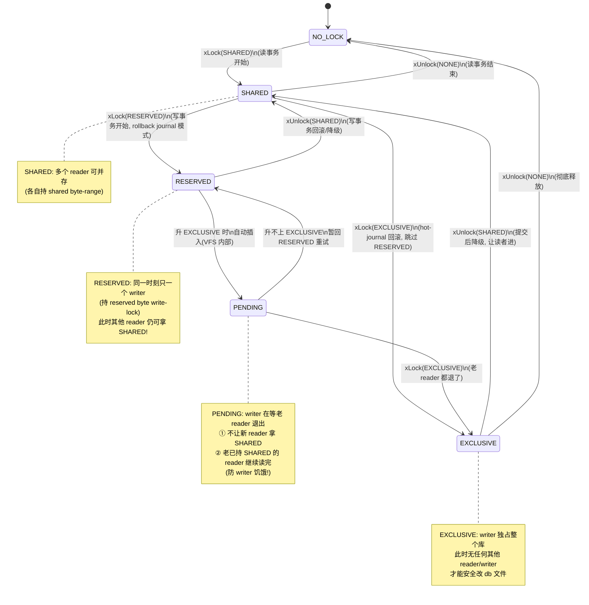

# 第 5 篇 · 第 17 章 · 并发模型:database lock

> **核心问题**:前面几章我们讲透了"一条 SQL 怎么编译成字节码、VDBE 怎么执行、B-tree 怎么存页、pager 怎么缓存、WAL/journal 怎么保 ACID"——但这一切都建立在一个**没说破的前提**上:**同一时刻只有一个连接在动这个数据库**。可现实里,多个进程、多个线程、多个连接常常要并发访问同一个 `.db` 文件:一个浏览器进程的十几个 tab 都在读 history.db,一个 Web 后端几十个线程在读写同一个 cache.db,一个 App 一个线程在写、另一个线程在读。SQLite 凭什么不让它们互相踩?它的文件锁是怎么实现的?为什么传说中"SQLite 并发弱、写的时候整个库都锁了"——这话到底准不准,根在哪?WAL 模式下不是号称"读不阻塞写"吗,那它到底允许多少个 reader、多少个 writer 同时跑?同一个进程里多线程共用一个 `sqlite3*` 连接安全吗?

> **读完本章你会明白**:
> 1. **SQLite 的文件锁 5 态**(NO_LOCK → SHARED_LOCK → RESERVED_LOCK → PENDING_LOCK → EXCLUSIVE_LOCK)是怎么流转的,每个态谁能进、谁不能进,以及那个最容易讲错的 **PENDING 锁到底是干嘛的**(防 writer 饥饿、卡住新 reader 不赶老 reader)。
> 2. **这 5 个锁级是怎么用"在 db 文件的几个特定字节偏移上加 POSIX advisory byte-range lock"编码出来的**——PENDING_BYTE 在 1GB 边界、RESERVED_BYTE 紧跟其后、SHARED_FIRST 再后接 510 字节的共享池;为什么 SHARED 用 510 字节而不是 1 字节(为兼容没有共享锁的 Windows95,顺便给 SHARED 一个"随机选字节"的退让空间)。
> 3. **为什么 SQLite 的并发注定比 MySQL/InnoDB 弱**——它的锁是**数据库级**(database-level,整个文件一把锁),不是行锁;写一个像素都得拿 RESERVED,真要落盘要升 EXCLUSIVE 独占整个库。这不是 SQLite 的疏忽,而是**嵌入式单文件**的必然取舍,对照《MySQL·InnoDB》行锁/间隙锁/next-key 是另一套世界。
> 4. **WAL 模式下"多 reader + 一 writer"并行的真相**——它不是靠文件 5 态锁,而是靠 `.db-shm` 共享内存上的 **READ_LOCK ①②③④ + WRITE_LOCK** 五把细粒度锁 + read-mark 快照(回扣 P4-13);rollback journal 模式和 WAL 模式的并发能力根本不在一个量级,本章给一张总对照表。
> 5. **线程安全这层**:`SQLITE_THREADSAFE` 编译选项(serialized / multi-thread / single-thread 三档)、`sqlite3BtreeEnter/Leave` 这套 btree mutex、`SQLITE_OPEN_FULLMUTEX`/`SQLITE_OPEN_NOMUTEX` 打开标志——多线程到底能不能共用一个连接,什么叫"线程安全但连接不共享"。

> **如果一读觉得太难**:先记住三件事——① SQLite 的锁是**文件锁、5 个级别**,写事务要一路从 SHARED 升到 EXCLUSIVE 独占整个库(rollback journal 模式);② WAL 模式下读写靠**共享内存里的 5 把锁 + read-mark 快照**做到"读不阻塞写、写不阻塞读",但**仍只能一个 writer**;③ SQLite 锁是**库级**(数据库级)不是行锁,这是它并发弱的根,也是嵌入式单文件的代价。剩下的 byte-range 编码、btree mutex、busy handler 都是这三件事的工程实现。

---

## 〇、一句话点破

> **SQLite 的并发模型分两层、两套机制:** **跨进程那一层**,靠在 db 文件的几个特定字节偏移上加 POSIX advisory 锁,编码出 SHARED/RESERVED/PENDING/EXCLUSIVE 四级**文件锁**(rollback journal 模式用它,WAL 模式也在它之上叠加);**同进程多线程那一层**,靠 btree mutex + 可选的 db 全局 mutex 做**线程安全**。而真正让 SQLite 在"读多写少"场景翻身的是 **WAL 模式**——它绕开了文件 5 态锁的写时独占,改用共享内存 `.db-shm` 上的 5 把细粒度锁(read-mark 4 个 reader slot + 1 个 write lock)让"多 reader + 一 writer"并行。但无论哪套,**SQLite 永远是数据库级锁、不是行锁,永远是单写者**——这是嵌入式单文件的命,对照《MySQL·InnoDB》的行锁/间隙锁是两种世界。

这是结论,不是理由。本章倒过来拆:先把"SQLite 并发弱"这句传言的根——数据库级锁——钉死(它不是 bug,是取舍);再拆文件锁 5 态怎么用 byte-range 编码出来、怎么流转;接着讲 rollback journal 模式下写事务的锁升级全链路,以及 WAL 模式下并发模型的根本不同(回扣 P4-13 不重复);然后是 busy handler / timeout、btree mutex / SQLITE_THREADSAFE 线程安全这两层;最后给一张 rollback journal vs WAL 并发能力总对照表收口,并接上下一章 P6-18 事务隔离。

---

## 一、先钉死"为什么 SQLite 并发弱":数据库级锁 vs MySQL 行锁

几乎每个用过 SQLite 的人都听过一句话:"SQLite 写的时候会把整个数据库锁住,并发不行。"这话对,但讲清楚**为什么**的人不多。这不是 SQLite 的 bug,也不是它偷懒——这是**嵌入式单文件数据库的命**。

### 1.1 数据库级锁:一把锁管整个文件

SQLite 的锁加在**整个 db 文件**上。准确说,它用 POSIX 的 byte-range advisory lock,在文件的几个**特定字节偏移**上加锁(下面第二节拆偏移细节),但这些偏移是**固定、全局**的——锁住这几个字节,语义上就等于**锁住了整个数据库**。

> **不这样会怎样(朴素设想)**:你可能会想,既然 SQLite 用 B-tree 存数据,每条记录在某个页的某个位置,那它能不能像 InnoDB 那样,只锁"我要改的那几行所在的页",让不相干的页/行继续被别人读写?

  这在 InnoDB 里行得通,因为 InnoDB 是 **C/S 引擎**:有一个长期运行的服务进程,**所有**对数据库的访问都先经过这个进程。这个进程在内存里维护一张"锁表"(行锁、间隙锁、next-key 锁),谁要改哪行就在锁表里登记,进程内部用 mutex 保护这张锁表。锁是**逻辑的、进程内的**,想加多细就加多细——行、间隙、表,都行。

  **SQLite 没有这个前提**。它是**嵌入式**——没有独立服务进程,每个连接就是应用进程里的一段库代码,直接 `open()` 那个 `.db` 文件,直接 `read()/write()`,直接 `fcntl(F_SETLK)` 加锁。**进程之间唯一的协调通道就是文件系统本身**。POSIX 文件锁(byte-range advisory lock)是它跨进程同步的唯一可靠原语。

  POSIX byte-range 锁能做到"只锁文件的某一段字节",听起来够细?但问题是:**SQLite 的页号和数据布局是动态的**。一条记录今天在第 5 页,改一次、B-tree 分裂一下,明天可能跑到第 8 页。如果用"锁页"做并发控制,你得在改之前精确地锁住"这次事务会碰到的所有页"——可改之前你都不知道会碰哪些页(B-tree 分裂会传播)。更要命的是,不同连接的页缓存各自独立,**没有进程内的锁表**来登记"谁锁了哪页"。POSIX 文件锁是按字节范围 + 进程(pid)记的,两个连接如果在**同一个进程**(同 pid)里,POSIX 锁根本区分不开它们(下面第五节讲这个坑)。

  所以 SQLite 做了一个干脆的取舍:**不细分,整个数据库文件一把锁**(准确说是固定几个字节偏移代表锁级)。要写?先把整个库的锁从 SHARED 升到 RESERVED、再升到 EXCLUSIVE,独占。别人谁都进不来。

> **所以这样设计(数据库级锁的根)**:SQLite 是嵌入式、无服务进程、跨进程只能靠文件锁协调——这三条决定了它**没有进程内锁表这个基础设施**,自然做不到行锁。数据库级锁是这条约束下的最优解:简单、正确、跨平台。代价是写并发 = 1(同时只一个 writer),读并发在 rollback journal 模式下也受限(写时读全堵)。这就是"SQLite 并发弱"的根——**不是技术不够,是架构定位使然**。

### 1.2 对照《MySQL·InnoDB》:行锁、间隙锁、next-key

| 维度 | **SQLite** | **MySQL/InnoDB** |
|------|-----------|------------------|
| **锁粒度** | **数据库级**(整个文件) | **行级** + 间隙锁(gap lock)+ next-key lock |
| **锁的实现** | POSIX byte-range 文件锁(几个固定字节偏移) | 进程内锁表(buffer pool 里维护),靠 mutex 保护 |
| **跨进程协调** | 只能靠文件系统(文件锁) | 不需要——所有访问都进同一个服务进程 |
| **同时几个 writer** | **1 个**(单写者) | 多个(靠行锁 + MVCC + undo 协调) |
| **写时读** | rollback journal 模式:读全堵;WAL 模式:读不堵 | 读不堵(MVCC + undo 版本链) |
| **改一行的影响** | 整个数据库被锁住 | 只锁那一行(及周围间隙) |
| **并发量级** | 适合低/中并发(端侧、App 内) | 适合高并发(服务端、海量连接) |

> **钉死这件事**:SQLite 和 InnoDB 的并发模型**根本不同**,根源在**架构定位**——SQLite 嵌入式无服务进程,跨进程只能靠文件锁,所以只能数据库级锁、单写者;InnoDB 是 C/S 引擎,所有访问进同一个进程,自然能维护进程内锁表做行锁、支持多 writer。这不是谁强谁弱,是**两种世界**。SQLite 的并发弱,是"嵌入式单文件"这套架构**用并发换简单/零配置/可移植"换出来的"**——它在端侧场景(手机、浏览器、App、配置存储)那点并发需求,完全 hold 得住;硬要上高并发写,那本就该用 MySQL/PG。这一点 P0-01 和 P7-21 都会反复回扣。

---

## 二、文件锁 5 态:怎么用 byte-range lock 编码出来

理解了"为什么是数据库级锁",现在拆它的实现。SQLite 的文件锁有 **5 个状态**(其实是 4 个有意义的 + 1 个"无锁"),用 4 个整数表示,定义在公开头文件:

```c
/* sqlite.h.in#L699-L703 */
#define SQLITE_LOCK_NONE          0       /* xUnlock() only */
#define SQLITE_LOCK_SHARED        1       /* xLock() or xUnlock() */
#define SQLITE_LOCK_RESERVED      2       /* xLock() only */
#define SQLITE_LOCK_PENDING       3       /* xLock() only */
#define SQLITE_LOCK_EXCLUSIVE     4       /* xLock() only */
```

注释明确写着:**`xLock()` 的参数只会是 SHARED 及以上(1~4),绝不会是 NONE**;**`xUnlock()` 的参数只会是 SHARED 或 NONE**。也就是说锁只能"往上升级"(NONE → SHARED → RESERVED → PENDING → EXCLUSIVE),解锁只能"降到 SHARED 或彻底放开到 NONE"。这 5 个值**从小到大正好是从宽松到严格**的偏序。

但这里有个**最容易讲错的点**:`SQLITE_LOCK_PENDING` 这个值,**SQLite 内核从不直接向 VFS 请求它**。看 unix VFS 的断言:

```c
/* os_unix.c#L1929-L1936, unixLock() 开头 */
assert( pFile->eFileLock!=NO_LOCK || eFileLock==SHARED_LOCK );   /* (1) 不能从 unlocked 直接跳到 shared 以上 */
assert( eFileLock!=PENDING_LOCK );                                /* (2) 从不直接请求 pending! */
assert( eFileLock!=RESERVED_LOCK || pFile->eFileLock==SHARED_LOCK ); /* (3) reserved 必须先有 shared */
```

第 (2) 条断言是关键:**`xLock(PENDING)` 这个调用永远不会发生**。PENDING 是 SQLite 在**升 EXCLUSIVE 的过程中自动插入的中间态**——当持有 RESERVED 的连接要升 EXCLUSIVE 时,unix VFS 会先给它装上 PENDING(在 PENDING_BYTE 上 write-lock),再尝试拿 EXCLUSIVE。这个"PENDING 是中间态而非主动请求"的设计,是理解整个 5 态流转的钥匙(下面技巧精解专门拆)。

### 2.1 状态机:5 态怎么流转

unix VFS 的 `unixLock` 函数头注释把允许的转移画得很清楚(os_unix.c#L1857-L1861):

```
   UNLOCKED -> SHARED
   SHARED -> RESERVED
   SHARED -> EXCLUSIVE        (hot-journal 回滚时走这条, 跳过 RESERVED)
   RESERVED -> (PENDING) -> EXCLUSIVE
   PENDING -> EXCLUSIVE
```

用状态图画出来:



逐态解释:

- **NO_LOCK**:没锁。连接刚打开、或刚释放完所有锁。
- **SHARED_LOCK**:**读锁**。多个 reader 可同时持有(read-lock 是共享的)。rollback journal 模式下,一个读事务开始就持 SHARED 直到结束。注意:WAL 模式下 reader 也持 SHARED(还要额外持 WAL 的 READ_LOCK,见第五节)。
- **RESERVED_LOCK**:**写意图锁**。一个连接**准备要写**时,先从 SHARED 升到 RESERVED。同一时刻**只能有一个 RESERVED**(reserved byte 是 write-lock,互斥),但此时**其他 reader 仍可继续拿 SHARED**!这是 RESERVED 和 EXCLUSIVE 的关键差别——RESERVED 只是"我声明要写了,你们别再来抢写",读者还能读。writer 这时可以在内存里改页缓存(journal 也开始记),但**还没动 db 文件**。
- **PENDING_LOCK**:**过渡锁,防 writer 饥饿**。持有 RESERVED 的 writer 准备真正落盘(升 EXCLUSIVE),但此时可能还有老 reader 持着 SHARED。writer 先升 PENDING:**PENDING 让新来的 reader 拿不到 SHARED**(挡住新 reader),但**不赶走已经持有 SHARED 的老 reader**(它们继续读完)。writer 等老 reader 一个个退出、SHARED 清空,再升 EXCLUSIVE。
- **EXCLUSIVE_LOCK**:**独占写锁**。此刻整个库只有这一个 writer,没有任何 reader。writer 这才真正把改过的页写回 db 文件、fsync、删 journal(rollback journal 模式的提交动作)。

> **PENDING_LOCK 到底解决什么问题(招牌)**:设想**没有 PENDING** 会怎样。writer 持 RESERVED,要升 EXCLUSIVE。EXCLUSIVE 要求没有任何 SHARED——可只要源源不断的新 reader 进来拿 SHARED,SHARED 就永远清不空,writer 永远升不上去,**活活饿死**。PENDING 就是来治这个的:writer 一升 PENDING,**新 reader 进不来**(PENDING_BYTE 被 write-lock,reader 拿 SHARED 时要先 read-lock PENDING_BYTE,拿不到),但**老 reader 不受影响**(它们早就过了 PENDING_BYTE 这一关,只持 SHARED_FIRST 那段的 read-lock)。这样 writer 只需等"当前这批老 reader 读完",就一定能升 EXCLUSIVE——**写不会饿死,读也不会被中途打断**。这个设计精妙在"挡新不赶旧",下面技巧精解 A 专门拆它的 byte-range 实现。

### 2.2 byte-range lock:5 态怎么编码成文件字节偏移

POSIX 的 advisory byte-range lock(`fcntl(fd, F_SETLK, &flock)`,`flock` 里指定 `l_type`/`l_start`/`l_len`)能锁文件的**任意字节范围**,分**读锁(`F_RDLCK`,共享)**和**写锁(`F_WRLCK`,互斥)**。SQLite 在 db 文件里**选了几个固定字节偏移**,用在这些偏移上加 read-lock/write-lock 的组合,编码出 4 个锁级。

锁字节偏移定义在 os.h:

```c
/* os.h#L159-L166 */
#ifdef SQLITE_OMIT_WSD
# define PENDING_BYTE     (0x40000000)
#else
# define PENDING_BYTE      sqlite3PendingByte       /* 运行时可改, 默认 0x40000000 */
#endif
#define RESERVED_BYTE     (PENDING_BYTE+1)
#define SHARED_FIRST      (PENDING_BYTE+2)
#define SHARED_SIZE       510
```

`sqlite3PendingByte` 的默认值在 global.c#L360:

```c
/* global.c#L360 */
int sqlite3PendingByte = 0x40000000;    /* = 1GB */
```

也就是说,**默认情况下,锁字节从 db 文件的 1GB 偏移(0x40000000)开始**:

```
   db 文件的锁字节布局(默认 PENDING_BYTE = 0x40000000 = 1GB):
   
   偏移 0x00000000 ~ 0x3FFFFFFF  :  数据区(实际 db 页, B-tree 存这里)
   ──────────── 1GB 边界 ────────────
   偏移 0x40000000 (PENDING_BYTE) :  1 字节, 编码 PENDING(写锁) / 读 SHARED 时临时占用
   偏移 0x40000001 (RESERVED_BYTE):  1 字节, 编码 RESERVED(写锁)
   偏移 0x40000002 ~ +511         :  SHARED_FIRST 起 510 字节(SHARED_SIZE), 共享池
   ─────────────────────────────────
   偏移 0x400001FC 之后           :  (不用, 或超大数据库会扩展到这之后)
```

**为什么 PENDING_BYTE 放在 1GB 边界、而不是文件开头**?os.h#L147-L156 的注释说得很清楚:锁字节区域里**不能存数据**(Windows 上锁是 mandatory 的,锁住就读写不了;且 pager 要避免给锁字节区分配页),所以把它放得尽量靠后,**绝大多数数据库(小于 1GB)根本不会触及这块区域**,不用为一个空区域浪费一页分配。只有 db 长到接近 1GB,pager 才会"跳过"这一段。这个偏移是**可调**的(`sqlite3PendingByte` 是全局变量,可通过编译期选项改),但改了就**文件格式不兼容**(os.h#L152-L154 警告),所以实际上没人改。

**为什么 SHARED 要用 510 字节的"池"而不是 1 字节**?这段历史在 os_unix.c#L1880-L1886 和 os.h#L125-L128 注释里:当年 SQLite 诞生时 Windows95 还很常见,**Win95 不支持共享锁(只有互斥锁)**。为了让 unix 和 Win95 能同时锁同一个 db 文件,SQLite 设计了一个折中:**unix 上对 SHARED_FIRST 起的整个 510 字节区域加 read-lock(共享)**;**Win95 上从这 510 字节里随机挑一个字节加 write-lock(互斥)**——两个 unix reader 锁的是同一整段(都 read-lock,共享,不冲突);两个 Win95 reader 锁的是**随机选的不同字节**(大概率不冲突);一个 unix reader(read-lock 整段)和一个 Win95 reader(write-lock 某一字节)会冲突,这是可接受的(Win95 reader 会重试挑别的字节)。Win95 早灭绝了,但这套 510 字节共享池**为了向后兼容保留至今**。

### 2.3 4 个锁级在 byte-range 上的精确编码

把 4 个锁级翻译成"在哪些字节偏移上加什么锁",这是 unix VFS `unixLock`(os_unix.c#L1866)的核心逻辑,函数头大段注释(os_unix.c#L1867-L1906)讲得一清二楚:

| 锁级 | 拿法(byte-range lock) | 语义 |
|------|------------------------|------|
| **SHARED** | ① 先 **read-lock `PENDING_BYTE`**(临时, 检查有没有 writer 挡着)→ ② **read-lock `SHARED_FIRST` 起的 `SHARED_SIZE`(510)字节**(真正的共享读锁)→ ③ **unlock `PENDING_BYTE`**(放掉临时检查锁) | read-lock 是共享的, 多个 reader 可并存; 第①步检查 PENDING 有没有被 write-lock(若被 writer 占着, reader 拿不到, 进不来——这就是 PENDING 挡新 reader 的机制) |
| **RESERVED** | **write-lock `RESERVED_BYTE`**(1 字节) | write-lock 是互斥的, 同一时刻只一个 writer 能拿; 此时其他 reader 的 SHARED 不受影响(reader 不碰 RESERVED_BYTE) |
| **PENDING** | **write-lock `PENDING_BYTE`**(1 字节) | 由 VFS 在升 EXCLUSIVE 时自动插入; 此后新 reader 的 SHARED 第①步(read-lock PENDING_BYTE)会失败, 进不来; 老已持 SHARED 的 reader 不受影响(它们早过了第①步) |
| **EXCLUSIVE** | **write-lock `SHARED_FIRST` 起的 `SHARED_SIZE`(510)字节** | 因为所有 SHARED 锁都 read-lock 这段, 一旦被 write-lock, 所有 reader 的 SHARED 都被排斥; 此刻库内无他人 |

`unixLock` 的 SHARED 分支(os_unix.c#L1997-L2029)把这套三步走写得很清楚:

```c
  /* os_unix.c#L1997-L2029, SHARED_LOCK 分支(节选) */
  if( eFileLock==SHARED_LOCK ){
    assert( pInode->nShared==0 );
    /* Now get the read-lock */
    lock.l_start = SHARED_FIRST;              // ② read-lock 510 字节共享池
    lock.l_len = SHARED_SIZE;
    if( unixFileLock(pFile, &lock) ){
      tErrno = errno;
      rc = sqliteErrorFromPosixError(tErrno, SQLITE_IOERR_LOCK);
    }
    /* Drop the temporary PENDING lock */
    lock.l_start = PENDING_BYTE;              // ③ 放掉临时 PENDING 检查锁
    lock.l_len = 1L;
    lock.l_type = F_UNLCK;
    if( unixFileLock(pFile, &lock) && rc==SQLITE_OK ){
      rc = SQLITE_IOERR_UNLOCK;
    }
    ...
    pFile->eFileLock = SHARED_LOCK;
    pInode->nLock++;
    pInode->nShared = 1;
  }
```

注意第①步(read-lock PENDING_BYTE)在函数更前面的 os_unix.c#L1975-L1991 已经做过了——那段逻辑同时服务"SHARED 请求"和"从 RESERVED 升 EXCLUSIVE 请求"(后者要 write-lock PENDING_BYTE 来转 PENDING 态):

```c
  /* os_unix.c#L1973-L1991, 共用: PENDING_BYTE 上的锁 */
  lock.l_len = 1L;
  lock.l_whence = SEEK_SET;
  if( eFileLock==SHARED_LOCK
   || (eFileLock==EXCLUSIVE_LOCK && pFile->eFileLock==RESERVED_LOCK)
  ){
    lock.l_type = (eFileLock==SHARED_LOCK?F_RDLCK:F_WRLCK);  // shared 用读锁, 升 excl 用写锁
    lock.l_start = PENDING_BYTE;
    if( unixFileLock(pFile, &lock) ){
      ...  // 拿不到 → busy
      goto end_lock;
    }else if( eFileLock==EXCLUSIVE_LOCK ){
      pFile->eFileLock = PENDING_LOCK;        // 升 EXCLUSIVE 时, 这一刻就是 PENDING 态
      pInode->eFileLock = PENDING_LOCK;
    }
  }
```

> **钉死这件事**:SQLite 的 4 个文件锁级,**全靠在 db 文件的 3 个区域(PENDING_BYTE 1 字节、RESERVED_BYTE 1 字节、SHARED_FIRST 起 510 字节)上分别加 read-lock 或 write-lock 编码出来**。这套编码精妙在:**PENDING_BYTE 同时被"新 reader 检查"和"writer 升 EXCLUSIVE 拦新 reader"复用**——reader 拿 SHARED 前要先 read-lock PENDING_BYTE(检查有没有 writer 挡着),writer 升 EXCLUSIVE 时 write-lock PENDING_BYTE(挡住新 reader)——一把字节,两种用途,自洽。这是用最少的字节偏移、最朴素的 POSIX 锁,精确表达出 5 态语义的工程艺术。

---

## 三、rollback journal 模式:一次写事务的锁升级全链路

理解了 5 态编码,现在看一次完整的写事务,锁是怎么一路升级的。这是 rollback journal 模式(默认模式,P4-12 讲过)的提交流程,锁贯穿始终。

### 3.1 从读开始:reader 持 SHARED

任何事务(读写都算)开始,都要先能"看见"数据库——也就是持 SHARED_LOCK。这一步在 pager 层是 `sqlite3PagerSharedLock`(pager.c#L5300):

```c
  /* pager.c#L5312-L5322, 读事务开始 */
  if( !pagerUseWal(pPager) && pPager->eState==PAGER_OPEN ){
    ...
    rc = pager_wait_on_lock(pPager, SHARED_LOCK);   // 拿 SHARED
    if( rc!=SQLITE_OK ){
      goto failed;
    }
    /* 然后检查 hot-journal(别的进程 crash 留下的 journal, 要先回滚) */
    ...
  }
```

注意:**拿 SHARED 是会触发 busy handler 的**(下面第四节讲)——如果此刻有 writer 持 PENDING 或 EXCLUSIVE,reader 的 SHARED 拿不到,会调 busy handler 重试。

pager 层有个状态机 `eState`(pager.c#L351-L357),和文件锁 5 态**不是一回事**——`eState` 是 pager 内部的"事务阶段",更细(把写事务分成 LOCKED/CACHEMOD/DBMOD/FINISHED 四个小阶段):

```c
  /* pager.c#L351-L357 */
  #define PAGER_OPEN                  0   /* 无事务 */
  #define PAGER_READER                1   /* 读事务, 持 SHARED */
  #define PAGER_WRITER_LOCKED         2   /* 写事务刚开始, 拿了 RESERVED, 还没改页 */
  #define PAGER_WRITER_CACHEMOD       3   /* 在改内存页缓存, journal 在记 */
  #define PAGER_WRITER_DBMOD          4   /* 把脏页往 db 文件写 */
  #define PAGER_WRITER_FINISHED       5   /* 写完了, 等 commit 收尾 */
  #define PAGER_ERROR                 6   /* 出错态 */
```

而文件锁级别 `eLock`(pager.c#L360-L364)只有 4 档(NONE/SHARED/RESERVED/EXCLUSIVE),`eState` 和 `eLock` 是**正交的两个维度**——`eState` 描述"事务进行到哪一步",`eLock` 描述"此刻持什么文件锁"。一个 `PAGER_WRITER_DBMOD` 状态的 pager 一定持 EXCLUSIVE(因为只有 EXCLUSIVE 才能写 db 文件);一个 `PAGER_READER` 一定持 SHARED。这两套状态的对应关系见 pager.c#L283-L349 的大段注释。

### 3.2 要写了:SHARED → RESERVED

当 VDBE 执行到第一个会改数据的 opcode(比如 `OP_Insert`、`OP_Delete`),pager 要从读事务转写事务。入口是 `sqlite3PagerBegin`(pager.c#L5968):

```c
  /* pager.c#L5975-L6006, 读→写转换(rollback journal 模式) */
  if( pPager->eState==PAGER_READER ){
    ...
    if( pagerUseWal(pPager) ){
      /* WAL 模式: 拿 WRITE_LOCK, 下面第五节讲 */
      rc = sqlite3WalBeginWriteTransaction(pPager->pWal);
    }else{
      /* rollback journal 模式: 拿 RESERVED 锁 */
      rc = pagerLockDb(pPager, RESERVED_LOCK);
      if( rc==SQLITE_OK && exFlag ){
        /* exFlag=1 表示 BEGIN EXCLUSIVE, 直接一口气升到 EXCLUSIVE */
        rc = pager_wait_on_lock(pPager, EXCLUSIVE_LOCK);
      }
    }
    if( rc==SQLITE_OK ){
      pPager->eState = PAGER_WRITER_LOCKED;   // 进写事务第一小阶段
      ...
    }
  }
```

`pagerLockDb`(pager.c#L1161)是个薄包装,直接调 VFS 的 `xLock`:

```c
  /* pager.c#L1161-L1173 */
  static int pagerLockDb(Pager *pPager, int eLock){
    int rc = SQLITE_OK;
    assert( eLock==SHARED_LOCK || eLock==RESERVED_LOCK || eLock==EXCLUSIVE_LOCK );
    if( pPager->eLock<eLock || pPager->eLock==UNKNOWN_LOCK ){
      rc = pPager->noLock ? SQLITE_OK : sqlite3OsLock(pPager->fd, eLock);
      if( rc==SQLITE_OK && (pPager->eLock!=UNKNOWN_LOCK||eLock==EXCLUSIVE_LOCK) ){
        pPager->eLock = (u8)eLock;
      }
    }
    return rc;
  }
```

注意一个**反直觉的点**:拿 RESERVED **不触发 busy handler**(pager.c#L3761 注释明说 `SHARED_LOCK -> RESERVED_LOCK | No`)。为什么?因为 RESERVED 是"我要写了"的意图声明,如果此刻已有别人持 RESERVED(write-lock RESERVED_BYTE 互斥),你拿不到就直接返回 `SQLITE_BUSY`,让上层决定(BEGIN IMMEDIATE 会重试,BEGIN DEFERRED 会直接报错让用户决定)。SQLite 不在这个点自动 spin,是有意为之——避免在"还没真开始写"时就无脑重试,把决策权交给上层/用户。

### 3.3 落盘:RESERVED → (PENDING) → EXCLUSIVE

writer 在 RESERVED 态下,可以在内存里改页缓存(rollback journal 同时记下原页内容,P4-12)。但**真正把脏页写回 db 文件**,必须先升到 EXCLUSIVE——因为写 db 文件期间,绝不能有别的 reader 还在读(否则 reader 会读到写了一半的页)。

升级路径在 VFS `unixLock` 里是:**先 write-lock PENDING_BYTE(转 PENDING 态)→ 等 SHARED 清空 → write-lock SHARED_FIRST 那 510 字节(转 EXCLUSIVE)**。第二步的等待是会触发 busy handler 的(pager.c#L3763:`RESERVED_LOCK -> EXCLUSIVE_LOCK | Yes`)——writer 在 PENDING 态等老 reader 退出,每等一次调一次 busy handler,handler 返回非 0 就再试。

一旦升到 EXCLUSIVE,writer 独占整个库,开始把脏页写回 db 文件、fsync、然后删/清 journal(rollback journal 模式的 commit 动作)。提交完后,降级回 SHARED(或直接 unlock 到 NONE),让等待的 reader 进来。

### 3.4 一张图:rollback journal 模式下一次写事务的锁轨迹

```
   连接 A(写)的时间轴, 假设同时有连接 B/C 在读:
   
   时刻   连接 A 的锁       连接 B/C          说明
   ─────────────────────────────────────────────────────────
   t0    NO_LOCK          NO_LOCK           A 打开 db
   t1    SHARED           SHARED, SHARED    A/B/C 都在读
   t2    RESERVED         SHARED, SHARED    A 声明要写(拿 RESERVED_BYTE write-lock)
                                           B/C 不受影响, 继续读
   t3    RESERVED         (B 读完走, SHARED 释放)
   t4    PENDING          SHARED(C)         A 要落盘, 升 PENDING(write-lock PENDING_BYTE)
                                           → 新 reader D 现在拿不到 SHARED(被 PENDING 挡)
                                           → 但 C 的老 SHARED 不受影响, 继续读
   t5    PENDING          (C 读完, SHARED 释放)
   t6    EXCLUSIVE        (无)              SHARED 清空, A 升 EXCLUSIVE(write-lock 510 字节)
                                           A 独占整个库, 写脏页 → db 文件, fsync, 删 journal
   t7    SHARED 或 NO_LOCK ...             A 提交完降级, 等待的 reader D 进来
   
   关键: t4 的 PENDING 只挡新 reader(D), 不赶老 reader(C)——这就是 PENDING 防 writer 饥饿的精髓
```

> **钉死这件事**:rollback journal 模式下,一个写事务的锁轨迹是 **SHARED → RESERVED(改内存)→ PENDING(挡新 reader)→ EXCLUSIVE(落盘)→ 降级**。从 RESERVED 升 EXCLUSIVE 这段,writer 处于"挡新 reader、等老 reader"的过渡期,**这就是为什么写事务长的时候读会被堵**——新 reader 在 PENDING 期间拿不到 SHARED,得等 writer 升到 EXCLUSIVE 再降回来。这是 rollback journal 模式并发性的硬伤,WAL 模式就是来治这个的(第五节)。

---

## 四、busy handler / busy timeout:拿不到锁怎么办

前面看到,好几个拿锁的点都可能返回 `SQLITE_BUSY`——拿 SHARED 时碰到 writer、升 EXCLUSIVE 时老 reader 还没退、WAL 模式拿 WRITE_LOCK 时已有 writer。SQLite 的设计是:**默认不自动等**,直接把 `SQLITE_BUSY` 抛给应用。但应用往往不想立刻放弃,想"等一会儿再试"——这就是 **busy handler**。

### 4.1 两个 API:busy_handler 和 busy_timeout

应用可以注册一个回调,SQLite 拿不到锁时会调它,它返回非 0 就重试、返回 0 就放弃:

```c
  /* main.c#L1787-L1805 */
  int sqlite3_busy_handler(
    sqlite3 *db,
    int (*xBusy)(void*,int),    /* 回调: 收到已等待次数, 返回非 0=重试, 0=放弃 */
    void *pArg
  ){
    ...
    db->busyHandler.xBusyHandler = xBusy;
    db->busyHandler.pBusyArg = pArg;
    db->busyHandler.nBusy = 0;
    db->busyTimeout = 0;        /* 设了 handler 就清 timeout(两者互斥) */
    ...
  }
```

更常用的是 `sqlite3_busy_timeout`——传一个毫秒数,SQLite 装一个默认的 sleep-based 回调,自动 sleep + 重试到超时:

```c
  /* main.c#L1844-L1859 */
  int sqlite3_busy_timeout(sqlite3 *db, int ms){
    if( ms>0 ){
      sqlite3_busy_handler(db, (int(*)(void*,int))sqliteDefaultBusyCallback, (void*)db);
      db->busyTimeout = ms;
    }else{
      sqlite3_busy_handler(db, 0, 0);   /* ms<=0 = 关掉 */
    }
    return SQLITE_OK;
  }
```

`sqliteDefaultBusyCallback` 的逻辑大致是:**第一次立刻重试,之后每次 sleep 越来越久(指数退避),累计睡眠时间到 `busyTimeout` 就放弃**。

### 4.2 哪些锁升级点会触发 busy handler

这是个**容易踩坑的细节**,pager.c#L3758-L3763 的注释明确列了:

```
   Transition                        | Invokes xBusyHandler
   --------------------------------------------------------
   NO_LOCK       -> SHARED_LOCK      | Yes      (读事务开始)
   SHARED_LOCK   -> RESERVED_LOCK    | No       (写意图, 直接报 BUSY)
   SHARED_LOCK   -> EXCLUSIVE_LOCK   | No       (hot-journal 回滚)
   RESERVED_LOCK -> EXCLUSIVE_LOCK   | Yes      (写事务落盘)
```

也就是说,**只有两处会自动重试**:**① 读事务开始拿 SHARED**(被 writer 的 PENDING/EXCLUSIVE 挡)、**② 写事务落盘升 EXCLUSIVE**(老 reader 还没退)。中间那步拿 RESERVED **不重试**——直接返回 BUSY,因为这是"声明写意图"的临界点,自动重试容易在没真正开始写时就无脑消耗 CPU。

### 4.3 pager_wait_on_lock:busy handler 的调用现场

`pager_wait_on_lock`(pager.c#L3992)就是 busy handler 的调用点,一个 do-while 循环:

```c
  /* pager.c#L3992-L4009 */
  static int pager_wait_on_lock(Pager *pPager, int locktype){
    int rc;
    assert( (pPager->eLock>=locktype)
         || (pPager->eLock==NO_LOCK && locktype==SHARED_LOCK)
         || (pPager->eLock==RESERVED_LOCK && locktype==EXCLUSIVE_LOCK)
    );
    do {
      rc = pagerLockDb(pPager, locktype);
    }while( rc==SQLITE_BUSY && pPager->xBusyHandler(pPager->pBusyHandlerArg) );
    return rc;
  }
```

拿不到 BUSY → 调 busy handler → 返回非 0 就再 `pagerLockDb` → 还是 BUSY 再调 handler……直到 handler 返回 0(放弃)或拿到锁。`sqlite3InvokeBusyHandler`(main.c#L1771)负责递增 `nBusy` 计数(传给回调,让回调知道这是第几次):

```c
  /* main.c#L1771-L1781 */
  int sqlite3InvokeBusyHandler(BusyHandler *p){
    int rc;
    if( p->xBusyHandler==0 || p->nBusy<0 ) return 0;
    rc = p->xBusyHandler(p->pBusyArg, p->nBusy);
    if( rc==0 ){
      p->nBusy = -1;          /* 放弃了, 以后不再调 */
    }else{
      p->nBusy++;
    }
    return rc;
  }
```

> **不这样会怎样**:没有 busy handler,SQLite 拿不到锁就立刻返回 `SQLITE_BUSY`,应用层得自己写"捕获 BUSY → sleep → 重试"的循环。这对应用开发是个负担——每个 `sqlite3_step` 都可能抛 BUSY,到处得包 try-retry。`busy_timeout` 一行设置,把这套重试下沉到引擎内部,应用层干净得多。所以**用 SQLite 的第一条工程实践就是:打开连接后立刻 `sqlite3_busy_timeout(db, 5000)`**(给 5 秒),绝大多数并发冲突都能自动消化。

> **钉死这件事**:busy handler 只在两处自动触发(拿 SHARED、升 EXCLUSIVE),拿 RESERVED 不触发——这是 SQLite 把"重试决策权"在关键点交给上层的设计。配合 `sqlite3_busy_timeout`,应用层一行就能搞定绝大多数锁冲突。但要注意:busy handler 是**进程内的 spin-wait(sleep+retry)**,不是 OS 级的阻塞等待——它 sleep 时仍占着线程。高并发场景下,一堆线程都在 spin-wait 等同一把锁,会浪费 CPU;这种场景该考虑 WAL 模式(读写不互斥,根本不需要 spin)或干脆换 MySQL/PG。

---

## 五、WAL 模式的并发模型:回扣 P4-13,只讲锁这层

P4-13 已经把 WAL 的核心三件套(WAL 文件、wal-index、read-mark)和"读不阻塞写、写不阻塞读"的机制讲透了,这里**只讲锁这一层**,不重复细节。

### 5.1 WAL 模式下,文件 5 态锁退居二线

WAL 模式(`PRAGMA journal_mode=WAL`)的并发,**主要不再靠 db 文件的 5 态文件锁,而是靠 `.db-shm` 共享内存上的 8 个锁字节**(`SQLITE_SHM_NLOCK = 8`,sqlite.h.in#L1611)。db 文件的文件锁在 WAL 模式下仍然存在(reader 仍持 SHARED,checkpoint 升 EXCLUSIVE),但**读写并发的核心协调转移到了 shm 上**。

shm 文件的最后 8 个字节是锁区(P4-13 画过 136 字节头部布局),wal.c#L294-L299 定义了它们各代表什么:

```c
  /* wal.c#L294-L299(承 P4-13) */
  #define WAL_WRITE_LOCK         0       // writer 排他(单写者)
  #define WAL_ALL_BUT_WRITE      1
  #define WAL_CKPT_LOCK          1       // checkpoint 排他
  #define WAL_RECOVER_LOCK       2       // 恢复排他
  #define WAL_READ_LOCK(I)       (3+(I)) // reader 共享(I=0..4)
  #define WAL_NREADER            (SQLITE_SHM_NLOCK-3)  // =5
```

这 8 个字节分成三组:

- **字节 0 = WRITE_LOCK**:**写锁**,writer 拿 EXCLUSIVE(`walLockExclusive`),全库同一时刻只一个 writer——**这就是 WAL 单写者的物理实现**。
- **字节 1 = CKPT_LOCK**:**checkpoint 锁**,checkpointer 拿 EXCLUSIVE,防多个 checkpoint 并发。
- **字节 2 = RECOVER_LOCK**:**恢复锁**,WAL 恢复时拿。
- **字节 3~7 = READ_LOCK(0..4)**:**5 个 reader 槽位**,每个 reader 拿一个 SHARED(`walLockShared`),配 read-mark 快照。`READ_LOCK(0)` 是特殊位(reader 忽略 WAL 直接读主库,不挡 checkpoint),`READ_LOCK(1..4)` 配 `aReadMark[1..4]` 做快照上限。

### 5.2 为什么 WAL 能"读不阻塞写、写不阻塞读"

P4-13 讲过 read-mark 快照机制,这里只从锁的角度点一下:

> **读不阻塞写的锁角度**:writer 拿的是 `WRITE_LOCK`(字节 0,EXCLUSIVE),reader 拿的是 `READ_LOCK(i)`(字节 3+i,SHARED)——**这是两个完全不同的字节**,POSIX byte-range 锁只对"同一字节"冲突,所以 writer 拿写锁不等 reader 放读锁、reader 拿读锁不等 writer 放写锁。两个锁请求落在不同字节上,天然互不挡。

> **写不阻塞读的锁角度**:writer 只追加 WAL 文件、不覆盖主库;reader 读主库 + WAL(自己的快照范围)。writer 的写都落在 WAL 文件的新增字节上,reader 读的是主库或 WAL 已有的字节,物理上不冲突。wal-index(共享内存)那边,writer 往索引末尾追加新条目,reader 查老条目,通过 `AtomicLoad` + `iFrame<=iLast`(快照上限)过滤做到无锁并发(P4-13 技巧精解 A 拆过)。

### 5.3 回扣 P4-13:read-mark 与 checkpoint 的锁协调

checkpoint 要回填 WAL 到主库,但**不能覆盖还有 reader 在用的老帧**(否则老 reader 再读这些页会从主库读到 checkpoint 改过的新版本,快照破坏)。这个协调的锁机制是:**checkpoint 算 `mxSafeFrame = min(在用 aReadMark[1..4])`,只回填到这为止**(P4-13 的 `walCheckpoint` wal.c#L2228)。持 `READ_LOCK(0)` 的 reader(忽略 WAL 直读主库)**不计入 mxSafeFrame**,所以它不挡 checkpoint——这是 PASSIVE 模式默认能"静默后台 checkpoint"的锁基础。

> **钉死这件事(承 P4-13)**:WAL 模式的并发模型,锁的主角从 db 文件的 5 态文件锁,**换成了 shm 文件的 8 字节锁区**(1 写锁 + 1 checkpoint 锁 + 1 恢复锁 + 5 reader 槽位)。"读不阻塞写"靠 writer 和 reader 拿不同字节的锁;"写不阻塞读"靠 writer 只追加不覆盖 + reader 持快照过滤;checkpoint 与 reader 靠 `mxSafeFrame = min(read-mark)` 协调。这套机制比 rollback journal 的 5 态文件锁精细得多,所以并发能力根本不在一个量级——下面总对照表说清。

---

## 六、线程安全:btree mutex 与 SQLITE_THREADSAFE

前面讲的都是**跨进程**(不同进程访问同一 db 文件)。还有一层并发是**同进程多线程**——一个进程里开几个线程,各拿一个 `sqlite3*` 连接(或共用一个),访问同一个 db。这层的协调靠 **mutex**。

### 6.1 三档线程安全:SQLITE_THREADSAFE 编译选项

SQLite 编译时有个宏 `SQLITE_THREADSAFE`,决定全局线程安全等级(sqliteInt.h#L346-L365):

```c
  /* sqliteInt.h#L346-L365(节选) */
  /* The SQLITE_THREADSAFE macro must be defined as 0, 1, or 2. */
  #if !defined(SQLITE_THREADSAFE)
  #   define SQLITE_THREADSAFE 1   /* 默认 1 = serialized */
  #endif
```

三档语义:

| `SQLITE_THREADSAFE` | 模式 | 含义 |
|---------------------|------|------|
| **0** | **single-thread** | 完全不加锁, 只能单线程用(最快, 但多线程必崩) |
| **1**(默认) | **serialized** | 序列化, 多线程可共用同一个 `sqlite3*` 连接, 引擎加全局 mutex 串行化 |
| **2** | **multi-thread** | 多线程, 多线程可各用**不同的** `sqlite3*` 连接(连接不能跨线程共用), 引擎在必要处加细粒度 mutex |

注意 serialized 和 multi-thread 的关键差别:**serialized 允许多线程共用同一个连接**(代价是全局 mutex,有性能损耗);**multi-thread 要求每个线程用自己的连接**(连接对象本身不加全局锁,但底层的 btree/pager 访问仍加细粒度 mutex)。绝大多数应用用默认的 serialized 就行;追求性能且能保证"一线程一连接"的,用 multi-thread。

打开连接时还能用 flag 覆盖编译期默认(main.c#L3347-L3355):

```c
  /* main.c#L3347-L3355, openDatabase 里决定线程安全模式 */
  if( sqlite3GlobalConfig.bCoreMutex==0 ){
    isThreadsafe = 0;
  }else if( flags & SQLITE_OPEN_NOMUTEX ){
    isThreadsafe = 0;                        /* 显式要 multi-thread 或更低 */
  }else if( flags & SQLITE_OPEN_FULLMUTEX ){
    isThreadsafe = 1;                        /* 显式要 serialized */
  }else{
    isThreadsafe = sqlite3GlobalConfig.bFullMutex;   /* 用编译期默认 */
  }
```

`SQLITE_OPEN_FULLMUTEX` = 强制 serialized,`SQLITE_OPEN_NOMUTEX` = 强制 multi-thread(或更低)。

### 6.2 btree mutex:保护 B-tree 访问

无论哪档线程安全,**只要多线程访问同一棵 B-tree**(比如 shared-cache 模式下多连接共享一个 B-tree),引擎就得加 mutex 保护 B-tree 的内存结构。这套 mutex 在 `btmutex.c`,核心是 `sqlite3BtreeEnter/Leave`:

```c
  /* btmutex.c#L71-L97 */
  void sqlite3BtreeEnter(Btree *p){
    /* sanity check: 同一连接的多个 btree 按 pBt 地址排序 */
    assert( p->pNext==0 || p->pNext->pBt>p->pBt );
    ...
    if( !p->sharable ) return;     /* 不可共享的 btree, 不用加锁 */
    p->wantToLock++;               /* 引用计数(支持递归进入) */
    if( p->locked ) return;        /* 已持锁, 直接返回 */
    btreeLockCarefully(p);         /* 真正拿 mutex */
  }
```

实际拿 mutex 的是 `lockBtreeMutex`(btmutex.c#L27-L35):

```c
  /* btmutex.c#L27-L35 */
  static void lockBtreeMutex(Btree *p){
    assert( p->locked==0 );
    assert( sqlite3_mutex_notheld(p->pBt->mutex) );
    assert( sqlite3_mutex_held(p->db->mutex) );   /* 先得持 db->mutex */
    sqlite3_mutex_enter(p->pBt->mutex);            /* 拿 btree mutex */
    p->pBt->db = p->db;
    p->locked = 1;
  }
```

注意一个**锁序**约定:进 btree mutex 前,**必须先持有 `db->mutex`**(serialized 模式下每个连接的全局 mutex)。这是为了**避免死锁**——所有线程都按"先 db->mutex → 后 btree mutex"的顺序加锁,就不会出现 A 持 db1 等 btree2、B 持 db2 等 btree1 的循环等待。btmutex.c#L62-L69 的注释明确说了:"To avoid deadlocks, multiple Btrees are locked in the same order by all database connections."

`SQLITE_THREADSAFE==0`(single-thread)时,`btmutex.c` 里这套 `sqlite3BtreeEnter/Leave` 全部退化成空函数(btmutex.c#L266-L289 的 `#else` 分支),一点 mutex 开销都没有——这是 single-thread 模式最快的原理。

### 6.3 shared-cache 模式:btree mutex 真正派上用场的地方

btree mutex 的存在,主要为了一个特殊场景:**shared-cache 模式**(`SQLITE_OPEN_SHAREDCACHE`)。正常情况下,每个连接各自打开 db、各自有独立的 B-tree 对象(`BtShared`)。但 shared-cache 模式允许**同一进程的多个连接共享同一个 B-tree 对象**(共享页缓存,省内存)——这时多个连接的线程会并发访问同一个 `BtShared`,必须加 mutex 保护。

`sqlite3BtreeEnterAll`(btmutex.c#L200-L213)就是进某个 db 上所有 btree 的 mutex:

```c
  /* btmutex.c#L186-L201 */
  static void SQLITE_NOINLINE btreeEnterAll(sqlite3 *db){
    ...
    assert( sqlite3_mutex_held(db->mutex) );
    ...
    for(p=db->aDb[0].pBt; p; p=p->pNext){   /* 遍历该 db 的所有 btree */
      sqlite3BtreeEnter(p);
    }
  }
  void sqlite3BtreeEnterAll(sqlite3 *db){
    if( db->noSharedCache==0 ) btreeEnterAll(db);   /* 非 shared-cache 退化为空 */
  }
```

非 shared-cache 模式下(`db->noSharedCache==1`),`btreeEnterAll` 是个 no-op——这就是为什么 shared-cache 模式有额外 mutex 开销,而普通模式几乎没有(每个连接独占自己的 B-tree,不需要跨连接协调)。

> **钉死这件事**:SQLite 的线程安全分**编译期三档**(`SQLITE_THREADSAFE` 0/1/2)+ **运行时 flag**(`SQLITE_OPEN_FULLMUTEX`/`NOMUTEX`)+ **shared-cache 模式下的 btree mutex** 三层。绝大多数应用用默认 serialized 就够(多线程共用连接也安全);追求性能且"一线程一连接"用 multi-thread;single-thread 模式零 mutex 开销但完全不能多线程。btree mutex 主要为 shared-cache 模式服务——同进程多连接共享 B-tree 对象时,靠它保护内存结构,锁序严格"先 db->mutex 后 btree mutex"防死锁。

---

## 七、一个经典坑:同进程多连接与 POSIX 锁的"所有权"问题

讲到这里,必须提一个 **POSIX 文件锁的著名陷阱**,它直接影响了 SQLite 的多连接设计。

### 7.1 POSIX byte-range 锁是"进程级"的,不是"文件描述符级"的

POSIX(`fcntl(F_SETLK)`)的 byte-range advisory lock 有个反直觉的语义:**锁属于(进程 pid, inode)对,不属于文件描述符(fd)**。这意味着:

- **同一进程**里,fd1 和 fd2 打开同一个文件,**fd1 加的锁,fd2 能看见但"不冲突"**——因为它们属于同一个 pid。fd2 想在同一字节加锁,**不会因为 fd1 加了而失败**(同 pid 不互斥)。
- **更糟的是**:fd1 加了锁,**fd2 close() 或 unlock 同一字节,会把 fd1 的锁也放掉**——因为锁是 pid 级的,同 pid 内任何 fd 操作锁都影响整个 pid 的锁状态。

这对 SQLite 是个大麻烦:**一个进程里开两个 `sqlite3*` 连接(各打开 db 文件、各拿一个 fd),它们的文件锁互不互斥**!如果靠文件锁协调,这两个连接会"互相看不见对方的锁",并发改库就乱套。

### 7.2 SQLite 的应对:unixInodeInfo + 进程内 mutex

SQLite 的 unix VFS 用一个精巧的结构绕开这个陷阱。每个打开的文件,SQLite 在进程内维护一个 `unixInodeInfo` 对象(按 inode 去重),**记录"这个进程在这个 inode 上当前持有什么锁、有几个 fd 在用"**:

- 同一进程的多个 fd(多个连接)打开同一 db 文件,它们**共享同一个 `unixInodeInfo`**。
- `unixInodeInfo` 里有 `eFileLock`(该进程在这个 inode 上当前的最高锁级)、`nShared`(持 SHARED 的 fd 数)、`pLockMutex`(进程内 mutex)。
- `unixLock` 在真正调 `fcntl` 之前,**先在进程内 mutex 保护下检查 `unixInodeInfo`**:如果同进程已有别的 fd 持有冲突的锁,直接返回 BUSY,根本不调 `fcntl`(os_unix.c#L1946-L1951)。

```c
  /* os_unix.c#L1946-L1951, 进程内冲突检查(在调 fcntl 之前) */
  if( (pFile->eFileLock!=pInode->eFileLock &&
          (pInode->eFileLock>=PENDING_LOCK || eFileLock>SHARED_LOCK))
  ){
    rc = SQLITE_BUSY;          /* 同进程内别的 fd 持冲突锁, 直接 BUSY */
    goto end_lock;
  }
```

这套设计保证:**同进程多连接也靠 `unixInodeInfo` + 进程内 mutex 正确互斥**,不依赖 `fcntl` 的(同 pid 不互斥的)语义。这是 SQLite 在 POSIX 锁陷阱上的一道防线,也是为什么"一个进程开两个连接写同一个 db"也能正确串行——靠的是进程内的 `unixInodeInfo` 协调,不是文件锁本身。

> **钉死这件事**:POSIX 文件锁是 pid 级的,同进程多 fd 互不互斥——这是个经典的坑。SQLite 用进程内的 `unixInodeInfo`(按 inode 去重,记录该进程在此 inode 的锁状态)+ 进程内 mutex 绕开它,在调 `fcntl` 之前先做进程内冲突检查。这就是为什么 SQLite 能在"同进程多连接"场景下正确工作,而不依赖文件锁的(不可靠的)同 pid 语义。这个细节也是 SQLite 跨平台可移植性的一个缩影——它得为 POSIX、Windows、各种网络盘的锁语义差异各打补丁。

---

## 八、技巧精解:两个最硬核的锁机制

这一节挑两个最硬核的技巧单独拆透:**(A) PENDING 锁如何用 byte-range 复用做到"挡新 reader 不赶老 reader"**;**(B) 同进程多连接靠 unixInodeInfo 绕开 POSIX 锁的 pid 级陷阱**。

### 技巧 A:PENDING 锁——byte-range 复用挡新不赶旧

PENDING 锁是 5 态里最容易讲错的,但也是设计最精巧的一个。它的全部使命是:**让 writer 在升 EXCLUSIVE 时,挡住新 reader 进来,但不赶走已经持有 SHARED 的老 reader**——从而既防 writer 饥饿,又不打断正在读的 reader。

#### 朴素方案的失败

设想**没有 PENDING 锁**会怎样。writer 持 RESERVED,要升 EXCLUSIVE。EXCLUSIVE 的编码是 write-lock SHARED_FIRST 那 510 字节。可只要有任何 reader 持 SHARED(read-lock 这 510 字节),writer 的 write-lock 就拿不到。两个办法:

1. **writer 无脑重试**:不停尝试 write-lock 那 510 字节,等所有 reader 退出。问题:**只要新 reader 源源不断进来拿 SHARED,510 字节的 read-lock 永远清不空,writer 永远拿不到 EXCLUSIVE——活活饿死**。
2. **writer 一步到位 write-lock PENDING_BYTE 挡所有 reader**:可 PENDING_BYTE 不在 reader 拿 SHARED 的路径上(reader 拿 SHARED 是 read-lock 那 510 字节),write-lock PENDING_BYTE 不影响 reader——挡不住。

两个朴素方案都不行。SQLite 需要的是:**有个机制,让"新 reader 拿 SHARED 的动作"必须先经过 PENDING_BYTE 这一关,writer 升 EXCLUSIVE 时占住 PENDING_BYTE,新 reader 就过不了这一关**。

#### SQLite 的解法:reader 拿 SHARED 时临时 read-lock PENDING_BYTE

回头看第二节贴的 `unixLock` SHARED 分支代码(os_unix.c#L1973-L1991 那段共用逻辑),reader 拿 SHARED 的**第①步**就是:

```c
  /* os_unix.c#L1978-L1979, reader 拿 SHARED 的第①步 */
  lock.l_type = F_RDLCK;            /* read-lock */
  lock.l_start = PENDING_BYTE;      /* PENDING_BYTE 那一字节 */
  if( unixFileLock(pFile, &lock) ){
    ...                             /* 拿不到 → 说明 writer 在 PENDING/EXCLUSIVE, busy */
    goto end_lock;
  }
  /* 拿到了, 继续第②步 read-lock 510 字节, 然后③ unlock PENDING_BYTE */
```

**这就是精妙处**:reader 拿 SHARED **必须先 read-lock PENDING_BYTE**(临时,拿到 510 字节 read-lock 后就 unlock 放掉)。这一步是"检查点"——如果此刻有 writer 持 PENDING(write-lock PENDING_BYTE)或 EXCLUSIVE(也间接占着),reader 的 read-lock 拿不到,**直接 BUSY,进不来**。

而 writer 升 EXCLUSIVE 时(os_unix.c#L1975-L1990 那段共用逻辑,`eFileLock==EXCLUSIVE_LOCK && pFile->eFileLock==RESERVED_LOCK` 分支):

```c
  /* os_unix.c#L1976-L1990, writer 升 EXCLUSIVE 的第①步 */
  }else if( eFileLock==EXCLUSIVE_LOCK && pFile->eFileLock==RESERVED_LOCK ){
    lock.l_type = F_WRLCK;          /* write-lock! */
    lock.l_start = PENDING_BYTE;    /* 同一个 PENDING_BYTE */
    if( unixFileLock(pFile, &lock) ){
      ...
    }else{
      pFile->eFileLock = PENDING_LOCK;   /* 这一刻 = PENDING 态 */
      pInode->eFileLock = PENDING_LOCK;
    }
  }
```

writer 在 PENDING_BYTE 上 **write-lock**(不是 read-lock)。POSIX byte-range 锁的规则:**同一字节,read-lock 之间共享(不冲突),read-lock 和 write-lock 冲突,write-lock 之间冲突**。所以:

- writer 的 write-lock PENDING_BYTE,**挡住所有新 reader 的 read-lock PENDING_BYTE**(冲突,reader 拿不到)→ **新 reader 进不来**。
- 但**老 reader 早就不持 PENDING_BYTE 了**(它们拿 SHARED 时第①步 read-lock PENDING_BYTE、第③步就 unlock 了,现在只持 510 字节的 read-lock)→ **writer 的 write-lock PENDING_BYTE 和老 reader 的 read-lock 510 字节落在不同字节上,不冲突** → **老 reader 继续读,不受影响**。

#### byte-range 复用的精髓

这里最妙的是 **PENDING_BYTE 这一个字节的两种用途复用**:

| 角色 | 在 PENDING_BYTE 上加什么锁 | 目的 |
|------|---------------------------|------|
| **新 reader(拿 SHARED)** | 临时 **read-lock**(拿到后立刻放掉) | 检查:有没有 writer 持 PENDING/EXCLUSIVE?有就拿不到 → 进不来 |
| **writer(升 EXCLUSIVE)** | **write-lock**(持到升上 EXCLUSIVE 或降回 RESERVED) | 占住:让新 reader 的 read-lock 拿不到 → 挡住新 reader |

两种角色都用 PENDING_BYTE 这一个字节,但 reader 用 read-lock(检查)、writer 用 write-lock(占据)。POSIX 锁的 read/write 冲突规则天然实现了"writer 在则 reader 进不来"的语义,**不需要任何额外的标志位或状态变量**——一个字节的 read/write 锁组合,自洽地表达了 5 态里最复杂的 PENDING 语义。

#### 反面对比:如果用内存标志位会怎样

设想不用 byte-range 锁,而在 db 文件头留个字节当"writer 正在升 EXCLUSIVE"标志:writer 设标志前,得先拿到某种互斥访问权(否则两个 writer 同时设);reader 检查标志前,也得先拿到读权——这就退化成"自己造一套锁",而且**跨进程**协调内存标志又得靠文件锁,绕一圈回到原点。SQLite 干脆**直接用 POSIX byte-range 锁的 read/write 语义**,把"检查"和"占据"都编码在同一个字节的锁类型上,零额外状态、跨进程天然协调。这是把 POSIX 锁原语用到极致的典范。

> **钉死这件事**:PENDING 锁不是一个独立的锁级,而是 **writer 升 EXCLUSIVE 时在 PENDING_BYTE 上 write-lock** 这个动作的语义命名。它和 **reader 拿 SHARED 时临时 read-lock PENDING_BYTE**(检查点)共用同一个字节,靠 POSIX 锁的 read/write 冲突规则,自洽地实现"挡新 reader(新 reader 的 read-lock 拿不到)不赶老 reader(老 reader 早不持 PENDING_BYTE,只持 510 字节 read-lock,不冲突)"。这是 SQLite 用最朴素的 POSIX 锁、最少的字节偏移,精确表达出复杂并发语义的工程艺术。

### 技巧 B:unixInodeInfo——绕开 POSIX 锁的 pid 级陷阱

第七节提到的 POSIX 锁 pid 级陷阱,这里拆 SQLite 的解法。

#### POSIX 锁的 pid 级语义为什么是陷阱

POSIX byte-range 锁的语义(`fcntl(F_SETLK)`):**锁属于 (pid, inode) 对**。后果:

1. **同进程多 fd 不互斥**:进程 P 里 fd1 和 fd2 打开同一文件,fd1 在字节 X 加锁,fd2 想在字节 X 加锁**不会失败**(同 pid)。两个连接各自拿 fd,文件锁协调不了它们。
2. **同进程 unlock 会误放**:fd1 加了锁,fd2 unlock 同一字节,**fd1 的锁也没了**(同 pid 的锁是共享的,任一 fd 操作影响整个 pid)。

对 SQLite 来说,这意味着**同进程开两个连接(各一个 fd)写同一 db,文件锁根本挡不住它们**——两个连接会"互相看不见对方的锁",并发改库就乱套。

#### SQLite 的解法:进程内 unixInodeInfo + mutex

SQLite unix VFS 在每个打开的文件上,维护一个按 inode 去重的 `unixInodeInfo`(os_unix.c 里),它记录:

- `eFileLock`:**该进程**在这个 inode 上当前的最高锁级(一个进程在一个 inode 上只呈现一个锁级给 OS,即使内部多个 fd)。
- `nShared`:该进程在该 inode 上持 SHARED 的 fd 数。
- `nLock`:持任何锁的 fd 数。
- `pLockMutex`:保护这个 `unixInodeInfo` 的进程内 mutex。

`unixLock` 真正调 `fcntl` 前,**先在 `pLockMutex` 保护下检查进程内冲突**(os_unix.c#L1946-L1966):

```c
  /* os_unix.c#L1946-L1966(节选) */
  /* 进程内: 如果别的 fd 持冲突锁, 直接 BUSY, 不调 fcntl */
  if( (pFile->eFileLock!=pInode->eFileLock &&
          (pInode->eFileLock>=PENDING_LOCK || eFileLock>SHARED_LOCK))
  ){
    rc = SQLITE_BUSY;
    goto end_lock;
  }
  /* 进程内: 如果已有别的 fd 持 SHARED/RESERVED, 这次也要 SHARED, 复用, 不调 fcntl */
  if( eFileLock==SHARED_LOCK &&
      (pInode->eFileLock==SHARED_LOCK || pInode->eFileLock==RESERVED_LOCK) ){
    pFile->eFileLock = SHARED_LOCK;
    pInode->nShared++;
    pInode->nLock++;
    goto end_lock;             /* 根本没调 fcntl! */
  }
```

也就是说,**同进程的锁协调完全在 `unixInodeInfo` + mutex 这一层完成**,OS 层的 `fcntl` 只在该进程第一次拿锁、或锁级变化时才调一次。OS 看到的是"该进程在这个 inode 上持锁级 X"(一个整体),进程内部几个 fd 怎么分担这个锁级,由 `unixInodeInfo` 自己管。

#### 为什么 sound

这套设计 sound 在两点:

1. **跨进程协调仍靠 fcntl(正确)**:不同进程的 `unixInodeInfo` 各自独立,跨进程的锁冲突仍由 OS 的 `fcntl` 裁决(`fcntl` 对不同 pid 是正确互斥的)。所以**跨进程**并发没问题。
2. **同进程协调靠 unixInodeInfo(绕过陷阱)**:同进程多 fd 的冲突,在 `unixInodeInfo` 的 mutex 保护下检查,不依赖 `fcntl` 的(同 pid 不互斥的)语义。所以**同进程**多连接并发也对。

#### 反面对比:不这么做会怎样

如果 SQLite 直接信任 `fcntl` 的语义,同进程开两个连接 fd,`fcntl` 对它们不互斥,两个连接会同时拿到 RESERVED、同时写、journal 互相覆盖——数据库秒坏。SQLite 用 `unixInodeInfo` 在 OS 锁之上加了一道"进程内 fd 协调层",这正是嵌入式数据库(应用进程内多连接共用 db 是常态)必须打的一层补丁。Windows VFS 那边 Windows 的锁语义又不同(mandatory、按 fd),`os_win.c` 另有一套对应的实现——这也体现了 VFS 抽象的价值:把平台锁差异封进 VFS,上层 pager 看到统一的 `xLock/xUnlock` 接口。

> **钉死这件事**:POSIX byte-range 锁是 pid 级的(同 pid 多 fd 不互斥),这对"同进程多连接"是陷阱。SQLite unix VFS 用进程内按 inode 去重的 `unixInodeInfo` + mutex 绕开它:同进程的 fd 间锁冲突在 `unixInodeInfo` 层检查,不调 `fcntl`;跨进程的锁冲突才让 `fcntl` 裁决。这让 SQLite 在"同进程多连接"和"跨进程多连接"两种场景下都能正确互斥。这是嵌入式数据库为 POSIX 锁语义打的一道关键补丁,也是 VFS 抽象价值的体现(平台锁差异封进 VFS)。

---

## 九、rollback journal vs WAL:并发能力总对照表

把全章讲的两种模式的并发能力放一起对照(承接 P4-12/P4-13 的对照表,这里聚焦并发维度):

| 维度 | **rollback journal 模式**(P4-12) | **WAL 模式**(P4-13) |
|------|-----------------------------------|----------------------|
| **协调并发的锁主角** | db 文件 5 态文件锁(SHARED/RESERVED/PENDING/EXCLUSIVE) | `.db-shm` 8 字节锁区(1 WRITE + 1 CKPT + 1 RECOVER + 5 READ slot) |
| **reader 持什么锁** | db 文件 SHARED_LOCK | db 文件 SHARED_LOCK **+** shm 上某个 READ_LOCK(i) SHARED |
| **writer 持什么锁** | db 文件 RESERVED → PENDING → **EXCLUSIVE**(一路升级) | shm 上 **WRITE_LOCK** EXCLUSIVE(单写者), db 文件锁由 checkpoint 管 |
| **同时几个 reader** | 多个(都持 SHARED), 但 writer 持 EXCLUSIVE 时 reader 全堵 | 多个(各持一个 READ slot + read-mark 快照), **和 writer 并行不堵** |
| **同时几个 writer** | **1 个**(RESERVED/EXCLUSIVE 互斥) | **1 个**(WRITE_LOCK 互斥, 单写者不变) |
| **写时读** | **全堵**(writer 持 EXCLUSIVE 期间 reader 拿不到 SHARED) | **不堵**(reader 持 READ slot, 和 writer 的 WRITE_LOCK 不同字节, 不冲突) |
| **读时写** | reader 持 SHARED 时, writer 可拿 RESERVED(改内存), 但升 EXCLUSIVE 要等 reader 退 | reader 持 READ slot 时, writer 照常追加 WAL, **互不影响** |
| **写事务长会堵读吗** | **会**(从 PENDING 到 EXCLUSIVE 这段, 新 reader 全堵) | **不会**(writer 追加 WAL 不挡 reader 读快照) |
| **reader 看到的是** | 主库当前内容(writer 没 EXCLUSIVE 时) | 主库 + WAL 里自己快照范围内的帧(read-mark 截断) |
| **busy handler 触发点** | 拿 SHARED、升 EXCLUSIVE | 拿 SHARED、拿 WRITE_LOCK、checkpoint 等 reader |
| **需要共享内存吗** | 不需要(只用文件锁) | **需要**(`.db-shm`, 网络盘不支持) |
| **典型适用** | 写少、要网络盘、老兼容 | **读多写少、要并发读、本地盘**(现代首选) |

**怎么选**(承接 P4-13 收口):

- **绝大多数现代应用**:WAL。`PRAGMA journal_mode=WAL;` 一行,读写并发立即起来,写事务不再堵读。
- **必须用网络盘(NFS/SMB)**:只能 rollback journal(WAL 要共享内存,网络盘不行)。
- **追求极致单线程性能**:single-thread 模式 + rollback journal(零 mutex、零 WAL 开销)。

> **承《MySQL·InnoDB》**:这张表里最该钉死的是"同时几个 writer"那一行——**SQLite 无论哪种模式,永远是单写者**。这是它和 InnoDB(多 writer,靠行锁 + MVCC + undo 协调)的根本差异。SQLite 的并发模型是"用单写换读并发 + 实现简单",InnoDB 是"用复杂的锁表 + undo 版本链换多 writer 高并发"——两种取舍,对应两种定位(嵌入式 vs C/S 服务端)。这也是为什么 P7-21 全书收束时会说:SQLite 不适合高并发写场景,那种场景该用 MySQL/PG。

---

## 十、章末小结

### 回扣主线

本章服务全书二分法的**"存储与事务"**这一面——具体是其中的"并发与锁"环节。锁是 SQLite 在"保证 ACID"和"支持并发"两条线上的交叉点:它既要让多个连接/线程能并发访问同一个 db 文件(并发),又要保证改库的过程不被别人打断、不丢数据(ACID)。SQLite 的并发模型分两层:**跨进程**靠 db 文件的 5 态文件锁(rollback journal 模式主力)或 shm 的 8 字节锁区(WAL 模式主力);**同进程多线程**靠 btree mutex + `SQLITE_THREADSAFE` 编译选项。两层合起来,构成了 SQLite 的完整并发图景:

```
   SQLite 的并发协调全景(两层):
   
   ┌─ 跨进程(多个进程访问同一 .db)─────────────────────────┐
   │                                                          │
   │  rollback journal 模式:                                   │
   │    db 文件 5 态文件锁(SHARED/RESERVED/PENDING/EXCLUSIVE)  │
   │    → reader 持 SHARED, writer 一路升 EXCLUSIVE 独占       │
   │    → 写时读全堵, 并发弱                                   │
   │                                                          │
   │  WAL 模式(主力, 现代):                                  │
   │    .db-shm 8 字节锁区(1 WRITE + 1 CKPT + 1 RECOVER       │
   │                        + 5 READ slot 配 read-mark)        │
   │    → 多 reader + 一 writer 并行(读不阻塞写、写不阻塞读) │
   │    → 仍单写者(WRITE_LOCK 互斥)                          │
   │                                                          │
   │  两模式都: 数据库级锁(非行锁), 单写者                    │
   │           → 嵌入式单文件的命, 对照 InnoDB 行锁+多 writer │
   └──────────────────────────────────────────────────────────┘
                            │
                            ▼ (同进程多连接/多线程)
   ┌─ 同进程多线程 ──────────────────────────────────────────┐
   │                                                          │
   │  SQLITE_THREADSAFE 编译选项(0/1/2 三档):                │
   │    0 single-thread: 零 mutex, 只能单线程                  │
   │    1 serialized(默认): 多线程可共用连接, 全局 mutex     │
   │    2 multi-thread: 一线程一连接, 细粒度 mutex            │
   │                                                          │
   │  btree mutex(btmutex.c): 保护 B-tree 内存结构           │
   │    → 主要为 shared-cache 模式服务                         │
   │    → 锁序: 先 db->mutex 后 btree mutex(防死锁)          │
   │                                                          │
   │  unixInodeInfo: 绕开 POSIX 锁 pid 级陷阱                  │
   │    → 同进程多 fd 间锁冲突在进程内 mutex 层检查            │
   └──────────────────────────────────────────────────────────┘
```

### 五个为什么

1. **为什么 SQLite 的锁是数据库级的、不是行锁?**——SQLite 是嵌入式无服务进程,跨进程只能靠 POSIX 文件锁协调,没有进程内锁表这个基础设施;数据库级锁(在固定字节偏移上加锁)是这条约束下的最优解:简单、正确、跨平台。对照 InnoDB 是 C/S 引擎、所有访问进同一进程、自然能维护进程内锁表做行锁。这是嵌入式 vs C/S 的根本差异,不是技术高下。

2. **为什么 PENDING 锁存在?它解决什么问题?**——防 writer 饥饿。writer 升 EXCLUSIVE 需要所有 reader 退出,若新 reader 源源不断,SHARED 永远清不空,writer 饿死。PENDING(write-lock PENDING_BYTE)挡住新 reader(reader 拿 SHARED 要先 read-lock PENDING_BYTE,被挡),但老 reader 早不持 PENDING_BYTE(只持 510 字节 read-lock),不受影响——"挡新不赶旧"。PENDING 锁和 reader 的 read-lock PENDING_BYTE 共用同一字节,靠 POSIX 锁 read/write 冲突规则自洽。

3. **为什么拿 RESERVED 不触发 busy handler,而拿 SHARED 和升 EXCLUSIVE 触发?**——RESERVED 是"写意图声明",此刻还没真改库,直接返回 BUSY 让上层/用户决定(BEGIN IMMEDIATE 重试、BEGIN DEFERRED 报错),不在临界点无脑 spin。拿 SHARED(读被 writer 挡)和升 EXCLUSIVE(老 reader 没退)是事务推进中的常态冲突,自动重试(busy handler)合理。这是 SQLite 把"重试决策权"在关键点交给上层的设计。

4. **为什么 WAL 模式能读不阻塞写,而 rollback journal 不能?**——WAL 把锁主角从 db 文件 5 态文件锁换成了 shm 的 8 字节锁区:writer 拿 WRITE_LOCK(字节 0)、reader 拿 READ_LOCK(i)(字节 3+i),**两把锁落在不同字节上,POSIX 锁不冲突**,所以 writer 不等 reader 放读锁、reader 不等 writer 放写锁。加上 writer 只追加 WAL 不覆盖主库、reader 持 read-mark 快照过滤新帧,"读不阻塞写、写不阻塞读"成立。rollback journal 模式 writer 要 write-lock 510 字节(和 reader 的 read-lock 同区域),天然冲突。

5. **为什么同进程多连接要靠 unixInodeInfo,不能直接信文件锁?**——POSIX byte-range 锁是 pid 级的(同 pid 多 fd 互不互斥、同 pid unlock 会误放),同进程多连接(各一个 fd)靠文件锁挡不住彼此。SQLite 用进程内按 inode 去重的 `unixInodeInfo` + mutex 绕开:同进程 fd 间冲突在 mutex 层检查,不调 `fcntl`;跨进程冲突才让 `fcntl` 裁决。这让 SQLite 在同进程多连接和跨进程多连接两种场景都正确互斥。

### 想继续深入往哪钻

- **源码**:
  - `src/os_unix.c`:`unixLock`(os_unix.c#L1866)是文件锁 5 态的核心,函数头那段大注释(os_unix.c#L1842-L1906)把 5 态流转和 byte-range 编码讲得极清楚,是 SQLite 官方最好的文件锁文档;`posixUnlock`(os_unix.c#L2124)、`unixShmLock`(os_unix.c#L5284)是解锁和 shm 锁;`unixInodeInfo` 结构定义和进程内冲突检查(os_unix.c#L1946-L1966)是绕开 POSIX 锁陷阱的关键。
  - `src/os.h`:锁字节偏移定义(os.h#L159-L166)、`PENDING_BYTE/RESERVED_BYTE/SHARED_FIRST/SHARED_SIZE` 的语义注释(os.h#L125-L156)。
  - `src/global.c`:`sqlite3PendingByte = 0x40000000`(global.c#L360)。
  - `src/pager.c`:pager 的 `eState` 7 态(pager.c#L351-L357)和 `eLock` 4 态(pager.c#L360-L407,两套状态正交);`pagerLockDb`(pager.c#L1161)、`sqlite3PagerSharedLock`(pager.c#L5300,读开始)、`sqlite3PagerBegin`(pager.c#L5968,写开始)、`pager_wait_on_lock`(pager.c#L3992,busy handler 现场);busy handler 触发点注释(pager.c#L3758-L3763)。
  - `src/btmutex.c`:btree mutex 全部实现,`sqlite3BtreeEnter/Leave`(btmutex.c#L71/L143)、`lockBtreeMutex`(btmutex.c#L27)、锁序约定(btmutex.c#L62-L69)。
  - `src/main.c`:`sqlite3_busy_handler`/`sqlite3_busy_timeout`(main.c#L1787/L1844)、`sqlite3InvokeBusyHandler`(main.c#L1771)、`openDatabase` 里决定 threadMode(main.c#L3347-L3355)。
  - `src/wal.c`(承 P4-13):shm 锁字节定义(wal.c#L294-L299)、`walLockExclusive/Shared`、`walCheckpoint` 的 mxSafeFrame 协调(wal.c#L2228)。
  - `src/sqlite.h.in`:`SQLITE_LOCK_*` 5 态常量(sqlite.h.in#L699-L703)、`xLock/xUnlock` 语义(sqlite.h.in#L780-L788)、`SQLITE_SHM_*` 和 `SQLITE_SHM_NLOCK=8`(sqlite.h.in#L1598-L1611)。
  - `src/sqliteInt.h`:`SQLITE_THREADSAFE` 编译选项(sqliteInt.h#L346-L365)。
- **官方文档**:SQLite 官方 "File Locking"(https://www.sqlite.org/lockingv3.html)把 5 态文件锁、byte-range 编码、PENDING 的作用讲得极细,是本章的主要参考;"WAL mode"(https://www.sqlite.org/wal.html,承 P4-13)讲 WAL 并发模型;"Thread Safety"(https://www.sqlite.org/threadsafe.html)讲三档线程安全。
- **动手感受**:`sqlite3 test.db` 开两个连接(两个终端),一个 `BEGIN; UPDATE ...;`(不 COMMIT),另一个 `SELECT ...;`——会看到 rollback journal 模式下 SELECT 被堵(可设 `PRAGMA busy_timeout=5000` 看它自动等);然后 `PRAGMA journal_mode=WAL;` 再试,WAL 模式下 SELECT 立刻返回,读不被写挡。`lsof` 看 db 文件能观察到锁字节范围。

### 引出下一章

我们搞清楚了 SQLite 的并发模型:跨进程的文件锁 5 态(rollback journal)或 shm 8 字节锁(WAL),同进程多线程的 btree mutex + SQLITE_THREADSAFE。但还有一个问题没回答:**事务本身怎么开始、怎么隔离?** SQLite 的 `BEGIN` 有三种(`DEFERRED`/`IMMEDIATE`/`EXCLUSIVE`),它们什么时候真正拿锁?SQLite 的隔离级别是什么(默认是 SERIALIZABLE-ish,但 WAL 模式下是 snapshot isolation)?`COMMIT`/`ROLLBACK` 在锁层面做什么?下一章 P6-18,我们从 **事务隔离与 BEGIN/COMMIT** 接上,把"事务怎么开始结束、隔离怎么样"讲透,收口"存储与事务"这条线的最后一块拼图。

> **下一章**:[P6-18 · 事务隔离与 BEGIN/COMMIT](P6-18-事务隔离与BEGIN-COMMIT.md)

---

> **承接指路**:本章在"存储与事务"线上承接《MySQL·InnoDB》的**锁**章节——核心对照点是:SQLite 是**数据库级锁、单写者**(嵌入式、无服务进程、跨进程靠文件锁的必然),InnoDB 是**行锁/间隙锁/next-key、多 writer**(C/S 引擎、进程内锁表、MVCC+undo 协调)。这两种并发模型对应两种架构定位,不是技术高下。本章对照讲、不重复 InnoDB 锁细节。WAL 的 read-mark/快照部分回扣 P4-13(已讲透),本章只讲锁这层不重复。
