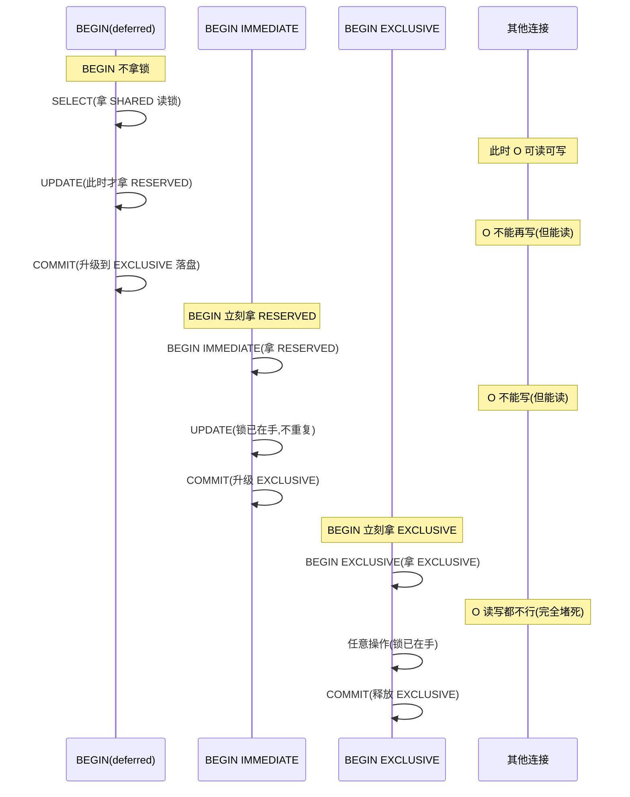

# 第 6 篇 · 第 18 章 · 事务隔离与 BEGIN/COMMIT

> **核心问题**:前面三章(P5-15 VFS、P5-16 动态类型、P5-17 并发锁)讲的都是"单条语句怎么碰文件"。可真实用法里,你常常要这么写:
>
> ```sql
> BEGIN;
>   UPDATE accounts SET balance = balance - 100 WHERE id = 1;
>   UPDATE accounts SET balance = balance + 100 WHERE id = 2;
> COMMIT;
> ```
>
> 这两条 UPDATE 必须要么**都生效**,要么**都不生效**——这是事务的 A(原子性)。可"BEGIN/COMMIT 这对括号,在 SQLite 内部到底做了什么"?为什么有时候你会写成 `BEGIN IMMEDIATE`、有时候 `BEGIN EXCLUSIVE`,而默认的 `BEGIN` 又是什么?为什么在 autocommit 模式下你根本不用写 BEGIN?更深的:**事务开始之后,你在事务里看到的"数据"到底是哪一份数据**?——是开始时的快照,还是别人刚提交的最新版本?
>
> 本章就把这几个问题一次讲透:**事务的生命周期**(BEGIN/COMMIT/ROLLBACK 在 VDBE 里怎么驱动)、**BEGIN 的三种模式**(deferred / immediate / exclusive,各自何时拿锁)、**autocommit 默认行为**、**隔离级别**(为什么 SQLite 在 rollback journal 模式下默认就是 SERIALIZABLE)、以及 **savepoint 嵌套事务**(怎么把一个事务做成栈)。

> **读完本章你会明白**:
> 1. **autocommit 是 SQLite 的默认模式**——不写 BEGIN,每条语句自己就是一个隐式事务,语句执行完自动提交;写 BEGIN 就是把 autocommit 关掉(`db->autoCommit` 从 1 翻成 0),事务边界手动控制。这条规则在 VDBE 里就是 `OP_AutoCommit` opcode 翻一个 bit。
> 2. **BEGIN 三态(deferred / immediate / exclusive)本质是"何时拿文件锁"**:deferred(默认)在 BEGIN 时**一个写锁都不拿**,延迟到第一条真正要写的语句才拿 RESERVED;immediate 在 BEGIN 时就拿 RESERVED;exclusive 在 BEGIN 时就拿 EXCLUSIVE。这三种拿锁时机的差别,决定了并发度和死锁风险。
> 3. **SQLite 在 rollback journal 模式下默认就是 SERIALIZABLE 隔离**——一个事务里看到的是它开始那一刻的数据库快照,事务期间别人提交的内容它**看不到**(因为文件锁 + pager 缓存一旦读进来就不刷新)。WAL 模式则靠 read-mark 快照实现一致读。SQLite 没有 MySQL/InnoDB 那种 RU/RC/RR/SERIALIZABLE 四档可选旋钮——它就一档,默认就最高。
> 4. **savepoint 是栈式嵌套事务**:SAVEPOINT name 把当前事务状态压栈,RELEASE 弹栈(丢弃这个 savepoint 的回滚信息)、ROLLBACK TO 回退到栈顶。OP_Transaction 在写事务里顺带开的"语句事务"(statement transaction)其实是同一条机制复用。
> 5. **COMMIT/ROLLBACK 不是单独的 opcode,而是 `OP_AutoCommit` 配合 VDBE 停机时的 `sqlite3VdbeHalt` 自动提交**——这是 SQLite 设计上很巧妙的一招:事务边界用"翻 autocommit 开关 + halt 时检查"驱动,而不是给 COMMIT 单独写一段逻辑。

> **如果一读觉得太难**:先抓住三句话——① 不写 BEGIN 就是 autocommit(每条语句一个事务,自动提交);② 默认的 `BEGIN`(= deferred)在第一条写语句才拿 RESERVED 锁;③ SQLite 默认隔离就是 SERIALIZABLE,事务里看到的是开始时的快照。本章主线就是这句:**BEGIN/COMMIT 在 SQLite 里是被 VDBE 的两个 opcode(OP_Transaction 发起、OP_AutoCommit 收尾)+ halt 时的提交逻辑驱动的,锁的时机决定了并发,快照决定了隔离**。

---

## 〇、一句话点破

> **在 SQLite 里,事务不是"一段被特殊标记的代码",而是 `db->autoCommit` 这个 bit 的状态。autocommit=1(默认)时,每条语句自己就是一个事务,VDBE 停机时(`sqlite3VdbeHalt`)自动提交;你写 `BEGIN` 就是把 autocommit 翻成 0,把提交时机推迟到你显式 COMMIT。BEGIN 三态决定的是"什么时候拿文件锁"——deferred 延迟、immediate 立刻 RESERVED、exclusive 立刻 EXCLUSIVE;而隔离靠的是"事务开始后读进来的页不再被别人的提交覆盖",在 rollback journal 模式下天生就是 SERIALIZABLE。**

这是结论,不是理由。本章倒过来拆:先讲事务生命周期——autocommit 默认模式怎么工作、为什么 BEGIN 不是一条独立的"开始事务"opcode 而是"翻开关";再拆 BEGIN 三态——deferred 为什么是默认、它和 immediate/exclusive 的拿锁时机差在哪、deferred 的死锁陷阱怎么破;然后讲隔离级别——SQLite 为什么默认 SERIALIZABLE、WAL 模式怎么靠 read-mark 做快照;最后讲 savepoint 嵌套事务和 OP_Transaction 复用的"语句事务"。

> **本章归属二分法的哪一面**:本章完全落在 **存储与事务** 这一侧。事务的开始结束、拿锁时机、隔离快照,都是 B-tree/pager/锁层的事,跟"SQL 怎么编译成 opcode"那一侧无关(虽然 BEGIN/COMMIT 在 code generator 里也产出 opcode,但产出的 opcode 干的是存储层的事)。所以本章和上一章 P5-17(并发锁)、再上一章 P4-13(WAL 读写并发)是同一侧的纵深推进:P5-17 讲"文件锁有哪五态",本章讲"事务怎么用这五态";P4-13 讲"WAL 怎么实现读写并发",本章讲"事务在 WAL 下怎么拿到一致快照"。

---

## 一、autocommit:SQLite 的默认事务模式

我们从最日常的现象讲起:你平时写 `INSERT INTO users VALUES (...)`,从来不用先 BEGIN、后 COMMIT,它就能存进去。这背后的机制叫 **autocommit**(自动提交),它是 SQLite 的默认模式。

### 1.1 不写 BEGIN 会怎样:每条语句都是一个事务

在 autocommit 模式下,**每一条 SQL 语句(每条 prepared statement 执行一次)都是一个独立的隐式事务**:语句开始时自动开事务、语句执行完(成功)自动提交。你看到的"INSERT 一条数据就落盘了",其实是这么一串事:

```
   INSERT INTO users VALUES (...)   ← 你写的语句
        │
        ▼
   VDBE 执行 opcode 序列
        │
        ├─ OP_Transaction(写事务):开事务(读进来 + 必要时拿 RESERVED 锁)
        ├─ OP_OpenWrite / OP_Insert ... :真正改 B-tree 页
        │
        ▼
   VDBE 执行完,进入 halt
        │
        ▼
   sqlite3VdbeHalt():发现 db->autoCommit==1
        │
        ▼
   调 vdbeCommit():把 rollback journal/WAL flush 落盘,提交
        │
        ▼
   释放锁,语句结束
```

也就是说,**"语句执行完 + autocommit 开着"这两个条件同时成立,SQLite 就自动提交**。提交的逻辑在 [`sqlite3VdbeHalt`](../sqlite/src/vdbeaux.c#L3322) 里——它是 VDBE 的停机函数,每条语句执行完都会进这里,它根据 `db->autoCommit` 决定是"提交整个事务"还是"只提交语句事务(留事务开着)"。看关键片段([`vdbeaux.c#L3408-L3449`](../sqlite/src/vdbeaux.c#L3408-L3449)):

```c
    /* If the auto-commit flag is set and this is the only active writer
    ** VM, then we do either a commit or rollback of the current transaction.
    */
    if( !sqlite3VtabInSync(db)
     && db->autoCommit
     && db->nVdbeWrite==(p->readOnly==0)
    ){
      if( p->rc==SQLITE_OK || (p->errorAction==OE_Fail && !isSpecialError) ){
        rc = sqlite3VdbeCheckFkDeferred(p);
        if( rc!=SQLITE_OK ){
          ...
        }else{
          /* The auto-commit flag is true, the vdbe program was successful
          ** ... This means a commit is required. */
          rc = vdbeCommit(db, p);          // ← 提交
        }
        ...
      }else{
        sqlite3RollbackAll(db, SQLITE_OK); // ← 出错就回滚
        ...
      }
      db->nStatement = 0;
    }else if( eStatementOp==0 ){
      // autocommit 关着(显式事务里):只提交/回滚"语句事务"
      ...
    }
```

> **钉死这件事**:SQLite 里**没有"语句"和"事务"两套独立的提交逻辑**——只有一套,在 `sqlite3VdbeHalt` 里。autocombit 开,就提交整个事务;autocommit 关(你在 BEGIN 里),就只提交"语句事务"(statement transaction,见本章 §5),把整个事务留着等你 COMMIT。**autocommit 这个 bit 决定了提交的粒度**——这是理解 SQLite 事务的最关键一行。

### 1.2 autocommit 默认是 1:从 sqlite3_open 说起

`db->autoCommit` 这个 bit 默认是 1。哪里初始化的?在 [`sqlite3_initialize` 路径里建 db 对象时](../sqlite/src/main.c#L3416):

```c
  db->autoCommit = 1;
```

也就是说,**你 `sqlite3_open()` 打开一个连接,这个连接一开始就处于 autocommit 模式**。你 INSERT 一条,它立刻自动提交;你不显式写 BEGIN,所有语句都是各自独立的事务。这是 SQLite 的默认约定(也是 SQL 标准里 SQLite 的选择),和 MySQL/PG 在 `autocommit` 变量上的默认值一致。

### 1.3 写 BEGIN 就是把 autocommit 翻成 0

那 `BEGIN` 到底干了什么?它**不打开任何锁**(默认 deferred 模式下)、**不开任何事务缓冲区**,它**只做一件事:把 `db->autoCommit` 从 1 翻成 0**。看 BEGIN 的代码生成函数 [`sqlite3BeginTransaction`](../sqlite/src/build.c#L5264):

```c
void sqlite3BeginTransaction(Parse *pParse, int type){
  sqlite3 *db;
  Vdbe *v;
  int i;
  ...
  v = sqlite3GetVdbe(pParse);
  if( !v ) return;
  if( type!=TK_DEFERRED ){
    // IMMEDIATE / EXCLUSIVE 模式:在这里就发 OP_Transaction 拿锁
    for(i=0; i<db->nDb; i++){
      int eTxnType;
      Btree *pBt = db->aDb[i].pBt;
      if( pBt && sqlite3BtreeIsReadonly(pBt) ){
        eTxnType = 0;  /* Read txn */
      }else if( type==TK_EXCLUSIVE ){
        eTxnType = 2;  /* Exclusive txn */
      }else{
        eTxnType = 1;  /* Write txn */
      }
      sqlite3VdbeAddOp2(v, OP_Transaction, i, eTxnType);
      sqlite3VdbeUsesBtree(v, i);
    }
  }
  sqlite3VdbeAddOp0(v, OP_AutoCommit);   // ← 关键:无论哪种模式,最后都翻 autocommit
}
```

注意这个函数的**两个分支**:

- **deferred(默认,`type==TK_DEFERRED`)**:**一个 `OP_Transaction` 都不发**,只发一条 `OP_AutoCommit`(无参数版本,P1 默认 0)。BEGIN 时**完全不动 B-tree、不拿锁**——它纯粹是个"标记"。
- **immediate / exclusive**(`type!=TK_DEFERRED`):**在 BEGIN 这条语句里就立刻发 `OP_Transaction`**(P2=1 是 immediate 写事务、P2=2 是 exclusive),把锁拿到手;然后再发 `OP_AutoCommit` 翻开关。

那 `OP_AutoCommit`(无参版本)到底是翻成什么?看 opcode 的实现([`vdbe.c#L4048`](../sqlite/src/vdbe.c#L4048),完整逻辑见本章 §6):

```c
case OP_AutoCommit: {
  int desiredAutoCommit;
  int iRollback;
  desiredAutoCommit = pOp->p1;
  iRollback = pOp->p2;
  ...
  if( desiredAutoCommit!=db->autoCommit ){
    ...
    db->autoCommit = (u8)desiredAutoCommit;   // 翻开关
    if( sqlite3VdbeHalt(p)==SQLITE_BUSY ){...}
    sqlite3CloseSavepoints(db);
    ...
  }else{
    sqlite3VdbeError(p,
        (!desiredAutoCommit)?"cannot start a transaction within a transaction":(...));
    rc = SQLITE_ERROR;
    goto abort_due_to_error;
  }
}
```

无参数 `OP_AutoCommit`(P1=0)就是把 `db->autoCommit` 设成 0——BEGIN 成功。如果你在一个事务里再写一次 BEGIN,P1 还是 0,但 `db->autoCommit` 已经是 0,`desiredAutoCommit==db->autoCommit`,走到 else 分支报错"cannot start a transaction within a transaction"——这就是为什么 SQLite 不允许嵌套 BEGIN(嵌套要用 SAVEPOINT,见 §5)。

> **不这样会怎样**:如果 BEGIN 不是"翻开关"而是"发一条 OP_Transaction 开事务",那 deferred 模式就没法和 immediate/exclusive 统一——deferred 的精髓就是"我现在还不知道要不要写,所以什么都不做,等真要写了再说"。把"开始事务"统一成"翻 autocommit bit",让三种模式只是"翻 bit 之前要不要顺手发个 OP_Transaction 拿锁"的区别,这是 SQLite 把事务边界收敛到一个开关的巧妙之处。

> **钉死这件事**:**BEGIN = 翻 autocommit(可能附带提前拿锁)**。autocommit 是 SQLite 事务的总开关,理解了它,你就理解了 COMMIT/ROLLBACK 为什么也是用 `OP_AutoCommit`(P1=1)实现的——COMMIT 就是把 autocommit 翻回 1,翻回 1 之后,VDBE 停机时 `sqlite3VdbeHalt` 看到 autocommit=1 就自动提交。

---

## 二、BEGIN 三态:何时拿锁,为什么这么设计

上一节我们埋了个伏笔:immediate/exclusive 在 BEGIN 时就发 `OP_Transaction` 拿锁,deferred 不发。这一节就把三种模式的拿锁时机、并发影响、死锁风险讲透。这是本章最实用的一节——SQLite 的并发行为几乎全由"用哪种 BEGIN"决定。

### 2.1 三种模式一览表

先给一张对照表,后面逐行解释:

| 维度 | **BEGIN**(deferred,默认) | **BEGIN IMMEDIATE** | **BEGIN EXCLUSIVE** |
|------|--------------------------|---------------------|---------------------|
| BEGIN 时拿的锁 | **不拿任何写锁**(只可能顺手拿 SHARED 读锁) | **RESERVED** | **EXCLUSIVE** |
| 第一条写语句时拿的锁 | 此时才拿 RESERVED | 已有 RESERVED,不重复拿 | 已有 EXCLUSIVE,不重复拿 |
| COMMIT 时升级 | 升级到 EXCLUSIVE(写 journal 落盘) | 同左 | 已是 EXCLUSIVE |
| 并发度 | **最高**(读不阻塞、写延迟) | 中(读还能,但写已被自己占) | **最低**(独占,谁都不能读写) |
| 死锁风险 | **有**(见 §4) | 无(写锁早拿到手) | 无 |
| 适合场景 | 读多写少、不确定是否要写 | **确定要写、想避免死锁** | 大批量写、批量 DDL、要完全独占 |

记住一个核心区别:**deferred 延迟拿写锁,immediate/exclusive 提前拿写锁**。"何时拿写锁"这个差别,衍生出后面所有的并发和死锁问题。

### 2.2 deferred:为什么是默认

deferred 是默认模式(你不写 IMMEDIATE/EXCLUSIVE,parse 出来 `type==TK_DEFERRED`,见 [`parse.y`](../sqlite/src/parse.y#L186-L189)):

```
transtype(A) ::= .             {A = TK_DEFERRED;}    ← 空,默认 DEFERRED
transtype(A) ::= DEFERRED(X).  {A = @X; ...}
transtype(A) ::= IMMEDIATE(X). {A = @X; ...}         (parse.y 里 IMMEDIATE 也走这条)
transtype(A) ::= EXCLUSIVE(X). {A = @X; ...}
```

deferred 的核心行为是:**BEGIN 时不拿任何写锁,延迟到第一条真正要写数据的语句才拿 RESERVED 锁**。换句话说:

```sql
BEGIN;                                  -- 此时无锁(连读锁都可能还没拿)
  SELECT balance FROM accounts WHERE id=1;  -- 读:拿 SHARED 读锁,但不拿 RESERVED
  -- ... 你可能在这里想了很久,要不要转账 ...
  UPDATE accounts SET balance=balance-100 WHERE id=1;  -- 写:此时才拿 RESERVED
  UPDATE accounts SET balance=balance+100 WHERE id=2;
COMMIT;
```

deferred 的最大好处是**并发最好**:

- **读语句根本不阻塞别的连接**:你的 BEGIN 没拿写锁,别的连接照样能 BEGIN、能 SELECT、能 INSERT(只要它先拿到 RESERVED)。
- **你也不阻塞别人读**:你只在 UPDATE 那一刻才拿 RESERVED,在那之前别人对你"占了写锁"一无所知。

> **所以这样设计**:deferred 默认的动机是**"先把并发让出来,等真要写了再抢锁"**。绝大多数应用场景(读多写少、事务短、写操作可能根本不发生),deferred 能让并发度最大化。比如你 BEGIN 后想查一查余额够不够再决定转不转账,如果 BEGIN 就锁住,查的这几百毫秒里别的连接全堵死——这不合理。

但 deferred 有一个硬伤:**死锁**。下一节专门讲。

### 2.3 immediate:BEGIN 就抢 RESERVED

`BEGIN IMMEDIATE` 的行为是:**在 BEGIN 这条语句执行时,立刻对所有 attached 数据库发 `OP_Transaction`(P2=1,写事务),拿 RESERVED 锁**。看上面 [`sqlite3BeginTransaction`](../sqlite/src/build.c#L5264) 的代码,`type==TK_IMMEDIATE` 时进入 `type!=TK_DEFERRED` 分支,对每个 db 发 `OP_Transaction(i, 1)`。

`OP_Transaction` 的 P2=1 进入写事务路径,最终调 [`sqlite3BtreeBeginTrans(pBt, 1, ...)`](../sqlite/src/btree.c#L3828) → [`btreeBeginTrans`](../sqlite/src/btree.c#L3621),在里面调 [`sqlite3PagerBegin(pPager, 0, ...)`](../sqlite/src/pager.c#L5968) 拿 RESERVED 锁([`pager.c#L5997-L6005`](../sqlite/src/pager.c#L5997-L6005)):

```c
      /* Obtain a RESERVED lock on the database file. If the exFlag parameter
      ** is true, then immediately upgrade this to an EXCLUSIVE lock. The
      ** busy-handler callback can be used when upgrading to the EXCLUSIVE
      ** lock, but not when obtaining the RESERVED lock. */
      rc = pagerLockDb(pPager, RESERVED_LOCK);
      if( rc==SQLITE_OK && exFlag ){
        rc = pager_wait_on_lock(pPager, EXCLUSIVE_LOCK);
      }
```

immediate(P2=1,`exFlag=0`)只拿 RESERVED,不升级到 EXCLUSIVE。

immediate 的好处是**避免 deferred 的死锁**(因为你一开始就抢到了写锁,要么抢到继续干,要么抢不到立刻 SQLITE_BUSY,不会"两个事务各拿一半然后互相等")。代价是:**你 BEGIN 的那一刻,别的连接就不能再 BEGIN IMMEDIATE 或写数据了**(RESERVED 是排他的写锁,只能一个连接持有)。读还能继续(SHARED 读锁和 RESERVED 写锁兼容,见 P5-17)。

> **所以这样设计**:immediate 适合**"我已经决定要写了,先抢锁避免后面死锁"**的场景。比如转账:你知道 BEGIN 后肯定会 UPDATE,那就 BEGIN IMMEDIATE,先把 RESERVED 拿到手,后面 UPDATE 不会再因为抢不到锁而阻塞或死锁。

### 2.4 exclusive:BEGIN 就独占

`BEGIN EXCLUSIVE` 最激进:**BEGIN 时就拿 EXCLUSIVE 锁**(P2=2)。回到 [`btreeBeginTrans`](../sqlite/src/btree.c#L3740):

```c
        rc = sqlite3PagerBegin(pPager, wrflag>1, sqlite3TempInMemory(p->db));
```

`wrflag>1`(即 exclusive,wrflag==2)时,`exFlag=1`,在 [`sqlite3PagerBegin`](../sqlite/src/pager.c#L5968) 里拿完 RESERVED **立刻升级到 EXCLUSIVE**(`pager_wait_on_lock(pPager, EXCLUSIVE_LOCK)`)。EXCLUSIVE 锁**排斥一切其他锁**(包括 SHARED 读锁),所以一旦你 `BEGIN EXCLUSIVE`,**别的连接连 SELECT 都做不了**。

exclusive 适合**需要完全独占数据库**的场景:大批量数据导入、重建索引、复杂的 schema 变更(会触发很多 DDL)。这些操作要么耗时长、要么需要绝对稳定的环境,干脆把所有人都挡在外面。

> **钉死这件事**:**三态的差别只在"BEGIN 时拿不拿锁、拿哪种锁"**。deferred 不拿(等写语句再说)、immediate 拿 RESERVED、exclusive 拿 EXCLUSIVE。**一旦你到了真正写数据那一刻,三者最终都得拿 RESERVED、COMMIT 时都得升级到 EXCLUSIVE**(rollback journal 模式)——三态差别只在"前置拿锁时机",不在"最终要不要拿"。所以三态的本质是**"用提前拿锁换确定性,用延迟拿锁换并发度"的权衡**。

### 2.5 时序图:三态拿锁对比



这张图一眼能看出三态的并发代价:从上到下,你占用的资源越来越早、越来越重,留给别人的窗口越来越小。

---

## 三、隔离级别:为什么 SQLite 默认就是 SERIALIZABLE

讲完了事务怎么开始结束、怎么拿锁,我们回到一个更概念化的问题:**一个事务执行期间,它看到的"数据"到底是哪一份**?

这就是隔离级别(isolation level)。SQL 标准定义了四级:READ UNCOMMITTED(RU)、READ COMMITTED(RC)、REPEATABLE READ(RR)、SERIALIZABLE(详见《MySQL·InnoDB》那本,这里不重复定义)。MySQL/InnoDB 默认 RR(可重复读),靠 MVCC undo 版本链实现,你可以改 `tx_isolation` 切换。

SQLite 走的是**完全不同的一条路**:它不给你选,默认就是 SERIALIZABLE,而且实现机制和 MySQL 截然不同。

### 3.1 rollback journal 模式:文件锁 + 缓存 = 天生 SERIALIZABLE

在默认的 rollback journal 模式下,SQLite 的事务隔离**几乎是文件锁机制的直接副产品**。我们来追踪一个事务在它生命周期里"看到的数据"是怎么来的。

假设两个连接 A 和 B 同时操作同一个数据库文件:

```
   连接 A:                              连接 B:
   BEGIN;                               
   SELECT balance FROM accounts          (读到 1000)
   WHERE id=1;                           
                                        UPDATE accounts SET balance=900 WHERE id=1;
                                        COMMIT;   ← B 把 1000 改成 900 并提交
   SELECT balance FROM accounts          
   WHERE id=1;                          ← A 这次读到的是 1000 还是 900?
```

答案是:**A 第二次还是读到 1000**(开始时的值)。为什么?

关键在 pager 的缓存行为。A 第一次 SELECT 时,pager 把 page N(包含 id=1 那行)从磁盘读进**自己的 page cache**(每个连接独立一份 cache,除非开了 shared-cache)。B 改了 page N 并提交——**但 B 改的是 B 自己 cache 里的副本 + 落盘后的磁盘文件**,A 的 cache 里那份 page N **没动**。A 第二次 SELECT 同一页,pager 先看自己 cache——**命中**,直接返回 cache 里那份(还是 1000),不会再去磁盘读。

> **不这样会怎样**:如果 A 每次读都重新去磁盘拉,那 A 就会读到 B 提交后的 900——这是 READ COMMITTED 隔离(只能看到已提交的)。但 SQLite 不这么做,它**一旦把页读进 cache,在事务期间就一直用 cache 里的版本**,这正是 REPEATABLE READ(可重复读)的行为。再叠加文件锁(下面讲),就成了 SERIALIZABLE。

光"读自己 cache"还不够 SERIALIZABLE——SERIALIZABLE 要求**事务执行结果等价于某种串行执行**,光重读同一值不能防止"幻读"(别人新插入的行你也看不到)和写冲突。SQLite 靠**文件锁**把这一层补齐:

- **写互斥**:rollback journal 模式下,**任何时刻只有一个连接能持有 RESERVED 锁**(写锁)。B 要 UPDATE 必须 拿 RESERVED,A 如果已经在写事务里拿了 RESERVED,B 就拿不到、要么等(SQLITE_BUSY)要么重试。
- **读不阻塞写、写不阻塞读**在 rollback journal 模式下**部分成立**:读拿 SHARED、写拿 RESERVED,这俩兼容;但写要 COMMIT 时升级到 EXCLUSIVE,会排斥所有 SHARED 读锁。

所以 SQLite 在 rollback journal 模式下的隔离可以总结为:**事务内一致快照(cache 不刷新)+ 写互斥(RESERVED 排他)= 实质上的 SERIALIZABLE**。它没有 MySQL 那种"四级可选"的旋钮——它就一档,默认就最高,你改不了。

> **承接《MySQL·InnoDB》**:MySQL/InnoDB 用 MVCC(undo 版本链 + read view)实现 RC/RR,你可以 `SET tx_isolation=...` 切换四级。SQLite **没有 undo log、没有 MVCC 版本链**,它的"快照"是**字面意义上的 page cache 副本**——读进来就不动。这是嵌入式简化:SQLite 不需要服务那么多并发事务(单进程嵌入式,并发本来就少),用 cache + 文件锁就够,不用上 MVCC 那套复杂的版本管理。详见《MySQL·InnoDB》MVCC 章节,本书不重复。

### 3.2 为什么 SQLite 不需要四级隔离旋钮

你可能会问:既然 SERIALIZABLE 最强,MySQL 为什么不也默认 SERIALIZABLE?因为 MySQL 是 C/S、高并发,**SERIALIZABLE 的并发代价太大**(事务串行,吞吐崩)。MySQL 给你四级旋钮,让你在"隔离强度 vs 并发度"之间权衡——大多数业务用 RR 就够,牺牲一点隔离换并发。

SQLite 的定位不同:**嵌入式、单进程、并发量本来就小**(一个 App 进程里几个线程同时碰数据库,撑死几十个并发)。在这种场景下,SERIALIZABLE 的"串行"代价基本看不出来(因为本来就没什么并发),但带来的"事务隔离绝对正确"的好处却很实在。所以 SQLite 干脆:**不给你选,默认就 SERIALIZABLE**,少一个旋钮、少一个出错的可能。

> **钉死这件事**:SQLite 的隔离级别**只有一个值:SERIALIZABLE**(rollback journal 模式下,靠 cache + 文件锁;WAL 模式下,靠 read-mark 快照,见下)。你**不能**通过 PRAGMA 或 API 把它降成 RC/RR。这是嵌入式设计哲学:少选项、强保证。

### 3.3 WAL 模式:read-mark 快照实现一致读

切到 WAL 模式(P4-13 讲过 WAL 的读写并发),隔离机制变了,但结论一样:**事务内一致快照**。区别在于快照的实现。

WAL 模式下,所有写都先追加进 WAL 文件,数据文件不动;读时**读数据文件 + WAL 里特定范围的内容**。"特定范围"由 **read-mark** 决定——这是 WAL 的核心快照机制,我们回顾一下(P4-13 详讲过,这里只点事务相关)。

WAL 在共享内存(wal-index)里维护一个数组 `aReadMark[WAL_NREADER]`(WAL_NREADER=5,见 [`wal.c#L294-L399`](../sqlite/src/wal.c#L294-L399))。每个读事务开始时,挑一个 read-mark(对应一个 frame 号 `mxFrame`),**这个 read-mark 就是它的快照边界:只能读 WAL 里 frame 号 ≤ mxFrame 的内容,超过的看不到**。

```
   WAL 文件(帧序列):
   ┌──────┬──────┬──────┬──────┬──────┬──────┬──────┐
   │ f=1  │ f=2  │ f=3  │ f=4  │ f=5  │ f=6  │ f=7  │
   └──────┴──────┴──────┴──────┴──────┴──────┴──────┘
                       ↑              ↑
                 连接 A 的 mxFrame     连接 B 的 mxFrame(更新)
                 (read-mark=3)        (read-mark=6)
   
   连接 A 读 page X:在 WAL 里找 frame ≤ 3 的最新版本(找不到就去数据文件)
   连接 B 读 page X:在 WAL 里找 frame ≤ 6 的最新版本(可能读到 A 看不到的更新)
```

一个读事务开始时,调 [`walTryBeginRead`](../sqlite/src/wal.c#L3020)(由 [`sqlite3WalBeginReadTransaction`](../sqlite/src/wal.c#L3493) 调),它会**挑一个合适的 read-mark** 并对它加共享锁(`walLockShared(pWal, WAL_READ_LOCK(mxI))`,见 [`wal.c#L3212`](../sqlite/src/wal.c#L3212))。一旦挑定,**整个事务期间都用这个 mxFrame 作为上界**——别的连接往 WAL 里追加的新 frame(它提交了),这个读事务**看不到**(因为 frame 号大于自己的 mxFrame)。

这就是 WAL 的快照隔离:**read-mark 锁定一个 frame 上界,事务期间只读 ≤ 上界的内容**。效果和 rollback journal 模式的 cache 一致快照一样——**事务内看到的是开始时的快照,别人后续的提交不可见**。区别只在于:rollback journal 靠 cache 不刷新,WAL 靠 read-mark 卡 frame 上界。两者都是"开始时拍一张快照,事务期间不再变"。

> **回扣 P4-13**:WAL 的 read-mark 是 P4-13 详讲过的机制(那里讲了为什么有 5 个 read-mark、checkpoint 怎么回填)。这里只强调它的事务语义:**read-mark 就是事务的快照身份证**,它把"并发写追加进 WAL"和"我这个读事务只看开始时的内容"隔离开。这也是为什么 WAL 模式下"读不阻塞写、写不阻塞读"——读锁 read-mark(共享锁)、写锁 WAL_WRITE_LOCK(排他锁),两者锁的是不同字节,互不干扰(见 [`wal.c#L294`](../sqlite/src/wal.c#L294) 的锁字节定义)。

### 3.4 一个微妙的点:WAL 写事务的 SQLITE_BUSY_SNAPSHOT

WAL 模式下有个 rollback 模式没有的现象:**一个连接开始读事务后,如果另一个连接提交了写入,这个连接再想升级成写事务,会拿到 SQLITE_BUSY_SNAPSHOT**。看 [`sqlite3WalBeginWriteTransaction`](../sqlite/src/wal.c#L3699):

```c
int sqlite3WalBeginWriteTransaction(Wal *pWal){
  ...
  /* Only one writer allowed at a time.  Get the write lock. */
  rc = walLockExclusive(pWal, WAL_WRITE_LOCK, 1);
  if( rc ) return rc;
  pWal->writeLock = 1;

  /* If another connection has written to the database file since the
  ** time the read transaction on this connection was started, then
  ** the write is disallowed. */
  if( memcmp(&pWal->hdr, (void *)walIndexHdr(pWal), sizeof(WalIndexHdr))!=0 ){
    rc = SQLITE_BUSY_SNAPSHOT;
  }
  ...
}
```

意思是:**你的读快照已经"过时"(别人在你之后提交了新内容),你再基于这个旧快照去写,会和别人的提交冲突(fork),所以拒绝**。这是 deferred 模式在 WAL 下的一个额外表现:你 BEGIN(deferred)、读了一通、别人提交了、你再想 UPDATE,会 SQLITE_BUSY_SNAPSHOT,得重试整个事务。

> **钉死这件事(隔离)**:SQLite 的隔离可以一句话总结——**事务内看到的是开始时的快照,期间别人的提交不可见;rollback 模式靠 cache 不刷新、WAL 模式靠 read-mark 卡 frame 上界**。两种模式殊途同归,都是 SERIALIZABLE 等价语义。WAL 模式额外有个"快照过时不能升级写"的 SQLITE_BUSY_SNAPSHOT,是 deferred 在 WAL 下的代价。

---

## 四、deferred 的死锁陷阱与 busy 重试

deferred 是默认,并发最好,但它有个绕不过去的坑:**死锁**。这一节讲清这个坑,以及怎么用 immediate 避坑、用 busy handler/重试自救。

### 4.1 经典 deferred 死锁场景

两个连接都用 deferred,都先读后写,就可能死锁:

```
   连接 A:                              连接 B:
   BEGIN;                                BEGIN;
   SELECT ... WHERE id=1;               (拿 SHARED 读锁)
                                         SELECT ... WHERE id=2;        (拿 SHARED 读锁)
   UPDATE ... WHERE id=1;               (要拿 RESERVED,拿到 ✓)
                                         UPDATE ... WHERE id=2;        (要拿 RESERVED —— 被 A 占着,SQLITE_BUSY)
   ... A 还想 UPDATE id=2 ...           (A 也想拿 RESERVED,但此刻 A 已经有 RESERVED,B 在等)
   COMMIT;                              (A 升级到 EXCLUSIVE —— B 还持有 SHARED 读锁,升级失败 SQLITE_BUSY)
```

这里的死锁更准确说是**活锁/饿死**:A 拿着 RESERVED 想 COMMIT 升级 EXCLUSIVE,B 持有 SHARED 在等 RESERVED;A 等 B 释放 SHARED,B 等 A 释放 RESERVED,谁也动不了。

更纯粹的 deferred 死锁是这样的:

```
   连接 A:                              连接 B:
   BEGIN;                                BEGIN;
   (deferred,无锁)                       (deferred,无锁)
   UPDATE X;                            (拿 RESERVED ✓)
                                         UPDATE Y;                     (拿 RESERVED ✓ —— 但等等,X 和 Y 在同一个 db 文件,
                                                                         RESERVED 是排他的,只能一个连接持有)
```

实际上 **RESERVED 锁是排他的,一个 db 文件同一时刻只能有一个连接持有 RESERVED**。所以"两个 deferred 事务都拿了 RESERVED 然后死锁"这种表述不严谨——更准确的是:

```
   连接 A:                              连接 B:
   BEGIN;                                BEGIN;
   UPDATE X;                            (拿 RESERVED ✓)
                                         UPDATE Y;                     (SQLITE_BUSY,A 占着 RESERVED)
                                         (busy handler 重试 / 等待)
   UPDATE Y;                            (A 已经有 RESERVED,直接改 ✓)
   COMMIT;                              (A 释放锁)
                                         (B 终于拿到 RESERVED,UPDATE Y 成功)
                                         COMMIT;
```

这种情况其实**不死锁**(B 会等到 A 提交)。真正的死锁发生在一个更微妙的场景——**两个事务交叉更新不同行,且都在 deferred 模式下"读了之后才决定写"**:

```
   连接 A:                              连接 B:
   BEGIN;                                BEGIN;
   SELECT balance WHERE id=1;          (读,拿 SHARED)
                                         SELECT balance WHERE id=2;     (读,拿 SHARED)
   UPDATE balance WHERE id=2;          (要拿 RESERVED ——
                                         注意:此时 B 还没拿 RESERVED,A 拿到 RESERVED ✓)
                                         UPDATE balance WHERE id=1;     (要拿 RESERVED —— A 占着,SQLITE_BUSY)
   COMMIT;                              (A 升级 EXCLUSIVE —— B 还持有 SHARED,SQLITE_BUSY)
```

A 升级 EXCLUSIVE 需要**所有 SHARED 都释放**(EXCLUSIVE 排斥 SHARED),但 B 还持有 SHARED 在等 RESERVED;B 拿不到 RESERVED 就不会进 COMMIT、不会释放 SHARED——**死锁**。SQLite 检测不到这种死锁(它没有 wait-for graph),只能靠 busy handler 超时或应用层重试。

### 4.2 用 BEGIN IMMEDIATE 避免死锁

最干净的解法是:**确定要写的事务,用 BEGIN IMMEDIATE**。

```sql
-- 连接 A
BEGIN IMMEDIATE;    -- 立刻拿 RESERVED,要么拿到要么立刻 SQLITE_BUSY
UPDATE ...;
COMMIT;

-- 连接 B
BEGIN IMMEDIATE;    -- A 占着 RESERVED,B 立刻 SQLITE_BUSY(不会"读了一半才发现要等")
```

immediate 把"抢写锁"前移到 BEGIN,要么这一刻抢到(后面一路畅通)、要么这一刻就失败(应用立刻知道、立刻重试),**不会出现"两个事务各读各的、都改了一半、最后互相等"的中间态**。这就是为什么很多生产环境的 SQLite 应用**惯例用 BEGIN IMMEDIATE 而不是默认 BEGIN**——多花一点点并发代价,换"不死锁"的确定性。

> **所以这样设计**:immediate 不是为了"更早拿锁"而存在,是为了**消除 deferred 的死锁窗口**。deferred 让读和写分离(读时不拿写锁),代价是"读和写之间可能插入别人的操作",形成死锁;immediate 把读和写重新绑定(一开始就当写事务对待),消除了这个窗口。

### 4.3 busy handler:SQLITE_BUSY 不是终点

无论 deferred 还是 immediate,拿不到锁时 SQLite 返回 `SQLITE_BUSY`(或扩展码 `SQLITE_BUSY_SNAPSHOT` 等,见 [`sqlite.h.in#L544`](../sqlite/src/sqlite.h.in#L544))。这不是致命错——你可以注册一个 **busy handler**(通过 `sqlite3_busy_handler(db, fn, arg)`),SQLite 会在拿不到锁时**反复回调它**,直到拿到锁或 handler 返回 0(放弃)。

busy handler 的典型实现是"睡一小会儿再重试",累计等待通常不超过几秒。它的存在让"短暂的锁冲突"对应用透明——你 INSERT 时别人正好在 COMMIT,你睡 10ms 再试,可能就成了。

但要注意:**busy handler 不是死锁检测**,它只是"无脑重试"。如果是上面那种真死锁,两个连接的 busy handler 会各自重试到天荒地老(或超时)。所以 busy handler 解决的是"短期锁竞争",死锁还得靠应用层用 immediate 或重试整个事务来解决。

> **钉死这件事**:deferred 的死锁是**应用层要警惕的坑**。生产建议:① 确定要写的事务用 `BEGIN IMMEDIATE`;② 注册 busy handler 处理短期竞争;③ 拿到 SQLITE_BUSY 后,准备好**重试整个事务**(不是重试单条语句——事务可能已经部分执行)。

---

## 五、savepoint:嵌套事务的栈式实现

讲完了 BEGIN/COMMIT/ROLLBACK 的线性事务,我们看一个更结构化的特性:**savepoint**(保存点)。它让你在一个事务里**设多个回滚点**,可以回退到其中任意一个,而不必整个事务 ROLLBACK。

### 5.1 savepoint 的语法和语义

```sql
BEGIN;
  INSERT INTO orders VALUES (1, ...);          -- 操作 1
  SAVEPOINT before_detail;                     -- 设个保存点
    INSERT INTO order_items VALUES (1, ...);   -- 操作 2
    INSERT INTO order_items VALUES (1, ...);   -- 操作 3
    -- 哎呀,操作 3 有问题
  ROLLBACK TO before_detail;                   -- 回退到保存点:操作 2、3 撤销,操作 1 保留
    INSERT INTO order_items VALUES (1, ...);   -- 重新来
  RELEASE before_detail;                       -- 释放保存点(丢弃回滚信息,操作定稿)
COMMIT;
```

savepoint 可以**嵌套**(栈式):

```sql
SAVEPOINT sp1;
  SAVEPOINT sp2;
    SAVEPOINT sp3;
    ROLLBACK TO sp2;    -- 回退到 sp2,sp3 被销毁
  RELEASE sp1;          -- 释放 sp1,sp2 也被销毁(弹栈到 sp1)
```

`RELEASE` 是"提交到这个 savepoint"(丢弃它的回滚信息,不再能回退到这里),`ROLLBACK TO` 是"回退到这个 savepoint 但保留它(还能再次回退到这里)"。

### 5.2 savepoint 在 VDBE 里:OP_Savepoint opcode

savepoint 由一条 opcode `OP_Savepoint` 实现,P1 决定操作类型([`vdbe.c#L3858`](../sqlite/src/vdbe.c#L3858))。常量定义在 [`sqliteInt.h#L2208`](../sqlite/src/sqliteInt.h#L2208):

```c
#define SAVEPOINT_BEGIN      0
#define SAVEPOINT_RELEASE    1   // (build.c 里 assert:SAVEPOINT_RELEASE==1)
#define SAVEPOINT_ROLLBACK   2
```

代码生成在 [`sqlite3Savepoint`](../sqlite/src/build.c#L5322):

```c
void sqlite3Savepoint(Parse *pParse, int op, Token *pName){
  char *zName = sqlite3NameFromToken(pParse->db, pName);
  if( zName ){
    Vdbe *v = sqlite3GetVdbe(pParse);
    ...
    sqlite3VdbeAddOp4(v, OP_Savepoint, op, 0, 0, zName, P4_DYNAMIC);
  }
}
```

OP_Savepoint 的实现([`vdbe.c#L3858-L4036`](../sqlite/src/vdbe.c#L3858-L4036))维护一个 `db->pSavepoint` **链表(栈)**,每个节点是一个 `Savepoint` 结构体(名字 + 当时的 deferred 约束计数等)。三种操作:

- **SAVEPOINT_BEGIN(P1=0)**:新建一个 `Savepoint` 节点,**链入栈顶**(`pNew->pNext = db->pSavepoint; db->pSavepoint = pNew`,见 [`vdbe.c#L3901-L3921`](../sqlite/src/vdbe.c#L3901-L3921))。如果当前不在事务里(autocommit=1),它会**自动开一个"事务保存点"(transaction savepoint)**——把 autocommit 翻成 0,标记 `isTransactionSavepoint=1`,这样 SAVEPOINT 可以在没有显式 BEGIN 的情况下用(见 [`vdbe.c#L3909-L3914`](../sqlite/src/vdbe.c#L3909-L3914)):

```c
        /* If there is no open transaction, then mark this as a special
        ** "transaction savepoint". */
        if( db->autoCommit ){
          db->autoCommit = 0;
          db->isTransactionSavepoint = 1;
        }else{
          db->nSavepoint++;
        }
```

这是个很贴心的设计:**你单独写 SAVEPOINT 不写 BEGIN,SQLite 自动给你包一层事务**。

- **SAVEPOINT_RELEASE(P1=1)**:找到指定名字的 savepoint,**销毁它和它上面所有更内层的 savepoint**(弹栈),并把回滚信息丢弃(调用 [`sqlite3BtreeSavepoint(pBt, SAVEPOINT_RELEASE, iSavepoint)`](../sqlite/src/btree.c) 让 pager 丢弃对应的 journal 段)。如果这个 savepoint 是"事务保存点"(最外层,autocommit 翻开的那个),RELEASE 等价于 COMMIT——调 `sqlite3VdbeHalt` 提交整个事务(见 [`vdbe.c#L3952-L3969`](../sqlite/src/vdbe.c#L3952-L3969)):

```c
      int isTransaction = pSavepoint->pNext==0 && db->isTransactionSavepoint;
      if( isTransaction && p1==SAVEPOINT_RELEASE ){
        if( (rc = sqlite3VdbeCheckFkDeferred(p))!=SQLITE_OK ) goto vdbe_return;
        db->autoCommit = 1;
        if( sqlite3VdbeHalt(p)==SQLITE_BUSY ){...}
        ...
      }
```

- **SAVEPOINT_ROLLBACK(P1=2)**:找到指定名字的 savepoint,**回滚到它**(调用 `sqlite3BtreeSavepoint(pBt, SAVEPOINT_ROLLBACK, iSavepoint)` 让 pager 把 journal 里这个 savepoint 之后的页改回去),**但保留这个 savepoint 本身**(还能再 ROLLBACK TO 到这里)。同时把更内层的 savepoint 都销毁([`vdbe.c#L3999-L4023`](../sqlite/src/vdbe.c#L3999-L4023))。

### 5.3 savepoint 怎么和 pager 配合:journal 的分段

savepoint 能"回退到某个点",靠的是 **rollback journal 的分段**。每个 savepoint BEGIN 时,pager 记下当前 journal 的写入位置;之后的页改动继续追加到 journal。ROLLBACK TO 时,pager 把 journal 里**这个 savepoint 之后追加的部分**倒着回放(把页改回原值),就回到了 savepoint 时的状态。RELEASE 则是告诉 pager"这个 savepoint 之前的 journal 内容可以丢弃了(不再需要回退到这里)"。

具体在 btree 层由 [`sqlite3BtreeSavepoint`](../sqlite/src/btree.c) 处理,它转调 pager 的 savepoint 接口(`sqlite3PagerSavepoint`)。journal 的分段机制是 P4-12(rollback journal)讲过的,这里不重复——记住 savepoint 在存储层就是"journal 的一个分段标记"。

### 5.4 语句事务:OP_Transaction 顺手开的"微型 savepoint"

这里要讲一个容易混淆的概念:**语句事务(statement transaction)**。它不是用户写的 SAVEPOINT,而是 SQLite **自动**给每条可能改多行的写语句包的一层 savepoint。

回想 [`OP_Transaction`](../sqlite/src/vdbe.c#L4137) 的注释([`vdbe.c#L4116-L4124`](../sqlite/src/vdbe.c#L4116-L4124)):

```
** If a write-transaction is started and the Vdbe.usesStmtJournal flag is
** true (this flag is set if the Vdbe may modify more than one row and may
** throw an ABORT exception), a statement transaction may also be opened.
** More specifically, a statement transaction is opened iff the database
** connection is currently not in autocommit mode, or if there are other
** active statements. A statement transaction allows the changes made by this
** VDBE to be rolled back after an error without having to roll back the
** entire transaction.
```

意思是:**如果一条语句可能改多行、且可能中途 ABORT(比如违反唯一约束)**,SQLite 会给这条语句**额外开一个 savepoint**(语句事务)。如果语句执行到一半出错(比如 INSERT 第三行时主键冲突),可以**只回滚这条语句的改动,不影响事务里其他已成功的语句**。看 [`OP_Transaction` 里的语句事务逻辑](../sqlite/src/vdbe.c#L4175-L4196):

```c
    if( p->usesStmtJournal
     && pOp->p2
     && (db->autoCommit==0 || db->nVdbeRead>1)
    ){
      assert( sqlite3BtreeTxnState(pBt)==SQLITE_TXN_WRITE );
      if( p->iStatement==0 ){
        assert( db->nStatement>=0 && db->nSavepoint>=0 );
        db->nStatement++;
        p->iStatement = db->nSavepoint + db->nStatement;
      }
      rc = sqlite3VtabSavepoint(db, SAVEPOINT_BEGIN, p->iStatement-1);
      if( rc==SQLITE_OK ){
        rc = sqlite3BtreeBeginStmt(pBt, p->iStatement);   // ← 开语句事务(savepoint)
      }
      ...
    }
```

`sqlite3BtreeBeginStmt` 就是开一个 savepoint(在 journal 里记一个分段点)。语句执行完,在 `sqlite3VdbeHalt` 里,如果成功就 RELEASE 这个语句事务(并入外层)、失败就 ROLLBACK 这个语句事务(撤回本条语句的所有改动)——`eStatementOp` 变量就是在干这个(见 §1.1 引用的 halt 代码,`SAVEPOINT_RELEASE`/`SAVEPOINT_ROLLBACK`)。

> **钉死这件事**:**savepoint 和语句事务是同一条机制**——都是 journal 的分段 + 栈式管理。区别只是:savepoint 是用户显式写的(名字是用户给的),语句事务是 SQLite 自动开的(每条写语句一个,用于"单条语句原子性")。**SQLite 把"语句原子性"和"用户 savepoint"统一成一套 journal 分段栈**,这是设计上的优雅复用。

---

## 六、技巧精解:OP_AutoCommit 一条 opcode 驱动整个事务边界

本章最硬核的技巧,是把 BEGIN/COMMIT/ROLLBACK 三种 SQL 语句,**全部收敛到 `OP_AutoCommit` 一条 opcode + `sqlite3VdbeHalt` 的停机检查**。这一节我们贴真实源码,拆透这个设计为什么妙、朴素地写会撞什么墙。

### 6.1 三条 SQL,一条 opcode

先看 COMMIT 和 ROLLBACK 的代码生成([`sqlite3EndTransaction`](../sqlite/src/build.c#L5300)):

```c
void sqlite3EndTransaction(Parse *pParse, int eType){
  Vdbe *v;
  int isRollback;
  ...
  assert( eType==TK_COMMIT || eType==TK_END || eType==TK_ROLLBACK );
  isRollback = eType==TK_ROLLBACK;
  ...
  v = sqlite3GetVdbe(pParse);
  if( v ){
    sqlite3VdbeAddOp2(v, OP_AutoCommit, 1, isRollback);
  }
}
```

注意:**COMMIT 和 ROLLBACK 生成的 opcode 完全一样,都是 `OP_AutoCommit`**,只是 P2 不同:COMMIT 是 `OP_AutoCommit(1, 0)`(翻成 autocommit=1,不回滚),ROLLBACK 是 `OP_AutoCommit(1, 1)`(翻成 autocommit=1,且 P2=1 表示要回滚)。

加上 BEGIN(无 IMMEDIATE/EXCLUSIVE 时)的 `OP_AutoCommit(0, 0)`,我们有:

| SQL | 生成的 opcode | 含义 |
|-----|--------------|------|
| `BEGIN` | `OP_AutoCommit(0, 0)` | 翻 autocommit=0 |
| `BEGIN IMMEDIATE` | `OP_Transaction(i,1)` × N + `OP_AutoCommit(0,0)` | 拿 RESERVED + 翻 autocommit=0 |
| `BEGIN EXCLUSIVE` | `OP_Transaction(i,2)` × N + `OP_AutoCommit(0,0)` | 拿 EXCLUSIVE + 翻 autocommit=0 |
| `COMMIT` | `OP_AutoCommit(1, 0)` | 翻 autocommit=1(halt 时提交) |
| `ROLLBACK` | `OP_AutoCommit(1, 1)` | 翻 autocommit=1 + 回滚 |

**三种事务控制语句,共用一条 opcode**(加上 immediate/exclusive 多发的 OP_Transaction)。这不是巧合,是精心设计。

### 6.2 OP_AutoCommit 的完整逻辑

看完整的 `OP_AutoCommit` 实现([`vdbe.c#L4048-L4100`](../sqlite/src/vdbe.c#L4048-L4100)),逐段拆:

```c
case OP_AutoCommit: {
  int desiredAutoCommit;
  int iRollback;
  desiredAutoCommit = pOp->p1;
  iRollback = pOp->p2;
  assert( desiredAutoCommit==1 || desiredAutoCommit==0 );
  assert( desiredAutoCommit==1 || iRollback==0 );   // BEGIN(P1=0)时 iRollback 必为 0

  if( desiredAutoCommit!=db->autoCommit ){
    // 状态要翻转
    if( iRollback ){
      // ROLLBACK 路径
      assert( desiredAutoCommit==1 );
      sqlite3RollbackAll(db, SQLITE_ABORT_ROLLBACK);  // ← 回滚所有 btree 事务
      db->autoCommit = 1;
    }else if( desiredAutoCommit && db->nVdbeWrite>0 ){
      // COMMIT 路径,但有其他活跃写 VM
      sqlite3VdbeError(p, "cannot commit transaction - "
                          "SQL statements in progress");
      rc = SQLITE_BUSY;
      goto abort_due_to_error;
    }else if( (rc = sqlite3VdbeCheckFkDeferred(p))!=SQLITE_OK ){
      // 延迟外键检查未通过
      goto vdbe_return;
    }else{
      // 正常路径:翻 autocommit
      db->autoCommit = (u8)desiredAutoCommit;
    }
    if( sqlite3VdbeHalt(p)==SQLITE_BUSY ){  // ← 关键:halt 时才真正提交/回滚
      p->pc = (int)(pOp - aOp);
      db->autoCommit = (u8)(1-desiredAutoCommit);   // 撤回翻转
      p->rc = rc = SQLITE_BUSY;
      goto vdbe_return;
    }
    sqlite3CloseSavepoints(db);
    ...
    goto vdbe_return;
  }else{
    // 状态没变(嵌套 BEGIN 或无事务时 COMMIT/ROLLBACK)
    sqlite3VdbeError(p,
        (!desiredAutoCommit)?"cannot start a transaction within a transaction":(
        (iRollback)?"cannot rollback - no transaction is active":
                   "cannot commit - no transaction is active"));
    rc = SQLITE_ERROR;
    goto abort_due_to_error;
  }
}
```

几个关键点:

1. **ROLLBACK(P1=1, P2=1)在这里立刻回滚**(`sqlite3RollbackAll`),然后翻 autocommit=1。
2. **COMMIT(P1=1, P2=0)不在这里提交**——它只翻 autocommit=1,**真正的提交发生在紧接着的 `sqlite3VdbeHalt(p)` 里**(halt 看到 autocommit=1 就调 vdbeCommit)。
3. **如果 halt 返回 SQLITE_BUSY**(比如别的连接还持有读锁,自己升级 EXCLUSIVE 失败),OP_AutoCommit 会**把 autocombit 撤回**(翻回原值),保留事务状态,等应用重试。这是"COMMIT 被阻塞"的处理——事务不丢,应用可以再 step。
4. **嵌套检查**:如果 `desiredAutoCommit==db->autoCommit`(想 BEGIN 但已在事务里、或想 COMMIT 但不在事务里),报错。

### 6.3 朴素设计会撞什么墙

设想一种"朴素"的设计:给 BEGIN/COMMIT/ROLLBACK 各写一条独立 opcode(OP_Begin / OP_Commit / OP_Rollback),各自处理逻辑。会撞几堵墙:

- **墙一:autocommit 模式没有显式 BEGIN/COMMIT,提交逻辑写在哪?** 在朴素设计下,autocommit 模式的提交得在别的地方(比如 halt)单独写一套逻辑——于是就有两套提交逻辑(显式 COMMIT 一套、autocommit 一套),容易不一致。SQLite 的设计是:**只有一套提交逻辑,在 `sqlite3VdbeHalt`**,autocommit 和显式 COMMIT 都走它——autocommit 时 halt 看到 autocommit=1 就提交,显式 COMMIT 时 OP_AutoCommit 先把 autocommit 翻成 1、再 halt、halt 提交。**统一**。

- **墙二:COMMIT 的"翻开关"语义怎么表达?** COMMIT 本质是"我不再需要手动控制事务边界了,接下来每条语句自己提交"。这恰恰就是"autocombit=1"的定义。朴素设计下 OP_Commit 得记住"提交完之后进入 autocommit 模式",本质上还是在翻 autocommit——那不如直接用 autocommit 这一个 bit 表达。

- **墙三:SAVEPOINT 的"事务保存点"怎么办?** 我们在 §5 看到,SAVEPOINT 在没有显式事务时会自动开一个"事务保存点"(把 autocommit 翻成 0)。如果 BEGIN 是独立 opcode,SAVEPOINT 的这个"伪装成 BEGIN"的行为就得特殊处理;而现在 SAVEPOINT 和 BEGIN 都通过"翻 autocommit"来开事务,SAVEPOINT 的"事务保存点"就是它的自然特例。

> **所以这样设计**:把 BEGIN/COMMIT/ROLLBACK 统一成 `OP_AutoCommit`(P1/P2 区分),让事务边界完全由 `db->autoCommit` 这一个 bit 表达,提交/回滚的实际逻辑集中在 `sqlite3VdbeHalt`。这是**用"状态 + 状态切换"表达事务边界,而不是用"动作"表达**——和 LevelDB 把"写"统一成"追加 log + memtable 写"是同一种设计哲学:找一个最小的状态模型,把所有动作坍缩成状态切换。

### 6.4 为什么 COMMIT 不在 OP_AutoCommit 里立刻提交

你可能会问:既然 COMMIT 是 `OP_AutoCommit(1, 0)`,为什么不在 case 里直接 `vdbeCommit`、反而要绕一道 `sqlite3VdbeHalt`?

因为 `sqlite3VdbeHalt` 干的不只是提交——它还要**关闭游标、检查外键、释放锁、维护 nVdbeActive 计数**等等(见 §1.1 的代码)。COMMIT 这条语句本身也是一个 VDBE 程序(虽然只有一条 opcode),它执行完也得 halt(关游标、清状态)。把"提交"放在 halt 里,就能复用 halt 的所有清理逻辑——不必在 OP_AutoCommit 里再写一遍。**这是"提交是 VDBE 停机的副作用"的设计**:VDBE 停机时,看 autocommit 决定要不要提交,一切自然。

> **钉死这件事(本章核心技巧)**:**SQLite 的事务边界 = `db->autoCommit` 一个 bit + `sqlite3VdbeHalt` 一处提交逻辑**。BEGIN/COMMIT/ROLLBACK 三条 SQL 都坍缩成 `OP_AutoCommit`(P1/P2 区分方向和是否回滚),immediate/exclusive 额外多发 `OP_Transaction` 提前拿锁。autocommit 模式没有显式 BEGIN/COMMIT,每条语句执行完 halt 时看到 autocommit=1 自动提交。**一个 bit、一条 opcode、一处提交逻辑,驱动了 SQLite 全部的事务控制**——这是嵌入式简洁的极致体现。

---

## 七、章末小结

### 回扣主线

本章把"存储与事务"这一侧的最后一根支柱立起来了:**事务怎么开始、怎么结束、怎么隔离**。我们看到了:

1. **autocommit 是总开关**:默认开,每条语句自己一个事务;写 BEGIN 就是关掉它(P1=0 的 OP_AutoCommit)。
2. **BEGIN 三态 = 何时拿锁**:deferred 延迟(默认,并发最好但有死锁风险)、immediate 立刻 RESERVED(避免死锁)、exclusive 立刻 EXCLUSIVE(完全独占)。
3. **隔离默认 SERIALIZABLE**:rollback 模式靠 cache 不刷新 + 文件锁、WAL 模式靠 read-mark 卡 frame 上界,两者都是"事务内一致快照"。
4. **savepoint 栈式嵌套**:OP_Savepoint 维护链表栈,journal 分段实现回退;语句事务是同机制的自动复用。
5. **事务边界统一在 OP_AutoCommit + sqlite3VdbeHalt**:三条 SQL 共用一条 opcode,提交逻辑集中一处。

至此,"存储与事务"侧的全貌已经完整:**B-tree 存页(P3)→ pager 缓存页(P4-11)→ rollback journal/WAL 保 ACID(P4-12/13/14)→ VFS 抽象 OS(P5-15)→ 文件锁并发(P5-17)→ 事务隔离与边界(P6-18)**。从"一条 INSERT 怎么落盘"到"一个事务怎么原子、隔离、提交",整条链路打通。

### 五个为什么

1. **为什么不写 BEGIN 也能自动提交?** —— autocommit 默认是 1,每条语句执行完 `sqlite3VdbeHalt` 看到 autocommit=1 就自动 vdbeCommit。写 BEGIN 就是把 autocommit 翻成 0,推迟提交。
2. **为什么默认 BEGIN 是 deferred,不立刻拿锁?** —— 为了最大并发度:读操作不阻塞别人、写操作延迟到最后时刻才抢锁。代价是 deferred 有死锁风险(两个事务交叉读写),生产环境常用 BEGIN IMMEDIATE 规避。
3. **为什么 SQLite 默认就是 SERIALIZABLE,不像 MySQL 给四级可选?** —— 嵌入式场景并发量小,SERIALIZABLE 的串行代价基本可忽略,但"隔离绝对正确"的好处实在;少一个旋钮少一个出错可能。实现上 rollback 模式靠 cache + 文件锁,WAL 模式靠 read-mark 快照,都不需要 MVCC 那套复杂版本链。
4. **为什么 BEGIN/COMMIT/ROLLBACK 共用 OP_AutoCommit 一条 opcode?** —— 事务边界本质上就是 autocommit bit 的状态切换:BEGIN 翻 0、COMMIT/ROLLBACK 翻 1(P2 区分回滚)。把动作坍缩成状态切换,加上 sqlite3VdbeHalt 集中提交,逻辑最统一、最少重复。
5. **为什么 savepoint 和语句事务是同一套机制?** —— 两者都需要"回退到某个中间点"的能力,本质都是 rollback journal 的分段 + 栈式管理。用户写的 SAVEPOINT 和 SQLite 自动给写语句开的语句事务,共用 OP_Savepoint 和 journal 分段,是设计上的优雅复用。

### 想继续深入往哪钻

- **想看事务的完整源码链路**:从 [`sqlite3BeginTransaction`](../sqlite/src/build.c#L5264)(BEGIN 代码生成)→ [`OP_AutoCommit`](../sqlite/src/vdbe.c#L4048) / [`OP_Transaction`](../sqlite/src/vdbe.c#L4137) / [`OP_Savepoint`](../sqlite/src/vdbe.c#L3858)(VDBE 执行)→ [`sqlite3VdbeHalt`](../sqlite/src/vdbeaux.c#L3322) / [`vdbeCommit`](../sqlite/src/vdbeaux.c#L2926)(停机提交)→ [`sqlite3BtreeBeginTrans`](../sqlite/src/btree.c#L3828) / [`btreeBeginTrans`](../sqlite/src/btree.c#L3621)(btree 层开事务)→ [`sqlite3PagerBegin`](../sqlite/src/pager.c#L5968)(pager 层拿锁)。这条链一路追下来,事务的每一层都看清了。
- **想看 WAL 的快照机制**:本书 P4-13 详讲了 [`walTryBeginRead`](../sqlite/src/wal.c#L3020)、`aReadMark[]`、checkpoint 回填。本章只点了它的事务语义(read-mark = 快照身份证)。
- **想看文件锁的五态**:本书 P5-17 详讲了 SHARED/RESERVED/PENDING/EXCLUSIVE + UNLOCK 的状态机和兼容矩阵,本章的 BEGIN 三态就是建立在那套锁机制之上。
- **想动手感受**:`sqlite3` CLI 开两个进程,一个 `BEGIN; UPDATE ...;`(不 COMMIT),另一个尝试 `BEGIN IMMEDIATE;`,观察 SQLITE_BUSY;再试试默认 `BEGIN` 的死锁场景。
- **官方文档**:SQLite 官方 "Isolation In SQLite"(讲隔离)、"Atomic Commit"(讲事务原子性,和 P4-14 互补)、"BEGIN TRANSACTION"(讲三态)。

### 引出下一章

讲完了事务——数据怎么原子地、隔离地落盘,我们终于可以把目光从"存储与事务"侧收回,重新落到"编译与执行"侧,看 SQLite 怎么处理几个**看起来和事务无关、但其实都要靠事务和 opcode 协同**的高级 SQL 特性:触发器(在事务里的特定时机自动跑)、视图(查询时展开)、FTS 全文索引(虚拟表)。这三个特性看似不搭界,下一章 P6-19 会给你一个统一答案:**它们最后都被编译成 VDBE opcode**——这是 SQLite "VDBE 统一执行模型"的最大胜利。

> **下一章**:[P6-19 · 触发器 / 视图 / FTS](P6-19-触发器-视图-FTS.md)
