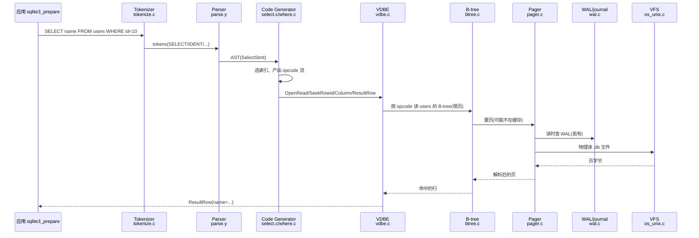
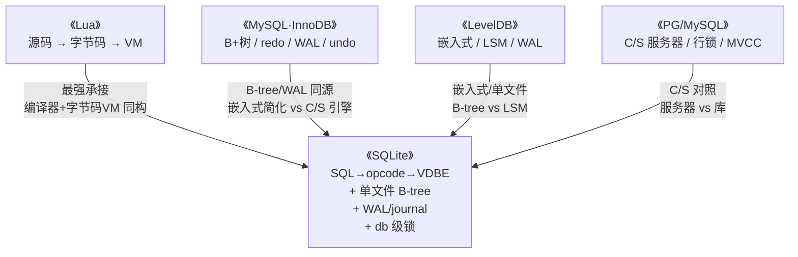

# 第 7 篇 · 第 21 章 · 全书收束:SQLite vs MySQL/PG vs LevelDB

> **核心问题**:走完前 20 章,你已经在脑子里能放映出一条 `SELECT` 在 SQLite 里的全过程——SQL 字符串 → Tokenizer 切词 → Parser 建 AST → Code Generator 产出 opcode → VDBE 虚拟机逐条执行 → 经 B-tree 读页 → pager 缓存 → WAL/journal 保 ACID。现在退后一步,问一个更大的问题:**VDBE + B-tree + 单文件这套设计,到底给 SQLite 换来了什么、又付出了什么?** 把 SQLite 摆到 MySQL/PG(C/S)、LevelDB(KV)旁边横向一比,各自的取舍边界在哪?以及——嵌入式数据库这条路,在端侧 AI、os_kv KV 后端、浏览器/WASM 的时代,还能走多远?

> **读完本章你会明白**:
> 1. **全书主线怎么收口**:把 21 章串成一张图——一条 `SELECT` 从字符串到结果,每一站对应哪一章、用了什么技巧、源码在哪个文件。合上书,这张图该是脑子里能放映的。
> 2. **四重承接总收束**:本书不是孤本,它站在《Lua》《MySQL·InnoDB》《LevelDB》《PG/MySQL》四本书之上——VDBE↔Lua VM(最强承接)、B-tree/WAL↔InnoDB、嵌入式↔LevelDB、C/S↔PG/MySQL,本章把这四条承接一次性收口。
> 3. ★ **横向对照总表**:SQLite vs MySQL/PG vs LevelDB,十几个维度(架构形态、SQL 接口、存储结构、ACID、并发模型、事务隔离、部署、适用场景、运维、性能特征)一张表说清谁强谁弱、为什么。
> 4. **得到了什么 vs 付出了什么**:SQLite 用"编译成字节码 + 单文件 B-tree + db 级锁"换来了零配置、零运维、单文件、可裁剪、跨平台、全球部署最大、极致稳定;代价是单写者、并发弱、无网络 C/S、无分布式、无细粒度锁。得失两面,本章两栏对照拆透。
> 5. **展望**:端侧 AI 本地向量存储、os_kv 把 SQLite 存到 KV 后端、浏览器+WASM(全书源码树里 `ext/wasm/` 已经是一整套)、测试与配置存储——嵌入式这条路越走越宽。

> **如果只记一句话**:**SQLite 把"编译成字节码 + 虚拟机执行 + 单文件 B-tree"做到极致,用嵌入式简化换来了极致的可移植与稳定——这是"少即是多"的典范。**

---

## 〇、一句话点破全书

> **SQLite 是一个把 SQL 编译成 VDBE 字节码(opcode)、用虚拟机执行,执行时从单文件 B-tree 读数据、经 pager + WAL/journal 保证 ACID 的嵌入式数据库。它的全部设计,都可以归结为"编译成字节码 + 虚拟机执行 + 单文件 B-tree"这十二个字——以及"嵌入式"这个定位逼出来的每一处取舍。**

这是结论,不是理由。本章不再倒着拆某个机制(那是前 20 章干的事),而是**把全书竖起来**:先沿着一条 SELECT 把 21 章串成一张图,再把 SQLite 和 MySQL/PG、LevelDB 横向摆开比一比,然后正面回答"得到了什么、付出了什么",最后展望它在新场景下的生命力。这是全书最后一章正文,写完就引出附录 A(源码全景路线图)、附录 B(工具链与实践)。

---

## 一、全书主线回顾:一条 SELECT 的完整旅程

### 1.1 把 21 章串成一张图

全书的主线,从头到尾就是一条 SELECT 的旅程。把这条旅程画出来,就是全书的目录:

```mermaid
flowchart TB
    subgraph S0["第 0 篇 · 开篇"]
        A0["P0-01 为什么需要 SQLite<br/>嵌入式 + 三本质"]
    end
    subgraph S1["第 1 篇 · 编译:SQL → 字节码"]
        A1["P1-02 八层架构"]
        A2["P1-03 Tokenizer + Parser"]
        A3["P1-04 Code Generator"]
    end
    subgraph S2["第 2 篇 · 执行:VDBE 虚拟机"]
        A4["P2-05 VDBE 虚拟机"]
        A5["P2-06 opcode 详解"]
        A6["P2-07 一条 SELECT 怎么执行"]
    end
    subgraph S3["第 3 篇 · 存储:B-tree"]
        A7["P3-08 B-tree 存储(非 B+树)"]
        A8["P3-09 记录格式 + type affinity"]
        A9["P3-10 索引与查询"]
    end
    subgraph S4["第 4 篇 · 页管理与事务:Pager"]
        A10["P4-11 Pager 页缓存"]
        A11["P4-12 rollback journal"]
        A12["P4-13 WAL 模式"]
        A13["P4-14 crash recovery + ACID"]
    end
    subgraph S5["第 5 篇 · VFS 与并发"]
        A14["P5-15 VFS OS 抽象"]
        A15["P5-16 动态类型 type affinity"]
        A16["P5-17 database lock 5 态"]
    end
    subgraph S6["第 6 篇 · 进阶"]
        A17["P6-18 事务隔离 BEGIN/COMMIT"]
        A18["P6-19 触发器/视图/FTS"]
        A19["P6-20 prepared statement"]
    end
    subgraph S7["第 7 篇 · 收束"]
        A20["P7-21 全书收束(本章)"]
    end

    A0 --> A1 --> A2 --> A3 --> A4 --> A5 --> A6
    A6 --> A7 --> A8 --> A9 --> A10 --> A11 --> A12 --> A13
    A13 --> A14 --> A15 --> A16 --> A17 --> A18 --> A19 --> A20
    classDef compile fill:#dbeafe,stroke:#2563eb
    classDef store fill:#fee2e2,stroke:#dc2626
    classDef overview fill:#fef3c7,stroke:#d97706
    class A1,A2,A3,A4,A5,A6 compile
    class A7,A8,A9,A10,A11,A12,A13,A14,A15,A16,A17 store
    class A0,A20 overview
```



蓝色是**编译与执行**这一面(SQL → 字节码 → VDBE 执行,第 1+2 篇是 SQLite 灵魂),红色是**存储与事务**这一面(B-tree → Pager → WAL → VFS,第 3+4+5+6 一部分),黄色是总览。一条 SELECT 从 SQL 字符串进,到结果行出,正好走完这条链。

### 1.2 一条 SELECT,每一站对应什么

拿全书反复用的那条 `SELECT name FROM users WHERE id=10`,把它在 SQLite 里的旅程完整回放一遍,每一站标注对应章节、源码文件、核心技巧。这是全书主线的"复盘":



| 旅程站点 | 在干什么 | 对应章节 | 核心源码 | 核心技巧 |
|----------|----------|----------|----------|----------|
| ① Tokenizer | SQL 字符串切成 token | P1-03 | `tokenize.c` | 一个字符一个字符扫、关键字表 |
| ② Parser | token 流建 AST | P1-03 | `parse.y`(yacc) | yacc 文法生成、递归下降 |
| ③ Code Generator | AST 翻译成 opcode 流 | P1-04 | `select.c`/`where.c`/`vdbeaux.c` | 为什么编译成字节码而非直接解释 AST |
| ④ VDBE 执行 | 逐条执行 opcode | P2-05/06/07 | `vdbe.c` | opcode 循环 switch-case + 寄存器 + 游标(承 Lua VM) |
| ⑤ B-tree 读页 | 按 opcode 从 B-tree 取数据 | P3-08/09/10 | `btree.c`/`btreeInt.h` | B-tree 非 B+树、单文件多 B-tree、Record 变长 |
| ⑥ Pager 缓存 | 页缓存、脏页管理 | P4-11 | `pager.c`/`pcache1.c` | pager 状态机、pcache LRU |
| ⑦ WAL/journal | 读查 WAL、写先写 WAL | P4-12/13 | `wal.c` | 读不阻塞写、checkpoint |
| ⑧ crash recovery | crash 后恢复 | P4-14 | `pager.c`/`wal.c` | rollback journal 改回、WAL replay |
| ⑨ VFS | 跨平台文件读写 | P5-15 | `os_unix.c`/`os_win.c`/`os_kv.c` | VFS 抽象、可替换后端 |
| ⑩ 锁与并发 | db 级文件锁 | P5-17 | `os_unix.c`/`btmutex.c` | 5 态锁(unlocked/shared/reserved/pending/exclusive) |
| ⑪ 事务 | BEGIN/COMMIT/ROLLBACK | P6-18 | `main.c`/`pager.c` | deferred/immediate/exclusive 三种 BEGIN |
| ⑫ prepared | 编译一次执行多次 | P6-20 | `prepare.c`/`vdbeapi.c` | opcode 缓存、参数 bind |

> **钉死这件事**:这张表就是全书。合上书,你该能指着表里每一行,讲清"它在解决什么问题、不这样会怎样、用了什么技巧"。任何一行讲不出来,就翻回去重读对应章节——这是本书最大的自检。

### 1.3 旅程的两个枢纽

整条旅程,有两个**枢纽**特别值得点一下,因为它们是全书的"接头":

- **枢纽一:Code Generator → VDBE 是编译到执行的接头**。AST 是树状的、嵌套的;opcode 是扁平的、可执行的。Code Generator 把树"压平"成指令流,VDBE 再"展开"成执行过程。这个接头为什么是字节码而不是直接解释 AST?P1-04 拆透了:prepared statement 复用(一次编译多次执行)、统一优化(opcode 是扁平流好分析)、统一执行模型(SELECT/INSERT/UPDATE/DELETE 最后都是 opcode 一个 VDBE 执行)。**这是 SQLite 和 Lua 在设计哲学上的共鸣**(承《Lua》编译器 + 字节码 VM)。

- **枢纽二:VDBE → B-tree 是执行到存储的接头**。VDBE 的 opcode(`OpenRead`/`Column`/`Next`)调 B-tree 的接口(`sqlite3BtreeTableMovesTo`、`sqlite3BtreePayload` 等)。VDBE 只管"我要读 users 表第 N 行第 M 列",B-tree 只管"我把页给你、页里的行给你"。这个分层让"执行逻辑"和"存储逻辑"完全解耦——换存储引擎(如 os_kv)不影响 VDBE,换 opcode 不影响 B-tree。**这是 SQLite 八层架构能稳定几十年的根**。

> 回扣全书二分法:**枢纽一是"编译与执行"内部的接头,枢纽二是"编译与执行"通往"存储与事务"的接头**。一条 SELECT 的旅程,就是从枢纽一穿到枢纽二的过程。

---

## 二、四重承接总收束:这本书站在四本书之上

### 2.1 SQLite 是"集大成者"

读到这里你会发现一个事:SQLite 里的概念,你大多在前面的书里见过类似的东西。**本书不是孤本,它是"集大成者"**——SQLite 把《Lua》《MySQL·InnoDB》《LevelDB》《PG/MySQL》四本书讲的思想,用"嵌入式、单文件"的极简方式重做了一遍。本节把这四条承接一次性收口。



### 2.2 承接一:VDBE ↔ Lua VM(最强承接)

这是本书最强的承接,也是 SQLite 最独特的地方。

**Lua**:源码(`local x = 1 + 2`)→ 编译器(词法 + 语法分析)→ 字节码(`LOADI R0 1; LOADI R1 2; ADD R0 R0 R1`)→ Lua VM(大 switch-case 循环逐条执行)。

**SQLite**:SQL(`SELECT name FROM users WHERE id=10`)→ Tokenizer + Parser(Code Generator)→ opcode(`OpenRead; SeekRowid; Column; ResultRow`)→ VDBE(大 switch-case 循环逐条执行)。

**两者是同一个架构根**:**编译器 + 字节码虚拟机**。输入不同(Lua 吃源码、SQLite 吃 SQL),但"把输入编译成扁平字节码、用虚拟机逐条执行"这套思想一模一样。本书第 2 篇讲 VDBE 时,大量承接《Lua》VM 的基础(opcode 循环、寄存器、program counter),不重复造轮子。

> **不这样会怎样**:如果 SQLite 不走"字节码虚拟机",而是直接解释 AST(很多教学型数据库就这么干),就丢掉了三样东西——prepared statement 复用(每次都得重新遍历 AST)、统一优化(树状 AST 优化难)、统一执行模型(每种 SQL 一套执行逻辑)。SQLite 选字节码,和 Lua 选字节码,是**同一个设计决策**:用编译器的复杂性,换执行时的统一和高效。

### 2.3 承接二:B-tree + WAL/journal ↔ MySQL·InnoDB

SQLite 的存储与事务,和 InnoDB 同源,但都做了"嵌入式简化":

| 维度 | **SQLite(嵌入式)** | **InnoDB(C/S)** | 区别的根 |
|------|---------------------|------------------|----------|
| 存储结构 | **B-tree(非 B+树)** | **B+树** | SQLite 表的 key=rowid,数据与 rowid 同节点;InnoDB 内部页只导航、叶子页存数据 |
| WAL | WAL(`wal.c`,改先写 WAL 不动数据文件) | redo log(改前记日志,逻辑 + 物理) | SQLite 无 undo,靠 rollback journal 回滚;InnoDB 有 undo 做 MVCC 版本链 |
| 并发 | **db 级锁**(单文件,5 态锁) | **行锁**(粒度细) | SQLite 嵌入式、单写者;InnoDB C/S、多事务高并发 |
| MVCC | 没有(读靠 WAL 不阻塞写) | 有(undo 版本链 + read view) | SQLite 用不上 InnoDB 那么复杂的 MVCC,嵌入式读为主 |

> **钉死这件事**:SQLite 和 InnoDB 的"同源不同形",根源在**嵌入式 vs C/S 的定位差**。InnoDB 要在 C/S 高并发下扛住多事务、大数据量,所以上 B+树 + redo + undo + 行锁 + MVCC 这套重型装备;SQLite 是嵌入式、单文件、单写者,这些重装备用不上——它用 B-tree + WAL(或 rollback journal)+ db 级锁,把 ACID 砍到最小可用。**两者的 ACID 思想是一样的(先记日志再改数据),只是装备轻重不同。**

### 2.4 承接三:嵌入式 ↔ LevelDB

SQLite 和 LevelDB 都是**嵌入式**(链接进 App、单文件),但接口和存储结构完全不同:

| 维度 | **SQLite** | **LevelDB** |
|------|-----------|-------------|
| 接口 | **SQL**(声明式,SELECT/INSERT/UPDATE/DELETE) | **KV**(`Put`/`Get`/`Delete`) |
| 存储结构 | **B-tree**(就地更新) | **LSM**(只追加 + compaction) |
| 写放大 | 小(改一页) | 大(Compaction 重写) |
| 读放大 | 小(B-tree 一跳到位) | LSM 看分层,可能多查 |
| 适用 | 关系数据、查询复杂、读为主 | 海量 KV、写吞吐优先 |

> **不这样会怎样**:如果 SQLite 用 LSM,点查(嵌入式读为主)会慢(要查多层);如果 LevelDB 用 B-tree,写吞吐(它的主打)会被就地更新的写放大拖垮。**B-tree 和 LSM 是读写放大三角的不同取舍**,P3-08 拆透了。SQLite 选 B-tree 是为了嵌入式读为主,LevelDB 选 LSM 是为了写吞吐——**嵌入式这个定位相同,但场景(读 vs 写)决定了存储结构相反**。

### 2.5 承接四:C/S 对照 ↔ PG/MySQL

| 维度 | **SQLite(嵌入式)** | **PG/MySQL(C/S)** |
|------|---------------------|---------------------|
| 部署 | 库链接进 App,无独立进程 | 独立服务器进程,客户端网络连 |
| 配置 | 零配置(打开文件即用) | 装服务、配端口、管账号、有 DBA |
| 网络 | 无(同进程调用) | 有(TCP/Unix socket) |
| 并发 | 弱(单文件锁) | 强(行锁/MVCC) |
| 分布式 | 无 | PG 有逻辑复制、MySQL 有主从 |
| 适用 | 端侧、单 App、读多写少 | 服务端、多 App 共享、高并发写 |

> **钉死这件事**:SQLite 和 PG/MySQL 不是"谁更先进",而是**解决不同问题**。SQLite 是端侧的王者(零配置、随 App 部署、全球部署最大),PG/MySQL 是服务端的王者(C/S、高并发、分布式)。**它们各有主场,硬把 SQLite 拉去当 PG 用、或硬把 PG 塞进手机,都是用错地方。**

### 2.6 承接五(附带):mem0-5 ↔ 内存分配器

还有一个附带的承接——SQLite 的 `mem0.c`~`mem5.c` 多种内存分配可切换(参见 [src/mem0.c](../sqlite/src/mem0.c)、[src/mem5.c](../sqlite/src/mem5.c))。这套"可裁剪、可替换的内存分配",和《内存分配器》那本讲的 tcmalloc/jemalloc/ptmalloc 是同一类问题——只是 SQLite 把分配器做成了编译时可选(`sqlite3_config(SQLITE_CONFIG_MALLOC, ...)`),为了在不同平台(带 malloc 的、裸机、嵌入式 RTOS)都能跑。这是"可裁剪"设计哲学的体现,本书在 P5 各章涉及处带过,不重复《内存分配器》的基础。

---

## 三、★ 横向对照总表:SQLite vs MySQL/PG vs LevelDB

这是本章的核心。把 SQLite、MySQL/PG(C/S 数据库代表)、LevelDB(嵌入式 KV 代表)三者在十几个维度上摆开,谁强谁弱、为什么,一张表说清。

> **表怎么读**:别死记每个格子的结论。每个格子背后都是一道**取舍题**——SQLite 在这一维的"强/弱",根因都是它"嵌入式 + 单文件 + 编译成字节码"这套定位。横向对照的目的,是让你**看清楚每条边界是哪来的**,而不是背下"谁更好"。

### 3.1 核心对照表

| 维度 | **SQLite** | **MySQL / PG** | **LevelDB** |
|------|-----------|----------------|-------------|
| **架构形态** | 嵌入式(库链接进 App,无独立进程) | C/S(独立服务器 + 网络客户端) | 嵌入式(库链接进 App) |
| **接口** | SQL(声明式,完整关系模型) | SQL(声明式,完整关系模型 + 扩展) | KV(`Get`/`Put`/`Delete` + 迭代器) |
| **执行模型** | 编译成 VDBE 字节码、虚拟机执行 | 解释执行 / 预编译执行计划 | 直接执行(无 SQL 层) |
| **存储结构** | **B-tree(非 B+树)**,表索引同构 | MySQL InnoDB:B+树(聚簇);PG:堆表 + B-tree 索引 | **LSM**(MemTable + SSTable 多层 + Compaction) |
| **单文件** | 是(一个 .db 文件装多棵 B-tree) | 否(表空间、日志、数据多文件) | 是(一个目录,多个 .ldb/.log) |
| **ACID 机制** | rollback journal(默认)+ WAL(可选) | redo log(WAL)+ undo log(MVCC 回滚) | WAL(写日志)+ Compaction 收敛 |
| **并发模型** | **db 级文件锁**(5 态,单写者) | **行锁 / MVCC**(细粒度,高并发) | **单写多读**(LSM 天然,写串行) |
| **事务隔离** | 默认 SERIALIZABLE-ish(单写者) | MySQL RR(默认)/ PG RC + 快照隔离 | 仅原子写,无隔离级别概念 |
| **MVCC** | 无 | 有(undo 版本链 / xmin-xmax) | 无(靠 SSTable 不可变近似) |
| **网络** | 无(同进程) | 有(TCP/Unix socket) | 无(同进程) |
| **分布式** | 无 | 有(主从复制、集群、分片) | 无(单机) |
| **部署** | 零配置(打开文件即用) | 装服务、配端口、管账号、有 DBA | 零配置(打开目录即用) |
| **运维** | 几乎为零(没有服务进程可挂) | 重(备份、监控、调参、扩容) | 几乎为零 |
| **可移植** | 极强(C + VFS,任何能编译 C 的设备) | 受限(需要完整 OS + 服务进程) | 强(C++,跨主流平台) |
| **全球部署量** | **最大**(几十亿设备内置) | 大(服务端主流) | 中(嵌入大量存储引擎) |
| **写性能** | 中(单写者,但单写够快) | 高(并发写,行锁) | **极高**(顺序写 + 批量) |
| **读性能** | 高(B-tree 点查一跳到位) | 高(B+树范围扫优) | 中(LSM 多层,点查可能慢) |
| **复杂查询** | 强(完整 SQL + 优化器 + 字节码) | 强(完整 SQL + 优化器) | 弱(只有 KV,无 SQL) |
| **典型场景** | 手机 App、浏览器、端侧、测试、配置 | 服务端业务库、高并发写、分布式 | 嵌入式 KV、缓存、存储引擎底层 |

### 3.2 三种存储结构的三角对照

存储结构是三者差异最大的地方,值得单独展开。SQLite(B-tree)、InnoDB(B+树)、LevelDB(LSM)在"读放大 / 写放大 / 空间放大"三角上的位置:

```
                  读放大小(点查快)
                       ▲
                       │
              SQLite ◀─┼──▶ InnoDB
            (B-tree)   │   (B+树)
                       │
                       │
   ────────────────────┼──────────────────── 写放大小
                       │
                       │
                  LevelDB
                   (LSM)
                       │
                       ▼
                  写放大小(顺序写快)、读放大可能大
```

- **SQLite(B-tree)**:就地更新,改一页写一页,读一跳到位——**读为主场景最优**,写放大小但单写者限制并发。
- **InnoDB(B+树)**:就地更新 + redo,叶子页链表顺序扫优——**大数据量范围扫 + 高并发场景最优**,内部页更小树更矮。
- **LevelDB(LSM)**:只追加 + Compaction,顺序写极快——**写吞吐场景最优**,但 Compaction 重写(写放大)、点查要查多层(读放大)。

> **钉死这件事**:**没有"最优"的存储结构,只有"某个场景下最优"的取舍**。SQLite 选 B-tree 是因为嵌入式读为主、点查多;InnoDB 选 B+树是因为 C/S 大数据量、范围扫多;LevelDB 选 LSM 是因为写吞吐是第一目标。**这三种结构是读写放大三角的三个角,谁也不能替代谁。**

### 3.3 三种并发模型的对照

并发模型是三者第二个差异大的地方:

| 维度 | **SQLite** | **InnoDB** | **LevelDB** |
|------|-----------|-----------|-------------|
| 锁粒度 | **db 级**(整个数据库一把锁) | **行级**(锁单行) | **无锁**(写串行) |
| 锁类型 | 5 态文件锁(unlocked/shared/reserved/pending/exclusive) | 共享锁 / 排他锁 / 间隙锁 | 无(写排队) |
| 读读 | 并行(WAL 模式) | 并行(MVCC) | 并行 |
| 读写 | WAL:不阻塞;rollback journal:写时独占 | 不阻塞(MVCC) | 写阻塞读(或读阻塞写,看版本) |
| 写写 | **串行**(单写者) | 并行(不同行) | **串行**(单写者) |
| 上限 | 单写者,并发写弱 | 行锁,并发写强 | 单写者,但写吞吐极高 |

> **不这样会怎样**:SQLite 为什么不上行锁?因为**单文件嵌入式**,行锁要维护锁表、要事务协调,这套重装备在嵌入式场景用不上——单文件一把锁简单得多,代价是并发写弱。InnoDB 上行锁是因为 C/S 高并发必须细粒度;LevelDB 干脆不上锁,因为 LSM 天然写串行(Compaction 在后台),读多版本(不可变 SSTable)近似无锁读。**三种并发模型,根因都是"存储结构 + 部署形态"逼出来的。**

---

## 四、得到了什么 vs 付出了什么

现在正面回答本章的第二个核心问题:**VDBE + B-tree + 单文件这套,得到了什么、又付出了什么?** 本节两栏对照拆透。

### 4.1 得到了什么(SQLite 的"得")

把 SQLite 的设计决策逐个对应"换来什么好处":

| 设计决策 | 换来的好处 | 为什么这好处重要 |
|----------|-----------|-----------------|
| **编译成 VDBE 字节码** | prepared statement 复用、统一优化、统一执行模型 | 一次编译多次执行极快;opcode 扁平流好优化;SELECT/INSERT/UPDATE/DELETE 一个 VM 执行 |
| **单文件 B-tree** | 一个 .db 文件即整个数据库 | 拷贝即备份、删文件即清理、无外部依赖 |
| **db 级文件锁** | 实现极简、无锁表开销 | 嵌入式场景并发不高,简单即正确 |
| **rollback journal / WAL** | ACID 简单可靠、WAL 读写并发 | 嵌入式也要不丢数据,WAL 让读不阻塞写 |
| **VFS 抽象** | 跨平台、后端可替换 | 同一套代码跑 Unix/Windows/嵌入式/os_kv |
| **mem0-5 多内存分配** | 可裁剪、可替换 | 裸机、RTOS、嵌入式内存受限环境都能跑 |
| **type affinity 动态类型** | 类型宽松、兼容好 | App 字段类型经常变,强类型反而是负担 |
| **嵌入式(链接进 App)** | 零配置、零运维、随 App 部署 | 端侧 App 不可能跑 DBA,库直接用 |
| **C + Public Domain** | 极致可移植、零授权负担 | 任何能编译 C 的设备都能塞进去;无 GPL/LGPL 限制 |
| **几十单文件 + TH3 测试** | 极致稳定 | 工业级 100% 分支覆盖,几十年几乎无崩溃 bug |

**把这些"得"归纳成一句话**:

> **SQLite 用"嵌入式简化",换来了零配置、零运维、单文件、可裁剪、跨平台、全球部署最大、极致稳定——这些正是端侧场景最需要的属性。** 在端侧(手机、浏览器、航电、IoT),你不需要"高并发写"或"分布式",你需要的是"装上就能用、用不坏、能塞进任何设备"——SQLite 在这条赛道上做到了极致。

### 4.2 付出了什么(SQLite 的"失")

每一份"得"都有代价。SQLite 的"失"同样要讲清楚:

| 代价 | 表现 | 根因 |
|------|------|------|
| **单写者并发弱** | 多个写事务必须排队,高并发写场景吞吐受限 | db 级文件锁,不是行锁 |
| **无网络 C/S** | 不能跨进程/跨机器访问 | 嵌入式,同进程调用,没有服务端 |
| **无分布式** | 不能主从复制、分片 | 单文件、单进程,设计上就不考虑 |
| **无细粒度锁** | 不能锁单行,只能锁整库 | 嵌入式简化,行锁重装备用不上 |
| **无 MVCC** | 长读会阻塞写(rollback journal 模式) | 靠 WAL 缓解,但不如 InnoDB undo 版本链灵活 |
| **写吞吐有上限** | 单写者,B-tree 就地更新,不如 LSM 顺序写 | B-tree 写放大虽小但单写,LSM 多写者批量顺序写更快 |
| **大数据量受限** | 单文件、单机,没有水平扩展 | 嵌入式定位,不考虑 PB 级 |
| **复杂并发控制弱** | 死锁检测、锁升级、间隙锁这些都没有 | 嵌入式不需要,但意味着复杂事务场景不如 InnoDB |

**把这些"失"归纳成一句话**:

> **SQLite 的代价,全在"并发写、分布式、网络访问"这三块——而这恰恰是服务端数据库(MySQL/PG)的主场。** 所以 SQLite 不适合:高并发写的服务端业务库、需要主从复制的大型系统、需要跨机器访问的共享数据库。**这不是 SQLite 的缺陷,而是它的设计边界——它本来就不是为这些场景生的。**

### 4.3 得失的根因:嵌入式这个定位

把"得"和"失"摆在一起,你会发现一个清晰的规律:

```
   得到的(零配置/单文件/稳定/可移植/全球部署最大)
                          ↕
                  同一个根因:嵌入式
                          ↕
   付出的(单写者/并发弱/无网络/无分布式)
```

**所有"得"和所有"失",都来自同一个根因——"嵌入式"这个定位。** 嵌入式让 SQLite 必须单文件、零配置、可裁剪、极致稳定(端侧 App 装上就要能用、用不坏);嵌入式也让 SQLite 不需要行锁、MVCC、网络、分布式(这些是 C/S 服务端的装备)。**SQLite 没有同时拿到两边——它选了嵌入式这条路,就得接受这条路的天花板。**

> **钉死这件事**:**SQLite 不是"功能少"的 MySQL,而是"定位完全不同"的另一种数据库。** 把它和 MySQL/PG 比"并发写谁强",就像拿螺丝刀比锤子——它们本来就不是干同一件事的。理解 SQLite 的关键是理解"嵌入式这个定位逼出来的所有取舍",而不是逐功能比清单。

---

## 五、展望:嵌入式数据库这条路能走多远

写到这里,一个自然的问题是:**SQLite 这套设计,在未来还有生命力吗?** 答案是——**不仅没衰落,反而在新场景里越走越宽**。本节讲三个最有想象力的方向。

### 5.1 端侧 AI:本地向量存储

随着端侧 AI(手机上的大模型推理、本地 RAG)兴起,出现了一个新需求:**在端侧存向量、做相似度检索**。传统做法是把向量数据发到云端向量数据库(如 Pinecone、Milvus),但端侧 AI 要求**数据不出端、低延迟、离线可用**——这正是 SQLite 的主场。

SQLite 社区正在围绕这个方向发力:

- **向量扩展**:有第三方/社区扩展(如 sqlite-vec、 sqlite-vss),把向量作为一个新类型/扩展模块接入 SQLite,支持 `ORDER BY distance(...)` 这类向量相似度查询。注意:**本书源码树(3.54.0 dev)里核心并没有内置 VECTOR 类型**——它走的是 SQLite 一贯的"扩展模块"路线(像 FTS、RTree 一样,作为 `ext/` 下的可选扩展),而不是把向量编进核心。
- **为什么 SQLite 适合端侧向量**:① 嵌入式,向量数据随 App 在本地;② 单文件,整个向量库就是一个 .db 文件,迁移、备份方便;③ 已有的 B-tree + FTS + RTree 基础设施可以复用(向量检索常和全文检索、范围查询组合);④ 零运维,端侧 App 没法跑 DBA。

> **钉死这件事**:**端侧 AI 的"本地向量存储"这个需求,几乎是为 SQLite 量身定制的**——嵌入式、单文件、零配置、跨平台。这是 SQLite 在 AI 时代最有想象力的新主场。但要诚实:**这不是 SQLite 核心团队(Hipp)主导的内置功能,而是社区扩展生态在推动**——本书源码树里看不到 `VECTOR` 内置类型,这是扩展层的活。

### 5.2 os_kv:把 SQLite 存到 KV 后端

第二个值得关注的演进,是 SQLite 的 **os_kv VFS**。本书 P5-15 讲过 VFS 是 SQLite 的 OS 抽象层,可替换后端。`os_kv.c`(参见 [src/os_kv.c](../sqlite/src/os_kv.c))是一个**实验性 VFS,把 SQLite 的页存储到一个 KV(key-value)存储后端**——也就是说,SQLite 的"文件"不再是本地文件系统的一个 .db 文件,而是一堆 KV 对,可以存在任何 KV 引擎(Redis、LevelDB、云 KV 服务)里。

为什么这个特性有意思?

- **解耦存储引擎与查询接口**:传统上"SQL 接口 + B-tree 存储"是绑死的(如 InnoDB)。os_kv 把"SQL 接口"和"存储后端"拆开——你拿到 SQL 查询能力(SQLite 上半:编译 + VDBE),但底层存储可以是任意 KV 引擎。这给嵌入式数据库一种新的可组合性。
- **为什么 SQLite 适合做这件事**:因为它的 VFS 抽象做得足够干净,且 VDBE → B-tree → Pager → VFS 是分层的——把 VFS 换成 KV,上层不动。这是"可替换后端"设计哲学的极致体现。

> **诚实标注**:`os_kv.c` 文件头自己写明 "experimental VFS"(实验性,2022-09-06 加入)。它目前还有限制(如 KV 的 key 必须是纯文本、key 长度受限、数据库名要短)。但它指出了一个方向:**SQLite 的查询引擎 + 任意 KV 后端**的组合,未来可能在云原生、存算分离场景找到新用途。

### 5.3 浏览器 + WASM:SQLite 跑在网页里

第三个方向,是 SQLite 在浏览器里的新生。本书源码树里有一个完整的 `ext/wasm/` 目录(参见 [ext/wasm/](../sqlite/ext/wasm/))——这是 SQLite 官方维护的 **WASM 编译产物 + JS 绑定**,让 SQLite 能直接跑在浏览器、Node.js、任何支持 WASM 的环境里。

为什么这很重要?

- **前端本地数据库**:以前前端要存结构化数据只能用 IndexedDB(接口复杂、查询能力弱)。有了 WASM SQLite,前端直接用 SQL 操作一个**内存里或 OPFS(Origin Private File System)里**的 SQLite 数据库——完整的 SQL、事务、索引能力。
- **端侧逻辑下沉**:随着浏览器越来越强(计算、存储、离线),越来越多的业务逻辑可以下沉到前端。SQLite on WASM 给了前端一个真正的"本地数据库",让 RAG、本地分析、离线协作这些场景在浏览器里变得可行。
- **为什么 SQLite 适合 WASM**:因为它是 C 写的、零依赖、可裁剪——Emscripten 一编译就是 WASM。这种"极致可移植"在 WASM 时代变成了"能跑在任何地方"的超能力。

> **钉死这件事**:**SQLite 在浏览器里跑,不是玩具,是真实趋势**。源码树里的 `ext/wasm/` 是官方在认真维护的一整套(有 demo、有 worker、有 OPFS 集成)。这再一次证明 SQLite 的"嵌入式 + 零依赖 + C"这套设计,在每种新的计算环境(手机、IoT、浏览器、WASM)里都能找到新生命。

### 5.4 测试与配置存储:不可替代的基础设施

最后,一个不那么性感但极其重要的方向:**SQLite 作为测试与配置存储的基础设施**。这一块 SQLite 几乎没有对手:

- **测试替身**:很多服务端项目(用 MySQL/PG 的)在跑单元测试时,会用 SQLite 替代真数据库——因为 SQLite 内存模式(`:memory:`)零配置、瞬时、快。这种"测试用 SQLite、生产用 PG"的模式在 Rails、Django 等框架里很常见。
- **配置存储**:大量桌面软件、IDE、Electron App 用 SQLite 存配置、历史、缓存——因为单文件、零运维、SQL 查询比手写文件解析强太多。Chrome、Firefox、VS Code 都大量用 SQLite。
- **应用文件格式**:SQLite 官方甚至推荐把 SQLite 作为**应用文件格式**(把 .sqlite 文件作为软件的原生格式,如 Mac 的 Photos 库就是 SQLite)——单文件、结构化、跨平台、可查询,比自定义二进制格式好得多。

> 这一方向没有新特性,但它说明:**SQLite 已经是不可替代的基础设施**。你每天不知不觉用它几十次(手机通讯录、浏览器历史、App 缓存),这就是"全球部署量最大数据库"的分量。

### 5.5 展望小结:嵌入式这条路越走越宽

把四个方向合起来看:

| 方向 | 为什么 SQLite 适合 | 状态 |
|------|-------------------|------|
| 端侧 AI 向量存储 | 嵌入式、单文件、零配置 | 社区扩展(非核心内置),生态在推动 |
| os_kv KV 后端 | VFS 抽象、查询与存储解耦 | 实验性,但指明方向 |
| 浏览器 + WASM | C、零依赖、可裁剪 | 官方维护(`ext/wasm/`),已可用 |
| 测试 + 配置存储 | 零配置、单文件、内存模式 | 成熟,已成基础设施 |

> **钉死这件事**:**SQLite 的生命力,恰恰来自它"嵌入式 + 单文件 + C + 零依赖"这套看似"老派"的设计**。每一种新的计算环境(手机、IoT、浏览器、WASM、端侧 AI)出现,SQLite 都能直接塞进去——因为它什么都不依赖。这是"少即是多"最生动的注脚。

---

## 六、设计哲学总结:少即是多

走到全书尾声,可以收一个更高的视角了。SQLite 的设计哲学,可以用一句话概括:

> **SQLite 把"编译成字节码 + 虚拟机执行 + 单文件 B-tree"做到极致,用嵌入式简化换来了极致的可移植与稳定——这是"少即是多"的典范。**

### 6.1 三条哲学

具体展开,SQLite 的设计哲学有三条:

**第一条:把执行模型做成字节码虚拟机(VDBE)。** 这条决策让 SQLite 的执行层高度统一(opcode 循环 + 寄存器 + 游标)、可复用(prepared statement)、可优化(opcode 流上做分析)。这是和 Lua 同源的哲学——**用编译器的复杂性,换执行时的统一和高效**。

**第二条:把存储做成单文件 B-tree。** 这条决策让 SQLite 的存储极致简单(一个文件、多棵 B-tree、根页号区分)、可移植(单文件就是整个数据库)、可靠(B-tree 就地更新 + journal/WAL 保 ACID)。这是嵌入式场景的最优解——**单文件换零运维,B-tree 换读为主的高效**。

**第三条:把并发做成 db 级锁。** 这条决策让 SQLite 的并发控制极致简单(5 态文件锁、单写者),代价是并发写弱。这是嵌入式场景的理性取舍——**端侧不需要高并发写,简单即正确**。

这三条加起来,就是 SQLite 的"少":**少一个服务器进程(嵌入式)、少一套锁装备(db 级锁)、少一个 undo 版本链(rollback journal)、少一堆外部依赖(C + Public Domain)**。但正是这个"少",换来了端侧最需要的"多":**多一种设备能跑(极致可移植)、多一份稳定(TH3 测试)、多一个零运维的数据库(零配置)**。

### 6.2 和"多即是多"的对照

把 SQLite 和"功能全"的数据库(MySQL/PG)对照,哲学差异一目了然:

| 哲学 | **SQLite(少即是多)** | **MySQL/PG(多即是多)** |
|------|---------------------|------------------------|
| 核心信念 | 砍掉用不上的,把剩下的做到极致 | 把能加的都加上,覆盖所有场景 |
| 并发 | db 级锁(够用就行) | 行锁 + MVCC(高并发必须) |
| 网络 | 无(嵌入式不需要) | TCP(服务端必须) |
| 分布式 | 无(单机) | 主从、分片(横向扩展) |
| 适用 | 端侧、单 App、读为主 | 服务端、多 App、高并发 |

**两者不是谁对谁错,是两种哲学各有主场。** SQLite 的"少"在端侧是优点(零配置、稳定),到了服务端高并发场景就是缺点(单写者、无分布式);MySQL/PG 的"多"在服务端是优点(行锁、MVCC),到了手机 App 里就是负担(装服务、配端口、跑守护进程)。

> **钉死这件事**:**SQLite 教给我们的,不是某项具体技术,而是"取舍"这件事本身——想清楚你的场景真正需要什么、不需要什么,然后把需要的做到极致、把不需要的果断砍掉。** 这是工程设计的至高心法,适用于任何系统。

### 6.3 为什么 SQLite 能"少即是多"成功

最后,SQLite 能把"少即是多"做成功,有三个关键:

1. **场景选对了**:嵌入式这个赛道,天生不需要高并发写、分布式、网络——这些"多"在端侧是负担。SQLite 一开始就瞄准这个赛道(2000 年,为军舰系统开发,因为军舰上跑不了 MySQL),定位精准。
2. **简化得对**:砍掉的"多"(行锁、MVCC、undo、网络、分布式),都是嵌入式场景**真正用不上**的;留下的"少"(字节码 VM、B-tree、WAL),都是**真正需要**的。简化不是无脑删,是知道什么该删、什么必须留。
3. **执行极致**:留下的东西,每一件都做到极致——VDBE 的 opcode 循环精雕细琢、B-tree 的页布局紧凑高效、WAL 的读写并发设计巧妙、VFS 的抽象干净可替换、TH3 测试覆盖 100% 分支。**"少"不等于"糙",反而是"少而精"。**

这三条,是 SQLite 几十年长青的根。

---

## 七、章末小结:全书收束

### 7.1 全书五问(收束版)

走到这里,把全书主线收成五个问题。如果你能流畅地回答这五个,这本书就算读通了:

1. **SQLite 为什么把 SQL 编译成字节码、用 VDBE 虚拟机执行,而不是直接解释 AST?**
   ——为了 prepared statement 复用(一次编译多次执行)、统一优化(opcode 是扁平流)、统一执行模型(SELECT/INSERT/UPDATE/DELETE 都走 VDBE)。这套思想和《Lua》的字节码 VM 同源——用编译器的复杂性,换执行时的统一和高效。

2. **SQLite 为什么用 B-tree 而不是 B+树(像 InnoDB)?**
   ——因为表的 key=rowid,数据与 rowid 同节点,点查少一跳,嵌入式读为主场景更优;InnoDB 用 B+树是因为 C/S 大数据量、范围扫,内部页更小树更矮更优。**两者是不同场景的最优解,不是谁更先进。**

3. **SQLite 怎么保证 ACID?rollback journal 和 WAL 各解决了什么?**
   ——rollback journal:改页前先记原内容,crash 后用 journal 改回(原子提交,但写时独占)。WAL:改先写 WAL 不动数据文件,读读数据文件 + WAL,读不阻塞写,定期 checkpoint 合并。两者都是"先记日志再改数据"的思想(承《MySQL·InnoDB》redo),但 SQLite 没有 undo,靠 rollback journal 回滚,是嵌入式简化。

4. **SQLite 为什么并发写弱?代价是什么、换来什么?**
   ——因为 db 级文件锁(单写者),不是行锁。代价是高并发写场景吞吐受限、无细粒度锁、无 MVCC;换来的是实现极简、无锁表开销、嵌入式场景足够用。**这个代价根植于"嵌入式"定位——端侧不需要高并发写。**

5. **SQLite 和 MySQL/PG、LevelDB 比,各自的边界在哪?**
   ——SQLite(嵌入式 SQL + B-tree)适合端侧、单 App、读为主;MySQL/PG(C/S SQL + B+树/堆表 + 行锁 + MVCC)适合服务端、高并发写、分布式;LevelDB(嵌入式 KV + LSM)适合海量 KV、写吞吐优先。**三者不是谁更好,是各自主场不同——硬用错地方,就是用错工具。**

### 7.2 读完本书,你应该能……

- **在脑子里放映一条 SELECT 的全过程**:SQL 字符串 → Tokenizer 切词(`tokenize.c`)→ Parser 建 AST(`parse.y`)→ Code Generator 产出 opcode(`select.c`/`where.c`)→ VDBE 逐条执行 opcode(`vdbe.c`,OpenRead/SeekRowid/Column/ResultRow)→ 经 B-tree 读页(`btree.c`)→ pager 缓存(`pager.c`)→ WAL/journal 保 ACID(`wal.c`)→ VFS 跨平台(`os_unix.c`)。
- **讲清每一步的"为什么"和"用了什么技巧"**:为什么编译成字节码、为什么 B-tree 非 B+树、为什么 rollback journal 默认、WAL 怎么读写并发、VFS 为什么这样抽象、db 级锁为什么 5 态。
- **把 SQLite 摆到 MySQL/PG、LevelDB 旁边做横向对照**:知道每个维度谁强谁弱、根因是什么(见本章第三节对照总表)。
- **说清 SQLite 的设计哲学**:少即是多——用嵌入式简化换极致可移植与稳定,知道这个"少"换来什么、付出什么。
- **判断 SQLite 适不适合某个新场景**(端侧 AI、WASM、os_kv):回到"嵌入式 + 单文件 + 零依赖"这几个属性,看目标场景需不需要它们。

### 7.3 想继续深入往哪钻

本书正文到此结束,但 SQLite 还有很多值得继续挖的:

- **想通读源码**:看**附录 A · SQLite 源码全景路线图**——给一条从 `main.c` 到 `os_unix.c` 的阅读顺序,讲怎么读 amalgamation vs `src/` 开发树。
- **想动手感受**:看**附录 B · SQLite 工具链与实践**——`sqlite3` CLI、`EXPLAIN` 看 opcode、`.dump`/`.import`、与《Lua》《MySQL·InnoDB》《LevelDB》的承接对照。
- **想深入 VDBE**:重读第 2 篇(P2-05~07),配合 SQLite 官方文档 "The Virtual Database Engine" 和 `vdbe.c` 的 opcode 循环逐行读。
- **想深入 B-tree/WAL**:重读第 3+4 篇(P3~P4),配合 `btree.c`/`wal.c` 源码,对照《MySQL·InnoDB》那本的 B+树/redo 章节。
- **想看官方架构总览**:SQLite 官方文档 "Architecture of SQLite"(八层图)、"How SQLite Works"、"Atomic Commit"(讲 ACID)。
- **想跟最新动态**:关注 os_kv(`src/os_kv.c`,实验性 KV VFS)、`ext/wasm/`(浏览器 SQLite)、社区向量扩展(端侧 AI 方向)。

### 7.4 一句话收束全书

> **SQLite 把"编译成字节码 + 虚拟机执行 + 单文件 B-tree"做到极致。读这本书,你要带走的不是某条 opcode、某个页布局,而是这套"少即是多"的工程心法——想清楚场景需要什么,把需要的做到极致,把不需要的果断砍掉。这是 SQLite 教给所有系统设计师的至高一课。**

全书正文 21 章,到此收束。接下来:

> **下一站**:附录 A · SQLite 源码全景路线图 —— 给你一张从 SQL 到 VFS 的全栈源码地图,以及怎么开始读 SQLite 源码的建议顺序。

> **附录 A**:[SQLite 源码全景路线图](附录A-源码全景路线图.md)
> **附录 B**:[SQLite 工具链与实践](附录B-工具链与实践.md)

---

> 📖 **本章承接**(全书四重承接总收束):VDBE 字节码虚拟机 ↔《Lua》VM(最强承接,编译器 + 字节码 VM 同构);B-tree + WAL/journal ↔《MySQL·InnoDB》(B-tree 非 B+树、WAL vs redo、db 级锁 vs 行锁);嵌入式单文件 ↔《LevelDB》(B-tree vs LSM、SQL vs KV);C/S 对照 ↔《PG/MySQL》(嵌入式 vs 服务器)。本章是这四条承接的总收口,把 SQLite 摆到三本书的主角旁边做了一次横向总对照。
