# 附录 A · SQLite 源码全景路线图

> **核心问题**:全书 21 章把 SQLite 的每个机制(VDBE、B-tree、pager、WAL、VFS…)都拆过一遍,可当你真的打开 `../sqlite/src/` 这个开发树、面对 100 多个 `.c/.h` 文件,你该**从哪儿读起、按什么顺序读、每个文件在做什么**?这份附录给你一张"从 SQL 字符串到执行结果"的**全栈源码地图** + **逐文件职责索引表** + **阅读顺序建议** + **amalgamation vs 开发树对照** + **核心结构体速查表**。
>
> **一句话定位**:这张地图不是 API 文档,是"读完正文、想动手啃源码"的人的**导航仪**。正文讲"为什么这么设计",这里讲"具体去哪个文件、哪个函数看它怎么写的"。

> **⚠️ 版本基准**:本附录所有文件路径、行数、结构体定义位置,均以本地 checkout `../sqlite/` 为准——**实际 checkout = `533e59b4`(`sqlite @ sqlite/master`),对应 SQLite 3.54.0**(框架文档里的旧值 `07607c6` 是早期 commit,以实际为准;`SQLITE_VERSION` 在源码树里是 `--VERS--` 占位符,构建时由 `mksourceId` 替换,精确版本以 amalgamation/发布包为准)。本附录所有行数用 `wc -l` 实测(见每节),结构体行号用 `Grep` 核实。

---

## 一、全栈源码地图:一条 SELECT 怎么流过八层

SQLite 经典的"八层流水线"在正文(P1-02)讲过,这里把每一层**对应到具体源码文件**。读源码时,先记住这张图:一条 `SELECT name FROM users WHERE id=42` 从最顶层进来,逐层往下流,每一层都落在一个或几个 `.c` 文件里。

```mermaid
flowchart TB
    SQL["SQL 字符串<br/>'SELECT name FROM users WHERE id=42'"]

    subgraph L0["第 0 层 · 顶层接口 Interface"]
        API["sqlite3.h.in(公共 API)<br/>main.c / prepare.c<br/>sqlite3_prepare_v2 / sqlite3_step"]
    end

    subgraph L1["第 1 层 · 词法分析 Tokenizer"]
        TOK["tokenize.c<br/>sqlite3GetToken() 切 token"]
    end

    subgraph L2["第 2 层 · 语法分析 Parser"]
        PAR["parse.y(Lemon 文法)→ parse.c(生成产物)<br/>建 AST:Select / Expr / SrcList"]
    end

    subgraph L3["第 3 层 · 代码生成器 Code Generator"]
        CG["select.c / where.c / insert.c / update.c / delete.c / build.c<br/>AST → VDBE opcode 流"]
        CG2["expr.c / resolve.c / func.c / trigger.c / alter.c(辅助)"]
    end

    subgraph L4["第 4 层 · 虚拟机 VDBE(SQLite 灵魂)"]
        VM["vdbe.c(opcode 大循环 sqlite3VdbeExec)<br/>vdbe.h / vdbeInt.h"]
        AUX["vdbeapi.c(对外 sqlite3_step/finalize)<br/>vdbeaux.c(构造/释放/解释 opcode)"]
    end

    subgraph L5["第 5 层 · B-tree(表和索引都是 B-tree)"]
        BT["btree.c / btree.h / btreeInt.h<br/>btmutex.c(B-tree 并发锁)"]
    end

    subgraph L6["第 6 层 · 页缓存 Pager"]
        PG["pager.c(页管理 + rollback journal)<br/>memjournal.c(内存 journal)"]
        PC["pcache.c / pcache1.c(页缓存实现)"]
    end

    subgraph L7["第 7 层 · 日志(事务原子性)"]
        WAL["wal.c(WAL 模式)<br/>pager.c 内嵌 rollback journal 逻辑"]
    end

    subgraph L8["第 8 层 · OS 抽象 VFS"]
        VFS["os.c(分发)<br/>os_unix.c / os_win.c / os_kv.c / memdb.c"]
        MEM["malloc.c / mem0~5.c(内存)<br/>mutex.c / mutex_unix.c(锁)"]
    end

    SQL --> L0
    L0 --> L1 --> L2 --> L3 --> L4
    L4 -->|opcode 调 B-tree 接口| L5
    L5 --> L6
    L6 --> L7
    L6 --> L8
    L7 --> L8
    classDef exec fill:#dbeafe,stroke:#2563eb
    classDef store fill:#fee2e2,stroke:#dc2626
    class L0,L1,L2,L3,L4 exec
    class L5,L6,L7,L8 store
```



这张图就是全书的主线骨架。**蓝框**(第 0~4 层)= 编译与执行(把 SQL 变成可执行的字节码并执行);**红框**(第 5~8 层)= 存储与事务(数据怎么存、怎么不丢)。任何时候你在源码里迷路了,先问自己:"我现在在蓝框还是红框?这一层把数据交给下一层的接口是什么?"——这个问法能让 100 多个文件瞬间归位。

> **钉死这张图的两个枢纽**:① **VDBE → B-tree 的接口**(`vdbe.c` 里 `OP_OpenRead`/`OP_Column`/`OP_Next` 调 `btree.c` 的 `sqlite3Btree*` 函数)是"编译执行"通往"存储事务"的唯一通道,全书所有 SQL 最终都从这里落到磁盘;② **Pager 是存储层的汇合点**——B-tree 要读写页找 pager、WAL/journal 要拦截页写也挂 pager、VFS 在 pager 底下被调用。**Pager 这一个文件(`pager.c`,7880 行)是 SQLite 存储心脏,也是全书最难读的文件之一。**

---

## 二、为什么读 `src/` 开发树,而不是 amalgamation

在逐文件索引之前,先讲一个**所有 SQLite 源码读者第一个撞上的问题**:你网上搜"SQLite 源码",九成搜到的是 `sqlite3.c`——一个**几十万行的单文件**(amalgamation,约 25 万行)。但本书(以及绝大多数内核研究者)读的是 `src/` 开发树(拆成 100 多个 `.c/.h` 文件)。两者是什么关系?

### 2.1 amalgamation(`sqlite3.c`)是什么

SQLite 的官方发布产物,是把**所有 `.c` 文件拼接 + 预处理**后生成的一个超大单文件:

- **优点**:用户只需 `#include "sqlite3.h"` + 编译 `sqlite3.c` 一个文件,就得到完整 SQLite——**零依赖、跨平台、编译极简**。这是 SQLite 作为"嵌入式库"的核心卖点之一(应用集成成本最低)。
- **生成方式**:由 `tool/mksqlite3c.tcl` 脚本从 `src/` 开发树**自动生成**,规则是按 `tool/mkmscmt.tcl` 里的文件顺序拼接、内联头文件、把一些模板(如 `parse.y`→`parse.c`)替换进去。
- **代价**:`sqlite3.c` 约 **25 万行单文件**——你搜一个函数、读一段逻辑,全在一个文件里,行号跳得人眼花。它面向**使用者**(编译进 App),**不是面向读者**的。

### 2.2 `src/` 开发树(`../sqlite/src/`)是什么

SQLite 仓库里 `src/` 目录下的**原始拆分文件**,是 SQLite 作者 D. Richard Hipp 实际维护的源码形态:

- **优点**:逻辑按职责拆分,`btree.c` 是 B-tree、`pager.c` 是 pager、`wal.c` 是 WAL——一个文件一个主题,读起来清晰。**这是本书、也是官方文档 `architecture.md` 推荐的阅读形态。**
- **行号稳定**:`src/` 文件的行号是相对稳定的(单文件改动只动那个文件),amalgamation 因为是拼接产物,任何一个小改动都可能让 `sqlite3.c` 的行号整体漂移——**引用 amalgamation 行号没有可追溯性**。
- **怎么获取**:`git clone` SQLite 仓库(Fossil 主仓 + GitHub 镜像 `sqlite/sqlite`),直接读 `src/`。

> **钉死这件事**:本书**所有源码链接**都指向 `../sqlite/src/文件.c#L起-L止`——读 `src/` 开发树。如果你手上只有 amalgamation,可以用 `tool/mksqlite3c.tcl` 反向理解对应关系(它定义了文件拼接顺序),但**强烈建议直接 clone 开发树来读**。

### 2.3 对照速查:amalgamation 怎么对应 src/

| 形态 | 文件数 | 单文件行数 | 阅读友好度 | 行号稳定性 | 谁该读 |
|------|--------|-----------|-----------|-----------|--------|
| amalgamation `sqlite3.c` | 1 个(.c)+ 1 个(.h) | ~25 万行 | 差(单文件太大) | 差(拼接漂移) | 应用集成者(编译进 App) |
| `src/` 开发树 | 100+ 个 .c/.h | 单文件几百~万行 | 好(职责清晰) | 好(改哪动哪) | 内核读者(本书) |

amalgamation 里函数定义的相对顺序,大致对应 `src/` 的文件拼接顺序(`tool/mksqlite3c.tcl` 里那张表)。如果你在 amalgamation 里搜到 `sqlite3BtreeOpen` 在第 N 万行,反推到 `src/` 就是 `btree.c` 的开头——**这就是为什么本书一律读 `src/`**。

---

## 三、各源码文件职责索引表(逐文件实测)

下表逐个列出 `src/` 下与本书相关的**核心 `.c/.h` 文件**,每个标:**职责** + **`wc -l` 实测行数**(以 `533e59b4`/3.54.0 为准) + **对应本书哪一章**。所有行数都用 `wc -l` 核过,不编。

### 3.1 第 0~2 层:顶层接口 + Tokenizer + Parser(编译前端)

| 文件 | 行数 | 职责 | 本书章节 |
|------|------|------|----------|
| [sqlite.h.in](../sqlite/src/sqlite.h.in) | 11432 | **公共 API 总头**:所有 `sqlite3_*` 函数原型、`sqlite3`/`sqlite3_stmt`/`sqlite3_vfs`/`sqlite3_file` 等 public 类型。注意是 `.h.in`(模板,构建时生成 `sqlite3.h`) | P1-02 / P6-20 |
| [main.c](../sqlite/src/main.c) | 5201 | 顶层初始化:`sqlite3_open_v2`/`sqlite3_close`、`sqlite3_initialize`、错误码、配置(`sqlite3_config`)。一条 SQL 进入 SQLite 的**最外层入口** | P1-02 / P6-18 |
| [prepare.c](../sqlite/src/prepare.c) | 1099 | **prepared statement 核心**:`sqlite3_prepare_v2`(SQL→opcode 的总调度)、`sqlite3Prepare`、schema 加载(`sqlite3SchemaToIndex`) | P1-02 / P6-20 |
| [tokenize.c](../sqlite/src/tokenize.c) | 899 | **词法分析器**:把 SQL 字符串切成 token,`sqlite3GetToken` 识别关键字/标识符/字符串/数字。C 手写,**非**生成器产物 | P1-03 |
| [parse.y](../sqlite/src/parse.y) | 2163 | **语法文法**(Lemon 格式):所有 SQL 语句的文法规则,每条规则的动作(动作里调 code generator 产 opcode)。构建时由 `lemon` 工具生成 `parse.c` | P1-03 |
| [complete.c](../sqlite/src/complete.c) | 371 | `sqlite3_complete`:判断一个字符串是否是完整 SQL 语句(给 CLI 用) | — |

> **怎么读 parse.y**:这是 SQLite 最"吓人"的文件之一(2163 行 yacc 风格文法)。建议**不要从头读**,而是带着一条具体 SQL(如 `SELECT … FROM … WHERE …`)去搜对应的非终结符(`select``cmd``expr``where_opt`),看它的动作调了哪个 code generator 函数(如 `sqlite3Select()` `sqlite3ExprListAppend()`)——动作里调的函数,就在 `select.c`/`expr.c` 里。

### 3.2 第 3 层:Code Generator(AST → opcode)

| 文件 | 行数 | 职责 | 本书章节 |
|------|------|------|----------|
| [select.c](../sqlite/src/select.c) | 8976 | **SELECT 的 code generator**(全书最大文件之一):`sqlite3Select()` 是 SELECT 编译总入口,产出 OpenRead/Column/Next/ResultRow/Sort 等 opcode;WHERE 优化、JOIN、聚合、子查询、ORDER BY、GROUP BY、窗口函数都在这里 | P1-04 / P2-07 |
| [where.c](../sqlite/src/where.c) | 7891 | **WHERE 子句优化器**:索引选择、扫描计划(`WhereInfo`)、嵌套循环顺序。决定一条 SELECT 是全表扫还是走索引,核心是 `sqlite3WhereBegin`/`sqlite3WhereEnd` | P2-07 / P3-10 |
| [insert.c](../sqlite/src/insert.c) | 3463 | INSERT/REPLACE/UPSERT 的 code generator,`sqlite3Insert()` | P1-04 / P6-19 |
| [update.c](../sqlite/src/update.c) | 1362 | UPDATE 的 code generator,`sqlite3Update()` | P1-04 |
| [delete.c](../sqlite/src/delete.c) | 1034 | DELETE 的 code generator,`sqlite3DeleteFrom()` | P1-04 |
| [build.c](../sqlite/src/build.c) | 5830 | **DDL 总工厂**:CREATE/DROP TABLE/INDEX/VIEW/TRIGGER、ALTER TABLE 的骨架,schema 表(sqlite_master)的维护,`sqlite3CreateIndex`/`sqlite3StartTable` 等 | P1-04 / P3-08 |
| [expr.c](../sqlite/src/expr.c) | 7732 | **表达式(`Expr` 节点)处理**:表达式树构造、复制、释放、code generator 把表达式编成 opcode。几乎所有"算一个值"的逻辑都经它 | P1-04 / P2-07 |
| [resolve.c](../sqlite/src/resolve.c) | 2356 | **名字解析**:`sqlite3ResolveExprNames` 把 SQL 里的列名/表名解析到具体 schema 对象(查 sqlite_master) | P1-03 / P5-16 |
| [func.c](../sqlite/src/func.c) | 3501 | **内置 SQL 函数**:`sqlite3_create_function` 注册机制 + 内置函数(ABS/LENGTH/COALESCE/UPPER/round…) | P2-06 |
| [alter.c](../sqlite/src/alter.c) | 3067 | ALTER TABLE/RENAME 的 code generator(ADD COLUMN/RENAME COLUMN/RENAME TABLE) | — |
| [trigger.c](../sqlite/src/trigger.c) | 1575 | **触发器**:CREATE TRIGGER 的解析/存储,触发器编进 opcode 流(详见正文 P6-19) | P6-19 |
| [upsert.c](../sqlite/src/upsert.c) | 330 | UPSERT(INSERT … ON CONFLICT,3.24+)的辅助逻辑 | — |
| [window.c](../sqlite/src/window.c) | 3112 | **窗口函数**(OVER 子句,3.25+):`sqlite3Window*` 一族 | P6-19 |
| [json.c](../sqlite/src/json.c) | 5738 | **JSON1 扩展**(3.9+):JSON 函数(json_extract/json_array/…)。本身是个独立的扩展模块 | — |
| [vtab.c](../sqlite/src/vtab.c) | 1382 | **虚拟表**(CREATE VIRTUAL TABLE):虚表机制,vtab 模块注册 | — |
| [analyze.c](../sqlite/src/analyze.c) | 2012 | ANALYZE 的实现:统计信息(sqlite_stat1 等),喂给 where.c 做索引选择 | P3-10 |
| [fkey.c](../sqlite/src/fkey.c) | 1488 | 外键约束(FOREIGN KEY)的检查与级联 | — |
| [attach.c](../sqlite/src/attach.c) | 631 | ATTACH/DETACH DATABASE(一个连接挂多个 db) | — |

### 3.3 第 4 层:VDBE 虚拟机(SQLite 灵魂,承《Lua》VM)

| 文件 | 行数 | 职责 | 本书章节 |
|------|------|------|----------|
| [vdbe.c](../sqlite/src/vdbe.c) | **9456** | **SQLite 最核心文件**:`sqlite3VdbeExec()`(881 行起)是 opcode 大循环,一个巨型 `switch-case` 逐条执行 opcode(OpenRead/Column/Next/ResultRow/Seek/… 共 200 多个 opcode) | P2-05 / P2-06 / P2-07 |
| [vdbe.h](../sqlite/src/vdbe.h) | 436 | VDBE 对内接口:opcode 宏定义、`Vdbe` 结构前向声明、`sqlite3VdbeAddOp` 系列 | P2-05 |
| [vdbeInt.h](../sqlite/src/vdbeInt.h) | 753 | **VDBE 内部头**:`Vdbe`(458 行)/`VdbeCursor`(79 行)/`Mem`(值容器)等内部结构定义 | P2-05 / P2-06 |
| [vdbeapi.c](../sqlite/src/vdbeapi.c) | 2697 | **VDBE 对外 API**:`sqlite3_step`(978 行)/`sqlite3_finalize`/`sqlite3_reset`/`sqlite3_column_*`/`sqlite3_bind_*`。应用程序调的 sqlite3_step 真身在这里 | P2-05 / P6-20 |
| [vdbeaux.c](../sqlite/src/vdbeaux.c) | 5812 | **VDBE 辅助**:opcode 流的构造(`sqlite3VdbeAddOpList`)、`sqlite3VdbeMakeReady`(2654 行,执行前准备)、内存/寄存器分配、EXPLAIN 输出、Vdbe 释放 | P1-04 / P2-05 |
| [vdbeblob.c](../sqlite/src/vdbeblob.c) | (存) | `sqlite3_blob_*` 增量 BLOB IO | — |
| [vdbeapi.c(sqlite3_step)](../sqlite/src/vdbeapi.c#L978) | — | sqlite3_step 真身:参数检查 → 调 `sqlite3VdbeExec` → 返回结果行 | P6-20 |

> **怎么读 vdbe.c**:这 9456 行里,`sqlite3VdbeExec` 一个函数就占了约 8500 行——它是整个 SQLite 最大的函数。**不要从头读**,而是带着一条具体 SQL 的 `EXPLAIN` 输出(附录 B 讲 `EXPLAIN`),看它产了哪些 opcode,然后到 `vdbe.c` 里搜 `case OP_OpenRead`、`case OP_Column`、`case OP_Next`、`case OP_ResultRow`——每个 `case` 块就是这个 opcode 的实现。这是和 Lua VM(`luaV_execute`)完全相同的读法(承《Lua》VM 章节)。

### 3.4 第 5 层:B-tree(表和索引都是 B-tree)

| 文件 | 行数 | 职责 | 本书章节 |
|------|------|------|----------|
| [btree.c](../sqlite/src/btree.c) | **11620** | **SQLite 第二大文件**:B-tree 全部实现——游标移动(`sqlite3BtreeNext`/`sqlite3BtreePrevious`/`sqlite3BtreeFirst`)、插入(`sqlite3BtreeInsert`)、删除(`sqlite3BtreeDelete`)、分裂/合并页、平衡、平衡扫描。`sqlite3BtreeOpen` 是打开 db 文件的入口 | P3-08 / P3-09 / P3-10 |
| [btree.h](../sqlite/src/btree.h) | 435 | B-tree 对外接口:`Btree`/`BtCursor` 前向声明、`sqlite3Btree*` 函数原型(被 VDBE 调用) | P3-08 |
| [btreeInt.h](../sqlite/src/btreeInt.h) | 743 | **B-tree 内部头**:页结构 `MemPage`(273 行)、`Btree`(345 行)、`BtShared`(425 行)、`BtCursor`(531 行)、页头布局常量。**理解 B-tree 二进制布局看这个文件** | P3-08 |
| [btmutex.c](../sqlite/src/btmutex.c) | (存) | B-tree 层的 mutex(进入/离开 B-tree 临界区),配合 `sqlite3BtreeEnter`/`sqlite3BtreeLeave` | P5-17 |
| [backup.c](../sqlite/src/backup.c) | 794 | `sqlite3_backup_*`:在线备份(一个 db 到另一个 db) | — |
| [vacuum.c](../sqlite/src/vacuum.c) | 429 | VACUUM:重建 db 文件,回收碎片 | — |
| [dbpage.c](../sqlite/src/dbpage.c) | 505 | `dbpage` 虚表:直接看 db 文件的页(调试用) | — |
| [dbstat.c](../sqlite/src/dbstat.c) | 906 | `dbstat` 虚表:看 B-tree 页统计(每页多少行、深度等) | — |

> **钉死这件事**:SQLite 用 **B-tree 不是 B+树**(正文 P3-08 反复强调)。读 `btreeInt.h` 的 `MemPage` 结构时,你会看到叶子页和内部页**结构相同**,叶子页直接存数据行——这和 MySQL InnoDB 的 B+树(叶子存数据、内部页只导航)是两种数据结构。**别凭印象讲成 B+树,这是最常见的错误。**

### 3.5 第 6 层:Pager(页缓存 + rollback journal)

| 文件 | 行数 | 职责 | 本书章节 |
|------|------|------|----------|
| [pager.c](../sqlite/src/pager.c) | **7880** | **存储心脏**:页管理(`Pager` 结构 619 行)、页缓存调度、读写页、**rollback journal 逻辑(内嵌)**、dirty 页追踪、事务状态机(PAGER_OPEN/READER/WRITER_LOCKED/WRITER_CACHEMOD/WRITER_DBMOD/…)。`sqlite3PagerReadFileheader`/`sqlite3PagerWrite` 是核心入口 | P4-11 / P4-12 / P4-14 |
| [pcache.c](../sqlite/src/pcache.c) | 936 | **页缓存通用层**:`PCache` 结构,LRU 淘汰、引用计数、脏页链表。定义 `PgHdr`(25 行)——所有缓存页的通用头 | P4-11 |
| [pcache1.c](../sqlite/src/pcache1.c) | 1280 | **页缓存默认实现**:per-hash-bucket 链表 + 全局 LRU,这是 SQLite 默认用的页缓存后端(可换) | P4-11 |
| [pcache.h](../sqlite/src/pcache.h) | — | `PgHdr`/`PCache` 接口、`PgHdr` 结构定义(25 行) | P4-11 |
| [memjournal.c](../sqlite/src/memjournal.c) | 440 | **内存 journal**:rollback journal 的内存实现(小事务/临时用),`MemJournal` 结构 | P4-12 |

> **pager.c 是全书最难读的文件之一**(7880 行,事务状态机复杂)。建议**配合正文 P4-11/P4-12/P4-14 三章一起读**:先读 `struct Pager`(619 行)看字段,再读 `pager_write`/`pager_open_journal`/`sqlite3PagerCommit` 这几个事务关键函数。它的复杂度来自"一个文件扛了页缓存 + rollback journal + 事务状态机三件事"。

### 3.6 第 7 层:WAL(读不阻塞写)

| 文件 | 行数 | 职责 | 本书章节 |
|------|------|------|----------|
| [wal.c](../sqlite/src/wal.c) | **4645** | **WAL 模式全部实现**:`Wal` 结构(511 行)、WAL 文件格式、wal-index(共享内存索引)、读不阻塞写、`sqlite3WalBeginWriteTransaction`/`sqlite3WalFrames`/`sqlite3WalCheckpoint`。读 WAL 必看 `walIndexHdr` 和 `walDecodeFrame` | P4-13 / P4-14 |

> WAL 是 3.7+(2010)加入的较新特性(正文 P4-13),但已成现代高并发首选。WAL 的精妙在 wal-index(共享内存 + 原子读写 `walIndexHdr`),读 `wal.c` 时重点看 `walIndexWriteHdr`/`walRestartLog`——这是"读不阻塞写"的根本(承《MySQL》redo 的"读不阻塞写"对照,但机制完全不同)。

### 3.7 第 8 层:VFS(OS 抽象)+ 内存 + 锁

| 文件 | 行数 | 职责 | 本书章节 |
|------|------|------|----------|
| [os.c](../sqlite/src/os.c) | 447 | VFS 分发层:`sqlite3_os_init`、根据编译选项选 unix/win VFS、`sqlite3_vfs_register` | P5-15 |
| [os_unix.c](../sqlite/src/os_unix.c) | **8604** | **Unix VFS**:POSIX 实现,`unixFile`/`unixVfs`,**文件锁 5 态**(unlocked/shared/reserved/pending/exclusive)真身,mmap、advise、fsync。文件锁状态机是 P5-17 重点 | P5-15 / P5-17 |
| [os_win.c](../sqlite/src/os_win.c) | 5344 | Windows VFS:Win32 API 实现,`winFile`/`winVfs`,Windows 文件锁(LockFileEx) | P5-15 |
| [os_kv.c](../sqlite/src/os_kv.c) | 1097 | **KV VFS**(新):把 SQLite 存到 KV 存储后端(如 Redis、自定义 KV)——SQLite 不一定要文件系统,可以拿 KV 当存储后端。这是较新的可移植性扩展 | P5-15 |
| [memdb.c](../sqlite/src/memdb.c) | 935 | **内存 db VFS**:纯内存数据库(`:memory:`),`MemFile`。展现 VFS 抽象的威力——换个 VFS,SQLite 就跑在内存里 | P5-15 |
| [malloc.c](../sqlite/src/malloc.c) | 898 | 内存分配总入口:`sqlite3_malloc`/`sqlite3_realloc`/`sqlite3_free`,根据配置分派到 mem0~5 之一 | — |
| [mem0.c](../sqlite/src/mem0.c) | 59 | mem0:无操作层(debug/默认分派到 mem2/3/5) | — |
| [mem1.c](../sqlite/src/mem1.c) | 291 | mem1:直接用系统 malloc(无统计,最小依赖) | — |
| [mem2.c](../sqlite/src/mem2.c) | 528 | mem2:debug 分配器(越界检测/统计) | — |
| [mem3.c](../sqlite/src/mem3.c) | 687 | mem3:固定大小块的 free-list 分配器 | — |
| [mem5.c](../sqlite/src/mem5.c) | 585 | mem5:**二方幂 buddy 分配器**(承《内存分配器》系列) | — |
| [mutex.c](../sqlite/src/mutex.c) | 383 | mutex 总入口:`sqlite3_mutex_alloc`,分派到 mutex_unix/w32/noop | P5-17 |
| [mutex_unix.c](../sqlite/src/mutex_unix.c) | 413 | Unix mutex:基于 pthread | P5-17 |
| [mutex_w32.c](../sqlite/src/mutex_w32.c) | 384 | Windows mutex:基于 CRITICAL_SECTION | P5-17 |
| [mutex_noop.c](../sqlite/src/mutex_noop.c) | 215 | 单线程模式 mutex(空操作,可裁剪掉并发开销) | P5-17 |
| [hash.c](../sqlite/src/hash.c) | 273 | 通用 hash 表(schema 名字索引等) | — |
| [callback.c](../sqlite/src/callback.c) | 547 | 回调表:函数/排序规则/聚合注册 | — |
| [printf.c](../sqlite/src/printf.c) | 1696 | SQLite 自带的 printf(避免依赖 libc printf,可移植) | — |
| [util.c](../sqlite/src/util.c) | 2262 | **杂项工具**:`sqlite3GetVarint`/`sqlite3PutVarint`(变长整数,B-tree 记录核心)、字符串比较、内存比较。Record 变长格式在这里 | P3-09 |
| [date.c](../sqlite/src/date.c) | 1828 | 日期时间函数 + Julian Day 转换 | — |
| [status.c](../sqlite/src/status.c) | 446 | `sqlite3_status*`:运行时统计(内存/页缓存) | — |
| [fault.c](../sqlite/src/fault.c) | — | fault injection(测试用,模拟分配失败) | — |

> **关于 mem0-5 的命名**:`mem0~mem5` 是 SQLite 的**六套可切换内存分配器**(注意:**没有 mem4**——本 checkout 实测 `mem4.c` 不存在,SQLite 历史上 mem4 是早期 design,已合并进 mem5;当前是 mem0/1/2/3/5)。它们体现 SQLite 的**可裁剪性**:嵌入式设备可以选 mem1(最小、直接调系统 malloc),高可靠场景选 mem2(debug 越界检测),高性能场景选 mem5(buddy)。详细对照承《内存分配器》系列。

### 3.8 总头文件

| 文件 | 行数 | 职责 | 本书章节 |
|------|------|------|----------|
| [sqliteInt.h](../sqlite/src/sqliteInt.h) | **5975** | **SQLite 内部总头**:几乎所有内部结构定义——`sqlite3`(1669 行,连接句柄)/`Expr`(3039 行,表达式节点)/`Select`(3597 行,SELECT 语句 AST)/`Parse`(3882 行,编译上下文)/`Table`/`Index`/`Column`/`Schema` 等。读任何 SQLite 内部代码前先读这个文件 | 全书 |
| [hash.h](../sqlite/src/hash.h) | — | `Hash`/`HashElem` 定义 | — |

> **怎么用 sqliteInt.h**:它是 5975 行的"全局结构字典"。读源码遇到不认识的结构(如 `Parse *pParse`、`Table *pTab`、`Index *pIdx`),先去 `sqliteInt.h` 搜 `struct Parse {`/`struct Table {`/`struct Index {`,看它的字段,理解它在编译期代表什么——这是理解 code generator 的前提。

---

## 四、核心结构体速查(定义位置全核实)

下表列出全书反复出现的**核心结构体**,每个标:**定义文件 + 行号**(用 Grep 核过)。读源码时随时回查这张表——这些结构是 SQLite 的骨架,理解它们的字段就理解了大半个 SQLite。

| 结构体 | 定义文件#行 | 一句话职责 | 本书相关章节 |
|--------|------------|-----------|--------------|
| [`sqlite3`](../sqlite/src/sqliteInt.h#L1669) | sqliteInt.h#L1669 | **数据库连接句柄**(一个 `sqlite3_open` 返回的对象)。持有 schema、mutex、错误状态、活跃 VDBE 链表、内存分配器指针。应用程序看到的 `sqlite3*` 就是它 | P1-02 / P6-18 |
| `sqlite3_stmt` | sqlite.h.in#L4319 | **公共别名**:typedef,实际就是 `Vdbe`。`sqlite3_prepare_v2` 返回的"已编译语句" | P6-20 |
| [`Vdbe`](../sqlite/src/vdbeInt.h#L458) | vdbeInt.h#L458 | **虚拟机实例**(一条 prepared statement 的真身):opcode 数组(`aOp`)、寄存器数组(`aMem`)、游标数组(`apCsr`)、程序计数器 `pc`、内存上下文。**这是 VDBE 章节的核心** | P2-05 / P2-06 |
| `Mem` | vdbeInt.h(值容器) | **值容器**(一个寄存器/一个绑定参数/一个结果列的值):存 INTEGER/REAL/TEXT/BLOB/NULL 五种类型(SQLite 动态类型的核心),`flags`/`enc`/`z`/`n`/`u` 联合体字段。VDBE 所有运算都在 Mem 上 | P2-06 / P3-09 |
| [`VdbeCursor`](../sqlite/src/vdbeInt.h#L79) | vdbeInt.h#L79 | **VDBE 游标**:封装一个 B-tree 游标 + 当前行定位,opcode `OpenRead`/`Column`/`Next` 通过它操作 B-tree | P2-05 / P2-06 |
| [`Expr`](../sqlite/src/sqliteInt.h#L3039) | sqliteInt.h#L3039 | **表达式 AST 节点**:一个列引用/常量/二元运算/函数调用都是一个 `Expr`。code generator 遍历它产出 opcode | P1-04 / P2-07 |
| [`Select`](../sqlite/src/sqliteInt.h#L3597) | sqliteInt.h#L3597 | **SELECT 语句 AST**:SELECT 的 FROM/WHERE/GROUP BY/HAVING/ORDER BY 各部分链。`sqlite3Select()` 编译它 | P2-07 |
| [`Parse`](../sqlite/src/sqliteInt.h#L3882) | sqliteInt.h#L3882 | **编译上下文**:贯穿整个 prepare 过程,持有正在构造的 VDBE、错误信息、schema、当前嵌套深度。Parser/Code Generator 都拿它当上下文 | P1-03 / P1-04 |
| [`MemPage`](../sqlite/src/btreeInt.h#L273) | btreeInt.h#L273 | **B-tree 页**:一个 4KB(默认)页的内存表示,含页头(`MemPage` 自身)+ 页内 cell 数组。**理解 B-tree 二进制布局的核心** | P3-08 |
| [`Btree`](../sqlite/src/btreeInt.h#L345) | btreeInt.h#L345 | **B-tree 句柄**:一个连接对一个 db 文件的 B-tree 视图(引用计数共享 `BtShared`) | P3-08 |
| [`BtShared`](../sqlite/src/btreeInt.h#L425) | btreeInt.h#L425 | **共享的 B-tree**:多个连接共享同一个 db 文件时的真正 B-tree(页缓存、根页、mutex)。理解"单文件多 B-tree"看这里 | P3-08 |
| [`BtCursor`](../sqlite/src/btreeInt.h#L531) | btreeInt.h#L531 | **B-tree 游标**:在 B-tree 上移动(First/Next/Previous)、读当前 cell。VDBE 的 `VdbeCursor` 封装它 | P3-08 / P3-10 |
| [`Pager`](../sqlite/src/pager.c#L619) | pager.c#L619 | **页管理器**:页缓存(`PCache`)、journal 句柄、WAL 句柄、事务状态(`eState`)、dirty 页链表。**存储心脏的字段表** | P4-11 / P4-12 |
| [`PgHdr`](../sqlite/src/pcache.h#L25) | pcache.h#L25 | **页缓存条目**:一页的头(页号 `pgno`、数据指针 `pData`、dirty 标志、LRU 链表指针)。`typedef DbPage PgHdr` | P4-11 |
| `PCache` | pcache.c | **页缓存**:一组 `PgHdr` 的容器,LRU + 引用计数 + dirty 链表 | P4-11 |
| [`Wal`](../sqlite/src/wal.c#L511) | wal.c#L511 | **WAL 句柄**:WAL 文件、wal-index(共享内存)、mxFrame、读锁状态。WAL 模式的核心结构 | P4-13 |
| [`sqlite3_vfs`](../sqlite/src/sqlite.h.in#L1513) | sqlite.h.in#L1513 | **VFS 接口**:函数指针表(xOpen/xClose/xRead/xWrite/xLock/xSync/xAccess…),每个 OS 后端(os_unix/os_win/os_kv/memdb)实现一套 | P5-15 |
| [`sqlite3_file`](../sqlite/src/sqlite.h.in#L747) | sqlite.h.in#L747 | **打开的文件**(公共):只一个字段 `pMethods`(指向 `sqlite3_io_methods`),各 VFS 后端定义子类(`unixFile`/`winFile`/`MemFile`) | P5-15 |
| `sqlite3_io_methods` | sqlite.h.in | **文件操作接口**(函数指针表):xClose/xRead/xWrite/xTruncate/xSync/xLock/xFileSize…。`sqlite3_file` 通过它实现多态 | P5-15 |

> **读结构体的技巧**:遇到一个结构体,先看它的**指针字段**(它们是关系):`Vdbe.apCsr`(游标数组)→ 指向 `VdbeCursor`,`VdbeCursor.pCursor` → 指向 `BtCursor`,`BtCursor.pBtree`/`pBt` → 指向 `Btree`/`BtShared`,`BtShared.pPager` → 指向 `Pager`,`Pager.pWal` → 指向 `Wal`。**顺着这些指针,你能从一条 prepared statement 一路走到 WAL**——这就是"从 SQL 到磁盘"的对象路径。

---

## 五、阅读顺序建议:一条 SELECT 的旅程

正文按八层流水线讲,这里给一个**实操读源码的顺序**——顺着"一条 `SELECT name FROM users WHERE id=42` 的旅程",每一步告诉你要读哪个文件的哪个函数。这是**强烈推荐**的读法,比按文件字母序读有效得多。

### 第 1 站:SQL 怎么进来的(prepare)

**先读**:`prepare.c` 的 `sqlite3Prepare_v2` → `sqlite3Prepare`。

读这一步,看 SQL 字符串怎么从 `sqlite3_prepare_v2` 进来、怎么被传给 Tokenizer/Parser、最后怎么得到一个填满 opcode 的 `Vdbe`。这是**全书旅程的总入口**,读完你能在脑子里画出"prepare 的骨架"。

```
sqlite3_prepare_v2 (main.c)
   → sqlite3Prepare (prepare.c)        // 调 tokenizer + parser,产出 Vdbe
       → sqlite3RunParser (tokenize.c) // 内含 token 切词 + parser 调用循环
```

### 第 2 站:SQL 怎么切成 token 的

**读**:`tokenize.c` 的 `sqlite3RunParser`(主循环) + `sqlite3GetToken`(切一个 token)。

`sqlite3GetToken` 是 C 手写的状态机,根据首字符判断 token 类型(关键字/标识符/数字/字符串/符号)。`sqlite3RunParser` 是主循环:反复调 `sqlite3GetToken` 切 token,喂给 Parser(`sqlite3Parser`),直到 SQL 字符串耗尽。这一步没有 AST 产出——AST 是 Parser 在切 token 的过程中、在文法动作里构造的。

### 第 3 站:token 怎么变成 AST 的

**读**:`parse.y` 的文法规则(挑 `select` 非终结符开始)。

`parse.y` 是 Lemon 文法(不是 yacc,SQLite 用的是自家的 Lemon parser generator,容错更好)。每条文法规则后面跟一段 C 动作,动作里调 code generator 函数(如 `sqlite3Select`、`sqlite3ExprListAppend`)。**建议**不要逐行读 2163 行文法,而是带着一条具体 SQL 去搜对应规则——`SELECT … FROM … WHERE …` 对应 `select` → `from` → `where_opt`,看动作里调了谁。

### 第 4 站:AST 怎么变成 opcode 的

**读**:`select.c` 的 `sqlite3Select`(SELECT 编译总入口)。

`sqlite3Select` 是一条 SELECT 编译成 opcode 的总调度:它依次处理 FROM(打开表)、WHERE(过滤)、GROUP BY(聚合)、HAVING、ORDER BY(排序)、LIMIT,每一步产对应的 opcode。**这一步是 P1-04 的核心**——理解它你就理解了"为什么 SQLite 把 SQL 编译成字节码而非直接解释 AST"(可重复执行、可优化、虚拟机统一,承《Lua》编译器)。

### 第 5 站:opcode 怎么执行的(SQLite 灵魂)

**读**:`vdbe.c` 的 `sqlite3VdbeExec`(881 行起)。

这是 SQLite 最核心的函数——一个巨型 `switch-case` 循环,逐条执行 opcode。**读法**和 Lua VM(`luaV_execute`)完全一样(承《Lua》VM 章节):带着 `EXPLAIN` 输出的 opcode 列表,到 `vdbe.c` 搜每个 `case OP_xxx`,看它的实现。从这几个开始:

- `case OP_OpenRead`:打开一个 B-tree 表准备读(`sqlite3VdbeCursor` 建立)
- `case OP_Rewind`/`OP_Rewind`:游标定位到第一条
- `case OP_Column`:取当前行的某一列(调 `sqlite3BtreeData`/`sqlite3BtreeKey`)
- `case OP_Next`:游标前进一条(调 `sqlite3BtreeNext`)
- `case OP_ResultRow`:返回一行给应用(`sqlite3VdbeSetNumCols` + 设结果)

把这条链读完,你就看懂了"一条 SELECT 怎么从 opcode 流变成一行行结果"。

### 第 6 站:VDBE 怎么读 B-tree 的

**读**:`btree.c` 的 `sqlite3BtreeNext`/`sqlite3BtreeData`/`sqlite3BtreeKey`。

VDBE 的 `OP_Column` 最终调 `btree.c` 的函数读页里的 cell。读 `btree.c` 时配合 `btreeInt.h` 的 `MemPage` 结构——理解一个页的二进制布局(页头 + cell 指针数组 + cell 内容区)。**重点**:SQLite 是 B-tree 不是 B+树,叶子页直接存数据行(正文 P3-08)。

### 第 7 站:B-tree 怎么从 Pager 拿页的

**读**:`pager.c` 的 `sqlite3PagerGet`(B-tree 要读一页时调它)。

B-tree 不直接读文件,而是调 `sqlite3PagerGet` 从页缓存拿页——缓存命中直接返回,缓存未命中再从 VFS 读盘。读这一步理解"页缓存"机制(承《MySQL》buffer pool、《Linux mm》page cache)。**同时**:`pager.c` 内嵌 rollback journal 逻辑,`sqlite3PagerWrite`(写页前调)会先把页的原内容写进 journal——这是 P4-12 原子提交的核心。

### 第 8 站:WAL 模式怎么运作的

**读**:`wal.c` 的 `sqlite3WalBeginWriteTransaction`/`sqlite3WalFrames`/`sqlite3WalCheckpoint`。

如果 db 是 WAL 模式,`pager.c` 在写事务里会把改页写到 WAL 文件而非数据文件,读事务同时读数据文件 + WAL。重点看 `walIndexHdr`(共享内存里的"读指针"——每个读者记录自己读到的 WAL 位置)和 `walDecodeFrame`(WAL 帧格式)。**这是"读不阻塞写"的根本**(承《MySQL》redo,但机制完全不同——SQLite 用共享内存 + 原子读写,MySQL 用 redo log + LSN)。

### 第 9 站:Pager 怎么经 VFS 真正落盘的

**读**:`os_unix.c`(或 `os_win.c`)的 `unixRead`/`unixWrite`/`unixSync`/`unixLock`。

Pager 不直接调 POSIX,而是经 VFS 抽象层调底层。`os_unix.c` 是 POSIX 实现,`os_win.c` 是 Win32 实现,`os_kv.c` 是 KV 后端(新),`memdb.c` 是内存 db——**四种 VFS,同一套上层逻辑**,这就是 VFS 抽象的威力(承《Linux 内核》VFS)。**重点**:`unixLock` 实现了文件锁 5 态(unlocked/shared/reserved/pending/exclusive),这是 P5-17 并发模型的核心。

### 推荐阅读路线小结

```
prepare.c → tokenize.c → parse.y → select.c(sqlite3Select)
                                              ↓
              vdbe.c(sqlite3VdbeExec) ← 一条 SELECT 的 opcode 在这里执行
                                              ↓
              btree.c(sqlite3BtreeNext/Data)
                                              ↓
              pager.c(sqlite3PagerGet/Write) ← 存储心脏
                                              ↓
              wal.c(WAL 模式) / pager.c 内 rollback journal
                                              ↓
              os_unix.c(unixRead/Write/Lock) ← VFS 落地
```

**带一条具体 SQL 读**:把 `SELECT name FROM users WHERE id=42` 这条语句从头跟到尾,每一步问"现在在哪个文件、哪个函数"。这是最有效的读法——比按文件字母序、或按目录平铺读,都要快得多。如果你只读一遍源码,**就按这条路线读**。

---

## 六、几条源码阅读的实战经验

最后给几条读完本书、动手啃源码时**最省时间的经验**。

### 6.1 用 `EXPLAIN` 当导航

`EXPLAIN SELECT …` 会打印这条 SQL 的 opcode 流(附录 B 详讲)。**这是读 vdbe.c 的最佳导航**——你先 `EXPLAIN` 一条简单 SQL,看它产了哪些 opcode,然后到 `vdbe.c` 搜每个 `case OP_xxx`。这比从 `sqlite3VdbeExec` 开头读到尾高效 10 倍。复杂 SQL(WHERE/JOIN/索引)的 opcode 流,本身就揭示了 code generator 的策略。

### 6.2 配合 `architecture.md` 官方文档

SQLite 仓库 `doc/` 目录(或官网 `https://www.sqlite.org/arch.html`)有官方的 architecture 文档,讲八层流水线、文件职责。**官方文档讲"是什么",本书讲"为什么这么设计 + 怎么实现的"**——两者互补。读源码卡住时,先查官方文档看高层图,再回源码抠细节。

### 6.3 善用 Grep,不要从头读

`vdbe.c` 9456 行、`btree.c` 11620 行、`pager.c` 7880 行——**从头读会迷失**。正确做法:**带着问题用 Grep**:

- "SQLite 怎么实现 WAL 的读不阻塞写?" → 搜 `wal.c` 里 `walIndexHdr`/`walDecodeFrame`
- "B-tree 怎么分裂页的?" → 搜 `btree.c` 里 `balance`/`splitNode`(平衡相关函数名以 `balance` 开头)
- "rollback journal 在哪里写原内容的?" → 搜 `pager.c` 里 `pager_open_journal`/`writeJournalHdr`

每个问题定位到一两个函数,精读那一段,远比通读全文有效。

### 6.4 注意 SQLite 的"一个文件扛多件事"

SQLite 源码有几个文件**职责超载**(为了减少文件数):

- `pager.c`:页缓存 + rollback journal + 事务状态机(三件事)
- `vdbe.c`:200 多个 opcode 的实现(全在一个 switch)
- `btree.c`:B-tree 全部(游标 + 插入 + 删除 + 平衡 + 平衡扫描)

读这些文件时,**先明确你在读它的哪部分**——比如读 `pager.c` 时先问"我现在在读页缓存、还是 journal、还是状态机?"明确后再读,避免在 7880 行里迷失。

### 6.5 用 `dbstat` / `dbpage` 虚表看运行时

SQLite 自带 `dbstat`(B-tree 页统计)、`dbpage`(直接看 db 页)虚表(见 3.4 节)。读 B-tree 章节时,可以一边读源码、一边用 SQL 查这些虚表看实际页布局——**理论与实测对照**,理解会深得多。

---

## 七、附录小结

这张源码地图把全书 21 章串成了一张可操作的导航图:

- **八层流水线**:每层对应一个或几个 `.c` 文件(见第一节 mermaid 图)。
- **读 `src/` 不读 amalgamation**:amalgamation `sqlite3.c` 是发布产物(25 万行单文件),`src/` 开发树是维护形态(本书读它)。
- **逐文件索引**:100+ 核心文件,每个标了职责 + 实测行数 + 对应章节(见第三节)。
- **核心结构体速查**:`sqlite3`/`Vdbe`/`Mem`/`Pager`/`Btree`/`Wal` 等,定义位置全核实(见第四节)。
- **一条 SELECT 的阅读路线**:`prepare.c → tokenize.c → parse.y → select.c → vdbe.c → btree.c → pager.c → wal.c → os_unix.c`(见第五节)。

> **钉死一句话**:**正文给你"为什么",这张地图给你"去哪儿看怎么写的"**。当你读完正文、想动手验证某个机制(比如"WAL 真的是读不阻塞写吗"),顺着这张地图定位到 `wal.c` 的 `walIndexHdr`,读那一段代码——你就能从"我相信书上是这么写的"走到"我亲眼看到源码是这么写的"。这是从"懂原理"到"懂实现"的最后一步。

> **承接说明**:本附录是全书的源码索引,把正文 21 章串成可操作的导航。VDBE 部分承接《Lua》VM(同一个 opcode 循环读法),B-tree/WAL 部分承接《MySQL·InnoDB》(B-tree vs B+树、WAL vs redo 对照),内存分配部分(mem5 buddy)承接《内存分配器》系列,VFS 部分承接《Linux 内核》VFS。读源码时,这些前作讲过的基础本书不重复,直接定位到对应文件即可。下一站附录 B 讲工具链与实操(`sqlite3` CLI、`EXPLAIN`、调试技巧),与本附录配合用。
