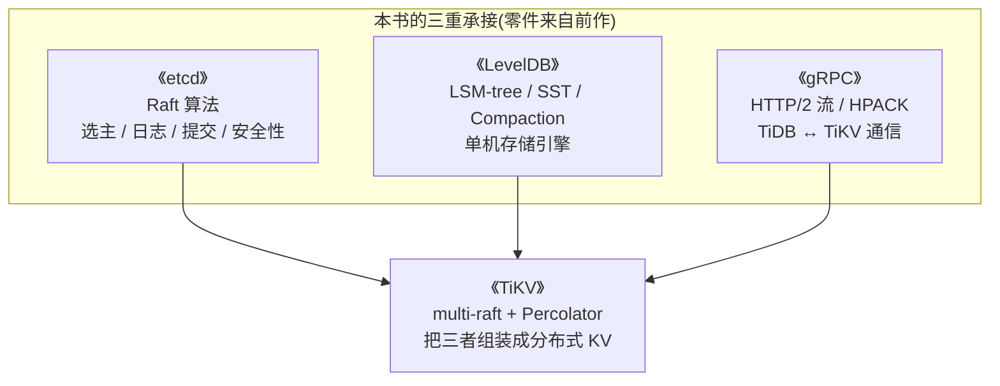
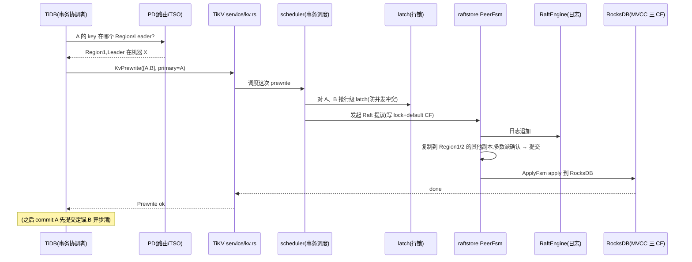

# 第 0 篇 · 第 1 章 · 第一性原理:为什么需要 TiKV

> **核心问题**:你已经读过《etcd》——它用一个 Raft 组把"全量 KV"复制到多副本,实现了高可用、不丢不乱。可一旦数据从几 GB 涨到几十 TB、写入从几千 QPS 涨到几百万 QPS,这一个 Raft 组就扛不住了。TiKV 做的事,是把这个"一个 Raft 组"放大成"百万个 Raft 组",还要在跨组的情况下拼出 ACID 事务。它凭什么?为什么要费这么大劲,而不是简单堆几台 MySQL?

> **读完本章你会明白**:
> 1. 单机数据库为什么必然扛不住——它撞上了"数据量"和"高可用"两道墙,而这两道墙不是堆硬件能解决的。
> 2. etcd 用"一个 Raft 组"漂亮地解决了高可用,但它的天花板就停在那——单组无法水平扩展,这是 etcd 的"宿命",不是缺陷。
> 3. TiKV 的第一个跃迁:**multi-raft**——把数据切成 Region、每个 Region 一个 Raft 组,为什么这个看似简单的切分,恰好是"线性扩展"的正确姿势。
> 4. multi-raft 带来的新难题:**跨 Region 的事务**怎么办?答案:**Percolator 两阶段提交**,靠一个 Primary Key 当锚。
> 5. 为什么 TiKV 用 Rust 写、为什么需要 PD 这个"中心化大脑"、为什么 Region 默认是 256MB(8.3.0 之前是 96MB)——这些选型背后的道理。
> 6. 本书为什么是"三重承接"——它站在你已经学过的《etcd》(Raft)、《LevelDB》(RocksDB)、《gRPC》(RPC)三本之上。

> **如果一读觉得太难**:先只记住三件事——① etcd 是"一个 Raft 组管全量",TiKV 是"百万个 Raft 组管分片";② 一个事务可能改多个 Region(多个 Raft 组),跨组 ACID 靠 Percolator(选一个 Primary Key 当锚);③ 全书一句话主线:**把一致性切成百万份(multi-raft),再把事务跨分片拼回来(Percolator)**。

---

## 〇、一句话点破

> **TiKV 把 etcd 的"一个 Raft 组管全量 KV"放大成了"百万个 Raft 组各管一片、再跨片用 Percolator 拼出 ACID 事务"——一致性从"一组"扩展到"一百万组",而事务还能 ACID。**

这是结论,不是理由。本章倒过来拆:先讲单机为什么必然扛不住,再讲 etcd 的答案和它的天花板,再讲 TiKV 怎么突破天花板(multi-raft),接着讲突破之后冒出来的新问题(跨组事务)和它的解法(Percolator),最后把全书地图、选型理由、架构演进一次铺开。

---

## 一、单机数据库的两道墙:为什么堆硬件救不了

假设你有一个最朴素的 KV 数据库——一台机器、一块磁盘、一个进程,`put(k, v)` 写、`get(k)` 读。只要数据量小、挂了能容忍,这就够用。但现实里它很快会撞上两道墙,而且这两道墙有个共同特征:**堆硬件救不了**。

### 第一道墙:数据量会涨,单机有物理上限

一个电商系统,订单表每天涨几千万行,一年就是上百亿行、几十 TB。你能买更大的磁盘吗?能。能买到"无限大"的磁盘吗?买不到。哪怕你买到了单机 100 TB 的磁盘,数据还会继续涨——**数据增长是无限的,单机是有限的,这个剪刀差迟早顶穿**。

更隐蔽的是:**数据量大了,单次操作也会变慢**。一棵 B+ 树索引,数据翻倍,树高涨一层,每次查询多一次磁盘寻道。所以单机数据库的数据量上限,不只是"装不装得下",还有"查得动查不动"。

### 第二道墙:单机会挂,而且会整个挂

比数据量更致命的是:**这台机器会挂**。磁盘坏道、主板烧毁、机房断电、网线被挖断、运维手滑 `rm -rf`——任何一种,你的数据就**整个不可用,甚至整个丢失**。

注意"整个"这两个字。单机的故障是**全有或全无**的:要么全好,要么全没。这对很多业务是不可接受的——支付系统挂一小时可能损失千万,订单库丢了可能让公司倒闭。

> **不这样会怎样**:一台单机数据库,就是系统里的**单点**(single point of failure)。单点的可怕之处在于:整个系统的可用性,等于这一台机器的可用性。机器的年故障率不算高(几个百分点),但"整个系统的命脉系于一台机器",这个设计本身就是脆弱的。

### 两道墙的交集:必须既能涨、又不能整个挂

于是分布式存储要同时解决两件事:**数据要能随机器增加而增长(可扩展)、且任何一台机器挂了数据不丢不可用(高可用)**。这两个需求叠加,催生了"多副本 + 分片"的范式。TiKV 是这个范式里一个相当精巧的实现。

> **钉死这件事**:理解 TiKV 的起点,不是"它有哪些组件",而是**它要同时打赢两场仗:数据量要能涨(水平扩展)、副本要够多(高可用)**。后面所有的设计——Raft、Region、multi-raft、Percolator、PD——都是这两场仗的产物。

---

## 二、etcd 的答案:一个 Raft 组,以及它的天花板

要解决高可用,最直接的办法是**复制**:把同一份数据写到多台机器上,一台挂了,别的还有。但复制立刻带来一个更要命的问题。

### 复制的根本难题:多副本怎么保证一致

假设你有 3 台机器存同一份数据。你 `put(k, 1)` 到副本 A,消息还没传到副本 B,A 就挂了。这时候:
- 读副本 B 的人拿到的是旧值(数据**不一致**);
- 更糟的是,有人同时在 B 上写了新值,两个副本就**分叉**了,再也合不拢。

这就是"复制一致性"问题。它不是性能问题,是**正确性问题**——数据分叉了,业务就错了。

### Raft:让多副本"多数派一致"的共识算法

这正是《etcd》那本书讲透的问题。它的答案是 **Raft 共识算法**(2014 年 Diego Ongaro 的博士论文,正是为了"可理解性"而设计——这点稍后讲)。Raft 的核心承诺一句话:

> **只要多数派副本活着,数据就不丢、不乱、一致;少数派挂了不影响正确性。**

它怎么做到的?用一个 Leader 集中处理所有写,把写变成**一条有序日志**,复制到 Follower,**多数派确认了才算提交**。Leader 挂了,剩下的副本选出新 Leader 继续。这套机制保证了:无论怎么挂(只要不超过少数派),所有副本最终看到的写顺序是一致的,数据不会丢也不会分叉。

```
   客户端                  etcd 集群(一个 Raft 组,3 副本)
                          ┌────────────────────────────────┐
   put(k,v) ────────────▶ │ Leader                          │
                          │  1. 把写追加进自己的日志         │
                          │  2. 复制日志给两个 Follower     │
                          │  3. 两个都确认(多数派)→ 提交  │
                          │  Leader   Follower   Follower   │
                          └────────────────────────────────┘
```

> **为什么是 Raft 而不是 Paxos**:在 Raft 之前,共识算法的事实标准是 Paxos(Lamport 1989),但 Paxos 出了名地难懂、难实现、难证明正确。Raft 的设计哲学是**"可理解性优先"**——为了让人能看懂、能正确实现,宁可牺牲一点点通用性,把问题切成 Leader 选举、日志复制、安全性三个清晰的子问题。TiKV 用的 Raft 算法和 etcd 同源(TiKV 用的是 `raft` crate,即 etcd 的 Raft 算法的 Rust 移植),**算法本体承接《etcd》那本,本书不重复讲**。

### etcd 漂亮地解决了高可用——然后停在了天花板

etcd 用**一个 Raft 组**管理**全量 KV**:所有 key-value,无论多少,都进**同一条 Raft 日志**,由**同一个 Leader** 接收所有写。Raft 保证多数派活着就不丢不乱。**这完美解决了高可用(第二道墙)**。

但作为"全量数据都一个组"的代价,它有三道天花板——而这正是 TiKV 要突破的:

**天花板一:一个 Leader 是吞吐瓶颈。** etcd 全量数据的所有写,都要经过**同一个 Leader** 这台机器。这台机器的 CPU、网络、磁盘 IO 是有限的。写入涨到一定程度,单 Leader 顶不住——**再多副本也帮不上忙**,因为副本只是冗余备份,不分担写压力。Raft 的多数派确认机制,反而让每次写都要等多数派往返,Leader 越忙、网络越拖。

**天花板二:全量数据进一条日志,无法切分。** etcd 全量数据(无论多大)排成**一条 Raft 日志**。这条日志越来越长,要追平一个新副本(给它补齐历史)就越慢——因为要回放整条历史。更关键的是,**一条日志无法水平切分**:你没法把 key 的前半段交给机器 A、后半段交给机器 B,因为它们在同一条日志里、同一个 Leader 管。

**天花板三:存储绑死单机容量。** 一个 Raft 组的副本,每个副本是单台机器上的一个存储。这个存储的大小受**单机磁盘上限**约束。数据涨到几十 TB,单个副本放不下。

> **钉死这件事**:etcd 的"一个 Raft 组"是个**单点扩展单位**——它的吞吐、存储、复制全卡在"一组"这个粒度。这不是 etcd 的缺陷,而是它的**定位**:etcd 是配置中心、协调服务,数据量天然就小(官方建议几 GB 以内),一个 Raft 组刚刚好。**但当数据量要涨到几十 TB、并发要到几百万 QPS 时,一个组的天花板就被顶穿了**。这就是 TiKV 要解决的——它面向的是 etcd 主动让出的那个"大数据量"战场。

---

## 三、TiKV 的第一个跃迁:multi-raft——把一个 Raft 放大成百万个

怎么突破"一个 Raft 组"的天花板?TiKV 的回答干脆利落:**那就用很多个 Raft 组**。但"用很多个"说起来容易,真正的难题是:**怎么切、怎么放、怎么跑**。

### 第一步:切 Region——把全量数据切成一段段

TiKV 先把全量数据,按 **key 的范围**切成一段段,每一段叫一个 **Region**:

```
   全量 key 空间(一条无限长的数轴,按 key 排序)
   ─────┬────────────┬────────────┬────────────┬────────────▶ key
      Region 1    Region 2     Region 3     Region 4
     [a, c5000)  [c5000, g)   [g, k200)    [k200, ...)
      ≈256MB       ≈256MB        ≈256MB        ≈256MB
```

每个 Region 是一段**连续的 key range**(比如 `[a, c5000)`),按 key 排序。关键参数是**每个 Region 默认约 256MB**——这个数字不是随便定的,稍后会专门讲为什么是它。

### 第二步:每个 Region 一个独立的 Raft 组

**这是整个设计最关键的一步**:每个 Region,是一个**独立**的 Raft 组。它有自己的 Leader、自己的日志、自己的副本(默认 3 副本),跟别的 Region 的 Raft 组**互不相干**。

```
   Region 1 ──→ 一个 Raft 组(3 副本,1 Leader + 2 Follower,日志独立)
   Region 2 ──→ 另一个 Raft 组(3 副本,日志独立)
   Region 3 ──→ 又一个 Raft 组……
   ……共几十万个 Region = 几十万个独立的 Raft 组
```

### 第三步:为什么这样就能线性扩展(三道天花板逐一打破)

回想 etcd 的三道天花板,现在逐一被打破:

- **吞吐天花板打破了**:不再有"一个 Leader 管所有写"。每个 Region 有自己的 Leader,而这些 Leader **分散在不同的机器上**。写 `key1`(在 Region1)走 Region1 的 Leader(在机器 A),写 `key2`(在 Region2)走 Region2 的 Leader(在机器 B)。**写入压力被天然分散到所有节点**。加一台机器,就能多承载一批 Region 的 Leader,吞吐就涨一截——**线性扩展**。
- **存储天花板打破了**:每个 Region 只有 256MB,一台机器上能放成千上万个 Region。数据涨了?**多加几台机器,把一部分 Region 挪过去**(PD 自动调度)。存储随节点数线性增长。
- **日志天花板打破了**:每个 Region 一条独立日志,日志短(就这 Region 的数据量),追平新副本快;而且日志随 Region 散布,不再是一条臃肿的全局长日志。

> **不这样会怎样**:如果还像 etcd 那样一个 Raft 组管全量,数据量 = 单机磁盘上限、写入 = 单 Leader 上限,撑不住几十 TB / 百万 QPS。multi-raft 的本质,是把"一致性"这个**昂贵资源**(Raft 的 Leader 选举、日志复制、多数派确认都有开销),**按 Region 切成了成千上万份**,让每一份都小巧、独立、可分散——于是整体能水平扩展。**这就是书名"把一个 Raft 放大成百万个"的字面含义**:不是把一个 Raft 组变大,而是把 Raft 组的数量从 1 变成百万。

### 256MB 是个精心调过的甜点(为什么不是 1MB,也不是 1GB)

Region 为什么是 256MB,不是 1MB 也不是 1GB?这是个典型的**工程权衡**:

- **太小(比如 1MB)**:一个集群里 Region 数量爆炸(几十 TB 数据 ÷ 1MB = 几千万个 Region),每个 Region 都是一个 Raft 组,光维护这几千万个 Raft 状态机、做 PD 的路由表、跨 Region 调度,开销就压垮系统。而且跨 key 的事务(碰巧跨 Region)概率飙升。
- **太大(比如 1GB)**:Region 太大,分裂和迁移都笨重——把一个 1GB 的 Region 挪到另一台机器,要传 1GB 数据,期间这个 Region 的服务受影响。而且热点 Region(被频繁访问的)无法精细地分散,一个 1GB 热点会持续压在一台机器上。
- **256MB**:大到摊薄每个 Raft 组的开销(几万个组而非几千万个),小到足够灵活(分裂/迁移/热点分散都快)。**这个甜点,是 TiDB 团队多年生产实践调出来的**(本书 P1-02 会拆透 Region 的粒度权衡)。

### 数据放哪、找谁要:PD 与 Region 路由

切了 Region 之后,立刻有个现实问题:**写一个 `key`,怎么知道它在哪个 Region、在哪个机器?** 一个 key 落在哪个 key range 里(哪个 Region)是确定的,但这个 Region 的 3 副本、特别是它的 Leader **现在在哪台机器**,是动态变的(机器会加、Region 会迁移、Leader 会切换)。

所以需要一张**全局的"Region → 机器"路由表**,以及一个维护这张表的权威。这就是 **PD(Placement Driver)**——TiKV 集群的"大脑":
- **PD 记录每个 Region 的副本分布、谁是 Leader**;
- 客户端(TiDB)要访问某个 key,先问 PD 这个 key 的 Region 在哪、Leader 是谁;
- 每个 Region 的心跳定期上报给 PD,PD 据此更新路由、并做调度(把热点 Region 挪走、把 Leader 打散均衡)。

> **为什么 PD 是中心化,而不是像 Gossip 那样去中心化**:中心化的 PD 有单点之忧,但换来了**全局视图**——它能精确地知道整个集群哪里负载高、哪里该分裂、副本该怎么放,做全局最优调度。Gossip(各节点互相传播)只能做局部决策,无法做全局均衡。TiKV 的取舍是:**PD 自己也用 Raft 做成高可用集群**(3 个 PD 节点,挂一个不影响),用"PD 集群高可用"换"全局调度能力"。这是个典型的 CAP 取舍(本书 P5-16 会拆 PD)。

### 百万个 Raft 组,怎么跑得动

切了 Region、有了 PD 路由,还剩最后一个硬骨头:**一个 TiKV 进程里,有几十万个 Region,也就是几十万个 Raft 组,怎么让它们同时跑?**

朴素做法是:每个 Raft 组开一个 OS 线程定时 tick 推进 Raft。可几十万个线程会**直接撑爆操作系统**——线程的栈内存、上下文切换开销,都是天文数字。

TiKV 的招牌解法,要到第 1 篇第 4 章(P1-04)才拆透,这里先剧透:**它把每个 Region 的一个副本抽象成一个 Peer,Peer 是一个 FSM(有限状态机);然后用一个叫 batch-system 的 actor 模型,让少量线程批量轮询这几十万个 Peer 的 FSM**——一个线程一次处理一批 Peer 的消息(谁有 Raft 消息就推进谁),而不是一个 Peer 占一个线程。这是 TiKV 最硬的工程技巧之一,也是"百万个 Raft 怎么共存"的答案。

```
   etcd:                          TiKV:
   一个 Raft组 ── 一个线程         百万个 Peer(FSM)── 少量线程批量轮询
   (一对一)                       (一对多,靠 batch-system)
```

> **钉死这句话**:multi-raft 解决了"不丢不乱 + 可扩展"。但它解决得很漂亮,代价是**引出了一个 etcd 从没遇到过的、更难的问题**——跨 Region 的事务。下一节拆。

---

## 四、multi-raft 的新难题:跨 Region 的事务怎么办

multi-raft 解决了"不丢不乱 + 可扩展"。但它立刻引出一个 etcd 不会遇到的、更难的问题:**跨 Region 的事务**。理解这个问题,是理解 TiKV 灵魂的关键。

### Raft 的承诺,只覆盖"一个 Region 内"

Raft 的承诺是:**一个 Raft 组内**的数据,不丢、不乱、一致。但请仔细品这句话——是**一个组内**。Region1 的 Raft 组,只保证 Region1 内部一致;Region2 的 Raft 组,只保证 Region2 内部一致。**它们彼此,根本不知道对方的存在**。

这没问题——直到你要做**跨 Region 的事务**。

### 事务常常跨 Region(而且这无法避免)

现实里,一个事务常常要改多个 key,而这些 key 落在**不同的 Region**。最典型的例子——转账:

> 账户 A 的 key 在 Region1(它落在 Region1 的 key range),账户 B 的 key 在 Region2。一次转账要 `A - 100` **且** `B + 100`。这是一个事务,**必须都成功或都失败**(ACID 的原子性):不能出现 A 减了 100 但 B 没加上、钱凭空消失的情况。
>
> 可 A 的写在 Region1 的 Raft 组、B 的写在 Region2 的 Raft 组——**两个独立的 Raft 组,谁也没法保证"两个一起提交"**。Region1 可能提交成功了(Leader 和多数派都同意),Region2 可能正好 Leader 换届、提交失败了。这时候事务就**半成功**了——这是 ACID 绝不允许的。

这正是 etcd 不会遇到的麻烦:**etcd 全量数据在一个 Raft 组里,一个事务的所有写天然进同一条日志、被 Raft 原子地提交**(一条日志的提交是原子的)。而 TiKV 把数据切开了,**切开之后,跨组的原子性就丢了**。

> **这是 multi-raft 的"原罪"**:你为了线性扩展,把数据切成了几十万个独立的 Raft 组;但事务又常常需要跨组。**扩展性和跨组原子性,在这里构成了一对张力**。TiKV 的第二个核心设计——Percolator——就是专门来填这个坑的。

### 答案:Percolator 两阶段提交,靠一个 Primary Key 当锚

怎么把"跨多个 Raft 组"的事务,重新拼成 ACID?TiKV 用了 Google 2010 年论文《Percolator》的方案——**两阶段提交,靠一个 Primary Key 当锚**。原理可以拆成三步讲清:

**第①步 prewrite(预写):给所有涉及的 key 加锁,选一个当 Primary。** 事务开始时,TiDB(协调者)让 TiKV 给这次事务涉及的所有 key(比如 A 和 B)都写上**数据**(写到 default CF),但**先不提交**,而是给它们打上**锁**(写到 lock CF)。其中,**挑一个 key 当 Primary**(锚点),其余是 Secondary。

**第②步 commit(提交):先提交 Primary。Primary 一旦提交,事务在全局意义上就成功了。** TiDB 让 TiKV 提交 Primary key——把它的提交记录写进 write CF、清掉它的锁。**这一刻,事务"成功"的判决就做出了**:Primary 提交成功 = 整个事务成功。

**第③步 Secondary 异步清理:不用等,慢慢来。** 其余的 Secondary key 不用立刻提交(避免拖慢事务),它们上面残留的锁,会被**异步清理**:谁(后续的读操作)碰到 Secondary 上的锁,就去查 Primary 的状态——Primary 已提交?那把 Secondary 也提交;Primary 已回滚?那把 Secondary 也回滚。

```
   转账事务(A 在 Region1, B 在 Region2),选 A 当 Primary

   ① prewrite:  Region1 给 A 加锁【Primary】 + 写数据
                 Region2 给 B 加锁【Secondary】+ 写数据
                 (两个 Raft 组各自加锁成功 → 预写阶段完成)

   ② commit:    Region1 提交 A (写 write CF, 清锁)  ← 这一刻事务"成功"了!

   ③ Secondary: Region2 的 B 不用等;谁读到 B 的锁,查 A(Primary)状态再收尾
                 (Primary 提交了 → 把 B 也提交;懒清理)
```

### 为什么一个 Primary Key 就能保证 ACID(这个设计最妙的地方)

很多人第一次看 Percolator 都会困惑:**凭什么选一个 key 当锚,就能保证跨组的事务 ACID?** 秘密在于——**Primary 是整个事务唯一的、全局可见的"裁决者"**。

事务到底成没成功,全看 Primary:**Primary 提交了 = 成功;Primary 没提交(回滚/还在锁着)= 没成功**。任何对 Secondary 的收尾,都以 Primary 的状态为准。于是:

- **原子性**:不会出现"A 提交了、B 没提交"——因为 A 是 Primary,A 提交意味着事务判定成功,B 迟早会被按"成功"收尾;A 没提交,B 就按"失败"回滚。**全局只有一个裁决者,不会自相矛盾**。
- **一致性 / 隔离性**:靠 MVCC——每个 key 带版本号(来自 TSO 的时间戳),读的时候只看"已提交且版本号 ≤ 自己 start_ts"的版本,自然读不到未提交的半成品(本书 P3-10、P4-15 拆透)。
- **持久性**:每个 key 的提交都经过各自 Region 的 Raft 多数派确认,落盘即不丢。

> **钉死这件事**:Percolator 的精髓,是用**一个 Primary Key,把分散在多个 Raft 组里的写,在逻辑上重新拧成一条事务**。它不需要一个"全局协调者"实时盯每个写(那会成瓶颈),而是把协调成本摊到"读 Secondary 时按需查 Primary"上——这是它能扛住海量并发的关键。这套机制配合 **MVCC**(多版本)+ **TSO**(全局时间戳排序),构成 TiKV 的完整事务层,第 4 篇(P4-12~15)会逐个拆到源码级。

---

## 五、三重承接:这本书站在三本书之上

读到这你可能发现了:TiKV 里**没有几个是"全新发明"的**——它的核心零件,你大多在前面的书里见过。**这正是本书的最大特色:它是个"集大成者"**。



- **Raft ←《etcd》**:TiKV 用的 Raft 算法,和 etcd 同源(`raft` crate 是 etcd Raft 的 Rust 移植)。Raft 怎么选主、日志怎么复制、怎么提交、安全性怎么保证——这些**本书不重复讲**,那是《etcd》的活。本书只讲:**怎么从一个 Raft 实例,扩展成百万个**(multi-raft),以及这带来的新问题(跨组事务)。
- **单机引擎 ←《LevelDB》**:Raft commit 的命令最终落盘,落在 **RocksDB** 里。RocksDB 是 LevelDB 的工业级后代——LSM-tree、SST、Compaction、Bloom filter,这些**本书不重复讲**,那是《LevelDB》的活。本书只讲:**TiKV 怎么用 RocksDB 的 Column Family(列族),组织 MVCC 的多版本数据**(default/write/lock 三个 CF 各存什么)。
- **RPC ←《gRPC》**:TiDB 和 TiKV 之间的通信(kvproto)、Coprocessor 计算下推,都跑在 **gRPC** 上。HTTP/2、HPACK、流——这些**本书不重复讲**,那是《gRPC》的活。本书只讲:**TiKV 在 gRPC 之上定义了哪些 RPC、怎么用**。

> **钉死这件事**:读这本书,等于把《etcd》《LevelDB》《gRPC》三本**复习并深化一遍**——因为 TiKV 把三者的核心零件,组装成了一个真实在生产里扛住几十 TB、百万 QPS 的分布式数据库。本书的篇幅,会全部留给 **TiKV 独有的部分**:multi-raft 怎么落地、Percolator 怎么跨组拼事务、scheduler/latch 怎么调度、RaftEngine 怎么存日志。

---

## 六、一条写请求的完整旅程(全书地图)

把前面讲的拼起来,一次 TiDB 发来的写(比如一次 `INSERT` 最终变成的 KV 写),在 TiKV 里的完整旅程是这样的。**这张图就是全书的地图**,每个箭头都是后面某一章的主角:



对应章节:
- **service/kv.rs** 收 RPC(`src/server/service/kv.rs`)→ 承接《gRPC》;
- **scheduler + latch** 调度事务、行锁(`src/storage/txn/{scheduler,latch}.rs`)→ P4-12;
- **PeerFsm** 发起 Raft 提议(`components/raftstore/src/store/fsm/peer.rs`)→ P2-05;
- **RaftEngine** 存日志(`components/raft_log_engine/`)→ P2-06;
- **ApplyFsm** apply 到 RocksDB(`components/raftstore/src/store/fsm/apply.rs`)→ P3-11;
- **MVCC 三 CF** 组织数据(`components/txn_types/`)→ P3-10;
- **Percolator** 的 prewrite/commit(`src/storage/txn/actions/`)→ P4-13/14。

> **钉死这件事**:读这本书,就是跟着这条旅程,一站一站走完。每到一个驿站,搞懂"它解决什么问题、用了什么技巧",合上书你就能在脑子里放映出这张图的全过程。

---

## 七、为什么是 Rust:一个工程选型的深度(顺带交代)

你可能在想:为什么 TiKV 用 Rust 写,而不是 C++(像 LevelDB/RocksDB)或 Go(像 etcd)?这其实是个值得讲的选型,因为它折射了 TiKV 的设计取舍。

- **不用 C++**:C++ 性能顶尖(RocksDB 就是 C++),但**内存安全靠人盯**——在几十万行、多线程、复杂生命周期的分布式系统里,一个 use-after-free、一个数据竞争,可能埋伏几个月才在凌晨爆掉一个节点。TiKV 要的是"既快又不容易写出致命 bug"。
- **不用 Go**:Go 写 etcd 这种协调服务很合适(GC 停顿在那种规模可控),但 TiKV 是**重度计算 + 高吞吐 + 低延迟**的存储引擎,Go 的 GC 停顿、运行时开销,在大数据量高并发下会成为痛点。
- **选 Rust**:Rust 给了"C++ 级的性能"+ "编译期保证的内存安全 + 无数据竞争"(所有权 / 借用 / 生命周期 / Send+Sync)。代价是**学习曲线陡、开发慢**,但对于一个要扛几十 TB、跑在核心交易链路上的数据库,**用开发成本换运行时正确性,这笔账划算**。

> 这也意味着:读 TiKV 源码,你会看到大量 Rust 的"硬核"技巧——生命周期约束、`Unsafe` 的谨慎使用、原子操作、trait 抽象、nightly 特性。本书在涉及处会拆"它怎么做到的、为什么 sound",这是 Rust 系统级代码的魅力所在(对标《Tokio》拆 unsafe/Pin/原子那套)。

---

## 八、一个绕不开的背景:TiKV 也在换骨架

最后,和《gRPC》一样,必须诚实交代一件事——它不影响你理解"为什么",但**严重影响你读源码**:

> **TiKV 处于多处架构演进中。**

1. **raftstore 经典(v1)vs raftstore-v2(新)**:`components/raftstore/` 是经典的"单线程 per-store 批量调度"实现(每个 store 的几十万个 Peer 在 Raft 线程里批量跑);`components/raftstore-v2/` 是新重写的**多线程 raftstore**(更细粒度并行)。**本书以经典 raftstore 为主线**(它仍是主流、更易讲清 multi-raft 原理),raftstore-v2 作为演进方向对照。
2. **RaftEngine 替代 RocksDB 存 Raft 日志**:老资料讲"Raft log 存在 RocksDB 的 raft CF",**新版用专用的 `components/raft_log_engine/` 独立存储**(顺序追加、高吞吐、回收快)。**以新版为准**。
3. **8.x/9.x 新特性**:`in_memory_engine`(热数据放内存,承接你做过的《内存分配器》那本的思想)、`resource_control`(资源管控)、`causal_ts`(因果时间戳)等。

> **本书的态度**:以新版源码结构为准,老博客大片过时,不能当唯一依据;经典架构作为"为什么后来要重构"的背景讲清。这场演进本身,就是理解 TiKV 设计哲学的教材——它回答了"当一套架构扛不住新需求时,该怎么换骨架"。

---

## 九、技巧精解:两个第一性洞察

本章是概念定调章。有两个最硬核的第一性洞察值得单独钉死。

### 洞察一:为什么 multi-raft 是"把 etcd 放大百万倍"的正确方式

如果只想"扩容",有个很朴素的想法:干脆**开多个 etcd 集群**,各管一部分数据。但这立刻坏掉两件事:① 没有全局一致视图(跨集群的事务谁来管?);② 每个集群各自一套 Raft + 运维,成本爆炸;③ 数据怎么从一个集群挪到另一个、热点怎么均衡,全没解决。

multi-raft 的精妙在于:**它不是开多个独立集群,而是在一个集群里跑百万个 Raft 组,共享同一批机器、同一套 PD 调度**。具体说:

- **Region 是天然的负载均衡单位**:256MB 的粒度,让 PD 能把热点 Region 挪到空闲机器、把大 Region 自动分裂、把 Leader 均匀打散——**调度粒度恰好是 Region**。
- **复制开销被摊薄**:每 Region 3 副本,但 Region 在节点上**打散混布**——机器 A 上既有 Region1 的 Leader、又有 Region2 的 Follower。**没有哪台机器是"专门当 Follower"的**,每台既当 Leader 又当 Follower,负载天然均衡。
- **百万个 Raft 组靠 batch-system 共存**:不是百万线程,而是少量线程批量轮询百万个 Peer FSM。

> **不这么设计会怎样**:Raft 组不按 Region 切(全量一个组)= etcd,天花板顶死;切得太细(每 key 一组)= Raft 状态机开销爆炸、跨组事务遍地。**256MB 的 Region 是个精心调过的甜点**——大到摊薄开销,小到足够灵活。这个甜点 + 共享基础设施 + batch-system,三者合力,才是"把 etcd 放大百万倍"的正确姿势。

### 洞察二:为什么 Percolator 选一个 Primary Key 就能跨组 ACID

很多人觉得"跨多个 Raft 组的事务"必须有一个全局锁或全局协调者。Percolator 的反直觉之处在于:**它不要全局协调者,只要一个 Primary Key**。为什么这就够了?

因为事务的成败,可以归约成一个**单一事实**:Primary 提交了没。这个事实,存在 Primary 所在的那个 Raft 组里(由那个 Raft 组保证可靠)。所有 Secondary 的命运,都以这个事实为准——**于是,一个分布式的"是否成功"问题,被归约成了一个单点的、Raft 保证的事实查询**。

> **不这么设计会怎样**:如果要一个全局协调者实时盯每个写,协调者就是瓶颈(单点);如果让所有副本两两协商,那是 2PC 的经典困境(协调者挂了就阻塞)。Percolator 用 Primary 锚点,巧妙地把"全局协调"摊薄成了"按需查询 Primary 状态"——**协调成本只在需要时才付**(读 Secondary 遇到锁才查),所以能扛住海量并发。这是分布式事务设计的神来之笔,第 4 篇会拆到源码级。

---

## 十、章末小结

### 回扣主线

本章是全书唯一的"纯概念章"。它立起了全书最重要的三个东西:

1. **主线**:**用百万个 Raft 组分片扛住海量数据,每个 Region 一个 Raft 组保证不丢不乱,再用 Percolator 跨 Region 拼出 ACID 事务。**
2. **二分法**:**复制层**(每 Region 怎么不丢不乱)vs **事务层**(跨 Region 怎么拼出 ACID)。
3. **三重承接**:Raft←《etcd》、RocksDB←《LevelDB》、RPC←《gRPC》——本书站在三本之上,篇幅全留给 TiKV 独有的。

后续 21 章,都是这三个东西的展开。

### 五个为什么

1. **为什么单机数据库扛不住?**——数据量涨过单机上限、单机是单点故障(高可用不行),而且堆硬件救不了这两道墙。
2. **为什么 etcd 的"一个 Raft 组"有天花板?**——单 Leader 是吞吐瓶颈、全量数据进一条日志无法切分、存储绑死单机容量;这是 etcd 的定位使然,不是缺陷。
3. **为什么 multi-raft 能线性扩展?**——每个 Region 一个独立 Raft 组,Leader/副本/日志都分散到多节点;256MB 的粒度是摊薄开销与调度灵活的甜点;百万组靠 batch-system + FSM 共存。
4. **为什么 multi-raft 之后,跨 Region 事务成了新难题?**——Raft 只保证单 Region 一致,跨多个 Raft 组的事务失去原子性;这是 multi-raft 的"原罪"。
5. **为什么 Percolator 选一个 Primary Key 就能 ACID?**——Primary 是事务成败的唯一裁决者(单点事实,Raft 保证可靠),所有副本据此收尾,把"全局协调"摊薄成"按需查询"。

### 想继续深入往哪钻

- 想理解 multi-raft 的工程全貌:读 TiKV 官方架构文档、本书第 1~2 篇。
- 想理解 Raft 算法本体:读《etcd》那本(承接)。
- 想理解 Percolator:读 Google 原始论文《Percolator》(2010),本书第 4 篇逐条拆。
- 想看源码地图:读本书《附录 A · 源码全景路线图》(全书成稿后)。
- 想动手感受:用 `tikv-ctl` 看一个集群的 Region 分布,或读 PD 的 region 视图。

### 引出下一章

我们搞清楚了"为什么需要 TiKV"和它的两大跃迁(multi-raft + Percolator)、三大承接。那么,数据到底怎么按 key 切成 Region、Region 怎么编号和路由、为什么是 256MB 这个甜点粒度?下一章 P1-02,我们从最基础的 **Region:把海量 key 切成一段段** 开始,拆这个分片粒度的根。

> **下一章**:[P1-02 · Region:把海量 key 切成一段段](P1-02-Region-把海量key切成一段段.md)
