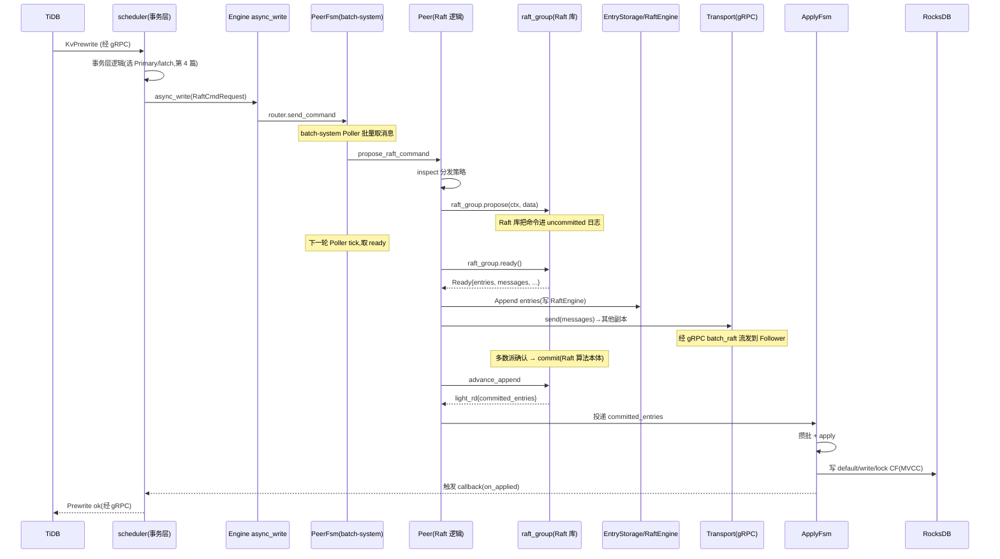

# 第 2 篇 · 第 5 章 · raftstore 全貌:一条写请求的旅程

> **核心问题**:第 1 篇我们立起了两根地基——Region(被复制的单位)和 batch-system + FSM(驱动百万 Peer 的引擎)。可地基只是骨架,真正的问题是:**一条写请求,到底是怎么从 `storage/txn`(事务层)流到 raftstore(复制层),被 Peer 接住,转成 Raft 提议,追加进 RaftEngine,经 Transport 复制到其他副本,被多数派 commit,最后由 ApplyFsm 落盘到 RocksDB 的?** 这条链路上每一站的"为什么这么设计"和"用什么技巧做到的",就是本章的全部。

> **读完本章你会明白**:
> 1. 一条写从 TiDB 到 TiKV 落盘,要经过 `Propose → Append → Replicate → Commit → Apply` 五步流水线,每一步为什么必须存在、跳过哪一步会出什么问题。
> 2. `storage/txn/scheduler` 怎么把一个写命令"投递"给 raftstore——它不直接调 `router.send`,而是绕一层 `engine.async_write`,为什么要有这层间接(答案在"事务层和复制层要解耦")。
> 3. Peer 怎么发起一个 Raft 提议:为什么是先 `inspect` 拿策略,再分发到 `propose_normal` / `propose_conf_change` / `propose_transfer_leader`?为什么 `propose` 失败要回 `err_resp`?
> 4. Raft 的 `ready`(就绪)是什么概念,为什么 TiKV 要把"取 ready、append 日志、发消息、advance"切成 `handle_raft_ready_append` 和 `handle_raft_ready_advance` 两个阶段(答案:把"持久化"和"推进状态机"解耦,async_io 才插得进来,P2-07 会接着讲)。
> 5. `Transport` trait 为什么这么薄(只有一个 `send`),Raft 消息怎么经 gRPC 的 `raft` / `batch_raft` 流式 RPC 发到其他副本。
> 6. Raft 算法的选主、日志复制、commit 判定**承接《etcd》那本**,本章只讲它在 TiKV 里的"落地外壳",不重讲算法本体。

> **如果一读觉得太难**:先只记住三件事——① 一条写要走五步 `Propose → Append → Replicate → Commit → Apply`,其中中间三步(Append/Replicate/Commit)是 Raft 算法本体,承接《etcd》,本章只讲"TiKV 怎么把它们串起来";② scheduler 不直接调 raftstore,中间隔一层 `engine.async_write`,这是事务层和复制层解耦的关键;③ 真正的"日志追加"和"发消息"在 `handle_raft_ready_append` 里一次性完成,这是 Raft `ready` 机制在 TiKV 的落点。

---

## 〇、一句话点破

> **一条写请求,在 TiKV 里被切成五步流水线:`Propose`(Peer 发起提议)→ `Append`(日志追加进 RaftEngine)→ `Replicate`(经 Transport 发 RaftMessage 给其他副本)→ `Commit`(多数派确认,这是 Raft 算法的活)→ `Apply`(ApplyFsm 把命令落盘到 RocksDB)。前三步在 `handle_raft_ready_append` 里被一次性取出,后两步在 commit 之后异步完成。整条链路用 batch-system 的 actor 模型驱动,百万个 Peer 共用少量线程。**

这是结论,不是理由。本章倒过来拆:先看写怎么从 scheduler 进 raftstore,再拆 Peer 怎么 propose,接着拆 ready 怎么把 Append/Replicate 打包,然后看 Transport 怎么把消息送出去,最后串起完整五步并落到 Apply。

---

## 一、写从哪来:scheduler 不直接 router.send,中间隔一层 engine

### 提问:事务层怎么把写交给复制层

一条写请求的源头是 TiDB 发来的 gRPC RPC(比如 `KvPrewrite`)。`service/kv.rs` 收到后交给 `storage/txn/scheduler` 调度。事务层的逻辑(选 Primary、写 lock、过 latch)是第 4 篇的活,本章只关心:**当 scheduler 把一个写命令(已经是 RaftCmdRequest 的形态)准备好之后,它怎么把这个命令交到 raftstore 手里**?

直觉上,既然 raftstore 是个 actor,直接 `router.send(cmd)` 不就行了?可源码里偏偏不是这样——scheduler 调的是 `engine.async_write`,后者内部才去 `router.send_command`。为什么要绕一层?

### 不这样会怎样:事务层和复制层就焊死了

> **不这样会怎样**:如果 scheduler 直接调 `router.send_command`,那"事务层"和"复制层"就被钉死在一起了——事务层必须知道 raftstore 的 router 类型、消息格式、callback 形态。可 TiKV 的引擎不止 raftstore 一种(还有 in_memory_engine、raftstore-v2 等实验路径),事务层不该绑死任何一种存储后端。更关键的是:**单机直写(不经 Raft 的本地读路径、批处理路径)也需要走"写命令"这条路**——如果 scheduler 直接调 raftstore,这些旁路就没法复用同一套写接口了。

所以 TiKV 在事务层和复制层之间,放了一层抽象:`Engine` trait(在 `engine_traits` 里定义)。scheduler 只对 `Engine` 说话:

> **所以这样设计**:scheduler 调 `engine.async_write`,把"写什么"和"写完回调"交给 Engine 接口,**具体是 raftstore 来接、还是别的引擎来接,scheduler 不关心**。这一层间接,让事务层和复制层解耦——raftstore 只是 Engine 的一个实现,事务层可以无缝替换。

### 源码佐证

`src/storage/txn/scheduler.rs` 里,scheduler 完成事务层逻辑后,真正发起写的地方:

```rust
// src/storage/txn/scheduler.rs:1846 (简化示意,非源码原文)
let async_write_start = Instant::now_coarse();
let mut res = unsafe {
    with_tls_engine(|e: &mut E| {
        e.async_write(&ctx, to_be_write, subscribed, Some(on_applied))
    })
};
```

`with_tls_engine` 是个 thread-local 引用,拿到当前线程绑定的 Engine 实例。注意这里 `unsafe`——线程局部存储的访问在 Rust 里需要 unsafe,因为编译器无法静态保证这个 TLS 没被别的线程改动(这是个典型的"运行时正确但编译期无法证明"的场景,TiKV 用 unsafe 换零拷贝地拿到引擎引用)。

`Engine::async_write` 的真正实现(对 raftstore 后端来说)在 `src/server/raftkv/mod.rs`。它做了三件事:① 把事务层的写请求组装成标准的 `RaftCmdRequest`;② 包一个 callback(apply 完后回调 scheduler);③ 调 raftstore 的 router 发出去:

```rust
// src/server/raftkv/mod.rs:578 (组装 RaftCmdRequest)
let mut cmd = RaftCmdRequest::default();
cmd.set_header(header);
cmd.set_requests(reqs.into());
// src/server/raftkv/mod.rs:633 (交给 raftstore router)
res = self
    .router
    .send_command(cmd, cb, extra_opts)
    .map_err(kv::Error::from);
```

到了 `router.send_command` 这一层,才真正进入了 raftstore 的领地:

```rust
// components/raftstore/src/router.rs:54 (RaftStoreRouter::send_command trait 方法)
fn send_command(
    &mut self,
    req: RaftCmdRequest,
    cb: Callback<EK::Snapshot>,
    extra_opts: RaftCmdExtraOpts,
) -> RaftStoreResult<()> {
    send_command_impl::<EK, _>(self, req, cb, extra_opts)
}
```

> **钉死这件事**:从 scheduler 到 raftstore,中间隔了两层间接——`Engine::async_write`(事务层和后端解耦)和 `RaftStoreRouter::send_command`(把 RaftCmdRequest 路由到对应的 PeerFsm)。这两层看似多余,实则让 TiKV 可以在不改事务层代码的前提下,替换存储后端(这是 raftstore-v2 / in_memory_engine 能落地的根)。**读到这你要记住**:写请求的"身份证"从这一刻起变成了 `RaftCmdRequest`,它会一路跑到 ApplyFsm。

### 一个细节:RaftCmdRequest 长什么样

`RaftCmdRequest` 是 TiKV 内部的标准写命令格式(类似 etcd 的 `RaftRequest`,但更丰富)。它来自外部的 `kvproto` 仓库(`raft_cmdpb.proto`),不在本仓库里——这是 TiKV 把对外协议用 protobuf 固定的做法,跨语言、跨版本兼容。它的关键字段:

- `header`:发命令的人的身份证(region_id、peer_id、replica_read 标志、term 等);
- `requests`:一个 `Vec<Request>`,每个 Request 是一个具体操作(Put / Delete / Get / Snap / AdminRequest);
- 可选 `admin_request`:管理命令(Split / Merge / ChangePeer / TransferLeader 等)。

之所以一条 RaftCmdRequest 能装多个 Request,是因为 TiKV 支持**批量写**——一次 propose 多个 key 的修改,共享一次 Raft 复制开销(Propose/Append/Replicate 三步开销摊薄)。这是 TiKV 吞吐的关键技巧之一,P3-11 会拆透。

---

## 二、Peer 怎么发起提议:inspect 分发 + propose_normal 调 raft_group

### 提问:PeerFsm 收到 RaftCmdRequest 后做什么

`router.send_command` 最终把命令投递到对应 Region 的 PeerFsm 的信箱里(这一步是 batch-system 的活,第 1 篇 P1-04 已拆透,本章只说一句:**batch-system 的 Poller 线程会批量取出各 PeerFsm 的消息,一次 `handle_msgs` 处理一批**)。我们要看的是,PeerFsm 从信箱里取出 `RaftCommand` 之后,干了什么。

### 源码:handle_msgs 分发,propose_raft_command 接管

PeerFsm 的消息总入口是 `PeerFsmDelegate::handle_msgs`:

```rust
// components/raftstore/src/store/fsm/peer.rs:685
pub fn handle_msgs(&mut self, msgs: &mut Vec<PeerMsg<EK>>) {
```

它对每条消息 match 分发。对 RaftCommand 这种:

```rust
// components/raftstore/src/store/fsm/peer.rs:749 (分支示意)
PeerMsg::RaftCommand(cmd) => {
    // deadline 检查、重复 key 检查 ...
    self.propose_raft_command(cmd.request, cmd.callback, cmd.disk_full_opt);
}
```

`propose_raft_command` 是个壳,真正干活的是 `propose_raft_command_internal`,它做完前置检查(比如这个 Region 是不是正在 merge、命令是不是合法)后,把命令交给 `Peer::propose`:

```rust
// components/raftstore/src/store/fsm/peer.rs:6190
self.fsm.peer.propose(self.ctx, cb, msg, resp, diskfullopt)
```

注意这条调用——`self.fsm.peer` 是 PeerFsm 里持有的 `Peer` 对象。**PeerFsm 是壳,Peer 是核**。PeerFsm 负责"消息队列 + 状态机调度"(batch-system 的活),Peer 负责"Raft 逻辑"(propose、step、handle_raft_ready)。这种壳核分离,在 P1-04 已讲过,这里再钉一次。

### Peer::propose:先 inspect 分发,再调具体 propose

`Peer::propose` 是真正的提议入口。它第一件事不是直接 propose,而是 **inspect(审查)这条命令**:

```rust
// components/raftstore/src/store/peer.rs:3957
pub fn propose<T: Transport>(
    &mut self,
    ctx: &mut PollContext<EK, ER, T>,
    mut cb: Callback<EK::Snapshot>,
    req: RaftCmdRequest,
    mut err_resp: RaftCmdResponse,
    mut disk_full_opt: DiskFullOpt,
) -> bool {
    // ...
    let policy = self.inspect(&req);  // peer.rs:3978
    match policy {
        RequestPolicy::ProposeNormal => self.propose_normal(ctx, req),       // 3996
        RequestPolicy::ProposeConfChange => self.propose_conf_change(ctx, req), // 3998
        // ...
    }
}
```

为什么要先 inspect?因为不同命令的"提议姿势"不一样:

- **普通写(Put/Delete/Get)**:走 `propose_normal`,直接 `raft_group.propose`。
- **配置变更(AddNode/RemoveNode)**:走 `propose_conf_change`,Raft 对 ConfChange 有特殊处理(变更期间要检查成员变更安全性),不能和普通写混。
- **TransferLeader**:走 `propose_transfer_leader`,这是 leader 切换,Raft 里有专门的 `MsgTransferLeader` 消息类型,不走 propose 日志路径。
- **读(ReadIndex/Lease Read)**:根本不进 Raft 日志,走读路径(本章不讲,第 4 篇拆)。

> **不这样会怎样**:如果所有命令都走同一条 propose 路径,ConfChange 的安全性检查就会和普通写搅在一起,Raft 的成员变更约束(一次只能改一个节点、ConfChange 期间不能再 ConfChange)就很难正确实现。**inspect 分发,本质是把 Raft 算法对不同命令类型的不同约束,在工程上显式表达出来**。

### propose_normal:真正调 raft_group.propose

```rust
// components/raftstore/src/store/peer.rs:4696
fn propose_normal<T: Transport>(
    &mut self,
    poll_ctx: &mut PollContext<EK, ER, T>,
    mut req: RaftCmdRequest,
) -> Result<Either<u64, u64>> {
    // ...
    self.pre_propose(poll_ctx, &mut req)?;   // 4746
    // ...
    let data = req.write_to_bytes()?;         // 4764
    // ...
    let propose_index = self.next_proposal_index();
    self.raft_group.propose(ctx.to_vec(), data)?;  // 4785
    // ...
}
```

第 4785 行是整章最关键的一行——`self.raft_group.propose(ctx.to_vec(), data)?`。这一行,**把一个 TiKV 内部的 RaftCmdRequest,正式交给了 Raft 算法库**(即 `raft` crate,etcd Raft 的 Rust 移植)。从这一行往下,就是 Raft 算法的活了——它会把这条命令追加进自己的日志(RaftLog)、标记为 uncommitted、等下次 ready 时让上层持久化和复制。

> **钉死这件事(承接《etcd》)**:`raft_group.propose` 之后的逻辑——日志怎么追加、怎么复制给 Follower、怎么判定 commit、怎么保证安全性——**全部是 Raft 算法本体**。这些在《etcd》那本书拆到源码级了,本书**不重复讲**。本章只关心"TiKV 怎么把 propose 的结果(ready)取出来,在工程上落地"。如果对 Raft 算法本体生疏,请回《etcd》复习 propose / append / replicate / commit 四步。

`raft_group` 这个字段的类型是 `RawNode<PeerStorage<EK, ER>>`(定义在 `peer.rs:728`):

```rust
// components/raftstore/src/store/peer.rs:728
pub raft_group: RawNode<PeerStorage<EK, ER>>,
```

`RawNode` 是 `raft` crate 暴露给上层用的接口(对应 etcd-raft 里的 `node`)。它需要一个 `Storage` trait 的实现——TiKV 提供的是 `PeerStorage`,它把 Raft 日志的读写委托给 `EntryStorage`,`EntryStorage` 再委托给底层的 RaftEngine 或 RocksDB。这条存储链路,正是下一章 P2-06 的核心,本章先点出"存在这层",不展开。

### 为什么 propose 失败要回 err_resp

注意 `propose` 函数签名里有个 `err_resp: RaftCmdResponse` 参数。propose 可能失败(比如这个 Peer 不是 leader、Region 正在被销毁、磁盘满了)。失败了,客户端的 callback 必须被回调(不然客户端永远 hang),而且要回一个明确的错误响应。`err_resp` 就是预构造的错误响应模板,失败时填上错误信息就发回去。

> **不这样会怎样**:如果 propose 失败不回 callback,客户端的那次 RPC 就永远收不到响应,只能靠超时——但超时分不清"是真失败了还是只是慢",重试逻辑会很笨。**显式回 err_resp,让客户端立刻知道这次提议没成(是该重试还是该找新 leader),是分布式系统里 callback 必须有终态的铁律**。

---

## 三、ready:Raft 库和 TiKV 的握手协议

### 提问:propose 之后,日志什么时候真正落盘、什么时候复制出去

`raft_group.propose` 只是"提议",Raft 库内部把这条命令放进了自己的 uncommitted 日志。可**落盘和复制是 IO,不能在 propose 里同步做**(那会阻塞 Poller 线程)。Raft 库需要一个机制,告诉上层:"我这边攒了一些活,你该来取了"。

这个机制就是 **ready**。

### ready 是什么:Raft 库告诉上层"这些该你干了"

Raft 库(无论是 etcd 的 `node.Ready()` 还是 raft-rs 的 `RawNode::ready()`)的设计哲学是:**算法库不直接做 IO,它只产出"该干什么"的清单(Ready 结构),上层负责把清单里的活干完**(持久化日志、发消息、apply 已提交的命令),再告诉库"我干完了"(advance)。

一个 `Ready` 大概包含:

- `entries`:要持久化的新日志条目(刚 propose 的、还没落盘的);
- `messages`:要发出去的 Raft 消息(给 Follower 的 AppendEntries、给 Candidate 的 RequestVote 等);
- `committed_entries`:已经 commit、可以 apply 的条目;
- `snapshot`:如果有 snapshot 要传;
- `hard_state`:term/vote/commit 等硬状态变化。

这个设计的好处是:**IO 完全掌握在上层手里**——上层可以批量(攒多个 ready 一起写)、可以异步(把 IO 扔到别的线程)、可以按需调度(哪些 Peer 的 ready 先处理)。Raft 库只管"算法推进",不管"IO 怎么做"。

> **不这样会怎样**:如果 Raft 库自己做 IO,它就得内置一个 IO 调度器——可 IO 调度是上层(操作系统、文件系统、TiKV 的 async_io worker)的事,Raft 库没法做到最优。把 IO 推给上层、自己只产 Ready,是**算法和工程的清晰边界**。TiKV 能搞 async_io(P2-07 拆透),根因就是 ready 这个抽象——把"取 ready"和"干 ready 里的活(写盘/发消息)"解耦,后者可以异步。

### TiKV 怎么取 ready:handle_raft_ready_append

Peer 侧取 ready 的入口是 `handle_raft_ready_append`:

```rust
// components/raftstore/src/store/peer.rs:2876
pub fn handle_raft_ready_append<T: Transport>(
    &mut self,
    ctx: &mut PollContext<EK, ER, T>,
) -> Option<ReadyResult> {
```

它先问 raft_group 有没有活要干:

```rust
// components/raftstore/src/store/peer.rs:2935
if !self.raft_group.has_ready() { ... return None; }
// peer.rs:2963
let mut ready = self.raft_group.ready();
```

拿到 ready 后,在这个函数里完成 **Append + Replicate** 两步(注意是合在一起做,不是分开):

```rust
// Append:把 entries 追加进 RaftEngine(经 PeerStorage 委托 EntryStorage)
// components/raftstore/src/store/peer_storage.rs:1041
if !ready.entries().is_empty() {
    self.append(ready.take_entries(), &mut write_task);
}

// Replicate:把 messages 发出去(peer.rs:2999)
if !ready.messages().is_empty() {
    assert!(self.is_leader());
    let raft_msgs = self.build_raft_messages(ctx, ready.take_messages());
    self.send_raft_messages(ctx, raft_msgs);
}
```

注意那个 `assert!(self.is_leader())`——**只有 leader 才会在 ready 里产出 messages**(Follower 不主动发 AppendEntries)。这是个不变式(invariant):Raft 算法保证只有 leader 推进复制,Follower 只回应。如果 Follower 的 ready 里冒出 messages,那是 bug,assert 会炸出来。

### 为什么 Append 和 Replicate 在一个函数里做

> **不这样会怎样**:如果把 Append(写日志)和 Replicate(发消息)拆成两次 ready 取出,中间就可能穿插别的操作——比如 Append 完了还没 Replicate,Peer 状态变了(leader 换届),那这条 Replicate 就该作废。**在一个原子步骤里同时取 entries 和 messages,保证"持久化的日志条目"和"发出去的复制消息"是同一批**,这是 Raft 正确性的工程保障。

更深一层:Raft 的安全性要求"日志先持久化,再复制"(否则 leader 挂了,Follower 收到了没持久化的日志会乱)。所以严格说,应该 Append 完成后再 Replicate。但 raft-rs 的 ready 把两者一起交出来——上层可以选择"Append 完再发 messages"(同步阻塞),也可以选择"Append 扔到异步队列、立刻发 messages"(异步,但要承担"messages 引用的日志可能还没落盘"的风险)。

TiKV 的做法(P2-07 会拆透):**在 sync 模式下,先 append 完再发 messages;在 async_io 模式下,append 扔给 write worker,主线程继续发 messages(下一轮 ready 时再确认 append 成功)**。这是性能和正确性的精妙权衡,P2-07 详拆。

### ready 的第二个阶段:handle_raft_ready_advance

注意函数名是 `handle_raft_ready_append`,带个 `_append` 后缀。这是说:**ready 的处理分两个阶段**。第一个阶段是 append + replicate(刚讲的),第二个阶段是 advance(推进 Raft 状态机、apply 已提交的命令):

```rust
// components/raftstore/src/store/peer.rs:3493
pub fn handle_raft_ready_advance<T: Transport>(
    &mut self,
    ctx: &mut PollContext<EK, ER, T>,
    ready: Ready,
) -> bool {
    // ...
    // peer.rs:3509
    self.raft_group.on_persist_ready(self.persisted_number);
    // peer.rs:3515
    let mut light_rd = self.raft_group.advance_append(ready);
    // ...
    // 从 light_rd 里取 committed_entries,交给 apply
    // peer.rs:3007 (在 handle_raft_ready_append 里其实已经把 committed_entries 取走了)
}
```

`advance_append` 是告诉 Raft 库:"上一个 ready 我处理完了,你推进状态机,给我下一个轻量 ready(light_rd)"。light_rd 里主要是 `committed_entries`(已提交、可以 apply 的)和可能更新的 commit_index。

> **钉死这件事**:TiKV 把 ready 处理切成 `handle_raft_ready_append`(持久化 + 复制)和 `handle_raft_ready_advance`(推进状态机 + 取已提交)两个阶段,**不是冗余,是给 async_io 留插口**。在 sync 模式下,这两个阶段紧挨着;在 async_io 模式下,中间可以插入"等 write worker 把日志写完"的间隙——主线程不必阻塞等 IO,P2-07 详拆。

### 已提交怎么 apply:committed_entries 交给 ApplyFsm

ready 里除了 entries(要持久化)和 messages(要复制),还有 `committed_entries`(已提交、可以 apply)。这些 committed_entries 不会被 Peer 自己 apply,而是被**转发给 ApplyFsm**:

```rust
// components/raftstore/src/store/peer.rs:3007 (在 handle_raft_ready_append 里)
self.handle_raft_committed_entries(ctx, ready.take_committed_entries());
```

`handle_raft_committed_entries` 会把这些条目投递到 ApplyFsm 的信箱。ApplyFsm 是另一种 FSM(P1-04 拆过),专门负责"把已 commit 的 Raft 命令落盘到 RocksDB"。这一步(Apply)是五步流水线的最后一步,我们稍后在第五节单独看。

---

## 四、Replicate:Transport 怎么把消息送到其他副本

### 提问:ready 里的 messages 怎么变成网络包发出去

`send_raft_messages` 拿到 ready 里的 messages 之后,要把它们发到其他副本(同 Region 的 Follower、其他 Peer)。这一步经 `Transport` trait。

### Transport trait:故意做得这么薄

```rust
// components/raftstore/src/store/transport.rs:18
pub trait Transport: Send + Clone {
    fn send(&mut self, msg: RaftMessage) -> Result<()>;
}
```

就一个方法,`send` 一条 `RaftMessage`。这个 trait 故意做得这么薄——**它只抽象"发一条 Raft 消息"这一件事**,不关心底层是 gRPC、是本地 loopback、还是测试 mock。

> **不这样会怎样**:如果 Transport trait 把"序列化、建连接、流控、重试"全塞进来,它就变成了一个传输层的迷你实现,和 gRPC 的能力重复,而且每加一种传输(比如未来换 quic)都要改 trait。**薄 trait 的好处**:上层(Peer)只依赖"能发消息"这个抽象,下层实现可以随便换——测试时换 mock、生产时换 gRPC、未来换别的协议,都不动 raftstore 一行代码。

### RaftMessage 是什么:kvproto 的标准格式

`RaftMessage` 来自 kvproto 的 `raft_serverpb.proto`(不在本仓库,是 git 依赖)。它包装了 Raft 算法层的 `eraftpb::Message`(真正的 Raft 协议消息,比如 MsgAppend / MsgAppendResponse / MsgRequestVote / MsgHeartbeat),外加路由信息(from_peer / to_peer / region_id / start_key / end_key)。

为什么要包一层?因为 Raft 算法库(raft-rs)产出的 `eraftpb::Message` **不带路由信息**——它只知道"消息内容",不知道"这条消息发给哪个 Peer、属于哪个 Region"。RaftMessage 这层包装,补上了网络路由必需的元数据。这是"算法库"和"分布式系统"的边界——算法库只管协议内容,分布式系统补上路由。

### send_raft_messages:批量化发出去

```rust
// components/raftstore/src/store/peer.rs:1888
pub fn send_raft_messages<T: Transport>(
    &mut self,
    ctx: &mut PollContext<EK, ER, T>,
    msgs: Vec<RaftMessage>,
) {
```

注意参数是个 `Vec<RaftMessage>`——**一次发一批**。这是性能优化:一个 ready 里可能有多条消息(给多个 Follower 的 AppendEntries),一条条发网络开销大,批量发能复用连接、减少 syscall。第 1948 行真正调用 transport:

```rust
// components/raftstore/src/store/peer.rs:1948
if let Err(e) = ctx.trans.send(msg) {
    // ... 错误处理:记录失败的 to_peer,后续重试或断连
}
```

注意 send 失败不会让整个 propose 失败——**Raft 是最终一致**,这次没发出去,下次心跳/重传会补上。失败处理只是"标记这个 Peer 暂时联系不上",Raft 库会按选举超时判定它挂了。这是个重要的工程取舍:**网络瞬时故障不致命,Raft 的重试机制会收敛**。

### 走 gRPC:raft / batch_raft 两条流

Transport 的生产实现(ServerTransport)最终把 RaftMessage 经 gRPC 发出去。对应的 RPC 在 `src/server/service/kv.rs`:

```rust
// src/server/service/kv.rs:784 (单条 RaftMessage 的流)
fn raft(
    &mut self,
    ctx: RpcContext<'_>,
    stream: RequestStream<RaftMessage>,
    sink: ClientStreamingSink<Done>,
) {
```

这是个**客户端流式 RPC**——一个 TiKV 和另一个 TiKV 之间建一条长连接,持续往上塞 RaftMessage,服务端一条条收。除了 `raft`(单条流),还有个 `batch_raft`(`kv.rs:840`),一次收一个 `BatchRaftMessage`(多条打包),减少 gRPC 帧开销。生产环境主要走 `batch_raft`。

> **承接《gRPC》**:gRPC 的 HTTP/2 流、HPACK 头压缩、流控这些**承接《gRPC》那本**,本书不重复讲。这里只点出"Raft 消息走的是 gRPC 的双向流式 RPC,TiKV 选 batch_raft 以摊薄每条消息的协议开销"——这是 TiKV 在 gRPC 之上的工程选择,不是 gRPC 本身的特性。

### 一个细节:Raft 消息收下来怎么进 raftstore

收消息这一侧(`kv.rs:221` `handle_raft_message`),把 gRPC 收到的 RaftMessage 经 router 投递到目标 PeerFsm 的信箱(作为 `PeerMsg::RaftMessage`),再由 `on_raft_message`(`fsm/peer.rs:2826`)取出,调 `Peer::step`(`peer.rs:1991`):

```rust
// components/raftstore/src/store/peer.rs:2060
self.raft_group.step(m)?;
```

这一行,把网络收到的 Raft 消息交给 Raft 算法库处理(比如 Follower 收到 AppendEntries,要回 Response、要 append entries、可能要更新 commit_index)。**step 是 propose 的对偶**——propose 是"提议一条新日志",step 是"处理收到的 Raft 消息"。两者都是"和 Raft 库交互"的入口,都改 Raft 库的内部状态,产出新的 ready 让上层处理。

---

## 五、Apply:committed_entries 怎么落盘到 RocksDB

### 提问:commit 之后,谁来把命令真正写进 RocksDB

到此,Append(日志持久化)和 Replicate(复制到 Follower)都做完了。Raft 库会在收到多数派 Follower 的确认后,判定这条日志 committed(这是 Raft 算法本体,《etcd》拆过)。commit 之后,这条命令就可以 apply 了——**apply 的意思是"把命令里指定的写操作(Put/Delete),真正写进 RocksDB"**。

这一步不是 Peer 自己做的,而是转发给 **ApplyFsm**。为什么?

### 不这样会怎样:为什么 Apply 要单独一个 FSM

> **不这样会怎样**:如果 Apply 在 PeerFsm 里直接做,会发生两件事——① Apply 要写 RocksDB,这是个慢操作(memtable 写入、WAL flush),会阻塞 PeerFsm 的 Poller 线程,导致这个 Poller 上的其他几十个 Peer 都被拖慢;② Apply 可以批量(攒多个已 commit 的命令一起写 RocksDB,提高吞吐),但如果和 PeerFsm 混在一起,批量化逻辑会很乱。

所以 TiKV 把 Apply 单独拆出来,做成 `ApplyFsm`(在 `components/raftstore/src/store/fsm/apply.rs`)。ApplyFsm 和 PeerFsm 是两种 FSM,各跑各的(Poller 线程池分开设),通过消息通信。这样:

- **PeerFsm 只管 Raft 推进**(propose、step、ready),快,不阻塞;
- **ApplyFsm 只管"把已 commit 的命令攒批写 RocksDB"**,慢操作隔离在 Apply 线程,不影响 Raft;
- **批量化天然**:ApplyFsm 可以攒一批 committed_entries 一起 apply(P3-11 拆透的 cmd batch)。

### committed_entries 怎么从 PeerFsm 流到 ApplyFsm

在第三节末尾已经看到:

```rust
// components/raftstore/src/store/peer.rs:3007
self.handle_raft_committed_entries(ctx, ready.take_committed_entries());
```

`handle_raft_committed_entries` 把这些条目,经 router 投递到这个 Region 对应的 ApplyFsm 信箱。ApplyFsm 在自己的 Poller 线程里,从信箱取出这批条目,逐条 apply:

- `apply.rs:4785` `handle_normal` 是 ApplyFsm 处理普通命令的总入口;
- `apply.rs:4100` `handle_apply` 真正执行;
- `apply.rs:1458` `process_raft_cmd` 处理单条命令;
- `apply.rs:1476` `apply_raft_cmd` 把命令解码、写 RocksDB。

(具体怎么写、怎么攒批、怎么处理 callback,第 P3-11 章拆透,本章只点到"Apply 是五步流水线的最后一步,在 ApplyFsm 里异步完成"。)

### Apply 完了怎么通知客户端

Apply 完成后,ApplyFsm 会触发当初那条 RaftCmdRequest 的 callback——这个 callback 是 scheduler 在发起写时挂上去的(`scheduler.rs` 里那个 `on_applied`)。callback 触发,scheduler 知道"这次写真的落盘了",再回 gRPC 响应给 TiDB。

注意这个链路:**客户端的 callback 经历了 scheduler → raftkv.async_write → router.send_command → PeerFsm(挂在 propose 的 context 里)→ ApplyFsm(apply 完触发)→ 回 scheduler → 回 gRPC**。callback 是一条贯穿五步的"回信地址",它让异步链路的最终结果能精确地回到发起者。这是异步系统的标准技巧(P3-11 详拆 callback 的生命周期)。

---

## 六、五步流水线:一张完整的旅程图

把前面五节拼起来,一条写请求在 TiKV 里的完整旅程:



### 五步一一对应源码

| 步骤 | 干什么 | 源码位置 |
|------|--------|----------|
| **Propose** | Peer 调 raft_group.propose,把命令进 Raft 日志 | [`peer.rs:4785` propose_normal 调 raft_group.propose](../tikv/components/raftstore/src/store/peer.rs#L4785) |
| **Append** | ready 里的 entries 经 EntryStorage 写 RaftEngine | [`peer_storage.rs:1041` append](../tikv/components/raftstore/src/store/peer_storage.rs#L1041) → [`entry_storage.rs:1225` EntryStorage::append](../tikv/components/raftstore/src/store/entry_storage.rs#L1225) |
| **Replicate** | ready 里的 messages 经 Transport 发到其他副本 | [`peer.rs:2999` 取 messages](../tikv/components/raftstore/src/store/peer.rs#L2999) → [`peer.rs:1888` send_raft_messages](../tikv/components/raftstore/src/store/peer.rs#L1888) → [`transport.rs:18` Transport::send](../tikv/components/raftstore/src/store/transport.rs#L18) |
| **Commit** | 多数派确认,Raft 库判定 committed | Raft 算法本体(承接《etcd》),TiKV 在 [`peer.rs:3514` 读 raft_group.raft.raft_log.committed](../tikv/components/raftstore/src/store/peer.rs#L3514) |
| **Apply** | committed_entries 经 ApplyFsm 写 RocksDB | [`peer.rs:3007` handle_raft_committed_entries](../tikv/components/raftstore/src/store/peer.rs#L3007) → [`apply.rs:4100` handle_apply](../tikv/components/raftstore/src/store/fsm/apply.rs#L4100) |

> **钉死这张表**:这是本章的全貌。后面任何一节细看,都回到这张表定位"我在五步里的哪一步"。

---

## 七、技巧精解:两个最硬核的工程技巧

本章有两个技巧值得单独拆透:① ready 机制为什么把 IO 推给上层;② inspect 分发为什么是 Raft 安全性的工程保障。

### 技巧一:ready 把 IO 推给上层——算法库和工程的清晰边界

**问题**:Raft 算法库要持久化日志、要发网络消息,为什么它不自己做,而要搞个 Ready 结构交给上层?

**朴素做法**:Raft 库自己持有个文件句柄,propose 的时候自己写日志;自己持有个网络 client,自己发消息。简单直接。

**撞墙在哪**:

1. **批量没了**:Raft 库自己写,它不知道上层想怎么攒批。TiKV 要把多个 Peer 的日志攒一起写(提高 RocksDB/RaftEngine 吞吐),可 Raft 库只看得见自己这一个 Raft 组,没法跨组攒。
2. **异步没了**:Raft 库自己写,写 IO 阻塞在它自己的线程里。可 TiKV 要把 IO 扔到 write worker 异步做(async_io),主线程不阻塞——这要求"取任务"和"做任务"解耦,而 Raft 库自己做就把它们焊死了。
3. **调度没了**:百万个 Peer,谁的 ready 先处理?Raft 库看不见全局,只有上层(batch-system)能做调度。
4. **测试没法 mock**:Raft 库自己做 IO,测试时想替换成内存文件系统、mock 网络,得改 Raft 库本身——可 Raft 库是算法,不该耦合 IO 细节。

**ready 的巧妙**:`raft_group.ready()` 返回一个 Ready 结构,里面是"该干什么"的清单(entries 要持久化、messages 要发、committed_entries 要 apply)。上层把这些活**按自己的节奏干**(批量、异步、调度),干完调 `advance` 告诉库"我干完了,你推进"。

```rust
// 简化示意,展示 ready 的核心交互(非源码原文)
let mut ready = self.raft_group.ready();          // 取清单
self.append_to_engine(ready.entries());            // 上层决定怎么批量写
self.send_messages(ready.messages());              // 上层决定怎么发
self.apply_committed(ready.committed_entries());   // 上层决定怎么 apply
self.raft_group.advance_append(ready);             // 告诉库:干完了,推进
let light_rd = self.raft_group.light_ready();      // 库给下一轮轻量清单
```

**为什么 sound(正确性)**:Raft 算法的安全性只要求"日志按顺序持久化、按顺序复制、按顺序 apply",不要求"这三件事在同一个线程、同一时刻做"。ready 把"顺序"用 Ready 的结构保证(同一批 entries/messages/committed_entries 是原子的),把"何时何地做"交给上层——**算法约束不松,工程自由度拉满**。

> **不这么设计会怎样**:Raft 库自己做 IO,就成了"算法 + IO 调度 + 网络栈"三合一的怪物,每换一种部署形态(单机/分布式/嵌入式)都要改库。ready 这层抽象,让 raft-rs 能被 TiKV(分布式)、etcd(分布式,Go 版)、甚至嵌入式测试都用同一套算法,各自接自己的 IO。**这是算法库设计的教科书级抽象**。

### 技巧二:inspect 分发——Raft 安全约束的工程表达

**问题**:`Peer::propose` 第一件事是 `inspect` 拿策略,再分发到 propose_normal / propose_conf_change / propose_transfer_leader。为什么不统一走一条 propose 路径?

**朴素做法**:所有命令都走 `raft_group.propose(ctx, data)`,让 Raft 库自己分辨这是什么命令、该怎么处理。

**撞墙在哪**:

1. **ConfChange 不能和普通写混**:Raft 的成员变更(AddNode/RemoveNode)有严格的安全约束——一次只能改一个节点(联合共识,Joint Consensus 的简化)、ConfChange 期间不能再发起 ConfChange、变更期间要重新计算多数派。这些约束如果塞进 `raft_group.propose` 里,Raft 库的 propose 路径就臃肿不堪,而且每种命令类型的安全检查互相干扰。
2. **TransferLeader 不走日志**:leader 切换是"发个 MsgTransferLeader 消息",不是"提议一条日志条目"。如果硬塞进 propose 日志路径,语义就错了(TransferLeader 不该被持久化成日志条目)。
3. **读根本不进日志**:ReadIndex / Lease Read 是为了"读不复制日志,提高读吞吐"。如果读也走 propose,读就被迫复制日志,ReadIndex 这个优化就没了。

**inspect 的巧妙**:`inspect` 在提议前先判定"这条命令属于哪种类型",每种类型走专门的 propose 函数。这让 Raft 对不同命令的安全约束,在工程上显式表达:

```rust
// 简化示意(非源码原文)
let policy = self.inspect(&req);        // 判定策略
match policy {
    RequestPolicy::ProposeNormal      => self.propose_normal(ctx, req),        // 普通 Put/Delete/Get
    RequestPolicy::ProposeConfChange  => self.propose_conf_change(ctx, req),   // 成员变更
    RequestPolicy::ProposeTransferLeader => self.propose_transfer_leader(ctx, req), // 切主
    RequestPolicy::ProposeReadIndex   => { /* 读路径,不 propose */ }
}
```

**为什么 sound**:每种 propose 函数,只处理它那类命令的安全约束,互不干扰。propose_conf_change 里检查"是不是已经有未完成的 ConfChange"、propose_transfer_leader 里检查"目标 Peer 是不是合法"、propose_normal 里检查"我是不是 leader、Region 是不是正在 merge"。**安全约束被局部化到各自的 propose 函数里,不会因为"加了新命令类型"而误伤老命令**。

> **不这么设计会怎样**:所有命令走一条 propose,安全检查写成一大坨 if-else,新增命令类型时很容易漏掉某个检查(比如忘记在某个分支检查"是不是 leader"),埋下正确性 bug。inspect 分发让每类命令的安全约束**自成一体、可独立测试**,这是大型系统管理复杂安全约束的工程范式。

---

## 八、架构演进:经典 raftstore vs raftstore-v2

本章讲的是经典 raftstore(`components/raftstore/`)。新版 `components/raftstore-v2/` 是重写的多线程 raftstore,核心五步流水线一致,但实现细节不同:

- **propose**:v2 在 `components/raftstore-v2/src/operation/command/mod.rs:237` `fn propose`,底层也是 `self.raft_group_mut().propose(proposal_ctx.to_vec(), data)?`(mod.rs:277);
- **handle_raft_ready**:v2 在 `components/raftstore-v2/src/operation/ready/mod.rs:745`;
- **Replicate**:v2 在 `mod.rs:607` `match ctx.trans.send(msg)`,同样用 Transport trait。

本书以经典 raftstore 为主线(主流、易懂),v2 作为演进方向对照。五步流水线是 multi-raft 的本质,v1 和 v2 都遵守,只是 v2 在并行度上更激进(更细粒度的线程划分)。

---

## 九、章末小结

### 回扣主线

本章拆了一条写请求在 TiKV 复制层的完整旅程。回到二分法:

- **复制层**(本章的主体):五步流水线里的 Propose / Append / Replicate / Commit / Apply,都是"让一个 Region 内部不丢不乱"的机制;
- **事务层**(发起方):scheduler 是事务层发起写、落到复制层的枢纽——它在调用 `engine.async_write` 之前,已经做完了事务层的逻辑(选 Primary、写 lock、过 latch),本章只看了"事务层把写交给复制层"的那个交接点;
- **衔接点**:scheduler → engine.async_write → router.send_command 这条链路,是事务层和复制层的边界,用 Engine trait 解耦。

本章的承上启下:**承上**——P1-04 拆了 batch-system 怎么驱动百万 Peer,本章拆了"驱动起来之后,一条写在这些 Peer 里怎么流";**启下**——P2-06 拆 Append 那一步的存储后端 RaftEngine(为什么日志要单独存),P2-07 拆 async_io 怎么把 Append 异步化,P3-11 拆 ApplyFsm 的批量 apply。

### 五个为什么

1. **为什么 scheduler 不直接调 router.send,而要绕 engine.async_write?**——让事务层和复制层解耦,Engine trait 是边界;事务层不该绑死 raftstore,单机直写、in_memory_engine、raftstore-v2 都要能接同一套事务层。
2. **为什么 propose 前要先 inspect 分发?**——Raft 对不同命令(普通写/ConfChange/TransferLeader/读)有不同的安全约束,inspect 把这些约束局部化到各自的 propose 函数,避免互相干扰。
3. **为什么 ready 把 IO 推给上层?**——让上层掌握批量、异步、调度的自由度,Raft 库只产清单不管 IO;这是算法库和工程的清晰边界,也是 async_io 能插进来的根。
4. **为什么 Append 和 Replicate 在 handle_raft_ready_append 里一起做?**——保证"持久化的日志条目"和"发出去的复制消息"是同一批,这是 Raft 正确性的工程保障。
5. **为什么 Apply 要单独拆成 ApplyFsm,不在 PeerFsm 里做?**——Apply 是慢操作(写 RocksDB),隔离到 Apply 线程不阻塞 Raft 推进;且 ApplyFsm 可以攒批提高 RocksDB 写吞吐。

### 想继续深入往哪钻

- **想深入 Raft 算法本体**(propose 之后,日志怎么复制、怎么 commit、安全性怎么保证):读《etcd》那本的 Raft 章节,本章只到 `raft_group.propose` 这一行就停了,之后是 Raft 算法的活。
- **想深入 Append 的存储后端**(RaftEngine 为什么替代 RocksDB 存日志):读下一章 P2-06。
- **想深入 async_io**(handle_raft_ready_append 和 handle_raft_ready_advance 之间怎么插异步):读 P2-07。
- **想深入 ApplyFsm 的批量 apply**(committed_entries 怎么攒批写 RocksDB):读 P3-11。
- **想看 raftstore-v2 的对应实现**:对照 `components/raftstore-v2/src/operation/{command,ready}/mod.rs`。
- **关键源码文件**:
  - [`components/raftstore/src/store/peer.rs`](../tikv/components/raftstore/src/store/peer.rs)(Peer 的 propose / step / handle_raft_ready)
  - [`components/raftstore/src/store/fsm/peer.rs`](../tikv/components/raftstore/src/store/fsm/peer.rs)(PeerFsm 的 handle_msgs / propose_raft_command)
  - [`components/raftstore/src/store/transport.rs`](../tikv/components/raftstore/src/store/transport.rs)(Transport trait)
  - [`src/server/raftkv/mod.rs`](../tikv/src/server/raftkv/mod.rs)(Engine::async_write 组装 RaftCmdRequest)
  - [`src/storage/txn/scheduler.rs`](../tikv/src/storage/txn/scheduler.rs)(scheduler 发起写)
  - [`src/server/service/kv.rs`](../tikv/src/server/service/kv.rs)(raft / batch_raft gRPC)

### 引出下一章

本章我们拆了五步流水线,其中 **Append 那一步**——ready 里的 entries 经 EntryStorage 写进底层引擎——只用了一句"写 RaftEngine"带过。可这里藏着一个架构演进的大问题:**老版本 TiKV 把 Raft 日志存进 RocksDB 的 raft CF,新版为什么换成了专用的 RaftEngine?LSM-tree(RocksDB)为什么不适合存纯追加的 Raft 日志?专用 RaftEngine 凭什么更快?** 下一章 P2-06,我们拆透"Raft 日志为什么要单独存"这个全书招牌问题。

> **下一章**:[P2-06 · Raft 日志存储:RaftEngine](P2-06-Raft日志存储-RaftEngine.md)
