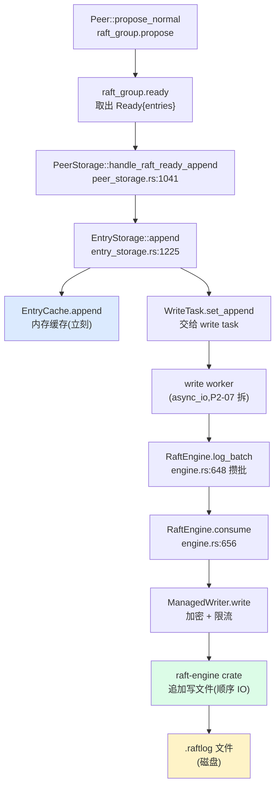

# 第 2 篇 · 第 6 章 · Raft 日志存储:RaftEngine

> **核心问题**:上一章我们拆了五步流水线,其中的 **Append 那一步**——ready 里的 entries 写进底层存储——只用一句"写 RaftEngine"带过。可这里藏着 TiKV 近几年最大的架构演进之一:**老版本 TiKV 把 Raft 日志存进 RocksDB(用专门的 raft CF),新版本换成了专用的 RaftEngine**(独立日志引擎)。为什么费这么大劲要单独存?LSM-tree(RocksDB)明明是 LevelDB 系列的工业级引擎,承接《LevelDB》那本讲过它有多能写,凭什么存 Raft 日志就不划算?专用 RaftEngine 凭什么更快、更省?这就是本章要拆透的全书招牌问题。

> **读完本章你会明白**:
> 1. Raft 日志的访问模式(顺序追加、按 index 截断、整体回收)和 LSM-tree 的优化目标(随机写、按 key 范围查、Compaction 收敛)根本是**两套不同的负载**——硬塞进 RocksDB 是"用错工具",RaftEngine 是为这套负载专门设计的。
> 2. 老版本把 Raft 日志塞进 RocksDB 的 raft CF,带来了**写放大、空间放大、Compaction 抖动、GC 难做**四宗罪;RaftEngine 用"顺序追加 + 按 region 分文件 + 整段回收"把四宗罪一次解决。
> 3. TiKV 用 `engine_traits` 抽象出 `RaftEngine` trait,让 RaftLogEngine(新版专用)和 RocksEngine(老版存 raft CF)实现同一套接口——这是能在两种后端间无缝切换(甚至双向迁移)的根。
> 4. RaftEngine 底层是外部 Rust crate `raft-engine`(git 依赖),TiKV 在 `components/raft_log_engine/` 做适配包装(加密、限流、trait 实现),不自实现底层日志格式。
> 5. `EntryStorage` 用泛型 `ER: RaftEngine` 抽象后端,自带 `EntryCache`(内存缓存近期 entry)和 `TermCache`(缓存 term)——多数日志读命中内存,根本不落盘。
> 6. 配置开关 `raft_engine.enable`(默认 `true`)决定走哪条路径;提供 `dump_raftdb_to_raft_engine` / `dump_raft_engine_to_raftdb` 双向迁移工具。

> **如果一读觉得太难**:先只记住三件事——① Raft 日志的访问模式(顺序追加 + 按 index 截断 + 整体回收)和 LSM-tree(随机写 + Compaction)不是一种负载,硬塞进 RocksDB 是用错工具;② RaftEngine 用"每个 Raft 组一个逻辑流、追加写文件、按文件整段回收",绕开了 LSM 的写放大和 Compaction;③ TiKV 通过 `RaftEngine` trait 抽象,RaftLogEngine 和 RocksDB(老版)可互换,默认走 RaftEngine。

---

## 〇、一句话点破

> **Raft 日志是"顺序追加、按 index 整段截断回收"的流式负载;RocksDB 是"随机写、按 key 排序、Compaction 收敛"的 LSM-tree 负载。把前者塞进后者,等于用一把改锥拧螺丝——能拧,但每一圈都在跟工具较劲。RaftEngine 是为 Raft 日志专门设计的日志引擎:每个 Raft 组一个逻辑流、追加写文件、按文件整段回收,绕开了 LSM 的写放大、空间放大、Compaction 抖动,换来了更低的写延迟、更小的磁盘占用、更平稳的吞吐。**

这是结论,不是理由。本章倒过来拆:先看 Raft 日志的访问模式到底是什么样,再看 LSM-tree 为什么不合身,接着看 RaftEngine 怎么为这套负载专门设计,然后看 TiKV 怎么用 engine_traits 抽象把两者统一,最后拆 EntryStorage 的内存缓存技巧。

---

## 一、Raft 日志是什么:和 LSM-tree 截然不同的负载

### 提问:Raft 日志的读写有什么特征

要回答"为什么 Raft 日志要单独存",先得搞清楚它**到底是怎么被访问的**。Raft 日志是一组 `(term, index, data)` 三元组的有序序列(承接《etcd》,Raft 的核心数据结构),在 TiKV 里被 EntryStorage 管理。它的访问模式有四个鲜明特征。

### 特征一:纯顺序追加,几乎没有随机写

Raft 日志的写入是**严格追加**的——leader 收到新提议,往日志尾部加一条;Follower 收到 AppendEntries,也往尾部加。日志的 `index` 单调递增,**永远不会回头改中间某条**(Raft 的安全性保证:一旦 commit 的日志不可变,未 commit 的被覆盖是整体截断不是原地改)。

```
   Raft 日志的写入(纯追加)
   ─────┬─────┬─────┬─────┬─────┬─────▶ index 递增
      [1]   [2]   [3]   [4]   [5]   ← 一直在尾部加
                                     ← 绝不在中间改
```

这和 RocksDB 的典型负载(KV 的 put / delete,任意 key 随机覆盖)**根本相反**。RocksDB 为随机写优化(memtable + LSM-tree + Compaction 收敛),可 Raft 日志压根没有随机写——追加就够了。

### 特征二:按 index 整段截断,不是按 key 删

Raft 日志的"删除"是**整段截断**:

- **compacted**(已 apply 的老日志):apply 完的日志,会被 `compact_to(index)` 整段删掉(不需要回放历史)——比如 apply 到 index 1000,那 [1, 1000] 整段不要了。
- **truncated**(Leader 切换时覆盖未 commit 的):新 leader 上任,如果它的日志和旧 leader 不一致,会**截断到一致点再追加**——比如旧 leader 写到 [1, 100],新 leader 的日志只到 [1, 95],那 [96, 100] 整段被覆盖。

无论哪种,都是"删一段连续的 index 范围",不是"删某个特定 key"。这和 RocksDB 的"按 key 删"(point delete,要落 tombstone、要等 Compaction 才物理删)**完全是两种语义**。

### 特征三:读是按 index 区间批量拉

Raft 日志的读,主要是两种:

- **Follower 追 leader**:leader 发 AppendEntries,Follower 发现自己的日志落后,要拉一段 `[low, high)` 的 entries。这是**区间批量读**。
- **Snapshot 之后的追平**:新副本拿到 Snapshot 后,要拉 Snapshot 之后的所有日志,也是区间批量读。

几乎不会有"读单条特定 entry"的场景(偶尔有,比如读某个 index 的 term,但有 TermCache 缓存,见第五节)。读模式是**顺序区间扫描**,不是 KV 的 point lookup。

### 特征四:整体回收(不用 GC 单条)

Raft 日志的老版本,**整体被回收**——一个 Raft 组的日志,要么全保留(还没 apply),要么 apply 后整段 compact 掉。**不存在"删一条老 entry 但保留它前后的"**。这和 MVCC 数据(default/write/lock CF)截然不同——MVCC 老版本要按 safe point 持续清理单条,需要 Compaction Filter 这种细粒度机制(P6-20 拆)。

> **钉死这四个特征**:① 纯追加无随机写;② 按 index 整段截断;③ 区间批量读;④ 整体回收。**这四个特征合起来,定义了一种"流式日志"负载,而不是"KV 存储"负载**。下面看 LSM-tree 为什么不合身。

---

## 二、为什么 LSM-tree(RocksDB)不合身:四宗罪

### 提问:把上面这套负载塞进 RocksDB 会怎样

老版本 TiKV 就是这么干的——Raft 日志存 RocksDB 的一个 CF(叫 raft CF),key 是 `region_id + index` 编码,value 是序列化的 entry。这种做法能跑,但处处别扭。我们逐条对照四个特征,看 LSM-tree 撞上什么墙。

### 罪一:写放大——追加被 LSM 强行变成多倍写

RocksDB 的写流程(承接《LevelDB》):一次 put,先写 WAL,再写 memtable,memtable 满了 flush 成 SST,SST 在各级间 Compaction 反复合并。一条 entry 进 RocksDB,**最终可能在磁盘上被写 10~30 倍**(写放大系数,取决于层数和负载)。

可 Raft 日志本来就是**顺序追加**——这是磁盘最友好的写模式(顺序写比随机写快一到两个数量级)。LSM-tree 那套(memtable + SST + Compaction)**是为把随机写变成顺序写而设计的**,可 Raft 日志本来就是顺序写!**给本来就是顺序写的负载套一层"把随机写变顺序写"的机制,纯属多此一举,反而引入了额外的写放大**。

> **不这样会怎样**:一条 Raft entry 本该一次磁盘写就够(顺序追加到日志文件末尾),塞进 RocksDB 变成 WAL + memtable + 多层 SST Compaction,写放大 10~30 倍。**日志引擎的吞吐被 LSM 的机制白白吃掉**,同样的硬件,RocksDB 存 Raft 日志的吞吐远低于专用日志引擎。

### 罪二:空间放大——老 entry 难以及时回收

LSM-tree 的删除是 lazy 的——删一条 key,是写一个 tombstone 标记,真正的物理删除要等 Compaction 把这个 key 所在的 SST 重写到下一层。这意味着:

- 被 compact 掉的 Raft 日志(`compact_to(index)` 删的那段),在 RocksDB 里**不会立刻释放磁盘空间**——要等 Compaction 跑到才会真正删。
- 在 Compaction 之前,**老 entry 和它的 tombstone 同时占磁盘**(空间放大)。

Raft 日志的产出速度极快(每次写都产一条),如果不及时回收,磁盘占用会**指数级膨胀**。RocksDB 靠 Compaction 收敛,可 Compaction 是周期性的、有抖动的——日志引擎要的是"截断立刻释放",LSM 给的是"慢慢 Compaction 才释放",节奏对不上。

> **不这样会怎样**:Raft 日志的磁盘占用不可控——老日志删了但空间没释放,堆积成灾;Compaction 一跑又突然释放一大块,造成 IO 抖动。生产环境里这种"磁盘占用忽大忽小 + Compaction 抖动"是 Raft 日志存 RocksDB 的典型痛点。

### 罪三:Compaction 抖动——阻塞前台写

RocksDB 的 Compaction 是后台线程跑的,但它会**抢磁盘 IO 和 CPU**。Compaction 高峰期,前台写(memtable flush)会变慢,Raft 日志的追加延迟抖动。

更糟的是,Raft 日志的 CF 和 MVCC 数据的 CF(在 TiKV 里通常分开 RocksDB 实例,但物理上同一块磁盘)**共享磁盘带宽**——Compaction 一个 CF 时,其他 CF 的写也受影响。对于一个把"低延迟"当生命的存储引擎,Compaction 抖动是不可忍受的。

### 罪四:GC 难做——按 index 整段截断不自然

RocksDB 的 Compaction Filter(P6-20 会拆)可以"在 Compaction 时按规则删过期 KV",但它是**按 key 粒度**的——遍历每条 KV,问 filter"这条删不删"。可 Raft 日志的回收是**按 index 区间整段**(`compact_to(1000)` 就是 [1, 1000] 全删),用 Compaction Filter 表达"删一段连续区间"很别扭,要么逐条判断浪费 CPU,要么靠外部触发 `delete_files_in_range`(物理删整个 SST 文件,但有边界条件)。

专用日志引擎做这件事就自然——日志按 region 分文件、按 index 段组织,**整段截断就是删文件或截断文件指针,一个操作搞定**。

### 四宗罪汇总:用错工具

```
   Raft 日志负载(流式日志)        RocksDB(LSM-tree KV)
   ─────────────────────         ──────────────────────
   纯追加  ←矛盾→  为随机写优化的 memtable+LSM
   按 index 截断  ←矛盾→  按 key tombstone + Compaction
   区间批量读  ←合身→  迭代器(这点 LSM 还行)
   整体回收  ←矛盾→  Compaction Filter 逐条判断
```

> **钉死这件事**:LSM-tree 不是"差",而是**它的优化目标(随机写、按 key 查、Compaction 收敛)和 Raft 日志的访问模式(顺序追加、按 index 截断、整段回收)根本不匹配**。这不是 RocksDB 的缺陷,是用错场景。**专用 RaftEngine,就是为 Raft 日志这套访问模式量身定制的工具**。

---

## 三、RaftEngine 怎么设计:为流式日志量身定制

### 提问:那专用日志引擎该怎么设计

既然 Raft 日志是"流式追加 + 整段回收"的负载,专用引擎就该围绕这两个特征设计。RaftEngine(底层是外部 crate `raft-engine`,TiKV 在 `components/raft_log_engine/` 适配)的设计可以概括成三条原则。

### 原则一:每个 Raft 组一个逻辑流,追加写

RaftEngine 不像 RocksDB 那样用一棵全局 LSM-tree 管所有 key,而是**每个 Raft 组(region_id)对应一条独立的逻辑日志流**。往这条流里写,就是顺序追加;不同的 Raft 组之间,逻辑上独立(物理上可能共享文件以摊薄开销,见下文)。

```
   RaftEngine 的逻辑视图
   region 1 的日志流: [1]→[2]→[3]→...→[N1]   (追加)
   region 2 的日志流: [1]→[2]→[3]→...→[N2]   (追加)
   region 3 的日志流: [1]→[2]→[3]→...→[N3]   (追加)
   ...
   (百万个 Raft 组,每个一条独立流)
```

这种设计天然契合 Raft——Raft 日志本来就是"每个 Raft 组一条流",RaftEngine 直接把这个逻辑落到存储层,**没有"用全局 key 排序组织"这层扭曲**。

### 原则二:批量写文件(LogBatch),一次 IO 写多个 Raft 组

百万个 Raft 组,如果每个组一个独立文件,文件数爆炸(操作系统对单进程文件数有限制,且打开大量文件描述符浪费)。RaftEngine 的做法:**多个 Raft 组的 entry 攒成一个 LogBatch,一次 IO 写进同一个文件**。

```rust
// components/raft_log_engine/src/engine.rs:381
#[derive(Default)]
pub struct RaftLogBatch(LogBatch);   // 包装外部 crate 的 LogBatch
```

`LogBatch` 是个内存中的批量缓冲——可以往里加多个 Raft 组的多条 entry,攒够(或定时)再一次性 `consume`(写文件)。这把"百万个 Raft 组的零散写"聚合成"少量大批量顺序写",磁盘吞吐拉满。

TiKV 的 trait 层把这层暴露成 `RaftEngine::consume`:

```rust
// components/raft_log_engine/src/engine.rs:656 (RaftEngine trait impl)
fn consume(&self, batch: &mut Self::LogBatch, sync: bool) -> Result<usize> {
    let _guard = WithIoType::new(IoType::ForegroundWrite);
    self.0.write(&mut batch.0, sync).map_err(transfer_error)
}
```

注意 `sync: bool`——调用方决定这次写要不要 fsync(刷盘)。前台写(用户请求)通常 sync(true),保证持久化;后台批量写可以 sync(false),攒着批量刷,提高吞吐。这个选择权交给上层(TiKV 的 write worker),让上层按"重要性"调度刷盘节奏。

### 原则三:按文件整段回收,绕开 Compaction

RaftEngine 的文件,按"region_id + index 范围"组织。当一个 Raft 组的日志被 compact(`compact_to(index)`),RaftEngine 不需要逐条删——它知道这个 region 的哪些文件**全部低于 compact_index**,直接**删整个文件**(或截断文件的有效区)。

trait 层的 `gc` 方法,本质是往 LogBatch 里加一个"compact 命令",下次 consume 时让底层引擎执行整段回收:

```rust
// components/raft_log_engine/src/engine.rs:685 (gc 实现)
fn gc(&self, raft_group_id: u64, _from: u64, to: u64, batch: &mut Self::LogBatch) -> Result<()> {
    // ...
    batch.0.add_command(raft_group_id, Command::Compact { index: to })?;  // 第 694 行
    Ok(())
}
```

这个 `Command::Compact { index: to }` 告诉底层:"这个 region 的 index < to 的日志,整段不要了"。底层引擎收到这个命令,**可以整段删文件**,物理空间立刻释放——不需要等 Compaction,没有空间放大。

类似的,`clean`(整个 region 销毁时删它所有日志):

```rust
// components/raft_log_engine/src/engine.rs:674
fn clean(&self, raft_group_id: u64, batch: &mut Self::LogBatch) -> Result<()> {
    batch.0.add_command(raft_group_id, Command::Clean)?;  // 第 681 行
    Ok(())
}
```

还有定期的 `manual_purge`(清过期文件):

```rust
// components/raft_log_engine/src/engine.rs:765
fn manual_purge(&self) -> Result<Vec<u64>> {
    self.0.purge_expired_files().map_err(transfer_error)
}
```

> **钉死这三条原则**:① 每 Raft 组独立逻辑流;② LogBatch 批量攒多组写;③ 按文件整段回收。**这三条合起来,绕开了 LSM 的写放大、空间放大、Compaction 抖动、GC 难做四宗罪**。RaftEngine 不是"更好的 RocksDB",而是"换了一种数据结构"——为流式日志专门设计的日志引擎。

### 实测效果:写放大从 10~30 倍降到接近 1 倍

(这部分来自 TiKV 官方对 RaftEngine 的 benchmark,本书不重复贴数字,只点结论):RaftEngine 相比 RocksDB 存 Raft 日志,**写放大降到接近 1 倍**(追加写一次磁盘就完事)、**CPU 占用降低**(没有 Compaction 线程抢 CPU)、**磁盘占用降低**(整段回收,无空间放大)、**写延迟更平稳**(无 Compaction 抖动)。对于一个百万 Raft 组的存储引擎,这些收益乘以百万,是数倍的硬件成本节省。

---

## 四、engine_traits 抽象:RaftEngine trait 让两套后端可互换

### 提问:TiKV 怎么做到能在新旧两种引擎间切换

知道了 RaftEngine 更好,可老集群的 Raft 日志可能还存 RocksDB。TiKV 不能要求用户停服迁移,得**让两种后端共存,按配置走不同的路**。这就需要一个抽象层——`engine_traits` 里的 `RaftEngine` trait。

### RaftEngine trait:统一两套后端

`RaftEngine` trait 定义在 `components/engine_traits/src/raft_engine.rs`,把"Raft 日志引擎该能干什么"抽象成一组方法:

```rust
// components/engine_traits/src/raft_engine.rs:84
pub trait RaftEngine: RaftEngineReadOnly + PerfContextExt + Clone + Sync + Send + 'static {
    type LogBatch: RaftLogBatch;
    // ...
    fn log_batch(&self, capacity: usize) -> Self::LogBatch;       // 第 87 行
    fn sync(&self) -> Result<()>;                                  // 第 90 行
    fn consume(&self, batch: &mut Self::LogBatch, sync: bool) -> Result<usize>;  // 第 94 行
    fn consume_and_shrink(&self, batch: &mut Self::LogBatch, ...) -> Result<usize>;  // 第 97 行
    fn clean(&self, raft_group_id: u64, batch: &mut Self::LogBatch) -> Result<()>;  // 第 105 行
    fn gc(&self, raft_group_id: u64, from: u64, to: u64, batch: &mut Self::LogBatch) -> Result<()>;  // 第 114 行
    fn need_manual_purge(&self) -> bool;                           // 第 125 行
    fn manual_purge(&self) -> Result<Vec<u64>>;                    // 第 131 行
    fn get_engine_size(&self) -> u64;                              // 第 144 行
    fn get_engine_path(&self) -> &str;                             // 第 147 行
    // ...
}
```

只读部分拆成 `RaftEngineReadOnly`(同文件第 15 行),包含 `get_raft_state` / `get_entry` / `fetch_entries_to` 等读方法:

```rust
// components/engine_traits/src/raft_engine.rs:15
pub trait RaftEngineReadOnly {
    fn get_raft_state(&self, raft_group_id: u64) -> Result<Option<RaftState>>;
    fn get_region_state(&self, raft_group_id: u64, ...) -> Result<Option<RegionState>>;
    fn get_apply_state(&self, raft_group_id: u64) -> Result<Option<RaftApplyState>>;
    fn get_entry(&self, raft_group_id: u64, index: u64) -> Result<Option<Entry>>;
    fn fetch_entries_to(&self, raft_group_id: u64, begin: u64, end: u64, ...) -> Result<usize>;
    // ...
}
```

配套的还有 `RaftLogBatch` trait(第 158 行),抽象"批量缓冲"该有的方法(`append`、`put_raft_state`、`merge` 等)。

### 两个实现:RaftLogEngine 和 RocksEngine

这个 trait 有两个实现,分别对应新旧两套后端:

**实现一:RaftLogEngine(新版专用)**——在 `components/raft_log_engine/src/engine.rs`:

```rust
// components/raft_log_engine/src/engine.rs:336
#[derive(Clone)]
pub struct RaftLogEngine(Arc<RawRaftEngine<ManagedFileSystem>>);
```

注意它是个 newtype,包了 `RawRaftEngine`(就是外部 crate `raft-engine` 的 `Engine`)和 `ManagedFileSystem`(TiKV 自己的文件系统包装,加了一层加密和限流)。所有方法都委托给 `self.0`:

```rust
// components/raft_log_engine/src/engine.rs:363
pub fn first_index(&self, raft_id: u64) -> Option<u64> {
    self.0.first_index(raft_id)
}
```

**实现二:RocksEngine(老版,存 raft CF)**——在 `components/engine_rocks/src/raft_engine.rs`:

```rust
// components/engine_rocks/src/raft_engine.rs:21
impl RaftEngineReadOnly for RocksEngine {
    fn get_raft_state(&self, raft_group_id: u64) -> Result<Option<RaftState>> {
        // 用 keys::raft_state_key 编码 key,从 CF_DEFAULT 读
        // ...
    }
    fn get_entry(&self, raft_group_id: u64, index: u64) -> Result<Option<Entry>> {
        // 用 keys::raft_log_key 编码 key,从 CF_DEFAULT 读
        // ...
    }
    // ...
}
```

这个实现把 Raft 日志当 KV 存进 RocksDB——key 是 `region_id + index` 编码,value 是序列化的 entry。所有"日志操作"都被翻译成"RocksDB 的 put / get / iterator"。

> **钉死这件事**:同一个 `RaftEngine` trait,被 RaftLogEngine(专用日志引擎)和 RocksEngine(把日志塞进 RocksDB)各自实现——这是 TiKV 能在两种后端间切换的根。**上层(EntryStorage、Peer)只对 trait 说话,不知道底下是哪种引擎**。这种 trait 抽象,是 Rust 在系统级代码里的典型用法:用泛型 `ER: RaftEngine` 静态分发,零运行时开销,又把后端解耦。

### 配置决定走哪条:raft_engine.enable

走哪条后端,由配置项 `raft_engine.enable` 决定(默认 `true`,即走新版 RaftLogEngine):

```rust
// src/config/mod.rs:2178
pub struct RaftEngineConfig {
    pub enable: bool,
    #[serde(flatten)]
    config: RawRaftEngineConfig,
}

// src/config/mod.rs:2184 (默认 enable: true)
impl Default for RaftEngineConfig {
    fn default() -> Self {
        RaftEngineConfig {
            enable: true,   // 第 2187 行
            config: RawRaftEngineConfig::default(),
        }
    }
}
```

启动时的引擎选择逻辑在 `components/server/src/server.rs`:

```rust
// components/server/src/server.rs:252 (简化示意,非源码原文)
dispatch_api_version!(config.storage.api_version(), {
    if !config.raft_engine.enable {
        run_impl::<RocksEngine, API>(config, ...)        // 走老版 RocksDB
    } else {
        run_impl::<RaftLogEngine, API>(config, ...)      // 走新版 RaftEngine
    }
})
```

注意这是**编译期的泛型单态化**——`run_impl::<RocksEngine, API>` 和 `run_impl::<RaftLogEngine, API>` 是两个不同的具体函数,运行时按配置走其中一条。从这一刻起,整个 TiKV 的存储栈就被钉死成某一种引擎类型——**这是 Rust 泛型零开销的代价:引擎类型不能运行时换,要换得重启**。

### 双向迁移工具:dump_raftdb_to_raft_engine

老集群升级到新版 RaftEngine,TiKV 提供迁移工具,在 `components/server/src/raft_engine_switch.rs`:

```rust
// components/server/src/raft_engine_switch.rs:18
pub fn dump_raftdb_to_raft_engine(...) -> Result<()> { ... }

// components/server/src/raft_engine_switch.rs:68
pub fn dump_raft_engine_to_raftdb(...) -> Result<()> { ... }
```

两个方向都有,把数据从一个引擎搬到另一个。搬运用 LogBatch 批量,有阈值控制(`BATCH_THRESHOLD = 32 * 1024`,达到就 consume 一次),保证迁移过程不爆内存。这是"新老共存"架构的最后一环——不光代码层 trait 抽象,数据层也能平滑迁移。

> **钉死这件事**:RaftEngine 的引入不是"推倒重来",而是"插件化替换"——`engine_traits` 抽象让新旧两套后端实现同一接口,配置开关决定走哪条,迁移工具让老集群平滑升级。**这是大型系统演进的标准范式**:不破坏现有代码,加一层抽象,让新实现和老实现并存,逐步切换。

---

## 五、EntryStorage:上层缓存,让多数日志读根本不落盘

### 提问:既然有了 RaftEngine,为什么还要 EntryStorage 这一层

`RaftEngine`(无论是 RaftLogEngine 还是 RocksEngine)是磁盘引擎,每次读 entry 都要一次磁盘 IO。可 Raft 的读场景(Follower 追 leader 时拉日志、读某条 entry 的 term)频繁且对延迟敏感——每次都落盘太慢。

所以 TiKV 在 `EntryStorage`(在 `components/raftstore/src/store/entry_storage.rs`)里,**在 RaftEngine 之上加了两层内存缓存**:EntryCache(缓存近期 entry)和 TermCache(缓存 term)。多数读命中内存,根本不碰磁盘。

### EntryStorage 的字段:引擎 + 两层缓存

```rust
// components/raftstore/src/store/entry_storage.rs:771
pub struct EntryStorage<EK: KvEngine, ER> {
    region_id: u64,
    peer_id: u64,
    raft_engine: ER,                 // 底层引擎(泛型,可能是 RaftLogEngine 或 RocksEngine)
    term_cache: TermCache,           // term 缓存
    cache: EntryCache,               // entry 缓存
    raft_state: RaftLocalState,      // 这个 Raft 组的状态(commit_index、vote_for 等)
    apply_state: RaftApplyState,     // apply 进度(applied_index)
    last_term: u64,
    applied_term: u64,
    read_scheduler: Scheduler<ReadTask<EK>>,
    raftlog_fetch_stats: AsyncFetchStats,
    async_fetch_results: RefCell<HashMap<u64, RaftlogFetchState>>,
    io_read_raft_term: LocalHistogram,
    io_read_raft_fetch_log: LocalHistogram,
}
```

注意 `raft_engine: ER`——**泛型参数,不绑死具体引擎**。EntryStorage 只对 `RaftEngine` trait 说话,实现层是 RaftLogEngine 还是 RocksEngine 它不关心。这是上节 trait 抽象的直接受益者。

`impl` 块带 trait bound:`impl<EK: KvEngine, ER: RaftEngine> EntryStorage<EK, ER>`(第 789 行),编译期保证 ER 实现了 RaftEngine trait 的所有方法。

### EntryCache:缓存近期 entry

```rust
// components/raftstore/src/store/entry_storage.rs:93
struct EntryCache {
    persisted: u64,                       // 已落盘的最大 index
    cache: VecDeque<Entry>,               // 缓存的 entry(按 index 顺序)
    trace: VecDeque<CachedEntries>,       // 引用追踪(用于异步读)
    hit: Cell<u64>,                       // 命中计数(统计用)
    miss: Cell<u64>,                      // 未命中计数
}
```

EntryCache 用 `VecDeque<Entry>` 存近期追加的 entry——刚 propose 的 entry,在 ready 里被 append 时,**既写进 RaftEngine(持久化),也存进 EntryCache(供近期读)**:

```rust
// components/raftstore/src/store/entry_storage.rs:1225
pub fn append(&mut self, entries: Vec<Entry>, task: &mut WriteTask<EK, ER>) {
    // ...
    self.cache.append(self.region_id, self.peer_id, &entries);   // 缓存
    task.set_append(Some(prev_last_index + 1), entries);          // 第 1245 行,告诉 write task 要持久化哪些
    self.raft_state.set_last_index(last_index);                   // 第 1247 行,更新状态
}
```

注意这里 `append` 做两件事:① 更新内存 cache;② 把 entries 塞进 WriteTask(WriteTask 会被 write worker 异步写进 RaftEngine)。**内存更新立刻完成,磁盘写异步进行**——这是 P2-07 async_io 的核心思想,本章只看到 append 这一步把活儿派出去。

读 entry 时,先查 cache:

```rust
// components/raftstore/src/store/entry_storage.rs:1035
pub fn entries(
    &self, low: u64, high: u64, max_size: u64, context: GetEntriesContext,
) -> raft::Result<Vec<Entry>> {
    // 先查 EntryCache,命中就直接返回
    // 不命中再调 self.raft_engine.fetch_entries_to(...) 落盘读
}
```

多数读(刚 propose 不久的 entry)命中 cache,**根本不碰磁盘**。只有 cache 没覆盖到的老 entry(比如 Follower 长时间落后,要拉很早之前的日志),才落盘读 RaftEngine。

### TermCache:缓存 term

Raft 频繁需要"查某个 index 的 term"(term 是 Raft 安全性的核心,leader 切换、日志一致性检查都要 term)。但 term 的变化远比 entry 慢——一个 term 内可能有成千上万条 entry。所以 TiKV 单独缓存 term:

```rust
// components/raftstore/src/store/entry_storage.rs:414
struct TermCache {
    cache: VecDeque<(u64, u64)>,    // (index, term) 对
    capacity: usize,                 // 默认 8(第 423 行)
}
```

capacity 默认才 8——因为只需要缓存"最近几个 term 切换点"的 term,不需要每条 entry 都缓存 term。查 term 时先查 TermCache(`term` 方法,第 1097 行),命中就返回;不命中才落盘读。

### compact:截断时同步回收缓存

当 Raft 日志被 compact(`compact_to(index)`),EntryStorage 会同步截断 cache:

```rust
// components/raftstore/src/store/entry_storage.rs:1357
pub fn compact_entry_cache(&mut self, idx: u64, state: Option<&mut CacheWarmupState>) {
    self.cache.compact_to(idx);   // 委托 EntryCache::compact_to(第 242 行)
    // ... term_cache 也截断
}
```

注意:cache 的截断是**立刻**的(compact_to 一调就删),而底层 RaftEngine 的回收是**异步**的(下次 LogBatch consume 时执行 Compact 命令)。这两层节奏不同——内存层立刻回收(释放内存),磁盘层慢慢回收(攒批高效)。**这正是分层缓存的典型节奏**:越靠近 CPU/内存,响应越快但容量小;越靠近磁盘,容量大但慢。

> **钉死这件事**:EntryStorage 是"内存缓存 + 磁盘引擎"的分层结构。EntryCache + TermCache 让多数读命中内存,只有冷数据才落盘。**这一层独立于底层 RaftEngine 还是 RocksDB**——无论底层换什么,上层缓存逻辑不变。这是 trait 抽象 + 分层缓存的合力:解耦后端,优化前台。

---

## 六、RaftLogEngine 适配层:加密、限流、trait 实现

### 提问:TiKV 在 components/raft_log_engine 里到底做了什么

底层的 `raft-engine` 是个外部 Rust crate(`Cargo.toml` 里 git 依赖):

```toml
# Cargo.toml:371
raft-engine = { git = "https://github.com/tikv/raft-engine.git", features = ["swap"] }
raft-engine-ctl = { git = "https://github.com/tikv/raft-engine.git" }
```

TiKV 没自实现底层日志格式(文件分片、entry 物理布局、`.raftlog` 文件命名,都在 raft-engine crate 内)。`components/raft_log_engine/`(只有三个文件:`engine.rs`、`lib.rs`、`perf_context.rs`)做的事是**适配**:

1. **实现 `RaftEngine` trait**:把外部 crate 的 API 翻译成 TiKV 的 trait 方法;
2. **包装文件系统**(ManagedFileSystem):在底层文件 IO 上加一层,做加密(DataKeyManager)和限流(IoRateLimiter);
3. **统计**(perf_context.rs):记录 IO 指标。

### ManagedFileSystem:加密和限流

```rust
// components/raft_log_engine/src/engine.rs:336
pub struct RaftLogEngine(Arc<RawRaftEngine<ManagedFileSystem>>);
```

注意泛型参数 `ManagedFileSystem`——这是 raft-engine crate 留的"文件系统抽象"插口(它的 feature `swap` 提供了这个能力)。TiKV 实现 `ManagedFileSystem`,在底层文件读写时插入自己的逻辑:

- **加密**:TiKV 支持静态加密(TDE),Raft 日志也要加密。`ManagedWriter::write`(`engine.rs:97`)在写之前先加密,`ManagedReader::read`(`engine.rs:66`)在读之后解密。这层对 raft-engine 透明。
- **限流**:TiKV 有全局 IO 限流(resource_control),`ManagedWriter` 和 `ManagedReader` 经 `rate_limiter.request(IoType, IoOp::Write, size)` 申请配额(`engine.rs:97` 附近),防止 Raft 日志的 IO 抢占其他关键 IO。

> **不这样会怎样**:如果 RaftEngine 不走 ManagedFileSystem,加密和限流就没法统一管——要么 Raft 日志不加密(安全漏洞),要么 Raft 日志不受限流(可能把磁盘带宽吃光,影响 MVCC 数据的 IO)。**ManagedFileSystem 这层,让 Raft 日志和 TiKV 其他 IO 统一接受资源管控**。

### IO 类型标记:ForegroundWrite 区分前后台

```rust
// components/raft_log_engine/src/engine.rs:656 (consume 实现)
fn consume(&self, batch: &mut Self::LogBatch, sync: bool) -> Result<usize> {
    let _guard = WithIoType::new(IoType::ForegroundWrite);   // 标记这是前台写
    self.0.write(&mut batch.0, sync).map_err(transfer_error)
}
```

`WithIoType::new(IoType::ForegroundWrite)` 是个 RAII guard——在它的作用域内,当前线程的 IO 类型被标记成"前台写"。这个标记被限流器(IoRateLimiter)读到,**前台写优先级高、后台写(比如 GC)优先级低**——限流器在 IO 紧张时,优先保障前台用户的写延迟,后台 IO 可以慢一点。

这是 TiKV 在 IO 调度上的精细控制——不是简单的 FIFO,而是**按重要性分级**。RaftEngine 通过这层标记,融入 TiKV 的全局 IO 优先级体系。

---

## 七、完整链路:从 Peer 到 RaftEngine

把前面几节拼起来,看一条 Raft entry 从 propose 到落盘的完整链路:



关键点:

1. **内存更新立刻**(EntryCache),磁盘写异步(write worker);
2. **磁盘写是批量**(LogBatch 攒多组),一次顺序追加;
3. **中间夹着加密和限流**(ManagedWriter);
4. **底层是顺序追加文件**,不是 LSM-tree 的 memtable+SST。

> **钉死这张图**:这是 Append 那一步的内部展开——从 Peer 发起 append 到 entry 真正落盘,经过 EntryCache(内存)+ WriteTask(异步队列)+ RaftEngine(LogBatch 批量)+ ManagedFileSystem(加密限流)+ raft-engine crate(顺序追加)。**整条链路的设计目标就是"让顺序追加这种最优写模式不被任何中间层扭曲"**——内存缓存是加速读,LogBatch 是攒吞吐,加密限流是管控,最后落盘是顺序追加(磁盘最快的写法)。

---

## 八、技巧精解:两个最硬核的设计洞察

本章有两个洞察值得单独拆透:① 为什么用 LogBatch 而不是每 Raft 组独立文件;② 为什么 EntryStorage 用泛型而不是 trait object。

### 技巧一:LogBatch——百万 Raft 组如何共享文件而不互相干扰

**问题**:百万个 Raft 组,如果每个组一个独立文件,文件数爆炸;如果所有组共享一个大文件,又怕互相干扰(一个组写崩了影响别的组)。RaftEngine 怎么平衡?

**朴素做法 A:每个 Raft 组一个文件**。文件数 = Raft 组数 = 几十万到百万。操作系统单进程文件描述符上限通常几千到几万(就算调大,内核管理大量 fd 也低效)。爆炸。

**朴素做法 B:所有 Raft 组一个全局文件**。文件数 1,没问题。但所有 Raft 组的 entry 混在一个文件里,回收某组的旧日志时,要么不能删文件(只能逐条覆盖标记,空间不释放),要么删整个文件(误伤别的组)。两难。

**LogBatch 的巧妙**:多个 Raft 组的 entry **攒进同一个 LogBatch,一次 IO 写进文件**(共享文件,摊薄 IO),但**文件内部按 region_id + index 组织**,每个 Raft 组的 entry 在文件里有自己的逻辑区段。回收时,如果某个文件里**某个 Raft 组的区段整体过期**(且别的组也过期或已迁出),可以整段删;如果一个文件里所有 Raft 组都过期,直接删整个文件。

```
   一个 .raftlog 文件内部(LogBatch 攒写)
   ┌──────────────────────────────────────────┐
   │ region 1: [e1][e2][e3]                    │
   │ region 2: [e1][e2]                        │
   │ region 1: [e4][e5]   ← 同一组的 entry 可能跨段 │
   │ region 3: [e1]                            │
   │ region 2: [e3][e4]                        │
   └──────────────────────────────────────────┘
   回收:region 1 的 [e1..e3] 过期 → 标记可覆盖(不一定立刻删文件)
        整个文件所有组都过期 → 删整个文件(瞬间释放)
```

**为什么 sound**:Raft 不要求"一个 Raft 组的 entry 物理上连续",只要求"按 index 顺序可读"。LogBatch 把不同组的 entry 交错写进同一文件,读时按 region_id 过滤、按 index 排序,逻辑上等价于"每个组一条独立流"。**物理上共享文件省 IO,逻辑上独立流保语义**,两全。

> **不这么设计会怎样**:每 Raft 组独立文件,百万 fd 爆炸;全局共享一个文件无批量,吞吐低且难回收。LogBatch 是介于两者之间的甜点——**文件数可控(几个到几十个),每个文件里混多个组(批量),逻辑隔离(可按组回收)**。这是流式日志引擎的经典设计(类似 Kafka 的 partition-segment 思路)。

### 技巧二:泛型 `ER: RaftEngine` 而不是 trait object——零开销抽象

**问题**:`EntryStorage` 要支持两种后端(RaftLogEngine 和 RocksEngine),为什么用泛型 `ER: RaftEngine`,而不是 trait object `Box<dyn RaftEngine>`?

**朴素做法**:`Box<dyn RaftEngine>`,运行时多态,看起来更灵活。

**撞墙在哪**:

1. **性能**:trait object 是动态分发(vtable),每次方法调用多一次间接跳转。Raft 日志的读写是热路径(每次 propose / step 都要走),vtable 的开销在高频路径上会累积。
2. **内联失败**:动态分发的方法调用,编译器无法内联。而 RaftEngine 的很多方法(`get_entry`、`term`)很短,内联能省掉函数调用开销。trait object 让内联彻底没戏。
3. **生命周期管理**:`Box<dyn RaftEngine>` 要堆分配、要管生命周期。而泛型在编译期单态化,`EntryStorage<RaftLogEngine>` 和 `EntryStorage<RocksEngine>` 是两个具体的、栈上定大小的类型,零堆分配。

**泛型的巧妙**:`EntryStorage<EK, ER: RaftEngine>`,泛型参数 ER 在编译期被具体化——`EntryStorage<_, RaftLogEngine>` 和 `EntryStorage<_, RocksEngine>` 是两个独立的、静态分发的具体类型。所有方法调用在编译期就绑定到具体实现,**零 vtable 开销,且编译器可以内联**。

```rust
// 编译期:EntryStorage<_, RaftLogEngine> 的所有方法,都被编译成调用 RaftLogEngine 的具体方法
// EntryStorage<_, RocksEngine> 的所有方法,都被编译成调用 RocksEngine 的具体方法
// 两套代码独立,无运行时分发开销
```

**代价**:类型在编译期钉死,运行时不能换(要换得重启进程)。但这个代价对 TiKV 可接受——**一个 TiKV 进程的 Raft 引擎类型,在启动时按配置决定,运行期不变**。

> **不这么设计会怎样**:用 trait object,每次日志读写都多一次 vtable 跳转,百万 Raft 组 × 高频读写 = 显著的 CPU 浪费。泛型单态化让"抽象的优雅"和"零开销的性能"兼得——**这是 Rust 系统级编程的招牌优势,也是 TiKV 选 Rust 的理由之一**(对标《Tokio》那本拆 trait 抽象的思路)。代价是编译期类型钉死,但对存储引擎这种"启动定后端"的场景,这个代价几乎无感。

---

## 九、架构演进:从 Raft-log-in-RocksDB 到 RaftEngine

本章是全书架构演进的核心案例。老资料(2020 年前的博客、文档)讲 TiKV,大多说"Raft 日志存 RocksDB 的 raft CF"——**这在今天已过时**。

演进脉络:

1. **早期(4.x 及之前)**:Raft 日志存 RocksDB 的 raft CF(用 `keys::raft_log_key` 编码 key)。MVCC 数据存另一个 RocksDB 实例(kv CF)。两个 RocksDB 实例,一个存日志,一个存数据。
2. **过渡期(5.x~6.x)**:引入 RaftEngine 作为可选后端(`raft_engine.enable` 配置),默认仍可能关闭,提供迁移工具。
3. **当前(7.x~9.x,本书版本 9.0.0-beta.2)**:**默认走 RaftEngine**(`enable: true`),Raft-log-in-RocksDB 仅作为兼容/回退路径保留。

> **钉死这件事**:本书以新版 RaftEngine 为准,老资料讲"存 RocksDB"的过时。但 RocksDB 那条路径(`engine_rocks/src/raft_engine.rs` 里 `impl RaftEngineReadOnly for RocksEngine`)仍在代码里——**不是为了再用,而是为了:① 兼容老集群升级(迁移工具的源端);② 作为对照,让读者理解为什么换**。本章正是通过对照 RocksDB 的四宗罪,才讲清了 RaftEngine 的 why。

另外,raftstore-v2(`components/raftstore-v2/`)同样支持 RaftEngine,且更激进——v2 的部分路径对 RaftEngine 有更深度的集成(比如更细粒度的日志读写)。本书以经典 raftstore + 新版 RaftEngine 为主线,v2 作为演进方向在相关处对照。

---

## 十、章末小结

### 回扣主线

本章拆了 Append 那一步背后的存储后端——RaftEngine。回到二分法:

- **复制层(本章归属)**:Raft 日志是复制层的核心数据(没有日志,Raft 没法复制、没法恢复)。RaftEngine 是"复制层怎么存数据"的关键一环——它和 RocksDB(存 MVCC 数据)一起,构成 TiKV 的两层存储:Raft 日志(RaftEngine)+ 业务数据(RocksDB)。
- **承接《LevelDB》**:本章通过对照"为什么 LSM-tree 不适合存 Raft 日志",反向印证了《LevelDB》那本拆透的 LSM-tree 的优化目标(随机写、按 key 查、Compaction 收敛)——**它不是不好,是用错场景**。Raft 日志是流式负载,LSM 是 KV 负载,两者本就不该硬凑。
- **承接上下章**:本章展开 P2-05 里"Append 那一步"的存储后端;下一章 P2-07 会拆"Append 怎么异步化"(async_io 把日志写挪到 write worker,主线程不阻塞),P3-11 拆"ApplyFsm 怎么把已 commit 的命令批量写 RocksDB"。

### 五个为什么

1. **为什么 Raft 日志不存 RocksDB?**——Raft 日志是"顺序追加、按 index 整段截断、整体回收"的流式负载;RocksDB 的 LSM-tree 是为"随机写、按 key 查、Compaction 收敛"的 KV 负载设计的。硬塞进 LSM,带来写放大、空间放大、Compaction 抖动、GC 难做四宗罪。
2. **为什么 RaftEngine 更快?**——它为流式日志专门设计:每个 Raft 组一条逻辑流、LogBatch 批量攒多组写、按文件整段回收。写放大从 10~30 倍降到接近 1 倍,无 Compaction 抖动,空间及时回收。
3. **为什么 TiKV 能在新旧两种引擎间切换?**——`engine_traits` 的 `RaftEngine` trait 抽象,RaftLogEngine 和 RocksEngine 各自实现,配置开关 `raft_engine.enable`(默认 true)决定走哪条,还有 `dump_raftdb_to_raft_engine` 双向迁移工具。
4. **为什么 EntryStorage 用泛型 ER 而不是 trait object?**——泛型在编译期单态化,零 vtable 开销、可内联;trait object 是动态分发,热路径上累积开销。代价是类型编译期钉死,但对"启动定后端"的场景几乎无感。
5. **为什么 EntryStorage 要加 EntryCache 和 TermCache?**——Raft 频繁读近期 entry 和 term,每次落盘太慢;两层缓存让多数读命中内存,只有冷数据才落盘读 RaftEngine。

### 想继续深入往哪钻

- **想深入 LSM-tree 的写放大、Compaction**:读《LevelDB》那本,RocksDB 是 LevelDB 的工业级后代,原理一致。
- **想深入 raft-engine crate 的底层格式**(文件分片、entry 物理布局、.raftlog 文件结构):读外部仓库 `tikv/raft-engine`,本书只到 TiKV 的适配层,底层格式在那个 crate。
- **想深入 async_io**(Append 怎么异步化,write worker 怎么工作):读下一章 P2-07。
- **想深入 ApplyFsm**(commit 之后怎么批量写 RocksDB):读 P3-11。
- **想看 RocksEngine 老(存 raft CF)的实现**:对照 `components/engine_rocks/src/raft_engine.rs`,理解"老版本为什么不行"。
- **关键源码文件**:
  - [`components/engine_traits/src/raft_engine.rs`](../tikv/components/engine_traits/src/raft_engine.rs)(RaftEngine trait)
  - [`components/raft_log_engine/src/engine.rs`](../tikv/components/raft_log_engine/src/engine.rs)(RaftLogEngine 适配)
  - [`components/engine_rocks/src/raft_engine.rs`](../tikv/components/engine_rocks/src/raft_engine.rs)(RocksEngine 老实现对照)
  - [`components/raftstore/src/store/entry_storage.rs`](../tikv/components/raftstore/src/store/entry_storage.rs)(EntryStorage + 两层缓存)
  - [`src/config/mod.rs`](../tikv/src/config/mod.rs)(`raft_engine.enable` 默认 true)
  - [`components/server/src/server.rs`](../tikv/components/server/src/server.rs)(引擎选择)
  - [`components/server/src/raft_engine_switch.rs`](../tikv/components/server/src/raft_engine_switch.rs)(双向迁移工具)

### 引出下一章

本章我们拆了 Append 那一步背后的 RaftEngine。但回到 P2-05 的链路,Append 是个磁盘 IO——如果同步做,主线程(Poller)要等磁盘写完才能继续推进 Raft,百万个 Peer 的吞吐会被磁盘延迟拖垮。**怎么把 Append(以及别的 Raft IO)挪到独立线程,让主线程不阻塞?** 这就是下一章 P2-07 拆的 async_io,以及它的姊妹技巧 hibernate(空闲 Peer 怎么休眠省 CPU)。

> **下一章**:[P2-07 · 异步 IO 与 hibernate:省 CPU 的两手](P2-07-异步IO与hibernate-省CPU的两手.md)
