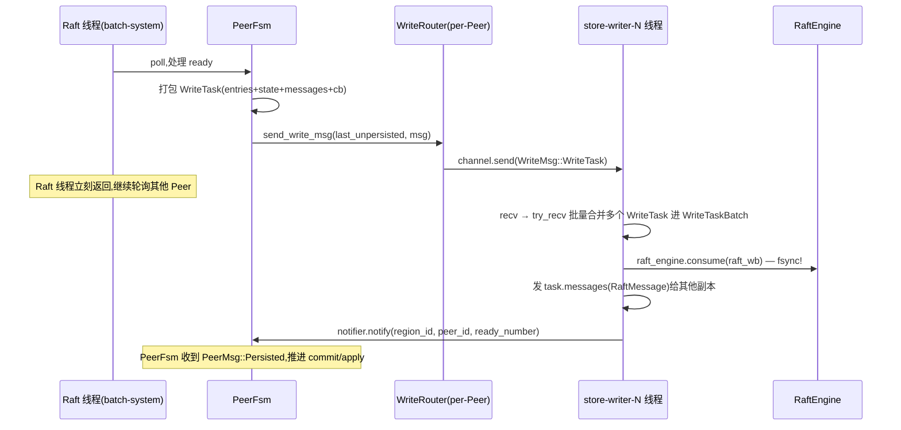
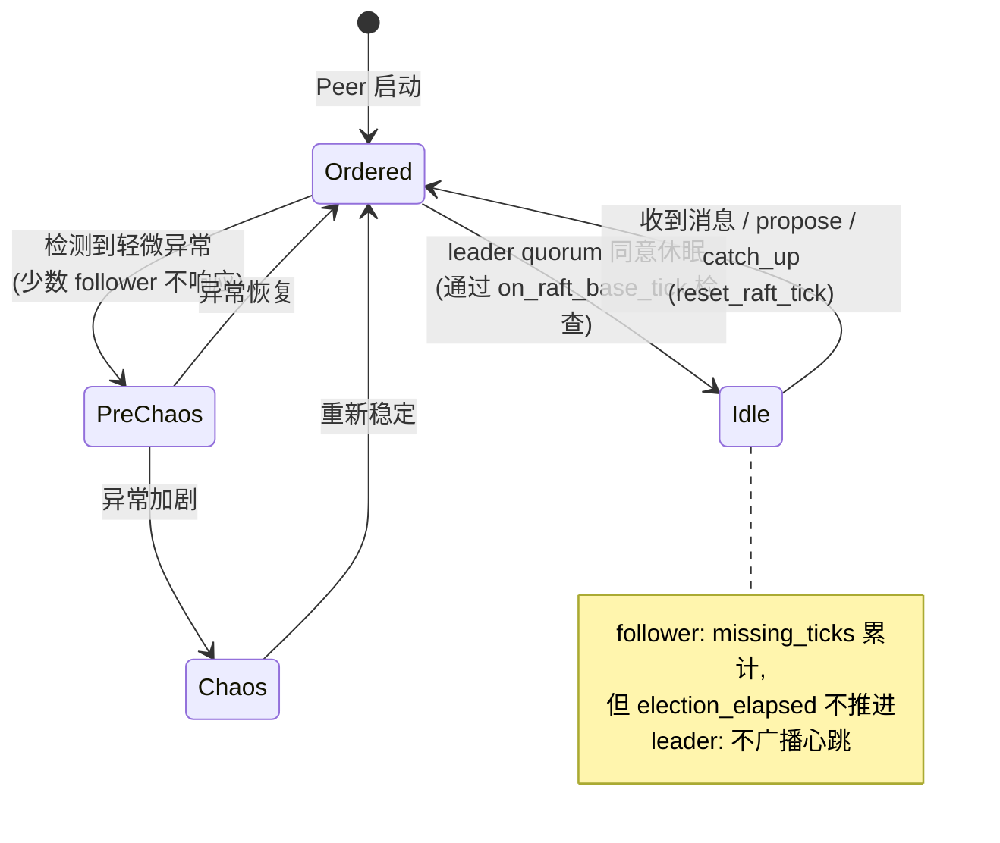

# 第 2 篇 · 第 7 章 · 异步 IO 与 hibernate:省 CPU 的两手

> **核心问题**:第 4 章里我们讲透了 batch-system 怎么用"少量线程批量轮询百万个 PeerFsm"撑住 multi-raft 的调度——这是把**驱动开销**压平的招牌。但 raftstore 还有两笔账没算清:① 每个 Raft 写在落盘前,要由 Raft 线程把日志 append 到 RaftEngine、写 RaftLocalState、刷盘 fsync,这一串是**重 IO**,一旦塞进 Raft 线程里同步做,百万 Peer 的写就被一次磁盘往返卡死;② 每个 Raft 组即使**一个写都没有**,leader 也要定时发心跳、follower 也要定时 tick 推进选举超时,百万个组的心跳虽然单组便宜,加在一起是**百万次 CPU tick 的固定开销**,在业务低谷、夜间、空 Region 成堆的场景下,这些"空转"的 CPU 把一台 32 核机器顶到 60%+。这两笔账各要一手来填:**async_io(异步读写)** 把重 IO 挪出 Raft 线程,**hibernate(休眠)** 让空闲 Raft 组停止心跳与 tick。本章就是把这两手讲透——为什么必须省、各自怎么省、源码里那些 `WriteTask` / `Worker` / `HibernateState` / `GroupState` / `MsgHibernateRequest` 到底在干什么。

> **读完本章你会明白**:
> 1. 为什么"Raft 日志的写 fsync"不能塞在 Raft 线程里同步做——百万 Peer 的写会被磁盘往返串行卡死,这是 batch-system 解决了"调度开销"之后剩下的"IO 开销"硬骨头。
> 2. async_io 的读写分离到底分离的是什么:`store/async_io/write.rs` 把 Raft 日志 append / RaftLocalState 更新 / fsync 这一坨挪到独立的 `store-writer-N` 线程,Raft 线程只负责 propose 完打包 `WriteTask` 丢出去;`read.rs` 把"传 snapshot / 拉 Raft 日志"这种重读也挪到独立线程。
> 3. hibernate 不是简单"关掉 tick",而是个**带多数派投票的状态机**:`GroupState` 四态 + `LeaderState` 三态、leader 收到多数派 follower 的 `MsgHibernateResponse` 才进入 `Idle`,而且 follower 进入 `Idle` 后**用 `missing_ticks` 巧妙卡住选举超时**,保证一被唤醒就能在心跳周期内重新广播心跳、不引起连锁抖动。
> 4. 这两手为什么是"省 CPU 的正交组合":async_io 省"重 IO 阻塞 Raft 推进"的等待时间,hibernate 省"无业务时还在空跑 tick"的固定开销——一个针对繁忙 Peer,一个针对空闲 Peer,TiKV 集群里这两类 Peer 各占很大比例,缺一不可。

> **如果一读觉得太难**:先只记住三件事——① async_io 把 Raft 日志落盘这件事挪到了专门的 `store-writer` 线程,Raft 线程只负责"打包好任务丢过去",从此写 IO 不卡 Raft 推进;② hibernate 是空闲 Raft 组停止发心跳和 tick,leader 要先发起投票,多数派 follower 同意了才一起睡,有任何写进来立刻醒;③ 这两手的本质都是"把不必要的 CPU 让出来给业务",async_io 让重 IO 不阻塞、hibernate 让空 Region 不空转。

---

## 〇、一句话点破

> **batch-system 把"驱动百万 Peer"的调度开销压平了,但没解决两件事——Raft 落盘的重 IO 怎么不卡 Raft 推进(async_io 答),没有业务时百万 Raft 组的心跳空转怎么停掉(hibernate 答)。**

这是结论,不是理由。本章倒过来拆:先讲 async_io 解决什么(把写盘挪出 Raft 线程)以及它的 `WriteTask → Worker → 回调` 全过程;再讲 hibernate 解决什么(空闲休眠)以及它那套"多数派投票 + `missing_ticks` 卡选举"的状态机;最后用一节"两手正交"把两件事拧成一条线索,串到"复制层省 CPU"这个更大的主题上。

承接《etcd》:Raft 算法本体(选主、日志复制、提交、安全性)不重复讲,本章只讲"etcd 那个一个 Raft 组没遇到过的规模问题"。承接上一章 P2-06:RaftEngine 已经把 Raft 日志从 RocksDB 里独立出来,本章的 async_io 写线程正是"把 RaftEngine 的写挪出 Raft 线程"的关键一步,二者配套。承接下一章 P3-09:RaftEngine 把日志存哪讲清了,本章讲清"何时、由哪个线程去存"。

---

## 一、问题先摆清楚:batch-system 之后还剩两笔账

回忆第 4 章(P1-04)的核心结论:百万个 Peer 用 FSM + batch-system 来驱动——一个 Raft 线程一次 poll 一批 PeerFsm 的消息,谁的 Peer 有 ready 就推进谁。这把**调度开销**(本来"百万线程"会爆,现在"少量线程批量轮询")压平了。

但 batch-system 解决的是"调度",它没解决另外两笔更隐蔽的账。

### 第一笔账:Raft 写的 fsync 是重 IO,塞在 Raft 线程里同步做会卡死推进

一个 Raft 组要 commit 一条日志,要走完这条链(承接 P2-05 五步流水线,这里只看 IO 部分):

```
propose ─▶ raft-rs Ready ─▶ append entries 到 RaftEngine ─▶ 更新 RaftLocalState ─▶ fsync ─▶ 复制到 Follower ─▶ 多数派确认 ─▶ commit
```

中间这一段——`append + state update + fsync`——是**重 IO**。fsync 一次典型耗时几百微秒到几毫秒(SSD 上约 100μs~1ms,HDD 上更慢)。这一段如果**塞在 Raft 线程里同步做**,会发生什么?

batch-system 是"一个线程轮询一批 PeerFsm"。如果 Raft 线程每推进一个 Peer 就同步 fsync 一次,那么:

- 一个 Raft 线程上挂着几万个 Peer,它**串行**地"推进 PeerA → fsync → 推进 PeerB → fsync → ..."。每次 fsync 几百微秒,几万个 Peer 走一遍就是几秒。
- 在这几秒里,这个 Raft 线程**完全被 fsync 占住**,根本没空轮询其他 Peer 的消息——别人的 propose 被堵在队列里,别人的心跳该发了也发不出。
- 更糟的是,fsync 这种 IO 等待**对 CPU 是纯空耗**(线程在等磁盘),CPU 既没在干活也没让出来给别的活。

> **不这样会怎样**:朴素写法是"Raft 线程推进完一个 Peer 的 ready 就同步落盘"。在 etcd 那个"一个 Raft 组"的场景下,这是没问题的——就一个组,fsync 的几百微秒跟 Raft 推进是 1:1 关系,无所谓"占住线程影响别人"。但 TiKV 是百万个组共享少量 Raft 线程,**一次 fsync 占住线程 = 阻塞几万个 Peer 的推进**。这是 etcd 不会遇到的规模病。

### 第二笔账:百万 Raft 组即使没业务也要 tick,心跳空转烧 CPU

Raft 算法本身要求:leader 要定时发心跳维持权威(默认 Raft 心跳间隔),follower 要定时推进 election_elapsed 以便 leader 挂了能发起选举。这两件事在 raft-rs 里都是通过 `raft_group.tick()` 推进的——TikV 用一个固定周期的 `PeerTick::Raft`(典型 1 秒发若干次)调 `on_raft_base_tick` 来驱动。

一个 Raft 组空闲(没业务)时,这些 tick 还在烧 CPU:

- leader 每个 tick 都会进 `raft_group.tick()`(raft-rs 内部算时间,该发心跳时广播心跳);
- follower 也在每个 tick 进 `raft_group.tick()`(算 election_elapsed)。

单组单次 tick 当然便宜(几百纳秒)。可百万个组 × 每秒若干次 tick = **每秒几百万次 CPU 上下文进入 Raft 状态机**。在没有业务的 TiKV 节点上(比如夜间低谷、或者大量空 Region),这套"空转 tick"能把一台 32 核机器顶到 50%~70% 的 CPU 占用——明明没干活,但 CPU 烧在"维持 Raft 心跳"上。

> **不这样会怎样**:朴素写法是"所有 Peer 每个 tick 都进 `raft_group.tick()`"。这正是 raft-rs 默认行为,在 etcd 一个 Raft 组的场景下毫无问题。但 TiKV 百万个组都用默认行为,空 Region 把 CPU 烧光,业务 Peer 拿不到 CPU 时间,延迟抖动、吞吐下降。

### 两笔账的共性:都是"etcd 一个 Raft 组没遇到的规模病"

注意这两笔账有个共同的根:**它们在 etcd 那个"一个 Raft 组管全量 KV"的场景下,根本不存在**。一个 Raft 组,fsync 几百微秒无所谓、心跳几个 tick 无所谓。但 TiKV 把 Raft 组数量从 1 放到百万,这两件原本无所谓的事就**乘以百万**——一次变成几秒、几个 tick 变成几百万次。

> **钉死这件事**:async_io 和 hibernate 都是"百万规模"才需要的优化。**理解它们的起点是承认 batch-system 只解决了调度开销、没解决 IO 阻塞和心跳空转**——这两件 etcd 不需要解决的事,在 TiKV 的规模下必须用专门的两手来填。这是接下来两节要拆的。

---

## 二、async_io:把 Raft 写盘挪出 Raft 线程

第一笔账的解法,直觉上很清晰:**既然 fsync 会阻塞 Raft 线程,那就别在 Raft 线程里 fsync**。把"Raft 日志落盘"这件事整体挪到一个独立的 IO 线程,Raft 线程只负责 propose + 打包任务 + 丢出去。这就是 async_io(异步 IO)的设计动机。

### 命名纠正:这里的 "async_io" 不是 Tokio 那种用户态异步

先澄清一个容易踩的坑。你看到 "async_io" 这个名字,可能第一反应是"哦,Tokio 那种 `async fn` + Future + executor 的用户态异步 IO"。**不是**。TiKV 的 async_io 是**把同步的 IO 操作(本质是 `RaftEngine::consume` 这种带 fsync 的同步调用)挪到独立的 OS 线程里执行**,让 Raft 线程不阻塞——它没有 `async`/`await`、没有 Future、没有 Reactor,只是"用线程池把同步 IO 异步化"。你可以理解为:**它异步化的不是 IO 本身,而是"调用方与执行方"的关系**。

> **钉死这件事**:TiKV 的 async_io 不是 Rust 异步(async/await),而是"独立线程 + 消息通道"的 actor 模式 IO 分离。Raft 线程和写线程之间用 crossbeam channel 传 `WriteMsg`,Raft 线程不阻塞、写线程专心 fsync。本质上和第 4 章 batch-system 的"少量线程批量处理"是同一类思路的延续——**把不同性质的活分给不同的线程池,各干各的**。

### 全貌:三个文件 + 两个独立线程池

整个 async_io 住在 [components/raftstore/src/store/async_io/](../tikv/components/raftstore/src/store/async_io/mod.rs) 这个目录下,三个核心文件分工清晰:

| 文件 | 角色 | 跑在哪个线程 |
|------|------|-------------|
| [write.rs](../tikv/components/raftstore/src/store/async_io/write.rs) | 异步**写**:`WriteTask`(打包 Raft 日志/state/messages/回调)+ `Worker`(线程主循环 + 批量合并) | 独立的 `store-writer-N` 线程池(`store_io_pool_size`,默认 1) |
| [read.rs](../tikv/components/raftstore/src/store/async_io/read.rs) | 异步**读**:`ReadTask`(`FetchLogs` 拉 Raft 日志 + `GenTabletSnapshot` 生成 tablet snapshot) | 独立的 `read-pool` 线程(raftstore 复用 worker) |
| [write_router.rs](../tikv/components/raftstore/src/store/async_io/write_router.rs) | 每个 Peer 一个的**路由器**:决定把 `WriteMsg` 发给哪个写线程,并在写线程拥塞时做 reschedule | Raft 线程侧(PeerFsm 内) |

整条链路是这样跑的:



关键观察:**fsync 那一步(`raft_engine.consume`)发生在 `store-writer-N` 线程里**,Raft 线程在"打包 WriteTask + 发 channel"之后就立刻返回了,继续去轮询别的 Peer——所以**一次 fsync 不再阻塞整个 Raft 线程上挂着的几万个 Peer**。

> **钉死这件事**:async_io 的本质,是把"propose → append → fsync"这条原本耦合在一个线程里的链路,**从 fsync 这里切开**:propose 和打包还在 Raft 线程(快、CPU 密集),append + fsync 挪到写线程(慢、IO 密集)。两段之间用 channel 解耦。这是把"调度密集"和"IO 密集"分给不同线程池的经典做法。

### WriteTask:把"一次 Raft ready"打包成一个可序列化的写单位

写线程要能独立完成"落盘"这件事,意味着 Raft 线程**必须把所有必要信息打包给它**——不能让写线程再去访问 PeerFsm 的内存(那是 Raft 线程的私有状态)。这个打包的单位就是 [`WriteTask`](../tikv/components/raftstore/src/store/async_io/write.rs#L222):

```rust
// (摘自 write.rs,字段已省略部分注释,简化示意)
pub struct WriteTask<EK, ER>
where
    EK: KvEngine,
    ER: RaftEngine,
{
    region_id: u64,
    peer_id: u64,
    ready_number: u64,
    pub send_time: Instant,
    pub raft_wb: Option<ER::LogBatch>,          // 已经 append 好的 Raft 日志(LogBatch)
    pub persisted_cbs: Vec<Box<dyn FnOnce() + Send>>,  // 落盘后回调
    overwrite_to: Option<u64>,
    entries: Vec<Entry>,                          // 这批 entries(用于额外记录)
    pub raft_state: Option<RaftLocalState>,       // 更新 RaftLocalState(commit_index 等)
    pub extra_write: ExtraWrite<EK::WriteBatch, ER::LogBatch>,  // v1: KvEngine 额外写;v2: RaftEngine
    pub messages: Vec<RaftMessage>,               // 落盘后要发给其他副本的 Raft 消息
    pub trackers: Vec<TimeTracker>,
    pub has_snapshot: bool,
    pub flushed_epoch: Option<RegionEpoch>,
}
```

逐字段看,它把"这次 ready 要落盘 + 后续要做的事"全装进去了:

- `raft_wb` 是一个 `RaftLogBatch`(由 RaftEngine 提供,P2-06 讲过),里面已经按 `region_id` append 好了 entries;
- `raft_state` 是这个 Region 的 `RaftLocalState`(last_index、commit_index 等),也要一并更新;
- `messages` 是落盘完成后要发给其他副本的 `RaftMessage`(比如 AppendEntriesResponse 给 follower);
- `persisted_cbs` 是落盘后的回调(比如通知上层"我这条 propose 已经持久化了");
- `extra_write` 是个有意思的字段——v1 经典 raftstore 里 snapshot apply 要往 **KvEngine** 写额外状态(走 `V1(W)`),v2 里这些状态也改写到 **RaftEngine**(走 `V2(L)`)。这个 `ExtraWrite` 枚举把两种模式包起来,是 v1/v2 共用一套写线程的关键设计。

> **设计动机(why)**:`WriteTask` 这么"重"(装一坨东西),根因是**写线程必须独立完成"落盘 + 后续动作"**。Raft 线程一旦把 task 丢出去,就不该再回头碰这个 ready 的状态——所以所有需要的上下文(entries、state、要发的消息、回调)必须一次打包齐。

> **技巧(how)**:注意 `ready_number` 这个字段。一个 Peer 可能连续有多个 ready 还在写线程那边没回来(管道并行),`ready_number` 是个**单调递增**的序号,用来让 Peer 收到 `PeerMsg::Persisted { ready_number }` 时知道是哪一条回来了——后面的 `readies` HashMap 就靠它做去重和顺序检查(写线程里有一条断言 `ready_number <= prev` 会 panic,保证不乱序)。

### Worker:写线程的主循环,批量合并是它的招牌

写线程的实体是 [`Worker<EK, ER, N, T>`](../tikv/components/raftstore/src/store/async_io/write.rs#L768),它的主循环 [`run()`](../tikv/components/raftstore/src/store/async_io/write.rs#L863) 是 async_io 最值得拆的一段:

```rust
// (简化示意,保留核心控制流)
fn run(&mut self) {
    let mut stopped = false;
    while !stopped {
        let handle_begin = match self.receiver.recv() {
            Ok(msg) => { stopped |= self.handle_msg(msg); now }
            Err(_) => return,
        };
        // —— 关键:批量合并 ——
        while self.batch.get_raft_size() < self.raft_write_size_limit {
            match self.receiver.try_recv() {
                Ok(msg) => { stopped |= self.handle_msg(msg); }
                Err(TryRecvError::Empty) => {
                    // 队列暂时空了。如果攒的 batch 还不够大,等一小会儿再试
                    if self.batch.should_wait() {
                        self.batch.wait_for_a_while(self.adaptive_batch_enabled);
                        continue;
                    } else {
                        break;
                    }
                }
                Err(TryRecvError::Disconnected) => { stopped = true; break; }
            };
        }
        // batch 攒够了(或队列空且不该等了),落盘
        self.write_to_db(true);
    }
}
```

这段循环干了两件事,**这两件事是 async_io 性能的命脉**:

**① 批量合并(`while try_recv`)。** 写线程不会"收到一个 WriteTask 就立刻 fsync 一次"。它收到第一个 task 后,会**继续 try_recv 队列里所有还能拿到的 task**,把它们的 raft_wb / entries / state / messages 合并进一个 `WriteTaskBatch`,直到 batch 大小到 `raft_write_size_limit`(默认 1MB)或队列空了。

为什么这一步关键?因为 **fsync 是按"一次 batch"算一次磁盘往返的**。如果不合并,100 个 Peer 各自一个 WriteTask = 100 次 fsync = 100 次磁盘往返;合并后 = 1 次 fsync 落 100 个 Region 的日志。**这是把"百万 Peer 的离散小写"重新聚合成"少量大 fsync"的关键**,直接决定了磁盘 IOPS 不会被 Raft 写打爆。

**② 自适应等待(`should_wait` + `wait_for_a_while`)。** 注意 `Err(TryRecvError::Empty)` 这条分支:队列暂时空了,但当前攒的 batch 可能还不够大。写线程会**主动 spin 等一小会儿**(默认 20μs,见 `RAFT_WB_WAIT_DURATION_DEFAULT_NS`),期待这 20μs 内再来几个 task 把 batch 凑大。这是经典的**延迟换吞吐**的小博弈——多等 20μs 换更少的 fsync 次数。

更精妙的是,**这个等待时长不是写死的**,9.0 版本里加了一个 [`calculate_adaptive_wait_duration`](../tikv/components/raftstore/src/store/async_io/write.rs#L996) 自适应算法:它根据两路信号调整等待时长——batch_ratio(实际 batch / 期望 batch,反映"攒得怎么样")和 qps_pressure(中位 QPS / 高负载阈值,反映"系统有多忙")。规则很朴素:

- **batch_ratio 高(攒得好)+ 当前等待 ≥ 默认值** → 缩短等待(没必要等那么久,降延迟);
- **qps_pressure 高 + 当前等待 < 默认值** → 拉长等待向默认值靠(系统忙,多攒点,降 IOPS);
- **连续多次 batch_ratio 极低(等了也攒不到)** → 判定"futile waiting",砍等待时长(别傻等);
- **QPS 极低** → 没东西可攒,砍等待时长。

这是个**反馈控制回路**:用滑动窗口统计 QPS、用 EWMA 平滑目标值,目标是"在延迟和 IOPS 之间找甜点"。属于 raftstore 里少数用控制论思路调参的地方,挺值得品味。

> **不这样会怎样**:朴素写法是"每来一个 WriteTask 就 fsync 一次"。在百万 Peer 的写压力下,这等于把"离散写"原样打给磁盘,fsync 次数 = Peer 写入次数,磁盘 IOPS 立刻被打爆——而 IOPS 是 SSD 最贵的资源。批量合并这一步把"N 次小 fsync"聚成"1 次大 fsync",是 async_io 真正省的不是 CPU、而是**磁盘往返次数**。

> **技巧(how)**:注意 `should_wait` 的判定不是"无脑等",而是有个 `wait_max_count`(默认 1)限制——也就是**一轮循环里最多等一次**。这避免了"队列一直空但写线程傻等"的退化。同时,9.0 的自适应算法在判定"futile"(等了没用)后会把等待时长砍 40%(`* 0.6`),在判定"高 QPS 该多攒"时按 `1 + 0.3 * pressure` 增长,有保护机制防止震荡。这是工程经验沉淀出来的精细调参。

### write_to_db:一次 batch 落盘的全过程

batch 攒好后调 [`write_to_db`](../tikv/components/raftstore/src/store/async_io/write.rs#L1109),这一段把"落盘 + 发消息 + 通知 Peer"串起来:

```rust
// (简化示意,保留关键步骤)
pub fn write_to_db(&mut self, notify: bool) {
    if self.batch.is_empty() { return; }
    self.batch.before_write_to_db(&self.metrics);  // 把 state flush 到 raft_wb

    // —— 第 1 步:如果有 v1 的 KvEngine 额外写(snapshot apply 状态),先写 KvEngine ——
    if let ExtraBatchWrite::V1(kv_wb) = &mut self.batch.extra_batch_write {
        if !kv_wb.is_empty() {
            let mut write_opts = WriteOptions::new();
            write_opts.set_sync(true);  // 同步刷盘
            kv_wb.write_opt(&write_opts).unwrap();
        }
    }

    // —— 第 2 步:写 RaftEngine(这才是 Raft 日志落盘,fsync!)——
    if !self.batch.raft_wbs[0].is_empty() {
        for i in 0..self.batch.raft_wbs.len() {
            self.raft_engine.consume_and_shrink(
                &mut self.batch.raft_wbs[i], true,
                RAFT_WB_SHRINK_SIZE, RAFT_WB_DEFAULT_SIZE,
            ).unwrap();
        }
    }

    // —— 第 3 步:执行落盘后回调(persisted_cbs)——
    self.batch.after_write_all();

    // —— 第 4 步:把 task.messages 发给其他副本(也是写线程发的,不回 Raft 线程)——
    for task in &mut self.batch.tasks {
        for msg in task.messages.drain(..) {
            self.trans.send(msg)?;
        }
    }

    // —— 第 5 步:通知每个 Peer"你的 ready_number 落盘了"——
    if notify {
        for (region_id, (peer_id, ready_number)) in &self.batch.readies {
            self.notifier.notify(*region_id, *peer_id, *ready_number);
        }
    }

    self.batch.clear();
}
```

这五步的顺序很讲究,值得逐条钉死:

1. **v1 的 KvEngine 写在前**。为什么?因为 v1 经典 raftstore 里 snapshot apply 状态存在 KvEngine 里,而 Raft 日志存在 RaftEngine 里——如果 Raft 日志先写成功,但 KvEngine 写失败,会出现"日志说已经 snapshot apply 了,KvEngine 里却没有状态"的不一致。**先写 KvEngine 再写 RaftEngine**,即使中途崩溃,Raft 日志没写成功就重启,重做 snapshot apply 即可,不会出问题。这是经典的**写顺序保证一致性**。
2. **RaftEngine 的 fsync 是关键路径**。`consume_and_shrink` 内部会 `fsync`(RaftEngine 用的是自己的 format,详见 P2-06),这一步就是几毫秒的 IO。
3. **回调(persisted_cbs)在 fsync 后执行**。这很关键——回调里可能是"上层 propose 等待的 future 唤醒",必须在确认数据已持久化后才能唤醒,否则 propose 返回成功但数据没落盘就出大事。
4. **Raft 消息也在写线程发**。注意这一步!`task.messages` 里是 ready 出来要发给其他副本的 `RaftMessage`,**这一步也挪到写线程发**,不回 Raft 线程。为什么?因为 Raft 协议要求"日志必须先持久化,再发 AppendEntriesResponse 给 leader"——如果回 Raft 线程发,中间还隔着 channel,这条不变性可能被破坏。**写线程里 fsync 完立刻发消息**,正好满足这个时序约束。
5. **通知 Peer(`notifier.notify`)在最后**。这是 `PeerMsg::Persisted { peer_id, ready_number }` 消息,通过 RaftRouter 发回 Raft 线程,告诉 PeerFsm"某条 ready 已经落盘了,你可以推进 commit/apply 了"。**这是 async_io 的闭环**——写线程干完活,通知 Raft 线程继续往下走。

> **钉死这件事**:整个 `write_to_db` 是个**精心排序的协议**——KvEngine → RaftEngine → 回调 → 发消息 → 通知 Peer。每一步的顺序都对应一条 Raft 不变性或一致性约束。理解 async_io,本质上是理解"这套时序怎么在两个线程之间分布而不破坏不变性"。

### 回到 Raft 线程:Persisted 消息怎么闭环

写线程落盘完,通过 `notifier.notify` 给 Raft 线程发 `PeerMsg::Persisted { peer_id, ready_number }`(实现见 [PersistedNotifier for RaftRouter](../tikv/components/raftstore/src/store/async_io/write.rs#L106))。Raft 线程下次轮询到这个 Peer 时,会处理这条消息——推进 commit index、触发 apply。

这个"消息回环"是 async_io 的**关键闭环**:

```
Raft 线程: propose + 打包 WriteTask ──▶ channel ──▶ 写线程
                                                      │
                                                      ▼
                                               fsync RaftEngine
                                                      │
                                                      ▼
Raft 线程 ◀── channel ── PeerMsg::Persisted ◀── notifier.notify
   │
   └─▶ 推进 commit / 触发 apply
```

注意这里有个**管道并行**的妙处:写线程在 fsync 第 N 条 ready 时,Raft 线程**可以继续 propose 第 N+1、N+2 条**(只要还没到 `raft_write_size_limit`)。也就是说,**propose 和 fsync 是并行的**——propose 不等 fsync、fsync 不阻塞 propose。这正是"把 IO 挪出 Raft 线程"换来的吞吐提升:原本"propose → fsync → propose → fsync"的串行,变成"propose 队列 → 后台 fsync → 通知回来"的流水线。

### async_io 读:把"拉日志"和"生成 snapshot"也挪出去

`read.rs` 干的是另一件事,逻辑相对简单:[`ReadTask`](../tikv/components/raftstore/src/store/async_io/read.rs#L28) 有两种——

- **`FetchLogs`**:follower 落后太多、要从 leader 拉一段 Raft 日志时,**读 RaftEngine 的 entries**是个重 IO,挪到 read 线程执行,完事通过 `AsyncReadNotifier::notify_logs_fetched` 把结果发回 Raft 线程;
- **`GenTabletSnapshot`**:**这是 raftstore-v2 的核心**(v1 走 `snap.rs::Snapshot::build` scan SST,v2 走 `tablet.new_checkpointer` 直接克隆整个 tablet)。生成 snapshot 是几秒到几十秒的重活,绝不能在 Raft 线程做,必须挪走。

> **架构演进**:注意 `GenTabletSnapshot` 是 v2 引入的——v1 的 snapshot 生成在 `snap.rs` 里 scan SST 文件一个一个拷,慢且占 CPU;v2 用 RocksDB 的 `checkpoint` API 直接克隆整个 tablet(底层是文件系统的 copy-on-write 或硬链接),快得多。这是 v2 相对 v1 的一个重要演进,本章先点到,详细的 snapshot 流程在下一章 P2-08 拆。

### 小结:async_io 解决的是"重 IO 不阻塞 Raft 推进"

把这一节钉死:

- async_io 把"Raft 日志落盘"这件事整体挪到独立的 `store-writer-N` 线程(默认 1 个,可配 `store_io_pool_size`);
- Raft 线程只负责"propose + 打包 WriteTask + 发 channel",**fsync 不再阻塞 Raft 线程上挂着的几万个 Peer**;
- 写线程**批量合并**多个 WriteTask 后一次 fsync,把"百万离散写"聚合成"少量大 fsync",省磁盘往返;
- 落盘完通过 `PeerMsg::Persisted` 回环通知 Raft 线程,形成 propose/fsync 的**管道并行**。

但注意,async_io 解决的是**有业务、有写**的 Peer 的 IO 阻塞。它对"完全空闲、根本没写的 Peer"是**无能为力**的——空 Peer 没 WriteTask 可发,但它的 tick 还在烧 CPU。这就要靠下一节的 hibernate 了。

---

## 三、hibernate:让空闲 Raft 组停止心跳与 tick

第二笔账的解法,直觉也很清晰:**既然空 Peer 还在 tick 烧 CPU,那就让它别 tick 了**。但"让 Raft 组别 tick"这件事,**远没有听起来那么简单**——Raft 协议的活性保证(liveness)依赖"leader 心跳不断、follower 选举超时能感知 leader 挂了",你让一个 Raft 组停止心跳,如果 leader 真在这期间挂了,follower 没人叫醒,这个组就**永远不会重新选举**,死锁了。

所以 hibernate 的真正挑战是:**让 Raft 组在"确实没业务、确实稳定"时安全地休眠,又能在"有事件"时迅速醒来、不破坏 Raft 的活性**。这是 `hibernate_state.rs` + `on_raft_base_tick` 这套机制要解决的。

### 命名纠正:hibernate 不是"关闭 Peer",是"停止 tick + 心跳"

先澄清一个误解。hibernate(休眠)**不是把 PeerFsm 销毁或挂起**,PeerFsm 还在 batch-system 的轮询队列里。hibernate 做的是两件事:

1. **停止对这个 Peer 调用 `raft_group.tick()`**——也就是不再推进 Raft 状态机的时间(选举计时器、心跳计时器都暂停);
2. **leader 不再广播心跳**(因为 tick 停了,raft-rs 不会触发心跳)。

但 PeerFsm 的**消息处理通道是开着的**——任何进来的 Raft 消息(AppendEntries、VoteRequest、读写请求)都会立刻把它**唤醒**,重新开始 tick。这是 hibernate 能"安全醒来"的关键。

> **钉死这件事**:hibernate 是"停止主动 tick",不是"关闭通道"。PeerFsm 还活着、还能收消息,只是它不再主动推进 Raft 时间。任何一个外部事件(写、读、Raft 消息)都会让它立刻醒过来。

### GroupState 四态:Raft 组的"健康度"画像

hibernate 的核心数据结构是 [`HibernateState`](../tikv/components/raftstore/src/store/hibernate_state.rs#L38),它由两部分组成:`group: GroupState`(整个 Raft 组的"健康度")和 `leader: LeaderState`(leader 视角下的"休眠协商进度")。

[`GroupState`](../tikv/components/raftstore/src/store/hibernate_state.rs#L17) 有四个状态,反映这个 Raft 组当前的"活跃度":

```rust
pub enum GroupState {
    Ordered,    // 正常工作中,leader 持续复制数据
    Chaos,      // 失序:leader 权威可能丢失(有 follower 不响应、刚换过 leader 等)
    PreChaos,   // 即将失序:留一点缓冲,避免太频繁进出 Chaos
    Idle,       // 已休眠:leader 不发心跳、follower 不 tick
}
```

这四个状态的**转换规则**藏在这些地方:

- 进入 `Idle`:`on_raft_base_tick` 里,leader 检测到 quorum 同意 hibernate、且没有 pending 的 read/write/log,会调 [`reset_hibernate_state(GroupState::Idle)`](../tikv/components/raftstore/src/store/fsm/peer.rs#L2564);
- 进入 `Chaos` / `PreChaos`:leader 收到 follower 失联、vote 失败等异常,进 [`reset_hibernate_state(GroupState::Chaos)`](../tikv/components/raftstore/src/store/fsm/peer.rs#L1327) 等;
- 进入 `Ordered`:从 Idle 醒来、或从 Chaos 恢复,进 [`reset_hibernate_state(state)`](../tikv/components/raftstore/src/store/fsm/peer.rs#L3376)。

关键设计:**只有 `Ordered` 状态下的 leader 才有资格发起 hibernate 协商**(`on_raft_base_tick` 里有判断)。`Chaos` 状态意味着这个组已经不稳定,绝不能再让它休眠——否则可能休眠在一个已经分裂的组上。

> **为什么需要 PreChaos 这个中间态**:朴素做法是只有 Ordered / Chaos 两态,但这样会导致"组在边缘状态频繁抖动"——一会儿 Ordered 一会儿 Chaos,导致 hibernate 协商频繁打断。PreChaos 是个缓冲,表示"快到 Chaos 了但还没到",给系统一点恢复时间。这是工程上常见的 hysteresis(迟滞)设计。

### LeaderState 三态:leader 视角下的"休眠协商"

[`LeaderState`](../tikv/components/raftstore/src/store/hibernate_state.rs#L31) 是 leader 视角下的状态机,反映"我在和 follower 协商休眠这件事的进度":

```rust
pub enum LeaderState {
    Awaken,           // 醒着,正常当 leader
    Poll(Vec<u64>),   // 正在收集 follower 的休眠投票(已同意的 peer_id 列表)
    Hibernated,       // 已休眠
}
```

这三个状态的转换是 hibernate 协议的核心(后面"休眠协商"那节详细拆)。

### 进入 Idle:on_raft_base_tick 的关键分支

`on_raft_base_tick` 是 PeerFsm 每个 tick 都会调的入口([fsm/peer.rs#L2444](../tikv/components/raftstore/src/store/fsm/peer.rs#L2444))。hibernate 的核心逻辑就藏在这里。我们看关键的几段:

**follower 已经是 Idle 的情况——继续跳过 tick,但要小心选举超时:**

```rust
// (简化示意,核心逻辑保留)
fn on_raft_base_tick(&mut self) {
    // ...
    if self.ctx.cfg.hibernate_regions {
        if self.fsm.hibernate_state.group_state() == GroupState::Idle {
            // 关键判定:missing_ticks 不能让 follower 超过选举超时
            // 这样一旦唤醒,补 tick 后 election_elapsed 还在安全区
            if self.fsm.missing_ticks + 1
                + self.fsm.peer.raft_group.raft.election_elapsed
                + self.ctx.cfg.raft_heartbeat_ticks
                < self.ctx.cfg.raft_election_timeout_ticks
            {
                self.register_raft_base_tick();   // 注册下一个 tick
                self.fsm.missing_ticks += 1;       // 累计跳过的 tick 数
            } else {
                debug!("follower hibernates"; ...);  // 真正停止 tick,不再 register
            }
            return;
        }
        // ...
    }
    // ...
    // 走到这里说明 GroupState 不是 Idle,正常 tick
    if self.fsm.peer.raft_group.tick() {
        self.fsm.has_ready = true;
    }
    // ...
    // 检查是否能进入 Idle(leader 走这里)
    if res.is_none()
        || !self.fsm.peer.check_after_tick(self.fsm.hibernate_state.group_state(), res.unwrap())
        || (self.fsm.peer.is_leader() && !self.quorum_agree_to_hibernate(&down_peer_ids))
    {
        self.register_raft_base_tick();   // 继续 tick
        return;
    }
    // 通过所有检查,进入 Idle
    self.fsm.reset_hibernate_state(GroupState::Idle);
    if !self.fsm.peer.is_leader() {
        self.register_raft_base_tick();   // follower 进入 Idle 但保留 tick 注册(为了能醒)
    }
}
```

注意这里有个非常精妙的设计——**`missing_ticks`**。follower 进入 Idle 后**不是立刻完全不 tick**,而是每个 tick 周期还来一次,但来了之后**不调 `raft_group.tick()`,只是把 `missing_ticks` 加 1,然后注册下一个 tick**。这样它的 `election_elapsed`(raft-rs 内部维护的选举计时器)其实没在推进。

为什么要这样?直接完全不 tick 不行吗?**不行**,因为如果完全不 tick,后续唤醒的时候,follower 要么错过心跳(因为它的 tick 周期断了),要么一次性补 tick 补过头触发选举。`missing_ticks` 这个累计值,就是为了在**唤醒时一次性补齐**——你看代码里 `if self.fsm.missing_ticks > 0` 那段:

```rust
if self.fsm.missing_ticks > 0 {
    for _ in 0..self.fsm.missing_ticks {
        if self.fsm.peer.raft_group.tick() {
            self.fsm.has_ready = true;
        }
    }
    self.fsm.missing_ticks = 0;
}
```

唤醒时一次性把跳过的 tick 补回来,让 raft-rs 的内部状态赶上。这是用一点点 CPU 换"唤醒后状态正确"的精妙权衡。

> **技巧(how)**:注意判定条件里那个 `+ raft_heartbeat_ticks`(默认 2)和 `< raft_election_timeout_ticks`(默认 10)。这是**卡死选举超时的核心约束**:`missing_ticks + election_elapsed + heartbeat_ticks < election_timeout_ticks`。意思是"即使我继续跳过 tick,加上 leader 唤醒后发心跳需要的时间,也不会让 election_elapsed 超过选举超时"。这保证了:**一旦 leader 醒来发心跳,follower 还有充足的余量在 election 超时前收到心跳,不会触发无谓的选举**。源码注释里专门解释了这套数字怎么算(默认 1 + 6 + 1 = 8 < 10)。

### 休眠协商:quorum_agree_to_hibernate 的多数派投票

leader 进入 Idle 不是自己说了算,要先发起一轮**多数派投票**——这才能保证"大多数 follower 都同意现在该睡了",避免 leader 自己睡了但还有 follower 想干活的情况。

协商协议在 [`quorum_agree_to_hibernate`](../tikv/components/raftstore/src/store/fsm/peer.rs#L3069):

```rust
// (简化示意)
fn quorum_agree_to_hibernate(&mut self, down_peer_ids: &[u64]) -> bool {
    let (result, hibernate_vote_peer_ids) = self.fsm.maybe_hibernate(down_peer_ids);
    if result {
        return true;  // 多数派已同意
    }
    // 还没攒够多数派,广播 MsgHibernateRequest 给所有 follower
    if !self.fsm.hibernate_state.should_bcast(&self.ctx.feature_gate) {
        return false;  // 老版本不支持协商协议,直接返回
    }
    // 优化:如果所有未投票的 follower 都不可达,跳过广播(它们大概率 down 了)
    let heartbeat_timeout_duration = self.ctx.cfg.raft_heartbeat_interval() * 3;
    if self.fsm.peer.all_non_hibernate_vote_peers_unreachable(
        &hibernate_vote_peer_ids, heartbeat_timeout_duration,
    ) {
        return false;  // 跳过广播
    }
    // 正式广播 MsgHibernateRequest 给所有 follower
    for peer in self.fsm.peer.region().get_peers() {
        if peer.get_id() == self.fsm.peer.peer_id() { continue; }
        let mut extra = ExtraMessage::default();
        extra.set_type(ExtraMessageType::MsgHibernateRequest);
        self.fsm.peer.send_extra_message(extra, &mut self.ctx.trans, peer);
    }
    false
}
```

这个协议的精妙之处:

- **leader 先本地算一遍**(`maybe_hibernate`):如果已经知道大多数 follower 都"应该睡了"(基于 `LeaderState::Poll` 里收集到的投票),直接返回 true;
- **否则广播 `MsgHibernateRequest`**:让 follower 表态。follower 收到后调 [`on_hibernate_request`](../tikv/components/raftstore/src/store/fsm/peer.rs#L3110),如果自己**没有未提交的日志、不在 wait_data、消息来自合法 leader**,就回 `MsgHibernateResponse`;
- **leader 收到 Response 累计投票**([`on_hibernate_response`](../tikv/components/raftstore/src/store/fsm/peer.rs#L3130) 调 `count_vote`),攒够多数派后 `maybe_hibernate` 返回 true,leader 进 Idle;
- **优化**:如果所有没投票的 follower 都不可达(超 3 倍心跳间隔没回应),leader 跳过广播——因为这些 follower 大概率已经 down 了,广播了也没用,而且 Raft 协议下它们恢复后会触发重选,不能让 leader 在等它们。

> **设计动机(why)**:为什么要搞这么复杂的投票?直接 leader 说睡就睡不行吗?**不行**,因为如果 leader 自己睡了但还有 follower 想干活(比如有 follower 还在 apply 慢日志),会出现"leader 心跳停了,follower 还在跑"的不一致——follower 可能误以为 leader 挂了,发起选举,把整个组搅乱。多数派投票保证"至少大多数 follower 都同意现在该睡了",休眠决策是**群体共识**,不是 leader 一人说了算。

> **技巧(how)**:注意 `should_bcast` 检查 `Feature::require(5, 0, 0)`([hibernate_state.rs#L13](../tikv/components/raftstore/src/store/hibernate_state.rs#L13))。这是个**版本兼容性 gate**——老版本 TiKV 不认 `MsgHibernateRequest`,直接广播会导致连接 reset。所以只有确认集群里所有节点都 ≥ 5.0 才启用协商协议。这是 TiKV 滚动升级兼容性的典型处理。

### 唤醒:任何事件都会触发 reset

Peer 进入 Idle 后,任何一个"唤醒事件"都会让它立刻醒来。唤醒事件包括:

- **收到 Raft 消息**(AppendEntries / VoteRequest / 任何消息)—— `should_wake_up` 置 true,触发 [`reset_raft_tick(GroupState::Ordered)`](../tikv/components/raftstore/src/store/fsm/peer.rs#L3062);
- **有新的 propose**(写请求进来)—— 同样触发 reset;
- **follower catch up**(落后副本追上 leader)—— `any_new_peer_catch_up` 触发 wake_up;
- **transfer leader / conf change 等管理操作**—— 强制唤醒。

唤醒后 `reset_raft_tick` 会把 `GroupState` 设回 `Ordered`、`LeaderState` 设回 `Awaken`,并重新注册 tick,Peer 重新进入正常工作状态。从休眠到唤醒的延迟是**微秒级**的(就一次状态重置 + 注册 tick),对业务几乎无感。

### 状态机全景

把这套状态机画出来:



### hibernate_regions 配置与默认值

hibernate 是个可配置开关:`hibernate_regions`([config.rs#L319](../tikv/components/raftstore/src/store/config.rs#L319)),**默认 true**([config.rs#L617](../tikv/components/raftstore/src/store/config.rs#L617))。也就是说,TiKV 现版本默认就开了 hibernate——空 Region 不再烧 CPU。这是 5.0 之后的一个重大改进,老博客可能讲"hibernate 是个可选优化",**现在的版本它就是默认行为**。

> **架构演进**:hibernate 是 TiKV 4.0 引入、5.0 默认开启的特性。**4.0 之前**所有 Peer 每个 tick 都进 `raft_group.tick()`,百万空 Peer 把 CPU 烧光;**5.0 之后**默认 hibernate,空 Peer 几乎不耗 CPU(只保留唤醒通道)。这是为什么"老资料讲 TiKV CPU 占用高、需要专门优化空 Region"的内容大片过时——现代 TiKV 默认就用 hibernate 解决了。

### 小结:hibernate 解决的是"无业务时的空转 CPU"

把这一节钉死:

- hibernate 让空闲 Raft 组停止主动 tick(leader 不发心跳、follower 不推进 election_elapsed);
- 进入 Idle 是个**多数派协商协议**:leader 广播 `MsgHibernateRequest`,攒够多数派 follower 同意(`MsgHibernateResponse`)才一起睡;
- follower 在 Idle 里用 `missing_ticks` 巧妙卡住选举超时,**保证一被唤醒就能在心跳周期内重新同步**,不触发无谓选举;
- 任何事件(消息、propose、catch_up)都会立刻唤醒,延迟微秒级;
- **5.0 之后默认开启**,这是现代 TiKV 不再被空 Peer 烧 CPU 的原因。

---

## 四、两手的正交关系:一个针对忙 Peer,一个针对空 Peer

把两节拼起来,你会发现 async_io 和 hibernate 是**正交**的——它们解决的是两类完全不同的 Peer:

| 维度 | async_io | hibernate |
|------|----------|-----------|
| 解决的问题 | 重 IO 阻塞 Raft 推进 | 无业务时心跳空转 |
| 针对 | 忙 Peer(有大量写) | 空 Peer(没业务) |
| 省的资源 | 磁盘往返次数(IOPS)+ Raft 线程等待时间 | CPU tick 次数 |
| 机制 | 把 fsync 挪到写线程,批量合并 | 停止 tick,状态机休眠 |
| 默认开启 | 是(`store_io_pool_size` ≥ 1) | 是(`hibernate_regions = true`) |

一个 TiKV 集群里,这两类 Peer 各占很大比例:

- **忙 Peer**:热点 Region、写入密集的 Region,这些 Peer 频繁 propose,async_io 让它们的写不互相阻塞;
- **空 Peer**:大量"备而不用"的 Region、夜间低谷时几乎所有 Region,这些 Peer 没业务,hibernate 让它们不烧 CPU。

**缺一不可**。只有 async_io 没 hibernate,空 Region 还在烧 CPU;只有 hibernate 没 async_io,忙 Peer 的写会被 fsync 卡死。两手合起来,才把"百万规模"下 CPU 的两类主要开销都压平了。

> **钉死这件事**:async_io 和 hibernate 是 batch-system 之后的两块拼图。batch-system 把"驱动开销"压平、async_io 把"IO 阻塞开销"压平、hibernate 把"空转开销"压平——三者合力,TiKV 才能在百万 Raft 组的规模下,CPU 占用保持线性可控。这是"百万规模工程优化"的典范。

### 与 v2 的对照

raftstore-v2 在这两块上做了进一步的精细化:

- **async_io**:v2 沿用同一套 `store-writer` 写线程模型,但因为 v2 的 Raft 日志和 apply 状态都走 RaftEngine(不再有 KvEngine 额外写),`ExtraWrite` 字段在 v2 里恒为 `V2(L)`,逻辑更简单;
- **hibernate**:v2 的 hibernate 协议基本一致,但因为 v2 多线程化(multi-thread raftstore),休眠唤醒的判定更精细——比如要考虑"这个 Peer 在哪个线程上、唤醒会不会引起线程间负载不均"。

这些 v2 的细节本书不深入(本书以 v1 为主线),但记住一个原则:**v2 在这两块上是"延续 + 精细化",不是推倒重来**。理解了 v1 的 async_io 和 hibernate,v2 的对应部分就好读。

---

## 五、技巧精解:批量合并 + missing_ticks 的妙处

本章挑两个最值得单独拆透的技巧,配反面对比讲清"为什么这么写妙"。

### 技巧一:写线程的"批量合并 + 自适应等待"

写线程的 `run()` 循环里,收到第一个 WriteTask 后不会立刻 fsync,而是继续 `try_recv` 攒 batch,直到 batch 够大或队列真的空了。更精妙的是,队列空时还会主动 `spin` 等一小会儿(默认 20μs),期待更多 task 凑大 batch。

**为什么不这么写会撞墙**:朴素写法是"每来一个 WriteTask 就 fsync 一次"。

- 假设集群每秒 10 万次 Raft 写(中等规模 TiKV 集群的典型值),朴素写法 = 10 万次 fsync/秒;
- SSD 的 IOPS 上限典型值是几万到几十万(企业级 NVMe 约 10~50 万 IOPS),但**fsync 这种"同步刷盘"远比普通 IOPS 贵**——每次 fsync 强制把数据从 page cache 刷到磁盘介质,典型耗时 100μs~1ms;
- 算下来 10 万次 fsync/秒,每次 0.5ms 的话,需要 50 秒的磁盘时间——但一秒只有一秒,磁盘被打爆,延迟飙到天上去。

批量合并后:

- 假设 batch 平均合并 50 个 task,10 万次写变成 2000 次 fsync/秒;
- 每次 fsync 0.5ms,2000 次 = 1 秒,刚好打满一块磁盘的 fsync 能力;
- 如果是默认 `store_io_pool_size = 1`(单写线程),这 2000 次 fsync 排队做完,Raft 线程还在并行 propose,吞吐不会卡死。

**这就是 async_io 真正省的不是 CPU、是 IOPS**。批量合并把"离散写"聚合成"大块写",直接降一个数量级的 fsync 次数。

**自适应等待的妙处**:`wait_for_a_while` 那个 20μs 的等待,看似是"延迟换吞吐"的小博弈,实际是**关键的负反馈**:

- 写压力大时,队列一直有 task,`try_recv` 立刻返回,根本不等,延迟最低;
- 写压力小时,队列偶尔空,等 20μs 凑大 batch,降 IOPS;
- 9.0 的自适应算法进一步,在判定"等了没用"(连续 batch_ratio 低)时砍等待时长,在"系统忙该多攒"时拉长等待——**根据实际负载动态调整**。

这是个工程经验沉淀出来的精细调参,体现了 raftstore 在"延迟 vs 吞吐"上的深思熟虑。

### 技巧二:missing_ticks 卡选举超时的精妙约束

follower 在 Idle 状态下,每个 tick 周期还来一次,但只累加 `missing_ticks`、不调 `raft_group.tick()`。判定条件是:

```
missing_ticks + 1 + election_elapsed + heartbeat_ticks < election_timeout_ticks
```

(默认参数下:`missing_ticks + 1 + 1 + 2 < 10`,即 `missing_ticks < 6`)

**为什么不这么写会撞墙**:朴素做法有两种,都有坑:

**朴素做法 A:follower 进入 Idle 后完全不 tick。**
- 后果:一旦 leader 醒来发心跳,follower 的 tick 周期断了,要么错过心跳(消息处理时 follower 还在睡),要么收到消息后重启 tick 但 `election_elapsed` 还是休眠前的值,**与实际流逝时间脱节**——如果休眠了 1 分钟,`election_elapsed` 还停在 1,raft-rs 以为才过了几秒,但实际 leader 可能早挂了,follower 永远不会触发选举。**活性破坏**。

**朴素做法 B:follower 进入 Idle 后照常 tick,只是不广播心跳。**
- 后果:`election_elapsed` 持续推进,很快超过选举超时,follower 自己发起选举——把一个好好的休眠组搅乱,违背 hibernate 的初衷。

`missing_ticks` 这个累计值是**第三条路**:

- follower 仍然按 tick 周期醒来(只是不做实质 tick),保留唤醒响应能力;
- 不推进 `election_elapsed`(保持 raft-rs 内部时间静止),不会触发无谓选举;
- 但 `missing_ticks` 上限被那个不等式卡住——**最多跳 6 个 tick**(默认),保证即使全跳,加上唤醒后 leader 发心跳需要的 `heartbeat_ticks`,也不会让总 elapsed 超过选举超时;
- 唤醒时一次性补 tick(`for _ in 0..missing_ticks { raft_group.tick() }`),让 raft-rs 状态追上实际时间。

**这个约束为什么 sound**:它保证了 hibernate 期间,即使 leader 突然挂了,**follower 也能在最多 `election_timeout_ticks` 周期内醒来发起选举**——不会死锁。这是 hibernate 能"安全休眠"的活性保证。源码注释里专门用一段算这套数字(默认 1+6+1=8 < 10),就是这个 sound 性的数学证明。

> **钉死这件事**:`missing_ticks` 那个不等式是 hibernate 活性的命脉。理解它就理解了"为什么 hibernate 不会让 Raft 组死锁"——即使在最坏情况下(休眠中 leader 挂了),follower 也会在选举超时内被唤醒,不会永久睡死。这是 raftstore 在 Raft 活性保证和 CPU 节省之间找到的精妙平衡点。

---

## 六、章末小结

### 回扣主线

本章服务的还是**复制层**——这两个优化都为了让"百万个 Raft 组共存"更省 CPU。async_io 让有业务的 Peer 不被 fsync 卡住推进,hibernate 让无业务的 Peer 不被空转 tick 烧 CPU。两者都不改变 Raft 的语义(不丢不乱),只改变"百万规模下的资源开销"。

回到全书的二分法:**复制层(每个 Region 怎么不丢不乱)vs 事务层(跨 Region 怎么拼出 ACID)**。本章是复制层的"性能优化"——它解决的不是"怎么保证一致"(那是前几章 Raft + RaftEngine 的活),而是"百万规模下怎么保证一致的同时,不被 CPU 和 IO 拖垮"。这是 TiKV 把 etcd 那个"一个 Raft 组"放大成百万个之后,必须补的工程课。

承接《etcd》:Raft 算法本体不重复。本章只讲"etcd 那个一个 Raft 组没遇到的规模病"——fsync 阻塞和心跳空转,以及 TiKV 的两手解法。

### 五个为什么

1. **为什么 Raft 写的 fsync 不能塞在 Raft 线程里?**——batch-system 是"少量线程轮询百万 Peer",一次 fsync 阻塞线程 = 阻塞几万个 Peer 的推进,这是 etcd 一个 Raft 组不会遇到的规模病。
2. **为什么 async_io 要批量合并?**——朴素地"一个 task 一次 fsync"会打爆磁盘 IOPS;合并多个 task 一次 fsync,把"离散写"聚成"大块写",降一个数量级的 fsync 次数。这是 async_io 真正省的不是 CPU、是磁盘往返次数。
3. **为什么 hibernate 不能"leader 说睡就睡"?**——如果还有 follower 想干活(比如在 apply 慢日志),leader 自己睡了会导致 follower 误以为 leader 挂了发起选举,搅乱整个组。多数派投票保证休眠是群体共识。
4. **为什么 follower 进入 Idle 后还要用 `missing_ticks` 而不是完全不 tick?**——完全不 tick 会让 raft-rs 的 `election_elapsed` 与实际时间脱节,唤醒后可能死锁(永远不触发选举);`missing_ticks` 卡住选举超时上限,保证唤醒时能补齐 tick、最坏情况下也能在选举超时内重新选举。
5. **为什么 async_io 和 hibernate 是正交的、缺一不可?**——async_io 针对"有业务的忙 Peer",解决 IO 阻塞;hibernate 针对"无业务的空 Peer",解决心跳空转。一个 TiKV 集群两类 Peer 各占很大比例,只有两手合起来才能把百万规模下的 CPU 开销全压平。

### 想继续深入往哪钻

- **源码**:本章引用的核心文件——`components/raftstore/src/store/async_io/{write,read,write_router}.rs`、`components/raftstore/src/store/hibernate_state.rs`、`components/raftstore/src/store/fsm/peer.rs`(尤其 `on_raft_base_tick`、`quorum_agree_to_hibernate`、`on_hibernate_request/response` 几段)、`components/raftstore/src/store/config.rs`(`store_io_pool_size`、`hibernate_regions`、`adaptive_batch_enabled` 配置)。
- **想深入 Raft 算法本体**(选主、心跳、选举超时为什么这么设计):读《etcd》那本对应章节,本书承接不重复。
- **想深入 RaftEngine**(写线程落盘的那个 `consume_and_shrink` 内部):读上一章 P2-06,本章只讲"什么时候、哪个线程去调",不讲 RaftEngine 内部。
- **想看 v2 的演进**(multi-thread raftstore 下这两块怎么改):读 `components/raftstore-v2/` 对应目录,v2 沿用 v1 模型但精细化。
- **想动手感受**:用 Grafana 看 TiKV 的 `STORE_WRITE_HANDLE_MSG_DURATION_HISTOGRAM`(写线程延迟)、`HIBERNATED_PEER_STATE_GAUGE`(休眠 Peer 数),压测时观察这两个指标随负载的变化。

### 引出下一章

讲完了"百万 Raft 组怎么共存、怎么省 CPU",我们还有一类 fundamental 的操作没拆——**Region 不是静态的,它会变大、会移动、会加副本**。Region 写多了超过 256MB 要**分裂**(split),节点之间负载不均要**迁移**(transfer leader + move region),加新副本要传一份**快照**(snapshot,不用回放全部历史日志)。下一章 P2-08,我们拆透这三件事:分裂怎么找到正确的切点、迁移怎么不破坏路由、Snapshot 怎么高效传一份 SST。

> **下一章**:[P2-08 · Region 分裂、迁移与 Snapshot](P2-08-Region分裂迁移与Snapshot.md)
