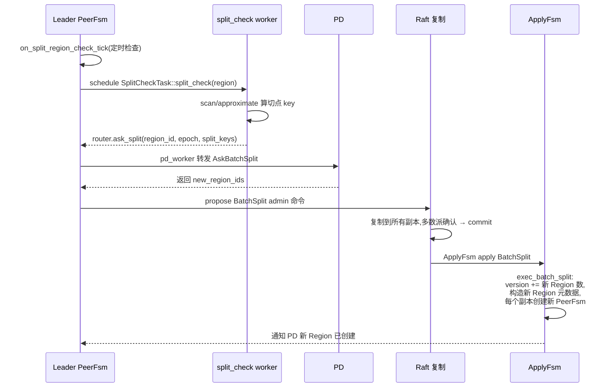

# 第 2 篇 · 第 8 章 · Region 分裂、迁移与 Snapshot

> **核心问题**:前几章我们一直假设"Region 是个 256MB 的静态分片"——但现实里 Region 永远在变:数据写多了,一个 Region 超过 256MB 就要**分裂**(split)成两个,否则单 Region 太大,分裂迁移都笨重;集群加了新机器,要把一部分 Region **迁移**过去(transfer leader 让新副本当 leader、move region 把副本搬过去),否则新机器闲着、老机器爆满;新副本刚加进来时,它的 Raft 日志是空的,**怎么追平 leader**?最朴素的办法是回放全部历史日志,可那意味着几亿条日志重放一遍——TiKV 的答案是给它传一份**快照**(Snapshot):直接把 leader 当前的 RocksDB 状态(SST 文件)拷一份过去,新副本 ingest 完就能立刻参与 Raft。本章拆透这三件事:分裂怎么找切点、迁移怎么不破坏路由、Snapshot 怎么高效传一份 SST 而不回放日志。

> **读完本章你会明白**:
> 1. 分裂(split)是个**两阶段 + epoch 校验**的协议——`split_check` worker 离线扫一遍算出切点 key,leader 拿到切点后向 PD 申请 new_region_ids,构造一条 `BatchSplit` admin 命令走 Raft 提交;apply 时同时切分原 Region 的 epoch(`version + 新 Region 数`),用 epoch 防止旧路由继续写老 Region。
> 2. 迁移的核心是 `TransferLeader` admin 命令,但 Raft 原生的 `MsgTransferLeader` 有个坑——直接调会让 leader 在不合适的时机(比如还有未提交日志、被锁定)切主,TiKV 加了一套"pre_transfer → ack → ready_to_transfer"的握手协议,保证切主前目标副本已经追平日志、pessimistic locks 也已 propose 完。
> 3. Snapshot 是 Raft 协议的内置机制——follower 落后太多(日志已被 GC)时,leader 发 snapshot 而不是日志条目。TiKV 的 snapshot 不是回放日志,而是**直接传 RocksDB 的 SST 文件**(v1 scan + 拷 SST / v2 用 RocksDB checkpoint API 克隆整个 tablet),新副本 ingest 完立刻参与 Raft,避免几亿条历史日志的重放。
> 4. 这三件事都共享一个机制——**RegionEpoch**:每次分裂/迁移/配置变更都会让 epoch 里的 version 或 conf_ver 自增,任何用旧 epoch 发来的请求都会被 `check_region_epoch` 拒绝。这是防止"路由失效后还在写老 Region"的根本保险。

> **如果一读觉得太难**:先只记住三件事——① Region 写多了就分裂,分裂是先离线扫切点、再走 Raft 提交一条 BatchSplit 命令、epoch version 自增,旧路由的请求会被新 epoch 拒绝;② 迁移靠 TransferLeader 命令,但 TiKV 加了一层握手协议保证切主前目标副本已追平;③ 新副本追不上 leader 时(日志已被 GC),leader 直接传一份 RocksDB SST 快照,不用回放历史日志。

---

## 〇、一句话点破

> **Region 不是静态的——它要 split(分裂)、要 transfer/move(迁移)、要 snapshot(传快照加副本)。这三件事共享一个保险:RegionEpoch 自增让旧路由失效,避免分裂/迁移期间的"幽灵写入"。**

这是结论,不是理由。本章倒过来拆:先讲分裂(split)——split_check 怎么找切点、BatchSplit 怎么走 Raft、apply 时怎么同时切多个 Region;再讲迁移——TransferLeader 为什么需要握手协议、PD 怎么调度;最后讲 Snapshot——什么时候触发、v1 的 scan SST 和 v2 的 checkpoint 克隆两条路、新副本怎么 ingest。

承接《etcd》:Raft 的 `MsgSnapshot`、`MsgTransferLeader` 是算法本体,本章只讲"TiKV 怎么用它们,加了什么"。承接《LevelDB》:RocksDB 的 SST 文件、checkpoint API、ingest 接口,本章只讲"TiKV 怎么用它们做 Snapshot"。承接上一章 P2-07:那个 `ReadRunner::GenTabletSnapshot` 就是 v2 的 snapshot 生成入口,本章会回到它。

---

## 一、问题先摆清楚:Region 一定要变,而且变得不破坏路由

回忆 P1-02 讲过 Region 的设计:把全量 key 切成 256MB 一段,每段一个 Raft 组。这个设计在静态下很完美,但**数据是活的**,Region 必然要变。三种变化场景:

### 场景一:Region 写多了要分裂

一个 Region 默认约 256MB(8.3.0 之前是 96MB)。如果某个 Region 一直在被写(比如热点 key、或者表的数据持续增长),它的数据量会越来越大——300MB、逼近 region_max_size(约 split_size 的 1.5 倍),这时 split_check 就该触发分裂了。

Region 太大有什么坏处?

- **分裂迁移笨重**:后面要分裂或迁移时,要处理的数据太多,耗时长;
- **热点无法分散**:一个 1GB 的热点 Region 持续压在一台机器上,无法精细地拆散到多台;
- **Compaction 压力**:单个 Region 对应的 RocksDB tablet 数据多,compaction 开销大;
- **Raft 日志长**:一个 Region 一条日志,数据多意味着写多、日志长,追平新副本慢。

所以 TiKV 会**自动检测 Region 大小,超过阈值(`region_max_size`,默认约 144MB)就触发分裂**——切成两个或多个更小的 Region。

### 场景二:节点之间负载不均要迁移

集群加了新机器,新机器上没有 Region,闲置;老机器上 Region 堆积,负载爆表。这时候要把一部分 Region **迁移**到新机器。迁移包括两件事:

- **move region(加副本)**:在新机器上加一个新副本(通过 conf change 或 snapshot);
- **transfer leader(切主)**:把 Region 的 leader 切到新机器上的副本,让新机器承担读写。

这两件事通常组合做:PD 调度时先在新机器上加副本,等副本追平后切 leader 到新机器,最后删老机器上的副本。

### 场景三:新副本要追平 leader

新加的副本(或者宕机很久刚恢复的副本)的 Raft 日志远远落后于 leader。它要追平才能参与 Raft。

最朴素的追平办法是:leader 把从 follower 落后位置开始的所有日志条目一条条发过去。但 TiKV 的 Raft 日志是会 GC 的(P2-06 讲过 RaftEngine 会截断老日志,只保留 recent 一段)——如果 follower 落后太多,**它要的日志可能已经被 GC 掉了**。这时候只能给 follower 传一份**当前状态的快照**(Snapshot),让它从快照恢复,而不是回放历史日志。

### 三种变化共享一个核心问题:路由会失效

这三种变化都带来一个共同挑战——**Region 的元数据变了**(边界变了、副本变了、leader 变了),但客户端(TiDB)可能还拿着**旧的路由信息**。如果 TiDB 用旧路由继续往老 Region 发写请求,会发生什么?

- 分裂后:TiDB 还往老 Region(已切成两半)发写,写的 key 可能已经不属于老 Region 了——会写到错误的地方;
- 迁移后:TiDB 还往老 leader 发写,但老 leader 已经不是 leader 了——会被拒绝(或重定向);
- 加副本时:老 Raft 组不知道新副本的存在,新副本也接不上老 Raft 组的日志。

怎么防止这些"幽灵写入"?TiKV 的核心保险是 **RegionEpoch**——每次分裂/迁移/配置变更,Region 的 epoch 都会自增(version 或 conf_ver)。任何带旧 epoch 的请求都会被服务端拒绝,强制客户端去 PD 拿最新路由。这是接下来三节反复要遇到的机制。

> **钉死这件事**:分裂、迁移、Snapshot 这三件事,本质都是"Region 元数据的变化"。它们共享一个保险机制——RegionEpoch 自增让旧路由失效。理解了 RegionEpoch,这三件事的"安全性"就理解了一大半。

---

## 二、RegionEpoch:路由失效的根本保险

在拆分裂、迁移、Snapshot 之前,先把 RegionEpoch 这个贯穿三件事的机制讲透。

### epoch 是什么:version + conf_ver 两个计数器

每个 Region 的元数据里有一个 [`RegionEpoch`](../tikv/components/raftstore/src/store/util.rs#L187) 字段,它有两个计数器:

- **version**:每当 Region 的**边界变了**(split、merge),version 自增;
- **conf_ver**:每当 Region 的**副本配置变了**(加/删副本、transfer leader 不算),conf_ver 自增。

```rust
// 检查 epoch 是否过期(stale 表示请求方的 epoch 比当前老)
pub fn is_epoch_stale(epoch: &metapb::RegionEpoch, check_epoch: &metapb::RegionEpoch) -> bool {
    epoch.get_version() < check_epoch.get_version()
        || epoch.get_conf_ver() < check_epoch.get_conf_ver()
}
```

每个发到 raftstore 的请求(读写、admin 命令)的 header 里都带 `region_epoch`,服务端收到后调 [`check_region_epoch`](../tikv/components/raftstore/src/store/util.rs#L272) 验证——如果请求的 epoch 比当前 Region 的 epoch 老,**直接拒绝**(返回 `EpochNotMatch` 错误),客户端必须去 PD 拿最新路由后重试。

### 每种 admin 命令怎么改 epoch

每种 admin 命令对 epoch 的影响不同,这是个**精心设计的查表**(见 [`admin_cmd_epoch_lookup`](../tikv/components/raftstore/src/store/util.rs#L224)):

| Admin 命令 | 检查 version | 检查 conf_ver | 改 version | 改 conf_ver |
|-----------|-------------|--------------|-----------|-------------|
| Split / BatchSplit | ✓ | ✓ | ✓(+新 Region 数) | × |
| ChangePeer / ChangePeerV2 | × | ✓ | × | ✓ |
| PrepareMerge / CommitMerge / RollbackMerge | ✓ | ✓ | ✓ | ✓(PrepareMerge) |
| TransferLeader | × | × | × | × |
| CompactLog / ComputeHash / VerifyHash | × | × | × | × |

这张表的注释里有一句重话:**"the existing settings below MUST NOT be changed!!!"**——为什么不能改?因为 epoch 检查是 Raft 安全性的一部分,改了会破坏升级兼容性和 `CmdEpochChecker` 的正确性依赖。这是 TiKV 历史上踩过坑后钉死的契约。

> **技巧(how)**:注意 TransferLeader 不改 epoch——因为 transfer leader 只是换 leader,**没有改 Region 的边界或副本配置**(副本集合没变)。这是为什么 transfer leader 不需要 epoch 检查就能安全进行。而 Split 改 version(边界变了)、ChangePeer 改 conf_ver(副本变了),都有明确的 epoch 变化反映出来。

### epoch 检查的实际位置

每次请求进 raftstore,都会过一遍 [`check_region_epoch`](../tikv/components/raftstore/src/store/util.rs#L272):

```rust
// (简化示意)
pub fn check_region_epoch(
    header: &RaftCmdHeader,
    admin_ty: Option<AdminCmdType>,
    region: &Region,
    include_region: bool,
) -> Result<()> {
    if !header.has_region_epoch() {
        // 没带 epoch 的请求(比如初始化),按 include_region 决定
        ...
    }
    let from_epoch = header.get_region_epoch();
    // 调用 compare_region_epoch 做实际比较
    compare_region_epoch(from_epoch, region, include_region)
}
```

这一步对**所有 Raft 命令**生效——读写、admin、查询都过它。任何一个带旧 epoch 的请求都会在这里被拦下,返回 `EpochNotMatch` 错误。客户端收到这个错误后,**必须去 PD 重新拉取路由**(因为 Region 边界或副本可能已经变了),然后用新 epoch 重试。

> **不这样会怎样**:如果没有 epoch 检查,会出现"分裂后老 Region 还在收写"——比如 Region A 分裂成 A1 和 A2,但客户端不知道,继续往 A 发写 key=K,而 K 现在其实在 A1 的范围内。A 收到后会发现 K 不在自己的 range 里(因为 A 的边界已经变了),但更糟的情况是它可能误把 K 写下去,导致**同一个 key 被写进两个 Region**——数据分叉、彻底乱套。epoch 检查在请求进 raftstore 的第一道关就把这种"幽灵写入"拦下,是 TiKV 路由正确性的根本保险。

理解了 epoch,接下来三节(分裂、迁移、Snapshot)的"安全性"就有了一个共同的根基。

---

## 三、分裂(split):把一个 Region 切成多个

分裂是最常见的 Region 变化。它把一个 Region(比如 `[a, z)`)切成两个或多个(比如 `[a, m)` 和 `[m, z)`),每个新 Region 是独立的 Raft 组。

### 全流程:split_check → PD → BatchSplit 命令 → apply

分裂的完整流程涉及多个组件协作,串起来是这样的:



这六步对应三组代码:

**① 触发与算切点:`on_split_region_check_tick` + split_check worker**

leader PeerFsm 有个定时 tick [`on_split_region_check_tick`](../tikv/components/raftstore/src/store/fsm/peer.rs#L6547),它会做一些前置检查(是不是 leader、是否正在 split、是否在 import 模式、是否正在生成 snapshot),然后调度一个 `SplitCheckTask` 给独立的 split_check worker:

```rust
// (简化示意)
let task = SplitCheckTask::split_check(
    self.region().clone(),
    true,
    CheckPolicy::Scan,                   // 默认 Scan 策略
    self.gen_bucket_range_for_update(),
);
self.ctx.split_check_scheduler.schedule(task);
```

split_check worker 跑在独立线程(不在 Raft 线程,避免阻塞),它有两种策略算切点([worker/split_check.rs#L668](../tikv/components/raftstore/src/store/worker/split_check.rs#L668)):

- **Scan 策略**(默认):扫一遍 Region 的数据,累计大小,每到 256MB 标记一个切点 key;
- **Approximate 策略**:用 RocksDB 的 `approximate_size` 接口快速估算(不用真扫,但有误差)。

Scan 准但慢(要扫几万 key),Approximate 快但有误差。split_check 默认 Scan,但 Approximate 失败会自动 fallback 到 Scan。算出切点后,worker 通过 `router.ask_split` 把切点发回 leader。

> **设计动机(why)**:为什么要把 split_check 挪到独立 worker?因为扫一个 256MB 的 Region 要扫几万 key,耗时几百毫秒——这种重活**绝不能在 Raft 线程做**(会阻塞几十万个 Peer 的推进)。把它丢给独立 worker,Raft 线程只负责发起任务和接收结果。这和 async_io 把 fsync 挪出 Raft 线程是同一类思路——**把不同性质的活分给不同线程**。

**② 申请 new_region_ids:`on_prepare_split_region` + PD**

leader 收到切点后,调 [`on_prepare_split_region`](../tikv/components/raftstore/src/store/fsm/peer.rs#L6624),它先做一轮 `validate_split_region`(检查 epoch 没变、切点合法、切点在 Region 范围内),然后构造 `PdTask::AskBatchSplit` 发给 pd worker:

```rust
let task = PdTask::AskBatchSplit {
    region: region.clone(),
    split_keys,
    peer: self.fsm.peer.peer.clone(),
    right_derive: self.ctx.cfg.right_derive_when_split,
    share_source_region_size,
    callback: cb,
    split_reason,
};
self.ctx.pd_scheduler.schedule(task);
```

pd worker 调 [`handle_ask_batch_split`](../tikv/components/raftstore/src/store/worker/pd.rs#L1293),向 PD 发 `ask_batch_split` RPC,PD 返回**新 Region 的 ID 列表**(每个新 Region 要一个全局唯一 ID,这个 ID 由 PD 集中分配,P5-16 讲过)。拿到 ID 后,构造一条 `BatchSplit` admin 请求发回 leader:

```rust
let req = new_batch_split_region_request(
    split_keys,
    resp.take_ids().into(),
    right_derive,
    share_source_region_size,
);
send_admin_request(&router, region_id, epoch, peer, req, callback, ...);
```

> **为什么 new_region_ids 要 PD 分配**:Region ID 是全局唯一的(整个集群不能有两个 Region 同 ID),这种全局唯一 ID 必须由中心化的 PD 分配——和 TSO 一样,P5-16 会讲 PD 的"ID 分配"职责,这里是它的一个用例。

**③ Raft 提交 + apply:`exec_batch_split`**

leader 收到 `BatchSplit` admin 请求后,走正常的 Raft 提交流程(propose → 复制 → commit → apply)。**关键在 apply 阶段**——[`exec_batch_split`](../tikv/components/raftstore/src/store/fsm/apply.rs#L2646) 是分裂真正发生的地方:

```rust
// (简化示意,保留核心逻辑)
fn exec_batch_split(
    &mut self,
    ctx: &mut ApplyContext<EK>,
    req: &AdminRequest,
) -> Result<(AdminResponse, ApplyResult<EK::Snapshot>)> {
    let mut derived = self.region.clone();
    validate_batch_split(req, &derived)?;

    let split_reqs = req.get_splits();
    let mut keys: VecDeque<_> = split_reqs.get_requests().iter()
        .map(|req| req.get_split_key().to_vec()).collect();

    // —— 关键 1:version 自增 ——
    let new_region_cnt = split_reqs.get_requests().len();
    let new_version = derived.get_region_epoch().get_version() + new_region_cnt as u64;
    derived.mut_region_epoch().set_version(new_version);

    let right_derive = split_reqs.get_right_derive();
    let mut regions = Vec::with_capacity(new_region_cnt + 1);

    // —— 关键 2:根据 right_derive 决定源 Region 留左还是留右 ——
    if right_derive {
        // 源 Region 留右边:[split_key1, ..., last_split_key, old_end_key]
        keys.push_front(derived.get_start_key().to_vec());
    } else {
        // 源 Region 留左边:[old_start_key, ..., split_key1]
        keys.push_back(derived.get_end_key().to_vec());
        derived.set_end_key(keys.front().unwrap().to_vec());
        regions.push(derived.clone());
    }

    // —— 关键 3:构造每个新 Region 的元数据 ——
    let mut new_split_regions: HashMap<u64, NewSplitPeer> = HashMap::default();
    for req in split_reqs.get_requests() {
        let mut new_region = Region::default();
        new_region.set_id(req.get_new_region_id());
        new_region.set_region_epoch(derived.get_region_epoch().to_owned());  // 继承 epoch(已自增)
        new_region.set_start_key(keys.pop_front().unwrap());
        new_region.set_end_key(keys.front().unwrap().to_vec());
        new_region.set_peers(derived.get_peers().to_vec().into());  // 继承副本配置
        for (peer, peer_id) in new_region.mut_peers().iter_mut().zip(req.get_new_peer_ids()) {
            peer.set_id(*peer_id);   // 但每个 peer 用新 ID
        }
        new_split_regions.insert(new_region.get_id(), NewSplitPeer { ... });
        regions.push(new_region);
    }
    // ... 后续:创建新 PeerFsm、通知 PD、返回 response
}
```

这三处关键逻辑值得逐条钉死:

**关键 1:version 自增 `+ new_region_cnt`**。为什么是 +新 Region 数,而不是 +1?因为一次分裂可能切成多个 Region(比如切成 3 个,version 就 +3),这样每次分裂 epoch 变化幅度足够大,**任何用旧 epoch 的请求都会被明显拒绝**。这是个"epoch 变化幅度"的精细设计——不是简单的 +1,而是反映"切了几刀"。

**关键 2:`right_derive` 决定源 Region 留哪边**。这是个微妙的语义:分裂 `[a, z)` 成 `[a, m)` 和 `[m, z)`,**源 Region(原来的 Region ID)是变成 `[a, m)` 还是 `[m, z)`**?

- `right_derive = false`(默认):源 Region 变成 `[a, m)`(留左边),新 Region 是 `[m, z)`;
- `right_derive = true`:源 Region 变成 `[m, z)`(留右边),新 Region 是 `[a, m)`。

为什么要有这个选项?**因为某些场景下保留右边更合理**——比如源 Region 是个热点,分裂时希望源 Region 保留热点侧的数据(通常在右边),让新 Region 接走冷数据。这是个细微但实用的优化开关。

**关键 3:新 Region 继承 epoch 和副本配置,但用新 peer_id**。注意这里——新 Region 的**副本配置**(哪些 store 上有副本)和源 Region 完全一样(继承 `derived.get_peers()`),但每个副本的 **peer_id 是新的**(由 PD 分配)。这保证了"分裂后的新 Region 在原来的每台机器上都有一个副本",**不需要立刻传 snapshot**——因为新副本可以从源 Region 的本地数据 inherit(同一台机器上,源 Region 的 RocksDB tablet 已经有这些 key,新 Region 的 tablet 可以从源数据"继承"出来)。

> **技巧(how)**:这里有个 TiKV 的精妙优化——**分裂时不需要立刻传 snapshot**。因为新 Region 的副本和源 Region 的副本在同一台机器上,新副本可以直接从源 Region 的本地 RocksDB 数据"切"出自己那部分(通过临时 tablet + ingest)。这避免了分裂引发的 snapshot 风暴——如果每次分裂都给所有新副本传 snapshot,在大集群里会引发剧烈的网络和 IO 抖动。这个"本地继承"的优化是 TiKV 分裂能高效进行的关键。

### 分裂后的路由更新

apply 完成后,ApplyFsm 会通知 PD 新 Region 已创建(PD 收到 heartbeat 时也会发现新 Region)。PD 更新路由表,客户端下次请求时(或者收到 EpochNotMatch 错误后)会拿到新的路由,往正确的新 Region 发请求。

源 Region 的旧 epoch 的请求会被 `check_region_epoch` 拒绝,客户端重试时拿新路由——这是 epoch 机制保证的"分裂期间无幽灵写入"。

### 分裂的两种触发方式

除了上面讲的"size 触发"(Region 太大),还有两种触发:

- **load 触发**(load-base split):PD 的 `split_controller` 检测到某个 Region 是热点(CPU/IO 高),即使没到 size 阈值,也主动触发分裂,把热点打散。这是 5.0 引入的特性,详见 P5-18;
- **admin 触发**:用户手动通过 `tikv-ctl` 或 SQL 命令指定 split key 强制分裂。

这三种触发最终都走同一条路径——`ask_batch_split` → PD → BatchSplit 命令 → apply。

> **架构演进**:load-base split 是 5.0 引入的,老版本只有 size 触发。这是 TiKV 在"自动热点处理"上的重要演进——以前热点 Region 只能等它长到 size 阈值才分裂,现在 CPU/IO 高也能触发,响应更敏捷。

---

## 四、迁移:transfer leader + move region

迁移是另一类常见操作——把 Region 的 leader 或副本搬到另一台机器。它由 PD 调度,目的是负载均衡。

### move region:加副本 + 删副本

要把一个 Region 的副本从机器 A 搬到机器 B,标准流程是:

1. **在 B 上加一个新副本**(通过 `ChangePeer` conf change,加 voter);
2. **新副本追平 leader**(通过 snapshot 或日志复制);
3. **把 leader 切到 B**(transfer leader);
4. **删掉 A 上的老副本**(通过 `ChangePeer` 删 voter)。

第 1、4 步是配置变更(`ChangePeer`),改 `conf_ver`;第 2 步可能涉及 snapshot(下一节拆);第 3 步是 transfer leader。

### TransferLeader:为什么需要握手协议

第 3 步看起来简单——Raft 协议本身就有 `MsgTransferLeader`,leader 收到后直接调 `raft.transfer_leader()` 就行。但 TiKV 没有直接用原生 `MsgTransferLeader`,而是加了一套握手协议。为什么?

看 [`propose_transfer_leader`](../tikv/components/raftstore/src/store/peer.rs#L5069) 的注释,它列出了完整的握手流程:

```
1. pre_transfer_leader on leader:
   Leader 发 MsgTransferLeader 给 follower。
2. pre_ack_transfer_leader_msg on follower:
   Follower 通过所有必要检查后,尝试 warmup entry cache。
3. ack_transfer_leader_msg on follower:
   entry cache warmup 完成或超时后,follower 回复 ACK(带 MsgTransferLeader
   和它承诺的持久化 index)。

如果有未提交的 pessimistic locks(在 on_transfer_leader_msg 中检测):
   1. Leader 先 propose pessimistic locks,再 propose TransferLeader 命令。
   2. follower 再次 ack_transfer_leader_msg:follower apply 完 TransferLeader
      命令,回带特殊 context(CommandReply)的 ACK。

4. ready_to_transfer_leader on leader:
   Leader 检查现在是否合适切主,如果合适,调 raft transfer_leader API。
```

这套握手为什么必要?核心原因是:**直接切主可能丢数据或破坏不变性**。具体几个坑:

- **目标 follower 还没追平**:如果 leader 直接切给一个落后的 follower,新 leader 缺少最近的日志,会强制回滚已提交的数据(Raft 安全性违反)。握手协议里 follower 回 ACK 时带上"承诺的持久化 index",leader 据此判断 follower 是否追平;
- **还有未提交的 pessimistic locks**:悲观事务的锁存在 leader 内存里(还没 propose 成 Raft 日志),如果直接切主,这些锁会丢——握手协议让 leader 先把这些 locks propose 成 Raft 命令,确保切主后新 leader 也有这些锁;
- **时机不合适**(比如正在 split、有 pending snapshot):切主会和这些操作冲突,握手协议让 leader 等到合适时机再切。

> **设计动机(why)**:这套握手协议是 TiKV 在生产中踩坑后加的。原生 `MsgTransferLeader` 在简单场景下够用,但 TiKV 有悲观事务、split、snapshot 这些并发操作,**裸用 transfer leader 会破坏这些操作的不变性**。握手协议本质是"切主前先确认目标 ready、把 in-flight 状态都持久化",保证切主不丢数据、不破坏一致性。

> **承接《etcd》**:Raft 的 `MsgTransferLeader` 算法本体不重复。这里只讲 TiKV 在它之上加的握手层——这是 TiKV 对 Raft 协议的"工程加固",不是算法修改。

### PD 怎么调度迁移

PD 通过心跳收集每个 Region 的状态(leader 在哪、副本在哪、负载如何),然后根据调度策略(balance leader、balance region、hot region)下发调度指令。这些指令最终转化为 `TransferLeader` 或 `ChangePeer` admin 命令,走 Raft 提交。详见 P5-18。

---

## 五、Snapshot:给新副本传一份 SST 快照

最后一类操作是 Snapshot。它解决"新副本或落后副本怎么追平 leader"的问题,但不用回放历史日志,而是直接传一份当前状态的快照。

### 什么时候触发 Snapshot

Snapshot 的触发场景:

- **新副本刚加进来**:它的 Raft 日志是空的,完全跟不上 leader;
- **副本宕机很久刚恢复**:它的日志远远落后,需要的日志可能已被 GC;
- **leader 收到 follower 的 fetch 请求,但请求的日志范围已被 GC**:Raft 协议规定这种情况下 leader 必须发 snapshot 而不是日志条目。

这第三种是 Raft 协议内置的——`MsgAppend` 失败(日志已被 GC)时,leader 自动转 `MsgSnapshot`。

> **承接《etcd》**:Raft 的 `MsgSnapshot` 机制(leader 何时发 snapshot、follower 收到后怎么处理)是算法本体,本章不重复。这里只讲 TiKV 怎么**生成和传输** snapshot。

### SnapKey:用 (region_id, term, idx) 标识一个 snapshot

每个 snapshot 有个唯一标识 [`SnapKey`](../tikv/components/raftstore/src/store/snap.rs#L139):

```rust
pub struct SnapKey {
    pub region_id: u64,
    pub term: u64,
    pub idx: u64,   // snapshot 的 last applied index
}

impl Display for SnapKey {
    fn fmt(&self, f: &mut Formatter<'_>) -> fmt::Result {
        write!(f, "{}_{}_{}", self.region_id, self.term, self.idx)
    }
}
```

用 `(region_id, term, idx)` 三元组标识,确保同一 Region 不同时刻的 snapshot 不冲突。snapshot 文件在磁盘上就用这个 key 命名(比如 `1234_5_678`)。

### v1 的 snapshot 生成:scan SST 拷文件

经典 raftstore(v1)的 snapshot 生成在 [`Snapshot::build`](../tikv/components/raftstore/src/store/snap.rs#L1075):

```rust
// (简化示意)
pub fn build<EK: KvEngine>(
    &mut self,
    engine: &EK,
    kv_snap: &EK::Snapshot,           // RocksDB 的 snapshot
    region: &Region,
    allow_multi_files_snapshot: bool,
    for_balance: bool,
    start: UnixSecs,
) -> RaftStoreResult<RaftSnapshotData> {
    let mut snap_data = RaftSnapshotData::default();
    snap_data.set_region(region.clone());

    self.do_build::<EK>(engine, kv_snap, region, allow_multi_files_snapshot, for_balance)?;
    // do_build 内部:对每个 CF(default/write/lock),scan 一遍 kv_snap,
    // 把 region 范围内的 key-value 写成 SST 文件,放到 snapshot 目录

    let total_size = self.total_size();
    let total_count = self.total_count();
    snap_data.set_file_size(total_size);
    snap_data.set_version(SNAPSHOT_VERSION);
    // ... 设置 meta
    Ok(snap_data)
}
```

v1 的 snapshot 本质是:**拿 RocksDB 的一个 snapshot,scan 出 Region 范围内的所有 key-value,写成 SST 文件**。这个 SST 文件就是 snapshot 的实体,传给 follower 后,follower 用 `ingest` 接口把它"塞进"自己的 RocksDB,就完成了状态恢复。

> **承接《LevelDB》**:RocksDB 的 `Snapshot`、`SST` 文件、`ingest` 接口都是 LSM-tree 引擎的标准能力。本章只讲"TiKV 怎么用它们做 snapshot 传输",LSM 的原理不重复。

### v2 的 snapshot 生成:RocksDB checkpoint 克隆整个 tablet

raftstore-v2 的 snapshot 生成完全不同,走的是 [`ReadRunner::GenTabletSnapshot`](../tikv/components/raftstore/src/store/async_io/read.rs#L40) 任务,最终调 [`generate_snap`](../tikv/components/raftstore/src/store/async_io/read.rs#L123):

```rust
// (简化示意)
fn generate_snap(&self, snap_key: &TabletSnapKey, tablet: EK) -> crate::Result<()> {
    let checkpointer_path = self.snap_mgr().tablet_gen_path(snap_key);
    if checkpointer_path.exists() {
        // 旧 snapshot 还在,先删
        encryption::trash_dir_all(&checkpointer_path, self.snap_mgr().key_manager().as_deref())?;
    }
    // 关键:用 RocksDB 的 checkpoint API 克隆整个 tablet
    let mut checkpointer = tablet.new_checkpointer()?;
    checkpointer.create_at(checkpointer_path.as_path(), None, 0)?;
    Ok(())
}
```

v2 的 snapshot 本质是:**用 RocksDB 的 `checkpoint` API,直接克隆整个 tablet**(底层是文件系统的 copy-on-write 或硬链接,几秒完成)。

为什么 v2 改用 checkpoint?v1 的 scan 方式有几个痛点:

- **慢**:scan 几万 key 写 SST,耗时几秒到几十秒;
- **占 CPU**:scan 在 Raft 线程或 worker 上跑,占用 CPU;
- **不是 atomic 的 RocksDB 状态**:scan 期间 RocksDB 还在写,需要拿 snapshot 但仍然是个"软"一致性。

v2 的 checkpoint 方式:

- **快**:几秒完成(底层是文件系统层面的克隆);
- **不占 CPU**:主要是 IO;
- **atomic**:checkpoint 是 RocksDB 引擎层面的原子操作,状态一致。

这是 v2 相对 v1 在 snapshot 上的一个重要演进。

> **架构演进**:v1 的 scan SST snapshot 是经典做法,v2 的 checkpoint tablet snapshot 是新做法。v2 的方式更快、更省 CPU、状态更一致。这是 raftstore-v2 的一个亮点,理解了 v1 的 scan 方式(为什么慢、为什么有痛点),就能 appreciate v2 的 checkpoint 为什么是改进。

### Snapshot 的传输与接收

生成的 snapshot(无论 v1 的 SST 文件还是 v2 的 tablet 目录)通过 gRPC 流式传给目标副本。目标副本收到后:

- **v1**:把 SST 文件写到本地 snapshot 目录,然后调 `Snapshot::apply` 用 `ingest` 接口塞进自己的 RocksDB;
- **v2**:把 tablet 目录克隆到本地,直接作为自己的 tablet。

apply 完成后,目标副本的 RocksDB 状态就和 leader 一致了(在 snapshot 那个 term/index 的时刻),然后从 snapshot 之后继续接收 Raft 日志,逐步追上 leader 的最新状态。

### snapshot 的清理

snapshot 文件占磁盘空间,用完要清理。[`SnapManager::delete_snapshot`](../tikv/components/raftstore/src/store/snap.rs#L1909) 负责清理——它会检查这个 snapshot 是否还在被引用(比如正在传输、正在 apply),确认无引用后才删。这是个引用计数式的清理,避免删掉正在用的 snapshot。

> **技巧(how)**:注意 `SnapManager` 还有个 `register` 接口([snap.rs#L1831](../tikv/components/raftstore/src/store/snap.rs#L1831)),每个 snapshot 状态(Send/Receive/Apply)都会注册。这是为了**全局观测 snapshot 的进行状态**——通过 Grafana 看 `SNAP_COUNTER` 系列指标,能知道当前有多少 snapshot 在生成、传输、接收。这是 TiKV 运维时排查 snapshot 慢、卡住的关键观测点。

---

## 六、三件事的统一视角:都是"元数据变化 + epoch 保险"

把分裂、迁移、Snapshot 三件事放一起看,它们有个统一的结构:

| 操作 | 改变的元数据 | 改 epoch 哪个字段 | 风险 | 保险 |
|------|-------------|------------------|------|------|
| Split | Region 边界 | version += 新 Region 数 | 旧路由写入老 Region | epoch 检查拒绝旧请求 |
| ChangePeer | 副本配置 | conf_ver += 1 | 旧配置的副本还在收消息 | epoch 检查拒绝旧配置 |
| TransferLeader | leader 身份 | ×(不改 epoch) | 切到落后 follower 丢数据 | 握手协议确认追平 |
| Snapshot | 副本状态 | ×(不改 epoch) | 状态不一致 | RocksDB snapshot/checkpoint 原子性 |

可以看出,**Split 和 ChangePeer 都改 epoch**(因为它们改了"会路由失效"的元数据——边界和副本配置),而 **TransferLeader 和 Snapshot 不改 epoch**(因为它们没改路由层面的元数据——leader 切换是临时的、snapshot 是状态恢复)。

这个区分很关键:**只有改了路由的元数据变化,才需要 epoch 保险**。TransferLeader 虽然改 leader,但客户端访问时本来就要先问 PD(leader 在哪),所以不需要 epoch;Snapshot 是状态恢复,根本不涉及路由。

> **钉死这件事**:Region 的三种变化里,**分裂和迁移副本改 epoch,transfer leader 和 snapshot 不改**。这个区分反映了 epoch 机制的本质——它是"路由失效保险",只在路由确实会失效时才动用。

---

## 七、技巧精解:right_derive + 本地继承 + checkpoint 演进

本章挑三个最值得拆透的技巧。

### 技巧一:分裂的 right_derive 和"本地继承"为什么避免 snapshot 风暴

分裂时,新 Region 的副本配置和源 Region 完全一样(继承 `derived.get_peers()`),这意味着**新副本和源副本在同一台机器上**。TiKV 利用这一点,让新副本**从源 Region 的本地 RocksDB 数据"切"出自己那部分**,而不是从 leader 传 snapshot。

**为什么不这么写会撞墙**:朴素做法是分裂后给每个新副本传 snapshot。

- 一个 Region 分裂成 2 个,3 副本配置,意味着要传 6 份 snapshot(2 个新 Region × 3 副本);
- 大集群里频繁分裂(每天可能几千次),每次都传 snapshot = snapshot 风暴,网络和 IO 抖动剧烈;
- 而且 snapshot 生成本身慢(v1 scan SST),会让分裂操作耗时爆炸。

TiKV 的"本地继承"优化:**新副本就在同一台机器上,直接从源 Region 的 RocksDB tablet 切出对应 key range 的数据**(通过临时 tablet + ingest),不需要网络传输。这把分裂的代价从"6 份 snapshot 传输"降到"6 次本地 RocksDB 操作",快了几个数量级。

**right_derive 的作用**:在这个"本地继承"的语境下,right_derive 决定**源 Region(保留原 Region ID 的那个)留左还是留右**。这是个细微的优化——如果源 Region 是热点,分裂时希望源 Region 保留热点侧(通常数据在右边),让新 Region 接走冷数据。这个开关让分裂在热点场景下更智能。

### 技巧二:TransferLeader 的握手协议为什么避免丢数据

原生 Raft 的 `MsgTransferLeader` 是 leader 收到后直接切主。但 TiKV 加了"pre_transfer → ack → ready_to_transfer"的握手,核心是**让 follower 先确认追平、leader 先把 in-flight 状态持久化**。

**为什么不这么写会撞墙**:裸用 `MsgTransferLeader` 有三个坑:

- **切到落后 follower**:follower 缺少最近 committed 的日志,切主后会强制回滚,违反 Raft 安全性;
- **丢 pessimistic locks**:悲观事务的锁在 leader 内存里(还没 propose),切主后丢失,导致事务状态混乱;
- **和 split/snapshot 冲突**:切主时如果正在 split,可能出现分裂状态不一致。

握手协议逐个堵这些坑:follower 回 ACK 时带"承诺的持久化 index",leader 据此判断追平;leader 先 propose pessimistic locks 再切;ready_to_transfer 检查没有冲突操作才切。**这是 TiKV 对 Raft 协议的工程加固,不是算法修改**——它在原生语义之上加了一层"安全确认"。

### 技巧三:v1 scan SST vs v2 checkpoint 的演进

v1 的 snapshot 用 scan SST,v2 用 RocksDB checkpoint。这个演进的逻辑链条值得品味:

- **v1 时代**(scan SST):朴素但有效,scan 几万 key 写 SST,几秒到几十秒。在大集群里 snapshot 频繁,这个耗时成为瓶颈;
- **发现问题**:scan 慢、占 CPU、snapshot 期间 RocksDB 还在写需要拿 snapshot;
- **v2 的解法**(checkpoint):RocksDB 引擎层面的原子克隆,几秒完成,不占 CPU,状态一致;
- **为什么 v1 没用 checkpoint**:历史原因,v1 设计早期 checkpoint API 可能还不成熟,或者 v1 的 tablet 模型(单 RocksDB 多 Region)不适合整体 checkpoint;v2 改成 per-Region tablet(per-Region 一个 RocksDB 实例),checkpoint 整个 tablet 就是 checkpoint 一个 Region 的全部数据,正好契合。

> **钉死这件事**:v1 → v2 的 snapshot 演进,反映了 TiKV 架构演进的一个规律——**很多 v1 的性能瓶颈,在 v2 里通过"换一个更底层的原语"解决**(scan SST → checkpoint,本质是从"应用层 scan"换到"引擎层 clone")。这是深入理解 TiKV 架构演进的一个视角。

---

## 八、章末小结

### 回扣主线

本章服务的还是**复制层**——分裂、迁移、Snapshot 都是"Region 元数据变化"的操作,它们让 multi-raft 系统能动态适应数据增长和负载变化。这些操作不改变 Raft 的语义(不丢不乱),但需要精心设计 epoch 机制和握手协议来保证变化期间的安全性。

回到全书的二分法:**复制层(每个 Region 怎么不丢不乱)vs 事务层(跨 Region 怎么拼出 ACID)**。本章是复制层的"动态性"——它解决的不是"怎么保证一致"(那是前几章 Raft + RaftEngine 的活),而是"Region 元数据变化时怎么保持一致"。这是 multi-raft 系统区别于静态 Raft 的关键能力。

承接《etcd》:Raft 的 `MsgSnapshot`、`MsgTransferLeader` 算法本体不重复。本章只讲 TiKV 在它们之上加的 epoch 检查、握手协议、snapshot 生成方式。承接《LevelDB》:RocksDB 的 SST、checkpoint、ingest 接口不重复,本章只讲 TiKV 怎么用它们做 snapshot。

### 五个为什么

1. **为什么 Region 要分裂?**——单 Region 太大(超过 256MB 阈值)会导致分裂迁移笨重、热点无法分散、Compaction 压力大、Raft 日志长。自动分裂切成更小的 Region,保持每个 Region 的粒度在甜点附近。
2. **为什么分裂时 version 要 `+= 新 Region 数` 而不是 +1?**——一次切成多个 Region 时,epoch 变化幅度要足够大,任何用旧 epoch 的请求都会被明显拒绝。这是个"epoch 变化幅度"的精细设计,反映"切了几刀"。
3. **为什么分裂不需要立刻传 snapshot?**——新 Region 的副本配置和源 Region 一样,新副本就在同一台机器上,可以从源 Region 的本地 RocksDB 数据"切"出对应 key range(本地继承),不需要网络传输。这避免了分裂引发的 snapshot 风暴。
4. **为什么 TransferLeader 要加握手协议?**——裸用 Raft 的 `MsgTransferLeader` 可能切到落后 follower(丢已提交数据)、丢 pessimistic locks、和 split/snapshot 冲突。握手协议让 follower 先确认追平、leader 先持久化 in-flight 状态,保证切主安全。
5. **为什么 v2 的 snapshot 用 checkpoint 而不是 scan SST?**——scan SST(v1)慢、占 CPU、状态一致性弱;checkpoint(v2)是 RocksDB 引擎层面的原子克隆,快、不占 CPU、状态一致。v2 改成 per-Region tablet 后,checkpoint 整个 tablet 正好等于 checkpoint 一个 Region,这个底层原语更契合。

### 想继续深入往哪钻

- **源码**:本章引用的核心文件——`components/raftstore/src/store/worker/{split_check,pd}.rs`(分裂流程)、`components/raftstore/src/store/fsm/{peer,apply}.rs`(`on_split_region_check_tick`、`on_prepare_split_region`、`exec_batch_split`)、`components/raftstore/src/store/util.rs`(`is_epoch_stale`、`check_region_epoch`、`admin_cmd_epoch_lookup`、`validate_split_region`)、`components/raftstore/src/store/snap.rs`(`SnapKey`、`Snapshot::build`、`SnapManager`)、`components/raftstore/src/store/peer.rs`(`propose_transfer_leader`、`ready_to_transfer_leader`)、`components/raftstore/src/store/async_io/read.rs`(`GenTabletSnapshot`,v2 的 snapshot 生成)、`components/raftstore/src/store/peer_storage.rs`(`snapshot`、`apply_snapshot`)。
- **想深入 Raft 的 Snapshot/TransferLeader 算法本体**:读《etcd》对应章节,本书承接不重复。
- **想深入 RocksDB 的 SST/checkpoint/ingest**:读《LevelDB》对应章节(本书 P3-09 也会讲 TiKV 怎么用 RocksDB 的 CF)。
- **想深入 PD 的调度策略**(什么时候触发分裂、迁移):读 P5-18,本章只讲分裂/迁移的执行,不讲调度决策。
- **想动手感受**:用 `tikv-ctl` 的 `region` 命令看一个 Region 的 epoch、边界、副本分布;用 PD 的 region 视图观察分裂和迁移的发生;用 Grafana 的 `SNAP_COUNTER` 指标看 snapshot 的生成/传输/接收速率。

### 引出下一篇

讲完了第 2 篇(复制:raftstore 怎么把 Raft 跑起来),我们已经拆透了 multi-raft 在 TiKV 落地的全部核心机制——batch-system 驱动百万 Peer、五步流水线、RaftEngine 存日志、async_io/hibernate 省 CPU、分裂迁移 Snapshot 应对变化。接下来第 3 篇,我们往下走一层,看 Raft commit 的命令最终**怎么落盘到 RocksDB**:第 9 章 P3-09 拆 RocksDB 引擎和它的 Column Family(承接《LevelDB》),第 10 章 P3-10 拆 MVCC 的 key+ts 编码,第 11 章 P3-11 拆 Apply 流水线(怎么把 Raft 命令变成 RocksDB 的写)。这一篇是"复制层"和"事务层"的过渡——RocksDB 既是复制的落盘点,也是事务数据的物理载体。

> **下一章**:[P3-09 · RocksDB 引擎:LSM-tree + Column Family](P3-09-RocksDB引擎-LSM-tree与Column-Family.md)
