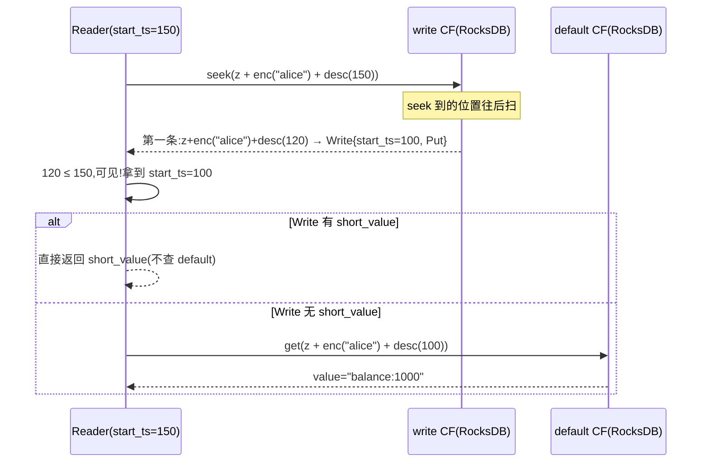

# 第 3 篇 · 第 10 章 · MVCC 编码:key + 时间戳

> **核心问题**:上一章讲了 RocksDB 一个实例开 default/write/lock 三个 CF——可这三个 CF 里到底存什么?key 长什么样、value 长什么样?具体地说:**多版本怎么存**?同一个 key,被事务 A 在 t1 写了 v1、又被事务 B 在 t2 写了 v2,这两个 value 在 RocksDB 里怎么排列,才能让"读 t2 时刻的数据"快速找到 v2、"读 t1 时刻的数据"快速找到 v1?为什么 default 和 write 用不同的 key 编码、用不同的 CF?锁(lock)又长什么样?这一章把 MVCC 的 key+ts 编码、三个 CF 的物理内容、short_value 这个看似微小的优化,拆到 bytes 级。

> **读完本章你会明白**:
> 1. **key 拼 ts** 是 MVCC 的核心编码:`encoded_user_key + commit_ts(反转大端)`,ts 越大字节越小,所以**同一个 key 的新版本在 RocksDB 里排在前面**(降序),读的时候 seek 到位置往后扫就能拿到"最新的"。这套编码用的是 `encode_u64_desc`(对 ts 取反再大端),源码在 `txn_types::Key::append_ts`。
> 2. **memcomparable 编码**(user_key 部分)是 MyRocks 的那套:8 字节一组 + 1 字节 marker,保证任意 bytes 在 RocksDB 字典序里和"逻辑大小"一致。这是为什么 user_key 不能直接用原始 bytes。
> 3. **default CF 存 value、write CF 存提交记录指向 value、lock CF 存锁**——这三者的 key 编码**不同**(default/lock 用 start_ts、write 用 commit_ts),值结构也不同(Write、Lock 是 protobuf 风格的紧凑结构)。short_value(≤255 字节的 value)被**内联进 write/lock**,省掉一次跨 CF 跳转。
> 4. `data_prefix`(0x7A,即字符 'z')是所有 MVCC 数据 key 的前缀,把数据 key 和元数据 key(raft state、region state 等)在同一个 RocksDB 里分开。

> **如果一读觉得太难**:先只记住三件事——① MVCC 的 key = `encoded_user_key + encode_u64_desc(ts)`,ts 取反大端让"大 ts 在前",读的时候 seek 就能拿到最新版本;② default CF 存 value、write CF 存提交记录、lock CF 存锁;③ 小 value(≤255 字节)会内联进 write/lock 的 short_value 字段,读时省一次跨 CF 跳转。

---

## 〇、一句话点破

> **MVCC 把"同一个 key 的多个版本"在 RocksDB 里编码成 `encoded_user_key + 反转大端的 ts`,让新版本排在前、旧版本排在后;default CF 存 value 真身(用 start_ts)、write CF 存提交记录(用 commit_ts,指向 value)、lock CF 存未提交的锁(用 start_ts);读的时候 seek 到 user_key 的位置,按 commit_ts 降序扫 write CF,找到第一个 ≤ 读 ts 的提交记录,就拿到了可见版本。**

这是结论,不是理由。本章倒过来拆:先讲为什么要做多版本(不做会撞什么墙);再讲 key 的编码(user_key 的 memcomparable + ts 的反转大端);然后拆三个 CF 各存什么、key 各用哪个 ts;最后拆 short_value 这个微小但关键的优化。

---

## 一、为什么要 MVCC:读写不互相阻塞

### 多版本的动机:快照隔离

先回到动机。如果 TiKV 不做多版本(就是普通的 KV,一个 key 一个 value),那么:

- **读会阻塞写、写会阻塞读**:一个事务正在读 key=K,另一个事务要写 K,得等读完才能写(否则读到一半数据被改,撕裂);
- **长事务拖死系统**:一个事务要读 100 万个 key,这期间所有这些 key 都不能被别人写,系统卡死。

MVCC(Multi-Version Concurrency Control,多版本并发控制)的解法是:**每次写不覆盖旧值,而是新增一个版本**。一个 key 在 RocksDB 里有多条记录(每个事务的写一条),带版本号(时间戳)。读的时候,事务拿一个"读时间戳"(start_ts),只看 **≤ start_ts 的最大版本**——这个版本是该事务"能看到的"最新数据。

这样,读写就**不互相阻塞**了:

- 一个事务在 start_ts=100 读 key=K,看到 commit_ts≤100 的最大版本(比如 80);
- 同时另一个事务在 start_ts=120 写 key=K(新版本 commit_ts=120),写到 default/write CF;
- 读事务完全感知不到写(它只看 ≤100 的),写事务也不等读(它写新版本不影响旧版本)。

> **钉死这件事**:MVCC 的本质是**用空间换并发**——每个 key 存多个版本(空间开销),换读写不互相阻塞(并发收益)。TiKV 的 MVCC 用 TSO 给的全局单调递增时间戳作为版本号(承接 P5-17),所以"≤ start_ts 的最大版本"在全局有明确含义——这是事务隔离性(snapshot isolation)的物理根基。

### 多版本怎么存:放进 RocksDB 的三 CF

关键问题来了:**一个 key 的多个版本,在 RocksDB 里怎么排列?**

朴素做法是每个 key 一个"版本列表"(在 value 里存一个 list)。但这破坏了 RocksDB 的 LSM 模型——它假设 key-value 是扁平的,不希望 value 内部还是个数据结构。更糟的是,读"某个版本"要先把整个 list 读出来再二分,放大读。

TiKV 的解法更巧妙:**把版本摊平到 key 里**。一个 key 的每个版本,在 RocksDB 里是一条独立的 KV——key 编码成 `user_key + ts`,这样同一个 user_key 的多个版本在 RocksDB 的有序存储里**自然排在一起**,而且按 ts 排序。读的时候 seek 到 user_key 的位置,往后扫就能拿到版本序列。

这个"key 拼 ts"就是本章的核心。下一节拆它的编码细节。

---

## 二、key 编码:memcomparable user_key + 反转大端 ts

### TiKV 里的 key 有三种表示

读源码首先撞到一个混淆:`Key`、`encoded key`、`raw key`、`data key`,这是几个东西?理清楚:

- **raw key**:用户(比如 TiDB)传进来的原始 key bytes(比如一行数据的主键编码)。这是"逻辑 key"。
- **encoded key**(memcomparable encoding):raw key 经过 `encode_bytes` 转换后的 bytes,保证字典序和逻辑大小一致。这是 TiKV 内部 MVCC 操作的"user key"部分。
- **data key**:在 encoded key 前面加 `data_prefix`(0x7A)的 bytes。这是真正存进 RocksDB 的 key 的前缀(把数据 key 和元数据 key 分开)。

看 [`txn_types::Key`](../tikv/components/txn_types/src/types.rs#L82) 的定义和核心方法:

```rust
// components/txn_types/src/types.rs#L82-L95(摘录)
#[derive(Eq, PartialEq, Ord, PartialOrd, Hash)]
pub struct Key(Vec<u8>);

impl Key {
    /// Creates a key from raw bytes.
    #[inline]
    pub fn from_raw(key: &[u8]) -> Key {
        // adding extra length for appending timestamp
        let len = codec::bytes::max_encoded_bytes_size(key.len()) + codec::number::U64_SIZE;
        let mut encoded = Vec::with_capacity(len);
        encoded.encode_bytes(key, false).unwrap();
        Key(encoded)
    }
    // ...
}
```

`Key::from_raw` 做的事就是把 raw key 用 `encode_bytes(key, false)` 编码成 memcomparable 格式。注意它**预留了 8 字节(U64_SIZE)的容量**,后面要 append ts。

### memcomparable 编码:为什么不能直接用 raw key

为什么不直接把 raw key 存进 RocksDB?因为 RocksDB 按 key 的字节字典序排列,而**raw key 的字节序不一定等于逻辑序**。最典型的例子:raw key 里有变长字段(比如字符串 "abc" 和 "abcd"),按字节比 "abc" < "abcd" < "abc\x00",但逻辑上 "abc" < "abc\x00" < "abcd"——字节序和逻辑序不一致。

TiKV 用的是 MyRocks 的 **memcomparable format**(内存可比格式),源码在 [`tikv_util::codec::bytes`](../tikv/components/tikv_util/src/codec/bytes.rs#L25):

```rust
// components/tikv_util/src/codec/bytes.rs#L13-L16
const ENC_GROUP_SIZE: usize = 8;
const ENC_MARKER: u8 = b'\xff';

// components/tikv_util/src/codec/bytes.rs#L25-L55(简化示意)
fn encode_bytes(&mut self, key: &[u8], desc: bool) -> Result<()> {
    let len = key.len();
    let mut index = 0;
    while index <= len {
        let remain = len - index;
        let mut pad: usize = 0;
        if remain > ENC_GROUP_SIZE {
            // 完整的 8 字节组:原样写入(按 desc 决定是否取反)
            self.write_all(adjust_bytes_order(&key[index..index + ENC_GROUP_SIZE], desc, &mut buf))?;
        } else {
            // 最后不满 8 字节的组:用 0 填充到 8 字节
            pad = ENC_GROUP_SIZE - remain;
            self.write_all(adjust_bytes_order(&key[index..], desc, &mut buf))?;
            self.write_all(&ENC_ASC_PADDING[..pad])?;   // pad 用 0x00
        }
        // 写一个 marker 字节:标识这一组实际有几个字节(8 - pad)
        self.write_all(adjust_bytes_order(&[ENC_MARKER - (pad as u8)], desc, &mut buf))?;
        index += ENC_GROUP_SIZE;
    }
    Ok(())
}
```

这套编码的逻辑是:**每 8 字节一组,组后跟一个 marker 字节**。marker = `0xFF - pad_count`,表示这一组实际有几个有效字节(pad_count=0 → marker=0xFF 表示满 8 字节;pad_count=3 → marker=0xFC 表示 5 个有效字节)。这样:

- 短 key 和长 key 比较时,marker 保证"短的更小"(因为短 key 的 marker 小,排在前面);
- 同长度 key 比较时,字节序就是逻辑序。

这个编码让任意 bytes 在 RocksDB 字典序里都按逻辑大小排——这就是"memcomparable"的含义。TiKV 的所有 user key 都先过这层编码,才能被 RocksDB 正确排序。

> **技巧(how)**:memcomparable 编码是个典型的"为了利用底层有序存储,先做一层编码变换"的技巧。承接《LevelDB》——RocksDB 按 key 字典序存,但用户的 raw key 字节序可能和逻辑序不一致,所以要先编码。这个 marker 设计(每 8 字节组 + 1 字节 marker)是 MyRocks 的工业级方案,比简单的"每字节加 0x00 转义"更紧凑。

### append_ts:反转大端,让大 ts 排前面

user_key 编码完了,接下来 append ts。看 [`Key::append_ts`](../tikv/components/txn_types/src/types.rs#L152):

```rust
// components/txn_types/src/types.rs#L150-L156
/// Creates a new key by appending a `u64` timestamp to this key.
#[inline]
#[must_use]
pub fn append_ts(mut self, ts: TimeStamp) -> Key {
    self.0.encode_u64_desc(ts.into_inner()).unwrap();
    self
}
```

关键在 `encode_u64_desc`。看它的实现([number.rs#L72](../tikv/components/tikv_util/src/codec/number.rs#L72)):

```rust
// components/tikv_util/src/codec/number.rs#L72-L74
fn encode_u64_desc(&mut self, v: u64) -> Result<()> {
    self.write_u64::<BigEndian>(!v).map_err(From::from)
}
```

**就一行**:`write_u64::<BigEndian>(!v)`——先对 v **按位取反**(`!v`),再大端写入。这个"取反 + 大端"的组合,效果是:**v 越大,编码后的字节越小**(因为取反了)。所以:

- ts=100(`0x0000000000000064`)取反 = `0xFFFFFFFFFFFFFF9B`,大端编码就是这 8 个字节;
- ts=200(`0x00000000000000C8`)取反 = `0xFFFFFFFFFFFFFF37`;
- 在 RocksDB 字典序(升序)里,`0xFF...37` < `0xFF...9B`,所以 **ts=200 排在 ts=100 前面**。

这就是 MVCC 的精髓——**同一个 user_key 的多个版本,commit_ts/start_ts 越大的(越新的),在 RocksDB 里排在越前面**。读的时候 seek 到 `user_key + (某个大 ts)`,从前往后扫,第一个遇到的版本就是最新的。

### 一个具体的 key 长什么样

假设 user_key 是 "alice"(5 字节),start_ts=100,prewrite 时往 default CF 写。完整 key 编码:

```
   data_prefix  memcomparable("alice")           start_ts(100) 取反大端
   ┌──┐ ┌──────────────────────────┐ ┌──────────────────────┐
   │z │ │  a  l  i  c  e  0  0  0  │marker│ FF FF FF FF FF FF FF 9B │
   │7A│ │ 61 6C 69 63 65 00 00 00  │  FC  │                       │
   └──┘ └──────────────────────────┘ └──────────────────────┘
        ↑ 5 字节 + 3 字节 pad        ↑ 8 - 3 = 5,marker = FF - 3 = FC
```

(实际编码中 marker 也参与 memcomparable 排序,这里简化展示。)

读这个 key 的 user_key 部分,用 [`Key::truncate_ts`](../tikv/components/txn_types/src/types.rs#L177) 砍掉最后 8 字节;取 ts 用 [`Key::decode_ts`](../tikv/components/txn_types/src/types.rs#L168) 或 [`split_on_ts_for`](../tikv/components/txn_types/src/types.rs#L198)——后者一次拆出 (user_key, ts)。

### data_prefix:为什么要在前面加 'z'

最后注意 [`data_prefix = 0x7A`](../tikv/components/keys/src/lib.rs#L28)(字符 'z')。所有 MVCC 数据 key 都以 'z' 开头:

```rust
// components/keys/src/lib.rs#L28-L31
pub const DATA_PREFIX: u8 = b'z';
pub const DATA_PREFIX_KEY: &[u8] = &[DATA_PREFIX];
pub const DATA_MIN_KEY: &[u8] = &[DATA_PREFIX];
pub const DATA_MAX_KEY: &[u8] = &[DATA_PREFIX + 1];
```

为什么要加这个前缀?因为同一个 RocksDB 里除了数据 key,还有**元数据 key**——Raft state、Region state、apply state 等(它们的 key 以 `0x01` 开头,见 [`LOCAL_PREFIX`](../tikv/components/keys/src/lib.rs#L24))。用不同的前缀(数据用 'z'=0x7A,元数据用 0x01)把它们在 RocksDB 里物理分开,scan 数据时不会误扫到元数据,反之亦然。

`data_key(key)` 函数([keys/src/lib.rs#L206](../tikv/components/keys/src/lib.rs#L206))就是把 DATA_PREFIX 拼到 key 前面:

```rust
// components/keys/src/lib.rs#L206-L211
pub fn data_key(key: &[u8]) -> Vec<u8> {
    let mut v = Vec::with_capacity(DATA_PREFIX_KEY.len() + key.len());
    v.extend_from_slice(DATA_PREFIX_KEY);
    v.extend_from_slice(key);
    v
}
```

> **钉死这件事**:TiKV 的完整 MVCC key = `data_prefix(z) + memcomparable(user_key) + encode_u64_desc(ts)`。三层编码,各有各的动机:data_prefix 分离数据/元数据、memcomparable 保证字典序等于逻辑序、encode_u64_desc 让大 ts 在前(新版本优先)。这套编码是 MVCC 能在 RocksDB 上跑起来的物理基础。

---

## 三、三个 CF 各存什么:default、write、lock

key 编码讲完了,现在看三个 CF 各存什么。回顾上一章的框图,这次拆到源码级:

```
   一个 key="alice" 的事务生命周期(简化)
   
   ① prewrite(start_ts=100, 选 alice 当 Primary):
      default CF:  key = z + enc("alice") + desc(100)  value = "balance:1000"
      lock CF:     key = z + enc("alice")              value = Lock{primary="alice", ts=100, ...}
   
   ② commit(commit_ts=120):
      write CF:    key = z + enc("alice") + desc(120)  value = Write{start_ts=100, Put, ...}
      lock CF:     key = z + enc("alice")              ← 删掉(锁释放)
      default CF:  ← 不动(value 已经在 prewrite 时写过了)
   
   ③ 读(start_ts=150):
      seek write CF 到 z+enc("alice")+desc(150)
      → 扫到第一个 ≤150 的 commit_ts=120 的 Write → 知道可见版本的 start_ts=100
      → 拿 start_ts=100 去 default CF 取 value="balance:1000"
```

注意三个 CF 的 key 用**不同的 ts**:

- **default CF**:`user_key + start_ts`(事务的开始时间戳,事务内不变);
- **write CF**:`user_key + commit_ts`(提交时间戳,commit 时由 TiDB 算出来);
- **lock CF**:`user_key`(不带 ts,因为一个 key 同时只能有一个未提交锁)。

为什么 default 用 start_ts 而 write 用 commit_ts?因为 default 的 value 是在 **prewrite 时**写的(那时候只有 start_ts,还没有 commit_ts);而 write 的提交记录是在 **commit 时**写的(这时候有 commit_ts 了)。读的时候从 write CF 的 commit_ts 出发,反查 default 的 start_ts——这两个 ts 是**不同的序**,各自在自己的 CF 里有序。

### Write 结构:提交记录长什么样

看 [`Write`](../tikv/components/txn_types/src/write.rs#L70):

```rust
// components/txn_types/src/write.rs#L70-L84(摘录)
#[derive(PartialEq, Clone)]
pub struct Write {
    pub write_type: WriteType,
    pub start_ts: TimeStamp,
    pub short_value: Option<Value>,   // 小 value 内联,见下节
    pub has_overlapped_rollback: bool,
    // ... 还有 gc_fence、last_change、txn_source 等可选字段
}
```

`WriteType` 有四种([write.rs#L16-L21](../tikv/components/txn_types/src/write.rs#L16)):Put(写入)、Delete(删除)、Lock(只加锁不写值,用于 SELECT FOR UPDATE)、Rollback(回滚标记)。Write 的序列化用 `to_bytes`([write.rs#L363](../tikv/components/txn_types/src/write.rs#L363)):

```rust
// components/txn_types/src/write.rs#L363-L393(简化示意)
pub fn to_bytes(&self) -> Vec<u8> {
    let mut b = Vec::with_capacity(self.pre_allocate_size());
    b.push(self.write_type.to_u8());              // 1 字节:类型(FLAG_PUT='P' 等)
    b.encode_var_u64(self.start_ts.into_inner())?; // 变长:事务的 start_ts
    if let Some(v) = self.short_value {
        b.push(SHORT_VALUE_PREFIX);                // 'v'
        b.push(v.len() as u8);                     // 长度(1 字节,所以 ≤255)
        b.extend_from_slice(v);                    // value 本体
    }
    if self.has_overlapped_rollback {
        b.push(FLAG_OVERLAPPED_ROLLBACK);          // 'R'
    }
    // ... 可选字段
    b
}
```

Write 的字节布局:`[write_type: 1B][start_ts: varint][可选: short_value 段][可选: 其他 flag]`。这是个紧凑的自定义编码(不是 protobuf),省空间——因为 write CF 的记录非常多(每次 commit 都一条),每条省几字节,全局省下 TB 级空间。

### Lock 结构:锁长什么样

看 [`Lock`](../tikv/components/txn_types/src/lock.rs#L86):

```rust
// components/txn_types/src/lock.rs#L86-L127(摘录)
#[derive(PartialEq, Clone)]
pub struct Lock {
    pub lock_type: LockType,           // Put/Delete/Lock/Pessimistic/Shared
    pub primary: Vec<u8>,              // Primary Key(Percolator 的锚点,P4-13 详拆)
    pub ts: TimeStamp,                 // 事务的 start_ts
    pub ttl: u64,                      // 锁的存活时间(超时会被清)
    pub short_value: Option<Value>,    // 小 value 内联
    pub for_update_ts: TimeStamp,      // 悲观事务的 for_update_ts(P6-21)
    pub txn_size: u64,
    pub min_commit_ts: TimeStamp,
    pub use_async_commit: bool,        // async commit 优化
    pub use_one_pc: bool,              // 1PC 优化
    pub secondaries: Vec<Vec<u8>>,     // async commit 的 secondary keys
    pub rollback_ts: Vec<TimeStamp>,
    pub last_change: LastChange,       // 跳过 LOCK 记录的优化
    pub txn_source: u64,               // ticdc 用
    pub is_locked_with_conflict: bool,
    pub generation: u64,               // pipelined DML
}
```

Lock 比 Write 复杂得多——它要承载 Percolator 两阶段提交的全部状态(Primary 是谁、TTL 多长、是不是悲观锁、async commit/1PC 的额外信息)。序列化也是自定义的 `to_bytes`([lock.rs#L232](../tikv/components/txn_types/src/lock.rs#L232)),格式类似 Write:`[lock_type: 1B][primary: compact_bytes][ts: varint][ttl: varint][可选字段...]`。

`LockType` 有五种([lock.rs#L25-L31](../tikv/components/txn_types/src/lock.rs#L25)):Put、Delete、Lock(乐观锁)、Pessimistic(悲观锁,P6-21)、Shared(共享锁)。每种用不同的 flag 字节('P'、'D'、'L'、'S'、'H')。

> **钉死这件事**:Write 和 Lock 的结构差异,反映了 prewrite 和 commit 两个阶段的信息需求不同——prewrite 时(写 Lock)需要 Primary 锚点、TTL、悲观锁的 for_update_ts 等全套事务状态;commit 时(写 Write)只需要"这个 key 在 commit_ts 时提交了,对应的 start_ts 是多少"。Lock 重(几十到几百字节),Write 轻(十几到几十字节)。这也是为什么 lock CF 和 write CF 分开——它们的数据形态完全不同。

---

## 四、short_value:微小但关键的优化

讲完三个 CF 的内容,看一个容易被忽略但极重要的优化——**short_value 内联**。

### 问题:读一个 key 要跨两次 CF

回顾上面读 "alice" 的流程:① seek write CF 找到可见版本(得到 start_ts);② 拿 start_ts 去 default CF 取 value。这是**两次 RocksDB 操作**(两次 seek/get)。如果每次读都跨 CF 跳,延迟翻倍。

### 优化:小 value 内联进 write/lock

TiKV 发现一个事实:**绝大多数 value 都很小**(TiDB 一行数据编码后通常几十到几百字节)。那为什么不在 write/lock 记录里**直接把小 value 存进去**,读的时候一次扫 write CF 就够了?

这就是 short_value 优化。看 [`SHORT_VALUE_MAX_LEN`](../tikv/components/txn_types/src/types.rs#L23):

```rust
// components/txn_types/src/types.rs#L23-L29
pub const SHORT_VALUE_MAX_LEN: usize = 255;
pub const SHORT_VALUE_PREFIX: u8 = b'v';

pub fn is_short_value(value: &[u8]) -> bool {
    fail_point!("is_short_value_always_false", |_| { false });
    value.len() <= SHORT_VALUE_MAX_LEN
}
```

**value ≤ 255 字节就算 short_value**。prewrite 时,如果 value 是 short 的,就**不写 default CF**,而是把 value 内联进 Lock 的 `short_value` 字段;commit 时,把 value 内联进 Write 的 `short_value` 字段(上面 Write::to_bytes 里那段 `SHORT_VALUE_PREFIX + len + value`)。

读的时候,seek write CF 拿到 Write,如果 Write 有 short_value,**直接返回,根本不用查 default CF**——一次 RocksDB 操作搞定。只有 value > 255 字节时,才走 default CF 那次跳转。

### 为什么是 255 字节

`SHORT_VALUE_MAX_LEN = 255` 不是随便定的。两个原因:

1. **长度字段用 1 字节**:`Write::to_bytes` 里 `b.push(v.len() as u8)`,长度用 u8 存,最大就是 255;
2. **Write 记录的大小权衡**:Write 记录本来就是个轻量元信息(十几字节),如果 short_value 上限设太大(比如 4KB),Write 记录就膨胀,write CF 的 SST 文件变大、Compaction 重写开销增加。255 字节是个甜点——覆盖了 TiDB 绝大多数行数据,又不会让 Write 记录过重。

> **不这么设计会撞墙**:如果所有 value 都走 default CF(不内联),读放大翻倍——每次读要 seek write + get default 两次 RocksDB 操作。对于点查密集的业务(TiDB 的 OLTP 场景),这是致命的延迟开销。short_value 把 90% 以上的读变成单 CF 操作,收益巨大。

> **钉死这件事**:short_value 是 TiKV 在 MVCC 编码上的一个关键优化——**小 value(≤255 字节)内联进 write/lock,省掉一次跨 CF 跳转**。这个优化的存在,也解释了为什么 default CF 和 write CF 的访问模式不同(default 只存大 value,write 存小 value + 元信息)——它们的数据形态根本不一样,所以分开 CF 是对的(回扣上一章)。

---

## 五、读 MVCC:scanner 怎么找可见版本

讲完编码,简单说下读怎么用这套编码(P4-15 详拆)。MVCC 读的核心是 **scanner**——给定一个 user_key 和 start_ts,在 write CF 里找"≤ start_ts 的最大 commit_ts"的 Write 记录。



关键点:

- **seek 的位置**:`user_key + desc(start_ts)`,这正好是"≤ start_ts 的最大可能的 commit_ts"对应的 key 位置(因为 desc 编码让大 ts 在前,seek 到 desc(start_ts) 后,下一条就是 ≤ start_ts 的最大版本);
- **扫的方向**:从 seek 位置**往后**(在 RocksDB 升序里,往后 = ts 更小 = 更旧的版本);
- **第一个遇到的 Write**:就是 ≤ start_ts 的最大 commit_ts 版本(因为降序排列,第一个就是最大的 ≤ start_ts);
- **检查 write_type**:如果是 Put,继续取 value;如果是 Delete,返回"key 不存在";如果是 Rollback,跳过继续扫下一个(这个 commit_ts 是回滚标记,不算数)。

这套 seek + 降序扫描,是 MVCC 读的物理实现。它的高效完全依赖 `encode_u64_desc` 这个"大 ts 在前"的编码——如果编码反过来(小 ts 在前),seek 就找不到正确的起点,得全扫再过滤,性能崩盘。

---

## 六、技巧精解:两个最硬核的编码技巧

### 技巧一:encode_u64_desc——用取反让"大 ts 在前"

这是 MVCC 编码最核心的一招。看实现([number.rs#L72](../tikv/components/tikv_util/src/codec/number.rs#L72)):

```rust
fn encode_u64_desc(&mut self, v: u64) -> Result<()> {
    self.write_u64::<BigEndian>(!v).map_err(From::from)
}
```

就一行——`!v`(取反)+ BigEndian(大端)。但这一行的效果是颠覆性的:

- v 越大,`!v` 越小,大端编码后字节越小;
- 在 RocksDB 升序字典序里,字节小的排在前;
- 所以**大 v(新版本)排在前,小 v(旧版本)排在后**。

为什么这个顺序这么重要?因为 MVCC 读的核心操作是"找 ≤ start_ts 的最大版本"。如果版本是降序排的(新在前),seek 到 `user_key + desc(start_ts)` 后,下一条就是目标——一次 seek 搞定。如果版本是升序排的(旧在前),seek 到位置后得**反向扫**(prev),而 RocksDB 的 forward seek 比 reverse seek 快很多(memcomparable 编码 + SST 的 block 布局都对 forward 友好)。

> **反面对比**:如果用普通的 `encode_u64`(不取反,直接大端),ts=100 排在 ts=200 前面(升序)。读 start_ts=150 要找"≤150 的最大",得 seek 到 user_key+desc(150) 然后**反向 prev 扫**——RocksDB 反向扫描性能比正向差 30-50%(SST block 的 prefix、bloom 都为正向优化)。`encode_u64_desc` 把顺序反过来,让所有 MVCC 读都能走正向 seek,这是性能关键。

> **钉死这件事**:`encode_u64_desc` 的"取反大端"不是炫技,是为了让 MVCC 读走 RocksDB 最快的正向 seek 路径。一行 `!v` 换来全局读性能 30%+ 的提升,这是编码层面优化底层存储访问的典范。

### 技巧二:memcomparable + marker——保证字典序等于逻辑序

user_key 部分用 memcomparable 编码,它的核心是"8 字节组 + marker"。看为什么需要 marker:

朴素地把 raw key 填充到固定长度不行——因为 key 是变长的,你不知道填多少。直接拼接不行——因为短 key 和长 key 的边界会混("abc" 和 "abcd" 拼起来,分不清哪里是前一个的结尾)。

memcomparable 的解法是**每 8 字节一组,组后跟一个 marker 字节**,marker = `0xFF - pad_count`(pad_count 是这一组用 0 填充了几个字节):

- 完整 8 字节组:marker = 0xFF(没填充);
- 5 字节 + 3 pad:marker = 0xFC(填了 3 个 0)。

这样:

- **同长度 key**:字节序就是逻辑序(因为组内原样存);
- **不同长度 key**:短 key 在第一个不满的组里 marker 小(因为 pad 多),排在长 key 前面——这和"短 key 逻辑上更小"一致;
- **边界清晰**:每个组都有 marker,不会混淆。

> **不这么写会撞墙**:直接存 raw key,变长字段的字典序和逻辑序不一致(比如 "abc\x00" 在字节序里小于 "abc",但逻辑上 "abc" < "abc\x00")。MVCC 的 seek 操作依赖"key 的字典序 = 逻辑序",一旦不一致,seek 找到的位置就是错的,数据彻底乱。memcomparable 是这个正确性的保证。

> **承接《LevelDB》**:RocksDB 的有序存储、字典序比较,是 LSM 引擎的标准能力。TiKV 的 memcomparable 编码是**在应用层**做的一层变换,让 raw key 适配 RocksDB 的字典序。这种"应用层编码 + 底层有序存储"的配合,是 LSM 系统的经典套路,《LevelDB》那本拆过 LevelDB 自己怎么处理 user key,这里承接不重复。

---

## 七、架构演进:编码的稳定性与新增字段

MVCC 的 key 编码(`data_prefix + memcomparable + desc(ts)`)从 TiKV 早期到现在**基本没变**——因为它太基础了,改了就不兼容历史数据。但 Write 和 Lock 的**值结构**在不断演进:

- **早期**:Write 只有 write_type + start_ts + short_value;
- **后续加**:gc_fence(GC 一致性)、has_overlapped_rollback(回滚和提交碰撞处理)、last_change(跳过 LOCK 记录的读优化)、txn_source(ticdc 标识);
- **悲观事务**:Lock 加了 for_update_ts、is_locked_with_conflict;
- **async commit / 1PC**:Lock 加了 secondaries、use_async_commit、use_one_pc;
- **pipelined DML**(新):Lock 加了 generation。

这些新字段都是**可选的**(用 flag byte 标识),老数据没有这些字段也能正确反序列化(走 default 值)。这是 TiKV 在不改 key 编码(保证兼容性)的前提下,通过给值加可选字段来演进功能的标准做法。

> **钉死这件事**:MVCC 的 key 编码是 TiKV 最稳定的契约之一(改了就不兼容);值结构(Write、Lock)通过可选字段不断演进。这种"key 稳定 + value 演进"的设计,是数据库系统处理版本兼容的经典模式。

---

## 八、章末小结

### 回扣主线

本章是**事务层**的物理根基——MVCC 编码决定了多版本数据在 RocksDB 里怎么存,这是事务层(snapshot isolation、读写不阻塞)能成立的物理基础。key 拼 ts(`encode_u64_desc`)让新版本排在前、读 seek 一次就能找到可见版本;三 CF 分工(default=value、write=提交记录、lock=锁)让数据按访问模式物理分离;short_value 内联省掉跨 CF 跳转。

回到二分法:**复制层 vs 事务层**。本章是**事务层**——MVCC 是事务隔离性的实现。但物理上它存在复制层(RocksDB)里,所以本章也是事务层落在复制层上的"接地点"。Raft 把一条写命令 commit 了,Apply 把它写成 MVCC 编码的 key-value(三 CF),事务层的 prewrite/commit/读 就在这套编码上运行。下一章 P3-11 拆 Apply 怎么把 Raft 命令转成这套 MVCC 编码的写。

### 五个为什么

1. **为什么 MVCC 要把 ts 拼进 key?**——把多版本摊平到 RocksDB 的有序存储里,同一个 key 的多个版本天然聚在一起且按 ts 排序,读 seek 一次就能找到可见版本。如果 value 里存版本列表,读要先把整个 list 读出来,放大读。
2. **为什么 ts 用 `encode_u64_desc`(取反大端)?**——让大 ts(新版本)排在 RocksDB 字典序前面,读时 seek 到位置后正向扫( RocksDB 正向 seek 比反向快 30%+),第一次遇到的版本就是 ≤ start_ts 的最大版本。一行 `!v` 换全局读性能提升。
3. **为什么 default CF 用 start_ts、write CF 用 commit_ts?**——default 的 value 在 prewrite 时写(那时只有 start_ts);write 的提交记录在 commit 时写(那时有 commit_ts)。两个 ts 是不同的序,各自在自己的 CF 里有序。
4. **为什么有 short_value 优化?**——90%+ 的 value ≤255 字节,内联进 write/lock 省掉一次跨 CF 跳转(default CF),读延迟减半。255 字节上限是因为长度字段用 1 字节(u8),且要控制 Write 记录大小。
5. **为什么 user_key 要 memcomparable 编码?**——raw key 的字节字典序不一定等于逻辑序(变长字段会乱),memcomparable(8 字节组 + marker)保证字典序等于逻辑序,这是 MVCC seek 正确性的根基。

### 想继续深入往哪钻

- **MVCC 读的完整流程**(scanner、resolve_lock、读到 lock 怎么办):读 P4-15,本章只讲了 seek 的物理原理。
- **Percolator 的 prewrite/commit 怎么用这套编码**:读 P4-13、P4-14。
- **TSO 怎么产生全局单调递增的 ts**:读 P5-17,本章假设 ts 已经是全局有序的。
- **GC 怎么清理老版本**(MVCC 会堆积):读 P6-20。
- **关键源码文件**:
  - [`components/txn_types/src/types.rs`](../tikv/components/txn_types/src/types.rs)(`Key`、`from_raw`、`append_ts`、`truncate_ts`、`split_on_ts_for`、`SHORT_VALUE_MAX_LEN`)
  - [`components/txn_types/src/write.rs`](../tikv/components/txn_types/src/write.rs)(`Write`、`WriteType`、`to_bytes`、`from_bytes`)
  - [`components/txn_types/src/lock.rs`](../tikv/components/txn_types/src/lock.rs)(`Lock`、`LockType`、`to_bytes`)
  - [`components/txn_types/src/timestamp.rs`](../tikv/components/txn_types/src/timestamp.rs)(`TimeStamp`、`compose`、TSO 物理位+逻辑位)
  - [`components/keys/src/lib.rs`](../tikv/components/keys/src/lib.rs)(`DATA_PREFIX`、`data_key`、`enc_start_key`、`enc_end_key`)
  - [`components/tikv_util/src/codec/bytes.rs`](../tikv/components/tikv_util/src/codec/bytes.rs)(memcomparable 编码 `encode_bytes`)
  - [`components/tikv_util/src/codec/number.rs`](../tikv/components/tikv_util/src/codec/number.rs#L72)(`encode_u64_desc`)

### 引出下一章

讲完了 MVCC 的编码,自然要问——**这条写命令(RaftCmdRequest 里的 Put/Delete),到底怎么从 Raft commit 的形态,变成"default CF 写一条带 start_ts 的 value + lock CF 写一条 Lock"这样的 MVCC 编码写的?** 这个"把 Raft 命令转成 RocksDB 写"的过程,就是 Apply。下一章 P3-11,我们拆 Apply 流水线——ApplyFsm 怎么批量 apply、cmd batch 怎么攒批、apply 完怎么回调通知客户端。

> **下一章**:[P3-11 · Apply 流水线:Raft 命令怎么落盘](P3-11-Apply流水线-Raft命令怎么落盘.md)
