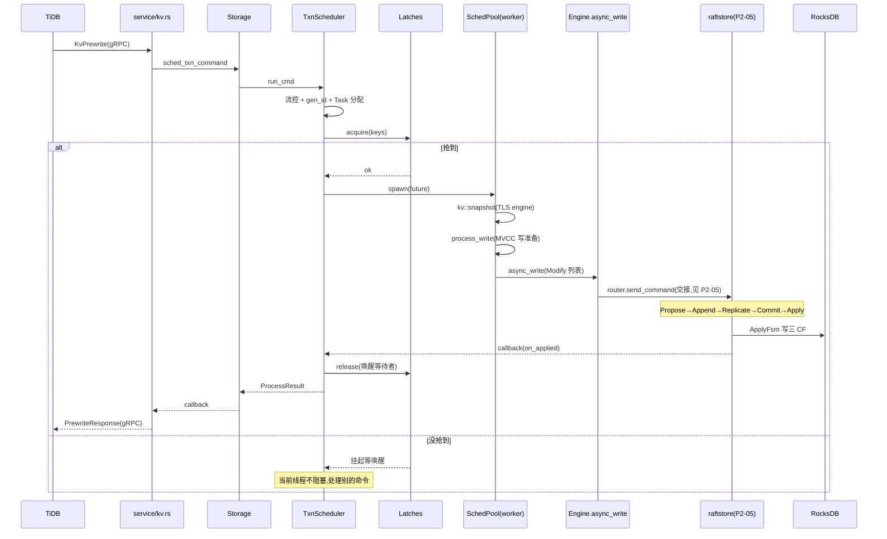

# 第 4 篇 · 第 12 章 · 事务模型全景:scheduler + latch + 双引擎

> **核心问题**:前面三篇都在讲"复制层"——一条写请求经 raftstore 的五步流水线(Propose → Append → Replicate → Commit → Apply),最终落盘到 RocksDB 的三个 CF。可 Raft 只保证**一个 Region 内**不丢不乱。现实里一个事务常常要改多个 key、跨多个 Region,这些 key 还可能落在**同一个 Region、同一台 TiKV** 上。于是出现一组新问题:TiDB 这个"事务协调者"把一条 prewrite 命令经 gRPC 发过来,TiKV 这边**谁接住、谁调度、谁排队、谁决定走乐观还是悲观**?同一行被两个事务同时改,在还没进 Raft 之前怎么避免互相打架(Propose 粒度太粗,真到 Raft 那一层冲突就晚了)?这一章拆 TiKV 事务层的"调度骨架":`TxnScheduler` 怎么把事务命令调度到 worker 线程、`latch` 怎么在 key 粒度排队、乐观与悲观双引擎怎么切换。

> **读完本章你会明白**:
> 1. 一条 prewrite/commit 命令从 `service/kv.rs` 到 `raftstore`,中间隔了一个 `TxnScheduler`——它不是简单的转发器,而是事务层的"调度中枢",负责 latch 排队、snapshot 取、命令执行、raft 写入、回调回收。
> 2. 为什么需要 `latch` 这一层"行级锁":Raft 提议的粒度是"一条 RaftCmdRequest"(可能含多个 key),且 Propose→Apply 是异步的;如果不先在 scheduler 层排队,两个改同一 key 的事务会几乎同时进 Raft,Apply 时才发现冲突——晚了,而且 latch 让"同行冲突"在单进程内本地排队,根本不消耗 Raft 配额。
> 3. `TxnScheduler` 怎么用 `SchedPool`(一个 yatp 线程池)把命令分发到 worker 线程,engine 通过 worker 线程的 TLS 拿到(为什么是 TLS 而不是字段)。
> 4. 乐观事务和悲观事务在 TiKV 这边**共用一套 prewrite 代码**(同一个 `Prewriter`),真正的"双引擎"体现在**悲观锁的三种模式**(Sync / Pipelined / InMemory)——特别是 InMemory 模式连 Raft 都不走,直接写 region 内存表,这是 8.x 之后为降低悲观锁延迟做的关键演进。
> 5. async commit 和 1PC 这两个 9.x 的"快路径"在 Prewrite 命令里只是两个开关字段(`secondary_keys` / `try_one_pc`),它们怎么在 P4-13 拆 prewrite 时生效。

> **如果一读觉得太难**:先只记住三件事——① 事务命令进 TiKV 先过 `TxnScheduler`,它做四件事:**latch 排队 → 取 snapshot → 执行命令(MVCC 写准备)→ 发起 raft 写**;② `latch` 是 key 哈希到 slot 的内存行锁,作用是"同一行的并发写在进 Raft 之前先排队",避免无谓的 Raft 冲突;③ 悲观事务的"双引擎"指悲观锁的三种落盘姿态(Sync 走完 Raft 才返回 / Pipelined Propose 后就返回 / InMemory 只写内存),乐观事务只有一种姿态。

---

## 〇、一句话点破

> **`TxnScheduler` 是事务层和复制层的"调度枢纽":它把 TiDB 发来的事务命令,经 latch 排队(避免同行并发进 Raft)、取 snapshot(看到一致的旧数据)、执行 MVCC 写准备(产出要写三个 CF 的 Modify 列表)、再交给 `engine.async_write` 发起 Raft 提议。乐观与悲观的区别不在 scheduler 骨架,而在悲观锁的落盘姿态——Sync / Pipelined / InMemory 三档,从"必须落盘"到"只走内存",换延迟换可靠性。**

这是结论,不是理由。本章倒过来拆:先看 TiDB 发来的命令怎么进 scheduler,再拆 latch 这一层的"为什么",接着拆 scheduler 的四步生命周期,然后看双引擎(乐观/悲观)的真身,最后把 async commit / 1PC 的开关点出来,为 P4-13 铺路。

---

## 一、命令从哪来:从 gRPC 到 TxnScheduler

### 提问:TiDB 的 prewrite 怎么变成 TiKV 内部的一条"命令"

第 2 篇(P2-05)我们看过一条写请求在 raftstore 里的五步旅程,但那时候我们把"事务层怎么准备这条写"当黑盒带过。现在拆开这个黑盒。

起点是 TiDB 经 gRPC 发来的 `KvPrewrite`。承接《gRPC》那本——HTTP/2 流、HPACK 头压缩这些不重复讲。`src/server/service/kv.rs` 收到 RPC 后,把 protobuf 请求解包,交给 `Storage`:

```rust
// src/server/service/kv.rs(简化示意,非源码原文)
// 收到 KvPrewrite 流式 RPC,逐条解包交给 Storage::sched_txn_command
```

`Storage` 是 TiKV 这边"对外存储能力"的总入口(`src/storage/mod.rs`)。它持有两套执行资源:

```rust
// src/storage/mod.rs:197-226(简化示意,只保留关键字段)
pub struct Storage<E: Engine, L: LockManager, F: KvFormat> {
    engine: E,
    sched: TxnScheduler<E, L>,          // 写/事务命令调度器(latch + sched pool)
    read_pool: ReadPoolHandle,          // 读路径独立线程池(Get/Scan/Coprocessor)
    concurrency_manager: ConcurrencyManager,
    // ...
}
```

注意这个二分:**写路径走 `sched`,读路径走 `read_pool`**。这不是冗余——写要排队(避免冲突)、要落盘(走 Raft),而读要高并发、不能被写阻塞,两者的执行模型完全不同,所以各跑各的线程池。

事务命令(prewrite、commit、acquire_pessimistic_lock、cleanup、resolve_lock 等)统一从一个入口进 scheduler:

```rust
// src/storage/mod.rs:1859
// The entry point of the storage scheduler. Not only transaction commands need
// to access keys serially.
pub fn sched_txn_command<T: StorageCallbackType>(
    &self,
    cmd: TypedCommand<T>,
    callback: Callback<T>,
) -> Result<()> {
```

注意这句注释——**"不仅是事务命令,凡需串行访问 key 的都走这里"**。这是 scheduler 存在的根:它不只是"事务调度器",它是"**所有需要按 key 串行化的写命令**的调度器"。

### Command 是什么:一个 enum 把所有事务命令统一

进 scheduler 之前,各种命令(prewrite/commit/...)已经被统一成一个 `Command` enum(`src/storage/txn/commands/mod.rs`):

```rust
// src/storage/txn/commands/mod.rs:93(简化示意,只列前几个变体)
pub enum Command {
    Prewrite(Prewrite),
    PrewritePessimistic(PrewritePessimistic),
    AcquirePessimisticLock(AcquirePessimisticLock),
    Commit(Commit),
    Cleanup(Cleanup),
    Rollback(Rollback),
    ResolveLock(ResolveLock),
    CheckTxnStatus(CheckTxnStatus),
    // ... 共 23 个变体
}
```

每种命令是一个独立的 struct,但都实现了 `CommandExt` trait(提供 `tag()`、`readonly()`、`write_bytes()`、`gen_lock()` 等公共方法),写命令再实现 `WriteCommand` trait(有 `process_write` 方法),读命令实现 `ReadCommand` trait(有 `process_read`)。

```rust
// src/storage/txn/commands/mod.rs:868
pub trait WriteCommand<S: Snapshot, L: LockManager>: CommandExt {
    fn process_write(self, snapshot: S, context: WriteContext<'_, L>) -> Result<WriteResult>;
}
```

> **钉死这件事**:这个设计的关键是"**统一调度、分派执行**"。`TxnScheduler::run_cmd` 不关心是 prewrite 还是 commit,它对 `Command` enum 一视同仁地排队、调度;真正的差异(选 Primary、写 lock、检查冲突)藏在每个命令 struct 自己的 `process_write` 里。这让 scheduler 的骨架极简,而每种命令的语义自成一体、可独立演进。

### run_cmd:scheduler 的总入口

```rust
// src/storage/txn/scheduler.rs:579
pub(in crate::storage) fn run_cmd(&self, cmd: Command, callback: StorageCallback) {
    let tag = cmd.tag();
    // write flow control
    if cmd.need_flow_control() && self.inner.too_busy(cmd.ctx().region_id) {
        Self::fail_with_busy(tag, callback.into());
        return;
    }
    // ... admission control ...
    let cid = self.inner.gen_id();
    if let Ok(task) = Task::allocate(cid, cmd, self.inner.memory_quota.clone()) {
        self.schedule_command(
            task,
            SchedulerTaskCallback::NormalRequestCallback(callback),
            None,
        );
    } else {
        Self::fail_with_busy(tag, callback.into());
    }
}
```

`run_cmd` 做三件前置事:① **流量控制**(`too_busy` 判断这个 Region 是不是写得太满,满了直接回 busy,不让进);② **分配命令 ID**(`gen_id` 给这条命令一个全局唯一 cid,后面 latch、task_slot、callback 全靠 cid 关联);③ **分配 Task**(`Task::allocate` 把命令、callback、内存配额打包成一个 Task)。做完这三件事,交给 `schedule_command`。

`schedule_command` 的第一件事是抢 latch——这就引出本章的核心问题。

---

## 二、为什么需要 latch:Raft 提议太粗了

### 提问:同一行被两个事务同时改,会怎样

考虑这个场景:事务 T1 要 `put(k, v1)`,事务 T2 也要 `put(k, v2)`,两个 prewrite 几乎同时到达同一个 TiKV(k 在同一个 Region)。如果没有 latch,会发生什么?

两个命令都进 `run_cmd`,都通过流量控制,都发起 Raft 提议。Raft 是**不关心"两个提议语义上冲突"**的——它只保证两个提议按某个顺序被复制、被 apply。可 apply 的时候,问题来了:两个提议都在改 k 的 MVCC 版本,后到的那个可能把先到的覆盖掉,或者更糟——两个提议各自看到对方还没 apply 的状态,产生**写偏序**(write skew)。

更隐蔽的问题是性能:**Propose→Apply 是异步的**。T1 的提议刚 Propose(还没 Apply),T2 的提议就进来了。T2 在执行 `process_write`(取 snapshot、准备 MVCC 写)时,它从 snapshot 里**读不到 T1 正在写的锁**(因为 T1 还没 Apply 到 RocksDB)。于是 T2 会以为 k 没锁,也去写——两个事务的 lock 在 Apply 阶段撞车,其中一个得回滚。

> **不这样会怎样**:如果不在 scheduler 层排队,每个写冲突都要等到 Apply 阶段(甚至客户端读到的锁冲突)才被发现。这有两个代价:① **浪费 Raft 配额**——两个注定冲突的提议都走完了完整的 Propose→Append→Replicate→Commit→Apply 五步,占用了 Leader、网络、磁盘 IO,最后其中一个还得回滚;② **正确性更难保证**——MVCC 的冲突检测依赖"读到一个一致的 snapshot",而 snapshot 是 propose 之前取的,如果不串行化,两个事务的 snapshot 可能互相看不见,产生异常隔离。

所以 TiKV 在事务命令进 Raft **之前**,加了一层 latch。

### 所以这样设计:latch 在 key 粒度排队

`latch` 是一个**纯内存的、key 粒度的行锁**。它不进 Raft、不落盘,只在 scheduler 这个进程内有效。它的作用一句话:**对涉及重叠 key 集的事务命令,强制它们在 scheduler 层串行执行**。

```rust
// src/storage/txn/latch.rs:153
/// Latches which are used for concurrency control in the scheduler.
///
/// Each latch is indexed by a slot ID, hence the term latch and slot are used
/// interchangeably, but conceptually a latch is a queue, and a slot is an index
/// to the queue.
pub struct Latches {
    slots: Vec<CachePadded<Mutex<Latch>>>,
    size: usize,
}
```

注意 `slots` 是一个 `Vec`,每个元素是一个 `CachePadded<Mutex<Latch>>`——`CachePadded` 是个填充字段,让每个锁占满一个或多个 CPU 缓存行(通常 64/128 字节),**避免伪共享**(false sharing:多个锁挤在一个缓存行上,一个线程改自己的锁会误把别的线程的锁数据也刷掉)。这是个典型的无锁/低竞争编程技巧,对标《Tokio》拆缓存行对齐那套。

key 怎么落到 slot?用哈希:

```rust
// src/storage/txn/latch.rs:266
#[inline]
fn lock_latch(&self, hash: u64) -> MutexGuard<'_, Latch> {
    self.slots[(hash as usize) & (self.size - 1)].lock()
}
```

`size` 是 2 的幂(构造时 `usize::next_power_of_two` 强制,见 `latch.rs:167`),所以 `hash & (size-1)` 等价于 `hash % size` 但更快(位与比取模快)。这是 2 的幂对齐的经典技巧。

每个 slot 里是一个 `Latch`,它本质是个**等待队列**:

```rust
// src/storage/txn/latch.rs:26
#[derive(Clone)]
struct Latch {
    // store hash value of the key and command ID which requires this key.
    pub waiting: VecDeque<Option<(u64, u64)>>,
}
```

队列元素是 `(key_hash, command_id)`。一个命令要改 key k,就把 `(hash(k), cid)` push 进 `hash(k)` 对应 slot 的队列。**排在队首的命令持有这个 key 的 latch,后面的命令都得等**。

### acquire:一次抢所有 key 的 latch

一个事务命令往往改多个 key(比如 prewrite 涉及 A、B、C 三个 key)。`acquire` 要**一次性把所有 key 的 latch 都抢到**,否则就阻塞:

```rust
// src/storage/txn/latch.rs:181
pub fn acquire(&self, lock: &mut Lock, who: u64) -> bool {
    let mut acquired_count: usize = 0;
    for &key_hash in &lock.required_hashes[lock.owned_count..] {
        let mut latch = self.lock_latch(key_hash);
        match latch.get_first_req_by_hash(key_hash) {
            Some(cid) => {
                if cid == who {
                    acquired_count += 1;        // 自己已经是队首,继续抢下一个
                } else {
                    latch.wait_for_wake(key_hash, who);  // 别人在前面,挂入等待
                    break;
                }
            }
            None => {
                latch.wait_for_wake(key_hash, who);   // 空队列,占住
                acquired_count += 1;
            }
        }
    }
    lock.owned_count += acquired_count;
    lock.acquired()
}
```

`lock.required_hashes` 是这个命令涉及的所有 key 的哈希(已排序去重)。`acquire` 从 `owned_count`(已持有的数量)开始往后抢。关键不变式在文件顶部注释里写得很清楚:

> `src/storage/txn/latch.rs:21-24`:
> If command A is ahead of command B in one latch, it must be ahead of command B in all the overlapping latches. This is an invariant ensured by the `gen_lock`, `acquire` and `release`.

**这个不变式是 latch 不死锁的根**。怎么保证?靠 `gen_lock` 在生成 `required_hashes` 时**对哈希排序去重**。两个命令 A、B,只要它们的 key 集合有重叠,那么在重叠的那些 slot 里,A 和 B 的入队顺序一定是同一个全局序决定的(因为 `schedule_command` 串行地调 `gen_lock` + `acquire`)。于是不会出现"A 在 slot1 排在 B 前面、B 在 slot2 排在 A 前面"这种死锁环。

> **钉死这件事(技巧)**:**latch 的无死锁,不是靠运行时检测,而是靠 `gen_lock` 排序 + 入队顺序一致这个静态不变式**。这是个精巧的设计——把死锁问题消解在数据构造阶段,而不是运行时 detection+prevention。Rust 的所有权系统在这里帮了大忙:`Lock` 持有 `required_hashes` 的所有权,排序一次后不再变动,后续 acquire/release 都基于这个不可变的顺序。

### release:放锁 + 唤醒等待者

命令执行完(无论成功失败),要释放 latch,并唤醒排在后面的命令:

```rust
// src/storage/txn/latch.rs:217
pub fn release(
    &self,
    lock: &Lock,
    who: u64,
    keep_latches_for_next_cmd: Option<(u64, &Lock)>,
) -> Vec<u64> {
```

它遍历 `lock.required_hashes`,对每个 hash 把自己从队首弹出(`pop_front`,见 `latch.rs:236`),然后看队列里下一个等待者是谁,加入 `wakeup_list` 返回。scheduler 收到 wakeup_list 后,会重新调度这些被唤醒的命令(再走一次 `acquire`)。

注意第三个参数 `keep_latches_for_next_cmd`——这是个优化:**有些命令执行完会紧接着发起下一条命令(比如 ResolveLock 读完后要 ResolveLock 写)**,如果完全释放再重新抢,有竞态(中间别人可能插进来)。这个参数允许"直接把 latch 转交给下一条命令",不唤醒队列,叫 `push_preemptive`(`latch.rs:256`)。这是 TiKV 为了减少 latch 抢占开销做的一个工程优化。

### 技巧精解:latch 与 Raft 的分工(本章最硬的洞察)

把 latch 和 Raft 放一起对比,是理解 TiKV 事务层的关键:

| 维度 | latch | Raft 提议 |
|------|-------|----------|
| 粒度 | key(哈希到 slot) | 一条 RaftCmdRequest(可含多 key) |
| 作用范围 | 单个 TiKV 进程内 | 跨副本(多台机器) |
| 是否持久化 | 不持久化(纯内存) | 持久化(RaftEngine)+ 复制 |
| 目的 | 避免同行写冲突**无谓地**进 Raft | 保证已提交的写**不丢、跨副本一致** |
| 失败代价 | 进程挂了 latch 全没(无所谓,没落盘的本来就该丢) | 副本挂少数派不影响 |

**两者不是替代,是接力**。latch 在"进 Raft 之前"做第一道冲突过滤(单进程内、key 粒度、极快);Raft 在"提交之后"做最终一致性保证(跨副本、持久)。一道命令要先过 latch(拿到 key 的"本地优先权"),再进 Raft(拿到"跨副本的持久化")。

> **不这样会怎样**:如果只有 Raft 没有 latch,每个写冲突都要走完完整五步流水线才在 Apply 阶段暴露,既浪费 Raft 配额(Leader、网络、磁盘都白忙),又让冲突检测变得依赖 Apply 后的状态(更复杂、更慢)。如果只有 latch 没有 Raft,那 latch 拿到的"优先权"只在单进程内有效,机器一挂就丢——没有持久化、没有跨副本一致性。**两者分工: latch 管"先来后到"的本地公平,Raft 管"不丢不乱"的跨副本持久**。

更妙的一点:**latch 让"乐观锁的冲突重试"变得廉价**。乐观事务的 prewrite 如果发现 key 已被别人锁住(latch 拿不到,或者 `load_lock` 看到 lock CF 有别人的锁),它直接在 scheduler 层返回锁冲突,客户端重试——根本没进 Raft。这就是为什么 TiDB 的乐观事务虽然叫"乐观"(提交时才检查),但冲突时的代价不高:冲突在 latch 这一层的早期就被拦截了,没浪费 Raft。

---

## 三、TxnScheduler 的四步生命周期

抢到 latch 之后,命令才真正开始执行。`TxnScheduler`(注意这个名字,不是老资料里的 `Scheduler`——9.x 已经改名,内层逻辑在 `TxnSchedulerInner`)对每条命令的处理可以拆成四步。

### 第 0 步:schedule_command 抢 latch

```rust
// src/storage/txn/scheduler.rs:651(简化示意)
let mut task_slot = self.inner.get_task_slot(cid);
let tctx = task_slot.entry(cid).or_insert_with(|| {
    self.inner.new_task_context(task, callback, prepared_latches)
});
if self.inner.latches.acquire(&mut tctx.lock, cid) {
    // 抢到了,立刻执行
    tctx.on_schedule();
    let task = tctx.task.take().unwrap();
    drop(task_slot);
    self.execute(task);
    return;
}
// 没抢到,挂在 latch 队列里等唤醒(不阻塞当前线程)
let task = tctx.task.as_ref().unwrap();
self.fail_fast_or_check_deadline(cid, task.cmd(), tracker_token);
```

注意"抢不到不阻塞"——`acquire` 返回 false 时,命令就**留在 `tctx` 里挂着**,当前线程立刻返回(去处理别的命令)。等将来别的命令 `release` 时把它唤醒,再走一次 `acquire`。这是异步的核心:**永远不阻塞调度线程**。

`task_slot` 是另一个分 shard 的 HashMap(`Vec<CachePadded<Mutex<HashMap<u64, TaskContext>>>>`,见 `scheduler.rs:241`),用 cid 分桶存 TaskContext。这也是为了避免单个全局 HashMap 的高竞争——分桶后,不同 cid 的操作落在不同桶,锁竞争摊薄。和 latch 的分 slot 思路如出一辙。

### 第 1 步:execute 把命令扔到 worker 线程池

抢到 latch 后,`execute` 不在调度线程里直接跑命令(那会阻塞调度),而是把命令**打包成一个 future,扔到 `SchedPool` 线程池**:

```rust
// src/storage/txn/scheduler.rs:884(简化示意)
self.get_sched_pool()
    .spawn(
        &request_source_for_spawn,
        metadata,
        priority,
        execution,        // 这个 future 里包含了取 snapshot + process_write + async_write
        write_bytes as u64,
    )
    .unwrap();
```

`SchedPool` 是个 yatp(yet another tokio pool 的变体,TiKV 自研的线程池)线程池,专门跑事务命令的执行。每个 worker 线程跑 future 时,engine 通过 **TLS(thread-local storage)** 拿到:

```rust
// src/storage/txn/scheduler.rs:824(注释很重要)
// The program is currently in scheduler worker threads.
// Safety: `self.inner.worker_pool` should ensure that a TLS engine exists.
match unsafe { with_tls_engine(|engine: &mut E| kv::snapshot(engine, snap_ctx)) }.await
```

> **技巧:为什么 engine 走 TLS 而不是 Scheduler 字段**?如果 engine 是 `TxnScheduler` 的字段,那它得是 `Arc<E>` 或者加锁——可 engine(RaftRouter 那一坨)是个**重对象、被高频访问**,每次 `async_write` 都要走 Arc 锁/原子计数,开销大。走 TLS 后,每个 worker 线程持有一份 engine 引用,**零竞争、零锁**地访问。代价是要 `unsafe`(编译器无法静态保证 TLS 已被初始化),但 TiKV 在线程池启动时保证初始化 TLS,运行时一定 sound。这是用 `unsafe` 换性能的典型场景,对标《Tokio》拆 TLS 那套。`TxnScheduler` struct 里只放了个 `_engine: PhantomData<E>`(`scheduler.rs:426`),标记泛型但不持有实例——engine 完全靠 TLS。

### 第 2 步:取 snapshot + process_write(MVCC 写准备)

worker 线程拿到 future 后,先取这个 Region 当前的一份 snapshot:

```rust
// src/storage/txn/scheduler.rs:826(简化)
match unsafe { with_tls_engine(|engine: &mut E| kv::snapshot(engine, snap_ctx)) }.await {
    Ok(snapshot) => { /* 进入 process_write */ }
    Err(err) => { self.finish_with_err(cid, err, ...); }
}
```

snapshot 是 RocksDB 的一个一致性视图(承接《LevelDB》那本的 LSM 快照概念)。**有了 snapshot,命令才能读到"这个时间点之前一致的数据"**——比如 prewrite 要检查"k 上有没有比 start_ts 更新的提交",得靠 snapshot 读 write CF。

拿到 snapshot 后,分流读/写命令:

```rust
// src/storage/txn/scheduler.rs:1369
if task.cmd().readonly() {
    self.process_read(snapshot, task, &mut sched_details);
} else {
    self.process_write(snapshot, task, &mut sched_details).await;
};
```

`readonly()` 由 `CommandExt` 提供,只有 `MvccByKey`/`MvccByStartTs`/`Pause` 这类纯探查命令覆写为 true。绝大部分事务命令(prewrite/commit/...)是写命令,走 `process_write`。

`process_write` 里调用命令自己的 `process_write` 方法(就是上一节说的 `WriteCommand` trait):

```rust
// src/storage/txn/scheduler.rs:1963(简化)
async fn process_write(&self, snapshot: E::Snap, task: Task, sched_details: &mut SchedulerDetails) {
    // ... 构造 MvccTxn、SnapshotReader、WriteContext ...
    let write_result = handle_task(...).await;   // 调命令的 process_write
    // ... 处理 WriteResult ...
}
```

每个命令的 `process_write` 干自己的活——prewrite 选 Primary 写 lock、commit 写 write CF 清 lock、cleanup 回滚。它们的产出统一是一个 `WriteResult`,里面含**要写三个 CF 的 Modify 列表**(由 `MvccTxn` 收集,见 P3-10)+ **要发起的 raft 写**。这一步是 MVCC 写准备,**还没真落盘**——真落盘是下一步。

(P4-13 会拆 prewrite 的 `process_write` 到源码级,P4-14 拆 commit,本章只看骨架。)

### 第 3 步:async_write 发起 Raft 提议

`process_write` 产出的 `WriteResult` 里有 `to_be_write`(要写的 Modify 列表)和 `rows`。scheduler 把它经 `engine.async_write` 发起 Raft 提议——**这就是 P2-05 拆过的"事务层把写交给复制层"的交接点**:

```rust
// src/storage/txn/scheduler.rs:1846
let async_write_start = Instant::now_coarse();
let mut res = unsafe {
    with_tls_engine(|e: &mut E| {
        e.async_write(&ctx, to_be_write, subscribed, Some(on_applied))   // L1849
    })
};
```

从这一行起,就进入了 P2-05 拆过的五步流水线(`engine.async_write` → `router.send_command` → PeerFsm propose → ready → Append/Replicate → Commit → Apply)。本章不重复。

### 第 4 步:回调回收 + 释放 latch

Apply 完成后(P2-05 拆过,ApplyFsm 触发 callback),callback 链一路回到 scheduler。scheduler 的收尾:

```rust
// src/storage/txn/scheduler.rs:953
fn on_write_finished(
    &self,
    cid: u64,
    pr: Option<ProcessResult>,
    result: EngineResult<()>,
    lock_guards: Vec<KeyHandleGuard>,
    pipelined: bool,
    async_apply_prewrite: bool,
    // ...
)
```

`on_write_finished` 做三件事:① **释放 latch**(`release_latches`,见 `scheduler.rs:616`,内部调 `self.inner.latches.release(&lock, cid, ...)`,并唤醒等待者);② **回收 TaskContext**(`dequeue_task_context`);③ **回调客户端**(`callback`(通过 `pr` 把 `ProcessResult` 带回去))。

错误路径走 `finish_with_err`(`scheduler.rs:896`),逻辑类似但带错误信息。

> **钉死这四步**:一条事务命令在 scheduler 里的生命周期是 **抢 latch → 扔 worker 池 → 取 snapshot + process_write → async_write 发起 raft → 回调 + 释放 latch**。每一步都有"为什么"——latch 是为了冲突前置过滤、worker 池是为了不阻塞调度、snapshot 是为了读一致视图、async_write 是事务层和复制层的解耦点、释放 latch 唤醒后来者是为了公平。这五步串起来,就是事务层"调度一条写"的完整骨架。

下面用一张时序图把 P4-12(scheduler)+ P2-05(raftstore)拼起来,标出各自的责任边界:



---

## 四、双引擎:乐观事务 vs 悲观事务

前面三节讲的是 scheduler 的通用骨架,乐观和悲观都走这套。但读者一定会问:**乐观事务和悲观事务到底有什么区别?** 这一节拆"双引擎"的真身。

### 先澄清一个误解:双引擎不在 scheduler 骨架,而在"加锁时机"

很多人以为"乐观 scheduler"和"悲观 scheduler"是两套代码。**不是**。`TxnScheduler` 对乐观 prewrite(`Prewrite`)和悲观 prewrite(`PrewritePessimistic`)一视同仁,都走 `run_cmd` → latch → `process_write` → `async_write`。真正的区别在两点:

1. **加锁时机**:乐观事务在**事务提交时**(prewrite 阶段)才加锁;悲观事务在**每条 SQL 执行时**(DML 之前先 `acquire_pessimistic_lock`)就加锁。这是 TiDB 协调者的策略,反映到 TiKV 就是两种不同的命令——`AcquirePessimisticLock` 和 `Prewrite/PrewritePessimistic`。
2. **悲观锁的落盘姿态**:悲观锁有**三种模式**(Sync / Pipelined / InMemory),这是 TiKV 这边真正的"双引擎"演进——为降低悲观锁延迟做的优化。

### 乐观 prewrite 和悲观 prewrite 共用 Prewriter

在 `commands/prewrite.rs` 里,`Prewrite`(乐观)和 `PrewritePessimistic`(悲观)是两个 struct,但都 `into_prewriter()` 转成同一个 `Prewriter` 再执行:

```rust
// src/storage/txn/commands/prewrite.rs:255
impl<S: Snapshot, L: LockManager> WriteCommand<S, L> for Prewrite {
    fn process_write(self, snapshot: S, context: WriteContext<'_, L>) -> Result<WriteResult> {
        self.into_prewriter().process_write(snapshot, context)
    }
}
```

为什么这么设计?文件顶部注释说得很清楚(`commands/prewrite.rs:4`):

> Functionality for handling optimistic and pessimistic prewrites. These are separate commands (although maybe they shouldn't be since there is only one protobuf), but handling of the commands is similar. We therefore have a single type (Prewriter) to handle both kinds of prewrite.

**两种 prewrite 的核心逻辑(选 Primary、写 lock、检查冲突)是相同的**,所以共用 `Prewriter`。差异只在细节:悲观 prewrite 要处理 `for_update_ts`(比 start_ts 更新的"锁竞争版本号")、要识别已有悲观锁(`is_pessimistic_lock`)、要处理"悲观锁丢失补锁"(`amend_pessimistic_lock`)。这些细节 P4-13 拆 prewrite 时会展开。

### 悲观锁的三种模式:Sync / Pipelined / InMemory

真正的"双引擎"演进,在悲观锁的落盘姿态。`scheduler.rs` 里定义了一个枚举:

```rust
// src/storage/txn/scheduler.rs:2402
enum PessimisticLockMode {
    // Return success only if the pessimistic lock is persisted.
    Sync,
    // Return success after the pessimistic lock is proposed successfully.
    Pipelined,
    // Try to store pessimistic locks only in the memory.
    InMemory,
}
```

判定逻辑在 `pessimistic_lock_mode`(`scheduler.rs:2190`),由两个配置位组合决定:

```rust
// src/storage/txn/scheduler.rs:2190(简化)
fn pessimistic_lock_mode(&self) -> PessimisticLockMode {
    if !self.inner.pipelined_pessimistic_lock.load(Ordering::Relaxed) {
        return PessimisticLockMode::Sync;       // 没开 pipelined,老老实实走 Raft
    }
    if self.inner.in_memory_pessimistic_lock.load(Ordering::Relaxed)
        && self.inner.store_id.can_enable(IN_MEMORY_PESSIMISTIC_LOCK)
    {
        return PessimisticLockMode::InMemory;   // pipelined + in_memory 都开,只写内存
    }
    PessimisticLockMode::Pipelined              // 只开 pipelined,Propose 后就返回
}
```

三档的含义和"为什么这么设计":

**Sync(经典)**:`AcquirePessimisticLock` 命令走完整的五步流水线(Propose→...→Apply),**Apply 到 RocksDB 的 lock CF 之后才返回成功给客户端**。最可靠(锁落盘了,机器挂了也不丢),但延迟最高(一次 Raft 往返 + 落盘)。早期 TiDB 默认就是这个。

**Pipelined(8.x 默认)**:`AcquirePessimisticLock` 命令 **Propose 成功(Raft 库接受这条提议)后立刻返回**,不等 Apply。注释在 `scheduler.rs:1882` 说得很清楚:

```rust
// src/storage/txn/scheduler.rs:1882(注释)
// The normal write process is respond to clients and release latches
// after async write finished. If pipelined pessimistic locking is enabled,
// the process becomes parallel and there are two msgs for one command:
//   1. Msg::PipelinedWrite: respond to clients
//   2. Msg::WriteFinished: deque context and release latches
// Currently, the only case that response is returned after finishing
// proposed phase is pipelined pessimistic lock.
```

**为什么这样能省时间**?因为悲观锁的"语义成功"不需要等 Apply——Propose 成功意味着这条提议已经被 Raft 接受,只要多数派活着它最终会 Apply(只要 leader 不换届丢日志,概率很低,丢了重试即可)。把"返回客户端"和"Apply 落盘"并行起来,**悲观锁的延迟从"一次 Raft 往返 + 落盘"降到"一次 Propose"**。这是 8.x 为降低悲观事务延迟做的关键优化。

> **不这样会怎样**:悲观事务每条 SQL 都要加锁,如果每个锁都走完完整五步(几十毫秒级),一个悲观事务跑十 条 SQL 就要几百毫秒,业务体感很慢。Pipelined 把锁延迟砍一半多,让悲观事务的体验接近乐观事务。

**InMemory(9.x 新)**:连 Propose 都不走,**直接写到 region 内存表**(`try_write_in_memory_pessimistic_locks`,`scheduler.rs:2133`)。触发逻辑在 `scheduler.rs:1617`:

```rust
// src/storage/txn/scheduler.rs:1617(简化)
if matches!(tag, CommandKind::acquire_pessimistic_lock | CommandKind::acquire_pessimistic_lock_resumed)
    && txn_scheduler.pessimistic_lock_mode() == PessimisticLockMode::InMemory
    && !is_shared_lock_cmd
    && !update_shared_lock
    && txn_scheduler.try_write_in_memory_pessimistic_locks(txn_ext.as_deref(), &mut to_be_write, &ctx)
{
    // 跳过 async_write,直接 on_write_finished
    txn_scheduler.on_write_finished(cid, Some(pr), Ok(()), lock_guards, ...);
}
```

**这是真正的"不走 Raft"**——悲观锁只写 region 的内存悲观锁表(`SchedTable`),不进 Raft 日志、不复制、不落盘。代价是**机器挂了锁就丢**(没持久化),所以只在"乐观可恢复"的场景下用:如果锁丢了,事务回退到乐观重试(prewrite 时 `amend_pessimistic_lock` 补锁)。这是用"丢失需重试"换"超低延迟(微秒级)"的极端优化。

> **演进对照(架构演进)**:Sync → Pipelined → InMemory,是一条"逐步放弃持久性换延迟"的演进线。早期 TiDB 全是 Sync(可靠但慢);8.x 引入 Pipelined(Propose 后返回,默认开);9.x 进一步引入 InMemory(只写内存,极端场景)。这三档对应不同的可靠性/延迟权衡,通过两个 AtomicBool 配置位动态切换。**这是 TiKV 事务层这几年的主要演进方向之一——降低悲观事务的锁延迟**。本书主线是经典 v1 + Sync/Pipelined,InMemory 作为 9.x 演进对照。

---

## 五、async commit 与 1PC:两个"快路径"开关

本章最后,点出两个 9.x 的重要优化,它们在 P4-13 拆 prewrite 时会真正生效,这里先建立概念。

### async commit:把两阶段变成一阶段半

经典 Percolator 是两阶段(prewrite + commit),客户端要发两轮 RPC。**async commit**(也叫 async pipelined commit)的目标:**prewrite 成功就算事务提交,省掉第二轮 commit RPC**。怎么做到?在 prewrite 时,把每个 key 的 `min_commit_ts` 算出来写进 lock,客户端拿到所有 key 的 `min_commit_ts` 的最大值作为 commit_ts,事务就算提交了——不再发 commit。

在 Prewrite struct 里,async commit 的开关是 `secondary_keys` 字段:

```rust
// src/storage/txn/commands/prewrite.rs:68
/// All secondary keys in the whole transaction (i.e., as sent to all nodes, not only
/// this node). Only present if using async commit.
secondary_keys: Option<Vec<Vec<u8>>>,
```

`secondary_keys.is_some()` 表示开启 async commit(因为 async commit 要在 primary lock 里记录所有 secondary keys,方便故障恢复时找 secondary 收尾)。

### 1PC:一个 Region 的事务直接提交

如果整个事务只涉及**一个 Region**,根本不用两阶段——直接在 prewrite 时把数据写进去(write CF 写提交记录),一步到位。开关是 `try_one_pc`:

```rust
// src/storage/txn/commands/prewrite.rs:71
/// When the transaction involves only one region, it's possible to commit the
/// transaction directly with 1PC protocol.
try_one_pc: bool,
```

两个字段怎么分派 CommitKind,在 `commands/prewrite.rs:591`:

```rust
// src/storage/txn/commands/prewrite.rs:591(简化)
let commit_kind = match (&self.secondary_keys, self.try_one_pc) {
    (_, true) => CommitKind::OnePc(self.max_commit_ts),
    (&Some(_), false) => CommitKind::Async(self.max_commit_ts),
    _ => CommitKind::TwoPc,    // 普通 2PC,本章及 P4-13 主线
};
```

注意优先级:**`try_one_pc=true` 优先于 async commit**。还有个 `max_commit_ts` 字段(`prewrite.rs:65`),它是 async commit / 1PC 的 commit_ts 上限(避免超过 schema 变更的时间戳,保证一致性)——这个约束在 P4-13 拆 `min_commit_ts` 计算时会看到(`CommitTsTooLarge` 错误,`actions/prewrite.rs:957`)。

> **钉死这件事(为 P4-13 铺路)**:这两个快路径不是另一套代码,而是 Prewrite struct 上的**两个开关字段**。prewrite 的主流程(选 Primary、写 lock、写 default、检查冲突)对所有模式都一样,只是 async commit / 1PC 在写 lock 时**额外记录 min_commit_ts 和 secondaries**,并跳过第二轮 commit。**P4-13 拆 prewrite 时,我们以普通 2PC 为主线讲透,然后点出这两个开关在哪些地方插入了额外逻辑**。这是 TiKV 事务层"在保持代码统一的前提下叠加优化"的工程范式。

---

## 六、技巧精解:两个最硬核的工程技巧

本章有两个技巧值得单独拆透:① latch 的无死锁设计;② engine 走 TLS。

### 技巧一:latch 的无死锁靠"排序不变式"

**问题**:多个事务并发抢多个 key 的 latch,怎么保证不死锁?

**朴素做法**:运行时做死锁检测(wait-for graph,发现环就回滚一个)。或者给每个 latch 加个超时,超时就放弃。这是数据库(比如 InnoDB)的传统做法。

**撞墙在哪**:

1. **wait-for graph 要全局视图**:得有个中心化的"谁在等谁"图,定期扫环。可 latch 是分散在 2^n 个 slot 上的,每次抢锁都要上报等待关系,通信开销大。
2. **超时粗暴**:超时回滚可能误杀本来很快能拿到的锁(前面那个命令马上就放)。
3. **正确性难证**:运行时检测总有窗口期,极端调度下可能漏。

**latch 的巧妙**:**根本不做运行时检测,靠数据构造阶段排序消除死锁**。具体说,`gen_lock`(在 `CommandExt` trait 里,每个命令 struct 用 `gen_lock!` 宏生成)对一个命令涉及的所有 key 哈希后**排序去重**,得到 `required_hashes: Vec<u64>`(单调递增)。`acquire` 按这个顺序抢。

关键不变式(文件顶部注释 `latch.rs:21-24`):**如果命令 A 在某个 latch 上排在命令 B 前面,那么在它们重叠的所有 latch 上,A 都排在 B 前面**。这个不变式一旦成立,就不可能形成等待环(A 等 B 且 B 等 A,意味着在某个 latch 上 A 在 B 前且 B 在 A 前,矛盾)。

不变式怎么保证?靠两点:① `gen_lock` 把 key 哈希排序,两个命令的重叠 key 在 `required_hashes` 里出现顺序一致;② `schedule_command` 串行地调 `gen_lock` + `acquire`,两个命令的入队顺序由一个全局序(scheduler 的调度序)决定。

```rust
// 简化示意(非源码原文)
// 命令 A 改 keys [k3, k1, k2] → gen_lock → required_hashes = [h(k1), h(k2), h(k3)] (排序)
// 命令 B 改 keys [k2, k4]     → gen_lock → required_hashes = [h(k2), h(k4)] (排序)
// A 和 B 都要抢 h(k2) 这个 slot,A 先 schedule 就先入队,B 在所有重叠 slot(k2) 上都排在 A 后面
// 不可能死锁
```

**为什么 sound**:死锁的必要条件是"循环等待"。循环等待要求存在一个 latch,A 在它上面等 B,同时存在另一个 latch,B 在它上面等 A。但不变式保证了 A、B 在所有重叠 latch 上顺序一致,循环不成立。**死锁被消解在数据构造阶段,而不是运行时**。

> **不这么设计会怎样**:如果 `required_hashes` 不排序,每个命令按自己 key 的原始顺序抢,那么 A 可能先抢 k1 再抢 k2,B 可能先抢 k2 再抢 k1——经典死锁。TiKV 的做法是把"消除死锁"的责任放在 `gen_lock`(一次性排序),换来 `acquire`/`release` 永远不用考虑死锁,代码极简。**这是把复杂度从热路径(运行时检测)转移到冷路径(构造时排序)的工程范式**,和无锁数据结构里"把同步开销挪到不可变构造"的思路同源。

### 技巧二:engine 走 TLS,零锁访问重对象

**问题**:`TxnScheduler` 要在 worker 线程里高频访问 engine(RaftRouter 那一坨,包含百万 Peer 的路由表),怎么避免锁开销?

**朴素做法**:`TxnScheduler` 持有 `engine: Arc<Mutex<E>>` 或 `Arc<E>`,每次访问加锁或走原子计数。

**撞墙在哪**:

1. **高频访问**:每个事务命令都要 `kv::snapshot(engine, ...)` 和 `engine.async_write(...)`,百万 QPS 下每次都走 Arc 原子计数(refcount inc/dec)或 Mutex,开销累积惊人。
2. **cache contention**:多个 worker 线程同时访问同一个 Arc,refcount 字段在 CPU 缓存行上被反复刷,引发 cache line bouncing,比单线程慢几十倍。

**TLS 的巧妙**:**engine 不存在 `TxnScheduler` 字段里,而是每个 worker 线程启动时初始化一份 TLS 引用**。worker 跑 future 时,`with_tls_engine` 直接从当前线程的 TLS 拿,零锁、零原子、零 cache 争用:

```rust
// src/storage/txn/scheduler.rs:824(注释 + 代码)
// The program is currently in scheduler worker threads.
// Safety: `self.inner.worker_pool` should ensure that a TLS engine exists.
match unsafe { with_tls_engine(|engine: &mut E| kv::snapshot(engine, snap_ctx)) }.await
```

`TxnScheduler` struct 里只放 `_engine: PhantomData<E>`(`scheduler.rs:426`)——PhantomData 只在编译期标记泛型 E,运行时不占空间。engine 完全靠 worker 线程的 TLS 提供。

**代价**:`with_tls_engine` 是 `unsafe`(TLS 访问编译器无法静态保证已初始化)。但 TiKV 在 `SchedPool` 启动时保证每个 worker 线程都初始化了 engine 的 TLS,运行时一定 sound。这是用 `unsafe` 换零开销访问的典型场景。

> **不这么设计会怎样**:`Arc<Mutex<E>>` 在百万 QPS 下会成为瓶颈(cache bouncing);即便用 `Arc<E>`(无锁但原子计数),refcount 抖动也浪费 CPU。TLS 把"共享重对象"变成"每线程一份引用",是高并发系统的标准技巧——对标《Tokio》拆 `CURRENT_THREAD` TLS、《Linux 内核》拆 per-CPU 变量。**Rust 的 unsafe 在这里不是"危险的逃生舱",而是"我比编译器懂不变式"的诚实声明**:TLS 初始化由线程池生命周期保证,编译器看不见这个跨函数不变式,所以TiKV 用 unsafe 标注,并在注释里写清楚 safety 条件。这是大型 Rust 系统的成熟用法。

---

## 七、章末小结

### 回扣主线

本章拆了事务层的"调度骨架"。回到二分法:

- **事务层**(本章主体):`TxnScheduler` + latch 是事务层的调度中枢,负责"把事务命令调度到 worker、按 key 串行化、执行 MVCC 写准备、发起 raft 写"。它**不直接管复制**,而是经 `engine.async_write` 把写交给复制层(P2-05)。
- **复制层**(下游):`engine.async_write` 之后就是 raftstore 的五步流水线,本章只点了交接点,不重复。
- **衔接点**:`engine.async_write`(`scheduler.rs:1849`)是事务层和复制层的边界,用 `Engine` trait 解耦(承接 P2-05)。

本章的承上启下:**承上**——P2-05 拆了复制层的五步流水线,把"事务层怎么准备这条写"当黑盒,本章拆开了这个黑盒,看到 scheduler 怎么调度、latch 怎么排队;**启下**——P4-13 拆 prewrite 的 `process_write`(选 Primary、写 lock、检查冲突),P4-14 拆 commit,P4-15 拆读和锁解决。本章是第 4 篇的"地图",后面三章是"逐个景点精讲"。

### 五个为什么

1. **为什么需要 latch 这一层,Raft 不够吗?**——Raft 提议粒度太粗(一条 Cmd 含多 key)、Propose→Apply 异步导致 snapshot 互相看不见;不先在 scheduler 层按 key 串行化,冲突要等 Apply 才暴露,浪费 Raft 配额且正确性复杂。latch 在进 Raft 之前做 key 粒度的本地排队。
2. **为什么 latch 不会死锁?**——靠 `gen_lock` 对 key 哈希排序去重的静态不变式:两个命令在重叠 latch 上入队顺序一致,不可能形成等待环。死锁被消解在数据构造阶段。
3. **为什么 engine 走 TLS 而不是 Scheduler 字段?**——engine 是重对象、被高频访问,走 Arc/Mutex 在百万 QPS 下 cache bouncing 严重;TLS 让每个 worker 线程零锁访问,代价是 unsafe(由线程池生命周期保证 sound)。
4. **为什么悲观锁有 Sync/Pipelined/InMemory 三档?**——逐步放弃持久性换延迟:Sync 最可靠最慢,Pipelined Propose 后返回(8.x 默认),InMemory 只写内存(9.x 极端优化)。对应不同的可靠性/延迟权衡,通过两个 AtomicBool 动态切换。
5. **为什么乐观和悲观 prewrite 共用 Prewriter?**——核心逻辑(选 Primary、写 lock、检查冲突)相同,差异只在 `for_update_ts` 和悲观锁补全等细节;共用代码避免重复,差异点局部化处理。这是 TiKV 在"统一骨架 + 局部差异"上的工程范式。

### 想继续深入往哪钻

- **想深入 prewrite 的 `process_write`(选 Primary、写 lock 的细节)**:读下一章 P4-13。
- **想深入 latch 的 release 唤醒机制和 keep_latches_for_next_cmd 优化**:读 [`src/storage/txn/latch.rs`](../tikv/src/storage/txn/latch.rs)(尤其 `release` 函数,L217)。
- **想深入悲观锁的三种模式(InMemory 的内存表实现)**:读 [`src/server/lock_manager/`](../tikv/src/server/lock_manager/) 和 P6-21(悲观锁与 CDC)。
- **想深入 async commit / 1PC 的完整链路**(包括 TiDB 协调者怎么算 commit_ts):读 TiDB 那边的 transaction.go,以及 P4-13 的 min_commit_ts 拆解。
- **关键源码文件**:
  - [`src/storage/txn/scheduler.rs`](../tikv/src/storage/txn/scheduler.rs)(TxnScheduler / TxnSchedulerInner / run_cmd / execute / on_write_finished / pessimistic_lock_mode)
  - [`src/storage/txn/latch.rs`](../tikv/src/storage/txn/latch.rs)(Latches / Lock / Latch / acquire / release)
  - [`src/storage/txn/commands/mod.rs`](../tikv/src/storage/txn/commands/mod.rs)(Command enum / WriteCommand / ReadCommand trait)
  - [`src/storage/mod.rs`](../tikv/src/storage/mod.rs)(Storage struct / sched_txn_command)
  - [`src/storage/txn/sched_pool.rs`](../tikv/src/storage/txn/sched_pool.rs)(SchedPool,线程池)

### 引出下一章

本章我们拆了事务层的调度骨架——`TxnScheduler` 怎么调度、latch 怎么排队、双引擎怎么切换。可骨架里最关键的"prewrite 的 `process_write` 到底干了什么",我们只用一句"MVCC 写准备"带过了。**Percolator 第一阶段——选一个 Primary Key、给所有涉及 key 写 lock、value 先写 default 但不提交——到底怎么在源码里实现?为什么一个 Primary 就能保证跨组 ACID(P0-01 已铺垫的洞察二,这里拆到源码级)?min_commit_ts 怎么算、约束检查怎么做?** 下一章 P4-13,我们拆这本招牌章。

> **下一章**:[P4-13 · Prewrite 预写:选 Primary,加锁](P4-13-Prewrite预写-选Primary加锁.md)
